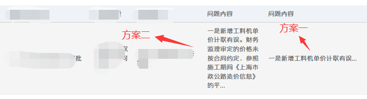

# 1、简单案例

这里使用了 Bootstrap 4.3.1、Bootstrap Table 1.15.3、FontAwesome 5.11.2、jQuery 3.3.1，下面是引用的 CSS 和 JS：

```html
<!-- Bootstrap CSS -->
<link rel="stylesheet" href="https://stackpath.bootstrapcdn.com/bootstrap/4.3.1/css/bootstrap.min.css">
<!--Bootstrap-table css-->
<link rel="stylesheet" href="https://unpkg.com/b ootstrap-table@1.15.3/dist/bootstrap-table.min.css">
<!--font-awesome css-->
<link rel="stylesheet" type="text/css" href="fontawesome-free-5.11.2-web/css/fontawesome.css"/>
<link rel="stylesheet" type="text/css" href="fontawesome-free-5.11.2-web/css/all.css">
<!-- jQuery first, then Popper.js, then Bootstrap JS -->
<script src="https://cdnjs.cloudflare.com/ajax/libs/jquery/3.3.1/jquery.min.js"></script>
<script src="https://cdnjs.cloudflare.com/ajax/libs/popper.js/1.14.7/umd/popper.min.js"></script>
<script src="https://stackpath.bootstrapcdn.com/bootstrap/4.3.1/js/bootstrap.min.js"></script>
<!--bootstrap-table-->
<script src="https://unpkg.com/bootstrap-table@1.15.3/dist/bootstrap-table.min.js"></script>
<script src="https://unpkg.com/bootstrap-table@1.15.3/dist/locale/bootstrap-table-zh-CN.min.js"></script>
```

注意：导入顺序很重要，Bootstrap Table 依赖 Bootstrap，所以 Bootstrap Table 的引用写在 Bootstrap 的后面！

在 `<body></body>` 里面定义一个 table

```html
<table id="table"></table>
```

然后就可以写 jQuery 了，简单的表格信息如下：

```javascript
$(function () {
        $('#table').bootstrapTable('destroy');   //动态加载表格之前，先销毁表格
        $('#table').bootstrapTable({
            url: '/list',
            columns: [
                {
                    field: 'checked',
                    checkbox: true,
                    formatter: function (value, row, index) {
                        return row.id;
                    }
                }, {
                    title: '序号',
                    formatter: function (value, row, index) {
                        return index + 1;
                    }
                }, {
                    title: '商品ID',
                    align: 'center'
                }, {
                    field: 'productName',
                    title: '商品名称',
                    sortable: true
                }, {
                    field: 'productWeight',
                    title: '商品重量(g)',
                    sortable: true
                }, {
                    field: 'productPrice',
                    title: '商品价格',
                    sortable: true
                }, {
                    field: 'productImage',
                    title: '商品图片'
                }, {
                    field: 'productClassify',
                    title: '商品分类'
                }, {
                    field: 'productRemark',
                    title: '备注'
                }]
        });
    });
```

此时会通过 `/list` 去获取 JSON 数据，默认请求方式是 `GET`，后台接口如下：

```java
@RestController
public class TableController {
    @Autowired
    private ProductService productService;
    
    /**
     * 查询所有的产品
     * 
     * @param order 排序
     * @return 产品集合
     */
    @GetMapping("/list")
    public List<Product> list(String order) {
        return productService.findAll(order);
    }
}
```

```java
@Service
public class ProductServiceImpl implements ProductService {
    @Autowired
    private ProductMapper productMapper;

    /**
     * 查询所有的产品
     *
     * @param order 排序
     * @return 产品集合
     */
    @Override
    public List<Product> findAll(String order) {
        return productMapper.findAll(order);
    }
}
```

```java
@Repository
public interface ProductMapper {
    /**
     * 查询所有的产品
     * @param order 排序
     * @return 产品集合
     */
    public List<Product> findAll(String order);
}
```

```xml
<?xml version="1.0" encoding="UTF-8" ?>
<!DOCTYPE mapper
        PUBLIC "-//mybatis.org//DTD Mapper 3.0//EN"
        "http://mybatis.org/dtd/mybatis-3-mapper.dtd">
<mapper namespace="com.table.mapper.ProductMapper">
    <resultMap id="product" type="com.table.pojo.Product">
        <id property="productID" column="product_ID"/>
        <result property="productName" column="product_name"/>
        <result property="productWeight" column="product_weight"/>
        <result property="productPrice" column="product_price"/>
        <result property="productClassify" column="product_classify"/>
        <result property="productImage" column="product_image"/>
        <result property="productRemark" column="product_remark"/>
    </resultMap>

    <select id="findAll" resultMap="product" parameterType="string">
        select 
        	product_ID,product_name,product_weight,product_price,product_classify,product_image,product_remark 
        from
        	product
        <if test="order != null">
            order by #{order}
        </if>
    </select>
</mapper>
```

<br>

# 2、文档

```javascript
$('#table').bootstrapTable({
    url: 'js/data.json',
    pagination: true,//开启分页
    search: true,	 //开启刷选
    columns: columns,
    ...
});
```

| 名称                   | 类型     | 标签                           | 默认                                                         | 描述                                                         |
| ---------------------- | -------- | ------------------------------ | ------------------------------------------------------------ | ------------------------------------------------------------ |
| -                      | String   | data-toggle                    | 'table'                                                      | 不用写 JavaScript 直接启用表格                               |
| classes                | String   | data-classes                   | 'table table-hover'                                          | 表格的类名称。默认情况下，表格是有边框的，可以添加 'table-no-bordered' 来删除表格的边框样式 |
| sortClass              | String   | data-sort-class                | undefined                                                    | 被排序的 td 标签的 class 名                                  |
| height                 | Number   | data-height                    | undefined                                                    | 定义表格的高度                                               |
| undefinedText          | String   | data-undefined-text            | '-'                                                          | 当数据为 undefined 时显示的字符                              |
| striped                | Boolean  | data-striped                   | false                                                        | 设置为 true 会有隔行变色效果                                 |
| sortName               | String   | data-sort-name                 | undefined                                                    | 定义排序列，通过url方式获取数据，填写字段名，否则填写下标    |
| sortOrder              | String   | data-sort-order                | 'asc'                                                        | 定义排序方式 'asc' 或者 'desc'                               |
| sortStable             | Boolean  | data-sort-stable               | false                                                        | 设置为 true 将获得稳定的排序，会添加 _position 属性到 row 数据中 |
| iconsPrefix            | String   | data-icons-prefix              | 'glyphicon'                                                  | 定义字体库 ('glyphicon' or 'fa')，使用 'fa' 时需引用 FontAwesome，并且配合 icons 属性实现效果 |
| icons                  | Object   | data-icons                     | { paginationSwitchDown:</br>'fa-caret-square-down', paginationSwitchUp: <br />'fa-caret-square-up',<br />refresh: 'fa-sync'<br/>toggleOff: 'fa-toggle-off'<br/>toggleOn: 'fa-toggle-on',<br/>columns: 'fa-th-list'<br />fullscreen: 'fa-arrows-alt',<br/>detailOpen: 'fa-plus’ <br/>detailClose: 'fa-minus' } | 自定义图标                                                   |
| iconSize               | String   | -                              | 'sm'                                                         | 设置修改图标 ，'sm'小图标，'lg'大图标                        |
| columns                | Array    | -                              | []                                                           | 列配置项，详情请查看 列参数 表格                             |
| data                   | Array    | -                              | []                                                           | 加载 json 格式的数据                                         |
| ajax                   | Function | data-ajax                      | undefined                                                    | 自定义 AJAX 方法，须实现 jQuery AJAX API                     |
| method                 | String   | data-method                    | 'GET'                                                        | 服务器数据的请求方式 'GET' or 'POST'                         |
| url                    | String   | data-url                       | undefined                                                    | 服务器数据的加载地址                                         |
| cache                  | Boolean  | data-cache                     | true                                                         | 设置为 false 禁用 AJAX 数据缓存                              |
| contentType            | String   | data-content-type              | 'application/json'                                           | 发送到服务器的数据编码类型                                   |
| dataType               | String   | data-data-type                 | 'json'                                                       | 服务器返回的数据类型                                         |
| ajaxOptions            | Object   | data-ajax-options              | {}                                                           | 提交ajax请求时的附加参数                                     |
| queryParams            | Function | data-query-params              | function ( params ) { <br/>     return params; <br/>}        | 请求服务器数据时，可以通过重写参数的方式添加一些额外的参数，例如 toolbar 中的参数，如果 queryParamsType = 'limit' ，返回参数必须包含: limit, offset, search, sort, order。否则需要包含: pageSize, pageNumber, searchText,  sortName, sortOrder。返回 false 将会终止请求 |
| queryParamsType        | String   | data-query-params-type         | 'limit'                                                      | 设置为 'limit' 则会发送符合 RESTFul 格式的参数               |
| responseHandler        | Function | data-response-handler          | function ( res ) {<br/>     return res; <br/>}               | 加载服务器数据之前的处理程序，可以用来格式化数据。 参数 res 为从服务器请求到的数据。 |
| pagination             | Boolean  | data-pagination                | false                                                        | 设置为 true 会在表格底部显示分页条                           |
| paginationLoop         | Boolean  | data-pagination-loop           | true                                                         | 设置为 true 启用分页条无限循环的功能                         |
| onlyInfoPagination     | Boolean  | data-only-info-pagination      | false                                                        | 设置为 true 只显示总数据数，而不显示分页按钮。需要 pagination = 'true' |
| sidePagination         | String   | data-side-pagination           | 'client'                                                     | 设置在哪里进行分页，可选值为 'client' 或者 'server'。设置 'server' 时，必须设置 服务器数据地址（url）或者重写 ajax 方法 |
| pageNumber             | Number   | data-page-number               | 1                                                            | 如果设置了分页，首页页码                                     |
| pageSize               | Number   | data-page-size                 | 10                                                           | 如果设置了分页，页面数据条数                                 |
| pageList               | Array    | data-page-list                 | [10, 25, 50, 100, All]                                       | 如果设置了分页，设置可供选择的页面数据条数。设置为 All 则显示所有记录 |
| selectItemName         | String   | data-select-item-name          | 'btSelectItem'                                               | 'radio' or 'checkbox' 的字段名                               |
| smartDisplay           | Boolean  | data-smart-display             | true                                                         | 自动根据网页容器高度计算出 pageSize 和pageList 的值          |
| escape                 | Boolean  | data-escape                    | false                                                        | 转义HTML字符串，将其直接显示出来                             |
| search                 | Boolean  | data-search                    | false                                                        | 是否启用搜索框                                               |
| searchOnEnterKey       | Boolean  | data-search-on-enter-key       | false                                                        | 设置为 true 时，按回车触发搜索方法，否则自动触发搜索方法     |
| strictSearch           | Boolean  | data-strict-search             | false                                                        | 设置为 true 启用 全匹配搜索，否则为模糊搜索                  |
| searchText             | String   | data-search-text               | ''                                                           | 初始化搜索文字                                               |
| searchTimeOut          | Number   | data-search-time-out           | 500                                                          | 设置搜索超时时间                                             |
| trimOnSearch           | Boolean  | data-trim-on-search            | true                                                         | 设置为 true 将允许空字符搜索，自动去除关键词两边空格         |
| showHeader             | Boolean  | data-show-header               | true                                                         | 是否显示列头                                                 |
| showFooter             | Boolean  | data-show-footer               | false                                                        | 是否显示列脚                                                 |
| showColumns            | Boolean  | data-show-columns              | false                                                        | 是否显示 内容列下拉框                                        |
| showRefresh            | Boolean  | data-show-refresh              | false                                                        | 是否显示 刷新按钮                                            |
| showToggle             | Boolean  | data-show-toggle               | false                                                        | 是否显示 切换试图（table/card）按钮                          |
| showPaginationSwitch   | Boolean  | data-show-pagination-switch    | false                                                        | 是否显示 数据条数选择框                                      |
| showFullscreen         | Boolean  | data-show-fullscreen           |                                                              | 控制是否显示全屏按钮，点击按钮表格会全屏展示                 |
| minimumCountColumns    | Number   | data-minimum-count-columns     | 1                                                            | 当列数小于此值时，将隐藏内容列下拉框。                       |
| idField                | String   | data-id-field                  | undefined                                                    | 指定主键列                                                   |
| uniqueId               | String   | data-unique-id                 | undefined                                                    | 为每一行指定唯一的标识符                                     |
| cardView               | Boolean  | data-card-view                 | false                                                        | 设置为 true 将显示 card 视图，适用于移动设备。否则为 table 视图，适用于pc |
| detailView             | Boolean  | data-detail-view               | false                                                        | 设置为 true 可以显示详细页面模式。                           |
| detailFormatter        | Function | data-detail-formatter          | function ( index, row ) {<br/>     return ''; <br/>}         | 格式化详细页面模式的视图。                                   |
| searchAlign            | String   | data-search-align              | 'right'                                                      | 指定 搜索框 水平方向的位置。'left' or 'right'                |
| buttonsAlign           | String   | data-buttons-align             | 'right'                                                      | 指定 按钮 水平方向的位置。'left' or 'right'                  |
| toolbarAlign           | String   | data-toolbar-align             | 'left'                                                       | 指定 toolbar 水平方向的位置。'left' or 'right'               |
| paginationVAlign       | String   | data-pagination-v-align        | 'bottom'                                                     | 指定 分页条 在垂直方向的位置。'top' or 'bottom' or 'bonth'   |
| paginationHAlign       | String   | data-pagination-h-align        | 'right'                                                      | 指定 分页条 在水平方向的位置。'left' or 'right'              |
| paginationDetailHAlign | String   | data-pagination-detail-h-align | 'left'                                                       | 指定 分页详细信息 在水平方向的位置。'left' or 'right'        |
| paginationPreText      | String   | data-pagination-pre-text       | '<'                                                          | 指定分页条中上一页按钮的图标或文字                           |
| paginationNextText     | String   | data-pagination-next-text      | '>'                                                          | 指定分页条中下一页按钮的图标或文字                           |
| clickToSelect          | Boolean  | data-click-to-select           | false                                                        | 设置 true 将在点击行时，自动选择 rediobox 和 checkbox        |
| singleSelect           | Boolean  | data-single-select             | false                                                        | 设置 true 将禁止多选                                         |
| toolbar                | String   | data-toolbar                   | undefined                                                    | 一个 jQuery 选择器，指明自定义的toolbar，例如：#toolbar、 .toolbar |
| checkboxHeader         | Boolean  | data-checkbox-header           | true                                                         | 设置 false 将在列头隐藏 check-all checkbox                   |
| maintainSelected       | Boolean  | data-maintain-selected         | false                                                        | 设置为 true 在点击分页按钮或搜索按钮时，将记住 checkbox 的选择项 |
| sortable               | Boolean  | data-sortable                  | true                                                         | 设置为 false 将禁止所有列的排序                              |
| silentSort             | Boolean  | data-silent-sort               | true                                                         | 设置为 false 将在点击分页按钮时自动记住排序项。仅在 sidePagination 设置为 server 时生效 |
| rowStyle               | Function | data-row-style                 | function ( row, index ) {<br/>     return class; <br/>}      | 自定义行样式 参数：row: 行数据，index: 行下标，返回值可以为 class 或者 css |
| rowAttributes          | Function | data-row-attributes            | function ( row, index ) {<br/>     return attributes; <br/>} | 自定义行属性 参数为：row : 行数据，index: 行下标，返回值可以为 class 或者 css 支持所有自定义属性 |
| customSearch           | Function | data-custom-search             | $.noop                                                       | 执行自定义搜索功能而不是内置搜索功能，需要一个参数：text：搜索文本，如：<br />function customSearch ( text ) { } |
| customSort             | Function | data-custom-sort               | $.noop                                                       | 执行自定义排序函数而不是内置排序函数，有三个参数：sortName：排序名称，sortOrder：排序顺序，data：获取的原始数据，如:<br />function customSort ( sortName, sortOrder， data ) { } |

<br>

## 2.1、列参数

```javascript
var columns = [{
            field: 'Id',
            title: '编号'
        }, {
            field: 'ProductName',
            title: '产品名称'
        }, {
            field: 'StockNum',
            title: 'Item 库存'
        }];
```

| 名称            | 标签                   | 类型     | 默认      | 描述                                                         |
| --------------- | ---------------------- | -------- | --------- | ------------------------------------------------------------ |
| radio           | data-radio             | Boolean  | false     | 是否显示单选 radio                                           |
| checkbox        | data-checkbox          | Boolean  | false     | 是否显示多选 checkbox                                        |
| field           | data-field             | String   | undefined | 该列映射的 data 的参数名                                     |
| title           | data-title             | String   | undefined | 该列的表头名                                                 |
| titleTooltip    | data-title-tooltip     | String   | undefined | 该列表头的 title 提示文本                                    |
| class           | class / data-class     | String   | undefined | 该列的 class                                                 |
| rowspan         | rowspan / data-rowspan | Number   | undefined | 合并单元格时定义合并多少行                                   |
| colspan         | colspan / data-colspan | Number   | undefined | 合并单元格时定义合并多少列                                   |
| align           | data-align             | String   | undefined | 表格数据的对齐方式，'left'，'right'，'center'                |
| halign          | data-halign            | String   | undefined | 表格头部列名对齐方式，'left'，'right'，'center'              |
| falign          | data-falign            | String   | undefined | 表格底部列对齐方式，'left'，'right'，'center'                |
| valign          | data-valign            | String   | undefined | 垂直方向对齐方式，'top'，'middle'，'bottom'                  |
| width           | data-width             | Number   | undefined | 列的宽度，注意这里是数字类型不带单位 px 或者 %               |
| widthUnit       | data-widthUnit         | String   | undefined | 列的宽度的单位，如 px 或 %，widthUnit: "px"                  |
| sortable        | data-sortable          | Boolean  | false     | 该列是否排序（表头显示双箭头）                               |
| order           | data-order             | String   | 'asc'     | 该列默认的排序方式， 'asc' or 'desc'                         |
| visible         | data-visible           | Boolean  | true      | 该列是否可见                                                 |
| cardVisible     | data-card-visible      | Boolean  | true      | 在 card 视图里是否可见                                       |
| switchable      | data-switchable        | Boolean  | true      | 列切换是否可见                                               |
| clickToSelect   | data-click-to-select   | Boolean  | true      | 当该列被选择时，是否选中 checkbox 或者 radio                 |
| checkboxEnabled | data-checkboxEnabled   | Boolean  | true      | checkboxEnabled：false，设为 false 禁用复选框列              |
| formatter       | data-formatter         | Function | undefined | 格式化单元格内容，function ( value, row, index )，value：该 cell 本来的值，row：该行数据，index：该行序号（从 0 开始） |
| footerFormatter | data-footer-formatter  | Function | undefined | 格式化 footer 内容，function ( rows )，rows：所有行数据      |
| events          | data-events            | Object   | undefined | The cell 的事件监听，当使用 formatter function 的时候，有三个参数：event：the jQuery event，value：该cell的值，row：该行的数据，index：该行的序号 |
| sorter          | data-sorter            | Function | undefined | 自定义字段排序函数，function ( a, b )                        |
| sortName        | data-sort-name         | String   | undefined | 当列中有 html 等标签时，只排序实际内容（忽略标签和样式），例如字段为："abc"，则 sortName = abc |
| cellStyle       | data-cell-style        | Function | undefined | 单元格样式，支持 css 和 classes，function ( value, row, index )，value：该cell的值，row：该行的数据，index：该行的序号 |
| searchable      | data-searchable        | Boolean  | true      | 搜索时是否搜索此列                                           |
| searchFormatter | data-search-formatter  | Boolean  | true      | 搜索是否使用格式化后的数据（即显示在页面上的数据）           |

<br>

## 2.2、事件

```javascript
$('#table').bootstrapTable({
    onEventName: function (arg1, arg2, ...) {
    // ...
    }
});

$('#table').on('event-name.bs.table', function (e, arg1, arg2, ...) {
// ...
});
```

| Option 事件      | jQuery 事件              | 参数                          | 描述                                                         |
| ---------------- | ------------------------ | ----------------------------- | ------------------------------------------------------------ |
| onAll            | all.bs.table             | name，args                    | 所有的事件都会触发该事件，参数包括： <br />name：事件名 <br />args：事件的参数 |
| onClickRow       | click-row.bs.table       | row，$element，field          | 当用户点击某一行的时候触发，参数包括： <br />row：点击行的数据 <br />$element：tr 元素 <br />field：点击列的 field 名称 |
| onDblClickRow    | dbl-click-row.bs.table   | row，$element，field          | 当用户双击某一行的时候触发，参数包括： <br />row：点击行的数据 <br />$element：tr 元素 <br />field：点击列的 field 名称 |
| onClickCell      | click-cell.bs.table      | field，value，row，$element   | 当用户点击某一列的时候触发，参数包括： <br />field：点击列的 field 名称 <br />value：点击列的 value 值 <br />row：点击列的整行数据 <br />$element：td 元素 |
| onDblClickCell   | dbl-click-cell.bs.table  | field，value， row， $element | 当用户双击某一列的时候触发，参数包括： <br />field：点击列的 field 名称 <br />value：点击列的 value 值 <br />row：点击列的整行数据 <br />$element：td 元素 |
| onSort           | sort.bs.table            | name，order                   | 当用户对列进行排序时触发，参数包含： <br />name：排序列字段名 <br />order：排序列的顺序 'desc' or 'asc' |
| onCheck          | check.bs.table           | row，$element                 | 当用户点击选择行时触发，参数包含： <br />row：与单击的行对应的记录<br />$element：选中DOM元素 |
| onUncheck        | uncheck.bs.table         | row，$element                 | 在用户取消选中行时触发，参数包含：  <br />row：与单击的行对应的记录 <br />$element：取消选中DOM元素 |
| onCheckAll       | check-all.bs.table       | rowsAfter，rowsBefore         | 当用户检查所有行时触发，参数包含： <br />rowsAfter：数组，返回全选后全部选中的数据<br>rowsBefore：全选前的数据<br>rowsBefore 在1.41之前此参数无效，1.52之后有效 |
| onUncheckAll     | uncheck-all.bs.table     | rowsAfter，rowsBefore         | 当用户取消选中所有行时触发，参数包含： <br />rowsAfter：取消全选后全部选中的数据<br>rowsBefore：取消全选前的数据<br>rowsBefore 在1.41之前此参数无效，1.52之后有效 |
| onCheckSome      | check-some.bs.table      | rows                          | 当用户检查某些行时触发，参数包含：  <br />rows：与先前检查的行对应的记录数组 |
| onUncheckSome    | uncheck-some.bs.table    | rows                          | 当用户取消选中某些行时触发，参数包含： <br />rows：与先前检查的行对应的记录数组 |
| onLoadSuccess    | load-success.bs.table    | data                          | 在成功加载远程数据时触发                                     |
| onLoadError      | load-error.bs.table      | status                        | 在加载远程数据时发生某些错误时触发                           |
| onColumnSwitch   | column-switch.bs.table   | field，checked                | 切换列可见时触发<br>field：选中的列名称 字段名称<br>checked：是否显示该列 true 显示 false 不显示 |
| onColumnSearch   | column-search.bs.table   | field，text                   | 在按列搜索时触发                                             |
| onPageChange     | page-change.bs.table     | number，size                  | 当用户点击下一页上一页或页码时触发<br>number：当前第几页<br/>size：每页显示多少行数据 |
| onSearch         | search.bs.table          | text                          | 在搜索表时触发<br/>text：用户输入的关键词                    |
| onToggle         | toggle.bs.table          | cardView                      | 切换表视图时触发<br/>cardView：卡片状态 true 卡片视图 false 表格视图 |
| onPreBody        | pre-body.bs.table        | data                          | 在 bootstrap table 表格的 body 渲染之前执行的事件，<br>可以利用该事件对数据进行拦截、刷选、处理，该事件参数返回需要渲染的 data 数据 |
| onPostBody       | post-body.bs.table       | data                          | 在 bootstrap table 表格的 body 渲染之后执行的事件，该事件参数返回需要渲染的data数据 |
| onPostHeader     | post-header.bs.table     | none                          | 在表头渲染之后触发，并在DOM中可用                            |
| onExpandRow      | expand-row.bs.table      | index，row，$detail           | 当点击详细图标展开详细页面的时候触发 <br />index：被展开行的索引行号，从0开始<br/>row：行的原始数据如 {id:1, name:'itxst'}<br/>$detail：被展开的详情 jQuery 对象 |
| onCollapseRow    | collapse-row.bs.table    | index，row，$detail           | 当点击详细图片收起详细页面的时候触发<br />index：被收起行的索引行号，从0开始<br/>row：行的原始数据如 {id:1, name:'itxst'}<br/>$detail：被收起的详情 jQuery 对象 |
| onRefreshOptions | refresh-options.bs.table | options                       | 在刷新配置选项时触发，调用如下方法时触发：<br> $('#table').bootstrapTable('refreshOptions', {}) |
| onRefresh        | refresh.bs.table         | params                        | 单击刷新按钮后触发                                           |

<br>

## 2.3、方法

```javascript
//第一步，获取对象（即jQuery对象）
var $table = $('#table');
//第二步，调用bootstrap table方法
var result=$table.bootstrapTable('方法名称',参数1,参数2,.....);
var result=$table.bootstrapTable('方法名称',{field1:value1,field2:value2,.....});
```

| 名称                 | 参数           | 描述                                                         |
| -------------------- | -------------- | ------------------------------------------------------------ |
| getOptions           | none           | 返回表格的 Options                                           |
| getSelections        | none           | 返回所选的行，当没有选择任何行的时候返回一个空数组           |
| getAllSelections     | none           | 返回所有选择的行，包括搜索过滤前的，当没有选择任何行的时候返回一个空数组 |
| getData              | options        | 获取表格数据（旧版本只有 useCurrentPage 一个参数，不需要对象直接填 true 或 false）<br>useCurrentPage：设置为 true 获取当前页码的数据，设置为 false 获取表格全部页码的数据<br>includeHiddenRows：设置 true 包含隐藏行的数据，设置 false 不包含隐藏行的数据 |
| getRowByUniqueId     | id             | 根据 uniqueId 获取行数据                                     |
| load                 | data           | 加载数据到表格中，旧数据会被替换                             |
| showAllColumns       | none           | 显示所有列                                                   |
| hideAllColumns       | none           | 隐藏所有列                                                   |
| append               | data           | 追加数据到表格末尾                                           |
| prepend              | data           | 追加数据到表格头部                                           |
| remove               | options        | 从表格中删除数据，包括两个参数： <br />field：根据那个字段来删除，如ID字段 <br />values：根据这个字段哪些值来删除，如把 id 为 2 的数据删除 |
| removeAll            | none           | 删除表格所有数据                                             |
| removeByUniqueId     | id             | 根据 uniqueId 删除指定的行                                   |
| insertRow            | options        | 插入新行，参数包括： <br />index：需要把数据插入到那以后，从 0 开始 <br />row：行数据对象，比如 {id:1,name:"丽莎"} |
| updateRow            | options        | 更新指定的行，参数包括： <br />index：需要更新的数据索引，从 0 开始 <br />row：新的行数据对象，比如 {id:1,name:"丽莎"}<br>replace：可选项，新的数据对象是否替换旧的对象，设置 true 直接替换，设置 false 合并对象，默认为 false |
| updateByUniqueId     | options        | 根据唯一 Id 更新行数据，参数包括： <br />id：唯一字段（主键字段）对应的值 <br />row：新的行数据对象，比如 {id:1,name:"丽莎"}<br/>replace：可选项，新的数据对象是否替换旧的对象，设置 true 直接替换，设置 false 合并对象，默认为 false |
| showRow              | options        | 显示指定的行，参数包括： <br />index：行索引 0 开始，需要显示的行 <br />uniqueId：唯一字段值 |
| hideRow              | options        | 显示指定的行，参数包括： <br />index：行索引 0 开始，需要隐藏的行 <br />uniqueId：唯一字段值 |
| getHiddenRows        | show           | 获取隐藏的行，如果参数传入 true 会把隐藏的行显示但是不会返回隐藏的行 |
| mergeCells           | options        | 将某些单元格合并到一个单元格，选项包含以下属性： <br />index：从第几行开始合并索引<br />field：字段从哪一列开始合并<br />rowspan：要合并的 rowspan 数量<br />colspan：要合并的 colspan 数量 |
| updateCell           | options        | 更新一个单元格，包含以下属性： <br />index：行索引0开始，需要更新哪行数据<br />field：字段名称<br />value：新字段值 |
| updateCellByUniqueId | options        | 唯一字段更新单元格数据，包含以下属性： <br />id：唯一字段（或主键）对应的值<br />field：需要更新的字段<br />value：该字段需要被更新的值 |
| refresh              | options        | 刷新远程服务器数据，可以设置` {silent：true} `以静默方式刷新数据，并设置` {url：newUrl} `更改URL。 要提供特定于此请求的查询参数，请设置` {query：{foo：’bar’}}` |
| refreshOptions       | options        | 刷新选项<br>例：把每页显示 2 条数据更新为每页显示 5 条数据<br>$('#table').bootstrapTable('refreshOptions', {pageSize:5}); |
| resetSearch          | text           | 设置搜索文本<br>text：设置搜索框的值，也可以不设置           |
| showLoading          | none           | 显示加载状态                                                 |
| hideLoading          | none           | 隐藏加载状态                                                 |
| checkAll             | none           | 选中所有行的方法，注如果有分页只会全部选中当前页，而不是选中全部页码的数据 |
| uncheckAll           | none           | 反选所有行的方法，注如果有分页只会反选当前页，而不是选中全部页码的数据 |
| check                | index          | 检查一行，行索引从0开始                                      |
| uncheck              | index          | 取消选中一行，行索引从0开始                                  |
| checkBy              | options        | 根据条件选中行<br />field：根据那个字段来选中行<br />values：据这个字段的哪些值来选中 <br />例： 选中Id为1和23的行 <br>$('#table').bootstrapTable('checkBy', {field: 'Id', values:[1, 23]}); |
| uncheckBy            | options        | 根据条件取消选中行 <br />field：根据那个字段来取消选中行<br />values：据这个字段的哪些值来取消选中，格式：[1,51,18] <br />例:  取消选中Id为1和23的行<br>$('#table').bootstrapTable('uncheckBy', {field: 'Id', values:[22,23]}); |
| checkInvert          | none           | 反选                                                         |
| resetView            | options        | 重置引导表视图，例如重置表高度<br>$('#table').bootstrapTable('resetView',{height:200}); |
| resetWidth           | none           | 调整页眉和页脚的大小以适合当前列宽度                         |
| destroy              | none           | 注销表格                                                     |
| showColumn           | field          | 显示指定的列                                                 |
| hideColumn           | field          | 隐藏指定的列                                                 |
| getHiddenColumns     | none           | 获取隐藏的列                                                 |
| getVisibleColumns    | none           | 获取可见列                                                   |
| scrollTo             | value，options | 滚动滚动条到指定位置，可以设置 px 或者行的索引来实现，参数 options 或 value 二选一<br>value： 需要滚动到的位置，单位为px，如果设置为bottom表示滚动到底部<br>options：{unit: 'px', value: 100} 滚动到100px 位置，{unit: 'rows', value: 6} 滚动到第 6 行 |
| getScrollPosition    | none           | 获取当前滚动条的位置，单位为 px                              |
| filterBy             | options        | （只能用于 client 端）过滤表格数据， 可以通过过滤`{age: 10}`来显示 age 等于 10 的数据 |
| selectPage           | page           | 跳到指定的页                                                 |
| prevPage             | none           | 跳到上一页                                                   |
| nextPage             | none           | 跳到下一页                                                   |
| togglePagination     | none           | 隐藏显示分页                                                 |
| toggleFullscreen     | none           | 全屏显示或取消全屏显示                                       |
| toggleView           | none           | 切换 card/table 视图                                         |
| expandRow            | index          | 如果详细视图选项设置为 True，请展开具有通过参数传递的索引的行 |
| collapseRow          | index          | 如果详细视图选项设置为 True，则折叠具有通过参数传递的索引的行 |
| expandAllRows        | is subtable    | 如果详细视图选项设置为 True，请展开所有行                    |
| collapseAllRows      | is subtable    | 如果详细信息视图选项设置为 True，则折叠所有行                |

<br>

# 3、图标

在做网页开发中，前端页面显示时经常会用到字体库图标，如 iconfont，fontawesome，glyphicons，lonicons 等。这里使用 fontawesome，下载地址：https://fontawesome.com/download

<br>

**基于 SVG 格式,使用 JS 调用图标**

压缩包中含有 v4-shims.js 文件。这个是为了兼容 4.x 版本的升级使用。如果已有 4.x 版本的项目，想更换成 svg 图标，那么需要额外调用 v4-shims.js或 v4-shims.min.js 文件。以保证兼容性。

若想引入所有图标:

```html
<script src="all.js"></script>
```

若只需要引入 solid 系的图标:

```html
<script src="solid.min.js"></script>
<!-- 在调用solid,brand,regular系js时都要调用的文件 -->
<script src="fontawesome.min.js"></script>
```

使用 js 方式调用的图标，最终在 DOM 中会以 svg 代码显示图标。

<br>

**基于网页字体,使用 CSS 调用图标**

CSS 方法要调用两组文件,一个是 css(或 less 或 scss) 样式表, 另一组是图标字体文件。即 css 方法调用时，实际上要用到的是 **css 文件夹及 webfonts 文件夹**里的文件。

若引入所有图标:

```html
<link rel="stylesheet" href="all.css">
```

若只想引入brand的图标:

```html
<link rel="stylesheet" href="brands.min.css">
<!-- 在调用solid,brand,regular系css时都要调用的文件 -->
<link rel="stylesheet" href="fontawesome.min.css">
```

使用 css 方式调用图标，以网页字体的方式显示，则 DOM 结构内没有 svg 代码。

<br>

# 4、扩展 

## 4.1、页脚合并

首先在 columns 里面定义 footerFormatter：

```javascript
footerFormatter: function (rows) {
    let sum = 0;
    for (let i = 0; i < rows.length; i++) {
        sum += rows[i].productPrice;
    }
    return sum;
}
```

然后在 columns 下面实现 onPostBody 方法，进行合并处理：

```javascript
onPostBody: function () {
    //获取table表中footer 并获取到这一行的所有列
    let footer_tr = $('.fixed-table-body table tfoot tr');
    let footer_th = footer_tr.find('>th');
    //遍历隐藏中间的列 下标从1开始
    for (let i = 1; i < footer_th.length - 5; i++) {
        footer_th.eq(i).hide();
    }
    //设置跨列
    footer_th.eq(0).attr('colspan', footer_th.length - 5).show();
}
```

<br>

## 4.2、行内编辑

**思路一**

Bootstrap 的添加和修改数据都是通过模态框实现的，现在需要将其改为点击行来编辑。

```html
<div class="table-box" style="margin: 20px;">
    <div id="toolbar">
        <button id="button" class="btn btn-default">insertRow</button>
        <button id="getTableData" class="btn btn-default">getTableData</button>
    </div>
    <table id="table"></table>
</div>
```

```javascript
$(function() {
    let $table = $('#table');
    let $button = $('#button');
    let $getTableData = $('#getTableData');

    $button.click(function() {
        $table.bootstrapTable('insertRow', {
            index: 0,
            row: {
                id: '',
                name: '',
                price: ''
            }
        });
    });

    $table.bootstrapTable({
        url: 'data2.json',
        toolbar: '#toolbar',
        clickEdit: true,
        showToggle: true,
        pagination: true,       //显示分页条
        showColumns: true,
        showPaginationSwitch: true,     //显示切换分页按钮
        showRefresh: true,      //显示刷新按钮
        //clickToSelect: true,  //点击row选中radio或CheckBox
        columns: [{
            checkbox: true
        }, {
            field: 'id',
            title: 'Item ID'
        }, {
            field: 'name',
            title: 'Item Name'
        }, {
            field: 'price',
            title: 'Item Price'
        }, ],
        /**
         * @param {点击列的 field 名称} field
         * @param {点击列的 value 值} value
         * @param {点击列的整行数据} row
         * @param {td 元素} $element
         */
        onClickCell: function(field, value, row, $element) {
            $element.attr('contenteditable', true);
            $element.blur(function() {
                let index = $element.parent().data('index');
                let tdValue = $element.html();

                saveData(index, field, tdValue);
            })
        }
    });

    $getTableData.click(function() {
        alert(JSON.stringify($table.bootstrapTable('getData')));
    });

    function saveData(index, field, value) {
        $table.bootstrapTable('updateCell', {
            index: index,       //行索引
            field: field,       //列名
            value: value        //cell值
        })
    }

});
```

```json
[
    { "id": 1, "name": "Item 1", "price": "￥1" },
    { "id": 2, "name": "Item 2", "price": "￥2" },
    { "id": 3, "name": "Item 3", "price": "￥3" }
]
```

**实现原理**

通过 bootstrap table 自带的 `onClickCell` 方法，点击 `<td></td>` 添加 `contenteditable` 属性（ps：使元素可编辑），于是 `<td></td>` 元素具有了类似于文本框的 focus 和 blur 事件，用户点击 `<td></td>` 获取焦点，编辑完内容失去焦点后，调用 `updateCell`方法更新单元格数据。

最近发现该方法实现的动态编辑无法使用 Backspace 键进行删除，可以按照原思路在 `<td></td>` 内添加一个 `<input/>` 来实现：

```javascript
onDblClickCell: function (field, value, row, $element) {
                if ($element.children().length === 0) {
                    let elementVal = $element.html();
                    $element.html("");
                    $element.html(
                        `<input id="editor" type="text" value="${elementVal}" style="border: none;outline: none"/>`)
                    $('#editor').focus();
                    $('#editor').blur(function () {
                        $element.html($(this).val());
                        let index = $element.parent().data('index');
                        saveData(index, field, $(this).val());
                    });
                }
            }
```

<br>

**思路二**

使用 X-editable 进行编辑

简单使用可以用 bootstrap Table 的集成版本 `bootstrap-table-editable.js`

使用以下语句可以将气泡（默认）改为行内 input

```javascript
$.fn.editable.defaults.mode = 'inline';
```

```javascript
$("#table").bootstrapTable({
            url: "",
            editable: true,
            columns: [
                {
                    title: that.columns['Operate'],
                    field: '_',
                    align: 'center',
                }, 
                {
                    title: that.columns['x1'],
                    field: 'x1',
                    align: 'center',
                    editable: {
                        canEdit: true,
                        type: 'number',
                        emptytext: "【XXXX】为空",
                        validate: function (v) {
                            if (v.length > 9) {
                                return "数字超出范围";
                            }
                        }
                    },
                    formatter: function (value, row, index) {
                        if (value == null || value == 'NaN') {
                            return "";
                        } else {
                            return value;
                        }
                    }
                }
            ]
```

<br>

## 4.3、表格样式

设置 bootstrap-table 表格样式可以通过设置 classess 属性进行设置，官方默认支持黑色主题、隔行变色等样式。

```javascript
$('#table').bootstrapTable({
    columns: columns,
    data: getData(),
    classes: "table table-bordered", //这里设置表格样式
    height:400  
});
```

<br>

- table-bordered 设置表格边框
- table-striped 设置隔行变色
- table-sm 设置表格更精致
- table-dark 设置表格为黑色主题
- table-hover 启用鼠标悬停状态

<br>

## 4.4、表格超过长度自动隐藏

当表格里面的内容列数过多的，内容长度过长的时候，会出现自动换行的效果，整个表格的每一行高度就不相同了，看上去就不够美观。

**方案一**

通过 `cellStyle` 添加 css 样式进行控制，显示的内容由 `max-width` 控制，只会显示一行，其余省略为 `...`：

```javascript
{
    field: 'questionContent',
    title: '问题内容',
    cellStyle: function (value, row, index) {
        return {
            css: {
                "white-space": "nowrap",
                "text-overflow": "ellipsis",
                "overflow": "hidden",
                "max-width": "60px"
            }
        }
    },
    formatter: function (value, row, index) {
        var span = document.createElement("span");
        span.setAttribute("title", value);
        span.innerHTML = value;
        return span.outerHTML;
    }
}
```

<br>

**方案二**

这种方法通过 `substring` 直接修改内容的长度，多出的内容省略为 `...`，列宽不够会自动换行：

```javascript
{
    field: 'questionContent',
    title: '问题内容',
    formatter: function (value, row, index) {
        var span = document.createElement("span");
        span.setAttribute("title", value);
        if (value.length > 50) {
            value = value.substring(0, 50) + "...";
        }
        span.innerHTML = value;
        return span.outerHTML;
    }
}
```

<br>

**效果对比**



<br>

## 4.5、合并单元格

使用 `mergeCells()`：

```json
[  
    {    
        "city": "广州市",  
        "area": "天河区",
        "gdp":"100"  
    },  
    {    
        "city": "广州市",  
        "area": "海珠区",
        "gdp":"101"  
    },  
    {    
        "city": "广州市",  
        "area": "番禺区",
        "gdp":"102"  
    }, 
    {    
        "city": "广州市",  
        "area": "增城区",
        "gdp":"103"  
    }, 
    {    
        "city": "深圳市",  
        "area": "罗湖区",
        "gdp":"200"  
    }, 
    {    
        "city": "深圳市",  
        "area": "福田区",
        "gdp":"201"  
    },  
    {    
        "city": "深圳市",  
        "area": "南山区",
        "gdp":"202"  
    },  
    {    
        "city": "深圳市",  
        "area": "宝安区",
        "gdp":"203"  
    }, 
    {    
        "city": "深圳市",  
        "area": "龙岗区",
        "gdp":"204"  
    }, 
    {    
        "city": "深圳市",  
        "area": "盐田区",
        "gdp":"205"  
    }, 
    {    
        "city": "广州市",  
        "area": "白云区",
        "gdp":"206"
    },
    {
        "city": "上海市",
        "area": "黄浦区",
        "gdp":"301"
    },
    {
        "city": "上海市",
        "area": "徐汇区",
        "gdp":"302"
    }
]  
```

```html
<script type="application/javascript">
    $('#bootstrap-table').bootstrapTable({
        url: './../static/json/data.json',
        pageSize: "10",             //每页显示10条
        search:true,                //显示搜索
        searchOnEnterKey:true,      //Enter触发搜索
        pagination: true,           // 是否分页
        columns: [
            {
                field: 'checkStatus',
                checkbox:true
            },
            {
                field: 'city',
                title: '市'
            },
            {
                field: 'area',
                title: '区'
            },
            {
                field: 'gdp',
                title: 'GDP'
            }
        ],
        onLoadSuccess: function () {//当所有数据被加载时触发处理函数
            var data = $('#bootstrap-table').bootstrapTable('getData', true);//获取当前页数据
            mergeCells(data,'city',1,$('#bootstrap-table'));
        },
        onPageChange: function (){//当页面更改页码或页面大小时触发
            var data = $('#bootstrap-table').bootstrapTable('getData', true);
            mergeCells(data,'city',1,$('#bootstrap-table'));
        },
    });

    function mergeCells(data,fieldName,colspan,target){
        //声明一个map计算相同属性值在data对象出现的次数和
        var sortMap = {};
        for(var i = 0 ; i < data.length ; i++){
            for(var prop in data[i]){
                if(prop == fieldName){
                    var key = data[i][prop]     //fieldName的value
                    if(sortMap.hasOwnProperty(key)){
                        sortMap[key] = sortMap[key] * 1 + 1;
                    } else {
                        sortMap[key] = 1;
                    }
                    break;
                }
            }
        } 
        //合并单元格
        var index = 0;
        for(var prop in sortMap){
            var count = sortMap[prop] * 1;
            $(target).bootstrapTable('mergeCells',{index:index, field:fieldName, colspan: colspan, rowspan: count});
            index += count;
        }
    }
</script>
```

<br>
