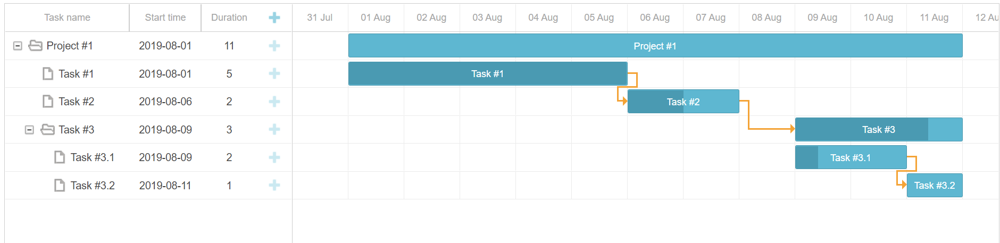
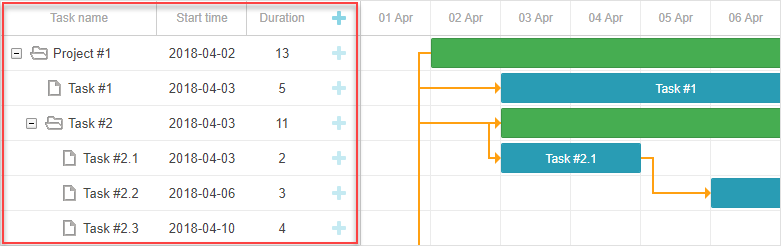
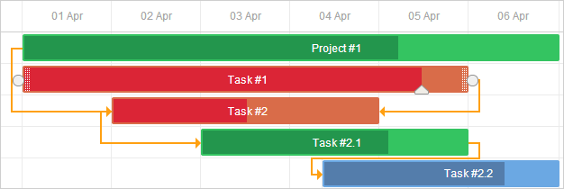
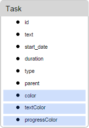
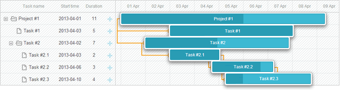
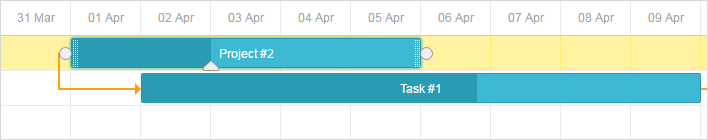
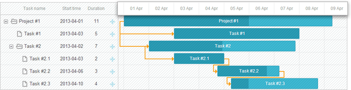
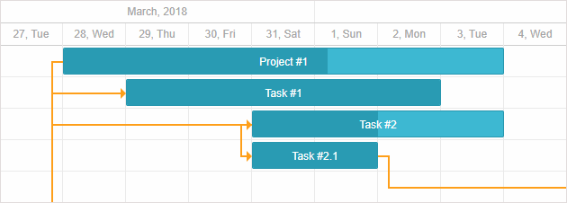
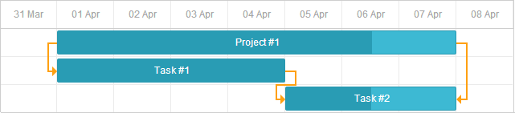
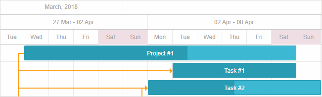

DHTMLX 组件是一个 JavaScript 库，提供了一套完整的 AJAX 驱动的 UI 组件。使用 dhtmlxSuite 生成企业级 WEB 应用程序有干净的界面、 快速的性能和丰富的用户体验。DHTMLX 组件是由位于俄罗斯圣彼得堡的 DHTMLX 公司开发的，适用于 B/S  模式的 WEB 应用开发，DHTMLX-Gantt 是该公司旗下开发的甘特图组件.

它分 Pro 版和 Standard 版：Pro版需要付费，Standard 版不需要付费。

<br>

# 1、简单使用

这里使用 Standard 版：

1. 前往 [GitHub](https://github.com/DHTMLX/gantt) 下载文件并在 HTML 页面中添加引用：

   ```html
   <script src="dhtmlxgantt.js" ></script>
   <link rel="stylesheet" href="dhtmlxgantt.css" type="text/css">
   ```

2. 在页面添加一个 `<div></div>` 并设定宽和高：

   ```html
   <div id="gantt_here" style='width:100%; height:100vh;'></div>
   ```

3. 编写 JavaScript 初始化：

   ```javascript
   gantt.config.date_format = "%Y-%m-%d %H:%i";
   gantt.init("gantt_here");
   gantt.parse({
     data: [
       {id: 1, text: "Project #1", start_date: null, duration: null, parent:0, progress: 0, open: true},
       {id: 2, text: "Task #1", start_date: "2019-08-01 00:00", duration:5, parent:1, progress: 1},
       {id: 3, text: "Task #2", start_date: "2019-08-06 00:00", duration:2, parent:1, progress: 0.5},
       {id: 4, text: "Task #3", start_date: null, duration: null, parent:1, progress: 0.8, open: true},
       {id: 5, text: "Task #3.1", start_date: "2019-08-09 00:00", duration:2, parent:4, progress: 0.2},
       {id: 6, text: "Task #3.2", start_date: "2019-08-11 00:00", duration:1, parent:4, progress: 0}
     ],
     links:[
       {id:1, source:2, target:3, type:"0"},
       {id:2, source:3, target:4, type:"0"},
       {id:3, source:5, target:6, type:"0"}
     ]
   });
   ```

4. 效果预览：

   

<br>

# 2、Gantt API

## 2.1、属性

[官方文档](https://docs.dhtmlx.com/gantt/api__refs__gantt_props.html)

<br>

**autofit**

- 表格列宽自适应

  | 类型    | 可选值     | 默认值 |
  | ------- | ---------- | ------ |
  | boolean | true/false | false  |

- 示例：

  ```javascript
  gantt.config.autofit = false;
  ```

<br>

**autoscroll**

- 把任务或者连线拖拽到浏览器屏幕外时，自动触发滚动效果，相当于拖动滚动条

  | 类型    | 可选值     | 默认值 |
  | ------- | ---------- | ------ |
  | boolean | true/false | false  |

- 示例：

  ```javascript
  gantt.config.autoscroll = false;
  ```

<br>

**autoscroll_speed**

- 自动滚动的速度（ms）

  | 类型   | 默认值 |
  | ------ | ------ |
  | number | 30     |

- 示例：

  ```javascript
  gantt.config.autoscroll = true;
  gantt.config.autoscroll_speed = 50;
  ```

<br>

**autosize**

- 自适应甘特图的尺寸大小，使得在不出现滚动条的情况下，显示全部任务

  | 类型    | 可选值                   | 默认值 |
  | ------- | ------------------------ | ------ |
  | boolean | true/false               | false  |
  | string  | "y" ( = true)、"x"、"xy" | -      |

- 示例：

  ```javascript
  gantt.config.autosize = "xy";
  ```

<br>

**autosize_min_width**

- 在使用图表宽度自适应模式 `(autosize = 'x' or 'xy')` 时， 图表的最小宽度

  | 类型   | 默认值 |
  | ------ | ------ |
  | number | 0      |

- 示例：

  ```javascript
  gantt.config.autosize = "xy";
  gantt.config.autosize_min_width = 800;
  ```

<br>

**buttons_left**

- 弹出框左下角的按钮

  | 类型  | 可选值                                                       | 默认值                                |
  | ----- | ------------------------------------------------------------ | ------------------------------------- |
  | array | "gantt_save_btn"、"gantt_cancel_btn"、"complete_button"、"gantt_delete_btn" | ["gantt_save_btn", "gantt_cancel_bt"] |

- 示例：

  ```html
  <style>
  .complete_button{
      margin-top: 2px;
      background-image:url("common/v_complete.png");
      width: 20px;
  }
  </style>
  <script>
      gantt.locale.labels["complete_button"] = "Complete";
      gantt.attachEvent("onGanttReady", function(){                               
          gantt.config.buttons_left = ["gantt_save_btn","gantt_cancel_btn",           
              "complete_button"];                                                 
      });                                                                         
      gantt.init("gantt_here");
  
      gantt.attachEvent("onLightboxButton", function(button_id, node, e){
          if(button_id == "complete_button"){
              var id = gantt.getState().lightbox;
              gantt.getTask(id).progress = 1;
              gantt.updateTask(id);
              gantt.hideLightbox();
          }
      });
  </script>
  ```

<br>

**buttons_right**

- 弹出框右下角的按钮

  | 类型  | 可选值                                                       | 默认值               |
  | ----- | ------------------------------------------------------------ | -------------------- |
  | array | "gantt_save_btn"、"gantt_cancel_btn"、"complete_button"、"gantt_delete_btn" | ["gantt_delete_btn"] |

- 示例：

  ```html
  <style>
      .complete_button{
          margin-top: 2px;
          background-image:url("common/v_complete.png");
          width: 20px;
      }
  </style>
  <script>
      gantt.locale.labels["complete_button"] = "Complete";
      gantt.attachEvent("onGanttReady", function(){                               
          gantt.config.buttons_right = ["gantt_delete_btn","complete_button"];                                 
      });                                                                         
      gantt.init("gantt_here");
  
      gantt.attachEvent("onLightboxButton", function(button_id, node, e){
          if(button_id == "complete_button"){
              var id = gantt.getState().lightbox;
              gantt.getTask(id).progress = 1;
              gantt.updateTask(id);
              gantt.hideLightbox();
          }
      });
  </script>
  ```

<br>

**buttons_right**

- 修改要绑定到 task/group 的 calender 属性

  | 类型   | 可选值 | 默认值      |
  | ------ | ------ | ----------- |
  | string | 属性名 | calendar_id |

- 示例：

  ```javascript
  gantt.config.calendar_property = "property_name";
  ```

- calendar 属性：

  ````javascript
  {
      "id":2,
      "calendar_id":"custom",
      "text":"Task #1",
      "start_date":"02-04-2013",
      "duration":"8",
      "parent":"1",
      "progress":0.5,
      "open": true
  }
  ````

<br>

**cascade_delete**

- 开启级联删除 tasks 和 links 

  | 类型    | 可选值     | 默认值 |
  | ------- | ---------- | ------ |
  | boolean | true/false | true   |

- 示例：

  ```javascript
  gantt.config.cascade_delete = false;
  ```

<br>

**columns**

- 表格列设置

  | 类型  | 备注                 |
  | ----- | -------------------- |
  | array | 数组的每一项表示一列 |

- 示例：

  ```javascript
  // default columns definition
  gantt.config.columns=[
      {name:"text",       label:"Task name",  tree:true, width:'*' },
      {name:"start_date", label:"Start time", align: "center" },
      {name:"duration",   label:"Duration",   align: "center" },
      {name:"add",        label:"" },
      {name:"staff",      label:"Holder(s)", template:function(obj){return obj.holder+"("+obj.progress+")"} }
  ];
  ```

- 列属性详情：

  | 属性      | 说明                                                         | 值                        |
  | --------- | ------------------------------------------------------------ | ------------------------- |
  | align     | 设置标题水平对齐位置                                         | 'left'、'center'、'right' |
  | hide      | 显示/隐藏列（PRO收费版支持）                                 | boolean                   |
  | label     | 标题内容                                                     | string                    |
  | max_width | resize 操作时的最大宽度                                      | number                    |
  | min_width | resize 操作时的最小宽度                                      | number                    |
  | name      | 列 ID，这个 ID 名称只能是特定的名称，比如 `name: 'add'` 的效果是该列会有一个 `+` 号，点击可以新增列的效果 | string                    |
  | resize    | 允许通过拖拽的方式 border 改变列的宽度（PRO 收费版支持）     | boolean                   |
  | template  | 列模版渲染方法                                               | function                  |
  | tree      | 设置该列为树形控件                                           | boolean                   |
  | width     | 定义宽度                                                     | number                    |

<br>

**correct_work_time**

- 拖拽 task 的时候，自动将起始时间和结束时间矫正为工作日

  | 类型    | 可选值     | 默认值 |
  | ------- | ---------- | ------ |
  | boolean | true/false | false  |

  > 备注：起始和结束时间遇到周末的时候，自动把时间改为工作日的时间

- 示例：

  ```javascript
  gantt.config.work_time = true;
  gantt.config.correct_work_time = true;
  ```

<br>

**date_format**

- 设置源数据日期格式

  | 类型   | 默认值           |
  | ------ | ---------------- |
  | string | "%d-%m-%Y %H:%i" |

- 示例：

  ```javascript
  gantt.config.date_format = "%Y-%m-%d %H:%i";
  ```

<br>

**details_on_create**

- 点击 `+` 号添加列时，弹出 lightbox 弹出框

  | 类型    | 可选值     | 默认值 |
  | ------- | ---------- | ------ |
  | boolean | true/false | false  |

- 示例：

  ```javascript
  gantt.config.details_on_create = true;
  ```

<br>

**details_on_dblclick**

- 双击 task 时，弹出 lightbox 弹出框

  | 类型    | 可选值     | 默认值 |
  | ------- | ---------- | ------ |
  | boolean | true/false | true   |

- 示例：

  ```javascript
  gantt.config.details_on_dblclick = true;
  ```

<br>

**drag_lightbox**

- 允许鼠标通过按住的 lightbox 头部拖拽的方式，调整 lightbox 的位置

  | 类型    | 可选值     | 默认值 |
  | ------- | ---------- | ------ |
  | boolean | true/false | true   |

- 示例：

  ```javascript
  gantt.config.drag_lightbox = false;
  ```

<br>

**drag_links**

- 允许通过拖拽的方式新增任务依赖的线条

  | 类型    | 可选值     | 默认值 |
  | ------- | ---------- | ------ |
  | boolean | true/false | true   |

- 示例：

  ```javascript
  gantt.config.drag_links = false;
  ```

<br>

**drag_mode**

- 保存拖拽模式下，允许的拖拽类型

  | 类型   | 可选值 | 默认值                                                       |
  | ------ | ------ | ------------------------------------------------------------ |
  | object | -      | { "resize":"resize", "progress":"progress", "move":"move", "ignore":"ignore" } |

- 示例：

  ```javascript
  gantt.attachEvent("onBeforeTaskDrag", function(id, mode, e){
      var modes = gantt.config.drag_mode;
      switch (mode){
          case modes.move:
  
          break;
          case modes.resize:
  
          break;
          case modes.progress:
  
          break;
  
      }
      //...
  });
  ```

- 属性详情：

  - "resize"：用户通过拖拽任务的条形图来改变工期时触发
  - "progress"：用户推拽条形图上用来调整进度百分比的小按钮时触发
  - "move"：用户拖动条形图来改变位置时触发
  - "ignore"：忽略拖拽行为

<br>

**drag_move**

- 允许用户拖动条形图来改变位置

  | 类型    | 可选值     | 默认值 |
  | ------- | ---------- | ------ |
  | boolean | true/false | true   |

- 示例：

  ```javascript
  gantt.config.drag_move = false;
  ```

<br>

**drag_progress**

- 允许用户推拽条形图上用来调整进度百分比的小按钮

  | 类型    | 可选值     | 默认值 |
  | ------- | ---------- | ------ |
  | boolean | true/false | true   |

- 示例：

  ```javascript
  gantt.config.drag_progress = false;
  ```

<br>

**drag_resize**

- 允许用户通过拖拽任务的条形图的两端来改变工期

  | 类型    | 可选值     | 默认值 |
  | ------- | ---------- | ------ |
  | boolean | true/false | true   |

- 示例：

  ```javascript
  gantt.config.drag_resize = false;
  ```

<br>

**duration_step**

- 工期计算的倍数

  | 类型    | 默认值 |
  | ------- | ------ |
  | boolean | 1      |

- 示例：

  ```javascript
  gantt.config.duration_unit = "hour";
  gantt.config.duration_step = 3; 
  //当 task.duration = 2时, 工期为6 小时 (3*2)
  ```

<br>

**duration_unit**

- 工期计算的基本单位

  | 类型   | 可选值                                           | 默认值 |
  | ------ | ------------------------------------------------ | ------ |
  | string | "minute"、"hour"、"day"、"week"、"month"、"year" | "day"  |

- 示例：

  ```javascript
  gantt.config.duration_unit = "hour";
  gantt.config.duration_step = 3; 
  //当 task.duration = 2时, 工期为6 小时 (3*2)
  ```

<br>

**end_date**

- 设置图表区域的日期坐标最大值

  | 类型 | 默认值 |
  | ---- | ------ |
  | Date | -      |

- 示例：

  ```javascript
  gantt.config.start_date = new Date(2013, 08, 10);
  gantt.config.end_date = new Date(2013, 08, 20);
  gantt.init("gantt_here");
  ```

<br>

**fit_tasks**

- 当 task 的长度改变时，自动调整图表坐标轴区间用于适配 task 的长度

  > 默认情况下， 用户增加 task 的长度时，只能增加到当前坐标轴的最大值。有时候想要继续增加 task 的长度，就需要设置这个选项，让坐标轴能重新渲染增加长度。
  >
  > 有的通过设置工期来增加 task 的长度时，超出坐标轴的那部分也不会显示。

  | 类型    | 可选值     | 默认值 |
  | ------- | ---------- | ------ |
  | boolean | true/false | false  |

- 示例：

  ```javascript
  gantt.config.fit_tasks = true; 
  ```

<br>

**grid_resizer_column_attribute**

- 设置列表 resizer DOM 元素的属性名， 这个属性表示列表的索引

  | 类型   | 默认值       |
  | ------ | ------------ |
  | string | column_index |

- 示例：

  ```javascript
  gantt.config.grid_resizer_column_attribute = "col_index";//"column_index" -> "col_index"1
  ```

<br>

**grid_width**

- 设置左侧表格的宽度

  | 类型   | 默认值 |
  | ------ | ------ |
  | number | 350    |

- 示例：

  ```javascript
  gantt.config.grid_width = 400;
  ```

<br>

**inherit_scale_class**

- 子坐标轴是否使用 scale_cell_class 模版

  | 类型    | 可选值     | 默认值 |
  | ------- | ---------- | ------ |
  | boolean | true/false | false  |

- 示例：

  ```javascript
  gantt.config.inherit_scale_class=true;
  ```

<br>

**initial_scroll**

- timeline 区域是否自动初始化滚动，用于显示更早之前的任务

  | 类型    | 可选值     | 默认值 |
  | ------- | ---------- | ------ |
  | boolean | true/false | true   |

- 示例：

  ```javascript
  gantt.config.initial_scroll = false;
  ```

<br>

**keyboard_navigation_cells**

- 激活表格相关快捷键

  | 类型    | 可选值     | 默认值 |
  | ------- | ---------- | ------ |
  | boolean | true/false | false  |

- 示例：

  ```javascript
  gantt.config.keyboard_navigation_cells = true;
  ```

<br>

**layout**

- 定义整个甘特图的布局

  | 类型   | 可选值 | 默认值 |
  | ------ | ------ | ------ |
  | object | -      | -      |

- 示例：

  ```javascript
  gantt.config.layout = {
      css: "gantt_container",
      rows:[
        {
          cols: [
            {view: "grid", id: "grid", scrollX:"scrollHor", scrollY:"scrollVer"},
            {resizer: true, width: 1},
            {view: "timeline", id: "timeline", scrollX:"scrollHor", scrollY:"scrollVer"},
            {view: "scrollbar", scroll: "y", id:"scrollVer"}
          ]
         },
        {view: "scrollbar", scroll: "x", id:"scrollHor", height:20}
      ]
  };
  ```

<br>

**lightbox**

- 定义 lightbox 弹出框

  | 类型   | 可选值 | 默认值 |
  | ------ | ------ | ------ |
  | object | -      | -      |

- 示例：

  ```javascript
  gantt.config.lightbox.sections = [
      {name:"description", height:38, map_to:"text", type:"textarea",focus:true},
      {name:"priority", height:22, map_to:"priority",type:"select",options:opts},                                                                        
      {name:"time", height:72, type:"duration", map_to:"auto"}
  ];
  ```
  
- 属性详情：

  lightbox 有一个属性 `sections`（有没有其他属性官网也没有说）`sections` 是一个对象数组，每个对象的属性如下
  
  | 属性          | 说明                                                         | 值                                                           |
  | ------------- | ------------------------------------------------------------ | ------------------------------------------------------------ |
  | name          | 名称用于索引国际化后的实际内容， 如 `name = time section`，<br>最后读取的是 `gantt.locale.labels.section_time` 的内容 | string                                                       |
  | height        | section 高度                                                 | number                                                       |
  | map_to        | data 的属性名，将相应的 data 属性映射到 section              | string                                                       |
  | type          | section 的编辑器类型                                         | string                                                       |
  | time_format   | section为 "duration" 或者 "time" 时的时间选择器顺序          | string                                                       |
  | focus         | 设置为 true 时， 将会在 lightbox 打开时自动 focus（聚焦）    | boolean                                                      |
  | default_value | 该 section 编辑器的默认值                                    | any                                                          |
  | onchange      | 选择器的选项改变时触发                                       | function                                                     |
  | options       | 编辑器的候选项， 用于选择器，单选 radio，多选 checkbox       | 形如 `{ key: 1, lable: ‘demo’ }` 的对象数组                  |
  | readonly      | 只读模式，用在 time and duration                             | boolean                                                      |
  | year_range    | 年份选择器的范围                                             | array/number, <br>array：`[2005 - 2025]`;<br>number：`10` = `[current, current + 10]` |
  | single_date   | 设置后只有开始日期 start Date 可以选择，结束时间等于同一天，<br>这个对于选择里程碑比较有用 | boolean                                                      |
  | allow_root    | 设置为 true 的时候会新增一个选项用于设置所有任务的根节点，<br>使用的时候要跟 root_label 属性一起使用<br>（section 是 parent 的时候才有） | boolean                                                      |
  | root_label    | 设置根节点的 label（section 是 parent 的时候才有）           | string                                                       |
  | filter        | 选择器的过滤方法                                             | function                                                     |
  | sort          | 选择器的排序方法                                             | function                                                     |
  | template      | 选择器的 option 渲染方法（section 是 parent 的时候才有）     | function                                                     |

<br>

**lightbox_additional_height**

- 设置 lightbox 的 header 和 footer 的高度（height = header + footer）

  | 类型   | 默认值 |
  | ------ | ------ |
  | number | 75     |

- 示例：

  ```javascript
  gantt.config.lightbox_additional_height = 90;
  ```

<br>

**link_arrow_size**

- 连线的箭头大小

  | 类型   | 默认值 |
  | ------ | ------ |
  | number | 6      |

- 示例：

  ```javascript
  gantt.config.link_arrow_size = 8;
  ```

<br>

**link_attribute**

- 连线 DOM 元素上存储 ID 值的属性名

  | 类型   | 默认值    |
  | ------ | --------- |
  | string | "link_id" |

- 示例：

  ```javascript
  gantt.config.link_attribute = "l_id"
  // <div class="grantt_task_link" l_id="14">...<div>123
  ```

<br>

**link_line_width**

- 连线的线条宽度

  | 类型   | 默认值 |
  | ------ | ------ |
  | number | 2      |

- 示例：

  ```javascript
  gantt.config.link_line_width = 3;
  ```

<br>

**link_wrapper_width**

- 连线的拓展宽度，用于增加点击的范围

  | 类型   | 默认值 |
  | ------ | ------ |
  | number | 20     |

- 示例：

  ```javascript
  gantt.config.link_wrapper_width = 30;
  ```

<br>

**links**

- 存储线条的依赖

  | 类型   | 可选值 | 默认值                                                       |
  | ------ | ------ | ------------------------------------------------------------ |
  | object | -      | { "finish_to_start":"0", "start_to_start":"1", "finish_to_finish":"2", "start_to_finish":"3" } |

- 示例：

  ```javascript
  var type1 = gantt.config.links.finish_to_start;
  ```

- 属性详情：

  - "finish_to_start"：后置任务需要等待前置任务（依赖）完成才允许开始
  - "start_to_start"：后置任务需要等待前置任务开始才允许开始
  - "finish_to_finish"：后置任务需要等到前置任务结束才允许结束
  - "start_to_finish"：后置任务需要等到前置任务开始才允许结束

<br>

**min_column_width**

- 时间轴列的最小宽度

  | 类型   | 默认值 |
  | ------ | ------ |
  | number | 70     |

- 示例：

  ```javascript
  gantt.config.min_column_width = 100;
  ```

<br>

**min_duration**

- 调整timeline上task的长度时， 工期的变化幅度

  | 类型   | 默认值           |
  | ------ | ---------------- |
  | number | `60 * 60 * 1000` |

- 示例：

  ```javascript
  gantt.config.min_duration = 24*60*60*1000;// 1 day
  ```

<br>

**min_grid_column_width**

- 左侧表格列的最小宽度

  | 类型   | 可选值     | 默认值 |
  | ------ | ---------- | ------ |
  | number | true/false | 70     |

- 示例：

  ```javascript
  gantt.config.min_grid_column_width = 100;
  ```

<br>

**multiselect**

- 是否开启 task 任务多选

  | 类型    | 可选值     | 默认值 |
  | ------- | ---------- | ------ |
  | boolean | true/false | true   |

- 示例：

  ```javascript
  gantt.config.multiselect = false;
  ```

<br>

**multiselect_one_level**

- 任务多选的情况下，规定只能选取同一个 level 的任务

  | 类型    | 可选值     | 默认值 |
  | ------- | ---------- | ------ |
  | boolean | true/false | false  |

- 示例：

  ```javascript
  gantt.config.multiselect_one_level = true; 
  gantt.init('gantt_here');
  
  //前提时开启多选，下面是错误的例子
  gantt.config.multiselect = false;   //关闭了多选
  gantt.config.multiselect_one_level = true; 
  gantt.init("gantt_here");
  ```

<br>

**open_tree_initially**

- 初始化的时候就展开树结构

  | 类型    | 可选值     | 默认值 |
  | ------- | ---------- | ------ |
  | boolean | true/false | false  |

- 示例：

  ```javascript
  gantt.config.open_tree_initially = true;
  ```

<br>

**order_branch**

- 左侧树型结构调整时，只允许将任务拖放到某个父节点下

  | 类型    | 可选值     | 默认值 |
  | ------- | ---------- | ------ |
  | boolean | true/false | false  |

- 示例：

  ```javascript
  gantt.config.order_branch = true;
  ```

<br>

**order_branch_free**

- 左侧树型结构调整时，可以任意拖动任务到任意节点下

  | 类型    | 可选值     | 默认值 |
  | ------- | ---------- | ------ |
  | boolean | true/false | false  |

- 示例：

  ```javascript
  // reordering tasks within the whole gantt
  gantt.config.order_branch = true;
  gantt.config.order_branch_free = true;
  ```

<br>

**placeholder_task**

- 在左侧任务列表的最后新增一个空白列，填写之后可以新增任务

  - 自动新增一个空白列到列表的最后
  - 只要 UI 修改了空白列的内容，并且执行 `gantt.updateTask()` 方法，就会追到新的任务到任务列表末尾。
  - 通过空白列新增的任务可以用下面的方法判断
    `if(task.type == gantt.config.types.placeholder){// do something}`
  - 通过这个方法新建任务后，会触发 onTaskCreated 和 onAfterTaskAdd 事件
  - `gantt.dataProcessor` 也会触发 onBeforeUpdate 事件, 但不会触发后端的请求

  | 类型    | 可选值     | 默认值 |
  | ------- | ---------- | ------ |
  | boolean | true/false | false  |

- 示例：

  ```javascript
  gantt.config.placeholder_task = true;
  ```

<br>

**preserve_scroll**

- 图表刷新后，滚动条的位置跟原来保持一致

  | 类型    | 可选值     | 默认值 |
  | ------- | ---------- | ------ |
  | boolean | true/false | true   |

- 示例：

  ```javascript
  gantt.config.preserve_scroll = false;
  ```

<br>

**prevent_default_scroll**

- 阻止鼠标滚动事件冒泡

  | 类型    | 可选值     | 默认值 |
  | ------- | ---------- | ------ |
  | boolean | true/false | true   |

- 示例：

  ```javascript
  gantt.config.prevent_default_scroll = false;
  ```
  
- detail

  - 禁用该选项的时候，滚动鼠标只滚动图表内部的滚动条，图表外部的滚动条不滚动（接收不到滚动事件）

<br>

**quick_info_detached**

- 在所选任务的附近弹出 quick_info 组件（一个 popup 组件）

  | 类型    | 可选值     | 默认值 |
  | ------- | ---------- | ------ |
  | boolean | true/false | true   |

- 示例：

  ```javascript
  gantt.config.quick_info_detached = false;
  ```

<br>

**quickinfo_buttons**

- 定义 quickinfo 组件的按钮

  | 类型  | 可选值 | 默认值                      |
  | ----- | ------ | --------------------------- |
  | array | -      | ["icon_delete","icon_edit"] |

- 示例：

  ```javascript
  gantt.config.quickinfo_buttons=["icon_delete","icon_edit","advanced_details_button"]; 
  gantt.locale.labels["advanced_details_button"] = "Advanced Info";
  gantt.init("gantt_here");
  
  gantt.$click.buttons.advanced_details_button=function(e, id, trg){
      alert("These are advanced details"); 
      return false; //blocks the default behavior
  };
  ```

<br>

**readonly**

- 只读模式的甘特图

  | 类型    | 可选值     | 默认值 |
  | ------- | ---------- | ------ |
  | boolean | true/false | false  |

- 示例：

  ```javascript
  gantt.config.readonly=true;
  ```

<br>

**readonly_property**

- 影响任务是否只读的属性, 这个属性是 Data 数据里面的某个键, 当该键对应的值为 true 时，所在的 link 或者 task 为只读

  | 类型   | 可选值 | 默认值     |
  | ------ | ------ | ---------- |
  | string | -      | "readonly" |

- 示例：

  ```javascript
  gantt.config.readonly_property = "property_name";
  ```

<br>

**redo**

- 开启重做功能

  | 类型    | 可选值     | 默认值 |
  | ------- | ---------- | ------ |
  | boolean | true/false | true   |

- 示例：

  ```javascript
  gantt.config.redo = true;
  ```

<br>

**resource_calendars**

- 给用户绑定工作日日历

  | 类型   | 可选值 | 默认值 |
  | ------ | ------ | ------ |
  | object | -      | -      |

- 示例：

  ```javascript
  // 添加一个工作日日历
  var johnCalendarId = gantt.addCalendar({
      worktime: {
          days: [0, 1, 0, 0, 0, 0, 0] //第一天是周日， 只有周一上班
      }
  }),
  
  // 绑定用户
  gantt.config.resource_calendars = {
    "user":{
        1 : johnCalendarId
     }
  };
  
  // 指定日历到特定的任务
  {
      "id":3, 
      "user:"1",
      "text":"Task #2", 
      "start_date":"11-04-2013", 
      "duration":"4", 
      "parent":"1", 
      "progress": 0.6, 
      "open": true
  }
  ```

<br>

**resource_render_empty_cells**

- 是否调用模版方法渲染 source 时间轴的空白元素。

  | 类型    | 可选值     | 默认值 |
  | ------- | ---------- | ------ |
  | boolean | true/false | false  |

- 示例：

  ```javascript
  gantt.config.resource_render_empty_cells = true;
  ```

<br>

**root_id**

- 设置虚拟根节点的 ID

  | 类型   | 可选值 | 默认值 |
  | ------ | ------ | ------ |
  | number | string | -      |

- 示例：

  ```javascript
  gantt.config.root_id = "root";  
  
  var tasks =  {
      data:[
        // 这里的parent为定义的根节点ID
        {id:1, text:"Project #2", start_date:"01-04-2013", duration:18, parent:"root"},  
        {id:2, text:"Task #1",    start_date:"02-04-2013", duration:8,  parent:1},
        {id:3, text:"Task #2",    start_date:"11-04-2013", duration:8,  parent:1}
      ],
      links:[]
  };
  ```

<br>

**round_dnd_dates**

- 将任务开始时间和结束时间自动 “四舍五入”，从而对齐坐标轴刻度

  | 类型    | 可选值     | 默认值 |
  | ------- | ---------- | ------ |
  | boolean | true/false | true   |

- 示例：

  ```javascript
  gantt.config.round_dnd_dates = false;
  ```

<br>

**row_height**

- 定义甘特图的行高（se）

  | 类型   | 默认值 |
  | ------ | ------ |
  | number | 25     |

- 示例：

  ```javascript
  gantt.config.row_height = 40;
  ```

<br>

**rtl**

- 定义甘特图为从右到左（本来是从左到右）显示模式， 除了修改控件的布局，还修改了坐标轴的方向，列的渲染顺序

  | 类型    | 可选值     | 默认值 |
  | ------- | ---------- | ------ |
  | boolean | true/false | false  |

- 示例：

  ```javascript
  gantt.config.rtl = true;
  gantt.config.layout = {
      css: "gantt_container",
      rows: [
          {
              cols: [
                  {view: "scrollbar", id: "scrollVer"},
                  {view: "timeline", scrollX: "scrollHor", scrollY: "scrollVer"},
                  {resizer: true, width: 1},
                  {view: "grid", scrollX: "scrollHor", scrollY: "scrollVer"}
              ]
          },
          {view: "scrollbar", id: "scrollHor", height: 20}
      ]
  };
  ```

<br>

**scale_height**

- 设置甘特图的表头高度

  | 类型   | 默认值 |
  | ------ | ------ |
  | number | 35     |

- 示例：

  ```javascript
  gantt.config.scale_height = 50;
  ```

<br>

**scroll_on_click**

- 当点击任务时，时间轴的滚动条滚动，将任务放在可见的范围。

  | 类型    | 可选值     | 默认值 |
  | ------- | ---------- | ------ |
  | boolean | true/false | true   |

- 示例：

  ```javascript
  gantt.config.scroll_on_click= false;
  ```

<br>

**scroll_size**

- 水平或垂直滚动条尺寸

  | 类型   | 默认值 |
  | ------ | ------ |
  | number | -      |

- 示例：

  ```javascript
  gantt.config.scroll_size = 20;
  ```

<br>

**select_task**

- 任务可以点击选中

  | 类型    | 可选值     | 默认值 |
  | ------- | ---------- | ------ |
  | boolean | true/false | true   |

- 示例：

  ```javascript
  gantt.config.select_task  = false;
  ```

<br>

**server_utc**

- 当发送数据给后端，将 UTC 时间转换成 local 时间

  | 类型    | 可选值     | 默认值 |
  | ------- | ---------- | ------ |
  | boolean | true/false | false  |

- 示例：

  ```javascript
  gantt.config.server_utc = true;
  ```

<br>

**show_chart**

- 是否显示时间轴

  | 类型    | 可选值     | 默认值 |
  | ------- | ---------- | ------ |
  | boolean | true/false | true   |

- 示例：

  ```javascript
  //隐藏时间轴
  gantt.config.show_chart = false;
  ```

<br>

**show_errors**

- 发生异常时，允许弹出警告到UI界面

  | 类型    | 可选值     | 默认值 |
  | ------- | ---------- | ------ |
  | boolean | true/false | true   |

- 示例：

  ```javascript
  gantt.config.show_errors = false;
  ```

<br>

**show_grid**

- 是否显示左侧表格

  | 类型    | 可选值     | 默认值 |
  | ------- | ---------- | ------ |
  | boolean | true/false | true   |

- 示例：

  ```javascript
  //隐藏表格
  gantt.config.show_grid = false;
  ```

<br>

**show_links**

- 是否显示依赖连线

  | 类型    | 可选值     | 默认值 |
  | ------- | ---------- | ------ |
  | boolean | true/false | true   |

- 示例：

  ```javascript
  gantt.config.show_links = false;
  ```

<br>

**show_markers**

- 是否显示标记线

  | 类型    | 可选值     | 默认值 |
  | ------- | ---------- | ------ |
  | boolean | true/false | true   |

- 示例：

  ```javascript
  var marker1 = gantt.addMarker({ ...}); 
  var marker2 = gantt.addMarker({ ...}); 
  var marker3 = gantt.addMarker({ ...}); 
  
  gantt.config.show_markers = false;// 隐藏所有标记12345
  ```

<br>

**show_progress**

- 是否在任务条形图中显示制进度条（通常以不同颜色区分）

  | 类型    | 可选值     | 默认值 |
  | ------- | ---------- | ------ |
  | boolean | true/false | true   |

- 示例：

  ```javascript
  gantt.config.show_progress = true;
  ```

**show_quick_info**

- 是否显示 quick_info（带有任务信息的 popup 表单）

  | 类型    | 可选值     | 默认值 |
  | ------- | ---------- | ------ |
  | boolean | true/false | true   |

- 示例：

  ```javascript
  gantt.config.show_quick_info = false;
  ```

<br>

**show_task_cells**

- 时间轴图表中，如果不设置，只有行边框，区分上下的任务，设置之后带有列的边框，整个时间轴变成格子状。

  | 类型    | 可选值     | 默认值 |
  | ------- | ---------- | ------ |
  | boolean | true/false | true   |

- 示例：

  ```javascript
  gantt.config.show_task_cells = false;
  ```

<br>

**show_unscheduled**

- 为 true 时，树形结构会显示没有排期的任务节点，并且左侧的表格没有时间轴条形图。设置为 false 的时候，会强制给任务设置起始时间，左侧的表格会有时间轴条形图。

  | 类型    | 可选值     | 默认值 |
  | ------- | ---------- | ------ |
  | boolean | true/false | true   |

- 示例：

  ```javascript
  gantt.config.show_unscheduled = true;
  ```

<br>

**smart_rendering**

- 仅仅渲染在屏幕可见的那部分任务和依赖线。这个在显示大量的任务时，性能比较高。不过需要引入插件 dhtmlxgantt_smart_rendering.js

  | 类型    | 可选值     | 默认值 |
  | ------- | ---------- | ------ |
  | boolean | true/false | true   |

- 示例：

  ```javascript
  gantt.config.smart_rendering = true;
  ```

<br>

**smart_scales**

- 仅仅渲染在屏幕可见的那部分时间轴。在处理时间轴非常长的时候，可以提升性能。需要引入插件 dhtmlxgantt_smart_rendering.js

  | 类型    | 可选值     | 默认值 |
  | ------- | ---------- | ------ |
  | boolean | true/false | true   |

- 示例：

  ```javascript
  gantt.config.smart_scales = true;
  ```

<br>

**sort**

- 启用排序功能，点击表头可以排序

  | 类型    | 可选值     | 默认值 |
  | ------- | ---------- | ------ |
  | boolean | true/false | false  |

- 示例：

  ```javascript
  gantt.config.sort = true;
  ```

<br>

**start_date**

- 设置时间轴起始时间

  | 类型 | 可选值 | 默认值 |
  | ---- | ------ | ------ |
  | Date | -      | -      |

- 示例：

  ```javascript
  gantt.config.start_date = new Date(2013, 08, 10);
  gantt.config.end_date = new Date(2013, 08, 20);
  ```

<br>

**start_on_monday**

- 将每周的第一天设置为周一，否则为周日。

  | 类型    | 可选值     | 默认值 |
  | ------- | ---------- | ------ |
  | boolean | true/false | true   |

- 示例：

  ```javascript
  gantt.config.start_on_monday = false; // 第一天将变为周日
  ```

<br>

**task_attribute**

- 任务 ID 要放在 DOM 节点的哪个属性

  | 类型   | 可选值 | 默认值  |
  | ------ | ------ | ------- |
  | string | -      | task_id |

- 示例：

  ```javascript
  gantt.config.task_attribute = "t_id"
  // <div t_id=11 class='gantt_task_line'></div>123
  ```

<br>

**task_date**

- lightbox 的任务时间选择部分中，时间的显示格式

  | 类型   | 可选值 | 默认值     |
  | ------ | ------ | ---------- |
  | string | -      | "%d %F %Y" |

- 示例：

  ```javascript
  gantt.config.task_date = "%d-%m-%Y";
  ```

<br>

**task_scroll_offset**

- 坐标轴左侧的边框最近的任务的距离（像素值）

  > 每次选中任务的时候，会适调整水平滚动条的位置，让最近的任务跟时间轴图表最左侧的距离保持一定的 offset

  | 类型   | 默认值 |
  | ------ | ------ |
  | number | 100    |

- 示例：

  ```javascript
  gantt.config.task_scroll_offset = 120;
  ```

<br>

**time_picker**

- lightbox 的时间选择区域中， 时间下拉选择控件每一项的显示格式

  | 类型   | 可选值 | 默认值  |
  | ------ | ------ | ------- |
  | string | -      | "%H:%i" |

- 示例：

  ```javascript
  gantt.config.time_picker = "%H:%s";
  ```

<br>

**tooltip_hide_timeout**

- 设置当鼠标离开任务后，tooltip 还会显示多长时间（ms）才关闭。

  > 如果是鼠标移动到其他的任务，在这个间隔内如果没有关闭，当显示其他任务 tooltip 后，前一个计时不再生效。

  | 类型   | 默认值 |
  | ------ | ------ |
  | number | -      |

- 示例：

  ```javascript
  gantt.config.tooltip_hide_timeout = 5000;
  ```

<br>

**tooltip_offset_x**

- tooltip 距离鼠标的水平偏移

  | 类型   | 默认值 |
  | ------ | ------ |
  | number | 10     |

- 示例：

  ```javascript
  gantt.config.tooltip_offset_x = 30;
  ```

<br>

**tooltip_offset_y**

- tooltip 距离鼠标的垂直偏移

  | 类型   | 默认值 |
  | ------ | ------ |
  | number | 20     |

- 示例：

  ```javascript
  gantt.config.tooltip_offset_y = 40;
  ```

<br>

**tooltip_timeout**

- 设置 tooltip 要鼠标悬停多久（ms）才显示出来

  | 类型   | 默认值 |
  | ------ | ------ |
  | number | 30     |

- 示例：

  ```javascript
  gantt.config.tooltip_offset_x = 50;
  ```

<br>

**touch**

- 开启触屏模式

  | 类型           | 可选值               | 默认值 |
  | -------------- | -------------------- | ------ |
  | boolean,string | true、false、'force' | -      |

- 示例：

  ```javascript
  gantt.config.touch = "force";
  ```
  
- 属性详情

  - true：通过浏览器 UA 来识别触屏设备，识别到则开启触屏模式
  - 'force'：不检测 UA，直接开启触屏模式
  - false：禁用触屏模式

<br>

**touch_drag**

- 触屏设备，定义时间长按首饰响应时间。用于区分滚动操作和长按操作。设置 false 时无法拖动任务

  | 类型            | 可选值 | 默认值 |
  | --------------- | ------ | ------ |
  | number，boolean | -      | 50     |

- 示例：

  ```javascript
  gantt.config.touch_drag = 75;
  ```

<br>

**touch_feedback**

- 触屏拖放操作时，有震动反馈。

  | 类型    | 可选值     | 默认值 |
  | ------- | ---------- | ------ |
  | boolean | true/false | true   |

- 示例：

  ```javascript
  gantt.config.touch = true;
  gantt.config.touch_feedback = false;
  ```

<br>

**touch_feedback_duration**

- 定义震动反馈持续时间（ms）

  | 类型   | 默认值 |
  | ------ | ------ |
  | number | -      |

- 示例：

  ```javascript
  gantt.config.touch_feedback_duration = 1;
  ```

<br>

**undo**

- 启用回退功能

  | 类型    | 可选值     | 默认值 |
  | ------- | ---------- | ------ |
  | boolean | true/false | true   |

- 示例：

  ```javascript
  gantt.config.undo = true;
  ```

<br>

**undo_actions**

- 设置可以回退的动作

  | 类型   | 可选值 | 默认值 |
  | ------ | ------ | ------ |
  | object | -      | -      |

- 示例：

  ```javascript
  gantt.config.undo_actions = {
      update:"update",
      remove:"remove", // remove an item from datastore
      add:"add"
  };
  ```

<br>

**undo_steps**

- 设置可以回退的次数

  | 类型   | 默认值 |
  | ------ | ------ |
  | number | 10     |

- 示例：

  ```javascript
  gantt.config.undo_steps = 10;
  ```

<br>

**undo_types**

- 设置回退作用的实体

  | 类型   | 可选值 | 默认值 |
  | ------ | ------ | ------ |
  | object | -      | -      |

- 示例：

  ```javascript
  gantt.config.undo_types = {
      link:"link",
      task:"task"
  };
  ```

<br>

**wai_aria_attributes**

- 可访问性支持

  | 类型    | 可选值     | 默认值 |
  | ------- | ---------- | ------ |
  | boolean | true/false | false  |

- 示例：

  ```javascript
  gantt.config.wai_aria_attributes = true;
  ```

<br>

**work_time**

- 以工作时间计算工期，比如忽略周末

  | 类型    | 可选值     | 默认值 |
  | ------- | ---------- | ------ |
  | boolean | true/false | false  |

- 示例：

  ```javascript
  //calculates duration in working hours and hides non-working time from the chart
  gantt.config.duration_unit = "hour";
  gantt.config.work_time = true;
  gantt.config.skip_off_time = true;
  gantt.init("gantt_here");
  ```

<br>

# 3、向导

[官方文档](https://docs.dhtmlx.com/gantt/desktop__guides.html)

<br>

## 3.1、样式

### 3.1.1、CSS 文档

**网格样式**



网格的 DOM 元素的整体结构如下：

```
- .gantt_grid
    - .gantt_grid_scale
        - .gantt_grid_head_cell
    - .gantt_grid_data
        - .gantt_row.odd 
        - .gantt_row 
        - .gantt_row.gantt_row_task
        - .gantt_row.gantt_row_project
        - .gantt_row.gantt_row_milestone
            - gantt_cell.gantt_cell_tree
                - .gantt_tree_indent
                - .gantt_tree_icon.gantt_close
                - .gantt_tree_icon.gantt_open
                - .gantt_tree_content
            - gantt_cell
                - .gantt_tree_content
```


<br>

### 3.1.2、任务着色

给任务着色可以突出显示特定的任务，以便将用户注意：



要设置任务的自定义样式，可以使用以下方法之一：

- 在任务对象的属性中设置样式值
- 重新定义默认任务的模板

<br>

**在任务对象的属性中设置样式值**

要为任务指定自定义样式，可以向数据对象添加 3 个额外属性（或仅其中的一部分）：

- **color**：任务栏的背景颜色
- **textColor**：任务栏内的文本颜色
- **progressColor**：进度条的颜色
  （默认情况下，只是使用以下样式的背景色使其比任务的颜色暗一点：`'background-color: rgb(54, 54, 54); opacity: 0.2'`）



> 注意，这些是特殊属性。默认情况下，Gantt 检查任务是否拥有它们，如果这样做，则将相关值应用于任务栏和文本。否则，将应用预定义的颜色。

示例：

```javascript
var tasks = {
  data:[
     {id:1, text:"Project #1", start_date:"01-04-2013", duration:18, color:"red"},
     {id:2, text:"Task #1", start_date:"02-04-2013", duration:8, color:"blue", parent:1},
     {id:3, text:"Task #2", start_date:"11-04-2013", duration:8, color:"blue", parent:1}
   ]
};
gantt.init("gantt_here");
gantt.parse(tasks);
 
gantt.getTask(1).color = "red"
```

<br>

**重新定义默认任务的模板**

要通过模板为任务设置自定义样式，使用 `task_class` 模板。

例如，要根据任务的优先级为其着色，请使用以下代码：

```html
<style>
    /* common styles for overriding borders/progress color */
    .gantt_task_line{
        border-color: rgba(0, 0, 0, 0.25);
    }
    .gantt_task_line .gantt_task_progress {
        background-color: rgba(0, 0, 0, 0.25);
    }
 
    /* high */
    .gantt_task_line.high {
        background-color: #03A9F4;
    }
    .gantt_task_line.high .gantt_task_content {
        color: #fff;
    }
 
    /* medium */
    .gantt_task_line.medium {
        background-color: #f57730;
    }
    .gantt_task_line.medium .gantt_task_content {
        color: #fff;
    }
 
    /* low */
    .gantt_task_line.low {
        background-color: #e157de;
    }
    .gantt_task_line.low .gantt_task_content {
        color: #fff;
    }
</style>

<script>
gantt.templates.task_class  = function(start, end, task){
    switch (task.priority){
        case "1":
            return "high";
            break;
        case "2":
            return "medium";
            break;
        case "3":
            return "low";
            break;
    }
};
</script>
```

<br>

## 3.2、配置任务



<br>

### 3.2.1、时间线区域的额外元素

默认情况下，DHTMLX Gantt 将时间线区域的元素渲染为层，并按以下顺序执行：

1. 时间轴的网格
2. 链接
3. 任务

显示其他元素（如基线或截止日期标记）通常是通过创建一个可显示的层并在其中放置自定义元素（使用绝对定位将自定义元素放置在相关任务旁边）来完成。

要在时间轴区域中增加一层，请使用 `addTasklayer()` 方法。作为参数，该方法采用一个函数：

```javascript
gantt.addTaskLayer(function myNewElement(task) {
    var el = document.createElement('div');
    // your code
    return el;
});
```

1. 调用该方法后，DHTMLX Gantt 将向时间线区域添加一个容器。
2. 当DHTMLX Gantt 呈现数据时，将为每个任务调用 `addTaskLayer()` 方法，并将返回的 DOM 元素附加到容器中。
3. 为了放置元素，您可以使用绝对位置。
4. 更新甘特图的任务时，它将在所有层（包括自定义层）中更新（将为更新的任务调用函数，并替换相关的DOM元素）。
5. DHTMLX Gantt 提供了一种计算任务的位置和大小的方法 `getTaskPosition()`。您也可以使用它来计算自定义元素的位置和大小。

<br>

**用法示例**

要了解如何应用此功能，考虑一个示例：有一个计划和实际时间进行任务，需要显示两次：


1. **降低任务高度并将任务行上移**

	在初始状态的任务是这样的：

	

	首先，需要为任务下的基线释放一些空间。为此，有必要降低任务栏的高度，使其大约等于行高的一半：

	```javascript
	gantt.config.bar_height = 16;
	gantt.config.row_height = 40;
	```

	并通过应用以下 CSS 代码将任务行移动到行的顶部：

	```css
	.gantt_task_line, .gantt_line_wrapper {
	    margin-top: -9px;
	}
	.gantt_side_content {
	    margin-bottom: 7px;
	}
	.gantt_task_link .gantt_link_arrow {
	    margin-top: -12px
	}
	.gantt_side_content.gantt_right {
	    bottom: 0;
	}
	```

	结果如下：

	

2. **添加额外的数据属性**

	之后，需要向任务对象添加其他数据属性。这里命名为：`planned_start` 和 `planned_end`。

	

3. **将添加的数据特性转换为日期对象**

	DHTMLX Gantt只知道 `start_date` 和 `end_date` 数据属性，并自动将它们解析为日期对象。任何其他日期属性都需要额外处理。

	要使添加的`planned_start`、`planned_end` 属性可由 DHTMLX Gantt识别，需要在 `onTaskLoading` 事件处理程序中使用 `parseDate()` 方法将它们解析为日期对象：

	```javascript
	gantt.attachEvent("onTaskLoading", function(task){
	    task.planned_start = gantt.date.parseDate(task.planned_start, "xml_date");
	    task.planned_end = gantt.date.parseDate(task.planned_end, "xml_date");
	    return true;
	});
	```

4. **显示计划时间的自定义元素**

	然后，调用 `addTasklayer()` 方法显示任务的计划时间（由 `planned_start` 和 `planned_end` 属性定义）：

	```javascript
	gantt.addTaskLayer(function draw_planned(task) {
	    if (task.planned_start && task.planned_end) {
	        var sizes = gantt.getTaskPosition(task, task.planned_start, task.planned_end);
	        var el = document.createElement('div');
	        el.className = 'baseline';
	        el.style.left = sizes.left + 'px';
	        el.style.width = sizes.width + 'px';
	        el.style.top = sizes.top + gantt.config.task_height  + 13 + 'px';
	        return el;
	    }
	    return false;
	});
	```

5. **为添加元素指定 CSS 样式**

	为新元素添加样式：

	```css
	.baseline {
	    position: absolute;
	    border-radius: 2px;
	    opacity: 0.6;
	    margin-top: -7px;
	    height: 12px;
	    background: #ffd180;
	    border: 1px solid rgb(255,153,0);
	}
	```

<br>

## 3.3、配置比例



比例的配置通过 `scale` 属性指定。可以通过在比例配置的数组中设置比例对象来指定任意数量的比例：

```javascript
// a single day-scale
gantt.config.scales = [
    {unit: "day", step: 1, format: "%j, %D"}
];
 
// several scales at once
gantt.config.scales = [
    {unit: "month", step: 1, format: "%F, %Y"},
    {unit: "week", step: 1, format: weekScaleTemplate},
    {unit: "day", step:1, format: "%D", css:daysStyle }
];
```

可以配置时间刻度（X轴）的以下方面：

- 单位
- 范围
- 高度
- 日期格式

<br>

### 3.3.1、时间单位



要设置比例的单位，请在相应的比例对象中使用 `unit` 特性：

可能的值为： `minute`、`hour`、`day`、`week`、`quarter`、`month`、`year`。

```javascript
gantt.config.scales = [
    {unit: "month", step: 1, format: "%F, %Y"},
    {unit: "day", step: 1, format: "%j, %D"}
];
 
gantt.init("gantt_here");
```

<br>

### 3.3.2、范围



<br>

**默认范围设置**

如果没有明确指定日期范围，则 Gantt 使用已加载任务的日期，并在比例中第一个任务之前和最后一个任务之后添加偏移量。偏移由时间刻度的设置定义。

可以使用 `getState()` 方法以编程方式获取显示的日期范围：

```javascript
var state = gantt.getState();
 
console.log(state.min_date);
// -> Mon Jan 01 2018 00:00:00
 
console.log(state.max_date);
// -> Tue Jan 01 2019 00:00:00
```

<br>

**显式设置日期范围**

另外，可以使用 `start_date` 和 `end_date` 配置选项明确设置日期范围：

```javascript
gantt.config.start_date = new Date(2018, 02, 31);
gantt.config.end_date = new Date(2018, 03, 09);
 
gantt.init("gantt_here");
```

它们也可以在 Gantt 初始化调用中指定：

```javascript
gantt.init("gantt_here", new Date(2018, 02, 31), new Date(2018, 03, 09));
```

不符合指定时间间隔的任务不会显示在甘特图中，除非它们标记为 `unscheduled`。

<br>

**显示显式日期范围之外的任务**

可以在甘特图中显示不符合指定日期范围的任务。


为此，需要将 `show_tasks_outside_timescale` 配置参数设置为 `true`：

```javascript
var data = {
  "tasks": [
    {"id":1, "text":"Project #1", "start_date": "01-09-2018", "end_date": "02-09-2018"},
    {"id":2, "text":"Project #2", "start_date": "01-09-2021", "end_date": "02-09-2021"},
    {"id":3, "text":"Task #1", "start_date": "03-02-2020", "end_date": "05-02-2020"},
    ],
    "links":[]
};
 
gantt.config.show_tasks_outside_timescale = true;
 
gantt.init("gantt_here", new Date(2020, 1, 1), new Date(2020, 2,1));
```

结果，id为 1 和 2 的任务将在页面上显示为时间线区域中的空行，并在网格中显示指定的名称和开始日期。

<br>

### 3.3.3、高度


可以通过 `scale_height` 属性设置比例的高度：

```javascript
gantt.config.scale_height = 54; 
 
gantt.init("gantt_here");
```

如果有多个刻度，它们将平均共享指定的高度。例如，如果 `scale_height` 为 60 像素，而你有 3 个缩放，则每个缩放的高度为 60/3=20 像素。

<br>

### 3.3.4、日期格式

使用相应比例对象中的 `format` 特性可以设置比例的格式。日期格式可以设置为字符串：

```javascript
gantt.config.scales = [
    {unit: "month", step: 1, format: "%F, %Y"},
    {unit: "week", step: 1, format: weekScaleTemplate},
    {unit: "day", step:1, format: "%D", css:daysStyle }
];
 
gantt.init("gantt_here");
```



或作为以日期对象为参数的函数：

```javascript
gantt.config.scales = [
  { unit: "day", step:1, format: function(date){
    return "<strong>Day " + dayNumber(date) + "</strong><br/>" + dateFormat(date);
  }}
]
```


可用格式字符：

- **%y** - 年份为两位数（00 至 99）；

- **%Y** - 年份为四位数（1900-9999）；

	

- **%m** - 以数字形式表示的月份，前导零（01 到 12）；

- **%n** - 以数字形式表示的月份，无前导零（1 到 12）；

- **%M** - 月份的缩写（1 月至 12 月）；

- **%F** - 全称月份（一月至十二月）；

	

- **%W** - ISO-8601年度周数。周从周一开始；

- **%w** - 周数，周从周一或周日开始，具体取决于 `start_on_monday` 属性的值；

	

- **%d** - 以数字开头的零（01 到 31）表示的日期；

- **%j** - 以无前导零（1 到 31）的数字表示的日期；

- **%D** - 日的缩写（一到日）；

- **%l** - 全称日期（星期一至星期天）；

	

- **%h** - 基于 12 小时制的小时数（00 到 11）；

- **%H** - 基于 24 小时制的小时数（00 至 23）；

- **%g** - 基于无前导零（1 到 12）的 12 小时时钟的小时数；

- **%G** - 基于无前导零（0至23）的24小时时钟的小时数；

	

- **%i** - 以数字形式表示的分钟，前导零（00 到 59）；

- **%s** - 以数字形式表示的秒，前导零（00 到 59）；

- **%a** - 显示 am（从午夜到中午的时间）和 pm（从中午到午夜的时间）；

- **%A** - 显示AM（从午夜到中午的时间）和PM（从中午到午夜的时间）。

例如，如果要将 2019年6月1日 显示为 `01/06/2019`，则应指定 `%d/%m/%Y`。
