# 1、简介

达梦数据库管理系统是达梦公司推出的具有完全自主知识产权的高性能数据库管理系统，简称 DM。达梦数据库管理系统的最新版本是 8.0 版本，简称 DM8。
DM8 采用全新的体系架构，在保证大型通用的基础上，针对可靠性、高性能、海量数据处理和安全性做了大量的研发和改进工作，极大提升了达梦数据库产品的性能、可靠性、可扩展性，能同时兼顾 OLTP 和 OLAP 请求，从根本上提升了 DM8 产品的品质。


# 2、安装

## 2.1、Linux 安装

### 2.1.1、安装前准备

用户在安装 DM 数据库之前需要检查或修改操作系统的配置，以保证 DM 数据库能够正确安装和运行。

本文以演示环境如下：

| 操作系统 | CPU         | 数据库                  |
| :------- | :---------- | :---------------------- |
| CentOS7  | x86_64 架构 | dm8_rh7_64_ent_8.1.1.87 |


**新建 dmdba 用户**

> [!CAUTION]
>
> 安装前必须创建 dmdba 用户，禁止使用 root 用户安装数据库。

1. 创建用户所在的组，命令如下：

   ```shell
   groupadd dinstall -g 2001
   ```

2. 创建用户，命令如下：

   ```shell
   useradd -G dinstall -m -d /home/dmdba -s /bin/bash -u 2001 dmdba
   ```

3. 修改用户密码，命令如下：

   ```shell
   passwd dmdba
   ```


**修改文件打开最大数**

在 Linux、Solaris、AIX 和 HP-UNIX 等系统中，操作系统默认会对程序使用资源进行限制。如果不取消对应的限制，则数据库的性能将会受到影响。

- 重启服务器后永久生效

  使用 root 用户打开 `/etc/security/limits.conf` 文件进行修改，命令如下：

  ```shell
  vi /etc/security/limits.conf
  ```

  在最后需要添加如下配置：

  ```
  dmdba  soft      nice       0
  dmdba  hard      nice       0
  dmdba  soft      as         unlimited
  dmdba  hard      as         unlimited
  dmdba  soft      fsize      unlimited
  dmdba  hard      fsize      unlimited
  dmdba  soft      nproc      65536
  dmdba  hard      nproc      65536
  dmdba  soft      nofile     65536
  dmdba  hard      nofile     65536
  dmdba  soft      core       unlimited
  dmdba  hard      core       unlimited
  dmdba  soft      data       unlimited
  dmdba  hard      data       unlimited
  ```

  切换到 dmdba 用户，查看是否生效，命令如下：

  ```shell
  su - dmdba
  
  ulimit -a
  ```

  可以看到参数配置已生效：

  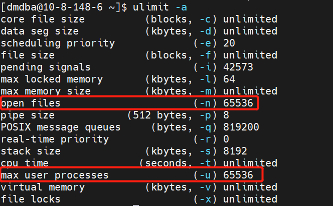

- 设置参数临时生效

  可使用 dmdba 用户执行如下命令，使设置临时生效：

  ```shell
  ulimit -n 65536
  ulimit -u 65536
  ```


**创建数据目录**

创建实例保存目录、归档保存目录、备份保存目录：

```shell
##实例保存目录
mkdir -p /dmdata/data 
##归档保存目录
mkdir -p /dmdata/arch
##备份保存目录
mkdir -p /dmdata/dmbak
```

> [!CAUTION]
>
> 使用 root 用户建立文件夹，待 dmdba 用户建立完成后需将文件所有者更改为 dmdba 用户，否则无法安装到该目录下。


**修改目录权限**

将新建的路径目录权限的用户修改为 dmdba，用户组修改为 dinstall。命令如下：

```shel
chown -R dmdba:dinstall /dmdata
```

给路径下的文件设置 755 权限。命令如下：

```shell
chmod -R 755 /dmdata
```


**挂载镜像**

切换到 root 用户，将 DM 数据库的 iso 安装包保存在任意位置，例如 `/opt` 目录下，执行如下命令挂载镜像：

```shell
cd  /opt
mount -o loop dm8_20240116_x86_rh7_64.iso /mnt
```


### 2.1.2、数据库安装

DM 数据库在 Linux 环境下支持命令行安装和图形化安装。


**命令行安装**

1. 切换至 dmdba 用户下，在 `/mnt` 目录下使用命令行安装数据库程序，依次执行以下命令安装 DM 数据库：

   ```shell
   su - dmdba
   
   cd /mnt/
   
   ./DMInstall.bin -i
   ```

2. 按需求选择安装语言，没有 key 文件选择 "n"，时区按需求选择一般选择 “21”，安装类型选择 “1”，安装目录按实际情况配置，这里示例使用默认安装位置：

   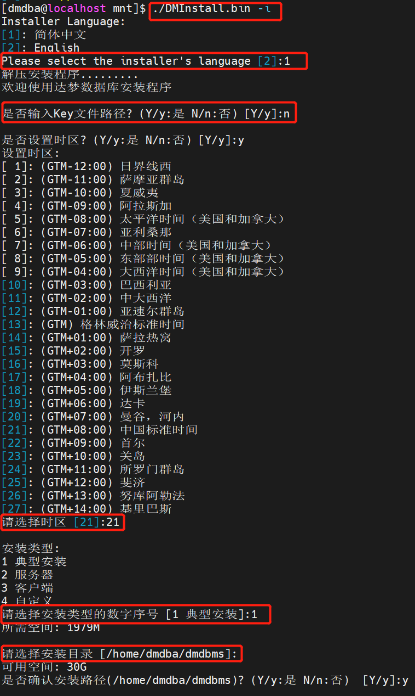

4. 数据库安装大概 1~2 分钟，数据库安装完成后，显示如下界面：

   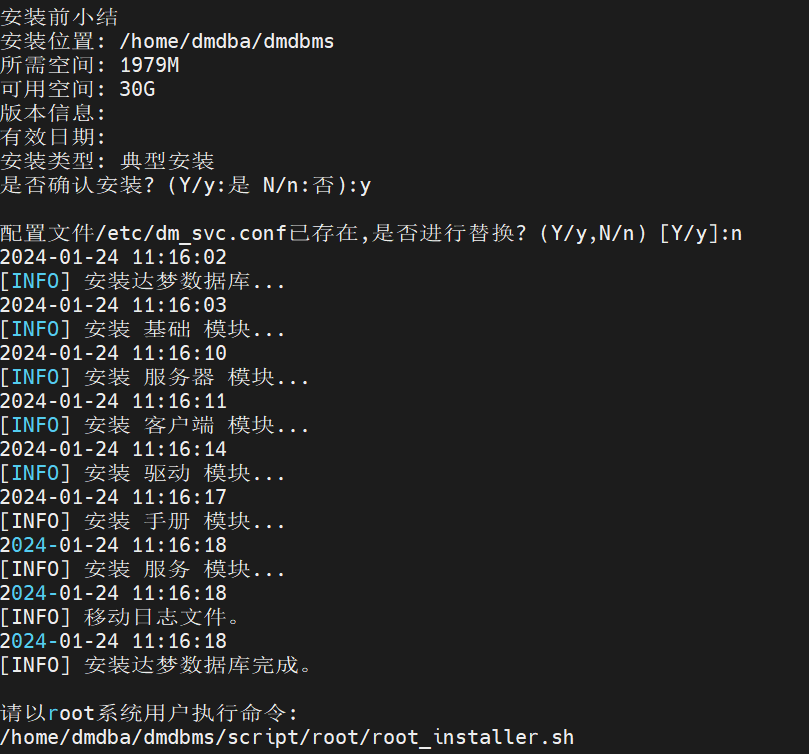

4. 数据库安装完成后，需要切换至 root 用户执行上图中的命令 `/home/dmdba/dmdbms/script/root/root_installer.sh` 创建 DmAPService，否则会影响数据库备份。

   数据库安装完成后还需注册实例才能使用数据库，注册实例后面会讲到。


**图形化安装**

1. 切换到 dmdba 用户，进入 `/mnt` 目录下，执行命令开始图形化安装：

   ```shell
   su - dmdba
   
   cd /mnt/
   
   ./DMInstall.bin
   ```

   若出现：`初始化图形界面失败，如果当前监视器窗口不支持图形界面，请进入安装文件所在文件夹并使用"./DMInstall.bin -i"进行命令行安装。` 错误提示，可按以下两种方式操作解决：

   - 方法一：注销当前用户，登陆 dmdba 用户，执行 `./DMInstall.bin` 命令。
   - 方法二：用当前用户执行 `xhost +`，切换到 dmdba 用户，执行 `export DISPLAY=:0`，再执行 `xhost +` 命令。

2. 图形化界面启动成功后，将弹出【选择语言与时区】页面，默认为简体中文和中国标准时间：

   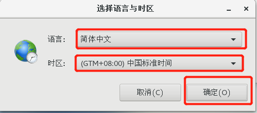

3. 点击【确定】后，弹出 DM 数据库安装程序：

   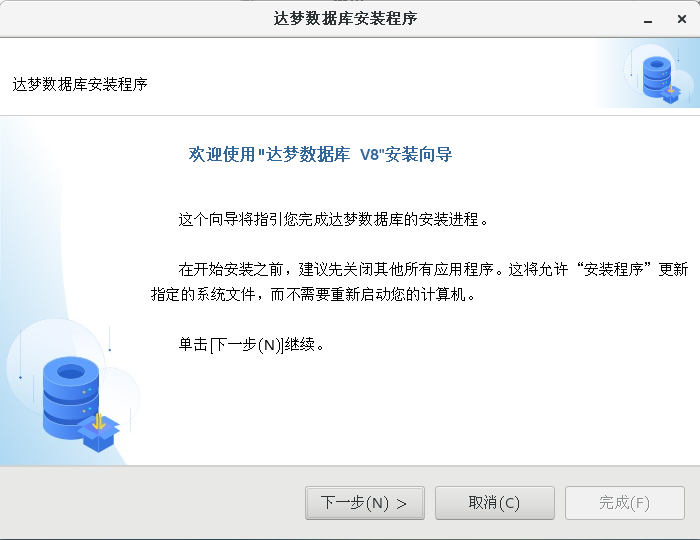

4. 点击【下一步】后，为许可证协议页面，选择【接受】：

   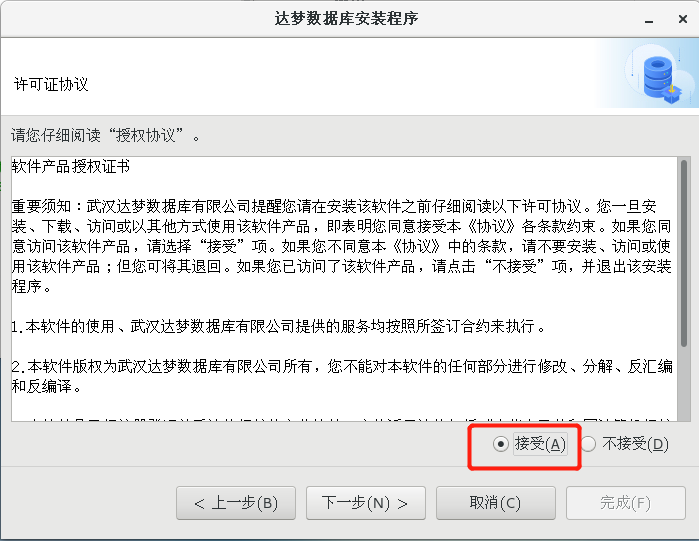

5. 点击【下一步】后，弹出 key 文件页面，点击【浏览】选择【key 文件】，若没有 key 文件可以直接点击【下一步】，跳过该步骤：

   

6. 点击【下一步】后，弹出选择组件页面，建议选择典型安装，也可根据需要，选择服务器安装、客户端安装和自定义安装：

   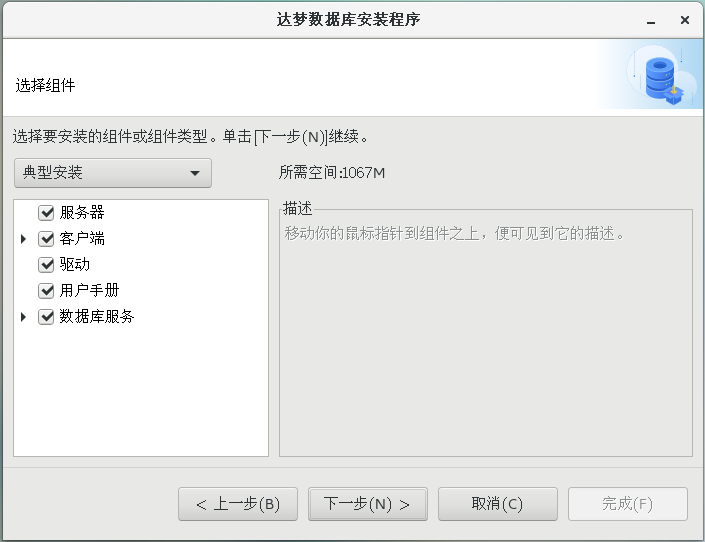

7. 点击【下一步】后，弹出选择安装位置页面，可点击【浏览】选择安装位置，也可安装在默认路径下：

   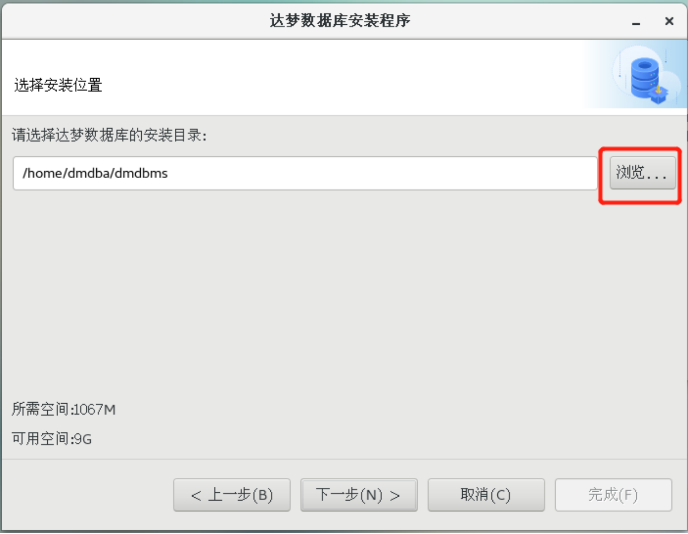

8. 点击【下一步】后，弹出确认安装信息页面，检查安装信息是否准确，确认无误后点击【安装】：

   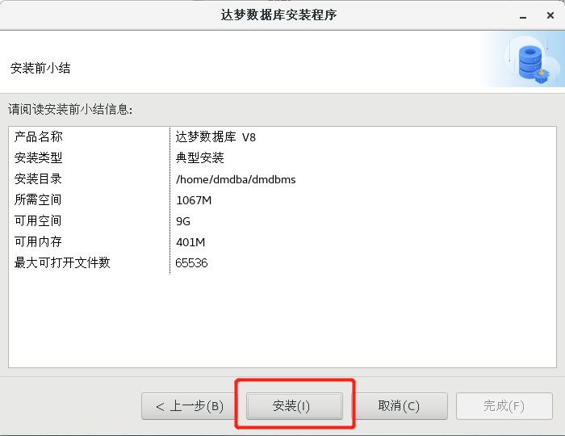

9. 点击【安装】后，等待 1~2 分钟即可安装完成，安装完成后弹出执行配置脚本页面，按照页面要求执行该脚本即可：

   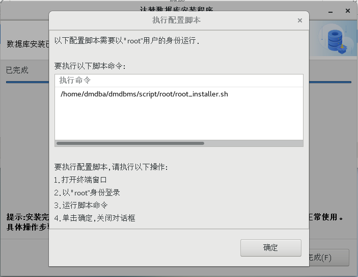

10. 重新打开一个终端，切换到 root 用户，执行弹出页面中的脚本：

    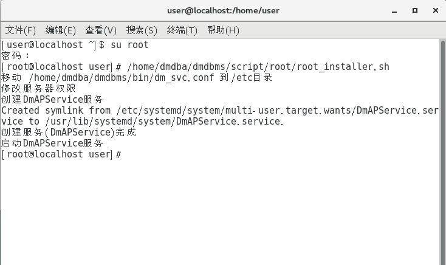

11. 脚本执行完成后，点击执行配置脚本页面中的【完成】，弹出提示框，提示是否关闭窗口，选择是，提示数据库安装完成，再点击【完成】按钮，完成数据库安装：

    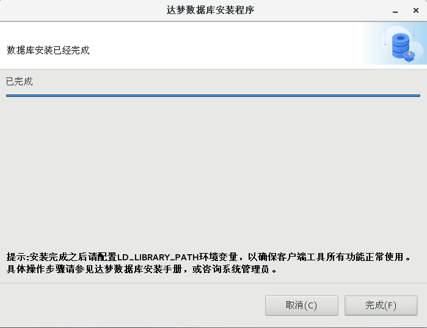


### 2.1.3、配置环境变量

1. 切换到 root 用户进入 dmdba 用户的根目录下，配置对应的环境变量。`DM_HOME` 变量和动态链接库文件的加载路径在程序安装成功后会自动导入。命令如下：

   ```shell
   export PATH=$PATH:$DM_HOME/bin:$DM_HOME/tool
   ```

2. 编辑 `.bash_profile`，使其最终效果如下图所示：

   ```shell
   cd /home/dmdba/
   
   vim .bash_profile
   ```

   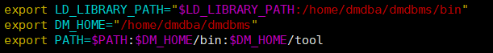

3. 切换至 dmdba 用户下，执行以下命令，使环境变量生效：

   ```shell
   su - dmdba
   
   source .bash_profile
   ```


### 2.1.4、配置实例

DM 数据库在 Linux 环境支持命令行配置实例以及图形化配置实例。


**命令行配置实例**

1. 使用 dmdba 用户配置实例，进入到 DM 数据库安装目录下的 bin 目录中：

   ```shell
   su - dmdba
   cd /home/dmdba/dmdbms/bin
   ```

2. 使用 `dminit` 命令初始化实例，`dminit` 命令可设置多种参数，可执行如下命令查看可配置参数：

   ```shell
   ./dminit help
   ```

   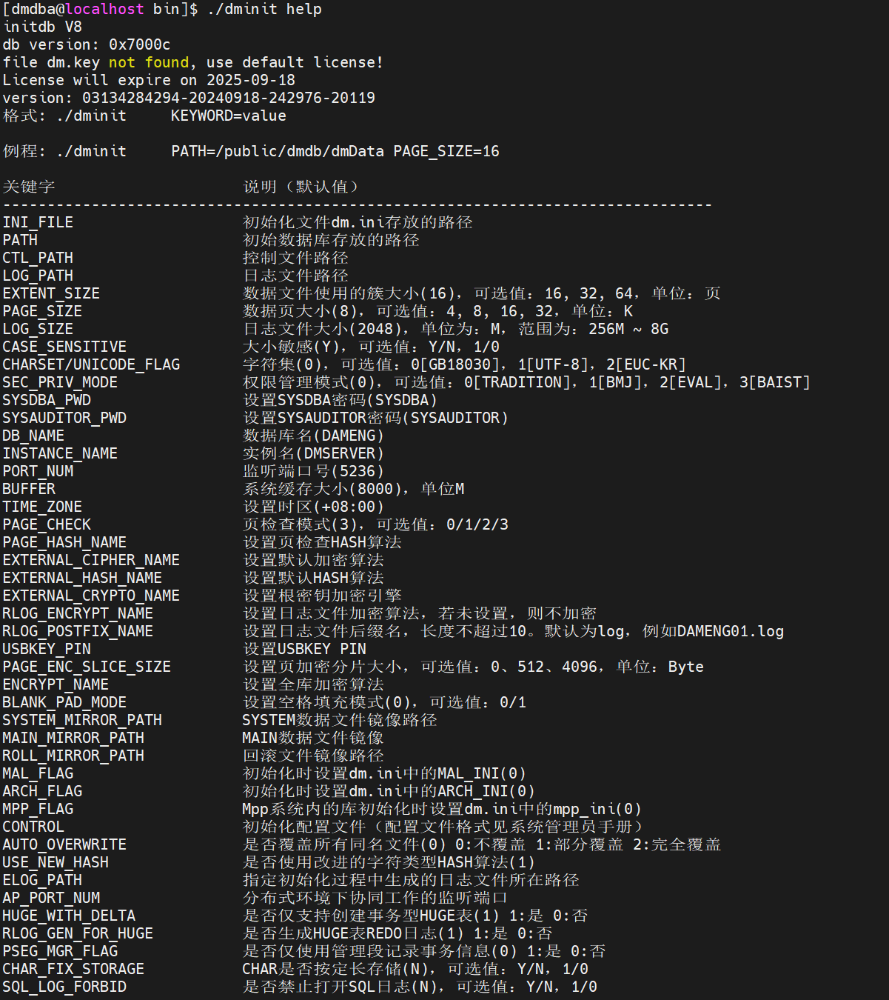

   需要注意的是页大小（*PAGE_SIZE*）、簇大小（*EXTENT_SIZE*）、大小写敏感（*CASE_SENSITIVE*）、字符集（*CHARSET*）、空格填充模式（*BLANK_PAD_MODE*）、页检查模式（*PAGE_CHECK*）等部分参数，一旦确定无法修改，在初始化实例时确认需求后谨慎设置。

   部分参数解释如下：

   - *PAGE_SIZE*：数据文件使用的页大小。取值范围 4、8、16、32，单位：KB。缺省值为 8。选择的页大小越大，则 DM 支持的元组长度也越大，但同时空间利用率可能下降。

     可选参数。数据库创建成功后无法再修改页大小，可通过系统函数 `SF_GET_PAGE_SIZE()` 获取系统的页大小。

   - *EXTENT_SIZE*：数据文件使用的簇大小，即每次分配新的段空间时连续的页数。取值范围 16、32、64。单位：页数。缺省值为 16。

     可选参数。数据库创建成功后无法再修改簇大小，可通过系统函数 `SF_GET_EXTENT_SIZE()` 获取系统的簇大小。

   - *CASE_SENSITIVE*：标识符大小写敏感。当大小写敏感时，小写的标识符应用 `""` 括起，否则被系统自动转换为大写；当大小写不敏感时，系统不会转换标识符的大小写，系统比较函数会将大写字母全部转为小写字母再进行比较。取值：Y、y、1 表示敏感；N、n、0 表示不敏感。缺省值为 Y。

     可选参数。此参数在数据库创建成功后无法修改，可通过系统函数 `SF_GET_CASE_SENSITIVE_FLAG()` 或 `CASE_SENSITIVE()` 查询设置的参数值。

   - *CHARSET*：字符集选项。取值范围 0、1、2。0 代表 GB18030，1 代表 UTF-8，2 代表韩文字符集 EUC-KR。缺省值为 0。

     可选参数。此参数在数据库创建成功后无法修改，可通过系统函数 `SF_GET_UNICODE_FLAG()` 或 `UNICODE()` 查询设置的参数值。

   - *BLANK_PAD_MODE*：设置字符串比较时，结尾空格填充模式是否兼容 ORACLE。1：兼容；0：不兼容。缺省值为 0。

     可选参数。此参数在数据库创建成功后无法修改，可通过查询 `V$PARAMETER` 中的 `BLANK_PAD_MODE` 参数名查看此参数的设置值。

   - *PAGE_CHECK*：*PAGE_CHECK* 为页检查模式。取值范围 0、1、2、3。0：禁用页校验；1：开启页校验并使用 CRC 校验；2：开启页校验并使用指定的 HASH 算法进行校验；3：开启页校验并使用快速 CRC 校验。缺省值为 3。

     可选参数。在数据库创建成功后无法修改。

3. 如果需要附加实例存放路径。此处以初始化实例到 `/dmdata/data` 目录下为例（执行初始化命令前，需要使用 root 用户授予 `/dmdata/data` 目录相应权限），初始化命令如下：

   ```shell
   ./dminit path=/dmdata/data SYSDBA_PWD=****** SYSAUDITOR_PWD=******
   ```

   也可以自定义初始化实例的参数，参考如下示例：

   ```shell
   ./dminit path=/dmdata/data PAGE_SIZE=32 EXTENT_SIZE=32 CASE_SENSITIVE=y CHARSET=1 DB_NAME=DAMENG INSTANCE_NAME=DMSERVER PORT_NUM=5236 SYSDBA_PWD=123  SYSAUDITOR_PWD=321
   ```

   上面命令设置页大小为 32 KB，簇大小为 32 KB，大小写敏感，字符集为 utf_8，数据库名为 DAMENG，实例名为 DMSERVER，端口为 5236，SYSDBA 用户密码为 123，SYSAUDITOR 用户密码为 321。

   > [!NOTE]
   >
   > 如果此处自定义了初始化参数，在后面的注册服务和启动数据库等步骤中，请按实际的自定义参数进行操作。


**图形化配置实例**

1. 使用图形化界面安装数据库安装完成后，会弹出选择是否初始化数据库页面，选择【初始化】：

   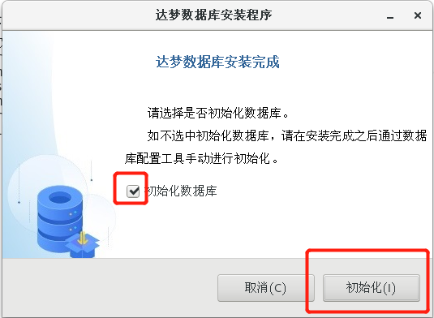

2. 点击初始化后会弹出数据库配置助手，通过数据库配置助手便可以配置数据库：

   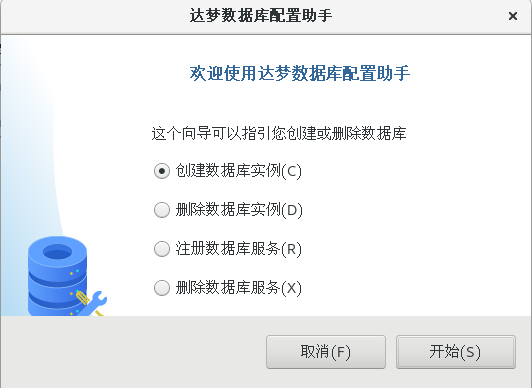

3. 若需要主动打开配置助手，可使用 dmdba 用户配置实例，进入到 DM 数据库安装目录下的 tool 目录中，使用 `./dbca.sh` 命令打开数据库配置助手：

   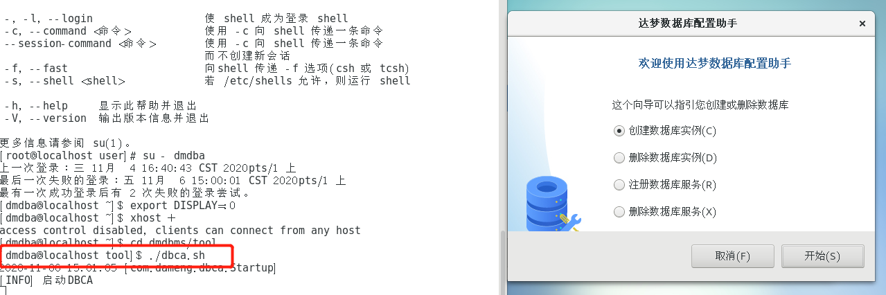

4. 选择创建数据库实例，点击【开始】，进入创建数据库页面的创建数据库模版页签，选择【一般用途】，如下图所示：

   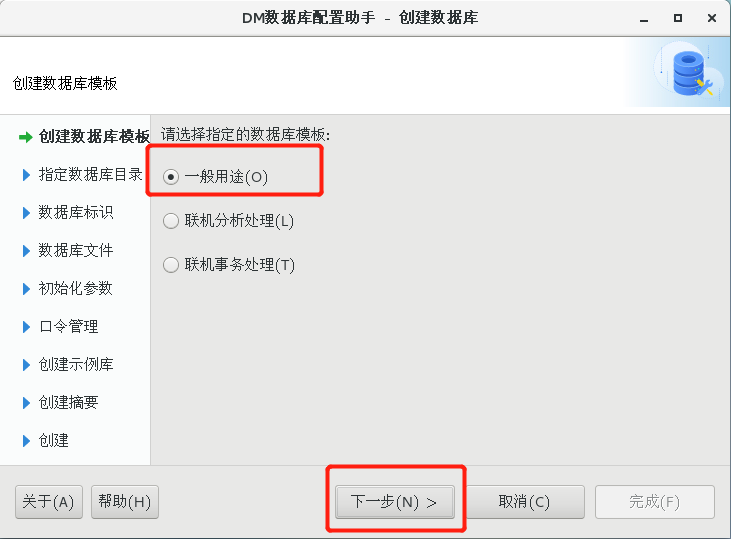

5. 点击【下一步】，选择数据库实例安装目录，如下图所示：

   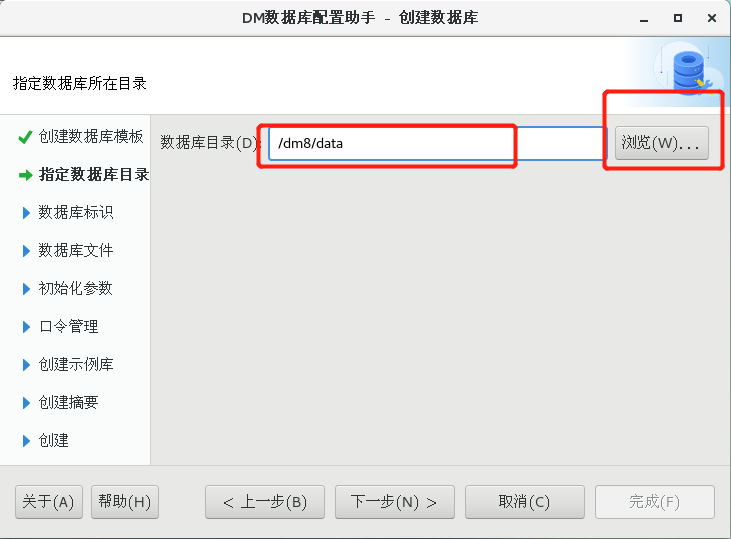

6. 确定好数据库安装目录后，点击【下一步】，用户可根据需要设置对应的数据库参数，如下图所示：

   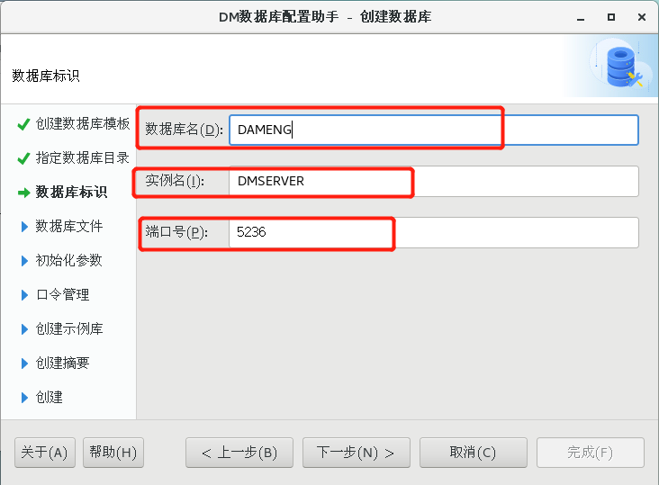

7. 点击【下一步】，配置数据库文件路径，选择【默认路径】即可，如下图所示：

   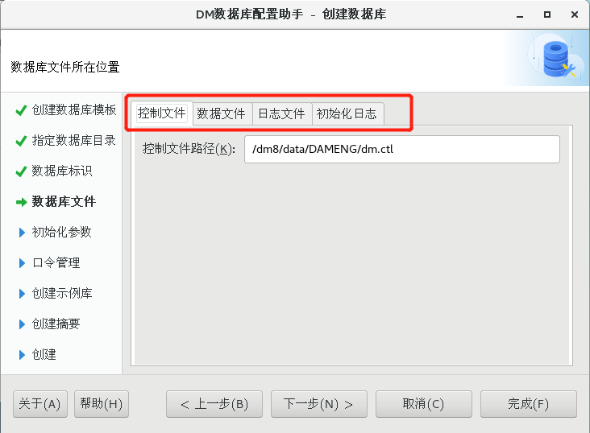

8. 点击【下一步】，配置初始化参数，注意簇大小、页大小、字符集以及大小写敏感确定后不可修改，如下图所示：

   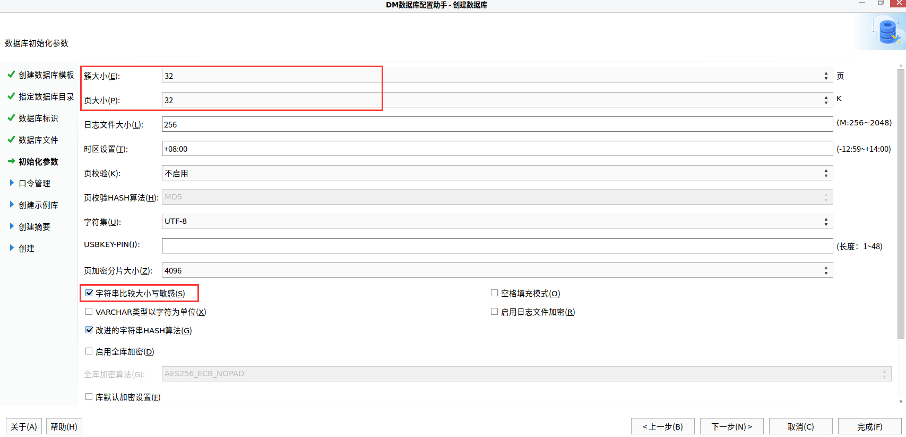

9. 点击【下一步】，配置数据库口令，默认配置即可，如下图所示：

   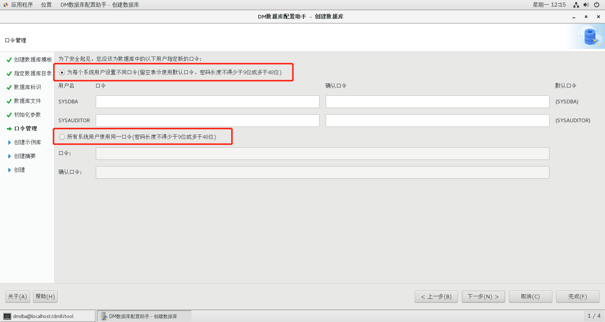

10. 点击【下一步】，配置示例库，建议勾选  `BOOKSHOP` 或 `DMHR`，作为演示环境，如下图所示：

    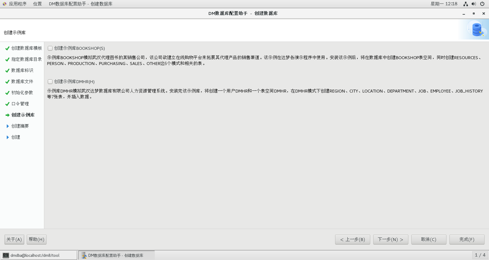

11. 点击【下一步】，用户可检查创建参数，若有需要修改之处可点击【上一步】回到需要修改的位置进行修改，如下图所示：

    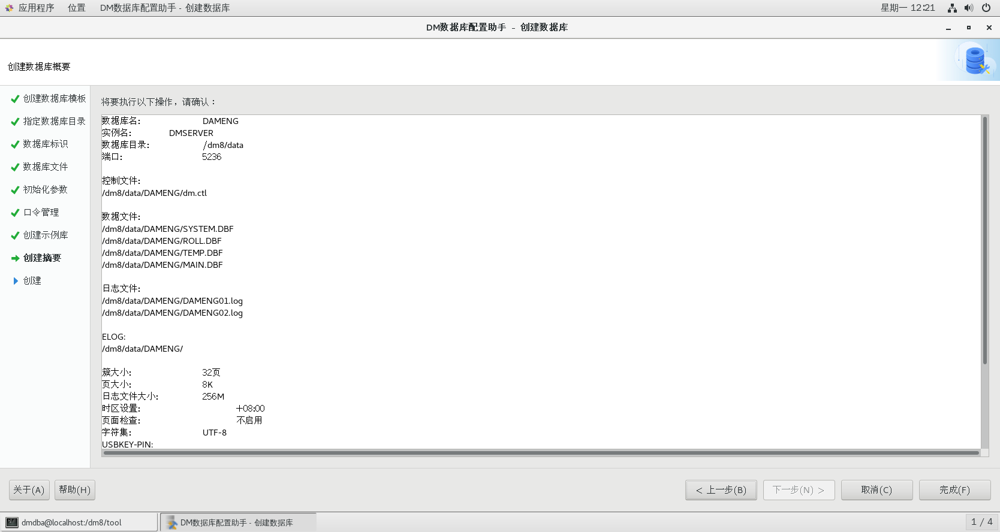

12. 点击【完成】，创建完成数据库实例后，按下图按提示执行脚本即可完成实例配置：

    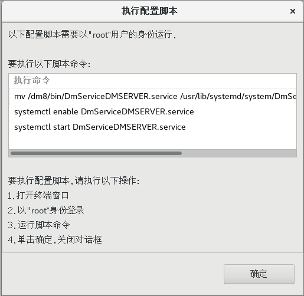

    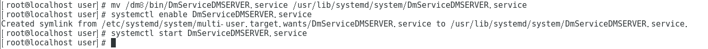


### 2.1.5、注册服务

**命令行注册服务**

1. 注册服务需使用 root 用户进行注册。使用 root 用户进入数据库安装目录的 `/script/root` 下，如下所示：

   ```shell
   cd /home/dmdba/dmdbms/script/root/
   ```

2. 注册服务，如下所示：

   ```shell
   ./dm_service_installer.sh -t dmserver -dm_ini /dmdata/data/DAMENG/dm.ini -p DMSERVER
   ```

   部分参数说明：

   | 标志      | 参数         | 说明                                                         |
   | :-------- | :----------- | :----------------------------------------------------------- |
   | `-t`      | 服务类型     | 注册服务类型，支持以下服务类型：dmap、dmamon、dmserver、<br />dmwatcher、dmmonitor、dmasmsvr、dmasmsvrm、dmcss、dmcssm。 |
   | `-dm_ini` | INI 文件路径 | 指定服务所需要的 dm.ini 文件路径。                           |
   | `-p`      | 服务名后缀   | 指定服务名后缀，生成的操作系统服务名为 “服务脚本模板名称 + 服务名后缀”。<br />此参数只针对 dmserver、dmwatcher、dmmonitor、dmasmsvr、dmasmsvrm、<br />dmcss、dmcssm 服务脚本生效。 |

3. 进入数据安装目录下 bin 目录中可以看到已经注册好的服务 DmServiceDMSERVER：

   ```shell
   cd /home/dmdba/dmdbms/bin
   ls | grep DmServiceDMSERVER
   ```


**图形化注册服务**

1. 打开运行 dbca 工具，选择【注册数据库服务】，如下图所示：

   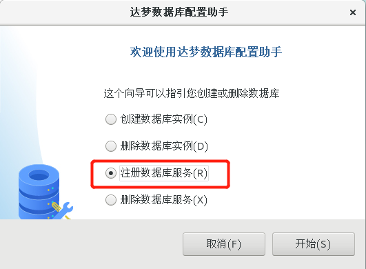

2. 单击【开始】，弹出注册数据库服务页面，如下图所示：

   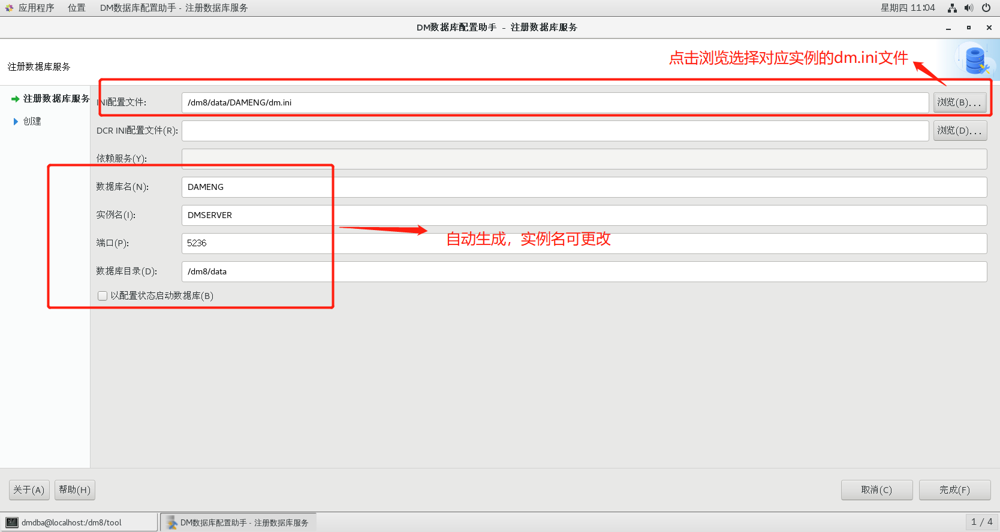

3. 点击【完成】后，弹出执行配置脚本页面，按页面要求执行脚本即可，如下图所示：

   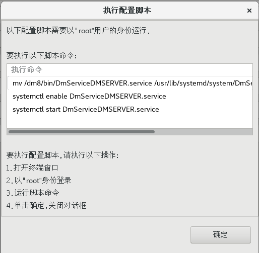

4. 执行脚本成功后，该实例已启动，如下图所示：

   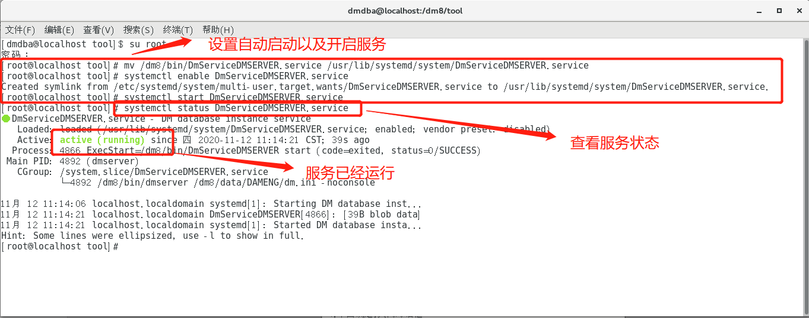


### 2.1.6、启动、停止数据库

**命令行启停数据库**

服务注册成功后，启动数据库，如下所示：

```shell
systemctl start DmServiceDMSERVER.service
```

停止数据库，如下所示：

```shell
systemctl stop DmServiceDMSERVER.service
```

重启数据库，如下所示：

```shell
systemctl restart DmServiceDMSERVER.service
```

查看数据库服务状态，如下所示：

```shell
systemctl status DmServiceDMSERVER.service
```

可前台启动，进入 DM 安装目录下的 `bin` 目录下，命令如下：

```shell
./dmserver /dm/data/DAMENG/dm.ini
```

该启动方式为前台启动，若想关闭数据库，则输入 `exit` 即可。

也可进入 DM 安装目录下的 `bin` 目录下，启动/停止/重启数据库，如下所示：

```shell
./DmServiceDMSERVER start/stop/restart
```

查看数据库状态，如下所示：

```shell
./DmServiceDMSERVER status
```


**图形化启停数据库**

进入 DM 安装目录下的 `tool` 目录，使用如下命令打开 DM 服务查看器，如下所示：

```shell
./dmservice.sh
```

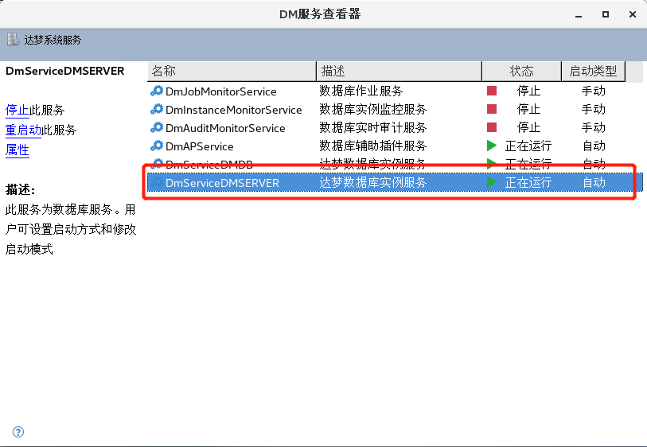

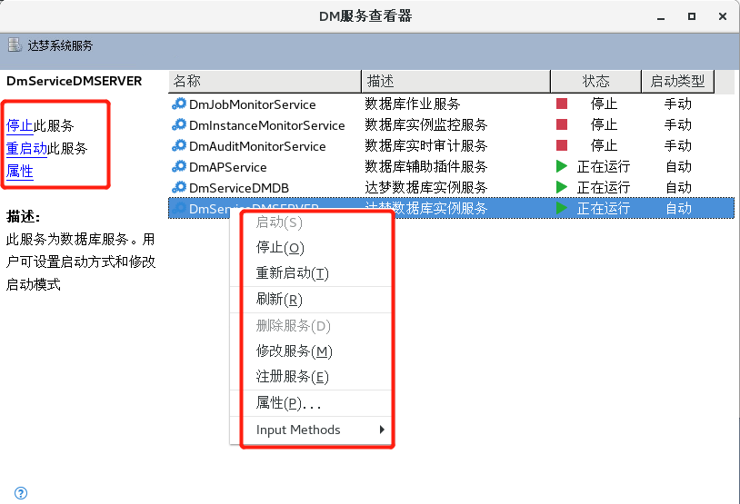


## 2.2、数据库目录结构

**数据库安装目录**

下图展示为 DM8 数据库目录。

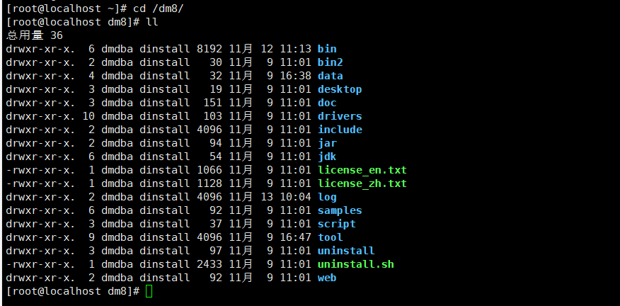

- `/dm8/bin` 目录存放 DM 数据库的可执行文件，例如 `disql` 命令、`dminit` 命令、`dmrman` 工具等。
- `/dm8/desktop` 存放 DM 数据库各个工具的桌面图标。
- `/dm8/doc` 存放 DM 数据库用户手册。
- `/dm8/drivers` 存放连接 DM 数据库的驱动文件。
- `/dm8/log` 存放 DM 数据库日志，包括工具的日志、数据库日志、服务日志等。
- `/dm8/samples` 存放 DM 数据库各类配置文件的示例文件。
- `/dm8/script` 存放注册、注销 DM 数据库服务的工具，例如 dm_service_installer.sh 等。
- `/dm8/tool` 存放 DM 数据库的各个工具，例如 manager 管理工具、dbca 数据库配置助手等。
- `/dm8/uninstall` 目录存放卸载 DM 数据库的脚本。
- `/dm8/web` 目录存放 DM 数据库 dem 工具的 web 环境。


**数据库实例目录**

`/dm8/data` 为数据库实例目录，该目录存放各个实例的文件。


以实例 DAMENG 为例，该目录下存放 DAMENG 实例的配置文件（`*.ini`）、控制文件（`dm.ctl`）、数据文件（`*.DBF`）、日志文件（`*.log`） 等。

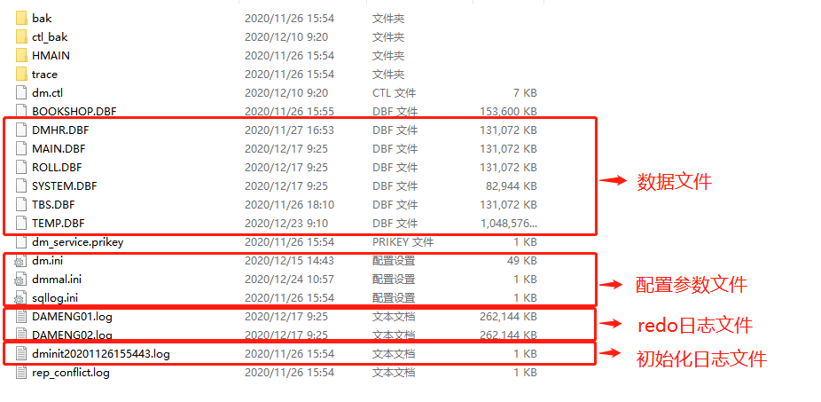


# 3、SQL 交互式查询工具

disql 是一款命令行客户端工具，用于进行 SQL 交互式查询，disql 工具一般用于没有图形界面时的操作，或者使用的连接工具为命令行形式，如 Xshell、SCRT 等工具。


## 3.1、disql 登录数据库

### 3.1.1、Linux 登录 disql

Linux 登录，进入数据库软件安装目录的 bin 目录下。登录方式主要有两种，分别如下：


**方式一**

```shell
./disql username/password@IP:PORT
```

以 `/home/dmdba/dmdbms/bin` 为例，如下所示：

```shell
./disql SYSDBA/SYSDBA@LOCALHOST:5236
```

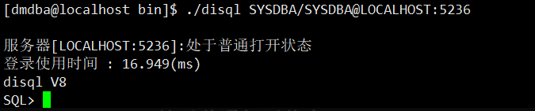

如果密码含有特殊字符的情况下，需要使用双引号将密码包含进来，同时外层再使用单引号进行转义。以用户名 TEST，密码 `TEST@111#2024` 为例，如下所示：

```shell
./disql TEST/'"TEST@111#2024"'@127.0.0.1:5236
```

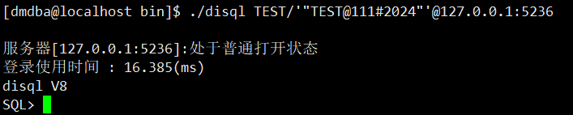

如果用户名、密码、端口号均为默认的情况下（用户名：SYSDBA ，密码：SYSDBA ，端口：5236 ），可直接输入 `./disql`，敲击回车按键，即可登录数据库。如下所示：

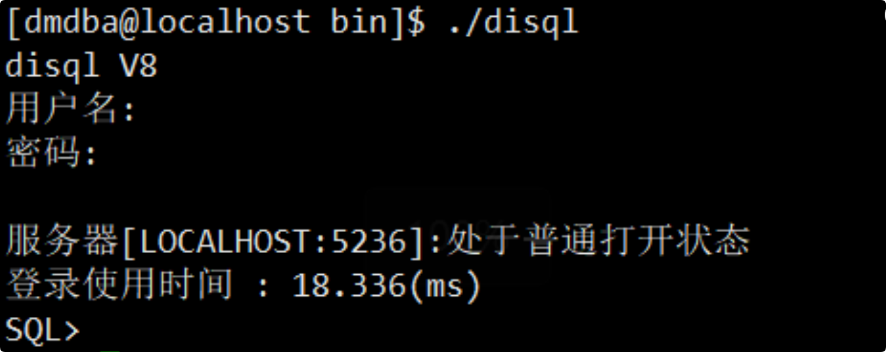


**方式二**

```shell
# 进入disql操作终端界面，然后执行下面的操作
./disql /nolog

# 使用conn命令连接
conn 用户名/密码@IP:PORT
# 或者使用connet
connect 用户名/密码@IP:PORT
# 或者输入LOGIN命令
login
```

以 `/home/dmdba/dmdbms/bin` 为例，disql 中通过 `conn` 或者 `connect` 命令连接数据库，操作如下所示：

```shell
./disql /nolog

CONNECT TEST/'"TEST@111#2024"'@127.0.0.1:5236
```

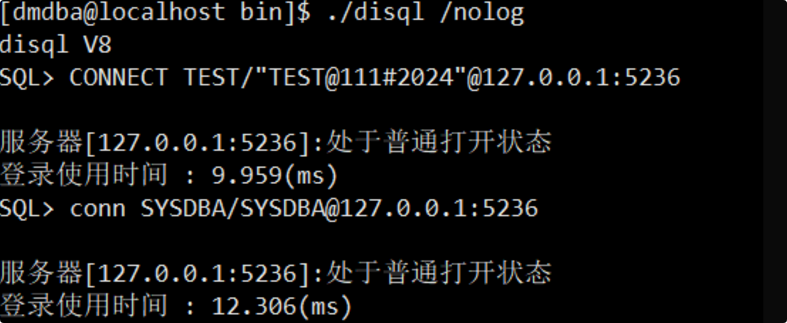

`login` 命令操作如下：

- 服务名：`IP:PORT` 或者 dm_svc.conf 文件中配置的服务名。
- 用户名：输入登录的数据库用户名。
- 密码：输入用户密码（密码无需加转义符）。

其余回车即可：

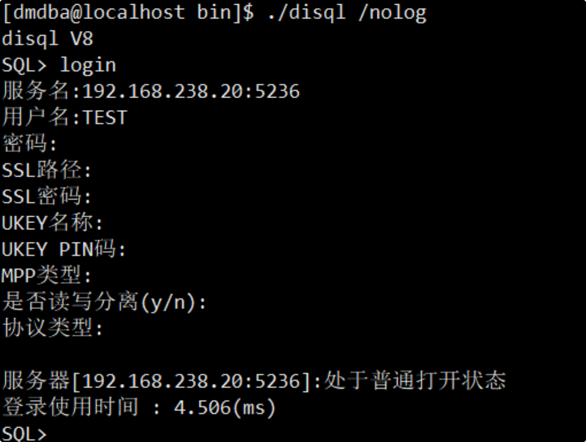


## 3.2、disql 登出数据库

登出命令在 Windows、Linux 均相同，主要分为两类，一类是 `logout`、`disconnect`；另一类是 `exit`、`quit`。

其中 `logout`、`disconnect` 只退出或者断开当前登录的会话连接，不退出 disql；`exit`、`quit` 表示退出当前登录会话连接并且退出 disql 操作界面。如下所示：

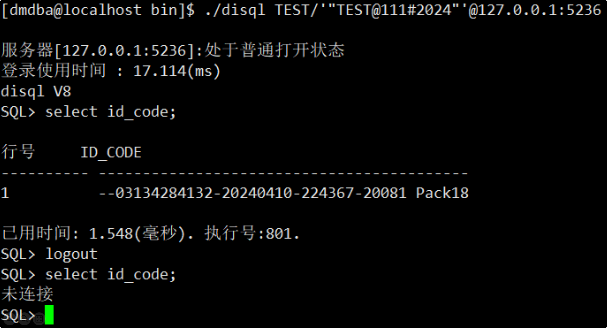


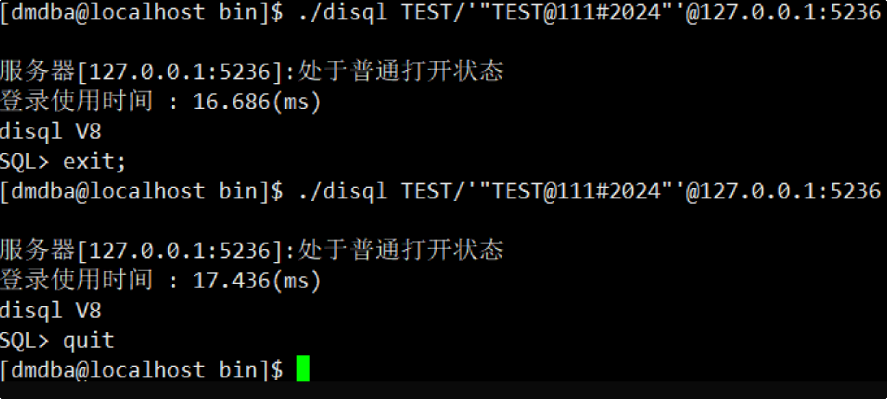


## 3.3、disql 的使用

### 3.3.1、脚本使用

disql 登录成功后，通过反引号 `` ` 和 `start` 命令加上脚本位置执行脚本，以 Linux 上脚本位置 `/home/dmdba/test.sql`、Windows 上脚本位置 `C:\dm8_326_p6\sel.sql` 为例，如下所示：

```shell
./disql TEST/'"TEST@111#2024"'@127.0.0.1:5236

start /home/dmdba/test.sql
`/home/dmdba/test.sql
```


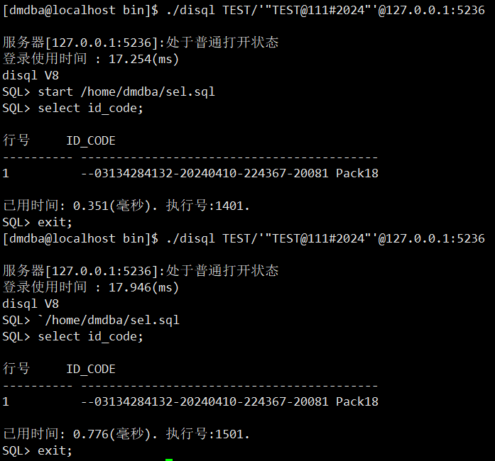

也可在登录时直接同时进行脚本的执行，如下所示：

```shell
./disql TEST/'"TEST@111#2024"'@127.0.0.1:5236 \`/home/dmdba/test.sql
```

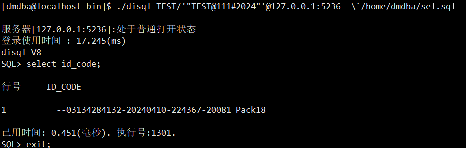

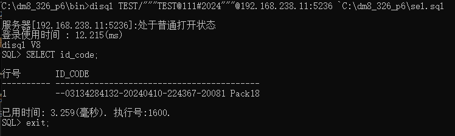

> [!IMPORTANT]
>
> Windows 环境下不需要对反引号 `` ` 进行转义，而 Linux 环境下需要对其进行转义。


### 3.3.2、环境变量参数设置

可通过设置 disql 的参数，来调整交互界面的显示效果，以达成输出的显示结果更加直观。

通过 `SET` 命令语法进行使用，off 表示该参数关闭，on 表示该参数开启。

可以同时 SET 多个环境变量，如：`set heading on timing on` 。需要注意的是，SET 之后某个环境变量出错，那么该变量之后的环境变量参数将不再起作用。

disql 常用部分参数如下所示：

```SQL
# 设置一页有多少行数
SET PAGESIZE 1000

# 显示每个 SQL 语句花费的执行时间
SET TIMING ON

# 显示系统的当前时间
SET TIME ON

# 设置屏幕上一行显示宽度
SET LINESIZE 1000

# 关闭显示行号
SET LINESHOW OFF

# 设置查看执行计划
SET AUTOTRACE <OFF(缺省值) | NL | INDEX | ON | TRACE | TRACEONLY>

# 在块中有打印信息时，是否打印，以及打印的格式
SET SERVEROUTPUT ON

# 设置 SQL 语句的编码方式 GBK | GB18030 | UTF8 | DEFAULT
SET CHAR_CODE DEFAULT

# 设置兼容 MySQL 的打印格式
SET ISQL_MODE 3

# DISQL 中使用 INSERT 语句且当插入的值包含 & 符号时，需要将 DEFINE 环境变量关闭或者设置成其他值。
# DEFINE 环境变量默认为 & 前缀，即 SQL 语句中包含 & 符号时，& 符号后面的字符会识别为 SQL 语句中变量名，
# 如后面字符中包含 $ 符号，则从 & 符号与 $ 符号中间的字符识别为 SQL 语句中的变量名。
# 关闭 DEFINE 功能
SET DEFINE OFF

# 输出到文件
SPOOL /home/dmdba/dbchk20200609.txt 
# 结束输出文件
SPOOL OFF; 
```


# 4、基本操作

## 4.1、创建表空间

**新建表空间**

使用命令创建表空间 TEST， 指定数据库文件为 `/data/dmdata/DAMENG/TEST.DBF`，初始大小为 128 M，其它默认，示例如下：

```SQL
create tablespace "TEST" datafile '/data/dmdata/DAMENG/TEST.DBF' size 128;
```


**修改表空间参数**

修改表空间，打开自动扩展，每次自动扩展 100 M ，扩展上限 10240 M，参考示例如下：

```SQL
alter tablespace "TEST" datafile '/data/dmdata/DAMENG/TEST.DBF' autoextend on next 100 maxsize 10240;
```


**新建表空间设置加密算法、密码**

创建表空间 TEST， 指定数据库文件为 `/data/dmdata/DAMENG/TEST.DBF`，初始大小为 128 M，打开自动扩展，每次自动扩展 100 M ，扩展上限 10240 M，使用 RC4 加密算法，参考示例如下：

```sql
create tablespace "TEST" datafile '/data/dmdata/DAMENG/TEST.DBF' size 128 autoextend on next 100 maxsize 10240 CACHE = NORMAL encrypt with RC4;
```


## 4.2、创建用户

**新建用户**

使用命令行方式创建用户 TEST ，密码 Dameng@123，使用散列算法 SHA512 ，使用存储加密密钥为 123456，指定表空间为 TEST，索引表空间为 TEST，示例参考如下：

```SQL
create user "TEST" identified by "Dameng@123" hash with SHA512 salt
encrypt by "123456"
default tablespace "TEST"
default index tablespace "TEST";
```


**授权**

TEST 用户授予 PUBLIC 和 SOI 权限，示例参考如下：

```sql
grant "PUBLIC","SOI" to "TEST";
```


# 5、数据库配置

## 5.1、数据库状态和模式

DM 数据库包含以下几种状态：

1. 配置状态（MOUNT）：不允许访问数据库对象，只能进行控制文件维护、归档配置、数据库模式修改等操作。
2. 打开状态（OPEN）：不能进行控制文件维护、归档配置等操作，可以访问数据库对象，对外提供正常的数据库服务。
3. 挂起状态（SUSPEND）：与 OPEN 状态的唯一区别就是，限制磁盘写入功能；一旦修改了数据页，触发 REDO 日志、数据页刷盘，当前用户将被挂起。

OPEN 状态与 MOUNT 和 SUSPEND 能相互转换，但是 MOUNT 和 SUSPEND 之间不能相互转换。

DM 数据库包含以下几种模式：

1. 普通模式（NORMAL）：用户可以正常访问数据库，操作没有限制。
2. 主库模式（PRIMARY）：用户可以正常访问数据库，所有对数据库对象的修改强制生成 REDO 日志，在归档有效时，发送 REDO 日志到备库。
3. 备库模式（STANDBY）：接收主库发送过来的 REDO 日志并重做。数据对用户只读。

三种模式只能在 MOUNT 状态下设置，模式之间可以相互转换。

对于新初始化的库，首次启动不允许使用 MOUNT 方式，需要先正常启动并正常退出，然后才允许 MOUNT 方式启动。

一般情况下，数据库为 NORMAL 模式，如果不指定 MOUNT 状态启动，则自动启动到 OPEN 状态。

在需要对数据库配置时（如配置数据守护、数据复制），服务器需要指定 MOUNT 状态启动。当数据库模式为非 NORMAL 模式（PRIMARY、STANDBY 模式），无论是否指定启动状态，服务器启动时自动启动到 MOUNT 状态。


### 5.1.1、状态切换

**命令行方式**

以 SYSDBA 角色连接数据库后，可执行命令切换数据库状态。

将数据库转为 MOUNT 配置状态，可读取数据库配置文件，不可对数据文件读写：

```sql
alter database mount;
```

将数据库转为 OPEN 打开状态，可读取数据库配置文件，可对数据文件读写：

```sql
alter database open;
```


**图形化界面配置**

1. 打开 DM管理工具 => 连接数据库 => 右键选择【管理服务器】：

   

2. 切换到【系统管理】页面，选择需要切换的状态，最后点击【转换】：

   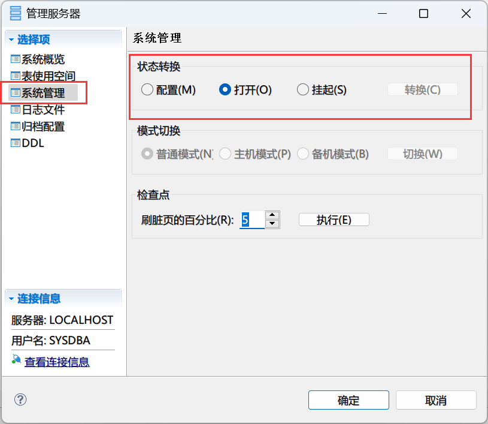

   左侧目录刷新，即可看到数据库对象信息。


## 5.2、启动和停止

### 5.2.1、Windows 系统

**菜单方式**

安装 DM 数据库后默认情况下 DM 服务会自动启动，在 Windows 的开始菜单中选择【DM 服务查看器】可以启动或停止 DM 数据库：

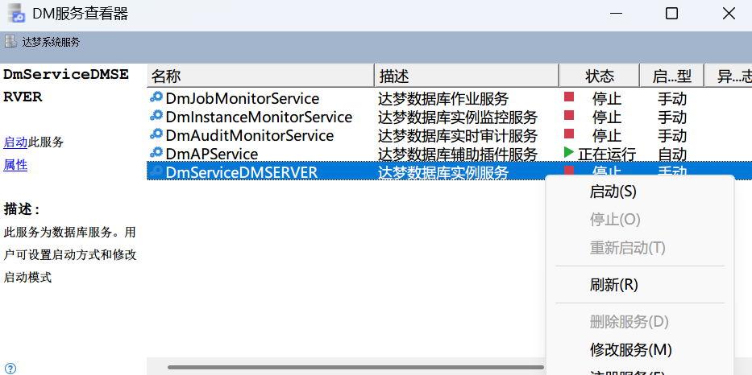


**Windows 服务**

安装 DM 数据库并且新建一个 DM 实例后，Windows 的服务中会自动增加一项和该实例名对应的服务。例如新建一个实例名为 DMSERVER 的 DM 数据库， Windows 的服务中会增加一项名称为【DmServiceDMSERVER】 的服务。

打开 Windows 服务，右键选择【DmServiceDMSERVER】启动或者停止 DM 数据库：

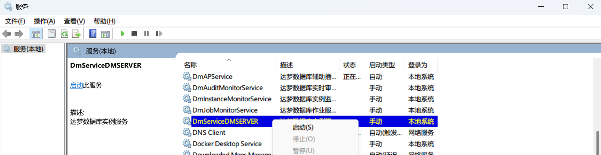


### 5.2.2、Linux 系统

**菜单方式**

安装 DM 数据库后默认情况下 DM 服务会自动启动，在 Linux 的开始菜单选项中选择【DM 服务查看器】可以启动或停止 DM 数据库。启动方式类似 Windows。


**Linux 服务**

安装 DM 数据库后，在 `/etc/rc.d/init.d` 中有名称为 DmService 开头的文件，文件全名为 `DmService+实例名`。

在数据库的安装目录 bin 下输入命令可以启动或停止 DM 数据库：

```shell
# 启动
./DmServiceDMSERVER start 
# 停止
./DmServiceDMSERVER stop
```

或者直接使用 `service` 命令：

```shell
# 启动
service DmServiceDMSERVER start
# 停止
service DmServiceDMSERVER stop
```


## 5.3、数据库的兼容性

达梦数据库可以通过修改实例的配置文件 dm.ini 中的参数 `COMPATIBLE_MODE` 用来兼容不同的数据库，此参数为静态参数，修改后只有重启数据库服务才能生效。

`COMPATIBLE_MODE` 有以下值：

- 0：不兼容。
- 1：兼容 SQL92 标准。
- 2：部分兼容 ORACLE。
- 3：部分兼容 MS SQL SERVER。
- 4：部分兼容 MYSQL。
- 5：兼容 DM6。
- 6：部分兼容 TERADATA。

可通过以下 SQL 查询 `COMPATIBLE_MODE` 值：

```sql
SELECT para_name, para_type, para_value FROM V$DM_INI WHERE PARA_NAME ='COMPATIBLE_MODE';
```


**通过 disql 修改此参数**

修改此参数为 2，兼容 Oracle 数据库：

```sql
sp_set_para_value(2,'compatible_mode',2);
```

重启数据库服务，查看此参数已修改。


**通过 dm.ini 配置文件修改此参数**

通过 `sed` 命令直接修改 dm.ini 配置文件中的 `COMPATIBLE_MODE` 参数为 0，不兼容：

```shell
sed -i 's/^COMPATIBLE_MODE *= *.*/COMPATIBLE_MODE = 0/' dm.ini
```

重启数据库服务，查看此参数已修改。


# 6、备份和迁移

## 6.1、DTS 工具迁移

DM 数据迁移工具 DM DTS 提供了主流大型数据库迁移到 DM、DM 到 DM、文件迁移到 DM 以及 DM 迁移到文件等功能。

得益于 DM 数据库对目前主流大型关系型数据库系统有着业界领先的兼容性，在存储层面、语法层面、接口层面和它们保持高度兼容，借助于 DM 图形界面且采用向导方式引导各个迁移步骤的 DTS 工具，移植工作可以变得非常的简单。

1. 新建工程：

   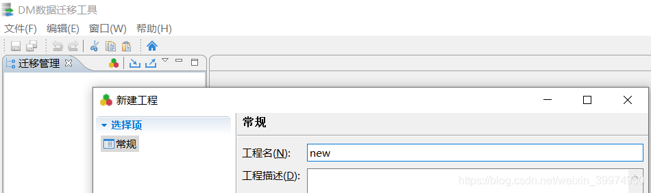

2. 新建迁移：

   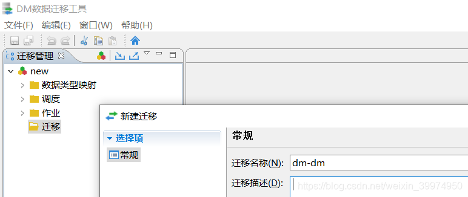

3. 双击打开 dm-dm 进行迁移配置：

   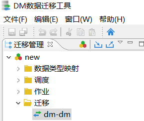

4. 选择相应的迁移模式（此处选【dm ==> dm】迁移）：

   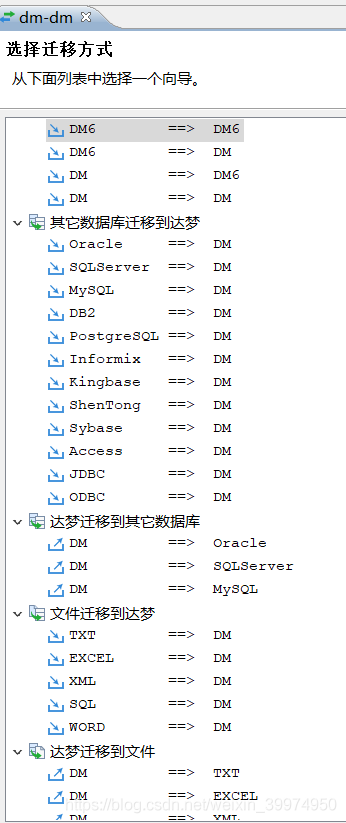

5. 填写相应的源数据库和目标数据库的连接信息：

   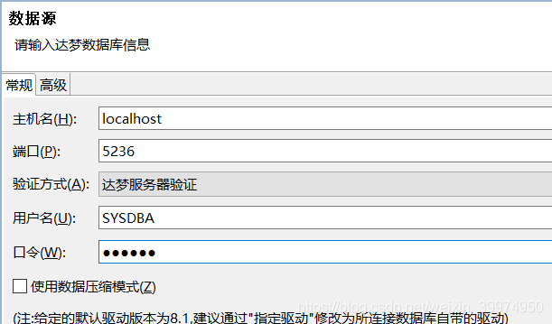

6. 选择要迁移的源模式，并指定目的模式，其中 "目录"、"公共同义词"、"上下文" 取消勾选：

   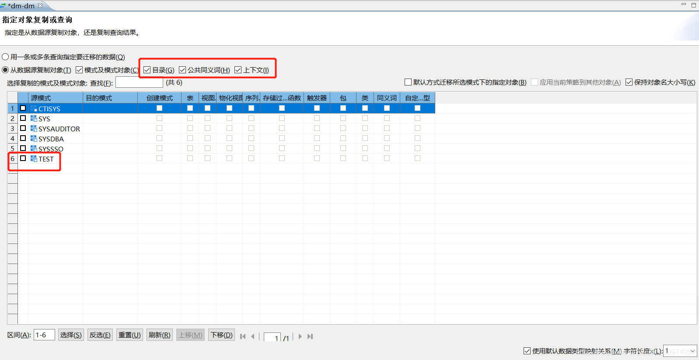

7. 勾选相应的对象，点击【转换】选择迁移策略，可以根据实际情况选择只迁移表结构、数据、约束，或删除原有数据再迁移等具体情况，大字段表选项改小 256 即可

   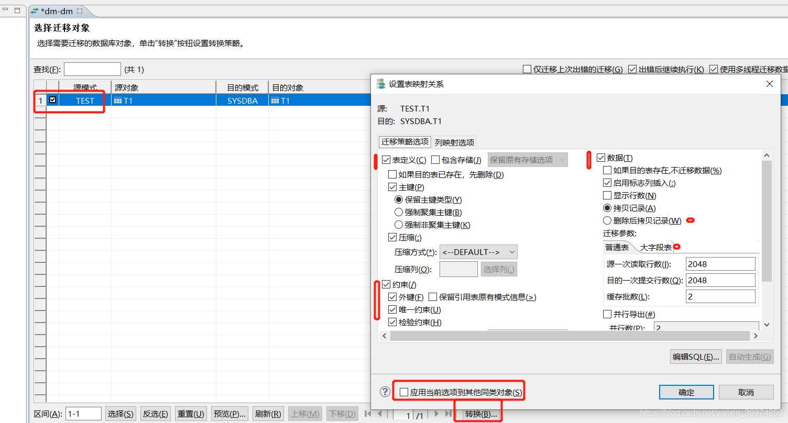

8. 确认无误后完成即可：

   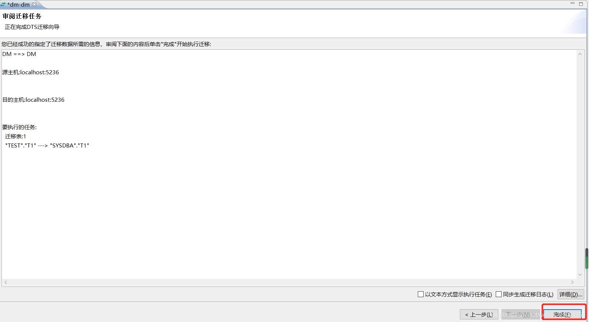


## 6.2、物理备份还原

物理备份是找出那些已经分配、使用的数据页，拷贝并保存到备份集中。物理还原是物理备份的逆过程，物理还原一般通过 DMRMAN 工具（或者 SQL 语句），把备份集中的数据内容（数据文件、数据页、归档文件）重新拷贝、写入目标文件。

- 联机备份还原：联机备份还原指数据库处于运行状态时，并正常提供数据库服务情况下进行的备份还原操作，称为联机备份还原。
- 脱机备份还原：脱机还原指数据库处于关闭状态时执行的还原操作。库备份、表空间备份和归档备份，可以执行脱机还原。脱机还原操作的目标库必须处于关闭状态。
- 备份集：备份集用来存放备份过程中产生的备份数据及备份信息。一个备份集对应了一次完整的备份。一般情况下，一个备份集就是一个目录，备份集包含一个或多个备份片文件，以及一个备份元数据文件。


### 6.2.1、准备工作

联机备份数据库必须要配置归档。联机备份时，大量的事务处于活动状态，为确保备份数据的一致性，需要同时备份一段日志（备份期间产生的 REDO 日志），因此要求数据库必须配置本地归档且归档处于开启状态。

脱机备份数据库可配置归档也可以不配置。正常退出的库的备份不需要考虑本地归档日志的完整性，可以不配置归档；但对于故障退出的库的备份要求因故障未刷盘的日志也必须存在于本地归档中，因此必须配置归档。

归档配置有两种方式：一是联机归档配置，数据库实例启动情况下，使用 SQL 语句完成 dmarch.ini 和 ARCH_INI 配置；二是手动配置归档，数据库实例未启动的情况下，手动编写 dmarch.ini 文件和设置参数 ARCH_INI。


#### 联机归档配置

**命令行配置**

1. 修改数据库为 Mount 状态：

   ```sql
   ALTER DATABASE MOUNT;
   ```

2. 开启归档模式：

   ```sql
   ALTER DATABASE ARCHIVELOG;
   ```

3. 配置本地归档：

   ```sql
   ALTER DATABASE ADD ARCHIVELOG 'DEST = /data/dm_arch/arch, TYPE = local, FILE_SIZE = 1024, SPACE_LIMIT = 2048';
   ```

4. 修改数据库为Open状态：

   ```sql
   ALTER DATABASE OPEN;
   ```


**图形化配置**

1. 右键数据库连接，选择【管理服务器】，切换到【系统管理】，将状态转换为【配置】：

   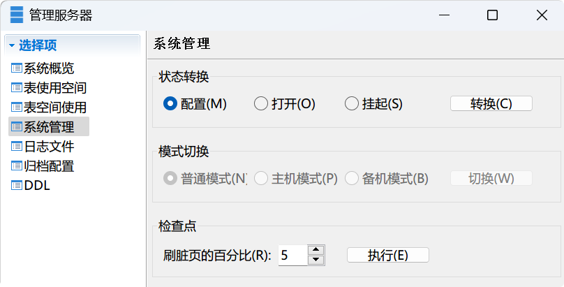

2. 切换到【归档配置】，将归档模式设置为【归档】，并添加一个本地的归档目标：

   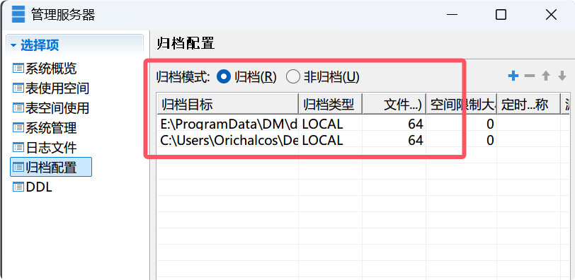

   

   > [!WARNING]
   >
   > 此处为归档日志目录，并且添加了之后无法删除！！！

3. 点击确定后，再打开【管理服务器】回到【系统管理】，将状态切换为【打开】：

   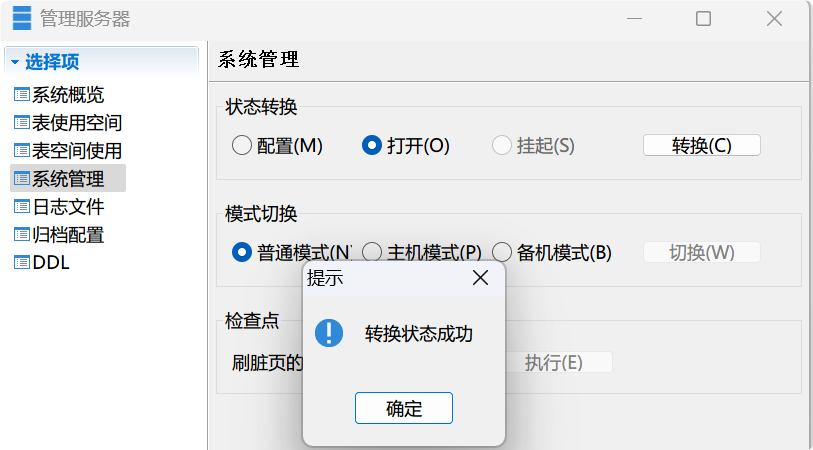


### 6.2.2、联机备份还原

联机方式支持数据库、用户表空间、用户表和归档的备份以及用户表的还原。在进行联机库级备份、归档备份和表空间备份时，必须保证系统处于归档模式，否则联机备份不能进行。


#### 数据备份

这里仅讲述数据库备份使用场景。


**命令行备份**

在 disql 工具或图形化管理工具 SQL 编辑区中使用 `BACKUP` 语句可以备份整个数据库，执行以下命令：

```sql
BACKUP DATABASE FULL BACKUPSET '/data/dm_bak/bak_name';
```

设置数据库备份选项：

- 设置联机数据库备份集路径：

  ```sql
  # 指定备份集路径为 /home/dm_bak/db_bak_3_01
  BACKUP DATABASE BACKUPSET '/home/dm_bak/db_bak_3_01';
  ```

- 设置备份名：

  ```sql
  # 创建备份集，备份名设置为“WEEKLY_FULL_BAK”
  BACKUP DATABASE TO WEEKLY_FULL_BAK BACKUPSET '/home/dm_bak/db_bak_3_02';
  ```

  > [!CAUTION]
  >
  > 备份名的设置不可以使用特殊格式，例如 `%NAME`。

- 添加备份描述：
  ```sql
  # 创建备份为备份集添加描述信息为“完全备份”。
  BACKUP DATABASE BACKUPSET '/home/dm_bak/db_bak_3_04' BACKUPINFO  '完全备份';
  ```

- 限制备份片大小：

  ```sql
  # 创建备份限制备份片大小为300M
  BACKUP DATABASE BACKUPSET '/home/dm_bak/db_bak_3_05' MAXPIECESIZE 300;
  ```

  > [!CAUTION]
  >
  > `MAXPIECESIZE` 不能大于磁盘剩余空间大小，否则报错磁盘空间不足。

- 备份压缩：

  压缩选项有不同的压缩级别可以选择，取值范围为 0~9，应根据存储空间、数据文件大小等确定合适地压缩级别。

  ```sql
  # 执行备份压缩，压缩级别设置为5。
  BACKUP DATABASE BACKUPSET '/home/dm_bak/db_bak_3_06' COMPRESSED LEVEL 5;
  ```

- 设置并行备份：

  ```sql
  # 创建并行备份，指定并行数为8
  BACKUP DATABASE BACKUPSET '/home/dm_bak/db_bak_3_07' PARALLEL 8;
  ```


**图形化备份**

在连接里找到【备份】，右键【库备份】选择【新增备份】，点击确定就好：

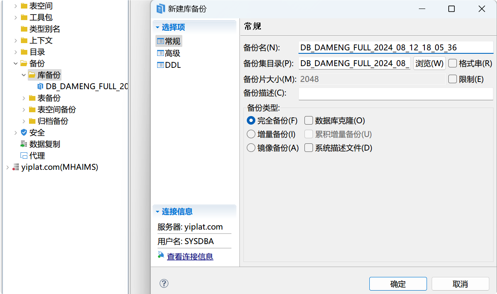

备份文件在：`<数据目录>/bak/` 文件夹里。


#### 数据还原

达梦数据库仅支持表的联机还原，数据库、表空间和归档日志的还原必须通过脱机工具 DMRMAN 执行，详细内容见[脱机备份还原](###4.2.3、脱机备份还原)。


### 6.2.3、脱机备份还原

DMRMAN（DM RECOVERY MANAGER）是脱机备份还原命令行工具，无需额外安装，由它来统一负责库级脱机备份、脱机还原、脱机恢复等相关操作，该工具支持命令行指定参数方式和控制台交互方式执行，降低用户的操作难度。

启动和退出 DMRMAN：

```shell
# 进入数据库安装目录的 bin 目录下，例如 /dm8/bin
cd /dm8/bin
# 启动DMRMAN
./dmrman

# 启动后控制台中输入 exit 命令即可退出
exit;
```


#### 数据备份


#### 数据还原

这里仅讲述数据库备份使用场景。

> [!CAUTION]
>
> 在数据还原时，要使用 dmdba 账号进行操作，并且确保 dmdba 账户拥有备份目录的操作权限！！！

1. 数据库还原：

   使用 `RESTORE` 命令完成脱机还原操作，在还原语句中指定库级备份集，可以是脱机库级备份集，也可以是联机库级备份集。

   > [!CAUTION]
   >
   > 通过 `RESTORE` 命令还原后的数据库不可用，需进一步执行 `RECOVER` 命令，将数据库恢复到备份结束时的状态。

   以联机数据库备份说明使用 DMRMAN 如何执行数据库还原操作：

   ```sql
   # 校验备份，校验待还原备份集的合法性。校验备份有两种方式，联机和脱机，此处使用脱机校验。
   CHECK BACKUPSET '/home/dm_bak/db_full_bak_for_restore';
   
   #还原数据库。
   RESTORE DATABASE '/opt/dmdbms/data/DAMENG_FOR_RESTORE/dm.ini' FROM BACKUPSET '/home/dm_bak/db_full_bak_for_restore';
   ```

2. 数据库恢复：

   使用 `RECOVER` 命令完成数据库恢复工作，可以是基于备份集的恢复工作，也可以是使用本地归档日志的恢复工作。

   从备份集恢复，即重做备份集中的 REDO 日志：

   ```sql
   # 执行还原数据库的命令之后，可以直接执行恢复数据库的命令从备份集恢复。
   RECOVER DATABASE '/opt/dmdbms/data/DAMENG_FOR_RESTORE/dm.ini' FROM  BACKUPSET '/home/dm_bak/db_full_bak_for_recover_backupset';
   ```

   或从归档恢复，即重做归档中的 REDO 日志：

   ```sql
   # 通过使用 WITH ARCHIVEDIR 关键字进行归档恢复，如下：
   RECOVER DATABASE '/opt/dmdbms/data/DAMENG_FOR_RESTORE/dm.ini' WITH ARCHIVEDIR'/home/dm_arch/arch' 
   ```

3. 数据库更新：

   数据库更新是指更新数据库的 DB_MAGIC，并将数据库调整为可正常工作状态，与数据库恢复一样使用 `RECOVER` 命令完成。数据库更新发生在重做 REDO 日志恢复数据库后。

   ```sql
   RECOVER DATABASE '/opt/dmdbms/data/DAMENG_FOR_RESTORE/dm.ini' UPDATE DB_MAGIC;
   ```


# 7、升级

## 7.1、数据库升级

如果是小版本升级，直接替换 bin 目录就行。

1. 首先去官网下载最新的安装包。

2. 备份数据库。

3. 停止达梦所有相关服务：

   

4. 将下载的安装包手动解压，将 source 文件夹里的 bin 文件夹替换安装目录里的 bin 文件夹：

   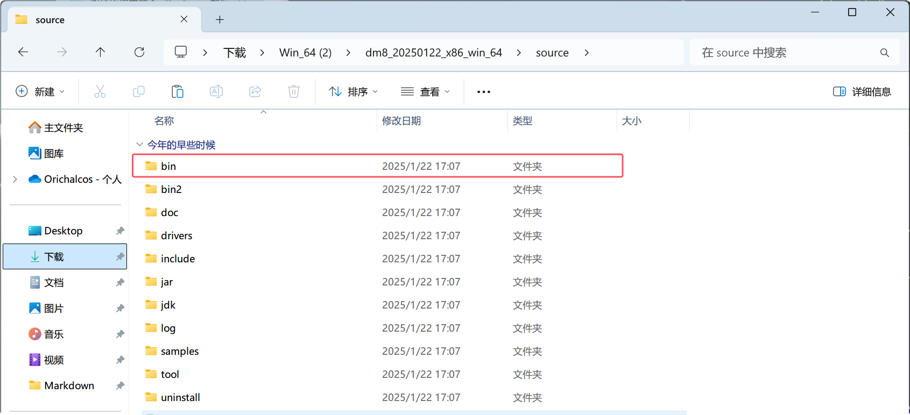

5. 重启达梦数据库实例服务和达梦 AP 服务。


## 7.2、数据库工具升级

1. 首先去官网下载最新的安装包。

2. 备份自己数据库工具的配置文件，存储在自己安装目录里的 tool/tool 文件夹下：

   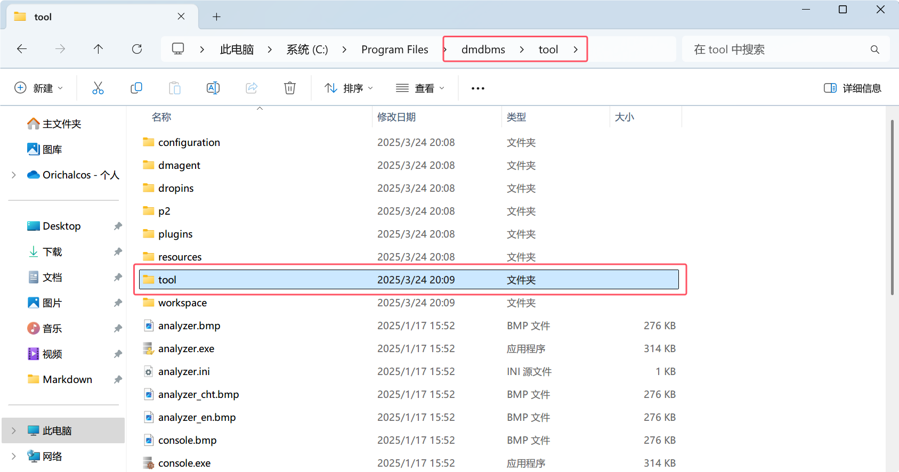

3. 将下载的安装包手动解压，将 source 文件夹里的 tool 文件夹替换安装目录里的 tool  文件夹：

   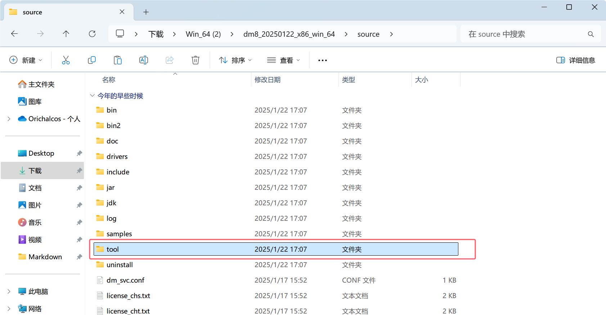

4. 最后将备份的 tool 文件夹还原到安装目录里的 tool  文件夹里：

   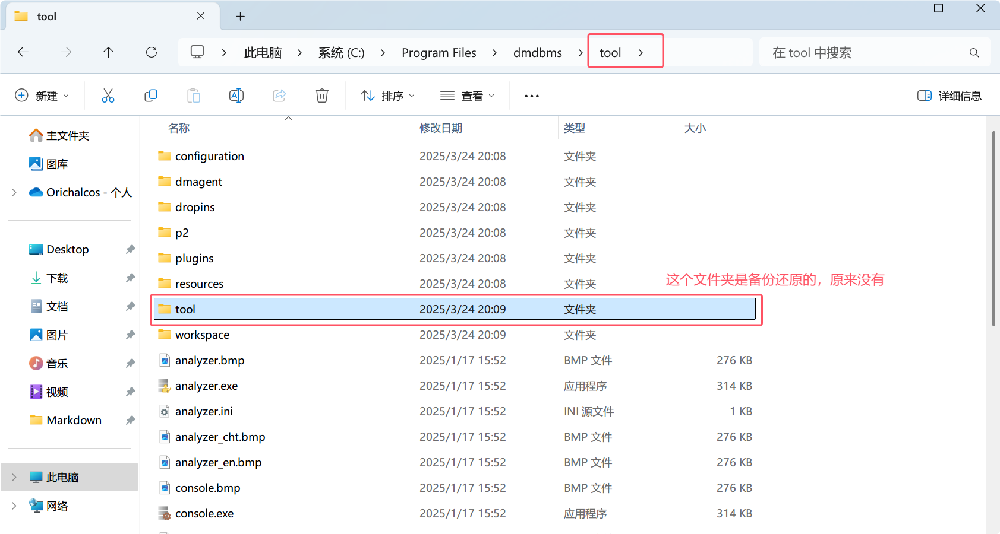

