# 1、软件设计模式概述

**设计模式的产生背景**

“设计模式” 这个术语最初并不是出现在软件设计中，而是被用于建筑领域的设计中。

1977 年，美国著名建筑大师、加利福尼亚大学伯克利分校环境结构中心主任克里斯托夫·亚历山大（Christopher Alexander）在他的著作《建筑模式语言：城镇、建筑、构造（A Pattern Language: Towns Building Construction）中描述了一些常见的建筑设计问题，并提出了 253 种关于对城镇、邻里、住宅、花园和房间等进行设计的基本模式。

1979 年他的另一部经典著作《建筑的永恒之道》（The Timeless Way of Building）进一步强化了设计模式的思想，为后来的建筑设计指明了方向。

1987 年，肯特·贝克（Kent Beck）和沃德·坎宁安（Ward Cunningham）首先将克里斯托夫·亚历山大的模式思想应用在 Smalltalk 中的图形用户接口的生成中，但没有引起软件界的关注。

直到 1990 年，软件工程界才开始研讨设计模式的话题，后来召开了多次关于设计模式的研讨会。

1995 年，艾瑞克·伽马（ErichGamma）、理査德·海尔姆（Richard Helm）、拉尔夫·约翰森（Ralph Johnson）、约翰·威利斯迪斯（John Vlissides）等 4 位作者合作出版了《设计模式：可复用面向对象软件的基础》（Design Patterns: Elements of Reusable Object-Oriented Software）一书，在本教程中收录了 23 个设计模式，这是设计模式领域里程碑的事件，导致了软件设计模式的突破。这 4 位作者在软件开发领域里也以他们的 “四人组”（Gang of Four，GoF）匿名著称。

<br>

**软件设计模式的概念与意义**

从以下两个方面来说明：

1. 软件设计模式的概念

   软件设计模式（Software Design Pattern），又称设计模式，是一套被反复使用、多数人知晓的、经过分类编目的、代码设计经验的总结。它描述了在软件设计过程中的一些不断重复发生的问题，以及该问题的解决方案。也就是说，它是解决特定问题的一系列套路，是前辈们的代码设计经验的总结，具有一定的普遍性，可以反复使用。其目的是为了提高代码的可重用性、代码的可读性和代码的可靠性。

2. 学习设计模式的意义

   设计模式的本质是面向对象设计原则的实际运用，是对类的封装性、继承性和多态性以及类的关联关系和组合关系的充分理解。正确使用设计模式具有以下优点。

   - 可以提高程序员的思维能力、编程能力和设计能力。
   - 使程序设计更加标准化、代码编制更加工程化，使软件开发效率大大提高，从而缩短软件的开发周期。
   - 使设计的代码可重用性高、可读性强、可靠性高、灵活性好、可维护性强。

当然，软件设计模式只是一个引导。在具体的软件幵发中，必须根据设计的应用系统的特点和要求来恰当选择。对于简单的程序开发，苛能写一个简单的算法要比引入某种设计模式更加容易。但对大项目的开发或者框架设计，用设计模式来组织代码显然更好。

<br>

**学习设计模式的意义**

软件设计模式使人们可以更加简单方便地复用成功的设计和体系结构，它通常包含以下几个基本要素：模式名称、别名、动机、问题、解决方案、效果、结构、模式角色、合作关系、实现方法、适用性、已知应用、例程、模式扩展和相关模式等，其中最关键的元素包括以下 4 个主要部分。

1. 模式名称

   每一个模式都有自己的名字，通常用一两个词来描述，可以根据模式的问题、特点、解决方案、功能和效果来命名。模式名称（PatternName）有助于我们理解和记忆该模式，也方便我们来讨论自己的设计。

2. 问题

   问题（Problem）描述了该模式的应用环境，即何时使用该模式。它解释了设计问题和问题存在的前因后果，以及必须满足的一系列先决条件。

3. 解决方案

   模式问题的解决方案（Solution）包括设计的组成成分、它们之间的相互关系及各自的职责和协作方式。因为模式就像一个模板，可应用于多种不同场合，所以解决方案并不描述一个特定而具体的设计或实现，而是提供设计问题的抽象描述和怎样用一个具有一般意义的元素组合（类或对象的 组合）来解决这个问题。

4. 效果

   描述了模式的应用效果以及使用该模式应该权衡的问题，即模式的优缺点。主要是对时间和空间的衡量，以及该模式对系统的灵活性、扩充性、可移植性的影响，也考虑其实现问题。显式地列出这些效果（Consequence）对理解和评价这些模式有很大的帮助。

<br>

# 2、UML（统一建模语言）

UML（Unified Modeling Language，统一建模语言）是用来设计软件蓝图的可视化建模语言，是一种为面向对象系统的产品进行说明、可视化和编制文档的标准语言，独立于任何一种具体的程序设计语言。

1997 年 UML 被国际对象管理组织（OMG）采纳为面向对象的建模语言的国际标准。它的特点是简单、统一、图形化、能表达软件设计中的动态与静态信息。

<br>

**应用场景**

UML 能为软件开发的所有阶段提供模型化和可视化支持。而且融入了软件工程领域的新思想、新方法和新技术，使软件设计人员沟通更简明，进一步缩短了设计时间，减少开发成本。

UML 具有很宽的应用领域。其中最常用的是建立软件系统的模型，但它同样可以用于描述非软件领域的系统，如机械系统、企业机构或业务过程，以及处理复杂数据的信息系统、具有实时要求的工业系统或工业过程等。总之，UML 可以对任何具有静态结构和动态行为的系统进行建模，而且使用于从需求规格描述直至系统完成后的测试和维护等系统开发的各个阶段。

UML 模型大多以图表的方式表现出来，一份典型的建模图表通常包含几个块或框、连接线和作为模型附加信息的文本。这些虽简单却非常重要，在 UML 规则中相互联系和扩展。

在这里大家可能会疑问，UML 明明是一种图形，为什么说是语言呢？

语言是包括文字和图形的，有很多内容文字是无法表达的。你见过建筑设计图纸吗？里面还不是很多图形，光用文字能表达清楚建筑设计吗？在建筑界，有一套标准来描述设计，同样道理，在软件开发界，我们也需要一套标准来帮助我们做好软件开发的工作。UML 就是其中的一种标准，注意这可不是唯一标准，只是 UML 是大家比较推崇的一种标准而已。UML 并不是强制性标准，没有规定在软件开发中一定要用 UML，但是我们需要包括 UML 在内的各种标准，来提高我们软件开发的水平。

<br>

**基本构件**

UML 建模的核心是模型，模型是现实的简化、真实系统的抽象。UML 提供了系统的设计蓝图。当给软件系统建模时，需要采用通用的符号语言，这种描述模型所使用的语言被称为建模语言。在 UML 中，所有的描述由事物、关系和图这些构件组成。

下图完整地描述了所有构件的关系：

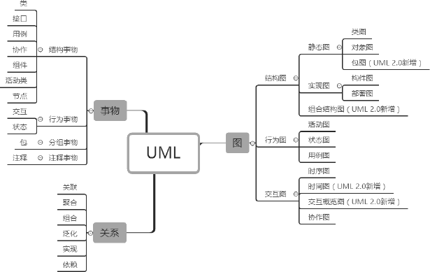

<br>

## 2.1、事物

事物是抽象化的最终结果，分为结构事物、行为事物、分组事物和注释事物。

<br>

**结构事物**

结构事物是模型中的静态部分，用以呈现概念或实体的表现元素，如下表所示。

| 事物                   | 解释                                                         | 图例                                                 |
| ---------------------- | ------------------------------------------------------------ | ---------------------------------------------------- |
| 类（Class）            | 具有相同属性、方法、关系和语义的对象集合                     | 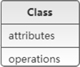   |
| 接口（Interface）      | 指一个类或构件的一个服务的操作集合，它仅仅定义了一组操作的规范，并没有给出这组操作的具体实现 | 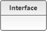 |
| 用例（User Case）      | 指对一组动作序列的描述，系统执行这些动作将产生一个对特定的参与者（Actor）有价值且可观察的结果 | 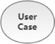 |
| 协作（Collaboration）  | 定义元素之间的相互作用                                       |  |
| 组件（Component）      | 描述物理系统的一部分                                         | 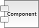 |
| 活动类（Active Class） | 指对象有一个或多个进程或线程。活动类和类很相象，只是它的对象代表的元素的行为和其他元素是同时存在的 | 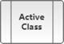  |
| 节点（Node）           | 定义为运行时存在的物理元素                                   | 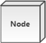  |

<br>

**行为事物**

行为事物指 UML 模型中的动态部分，如下表所示。

| 事物                    | 解释                       | 用例                                                |
| ----------------------- | -------------------------- | --------------------------------------------------- |
| 交互（Interaction）     | 包括一组元素之间的消息交换 | 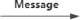 |
| 状态机（State Machine） | 由一系列对象的状态组成     | 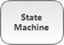 |

<br>

**分组事物**

目前只有一种分组事物，即包。包纯碎是概念上的，只存在于开发阶段，结构事物、行为事物甚至分组事物都有可能放在一个包中，如下表所示。

| 事物          | 解释                | 用例                                               |
| ------------- | ------------------- | -------------------------------------------------- |
| 包（Package） | UML中唯一的组织机制 |  |

<br>

**注释事物**

注释事物是解释 UML 模型元素的部分，如下表所示。

| 事物         | 解释                  | 用例                                                 |
| ------------ | --------------------- | ---------------------------------------------------- |
| 注释（Note） | 用于解析说明 UML 元素 |  |

<br>

### 2.1.1、类

类（Class）是指具有相同属性、方法和关系的对象的抽象，它封装了数据和行为，是面向对象程序设计（OOP）的基础，具有封装性、继承性和多态性等三大特性。在 UML 中，类使用包含类名、属性和操作且带有分隔线的矩形来表示。

1. 类名（Name）是一个字符串，例如：Student。

2. 属性（Attribute）是指类的特性，即类的成员变量。UML 按以下格式表示：

   ```
   [可见性]属性名:类型[=默认值]
   ```

   例如：`-name:String`

   > 注意：“可见性” 表示该属性对类外的元素是否可见，包括公有（Public）、私有（Private）、受保护（Protected）和朋友（Friendly）4 种，在类图中分别用符号 `+`、`-`、`#`、`~` 表示。

3. 操作（Operations）是类的任意一个实例对象都可以使用的行为，是类的成员方法。UML 按以下格式表示：

   ```
   [可见性]名称(参数列表)[:返回类型]
   ```

   例如：`+display():void`

如下所示是学生类的 UML 表示：

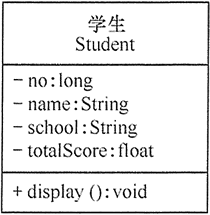

> 类图用 3 个矩形拼接表示，最上面的部分标识类的名称，中间的部分标识类的属性，最下面的部分标识类的方法。

类图中，需注意以下几点：

- 抽象类或抽象方法用斜体表示
- 如果是接口，则在类名上方加 `<<Interface>>`
- 字段和方法返回值的数据类型非必需
- 静态类或静态方法加下划线

<br>

### 2.1.2、接口

接口（Interface）是一种特殊的类，它具有类的结构但不可被实例化，只可以被子类实现。它包含抽象操作，但不包含属性。它描述了类或组件对外可见的动作。在 UML 中，接口使用一个带有名称的小圆圈来进行表示。

如下所示是图形类接口的 UML 表示：

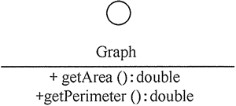

<br>

## 2.2、关系

UML 将事物之间的联系归纳为 6 种，并用对应的图形类表示。下面根据类与类之间的耦合度从弱到强排列。UML 中的类图有以下几种关系：依赖关系、关联关系、聚合关系、组合关系、泛化关系和实现关系。其中泛化和实现的耦合度相等，它们是最强的。

<br>

**依赖关系**

依赖（Dependency）关系是一种使用关系，它是对象之间耦合度最弱的一种关联方式，是临时性的关联。在代码中，某个类的方法通过局部变量、方法的参数或者对静态方法的调用来访问另一个类（被依赖类）中的某些方法来完成一些职责。

在 UML 类图中，依赖关系使用带箭头的虚线来表示，箭头从使用类指向被依赖的类。

如下是人与手机的关系图，人通过手机的语音传送方法打电话：

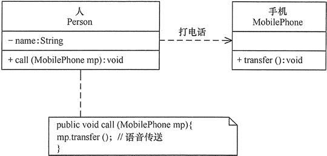

<br>

**关联关系**

关联（Association）关系是对象之间的一种引用关系，用于表示一类对象与另一类对象之间的联系，如老师和学生、师傅和徒弟、丈夫和妻子等。关联关系是类与类之间最常用的一种关系，分为一般关联关系、聚合关系和组合关系。我们先介绍一般关联。

关联可以是双向的，也可以是单向的。在 UML 类图中，双向的关联可以用带两个箭头或者没有箭头的实线来表示，单向的关联用带一个箭头的实线来表示，箭头从使用类指向被关联的类。也可以在关联线的两端标注角色名，代表两种不同的角色。

在代码中通常将一个类的对象作为另一个类的成员变量来实现关联关系。

如下是老师和学生的关系图，每个老师可以教多个学生，每个学生也可向多个老师学，他们是双向关联。：

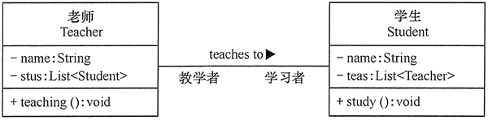

<br>

**聚合关系**

聚合（Aggregation）关系是关联关系的一种，是强关联关系，是整体和部分之间的关系，是 has-a 的关系。

聚合关系也是通过成员对象来实现的，其中成员对象是整体对象的一部分，但是成员对象可以脱离整体对象而独立存在。例如，学校与老师的关系，学校包含老师，但如果学校停办了，老师依然存在。

在 UML 类图中，聚合关系可以用带空心菱形的实线来表示，菱形指向整体。

如下是大学和教师的关系图：

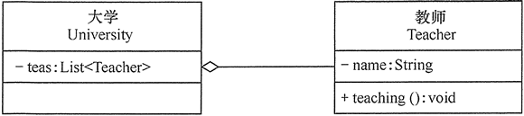

<br>

**组合关系**

组合（Composition）关系也是关联关系的一种，也表示类之间的整体与部分的关系，但它是一种更强烈的聚合关系，是 cxmtains-a 关系。

在组合关系中，整体对象可以控制部分对象的生命周期，一旦整体对象不存在，部分对象也将不存在，部分对象不能脱离整体对象而存在。例如，头和嘴的关系，没有了头，嘴也就不存在了。

在 UML 类图中，组合关系用带实心菱形的实线来表示，菱形指向整体。

如下是头和嘴的关系图：

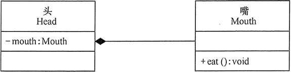

<br>

**泛化关系**

泛化（Generalization）关系是对象之间耦合度最大的一种关系，表示一般与特殊的关系，是父类与子类之间的关系，是一种继承关系，是 is-a 的关系。

在 UML 类图中，泛化关系用带空心三角箭头的实线来表示，箭头从子类指向父类。在代码实现时，使用面向对象的继承机制来实现泛化关系。

例如，Student 类和 Teacher 类都是 Person 类的子类，其类图如下所示：

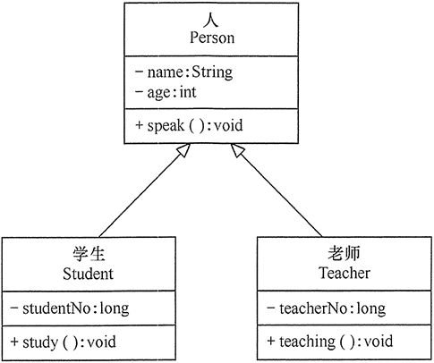

<br>

**实现关系**

实现（Realization）关系是接口与实现类之间的关系。在这种关系中，类实现了接口，类中的操作实现了接口中所声明的所有的抽象操作。

在 UML 类图中，实现关系使用带空心三角箭头的虚线来表示，箭头从实现类指向接口。

例如，汽车和船实现了交通工具，其类图如下所示：

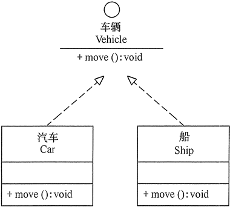

<br>

## 2.3、图

UML2.0 一共有 13 种图（UML1.5 定义了 9 种，UML2.0 增加了 4 种），分别是类图、对象图、构件图、部署图、活动图、状态图、用例图、时序图、协作图 9 种，以及包图、组合结构图、时间图、交互概览图 4 种。

| 图名称                                      | 解释                                                         |
| ------------------------------------------- | ------------------------------------------------------------ |
| 类图（Class Diagrams）                      | 用于定义系统中的类                                           |
| 对象图（Object Diagrams）                   | 类图的一个实例，描述了系统在具体时间点上所包含的对象及各个对象之间的关系 |
| 构件图（Component Diagrams）                | 一种特殊的 UML 图，描述系统的静态实现视图                    |
| 部署图（Deployment Diagrams）               | 定义系统中软硬件的物理体系结构                               |
| 活动图（Activity Diagrams）                 | 用来描述满足用例要求所要进行的活动及活动间的约束关系         |
| 状态图（State Chart Diagrams）              | 用来描述类的对象的所有可能的状态和时间发生时，状态的转移条件 |
| 用例图（Usecase Diagrams）                  | 用来描述用户的需求，从用户的角度描述系统的功能，并指出各功能的执行者，强调谁在使用系统、系统为执行者完成哪些功能 |
| 时序图（Sequence Diagrams）                 | 描述对象之间的交互顺序，着重体现对象间消息传递的时间顺序，强调对象之间消息的发送顺序，同时显示对象之间的交互过程 |
| 协作图（Collaboration Diagrams）            | 描述对象之间的合作关系，更侧重向用户对象说明哪些对象有消息的传递 |
| 包图（Package Diagrams）                    | 对构成系统的模型元素进行分组整理的图                         |
| 组合结构图（Composite Structure Diagrams）  | 表示类或者构建内部结构的图                                   |
| 时间图（Timing Diagrams）                   | 用来显示随时间变化，一个或多个元素的值或状态的更改，也显示时间控制事件之间的交互及管理它们的时间和期限约束 |
| 交互概览图（Interaction Overview Diagrams） | 用活动图来表示多个交互之间的控制关系的图                     |

<br>

### 2.3.1、类图

在 UML 2.0 的 13 种图中，类图（Class Diagrams）是使用频率最高的 UML 图之一。类图（ClassDiagram）是用来显示系统中的类、接口、协作以及它们之间的静态结构和关系的一种静态模型。它主要用于描述软件系统的结构化设计，帮助人们简化对软件系统的理解，它是系统分析与设计阶段的重要产物，也是系统编码与测试的重要模型依据。类图表示类、接口和它们之间的协作关系，用于系统设计阶段。

类图中的类可以通过某种编程语言直接实现。类图在软件系统开发的整个生命周期都是有效的，它是面向对象系统的建模中最常见的图。如下所示是“计算长方形和圆形的周长与面积”的类图，图形接口有计算面积和周长的抽象方法，长方形和圆形实现这两个方法供访问类调用。

如下所示是 “计算长方形和圆形的周长与面积” 的类图：

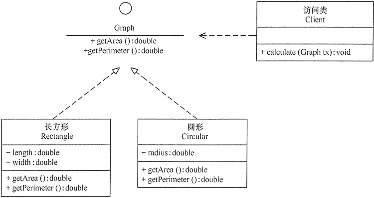

<br>

**类关系记忆技巧**

类关系记忆技巧总结如下表所示：

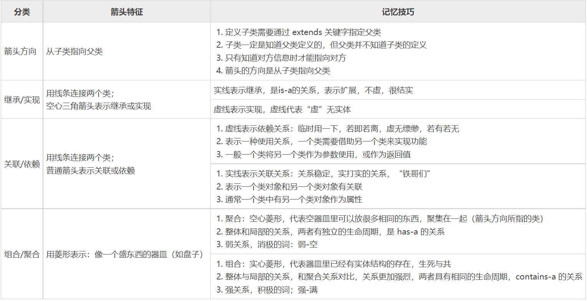

>  注意：UML 的标准类关系图中，没有实心箭头。有些 Java 编程的 IDE 自带类生成工具可能出现实心箭头，主要目的是降低理解难度。

下面用一个经典案例来加深和巩固对类图的理解：

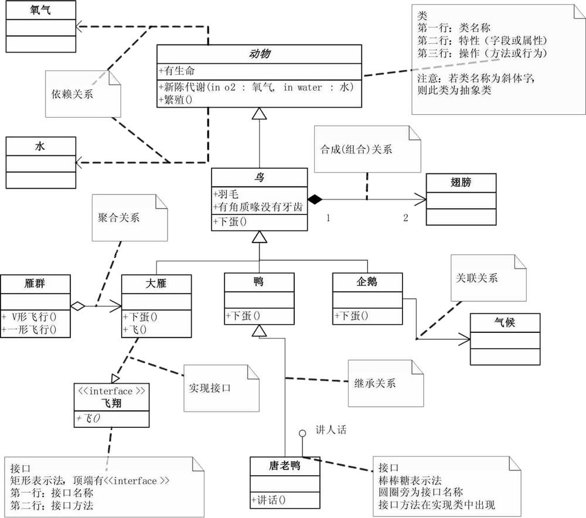

<br>

# 3、七大设计原则

设计模式原则，其实就是程序员在编程时，应当遵守的原则，也是各种设计模式的基础（即：设计模式为什么这样设计的依据）。

在软件开发中，为了提高软件系统的可维护性和可复用性，增加软件的可扩展性和灵活性，程序员要尽量根据 7 条原则来开发程序，从而提高软件开发效率、节约软件开发成本和维护成本。

面向对象的设计模式有七大基本原则：

- 开闭原则（Open Closed Principle，OCP）
- 里氏代换原则（Liskov Substitution Principle，LSP）
- 依赖倒转原则（Dependency Inversion Principle，DIP）
- 单一职责原则（Single Responsibility Principle, SRP）
- 接口隔离原则（Interface Segregation Principle，ISP）
- 最少知识原则（Least Knowledge Principle，LKP）或者迪米特法则（Law of  Demeter，LOD）
- 合成/聚合复用原则（Composite/Aggregate Reuse Principle，CARP）

<br>

# 4、GoF 的 23 种设计模式

根据模式是用来完成什么工作来划分，可分为创建型模式、结构型模式和行为型模式 3 种。

1. 创建型模式：用于描述 “怎样创建对象”，它的主要特点是 “将对象的创建与使用分离”。GoF 中提供了单例、原型、工厂方法、抽象工厂、建造者等 5 种创建型模式。
2. 结构型模式：用于描述如何将类或对象按某种布局组成更大的结构，GoF 中提供了代理、适配器、桥接、装饰、外观、享元、组合等 7 种结构型模式。
3. 行为型模式：用于描述类或对象之间怎样相互协作共同完成单个对象都无法单独完成的任务，以及怎样分配职责。GoF 中提供了模板方法、策略、命令、职责链、状态、观察者、中介者、迭代器、访问者、备忘录、解释器等 11 种行为型模式。

 <br>

**GoF的23种设计模式的功能**

前面说明了 GoF 的 23 种设计模式的分类，现在对各个模式的功能进行介绍。

1. 单例（Singleton）模式：某个类只能生成一个实例，该类提供了一个全局访问点供外部获取该实例，其拓展是有限多例模式。
2. 原型（Prototype）模式：将一个对象作为原型，通过对其进行复制而克隆出多个和原型类似的新实例。
3. 工厂方法（Factory Method）模式：定义一个用于创建产品的接口，由子类决定生产什么产品。
4. 抽象工厂（AbstractFactory）模式：提供一个创建产品族的接口，其每个子类可以生产一系列相关的产品。
5. 建造者（Builder）模式：将一个复杂对象分解成多个相对简单的部分，然后根据不同需要分别创建它们，最后构建成该复杂对象。
6. 代理（Proxy）模式：为某对象提供一种代理以控制对该对象的访问。即客户端通过代理间接地访问该对象，从而限制、增强或修改该对象的一些特性。
7. 适配器（Adapter）模式：将一个类的接口转换成客户希望的另外一个接口，使得原本由于接口不兼容而不能一起工作的那些类能一起工作。
8. 桥接（Bridge）模式：将抽象与实现分离，使它们可以独立变化。它是用组合关系代替继承关系来实现，从而降低了抽象和实现这两个可变维度的耦合度。
9. 装饰（Decorator）模式：动态的给对象增加一些职责，即增加其额外的功能。
10. 外观（Facade）模式：为多个复杂的子系统提供一个一致的接口，使这些子系统更加容易被访问。
11. 享元（Flyweight）模式：运用共享技术来有效地支持大量细粒度对象的复用。
12. 组合（Composite）模式：将对象组合成树状层次结构，使用户对单个对象和组合对象具有一致的访问性。
13. 模板方法（TemplateMethod）模式：定义一个操作中的算法骨架，而将算法的一些步骤延迟到子类中，使得子类可以不改变该算法结构的情况下重定义该算法的某些特定步骤。
14. 策略（Strategy）模式：定义了一系列算法，并将每个算法封装起来，使它们可以相互替换，且算法的改变不会影响使用算法的客户。
15. 命令（Command）模式：将一个请求封装为一个对象，使发出请求的责任和执行请求的责任分割开。
16. 职责链（Chain of Responsibility）模式：把请求从链中的一个对象传到下一个对象，直到请求被响应为止。通过这种方式去除对象之间的耦合。
17. 状态（State）模式：允许一个对象在其内部状态发生改变时改变其行为能力。
18. 观察者（Observer）模式：多个对象间存在一对多关系，当一个对象发生改变时，把这种改变通知给其他多个对象，从而影响其他对象的行为。
19. 中介者（Mediator）模式：定义一个中介对象来简化原有对象之间的交互关系，降低系统中对象间的耦合度，使原有对象之间不必相互了解。
20. 迭代器（Iterator）模式：提供一种方法来顺序访问聚合对象中的一系列数据，而不暴露聚合对象的内部表示。
21. 访问者（Visitor）模式：在不改变集合元素的前提下，为一个集合中的每个元素提供多种访问方式，即每个元素有多个访问者对象访问。
22. 备忘录（Memento）模式：在不破坏封装性的前提下，获取并保存一个对象的内部状态，以便以后恢复它。
23. 解释器（Interpreter）模式：提供如何定义语言的文法，以及对语言句子的解释方法，即解释器。