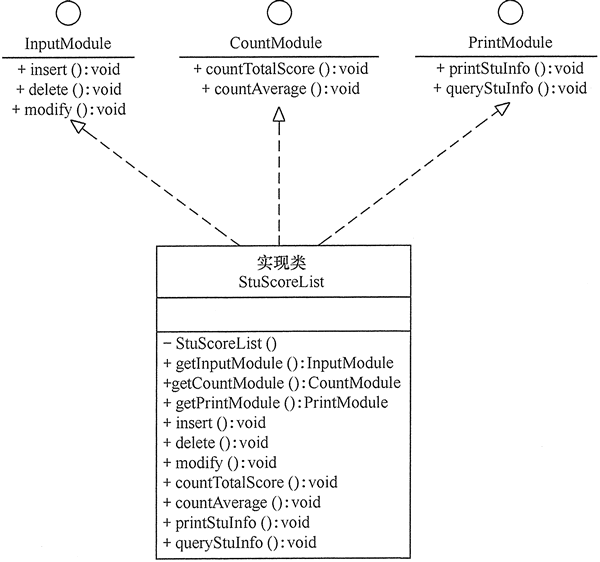
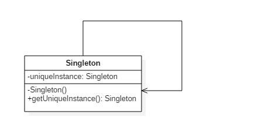

# 1、软件设计模式概述

**设计模式的产生背景**

“设计模式” 这个术语最初并不是出现在软件设计中，而是被用于建筑领域的设计中。

1977 年，美国著名建筑大师、加利福尼亚大学伯克利分校环境结构中心主任克里斯托夫·亚历山大（Christopher Alexander）在他的著作《建筑模式语言：城镇、建筑、构造（A Pattern Language: Towns Building Construction）中描述了一些常见的建筑设计问题，并提出了 253 种关于对城镇、邻里、住宅、花园和房间等进行设计的基本模式。

1979 年他的另一部经典著作《建筑的永恒之道》（The Timeless Way of Building）进一步强化了设计模式的思想，为后来的建筑设计指明了方向。

1987 年，肯特·贝克（Kent Beck）和沃德·坎宁安（Ward Cunningham）首先将克里斯托夫·亚历山大的模式思想应用在 Smalltalk 中的图形用户接口的生成中，但没有引起软件界的关注。

直到 1990 年，软件工程界才开始研讨设计模式的话题，后来召开了多次关于设计模式的研讨会。

1995 年，艾瑞克·伽马（ErichGamma）、理査德·海尔姆（Richard Helm）、拉尔夫·约翰森（Ralph Johnson）、约翰·威利斯迪斯（John Vlissides）等 4 位作者合作出版了《设计模式：可复用面向对象软件的基础》（Design Patterns: Elements of Reusable Object-Oriented Software）一书，在本教程中收录了 23 个设计模式，这是设计模式领域里程碑的事件，导致了软件设计模式的突破。这 4 位作者在软件开发领域里也以他们的 “四人组”（Gang of Four，GoF）匿名著称。

<br>

**软件设计模式的概念与意义**

从以下两个方面来说明：

1. 软件设计模式的概念

   软件设计模式（Software Design Pattern），又称设计模式，是一套被反复使用、多数人知晓的、经过分类编目的、代码设计经验的总结。它描述了在软件设计过程中的一些不断重复发生的问题，以及该问题的解决方案。也就是说，它是解决特定问题的一系列套路，是前辈们的代码设计经验的总结，具有一定的普遍性，可以反复使用。其目的是为了提高代码的可重用性、代码的可读性和代码的可靠性。

2. 学习设计模式的意义

   设计模式的本质是面向对象设计原则的实际运用，是对类的封装性、继承性和多态性以及类的关联关系和组合关系的充分理解。正确使用设计模式具有以下优点。

   - 可以提高程序员的思维能力、编程能力和设计能力。
   - 使程序设计更加标准化、代码编制更加工程化，使软件开发效率大大提高，从而缩短软件的开发周期。
   - 使设计的代码可重用性高、可读性强、可靠性高、灵活性好、可维护性强。

当然，软件设计模式只是一个引导。在具体的软件幵发中，必须根据设计的应用系统的特点和要求来恰当选择。对于简单的程序开发，苛能写一个简单的算法要比引入某种设计模式更加容易。但对大项目的开发或者框架设计，用设计模式来组织代码显然更好。

<br>

**学习设计模式的意义**

软件设计模式使人们可以更加简单方便地复用成功的设计和体系结构，它通常包含以下几个基本要素：模式名称、别名、动机、问题、解决方案、效果、结构、模式角色、合作关系、实现方法、适用性、已知应用、例程、模式扩展和相关模式等，其中最关键的元素包括以下 4 个主要部分。

1. 模式名称

   每一个模式都有自己的名字，通常用一两个词来描述，可以根据模式的问题、特点、解决方案、功能和效果来命名。模式名称（PatternName）有助于我们理解和记忆该模式，也方便我们来讨论自己的设计。

2. 问题

   问题（Problem）描述了该模式的应用环境，即何时使用该模式。它解释了设计问题和问题存在的前因后果，以及必须满足的一系列先决条件。

3. 解决方案

   模式问题的解决方案（Solution）包括设计的组成成分、它们之间的相互关系及各自的职责和协作方式。因为模式就像一个模板，可应用于多种不同场合，所以解决方案并不描述一个特定而具体的设计或实现，而是提供设计问题的抽象描述和怎样用一个具有一般意义的元素组合（类或对象的 组合）来解决这个问题。

4. 效果

   描述了模式的应用效果以及使用该模式应该权衡的问题，即模式的优缺点。主要是对时间和空间的衡量，以及该模式对系统的灵活性、扩充性、可移植性的影响，也考虑其实现问题。显式地列出这些效果（Consequence）对理解和评价这些模式有很大的帮助。

<br>

# 2、UML（统一建模语言）

UML（Unified Modeling Language，统一建模语言）是用来设计软件蓝图的可视化建模语言，是一种为面向对象系统的产品进行说明、可视化和编制文档的标准语言，独立于任何一种具体的程序设计语言。

1997 年 UML 被国际对象管理组织（OMG）采纳为面向对象的建模语言的国际标准。它的特点是简单、统一、图形化、能表达软件设计中的动态与静态信息。

<br>

**应用场景**

UML 能为软件开发的所有阶段提供模型化和可视化支持。而且融入了软件工程领域的新思想、新方法和新技术，使软件设计人员沟通更简明，进一步缩短了设计时间，减少开发成本。

UML 具有很宽的应用领域。其中最常用的是建立软件系统的模型，但它同样可以用于描述非软件领域的系统，如机械系统、企业机构或业务过程，以及处理复杂数据的信息系统、具有实时要求的工业系统或工业过程等。总之，UML 可以对任何具有静态结构和动态行为的系统进行建模，而且使用于从需求规格描述直至系统完成后的测试和维护等系统开发的各个阶段。

UML 模型大多以图表的方式表现出来，一份典型的建模图表通常包含几个块或框、连接线和作为模型附加信息的文本。这些虽简单却非常重要，在 UML 规则中相互联系和扩展。

在这里大家可能会疑问，UML 明明是一种图形，为什么说是语言呢？

语言是包括文字和图形的，有很多内容文字是无法表达的。你见过建筑设计图纸吗？里面还不是很多图形，光用文字能表达清楚建筑设计吗？在建筑界，有一套标准来描述设计，同样道理，在软件开发界，我们也需要一套标准来帮助我们做好软件开发的工作。UML 就是其中的一种标准，注意这可不是唯一标准，只是 UML 是大家比较推崇的一种标准而已。UML 并不是强制性标准，没有规定在软件开发中一定要用 UML，但是我们需要包括 UML 在内的各种标准，来提高我们软件开发的水平。

<br>

**基本构件**

UML 建模的核心是模型，模型是现实的简化、真实系统的抽象。UML 提供了系统的设计蓝图。当给软件系统建模时，需要采用通用的符号语言，这种描述模型所使用的语言被称为建模语言。在 UML 中，所有的描述由事物、关系和图这些构件组成。

下图完整地描述了所有构件的关系：


<br>

## 2.1、事物

事物是抽象化的最终结果，分为结构事物、行为事物、分组事物和注释事物。

<br>

**结构事物**

结构事物是模型中的静态部分，用以呈现概念或实体的表现元素，如下表所示。

| 事物                   | 解释                                                         | 图例                                                 |
| ---------------------- | ------------------------------------------------------------ | ---------------------------------------------------- |
| 类（Class）            | 具有相同属性、方法、关系和语义的对象集合                     |    |
| 接口（Interface）      | 指一个类或构件的一个服务的操作集合，它仅仅定义了一组操作的规范，并没有给出这组操作的具体实现 |  |
| 用例（User Case）      | 指对一组动作序列的描述，系统执行这些动作将产生一个对特定的参与者（Actor）有价值且可观察的结果 |  |
| 协作（Collaboration）  | 定义元素之间的相互作用                                       |  |
| 组件（Component）      | 描述物理系统的一部分                                         |  |
| 活动类（Active Class） | 指对象有一个或多个进程或线程。活动类和类很相象，只是它的对象代表的元素的行为和其他元素是同时存在的 |   |
| 节点（Node）           | 定义为运行时存在的物理元素                                   |   |

<br>

**行为事物**

行为事物指 UML 模型中的动态部分，如下表所示。

| 事物                    | 解释                       | 用例                                                |
| ----------------------- | -------------------------- | --------------------------------------------------- |
| 交互（Interaction）     | 包括一组元素之间的消息交换 |  |
| 状态机（State Machine） | 由一系列对象的状态组成     |  |

<br>

**分组事物**

目前只有一种分组事物，即包。包纯碎是概念上的，只存在于开发阶段，结构事物、行为事物甚至分组事物都有可能放在一个包中，如下表所示。

| 事物          | 解释                | 用例                                               |
| ------------- | ------------------- | -------------------------------------------------- |
| 包（Package） | UML中唯一的组织机制 |  |

<br>

**注释事物**

注释事物是解释 UML 模型元素的部分，如下表所示。

| 事物         | 解释                  | 用例                                                 |
| ------------ | --------------------- | ---------------------------------------------------- |
| 注释（Note） | 用于解析说明 UML 元素 |  |

<br>

### 2.1.1、类

类（Class）是指具有相同属性、方法和关系的对象的抽象，它封装了数据和行为，是面向对象程序设计（OOP）的基础，具有封装性、继承性和多态性等三大特性。在 UML 中，类使用包含类名、属性和操作且带有分隔线的矩形来表示。

1. 类名（Name）是一个字符串，例如：Student。

2. 属性（Attribute）是指类的特性，即类的成员变量。UML 按以下格式表示：

   ```
   [可见性]属性名:类型[=默认值]
   ```

   例如：`-name:String`

   > 注意：“可见性” 表示该属性对类外的元素是否可见，包括公有（Public）、私有（Private）、受保护（Protected）和朋友（Friendly）4 种，在类图中分别用符号 `+`、`-`、`#`、`~` 表示。

3. 操作（Operations）是类的任意一个实例对象都可以使用的行为，是类的成员方法。UML 按以下格式表示：

   ```
   [可见性]名称(参数列表)[:返回类型]
   ```

   例如：`+display():void`

如下所示是学生类的 UML 表示：


> 类图用 3 个矩形拼接表示，最上面的部分标识类的名称，中间的部分标识类的属性，最下面的部分标识类的方法。

类图中，需注意以下几点：

- 抽象类或抽象方法用斜体表示
- 如果是接口，则在类名上方加 `<<Interface>>`
- 字段和方法返回值的数据类型非必需
- 静态类或静态方法加下划线

<br>

### 2.1.2、接口

接口（Interface）是一种特殊的类，它具有类的结构但不可被实例化，只可以被子类实现。它包含抽象操作，但不包含属性。它描述了类或组件对外可见的动作。在 UML 中，接口使用一个带有名称的小圆圈来进行表示。

如下所示是图形类接口的 UML 表示：


<br>

## 2.2、关系

UML 将事物之间的联系归纳为 6 种，并用对应的图形类表示。下面根据类与类之间的耦合度从弱到强排列。UML 中的类图有以下几种关系：依赖关系、关联关系、聚合关系、组合关系、泛化关系和实现关系。其中泛化和实现的耦合度相等，它们是最强的。

<br>

**依赖关系**

依赖（Dependency）关系是一种使用关系，它是对象之间耦合度最弱的一种关联方式，是临时性的关联。在代码中，某个类的方法通过局部变量、方法的参数或者对静态方法的调用来访问另一个类（被依赖类）中的某些方法来完成一些职责。

在 UML 类图中，依赖关系使用带箭头的虚线来表示，箭头从使用类指向被依赖的类。

如下是人与手机的关系图，人通过手机的语音传送方法打电话：


<br>

**关联关系**

关联（Association）关系是对象之间的一种引用关系，用于表示一类对象与另一类对象之间的联系，如老师和学生、师傅和徒弟、丈夫和妻子等。关联关系是类与类之间最常用的一种关系，分为一般关联关系、聚合关系和组合关系。我们先介绍一般关联。

关联可以是双向的，也可以是单向的。在 UML 类图中，双向的关联可以用带两个箭头或者没有箭头的实线来表示，单向的关联用带一个箭头的实线来表示，箭头从使用类指向被关联的类。也可以在关联线的两端标注角色名，代表两种不同的角色。

在代码中通常将一个类的对象作为另一个类的成员变量来实现关联关系。

如下是老师和学生的关系图，每个老师可以教多个学生，每个学生也可向多个老师学，他们是双向关联。：


<br>

**聚合关系**

聚合（Aggregation）关系是关联关系的一种，是强关联关系，是整体和部分之间的关系，是 has-a 的关系。

聚合关系也是通过成员对象来实现的，其中成员对象是整体对象的一部分，但是成员对象可以脱离整体对象而独立存在。例如，学校与老师的关系，学校包含老师，但如果学校停办了，老师依然存在。

在 UML 类图中，聚合关系可以用带空心菱形的实线来表示，菱形指向整体。

如下是大学和教师的关系图：


<br>

**组合关系**

组合（Composition）关系也是关联关系的一种，也表示类之间的整体与部分的关系，但它是一种更强烈的聚合关系，是 cxmtains-a 关系。

在组合关系中，整体对象可以控制部分对象的生命周期，一旦整体对象不存在，部分对象也将不存在，部分对象不能脱离整体对象而存在。例如，头和嘴的关系，没有了头，嘴也就不存在了。

在 UML 类图中，组合关系用带实心菱形的实线来表示，菱形指向整体。

如下是头和嘴的关系图：


<br>

**泛化关系**

泛化（Generalization）关系是对象之间耦合度最大的一种关系，表示一般与特殊的关系，是父类与子类之间的关系，是一种继承关系，是 is-a 的关系。

在 UML 类图中，泛化关系用带空心三角箭头的实线来表示，箭头从子类指向父类。在代码实现时，使用面向对象的继承机制来实现泛化关系。

例如，Student 类和 Teacher 类都是 Person 类的子类，其类图如下所示：


<br>

**实现关系**

实现（Realization）关系是接口与实现类之间的关系。在这种关系中，类实现了接口，类中的操作实现了接口中所声明的所有的抽象操作。

在 UML 类图中，实现关系使用带空心三角箭头的虚线来表示，箭头从实现类指向接口。

例如，汽车和船实现了交通工具，其类图如下所示：


<br>

## 2.3、图

UML2.0 一共有 13 种图（UML1.5 定义了 9 种，UML2.0 增加了 4 种），分别是类图、对象图、构件图、部署图、活动图、状态图、用例图、时序图、协作图 9 种，以及包图、组合结构图、时间图、交互概览图 4 种。

| 图名称                                      | 解释                                                         |
| ------------------------------------------- | ------------------------------------------------------------ |
| 类图（Class Diagrams）                      | 用于定义系统中的类                                           |
| 对象图（Object Diagrams）                   | 类图的一个实例，描述了系统在具体时间点上所包含的对象及各个对象之间的关系 |
| 构件图（Component Diagrams）                | 一种特殊的 UML 图，描述系统的静态实现视图                    |
| 部署图（Deployment Diagrams）               | 定义系统中软硬件的物理体系结构                               |
| 活动图（Activity Diagrams）                 | 用来描述满足用例要求所要进行的活动及活动间的约束关系         |
| 状态图（State Chart Diagrams）              | 用来描述类的对象的所有可能的状态和时间发生时，状态的转移条件 |
| 用例图（Usecase Diagrams）                  | 用来描述用户的需求，从用户的角度描述系统的功能，并指出各功能的执行者，强调谁在使用系统、系统为执行者完成哪些功能 |
| 时序图（Sequence Diagrams）                 | 描述对象之间的交互顺序，着重体现对象间消息传递的时间顺序，强调对象之间消息的发送顺序，同时显示对象之间的交互过程 |
| 协作图（Collaboration Diagrams）            | 描述对象之间的合作关系，更侧重向用户对象说明哪些对象有消息的传递 |
| 包图（Package Diagrams）                    | 对构成系统的模型元素进行分组整理的图                         |
| 组合结构图（Composite Structure Diagrams）  | 表示类或者构建内部结构的图                                   |
| 时间图（Timing Diagrams）                   | 用来显示随时间变化，一个或多个元素的值或状态的更改，也显示时间控制事件之间的交互及管理它们的时间和期限约束 |
| 交互概览图（Interaction Overview Diagrams） | 用活动图来表示多个交互之间的控制关系的图                     |

<br>

### 2.3.1、类图

在 UML 2.0 的 13 种图中，类图（Class Diagrams）是使用频率最高的 UML 图之一。类图（ClassDiagram）是用来显示系统中的类、接口、协作以及它们之间的静态结构和关系的一种静态模型。它主要用于描述软件系统的结构化设计，帮助人们简化对软件系统的理解，它是系统分析与设计阶段的重要产物，也是系统编码与测试的重要模型依据。类图表示类、接口和它们之间的协作关系，用于系统设计阶段。

类图中的类可以通过某种编程语言直接实现。类图在软件系统开发的整个生命周期都是有效的，它是面向对象系统的建模中最常见的图。如下所示是“计算长方形和圆形的周长与面积”的类图，图形接口有计算面积和周长的抽象方法，长方形和圆形实现这两个方法供访问类调用。

如下所示是 “计算长方形和圆形的周长与面积” 的类图：


<br>

**类关系记忆技巧**

类关系记忆技巧总结如下表所示：


>  注意：UML 的标准类关系图中，没有实心箭头。有些 Java 编程的 IDE 自带类生成工具可能出现实心箭头，主要目的是降低理解难度。

下面用一个经典案例来加深和巩固对类图的理解：


<br>

# 3、七大设计原则

设计模式原则，其实就是程序员在编程时，应当遵守的原则，也是各种设计模式的基础（即：设计模式为什么这样设计的依据）。

在软件开发中，为了提高软件系统的可维护性和可复用性，增加软件的可扩展性和灵活性，程序员要尽量根据 7 条原则来开发程序，从而提高软件开发效率、节约软件开发成本和维护成本。

面向对象的设计模式有七大基本原则：

- 开闭原则（Open Closed Principle，OCP）：对扩展开放，对修改关闭
- 里氏代换原则（Liskov Substitution Principle，LSP）：不要破坏继承体系，子类重写方法功能发生改变，不应该影响父类方法的含义
- 合成/聚合复用原则（Composite/Aggregate Reuse Principle，CARP）：尽量使用组合或者聚合关系实现代码复用，少使用继承
- 依赖倒转原则（Dependency Inversion Principle，DIP）：高层不应该依赖低层，要面向接口编程
- 单一职责原则（Single Responsibility Principle, SRP）：一个类只干一件事，实现类要单一
- 接口隔离原则（Interface Segregation Principle，ISP）：一个接口只干一件事，接口要精简单一
- 最少知识原则（Least Knowledge Principle，LKP）或者迪米特法则（Law of  Demeter，LOD）：不该知道的不要知道，一个类应该保持对其它对象最少的了解，降低耦合度

 <br>

## 3.1、开闭原则

**开闭原则的定义**

开闭原则（Open Closed Principle，OCP）由勃兰特·梅耶（Bertrand Meyer）提出，他在 1988 年的著作《面向对象软件构造》（Object Oriented Software Construction）中提出：软件实体应当对扩展开放，对修改关闭（Software entities should be open for extension，but closed for modification），这就是开闭原则的经典定义。

这里的软件实体包括以下几个部分：

1. 项目中划分出的模块
2. 类与接口
3. 方法


开闭原则的含义是：当应用的需求改变时，在不修改软件实体的源代码或者二进制代码的前提下，可以扩展模块的功能，使其满足新的需求。

<br>

**开闭原则的作用**

开闭原则是面向对象程序设计的终极目标，它使软件实体拥有一定的适应性和灵活性的同时具备稳定性和延续性。具体来说，其作用如下。

1. 对软件测试的影响

   软件遵守开闭原则的话，软件测试时只需要对扩展的代码进行测试就可以了，因为原有的测试代码仍然能够正常运行。

2. 可以提高代码的可复用性

   粒度越小，被复用的可能性就越大；在面向对象的程序设计中，根据原子和抽象编程可以提高代码的可复用性。

3. 可以提高软件的可维护性

   遵守开闭原则的软件，其稳定性高和延续性强，从而易于扩展和维护。

<br>

**开闭原则的实现方法**

可以通过 “抽象约束、封装变化” 来实现开闭原则，即通过接口或者抽象类为软件实体定义一个相对稳定的抽象层，而将相同的可变因素封装在相同的具体实现类中。

因为抽象灵活性好，适应性广，只要抽象的合理，可以基本保持软件架构的稳定。而软件中易变的细节可以从抽象派生来的实现类来进行扩展，当软件需要发生变化时，只需要根据需求重新派生一个实现类来扩展就可以了。

下面以 Windows 的桌面主题为例介绍开闭原则的应用：

分析：Windows 的主题是桌面背景图片、窗口颜色和声音等元素的组合。用户可以根据自己的喜爱更换自己的桌面主题，也可以从网上下载新的主题。这些主题有共同的特点，可以为其定义一个抽象类（Abstract Subject），而每个具体的主题（Specific Subject）是其子类。用户窗体可以根据需要选择或者增加新的主题，而不需要修改原代码，所以它是满足开闭原则的，其类图如下图所示：


<br>

## 3.2、里氏替换原则

**里氏替换原则的定义**

里氏替换原则（Liskov Substitution Principle，LSP）由麻省理工学院计算机科学实验室的里斯科夫（Liskov）女士在 1987 年的 “面向对象技术的高峰会议”（OOPSLA）上发表的一篇文章《数据抽象和层次》（Data Abstraction and Hierarchy）里提出来的，她提出：继承必须确保超类所拥有的性质在子类中仍然成立（Inheritance should ensure that any property proved about supertype objects also holds for subtype objects）。

里氏替换原则主要阐述了有关继承的一些原则，也就是什么时候应该使用继承，什么时候不应该使用继承，以及其中蕴含的原理。里氏替换原则是继承复用的基础，它反映了基类与子类之间的关系，是对开闭原则的补充，是对实现抽象化的具体步骤的规范。

<br>

**里氏替换原则的作用**

里氏替换原则的主要作用如下：

1. 里氏替换原则是实现开闭原则的重要方式之一。
2. 它克服了继承中重写父类造成的可复用性变差的缺点。
3. 它是动作正确性的保证。即类的扩展不会给已有的系统引入新的错误，降低了代码出错的可能性。
4. 加强程序的健壮性，同时变更时可以做到非常好的兼容性，提高程序的维护性、可扩展性，降低需求变更时引入的风险。

<br>

**里氏替换原则的实现方法**

里氏替换原则通俗来讲就是：子类可以扩展父类的功能，但不能改变父类原有的功能。也就是说：子类继承父类时，除添加新的方法完成新增功能外，尽量不要重写父类的方法。

根据上述理解，对里氏替换原则的定义可以总结如下：

- 子类可以实现父类的抽象方法，但不能覆盖父类的非抽象方法
- 子类中可以增加自己特有的方法
- 当子类的方法重载父类的方法时，方法的前置条件（即方法的输入参数）要比父类的方法更宽松
- 当子类的方法实现父类的方法时（重写/重载或实现抽象方法），方法的后置条件（即方法的的输出/返回值）要比父类的方法更严格或相等

通过重写父类的方法来完成新的功能写起来虽然简单，但是整个继承体系的可复用性会比较差，特别是运用多态比较频繁时，程序运行出错的概率会非常大。

如果程序违背了里氏替换原则，则继承类的对象在基类出现的地方会出现运行错误。这时其修正方法是：取消原来的继承关系，重新设计它们之间的关系。

关于里氏替换原则的例子，最有名的是 “正方形不是长方形”。当然，生活中也有很多类似的例子，例如，企鹅、鸵鸟和几维鸟从生物学的角度来划分，它们属于鸟类；但从类的继承关系来看，由于它们不能继承 “鸟” 会飞的功能，所以它们不能定义成 “鸟” 的子类。同样，由于 “气球鱼” 不会游泳，所以不能定义成 “鱼” 的子类；“玩具炮” 炸不了敌人，所以不能定义成 “炮” 的子类等。

下面以 “几维鸟不是鸟” 为例来说明里氏替换原则：

分析：鸟一般都会飞行，如燕子的飞行速度大概是每小时 120 千米。但是新西兰的几维鸟由于翅膀退化无法飞行。假如要设计一个实例，计算这两种鸟飞行 300 千米要花费的时间。显然，拿燕子来测试这段代码，结果正确，能计算出所需要的时间；但拿几维鸟来测试，结果会发生 “除零异常” 或是 “无穷大”，明显不符合预期，其类图如下图所示：


程序代码如下：

```java
public class LSPtest {
    public static void main(String[] args) {
        Bird bird1 = new Swallow();
        Bird bird2 = new BrownKiwi();
        bird1.setSpeed(120);
        bird2.setSpeed(120);
        System.out.println("如果飞行300公里：");
        try {
            System.out.println("燕子将飞行" + bird1.getFlyTime(300) + "小时.");
            System.out.println("几维鸟将飞行" + bird2.getFlyTime(300) + "小时。");
        } catch (Exception err) {
            System.out.println("发生错误了!");
        }
    }
}
//鸟类
class Bird {
    double flySpeed;
    public void setSpeed(double speed) {
        flySpeed = speed;
    }
    public double getFlyTime(double distance) {
        return (distance / flySpeed);
    }
}
//燕子类
class Swallow extends Bird {
}
//几维鸟类
class BrownKiwi extends Bird {
    public void setSpeed(double speed) {
        flySpeed = 0;
    }
}
```

程序的运行结果如下：

```
如果飞行300公里：
燕子将飞行2.5小时.
几维鸟将飞行Infinity小时。
```

程序运行错误的原因是：几维鸟类重写了鸟类的 `setSpeed(double speed)` 方法，这违背了里氏替换原则。正确的做法是：取消几维鸟原来的继承关系，定义鸟和几维鸟的更一般的父类，如动物类，它们都有奔跑的能力。几维鸟的飞行速度虽然为 0，但奔跑速度不为 0，可以计算出其奔跑 300 千米所要花费的时间。其类图如下图所示：


<br>

## 3.3、合成复用原则

合成复用原则（Composite Reuse Principle，CRP）又叫组合/聚合复用原则（Composition/Aggregate Reuse Principle，CARP）。它要求在软件复用时，要尽量先使用组合或者聚合等关联关系来实现，其次才考虑使用继承关系来实现。

如果要使用继承关系，则必须严格遵循里氏替换原则。合成复用原则同里氏替换原则相辅相成的，两者都是开闭原则的具体实现规范。

<br>

**合成复用原则的重要性**

通常类的复用分为继承复用和合成复用两种，继承复用虽然有简单和易实现的优点，但它也存在以下缺点。

1. 继承复用破坏了类的封装性。因为继承会将父类的实现细节暴露给子类，父类对子类是透明的，所以这种复用又称为 “白箱” 复用。
2. 子类与父类的耦合度高。父类的实现的任何改变都会导致子类的实现发生变化，这不利于类的扩展与维护。
3. 它限制了复用的灵活性。从父类继承而来的实现是静态的，在编译时已经定义，所以在运行时不可能发生变化。

采用组合或聚合复用时，可以将已有对象纳入新对象中，使之成为新对象的一部分，新对象可以调用已有对象的功能，它有以下优点。

1. 它维持了类的封装性。因为成分对象的内部细节是新对象看不见的，所以这种复用又称为 “黑箱” 复用。
2. 新旧类之间的耦合度低。这种复用所需的依赖较少，新对象存取成分对象的唯一方法是通过成分对象的接口。

<br>

**合成复用原则的实现方法**

合成复用原则是通过将已有的对象纳入新对象中，作为新对象的成员对象来实现的，新对象可以调用已有对象的功能，从而达到复用。

下面以汽车分类管理程序为例来介绍合成复用原则的应用：

分析：汽车按 “动力源” 划分可分为汽油汽车、电动汽车等；按 “颜色” 划分可分为白色汽车、黑色汽车和红色汽车等。如果同时考虑这两种分类，其组合就很多。下图所示是用继承关系实现的汽车分类的类图：


从上图图可以看出用继承关系实现会产生很多子类，而且增加新的 “动力源” 或者增加新的 “颜色” 都要修改源代码，这违背了开闭原则，显然不可取。但如果改用组合关系实现就能很好地解决以上问题，其类图如下图所示。


<br>

## 3.4、依赖倒置原则

**依赖倒置原则的定义**

依赖倒置原则（Dependence Inversion Principle，DIP）是 Object Mentor 公司总裁罗伯特·马丁（Robert C.Martin）于 1996 年在 C++ Report 上发表的文章。

依赖倒置原则的原始定义为：高层模块不应该依赖低层模块，两者都应该依赖其抽象；抽象不应该依赖细节，细节应该依赖抽象（High level modules shouldnot depend upon low level modules.Both should depend upon abstractions.Abstractions should not depend upon details. Details should depend upon abstractions）。其核心思想是：要面向接口编程，不要面向实现编程。

依赖倒置原则是实现开闭原则的重要途径之一，它降低了客户与实现模块之间的耦合。

由于在软件设计中，细节具有多变性，而抽象层则相对稳定，因此以抽象为基础搭建起来的架构要比以细节为基础搭建起来的架构要稳定得多。这里的抽象指的是接口或者抽象类，而细节是指具体的实现类。

使用接口或者抽象类的目的是制定好规范和契约，而不去涉及任何具体的操作，把展现细节的任务交给它们的实现类去完成。

<br>

**依赖倒置原则的作用**

依赖倒置原则的主要作用如：

- 依赖倒置原则可以降低类间的耦合性。
- 依赖倒置原则可以提高系统的稳定性。
- 依赖倒置原则可以减少并行开发引起的风险。
- 依赖倒置原则可以提高代码的可读性和可维护性。

<br>

**依赖倒置原则的实现方法**

依赖倒置原则的目的是通过要面向接口的编程来降低类间的耦合性，所以我们在实际编程中只要遵循以下4点，就能在项目中满足这个规则。

1. 每个类尽量提供接口或抽象类，或者两者都具备。
2. 变量的声明类型尽量是接口或者是抽象类。
3. 任何类都不应该从具体类派生。
4. 使用继承时尽量遵循里氏替换原则。

下面以 “顾客购物程序” 为例来说明依赖倒置原则的应用：

分析：本程序反映了 “顾客类” 与 “商店类” 的关系。商店类中有 `sell()` 方法，顾客类通过该方法购物以下代码定义了顾客类通过韶关网店 ShaoguanShop 购物：

```java
class Customer {
    public void shopping(ShaoguanShop shop) {
        //购物
        System.out.println(shop.sell());
    }
}
```

但是，这种设计存在缺点，如果该顾客想从另外一家商店（如婺源网店 WuyuanShop）购物，就要将该顾客的代码修改如下：

```java
class Customer {
    public void shopping(WuyuanShop shop) {
        //购物
        System.out.println(shop.sell());
    }
}
```

顾客每更换一家商店，都要修改一次代码，这明显违背了开闭原则。存在以上缺点的原因是：顾客类设计时同具体的商店类绑定了，这违背了依赖倒置原则。解决方法是：定义 “婺源网店” 和 “韶关网店” 的共同接口 Shop，顾客类面向该接口编程，其代码修改如下：

```java
class Customer {
    public void shopping(Shop shop) {
        //购物
        System.out.println(shop.sell());
    }
}
```

这样，不管顾客类 Customer 访问什么商店，或者增加新的商店，都不需要修改原有代码了，其类图如下图所示：


程序代码如下：

```java
public class DIPtest {
    public static void main(String[] args) {
        Customer wang = new Customer();
        System.out.println("顾客购买以下商品：");
        wang.shopping(new ShaoguanShop());
        wang.shopping(new WuyuanShop());
    }
}
//商店
interface Shop {
    public String sell(); //卖
}
//韶关网店
class ShaoguanShop implements Shop {
    public String sell() {
        return "韶关土特产：香菇、木耳……";
    }
}
//婺源网店
class WuyuanShop implements Shop {
    public String sell() {
        return "婺源土特产：绿茶、酒糟鱼……";
    }
}
//顾客
class Customer {
    public void shopping(Shop shop) {
        //购物
        System.out.println(shop.sell());
    }
}
```

程序的运行结果如下：

```
顾客购买以下商品：
韶关土特产：香菇、木耳……
婺源土特产：绿茶、酒糟鱼……
```

<br>

## 3.5、单一职责原则

**单一职责原则的定义**

单一职责原则（Single Responsibility Principle，SRP）又称单一功能原则，由罗伯特·C.马丁（Robert C. Martin）于《敏捷软件开发：原则、模式和实践》一书中提出的。这里的职责是指类变化的原因，单一职责原则规定一个类应该有且仅有一个引起它变化的原因，否则类应该被拆分（There should never be more than one reason for a class to change）。

该原则提出对象不应该承担太多职责，如果一个对象承担了太多的职责，至少存在以下两个缺点：

1. 一个职责的变化可能会削弱或者抑制这个类实现其他职责的能力；
2. 当客户端需要该对象的某一个职责时，不得不将其他不需要的职责全都包含进来，从而造成冗余代码或代码的浪费。

<br>

**单一职责原则的优点**

单一职责原则的核心就是控制类的粒度大小、将对象解耦、提高其内聚性。如果遵循单一职责原则将有以下优点。

- 降低类的复杂度。一个类只负责一项职责，其逻辑肯定要比负责多项职责简单得多。
- 提高类的可读性。复杂性降低，自然其可读性会提高。
- 提高系统的可维护性。可读性提高，那自然更容易维护了。
- 变更引起的风险降低。变更是必然的，如果单一职责原则遵守得好，当修改一个功能时，可以显著降低对其他功能的影响。

<br>

**单一职责原则的实现方法**

单一职责原则是最简单但又最难运用的原则，需要设计人员发现类的不同职责并将其分离，再封装到不同的类或模块中。而发现类的多重职责需要设计人员具有较强的分析设计能力和相关重构经验。

下面以大学学生工作管理程序为例介绍单一职责原则的应用：

分析：大学学生工作主要包括学生生活辅导和学生学业指导两个方面的工作，其中生活辅导主要包括班委建设、出勤统计、心理辅导、费用催缴、班级管理等工作，学业指导主要包括专业引导、学习辅导、科研指导、学习总结等工作。如果将这些工作交给一位老师负责显然不合理，正确的做法是生活辅导由辅导员负责，学业指导由学业导师负责，其类图如下图所示：


注意：单一职责同样也适用于方法。一个方法应该尽可能做好一件事情。如果一个方法处理的事情太多，其颗粒度会变得很粗，不利于重用。

<br>

## 3.6、接口隔离原则

接口隔离原则（Interface Segregation Principle，ISP）要求程序员尽量将臃肿庞大的接口拆分成更小的和更具体的接口，让接口中只包含客户感兴趣的方法。

2002 年罗伯特·C·马丁给 “接口隔离原则” 的定义是：客户端不应该被迫依赖于它不使用的方法（Clients should not be forced to depend on methods they do not use）。该原则还有另外一个定义：一个类对另一个类的依赖应该建立在最小的接口上（The dependency of one class to another one should depend on the smallest possible interface）。

以上两个定义的含义是：要为各个类建立它们需要的专用接口，而不要试图去建立一个很庞大的接口供所有依赖它的类去调用。

接口隔离原则和单一职责都是为了提高类的内聚性、降低它们之间的耦合性，体现了封装的思想，但两者是不同的：

- 单一职责原则注重的是职责，而接口隔离原则注重的是对接口依赖的隔离。
- 单一职责原则主要是约束类，它针对的是程序中的实现和细节；接口隔离原则主要约束接口，主要针对抽象和程序整体框架的构建。

<br>

**接口隔离原则的优点**

接口隔离原则是为了约束接口、降低类对接口的依赖性，遵循接口隔离原则有以下 5 个优点。

1. 将臃肿庞大的接口分解为多个粒度小的接口，可以预防外来变更的扩散，提高系统的灵活性和可维护性。
2. 接口隔离提高了系统的内聚性，减少了对外交互，降低了系统的耦合性。
3. 如果接口的粒度大小定义合理，能够保证系统的稳定性；但是，如果定义过小，则会造成接口数量过多，使设计复杂化；如果定义太大，灵活性降低，无法提供定制服务，给整体项目带来无法预料的风险。
4. 使用多个专门的接口还能够体现对象的层次，因为可以通过接口的继承，实现对总接口的定义。
5. 能减少项目工程中的代码冗余。过大的大接口里面通常放置许多不用的方法，当实现这个接口的时候，被迫设计冗余的代码。

<br>

**接口隔离原则的实现方法**

在具体应用接口隔离原则时，应该根据以下几个规则来衡量。

- 接口尽量小，但是要有限度。一个接口只服务于一个子模块或业务逻辑。
- 为依赖接口的类定制服务。只提供调用者需要的方法，屏蔽不需要的方法。
- 了解环境，拒绝盲从。每个项目或产品都有选定的环境因素，环境不同，接口拆分的标准就不同深入了解业务逻辑。
- 提高内聚，减少对外交互。使接口用最少的方法去完成最多的事情。

下面以学生成绩管理程序为例介绍接口隔离原则的应用：

分析：学生成绩管理程序一般包含插入成绩、删除成绩、修改成绩、计算总分、计算均分、打印成绩信息、査询成绩信息等功能，如果将这些功能全部放到一个接口中显然不太合理，正确的做法是将它们分别放在输入模块、统计模块和打印模块等 3 个模块中，其类图如下图所示：



程序代码如下：

```java
public class ISPtest {
    public static void main(String[] args) {
        InputModule input = StuScoreList.getInputModule();
        CountModule count = StuScoreList.getCountModule();
        PrintModule print = StuScoreList.getPrintModule();
        input.insert();
        count.countTotalScore();
        print.printStuInfo();
        //print.delete();
    }
}
//输入模块接口
interface InputModule {
    void insert();
    void delete();
    void modify();
}
//统计模块接口
interface CountModule {
    void countTotalScore();
    void countAverage();
}
//打印模块接口
interface PrintModule {
    void printStuInfo();
    void queryStuInfo();
}
//实现类
class StuScoreList implements InputModule, CountModule, PrintModule {
    private StuScoreList() {
    }
    public static InputModule getInputModule() {
        return (InputModule) new StuScoreList();
    }
    public static CountModule getCountModule() {
        return (CountModule) new StuScoreList();
    }
    public static PrintModule getPrintModule() {
        return (PrintModule) new StuScoreList();
    }
    public void insert() {
        System.out.println("输入模块的insert()方法被调用！");
    }
    public void delete() {
        System.out.println("输入模块的delete()方法被调用！");
    }
    public void modify() {
        System.out.println("输入模块的modify()方法被调用！");
    }
    public void countTotalScore() {
        System.out.println("统计模块的countTotalScore()方法被调用！");
    }
    public void countAverage() {
        System.out.println("统计模块的countAverage()方法被调用！");
    }
    public void printStuInfo() {
        System.out.println("打印模块的printStuInfo()方法被调用！");
    }
    public void queryStuInfo() {
        System.out.println("打印模块的queryStuInfo()方法被调用！");
    }
}
```

程序的运行结果如下：

```
输入模块的insert()方法被调用！
统计模块的countTotalScore()方法被调用！
打印模块的printStuInfo()方法被调用！
```

<br>

## 3.7、迪米特法则

**迪米特法则的定义**

迪米特法则（Law of Demeter，LoD）又叫作最少知识原则（Least Knowledge Principle，LKP)，产生于 1987 年美国东北大学（Northeastern University）的一个名为迪米特（Demeter）的研究项目，由伊恩·荷兰（Ian Holland）提出，被 UML 创始者之一的布奇（Booch）普及，后来又因为在经典著作《程序员修炼之道》（The Pragmatic Programmer）提及而广为人知。

迪米特法则的定义是：只与你的直接朋友交谈，不跟 “陌生人” 说话（Talk only to your immediate friends and not to strangers）。其含义是：如果两个软件实体无须直接通信，那么就不应当发生直接的相互调用，可以通过第三方转发该调用。其目的是降低类之间的耦合度，提高模块的相对独立性。

迪米特法则中的 “朋友” 是指：当前对象本身、当前对象的成员对象、当前对象所创建的对象、当前对象的方法参数等，这些对象同当前对象存在关联、聚合或组合关系，可以直接访问这些对象的方法。

<br>

**迪米特法则的优点**

迪米特法则要求限制软件实体之间通信的宽度和深度，正确使用迪米特法则将有以下两个优点。

1. 降低了类之间的耦合度，提高了模块的相对独立性。
2. 由于亲合度降低，从而提高了类的可复用率和系统的扩展性。

但是，过度使用迪米特法则会使系统产生大量的中介类，从而增加系统的复杂性，使模块之间的通信效率降低。所以，在釆用迪米特法则时需要反复权衡，确保高内聚和低耦合的同时，保证系统的结构清晰。

<br>

**迪米特法则的实现方法**

从迪米特法则的定义和特点可知，它强调以下两点：

1. 从依赖者的角度来说，只依赖应该依赖的对象。
2. 从被依赖者的角度说，只暴露应该暴露的方法。

所以，在运用迪米特法则时要注意以下 6 点。

1. 在类的划分上，应该创建弱耦合的类。类与类之间的耦合越弱，就越有利于实现可复用的目标。
2. 在类的结构设计上，尽量降低类成员的访问权限。
3. 在类的设计上，优先考虑将一个类设置成不变类。
4. 在对其他类的引用上，将引用其他对象的次数降到最低。
5. 不暴露类的属性成员，而应该提供相应的访问器（set 和 get 方法）。
6. 谨慎使用序列化（Serializable）功能。

明星与经纪人的关系实例：

分析：明星由于全身心投入艺术，所以许多日常事务由经纪人负责处理，如与粉丝的见面会，与媒体公司的业务洽淡等。这里的经纪人是明星的朋友，而粉丝和媒体公司是陌生人，所以适合使用迪米特法则，其类图如下图所示：


程序代码如下：

```java
public class LoDtest {
    public static void main(String[] args) {
        Agent agent = new Agent();
        agent.setStar(new Star("林心如"));
        agent.setFans(new Fans("粉丝韩丞"));
        agent.setCompany(new Company("中国传媒有限公司"));
        agent.meeting();
        agent.business();
    }
}
//经纪人
class Agent {
    private Star myStar;
    private Fans myFans;
    private Company myCompany;
    public void setStar(Star myStar) {
        this.myStar = myStar;
    }
    public void setFans(Fans myFans) {
        this.myFans = myFans;
    }
    public void setCompany(Company myCompany) {
        this.myCompany = myCompany;
    }
    public void meeting() {
        System.out.println(myFans.getName() + "与明星" + myStar.getName() + "见面了。");
    }
    public void business() {
        System.out.println(myCompany.getName() + "与明星" + myStar.getName() + "洽淡业务。");
    }
}
//明星
class Star {
    private String name;
    Star(String name) {
        this.name = name;
    }
    public String getName() {
        return name;
    }
}
//粉丝
class Fans {
    private String name;
    Fans(String name) {
        this.name = name;
    }
    public String getName() {
        return name;
    }
}
//媒体公司
class Company {
    private String name;
    Company(String name) {
        this.name = name;
    }
    public String getName() {
        return name;
    }
}
```

程序的运行结果如下：

```
粉丝韩丞与明星林心如见面了。
中国传媒有限公司与明星林心如洽淡业务。
```

<br>

# 4、GoF 的 23 种设计模式

根据模式是用来完成什么工作来划分，可分为创建型模式、结构型模式和行为型模式 3 种。

1. 创建型模式：用于描述 “怎样创建对象”，它的主要特点是 “将对象的创建与使用分离”。GoF 中提供了单例、原型、工厂方法、抽象工厂、建造者等 5 种创建型模式。
2. 结构型模式：用于描述如何将类或对象按某种布局组成更大的结构，GoF 中提供了代理、适配器、桥接、装饰、外观、享元、组合等 7 种结构型模式。
3. 行为型模式：用于描述类或对象之间怎样相互协作共同完成单个对象都无法单独完成的任务，以及怎样分配职责。GoF 中提供了模板方法、策略、命令、职责链、状态、观察者、中介者、迭代器、访问者、备忘录、解释器等 11 种行为型模式。

 <br>

**GoF的23种设计模式的功能**

前面说明了 GoF 的 23 种设计模式的分类，现在对各个模式的功能进行介绍。

1. 单例（Singleton）模式：某个类只能生成一个实例，该类提供了一个全局访问点供外部获取该实例，其拓展是有限多例模式。
2. 原型（Prototype）模式：将一个对象作为原型，通过对其进行复制而克隆出多个和原型类似的新实例。
3. 工厂方法（Factory Method）模式：定义一个用于创建产品的接口，由子类决定生产什么产品。
4. 抽象工厂（AbstractFactory）模式：提供一个创建产品族的接口，其每个子类可以生产一系列相关的产品。
5. 建造者（Builder）模式：将一个复杂对象分解成多个相对简单的部分，然后根据不同需要分别创建它们，最后构建成该复杂对象。
6. 代理（Proxy）模式：为某对象提供一种代理以控制对该对象的访问。即客户端通过代理间接地访问该对象，从而限制、增强或修改该对象的一些特性。
7. 适配器（Adapter）模式：将一个类的接口转换成客户希望的另外一个接口，使得原本由于接口不兼容而不能一起工作的那些类能一起工作。
8. 桥接（Bridge）模式：将抽象与实现分离，使它们可以独立变化。它是用组合关系代替继承关系来实现，从而降低了抽象和实现这两个可变维度的耦合度。
9. 装饰（Decorator）模式：动态的给对象增加一些职责，即增加其额外的功能。
10. 外观（Facade）模式：为多个复杂的子系统提供一个一致的接口，使这些子系统更加容易被访问。
11. 享元（Flyweight）模式：运用共享技术来有效地支持大量细粒度对象的复用。
12. 组合（Composite）模式：将对象组合成树状层次结构，使用户对单个对象和组合对象具有一致的访问性。
13. 模板方法（TemplateMethod）模式：定义一个操作中的算法骨架，而将算法的一些步骤延迟到子类中，使得子类可以不改变该算法结构的情况下重定义该算法的某些特定步骤。
14. 策略（Strategy）模式：定义了一系列算法，并将每个算法封装起来，使它们可以相互替换，且算法的改变不会影响使用算法的客户。
15. 命令（Command）模式：将一个请求封装为一个对象，使发出请求的责任和执行请求的责任分割开。
16. 职责链（Chain of Responsibility）模式：把请求从链中的一个对象传到下一个对象，直到请求被响应为止。通过这种方式去除对象之间的耦合。
17. 状态（State）模式：允许一个对象在其内部状态发生改变时改变其行为能力。
18. 观察者（Observer）模式：多个对象间存在一对多关系，当一个对象发生改变时，把这种改变通知给其他多个对象，从而影响其他对象的行为。
19. 中介者（Mediator）模式：定义一个中介对象来简化原有对象之间的交互关系，降低系统中对象间的耦合度，使原有对象之间不必相互了解。
20. 迭代器（Iterator）模式：提供一种方法来顺序访问聚合对象中的一系列数据，而不暴露聚合对象的内部表示。
21. 访问者（Visitor）模式：在不改变集合元素的前提下，为一个集合中的每个元素提供多种访问方式，即每个元素有多个访问者对象访问。
22. 备忘录（Memento）模式：在不破坏封装性的前提下，获取并保存一个对象的内部状态，以便以后恢复它。
23. 解释器（Interpreter）模式：提供如何定义语言的文法，以及对语言句子的解释方法，即解释器。

<br>

# 5、创建型模式

创建型模式的主要关注点是 “怎样创建对象？”，它的主要特点是 “将对象的创建与使用分离”。这样可以降低系统的耦合度，使用者不需要关注对象的创建细节，对象的创建由相关的工厂来完成。就像我们去商场购买商品时，不需要知道商品是怎么生产出来一样，因为它们由专门的厂商生产。

创建型模式分为以下几种。

- 单例（Singleton）模式：某个类只能生成一个实例，该类提供了一个全局访问点供外部获取该实例，其拓展是有限多例模式。
- 原型（Prototype）模式：将一个对象作为原型，通过对其进行复制而克隆出多个和原型类似的新实例。
- 工厂方法（FactoryMethod）模式：定义一个用于创建产品的接口，由子类决定生产什么产品。
- 抽象工厂（AbstractFactory）模式：提供一个创建产品族的接口，其每个子类可以生产一系列相关的产品。
- 建造者（Builder）模式：将一个复杂对象分解成多个相对简单的部分，然后根据不同需要分别创建它们，最后构建成该复杂对象。


以上 5 种创建型模式，除了工厂方法模式属于类创建型模式，其他的全部属于对象创建型模式，这里将在之后的教程中详细地介绍它们的特点、结构与应用。

<br>

## 5.1、单例模式

在有些系统中，为了节省内存资源、保证数据内容的一致性，对某些类要求只能创建一个实例，这就是所谓的单例模式。

<br>

### 5.1.1、单例模式的定义与特点

单例（Singleton）模式的定义：指一个类只有一个实例，且该类能自行创建这个实例的一种模式。例如，Windows 中只能打开一个任务管理器，这样可以避免因打开多个任务管理器窗口而造成内存资源的浪费，或出现各个窗口显示内容的不一致等错误。

在计算机系统中，还有 Windows 的回收站、操作系统中的文件系统、多线程中的线程池、显卡的驱动程序对象、打印机的后台处理服务、应用程序的日志对象、数据库的连接池、网站的计数器、Web 应用的配置对象、应用程序中的对话框、系统中的缓存等常常被设计成单例。

单例模式在现实生活中的应用也非常广泛，例如公司 CEO、部门经理等都属于单例模型。J2EE 标准中的 ServletContext 和 ServletContextConfig、Spring 框架应用中的 ApplicationContext、数据库中的连接池等也都是单例模式。

单例模式有 3 个特点：

1. 单例类只有一个实例对象；
2. 该单例对象必须由单例类自行创建；
3. 单例类对外提供一个访问该单例的全局访问点。

<br>

**单例模式的优点：**

- 单例模式可以保证内存里只有一个实例，减少了内存的开销。
- 可以避免对资源的多重占用。
- 单例模式设置全局访问点，可以优化和共享资源的访问。

<br>

**单例模式的缺点：**

- 单例模式一般没有接口，扩展困难。如果要扩展，则除了修改原来的代码，没有第二种途径，违背开闭原则。
- 在并发测试中，单例模式不利于代码调试。在调试过程中，如果单例中的代码没有执行完，也不能模拟生成一个新的对象。
- 单例模式的功能代码通常写在一个类中，如果功能设计不合理，则很容易违背单一职责原则。

<br>

### 5.1.2、单例模式的应用场景

对于 Java 来说，单例模式可以保证在一个 JVM 中只存在单一实例。单例模式的应用场景主要有以下几个方面。

- 需要频繁创建的一些类，使用单例可以降低系统的内存压力，减少 GC。
- 某类只要求生成一个对象的时候，如一个班中的班长、每个人的身份证号等。
- 某些类创建实例时占用资源较多，或实例化耗时较长，且经常使用。
- 某类需要频繁实例化，而创建的对象又频繁被销毁的时候，如多线程的线程池、网络连接池等。
- 频繁访问数据库或文件的对象。
- 对于一些控制硬件级别的操作，或者从系统上来讲应当是单一控制逻辑的操作，如果有多个实例，则系统会完全乱套。
- 当对象需要被共享的场合。由于单例模式只允许创建一个对象，共享该对象可以节省内存，并加快对象访问速度。如 Web 中的配置对象、数据库的连接池等。

<br>

### 5.1.3、单例模式的结构与实现

使用一个私有构造函数、一个私有静态变量以及一个公有静态函数来实现。

私有构造函数保证了不能通过构造函数来创建对象实例，只能通过公有静态函数返回唯一的私有静态变量。

其结构如下图所示：



<br>

**懒汉式-线程不安全**

以下实现中，私有静态变量 `uniqueInstance` 被延迟实例化，这样做的好处是，如果没有用到该类，那么就不会实例化 `uniqueInstance`，从而节约资源。

这个实现在多线程环境下是不安全的，如果多个线程能够同时进入 `if (uniqueInstance == null)` ，并且此时 `uniqueInstance` 为 `null`，那么会有多个线程执行 `uniqueInstance = new Singleton();` 语句，这将导致多次实例化 `uniqueInstance`。

```java
public class Singleton {

    private static Singleton uniqueInstance;

    private Singleton() {
    }

    public static Singleton getUniqueInstance() {
        if (uniqueInstance == null) {
            uniqueInstance = new Singleton();
        }
        return uniqueInstance;
    }
}
```

<br>

**饿汉式-线程安全**

线程不安全问题主要是由于 `uniqueInstance` 被多次实例化，采取直接实例化 `uniqueInstance` 的方式就不会产生线程不安全问题。

但是直接实例化的方式也丢失了延迟实例化带来的节约资源的好处。

```java
private static Singleton uniqueInstance = new Singleton();
```

<br>

**懒汉式-线程安全**

只需要对 `getUniqueInstance()` 方法加锁，那么在一个时间点只能有一个线程能够进入该方法，从而避免了多次实例化 `uniqueInstance` 的问题。

但是当一个线程进入该方法之后，其它试图进入该方法的线程都必须等待，因此性能上有一定的损耗。

```java
public static synchronized Singleton getUniqueInstance() {
    if (uniqueInstance == null) {
        uniqueInstance = new Singleton();
    }
    return uniqueInstance;
}
```

<br>

**双重校验锁-线程安全**

`uniqueInstance` 只需要被实例化一次，之后就可以直接使用了。加锁操作只需要对实例化那部分的代码进行，只有当 `uniqueInstance` 没有被实例化时，才需要进行加锁。

双重校验锁先判断 `uniqueInstance` 是否已经被实例化，如果没有被实例化，那么才对实例化语句进行加锁。

```java
public class Singleton {

    private volatile static Singleton uniqueInstance;

    private Singleton() {
    }

    public static Singleton getUniqueInstance() {
        if (uniqueInstance == null) {
            synchronized (Singleton.class) {
                if (uniqueInstance == null) {
                    uniqueInstance = new Singleton();
                }
            }
        }
        return uniqueInstance;
    }
}
```

考虑下面的实现，也就是只使用了一个 `if` 语句。在 `uniqueInstance == null` 的情况下，如果两个线程同时执行 `if` 语句，那么两个线程就会同时进入 `if` 语句块内。虽然在 `if` 语句块内有加锁操作，但是两个线程都会执行 `uniqueInstance = new Singleton();` 这条语句，只是先后的问题，那么就会进行两次实例化，从而产生了两个实例。因此必须使用双重校验锁，也就是需要使用两个 if 语句。

```java
if (uniqueInstance == null) {
    synchronized (Singleton.class) {
        uniqueInstance = new Singleton();
    }
}
```

`uniqueInstance` 采用 `volatile` 关键字修饰也是很有必要的。`uniqueInstance = new Singleton();` 这段代码其实是分为三步执行。

1. 分配内存空间
2. 初始化对象
3. 将 `uniqueInstance` 指向分配的内存地址

但是由于 JVM 具有指令重排的特性，有可能执行顺序变为了 1>3>2，这在单线程情况下自然是没有问题。但如果是多线程下，有可能获得是一个还没有被初始化的实例，以致于程序出错。

使用 `volatile` 可以禁止 JVM 的指令重排，保证在多线程环境下也能正常运行。

<br>

**静态内部类实现**

当 Singleton 类加载时，静态内部类 SingletonHolder 没有被加载进内存。只有当调用 `getUniqueInstance()` 方法从而触发 `SingletonHolder.INSTANCE` 时 SingletonHolder 才会被加载，此时初始化 INSTANCE 实例。

这种方式不仅具有延迟初始化的好处，而且由虚拟机提供了对线程安全的支持。

```java
public class Singleton {

    private Singleton() {
    }

    private static class SingletonHolder {
        private static final Singleton INSTANCE = new Singleton();
    }

    public static Singleton getUniqueInstance() {
        return SingletonHolder.INSTANCE;
    }
}
```

<br>

**枚举实现**

这是单例模式的最佳实践，它实现简单，并且在面对复杂的序列化或者反射攻击的时候，能够防止实例化多次。

```java
public enum Singleton {
    uniqueInstance;
}
```

考虑以下单例模式的实现，该 Singleton 在每次序列化的时候都会创建一个新的实例，为了保证只创建一个实例，必须声明所有字段都是 `transient`，并且提供一个 `readResolve()` 方法。

```java
public class Singleton implements Serializable {

    private static Singleton uniqueInstance;

    private Singleton() {
    }

    public static synchronized Singleton getUniqueInstance() {
        if (uniqueInstance == null) {
            uniqueInstance = new Singleton();
        }
        return uniqueInstance;
    }
}
```

如果不使用枚举来实现单例模式，会出现反射攻击，因为通过 `setAccessible()` 方法可以将私有构造函数的访问级别设置为 `public`，然后调用构造函数从而实例化对象。如果要防止这种攻击，需要在构造函数中添加防止实例化第二个对象的代码。

从上面的讨论可以看出，解决序列化和反射攻击很麻烦，而枚举实现不会出现这两种问题，所以说枚举实现单例模式是最佳实践。

<br>

## 5.2、原型模式

在有些系统中，存在大量相同或相似对象的创建问题，如果用传统的构造函数来创建对象，会比较复杂且耗时耗资源，用原型模式生成对象就很高效，就像孙悟空拔下猴毛轻轻一吹就变出很多孙悟空一样简单。

<br>

### 5.2.1、原型模式的定义与特点

原型（Prototype）模式的定义如下：用一个已经创建的实例作为原型，通过复制该原型对象来创建一个和原型相同或相似的新对象。在这里，原型实例指定了要创建的对象的种类。用这种方式创建对象非常高效，根本无须知道对象创建的细节。例如，Windows 操作系统的安装通常较耗时，如果复制就快了很多。在生活中复制的例子非常多，这里不一一列举了。

<br>

**原型模式的优点：**

- Java 自带的原型模式基于内存二进制流的复制，在性能上比直接 new 一个对象更加优良。
- 可以使用深克隆方式保存对象的状态，使用原型模式将对象复制一份，并将其状态保存起来，简化了创建对象的过程，以便在需要的时候使用（例如恢复到历史某一状态），可辅助实现撤销操作。

<br>

**原型模式的缺点：**

- 需要为每一个类都配置一个 clone 方法
- clone 方法位于类的内部，当对已有类进行改造的时候，需要修改代码，违背了开闭原则。
- 当实现深克隆时，需要编写较为复杂的代码，而且当对象之间存在多重嵌套引用时，为了实现深克隆，每一层对象对应的类都必须支持深克隆，实现起来会比较麻烦。因此，深克隆、浅克隆需要运用得当。

<br>

### 5.2.2、原型模式的应用场景

原型模式通常适用于以下场景。

- 对象之间相同或相似，即只是个别的几个属性不同的时候。
- 创建对象成本较大，例如初始化时间长，占用 CPU 太多，或者占用网络资源太多等，需要优化资源。
- 创建一个对象需要繁琐的数据准备或访问权限等，需要提高性能或者提高安全性。
- 系统中大量使用该类对象，且各个调用者都需要给它的属性重新赋值。

在 Spring 中，原型模式应用的非常广泛，例如 `scope='prototype'`、`JSON.parseObject()` 等都是原型模式的具体应用。

<br>

### 5.2.3、原型模式的结构与实现

使用原型实例指定要创建对象的类型，通过复制这个原型来创建新对象。

其结构如下图所示：


<br>

**实现**

```java
public abstract class Prototype {
    abstract Prototype myClone();
}
```

```java
public class ConcretePrototype extends Prototype {

    private String filed;

    public ConcretePrototype(String filed) {
        this.filed = filed;
    }

    @Override
    Prototype myClone() {
        return new ConcretePrototype(filed);
    }

    @Override
    public String toString() {
        return filed;
    }
}
```

```java
public class Client {
    public static void main(String[] args) {
        Prototype prototype = new ConcretePrototype("abc");
        Prototype clone = prototype.myClone();
        System.out.println(clone.toString());
    }
}
```

<br>

## 5.3、简单工厂

现实生活中，原始社会自给自足（没有工厂），农耕社会小作坊（简单工厂，民间酒坊），工业革命流水线（工厂方法，自产自销），现代产业链代工厂（抽象工厂，富士康）。我们的项目代码同样是由简到繁一步一步迭代而来的，但对于调用者来说，却越来越简单。

在日常开发中，凡是需要生成复杂对象的地方，都可以尝试考虑使用工厂模式来代替。

> 注意：上述复杂对象指的是类的构造函数参数过多等对类的构造有影响的情况，因为类的构造过于复杂，如果直接在其他业务类内使用，则两者的耦合过重，后续业务更改，就需要在任何引用该类的源代码内进行更改，光是查找所有依赖就很消耗时间了，更别说要一个一个修改了。

<br>

### 5.3.1、简单工厂的定义与特点

工厂模式的定义：定义一个创建产品对象的工厂接口，将产品对象的实际创建工作推迟到具体子工厂类当中。这满足创建型模式中所要求的 “创建与使用相分离” 的特点。

按实际业务场景划分，工厂模式有 3 种不同的实现方式，分别是简单工厂模式、工厂方法模式和抽象工厂模式。

我们把被创建的对象称为 “产品”，把创建产品的对象称为 “工厂”。如果要创建的产品不多，只要一个工厂类就可以完成，这种模式叫 “简单工厂模式”。

在简单工厂模式中创建实例的方法通常为静态（static）方法，因此简单工厂模式（Simple Factory Pattern）又叫作静态工厂方法模式（Static Factory Method Pattern）。

简单来说，简单工厂模式有一个具体的工厂类，可以生成多个不同的产品，属于创建型设计模式。简单工厂模式不在 GoF 23 种设计模式之列。

简单工厂模式每增加一个产品就要增加一个具体产品类和一个对应的具体工厂类，这增加了系统的复杂度，违背了 “开闭原则”。

> “工厂方法模式” 是对简单工厂模式的进一步抽象化，其好处是可以使系统在不修改原来代码的情况下引进新的产品，即满足开闭原则。

<br>

**简单工厂的优点：**

1. 工厂类包含必要的逻辑判断，可以决定在什么时候创建哪一个产品的实例。客户端可以免除直接创建产品对象的职责，很方便的创建出相应的产品。工厂和产品的职责区分明确。
2. 客户端无需知道所创建具体产品的类名，只需知道参数即可。
3. 也可以引入配置文件，在不修改客户端代码的情况下更换和添加新的具体产品类。

<br>

**简单工厂的缺点：**

1. 简单工厂模式的工厂类单一，负责所有产品的创建，职责过重，一旦异常，整个系统将受影响。且工厂类代码会非常臃肿，违背高聚合原则。
2. 使用简单工厂模式会增加系统中类的个数（引入新的工厂类），增加系统的复杂度和理解难度
3. 系统扩展困难，一旦增加新产品不得不修改工厂逻辑，在产品类型较多时，可能造成逻辑过于复杂
4. 简单工厂模式使用了 static 工厂方法，造成工厂角色无法形成基于继承的等级结构。

<br>

### 5.3.2、简单工厂的应用场景

对于产品种类相对较少的情况，考虑使用简单工厂模式。使用简单工厂模式的客户端只需要传入工厂类的参数，不需要关心如何创建对象的逻辑，可以很方便地创建所需产品。

<br>

### 5.3.3、简单工厂的结构与实现

