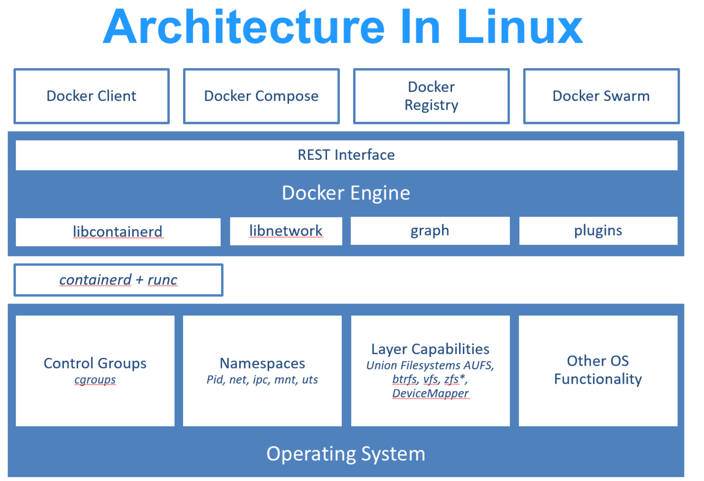

# 1、简介

## 1.1、概述

### 1.1.1、什么是 Docker

Docker 最初是 dotCloud 公司创始人 Solomon Hykes 在法国期间发起的一个公司内部项目，它是基于 dotCloud 公司多年云服务技术的一次革新，并于 2013 年 3 月以 Apache 2.0 授权协议开源，主要项目代码在 GitHub 上进行维护。Docker 项目后来还加入了 Linux 基金会，并成立推动 开放容器联盟（OCI）。

Docker 自开源后受到广泛的关注和讨论，至今其 GitHub 项目 已经超过 5 万 7 千个星标和一万多个 fork。甚至由于 Docker 项目的火爆，在 2013 年底，dotCloud 公司决定改名为 Docker。Docker 最初是在 Ubuntu 12.04 上开发实现的；Red Hat 则从 RHEL 6.5 开始对 Docker 进行支持；Google 也在其 PaaS 产品中广泛应用 Docker。

Docker 使用 Google 公司推出的 Go 语言进行开发实现，基于 Linux 内核的 cgroup、namespace 以及 OverlayFS 类的 Union FS 等技术，对进程进行封装隔离，属于 操作系统层面的虚拟化技术。由于隔离的进程独立于宿主和其它的隔离的进程，因此也称其为容器。最初实现是基于 LXC，从 0.7 版本以后开始去除 LXC，转而使用自行开发的 libcontainer，从 1.11 版本开始，则进一步演进为使用 runc 和 containerd。



> [!NOTE]
>
> runc 是一个 Linux 命令行工具，用于根据 OCI容器运行时规范 创建和运行容器。
>
> containerd 是一个守护程序，它管理容器生命周期，提供了在一个节点上执行容器和管理镜像的最小功能集。

Docker 在容器的基础上，进行了进一步的封装，从文件系统、网络互联到进程隔离等等，极大的简化了容器的创建和维护。使得 Docker 技术比虚拟机技术更为轻便、快捷。

Docker 和传统虚拟化方式的不同之处。传统虚拟机技术是虚拟出一套硬件后，在其上运行一个完整操作系统，在该系统上再运行所需应用进程；而容器内的应用进程直接运行于宿主的内核，容器内没有自己的内核，而且也没有进行硬件虚拟。因此容器要比传统虚拟机更为轻便。


### 1.1.2、为什么要用 Docker

作为一种新兴的虚拟化方式，Docker 跟传统的虚拟化方式相比具有众多的优势。


**更高效的利用系统资源**

由于容器不需要进行硬件虚拟以及运行完整操作系统等额外开销，Docker 对系统资源的利用率更高。无论是应用执行速度、内存损耗或者文件存储速度，都要比传统虚拟机技术更高效。因此，相比虚拟机技术，一个相同配置的主机，往往可以运行更多数量的应用。


**更快速的启动时间**

传统的虚拟机技术启动应用服务往往需要数分钟，而 Docker 容器应用，由于直接运行于宿主内核，无需启动完整的操作系统，因此可以做到秒级、甚至毫秒级的启动时间。大大的节约了开发、测试、部署的时间。


**一致的运行环境**

开发过程中一个常见的问题是环境一致性问题。由于开发环境、测试环境、生产环境不一致，导致有些 bug 并未在开发过程中被发现。而 Docker 的镜像提供了除内核外完整的运行时环境，确保了应用运行环境一致性，从而不会再出现「这段代码在我机器上没问题啊」这类问题。


**持续交付和部署**

对开发和运维（DevOps）人员来说，最希望的就是一次创建或配置，可以在任意地方正常运行。

使用 Docker 可以通过定制应用镜像来实现持续集成、持续交付、部署。开发人员可以通过 Dockerfile 来进行镜像构建，并结合持续集成（Continuous Integration）系统进行集成测试，而运维人员则可以直接在生产环境中快速部署该镜像，甚至结合持续部署（Continuous Delivery/Deployment）系统进行自动部署。

而且使用 Dockerfile 使镜像构建透明化，不仅仅开发团队可以理解应用运行环境，也方便运维团队理解应用运行所需条件，帮助更好的生产环境中部署该镜像。


**更轻松的迁移**

由于 Docker 确保了执行环境的一致性，使得应用的迁移更加容易。Docker 可以在很多平台上运行，无论是物理机、虚拟机、公有云、私有云，甚至是笔记本，其运行结果是一致的。因此用户可以很轻易的将在一个平台上运行的应用，迁移到另一个平台上，而不用担心运行环境的变化导致应用无法正常运行的情况。


**更轻松的维护和扩展**

Docker 使用的分层存储以及镜像的技术，使得应用重复部分的复用更为容易，也使得应用的维护更新更加简单，基于基础镜像进一步扩展镜像也变得非常简单。此外，Docker 团队同各个开源项目团队一起维护了一大批高质量的 官方镜像，既可以直接在生产环境使用，又可以作为基础进一步定制，大大的降低了应用服务的镜像制作成本。


**对比传统虚拟机总结**

| 特性       | 容器               | 虚拟机     |
| :--------- | :----------------- | :--------- |
| 启动       | 秒级               | 分钟级     |
| 硬盘使用   | 一般为 MB          | 一般为 GB  |
| 性能       | 接近原生           | 弱于       |
| 系统支持量 | 单机支持上千个容器 | 一般几十个 |


## 1.2、基本概念

Docker 包括三个基本概念：

- 镜像（Image）
- 容器（Container）
- 仓库（Repository）

理解了这三个概念，就理解了 Docker 的整个生命周期。


### 1.2.1、镜像

我们都知道，操作系统分为内核和用户空间。对于 Linux 而言，内核启动后，会挂载 root 文件系统为其提供用户空间支持。而 Docker 镜像（Image），就相当于是一个 root 文件系统。比如官方镜像 ubuntu:18.04 就包含了完整的一套 Ubuntu 18.04 最小系统的 root 文件系统。

Docker 镜像是一个特殊的文件系统，除了提供容器运行时所需的程序、库、资源、配置等文件外，还包含了一些为运行时准备的一些配置参数（如匿名卷、环境变量、用户等）。镜像不包含任何动态数据，其内容在构建之后也不会被改变。


**分层存储**

因为镜像包含操作系统完整的 root 文件系统，其体积往往是庞大的，因此在 Docker 设计时，就充分利用 Union FS 的技术，将其设计为分层存储的架构。所以严格来说，镜像并非是像一个 ISO 那样的打包文件，镜像只是一个虚拟的概念，其实际体现并非由一个文件组成，而是由一组文件系统组成，或者说，由多层文件系统联合组成。

镜像构建时，会一层层构建，前一层是后一层的基础。每一层构建完就不会再发生改变，后一层上的任何改变只发生在自己这一层。比如，删除前一层文件的操作，实际不是真的删除前一层的文件，而是仅在当前层标记为该文件已删除。在最终容器运行的时候，虽然不会看到这个文件，但是实际上该文件会一直跟随镜像。因此，在构建镜像的时候，需要额外小心，每一层尽量只包含该层需要添加的东西，任何额外的东西应该在该层构建结束前清理掉。

分层存储的特征还使得镜像的复用、定制变的更为容易。甚至可以用之前构建好的镜像作为基础层，然后进一步添加新的层，以定制自己所需的内容，构建新的镜像。


### 1.2.2、容器

镜像（Image）和容器（Container）的关系，就像是面向对象程序设计中的类和实例 一样，镜像是静态的定义，容器是镜像运行时的实体。容器可以被创建、启动、停止、删除、暂停等。

容器的实质是进程，但与直接在宿主执行的进程不同，容器进程运行于属于自己的独立的命名空间。因此容器可以拥有自己的 root 文件系统、自己的网络配置、自己的进程空间，甚至自己的用户 ID 空间。容器内的进程是运行在一个隔离的环境里，使用起来，就好像是在一个独立于宿主的系统下操作一样。这种特性使得容器封装的应用比直接在宿主运行更加安全。也因为这种隔离的特性，很多人初学 Docker 时常常会混淆容器和虚拟机。

前面讲过镜像使用的是分层存储，容器也是如此。每一个容器运行时，是以镜像为基础层，在其上创建一个当前容器的存储层，我们可以称这个为了容器运行时读写而准备的存储层为容器存储层。

容器存储层的生存周期和容器一样，容器消亡时，容器存储层也随之消亡。因此，任何保存于容器存储层的信息都会随容器删除而丢失。

按照 Docker 最佳实践的要求，容器不应该向其存储层内写入任何数据，容器存储层要保持无状态化。所有的文件写入操作，都应该使用数据卷（Volume）、或者绑定宿主目录，在这些位置的读写会跳过容器存储层，直接对宿主（或网络存储）发生读写，其性能和稳定性更高。

数据卷的生存周期独立于容器，容器消亡，数据卷不会消亡。因此，使用数据卷后，容器删除或者重新运行之后，数据却不会丢失。


### 1.2.3、仓库

镜像构建完成后，可以很容易的在当前宿主机上运行，但是，如果需要在其它服务器上使用这个镜像，我们就需要一个集中的存储、分发镜像的服务，Docker Registry 就是这样的服务。

一个 Docker Registry 中可以包含多个仓库（Repository），每个仓库可以包含多个标签（Tag），每个标签对应一个镜像。

通常，一个仓库会包含同一个软件不同版本的镜像，而标签就常用于对应该软件的各个版本。我们可以通过 `<仓库名>:<标签>` 的格式来指定具体是这个软件哪个版本的镜像。如果不给出标签，将以 latest 作为默认标签。

以 Ubuntu 镜像为例，ubuntu 是仓库的名字，其内包含有不同的版本标签，如：16.04、18.04。我们可以通过 `ubuntu:16.04` 或者 `ubuntu:18.04` 来具体指定所需哪个版本的镜像。如果忽略了标签，比如 ubuntu，那将视为 `ubuntu:latest`。

仓库名经常以两段式路径形式出现，比如 `jwilder/nginx-proxy`，前者往往意味着 Docker Registry 多用户环境下的用户名，后者则往往是对应的软件名。但这并非绝对，取决于所使用的具体 Docker Registry 的软件或服务。


**Docker Registry 公开服务**

Docker Registry 公开服务是开放给用户使用、允许用户管理镜像的 Registry 服务。一般这类公开服务允许用户免费上传、下载公开的镜像，并可能提供收费服务供用户管理私有镜像。

最常使用的 Registry 公开服务是官方的 Docker Hub，这也是默认的 Registry，并拥有大量的高质量的官方镜像。除此以外，还有 Red Hat 的 Quay.io；Google 的 Google Container Registry（Kubernetes 的镜像使用的就是这个服务）；代码托管平台 GitHub 推出的 ghcr.io。

由于某些原因，在国内访问这些服务可能会比较慢。国内的一些云服务商提供了针对 Docker Hub 的镜像服务（Registry Mirror），这些镜像服务被称为加速器。常见的有阿里云加速器、DaoCloud 加速器等。使用加速器会直接从国内的地址下载 Docker Hub 的镜像，比直接从 Docker Hub 下载速度会提高很多。

国内也有一些云服务商提供类似于 Docker Hub 的公开服务。比如网易云镜像服务、DaoCloud 镜像市场、阿里云镜像库等。


**私有 Docker Registry**

除了使用公开服务外，用户还可以在本地搭建私有 Docker Registry。Docker 官方提供了 Docker Registry 镜像，可以直接使用做为私有 Registry 服务。

开源的 Docker Registry 镜像只提供了 Docker Registry API 的服务端实现，足以支持 Docker 命令，不影响使用。但不包含图形界面，以及镜像维护、用户管理、访问控制等高级功能。

除了官方的 Docker Registry 外，还有第三方软件实现了 Docker Registry API，甚至提供了用户界面以及一些高级功能。比如 Harbor 和 Sonatype Nexus。


## 1.3、安装 Docker

Docker 分为 stable、test 和 nightly 三个更新频道。

官方网站上有各种环境下的境下的[安装指南](https://docs.docker.com/get-docker/)，这里主要介绍 Docker 在 Windows上的安装。


### 1.3.1、Windows

**系统要求**

[Docker Desktop for Windows](https://docs.docker.com/docker-for-windows/install/) 支持 64 位版本的 Windows 10 Pro，且必须开启 Hyper-V（若版本为 v1903 及以上则无需开启 Hyper-V），或者 64 位版本的 Windows 10 Home v1903 及以上版本。


**安装**

- 手动下载安装：

  点击[链接](https://desktop.docker.com/win/main/amd64/Docker Desktop Installer.exe)下载 Docker Desktop for Windows，下载好之后双击 Docker Desktop Installer.exe 开始安装。

- 使用 winget 安装：

  ```shell
  winget install Docker.DockerDesktop
  ```


**在 WSL2 运行 Docker**

若你的 Windows 版本为 Windows 10 专业版或家庭版 v1903 及以上版本可以使用 WSL2 运行 Docker，具体请查看 [Docker Desktop WSL 2 backend](https://docs.docker.com/docker-for-windows/wsl/)。


**运行**

在 Windows 搜索栏输入 Docker 点击 Docker Desktop 开始运行。

Docker 启动之后会在 Windows 任务栏出现鲸鱼图标：


等待片刻，当鲸鱼图标静止时，说明 Docker 启动成功，之后你可以打开 PowerShell 使用 Docker。


## 1.4、镜像加速器

国内从 Docker Hub 拉取镜像有时会遇到困难，此时可以配置镜像加速器。国内很多云服务商都提供了国内加速器服务，例如：

- 阿里云加速器：点击管理控制台 => 登录账号 => 左侧镜像工具 => 镜像加速器 => 复制加速器地址。
- 网易云加速器：https://hub-mirror.c.163.com。
- 百度云加速器：https://mirror.baidubce.com。

由于镜像服务可能出现宕机，建议同时配置多个镜像。各个镜像站测试结果请到 [docker-practice/docker-registry-cn-mirror-test](https://github.com/docker-practice/docker-registry-cn-mirror-test/actions) 查看。


**检查加速器是否生效**

执行 `docker system info` 命令（常用别名为 `docker info`），如果从结果中看到了如下内容，说明配置成功：

```
Registry Mirrors:
 https://hub-mirror.c.163.com/
```


**不再提供服务的镜像**

某些镜像不再提供服务，添加无用的镜像加速器，会拖慢镜像拉取速度，你可以从镜像配置列表中删除它们。

建议 watch [镜像测试](https://github.com/docker-practice/docker-registry-cn-mirror-test)这个 GitHub 仓库，这里会更新各个镜像地址的状态。


### 1.4.1、Windows

对于使用 Windows 的用户，在 Docker Desktop 中打开配置窗口后在左侧导航菜单选择 Docker Engine，编辑右侧的 json 文件，之后点击 Apply & Restart 保存后 Docker 就会重启并应用配置的镜像地址了。

```
{
  "registry-mirrors": [
    "https://hub-mirror.c.163.com",
    "https://mirror.baidubce.com"
  ]
}
```


# 2、使用镜像

Docker 运行容器前需要本地存在对应的镜像，如果本地不存在该镜像，Docker 会从镜像仓库下载该镜像。

管理镜像的主要命令为 `docker image`，其下包含以下子命令：

| 命令                   | 描述                                                         |
| :--------------------- | :----------------------------------------------------------- |
| `docker image history` | 显示镜像的历史记录。                                         |
| `docker image import`  | 从 tarball 导入内容以创建文件系统镜像。                      |
| `docker image inspect` | 显示一个或多个镜像的详细信息。                               |
| `docker image load`    | 从 tar 存档或 STDIN 加载镜像。                               |
| `docker image prune`   | 移除未使用的镜像。                                           |
| `docker image rm`      | 移除一个或多个镜像。                                         |
| `docker image save`    | 将一个或多个镜像保存到 tar 存档（默认情况下流式传输到 STDOUT）。 |
| `docker image tag`     | 创建一个指向 SOURCE_IMAGE 的 TARGET_IMAGE 标签。             |
| `docker image ls`      | 列出镜像。                                                   |
| `docker image pull`    | 从 Registry 下载镜像。                                       |
| `docker image push`    | 将镜像上传到 Registry。                                      |


## 2.1、获取镜像

[Docker Hub](https://hub.docker.com/search?q=&type=image) 上有大量的高质量的镜像可以用，从 Docker 镜像仓库获取镜像的命令是 `docker image pull`（常用别名为 `docker pull`）。其命令格式为：

```shell
docker pull [选项] [Docker Registry 地址[:端口号]/]仓库名[:标签]
```

具体的选项可以通过 `docker pull --help` 命令看到，这里说一下镜像名称的格式：

- Docker 镜像仓库地址：地址的格式一般是 `<域名/IP>[:端口号]`。默认地址是 Docker Hub（docker.io）。
- 仓库名：如之前所说，这里的仓库名是两段式名称，即 `<用户名>/<软件名>`。对于 Docker Hub，如果不给出用户名，则默认为 library，也就是官方镜像。

```
$ docker pull ubuntu:18.04
18.04: Pulling from library/ubuntu
92dc2a97ff99: Pull complete
be13a9d27eb8: Pull complete
c8299583700a: Pull complete
Digest: sha256:4bc3ae6596938cb0d9e5ac51a1152ec9dcac2a1c50829c74abd9c4361e321b26
Status: Downloaded newer image for ubuntu:18.04
docker.io/library/ubuntu:18.04
```

上面的命令中没有给出 Docker 镜像仓库地址，因此将会从 Docker Hub（docker.io）获取镜像。而镜像名称是 `ubuntu:18.04`，因此将会获取官方镜像 `library/ubuntu` 仓库中标签为 18.04 的镜像。`docker pull` 命令的输出结果最后一行给出了镜像的完整名称，即： `docker.io/library/ubuntu:18.04`。

从下载过程中可以看到我们之前提及的分层存储的概念，镜像是由多层存储所构成。下载也是一层层的去下载，并非单一文件。下载过程中给出了每一层的 ID 的前 12 位。并且下载结束后，给出该镜像完整的 sha256 的摘要，以确保下载一致性。

在使用上面命令的时候，你可能会发现，你所看到的层 ID 以及 sha256 的摘要和这里的不一样。这是因为官方镜像是一直在维护的，有任何新的 bug，或者版本更新，都会进行修复再以原来的标签发布，这样可以确保任何使用这个标签的用户可以获得更安全、更稳定的镜像。


## 2.2、列出镜像

要想列出已经下载下来的镜像，可以使用 `docker image ls` 命令（常用别名为 `docker images`）：

```
$ docker images
REPOSITORY           TAG                 IMAGE ID            CREATED             SIZE
redis                latest              5f515359c7f8        5 days ago          183 MB
nginx                latest              05a60462f8ba        5 days ago          181 MB
mongo                3.2                 fe9198c04d62        5 days ago          342 MB
<none>               <none>              00285df0df87        5 days ago          342 MB
ubuntu               18.04               329ed837d508        3 days ago          63.3MB
ubuntu               bionic              329ed837d508        3 days ago          63.3MB
```

列表包含了 仓库名、标签、镜像 ID、创建时间以及所占用的空间。

镜像 ID 则是镜像的唯一标识，一个镜像可以对应多个标签。因此，在上面的例子中，可以看到 `ubuntu:18.04` 和 `ubuntu:bionic` 拥有相同的 ID，因为它们对应的是同一个镜像。


**镜像体积**

如果仔细观察会注意到这里标识的所占用空间和在 Docker Hub 上看到的镜像大小不同。比如 `ubuntu:18.04` 镜像大小在这里是 63.3 MB，但是在 [Docker Hub](https://hub.docker.com/layers/ubuntu/library/ubuntu/bionic/images/sha256-32776cc92b5810ce72e77aca1d949de1f348e1d281d3f00ebcc22a3adcdc9f42?context=explore) 显示的却是 25.47 MB。这是因为 Docker Hub 中显示的体积是压缩后的体积。在镜像下载和上传过程中镜像是保持着压缩状态的，因此 Docker Hub 所显示的大小是网络传输中更关心的流量大小。而 `docker images` 显示的是镜像下载到本地后展开的大小，准确说是展开后的各层所占空间的总和，因为镜像到本地后，查看空间的时候更关心的是本地磁盘空间占用的大小。

另外一个需要注意的问题是 `docker images` 列表中的镜像体积总和并非是所有镜像实际硬盘消耗。由于 Docker 镜像是多层存储结构，并且可以继承、复用，因此不同镜像可能会因为使用相同的基础镜像，从而拥有共同的层。由于 Docker 使用 Union FS，相同的层只需要保存一份即可，因此实际镜像硬盘占用空间很可能要比这个列表镜像大小的总和要小的多。

你可以通过 `docker system df` 命令来便捷的查看镜像、容器、数据卷所占用的空间：

```
$ docker system df

TYPE                TOTAL               ACTIVE              SIZE                RECLAIMABLE
Images              24                  0                   1.992GB             1.992GB (100%)
Containers          1                   0                   62.82MB             62.82MB (100%)
Local Volumes       9                   0                   652.2MB             652.2MB (100%)
Build Cache                                                 0B                  0B
```


**虚悬镜像**

上面的镜像列表中，还可以看到一个特殊的镜像，这个镜像既没有仓库名，也没有标签，均为 `<none>`：

```
<none>               <none>              00285df0df87        5 days ago          342 MB
```

这个镜像原本是有镜像名和标签的，原来为 `mongo:3.2`，随着官方镜像维护，发布了新版本后，重新 `docker pull mongo:3.2` 时，`mongo:3.2` 这个镜像名被转移到了新下载的镜像身上，而旧的镜像上的这个名称则被取消，从而成为了 `<none>`。除了 `docker pull` 可能导致这种情况，`docker build` 也同样可以导致这种现象。由于新旧镜像同名，旧镜像名称被取消，从而出现仓库名、标签均为 `<none>` 的镜像。这类无标签镜像也被称为虚悬镜像（dangling image），可以用 `docker images -f dangling=true` 命令专门显示这类镜像：

```
$ docker images -f dangling=true
REPOSITORY          TAG                 IMAGE ID            CREATED             SIZE
<none>              <none>              00285df0df87        5 days ago          342 MB
```

一般来说，虚悬镜像已经失去了存在的价值，是可以随意删除的，可以用 `docker image prune` 命令删除。


### 2.2.1、中间层镜像

为了加速镜像构建、重复利用资源，Docker 会利用中间层镜像。所以在使用一段时间后，可能会看到一些依赖的中间层镜像。默认的 `docker images` 列表中只会显示顶层镜像，如果希望显示包括中间层镜像在内的所有镜像的话，需要加 `-a` 参数：

```shell
docker images -a
```

这样会看到很多无标签的镜像，与之前的虚悬镜像不同，这些无标签的镜像很多都是中间层镜像，是其它镜像所依赖的镜像。这些无标签镜像不应该删除，否则会导致上层镜像因为依赖丢失而出错。实际上，这些镜像也没必要删除，因为之前说过，相同的层只会存一遍，而这些镜像是别的镜像的依赖，因此并不会因为它们被列出来而多存了一份，无论如何你也会需要它们。只要删除那些依赖它们的镜像后，这些依赖的中间层镜像也会被连带删除。


### 2.2.2、列出部分镜像

不加任何参数的情况下，`docker images` 会列出所有顶层镜像，但是有时候我们只希望列出部分镜像。`docker images` 有好几个参数可以帮助做到这个事情。

根据仓库名列出镜像：

```
$ docker images ubuntu
REPOSITORY          TAG                 IMAGE ID            CREATED             SIZE
ubuntu              18.04               329ed837d508        3 days ago          63.3MB
ubuntu              bionic              329ed837d508        3 days ago          63.3MB
```

列出特定的某个镜像，也就是说指定仓库名和标签：

```
$ docker images ubuntu:18.04
REPOSITORY          TAG                 IMAGE ID            CREATED             SIZE
ubuntu              18.04               329ed837d508        3 days ago          63.3MB
```

除此以外，`docker images` 还支持强大的过滤器参数 `--filter`，或者简写 `-f`，比如我们希望看到在 `mongo:3.2` 之后建立的镜像，可以用下面的命令：

```
$ docker images -f since=mongo:3.2
REPOSITORY          TAG                 IMAGE ID            CREATED             SIZE
redis               latest              5f515359c7f8        5 days ago          183 MB
nginx               latest              05a60462f8ba        5 days ago          181 MB
```

想查看某个位置之前的镜像也可以，只需要把 `since` 换成 `before` 即可。

此外，如果镜像构建时定义了 `LABEL` 还可以通过 `LABEL` 来过滤：

```shell
docker images -f label=com.example.version=0.1
```


### 2.3.3、以特定格式显示

默认情况下 `docker images` 会输出一个完整的表格，但是我们并非所有时候都会需要这些内容。比如，刚才删除虚悬镜像的时候，我们需要利用 `docker images` 把所有的虚悬镜像的 ID 列出来，然后才可以交给 `docker rmi` 命令作为参数来删除指定的这些镜像，这个时候就用到了 `-q` 参数（quiet：只显示镜像 ID，不显示其他信息）：

```
$ docker images -q
5f515359c7f8
05a60462f8ba
fe9198c04d62
00285df0df87
329ed837d508
329ed837d508
```

`--filter` 配合 `-q` 产生出指定范围的 ID 列表，然后送给另一个 `docker` 命令作为参数，从而针对这组实体成批的进行某种操作的做法在 Docker 命令行使用过程中非常常见，不仅仅是镜像，将来我们会在各个命令中看到这类搭配以完成很强大的功能。因此每次在文档看到过滤器后，可以多注意一下它们的用法。

另外一些时候，我们可能只是对表格的结构不满意，希望自己组织列；或者不希望有标题，这样方便其它程序解析结果等，这就用到了 `docker images --format` 命令和 [Go 的模板语法](https://gohugo.io/templates/introduction/)：

```shell
docker images --format "{{.<字段名称>}}"
```

其中，字段名称是 Docker 镜像的属性字段，支持的字段包括：

- `Repository`：镜像仓库名称
- `Tag`：镜像标签。
- `ID`：镜像 ID。
- `CreatedSince`：镜像创建时间（相对时间）。
- `Size`：镜像大小。
- `Digest`：镜像摘要（仅适用于某些镜像）。

比如，下面的命令会直接列出镜像结果，并且只包含镜像 ID 和仓库名：

```
$ docker images --format "{{.ID}}: {{.Repository}}"
5f515359c7f8: redis
05a60462f8ba: nginx
fe9198c04d62: mongo
00285df0df87: <none>
329ed837d508: ubuntu
329ed837d508: ubuntu
```

或者打算以表格等距显示，并且有标题行，和默认一样，不过自己定义列：

```
$ docker images --format "table {{.ID}}\t{{.Repository}}\t{{.Tag}}"
IMAGE ID            REPOSITORY          TAG
5f515359c7f8        redis               latest
05a60462f8ba        nginx               latest
fe9198c04d62        mongo               3.2
00285df0df87        <none>              <none>
329ed837d508        ubuntu              18.04
329ed837d508        ubuntu              bionic
```


## 2.3、删除本地镜像

如果要删除本地的镜像，可以使用 `docker image rm` 命令（常用别名为 `docker rmi`），其格式为：

```shell
docker rmi [选项] <镜像1> [<镜像2> ...]
```


**用 ID、镜像名、摘要删除镜像**

其中，`<镜像>` 可以是镜像短 ID、镜像长 ID、镜像名或者镜像摘要。

比如我们有这么一些镜像：

```
$ docker images
REPOSITORY                  TAG                 IMAGE ID            CREATED             SIZE
centos                      latest              0584b3d2cf6d        3 weeks ago         196.5 MB
redis                       alpine              501ad78535f0        3 weeks ago         21.03 MB
docker                      latest              cf693ec9b5c7        3 weeks ago         105.1 MB
nginx                       latest              e43d811ce2f4        5 weeks ago         181.5 MB
```

我们可以用镜像的完整 ID（也称为长 ID），来删除镜像。使用脚本的时候可能会用长 ID，但是人工输入就太累了，所以更多的时候是用短 ID 来删除镜像。`docker images` 默认列出的就已经是短 ID 了，一般取前 3 个字符以上，只要足够区分于别的镜像就可以了。

比如这里，如果我们要删除 `redis:alpine` 镜像，可以执行：

```
$ docker rmi 501
Untagged: redis:alpine
Untagged: redis@sha256:f1ed3708f538b537eb9c2a7dd50dc90a706f7debd7e1196c9264edeea521a86d
Deleted: sha256:501ad78535f015d88872e13fa87a828425117e3d28075d0c117932b05bf189b7
Deleted: sha256:96167737e29ca8e9d74982ef2a0dda76ed7b430da55e321c071f0dbff8c2899b
Deleted: sha256:32770d1dcf835f192cafd6b9263b7b597a1778a403a109e2cc2ee866f74adf23
Deleted: sha256:127227698ad74a5846ff5153475e03439d96d4b1c7f2a449c7a826ef74a2d2fa
Deleted: sha256:1333ecc582459bac54e1437335c0816bc17634e131ea0cc48daa27d32c75eab3
Deleted: sha256:4fc455b921edf9c4aea207c51ab39b10b06540c8b4825ba57b3feed1668fa7c7
```

我们也可以用`镜像名`，也就是 `<仓库名>:<标签>`，来删除镜像：

```
$ docker rmi centos
Untagged: centos:latest
Untagged: centos@sha256:b2f9d1c0ff5f87a4743104d099a3d561002ac500db1b9bfa02a783a46e0d366c
Deleted: sha256:0584b3d2cf6d235ee310cf14b54667d889887b838d3f3d3033acd70fc3c48b8a
Deleted: sha256:97ca462ad9eeae25941546209454496e1d66749d53dfa2ee32bf1faabd239d38
```

当然，更精确的是使用镜像摘要删除镜像：

```
$ docker images --digests
REPOSITORY                  TAG                 DIGEST                                                                    IMAGE ID            CREATED             SIZE
node                        slim                sha256:b4f0e0bdeb578043c1ea6862f0d40cc4afe32a4a582f3be235a3b164422be228   6e0c4c8e3913        3 weeks ago         214 MB

$ docker rmi node@sha256:b4f0e0bdeb578043c1ea6862f0d40cc4afe32a4a582f3be235a3b164422be228
Untagged: node@sha256:b4f0e0bdeb578043c1ea6862f0d40cc4afe32a4a582f3be235a3b164422be228
```


**Untagged 和 Deleted**

如果观察上面这几个命令的运行输出信息的话，你会注意到删除行为分为两类，一类是 `Untagged`，另一类是 `Deleted`。我们之前介绍过，镜像的唯一标识是其 ID 和摘要，而一个镜像可以有多个标签。

因此当我们使用上面命令删除镜像的时候，实际上是在要求删除某个标签的镜像。所以首先需要做的是将满足我们要求的所有镜像标签都取消，这就是我们看到的 `Untagged` 的信息。因为一个镜像可以对应多个标签，因此当我们删除了所指定的标签后，可能还有别的标签指向了这个镜像，如果是这种情况，那么 `Delete` 行为就不会发生。所以并非所有的 `docker rmi` 都会产生删除镜像的行为，有可能仅仅是取消了某个标签而已。

当该镜像所有的标签都被取消了，该镜像很可能会失去了存在的意义，因此会触发删除行为。镜像是多层存储结构，因此在删除的时候也是从上层向基础层方向依次进行判断删除。镜像的多层结构让镜像复用变得非常容易，因此很有可能某个其它镜像正依赖于当前镜像的某一层。这种情况，依旧不会触发删除该层的行为。直到没有任何层依赖当前层时，才会真实的删除当前层。这就是为什么，有时候会奇怪，为什么明明没有别的标签指向这个镜像，但是它还是存在的原因，也是为什么有时候会发现所删除的层数和自己 `docker pull` 看到的层数不一样的原因。

除了镜像依赖以外，还需要注意的是容器对镜像的依赖。如果有用这个镜像启动的容器存在（即使容器没有运行），那么同样不可以删除这个镜像。之前讲过，容器是以镜像为基础，再加一层容器存储层，组成这样的多层存储结构去运行的。因此该镜像如果被这个容器所依赖的，那么删除必然会导致故障。如果这些容器是不需要的，应该先将它们删除，然后再来删除镜像。


**用 `docker images` 命令来配合**

像其它可以承接多个实体的命令一样，可以使用 `docker images -q` 来配合使用 `docker rmi`，这样可以成批的删除希望删除的镜像。

比如，我们需要删除所有仓库名为 `redis` 的镜像：

```shell
docker rmi $(docker images -q redis)
```

或者删除所有在 `mongo:3.2` 之前的镜像：

```shell
docker rmi $(docker images -q -f before=mongo:3.2)
```

充分利用你的想象力和 Linux 命令行的强大，你可以完成很多非常赞的功能。


## 2.4、保存和加载镜像


# 3、操作容器

容器是 Docker 又一核心概念。

简单的说，容器是独立运行的一个或一组应用，以及它们的运行态环境。对应的，虚拟机可以理解为模拟运行的一整套操作系统（提供了运行态环境和其他系统环境）和跑在上面的应用。

管理容器的命令为 `docker container`，其下有以下子命令：

| 命令                       | 描述                                                 |
| :------------------------- | :--------------------------------------------------- |
| `docker container attach`  | 将本地标准输入、输出和错误流附加到正在运行的容器。   |
| `docker container commit`  | 根据容器的更改创建新的镜像。                         |
| `docker container cp`      | 复制容器和本地文件系统之间的文件/文件夹。            |
| `docker container create`  | 创建一个新的容器。                                   |
| `docker container diff`    | 检查容器文件系统上文件或目录的更改。                 |
| `docker container export`  | 将容器的文件系统导出为 tar 存档。                    |
| `docker container inspect` | 显示一个或多个容器的详细信息。                       |
| `docker container kill`    | 终止一个或多个正在运行的容器。                       |
| `docker container logs`    | 获取容器的日志。                                     |
| `docker container pause`   | 暂停一个或多个容器中的所有进程。                     |
| `docker container port`    | 列出容器的端口映射或特定映射。                       |
| `docker container prune`   | 删除所有已停止的容器。                               |
| `docker container rename`  | 重命名容器。                                         |
| `docker container restart` | 重启一个或多个容器。                                 |
| `docker container rm`      | 删除一个或多个容器。                                 |
| `docker container start`   | 启动一个或多个已停止的容器。                         |
| `docker container stats`   | 显示容器资源使用情况统计信息的实时流。               |
| `docker container stop`    | 停止一个或多个正在运行的容器。                       |
| `docker container top`     | 显示容器的运行进程。                                 |
| `docker container unpause` | 取消暂停一个或多个容器中的所有进程。                 |
| `docker container update`  | 更新一个或多个容器的配置。                           |
| `docker container wait`    | 阻塞直到一个或多个容器停止，然后打印它们的退出代码。 |
| `docker container exec`    | 在正在运行的容器中执行命令。                         |
| `docker container ls`      | 列出容器。                                           |
| `docker container run`     | 根据镜像创建并运行新容器。                           |


## 3.1、启动容器

启动容器有两种方式，一种是基于镜像新建一个容器并启动，另外一个是将在终止状态（`exited`）的容器重新启动。

因为 Docker 的容器实在太轻量级了，很多时候用户都是随时删除和新创建容器。


**新建并启动**

所需要的命令主要为 `docker container run`（常用别名为 `docker run`）。

例如，下面的命令输出一个 “Hello World”，之后终止容器：

```
$ docker run ubuntu:18.04 /bin/echo 'Hello world'
Hello world
```

这跟在本地直接执行 `/bin/echo 'hello world'` 几乎感觉不出任何区别。

下面的命令则启动一个 bash 终端，允许用户进行交互：

```
$ docker run -t -i ubuntu:18.04 /bin/bash
root@af8bae53bdd3:/#
```

其中，`-t` 选项让 Docker 分配一个伪终端（pseudo-tty）并绑定到容器的标准输入上， `-i` 则让容器的标准输入保持打开。

在交互模式下，用户可以通过所创建的终端来输入命令，例如：

```
root@af8bae53bdd3:/# pwd
/
root@af8bae53bdd3:/# ls
bin boot dev etc home lib lib64 media mnt opt proc root run sbin srv sys tmp usr var
```

当利用 `docker run` 来创建容器时，Docker 在后台运行的标准操作包括：

- 检查本地是否存在指定的镜像，不存在就从 registry 下载。
- 利用镜像创建并启动一个容器。
- 分配一个文件系统，并在只读的镜像层外面挂载一层可读写层。
- 从宿主主机配置的网桥接口中桥接一个虚拟接口到容器中去。
- 从地址池配置一个 ip 地址给容器。
- 执行用户指定的应用程序。
- 执行完毕后容器被终止。


**启动已终止容器**

可以利用 `docker container start` 命令（常用别名为 `docker start`），直接将一个已经终止（`exited`）的容器启动运行。

容器的核心为所执行的应用程序，所需要的资源都是应用程序运行所必需的。除此之外，并没有其它的资源。可以在伪终端中利用 `ps` 或 `top` 来查看进程信息。

```
root@ba267838cc1b:/# ps
  PID TTY          TIME CMD
    1 ?        00:00:00 bash
   11 ?        00:00:00 ps
```

可见，容器中仅运行了指定的 bash 应用。这种特点使得 Docker 对资源的利用率极高，是货真价实的轻量级虚拟化。


## 3.2、守护态运行容器

更多的时候，需要让 Docker 在后台运行而不是直接把执行命令的结果输出在当前宿主机下。此时，可以通过添加 `-d` 参数来实现。

如果不使用 `-d` 参数运行容器：

```
$ docker run ubuntu:18.04 /bin/sh -c "while true; do echo hello world; sleep 1; done"
hello world
hello world
hello world
hello world
```

容器会把输出的结果（STDOUT）打印到宿主机上面。

如果使用了 `-d` 参数运行容器：

```
$ docker run -d ubuntu:18.04 /bin/sh -c "while true; do echo hello world; sleep 1; done"
77b2dc01fe0f3f1265df143181e7b9af5e05279a884f4776ee75350ea9d8017a
```

启动后会返回一个唯一的 ID，此时容器会在后台运行并不会把输出的结果（STDOUT）打印到宿主机上面。

> [!NOTE]
>
> 容器是否会长久运行，是和 `docker run` 指定的命令有关，和 `-d` 参数无关。

可以通过 `docker container ls` 命令（常用别名为 `docker ps`）来查看容器信息：

```
$ docker ps
CONTAINER ID  IMAGE         COMMAND               CREATED        STATUS       PORTS NAMES
77b2dc01fe0f  ubuntu:18.04  /bin/sh -c 'while tr  2 minutes ago  Up 1 minute        agitated_wright
```

要获取容器的输出信息，可以通过 `docker container logs` 命令（常用别名为 `docker logs`）：

```
$ docker logs [container ID or NAMES]
hello world
hello world
hello world
. . .
```


## 3.3、终止容器

可以使用 `docker container stop` 命令（常用别名为 `docker stop`）来终止一个运行中的容器。

此外，当 Docker 容器中指定的应用终结时，容器也自动终止。

例如对于上一章节中只启动了一个终端的容器，用户通过 `exit` 命令或 `Ctrl+d` 来退出终端时，所创建的容器立刻终止。

终止状态的容器可以用 `docker ps -a` 命令看到。例如：

```
$ docker ps -a
CONTAINER ID        IMAGE                    COMMAND                CREATED             STATUS                          PORTS               NAMES
ba267838cc1b        ubuntu:18.04             "/bin/bash"            30 minutes ago      Exited (0) About a minute ago                       trusting_newton
```

处于终止状态的容器，可以通过 `docker start` 命令来重新启动。

此外，`docker container restart` 命令（常用别名为 `docker restart`）会将一个运行态的容器终止，然后再重新启动它。


## 3.4、进入容器

在使用 `-d` 参数时，容器启动后会进入后台。

某些时候需要进入容器进行操作，可以使用 `docker container attach` 命令（常用别名为 `docker attach`）或 `docker container exec` 命令（常用别名为 `docker exec`），推荐使用 `docker exec` 命令。


**`docker attach` 命令**

下面示例如何使用 `docker attach` 命令：

```
$ docker run -itd ubuntu
243c32535da7d142fb0e6df616a3c3ada0b8ab417937c853a9e1c251f499f550

$ docker ps
CONTAINER ID        IMAGE               COMMAND             CREATED             STATUS              PORTS               NAMES
243c32535da7        ubuntu:latest       "/bin/bash"         18 seconds ago      Up 17 seconds                           nostalgic_hypatia

$ docker attach 243c
root@243c32535da7:/#
```

> [!IMPORTANT]
>
> 如果从这个 STDOUT 中 `exit`，会导致容器的停止。


**`docker exec` 命令**

`docker exec` 后边可以跟多个参数，这里主要说明 `-i`、`-t` 参数。

只用 `-i` 参数时，由于没有分配伪终端，界面没有我们熟悉的 Linux 命令提示符，但命令执行结果仍然可以返回。

当 `-i`、`-t` 参数一起使用时，则可以看到我们熟悉的 Linux 命令提示符。

```
$ docker run -itd ubuntu
69d137adef7a8a689cbcb059e94da5489d3cddd240ff675c640c8d96e84fe1f6

$ docker ps
CONTAINER ID        IMAGE               COMMAND             CREATED             STATUS              PORTS               NAMES
69d137adef7a        ubuntu:latest       "/bin/bash"         18 seconds ago      Up 17 seconds                           zealous_swirles

$ docker exec -i 69d1 bash
ls
bin
boot
dev
...

$ docker exec -it 69d1 bash
root@69d137adef7a:/#
```

> [!IMPORTANT]
>
> 如果从这个 STDOUT 中 `exit`，不会导致容器的停止。这就是为什么推荐使用 `docker exec` 的原因。


## 3.5、导出和导入

**导出容器**

如果要导出本地某个容器，可以使用 `docker container export` 命令（常用别名为 `docker export`）：

```
$ docker ps -a
CONTAINER ID        IMAGE               COMMAND             CREATED             STATUS                    PORTS               NAMES
7691a814370e        ubuntu:18.04        "/bin/bash"         36 hours ago        Exited (0) 21 hours ago                       test
$ docker export 7691a814370e > ubuntu.tar
```

这样将导出容器快照到本地文件。


**导入容器快照**

可以使用 `docker image import` 命令（常用别名为 `docker import`）从容器快照文件中再导入为镜像，例如：

```
$ cat ubuntu.tar | docker import - test/ubuntu:v1.0
$ docker images
REPOSITORY          TAG                 IMAGE ID            CREATED              VIRTUAL SIZE
test/ubuntu         v1.0                9d37a6082e97        About a minute ago   171.3 MB
```

此外，也可以通过指定 URL 或者某个目录来导入，例如：

```shell
docker import http://example.com/exampleimage.tgz example/imagerepo
```

> [!NOTE]
>
> 用户既可以使用 `docker import` 来导入一个容器快照到本地镜像库，也可以使用 `docker load` 来导入镜像存储文件到本地镜像库。这两者的区别在于容器快照文件将丢弃所有的历史记录和元数据信息（即仅保存容器当时的快照状态），而镜像存储文件将保存完整记录，体积也要大。此外，从容器快照文件导入时可以重新指定标签等元数据信息。


## 3.6、删除容器

**删除容器**

可以使用 `docker container rm` 命令（常用别名为 `docker rm`）来删除一个处于终止状态的容器。例如：

```
$ docker rm trusting_newton
trusting_newton
```

如果要删除一个运行中的容器，可以添加 `-f` 参数。Docker 会发送 `SIGKILL` 信号给容器。


**清理所有处于终止状态的容器**

用 `docker ps -a` 命令可以查看所有已经创建的包括终止状态的容器，如果数量太多要一个个删除可能会很麻烦，用下面的命令可以清理掉所有处于终止状态的容器：

```shell
docker container prune
```


# 4、访问仓库

仓库（Repository）是集中存放镜像的地方。

一个容易混淆的概念是注册服务器（Registry）。实际上注册服务器是管理仓库的具体服务器，每个服务器上可以有多个仓库，而每个仓库下面有多个镜像。从这方面来说，仓库可以被认为是一个具体的项目或目录。例如对于仓库地址 `docker.io/ubuntu` 来说，`docker.io` 是注册服务器地址，`ubuntu` 是仓库名。

大部分时候，并不需要严格区分这两者的概念。
