# 1、什么是 Elastisearch？

> 你懂的，用来搜索（也用来分析）

Elasticsearch 是位于 Elastic Stack 中心的分布式搜索和分析引擎。Logstach 和 Beats 促进采集、合计以及充实你的数据并在 Elasticsearch 中存储它们。Kibana 允许你去交互式的探索、可视化和共享对数据的见解，以及监视这个栈（Elastic Stack）。Elasticsearch 是索引、搜索和分析的神奇所在。

Elasticsearch 为各种数据类型提供接近实时的搜索和分析。不论你有结构化或非结构化的文本、数字数据，还是地理空间数据，Elasticsearch 能以支持快速搜索的方式高效地存储和索引它。你可以远超简单数据检索和聚合信息的方式去发现你数据中的趋势和模式。而且，随着你数据和查询量的增长，Elasticsearch 分布式的特性允许你的部署能随着它无缝地增长匹配。

虽然不是每个问题都是搜索问题，但 Elasticsearch 在大量实例中提供了处理数据的速度和灵活性：

- 为应用或者网站添加搜索框。
- 存储和分析日志、度量和安全事件数据。
- 使用机器学习，实时自动建模你的数据行为。
- 使用 Elasticsearch 作为存储引擎来自动化业务工作流。
- 使用 Elasticsearch 作为地理信息系统（GIS）管理、集成和分析空间信息，以及使用 Elasticsearch 作为生物学信息研究工具处理基因数据。

我们一直对人们使用搜索的新奇方式感觉惊奇。但是不论你的实例与其中一个相似，还是你正使用 Elasticsearch 来解决一个新的问题，你在 Elasticsearch 处理数据、文档和索引的方式是相同的。


## 1.1、数据输入：文档和索引

Elasticsearch 是一种分布式文档存储。Elasticsearch 不用列数据行存储信息，而是存储已序列化为 JSON 文档的复杂数据结构。当集群中有多个 Elasticsearch 节点时，存储的文档将分布在集群中，且可以从任何节点直接访问。

当一个文档被存储时，它会被索引并且在接近实时的 1 秒钟内被完全可搜索。Elasticsearch 使用一种称之为倒排索引的数据结构，支持非常快的全文搜索。倒排索引列出任何文档中出现的唯一单词，并标识每个单词出现的所有文档。

索引可被认作一种文档的优化集合，且每个文档都是字段的集合，字段是包含你数据的键值对。默认情况下，Elasticsearch 索引每个字段中的所有数据，且每个被索引的字段有一个专用的优化数据结构。例如，文本字段被存储在倒排索引中，数字和地理字段存储在 BKD 树 中。使用每个字段的数据结构来聚集和返回搜索结果是让 Elasticsearch 如此快的原因。

Elasticsearch 也具有无模式能力，这意味着文档无需明确地指定如何处理可能出现中文档中的每个不同的字段，就可以被索引。当启用动态映射后，Elasticsearch 自动检测和向索引中添加新的字段。这个默认行为使索引和浏览你的数据更容易——只需开始索引文档，Elasticsearch 会自动检测和映射布尔值、浮点值和整数值、日期以及字符串到合适的 Elasticsearch 数据类型。

最终，然而你比 Elasticsearch 更了解你的数据以及你想如何使用它们。你能定义控制动态映射规则，而且明确的定义映射以完全控制字段如何存储和索引。

定义你自己的映射使用你能够：

- 区分全文字符串字段和精确值字符串字段。
- 执行特定语言的文本分析。
- 为部分匹配优化字段。
- 使用自定义的日期格式。
- 使用无法自动检测的数据类型，如 `geo_point` 和 `geo_shape`。

为不同的目的以不同的方式索引相同的字段，通常是有用的。例如，你可能想索引一个字符串字段，既作为全文搜索的文本字段，也作为用于排序和聚合你的数据的关键字段。或者，你可以选择使用多个语言分析器，用来处理包含用户输入的字符串字段的内容。

用于索引期间的全文字段的分析链，也被用于搜索时。当你查询一个全文字段时，在索引中查询词语（`term`）之前，这个查询文本将经历相同的分析。


## 1.2、信息输出：搜索和分析

虽然你能将 Elasticsearch 用作文档存储和检测文档及他们的元数据，但真正强大之处在于能轻松访问构建在 Apache Lucene 搜索引擎库之上的全套搜索能力。

Elasticsearch 提供一种简单、一致的 REST API，用于管理你的集群以及索引和搜索数据。用于测试目的，你可以轻松地从命令行或者在 Kibana 中通过开发者控制台提交请求。从你的应用里，你可以为你的语言选择 Elasticsearch 客户端：Java、JavaScript、GO、.Net、PHP、Perl、Python 或者 Ruby。


**搜索你的数据**

Elasticsearch REST API 支持结构化查询、全文查询以及结合二者的复杂查询。结构化查询类似于你在 SQL 中构造的查询类型。例如，你可以在职员索引中搜索性别和年龄字段，并按雇佣日期字段对匹配项进行排序。全文查询，查找查询字符串匹配的所有文档，且返回按相关性——他们与搜索词语匹配程度——排序的文档。

除了搜索单个词语，你也可以执行短语搜索、相似性搜索和前缀搜索，并且获得自动完成建议。

有你想搜索的地理空间或者其他数字数据吗？ Elasticsearch 在优化数据结构中索引非文本数据用于支持高性能地理和数字查询。

你可以访问使用 Elasticsearch 全部 JSON 风格的查询语言（查询 DSL）的所有搜索能力。你也可以构造 SQL 风格的查询搜索和聚合在 Elasticsearch 中的内部数据，JDBC 和 ODBC 驱动使得各种第三方应用能通过 SQL 与 Elasticsearch 交互。


**分析你的数据**

Elasticsearch 聚合使你能够构建数据的复杂摘要，并深入了解关键度量、模式和趋势。聚合使你能回答以下类似的问题，而不是仅仅找到众所周知的 “大海捞针”：

- 大海中有多少针？
- 针的平均长度是多少？
- 按制造商分类，针的平均长度是多少？
- 过去六个月，每个月加了多少针？

你也可以使用聚合去回答更多微妙的问题，比如：

- 你最受欢迎的针制造商是谁？
- 是否有特别或者异常的针束？

因为聚合借用了用于搜索的相同数据结构，所以他们也非常快。这使得你能实时分析和可视化数据。你的报告和仪表盘随着你的数据变化而更新，以便你可以基于最新的信息采取行动。

此外，聚合随着搜索请求一起运行。你可以搜索文档、过滤结果以及在单个请求中同时对同样的数据实时地执行分析。由于聚合是在特定搜索的上下文中计算的，你不仅能展示 70 号针的数量，你还能展示匹配你的用户搜索标准——比如不粘的绣花针——的 70 号针数量。


**但是等等，还有更多**

想自动分析时序数据吗？你可以使用机器学习特性去创建在你数据中的正常行为的准确基线，并识别异常模式。通过机器学习，你能发现：

- 与值、计数或者频率有关的时间偏差异常。
- 统计稀有性。
- 群体成员的异常行为。

最好的部分呢？你可以这样做，而不必指定算法、模型或其他与科学相关的配置。


## 1.3、可伸缩性和弹性

**集群、节点和分片**

Elasticsearch 被构建为始终可用，并且能按需扩展。它是通过天然的分布式来实现的。你可以通过向集群添加服务器（节点）来增加容量，Elasticsearch 自动分布你的数据和查询到所有可用节点。无需改造你的应用，Elasticsearch 知道如何平衡多节点集群以提供规模和高可用性。节点越多越好。

这是如何工作的？实际来讲，一个 Elasticsearch 索引只是一个或多个物理分片的逻辑组，其中每个分片实际上是一个独立索引。通过将索引中的文档分布在多个分片上，并将这些分片分布在多个节点上，Elasticsearch 能确保冗余，这既能防止硬盘损坏也能在节点添加到集群时增加查询容量。随着集群的伸缩，Elasticsearch 自动迁移分片以重新平衡集群。

有两种类型的分片：主分片和副本。索引中的每个文档都属于一个主分片。一个副本分片是一个主分片的复制。副本提供了数据冗余复制，以防止硬件故障，并增加服务读取请求——如搜索或者检索文档——的容量。

索引中的主分片的数量是索引创建时固定的，但副本分片数量可以随时更改而不会中断索引或者查询操作。


**看具体情况……**

对于分片大小和索引主分片数量的配置，有许多性能的考虑和权衡。分片越多，仅维护这些索引的开销就越大。分片越大，在 Elasticsearch 需要重平衡集群时，移动分片的耗时越久。

查询大量的小分片，可以让每个分片的处理更快，但更多的查询也意味着开销，所以查询更少的大分片也可能更快。简而言之……这得看情况。

作为起点：

- 要保持平均分片大小在几 `GB` 到几十 `GB`。对于使用基于时间的数据用例，通常分片处于 `20 GB` 到 `40 GB` 的范围。
- 避免大量分片的问题。一个节点能容纳的分片数量与可用堆空间成比例。一般来讲，每 `GB` 堆空间的分片数量应少于 20。

确定你的用例的最优配置的最好方法，是 [`用你自己的数据和查询进行测试`](https://www.elastic.co/cn/elasticon/conf/2016/sf/quantitative-cluster-sizing)。


**容灾**

出于性能的原因，集群中的节点需要在同一网络中。在不同数据中心平衡集群中的分片会花很长时间。但高可用的架构要求你要避免把所有鸡蛋放到一个篮子里。在一个位置发生重大停机的情况下，另一个位置的服务器需要能够无缝的接管。答案是什么呢？跨集群复制（`CCR`）。

CCR 提供了一种方式自动地从主集群同步索引到作为热备的备份远程集群。如果主集群失效了，备份集群就会接管。你也可以使用 `CCR` 创建备份集群，以便在地理上靠近用户时，为读请求提供服务。

跨集群备份（`CCR`）是 `主动-被动模式`（`active-passive`）。主集群上的索引是活动的领导者索引，且处理所有写请求。复制到备份集群的索引是只读的追随者。


**维护保养**

与任何企业系统一样，你需要工具来保护、管理和监控你的 Elasticsearch 集群。集成到 Elasticsearch 中的安全、监控和管理特性使你能使用 Kibana 作为管理集群的控制中心。数据汇总和索引生命周期管理等特性可帮助你随着时间的推移智能地管理数据。


# 2、安装 Elastisearch

## 2.1、Linux（Ubuntu）

1. 安装 ES 不用使用 root 用户，创建普通用户：

   ```shell
   # 添加用户 esuser，并指定 /home/esuser 为用户目录
   useradd -c es用户 –d /home/esuser -m esuser
   
   # 修改 esuser 用户密码
   passwd esuser
   
   # 切换 es 用户登录（并使用 es 用户的工作目录）
   su - esuser
   ```

2. 为你的操作系统下载 Elasticsearch 压缩包：

   ```shell
   curl -L -O https://artifacts.elastic.co/downloads/elasticsearch/elasticsearch-7.14.0-linux-x86_64.tar.gz
   ```

3. 解压文件：

   ```shell
   tar -xvf elasticsearch-7.14.0-linux-x86_64.tar.gz
   ```

4. 从 `bin` 目录中启动 Elasticsearch：

   ```shell
   cd elasticsearch-7.14.0/bin
   ./elasticsearch
   ```

   现在你就运行起了一个单节点 Elasticsearch 集群！

5. ES 启动默认监听 9200 端口，访问 9200：
   ```shell
   curl http://localhost:9200
   ```

   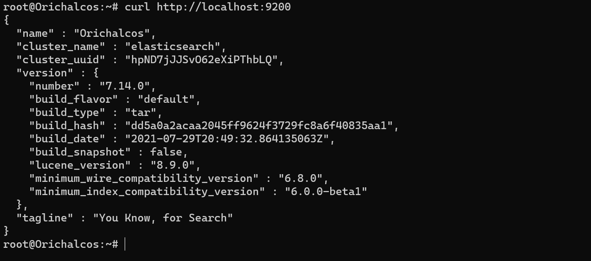


**ES 目录结构：**

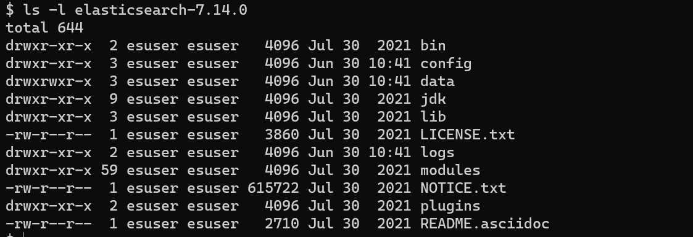


```shell
- bin	  启动ES服务脚本目录
- config  ES配置文件的目录
- data    ES的数据存放目录
- jdk     ES提供需要指定的jdk目录
- lib     ES依赖第三方库的目录
- logs    ES的日志目录
- modules 模块的目录
- plugins 插件目录
```


**开启远程访问**

默认 ES 无法使用主机 ip 进行远程连接，需要开启远程连接权限。

1. 修改 ES 安装包中 config/elasticsearch.yml 配置文件：

   ```shell
   vim /home/esuser/elasticsearch-7.14.0/config/elasticsearch.yml
   ```

   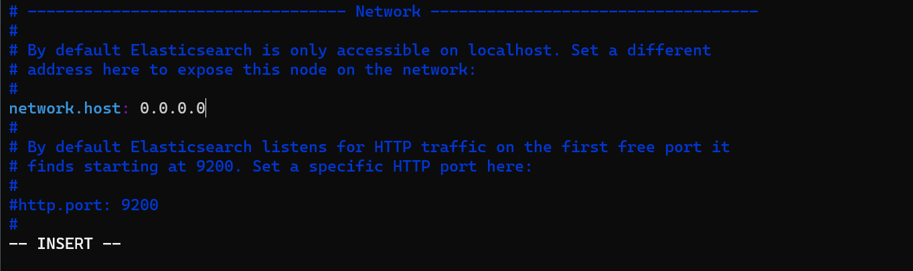
   
2. 重新启动 ES 服务：

   ```shell
   su - esuser
   elasticsearch-7.14.0/bin/elasticsearch
   ```

3. 启动错误（如果没有遇到则跳过）

   ```
   -- 引导检查失败。你必须在启动Elasticsearch之前解决以下[4]行中描述的问题。
   ERROR: [4] bootstrap checks failed. You must address the points described in the following [4] lines before starting Elasticsearch.
   
   -- 引导检查失败[4]中的[1]：弹性搜索进程的最大文件描述符[4096]太低，至少增加到[65535]。
   bootstrap check failure [1] of [4]: max file descriptors [4096] for elasticsearch process is too low, increase to at least [65535]
   
   -- 引导检查失败[4]中的[2]：用户[esuser]的最大线程数[3802]太少，至少增加到[4096]。
   bootstrap check failure [2] of [4]: max number of threads [3802] for user [esuser] is too low, increase to at least [4096]
   
   -- 引导检查失败[4]中的[3]：最大虚拟内存区域vm.max_map_count [65530]太低，至少增加到[262144]。
   bootstrap check failure [3] of [4]: max virtual memory areas vm.max_map_count [65530] is too low, increase to at least [262144]
   
   -- bootstrap 检查失败[4]的[4]：默认的发现设置不适合生产使用；至少要配置[discovery.seed_hosts, discovery.seed_providers, cluster.initial_master_nodes]中的一个。
   bootstrap check failure [4] of [4]: the default discovery settings are unsuitable for production use; at least one of [discovery.seed_hosts, discovery.seed_providers, cluster.initial_master_nodes] must be configured
   ```

   解决错误 [1]：

   ```shell
   vim /etc/security/limits.conf
   
   # 在最后面追加下面内容
   *               soft    nofile          65536
   *               hard    nofile          65536
   *               soft    nproc           4096
   *               hard    nproc           4096
   
   # 退出重新登录检测配置是否生效:
   ulimit -Hn
   ulimit -Sn
   ulimit -Hu
   ulimit -Su
   ```

   解决错误 [2]：

   ```shell
   # 进入limits.d目录下修改配置文件。
   vim /etc/security/limits.d/20-nproc.conf
   
   # 修改为 
   启动ES用户名 soft nproc 4096
   ```

   解决错误 [3]：

   ```shell
   # 编辑sysctl.conf文件
   vim /etc/sysctl.conf
   
   # 在最后面追加下下面内容
   vm.max_map_count=655360 #centos7 系统
   vm.max_map_count=262144 #ubuntu 系统
   
   # 执行以下命令生效：
   sysctl -p
   ```

   解决错误 [4]：

   ```shell
   # 编辑elasticsearch.yml配置文件
   vim config/elasticsearch.yml
   
   # 找到 Discovery 部分，修改
   cluster.initial_master_nodes: ["node-1"]
   ```

4. 使用自己的浏览器远程访问 ES 服务：

   


## 2.2、Docker

1. 获取镜像：

   ```shell
   docker pull elasticsearch:7.14.0
   ```

2. 运行 ES：

   ```shell
   docker run -d -p 9200:9200 -p 9300:9300 -e "discovery.type=single-node" elasticsearch:7.14.0
   ```

   输入 `docker logs -f [容器ID]` 可以查看相关容器日志。

   可以输入其他环境变量修改端口、数据存储路径等配置信息：

   ```shell
   docker run -e discovery.type="single-node" `
   		   -e path.data="/usr/share/elasticsearch/data" `
     		   -e path.logs="/usr/share/elasticsearch/logs" `
     		   -e network.host="0.0.0.0" `
     		   -e http.port="9292" `
              -itd -p 9292:9292 -p 9300:9300 --platform linux/arm64 --name elasticsearch elasticsearch:7.14.0
   ```

3. 访问 ES：

   


## 2.3、Windows

1. 进入[官方页面](https://www.elastic.co/cn/downloads/past-releases#elasticsearch)，点击 Download 进入下载页面：

   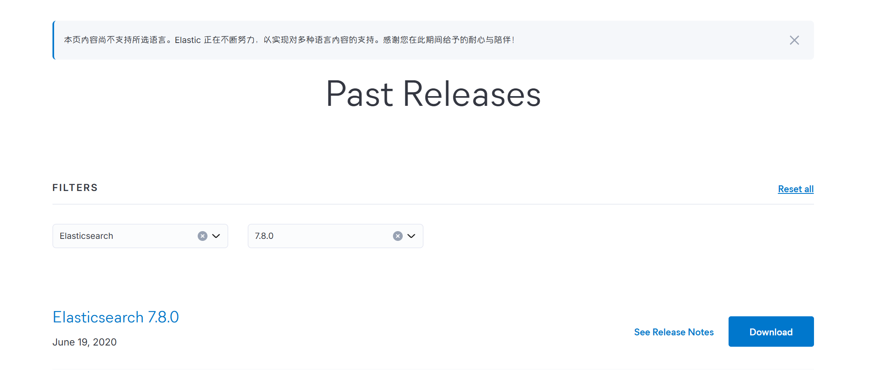

2. 选择 Windows 版本的下载：

   

3. 下载完成后解压到非中文目录下即可：

   > [!WARNING]
   >
   > 注意路径不要包含空格！

   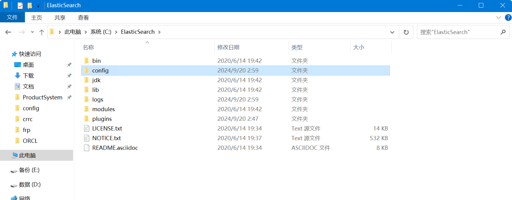

4. 在 Elasticsearch 的 config 目录下，打开 elasticsearch.yml 配置文件：

   ```yaml
   # Elasticsearch数据存放目录
   path.data: D:/50-ProgramData/ElasticSearch/ElasticSearch7.8/data
   
   # Elasticsearch数据存放目录
   path.logs: D:/50-ProgramData/ElasticSearch/ElasticSearch7.8/logs
   
   # Elasticsearch节点监听IP
   network.host: localhost
   
   # Elasticsearch节点监听Port
   http.port: 9200
   ```

5. 在 Elasticsearch 安装目录的 bin 目录中，双击 elasticsearch.bat 即可启动：

   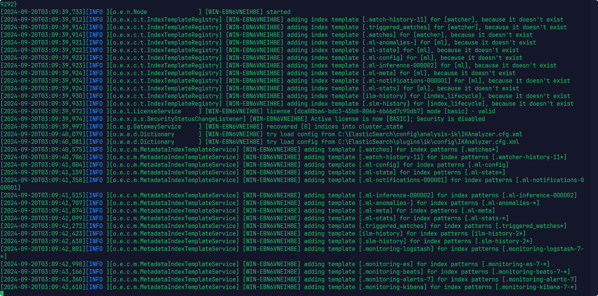

6. 接下来访问 Elasticsearch，在浏览器输入http://localhost:9200，看到以下界面即可证明 ES 启动成功：

   


# 3、使用 cURL 命令交互

本指南中的大部分示例，允许你复制合适的 cURL 命令，并从命令行中向本地 Elasticsearch 实例提交请求。

对 Elasticsearch 的请求包含与任何 HTTP 请求相同的部分：

```shell
curl -X<VERB> '<PROTOCOL>://<HOST>:<PORT>/<PATH>?<QUERY_STRING>' -d '<BODY>'
```

这个示例使用以下变量：

- `<VERB>` - 合适的 HTTP 方法或操作。例如，`GET`、`POST`、`PUT`、`HEAD` 或 `DELETE`。
- `<PROTOCOL>` - `http` 或 `https`。如果你在 Elasticsearch 之前有 HTTPS 代理，或者你使用的 Elasticsearch 安全特性去加密 HTTP 通信，使用后者。
- `<HOST>` - Elasticsearch 集群的任意节点主机名。或者对本地机器上的节点使用 `localhost`。
- `<PORT>` - 运行 Elasticsearch HTTP 服务的端口，默认为 `9200`。
- `<PATH>` - API 路径，可以包含多部分，比如 `_cluster/stats` 或 `_nodes/stats/jvm`。
- `<QUERY_STRING>` - 一些可选的查询字符串参数。比如，`?pretty` 将打印 JSON 响应以使其更易阅读。
- `<BODY>` - JSON 编码的请求体（如果必须）。

如果启用了 Elasticsearch 安全特性，你必须提供用于认证运行 API 的有效用户名（以及密码）。例如，使用 `-u` 或 `--u` 的 cURL 命令参数。

Elasticsearch 对每个 API 请求响应 HTTP 状态码，如 `200 ok`。除了 `HEAD` 请求外，它还会返回一个 JSON 编码的响应体。


# 4、安装 Kibana

Kibana Navicat 是一个针对 Elasticsearch MySQL 的开源分析及可视化平台，使用 Kibana 可以查询、查看并与存储在 ES 索引的数据进行交互操作，使用 Kibana 能执行高级的数据分析，并能以图表、表格和地图的形式查看数据。


## 4.1、Linux（Ubuntu）

1. 先切换到 esuser 用户下：

   ```shell
   su - esuser
   ```

2. 下载 Kibana：

   ```shell
   curl -L -O https://artifacts.elastic.co/downloads/kibana/kibana-7.14.0-linux-x86_64.tar.gz
   ```

3. 解压：

   ```shell
   tar -zxvf kibana-7.14.0-linux-x86_64.tar.gz
   ```

4. 编辑 Kibana 的配置文件：

   ```shell
   vim kibana-7.14.0-linux-x86_64/config/kibana.yml
   ```

   修改如下配置：

   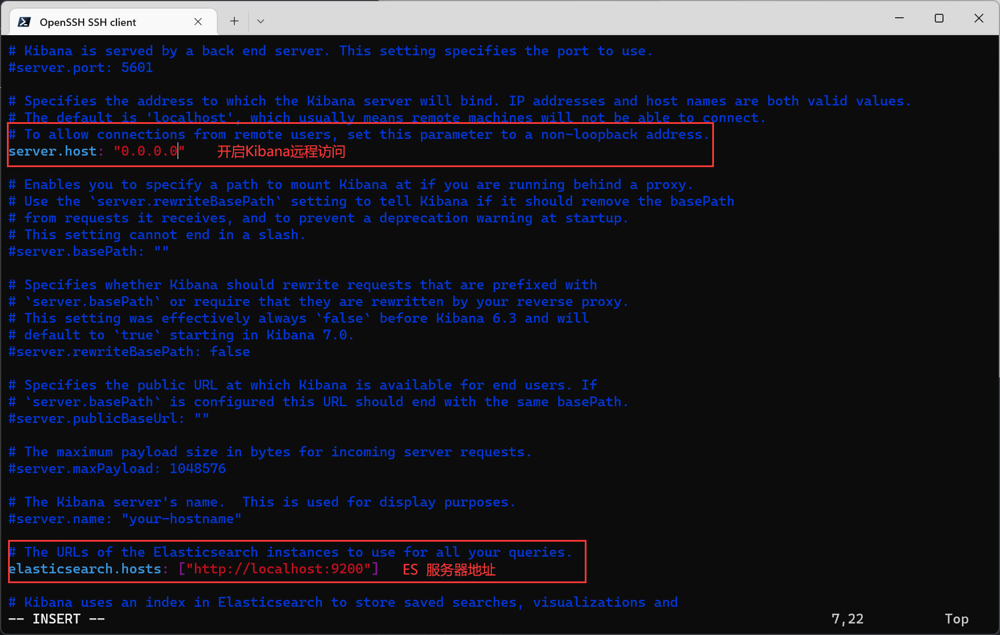
   
5. 启动 kibana（记得启动 ES）：

   ```shell
   kibana-7.14.0-linux-x86_64/bin/kibana
   ```

6. 访问 kibana 的 WEB 界面（Kibana 的默认端口为 5601）


## 4.2、Docker

1. 获取镜像：

   ```shell
   docker pull kibana:7.14.0
   ```

2. 运行 Kibana：

   ```shell
   docker run -d  --name kibana -p 5601:5601 kibana:7.14.0
   ```

3. 进入容器连接到 ES，重启 Kibana 容器，访问 `http://服务器IP:5601`

4. 基于数据卷加载配置文件方式运行：

   ```shell
   # 从容器复制kibana配置文件出来
   # 修改配置文件为对应ES服务器地址
   # 通过数据卷加载配置文件方式启动
   docker run -d -v /root/kibana.yml:/usr/share/kibana/config/kibana.yml  --name kibana -p 5601:5601 kibana:7.14.0
   ```


## 4.3、compose

> 由于我服务器内存不够，启动服务太慢，这里使用 Docker Desktop for Windows 和 Docker-compose 在自己本地电脑上操作

1. 创建一个 ES-Kibana 的文件夹，并在文件夹中创建 compose.yml：

   ```yaml
   version: "3.8"
   volumes:
     data:
     config:
     plugin:
   networks:
     es:
   services:
     elasticsearch:
       image: elasticsearch:7.14.0
       ports:
         - "9200:9200"
         - "9300:9300"
       networks:
         - "es"
       environment:
         - "discovery.type=single-node"
         - "ES_JAVA_OPTS=-Xms512m -Xmx512m"
       volumes:
         - data:/usr/share/elasticsearch/data
         - config:/usr/share/elasticsearch/config
         - plugin:/usr/share/elasticsearch/plugins
   
     kibana:
       image: kibana:7.14.0
       ports:
         - "5601:5601"
       networks:
         - "es"
       volumes:
         - ./kibana.yml:/usr/share/kibana/config/kibana.yml
   ```

2. Kibana.yml：

   ```yaml
   # kibana配置文件 连接到ES
   server.host: "0"
   server.shutdownTimeout: "5s"
   elasticsearch.hosts: [ "http://elasticsearch:9200" ]
   monitoring.ui.container.elasticsearch.enabled: true
   ```

3. 在当前文件夹中打开控制台，执行命令开始部署：

   ```sheel
   docker-compose up -d
   ```


# 5、核心概念

## 5.1、Index（索引）

一个索引就是一个拥有几分相似特征的文档的集合。比如说，你可以有一个商品数据的索引，一个订单数据的索引，还有一个用户数据的索引。一个索引由一个名字来标识（必须全部是小写字母的），并且当我们要对这个索引中的文档进行索引、搜索、更新和删除的时候，都要使用到这个名字。


### 5.1.1、创建索引

```http
PUT /索引名
```

1. ES 中索引健康状态：red（索引不可用）、yellwo（索引可用，存在风险）、green（健康）
2. 默认 ES 在创建索引时回为索引创建 1 个 primary 索引和 1 个备份索引

如果是单节点启动，primary 索引和备份索引会放在一个 ES 节点中，此时索引状态为 yellow，可以进行索引分片配置解决这个问题，但是还是不建议 “把鸡蛋放在一个篮子里”。

创建一个 products 索引：

```http
PUT /products
{
  "settings": {
    "number_of_shards": 1, #指定主分片的数量
    "number_of_replicas": 0 #指定副本分片的数量
  }
}
```

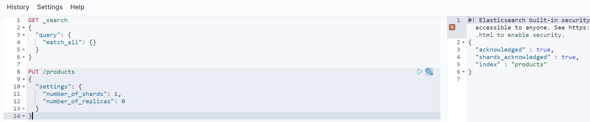


### 5.1.2、查询索引

```http
GET /_cat/indices?v
```

<div align="center">
    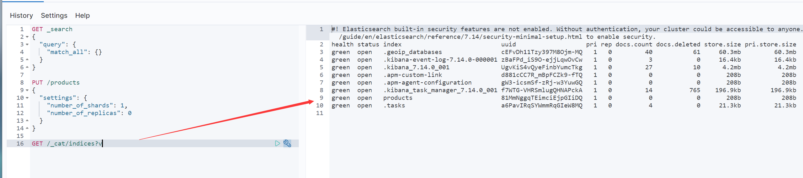
</div>


### 5.1.3、删除索引

```http
DELETE /索引名
```

```http
DELETE /*
```

`*` 是通配符，代表所有索引。

删除 products 索引：

```http
DELETE /products
```

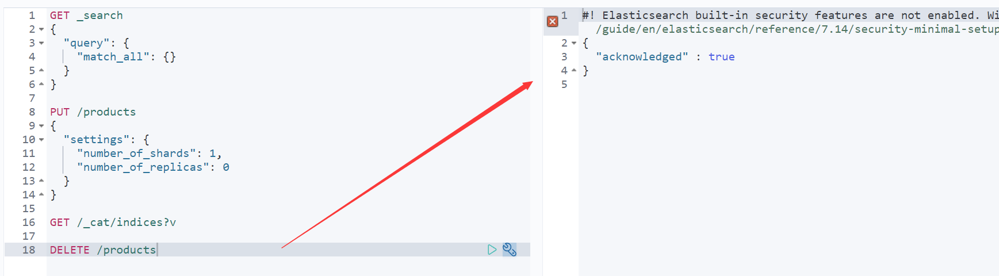


## 5.2、Mapping（映射）

映射是定义一个文档和它所包含的字段如何被存储和索引的过程。在默认配置下，ES 可以根据插入的数据自动地创建 Mapping，也可以手动创建 Mapping。 Mapping 中主要包括字段名、字段类型等。

映射的数据类型：

- 字符串类型：`keyword` 关键字 关键词 、`text` 一段文本
- 数字类型：`integer` 、`long`  
- 小数类型：`float` 、`double`
- 布尔类型：`boolean` 
- 日期类型：`date`


### 5.2.1、创建映射

```http
PUT /products
{ 
  "settings": {
    "number_of_shards": 1,
    "number_of_replicas": 0
  }, 
  "mappings": {
    "properties": {
      "title":{
        "type": "keyword"
      },
      "price":{
        "type": "double"
      },
      "created_at":{
        "type": "date"
      },
      "description":{
        "type": "text"
      }
    }
  }
}
```

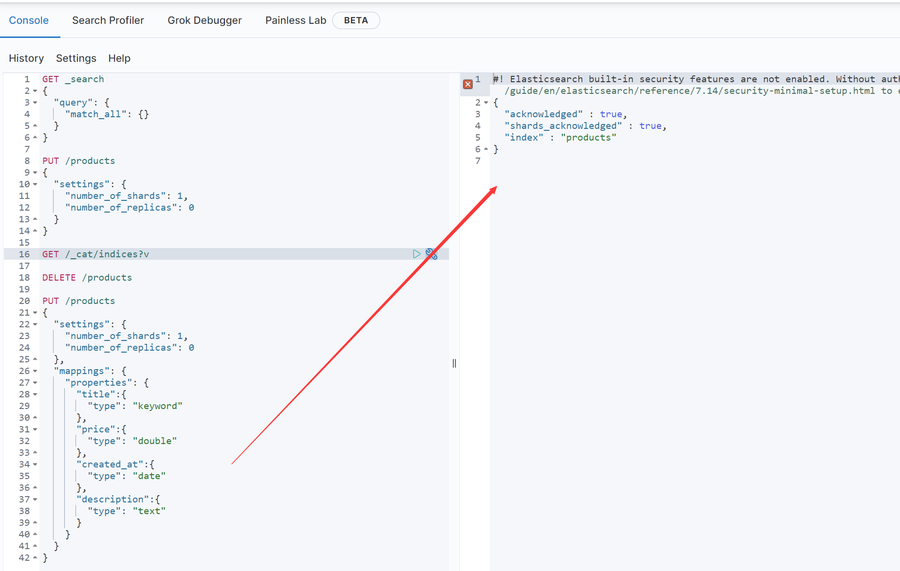


### 5.2.2、查询映射

```http
GET /索引名/_mapping
```

查询刚刚创建的 products 索引的映射：

```http
GET /products/_mapping
```

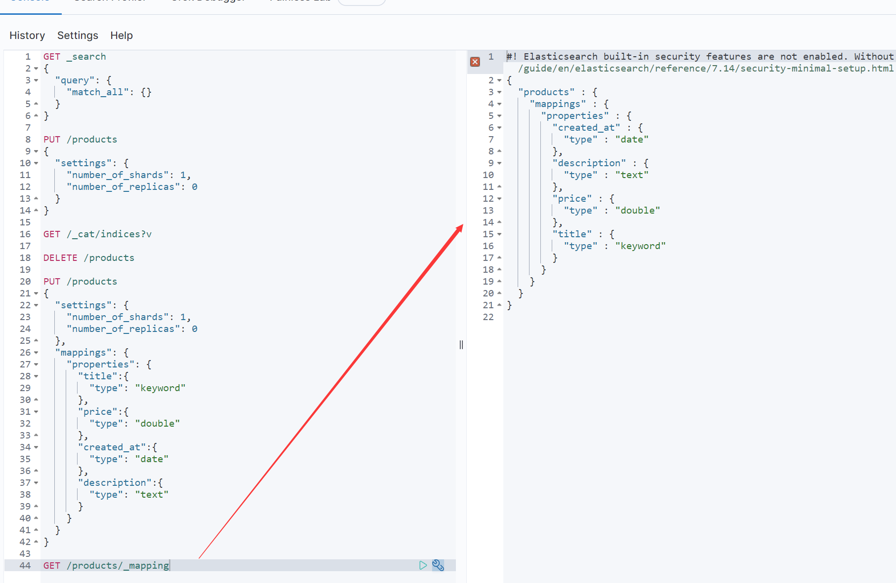


## 5.3、Document（文档）

文档是索引中存储的一条条数据。一条文档是一个可被索引的最小单元。ES 中的文档采用了轻量级的 JSON 格式数据来表示。


### 5.3.1、添加文档

```http
POST /索引名/_doc/文档ID
{
  文档 body...
}
```

文档 ID 为可选项，如果不填写则默认使用 ES 创建的 ID。

在 products 索引下添加一个文档并指定文档 ID 为 1： 

```http
POST /products/_doc/1
{
  "title":"iphone13",
  "price":8999.99,
  "created_at":"2021-09-15",
  "description":"iPhone 13屏幕采用6.1英寸OLED屏幕。"
}
```

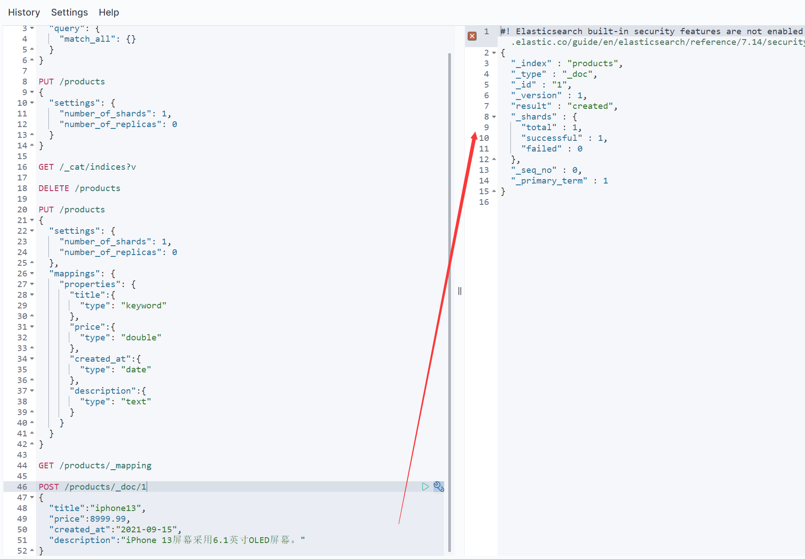


在 products 索引下添加一个文档，使用自动生成的文档 ID：

```http
POST /products/_doc/
{
  "title":"iphone14",
  "price":8999.99,
  "created_at":"2021-09-15",
  "description":"iPhone 13屏幕采用6.8英寸OLED屏幕"
}
```

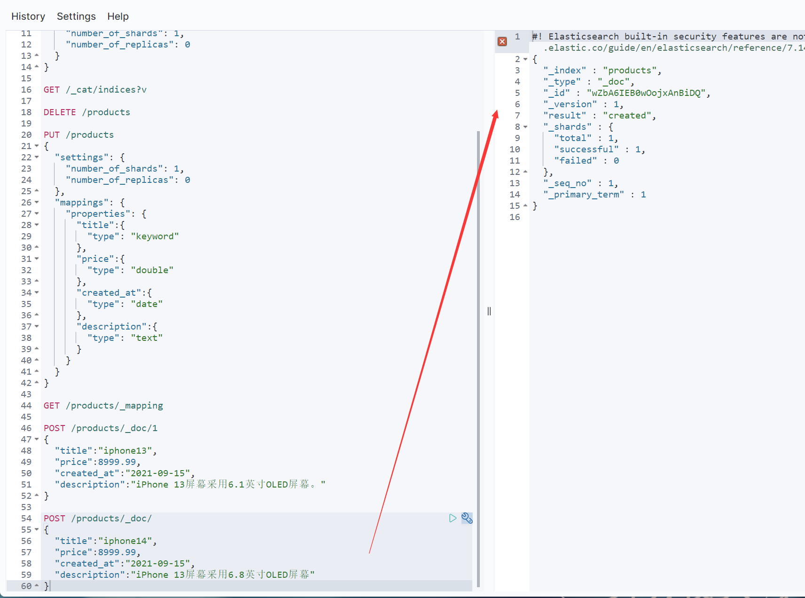


### 5.3.2、查询文档

```http
GET /索引名/_doc/文档ID
```

查询 products 索引下 ID 为 1 的文档：

```http
GET /products/_doc/1
```

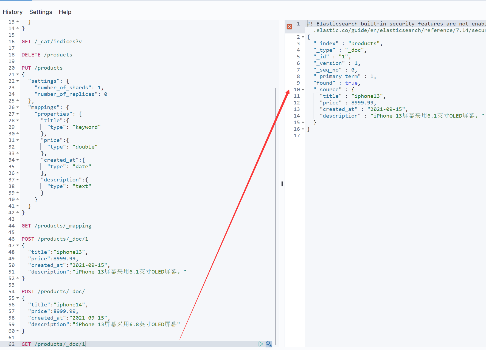


### 5.3.3、删除文档

```http
DELETE /索引名/_doc/文档ID
```

删除 products 索引下 ID 为 1 的文档： 

```http
DELETE /products/_doc/1
```

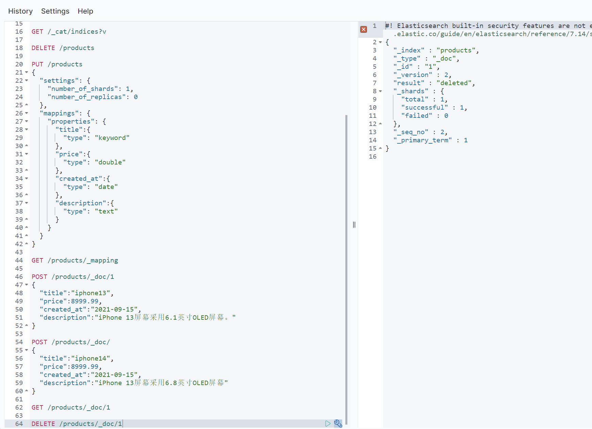


### 5.3.4、更新文档

```http
PUT /索引名/_doc/文档ID
{
  文档body...
}
```

这种更新方式是先删除原始文档，再将更新文档以新的内容插入。

```http
POST /索引名/_doc/文档ID/_update
{
    "doc" : {
        文档body...
    }
}
```

这种方式可以将数据原始内容保存，并在此基础上更新。

修改 products 索引下 ID 为 wZbA6IEB0wOojxAnBiDQ 的文档：

```http
POST /products/_doc/wZbA6IEB0wOojxAnBiDQ/_update
{
    "doc" : {
        "title" : "iphon15"
    }
}
```

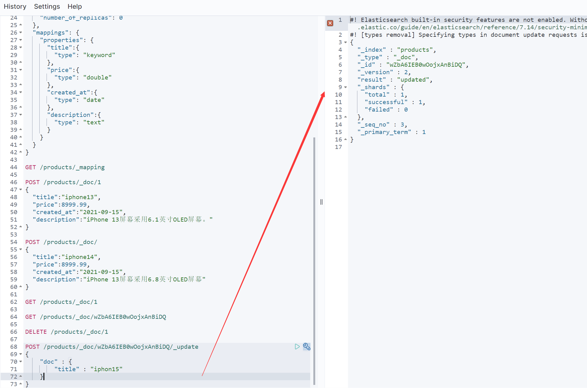


### 5.3.5、批量操作

 批量索引两条文档：

```http
POST /products/_doc/_bulk
 	{"index":{"_id":"1"}}
  		{"title":"iphone14","price":8999.99,"created_at":"2021-09-15","description":"iPhone 13屏幕采用6.8英寸OLED屏幕"}
	{"index":{"_id":"2"}}
  		{"title":"iphone15","price":8999.99,"created_at":"2021-09-15","description":"iPhone 15屏幕采用10.8英寸OLED屏幕"}
```

 更新文档同时删除文档：

```http
POST /products/_doc/_bulk
	{"update":{"_id":"1"}}
		{"doc":{"title":"iphone17"}}
	{"delete":{"_id":2}}
	{"index":{}}
		{"title":"iphone19","price":8999.99,"created_at":"2021-09-15","description":"iPhone 19屏幕采用61.8英寸OLED屏幕"}
```

> 批量时不会因为一个失败而全部失败，而是继续执行后续操作，在返回时按照执行的状态返回！


# 6、索引原理

## 6.1、倒排索引

倒排索引（Inverted Index）也叫反向索引，有反向索引必有正向索引。通俗地来讲，正向索引是通过 key 找 value，反向索引则是通过 value 找 key。ES 底层在检索时底层使用的就是倒排索引。


## 6.2、索引模型

现有索引和映射如下：

```json
{
  "products" : {
    "mappings" : {
      "properties" : {
        "description" : {
          "type" : "text"
        },
        "price" : {
          "type" : "float"
        },
        "title" : {
          "type" : "keyword"
        }
      }
    }
  }
}
```

先录入如下数据，有三个字段 title、price、description：

| _id  | title        | price | description        |
| ---- | ------------ | ----- | ------------------ |
| 1    | 蓝月亮洗衣液 | 19.9  | 蓝月亮洗衣液很高效 |
| 2    | iphone13     | 19.9  | 很不错的手机       |
| 3    | 小浣熊干脆面 | 1.5   | 小浣熊很好吃       |

在 ES 中除了 text 类型分词，其他类型不分词，因此根据不同字段创建索引如下：

- title 字段：

  | term         | _id（文档 id） |
  | ------------ | -------------- |
  | 蓝月亮洗衣液 | 1              |
  | iphone13     | 2              |
  | 小浣熊干脆面 | 3              |

- price 字段：

  | term | _id（文档 id） |
  | ---- | -------------- |
  | 19.9 | [1, 2]         |
  | 1.5  | 3              |

- description 字段：

  | term | _id                   | term | _id  | term | _id  |
  | ---- | --------------------- | ---- | ---- | ---- | ---- |
  | 蓝   | 1                     | 不   | 2    | 小   | 3    |
  | 月   | 1                     | 错   | 2    | 浣   | 3    |
  | 亮   | 1                     | 的   | 2    | 熊   | 3    |
  | 洗   | 1                     | 手   | 2    | 好   | 3    |
  | 衣   | 1                     | 机   | 2    | 吃   | 3    |
  | 液   | 1                     |      |      |      |      |
  | 很   | [1:1:9, 2:1:6, 3:1:6] |      |      |      |      |
  | 高   | 1                     |      |      |      |      |
  | 效   | 1                     |      |      |      |      |

> Elasticsearch 分别为每个字段都建立了一个倒排索引。因此查询时查询字段的 term，就能知道文档 ID，就能快速找到文档。


# 7、分词器

Analysis： 文本分析是把全文本转换一系列单词（term/token）的过程，也叫分词（Analyzer）。Analysis 是通过 Analyzer 来实现的。分词就是将文档通过 Analyzer 分成一个一个的 term（关键词查询），每一个 term 都指向包含这个 term 的文档。


**Analyzer 组成**

分析器（Analyzer）都由三种构件组成的：Character Filters、Tokenizer、Token Filter。

- Character Filter： 字符过滤器

  在一段文本进行分词之前，先进行预处理，比如说最常见的就是：过滤 HTML 标签（`<span>hello<span>` ==> `hello`）、`&` ==> `and`（`I&you` ==> `I and you`）。

- Tokenizers： 分词器

  英文分词可以根据空格将单词分开，中文分词比较复杂，可以采用机器学习算法来分词。

- Token filters： Token 过滤器

  将切分的单词进行加工。大小写转换（例将 “Quick” 转为小写）、去掉停用词（例如停用词像 “a”、“and”、“the”等等）、加入同义词（例如同义词像 “jump” 和 “leap”）。

> 三者顺序:	Character Filters ==> Tokenizer ==> Token Filter
>
> 三者个数：Character Filters（0个或多个） + Tokenizer + Token Filters（0个或多个）


**创建索引设置分词**

```http
PUT /索引名
{
  "settings": {},
  "mappings": {
    "properties": {
      "title":{
        "type": "text",
        "analyzer": "standard" //显示指定分词器
      }
    }
  }
}
```


## 7.1、内置分词器

- Standard Analyzer - 默认分词器，英文按单词词切分，并小写处理
- Simple Analyzer - 按照单词切分（符号被过滤），小写处理
- Stop Analyzer - 小写处理，停用词过滤（the、a、is）
- Whitespace Analyzer - 按照空格切分，不转小写
- Keyword Analyzer - 不分词，直接将输入当作输出


**Standard Analyzer**

特点：按照单词分词，英文统一转为小写，过滤标点符号 ，中文单字分词。

```http
POST /_analyze
{
  "analyzer": "standard",
  "text": "this is a , good Man 中华人民共和国"
}
```

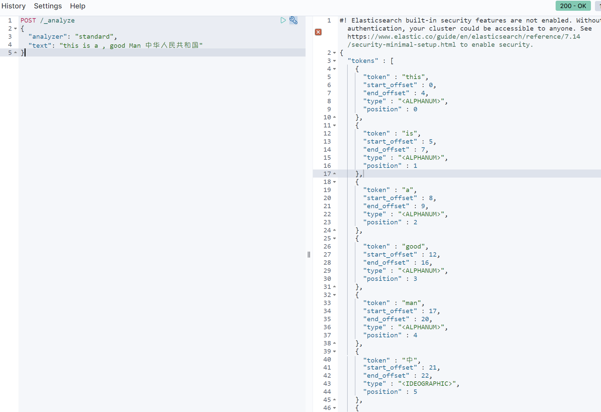


**Simple Analyzer**

特点：英文按照单词分词，英文统一转为小写，去掉符号，中文按照空格进行分词。

```http
POST /_analyze
{
  "analyzer": "simple",
  "text": "this is a , good Man 中华人民共和国"
}
```

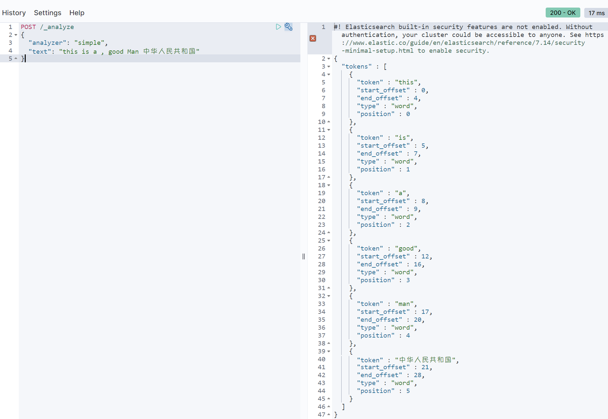


**Whitespace Analyzer**

特点:  中文、英文按照空格分词，英文不会转为小写 ，不去掉标点符号。

```http
POST /_analyze
{
  "analyzer": "whitespace",
  "text": "this is a , good Man"
}
```

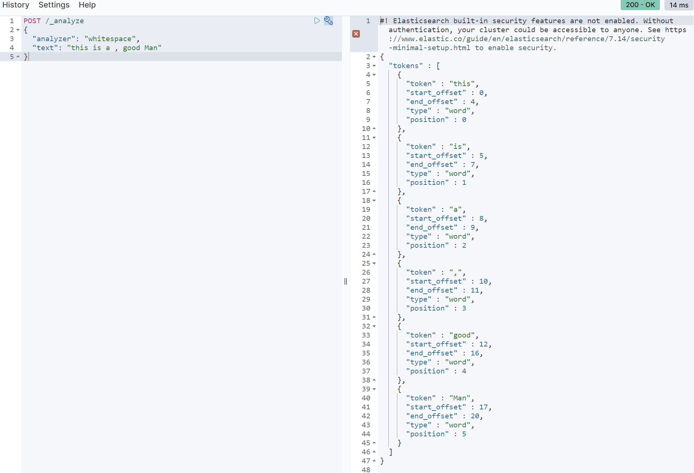


## 7.2、中文分词器

在 ES 中支持中文分词器非常多，如 smartCN、IK 等，推荐的就是 IK 分词器。


### 7.2.1、安装 IK

**Linux 环境**

> [!WARNING]
>
> IK分词器的版本要你安装 ES 的版本一致！

开源分词器 Ik 的 Github：https://github.com/medcl/elasticsearch-analysis-ik

1. 下载对应版本：

   ```shell
   wget https://github.com/medcl/elasticsearch-analysis-ik/releases/download/v7.14.0/elasticsearch-analysis-ik-7.14.0.zip
   ```

2. 解压：

   ```shell
   # 先使用yum install -y unzip
   unzip elasticsearch-analysis-ik-7.14.0.zip 
   ```

3. 移动到 ES 安装目录的 plugins 目录中：

   ```shell
   mv elasticsearch-analysis-ik-7.14.0 elasticsearch-7.14.0/plugins/
   ```

4. 重启 ES 生效


**Docker 环境**

> [!NOTE]
>
> Docker 容器运行 ES 安装插件目录为 `/usr/share/elasticsearch/plugins`。

如果使用 Docker 则修改 compose.yml 文件为：

```yaml
version: "3.8"
volumes:
  data:
  config:
networks:
  es:
services:
  elasticsearch:
    image: elasticsearch:7.14.0
    ports:
      - "9200:9200"
      - "9300:9300"
    networks:
      - "es"
    environment:
      - "discovery.type=single-node"
      - "ES_JAVA_OPTS=-Xms512m -Xmx512m"
    volumes:
      - data:/usr/share/elasticsearch/data
      - config:/usr/share/elasticsearch/config
      - ./elasticsearch-analysis-ik-7.14.0:/usr/share/elasticsearch/plugins/elasticsearch-analysis-ik-7.14.0

  kibana:
    image: kibana:7.14.0
    ports:
      - "5601:5601"
    networks:
      - "es"
    volumes:
      - ./kibana.yml:/usr/share/kibana/config/kibana.yml
```


**Windows 环境**

下载好之后，在 Elasticsearch 目录的 plugins 目录中创建名为 ik 的文件夹，将下载好的 IK 分词器解压在创建的 ik 文件夹中，重启 ES 生效。


### 7.2.2、IK 使用

IK有两种颗粒度的拆分：

- `ik_smart`：会做最粗粒度的拆分

- `ik_max_word`：会将文本做最细粒度的拆分


**ik_smart**

```http
POST /_analyze
{
  "analyzer": "ik_smart",
  "text": "中华人民共和国国歌"
}
```

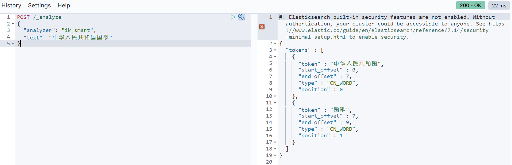


**ik_max_word**

```http
POST /_analyze
{
  "analyzer": "ik_max_word",
  "text": "中华人民"
}
```

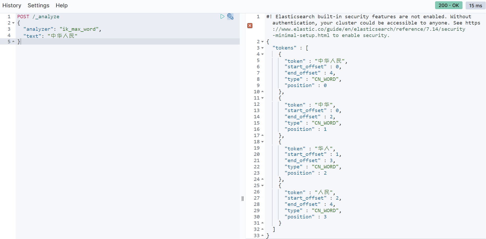


### 7.2.3、扩展词、停用词

IK支持自定义扩展词典和停用词典

- 扩展词典就是有些词并不是关键词，但是也希望被 ES 用来作为检索的关键词，可以将这些词加入扩展词典。
- 停用词典就是有些词是关键词，但是出于业务场景不想使用这些关键词被检索到，可以将这些词放入停用词典。

定义扩展词典和停用词典可以修改IK分词器中 config 目录中 IKAnalyzer.cfg.xml 这个文件。

1. 修改 IKAnalyzer.cfg.xml：

   ```shell
   vim IKAnalyzer.cfg.xml
   ```

   添加值 `ext_dict.dic` 和 `ext_stopword.dic`：

   ```xml
   <?xml version="1.0" encoding="UTF-8"?>
   <!DOCTYPE properties SYSTEM "http://java.sun.com/dtd/properties.dtd">
   <properties>
   	<comment>IK Analyzer 扩展配置</comment>
   	<!--用户可以在这里配置自己的扩展字典 -->
   	<entry key="ext_dict">ext_dict.dic</entry>
   	 <!--用户可以在这里配置自己的扩展停止词字典-->
   	<entry key="ext_stopwords">ext_stopword.dic</entry>
   	<!--用户可以在这里配置远程扩展字典 -->
   	<!-- <entry key="remote_ext_dict">words_location</entry> -->
   	<!--用户可以在这里配置远程扩展停止词字典-->
   	<!-- <entry key="remote_ext_stopwords">words_location</entry> -->
   </properties>
   ```

2. 在 IK 分词器目录下 config 目录中创建 ext_dict.dic 文件：

   ```shell
   vim ext_dict.dic
   ```

   加入扩展词即可，每个词用回车隔开：

   ```
   中华人
   ```

3. 在 IK 分词器目录下 config 目录中创建 ext_stopword.dic 文件：

   ```shell
   vim ext_stopword.dic
   ```

   加入扩展词即可，每个词用回车隔开：

   ```
   华人
   ```

4. 重启 ES 生效：

   ```http
   POST /_analyze
   {
     "analyzer": "ik_max_word",
     "text": "中华人民"
   }
   ```

   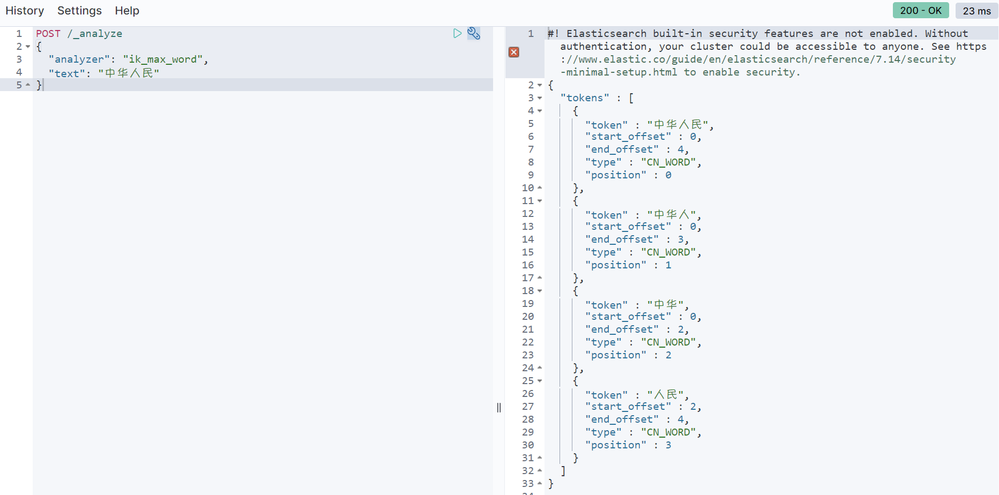

> 词典的编码必须为 UTF-8，否则无法生效！


**IK 自带的字典**

IK 自带许多常用的扩展字典：


可以更改配置文件使用 IK 的扩展字典，后续对其扩充，会比较方便：

```xml
<?xml version="1.0" encoding="UTF-8"?>
<!DOCTYPE properties SYSTEM "http://java.sun.com/dtd/properties.dtd">
<properties>
	<comment>IK Analyzer 扩展配置</comment>
	<!--用户可以在这里配置自己的扩展字典 -->
	<entry key="ext_dict">extra_main.dic</entry>
	 <!--用户可以在这里配置自己的扩展停止词字典-->
	<entry key="ext_stopwords">extra_stopword.dic</entry>
	<!--用户可以在这里配置远程扩展字典 -->
	<!-- <entry key="remote_ext_dict">words_location</entry> -->
	<!--用户可以在这里配置远程扩展停止词字典-->
	<!-- <entry key="remote_ext_stopwords">words_location</entry> -->
</properties>
```


# 8、高级查询

ES 中提供了一种强大的检索数据方式,这种检索方式称之为 Query DSL（Domain Specified Language>），Query DSL 是利用 Rest API 传递 JSON 格式的请求体（Request Body）数据与 ES 进行交互，这种方式的丰富查询语法让 ES 检索变得更强大，更简洁。

语法：

```http
GET /索引名/_doc/_search {json格式请求体数据}
```

```http
GET /索引名/_search {json格式请求体数据}
```


准备一些测试数据：

1. 创建索引、映射：

   ```http
   PUT /products
   {
     "mappings": {
       "properties": {
         "title":{
           "type": "keyword"
         },
         "price":{
           "type": "double"
         },
         "created_at":{
           "type":"date"
         },
         "description":{
           "type":"text"
         }
       }
     }
   }
   ```

2. 测试数据：

   ```http
   PUT /products/_doc/_bulk
   {"index":{}}
     {"title":"iphone12 pro","price":8999,"created_at":"2020-10-23","description":"iPhone 12 Pro采用超瓷晶面板和亚光质感玻璃背板，搭配不锈钢边框，有银色、石墨色、金色、海蓝色四种颜色。宽度:71.5毫米，高度:146.7毫米，厚度:7.4毫米，重量：187克"}
   {"index":{}}
     {"title":"iphone12","price":4999,"created_at":"2020-10-23","description":"iPhone 12 高度：146.7毫米；宽度：71.5毫米；厚度：7.4毫米；重量：162克（5.73盎司） [5]  。iPhone 12设计采用了离子玻璃，以及7000系列铝金属外壳。"}
   {"index":{}}
     {"title":"iphone13","price":6000,"created_at":"2021-09-15","description":"iPhone 13屏幕采用6.1英寸OLED屏幕；高度约146.7毫米，宽度约71.5毫米，厚度约7.65毫米，重量约173克。"}
   {"index":{}}
     {"title":"iphone13 pro","price":8999,"created_at":"2021-09-15","description":"iPhone 13Pro搭载A15 Bionic芯片，拥有四种配色，支持5G。有128G、256G、512G、1T可选，售价为999美元起。"}
   ```


## 8.1、查询所有

`match_all` 关键字：返回索引中的全部文档。

```http
GET /products/_search
{
  "query": {
    "match_all": {}
  }
}
```

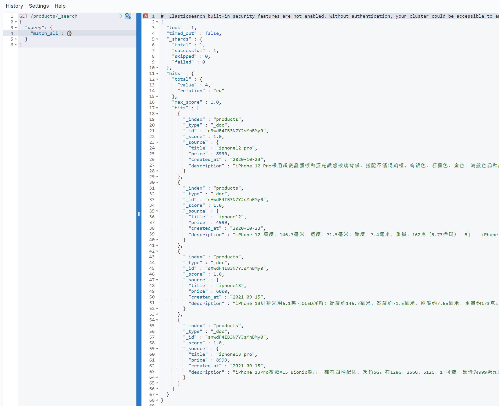


## 8.2、关键字查询

`term` 关键字：用来使用关键词查询。

> ES 中默认使用分词器为标准分词器（StandardAnalyzer），标准分词器对于英文单词分词，对于中文单字分词。
>
> 在 ES 的 Mapping Type 中，keyword、date、integer、long、double、boolean 和 ip 这些类型不分词，只有 text 类型分词。

```http
GET /products/_search
{
 "query": {
   "term": {
     "price": {
       "value": 4999
     }
   }
 }
}
```

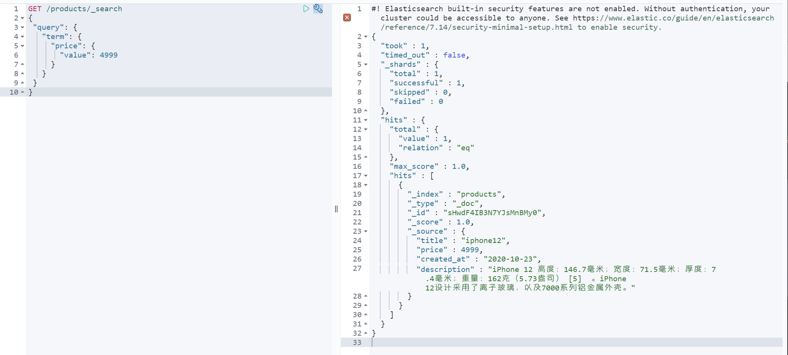


## 8.3、范围查询

`range` 关键字：用来指定查询指定范围内的文档。

```http
GET /products/_search
{
  "query": {
    "range": {
      "price": {
        "gte": 1400,
        "lte": 7000
      }
    }
  }
}
```

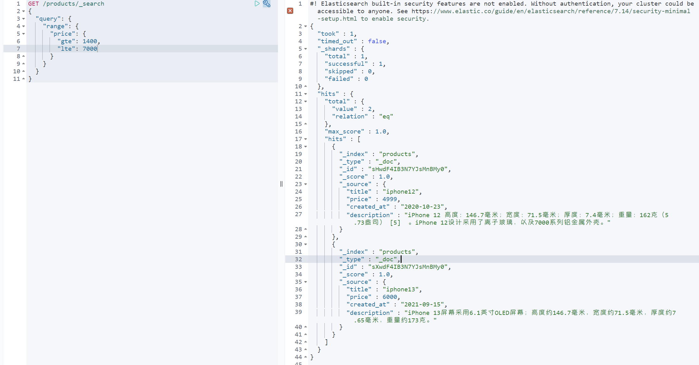


## 8.4、前缀查询

`prefix` 关键字：用来检索含有指定前缀的关键词的相关文档。

```http
GET /products/_search
{
  "query": {
    "prefix": {
      "title": {
        "value": "iphone12"
      }
    }
  }
}
```

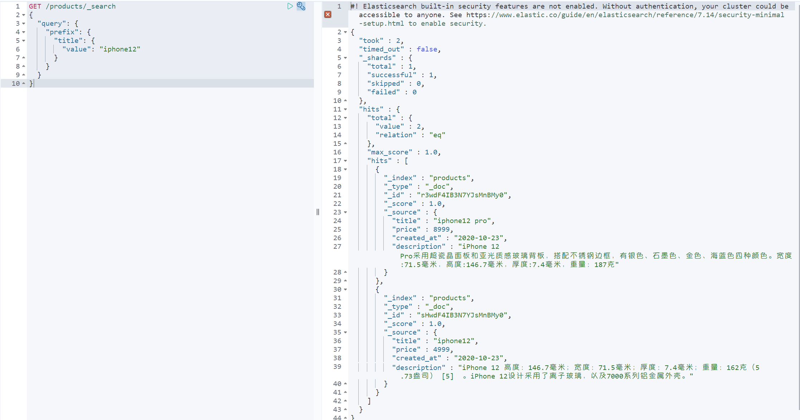


## 8.5、通配符查询

`wildcard` 关键字：通配符查询，`?` 用来匹配一个任意字符，`*` 用来匹配多个任意字符。

```http
GET /products/_search
{
  "query": {
    "wildcard": {
      "description": {
        "value": "ole*"
      }
    }
  }
}
```

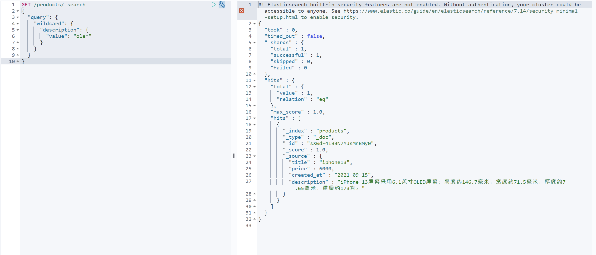


## 8.6、多 id 查询

`ids` 关键字：值为数组类型，用来根据一组 id 获取多个对应的文档。

```http
GET /products/_search
{
  "query": {
    "ids": {
      "values": ["r3wdF4IB3N7YJsMnBMy0","sXwdF4IB3N7YJsMnBMy0"]
    }
  }
}
```

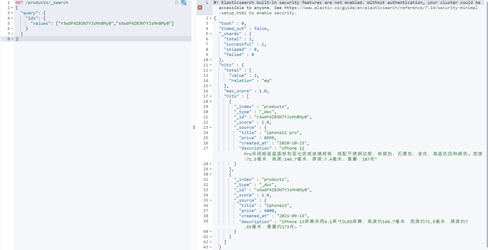


## 8.7、模糊查询

`fuzzy` 关键字：用来模糊查询含有指定关键字的文档。

> `fuzzy` 模糊查询最大模糊错误必须在 0-2 之间：
>
> - 搜索关键词长度为 2 不允许存在模糊
>
> - 搜索关键词长度为 3-5 允许一次模糊
>
> - 搜索关键词长度大于 5 允许最大两次模糊

```http
GET /products/_search
{
  "query": {
    "fuzzy": {
      "description": "olled"
    }
  }
}
```

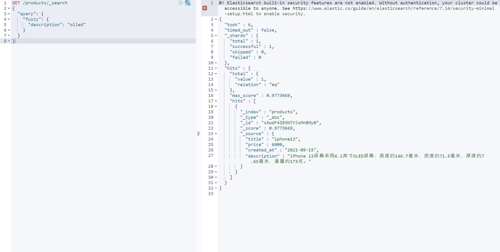


## 8.8、布尔查询

`bool` 关键字：用来组合多个条件实现复杂查询：

- `must`：相当于 `&&`，同时成立
- `should`：相当于 `||`， 成立一个就行
- `must_not`：相当于 `!`， 不能满足任何一个

```http
GET /products/_search
{
  "query": {
    "bool": {
      "must": [
        {
          "term": {
            "price": {
              "value": 4999
            }
          }
        }
      ]
    }
  }
}
```

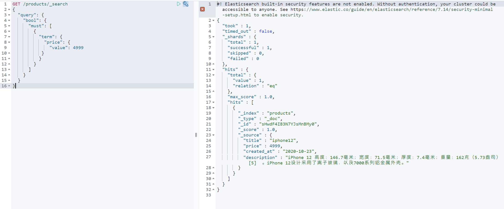


## 8.9、多字段查询

`multi_match` 关键字：用于多字段查询。

> 字段类型分词，将查询条件分词之后进行查询该字段；如果该字段不分词就会将查询条件作为整体进行查询。

```http
GET /products/_search
{
  "query": {
    "multi_match": {
      "query": "iphone13 毫",
      "fields": ["title","description"]
    }
  }
}
```

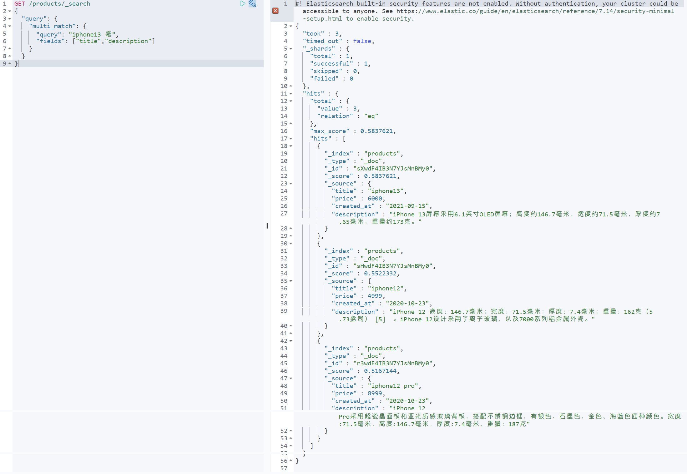


## 8.10、默认字段分词查询

`query_string` 关键字：用于默认字段查询

> 查询字段分词就将查询条件分词查询；查询字段不分词将查询条件不分词查询。

```http
GET /products/_search
{
  "query": {
    "query_string": {
      "default_field": "description",
      "query": "屏幕真的非常不错"
    }
  }
}
```

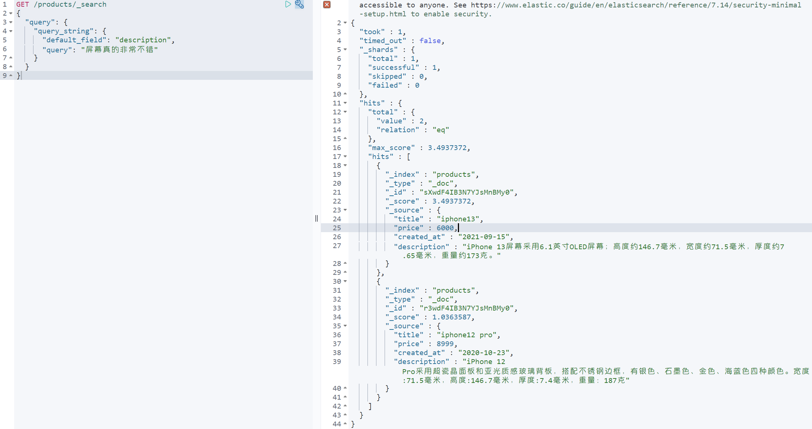


## 8.11、高亮查询

`highlight` 关键字：可以让符合条件的文档中的关键词高亮。

```http
GET /products/_search
{
  "query": {
    "term": {
      "description": {
        "value": "oled"
      }
    }
  },
  "highlight": {
    "post_tags": ["</span>"], 
    "pre_tags": ["<span style='color:red'>"],
    "fields": {
      "*":{}
    }
  }
}
```

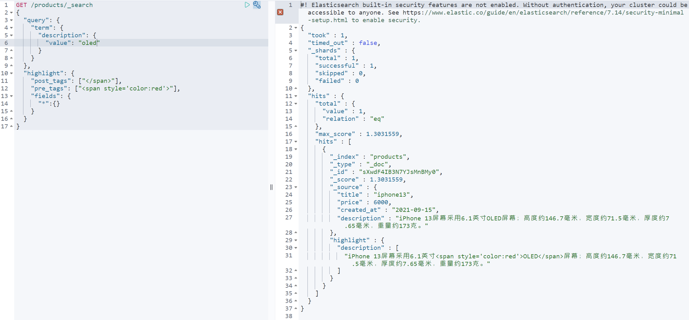


## 8.12、返回指定条数

`size` 关键字：指定查询结果中返回指定条数。默认返回 10 条。

```http
GET /products/_search
{
  "query": {
    "match_all": {}
  },
  "size": 2
}
```

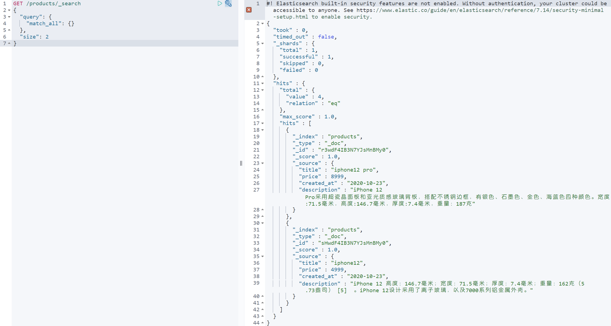


## 8.13、分页查询

`form` 关键字：用来指定起始返回位置，和 `size` 关键字连用可实现分页效果。

```http
GET /products/_search
{
  "query": {
    "match_all": {}
  },
  "size": 2,
  "from": 0
}
```

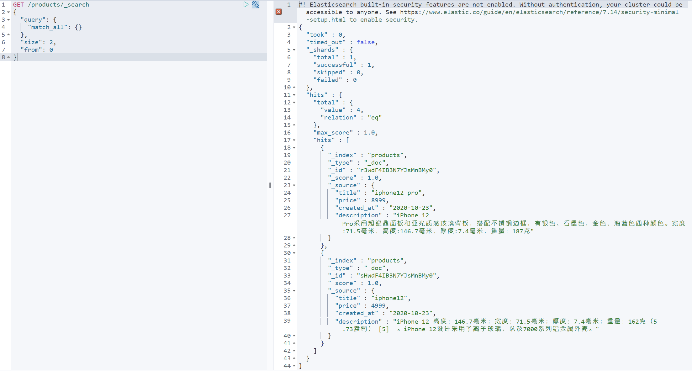


## 8.14、指定字段排序

`sort` 关键字：用来指定排序字段和排序方式。

```http
GET /products/_search
{
  "query": {
    "match_all": {}
  },
  "size": 2, 
  "from": 1, 
  "sort": [
    {
      "price": {
        "order": "desc"
      }
    }
  ]
}
```

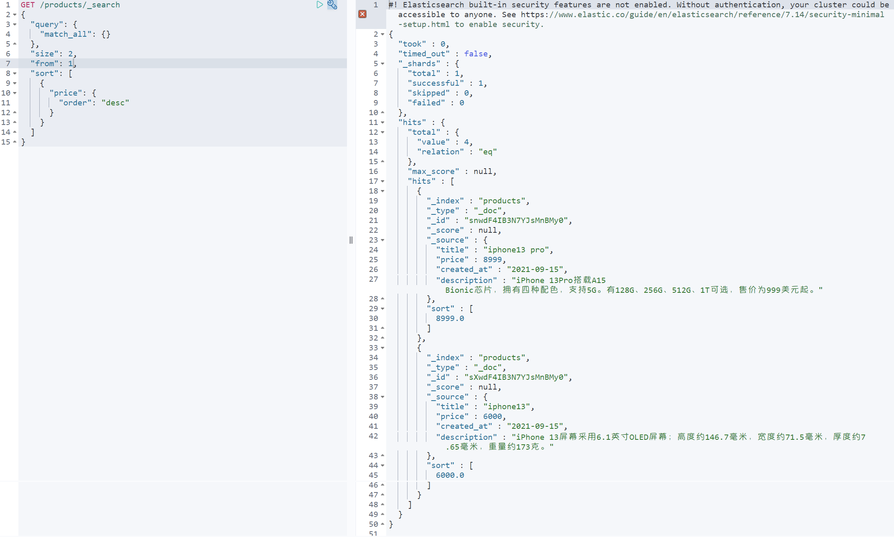


## 8.15、返回指定字段

`_source` 关键字：是一个数组，在数组中用来指定展示那些字段。

```http
GET /products/_search
{
  "query": {
    "match_all": {}
  },
  "_source": ["title","description"]
}
```

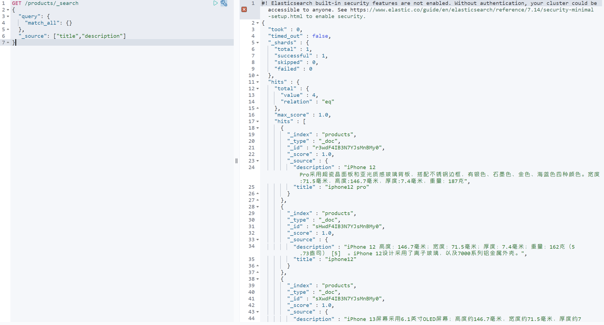


# 9、过滤查询

过滤查询 `<filter query>`，其实准确来说，ES 中的查询操作分为 2 种：查询（query）和过滤（filter）。查询即是之前提到的 query 查询，它（查询）默认会计算每个返回文档的得分，然后根据得分排序。而过滤（filter）只会筛选出符合的文档，并不计算得分，而且它可以缓存文档 。所以，单从性能考虑，过滤比查询更快。 


语法：

```http
GET /索引名/_search
{
  "query": {
    "bool": {
      "must": [
        {"match_all": {}} //查询条件
      ],
      "filter": {....} //过滤条件
  }
}
```

注意：

- 在执行 filter  和  query  时，先执行 filter 再执行 query。
- Elasticsearch 会自动缓存经常使用的过滤器，以加快性能。

常见过滤类型有：`term`、`terms`、`ranage`、`exists`、`ids` 等。


## 9.1、term

```http
GET /products/_search
{
  "query": {
    "bool": {
      "must": [
        {
          "match_all": {}
        }
      ],
      "filter": {
        "term": {
          "description":"四种"
        }
      }
    }
  }
}
```

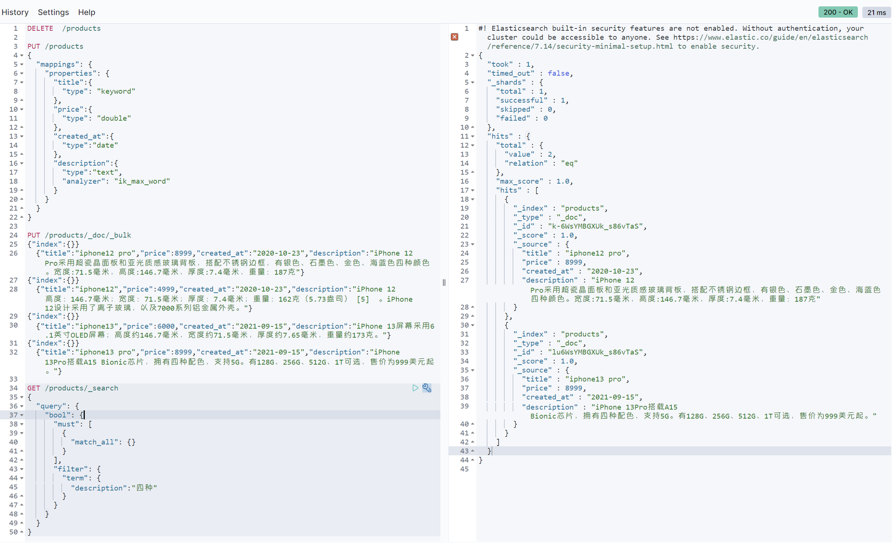


## 9.2、terms

```http
GET /products/_search
{
  "query": {
    "bool": {
      "must": [
        {"term": {
          "name": {
            "value": "中国"
          }
        }}
      ],
      "filter": {
        "terms": {
          "content":[
              "科技",
              "声音"
            ]
        }
      }
    }
  }
}
```

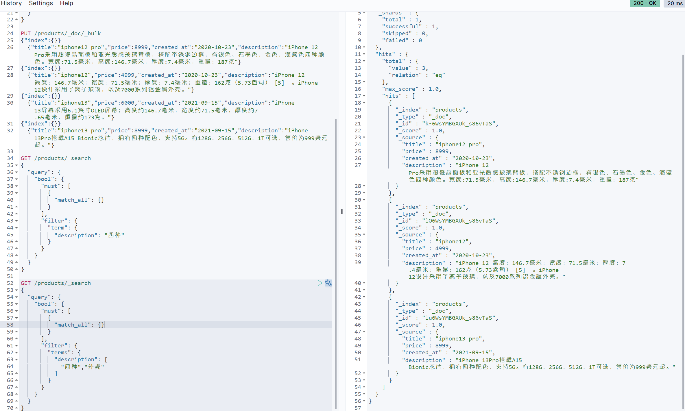


## 9.3、range

```http
GET /products/_search
{
  "query": {
    "bool": {
      "must": [
        {
          "match_all": {}
        }
      ],
      "filter": {
        "range": {
          "price": {
            "gte": 4000,
            "lte": 6000
          }
        }
      }
    }
  }
}
```

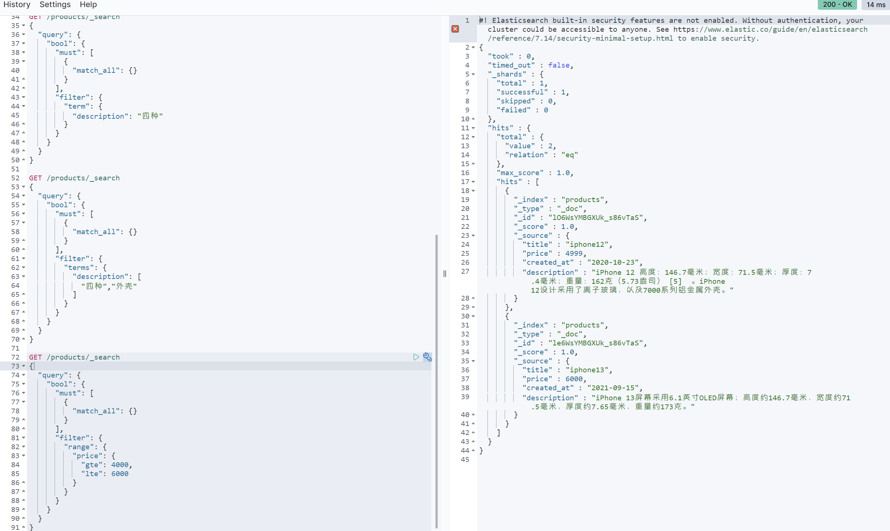


## 9.4、exists

存在指定字段，获取字段不为空的索引记录。

```http
GET /products/_search
{
  "query": {
    "bool": {
      "must": [
        {
          "match_all": {}
        }
      ],
      "filter": {
        "exists": {
          "field":"description"
        }
      }
    }
  }
}
```

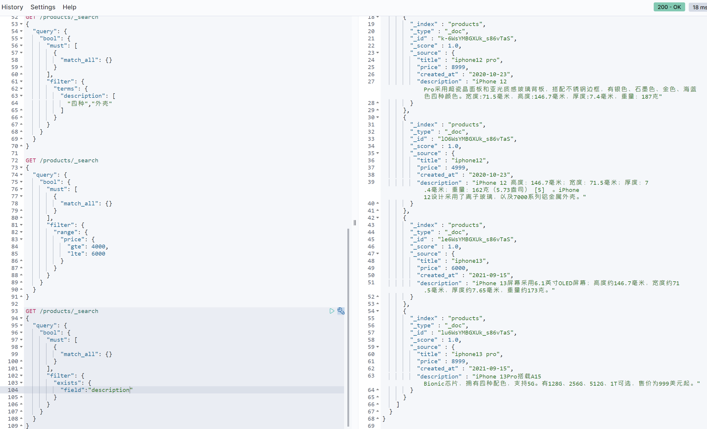


## 9.5、ids

含有指定字段的索引记录。

```http
GET /products/_search
{
  "query": {
    "bool": {
      "must": [
        {
          "match_all": {}
        }
      ],
      "filter": {
        "ids": {
          "values": ["le6WsYMBGXUk_s86vTaS", "lO6WsYMBGXUk_s86vTaS"]
        }
      }
    }
  }
}
```

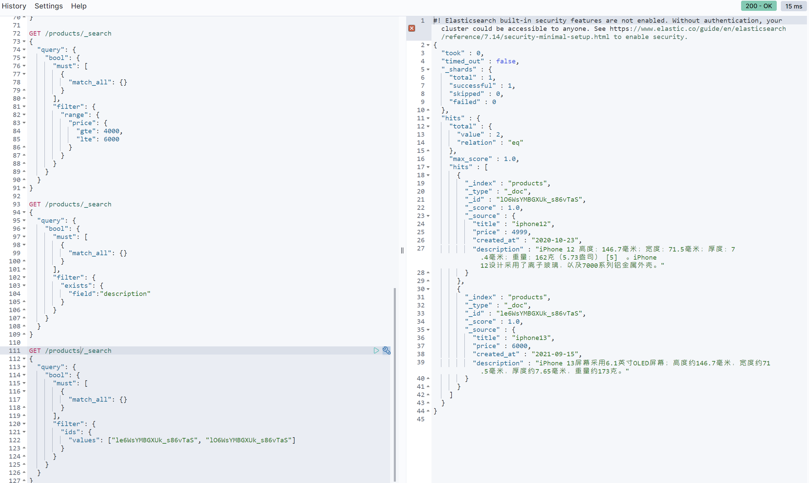


# 10、整合应用

新建一个 Spring Boot 对象，引入 ES 依赖：

```xml
<dependency>
    <groupId>org.springframework.boot</groupId>
    <artifactId>spring-boot-starter-data-elasticsearch</artifactId>
</dependency>
```

在 Spring Boot 配置文件中写入 ES 服务地址相关配置：

```properties
# 自定义 es 主机和端口
elasticsearch.host=localhost:9200
```

编写 ElasticSearchClientConfig.java 配置 ES 客户端：

```java
/**
 * @author Orichalcos
 */
@Configuration
public class ElasticSearchClientConfig extends AbstractElasticsearchConfiguration {

    @Value("${elasticsearch.host}")
    private String host;

    @Override
    @Bean
    public RestHighLevelClient elasticsearchClient() {
        final ClientConfiguration clientConfiguration = ClientConfiguration.builder()
                .connectedTo(host)
                .build();
        return RestClients.create(clientConfiguration).rest();
    }
}

```


客户端对象

- ElasticsearchOperations 

  特点：使用使用面向对象方式操作 ES

- RestHighLevelClient


## 10.1、ElasticSearchOperations

### 10.1.1、相关注解

- `@Document` ：用在类上，代表一个对象为一个文档

  - `indexName` 属性：创建索引的名称
  - `createIndex` 属性：是否创建索引

  示例：`@Document(indexName = "products", createIndex = true)`

- `@Id`：用在属性上 ，将对象 id 字段与 ES 中文档的 _id 对应

- `@Field`：用在属性上 ，用来描述属性在 ES 中存储类型以及分词情况

  - `type` 属性：用来指定字段类型

  示例：`@Field(type = FieldType.Keyword)`


以下是一个 Product 对象的示例：

```java
/**
 * @author Orichalcos
 */
@Document(indexName = "products",createIndex = true)
public class Product {
    @Id
    private Integer id;
    @Field(type = FieldType.Keyword)
    private String title;
    @Field(type = FieldType.Double)
    private Double price;
    @Field(type = FieldType.Text)
    private String description;

   	//get set...
}
```


### 10.1.2、索引文档

新建一个测试类：

```java
public class ElasticSearchOptionsTests extends ElasticSearchApplicationTests {

    private final ElasticsearchOperations elasticsearchOperations;

    @Autowired
    public ElasticSearchOptionsTests(ElasticsearchOperations elasticsearchOperations) {
        this.elasticsearchOperations = elasticsearchOperations;
    }

}
```

在测试类中新增索引文档的测试方法：

```java
/**
  * 索引一条文档
  */
@Test
public void testIndex() {
    Product product = new Product();
    product.setId(1);
    product.setTitle("小浣熊干脆面");
    product.setPrice(1.5);
    product.setDescription("小浣熊干脆面真好吃，曾经非常喜欢吃！");
    elasticsearchOperations.save(product);
}
```

运行测试示例后，查看结果：

```http
GET /products/_mapping
```

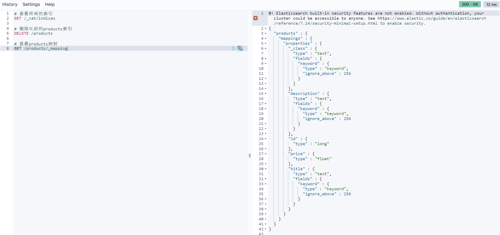

```http
GET /products/_search
{
  "query":{
    "match_all": {}
  }
}
```

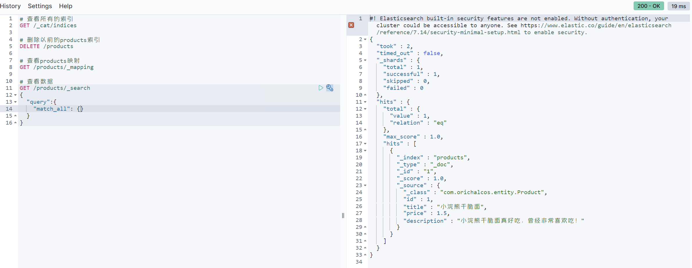
