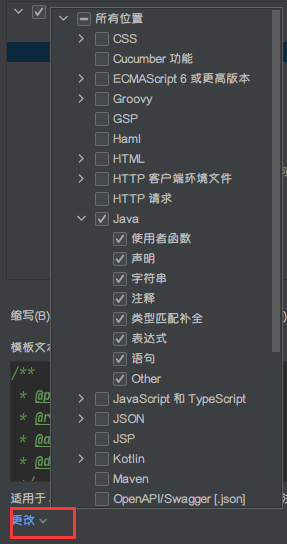
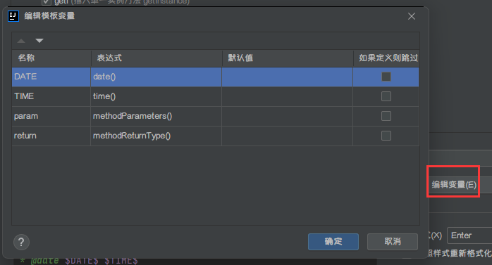

# Windows

## 【1】Windows默认管理员权限

1. 按下 Win+R 快捷键唤出 “运行” 窗口，输入 `gpedit.msc` 打开 组策略编辑器。

2. 依次选择 计算机配置 => Windows设置 => 安全设置 => 本地策略 => 安全选项，双击安全选项：

   

3. 向下滑，找到

     -  用户账户控制：以管理员批准模式运行所有管理员。
     -  用户账户控制：用于内置管理员账户的管理员批准模式。
6. 分别双击进入配置窗口，将这两项都分别设置为已禁用，再点击确定。
7. 重启电脑，操作完成！

此操作虽然以后会比较方便，但是由于所有软件都能获取到管理员权限，所以电脑安全性会有所降低。

> 最近更换了 Thinkbook 16P，下载了一个联想电脑管家，这个软件会自动打开【用户账户控制：以管理员批准模式运行所有管理员】，可以下载[这个文件](https://github.com/0richalcos/Note/blob/main/Annex/lsconfig)（如果下载后有 .txt 后缀需要删除后缀使用）并将其放到 C 盘根目录解决这个问题，不然只能通过卸载联想电脑管家解决。


## 【2】diskpart 操作硬盘

DiskPart 是 Windows 11 中的命令行实用程序，使您可以使用 DiskPart 命令提示符执行磁盘分区操作。下面通过示例了解如何使用 DiskPart。


**什么是DiskPart？**

DiskPart  取代了它的前身 —— fdisk，是一个命令行实用程序，可以管理自 Windows 2000 以来运行所有操作系统版本的计算机中的磁盘、分区或卷，还包括最新的 Windows 11。用户可以输入 DiskPart 命令直接组织硬盘分区，或创建文本文件脚本来执行多个命令。您可以在磁盘管理工具中使用的大多数命令都集成在 DiskPart 中。


**如何在 Windows 11 当中打开 DiskPart？**

您需要以管理员权限启动 Windows 11 DiskPart 实用程序。一种方法是在 “搜索” 框中键入 `diskpart`，然后在搜索结果中出现【diskpart 】时，右击它并选择【以管理员身份运行】。另一种方法是按 Windows + R 键并在框中键入 `diskpart`，然后单击【确定】。


> 在使用微软官方工具制作的启动盘安装系统时，如果遇到硬盘格式问题无法安装，可以按 Shift + F10 打开 cmd 使用 diskpart 的 `convert` 命令转换硬盘格式解决问题。


**DiskPart Windows 11 命令和示例**

在使用 DiskPart 命令之前，必须首先列出所有对象，然后选择一个对象使其获得焦点。当对象具有焦点时，您键入的任何DiskPart 命令都将作用于该对象。

在 `DISKPART >` 提示符下：

- 键入 `list disk` 以显示计算机中的所有磁盘。每个磁盘都有一个磁盘编号，从 0 开始。GPT 行下的星号 `*` 表示磁盘是 GPT 分区样式。除非只有一个磁盘，否则您必须通过使用 `select disk n` 告诉 DiskPart 实用程序选择哪个磁盘。`n` 表示磁盘的编号。
- 键入 `list volume` 以显示所有磁盘上的所有卷。每个卷都有一个卷号，从 0 开始。要告诉 DiskPart 管理哪个卷，需要键入 `select volume n` 以使其成为焦点。`n` 可以是卷的数量或卷的驱动器号（如果有）。
- 在已选择磁盘的情况下，键入 `list partition` 以显示该磁盘下的所有分区。每个分区有个编号，从 0 开始。可以输入 `select partition n` 选择某个分区。`n` 表示分区的编号。

如果要查看 DiskPart 可以为您提供的服务，只需输入 `help` 以查看命令列表：


**清理磁盘/将磁盘转换为 GPT /将磁盘转换为 MBR**

要删除磁盘上的所有分区或卷并在 MBR 和 GPT 之间转换磁盘，请参阅以下命令：

- 键入 `list disk`。
- 键入 `select disk 1`。
- 键入 `clean`。
- 键入 `convert gpt` 或 `convert mbr`。

> 使用微软官方工具制作启动盘安装系统时，如果系统盘的格式不是 GPT，就会报错，此时可以通过 `convert` 命令转换磁盘格式解决问题。
>
> `clean` 命令可以解决在【磁盘管理】中无法删除系统分区（比如 EFI 分区）的问题。


## 【3】修改系统引导

1. win+R
2. 输入 `msconfig`


## 【4】解决端口占用

1. cmd 命令窗口输入 `netstat –ano` 回车，会显示所有已经在运行的端口情况，其中 PID 为进程号。

   如果想要具体查询正在占用的端口号，可以使用 ：

   ```shell
   netstat -ano | findstr <端口号>
   ```

2. 找到占用端口的进程号后，可以通过 PID 查询进程：

   ```shell
   tasklist | findstr <PID>
   ```

3. 输入以下命令终止进程：

   ```shell
   taskkill /f /t /im <PID>
   ```


## 【5】compact 压缩功能命令

它可以对所有的系统文件进行压缩，实现磁盘压缩，节约硬盘空间。

开启：cmd 命令窗口输入 `compact /compactos:always`，回车。

关闭：`compact /compactos:never`。


## 【6】删除右键菜单新建中不要选项

1. 按下 Win+R，运行 `regedit`
2. 展开 HKEY_CLASSES_ROOT，找到需要删除的文件后缀名，然后展开文件夹找到 shellnew 选项，直接删除即可


## 【7】取消开机密码

使用微软账户登录：

1. 确保 账户 => 登录选项 => 其他设置中 “为了提高安全性，仅允许...” 是关闭的：
	
	
2. 按 Win + R，弹出 ”运行“，输入 `netplwiz`，点【确定】
3. 取消 “要使用本计算机，用户必须输入用户名和密码”，点【确定 】
4. 会弹出一个窗口，在窗口中输入 微软账户的用户名和密码，点【确定】

   


## 【8】微软输入法快速输入时间

1. 按下快捷键 Win + I，打开【设置】

2. 依次进入：【时间和语言】 => 【语言 】

3. 找到【首选语言】，点击首选语言（中文简体，中国）的【选项】

4. 找到【键盘】，点击首选键盘（微软输入法）的【选项】

5. 选择【词库和自学习】，打开【用户定义的短语】，点击【添加用户定义的短语】

6. 添加：

   
   
   
   ```
   # 2020-11-29 16:21:29
   %yyyy%-%MM%-%dd% %HH%:%mm%:%ss%
   
   # 2020年11月29日 16:21:29
   %yyyy%年%MM%月%dd%日 %HH%:%mm%:%ss%
   ```


## 【9】Windows Terminal SSH 保持连接

Windows 10 全新的 Powershell 内置了 ssh.exe 因此可以直接连接远程服务器，在 Windows Terminal 中连接 SSH 中若一段时间没有操作会导致连接断开，终端卡死。

常见的终端工具（比如：Xshell）等都会内置 keepalive 功能，自动会发送心跳包来保持连接，但是 Windows Terminal 没有自带此功能。

解决办法：在当前用户目录下创建 .ssh 文件夹，或者可以尝试连接 SSH 随意连接一个服务器即可自动创建此文件夹。在其中创建配置文件 config ，写入以下两行：

```
Host *
    ServerAliveInterval 40
```


## 【10】删除 Win11 右键菜单项

此方法通过修改注册表来完成。

按 win 键 + R 键，打开 “运行” 窗口，输入  `regedit`，按回车键，弹出【注册表编辑器】。在注册表 `HKEY_LOCAL_MACHINE\SOFTWARE\Microsoft\Windows\CurrentVersion\Shell Extensions\` 处右键创建名为 `Blocked` 的**项**。在其中创建不同的**字符串值**达到屏蔽对应右键菜单项的效果。


**Open in Terminal**

**名称**为 `{9F156763-7844-4DC4-B2B1-901F640F5155}`，**数值**为 `WindowsTerminal`。


> 可以直接通过卸载 Windows Terminal（Windows 终端）这个软件来解决这个问题，删除注册表是为了解决 需要使用 Windows 终端但是又觉得右键菜单 “Open in Terminal...” 太长而影响美观的问题。
>
> 在新版的 Win11 中，该内容已被汉化为 “在终端中打开”。


**AMD Software : Adrenalin Edition**

**名称**为 `{FDADFEE3-02D1-4E7C-A511-380F4C98D73B}`，**数值**为 `AMD Software : Adrenalin Edition`。


> 可以直接通过卸载 AMD Software 这个驱动软件来解决这个问题，但是一般不建议卸载驱动软件。


## 【11】关闭系统小组件

隐藏只需要在任务栏设置中设置就好了。

卸载 Win11 小组件需要用到 CMD。使用管理员权限打开 Windows Terminal 终端的 “命令提示符”，或者使用管理员权限运行 CMD，输入以下命令：

```shell
winget uninstall MicrosoftWindows.Client.WebExperience_cw5n1h2txyewy
```

按下回车键，Win11 小组件就会被卸载掉了。

如果想要重新安装 Win11 小组件，则可以执行以下命令：

```shell
winget install 9MSSGKG348SP
```


## 【12】环境变量值只能一行显示，不是换行显示问题

这是因为变量值的第一个是相对地址，只需要将一个绝对地址（带盘符）的放首位，然后逗号分隔，确定之后，再双击打开就是换行显示了！


## 【13】浏览器主页被篡改

浏览器主页被篡改，直接去浏览器的设置里找首页设置一般没用，可以看一下是不是快捷方式出了问题，找到浏览器的快捷方式，右键查看【属性】，通常目标栏显示的都是浏览器的安装目录：


如果发现安装目录之后还跟着一串网址链接，那就是被强制锁定了对应的网址，只要删掉这串网址就可以了。当然，有些浏览器的快捷方式不允许修改，我们可以把界面切换到【常规】，然后把【只读】取消掉，就可以进行修改了：


当然也可以直接删除快捷方式，然后重新生成；或者在目标栏输入一个自己需要的网址（输入网址之前要加一个空格键，否则无法保存），然后将属性改为只读。


## 【14】使用 sc 命令控制服务

`sc` 命令的语法格式：

```shell
sc <server> [command] [service name] <option1> <option2>...
```

`sc` 命令使用例子：

- `sc query`：查看所有服务的运行状态。

- `sc query 服务名`：查看某个服务的运行状态。

- `sc qc 服务名`：查看某个服务的配置信息。

- `sc start 服务名`：启动服务。

- `sc stop 服务名`：停止服务。

- `sc delete 服务名`：删除服务。

- `sc config 服务名 start= auto|demand|disabled`：修改服务启动类型。

  *start* 参数的值可以是 `demand`（手动）、`disabled`（禁用），`auto`（自动）。注意：`start=`后面有一个空格

**使用提示**

1. 如果服务名称中包含有空格，记得在服务名称上加引号。例如 `sc stop "my service"`。

2. “服务名称” 和 “服务显示名称”  是不一样的。`sc` 指令使用的是 “服务名称”。我们在【服务】里看到是服务的显示名称，双击打开某个服务可以看到真正的服务名字。

   
   
3. `sc start` 和 `sc stop` 功能上类似于 `net start` 和 `net stop`，但速度更快且能停止的服务更多。

4. `sc delete` 命令的实质都是删除 `HKEY_LOCAL_MACHINE\SYSTEM\CurrentControlSet\Services` 下的 `ServiceName` 分支。所以也可以用 `reg` 命令删除名为 `ServiceName` 的服务：`reg delete HKLM\SYSTEM\CurrentControlSet\Services\ServiceName`。

> 如果提示 “拒绝访问” 可能是没有管理员权限，或者电脑安装有 火绒 之类的安全工具。


## 【15】mstsc 远程连接计算机

远程桌面的命令行指令 `mstsc`，它的意思是 Microsoft Terminal Server Connection（微软终端服务器连接）的缩写。

使用 Windows + R 快捷键呼出运行窗口，在输入框输入 `mstsc` 命令即可使用远程连接功能，输入远程电脑的 IP、用户名、密码即可远程访问。


Windows11 22H2 开始 Windows 开始更新内核保护了。这玩意让我不能使用已经保存的密码来连接远程桌面。我也很绝望啊，所以我决定关闭他了。

1. 按 Win + R 呼出【运行】，输入 gpedit.msc 按回车，打开组策略编辑器

   

2. 在组策略管理控制台上，转到计算机配置 ==> 管理模板 ==> 系统 ==> Device Guard

   

3. 双击打开【基于虚拟化的安全】，然后单击禁用选项：

   

   确定配置并重启电脑即可解决。


**删除远程连接记录**

1. Win + R 打开【运行】，输入 `regedit` 命令打开注册表；

2. 找到注册表里面的 `计算机\HKEY_CURRENT_USER\Software\Microsoft\Terminal Server Client\Default` 其中右边的就是连接过的记录了,删除需要清除的文件即可：

   

3. 如果有保存凭据，需要在【凭据管理器】里删除对应的凭据：

   


## 【16】控制台设置代理

**临时设置**

1. 首先打开控制台（CMD 之类的都可以）

2. 输入以下命令：

   ```shell
   set http_proxy=http://127.0.0.1:端口号
   set https_proxy=http://127.0.0.1:端口号
   ```

   如果你的代理服务器要求用户名和密码的话，那么还需要：

   ```shell
   set http_proxy_user=
   set http_proxy_pass=
   ```

3. 验证是否生效：

   ```shell
   curl -vk https://www.google.com
   ```


**永久生效**

如果需要永久生效的话，是需要配置系统的环境变量的

1. 【设置】 => 【系统】 => 【系统信息】 => 【高级系统设置】 => 【高级】 => 【环境变量】

2. 添加如下的系统环境变量：

   - 变量名：`http_proxy`
   
     变量值：`http://127.0.0.1:7890`
   
   - 变量名：`https_proxy`
   
     变量值：`http://127.0.0.1:7890`


## 【17】PowerShell：因为在此系统上禁止运行脚本

**报错详情**

```
PS E:\code> hexo server
hexo : 无法加载文件 C:\Users\Administrator\AppData\Roaming\npm\hexo.ps1，
因为在此系统上禁止运行脚本。有关详细信息，请参阅 
https:/go.microsoft.com/fwlink/?LinkID=135170 中的about_Execution_Policies。
所在位置 行:1 字符: 1
+ hexo new "PowerShell：因为在此系统上禁止运行脚本，解决方法"
+
    + CategoryInfo          : SecurityError: (:) []，PSSecurityException
    + FullyQualifiedErrorId : UnauthorizedAccess
```

计算机上启动 Windows PowerShell 时，执行策略很可能是 `Restricted`（默认设置）。

- `Restricted` 执行策略不允许任何脚本运行。 
- `AllSigned` 和 `RemoteSigned` 执行策略可防止 Windows PowerShell 运行没有数字签名的脚本。

打开 PowerShell 然后输入 `get-executionpolicy` 可查看计算机上的现用执行策略：

```
PS C:\WINDOWS\system32> get-executionpolicy
Restricted
```


**设置**

以管理员身份打开 PowerShell 输入 `set-executionpolicy remotesigned`，并输入 `Y`：

```
PS C:\WINDOWS\system32> set-executionpolicy remotesigned

执行策略更改
执行策略可帮助你防止执行不信任的脚本。更改执行策略可能会产生安全风险，如 https:/go.microsoft.com/fwlink/?LinkID=135170
中的 about_Execution_Policies 帮助主题所述。是否要更改执行策略?
[Y] 是(Y)  [A] 全是(A)  [N] 否(N)  [L] 全否(L)  [S] 暂停(S)  [?] 帮助 (默认值为“N”): y
PS C:\WINDOWS\system32> get-executionpolicy
RemoteSigned
```


## 【18】彻底关闭病毒实时保护

1. 首先按 Win+R，输入 `gpedit.msc` 按回车打开组策略编辑器。

2. 依次选择 计算机配置 => 管理模板 => Windows 组件 => Microsoft Defender防病毒 => 实时保护，双击实时保护：

   

3. 双击 关闭实时保护，选择已启用，点击应用：

   


## 【19】需要使用新应用一打开此 ms-gamingoverlay 链接

一般在打开游戏或者部分应用出现 “需要使用新应用一打开此 ms-gamingoverlay 链接”，是因为 xbox 搞事儿，没有 xbox 或者 xbox 没有卸载干净。

解决办法：

1. 首先按 Win+R，输入 `gpedit.msc` 按回车打开组策略编辑器。

2. 依次选择 计算机配置 => 管理模板 => Windows组件 => Windows 游戏录制与广播，双击Windows 游戏录制与广播：

   

3. 双击 启用或禁用 Windows 游戏录制和广播，选择已禁用，点击应用：

   


# Chrome

## 【1】移动 Chrome 的数据文件

Chrome 默认的数据文件地址是：C:\Users\Orichalcos\AppData\Local\Google

移动前需要关闭 Google，将文件移动到想要移动的地方，然后在 cmd（需要管理员权限）输入：`mklink 旧地址 新地址`，回车。


# IDEA

## 【1】Maven 部分文件无法导出

Maven 由于它的约定大于配置，之后可能遇到写的配置文件，无法被导出或者生效的问题

```xml
<build>
    <resources>
        <resource>
            <directory>src/main/resources</directory>
            <includes>
                <include>**/*.properties</include>
                <include>**/*.xml</include>
            </includes>
            <filtering>true</filtering>
        </resource>
        <resource>
            <directory>src/main/java</directory>
            <includes>
                <include>**/*.properties</include>
                <include>**/*.xml</include>
            </includes>
            <filtering>true</filtering>
        </resource>
    </resources>
</build>
```


## 【2】Maven 框架 web-app 中 web.xml 版本过低

1. 找到 maven-archetype-webapp 的 jar 包位置：`Maven位置\repository\org\apache\maven\archetypes\maven-archetype-webapp\1.4`。
2. 用压缩包形式打开，不要解压！
3. 然后依次点：`archetype-resources\src\main\webapp\WEB-INF\web.xml`，打开，将其修改成最新的模板。

> 上边的 web-app 标签中有一个 `metadata-complete="true"`，这是个大坑，因为 web-app 标签 3.0 以上版本是可以使用 Servlet 的注解的，如下图：


再也不用去 web.xml 写那 Servlet 的那一堆映射了（下图就是那一堆映射）：


如果忘记了改这个 web-app 标签里的 `metadata-complete` 的这个属性，所写的注解都将失效！！！

该属性默认为 `true`，表示容器在部署时只依赖部署描述文件，忽略所有标注，如果不配置该属性，或者将其设置为 `false`，则表示启动注解支持。当 `metadata-complete="false"` 时，web.xml 和注解对于 Servlet 的影响同时起作用，两种方法定义的 url-partten 都可以访问到该 Servlet，但是当通过 web.xml 定义的 url-partten 访问时，注解定义的属性将失效。


## 【3】修改内存大小

首先在 IDEA 中显示内存：在窗口下方右键，选中【Memory Indicator】：


【帮助】=>【编辑自定义 VM 选项】。

在弹出来的文件中修改 Xms 和 Xmx：


如果在这里设置无效，可能是环境变量设置指向了其他文件：


## 【4】插件：JRebel


## 【5】Maven 项目没有被识别

在 pom.xml 上右键，点击【Add as Maven Project】 


## 【6】插件：Camel Case

下划线 <=> 驼峰，你是怎么转换的，一个一个字母的修改吗？

Camel Case 可以用 一个快捷键 就搞定，去 IDEA 的插件库中搜索 Camel Case插件，安装上。

使用方式：先选中要要格式转换的代码， 再用快捷键 Shift + Alt + u 进行转换，多个格式切换，就按多次快捷键。

Camel Case 包含 6 种格式的切换，可能某些格式是平时不用的，可以把不用的格式取消，这样在格式切换时，就不会包含已取消的格式了：


## 【7】jar 包自动导入及优化

加快开发效率，除去没用的包，洁癖者必用!   这样设置，就可以自动导入包以及除去没有用到的包！


第一个是 自动导入需要的 jar 包，若有多个同名 jar 包，需要开发者自己选择导入

第二个是 优化导入，也就是除去没有用到的 jar 包，这个设置只会对当前的项目有效！每个项目都需要单独设置 此选项！


## 【8】保存时触发操作

IDEA 2021.2 可以设置自动保存时触发的操作，比如重新格式化，优化 Java 包导入。我们可以在 Preferences / Settings | Tools | Actions on Save 进行设置：


比如上图这个格式化代码，保存时将会格式化你当前改动代码，这就不用担心写完代码忘记格式化了。

额外再提一点，个人建议上面格式化代码不要设置成 **Whole file（整个文件）**，这是因为多人开发中同时改动这个文件，你整个格式化，比较容易造成冲突，解决这种格式化导致的冲突比较蛋疼。


## 【9】正则替换

在开发时遇到需要大量替换代码时，不需要一个一个的去改，可以使用**正则替换**：


比如上图将所有这个文件中的 `name=""` 替换为 `th:field=""` ，`()` 内填写正则表达式，`$1` 为正则匹配到的第一个内容的占位符。


## 【10】设置类和方法模板

**设置类模板**

找到这里，可以添加自己所需要的注释：


**方法模板**

找到如下地方：


添加自己需要的模板后（展开方式选 `Enter`，表示回车触发），点击【更改】，添加使用环境，然后【编辑变量】：

<div align="center">
    
    
</div>

最后应用就行，在类的方法上方输入 `com` 按回车就可自动生成方法注释。


## 【11】插件：Translation

可以在 IDEA 使用翻译功能，效果：


默认引擎使用 Google 翻译，但是如果请求次数过多提示 “翻译失败，请求过多，请稍后再试！”，这里我建议使用阿里翻译引擎。

阿里翻译每月的前 100 万字符免费，超出的部分会按照 50 元 / 百万字符收取费用，费用由阿里翻译在它自己的阿里云官方网站收取，与 Translation 无关。

申请步骤：

1. 登录阿里云官网，点击右上角的控制台，在控制台的搜索框搜索 “机器翻译”：

   

2. 点击【通用版翻译引擎】下方的【立即开通】按钮：

   


   点击之后会让你勾选一个【机器翻译服务协议】，勾选之后点【立即开通】就能开通成功了。

3. 开通后，回到 阿里云机器翻译控制台，把鼠标悬停在右上角用户头像上，然后点击【AccessKey 管理】，会跳转到 AccessKey 管理页面：

   

4. 进入后会弹出一个安全提示：

   


   简而言之，在这里创建的 AccessKey 能调用你账号下的所有资源，权限范围太大了，一旦泄露的话影响面很大，所以阿里云建议你创建一个子用户，然后给这个子用户只分配机器翻译的权限，这样的话即使泄露了也只会影响到机器翻译。

5. 点击【创建用户】，填写用户信息 ：

   - 设置登录名称：huacifanyi
   - 填写显示名称：划词翻译
   - 访问方式：勾选【Open API 调用访问】

   

6. 点击【确定】之后会让你输入手机短信验证码，输入之后会看到创建成功的 【AccessKey ID】 和 【AccessKey Secret】，如下图：

   

7. 然后勾选刚刚创建的用户，点击【添加权限】：

   

8. 搜索 “机器翻译”，单击选中【AliyunMTFullAccess】和【AliyunMTReadOnlyAccess】这两项即可，然后点击【确定】：

   

9. 最后在 IDEA 的 Translation 中，选择 阿里翻译并配置：

   


## 【12】Defender 排除项目目录


1. 打开设置，然后依次打开【隐私和安全性】==>【Windows 安全中心】==>【打开 Windows 安全中心】

2. 在 Windows 安全中心中选择【病毒和威胁防护】，在 “病毒和威胁防护设置” 下，选择【管理设置】

   

3. 最后在 ”排除项“ 下，点击【添加或删除排除项】

   


## 【13】修改（文件）编码格式

IntelliJ IDEA 可以在菜单中的 File => Settings => Editor => File Encoding 下修改项目文件的编码：


- IDE 的默认的全局编码是 UTF-8，Project Encoding 默认会是操作系统的 GBK，一般会修改为 UTF-8。
- IntelliJ IDEA 可以对 Properties 文件进行专门的编码设置，也建议改为 UTF-8，其中有一个重点就是属性 **Transparent native-to-ascii conversion** ，一般都要勾选，不然 Properties 文件中的注释显示的都不会是中文。
- IntelliJ IDEA 除了支持对整个 Project 设置编码之外，还支持对目录、文件进行编码设置。如果你要对目录进行编码设置的话，可能会出现需要 Convert 编码的弹出操作选择，强烈建议在转换之前做好文件备份，不然可能出现转换过程变成乱码，无法还原。

另外，单独文件的编码也可以这样设置：


可能会弹出这样一个弹框：


- Reload 表示使用新编码重新加载，新编码不会保存到文件中。
- Convert 表示使用新编码进行转换，新编码会保存到文件中。

> 含有中文的代码文件，Convert 之后可能会使中文变成乱码，所以在转换成请做好备份，不然可能出现转换过程变成乱码，无法还原。


# STS

## 【1】修改内存大小

显示内存：【首选项】=>【常规】=>【显示堆状态 】。

在安装目录找到 SpringToolSuite4.ini，修改 Xms Xmx。

然后在【Java】=>【已安装的 JRE】中，修改缺省 VM 参数，添加 Xms 和 Xmx，中间用空格隔开：


## 【2】汉化


打开 https://www.eclipse.org/babel/downloads.php 


选择一个复制，在弹出的窗口中点击添加


找到中文简体安装就行了。


## 【3】SpringBoot 打 jar 包

SpringBoot 是使用内置的 Tomcat 的，所以不用打包成 war 文件，当然也可以打包成 war 文件进行部署，只是个人觉得没有那个必要，通过 Maven 可将 SpringBoot 项目打包成 jar 文件运行。

1. pom.xml 文件中添加所需插件：

	```xml
	<plugins>
	    <!-- 要使生成的jar可运行，需要加入此插件 -->
		<plugin>
			<groupId>org.apache.maven.plugins</groupId>
			<artifactId>maven-surefire-plugin</artifactId>
			<configuration>
			<skip>true</skip>
			</configuration>
		</plugin>
		<plugin>
			<groupId>org.springframework.boot</groupId>
			<artifactId>spring-boot-maven-plugin</artifactId>
		</plugin>
	</plugins>
	```

2. 项目运行环境选择 Java JDK：
	
	
	
3. 执行 `maven clean`：
	
	右键项目【run as】选择【maven clean】
	
4. 执行 `maven install`：
	
	右键项目【run as】选择【maven install】
	
5. 运行 jar：
	
	命令行运行： `java -jar xxx.jar` 


# Clash for Windows

## 【1】配置文件预处理

在 Clash for Windows 中，如果直接编辑 Profile 的规则只会临时有效，每次重新刷新配置文件后，规则都会重置。有个处理办法就是编辑配置文件预处理规则，每次刷新文件都对配置文件进行预处理。

如果需要对下载地址为 `https://example.com/profile.yaml` 的配置文件进行预处理，操作如下：

1. 进入 Settings 界面。

2. 滚动至 Profiles 栏。

3. 点击 Parsers 右边 Edit 打开编辑器，填入：

   ```yaml
   parsers:
     - url: https://example.com/profile.yaml
       yaml:
         prepend-rules:
           - DOMAIN,test.com,DIRECT # rules最前面增加一个规则
   ```

   - *prepend-rules*：见下方 参数说明；
   - *DOMAIN*：域名匹配规则；
   - *test.com*：域名；
   - *DIRECT*：直连代理模式。

4. 点击编辑器右下角保存按钮。

当配置文件触发刷新（包括自动更新）时，CFW 会读取 `yaml` 字段定义的值，将对应值插入/合并到原配置文件中


**参数说明**

| 键                   | 值类型 | 操作                                     |
| -------------------- | ------ | ---------------------------------------- |
| append-rules         | 数组   | 数组合并至原配置`rules`数组后            |
| prepend-rules        | 数组   | 数组合并至原配置`rules`数组前            |
| append-proxies       | 数组   | 数组合并至原配置`proxies`数组后          |
| prepend-proxies      | 数组   | 数组合并至原配置`proxies`数组前          |
| append-proxy-groups  | 数组   | 数组合并至原配置`proxy-groups`数组后     |
| prepend-proxy-groups | 数组   | 数组合并至原配置`proxy-groups`数组前     |
| mix-proxy-providers  | 对象   | 对象合并至原配置`proxy-providers`中      |
| mix-rule-providers   | 对象   | 对象合并至原配置`rule-providers`中       |
| mix-object           | 对象   | 对象合并至原配置最外层中                 |
| commands             | 数组   | 在上面操作完成后执行简单命令操作配置文件 |


**匹配规则**

- DOMAIN-SUFFIX：域名后缀匹配
- DOMAIN：域名匹配
- DOMAIN-KEYWORD：域名关键字匹配
- IP-CIDR：IP 段匹配
- SRC-IP-CIDR：源 IP 段匹配
- GEOIP：GEOIP 数据库（国家代码）匹配
- DST-PORT：目标端口匹配
- SRC-PORT：源端口匹配
- PROCESS-NAME：源进程名匹配
- RULE-SET：Rule Provider 规则匹配
- MATCH：全匹配


**代理模式**

Clash 共有三种工作模式：

- Global：全局，所有请求直接发往代理服务器
- Rule：规则，所有请求根据配置文件规则进行分流
- Direct：直连，所有请求直接发往目的地


# Windows Server 2022

## 【1】激活

1. 首先输入下面的命令，更改 Windows server 2022 操作系统序列号：

   ```shell
   slmgr -ipk WX4NM-KYWYW-QJJR4-XV3QB-6VM33
   ```

   

2. 接下来更改 KMS 激活服务器，使用下面的命令进行更改：

   ```shell
   slmgr /skms kms.03k.org
   ```

   

3. 完成KMS服务器的设置以后，就可以使用下面的命令来激活 Windows server 2022 操作系统：

   ```shell
   slmgr /skms kms.03k.org
   ```

   

4. 通过 `slmgr.vbs -dlv` 命令可以看到激活后的使用期限为 180 天，可以重置的计数 1000 次以上，应该可以让你完成测试使用。

   

>  以上的方法供学习使用。 


## 【2】安装 Windows Terminal

1. 在 Windows Server 2022 上打开 “开始”。

2. 搜索 PowerShell，右键单击顶部结果，然后选择 “以管理员身份运行” 选项。

3. 键入以下命令以下载运行库，然后按 Enter 键：

   ```shell
   Invoke-WebRequest -Uri https://aka.ms/Microsoft.VCLibs.x64.14.00.Desktop.appx -outfile Microsoft.VCLibs.x86.14.00.Desktop.appx
   ```

   

4. 键入以下命令以安装 “.appx” 程序包，然后按 Enter 键：

   ```shell
   Add-AppxPackage Microsoft.VCLibs.x86.14.00.Desktop.appx
   ```

5. 输入以下命令下载最新版本的 Windows Terminal 并按 “Enter”：

   ```shell
   Invoke-WebRequest -Uri https://github.com/microsoft/terminal/releases/download/v1.16.10261.0/Microsoft.WindowsTerminal_Win10_1.16.10261.0_8wekyb3d8bbwe.msixbundle -outfile Microsoft.WindowsTerminal_Win10_1.16.10261.0_8wekyb3d8bbwe.msixbundle
   ```

   

   > 如果服务器无法下载可以直接去 [GItHub](https://github.com/microsoft/terminal/releases) 下载后传输到服务器，然后执行安装命令。建议下载的版本和上面命令行保持一致，其他版本由于缺少其他包无法进行安装。

6. 键入以下命令以安装 Windows Terminal 应用程序，然后按 Enter 键：

   ```shell
   Add-AppxPackage Microsoft.WindowsTerminal_Win10_1.16.10261.0_8wekyb3d8bbwe.msixbundle
   ```

完成这些步骤后，终端将安装在 Windows Server 上。

也可以使用相同的说明升级到命令控制台的新版本。但是需要使用旧版 PowerShell 控制台来完成该过程，因为在应用程序运行时无法升级终端。


# TortoiseSVN

## 【1】存储库尚未启用接受修订注释更改

使用 SVN 提交版本信息时，注释内容写的不全。

通过右键 TortoiseSVN 的 “Show log” 看到提交的的注释，右键每条日志信息看到 “Edit log message” 的选项，然而提交后却给出错误提示：

```
Repository has not been enabled to accept revision propchanges;

ask the administrator to create a pre-revprop-change hook
```

解决方案：

1. 编写批处理文件 `pre-revprop-change.bat`，内容如下：

   ```bat
   SET REPOS="%1"
   
   SET REV="%2"
   
   SET USER="%3"
   
   SET PROPNAME="%4"
   
   SET ACTION="%5"
   
   IF %ACTION% == "M" (IF %PROPNAME% == "svn:log" (EXIT 0))
   
   ECHO "Changing revision properties %PROPNAME% is prohibited" >&2
   
   EXIT 1
   ```

2. 将文件放到 `\Repositories\SVN文件夹\hooks\` 下执行即可。


## 【2】查看本地 SVN 账号密码

1. 找到存放 SVN 账号密码的路径，默认路径 `C:\Users\{用户名}\AppData\Roaming\Subversion\auth\svn.simple`。

2. 前往[这个地址](http://www.leapbeyond.com/ric/TSvnPD/)下载一个密码查看工具。

3. 将 .exe 的文件拷到上面第一步的目录中去，启动该工具就可以看见对应的用户名密码了：

   
