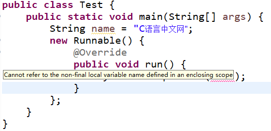
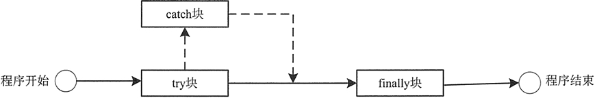
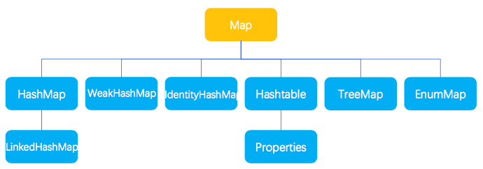
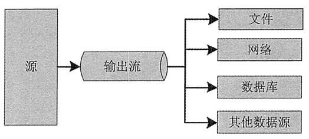

# 1、入门基础及环境搭建

## 1.1、Java是什么

### 1.1.1、什么是Java语言

简单来说，Java是由Sun Microsystems公司于1995年推出的一门面向对象程序设计语言。2010年Oracle公司收购Sun Microsystems，之后由Oracle公司负责Java的维护和版本升级。

其实Java还是一个平台。==Java平台由Java虚拟机（Java Virtual Machine，JVM）和Java应用程序接口（Application Programming Interface，API）构成==。Java应用程序接口为此提供了一个独立于操作系统的标准接口，可分为基本部分和扩展部分。在硬件或操作系统平台上安装一个Java平台之后，Java应用程序就可以运行。

Java平台已经嵌入了几乎所有的操作系统。这样的Java程序只需编译一次，就可以在各种系统中运行。

按应用范围，Java可分为3个体系，即JavaSE、JavaEE和JavaME。

1. JavaSE
	JavaSE（Java Platform Standard Edition，Java平台标准版）以前就称为J2SE，它允许开发和部署在桌面、服务器、嵌入式环境和实时环境中使用Java应用程序。JavaSE包含了支持Java Web服务开发的类，并为JavaEE提供基础，如Java语言基础、JDBC操作、I/O操作、网络通讯以及多线程等技术。下图为JavaSE的体系结构。


2. JavaEE
	JavaEE（Java Platform Enterprise Edition，Java平台企业版）以前称为J2EE。企业版本帮助开发和部署可移植、健壮、可伸缩且安全的服务端Java应用程序。==JavaEE是在JavaSE基础上构建的，它提供Web服务、组件模型、管理和通信API，可以用来实现企业级的面向服务体系结构（Service Oriented Architecture，SOA）。==

	扩展：SOA是一种设计方法，其中包含多个服务，而服务之间通过配合最终会提供一系列功能。一个服务通常以独立的形式存在于操作系统进程中。服务之间通过网络调用，而非采取进程内调用的方式进行通讯。

3. JavaME
	JavaME（Java Platform Micro Edition，Java平台微型版）以前称为J2ME，也叫K-JAVA。JavaME为在移动设备和嵌入式设备（比如手机、PDA、电视机顶盒和打印机）上运行的应用程序提供一个健壮且灵活的的环境。


### 1.1.2、Java语言的特点

Java语言的风格很像C语言和C++语言，是一种纯粹的面向对象语言，它继承了C++语言面向对象的技术核心，但是抛弃了C++的一些缺点，比如说容易引起错误的指针以及多继承等，同时也增加了垃圾回收机制，释放掉不被使用的内存空间，解决了管理内存空间的烦恼。

==Java语言是一种分布式的面向对象语言，具有面向对象、平台无关性、简单性、解释执行、多线程、安全性等很多特点。==

1. 面向对象
	Java是一种面向对象语言，它对对象中的类、对象、继承、封装、多态、接口、包等均有很好的支持。==为了简单起见，Java只支持类之间的单继承，但是可以使用接口来实现多继承。==
2. 平台无关性
	==平台无关性的具体表现在于，Java是 “一次编写，到处运行（Write Once，Run any Where）” 的语言==，因此==采用Java语言编写的程序具有很好的可移植性，==而保证这一点的正是Java虚拟机机制。在引入虚拟机之后，Java语言在不同的平台上运行不需要重新编译。
3. 简单性
	Java 语言的语法与 C 语言和 C++ 语言很相近，使得很多程序员学起来很容易。对 Java 来说，它舍弃了很多 C++ 中难以理解的特性，如操作符的重载和多继承等，而且 Java 语言不使用指针，加入了垃圾回收机制，解决了程序员需要管理内存的问题，使编程变得更加简单。
4. 解释执行
	Java程序在Java平台运行时会被编译成字节码文件，然后可以在有Java环境的操作系统上运行。在运行文件时，Java的解释器对这些字节码进行解释执行，执行过程中需要加入的类在连接阶段被载入到运行环境中。
5. 多线程
	Java语言是多线程的，这也是Java语言的一大特性，它必须由Thread类和它的子类来创建，==Java支持多个线程同时执行，并提供多线程之间的同步机制。==任何一个线程都有自己的run()方法，要执行的方法就写在run()方法体内。
6. 分布式
	Java语言支持Internet应用的开发，在Java的基本应用程序接口中就有一个网络应用程序接口，它提供了网络应用编程的类库，包括URL、URLConnection、Socket等。Java的RIM机制也是开发分布式应用的重要手段。
7. 健壮性
	Java的强类型机制、异常处理、垃圾回收机制等都是Java强壮性的重要保证。对指针的丢弃是Java的一大进步。另外，Java的异常处理机制也是健壮性的一大体现。
8. 高性能
	Java的高性能主要是相对其他高级脚本语言来说的，随着JIT（Just in Time）的发展，Java的运行速度越来越快。
9. 安全性
	Java通常被用在网络环境中，为此，Java提供了一个安全机制以防止恶意代码的攻击。除了Java语言具有许多的安全特性以外，Java还对通过网络下载的类增加了一个安全防范机制，分配不同的名称空间以防代替本地的同名类，并包含安全管理机制。


##  1.2、JDK的下载与安装

==JDK（Java Development Kit，Java开发工具包）==是一种用于构建在Java平台上发布的应用程序、Applet和组件的开发环境，即编写Java程序必须使用JDK，它提供了编译和运行Java程序的环境。

下载安装步骤

1. 在浏览器输入www.oracle.com，打开Oracle公司的官方网站。


2. 找到下载


3. 选择Java


4. 选择JDK


5. 下载1.8版本


6. 选择自己需要的版本


7. 同意协议，开始下载


8. 下载完成后运行exe执行文件，开始安装，一共会安装两次，第一次是安装JDK，第二次是安装==JRE（Java Runtime Environment，Java运行环境）==。

安装完成后，在安装位置打开JDK的文件夹，内容如下：


- bin：提供JDK工具程序，包括javac、java、Javadoc、appletviewer等可执行程序。
- include：存放用于本地访问的文件。
- jre：存放Java运行环境的文件。
- lib：存放Java的类库文件，工具程序实际上使用的是Java类库。JDK中的工具程序，大多数也由Java编写而成。
- src.zip：Java提供的API类的源代码压缩文件。如果需要查看API的某些功能是如何实现的，可以查看这个文件中的源代码内容。


## 1.3、JDK环境变量配置

1. 按Win+Pause打开系统属性，点击左边导航栏的高级系统设置，选择环境变量。
2. 新建环境变量JAVA_HOME，在变量值中输入JDK的路径，保存。
3. 新建环境变量JRE_HOME，在变量值中输入JRE的路径，保存。
4. 双击，Path环境变量，新建两个条目 %JAVA_HOME%\bin、%JRE_HOME%。
5. 一路确定！


## 1.4、程序运行过程分析

==Java程序的运行必须经过编写、编译和运行3个步骤。==

1. 编写：是指在 Java 开发环境中进行程序代码的输入，最终形成后缀名为 .java 的 Java 源文件。
2. 编译：是指使用 Java 编译器对源文件进行错误排査的过程，编译后将生成后缀名为 .class 的字节码文件，不像C语言那样生成可执行文件。
3. 运行：是指使用 Java 解释器将字节码文件翻译成机器代码，执行并显示结果。


==字节码文件是一种和任何具体机器环境及操作系统环境无关的中间代码。==它==是一种二进制文件，是 Java 源文件由 Java 编译器编译后生成的目标代码文件。==编程人员和计算机都无法直接读懂字节码文件，它必须由专用的 Java 解释器来解释执行，因此 Java 是一种在编译基础上进行解释运行的语言。

Java 解释器负责将字节码文件翻译成具体硬件环境和操作系统平台下的机器代码，以便执行。

执行过程分为三步：代码的装入、代码的检验和代码的执行，类加载器（ClassLoader)负责加载装入运行一个程序所需要的所有代码，这也包括程序代码中的类所继承的类和被其调用的类。当类装载器装入一个类时，该类被放在自己的名称空间中。除了通过符号引用自己名称空间以外的类，类之间没有其他办法可以影响其他类。在本台计算机上的所有类都在同一地址空间内，而所有从外部引进的类，都有一个自己独立的名称空间。这使得本地类通过共享相同的名称空间获得较高的运行效率，同时又保证它们与从外部引进的类不会相互影响。当装入了运行程序需要的所有类后，解释器便可确定整个可执行程序的内存布局。解释器为符号引用同特定的地址空间建立对应关系及查询表。通过在这一阶段确定代码的内存布局，Java很好地解决了由超类改变而使子类崩溃的问题，同时也防止了代码对地址的非法访问。

随后，被装入的代码由字节码检验器进行检查，检验器可以检查出操作数栈溢出，非法数据类型等多种错误。通过校验后，代码就开始执行了。

因此 Java 程序不能直接运行在现有的操作系统平台上，它必须运行在被称为 Java 虚拟机的软件平台之上。

==Java 虚拟机（JVM）是运行 Java 程序的软件环境，Java 解释器是 Java 虚拟机的一部分。==在运行 Java 程序时，首先会启动 JVM，然后由它来负责解释执行 Java 的字节码程序，并且 Java 字节码程序只能运行于 JVM 之上。这样利用 JVM 就可以把 Java 字节码程序和具体的硬件平台以及操作系统环境分隔开来，只要在不同的计算机上安装了针对特定平台的 JVM，Java 程序就可以运行，而不用考虑当前具体的硬件平台及操作系统环境，也不用考虑字节码文件是在何种平台上生成的。

JVM 把这种不同软、硬件平台的具体差别隐藏起来，从而实现了真正的二进制代码级的跨平台移植。==JVM 是 Java 平台架构的基础，Java 的跨平台特性正是通过在 JVM 中运行 Java 程序实现的。==Java 的这种运行机制可以通过下图来说明。


Java 语言这种“一次编写，到处运行”的方式，有效地解决了目前大多数高级程序设计语言需要针对不同系统来编译产生不同机器代码的问题，即硬件环境和操作平台的异构问题，大大降低了程序开发、维护和管理的开销。

提示：Java 程序通过 JVM 可以实现跨平台特性，但 JVM 是不跨平台的。也就是说，==不同操作系统之上的 JVM 是不同的，==Windows 平台之上的 JVM 不能用在 Linux 平台，反之亦然。


## 1.5、JVM、JRE和JDK的关系

Java 语言的开发运行，离不开 Java 语言的运行环境 JRE。没有 JRE 的支持，Java 语言便无法运行。当然，如果还想编译 Java 程序，搞搞小开发的话，JRE 是明显不够了，这时候就需要 JDK。

其实啊，JDK 就是 JRE 加上一些常用工具组成的。JDK 不仅能运行已经被编译好了的 Java 程序，还能支持我们编译 Java 程序（ JDK=JER+各种工具）。


- ==JDK（Java Development Kid，Java 开发	工具包）==，是针对 Java 开发人员的产品，是整个 Java 的核心，包括了 Java 运行环境 JRE、Java 工具和 Java 基础类库。
- ==JRE（Java Runtime Environment，Java 运行时环境）==是运行 JAVA 程序所必须的环境的集合，包含 JVM 标准实现及 Java 核心类库。
- ==JVM（Java Virtual Machine，Java 虚拟机）==是整个 Java 实现跨平台的最核心的部分，能够运行以 Java 语言写作的软件程序。


# 2、程序设计基础

## 2.1、常量的定义和分类

### 2.1.1、常量值

==常量值又称为字面常量，它是通过数据直接表示的，因此有很多种数据类型，像整型和字符串型等。==

---

**整型常量值**

Java 的整型常量值主要有如下 3 种形式。

- 十进制数形式：如 54、-67、0。
- 八进制数形式：Java 中的八进制常数的表示以 0 开头，如 0125 表示十进制数 85，-013 表示十进制数 -11。
- 十六进制数形式：Java 中的十六进制常数的表示以 0x 或 0X 开头，如 0x100 表示十进制数 256，-0x16 表示十进制数 -22。

整型（int）常量默认在内存中占 32 位，是具有整数类型的值，当运算过程中所需值超过 32 位长度时，可以把它表示为长整型（long）数值。长整型类型则要在数字后面加 L 或 1， 如 697L，表示一个长整型数，它在内存中占 64 位。

---

**实型常量值**

Java 的实型常量值主要有如下两种形式。

- 十进制数形式：由数字和小数点组成，且必须有小数点，如 12.34、-98.0。
- 科学记数法形式：如 1.75e5 或 32&E3，其中 e 或 E 之前必须有数字，且 e 或 E 之后的数字必须为整数。

==Java 实型常量默认在内存中占 64 位，是具有双精度型（double）的值。==如果考虑到需要节省运行时的系统资源，而运算时的数据值取值范围并不大且运算精度要求不太高的情况，可以把它表示为单精度型（float）的数值。

单精度型数值一般要在该常数后面加 F 或 f，如 69.7f，表示一个 float 型实数，它在内存中占 32 位（取决于系统的版本高低）。

---

**布尔型常量**

==Java 的布尔型常量只有两个值，即 false（假）和 true（真）。==

---

**字符型和字符串常量值**

Java 的字符型常量值是用单引号引起来的一个字符，如 'e'、E'。需要注意的是，==Java 字符串常量值中的单引号和双引号不可混用。==双引号用来表示字符串，像 "11"、"d" 等都是表示单个字符的字符串。

除了以上所述形式的字符常量值之外，Java 还允许使用一种特殊形式的字符常量值来表示一些难以用一般字符表示的字符，这种特殊形式的字符是以 \ 开头的字符序列，称为转义字符。

注意：这里表示字符和字符串的单引号和双引号都必须是英语输入环境下输入的符号。

| 转义字符 | 说明                         |
| -------- | ---------------------------- |
| \ddd     | 1~3 位八进制数所表示的字符   |
| \uxxxx   | 1~4 位十六进制数所表示的字符 |
| \\'      | 单引号字符                   |
| \\\"     | 双引号字符                   |
| \\\      | 双斜杠字符                   |
| \r       | 回车                         |
| \n       | 换行                         |
| \b       | 退格                         |
| \t       | 制表符                       |


### 2.1.2、定义常量

Java 语言使用 final 关键字来定义一个常量，其语法如下所示：

```java
final dataType variableName = value
```

其中，final 是定义常量的关键字，dataType 指明常量的数据类型，variableName 是变量的名称，value 是初始值。

final 关键字表示最终的，它可以修改很多元素，修饰变量就变成了常量。例如，以下语句使用 final 关键字声明常量。

```java
public class HelloWorld {
    // 静态常量
    public static final double PI = 3.14;
    // 声明成员常量
    final int y = 10;

    public static void main(String[] args) {
        // 声明局部常量
        final double x = 3.3;
    }
}
```

常量有三种类型：静态常量、成员常量和局部常量。

代码第 3 行的是声明静态常量，使用在 final 之前 public static 修饰。public static 修饰的常量作用域是全局的，不需要创建对象就可以访问它，在类外部访问形式为 HelloWorld. PI。这种常量在编程中使用很多。

代码第 5 行声明成员常量，作用域类似于成员变量，但不能修改。代码第 9 行声明局部常量，作用域类似于局部变量，但不能修改。

在定义常量时，需要注意如下内容：

- 在定义常量时就需要对该常量进行初始化。
- final 关键字不仅可以用来修饰基本数据类型的常量，还可以用来修饰对象的引用或者方法。
- 为了与变量区别，常量取名一般都用大写字符。

当常量被设定后，一般情况下不允许再进行更改，如果更改其值将提示错误。


## 2.2、数据类型

==Java 语言支持的数据类型分为两种：基本数据类型（Primitive Type）和引用数据类型（Reference Type）。==

### 2.2.1、基本数据类型

基本数据类型包括 boolean（布尔型）、float（单精度浮点型）、char（字符型）、byte（字节型）、short（短整型）、int（整型）、long（长整型）和 double （双精度浮点型）共 8 种。

| **类型名称** | **关键字** | **占用内存** | **取值范围**                |
| ------------ | ---------- | ------------ | --------------------------- |
| 字节型       | byte       | 1 字节       | -2^7^ ~ 2^7-1^              |
| 短整型       | short      | 2 字节       | -2^15^ ~ 2^15-1^            |
| 整型         | int        | 4 字节       | -2^31^ ~ 2^31-1^            |
| 长整型       | long       | 8 字节       | -2^63^ ~ 2^63-1^            |
| 单精度浮点型 | float      | 4 字节       | +/-3.4E+38F（6~7 个有效位） |
| 双精度浮点型 | double     | 8 字节       | +/-1.8E+308 (15 个有效位）  |
| 字符型       | char       | 2 字节       | ISO 单一字符集              |
| 布尔型       | boolean    | 1 字节       | true 或 false               |

提示：char 代表字符型，实际上字符型也是一种整数类型，相当于无符号整数类型。

所有的基本数据类型的大小（所占用的字节数）都已明确规定，在各种不同的平台上保持不变，这一特性有助于提高 Java 程序的可移植性。


Java 是一种强制类型的语言，所有的变量都必须先明确定义其数据类型，然后才能使用。Java 中所有的变量、表达式和值都必须有自己的类型，没有“无类型”变量这样的概念。

==基本数据类型又可分为 4 大类，即整数类型（包括 byte、short，int 和 long）、浮点类型（包括 float 和 double）、布尔类型和字符类型（char），==下面分别介绍这 4 大类数据类型。

---

**整数类型**

==Java 定义了 4 种整数类型变量：字节型（byte）、短整型（short）、整型（int）和长整型（long）。==这些都是有符号的值，正数或负数。

| **名称**        | **说明**                                                     |
| --------------- | ------------------------------------------------------------ |
| 字节型（byte）  | byte 类型是最小的整数类型。当用户从网络或文件中处理数据流时，或者处理可能与 Java 的其他内置类型不直接兼容的未加工的二进制数据时，该类型非常有用。 |
| 短整型（short） | short 类型限制数据的存储为先高字节，后低字节，这样在某些机器中会出错，因此该类型很少被使用。 |
| 整型（int）     | int 类型是最常使用的一种整数类型。                           |
| 长整型（long）  | 对于大型程序常会遇到很大的整数，当超出 int 类型所表示的范围时就要使用 long 类型。 |

提示：因为 byte 类型、short 类型、int 类型和 long 类型都是整数类型，故可以使用“+”相加，而非字符串之间的连接。

---

**浮点类型**

浮点类型是带有小数部分的数据类型，也叫实型。==浮点型数据包括单精度浮点型（float）和双精度浮点型（double），代表有小数精度要求的数字。==

单精度浮点型（float）和双精度浮点型（double）之间的区别主要是所占用的内存大小不同，float 类型占用 4 字节的内存空间，double 类型占用 8 字节的内存空间。双精度类型 double 比单精度类型 float 具有更高的精度和更大的表示范围。

Java 默认的浮点型为 double，例如，11.11 和 1.2345 都是 double 型数值。如果要说明一个 float 类型数值，就需要在其后追加字母 f 或 F，如 11.11f 和 1.2345F 都是 float 类型的常数。

==注意：一个值要能被真正看作 float，它必须以 f（或 F）后缓结束；否则，会被当作 double 值。对 double 值来说，d（或 D）后缓是可选的。==

---

**布尔类型**

布尔类型（boolean）用于对两个数值通过逻辑运算，判断结果是“真”还是“假”。Java 中用保留字 true 和 false 来代表逻辑运算中的“真”和“假”。因此，一个 boolean 类型的变量或表达式只能是取 true 和 false 这两个值中的一个。

==在 Java 语言中，布尔类型的值不能转换成任何数据类型，true 常量不等于 1，而 false 常量也不等于 0。这两个值只能赋给声明为 boolean 类型的变量，或者用于布尔运算表达式中。==

---

**字符类型**

ava 语言中的字符类型（char）使用两个字节的 Unicode 编码表示，它支持世界上所有语言，可以使用单引号字符或者整数对 char 型赋值。

一般计算机语言使用 ASCII 编码，用一个字节表示一个字符。ASCII 码是 Unicode 码的一个子集，用 Unicode 表示 ASCII 码时，其高字节为 0，它是其前 255 个字符。

Unicode 字符通常用十六进制表示。例如“\u0000”~“\u00ff”表示 ASCII 码集。“\u”表示转义字符，它用来表示其后 4 个十六进制数字是 Unicode 码。


### 2.2.2、引用数据类型

引用数据类型建立在基本数据类型的基础上，包括数组、类和接口。引用数据类型是由用户自定义，用来限制其他数据的类型。另外，Java 语言中不支持C++中的指针类型、结构类型、联合类型和枚举类型。

引用类型还有一种特殊的 null 类型。所谓引用数据类型就是对一个对象的引用，对象包括实例和数组两种。实际上，引用类型变量就是一个指针，只是 Java 语言里不再使用指针这个说法。

空类型（null type）就是 null 值的类型，这种类型没有名称。因为 null 类型没有名称，所以不可能声明一个 null 类型的变量或者转换到 null 类型。

空引用（null）是 null 类型变量唯一的值。空引用（null）可以转换为任何引用类型。

在实际开发中，程序员可以忽略 null 类型，假定 null 只是引用类型的一个特殊直接量。

注意：空引用（null）只能被转换成引用类型，不能转换成基本类型，因此不要把一个 null 值赋给基本数据类型的变量。


## 2.3、运算符优先级

| **类别** | **操作符**                       | **关联性** |
| -------- | -------------------------------- | ---------- |
| 后缀     | () [] . (点操作符)               | 左到右     |
| 一元     | ++ -- + - ～ ！                  | 右到左     |
| 乘性     | * / ％                           | 左到右     |
| 加性     | \+ -                             | 左到右     |
| 移位     | >> >>>  <<                       | 左到右     |
| 关系     | > >= < <=                        | 左到右     |
| 相等     | == !=                            | 左到右     |
| 按位与   | ＆                               | 左到右     |
| 按位异或 | ^                                | 左到右     |
| 按位或   | \|                               | 左到右     |
| 短路与   | &&                               | 左到右     |
| 短路或   | \|\|                             | 左到右     |
| 条件     | ？：                             | 右到左     |
| 赋值     | = += -= *= /= ％= >>= <<= ＆= ^= | 右到左     |
| 逗号     | ，                               | 左到右     |


## 2.4、== 和 euqals

== 是 Java 中的一个运算符，而 equals 是 Java 中的一个方法。

---

**== 解读**

对于基本类型和引用类型 == 和作用效果是不同的，如下所示：

- 基本类型：比较两者之间的值是否相同；
- 引用类型：比较两者的引用是否相同（变量所指的内存空间的地址是否相同）。

```java
String x = "string";
String y = "string";
String z = new String("string");
System.out.println(x==y); // true
System.out.println(x==z); // false
System.out.println(x.equals(y)); // true
System.out.println(x.equals(z)); // true
```

代码解读：因为 x 和 y 指向的是同一个引用（提示：常量池），所以 == 也是 true，而 new String()方法则重写开辟了内存空间，所以 == 结果为 false，而 equals 比较的一直是值，所以结果都为 true。

---

**equals 解读**

equals 的本质上就是 ==，只不过 String，Integer 等引用类型重写了 equals() 方法，将其变成了值比较。

```java
class Cat {
    public Cat(String name) {
        this.name = name;
    }

    private String name;

    public String getName() {
        return name;
    }

    public void setName(String name) {
        this.name = name;
    }
}

Cat c1 = new Cat("王磊");
Cat c2 = new Cat("王磊");
System.out.println(c1.equals(c2)); // false
```

为什么是 false ？，Object 的 equals() 方法源码如下：

```java
public boolean equals(Object obj) {
    return (this == obj);
}
```

原来 equals 的本质就是 ==。

```java
String s1 = new String("老王");
String s2 = new String("老王");
System.out.println(s1.equals(s2)); // true
```

为什么是 true ？String 的 equals() 方法的源码如下：

```java
public boolean equals(Object anObject) {
    if (this == anObject) {
        return true;
    }
    if (anObject instanceof String) {
        String aString = (String)anObject;
        if (coder() == aString.coder()) {
            return isLatin1() ? StringLatin1.equals(value, aString.value)
                : StringUTF16.equals(value, aString.value);
        }
    }
    return false;
}
```

String 重写了 equals() 方法，当参数类型是 String 时，将引用比较改成了值比较。

**总结** ：== 对于基本类型来说是值比较，对于引用类型来说是比较的是引用；而 equals 默认情况下是引用比较，只是很多类重新了 equals 方法，比如 String、Integer 等把它变成了值比较，所以一般情况下 equals 比较的是值是否相等。


# 3、字符串（String）

## 3.1、定义字符串

字符串是Java使用方法像一般的基本数据类型，被广泛应用在 Java 编程中。Java 没有内置的字符串类型，而是在标准 Java 类库中提供了一个 String 类来创建和操作字符串。

在 Java 中定义一个字符串最简单的方法是用双引号把它包围起来。这种用双引号括起来的一串字符实际上都是 String 对象，如字符串“Hello”在编译后即成为 String 对象。因此也可以通过创建 String 类的实例来定义字符串。

==不论使用哪种形式创建字符串，字符串对象一旦被创建，其值是不能改变的，但可以使用其他变量重新赋值的方式进行更改。==

### 3.1.1、直接定义字符串

直接定义字符串是指使用双引号表示字符串中的内容，例如 “Hello Java”、“Java 编程”等。具体方法是用字符串常量直接初始化一个 String 对象，示例如下：

```java
String str = "Hello Java";
```

或者

```java
String str;
str = "Hello Java";
```

==注意：字符串变量必须经过初始化才能使用。==

==String str="i" 的方式，java 虚拟机会将其分配到常量池中；而 String str=new String("i") 则会被分到堆内存中。==


### 3.1.2、使用 String 类定义

Java 中每个双引号定义的字符串都是一个 String 类的对象。因此，可以通过使用 String 类的构造方法来创建字符串，该类位于 java.lang 包中。

String 类的构造方法有多种重载形式，每种形式都可以定义字符串。

---

**String()**

初始化一个新创建的 String 对象，表示一个空字符序列。

**String(String original)**

初始化一个新创建的 String 对象，使其表示一个与参数相同的字符序列。换句话说，新创建的字符串是该参数字符串的副本。例如：

```java
String str1 = new String("hello world");
String str2 = new String(str1);
```

这里 str1 和 str2 的值是相等的，但是str1 != str2，因为指向的不是同一个字符串。

---

**String(char[ ]value)**

分配一个新的字符串，将参数中的字符数组元素全部变为字符串。该字符数组的内容已被复制，后续对字符数组的修改不会影响新创建的字符串。例如：

```java
char[] a = {'H', 'e', 'l', 'l', 'o'};
String sChar = new String(a);
a[1] = 's';
```

上述 sChar 变量的值是字符串“Hello”。 即使在创建字符串之后，对 a 数组中的第 2 个元素进行了修改，但未影响 sChar 的值。

---

**String(char[] value,int offset,int count)**

分配一个新的 String，它包含来自该字符数组参数一个子数组的字符。offset 参数是子数组第一个字符的索引，count 参数指定子数组的长度。该子数组的内容已被赋值，后续对字符数组的修改不会影响新创建的字符串。例如：

```java
char[] a = {'H', 'e', 'l', 'l', 'o'};
String sChar = new String(a, 1, 4);
a[1] = 's';
```

上述 sChar 变量的值是字符串“ello”。该构造方法使用字符数组中的部分连续元素来创建字符串对象。offset 参数指定起始索引值，count 指定截取元素的个数。创建字符串对象后，即使在后面修改了 a 数组中第 2 个元素的值，对 sChar 的值也没有任何影响。


## 3.2、String和int相互转换

### 3.2.1、String转int

String字符类型转整型int有以下两种方式:

- Integer.parseInt(str)
- Integer.valueOf(str).intValue()

在 String 转换 int 时，String 的值一定是整数，否则会报数字转换异常（java.lang.NumberFormatException）。


### 3.2.2、int转String

整型 int 转 String 字符串类型有以下 3 种方法：

- String s = String.valueOf(i);
- String s = Integer.toString(i);
- String s = "" + i;

使用第三种方法相对第一第二种耗时比较大。在使用第一种 valueOf() 方法时，注意 valueOf 括号中的值不能为空，否则会报空指针异常（NullPointerException）。


### 3.2.3、valueOf() 、parse()和toString()

**valueOf()**

valueOf() 方法将数据的内部格式转换为可读的形式。它是一种静态方法，对于所有 Java 内置的类型，在字符串内被重载，以便每一种类型都能被转换成字符串。valueOf() 方法还被类型 Object 重载，所以创建的任何形式类的对象也可被用作一个参数。

调用 valueOf() 方法可以得到其他类型数据的字符串形式——例如在进行连接操作时。对各种数据类型，可以直接调用这种方法得到合理的字符串形式。所有的简单类型数据转换成相应于它们的普通字符串形式。任何传递给 valueOf() 方法的对象都将返回对象的 toString() 方法调用的结果。事实上，也可以通过直接调用 toString() 方法而得到相同的结果。

对大多数数组，valueOf() 方法返回一个相当晦涩的字符串，这说明它是一个某种类型的数组。然而对于字符数组，它创建一个包含了字符数组中的字符的字符串对象。valueOf() 方法有一种特定形式允许指定字符数组的一个子集。

它具有如下的一般形式：

```java
static String valueOf(char chars[], int startIndex, int numChars)
```

这里 chars 是存放字符的数组，startIndex 是字符数组中期望得到的子字符串的首字符下标，numChars 指定子字符串的长度。

---

**parse()**

parseXxx(String) 这种形式，是指把字符串转换为数值型，其中 Xxx 对应不同的数据类型，然后转换为 Xxx 指定的类型，如 int 型和 float 型。

---

**toString()**

toString() 可以把一个引用类型转换为 String 字符串类型，是 sun 公司开发 Java 的时候为了方便所有类的字符串操作而特意加入的一个方法。


## 3.3、StringBuffer类

在 Java 中，除了通过 String 类创建和处理字符串之外，还可以使用 StringBuffer 类来处理字符串。StringBuffer 类可以比 String 类更高效地处理字符串。

因为 ==StringBuffer 类是可变字符串类，创建 StringBuffer 类的对象后可以随意修改字符串的内容。每个 StringBuffer 类的对象都能够存储指定容量的字符串，如果字符串的长度超过了 StringBuffer 类对象的容量，则该对象的容量会自动扩大。==

---

**创建 StringBuffer 类**

StringBuffer 类提供了 3 个构造方法来创建一个字符串，如下所示：

- StringBuffer() 构造一个空的字符串缓冲区，并且初始化为 16 个字符的容量。
- StringBuffer(int length) 创建一个空的字符串缓冲区，并且初始化为指定长度 length 的容量。
- StringBuffer(String str) 创建一个字符串缓冲区，并将其内容初始化为指定的字符串内容 str，字符串缓冲区的初始容量为 16 加上字符串 str 的长度。

---

**追加字符串**

==StringBuffer 类的 append() 方法用于向原有 StringBuffer 对象中追加字符串。==该方法的语法格式如下：

```java
StringBuffer 对象.append(String str)
```

==该方法的作用是追加内容到当前 StringBuffer 对象的末尾，==类似于字符串的连接。

---

**替换字符**

==StringBuffer 类的 setCharAt() 方法用于在字符串的指定索引位置替换一个字符。==该方法的语法格式如下：

```java
StringBuffer 对象.setCharAt(int index, char ch);
```

该方法的作用是修改对象中索引值为 index 位置的字符为新的字符 ch。

==replace()方法用于在指定索引位置替换一个字符串==。该方法的语法格式如下：

```java
StringBuffer 对象.replace(int start, int end, String str);
```

---

**插入字符**

==insert()方法用于在指定索引出插入字符==，该方法的语法格式如下：

```java
StringBuffer 对象.insert(int index, String str);
```

还可以使用replace()方法进行替换字符串。

---

**反转字符串**

==StringBuffer 类中的 reverse() 方法用于将字符串序列用其反转的形式取代。==

---

**删除字符串**

StringBuffer 类提供了 deleteCharAt() 和 delete() 两个删除字符串的方法。

==deleteCharAt() 方法用于移除序列中指定位置的字符==，该方法的语法格式如下：

```java
StringBuffer 对象.deleteCharAt(int index);
```

deleteCharAt() 方法的作用是删除指定位置的字符，然后将剩余的内容形成一个新的字符串。

==delete() 方法用于移除序列中子字符串的字符，==该方法的语法格式如下：

```java
StringBuffer 对象.delete(int start,int end);
```

其中，start 表示要删除字符的起始索引值（包括索引值所对应的字符），end 表示要删除字符串的结束索引值（不包括索引值所对应的字符）。该方法的作用是删除指定区域以内的所有字符。


## 3.4、String、StringBuffer和StringBuilder的区别

在Java中字符串属于对象，Java 提供了 String 类来创建和操作字符串。String 类是不可变类，即一旦一个 String 对象被创建以后，包含在这个对象中的字符序列是不可改变的，直至这个对象被销毁。

Java 提供了两个可变字符串类 StringBuffer 和 StringBuilder，中文翻译为“字符串缓冲区”。

StringBuilder 类是 JDK 1.5 新增的类，它也代表可变字符串对象。实际上，StringBuilder 和 StringBuffer 功能基本相似，方法也差不多。不同的是，StringBuffer 是线程安全的，而 StringBuilder 则没有实现线程安全功能，所以性能略高。因此在通常情况下，如果需要创建一个内容可变的字符串对象，则应该优先考虑使用 StringBuilder 类。

StringBuffer、StringBuilder、String 中都实现了 CharSequence 接口。CharSequence 是一个定义字符串操作的接口，它只包括 length()、charAt(int index)、subSequence(int start, int end) 这几个 API。

StringBuffer、StringBuilder、String 对 CharSequence 接口的实现过程不一样，如下图  所示：


可见，String 直接实现了 CharSequence 接口，StringBuilder 和 StringBuffer 都是可变的字符序列，它们都继承于 AbstractStringBuilder，实现了 CharSequence 接口。

---

**总结**

String 是 Java 中基础且重要的类，被声明为 final class，是不可变字符串。因为它的不可变性，所以拼接字符串时候会产生很多无用的中间对象，如果频繁的进行这样的操作对性能有所影响。

StringBuffer 就是为了解决大量拼接字符串时产生很多中间对象问题而提供的一个类。它提供了 append 和 add 方法，可以将字符串添加到已有序列的末尾或指定位置，它的本质是一个线程安全的可修改的字符序列。

在很多情况下我们的字符串拼接操作不需要线程安全，所以 StringBuilder 登场了。StringBuilder 是 JDK1.5 发布的，它和 StringBuffer 本质上没什么区别，就是去掉了保证线程安全的那部分，减少了开销。

---

**线程安全：**

StringBuffer：线程安全
StringBuilder：线程不安全

---

**速度：**

一般情况下，速度从快到慢为 StringBuilder > StringBuffer > String，当然这是相对的，不是绝对的。

---

**使用环境：**

操作少量的数据使用 String。
单线程操作大量数据使用 StringBuilder。
多线程操作大量数据使用 StringBuffer。


## 3.5、正则表达式详解

==正则表达式（Regular Expression）==又称正规表示法、常规表示法，在代码中常简写为 regex、regexp 或 RE，它是计算机科学的一个概念。

正则表达式是一个强大的字符串处理工具，可以对字符串进行查找、提取、分割、替换等操作，是一种可以用于模式匹配和替换的规范。一个正则表达式就是由普通的字符（如字符 a~z）以及特殊字符（元字符）组成的文字模式，它用以描述在查找文字主体时待匹配的一个或多个字符串。

String 类里也提供了如下几个特殊的方法。

- boolean matches(String regex)：判断该字符串是否匹配指定的正则表达式。
- String replaceAll(String regex, String replacement)：将该字符串中所有匹配 regex 的子串替换成 replacement。
- String replaceFirst(String regex, String replacement)：将该字符串中第一个匹配 regex 的子串替换成 replacement。
- String[] split(String regex)：以 regex 作为分隔符，把该字符串分割成多个子串。

上面这些特殊的方法都依赖于 Java 提供的正则表达式支持，除此之外，Java 还提供了 Pattern 和 Matcher 两个类专门用于提供正则表达式支持。

正则表达式是一个用于匹配字符串的模板。实际上，任意字符串都可以当成正则表达式使用。例如“abc”，它也是一个正则表达式，只是它只能匹配“abc”字符串。

---

**正则表达式支持字符**

创建正则表达式就是创建一个特殊的字符串。正则表达式所支持的合法字符如下表所示。

| **字符** | **解释**                                                     |
| -------- | ------------------------------------------------------------ |
| X        | 字符x（x 可代表任何合法的字符)                               |
| \0mnn    | 八进制数 0mnn 所表示的字符                                   |
| \xhh     | 十六进制值 0xhh 所表示的字符                                 |
| \uhhhh   | 十六进制值 0xhhhh 所表示的 Unicode 字符                      |
| \t       | 制表符（“\u0009”）                                           |
| \n       | 新行（换行）符（‘\u000A’）                                   |
| \r       | 回车符（‘\u000D’)                                            |
| \f       | 换页符（‘\u000C’）                                           |
| \a       | 报警（bell）符（‘\u0007’）                                   |
| \e       | \e                                                           |
| \e       | x 对应的的控制符。例如，`\cM`匹配 Ctrl-M。x 值必须为 A~Z 或 a~z 之一。 |

除此之外，正则表达式中有一些特殊字符，这些特殊字符在正则表达式中有其特殊的用途，比如前面介绍的反斜线`\`。

如果需要匹配这些特殊字符，就必须首先将这些字符转义，也就是在前面添加一个反斜线`\`。正则表达式中的特殊字符如下表所示。

| **特殊字符** | **说明**                                                     |
| ------------ | ------------------------------------------------------------ |
| $            | 匹配一行的结尾。要匹配 $ 字符本身，请使用`\$`                |
| ^            | 匹配一行的开头。要匹配 ^ 字符本身，请使用`\^`                |
| ()           | 标记子表达式的开始和结束位置。要匹配这些字符，请使用`\(`和`\)` |
| []           | 用于确定中括号表达式的开始和结束位置。要匹配这些字符，请使用`\[`和`\]` |
| {}           | 用于标记前面子表达式的出现频度。要匹配这些字符，请使用`\{`和`\}` |
| *            | 指定前面子表达式可以出现零次或多次。要匹配 * 字符本身，请使用`\*` |
| +            | 指定前面子表达式可以出现一次或多次。要匹配 + 字符本身，请使用`\+` |
| ?            | 指定前面子表达式可以出现零次或一次。要匹配 ？字符本身，请使用`\?` |
| .            | 匹配除换行符`\n`之外的任何单字符。要匹配`.`字符本身，请使用`\.` |
| \            | 用于转义下一个字符，或指定八进制、十六进制字符。如果需匹配`\`字符，请用`\\` |
| \|           | 指定两项之间任选一项。如果要匹配`丨`字符本身，请使用`\`      |

将上面多个字符拼起来，就可以创建一个正则表达式。例如:

```java
"\u0041\\\\" // 匹配 A\
"\u0061\t"  // 匹配a<制表符>
"\\?\\["    // 匹配？[
```

注意：第一个正则表达式中怎么有那么多反斜杠？这是由于 Java 字符串中反斜杠本身需要转义，因此两个反斜杠（\\）实际上相当于一个（前一个用于转义）。

上面的正则表达式依然只能匹配单个字符，这是因为还未在正则表达式中使用“通配符”，“通配符”是可以匹配多个字符的特殊字符。正则表达式中的“通配符”远远超出了普通通配符的功能，它被称为预定义字符，正则表达式支持如下表所示的预定义字符。

| 预定义字符 | **说明**                                                     |
| ---------- | ------------------------------------------------------------ |
| .          | 可以匹配任何字符                                             |
| \d         | 匹配 0~9 的所有数字                                          |
| \D         | 匹配非数字                                                   |
| \s         | 匹配所有的空白字符，包括空格、制表符、回车符、换页符、换行符等 |
| \S         | 匹配所有的非空白字符                                         |
| \w         | 匹配所有的单词字符，包括 0~9 所有数字、26 个英文字母和下画线`_` |
| \W         | 匹配所有的非单词字符                                         |

上面的 7 个预定义字符其实很容易记忆，其中：

- d 是 digit 的意思，代表数字。
- s 是 space 的意思，代表空白。
- w 是 word 的意思，代表单词。
- d、s、w 的大写形式恰好匹配与之相反的字符。

有了上面的预定义字符后，接下来就可以创建更强大的正则表达式了。例如：

```java
c\\wt    // 可以匹配cat、cbt、cct、cOt、c9t等一批字符串
\\d\\d\\d-\\d\\d\\d-\\d\\d\\d\\d    // 匹配如 000-000-0000 形式的电话号码
```

在一些特殊情况下，例如，若只想匹配 a~f 的字母，或者匹配除 ab 之外的所有小写字母，或者匹配中文字符，上面这些预定义字符就无能为力了，此时就需要使用方括号表达式，方括号表达式有如下表所示的几种形式。

| 方括号表达式     | **说明**                                                     |
| ---------------- | ------------------------------------------------------------ |
| 表示枚举         | 例如`[abc]`表示 a、b、c 其中任意一个字符；`[gz]`表示 g、z 其中任意一个字符 |
| 表示范围：-      | 例如`[a-f]`表示 a~f 范围内的任意字符；<br />`[\\u0041-\\u0056]`表示十六进制字符 \u0041 到 \u0056 范围的字符。<br />范围可以和枚举结合使用，如`[a-cx-z]`，表示 a~c、x~z 范围内的任意字符 |
| 表示求否：^      | 例如`[^abc]`表示非 a、b、c 的任意字符；`[^a-f]`表示不是 a~f 范围内的任意字符 |
| 表示“与”运算：&& | 例如 `[a-e&&[def]]`是 a~z 和 [def] 的交集，表示 d、e<br/>`[a-z&&^bc]]`是 a~z 范围内的所有字符，除 b 和 c 之外 |
| 表示“并”运算     | 并运算与前面的枚举类似。例如`[a-d[m-p]]`表示 [a-dm-p]        |

方括号表达式比前面的预定义字符灵活多了，几乎可以匹配任何字符。例如，若需要匹配所有的中文字符，就可以利用 [\\u0041-\\u0056] 形式——因为所有中文字符的 Unicode 值是连续的，只要找出所有中文字符中最小、最大的 Unicode 值，就可以利用上面形式来匹配所有的中文字符。

正则表达式还支持圆括号，用于将多个表达式组成一个子表达式，圆括号中可以使用或运算符`|`。例如，正则表达式“((public)|(protected)|(private))”用于匹配 Java 的三个访问控制符其中之一。

除此之外，Java 正则表达式还支持如下表所示的几个边界匹配符。

| **边界匹配符** | **说明**                       |
| -------------- | ------------------------------ |
| ^              | 行的开头                       |
| $              | 行的结尾                       |
| \b             | 单词的边界                     |
| \B             | 非单词的边界                   |
| \A             | 输入的开头                     |
| \G             | 前一个匹配的结尾               |
| \Z             | 输入的结尾，仅用于最后的结束符 |
| \z             | 输入的结尾                     |

前面例子中需要建立一个匹配 000-000-0000 形式的电话号码时，使用了 \\d\\d\\d-\\d\\d\\d-\\d\\d\\d\\d 正则表达式，这看起来比较烦琐。实际上，正则表达式还提供了数量标识符，正则表达式支持的数量标识符有如下几种模式。

- Greedy（贪婪模式）：数量表示符默认采用贪婪模式，除非另有表示。贪婪模式的表达式会一直匹配下去，直到无法匹配为止。如果你发现表达式匹配的结果与预期的不符，很有可能是因为你以为表达式只会匹配前面几个字符，而实际上它是贪婪模式，所以会一直匹配下去。
- Reluctant（勉强模式）：用问号后缀（?）表示，它只会匹配最少的字符。也称为最小匹配模式。
- Possessive（占有模式）：用加号后缀（+）表示，目前只有 Java 支持占有模式，通常比较少用。

关于贪婪模式和勉强模式的对比，看如下代码：

```java
String str = "hello,java!";
// 贪婪模式的正则表达式
System.out.println(str.replaceFirst("\\w*" , "■"));    //输出■,java!
// 勉强模式的正则表达式
System.out.println(str.replaceFirst("\\w*?" , "■"));    //输出■hello, java!
```

当从“hello java!”字符串中查找匹配`\\w*`子串时，因为`\w*`使用了贪婪模式，数量表示符`*`会一直匹配下去，所以该字符串前面的所有单词字符都被它匹配到，直到遇到空格，所以替换后的效果是“■，Java!”；如果使用勉强模式，数量表示符`*`会尽量匹配最少字符，即匹配 0 个字符，所以替换后的结果是“■hello，java!”。


## 3.6、Pattern类和Matcher类

java.util.regex 是一个用正则表达式所订制的模式来对字符串进行匹配工作的类库包。它包括两个类：Pattern 和 Matcher。

Pattern 对象是正则表达式编译后在内存中的表示形式，因此，正则表达式字符串必须先被编译为 Pattern 对象，然后再利用该 Pattern 对象创建对应的 Matcher 对象。执行匹配所涉及的状态保留在 Matcher 对象中，多个 Matcher 对象可共享同一个 Pattern 对象。

因此，典型的调用顺序如下：

```java
// 将一个字符串编译成 Pattern 对象
Pattern p = Pattern.compile("a*b");
// 使用 Pattern 对象创建 Matcher 对象
Matcher m = p.matcher("aaaaab");
boolean b = m.matches(); // 返回 true
```

上面定义的 Pattern 对象可以多次重复使用。如果某个正则表达式仅需一次使用，则可直接使用 Pattern 类的静态 matches() 方法，此方法自动把指定字符串编译成匿名的 Pattern 对象，并执行匹配，如下所示。

```java
boolean b = Pattern.matches ("a*b","aaaaab");    // 返回 true
```

上面语句等效于前面的三条语句。但采用这种语句每次都需要重新编译新的 Pattern 对象，不能重复利用已编译的 Pattern 对象，所以效率不高。Pattern 是不可变类，可供多个并发线程安全使用。

Matcher 类提供了几个常用方法，如下表所示。

| **名称**    | **说明**                                                    |
| ----------- | ----------------------------------------------------------- |
| find()      | 返回目标字符串中是否包含与 Pattern 匹配的子串               |
| group()     | 返回上一次与 Pattern 匹配的子串                             |
| start()     | 返回上一次与 Pattern 匹配的子串在目标字符串中的开始位置     |
| end()       | 返回上一次与 Pattern 匹配的子串在目标字符串中的结束位置加 1 |
| lookingAt() | 返回目标字符串前面部分与 Pattern 是否匹配                   |
| matches()   | 返回整个目标字符串与 Pattern 是否匹配                       |
| reset()     | 将现有的 Matcher 对象应用于一个新的字符序列。               |

在 Pattern、Matcher 类的介绍中经常会看到一个 CharSequence 接口，该接口代表一个字符序列，其中 CharBuffer、String、StringBuffer、StringBuilder 都是它的实现类。简单地说，CharSequence 代表一个各种表示形式的字符串。

通过 Matcher 类的 find() 和 group() 方法可以从目标字符串中依次取出特定子串（匹配正则表达式的子串），例如互联网的网络爬虫，它们可以自动从网页中识别出所有的电话号码。下面程序示范了如何从大段的字符串中找出电话号码。

```java
public class FindGroup {
    public static void main(String[] args) {
        // 使用字符串模拟从网络上得到的网页源码
        String str = "我想找一套适合自己的JAVA教程，尽快联系我13500006666" + "交朋友，电话号码是13611125565" + "出售二手电脑，联系方式15899903312";
        // 创建一个Pattern对象，并用它建立一个Matcher对象
        // 该正则表达式只抓取13X和15X段的手机号
        // 实际要抓取哪些电话号码，只要修改正则表达式即可
        Matcher m = Pattern.compile("((13\\d)|(15\\d))\\d{8}").matcher(str);
        // 将所有符合正则表达式的子串（电话号码）全部输出
        while (m.find()) {
            System.out.println(m.group());
        }
    }
}
```

运行上面程序，看到如下运行结果：

```
13500006666
13611125565
15899903312
```

从上面运行结果可以看出，find() 方法依次查找字符串中与 Pattern 匹配的子串，一旦找到对应的子串，下次调用 find() 方法时将接着向下查找。

提示：通过程序运行结果可以看出，使用正则表达式可以提取网页上的电话号码，也可以提取邮件地址等信息。如果程序再进一步，可以从网页上提取超链接信息，再根据超链接打开其他网页，然后在其他网页上重复这个过程就可以实现简单的网络爬虫了。

find() 方法还可以传入一个 int 类型的参数，带 int 参数的 find() 方法将从该 int 索引处向下搜索。start() 和 end() 方法主要用于确定子串在目标字符串中的位置，如下程序所示。

```java
public class StartEnd {
    public static void main(String[] args) {
        // 创建一个Pattern对象，并用它建立一个Matcher对象
        String regStr = "Java is very easy!";
        System.out.println("目标字符串是：" + regStr);
        Matcher m = Pattern.compile("\\w+").matcher(regStr);
        while (m.find()) {
            System.out.println(m.group() + "子串的起始位置：" + m.start() + "，其结束位置：" + m.end());
        }
    }
}
```

上面程序使用 find()、group() 方法逐项取出目标字符串中与指定正则表达式匹配的子串，并使用 start()、end() 方法返回子串在目标字符串中的位置。运行上面程序，看到如下运行结果：

```
目标字符串是：Java is very easy!
Java子串的起始位置：0，其结束位置：4
is子串的起始位置：5，其结束位置：7
very子串的起始位置：8，其结束位置：12
easy子串的起始位置：13，其结束位置：17
```

matches() 和 lookingAt() 方法有点相似，只是 matches() 方法要求整个字符串和 Pattern 完全匹配时才返回 true，而 lookingAt() 只要字符串以 Pattern 开头就会返回 true。reset() 方法可将现有的 Matcher 对象应用于新的字符序列。看如下例子程序。

```java
public class MatchesTest {
    public static void main(String[] args) {
        String[] mails = { "kongyeeku@163.com", "kongyeeku@gmail.com", "ligang@crazyit.org", "wawa@abc.xx" };
        String mailRegEx = "\\w{3,20}@\\w+\\.(com|org|cn|net|gov)";
        Pattern mailPattern = Pattern.compile(mailRegEx);
        Matcher matcher = null;
        for (String mail : mails) {
            if (matcher == null) {
                matcher = mailPattern.matcher(mail);
            } else {
                matcher.reset(mail);
            }
            String result = mail + (matcher.matches() ? "是" : "不是") + "一个有效的邮件地址！";
            System.out.println(result);
        }
    }
}
```

上面程序创建了一个邮件地址的 Pattern，接着用这个 Pattern 与多个邮件地址进行匹配。当程序中的 Matcher 为 null 时，程序调用 matcher() 方法来创建一个 Matcher 对象，一旦 Matcher 对象被创建，程序就调用 Matcher 的 reset() 方法将该 Matcher 应用于新的字符序列。

从某个角度来看，Matcher 的 matches()、lookingAt() 和 String 类的 equals() 有点相似。区别是 String 类的 equals() 都是与字符串进行比较，而 Matcher 的 matches() 和 lookingAt() 则是与正则表达式进行匹配。

事实上，String 类里也提供了 matches() 方法，该方法返回该字符串是否匹配指定的正则表达式。例如：

```java
"kongyeeku@163.com".matches("\\w{3,20}@\\w+\\.(com|org|cn|net|gov)"); // 返回 true
```

除此之外，还可以利用正则表达式对目标字符串进行分割、查找、替换等操作，看如下例子程序。

```java
public class ReplaceTest {
    public static void main(String[] args) {
        String[] msgs = { "Java has regular expressions in 1.4", "regular expressions now expressing in Java",
                "Java represses oracular expressions" };
        Pattern p = Pattern.compile("re\\w*");
        Matcher matcher = null;
        for (int i = 0; i < msgs.length; i++) {
            if (matcher == null) {
                matcher = p.matcher(msgs[i]);
            } else {
                matcher.reset(msgs[i]);
            }
            System.out.println(matcher.replaceAll("哈哈:)"));
        }
    }
}
```

上面程序使用了 Matcher 类提供的 replaceAll() 把字符串中所有与正则表达式匹配的子串替换成“哈哈:)”，实际上，Matcher 类还提供了一个 replaceFirst()，该方法只替换第一个匹配的子串。运行上面程序，会看到字符串中所有以“re”开头的单词都会被替换成“哈哈:)”。

实际上，String 类中也提供了 replaceAll()、replaceFirst()、split() 等方法。下面的例子程序直接使用 String 类提供的正则表达式功能来进行替换和分割。

```java
public class StringReg {
    public static void main(String[] args) {
        String[] msgs = { "Java has regular expressions in 1.4", "regular expressions now expressing in Java",
                "Java represses oracular expressions" };
        for (String msg : msgs) {
            System.out.println(msg.replaceFirst("re\\w*", "哈哈:)"));
            System.out.println(Arrays.toString(msg.split(" ")));
        }
    }
}
```

上面程序只使用 String 类的 replaceFirst() 和 split() 方法对目标字符串进行了一次替换和分割。运行上面程序，会看到如下所示的输出结果。

```
Java has 哈哈:) expressions in 1.4
[Java, has, regular, expressions, in, 1.4]
哈哈:) expressions now expressing in Java
[regular, expressions, now, expressing, in, Java]
Java 哈哈:) oracular expressions
[Java, represses, oracular, expressions]
```

正则表达式是一个功能非常灵活的文本处理工具，增加了正则表达式支持后的 Java，可以不再使用 StringTokenizer 类（也是一个处理字符串的工具，但功能远不如正则表达式强大）即可进行复杂的字符串处理。


# 4、数字和日期

## 4.1、Math类的常用方法

**静态常量**

Math 类中包含 E 和 PI 两个静态常量，正如它们名字所暗示的，它们的值分别等于 e（自然对数）和 π（圆周率）。

---

**求最大值、最小值和绝对值**

| 方法                                 | **说明**               |
| ------------------------------------ | ---------------------- |
| static int abs(int a)                | 返回 a 的绝对值        |
| static long abs(long a)              | 返回 a 的绝对值        |
| static float abs(float a)            | 返回 a 的绝对值        |
| static double abs(double a)          | 返回 a 的绝对值        |
| static int max(int x,int y)          | 返回 x 和 y 中的最大值 |
| static double max(double x,double y) | 返回 x 和 y 中的最大值 |
| static long max(long x,long y)       | 返回 x 和 y 中的最大值 |
| static float max(float x,float y)    | 返回 x 和 y 中的最大值 |
| static int min(int x,int y)          | 返回 x 和 y 中的最小值 |
| static long min(long x,long y)       | 返回 x 和 y 中的最小值 |
| static double min(double x,double y) | 返回 x 和 y 中的最小值 |
| static float min(float x,float y)    | 返回 x 和 y 中的最小值 |

---

**求整运算**

| **方法**                      | **说明**                                                     |
| ----------------------------- | ------------------------------------------------------------ |
| static double ceil(double a)  | 返回大于或等于 a 的最小整数                                  |
| static double floor(double a) | 返回小于或等于 a 的最大整数                                  |
| static double rint(double a)  | 返回最接近 a 的整数值，如果有两个同样接近的整数，则结果取偶数 |
| static int round(float a)     | 将参数加上 1/2 后返回向下取整的整数                          |
| static long round(double a)   | 将参数加上 1/2 后返回向下取整的整数，然后强制转换为长整型    |

---

**指数运算**

| 方法                                 | 说明                               |
| ------------------------------------ | ---------------------------------- |
| static double exp(double a)          | 返回 e 的 a 次幂                   |
| static double pow(double a,double b) | 返回以 a 为底数，以 b 为指数的幂值 |
| static double sqrt(double a)         | 返回 a 的平方根                    |
| static double cbrt(double a)         | 返回 a 的立方根                    |
| static double log(double a)          | 返回 a 的自然对数，即 lna 的值     |
| static double log10(double a)        | 返回以 10 为底 a 的对数            |


## 4.2、数字格式化

数字的格式在解决实际问题时使用非常普遍，这时可以使用 DedmalFormat 类对结果进行格式化处理。例如，将小数位统一成 2 位，不足 2 位的以 0 补齐。

==DecimalFormat 是 NumberFormat 的一个子类，用于格式化十进制数字。DecimalFormat 类包含一个模式和一组符号，==常用符号的说明如下表所示。

| **符号** | **说明**                                                     |
| -------- | ------------------------------------------------------------ |
| 0        | 显示数字，如果位数不够则补 0                                 |
| #        | 显示数字，如果位数不够不发生变化                             |
| .        | 小数分隔符                                                   |
| -        | 减号                                                         |
| ,        | 组分隔符                                                     |
| E        | 分隔科学记数法中的尾数和小数                                 |
| %        | 前缀或后缀，乘以 100 后作为百分比显示                        |
| ?        | 乘以 1000 后作为千进制货币符显示。用货币符号代替。如果双写，用国际货币符号代替；<br/>如果出现在一个模式中，用货币十进制分隔符代替十进制分隔符 |

下面编写一个Java程序，演示如何使用 DecimalFormat 类将数字转换成各种格式，实现代码如下。

```java
import java.text.DecimalFormat;
import java.util.Scanner;
public class Test08 {
    public static void main(String[] args) {
        // 实例化DecimalFormat类的对象，并指定格式
        DecimalFormat df1 = new DecimalFormat("0.0");
        DecimalFormat df2 = new DecimalFormat("#.#");
        DecimalFormat df3 = new DecimalFormat("000.000");
        DecimalFormat df4 = new DecimalFormat("###.###");
        Scanner scan = new Scanner(System.in);
        System.out.print("请输入一个float类型的数字：");
        float f = scan.nextFloat();
        // 对输入的数字应用格式，并输出结果
        System.out.println("0.0 格式：" + df1.format(f));
        System.out.println("#.# 格式：" + df2.format(f));
        System.out.println("000.000 格式：" + df3.format(f));
        System.out.println("###.### 格式：" + df4.format(f));
    }
}
```

执行上述代码，输出结果如下所示：

```
请输入一个float类型的数字：5487.45697
0.0 格式：5487.5
#.# 格式：5487.5
000.000 格式：5487.457
###.### 格式：5487.457

请输入一个float类型的数字：5.0
0.0 格式：5.0
#.# 格式：5
000.000 格式：005.000
###.### 格式：5
```


## 4.3、大数字运算

在 Java 中提供了用于大数字运算的类，即 java.math.BigInteger 类和 java.math.BigDecimal 类。这两个类用于高精度计算，其中 BigInteger 类是针对整型大数字的处理类，而 BigDecimal 类是针对大小数的处理类。

### 4.4.1、BigInteger 类

如果要存储比 Integer 更大的数字，Integer 数据类型就无能为力了。因此，Java 中提供 BigInteger 类来处理更大的数字。

BigInteger 类型的数字范围较 Integer 类型的数字范围要大得多。BigInteger 支持任意精度的整数，也就是说==在运算中 BigInteger 类型可以准确地表示任何大小的整数值。==

除了基本的加、减、乘、除操作之外，BigInteger 类还封装了很多操作，像求绝对值、相反数、最大公约数以及判断是否为质数等。

==要使用 BigInteger 类，首先要创建一	个 BigInteger 对象。BigInteger 类提供了很多种构造方法，其中最直接的一种是参数以字符串形式代表要处理的数字。==这个方法语法格式如下：

```java
BigInteger(String val)
```

这里的 val 是数字十进制的字符串。例如，要将数字 5 转换为 BigInteger 对象，语句如下：

```java
BigInteger bi = new BigInteger("5")
```

注意：这里数字 5 的双引号是必需的，因为 BigInteger 类构造方法要求参数是字符串类型。

创建 BigInteger 对象之后，便可以调用 BigInteger 类提供的方法进行各种数学运算操作，下表列出了 BigInteger 类的常用运算方法。

| 方法名称                           | 说明                                                         |
| ---------------------------------- | ------------------------------------------------------------ |
| add(BigInteger val)                | 做加法运算                                                   |
| subtract(BigInteger val)           | 做减法运算                                                   |
| multiply(BigInteger val)           | 做乘法运算                                                   |
| divide(BigInteger val)             | 做除法运算                                                   |
| remainder(BigInteger val)          | 做取余数运算                                                 |
| divideAndRemainder(BigInteger val) | 做除法运算，返回一个数组，数组的第一个值为商，第二个值为余数 |
| pow(int exponent)                  | 做参数的 exponent 次方运算                                   |
| negate()                           | 取相反数                                                     |
| shiftLeft(int n)                   | 将数字左移 n 位，如果 n 为负数，则做右移操作                 |
| shiftRight(int n)                  | 将数字右移 n 位，如果 n 为负数，则做左移操作                 |
| and(BigInteger val)                | 做与运算                                                     |
| or(BigInteger val)                 | 做或运算                                                     |
| compareTo(BigInteger val)          | 做数字的比较运算                                             |
| equals(Object obj)                 | 当参数 obj 是 Biglnteger 类型的数字并且数值相等时返回 true, 其他返回 false |
| min(BigInteger val)                | 返回较小的数值                                               |
| max(BigInteger val)                | 返回较大的数值                                               |

编写一个 Java 程序，将用户输入的数字作为 BigInteger 对象，然后调用该对象的各种方法实现加、减、乘、除和其他运算，并输出结果。具体实现代码如下：

```java
public class Test09 {
    public static void main(String[] args) {
        Scanner input = new Scanner(System.in);
        System.out.println("请输入一个整型数字：");
        // 保存用户输入的数字
        int num = input.nextInt();
        // 使用输入的数字创建BigInteger对象
        BigInteger bi = new BigInteger(num + "");
        // 计算大数字加上99的结果
        System.out.println("加法操作结果：" + bi.add(new BigInteger("99")));
        // 计算大数字减去25的结果
        System.out.println("减法操作结果：" + bi.subtract(new BigInteger("25")));
        // 计算大数字乘以3的结果
        System.out.println("乘法橾作结果：" + bi.multiply(new BigInteger("3")));
        // 计算大数字除以2的结果
        System.out.println("除法操作结果：" + bi.divide(new BigInteger("2")));
        // 计算大数字除以3的商
        System.out.println("取商操作结果：" + bi.divideAndRemainder(new BigInteger("3"))[0]);
        // 计算大数字除以3的余数
        System.out.println("取余操作结果：" + bi.divideAndRemainder(new BigInteger("3"))[1]);
        // 计算大数字的2次方
        System.out.println("取 2 次方操作结果：" + bi.pow(2));
        // 计算大数字的相反数
        System.out.println("取相反数操作结果：" + bi.negate());
    }
}
```

上述代码将用户输入的整型数字保存到 num 变量中，由于 BigInteger 类的构造方法只接收字符串类型的参数，所以使用“new BigInteger(num+"")”代码来创建 BigInteger 对象。接下来的代码演示了如何调用 BigInteger 类提供的运算方法，运行效果下所示。

```
请输入一个整型数字：
125
加法操作结果：224
减法操作结果：100
乘法橾作结果：375
除法操作结果：62
取商操作结果：41
取余操作结果：2
取 2 次方操作结果：15625
取相反数操作结果：-125
```


### 4.4.2、BigDecimal 类

BigInteger 和 BigDecimal 都能实现大数字的运算，不同的是 BigDecimal 加入了小数的概念。一般的 float 和 double 类型数据只能用来做科学计算或工程计算，但由于在商业计算中要求数字精度比较高，所以要用到 BigDecimal 类。==BigDecimal 类支持任何精度的浮点数，可以用来精确计算货币值。==

BigDecimal 常用的构造方法如下。

- BigDecimal(double val)：实例化时将双精度型转换为 BigDecimal 类型。
- BigDecimal(String val)：实例化时将字符串形式转换为 BigDecimal 类型。

BigDecimal 类的方法可以用来做超大浮点数的运算，像加、减、乘和除等。在所有运算中，除法运算是最复杂的，因为在除不尽的情况下，末位小数的处理方式是需要考虑的。

下面列出了 BigDecimal 类用于实现加、减、乘和除运算的方法。

```java
BigDecimal add(BigDecimal augend)    // 加法操作
BigDecimal subtract(BigDecimal subtrahend)    // 减法操作
BigDecimal multiply(BigDecimal multiplieand)    // 乘法操作
BigDecimal divide(BigDecimal divisor,int scale,int roundingMode )    // 除法操作
```

其中，==divide() 方法的 3 个参数分别表示除数、商的小数点后的位数和近似值处理模式。==

下表 列出了 roundingMode 参数支持的处理模式。

| 模式名称                    | 说明                                                         |
| --------------------------- | ------------------------------------------------------------ |
| BigDecimal.ROUND_UP         | 远离0的舍入模式：商的最后一位如果大于 0，则向前进位，正负数都如此 |
| BigDecimal.ROUND_DOWN       | 接近0的舍入模式：商的最后一位无论是什么数字都省略            |
| BigDecimal.ROUND_CEILING    | 接近正无穷大的舍入模式：商如果是正数，按照 ROUND_UP 模式处理；如果是负数，按照 ROUND_DOWN 模式处理 |
| BigDecimal.ROUND_FLOOR      | 接近负无穷大的舍入模式：与 ROUND_CELING 模式相反，商如果是正数，按照 ROUND_DOWN 模式处理； 如果是负数，按照 ROUND_UP 模式处理 |
| BigDecimal.ROUND_HALF_ DOWN | 对商进行五舍六入操作。如果商最后一位小于等于 5，则做舍弃操作，否则对最后 一位进行进位操作 |
| BigDecimal.ROUND_HALF_UP    | 对商进行四舍五入操作。如果商最后一位小于 5，则做舍弃操作，否则对最后一位 进行进位操作 |
| BigDecimal.ROUND_HALF_EVEN  | 如果商的倒数第二位是奇数，则按照 ROUND_HALF_UP 处理；如果是偶数，则按 照 ROUND_HALF_DOWN 处理 |

编写一个 Java 程序，演示如何使用 BigDecimal 类提供的方法对数字执行运算，并输出结果。具体实现代码如下：

```java
public class Test10 {
    public static void main(String[] args) {
        Scanner input = new Scanner(System.in);
        System.out.println("请输入一个数字：");
        // 保存用户输入的数字
        double num = input.nextDouble();
        // 使用输入的数字创建BigDecimal对象
        BigDecimal bd = new BigDecimal(num);
        // 计算大数字加上99.154的结果
        System.out.println("加法操作结果：" + bd.add(new BigDecimal(99.154)));
        // 计算大数字减去-25.157904的结果
        System.out.println("减法操作结果：" + bd.subtract(new BigDecimal(-25.157904)));
        // 计算大数字乘以3.5的结果
        System.out.println("乘法操作结果：" + bd.multiply(new BigDecimal(3.5)));
        // 计算大数字除以3.14的结果，并保留小数后2位
        System.out.println("除法操作结果(保留 2 位小数)：" + bd.divide(new BigDecimal(3.14), 2, BigDecimal.ROUND_CEILING));
        // 计算大数字除以3.14的结果，并保留小数后5位
        System.out.println("除法操作结果(保留 5 位小数)：" + bd.divide(new BigDecimal(3.14), 5, BigDecimal.ROUND_CEILING));
    }
}
```

上述代码将用户输入的数字保存到 num 变量中，然后调用“newBigDecimal(num)”方法来创建 BigDecimal 对象。接下来的代码演示了如何调用 BigDecimal 类提供的运算方法，运行效果如下所示。

```
请输入一个数字：
100
加法操作结果：199.15399999999999636202119290828704833984375
减法操作结果：125.157903999999998490011421381495893001556396484375
乘法操作结果：350.0
除法操作结果(保留 2 位小数)：31.85
除法操作结果(保留 5 位小数)：31.84714
```

---

**setScale(int number, int round)**

根据round的值的不同，会有不同的“四舍五入”的取舍规则。


## 4.4、时间日期的处理

 在 Java 中获取当前时间，可以使用 java.util.Date 类和 java.util.Calendar 类完成。其中，==Date 类主要封装了系统的日期和时间的信息，Calendar 类则会根据系统的日历来解释 Date 对象。==

### 4.4.1、Data类

==Date 类表示系统特定的时间戳，可以精确到毫秒。Date 对象表示时间的默认顺序是星期、月、日、小时、分、秒、年。==

---

**构造方法**

Date 类有如下两个构造方法。

- Date()：此种形式表示分配 Date 对象并初始化此对象，以表示分配它的时间（精确到毫秒），使用该构造方法创建的对象可以获取本地的当前时间。
- Date(long date)：此种形式表示从 GMT 时间（格林尼治时间）1970 年 1 月 1 日 0 时 0 分 0 秒开始经过参数 date 指定的毫秒数。

这两个构造方法的使用示例如下：

```java
Date date1 = new Date();    // 调用无参数构造函数
System.out.println(date1.toString());    // 输出：Wed May 18 21:24:40 CST 2016
Date date2 = new Date(60000);    // 调用含有一个long类型参数的构造函数
System.out.println(date2);    // 输出：Thu Jan 0108:01:00 CST 1970
```

Date 类的无参数构造方法获取的是系统当前的时间，显示的顺序为星期、月、日、小时、分、秒、年。

Date 类带 long 类型参数的构造方法获取的是距离 GMT 指定毫秒数的时间，60000 毫秒是一分钟，而 GMT（格林尼治标准时间）与 CST（中央标准时间）相差 8 小时，也就是说 1970 年 1 月 1 日 00:00:00 GMT 与 1970 年 1 月 1 日 08:00:00 CST 表示的是同一时间。 因此距离 1970 年 1 月 1 日 00:00:00 CST 一分钟的时间为 1970 年 1 月 1 日 00:01:00 CST，即使用 Date 对象表示为 Thu Jan 01 08:01:00 CST 1970。

还可以用**Date(int year,int month,int date)**方法来指定时间，但是需要注意的是：year属性传入的值应该是 正确年份-1900，比如你要设置1988，你传入的值应该是88；month传入的值应该是 正确月份-1。

---

**常用方法**

Date 类提供了许多与日期和事件相关的方法，其中常见的方法如下表所示。

| 方法                            | 描述                                                         |
| ------------------------------- | ------------------------------------------------------------ |
| boolean after(Date when)        | 判断此日期是否在指定日期之后                                 |
| boolean before(Date when)       | 判断此日期是否在指定日期之前                                 |
| int compareTo(Date anotherDate) | 比较两个日期的顺序                                           |
| boolean equals(Object obj)      | 比较两个日期的相等性                                         |
| long getTime()                  | 返回自 1970 年 1 月 1 日 00:00:00 GMT 以来，此 Date 对象表示的毫秒数 |
| String toString()               | 把此 Date 对象转换为以下形式的 String: dow mon dd hh:mm:ss zzz yyyy。 其中 dow 是一周中的某一天(Sun、Mon、Tue、Wed、Thu、Fri 及 Sat) |

下面使用一个实例来具体演示 Date 类的使用。假设，某一天特定时间要去做一件事，而且那个时间已经过去一分钟之后才想起来这件事还没有办，这时系统将会提示已经过去了多 长时间。具体的代码如下：

```java
public class Test11 {
    public static void main(String[] args) {
        Scanner input = new Scanner(System.in);
        System.out.println("请输入要做的事情：");
        String title = input.next();
        Date date1 = new Date(); // 获取当前日期
        System.out.println("[" + title + "] 这件事发生时间为：" + date1);
        try {
            Thread.sleep(60000);// 暂停 1 分钟
        } catch (InterruptedException e) {
            e.printStackTrace();
        }
        Date date2 = new Date();
        System.out.println("现在时间为：" + date2);
        if (date2.before(date1)) {
            System.out.println("你还有 " + (date2.getTime() - date1.getTime()) / 1000 + " 秒需要去完成【" + title + "】这件事！");
        } else {
            System.out.println("【" + title + "】事情已经过去了 " + (date2.getTime() - date1.getTime()) / 1000 + " 秒");
        }
    }
}
```

在该程序中，分别使用 Date 类的无参数构造方法创建了两个 Date 对象。在创建完第一个 Date 对象后，使用 Thread.sleep() 方法让程序休眠 60 秒，然后再创建第二个 Date 对象，这样第二个 Date 对象所表示的时间将会在第一个 Date 对象所表示时间之后，因此“date2.before(date1)”条件表达式不成立，从而执行 else 块中的代码，表示事情已经发生过。

运行该程序，执行结果如下所示。

```
请输入要做的事情：
收快递
【收快递】这件事发生时间为：Fri Oct 12 11:11:07 CST 2018
现在时间为：Fri Oct 12 11:12:07 CST 2018
【收快递】事情已经过去了 60 秒
```


### 4.4.2、Calendar 类

Calendar 类是一个抽象类，它为特定瞬间与 YEAR、MONTH、DAY_OF—MONTH、HOUR 等日历字段之间的转换提供了一些方法，并为操作日历字段（如获得下星期的日期） 提供了一些方法。

==创建 Calendar 对象不能使用 new 关键字，因为 Calendar 类是一个抽象类，但是它提供了一个 getInstance() 方法来获得 Calendar类的对象。==getInstance() 方法返回一个 Calendar 对象，其日历字段已由当前日期和时间初始化。

```java
Calendar c = Calendar.getInstance();
```

当创建了一个 Calendar 对象后，就可以通过 Calendar 对象中的一些方法来处理日期、时间。Calendar 类的常用方法如下表所示

| 方法                                                         | 描述                                                         |
| ------------------------------------------------------------ | ------------------------------------------------------------ |
| void add(int field, int amount)                              | 根据日历的规则，为给定的日历字段 field 添加或减去指定的时间量 amount |
| boolean after(Object when)                                   | 判断此 Calendar 表示的时间是否在指定时间 when 之后，并返回判断结果 |
| boolean before(Object when)                                  | 判断此 Calendar 表示的时间是否在指定时间 when 之前，并返回判断结果 |
| void clear()                                                 | 清空 Calendar 中的日期时间值                                 |
| int compareTo(Calendar anotherCalendar)                      | 比较两个 Calendar 对象表示的时间值（从格林威治时间 1970 年 01 月 01 日 00 时 00 分 00 秒至现在的毫秒偏移量），大则返回 1，小则返回 -1，相等返回 0 |
| int get(int field)                                           | 返回指定日历字段的值                                         |
| int getActualMaximum(int field)                              | 返回指定日历字段可能拥有的最大值                             |
| int getActualMinimum(int field)                              | 返回指定日历字段可能拥有的最小值                             |
| int getFirstDayOfWeek()                                      | 获取一星期的第一天。根据不同的国家地区，返回不同的值         |
| static Calendar getInstance()                                | 使用默认时区和语言坏境获得一个日历                           |
| static Calendar getInstance(TimeZone zone)                   | 使用指定时区和默认语言环境获得一个日历                       |
| static Calendar getInstance(TimeZone zone, Locale aLocale)   | 使用指定时区和语言环境获得一个日历                           |
| Date getTime()                                               | 返回一个表示此 Calendar 时间值（从格林威治时间 1970 年 01 月 01 日 00 时 00 分 00 秒至现在的毫秒偏移量）的 Date 对象 |
| long getTimeInMillis()                                       | 返回此 Calendar 的时间值，以毫秒为单位                       |
| void set(int field, int value)                               | 为指定的日历字段设置给定值                                   |
| void set(int year, int month, int date)                      | 设置日历字段 YEAR、MONTH 和 DAY_OF_MONTH 的值                |
| void set(int year, int month, int date, int hourOfDay, int minute, int second) | 设置字段 YEAR、MONTH、DAY_OF_MONTH、HOUR、 MINUTE 和 SECOND 的值 |
| void setFirstDayOfWeek(int value)                            | 设置一星期的第一天是哪一天                                   |
| void setTimeInMillis(long millis)                            | 用给定的 long 值设置此 Calendar 的当前时间值                 |

==Calendar 对象可以调用 set() 方法将日历翻到任何一个时间，当参数 year 取负数时表示公元前。Calendar 对象调用 get() 方法可以获取有关年、月、日等时间信息，==参数 field 的有效值由 Calendar 静态常量指定。

==Calendar 类中定义了许多常量，分别表示不同的意义。==

- Calendar.YEAR：年份。
- Calendar.MONTH：月份。
- Calendar.DATE：日期。
- Calendar.DAY_OF_MONTH：日期，和上面的字段意义完全相同。
- Calendar.HOUR：12小时制的小时。
- Calendar.HOUR_OF_DAY：24 小时制的小时。
- Calendar.MINUTE：分钟。
- Calendar.SECOND：秒。
- Calendar.DAY_OF_WEEK：星期几。

例如，要获取当前月份可用如下代码：

```java
int month = Calendar.getInstance().get(Calendar.MONTH);
```

如果整型变量 month 的值是 0，表示当前日历是在 1 月份；如果值是 11，则表示当前日历在 12 月份。

使用 Calendar 类处理日期时间的实例如下：

```jAVA
Calendar calendar = Calendar.getInstance(); // 如果不设置时间，则默认为当前时间
calendar.setTime(new Date()); // 将系统当前时间赋值给 Calendar 对象
System.out.println("现在时刻：" + calendar.getTime()); // 获取当前时间
int year = calendar.get(Calendar.YEAR); // 获取当前年份
System.out.println("现在是" + year + "年");
int month = calendar.get(Calendar.MONTH) + 1; // 获取当前月份（月份从 0 开始，所以加 1）
System.out.print(month + "月");
int day = calendar.get(Calendar.DATE); // 获取日
System.out.print(day + "日");
int week = calendar.get(Calendar.DAY_OF_WEEK) - 1; // 获取今天星期几（以星期日为第一天）
System.out.print("星期" + week);
int hour = calendar.get(Calendar.HOUR_OF_DAY); // 获取当前小时数（24 小时制）
System.out.print(hour + "时");
int minute = calendar.get(Calendar.MINUTE); // 获取当前分钟
System.out.print(minute + "分");
int second = calendar.get(Calendar.SECOND); // 获取当前秒数
System.out.print(second + "秒");
int millisecond = calendar.get(Calendar.MILLISECOND); // 获取毫秒数
System.out.print(millisecond + "毫秒");
int dayOfMonth = calendar.get(Calendar.DAY_OF_MONTH); // 获取今天是本月第几天
System.out.println("今天是本月的第 " + dayOfMonth + " 天");
int dayOfWeekInMonth = calendar.get(Calendar.DAY_OF_WEEK_IN_MONTH); // 获取今天是本月第几周
System.out.println("今天是本月第 " + dayOfWeekInMonth + " 周");
int many = calendar.get(Calendar.DAY_OF_YEAR); // 获取今天是今年第几天
System.out.println("今天是今年第 " + many + " 天");
Calendar c = Calendar.getInstance();
c.set(2012, 8, 8); // 设置年月日，时分秒将默认采用当前值
System.out.println("设置日期为 2012-8-8 后的时间：" + c.getTime()); // 输出时间
```

上面的示例代码演示了 Calendar 类中的方法与常量的结合使用，从而完成处理日期的操作。

下面使用 Calendar 类来实现日历的打印功能，代码实现如下：

```java
public class CalenderDemo {
    public static void main(String[] args) {
        Calendar calendar = Calendar.getInstance();
        calendar.set(2016, 5, 1); // 实际的calendar对象所表示的日期为2016年6月1日
        // 判断2016年6月1日为一周中的第几天
        int index = calendar.get(Calendar.DAY_OF_WEEK) - 1;
        char[] title = {'日', '一', '二', '三', '四', '五', '六'}; // 存放曰历的头部
        int daysArray[][] = new int[6][7];// 存放日历的数据
        int daysInMonth = 31; // 该月的天数
        int day = 1; // 自动增长
        for (int i = index; i < 7; i++) {
            // 填充第一周的日期数据，即日历中的第一行
            daysArray[0][i] = day++;
        }
        for (int i = 1; i < 6; i++) {
            // 填充其他周的日历数据，控制行
            for (int j = 0; j < 7; j++) {
                // 如果当前day表示的是本月最后一天，则停止向数组中继续赋值
                if (day > daysInMonth) {
                    i = 6;
                    break;
                }
                daysArray[i][j] = day++;
            }
        }
        System.out.println("------------------2016 年 6 月--------------------\n");
        for (int i = 0; i < title.length; i++) {
            System.out.print(title[i] + "\t");
        }
        System.out.print("\n");
        // 输出二元数组daysArray中的元素
        for (int i = 0; i < 6; i++) {
            for (int j = 0; j < 7; j++) {
                if (daysArray[i][j] == 0) {
                    if (i != 0) {
                        // 如果到月末，则完成显示日历的任务，停止该方法的执行
                        return;
                    }
                    System.out.print("\t");
                    continue;
                }
                System.out.print(daysArray[i][j] + "\t");
            }
            System.out.print("\n");
        }
    }
}
```

该程序看似复杂其实很简单。因为 Calendar 类所表示的时间月份是 set() 方法中表示月份的参数值 +1，因此 Calendar 类的实际时间为 2016 年 6 月 1 日。在下面的代码中分别获取 6 月 1 日为本周中的第几天，以便在相应的星期下开始输出 6 月份的日历。程序中的 daysArray 是一个二元数组，该二元数组控制了日历的格式输出，第一个子数组控制日历的行，第二个子数组控制曰历的列，即可输出二元数组中的每一个元素。

运行程序，执行结果如下所示。

```
------------------2016 年 6 月--------------------

日	一	二	三	四	五	六	
		        1    2    3	   4	
5	  6	   7    8	 9	 10	  11	
12	 13	  14   15	16	 17	  18	
19	 20	  21   22	23	 24	  25	
26	 27	  28   29	30	 31	
```


## 4.5、日期格式化

==SimpleDateFormat 是一个以与语言环境有关的方式来格式化和解析日期的具体类，它允许进行格式化（日期→文本）、解析（文本→日期）和规范化。==SimpleDateFormat 使得可以选择任何用户定义的日期/时间格式的模式。

SimpleDateFormat 类主要有如下 3 种构造方法。

- SimpleDateFormat()：用默认的格式和默认的语言环境构造 SimpleDateFormat。
- SimpleDateFormat(String pattern)：用指定的格式和默认的语言环境构造 SimpleDateFormat。
- SimpleDateFormat(String pattern,Locale locale)：用指定的格式和指定的语言环境构造 SimpleDateFormat。

SimpleDateFormat 自定义格式中常用的字母及含义如下表所示。

| **字母** | **含义**                                                     | **示例**                                                     |
| -------- | ------------------------------------------------------------ | ------------------------------------------------------------ |
| y        | 年份。一般用 yy 表示两位年份，yyyy 表示 4 位年份             | 使用 yy 表示的年扮，如 11；<br/>使用 yyyy 表示的年份，如 2011 |
| M        | 月份。一般用 MM 表示月份，<br />如果使用 MMM，则会<br/>根据语言环境显示不同语言的月份 | 使用 MM 表示的月份，如 05；<br/>使用 MMM 表示月份，在 Locale.CHINA<br/>语言环境下，如“十月”；在 Locale.US<br/>语言环境下，如 Oct |
| d        | 月份中的天数。一般用 dd 表示天数                             | 使用 dd 表示的天数，如 10                                    |
| D        | 年份中的天数。表示当天是当年的第几天， 用 D 表示             | 使用 D 表示的年份中的天数，如 295                            |
| E        | 星期几。用 E 表示，会根据语言环境<br />的不同显示不同语言的星期几 | 使用 E 表示星期几，<br />在Locale.CHINA <br />语言环境下，如“星期四”；<br />在Locale.US <br />语言环境下，如 Thu |
| H        | 一天中的小时数（0~23)。一般用 HH 表示小时数                  | 使用 HH 表示的小时数，如 18                                  |
| h        | 一天中的小时数（1~12)。一般使用 hh 表示小时数                | 使用 hh 表示的小时数，如 10 (注意 10 有<br />可能是 10 点，也可能是 22 点） |
| m        | 分钟数。一般使用 mm 表示分钟数                               | 使用 mm 表示的分钟数，如 29                                  |
| s        | 秒数。一般使用 ss 表示秒数                                   | 使用 ss 表示的秒数，如 38                                    |
| S        | 毫秒数。一般使用 SSS 表示毫秒数                              | 使用 SSS 表示的毫秒数，如 156                                |

编写 Java 程序，使用 SimpleDateFormat 类格式化当前日期并打印，日期格式为“xxxx 年 xx 月 xx 日星期 xxx 点 xx 分 xx 秒”，具体的实现代码如下：

```java
import java.text.SimpleDateFormat;
import java.util.Date;
public class Test13 {
    public static void main(String[] args) {
        Date now = new Date(); // 创建一个Date对象，获取当前时间
        // 指定格式化格式
        SimpleDateFormat f = new SimpleDateFormat("今天是 " + "yyyy 年 MM 月 dd 日 E HH 点 mm 分 ss 秒");
        System.out.println(f.format(now)); // 将当前时间袼式化为指定的格式
    }
}
```

该程序的运行结果如下：

```
今天是 2018 年 10 月 15 日 星期一 09 点 26 分 23 秒
```

---

SimpleDateFormat 是线程不安全的，在多线程情况下会出现线程安全问题。而 FastDateFormat 和 Joda-Time 都是线程安全的，可以放心使用。例如：SimpleDateFormat 在对时间进行格式化的方法 format 中，会先对 calendar 对象进行 setTime 的赋值，若是有多个线程同时操作一个SimpleDateFormat 实例的话，就会对 calendar 的赋值进行覆盖，进而产生问题。

- SimpleDateFormat 是 JDK 提供的，不需要依赖第三方 jar 包，而其他两种都得依赖第三方 jar 包。

- FastDateFormat 是 apache 的 commons-lang3 包提供的

- Joda-Time 需要依赖以下 maven 的配置：

	```xml
	<!--?xml version="1.0" encoding="UTF-8" standalone="no"?--> 
	<dependency>
	  <groupId>joda-time</groupId>
	  <artifactId>joda-time</artifactId>
	  <version>2.9.4</version>
	</dependency>
	```

避免 SimpleDateFormat 出现线程不安全问题:

- 避免使用成员变量，在每次需要使用的时候，进行 SimpleDateFormat 实例的创建，这种方式会导致创建一些对象实例，占用一些内存，不建议这样使用。
- 加锁，使用同步的方式，在调用方法的时候加上 synchronized，这样可以让线程调用方法时，进行加锁，也就是会造成线程间的互斥，对性能影响比较大。
- 使用 ThreadLocal 进行保存，ThreadLocal 为每个使用该变量的线程提供独立的变量副本，所以每一个线程都可以独立地改变自己的副本，而不会影响其它线程所对应的副本。相当于一个线程只会有一个实例，进而减少了实例数量，也防止了线程间的互斥，推荐使用这种方式。

FastDateFormat 是线程安全的，可以直接使用，不必考虑多线程的情况。

```java
FastDateFormat format = FastDateFormat.getInstance("yyyy-MM-dd HH:mm:ss");  
System.out.println(format.format(new Date()));  
  
// 可以使用DateFormatUtils类来操作,方法里面也是使用的FastDateFormat类来做的  
System.out.println(DateFormatUtils.format(new Date(), "yyyy-MM-dd HH:mm:ss"));  
```

Joda-Time 与以上两种有所区别如下：

- 不仅仅可以对时间进行格式化输出，而且可以生成瞬时时间值，并与 Calendar、Date 等对象相互转化，极大的方便了程序的兼容性。
- Joda-Time 的类具有不可变性，因此他们的实例是无法修改的，就跟 String 的对象一样。这种不可变性体现在所有 API 方法中，这些方法返回的都是新的类实例，与原来实例不同。


# 5、数组

## 5.1、数组简介

==数组（array）是一种最简单的复合数据类型，它是有序数据的集合，数组中的每个元素具有相同的数据类型，可以用一个统一的数组名和不同的下标来确定数组中唯一的元素。根据数组的维度，可以将其分为一维数组、二维数组和多维数组等。==

在计算机语言中数组是非常重要的集合类型，大部分计算机语言中数组具有如下三个基本特性：

1.  一致性：数组只能保存相同数据类型元素，元素的数据类型可以是任何相同的数据类型。
2. 有序性：数组中的元素是有序的，通过下标访问。
3. 不可变性：数组一旦初始化，则长度（数组中元素的个数）不可变。

总的来说，数组具有以下特点：

- 数组可以是一维数组、二维数组或多维数组。
- 数值数组元素的默认值为 0，而引用元素的默认值为 null。
- 数组的索引从 0 开始，如果数组有 n 个元素，那么数组的索引是从 0 到（n-1）。
- 数组元素可以是任何类型，包括数组类型。
- 数组类型是从抽象基类 Array 派生的引用类型。

---

**数组也是一种数据类型**

一旦数组的初始化完成，数组在内存中所占的空间将被固定下来，因此数组的长度将不可改变。即使把某个数组元素的数据清空，但它所占的空间依然被保留，依然属于该数组，数组的长度依然不变。

值得指出的是，数组也是一种数据类型，它本身是一种引用类型。例如 int 是一个基本类型，但 int[]（这是定义数组的一种方式）就是一种引用类型了。

int[] 是一种类型吗？怎么使用这种类型呢？

没错，int[] 就是一种数据类型，与 int 类型、String 类型相似，一样可以使用该类型来定义变量，也可以使用该类型进行类型转换等。使用 int[] 类型来定义变量、进行类型转换时与使用其他普通类型没有任何区别。int[] 类型是一种引用类型，创建 int[] 类型的对象也就是创建数组，需要使用创建数组的语法。


## 5.2、数组操作

**比较数组**

比较数组元素的个数和对应位置的元素是否相等。

```java
Arrays.equals(arrayA, arrayB);
```

arrayA 是用于比较的第一个数组，arrayB 是用于比较的第二个数组。

---

**填充数组**

在指定位置进行数值填充。

```java
Arrays.fill(array,value);
```

array 表示数组，value 表示填充的值。只能使用同一个数值进行填充。

---

**数组查找**

从数组中查询指定位置的元素，或者查询某元素在指定数组中的位置（需要数组已经经过排序），语法格式如下。

```java
binarySearch(Object[] a,Object key);
```

a 表示要搜索的数组，key 表示要搜索的值。

在数组中指定范围内查找，语法格式如下。

```java
binarySearch(Object[] a,int fromIndex,int toIndex,Object key);
```

a 表示要进行查找的数组，fromIndex 指定范围的开始处索引（包含开始处），toIndex 指定范围的结束处索引（不包含结束处），key 表示要搜索的元素。

---

**复制数组**

1. copyOf()

	```java
	Arrays.copyOf(dataType[] srcArray,int length);
	```

	srcArray 表示要进行复制的数组，length 表示复制后的新数组的长度

2. CopyOfRange()

	```java
	Arrays.copyOfRange(dataType[] srcArray,int startIndex,int endIndex)
	```

	srcArray 表示原数组，startIndex 表示开始复制的起始索引，endIndex 表示终止索引。

3. arraycopy()

	```java
	System.arraycopy(dataType[] srcArray,int srcIndex,int destArray,int destIndex,int length)
	```

	srcArray 表示原数组，srcIndex 表示源数组中的起始索引，destArray 表示目标数组，destIndex 表示目标数组中的起始索引，length 表示要复制的数组长度。

4. clone()

	```java
	array_name.clone()
	```

	

## 5.3、数组排序

Java 数组中有 5 种常见排序方法，分别是：

1. Arrays.sort()
2. 冒泡排序
3. 快速排序
4. 选择排序
5. 直接插入

### 5.3.1、sort()数组排序

**升序**

使用 java.util.Arrays 类中的 sort() 方法对数组进行升序分为以下两步：

1. 导入 java.util.Arrays 包。
2. 使用 Arrays.sort(数组名) 语法对数组进行排序，排序规则是从小到大，即升序。

假设在数组 scores 中存放了 5 名学生的成绩，现在要实现从低到高排列的功能。在这里使用 Arrays.sort() 方法来实现，具体代码如下：

```java
public static void main(String[] args) {
    // 定义含有5个元素的数组
    double[] scores = new double[] { 78, 45, 85, 97, 87 };
    System.out.println("排序前数组内容如下：");
    // 对scores数组进行循环遍历
    for (int i = 0; i < scores.length; i++) {
        System.out.print(scores[i] + "\t");
    }
    System.out.println("\n排序后的数组内容如下：");
    // 对数组进行排序
    Arrays.sort(scores);
    // 遍历排序后的数组
    for (int j = 0; j < scores.length; j++) {
        System.out.print(scores[j] + "\t");
    }
}
```

如上述代码所示，要对一个数组进行升序排列，只需要调用 Arrays.sort() 方法即可。运行后的输出结果如下所示。

```
排序前数组内容如下：
78.0    45.0    85.0    97.0    87.0   
排序后的数组内容如下：
45.0    78.0    85.0    87.0    97.0
```

---

**降序**

利用 Collections.reverseOrder() 方法：

```java
public static void main(String[] args) {
    Integer[] a = { 9, 8, 7, 2, 3, 4, 1, 0, 6, 5 };    // 数组类型为Integer
    Arrays.sort(a, Collections.reverseOrder());
    for (int arr : a) {
        System.out.print(arr + " ");
    }
}
```

输出结果如下：

```
9 8 7 6 5 4 3 2 1 0 
```

注意：使用这种方法时，数组必须是包装类型，否则会编译不通过。


### 5.3.2、冒泡排序法

冒泡排序（Bubble Sort）是常用的数组排序算法之一，它以简洁的思想与实现方法而备受青睐，也是广大学习者最先接触的一种排序算法。

冒泡排序的基本思想是：对比相邻的元素值，如果满足条件就交换元素值，把较小的元素值移动到数组前面，把大的元素值移动到数组后面（也就是交换两个元素的位置），这样数组元素就像气泡一样从底部上升到顶部。

冒泡排序的算法比较简单，排序的结果稳定，但时间效率不太高。==Java中的冒泡排序在双层循环中实现，其中外层循环控制排序轮数，总循环次数为要排序数组的长度减 1。而内层循环主要用于对比相邻元素的大小，以确定是否交换位置，对比和交换次数依排序轮数而减少。==

获取用户在控制台输入的 5 个成绩信息，将这些成绩保存到数组中，然后对数组应用冒泡排序，并输出排序后的结果，实现步骤如下：

1. 创建一个 Test24 类文件，在 main() 方法中开始编码。首先创建 Scanner 类的实例后声明 double 类型的 score 数组，然后接收用户在控制台输入的成绩，并保存到元素中。代码如下：

	```java
	public static void main(String[] args) {
	    Scanner scan = new Scanner(System.in);
	    double[] score = new double[5];
	    for (int i = 0; i < score.length; i++) {
	        System.out.print("请输入第 " + (i + 1) + " 个成绩：");
	        score[i] = scan.nextDouble();
	    }
	}
	```

2. 在对 score 数组排序之前，首先输出数组中各个元素的值。代码如下：

	```java
	System.out.println("排序前的元素值：");
	for(double val:score) {
	    System.out.print(val+"\t");
	}
	System.out.println();
	```

3. 通过冒泡排序方法实现对 score 数组的排序，在实现时需要借助一个临时变量。代码如下：

	```java
	public static void main(String[] args) {
	    System.out.println("通过冒泡排序方法对数组进行排序：");
	    for (int i = 0; i < score.length - 1; i++) {
	        // 比较相邻两个元素，较大的数往后冒泡
	        for (int j = 0; j < score.length - 1 - i; j++) {
	            if (score[j] > score[j + 1]) {
	                double temp = score[j + 1]; // 把第一个元素值保存到临时变量中
	                score[j + 1] = score[j]; // 把第二个元素值转移到第一个元素变量中
	                score[j] = temp; // 把临时变量（第一个元素的原值）保存到第二个元素中
	            }
	            System.out.print(score[j] + " "); // 对排序后的数组元素进行输出
	        }
	        System.out.print("【");
	        for (int j = score.length - 1 - i; j < score.length; j++) {
	            System.out.print(score[j] + " ");
	        }
	        System.out.println("】");
	    }
	}
	```

4. 运行结果

	```
	请输入第 1 个成绩：77
	请输入第 2 个成绩：90
	请输入第 3 个成绩：68
	请输入第 4 个成绩：59
	请输入第 5 个成绩：80
	排序前的元素值：
	77.0    90.0    68.0    59.0    80.0   
	通过冒泡排序方法对数组进行排序：
	77.0 68.0 59.0 80.0 【90.0 】
	68.0 59.0 77.0 【80.0 90.0 】
	59.0 68.0 【77.0 80.0 90.0 】
	59.0 【68.0 77.0 80.0 90.0 】
	```


### 5.3.3、快速排序法

快速排序（Quicksort）是对冒泡排序的一种改进，是一种排序执行效率很高的排序算法。

快速排序的基本思想是：通过一趟排序，将要排序的数据分隔成独立的两部分，其中一部分的所有数据比另外一部分的所有数据都要小，然后再按此方法对这两部分数据分别进行快速排序，整个排序过程可以递归进行，以此使整个数据变成有序序列。

具体做法是：假设要对某个数组进行排序，首先需要任意选取一个数据（通常选用第一个数据）作为关键数据，然后将所有比它小的数都放到它的前面，所有比它大的数都放到它的后面。这个过程称为一趟快速排序；递归调用此过程，即可实现数据的快速排序。

```java
public class QuickSort {
    public static int getMiddle(int[] list, int low, int high) {
        int tmp = list[low]; // 数组的第一个值作为中轴（分界点或关键数据）
        while (low < high) {
            while (low < high && list[high] >= tmp) {
                high--;
            }
            list[low] = list[high]; // 比中轴小的记录移到低端
            while (low < high && list[low] <= tmp) {
                low++;
            }
            list[high] = list[low]; // 比中轴大的记录移到高端
        }
        list[low] = tmp; // 中轴记录到尾
        return low; // 返回中轴的位置
    }

    public static void unckSort(int[] list, int low, int high) {
        if (low < high) {
            int middle = getMiddle(list, low, high);    // 将list数组一分为二
            unckSort(list, low, middle - 1);    // 对低字表进行递归排序
            unckSort(list, middle + 1, high);    // 对高字表进行递归排序
        }
    }

    public static void quick(int[] str) {
        if (str.length > 0) {
            // 查看数组是否为空
            unckSort(str, 0, str.length - 1);
        }
    }

    public static void main(String[] args) {
        int[] number = {13, 15, 24, 99, 14, 11, 1, 2, 3};
        System.out.println("排序前：");
        for (int val : number) {
            System.out.print(val + " ");
        }
        quick(number);
        System.out.println("\n排序后：");
        for (int val : number) {
            System.out.print(val + " ");
        }
    }
}
```

运行结果：

```
排序前：
13 15 24 99 14 11 1 2 3
排序后：
1 2 3 11 13 14 15 24 99 
```


### 5.3.4、选择排序法

选择排序法与冒泡排序不同。==选择排序是指每一趟从待排序的数据元素中选出最大（或最小）的一个元素，顺序放在已排好序的数列的最后，直到全部待排序的数据元素排完。==

利用选择排序方法通过编程的方式实现对 number 数组的排序，并输出已排序的数组元素。代码如下：

```java
int[] number = {13,15,24,99,4,1};
String end = "\n";
int index;
for (int i = 1;i < number.length;i++) {
    index = 0;
    for(int j = 1;j <= number.length-i;j++) {
        if (number[j] > number[index]) {
            index = j;    // 查找最大值
        }
    }
    end = number[index] + " " + end;    // 定位已排好的数组元素
    int temp = number[number.length-i];
    number[number.length-1] = number[index];
    number[index] = temp;
    System.out.print("【");
    for (int j = 0;j < number.length-i;j++) {
        System.out.print(number[j]+" ");
    }
    System.out.print("】"+end);
}
```

执行上述代码，查看每一趟排序后的结果，运行结果如下所示。

```
【13 15 24 1 4 】99
【13 15 4 1 】24 99
【13 1 4 】15 24 99
【4 1 】13 15 24 99
【1 】4 13 15 24 99 
```


### 5.3.5、直接插入排序法

直接插入排序的基本思想是：将 n 个有序数存放在数组 a 中，要插入的数为 x，首先确定 x 插在数组中的位置 p，然后将 p 之后的元素都向后移一个位置，空出 a(p)，将 x 放入 a(p)，这样可实现插入 x 后仍然有序。

本例子通过直接插入的方法对上述例子中的 number 数组进行排序。创建一个 Test27 类文件，在 main() 方法中开始编码，具体实现代码如下：

```java
public static void main(String[] args) {
    int[] number = { 13, 15, 24, 99, 4, 1 };
    System.out.println("排序前：");
    for (int val : number) { // 遍历数组元素
        System.out.print(val + " "); // 输出数组元素
    }
    int temp, j;
    for (int i = 1; i < number.length; i++) {
        temp = number[i];
        for (j = i - 1; j >= 0 && number[j] > temp; j--) {
            number[j + 1] = number[j];
        }
        number[j + 1] = temp;
    }
    System.out.println("\n排序后：");
    for (int val : number) { // 遍历数组元素
        System.out.print(val + " "); // 输出数组元素
    }
}
```

执行上述代码，最终的输出结果如下：

```
排序前：
13 15 24 99 4 1
排序后：
1 4 13 15 24 99
```


## 5.4、数组和字符串的相互转换

### 5.4.1、字符串转换为数组

- Java String 类中的 toCharArray() 方法将字符串转换为字符数组，具体代码如下所示。

	```java
	String str = "123abc";
	char[] arr = str.toCharArray();    // char数组
	for (int i = 0; i < arr.length; i++) {
	    System.out.println(arr[i]);    // 输出1 2 3 a b c
	}
	```

- Java.lang 包中有 String.split() 方法，Java 中通常用 split() 分割字符串，返回的是一个数组。

	```java
	String str = "123abc";
	String[] arr = str.split("");
	for (int i = 0; i < arr.length; i++) { // String数组
	    System.out.print(arr[i]); // 输出 1 2 3 a b c
	}
	```

	使用 split() 方法注意如下：

	- 如果用“.”或“|”作为分隔的话，必须是如下写法，String.split("\.") 或 String.split("\|")，这样才能正确的分隔开，不能用 String.split(".") 或 String.split("|")。
	- 如果在一个字符串中有多个分隔符，可以用“|”作为连字符，如“acount=? and uu =? or n=?”，把三个都分隔出来，可以用 String.split(“and|or”);

- 如果要返回 byte 数组就直接使用 getBytes 方法就可以了。

	```java
	String str = "123abc" ;
	byte [] arr = str.getBytes();
	```


### 5.4.2、数组转换为字符串

- char 字符数组转化为字符串，使用 String.copyValueOf(charArray) 函数实现，具体代码如下所示。

	```java
	char[] arr = { 'a', 'b', 'c' };
	String string = String.copyValueOf(arr);
	System.out.println(string); // 输出abc
	```

- String 字符串数组转化为字符串，代码如下所示。

	```java
	String[] arr = { "123", "abc" };
	StringBuffer sb = new StringBuffer();
	for (int i = 0; i < arr.length; i++) {
	    sb.append(arr[i]); // String并不拥有append方法，所以借助 StringBuffer
	}
	String sb1 = sb.toString();
	System.out.println(sb1); // 输出123abc
	```
	
- 还可以直接new String ( char[] arr ) 和 new String ( byte[] arr ) 。


# 6、类和对象

## 6.1、对象的概念及基本特征

面向对象简称 OO（Object Oriented），20 世纪 80 年代以后，有了面向对象分析（OOA）、 面向对象设计（OOD）、面向对象程序设计（OOP）等新的系统开发方式模型的研究。

### 6.1.1、对象的概念

Java 是面向对象的编程语言，对象就是面向对象程序设计的核心。==所谓对象就是真实世界中的实体，对象与实体是一一对应的，也就是说现实世界中每一个实体都是一个对象，它是一种具体的概念。==对象有以下特点：

- 对象具有属性和行为。
- 对象具有变化的状态。
- 对象具有唯一性。
- 对象都是某个类别的实例。
-  一切皆为对象，真实世界中的所有事物都可以视为对象。

例如，在真实世界的学校里，会有学生和老师等实体，学生有学号、姓名、所在班级等属性（数据），学生还有学习、提问、吃饭和走路等操作。学生只是抽象的描述，这个抽象的描述称为“类”。在学校里活动的是学生个体，即张同学、李同学等，这些具体的个体称为“对象”，“对象”也称为“实例”。


### 6.1.2、面向对象的三大核心特性

面向对象开发模式更有利于人们开拓思维，在具体的开发过程中便于程序的划分，方便程序员分工合作，提高开发效率。面向对象程序设计有以下优点。

1. 可重用性：代码重复使用，减少代码量，提高开发效率。面向对象的三大核心特性（继承、封装和多态）都围绕这个核心。
2. 可扩展性：指新的功能可以很容易地加入到系统中来，便于软件的修改。
3. 可管理性：能够将功能与数据结合，方便管理。

该开发模式之所以使程序设计更加完善和强大，主要是因为==面向对象具有继承、封装和多态 3 个核心特性。==

---

**继承性**

如同生活中的子女继承父母拥有的所有财产，==程序中的继承性是指子类拥有父类的全部特征和行为，这是类之间的一种关系。Java 只支持单继承。==

---

**封装性**

封装是将代码及其处理的数据绑定在一起的一种编程机制，该机制保证了程序和数据都不受外部干扰且不被误用。==封装的目的在于保护信息，==使用它的主要优点如下。

- 保护类中的信息，它可以阻止在外部定义的代码随意访问内部代码和数据。
- 隐藏细节信息，一些不需要程序员修改和使用的信息，比如取款机中的键盘，用户只需要知道按哪个键实现什么操作就可以，至于它内部是如何运行的，用户不需要知道。
- 有助于建立各个系统之间的松耦合关系，提高系统的独立性。当一个系统的实现方式发生变化时，只要它的接口不变，就不会影响其他系统的使用。例如 U 盘，不管里面的存储方式怎么改变，只要 U 盘上的 USB 接口不变，就不会影响用户的正常操作。
- 提高软件的复用率，降低成本。每个系统都是一个相对独立的整体，可以在不同的环境中得到使用。例如，一个 U 盘可以在多台电脑上使用。

==Java 语言的基本封装单位是类==。由于类的用途是封装复杂性，所以类的内部有隐藏实现复杂性的机制。==Java 提供了私有和公有的访问模式，类的公有接口代表外部的用户应该知道或可以知道的每件东西，私有的方法数据只能通过该类的成员代码来访问，这就可以确保不会发生不希望的事情。==

---

**多态性**

面向对象的多态性，即“一个接口，多个方法”。多态性体现在父类中定义的属性和方法被子类继承后，可以具有不同的属性或表现方式。==多态性允许一个接口被多个同类使用，弥补了单继承的不足。==


## 6.2、认识类和对象

在面向对象中，类和对象是最基本、最重要的组成单元。类实际上是表示一个客观世界某类群体的一些基本特征抽象。对象就是表示一个个具体的东西。所以说==类是对象的抽象，对象是类的具体。==

每个人都有身高、体重、年龄、血型等属性，人会劳动、会直立行走、会用自己的头脑去创造工具等方法。人之所以能区别于其他类型的动物，是因为每个人都具有“人”这个群体的属性与方法。

“人类”只是一个抽象的概念，它仅仅是一个概念，是不存在的实体！但是所有具备“人类”这个群体的属性与方法的对象都叫人！这个对象“人” 是实际存在的实体！每个人都是“人”这个群体的一个对象。

老虎为什么不是人？因为它不具备“人”这个群体的属性与方法，老虎不会直立行走，不会使用工具等，所以说老虎不是人！==也就是说，类是概念模型，定义对象的所有特性和所需的操作，对象是真实的模型，是一个具体的实体。==

由此可见，==类是描述了一组有相同特性（属性）和相同行为（方法）的一组对象的集合。==

==对象或实体所拥有的特征在类中表示时称为类的属性。==例如，每个人都具有姓名、年龄和体重，这是所有人共有的特征。但是每一个对象的属性值又各不相同，例如，小明和小红都具有体重这个属性，但是他们的体重值是不同的。

==对象执行的操作称为类的方法。==比如，“人”这个对象都具有的行为是“吃饭”，因此，吃饭就是“人”类的一个方法。

综上所述，类是描述实体的“模板”和“原型”，它定义了属于这个类的对象所应该具有的状态和行为。比如一名学生在上课。一名正在上课的学生是类，它定义的信息有：姓名、上课。

使用该类定义的不同姓名的人在上课是对象，他们可能是小明、小红、小丽、张会等。在 Java 面向对象编程中，用自定义的类模型可以创建该类的一个实例，也就是对象。

类是实体对象的概念模型，因此通常是笼统的、不具体的。

==类是构造面向对象程序的基本单位，==是抽取了同类对象的共同属性和方法所形成的对象或实体的“模板”。而对象是现实世界中实体的描述，对象要创建才存在，有了对象才能对对象进行操作。类是对象的模板，对象是类的实例。


## 6.3、成员方法

声明成员方法可以定义类的行为，行为表示一个对象能够做的事情或者能够从一个对象取得的信息。类的各种功能操作都是用方法来实现的，属性只不过提供了相应的数据。==一个完整的方法通常包括方法名称、方法主体、方法参数和方法返回值类型。==

----

**形参、实参及成员方法的调用**

关于方法的参数，经常会提到形参与实参，==形参是定义方法时参数列表中出现的参数，实参是调用方法时为方法传递的参数。==

下面 retumMin() 方法中的 m 和 n 是形参，调用 retumMin() 方法时的 x 和 y 是实参。

```java
public int returnMin(int m,int n) {
    return Math.min(m,n);    // m和n是形参
}
public static void main(String[] args) {
    int x = 50;
    int y = 100;
    Test t = new Test();
    int i = t.returnMin(x,y);    // x和y是实参
    System.out.println(i);
}
```

方法的形参和实参具有以下特点：

- 形参变量只有在被调用时才分配内存单元，在调用结束时，即刻释放所分配的内存单元。因此，形参只有在方法内部有效，方法调用结束返回主调方法后则不能再使用该形参变量。
- 实参可以是常量、变量、表达式、方法等，无论实参是何种类型的量，在进行方法调用时，它们都必须具有确定的值，以便把这些值传送给形参。因此应预先用赋值、输入等办法使实参获得确定值。
- 实参和形参在数量、类型和顺序上应严格一致，否则会发生“类型不匹配” 的错误。
- 方法调用中发生的数据传送是单向的，即只能把实参的值传送绐形参，而不能把形参的值反向地传送给实参。因此在方法调用过程中，形参的值发生改变，而实参中的值不会变化。

在调用成员方法时应注意以下 4 点：

1. 对无参成员方法来说，是没有实际参数列表的（即没有 paramList），但方法名后的括号不能省略。
2. 对带参数的成员方法来说，实参的个数、顺序以及它们的数据类型必须与形式参数的个数、顺序以及它们的数据类型保持一致，各个实参间用逗号分隔。实参名与形参名可以相同，也可以不同。
3. 实参也可以是表达式，此时一定要注意使表达式的数据类型与形参的数据类型相同，或者使表达式的类型按 Java 类型转换规则达到形参指明的数据类型。
4. 实参变量对形参变量的数据传递是“值传递”，即只能由实参传递给形参，而不能由形参传递给实参。程序中执行到调用成员方法时，Java 把实参值复制到一个临时的存储区（栈）中，形参的任何修改都在栈中进行，当退出该成员方法时，Java 自动清除栈中的内容。

---

**方法体中的局部变量**

在方法体内可以定义本方法所使用的变量，这种变量是局部变量。它的生存期与作用域是在本方法内，也就是说，==局部变量只能在本方法内有效或可见，离开本方法则这些变量将被自动释放。==

==在方法体内定义变量时，变量前不能加修饰符。局部变量在使用前必须明确赋值，否则编译时会出错。==另外，在一个方法内部，可以在复合语句（把多个语句用括号`{}`括起来组成的一个语句称复合语句）中定义变量，这些变量只在复合语句中有效。


## 6.4、this关键字

==this 关键字是 Java 常用的关键字，可用于任何实例方法内指向当前对象，也可指向对其调用当前方法的对象，或者在需要当前类型对象引用时使用。==

---

**this.属性名**

大部分时候，普通方法访问其他方法、成员变量时无须使用 this 前缀，但如果方法里有个局部变量和成员变量同名，但程序又需要在该方法里访问这个被覆盖的成员变量，则必须使用 this 前缀。

==提示：当一个类的属性（成员变量）名与访问该属性的方法参数名相同时，则需要使用 this 关键字来访问类中的属性，以区分类的属性和方法中的参数。==

---

**this.方法名**

this 关键字最大的作用就是让类中一个方法，访问该类里的另一个方法或实例变量。

在现实世界里，对象的一个方法依赖于另一个方法的情形很常见，例如，吃饭方法依赖于拿筷子方法，写程序方法依赖于敲键盘方法。这种依赖都是同一个对象两个方法之间的依赖。因此，Java 允许对象的一个成员直接调用另一个成员，可以省略 this 前缀。

大部分时候，一个方法访问该类中定义的其他方法、成员变量时加不加 this 前缀的效果是完全一样的。

注意：对于 static 修饰的方法而言，可以使用类来直接调用该方法，如果在 static 修饰的方法中使用 this 关键字，则这个关键字就无法指向合适的对象。所以，==static 修饰的方法中不能使用 this 引用。==并且 Java 语法规定，==静态成员不能直接访问非静态成员。==

省略 this 前缀只是一种假象，虽然程序员省略了调用 jump() 方法之前的 this，但实际上这个 this 依然是存在的。

---

**this( )访问构造方法**

this( ) 用来访问本类的构造方法（构造方法是类的一种特殊方法，方法名称和类名相同，没有返回值。括号中可以有参数，如果有参数就是调用指定的有参构造方法。

注意：

- this( ) 不能在普通方法中使用，只能写在构造方法中。
- 在构造方法中使用时，必须是第一条语句。


## 6.5、创建对象详解

==对象是对类的实例化。对象具有状态和行为，变量用来表明对象的状态，方法表明对象所具有的行为。==Java 对象的生命周期包括创建、使用和清除，在 Java 语言中创建对象分显式创建与隐含创建两种情况。

### 6.5.1、显式创建对象

==对象的显式创建方式有 4 种。==

---

**使用 new 关键字创建对象**

这是常用的创建对象的方法，语法格式如下：

```
类名 对象名 = new 类名()；
```

---

**调用 java.lang.Class 或者 java.lang.reflect.Constuctor 类的 newlnstance() 实例方法**

在 Java 中，可以使用 java.lang.Class 或者 java.lang.reflect.Constuctor 类的 newlnstance() 实例方法来创建对象，代码格式如下：

```
java.lang.Class Class类对象名称 = java.lang.Class.forName(要实例化的类全称);
类名 对象名 = (类名)Class类对象名称.newInstance();
```

调用 java.lang.Class 类中的 forName() 方法时，需要将要实例化的类的全称（比如 com.mxl.package.Student）作为参数传递过去，然后再调用 java.lang.Class 类对象的 newInstance() 方法创建对象（类型为Object，所以需要强转）。

```java
Constructor<类名> constructor = 类名.class.getDeclaredConstructor();
类名 对象名 = constructor.newInstance();
```

如果有参数，则需要在getDeclaredConstructor()方法内添加对应参数类型的Class对象的引用（比如int.class，String.class），然后在newInstance()方法内填写对应实参（比如newInstance(1, "nihao")）。

---

**调用对象的 clone() 方法**

在想对一个对象进行处理，又想保留原有的数据进行接下来的操作时会使用 clone()。==使用该方法创建对象时，要实例化的类必须实现 java.lang.Cloneable 接口。== 调用对象的 clone() 方法创建对象的语法格式如下：

```
类名 对象名 = (类名)已创建好的类对象名.clone();
```

除了使用 clone() ，通过实现 Serializable 接口，使用对象的序列化和反序列化也可以实现克隆，而且是深度克隆。


**深克隆和浅克隆**

- 浅克隆

	> 复制基本类型的属性；引用类型的属性复制：复制栈中的变量 和 变量指向堆内存中的对象的指针，不复制堆内存中的对象。

- 深克隆

	> 复制基本类型的属性；引用类型的属性复制：复制栈中的变量 和 变量指向堆内存中的对象的指针和堆内存中的对象。

---

**调用 java.io.ObjectlnputStream 对象的 readObject() 方法**

下面创建一个示例演示常用的前三种对象创建方法。示例代码如下：

```java
public class Student implements Cloneable {
    // 实现 Cloneable 接口
    private String Name;    // 学生名字
    private int age;    // 学生年龄

    public Student(String name, int age) {
        // 构造方法
        this.Name = name;
        this.age = age;
    }

    public Student() {
        this.Name = "name";
        this.age = 0;
    }

    public String toString() {
        return "学生名字：" + Name + "，年龄：" + age;
    }

    public static void main(String[] args) throws Exception {
        System.out.println("---------使用 new 关键字创建对象---------");
        // 使用new关键字创建对象
        Student student1 = new Student("小刘", 22);
        System.out.println(student1);
        
        System.out.println("-----------调用 java.lang.Class 的 newInstance() 方法创建对象-----------");
        // 调用 java.lang.Class 的 newInstance() 方法创建对象
        Class c1 = Class.forName("Student");
        Student student2 = (Student) c1.newInstance();
        System.out.println(student2);
        
        System.out.println("-------------------调用对象的 clone() 方法创建对象----------");
        // 调用对象的 clone() 方法创建对象
        Student student3 = (Student) student2.clone();
        System.out.println(student3);
    }
}
```

对上述示例的说明如下：

- 使用 new 关键字或 Class 对象的 newInstance() 方法创建对象时，都会调用类的构造方法。
- 使用 Class 类的 newInstance() 方法创建对象时，会调用类的默认构造方法，即无参构造方法。
- 使用 Object 类的 clone() 方法创建对象时，不会调用类的构造方法，它会创建一个复制的对象，这个对象和原来的对象具有不同的内存地址，但它们的属性值相同。
- 如果类没有实现 Cloneable 接口，则 clone。方法会抛出 java.lang.CloneNotSupportedException 异常，所以应该让类实现 Cloneable 接口。

程序执行结果如下：

```
---------使用 new 关键字创建对象---------
学生名字：小刘，年龄：22
-----------调用 java.lang.Class 的 newInstance() 方法创建对象-----------
学生名字：name，年龄：0
-------------------调用对象的done()方法创建对象----------
学生名字：name，年龄：0
```


### 6.5.2、隐含创建对象

==除了显式创建对象以外，在 Java 程序中还可以隐含地创建对象，==例如下面几种情况。

- String strName = "strValue"，其中的 “strValue” 就是一个 String 对象，由 Java 虚拟机隐含地创建。

- 字符串的 “+” 运算符运算的结果为一个新的 String 对象，示例如下：

	```java
	String str1 = "Hello";
	String str2 = "Java";
	String str3 = str1+str2;    // str3引用一个新的String对象
	```

- 当 Java 虚拟机加载一个类时，会隐含地创建描述这个类的 Class 实例。

提示：类的加载是指把类的 .class 文件中的二进制数据读入内存中，把它存放在运行时数据区的方法区内，然后在堆区创建一个 java.lang.Class 对象，用来封装类在方法区内的数据结构。

无论釆用哪种方式创建对象，Java 虚拟机在创建一个对象时都包含以下步骤：

- 给对象分配内存。
- 将对象的实例变量自动初始化为其变量类型的默认值。
- 初始化对象，给实例变量赋予正确的初始值。

==注意：每个对象都是相互独立的，在内存中占有独立的内存地址，并且每个对象都具有自己的生命周期，当一个对象的生命周期结束时，对象就变成了垃圾，由 Java 虚拟机自带的垃圾回收机制处理。==


## 6.6、解析Java new运算符

“new”在 Java 中意思是“新的”，可以说是 Java 开发者最常用的关键字。在 Java 中 new 的操作往往意味着在内存中开辟新的空间，这个内存空间分配在内存的堆区。

堆是用来存放由 new 创建的对象和数组，即动态申请的内存都存放在堆区。栈是用来存放在方法中定义的一些基本类型的变量和对象的引用变量。

Java 中一般使用 new 来创建对象，它可以动态地为一个对象分配地址。它的通用格式如下：

```
classname obj = new classname( );
```

其中，obj 是创建的对象，classname 是类的名字，类名后边的`( )`指明了类的构造方法。构造方法定义了当创建一个对象时要进行的操作。

举例说明:

```java
public class Test {
    public static void main(String[] args) {
        String a = "Orichalcos";
        String b = new String("Orichalcos");
        String c = "Orichalcos";
        String d = new String("Orichalcos");
        System.out.println(a == b);
        System.out.println(a == c);
        System.out.println(d == b);
        System.out.println(a);
        a = "Java";
        System.out.println(a);
    }
}
```

输出结果为：

```
false
true
false
Orichalcos
Java
```

不同方式定义字符串时堆和栈的变化：

1. `String a;` 只是在栈中创建了一个 String 类的对象引用变量 a。
2. `String a = "Orichalcos";`在栈中创建一个 String 类的对象引用变量 a，然后查找常量池中有没有存放“Orichalcos”，如果有则直接指向“Orichalcos”，如果没有，则将“Orichalcos”存放进常量池，再指向。
3. `String a = new String("Orichalcos");`不仅在栈中创建一个 String 类的对象引用变量 a，同时也在堆中开辟一块空间存放新建的 String 对象，然后变量 a 指向堆中的新建的 String 对象。


`==`用来比较地址是否相同。根据上面的输出结果可以看出：

- 使用 new 运算符创建的 String 对象进行`==`操作时，两个地址是不同的。这就说明，每次对象进行 new 操作后，系统都为我们开辟堆区空间，虽然值是一样，但是地址却是不一样的。
- 在改变变量 a 的值后（如 a = "Java"），再次输出时，我们发现输出的结果是”Java“。事实上原来的那个“Orichalcos”在内存中并没有清除掉，而是在栈区的地址发生了改变，这次指向的是”Java“所在的地址。

---

**intern()方法**

 intern 函数用来返回常量池中的某字符串，如果常量池中已经存在该字符串，则直接返回常量池中该对象的引用。否则，在常量池中加入该对象，然后 返回引用。

```java
public class New {
    public static void main(String[] args) {
        String str1 = "123";
        String str3 = new String("123").intern();
        String str4 = new String("123");
        System.out.println(str1 == str3);
        System.out.println(str3 == str4);
    }
}
```

输出结果为：

```
true
false
```

从结果中可以看出，未使用`String.intern()`方法时，构造相同值的字符串对象返回不同的对象引用地址，使用`String.intern()`方法后，构造相同值的字符串对象时，返回相同的对象引用地址。这能帮我们节约不少空间。


## 6.6、匿名对象

创建对象的标准格式如下：

```
类名称 对象名 = new 类名称();
```

每次 new 都相当于开辟了一个新的对象，并开辟了一个新的物理内存空间。如果一个对象只需要使用唯一的一次，就可以使用匿名对象，匿名对象还可以作为实际参数传递。

匿名对象就是没有明确的给出名字的对象，是对象的一种简写形式。一般匿名对象只使用一次，而且匿名对象只在堆内存中开辟空间，而不存在栈内存的引用。

```java
public class Person {
    public String name; // 姓名
    public int age; // 年龄
    // 定义构造方法，为属性初始化
    public Person(String name, int age) {
        this.name = name;
        this.age = age;
    }
    // 获取信息的方法
    public void tell() {
        System.out.println("姓名：" + name + "，年龄：" + age);
    }
    public static void main(String[] args) {
        new Person("张三", 30).tell(); // 匿名对象
    }
}
```

程序运行结果为：

```
姓名：张三，年龄：30
```

在以上程序的主方法中可以发现，直接使用了“new Person("张三",30)”语句，这实际上就是一个匿名对象，与之前声明的对象不同，此处没有任何栈内存引用它，所以此对象使用一次之后就等待被 GC（垃圾收集机制）回收。

匿名对象在实际开发中基本都是作为其他类实例化对象的参数传递的，在后面的 Java 应用部分的很多地方都可以发现其用法，匿名对象实际上就是个堆内存空间，对象不管是匿名的还是非匿名的，都必须在开辟堆空间之后才可以使用。


## 6.7、对象的销毁

对象使用完之后需要对其进行清除。对象的清除是指释放对象占用的内存。在创建对象时，用户必须使用 new 操作符为对象分配内存。不过，==在清除对象时，由系统自动进行内存回收，不需要用户额外处理。==这也是 Java 语言的一大特色，某种程度上方便了程序员对内存的管理。

Java 语言的内存自动回收称为==垃圾回收（Garbage Collection）机制，简称 GC。==垃圾回收机制是指 JVM 用于释放那些不再使用的对象所占用的内存。

一个对象被当作垃圾回收的情况主要如下两种。

- 对象的引用超过其作用范围。

	```java
	{
	    Object o = new Object();    // 对象o的作用范围，超过这个范围对象将被视为垃圾
	}
	```

- 对象被赋值为 null。

	```java
	{
	    Object o = new Object();
	    o = null;    // 对象被赋值为null将被视为垃圾
	}
	```

==在 Java 的 Object 类中还提供了一个 protected 类型的 finalize() 方法，因此任何 Java 类都可以覆盖这个方法，在这个方法中进行释放对象所占有的相关资源的操作。==

在 Java 虚拟机的堆区，每个对象都可能处于以下三种状态之一。

- 可触及状态：当一个对象被创建后，只要程序中还有引用变量引用它，那么它就始终处于可触及状态。
- 可复活状态：当程序不再有任何引用变量引用该对象时，该对象就进入可复活状态。在这个状态下，垃圾回收器会准备释放它所占用的内存，在释放之前，会调用它及其他处于可复活状态的对象的 finalize() 方法，这些 finalize() 方法有可能使该对象重新转到可触及状态。
- 不可触及状态：当 Java 虚拟机执行完所有可复活对象的 finalize() 方法后，如果这些方法都没有使该对象转到可触及状态，垃圾回收器才会真正回收它占用的内存。

==注意：调用 System.gc() 或者 Runtime.gc() 方法也不能保证回收操作一定执行，它只是提高了 Java 垃圾回收器尽快回收垃圾的可能性。==


## 6.8、空对象（null）

Java 语言支持两种数据类型，分别是基本数据类型和引用数据类型，而 null 是一种特殊的引用数据类型。

```java
Student stu = new Student();    // 语句1
Student stu2;                   // 语句2
stu2 = new Student();           // 语句3
```

- 语句 1 先声明一个 Student 类型的变量 stu，然后利用 new 关键字为其创建实例。一步到位，定义了一个实例变量并同时赋值。
- 语句 2 是声明一个 Student 类型的变量 stu2，虽然从表述习惯上讲 stu2 是实例变量，但实际上此时 stu2 并未成为一个真正的实例，它仅仅只是一个变量名字。
- 语句 3 中的 stu2 才成为了一个 Student 实例，它指向了内存中的某块地址空间。

为了明确表示那些仅有名字而没有内存空间的变量的具体内容，Java 引入了关键字 null。 null 表示“空”的意思，是绝对意义上的空，这个空指的是不存在。

一个引用变量（当变量指向一个对象时，这个变量就被称为引用变量）没有通过 new 分配内存空间，这个对象就是空对象，Java 使用关键字 null 表示空对象。

注意：==null 是关键字，是大小写敏感的，==不能将 null 写成 Null 或 NULL。

引用变量的默认值是 null。当试图调用一个空对象的属性或方法时，会抛出空指针异常（NullPointerException）。

- 程序员自己忘记了实例化，所以程序员必须防止这种情况发生，应该仔细检查自己的代码，为自己创建的所有对象进行实例化并初始化。
- 空对象是其它地方传递过来的，需要通过判断对象是否为 null 进行避免。


## 6.9、访问修饰符

==在 Java 语言中提供了多个作用域修饰符，其中常用的有 public、private、protected、final、abstract、static、transient 和 volatile，这些修饰符有类修饰符、变量修饰符和方法修饰符。==

信息隐藏是 OOP 最重要的功能之一，也是使用访问修饰符的原因。在编写程序时，有些核心数据往往不希望被用户调用，需要控制这些数据的访问。

对类成员访问的限制是面向对象程序设计的一个基础，这有利于防止对象的误用。只允许通过一系列定义完善的方法来访问私有数据，就可以（通过执行范围检查）防止数据赋予不正当的值。例如，类以外的代码不可能直接向一个私有成员赋值。同时，还可以精确地控制如何以及何时使用对象中的数据。

通过使用访问控制修饰符来限制对对象私有属性的访问，可以获得 3 个重要的好处。

- 防止对封装数据的未授权访问。
- 有助于保证数据完整性。
- 当类的私有实现细节必须改变时，可以限制发生在整个应用程序中的“连锁反应”。

访问控制符是一组限定类、属性或方法是否可以被程序里的其他部分访问和调用的修饰符。==类的访问控制符只能是空或者 public，方法和属性的访问控制符有 4 个，分别是 public、 private、protected 和 friendly，其中 friendly 是一种没有定义专门的访问控制符的默认情况。==

| 访问范围         | private  | friendly(默认) | protected | public |
| ---------------- | -------- | -------------- | --------- | ------ |
| 同一个类         | 可访问   | 可访问         | 可访问    | 可访问 |
| 同一包中的其他类 | 不可访问 | 可访问         | 可访问    | 可访问 |
| 不同包中的子类   | 不可访问 | 不可访问       | 可访问    | 可访问 |
| 不同包中的非子类 | 不可访问 | 不可访问       | 不可访问  | 可访问 |

访问控制在面向对象技术中处于很重要的地位，合理地使用访问控制符，可以通过降低类和类之间的耦合性（关联性）来降低整个项目的复杂度，也便于整个项目的开发和维护。在 Java 语言中，访问控制修饰符有 4 种。

---

**private**

==用 private 修饰的类成员，只能被该类自身的方法访问和修改，而不能被任何其他类（包括该类的子类）访问和引用。==因此，private 修饰符具有最高的保护级别。

---

**friendly（默认）**

如果一个类没有访问控制符，说明它具有默认的访问控制特性。这种默认的访问控制权规定，该类只能被同一个包中的类访问和引用，而不能被其他包中的类使用，即使其他包中有该类的子类。这种访问特性又称为==包访问性（package private）。==

同样，类内的成员如果没有访问控制符，也说明它们具有包访问性，或称为==友元（friend）。==定义在同一个文件夹中的所有类属于一个包，所以前面的程序要把用户自定义的类放在同一个文件夹中（Java 项目默认的包），以便不加修饰符也能运行。

---

**protected**

==用保护访问控制符 protected 修饰的类成员可以被三种类所访问：该类自身、与它在同一个包中的其他类以及在其他包中的该类的子类。==使用 protected 修饰符的主要作用，是允许其他包中它的子类来访问父类的特定属性和方法，否则可以使用默认访问控制符。

---

**public**

当一个类被声明为 public 时，它就具有了被其他包中的类访问的可能性，只要包中的其他类在程序中使用 import 语句引入 public 类，就可以访问和引用这个类。

类中被设定为 public 的方法是这个类对外的接口部分，避免了程序的其他部分直接去操作类内的数据，实际就是数据封装思想的体现。==每个 Java 程序的主类都必须是 public 类，也是基于相同的原因。==


## 6.10、final修饰符

final 在 Java 中的意思是最终，也可以称为完结器，表示对象是最终形态的，不可改变的意思。final 应用于类、方法和变量时意义是不同的，但本质是一样的，都表示不可改变，类似 C# 里的 sealed 关键字。

使用 final 关键字声明类、变量和方法需要注意以下几点：

- final 用在变量的前面表示变量的值不可以改变，此时该变量可以被称为常量。
- final 用在方法的前面表示方法不可以被重写（子类中如果创建了一个与父类中相同名称、相同返回值类型、相同参数列表的方法，只是方法体中的实现不同，以实现不同于父类的功能，这种方式被称为方法重写，又称为方法覆盖。这里了解即可，教程后面我们会详细讲解）。
- final 用在类的前面表示该类不能有子类，即该类不可以被继承。

### 6.10.1、final 修饰变量

final 修饰的变量即成为常量，只能赋值一次，但是 final 所修饰局部变量和成员变量有所不同。

1. final 修饰的局部变量必须使用之前被赋值一次才能使用。
2. final 修饰的成员变量在声明时没有赋值的叫“空白 final 变量”。空白 final 变量必须在构造方法或静态代码块中初始化。

注意：final 修饰的变量不能被赋值这种说法是错误的，严格的说法是，final 修饰的变量不可被改变，一旦获得了初始值，该 final 变量的值就不能被重新赋值。

---

**final 修饰基本类型变量和引用类型变量的区别**

当使用 final 修饰基本类型变量时，不能对基本类型变量重新赋值，因此基本类型变量不能被改变。 但对于引用类型变量而言，它保存的仅仅是一个引用，final 只保证这个引用类型变量所引用的地址不会改变，即一直引用同一个对象，但这个对象完全可以发生改变。

注意：==在使用 final 声明变量时，要求全部的字母大写，==如 SEX，这点在开发中是非常重要的。


### 6.10.2、final修饰方法

final 修饰的方法不可被重写，如果出于某些原因，不希望子类重写父类的某个方法，则可以使用 final 修饰该方法。

Java 提供的 Object 类里就有一个 final 方法 getClass()，因为 Java 不希望任何类重写这个方法，所以使用 final 把这个方法密封起来。但对于该类提供的 toString() 和 equals() 方法，都允许子类重写，因此没有使用 final 修饰它们。

下面程序试图重写 final 方法，将会引发编译错误。

```java
public class FinalMethodTest {
    public final void test() {
    }
}
class Sub extends FinalMethodTest {
    // 下面方法定义将出现编译错误，不能重写final方法
    public void test() {
    }
}
```

对于一个 private 方法，因为它仅在当前类中可见，其子类无法访问该方法，所以子类无法重写该方法——如果子类中定义一个与父类 private 方法有相同方法名、相同形参列表、相同返回值类型的方法，也不是方法重写，只是重新定义了一个新方法。因此，即使使用 final 修饰一个 private 访问权限的方法，依然可以在其子类中定义与该方法具有相同方法名、相同形参列表、相同返回值类型的方法。

下面程序示范了如何在子类中“重写”父类的 private final 方法。

```java
public class PrivateFinalMethodTest {
    private final void test() {
    }
}
class Sub extends PrivateFinalMethodTest {
    // 下面的方法定义不会出现问题
    public void test() {
    }
}
```

上面程序没有任何问题，虽然子类和父类同样包含了同名的 void test() 方法，但子类并不是重写父类的方法，因此即使父类的 void test() 方法使用了 final 修饰，子类中依然可以定义 void test() 方法。

final 修饰的方法仅仅是不能被重写，并不是不能被重载，因此下面程序完全没有问题。

```java
public class FinalOverload {
    // final 修饰的方法只是不能被重写，完全可以被重载
    public final void test(){}
    public final void test(String arg){}
}
```


### 6.10.3、final修饰类

final 修饰的类不能被继承。当子类继承父类时，将可以访问到父类内部数据，并可通过重写父类方法来改变父类方法的实现细节，这可能导致一些不安全的因素。为了保证某个类不可被继承，则可以使用 final 修饰这个类。


### 6.10.4、final 修饰符总结

**final 修饰类中的变量**

==表示该变量一旦被初始化便不可改变，==这里不可改变的意思==对基本类型变量来说是其值不可变，而对对象引用类型变量来说其引用不可再变。==其初始化可以在两个地方：一是其定义处，也就是说在 final 变量定义时直接给其赋值；二是在构造方法中。这两个地方只能选其一，要么在定义时给值，要么在构造方法中给值，不能同时既在定义时赋值，又在构造方法中赋予另外的值。

---

**final 修饰类中的方法**

说明这种方法提供的功能已经满足当前要求，不需要进行扩展，并且也不允许任何从此类继承的类来重写这种方法，但是继承仍然可以继承这个方法，也就是说可以直接使用。在声明类中，一个 final 方法只被实现一次。

---

**final 修饰类**

==表示该类是无法被任何其他类继承的，意味着此类在一个继承树中是一个叶子类，并且此类的设计已被认为很完美而不需要进行修改或扩展。==

对于 final 类中的成员，可以定义其为 final，也可以不是 final。而对于方法，由于所属类为 final 的关系，自然也就成了 final 型。也可以明确地给 final 类中的方法加上一个 final，这显然没有意义。


## 6.11、main()方法

在 Java 中，main() 方法是 Java 应用程序的入口方法，程序在运行的时候，第一个执行的方法就是 main() 方法。main() 方法和其他的方法有很大的不同。

其中，使用 main() 方法时应该注意如下几点：

- ==访问控制权限是公有的（public）。==
- ==main() 方法是静态的。==如果要在 main() 方法中调用本类中的其他方法，则该方法也必须是静态的，否则需要先创建本类的实例对象，然后再通过对象调用成员方法。
- ==main() 方法没有返回值，只能使用 void。==
- main() 方法具有一个字符串数组参数，用来接收执行 Java 程序的命令行参数。命令行参数作为字符串，按照顺序依次对应字符串数组中的元素。
- 字符串中数组的名字（代码中的 args）可以任意设置，但是根据习惯，这个字符串数组的名字一般和 Java 规范范例中 main() 参数名保持一致，命名为 args，而方法中的其他内容都是固定不变的。
- ==main() 方法定义必须是“public static void main(String[] 字符串数组参数名)”。==
- ==一个类只能有一个 main() 方法，==这是一个常用于对类进行单元测试（对软件中的最小可测试单元进行检查和验证）的技巧。

创建一个 Java 程序，编写代码实现程序执行时统计传递参数的数量及每个参数值。示例代码如下:

```java
public class TestMain {
    public static void main(String[] args) {
        int n = args.length;    // 获取参数数量
        System.out.println("一共有 "+n+" 个参数");
        if(n > 0) {   
            // 判断参数个数是否大于0
            for(int i = 0;i < n;i++) {
                System.out.println(args[i]);
            }
        }
    }
}
```

执行结果如下所示：

```
C:\Users\leovo>d:

D:\myJava>javac TestMain.java

D:\myJava>java TestMain
一共有 0 个参数

D:\myJava>java TestMain apple banana
一共有 2 个参数
apple
banana

D:\myJava>java TestMain one two three four five six
一共有 6 个参数
one
two
three
four
five
six

D:\myJava>
```


## 6.12、构造方法

构造方法是类的一种特殊方法，用来初始化类的一个新的对象，在创建对象（new 运算符）之后自动调用。Java 中的每个类都有一个默认的构造方法，并且可以有一个以上的构造方法。

Java 构造方法有以下特点：

- 方法名必须与类名相同
- 可以有 0 个、1 个或多个参数
- 没有任何返回值，包括 void
- 默认返回类型就是对象类型本身
- 只能与 new 运算符结合使用

值得注意的是，如果为构造方法定义了返回值类型或使用 void 声明构造方法没有返回值，编译时不会出错，但 Java 会把这个所谓的构造方法当成普通方法来处理。

实际上，类的构造方法是有返回值的，当使用 new 关键字来调用构造方法时，构造方法返回该类的实例，可以把这个类的实例当成构造器的返回值，因此构造器的返回值类型总是当前类，无须定义返回值类型。但必须注意==不要在构造方法里使用 return== 来返回当前类的对象，因为构造方法的返回值是隐式的。

注意：==构造方法不能被 static、final、synchronized、abstract 和 native（类似于 abstract）修饰。==构造方法用于初始化一个新对象，所以用 static 修饰没有意义。构造方法不能被子类继承，所以用 final 和 abstract 修饰没有意义。多个线程不会同时创建内存地址相同的同一个对象，所以用 synchronized 修饰没有必要。

==在一个类中，与类名相同的方法就是构造方法。==每个类可以具有多个构造方法，但要求它们各自包含不同的方法参数。

==在一个类中定义多个具有不同参数的同名方法，这就是方法的重载。==

注意：类的构造方法不是要求必须定义的。==如果在类中没有定义任何一个构造方法，则 Java 会自动为该类生成一个默认的构造方法。默认的构造方法不包含任何参数，并且方法体为空。==如果类中显式地定义了一个或多个构造方法，则 Java 不再提供默认构造方法。

提示：无参数的构造方法也被称为 Nullary 构造方法。只有编译程序自动加入的构造方法，才称为默认构造函数。如果自行编写无参数、没有内容的构造函数，就不称为默认构造函数了（只是 Nullary 构造函数）。虽然只是名词定义，不过认证考试时要区别一下两者的不同。

Object 类具有一个 toString() 方法，该方法是个特殊的方法，创建的每个类都会继承该方法，它返回一个 String 类型的字符串。如果一个类中定义了该方法，则在输出该类对象时，将会自动调用该类对象的 toString() 方法返回一个字符串，使用“System.out.println(对象名)” 就可以将返回的字符串内容打印出来。


## 6.13、析构方法

==析构方法与构造方法相反，当对象脱离其作用域时（例如对象所在的方法已调用完毕），系统自动执行析构方法。==析构方法往往用来做清理垃圾碎片的工作，例如在建立对象时用 new 开辟了一片内存空间，应退出前在析构方法中将其释放。

==在 Java 的 Object 类中还提供了一个 protected 类型的 finalize() 方法，因此任何 Java 类都可以覆盖这个方法，在这个方法中进行释放对象所占有的相关资源的操作。==

对象的 finalize() 方法具有如下特点：

- 垃圾回收器是否会执行该方法以及何时执行该方法，都是不确定的。
- finalize() 方法有可能使用对象复活，使对象恢复到可触及状态。
- 垃圾回收器在执行 finalize() 方法时，如果出现异常，垃圾回收器不会报告异常，程序继续正常运行。

下面通过一个例子来讲解析构方法的使用。该例子计算从类中实例化对象的个数。

1. Counter 类在构造方法中增值，在析构方法中减值。如下所示为计数器类 Counter 的代码：

	```java
	public class Counter {
	    private static int count = 0;    // 计数器变量
	    public Counter() {
	        // 构造方法
	        this.count++;    // 创建实例时增加值
	    }
	    public int getCount() {
	        // 获取计数器的值
	        return this.count;
	    }
	    protected void finalize() {
	        // 析构方法
	        this.count--;    // 实例销毁时减少值
	        System.out.println("对象销毁");
	    }
	}
	```

2. 创建一个带 main() 的 TestCounter 类对计数器进行测试，示例代码如下：

	```java
	public class TestCounter {
	    public static void main(String[] args) {
	        Counter cnt1 = new Counter();    // 建立第一个实例
	        System.out.println("数量："+cnt1.getCount());    // 输出1
	        Counter cnt2 = new Counter();    // 建立第二个实例
	        System.out.println("数量："+cnt2.getCount());    // 输出2
	        cnt2 = null;    // 销毁实例2
	        try {
	            System.gc();    // 清理内存
	            Thread.currentThread().sleep(1000);    // 延时1000毫秒
	            System.out.println("数量："+cnt1.getCount());    // 输出1
	        } catch(InterruptedException e) {
	            e.printStackTrace();
	        }
	    }
	}
	```

3. 执行后输出结果如下：

	```java
	数量：1
	数量：2
	对象销毁
	数量：1
	```

	==技巧：由于 finalize() 方法的不确定性，所以在程序中可以调用 System.gc() 或者 Runtime.gc() 方法提示垃圾回收器尽快执行垃圾回收操作。==


## 6.14、包（package）

包允许将类组合成较小的单元（类似文件夹），它基本上隐藏了类，并避免了名称上的冲突。包允许在更广泛的范围内保护类、数据和方法。你可以在包内定义类，而在包外的代码不能访问该类。这使你的类相互之间有隐私，但不被其他世界所知。

包的 3 个作用如下：

1. 区分相同名称的类。
2. 能够较好地管理大量的类。
3. 控制访问范围。

### 6.14.1、包定义

Java 中使用 package 语句定义包，==package 语句应该放在源文件的第一行，在每个源文件中只能有一个包定义语句，==并且 package 语句适用于所有类型（类、接口、枚举和注释）的文件。定义包语法格式如下：

```
package 包名;
```

Java 包的命名规则如下：

- 包名全部由小写字母（多个单词也全部小写）。
- 如果包名包含多个层次，每个层次用“.”分割。
- 包名一般由倒置的域名开头，比如 com.baidu，不要有 www。
- 自定义包不能 java 开头。

注意：如果在源文件中没有定义包，那么类、接口、枚举和注释类型文件将会被放进一个无名的包中，也称为默认包。在实际企业开发中，通常不会把类定义在默认包下。


### 6.14.2、包导入

如果使用不同包中的其它类，需要使用该类的全名（包名+类名）。代码如下：

```java
example.Test test = new example.Test();
```

其中，example 是包名，Test 是包中的类名，test 是类的对象。

为了简化编程，Java 引入了 import 关键字，import 可以向某个 Java 文件中导入指定包层次下的某个类或全部类。==import 语句位于 package 语句之后，类定义之前。==一个 Java 源文件只能包含一个 package 语句，但可以包含多个 import 语句。

使用 import 导入单个类的语法格式如下：

```
import 包名+类名;
```

上面语句用于直接导入指定类，例如导入前面的 example.Test 类，代码如下：

```java
import example.Test;
```

使用 import 语句导入指定包下全部类的用法按如下：

```java
import example.*;
```

上面 import 语句中的星号（*）只能代表类，不能代表包，表明导入 example 包下的所有类。

提示：使用星号（*）可能会增加编译时间，特别是引入多个大包时，所以明确的导入你想要用到的类是一个好方法，需要注意的是使用星号对运行时间和类的大小没有影响。

通过使用 import 语句可以简化编程，但 import 语句并不是必需的，如果在类里使用其它类的全名，可以不使用 import 语句。

Java 默认为所有源文件导入 java.lang 包下的所有类，因此前面在 Java 程序中使用 String、System 类时都无须使用 import 语句来导入这些类。但对于前面介绍数组时提到的 Arrays 类，其位于 java.util 包下，则必须使用 import 语句来导入该类。


### 6.14.3、系统包

Java SE 提供了一些系统包，其中包含了 Java 开发中常用的基础类。在 Java 语言中，开发人员可以自定义包，也可以使用系统包，常用的系统包如表 1 所示。

| 包                    | 说明                                                         |
| --------------------- | ------------------------------------------------------------ |
| java.lang             | Java 的核心类库，包含运行 Java 程序必不可少的系统类，如基本数据类型、基本数学函数、 字符串处理、异常处理和线程类等，系统默认加载这个包 |
| java.io               | Java 语言的标准输入/输出类库，如基本输入/输出流、文件输入/输出、过滤输入/输出流等 |
| java.util             | 包含如处理时间的 Date 类，处理动态数组的 Vector 类，以及 Stack 和 HashTable 类 |
| java.awt              | 构建图形用户界面（GUI）的类库，低级绘图操作 Graphics 类、图形界面组件和布局管理 （如 Checkbox 类、Container 类、LayoutManger 接口等），以及用户界面交互控制和事 件响应（如 Event 类） |
| java.awt.image        | 处理和操纵来自网上的图片的 Java 工具类库                     |
| java.wat.peer         | 很少在程序中直接用到，使得同一个 Java 程序在不同的软硬件平台上运行 |
| java.net              | 实现网络功能的类库有 Socket 类、ServerSocket 类              |
| java.lang.reflect     | 提供用于反射对象的工具                                       |
| java.util.zip         | 实现文件压缩功能                                             |
| java.awt.datatransfer | 处理数据传输的工具类，包括剪贴板、字符串发送器等             |
| java.sql              | 实现 JDBC 的类库                                             |
| java.rmi              | 提供远程连接与载入的支持                                     |
| java. security        | 提供安全性方面的有关支持                                     |


## 6.15、HashCode 方法

hashCode 的意思就是散列码，也就是哈希码，是由对象导出的一个整型值，散列码是没有规律的，如果 x 与 y 是两个不同的对象，那么x.hashCode() 与 y.hashCode() 基本是不会相同的，下面通过 String 类的 hashCode() 计算一组散列码：

```java
public class HashCodeTest {
	public static void main(String[] args) {
		int hash=0;
		String s="ok";
		StringBuilder sb =new StringBuilder(s);
		
		System.out.println(s.hashCode()+"  "+sb.hashCode());
		
		String t = new String("ok");
		StringBuilder tb =new StringBuilder(s);
		System.out.println(t.hashCode()+"  "+tb.hashCode());
	}
}
```

```java
运行结果：
3548  1829164700
3548  2018699554
```

可以看出，字符串 s 与 t 拥有相同的散列码，这是因为字符串的散列码是由内容导出的。而字符串缓冲 sb 与 tb 却有着不同的散列码，这是因为 StringBuilder 没有重写 hashCode 方法，它的散列码是由 Object 类默认的 hashCode 方法计算出来的对象存储地址，所以散列码自然也就不同了。那么该如何重写出一个较好的 hashCode 方法呢，只要合理地组织对象的散列码，就能够让不同的对象产生比较均匀的散列码。例如下面的例子：

```java
public class Model {
	private String name;
	private double salary;
	private int sex;
	
	@Override
	public int hashCode() {
		return name.hashCode()+new Double(salary).hashCode() 
				+ new Integer(sex).hashCode();
	}
}
```

上面的代码通过合理的利用各个属性对象的散列码进行组合，最终便能产生一个相对比较好的或者说更加均匀的散列码，当然上面仅仅是个参考例子而已，也可以通过其他方式去实现，只要能使散列码更加均匀（所谓的均匀就是每个对象产生的散列码最好都不冲突）就行了。不过这里有点要注意的就是 Java 7中对 hashCode 方法做了两个改进，首先 Java 发布者希望我们使用更加安全的调用方式来返回散列码，也就是使用 null 安全的方法 Objects.hashCode（注意不是 Object 而是java.util.Objects）方法，这个方法的优点是如果参数为null，就只返回0，否则返回对象参数调用的hashCode的结果。Objects.hashCode 源码如下：

```java
public static int hashCode(Object o) {
     return o != null ? o.hashCode() : 0;
}
```

java 7 还提供了另外一个方法 java.util.Objects.hash(Object... objects)，当我们需要组合多个散列值时可以调用该方法。进一步简化上述代码：

```java
public  class Model {
	private   String name;
	private double salary;
	private int sex;
//	@Override
//	public int hashCode() {
//		return Objects.hashCode(name)+new Double(salary).hashCode() 
//				+ new Integer(sex).hashCode();
//	}
	
	@Override
	public int hashCode() {
		return Objects.hash(name,salary,sex);
	}
}
```


### 6.15.1、hashCode()的作用

哈希算法可以提高从集合中查找元素的效率，这种方式将集合分成若干个存储区域，每个对象可以计算出一个哈希码，可以将哈希码分组(使用不同的 hash 函数来计算的)，每组分别对应某个存储区域，根据一个对象的哈希码就可以确定该对象应该存储在哪个区域，HashSet 就是采用哈希算法存取对象的集合，它内部采用对某个数字 n 进行取余的方式对哈希码进行分组和划分对象的存储区域；Object 类中定义了一个 hashCode() 方法来返回每个 Java 对象的哈希码，当从 HashSet 集合中查找某个对象时，==Java系统首先调用对象的hashCode()方法获得该对象的哈希码，然后根据哈希吗找到相应的存储区域，最后取得该存储区域内的每个元素与该对象进行 equals 方法比较==；这样就不用遍历集合中的所有元素就可以得到结论，可见，HashSet集合具有很好的对象检索性能。

所以，总结一下，hashCode的存在主要是用于查找的快捷性，如 Hashtable，HashMap，HashSet 等，hashCode 是用来在散列存储结构中确定对象的存储地址的。


### 6.15.2、为什么重写 equals() 的同时要重写 hashCode() 方法

在重写equals方法时，还是需要注意如下几点规则的。

- 自反性。对于任何非null的引用值x，x.equals(x)应返回true。
- 对称性。对于任何非null的引用值x与y，当且仅当：y.equals(x)返回true时，x.equals(y)才返回true。
- 传递性。对于任何非null的引用值x、y与z，如果y.equals(x)返回true，y.equals(z)返回true，那么x.equals(z)也应返回true。
- 一致性。对于任何非null的引用值x与y，假设对象上equals比较中的信息没有被修改，则多次调用x.equals(y)始终返回true或者始终返回false。
- 对于任何非空引用值x，x.equal(null)应返回false。

将元素放入集合的流程，如下图


将对象放入到集合中时，首先判断要放入对象的 hashcode 值与集合中的任意一个元素的 hashcode 值是否相等，如果不相等直接将该对象放入集合中。如果 hashcode 值相等，然后再通过 equals 方法判断要放入对象与集合中的任意一个对象是否相等，如果 equals 判断不相等，直接将该元素放入到集合中，否则不放入。回过来说，在 get 的时候，集合类也先调 key.hashCode() 算出数组下标，然后看 equals()的结果，如果是true就是找到了，否则就是没找到。

以 HashSet 为例可知，HashSet 集合具有很好的对象检索性能，但是，HashSet 集合存储对象的效率相对要低些，因为向 HashSet 集合中添加一个对象时，要先计算出对象的哈希码和根据这个哈希码确定对象在集合中的存放位置，为了保证一个类的实例对象能在 HashSet 正常存储，要求这个类的两个实例对象用 equals() 方法比较的结果相等时，他们的哈希码也必须相等；也就是说，如果 **obj1.equals(obj2)** 的结果为 true，那么**obj1.hashCode() == obj2.hashCode()** 表达式的结果也要为 true。

换句话说：当我们重写一个对象的 equals 方法，就必须重写他的 hashCode 方法，如果不重写他的 hashCode 方法的话，Object 对象中的 hashCode 方法始终返回的是一个对象的 hash 地址，而不同对象的这个地址是永远不相等的。所以这时候即使是重写了 equals 方法，也不会有特定的效果的，因为 hashCode 方法如果都不想等的话，就不会调用 equals 方法进行比较了，所以重写 equals() 就没有意义了。


### 6.15.3、重写equals()中 getClass 与 instaceof 的区别

在比较一个类是否和另一个类属于同一个类实例的时候，我们通常可以采用instanceof和getClass两种方法通过两者是否相等来判断，但是两者在判断上面是有差别的，下面从代码中看看区别。

```java
public class Test
{
	public static void testInstanceof(Object x)
	{
		System.out.println("x instanceof Parent:  "+(x instanceof Parent));
		System.out.println("x instanceof Child:  "+(x instanceof Child));
		System.out.println("x getClass Parent:  "+(x.getClass() == Parent.class));
		System.out.println("x getClass Child:  "+(x.getClass() == Child.class));
	}
	public static void main(String[] args) {
		testInstanceof(new Parent());
		System.out.println("---------------------------");
		testInstanceof(new Child());
	}
}
class Parent {
 
}
class Child extends Parent {
 
}
/*
输出:
x instanceof Parent:  true
x instanceof Child:  false
x getClass Parent:  true
x getClass Child:  false
---------------------------
x instanceof Parent:  true
x instanceof Child:  true
x getClass Parent:  false
x getClass Child:  true
*/
```

从程序输出可以看出,instanceof进行类型检查规则是：你属于该类吗？或者你属于该类的派生类吗？而通过getClass获得类型信息采用==来进行检查是否相等的操作是严格的判断。不会存在继承方面的考虑。


### 6.15.4、由hashCode()造成的内存泄露问题：

内存泄漏（Memory Leak）是指程序中己动态分配的堆内存由于某种原因程序未释放或无法释放，造成系统内存的浪费，导致程序运行速度减慢甚至系统崩溃等严重后果。

```java
public class RectObject {
	public int x;
	public int y;
	public RectObject(int x,int y){
		this.x = x;
		this.y = y;
	}
	@Override
	public int hashCode(){
		final int prime = 31;
		int result = 1;
		result = prime * result + x;
		result = prime * result + y;
		return result;
	}
	@Override
	public boolean equals(Object obj){
		if(this == obj)
			return true;
		if(obj == null)
			return false;
		if(getClass() != obj.getClass())
			return false;
		final RectObject other = (RectObject)obj;
		if(x != other.x){
			return false;
		}
		if(y != other.y){
			return false;
		}
		return true;
	}
}
```

我们重写了父类 Object 中的 hashCode 和equals方法，看到 hashCode 和 equals 方法中，如果两个 RectObject 对象的 x，y 值相等的话他们的 hashCode 值是相等的，同时 equals 返回的是 true。

```java
public class Demo {
	public static void main(String[] args){
		HashSet<RectObject> set = new HashSet<RectObject>();
		RectObject r1 = new RectObject(3,3);
		RectObject r2 = new RectObject(5,5);
		RectObject r3 = new RectObject(3,3);
		set.add(r1);
		set.add(r2);
		set.add(r3);
		r3.y = 7;
		System.out.println("删除前的大小size:"+set.size());//2
		set.remove(r3);
		System.out.println("删除后的大小size:"+set.size());//2
	}
}
```

```
运行结果：
删除前的大小size:3
删除后的大小size:3
```

我们看到，在调用 remove 方法的时候，会先使用对象的 hashCode 值去找到这个对象，然后进行删除，这种问题就是因为我们在修改了 r3 对象的 y 属性的值，又因为 RectObject 对象的 hashCode() 方法中有 y 值参与运算,所以 r3 对象的 hashCode 就发生改变了，所以remove 方法中并没有找到 r3，所以删除失败。即 r3 的 hashCode 变了，但是他存储的位置没有更新，仍然在原来的位置上，所以当我们用他的新的 hashCode 去找肯定是找不到了。如果我们将对象的属性值参与了hashCode的运算中，在进行删除的时候，就不能对其属性值进行修改，否则会导致内存泄露问题。

---

**基本数据类型和String类型的hashCode()方法和equals()方法**

其中8中基本类型的 hashCode 很简单就是直接返回他们的数值大小，String 对象是通过一个复杂的计算方式，但是这种计算方式能够保证，如果这个字符串的值相等的话，他们的 hashCode 就是相等的。8种基本类型的 equals 方法就是直接比较数值，String 类型的 equals 方法是比较字符串的值的。


## 6.16、引用类型

Java执行GC判断对象是否存活有两种方式，其中一种是引用计数。

**引用计数**：Java堆中每一个对象都有一个引用计数属性，引用每新增1次计数加1，引用每释放1次计数减1。

---

**强引用(StrongReference)**

强引用是使用最普遍的引用。如果一个对象具有强引用，那垃圾回收器绝不会回收它。如下：

```java
Object strongReference = new Object();
```

当内存空间不足时，Java虚拟机宁愿抛出 OutOfMemoryError 错误，使程序异常终止，也不会靠随意回收具有强引用的对象来解决内存不足的问题。

如果强引用对象不使用时，需要弱化从而使GC能够回收，如下：

```java
strongReference = null;
```

显式地设置 strongReference 对象为 null，或让其超出对象的生命周期范围，则gc认为该对象不存在引用，这时就可以回收这个对象。具体什么时候收集这要取决于GC算法。

```java
public void test() {
    Object strongReference = new Object();
    // 省略其他操作
}
```

在一个方法的内部有一个强引用，这个引用保存在 Java 栈中，而真正的引用内容(Object) 保存在 Java 堆中。当这个方法运行完成后，就会退出方法栈，则引用对象的引用数为0，这个对象会被回收。

但是如果这个`strongReference`是全局变量时，就需要在不用这个对象时赋值为`null`，因为强引用不会被垃圾回收。

ArraryList 类的 clear 方法中就是通过将引用赋值为null来实现清理工作:

```java
public void clear() {
    modCount++;

    // Let gc do its work
    for (int i = 0; i < size; i++)
        elementData[i] = null;

    size = 0;
}
```

在ArrayList类中定义了一个私有的变量 elementData 数组，在调用方法清空数组时可以看到为每个数组内容赋值为 null。不同于elementData=null，强引用仍然存在，避免在后续调用 add() 等方法添加元素时进行重新的内存分配。使用如 clear() 方法中释放内存的方法对数组中存放的引用类型特别适用，这样就可以及时释放内存。

---

**软引用(SoftReference)**

如果一个对象只具有软引用，则内存空间充足时，垃圾回收器就不会回收它；如果内存空间不足了，就会回收这些对象的内存。只要垃圾回收器没有回收它，该对象就可以被程序使用。在Java中用java.lang.ref.SoftReference类来表示。

==软引用可用来实现内存敏感的高速缓存。==

```java
// 强引用
String strongReference = new String("abc");
// 软引用
String str = new String("abc");
SoftReference<String> softReference = new SoftReference<String>(str);
```

软引用可以和一个引用队列(`ReferenceQueue`)联合使用。如果软引用所引用对象被垃圾回收，`JAVA`虚拟机就会把这个软引用加入到与之关联的引用队列中。

```java
ReferenceQueue<String> referenceQueue = new ReferenceQueue<>();
String str = new String("abc");
SoftReference<String> softReference = new SoftReference<>(str, referenceQueue);

str = null;
// Notify GC
System.gc();

System.out.println(softReference.get()); // abc

Reference<? extends String> reference = referenceQueue.poll();
System.out.println(reference); //null
```

注意：软引用对象是在jvm内存不够的时候才会被回收，我们调用System.gc()方法只是起通知作用，JVM什么时候扫描回收对象是JVM自己的状态决定的。就算扫描到软引用对象也不一定会回收它，只有内存不够的时候才会回收。

当内存不足时，`JVM`首先将软引用中的对象引用置为`null`，然后通知垃圾回收器进行回收：

```java
if(JVM内存不足) {
    // 将软引用中的对象引用置为null
    str = null;
    // 通知垃圾回收器进行回收
    System.gc();
}
```

也就是说，垃圾收集线程会在虚拟机抛出`OutOfMemoryError`之前回收软引用对象，而且虚拟机会尽可能优先回收长时间闲置不用的软引用对象。对那些刚构建的或刚使用过的“较新的”软对象会被虚拟机尽可能保留，这就是引入引用队列`ReferenceQueue`的原因。

**应用场景：**

浏览器的后退按钮。按后退时，这个后退时显示的网页内容是重新进行请求还是从缓存中取出呢？这就要看具体的实现策略了。

1. 如果一个网页在浏览结束时就进行内容的回收，则按后退查看前面浏览过的页面时，需要重新构建；
2. 如果将浏览过的网页存储到内存中会造成内存的大量浪费，甚至会造成内存溢出。

这时候就可以使用软引用，很好的解决了实际的问题：

```java
// 获取浏览器对象进行浏览
Browser browser = new Browser();
// 从后台程序加载浏览页面
BrowserPage page = browser.getPage();
// 将浏览完毕的页面置为软引用
SoftReference softReference = new SoftReference(page);

// 回退或者再次浏览此页面时
if(softReference.get() != null) {
    // 内存充足，还没有被回收器回收，直接获取缓存
    page = softReference.get();
} else {
    // 内存不足，软引用的对象已经回收
    page = browser.getPage();
    // 重新构建软引用
    softReference = new SoftReference(page);
}
```

---

**弱引用(WeakReference)**

弱引用与软引用的区别在于：只具有弱引用的对象拥有更短暂的生命周期。在垃圾回收器线程扫描它所管辖的内存区域的过程中，一旦发现了只具有弱引用的对象，不管当前内存空间足够与否，都会回收它的内存。不过，由于垃圾回收器是一个优先级很低的线程，因此**不一定**会很快发现那些只具有弱引用的对象。

```java
String str = new String("abc");
WeakReference<String> weakReference = new WeakReference<>(str);
str = null;
```

`JVM`首先将软引用中的对象引用置为`null`，然后通知垃圾回收器进行回收：

```java
str = null;
System.gc();
```

注意：如果一个对象是偶尔(很少)的使用，并且希望在使用时随时就能获取到，但又不想影响此对象的垃圾收集，那么你应该用Weak Reference来记住此对象。

下面的代码会让一个弱引用再次变为一个强引用：

```java
String str = new String("abc");
WeakReference<String> weakReference = new WeakReference<>(str);
// 弱引用转强引用
String strongReference = weakReference.get();
```

同样，弱引用可以和一个引用队列(ReferenceQueue)联合使用，如果弱引用所引用的对象被垃圾回收，Java虚拟机就会把这个弱引用加入到与之关联的引用队列中。

---

**虚引用(PhantomReference)**

虚引用顾名思义，就是形同虚设。与其他几种引用都不同，虚引用并不会决定对象的生命周期。如果一个对象仅持有虚引用，那么它就和没有任何引用一样，在任何时候都可能被垃圾回收器回收。

**应用场景**：

虚引用主要用来跟踪对象被垃圾回收器回收的活动。
虚引用与软引用和弱引用的一个区别在于：虚引用必须和引用队列(ReferenceQueue)联合使用。当垃圾回收器准备回收一个对象时，如果发现它还有虚引用，就会在回收对象的内存之前，把这个虚引用加入到与之关联的引用队列中。

```java
String str = new String("abc");
ReferenceQueue queue = new ReferenceQueue();
// 创建虚引用，要求必须与一个引用队列关联
PhantomReference pr = new PhantomReference(str, queue);
```

程序可以通过判断引用队列中是否已经加入了虚引用，来了解被引用的对象是否将要进行垃圾回收。如果程序发现某个虚引用已经被加入到引用队列，那么就可以在所引用的对象的内存被回收之前采取必要的行动。


# 7、继承和多态

## 7.1、类的封装

==封装将类的某些信息隐藏在类内部，不允许外部程序直接访问，只能通过该类提供的方法来实现对隐藏信息的操作和访问。==例如：一台计算机内部极其复杂，有主板、CPU、硬盘和内存， 而一般用户不需要了解它的内部细节，不需要知道主板的型号、CPU 主频、硬盘和内存的大小，于是计算机制造商将用机箱把计算机封装起来，对外提供了一些接口，如鼠标、键盘和显示器等，这样当用户使用计算机就非常方便。

封装的特点：

- 只能通过规定的方法访问数据。
- 隐藏类的实例细节，方便修改和实现。

实现封装的具体步骤如下：

1. 修改属性的可见性来限制对属性的访问，一般设为 private。
2. 为每个属性创建一对赋值（setter）方法和取值（getter）方法，一般设为 public，用于属性的读写。
3. 在赋值和取值方法中，加入属性控制语句（对属性值的合法性进行判断）。

下面以一个员工类的封装为例介绍封装过程。一个员工的主要属性有姓名、年龄、联系电话和家庭住址。假设员工类为 Employee，示例如下：

```java
public class Employee {
    private String name; // 姓名
    private int age; // 年龄
    private String phone; // 联系电话
    private String address; // 家庭住址

    public String getName() {
        return name;
    }

    public void setName(String name) {
        this.name = name;
    }

    public int getAge() {
        return age;
    }

    public void setAge(int age) {
        // 对年龄进行限制
        if (age < 18 || age > 40) {
            System.out.println("年龄必须在18到40之间！");
            this.age = 20; // 默认年龄
        } else {
            this.age = age;
        }
    }

    public String getPhone() {
        return phone;
    }

    public void setPhone(String phone) {
        this.phone = phone;
    }

    public String getAddress() {
        return address;
    }

    public void setAddress(String address) {
        this.address = address;
    }
}

```

如上述代码所示，使用 private 关键字修饰属性，这就意味着除了 Employee 类本身外，其他任何类都不可以访问这些属性。但是，可以通过这些属性的 setXxx() 方法来对其进行赋值，通过 getXxx() 方法来访问这些属性。

在 age 属性的 setAge() 方法中，首先对用户传递过来的参数 age 进行判断，如果 age 的值不在 18 到 40 之间，则将 Employee 类的 age 属性值设置为 20，否则为传递过来的参数值。

编写测试类 EmployeeTest，在该类的 main() 方法中调用 Employee 属性的 setXxx() 方法对其相应的属性进行赋值，并调用 getXxx() 方法访问属性，代码如下：

```java
public class EmployeeTest {
    public static void main(String[] args) {
        Employee people = new Employee();
        people.setName("王丽丽");
        people.setAge(35);
        people.setPhone("13653835964");
        people.setAddress("河北省石家庄市");
        System.out.println("姓名：" + people.getName());
        System.out.println("年龄：" + people.getAge());
        System.out.println("电话：" + people.getPhone());
        System.out.println("家庭住址：" + people.getAddress());
    }
}
```

运行该示例，输出结果如下：

```
姓名：王丽丽
年龄：35
电话：13653835964
家庭住址：河北省石家庄市
```

通过封装，实现了对属性的数据访问限制，满足了年龄的条件。在属性的赋值方法中可以对属性进行限制操作，从而给类中的属性赋予合理的值， 并通过取值方法获取类中属性的值（也可以直接调用类中的属性名称来获取属性值）。


## 7.2、继承（extends）

继承是面向对象的三大特征之一。继承和现实生活中的“继承”的相似之处是保留一些父辈的特性，从而减少代码冗余，提高程序运行效率。

Java 中的继承就是在已经存在类的基础上进行扩展，从而产生新的类。已经存在的类称为父类、基类或超类，而新产生的类称为子类或派生类。在子类中，不仅包含父类的属性和方法，还可以增加新的属性和方法。

Java 中子类继承父类的语法格式如下：

```java
修饰符 class class_name extends extend_class {
    // 类的主体
}
```

其中，class_name 表示子类（派生类）的名称；extend_class 表示父类（基类）的名称；==extends 关键字直接跟在子类名之后，其后面是该类要继承的父类名称。==例如：

```java
public class Student extends Person{}
```

类的继承不改变类成员的访问权限，也就是说，如果父类的成员是公有的、被保护的或默认的，它的子类仍具有相应的这些特性，并且子类不能获得父类的构造方法。

==注意：如果在父类中存在有参的构造方法而并没有重载无参的构造方法，那么在子类中必须含有有参的构造方法，因为如果在子类中不含有构造方法，默认会调用父类中无参的构造方法，而在父类中并没有无参的构造方法，因此会出错。==

---

**单继承**

Java 语言摒弃了 C++ 中难以理解的多继承特征，即 ==Java 不支持多继承，只允许一个类直接继承另一个类，即子类只能有一个直接父类，extends 关键字后面只能有一个类名。==例如，如下代码会导致编译错误：

```java
class Student extends Person,Person1,Person2{…}
class Student extends Person,extends Person1,extends Person2{…}
```

很多地方在介绍 Java 的单继承时，可能会说 Java 类只能有一个父类，严格来讲，这种说法是错误的，应该是==一个类只能有一个直接父类，但是它可以有多个间接的父类。==例如，Student 类继承 Person 类，Person 类继承 Person1 类，Person1 类继承 Person2 类，那么 Person1 和 Person2 类是 Student 类的间接父类。下图展示了单继承的关系。


从图 1 中可以看出，三角形、四边形和五边形的直接父类是多边形类，它们的间接父类是图形类。图形类、多边形类和三角形、四边形、五边形类形成了一个继承的分支。在这个分支上，位于下层的子类会继承上层所有直接或间接父类的属性和方法。如果两个类不在同一个继承树分支上，就不会存在继承关系，例如多边形类和直线。

如果定义一个 Java 类时并未显式指定这个类的直接父类，则这个类默认继承 java.lang.Object 类。因此，java.lang.Object 类是所有类的父类，要么是其直接父类，要么是其间接父类。因此所有的 Java 对象都可调用 java.lang.Object 类所定义的实例方法。

使用继承的注意点：

1. 子类一般比父类包含更多的属性和方法。
2. 父类中的 private 成员在子类中是不可见的，因此在子类中不能直接使用它们。
3. 父类和其子类间必须存在“是一个”即“is-a”的关系，否则不能用继承。但也并不是所有符合“is-a”关系的都应该用继承。例如，正方形是一个矩形，但不能让正方形类来继承矩形类，因为正方形不能从矩形扩展得到任何东西。正确的继承关系是正方形类继承图形类。
4. Java 只允许单一继承（即一个子类只能有一个直接父类），C++ 可以多重继承（即一个子类有多个直接父类）。

---

**继承的优缺点**

在面向对象语言中，继承是必不可少的、非常优秀的语言机制，它有如下优点：

1. 实现代码共享，减少创建类的工作量，使子类可以拥有父类的方法和属性。
2. 提高代码维护性和可重用性。
3. 提高代码的可扩展性，更好的实现父类的方法

自然界的所有事物都是优点和缺点并存的，继承的缺点如下：

1. 继承是侵入性的。只要继承，就必须拥有父类的属性和方法。
2. 降低代码灵活性。子类拥有父类的属性和方法后多了些约束。
3. 增强代码耦合性（开发项目的原则为高内聚低耦合）。当父类的常量、变量和方法被修改时，需要考虑子类的修改，有可能会导致大段的代码需要重构。


## 7.3、super关键字

由于子类不能继承父类的构造方法，因此，如果要调用父类的构造方法，可以使用 super 关键字。super 可以用来访问父类的构造方法、普通方法和属性。

super 关键字的功能：

- 在子类的构造方法中显式的调用父类构造方法
- 访问父类的成员方法和变量。

---

**super调用父类的构造方法**

 super 关键字可以在子类的构造方法中显式地调用父类的构造方法，基本格式如下：

```java
super(parameter-list);
```

其中，parameter-list 指定了父类构造方法中的所有参数。==super( ) 必须是在子类构造方法的方法体的第一行。==

如果一个类中没有写任何的构造方法，JVM 会生成一个默认的无参构造方法。在继承关系中，由于在子类的构造方法中，第一条语句默认为调用父类的无参构造方法（即默认为 super()，一般这行代码省略了）。所以当在父类中定义了有参构造方法，但是没有定义无参构造方法时，编译器会强制要求我们定义一个相同参数类型的构造方法。

---

**super访问父类成员**

当子类的成员变量或方法与父类同名时，可以使用 super 关键字来访问。如果子类重写了父类的某一个方法，即子类和父类有相同的方法定义，但是有不同的方法体，此时，我们可以通过 super 来调用父类里面的这个方法。

==使用 super 访问父类中的成员与 this 关键字的使用相似，只不过它引用的是子类的父类，==语法格式如下：

```java
super.member
```

其中，member 是父类中的属性或方法。使用 super 访问父类的属性和方法时不用位于第一行。

---

**super和this的区别**

this 指的是当前对象的引用，super 是当前对象的父对象的引用。下面先简单介绍一下 super 和 this 关键字的用法。

super 关键字的用法：

- super.父类属性名：调用父类中的属性
- super.父类方法名：调用父类中的方法
- super()：调用父类的无参构造方法
- super(参数)：调用父类的有参构造方法

如果构造方法的第一行代码不是 this() 和 super()，则系统会默认添加 super()。

this 关键字的用法：

- this.属性名：表示当前对象的属性
- this.方法名(参数)：表示调用当前对象的方法

当局部变量和成员变量发生冲突时，使用this.进行区分。

关于 Java super 和 this 关键字的异同，可简单总结为以下几条。

- 子类和父类中变量或方法名称相同时，用 super 关键字来访问。可以理解为 super 是指向自己父类对象的一个指针。在子类中调用父类的构造方法。
- this 是自身的一个对象，代表对象本身，可以理解为 this 是指向对象本身的一个指针。在同一个类中调用其它方法。
- this 和 super 不能同时出现在一个构造方法里面，因为 this 必然会调用其它的构造方法，其它的构造方法中肯定会有 super 语句的存在，所以在同一个构造方法里面有相同的语句，就失去了语句的意义，编译器也不会通过。
- this( ) 和 super( ) 都指的是对象，所以，均不可以在 static 环境中使用，包括 static 变量、static 方法和 static 语句块。
- 从本质上讲，this 是一个指向对象本身的指针, 然而 super 是一个 Java 关键字。


## 7.4、向上转型和向下转型

将一个类型强制转换成另一个类型的过程被称为类型转换。这里所说的==对象类型转换，是指存在继承关系的对象，不是任意类型的对象。==当对不存在继承关系的对象进行强制类型转换时，会抛出 Java 强制类型转换（java.lang.ClassCastException）异常。

Java 语言允许某个类型的引用变量引用子类的实例，而且可以对这个引用变量进行类型转换。Java 中引用类型之间的类型转换（前提是两个类是父子关系）主要有两种，分别是向上转型（upcasting）和向下转型（downcasting）。

---

**向上转型**

==父类引用指向子类对象为向上转型，==语法格式如下：

```java
fatherClass obj = new sonClass();
```

其中，fatherClass 是父类名称或接口名称，obj 是创建的对象，sonClass 是子类名称。

向上转型就是把子类对象直接赋给父类引用，不用强制转换。使用向上转型可以调用父类类型中的所有成员，不能调用子类类型中特有成员，最终运行效果看子类的具体实现。

---

**向下转型**

与向上转型相反，==子类引用指向父类对象为向下转型，==语法格式如下：

```java
sonClass obj = (sonClass) fatherClass;
```

其中，fatherClass 是父类名称，obj 是创建的对象，sonClass 是子类名称。

下面通过具体的示例演示对象类型的转换。例如，父类 Animal 和子类 Cat 中都定义了实例变量 name、静态变量 staticName、实例方法 eat() 和静态方法 staticEat()。此外，子类 Cat 中还定义了实例变量 str 和实例方法 eatMethod()。

父类 Animal 的代码如下：

```java
public class Animal {
    public String name = "Animal：动物";
    public static String staticName = "Animal：可爱的动物";
    public void eat() {
        System.out.println("Animal：吃饭");
    }
    public static void staticEat() {
        System.out.println("Animal：动物在吃饭");
    }
}
```

子类 Cat 的代码如下： 

```java
public class Cat extends Animal {
    public String name = "Cat：猫";
    public String str = "Cat：可爱的小猫";
    public static String staticName = "Dog：我是喵星人";
    public void eat() {
        System.out.println("Cat：吃饭");
    }
    public static void staticEat() {
        System.out.println("Cat：猫在吃饭");
    }
    public void eatMethod() {
        System.out.println("Cat：猫喜欢吃鱼");
    }
    public static void main(String[] args) {
        Animal animal = new Cat();
        Cat cat = (Cat) animal; // 向下转型
        System.out.println(animal.name); // 输出Animal类的name变量
        System.out.println(animal.staticName); // 输出Animal类的staticName变量
        animal.eat(); // 输出Cat类的eat()方法
        animal.staticEat(); // 输出Animal类的staticEat()方法
        System.out.println(cat.str); // 调用Cat类的str变量
        cat.eatMethod(); // 调用Cat类的eatMethod()方法
    }
}
```

通过引用类型变量来访问所引用对象的属性和方法时，Java 虚拟机将采用以下绑定规则：

- 实例方法与引用变量实际引用的对象的方法进行绑定，这种绑定属于动态绑定，因为是在运行时由 Java 虚拟机动态决定的。例如，animal.eat() 是将 eat() 方法与 Cat 类绑定。
- 静态方法与引用变量所声明的类型的方法绑定，这种绑定属于静态绑定，因为是在编译阶段已经做了绑定。例如，animal.staticEat() 是将 staticEat() 方法与 Animal 类进行绑定。
- 成员变量（包括静态变量和实例变量）与引用变量所声明的类型的成员变量绑定，这种绑定属于静态绑定，因为在编译阶段已经做了绑定。例如，animal.name 和 animal.staticName 都是与 Animal 类进行绑定。

对于 Cat 类，运行时将会输出如下结果：

```
Animal：动物
Animal：可爱的动物
Cat：吃饭
Animal：动物在吃饭
Cat：可爱的小猫
Cat：猫喜欢吃鱼
```

---

**强制对象类型转换**

Java 编译器允许在具有直接或间接继承关系的类之间进行类型转换。对于向下转型，必须进行强制类型转换；对于向上转型，不必使用强制类型转换。

例如，对于一个引用类型的变量，Java 编译器按照它声明的类型来处理。如果使用 animal 调用 str 和 eatMethod() 方法将会出错，如下：

```java
animal.str = "";    // 编译出错，提示Animal类中没有str属性
animal.eatMethod();    // 编译出错，提示Animal类中没有eatMethod()方法
```

如果要访问 Cat 类的成员，必须通过强制类型转换，如下：

```java
((Cat)animal).str = "";    // 编译成功
((Cat)animal).eatMethod();    // 编译成功
```

类型强制转换时想运行成功就必须保证父类引用指向的对象一定是该子类对象，最好使用 instanceof 运算符判断后，再强转，例如：

```java
Animal animal = new Cat();
if (animal instanceof Cat) {
    Cat cat =0.
        000(Cat) animal; // 向下转型
    ...
}
```

子类的对象可以转换成父类类型，而父类的对象实际上无法转换为子类类型。因为通俗地讲，父类拥有的成员子类肯定也有，而子类拥有的成员，父类不一定有。因此，对于向上转型，不必使用强制类型转换。如果两种类型之间没有继承关系，那么将不允许进行类型转换。


## 7.5、方法重载与方法重写

### 7.5.1、方法重载

Java 允许同一个类中定义多个同名方法，只要它们的形参列表不同即可。==如果同一个类中包含了两个或两个以上方法名相同的方法，但形参列表不同，这种情况被称为方法重载（overload）。==

方法重载的要求是两同一不同：同一个类中方法名相同，参数列表不同。至于方法的其他部分，==如方法返回值类型、修饰符等，与方法重载没有任何关系。==

使用方法重载其实就是避免出现繁多的方法名，有些方法的功能是相似的，如果重新建立一个方法，重新取个方法名称，会降低程序可读性。


### 7.5.2、方法重写

在子类中如果创建了一个与父类中相同名称、相同返回值类型、相同参数列表的方法，只是方法体中的实现不同，以实现不同于父类的功能，这种方式被称为方法重写（override），又称为方法覆盖。当父类中的方法无法满足子类需求或子类具有特有功能的时候，需要方法重写。

子类可以根据需要，定义特定于自己的行为。既沿袭了父类的功能名称，又根据子类的需要重新实现父类方法，从而进行扩展增强。

在重写方法时，需要遵循下面的规则：

- 参数列表必须完全与被重写的方法参数列表相同。
- 返回的类型必须与被重写的方法的返回类型相同（Java1.5 版本之前返回值类型必须一样，之后的 Java 版本放宽了限制，返回值类型必须小于或者等于父类方法的返回值类型）。
- 访问权限不能比父类中被重写方法的访问权限更低（public>protected>default>private）。
- 重写方法一定不能抛出新的检査异常或者比被重写方法声明更加宽泛的检査型异常。例如，父类的一个方法声明了一个检査异常 IOException，在重写这个方法时就不能抛出 Exception，只能拋出 IOException 的子类异常，可以抛出非检査异常。

另外还要注意以下几条：

- 重写的方法可以使用 @Override 注解来标识。
- 父类的成员方法只能被它的子类重写。
- 声明为 final 的方法不能被重写。
- 声明为 static 的方法不能被重写，但是能够再次声明。
- 构造方法不能被重写。
- 子类和父类在同一个包中时，子类可以重写父类的所有方法，除了声明为 private 和 final 的方法。
- 子类和父类不在同一个包中时，子类只能重写父类的声明为 public 和 protected 的非 final 方法。
- 如果不能继承一个方法，则不能重写这个方法。

如果子类中创建了一个成员变量，而该变量的类型和名称都与父类中的同名成员变量相同，我们则称作==变量隐藏。==这种情况下，子类使度用的变量是它自己的变量，而不是父类的同名变量。


## 7.6、什么是多态？

==多态性是面向对象编程的又一个重要特征，它是指在父类中定义的属性和方法被子类继承之后，可以具有不同的数据类型或表现出不同的行为，==这使得同一个属性或方法在父类及其各个子类中具有不同的含义。

==对面向对象来说，多态分为编译时多态和运行时多态。==其中编译时多态是静态的，主要是指方法的重载，它是根据参数列表的不同来区分不同的方法。通过编译之后会变成两个不同的方法。而运行时多态是动态的，它是通过动态绑定来实现的，也就是大家通常所说的多态性。

下面通过一个例子来演示重写如何实现多态性。例子使用了类的继承和运行时多态机制，具体步骤如下。

```java
public class Figure {
    double dim1;
    double dim2;
    Figure(double d1, double d2) {
        // 有参的构造方法
        this.dim1 = d1;
        this.dim2 = d2;
    }
    double area() {
        // 用于计算对象的面积
        System.out.println("父类中计算对象面积的方法，没有实际意义，需要在子类中重写。");
        return 0;
    }
}
```

创建继承自 Figure 类的 Rectangle 子类，该类调用父类的构造方法，并且重写父类中的 area() 方法。代码如下：

```java
public class Rectangle extends Figure {
    Rectangle(double d1, double d2) {
        super(d1, d2);
    }
    double area() {
        System.out.println("长方形的面积：");
        return super.dim1 * super.dim2;
    }
}
```

创建继承自 Figure 类的 Triangle 子类，该类与 Rectangle 相似。代码如下：

```java
public class Triangle extends Figure {
    Triangle(double d1, double d2) {
        super(d1, d2);
    }
    double area() {
        System.out.println("三角形的面积：");
        return super.dim1 * super.dim2 / 2;
    }
}
```

创建 Test 测试类，在该类的 main() 方法中首先声明 Figure 类的变量 figure，然后分别为 figure 变量指定不同的对象，并调用这些对象的 area() 方法。代码如下：

```java
public class Test {
    public static void main(String[] args) {
        Figure figure; // 声明Figure类的变量
        figure = new Rectangle(9, 9);
        System.out.println(figure.area());
        System.out.println("===============================");
        figure = new Triangle(6, 8);
        System.out.println(figure.area());
        System.out.println("===============================");
        figure = new Figure(10, 10);
        System.out.println(figure.area());
    }
}
```

从上述代码可以发现，无论 figure 变量的对象是 Rectangle 还是 Triangle，它们都是 Figure 类的子类，因此可以向上转型为该类，从而实现多态。

执行上述代码，输出结果如下：

```
长方形的面积：
81.0
===============================
三角形的面积：
24.0
===============================
父类中计算对象面积的方法，没有实际意义，需要在子类中重写。
0.0
```


## 7.7、Instanceof关键字

严格来说 instanceof 是 Java 中的一个双目运算符，由于它是由字母组成的，所以也是 Java 的保留关键字。在 Java 中可以使用 instanceof 关键字判断一个对象是否为一个类（或接口、抽象类、父类）的实例，语法格式如下所示。

```java
boolean result = obj instanceof Class
```

其中，obj 是一个对象，Class 表示一个类或接口。obj 是 class 类（或接口）的实例或者子类实例时，结果 result 返回 true，否则返回 false。

下面介绍 Java instanceof 关键字的几种用法。

1. **声明一个 class 类的对象，判断 obj 是否为 class 类的实例对象（很普遍的一种用法），如以下代码：**

	```java
	Integer integer = new Integer(1);
	System.out.println(integer instanceof  Integer);    // true
	```

2. **声明一个 class 接口实现类的对象 obj，判断 obj 是否为 class 接口实现类的实例对象，如以下代码：**

	Java 集合中的 List 接口有个典型实现类 ArrayList。

	```java
	public class ArrayList<E> extends AbstractList<E> implements List<E>, RandomAccess, Cloneable, java.io.Serializable
	```

	所以我们可以用 instanceof 运算符判断 ArrayList 类的对象是否属于 List 接口的实例，如果是返回 true，否则返回 false。

	```java
	ArrayList arrayList = new ArrayList();
	System.out.println(arrayList instanceof List);    // true
	```

	或者反过来也是返回 true

	```java
	List list = new ArrayList();
	System.out.println(list instanceof ArrayList);    // true
	```

3. **obj 是 class 类的直接或间接子类**

	新建一个父类 Person.class，代码如下：

	```java
	public class Person {
	}
	```

	创建 Person 的子类 Man，代码如下：

	```java
	public class Man extends Person {
	}
	```

	测试代码如下：

	```java
	Person p1 = new Person();
	Person p2 = new Man();
	Man m1 = new Man();
	System.out.println(p1 instanceof Man);    // false
	System.out.println(p2 instanceof Man);    // true
	System.out.println(m1 instanceof Man);    // true
	```

	第 4 行代码中，Man 是 Person 的子类，Person 不是 Man 的子类，所以返回结果为 false。

值得注意的是 obj 必须为引用类型，不能是基本类型。例如以下代码：

```java
int i = 0;
System.out.println(i instanceof Integer);    // 编译不通过
System.out.println(i instanceof Object);    // 编译不通过
```

所以，instanceof 运算符只能用作对象的判断。


## 7.8、抽象（abstract）类

Java 语言提供了两种类，分别为具体类和抽象类。

在面向对象的概念中，所有的对象都是通过类来描绘的，但是反过来，并不是所有的类都是用来描绘对象的，如果一个类中没有包含足够的信息来描绘一个具体的对象，那么这样的类称为抽象类。

如果一个方法使用 abstract 来修饰，则说明该方法是抽象方法，抽象方法只有声明没有实现。需要注意的是 abstract 关键字只能用于普通方法，不能用于 static 方法或者构造方法中。

抽象方法的 3 个特征如下：

1. 抽象方法没有方法体
2. 抽象方法必须存在于抽象类中
3. 子类重写父类时，必须重写父类所有的抽象方法

注意：在使用 abstract 关键字修饰抽象方法时不能使用 private 修饰，因为抽象方法必须被子类重写，而如果使用了 private 声明，则子类是无法重写的。

抽象类的定义和使用规则如下：

1. 抽象类和抽象方法都要使用 abstract 关键字声明。
2. 如果一个方法被声明为抽象的，那么这个类也必须声明为抽象的。而一个抽象类中，可以有 0~n 个抽象方法，以及 0~n 个具体方法。
3. 抽象类不能实例化，也就是不能使用 new 关键字创建对象。


## 7.9、接口（Interface）

抽象类是从多个类中抽象出来的模板，如果将这种抽象进行的更彻底，则可以提炼出一种更加特殊的“抽象类”——接口（Interface）。接口是 Java 中最重要的概念之一，它可以被理解为一种特殊的类，不同的是==接口的成员没有执行体，==是由全局常量和公共的抽象方法所组成。

---

**定义接口**

Java 接口的定义方式与类基本相同，不过接口定义使用的关键字是 interface，接口定义的语法格式如下：

```java
[public] interface interface_name [extends interface1_name[, interface2_name,…]] {
    // 接口体，其中可以包含定义常量和声明方法
    [public] [static] [final] type constant_name = value;    // 定义常量
    [public] [abstract] returnType method_name(parameter_list);    // 声明方法
}
```

对以上语法的说明如下：

- public 表示接口的修饰符，当没有修饰符时，则使用默认的修饰符，此时该接口的访问权限仅局限于所属的包；
- interface_name 表示接口的名称。接口名应与类名采用相同的命名规则，即如果仅从语法角度来看，接口名只要是合法的标识符即可。如果要遵守 Java 可读性规范，则接口名应由多个有意义的单词连缀而成，每个单词首字母大写，单词与单词之间无需任何分隔符。
- extends 表示接口的继承关系；
- interface1_name 表示要继承的接口名称；
- constant_name 表示变量名称，一般是 static 和 final 型的；
- returnType 表示方法的返回值类型；
- parameter_list 表示参数列表，在接口中的方法是没有方法体的。

注意：一个接口可以有多个直接父接口，但接口只能继承接口，不能继承类。

接口对于其声明、变量和方法都做了许多限制，这些限制作为接口的特征归纳如下：

- 具有 public 访问控制符的接口，允许任何类使用；没有指定 public 的接口，其访问将局限于所属的包。
- 方法的声明不需要其他修饰符，在接口中声明的方法，将隐式地声明为公有的（public）和抽象的（abstract）。
- 在 Java 接口中声明的变量其实都是常量，接口中的变量声明，将隐式地声明为 public、static 和 final，即常量，所以接口中定义的变量必须初始化。
- ==接口没有构造方法，不能被实例化。==

---

**实现接口**

接口的主要用途就是被实现类实现，一个类可以实现一个或多个接口，继承使用 extends 关键字，实现则使用 implements 关键字。因为一个类可以实现多个接口，这也是 Java 为单继承灵活性不足所作的补充。类实现接口的语法格式如下：

```java
<public> class <class_name> [extends superclass_name] [implements interface1_name[, interface2_name…]] {
    // 主体
}
```

对以上语法的说明如下：

- public：类的修饰符；
- superclass_name：需要继承的父类名称；
- interface1_name：要实现的接口名称。

实现接口需要注意以下几点：

- 实现接口与继承父类相似，一样可以获得所实现接口里定义的常量和方法。如果一个类需要实现多个接口，则多个接口之间以逗号分隔。
- 一个类可以继承一个父类，并同时实现多个接口，implements 部分必须放在 extends 部分之后。
- 一个类实现了一个或多个接口之后，这个类必须完全实现这些接口里所定义的全部抽象方法（也就是重写这些抽象方法）；否则，该类将保留从父接口那里继承到的抽象方法，该类也必须定义成抽象类。

---

**接口和抽象类的区别**

- 实现：抽象类的子类使用 extends 来继承；接口必须使用 implements 来实现接口。
- 构造函数：抽象类可以有构造函数；接口不能有。
- main 方法：抽象类可以有 main 方法，并且我们能运行它；接口不能有 main 方法。
- 实现数量：类可以实现很多个接口；但是只能继承一个抽象类。
- 访问修饰符：接口中的方法默认使用 public 修饰；抽象类中的方法可以是任意访问修饰符。


## 7.10、内部类

### 7.10.1、内部类简介

在类内部可定义成员变量和方法，且在类内部也可以定义另一个类。如果在类 Outer 的内部再定义一个类 Inner，此时类 Inner 就称为内部类（或称为嵌套类），而类 Outer 则称为外部类（或称为宿主类）。

内部类可以很好地实现隐藏，一般的非内部类是不允许有 private 与 protected 权限的，但内部类可以。==内部类拥有外部类的所有元素的访问权限。==

==内部类可以分为：实例内部类、静态内部类和成员内部类，==每种内部类都有它特定的一些特点。

在类 A 中定义类 B，那么类 B 就是内部类，也称为嵌套类，相对而言，类 A 就是外部类。如果有多层嵌套，例如类 A 中有内部类 B，而类 B 中还有内部类 C，那么通常将最外层的类称为顶层类（或者顶级类）。

内部类也可以分为多种形式，与变量非常类似，如下图所示。


内部类的特点如下：

1. 内部类仍然是一个独立的类，在编译之后内部类会被编译成独立的`.class`文件，但是前面冠以外部类的类名和`$`符号。
2. 内部类不能用普通的方式访问。内部类是外部类的一个成员，因此内部类可以自由地访问外部类的成员变量，无论是否为 private 的。
3. 内部类声明成静态的，就不能随便访问外部类的成员变量，仍然是只能访问外部类的静态成员变量。

内部类的使用方法非常简单，例如下面的代码演示了内部类最简单的应用。

```java
public class Test {
    public class InnerClass {
        public int getSum(int x,int y) {
            return x + y;
        }
    }
    public static void main(String[] args) {
        Test.InnerClass ti = new Test().new InnerClass();
        int i = ti.getSum(2, 3);
        System.out.println(i);    // 输出5
    }
}
```

有关内部类的说明有如下几点。

- 外部类只有两种访问级别：public 和默认；内部类则有 4 种访问级别：public、protected、 private 和默认。
- 在外部类中可以直接通过内部类的类名访问内部类。
- 在外部类以外的其他类中则需要通过内部类的完整类名访问内部类。
- 内部类与外部类不能重名。

提示：内部类的很多访问规则可以参考变量和方法。另外使用内部类可以使程序结构变得紧凑，但是却在一定程度上破坏了 Java 面向对象的思想。


### 7.10.2、实例内部类

==实例内部类是指没有用 static 修饰的内部类，有的地方也称为非静态内部类。==示例代码如下：

```java
public class Outer {
    class Inner {
        // 实例内部类
    }
}
```

上述示例中的 Inner 类就是实例内部类。实例内部类有如下特点。

1. ==在外部类的静态方法和外部类以外的其他类中，必须通过外部类的实例创建内部类的实例。==

	```java
	public class Outer {
	    class Inner1 {
	    }
	    Inner1 i = new Inner1(); // 不需要创建外部类实例
	    public void method1() {
	        Inner1 i = new Inner1(); // 不需要创建外部类实例
	    }
	    public static void method2() {
	        Inner1 i = new Outer().new inner1(); // 需要创建外部类实例
	    }
	    class Inner2 {
	        Inner1 i = new Inner1(); // 不需要创建外部类实例
	    }
	}
	class OtherClass {
	    Outer.Inner i = new Outer().new Inner(); // 需要创建外部类实例
	}
	```

2. 在实例内部类中，可以访问外部类的所有成员。

	```java
	public class Outer {
	    public int a = 100;
	    static int b = 100;
	    final int c = 100;
	    private int d = 100;
	    public String method1() {
	        return "实例方法1";
	    }
	    public static String method2() {
	        return "静态方法2";
	    }
	    class Inner {
	        int a2 = a + 1; // 访问public的a
	        int b2 = b + 1; // 访问static的b
	        int c2 = c + 1; // 访问final的c
	        int d2 = d + 1; // 访问private的d
	        String str1 = method1(); // 访问实例方法method1
	        String str2 = method2(); // 访问静态方法method2
	    }
	    public static void main(String[] args) {
	        Inner i = new Outer().new Inner(); // 创建内部类实例
	        System.out.println(i.a2); // 输出101
	        System.out.println(i.b2); // 输出101
	        System.out.println(i.c2); // 输出101
	        System.out.println(i.d2); // 输出101
	        System.out.println(i.str1); // 输出实例方法1
	        System.out.println(i.str2); // 输出静态方法2
	    }
	}
	```

	==提示：如果有多层嵌套，则内部类可以访问所有外部类的成员。==

3. 在外部类中不能直接访问内部类的成员，而必须通过内部类的实例去访问。如果类 A 包含内部类 B，类 B 中包含内部类 C，则在类 A 中不能直接访问类 C，而应该通过类 B 的实例去访问类 C。

4. 外部类实例与内部类实例是一对多的关系，也就是说一个内部类实例只对应一个外部类实例，而一个外部类实例则可以对应多个内部类实例。

	如果实例内部类 B 与外部类 A 包含有同名的成员 t，则在类 B 中 t 和 this.t 都表示 B 中的成员 t，而 A.this.t 表示 A 中的成员 t。

	```java
	public class Outer {
	    int a = 10;
	    class Inner {
	        int a = 20;
	        int b1 = a;
	        int b2 = this.a;
	        int b3 = Outer.this.a;
	    }
	    public static void main(String[] args) {
	        Inner i = new Outer().new Inner();
	        System.out.println(i.b1); // 输出20
	        System.out.println(i.b2); // 输出20
	        System.out.println(i.b3); // 输出10
	    }
	}
	```

5. ==在实例内部类中不能定义 static 成员，除非同时使用 final 和 static 修饰。==


### 7.10.3、静态内部类

==静态内部类是指使用 static 修饰的内部类。==示例代码如下：

```java
public class Outer {
    static class Inner {
        // 静态内部类
    }
}
```

上述示例中的 Inner 类就是静态内部类。静态内部类有如下特点。

1. ==在创建静态内部类的实例时，不需要创建外部类的实例。==

	```java
	public class Outer {
	    static class Inner {
	    }
	}
	class OtherClass {
	    Outer.Inner oi = new Outer.Inner();
	}
	```

2. ==静态内部类中可以定义静态成员和实例成员。==外部类以外的其他类需要通过完整的类名访问静态内部类中的静态成员，如果要访问静态内部类中的实例成员，则需要通过静态内部类的实例。

	```java
	public class Outer {
	    static class Inner {
	        int a = 0;    // 实例变量a
	        static int b = 0;    // 静态变量 b
	    }
	}
	class OtherClass {
	    Outer.Inner oi = new Outer.Inner();
	    int a2 = oi.a;    // 访问实例成员
	    int b2 = Outer.Inner.b;    // 访问静态成员
	}
	```

3. ###### ==静态内部类可以直接访问外部类的静态成员，如果要访问外部类的实例成员，则需要通过外部类的实例去访问。==

	```java
	public class Outer {
	    int a = 0;    // 实例变量
	    static int b = 0;    // 静态变量
	    static class Inner {
	        Outer o = new Outer;
	        int a2 = o.a;    // 访问实例变量
	        int b2 = b;    // 访问静态变量
	    }
	}
	```


### 7.10.4、局部内部类

==局部内部类是指在一个方法中定义的内部类。==示例代码如下：

```java
public class Test {
    public void method() {
        class Inner {
            // 局部内部类
        }
    }
}
```

局部内部类有如下特点：

1. 局部内部类与局部变量一样，不能使用访问控制修饰符（public、private 和 protected）和 static 修饰符修饰。

2. 局部内部类只在当前方法中有效。

	```java
	public class Test {
	    Inner i = new Inner();    // 编译出错
	    Test.Inner ti = new Test.Inner();    // 编译出错
	    Test.Inner ti2 = new Test().new Inner();    // 编译出错
	    public void method() {
	        class Inner{
	        
	        }
	        Inner i = new Inner();
	    }
	}
	```

3. 局部内部类中不能定义 static 成员。

4. 局部内部类中还可以包含内部类，但是这些内部类也不能使用访问控制修饰符（public、private 和 protected）和 static 修饰符修饰。

5. 在局部内部类中可以访问外部类的所有成员。

6. 在局部内部类中只可以访问当前方法中 final 类型的参数与变量。如果方法中的成员与外部类中的成员同名，则可以使用 <OuterClassName>.this.<MemberName> 的形式访问外部类中的成员。

	```java
	public class Test {
	    int a = 0;
	    int d = 0;
	    public void method() {
	        int b = 0;
	        final int c = 0;
	        final int d = 10;
	        class Inner {
	            a2 = a;    // 访问外部类中的成员
	            // int b2 = b;    // 编译出错
	            int c2 = c;    // 访问方法中的成员
	            int d2 = d;    // 访问方法中的成员
	            int d3 = Test.this.d;    //访问外部类中的成员
	        }
	        Inner i = new Inner();
	        System.out.println(i.d2);    // 输出10
	        System.out.printIn(i.d3);    // 输出0
	    }
	    public static void main(String[] args) {
	        Test t = new Test();
	        t.method();
	    }
	}
	```


### 7.10.5、匿名内部类

==匿名类是指没有类名的内部类，必须在创建时使用 new 语句来声明类。==其语法形式如下：

```java
new <类或接口>() {
    // 类的主体
};
```

这种形式的 new 语句声明一个新的匿名类，它对一个给定的类进行扩展，或者实现一个给定的接口。使用匿名类可使代码更加简洁、紧凑，模块化程度更高。

匿名类有两种实现方式：

- 继承一个类，重写其方法。
- 实现一个接口（可以是多个），实现其方法。

下面通过代码来说明。

```java
public class Out {
    void show() {
        System.out.println("调用 Out 类的 show() 方法");
    }
}
public class TestAnonymousInterClass {
    // 在这个方法中构造一个匿名内部类
    private void show() {
        Out anonyInter = new Out() {
            // 获取匿名内部类的实例
            void show() {
                System.out.println("调用匿名类中的 show() 方法");
            }
        };
        anonyInter.show();
    }
    public static void main(String[] args) {
        TestAnonymousInterClass test = new TestAnonymousInterClass();
        test.show();
    }
}
```

程序的输出结果如下：

```
调用匿名类中的 show() 方法
```

从输出结果可以看出，匿名内部类有自己的实现。

提示：匿名内部类实现一个接口的方式与实现一个类的方式相同，这里不再赘述。

匿名类有如下特点：

1. ==匿名类和局部内部类一样，可以访问外部类的所有成员。==如果匿名类位于一个方法中，则匿名类只能访问方法中 final 类型的局部变量和参数。

	```java
	public static void main(String[] args) {
	    int a = 10;
	    final int b = 10;
	    Out anonyInter = new Out() {
	        void show() {
	            // System.out.println("调用了匿名类的 show() 方法"+a);    // 编译出错
	            System.out.println("调用了匿名类的 show() 方法"+b);    // 编译通过
	        }
	    };
	    anonyInter.show();
	}
	```

	从 Java 8 开始添加了 Effectively final 功能，在 Java 8 及以后的版本中代码第 6 行不会出现编译错误，详情可点击<a href="#7.11、Java8新特性：Effectively final" style="text-decoration:none">Java8新特性：Effectively final</a>。

2. ==匿名类中允许使用非静态代码块进行成员初始化操作。==

	```java
	Out anonyInter = new Out() {
	    int i; {    // 非静态代码块
	        i = 10;    //成员初始化
	    }
	    public void show() {
	        System.out.println("调用了匿名类的 show() 方法"+i);
	    }
	};
	```

3. ==匿名类的非静态代码块会在父类的构造方法之后被执行。==


### 7.10.6、利用内部类实现多重继承

==多重继承==指的是一个类可以同时从多于一个的父类那里继承行为和特征，然而我们知道 Java 为了保证数据安全，只允许单继承。

有些时候我们会认为如果系统中需要使用多重继承，那往往都是糟糕的设想，这时开发人员往往需要思考的不是怎么使用多重继承，而是他的设计是否存在问题。但是，有时候开发人员确实需要实现多重继承，而且现实生活中真正地存在这样的情况，例如遗传，我们既继承了父亲的行为和特征，也继承了母亲的行为和特征。

==Java 提供的两种方法让我们实现多重继承：接口和内部类。==

以生活中常见的遗传例子进行介绍，如儿子（或者女儿）是如何利用多重继承来继承父亲和母亲的优良基因的。

1. 创建 Father 类，在该类中添加 strong() 方法。代码如下：

	```java
	public class Father {
	    public int strong() {   
	        // 强壮指数
	        return 9;
	    }
	}
	```

2. 创建 Mother 类，在该类中添加 kind() 方法。代码如下：

	```java
	public class Mother {
	    public int kind() {    
	        // 友好指数
	        return 8;
	    }
	}
	```

3. 重点在于儿子类的实现，创建 Son 类，在该类中通过内部类实现多重继承。代码如下：

	```java
	public class Son {
	    // 内部类继承Father类
	    class Father_1 extends Father {
	        public int strong() {
	            return super.strong() + 1;
	        }
	    }
	    class Mother_1 extends Mother {
	        public int kind() {
	            return super.kind() - 2;
	        }
	    }
	    public int getStrong() {
	        return new Father_1().strong();
	    }
	    public int getKind() {
	        return new Mother_1().kind();
	    }
	}
	```

	上述代码定义两个内部类，这两个内部类分别继承 Father（父亲）类和 Mother（母亲）类，且都可以获取各自父类的行为。==这是内部类一个很重要的特性：内部类可以继承一个与外部类无关的类，从而保证内部类的独立性。==正是基于这一点，多重继承才会成为可能。

4. 创建 Test 类进行测试，在 main() 方法中实例化 Son 类的对象，然后分别调用该对象的 getStrong() 方法和 getKind() 方法。代码如下：

	```java
	public class Test {
	    public static void main(String[] args) {
	        Son son = new Son();
	        System.out.println("Son 的强壮指数：" + son.getStrong());
	        System.out.println("Son 的友好指数：" + son.getKind());
	    }
	}
	```

	执行上述代码，输出结果如下：

	```
	Son 的强壮指数：10
	Son 的友好指数：6
	```


## 7.11、Effectively final

Java 中局部内部类和匿名内部类访问的局部变量必须由 final 修饰，以保证内部类和外部类的数据一致性。但从 Java 8 开始，我们可以不加 final 修饰符，由系统默认添加，当然这在 Java 8 以前的版本是不允许的。Java 将这个功能称为 ==Effectively final== 功能。

编写同样的代码，分别在 Java 7 和 Java 8 下运行，代码如下：

```java
public class Test {
    public static void main(String[] args) {
        String name = "C语言中文网";
        new Runnable() {
            @Override
            public void run() {
                System.out.println(name);
            }
        }
    }
}
```

下图是Java7的编译结果



可以看到在 Java 7中出现代码错误，提示我们必须显式的声明这个变量为 final 的（run 方法中代码为输出 name 语句，即`System.out.println(name);`）。


因为系统会默认添加 final 修饰符，所以在图 2 和图 3 中可以在匿名内部类中直接使用非 final 变量，而 final 修饰的局部变量不能在被重新赋值，所以图 3 中出现编译错误。也就是说从 Java 8 开始，它不要求程序员必须将访问的局部变量显式的声明为 final 的。只要该变量不被重新赋值就可以。

==一个非 final 的局部变量或方法参数，其值在初始化后就从未更改，那么该变量就是 effectively final。==在 Lambda 表达式中，使用局部变量的时候，也要求该变量必须是 final 的，所以 effectively final 在 Lambda 表达式上下文中非常有用。

Lambda 表达式在编程中是经常使用的，而匿名内部类是很少使用的。那么，我们在 Lambda 编程中每一个被使用到的局部变量都去显示定义成 final 吗？显然这不是一个好方法。所以，Java 8 引入了 effectively final 新概念。

总结一下，规则没有改变，Lambda 表达式和匿名内部类访问的局部变量必须是 final 的，只是不需要程序员显式的声明变量为 final 的，从而节省时间。


## 7.12、Lambda表达式

==Lambda 表达式（Lambda expression）==是一个匿名函数，基于数学中的λ演算得名，也可称为==闭包（Closure）。==现在很多语言都支持 Lambda 表达式，如 C++、C#、Java、 Python 和 JavaScript 等。

Lambda 表达式是推动 Java 8 发布的重要新特性，它允许把函数作为一个方法的参数（函数作为参数传递进方法中），下面通过例子来理解 Lambda 表达式的概念。

先定义一个计算数值的接口，代码如下：

```java
// 可计算接口
public interface Calculable {
    // 计算两个int数值
    int calculateInt(int a, int b);
}
```

Calculable 接口只有一个方法 calculateInt，参数是两个 int 类型，返回值也是 int 类型。实现方法代码如下：

```java
public class Test{
    
    /**
     * 通过操作符，进行计算
     *
     * @param opr 操作符
     * @return 实现Calculable接口对象
     */
    public static Calculable calculate(char opr) {
        Calculable result;
        if (opr == '+') {
            // 匿名内部类实现Calcu	lable接口
            result = new Calculable() {
                // 实现加法运算
                @Override
                public int calculateInt(int a, int b) {
                    
                    return a + b;
                }
            };
        } else {
            // 匿名内部类实现Calculable接口
            result = new Calculable() {
                // 实现减法运算
                @Override
                public int calculateInt(int a, int b) {
                    return a - b;
                }
            };
        }
        return result;
    }
}
```

方法 calculate 中 opr 参数是运算符，返回值是实现 Calculable 接口对象。代码第 13 行和第 23 行都采用匿名内部类实现 Calculable 接口。代码第 16 行实现加法运算。代码第 26 行实现减法运算。

```java
public static void main(String[] args) {
    int n1 = 10;
    int n2 = 5;
    // 实现加法计算Calculable对象
    Calculable f1 = calculate('+');
    // 实现减法计算Calculable对象
    Calculable f2 = calculate('-');
    // 调用calculateInt方法进行加法计算
    System.out.println(n1 + "+" + n2 + "=" + f1.calculateInt(n1, n2));
    // System.out.printf("%d + %d = %d \n", n1, n2, f1.calculateInt(n1, n2));
    // 调用calculateInt方法进行减法计算
    System.out.println(n1 + "-" + n2 + "=" + f1.calculateInt(n1, n2));
    // System.out.printf("%d - %d = %d \n", n1, n2, f2.calculateInt(n1, n2));
}
```

代码第 5 行中 f1 是实现加法计算 Calculable 对象，代码第 7 行中 f2 是实现减法计算 Calculable 对象。代码第 9 行和第 12 行才进行方法调用。

上述代码中列出了两种输出方式，下面简单介绍一下 Java 中常见的输出函数：

1. printf 主要继承了C语言中 printf 的一些特性，可以进行格式化输出。
2. print 就是一般的标准输出，但是不换行。
3. println 和 print 基本没什么差别，就是最后会换行。

输出结果如下：

```
10+5=15
10-5=5
```

使用匿名内部类的方法 calculate 代码很臃肿，Java 8 采用 Lambda 表达式可以替代匿名内部类。修改之后的通用方法 calculate 代码如下：

```java
/**
* 通过操作符，进行计算
* @param opr 操作符
* @return 实现Calculable接口对象
*/
public static Calculable calculate(char opr) {
    Calculable result;
    if (opr == '+') {
        // Lambda表达式实现Calculable接口
        result = (int a, int b) -> {
            return a + b;
        };
    } else {
        // Lambda表达式实现Calculable接口
        result = (int a, int b) -> {
            return a - b;
        };
    }
    return result;
}
```

代码第 10 行和第 15 行用 Lambda 表达式替代匿名内部类，可见代码变得简洁。通过以上示例我们发现，Lambda 表达式是一个匿名函数（方法）代码块，可以作为表达式、方法参数和方法返回值。

Lambda 表达式标准语法形式如下：

```java
(参数列表) -> {
    // Lambda表达式体
}
```

`->`被称为箭头操作符或 Lambda 操作符，箭头操作符将 Lambda 表达式拆分成两部分：

- 左侧：Lambda 表达式的参数列表。
- 右侧：Lambda 表达式中所需执行的功能，用`{ }`包起来，即 Lambda 体。

---

**Java Lambda 表达式的优缺点**

优点：

1. 代码简洁，开发迅速
2. 方便函数式编程
3. 非常容易进行并行计算
4. Java 引入 Lambda，改善了集合操作（引入 Stream API）

缺点：

1. 代码可读性变差
2. 在非并行计算中，很多计算未必有传统的 for 性能要高
3. 不容易进行调试


### 7.12.1、函数式接口

Lambda 表达式实现的接口不是普通的接口，而是==函数式接口。==如果一个接口中，有且只有一个抽象的方法（Object 类中的方法不包括在内），那这个接口就可以被看做是函数式接口。这种接口只能有一个方法。如果接口中声明多个抽象方法，那么 Lambda 表达式会发生编译错误：

```
The target type of this expression must be a functional interface
//此表达式的目标类型必须是函数接口
```

这说明该接口不是函数式接口，为了防止在函数式接口中声明多个抽象方法，Java 8 提供了一个声明函数式接口注解 @FunctionalInterface，示例代码如下：

```java
// 可计算接口
@FunctionalInterface
public interface Calculable {
    // 计算两个int数值
    int calculateInt(int a, int b);
}
```

在接口之前使用 @FunctionalInterface 注解修饰，那么试图增加一个抽象方法时会发生编译错误。但可以添加默认方法和静态方法。

@FunctionalInterface 注解与 @Override 注解的作用类似。Java 8 中专门为函数式接口引入了一个新的注解 @FunctionalInterface。该注解可用于一个接口的定义上，一旦使用该注解来定义接口，编译器将会强制检查该接口是否确实有且仅有一个抽象方法，否则将会报错。需要注意的是，即使不使用该注解，只要满足函数式接口的定义，这仍然是一个函数式接口，使用起来都一样。

提示：Lambda 表达式是一个匿名方法代码，Java 中的方法必须声明在类或接口中，那么 Lambda 表达式所实现的匿名方法是在函数式接口中声明的。


### 7.12.2、Lambda表达式的3种简写方式

使用 Lambda 表达式是为了简化程序代码，Lambda 表达式本身也提供了多种简化形式，这些简化形式虽然简化了代码，但客观上使得代码可读性变差。

---

**省略参数类型**

Lambda 表达式可以根据上下文环境推断出参数类型。calculate 方法中 Lambda 表达式能推断出参数 a 和 b 是 int 类型，简化形式如下：

```java
public static Calculable calculate(char opr) {
    Calculable result;
    if (opr == '+') {
        // Lambda表达式实现Calculable接口
        result = (a, b) -> {
            return a + b;
        };
    } else {
        // Lambda表达式实现Calculable接口
        result = (a, b) -> {
            return a - b;
        };
    }
    return result;
}
```

---

**省略参数小括号**

如果 Lambda 表达式中的参数只有一个，可以省略参数小括号。修改 Calculable 接口中的 calculateInt 方法，代码如下。

```java
// 可计算接口
@FunctionalInterface
public interface Calculable {
    // 计算一个int数值
    int calculateInt(int a);
}
```

---

**省略参数小括号**

如果 Lambda 表达式中的参数只有一个，可以省略参数小括号。修改 Calculable 接口中的 calculateInt 方法，代码如下。

```java
// 可计算接口
@FunctionalInterface
public interface Calculable {
    // 计算一个int数值
    int calculateInt(int a);
}
```

其中 calculateInt 方法只有一个 int 类型参数，返回值也是 int 类型。调用 calculateInt 方法代码如下：

```java
public static void main(String[] args) {
    int n1 = 10;
    // 实现二次方计算Calculable对象
    Calculable f1 = calculate(2);
    // 实现三次方计算Calculable对象
    Calculable f2 = calculate(3);
    // 调用calculateInt方法进行加法计算
    System.out.printf("%d二次方 = %d \n", n1, f1.calculateInt(n1));
    // 调用calculateInt方法进行减法计算
    System.out.printf("%d三次方 = %d \n", n1, f2.calculateInt(n1));
}
/**
* 通过幂计算
*
* @param power 幂
* @return 实现Calculable接口对象
*/
public static Calculable calculate(int power) {
    Calculable result;
    if (power == 2) {
        // Lambda表达式实现Calculable接口
        // 标准形式
        result = (int a) -> {
            return a * a;
        };
    } else {
        // Lambda表达式实现Calculable接口
        // 省略形式
        result = a -> {
            return a * a * a;
        };
    }
    return result;
}
```

输出结果为：

```
10二次方 = 100
10三次方 = 1000 
```

---

**省略return和大括号**

如果 Lambda 表达式体中只有一条语句，那么可以省略 return 和大括号，代码如下：

```java
public static Calculable calculate(int power) {
    Calculable result;
    if (power == 2) {
        // Lambda表达式实现Calculable接口
        // 标准形式
        result = (int a) -> {
            return a * a;
        };
    } else {
        // Lambda表达式实现Calculable接口
        // 省略形式
        result = a -> a * a * a;
    }
    return result;
}
```


### 7.12.3、Lambda表达式的使用

**作为参数使用Lambda表达式**

Lambda 表达式一种常见的用途就是作为参数传递给方法，这需要声明参数的类型声明为函数式接口类型。示例代码如下：

```java
public static void main(String[] args) {
    int n1 = 10;
    int n2 = 5;
    // 打印加法计算结果
    display((a, b) -> {
        return a + b;
    }, n1, n2);
    // 打印减法计算结果
    display((a, b) -> a - b, n1, n2);
}

/**
* 打印计算结果
*
* @param calc Lambda表达式
* @param n1   操作数1
* @param n2   操作数2
*/
public static void display(Calculable calc, int n1, int n2) {
    System.out.println(calc.calculateInt(n1, n2));
}
```

上述代码第 19 行定义 display 打印计算结果方法，其中参数 calc 类型是 Calculable，这个参数即可以接收实现 Calculable 接口的对象，也可以接收 Lambda 表达式，因为 Calculable 是函数式接口。 代码第 7 行和第 9 行两次调用 display 方法，它们第一个参数都是 Lambda 表达式。

---

**访问变量**

Lambda 表达式可以访问所在外层作用域定义的变量，包括成员变量和局部变量。

成员变量包括实例成员变量和静态成员变量。在 Lambda 表达式中可以访问这些成员变量，此时的 Lambda 表达式与普通方法一样，可以读取成员变量，也可以修改成员变量。

```java
public class LambdaDemo {
    // 实例成员变量
    private int value = 10;
    // 静态成员变量
    private static int staticValue = 5;
    
    // 静态方法，进行加法运算
    public static Calculable add() {
        Calculable result = (int a, int b) -> {
            // 访问静态成员变量，不能访问实例成员变量
            staticValue++;
            int c = a + b + staticValue;
            // this.value;
            return c;
        };
        return result;
    }
    
    // 实例方法，进行减法运算
    public Calculable sub() {
        Calculable result = (int a, int b) -> {
            // 访问静态成员变量和实例成员变量
            staticValue++;
            this.value++;
            int c = a - b - staticValue - this.value;
            return c;
        };
        return result;
    }
}
```

LambdaDemo 类中声明一个实例成员变量 value 和一个静态成员变量 staticValue。此外，还声明了静态方法 add（见代码第 8 行）和实例方法 sub（见代码第 20 行）。add 方法是静态方法，静态方法中不能访问实例成员变量，所以代码第 13 行的 Lambda 表达式中也不能访问实例成员变量，也不能访问实例成员方法。

sub 方法是实例方法，实例方法中能够访问静态成员变量和实例成员变量，所以代码第 23 行的 Lambda 表达式中可以访问这些变量，当然实例方法和静态方法也可以访问。当访问实例成员变量或实例方法时可以使用 this，如果不与局部变量发生冲突情况下可以省略 this。

对于成员变量的访问 Lambda 表达式与普通方法没有区别，但是访问局部变量时，变量必须是 final 类型的（不可改变）。

```java
public class LambdaDemo {
    // 实例成员变量
    private int value = 10;
    // 静态成员变量
    private static int staticValue = 5;
    
    // 静态方法，进行加法运算
    public static Calculable add() {
        // 局部变量
        int localValue = 20;
        Calculable result = (int a, int b) -> {
            // localValue++;
            // 编译错误
            int c = a + b + localValue;
            return c;
        };
        return result;
    }
    
    // 实例方法，进行减法运算
    public Calculable sub() {
        // final局部变量
        final int localValue = 20;
        Calculable result = (int a, int b) -> {
            int c = a - b - staticValue - this.value;
            // localValue = c;
            // 编译错误
            return c;
        };
        return result;
    }
}
```

上述代码第 10 行和第 23 行都声明一个局部变量 localValue，Lambda 表达式中访问这个变量，如代码第 14 行和第 25 行。不管这个变量是否显式地使用 final 修饰，它都不能在 Lambda 表达式中修改变量，所以代码第 12 行和第 26 行如果去掉注释会发生编译错误。

Lambda 表达式只能访问局部变量而不能修改，否则会发生编译错误，但对静态变量和成员变量可读可写。

----

**方法引用**

方法引用可以理解为 Lambda 表达式的快捷写法，它比 Lambda 表达式更加的简洁，可读性更高，有很好的重用性。如果实现比较简单，复用的地方又不多，推荐使用 Lambda 表达式，否则应该使用方法引用。

Java 8 之后增加了双冒号`::`运算符，该运算符用于“方法引用”，注意不是调用方法。“方法引用”虽然没有直接使用 Lambda 表达式，但也与 Lambda 表达式有关，与函数式接口有关。 方法引用的语法格式如下：

```java
ObjectRef::methodName 
```

其中，ObjectRef 是类名或者实例名，methodName 是相应的方法名。

注意：被引用方法的参数列表和返回值类型，必须与函数式接口方法参数列表和方法返回值类型一致，示例代码如下。

```java
public class LambdaDemo {
    // 静态方法，进行加法运算
    // 参数列表要与函数式接口方法calculateInt(int a, int b)兼容
    public static int add(int a, int b) {
        return a + b;
    }
    
    // 实例方法，进行减法运算
    // 参数列表要与函数式接口方法calculateInt(int a, int b)兼容
    public int sub(int a, int b) {
        return a - b;
    }
}
```

LambdaDemo 类中提供了一个静态方法 add，一个实例方法 sub。这两个方法必须与函数式接口方法参数列表一致，方法返回值类型也要保持一致。

```java
public class HelloWorld {
    public static void main(String[] args) {
        int n1 = 10;
        int n2 = 5;
        // 打印加法计算结果
        display(LambdaDemo::add, n1, n2);
        LambdaDemo d = new LambdaDemo();
        // 打印减法计算结果 
        display(d::sub, n1, n2);
    }
    
    /**
     * 打印计算结果
     *
     * @param calc Lambda表达式
     * @param n1   操作数1
     * @param n2   操作数2
     */
    public static void display(Calculable calc, int n1, int n2) {
        System.out.println(calc.calculateInt(n1, n2));
    }
}
```

代码第 18 行声明 display 方法，第一个参数 calc 是 Calculable 类型，它可以接受三种对象：Calculable 实现对象、Lambda 表达式和方法引用。代码第 6 行中第一个实际参数`LambdaDemo::add`是静态方法的方法引用。代码第 9 行中第一个实际参数`d::sub`，是实例方法的方法引用，d 是 LambdaDemo 实例。

提示：代码第 6 行的`LambdaDemo::add`和第 9 行的`d::sub`是方法引用，此时并没有调用方法，只是将引用传递给 display 方法，在 display 方法中才真正调用方法。


### 7.12.4、Lambda表达式与匿名内部类的联系和区别

Java Lambda 表达式的一个重要用法是简化某些匿名内部类的写法，因此它可以部分取代匿名内部类的作用。

Lambda 表达式与匿名内部类的相同点如下：

- Lambda 表达式与匿名内部类一样，都可以直接访问 effectively final 的局部变量，以及外部类的成员变量（包括实例变量和类变量）。
- Lambda 表达式创建的对象与匿名内部类生成的对象一样，都可以直接调用从接口中继承的默认方法。

下面程序示范了 Lambda 表达式与匿名内部类的相似之处。

```java
@FunctionalInterface
interface Displayable {
    // 定义一个抽象方法和默认方法
    void display();
    
    default int add(int a, int b) {
        return a + b;
    }
}

public class LambdaAndInner {
    private int age = 12;
    private static String name = "C语言中文网";
    
    public void test() {
        String url = "http://c.biancheng.net/";
        Displayable dis = () -> {
            // 访问的局部变量
            System.out.println("url 局部变量为:" + url);
            // 访问外部类的实例变量和类变量
            System.out.println("外部类的 age 实例变量为：" + age);
            System.out.println("外部类的 name 类变量为：" + name);
        };
        dis.display();
        // 调用dis对象从接口中继承的add()方法
        System.out.println(dis.add(3, 5)); 
    }
    
    public static void main(String[] args) {
        LambdaAndInner lambda = new LambdaAndInner();
        lambda.test();
    }
}
```

输出结果为：

```
url 局部变量为：http://c.biancheng.net/
外部类的 age 实例变量为：12
外部类的 name 类变量为：C语言中文网
8
```

上面程序使用 Lambda 表达式创建了一个 Displayable 的对象，Lambda 表达式的代码块中的代码第 19、21 和 22 行分别示范了访问“effectively final”的局部变量、外部类的实例变量和类变量。从这点来看， Lambda 表达式的代码块与匿名内部类的方法体是相同的。

与匿名内部类相似的是，由于 Lambda 表达式访问了 url 局部变量，因此该局部变量相当于有一个隐式的 final 修饰，因此同样不允许对 url 局部变量重新赋值。

当程序使用 Lambda 表达式创建了 Displayable 的对象之后，该对象不仅可调用接口中唯一的抽象方法，也可调用接口中的默认方法，如上面程序代码第 26 行所示。

Lambda 表达式与匿名内部类主要存在如下区别。

- 匿名内部类可以为任意接口创建实例——不管接口包含多少个抽象方法，只要匿名内部类实现所有的抽象方法即可；但 Lambda 表达式只能为函数式接口创建实例。
- 匿名内部类可以为抽象类甚至普通类创建实例；但 Lambda 表达式只能为函数式接口创建实例。
- 匿名内部类实现的抽象方法的方法体允许调用接口中定义的默认方法；但 Lambda 表达式的代码块不允许调用接口中定义的默认方法。

对于 Lambda 表达式的代码块不允许调用接口中定义的默认方法的限制，可以尝试对上面的 LambdaAndInner.java 程序稍做修改，在 Lambda 表达式的代码块中增加如下一行：

```java
// 尝试调用接口中的默认方法，编译器会报错
System.out.println(add(3, 5));
```

虽然 Lambda 表达式的目标类型 Displayable 中包含了 add() 方法，但 Lambda 表达式的代码块不允许调用这个方法；如果将上面的 Lambda 表达式改为匿名内部类的写法，当匿名内部类实现 display() 抽象方法时，则完全可以调用这个 add() 方法，如下面代码所示。

```java
public void test() {
    String url = "http://c.biancheng.net/";
    Displayable dis = new Displayable() {
        
        @Override
        public void display() {
            // 访问的局部变量
            System.out.println("url 局部变量为:" + url);
            // 访问外部类的实例变量和类变量
            System.out.println("外部类的 age 实例变量为：" + age);
            System.out.println("外部类的 name 类变量为：" + name);
            System.out.println(add(3, 5));
        }
    };
    dis.display();
}
```


# 8、异常（Exception）

在程序设计和运行的过程中，发生错误是不可避免的。尽管 Java 语言的设计从根本上提供了便于写出整洁、安全代码的方法，并且程序员也尽量地减少错误的产生，但是使程序被迫停止的错误的存在仍然不可避免。为此，Java 提供了异常处理机制来帮助程序员检查可能出现的错误，以保证程序的可读性和可维护性。

Java 将异常封装到一个类中，出现错误时就会拋出异常。

## 8.1、异常处理及常见异常

很多事件并非总是按照人们自己设计意愿顺利发展的，经常出现这样那样的异常情况。例如： 你计划周末郊游，计划从家里出发→到达目的→游泳→烧烤→回家。但天有不测风云，当你准备烧烤时候突然天降大雨，只能终止郊游提前回家。“天降大雨”是一种异常情况，你的计划应该考虑到这样的情况，并且应该有处理这种异常的预案。

计算机程序的编写也需要考虑处理这些异常情况。==异常（exception）是在运行程序时产生的一种异常情况，==已经成为了衡量一门语言是否成熟的标准之一。目前的主流编程语言，如 C++、c#、Ruby 和 Python 等大都提供了异常处理机制。

### 8.1.1、异常简介

==Java 中的异常又称为例外，是一个在程序执行期间发生的事件，它中断正在执行程序的正常指令流。==为了能够及时有效地处理程序中的运行错误，必须使用异常类，这可以让程序具有极好的容错性且更加健壮。 

在 Java 中一个异常的产生，主要有如下三种原因：

1. Java 内部错误发生异常，Java 虚拟机产生的异常。
2. 编写的程序代码中的错误所产生的异常，例如空指针异常、数组越界异常等。
3. 通过 throw 语句手动生成的异常，一般用来告知该方法的调用者一些必要信息。

Java 通过面向对象的方法来处理异常。在一个方法的运行过程中，如果发生了异常，则这个方法会产生代表该异常的一个对象，并把它交给运行时的系统，运行时系统寻找相应的代码来处理这一异常。

我们把生成异常对象，并把它提交给运行时系统的过程称为==拋出（throw）异常。==运行时系统在方法的调用栈中查找，直到找到能够处理该类型异常的对象，这一个过程称为==捕获（catch）异常。==


### 8.1.2、异常类型

为了能够及时有效地处理程序中的运行错误，Java 专门引入了异常类。==在 Java 中所有异常类型都是内置类 java.lang.Throwable 类的子类，即 Throwable 位于异常类层次结构的顶层。==Throwable 类下有两个异常分支 Exception 和 Error，如下图所示。


==Throwable 类是所有异常和错误的超类，下面有 Error 和 Exception 两个子类分别表示错误和异常。==其中异常类 Exception 又分为==运行时异常==和==非运行时异常，==这两种异常有很大的区别，也称为==不检查异常（Unchecked Exception）==和==检查异常（Checked Exception）。==

- Exception 类用于用户程序可能出现的异常情况，它也是用来创建自定义异常类型类的类。
- Error 定义了在通常环境下不希望被程序捕获的异常。一般指的是 JVM 错误，如堆栈溢出。

运行时异常都是 RuntimeException 类及其子类异常，如 NullPointerException、IndexOutOfBoundsException 等，这些异常是不检查异常，程序中可以选择捕获处理，也可以不处理。这些异常一般由程序逻辑错误引起，程序应该从逻辑角度尽可能避免这类异常的发生。

非运行时异常是指 RuntimeException 以外的异常，类型上都属于 Exception 类及其子类。从程序语法角度讲是必须进行处理的异常，如果不处理，程序就不能编译通过。如 IOException、ClassNotFoundException 等以及用户自定义的 Exception 异常（一般情况下不自定义检查异常）。

Java中常见运行时异常

| 异常类型                      | 说明                                                  |
| ----------------------------- | ----------------------------------------------------- |
| ArithmeticException           | 算术错误异常，如以零做除数                            |
| ArraylndexOutOfBoundException | 数组索引越界                                          |
| ArrayStoreException           | 向类型不兼容的数组元素赋值                            |
| ClassCastException            | 类型转换异常                                          |
| IllegalArgumentException      | 使用非法实参调用方法                                  |
| lIIegalStateException         | 环境或应用程序处于不正确的状态                        |
| lIIegalThreadStateException   | 被请求的操作与当前线程状态不兼容                      |
| IndexOutOfBoundsException     | 某种类型的索引越界                                    |
| NullPointerException          | 尝试访问 null 对象成员，空指针异常                    |
| NegativeArraySizeException    | 再负数范围内创建的数组                                |
| NumberFormatException         | 数字转化格式异常，比如字符串到 float 型数字的转换无效 |
| TypeNotPresentException       | 类型未找到                                            |

Java常见非运行时异常

| 异常类型                     | 说明                       |
| ---------------------------- | -------------------------- |
| ClassNotFoundException       | 没有找到类                 |
| IllegalAccessException       | 访问类被拒绝               |
| InstantiationException       | 试图创建抽象类或接口的对象 |
| InterruptedException         | 线程被另一个线程中断       |
| NoSuchFieldException         | 请求的域不存在             |
| NoSuchMethodException        | 请求的方法不存在           |
| ReflectiveOperationException | 与反射有关的异常的超类     |


## 8.2、Error、Exception 

Error（错误）和 Exception（异常）都是 java.lang.Throwable 类的子类，在 Java 代码中只有继承了 Throwable 类的实例才能被 throw 或者 catch。

Exception 和 Error 体现了 Java 平台设计者对不同异常情况的分类，Exception 是程序正常运行过程中可以预料到的意外情况，并且应该被开发者捕获，进行相应的处理。Error 是指正常情况下不大可能出现的情况，绝大部分的 Error 都会导致程序处于非正常、不可恢复状态。所以不需要被开发者捕获。

Error 错误是任何处理技术都无法恢复的情况，肯定会导致程序非正常终止。并且 Error 错误属于未检查类型，大多数发生在运行时。Exception 又分为可检查（checked）异常和不检查（unchecked）异常，可检查异常在源码里必须显示的进行捕获处理，这里是编译期检查的一部分。不检查异常就是所谓的运行时异常，通常是可以编码避免的逻辑错误，具体根据需要来判断是否需要捕获，并不会在编译器强制要求。

如下是常见的 Error 和 Exception：

1）运行时异常（RuntimeException）：

- NullPropagation：空指针异常；
- ClassCastException：类型强制转换异常
- IllegalArgumentException：传递非法参数异常
- IndexOutOfBoundsException：下标越界异常
- NumberFormatException：数字格式异常


2）非运行时异常：

- ClassNotFoundException：找不到指定 class 的异常
- IOException：IO 操作异常


3）错误（Error）：

- NoClassDefFoundError：找不到 class 定义异常
- StackOverflowError：深递归导致栈被耗尽而抛出的异常
- OutOfMemoryError：内存溢出异常

下面代码会导致 Java 堆栈溢出错误。

```java
// 通过无限递归演示堆栈溢出错误
class StackOverflow {
    public static void test(int i) {
        if (i == 0) {
            return;
        } else {
            test(i++);
        }
    }
}

public class ErrorEg {
    public static void main(String[] args) {
        // 执行StackOverflow方法
        StackOverflow.test(5);
    }
}
```

运行输出为：

```
Exception in thread "main" java.lang.StackOverflowError
    at ch11.StackOverflow.test(ErrorEg.java:9)
    at ch11.StackOverflow.test(ErrorEg.java:9)
    at ch11.StackOverflow.test(ErrorEg.java:9)
    at ch11.StackOverflow.test(ErrorEg.java:9)
```

上面代码通过无限递归调用最终引发了 java.lang.StackOverflowError 错误。


## 8.3、异常处理机制

Java 的异常处理通过 5 个关键字来实现：try、catch、throw、throws 和 finally。==try catch 语句用于捕获并处理异常，finally 语句用于在任何情况下（除特殊情况外）都必须执行的代码，throw 语句用于拋出异常，throws 语句用于声明可能会出现的异常。== 

Java 的异常处理机制提供了一种结构性和控制性的方式来处理程序执行期间发生的事件。异常处理的机制如下：

- 在方法中用 try catch 语句捕获并处理异常，catch 语句可以有多个，用来匹配多个异常。
- 对于处理不了的异常或者要转型的异常，在方法的声明处通过 throws 语句拋出异常，即由上层的调用方法来处理。

以下代码是异常处理程序的基本结构：

```java
try {
    逻辑程序块
} catch(ExceptionType1 e) {
    处理代码块1
} catch (ExceptionType2 e) {
    处理代码块2
    throw(e);    // 再抛出这个"异常"
} finally {
    释放资源代码块
}
```

**throw**

- 表示方法内抛出某种异常对象。
- 如果异常对象是非 RuntimeException 则需要在方法申明时加上该异常的抛出，即需要加上 throws 语句 或者 在方法体内 try catch 处理该异常，否则编译报错。
- 执行到 throw 语句则后面的语句块不再执行

**throws**

- 方法的定义上使用 throws 表示这个方法可能抛出某种异常
- 需要由方法的调用者进行异常处理。


## 8.4、try catch语句

在实际应用中，对于错误的处理是极其重要的，任何程序都很难做到百分百完美，程序中可能存在大量未知问题，所以程序开发时一定要对各种问题进行相应的处理，而 Java 提供的异常处理机制可以帮用户更好地解决这方面的问题。Java 的异常处理机制可以让程序具有极好的容错性，让程序更加健壮。

==在 Java 中通常采用 try catch 语句来捕获异常并处理。==语法格式如下：

```java
try {
    // 可能发生异常的语句
} catch(ExceptionType e) {
    // 处理异常语句
}
```

在以上语法中，把可能引发异常的语句封装在 try 语句块中，用以捕获可能发生的异常。catch 后的`( )`里放匹配的异常类，指明 catch 语句可以处理的异常类型，发生异常时产生异常类的实例化对象。

如果 try 语句块中发生异常，那么一个相应的异常对象就会被拋出，然后 catch 语句就会依据所拋出异常对象的类型进行捕获，并处理。处理之后，程序会跳过 try 语句块中剩余的语句，转到 catch 语句块后面的第一条语句开始执行。

如果 try 语句块中没有异常发生，那么 try 块正常结束，后面的 catch 语句块被跳过，程序将从 catch 语句块后的第一条语句开始执行。

注意：try...catch 与 if...else 不一样，try 后面的花括号`{ }`不可以省略，即使 try 块里只有一行代码，也不可省略这个花括号。与之类似的是，catch 块后的花括号`{ }`也不可以省略。另外，try 块里声明的变量只是代码块内的局部变量，它只在 try 块内有效，其它地方不能访问该变量。

可以使用以下 3 个方法输出相应的异常信息。

- printStackTrace() 方法：指出异常的类型、性质、栈层次及出现在程序中的位置。
- getMessage() 方法：输出错误的性质。
- toString() 方法：给出异常的类型与性质。

编写一个录入学生姓名、年龄和性别的程序，要求能捕捉年龄不为数字时的异常。在这里使用 try catch 语句来实现，具体代码如下：

```java
import java.util.Scanner;
public class Test02 {
    public static void main(String[] args) {
        Scanner scanner = new Scanner(System.in);
        System.out.println("---------学生信息录入---------------");
        String name = ""; // 获取学生姓名
        int age = 0; // 获取学生年龄
        String sex = ""; // 获取学生性别
        try {
            System.out.println("请输入学生姓名：");
            name = scanner.next();
            System.out.println("请输入学生年龄：");
            age = scanner.nextInt();
            System.out.println("请输入学生性别：");
            sex = scanner.next();
        } catch (Exception e) {
            e.printStackTrace();
            System.out.println("输入有误！");
        }
        System.out.println("姓名：" + name);
        System.out.println("年龄：" + age);
    }
}
```

述代码在 main() 方法中使用 try catch 语句来捕获异常，将可能发生异常的`age = scanner.nextlnt();`代码放在了 try 块中，在 catch 语句中指定捕获的异常类型为 Exception，并调用异常对象的 printStackTrace() 方法输出异常信息。运行结果如下所示。

```
---------学生信息录入---------------
请输入学生姓名：
徐白
请输入学生年龄：
110a
java.util.InputMismatchException
    at java.util.Scanner.throwFor(Unknown Source)
    at java.util.Scanner.next(Unknown Source)
    at java.util.Scanner.nextInt(Unknown Source)
    at java.util.Scanner.nextInt(Unknown Source)
输入有误！
姓名：徐白
年龄：0
    at text.text.main(text.java:19)
```

---

**多重catch语句**

如果 try 代码块中有很多语句会发生异常，而且发生的异常种类又很多。那么可以在 try 后面跟有多个 catch 代码块。多 catch 代码块语法如下：

```java
try {
    // 可能会发生异常的语句
} catch(ExceptionType e) {
    // 处理异常语句
} catch(ExceptionType e) {
    // 处理异常语句
} catch(ExceptionType e) {
    // 处理异常语句
...
}
```

在多个 catch 代码块的情况下，当一个 catch 代码块捕获到一个异常时，其它的 catch 代码块就不再进行匹配。

注意：当捕获的多个异常类之间存在父子关系时，捕获异常时一般先捕获子类，再捕获父类。所以子类异常必须在父类异常的前面，否则子类捕获不到。

```java
public class Test03 {
    public static void main(String[] args) {
        Date date = readDate();
        System.out.println("读取的日期 = " + date);
    }
    
    public static Date readDate() {
        FileInputStream readfile = null;
        InputStreamReader ir = null;
        BufferedReader in = null;
        try {
            readfile = new FileInputStream("readme.txt");
            ir = new InputStreamReader(readfile);
            in = new BufferedReader(ir);
            // 读取文件中的一行数据
            String str = in.readLine();
            if (str == null) {
                return null;
            }
            DateFormat df = new SimpleDateFormat("yyyy-MM-dd");
            Date date = df.parse(str);
            return date;
        } catch (FileNotFoundException e) {
            System.out.println("处理FileNotFoundException...");
            e.printStackTrace();
        } catch (IOException e) {
            System.out.println("处理IOException...");
            e.printStackTrace();
        } catch (ParseException e) {
            System.out.println("处理ParseException...");
            e.printStackTrace();
        }
        return null;
    }
}
```

上述代码通过 Java I/O（输入输出）流技术从文件 readme.txt 中读取字符串，然后解析成为日期。

在 try 代码块中第 12 行代码调用 FileInputStream 构造方法可能会发生 FileNotFoundException 异常。第 16 行代码调用 BufferedReader 输入流的 readLine() 方法可能会发生 IOException 异常。FileNotFoundException 异常是 IOException 异常的子类，应该先捕获 FileNotFoundException 异常，见代码第 23 行；后捕获 IOException 异常，见代码第 26 行。

如果将 FileNotFoundException 和 IOException 捕获顺序调换，那么捕获 FileNotFoundException 异常代码块将永远不会进入，FileNotFoundException 异常处理永远不会执行。 上述代码第 29 行 ParseException 异常与 IOException 和 FileNotFoundException 异常没有父子关系，所以捕获 ParseException 异常位置可以随意放置。


## 8.5、try catch finally语句

在实际开发中，根据 try catch 语句的执行过程，try 语句块和 catch 语句块有可能不被完全执行，而有些处理代码则要求必须执行。例如，程序在 try 块里打开了一些物理资源（如数据库连接、网络连接和磁盘文件等），这些物理资源都必须显式回收。

Java的垃圾回收机制不会回收任何物理资源，垃圾回收机制只回收堆内存中对象所占用的内存。

所以为了确保一定能回收 try 块中打开的物理资源，异常处理机制提供了 finally 代码块，并且 Java 7 之后提供了==自动资源管理（Automatic Resource Management）==技术。

finally 语句可以与前面介绍的 try catch 语句块匹配使用，语法格式如下：

```java
try {
    // 可能会发生异常的语句
} catch(ExceptionType e) {
    // 处理异常语句
} finally {
    // 清理代码块
}
```

对于以上格式，无论是否发生异常（除特殊情况外），finally 语句块中的代码都会被执行。此外，finally 语句也可以和 try 语句匹配使用，其语法格式如下：

```java
try {
    // 逻辑代码块
} finally {
    // 清理代码块
}
```

使用 try-catch-finally 语句时需注意以下几点：

1. 异常处理语法结构中只有 try 块是必需的，也就是说，如果没有 try 块，则不能有后面的 catch 块和 finally 块；
2. catch 块和 finally 块都是可选的，但 catch 块和 finally 块至少出现其中之一，也可以同时出现；
3. 可以有多个 catch 块，捕获父类异常的 catch 块必须位于捕获子类异常的后面；
4. 不能只有 try 块，既没有 catch 块，也没有 finally 块；
5. 多个 catch 块必须位于 try 块之后，finally 块必须位于所有的 catch 块之后。
6. finally 与 try 语句块匹配的语法格式，此种情况会导致异常丢失，所以不常见。

==一般情况下，无论是否有异常拋出，都会执行 finally 语句块中的语句，==执行流程如下图所示。



try catch finally 语句块的执行情况可以细分为以下 3 种情况：

1. 如果 try 代码块中没有拋出异常，则执行完 try 代码块之后直接执行 finally 代码块，然后执行 try catch finally 语句块之后的语句。
2. 如果 try 代码块中拋出异常，并被 catch 子句捕捉，那么在拋出异常的地方终止 try 代码块的执行，转而执行相匹配的 catch 代码块，之后执行 finally 代码块。如果 finally 代码块中没有拋出异常，则继续执行 try catch finally 语句块之后的语句；如果 finally 代码块中拋出异常，则把该异常传递给该方法的调用者。
3. 如果 try 代码块中拋出的异常没有被任何 catch 子句捕捉到，那么将直接执行 finally 代码块中的语句，并把该异常传递给该方法的调用者。

除非在 try 块、catch 块中调用了退出虚拟机的方法`System.exit(int status)`，否则不管在 try 块或者 catch 块中执行怎样的代码，出现怎样的情况，异常处理的 finally 块总会执行。

通常情况下==不在 finally 代码块中使用 return 或 throw 等导致方法终止的语句，==否则将会导致 try 和 catch 代码块中的 return 和 throw 语句失效。


## 8.6、finally和return执行顺序

**情况1：** try{} catch(){}finally{} return;
显然程序按顺序执行。

---

**情况2:** try{ return; }catch(){} finally{} return;

1. 先执行try块中return 语句（包括return语句中的表达式运算），但不返回；
2. 执行finally语句中全部代码
3. 最后执行try中return 返回
4. finally块之后的语句return不执行，因为程序在try中已经return。

---

**情况3:** try{ } catch(){return;} finally{} return;
程序先执行try，如果遇到异常执行catch块，

- 有异常：

	1. 执行catch中return语句，但不返回

	2. 执行finally语句中全部代码，

	3. 最后执行catch块中return返回。 finally块后的return语句不再执行。
- 无异常：执行完try再finally再return…

---

**情况4:** try{ return; }catch(){} finally{return;}

1. 执行try块return语句（包括return语句中的表达式运算），但不返回；
2. 再执行finally块，
3. 执行finally块，有return，从这里返回。

---

**情况5:** try{} catch(){return;}finally{return;}

1. 程序执行catch块中return语句（包括return语句中的表达式运算），但不返回；
2. 再执行finally块，
3. 执行finally块，有return，从这里返回。

---

**情况6:** try{ return;}catch(){return;} finally{return;}
程序执行try块中return语句（包括return语句中的表达式运算），但不返回；

- 有异常：

	1. 执行catch块中return语句（包括return语句中的表达式运算），但不返回；

	2. 再执行finally块

	3. 执行finally块，有return，从这里返回。

- 无异常：

	1. 再执行finally块
2. 执行finally块，有return，从这里返回。

---

**结论：**

- 不管有木有出现异常，finally块中代码都会执行；
- 当try和catch中有return时，finally仍然会执行；
- finally是在return语句执行之后，返回之前执行的（此时并没有返回运算后的值，而是先把要返回的值保存起来，不管finally中的代码怎么样，返回的值都不会改变，仍然是之前保存的值），所以函数返回值是在finally执行前就已经确定了；
- finally中如果包含return，那么程序将在这里返回，而不是try或catch中的return返回，返回值就不是try或catch中保存的返回值了。

---

**关于finally中修改返回值的问题：**

- 如果return的数据是基本数据类型或文本字符串（==字符串虽然为引用类型，但是在finally改变的时候，其实当于申请了一个新的字符串==），则在finally中对该基本数据的改变不起作用，try中的return语句依然会返回进入finally块之前保留的值。

	```java
	public class tryDemo {
	    public static int show() {
	        int result = 0;
	        try {
	            return result;
	        }finally{
	            System.out.println("finally模块被执行");
	            result = 1;
	        }
	    }
	    public static void main(String args[]) {
	        System.out.println(show());
	    }
	}
	```

	运行结果为：

	```
	finally模块被执行
	0
	```

- 如果return的数据是引用数据类型，而在finally中对该引用数据类型的属性值的改变起作用，try中的return语句返回的就是在finally中改变后的该属性的值。

	```java
	public class TTT {
	
	    public static RetDto show() {
	        RetDto dto = new RetDto();
	        try {
	            dto.name = "try";
	            dto.age = 1;
	            System.out.println("try:" + dto);
	            return dto;
	        } catch (Exception e) {
	            System.out.println("catch:" + dto);
	            return dto;
	        } finally {
	            dto.name = "finally";
	            dto.age = 19;
	            System.out.println("finally:" + dto);
	        }
	    }
	
	    public static void main(String[] args) {
	        System.out.println(show());
	    }
	}
	
	class RetDto {
	    String name;
	    int age;
	
	    @Override
	    public String toString() {
	        return "RetDto{" +
	                "name='" + name + '\'' +
	                ", age=" + age +
	                '}';
	    }
	}
	```

	运行结果为：

	```
	try:RetDto{name='try', age=1}
	finally:RetDto{name='finally', age=19}
	RetDto{name='finally', age=19}
	```


## 8.7、增强的自动资源管理

当程序使用 finally 块关闭资源时，程序会显得异常臃肿，例如以下代码。

```java
public static void main(String[] args) {
    FileInputStream fis = null;
    try {
        fis = new FileInputStream("a.txt");
    } catch (FileNotFoundException e) {
        e.printStackTrace();
    } finally {
        // 关闭磁盘文件，回收资源
        if (fis != null) {
            try {
                fis.close();
            } catch (IOException e) {
                e.printStackTrace();
            }
        }
    }
}
```

Java 7 以前，上面程序中的 finally 代码块是不得不写的“臃肿代码”，为了解决这种问题，Java 7 增加了一个新特性，该特性提供了另外一种管理资源的方式，这种方式能自动关闭文件，被称为自动资源管理（Automatic Resource Management）。该特性是在 try 语句上的扩展，主要释放不再需要的文件或其他资源。

自动资源管理替代了 finally 代码块，并优化了代码结构和提高程序可读性。语法如下：

```java
try (声明或初始化资源语句) {
    // 可能会生成异常语句
} catch(Throwable e1){
    // 处理异常e1
} catch(Throwable e2){
    // 处理异常e1
} catch(Throwable eN){
    // 处理异常eN
}
```

当 try 代码块结束时，自动释放资源。不再需要显式的调用 close() 方法，该形式也称为“带资源的 try 语句”。

注意：

1. try 语句中声明的资源被隐式声明为 final，资源的作用局限于带资源的 try 语句。
2. 可以在一条 try 语句中声明或初始化多个资源，每个资源以`;`隔开即可。
3. 需要关闭的资源必须实现了 AutoCloseable 或 Closeable 接口。

Closeable 是 AutoCloseable 的子接口，Closeable 接口里的 close() 方法声明抛出了 IOException，因此它的实现类在实现 close() 方法时只能声明抛出 IOException 或其子类；AutoCloseable 接口里的 close() 方法声明抛出了 Exception，因此它的实现类在实现 close() 方法时可以声明抛出任何异常。

下面示范如何使用自动关闭资源的 try 语句。

```java
public class AutoCloseTest {
    public static void main(String[] args) throws IOException {
        try (
                // 声明、初始化两个可关闭的资源
                // try语句会自动关闭这两个资源
                BufferedReader br = new BufferedReader(new FileReader("AutoCloseTest.java"));
                PrintStream ps = new PrintStream(new FileOutputStream("a.txt"))) {
            // 使用两个资源
            System.out.println(br.readLine());
            ps.println("Orichalcos");
        }
    }
}
```

上面程序中粗体字代码分别声明、初始化了两个 IO 流，BufferedReader 和 PrintStream 都实现了 Closeable 接口，并在 try 语句中进行了声明和初始化，所以 try 语句会自动关闭它们。

自动关闭资源的 try 语句相当于包含了隐式的 finally 块（这个 finally 块用于关闭资源），因此这个 try 语句可以既没有 catch 块，也没有 finally 块。

Java 7 几乎把所有的“资源类”（包括文件 IO 的各种类、JDBC 编程的 Connection 和 Statement 等接口）进行了改写，改写后的资源类都实现了 AutoCloseable 或 Closeable 接口。

如果程序需要，自动关闭资源的 try 语句后也可以带多个 catch 块和一个 finally 块。

Java 9 再次增强了这种 try 语句。Java 9 不要求在 try 后的圆括号内声明并创建资源，只需要自动关闭的资源有 final 修饰或者是有效的 final (effectively final)，Java 9 允许将资源变量放在 try 后的圆括号内。上面程序在 Java 9 中可改写为如下形式。

```java
public class AutoCloseTest {
    public static void main(String[] args) throws IOException {
        // 有final修饰的资源
        final BufferedReader br = new BufferedReader(new FileReader("AutoCloseTest.java"));
        // 没有显式使用final修饰，但只要不对该变量重新赋值，该变量就是有效的
        final PrintStream ps = new PrintStream(new FileOutputStream("a. txt"));
        // 只要将两个资源放在try后的圆括号内即可
        try (br; ps) {
            // 使用两个资源
            System.out.println(br.readLine());
            ps.println("Orichalcos");
        }
    }
}
```


## 8.8、声明和抛出异常

Java 中的异常处理除了捕获异常和处理异常之外，还包括声明异常和拋出异常。实现声明和抛出异常的关键字非常相似，它们是 throws 和 throw。==可以通过 throws 关键字在方法上声明该方法要拋出的异常，==然后==在方法内部通过 throw 拋出异常对象。==

### 8.8.1、throws 声明异常

当一个方法产生一个它不处理的异常时，那么就需要在该方法的头部声明这个异常，以便将该异常传递到方法的外部进行处理。使用 throws 声明的方法表示此方法不处理异常。throws 具体格式如下：

```java
returnType method_name(paramList) throws Exception 1,Exception2,…{…}
```

其中，returnType 表示返回值类型；method_name 表示方法名；paramList 表示参数列表；Exception 1，Exception2，… 表示异常类。

==如果有多个异常类，它们之间用逗号分隔。==这些异常类可以是方法中调用了可能拋出异常的方法而产生的异常，也可以是方法体中生成并拋出的异常。

使用 throws 声明抛出异常的思路是，当前方法不知道如何处理这种类型的异常，该异常应该由向上一级的调用者处理；如果 main 方法也不知道如何处理这种类型的异常，也可以使用 throws 声明抛出异常，该异常将交给 JVM 处理。JVM 对异常的处理方法是，打印异常的跟踪栈信息，并中止程序运行，这就是前面程序在遇到异常后自动结束的原因。

创建一个 readFile() 方法，该方法用于读取文件内容，在读取的过程中可能会产生 IOException 异常，但是在该方法中不做任何的处理，而将可能发生的异常交给调用者处理。在 main() 方法中使用 try catch 捕获异常，并输出异常信息。代码如下：

```java
public class Test04 {
    public void readFile() throws IOException {
        // 定义方法时声明异常
        FileInputStream file = new FileInputStream("read.txt"); // 创建 FileInputStream 实例对象
        int f;
        while ((f = file.read()) != -1) {
            System.out.println((char) f);
            f = file.read();
        }
        file.close();
    }
    public static void main(String[] args) {
        Throws t = new Test04();
        try {
            t.readFile(); // 调用 readFHe()方法
        } catch (IOException e) {
            // 捕获异常
            System.out.println(e);
        }
    }
}
```

以上代码，首先在定义 readFile() 方法时用 throws 关键字声明在该方法中可能产生的异常，然后在 main() 方法中调用 readFile() 方法，并使用 catch 语句捕获产生的异常。

---

**方法重写时声明抛出异常的限制**

使用 throws 声明抛出异常时有一个限制，是方法重写中的一条规则：==子类方法声明抛出的异常类型应该是父类方法声明抛出的异常类型的子类或相同，子类方法声明抛出的异常不允许比父类方法声明抛出的异常多。==看如下程序。

```java
public class OverrideThrows {
    public void test() throws IOException {
        FileInputStream fis = new FileInputStream("a.txt");
    }
}

class Sub extends OverrideThrows {
    // 子类方法声明抛出了比父类方法更大的异常
    // 所以下面方法出错
    public void test() throws Exception {
    }
}
```

上面程序中 Sub 子类中的 test() 方法声明抛出 Exception，该 Exception 是其父类声明抛出异常 IOException 类的父类，这将导致程序无法通过编译。

所以在编写类继承代码时要注意，子类在重写父类带 throws 子句的方法时，子类方法声明中的 throws 子句不能出现父类对应方法的 throws 子句中没有的异常类型，因此 throws 子句可以限制子类的行为。也就是说，子类方法拋出的异常不能超过父类定义的范围。


### 8.8.2、throw 拋出异常

与 throws 不同的是，==throw 语句用来直接拋出一个异常，==后接一个可拋出的异常类对象，其语法格式如下：

```java
throw ExceptionObject;
```

其中，ExceptionObject 必须是 Throwable 类或其子类的对象。如果是自定义异常类，也必须是 Throwable 的直接或间接子类。例如，以下语句在编译时将会产生语法错误：

```java
throw new String("拋出异常");    // String类不是Throwable类的子类
```

当 throw 语句执行时，它后面的语句将不执行，此时程序转向调用者程序，寻找与之相匹配的 catch 语句，执行相应的异常处理程序。如果没有找到相匹配的 catch 语句，则再转向上一层的调用程序。这样逐层向上，直到最外层的异常处理程序终止程序并打印出调用栈情况。

throw 关键字不会单独使用，它的使用完全符合异常的处理机制，但是，一般来讲用户都在避免异常的产生，所以不会手工抛出一个新的异常类的实例，而往往会抛出程序中已经产生的异常类的实例。

在某仓库管理系统中，要求管理员的用户名需要由 8 位以上的字母或者数字组成，不能含有其他的字符。当长度在 8 位以下时拋出异常，并显示异常信息；当字符含有非字母或者数字时，同样拋出异常，显示异常信息。代码如下：

```java
public class Test05 {
    public boolean validateUserName(String username) {
        boolean con = false;
        if (username.length() > 8) {
            // 判断用户名长度是否大于8位
            for (int i = 0; i < username.length(); i++) {
                char ch = username.charAt(i); // 获取每一位字符
                if ((ch >= '0' && ch <= '9') || (ch >= 'a' && ch <= 'z') || (ch >= 'A' && ch <= 'Z')) {
                    con = true;
                } else {
                    con = false;
                    throw new IllegalArgumentException("用户名只能由字母和数字组成！");
                }
            }
        } else {
            throw new IllegalArgumentException("用户名长度必须大于 8 位！");
        }
        return con;
    }
    
    public static void main(String[] args) {
        Test05 te = new Test05();
        Scanner input = new Scanner(System.in);
        System.out.println("请输入用户名：");
        String username = input.next();
        try {
            boolean con = te.validateUserName(username);
            if (con) {
                System.out.println("用户名输入正确！");
            }
        } catch (IllegalArgumentException e) {
            System.out.println(e);
        }
    }
}
```

如上述代码，在 validateUserName() 方法中两处拋出了 IllegalArgumentException 异常，即当用户名字符含有非字母或者数字以及长度不够 8 位时。在 main() 方法中，调用了 validateUserName() 方法，并使用 catch 语句捕获该方法可能拋出的异常。

运行程序，当用户输入的用户名包含非字母或者数字的字符时，程序输出异常信息，如下所示。

```
请输入用户名：
administrator@#
java.lang.IllegalArgumentException: 用户名只能由字母和数字组成！
```

当用户输入的用户名长度不够 8 位时，程序同样会输出异常信息，如下所示。

```
请输入用户名：
admin
java.lang.IllegalArgumentException: 用户名长度必须大于 8 位！
```

---

**throws 关键字和 throw 关键字在使用上的几点区别如下**：

- throws 用来声明一个方法可能抛出的所有异常信息，表示出现异常的一种可能性，但并不一定会发生这些异常；throw 则是指拋出的一个具体的异常类型，执行 throw 则一定抛出了某种异常对象。
- 通常在一个方法（类）的声明处通过 throws 声明方法（类）可能拋出的异常信息，而在方法（类）内部通过 throw 声明一个具体的异常信息。
- throws 通常不用显示地捕获异常，可由系统自动将所有捕获的异常信息抛给上级方法； throw 则需要用户自己捕获相关的异常，而后再对其进行相关包装，最后将包装后的异常信息抛出。


## 8.9、多异常捕获

多 catch 代码块虽然客观上提高了程序的健壮性，但是也导致了程序代码量大大增加。如果有些异常种类不同，但捕获之后的处理是相同的，例如以下代码。

```java
try{
    // 可能会发生异常的语句
} catch (FileNotFoundException e) {
    // 调用方法methodA处理
} catch (IOException e) {
    // 调用方法methodA处理
} catch (ParseException e) {
    // 调用方法methodA处理
}
```

3 个不同类型的异常，要求捕获之后的处理都是调用 methodA 方法。为了解决这种问题，Java 7 推出了多异常捕获技术，可以把这些异常合并处理。上述代码修改如下：

```java
try{
    // 可能会发生异常的语句
} catch (IOException | ParseException e) {
    // 调用方法methodA处理
}
```

注意：由于 FileNotFoundException 属于 IOException 异常，IOException 异常可以捕获它的所有子类异常。所以不能写成 `FileNotFoundException | IOException | ParseException` 。

使用一个 catch 块捕获多种类型的异常时需要注意如下两个地方。

- 捕获多种类型的异常时，多种异常类型之间用竖线`|`隔开。
- 捕获多种类型的异常时，异常变量有隐式的 final 修饰，因此程序不能对异常变量重新赋值。

下面程序示范了 Java 7 提供的多异常捕获。

```java
public class ExceptionTest {
    public static void main(String[] args) {
        try {
            int a = Integer.parseInt(args[0]);
            int b = Integer.parseInt(args[1]);
            int c = a / b;
            System.out.println("您输入的两个数相除的结果是：" + c);
        } catch (IndexOutOfBoundsException | NumberFormatException | ArithmeticException e) {
            System.out.println("程序发生了数组越界、数字格式异常、算术异常之一");
            // 捕获多异常时，异常变量默认有final修饰
            // 所以下面代码有错
            e = new ArithmeticException("test");
        } catch (Exception e) {
            System.out.println("未知异常");
            // 捕获一种类型的异常时，异常变量没有final修饰
            // 所以下面代码完全正确
            e = new RuntimeException("test");
        }
    }
}
```

上面程序中第一行粗体字代码使用了`IndexOutOfBoundsException|NumberFormatException|ArithmeticException`来定义异常类型，这就表明该 catch 块可以同时捕获这 3 种类型的异常。捕获多种类型的异常时，异常变量使用隐式的 final 修饰，因此上面程序的第 12 行代码将产生编译错误；捕获一种类型的异常时，异常变量没有 final 修饰，因此上面程序的第 17 行代码完全正确。


## 8.10、自定义异常

如果 Java 提供的内置异常类型不能满足程序设计的需求，这时我们可以自己设计 Java 类库或框架，其中包括异常类型。实现自定义异常类需要继承 Exception 类或其子类，如果自定义运行时异常类需继承 RuntimeException 类或其子类。

自定义异常的语法形式为：

```java
<class><自定义异常名><extends><Exception>
```

在编码规范上，一般将自定义异常类的类名命名为 XXXException，其中 XXX 用来代表该异常的作用。

==自定义异常类一般包含两个构造方法：一个是无参的默认构造方法，另一个构造方法以字符串的形式接收一个定制的异常消息，并将该消息传递给超类的构造方法。==

例如，以下代码创建一个名称为 IntegerRangeException 的自定义异常类：

```java
class IntegerRangeException extends Exception {
    public IntegerRangeException() {
        super();
    }
    public IntegerRangeException(String s) {
        super(s);
    }
}
```

以上代码创建的自定义异常类 IntegerRangeException 类继承自 Exception 类，在该类中包含两个构造方法。

==提示：因为自定义异常继承自 Exception 类，因此自定义异常类中包含父类所有的属性和方法。==


## 8.11、异常处理规则

成功的异常处理应该实现如下 4 个目标。

1. 使程序代码混乱最小化。
2. 捕获并保留诊断信息。
3. 通知合适的人员。
4. 采用合适的方式结束异常活动。

---

**不要过度使用异常**

不可否认，Java 的异常机制确实方便，但滥用异常机制也会带来一些负面影响。过度使用异常主要有以下两个方面：

1. 把异常和普通错误混淆在一起，不再编写任何错误处理代码，而是以简单地抛出异常来代替所有的错误处理。
2. 使用异常处理来代替流程控制。

熟悉了异常使用方法后，程序员可能不再愿意编写烦琐的错误处理代码，而是简单地抛出异常。实际上这样做是不对的，对于完全已知和普通的错误，应该编写处理这种错误处理代码，增加程序的健壮性；只有对外部的、不能确定和预知的运行时错误才使用异常。

异常处理机制的效率比正常的流程控制效率差，所以不要使用异常处理来代替正常的程序流程控制。例如，对于以下代码：

```java
// 定义一个字符串数组
String[] arr = { "Hello", "Java", "Spring" };
// 使用异常处理来遍历arr数组的每个元素
try {
    int i = 0;
    while (true) {
        System.out.println(arr[i++]);
    }
} catch (ArrayIndexOutOfBoundsException ae) {
}
```

运行上面程序确实可以实现遍历 arr 数组元素的功能，但这种写法可读性较差，而且运行效率也不高。程序完全有能力避免产生 ArrayIndexOutOfBoundsException 异常，程序“故意”制造这种异常，然后使用 catch 块去捕获该异常，这是不应该的。将程序改为如下形式肯定要好得多。

```java
String arr[] = {"Hello","Java","Spring"};
for (int i = 0; i < arr.length; i++) {
    System.out.println(arr[i]);
}
```

异常只应该用于处理非正常的情况，不要使用异常处理来代替正常的流程控制。对于一些完全可预知，而且处理方式清楚的错误，程序应该提供相应的错误处理代码，而不是将其笼统地称为异常。

---

**不要使用过于庞大的try块**

在 try 块里放置大量的代码，这样看上去“很简单“，但这种”简单“只是一种假象，因为 try 块里的代码过于庞大，业务过于复杂，就会造成 try 块中出现异常的可能性大大增加，从而导致分析异常原因的难度也大大增加。而且当 try 块过于庞大时，就难免在 try 块后紧跟大量的 catch 块才可以针对不同的异常提供不同的处理逻辑。同一个 try 块后紧跟大量的 catch 块则需要分析它们之间的逻辑关系，反而增加了变成复杂度。

正确的做法是，把大块的 try 块分割成多个可能出现异常的程序段落，并把它们放在单独的 try 块中，从而分别捕获并处理异常。

---

**避免使用 Catch All 语句**

所谓 Catch All 语句指的是一种异常捕获模块，它可以处理程序发生的所有可能异常。例如，如下代码片段：

```java
try {
    // 可能引发Checked异常的代码
} catch (Throwsble t) {
    // 进行异常处理
    t.printStackTrace();
}
```

不可否认，每个程序员都曾经用过这种异常处理方式，但在编写关键程序时就应避免使用这种异常处理方式。这种处理方式有如下两点不足之处。

1. 所有的异常都采用相同的处理方式，这将导致无法对不同的异常分情况处理，如果要分情况处理，则需要在 catch 块中使用分支语句进行控制，这是得不偿失的做法。
2. 这种捕获方式可能将程序中的错误、Runtime 异常等可能导致程序终止的情况全部捕获到，从而“压制”了异常。如果出现了一些“关键”异常，那么此异常也会被“静悄悄”地忽略。

实际上，Catch All 语句不过是一种通过避免错误处理而加快编程进度的机制，应尽量避免在实际应用中使用这种语句。

---

**不要忽略捕获到的异常**

不要忽略异常，既然已捕获到异常，那 catch 块理应处理并修复这个错误。catch 块整个为空，或者仅仅打印出错信息都是不妥的。程序出了错误，所有的人都看不到任何异常，但整个应用可能已经彻底坏了，这是最可怕的事情。

对异常进行合适的修复，然后绕过异常发生的地方继续执行；或者用别的数据进行计算，以代替期望的方法返回值；或者提示用户重新操作等。总之，对于 Checked 异常，程序应该尽量修复。


## 8.12、异常跟踪栈

异常对象的 printStackTrace() 方法用于打印异常的跟踪栈信息，根据 printStackTrace() 方法的输出结果，开发者可以找到异常的源头，并跟踪到异常一路触发的过程。

看下面用于测试 printStackTrace 的例子程序。

```java
class SelfException extends RuntimeException {
    SelfException() {
    }
    
    SelfException(String msg) {
        super(msg);
    }
}

public class PrintStackTraceTest {
    public static void main(String[] args) {
        firstMethod();
    }
    
    public static void firstMethod() {
        secondMethod();
    }
    
    public static void secondMethod() {
        thirdMethod();
    }
    
    public static void thirdMethod() {
        throw new SelfException("自定义异常信息");
    }
}
```

上面程序中 main 方法调用 firstMethod，firstMethod 调用 secondMethod，secondMethod 调用 thirdMethod，thirdMethod 直接抛出一个 SelfException 异常。运行上面程序，会看到如下所示的结果。

```
Exception in thread "main" Test.SelfException: 自定义异常信息
        at Test.PrintStackTraceTest.thirdMethod(PrintStackTraceTest.java:26)
        at Test.PrintStackTraceTest.secondMethod(PrintStackTraceTest.java:22)
        at Test.PrintStackTraceTest.firstMethod(PrintStackTraceTest.java:18)
        at Test.PrintStackTraceTest.main(PrintStackTraceTest.java:14)
```

上面运行结果的第 2 行到第 5 行之间的内容是异常跟踪栈信息，从打印的异常信息我们可以看出，异常从 thirdMethod 方法开始触发，传到 secondMethod 方法，再传到 firstMethod 方法，最后传到 main 方法，在 main 方法终止，这个过程就是 Java 的异常跟踪栈。

在面向对象的编程中，大多数复杂操作都会被分解成一系列方法调用。这是因为实现更好的可重用性，将每个可重用的代码单元定义成方法，将复杂任务逐渐分解为更易管理的小型子任务。由于一个大的业务功能需要由多个对象来共同实现，在最终编程模型中，很多对象将通过一系列方法调用来实现通信，执行任务。

所以，面向对象的应用程序运行时，经常会发生一系列方法调用，从而形成“方法调用栈”，异常的传播则相反：只要异常没有被完全捕获（包括异常没有被捕获，或异常被处理后重新抛出了新异常），异常从发生异常的方法逐渐向外传播，首先传给该方法的调用者，该方法调用者再次传给其调用者……，直至最后传到 main 方法，如果 main 方法依然没有处理该异常，则 JVM 会中止该程序，并打印异常的跟踪栈信息。

很多初学者一看到上面运行结果的异常提示信息，就会惊慌失措，其实结果中的异常跟踪栈信息非常清晰，它记录了应用程序中执行停止的各个点。

异常跟踪栈信息的第一行一般详细显示异常的类型和异常的详细消息，接下来是所有异常的发生点，各行显示被调用方法中执行的停止位置，并标明类、类中的方法名、与故障点对应的文件的行。一行行地往下看，跟踪栈总是最内部的被调用方法逐渐上传，直到最外部业务操作的起点，通常就是程序的入口 main 方法或 Thread 类的 run 方法（多线程的情形）。

下面例子程序示范了多线程程序中发生异常的情形。

```java
public class ThreadExceptionTest implements Runnable {
    
    public void run() {
        firstMethod();
    }
    
    public void firstMethod() {
        secondMethod();
    }
    
    public void secondMethod() {
        int a = 5;
        int b = 0;
        int c = a / b;
    }
    
    public static void main(String[] args) {
        new Thread(new ThreadExceptionTest()).start();
    }
}
```

运行上面程序，会看到如下运行结果。

```
Exception in thread "Thread-0" java.lang.ArithmeticException: / by zero
            at Test.ThreadExceptionTest.secondMethod(ThreadExceptionTest.java:14)
            at Test.ThreadExceptionTest.firstMethod(ThreadExceptionTest.java:8)
            at Test.ThreadExceptionTest.run(ThreadExceptionTest.java:4)
            at java.lang.Thread.run(Unknown Source)
```

多线程异常的跟踪栈，从发生异常的方法开始，到线程的 run 方法结束。从上面的运行结果可以看出，程序在 Thread 的 run 方法中出现了 ArithmeticException 异常，这个异常的源头是 ThreadExcetpionTest 的 secondMethod 方法，位于 ThreadExcetpionTest.java 文件的 14 行。这个异常传播到 Thread 类的 run 方法就会结束（如果该异常没有得到处理，将会导致该线程中止运行）。

前面已经讲过，调用 Exception 的 printStackTrace() 方法就是打印该异常的跟踪栈信息，也就会看到上面两个示例运行结果中的信息。当然，如果方法调用的层次很深，将会看到更加复杂的异常跟踪栈。

提示：虽然 printStackTrace() 方法可以很方便地用于追踪异常的发生情况，可以用它来调试程序，但在最后发布的程序中，应该避免使用它。应该对捕获的异常进行适当的处理，而不是简单地将异常的跟踪栈信息打印出来。


# 9、集合、泛型

## 9.1、集合详解

在编程时，可以使用数组来保存多个对象，但数组长度不可变化，一旦在初始化数组时指定了数组长度，这个数组长度就是不可变的。如果需要保存数量变化的数据，数组就有点无能为力了。而且数组无法保存具有映射关系的数据，如成绩表为语文——79，数学——80，这种数据看上去像两个数组，但这两个数组的元素之间有一定的关联关系。

为了保存数量不确定的数据，以及保存具有映射关系的数据（也被称为关联数组），Java 提供了集合类。==集合类主要负责保存、盛装其他数据，因此集合类也被称为容器类。==Java 所有的集合类都位于 java.util 包下，提供了一个表示和操作对象集合的统一构架，包含大量集合接口，以及这些接口的实现类和操作它们的算法。

集合类和数组不一样，数组元素既可以是基本类型的值，也可以是对象（实际上保存的是对象的引用变量），而集合里只能保存对象（实际上只是保存对象的引用变量，但通常习惯上认为集合里保存的是对象）。

==Java 集合类型分为 Collection 和 Map，==它们是 Java 集合的根接口，这两个接口又包含了一些子接口或实现类。




黄色块为集合的接口，蓝色块为集合的实现类。

| 接口名称        | 作  用                                                       |
| --------------- | ------------------------------------------------------------ |
| Iterator 接口   | 集合的输出接口，主要用于遍历输出（即迭代访问）Collection 集合中的元素，Iterator 对象被称之为迭代器。迭代器接口是集合接口的父接口，实现类实现 Collection 时就必须实现 Iterator 接口。 |
| Collection 接口 | 是 List、Set 和 Queue 的父接口，是存放一组单值的最大接口。所谓的单值是指集合中的每个元素都是一个对象。一般很少直接使用此接口直接操作。 |
| Queue 接口      | Queue 是 Java 提供的队列实现，有点类似于 List。              |
| Dueue 接口      | 是 Queue 的一个子接口，为双向队列。                          |
| List 接口       | 是最常用的接口。是有序集合，允许有相同的元素。使用 List 能够精确地控制每个元素插入的位置，用户能够使用索引（元素在 List 中的位置，类似于数组下标）来访问 List 中的元素，与数组类似。 |
| Set 接口        | 不能包含重复的元素。                                         |
| Map 接口        | 是存放一对值的最大接口，即接口中的每个元素都是一对，以 key➡value 的形式保存。 |

对于 Set、List、Queue 和 Map 这 4 种集合，Java 最常用的实现类分别是 HashSet、TreeSet、ArrayList、ArrayDueue、LinkedList 和 HashMap、TreeMap 等。

| 类名称     | 作用                                                         |
| ---------- | ------------------------------------------------------------ |
| HashSet    | 为优化査询速度而设计的 Set。它是基于 HashMap 实现的，HashSet 底层使用 HashMap 来保存所有元素，实现比较简单 |
| TreeSet    | 实现了 Set 接口，是一个有序的 Set，这样就能从 Set 里面提取一个有序序列 |
| ArrayList  | 一个用数组实现的 List，能进行快速的随机访问，效率高而且实现了可变大小的数组 |
| ArrayDueue | 是一个基于数组实现的双端队列，按“先进先出”的方式操作集合元素 |
| LinkedList | 对顺序访问进行了优化，但随机访问的速度相对较慢。此外它还有 addFirst()、addLast()、getFirst()、getLast()、removeFirst() 和 removeLast() 等方法，能把它当成栈（Stack）或队列（Queue）来用 |
| HsahMap    | 按哈希算法来存取键对象                                       |
| TreeMap    | 可以对键对象进行排序                                         |


## 9.2、Collection 接口

==Collection 接口是 List、Set 和 Queue 接口的父接口，通常情况下不被直接使用。==Collection 接口定义了一些通用的方法，通过这些方法可以实现对集合的基本操作。定义的方法既可用于操作 Set 集合，也可用于操作 List 和 Queue 集合。

Collection接口的常用方法

| 方法名称                          | 说明                                                         |
| --------------------------------- | ------------------------------------------------------------ |
| boolean add(E e)                  | 向集合中添加一个元素，如果集合对象被添加操作改变了，则返回 true。E 是元素的数据类型 |
| boolean addAll(Collection c)      | 向集合中添加集合 c 中的所有元素，如果集合对象被添加操作改变了，则返回 true。 |
| void clear()                      | 清除集合中的所有元素，将集合长度变为 0。                     |
| boolean contains(Object o)        | 判断集合中是否存在指定元素                                   |
| boolean containsAll(Collection c) | 判断集合中是否包含集合 c 中的所有元素                        |
| boolean isEmpty()                 | 判断集合是否为空                                             |
| Iterator<E>iterator()             | 返回一个 Iterator 对象，用于遍历集合中的元素                 |
| boolean remove(Object o)          | 从集合中删除一个指定元素，当集合中包含了一个或多个元素 o 时，该方法只删除第一个符合条件的元素，该方法将返回 true。 |
| boolean removeAll(Collection c)   | 从集合中删除所有在集合 c 中出现的元素（相当于把调用该方法的集合减去集合 c）。如果该操作改变了调用该方法的集合，则该方法返回 true。 |
| boolean retainAll(Collection c)   | 从集合中删除集合 c 里不包含的元素（相当于把调用该方法的集合变成该集合和集合 c 的交集），如果该操作改变了调用该方法的集合，则该方法返回 true。 |
| int size()                        | 返回集合中元素的个数                                         |
| Object[] toArray()                | 把集合转换为一个数组，所有的集合元素变成对应的数组元素。     |

本案例将编写一个简单的程序，演示如何使用 Collection 接口向集合中添加方法。具体实现代码如下：

```java
public static void main(String[] args) {
    ArrayList list1 = new ArrayList(); // 创建集合 list1
    ArrayList list2 = new ArrayList(); // 创建集合 list2
    list1.add("one"); // 向 list1 添加一个元素
    list1.add("two"); // 向 list1 添加一个元素
    list2.addAll(list1); // 将 list1 的所有元素添加到 list2
    list2.add("three"); // 向 list2 添加一个元素
    System.out.println("list2 集合中的元素如下：");
    Iterator it1 = list2.iterator();
    while (it1.hasNext()) {
        System.out.print(it1.next() + "、");
    }
}
```

由于 Collection 是接口，不能对其实例化，所以上述代码中使用了 Collection 接口的 ArrayList 实现类来调用 Collection 的方法。add() 方法可以向 Collection 中添加一个元素，而调用 addAll() 方法可以将指定 Collection 中的所有元素添加到另一个 Collection 中。

代码创建了两个集合 list1 和 list2，然后调用 add() 方法向 list1 中添加了两个元素，再调用 addAll() 方法将这两个元素添加到 list2 中。接下来又向 list2 中添加了一个元素，最后输出 list2 集合中的所有元素，结果如下：

```
list2 集合中的元素如下：
one、two、three、
```

创建一个案例，演示 Collection 集合中 size()、remove() 和 removeAll() 方法的应用。具体代码如下：

```java
public static void main(String[] args) {
    ArrayList list1 = new ArrayList(); // 创建集合 list1
    ArrayList list2 = new ArrayList(); // 创建集合 list2
    list1.add("one");
    list1.add("two");
    list1.add("three");
    System.out.println("list1 集合中的元素数量：" + list1.size()); // 输出list1中的元素数量
    list2.add("two");
    list2.add("four");
    list2.add("six");
    System.out.println("list2 集合中的元素数量：" + list2.size()); // 输出list2中的元素数量
    list2.remove(2); // 删除第 3 个元素
    System.out.println("\nremoveAll() 方法之后 list2 集合中的元素数量：" + list2.size());
    System.out.println("list2 集合中的元素如下：");
    Iterator it1 = list2.iterator();
    while (it1.hasNext()) {
        System.out.print(it1.next() + "、");
    }
    list1.removeAll(list2);
    System.out.println("\nremoveAll() 方法之后 list1 集合中的元素数量：" + list1.size());
    System.out.println("list1 集合中的元素如下：");
    Iterator it2 = list1.iterator();
    while (it2.hasNext()) {
        System.out.print(it2.next() + "、");
    }
}
```

list2 集合在调用 remove(2) 方法删除第 3 个元素之后剩下了 two 和 four。list1.removeAll(list2) 语句会从 list1 中将 list1 和 list2 中相同的元素删除，即删除 two 元素。最后输出结果如下：

```
list1 集合中的元素数量：3
list2 集合中的元素数量：3

removeAll() 方法之后 list2 集合中的元素数量：2
list2 集合中的元素如下：
two、four、
removeAll() 方法之后 list1 集合中的元素数量：2
list1 集合中的元素如下：
one、three、
```

==注意：retainAll( ) 方法的作用与 removeAll( ) 方法相反，即保留两个集合中相同的元素，其他全部删除。==


## 9.3、List集合

List 是一个==有序、可重复的集合，==集合中每个元素都有其对应的顺序索引。List 集合允许使用重复元素，可以通过索引来访问指定位置的集合元素。List 集合默认按元素的添加顺序设置元素的索引，第一个添加到 List 集合中的元素的索引为 0，第二个为 1，依此类推。

List ==实现了 Collection 接口，==它主要有两个常用的实现类：==ArrayList 类和 LinkedList 类。==


数组和 List 转换

- List 转换为数组：

	> 调用 ArrayList的 toArray() 方法

- 数组转换为 List：

	> 调用 Arrays 的 asList() 方法


### 9.3.1、ArrayList 类

==ArrayList 类实现了可变数组的大小，==存储在内的数据称为元素。它还==提供了快速基于索引访问元素的方式，对尾部成员的增加和删除支持较好。==使用 ArrayList 创建的集合，允许对集合中的元素进行快速的随机访问，不过，向 ArrayList 中插入与删除元素的速度相对较慢。

特点：查询效率高，增删效率低，线程不安全。使用频率很高。

ArrayList 类的常用构造方法有如下两种重载形式：

- ArrayList()：构造一个的空列表。
- ArrayList(Collection<?extends E>c)：构造一个包含指定 Collection 元素的列表，这些元素是按照该 Collection 的迭代器返回它们的顺序排列的。

ArrayList 类除了包含 Collection 接口中的所有方法之外，还包括 List 接口中提供的如下表所示的方法。

| 方法名称                                    | 说明                                                         |
| ------------------------------------------- | ------------------------------------------------------------ |
| E get(int index)                            | 获取此集合中指定索引位置的元素，E 为集合中元素的数据类型     |
| int indexOf(Object o)                       | 返回此集合中第一次出现指定元素的索引，如果此集合不包含该元 素，则返回 -1 |
| int lastIndexOf(Object o)                   | 返回此集合中最后一次出现指定元素的索引，如果此集合不包含该 元素，则返回 -1 |
| E set(int index, Eelement)                  | 将此集合中指定索引位置的元素修改为 element 参数指定的对象。 此方法返回此集合中指定索引位置的原元素 |
| List<E> subList(int fromlndex, int tolndex) | 返回一个新的集合，新集合中包含 fromlndex 和 tolndex 索引之间 的所有元素。包含 fromlndex 处的元素，不包含 tolndex 索引处的 元素 |

注意：当调用 List 的 set(int index, Object element) 方法来改变 List 集合指定索引处的元素时，指定的索引必须是 List 集合的有效索引。例如集合长度为 4，就不能指定替换索引为 4 处的元素，也就是说这个方法不会改变 List 集合的长度。


#### 底层实现

ArrayList的主要底层实现是数组Object[] elementData，可以通过构造方法在初始化的时候指定底层数组的大小。

通过无参构造方法的方式ArrayList()初始化，则赋值底层数Object[] elementData为一个默认空数组Object[] DEFAULTCAPACITY_EMPTY_ELEMENTDATA = {}所以数组容量为0，只有真正对数据进行添加add时，才分配默认DEFAULT_CAPACITY = 10的初始容量。但是这个这时候用size()方法获得的长度还是0，size()方法指的是“逻辑”长度。
所谓“逻辑”长度，是指内存已存在的“实际元素的长度” 而“空元素不被计算”，即：当利用add()方法，向ArrayList内添加一个“元素”时，逻辑长度就增加1位。 而剩下的9个空元素不被计算。

如下是ArrayList的无参构造器和有参构造器，无参是默认大小，有参会判断参数：


#### 扩容

就比如现在有一个长度为10的数组，现在我们要新增一个元素，发现已经满了：


ArrayList首先会重新定义一个长度为10+10/2的数组也就是新增一个长度为15的数组（扩容为原容量的1.5倍）。


然后把原数组的数据，原封不动的复制到新数组中，这个时候再把指向原数的地址换到新数组，ArrayList就这样完成了一次改头换面。


ArrayList1.7和1.8版本初始化的时候的区别：arrayList1.7开始变化有点大，初始化的时候，1.7以前会调用this(10)才是真正的容量为10，1.7即本身以后是默认走了空数组，只有第一次add的时候容量会变成10。

为什么是10：日常开发中涉及到分页查询一般查询为 10条数据（我觉得）。


#### 增删

ArrayList 有指定 index 新增，也有直接新增的，在这之前他会有一步校验长度的判断 **ensureCapacityInternal**，就是说如果长度不够，是需要扩容的。


在扩容的时候，老版本的jdk和8以后的版本是有区别的，8之后的效率更高了，采用了位运算，**右移**一位，其实就是除以2这个操作。1.7的时候3/2+1 ，1.8直接就是3/2。


指定位置新增的时候，在校验之后的操作很简单，就是数组的copy。


比如有下面这样一个数组需要在index 5的位置去新增一个元素A。


从代码里面可以看到，他复制了一个数组，是从index 5的位置开始的，然后把它放在了index 5+1的位置。


给要新增的元素腾出了位置，然后在index的位置放入元素A就完成了新增的操作了。


为啥效率低，这只是在一个这么小的List里面操作，要是我去一个几百几千几万大小的List新增一个元素，那就需要后面所有的元素都复制，然后如果再涉及到扩容啥的就更慢了。


删除其实跟新增是一样的，不过叫是叫删除，但是在代码里面发现，他还是在copy一个数组。


继续打个比方，现在要删除下面这个数组中的index5这个位置，那代码他就复制一个index5+1开始到最后的数组，然后把它放到index开始的位置，index5的位置就成功被”删除“了其实就是被覆盖了，给了你被删除的感觉。同理他的效率也低，因为数组如果很大的话，一样需要复制和移动的位置就大了。

==删除速度取决于删除的元素离数组末端有多远，ArrayList 拿来作为堆栈来用还是挺合适的，push 和 pop 操作完全不涉及数据移动操作。==

---

==ArrayList不适合作为队列使用==

队列一般是FIFO（先入先出）的，如果用 ArrayList 做队列，就需要在数组尾部追加数据，数组头部删除数组，反过来也可以。但是无论如何总会有一个操作会涉及到数组的数据搬迁，这个是比较耗费性能的。所以不适合！

先进先出和后进先出：

栈的概念是弹压，就像子弹壳装弹，一粒一粒压进去，但是打出来的时候是从上面打出来的，最先压进去的最道后弹出来，如果进去顺序是123，打出来顺序是321，这就是后进先出。

队列的概内念就是我们平时排队，按次序来，你排在第1个，那你就第一个轮到，这就是先进先出。


#### 初始化

==ArrayList（int initialCapacity）会初始化数组大小！==但是List的大小没有变，因为list的大小是返回size的！而且将构造函数与initialCapacity结合使用，然后使用set()会抛出异常，尽管该数组已创建，但是大小设置不正确。使用sureCapacity()也不起作用，因为它基于elementData数组而不是大小。


#### 线程安全

ArrayList 不是线程安全的，线程安全版本的数组容器是 Vector。

Vector 的实现很简单，就是把所有的方法统统加上 synchronized 就完事了。

也可以不使用 Vector，用 Collections.synchronizedList 把一个普通 ArrayList 包装成一个线程安全版本的数组容器也可以，原理同 Vector 是一样的，就是给所有的方法套上一层 synchronized。


### 9.3.2、LinkedList类

==LinkedList 类采用链表结构保存对象，==这种结构的优点是==便于向集合中插入或者删除元素。==需要频繁向集合中插入和删除元素时，使用 LinkedList 类比 ArrayList 类效果高，但是 LinkedList 类随机访问元素的速度则相对较慢。这里的随机访问是指检索集合中特定索引位置的元素。

LinkedList 类除了包含 Collection 接口和 List 接口中的所有方法之外，还特别提供了下表所示的方法。

| 方法名称           | 说明                         |
| ------------------ | ---------------------------- |
| void addFirst(E e) | 将指定元素添加到此集合的开头 |
| void addLast(E e)  | 将指定元素添加到此集合的末尾 |
| E getFirst()       | 返回此集合的第一个元素       |
| E getLast()        | 返回此集合的最后一个元素     |
| E removeFirst()    | 删除此集合中的第一个元素     |
| E removeLast()     | 删除此集合中的最后一个元素   |

---

**ArrayList 类和 LinkedList 类的区别**

ArrayList 与 LinkedList 都是 List 接口的实现类，因此都实现了 List 的所有未实现的方法，只是实现的方式有所不同。

ArrayList 是基于动态数组数据结构的实现，访问元素速度优于 LinkedList。LinkedList 是基于链表数据结构的实现，占用的内存空间比较大，但在批量插入或删除数据时优于 ArrayList。

对于快速访问对象的需求，使用 ArrayList 实现执行效率上会比较好。需要频繁向集合中插入和删除元素时，使用 LinkedList 类比 ArrayList 类效果高。

不同的结构对应于不同的算法，有的考虑节省占用空间，有的考虑提高运行效率，对于程序员而言，它们就像是“熊掌”和“鱼肉”，不可兼得。高运行速度往往是以牺牲空间为代价的，而节省占用空间往往是以牺牲运行速度为代价的。


## 9.4、Set集合

Set 集合类似于一个罐子，程序可以依次把多个对象“丢进”Set 集合，而 Set 集合通常不能记住元素的添加顺序。也就是说 ==Set 集合中的对象不按特定的方式排序，==只是简单地把对象加入集合。==Set 集合中不能包含重复的对象，=并且最多只允许包含一个 null 元素。

Set 实现了 Collection 接口，它主要有两个常用的实现类：HashSet 类和 TreeSet类。

### 9.4.1、HashSet 类

==HashSet 是 Set 接口的典型实现，==大多数时候使用 Set 集合时就是使用这个实现类。HashSet 是按照 Hash 算法来存储集合中的元素。因此==具有很好的存取和查找性能。==

HashSet 具有以下特点：

- 不能保证元素的排列顺序，顺序可能与添加顺序不同，顺序也有可能发生变化。
- HashSet 不是同步的，如果多个线程同时访问或修改一个 HashSet，则必须通过代码来保证其同步。
- 集合元素值可以是 null。

HashSet 实际上是一个 HashMap 实例，都是一个存放链表的数组。它不保证存储元素的迭代顺序；此类允许使用 null 元素。HashSet 中不允许有重复元素，这是因为 HashSet 是基于 HashMap 实现的，HashSet 中的元素都存放在 HashMap 的 key 上面，而 value 中的值都是统一的一个固定对象`private static final Object PRESENT = new Object()`。

HashSet 中 add 方法调用的是底层 HashMap 中的 put() 方法，而如果是在 HashMap 中调用 put，首先会判断 key 是否存在，如果 key 存在则修改value 值，如果 key 不存在这插入这个 key-value。而在 set 中，因为 value 值没有用，也就不存在修改 value 值的说法，因此往 HashSet 中添加元素，首先判断元素（也就是 key）是否存在，如果不存在则插入，如果存在则不插入，这样 HashSet 中就不存在重复值。

在 HashSet 类中实现了 Collection 接口中的所有方法。HashSet 类的常用构造方法重载形式如下。

- HashSet()：构造一个新的空的 Set 集合。
- HashSet(Collection<? extends E>c)：构造一个包含指定 Collection 集合元素的新 Set 集合。其中，“< >”中的 extends 表示 HashSet 的父类，即指明该 Set 集合中存放的集合元素类型。c 表示其中的元素将被存放在此 Set 集合中。

下面的代码演示了创建两种不同形式的 HashSet 对象。

```java
HashSet hs = new HashSet();    // 调用无参的构造函数创建HashSet对象
HashSet<String> hss = new HashSet<String>();    // 创建泛型的 HashSet 集合对象
```


### 9.4.2、TreeSet 类

==TreeSet 类同时实现了 Set 接口和 SortedSet 接口。SortedSet 接口是 Set 接口的子接口，可以实现对集合进行自然排序，==因此使用 TreeSet 类实现的 Set 接口默认情况下是自然排序的，这里的自然排序指的是升序排序。

==TreeSet 只能对实现了 Comparable 接口的类对象进行排序，==因为 Comparable 接口中有一个 compareTo(Object o) 方法用于比较两个对象的大小。例如 a.compareTo(b)，如果 a 和 b 相等，则该方法返回 0；如果 a 大于 b，则该方法返回大于 0 的值；如果 a 小于 b，则该方法返回小于 0 的值。

下表列举了 JDK 类库中实现 Comparable 接口的类，以及这些类对象的比较方式。

| 类                                                           | 比较方式                                  |
| ------------------------------------------------------------ | ----------------------------------------- |
| 包装类（BigDecimal、Biglnteger、 Byte、Double、 Float、Integer、Long 及 Short) | 按数字大小比较                            |
| Character                                                    | 按字符的 Unicode 值的数字大小比较         |
| String                                                       | 按字符串中字符的 Unicode 值的数字大小比较 |

TreeSet 类除了实现 Collection 接口的所有方法之外，还提供了下表所示的方法。

| 方法名称                                       | 说明                                                         |
| ---------------------------------------------- | ------------------------------------------------------------ |
| E first()                                      | 返回此集合中的第一个元素。其中，E 表示集合中元素的数据类型   |
| E last()                                       | 返回此集合中的最后一个元素                                   |
| E poolFirst()                                  | 获取并移除此集合中的第一个元素                               |
| E poolLast()                                   | 获取并移除此集合中的最后一个元素                             |
| SortedSet<E> subSet(E fromElement,E toElement) | 返回一个新的集合，新集合包含原集合中 fromElement 对象与 toElement 对象之间的所有对象。包含 fromElement 对象，不包含 toElement 对象 |
| SortedSet<E> headSet<E toElement〉             | 返回一个新的集合，新集合包含原集合中 toElement 对象之前的所有对象。 不包含 toElement 对象 |
| SortedSet<E> tailSet(E fromElement)            | 返回一个新的集合，新集合包含原集合中 fromElement 对象之后的所有对 象。包含 fromElement 对象 |

注意：表面上看起来这些方法很多，其实很简单。因为 TreeSet 中的元素是有序的，所以增加了访问第一个、前一个、后一个、最后一个元素的方法，并提供了 3 个从 TreeSet 中截取子 TreeSet 的方法。

注意：==在使用自然排序时只能向 TreeSet 集合中添加相同数据类型的对象，否则会抛出 ClassCastException 异常。==如果向 TreeSet 集合中添加了一个 Double 类型的对象，则后面只能添加 Double 对象，不能再添加其他类型的对象，例如 String 对象等。


## 9.5、Map集合

==Map 是一种键-值对（key-value）集合，==Map 集合中的每一个元素都包含一个键（key）对象和一个值（value）对象。==用于保存具有映射关系的数据。==

Map 集合里保存着两组值，一组值用于保存 Map 里的 key，另外一组值用于保存 Map 里的 value，==key 和 value 都可以是任何引用类型的数据。==Map 的 key 不允许重复，value 可以重复，即同一个 Map 对象的任何两个 key 通过 equals 方法比较总是返回 false。

Map 中的 key 和 value 之间存在单向一对一关系，即通过指定的 key，总能找到唯一的、确定的 value。从 Map 中取出数据时，只要给出指定的 key，就可以取出对应的 value。

==HashMap 类和 TreeMap 类都是 Map 接口的实现类。其中，HashMap 类按哈希算法来存取键对象，而 TreeMap 类可以对键对象进行排序。==

Map接口的常用方法

| 方法名称                                       | 说明                                                         |
| ---------------------------------------------- | ------------------------------------------------------------ |
| void clear()                                   | 删除该 Map 对象中的所有 key-value 对。                       |
| boolean containsKey(Object key)                | 查询 Map 中是否包含指定的 key，如果包含则返回 true。         |
| boolean containsValue(Object value)            | 查询 Map 中是否包含一个或多个 value，如果包含则返回 true。   |
| V get(Object key)                              | 返回 Map 集合中指定键对象所对应的值。V 表示值的数据类型      |
| V put(K key, V value)                          | 向 Map 集合中添加键-值对，如果当前 Map 中已有一个与该 key 相等的 key-value 对，则新的 key-value 对会覆盖原来的 key-value 对。 |
| void putAll(Map m)                             | 将指定 Map 中的 key-value 对复制到本 Map 中。                |
| V remove(Object key)                           | 从 Map 集合中删除 key 对应的键-值对，返回 key 对应的 value，如果该 key 不存在，则返回 null |
| boolean remove(Object key, Object value)       | 这是 Java 8 新增的方法，删除指定 key、value 所对应的 key-value 对。如果从该 Map 中成功地删除该 key-value 对，该方法返回 true，否则返回 false。 |
| Set entrySet()                                 | 返回 Map 集合中所有键-值对的 Set 集合，此 Set 集合中元素的数据类型为 Map.Entry |
| Set keySet()                                   | 返回 Map 集合中所有键对象的 Set 集合                         |
| boolean isEmpty()                              | 查询该 Map 是否为空（即不包含任何 key-value 对），如果为空则返回 true。 |
| int size()                                     | 返回该 Map 里 key-value 对的个数                             |
| Collection values()                            | 返回该 Map 里所有 value 组成的 Collection                    |
| void forEach(BiConsumer action)                | 该方法是 Java 8 为 Map 新增的一个遍历 key-value 对的方法，通过该方法可以更简洁地遍历 Map 的 key-value 对。 |
| Object replace(Object key, Object value)       | 将 Map 中指定 key 对应的 value 替换成新 value。与传统 put() 方法不同的是，该方法不可能添加新的 key-value 对。如果尝试替换的 key 在原 Map 中不存在，该方法不会添加 key-value 对，而是返回 null。 |
| boolean replace(K key, V oldValue, V newValue) | 将 Map 中指定 key-value 对的原 value 替换成新 value。如果在 Map 中找到指定的 key-value 对，则执行替换并返回 true，否则返回 false。 |

==TreeMap 类的使用方法与 HashMap 类相同，唯一不同的是 TreeMap 类可以对键对象进行排序。==


### 9.5.1、HashMap

#### 底层结构

HashMap 由**数组和链表组合构成**的数据结构。大概如下，数组里面每个地方都存了 Key-Value 这样的实例，在 Java7 叫 Entry 在 Java8 中叫 Node。


因为他本身所有的位置都为 null，在 put 插入的时候会根据 key 的 hash 去计算一个 index 值。就比如 put("帅丙"，520)，插入了为 "帅丙" 的元素，这个时候会通过哈希函数计算出插入的位置，计算出来 index 是 2 那结果如下。


但是由于哈希本身就存在概率性，比如 ”帅丙“ 和 ”丙帅“ 去 hash 有一定的概率会一样，就像上面的情况再次哈希 ”丙帅“ 极端情况也会 hash 到一个值上，那就形成了链表。


每一个节点都会保存自身的 hash、key、value 以及下个节点，Node 的源码。


#### 插入和扩容

==Java8 之前是头插法==，就是说新来的值会取代原有的值，原有的值就顺推到链表中去，就像上面的例子一样，因为写这个代码的作者认为后来的值被查找的可能性更大一点，提升查找的效率。但是，在 ==Java 8 之后，都是所用尾部插入了。==

因为数组容量是有限的，数据多次插入的，到达一定的数量就会进行扩容，也就是 resize。

resize 有两个因素：

1. Capacity：HashMap 的当前长度。

2. LoadFactor：负载因子，默认值为 0.75f。

	> 比如当前的容量大小为 100，当你存进第 76 个的时候，判断发现需要进行 resize 了，那就进行扩容。
	>
	> JDK 1.7 之前是先插入再扩容，JDK 1.8 是先扩容再插入。

扩容分为两步：

- 扩容：创建一个新的 Entry 空数组，长度是原数组的 2 倍。
- ReHash：遍历原 Entry 数组，把所有的 Entry 重新 Hash 到新数组。

	> Hash的公式 ==>`index = HashCode(Key) & (Length - 1)`
	>
	> 由于长度扩大以后，Hash的规则也随之改变，所以需要重新 Hash 而不是直接复制过去。
	>
	> JDK 1.8 不需要重复 Hash，通过计算 `e.hash & oldCap`的值是否为 0，为 0 表示扩容之后位置未变，不为 0 表示扩容之后位置已改变，新位置 = 旧位置 + 旧数组长度

扩容前：


扩容后：


现在要在容量为 2 的容器里面**用不同线程**插入 A，B，C，假如在 resize 之前打个短点，那意味着数据都插入了但是还没 resize，那扩容前可能是这样的：我们可以看到链表的指向 A => B => C（A 的下一个指针是指向 B 的）


因为 resize 的赋值方式，也就是使用了单链表的头插入方式，同一位置上新元素总会被放在链表的头部位置，在旧数组中同一条 Entry 链上的元素，通过重新计算索引位置后，有可能被放到了新数组的不同位置上。就可能出现下面的情况：B 的下一个指针指向了 A


一旦几个线程都调整完成，就可能出现环形链表


如果这个时候去取值，悲剧就出现了——Infinite Loop（无限循环）。

> ==Java 8 之后链表有红黑树==的部分（当链表的长度超过8的时候，链表会转换为红黑树），红黑树的引入巧妙的将原本 O(n) 的时间复杂度降低到了O(logn)。
>
> 根据泊松分布，在负载因子默认为 0.75 的时候，单个 hash 槽内元素个数为 8 的概率小于百万分之一，所以将 7 作为一个分水岭，等于 7 的时候不转换，大于等于 8 的时候才进行转换，小于等于 6 的时候就化为链表。

**使用头插**会改变链表的上的顺序，但是如果使用尾插，在扩容时会保持链表元素原本的顺序，就不会出现链表成环的问题了。就是说原本是 A => B，在扩容后那个链表还是 A => B：


Java 7 在多线程操作 HashMap 时可能引起死循环，原因是扩容转移后前后链表顺序倒置，在转移过程中修改了原来链表中节点的引用关系。

Java 8 在同样的前提下并不会引起死循环，原因是扩容转移后前后链表顺序不变，保持之前节点的引用关系。

但是即使不会出现死循环，通过源码看到 put / get 方法都没有加同步锁，多线程情况最容易出现的就是：无法保证上一秒 put 的值，下一秒 get 的时候还是原值，所以线程安全还是无法保证。


#### 初始长度

HashMap 的默认初始化长度为什么是 16，这样是为了位运算的方便，**位与运算比算数计算的效率高了很多**，之所以选择 16，是为了服务将 Key 映射到 index 的算法。所有的 key 都会拿到他的 hash，为了尽可能的得到一个均匀分布的 hash，会通过 Key 的 HashCode 值去做位运算。

打个比方，key 为 "帅丙" 的十进制为 766132，那二进制就是 10111011000010110100，index 的计算公式：`index = HashCode(Key) & (Length- 1)`，15 的的二进制是 1111，那 `10111011000010110100 &1111` 十进制就是 4，这样用位与运算效果与取模一样，性能也提高了不少！

同时在使用是 2 的幂的数字的时候，Length-1 的值是所有二进制位全为 1，这种情况下，index 的结果等同于 HashCode 后几位的值。只要输入的HashCode 本身分布均匀，Hash 算法的结果就是均匀的。这是为了实现均匀分布！


#### 线程安全

HashMap 是线程不安全的，一般都会使用 `Collections.synchronizedMap(Map)` 创建线程安全的map集合、`HashTable` 或者 `ConcurrentHashMap`，但是因为 Hashtable 的**并发度**的原因基本上没啥使用场景了，所以存在线程不安全的场景使用的是 ConcurrentHashMap。

HashTable 的源码，很简单粗暴，直接在方法上锁，并发度很低，最多同时允许一个线程访问，ConcurrentHashMap 就好很多了，1.7 和 1.8 有较大的不同，不过并发度都比前者好太多了。

---

**SynchronizedMap**

SynchronizedMap 内部维护了一个普通对象 Map，还有排斥锁 mutex:

```java
private final Map<K,V> m;     // Backing Map
final Object      mutex;        // Object on which to synchronize

SynchronizedMap(Map<K,V> m) {
    this.m = Objects.requireNonNull(m);
    mutex = this;
}
SynchronizedMap(Map<K,V> m, Object mutex) {
    this.m = m;
    this.mutex = mutex;
}
```

在调用这个方法的时候就需要传入一个 Map，可以看到有两个构造器，如果传入了 mutex 参数，则将对象排斥锁赋值为传入的对象。如果没有，则将对象排斥锁赋值为 this，即调用 synchronizedMap 的对象，就是上面的Map。

创建出 synchronizedMap 之后，再操作 map 的时候，就会对方法上锁，源码上全是🔐

```java
public int size() {
    synchronized (mutex) {return m.size();}
}
public boolean isEmpty() {
    synchronized (mutex) {return m.isEmpty();}
}
public boolean containsKey(Object key) {
    synchronized (mutex) {return m.containsKey(key);}
}
public boolean containsValue(Object value) {
    synchronized (mutex) {return m.containsValue(value);}
}
public V get(Object key) {
    synchronized (mutex) {return m.get(key);}
}
public V put(K key, V value) {
    synchronized (mutex) {return m.put(key, value);}
}
public V remove(Object key) {
    synchronized (mutex) {return m.remove(key);}
}
public void putAll(Map<? extends K, ? extends V> map) {
    synchronized (mutex) {m.putAll(map);}
}
public void clear() {
    synchronized (mutex) {m.clear();}
}
```


### 9.5.2、Hashtable

Hashtable 和 HashMap 很像，下面概述一下不同点：

跟 HashMap 相比 Hashtable 是线程安全的，适合在多线程的情况下使用，因为 Hashtable 在对数据进行操作的时候都会上锁，所以效率不太乐观。

```java
public synchronized V get(Object key) {
    Entry<?,?> tab[] = table;
    int hash = key.hashCode();
    int index = (hash & 0x7FFFFFFF) % tab.length;
    for (Entry<?,?> e = tab[index] ; e != null ; e = e.next) {
        if ((e.hash == hash) && e.key.equals(key)) {
            return (V)e.value;
        }
    }
    return null;
}
```

大部分都是直接使用 `synchronized` 上锁...

---

Hashtable 不允许键或值为 null ，HashMap 的键值则都可以为 null。因为 HashMap 却做了特殊处理：

```java
static final int hash(Object key) {
    int h;
    return (key == null) ? 0 : (h = key.hashCode()) ^ (h >>> 16);
}
```

Hashtable 则在 put 空值的时候会直接抛空指针异常。

```java
public synchronized V put(K key, V value) {
    // 如果 value 为空，直接抛出空指针异常
    if (value == null) {
        throw new NullPointerException();
    }

    // Makes sure the key is not already in the hashtable.
    Entry<?,?> tab[] = table;
    // 如果 key 为空，执行 hashCode() 方法会抛出空指针异常
    int hash = key.hashCode();
    int index = (hash & 0x7FFFFFFF) % tab.length;
    @SuppressWarnings("unchecked")
    Entry<K,V> entry = (Entry<K,V>)tab[index];
    for(; entry != null ; entry = entry.next) {
        if ((entry.hash == hash) && entry.key.equals(key)) {
            V old = entry.value;
            entry.value = value;
            return old;
        }
    }

    addEntry(hash, key, value, index);
    return null;
}
```

如果使用 null 值，当通过 get(key) 获取对应的 value 时，如果获取到的是 null 时，无法判断它是 put（k,v）的时候 value 为 null，还是这个 key 从来没有做过映射。HashMap是非并发的，可以通过 contains(key) 来做这个判断。而支持并发的 Map 在调用 m.contains（key）和 m.get(key) ，m 可能已经不同了（ConcurrentHashMap 同理）。

---

Hashtable 可以使用 Enumeration 和 Iterator 遍历，HashMap 只可以用 Iterator。

提一嘴：Enumeration 使用了==安全失败机制（fail-safe）==。

采用安全失败机制的集合容器，在遍历时不是直接在集合内容上访问的，而是先 copy 原有集合内容，在拷贝的集合上进行遍历。

- 原理：由于迭代时是对原集合的拷贝的值进行遍历，所以在遍历过程中对原集合所做的修改并不能被迭代器检测到，所以不会触发`ConcurrentModificationException`
- 缺点：基于拷贝内容的优点是避免了`ConcurrentModificationException`，但同样的，迭代器并不能访问到修改后的内容（简单的来说就是迭代器遍历的是开始遍历那一刻拿到的集合拷贝，在遍历期间原集合发生的修改迭代器是不知道的）。

> java.util.concurrent 包下的容器都是安全失败，可以在多线程下并发使用，并发修改。

---

Hashtable 继承了 Dictionary 类，而 HashMap 继承的是 AbstractMap 类，Dictionary 是 JDK 1.0 添加的，貌似没人用过这个，我也没用过...

HashMap 的初始容量为：16，Hashtable 初始容量为：11，两者的负载因子默认都是：0.75。

当现有容量大于总容量 * 负载因子时，HashMap 扩容规则为当前容量翻倍（2n），Hashtable 扩容规则为当前容量翻倍 + 1（2n+1）。


### 9.5.3、ConcurrentHashMap

虽然 Hashtable 是线程安全的，但是 get / put 所有相关操作都是 synchronized 的，这相当于给整个哈希表加了一把大锁，多线程中只要有一个线程访问或操作该对象，那其他线程只能阻塞。

ConcurrentHashMap 1.7 和 1.8 版本结构不同，下面分别概述：

#### JDK 1.7

在 JDK1.5~1.7版本，Java使用了==分段锁==技术实现 ConcurrentHashMap，简而言之，ConcurrentHashMap 在对象中保存了一个 Segment 数组，即将整个 Hash 表划分为多个分段；而每个 Segment 元素类似于一个 Hashtable；这样在执行 put 操作时首先根据 hash 算法定位到元素属于哪个Segment，然后对该 Segment 加锁即可。

Segment 是 ConcurrentHashMap 的一个内部类，主要的组成如下：

```java
static final class Segment<K,V> extends ReentrantLock implements Serializable {
    private static final long serialVersionUID = 2249069246763182397L;
    // 和 HashMap 中的 HashEntry 作用一样，真正存放数据的桶
    transient volatile HashEntry<K,V>[] table;
    transient int count;
    // 记得快速失败（fail—fast）么？
    transient int modCount;
    // 大小
    transient int threshold;
    // 负载因子
    final float loadFactor;
}
```

HashEntry 跟 HashMap 中的 Entry 差不多，但是不同点是，他使用 volatile 去修饰了他的数据 Value 还有下一个节点 next。

其中 Segment 继承于 ReentrantLock，不会像 HashTable 那样不管是 put 还是 get 操作都需要做同步处理；理论上 ConcurrentHashMap 支持 CurrencyLevel (Segment 数组数量) 的线程并发；每当一个线程占用锁访问一个 Segment 时，不会影响到其他的 Segment。

就是说如果容量大小是 16 他的并发度就是 16，可以同时允许 16 个线程操作 16 个 Segment 而且还是线程安全的。

---

**put / set 方法**

通过 key 定位到 Segment ，之后在对应的 Segement 中进行具体的的 put。

```java
public V put(K key, V value) {
    Segment<K,V> s;
    if (value == null)
        throw new NullPointerException();
    int hash = hash(key);
    int j = (hash >>> segmentShift) & segmentMask;
    if ((s = (Segment<K,V>)UNSAFE.getObject          // nonvolatile; recheck
         (segments, (j << SSHIFT) + SBASE)) == null) //  in ensureSegment
        s = ensureSegment(j);
    return s.put(key, hash, value, false);
}
```

```java
final V put(K key, int hash, V value, boolean onlyIfAbsent) {
    HashEntry<K,V> node = tryLock() ? null :
    scanAndLockForPut(key, hash, value);
    V oldValue;
    try {
        HashEntry<K,V>[] tab = table;
        int index = (tab.length - 1) & hash;
        HashEntry<K,V> first = entryAt(tab, index);
        for (HashEntry<K,V> e = first;;) {
            if (e != null) {
                K k;
                if ((k = e.key) == key ||
                    (e.hash == hash && key.equals(k))) {
                    oldValue = e.value;
                    if (!onlyIfAbsent) {
                        e.value = value;
                        ++modCount;
                    }
                    break;
                }
                e = e.next;
            }
            else {
                if (node != null)
                    node.setNext(first);
                else
                    node = new HashEntry<K,V>(hash, key, value, first);
                int c = count + 1;
                if (c > threshold && tab.length < MAXIMUM_CAPACITY)
                    rehash(node);
                else
                    setEntryAt(tab, index, node);
                ++modCount;
                count = c;
                oldValue = null;
                break;
            }
        }
    } finally {
        unlock();
    }
    return oldValue;
}

```

虽然 HashEntry 中的 value 是用 volatile 关键词修饰的，但是并不能保证并发的原子性，所以 put 操作时仍然需要加锁处理。

首先会尝试获取锁，如果获取失败肯定就有其他线程存在竞争，则利用 `scanAndLockForPut()` 自旋获取锁。如果重试的次数达到了`MAX_SCAN_RETRIES`则改为阻塞锁获取，保证能成功。然后将当前 Segment 中的 table 通过 key 的 hashcode 定位到 HashEntry。遍历该 HashEntry，如果不为空则判断传入的 key 和当前遍历的 key 是否相等，相等则覆盖旧的 value；不为空则需要新建一个 HashEntry 并加入到 Segment 中，同时会先判断是否需要扩容。最后会解除所获取当前 Segment 的锁。

get 逻辑比较简单：

只需要将 Key 通过 Hash 之后定位到具体的 Segment ，再通过一次 Hash 定位到具体的元素上。由于 HashEntry 中的 value 属性是用 volatile 关键词修饰的，保证了内存可见性，所以每次获取时都是最新值。ConcurrentHashMap 的 get 方法是非常高效的，因为整个过程都不需要加锁。

---

虽然 1.7 中 ConcurrentHashMap 虽然可以支持每个 Segment 并发访问，但是由于数据结构是数组加链表的方式，因此在查询的时候，会导致效率很低，所以在 1.8 中对结构进行了优化。


#### JDK 1.8

在 1.8 中抛弃了原有的 Segment 分段锁，而采用了 `CAS + synchronized` 来保证并发安全性。跟HashMap很像，也把之前的 HashEntry 改成了Node，但是作用不变，把值和 next 采用了 volatile 去修饰，保证了可见性，并且也引入了红黑树，在链表大于一定值的时候会转换（默认是8）。

---

**put / set 方法**

put:

1. 根据 key 计算出 hashcode 。
2. 判断是否需要进行初始化。
3. 即为当前 key 定位出的 Node，如果为空表示当前位置可以写入数据，利用 `CAS` 尝试写入，失败则自旋保证成功。
4. 如果当前位置的 `hashcode == MOVED == -1`,则需要进行扩容。
5. 如果都不满足，则利用 synchronized 锁写入数据。
6. 如果数量大于 `TREEIFY_THRESHOLD` 则要转换为红黑树。

get:

- 根据计算出来的 hashcode 寻址，如果就在桶上那么直接返回值。
- 如果是红黑树那就按照树的方式获取值。
- 就不满足那就按照链表的方式遍历获取值。


## 9.6、Iterator（迭代器）

首先说一下迭代器模式，它是 Java 中常用的设计模式之一。用于顺序访问集合对象的元素，无需知道集合对象的底层实现。Iterator 是可以遍历集合的对象，为各种容器提供了公共的操作接口，隔离对容器的遍历操作和底层实现，从而解耦。缺点是增加新的集合类需要对应增加新的迭代器类，迭代器类与集合类成对增加。

==Iterator（迭代器）==是一个接口，它的作用就是遍历容器的所有元素，也是 Java 集合框架的成员，但它与 Collection 和 Map 系列的集合不一样，Collection 和 Map 系列集合主要用于盛装其他对象，而 Iterator 则主要用于遍历（即迭代访问）Collection 集合中的元素。

Iterator 接口里定义了如下 4 个方法。

- boolean hasNext()：如果被迭代的集合元素还没有被遍历完，则返回 true。
- Object next()：返回集合里的下一个元素。
- void remove()：删除集合里上一次 next 方法返回的元素。
- void forEachRemaining(Consumer action)：这是 Java 8 为 Iterator 新增的默认方法，该方法可使用 Lambda 表达式来遍历集合元素。

下面程序示范了通过 Iterator 接口来遍历集合元素。

```java
import java.util.Collection;
import java.util.HashSet;
import java.util.Iterator;

public class IteratorTest {
    public static void main(String[] args) {
        // 创建一个集合
        Collection objs = new HashSet();
        objs.add("C语言中文网Java教程");
        objs.add("C语言中文网C语言教程");
        objs.add("C语言中文网C++教程");
        // 调用forEach()方法遍历集合
        // 获取books集合对应的迭代器
        Iterator it = objs.iterator();
        while (it.hasNext()) {
            // it.next()方法返回的数据类型是Object类型，因此需要强制类型转换
            String obj = (String) it.next();
            System.out.println(obj);
            if (obj.equals("C语言中文网C语言教程")) {
                // 从集合中删除上一次next()方法返回的元素
                it.remove();
            }
            // 对book变量赋值，不会改变集合元素本身
            obj = "C语言中文网Python语言教程";
        }
        System.out.println(objs);
    }
}
```

从上面代码中可以看出，Iterator 仅用于遍历集合，如果需要创建 Iterator 对象，则必须有一个被迭代的集合。没有集合的 Iterator 没有存在的价值。

注意：Iterator 必须依附于 Collection 对象，若有一个 Iterator 对象，则必然有一个与之关联的 Collection 对象。Iterator 提供了两个方法来迭代访问 Collection 集合里的元素，并可通过 remove() 方法来删除集合中上一次 next() 方法返回的集合元素。

上面程序中第 24 行代码对迭代变量 obj 进行赋值，但当再次输岀 objs 集合时，会看到集合里的元素没有任何改变。所以当使用 Iterator 对集合元素进行迭代时，Iterator 并不是把集合元素本身传给了迭代变量，而是把集合元素的值传给了迭代变量，所以修改迭代变量的值对集合元素本身没有任何影响。

当使用 Iterator 迭代访问 Collection 集合元素时，Collection 集合里的元素不能被改变，只有通过 Iterator 的 remove() 方法删除上一次 next() 方法返回的集合元素才可以，否则将会引发“java.util.ConcurrentModificationException”异常。下面程序示范了这一点。

```java
public class IteratorErrorTest {
    public static void main(String[] args) {
        // 创建一个集合
        Collection objs = new HashSet();
        objs.add("C语言中文网Java教程");
        objs.add("C语言中文网C语言教程");
        objs.add("C语言中文网C++教程");
        // 获取books集合对应的迭代器
        Iterator it = objs.iterator();
        while (it.hasNext()) {
            String obj = (String) it.next();
            System.out.println(obj);
            if (obj.equals("C语言中文网C++教程")) {
                // 使用Iterator迭代过程中，不可修改集合元素，下面代码引发异常
                objs.remove(obj);
            }
        }
    }
}
```

输出结果为：

```
C语言中文网C++教程
Exception in thread "main" java.util.ConcurrentModificationException
        at java.util.HashMap$HashIterator.nextNode(Unknown Source)
        at java.util.HashMap$KeyIterator.next(Unknown Source)
        at IteratorErrorTest.main(IteratorErrorTest.java:15)
```

上面程序中第 15 行代码位于 Iterator 迭代块内，也就是在 Iterator 迭代 Collection 集合过程中修改了 Collection 集合，所以程序将在运行时引发异常。

Iterator 迭代器采用的是==快速失败（fail-fast）机制，==一旦在迭代过程中检测到该集合已经被修改（通常是程序中的其他线程修改），程序立即引发 ConcurrentModificationException 异常，而不是显示修改后的结果，这样可以避免共享资源而引发的潜在问题。

==快速失败（fail-fast）机制，是 Java Collection 集合中的一种错误检测机制。==迭代器在遍历时直接访问集合中的内容,并且在遍历过程中使用一个modCount变量，集合中在被遍历期间如果元素数量发生变化，就会改变modCount的值，每当迭代器使用 hashNext() / next() 遍历下一个元素之前，都会检测modCount变量和expectedmodCount值是否相等，如果相等就返回遍历，否则抛出异常，终止遍历。

这里异常的抛出条件是检测到`modCount != expectedmodCount` ，如果集合发生变化时修改`modCount`值刚好又设置为了`expectedmodCount`值，则异常不会抛出。（比如修改数据，数量没变）不能依赖于这个异常是否抛出而进行并发操作的编程，这个异常只建议检测并发修改的bug。

java.util 包下的集合类都是快速失败的，不能在多线程下发生并发修改（迭代过程中被修改），算是一种安全机制吧。


### 9.6.1、使用Lambda表达式遍历Iterator迭代器

Java 8 为 Iterator 引入了一个 forEachRemaining(Consumer action) 默认方法，该方法所需的 Consumer 参数同样也是函数式接口。当程序调用 Iterator 的 forEachRemaining(Consumer action) 遍历集合元素时，程序会依次将集合元素传给 Consumer 的 accept(T t) 方法（该接口中唯一的抽象方法）。

java.util.function 中的 Function、Supplier、Consumer、Predicate 和其他函数式接口被广泛用在支持 Lambda 表达式的 API 中。“void accept(T t);”是 Consumer 的核心方法，用来对给定的参数 T 执行定义操作。

如下程序示范了使用 Lambda 表达式来遍历集合元素。

```java
public class IteratorEach {
    public static void main(String[] args) {
        // 创建一个集合
        Collection objs = new HashSet();
        objs.add("C语言中文网Java教程");
        objs.add("C语言中文网C语言教程");
        objs.add("C语言中文网C++教程");
        // 获取objs集合对应的迭代器
        Iterator it = objs.iterator();
        // 使用Lambda表达式（目标类型是Comsumer）来遍历集合元素
        it.forEachRemaining(obj -> System.out.println("迭代集合元素：" + obj));
    }
}
```

输出结果为：

```
迭代集合元素：C语言中文网C++教程
迭代集合元素：C语言中文网C语言教程
迭代集合元素：C语言中文网Java教程
```

上面程序中第 11 行代码调用了 Iterator 的 forEachRemaining() 方法来遍历集合元素，传给该方法的参数是一个 Lambda 表达式，该 Lambda 表达式的目标类型是 Consumer，因此上面代码也可用于遍历集合元素。


### 9.6.2、Iterator 和 ListIterator 有什么区别？

- ListIterator 继承 Iterator
- 使用范围不同，Iterator可以迭代所有集合；ListIterator 只能用于List及其子类
- ListIterator 有 add 方法，可以向 List 中添加对象；Iterator 不能
- ListIterator 有 hasPrevious() 和 previous() 方法，可以实现逆向遍历；Iterator不可以
- ListIterator 有 nextIndex() 和previousIndex() 方法，可定位当前索引的位置；Iterator不可以
- ListIterator 有 set()方法，可以实现对 List 的修改；Iterator 仅能遍历，不能修改


## 9.7、Collections 类

==Collections 类是 Java 提供的一个操作 Set、List 和 Map 等集合的工具类。==Collections 类提供了许多操作集合的静态方法，借助这些静态方法可以实现集合元素的排序、查找替换和复制等操作。下面介绍 Collections 类中操作集合的常用方法。

---

**排序（正向和逆向）**

Collections 提供了如下方法用于对 List 集合元素进行排序。

- void reverse(List list)：对指定 List 集合元素进行逆向排序。
- void shuffle(List list)：对 List 集合元素进行随机排序（shuffle 方法模拟了“洗牌”动作）。
- void sort(List list)：根据元素的自然顺序对指定 List 集合的元素按升序进行排序。
- void sort(List list, Comparator c)：根据指定 Comparator 产生的顺序对 List 集合元素进行排序。
- void swap(List list, int i, int j)：将指定 List 集合中的 i 处元素和 j 处元素进行交换。
- void rotate(List list, int distance)：当 distance 为正数时，将 list 集合的后 distance 个元素“整体”移到前面；当 distance 为负数时，将 list 集合的前 distance 个元素“整体”移到后面。该方法不会改变集合的长度。

---

**查找、替换操作**

Collections 还提供了如下常用的用于查找、替换集合元素的方法。

- int binarySearch(List list, Object key)：使用二分搜索法搜索指定的 List 集合，以获得指定对象在 List 集合中的索引。如果要使该方法可以正常工作，则必须保证 List 中的元素已经处于有序状态。
- Object max(Collection coll)：根据元素的自然顺序，返回给定集合中的最大元素。
- Object max(Collection coll, Comparator comp)：根据 Comparator 指定的顺序，返回给定集合中的最大元素。
- Object min(Collection coll)：根据元素的自然顺序，返回给定集合中的最小元素。
- Object min(Collection coll, Comparator comp)：根据 Comparator 指定的顺序，返回给定集合中的最小元素。
- void fill(List list, Object obj)：使用指定元素 obj 替换指定 List 集合中的所有元素。
- int frequency(Collection c, Object o)：返回指定集合中指定元素的出现次数。
- int indexOfSubList(List source, List target)：返回子 List 对象在父 List 对象中第一次出现的位置索引；如果父 List 中没有出现这样的子 List，则返回 -1。
- int lastIndexOfSubList(List source, List target)：返回子 List 对象在父 List 对象中最后一次出现的位置索引；如果父 List 中没有岀现这样的子 List，则返回 -1。
- boolean replaceAll(List list, Object oldVal, Object newVal)：使用一个新值 newVal 替换 List 对象的所有旧值 oldVal。

---

**复制**

==Collections 类的 copy() 静态方法用于将指定集合中的所有元素复制到另一个集合中。==执行 copy() 方法后，目标集合中每个已复制元素的索引将等同于源集合中该元素的索引。

copy() 方法的语法格式如下：

```java
void copy(List <? super T> dest,List<? extends T> src)
```

其中，dest 表示目标集合对象，src 表示源集合对象。

注意：目标集合的长度至少和源集合的长度相同，如果目标集合的长度更长，则不影响目标集合中的其余元素。如果目标集合长度不够而无法包含整个源集合元素，程序将抛出 IndexOutOfBoundsException 异常。

---

**确保集合不被修改**

 Collections 包下的 unmodifiableMap 方法，通过这个方法返回的map，是不可以修改的。它会抛出java.lang.UnsupportedOperationException异常。 

同理：Collections包也提供了对list和set集合的方法。 Collections.unmodififiableList(List) 和 Collections.unmodififiableSet(Set) 


## 9.8、JDK8 新增集合操作

### 9.8.1、使用Lambda表达式遍历Collection集合

Java 8 为 Iterable 接口新增了一个 forEach(Consumer action) 默认方法，该方法所需参数的类型是一个函数式接口，而 Iterable 接口是 Collection 接口的父接口，因此 Collection 集合也可直接调用该方法。

当程序调用 Iterable 的 forEach(Consumer action) 遍历集合元素时，程序会依次将集合元素传给 Consumer 的 accept(T t) 方法（该接口中唯一的抽象方法）。正因为 Consumer 是函数式接口，因此可以使用 Lambda 表达式来遍历集合元素。

如下程序示范了使用 Lambda 表达式来遍历集合元素。

```java
public class CollectionEach {
    public static void main(String[] args) {
        // 创建一个集合
        Collection objs = new HashSet();
        objs.add("Orichalcos");
        objs.add("king");
        objs.add("Microsoft");
        // 调用forEach()方法遍历集合
        objs.forEach(obj -> System.out.println("迭代集合元素：" + obj));
    }
}
```

输出结果为：

```
迭代集合元素：Orichalcos
迭代集合元素：king
迭代集合元素：Microsoft
```

上面程序中粗体字代码调用了 Iterable 的 forEach() 默认方法来遍历集合元素，传给该方法的参数是一个 Lambda 表达式，该 Lambda 表达式的目标类型是 Consumer。forEach() 方法会自动将集合元素逐个地传给 Lambda 表达式的形参，这样 Lambda 表达式的代码体即可遍历到集合元素了。

---

**BiConsumer**

用于两个参数之间进行操作的函数式接口是 `BiConsumer`。这个函数式接口正好用来操作 `Map` 的 `key` 和 `value`。JDK8强化了针对 `Map` 类的迭代方式，新增了一个默认方法 `forEach`，它接收一个 `BiConsumer` 函数。

下面是代码例子：

```java
// 创建一个Map
Map<String, Object> infoMap = new HashMap<>();
infoMap.put("name", "Zebe");
infoMap.put("site", "www.zebe.me");
infoMap.put("email", "zebe@vip.qq.com");
// JDK8的迭代方式
infoMap.forEach((key, value) -> {
    System.out.println(key + "：" + value);
});
```


### 9.8.2、Predicate操作Collection集合

Java 8 起为 Collection 集合新增了一个 removeIf(Predicate filter) 方法，该方法将会批量删除符合 filter 条件的所有元素。该方法需要一个 Predicate 对象作为参数，Predicate 也是函数式接口，因此可使用 Lambda 表达式作为参数。

如下程序示范了使用 Predicate 来过滤集合。

```java
public class ForeachTest {
    public static void main(String[] args) {
        // 创建一个集合
        Collection objs = new HashSet();
        objs.add(new String("C语言中文网Java教程"));
        objs.add(new String("C语言中文网C++教程"));
        objs.add(new String("C语言中文网C语言教程"));
        objs.add(new String("C语言中文网Python教程"));
        objs.add(new String("C语言中文网Go教程"));
        // 使用Lambda表达式(目标类型是Predicate)过滤集合
        objs.removeIf(ele -> ((String) ele).length() < 12);
        System.out.println(objs);
    }
}
```

上面程序中第 11 行代码调用了 Collection 集合的 removeIf() 方法批量删除集合中符合条件的元素，程序传入一个 Lambda 表达式作为过滤条件。所有长度小于 12 的字符串元素都会被删除。编译、运行这段代码，可以看到如下输出：

```
[C语言中文网Java教程, C语言中文网Python教程]
```

使用 Predicate 可以充分简化集合的运算，假设依然有上面程序所示的 objs 集合，如果程序有如下三个统计需求：

1. 统计集合中出现“C语言中文网”字符串的数量。
2. 统计集合中出现“Java”字符串的数量。
3. 统计集合中出现字符串长度大于 12 的数量。

此处只是一个假设，实际上还可能有更多的统计需求。如果采用传统的编程方式来完成这些需求，则需要执行三次循环，但采用 Predicate 只需要一个方法即可。下面代码示范了这种用法。

```java
public class ForeachTest2 {
    public static void main(String[] args) {
        // 创建一个集合
        Collection objs = new HashSet();
        objs.add(new String("C语言中文网Java教程"));
        objs.add(new String("C语言中文网C++教程"));
        objs.add(new String("C语言中文网C语言教程"));
        objs.add(new String("C语言中文网Python教程"));
        objs.add(new String("C语言中文网Go教程"));
        // 统计集合中出现“C语言中文网”字符串的数量
        System.out.println(calAll(objs, ele -> ((String) ele).contains("C语言中文网")));
        // 统计集合中出现“Java”字符串的数量
        System.out.println(calAll(objs, ele -> ((String) ele).contains("Java")));
        // 统计集合中出现字符串长度大于 12 的数量
        System.out.println(calAll(objs, ele -> ((String) ele).length() > 12));
    }
    
    public static int calAll(Collection books, Predicate p) {
        int total = 0;
        for (Object obj : books) {
            // 使用Predicate的test()方法判断该对象是否满足Predicate指定的条件
            if (p.test(obj)) {
                total++;
            }
        }
        return total;
    }
}
```

输出结果为：

```
5 1 1
```

上面程序先定义了一个 calAll() 方法，它使用 Predicate 判断每个集合元素是否符合特定条件，条件将通过 Predicate 参数动态传入。从上面程序中第 11、13、15 行代码可以看到，程序传入了 3 个 Lambda 表达式，其目标类型都是 Predicate，这样 calAll() 方法就只会统计满足 Predicate 条件的图书。


### 9.8.3、Stream操作Collection集合

Java 8 还新增了 Stream、IntStream、LongStream、DoubleStream 等流式 API，这些 API 代表多个支持串行和并行聚集操作的元素。上面 4 个接口中，Stream 是一个通用的流接口，而 IntStream、LongStream、 DoubleStream 则代表元素类型为 int、long、double 的流。

Java 8 还为上面每个流式 API 提供了对应的 Builder，例如 Stream.Builder、IntStream.Builder、LongStream.Builder、DoubleStream.Builder，开发者可以通过这些 Builder 来创建对应的流。

独立使用 Stream 的步骤如下：

1. 使用 Stream 或 XxxStream 的 builder() 类方法创建该 Stream 对应的 Builder。
2. 重复调用 Builder 的 add() 方法向该流中添加多个元素。
3. 调用 Builder 的 build() 方法获取对应的 Stream。
4. 调用 Stream 的聚集方法。

在上面 4 个步骤中，第 4 步可以根据具体需求来调用不同的方法，Stream 提供了大量的聚集方法供用户调用，具体可参考 Stream 或 XxxStream 的 API 文档。对于大部分聚集方法而言，每个 Stream 只能执行一次。例如如下程序。

```java
lic class IntStreamTest {
    public static void main(String[] args) {
        IntStream is = IntStream.builder().add(20).add(13).add(-2).add(18).build();
        // 下面调用聚集方法的代码每次只能执行一行
        System.out.println("is 所有元素的最大值：" + is.max().getAsInt());
        System.out.println("is 所有元素的最小值：" + is.min().getAsInt());
        System.out.println("is 所有元素的总和：" + is.sum());
        System.out.println("is 所有元素的总数：" + is.count());
        System.out.println("is 所有元素的平均值：" + is.average());
        System.out.println("is所有元素的平方是否都大于20: " + is.allMatch(ele -> ele * ele > 20));
        System.out.println("is是否包含任何元素的平方大于20 : " + is.anyMatch(ele -> ele * ele > 20));
        // 将is映射成一个新Stream,新Stream的每个元素是原Stream元素的2倍+1
        IntStream newIs = is.map(ele -> ele * 2 + 1);
        // 使用方法引用的方式来遍历集合元素
        newIs.forEach(System.out::println); // 输岀 41 27 -3 37
    }
}
```

上面程序先创建了一个 IntStream，接下来分别多次调用 IntStream 的聚集方法执行操作，这样即可获取该流的相关信息。注意：上面 5~13 行代码每次只能执行一行，因此需要把其他代码注释掉。

Stream 提供了大量的方法进行聚集操作，这些方法既可以是“中间的”（intermediate），也可以是 "末端的"（terminal）。

- 中间方法：中间操作允许流保持打开状态，并允许直接调用后续方法。上面程序中的 map() 方法就是中间方法。中间方法的返回值是另外一个流。
- 末端方法：末端方法是对流的最终操作。当对某个 Stream 执行末端方法后，该流将会被“消耗”且不再可用。上面程序中的 sum()、count()、average() 等方法都是末端方法。

除此之外，关于流的方法还有如下两个特征。

- 有状态的方法：这种方法会给流增加一些新的属性，比如元素的唯一性、元素的最大数量、保证元素以排序的方式被处理等。有状态的方法往往需要更大的性能开销。
- 短路方法：短路方法可以尽早结束对流的操作，不必检查所有的元素。

 Stream 常用的中间方法。

| 方法                           | 说明                                                         |
| ------------------------------ | ------------------------------------------------------------ |
| filter(Predicate predicate)    | 过滤 Stream 中所有不符合 predicate 的元素                    |
| mapToXxx(ToXxxFunction mapper) | 使用 ToXxxFunction 对流中的元素执行一对一的转换，该方法返回的新流中包含了 ToXxxFunction 转换生成的所有元素 |
| peek(Consumer action)          | 依次对每个元素执行一些操作，该方法返回的流与原有流包含相同的元素。该方法主要用于调试 |
| distinct()                     | 该方法用于排序流中所有重复的元素（判断元素重复的标准是使用 equals() 比较返回 true）。这是一个有状态的方法 |
| sorted()                       | 该方法用于保证流中的元素在后续的访问中处于有序状态。这是一个有状态的方法 |
| limit(long maxSize)            | 该方法用于保证对该流的后续访问中最大允许访问的元素个数。这是一个有状态的、短路方法 |

Stream 常用的末端方法。

| 方法                           | 说明                                                       |
| ------------------------------ | ---------------------------------------------------------- |
| forEach(Consumer action)       | 遍历流中所有元素，对每个元素执行action                     |
| toArray()                      | 将流中所有元素转换为一个数组                               |
| reduce()                       | 该方法有三个重载的版本，都用于通过某种操作来合并流中的元素 |
| min()                          | 返回流中所有元素的最小值                                   |
| max()                          | 返回流中所有元素的最大值                                   |
| count()                        | 返回流中所有元素的数量                                     |
| anyMatch(Predicate predicate)  | 判断流中是否至少包含一个元素符合 Predicate 条件。          |
| allMatch(Predicate predicate)  | 判断流中是否每个元素都符合 Predicate 条件                  |
| noneMatch(Predicate predicate) | 判断流中是否所有元素都不符合 Predicate 条件                |
| findFirst()                    | 返回流中的第一个元素                                       |
| findAny()                      | 返回流中的任意一个元素                                     |

除此之外，Java 8 允许使用流式 API 来操作集合，Collection 接口提供了一个 stream() 默认方法，该方法可返回该集合对应的流，接下来即可通过流式 API 来操作集合元素。由于 Stream 可以对集合元素进行整体的聚集操作，因此 Stream 极大地丰富了集合的功能。

例如，对于《Predicate操作collection集合》一节的示例程序需要额外定义一个 calAll() 方法来遍历集合元素，然后依次对每个集合元素进行判断，这样做太麻烦了。如果使用 Stream 可以直接对集合中所有的元素进行批量操作。下面使用 Stream 来改写这个程序。

```java
public class CollectionStream {
    public static void main(String[] args) {
        // 创建一个集合
        Collection objs = new HashSet();
        objs.add(new String("C语言中文网Java教程"));
        objs.add(new String("C语言中文网C++教程"));
        objs.add(new String("C语言中文网C语言教程"));
        objs.add(new String("C语言中文网Python教程"));
        objs.add(new String("C语言中文网Go教程"));
        // 统计集合中出现“C语言中文网”字符串的数量
        System.out.println(objs.stream().filter(ele -> ((String) ele).contains("C语言中文网")).count()); // 输出 5
        // 统计集合中出现“Java”字符串的数量
        System.out.println(objs.stream().filter(ele -> ((String) ele).contains("Java")).count()); // 输出 1
        // 统计集合中出现字符串长度大于 12 的数量
        System.out.println(objs.stream().filter(ele -> ((String) ele).length() > 12).count()); // 输出 1
        // 先调用Collection对象的stream ()方法将集合转换为Stream
        // 再调用Stream的mapToInt()方法获取原有的Stream对应的IntStream
        objs.stream().mapToInt(ele -> ((String) ele).length())
                // 调用forEach()方法遍历IntStream中每个元素
                .forEach(System.out::println);// 输出 11 11 12 10 14
    }
}
```

输出结果为：

```
5    1    1    11    11    12    10    14
```

从上面代码第 11~20 行可以看出，程序只要调用 Collection 的 stream() 方法即可返回该集合对应的 Stream，接下来就可通过 Stream 提供的方法对所有集合元素进行处理，这样大大地简化了集合编程的代码，这也是 Stream 编程带来的优势。

上面程序中第 18 行代码先调用 Collection 对象的 stream() 方法将集合转换为 Stream 对象，然后调用 Stream 对象的 mapToInt() 方法将其转换为 IntStream 这个 mapToInt。方法就是一个中间方法，因此程序可继续调用 IntStream 的 forEach() 方法来遍历流中的元素。


## 9.9、泛型

前面提到 Java 集合有个缺点，就是把一个对象“丢进”集合里之后，集合就会“忘记”这个对象的数据类型，当再次取出该对象时，该对象的编译类型就变成了 Object 类型（其运行时类型没变）。

Java 集合之所以被设计成这样，是因为集合的设计者不知道我们会用集合来保存什么类型的对象，所以他们把集合设计成能保存任何类型的对象，只要求具有很好的通用性，但这样做带来如下两个问题：

1. 集合对元素类型没有任何限制，这样可能引发一些问题。例如，想创建一个只能保存 Dog 对象的集合，但程序也可以轻易地将 Cat 对象“丢”进去，所以可能引发异常。
2. 由于把对象“丢进”集合时，集合丢失了对象的状态信息，集合只知道它盛装的是 Object，因此取出集合元素后通常还需要进行强制类型转换。这种强制类型转换既增加了编程的复杂度，也可能引发 ClassCastException 异常。

所以为了解决上述问题，从 Java 1.5 开始提供了泛型。泛型可以在编译的时候检查类型安全，并且所有的强制转换都是自动和隐式的，提高了代码的重用率。

### 9.9.1、泛型集合

==泛型本质上是提供类型的“类型参数”，也就是参数化类型。==我们可以为类、接口或方法指定一个类型参数，通过这个参数限制操作的数据类型，从而保证类型转换的绝对安全。

下面将结合泛型与集合编写一个案例实现图书信息输出。

首先需要创建一个表示图书的实体类 Book，其中包括的图书信息有图书编号、图书名称和价格。Book 类的具体代码如下：

```java
public class Book {
    private int Id; // 图书编号
    private String Name; // 图书名称
    private int Price; // 图书价格
    public Book(int id, String name, int price) { // 构造方法
        this.Id = id;
        this.Name = name;
        this.Price = price;
    }
    public String toString() { // 重写 toString()方法
        return this.Id + ", " + this.Name + "，" + this.Price;
    }
}
```

使用 Book 作为类型创建 Map 和 List 两个泛型集合，然后向集合中添加图书元素，最后输出集合中的内容。具体代码如下：

```java
public class Test14 {
    public static void main(String[] args) {
        // 创建3个Book对象
        Book book1 = new Book(1, "唐诗三百首", 8);
        Book book2 = new Book(2, "小星星", 12);
        Book book3 = new Book(3, "成语大全", 22);
        Map<Integer, Book> books = new HashMap<Integer, Book>(); // 定义泛型 Map 集合
        books.put(1001, book1); // 将第一个 Book 对象存储到 Map 中
        books.put(1002, book2); // 将第二个 Book 对象存储到 Map 中
        books.put(1003, book3); // 将第三个 Book 对象存储到 Map 中
        System.out.println("泛型Map存储的图书信息如下：");
        for (Integer id : books.keySet()) {
            // 遍历键
            System.out.print(id + "——");
            System.out.println(books.get(id)); // 不需要类型转换
        }
        List<Book> bookList = new ArrayList<Book>(); // 定义泛型的 List 集合
        bookList.add(book1);
        bookList.add(book2);
        bookList.add(book3);
        System.out.println("泛型List存储的图书信息如下：");
        for (int i = 0; i < bookList.size(); i++) {
            System.out.println(bookList.get(i)); // 这里不需要类型转换
        }
    }
}
```

在该示例中，第 7 行代码创建了一个键类型为 Integer、值类型为 Book 的泛型集合，即指明了该 Map 集合中存放的键必须是 Integer 类型、值必须为 Book 类型，否则编译出错。在获取 Map 集合中的元素时，不需要将`books.get(id);`获取的值强制转换为 Book 类型，程序会隐式转换。在创建 List 集合时，同样使用了泛型，因此在获取集合中的元素时也不需要将`bookList.get(i)`代码强制转换为 Book 类型，程序会隐式转换。

执行结果如下：

```java
泛型Map存储的图书信息如下：
1001——1, 唐诗三百首，8
1003——3, 成语大全，22
1002——2, 小星星，12
泛型List存储的图书信息如下：
1, 唐诗三百首，8
2, 小星星，12
3, 成语大全，22
```


### 9.9.2、泛型类

除了可以定义泛型集合之外，还可以直接限定泛型类的类型参数。语法格式如下：

```java
public class class_name<data_type1,data_type2,…>{}
```

其中，class_name 表示类的名称，data_ type1 等表示类型参数。Java 泛型支持声明一个以上的类型参数，只需要将类型用逗号隔开即可。

泛型类一般用于类中的属性类型不确定的情况下。在声明属性时，使用下面的语句：

```java
private data_type1 property_name1;
private data_type2 property_name2;
```

该语句中的 data_type1 与类声明中的 data_type1 表示的是同一种数据类型。

==在实例化泛型类时，需要指明泛型类中的类型参数，并赋予泛型类属性相应类型的值。==

例如，下面的示例代码创建了一个表示学生的泛型类，该类中包括 3 个属性，分别是姓名、年龄和性别。

```java
public class Stu<N, A, S> {
    private N name; // 姓名
    private A age; // 年龄
    private S sex; // 性别
    // 创建类的构造函数
    public Stu(N name, A age, S sex) {
        this.name = name;
        this.age = age;
        this.sex = sex;
    }
    // 下面是上面3个属性的setter/getter方法
    public N getName() {
        return name;
    }
    public void setName(N name) {
        this.name = name;
    }
    public A getAge() {
        return age;
    }
    public void setAge(A age) {
        this.age = age;
    }
    public S getSex() {
        return sex;
    }
    public void setSex(S sex) {
        this.sex = sex;
    }
}
```

接着创建测试类。在测试类中调用 Stu 类的构造方法实例化 Stu 对象，并给该类中的 3 个属性赋予初始值，最终需要输出学生信息。测试类的代码实现如下：

```java
public class Test14 {
    public static void main(String[] args) {
        Stu<String, Integer, Character> stu = new Stu<String, Integer, Character>("张晓玲", 28, '女');
        String name = stu.getName();
        Integer age = stu.getAge();
        Character sex = stu.getSex();
        System.out.println("学生信息如下：");
        System.out.println("学生姓名：" + name + "，年龄：" + age + "，性别：" + sex);
    }
}
```

该程序的运行结果如下：

```
学生信息如下：
学生姓名：张晓玲，年龄：28，性别：女
```

在该程序的 Stu 类中，定义了 3 个类型参数，分别使用 N、A 和 S 来代替，同时实现了这 3 个属性的 setter/getter 方法。在主类中，调用 Stu 类的构造函数创建了 Stu 类的对象，同时指定 3 个类型参数，分别为 String、Integer 和 Character。在获取学生姓名、年龄和性别时，不需要类型转换，程序隐式地将 Object 类型的数据转换为相应的数据类型。


### 9.9.3、泛型方法

到目前为止，我们所使用的泛型都是应用于整个类上。泛型同样可以在类中包含参数化的方法，而方法所在的类可以是泛型类，也可以不是泛型类。也就是说，==是否拥有泛型方法，与其所在的类是不是泛型没有关系。==

泛型方法使得该方法能够独立于类而产生变化。如果使用泛型方法可以取代类泛型化，那么就应该只使用泛型方法。另外，对一个 static 的方法而言，无法访问泛型类的类型参数。因此，==如果 static 方法需要使用泛型能力，就必须使其成为泛型方法。==

==一般来说编写 Java 泛型方法，其返回值类型至少有一个参数类型应该是泛型，而且类型应该是一致的，如果只有返回值类型或参数类型之一使用了泛型，那么这个泛型方法的使用就被限制了。==

使用泛型方法打印图书信息。定义泛型方法，参数类型使用“T”来代替。在方法的主体中打印出图书信息。代码的实现如下：

```java
public class Test16 {
    public static <T> void List(T book) { // 定义泛型方法
        if (book != null) {
            System.out.println(book);
        }
    }
    
    public static void main(String[] args) {
        Book stu = new Book(1, "细学 Java 编程", 28);
        List(stu); // 调用泛型方法
    }
}
```

该程序中的 Book 类为前面示例中使用到的 Book 类。在该程序中定义了一个名称为 List 的方法，该方法的返回值类型为 void，类型参数使用“T”来代替。在调用该泛型方法时，将一个 Book 对象作为参数传递到该方法中，相当于指明了该泛型方法的参数类型为 Book。

该程序的运行结果如下：

```
1, 细学 Java 编程，28
```


### 9.9.4、泛型的高级用法

泛型的用法非常灵活，除在集合、类和方法中使用外，本节将从三个方面介绍泛型的高级用法，包括限制泛型可用类型、使用类型通配符、继承泛型类和实现泛型接口。

---

**限制泛型可用类型**

在 Java 中默认可以使用任何类型来实例化一个泛型类对象。当然也可以对泛型类实例的类型进行限制，语法格式如下：

```java
class 类名称<T extends anyClass>
```

其中，anyClass 指某个接口或类。使用泛型限制后，泛型类的类型必须实现或继承 anyClass 这个接口或类。无论 anyClass 是接口还是类，在进行泛型限制时都必须使用 extends 关键字。

```java
// 限制ListClass的泛型类型必须实现List接口
public class ListClass<T extends List> {
    public static void main(String[] args) {
        // 实例化使用ArrayList的泛型类ListClass，正确
        ListClass<ArrayList> lc1 = new ListClass<ArrayList>();
        // 实例化使用LinkedList的泛型类LlstClass，正确
        ListClass<LinkedList> lc2 = new ListClass<LinkedList>();
        // 实例化使用HashMap的泛型类ListClass，错误，因为HasMap没有实现List接口
        // ListClass<HashMap> lc3=new ListClass<HashMap>();
    }
}
```

在上述代码中，定义 ListClass 类时设置泛型类型必须实现 List 接口。例如，ArrayList 和 LinkedList 都实现了 List 接口，所以可以实例化 ListClass 类。而 HashMap 没有实现 List 接口，所以在实例化 ListClass 类时会报错。

---

**使用类型通配符**

Java 中的泛型还支持使用类型通配符，它的作用是在创建一个泛型类对象时限制这个泛型类的类型必须实现或继承某个接口或类。

使用泛型类型通配符的语法格式如下：

```java
泛型类名称<? extends List>a = null;
```

其中，“<? extends List>”作为一个整体表示类型未知，当需要使用泛型对象时，可以单独实例化。

例如，下面的示例代码演示了类型通配符的使用。

```java
A<? extends List>a = null;
a = new A<ArrayList> ();    // 正确
b = new A<LinkedList> ();    // 正确
c = new A<HashMap> ();    // 错误
```

在上述代码中，同样由于 HashMap 类没有实现 List 接口，所以在编译时会报错。


## 9.10、图书信息查询

在图书管理系统中为了方便管理图书，将图书划分为几个类别。每个类别下有很多图书，每本图书都有相对应的类别，这就具备了一对多的关系映射，即一个类别对应多本图书。

在这种情况下就可以使用 Map 映射来存储类别和图书信息，其键为 Category（类别）类型，值为 List<Book> 类型（Book 类为图书类），然后使用嵌套循环遍历输出每个类别所对应的多个图书信息。具体的实现步骤如下。

1. 创建表示图书类别的 Category 类，在该类中有两个属性：id 和 name，分别表示编号和类别名称，并实现了它们的 setXxx() 和 getXxx() 方法，具体内容如下：

	```java
	public class Category {
	    private int id; // 类别编号
	    private String name; // 类别名称
	    public Category(int id, String name) {
	        this.id = id;
	        this.name = name;
	    }
	    public String toString() {
	        return "所属分类：" + this.name;
	    }
	    // 上面两个属性的setXxx()和getXxx()方法
	    
	}
	```

2. 创建表示图书明细信息的 BookInfo 类，在该类中包含 5 个属性：id、name、price、author 和 startTime，分别表示图书编号、名称、价格、作者和出版时间，同样实现了它们的 setXxx() 和 getXxx() 方法，具体内容如下：

	```java
	public class BookInfo {
	    private int id; // 编号
	    private String name; // 名称
	    private int price; // 价格
	    private String author; // 作者
	    private String startTime; // 出版时间
	    public BookInfo(int id, String name, int price, String author, String startTime) {
	        this.id = id;
	        this.name = name;
	        this.price = price;
	        this.author = author;
	        this.startTime = startTime;
	    }
	    public String toString() {
	        return this.id + "\t\t" + this.name + "\t\t" + this.price + "\t\t" + this.author + "\t\t" + this.startTime;
	    }
	    // 上面5个属性的 setXxx() 和 getXxx() 方法
	   
	}
	```

3. 创建 CategoryDao 类，在该类中定义一个泛型的 Map 映射，其键为 Category 类型的对象，值为 List<BookInfo> 类型的对象，并定义 printCategoryInfo() 方法，用于打印类别和图书明细信息。具体代码如下：

	```java
	public class CategoryDao {
	    // 定义泛型Map，存储图书信息
	    public static Map<Category, List<BookInfo>> categoryMap = new HashMap<Category, List<BookInfo>>();
	    public static void printDeptmentInfo() {
	        for (Category cate : categoryMap.keySet()) {
	            System.out.println("所属类别：" + cate.getName());
	            List<BookInfo> books = categoryMap.get(cate);
	            System.out.println("图书编号\t\t图书名称\t\t图书价格\t\t图书作者\t\t出版时间");
	            for (int i = 0; i < books.size(); i++) {
	                BookInfo b = books.get(i); // 获取图书
	                System.out.println(b.getId() + "\t\t" + b.getName() + "\t\t" + b.getPrice() + "\t\t" + b.getAuthor()
	                        + "\t\t" + b.getStartTime());
	            }
	            System.out.println();
	        }
	    }
	}
	```

4. 创建测试类 Test17，在该类中定义 4 个 Deptment 对象和 8 个 People 对象，并将 8 个 People 对象分成 4 组，存储到 4 个 List 集合中，然后将 4 个 Deptment 对象和 4 个 List 集合按照——对应的关系存储到 DeptmentDao 类中的 peoplesMap 映射中。最后调用 DeptmentDao 类中的 printDeptmentInfo() 方法打印类别及对应的图书信息。具体的代码如下：

	```java
	public class Test17 {
	    public static void main(String[] args) {
	        Category category1 = new Category(1, "数据库"); // 创建类别信息
	        Category category2 = new Category(2, "程序设计"); // 创建类别信息
	        Category category3 = new Category(3, "平面设计"); // 创建类别信息
	        BookInfo book1 = new BookInfo(1, "细说 Java 编程", 25, "张晓玲", "2012-01-01"); // 创建图书信息
	        BookInfo book2 = new BookInfo(2, "影视后期处理宝典", 78, "刘水波", "2012-10-05"); // 创建图书信息
	        BookInfo book3 = new BookInfo(3, "MySQL 从入门到精通", 41, "王志亮", "2012-3-2"); // 创建图书信息
	        BookInfo book4 = new BookInfo(4, "Java 从入门到精通", 27, "陈奚静", "2012-11-01"); // 创建图书信息
	        BookInfo book5 = new BookInfo(5, "SQL Server 一百例", 68, "张晓玲", "2012-01-01"); // 创建图书信息
	        List<BookInfo> pList1 = new ArrayList<BookInfo>(); // 向类别 1 添加图书
	        pList1.add(book1);
	        pList1.add(book4);
	        List<BookInfo> pList2 = new ArrayList<BookInfo>(); // 向类别 2 添加图书
	        pList2.add(book3);
	        pList2.add(book5);
	        List<BookInfo> pList3 = new ArrayList<BookInfo>(); // 向类别 3 添加图书
	        pList3.add(book2);
	        CategoryDao.categoryMap.put(category1, pList1);
	        CategoryDao.categoryMap.put(category2, pList2);
	        CategoryDao.categoryMap.put(category3, pList3);
	        CategoryDao.printDeptmentInfo();
	    }
	}
	```

	在该程序中，使用了泛型 List 和泛型 Map 分别存储图书类别和特定类别下的图书明细信息。从中可以看出使用泛型不仅减少了代码的编写量，也提高了类型的安全性。

5. 运行该程序，输出的结果如下所示。

	```java
	所属类别：平面设计
	图书编号  图书名称  图书价格  图书作者  出版时间
	2  影视后期处理宝典  78  刘水波  2012-10-05
	
	所属类别：数据库
	图书编号  图书名称  图书价格  图书作者  出版时间
	1  细说 Java 编程  25  张晓玲  2012-01-01
	4  Java 从入门到精通  27  陈奚静  2012-11-01
	
	所属类别：程序设计
	图书编号  图书名称  图书价格  图书作者  出版时间
	3  MySQL 从入门到精通  41  王志亮  2012-3-2
	5  SQL Server 一百例  68  张晓玲  2012-01-01
	```

	


# 10、多线程

Java 给多线程编程提供了内置的支持。 一条线程指的是进程中一个单一顺序的控制流，一个进程中可以并发多个线程，每条线程并行执行不同的任务。

多线程是多任务的一种特别的形式，但多线程使用了更小的资源开销；多线程能满足程序员编写高效率的程序来达到充分利用 CPU 的目的。

---

这里定义和线程相关的另一个术语 - 进程，进程和线程有什么区别呢？

CPU+RAM+各种资源（比如显卡，光驱，键盘，GPS, 等等外设）构成我们的电脑，但是电脑的运行，实际就是CPU和相关寄存器以及RAM之间的事情。

一个最最基础的事实：CPU太快，太快，太快了，寄存器仅仅能够追的上他的脚步，RAM和别的挂在各总线上的设备完全是望尘莫及。那当多个任务要执行的时候怎么办呢？轮流着来?或者谁优先级高谁来？不管怎么样的策略，一句话就是在CPU看来就是轮流着来。

一个必须知道的事实：执行一段程序代码，实现一个功能的过程介绍 ，当得到CPU的时候，相关的资源必须也已经就位，就是显卡啊，GPS啊什么的必须就位，然后CPU开始执行。这里除了CPU以外所有的就构成了这个程序的执行环境，也就是我们所定义的程序上下文。当这个程序执行完了，或者分配给他的CPU执行时间用完了，那它就要被切换出去，等待下一次CPU的临幸。在被切换出去的最后一步工作就是保存程序上下文，因为这个是下次他被CPU临幸的运行环境，必须保存。

串联起来的事实：前面讲过在CPU看来所有的任务都是一个一个的轮流执行的，具体的轮流方法就是：先加载程序A的上下文，然后开始执行A，保存程序A的上下文，调入下一个要执行的程序B的程序上下文，然后开始执行B,保存程序B的上下文...

进程和线程就是这样的背景出来的，两个名词不过是对应的CPU时间段的描述，名词就是这样的功能。

**进程就是包换上下文切换的程序执行时间总和** = **CPU加载上下文+CPU执行+CPU保存上下文**

进程的颗粒度太大，每次都要有上下文的调入，保存，调出。如果我们把进程比喻为一个运行在电脑上的软件，那么一个软件的执行不可能是一条逻辑执行的，必定有多个分支和多个程序段，就好比要实现程序A，实际分成 a，b，c等多个块组合而成。那么这里具体的执行就可能变成：

程序A得到CPU => CPU加载上下文，开始执行程序A的a小段，然后执行A的b小段，然后再执行A的c小段，最后CPU保存A的上下文。

这里a，b，c的执行是共享了A的上下文，CPU在执行的时候没有进行上下文切换的。这里的a，b，c就是线程，也就是说线程是共享了进程的上下文环境的更为细小的CPU时间段。

做个简单的比喻：进程=火车，线程=车厢

- 线程在进程下行进（单纯的车厢无法运行）
- 一个进程可以包含多个线程（一辆火车可以有多个车厢）
- 不同进程间数据很难共享（一辆火车上的乘客很难换到另外一辆火车，比如站点换乘）
- 同一进程下不同线程间数据很易共享（A车厢换到B车厢很容易）
- 进程要比线程消耗更多的计算机资源（采用多列火车相比多个车厢更耗资源）
- 进程间不会相互影响，一个线程挂掉将导致整个进程挂掉（一列火车不会影响到另外一列火车，但是如果一列火车上中间的一节车厢着火了，将影响到所有车厢）
- 进程可以拓展到多机，进程最多适合多核（不同火车可以开在多个轨道上，同一火车的车厢不能在行进的不同的轨道上）
- 进程使用的内存地址可以上锁，即一个线程使用某些共享内存时，其他线程必须等它结束，才能使用这一块内存。（比如火车上的洗手间）－"互斥锁"
- 进程使用的内存地址可以限定使用量（比如火车上的餐厅，最多只允许多少人进入，如果满了需要在门口等，等有人出来了才能进去）－“信号量”

---

并行和并发：

- 并行是值两个或多个事件在同一时刻发生，并发是指两个或多个事件在同时时间间隔发生。
- 并行是不同实体上的多个事件，并发是同一实体上的多个事件。

在同一台机器上 “同时” 处理多个任务，在多台处理器上 “同时” 处理多个任务。如 Hadoop 分布式集群；所以并发编程的目标是充分利用处理器的每一个核，以达到最高的处理性能。


## 10.1、线程的生命周期

线程是一个动态执行的过程，它也有一个从产生到死亡的过程。下图显示了一个线程完整的生命周期。


- 新建状态:

	使用 **new** 关键字和 **Thread** 类或其子类建立一个线程对象后，该线程对象就处于新建状态。它保持这个状态直到程序 **start()** 这个线程。

- 就绪状态:

	当线程对象调用了start()方法之后，该线程就进入就绪状态。就绪状态的线程处于就绪队列中，要等待JVM里线程调度器的调度。

- 运行状态:

	如果就绪状态的线程获取 CPU 资源，就可以执行 **run()**，此时线程便处于运行状态。处于运行状态的线程最为复杂，它可以变为阻塞状态、就绪状态和死亡状态。

- 阻塞状态:

	如果一个线程执行了sleep（睡眠）、suspend（挂起）等方法，失去所占用资源之后，该线程就从运行状态进入阻塞状态。在睡眠时间已到或获得设备资源后可以重新进入就绪状态。可以分为三种：

	- 等待阻塞：运行状态中的线程执行 wait() 方法，使线程进入到等待阻塞状态。
	- 同步阻塞：线程在获取 synchronized 同步锁失败(因为同步锁被其他线程占用)。
	- 其他阻塞：通过调用线程的 sleep() 或 join() 发出了 I/O 请求时，线程就会进入到阻塞状态。当sleep() 状态超时，join() 等待线程终止或超时，或者 I/O 处理完毕，线程重新转入就绪状态。

- 死亡状态:

	一个运行状态的线程完成任务或者其他终止条件发生时，该线程就切换到终止状态。

---

**run() 和 start() 的区别**

每个线程都是通过某个特定 Thread 对象所对应的 run() 方法来完成其操作的，方法 run() 称为线程体，通过调用 Thread 类的 start() 方法来启动一个线程。

start() 方法来启动一个线程，真正实现了多线程运行。这时无需等待 run() 方法体代码执行完毕，可以继续执行下面的代码；这时线程处于就绪状态，并没有运行。当此 Thread 类获得 CPU 资源后调用方法 run() 来完成其运行状态，run() 方法包含了要执行的这个线程的内容，run() 方法执行结束，此线程终止。

run() 方法是在本线程里的，只是线程里的一个函数，而不是多线程的。如果直接调用 run()，其实就相当于是调用了一个普通的函数而已，直接调用 run() 方法必须等待 run() 方法执行完毕才能执行下面的代码，所以执行线路只有一条，根本就没有线程的特征，所以在多线程执行时要使用 start() 方法而不是 run() 方法。

一个线程对象的 start() 方法只能调用一次，多次调用会抛出 java.lang.IllegalThreadStateException 异常；run() 方法没有限制。

---

==守护线程（即daemon thread），是个服务线程，准确地来说就是服务其他的线程。==


## 10.2、线程的优先级

每一个 Java 线程都有一个优先级，这样有助于操作系统确定线程的调度顺序。

Java 线程的优先级是一个整数，其取值范围是 1 （Thread.MIN_PRIORITY ） - 10 （Thread.MAX_PRIORITY ）。

默认情况下，每一个线程都会分配一个优先级 NORM_PRIORITY（5）。

具有较高优先级的线程对程序更重要，并且应该在低优先级的线程之前分配处理器资源。但是，线程优先级不能保证线程执行的顺序，而且非常依赖于平台。


## 10.3、创建一个线程

Java 提供了三种创建线程的方法：

- 通过实现 Runnable 接口；
- 通过继承 Thread 类本身；
- 通过 Callable 和 Future 创建线程。


### 10.3.1、实现Runnable

创建一个线程，最简单的方法是创建一个实现 Runnable 接口的类。

为了实现 Runnable，一个类需要重写run()方法。

在创建一个实现 Runnable 接口的类之后，可以在类中实例化一个线程对象。

Thread 定义了几个构造方法，下面的这个是经常使用的：

```java
Thread(Runnable threadOb,String threadName);
```

这里，threadOb 是一个实现 Runnable 接口的类的实例，并且 threadName 指定新线程的名字。

新线程创建之后，调用它的 start() 方法它才会运行。

下面是一个创建线程并开始让它执行的实例：

```java
class RunnableDemo implements Runnable {
   private Thread t;
   private String threadName;
   
   RunnableDemo( String name) {
      threadName = name;
      System.out.println("Creating " +  threadName );
   }
   
   public void run() {
      System.out.println("Running " +  threadName );
      try {
         for(int i = 4; i > 0; i--) {
            System.out.println("Thread: " + threadName + ", " + i);
            // 让线程睡眠一会
            Thread.sleep(50);
         }
      }catch (InterruptedException e) {
         System.out.println("Thread " +  threadName + " interrupted.");
      }
      System.out.println("Thread " +  threadName + " exiting.");
   }
   
   public void start () {
      System.out.println("Starting " +  threadName );
      if (t == null) {
         t = new Thread (this, threadName);
         t.start ();
      }
   }
}
 
public class TestThread {
 
   public static void main(String args[]) {
      RunnableDemo R1 = new RunnableDemo( "Thread-1");
      R1.start();
      
      RunnableDemo R2 = new RunnableDemo( "Thread-2");
      R2.start();
   }   
}
```

编译以上程序运行结果如下：

```
Creating Thread-1
Starting Thread-1
Creating Thread-2
Starting Thread-2
Running Thread-1
Thread: Thread-1, 4
Running Thread-2
Thread: Thread-2, 4
Thread: Thread-1, 3
Thread: Thread-2, 3
Thread: Thread-1, 2
Thread: Thread-2, 2
Thread: Thread-1, 1
Thread: Thread-2, 1
Thread Thread-1 exiting.
Thread Thread-2 exiting.
```


### 10.3.2、继承Thread

创建一个线程的第二种方法是创建一个新的类，该类继承 Thread 类，然后创建一个该类的实例。

继承类必须重写 run() 方法，该方法是新线程的入口点。它也必须调用 start() 方法才能执行。

该方法尽管被列为一种多线程实现方式，但是本质上也是实现了 Runnable 接口的一个实例。

```java
class ThreadDemo extends Thread {
   private Thread t;
   private String threadName;
   
   ThreadDemo( String name) {
      threadName = name;
      System.out.println("Creating " +  threadName );
   }
   
   public void run() {
      System.out.println("Running " +  threadName );
      try {
         for(int i = 4; i > 0; i--) {
            System.out.println("Thread: " + threadName + ", " + i);
            // 让线程睡眠一会
            Thread.sleep(50);
         }
      }catch (InterruptedException e) {
         System.out.println("Thread " +  threadName + " interrupted.");
      }
      System.out.println("Thread " +  threadName + " exiting.");
   }
   
   public void start () {
      System.out.println("Starting " +  threadName );
      if (t == null) {
         t = new Thread (this, threadName);
         t.start ();
      }
   }
}
 
public class TestThread {
 
   public static void main(String args[]) {
      ThreadDemo T1 = new ThreadDemo( "Thread-1");
      T1.start();
      
      ThreadDemo T2 = new ThreadDemo( "Thread-2");
      T2.start();
   }   
}
```

编译以上程序运行结果如下：

```
Creating Thread-1
Starting Thread-1
Creating Thread-2
Starting Thread-2
Running Thread-1
Thread: Thread-1, 4
Running Thread-2
Thread: Thread-2, 4
Thread: Thread-1, 3
Thread: Thread-2, 3
Thread: Thread-1, 2
Thread: Thread-2, 2
Thread: Thread-1, 1
Thread: Thread-2, 1
Thread Thread-1 exiting.
Thread Thread-2 exiting.
```


### 10.3.3、通过 Callable、Future

在java的多线程开发中Runnable一直以来都是多线程的核心，而Callable是java1.5添加进来的一个增强版本。

- Runnable接口中的run()方法的返回值是void，它做的事情只是纯粹地去执行run()方法中的代码而已；
- Callable接口中的call()方法是有返回值的，是一个泛型，和Future、FutureTask配合可以用来获取异步执行的结果。

---

使用 Callable 和 Future 创建线程：

1. 创建 Callable 接口的实现类，并实现 call() 方法，该 call() 方法将作为线程执行体，并且有返回值。
2. 创建 Callable 实现类的实例，使用 FutureTask 类来包装 Callable 对象，该 FutureTask 对象封装了该 Callable 对象的 call() 方法的返回值。
3. 使用 FutureTask 对象作为 Thread 对象的 target 创建并启动新线程。
4. 调用 FutureTask 对象的 get() 方法来获得子线程执行结束后的返回值。

```java
public class CallableThreadTest implements Callable<Integer> {
    public static void main(String[] args)  
    {  
        CallableThreadTest ctt = new CallableThreadTest();  
        FutureTask<Integer> ft = new FutureTask<>(ctt);  
        for(int i = 0;i < 100;i++)  
        {  
            System.out.println(Thread.currentThread().getName()+" 的循环变量i的值"+i);  
            if(i==20)  
            {  
                new Thread(ft,"有返回值的线程").start();  
            }  
        }  
        try  
        {  
            System.out.println("子线程的返回值："+ft.get());  
        } catch (InterruptedException e)  
        {  
            e.printStackTrace();  
        } catch (ExecutionException e)  
        {  
            e.printStackTrace();  
        }  
  
    }
    @Override  
    public Integer call() throws Exception  
    {  
        int i = 0;  
        for(;i<100;i++)  
        {  
            System.out.println(Thread.currentThread().getName()+" "+i);  
        }  
        return i;  
    }  
}
```


## 10.4、Thread 方法

| 方法                                 | 描述                                                         |
| ------------------------------------ | ------------------------------------------------------------ |
| void start()                         | 使该线程开始执行；**Java** 虚拟机调用该线程的 run 方法。     |
| void run()                           | 如果该线程是使用独立的 Runnable 运行对象构造的，则调用该 Runnable 对象的 run 方法；否则，该方法不执行任何操作并返回。 |
| final void setName(String name)      | 改变线程名称，使之与参数 name 相同。                         |
| final void setPriority(int priority) | 更改线程的优先级。                                           |
| final void setDaemon(boolean on)     | 将该线程标记为守护线程或用户线程。                           |
| final void join(long millisec)       | 等待该线程终止的时间最长为 millis 毫秒。                     |
| void interrupt()                     | 中断线程。                                                   |
| final boolean isAlive()              | 测试线程是否处于活动状态。                                   |
| static void yield()                  | 暂停当前正在执行的线程对象，并执行其他线程。                 |
| static void sleep(long millisec)     | 在指定的毫秒数内让当前正在执行的线程休眠（暂停执行），此操作受到系统计时器和调度程序精度和准确性的影响。 |
| static boolean holdsLock(Object x)   | 当且仅当当前线程在指定的对象上保持监视器锁时，才返回 true。  |
| static Thread currentThread()        | 返回对当前正在执行的线程对象的引用。                         |
| static void dumpStack()              | 将当前线程的堆栈跟踪打印至标准错误流。                       |


## 10.5、烧水泡茶

在日常生活中，我们喝茶之前，必须完成完成烧开水，清洗茶杯，以及泡茶过程才能喝到清香的茶水。如果一项项的去完成的话，就会浪费很多时间。我们知道，在烧水的过程中，我们完全可以一边清洗茶杯，这样就能节约更多的时间了。

```java
public class Test {
    public static void main(String[] args) {
        HeatUpWaterRunnable heatUpWaterRunnable = new HeatUpWaterRunnable();
        WashTheCupRunnable washTheCupRunnable = new WashTheCupRunnable();
        Thread heatWaterThread = new Thread(heatUpWaterRunnable);
        Thread washTheCupThread = new Thread(washTheCupRunnable);
        heatWaterThread.start();
        washTheCupThread.start();
        try {
            heatWaterThread.join();
        } catch (InterruptedException e) {
            e.printStackTrace();
        }
        try {
            washTheCupThread.join();
        } catch (InterruptedException e) {
            e.printStackTrace();
        }
        System.out.println("泡茶");
    }
}

class HeatUpWaterRunnable extends Thread {
    @Override
    public void run() {
        System.out.println("开始烧水");
        for (int i = 1; i <= 10; i++) {
            try {
                Thread.sleep(100);
            } catch (InterruptedException e) {
                e.printStackTrace();
            }
        }
        System.out.println("水烧开了");
    }
}

class WashTheCupRunnable extends Thread {
    @Override
    public void run() {
        for (int i = 1; i <= 5; i++) {
            System.out.println("开始洗第" + i + "个杯子");
            try {
                Thread.sleep(300);
            } catch (InterruptedException e) {
                e.printStackTrace();
            }
            System.out.println("第" + i + "个杯子洗完了");
        }
        System.out.println("杯子洗完了");
    }
}
```

运行结果如下：

```
开始烧水
开始洗第1个杯子
第1个杯子洗完了
开始洗第2个杯子
第2个杯子洗完了
开始洗第3个杯子
第3个杯子洗完了
开始洗第4个杯子
水烧开了
第4个杯子洗完了
开始洗第5个杯子
第5个杯子洗完了
杯子洗完了
泡茶
```


## 10.6、join()、yield()、interrupt()

### 10.6.1、join()

线程的合并指的是：将指定的线程加入到当前的线程之中，可以将两个交替执行的线程合并为顺序执行的线程，如果在线程B中调用了线程A的Join()方法，直到线程A执行完毕后，才会继续执行线程B。

```java
public class JoinTest {

    public static void main(String[] args) {
        try {
            ThreadA t1 = new ThreadA("t1"); // 新建“线程t1”

            t1.start();   // 启动“线程t1”
            t1.join();   // 将“线程t1”加入到“主线程main”中，并且“主线程main()会等待它的完成”
            System.out.printf("%s finish\n", Thread.currentThread().getName());
        } catch (InterruptedException e) {
            e.printStackTrace();
        }
    }

    static class ThreadA extends Thread {

        public ThreadA(String name) {
            super(name);
        }

        public void run() {
            System.out.printf("%s start\n", this.getName());

            // 延时操作
            try {
                this.sleep(1000);
            } catch (InterruptedException e) {
                e.printStackTrace();
            }

            System.out.printf("%s finish\n", this.getName());
        }
    }
}
```

运行结果：

```
t1 start
t1 finish
main finish
```

流程图


### 10.6.2、yield()

暂停当前线程，以便其他线程有机会执行，不过不能指定暂停的时间，并且也不能保证当前线程马上停止。

作用：

1. 使当前线程从执行状态（运行状态）变为可执行态（就绪状态）。cpu会从众多的可执行态里选择，也就是说，当前也就是刚刚的那个线程还是有可能会被再次执行到的，并不是说一定会执行其他线程而该线程在下一次中不会执行到了。
2. 用了yield方法后，该线程就会把CPU时间让掉，让其他或者自己的线程执行（也就是谁先抢到谁执行）
3. 通过yield方法来实现两个线程的交替执行。不过请注意：这种交替并不一定能得到保证。
4. yield()只是使当前线程重新回到可执行状态，所有执行yield()的线程有可能在进入到可执行状态后马上又被执行，所以yield()方法只能使同优先级的线程有执行的机会


### 10.6.3、interrupt()

首先，一个线程不应该由其他线程来强制中断或停止，而是应该由线程自己自行停止。所以，Thread.stop, Thread.suspend, Thread.resume 都已经被废弃了。而 Thread.interrupt 的作用其实也不是中断线程，而是「通知线程应该中断了」，具体到底中断还是继续运行，应该由被通知的线程自己处理。

具体来说，当对一个线程，调用 interrupt() 时：

1. 如果线程处于被阻塞状态（例如处于sleep, wait, join 等状态），那么线程将立即退出被阻塞状态，并抛出一个InterruptedException异常。仅此而已。
2. 如果线程处于正常活动状态，那么会将该线程的中断标志设置为 true，仅此而已。被设置中断标志的线程将继续正常运行，不受影响。

interrupt() 并不能真正的中断线程，需要被调用的线程自己进行配合才行。也就是说，一个线程如果有被中断的需求，那么就可以这样做。

- 在正常运行任务时，经常检查本线程的中断标志位，如果被设置了中断标志就自行停止线程。
- 在调用阻塞方法时正确处理InterruptedException异常。（例如，catch异常后就结束线程。）

---

**中断的相关方法：**

- public void interrupt() 将调用者线程的中断状态设为true。
- public boolean isInterrupted() 判断调用者线程的中断状态。
- public static boolean interrupted 只能通过Thread.interrupted()调用。 它会做两步操作：返回当前线程的中断状态；将当前线程的中断状态设为false。

---

**如何使用中断？**

要使用中断，首先需要在可能会发生中断的线程中不断监听中断状态，一旦发生中断，就执行相应的中断处理代码。
当需要中断线程时，调用该线程对象的interrupt函数即可。

1. 设置中断监听

	```java
	Thread t1 = new Thread( new Runnable(){
	    public void run(){
	        // 若未发生中断，就正常执行任务
	        while(!Thread.currentThread.isInterrupted()){
	            // 正常任务代码……
	        }
	
	        // 中断的处理代码……
	        doSomething();
	    }
	} ).start();
	```

	正常的任务代码被封装在while循环中，每次执行完一遍任务代码就检查一下中断状态；一旦发生中断，则跳过while循环，直接执行后面的中断处理代码。

2. 触发中断

	```java
	t1.interrupt();
	```

	上述代码执行后会将t1对象的中断状态设为true，此时t1线程的正常任务代码执行完成后，进入下一次while循环前Thread.currentThread.isInterrupted()的结果为true，此时退出循环，执行循环后面的中断处理代码。

stop函数停止线程过于暴力，它会立即停止线程，不给任何资源释放的余地。而上述方法较为安全，因为一条线程发出终止信号后，接收线程并不会立即停止，而是将本次循环的任务执行完，再跳出循环停止线程。此外，程序员又可以在跳出循环后添加额外的代码进行收尾工作。


## 10.7、synchronized

当程序中可能出现并发的情况时，我们就需要通过一定的手段来保证在并发情况下数据的准确性，通过这种手段保证了当前用户和其他用户一起操作时，所得到的结果和他单独操作时的结果是一样的。这种手段就叫做并发控制。并发控制的目的是保证一个用户的工作不会对另一个用户的工作产生不合理的影响。

线程安全是并发编程中的重要关注点，应该注意到的是，造成线程安全问题的主要诱因有两点，一是存在共享数据(也称临界资源)，二是存在多条线程共同操作共享数据。

因此为了解决这个问题，我们可能需要这样一个方案，当存在多个线程操作共享数据时，需要保证同一时刻有且只有一个线程在操作共享数据，其他线程必须等到该线程处理完数据后再进行，这种方式有个高尚的名称叫互斥锁，即能达到互斥访问目的的锁，也就是说当一个共享数据被当前正在访问的线程加上互斥锁后，在同一个时刻，其他线程只能处于等待的状态，直到当前线程处理完毕释放该锁。

在 Java 中，关键字 synchronized可以保证在同一个时刻，只有一个线程可以执行某个方法或者某个代码块(主要是对方法或者代码块中存在共享数据的操作)，同时我们还应该注意到synchronized另外一个重要的作用，synchronized可保证一个线程的变化(主要是共享数据的变化)被其他线程所看到（保证可见性，完全可以替代Volatile功能），这点确实也是很重要的。

synchronized关键字最主要有以下3种应用方式：

- 修饰实例方法，作用于当前实例加锁，进入同步代码前要获得当前实例的锁
- 修饰静态方法，作用于当前类对象加锁，进入同步代码前要获得当前类对象的锁
- 修饰代码块，指定加锁对象，对给定对象加锁，进入同步代码库前要获得给定对象的锁。

### 11.7.1、修饰实例方法

所谓的实例对象锁就是用synchronized修饰实例对象中的实例方法，注意是实例方法不包括静态方法，如下

```java
public class AccountingSync implements Runnable{
    //共享资源(临界资源)
    static int i=0;

    /**
     * synchronized 修饰实例方法
     */
    public synchronized void increase(){
        i++;
    }
    @Override
    public void run() {
        for(int j=0;j<1000000;j++){
            increase();
        }
    }
    public static void main(String[] args) throws InterruptedException {
        AccountingSync instance=new AccountingSync();
        Thread t1=new Thread(instance);
        Thread t2=new Thread(instance);
        t1.start();
        t2.start();
        t1.join();
        t2.join();
        System.out.println(i);
    }
    /**
     * 输出结果:
     * 2000000
     */
}
```

上述代码中，我们开启两个线程操作同一个共享资源即变量i，由于i++;操作并不具备原子性，该操作是先读取值，然后写回一个新值，相当于原来的值加上1，分两步完成，如果第二个线程在第一个线程读取旧值和写回新值期间读取i的域值，那么第二个线程就会与第一个线程一起看到同一个值，并执行相同值的加1操作，这也就造成了线程安全失败，因此对于increase方法必须使用synchronized修饰，以便保证线程安全。

此时我们应该注意到synchronized修饰的是实例方法increase，在这样的情况下，当前线程的锁便是实例对象instance，注意Java中的线程同步锁可以是任意对象。从代码执行结果来看确实是正确的，倘若我们没有使用synchronized关键字，其最终输出结果就很可能小于2000000，这便是synchronized关键字的作用。

这里我们还需要意识到，当一个线程正在访问一个对象的 synchronized 实例方法，那么其他线程不能访问该对象的其他 synchronized 方法，毕竟一个对象只有一把锁，当一个线程获取了该对象的锁之后，其他线程无法获取该对象的锁，所以无法访问该对象的其他synchronized实例方法，但是其他线程还是可以访问该实例对象的其他非synchronized方法，当然如果是一个线程 A 需要访问实例对象 obj1 的 synchronized 方法 f1(当前对象锁是obj1)，另一个线程 B 需要访问实例对象 obj2 的 synchronized 方法 f2(当前对象锁是obj2)，这样是允许的，因为两个实例对象锁并不同相同，此时如果两个线程操作数据并非共享的，线程安全是有保障的，遗憾的是如果两个线程操作的是共享数据，那么线程安全就有可能无法保证了，如下代码将演示出该现象：

```java
public class AccountingSyncBad implements Runnable{
    static int i=0;
    public synchronized void increase(){
        i++;
    }
    @Override
    public void run() {
        for(int j=0;j<1000000;j++){
            increase();
        }
    }
    public static void main(String[] args) throws InterruptedException {
        //new新实例
        Thread t1=new Thread(new AccountingSyncBad());
        //new新实例
        Thread t2=new Thread(new AccountingSyncBad());
        t1.start();
        t2.start();
        //join含义:当前线程A等待thread线程终止之后才能从thread.join()返回
        t1.join();
        t2.join();
        System.out.println(i);
    }
}
```

上述代码与前面不同的是我们同时创建了两个新实例AccountingSyncBad，然后启动两个不同的线程对共享变量i进行操作，但很遗憾操作结果是1452317而不是期望结果2000000，因为上述代码犯了严重的错误，虽然我们使用synchronized修饰了increase方法，但却new了两个不同的实例对象，这也就意味着存在着两个不同的实例对象锁，因此t1和t2都会进入各自的对象锁，也就是说t1和t2线程使用的是不同的锁，因此线程安全是无法保证的。解决这种困境的的方式是将synchronized作用于静态的increase方法，这样的话，对象锁就当前类对象，由于无论创建多少个实例对象，但对于的类对象拥有只有一个，所有在这样的情况下对象锁就是唯一的。

下面我们看看如何使用将synchronized作用于静态的increase方法。


### 11.7.2、修饰静态方法

当synchronized作用于静态方法时，其锁就是当前类的class对象锁。由于静态成员不专属于任何一个实例对象，是类成员，因此通过class对象锁可以控制静态 成员的并发操作。需要注意的是如果一个线程A调用一个实例对象的非static synchronized方法，而线程B需要调用这个实例对象所属类的静态 synchronized方法，是允许的，不会发生互斥现象，因为访问静态 synchronized 方法占用的锁是当前类的class对象，而访问非静态 synchronized 方法占用的锁是当前实例对象锁，看如下代码：

```java
public class AccountingSyncClass implements Runnable{
    static int i=0;

    /**
     * 作用于静态方法,锁是当前class对象,也就是
     * AccountingSyncClass类对应的class对象
     */
    public static synchronized void increase(){
        i++;
    }

    /**
     * 非静态,访问时锁不一样不会发生互斥
     */
    public synchronized void increase4Obj(){
        i++;
    }

    @Override
    public void run() {
        for(int j=0;j<1000000;j++){
            increase();
        }
    }
    public static void main(String[] args) throws InterruptedException {
        //new新实例
        Thread t1=new Thread(new AccountingSyncClass());
        //new心事了
        Thread t2=new Thread(new AccountingSyncClass());
        //启动线程
        t1.start();t2.start();

        t1.join();t2.join();
        System.out.println(i);
    }
}
```

由于synchronized关键字修饰的是静态increase方法，与修饰实例方法不同的是，其锁对象是当前类的class对象。注意代码中的increase4Obj方法是实例方法，其对象锁是当前实例对象，如果别的线程调用该方法，将不会产生互斥现象，毕竟锁对象不同，但我们应该意识到这种情况下可能会发现线程安全问题(操作了共享静态变量i)。


### 11.7.3、修饰代码块

除了使用关键字修饰实例方法和静态方法外，还可以使用同步代码块，在某些情况下，我们编写的方法体可能比较大，同时存在一些比较耗时的操作，而需要同步的代码又只有一小部分，如果直接对整个方法进行同步操作，可能会得不偿失，此时我们可以使用同步代码块的方式对需要同步的代码进行包裹，这样就无需对整个方法进行同步操作了，同步代码块的使用示例如下：

```java
public class AccountingSync implements Runnable{
    static AccountingSync instance=new AccountingSync();
    static int i=0;
    @Override
    public void run() {
        //省略其他耗时操作....
        //使用同步代码块对变量i进行同步操作,锁对象为instance
        synchronized(instance){
            for(int j=0;j<1000000;j++){
                    i++;
              }
        }
    }
    public static void main(String[] args) throws InterruptedException {
        Thread t1=new Thread(instance);
        Thread t2=new Thread(instance);
        t1.start();t2.start();
        t1.join();t2.join();
        System.out.println(i);
    }
}
```

从代码看出，将synchronized作用于一个给定的实例对象instance，即当前实例对象就是锁对象，每次当线程进入synchronized包裹的代码块时就会要求当前线程持有instance实例对象锁，如果当前有其他线程正持有该对象锁，那么新到的线程就必须等待，这样也就保证了每次只有一个线程执行i++;操作。当然除了instance作为对象外，我们还可以使用this对象(代表当前实例)或者当前类的class对象作为锁，如下代码：

```java
//this,当前实例对象锁
synchronized(this){
    for(int j=0;j<1000000;j++){
        i++;
    }
}

//class对象锁
synchronized(AccountingSync.class){
    for(int j=0;j<1000000;j++){
        i++;
    }
}

```


### 11.7.4、底层原理

Java 虚拟机中的同步(Synchronization)基于进入和退出管程(Monitor)对象实现， 无论是显式同步(有明确的 monitorenter 和 monitorexit 指令,即同步代码块)还是隐式同步都是如此。在 Java 语言中，同步用的最多的地方可能是被 synchronized 修饰的同步方法。

同步方法 并不是由 monitorenter 和 monitorexit 指令来实现同步的，而是由方法调用指令读取运行时常量池中方法的 ACC_SYNCHRONIZED 标志来隐式实现的，关于这点，稍后详细分析。下面先来了解一个概念Java对象头，这对深入理解synchronized实现原理非常关键。

---

**理解Java对象头与Monitor**

在JVM中，对象在内存中的布局分为三块区域：对象头、实例数据和对齐填充。如下：


- 实例变量：存放类的属性数据信息，包括父类的属性信息，如果是数组的实例部分还包括数组的长度，这部分内存按4字节对齐。
- 填充数据：由于虚拟机要求对象起始地址必须是8字节的整数倍。填充数据不是必须存在的，仅仅是为了字节对齐。不知道大家有没有被问过一个空对象占多少个字节？就是8个字节，是因为对齐填充的关系哈，不到8个字节对其填充会帮我们自动补齐。如果是`Object o=new Object();`，那么空对象占8字节，对象的引用占4字节，加上填充数据即总共占用16字节，这点了解即可。

而对于顶部，则是Java头对象，它实现synchronized的锁对象的基础，这点我们重点分析它，一般而言，synchronized使用的锁对象是存储在Java对象头里的，jvm中采用2个字节来存储对象头(如果对象是数组则会分配3个字节，多出来的1个字节记录的是数组长度)，其主要结构是由Mark Word 和 Class Metadata Address 组成，其结构说明如下表：

| 虚拟机位数 | 头对象结构             | 说明                                                         |
| ---------- | ---------------------- | ------------------------------------------------------------ |
| 32/64bit   | Mark Word              | 存储对象的hashCode、锁信息或分代年龄或GC标志等信息           |
| 32/64bit   | Class Metadata Address | 类型指针指向对象的类元数据，JVM通过这个指针确定该对象是哪个类的实例。 |

其中Mark Word在默认情况下存储着对象的HashCode、分代年龄、锁标记位等以下是32位JVM的Mark Word默认存储结构

| 锁状态   | 25bit        | 4bit         | 1bit是否是偏向锁 | 2bit 锁标志位 |
| -------- | ------------ | ------------ | ---------------- | ------------- |
| 无锁状态 | 对象HashCode | 对象分代年龄 | 0                | 01            |

由于对象头的信息是与对象自身定义的数据没有关系的额外存储成本，因此考虑到JVM的空间效率，Mark Word 被设计成为一个非固定的数据结构，以便存储更多有效的数据，它会根据对象本身的状态复用自己的存储空间，如32位JVM下，除了上述列出的Mark Word默认存储结构外，还有如下可能变化的结构：


其中轻量级锁和偏向锁是Java 6 对 synchronized 锁进行优化后新增加的，这里主要分析一下重量级锁也就是通常说synchronized的对象锁，锁标识位为10，其中指针指向的是monitor对象（也称为管程或监视器锁）的起始地址。

每个对象都存在着一个 monitor 与之关联，对象与其 monitor 之间的关系有存在多种实现方式，如monitor可以与对象一起创建销毁或当线程试图获取对象锁时自动生成，但当一个 monitor 被某个线程持有后，它便处于锁定状态。

在Java虚拟机(HotSpot)中，monitor是由ObjectMonitor实现的，其主要数据结构如下（位于HotSpot虚拟机源码ObjectMonitor.hpp文件，C++实现的）

```C++
ObjectMonitor() {
    _header       = NULL;
    _count        = 0; //记录个数
    _waiters      = 0,
    _recursions   = 0;
    _object       = NULL;
    _owner        = NULL;
    _WaitSet      = NULL; //处于wait状态的线程，会被加入到_WaitSet
    _WaitSetLock  = 0 ;
    _Responsible  = NULL ;
    _succ         = NULL ;
    _cxq          = NULL ;
    FreeNext      = NULL ;
    _EntryList    = NULL ; //处于等待锁block状态的线程，会被加入到该列表
    _SpinFreq     = 0 ;
    _SpinClock    = 0 ;
    OwnerIsThread = 0 ;
  }
```

ObjectMonitor中有两个队列，_ WaitSet 和 _ EntryList，用来保存ObjectWaiter对象列表( 每个等待锁的线程都会被封装成ObjectWaiter对象)，_owner指向持有ObjectMonitor对象的线程，当多个线程同时访问一段同步代码时，首先会进入 _EntryList 集合，当线程获取到对象的monitor 后进入 _Owner 区域并把monitor中的owner变量设置为当前线程同时monitor中的计数器count加1，若线程调用 wait() 方法，将释放当前持有的monitor，owner变量恢复为null，count自减1，同时该线程进入 WaitSe t集合中等待被唤醒。若当前线程执行完毕也将释放monitor(锁)并复位变量的值，以便其他线程进入获取monitor(锁)。如下图所示


由此看来，monitor对象存在于每个Java对象的对象头中(存储的指针的指向)，synchronized锁便是通过这种方式获取锁的，也是为什么Java中任意对象可以作为锁的原因，同时也是notify/notifyAll/wait等方法存在于顶级对象Object中的原因。

---

**synchronized代码块底层原理**

现在重新定义一个synchronized修饰的同步代码块，在代码块中操作共享变量i，如下

```java
public class SyncCodeBlock {

   public int i;

   public void syncTask(){
       //同步代码块
       synchronized (this){
           i++;
       }
   }
}
```

编译上述代码并使用javap反编译后得到字节码如下(这里我们一部分没有必要的信息)：

```java
Classfile /Users/zejian/Downloads/Java8_Action/src/main/java/com/zejian/concurrencys/SyncCodeBlock.class
  Last modified 2017-6-2; size 426 bytes
  MD5 checksum c80bc322c87b312de760942820b4fed5
  Compiled from "SyncCodeBlock.java"
public class com.zejian.concurrencys.SyncCodeBlock
  minor version: 0
  major version: 52
  flags: ACC_PUBLIC, ACC_SUPER
Constant pool:
  //........省略常量池中数据
  //构造函数
  public com.zejian.concurrencys.SyncCodeBlock();
    descriptor: ()V
    flags: ACC_PUBLIC
    Code:
      stack=1, locals=1, args_size=1
         0: aload_0
         1: invokespecial #1                  // Method java/lang/Object."<init>":()V
         4: return
      LineNumberTable:
        line 7: 0
  //===========主要看看syncTask方法实现================
  public void syncTask();
    descriptor: ()V
    flags: ACC_PUBLIC
    Code:
      stack=3, locals=3, args_size=1
         0: aload_0
         1: dup
         2: astore_1
         3: monitorenter  //注意此处，进入同步方法
         4: aload_0
         5: dup
         6: getfield      #2             // Field i:I
         9: iconst_1
        10: iadd
        11: putfield      #2            // Field i:I
        14: aload_1
        15: monitorexit   //注意此处，退出同步方法
        16: goto          24
        19: astore_2
        20: aload_1
        21: monitorexit //注意此处，退出同步方法
        22: aload_2
        23: athrow
        24: return
      Exception table:
      //省略其他字节码.......
}
SourceFile: "SyncCodeBlock.java"
```

主要关注字节码中的如下代码

```java
3: monitorenter  //进入同步方法
//..........省略其他  
15: monitorexit   //退出同步方法
16: goto          24
//省略其他.......
21: monitorexit //退出同步方法
```

从字节码中可知同步语句块的实现使用的是monitorenter 和 monitorexit 指令，其中monitorenter指令指向同步代码块的开始位置，monitorexit指令则指明同步代码块的结束位置，当执行monitorenter指令时，当前线程将试图获取 objectref(即对象锁) 所对应的 monitor 的持有权，当 objectref 的 monitor 的进入计数器为 0，那线程可以成功取得 monitor，并将计数器值设置为 1，取锁成功。如果当前线程已经拥有 objectref 的 monitor 的持有权，那它可以重入这个 monitor (关于重入性稍后会分析)，重入时计数器的值也会加 1。倘若其他线程已经拥有 objectref 的 monitor 的所有权，那当前线程将被阻塞，直到正在执行线程执行完毕，即monitorexit指令被执行，执行线程将释放 monitor(锁)并设置计数器值为0 ，其他线程将有机会持有 monitor 。值得注意的是编译器将会确保无论方法通过何种方式完成，方法中调用过的每条 monitorenter 指令都有执行其对应 monitorexit 指令，而无论这个方法是正常结束还是异常结束。为了保证在方法异常完成时 monitorenter 和 monitorexit 指令依然可以正确配对执行，编译器会自动产生一个异常处理器，这个异常处理器声明可处理所有的异常，它的目的就是用来执行 monitorexit 指令。从字节码中也可以看出多了一个monitorexit指令，它就是异常结束时被执行的释放monitor 的指令。

---

**synchronized方法底层原理**

方法级的同步是隐式，即无需通过字节码指令来控制的，它实现在方法调用和返回操作之中。JVM可以从方法常量池中的方法表结构(method_info Structure) 中的 ACC_SYNCHRONIZED 访问标志区分一个方法是否同步方法。当方法调用时，调用指令将会 检查方法的 ACC_SYNCHRONIZED 访问标志是否被设置，如果设置了，执行线程将先持有monitor（虚拟机规范中用的是管程一词）， 然后再执行方法，最后在方法完成(无论是正常完成还是非正常完成)时释放monitor。在方法执行期间，执行线程持有了monitor，其他任何线程都无法再获得同一个monitor。如果一个同步方法执行期间抛出了异常，并且在方法内部无法处理此异常，那这个同步方法所持有的monitor将在异常抛到同步方法之外时自动释放。下面我们看看字节码层面如何实现：

```java
public class SyncMethod {

   public int i;

   public synchronized void syncTask(){
           i++;
   }
}
```

使用javap反编译后的字节码如下：

```java
Classfile /Users/zejian/Downloads/Java8_Action/src/main/java/com/zejian/concurrencys/SyncMethod.class
  Last modified 2017-6-2; size 308 bytes
  MD5 checksum f34075a8c059ea65e4cc2fa610e0cd94
  Compiled from "SyncMethod.java"
public class com.zejian.concurrencys.SyncMethod
  minor version: 0
  major version: 52
  flags: ACC_PUBLIC, ACC_SUPER
Constant pool;

   //省略没必要的字节码
  //==================syncTask方法======================
  public synchronized void syncTask();
    descriptor: ()V
    //方法标识ACC_PUBLIC代表public修饰，ACC_SYNCHRONIZED指明该方法为同步方法
    flags: ACC_PUBLIC, ACC_SYNCHRONIZED
    Code:
      stack=3, locals=1, args_size=1
         0: aload_0
         1: dup
         2: getfield      #2                  // Field i:I
         5: iconst_1
         6: iadd
         7: putfield      #2                  // Field i:I
        10: return
      LineNumberTable:
        line 12: 0
        line 13: 10
}
SourceFile: "SyncMethod.java"
```

从字节码中可以看出，synchronized修饰的方法并没有monitorenter指令和monitorexit指令，取得代之的确实是ACC_SYNCHRONIZED标识，该标识指明了该方法是一个同步方法，JVM通过该ACC_SYNCHRONIZED访问标志来辨别一个方法是否声明为同步方法，从而执行相应的同步调用。这便是synchronized锁在同步代码块和同步方法上实现的基本原理。同时我们还必须注意到的是在Java早期版本中，synchronized属于重量级锁，效率低下，因为监视器锁（monitor）是依赖于底层的操作系统的Mutex Lock来实现的，而操作系统实现线程之间的切换时需要从用户态转换到核心态，这个状态之间的转换需要相对比较长的时间，时间成本相对较高，这也是为什么早期的synchronized效率低的原因。庆幸的是在Java 6之后Java官方对从JVM层面对synchronized较大优化，所以现在的synchronized锁效率也优化得很不错了，Java 6之后，为了减少获得锁和释放锁所带来的性能消耗，引入了轻量级锁和偏向锁。


### 11.7.5、锁升级

Java 虚拟机对 synchronized 的优化

锁的状态总共有四种，无锁状态、偏向锁、轻量级锁和重量级锁。随着锁的竞争，锁可以从偏向锁升级到轻量级锁，再升级的重量级锁，但是锁的升级是单向的，也就是说只能从低到高升级，不会出现锁的降级，关于重量级锁，前面已详细分析过，下面将介绍偏向锁和轻量级锁以及JVM的其他优化手段，这里并不打算深入到每个锁的实现和转换过程更多地是阐述Java虚拟机所提供的每个锁的核心优化思想，毕竟涉及到具体过程比较繁琐，如需了解详细过程可以查阅《深入理解Java虚拟机原理》。

---

**偏向锁**

偏向锁是Java 6之后加入的新锁，它是一种针对加锁操作的优化手段，经过研究发现，在大多数情况下，锁不仅不存在多线程竞争，而且总是由同一线程多次获得，因此为了减少同一线程获取锁(会涉及到一些CAS操作,耗时)的代价而引入偏向锁。偏向锁的核心思想是，如果一个线程获得了锁，那么锁就进入偏向模式，此时Mark Word 的结构也变为偏向锁结构，当这个线程再次请求锁时，无需再做任何同步操作，即获取锁的过程，这样就省去了大量有关锁申请的操作，从而也就提供程序的性能。所以，对于没有锁竞争的场合，偏向锁有很好的优化效果，毕竟极有可能连续多次是同一个线程申请相同的锁。但是对于锁竞争比较激烈的场合，偏向锁就失效了，因为这样场合极有可能每次申请锁的线程都是不相同的，因此这种场合下不应该使用偏向锁，否则会得不偿失，需要注意的是，偏向锁失败后，并不会立即膨胀为重量级锁，而是先升级为轻量级锁。下面接着了解轻量级锁。

---

**轻量级锁**

倘若偏向锁失败，虚拟机并不会立即升级为重量级锁，它还会尝试使用一种称为轻量级锁的优化手段(1.6之后加入的)，此时Mark Word 的结构也变为轻量级锁的结构。轻量级锁能够提升程序性能的依据是“对绝大部分的锁，在整个同步周期内都不存在竞争”，注意这是经验数据。需要了解的是，轻量级锁所适应的场景是线程交替执行同步块的场合，如果存在同一时间访问同一锁的场合，就会导致轻量级锁膨胀为重量级锁。

---

**自旋锁**

轻量级锁失败后，虚拟机为了避免线程真实地在操作系统层面挂起，还会进行一项称为自旋锁的优化手段。这是基于在大多数情况下，线程持有锁的时间都不会太长，如果直接挂起操作系统层面的线程可能会得不偿失，毕竟操作系统实现线程之间的切换时需要从用户态转换到核心态，这个状态之间的转换需要相对比较长的时间，时间成本相对较高，因此自旋锁会假设在不久将来，当前的线程可以获得锁，因此虚拟机会让当前想要获取锁的线程做几个空循环(这也是称为自旋的原因)，一般不会太久，可能是50个循环或100循环，在经过若干次循环后，如果得到锁，就顺利进入临界区。如果还不能获得锁，那就会将线程在操作系统层面挂起，这就是自旋锁的优化方式，这种方式确实也是可以提升效率的。最后没办法也就只能升级为重量级锁了。


## 10.8、sleep、wait、notify、notifyAll

**sleep 和 wait**

sleep() 和 wait() 都是线程暂停执行的方法。

- 这两个方法来自不同的类，分别是 Thread 和 Object，sleep() 属于 Thread 类中的静态方法，wait() 属于Object 成员方法。
- sleep() 是线程类（Thread）的方法，不涉及线程通信，调用时会在指定的时间内暂停该线程，但监控依然保持，**不会释放对象锁**，到时间自动恢复；wait() 是 Object 的方法，用于线程间的通信，调用时会放弃对象锁，进入等待队列，调用 notify()、notifyAll() 唤醒指定的线程或者所有的线程，才进入对象锁池准备获得对象所进入运行状态。
- ==wait()、notify() 和 notifyAll() 只能在同步控制方法或者同步控制块里面使用，而 sleep() 可以在任何地方使用（使用范围）。==
- sleep() 方法必须捕获异常 InterruptedException，而 wait() \ notify() 以及 notifyAll() 不需要捕获异常。

注意：

- sleep() 方法只让出了CPU，并不会释放同步资源锁。
- sleep() 方法指定的时间为线程不会运行的最短时间。因此，sleep() 方法不能保证该线程睡眠到期后就开始执行。
- notify() 的作用相当于叫醒睡着的人，而并不会给他分配任务，就是说 notify() 只是让之前调用 wait() 的线程有权利重新参与线程的调度。

wait() 会释放锁，noitfy() 和 notify() 将要释放锁，他们都需要线程持有对象的锁，这样就只能通过同步来实现，所以他们只能在同步方法或者同步块中被调用。

---

**wait、notify / notifyAll **

由于 wait()、notify/notifyAll() 方法是 Object 的本地 final 方法，无法被重写。

==当线程执行wait()方法时候，会释放当前的锁，然后让出CPU，进入等待状态。只有当 notify/notifyAll() 被执行时候，才会唤醒一个或多个正处于等待状态的线程，然后继续往下执行，直到执行完synchronized 代码块的代码或是中途遇到wait() ，再次释放锁。==也就是说，notify / notifyAll() 的执行只是唤醒沉睡的线程，而不会立即释放锁，锁的释放要看代码块的具体执行情况。所以在编程中，尽量在使用了 notify / notifyAll() 后立即退出临界区，以唤醒其他线程让其获得锁。

notify 和 wait 的顺序不能错，如果 A 线程先执行 notify 方法，B 线程再执行 wait 方法，那么 B 线程是无法被唤醒的。

notify 和 notifyAll 的区别：notify 方法只唤醒一个等待（对象的）线程并使该线程开始执行。所以如果有多个线程等待一个对象，这个方法只会唤醒其中一个线程，选择哪个线程取决于操作系统对多线程管理的实现。notifyAll 会唤醒所有等待(对象的)线程，尽管哪一个线程将会第一个处理取决于操作系统的实现。如果当前情况下有多个线程需要被唤醒，推荐使用 notifyAll 方法。比如在生产者-消费者里面的使用，每次都需要唤醒所有的消费者或是生产者，以判断程序是否可以继续往下执行。

---

**生产者消费者**

这个问题是一个多线程同步问题的经典案例，生产者负责生产对象，消费者负责将生成者产生的对象取出，两者不断重复此过程。这过程需要注意几个问题：

不论生产者和消费者有几个，必须保证：

1. 生产者每次产出的对象必须不一样，产生的对象有且仅有出现一次；

2. 消费者每次取出的对象必须不一样，取出的对象有且仅有出现一次；

3. 一定是先产生该对象，然后对象才能被取出，顺序不能乱；

定义一个汽车类：

```java
public class Car {
	// 定义一个属性存储当前汽车的数量
	int count = 0;

	// 定义生产汽车的方法
	public synchronized void createCar() {
		// 判断当前汽车的数量是否大于0
		if (count > 0) {
			// 将当前的线程进行等待
			try {
				this.wait();
			} catch (InterruptedException e) {
				e.printStackTrace();
			}
		}
		// 汽车数量为0的时候就开始执行生产操作
		System.out.println("汽车开始进行生产");
		count++;
		// 唤醒消费者线程开始进行销售
		this.notify();
	}

	// 定义消费者的方法
	public synchronized void sell() {
		if (count == 0) {
			// 执行等待操作
			try {
				this.wait();
			} catch (InterruptedException e) {
				e.printStackTrace();
			}
		}
		System.out.println("正在进行汽车销售");
		count--;
		// 唤醒生产者线程
		this.notify();
	}
}

```

定义生产者：

```java
public class Producter implements Runnable {
	// 定义一个汽车属性接收传入的汽车对象
	Car car;

	public Producter(Car car) {
		this.car = car;
	}

	@Override
	public void run() {
		while(true) {
			car.createCar();
			try {
				Thread.sleep(300);
			} catch (InterruptedException e) {
				e.printStackTrace();
			}
		}
	}
}
```

定义消费者：

```java
public class Customer implements Runnable {
	Car car;

	public Customer(Car car) {
		this.car = car;
	}

	@Override
	public void run() {
		while(true) {
			car.sell();
			try {
				Thread.sleep(300);
			} catch (InterruptedException e) {
				e.printStackTrace();
			}
		}
	}
}
```

测试：

```java
public class Test {
	public static void main(String[] args) {
		// 创建汽车核心类对象
		Car car = new Car();

		// 创建消费者功能
		Customer c = new Customer(car);

		// 创建生产者功能
		Producter p = new Producter(car);

		// 创建两个线程完成功能操作
		Thread tc = new Thread(c);
		Thread tp = new Thread(p);

		tc.start();
		tp.start();
	}
}
```


## 10.9、BIO、NIO、AIO

**同步与异步**

- **同步：** 同步就是发起一个调用后，被调用者未处理完请求之前，调用不返回。
- **异步：** 异步就是发起一个调用后，立刻得到被调用者的回应表示已接收到请求，但是被调用者并没有返回结果，此时我们可以处理其他的请求，被调用者通常依靠事件，回调等机制来通知调用者其返回结果。

同步和异步的区别最大在于异步的话调用者不需要等待处理结果，被调用者会通过回调等机制来通知调用者其返回结果。

---

**阻塞和非阻塞**

- **阻塞：** 阻塞就是发起一个请求，调用者一直等待请求结果返回，也就是当前线程会被挂起，无法从事其他任务，只有当条件就绪才能继续。
- **非阻塞：** 非阻塞就是发起一个请求，调用者不用一直等着结果返回，可以先去干其他事情。

举个生活中简单的例子，你妈妈让你烧水，小时候你比较笨啊，在哪里傻等着水开（**同步阻塞**）。等你稍微再长大一点，你知道每次烧水的空隙可以去干点其他事，然后只需要时不时来看看水开了没有（**同步非阻塞**）。后来，你们家用上了水开了会发出声音的壶，这样你就只需要听到响声后就知道水开了，在这期间你可以随便干自己的事情，你需要去倒水了（**异步非阻塞**）。


### 10.9.1、BIO (Blocking I/O)

同步阻塞 I/O 模式，数据的读取写入必须阻塞在一个线程内等待其完成。


采用 **BIO 通信模型** 的服务端，通常由一个独立的 Acceptor 线程负责监听客户端的连接。我们一般通过在 `while(true)` 循环中服务端会调用 `accept()` 方法等待接收客户端的连接的方式监听请求，请求一旦接收到一个连接请求，就可以建立通信套接字在这个通信套接字上进行读写操作，此时不能再接收其他客户端连接请求，只能等待同当前连接的客户端的操作执行完成， 不过可以通过多线程来支持多个客户端的连接，如上图所示。

如果要让 **BIO 通信模型** 能够同时处理多个客户端请求，就必须使用多线程（主要原因是 `socket.accept()`、 `socket.read()`、 `socket.write()` 涉及的三个主要函数都是同步阻塞的），也就是说它在接收到客户端连接请求之后为每个客户端创建一个新的线程进行链路处理，处理完成之后，通过输出流返回应答给客户端，线程销毁。这就是典型的 **一请求一应答通信模型** 。

在 Java 虚拟机中，线程是宝贵的资源，线程的创建和销毁成本很高，除此之外，线程的切换成本也是很高的。尤其在 Linux 这样的操作系统中，线程本质上就是一个进程，创建和销毁线程都是重量级的系统函数。如果并发访问量增加会导致线程数急剧膨胀可能会导致线程堆栈溢出、创建新线程失败等问题，最终导致进程宕机或者僵死，不能对外提供服务。同时如果这个连接不做任何事情的话会造成不必要的线程开销，不过可以通过 **线程池机制** 改善，线程池还可以让线程的创建和回收成本相对较低。使用`FixedThreadPool` 可以有效的控制了线程的最大数量，保证了系统有限的资源的控制，实现了N(客户端请求数量):M(处理客户端请求的线程数量)的伪异步I/O模型（N 可以远远大于 M）。


采用线程池和任务队列可以实现一种叫做伪异步的 I/O 通信框架，它的模型图如上图所示。当有新的客户端接入时，将客户端的 Socket 封装成一个Task（该任务实现java.lang.Runnable接口）投递到后端的线程池中进行处理，JDK 的线程池维护一个消息队列和 N 个活跃线程，对消息队列中的任务进行处理。由于线程池可以设置消息队列的大小和最大线程数，因此，它的资源占用是可控的，无论多少个客户端并发访问，都不会导致资源的耗尽和宕机。

伪异步I/O通信框架采用了线程池实现，因此避免了为每个请求都创建一个独立线程造成的线程资源耗尽问题。不过因为它的底层任然是同步阻塞的BIO模型，因此无法从根本上解决问题。


### 10.9.2、NIO (New I/O)

NIO 是一种同步非阻塞的 I/O 模型，在Java 1.4 中引入了 NIO 框架，对应 java.nio 包，提供了 Channel , Selector，Buffer等抽象。

NIO中的 N 可以理解为 Non-blocking，不单纯是 New。它支持面向缓冲的，基于通道的 I/O 操作方法。 NIO 提供了与传统 BIO 模型中的 `Socket` 和 `ServerSocket` 相对应的 `SocketChannel` 和 `ServerSocketChannel` 两种不同的套接字通道实现,两种通道都支持阻塞和非阻塞两种模式。阻塞模式使用就像传统中的支持一样，比较简单，但是性能和可靠性都不好；非阻塞模式正好与之相反。对于低负载、低并发的应用程序，可以使用同步阻塞 I/O 来提升开发速率和更好的维护性；对于高负载、高并发的（网络）应用，应使用 NIO 的非阻塞模式来开发。

---

**NIO 的特性 / NIO 与 IO 区别**

- Non-blocking IO（非阻塞IO）

	> IO 流是阻塞的，NIO 流是不阻塞的。
	>
	> Java NIO 使我们可以进行非阻塞 IO 操作。比如说，单线程中从通道读取数据到 buffer，同时可以继续做别的事情，当数据读取到 buffer 中后，线程再继续处理数据。写数据也是一样的。另外，非阻塞写也是如此。一个线程请求写入一些数据到某通道，但不需要等待它完全写入，这个线程同时可以去做别的事情。
	>
	> Java IO 的各种流是阻塞的。这意味着，当一个线程调用 `read()` 或 `write()` 时，该线程被阻塞，直到有一些数据被读取，或数据完全写入。该线程在此期间不能再干任何事情了。

- Buffer（缓冲区）

	> IO 面向流(Stream oriented)，而 NIO 面向缓冲区(Buffer oriented)。
	>
	> Buffer 是一个对象，它包含一些要写入或者要读出的数据。在 NIO 类库中加入 Buffer 对象，体现了新库与原 I/O 的一个重要区别。在面向流的 I/O 中，可以将数据直接写入或者将数据直接读到 Stream 对象中。虽然 Stream 中也有 Buffer 开头的扩展类，但只是流的包装类，还是从流读到缓冲区，而 NIO 却是直接读到 Buffer 中进行操作。
	>
	> 在 NIO 厍中，所有数据都是用缓冲区处理的。在读取数据时，它是直接读到缓冲区中的；在写入数据时，写入到缓冲区中。任何时候访问NIO 中的数据，都是通过缓冲区进行操作。
	>
	> 最常用的缓冲区是 ByteBuffer，一个 ByteBuffer 提供了一组功能用于操作 byte 数组。除了 ByteBuffer，还有其他的一些缓冲区，事实上，每一种 Java 基本类型（除了Boolean类型）都对应有一种缓冲区。

- Channel（通道）

	> NIO 通过Channel（通道） 进行读写。
	>
	> 通道是双向的，可读也可写，而流的读写是单向的。无论读写，通道只能和 Buffer 交互。因为 Buffer，通道可以异步地读写。

- Selectors(选择器)

	> NIO 有选择器，而 IO 没有。
	>
	> 选择器用于使用单个线程处理多个通道。因此，它需要较少的线程来处理这些通道。线程之间的切换对于操作系统来说是昂贵的。 因此，为了提高系统效率选择器是有用的。


### 10.9.3、AIO (Asynchronous I/O)

AIO 也就是 NIO 2。在 Java 7 中引入了 NIO 的改进版 NIO 2,它是异步非阻塞的IO模型。异步 IO 是基于事件和回调机制实现的，也就是应用操作之后会直接返回，不会堵塞在那里，当后台处理完成，操作系统会通知相应的线程进行后续的操作。


## 10.10、ExecutorService

我们之前使用线程的时候都是使用 new Thread 来进行线程的创建，但是这样会有一些问题。如：

- 每次 new Thread 新建对象性能差。
- 线程缺乏统一管理，可能无限制新建线程，相互之间竞争，及可能占用过多系统资源导致死机。
- 缺乏更多功能，如定时执行、定期执行、线程中断。

相比 new Thread，Java 提供的四种线程池的好处在于：

- 重用存在的线程，减少对象创建、消亡的开销，性能佳。
- 可有效控制最大并发线程数，提高系统资源的使用率，同时避免过多资源竞争，避免堵塞。
- 提供定时执行、定期执行、单线程、并发数控制等功能。


### 10.10.1、内置线程池

Java 通过 Executors 提供四种线程池，分别为：

- newCachedThreadPool 创建一个可缓存线程池，如果线程池长度超过处理需要，可灵活回收空闲线程，若无可回收，则新建线程。
- newFixedThreadPool 创建一个定长线程池，可控制线程最大并发数，超出的线程会在队列中等待。
- newScheduledThreadPool 创建一个定长线程池，支持定时及周期性任务执行。
- newSingleThreadExecutor 创建一个单线程化的线程池，它只会用唯一的工作线程来执行任务，保证所有任务按照指定顺序(FIFO, LIFO, 优先级)执行。


**newCachedThreadPool（）**

它是用来处理大量短时间工作任务的线程池，具有几个鲜明特点：它会试图缓存线程并重用，当无缓存线程可用时，就会创建新的工作线程；如果线程闲置时间超过60秒，则被终止并移除缓存；长时间闲置时，这种线程池，不会消耗什么资源。其内部使用SynchronousQueue作为工作队列。


**newFixedThreadPool（int nThreads）**

重用指定数目（nThreads）的线程，其背后使用的是无界的工作队列，任何时候最多有nThreads个工作线程是活动的。这意味着，如果任务数量超过了活动线程数目，将在工作队列中等待空闲线程出现；如果工作线程退出，将会有新的工作线程被创建，以补足指定数目nThreads。


**newSingleThreadExecutor()**

它的特点在于工作线程数目限制为1，操作一个无界的工作队列，所以它保证了所有的任务都是被顺序执行，最多会有一个任务处于活动状态，并且不予许使用者改动线程池实例，因此可以避免改变线程数目。


**newSingleThreadScheduledExecutor()**和**newScheduledThreadPool(int corePoolSize)**

创建的是个ScheduledExecutorService，可以进行定时或周期性的工作调度，区别在于单一工作线程还是多个工作线程。


### 10.10.2、ThreadPoolExecutor

在阿里巴巴代码规范中，建议我们自己指定线程池的相关参数，为的是让开发人员能够自行理解线程池创建中的每个参数，根据实际情况，创建出合理的线程池。接下来，我们来剖析下`java.util.concurrent.ThreadPoolExecutor`的构造方法参数。

`java.util.concurrent.ThreadPoolExecutor`有多个构造方法，我们拿参数最多的构造方法来举例，以下是阿里巴巴代码规范中给出的创建线程池的范例：

```java
ThreadPoolExecutor service = new ThreadPoolExecutor(5, 200,
                0L, TimeUnit.MILLISECONDS,
                new LinkedBlockingQueue<>(1024), 
                new ThreadFactoryBuilder().setNameFormat("demo-pool-%d").build(), 
                new ThreadPoolExecutor.AbortPolicy());
```

首先最重要的几个参数，可能就是：`corePoolSize`，`maximumPoolSize`，`workQueue`了，先看下这几个参数的解释：

- corePoolSize
	用于设定 thread pool 需要时刻保持的最小 core threads 的数量，即便这些 core threads 处于空闲状态啥事都不做也不会将它们回收掉，当然前提是你没有设置 allowCoreThreadTimeOut 为 true。至于 pool 是如何做到保持这些个 threads 不死的，我们稍后再说。
- maximumPoolSize
	用于限定 pool 中线程数的最大值。如果你自己构造了 pool 且传入了一个 Unbounded 的 queue 且没有设置它的 capacity，那么不好意思，最大线程数会永远 <= corePoolSize，maximumPoolSize 变成了无效的。
- workQueue
	该线程池中的任务队列：维护着等待执行的 Runnable 对象。当所有的核心线程都在干活时，新添加的任务会被添加到这个队列中等待处理，如果队列满了，则新建非核心线程执行任务。

```java
// 创建线程池
ThreadPoolExecutor service = new ThreadPoolExecutor(5, 200,
            0L, TimeUnit.MILLISECONDS,
            new LinkedBlockingQueue<>(1024),
            new ThreadFactoryBuilder().setNameFormat("demo-pool-%d").build(),
            new ThreadPoolExecutor.AbortPolicy());
// 等待执行的runnable   
Runnable runnable = () -> {
    try {
        TimeUnit.SECONDS.sleep(3);
    } catch (InterruptedException e) {
        e.printStackTrace();
    }
};

// 启动的任务数量
int counts = 1224;
for (int i = 0; i < counts; i++) {
    service.execute(runnable);
}

// 监控线程池执行情况的代码 
ThreadPoolExecutor tpe = ((ThreadPoolExecutor) service);
while (true) {
    System.out.println();

    int queueSize = tpe.getQueue().size();
    System.out.println("当前排队线程数：" + queueSize);

    int activeCount = tpe.getActiveCount();
    System.out.println("当前活动线程数：" + activeCount);

    long completedTaskCount = tpe.getCompletedTaskCount();
    System.out.println("执行完成线程数：" + completedTaskCount);

    long taskCount = tpe.getTaskCount();
    System.out.println("总线程数：" + taskCount);

    try {
        Thread.sleep(3000);
    } catch (InterruptedException e) {
        e.printStackTrace();
    }
} 
```

线程池的容量与我们启动的任务数量息息相关。

已知：

- corePoolSize = 5
- maximumPoolSize = 200
- workQueue.size() = 1024

我们修改同时 execute 添加到线程池的 Runnable 数量 counts：

- counts <= corePoolSize：所有的任务均为核心线程执行，没有任何 Runnable 被添加到 workQueue中。

	```
	当前排队线程数：0
	当前活动线程数：3
	执行完成线程数：0
	总线程数：3
	```

- corePoolSize < counts <= corePoolSize + workQueue.size()：所有任务均为核心线程执行，当核心线程处于繁忙状态，则将任务添加到 workQueue 中等待。

	```
	当前排队线程数：15
	当前活动线程数：5
	执行完成线程数：0
	总线程数：20
	```

- corePoolSize + workQueue.size() < counts <= maximumPoolSize + workQueue.size()：corePoolSize 个线程由核心线程执行，超出队列长度 workQueue.size() 的任务，将另启动非核心线程执行。

	```
	当前排队线程数：1024
	当前活动线程数：105
	执行完成线程数：0
	总线程数：1129
	```

- counts > maximumPoolSize + workQueue.size()：将会报异常`java.util.concurrent.RejectedExecutionException`

	```java
	java.util.concurrent.RejectedExecutionException: Task com.bwjava.util.ExecutorServiceUtilTest$$Lambda$1/314265080@725bef66 rejected from java.util.concurrent.ThreadPoolExecutor@2aaf7cc2[Running, pool size = 200, active threads = 200, queued tasks = 1024, completed tasks = 0]
	```


### 10.10.3、ExecutorService

通常来说有两种方法来创建 ExecutorService。

- 第一种方式是使用 Executors 中的工厂类方法，例如：

	```java
	ExecutorService executor = Executors.newFixedThreadPool(10);
	```

	除了 newFixedThreadPool 方法之外，Executors 还包含了很多创建 ExecutorService 的方法。

- 第二种方法是直接创建一个 ExecutorService， 因为 ExecutorService 是一个 interface，需要实例化 ExecutorService 的一个实现。

	这里使用 ThreadPoolExecutor 来举例：

	```java
	ExecutorService executorService =
	            new ThreadPoolExecutor(1, 1, 0L, TimeUnit.MILLISECONDS,
	                    new LinkedBlockingQueue<Runnable>());
	```

---

**为 ExecutorService 分配 Tasks**

ExecutorService 可以执行 Runnable 和 Callable 的 task。其中 Runnable 是没有返回值的，而 Callable 是有返回值的。以下为两种情况的使用：

```java
Runnable runnableTask = () -> {
    try {
        TimeUnit.MILLISECONDS.sleep(300);
    } catch (InterruptedException e) {
        e.printStackTrace();
    }
};
 
Callable<String> callableTask = () -> {
    TimeUnit.MILLISECONDS.sleep(300);
    return "Task's execution";
};
```

将 task 分配给 ExecutorService，可以通过调用 `execute()`, `submit()`, `invokeAny()`, `invokeAll()` 这几个方法来实现。


execute() 返回值是 void，他用来提交一个Runnable task。

```java
executorService.execute(runnableTask);
```


submit() 返回值是 Future，它可以提交 Runnable task, 也可以提交 Callable task，同时submit() 可以处理异常，如果在task里会抛出 checked 或者 unchecked exception，而又希望外面的调用者能够感知这些 exception 并做出及时的处理，那么就需要用到 submit，通过捕获 Future.get 抛出的异常。

提交 Runnable 的有两个方法：

```java
<T> Future<T> submit(Runnable task, T result);

Future<?> submit(Runnable task);
```

第一个方法在返回传入的 result。第二个方法返回 null。


再看一下callable的使用：

```java
Future<String> future = executorService.submit(callableTask);
```


invokeAny() 将一个 task 列表传递给 executorService，并返回其中的一个成功返回的结果。

```java
String result = executorService.invokeAny(callableTasks);
```


invokeAll() 将一个task列表传递给executorService，并返回所有成功执行的结果：

```java
List<Future<String>> futures = executorService.invokeAll(callableTasks);
```

---

**关闭 ExecutorService**

如果 ExecutorService 中的任务运行完毕之后，ExecutorService 不会自动关闭。它会等待接收新的任务。如果需要关闭 ExecutorService， 需要调用 shutdown() 或者 shutdownNow() 方法。

shutdown() 会立即销毁 ExecutorService，它会让 ExecutorServic 停止接收新的任务，并等待现有任务全部执行完毕再销毁。

```java
executorService.shutdown();
```

shutdownNow() 并不保证所有的任务都被执行完毕，它会返回一个未执行任务的列表：

```java
List<Runnable> notExecutedTasks = executorService.shutdownNow();
```


### 10.10.4、线程池的状态 

线程池有5种状态：Running、ShutDown、Stop、Tidying、Terminated。


- RUNNING：线程池一旦被创建，就处于 RUNNING 状态，任务数为 0，能够接收新任务，对已排队的任务进行处理。

- SHUTDOWN：不接收新任务，但能处理已排队的任务。

	调用线程池的 shutdown() 方法，线程池由 RUNNING 转变为 SHUTDOWN 状态。 

- STOP：不接收新任务，不处理已排队的任务，并且会中断正在处理的任务。

	调用线程池的 shutdownNow() 方法，线程池由(RUNNING 或 SHUTDOWN ) 转变为 STOP 状态。

- TIDYING：会执行 terminated() 方法。线程池中的 terminated() 方法时空实现，可以重写给方法进行相应的处理。

	线程池在 SHUTDOWN 状态，任务队列为空且执行中任务为空，线程池就会由 SHUTDOWN 转变为 TIDYING 状态。 

	线程池在 STOP 状态，线程池中执行中任务为空时，就会由 STOP 转变为 TIDYING 状态。 

- TERMINATED：线程池彻底终止。

	线程池在 TIDYING 状态执行完 terminated() 方法就会由 TIDYING 转变为 TERMINATED 状态。 


## 10.11、线程安全

### 10.11.1、内存模型的相关概念

计算机在执行程序时，每条指令都是在CPU中执行的，而执行指令过程中，势必涉及到数据的读取和写入。由于程序运行过程中的临时数据是存放在主存（物理内存）当中的，这时就存在一个问题，CPU执行速度很快，而从内存读取数据和向内存写入数据的过程跟CPU执行指令的速度比起来要慢的多，因此如果任何时候对数据的操作都要通过和内存的交互来进行，会大大降低指令执行的速度。

因此在CPU里面就有了高速缓存：当程序在运行过程中，会将运算需要的数据从主存复制一份到CPU的高速缓存当中，那么CPU进行计算时就可以直接从它的高速缓存读取数据和向其中写入数据，当运算结束之后，再将高速缓存中的数据刷新到主存当中。举个简单的例子，比如下面的这段代码：

```java
i = i + 1;
```

当线程执行这个语句时，会先从主存当中读取i的值，然后复制一份到高速缓存当中，然后CPU执行指令对i进行加1操作，然后将数据写入高速缓存，最后将高速缓存中i最新的值刷新到主存当中。

这个代码在单线程中运行是没有任何问题的，但是在多线程中运行就会有问题了。在多核CPU中，每条线程可能运行于不同的CPU中，因此每个线程运行时有自己的高速缓存（对单核CPU来说，其实也会出现这种问题，只不过是以线程调度的形式来分别执行的）。

可能存在下面一种情况：初始时，两个线程分别读取 i 的值存入各自所在的CPU的高速缓存当中，然后线程1进行加1操作，然后把i的最新值1写入到内存。此时线程2的高速缓存当中i的值还是0，进行加1操作之后，i的值为1，然后线程2把i的值写入内存。最终结果i的值是1，而不是2。这就是著名的缓存一致性问题。通常称这种被多个线程访问的变量为共享变量。也就是说，如果一个变量在多个CPU中都存在缓存（一般在多线程编程时才会出现），那么就可能存在缓存不一致的问题。

为了解决缓存不一致性问题，通常来说有以下2种解决方法：

- 通过在总线加LOCK#锁的方式
- 通过缓存一致性协议

这2种方式都是硬件层面上提供的方式。

在早期的 CPU 当中，是通过在总线上加 LOCK# 锁的形式来解决缓存不一致的问题。因为 CPU 和其他部件进行通信都是通过总线来进行的，如果对总线加 LOCK# 锁的话，也就是说阻塞了其他 CPU 对其他部件访问（如内存），从而使得只能有一个 CPU 能使用这个变量的内存。比如上面例子中 如果一个线程在执行 i = i +1，如果在执行这段代码的过程中，在总线上发出了 LCOK# 锁的信号，那么只有等待这段代码完全执行完毕之后，其他CPU才能从变量i所在的内存读取变量，然后进行相应的操作。这样就解决了缓存不一致的问题。

但是上面的方式会有一个问题，由于在锁住总线期间，其他CPU无法访问内存，导致效率低下。

所以就出现了缓存一致性协议。最出名的就是Intel 的MESI协议，MESI协议保证了每个缓存中使用的共享变量的副本是一致的。它核心的思想是：当CPU写数据时，如果发现操作的变量是共享变量，即在其他CPU中也存在该变量的副本，会发出信号通知其他CPU将该变量的缓存行置为无效状态，因此当其他CPU需要读取这个变量时，发现自己缓存中缓存该变量的缓存行是无效的，那么它就会从内存重新读取。


### 10.11.2、并发编程中的三个概念

在并发编程中，通常会遇到以下三个问题：原子性问题，可见性问题，有序性问题：

**原子性**：
即一个操作或者多个操作 要么全部执行并且执行的过程不会被任何因素打断，要么就都不执行。
若一个线程执行到这个语句时，暂且假设为一个32位的变量赋值包括两个过程：为低16位赋值，为高16位赋值。
那么就可能发生一种情况：当将低16位数值写入之后，突然被中断，而此时又有一个线程去读取i的值，那么读取到的就是错误的数据。

**可见性**：
当多个线程访问同一个变量时，一个线程修改了这个变量的值，其他线程能够立即看得到修改的值。

```java
//线程1执行的代码
int i = 0;
i = 10;
 
//线程2执行的代码
j = i;
```

假若执行线程1的是CPU1，执行线程2的是CPU2。由上面的分析可知，当线程1执行 i =10这句时，会先把i的初始值加载到CPU1的高速缓存中，然后赋值为10，那么在CPU1的高速缓存当中i的值变为10了，却没有立即写入到主存当中。

此时线程2执行 j = i，它会先去主存读取i的值并加载到CPU2的缓存当中，注意此时内存当中i的值还是0，那么就会使得j的值为0，而不是10。这就是可见性问题，线程1对变量i修改了之后，线程2没有立即看到线程1修改的值。

**有序性**：
即程序执行的顺序按照代码的先后顺序执行。

```java
int i = 0;
boolean flag = false;
i = 1;			//语句1  
flag = true;     //语句2
```

上面代码定义了一个int型变量，定义了一个boolean类型变量，然后分别对两个变量进行赋值操作。从代码顺序上看，语句1是在语句2前面的，那么JVM在真正执行这段代码的时候会保证语句1一定会在语句2前面执行吗？不一定，为什么呢？这里可能会发生指令重排序（Instruction Reorder）。
	
一般来说，处理器为了提高程序运行效率，可能会对输入代码进行优化，它不保证程序中各个语句的执行先后顺序同代码中的顺序一致，但是它会保证程序最终执行结果和代码顺序执行的结果是一致的。比如上面的代码中，语句1和语句2谁先执行对最终的程序结果并没有影响，那么就有可能在执行过程中，语句2先执行而语句1后执行。
	
但是要注意，虽然处理器会对指令进行重排序，但是它会保证程序最终结果会和代码顺序执行结果相同，那么它靠什么保证的呢？再看下面一个例子：

```java
int a = 10;    //语句1
int r = 2;    //语句2
a = a + 3;    //语句3
r = a*a;     //语句4
```

这段代码有4个语句，那么可能的一个执行顺序是： 语句2  语句1  语句3  语句4；那么可不可能是这个执行顺序呢： 语句2  语句1  语句4  语句3。

不可能，因为处理器在进行重排序时是会考虑指令之间的数据依赖性，如果一个指令Instruction 2 必须用到Instruction 1 的结果，那么处理器会保证Instruction 1会在Instruction 2之前执行。

虽然重排序不会影响单个线程内程序执行的结果，但是多线程呢？下面看一个例子：

```java
//线程1:
context = loadContext();   //语句1
inited = true;             //语句2
 
//线程2:
while(!inited ){
  sleep()
}
doSomethingwithconfig(context);
```

上面代码中，由于语句1和语句2没有数据依赖性，因此可能会被重排序。假如发生了重排序，在线程1执行过程中先执行语句2，而此是线程2会以为初始化工作已经完成，那么就会跳出 while 循环，去执行 doSomethingwithconfig(context) 方法，而此时context并没有被初始化，就会导致程序出错。
	
从上面可以看出，指令重排序不会影响单个线程的执行，但是会影响到线程并发执行的正确性。也就是说，要想并发程序正确地执行，必须要保证原子性、可见性以及有序性。只要有一个没有被保证，就有可能会导致程序运行不正确。


### 10.11.3、Java内存模型

在Java虚拟机规范中试图定义一种Java内存模型（Java Memory Model，JMM）来屏蔽各个硬件平台和操作系统的内存访问差异，以实现让Java程序在各种平台下都能达到一致的内存访问效果。那么Java内存模型规定了哪些东西呢，它定义了程序中变量的访问规则，往大一点说是定义了程序执行的次序。注意，为了获得较好的执行性能，Java内存模型并没有限制执行引擎使用处理器的寄存器或者高速缓存来提升指令执行速度，也没有限制编译器对指令进行重排序。也就是说，在java内存模型中，也会存在缓存一致性问题和指令重排序的问题。

Java内存模型规定所有的变量都是存在主存当中（类似于前面说的物理内存），每个线程都有自己的工作内存（类似于前面的高速缓存）。线程对变量的所有操作都必须在工作内存中进行，而不能直接对主存进行操作。并且每个线程不能访问其他线程的工作内存。

那么Java语言本身对原子性、可见性以及有序性提供了哪些保证呢？

**原子性**：
在Java中，对基本数据类型的变量的读取和赋值操作是原子性操作，即这些操作是不可被中断的，要么执行，要么不执行。
上面一句话虽然看起来简单，但是理解起来并不是那么容易。看下面一个例子：

```java
// 请分析以下哪些操作是原子性操作
x = 10;         //语句1
y = x;         //语句2
x++;           //语句3
x = x + 1;     //语句4
```

语句1是直接将数值10赋值给x，也就是说线程执行这个语句的会直接将数值10写入到工作内存中。语句2实际上包含2个操作，它先要去读取x的值，再将x的值写入工作内存，虽然读取x的值以及 将x的值写入工作内存 这2个操作都是原子性操作，但是合起来就不是原子性操作了。同样的，x++和 x = x+1包括3个操作：读取x的值，进行加1操作，写入新的值。

所以上面4个语句只有语句1的操作具备原子性。

也就是说，只有简单的读取、赋值（而且必须是将数字赋值给某个变量，变量之间的相互赋值不是原子操作）才是原子操作。从上面可以看出，Java内存模型只保证了基本读取和赋值是原子性操作，如果要实现更大范围操作的原子性，可以通过 synchronized 和Lock来实现。由于 synchronized 和 Lock 能够保证任一时刻只有一个线程执行该代码块，那么自然就不存在原子性问题了，从而保证了原子性。

**可见性**：
对于可见性，Java提供了volatile关键字来保证可见性。

当一个共享变量被volatile修饰时，它会保证修改的值会立即被更新到主存，当有其他线程需要读取时，它会去内存中读取新值。

而普通的共享变量不能保证可见性，因为普通共享变量被修改之后，什么时候被写入主存是不确定的，当其他线程去读取时，此时内存中可能还是原来的旧值，因此无法保证可见性。

另外，通过synchronized和Lock也能够保证可见性，synchronized和Lock能保证同一时刻只有一个线程获取锁然后执行同步代码，并且在释放锁之前会将对变量的修改刷新到主存当中。因此可以保证可见性。

**有序性**：
在Java内存模型中，允许编译器和处理器对指令进行重排序，但是重排序过程不会影响到单线程程序的执行，却会影响到多线程并发执行的正确性。

在Java里面，可以通过volatile关键字来保证一定的“有序性”（具体原理在下一节讲述）。另外可以通过synchronized和Lock来保证有序性，很显然，synchronized和Lock保证每个时刻是有一个线程执行同步代码，相当于是让线程顺序执行同步代码，自然就保证了有序性。

另外，Java内存模型具备一些先天的“有序性”，即不需要通过任何手段就能够得到保证的有序性，这个通常也称为 happens-before 原则。如果两个操作的执行次序无法从happens-before原则推导出来，那么它们就不能保证它们的有序性，虚拟机可以随意地对它们进行重排序。

Happens-Before 规则如下：

- 程序次序规则：一个线程内，按照代码顺序，书写在前面的操作先行发生于书写在后面的操作
- 锁定规则：一个unLock操作先行发生于后面对同一个锁额lock操作
- volatile变量规则：对一个变量的写操作先行发生于后面对这个变量的读操作
- 传递规则：如果操作A先行发生于操作B，而操作B又先行发生于操作C，则可以得出操作A先行发生于操作C
- 线程启动规则：Thread对象的start()方法先行发生于此线程的每个一个动作
- 线程中断规则：对线程interrupt()方法的调用先行发生于被中断线程的代码检测到中断事件的发生
- 线程终结规则：线程中所有的操作都先行发生于线程的终止检测，我们可以通过Thread.join()方法结束、Thread.isAlive()的返回值手段检测到线程已经终止执行
- 对象终结规则：一个对象的初始化完成先行发生于他的finalize()方法的开始

这8条规则中，前4条规则是比较重要的，后4条规则都是显而易见的。


## 10.12、死锁

死锁是指两个或两个以上的进程在执行过程中，由于竞争资源或者由于彼此通信而造成的一种阻塞的现象，若无外力作用，它们都将无法推进下去。此时称系统处于死锁状态或系统产生了死锁，这些永远在互相等待的进程称为死锁进程。是操作系统层面的一个错误，是进程死锁的简称，最早在 1965 年由 Dijkstra 在研究银行家算法时提出的，它是计算机操作系统乃至整个并发程序设计领域最难处理的问题之一。

死锁的四个必要条件：

- 互斥条件：进程对所分配到的资源不允许其他进程进行访问，若其他进程访问该资源，只能等待，直至占有该资源的进程使用完成后释放该资源。
- 请求和保持条件：进程获得一定的资源之后，又对其他资源发出请求，但是该资源可能被其他进程占有，此时请求阻塞，但又对自己获得的资源保持不放。
- 不可剥夺条件：是指进程已获得的资源，在未完成使用之前，不可被剥夺，只能在使用完后自己释放。
- 环路等待条件：是指进程发生死锁后，若干进程之间形成一种头尾相接的循环等待资源关系。

只要打破四个必要条件之一就能有效预防死锁的发生：

- 打破互斥条件：改造独占性资源为虚拟资源，大部分资源已无法改造。
- 打破不可抢占条件：当一进程占有一独占性资源后又申请一独占性资源而无法满足，则退出原占有的资源。
- 打破占有且申请条件：采用资源预先分配策略，即进程运行前申请全部资源，满足则运行，不然就等待，这样就不会占有且申请。
- 打破循环等待条件：实现资源有序分配策略，对所有设备实现分类编号，所有进程只能采用按序号递增的形式申请资源。


所以，在系统设计、进程调度等方面注意如何不让这四个必要条件成立，如何确定资源的合理分配算法，避免进程永久占据系统资源。此外，也要防止进程在处于等待状态的情况下占用资源,在系统运行过程中，对进程发出的每一个系统能够满足的资源申请进行动态检查，并根据检查结果决定是否分配资源，若分配后系统可能发生死锁，则不予分配，否则予以分配。因此，对资源的分配要给予合理的规划。


## 10.13、ThreadLocal

ThreadLocal 是线程本地存储，在每个线程中都创建了一个 ThreadLocalMap 对象，每个线程可以访问自己内部 ThreadLocalMap 对象内的 value。

经典的使用场景是为每个线程分配一个 JDBC 连接 Connection。这样就可以保证每个线程的都在各自的 Connection 上进行数据库的操作，不会出现 A 线程关了 B线程正在使用的 Connection； 还有 Session 管理等问题。

ThreadLocal 使用例子：

```java
public class TestThreadLocal {
	//线程本地存储变量
	private static final ThreadLocal<Integer> THREAD_LOCAL_NUM = new ThreadLocal<Integer>() {
		@Override
		protected Integer initialValue() {
			return 0;
		}
	};
 
	public static void main(String[] args) {
		for (int i = 0; i < 3; i++) {//启动三个线程
			Thread t = new Thread() {
				@Override
				public void run() {
					add10ByThreadLocal();
				}
			};
			t.start();
		}
	}
	
	/**
	 * 线程本地存储变量加 5
	 */
	private static void add10ByThreadLocal() {
		for (int i = 0; i < 5; i++) {
			Integer n = THREAD_LOCAL_NUM.get();
			n += 1;
			THREAD_LOCAL_NUM.set(n);
			System.out.println(Thread.currentThread().getName() + " : ThreadLocal num=" + n);
		}
	}
}
```

```
Thread-0 : ThreadLocal num=1
Thread-1 : ThreadLocal num=1
Thread-0 : ThreadLocal num=2
Thread-0 : ThreadLocal num=3
Thread-1 : ThreadLocal num=2
Thread-2 : ThreadLocal num=1
Thread-0 : ThreadLocal num=4
Thread-2 : ThreadLocal num=2
Thread-1 : ThreadLocal num=3
Thread-1 : ThreadLocal num=4
Thread-2 : ThreadLocal num=3
Thread-0 : ThreadLocal num=5
Thread-2 : ThreadLocal num=4
Thread-2 : ThreadLocal num=5
Thread-1 : ThreadLocal num=5
```

启动了 3 个线程，每个线程最后都打印到 "ThreadLocal num=5"，而不是 num 一直在累加直到值等于 15。

---

**实现原理：**

按照我们第一直觉，感觉 ThreadLocal 内部肯定是有个 Map 结构，key 存了 Thread，value 存了 本地变量 V 的值。每次通过 ThreadLocal 对象的 get() 和 set(T value) 方法获取当前线程里存的本地变量、设置当前线程里的本地变量。


而 JDK 的实现里面这个 Map 是属于 Thread，而非属于 ThreadLocal。ThreadLocal 仅是一个代理工具类，内部并不持有任何与线程相关的数据，所有和线程相关的数据都存储在 Thread 里面。ThreadLocalMap 属于 Thread 也更加合理。


还有一个更加深层次的原因，这样设计不容易产生内存泄露。

ThreadLocal 持有的 Map 会持有 Thread 对象的引用，只要 ThreadLocal 对象存在，那么 Map 中的 Thread 对象就永远不会被回收。ThreadLocal 的生命周期往往比线程要长，所以这种设计方案很容易导致内存泄露。


JDK 的实现中 Thread 持有 ThreadLocalMap，而且 ThreadLocalMap 里对 ThreadLocal 的引用还是弱引用（WeakReference），所以只要 Thread 对象可以被回收，那么 ThreadLocalMap 就能被回收。JDK 的这种实现方案复杂但更安全。

----

**在线程池中使用 ThreadLocal 为什么可能导致内存泄露呢？**

在线程池中线程的存活时间太长，往往都是和程序同生共死的，这样 Thread 持有的 ThreadLocalMap 一直都不会被回收，再加上 ThreadLocalMap 中的 Entry 对 ThreadLocal 是弱引用（WeakReference），所以只要 ThreadLocal 结束了自己的生命周期是可以被回收掉的。

Entry 中的 Value 是被 Entry 强引用的，即便 value 的生命周期结束了，value 也是无法被回收的，导致内存泄露。

---

**线程池中，如何正确使用 ThreadLocal？**

在 finally 代码块中手动清理 ThreadLocal 中的 value，调用 ThreadLocal 的 remove()方法。

----

**ThreadLocal 核心方法**

- 设置 Thread 对应的 Value 值，首次会创建一个 ThreadLocalMap ，添加 ThreadLocal - Value 到 ThreadLocalMap 中，并且绑定 ThreadLocalMap 到当前线程。

	```java
	public void set(T value) {
		Thread t = Thread.currentThread();
		ThreadLocalMap map = getMap(t);
		if (map != null)
			map.set(this, value);
		else
			createMap(t, value);
	}
	```

- 创建 ThreadLocalMap，绑定到当前线程。 

	```java
	void createMap(Thread t, T firstValue) {
		t.threadLocals = new ThreadLocalMap(this, firstValue);
	}
	```

- 通过 ThreadLocalMap 获取当前线程的存储的 Value 值。

	```java
	public T get() {
		Thread t = Thread.currentThread();
		ThreadLocalMap map = getMap(t);
		if (map != null) {
			ThreadLocalMap.Entry e = map.getEntry(this);
			if (e != null) {
				@SuppressWarnings("unchecked")
				T result = (T)e.value;
				return result;
			}
		}
		return setInitialValue();
	}
	```

- 设置 ThreadLocal 的初始化值，未 set(T value) 初次获取 Thread 对应的 Value 值时会调用，即被 setInitialValue 方法调用。需要重写该方法。

	```java
	protected T initialValue() {
		return null;
	}
	```

- 移除当前线程存储的 Value 值。当 ThreadLocal 不在使用，最好在 finally 语句块中，调用 remove() 方法，释放去 Value 的引用，避免内存泄露。

	```java
	public void remove() {
		ThreadLocalMap m = getMap(Thread.currentThread());
		if (m != null)
			m.remove(this);
	}
	```


## 10.14、volatile

**volatile 关键字的两层语义**

一旦一个共享变量（类的成员变量、类的静态成员变量）被 volatile 修饰之后，那么就具备了两层语义：

- 保证了不同线程对这个变量进行操作时的可见性，即一个线程修改了某个变量的值，这新值对其他线程来说是立即可见的。
- 禁止进行指令重排序。

先看一段代码，假如线程1先执行，线程2后执行：

```JAVA
//线程1
boolean stop = false;
while(!stop){
    doSomething();
}
 
//线程2
stop = true;
```

也许在大多数时候，这段代码能够把线程中断，但是也有可能会导致无法中断线程（虽然这个可能性很小，但是只要一旦发生这种情况就会造成死循环了）。

每个线程在运行过程中都有自己的工作内存，那么线程 1 在运行的时候，会将 stop 变量的值拷贝一份放在自己的工作内存当中。那么当线程 2 更改了stop 变量的值之后，但是还没来得及写入主存当中，线程 2 转去做其他事情了，那么线程 1 由于不知道线程 2 对 stop 变量的更改，因此还会一直循环下去。

但是用 volatile 修饰之后就变得不一样了：

- 使用 volatile 关键字会强制将修改的值立即写入主存；
- 使用 volatile 关键字的话，当线程 2 进行修改时（当然这里包括 2 个操作，修改线程 2 工作内存中的值，然后将修改后的值写入内存），会导致线程 1 的工作内存中缓存变量 stop 的缓存行无效（反映到硬件层的话，就是 CPU 的 L1 或者 L2 缓存中对应的缓存行无效）；
- 由于线程 1 的工作内存中缓存变量 stop 的缓存行无效，所以线程 1 再次读取变量 stop 的值时会去主存读取。

那么线程 1 读取到的就是最新的正确的值。

---

**volatile保证原子性吗？**

```java
public class Test {
    public volatile int inc = 0;

    public void increase() { 
        inc++;
    }
 
    public static void main(String[] args) {
        final Test test = new Test(); 
        for(int i=0;i<10;i++){
            new Thread(){
                public void run() {
                    for(int j=0;j<1000;j++)
                        test.increase();
                }; 
            }.start();
        }
 
        while(Thread.activeCount()>1)  //保证前面的线程都执行完
            Thread.yield();
        System.out.println(test.inc);
    }
}
```

大家想一下这段程序的输出结果是多少？也许有些朋友认为是 10000。但是事实上运行它会发现每次运行结果都不一致，都是一个小于 10000 的数。

可能有的朋友就会有疑问，不对啊，上面是对变量 inc 进行自增操作，由于 volatile 保证了可见性，那么在每个线程中对 inc 自增完之后，在其他线程中都能看到修改后的值啊，所以有 10 个线程分别进行了 1000 次操作，那么最终 inc 的值应该是 1000 * 10 =  10000。

这里面就有一个误区了，volatile 关键字能保证可见性没有错，但是上面的程序错在没能保证原子性。可见性只能保证每次读取的是最新的值，但是volatile 没办法保证对变量的操作的原子性。

在前面已经提到过，自增操作是不具备原子性的，它包括读取变量的原始值、进行加 1 操作、写入工作内存。那么就是说自增操作的三个子操作可能会分割开执行，就有可能导致下面这种情况出现：假如某个时刻变量 inc 的值为 10，线程 1 对变量进行自增操作，线程 1 先读取了变量 inc 的原始值，然后线程 1 被阻塞了；然后线程 2 对变量进行自增操作，线程 2 也去读取变量 inc 的原始值，由于线程 1 只是对变量 inc 进行读取操作，而没有对变量进行修改操作，所以不会导致线程 2 的工作内存中缓存变量 inc 的缓存行无效，所以线程 2 会直接去主存读取 inc 的值，发现 inc 的值时 10，然后进行加 1 操作，并把 11 写入工作内存，最后写入主存。然后线程 1 接着进行加 1 操作，由于已经读取了 inc 的值，注意此时在线程 1 的工作内存中 inc 的值仍然为 10，所以线程 1 对 inc 进行加 1 操作后 inc 的值为 11，然后将 11 写入工作内存，最后写入主存。那么两个线程分别进行了一次自增操作后，inc 只增加了 1。

解释到这里，可能有朋友会有疑问，不对啊，前面不是保证一个变量在修改volatile变量时，会让缓存行无效吗？然后其他线程去读就会读到新的值，对，这个没错。这个就是上面的happens-before规则中的volatile变量规则，但是要注意，线程1对变量进行读取操作之后，被阻塞了的话，并没有对inc值进行修改。然后虽然volatile能保证线程2对变量inc的值读取是从内存中读取的，但是线程1没有进行修改，所以线程2根本就不会看到修改的值。根源就在这里，自增操作不是原子性操作，而且volatile也无法保证对变量的任何操作都是原子性的。

在java 1.5的java.util.concurrent.atomic包下提供了一些原子操作类，即对基本数据类型的自增（加1操作），自减（减1操作）、以及加法操作（加一个数），减法操作（减一个数）进行了封装，保证这些操作是原子性操作。atomic是利用CAS来实现原子性操作的（Compare And Swap），CAS实际上是利用处理器提供的CMPXCHG指令实现的，而处理器执行CMPXCHG指令是一个原子性操作。

---

**volatile能保证有序性吗？**

在前面提到volatile关键字能禁止指令重排序，所以volatile能在一定程度上保证有序性。

volatile关键字禁止指令重排序有两层意思：

- 当程序执行到volatile变量的读操作或者写操作时，在其前面的操作的更改肯定全部已经进行，且结果已经对后面的操作可见；在其后面的操作肯定还没有进行；
- 在进行指令优化时，不能将在对volatile变量访问的语句放在其后面执行，也不能把volatile变量后面的语句放到其前面执行。

可能上面说的比较绕，举个简单的例子：

```java
//x、y为非volatile变量
//flag为volatile变量
x = 2;        //语句1
y = 0;        //语句2
flag = true;  //语句3
x = 4;         //语句4
y = -1;       //语句5
```

由于 flag 变量为 volatile 变量，那么在进行指令重排序的过程的时候，不会将语句3放到语句1、语句2前面，也不会讲语句3放到语句4、语句5后面。但是要注意语句1和语句2的顺序、语句4和语句5的顺序是不作任何保证的。并且volatile关键字能保证，执行到语句3时，语句1和语句2必定是执行完毕了的，且语句1和语句2的执行结果对语句3、语句4、语句5是可见的。

```java
//线程1:
context = loadContext();   //语句1
inited = true;             //语句2
 
//线程2:
while(!inited ){
  sleep()
}
doSomethingwithconfig(context);
```

前面举这个例子的时候，提到有可能语句2会在语句1之前执行，那么久可能导致context还没被初始化，而线程2中就使用未初始化的context去进行操作，导致程序出错。这里如果用volatile关键字对inited变量进行修饰，就不会出现这种问题了，因为当执行到语句2时，必定能保证context已经初始化完毕。

---

**volatile 的原理和实现机制**

前面讲述了源于 volatile 关键字的一些使用，下面我们来探讨一下 volatile 到底如何保证可见性和禁止指令重排序的。

下面这段话摘自《深入理解Java虚拟机》：

“观察加入 volatile 关键字和没有加入 volatile 关键字时所生成的汇编代码发现，加入 volatile 关键字时，会多出一个 lock 前缀指令”

lock 前缀指令实际上相当于一个内存屏障（也成内存栅栏），内存屏障会提供 3 个功能：

- 它确保指令重排序时不会把其后面的指令排到内存屏障之前的位置，也不会把前面的指令排到内存屏障的后面；即在执行到内存屏障这句指令时，在它前面的操作已经全部完成；
- 它会强制将对缓存的修改操作立即写入主存；
- 如果是写操作，它会导致其他 CPU 中对应的缓存行无效。

---

**使用 volatile 关键字的场景**

synchronized 关键字是防止多个线程同时执行一段代码，那么就会很影响程序执行效率，而 volatile 关键字在某些情况下性能要优于 synchronized，但是要注意 volatile 关键字是无法替代 synchronized 关键字的，因为 volatile 关键字无法保证操作的原子性。通常来说，使用 volatile 必须具备以下 2个条件：

- 对变量的写操作不依赖于当前值
- 该变量没有包含在具有其他变量的不变式中

实际上，这些条件表明，可以被写入 volatile 变量的这些有效值独立于任何程序的状态，包括变量的当前状态。

事实上，我的理解就是上面的 2 个条件需要保证操作是原子性操作，才能保证使用 volatile 关键字的程序在并发时能够正确执行。

---

**synchronized 和 volatile 的区别是什么？**

- volatile 本质是在告诉 jvm 当前变量在寄存器（工作内存）中的值是不确定的，需要从主存中读取； synchronized 则是锁定当前变量，只有当前线程可以访问该变量，其他线程被阻塞住。
- volatile 仅能使用在变量级别；synchronized 则可以使用在变量、方法、和类级别的。
- volatile 仅能实现变量的修改可见性，不能保证原子性；而 synchronized 则可以保证变量的修改可见性和原子性。
- volatile 不会造成线程的阻塞；synchronized 可能会造成线程的阻塞。
- volatile 标记的变量不会被编译器优化；synchronized 标记的变量可以被编译器优化。


## 10.15、Lock

Lock 是 JKD 1.5后新增的。

Lock和ReadWriteLock是两大锁的根接口，Lock代表实现类是ReentrantLock（可重入锁），ReadWriteLock（读写锁）的代表实现类是ReentrantReadWriteLock。

Lock 接口支持那些语义不同（重入、公平等）的锁规则，可以在非阻塞式结构的上下文（包括 hand-over-hand 和锁重排算法）中使用这些规则。主要的实现是 ReentrantLock。

ReadWriteLock 接口以类似方式定义了一些读取者可以共享而写入者独占的锁。此包只提供了一个实现，即 ReentrantReadWriteLock，因为它适用于大部分的标准用法上下文。但程序员可以创建自己的、适用于非标准要求的实现。


### 10.15.1、为什么使用 Lock？

**synchronized 的局限性 与 Lock 的优点**　

- Lock 不是 Java 语言内置的，synchronized 是 Java 语言的关键字，因此是内置特性。Lock 是一个类，通过这个类可以实现同步访问；
- Lock 和 synchronized 有一点非常大的不同，当 synchronized 方法或者 synchronized 代码块执行完之后，系统会自动让线程释放对锁的占用；而 Lock 则必须要用户去手动释放锁，如果没有主动释放锁，就有可能导致出现死锁现象。

如果一个代码块被 synchronized 关键字修饰，当一个线程获取了对应的锁，并执行该代码块时，其他线程便只能一直等待直至占有锁的线程释放锁。事实上，占有锁的线程释放锁一般会是以下三种情况之一：

- 占有锁的线程执行完了该代码块，然后释放对锁的占有；
- 占有锁线程执行发生异常，此时JVM会让线程自动释放锁；
- 占有锁线程进入 WAITING 状态从而释放锁，例如在该线程中调用 wait() 方法等。

试考虑以下三种情况：　

- 在使用 synchronized 关键字的情形下，假如占有锁的线程由于要等待 IO 或者其他原因（比如调用 sleep 方法）被阻塞了，但是又没有释放锁，那么其他线程就只能一直等待，别无他法。这会极大影响程序执行效率。因此，就需要有一种机制可以不让等待的线程一直无期限地等待下去（比如只等待一定的时间 (解决方案：tryLock(long time, TimeUnit unit)) 或者 能够响应中断 (解决方案：lockInterruptibly())），这种情况可以通过 Lock 解决。
- 当多个线程读写文件时，读操作和写操作会发生冲突现象，写操作和写操作也会发生冲突现象，但是读操作和读操作不会发生冲突现象。但是如果采用 synchronized 关键字实现同步的话，就会导致一个问题，即当多个线程都只是进行读操作时，也只有一个线程在可以进行读操作，其他线程只能等待锁的释放而无法进行读操作。因此，需要一种机制来使得当多个线程都只是进行读操作时，线程之间不会发生冲突。同样地，Lock 也可以解决这种情况 (解决方案：ReentrantReadWriteLock) 。
- 可以通过 Lock 得知线程有没有成功获取到锁 (解决方案：ReentrantLock) ，但这个是 synchronized 无法办到的。

上面提到的三种情形，都可以通过 Lock 来解决，但 synchronized 关键字却无能为力。Lock 是 java.util.concurrent.locks 包下的接口，提供了比 synchronized 关键字更广泛的锁操作，它能以更优雅的方式处理线程同步问题。也就是说，Lock 提供了比 synchronized 更多的功能。


### 10.15.2、Lock 接口实现类

Lock 接口有6个方法：

```java
// 获取锁  
void lock()   

// 如果当前线程未被中断，则获取锁，可以响应中断  
void lockInterruptibly()   

// 返回绑定到此 Lock 实例的新 Condition 实例  
Condition newCondition()   

// 仅在调用时锁为空闲状态才获取该锁，可以响应中断  
boolean tryLock()   

// 如果锁在给定的等待时间内空闲，并且当前线程未被中断，则获取锁  
boolean tryLock(long time, TimeUnit unit)   

// 释放锁  
void unlock() 
```

lock()、tryLock()、tryLock(long time, TimeUnit unit) 和 lockInterruptibly() 都是用来获取锁的。unLock() 方法是用来释放锁的。newCondition() 返回绑定到此 Lock 的新的 Condition 实例 ，用于线程间的协作，详细内容请查找关键词：线程间通信与协作。

---

**lock()**

lock() 方法是平常使用得最多的一个方法，就是用来获取锁。如果锁已被其他线程获取，则进行等待。由于使用 Lock 必须主动去释放锁，因此，使用 Lock 最好在 try…catch… 块中进行，并且将释放锁的操作放在 finally 块中，以保证锁一定被被释放，防止死锁的发生。通常使用 Lock 来进行同步的话，是以下面这种形式去使用的：

```java
Lock lock = ...;
lock.lock();
try{
    //处理任务
}catch(Exception ex){

}finally{
    lock.unlock();   //释放锁
}
```

---

**tryLock() & tryLock(long time, TimeUnit unit)**

tryLock() 方法是有返回值的，它表示用来尝试获取锁，如果获取成功，则返回 true；如果获取失败（即锁已被其他线程获取），则返回 false，也就是说，这个方法无论如何都会立即返回（在拿不到锁时不会一直在那等待）。

tryLock(long time, TimeUnit unit) 方法和 tryLock() 方法是类似的，只不过区别在于这个方法在拿不到锁时会等待一定的时间，在时间期限之内如果还拿不到锁，就返回 false，同时可以响应中断。如果一开始拿到锁或者在等待期间内拿到了锁，则返回 true。

一般情况下，通过 tryLock 来获取锁时是这样使用的：

```java
Lock lock = ...;
if(lock.tryLock()) {
     try{
         //处理任务
     }catch(Exception ex){

     }finally{
         lock.unlock();   //释放锁
     } 
}else {
    //如果不能获取锁，则直接做其他事情
}
```

----

**lockInterruptibly()　**

lockInterruptibly() 方法比较特殊，当通过这个方法去获取锁时，如果线程正在等待获取锁，则这个线程能够响应中断，即中断线程的等待状态。例如，当两个线程同时通过 lock.lockInterruptibly() 想获取某个锁时，假若此时线程 A 获取到了锁，而线程 B 只有在等待，那么对线程 B 调用threadB.interrupt() 方法能够中断线程 B 的等待过程。

由于 lockInterruptibly() 的声明中抛出了异常，所以lock.lockInterruptibly() 必须放在try块中或者在调用 lockInterruptibly() 的方法外声明抛出 InterruptedException，但推荐使用后者，原因稍后阐述。因此，lockInterruptibly()一般的使用形式如下：

```java
public void method() throws InterruptedException {
    lock.lockInterruptibly();
    try {  
     //.....
    }
    finally {
        lock.unlock();
    }  
}
```

注意，当一个线程获取了锁之后，是不会被 interrupt() 方法中断的。因为 interrupt() 方法只能中断阻塞过程中的线程而不能中断正在运行过程中的线程。与 synchronized 相比，当一个线程处于等待某个锁的状态，是无法被中断的，只有一直等待下去。


### 10.15.3、ReentrantLock

ReentrantLock，即可重入锁。ReentrantLock 是唯一实现了 Lock 接口的类，并且 ReentrantLock 提供了更多的方法。

构造方法（不带参数和带参数 true： 公平锁； false: 非公平锁）：

```java
/**
  * Creates an instance of {@code ReentrantLock}.
  * This is equivalent to using {@code ReentrantLock(false)}.
  */
public ReentrantLock() {
    sync = new NonfairSync();
}

/**
  * Creates an instance of {@code ReentrantLock} with the
  * given fairness policy.
  *
  * @param fair {@code true} if this lock should use a fair ordering policy
  */
public ReentrantLock(boolean fair) {
    sync = fair ? new FairSync() : new NonfairSync();
}
```

```java
import java.util.concurrent.locks.Lock;  
import java.util.concurrent.locks.ReentrantLock;
public class LockThread {
    Lock lock = new ReentrantLock(); 
    public void lock(String name) {  
        // 获取锁  
        lock.lock();  
        try {  
            System.out.println(name + " get the lock");  
            // 访问此锁保护的资源  
        } finally {  
            // 释放锁  
            lock.unlock();  
            System.out.println(name + " release the lock");  
        }  
    }  

    public static void main(String[] args) {
        LockThread lt = new LockThread();  
        new Thread(() -> lt.lock("A")).start();  
        new Thread(() -> lt.lock("B")).start();  
    }
}
```


从执行结果可以看出，A 线程和 B 线程同时对资源加锁，A 线程获取锁之后，B 线程只好等待，直到 A 线程释放锁 B 线程才获得锁。

总结一下，也就是说 **Lock** 提供了比 **synchronized** 更多的功能。但是要注意以下几点：

- Synchronized 是 Java 语言的关键字，因此是内置特性，而 Lock 不是 Java 语言内置的，在 JVM 层面，它是一个接口，通过实现类可以实现同步访问。
- Synchronized 是在 JVM 层面上实现的，不但可以通过一些监控工具监控 Synchronized 的锁定，而且在代码执行时出现异常，JVM 会自动释放锁定，但是使用 Lock 则不行，lock是通过代码实现的，要保证锁定一定会被释放，就必须将 unLock() 放到 finally{} 中，如果为及时释放，可能会造成死锁。
- 在资源竞争不是很激烈的情况下，Synchronized 的性能要优于 ReetrantLock，但是在资源竞争很激烈的情况下，Synchronized 的性能会下降几十倍，但是 ReetrantLock 的性能能维持常态，所以 Lock 锁适合大量同步的代码的同步问题，synchronized 锁适合代码少量的同步问题。


### 10.15.4、ReadWriteLock

读写锁，可以分别获取读锁或写锁。也就是说将数据的读写操作分开，分成 2 个锁来分配给线程，从而使得多个线程可以同时进行读操作。读锁使用共享模式；写锁使用独占模式；读锁可以在没有写锁的时候被多个线程同时持有，写锁是独占的。当有读锁时，写锁就不能获得；而当有写锁时，除了获得写锁的这个线程可以获得读锁外，其他线程不能获得读锁。

ReadWriteLock 接口只有两个方法：

```java
//返回用于读取操作的锁  
Lock readLock()   
//返回用于写入操作的锁  
Lock writeLock() 
```

三个线程同时对一个共享数据进行读写:

```java
class Queue {
    //共享数据，只能有一个线程能写该数据，但可以有多个线程同时读该数据。
    private Object data = null;

    ReadWriteLock lock = new ReentrantReadWriteLock();

    // 读数据
    public void get() {
        // 加读锁
        lock.readLock().lock();
        try {
            System.out.println(Thread.currentThread().getName() + " be ready to read data!");
            Thread.sleep((long) (Math.random() * 1000));
            System.out.println(Thread.currentThread().getName() + " have read data :" + data);
        } catch (InterruptedException e) {
            e.printStackTrace();
        } finally {
            // 释放读锁
            lock.readLock().unlock();
        }
    }

    // 写数据
    public void put(Object data) {
        // 加写锁
        lock.writeLock().lock();
        try {
            System.out.println(Thread.currentThread().getName() + " be ready to write data!");
            Thread.sleep((long) (Math.random() * 1000));
            this.data = data;
            System.out.println(Thread.currentThread().getName() + " have write data: " + data);
        } catch (InterruptedException e) {
            e.printStackTrace();
        } finally {
            // 释放写锁
            lock.writeLock().unlock();
        }

    }
}

public class ReadWriteLockDemo {
    public static void main(String[] args) {
        final Queue queue = new Queue();
        //一共启动6个线程，3个读线程，3个写线程
        for (int i = 0; i < 3; i++) {
            //启动1个读线程
            new Thread() {
                public void run() {
                    while (true) {
                        queue.get();
                    }
                }

            }.start();
            //启动1个写线程
            new Thread() {
                public void run() {
                    while (true) {
                        queue.put(new Random().nextInt(10000));
                    }
                }
            }.start();
        }
    }
}
```

执行结果


### 10.15.5、锁的相关概念介绍

**可重入锁**

如果锁具备可重入性，则称作为可重入锁 。像 synchronized 和 ReentrantLock 都是可重入锁。举个简单的例子，当一个线程执行到某个synchronized 方法时，比如说method1，而在method1 中会调用另外一个 synchronized 方法 method2，此时线程不必重新去申请锁，而是可以直接执行方法 method2。

```java
class MyClass {
    public synchronized void method1() {
        method2();
    }

    public synchronized void method2() {}
}
```

上述代码中的两个方法 method1 和 method2 都用 synchronized 修饰了。假如某一时刻，线程 A 执行到了 method1，此时线程 A 获取了这个对象的锁，而由于 method2 也是 synchronized 方法，假如 synchronized 不具备可重入性，此时线程 A 需要重新申请锁。但是，这就会造成死锁，因为线程 A 已经持有了该对象的锁，而又在申请获取该对象的锁，这样就会线程 A 一直等待永远不会获取到的锁。而由于 synchronized 和 Lock 都具备可重入性，所以不会发生上述现象。

---

**不可重入锁**

与可重入锁相反：

```java
public class NonLockDemo implements Runnable {
    Lock lock = new NonReentrantLock();
    @Override
    public void run() {
        set();
    }
    public  void set() {
        try {
            lock.lock();
            System.out.println("set 方法");
            get();
        } catch (Exception e) {
            e.printStackTrace();
        } finally {
            lock.unlock();// 必须在finally中释放
        }
    }

    public void get() {
        try {
            boolean b = lock.tryLock();
            if (b) {
                System.out.println("get 方法");
            } else {
                System.out.println("get 方法获取锁失败");
            }
        } catch (Exception e) {
            e.printStackTrace();
        } finally {
            lock.unlock();
        }
    }
    public static void main(String[] args) {
        NonLockDemo nonLockDemo = new NonLockDemo();
        new Thread(nonLockDemo).start();
    }
}
```

同一个线程先调用set方法并获取到锁后继续调用get方法，此时set方法还未执行所得释放，在get方法中尝试获取锁时返回false。


---

**可中断锁**

顾名思义，可中断锁就是可以响应中断的锁。在 Java 中，synchronized 就不是可中断锁，而 Lock 是可中断锁。

如果某一线程 A 正在执行锁中的代码，另一线程 B 正在等待获取该锁，可能由于等待时间过长，线程 B 不想等待了，想先处理其他事情，我们可以让它中断自己或者在别的线程中中断它，这种就是可中断锁。在前面演示 tryLock(long time, TimeUnit unit) 和 lockInterruptibly() 的用法时已经体现了Lock 的可中断性。

---

**公平锁**

公平锁即尽量以请求锁的顺序来获取锁。比如，同是有多个线程在等待一个锁，当这个锁被释放时，等待时间最久的线程（最先请求的线程）会获得该所，这种就是公平锁。而非公平锁则无法保证锁的获取是按照请求锁的顺序进行的，这样就可能导致某个或者一些线程永远获取不到锁。

非公平锁性能高于公平锁性能。首先，在恢复一个被挂起的线程与该线程真正运行之间存在着严重的延迟。而且，非公平锁能更充分的利用cpu的时间片，尽量的减少 cpu 空闲的状态时间。

在Java中，synchronized 就是非公平锁，它无法保证等待的线程获取锁的顺序。而对于 ReentrantLock 和 ReentrantReadWriteLock，它默认情况下是非公平锁，但是可以设置为公平锁。


## 10.16、Atomic

Atomic 包是 java.util.concurrent 下的另一个专门为线程安全设计的 Java 包，包含多个原子操作类。这个包里面提供了一组原子变量类。其基本的特性就是在多线程环境下，当有多个线程同时执行这些类的实例包含的方法时，具有排他性，即当某个线程进入方法，执行其中的指令时，不会被其他线程打断，而别的线程就像自旋锁一样，一直等到该方法执行完成，才由 JVM 从等待队列中选择一个另一个线程进入，这只是一种逻辑上的理解。实际上是借助硬件的相关指令来实现的，不会阻塞线程(或者说只是在硬件级别上阻塞了)。可以对基本数据、数组中的基本数据、对类中的基本数据进行操作。原子变量类相当于一种泛化的 volatile 变量，能够支持原子的和有条件的读-改-写操作。


### 10.16.1、传统锁的问题

先来看一个例子：计数器（Counter），采用Java里比较方便的锁机制synchronized关键字，初步的代码如下：

```java
class Counter {
	private int value;
 
	public synchronized int getValue() {
		return value;
	}
 
	public synchronized int increment() {
		return ++value;
	}
 
	public synchronized int decrement() {
		return --value;
	}
} 
```

synchronized关键字是基于阻塞的锁机制，也就是说当一个线程拥有锁的时候，访问同一资源的其它线程需要等待，直到该线程释放锁，这里会有些问题：首先，如果被阻塞的线程优先级很高很重要怎么办？其次，如果获得锁的线程一直不释放锁怎么办？（这种情况是非常糟糕的）。还有一种情况，如果有大量的线程来竞争资源，那CPU将会花费大量的时间和资源来处理这些竞争（事实上CPU的主要工作并非这些），同时，还有可能出现一些例如死锁之类的情况，最后，其实锁机制是一种比较粗糙，粒度比较大的机制，相对于像计数器这样的需求有点儿过于笨重，因此，对于这种需求我们期待一种更合适、更高效的线程安全机制。


### 10.16.2、CAS

CAS的英文单词是 Compare and Swap，即比较并替换，是乐观锁的一种实现方式，是一种轻量级锁，JUC 中很多工具类的实现就是基于 CAS 的。

CAS 有三个操作数，内存值 V，旧的预期值 E，要修改的新值 U。当且仅当预期值 E 和内存值 V 相等时，将内存值V修改为U，否则什么都不做。操作的流程如下图所示，线程在读取数据时不进行加锁，在准备写回数据时，比较原值是否修改，若未被其他线程修改则写回，若已被修改，则重新执行读取流程。这是一种乐观策略，认为并发操作并不总会发生。


看一个例子，解释CAS的实现过程（并非真实的CAS实现）：

```java
class SimulatedCAS {
	private int value;
 
	public synchronized int getValue() {
		return value;
	}
	public synchronized int compareAndSwap(int expectedValue, int newValue) {
		int oldValue = value;
		if (value == expectedValue)
			value = newValue;
		return oldValue;
	}
}
```

下面是一个用CAS实现的Counter

```java
public class CasCounter {
    private SimulatedCAS value;
 
    public int getValue() {
        return value.getValue();
    }
 
    public int increment() {
        int oldValue = value.getValue();
        while (value.compareAndSwap(oldValue, oldValue + 1) != oldValue)
            oldValue = value.getValue();
        return oldValue + 1;
    }
}
```

但是 CAS 不一定能保证数据没被别的线程修改过，比如很经典的 ABA 问题。

所谓的 ABA 就是说来了一个线程把值改回了 B，又来了一个线程把值又改回了 A，对于这个时候判断的线程，就发现他的值还是 A，所以他就不知道这个值到底有没有被人改过，其实很多场景如果只追求最后结果正确，这是没关系的。

但是实际过程中还是需要记录修改过程的，比如资金修改什么的，你每次修改的都应该有记录，方便回溯。

解决方法：用版本号去保证，比如说，在修改前去查询他原来的值的时候再带一个版本号，每次判断就连值和版本号一起判断，判断成功就给版本号加1。时间戳也可以，查询的时候把时间戳一起查出来，对的上才修改并且更新值的时候一起修改更新时间，这样也能保证。


### 10.16.3、Atomic 类

在 JDK5.0 之前，想要实现无锁无等待的算法是不可能的，除非用本地库，自从有了 Atomic 变量类后，这成为可能。下面这张图是java.util.concurrent.atomic 包下的类结构。


- 标量类：AtomicBoolean，AtomicInteger，AtomicLong，AtomicReference
- 数组类：AtomicIntegerArray，AtomicLongArray，AtomicReferenceArray
- 更新器类：AtomicLongFieldUpdater，AtomicIntegerFieldUpdater，AtomicReferenceFieldUpdater
- 复合变量类：AtomicMarkableReference，AtomicStampedReference

第一组AtomicBoolean，AtomicInteger，AtomicLong，AtomicReference这四种基本类型用来处理布尔，整数，长整数，对象四种数据，其内部实现不是简单的使用 synchronized，而是一个更为高效的方式 CAS (compare and swap) + volatile 和 native方法，从而避免了synchronized 的高开销，执行效率大为提升。我们来看个例子，与我们平时 i++ 所对应的原子操作为：getAndIncrement()

```java
public static void main(String[] args) {
	AtomicInteger ai = new AtomicInteger();
	System.out.println(ai);
	ai.getAndIncrement();
	System.out.println(ai);
}
```

我们可以看一下AtomicInteger的实现：

```java
/**
  * Atomically increments by one the current value.
  *
  * @return the previous value
  */
public final int getAndIncrement() {
    return unsafe.getAndAddInt(this, valueOffset, 1);
}
```

这里直接调用一个叫 Unsafe 的类去处理，这个类是用于执行低级别、不安全操作的方法集合。尽管这个类和所有的方法都是公开的（public），但是这个类的使用仍然受限，你无法在自己的 Java 程序中直接使用该类，因为只有授信的代码才能获得该类的实例。所以我们平时的代码是无法使用这个类的，因为其设计的操作过于偏底层，如若操作不慎可能会带来很大的灾难，所以直接禁止普通代码的访问，当然JDK使用是没有问题的。


**Atomic中的CAS**

从前面的解释得知，CAS的原理是拿期望的值和原本的一个值作比较，如果相同则更新成新的值，此处这个“原本的一个值”怎么来，看看AtomicInteger里的实现：

```java
// setup to use Unsafe.compareAndSwapInt for updates
private static final Unsafe unsafe = Unsafe.getUnsafe();
private static final long valueOffset;

static {
    try {
        valueOffset = unsafe.objectFieldOffset
            (AtomicInteger.class.getDeclaredField("value"));
    } catch (Exception ex) { throw new Error(ex); }
}
```

这里用到UnSafe的一个方法objectFieldOffset()，查看源码：

```java
/**
  * Report the location of a given static field, in conjunction with {@link
  * #staticFieldBase}.
  * <p>Do not expect to perform any sort of arithmetic on this offset;
  * it is just a cookie which is passed to the unsafe heap memory accessors.
  *
  * <p>Any given field will always have the same offset, and no two distinct
  * fields of the same class will ever have the same offset.
  *
  * <p>As of 1.4.1, offsets for fields are represented as long values,
  * although the Sun JVM does not use the most significant 32 bits.
  * It is hard to imagine a JVM technology which needs more than
  * a few bits to encode an offset within a non-array object,
  * However, for consistency with other methods in this class,
  * this method reports its result as a long value.
  * @see #getInt(Object, long)
  */
public native long objectFieldOffset(Field f);
```

这个方法是用来拿到我们上文提到的这个“原来的值”的内存地址。是一个本地方法，返回值是 valueOffset。它的参数 field 就是AtomicInteger 里定义的 value 属性：

```java
private volatile int value;
 
/**
  * Creates a new AtomicInteger with the given initial value.
  *
  * @param initialValue the initial value
  */
public AtomicInteger(int initialValue) {
    value = initialValue;
}
 
/**
  * Creates a new AtomicInteger with initial value {@code 0}.
  */
public AtomicInteger() {}
```

value 是一个 volatile 变量，在内存中可见，任何线程都不允许对其进行拷贝，因此 JVM 可以保证任何时刻任何线程总能拿到该变量的最新值。此处 value 的值，可以在 AtomicInteger 类初始化的时候传入，也可以留空，留空则自动赋值为0。

我们再回到CAS，看看getAndIncrement()方法是怎么利用CAS实现的。

```java
/**
  * Atomically increments by one the current value.
  *
  * @return the previous value
  */
public final int getAndIncrement() {
    return unsafe.getAndAddInt(this, valueOffset, 1);
}
```

```java
public final int getAndAddInt(Object o, long offset, int delta) {
    int v;
    do {
        v = getIntVolatile(o, offset);//------------0---------------
    } while (!compareAndSwapInt(o, offset, v, v + delta));//-------------1-------------
    return v;
}
```

```java
/**
  * Atomically update Java variable to <tt>x</tt> if it is currently
  * holding <tt>expected</tt>.
  * @return <tt>true</tt> if successful
  */
public final native boolean compareAndSwapInt(Object o, long offset,//---------------2--------------
                                              int expected,
                                              int x);
```

我稍微解释一下，其实compareAndSwapInt的注释解释的很明确，原子的将变量的值更新为x，如果成功了返回true，我们知道，如果我们创建AtomicInteger实例时不传入参数，则原始变量的值即为0，所以上面//----------0-----------处得到的v的值即为0,1处的代码为：

```java
while(!compareAndSwapInt(o, offset, 0, 1))
```

我们知道offset指向的地址对应的值就是原始变量的初值0，所以与期望的值0相同，所以将初值赋值为1，返回true，取反后为false，循环结束，返回v即更新之前的值0. 这就是类似于i++操作的原子操作的实现，当然最终CAS的实现都是native的，用C语言实现的，我们这里看不到源码.


**CAS线程安全**

说了半天，我们要回归到最原始的问题了：这样怎么实现线程安全呢？请大家自己先考虑一下这个问题，其实我们在语言层面是没有做任何同步的操作的，大家也可以看到源码没有任何锁加在上面，可它为什么是线程安全的呢？这就是Atomic包下这些类的奥秘：语言层面不做处理，我们将其交给硬件—CPU和内存，利用CPU的多处理能力，实现硬件层面的阻塞，再加上volatile变量的特性即可实现基于原子操作的线程安全。所以说，CAS并不是无阻塞，只是阻塞并非在语言、线程方面，而是在硬件层面，所以无疑这样的操作会更快更高效！


# 11、反射机制

## 11.1、反射机制的基本概念

先了解两个概念，编译期和运行期。

==编译期==是指把源码交给编译器编译成计算机可以执行的文件的过程。在 Java 中也就是把 Java 代码编成 class 文件的过程。编译期只是做了一些翻译功能，并没有把代码放在内存中运行起来，而只是把代码当成文本进行操作，比如检查错误。

==运行期==是把编译后的文件交给计算机执行，直到程序运行结束。所谓运行期就把在磁盘中的代码放到内存中执行起来。

Java 反射机制是在运行状态中，对于任意一个类，都能够知道这个类的所有属性和方法；对于任意一个对象，都能够调用它的任意方法和属性；这种动态获取信息以及动态调用对象方法的功能称为 Java 语言的反射机制。简单来说，反射机制指的是程序在运行时能够获取自身的信息。在 Java 中，只要给定类的名字，就可以通过反射机制来获得类的所有信息。

Java 反射机制在服务器程序和中间件程序中得到了广泛运用。在服务器端，往往需要根据客户的请求，动态调用某一个对象的特定方法。此外，==在 ORM 中间件的实现中，运用 Java 反射机制可以读取任意一个 JavaBean 的所有属性，或者给这些属性赋值。==


Java 反射机制主要提供了以下功能，这些功能都位于`java.lang.reflect`包。

- 在运行时判断任意一个对象所属的类。
- 在运行时构造任意一个类的对象。
- 在运行时判断任意一个类所具有的成员变量和方法。
- 在运行时调用任意一个对象的方法。
- 生成动态代理。

要想知道一个类的属性和方法，必须先获取到该类的字节码文件对象。获取类的信息时，使用的就是 Class 类中的方法。所以先要获取到每一个字节码文件（.class）对应的 Class 类型的对象。

众所周知，所有 Java 类均继承了 Object 类，在 Object 类中定义了一个 getClass() 方法，该方法返回同一个类型为 Class 的对象。例如，下面的示例代码：

```java
Class labelCls = label1.getClass();    // label1为 JLabel 类的对象
```

利用 Class 类的对象 labelCls 可以访问 labelCls 对象的描述信息、JLabel 类的信息以及基类 Object 的信息。下表列出了通过反射可以访问的信息。

| 类型           | 访问方法                  | 返回值类型         | 说明                                              |
| -------------- | ------------------------- | ------------------ | ------------------------------------------------- |
| 包路径         | getPackage()              | Package 对象       | 获取该类的存放路径                                |
| 类名称         | getName()                 | String 对象        | 获取该类的名称                                    |
| 继承类         | getSuperclass()           | Class 对象         | 获取该类继承的类                                  |
| 实现接口       | getlnterfaces()           | Class 型数组       | 获取该类实现的所有接口                            |
| 构造方法       | getConstructors()         | Constructor 型数组 | 获取所有权限为 public 的构造方法                  |
|                | getDeclaredContruectors() | Constructor 对象   | 获取当前对象的所有构造方法                        |
| 方法           | getMethods()              | Methods 型数组     | 获取所有权限为 public 的方法                      |
|                | getDeclaredMethods()      | Methods 对象       | 获取当前对象的所有方法                            |
| 成员变量       | getFields()               | Field 型数组       | 获取所有权限为 public 的成员变量                  |
|                | getDeclareFileds()        | Field 对象         | 获取当前对象的所有成员变量                        |
| 内部类         | getClasses()              | Class 型数组       | 获取所有权限为 public 的内部类                    |
|                | getDeclaredClasses()      | Class 型数组       | 获取所有内部类                                    |
| 内部类的声明类 | getDeclaringClass()       | Class 对象         | 如果该类为内部类，则返回它的成员类，否则返回 null |

在调用 getFields() 和 getMethods() 方法时将会依次获取权限为 public 的字段和变量，然后将包含从超类中继承到的成员变量和方法。而通过 getDeclareFields() 和 getDeclareMethod() 只是获取在本类中定义的成员变量和方法。

---

**Java 反射机制的优缺点**

优点：

- 能够运行时动态获取类的实例，大大提高系统的灵活性和扩展性。
- 与 Java 动态编译相结合，可以实现无比强大的功能。
- 对于 Java 这种先编译再运行的语言，能够让我们很方便的创建灵活的代码，这些代码可以在运行时装配，无需在组件之间进行源代码的链接，更加容易实现面向对象。

缺点：

- 反射会消耗一定的系统资源，因此，如果不需要动态地创建一个对象，那么就不需要用反射；
- 反射调用方法时可以忽略权限检查，获取这个类的私有方法和属性，因此可能会破坏类的封装性而导致安全问题。


## 11.2、反射机制API

### 11.2.1、java.lang.Class 类

java.lang.Class 类是实现反射的关键所在，Class 类的一个实例表示 Java 的一种数据类型，包括类、接口、枚举、注解（Annotation）、数组、基本数据类型和 void。Class 没有公有的构造方法，Class 实例是由 JVM 在类加载时自动创建的。

在程序代码中获得 Class 实例可以通过如下代码实现：

```java
// 1. 通过类型class静态变量
Class clz1 = String.class;
String str = "Hello";
// 2. 通过对象的getClass()方法
Class clz2 = str.getClass();
// 3. 通过Class的forName()方法
Class clz3 = Class.forName(java.lang.String);
```

每一种类型包括类和接口等，都有一个 class 静态变量可以获得 Class 实例。另外，每一个对象都有 getClass() 方法可以获得 Class 实例，该方法是由 Object 类提供的实例方法。

Class 类提供了很多方法可以获得运行时对象的相关信息，下面的程序代码展示了其中一些方法。

```java
public class ReflectionTest01 {
    public static void main(String[] args) {
        // 获得Class实例
        // 1.通过类型class静态变量
        Class clz1 = String.class;
        String str = "Hello";
        // 2.通过对象的getClass()方法
        Class clz2 = str.getClass();
        // 获得int类型Class实例
        Class clz3 = int.class;
        // 获得Integer类型Class实例
        Class clz4 = Integer.class;
        System.out.println("clz2类名称：" + clz2.getName());
        System.out.println("clz2是否为接口：" + clz2.isInterface());
        System.out.println("clz2是否为数组对象：" + clz2.isArray());
        System.out.println("clz2父类名称：" + clz2.getSuperclass().getName());
        System.out.println("clz2是否为基本类型：" + clz2.isPrimitive());
        System.out.println("clz3是否为基本类型：" + clz3.isPrimitive());
        System.out.println("clz4是否为基本类型：" + clz4.isPrimitive());
    }
}
```

运行结果如下：

```java
clz2类名称：java.lang.String
clz2是否为接口：false
clz2是否为数组对象：false
clz2父类名称：java.lang.Object
clz2是否为基本类型：false
clz3是否为基本类型：true
clz4是否为基本类型：false
```

注意上述代码第 10 行和第 12 行的区别。int 是基本数据类型，所以输出结果为 true；Integer 是类，是引用数据类型，所以输出结果为 false。


### 11.2.2、java.lang.reflect 包

java.lang.reflect 包提供了反射中用到类，主要的类说明如下：

- Constructor 类：提供类的构造方法信息。

- Field 类：提供类或接口中成员变量信息。

- Method 类：提供类或接口成员方法信息。

- Array 类：提供了动态创建和访问 Java 数组的方法。

	- static Object newInstance(Class<?> componentType, int…length)：创建一个具有指定的元素类型、指定维度的新数组。
	- static xxx getXxx(Object array, int index)：返回 array 数组中第 index 个元素。其中 xxx 是各种基本数据类型，如果数组元素是引用类型，则该方法变为 get(Object array, int index)。
	- static void setXxx(Object array, int index, xxx val)：将 array 数组中第 index 个元素的值设为 val。
	
	其中 xxx 是各种基本数据类型，如果数组元素是引用类型，则该方法变成 set(Object array, int index, Object val)。
	
- Modifier 类：提供类和成员访问修饰符信息。

示例代码如下：

```java
public class ReflectionTest02 {
    public static void main(String[] args) {
        try {
            // 动态加载xx类的运行时对象
            Class c = Class.forName("java.lang.String");
            // 获取成员方法集合
            Method[] methods = c.getDeclaredMethods();
            // 遍历成员方法集合
            for (Method method : methods) {
                // 打印权限修饰符，如public、protected、private
                System.out.print(Modifier.toString(method.getModifiers()));
                // 打印返回值类型名称
                System.out.print(" " + method.getReturnType().getName() + " ");
                // 打印方法名称
                System.out.println(method.getName() + "();");
            }
        } catch (ClassNotFoundException e) {
            System.out.println("找不到指定类");
        }
    }
}
```

上述代码第 5 行是通过 Class 的静态方法`forName(String)`创建某个类的运行时对象，其中的参数是类全名字符串，如果在类路径中找不到这个类则抛出 ClassNotFoundException 异常，见代码第 17 行。

代码第 7 行是通过 Class 的实例方法 getDeclaredMethods() 返回某个类的成员方法对象数组。代码第 9 行是遍历成员方法集合，其中的元素是 Method 类型。

代码第 11 行的`method.getModifiers()`方法返回访问权限修饰符常量代码，是 int 类型，例如 1 代表 public，这些数字代表的含义可以通过`Modifier.toString(int)`方法转换为字符串。代码第 13 行通过 Method 的 getReturnType() 方法获得方法返回值类型，然后再调用 getName() 方法返回该类型的名称。代码第 15 行`method.getName()`返回方法名称。


## 11.3、通过反射访问构造方法

为了能够**动态获取**对象构造方法的信息，首先需要通过下列方法之一创建一个 `Constructor` 类型的对象或者数组。

- getConstructors()
- getConstructor(Class<?>…parameterTypes)
- getDeclaredConstructors()
- getDeclaredConstructor(Class<?>...parameterTypes)

==如果是访问指定的构造方法，需要根据该构造方法的入口参数的类型来访问。==例如，访问一个入口参数类型依次为 int 和 String 类型的构造方法，下面的两种方式均可以实现。

```java
objectClass.getDeclaredConstructor(int.class,String.class);
objectClass.getDeclaredConstructor(new Class[]{int.class,String.class});
```

创建的每个 Constructor 对象表示一个构造方法，然后利用 Constructor 对象的方法操作构造方法。Constructor 类的常用方法如下表所示。

| 方法名称                       | 说明                                                         |
| ------------------------------ | ------------------------------------------------------------ |
| isVarArgs()                    | 查看该构造方法是否允许带可变数量的参数，如果允许，返回 true，否则返回 false |
| getParameterTypes()            | 按照声明顺序以 Class 数组的形式获取该构造方法各个参数的类型  |
| getExceptionTypes()            | 以 Class 数组的形式获取该构造方法可能抛出的异常类型          |
| newInstance(Object … initargs) | 通过该构造方法利用指定参数创建一个该类型的对象，如果未设置参数则表示 采用默认无参的构造方法 |
| setAccessiable(boolean flag)   | 如果该构造方法的权限为 private，默认为不允许通过反射利用 netlnstance() 方法创建对象。如果先执行该方法，并将入口参数设置为 true，则允许创建对象 |
| getModifiers()                 | 获得可以解析出该构造方法所采用修饰符的整数                   |

通过 java.lang.reflect.Modifier 类可以解析出方法的返回值所表示的修饰符信息。在该类中提供了一系列用来解析的静态方法，既可以查看是否被指定的修饰符修饰，还可以字符串的形式获得所有修饰符。下表列出了 Modifier 类的常用静态方法。

| 静态方法名称         | 说明                                                     |
| -------------------- | -------------------------------------------------------- |
| isStatic(int mod)    | 如果使用 static 修饰符修饰则返回 true，否则返回 false    |
| isPublic(int mod)    | 如果使用 public 修饰符修饰则返回 true，否则返回 false    |
| isProtected(int mod) | 如果使用 protected 修饰符修饰则返回 true，否则返回 false |
| isPrivate(int mod)   | 如果使用 private 修饰符修饰则返回 true，否则返回 false   |
| isFinal(int mod)     | 如果使用 final 修饰符修饰则返回 true，否则返回 false     |
| toString(int mod)    | 以字符串形式返回所有修饰符                               |

例如，下列代码判断对象 con 所代表的构造方法是否被 public 修饰，以及以字符串形式获取该构造方法的所有修饰符。

```java
int modifiers = con.getModifiers();    // 获取构造方法的修饰符整数
boolean isPublic = Modifier.isPublic(modifiers);    // 判断修饰符整数是否为public 
string allModifiers = Modifier.toString(modifiers);
```


## 11.4、通过反射执行方法

要**动态获取**一个对象方法的信息，首先需要通过下列方法之一创建一个 `Method` 类型的对象或者数组。

- getMethods()
- getMethods(String name,Class<?> …parameterTypes)
- getDeclaredMethods()
- getDeclaredMethods(String name,Class<?>...parameterTypes)

==如果是访问指定的构造方法，需要根据该方法的入口参数的类型来访问。==例如，访问一个名称为 max，入口参数类型依次为 int 和 String 类型的方法。

下面的两种方式均可以实现：

```java
objectClass.getDeclaredConstructor("max",int.class,String.class);
objectClass.getDeclaredConstructor("max",new Class[]{int.class,String.class});
```

Method类的常用方法

| 方法名称                         | 说明                                                         |
| -------------------------------- | ------------------------------------------------------------ |
| getName()                        | 获取该方法的名称                                             |
| getParameterType()               | 按照声明顺序以 Class 数组的形式返回该方法各个参数的类型      |
| getReturnType()                  | 以 Class 对象的形式获得该方法的返回值类型                    |
| getExceptionTypes()              | 以 Class 数组的形式获得该方法可能抛出的异常类型              |
| invoke(Object obj,Object...args) | 利用 args 参数执行指定对象 obj 中的该方法，返回值为 Object 类型 |
| isVarArgs()                      | 查看该方法是否允许带有可变数量的参数，如果允许返回 true，否则返回 false |
| getModifiers()                   | 获得可以解析出该方法所采用修饰符的整数                       |
| setAccessible(boolean flag)      | 此方法可以设置是否忽略权限直接运行 private 等私有权限的方法  |


## 11.5、通过反射访问成员变量

通过下列任意一个方法访问成员变量时将返回 Field 类型的对象或数组。

- getFields()
- getField(String name)
- getDeclaredFields()
- getDeclaredField(String name)

上述方法返回的 Field 对象代表一个成员变量。例如，要访问一个名称为 price 的成员变量，示例代码如下：

```java
object.getDeciaredField("price");
```

Field 类的常用方法如下表所示：

| 方法名称                          | 说明                                                         |
| --------------------------------- | ------------------------------------------------------------ |
| getName()                         | 获得该成员变量的名称                                         |
| getType()                         | 获取表示该成员变量的 Class 对象                              |
| get(Object obj)                   | 获得指定对象 obj 中成员变量的值，返回值为 Object 类型        |
| set(Object obj, Object value)     | 将指定对象 obj 中成员变量的值设置为 value                    |
| getlnt(0bject obj)                | 获得指定对象 obj 中成员类型为 int 的成员变量的值             |
| setlnt(0bject obj, int i)         | 将指定对象 obj 中成员变量的值设置为 i                        |
| getFloat(Object obj)              | 获得指定对象 obj 中成员类型为 float 的成员变量的值           |
| setFloat(Object obj, float f)     | 将指定对象 obj 中成员变量的值设置为 f                        |
| getBoolean(Object obj)            | 获得指定对象 obj 中成员类型为 boolean 的成员变量的值         |
| setBoolean(Object obj, boolean b) | 将指定对象 obj 中成员变量的值设置为 b                        |
| setAccessible(boolean flag)       | 此方法可以设置是否忽略权限直接访问 private 等私有权限的成员变量 |
| getModifiers()                    | 获得可以解析出该方法所采用修饰符的整数                       |


## 11.6、通过反射操作泛型

从Java 1.5 版本开始，Java 的 Class 类增加了泛型功能，从而允许使用泛型来限制 Class 类。例如，String.class 的类型实际上是 Class<String>。如果 Class 对应的类暂时未知，则使用 Class<?>。通过在反射中使用泛型，可以避免使用反射生成的对象需要强制类型转换。

### 11.6.1、泛型和 Class 类

使用 Class<T> 泛型可以避免强制类型转换。例如，下面提供一个简单的对象工厂，该对象工厂可以根据指定类来提供该类的实例。

```java
public class ObjectFactory {
    public static Object getInstance(String clsName) {
        try {
            // 创建指定类对应的Class对象
            Class cls = Class.forName(clsName);
            // 返回使用该Class对象创建的实例
            return cls.newInstance();
        } catch (Exception e) {
            e.printStackTrace();
            return null;
        }
    }
}
```

上面程序中第 5 、7 行代码根据指定的字符串类型创建了一个新对象，但这个对象的类型是 Object，因此当需要使用 ObjectFactory 的 getInstance() 方法来创建对象时，代码如下：

```java
// 获取实例后需要强制类型转换
Date d = (Date)ObjectFactory.getInstance("java.util.Date");
```

或

```java
JFrame f = (JFrame)ObjectFactory .getInstance("java.util.Date");
```

上面代码在编译时不会有任何问题，但运行时将抛出 ClassCastException（强制类型转换异常），因为程序试图将一个 Date 对象转换成 JFrame 对象。

如果将上面的 ObjectFactory 工厂类改写成使用泛型后的 Class，就可以避免这种情况。

```java
public class ObjectFactory2 {
    public static <T> T getInstance(Class<T> cls) {
        try {
            return cls.newInstance();
        } catch (Exception e) {
            e.printStackTrace();
            return null;
        }
    }
    
    public static void main(String[] args) {
        // 获取实例后无须类型转换
        Date d = CrazyitObjectFactory2.getInstance(Date.class);
        JFrame f = CrazyitObjectFactory2.getInstance(JFrame.class);
    }
}
```

在上面程序的 getInstance() 方法中传入一个 Class<T> 参数，这是一个泛型化的 Class 对象，调用该 Class 对象的 newInstance() 方法将返回一个 T 对象，如程序中第 4 行代码所示。接下来当使用 ObjectFactory2 工厂类的 getInstance() 方法来产生对象时，无须使用强制类型转换，系统会执行更严格的检查，不会出现 ClassCastException 运行时异常。

使用 Array 类来创建数组时，曾经看到如下代码：

```java
// 使用Array的newInstance方法来创建一个数组
Object arr = Array.newInstance(String.class, 10);
```

对于上面的代码其实使用并不是非常方便，因为 newInstance() 方法返回的确实是一个 String[] 数组，而不是简单的 Object 对象。如果需要将 arr 对象当成 String[] 数组使用，则必须使用强制类型转换，但是这是不安全的操作。

奇怪的是，Array 的 newInstance() 方法签名（方法签名由方法名称和参数列表组成）为如下形式：

```java
public static Object newInstance(Class<?> componentType, int... dimensions)
```

在这个方法签名中使用了 Class<?> 泛型，但并没有真正利用这个泛型。如果将该方法签名改为如下形式：

```java
public static <T> T[] newInstance(Class<T> componentType, int length)
```

这样就可以在调用该方法后无需强制类型转换了。

为了示范泛型的优势，可以对 Array 的 newInstance() 方法进行包装。

```java
public class CrazyitArray {
    // 对Array的newInstance方法进行包装
    @SuppressWarnings("unchecked")
    public static <T> T[] newInstance(Class<T> componentType, int length) {
        return (T[]) Array.newInstance(componentType, length); 
    }
    
    public static void main(String[] args) {
        // 使用 CrazyitArray 的 newInstance()创建一维数组
        String[] arr = CrazyitArray.newInstance(String.class, 10);
        // 使用 CrazyitArray 的 newInstance()创建二维数组
        // 在这种情况下，只要设置数组元素的类型是int[]即可
        int[][] intArr = CrazyitArray.newInstance(int[].class, 5);
        arr[5] = "C语言中文网Java教程";
        // intArr是二维数组，初始化该数组的第二个数组元素
        // 二维数组的元素必须是一维数组
        intArr[1] = new int[]{ 23, 12 };
        System.out.println(arr[5]);
        System.out.println(intArr[1][1]);
    }
}
```

上面程序中第 4、5、6、10 和 13 定义的 newInstance() 方法对 Array 类提供的 newInstance() 方法进行了包装，将方法签名改成了 `public static  T[] newInstance(Class componentType, int length)`，这就保证程序通过该 newInstance() 方法创建数组时的返回值就是数组对象，而不是 Object 对象，从而避免了强制类型转换。

提示：@SuppressWarnings("unchecked") 告诉编译器忽略 unchecked 警告信息，如使用 List，ArrayList 等未进行参数化产生的警告信息。程序在第 5 行代码处将会有一个 unchecked 编译警告，所以程序使用了 @SuppressWarnings 来抑制这个警告信息。


### 11.6.2、使用反射来获取泛型信息

通过指定类对应的 Class 对象，可以获得该类里包含的所有成员变量，不管该成员变量是使用 private 修饰，还是使用 public 修饰。获得了成员变量对应的 Field 对象后，就可以很容易地获得该成员变量的数据类型，即使用如下代码即可获得指定成员变量的类型。

```java
// 获取成员变量 f 的类型
Class<?> a = f.getType();
```

但这种方式只对普通类型的成员变量有效。如果该成员变量的类型是有泛型类型的类型，如 Map<String, Integer>类型，则不能准确地得到该成员变量的泛型参数。

为了获得指定成员变量的泛型类型，应先使用如下方法来获取该成员变量的泛型类型。

```java
// 获得成员变量f的泛型类型
Type gType = f.getGenericType();
```

然后将 Type 对象强制类型转换为 ParameterizedType 对象，ParameterizedType 代表被参数化的类型，也就是增加了泛型限制的类型。ParameterizedType 类提供了如下两个方法。

- getRawType()：返回没有泛型信息的原始类型。
- getActualTypeArguments()：返回泛型参数的类型。

下面是一个获取泛型类型的完整程序。

```java
public class GenericTest {
    private Map<String, Integer> score;
    
    public static void main(String[] args) throws Exception {
        Class<GenericTest> clazz = GenericTest.class;
        Field f = clazz.getDeclaredField("score");
        // 直接使用getType()取出类型只对普通类型的成员变量有效
        Class<?> a = f.getType();
        // 下面将看到仅输出java.util.Map
        System.out.println("score 的类型是：" + a);
        // 获得成员变量f的泛型类型
        Type gType = f.getGenericType();
        // 如果 gType 类型是 ParameterizedType对象
        if (gType instanceof ParameterizedType) {
            // 强制类型转换
            ParameterizedType pType = (ParameterizedType) gType;
            // 获取原始类型
            Type rType = pType.getRawType();
            System.out.println("原始类型是：" + rType);
            // 取得泛型类型的泛型参数
            Type[] tArgs = pType.getActualTypeArguments();
            System.out.println("泛型信息是:");
            for (int i = 0; i < tArgs.length; i++) {
                System.out.println("第" + i + "个泛型类型是：" + tArgs[i]);
            }
        } else {
            System.out.println("获取泛型类型出错!");
        }
    }
}
```

上面程序中的第 12、16、18 和 21 行代码就是取得泛型类型的关键代码。运行上面程序，将看到如下运行结果：

```
score 的类型是：interface java.util.Map
原始类型是：interface java.util.Map
泛型信息是:
第0个泛型类型是：class java.lang.String
第1个泛型类型是：class java.lang.Integer
```

从上面的运行结果可以看出，使用 getType() 方法只能获取普通类型的成员变量的数据类型。对于增加了泛型的成员变量，应该使用 getGenericType() 方法来取得其类型。

提示：Type 也是 java.lang.reflect 包下的一个接口，该接口代表所有类型的公共高级接口，Class 是 Type 接口的实现类。Type 包括原始类型、参数化类型、数组类型、类型变量和基本类型等。


# 12、输入/输出（I/O）流

在变量、数组、对象和集合中存储的数据是暂时存在的，一旦程序结束它们就会丢失。为了能够永久地保存程序创建的数据，需要将其保存到磁盘文件中，这样就可以在其他程序中使用它们。Java 的 I/O（输入/输出）技术可以将数据保存到文本文件和二进制文件中， 以达到永久保存数据的要求。

## 12.1、流的概念

在 Java 中所有数据都是使用流读写的。流是一组有序的数据序列，将数据从一个地方带到另一个地方。==根据数据流向的不同，可以分为输入（Input）流和输出（Output）流两种。==

在学习输入和输出流之前，我们要明白为什么应用程序需要输入和输出流。例如，我们平时用的 Office 软件，对于 Word、Excel 和 PPT 文件，我们需要打开文件并读取这些文本，和编辑输入一些文本，这都需要利用输入和输出的功能。在现实生活中，输入和输出的例子比比皆是。

### 12.1.1、什么是输入/输出流

Java 程序通过流来完成输入/输出，所有的输入/输出以流的形式处理。因此要了解 I/O 系统，首先要理解输入/输出流的概念。

输入就是将数据从各种输入设备（包括文件、键盘等）中读取到内存中，输出则正好相反，是将数据写入到各种输出设备（比如文件、显示器、磁盘等）。例如键盘就是一个标准的输入设备，而显示器就是一个标准的输出设备，但是文件既可以作为输入设备，又可以作为输出设备。

数据流是 Java 进行 I/O 操作的对象，它按照不同的标准可以分为不同的类别。

- 按照流的方向主要分为输入流和输出流两大类。
- 数据流按照数据单位的不同分为字节流和字符流。
- 按照功能可以划分为节点流和处理流。

数据流的处理只能按照数据序列的顺序来进行，即前一个数据处理完之后才能处理后一个数据。数据流以输入流的形式被程序获取，再以输出流的形式将数据输出到其它设备。





### 12.1.2、输入流

Java 流相关的类都封装在 java.io 包中，而且每个数据流都是一个对象。所有输入流类都是 InputStream 抽象类（字节输入流）和 Reader 抽象类（字符输入流）的子类。其中 InputStream 类是字节输入流的抽象类，是所有字节输入流的父类，其层次结构如下图所示。


InputStream 类中所有方法遇到错误时都会引发 IOException 异常。如下是该类中包含的常用方法。

| 名称                               | 作用                                                         |
| ---------------------------------- | ------------------------------------------------------------ |
| int read()                         | 从输入流读入一字节的数据，将它转换成一个 0~ 255 的整数，返回一个整数，如果遇到输入流的结尾返回 -1 |
| int read(byte[] b)                 | 从输入流读取若干字节的数据保存到参数 b 指定的字节数组中，返回的字节数表示读取的字节数，如果遇到输入流的结尾返回 -1 |
| int read(byte[] b,int off,int len) | 从输入流读取若干字节的数据保存到参数 b 指定的字节数组中，其中 off 是指在数组中开始保存数据位置的起始下标，len 是指读取字节的位数。返回的是实际读取的字节数，如果遇到输入流的结尾则返回 -1 |
| void close()                       | 关闭数据流，当完成对数据流的操作之后需要关闭数据流           |
| int available()                    | 返回可以从数据源读取的数据流的位数。                         |
| skip(long n)                       | 从输入流跳过参数 n 指定的字节数目                            |
| boolean markSupported()            | 判断输入流是否可以重复读取（是否可以使用mark和reset），如果可以就返回 true |
| void mark(int readLimit)           | 如果输入流可以被重复读取，从流的当前位置开始设置标记，readLimit 指定可以设置标记的字节数 |
| void reset()                       | 使输入流重新定位到刚才被标记的位置，这样可以重新读取标记过的数据 |

上述最后 3 个方法一般会结合在一起使用，首先使用 markSupported() 判断，如果可以重复读取，则使用 mark(int readLimit) 方法进行标记，标记完成之后可以使用 read() 方法读取标记范围内的字节数，最后使用 reset() 方法使输入流重新定位到标记的位置，继而完成重复读取操作。

Java 中的字符是 Unicode 编码，即双字节的，而 InputerStream 是用来处理单字节的，在处理字符文本时不是很方便。这时可以使用 Java 的文本输入流 Reader 类，该类是字符输入流的抽象类，即所有字符输入流的实现都是它的子类，该类的方法与 InputerSteam 类的方法类似。


### 12.1.3、输出流

在 Java 中所有输出流类都是 OutputStream 抽象类（字节输出流）和 Writer 抽象类（字符输出流）的子类。其中 OutputStream 类是字节输出流的抽象类，是所有字节输出流的父类，其层次结构如下图所示。


OutputStream 类是所有字节输出流的超类，用于以二进制的形式将数据写入目标设备，该类是抽象类，不能被实例化。OutputStream 类提供了一系列跟数据输出有关的方法，如下所示。

| 名称                                 | 作用                                                     |
| ------------------------------------ | -------------------------------------------------------- |
| int write(b)                         | 将指定字节的数据写入到输出流                             |
| int write (byte[] b)                 | 将指定字节数组的内容写入输出流                           |
| int write (byte[] b,int off,int len) | 将指定字节数组从 off 位置开始的 len 字节的内容写入输出流 |
| close()                              | 关闭数据流，当完成对数据流的操作之后需要关闭数据流       |
| flush()                              | 刷新输出流，强行将缓冲区的内容写入输出流                 |


## 12.2、系统流

每个 Java 程序运行时都带有一个系统流，系统流对应的类为 java.lang.System。Sytem 类封装了 Java 程序运行时的 3 个系统流，分别通过 in、out 和 err 变量来引用。这 3 个系统流如下所示：

- System.in：标准输入流，默认设备是键盘。
- System.out：标准输出流，默认设备是控制台。
- System.err：标准错误流，默认设备是控制台。

以上变量的作用域为 public 和 static，因此在程序的任何部分都不需引用 System 对象就可以使用它们。

下面的程序演示了如何使用 System.in 读取字节数组，使用 System.out 输出字节数组。

```java
public class Test01 {
    public static void main(String[] args) {
        byte[] byteData = new byte[100]; // 声明一个字节数组
        System.out.println("请输入英文：");
        try {
            System.in.read(byteData);
        } catch (IOException e) {
            e.printStackTrace();
        }
        System.out.println("您输入的内容如下：");
        for (int i = 0; i < byteData.length; i++) {
            System.out.print((char) byteData[i]);
        }
    }
}
```

该程序的运行结果如下所示：

```
请输入英文：
abcdefg hijklmn opqrst uvwxyz
您输入的内容如下：
abcdefg hijklmn opqrst uvwxyz
```

==System.in 是 InputStream 类的一个对象，==因此上述代码的 System.in.read() 方法实际是访问 InputStream 类定义的 read() 方法。该方法可以从键盘读取一个或多个字符。==对于 System.out 输出流主要用于将指定内容输出到控制台。==

==System.out 和 System.error 是 PrintStream 类的对象。==因为 PrintStream 是一个从 OutputStream 派生的输出流，所以它还执行低级别的 write() 方法。因此，除了 print() 和 println() 方法可以完成控制台输出以外，System.out 还可以调用 write() 方法实现控制台输出。

write() 方法的简单形式如下：

```java
void write(int byteval) throws IOException
```

该方法通过 byteval 参数向文件写入指定的字节。在实际操作中，print() 方法和 println() 方法比 write() 方法更常用。

注意：尽管它们通常用于对控制台进行读取和写入字符，但是这些都是字节流。因为预定义流是没有引入字符流的 Java 原始规范的一部分，所以它们不是字符流而是字节流，但是在 Java 中可以将它们打包到基于字符的流中使用。


## 12.3、字符编码介绍

计算机中，任何的文字都是以指定的编码方式存在的，在 [Java](http://c.biancheng.net/java/) 程序的开发中最常见的是 ISO8859-1、GBK/GB2312、Unicode、 UTF 编码。

Java 中常见编码说明如下：

- ISO8859-1：属于单字节编码，最多只能表示 0~255 的字符范围。
- GBK/GB2312：中文的国标编码，用来表示汉字，属于双字节编码。GBK 可以表示简体中文和繁体中文，而 GB2312 只能表示简体中文。GBK 兼容 GB2312。
- Unicode：是一种编码规范，是为解决全球字符通用编码而设计的。UTF-8 和 UTF-16 是这种规范的一种实现，此编码不兼容 ISO8859-1 编码。Java 内部采用此编码。
- UTF：UTF 编码兼容了 ISO8859-1 编码，同时也可以用来表示所有的语言字符，不过 UTF 编码是不定长编码，每一个字符的长度为 1~6 个字节不等。一般在中文网页中使用此编码，可以节省空间。

在程序中如果处理不好字符编码，就有可能出现乱码问题。例如现在本机的默认编码是 GBK，但在程序中使用了 ISO8859-1 编码，则就会出现字符的乱码问题。就像两个人交谈，一个人说中文，另外一个人说英语，语言不同就无法沟通。为了避免产生乱码，程序编码应与本地的默认编码保持一致。

本地的默认编码可以使用 System 类查看。Java 中 System 类可以取得与系统有关的信息，所以直接使用此类可以找到系统的默认编码。方法如下所示：

```java
public static Properties getProperty()
```

使用上述方法可以查看 JVM 的默认编码，代码如下：

```java
public static void main(String[] args) {
    // 获取当前系统编码
    System.out.println("系统默认编码：" + System.getProperty("file.encoding"));
}
```

运行结果如下：

```
系统默认编码：GBK
```

可以看出，现在操作系统的默认编码是 GBK。

下面通过一个示例讲解乱码的产生。现在本地的默认编码是 GBK，下面通过 ISO8859-1 编码对文字进行编码转换。如果要实现编码的转换可以使用 String 类中的 getBytes(String charset) 方法，此方法可以设置指定的编码，该方法的格式如下：

```java
public byte[] getBytes(String charset);
```

示例代码如下：

```java
public class Test {
    public static void main(String[] args) throws Exception {
        File f = new File("D:" + File.separator + "test.txt");
        // 实例化输出流
        OutputStream out = new FileOutputStream(f);
        // 指定ISO8859-1编码
        byte b[] = "C语言是世界上最好的语言！".getBytes("ISO8859-1");
        // 保存转码之后的数据
        out.write(b);
        // 关闭输出流
        out.close();
    }
}
```

运行结果如下：


可以发现，因为编码不一致，所以在保存时出现了乱码。在 Java 的开发中，乱码是一个比较常见的问题，乱码的产生就有一个原因，即输出内容的编码与接收内容的编码不一致。


## 12.4、File类

在 Java 中，==File 类是 java.io 包中唯一代表磁盘文件本身的对象，==也就是说，如果希望在程序中操作文件和目录，则都可以通过 File 类来完成。File 类定义了一些方法来操作文件，如新建、删除、重命名文件和目录等。

File 类不能访问文件内容本身，如果需要访问文件内容本身，则需要使用输入/输出流。

File 类提供了如下三种形式构造方法。

1. File(String path)：如果 path 是实际存在的路径，则该 File 对象表示的是目录；如果 path 是文件名，则该 File 对象表示的是文件。
2. File(String path, String name)：path 是路径名，name 是文件名。
3. File(File dir, String name)：dir 是路径对象，name 是文件名。

使用任意一个构造方法都可以创建一个 File 对象，然后调用其提供的方法对文件进行操作。在下表中列出了 File 类的常用方法及说明。

| 方法名称                      | 说明                                                         |
| ----------------------------- | ------------------------------------------------------------ |
| boolean canRead()             | 测试应用程序是否能从指定的文件中进行读取                     |
| boolean canWrite()            | 测试应用程序是否能写当前文件                                 |
| boolean createNewFile()       | 创建一个文件                                                 |
| boolean delete()              | 删除当前对象指定的文件                                       |
| boolean exists()              | 测试当前 File 是否存在                                       |
| String getAbsolutePath()      | 返回由该对象表示的文件的绝对路径名                           |
| String getName()              | 返回表示当前对象的文件名或路径名（如果是路径，则返回最后一级子路径名） |
| String getParent()            | 返回当前 File 对象所对应目录（最后一级子目录）的父目录名     |
| boolean isAbsolute()          | 测试当前 File 对象表示的文件是否为一个绝对路径名。该方法消除了不同平台的差异，可以直接判断 file 对象是否为绝对路径。在 UNIX/Linux/BSD 等系统上，如果路径名开头是一条斜线`/`，则表明该 File 对象对应一个绝对路径；在 Windows 等系统上，如果路径开头是盘符，则说明它是一个绝对路径。 |
| boolean isDirectory()         | 测试当前 File 对象表示的文件是否为一个路径                   |
| boolean isFile()              | 测试当前 File 对象表示的文件是否为一个“普通”文件             |
| long lastModified()           | 返回当前 File 对象表示的文件最后修改的时间                   |
| long length()                 | 返回当前 File 对象表示的文件长度                             |
| String[] list()               | 返回当前 File 对象的子级目录下的所有文件的文件名             |
| File[] listFiles()            | 返回当前 File 对象的子级目录下的所有文件                     |
| String[] list(FilenameFilter) | 返回当前 File 对象的子级目录中满足指定过滤器的文件列表       |
| boolean mkdir()               | 创建一个目录，它的路径名由当前 File 对象指定                 |
| boolean mkdirs()              | 创建一个目录，它的路径名由当前 File 对象指定                 |
| boolean renameTo(File)        | 将当前 File 对象指定的文件更名为给定参数 File 指定的路径名   |

File 类中有以下两个常用常量：

- public static final String pathSeparator：指的是分隔连续多个路径字符串的分隔符，Windows 下指`;`。例如 `java -cp test.jar;abc.jar HelloWorld`。

- public static final String separator：用来分隔同一个路径字符串中的目录的，Windows 下指`/`。例如 `C:/Program Files/Common Files`。
	比如说要在temp目录下建立一个test.txt文件，在Windows下应该这么写：

	```java   
	File file1 = new File ("C:\tmp\test.txt");
	```

	在Linux下则是这样的：

	```java
	File file2 = new File ("/tmp/test.txt");
	```

	如果要考虑跨平台，则最好是这么写：

	```java
	File myFile = new File("C:" + File.separator + "tmp" + File.separator, "test.txt");
	```

注意：可以看到 File 类的常量定义的命名规则不符合标准命名规则，常量名没有全部大写，这是因为 Java 的发展经过了一段相当长的时间，而命名规范也是逐步形成的，File 类出现较早，所以当时并没有对命名规范有严格的要求，这些都属于 Java 的历史遗留问题。

Windows 的路径分隔符使用反斜线“\”，而 Java 程序中的反斜线表示转义字符，所以如果需要在 Windows 的路径下包括反斜线，则应该使用两条反斜线或直接使用斜线“/”（两条斜线也行）也可以。Java 程序支持将斜线当成平台无关的路径分隔符。

假设在 Windows 操作系统中有一文件 `D:\javaspace\hello.java`，在 Java 中使用的时候，其路径的写法应该为 `D:/javaspace/hello.java` 或者 `D:\\javaspace\\hello.java`。

注意：==在操作文件时一定要使用 File.separator 表示分隔符。==在程序的开发中，往往会使用 Windows 开发环境，因为在 Windows 操作系统中支持的开发工具较多，使用方便，而在程序发布时往往是直接在 Linux 或其它操作系统上部署，所以这时如果不使用 File.separator，则程序运行就有可能存在问题。关于这一点我们在以后的开发中一定要有所警惕。


## 12.5、遍历目录

通过遍历目录可以在指定的目录中查找文件，或者显示所有的文件列表。==File 类的 list() 方法提供了遍历目录功能，==该方法有如下两种重载形式。

- String[] list()该方法表示返回由 File 对象表示目录中所有文件和子目录名称组成的字符串数组，如果调用的 File 对象不是目录，则返回 null。

	提示：==list() 方法返回的数组中仅包含文件名称，而不包含路径。==但不保证所得数组中的相同字符串将以特定顺序出现，特别是不保证它们按字母顺序出现。

- String[] list(FilenameFilter filter)
	该方法的作用与 list() 方法相同，不同的是返回数组中仅包含符合 filter 过滤器的文件和目录，如果 filter 为 null，则接受所有名称。

假设要遍历 D:/Program Files下的所有文件和目录。使用 listFiles() 方法的实现代码如下：

```java
public class Test05 {
    public static void main(String[] args) {
        File f = new File("C:/"); // 建立File变量,并设定由f变量变数引用
        System.out.println("文件名称\t\t文件类型\t\t文件大小");
        System.out.println("===================================================");
        String fileList[] = f.list(); // 调用不带参数的list()方法
        for (int i = 0; i < fileList.length; i++) { // 遍历返回的字符数组
            System.out.print(fileList[i] + "\t\t");
            System.out.print((new File("C:/", fileList[i])).isFile() ? "文件" + "\t\t" : "文件夹" + "\t\t");
            System.out.println((new File("C:/", fileList[i])).length() + "字节");
        }
    }
}
```

运行结果为：

```
文件名称		文件类型		文件大小
===================================================
$Recycle.Bin		文件夹		0字节
$WINDOWS.~BT		文件夹		0字节
$Windows.~WS		文件夹		0字节
$WINRE_BACKUP_PARTITION.MARKER		文件		0字节
47938B4DB7DF		文件		40字节
AMTAG.BIN		文件		1024字节
Config.Msi		文件夹		57344字节
Documents and Settings		文件夹		4096字节
Fraps		文件夹		0字节
inetpub		文件夹		4096字节
Intel		文件夹		0字节
offline_FtnInfo.txt		文件		348字节
OldNewExplorer		文件夹		4096字节
Program Files		文件夹		12288字节
Program Files (x86)		文件夹		8192字节
ProgramData		文件夹		12288字节
Recovery		文件夹		0字节
swapfile.sys		文件		268435456字节
System Volume Information		文件夹		4096字节
Temp		文件夹		0字节
Users		文件夹		4096字节
Windows		文件夹		65536字节
```

假设希望只列出目录下的某些文件，这就需要调用带过滤器参数的 list() 方法。首先需要创建文件过滤器，该过滤器必须实现 `java.io.FilenameFilter` 接口，并在 accept() 方法中指定允许的文件类型。

如下所示为允许 SYS、TXT 和 BAK 格式文件的过滤器实现代码：

```java
public class MyFileFilter implements FilenameFilter {
    // 实现 FilenameFilter 接口
    @Override
    public boolean accept(File dir, String name) {
        // 指定允许的文件类型
        return name.endsWith(".sys") || name.endsWith(".txt") || name.endsWith(".bak");
    }
}
```

上述代码创建的过滤器名称为 MyFileFilter，接下来只需要将该名称传递给 list() 方法即可实现筛选文件。

```java
String fileList[] = f.list(new MyFileFilter());
```

再次运行程序，遍历结果如下所示：

```
文件名称		文件类型		文件大小
===================================================
offline_FtnInfo.txt		文件		348字节
swapfile.sys		文件		268435456字节
```


## 12.6、字节流的使用

==InputStream 是 Java 所有字节输入流类的父类，OutputStream 是 Java 所有字节输出流类的父类，==它们都是一个抽象类，因此继承它们的子类要重新定义父类中的抽象方法。

### 12.6.1、字节输入流

InputStream 类及其子类的对象表示字节输入流，InputStream 类的常用子类如下。

- ByteArrayInputStream 类：将字节数组转换为字节输入流，从中读取字节。
- FileInputStream 类：从文件中读取数据。
- PipedInputStream 类：连接到一个 PipedOutputStream（管道输出流）。
- SequenceInputStream 类：将多个字节输入流串联成一个字节输入流。
- ObjectInputStream 类：将对象反序列化。

==使用 InputStream 类的方法可以从流中读取一个或一批字节。==下表列出了 InputStream 类的常用方法。

| 方法名及返回值类型                   | 说明                                                         |
| ------------------------------------ | ------------------------------------------------------------ |
| int read()                           | 从输入流中读取一个 8 位的字节，并把它转换为 0~255 的整数，最后返回整数。 如果返回 -1，则表示已经到了输入流的末尾。为了提高 I/O 操作的效率，建议尽量 使用 read() 方法的另外两种形式 |
| int read(byte[] b)                   | 从输入流中读取若干字节，并把它们保存到参数 b 指定的字节数组中。 该方法返回 读取的字节数。如果返回 -1，则表示已经到了输入流的末尾 |
| int read(byte[] b, int off, int len) | 从输入流中读取若干字节，并把它们保存到参数 b 指定的字节数组中。其中，off 指 定在字节数组中开始保存数据的起始下标；len 指定读取的字节数。该方法返回实际 读取的字节数。如果返回 -1，则表示已经到了输入流的末尾 |
| void close()                         | 关闭输入流。在读操作完成后，应该关闭输入流，系统将会释放与这个输入流相关 的资源。注意，InputStream 类本身的 close() 方法不执行任何操作，但是它的许多 子类重写了 close() 方法 |
| int available()                      | 返回可以从输入流中读取的字节数                               |
| long skip(long n)                    | 从输入流中跳过参数 n 指定数目的字节。该方法返回跳过的字节数  |
| void mark(int readLimit)             | 在输入流的当前位置开始设置标记，参数 readLimit 则指定了最多被设置标记的字 节数 |
| boolean markSupported()              | 判断当前输入流是否允许设置标记，是则返回 true，否则返回 false |
| void reset()                         | 将输入流的指针返回到设置标记的起始处                         |

==注意：在使用 mark() 方法和 reset() 方法之前，需要判断该文件系统是否支持这两个方法，以避免对程序造成影响。==


### 12.6.2、字节输出流

==OutputStream 类及其子类的对象表示一个字节输出流。==OutputStream 类的常用子类如下。

- ByteArrayOutputStream 类：向内存缓冲区的字节数组中写数据。
- FileOutputStream 类：向文件中写数据。
- PipedOutputStream 类：连接到一个 PipedlntputStream（管道输入流）。
- ObjectOutputStream 类：将对象序列化。

利用 OutputStream 类的方法可以从流中写入一个或一批字节。下表列出了 OutputStream 类的常用方法。

| 方法名及返回值类型                   | 说明                                                         |
| ------------------------------------ | ------------------------------------------------------------ |
| void write(int b)                    | 向输出流写入一个字节。这里的参数是 int 类型，但是它允许使用表达式， 而不用强制转换成 byte 类型。为了提高 I/O 操作的效率，建议尽量使用 write() 方法的另外两种形式 |
| void write(byte[] b)                 | 把参数 b 指定的字节数组中的所有字节写到输出流中              |
| void write(byte[] b,int off,int len) | 把参数 b 指定的字节数组中的若干字节写到输出流中。其中，off 指定字节 数组中的起始下标，len 表示元素个数 |
| void close()                         | 关闭输出流。写操作完成后，应该关闭输出流。系统将会释放与这个输出 流相关的资源。注意，OutputStream 类本身的 close() 方法不执行任何操作，但是它的许多子类重写了 close() 方法 |
| void flush()                         | 为了提高效率，在向输出流中写入数据时，数据一般会先保存到内存缓冲 区中，只有当缓冲区中的数据达到一定程度时，缓冲区中的数据才会被写 入输出流中。使用 flush() 方法则可以强制将缓冲区中的数据写入输出流， 并清空缓冲区 |


### 12.6.3、文件输入流

FileInputStream 是 Java 流中比较常用的一种，它表示从文件系统的某个文件中获取输入字节。通过使用 FileInputStream 可以访问文件中的一个字节、一批字节或整个文件。

==在创建 FileInputStream 类的对象时，如果找不到指定的文件将拋出 FileNotFoundException 异常，该异常必须捕获或声明拋出。==

FileInputStream 常用的构造方法主要有如下两种重载形式。

1. FileInputStream(File file)：通过打开一个到实际文件的连接来创建一个 FileInputStream，该文件通过文件系统中的 File 对象 file 指定。
2. FileInputStream(String name)：通过打开一个到实际文件的链接来创建一个 FileInputStream，该文件通过文件系统中的路径名 name 指定。

下面的示例演示了 FileInputStream() 两个构造方法的使用。

```java
try {
    // 以File对象作为参数创建FileInputStream对象
    FileInputStream fis1 = new FileInputStream(new File("F:/mxl.txt"));
    // 以字符串值作为参数创建FilelnputStream对象
    FileInputStream fis2 = new FileInputStream("F:/mxl.txt");
} catch(FileNotFoundException e) {
    System.out.println("指定的文件找不到!");
}
```

假设有一个 `D:\myJava\HelloJava.java` 文件，下面使用 FileInputStream 类读取并输出该文件的内容。具体代码如下：

```java
public class Test10 {
    public static void main(String[] args) {
        File f = new File("D:/myJava/HelloJava.java");
        FileInputStream fis = null;
        try {
            // 因为File没有读写的能力,所以需要有个InputStream
            fis = new FileInputStream(f);
            // 定义一个字节数组
            byte[] bytes = new byte[1024];
            int n = 0; // 得到实际读取到的字节数
            System.out.println("D:\\myJava\\HelloJava.java文件内容如下：");
            // 循环读取
            while ((n = fis.read(bytes)) != -1) {
                String s = new String(bytes, 0, n); // 将数组中从下标0到n的内容给s
                System.out.println(s);
            }
        } catch (Exception e) {
            e.printStackTrace();
        } finally {
            try {
                fis.close();
            } catch (IOException e) {
                e.printStackTrace();
            }
        }
    }
}
```

如上述代码，在 FileInputDemo 类的 main() 方法中首先创建了一个 File 对象 f，该对象指向 D:\myJava\HelloJava.java 文件。接着使用 FileInputStream 类的构造方法创建了一个 FileInputStream 对象 fis，并声明一个长度为 1024 的 byte 类型的数组，然后使用 FileInputStream 类中的 read() 方法将 HelloJava.java 文件中的数据读取到字节数组 bytes 中，并输出该数据。最后在 finally 语句中关闭 FileInputStream 输入流。

下面所示为 HelloJava.java 文件的原始内容，如下所示的是运行程序后的输出内容。

```
D:\myJava\HelloJava.java文件内容如下：
/*
*第一个java程序
*/
public class HelloJava {
    // 这里是程序入口
    public static void main(String[] args) {
        // 输出字符串
        System.out.println("你好 Java");
    }
}
```


==注意：FileInputStream 类重写了父类 InputStream 中的 read() 方法、skip() 方法、available() 方法和 close() 方法，不支持 mark() 方法和 reset() 方法。==


### 12.6.4、文件输出流

==FileOutputStream 类继承自 OutputStream 类，重写和实现了父类中的所有方法。==FileOutputStream 类的对象表示一个文件字节输出流，可以向流中写入一个字节或一批字节。==在创建 FileOutputStream 类的对象时，如果指定的文件不存在，则创建一个新文件；如果文件已存在，则清除原文件的内容重新写入。==

FileOutputStream 类的构造方法主要有如下 4 种重载形式。

1. FileOutputStream(File file)：创建一个文件输出流，参数 file 指定目标文件。
2. FileOutputStream(File file,boolean append)：创建一个文件输出流，参数 file 指定目标文件，append 指定是否将数据添加到目标文件的内容末尾，如果为 true，则在末尾添加；如果为 false，则覆盖原有内容；其默认值为 false。
3. FileOutputStream(String name)：创建一个文件输出流，参数 name 指定目标文件的文件路径信息。
4. FileOutputStream(String name,boolean append)：创建一个文件输出流，参数 name 和 append 的含义同上。

注意：使用构造方法 FileOutputStream(String name,boolean append) 创建一个文件输出流对象，它将数据附加在现有文件的末尾。该字符串 name 指明了原文件，如果只是为了附加数据而不是重写任何已有的数据，布尔类型参数 append 的值应为 true。

对文件输出流有如下四点说明：

1. 在 FileOutputStream 类的构造方法中指定目标文件时，目标文件可以不存在。
2. 目标文件的名称可以是任意的，例如 D:\\abc、D:\\abc.de 和 D:\\abc.de.fg 等都可以，可以使用记事本等工具打开并浏览这些文件中的内容。
3. 目标文件所在目录必须存在，否则会拋出 java.io.FileNotFoundException 异常。
4. 目标文件的名称不能是已存在的目录。例如 D 盘下已存在 Java 文件夹，那么就不能使用 Java 作为文件名，即不能使用 D:\\Java，否则抛出 java.io.FileNotFoundException 异常。

同样是读取 D:\myJava\HelloJava.java 文件的内容，在这里使用 FileInputStream 类实现，然后再将内容写入新的文件 D:\myJava\HelloJava.txt 中。具体的代码如下：

```java
public class Test11 {
    public static void main(String[] args) {
        FileInputStream fis = null; // 声明FileInputStream对象fis
        FileOutputStream fos = null; // 声明FileOutputStream对象fos
        try {
            File srcFile = new File("D:/myJava/HelloJava.java");
            fis = new FileInputStream(srcFile); // 实例化FileInputStream对象
            File targetFile = new File("D:/myJava/HelloJava.txt"); // 创建目标文件对象，该文件不存在
            fos = new FileOutputStream(targetFile); // 实例化FileOutputStream对象
            byte[] bytes = new byte[1024]; // 每次读取1024字节
            int i = fis.read(bytes);
            while (i != -1) {
                fos.write(bytes, 0, i); // 向D:\HelloJava.txt文件中写入内容
                i = fis.read(bytes);
            }
            System.out.println("写入结束！");
        } catch (Exception e) {
            e.printStackTrace();
        } finally {
            try {
                fis.close(); // 关闭FileInputStream对象
                fos.close(); // 关闭FileOutputStream对象
            } catch (IOException e) {
                e.printStackTrace();
            }
        }
    }
}
```

如上述代码，将 D:\myJava\HelloJava.java 文件中的内容通过文件输入/输出流写入到了 D:\myJava\HelloJava.txt 文件中。由于 HelloJava.txt 文件并不存在，所以在执行程序时将新建此文件，并写入相应内容。

运行程序，成功后会在控制台输出“写入结束！”。此时，打开 D:\myJava\HelloJava.txt 文件会发现，其内容与 HelloJava.java 文件的内容相同，如下图所示。


==技巧：在创建 FileOutputStream 对象时，如果将 append 参数设置为 true，则可以在目标文件的内容末尾添加数据，此时目标文件仍然可以暂不存在。==


## 12.7、字符流的使用

尽管 Java 中字节流的功能十分强大，几乎可以直接或间接地处理任何类型的输入/输出操作，但利用它却不能直接操作 16 位的 Unicode 字符。这就要用到字符流。

### 12.7.1、字符输入流

Reader 类是所有字符流输入类的父类，该类定义了许多方法，这些方法对所有子类都是有效的。

Reader 类的常用子类如下。

- CharArrayReader 类：将字符数组转换为字符输入流，从中读取字符。
- StringReader 类：将字符串转换为字符输入流，从中读取字符。
- BufferedReader 类：为其他字符输入流提供读缓冲区。
- PipedReader 类：连接到一个 PipedWriter。
- InputStreamReader 类：将字节输入流转换为字符输入流，可以指定字符编码。

与 InputStream 类相同，在 Reader 类中也包含 close()、mark()、skip() 和 reset() 等方法，这些方法可以参考 InputStream 类的方法。下面主要介绍 Reader 类中的 read() 方法，如下表所示。

| 方法名及返回值类型                    | 说明                                                         |
| ------------------------------------- | ------------------------------------------------------------ |
| int read()                            | 从输入流中读取一个字符，并把它转换为 0~65535 的整数。如果返回 -1， 则表示 已经到了输入流的末尾。为了提高 I/O 操作的效率，建议尽量使用下面两种 read() 方法 |
| int read(char[] cbuf)                 | 从输入流中读取若干个字符，并把它们保存到参数 cbuf 指定的字符数组中。 该方 法返回读取的字符数，如果返回 -1，则表示已经到了输入流的末尾 |
| int read(char[] cbuf,int off,int len) | 从输入流中读取若干个字符，并把它们保存到参数 cbuf 指定的字符数组中。其中， off 指定在字符数组中开始保存数据的起始下标，len 指定读取的字符数。该方法返 回实际读取的字符数，如果返回 -1，则表示已经到了输入流的末尾 |


### 12.7.2、字符输出流

与 Reader 类相反，==Writer 类是所有字符输出流的父类，==该类中有许多方法，这些方法对继承该类的所有子类都是有效的。

Writer 类的常用子类如下。

- CharArrayWriter 类：向内存缓冲区的字符数组写数据。
- StringWriter 类：向内存缓冲区的字符串（StringBuffer）写数据。
- BufferedWriter 类：为其他字符输出流提供写缓冲区。
- PipedWriter 类：连接到一个 PipedReader。
- OutputStreamReader 类：将字节输出流转换为字符输出流，可以指定字符编码。

与 OutputStream 类相同，Writer 类也包含 close()、flush() 等方法，这些方法可以参考 OutputStream 类的方法。下面主要介绍 Writer 类中的 write() 方法和 append() 方法，如下表所示。

| 方法名及返回值类型                         | 说明                                                         |
| ------------------------------------------ | ------------------------------------------------------------ |
| void write(int c)                          | 向输出流中写入一个字符                                       |
| void write(char[] cbuf)                    | 把参数 cbuf 指定的字符数组中的所有字符写到输出流中           |
| void write(char[] cbuf,int off,int len)    | 把参数 cbuf 指定的字符数组中的若干字符写到输出流中。其中，off 指定 字符数组中的起始下标，len 表示元素个数 |
| void write(String str)                     | 向输出流中写入一个字符串                                     |
| void write(String str, int off,int len)    | 向输出流中写入一个字符串中的部分字符。其中，off 指定字符串中的起 始偏移量，len 表示字符个数 |
| append(char c)                             | 将参数 c 指定的字符添加到输出流中                            |
| append(charSequence esq)                   | 将参数 esq 指定的字符序列添加到输出流中                      |
| append(charSequence esq,int start,int end) | 将参数 esq 指定的字符序列的子序列添加到输出流中。其中，start 指定 子序列的第一个字符的索引，end 指定子序列中最后一个字符后面的字符 的索引，也就是说子序列的内容包含 start 索引处的字符，但不包括 end 索引处的字符 |

==注意：Writer 类所有的方法在出错的情况下都会引发 IOException 异常。关闭一个流后，再对其进行任何操作都会产生错误。==


### 12.7.3、字符文件输入流

为了读取方便，Java 提供了用来读取字符文件的便捷类——FileReader。该类的构造方法有如下两种重载形式。

1. FileReader(File file)：在给定要读取数据的文件的情况下创建一个新的 FileReader 对象。其中，file 表示要从中读取数据的文件。
2. FileReader(String fileName)：在给定从中读取数据的文件名的情况下创建一个新 FileReader 对象。其中，fileName 表示要从中读取数据的文件的名称，表示的是一个文件的完整路径。

在用该类的构造方法创建 FileReader 读取对象时，默认的字符编码及字节缓冲区大小都是由系统设定的。要自己指定这些值，可以在 FilelnputStream 上构造一个 InputStreamReader。

注意：在创建 FileReader 对象时可能会引发一个 FileNotFoundException 异常，因此需要使用 try catch 语句捕获该异常。

字符流和字节流的操作步骤相同，都是首先创建输入流或输出流对象，即建立连接管道，建立完成后进行读或写操作，最后关闭输入/输出流通道。

要将 D:\myJava\HelloJava.java 文件中的内容读取并输出到控制台，使用 FileReader 类的实现代码如下：

```java
public class Test12 {
    public static void main(String[] args) {
        FileReader fr = null;
        try {
            fr = new FileReader("D:/myJava/HelloJava.java"); // 创建FileReader对象
            int i = 0;
            System.out.println("D:\\myJava\\HelloJava.java文件内容如下：");
            while ((i = fr.read()) != -1) { // 循环读取
                System.out.print((char) i); // 将读取的内容强制转换为char类型
            }
        } catch (Exception e) {
            System.out.print(e);
        } finally {
            try {
                fr.close(); // 关闭对象
            } catch (IOException e) {
                e.printStackTrace();
            }
        }
    }
}
```

如上述代码，首先创建了 FileReader 字符输入流对象 fr，该对象指向 D:\myJava\HelloJava.java 文件，然后定义变量 i 来接收调用 read() 方法的返回值，即读取的字符。在 while 循环中，每次读取一个字符赋给整型变量 i，直到读取到文件末尾时退出循环（当输入流读取到文件末尾时，会返回值 -1）。


### 12.7.4、字符文件输出流

Java 提供了写入字符文件的便捷类——FileWriter，该类的构造方法有如下 4 种重载形式。

1. FileWriter(File file)：在指定 File 对象的情况下构造一个 FileWriter 对象。其中，file 表示要写入数据的 File 对象。
2. FileWriter(File file,boolean append)：在指定 File 对象的情况下构造一个 FileWriter 对象，如果 append 的值为 true，则将字节写入文件末尾，而不是写入文件开始处。
3. FileWriter(String fileName)：在指定文件名的情况下构造一个 FileWriter 对象。其中，fileName 表示要写入字符的文件名，表示的是完整路径。
4. FileWriter(String fileName,boolean append)：在指定文件名以及要写入文件的位置的情况下构造 FileWriter 对象。其中，append 是一个 boolean 值，如果为 true，则将数据写入文件末尾，而不是文件开始处。

在创建 FileWriter 对象时，默认字符编码和默认字节缓冲区大小都是由系统设定的。要自己指定这些值，可以在 FileOutputStream 上构造一个 OutputStreamWriter 对象。

==FileWriter 类的创建不依赖于文件存在与否，如果关联文件不存在，则会自动生成一个新的文件。在创建文件之前，FileWriter 将在创建对象时打开它作为输出。如果试图打开一个只读文件，将引发一个 IOException 异常。==

注意：在创建 FileWriter 对象时可能会引发 IOException 或 SecurityException 异常，因此需要使用 try catch 语句捕获该异常。

编写一个程序，将用户输入的 4 个字符串保存到 D:\myJava\book.txt 文件中。在这里使用 FileWriter 类中的 write() 方法循环向指定文件中写入数据，实现代码如下：

```java
public class Test13 {
    public static void main(String[] args) {
        Scanner input = new Scanner(System.in);
        FileWriter fw = null;
        try {
            fw = new FileWriter("D:\\myJava\\book.txt"); // 创建FileWriter对象
            for (int i = 0; i < 4; i++) {
                System.out.println("请输入第" + (i + 1) + "个字符串：");
                String name = input.next(); // 读取输入的名称
                fw.write(name + "\r\n"); // 循环写入文件
            }
            System.out.println("录入完成！");
        } catch (Exception e) {
            System.out.println(e.getMessage());
        } finally {
            try {
                fw.close(); // 关闭对象
            } catch (IOException e) {
                e.printStackTrace();
            }
        }
    }
}
```

如上述代码，首先创建了一个指向 D:\myJava\book.txt 文件的字符文件输出流对象 fw，然后使用 for 循环录入 4 个字符串，并调用 write() 方法将字符串写入到指定的文件中。最后在 finally 语句中关闭字符文件输出流。

运行该程序，根据提示输入 4 个字符串，如下所示。接着打开 D:\myJava\book.txt 文件，将看到写入的内容，如下所示。

```
请输入第1个字符串：
热点要闻
请输入第2个字符串：
个性推荐
请输入第3个字符串：
热搜新闻词
请输入第4个字符串：
本地看点
录入完成！
```


### 12.7.5、字符缓冲区输入流

==BufferedReader 类主要用于辅助其他字符输入流，它带有缓冲区，可以先将一批数据读到内存缓冲区。==接下来的读操作就可以直接从缓冲区中获取数据，而不需要每次都从数据源读取数据并进行字符编码转换，这样就可以提高数据的读取效率。

BufferedReader 类的构造方法有如下两种重载形式。

1. BufferedReader(Reader in)：创建一个 BufferedReader 来修饰参数 in 指定的字符输入流。
2. BufferedReader(Reader in,int size)：创建一个 BufferedReader 来修饰参数 in 指定的字符输入流，参数 size 则用于指定缓冲区的大小，单位为字符。

除了可以为字符输入流提供缓冲区以外，BufferedReader 还提供了 `readLine()` 方法，该方法返回包含该行内容的字符串，但该字符串中不包含任何终止符，如果已到达流末尾，则返回 null。readLine() 方法表示每次读取一行文本内容，当遇到换行（\n）、回车（\r）或回车后直接跟着换行标记符即可认为某行已终止。

使用 BufferedReader 类中的 readLine() 方法逐行读取 D:\myJava\Book.txt 文件中的内容，并将读取的内容在控制台中打印输出，代码如下：

```java
public class Test13 {
    public static void main(String[] args) {
        FileReader fr = null;
        BufferedReader br = null;
        try {
            fr = new FileReader("D:\\myJava\\book.txt"); // 创建 FileReader 对象
            br = new BufferedReader(fr); // 创建 BufferedReader 对象
            System.out.println("D:\\myJava\\book.txt 文件中的内容如下：");
            String strLine = "";
            while ((strLine = br.readLine()) != null) { // 循环读取每行数据
                System.out.println(strLine);
            }
        } catch (FileNotFoundException e1) {
            e1.printStackTrace();
        } catch (IOException e) {
            e.printStackTrace();
        } finally {
            try {
                fr.close(); // 关闭 FileReader 对象
                br.close();
            } catch (IOException e) {
                e.printStackTrace();
            }
        }
    }
}
```

如上述代码，首先分别创建了名称为 fr 的 FileReader 对象和名称为 br 的 BufferedReader 对象，然后调用 BufferedReader 对象的 readLine() 方法逐行读取文件中的内容。如果读取的文件内容为 Null，即表明已经读取到文件尾部，此时退出循环不再进行读取操作。最后将字符文件输入流和带缓冲的字符输入流关闭。

运行该程序，输出结果如下所示：

```
D:\myJava\book.txt 文件中的内容如下：
热点要闻
个性推荐
热搜新闻词
本地看点
```


### 12.7.6、字符缓冲区输出流

==BufferedWriter 类主要用于辅助其他字符输出流，==它同样带有缓冲区，可以先将一批数据写入缓冲区，当缓冲区满了以后，再将缓冲区的数据一次性写到字符输出流，其目的是为了提高数据的写效率。

BufferedWriter 类的构造方法有如下两种重载形式。

1. BufferedWriter(Writer out)：创建一个 BufferedWriter 来修饰参数 out 指定的字符输出流。
2. BufferedWriter(Writer out,int size)：创建一个 BufferedWriter 来修饰参数 out 指定的字符输出流，参数 size 则用于指定缓冲区的大小，单位为字符。

该类除了可以给字符输出流提供缓冲区之外，还提供了一个新的方法 newLine()，该方法用于写入一个行分隔符。行分隔符字符串由系统属性 line.separator 定义，并且不一定是单个新行（\n）符。

提示：BufferedWriter 类的使用与 FileWriter 类相同，这里不再重述。


## 12.8、转换流

正常情况下，字节流可以对所有的数据进行操作，但是有些时候在处理一些文本时我们要用到字符流，比如，查看文本的中文时就是需要采用字符流更为方便。所以 Java IO 流中提供了两种用于将字节流转换为字符流的转换流。

==InputStreamReader 用于将字节输入流转换为字符输入流，==其中 ==OutputStreamWriter 用于将字节输出流转换为字符输出流。==使用转换流可以在一定程度上避免乱码，还可以指定输入输出所使用的字符集。

在 java.txt 中输入“C语言中文网”这 6 个字，将 java.txt 保存为“UTF-8”的格式，然后通过字节流的方式读取，代码如下：

```java
public static void main(String[] args) {
    try {
        FileInputStream fis = new FileInputStream("D://java.txt");
        int b = 0;
        while ((b = fis.read()) != -1) {
            System.out.print((char) b);
        }
    } catch (FileNotFoundException e) {
        // TODO Auto-generated catch block
        e.printStackTrace();
    } catch (IOException e) {
        // TODO Auto-generated catch block
        e.printStackTrace();
    }
}
```

输出结果为 `C??????????`，我们发现中文都是乱码。下面用字节数组，并通过字符串设定编码格式来显式内容，代码如下：

```java
public static void main(String[] args) {
    try {
        FileInputStream fis = new FileInputStream("D://java.txt");
        byte b[] = new byte[1024];
        int len = 0;
        while ((len = fis.read(b)) != -1) {
            System.out.print(new String(b, 0, len, "UTF-8"));
        }
    } catch (FileNotFoundException e) {
        // TODO Auto-generated catch block
        e.printStackTrace();
    } catch (IOException e) {
        // TODO Auto-generated catch block
        e.printStackTrace();
    }
}
```

这时输出结果为 `C语言中文网`，但是当存储的文字较多时，会出现解码不正确的问题，且字节长度无法根据解码内容自动设定，此时就需要转换流来完成。代码如下：

```java
public static void main(String[] args) {
    try {
        FileInputStream fis = new FileInputStream("D://java.txt");
        InputStreamReader isr = new InputStreamReader(fis, "UTF-8");
        int b = 0;
        while ((b = isr.read()) != -1) {
            System.out.print((char) b);    // 输出结果为“C语言中文网”
        }
    } catch (FileNotFoundException e) {
        // TODO Auto-generated catch block
        e.printStackTrace();
    } catch (IOException e) {
        // TODO Auto-generated catch block
        e.printStackTrace();
    }
}
```

下面以获取键盘输入为例来介绍转换流的用法。Java 使用 System.in 代表标准输出，即键盘输入，但这个标准输入流是 InputStream 类的实例，使用不太方便，而且键盘输入内容都是文本内容，所以可以使用 InputStreamReader 将其转换成字符输入流，普通的 Reader 读取输入内容时依然不太方便，可以将普通的 Reader 再次包装成 BufferedReader，利用 BufferedReader 的 readLine() 方法可以一次读取一行内容。程序如下所示。

```java
public static void main(String[] args) {
    try {
        // 将 System.in 对象转换成 Reader 对象
        InputStreamReader reader = new InputStreamReader(System.in);
        // 将普通的Reader 包装成 BufferedReader
        BufferedReader br = new BufferedReader(reader);
        String line = null;
        // 利用循环方式来逐行的读取
        while ((line = br.readLine()) != null) {
            // 如果读取的字符串为“exit”，则程序退出
            if (line.equals("exit")) {
                System.exit(1);
            }
            // 打印读取的内容
            System.out.println("输入内容为：" + line);
        }
    } catch (IOException e) {
        // TODO Auto-generated catch block
        e.printStackTrace();
    }
}
```

上面代码第 4 行和第 6 行将 System.in 包装成 BufferedReader，BufferReader 流具有缓冲功能，它可以一次读取一行文本，以换行符为标志，如果它没有读到换行符，则程序堵塞，等到读到换行符为止。运行上面程序可以发现这个特征，在控制台执行输入时，只有按下回车键，程序才会打印出刚刚输入的内容。

提示：Sytem.exit(0)是正常退出，表示程序正常执行结束退出；system.exit(1)是非正常退出，就是说无论程序正在执行与否，都退出，大致理解为电脑点关机和拔电源。

由于 BufferedReader 具有一个 readLine() 方法，可以非常方便地进行一次读入一行内容，所以经常把读入文本内容地输入流包装成 BufferedReader，用来方便地读取输入流的文本内容。

既然有字节流转字符流的转换流，那么为什么没有字符流转字节流的转换流呢？

这个问题一语指出了 Java 设计的遗漏之处，想一想字符流和字节流的差别。字节流比字符流的使用范围要更广，但字符流比字节流操作方便。如果有一个流已经是字符流了，也就是说，是一个用起来更方便的流，为什么要转换成字节流呢？反之，如果现在有一个字节流，但可以确定这个字节流的内容都是文本内容，那么把它转换成字符流来处理就会更方便一些，所以 Java 只提供了将字节流转换成字符流的转换流，没有提供将字符流转换成字节流的转换流。


## 12.9、对象序列化输入输出

==对象序列化（Serialize）==指将一个 Java 对象写入 IO 流中，与此对应的是，对象的反序列化（Deserialize）则指从 IO 流中恢复该 Java 对象。如果想让某个 Java 对象能够序列化，则必须让它的类实现 java.io.Serializable 接口，接口定义如下：

```java
public interface Serializable {
}
```

Serializable 接口是一个空接口，实现该接口无须实现任何方法，它只是告诉 JVM 该类可以被序列化机制处理。通常建议程序创建的每个 JavaBean 类都实现 Serializable。

ObjectInput 接口与 ObjectOutput 接口分别继承了 DataInput 和 DataOutput 接口，主要提供用于读写基本数据和对象数据的方法。 ObjectInput 接口提供了 readObject() 方法，此方法用于将对象从流中读出。ObjectOutput 提供了 writeObject() 方法，此方法用于将对象写入流中。因为 ObjectInput 与 ObjectOutput 都是接口，所以不能创建对象，只能使用分别实现了这两个接口的 ObjectInputStream 类和 ObjectOutputStream 类来创建对象。

==凡是被`static`修饰的字段是不会被序列化的，因为序列化保存的是**对象的状态**而非类的状态，所以会忽略`static`静态域也是理所应当的。==

### 12.9.1、序列化

ObjectOutputStream 类继承了 OutputStream 类，同时实现了 ObjectOutput 接口，提供将对象序列化并写入流中的功能，该类的构造方法如下：

```java
public ObjectOutputStream (OutputStream out)
```

该构造方法需要传入一个 OutputStream 对象，用来表示将对象二进制流写入到指定的 OutputStream 中。

程序通过以下两个步骤来序列化对象：

1. 创建一个 ObjectOutputStream 对象，如下代码所示。

	```java
	// 创建个 ObjectOutputStream 输出流
	ObjectOutputStream oos = new ObjectOutputStream(new FileOutputStream("object.txt"));
	```

2. 调用 ObjectOutputStream 对象的 writeObject() 方法输出可序列化对象，如下代码所示。

	```java
	// 将一个 Person 对象输出到输出流中
	oos.writerObject(per);
	```

下面程序定义了一个 Person 类，这个 Person 类就是一个普通的 Java 类，只是实现了 Serializable 接口，该接口表示该类的对象是可序列化的。

```java
import java.io.Serializable;

public class Person implements Serializable {
    private String name;
    private int age;
    // 注意此处没有提供无参数的构造器
    public Person(String name, int age) {
        System.out.println("有参数的构造器");
        this.name = name;
        this.age = age;
    }
    // 省略 name 和 age的setter和getter方法
    ...
}
```

注意：Person 类的两个成员变量分别是 String 类型和 int 类型的。如果某个类的成员变量的类型不是基本类型或 String 类型，而是另一个引用类型，那么这个引用类型必须是可序列化的，否则拥有该类型成员变量的类也是不可序列化的。

下面程序使用 ObjectOutputStream 将一个 Person 对象写入到磁盘文件。

```java
public class WriteObject {
    public static void main(String[] args) throws Exception {
        // 创建一个 ObjectOutputStream 输出流
        ObjectOutputStream oos = new ObjectOutputStream(new FileOutputStream("object.txt"));
        Person per = new Person("C语言中文网", 7);
        // 将 Per对象写入输出流
        oos.writeObject(per);
    }
```

上面程序中的第 4 行代码创建了一个 ObjectOutputStream 输出流，这个 ObjectOutputStream 输出流建立在一个文件输出流的基础之上。程序第 7 行代码使用 writeObject() 方法将一个 Person 对象写入输出流。运行上面程序，将会看到生成了一个 object.txt 文件，该文件的内容就是 Person 对象。


### 12.9.2、反序列化

ObjectInputStream 类继承了 InputStream 类，同时实现了 ObjectInput 接口，提供了将对象序列化并从流中读取出来的功能。该类的构造方法如下：

```java
public ObjectInputStream(InputStream out)
```

该构造方法需要传入一个 InputStream 对象，用来创建从指定 InputStream 读取的 ObjectInputStream。

反序列化的步骤如下所示：

1. 创建一个 ObjectInputStream 输入流，这个输入流是一个处理流，所以必须建立在其他节点流的基础之上。如下代码所示。

	```java
	// 创建一个ObjectInputStream输入流
	ObjectInputStream ois = new ObjectInputStream (new FileInputStream ("object. txt"));
	```

2. 调用 ObjectInputStream 对象的 readObject() 方法读取流中的对象，该方法返回一个 Object 类型的 Java 对象，如果程序知道该 Java 对象的类型，则可以将该对象强制类型转换成其真实的类型。如下代码所示。

	```java
	// 从输入流中读取一个Java对象，并将其强制类型转换为Person类
	Person P = (Person)ois.readObject();
	```

下面程序是从例 1 中生成的 object.txt 文件来读取 Person 对象的步骤。

```java
public class ReadObject {
    public static void main(String[] args) throws Exception {
        // 创建一个ObjectInputStream输入流
        ObjectInputStream ois = new ObjectInputStream(new FileInputStream("object.txt"));
        // 从输入流中读取一个 Java对象，并将其强制类型转换为Person类
        Person p = (Person) ois.readObject();
        System.out.println("名字为：" + p.getName() + "\n年龄为：" + p.getAge());
    }
}
```

上面程序中第 4 行粗体字代码将一个文件输入流包装成 ObjectInputStream 输入流，第 6 行代码使用 readObject() 读取了文件中的 Java 对象，这就完成了反序列化过程。

反序列化读取的仅仅是 Java 对象的数据，而不是 Java 类，因此采用反序列化恢复 Java 对象时，必须提供该 Java 对象所属类的 class 文件，否则将会引发 ClassNotFoundException 异常。

Person 类只有一个有参数的构造器，没有无参数的构造器，而且该构造器内有一个普通的打印语句。当反序列化读取 Java 对象时，并没有看到程序调用该构造器，这表明反序列化机制无须通过构造器来初始化 Java 对象。

如果使用序列化机制向文件中写入了多个 Java 对象，使用反序列化机制恢复对象时必须按实际写入的顺序读取。

当一个可序列化类有多个父类时（包括直接父类和间接父类），这些父类要么有无参数的构造方法，要么也是可序列化的，否则反序列化时将抛出 InvalidClassException 异常。如果父类是不可序列化的，只是带有无参数的构造方法，则该父类中定义的成员变量值不会序列化到 IO 流中。

---

**Java序列化编号**

Java 序列化机制是通过类的序列化编号（serialVersionUID）来验证版本一致性的。在反序列化时，JVM 会把传来字节流中的序列化编号和本地相应实体类的序列化编号进行比较，如果相同就认为一致，可以进行反序列化，否则会抛出 InvalidCastException 异常。

序列化编号有两种显式生成方式：

1. 默认的1L，比如：private static final long serialVersionUID = 1L。
2. 根据类名、接口名、成员方法及属性等来生成一个 64 位的哈希字段。

当实现 Serializable 接口的对象没有显式定义一个序列化编号时，Java 序列化会根据编译的 Class 自动生成一个序列化编号，这种情况下只要 class 文件发生变化，序列化号就会改变，否则一直不变。

---

**transient关键字**

如果不希望类中的属性被序列化，可以在声明属性之前加上**transient**关键字。如下所示，下面的代码修改自前面所用到的Person.java程序，在声明属性时，前面多加了一个transient关键字。

```java
private transient String name;
private transient int age;
```

---

**序列化的受控和加强**

序列化和反序列化的过程其实是**有漏洞的**，因为从序列化到反序列化是有中间过程的，如果被别人拿到了中间字节流，然后加以伪造或者篡改，那反序列化出来的对象就会有一定风险了。

毕竟反序列化也相当于一种 **“隐式的”对象构造** ，因此我们希望在反序列化时，进行**受控的**对象反序列化动作。

那怎么个受控法呢？

**答案就是：** 自行编写**`readObject()`**函数，用于对象的反序列化构造，从而提供约束性。既然自行编写`readObject()`函数，那就可以做很多可控的事情：比如各种判断工作。


## 12.10、Properties文件解析

编写一个解析Properties文件的类：

```java
public class PropertiesDemo {
	public static void main(String[] args) throws IOException {
		Properties p = new Properties();
		FileInputStream file = new FileInputStream("jdbc.properties");
		p.load(file);
		String driver = p.getProperty("driver");
		System.out.println(driver);
		file.close();
	}
}

```

在该工程根目录下创建一个jdbc.properties文件

```properties
driver=com.mysql.cj.jdbc.Drvier
```

运行结果为：

```
com.mysql.cj.jdbc.Drvier
```


### 12.10.1、使用class.getResourceAsStream(file)获取properties文件

```java
public class PropertiesDemo {
	public static void main(String[] args) throws IOException {
		Properties p = new Properties();
		// properties文件在PropertiesDemo.java的包下
		p.load(PropertiesDemo.class.getResourceAsStream("jdbc.properties"));
		String driver = p.getProperty("driver");
		System.out.println(driver);
	}
}
```


### 12.10.2、class.getClassLoader().getResourceAsStream(file)和class.getResourceAsStream(file)区别

共同点：都是实现获取在classpath路径下的资源文件的输入流。

为什么是classpath而不是src，因为当web项目运行时,IDE编译器会把src下的一些资源文件移至WEB-INF/classes，classPath目录其实就是这个classes目录。这个目录下放的一般是web项目运行时的class文件、资源文件(xml,properties...)；

---

**class.getClassLoader().getResourceAsStream(file)**

path 不以 '/' 开头时默认是从此类所在的包下取资源，以 '/' 开头则是从ClassPath根下获取。其只是通过path构造一个绝对路径，最终还是由ClassLoader获取资源。

---

**Class.getClassLoader.getResourceAsStream(String path)**

默认则是从ClassPath根下获取，path不能以 '/' 开头，最终是由ClassLoader获取资源。


## 12.11、使用printf 格式化输出 

```java
import java.util.Date;
 
/**
 * 使用printf输出
 */
/**关键技术点
 * 使用java.io.PrintStream的printf方法实现C风格的输出
 * printf 方法的第一个参数为输出的格式,第二个参数是可变长的,表示待输出的数据对象
 */
public class Printf {
 
       public static void main(String[] args) {
              /*** 输出字符串 ***/
              // %s表示输出字符串，也就是将后面的字符串替换模式中的%s
              System.out.printf("%s", new Integer(1212));
              // %n表示换行
              System.out.printf("%s%n", "end line");
              // 还可以支持多个参数
              System.out.printf("%s = %s%n", "Name", "Zhangsan");
              // %S将字符串以大写形式输出
              System.out.printf("%S = %s%n", "Name", "Zhangsan");
              // 支持多个参数时，可以在%s之间插入变量编号，1$表示第一个字符串，3$表示第3个字符串
              System.out.printf("%1$s = %3$s %2$s%n", "Name", "san", "Zhang");
             
              /*** 输出boolean类型 ***/
              System.out.printf("true = %b; false = ", true);
              System.out.printf("%b%n", false);
 
              /*** 输出整数类型***/
              Integer iObj = 342;
              // %d表示将整数格式化为10进制整数
              System.out.printf("%d; %d; %d%n", -500, 2343L, iObj);
              // %o表示将整数格式化为8进制整数
              System.out.printf("%o; %o; %o%n", -500, 2343L, iObj);
              // %x表示将整数格式化为16进制整数
              System.out.printf("%x; %x; %x%n", -500, 2343L, iObj);
              // %X表示将整数格式化为16进制整数，并且字母变成大写形式
              System.out.printf("%X; %X; %X%n", -500, 2343L, iObj);
             
              /*** 输出浮点类型***/
              Double dObj = 45.6d;
              // %e表示以科学技术法输出浮点数
              System.out.printf("%e; %e; %e%n", -756.403f, 7464.232641d, dObj);
              // %E表示以科学技术法输出浮点数，并且为大写形式            
              System.out.printf("%E; %E; %E%n", -756.403f, 7464.232641d, dObj);
              // %f表示以十进制格式化输出浮点数
              System.out.printf("%f; %f; %f%n", -756.403f, 7464.232641d, dObj);
              // 还可以限制小数点后的位数
              System.out.printf("%.1f; %.3f; %f%n", -756.403f, 7464.232641d, dObj);
             
              /*** 输出日期类型***/
              // %t表示格式化日期时间类型，%T是时间日期的大写形式，在%t之后用特定的字母表示不同的输出格式
              Date date = new Date();
              long dataL = date.getTime();
              // 格式化年月日
              // %t之后用y表示输出日期的年份（2位数的年，如99）
              // %t之后用m表示输出日期的月份，%t之后用d表示输出日期的日号
              System.out.printf("%1$ty-%1$tm-%1$td; %2$ty-%2$tm-%2$td%n", date, dataL);
              // %t之后用Y表示输出日期的年份（4位数的年），
              // %t之后用B表示输出日期的月份的完整名， %t之后用b表示输出日期的月份的简称
              System.out.printf("%1$tY-%1$tB-%1$td; %2$tY-%2$tb-%2$td%n", date, dataL);
             
              // 以下是常见的日期组合
              // %t之后用D表示以 "%tm/%td/%ty"格式化日期
              System.out.printf("%1$tD%n", date);
              //%t之后用F表示以"%tY-%tm-%td"格式化日期
              System.out.printf("%1$tF%n", date);
             
              /*** 输出时间类型***/
              // 输出时分秒
              // %t之后用H表示输出时间的时（24进制），%t之后用I表示输出时间的时（12进制），
              // %t之后用M表示输出时间的分，%t之后用S表示输出时间的秒
              System.out.printf("%1$tH:%1$tM:%1$tS; %2$tI:%2$tM:%2$tS%n", date, dataL);
              // %t之后用L表示输出时间的秒中的毫秒
              System.out.printf("%1$tH:%1$tM:%1$tS %1$tL%n", date);
              // %t之后p表示输出时间的上午或下午信息
              System.out.printf("%1$tH:%1$tM:%1$tS %1$tL %1$tp%n", date);
             
              // 以下是常见的时间组合
              // %t之后用R表示以"%tH:%tM"格式化时间
              System.out.printf("%1$tR%n", date);
              // %t之后用T表示以"%tH:%tM:%tS"格式化时间
              System.out.printf("%1$tT%n", date);
              // %t之后用r表示以"%tI:%tM:%tS %Tp"格式化时间
              System.out.printf("%1$tr%n", date);
             
              /*** 输出星期***/
              // %t之后用A表示得到星期几的全称
              System.out.printf("%1$tF %1$tA%n", date);
              // %t之后用a表示得到星期几的简称
              System.out.printf("%1$tF %1$ta%n", date);
             
              // 输出时间日期的完整信息
              System.out.printf("%1$tc%n", date);
       }
}
/**
 *printf方法中,格式为"%s"表示以字符串的形式输出第二个可变长参数的第一个参数值;
 *格式为"%n"表示换行;格式为"%S"表示将字符串以大写形式输出;在"%s"之间用"n$"表示
 *输出可变长参数的第n个参数值.格式为"%b"表示以布尔值的形式输出第二个可变长参数
 *的第一个参数值.
 */
/**
 * 格式为"%d"表示以十进制整数形式输出;"%o"表示以八进制形式输出;"%x"表示以十六进制
 * 输出;"%X"表示以十六进制输出,并且将字母(A、B、C、D、E、F)换成大写.格式为"%e"表
 * 以科学计数法输出浮点数;格式为"%E"表示以科学计数法输出浮点数,而且将e大写;格式为
 * "%f"表示以十进制浮点数输出,在"%f"之间加上".n"表示输出时保留小数点后面n位.
 */
/**
 * 格式为"%t"表示输出时间日期类型."%t"之后用y表示输出日期的二位数的年份(如99)、用m
 * 表示输出日期的月份,用d表示输出日期的日号;"%t"之后用Y表示输出日期的四位数的年份
 * (如1999)、用B表示输出日期的月份的完整名,用b表示输出日期的月份的简称."%t"之后用D
 * 表示以"%tm/%td/%ty"的格式输出日期、用F表示以"%tY-%tm-%td"的格式输出日期.
 */
/**
 * "%t"之后用H表示输出时间的时(24进制),用I表示输出时间的时(12进制),用M表示输出时间
 * 分,用S表示输出时间的秒,用L表示输出时间的秒中的毫秒数、用 p 表示输出时间的是上午还是
 * 下午."%t"之后用R表示以"%tH:%tM"的格式输出时间、用T表示以"%tH:%tM:%tS"的格式输出
 * 时间、用r表示以"%tI:%tM:%tS %Tp"的格式输出时间.
 */
/**
 * "%t"之后用A表示输出日期的全称,用a表示输出日期的星期简称.
 */
```


## 12.12、内存流

除了文件之外，IO 操作也可以发生在内存中，发生在内存中的操作流也成为内存流。

内存流也分为两类：

- 字节内存流
	- ByteArrayOutputStream
	- ByteArrayInputStream (Byte buf[])
- 字符内存流
	- CharArrayReader
	- CharArrayWriter


**内存流实现字母的转换**

```java
public class Test {
    public static void main(String[] args) {
        //1.内存流实现字母的转换
        String msg = "hello";
        //2.取得内存的输入输出流
        ByteArrayInputStream inputStream = new ByteArrayInputStream(msg.getBytes());
        ByteArrayOutputStream outputStream = new ByteArrayOutputStream();
        int len = 0;
        while((len = inputStream.read())!=-1){
            outputStream.write(Character.toUpperCase(len));
        }
        //直接将内存输出流输出
        System.out.println(outputStream);
    }
}
```


**使用 toString() 方法时出现乱码的解决办法**

可以使用`toString(java.nio.charset.Charset charset)`的方式设置编码：`toString(StandardCharsets.UTF_8)`;

或者`new String(outputStream.toByteArray(), StandardCharsets.UTF_8)`;


# 13、网络编程

计算机网络是通过传输介质、通信设施和网络通信协议，把分散在不同地点的计算机设备互连起来的，实现资源共享和数据传输的系统。网络编程就是编写程序使互联网的两个（或多个）设备（如计算机）之间进行数据传输。Java语言对网络编程提供了良好的支持。通过其提供的接口我们可以很方便地进行网络编程。

计算机网络分为网络协议和网络体系结构。


## 13.1、网络体系结构

通过网络发送数据是一项复杂的操作，必须仔细地协调网络的物理特性以及所发送数据的逻辑特征。通过网络将数据从一台主机发送到另外的主机，这个过程是通过计算机网络通信来完成。

网络通信的不同方面被分解为多个层，层与层之间用接口连接。通信的双方具有相同的层次，层次实现的功能由协议数据单元（PDU）来描述。不同系统中的同一层构成对等层，对等层之间通过对等层协议进行通信。每一层表示为物理硬件（即线缆和电流）与所传输信息之间的不同抽象层次。在理论上，每一层只与紧挨其上和其下的层对话。将网络分层，这样就可以修改甚至替换某一层的软件，只要层与层之间的接口保持不变，就不会影响到其他层。

计算机网络体系结构是计算机网络层次和协议的集合，网络体系结构对计算机网络实现的功能，以及网络协议、层次、接口和服务进行了描述，但并不涉及具体的实现。接口是同一节点内相邻层之间交换信息的连接处，也叫服务访问点（SAP）。

计算机网络层次模型：


世界上第一个网络体系结构由IBM公司提出（1974年，SNA），以后其他公司也相继提出自己的网络体系结构。为了促进计算机网络的发展，国际标准化组织ISO在现有网络的基础上，提出了不基于具体机型、操作系统或公司的网络体系结构，称为开放系统互连参考模型，即OSI/RM（Open System Interconnection Reference Model）。

ISO制定的OSI参考模型过于庞大、复杂招致了许多批评。与此相对，美国国防部提出了TCP/IP协议栈参考模型，简化了OSI参考模型，由于TCP/IP协议栈的简单，获得了广泛的应用，并成为后续因特网使用的参考模型。


### 13.1.1、OSI 参考模型

OSI 模型把网络通信的工作分为 7 层，分别是物理层、数据链路层、网络层、传输层、会话层、表示层和应用层。


- 物理层
	
	> 物理层处于OSI的最底层，是整个开放系统的基础。物理层涉及通信信道上传输的原始比特流（bits），它的功能主要是为数据端设备提供传送数据的通路以及传输数据。
- 数据链路层
	
	> 数据链路层的主要任务是实现计算机网络中相邻节点之间的可靠传输，把原始的、有差错的物理传输线加上数据链路协议以后，构成逻辑上可靠的数据链路。需要完成的功能有链路管理、成帧、差错控制以及流量控制等。其中成帧是对物理层的原始比特流进行界定，数据链路层也能够对帧的丢失进行处理。
- 网络层
	
	> 网络层涉及源主机节点到目的主机节点之间可靠的网络传输，它需要完成的功能主要包括路由选择、网络寻址、流量控制、拥塞控制、网络互连等。
- 传输层
	
	> 传输层起着承上启下的作用，涉及源端节点到目的端节点之间可靠的信息传输。传输层需要解决跨越网络连接的建立和释放，对底层不可靠的网络，建立连接时需要三次握手，释放连接时需要四次挥手。　
- 会话层和表示层
	
	> 会话层的主要功能是负责应用程序之间建立、维持和中断会话，同时也提供对设备和结点之间的会话控制，协调系统和服务之间的交流，并通过提供单工、半双工和全双工3种不同的通信方式，使系统和服务之间有序地进行通信。
	> 表示层关心所传输数据信息的格式定义，其主要功能是把应用层提供的信息变换为能够共同理解的形式，提供字符代码、数据格式、控制信息格式、加密等的统一表示。
- 应用层
	
	> 应用层为OSI的最高层，是直接为应用进程提供服务的。其作用是在实现多个系统应用进程相互通信的同时，完成一系列业务处理所需的服务。


### 13.1.2、TCP/IP参考模型

TCP/IP，即Transmission Control Protocol/Internet Protocol的简写，中译名为传输控制协议/因特网互联协议，是Internet最基本的协议，Internet国际互联网络的基础。

TCP/IP协议是一个开放的网络协议簇，它的名字主要取自最重要的网络层IP协议和传输层TCP协议。TCP/IP协议定义了电子设备如何连入因特网，以及数据如何在它们之间传输的标准。TCP/IP参考模型采用4层的层级结构，每一层都呼叫它的下一层所提供的协议来完成自己的需求，这4个层次分别是：网络接口层、网络层（IP层）、传输层（TCP层）、应用层。


- 网络接口层
	TCP/IP协议对网络接口层没有给出具体的描述，网络接口层对应着OSI参考模型的物理层和数据链路层。
- 网络层（IP层）
	网络层是整个TCP/IP协议栈的核心。它的功能是把分组发往目标网络或主机。同时，为了尽快地发送分组，可能需要沿不同的路径同时进行分组传递。因此，分组到达的顺序和发送的顺序可能不同，这就需要上层必须对分组进行排序。网络层除了需要完成路由的功能外，也可以完成将不同类型的网络（异构网）互连的任务。除此之外，互联网层还需要完成拥塞控制的功能。
- 传输层（TCP层）
	TCP层负责在应用进程之间建立端到端的连接和可靠通信，它只存在与端节点中。TCP层涉及两个协议，TCP和UDP。其中，TCP协议提供面向连接的服务，提供按字节流的有序、可靠传输，可以实现连接管理、差错控制、流量控制、拥塞控制等。UDP协议提供无连接的服务，用于不需要或无法实现面向连接的网络应用中。
- 应用层
	应用层为Internet中的各种网络应用提供服务。


## 13.2、网络协议

如同人与人之间相互交流是需要遵循一定的规则（如语言）一样，计算机之间能够进行相互通信是因为它们都共同遵守一定的规则，即网络协议。

OSI参考模型和TCP/IP模型在不同的层次中有许多不同的网络协议，如图所示：


网络协议之间的关系图如下：


### 13.2.1、IP协议

IP协议（Internet protocol）的作用在于把各种数据包准备无误的传递给对方，其中两个重要的条件是IP地址和MAC地址。由于IP地址是稀有资源，不可能每个人都拥有一个IP地址，所以我们通常的IP地址是路由器给我们生成的IP地址，路由器里面会记录我们的MAC地址。而MAC地址是全球唯一的。举例，IP地址就如同是我们居住小区的地址，而MAC地址就是我们住的那栋楼那个房间那个人。IP地址采用的IPv4格式，目前正在向IPv6过渡。


### 13.2.2、TCP协议

TCP（Transmission Control Protocol）（传输控制协议）是面向连接的传输层协议。TCP 层是位于 IP 层之上，应用层之下的中间层。不同主机的应用层之间经常需要可靠的、像管道一样的连接，但是 IP 层不提供这样的流机制，而是提供不可靠的包交换。TCP 协议采用字节流传输数据。


#### TCP的报文格式

TCP 报文段包括协议首部和数据两部分，协议首部的固定部分是 20 个字节，首部的固定部分后面是选项部分。


下面是报文段首部各个字段的含义：

1. **源端口号以及目的端口号**：各占2个字节，端口是传输层和应用层的服务接口，用于寻找发送端和接收端的进程，一般来讲，通过端口号和IP地址，可以唯一确定一个TCP连接，在网络编程中，通常被称为一个socket接口。
2. **序号**：Seq序号，占4个字节、32位。用来标识从TCP发送端向TCP接收端发送的数据字节流。发起方发送数据时对此进行标记。
3. **确认序号**：Ack序号，占4个字节、32位。包含发送确认的一端所期望收到的下一个序号。只有ACK标记位为1时，确认序号字段才有效，因此，确认序号应该是上次已经成功收到数据字节序号加1，即Ack=Seq + 1。
4. **数据偏移**：占4个字节，用于指出TCP首部长度，若不存在选项，则这个值为20字节，数据偏移的最大值为60字节。
5. **保留字段**占6位，暂时可忽略，值全为0。
6. **标志位，6个**
	- URG(紧急)：为1时表明紧急指针字段有效
	- ACK(确认)：为1时表明确认号字段有效
	- PSH(推送)：为1时接收方应尽快将这个报文段交给应用层
	- RST(复位)：为1时表明TCP连接出现故障必须重建连接
	- SYN(同步)：在连接建立时用来同步序号
	- FIN(终止)：为1时表明发送端数据发送完毕要求释放连接
7. **接收窗口：**占2个字节，用于流量控制和拥塞控制，表示当前接收缓冲区的大小。在计算机网络中，通常是用接收方的接收能力的大小来控制发送方的数据发送量。TCP连接的一端根据缓冲区大小确定自己的接收窗口值，告诉对方，使对方可以确定发送数据的字节数。
8. **校验和：**占2个字节，范围包括首部和数据两部分。
9. 选项是可选的，默认情况是不选。


#### 三次握手与四次挥手

==TCP是面向连接的协议，因此每个TCP连接都有3个阶段：连接建立、数据传送和连接释放。连接建立经历三个步骤，通常称为“三次握手”。==

TCP三次握手过程如下：


1. 第一次握手（客户端发送请求）
	客户机发送连接请求报文段到服务器，并进入SYN_SENT状态，等待服务器确认。发送连接请求报文段内容：SYN=1，seq=x；SYN=1意思是一个TCP的SYN标志位置为1的包，指明客户端打算连接的服务器的端口；seq=x表示客户端初始序号x，保存在包头的序列号（Sequence Number）字段里。
2. 第二次握手（服务端回传确认）
	服务器收到客户端连接请求报文，如果同意建立连接，向客户机发回确认报文段（ACK）应答，并为该TCP连接分配TCP缓存和变量。服务器发回确认报文段内容：SYN=1，ACK=1，seq=y，ack=x+1；SYN标志位和ACK标志位均为1，同时将确认序号（Acknowledgement Number）设置为客户的ISN加1，即x+1；seq=y为服务端初始序号y。
3. 第三次握手（客户端回传确认）
	客户机收到服务器的确认报文段后，向服务器给出确认报文段（ACK），并且也要给该连接分配缓存和变量。此包发送完毕，客户端和服务器进入ESTABLISHED（TCP连接成功）状态，完成三次握手。客户端发回确认报文段内容：ACK=1，seq=x+1，ack=y+1；ACK=1为确认报文段；seq=x+1为客户端序号加1；ack=y+1,为服务器发来的ACK的初始序号字段+1。

==注意：握手过程中传送的包里不包含数据，三次握手完毕后，客户端与服务器才正式开始传送数据==

---

TCP四次挥手过程如下：


由于TCP连接是全双工的，因此每个方向都必须单独进行关闭。这原则是当一方完成它的数据发送任务后就能发送一个FIN来终止这个方向的连接。收到一个FIN只意味着这一方向上没有数据流动，一个TCP连接在收到一个FIN后仍能发送数据。首先进行关闭的一方将执行主动关闭，而另一方执行被动关闭。

1. TCP客户端发送一个FIN，用来关闭客户端到服务端的数据传送，客户端进入FIN_WAIT_1状态。发送报文段内容：FIN=1，seq=u；FIN=1表示请求切断连接；seq=u为客户端请求初始序号。
2. 服务端收到这个FIN，它发回一个ACK给客户端，确认序号为收到的序号加1。和SYN一样，一个FIN将占用一个序号；服务端进入CLOSE_WAIT状态。发送报文段内容：ACK=1，seq=v，ack=u+1；ACK=1为确认报文；seq=v为服务器确认初始序号；ack=u+1为客户端初始序号加1。
3. 服务器关闭客户端的连接后，发送一个FIN给客户端，服务端进入LAST_ACK状态。发送报文段内容：FIN=1，ACK=1，seq=w，ack=u+1；FIN=1为请求切断连接，ACK=1为确认报文，seq=w为服务端请求切断初始序号。
4. 客户端收到FIN后，客户端进入TIME_WAIT状态，接着发回一个ACK报文给服务端确认，并将确认序号设置为收到序号加1，服务端进入CLOSED状态，完成四次挥手。发送报文内容：ACK=1，seq=u+1，ack=w+1；ACK=1为确认报文，seq=u+1为客户端初始序号加1，ack=w+1为服务器初始序号加1。

==注意：为什么连接的时候是三次握手，关闭的时候却是四次挥手？==

因为当服务端收到客户端的SYN连接请求报文后，可以直接发送SYN+ACK报文。其中ACK报文是用来应答的，SYN报文是用来同步的。但是关闭连接时，当服务端收到FIN报文时，很可能并不会立即关闭socket，所以只能先回复一个ACK报文，告诉客户端，“你发的FIN报文，我收到了”。只有等到服务端所有的报文都发送完了，我才能发送FIN报文，因此不能一起发送，故需要四步挥手。


#### TCP粘包

TCP协议是网络通信协议中十分重要的协议，相比于UDP协议来说，它是一个可靠的传输协议，并且是一个面向数据流的协议；所谓面向数据流，其实是指数据传输是以流式的方式传输，这些传输的数据就像一条河里的水，他们之间是没有缝隙的，也就是说TCP协议传输的数据是无边界的；而UDP是面向数据包的，收发数据包要么全收要么不收，数据包与数据包之间是有明显的边界的。

---

**TCP 粘包**

粘包发生在发送或接收缓冲区中；应用程序从缓冲区中取数据是整个缓冲区中有多少取多少；那么就有可能第一个数据的尾部和第二个数据的头部同时存在缓冲区，而TCP是流式的，数据无边界，这时发生粘包。


**发送方产生粘包**

采用TCP协议传输数据的客户端与服务器经常是保持一个长连接的状态（一次连接发一次数据不存在粘包），双方在连接不断开的情况下，可以一直传输数据；但当发送的数据包过于的小时，那么TCP协议默认的会启用Nagle算法，将这些较小的数据包进行合并发送（缓冲区数据发送是一个堆压的过程）；这个合并过程就是在发送缓冲区中进行的，也就是说数据发送出来它已经是粘包的状态了。


**接收方产生粘包**

接收方采用TCP协议接收数据时的过程是这样的：从网络模型的下方传递至传输层，传输层的TCP协议处理是将其放置接收缓冲区，然后由应用层来主动获取（C语言用recv、read等函数）；这时会出现一个问题，就是我们在程序中调用的读取数据函数不能及时的把缓冲区中的数据拿出来，而下一个数据又到来并有一部分放入的缓冲区末尾，等我们读取数据时就是一个粘包；（放数据的速度 > 应用层拿数据速度）


---

**TCP粘包解决方案**

在消息的头部添加数据包长度，接收方根据消息长度进行接收。在一条TCP连接上，数据的流式传输**在接收缓冲区里**是有序的，其主要的问题就是第一个包的包尾与第二个包的包头共存接收缓冲区，所以根据长度读取是十分合适的。

也可以使用应用程序在每条消息头前面加协议头、尾部加校验码， 即使粘包了，应用程序可以先解析第一条消息，然后把剩余的数据跟后面的读取的数据先拼接，然后找出一条完整的消息数据，依次类推。

- 解决发送方粘包

	> 发送产生是因为Nagle算法合并小数据包，那么可以禁用掉该算法；
	>
	> TCP提供了强制数据立即传送的操作指令push，当填入数据后调用操作指令就可以立即将数据发送，而不必等待发送缓冲区填充自动发送；
	>
	> 数据包中加头，头部信息为整个数据的长度（最广泛最常用）。

- 解决接收方粘包

	> 解析数据包头部信息，根据长度来接收；
	>
	> 短连接传输，建立一次连接只传输一次数据就关闭；（不推荐）


### 13.2.3、UDP协议

UDP（User Datagram Protocol），用户数据报协议，它是 TCP/IP 协议簇中无连接的运输层协议。

1. UDP 是一个非连接的协议，传输数据之前源端和终端不建立连接，当它想传送时就简单地去抓取来自应用程序的数据，并尽可能快地把它扔到网络上。在发送端，UDP 传送数据的速度仅仅是受应用程序生成数据的速度、计算机的能力和传输带宽的限制；在接收端，UDP 把每个消息段放在队列中，应用程序每次从队列中读一个消息段。
2. 由于传输数据不建立连接，因此也就不需要维护连接状态，包括收发状态等，因此一台服务器可同时向多个客户端传输相同的消息。
3. UDP 信息包的标题很短，只有 8 个字节，相对于 TCP 的 20 个字节信息包的额外开销很小。
4. 吞吐量不受拥挤控制算法的调节，只受应用软件生成数据的速率、传输带宽、源端和终端主机性能的限制。
5. UDP 使用尽量最大努力交付，即不保证可靠交付，因此主机不需要维持复杂的链接状态表。
6. UDP 是面向报文的。发送方的 UDP 对应用程序交下来的报文，在添加首部受就向下交付给 IP 层。既不拆分，也不合并，而是保留这些报文的边界，因此，应用程序需要选择合适的报文大小。

---

**UDP协议格式**


UDP协议由两部分组成：首部和数据。其中，首部仅有8个字节，包括源端口和目的端口、长度（UDP用于数据报的长度）、校验和。

---

**TCP与UDP的区别**

1. TCP基于连接，UDP是无连接的；
2. 对系统资源的要求，TCP较多，UDP较少；
3. UDP程序结构较简单；
4. TCP是流模式，而UDP是数据报模式；
5. TCP保证数据正确性，而UDP可能丢包；TCP保证数据顺序，而UDP不保证。


### 13.2.4、HTTP协议

HTTP（Hypertext Transfer Protocol），超文本传输协议，它是互联网上应用最为广泛的一种网络协议。HTTP是一种应用层协议，它是基于TCP协议之上的请求/响应式的协议。HTTP协议是Web浏览器和Web服务器之间通信的标准协议。HTTP指定客户端与服务器如何建立连接、客户端如何从服务器请求数据，服务器如何响应请求，以及最后如何关闭连接。HTTP连接使用TCP/IP来传输数据。

对于从客户端到服务器的每一个请求，都有4个步骤：

1. 默认情况下，客户端在端口80打开与服务器的一个TCP连接，URL中还可以指定其他端口。
2. 客户端向服务器发送消息，请求指定路径上的资源。这个资源包括一个首部，可选地（取决于请求的性质）还可以有一个空行，后面是这个请求的数据。
3. 服务器向客户端发送响应。响应以响应码开头，后面是包含数据的首部、一个空行以及所请求的文档或错误消息。
4. 服务器关闭连接。

现在使用的HTTP协议是HTTP/1.1版本，1997年之前采用的是HTTP1.0版本。HTTP连接在1.0版本中采用非持续连接工作方式，1.1版本采用的是持续连接工作方式，持续连接是指服务器在发送响应后仍然在一段时间内保持这条由TCP运输层协议建立起来的连接，使客户端和服务器可以继续在这条连接上传输HTTP报文。

是否采用持续连接工作方式，1.0中默认是关闭的，需要在HTTP头加入“Connection:Keep-Alive”，才能启用Keep-Alive。HTTP1.1中默认启用Keep-Alive，如果加入“Connection:close”，才关闭。目前大部分浏览器都是用HTTP1.1协议，也就是说默认都会发起Keep-Alive的连接请求了，所以是否能完成一个完整的Keep-Alive连接就看服务器设置情况。

---

**HTTP报文**

HTTP协议是基于TCP协议之上的请求/响应式协议，下面主要介绍HTTP报文的格式，HTTP报文主要有请求报文和响应报文两种。

HTTP请求报文的格式：


HTTP请求报文由**请求行、首部行和实体主体**组成，由浏览器发送给服务器。上面这张图中SP表示空格，cr lf表示回车和换行。下图是谷歌浏览器内访问服务器查看的HTTP请求例子：


HTTP响应报文格式：


上面这张图是HTTP响应报文，它由**状态行、首部行和实体主体**组成。下图为HTTP响应报文例子：


---

**HTTP请求方法和响应状态码**

在上面的HTTP请求报文例子中，可以看到请求方法是GET，这表示请求读取由URL所标志的信息，除了GET，还有其他几种常用的方法。


在HTTP响应报文的例子中，可以看到状态码是200，表示响应成功。下表是其他状态码，总共5大类，33种。


---

**HTTP和HTTPS的区别**

HTTPS（全称：Hyper Text Transfer Protocol over Secure Socket Layer），是以安全为目标的HTTP通道，简单来说就是HTTP的安全版。即HTTP下加入SSL层，HTTPS的安全基础是SSL，因此加密的详细内容就需要SSL。它是一个URL scheme（抽象标识符体系），句法类同http:体系，用于安全的HTTP数据传输。https:URL表明它使用了HTTP，但HTTPS存在不同于HTTP的默认端口及一个加密/身份验证层（在HTTP与TCP之间）。

HTTP协议被用于在Web浏览器和网站服务器之间传递信息。HTTP协议以明文方式发送内容，不提供任何方式的数据加密，如果攻击者截取了Web浏览器和网站服务器之间的传输报文，就可以直接读懂其中的信息，因此HTTP协议不适合传输一些敏感信息，比如信用开号、密码等。

为了解决HTTP协议的这一缺陷，需要使用另一种协议：安全套接字层超文本传输协议HTTPS。为了数据传输的安全，HTTPS在HTTP的基础上加入了SSL协议，SSL依靠证书来验证服务器的身份，并为浏览器和服务器之间的通信加密。

HTTPS和HTTP的区别主要为以下四点：

- https协议需要到ca申请证书，一般免费证书很少，需要缴费。
- http是超文本传输协议，信息是明文传输，https则是具有安全性的ssl加密传输协议。
- http和https使用的是完全不同的连接方式，用的端口也不一样，前者是80，后者是443。
- http的连接很简单，是无状态的；https协议是有ssl+http协议构建的可进行加密传输、身份认证的网络协议，比http协议安全。

---

**HTTP和TCP/IP协议的关系**

网络中有一段比较容易理解的介绍：

“我们在传输数据时，可以只使用（传输层）TCP/IP协议，但是那样的话，如果没有应用层，便无法识别数据内容，如果想要使传输的数据有意义，则必须使用到应用层协议，应用层协议有很多，比如HTTP、FTP、TELNET等，也可以自己定义应用层协议。WEB使用HTTP协议作应用层协议，以封装HTTP文本信息，然后使用TCP/IP做传输层协议将它发到网络上。”


## 13.3、Socket

### 13.3.1、Socket概述

Java的网络编程主要涉及到的内容是Socket编程。Socket，套接字，就是两台主机之间逻辑连接的端点。TCP/IP协议是传输层协议，主要解决数据如何在网络中传输，而HTTP是应用层协议，主要解决如何包装数据。Socket是通信的基石，是支持TCP/IP协议的网络通信的基本操作单元。它是网络通信过程中端点的抽象表示，包含进行网络通信必须的五种信息：连接使用的协议、本地主机的IP地址、本地进程的协议端口、远程主机的IP地址、远程进程的协议端口。

应用层通过传输层进行数据通信时，TCP会遇到同时为多个应用程序进程提供并发服务的问题。多个TCP连接或多个应用程序进程可能需要通过同一个TCP协议端口传输数据。为了区别不同的应用程序进程和连接，许多计算机操作系统为应用程序与TCP/IP协议交互提供了套接字（Socket）接口。应用层可以和传输层通过Socket接口，区分来自不同应用程序进程或网络连接的通信，实现数据传输的并发服务。

Socket，实际上是对TCP/IP协议的封装，Socket本身并不是协议，而是一个调用接口（API），通过Socket，我们才能使用TCP/IP协议。实际上，Socket跟TCP/IP协议没有必然的关系，Socket编程接口在设计的时候，就希望也能适应其他的网络协议。所以说，Socket的出现，只是使得程序员更方便地使用TCP/IP协议栈而已，是对TCP/IP协议的抽象，从而形成了我们知道的一些最基本的函数接口，比如create、listen、accept、send、read和write等等。网络有一段关于socket和TCP/IP协议关系的说法比较容易理解：

“TCP/IP只是一个协议栈，就像操作系统的运行机制一样，必须要具体实现，同时还要提供对外的操作接口。这个就像操作系统会提供标准的编程接口，比如win32编程接口一样，TCP/IP也要提供可供程序员做网络开发所用的接口，这就是Socket编程接口。” 

实际上，传输层的TCP是基于网络层的IP协议的，而应用层的HTTP协议又是基于传输层的TCP协议的，而Socket本身不算是协议，就像上面所说，它只是提供了一个针对TCP或者UDP编程的接口。socket是对端口通信开发的工具,它要更底层一些。


### 13.3.2、套接字有哪些类型

这个世界上有很多种套接字（socket），比如 DARPA Internet 地址（Internet 套接字）、本地节点的路径名（Unix套接字）、CCITT X.25地址（X.25 套接字）等。但本教程只讲第一种套接字——Internet 套接字，它是最具代表性的，也是最经典最常用的。

根据数据的传输方式，可以将 Internet 套接字分成两种类型。通过 socket() 函数创建连接时，必须告诉它使用哪种数据传输方式。

---

**流格式套接字（SOCK_STREAM）**

流格式套接字（Stream Sockets）也叫“面向连接的套接字”，在代码中使用 SOCK_STREAM 表示。

==SOCK_STREAM 是一种可靠的、双向的通信数据流，数据可以准确无误地到达另一台计算机，如果损坏或丢失，可以重新发送。==

SOCK_STREAM 有以下几个特征：

- 数据在传输过程中不会消失；
- 数据是按照顺序传输的；
- 数据的发送和接收不是同步的（有的教程也称“不存在数据边界”）。

可以将 SOCK_STREAM 比喻成一条传送带，只要传送带本身没有问题（不会断网），就能保证数据不丢失；同时，较晚传送的数据不会先到达，较早传送的数据不会晚到达，这就保证了数据是按照顺序传递的。


为什么流格式套接字可以达到高质量的数据传输呢？这是因为它使用了 TCP 协议（The Transmission Control Protocol，传输控制协议），TCP 协议会控制你的数据按照顺序到达并且没有错误。

你也许见过 TCP，是因为你经常听说“TCP/IP”。TCP 用来确保数据的正确性，IP（Internet Protocol，网络协议）用来控制数据如何从源头到达目的地，也就是常说的“路由”。

假设传送带传送的是水果，接收者需要凑齐 100 个后才能装袋，但是传送带可能把这 100 个水果分批传送，比如第一批传送 20 个，第二批传送 50 个，第三批传送 30 个。接收者不需要和传送带保持同步，只要根据自己的节奏来装袋即可，不用管传送带传送了几批，也不用每到一批就装袋一次，可以等到凑够了 100 个水果再装袋。

流格式套接字的内部有一个缓冲区（也就是字符数组），通过 socket 传输的数据将保存到这个缓冲区。接收端在收到数据后并不一定立即读取，只要数据不超过缓冲区的容量，接收端有可能在缓冲区被填满以后一次性地读取，也可能分成好几次读取。

也就是说，不管数据分几次传送过来，接收端只需要根据自己的要求读取，不用非得在数据到达时立即读取。传送端有自己的节奏，接收端也有自己的节奏，它们是不一致的。

流格式套接字有什么实际的应用场景吗？浏览器所使用的 http 协议就基于面向连接的套接字，因为必须要确保数据准确无误，否则加载的 HTML 将无法解析。

---

**数据报格式套接字（SOCK_DGRAM）**

数据报格式套接字（Datagram Sockets）也叫“无连接的套接字”，在代码中使用 SOCK_DGRAM 表示。

计算机只管传输数据，不作数据校验，如果数据在传输中损坏，或者没有到达另一台计算机，是没有办法补救的。也就是说，数据错了就错了，无法重传。

因为数据报套接字所做的校验工作少，所以在传输效率方面比流格式套接字要高。

可以将 SOCK_DGRAM 比喻成高速移动的摩托车快递，它有以下特征：

- 强调快速传输而非传输顺序；
- 传输的数据可能丢失也可能损毁；
- 限制每次传输的数据大小；
- 数据的发送和接收是同步的（有的教程也称“存在数据边界”）。

众所周知，速度是快递行业的生命。用摩托车发往同一地点的两件包裹无需保证顺序，只要以最快的速度交给客户就行。这种方式存在损坏或丢失的风险，而且包裹大小有一定限制。因此，想要传递大量包裹，就得分配发送。


另外，用两辆摩托车分别发送两件包裹，那么接收者也需要分两次接收，所以“数据的发送和接收是同步的”；换句话说，接收次数应该和发送次数相同。

==总之，数据报套接字是一种不可靠的、不按顺序传递的、以追求速度为目的的套接字。==

数据报套接字也使用 IP 协议作路由，但是它不使用 TCP 协议，而是使用 UDP 协议（User Datagram Protocol，用户数据报协议）。

QQ 视频聊天和语音聊天就使用 SOCK_DGRAM 来传输数据，因为首先要保证通信的效率，尽量减小延迟，而数据的正确性是次要的，即使丢失很小的一部分数据，视频和音频也可以正常解析，最多出现噪点或杂音，不会对通信质量有实质的影响。


## 13.4、TCP/IP 通讯的实现

套接字使用TCP提供了两台计算机之间的通信机制。 客户端程序创建一个套接字，并尝试连接服务器的套接字。

当连接建立时，服务器会创建一个 Socket 对象。客户端和服务器现在可以通过对 Socket 对象的写入和读取来进行通信。

java.net.Socket 类代表一个套接字，并且 java.net.ServerSocket 类为服务器程序提供了一种来监听客户端，并与他们建立连接的机制。

以下步骤在两台计算机之间使用套接字建立TCP连接时会出现：

- 服务器实例化一个 ServerSocket 对象，表示通过服务器上的端口通信。
- 服务器调用 ServerSocket 类的 accept() 方法，该方法将一直等待，直到客户端连接到服务器上给定的端口。
- 服务器正在等待时，一个客户端实例化一个 Socket 对象，指定服务器名称和端口号来请求连接。
- Socket 类的构造函数试图将客户端连接到指定的服务器和端口号。如果通信被建立，则在客户端创建一个 Socket 对象能够与服务器进行通信。
- 在服务器端，accept() 方法返回服务器上一个新的 socket 引用，该 socket 连接到客户端的 socket。

连接建立后，通过使用 I/O 流在进行通信，每一个socket都有一个输出流和一个输入流，客户端的输出流连接到服务器端的输入流，而客户端的输入流连接到服务器端的输出流。

TCP 是一个双向的通信协议，因此数据可以通过两个数据流在同一时间发送。以下是一些类提供的一套完整的有用的方法来实现 socket。

### 13.4.1、ServerSocket类

服务器应用程序通过使用 java.net.ServerSocket 类以获取一个端口,并且侦听客户端请求。

ServerSocket 类有四个构造方法：

| 方法                                                         | 方法描述                                                     |
| ------------------------------------------------------------ | ------------------------------------------------------------ |
| public ServerSocket(int port) throws IOException             | 创建绑定到特定端口的服务器套接字                             |
| public ServerSocket(int port, int backlog) throws IOException | 利用指定的 backlog 创建服务器套接字并将其绑定到指定的本地端口号 |
| public ServerSocket(int port, int backlog, InetAddress address) throws IOException | 使用指定的端口、侦听 backlog 和要绑定到的本地 IP 地址创建服务器 |
| public ServerSocket() throws IOException                     | 创建非绑定服务器套接字                                       |

 如果 ServerSocket 构造方法没有抛出异常，就意味着你的应用程序已经成功绑定到指定的端口，并且侦听客户端请求。

ServerSocket 类的常用方法：

| 方法                                       | 方法描述                                          |
| ------------------------------------------ | ------------------------------------------------- |
| int getLocalPort()                         | 返回此套接字在其上侦听的端口                      |
| Socket accept() throws IOException         | 侦听并接受到此套接字的连接                        |
| void setSoTimeout(int timeout)             | 通过指定超时值启用/禁用 SO_TIMEOUT，以毫秒为单位  |
| void bind(SocketAddress host, int backlog) | 将 ServerSocket 绑定到特定地址（IP 地址和端口号） |


### 13.4.2、Socket类

java.net.Socket 类代表客户端和服务器都用来互相沟通的套接字。客户端要获取一个 Socket 对象通过实例化 ，而服务器获得一个 Socket 对象则通过 accept() 方法的返回值。

Socket 类有五个构造方法：

| 方法                                                         | 方法描述                                               |
| ------------------------------------------------------------ | ------------------------------------------------------ |
| public Socket(String host, int port) throws UnknownHostException, IOException | 创建一个流套接字并将其连接到指定主机上的指定端口号     |
| public Socket(InetAddress host, int port) throws IOException | 创建一个流套接字并将其连接到指定 IP 地址的指定端口号   |
| public Socket(String host, int port, InetAddress localAddress, int localPort) throws IOException | 创建一个套接字并将其连接到指定远程主机上的指定远程端口 |
| public Socket(InetAddress host, int port, InetAddress localAddress, int localPort) throws IOException | 创建一个套接字并将其连接到指定远程地址上的指定远程端口 |
| public Socket()                                              | 通过系统默认类型的 SocketImpl 创建未连接套接字         |

当 Socket 构造方法返回，并没有简单的实例化了一个 Socket 对象，它实际上会尝试连接到指定的服务器和端口。

下面列出了一些感兴趣的方法，注意客户端和服务器端都有一个 Socket 对象，所以无论客户端还是服务端都能够调用这些方法。

| 方法                                                         | 方法描述                                            |
| ------------------------------------------------------------ | --------------------------------------------------- |
| void connect(SocketAddress host, int timeout) throws IOException | 将此套接字连接到服务器，并指定一个超时值            |
| InetAddress getInetAddress()                                 | 返回套接字连接的地址                                |
| int getPort()                                                | 返回此套接字连接到的远程端口                        |
| int getLocalPort()                                           | 返回此套接字绑定到的本地端口                        |
| SocketAddress getRemoteSocketAddress()                       | 返回此套接字连接的端点的地址，如果未连接则返回 null |
| InputStream getInputStream() throws IOException              | 返回此套接字的输入流                                |
| OutputStream getOutputStream() throws IOException            | 返回此套接字的输出流                                |
| void close() throws IOException                              | 关闭此套接字                                        |


### 13.4.3、InetAddress类

这个类表示互联网协议(IP)地址。下面列出了 Socket 编程时比较有用的方法：

| 方法                                                      | 方法描述                                          |
| --------------------------------------------------------- | ------------------------------------------------- |
| static InetAddress getByAddress(byte[] addr)              | 在给定原始 IP 地址的情况下，返回 InetAddress 对象 |
| static InetAddress getByAddress(String host, byte[] addr) | 根据提供的主机名和 IP 地址创建 InetAddress        |
| static InetAddress getByName(String host)                 | 在给定主机名的情况下确定主机的 IP 地址            |
| String getHostAddress()                                   | 返回 IP 地址字符串（以文本表现形式）              |
| String getHostName()                                      | 获取此 IP 地址的主机名                            |
| static InetAddress getLocalHost()                         | 返回本地主机                                      |
| String toString()                                         | 将此 IP 地址转换为 String                         |


### 13.4.4、实现聊天室聊天

服务处理器：

```java
public class ServerHandler extends Thread {
    Socket socket;
    List<Socket> list;

    public ServerHandler(List<Socket> list, Socket socket) {
        this.list = list;
        this.socket = socket;
    }

    public void run() {
        InetAddress inetAddress = socket.getInetAddress();
        System.out.println(inetAddress.getHostAddress() + "上线了...");
        try {
            BufferedReader bufferedReader = new BufferedReader(new InputStreamReader(socket.getInputStream()));
            String string = "";
            while ((string = bufferedReader.readLine()) != null) {
                string = inetAddress.getHostAddress() + ":" + string;
                send(string);
            }
        } catch (IOException e) {
            System.out.println(inetAddress.getHostAddress() + "下线...");
            list.remove(socket);
        }
    }

    public synchronized void send(String message) throws IOException {
        for (Socket sk : list) {
            if (sk != socket) {
                PrintStream printStream = new PrintStream(sk.getOutputStream());
                printStream.println(message);
            }
        }
    }
}

```

服务器：

```java
public class Server {
    public static void main(String[] args) throws IOException {
        ServerSocket serverSocket = new ServerSocket(8898);
        System.out.println("服务器启动...");

        List<Socket> list = new ArrayList<>();

        while (true) {
            Socket socket = serverSocket.accept();
            synchronized (list) {
                list.add(socket);
            }
            new ServerHandler(list, socket).start();
        }
    }
}
```

客户端发送信息线程：

```java
public class ClientSend extends Thread {
    Socket socket;

    public ClientSend(Socket socket) {
        this.socket = socket;
    }

    public void run() {
        try {
            PrintStream printStream = new PrintStream(socket.getOutputStream());
            Scanner in = new Scanner(System.in);
            System.out.println("请输入信息");
            while (true) {
                printStream.println(in.nextLine());
            }
        } catch (IOException e) {
            System.out.println("当前客户端离线");
            System.exit(0);
        }
    }
}
```

客户端接收信息线程：

```java
public class ClientReader extends Thread {
    Socket socket;

    public ClientReader(Socket socket) {
        this.socket = socket;
    }

    public void run() {
        try {
            BufferedReader bufferedReader = new BufferedReader((new InputStreamReader(socket.getInputStream())));
            String string = "";
            while ((string = bufferedReader.readLine()) != null) {
                System.out.println(string);
            }
        } catch (IOException e) {
            System.out.println("服务器已关闭");
            System.exit(0);
        }
    }
}
```

客户端：

```java
public class Client {
    public static void main(String[] args) throws IOException {
        Socket socket = new Socket("192.168.42.165", 8898);

        new ClientSend(socket).start();

        new ClientReader(socket).start();
    }
}
```


## 13.5、UDP 通讯的实现

与TCP相比，UDP是一种无连接的传输层协议，提供面向事务的简单不可靠信息传送服务。UDP通讯主要用到两个类DatagramPacket和DatagramSocket。

### 13.5.1、DatagramSocke

此类表示用来发送和接收数据报包的套接字。

数据报套接字是包投递服务的发送或接收点。每个在数据报套接字上发送或接收的包都是单独编址和路由的。从一台机器发送到另一台机器的多个包可能选择不同的路由，也可能按不同的顺序到达。

构造方法:

| 方法                                        | 方法描述                                                 |
| ------------------------------------------- | -------------------------------------------------------- |
| DatagramSocket()                            | 构造数据报套接字并将其绑定到本地主机上的任何可用端口     |
| DatagramSocket(DatagramSocketImpl impl      | 使用指定的DatagramSocketImpl创建一个未绑定的数据报套接字 |
| DatagramSocket(int port)                    | 构造数据报套接字并将其绑定到本地主机上的指定端口         |
| DatagramSocket(int port, InetAddress laddr) | 创建一个数据报套接字，绑定到指定的本地地址               |
| DatagramSocket(SocketAddress bindaddr)      | 创建一个数据报套接字，绑定到指定的本地套接字地址         |

常用的方法：

| 方法                                        | 方法描述                                          |
| ------------------------------------------- | ------------------------------------------------- |
| void bind(SocketAddress add)                | 将此DatagramSocket绑定到特定的地址和端口          |
| boolean isBound()                           | 返回套接字的绑定状态                              |
| void close()                                | 关闭此数据报套接字                                |
| void isClosed()                             | 返回套接字是否关闭                                |
| void connect(InetAddress address, int port) | 将套接字连接到此套接字的远程地址                  |
| void connect(SocketAddress addr)            | 将此套接字连接到远程套接字地址（IP地址+端口号）   |
| boolean isConnected()                       | 返回套接字的连接状态                              |
| InetAddress getInetAddress()                | 返回此套接字连接到的地址                          |
| InetAddress getLocalAddress()               | 获取套接字所绑定的本地地址                        |
| int getLocalPort()                          | 返回此套接字绑定到的本地主机上的端口号            |
| SocketAddress getLocalSocketAddress()       | 返回此套接字绑定到的端点的地址                    |
| int getPort()                               | 返回此套接字连接到的端口号                        |
| SocketAddress getRemoteSocketAddress()      | 返回此套接字连接，或端点的地址 `null`如果是未连接 |
| void receive(DatagramPacket p)              | 从此套接字接收数据报包                            |
| void send(DatagramPacket)                   | 从此套接字发送数据报包                            |


### 13.5.2、DatagramPacket

该类表示数据报包。

数据报包用于实现无连接分组传送服务。 仅基于该数据包中包含的信息，每个消息从一台机器路由到另一台机器。 从一台机器发送到另一台机器的多个分组可能会有不同的路由，并且可能以任何顺序到达。 包传送不能保证。 

| 方法                                                         | 方法描述                                                     |
| ------------------------------------------------------------ | ------------------------------------------------------------ |
| DatagramPacket(byte[] buf, int length)                       | 构造一个长度为lendth用于接收的数据包 DatagramPacket          |
| DatagramPacket(byte[] buf, int length, InetAddress address, int port) | 构造用于发送长度的分组的数据报包，length为长度，address指定主机，port指定端口号 |


### 13.5.3、实现聊天室聊天

服务控制器：

```java
public class ServerHandler extends Thread {
    Socket socket;
    List<Socket> list;

    public ServerHandler(List<Socket> list, Socket socket) {
        this.list = list;
        this.socket = socket;
    }

    public void run() {
        InetAddress inetAddress = socket.getInetAddress();
        System.out.println(inetAddress.getHostAddress() + "上线了...");
        try {
            BufferedReader bufferedReader = new BufferedReader(new InputStreamReader(socket.getInputStream()));
            String string = "";
            while ((string = bufferedReader.readLine()) != null) {
                string = inetAddress.getHostAddress() + ":" + string;
                send(string);
            }
        } catch (IOException e) {
            System.out.println(inetAddress.getHostAddress() + "下线...");
            list.remove(socket);
        }
    }

    public synchronized void send(String message) throws IOException {
        for (Socket sk : list) {
            if (sk != socket) {
                PrintStream printStream = new PrintStream(sk.getOutputStream());
                printStream.println(message);
            }
        }
    }
}

```

服务器：

```java
public class Server {
    public static void main(String[] args) throws IOException {
        ServerSocket serverSocket = new ServerSocket(8898);
        System.out.println("服务器启动...");

        List<Socket> list = new ArrayList<>();

        while (true) {
            Socket socket = serverSocket.accept();
            synchronized (list) {
                list.add(socket);
            }
            new ServerHandler(list, socket).start();
        }
    }
}
```

客户端接收信息线程：

```java
public class ClientSend extends Thread {
    Socket socket;

    public ClientSend(Socket socket) {
        this.socket = socket;
    }

    public void run() {
        try {
            PrintStream printStream = new PrintStream(socket.getOutputStream());
            Scanner in = new Scanner(System.in);
            System.out.println("请输入信息");
            while (true) {
                printStream.println(in.nextLine());
            }
        } catch (IOException e) {
            System.out.println("当前客户端离线");
            System.exit(0);
        }
    }
}
```

客户端发送信息线程：

```java
public class ClientReader extends Thread {
    Socket socket;

    public ClientReader(Socket socket) {
        this.socket = socket;
    }

    public void run() {
        try {
            BufferedReader bufferedReader = new BufferedReader((new InputStreamReader(socket.getInputStream())));
            String string = "";
            while ((string = bufferedReader.readLine()) != null) {
                System.out.println(string);
            }
        } catch (IOException e) {
            System.out.println("服务器已关闭");
            System.exit(0);
        }
    }
}
```

客户端：

```java
public class Client {
    public static void main(String[] args) throws IOException {
        Socket socket = new Socket("192.168.42.165", 8898);

        new ClientSend(socket).start();

        new ClientReader(socket).start();
    }
}
```

---

**利用广播IP实现群聊**

广播地址(Broadcast Address)是专门用于同时向网络中所有工作站进行发送的一个地址。在使用TCP/IP 协议的网络中，主机标识段host ID 为全1 的IP 地址为广播地址，广播的分组传送给host ID段所涉及的所有计算机。例如，对于10.1.1.0 （255.255.255.0 ）网段，其广播地址为10.1.1.255 （255 即为2 进制的11111111 ），当发出一个目的地址为10.1.1.255 的分组（封包）时，它将被分发给该网段上的所有计算机。

```java
/**
 * 发送消息
 *
 * @author LIU
 */
class Send implements Runnable {
    DatagramSocket ds;

    public Send(DatagramSocket ds) {
        this.ds = ds;
    }

    @Override
    public void run() {
        // TODO Auto-generated method stub
        try {
            Scanner s = new Scanner(System.in);
            while (true) {
                String sendBuf = s.nextLine();
                // 发送的 内容，长度，IP，端口
                DatagramPacket dpSend = new DatagramPacket(sendBuf.getBytes(), sendBuf.getBytes().length, InetAddress.getByName("192.168.8.255"), 9988);
                ds.send(dpSend);

                System.out.println("我说：" + sendBuf);
            }
        } catch (Exception e) {
            // TODO: handle exception
        }
    }
}


/**
 * 接收消息
 *
 * @author LIU
 */
class Recv implements Runnable {
    DatagramSocket ds;

    public Recv(DatagramSocket ds) {
        this.ds = ds;
    }

    @Override
    public void run() {
        // TODO Auto-generated method stub
        try {
            while (true) {
                byte[] recvBuf = new byte[1024];
                //接收的 内容，长度
                DatagramPacket dpRecv = new DatagramPacket(recvBuf, 1024);
                ds.receive(dpRecv);
                String str = new String(dpRecv.getData(), 0, dpRecv.getLength());

                System.out.println(dpRecv.getAddress().getHostAddress() + "说：" + str);
            }
        } catch (Exception e) {
            // TODO: handle exception
        }
    }
}


/**
 * 开始执行对话
 *
 * @author LIU
 */
public class UDP {
    public static void main(String[] args) {
        // TODO Auto-generated method stub
        try {
            DatagramSocket ds = new DatagramSocket(9988);

            new Thread(new Send(ds)).start();
            new Thread(new Recv(ds)).start();

        } catch (Exception e) {
            // TODO: handle exception
        }
    }
}
```


## 13.6、基于 HTTP 协议编程

http（Hypertext transfer protocol）超文本传输协议，通过浏览器和服务器进行数据交互，进行超文本（文本、图片、视频等）传输的规定。也就是说，http 协议规定了超文本传输所要遵守的规则。那么网页在输入 URL 到加载，http 究竟做了哪些工作呢？（见下图）


浏览器负责发起请求和最后的响应请求，服务器接收请求后，处理请求。我们一步一步来看这个过程，http是如何设定步骤，设置规范的。

1. 输入URL。不管是链接还是地址栏的输入，情况都是一样的。http 协议已经规定了 URL 的格式，通过 http 协议中的域名或IP找到服务器。

2. 找到服务器的同时，会有 http 的请求发送过来，告诉服务器我求你做什么？http 协议规定了发送请求的格式**，这个格式有三部分组成请求行、请求头、请求体。

	请求行包括请求的方式（get、post或其他）、要求响应的文件、http 版本。

	请求头包括本机信息、浏览器信息等等，当然，也包括URL中 ？后面的参数。如图：

	
	请求体包括 POST 传递数据的相关信息，Get 方式传值时，请求体为空。

3. 请求信息发送至服务器以后，服务器会获取传递过来的相关信息进行后端程序的处理。一般通过 request.querystring 获取URL传递过来的值、通过 request.form 获取 POST 传递过来的值，当然，也是可以获取到所有的其他请求过来的信息，如浏览器信息、cookie信息、操作系统信息等。获取相关的数据以后，服务器就会根据程序进行处理。

4. 处理完成以后，服务器会做出响应，向浏览器输出相关信息。http 对响应的格式也做出了规定，响应的信息主要包括，响应码、响应头、响应体。
	响应码用来标识服务器响应的结果，如我们常看到的200、404等。大致的分类如下：1开头的表示消息，2开头表示成功，3开头表示重定向，4开头表示失败，5开头表示服务器异常。

	响应头记录服务器相关信息如服务器是否启用压缩、服务器为 IIS 或 Ngnix、程序所用服务端语言等等。当然，缓存也是在这里设置的，通过修改响应头可以修改 html 在本地缓存的情况，如设置浏览器缓存过期的时间。

	
	响应体主要是看到的html的相关内容了。

 完成以上四部操作以后，浏览器就断开了与服务器的数据连接，不能再进行数据传输，如果需要再次进行数据传输，那么一切就要从输入URL开始。

如此，便是一个完整的网页流程，http 从中的作用就是对整个流程进行规定，包括执行步骤，每一步的数据格式。只有了解 http 协议以及网页是如何产生的以后，才能对网页进行更好的控制，例如控制浏览器缓存、通过非浏览器发送 http 请求、get 和 post 传值的选择，甚至是建立长连接，这些都是以 http 协议为基础。

----

HTTP 的底层是 TCP/IP。所以 GET 和 POST 的底层也是 TCP/IP，也就是说，GET/POST 都是 TCP 链接。GET 和 POST 能做的事情是一样一样的。你要给 GET 加上 request body，给 POST 带上url参数，技术上是完全行的通的。

 在大万维网世界中，TCP 就像汽车，我们用 TCP 来运输数据，它很可靠，从来不会发生丢件少件的现象。但是如果路上跑的全是看起来一模一样的汽车，那这个世界看起来是一团混乱，送急件的汽车可能被前面满载货物的汽车拦堵在路上，整个交通系统一定会瘫痪。为了避免这种情况发生，交通规则 HTTP 诞生了。HTTP 给汽车运输设定了好几个服务类别，有 GET, POST, PUT, DELETE 等等，HTTP 规定，当执行 GET 请求的时候，要给汽车贴上GET 的标签（设置method为GET），而且要求把传送的数据放在车顶上（url中）以方便记录。如果是 POST请求，就要在车上贴上 POST 的标签，并把货物放在车厢里。当然，你也可以在 GET 的时候往车厢内偷偷藏点货物，但是这是很不光彩；也可以在POST的时候在车顶上也放一些数据，让人觉得傻乎乎的。HTTP只是个行为准则，而 TCP 才是 GET 和 POST 怎么实现的基本。

还有另一个重要的角色：运输公司。不同的浏览器（发起http请求）和服务器（接受http请求）就是不同的运输公司。 虽然理论上，你可以在车顶上无限的堆货物（url中无限加参数）。但是运输公司可不傻，装货和卸货也是有很大成本的，他们会限制单次运输量来控制风险，数据量太大对浏览器和服务器都是很大负担。业界不成文的规定是，（大多数）浏览器通常都会限制 url 长度在 2K 个字节，而（大多数）服务器最多处理 64K 大小的 url。超过的部分，恕不处理。如果你用 GET 服务，在 request body 偷偷藏了数据，不同服务器的处理方式也是不同的，有些服务器会帮你卸货，读出数据，有些服务器直接忽略，所以，虽然 GET 可以带 request body，也不能保证一定能被接收到哦。

---

```java
public class HttpDemo {
	public static void main(String[] args) throws Exception {
		// 使用HTTP协议方式获取网络资源地址
		URL url = new URL("http://www.mtpiao.com");
		// 通过url对象提供的 openConnection 方法获取资源链接
		HttpURLConnection http = (HttpURLConnection) url.openConnection();
		// 通过字符缓冲流获取网络信息
		BufferedReader br = new BufferedReader(new InputStreamReader(http.getInputStream()));
		// 读取
		String str = "";
		while ((str = br.readLine()) != null) {
			System.out.println(str);
		}
		br.close();
	}
}
```


# 14、XML 编程

XML，即可扩展标记语言（Extensible Markup Language），标准通用标记语言的子集，一种用于标记电子文件使其具有结构性的标记语言。它可以用来标记数据、定义数据类型，是一种允许用户对自己的标记语言进行定义的源语言。它非常适合万维网传输，提供统一的方法描述和交换独立于应用程序或供应商的结构化数据。

- XML是一种标记语言，类似HTML
- XML设计宗旨是传输数据，而非显示数据
- XML标签没有被预定义，需要自行定义标签
- XML被设计为具有自我描述性
- XML是W3C的推荐标准

XML解析方法分为5种：1、DOM解析；2、SAX解析；3、STAX解析；4、JDOM解析；5、DOM4J解析。其中DOM解析和SAX解析属于基础方法，是官方提供的平台无关的解析方式；JDOM解析和DOM4J属于扩展方法，它们是在基础的方法上扩展出来的，只适用于java平台。

## 14.1、DOM 解析

DOM的全称是Document Object Model，即文档对象模型。在应用程序中，基于DOM的XML分析器将一个XML文档转换成一个对象模型的集合（通常称DOM树），应用程序正是通过对这个对象模型的操作，来实现对XML文档数据的操作。通过DOM接口，应用程序可以在任何时候访问XML文档中的任何一部分数据，因此，这种利用DOM接口的机制也被称作随机访问机制。

DOM接口提供了一种通过分层对象模型来访问XML文档信息的方式，这些分层对象模型依据XML的文档结构形成了一棵节点树。无论XML文档中所描述的是什么类型的信息，即便是制表数据、项目列表或一个文档，利用DOM所生成的模型都是节点树的形式。也就是说，DOM强制使用树模型来访问XML文档中的信息。由于XML本质上就是一种分层结构，所以这种描述方法是相当有效的。

DOM树所提供的随机访问方式给应用程序的开发带来了很大的灵活性，它可以任意地控制整个XML文档中的内容。然而，由于DOM分析器把整个XML文档转化成DOM树放在了内存中，因此，当文档比较大或者结构比较复杂时，对内存的需求就比较高。而且，对于结构复杂的树的遍历也是一项耗时的操作。所以，DOM分析器对机器性能的要求比较高，实现效率不十分理想。不过，由于DOM分析器所采用的树结构的思想与XML文档的结构相吻合，同时鉴于随机访问所带来的方便，因此，DOM分析器还是有很广泛的使用价值的。

优点：

- 形成了树结构，有助于更好的理解、掌握，且代码容易编写
- 解析过程中，树结构保存在内存中，方便修改
- 可通过节点名来获取节点

缺点：

- 由于文件是一次性读取，所以对内存的耗费比较大，容易引发内存溢出等问题

下面是DOM解析与创建XML文件的完整代码：

```java
package com.xiaobaizhiqian;
 
import java.io.File;
import java.io.IOException;
import java.io.StringWriter;
import java.util.Date;
 
import javax.xml.parsers.DocumentBuilder;
import javax.xml.parsers.DocumentBuilderFactory;
import javax.xml.parsers.ParserConfigurationException;
import javax.xml.transform.Transformer;
import javax.xml.transform.TransformerConfigurationException;
import javax.xml.transform.TransformerException;
import javax.xml.transform.TransformerFactory;
import javax.xml.transform.dom.DOMSource;
import javax.xml.transform.stream.StreamResult;
 
import org.w3c.dom.Document;
import org.w3c.dom.Element;
import org.w3c.dom.NamedNodeMap;
import org.w3c.dom.Node;
import org.w3c.dom.NodeList;
import org.xml.sax.SAXException;
 
public class DOMTest {
 
	public static void main(String[] args) {
		Date string = new Date();
		long str1 = string.getTime();
		readeXMLByDOM();
		Date string1 = new Date();
		long str2 = string1.getTime();
		long str = str2 - str1;
		System.out.println(str);
	}
 
	public static void readeXMLByDOM() {
		// 创建一个xml文件解析工厂
		DocumentBuilderFactory documentBuilderFactory = DocumentBuilderFactory.newInstance();
 
		try {
			// 创建一个解析工厂基本接口
			DocumentBuilder documentBuilder = documentBuilderFactory.newDocumentBuilder();
			// 通过DocumentBuilder的parse方法加载文件
			Document document = documentBuilder.parse("languages.xml");
			// 获取根目录
			Element element = document.getDocumentElement();
			document.getElementsByTagName("");
			// 通过根目录，根据节点名称，获取所有该名称的节点
			NodeList nodeList = element.getElementsByTagName("lan");
			// 也可通过document直接获取
			NodeList nodeList2 = document.getElementsByTagName("lan");
			for (int i = 0; i < nodeList.getLength(); i++) {
				// 获取单独的一个节点
				Node node = nodeList.item(i);
				// 获取该节点的名字
				String nodeName = node.getNodeName();
				// 获取该节点的属性集合
				NamedNodeMap attrs = node.getAttributes();
				// 根据属性名获得该节点的指定属性名的属性
				Node nodeAttr = attrs.getNamedItem("id");
				// 也可获取属性集合中指定下标的属性
				Node nodeattr2 = attrs.item(0);// 这里item中使用的是具体值，在实际应用中可使用变量
				// 获取属性名
				String attrName = nodeAttr.getNodeName();
				// 获取属性值
				String attrValue = nodeAttr.getNodeValue();
				// 获取节点的值。若该节点下还有节点，那么该节点的值则为空，须继续获取节点
				String nodeValue = node.getNodeValue();
				NodeList nodeList3 = node.getChildNodes();
				for(int j = 0; j < nodeList3.getLength(); j++) {
					Node node2 = nodeList3.item(j);
					if (node2.getNodeType() == Node.ELEMENT_NODE) {
						String nodeName1 = node2.getNodeName();
						String nodeValue2 = node2.getTextContent();
//						String nodeValue2 = node2.getFirstChild().getNodeValue();
						System.out.println(nodeName1 + "：" + nodeValue2);
					}		
				}
				System.out.println(nodeName + "：" + attrName + "：" + attrValue + "：" + nodeValue);
			}
		} catch (ParserConfigurationException e) {
			e.printStackTrace();
		} catch (SAXException e) {
			e.printStackTrace();
		} catch (IOException e) {
			e.printStackTrace();
		}
	}
 
	public static void writeXMLByDom() {
		// 创建一个xml文件解析工厂
		DocumentBuilderFactory documentBuilderFactory = DocumentBuilderFactory.newInstance();
		try {
			// 创建一个解析工厂基本接口
			DocumentBuilder documentBuilder = documentBuilderFactory.newDocumentBuilder();
			// 通过解析工厂接口创建document
			Document document = documentBuilder.newDocument();
			// 创建根节点
			Element rootElement = document.createElement("languagesTest");
			// 给根节点设置属性
			rootElement.setAttribute("category", "it");
			
			// 创建子节点
			Element lanElement = document.createElement("lan");
			// 为子节点设置属性
			lanElement.setAttribute("id", "1");
			// 创建子节点
			Element nameElement = document.createElement("name");
			// 为子节点设置值
			nameElement.setTextContent("java");
			Element ideElement = document.createElement("ide");
			ideElement.setTextContent("eclipse");
			
			// 将二级子节点放入一级子节点中
			lanElement.appendChild(nameElement);
			lanElement.appendChild(ideElement);
			
			// 将一级子节点放入根节点中
			rootElement.appendChild(lanElement);
			
			// 将根节点放入document中
			document.appendChild(rootElement);
			
			TransformerFactory transformerFactory = TransformerFactory.newInstance();
			Transformer transformer = transformerFactory.newTransformer();
			
			/* 
			 * 在将源xml输出时，有两个参数，第一个为源xml数据，固定不变的。
			 * 第二个参数，则可将源xml输出为字符串，也可将源xml输出为xml文件格式的文件，具体实现方式如下
			 * 通过StringWriter将源xml输出为字符串，通过File将源xml输出为文件
			 */
			// 输出为字符串格式
			StringWriter stringWriter = new StringWriter();
			transformer.transform(new DOMSource(document), new StreamResult(stringWriter));
			System.out.println(stringWriter.toString());
			
			// 输出为文件格式
			transformer.transform(new DOMSource(document), new StreamResult(new File("languagesTest.xml")));
		} catch (ParserConfigurationException e) {
			e.printStackTrace();
		} catch (TransformerConfigurationException e) {
			e.printStackTrace();
		} catch (TransformerException e) {
			e.printStackTrace();
		}	
	}
}
```


## 14.2、SAX 解析

SAX的全称是Simple APIs for XML，即简单应用程序接口。与DOM不同，SAX提供的访问模式是一种顺序模式，这是一种快速读写XML数据的方式。当使用SAX分析器对XML文档进行分析时，会触发一系列事件，并激活相应的事件处理函数，应用程序通过这些事件处理函数实现对XML文档的访问，因而SAX接口也被称作事件驱动接口。

优点：

- 采用事件驱动模式，对内存耗费比较小，解析速度快
- 适用于只处理XML文件中的数据时

缺点：

- 编码比较麻烦
- 很难同时访问XML文件中的多处不同数据
- 无法知道当前解析标签（节点）的上层标签，及其嵌套结构，仅仅知道当前解析的标签的名字和属性，要知道其他信息需要程序猿自己编码
- 只能读取XML，无法修改XML
- 无法随机访问某个标签（节点）

适用场合：

- 对于CPU资源宝贵的设备，如Android等移动设备
- 对于只需从xml读取信息而无需修改xml

SAX解析XML步骤：

1. 创建一个与XML对应的实体类（JavaBean）:

	```java
	public class Languages {
		private String id;
		private String name;
		private String ide;
		// getter和setter已省略
	}
	```

2. 新建一个类XmlParseHandler.java，该类需要继承`DefaultHandler`或者实现`ContentHandler`接口，这里通过继承`DefaultHandler`（实现了`ContentHandler`接口）的方式，该类是SAX解析的核心所在，生命周期如下：

	

	代码：

	```java
	package com.xiaobaizhiqian;
	 
	import java.util.ArrayList;
	 
	import org.xml.sax.Attributes;
	import org.xml.sax.SAXException;
	import org.xml.sax.helpers.DefaultHandler;
	 
	public class SAXParserHandler extends DefaultHandler {
		// 解析标签内容时存放数据，便于endElement使用
		private String value = null;
	    private Languages languages = null;
	    private ArrayList<Languages> languagesList = null;
	    
	    /** 直接调用便可获取从xml中读取的数据
	     * @return 返回值可自行设置（这里是返回的ArrayList<Languages>）
	     */
	    public ArrayList<Languages> getLanguages() {
	        return languagesList;
	    }
	    
	    /** 用来标识解析开始，只会执行一次
	     */
	    @Override
	    public void startDocument() throws SAXException {
	    	super.startDocument();
	    	System.out.println("解析开始");
	    	languagesList = new ArrayList<Languages>();
	    }
	    
	    /** 开始解析节点时调用
	     * @param uri xml文档的命名空间
	     * @param localName
	     * @param qName 标签的名字
	     * @param attributes 标签属性集
	     */
	    @Override
	    public void startElement(String uri, String localName, String qName, Attributes attributes) throws SAXException {
	    	// 调用父类的方法
	    	super.startElement(uri, localName, qName, attributes);
	    	if (qName.equals("languages")) {
	           
	            //开始解析book元素的属性
	            System.out.println("======================开始遍历某一本书的内容=================");
	            //不知道book元素下属性的名称以及个数，如何获取属性名以及属性值
	            int num = attributes.getLength();
	            for(int i = 0; i < num; i++){
	                System.out.print("语言元素的第" + (i + 1) +  "个属性名是："
	                        + attributes.getQName(i));
	                System.out.println("---属性值是：" + attributes.getValue(i));
	            }
			}else if (!qName.equals("lan")) {
	            System.out.print("节点名是：" + qName + "---");
	        }else {
	        	 //创建一个book对象
	            languages = new Languages();
	        	int num = attributes.getLength();
	            for(int i = 0; i < num; i++){
	                System.out.print("语言元素的第" + (i + 1) +  "个属性名是："
	                        + attributes.getQName(i));
	                System.out.println("---属性值是：" + attributes.getValue(i));
	                if (attributes.getQName(i).equals("id")) {
	                    languages.setId(attributes.getValue(i));
	                }
	            }
			}
	    }
	    
	    @Override
	    public void endElement(String uri, String localName, String qName) throws SAXException {
	    	//调用DefaultHandler类的endElement方法
	        super.endElement(uri, localName, qName);
	        //判断是否针对一本书已经遍历结束
	        if (qName.equals("languages")) {
	            System.out.println(languagesList.size());
	            System.out.println("======================结束遍历某一本书的内容=================");
	        }else if(qName.equals("lan")){
	        	languagesList.add(languages);
	        }else if(qName.equals("name")){
	        	languages.setName(value);
	        }else if (qName.equals("ide")) {
	        	languages.setIde(value);
	        }
	    }
	    
	    /** 解析标签内容时调用
	     * @param ch 当前读取到的TextNode(文本节点)的字节数组
	     * @param start 字节开始的位置，为0则读取全部
	     * @param length 当前TextNode的长度
	     */
	    @Override
	    public void characters(char[] ch, int start, int length) throws SAXException {
	    	super.characters(ch, start, length);
	    	value = new String(ch, start, length);
	        if (!value.trim().equals("")) {
	            System.out.println("节点值是：" + value);
	        }
	    }
	    
	    /** 用来标识解析结束，只会执行一次
	     * @see org.xml.sax.helpers.DefaultHandler#endDocument()
	     */
	    @Override
	    public void endDocument() throws SAXException {
	    	super.endDocument();
	    	System.out.println("解析结束");
	    }
	}
	```

3. 使用XmlParseHandler通过getLanguages直接获得数据，代码：

	```java
	package com.xiaobaizhiqian;
	 
	import java.io.File;
	import java.io.FileNotFoundException;
	import java.io.FileOutputStream;
	import java.io.IOException;
	import java.util.Date;
	 
	import javax.xml.parsers.ParserConfigurationException;
	import javax.xml.parsers.SAXParser;
	import javax.xml.parsers.SAXParserFactory;
	import javax.xml.transform.OutputKeys;
	import javax.xml.transform.Result;
	import javax.xml.transform.Transformer;
	import javax.xml.transform.TransformerConfigurationException;
	import javax.xml.transform.sax.SAXTransformerFactory;
	import javax.xml.transform.sax.TransformerHandler;
	import javax.xml.transform.stream.StreamResult;
	 
	import org.xml.sax.SAXException;
	 
	import com.sun.xml.internal.bind.util.AttributesImpl;
	 
	public class SAXTest {
		public static void main(String[] args) {
			Date string = new Date();
			long str1 = string.getTime();
			readXMLBySAX();
			Date string1 = new Date();
			long str2 = string1.getTime();
			long str = str2 - str1;
			System.out.println(str);
		}
	 
		public static void readXMLBySAX() {
			// 创建一个xml文件解析工厂
			SAXParserFactory saxParserFactory = SAXParserFactory.newInstance();
			try {
				// 创建一个解析工厂基本接口
				SAXParser saxParser = saxParserFactory.newSAXParser();
				// 创建一个解析工厂管理
				SAXParserHandler saxParserHandler = new SAXParserHandler();
				// 通过SAXParserHandler的parse方法加载文件
				saxParser.parse("languages.xml", saxParserHandler);
				System.out.println("~！~！~！共有" + saxParserHandler.getLanguages().size() + "本书");
				for (Languages languages : saxParserHandler.getLanguages()) {
					System.out.println(languages.getId());
					System.out.println(languages.getName());
					System.out.println(languages.getIde());
					System.out.println("----finish----");
				}
	 
			} catch (ParserConfigurationException e) {
				e.printStackTrace();
			} catch (SAXException e) {
				e.printStackTrace();
			} catch (IOException e) {
				e.printStackTrace();
			}
		}
	 
		public static void writeXMLBySAX() {
			SAXTransformerFactory saxTransformerFactory = (SAXTransformerFactory) SAXTransformerFactory.newInstance();
			try {
				TransformerHandler transformerHandler = saxTransformerFactory.newTransformerHandler();
				Transformer transformer = transformerHandler.getTransformer();
				// 设置生成的XML文件格式
				transformer.setOutputProperty(OutputKeys.ENCODING, "utf-8");
				// 设置生成的 XML 文件自动换行
				transformer.setOutputProperty(OutputKeys.INDENT, "yes");
				// 如果不存在，就创建一个新的 XML 文件
				File file = new File("languagesTest.xml");
				if (!file.exists()) {
					file.createNewFile();
				}
				// 创建一个Result 对象,并且使其与 TransformerHandler 对象关联
				Result result = null;
				result = new StreamResult(new FileOutputStream(file));
				transformerHandler.setResult(result);
				
				//利用 handler 对象进行 XML 文件内容的编写
	             //打开 document
				transformerHandler.startDocument();
	             //为了创建节点属性和属性值
	             AttributesImpl atts = new AttributesImpl();
	             //设置属性和属性值
	             atts.addAttribute("", "", "cat", "", "it");
	             //根节点开始标签
	             transformerHandler.startElement("", "", "languages", atts);
	             atts.clear();
	             atts.addAttribute("", "", "id", "", "1");
	             //子节点开始标签
	             transformerHandler.startElement("", "", "lan", atts);
	            
	             atts.clear();  //清空子节点设的值
	            
	             //子节点下name节点开始标签
	             transformerHandler.startElement("", "", "name", atts);
	             String name="java";
	             transformerHandler.characters(name.toCharArray(), 0, name.length());
	             //字节点下name节点结束标签
	             transformerHandler.endElement("", "", "name");
	             //子节点结束标签
	             transformerHandler.endElement("", "", "lan");
	            
	             //根节点结束标签
	             transformerHandler.endElement("", "", "languages");
	            
	             //关闭 document
	             transformerHandler.endDocument();
	 
			} catch (TransformerConfigurationException e) {
				e.printStackTrace();
			} catch (FileNotFoundException e) {
				e.printStackTrace();
			} catch (IOException e) {
				e.printStackTrace();
			} catch (SAXException e) {
				e.printStackTrace();
			}
		}
	}
	```


## 14.3、JDOM 解析

特征：

- 可直接通过节点名获取节点
- 仅使用具体类，而不使用接口
- API大量使用了Collections类
- Jdom专用于java技术，比Dom应用占用更少内存，但内存消耗仍然较大
- Jdom提供更加简单和逻辑性访问xml信息的基础方法

JDOM解析XML步骤

1. 导入jdom.jar包。jar包下载地址http://www.jdom.org/downloads/
2. 创建一个SAXBuilder的对象
3. 创建一个输入流，将xml文件加载到输入流中
4. 通过saxBuilder的build方法，将输入流加载到saxBuilder中
5. 获取节点信息

下面是完整代码

```java
package com.xiaobaizhiqian;
 
import java.io.FileInputStream;
import java.io.FileNotFoundException;
import java.io.FileOutputStream;
import java.io.IOException;
import java.io.InputStream;
import java.io.InputStreamReader;
import java.util.Date;
import java.util.List;
 
import org.jdom2.Attribute;
import org.jdom2.Document;
import org.jdom2.Element;
import org.jdom2.JDOMException;
import org.jdom2.input.SAXBuilder;
import org.jdom2.output.Format;
import org.jdom2.output.XMLOutputter;
 
public class JDomTest {
	public static void main(String[] args) {
		Date string = new Date();
		long str1 = string.getTime();
		readXMLByJdom();
		Date string1 = new Date();
		long str2 = string1.getTime();
		long str = str2 - str1;
		System.out.println(str);
	}
 
	public static void readXMLByJdom() {
		// 1.创建一个SAXBuilder的对象
		SAXBuilder saxBuilder = new SAXBuilder();
		InputStream inputStream;
		try {
			// 2.创建一个输入流，将xml文件加载到输入流中
			inputStream = new FileInputStream("languages.xml");
			InputStreamReader inputStreamReader = new InputStreamReader(inputStream, "UTF-8");
			// 3.通过saxBuilder的build方法，将输入流加载到saxBuilder中
			Document document = saxBuilder.build(inputStreamReader);
			// 获取根节点
			Element rootElement = document.getRootElement();
			List<Element> elements = rootElement.getChildren();
			for (Element element : elements) {
				// 获取节点的属性
				List<Attribute> attributes = element.getAttributes();
				// 获取指定名称的节点
				element.getChild("");
				for (Attribute attribute : attributes) {
					// 获取属性名
					String attrName = attribute.getName();
					// 获取属性值
					String attrValue = attribute.getValue();
					System.out.println(element.getName() + "：" + attrName + "：" + attrValue);
				}
				// 获取子节点
				List<Element> elementsChilds = element.getChildren();
				for (Element elementChild : elementsChilds) {
					String elementName = elementChild.getName();
					String elementValue = elementChild.getValue();
					System.out.println(elementName + "：" + elementValue);
				}
			}
		} catch (FileNotFoundException e) {
			e.printStackTrace();
		} catch (JDOMException e) {
			e.printStackTrace();
		} catch (IOException e) {
			e.printStackTrace();
		}
	}
 
	public static void writeXMLByJdom() {
		// 创建根节点
		Element rootElement = new Element("languages");
		rootElement.setAttribute("cat", "it");
		// 将根节点放到document
		Document document = new Document(rootElement);
		Element element = new Element("lan");
		element.setAttribute("id", "1");
		Element nameElement = new Element("name");
		nameElement.addContent("java");
		rootElement.addContent(element);
		element.addContent(nameElement);
		XMLOutputter xmlOutputter = new XMLOutputter(Format.getCompactFormat().setEncoding("UTF-8").setIndent("	"));
		// 设置xml文件编码格式可封装成方法进行
//		XMLOutputter xmlOutputter1 = new XMLOutputter(getFormat());
		try {
			xmlOutputter.output(document, new FileOutputStream("languagesTest.xml"));
		} catch (IOException e) {
			e.printStackTrace();
		}
	}
	
	public static Format getFormat() {
		Format format = Format.getCompactFormat();
		format.setEncoding("UTF-8");
		format.setIndent("	");
		return format;
	}
}
```


## 14.4、DOM4J 解析

特征：

- JDOM的一种智能分支，它合并了许多超出基本XML文档表示的功能。
- 它使用接口和抽象基本类方法。
- 具有性能优异、灵活性好、功能强大和极端易用的特点。
- 是一个开放源码的文件
- 可移植性差
- 不可通过节点名获取节点

以下是完整测试代码

```java
package com.xiaobaizhiqian;
 
import java.io.FileWriter;
import java.io.IOException;
import java.io.Writer;
import java.util.Date;
import java.util.Iterator;
import java.util.List;
 
import org.dom4j.Attribute;
import org.dom4j.Document;
import org.dom4j.DocumentException;
import org.dom4j.DocumentHelper;
import org.dom4j.Element;
import org.dom4j.io.OutputFormat;
import org.dom4j.io.SAXReader;
import org.dom4j.io.XMLWriter;
 
 
public class Dom4jTest {
 
	public static void main(String[] args) {
		Date string = new Date();
		long str1 = string.getTime();
		readeXMLByDom4j();
		Date string1 = new Date();
		long str2 = string1.getTime();
		long str = str2 - str1;
		System.out.println(str);
	}
 
	public static void readeXMLByDom4j() {
		SAXReader saxReader = new SAXReader();
		try {
			// 通过reader对象的read方法加载xml文件,获取docuemnt对象。
			Document document = saxReader.read("languages.xml");
			// 通过document对象获取根节点bookstore
			Element rootElement = document.getRootElement();
			// 通过根节点获取迭代器
			Iterator<Element> elementIterator = rootElement.elementIterator();
			// 遍历迭代器，获取根节点中的信息
			while (elementIterator.hasNext()) {
				Element element = elementIterator.next();
				List<Attribute> attributes = element.attributes();
				for (Attribute attribute : attributes) {
					String attrName = attribute.getName();
					String attrValue = attribute.getValue();
					System.out.println(element.getName() + "：" + attrName + "：" + attrValue);
				}
				String elementName = element.getName();
				String elementValue = element.getStringValue();
				Iterator<Element> iterator = element.elementIterator();
				while (iterator.hasNext()) {
					Element element1 = iterator.next();
					String elementName1 = element1.getName();
					String elementValue1 = element1.getStringValue();
					System.out.println(elementName1 +"："+ elementValue1);
				}
			}
		} catch (DocumentException e) {
			e.printStackTrace();
		}
	}
 
	public static void writeXMLByDom4j() {
		// 创建一个xml文档
		Document doc = DocumentHelper.createDocument();
		// 向xml文件中添加注释
		doc.addComment("这里是注释");
		// 创建languages子节点
		Element root = doc.addElement("languages");
		// 在root节点下创建一个名为student的节点
		Element stuEle = root.addElement("student");
		// 给student节点添加属性
		stuEle.addAttribute("id", "101");
		// 给student节点添加一个子节点
		Element nameEle = stuEle.addElement("name");
		// 设置子节点的文本
		nameEle.setText("张三");
		// 用于格式化xml内容和设置头部标签
		OutputFormat format = OutputFormat.createPrettyPrint();
		// 设置xml文档的编码为utf-8
		format.setEncoding("utf-8");
		Writer out;
		try {
			// 创建一个输出流对象
			out = new FileWriter("languagesTest.xml");
			// 创建一个dom4j创建xml的对象
			XMLWriter writer = new XMLWriter(out, format);
			// 调用write方法将doc文档写到指定路径
			writer.write(doc);
			writer.close();
			System.out.print("生成XML文件成功");
		} catch (IOException e) {
			System.out.print("生成XML文件失败");
			e.printStackTrace();
		}
	}
}
```


# 15、注解（Annotation）

## 15.1、注解简介

Java 注解用于为 Java 代码提供元数据。作为元数据，注解不直接影响你的代码执行，但也有一些类型的注解实际上可以用于这一目的。Java 注解是从 Java5 开始添加到 Java 的。

其实同 classs 和 interface 一样，注解也属于一种类型。

---

**注解的定义**

注解通过 `@interface`关键字进行定义。

```java
public @interface TestAnnotation {
}
```

它的形式跟接口很类似，不过前面多了一个 @ 符号。上面的代码就创建了一个名字为 TestAnnotaion 的注解。

---

**注解的应用**

上面创建了一个注解，那么注解的的使用方法是什么呢。

```java
@TestAnnotation
public class Test {
}
```

创建一个类 Test,然后在类定义的地方加上 @TestAnnotation 就可以用 TestAnnotation 注解这个类了。

不过，要想注解能够正常工作，还需要介绍一下一个新的概念那就是元注解。


## 15.2、元注解

元注解是可以注解到注解上的注解，或者说元注解是一种基本注解，但是它能够应用到其它的注解上面。

如果难于理解的话，可以这样理解。元注解也是一张标签，但是它是一张特殊的标签，它的作用和目的就是给其他普通的标签进行解释说明的。

元标签有 @Retention、@Documented、@Target、@Inherited、@Repeatable 5 种。

---

**@Retention**

Retention 的英文意为保留期的意思。当 @Retention 应用到一个注解上的时候，它解释说明了这个注解的的存活时间。

它的取值如下：

- RetentionPolicy.SOURCE 注解只在源码阶段保留，在编译器进行编译时它将被丢弃忽视。
- RetentionPolicy.CLASS 注解只被保留到编译进行的时候，它并不会被加载到 JVM 中。
- RetentionPolicy.RUNTIME 注解可以保留到程序运行的时候，它会被加载进入到 JVM 中，所以在程序运行时可以获取到它们。

加深理解：@Retention 去给一张标签解释的时候，它指定了这张标签张贴的时间。@Retention 相当于给一张标签上面盖了一张时间戳，时间戳指明了标签张贴的时间周期。

```java
@Retention(RetentionPolicy.RUNTIME)
public @interface TestAnnotation {
}
```

上面的代码中，指定 TestAnnotation 可以在程序运行周期被获取到，因此它的生命周期非常的长。

---

**@Documented**

顾名思义，这个元注解肯定是和文档有关。它的作用是能够将注解中的元素包含到 Javadoc 中去。

---

**@Target**

Target 是目标的意思，@Target 指定了注解运用的地方；当一个注解被 @Target 注解时，这个注解就被限定了运用的场景。

类比到标签，原本标签是你想张贴到哪个地方就到哪个地方，但是因为 @Target 的存在，它张贴的地方就非常具体了，比如只能张贴到方法上、类上、方法参数上等等。@Target 有下面的取值：

- ElementType.ANNOTATION_TYPE 可以给一个注解进行注解
- ElementType.CONSTRUCTOR 可以给构造方法进行注解
- ElementType.FIELD 可以给属性进行注解
- ElementType.LOCAL_VARIABLE 可以给局部变量进行注解
- ElementType.METHOD 可以给方法进行注解
- ElementType.PACKAGE 可以给一个包进行注解
- ElementType.PARAMETER 可以给一个方法内的参数进行注解
- ElementType.TYPE 可以给一个类型进行注解，比如类、接口、枚举

---

**@Inherited**

Inherited 是继承的意思，但是它并不是说注解本身可以继承，而是说如果一个超类被 @Inherited 注解过的注解进行注解的话，那么如果它的子类没有被任何注解应用的话，那么这个子类就继承了超类的注解。

```java
@Inherited
@Retention(RetentionPolicy.RUNTIME)
@interface Test {}

@Test
public class A {}

public class B extends A {}
```

注解 Test 被 @Inherited 修饰，之后类 A 被 Test 注解，类 B 继承 A,类 B 也拥有 Test 这个注解。

老子非常有钱，所以人们给他贴了一张标签叫做富豪。老子的儿子长大后，只要没有和老子断绝父子关系，虽然别人没有给他贴标签，但是他自然也是富豪。老子的孙子长大了，自然也是富豪。

---

**@Repeatable**

Repeatable 自然是可重复的意思。@Repeatable 是 Java 1.8 才加进来的，所以算是一个新的特性。

什么样的注解会多次应用呢？通常是注解的值可以同时取多个。

举个例子，一个人他既是程序员又是产品经理,同时他还是个画家。

```java
@interface Persons {
	Person[]  value();
}

@Repeatable(Persons.class)
@interface Person{
	String role() default "";
}

@Person(role="artist")
@Person(role="coder")
@Person(role="PM")
public class SuperMan{
}
```

上面的代码，@Repeatable 注解了 Person。而 @Repeatable 后面括号中的类相当于一个容器注解。

什么是容器注解呢？就是用来存放其它注解的地方。它本身也是一个注解。按照规定，它里面必须要有一个 value 的属性，属性类型是一个被 @Repeatable 注解过的注解数组，注意它是数组。


## 15.3、注解的属性

注解的属性也叫做成员变量。注解只有成员变量，没有方法。注解的成员变量在注解的定义中以“无形参的方法”形式来声明，其方法名定义了该成员变量的名字，其返回值定义了该成员变量的类型。

```java
@Target(ElementType.TYPE)
@Retention(RetentionPolicy.RUNTIME)
public @interface TestAnnotation {
	int id();
	String msg();
}
```

上面代码定义了 TestAnnotation 这个注解中拥有 id 和 msg 两个属性。在使用的时候，应该给它们进行赋值。

赋值的方式是在注解的括号内以 `value=""` 形式，多个属性之间用 `,`隔开。

```java
@TestAnnotation(id=3,msg="hello annotation")
public class Test {
}
```

注解中属性可以有默认值，默认值需要用 default 关键值指定。比如：

```java
@Target(ElementType.TYPE)
@Retention(RetentionPolicy.RUNTIME)
public @interface TestAnnotation {
	public int id() default -1;
	public String msg() default "Hi";
}
```

TestAnnotation 中 id 属性默认值为 -1，msg 属性默认值为 Hi。

它可以这样应用。

```java
@TestAnnotation()
public class Test {}
```

因为有默认值，所以无需要再在 @TestAnnotation 后面的括号里面进行赋值了，这一步可以省略。

另外，还有一种情况。如果一个注解内仅仅只有一个名字为 value 的属性时，应用这个注解时可以直接接属性值填写到括号内。

```java
public @interface Check {
	String value();
}
```

上面代码中，Check 这个注解只有 value 这个属性。所以可以这样应用。

```java
@Check("hi")
int a;
```

这和下面的效果是一样的

```java
@Check(value="hi")
int a;
```

最后，还需要注意的一种情况是一个注解没有任何属性。比如

```java
public @interface Perform {}
```

那么在应用这个注解的时候，括号都可以省略。

```java
@Perform
public void testMethod(){}
```


## 15.4、Java 预置的注解

**@Deprecated**

这个元素是用来标记过时的元素。编译器在编译阶段遇到这个注解时会发出提醒警告，告诉开发者正在调用一个过时的元素比如过时的方法、过时的类、过时的成员变量。

```java
public class Hero {
	@Deprecated
	public void say(){
		System.out.println("Noting has to say!");
	}
	
	public void speak(){
		System.out.println("I have a dream!");
	}
}
```

定义了一个 Hero 类，它有两个方法 say() 和 speak() ，其中 say() 被 @Deprecated 注解。然后我们在 IDE 中分别调用它们。


可以看到，say() 方法上面被一条直线划了一条，这其实就是编译器识别后的提醒效果。

---

**@Override**

提示子类要复写父类中被 @Override 修饰的方法

---

**@SuppressWarnings**

阻止警告的意思。之前说过调用被 @Deprecated 注解的方法后，编译器会警告提醒，而有时候开发者会忽略这种警告，他们可以在调用的地方通过 @SuppressWarnings 达到目的。

```java
@SuppressWarnings("deprecation")
public void test1(){
	Hero hero = new Hero();
	hero.say();
	hero.speak();
}
```

---

**@FunctionalInterface**

函数式接口注解，这个是 Java 1.8 版本引入的新特性。函数式编程很火，所以 Java 8 也及时添加了这个特性。


## 15.5、注解的提取

注解通过反射获取。首先可以通过 Class 对象的 isAnnotationPresent() 方法判断它是否应用了某个注解。

```java
public boolean isAnnotationPresent(Class<? extends Annotation> annotationClass) {}
```

然后通过 getAnnotation() 方法来获取 Annotation 对象。

```java
public <A extends Annotation> A getAnnotation(Class<A> annotationClass) {}
```

或者是 getAnnotations() 方法。

```java
public Annotation[] getAnnotations() {}
```

前一种方法返回指定类型的注解，后一种方法返回注解到这个元素上的所有注解。如果获取到的 Annotation 如果不为 null，则就可以调用它们的属性方法了。比如:

```java
@TestAnnotation()
public class Test {	
	public static void main(String[] args) {		
		boolean hasAnnotation = Test.class.isAnnotationPresent(TestAnnotation.class);
		
		if ( hasAnnotation ) {
			TestAnnotation testAnnotation = Test.class.getAnnotation(TestAnnotation.class);
			
			System.out.println("id:"+testAnnotation.id());
			System.out.println("msg:"+testAnnotation.msg());
		}
	}
}
```

程序的运行结果是：

```
id:-1
msg:
```

这个正是 TestAnnotation 中 id 和 msg 的默认值。

上面的例子中，只是检阅出了注解在类上的注解，其实属性、方法上的注解照样是可以的。同样还是要假手于反射。

```java
@TestAnnotation(msg="hello")
public class Test {	
	@Check(value="hi")
	int a;
	
	@Perform
	public void testMethod(){}
	
	@SuppressWarnings("deprecation")
	public void test1(){
		Hero hero = new Hero();
		hero.say();
		hero.speak();
	}

	public static void main(String[] args) {
		boolean hasAnnotation = Test.class.isAnnotationPresent(TestAnnotation.class);
		
		if ( hasAnnotation ) {
			TestAnnotation testAnnotation = Test.class.getAnnotation(TestAnnotation.class);
			//获取类的注解
			System.out.println("id:"+testAnnotation.id());
			System.out.println("msg:"+testAnnotation.msg());
		}
		
		try {
			Field a = Test.class.getDeclaredField("a");
			a.setAccessible(true);
			//获取一个成员变量上的注解
			Check check = a.getAnnotation(Check.class);
			
			if ( check != null ) {
				System.out.println("check value:"+check.value());
			}
			
			Method testMethod = Test.class.getDeclaredMethod("testMethod");
			
			if ( testMethod != null ) {
				// 获取方法中的注解
				Annotation[] ans = testMethod.getAnnotations();
				for( int i = 0;i < ans.length;i++) {
					System.out.println("method testMethod annotation:"+ans[i].annotationType().getSimpleName());
				}
			}
		} catch (NoSuchFieldException e) {
			e.printStackTrace();
			System.out.println(e.getMessage());
		} catch (SecurityException e) {
			e.printStackTrace();
			System.out.println(e.getMessage());
		} catch (NoSuchMethodException e) {
			e.printStackTrace();
			System.out.println(e.getMessage());
		}
	}
}
```

它们的结果如下：

```
id:-1
msg:hello
check value:hi
method testMethod annotation:Perform
```

需要注意的是，如果一个注解要在运行时被成功提取，那么 @Retention(RetentionPolicy.RUNTIME) 是必须的。


## 15.6、自定义注解

写一个测试框架，测试程序员的代码有无明显的异常。

—— 程序员 A : 我写了一个类，它的名字叫做 NoBug，因为它所有的方法都没有错误。
—— 我：自信是好事，不过为了防止意外，让我测试一下如何？
—— 程序员 A: 怎么测试？
—— 我：把你写的代码的方法都加上 @Jiecha 这个注解就好了。
—— 程序员 A: 好的。

```java
public class NoBug {
	@Jiecha
	public void suanShu(){
		System.out.println("1234567890");
	}
    
	@Jiecha
	public void jiafa(){
		System.out.println("1+1="+1+1);
	}
    
	@Jiecha
	public void jiefa(){
		System.out.println("1-1="+(1-1));
	}
    
	@Jiecha
	public void chengfa(){
		System.out.println("3 x 5="+ 3*5);
	}
    
	@Jiecha
	public void chufa(){
		System.out.println("6 / 0="+ 6 / 0);
	}
	
	public void ziwojieshao(){
		System.out.println("我写的程序没有 bug!");
	}
}
```

上面的代码，有些方法上面运用了 @Jiecha 注解。

```java
@Retention(RetentionPolicy.RUNTIME)
public @interface Jiecha {
}
```

编写一个测试类 TestTool 就可以测试 NoBug 相应的方法:

```java
public class TestTool {
	public static void main(String[] args) {	
		NoBug testobj = new NoBug();
		
		Class clazz = testobj.getClass();
		
		Method[] method = clazz.getDeclaredMethods();
		//用来记录测试产生的 log 信息
		StringBuilder log = new StringBuilder();
		// 记录异常的次数
		int errornum = 0;
		
		for ( Method m: method ) {
			// 只有被 @Jiecha 标注过的方法才进行测试
			if ( m.isAnnotationPresent( Jiecha.class )) {
				try {
					m.setAccessible(true);
					m.invoke(testobj, null);
				} catch (Exception e) {
					errornum++;
					log.append(m.getName());
					log.append(" ");
					log.append("has error:");
					log.append("\n\r  caused by ");
					//记录测试过程中，发生的异常的名称
					log.append(e.getCause().getClass().getSimpleName());
					log.append("\n\r");
					//记录测试过程中，发生的异常的具体信息
					log.append(e.getCause().getMessage());
					log.append("\n\r");
				} 
			}
		}	
		
		log.append(clazz.getSimpleName());
		log.append(" has  ");
		log.append(errornum);
		log.append(" error.");
		
		// 生成测试报告
		System.out.println(log.toString());
	}
}
```

测试结果为：

```
1234567890
1+1=11
1-1=0
3 x 5=15
chufa has error:

  caused by ArithmeticException

/ by zero

NoBug has  1 error.
```

提示 NoBug 类中的 chufa() 这个方法有异常，这个异常名称叫做 ArithmeticException，原因是运算过程中进行了除 0 的操作。

