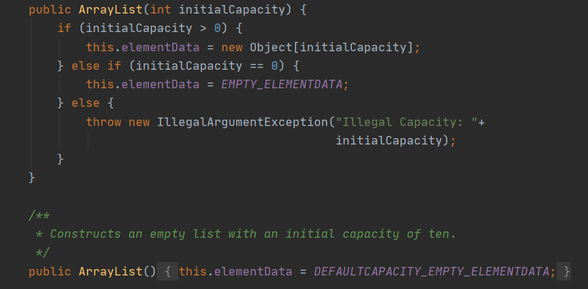
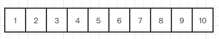
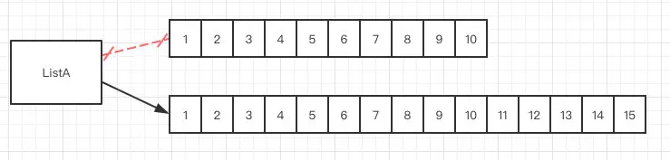
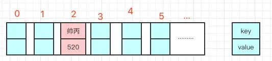

# 1、集合详解

在编程时，可以使用数组来保存多个对象，但数组长度不可变化，一旦在初始化数组时指定了数组长度，这个数组长度就是不可变的。如果需要保存数量变化的数据，数组就有点无能为力了。而且数组无法保存具有映射关系的数据，如成绩表为语文——79，数学——80，这种数据看上去像两个数组，但这两个数组的元素之间有一定的关联关系。

为了保存数量不确定的数据，以及保存具有映射关系的数据（也被称为关联数组），Java 提供了集合类。==集合类主要负责保存、盛装其他数据，因此集合类也被称为容器类。==Java 所有的集合类都位于 java.util 包下，提供了一个表示和操作对象集合的统一构架，包含大量集合接口，以及这些接口的实现类和操作它们的算法。

集合类和数组不一样，数组元素既可以是基本类型的值，也可以是对象（实际上保存的是对象的引用变量），而集合里只能保存对象（实际上只是保存对象的引用变量，但通常习惯上认为集合里保存的是对象）。

Java 集合类型分为 Collection 和 Map，它们是 Java 集合的根接口，这两个接口又包含了一些子接口或实现类。

<div align="center">
    
</div>

<div align="center">
    
</div>

黄色块为集合的接口，蓝色块为集合的实现类。

| 接口名称        | 作  用                                                       |
| --------------- | ------------------------------------------------------------ |
| Iterator 接口   | 集合的输出接口，主要用于遍历输出（即迭代访问）Collection 集合中的元素，Iterator 对象被称之为迭代器。迭代器接口是集合接口的父接口，实现类实现 Collection 时就必须实现 Iterator 接口。 |
| Collection 接口 | 是 List、Set 和 Queue 的父接口，是存放一组单值的最大接口。所谓的单值是指集合中的每个元素都是一个对象。一般很少直接使用此接口直接操作。 |
| Queue 接口      | Queue 是 Java 提供的队列实现，有点类似于 List。              |
| Dueue 接口      | 是 Queue 的一个子接口，为双向队列。                          |
| List 接口       | 是最常用的接口。是有序集合，允许有相同的元素。使用 List 能够精确地控制每个元素插入的位置，用户能够使用索引（元素在 List 中的位置，类似于数组下标）来访问 List 中的元素，与数组类似。 |
| Set 接口        | 不能包含重复的元素。                                         |
| Map 接口        | 是存放一对值的最大接口，即接口中的每个元素都是一对，以 key➡value 的形式保存。 |

对于 Set、List、Queue 和 Map 这 4 种集合，Java 最常用的实现类分别是 HashSet、TreeSet、ArrayList、ArrayDueue、LinkedList 和 HashMap、TreeMap 等。

| 类名称     | 作用                                                         |
| ---------- | ------------------------------------------------------------ |
| HashSet    | 为优化査询速度而设计的 Set。它是基于 HashMap 实现的，HashSet 底层使用 HashMap 来保存所有元素，实现比较简单 |
| TreeSet    | 实现了 Set 接口，是一个有序的 Set，这样就能从 Set 里面提取一个有序序列 |
| ArrayList  | 一个用数组实现的 List，能进行快速的随机访问，效率高而且实现了可变大小的数组 |
| ArrayDueue | 是一个基于数组实现的双端队列，按“先进先出”的方式操作集合元素 |
| LinkedList | 对顺序访问进行了优化，但随机访问的速度相对较慢。此外它还有 addFirst()、addLast()、getFirst()、getLast()、removeFirst() 和 removeLast() 等方法，能把它当成栈（Stack）或队列（Queue）来用 |
| HsahMap    | 按哈希算法来存取键对象                                       |
| TreeMap    | 可以对键对象进行排序                                         |


# 9.2、Collection 接口

==Collection 接口是 List、Set 和 Queue 接口的父接口，通常情况下不被直接使用。==Collection 接口定义了一些通用的方法，通过这些方法可以实现对集合的基本操作。定义的方法既可用于操作 Set 集合，也可用于操作 List 和 Queue 集合。

Collection接口的常用方法

| 方法名称                          | 说明                                                         |
| --------------------------------- | ------------------------------------------------------------ |
| boolean add(E e)                  | 向集合中添加一个元素，如果集合对象被添加操作改变了，则返回 true。E 是元素的数据类型 |
| boolean addAll(Collection c)      | 向集合中添加集合 c 中的所有元素，如果集合对象被添加操作改变了，则返回 true。 |
| void clear()                      | 清除集合中的所有元素，将集合长度变为 0。                     |
| boolean contains(Object o)        | 判断集合中是否存在指定元素                                   |
| boolean containsAll(Collection c) | 判断集合中是否包含集合 c 中的所有元素                        |
| boolean isEmpty()                 | 判断集合是否为空                                             |
| Iterator<E>iterator()             | 返回一个 Iterator 对象，用于遍历集合中的元素                 |
| boolean remove(Object o)          | 从集合中删除一个指定元素，当集合中包含了一个或多个元素 o 时，该方法只删除第一个符合条件的元素，该方法将返回 true。 |
| boolean removeAll(Collection c)   | 从集合中删除所有在集合 c 中出现的元素（相当于把调用该方法的集合减去集合 c）。如果该操作改变了调用该方法的集合，则该方法返回 true。 |
| boolean retainAll(Collection c)   | 从集合中删除集合 c 里不包含的元素（相当于把调用该方法的集合变成该集合和集合 c 的交集），如果该操作改变了调用该方法的集合，则该方法返回 true。 |
| int size()                        | 返回集合中元素的个数                                         |
| Object[] toArray()                | 把集合转换为一个数组，所有的集合元素变成对应的数组元素。     |

本案例将编写一个简单的程序，演示如何使用 Collection 接口向集合中添加方法。具体实现代码如下：

```java
public static void main(String[] args) {
    ArrayList list1 = new ArrayList(); // 创建集合 list1
    ArrayList list2 = new ArrayList(); // 创建集合 list2
    list1.add("one"); // 向 list1 添加一个元素
    list1.add("two"); // 向 list1 添加一个元素
    list2.addAll(list1); // 将 list1 的所有元素添加到 list2
    list2.add("three"); // 向 list2 添加一个元素
    System.out.println("list2 集合中的元素如下：");
    Iterator it1 = list2.iterator();
    while (it1.hasNext()) {
        System.out.print(it1.next() + "、");
    }
}
```

由于 Collection 是接口，不能对其实例化，所以上述代码中使用了 Collection 接口的 ArrayList 实现类来调用 Collection 的方法。add() 方法可以向 Collection 中添加一个元素，而调用 addAll() 方法可以将指定 Collection 中的所有元素添加到另一个 Collection 中。

代码创建了两个集合 list1 和 list2，然后调用 add() 方法向 list1 中添加了两个元素，再调用 addAll() 方法将这两个元素添加到 list2 中。接下来又向 list2 中添加了一个元素，最后输出 list2 集合中的所有元素，结果如下：

```
list2 集合中的元素如下：
one、two、three、
```

创建一个案例，演示 Collection 集合中 size()、remove() 和 removeAll() 方法的应用。具体代码如下：

```java
public static void main(String[] args) {
    ArrayList list1 = new ArrayList(); // 创建集合 list1
    ArrayList list2 = new ArrayList(); // 创建集合 list2
    list1.add("one");
    list1.add("two");
    list1.add("three");
    System.out.println("list1 集合中的元素数量：" + list1.size()); // 输出list1中的元素数量
    list2.add("two");
    list2.add("four");
    list2.add("six");
    System.out.println("list2 集合中的元素数量：" + list2.size()); // 输出list2中的元素数量
    list2.remove(2); // 删除第 3 个元素
    System.out.println("\nremoveAll() 方法之后 list2 集合中的元素数量：" + list2.size());
    System.out.println("list2 集合中的元素如下：");
    Iterator it1 = list2.iterator();
    while (it1.hasNext()) {
        System.out.print(it1.next() + "、");
    }
    list1.removeAll(list2);
    System.out.println("\nremoveAll() 方法之后 list1 集合中的元素数量：" + list1.size());
    System.out.println("list1 集合中的元素如下：");
    Iterator it2 = list1.iterator();
    while (it2.hasNext()) {
        System.out.print(it2.next() + "、");
    }
}
```

list2 集合在调用 remove(2) 方法删除第 3 个元素之后剩下了 two 和 four。list1.removeAll(list2) 语句会从 list1 中将 list1 和 list2 中相同的元素删除，即删除 two 元素。最后输出结果如下：

```
list1 集合中的元素数量：3
list2 集合中的元素数量：3

removeAll() 方法之后 list2 集合中的元素数量：2
list2 集合中的元素如下：
two、four、
removeAll() 方法之后 list1 集合中的元素数量：2
list1 集合中的元素如下：
one、three、
```

==注意：retainAll( ) 方法的作用与 removeAll( ) 方法相反，即保留两个集合中相同的元素，其他全部删除。==


# 9.3、List集合

List 是一个==有序、可重复的集合，==集合中每个元素都有其对应的顺序索引。List 集合允许使用重复元素，可以通过索引来访问指定位置的集合元素。List 集合默认按元素的添加顺序设置元素的索引，第一个添加到 List 集合中的元素的索引为 0，第二个为 1，依此类推。

List ==实现了 Collection 接口，==它主要有两个常用的实现类：==ArrayList 类和 LinkedList 类。==


数组和 List 转换

- List 转换为数组：

	> 调用 ArrayList的 toArray() 方法

- 数组转换为 List：

	> 调用 Arrays 的 asList() 方法


### 9.3.1、ArrayList 类

==ArrayList 类实现了可变数组的大小，==存储在内的数据称为元素。它还==提供了快速基于索引访问元素的方式，对尾部成员的增加和删除支持较好。==使用 ArrayList 创建的集合，允许对集合中的元素进行快速的随机访问，不过，向 ArrayList 中插入与删除元素的速度相对较慢。

特点：查询效率高，增删效率低，线程不安全。使用频率很高。

ArrayList 类的常用构造方法有如下两种重载形式：

- ArrayList()：构造一个的空列表。
- ArrayList(Collection<?extends E>c)：构造一个包含指定 Collection 元素的列表，这些元素是按照该 Collection 的迭代器返回它们的顺序排列的。

ArrayList 类除了包含 Collection 接口中的所有方法之外，还包括 List 接口中提供的如下表所示的方法。

| 方法名称                                    | 说明                                                         |
| ------------------------------------------- | ------------------------------------------------------------ |
| E get(int index)                            | 获取此集合中指定索引位置的元素，E 为集合中元素的数据类型     |
| int indexOf(Object o)                       | 返回此集合中第一次出现指定元素的索引，如果此集合不包含该元 素，则返回 -1 |
| int lastIndexOf(Object o)                   | 返回此集合中最后一次出现指定元素的索引，如果此集合不包含该 元素，则返回 -1 |
| E set(int index, Eelement)                  | 将此集合中指定索引位置的元素修改为 element 参数指定的对象。 此方法返回此集合中指定索引位置的原元素 |
| List<E> subList(int fromlndex, int tolndex) | 返回一个新的集合，新集合中包含 fromlndex 和 tolndex 索引之间 的所有元素。包含 fromlndex 处的元素，不包含 tolndex 索引处的 元素 |

注意：当调用 List 的 set(int index, Object element) 方法来改变 List 集合指定索引处的元素时，指定的索引必须是 List 集合的有效索引。例如集合长度为 4，就不能指定替换索引为 4 处的元素，也就是说这个方法不会改变 List 集合的长度。


#### 底层实现

ArrayList的主要底层实现是数组Object[] elementData，可以通过构造方法在初始化的时候指定底层数组的大小。

通过无参构造方法的方式ArrayList()初始化，则赋值底层数Object[] elementData为一个默认空数组Object[] DEFAULTCAPACITY_EMPTY_ELEMENTDATA = {}所以数组容量为0，只有真正对数据进行添加add时，才分配默认DEFAULT_CAPACITY = 10的初始容量。但是这个这时候用size()方法获得的长度还是0，size()方法指的是“逻辑”长度。
所谓“逻辑”长度，是指内存已存在的“实际元素的长度” 而“空元素不被计算”，即：当利用add()方法，向ArrayList内添加一个“元素”时，逻辑长度就增加1位。 而剩下的9个空元素不被计算。

如下是ArrayList的无参构造器和有参构造器，无参是默认大小，有参会判断参数：




#### 扩容

就比如现在有一个长度为10的数组，现在我们要新增一个元素，发现已经满了：

<div align="center">
    
</div>

ArrayList首先会重新定义一个长度为10+10/2的数组也就是新增一个长度为15的数组（扩容为原容量的1.5倍）。


然后把原数组的数据，原封不动的复制到新数组中，这个时候再把指向原数的地址换到新数组，ArrayList就这样完成了一次改头换面。



ArrayList1.7和1.8版本初始化的时候的区别：arrayList1.7开始变化有点大，初始化的时候，1.7以前会调用this(10)才是真正的容量为10，1.7即本身以后是默认走了空数组，只有第一次add的时候容量会变成10。

为什么是10：日常开发中涉及到分页查询一般查询为 10条数据（我觉得）。


#### 增删

ArrayList 有指定 index 新增，也有直接新增的，在这之前他会有一步校验长度的判断 **ensureCapacityInternal**，就是说如果长度不够，是需要扩容的。


在扩容的时候，老版本的jdk和8以后的版本是有区别的，8之后的效率更高了，采用了位运算，**右移**一位，其实就是除以2这个操作。1.7的时候3/2+1 ，1.8直接就是3/2。


指定位置新增的时候，在校验之后的操作很简单，就是数组的copy。


比如有下面这样一个数组需要在index 5的位置去新增一个元素A。


从代码里面可以看到，他复制了一个数组，是从index 5的位置开始的，然后把它放在了index 5+1的位置。


给要新增的元素腾出了位置，然后在index的位置放入元素A就完成了新增的操作了。


为啥效率低，这只是在一个这么小的List里面操作，要是我去一个几百几千几万大小的List新增一个元素，那就需要后面所有的元素都复制，然后如果再涉及到扩容啥的就更慢了。


删除其实跟新增是一样的，不过叫是叫删除，但是在代码里面发现，他还是在copy一个数组。


继续打个比方，现在要删除下面这个数组中的index5这个位置，那代码他就复制一个index5+1开始到最后的数组，然后把它放到index开始的位置，index5的位置就成功被”删除“了其实就是被覆盖了，给了你被删除的感觉。同理他的效率也低，因为数组如果很大的话，一样需要复制和移动的位置就大了。

==删除速度取决于删除的元素离数组末端有多远，ArrayList 拿来作为堆栈来用还是挺合适的，push 和 pop 操作完全不涉及数据移动操作。==

---

==ArrayList不适合作为队列使用==

队列一般是FIFO（先入先出）的，如果用 ArrayList 做队列，就需要在数组尾部追加数据，数组头部删除数组，反过来也可以。但是无论如何总会有一个操作会涉及到数组的数据搬迁，这个是比较耗费性能的。所以不适合！

先进先出和后进先出：

栈的概念是弹压，就像子弹壳装弹，一粒一粒压进去，但是打出来的时候是从上面打出来的，最先压进去的最道后弹出来，如果进去顺序是123，打出来顺序是321，这就是后进先出。

队列的概内念就是我们平时排队，按次序来，你排在第1个，那你就第一个轮到，这就是先进先出。


#### 初始化

==ArrayList（int initialCapacity）会初始化数组大小！==但是List的大小没有变，因为list的大小是返回size的！而且将构造函数与initialCapacity结合使用，然后使用set()会抛出异常，尽管该数组已创建，但是大小设置不正确。使用sureCapacity()也不起作用，因为它基于elementData数组而不是大小。


#### 线程安全

ArrayList 不是线程安全的，线程安全版本的数组容器是 Vector。

Vector 的实现很简单，就是把所有的方法统统加上 synchronized 就完事了。

也可以不使用 Vector，用 Collections.synchronizedList 把一个普通 ArrayList 包装成一个线程安全版本的数组容器也可以，原理同 Vector 是一样的，就是给所有的方法套上一层 synchronized。


### 9.3.2、LinkedList类

==LinkedList 类采用链表结构保存对象，==这种结构的优点是==便于向集合中插入或者删除元素。==需要频繁向集合中插入和删除元素时，使用 LinkedList 类比 ArrayList 类效果高，但是 LinkedList 类随机访问元素的速度则相对较慢。这里的随机访问是指检索集合中特定索引位置的元素。

LinkedList 类除了包含 Collection 接口和 List 接口中的所有方法之外，还特别提供了下表所示的方法。

| 方法名称           | 说明                         |
| ------------------ | ---------------------------- |
| void addFirst(E e) | 将指定元素添加到此集合的开头 |
| void addLast(E e)  | 将指定元素添加到此集合的末尾 |
| E getFirst()       | 返回此集合的第一个元素       |
| E getLast()        | 返回此集合的最后一个元素     |
| E removeFirst()    | 删除此集合中的第一个元素     |
| E removeLast()     | 删除此集合中的最后一个元素   |

---

**ArrayList 类和 LinkedList 类的区别**

ArrayList 与 LinkedList 都是 List 接口的实现类，因此都实现了 List 的所有未实现的方法，只是实现的方式有所不同。

ArrayList 是基于动态数组数据结构的实现，访问元素速度优于 LinkedList。LinkedList 是基于链表数据结构的实现，占用的内存空间比较大，但在批量插入或删除数据时优于 ArrayList。

对于快速访问对象的需求，使用 ArrayList 实现执行效率上会比较好。需要频繁向集合中插入和删除元素时，使用 LinkedList 类比 ArrayList 类效果高。

不同的结构对应于不同的算法，有的考虑节省占用空间，有的考虑提高运行效率，对于程序员而言，它们就像是“熊掌”和“鱼肉”，不可兼得。高运行速度往往是以牺牲空间为代价的，而节省占用空间往往是以牺牲运行速度为代价的。


# 9.4、Set集合

Set 集合类似于一个罐子，程序可以依次把多个对象“丢进”Set 集合，而 Set 集合通常不能记住元素的添加顺序。也就是说 ==Set 集合中的对象不按特定的方式排序，==只是简单地把对象加入集合。==Set 集合中不能包含重复的对象，=并且最多只允许包含一个 null 元素。

Set 实现了 Collection 接口，它主要有两个常用的实现类：HashSet 类和 TreeSet类。

### 9.4.1、HashSet 类

==HashSet 是 Set 接口的典型实现，==大多数时候使用 Set 集合时就是使用这个实现类。HashSet 是按照 Hash 算法来存储集合中的元素。因此==具有很好的存取和查找性能。==

HashSet 具有以下特点：

- 不能保证元素的排列顺序，顺序可能与添加顺序不同，顺序也有可能发生变化。
- HashSet 不是同步的，如果多个线程同时访问或修改一个 HashSet，则必须通过代码来保证其同步。
- 集合元素值可以是 null。

HashSet 实际上是一个 HashMap 实例，都是一个存放链表的数组。它不保证存储元素的迭代顺序；此类允许使用 null 元素。HashSet 中不允许有重复元素，这是因为 HashSet 是基于 HashMap 实现的，HashSet 中的元素都存放在 HashMap 的 key 上面，而 value 中的值都是统一的一个固定对象`private static final Object PRESENT = new Object()`。

HashSet 中 add 方法调用的是底层 HashMap 中的 put() 方法，而如果是在 HashMap 中调用 put，首先会判断 key 是否存在，如果 key 存在则修改value 值，如果 key 不存在这插入这个 key-value。而在 set 中，因为 value 值没有用，也就不存在修改 value 值的说法，因此往 HashSet 中添加元素，首先判断元素（也就是 key）是否存在，如果不存在则插入，如果存在则不插入，这样 HashSet 中就不存在重复值。

在 HashSet 类中实现了 Collection 接口中的所有方法。HashSet 类的常用构造方法重载形式如下。

- HashSet()：构造一个新的空的 Set 集合。
- HashSet(Collection<? extends E>c)：构造一个包含指定 Collection 集合元素的新 Set 集合。其中，“< >”中的 extends 表示 HashSet 的父类，即指明该 Set 集合中存放的集合元素类型。c 表示其中的元素将被存放在此 Set 集合中。

下面的代码演示了创建两种不同形式的 HashSet 对象。

```java
HashSet hs = new HashSet();    // 调用无参的构造函数创建HashSet对象
HashSet<String> hss = new HashSet<String>();    // 创建泛型的 HashSet 集合对象
```


### 9.4.2、TreeSet 类

==TreeSet 类同时实现了 Set 接口和 SortedSet 接口。SortedSet 接口是 Set 接口的子接口，可以实现对集合进行自然排序，==因此使用 TreeSet 类实现的 Set 接口默认情况下是自然排序的，这里的自然排序指的是升序排序。

==TreeSet 只能对实现了 Comparable 接口的类对象进行排序，==因为 Comparable 接口中有一个 compareTo(Object o) 方法用于比较两个对象的大小。例如 a.compareTo(b)，如果 a 和 b 相等，则该方法返回 0；如果 a 大于 b，则该方法返回大于 0 的值；如果 a 小于 b，则该方法返回小于 0 的值。

下表列举了 JDK 类库中实现 Comparable 接口的类，以及这些类对象的比较方式。

| 类                                                           | 比较方式                                  |
| ------------------------------------------------------------ | ----------------------------------------- |
| 包装类（BigDecimal、Biglnteger、 Byte、Double、 Float、Integer、Long 及 Short) | 按数字大小比较                            |
| Character                                                    | 按字符的 Unicode 值的数字大小比较         |
| String                                                       | 按字符串中字符的 Unicode 值的数字大小比较 |

TreeSet 类除了实现 Collection 接口的所有方法之外，还提供了下表所示的方法。

| 方法名称                                       | 说明                                                         |
| ---------------------------------------------- | ------------------------------------------------------------ |
| E first()                                      | 返回此集合中的第一个元素。其中，E 表示集合中元素的数据类型   |
| E last()                                       | 返回此集合中的最后一个元素                                   |
| E poolFirst()                                  | 获取并移除此集合中的第一个元素                               |
| E poolLast()                                   | 获取并移除此集合中的最后一个元素                             |
| SortedSet<E> subSet(E fromElement,E toElement) | 返回一个新的集合，新集合包含原集合中 fromElement 对象与 toElement 对象之间的所有对象。包含 fromElement 对象，不包含 toElement 对象 |
| SortedSet<E> headSet<E toElement〉             | 返回一个新的集合，新集合包含原集合中 toElement 对象之前的所有对象。 不包含 toElement 对象 |
| SortedSet<E> tailSet(E fromElement)            | 返回一个新的集合，新集合包含原集合中 fromElement 对象之后的所有对 象。包含 fromElement 对象 |

注意：表面上看起来这些方法很多，其实很简单。因为 TreeSet 中的元素是有序的，所以增加了访问第一个、前一个、后一个、最后一个元素的方法，并提供了 3 个从 TreeSet 中截取子 TreeSet 的方法。

注意：==在使用自然排序时只能向 TreeSet 集合中添加相同数据类型的对象，否则会抛出 ClassCastException 异常。==如果向 TreeSet 集合中添加了一个 Double 类型的对象，则后面只能添加 Double 对象，不能再添加其他类型的对象，例如 String 对象等。


# 9.5、Map集合

==Map 是一种键-值对（key-value）集合，==Map 集合中的每一个元素都包含一个键（key）对象和一个值（value）对象。==用于保存具有映射关系的数据。==

Map 集合里保存着两组值，一组值用于保存 Map 里的 key，另外一组值用于保存 Map 里的 value，==key 和 value 都可以是任何引用类型的数据。==Map 的 key 不允许重复，value 可以重复，即同一个 Map 对象的任何两个 key 通过 equals 方法比较总是返回 false。

Map 中的 key 和 value 之间存在单向一对一关系，即通过指定的 key，总能找到唯一的、确定的 value。从 Map 中取出数据时，只要给出指定的 key，就可以取出对应的 value。

==HashMap 类和 TreeMap 类都是 Map 接口的实现类。其中，HashMap 类按哈希算法来存取键对象，而 TreeMap 类可以对键对象进行排序。==

Map接口的常用方法

| 方法名称                                       | 说明                                                         |
| ---------------------------------------------- | ------------------------------------------------------------ |
| void clear()                                   | 删除该 Map 对象中的所有 key-value 对。                       |
| boolean containsKey(Object key)                | 查询 Map 中是否包含指定的 key，如果包含则返回 true。         |
| boolean containsValue(Object value)            | 查询 Map 中是否包含一个或多个 value，如果包含则返回 true。   |
| V get(Object key)                              | 返回 Map 集合中指定键对象所对应的值。V 表示值的数据类型      |
| V put(K key, V value)                          | 向 Map 集合中添加键-值对，如果当前 Map 中已有一个与该 key 相等的 key-value 对，则新的 key-value 对会覆盖原来的 key-value 对。 |
| void putAll(Map m)                             | 将指定 Map 中的 key-value 对复制到本 Map 中。                |
| V remove(Object key)                           | 从 Map 集合中删除 key 对应的键-值对，返回 key 对应的 value，如果该 key 不存在，则返回 null |
| boolean remove(Object key, Object value)       | 这是 Java 8 新增的方法，删除指定 key、value 所对应的 key-value 对。如果从该 Map 中成功地删除该 key-value 对，该方法返回 true，否则返回 false。 |
| Set entrySet()                                 | 返回 Map 集合中所有键-值对的 Set 集合，此 Set 集合中元素的数据类型为 Map.Entry |
| Set keySet()                                   | 返回 Map 集合中所有键对象的 Set 集合                         |
| boolean isEmpty()                              | 查询该 Map 是否为空（即不包含任何 key-value 对），如果为空则返回 true。 |
| int size()                                     | 返回该 Map 里 key-value 对的个数                             |
| Collection values()                            | 返回该 Map 里所有 value 组成的 Collection                    |
| void forEach(BiConsumer action)                | 该方法是 Java 8 为 Map 新增的一个遍历 key-value 对的方法，通过该方法可以更简洁地遍历 Map 的 key-value 对。 |
| Object replace(Object key, Object value)       | 将 Map 中指定 key 对应的 value 替换成新 value。与传统 put() 方法不同的是，该方法不可能添加新的 key-value 对。如果尝试替换的 key 在原 Map 中不存在，该方法不会添加 key-value 对，而是返回 null。 |
| boolean replace(K key, V oldValue, V newValue) | 将 Map 中指定 key-value 对的原 value 替换成新 value。如果在 Map 中找到指定的 key-value 对，则执行替换并返回 true，否则返回 false。 |

==TreeMap 类的使用方法与 HashMap 类相同，唯一不同的是 TreeMap 类可以对键对象进行排序。==


### 9.5.1、HashMap

#### 底层结构

HashMap 由**数组和链表组合构成**的数据结构。大概如下，数组里面每个地方都存了 Key-Value 这样的实例，在 Java7 叫 Entry 在 Java8 中叫 Node。


因为他本身所有的位置都为 null，在 put 插入的时候会根据 key 的 hash 去计算一个 index 值。就比如 put("帅丙"，520)，插入了为 "帅丙" 的元素，这个时候会通过哈希函数计算出插入的位置，计算出来 index 是 2 那结果如下。



但是由于哈希本身就存在概率性，比如 ”帅丙“ 和 ”丙帅“ 去 hash 有一定的概率会一样，就像上面的情况再次哈希 ”丙帅“ 极端情况也会 hash 到一个值上，那就形成了链表。


每一个节点都会保存自身的 hash、key、value 以及下个节点，Node 的源码。


#### 插入和扩容

==Java8 之前是头插法==，就是说新来的值会取代原有的值，原有的值就顺推到链表中去，就像上面的例子一样，因为写这个代码的作者认为后来的值被查找的可能性更大一点，提升查找的效率。但是，在 ==Java 8 之后，都是所用尾部插入了。==

因为数组容量是有限的，数据多次插入的，到达一定的数量就会进行扩容，也就是 resize。

resize 有两个因素：

1. Capacity：HashMap 的当前长度。

2. LoadFactor：负载因子，默认值为 0.75f。

	> 比如当前的容量大小为 100，当你存进第 76 个的时候，判断发现需要进行 resize 了，那就进行扩容。
	>
	> JDK 1.7 之前是先插入再扩容，JDK 1.8 是先扩容再插入。

扩容分为两步：

- 扩容：创建一个新的 Entry 空数组，长度是原数组的 2 倍。

- ReHash：遍历原 Entry 数组，把所有的 Entry 重新 Hash 到新数组。

	> Hash的公式 ==>`index = HashCode(Key) & (Length - 1)`
	>
	> 由于长度扩大以后，Hash的规则也随之改变，所以需要重新 Hash 而不是直接复制过去。
	>
	> JDK 1.8 不需要重复 Hash，通过计算 `e.hash & oldCap`的值是否为 0，为 0 表示扩容之后位置未变，不为 0 表示扩容之后位置已改变，新位置 = 旧位置 + 旧数组长度

扩容前：


扩容后：


现在要在容量为 2 的容器里面**用不同线程**插入 A，B，C，假如在 resize 之前打个短点，那意味着数据都插入了但是还没 resize，那扩容前可能是这样的：我们可以看到链表的指向 A => B => C（A 的下一个指针是指向 B 的）


因为 resize 的赋值方式，也就是使用了单链表的头插入方式，同一位置上新元素总会被放在链表的头部位置，在旧数组中同一条 Entry 链上的元素，通过重新计算索引位置后，有可能被放到了新数组的不同位置上。就可能出现下面的情况：B 的下一个指针指向了 A


一旦几个线程都调整完成，就可能出现环形链表


如果这个时候去取值，悲剧就出现了——Infinite Loop（无限循环）。

> ==Java 8 之后链表有红黑树==的部分（当链表的长度超过8的时候，链表会转换为红黑树），红黑树的引入巧妙的将原本 O(n) 的时间复杂度降低到了O(logn)。
>
> 根据泊松分布，在负载因子默认为 0.75 的时候，单个 hash 槽内元素个数为 8 的概率小于百万分之一，所以将 7 作为一个分水岭，等于 7 的时候不转换，大于等于 8 的时候才进行转换，小于等于 6 的时候就化为链表。

**使用头插**会改变链表的上的顺序，但是如果使用尾插，在扩容时会保持链表元素原本的顺序，就不会出现链表成环的问题了。就是说原本是 A => B，在扩容后那个链表还是 A => B：


Java 7 在多线程操作 HashMap 时可能引起死循环，原因是扩容转移后前后链表顺序倒置，在转移过程中修改了原来链表中节点的引用关系。

Java 8 在同样的前提下并不会引起死循环，原因是扩容转移后前后链表顺序不变，保持之前节点的引用关系。

但是即使不会出现死循环，通过源码看到 put / get 方法都没有加同步锁，多线程情况最容易出现的就是：无法保证上一秒 put 的值，下一秒 get 的时候还是原值，所以线程安全还是无法保证。


#### 初始长度

HashMap 的默认初始化长度为什么是 16，这样是为了位运算的方便，**位与运算比算数计算的效率高了很多**，之所以选择 16，是为了服务将 Key 映射到 index 的算法。所有的 key 都会拿到他的 hash，为了尽可能的得到一个均匀分布的 hash，会通过 Key 的 HashCode 值去做位运算。

打个比方，key 为 "帅丙" 的十进制为 766132，那二进制就是 10111011000010110100，index 的计算公式：`index = HashCode(Key) & (Length- 1)`，15 的的二进制是 1111，那 `10111011000010110100 &1111` 十进制就是 4，这样用位与运算效果与取模一样，性能也提高了不少！

同时在使用是 2 的幂的数字的时候，Length-1 的值是所有二进制位全为 1，这种情况下，index 的结果等同于 HashCode 后几位的值。只要输入的HashCode 本身分布均匀，Hash 算法的结果就是均匀的。这是为了实现均匀分布！


#### 线程安全

HashMap 是线程不安全的，一般都会使用 `Collections.synchronizedMap(Map)` 创建线程安全的map集合、`HashTable` 或者 `ConcurrentHashMap`，但是因为 Hashtable 的**并发度**的原因基本上没啥使用场景了，所以存在线程不安全的场景使用的是 ConcurrentHashMap。

HashTable 的源码，很简单粗暴，直接在方法上锁，并发度很低，最多同时允许一个线程访问，ConcurrentHashMap 就好很多了，1.7 和 1.8 有较大的不同，不过并发度都比前者好太多了。

---

**SynchronizedMap**

SynchronizedMap 内部维护了一个普通对象 Map，还有排斥锁 mutex:

```java
private final Map<K,V> m;     // Backing Map
final Object      mutex;        // Object on which to synchronize

SynchronizedMap(Map<K,V> m) {
    this.m = Objects.requireNonNull(m);
    mutex = this;
}
SynchronizedMap(Map<K,V> m, Object mutex) {
    this.m = m;
    this.mutex = mutex;
}
```

在调用这个方法的时候就需要传入一个 Map，可以看到有两个构造器，如果传入了 mutex 参数，则将对象排斥锁赋值为传入的对象。如果没有，则将对象排斥锁赋值为 this，即调用 synchronizedMap 的对象，就是上面的Map。

创建出 synchronizedMap 之后，再操作 map 的时候，就会对方法上锁，源码上全是🔐

```java
public int size() {
    synchronized (mutex) {return m.size();}
}
public boolean isEmpty() {
    synchronized (mutex) {return m.isEmpty();}
}
public boolean containsKey(Object key) {
    synchronized (mutex) {return m.containsKey(key);}
}
public boolean containsValue(Object value) {
    synchronized (mutex) {return m.containsValue(value);}
}
public V get(Object key) {
    synchronized (mutex) {return m.get(key);}
}
public V put(K key, V value) {
    synchronized (mutex) {return m.put(key, value);}
}
public V remove(Object key) {
    synchronized (mutex) {return m.remove(key);}
}
public void putAll(Map<? extends K, ? extends V> map) {
    synchronized (mutex) {m.putAll(map);}
}
public void clear() {
    synchronized (mutex) {m.clear();}
}
```


### 9.5.2、Hashtable

Hashtable 和 HashMap 很像，下面概述一下不同点：

跟 HashMap 相比 Hashtable 是线程安全的，适合在多线程的情况下使用，因为 Hashtable 在对数据进行操作的时候都会上锁，所以效率不太乐观。

```java
public synchronized V get(Object key) {
    Entry<?,?> tab[] = table;
    int hash = key.hashCode();
    int index = (hash & 0x7FFFFFFF) % tab.length;
    for (Entry<?,?> e = tab[index] ; e != null ; e = e.next) {
        if ((e.hash == hash) && e.key.equals(key)) {
            return (V)e.value;
        }
    }
    return null;
}
```

大部分都是直接使用 `synchronized` 上锁...

---

Hashtable 不允许键或值为 null ，HashMap 的键值则都可以为 null。因为 HashMap 却做了特殊处理：

```java
static final int hash(Object key) {
    int h;
    return (key == null) ? 0 : (h = key.hashCode()) ^ (h >>> 16);
}
```

Hashtable 则在 put 空值的时候会直接抛空指针异常。

```java
public synchronized V put(K key, V value) {
    // 如果 value 为空，直接抛出空指针异常
    if (value == null) {
        throw new NullPointerException();
    }

    // Makes sure the key is not already in the hashtable.
    Entry<?,?> tab[] = table;
    // 如果 key 为空，执行 hashCode() 方法会抛出空指针异常
    int hash = key.hashCode();
    int index = (hash & 0x7FFFFFFF) % tab.length;
    @SuppressWarnings("unchecked")
    Entry<K,V> entry = (Entry<K,V>)tab[index];
    for(; entry != null ; entry = entry.next) {
        if ((entry.hash == hash) && entry.key.equals(key)) {
            V old = entry.value;
            entry.value = value;
            return old;
        }
    }

    addEntry(hash, key, value, index);
    return null;
}
```

如果使用 null 值，当通过 get(key) 获取对应的 value 时，如果获取到的是 null 时，无法判断它是 put（k,v）的时候 value 为 null，还是这个 key 从来没有做过映射。HashMap是非并发的，可以通过 contains(key) 来做这个判断。而支持并发的 Map 在调用 m.contains（key）和 m.get(key) ，m 可能已经不同了（ConcurrentHashMap 同理）。

---

Hashtable 可以使用 Enumeration 和 Iterator 遍历，HashMap 只可以用 Iterator。

提一嘴：Enumeration 使用了==安全失败机制（fail-safe）==。

采用安全失败机制的集合容器，在遍历时不是直接在集合内容上访问的，而是先 copy 原有集合内容，在拷贝的集合上进行遍历。

- 原理：由于迭代时是对原集合的拷贝的值进行遍历，所以在遍历过程中对原集合所做的修改并不能被迭代器检测到，所以不会触发`ConcurrentModificationException`
- 缺点：基于拷贝内容的优点是避免了`ConcurrentModificationException`，但同样的，迭代器并不能访问到修改后的内容（简单的来说就是迭代器遍历的是开始遍历那一刻拿到的集合拷贝，在遍历期间原集合发生的修改迭代器是不知道的）。

> java.util.concurrent 包下的容器都是安全失败，可以在多线程下并发使用，并发修改。

---

Hashtable 继承了 Dictionary 类，而 HashMap 继承的是 AbstractMap 类，Dictionary 是 JDK 1.0 添加的，貌似没人用过这个，我也没用过...

HashMap 的初始容量为：16，Hashtable 初始容量为：11，两者的负载因子默认都是：0.75。

当现有容量大于总容量 * 负载因子时，HashMap 扩容规则为当前容量翻倍（2n），Hashtable 扩容规则为当前容量翻倍 + 1（2n+1）。


### 9.5.3、ConcurrentHashMap

虽然 Hashtable 是线程安全的，但是 get / put 所有相关操作都是 synchronized 的，这相当于给整个哈希表加了一把大锁，多线程中只要有一个线程访问或操作该对象，那其他线程只能阻塞。

ConcurrentHashMap 1.7 和 1.8 版本结构不同，下面分别概述：

#### JDK 1.7

在 JDK1.5~1.7版本，Java使用了==分段锁==技术实现 ConcurrentHashMap，简而言之，ConcurrentHashMap 在对象中保存了一个 Segment 数组，即将整个 Hash 表划分为多个分段；而每个 Segment 元素类似于一个 Hashtable；这样在执行 put 操作时首先根据 hash 算法定位到元素属于哪个Segment，然后对该 Segment 加锁即可。

Segment 是 ConcurrentHashMap 的一个内部类，主要的组成如下：

```java
static final class Segment<K,V> extends ReentrantLock implements Serializable {
    private static final long serialVersionUID = 2249069246763182397L;
    // 和 HashMap 中的 HashEntry 作用一样，真正存放数据的桶
    transient volatile HashEntry<K,V>[] table;
    transient int count;
    // 记得快速失败（fail—fast）么？
    transient int modCount;
    // 大小
    transient int threshold;
    // 负载因子
    final float loadFactor;
}
```

HashEntry 跟 HashMap 中的 Entry 差不多，但是不同点是，他使用 volatile 去修饰了他的数据 Value 还有下一个节点 next。

其中 Segment 继承于 ReentrantLock，不会像 HashTable 那样不管是 put 还是 get 操作都需要做同步处理；理论上 ConcurrentHashMap 支持 CurrencyLevel (Segment 数组数量) 的线程并发；每当一个线程占用锁访问一个 Segment 时，不会影响到其他的 Segment。

就是说如果容量大小是 16 他的并发度就是 16，可以同时允许 16 个线程操作 16 个 Segment 而且还是线程安全的。

---

**put / set 方法**

通过 key 定位到 Segment ，之后在对应的 Segement 中进行具体的的 put。

```java
public V put(K key, V value) {
    Segment<K,V> s;
    if (value == null)
        throw new NullPointerException();
    int hash = hash(key);
    int j = (hash >>> segmentShift) & segmentMask;
    if ((s = (Segment<K,V>)UNSAFE.getObject          // nonvolatile; recheck
         (segments, (j << SSHIFT) + SBASE)) == null) //  in ensureSegment
        s = ensureSegment(j);
    return s.put(key, hash, value, false);
}
```

```java
final V put(K key, int hash, V value, boolean onlyIfAbsent) {
    HashEntry<K,V> node = tryLock() ? null :
    scanAndLockForPut(key, hash, value);
    V oldValue;
    try {
        HashEntry<K,V>[] tab = table;
        int index = (tab.length - 1) & hash;
        HashEntry<K,V> first = entryAt(tab, index);
        for (HashEntry<K,V> e = first;;) {
            if (e != null) {
                K k;
                if ((k = e.key) == key ||
                    (e.hash == hash && key.equals(k))) {
                    oldValue = e.value;
                    if (!onlyIfAbsent) {
                        e.value = value;
                        ++modCount;
                    }
                    break;
                }
                e = e.next;
            }
            else {
                if (node != null)
                    node.setNext(first);
                else
                    node = new HashEntry<K,V>(hash, key, value, first);
                int c = count + 1;
                if (c > threshold && tab.length < MAXIMUM_CAPACITY)
                    rehash(node);
                else
                    setEntryAt(tab, index, node);
                ++modCount;
                count = c;
                oldValue = null;
                break;
            }
        }
    } finally {
        unlock();
    }
    return oldValue;
}

```

虽然 HashEntry 中的 value 是用 volatile 关键词修饰的，但是并不能保证并发的原子性，所以 put 操作时仍然需要加锁处理。

首先会尝试获取锁，如果获取失败肯定就有其他线程存在竞争，则利用 `scanAndLockForPut()` 自旋获取锁。如果重试的次数达到了`MAX_SCAN_RETRIES`则改为阻塞锁获取，保证能成功。然后将当前 Segment 中的 table 通过 key 的 hashcode 定位到 HashEntry。遍历该 HashEntry，如果不为空则判断传入的 key 和当前遍历的 key 是否相等，相等则覆盖旧的 value；不为空则需要新建一个 HashEntry 并加入到 Segment 中，同时会先判断是否需要扩容。最后会解除所获取当前 Segment 的锁。

get 逻辑比较简单：

只需要将 Key 通过 Hash 之后定位到具体的 Segment ，再通过一次 Hash 定位到具体的元素上。由于 HashEntry 中的 value 属性是用 volatile 关键词修饰的，保证了内存可见性，所以每次获取时都是最新值。ConcurrentHashMap 的 get 方法是非常高效的，因为整个过程都不需要加锁。

---

虽然 1.7 中 ConcurrentHashMap 虽然可以支持每个 Segment 并发访问，但是由于数据结构是数组加链表的方式，因此在查询的时候，会导致效率很低，所以在 1.8 中对结构进行了优化。


#### JDK 1.8

在 1.8 中抛弃了原有的 Segment 分段锁，而采用了 `CAS + synchronized` 来保证并发安全性。跟HashMap很像，也把之前的 HashEntry 改成了Node，但是作用不变，把值和 next 采用了 volatile 去修饰，保证了可见性，并且也引入了红黑树，在链表大于一定值的时候会转换（默认是8）。

---

**put / set 方法**

put:

1. 根据 key 计算出 hashcode 。
2. 判断是否需要进行初始化。
3. 即为当前 key 定位出的 Node，如果为空表示当前位置可以写入数据，利用 `CAS` 尝试写入，失败则自旋保证成功。
4. 如果当前位置的 `hashcode == MOVED == -1`,则需要进行扩容。
5. 如果都不满足，则利用 synchronized 锁写入数据。
6. 如果数量大于 `TREEIFY_THRESHOLD` 则要转换为红黑树。

get:

- 根据计算出来的 hashcode 寻址，如果就在桶上那么直接返回值。
- 如果是红黑树那就按照树的方式获取值。
- 就不满足那就按照链表的方式遍历获取值。


# 9.6、Iterator（迭代器）

首先说一下迭代器模式，它是 Java 中常用的设计模式之一。用于顺序访问集合对象的元素，无需知道集合对象的底层实现。Iterator 是可以遍历集合的对象，为各种容器提供了公共的操作接口，隔离对容器的遍历操作和底层实现，从而解耦。缺点是增加新的集合类需要对应增加新的迭代器类，迭代器类与集合类成对增加。

==Iterator（迭代器）==是一个接口，它的作用就是遍历容器的所有元素，也是 Java 集合框架的成员，但它与 Collection 和 Map 系列的集合不一样，Collection 和 Map 系列集合主要用于盛装其他对象，而 Iterator 则主要用于遍历（即迭代访问）Collection 集合中的元素。

Iterator 接口里定义了如下 4 个方法。

- boolean hasNext()：如果被迭代的集合元素还没有被遍历完，则返回 true。
- Object next()：返回集合里的下一个元素。
- void remove()：删除集合里上一次 next 方法返回的元素。
- void forEachRemaining(Consumer action)：这是 Java 8 为 Iterator 新增的默认方法，该方法可使用 Lambda 表达式来遍历集合元素。

下面程序示范了通过 Iterator 接口来遍历集合元素。

```java
import java.util.Collection;
import java.util.HashSet;
import java.util.Iterator;

public class IteratorTest {
    public static void main(String[] args) {
        // 创建一个集合
        Collection objs = new HashSet();
        objs.add("C语言中文网Java教程");
        objs.add("C语言中文网C语言教程");
        objs.add("C语言中文网C++教程");
        // 调用forEach()方法遍历集合
        // 获取books集合对应的迭代器
        Iterator it = objs.iterator();
        while (it.hasNext()) {
            // it.next()方法返回的数据类型是Object类型，因此需要强制类型转换
            String obj = (String) it.next();
            System.out.println(obj);
            if (obj.equals("C语言中文网C语言教程")) {
                // 从集合中删除上一次next()方法返回的元素
                it.remove();
            }
            // 对book变量赋值，不会改变集合元素本身
            obj = "C语言中文网Python语言教程";
        }
        System.out.println(objs);
    }
}
```

从上面代码中可以看出，Iterator 仅用于遍历集合，如果需要创建 Iterator 对象，则必须有一个被迭代的集合。没有集合的 Iterator 没有存在的价值。

注意：Iterator 必须依附于 Collection 对象，若有一个 Iterator 对象，则必然有一个与之关联的 Collection 对象。Iterator 提供了两个方法来迭代访问 Collection 集合里的元素，并可通过 remove() 方法来删除集合中上一次 next() 方法返回的集合元素。

上面程序中第 24 行代码对迭代变量 obj 进行赋值，但当再次输岀 objs 集合时，会看到集合里的元素没有任何改变。所以当使用 Iterator 对集合元素进行迭代时，Iterator 并不是把集合元素本身传给了迭代变量，而是把集合元素的值传给了迭代变量，所以修改迭代变量的值对集合元素本身没有任何影响。

当使用 Iterator 迭代访问 Collection 集合元素时，Collection 集合里的元素不能被改变，只有通过 Iterator 的 remove() 方法删除上一次 next() 方法返回的集合元素才可以，否则将会引发“java.util.ConcurrentModificationException”异常。下面程序示范了这一点。

```java
public class IteratorErrorTest {
    public static void main(String[] args) {
        // 创建一个集合
        Collection objs = new HashSet();
        objs.add("C语言中文网Java教程");
        objs.add("C语言中文网C语言教程");
        objs.add("C语言中文网C++教程");
        // 获取books集合对应的迭代器
        Iterator it = objs.iterator();
        while (it.hasNext()) {
            String obj = (String) it.next();
            System.out.println(obj);
            if (obj.equals("C语言中文网C++教程")) {
                // 使用Iterator迭代过程中，不可修改集合元素，下面代码引发异常
                objs.remove(obj);
            }
        }
    }
}
```

输出结果为：

```
C语言中文网C++教程
Exception in thread "main" java.util.ConcurrentModificationException
        at java.util.HashMap$HashIterator.nextNode(Unknown Source)
        at java.util.HashMap$KeyIterator.next(Unknown Source)
        at IteratorErrorTest.main(IteratorErrorTest.java:15)
```

上面程序中第 15 行代码位于 Iterator 迭代块内，也就是在 Iterator 迭代 Collection 集合过程中修改了 Collection 集合，所以程序将在运行时引发异常。

Iterator 迭代器采用的是==快速失败（fail-fast）机制，==一旦在迭代过程中检测到该集合已经被修改（通常是程序中的其他线程修改），程序立即引发 ConcurrentModificationException 异常，而不是显示修改后的结果，这样可以避免共享资源而引发的潜在问题。

==快速失败（fail-fast）机制，是 Java Collection 集合中的一种错误检测机制。==迭代器在遍历时直接访问集合中的内容,并且在遍历过程中使用一个modCount变量，集合中在被遍历期间如果元素数量发生变化，就会改变modCount的值，每当迭代器使用 hashNext() / next() 遍历下一个元素之前，都会检测modCount变量和expectedmodCount值是否相等，如果相等就返回遍历，否则抛出异常，终止遍历。

这里异常的抛出条件是检测到`modCount != expectedmodCount` ，如果集合发生变化时修改`modCount`值刚好又设置为了`expectedmodCount`值，则异常不会抛出。（比如修改数据，数量没变）不能依赖于这个异常是否抛出而进行并发操作的编程，这个异常只建议检测并发修改的bug。

java.util 包下的集合类都是快速失败的，不能在多线程下发生并发修改（迭代过程中被修改），算是一种安全机制吧。


### 9.6.1、使用Lambda表达式遍历Iterator迭代器

Java 8 为 Iterator 引入了一个 forEachRemaining(Consumer action) 默认方法，该方法所需的 Consumer 参数同样也是函数式接口。当程序调用 Iterator 的 forEachRemaining(Consumer action) 遍历集合元素时，程序会依次将集合元素传给 Consumer 的 accept(T t) 方法（该接口中唯一的抽象方法）。

java.util.function 中的 Function、Supplier、Consumer、Predicate 和其他函数式接口被广泛用在支持 Lambda 表达式的 API 中。“void accept(T t);”是 Consumer 的核心方法，用来对给定的参数 T 执行定义操作。

如下程序示范了使用 Lambda 表达式来遍历集合元素。

```java
public class IteratorEach {
    public static void main(String[] args) {
        // 创建一个集合
        Collection objs = new HashSet();
        objs.add("C语言中文网Java教程");
        objs.add("C语言中文网C语言教程");
        objs.add("C语言中文网C++教程");
        // 获取objs集合对应的迭代器
        Iterator it = objs.iterator();
        // 使用Lambda表达式（目标类型是Comsumer）来遍历集合元素
        it.forEachRemaining(obj -> System.out.println("迭代集合元素：" + obj));
    }
}
```

输出结果为：

```
迭代集合元素：C语言中文网C++教程
迭代集合元素：C语言中文网C语言教程
迭代集合元素：C语言中文网Java教程
```

上面程序中第 11 行代码调用了 Iterator 的 forEachRemaining() 方法来遍历集合元素，传给该方法的参数是一个 Lambda 表达式，该 Lambda 表达式的目标类型是 Consumer，因此上面代码也可用于遍历集合元素。


### 9.6.2、Iterator 和 ListIterator 有什么区别？

- ListIterator 继承 Iterator
- 使用范围不同，Iterator可以迭代所有集合；ListIterator 只能用于List及其子类
- ListIterator 有 add 方法，可以向 List 中添加对象；Iterator 不能
- ListIterator 有 hasPrevious() 和 previous() 方法，可以实现逆向遍历；Iterator不可以
- ListIterator 有 nextIndex() 和previousIndex() 方法，可定位当前索引的位置；Iterator不可以
- ListIterator 有 set()方法，可以实现对 List 的修改；Iterator 仅能遍历，不能修改


# 9.7、Collections 类

==Collections 类是 Java 提供的一个操作 Set、List 和 Map 等集合的工具类。==Collections 类提供了许多操作集合的静态方法，借助这些静态方法可以实现集合元素的排序、查找替换和复制等操作。下面介绍 Collections 类中操作集合的常用方法。

---

**排序（正向和逆向）**

Collections 提供了如下方法用于对 List 集合元素进行排序。

- void reverse(List list)：对指定 List 集合元素进行逆向排序。
- void shuffle(List list)：对 List 集合元素进行随机排序（shuffle 方法模拟了“洗牌”动作）。
- void sort(List list)：根据元素的自然顺序对指定 List 集合的元素按升序进行排序。
- void sort(List list, Comparator c)：根据指定 Comparator 产生的顺序对 List 集合元素进行排序。
- void swap(List list, int i, int j)：将指定 List 集合中的 i 处元素和 j 处元素进行交换。
- void rotate(List list, int distance)：当 distance 为正数时，将 list 集合的后 distance 个元素“整体”移到前面；当 distance 为负数时，将 list 集合的前 distance 个元素“整体”移到后面。该方法不会改变集合的长度。

---

**查找、替换操作**

Collections 还提供了如下常用的用于查找、替换集合元素的方法。

- int binarySearch(List list, Object key)：使用二分搜索法搜索指定的 List 集合，以获得指定对象在 List 集合中的索引。如果要使该方法可以正常工作，则必须保证 List 中的元素已经处于有序状态。
- Object max(Collection coll)：根据元素的自然顺序，返回给定集合中的最大元素。
- Object max(Collection coll, Comparator comp)：根据 Comparator 指定的顺序，返回给定集合中的最大元素。
- Object min(Collection coll)：根据元素的自然顺序，返回给定集合中的最小元素。
- Object min(Collection coll, Comparator comp)：根据 Comparator 指定的顺序，返回给定集合中的最小元素。
- void fill(List list, Object obj)：使用指定元素 obj 替换指定 List 集合中的所有元素。
- int frequency(Collection c, Object o)：返回指定集合中指定元素的出现次数。
- int indexOfSubList(List source, List target)：返回子 List 对象在父 List 对象中第一次出现的位置索引；如果父 List 中没有出现这样的子 List，则返回 -1。
- int lastIndexOfSubList(List source, List target)：返回子 List 对象在父 List 对象中最后一次出现的位置索引；如果父 List 中没有岀现这样的子 List，则返回 -1。
- boolean replaceAll(List list, Object oldVal, Object newVal)：使用一个新值 newVal 替换 List 对象的所有旧值 oldVal。

---

**复制**

==Collections 类的 copy() 静态方法用于将指定集合中的所有元素复制到另一个集合中。==执行 copy() 方法后，目标集合中每个已复制元素的索引将等同于源集合中该元素的索引。

copy() 方法的语法格式如下：

```java
void copy(List <? super T> dest,List<? extends T> src)
```

其中，dest 表示目标集合对象，src 表示源集合对象。

注意：目标集合的长度至少和源集合的长度相同，如果目标集合的长度更长，则不影响目标集合中的其余元素。如果目标集合长度不够而无法包含整个源集合元素，程序将抛出 IndexOutOfBoundsException 异常。

---

**确保集合不被修改**

 Collections 包下的 unmodifiableMap 方法，通过这个方法返回的map，是不可以修改的。它会抛出java.lang.UnsupportedOperationException异常。 

同理：Collections包也提供了对list和set集合的方法。 Collections.unmodififiableList(List) 和 Collections.unmodififiableSet(Set) 


# 9.8、JDK8 新增集合操作

### 9.8.1、使用Lambda表达式遍历Collection集合

Java 8 为 Iterable 接口新增了一个 forEach(Consumer action) 默认方法，该方法所需参数的类型是一个函数式接口，而 Iterable 接口是 Collection 接口的父接口，因此 Collection 集合也可直接调用该方法。

当程序调用 Iterable 的 forEach(Consumer action) 遍历集合元素时，程序会依次将集合元素传给 Consumer 的 accept(T t) 方法（该接口中唯一的抽象方法）。正因为 Consumer 是函数式接口，因此可以使用 Lambda 表达式来遍历集合元素。

如下程序示范了使用 Lambda 表达式来遍历集合元素。

```java
public class CollectionEach {
    public static void main(String[] args) {
        // 创建一个集合
        Collection objs = new HashSet();
        objs.add("Orichalcos");
        objs.add("king");
        objs.add("Microsoft");
        // 调用forEach()方法遍历集合
        objs.forEach(obj -> System.out.println("迭代集合元素：" + obj));
    }
}
```

输出结果为：

```
迭代集合元素：Orichalcos
迭代集合元素：king
迭代集合元素：Microsoft
```

上面程序中粗体字代码调用了 Iterable 的 forEach() 默认方法来遍历集合元素，传给该方法的参数是一个 Lambda 表达式，该 Lambda 表达式的目标类型是 Consumer。forEach() 方法会自动将集合元素逐个地传给 Lambda 表达式的形参，这样 Lambda 表达式的代码体即可遍历到集合元素了。

---

**BiConsumer**

用于两个参数之间进行操作的函数式接口是 `BiConsumer`。这个函数式接口正好用来操作 `Map` 的 `key` 和 `value`。JDK8强化了针对 `Map` 类的迭代方式，新增了一个默认方法 `forEach`，它接收一个 `BiConsumer` 函数。

下面是代码例子：

```java
// 创建一个Map
Map<String, Object> infoMap = new HashMap<>();
infoMap.put("name", "Zebe");
infoMap.put("site", "www.zebe.me");
infoMap.put("email", "zebe@vip.qq.com");
// JDK8的迭代方式
infoMap.forEach((key, value) -> {
    System.out.println(key + "：" + value);
});
```


### 9.8.2、Predicate操作Collection集合

Java 8 起为 Collection 集合新增了一个 removeIf(Predicate filter) 方法，该方法将会批量删除符合 filter 条件的所有元素。该方法需要一个 Predicate 对象作为参数，Predicate 也是函数式接口，因此可使用 Lambda 表达式作为参数。

如下程序示范了使用 Predicate 来过滤集合。

```java
public class ForeachTest {
    public static void main(String[] args) {
        // 创建一个集合
        Collection objs = new HashSet();
        objs.add(new String("C语言中文网Java教程"));
        objs.add(new String("C语言中文网C++教程"));
        objs.add(new String("C语言中文网C语言教程"));
        objs.add(new String("C语言中文网Python教程"));
        objs.add(new String("C语言中文网Go教程"));
        // 使用Lambda表达式(目标类型是Predicate)过滤集合
        objs.removeIf(ele -> ((String) ele).length() < 12);
        System.out.println(objs);
    }
}
```

上面程序中第 11 行代码调用了 Collection 集合的 removeIf() 方法批量删除集合中符合条件的元素，程序传入一个 Lambda 表达式作为过滤条件。所有长度小于 12 的字符串元素都会被删除。编译、运行这段代码，可以看到如下输出：

```
[C语言中文网Java教程, C语言中文网Python教程]
```

使用 Predicate 可以充分简化集合的运算，假设依然有上面程序所示的 objs 集合，如果程序有如下三个统计需求：

1. 统计集合中出现“C语言中文网”字符串的数量。
2. 统计集合中出现“Java”字符串的数量。
3. 统计集合中出现字符串长度大于 12 的数量。

此处只是一个假设，实际上还可能有更多的统计需求。如果采用传统的编程方式来完成这些需求，则需要执行三次循环，但采用 Predicate 只需要一个方法即可。下面代码示范了这种用法。

```java
public class ForeachTest2 {
    public static void main(String[] args) {
        // 创建一个集合
        Collection objs = new HashSet();
        objs.add(new String("C语言中文网Java教程"));
        objs.add(new String("C语言中文网C++教程"));
        objs.add(new String("C语言中文网C语言教程"));
        objs.add(new String("C语言中文网Python教程"));
        objs.add(new String("C语言中文网Go教程"));
        // 统计集合中出现“C语言中文网”字符串的数量
        System.out.println(calAll(objs, ele -> ((String) ele).contains("C语言中文网")));
        // 统计集合中出现“Java”字符串的数量
        System.out.println(calAll(objs, ele -> ((String) ele).contains("Java")));
        // 统计集合中出现字符串长度大于 12 的数量
        System.out.println(calAll(objs, ele -> ((String) ele).length() > 12));
    }
    
    public static int calAll(Collection books, Predicate p) {
        int total = 0;
        for (Object obj : books) {
            // 使用Predicate的test()方法判断该对象是否满足Predicate指定的条件
            if (p.test(obj)) {
                total++;
            }
        }
        return total;
    }
}
```

输出结果为：

```
5 1 1
```

上面程序先定义了一个 calAll() 方法，它使用 Predicate 判断每个集合元素是否符合特定条件，条件将通过 Predicate 参数动态传入。从上面程序中第 11、13、15 行代码可以看到，程序传入了 3 个 Lambda 表达式，其目标类型都是 Predicate，这样 calAll() 方法就只会统计满足 Predicate 条件的图书。


### 9.8.3、Stream操作Collection集合

Java 8 还新增了 Stream、IntStream、LongStream、DoubleStream 等流式 API，这些 API 代表多个支持串行和并行聚集操作的元素。上面 4 个接口中，Stream 是一个通用的流接口，而 IntStream、LongStream、 DoubleStream 则代表元素类型为 int、long、double 的流。

Java 8 还为上面每个流式 API 提供了对应的 Builder，例如 Stream.Builder、IntStream.Builder、LongStream.Builder、DoubleStream.Builder，开发者可以通过这些 Builder 来创建对应的流。

独立使用 Stream 的步骤如下：

1. 使用 Stream 或 XxxStream 的 builder() 类方法创建该 Stream 对应的 Builder。
2. 重复调用 Builder 的 add() 方法向该流中添加多个元素。
3. 调用 Builder 的 build() 方法获取对应的 Stream。
4. 调用 Stream 的聚集方法。

在上面 4 个步骤中，第 4 步可以根据具体需求来调用不同的方法，Stream 提供了大量的聚集方法供用户调用，具体可参考 Stream 或 XxxStream 的 API 文档。对于大部分聚集方法而言，每个 Stream 只能执行一次。例如如下程序。

```java
lic class IntStreamTest {
    public static void main(String[] args) {
        IntStream is = IntStream.builder().add(20).add(13).add(-2).add(18).build();
        // 下面调用聚集方法的代码每次只能执行一行
        System.out.println("is 所有元素的最大值：" + is.max().getAsInt());
        System.out.println("is 所有元素的最小值：" + is.min().getAsInt());
        System.out.println("is 所有元素的总和：" + is.sum());
        System.out.println("is 所有元素的总数：" + is.count());
        System.out.println("is 所有元素的平均值：" + is.average());
        System.out.println("is所有元素的平方是否都大于20: " + is.allMatch(ele -> ele * ele > 20));
        System.out.println("is是否包含任何元素的平方大于20 : " + is.anyMatch(ele -> ele * ele > 20));
        // 将is映射成一个新Stream,新Stream的每个元素是原Stream元素的2倍+1
        IntStream newIs = is.map(ele -> ele * 2 + 1);
        // 使用方法引用的方式来遍历集合元素
        newIs.forEach(System.out::println); // 输岀 41 27 -3 37
    }
}
```

上面程序先创建了一个 IntStream，接下来分别多次调用 IntStream 的聚集方法执行操作，这样即可获取该流的相关信息。注意：上面 5~13 行代码每次只能执行一行，因此需要把其他代码注释掉。

Stream 提供了大量的方法进行聚集操作，这些方法既可以是“中间的”（intermediate），也可以是 "末端的"（terminal）。

- 中间方法：中间操作允许流保持打开状态，并允许直接调用后续方法。上面程序中的 map() 方法就是中间方法。中间方法的返回值是另外一个流。
- 末端方法：末端方法是对流的最终操作。当对某个 Stream 执行末端方法后，该流将会被“消耗”且不再可用。上面程序中的 sum()、count()、average() 等方法都是末端方法。

除此之外，关于流的方法还有如下两个特征。

- 有状态的方法：这种方法会给流增加一些新的属性，比如元素的唯一性、元素的最大数量、保证元素以排序的方式被处理等。有状态的方法往往需要更大的性能开销。
- 短路方法：短路方法可以尽早结束对流的操作，不必检查所有的元素。

 Stream 常用的中间方法。

| 方法                           | 说明                                                         |
| ------------------------------ | ------------------------------------------------------------ |
| filter(Predicate predicate)    | 过滤 Stream 中所有不符合 predicate 的元素                    |
| mapToXxx(ToXxxFunction mapper) | 使用 ToXxxFunction 对流中的元素执行一对一的转换，该方法返回的新流中包含了 ToXxxFunction 转换生成的所有元素 |
| peek(Consumer action)          | 依次对每个元素执行一些操作，该方法返回的流与原有流包含相同的元素。该方法主要用于调试 |
| distinct()                     | 该方法用于排序流中所有重复的元素（判断元素重复的标准是使用 equals() 比较返回 true）。这是一个有状态的方法 |
| sorted()                       | 该方法用于保证流中的元素在后续的访问中处于有序状态。这是一个有状态的方法 |
| limit(long maxSize)            | 该方法用于保证对该流的后续访问中最大允许访问的元素个数。这是一个有状态的、短路方法 |

Stream 常用的末端方法。

| 方法                           | 说明                                                       |
| ------------------------------ | ---------------------------------------------------------- |
| forEach(Consumer action)       | 遍历流中所有元素，对每个元素执行action                     |
| toArray()                      | 将流中所有元素转换为一个数组                               |
| reduce()                       | 该方法有三个重载的版本，都用于通过某种操作来合并流中的元素 |
| min()                          | 返回流中所有元素的最小值                                   |
| max()                          | 返回流中所有元素的最大值                                   |
| count()                        | 返回流中所有元素的数量                                     |
| anyMatch(Predicate predicate)  | 判断流中是否至少包含一个元素符合 Predicate 条件。          |
| allMatch(Predicate predicate)  | 判断流中是否每个元素都符合 Predicate 条件                  |
| noneMatch(Predicate predicate) | 判断流中是否所有元素都不符合 Predicate 条件                |
| findFirst()                    | 返回流中的第一个元素                                       |
| findAny()                      | 返回流中的任意一个元素                                     |

除此之外，Java 8 允许使用流式 API 来操作集合，Collection 接口提供了一个 stream() 默认方法，该方法可返回该集合对应的流，接下来即可通过流式 API 来操作集合元素。由于 Stream 可以对集合元素进行整体的聚集操作，因此 Stream 极大地丰富了集合的功能。

例如，对于《Predicate操作collection集合》一节的示例程序需要额外定义一个 calAll() 方法来遍历集合元素，然后依次对每个集合元素进行判断，这样做太麻烦了。如果使用 Stream 可以直接对集合中所有的元素进行批量操作。下面使用 Stream 来改写这个程序。

```java
public class CollectionStream {
    public static void main(String[] args) {
        // 创建一个集合
        Collection objs = new HashSet();
        objs.add(new String("C语言中文网Java教程"));
        objs.add(new String("C语言中文网C++教程"));
        objs.add(new String("C语言中文网C语言教程"));
        objs.add(new String("C语言中文网Python教程"));
        objs.add(new String("C语言中文网Go教程"));
        // 统计集合中出现“C语言中文网”字符串的数量
        System.out.println(objs.stream().filter(ele -> ((String) ele).contains("C语言中文网")).count()); // 输出 5
        // 统计集合中出现“Java”字符串的数量
        System.out.println(objs.stream().filter(ele -> ((String) ele).contains("Java")).count()); // 输出 1
        // 统计集合中出现字符串长度大于 12 的数量
        System.out.println(objs.stream().filter(ele -> ((String) ele).length() > 12).count()); // 输出 1
        // 先调用Collection对象的stream ()方法将集合转换为Stream
        // 再调用Stream的mapToInt()方法获取原有的Stream对应的IntStream
        objs.stream().mapToInt(ele -> ((String) ele).length())
                // 调用forEach()方法遍历IntStream中每个元素
                .forEach(System.out::println);// 输出 11 11 12 10 14
    }
}
```

输出结果为：

```
5    1    1    11    11    12    10    14
```

从上面代码第 11~20 行可以看出，程序只要调用 Collection 的 stream() 方法即可返回该集合对应的 Stream，接下来就可通过 Stream 提供的方法对所有集合元素进行处理，这样大大地简化了集合编程的代码，这也是 Stream 编程带来的优势。

上面程序中第 18 行代码先调用 Collection 对象的 stream() 方法将集合转换为 Stream 对象，然后调用 Stream 对象的 mapToInt() 方法将其转换为 IntStream 这个 mapToInt。方法就是一个中间方法，因此程序可继续调用 IntStream 的 forEach() 方法来遍历流中的元素。


# 9.9、泛型

前面提到 Java 集合有个缺点，就是把一个对象“丢进”集合里之后，集合就会“忘记”这个对象的数据类型，当再次取出该对象时，该对象的编译类型就变成了 Object 类型（其运行时类型没变）。

Java 集合之所以被设计成这样，是因为集合的设计者不知道我们会用集合来保存什么类型的对象，所以他们把集合设计成能保存任何类型的对象，只要求具有很好的通用性，但这样做带来如下两个问题：

1. 集合对元素类型没有任何限制，这样可能引发一些问题。例如，想创建一个只能保存 Dog 对象的集合，但程序也可以轻易地将 Cat 对象“丢”进去，所以可能引发异常。
2. 由于把对象“丢进”集合时，集合丢失了对象的状态信息，集合只知道它盛装的是 Object，因此取出集合元素后通常还需要进行强制类型转换。这种强制类型转换既增加了编程的复杂度，也可能引发 ClassCastException 异常。

所以为了解决上述问题，从 Java 1.5 开始提供了泛型。泛型可以在编译的时候检查类型安全，并且所有的强制转换都是自动和隐式的，提高了代码的重用率（常用名字：E = Elememt、T = Type、K = Key、V = Value）。


### 9.9.1、泛型集合

==泛型本质上是提供类型的“类型参数”，也就是参数化类型。==我们可以为类、接口或方法指定一个类型参数，通过这个参数限制操作的数据类型，从而保证类型转换的绝对安全。

下面将结合泛型与集合编写一个案例实现图书信息输出。

首先需要创建一个表示图书的实体类 Book，其中包括的图书信息有图书编号、图书名称和价格。Book 类的具体代码如下：

```java
public class Book {
    private int Id; // 图书编号
    private String Name; // 图书名称
    private int Price; // 图书价格
    public Book(int id, String name, int price) { // 构造方法
        this.Id = id;
        this.Name = name;
        this.Price = price;
    }
    public String toString() { // 重写 toString()方法
        return this.Id + ", " + this.Name + "，" + this.Price;
    }
}
```

使用 Book 作为类型创建 Map 和 List 两个泛型集合，然后向集合中添加图书元素，最后输出集合中的内容。具体代码如下：

```java
public class Test14 {
    public static void main(String[] args) {
        // 创建3个Book对象
        Book book1 = new Book(1, "唐诗三百首", 8);
        Book book2 = new Book(2, "小星星", 12);
        Book book3 = new Book(3, "成语大全", 22);
        Map<Integer, Book> books = new HashMap<Integer, Book>(); // 定义泛型 Map 集合
        books.put(1001, book1); // 将第一个 Book 对象存储到 Map 中
        books.put(1002, book2); // 将第二个 Book 对象存储到 Map 中
        books.put(1003, book3); // 将第三个 Book 对象存储到 Map 中
        System.out.println("泛型Map存储的图书信息如下：");
        for (Integer id : books.keySet()) {
            // 遍历键
            System.out.print(id + "——");
            System.out.println(books.get(id)); // 不需要类型转换
        }
        List<Book> bookList = new ArrayList<Book>(); // 定义泛型的 List 集合
        bookList.add(book1);
        bookList.add(book2);
        bookList.add(book3);
        System.out.println("泛型List存储的图书信息如下：");
        for (int i = 0; i < bookList.size(); i++) {
            System.out.println(bookList.get(i)); // 这里不需要类型转换
        }
    }
}
```

在该示例中，第 7 行代码创建了一个键类型为 Integer、值类型为 Book 的泛型集合，即指明了该 Map 集合中存放的键必须是 Integer 类型、值必须为 Book 类型，否则编译出错。在获取 Map 集合中的元素时，不需要将`books.get(id);`获取的值强制转换为 Book 类型，程序会隐式转换。在创建 List 集合时，同样使用了泛型，因此在获取集合中的元素时也不需要将`bookList.get(i)`代码强制转换为 Book 类型，程序会隐式转换。

执行结果如下：

```java
泛型Map存储的图书信息如下：
1001——1, 唐诗三百首，8
1003——3, 成语大全，22
1002——2, 小星星，12
泛型List存储的图书信息如下：
1, 唐诗三百首，8
2, 小星星，12
3, 成语大全，22
```


### 9.9.2、泛型类

除了可以定义泛型集合之外，还可以直接限定泛型类的类型参数。语法格式如下：

```java
public class class_name<data_type1,data_type2,…>{}
```

其中，class_name 表示类的名称，data_ type1 等表示类型参数。Java 泛型支持声明一个以上的类型参数，只需要将类型用逗号隔开即可。

泛型类一般用于类中的属性类型不确定的情况下。在声明属性时，使用下面的语句：

```java
private data_type1 property_name1;
private data_type2 property_name2;
```

该语句中的 data_type1 与类声明中的 data_type1 表示的是同一种数据类型。

==在实例化泛型类时，需要指明泛型类中的类型参数，并赋予泛型类属性相应类型的值。==

例如，下面的示例代码创建了一个表示学生的泛型类，该类中包括 3 个属性，分别是姓名、年龄和性别。

```java
public class Stu<N, A, S> {
    private N name; // 姓名
    private A age; // 年龄
    private S sex; // 性别
    // 创建类的构造函数
    public Stu(N name, A age, S sex) {
        this.name = name;
        this.age = age;
        this.sex = sex;
    }
    // 下面是上面3个属性的setter/getter方法
    public N getName() {
        return name;
    }
    public void setName(N name) {
        this.name = name;
    }
    public A getAge() {
        return age;
    }
    public void setAge(A age) {
        this.age = age;
    }
    public S getSex() {
        return sex;
    }
    public void setSex(S sex) {
        this.sex = sex;
    }
}
```

接着创建测试类。在测试类中调用 Stu 类的构造方法实例化 Stu 对象，并给该类中的 3 个属性赋予初始值，最终需要输出学生信息。测试类的代码实现如下：

```java
public class Test14 {
    public static void main(String[] args) {
        Stu<String, Integer, Character> stu = new Stu<String, Integer, Character>("张晓玲", 28, '女');
        String name = stu.getName();
        Integer age = stu.getAge();
        Character sex = stu.getSex();
        System.out.println("学生信息如下：");
        System.out.println("学生姓名：" + name + "，年龄：" + age + "，性别：" + sex);
    }
}
```

该程序的运行结果如下：

```
学生信息如下：
学生姓名：张晓玲，年龄：28，性别：女
```

在该程序的 Stu 类中，定义了 3 个类型参数，分别使用 N、A 和 S 来代替，同时实现了这 3 个属性的 setter/getter 方法。在主类中，调用 Stu 类的构造函数创建了 Stu 类的对象，同时指定 3 个类型参数，分别为 String、Integer 和 Character。在获取学生姓名、年龄和性别时，不需要类型转换，程序隐式地将 Object 类型的数据转换为相应的数据类型。


### 9.9.3、泛型方法

到目前为止，我们所使用的泛型都是应用于整个类上。泛型同样可以在类中包含参数化的方法，而方法所在的类可以是泛型类，也可以不是泛型类。也就是说，==是否拥有泛型方法，与其所在的类是不是泛型没有关系。==

泛型方法使得该方法能够独立于类而产生变化。如果使用泛型方法可以取代类泛型化，那么就应该只使用泛型方法。另外，对一个 static 的方法而言，无法访问泛型类的类型参数。因此，==如果 static 方法需要使用泛型能力，就必须使其成为泛型方法。==

==一般来说编写 Java 泛型方法，其返回值类型至少有一个参数类型应该是泛型，而且类型应该是一致的，如果只有返回值类型或参数类型之一使用了泛型，那么这个泛型方法的使用就被限制了。==

使用泛型方法打印图书信息。定义泛型方法，参数类型使用“T”来代替。在方法的主体中打印出图书信息。代码的实现如下：

```java
public class Test16 {
    public static <T> void List(T book) { // 定义泛型方法
        if (book != null) {
            System.out.println(book);
        }
    }
    
    public static void main(String[] args) {
        Book stu = new Book(1, "细学 Java 编程", 28);
        List(stu); // 调用泛型方法
    }
}
```

该程序中的 Book 类为前面示例中使用到的 Book 类。在该程序中定义了一个名称为 List 的方法，该方法的返回值类型为 void，类型参数使用“T”来代替。在调用该泛型方法时，将一个 Book 对象作为参数传递到该方法中，相当于指明了该泛型方法的参数类型为 Book。

该程序的运行结果如下：

```
1, 细学 Java 编程，28
```


### 9.9.4、泛型的高级用法

泛型的用法非常灵活，除在集合、类和方法中使用外，本节将从三个方面介绍泛型的高级用法，包括限制泛型可用类型、使用类型通配符、继承泛型类和实现泛型接口。

---

**限制泛型可用类型**

在 Java 中默认可以使用任何类型来实例化一个泛型类对象。当然也可以对泛型类实例的类型进行限制，语法格式如下：

```java
class 类名称<T extends anyClass>
```

其中，anyClass 指某个接口或类。使用泛型限制后，泛型类的类型必须实现或继承 anyClass 这个接口或类。无论 anyClass 是接口还是类，在进行泛型限制时都必须使用 extends 关键字。

```java
// 限制ListClass的泛型类型必须实现List接口
public class ListClass<T extends List> {
    public static void main(String[] args) {
        // 实例化使用ArrayList的泛型类ListClass，正确
        ListClass<ArrayList> lc1 = new ListClass<ArrayList>();
        // 实例化使用LinkedList的泛型类LlstClass，正确
        ListClass<LinkedList> lc2 = new ListClass<LinkedList>();
        // 实例化使用HashMap的泛型类ListClass，错误，因为HasMap没有实现List接口
        // ListClass<HashMap> lc3=new ListClass<HashMap>();
    }
}
```

在上述代码中，定义 ListClass 类时设置泛型类型必须实现 List 接口。例如，ArrayList 和 LinkedList 都实现了 List 接口，所以可以实例化 ListClass 类。而 HashMap 没有实现 List 接口，所以在实例化 ListClass 类时会报错。

---

**使用类型通配符**

Java 中的泛型还支持使用类型通配符，它的作用是在创建一个泛型类对象时限制这个泛型类的类型必须实现或继承某个接口或类。

使用泛型类型通配符的语法格式如下：

```java
泛型类名称<? extends List>a = null;
```

其中，“<? extends List>”作为一个整体表示类型未知，当需要使用泛型对象时，可以单独实例化。

例如，下面的示例代码演示了类型通配符的使用。

```java
A<? extends List>a = null;
a = new A<ArrayList> ();    // 正确
b = new A<LinkedList> ();    // 正确
c = new A<HashMap> ();    // 错误
```

在上述代码中，同样由于 HashMap 类没有实现 List 接口，所以在编译时会报错。


# 9.10、图书信息查询

在图书管理系统中为了方便管理图书，将图书划分为几个类别。每个类别下有很多图书，每本图书都有相对应的类别，这就具备了一对多的关系映射，即一个类别对应多本图书。

在这种情况下就可以使用 Map 映射来存储类别和图书信息，其键为 Category（类别）类型，值为 List<Book> 类型（Book 类为图书类），然后使用嵌套循环遍历输出每个类别所对应的多个图书信息。具体的实现步骤如下。

1. 创建表示图书类别的 Category 类，在该类中有两个属性：id 和 name，分别表示编号和类别名称，并实现了它们的 setXxx() 和 getXxx() 方法，具体内容如下：

	```java
	public class Category {
	    private int id; // 类别编号
	    private String name; // 类别名称
	    public Category(int id, String name) {
	        this.id = id;
	        this.name = name;
	    }
	    public String toString() {
	        return "所属分类：" + this.name;
	    }
	    // 上面两个属性的setXxx()和getXxx()方法
	    
	}
	```

2. 创建表示图书明细信息的 BookInfo 类，在该类中包含 5 个属性：id、name、price、author 和 startTime，分别表示图书编号、名称、价格、作者和出版时间，同样实现了它们的 setXxx() 和 getXxx() 方法，具体内容如下：

	```java
	public class BookInfo {
	    private int id; // 编号
	    private String name; // 名称
	    private int price; // 价格
	    private String author; // 作者
	    private String startTime; // 出版时间
	    public BookInfo(int id, String name, int price, String author, String startTime) {
	        this.id = id;
	        this.name = name;
	        this.price = price;
	        this.author = author;
	        this.startTime = startTime;
	    }
	    public String toString() {
	        return this.id + "\t\t" + this.name + "\t\t" + this.price + "\t\t" + this.author + "\t\t" + this.startTime;
	    }
	    // 上面5个属性的 setXxx() 和 getXxx() 方法
	   
	}
	```

3. 创建 CategoryDao 类，在该类中定义一个泛型的 Map 映射，其键为 Category 类型的对象，值为 List<BookInfo> 类型的对象，并定义 printCategoryInfo() 方法，用于打印类别和图书明细信息。具体代码如下：

	```java
	public class CategoryDao {
	    // 定义泛型Map，存储图书信息
	    public static Map<Category, List<BookInfo>> categoryMap = new HashMap<Category, List<BookInfo>>();
	    public static void printDeptmentInfo() {
	        for (Category cate : categoryMap.keySet()) {
	            System.out.println("所属类别：" + cate.getName());
	            List<BookInfo> books = categoryMap.get(cate);
	            System.out.println("图书编号\t\t图书名称\t\t图书价格\t\t图书作者\t\t出版时间");
	            for (int i = 0; i < books.size(); i++) {
	                BookInfo b = books.get(i); // 获取图书
	                System.out.println(b.getId() + "\t\t" + b.getName() + "\t\t" + b.getPrice() + "\t\t" + b.getAuthor()
	                        + "\t\t" + b.getStartTime());
	            }
	            System.out.println();
	        }
	    }
	}
	```

4. 创建测试类 Test17，在该类中定义 4 个 Deptment 对象和 8 个 People 对象，并将 8 个 People 对象分成 4 组，存储到 4 个 List 集合中，然后将 4 个 Deptment 对象和 4 个 List 集合按照——对应的关系存储到 DeptmentDao 类中的 peoplesMap 映射中。最后调用 DeptmentDao 类中的 printDeptmentInfo() 方法打印类别及对应的图书信息。具体的代码如下：

	```java
	public class Test17 {
	    public static void main(String[] args) {
	        Category category1 = new Category(1, "数据库"); // 创建类别信息
	        Category category2 = new Category(2, "程序设计"); // 创建类别信息
	        Category category3 = new Category(3, "平面设计"); // 创建类别信息
	        BookInfo book1 = new BookInfo(1, "细说 Java 编程", 25, "张晓玲", "2012-01-01"); // 创建图书信息
	        BookInfo book2 = new BookInfo(2, "影视后期处理宝典", 78, "刘水波", "2012-10-05"); // 创建图书信息
	        BookInfo book3 = new BookInfo(3, "MySQL 从入门到精通", 41, "王志亮", "2012-3-2"); // 创建图书信息
	        BookInfo book4 = new BookInfo(4, "Java 从入门到精通", 27, "陈奚静", "2012-11-01"); // 创建图书信息
	        BookInfo book5 = new BookInfo(5, "SQL Server 一百例", 68, "张晓玲", "2012-01-01"); // 创建图书信息
	        List<BookInfo> pList1 = new ArrayList<BookInfo>(); // 向类别 1 添加图书
	        pList1.add(book1);
	        pList1.add(book4);
	        List<BookInfo> pList2 = new ArrayList<BookInfo>(); // 向类别 2 添加图书
	        pList2.add(book3);
	        pList2.add(book5);
	        List<BookInfo> pList3 = new ArrayList<BookInfo>(); // 向类别 3 添加图书
	        pList3.add(book2);
	        CategoryDao.categoryMap.put(category1, pList1);
	        CategoryDao.categoryMap.put(category2, pList2);
	        CategoryDao.categoryMap.put(category3, pList3);
	        CategoryDao.printDeptmentInfo();
	    }
	}
	```

	在该程序中，使用了泛型 List 和泛型 Map 分别存储图书类别和特定类别下的图书明细信息。从中可以看出使用泛型不仅减少了代码的编写量，也提高了类型的安全性。

5. 运行该程序，输出的结果如下所示。

	```java
	所属类别：平面设计
	图书编号  图书名称  图书价格  图书作者  出版时间
	2  影视后期处理宝典  78  刘水波  2012-10-05
	
	所属类别：数据库
	图书编号  图书名称  图书价格  图书作者  出版时间
	1  细说 Java 编程  25  张晓玲  2012-01-01
	4  Java 从入门到精通  27  陈奚静  2012-11-01
	
	所属类别：程序设计
	图书编号  图书名称  图书价格  图书作者  出版时间
	3  MySQL 从入门到精通  41  王志亮  2012-3-2
	5  SQL Server 一百例  68  张晓玲  2012-01-01
	```

	

