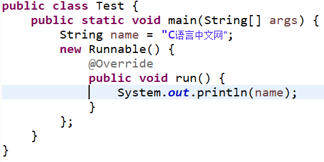
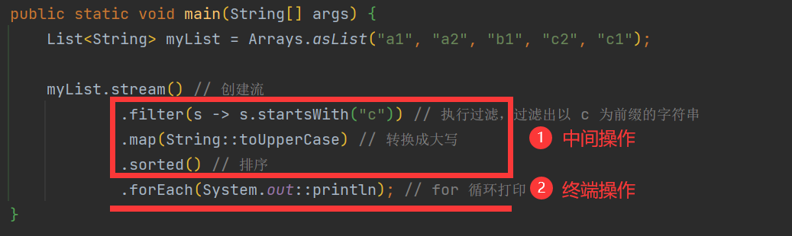

# 1、Effectively final

Java 中局部内部类和匿名内部类访问的局部变量必须由 `final` 修饰，以保证内部类和外部类的数据一致性。但从 Java 8 开始，我们可以不加 `final` 修饰符，由系统默认添加，当然这在 Java 8 以前的版本是不允许的。Java 将这个功能称为 Effectively final 功能。

编写同样的代码，分别在 Java 7 和 Java 8 下运行，代码如下：

```java
public class Test {
    public static void main(String[] args) {
        String name = "C语言中文网";
        new Runnable() {
            @Override
            public void run() {
                System.out.println(name);
            }
        }
    }
}
```

下图是 Java 7 的编译结果

<div align="center">
    
</div>


可以看到在 Java 7 中出现代码错误，提示我们必须显式的声明这个变量为 `final` 的（`run()` 方法中代码为输出 *name* 语句，即`System.out.println(name);`）。

<div align="center">
    
</div>


<div align="center">
    
</div>

因为从 Java 8 开始系统会默认添加 `final` 修饰符，所以在图 2 和图 3 中可以在匿名内部类中直接使用非 `final` 变量，而 `final` 修饰的局部变量不能在被重新赋值，所以图 3 中出现编译错误。

也就是说从 Java 8 开始，它不要求程序员必须将访问的局部变量显式的声明为 `final` 的。只要该变量不被重新赋值就可以。

一个非 `final` 的局部变量或方法参数，其值在初始化后就从未更改，那么该变量就是 effectively final。在 Lambda 表达式中，使用局部变量的时候，也要求该变量必须是 `final` 的，所以 effectively final 在 Lambda 表达式上下文中非常有用。

Lambda 表达式在编程中是经常使用的，而匿名内部类是很少使用的。那么，我们在 Lambda 编程中每一个被使用到的局部变量都去显示定义成 `final` 吗？显然这不是一个好方法。所以，Java 8 引入了 Effectively final 新概念。

总结一下，规则没有改变，Lambda 表达式和匿名内部类访问的局部变量必须是 `final` 的，只是不需要程序员显式的声明变量为 `final` 的，从而节省时间。

<br>

# 2、Lambda 表达式

Lambda 表达式（Lambda expression）是一个匿名函数，基于数学中的 λ 演算得名，也可称为闭包（Closure）。现在很多语言都支持 Lambda 表达式，如 C++、C#、Java、 Python 和 JavaScript 等。

Lambda 表达式是推动 Java 8 发布的重要新特性，它允许把函数作为一个方法的参数（函数作为参数传递进方法中），下面通过例子来理解 Lambda 表达式的概念。

先定义一个计算数值的接口，代码如下：

```java
// 可计算接口
public interface Calculable {
    // 计算两个int数值
    int calculateInt(int a, int b);
}
```

Calculable 接口只有一个方法 `calculateInt()`，参数是两个 `int` 类型，返回值也是 `int` 类型。实现方法代码如下：

```java
public class Test{
    
    /**
     * 通过操作符，进行计算
     *
     * @param opr 操作符
     * @return 实现Calculable接口对象
     */
    public static Calculable calculate(char opr) {
        Calculable result;
        if (opr == '+') {
            // 匿名内部类实现Calcu	lable接口
            result = new Calculable() {
                // 实现加法运算
                @Override
                public int calculateInt(int a, int b) {
                    return a + b;
                }
            };
        } else {
            // 匿名内部类实现Calculable接口
            result = new Calculable() {
                // 实现减法运算
                @Override
                public int calculateInt(int a, int b) {
                    return a - b;
                }
            };
        }
        return result;
    }
}
```

方法 `calculate()` 中 *opr* 参数是运算符，返回值是实现 Calculable 接口对象。代码第 13 行和第 23 行都采用匿名内部类实现 Calculable 接口。代码第 16 行实现加法运算。代码第 26 行实现减法运算。

```java
public static void main(String[] args) {
    int n1 = 10;
    int n2 = 5;
    // 实现加法计算Calculable对象
    Calculable f1 = calculate('+');
    // 实现减法计算Calculable对象
    Calculable f2 = calculate('-');
    // 调用calculateInt方法进行加法计算
    System.out.println(n1 + "+" + n2 + "=" + f1.calculateInt(n1, n2));
    // System.out.printf("%d + %d = %d \n", n1, n2, f1.calculateInt(n1, n2));
    // 调用calculateInt方法进行减法计算
    System.out.println(n1 + "-" + n2 + "=" + f1.calculateInt(n1, n2));
    // System.out.printf("%d - %d = %d \n", n1, n2, f2.calculateInt(n1, n2));
}
```

代码第 5 行中 *f1* 是实现加法计算 Calculable 对象，代码第 7 行中 *f2* 是实现减法计算 Calculable 对象。代码第 9 行和第 12 行才进行方法调用。

上述代码中列出了两种输出方式，下面简单介绍一下 Java 中常见的输出函数：

1. `printf()` 主要继承了 C 语言中 `printf()` 的一些特性，可以进行格式化输出。
2. `print()` 就是一般的标准输出，但是不换行。
3. `println()` 和 `print()` 基本没什么差别，就是最后会换行。

输出结果如下：

```
10+5=15
10-5=5
```

使用匿名内部类的方法 `calculate()` 代码很臃肿，Java 8 采用 Lambda 表达式可以替代匿名内部类。修改之后的通用方法 `calculate()` 代码如下：

```java
/**
* 通过操作符，进行计算
* @param opr 操作符
* @return 实现Calculable接口对象
*/
public static Calculable calculate(char opr) {
    Calculable result;
    if (opr == '+') {
        // Lambda表达式实现Calculable接口
        result = (int a, int b) -> {
            return a + b;
        };
    } else {
        // Lambda表达式实现Calculable接口
        result = (int a, int b) -> {
            return a - b;
        };
    }
    return result;
}
```

代码第 10 行和第 15 行用 Lambda 表达式替代匿名内部类，可见代码变得简洁。通过以上示例我们发现，Lambda 表达式是一个匿名函数（方法）代码块，可以作为表达式、方法参数和方法返回值。

Lambda 表达式标准语法形式如下：

```java
(参数列表) -> {
    // Lambda表达式体
}
```

`->` 被称为箭头操作符或 Lambda 操作符，箭头操作符将 Lambda 表达式拆分成两部分：

- 左侧：Lambda 表达式的参数列表。
- 右侧：Lambda 表达式中所需执行的功能，用 `{}` 包起来，即 Lambda 体。

<br>

**Java Lambda 表达式的优缺点**

优点：

1. 代码简洁，开发迅速
2. 方便函数式编程
3. 非常容易进行并行计算
4. Java 引入 Lambda，改善了集合操作（引入 Stream API）

缺点：

1. 代码可读性变差
2. 在非并行计算中，很多计算未必有传统的 `for` 性能要高
3. 不容易进行调试

<br>

## 2.1、Lambda 的简写方式

使用 Lambda 表达式是为了简化程序代码，Lambda 表达式本身也提供了多种简化形式，这些简化形式虽然简化了代码，但客观上使得代码可读性变差。

<br>

**省略参数类型**

Lambda 表达式可以根据上下文环境推断出参数类型。`calculate()` 方法中 Lambda 表达式能推断出参数 *a* 和 *b* 是 `int` 类型，简化形式如下：

```java
public static Calculable calculate(char opr) {
    Calculable result;
    if (opr == '+') {
        // Lambda表达式实现Calculable接口
        result = (a, b) -> {
            return a + b;
        };
    } else {
        // Lambda表达式实现Calculable接口
        result = (a, b) -> {
            return a - b;
        };
    }
    return result;
}
```

<br>

**省略参数小括号**

如果 Lambda 表达式中的参数只有一个，可以省略参数小括号。修改 Calculable 接口中的 `calculateInt()` 方法，代码如下。

```java
// 可计算接口
@FunctionalInterface
public interface Calculable {
    // 计算一个int数值
    int calculateInt(int a);
}
```

其中 `calculateInt()` 方法只有一个 `int` 类型参数，返回值也是 `int` 类型。调用 `calculateInt()` 方法代码如下：

```java
public static void main(String[] args) {
    int n1 = 10;
    // 实现二次方计算Calculable对象
    Calculable f1 = calculate(2);
    // 实现三次方计算Calculable对象
    Calculable f2 = calculate(3);
    // 调用calculateInt方法进行加法计算
    System.out.printf("%d二次方 = %d \n", n1, f1.calculateInt(n1));
    // 调用calculateInt方法进行减法计算
    System.out.printf("%d三次方 = %d \n", n1, f2.calculateInt(n1));
}
/**
* 通过幂计算
*
* @param power 幂
* @return 实现Calculable接口对象
*/
public static Calculable calculate(int power) {
    Calculable result;
    if (power == 2) {
        // Lambda表达式实现Calculable接口
        // 标准形式
        result = (int a) -> {
            return a * a;
        };
    } else {
        // Lambda表达式实现Calculable接口
        // 省略形式
        result = a -> {
            return a * a * a;
        };
    }
    return result;
}
```

输出结果为：

```
10二次方 = 100
10三次方 = 1000 
```

<br>

**省略 return 和大括号**

如果 Lambda 表达式体中只有一条语句，那么可以省略 `return` 和大括号，代码如下：

```java
public static Calculable calculate(int power) {
    Calculable result;
    if (power == 2) {
        // Lambda表达式实现Calculable接口
        // 标准形式
        result = (int a) -> {
            return a * a;
        };
    } else {
        // Lambda表达式实现Calculable接口
        // 省略形式
        result = a -> a * a * a;
    }
    return result;
}
```

<br>

## 2.2、Lambda 的使用

**作为参数使用 Lambda 表达式**

Lambda 表达式一种常见的用途就是作为参数传递给方法，这需要声明参数的类型声明为函数式接口类型。示例代码如下：

```java
public static void main(String[] args) {
    int n1 = 10;
    int n2 = 5;
    // 打印加法计算结果
    display((a, b) -> {
        return a + b;
    }, n1, n2);
    // 打印减法计算结果
    display((a, b) -> a - b, n1, n2);
}

/**
* 打印计算结果
*
* @param calc Lambda表达式
* @param n1   操作数1
* @param n2   操作数2
*/
public static void display(Calculable calc, int n1, int n2) {
    System.out.println(calc.calculateInt(n1, n2));
}
```

上述代码第 19 行定义 `display()` 打印计算结果方法，其中参数 *calc* 类型是 Calculable，这个参数即可以接收实现 Calculable 接口的对象，也可以接收 Lambda 表达式，因为 Calculable 是函数式接口。 代码第 7 行和第 9 行两次调用 `display()` 方法，它们第一个参数都是 Lambda 表达式。

<br>

**访问变量**

Lambda 表达式可以访问所在外层作用域定义的变量，包括成员变量和局部变量。

成员变量包括实例成员变量和静态成员变量。在 Lambda 表达式中可以访问这些成员变量，此时的 Lambda 表达式与普通方法一样，可以读取成员变量，也可以修改成员变量。

```java
public class LambdaDemo {
    // 实例成员变量
    private int value = 10;
    // 静态成员变量
    private static int staticValue = 5;
    
    // 静态方法，进行加法运算
    public static Calculable add() {
        Calculable result = (int a, int b) -> {
            // 访问静态成员变量，不能访问实例成员变量
            staticValue++;
            int c = a + b + staticValue;
            // this.value;
            return c;
        };
        return result;
    }
    
    // 实例方法，进行减法运算
    public Calculable sub() {
        Calculable result = (int a, int b) -> {
            // 访问静态成员变量和实例成员变量
            staticValue++;
            this.value++;
            int c = a - b - staticValue - this.value;
            return c;
        };
        return result;
    }
}
```

LambdaDemo 类中声明一个实例成员变量 *value* 和一个静态成员变量 *staticValue*。此外，还声明了静态方法 `add()`（见代码第 8 行）和实例方法 `sub()`（见代码第 20 行）。`add()` 方法是静态方法，静态方法中不能访问实例成员变量，所以代码第 13 行的 Lambda 表达式中也不能访问实例成员变量，也不能访问实例成员方法。

`sub()` 方法是实例方法，实例方法中能够访问静态成员变量和实例成员变量，所以代码第 23 行的 Lambda 表达式中可以访问这些变量，当然实例方法和静态方法也可以访问。当访问实例成员变量或实例方法时可以使用 `this`，如果不与局部变量发生冲突情况下可以省略 `this`。

对于成员变量的访问 Lambda 表达式与普通方法没有区别，但是访问局部变量时，变量必须是 `final` 类型的（不可改变）。

```java
public class LambdaDemo {
    // 实例成员变量
    private int value = 10;
    // 静态成员变量
    private static int staticValue = 5;
    
    // 静态方法，进行加法运算
    public static Calculable add() {
        // 局部变量
        int localValue = 20;
        Calculable result = (int a, int b) -> {
            // localValue++;
            // 编译错误
            int c = a + b + localValue;
            return c;
        };
        return result;
    }
    
    // 实例方法，进行减法运算
    public Calculable sub() {
        // final局部变量
        final int localValue = 20;
        Calculable result = (int a, int b) -> {
            int c = a - b - staticValue - this.value;
            // localValue = c;
            // 编译错误
            return c;
        };
        return result;
    }
}
```

上述代码第 10 行和第 23 行都声明一个局部变量 *localValue*，Lambda 表达式中访问这个变量，如代码第 14 行和第 25 行。不管这个变量是否显式地使用 `final` 修饰，它都不能在 Lambda 表达式中修改变量，所以代码第 12 行和第 26 行如果去掉注释会发生编译错误。

Lambda 表达式只能访问局部变量而不能修改，否则会发生编译错误，但对静态变量和成员变量可读可写。

<br>

## 2.3、Lambda 与匿名内部类的联系和区别

Java Lambda 表达式的一个重要用法是简化某些匿名内部类的写法，因此它可以部分取代匿名内部类的作用。

Lambda 表达式与匿名内部类的相同点如下：

- Lambda 表达式与匿名内部类一样，都可以直接访问 Effectively final 的局部变量，以及外部类的成员变量（包括实例变量和类变量）。
- Lambda 表达式创建的对象与匿名内部类生成的对象一样，都可以直接调用从接口中继承的默认方法。

下面程序示范了 Lambda 表达式与匿名内部类的相似之处。

```java
@FunctionalInterface
interface Displayable {
    // 定义一个抽象方法和默认方法
    void display();
    
    default int add(int a, int b) {
        return a + b;
    }
}

public class LambdaAndInner {
    private int age = 12;
    private static String name = "C语言中文网";
    
    public void test() {
        String url = "http://c.biancheng.net/";
        Displayable dis = () -> {
            // 访问的局部变量
            System.out.println("url 局部变量为:" + url);
            // 访问外部类的实例变量和类变量
            System.out.println("外部类的 age 实例变量为：" + age);
            System.out.println("外部类的 name 类变量为：" + name);
        };
        dis.display();
        // 调用dis对象从接口中继承的add()方法
        System.out.println(dis.add(3, 5)); 
    }
    
    public static void main(String[] args) {
        LambdaAndInner lambda = new LambdaAndInner();
        lambda.test();
    }
}
```

输出结果为：

```
url 局部变量为：http://c.biancheng.net/
外部类的 age 实例变量为：12
外部类的 name 类变量为：C语言中文网
8
```

上面程序使用 Lambda 表达式创建了一个 Displayable 的对象，Lambda 表达式的代码块中的代码第 19、21 和 22 行分别示范了访问 Effectively final 的局部变量、外部类的实例变量和类变量。从这点来看， Lambda 表达式的代码块与匿名内部类的方法体是相同的。

与匿名内部类相似的是，由于 Lambda 表达式访问了 *url* 局部变量，因此该局部变量相当于有一个隐式的 `final` 修饰，因此同样不允许对 `url` 局部变量重新赋值。

当程序使用 Lambda 表达式创建了 Displayable 的对象之后，该对象不仅可调用接口中唯一的抽象方法，也可调用接口中的默认方法，如上面程序代码第 26 行所示。

Lambda 表达式与匿名内部类主要存在如下区别。

- 匿名内部类可以为任意接口创建实例——不管接口包含多少个抽象方法，只要匿名内部类实现所有的抽象方法即可；但 Lambda 表达式只能为函数式接口创建实例。
- 匿名内部类可以为抽象类甚至普通类创建实例；但 Lambda 表达式只能为函数式接口创建实例。
- 匿名内部类实现的抽象方法的方法体允许调用接口中定义的默认方法；但 Lambda 表达式的代码块不允许调用接口中定义的默认方法。

对于 Lambda 表达式的代码块不允许调用接口中定义的默认方法的限制，可以尝试对上面的 LambdaAndInner.java 程序稍做修改，在 Lambda 表达式的代码块中增加如下一行：

```java
// 尝试调用接口中的默认方法，编译器会报错
System.out.println(add(3, 5));
```

虽然 Lambda 表达式的目标类型 Displayable 中包含了 `add()` 方法，但 Lambda 表达式的代码块不允许调用这个方法；如果将上面的 Lambda 表达式改为匿名内部类的写法，当匿名内部类实现 `display()` 抽象方法时，则完全可以调用这个 `add()` 方法，如下面代码所示。

```java
public void test() {
    String url = "http://c.biancheng.net/";
    Displayable dis = new Displayable() {
        
        @Override
        public void display() {
            // 访问的局部变量
            System.out.println("url 局部变量为:" + url);
            // 访问外部类的实例变量和类变量
            System.out.println("外部类的 age 实例变量为：" + age);
            System.out.println("外部类的 name 类变量为：" + name);
            System.out.println(add(3, 5));
        }
    };
    dis.display();
}
```

<br>

# 3、方法引用

方法引用可以理解为 Lambda 表达式的快捷写法，它比 Lambda 表达式更加的简洁，可读性更高，有很好的重用性。如果实现比较简单，复用的地方又不多，推荐使用 Lambda 表达式，否则应该使用方法引用。

Java 8 之后增加了双冒号 `::` 运算符，该运算符用于 “方法引用”，注意不是调用方法。“方法引用” 虽然没有直接使用 Lambda 表达式，但也与 Lambda 表达式有关，与函数式接口有关。 方法引用的语法格式如下：

```java
ObjectRef::methodName 
```

其中，*ObjectRef* 是类名或者实例名，*methodName* 是相应的方法名。

> 注意：被引用方法的参数列表和返回值类型，必须与函数式接口方法参数列表和方法返回值类型一致，示例代码如下。

```java
public class LambdaDemo {
    // 静态方法，进行加法运算
    // 参数列表要与函数式接口方法calculateInt(int a, int b)兼容
    public static int add(int a, int b) {
        return a + b;
    }
    
    // 实例方法，进行减法运算
    // 参数列表要与函数式接口方法calculateInt(int a, int b)兼容
    public int sub(int a, int b) {
        return a - b;
    }
}
```

LambdaDemo 类中提供了一个静态方法 `add()`，一个实例方法 `sub()`。这两个方法必须与函数式接口方法参数列表一致，方法返回值类型也要保持一致。

```java
public class HelloWorld {
    public static void main(String[] args) {
        int n1 = 10;
        int n2 = 5;
        // 打印加法计算结果
        display(LambdaDemo::add, n1, n2);
        LambdaDemo d = new LambdaDemo();
        // 打印减法计算结果 
        display(d::sub, n1, n2);
    }
    
    /**
     * 打印计算结果
     *
     * @param calc Lambda表达式
     * @param n1   操作数1
     * @param n2   操作数2
     */
    public static void display(Calculable calc, int n1, int n2) {
        System.out.println(calc.calculateInt(n1, n2));
    }
}
```

代码第 18 行声明 `display()` 方法，第一个参数 *calc* 是 Calculable 类型，它可以接受三种对象：Calculable 实现对象、Lambda 表达式和方法引用。代码第 6 行中第一个实际参数 `LambdaDemo::add` 是静态方法的方法引用。代码第 9 行中第一个实际参数`d::sub`，是实例方法的方法引用，*d* 是 LambdaDemo 实例。

提示：代码第 6 行的 `LambdaDemo::add` 和第 9 行的 `d::sub` 是方法引用，此时并没有调用方法，只是将引用传递给 `display()` 方法，在 `display()` 方法中才真正调用方法。

<br>

# 4、函数式接口

Lambda 表达式实现的接口不是普通的接口，而是**函数式接口**。如果一个接口中，有且只有一个抽象的方法（Object 类中的方法不包括在内），那这个接口就可以被看做是函数式接口。这种接口只能有一个方法。如果接口中声明多个抽象方法，那么 Lambda 表达式会发生编译错误：

```
The target type of this expression must be a functional interface
//此表达式的目标类型必须是函数接口
```

这说明该接口不是函数式接口，为了防止在函数式接口中声明多个抽象方法，Java 8 提供了一个声明函数式接口注解 `@FunctionalInterface`，示例代码如下：

```java
// 可计算接口
@FunctionalInterface
public interface Calculable {
    // 计算两个int数值
    int calculateInt(int a, int b);
}
```

在接口之前使用 `@FunctionalInterface` 注解修饰，那么试图增加一个抽象方法时会发生编译错误。但可以添加默认方法和静态方法。

`@FunctionalInterface` 注解与 `@Override` 注解的作用类似。Java 8 中专门为函数式接口引入了一个新的注解 `@FunctionalInterface`。该注解可用于一个接口的定义上，一旦使用该注解来定义接口，编译器将会强制检查该接口是否确实有且仅有一个抽象方法，否则将会报错。需要注意的是，即使不使用该注解，只要满足函数式接口的定义，这仍然是一个函数式接口，使用起来都一样。

> 提示：Lambda 表达式是一个匿名方法代码，Java 中的方法必须声明在类或接口中，那么 Lambda 表达式所实现的匿名方法是在函数式接口中声明的。

JDK 1.8 之前已有的函数式接口：

- java.lang.Runnable
- java.util.concurrent.Callable
- java.security.PrivilegedAction
- java.util.Comparator
- java.io.FileFilter
- java.nio.file.PathMatcher
- java.lang.reflect.InvocationHandler
- java.beans.PropertyChangeListener
- java.awt.event.ActionListener
- javax.swing.event.ChangeListener

JDK 1.8 新增加的函数接口：

- java.util.function

<br>

## 4.1、常用函数式接口

这里只介绍最基础的函数式接口，至于它的变体只要明白了基础自然就能够明白。

<br>

### 4.1.1、`Consumer<T>`

**`Consumer<T>`：消费型接口**

```java
/**
 * Represents an operation that accepts a single input argument and returns no
 * result. Unlike most other functional interfaces, {@code Consumer} is expected
 * to operate via side-effects.
 *
 * <p>This is a <a href="package-summary.html">functional interface</a>
 * whose functional method is {@link #accept(Object)}.
 *
 * @param <T> the type of the input to the operation
 *
 * @since 1.8
 */
@FunctionalInterface
public interface Consumer<T> {

    /**
     * Performs this operation on the given argument.
     *
     * @param t the input argument
     */
    void accept(T t);

    /**
     * Returns a composed {@code Consumer} that performs, in sequence, this
     * operation followed by the {@code after} operation. If performing either
     * operation throws an exception, it is relayed to the caller of the
     * composed operation.  If performing this operation throws an exception,
     * the {@code after} operation will not be performed.
     *
     * @param after the operation to perform after this operation
     * @return a composed {@code Consumer} that performs in sequence this
     * operation followed by the {@code after} operation
     * @throws NullPointerException if {@code after} is null
     */
    default Consumer<T> andThen(Consumer<? super T> after) {
        Objects.requireNonNull(after);
        return (T t) -> { accept(t); after.accept(t); };
    }
}
```

<br>

**抽象方法：**`void accept(T t)`

接收一个参数进行消费，但无需返回结果。

**使用方式：**

```java
Consumer consumer = System.out::println;
consumer.accept("hello function");
```

**结果：**

```
hello function
```

<br>

**默认方法：** `andThen(Consumer<? super T> after)`

先消费然后再消费，先执行调用 `andThen` 接口的 `accept` 方法，然后再执行 `andThen` 方法参数 *after* 中的 `accept` 方法。

**使用方式：**

```java
Consumer<String> consumer1 = s -> System.out.print("车名：" + s.split(",")[0]);
Consumer<String> consumer2 = s -> System.out.println("-->颜色：" + s.split(",")[1]);
String[] strings = {"保时捷,白色", "法拉利,红色"};
for (String string : strings) {
    consumer1.andThen(consumer2).accept(string);
}
```

**结果：**

```
车名：保时捷-->颜色：白色
车名：法拉利-->颜色：红色
```

<br>

### 4.1.2、`Supplier<T>`

**`Supplier<T>`：供给型接口**

```java
/**
 * Represents a supplier of results.
 *
 * <p>There is no requirement that a new or distinct result be returned each
 * time the supplier is invoked.
 *
 * <p>This is a <a href="package-summary.html">functional interface</a>
 * whose functional method is {@link #get()}.
 *
 * @param <T> the type of results supplied by this supplier
 *
 * @since 1.8
 */
@FunctionalInterface
public interface Supplier<T> {

    /**
     * Gets a result.
     *
     * @return a result
     */
    T get();
}
```

<br>

**抽象方法**：`T get()`

无参数，有返回值。

**使用方式：**

```java
Supplier<String> supplier = () -> "我要变的很有钱";
System.out.println(supplier.get());
```

**输出：**

```java
我要变得很有钱
```

这类接口适合提供数据的场景。

<br>

### 4.1.3、`Function<T,R>`

**`Function<T,R>`: 函数型接口**

```java
/**
 * Represents a function that accepts one argument and produces a result.
 *
 * <p>This is a <a href="package-summary.html">functional interface</a>
 * whose functional method is {@link #apply(Object)}.
 *
 * @param <T> the type of the input to the function
 * @param <R> the type of the result of the function
 *
 * @since 1.8
 */
@FunctionalInterface
public interface Function<T, R> {

    /**
     * Applies this function to the given argument.
     *
     * @param t the function argument
     * @return the function result
     */
    R apply(T t);

    /**
     * Returns a composed function that first applies the {@code before}
     * function to its input, and then applies this function to the result.
     * If evaluation of either function throws an exception, it is relayed to
     * the caller of the composed function.
     *
     * @param <V> the type of input to the {@code before} function, and to the
     *           composed function
     * @param before the function to apply before this function is applied
     * @return a composed function that first applies the {@code before}
     * function and then applies this function
     * @throws NullPointerException if before is null
     *
     * @see #andThen(Function)
     */
    default <V> Function<V, R> compose(Function<? super V, ? extends T> before) {
        Objects.requireNonNull(before);
        return (V v) -> apply(before.apply(v));
    }

    /**
     * Returns a composed function that first applies this function to
     * its input, and then applies the {@code after} function to the result.
     * If evaluation of either function throws an exception, it is relayed to
     * the caller of the composed function.
     *
     * @param <V> the type of output of the {@code after} function, and of the
     *           composed function
     * @param after the function to apply after this function is applied
     * @return a composed function that first applies this function and then
     * applies the {@code after} function
     * @throws NullPointerException if after is null
     *
     * @see #compose(Function)
     */
    default <V> Function<T, V> andThen(Function<? super R, ? extends V> after) {
        Objects.requireNonNull(after);
        return (T t) -> after.apply(apply(t));
    }

    /**
     * Returns a function that always returns its input argument.
     *
     * @param <T> the type of the input and output objects to the function
     * @return a function that always returns its input argument
     */
    static <T> Function<T, T> identity() {
        return t -> t;
    }
}

```

<br>

**抽象方法：** `R apply(T t)`

传入一个参数，返回想要的结果。

**使用方式：**

```java
Function<Integer, Integer> function = e -> e * 6;
System.out.println(function.apply(2));
```

**输出：**

```
12
```

<br>

**默认方法：**`compose(Function<? super V, ? extends T> before)`

先执行 `compose` 方法参数 *before* 中的 `apply` 方法，然后将执行结果传递给调用 `compose` 函数中的 `apply` 方法在执行。

**使用方式：**

```java
Function<Integer, Integer> function1 = e -> e * 2;
Function<Integer, Integer> function2 = e -> e * e;

Integer apply2 = function1.compose(function2).apply(3);
System.out.println(apply2);
```

**输出：**

```
18
```

还是举一个乘法的例子，`compose` 方法执行流程是先执行 `function2` 的表达式也就是 `3*3=9`，然后在将执行结果传给 `function1` 的表达式也就是 `9*2=18`，所以最终的结果是 `18`。

> `andThen(Function<? super R, ? extends V> after)` 先执行调用 `andThen` 函数的 `apply` 方法，然后再将执行结果传递给 `andThen` 方法 `after` 参数中的 `apply` 方法再执行。它和 `compose` 方法正好是相反的执行顺序。

<br>

**默认方法：**`andThen(Function<? super R, ? extends V> after)`

**使用方式：**

```java
Function<Integer, Integer> function1 = e -> e * 2;
Function<Integer, Integer> function2 = e -> e * e;

Integer apply3 = function1.andThen(function2).apply(3);
System.out.println(apply3);
```

**输出：**

```
36
```

这里我们和 `compose` 方法使用一个例子，所以是一模一样的例子，由于方法的不同，执行顺序也就不相同，那么结果是大大不同的。`andThen` 方法是先执行 `function1` 表达式，也就是 `3*2=6`，然后再执行 `function2` 表达式也就是 `6*6=36`。结果就是 `36`。

<br>

**静态方法：**`identity()`

获取一个输入参数和返回结果相同的 Function 实例。

**使用方式：**

```java
Function<Integer, Integer> identity = Function.identity();
Integer apply = identity.apply(3);
System.out.println(apply);
```

**输出：**

```
3
```

平常没有遇到过使用这个方法的场景，总之这个方法的作用就是输入什么返回结果就是什么。

<br>

### 4.1.4、`Predicate<T>` 

**`Predicate<T>` ： 断言型接口**

```java
/**
 * Represents a predicate (boolean-valued function) of one argument.
 *
 * <p>This is a <a href="package-summary.html">functional interface</a>
 * whose functional method is {@link #test(Object)}.
 *
 * @param <T> the type of the input to the predicate
 *
 * @since 1.8
 */
@FunctionalInterface
public interface Predicate<T> {

    /**
     * Evaluates this predicate on the given argument.
     *
     * @param t the input argument
     * @return {@code true} if the input argument matches the predicate,
     * otherwise {@code false}
     */
    boolean test(T t);

    /**
     * Returns a composed predicate that represents a short-circuiting logical
     * AND of this predicate and another.  When evaluating the composed
     * predicate, if this predicate is {@code false}, then the {@code other}
     * predicate is not evaluated.
     *
     * <p>Any exceptions thrown during evaluation of either predicate are relayed
     * to the caller; if evaluation of this predicate throws an exception, the
     * {@code other} predicate will not be evaluated.
     *
     * @param other a predicate that will be logically-ANDed with this
     *              predicate
     * @return a composed predicate that represents the short-circuiting logical
     * AND of this predicate and the {@code other} predicate
     * @throws NullPointerException if other is null
     */
    default Predicate<T> and(Predicate<? super T> other) {
        Objects.requireNonNull(other);
        return (t) -> test(t) && other.test(t);
    }

    /**
     * Returns a predicate that represents the logical negation of this
     * predicate.
     *
     * @return a predicate that represents the logical negation of this
     * predicate
     */
    default Predicate<T> negate() {
        return (t) -> !test(t);
    }

    /**
     * Returns a composed predicate that represents a short-circuiting logical
     * OR of this predicate and another.  When evaluating the composed
     * predicate, if this predicate is {@code true}, then the {@code other}
     * predicate is not evaluated.
     *
     * <p>Any exceptions thrown during evaluation of either predicate are relayed
     * to the caller; if evaluation of this predicate throws an exception, the
     * {@code other} predicate will not be evaluated.
     *
     * @param other a predicate that will be logically-ORed with this
     *              predicate
     * @return a composed predicate that represents the short-circuiting logical
     * OR of this predicate and the {@code other} predicate
     * @throws NullPointerException if other is null
     */
    default Predicate<T> or(Predicate<? super T> other) {
        Objects.requireNonNull(other);
        return (t) -> test(t) || other.test(t);
    }

    /**
     * Returns a predicate that tests if two arguments are equal according
     * to {@link Objects#equals(Object, Object)}.
     *
     * @param <T> the type of arguments to the predicate
     * @param targetRef the object reference with which to compare for equality,
     *               which may be {@code null}
     * @return a predicate that tests if two arguments are equal according
     * to {@link Objects#equals(Object, Object)}
     */
    static <T> Predicate<T> isEqual(Object targetRef) {
        return (null == targetRef)
                ? Objects::isNull
                : object -> targetRef.equals(object);
    }
}
```

<br>

**抽象方法：** `boolean test(T t)`

传入一个参数，返回一个布尔值。

**使用方式：**

```java
Predicate<Integer> predicate = t -> t > 0;
boolean test = predicate.test(1);
System.out.println(test);
```

**输出：**

```
true
```

当 `predicate` 函数调用 `test` 方法的时候，就会执行拿 `test` 方法的参数进行 `t -> t > 0` 的条件判断，`1` 肯定是大于 `0` 的，最终结果为 `true`。

<br>

**默认方法：**`and(Predicate<? super T> other)`

相当于逻辑运算符中的 `&&`，当两个 Predicate 函数的返回结果都为 `true` 时才返回 `true`。

**使用方式：**

```java
Predicate<String> predicate1 = s -> s.length() > 0;
Predicate<String> predicate2 = Objects::nonNull;
boolean test = predicate1.and(predicate2).test("&&测试");
System.out.println(test);
```

**输出：**

```
true
```

<br>

**默认方法：**`or(Predicate<? super T> other)` 

相当于逻辑运算符中的 `||`，当两个 Predicate 函数的返回结果有一个为 `true` 则返回 true，否则返回 `false`。

**使用方式：**

```java
Predicate<String> predicate1 = s -> false;
Predicate<String> predicate2 = Objects::nonNull;
boolean test = predicate1.and(predicate2).test("||测试");
System.out.println(test);
```

**输出：**

```
false
```

<br>

**默认方法：**`negate()`

这个方法的意思就是取反。

**使用方式：**

```java
Predicate<String> predicate = s -> s.length() > 0;
boolean result = predicate.negate().test("取反");
System.out.println(result);
```

**输出：**

```
false
```

很明显正常执行 `test` 方法的话应该为 `true`，但是调用 `negate` 方法后就返回为 `false` 了。 

<br>

**静态方法：**`isEqual(Object targetRef)`

对当前操作进行 "=" 操作，即取等操作，可以理解为 A == B。

**使用方式:**

```java
boolean test1 = Predicate.isEqual("test").test("test");
boolean test2 = Predicate.isEqual("test").test("equal");
System.out.println(test1);
System.out.println(test2);
```

**输出：**

```
true
false
```

<br>

### 4.1.5、Operator

可以简单理解成算术中的各种运算操作，当然不仅仅是运算这么简单，因为它只定义了运算这个定义，但至于运算成什么样你说了算。由于没有最基础的 Operator，这里将通过 BinaryOperator、IntBinaryOperator 来理解 Operator 函数式接口，先从简单的 IntBinaryOperator 开始。

<br>

**IntBinaryOperator **

```java
/**
 * Represents an operation upon two {@code int}-valued operands and producing an
 * {@code int}-valued result.   This is the primitive type specialization of
 * {@link BinaryOperator} for {@code int}.
 *
 * <p>This is a <a href="package-summary.html">functional interface</a>
 * whose functional method is {@link #applyAsInt(int, int)}.
 *
 * @see BinaryOperator
 * @see IntUnaryOperator
 * @since 1.8
 */
@FunctionalInterface
public interface IntBinaryOperator {

    /**
     * Applies this operator to the given operands.
     *
     * @param left the first operand
     * @param right the second operand
     * @return the operator result
     */
    int applyAsInt(int left, int right);
}
```

IntBinaryOperator 接口内只有一个 `applyAsInt` 方法，其接收两个 int 类型的参数，并返回一个 int 类型的结果，其实这个跟 Function 接口的 `apply` 有点像，但是这里限定了，只能是 int 类型。

<br>

**BinaryOperator**

```java
/**
 * Represents an operation upon two operands of the same type, producing a result
 * of the same type as the operands.  This is a specialization of
 * {@link BiFunction} for the case where the operands and the result are all of
 * the same type.
 *
 * <p>This is a <a href="package-summary.html">functional interface</a>
 * whose functional method is {@link #apply(Object, Object)}.
 *
 * @param <T> the type of the operands and result of the operator
 *
 * @see BiFunction
 * @see UnaryOperator
 * @since 1.8
 */
@FunctionalInterface
public interface BinaryOperator<T> extends BiFunction<T,T,T> {
    /**
     * Returns a {@link BinaryOperator} which returns the lesser of two elements
     * according to the specified {@code Comparator}.
     *
     * @param <T> the type of the input arguments of the comparator
     * @param comparator a {@code Comparator} for comparing the two values
     * @return a {@code BinaryOperator} which returns the lesser of its operands,
     *         according to the supplied {@code Comparator}
     * @throws NullPointerException if the argument is null
     */
    public static <T> BinaryOperator<T> minBy(Comparator<? super T> comparator) {
        Objects.requireNonNull(comparator);
        return (a, b) -> comparator.compare(a, b) <= 0 ? a : b;
    }

    /**
     * Returns a {@link BinaryOperator} which returns the greater of two elements
     * according to the specified {@code Comparator}.
     *
     * @param <T> the type of the input arguments of the comparator
     * @param comparator a {@code Comparator} for comparing the two values
     * @return a {@code BinaryOperator} which returns the greater of its operands,
     *         according to the supplied {@code Comparator}
     * @throws NullPointerException if the argument is null
     */
    public static <T> BinaryOperator<T> maxBy(Comparator<? super T> comparator) {
        Objects.requireNonNull(comparator);
        return (a, b) -> comparator.compare(a, b) >= 0 ? a : b;
    }
}
```

BinaryOperator 是 BiFunction 生的，而 IntBinaryOperator 是从石头里蹦出来的，BinaryOperator 自身定义了`minBy`、`maxBy` 默认方法，并且参数都是 Comparator，就是根据传入的比较器的比较规则找出最小最大的数据。

<br>

## 4.2、function 包下所有接口

java.util.function 它包含了很多类，用来支持 Java 的函数式编程，该包中的函数式接口有：

| 接口                      | 描述                                                         |
| ------------------------- | ------------------------------------------------------------ |
| `BiConsumer<T,U>`         | 接受两个参数，无返回值。                                     |
| `BiFunction<T,U,R>`       | 接受两个参数，返回一个结果。                                 |
| `BinaryOperator<T>`       | 代表了一个作用于于两个同类型操作符的操作，并且返回了操作符同类型的结果。 |
| `BiPredicate<T,U>`        | 接受一个参数，返回一个 boolean 类型结果。                    |
| `BooleanSupplier`         | 无参数，返回一个 boolean 类型结果。                          |
| `Consumer<T>`             | 接受一个参数，无返回值。                                     |
| `DoubleBinaryOperator`    | 代表了作用于两个 double 值操作符的操作，并且返回了一个 double 值的结果。 |
| `DoubleConsumer`          | 接受一个 double 类型参数，无返回值。                         |
| `DoubleFunction<R>`       | 接受一个 double 类型参数，返回一个结果。                     |
| `DoublePredicate`         | 接受一个 double 类型参数，返回一个 boolean 类型结果。        |
| `DoubleSupplier`          | 无参数，返回一个 double 类型结果。                           |
| `DoubleToIntFunction`     | 接受一个 double 类型参数，返回一个 int 类型结果。            |
| `DoubleToLongFunction`    | 接受一个 double 类型参数，返回一个 long 类型结果。           |
| `DoubleUnaryOperator`     | 接受一个参数同为类型 double，返回值类型也为 double 。        |
| `Function<T,R>`           | 接受一个输入参数，返回一个结果。                             |
| `IntBinaryOperator`       | 接受两个参数同为类型 int，返回值类型也为 int 。              |
| `IntConsumer`             | 接受一个 int 类型的参数，无返回值。                          |
| `IntFunction<R>`          | 接受一个 int 类型参数，返回一个结果 。                       |
| `IntPredicate`            | 接受一个 int 类型参数，返回一个 boolean 类型结果。           |
| `IntSupplier`             | 无参数，返回一个 int 类型结果。                              |
| `	IntToDoubleFunction` | 接受一个 int 类型参数，返回一个 double 类型结果 。           |
| `IntToLongFunction`       | 接受一个 int 类型参数，返回一个 long 类型结果。              |
| `IntUnaryOperator`        | 接受一个参数同为类型 int，返回值类型也为 int 。              |
| `LongBinaryOperator`      | 接受两个参数同为类型 long，返回值类型也为 long。             |
| `LongConsumer`            | 接受一个 long 类型的参数，不返回结果。                       |
| `LongFunction<R>`         | 接受一个 long 类型参数，返回一个结果。                       |
| `LongPredicate`           | 接受一个 long 类型参数，返回一个 boolean 类型结果。          |
| `LongSupplier`            | 无参数，返回一个 long 类型结果。                             |
| `LongToDoubleFunction`    | 接受一个 long 类型参数，返回一个 double 类型结果。           |
| `LongToIntFunction`       | 接受一个 long 类型参数，返回一个 int 类型结果。              |
| `LongUnaryOperator`       | 接受一个参数同为类型 long，返回值类型也为 long。             |
| `ObjDoubleConsumer<T>`    | 接受一个 object 类型和一个 double 类型的参数，无返回值。     |
| `	ObjIntConsumer<T>`   | 接受一个 object 类型和一个 int 类型的参数，无返回值。        |
| `ObjLongConsumer<T>`      | 接受一个 object 类型和一个 long 类型的参数，无返回值。       |
| `Predicate<T>`            | 接受一个参数，返回一个 boolean 类型结果。                    |
| `Supplier<T>`             | 无参数，返回一个结果。                                       |
| `ToDoubleBiFunction<T,U>` | 接受两个参数，返回一个 double 类型结果。                     |
| `ToDoubleFunction<T>`     | 接受一个参数，返回一个 double 类型结果。                     |
| `ToIntBiFunction<T,U>`    | 接受两个参数，返回一个 int 类型结果。                        |
| `ToIntFunction<T>`        | 接受一个参数，返回一个 int 类型结果。                        |
| `ToLongBiFunction<T,U>`   | 接受两个参数，返回一个 long 类型结果。                       |
| `ToLongFunction<T>`       | 接受一个参数，返回一个 long 类型结果。                       |
| `UnaryOperator<T>`        | 接受一个参数为类型 T，返回值类型也为 T。                     |

<br>

# 5、新的日期和时间 API

在 Java 8 之前，所有关于日期和时间的 API 都存在各种使用方面的缺陷，主要有：

1. Java的 `java.util.Date` 和 `java.util.Calendar` 类易用性差，不支持时区，而且他们都不是线程安全的
2. 用于格式化日期的类 `DateFormat` 被放在 `java.text` 包中，它是一个抽象类，所以我们需要实例化一个 `SimpleDateFormat` 对象来处理日期格式化，并且 `DateFormat` 也是非线程安全，你得把它用 `ThreadLocal` 包起来才能在多线程中使用
3. 对日期的计算方式繁琐，而且容易出错，因为月份是从 0 开始的，从 `Calendar` 中获取的月份需要加一才能表示当前月份

由于以上这些问题，出现了一些三方的日期处理框架，例如 Joda-Time，date4j 等开源项目。但是，Java 需要一套标准的用于处理时间和日期的框架，于是 Java 8 中引入了新的日期 API。新的日期 API 是 JSR-310 规范的实现，Joda-Time 框架的作者正是 JSR-310 的规范的倡导者，所以能从 Java 8 的日期 API 中看到很多 Joda-Time 的特性。

<br>

## 5.1、Instant 

`Instant` 实例表示时间线上的一个点。 参考点是标准的 Java 纪元（epoch），即1970-01-01 T00：00：00Z（1970 年 1 月 1 日 00:00 GMT）。 `Instant` 类的 `EPOCH` 属性返回表示 Java 纪元的 `Instant` 实例。 在纪元之后的时间是正值，而在此之前的时间即是负值。

`Instant` 的静态 `now()` 方法返回一个表示当前时间的 `Instant` 对象：

```java
Instant now = Instant.now();
```

`getEpochSecond()` 方法返回自纪元以来经过的秒数。 `getNano()` 方法返回自上一秒开始以来的纳秒数。

`Instant` 类的一个常用用途是用来操作时间，如以下代码所示：

```java
public static void main(String[] args) {
    Instant start = Instant.now();
    try {
        Thread.sleep(1000);
    } catch (InterruptedException e) {
        e.printStackTrace();
    }
    Instant end = Instant.now();
    System.out.println(Duration.between(start, end).toMillis());
}
```

如上面代码所示，`Duration` 类用于返回两个 `Instant` 之间时间数量的差异。

<br>

## 5.2、LocalDate

`LocalDate` 类只包括日期没有时间的部分。 它也没有时区。下表显示了 `LocalDate` 中一些重要的方法：

| 方法                                              | 描述                                                  |
| ------------------------------------------------- | ----------------------------------------------------- |
| `now()`                                           | 静态方法，返回今天的日期                              |
| `of()`                                            | 从指定年份、月份和日期创建 `LocalDate` 的静态方法     |
| `getDayOfMonth()`、`getMonthValue()`、`getYear()` | 以 `int` 形式返回此 `LocalDate` 的日、月或年          |
| `getMonth()`                                      | 以 `Month` 枚举常量返回此 `LocalDate` 的月份          |
| `plusDays()`、`minusDays()`                       | 给 `LocalDate` 添加或减去指定的天数                   |
| `plusWeeks()`、`minusWeeks()`                     | 给 `LocalDate` 添加或减去指定的星期数                 |
| `plusMonths()`、`minusMonths()`                   | 给 `LocalDate` 添加或减去指定的月份数                 |
| `plusYears()`、`minusYears()`                     | 给 `LocalDate` 添加或减去指定的年数                   |
| `isLeapYear()`                                    | 检查 `LocalDate` 指定的年份是否为闰年                 |
| `isAfter()`、`isBefore()`                         | 检查此 `LocalDate` 是在给定日期之后还是之前           |
| `lengthOfMonth()`                                 | 返回此 `LocalDate` 中月份的天数                       |
| `withDayOfMonth()`                                | 返回此 `LocalDate` 的拷贝，将月份中的某天设置为给定值 |
| `withMonth()`                                     | 返回此 `LocalDate` 的拷贝，其月份设置为给定值         |
| `withYear()`                                      | 返回此 `LocalDate` 的拷贝，并将年份设置为给定值       |

<br>

`LocalDate` 提供了各种创建日期的方法。 例如，要创建代表今天日期的 `LocalDate`，使用静态 `now()` 方法：

```java
LocalDate today = LocalDate.now();
```

要创建代表特定年、月和日的 `LocalDate`，使用 `of()` 方法，该方法也是静态的。 例如，以下代码创建了一个代表 2018 年 3 月 7 日的 `LocalDate` 实例：

```bash
LocalDate date = LocalDate.of(2018, 3, 7);
```

还有一个接受 `java.time.Month` 枚举的常量作为第二个参数的 `of()` 方法。 例如，下面是使用第二种方法重载构造相同日期的代码：

```bash
LocalDate date = LocalDate.of(2018, Month.MARCH, 7);
```

<br>

还有获取 `LocalDate` 的日、月或年的方法，例如 `getDayOfMonth()`、`getMonth()`、`getMonthValue()` 和 `getYear()`。 他们都没有任何参数，并返回一个 `int` 或 `Month` 的枚举常量。 另外，还有一个 `get()` 方法，它接受一个 `TemporalField` 并返回这个 `LocalDate` 的一部分。 例如，传递 `ChronoField.YEAR` 以获取 `LocalDate` 的年份部分：

```csharp
int year = localDate.get(ChronoField.YEAR);
```

> `ChronoField` 是一个实现 `TemporalField` 接口的枚举，因此可以传递一个 `ChronoField` 常量来获取。 `TemporalField` 和 `ChronoField` 都是 `java.time.temporal` 包的一部分。 但是，并非 `ChronoField` 中的所有常量都可以 `get()` 获取，因为并非所有常量都受支持。 例如，传递 `ChronoField.SECOND_OF_DAY` 以引发异常。 因此，取而代之，最好使用 `getMonth()`、`getYear()` 或类似方法来获取`LocalDate` 的组件。

<br>

此外，还有拷贝 `LocalDate` 的方法，例如 `plusDays()`、`plusYears()`、`minusMonths()` 等等。 例如，要获取表示明天的 `LocalDate`，可以创建一个代表今天的 `LocalDate`，然后调用其 `plusDays()` 方法：

```java
LocalDate tomorrow = LocalDate.now().plusDays(1);
```

要获取昨天表示的 `LocalDate`，可以使用 `minusDays()` 方法：

```java
LocalDate yesterday = LocalDate.now().minusDays(1);
```

另外，还有 `plus()` 和 `minus()` 方法以更通用的方式获得 `LocalDate` 的拷贝。 两者都接受一个 `int` 参数和一个 `TemporalUnit` 参数。 这些方法的签名如下：

```java
public LocalDate plus(long amountToAdd, java.time.temporal.TemporalUnit unit)

public LocalDate minus(long amountToSubtract, java.time.temporal.TemporalUnit unit)
```

例如，获得一个从今天开始前 20 年的 `LocalDate`，可以使用这段代码：

```java
LocalDate pastDate = LocalDate.now().minus(2, ChronoUnit.DECADES);
```

> `ChronoUnit` 是一个实现 `TemporalUnit` 的枚举，因此可以将 `ChronoUnit` 常量传递给 `plus()` 和 `minus()` 方法。

> `LocalDate` 是不可变的，因此无法更改。 任何返回 `LocalDate` 的方法都返回 `LocalDate` 的新实例。

<br>

## 5.3、Period

`Period` 类基于日期的时间数量构建，例如五天、一周或三年。 下面列出了一些重要的方法：

| 方法                                               | 描述                                                         |
| -------------------------------------------------- | ------------------------------------------------------------ |
| `between()`                                        | 在两个 `LocalDate` 之间创建一个 `Period` 示例                |
| `ofDays()`、`ofWeeks()`、`ofMonths()`、`ofYears()` | 创建代表给定天数、周、月、年的 `Period` 实例                 |
| `of()`                                             | 根据给定的年数、月数和天数创建一个 `Period` 实例             |
| `getDays()`、`getMonths()`、`getYears()`           | 以 `int` 形式返回此 `Period` 的天数、月、年                  |
| `isNegative()`                                     | 如果此 `Period` 的三个部分中的任何一个为负数，则返回 `true`，否则返回 `false` |
| `isZero()`                                         | 如果此 `Period` 的所有三个部分均为零，则返回 `true`，否则返回 `false` |
| `plusDays()`、`minusDays()`                        | 在此 `Period` 上添加或减去给定的天数                         |
| `plusMonths()`、`minusMonths()`                    | 在此 `Period` 上增加或减去给定的月数                         |
| `plusYears()`、`minusYears()`                      | 在此 `Period` 增加或减去给定的年数                           |
| `withDays()`                                       | 以指定的天数返回此 `Period` 的拷贝                           |
| `withMonths()`                                     | 以指定的月数返回此 `Period` 的拷贝                           |
| `withYears()`                                      | 以指定的年数返回此 `Period` 的拷贝                           |

<br>

创建一个 `Period` 很简单，这要感谢`between()`、`of()`、`ofDays()`、`ofWeeks()`、`ofMonths()`、`ofYears()` 等静态工厂方法。 例如，以下是如何创建代表两周的 `Period` 实例：

```java
Period twoWeeks = Period.ofWeeks(2);
```

要创建代表一年两个月三天的 `Period` 实例，请使用 `of()` 方法：

```java
Period p = Period.of(1, 2, 3);
```

<br>

要获取某个期间的年、月、日组件，调用其`getYears()`、`getMonths()`、`getDays()`方法。 例如，以下代码中的 `howManyDays` 变量的值是14：

```java
Period twoWeeks = Period.ofWeeks(2);

int howManyDays = twoWeeks.getDays();
```

<br>

最后，可以使用 `plusXXX()` 或 `minusXXX()` 方法以及 `withXXX()` 方法来创建 `Period` 的拷贝。 `Period` 是不可变的，所以这些方法返回新的 `Period` 实例。

<br>

下面的代码显示了一个计算个人年龄的年龄计算器。 它从两个 `LocalDate` 创建一个 `Period` 并调用它的 `getDays()`、`getMonths()` 和 `getYears()` 方法：

```java
import java.time.LocalDate;
import java.time.Period;

public class PeriodDemo1 {
    public static void main(String[] args) {
        LocalDate dateA = LocalDate.of(1978, 8, 26);
        LocalDate dateB = LocalDate.of(1988, 9, 28);
        Period period = Period.between(dateA, dateB);
        System.out.printf("Between %s and %s"
                + " there are %d years, %d months"
                + " and %d days%n", dateA, dateB,
                period.getYears(),
                period.getMonths(),
                period.getDays());
    }
}
```

运行 `PeriodDemo1` 类打印下面字符串。

```mipsasm
Between 1978-08-26 and 1988-09-28 there are 10 years, 1 months and 2 days
```

<br>

## 5.4、LocalDateTime

`LocalDateTime` 类是一个没有时区的日期时间的构建。 下表显示了 `LocalDateTime` 中一些重要的方法。 这些方法类似于 `LocalDate` 的方法，以及用于修改时间部分的一些其他方法，例如在 `LocalDate` 中不可用的 `plusHours()`、`plusMinutes()` 和 `plusSeconds()`：

| 方法                                                         | 描述                                                         |
| ------------------------------------------------------------ | ------------------------------------------------------------ |
| `now()`                                                      | 返回当前日期和时间的静态方法                                 |
| `of()`                                                       | 从指定年份、月份、日期、小时、分钟、秒和毫秒创建`LocalDateTime` 的静态方法 |
| `getYear()`、`getMonthValue()`、`getDayOfMonth()`、`getHour()`、`getMinute()`、`getSecond()` | 以 `int` 形式返回此 `LocalDateTime` 的年、月、日、小时、分钟或秒部分 |
| `plusDays()`、`minusDays()`                                  | 给当前 LocalDateTime 添加或减去指定的天数。                  |
| `plusWeeks()`、`minusWeeks()`                                | 给当前 `LocalDateTime` 添加或减去指定的周数。                |
| `plusMonths()`、`minusMonths()`                              | 给当前 `LocalDateTime` 添加或减去指定的月数。                |
| `plusYears()`、`minusYears()`                                | 给当前 `LocalDateTime` 添加或减去指定的年数。                |
| `plusHours()`、`minusHours()`                                | 给当前 `LocalDateTime` 添加或减去指定的小时数                |
| `plusMinutes()`、`minusMinutes()`                            | 给当前 `LocalDateTime` 添加或减去指定的分钟数                |
| `plusSeconds()`、`minusSeconds()`                            | 给当前 `LocalDateTime` 添加或减去指定的秒数                  |
| `IsAfter()`、`isBefore()`                                    | 检查此 `LocalDateTime` 是否在指定的日期时间之后或之前        |
| `withDayOfMonth()`                                           | 返回此 `LocalDateTime` 的拷贝，并将月份中的某天设置为指定值  |
| `withMonth()`、`withYear()`                                  | 返回此 `LocalDateTime` 的拷贝，其月或年设置为指定值          |
| `withHour()`、`withMinute()`、`withSecond()`                 | 返回此 `LocalDateTime` 的拷贝，其小时、分钟、秒设置为指定值  |

<br>

`LocalDateTime` 提供了各种静态方法来创建日期时间。 该方法现在带有三个重载方法返回当前的日期时间。 无参的方法是最容易使用的：

```java
LocalDateTime now = LocalDateTime.now();
```

要创建具有特定日期和时间的 `LocalDateTime`，请使用 `of()` 方法。 此方法有多个重载，并允许传递日期时间或 `LocalDate` 和 `LocalTime` 的单个部分。 以下是一些方法的签名：

```java
public static LocalDateTime of(int year, int month, int dayOfMonth, int hour, int minute)

public static LocalDateTime of(int year, Month month, int dayOfMonth, int hour, int minute)

public static LocalDateTime of(LocalDate date, LocalTime time)
```

例如，下面的代码段创建一个 `LocalDateTime`，代表 2015 年 12 月 31 日早上八点：

```java
LocalDateTime endOfYear = LocalDateTime.of(2015, 12, 31, 8, 0);
```

可以使用 `plusXXX()` 或 `minusXXX()` 方法创建 `LocalDateTime` 的拷贝。 例如，此代码创建一个 `LocalDateTime`，它表示明天的同一时间：

```java
LocalDateTime now = LocalDateTime.now();

LocalDateTime sameTimeTomorrow = now.plusHours(24);
```

<br>

## 5.5、Time Zones

互联网数字分配机构（IANA）维护一个可从此网页下载的[时区数据库](http://www.iana.org/time-zones)。

Java 日期和时间 API 也适用于时区。 抽象类 `ZoneId`（在 `java.time` 包中）表示一个区域标识符。 它有一个名为 `getAvailableZoneIds()` 的静态方法，它返回所有区域标识符。 下面展示了如何使用这种方法打印所有时区的排序列表：

```java
import java.time.ZoneId;
import java.util.ArrayList;
import java.util.Collections;
import java.util.List;
import java.util.Set;

public class TimeZoneDemo1 {
    public static void main(String[] args) {
        Set<String> allZoneIds = ZoneId.getAvailableZoneIds();
        List<String> zoneList = new ArrayList<>(allZoneIds);
        Collections.sort(zoneList);      
        for (String zoneId : zoneList) {
            System.out.println(zoneId);
        }
        // alternatively, you can use this line of code to
        // print a sorted list of zone ids
        // ZoneId.getAvailableZoneIds().stream().sorted().
        //        forEach(System.out::println);
    }
}
```

`getAvailableZoneIds()` 返回字符串的 `Set` 集合。 可以使用 `Collections.sort()` 或更优雅地通过调用它的 `stream()` 方法对 `Set` 进行排序。 可以编写此代码对区域标识符进行排序：

```java
ZoneId.getAvailableZoneIds().stream().sorted().forEach(System.out::println);
```

`getAvailableZoneIds()` 返回 586 个区域标识符的 `Set` 集合。 以下是上述代码中的一部分区域标识符：

```
Africa/Cairo
Africa/Johannesburg
America/Chicago
America/Los_Angeles
America/Mexico_City
America/New_York
America/Toronto
Antarctica/South_Pole
Asia/Hong_Kong
Asia/Shanghai
Asia/Tokyo
Australia/Melbourne
Australia/Sydney
Canada/Atlantic
Europe/Amsterdam
Europe/London
Europe/Paris
US/Central
US/Eastern
US/Pacific
```

<br>

## 5.6、ZonedDateTime

`ZonedDateTime` 类以一个时区的日期时间的构建。例如，以下是一个时区的日期时间:

```makefile
2015-12-31T10:59:59+01:00 Europe/Paris
```

`ZonedDateTime` 始终是不可变的，时间分量的存储精度为纳秒。

`ZonedDateTIme` 中一些重要方法的使用与 `LocalDateTime` 类似，只是多了一个时区的概念。可自行查阅 API。

<br>

像 `LocalDateTime` 一样，`ZonedDateTime `类现在提供静态 `now()` 和 `of()` 方法，并构造一个 `ZonedDateTime` 实例。 `now()` 方法创建一个 `ZonedDateTime` 代表执行的日期和时间。 无参 `now()` 方法会使用计算机的默认时区创建 `ZonedDateTime`：

```java
ZonedDateTime now = ZonedDateTime.now();
```

`now()` 的另一个重载方法允许传递区域标识符：

```java
ZonedDateTime parisTime = ZonedDateTime.now(ZoneId.of("Europe/Paris"));
```

`of()` 方法也有好几个重载的方法。在所有情况下，都需要传递区域标识符：

```java
public static ZonedDateTime of(int year, int month, int dayOfMonth,
        int hour, int minute, int second, int nanosecond,
        ZoneId zone)
    
public static ZonedDateTime of(LocalDate date, LocalTime time, ZoneId zone)
    
public static ZonedDateTime of(LocalDateTime datetime, ZoneId zone)
```

<br>

像 `LocalDate` 和 `LocalDateTime` 一样，`ZonedDateTime` 提供了使用 `plusXXX()`、`minusXXX()` 和 `withXXX()` 方法创建实例拷贝的方法。

例如，下面代码行创建一个带默认时区的 `ZonedDateTime`，并调用它的 `minusDays()` 方法以在三天前创建相同的 `ZonedDateTime`：

```java
ZonedDateTime now = ZonedDateTime.now();
ZonedDateTime threeDaysEarlier = now.minusDays(3);
```

<br>

## 5.7、Duration

`Duration` 类是基于时间的持续时间的构建。 它与 `Period` 类似，不同之处在于 `Duration` 的时间分量为纳秒精度，并考虑了`ZonedDateTime` 实例之间的时区。 下表显示了 `Duration` 中重要的方法：

| 方法                                                         | 描述                                                         |
| ------------------------------------------------------------ | ------------------------------------------------------------ |
| `between()`                                                  | 在两个时差的对象之间创建一个 `Duration` 实例，例如在两个 `LocalDateTime` 或两个 `ZonedDateTime` 之间。 |
| `ofYears()`、`ofMonths()`、`ofWeeks()`、`ofDays()`、`ofHours()`、`ofMinutes()`、`ofSeconds()`、`ofNano()` | 创建给定年数、月、周、天、小时、分、秒、纳秒的 `Duration` 实例 |
| `of()`                                                       | 根据指定数量的时间单位创建 `Duration` 实例                   |
| `toDays()`、`toHours()`、`toMinutes()`                       | 以 `int` 形式返回此 `Duration` 的天数、小时、分钟数          |
| `isNegative()`                                               | 如果此 `Duration` 为负则返回 `true`，否则返回 `false`        |
| `isZero()`                                                   | 如果此 `Duration` 长度为零则返回 `true`，否则返回 `false`    |
| `plusDays()`、`minusDays()`                                  | 在此 `Duration` 内添加或减去指定的天数                       |
| `plusMonths()`、`minusMonths()`                              | 在此 `Duration` 内添加或减去指定的月数                       |
| `plusYears()`、`minusYears()`                                | 在 `Duration` 内添加或减去指定的年数                         |
| `withSeconds()`                                              | 以指定的秒数返回此 `Duration` 的拷贝                         |

<br>

可以通过调用静态方法 `between()` 或 `of()` 来创建 `Duration`。 下面的代码会在 2015 年 1 月 26 日 11:10 至 2015 年 1 月 26 日 12:40 之间创建两个 `LocalDateTime` 的 `Duration`：

```java
import java.time.Duration;
import java.time.LocalDateTime;

public class DurationDemo1 {
    public static void main(String[] args) {
        LocalDateTime dateTimeA = LocalDateTime.of(2015, 1, 26, 8, 10, 0, 0);
        LocalDateTime dateTimeB = LocalDateTime.of(2015, 1, 26, 11, 40, 0, 0);
        Duration duration = Duration.between(dateTimeA, dateTimeB);

        System.out.printf("There are %d hours and %d minutes.%n",
                duration.toHours(),
                duration.toMinutes() % 60);
    }
}
```

运行 `DurationDemo1` 类的结果是这样的：

```sql
There are 3 hours and 30 minutes.
```

<br>

下面的代码在两个 `ZoneDateTime` 之间创建一个 `Duration`，具有相同的日期和时间，但时区不同：

```java
import java.time.Duration;
import java.time.LocalDateTime;
import java.time.Month;
import java.time.ZoneId;
import java.time.ZonedDateTime;

public class DurationDemo2 {
    public static void main(String[] args) {
        ZonedDateTime zdt1 = ZonedDateTime.of(LocalDateTime.of(2015, Month.JANUARY, 1, 8, 0),
                ZoneId.of("America/Denver"));
        ZonedDateTime zdt2 = ZonedDateTime.of(LocalDateTime.of(2015, Month.JANUARY, 1, 8, 0),
                ZoneId.of("America/Toronto"));

        Duration duration = Duration.between(zdt1, zdt2);
        System.out.printf("There are %d hours and %d minutes.%n",
                duration.toHours(),
                duration.toMinutes() % 60);
    }
}
```

运行 `DurationDemo2` 类在控制台上打印如下结果：

```sql
There are -2 hours and 0 minutes.
```

这是预料之中的，因为时区 `America/Denver`  和 `America/Toronto` 之间有两个小时的差异。

<br>

作为一个更复杂的例子，下面的代码显示了一个公交车旅行时间计算器。 它有一个方法 `calculateTravelTime()`，它需要一个离开的 `ZonedDateTime` 实例和一个到达的 `ZonedDateTime` 实例。 该代码调用 `calculateTravelTime()` 方法两次。 这两次公交车都在丹佛早上 8 点从科罗拉多州丹佛出发，并于多伦多时间第二天早上 8 点抵达多伦多。 公交车首次于 2014 年 3 月 8 日启程，第二次于 2014 年 3 月 18 日启程。

两种情况下的旅行时间是多少?

```java
import java.time.Duration;
import java.time.LocalDateTime;
import java.time.Month;
import java.time.ZoneId;
import java.time.ZonedDateTime;

public class TravelTimeCalculator {
    public Duration calculateTravelTime(ZonedDateTime departure, ZonedDateTime arrival) {
        return Duration.between(departure, arrival);
    }

    public static void main(String[] args) {
        TravelTimeCalculator calculator = new TravelTimeCalculator();
        ZonedDateTime departure1 = ZonedDateTime.of(LocalDateTime.of(2014, Month.MARCH, 8, 8, 0),
                ZoneId.of("America/Denver"));
        ZonedDateTime arrival1 = ZonedDateTime.of(LocalDateTime.of(2014, Month.MARCH, 9, 8, 0),
                ZoneId.of("America/Toronto"));
        Duration travelTime1 = calculator.calculateTravelTime(departure1, arrival1);
        System.out.println("Travel time 1: " + travelTime1.toHours() + " hours");

        ZonedDateTime departure2 = ZonedDateTime.of(LocalDateTime.of(2014, Month.MARCH, 18,8, 0),
                ZoneId.of("America/Denver"));
        ZonedDateTime arrival2 = ZonedDateTime.of(LocalDateTime.of(2014, Month.MARCH, 19, 8, 0),
                ZoneId.of("America/Toronto"));
        Duration travelTime2 = calculator.calculateTravelTime(departure2, arrival2);
        System.out.println("Travel time 2: " + travelTime2.toHours() + " hours");
    }
}
```

运行结果为：

```less
Travel time 1: 21 hours

Travel time 2: 22 hours
```

为什么有这个区别？ 因为 2014 年的夏令时从 3 月 9 日星期日凌晨 2 点开始。 因此，在 2014 年 3 月 8 日至 2014 年 3 月 9 日之间 “失去” 了一小时。

<br>

## 5.8、DateTimeFormatter

新的日期 API 中提供了一个`DateTimeFormatter` 类用于处理日期格式化操作，它被包含在 `java.time.format` 包中，Java 8 的日期类有一个 `format()` 方法用于将日期格式化为字符串，该方法接收一个 `DateTimeFormatter` 类型参数：

```java
LocalDateTime dateTime = LocalDateTime.now();
String strDate1 = dateTime.format(DateTimeFormatter.BASIC_ISO_DATE);    // 20170105
String strDate2 = dateTime.format(DateTimeFormatter.ISO_LOCAL_DATE);    // 2017-01-05
String strDate3 = dateTime.format(DateTimeFormatter.ISO_LOCAL_TIME);    // 14:20:16.998
String strDate4 = dateTime.format(DateTimeFormatter.ofPattern("yyyy-MM-dd"));   // 2017-01-05
// 今天是：2017年 一月 05日 星期四
String strDate5 = dateTime.format(DateTimeFormatter.ofPattern("今天是：YYYY年 MMMM DD日 E", Locale.CHINESE)); 
```

同样，日期类也支持将一个字符串解析成一个日期对象，例如：

```java
String strDate6 = "2017-01-05";
String strDate7 = "2017-01-05 12:30:05";

LocalDate date = LocalDate.parse(strDate6, DateTimeFormatter.ofPattern("yyyy-MM-dd"));
LocalDateTime dateTime1 = LocalDateTime.parse(strDate7, DateTimeFormatter.ofPattern("yyyy-MM-dd HH:mm:ss"));
```

<br>

**Date 转换为 LocalDateTime**

方法 1：

```java
LocalDateTime localDateTime = new Date().toInstant().atZone(zoneId).toLocalDateTime();
```

方法 2：

```java
LocalDateTime localDateTime = LocalDateTime.ofInstant(new Date().toInstant(), zoneId);
```

<br>

# 6、默认方法

Java 8 新增了接口的默认方法。

简单说，默认方法就是接口可以有实现方法，而且不需要实现类去实现其方法。只需在方法名前面加个 `default` 关键字即可实现默认方法。

> **为什么要有这个特性？**
>
> 首先，之前的接口是个双刃剑，好处是面向抽象而不是面向具体编程，缺陷是，当需要修改接口时候，需要修改全部实现该接口的类，目前的 java 8 之前的集合框架没有 `foreach` 方法，通常能想到的解决办法是在 JDK 里给相关的接口添加新的方法及实现。然而，对于已经发布的版本，是没法在给接口添加新方法的同时不影响已有的实现。所以引进的默认方法。他们的目的是为了解决接口的修改与现有的实现不兼容的问题。

**语法**

默认方法语法格式如下：

```java
public interface Vehicle {
   default void print(){
      System.out.println("我是一辆车!");
   }
}
```

**多个默认方法**

一个接口有默认方法，考虑这样的情况，一个类实现了多个接口，且这些接口有相同的默认方法，以下实例说明了这种情况的解决方法：

```java
public interface Vehicle {
   default void print(){
      System.out.println("我是一辆车!");
   }
}
 
public interface FourWheeler {
   default void print(){
      System.out.println("我是一辆四轮车!");
   }
}
```

第一个解决方案是创建自己的默认方法，来覆盖重写接口的默认方法：

```java
public class Car implements Vehicle, FourWheeler {
   default void print(){
      System.out.println("我是一辆四轮汽车!");
   }
}
```

第二种解决方案可以使用 `super` 来调用指定接口的默认方法：

```java
public class Car implements Vehicle, FourWheeler {
   public void print(){
      Vehicle.super.print();
   }
}
```

<br>

## 6.1、静态默认方法

Java 8 的另一个特性是接口可以声明（并且可以提供实现）静态方法。例如：

```java
public interface Vehicle {
   default void print(){
      System.out.println("我是一辆车!");
   }
    // 静态方法
   static void blowHorn(){
      System.out.println("按喇叭!!!");
   }
}
```

<br>

## 6.2、默认方法实例

可以通过以下代码来了解关于默认方法的使用，可以将代码放入 Java8Tester.java 文件中：

```java
public class Java8Tester {
   public static void main(String args[]){
      Vehicle vehicle = new Car();
      vehicle.print();
   }
}
 
interface Vehicle {
   default void print(){
      System.out.println("我是一辆车!");
   }
    
   static void blowHorn(){
      System.out.println("按喇叭!!!");
   }
}
 
interface FourWheeler {
   default void print(){
      System.out.println("我是一辆四轮车!");
   }
}
 
class Car implements Vehicle, FourWheeler {
   public void print(){
      Vehicle.super.print();
      FourWheeler.super.print();
      Vehicle.blowHorn();
      System.out.println("我是一辆汽车!");
   }
}
```

执行以上脚本，输出结果为：

```shell
$ javac Java8Tester.java 
$ java Java8Tester
我是一辆车!
我是一辆四轮车!
按喇叭!!!
我是一辆汽车!
```

<br>

# 7、Base64

在 Java 8 中，Base64 编码已经成为 Java 类库的标准。

Java 8 内置了 Base64 编码的编码器和解码器。

Base64 工具类提供了一套静态方法获取下面三种 BASE64 编解码器：

- 基本：输出被映射到一组字符 `A-Za-z0-9+/`，编码不添加任何行标，输出的解码仅支持 `A-Za-z0-9+/`。
- URL：输出映射到一组字符 `A-Za-z0-9+_`，输出是 URL 和文件。
- MIME：输出隐射到 MIME 友好格式。输出每行不超过 76 字符，并且使用 `\r` 并跟随 `\n` 作为分割。编码输出最后没有行分割。

<br>

## 7.1、内嵌类

| 序号 | 内嵌类 & 描述                                                |
| :--- | :----------------------------------------------------------- |
| 1    | **static class Base64.Decoder**<br>该类实现一个解码器，使用 Base64 编码来解码字节数据。 |
| 2    | **static class Base64.Encoder**<br>该类实现一个编码器，使用 Base64 编码来编码字节数据。 |

<br>

## 7.2、方法

| 序号 | 方法名 & 描述                                                |
| :--- | :----------------------------------------------------------- |
| 1    | **static Base64.Decoder getDecoder()**<br>返回一个 Base64.Decoder ，解码使用基本型 base64 编码方案。 |
| 2    | **static Base64.Encoder getEncoder()**<br/>返回一个 Base64.Encoder ，编码使用基本型 base64 编码方案。 |
| 3    | **static Base64.Decoder getMimeDecoder()**<br/>返回一个 Base64.Decoder ，解码使用 MIME 型 base64 编码方案。 |
| 4    | **static Base64.Encoder getMimeEncoder()**<br/>返回一个 Base64.Encoder ，编码使用 MIME 型 base64 编码方案。 |
| 5    | **static Base64.Encoder getMimeEncoder(int lineLength, byte[] lineSeparator)**<br/>返回一个 Base64.Encoder ，编码使用 MIME 型 base64 编码方案，<br>可以通过参数指定每行的长度及行的分隔符。 |
| 6    | **static Base64.Decoder getUrlDecoder()**<br/>返回一个 Base64.Decoder ，解码使用 URL 和文件名安全型 base64 编码方案。 |
| 7    | **static Base64.Encoder getUrlEncoder()**<br/>返回一个 Base64.Encoder ，编码使用 URL 和文件名安全型 base64 编码方案。 |

> 注意：Base64 类的很多方法从 **java.lang.Object** 类继承。

<br>

## 7.3、Base64 实例

以下实例演示了 Base64 的使用：

```java
import java.util.Base64;
import java.util.UUID;
import java.io.UnsupportedEncodingException;
 
public class Java8Tester {
   public static void main(String args[]){
      try {
        
         // 使用基本编码
         String base64encodedString = Base64.getEncoder().encodeToString("runoob?java8".getBytes("utf-8"));
         System.out.println("Base64 编码字符串 (基本) :" + base64encodedString);
        
         // 解码
         byte[] base64decodedBytes = Base64.getDecoder().decode(base64encodedString);
        
         System.out.println("原始字符串: " + new String(base64decodedBytes, "utf-8"));
         base64encodedString = Base64.getUrlEncoder().encodeToString("runoob?java8".getBytes("utf-8"));
         System.out.println("Base64 编码字符串 (URL) :" + base64encodedString);
        
         StringBuilder stringBuilder = new StringBuilder();
        
         for (int i = 0; i < 10; ++i) {
            stringBuilder.append(UUID.randomUUID().toString());
         }
        
         byte[] mimeBytes = stringBuilder.toString().getBytes("utf-8");
         String mimeEncodedString = Base64.getMimeEncoder().encodeToString(mimeBytes);
         System.out.println("Base64 编码字符串 (MIME) :" + mimeEncodedString);
         
      }catch(UnsupportedEncodingException e){
         System.out.println("Error :" + e.getMessage());
      }
   }
}
```

执行以上脚本，输出结果为：

```
$ javac Java8Tester.java 
$ java Java8Tester
原始字符串: runoob?java8
Base64 编码字符串 (URL) :VHV0b3JpYWxzUG9pbnQ_amF2YTg=
Base64 编码字符串 (MIME) :M2Q4YmUxMTEtYWRkZi00NzBlLTgyZDgtN2MwNjgzOGY2NGFlOTQ3NDYyMWEtZDM4ZS00YWVhLTkz
OTYtY2ZjMzZiMzFhNmZmOGJmOGI2OTYtMzkxZi00OTJiLWEyMTQtMjgwN2RjOGI0MTBmZWUwMGNk
NTktY2ZiZS00MTMxLTgzODctNDRjMjFkYmZmNGM4Njg1NDc3OGItNzNlMC00ZWM4LTgxNzAtNjY3
NTgyMGY3YzVhZWQyMmNiZGItOTIwZi00NGUzLTlkMjAtOTkzZTI1MjUwMDU5ZjdkYjg2M2UtZTJm
YS00Y2Y2LWIwNDYtNWQ2MGRiOWQyZjFiMzJhMzYxOWQtNDE0ZS00MmRiLTk3NDgtNmM4NTczYjMx
ZDIzNGRhOWU4NDAtNTBiMi00ZmE2LWE0M2ItZjU3MWFiNTI2NmQ2NTlmMTFmZjctYjg1NC00NmE1
LWEzMWItYjk3MmEwZTYyNTdk
```

<br>

# 8、Optional 类

Optional 类是一个可以为 `null` 的容器对象。如果值存在则 `isPresent()` 方法会返回 `true`，调用 `get()` 方法会返回该对象。

Optional 是个容器：它可以保存类型 T 的值，或者仅仅保存 `null`。Optional 提供很多有用的方法，这样我们就不用显式进行空值检测。

Optional 类的引入很好的解决空指针异常。

<br>

## 8.1、Optional 声明

以下是一个 `java.util.Optional<T>` 类的声明：

```java
public final class Optional<T> extends Object
```

<br>

## 8.2、Optional 方法

| 方法                                                         | 描述                                                         |
| :----------------------------------------------------------- | ------------------------------------------------------------ |
| `static <T> Optional<T> empty()`                             | 返回空的 Optional 实例。                                     |
| `boolean equals(Object obj)`                                 | 判断其他对象是否等于 Optional。                              |
| `Optional<T> filter(Predicate<? super T> predicate)`         | 如果值存在，并且这个值匹配给定的 *predicate*，返回一个Optional 用以描述这个值，否则返回一个空的 Optional。 |
| `<U> Optional<U> flatMap(Function<? super T, Optional<U>> mapper)` | 如果值存在，返回基于 Optional 包含的映射方法的值，否则返回一个空的 Optional。 |
| `T get()`                                                    | 如果在这个 Optional 中包含这个值，返回值，否则抛出异常：NoSuchElementException。 |
| `int hashCode()`                                             | 返回存在值的哈希码，如果值不存在则返回 `0`。                 |
| `void ifPresent(Consumer<? super T> consumer)`               | 如果值存在则使用该值调用 *consumer*，否则不做任何事情。      |
| `boolean isPresent()`                                        | 如果值存在则方法会返回 `true`，否则返回 `false`。            |
| `<U>Optional<U> map(Function<? super T, ? extends U> mapper)` | 如果有值，则对其执行调用映射函数得到返回值。如果返回值不为 `null`，则创建包含映射返回值的 Optional 作为 `map` 方法返回值，否则返回空 Optional。 |
| `static <T> Optional<T> of(T value)`                         | 返回一个指定非 `null` 值的 Optional。                        |
| `static <T> Optional<T> ofNullable(T value)`                 | 如果为非空，返回 Optional 描述的指定值，否则返回空的 Optional。 |
| `T orElse(T other)`                                          | 如果存在该值，返回值， 否则返回 *other*。                    |
| `T orElseGet(Supplier<? extends T> other)`                   | 如果存在该值，返回值， 否则触发 *other*，并返回 *other* 调用的结果。 |
| `<X extends Throwable> T orElseThrow(Supplier<? extends X> exceptionSupplier)` | 如果存在该值，返回包含的值，否则抛出由 Supplier 继承的异常   |
| `String toString()`                                          | 返回一个 Optional 的非空字符串，用来调试                     |

> 注意： 这些方法是从 `java.lang.Object` 类继承来的。

<br>

## 8.3、Optional 实例

```java
import java.util.Optional;
 
public class Java8Tester {
   public static void main(String args[]){
   
      Java8Tester java8Tester = new Java8Tester();
      Integer value1 = null;
      Integer value2 = new Integer(10);
        
      // Optional.ofNullable - 允许传递为 null 参数
      Optional<Integer> a = Optional.ofNullable(value1);
        
      // Optional.of - 如果传递的参数是 null，抛出异常 NullPointerException
      Optional<Integer> b = Optional.of(value2);
      System.out.println(java8Tester.sum(a,b));
   }
    
   public Integer sum(Optional<Integer> a, Optional<Integer> b){
    
      // Optional.isPresent - 判断值是否存在
        
      System.out.println("第一个参数值存在: " + a.isPresent());
      System.out.println("第二个参数值存在: " + b.isPresent());
        
      // Optional.orElse - 如果值存在，返回它，否则返回默认值
      Integer value1 = a.orElse(new Integer(0));
        
      //Optional.get - 获取值，值需要存在
      Integer value2 = b.get();
      return value1 + value2;
   }
}
```

执行以上脚本，输出结果为：

```
$ javac Java8Tester.java 
$ java Java8Tester
第一个参数值存在: false
第二个参数值存在: true
10
```

<br>

# 9、Stream

作为 Java 8 添加的一个新特性，Stream 流提供了一种声明的方式来处理数据。其基于函数式编程思想，将复杂的语句代码通过简洁的方法调用来表示，让程序员写出的代码更加的高效、简洁并具备可读性。

**Javadoc** 对其的定义：

> To perform a computation, stream operations are composed into a stream pipeline. A stream pipeline consists of a source (which might be an array, a collection, a generator function, an I/O channel, etc), zero or more intermediate operations (which transform a stream into another stream, such as filter(Predicate)), and a terminal operation (which produces a result or side-effect, such as count() or forEach(Consumer)).
>
> 为了执行计算，流操作被组合成一个流管道。流管道由源（这可能是一个数组，一个集合，一个生成器函数，一个 I/O 通道，等等），零个或多个中间业务（变换流到另一个流，如 `filter(Predicate)`），和一个终端操作（产生结果或副作用，如 `count()` 或 `forEach(Consumer)`）。

<br>

## 9.1、Stream 流是如何工作的？

流表示包含着一系列元素的集合，我们可以对其做不同类型的操作，用来对这些元素执行计算：

```java
List<String> myList = Arrays.asList("a1", "a2", "b1", "c2", "c1");

myList.stream() // 创建流
        .filter(s -> s.startsWith("c")) // 执行过滤，过滤出以 c 为前缀的字符串
        .map(String::toUpperCase) // 转换成大写
        .sorted() // 排序
        .forEach(System.out::println); // for 循环打印
```

输出：

```
C1
C2
```

我们可以对流进行中间操作或者终端操作：

<div align="center">
    
</div>

1. 中间操作会再次返回一个流，所以，我们可以链接多个中间操作，注意这里是不用加分号的。上图中的 `filter` 过滤，`map` 对象转换，`sorted` 排序，就属于中间操作。
2. 终端操作是对流操作的一个结束动作，一般返回 `void` 或者一个非流的结果。上图中的 `forEach` 循环就是一个终止操作。

看完上面的操作，感觉是不是很像一个流水线式操作呢。

实际上，大部分流操作都支持 lambda 表达式作为参数，正确理解，应该说是接受一个函数式接口的实现作为参数。

<br>

## 9.2、Stream 类

Stream 类最常用的是其对各个数组以及集合的处，它可以很方便的去对数组以及集合中的元素进行筛选、处理、聚合并返回一个全新的数组/集合，其中对该数据类型的处理并不会影响原数组/集合本身。

<br>

### 9.2.1、源的创建

对于 Stream 流常见起始创建方法有3种：

<br>

**由集合类进行创建**

我们可以从各种数据源中创建 Stream 流，其中以 Collection 集合最为常见。如 `List` 和 `Set` 均支持 `stream()` 方法来创建顺序流：

```java
List<Integer> streamList = new ArrayList<>();
Stream<Integer> integerStream = streamList.stream();
```

使用 `parallelStream()` 可以创建并行流，能够让数据集执行并行操作，后面会更详细地讲解。

<br>

**由数组进行创建**

```java
Stream<Integer> stream = Stream.of(1, 2, 3, 4, 5)
```

```java
int[] mArray = {1, 2, 3, 4, 5};
Stream<Integer> stream = Arrays.stream(mArray).boxed();
```

`boxed()` 方法的作用是装箱操作，将 `IntStream` 特定类型的流转化为 `Stream<Integer>` 普遍流操作，会在下文进行详细介绍。

<br>

**由`generate()`方法创建**

```java
Stream<Double> dStream = Stream.generate(Math::random);
```

`generate()` 方法根据传入参数生成一个无限的无序流

<br>

### 9.2.2、中间处理方法

<br>

## 9.3、其他特定类型的流

除了常规对象流之外，Java 8 还附带了一些特殊类型的流，用于处理原始数据类型 `int`、`long` 以及 `double`，它们就是 `IntStream`、`LongStream` 还有 `DoubleStream`。

其中，`IntStreams.range()` 方法还可以被用来取代常规的 `for` 循环, 如下所示：

```go
IntStream.range(1, 4)
		.forEach(System.out::println);// 相当于 for (int i = 1; i < 4; i++) {}
```

输出：

```
1
2
3
```

上面这些原始类型流的工作方式与常规对象流基本是一样的，但还是略微存在一些区别：

- 原始类型流使用其独有的函数式接口，例如 `IntFunction` 代替 `Function`、`IntPredicate` 代替 `Predicate`。
- 原始类型流支持额外的终端聚合操作，比如 `sum()` 以及 `average()`，如下所示：

```go
IntStream.range(1, 4).map(n -> 2 * n + 1) // 对数值中的每个对象执行 2*n + 1 操作
        .average() // 求平均值
        .ifPresent(System.out::println);  // 如果值不为空，则输出
```

输出：

```
5.0
```

但是，偶尔我们也有这种需求，需要将常规对象流转换为原始类型流，这时中间操作 `mapToInt()`、`mapToLong()` 以及 `mapToDouble` 就派上用场了：

```java
Stream.of("a1", "a2", "a3")
    .map(s -> s.substring(1)) // 对每个字符串元素从下标1位置开始截取
    .mapToInt(Integer::parseInt) // 转成 int 基础类型类型流
    .max() // 取最大值
    .ifPresent(System.out::println);  // 不为空则输出
```

输出：

```
3
```

如果需要将原始类型流装换成对象流，可以使用 `mapToObj()` 来达到目的：

```java
IntStream.range(1, 4)
    .mapToObj(i -> "a" + i) // for 循环 1->4, 拼接前缀 a
    .forEach(System.out::println); // for 循环打印
```

输出：

```
a1
a2
a3
```

下面是一个组合示例，我们将双精度流首先转换成 int 类型流，然后再将其装换成对象流：

```rust
Stream.of(1.0, 2.0, 3.0)
        .mapToInt(Double::intValue) // double 类型转 int
        .mapToObj(i -> "a" + i) // 对值拼接前缀 a
        .forEach(System.out::println); // for 循环打印
```

输出：

```
a1
a2
a3
```

<br>

<br>

## 9.4、Stream 流的处理顺序

Stream 流的中间操作的有个重要特性 —— **延迟性**。观察下面这个没有终端操作的示例代码：

```kotlin
Stream.of("d2", "a2", "b1", "b3", "c")
        .filter(s -> {
            System.out.println("filter: " + s);
            return true;
        });
```

执行此代码段它不会打印任何内容。因为当且仅当存在终端操作时，中间操作操作才会被执行。

接下来，对上面的代码添加 `forEach`终端操作：

```java
Stream.of("d2", "a2", "b1", "b3", "c")
    .filter(s -> {
        System.out.println("filter:\t\t" + s);
        return true;
    })
    .forEach(s -> System.out.println("forEach:\t" + s));
```

输出如下：

```
filter:		d2
forEach:	d2
filter:		a2
forEach:	a2
filter:		b1
forEach:	b1
filter:		b3
forEach:	b3
filter:		c
forEach:	c
```

代码并不是先将所有 `filter` 前缀的字符串打印出来，接着才会打印 `forEach` 前缀的字符串。事实上，输出的结果是随着链条垂直移动的。比如说，当 Stream 开始处理 `d2` 元素时，它实际上会在执行完 `filter` 操作后，再执行 `forEach` 操作，接着才会处理第二个元素。

因为出于性能的考虑。这样设计可以减少对每个元素的实际操作数，看完下面代码你就明白了：

```kotlin
Stream.of("d2", "a2", "b1", "b3", "c")
        .map(s -> {
            System.out.println("map:\t\t" + s);
            return s.toUpperCase(); // 转大写
        })
        .anyMatch(s -> {
            System.out.println("anyMatch:\t" + s);
            return s.startsWith("A"); // 过滤出以 A 为前缀的元素
        });
```

输出：

```
map:		d2
anyMatch:	D2
map:		a2
anyMatch:	A2
```

终端操作 `anyMatch()` 表示任何一个元素以 A 为前缀，返回为 `true`，就停止循环。所以它会从 `d2` 开始匹配，接着循环到 `a2` 的时候，返回为 `true` ，于是停止循环。

由于数据流的链式调用是垂直执行的，`map` 这里只需要执行两次。相对于水平执行来说，`map` 会执行尽可能少的次数，而不是把所有元素都 `map` 转换一遍。

<br>

## 9.5、中间操作顺序这么重要？

下面的例子由两个中间操作 `map` 和 `filter`，以及一个终端操作 `forEach` 组成。让我们再来看看这些操作是如何执行的：

```java
Stream.of("d2", "a2", "b1", "b3", "c")
    .map(s -> {
        System.out.println("map:\t\t" + s);
        return s.toUpperCase(); // 转大写
    })
    .filter(s -> {
        System.out.println("filter:\t\t" + s);
        return s.startsWith("A"); // 过滤出以 A 为前缀的元素
    })
    .forEach(s -> System.out.println("forEach:\t" + s)); // for 循环输出
```

输出：

```
map:		d2
filter:		D2
map:		a2
filter:		A2
forEach:	A2
map:		b1
filter:		B1
map:		b3
filter:		B3
map:		c
filter:		C
```

在上面的代码中，`map` 和 `filter` 会对集合中的每个字符串调用五次，而 `forEach` 却只会调用一次，因为只有 "a2" 满足过滤条件。

如果改变中间操作的顺序，将 `filter` 移动到链头的最开始，就可以大大减少实际的执行次数：

```java
Stream.of("d2", "a2", "b1", "b3", "c")
    .filter(s -> {
        System.out.println("filter:\t\t" + s);
        return s.startsWith("a"); // 过滤出以 a 为前缀的元素
    })
    .map(s -> {
        System.out.println("map:\t\t" + s);
        return s.toUpperCase(); // 转大写
    })
    .forEach(s -> System.out.println("forEach:\t" + s)); // for 循环输出
```

输出：

```
filter:		d2
filter:		a2
map:		a2
forEach:	A2
filter:		b1
filter:		b3
filter:		c
```

现在，`map` 仅仅只需调用一次，性能得到了提升，这种小技巧对于流中存在大量元素来说，是非常很有用的。

接下来，对上面的代码再添加一个中间操作 `sorted`：

```java
Stream.of("d2", "a2", "b1", "b3", "c")
    .sorted((s1, s2) -> {
        System.out.printf("sort:\t\t%s; %s\n", s1, s2);
        return s1.compareTo(s2); // 排序
    })
    .filter(s -> {
        System.out.println("filter:\t\t" + s);
        return s.startsWith("a"); // 过滤出以 a 为前缀的元素
    })
    .map(s -> {
        System.out.println("map:\t\t" + s);
        return s.toUpperCase(); // 转大写
    })
    .forEach(s -> System.out.println("forEach:\t" + s)); // for 循环输出
```

`sorted` 是一个有状态的操作，因为它需要在处理的过程中，保存状态以对集合中的元素进行排序。

执行上面代码，输出如下：

```
sort:		a2; d2
sort:		b1; a2
sort:		b1; d2
sort:		b1; a2
sort:		b3; b1
sort:		b3; d2
sort:		c; b3
sort:		c; d2
filter:		a2
map:		a2
forEach:	A2
filter:		b1
filter:		b3
filter:		c
filter:		d2
```

`sorted` 是水平执行的。因此，在这种情况下，`sorted` 会对集合中的元素组合调用八次。这里也可以利用上面的优化技巧，将 `filter` 过滤中间操作移动到开头部分：

```java
Stream.of("d2", "a2", "b1", "b3", "c")
    .filter(s -> {
        System.out.println("filter:\t\t" + s);
        return s.startsWith("a");
    })
    .sorted((s1, s2) -> {
        System.out.printf("sort:\t\t%s; %s\n", s1, s2);
        return s1.compareTo(s2);
    })
    .map(s -> {
        System.out.println("map:\t\t" + s);
        return s.toUpperCase();
    })
    .forEach(s -> System.out.println("forEach:\t" + s));
```

输出：

```
filter:		d2
filter:		a2
filter:		b1
filter:		b3
filter:		c
map:		a2
forEach:	A2
```

从上面的输出中，我们看到了 `sorted` 从未被调用过，因为经过 `filter` 过后的元素已经减少到只有一个，这种情况下，是不用执行排序操作的。因此性能被大大提高了。

<br>

## 9.6、数据流复用问题

Java8 Stream 流是不能被复用的，一旦你调用任何终端操作，流就会关闭：

```java
Stream<String> stream =
    Stream.of("d2", "a2", "b1", "b3", "c")
        .filter(s -> s.startsWith("a"));

stream.anyMatch(s -> true); 	//true
stream.noneMatch(s -> true);	//exception
```

当我们对 stream 调用了 `anyMatch` 终端操作以后，流即关闭了，再调用 `noneMatch` 就会抛出异常：

```
java.lang.IllegalStateException: stream has already been operated upon or closed
	at java.util.stream.AbstractPipeline.evaluate(AbstractPipeline.java:229)
	at java.util.stream.ReferencePipeline.noneMatch(ReferencePipeline.java:459)
	at FunctionInterface.main(FunctionInterface.java:10)
```

为了克服这个限制，必须为我们想要执行的每个终端操作创建一个新的流链，例如，我们可以通过 `Supplier` 来包装一下流，通过 `get()` 方法来构建一个新的 `Stream` 流，如下所示：

```java
Supplier<Stream<String>> streamSupplier =
    () -> Stream.of("d2", "a2", "b1", "b3", "c")
            .filter(s -> s.startsWith("a"));

streamSupplier.get().anyMatch(s -> true);   // true
streamSupplier.get().noneMatch(s -> true);  // true
```

通过构造一个新的流，来避开流不能被复用的限制，这也是取巧的一种方式。

<br>

## 9.7、高级操作

`Streams` 支持的操作很丰富，除了上面介绍的这些比较常用的中间操作，如 `filter` 或 `map`（参见[Stream Javadoc](https://docs.oracle.com/javase/8/docs/api/java/util/stream/Stream.html)）外。还有一些更复杂的操作，如 `collect`、`flatMap` 以及 `reduce`。

本小节中的大多数代码示例均会使用以下 `List<Person>` 进行演示：

```java
class Person {
    String name;
    int age;

    Person(String name, int age) {
        this.name = name;
        this.age = age;
    }

    @Override
    public String toString() {
        return name;
    }
}

// 构建一个 Person 集合
List<Person> persons =
    Arrays.asList(
        new Person("Max", 18),
        new Person("Peter", 23),
        new Person("Pamela", 23),
        new Person("David", 12));
```

<br>

### 9.7.1、Collect

`collect` 是一个非常有用的终端操作，它可以将流中的元素转变成另外一个不同的对象，例如一个 `List`、`Set` 或 `Map`。`collect` 接受入参为 `Collector`（收集器），它由四个不同的操作组成：供应器（supplier）、累加器（accumulator）、组合器（combiner）和终止器（finisher）。

在大多数情况下并不需要自己去实现收集器。Java 8 通过 `Collectors` 类内置了各种常用的收集器。

先从一个非常常见的用例开始：

```java
List<Person> filtered = persons
    .stream() // 构建流
    .filter(p -> p.name.startsWith("P")) // 过滤出名字以 P 开头的
    .collect(Collectors.toList()); // 生成一个新的 List

System.out.println(filtered);
```

输出：

```
[Peter, Pamela]
```

从流中构造一个 `List` 异常简单。如果需要构造一个 `Set` 集合，只需要使用 `Collectors.toSet()` 就可以了。

接下来这个示例，将会按年龄对所有人进行分组：

```java
Map<Integer, List<Person>> personsByAge = persons
    .stream()
    .collect(Collectors.groupingBy(p -> p.age)); // 以年龄为 key,进行分组

personsByAge.forEach((age, p) -> System.out.format("age %s: %s\n", age, p));
```

输出：

```
age 18: [Max]
age 23: [Peter, Pamela]
age 12: [David]
```

除了上面这些操作。还可以在流上执行聚合操作，例如，计算所有人的平均年龄：

```java
Double averageAge = persons
    .stream()
    .collect(Collectors.averagingInt(p -> p.age)); // 聚合出平均年龄

System.out.println(averageAge);
```

输出：

```
19.0
```

如果您还想得到一个更全面的统计信息，摘要收集器可以返回一个特殊的内置统计对象。通过它，我们可以简单地计算出最小年龄、最大年龄、平均年龄、总和以及总数量。

```java
IntSummaryStatistics ageSummary = persons
    .stream()
    .collect(Collectors.summarizingInt(p -> p.age)); // 生成摘要统计

System.out.println(ageSummary);
```

输出：
```
IntSummaryStatistics{count=4, sum=76, min=12, average=19.000000, max=23}
```

下一个这个示例，可以将所有人名连接成一个字符串：

```java
String phrase = persons
    .stream()
    .filter(p -> p.age >= 18) // 过滤出年龄大于等于18的
    .map(p -> p.name) // 提取名字
    .collect(Collectors.joining(" and ", "In Germany ", " are of legal age.")); // 以 In Germany 开头，and 连接各元素，再以 are of legal age. 结束

System.out.println(phrase);
```

输出：

```
In Germany Max and Peter and Pamela are of legal age.
```

连接收集器的入参接受分隔符，以及可选的前缀以及后缀。

对于如何将流转换为 `Map` 集合，我们必须指定 `Map` 的键和值。这里需要注意，`Map` 的键必须是唯一的，否则会抛出 `IllegalStateException` 异常。

你可以选择传递一个合并函数作为额外的参数来避免发生这个异常：

```java
Map<Integer, String> map = persons
    .stream()
    .collect(Collectors.toMap(
        p -> p.age,
        p -> p.name,
        (name1, name2) -> name1 + ";" + name2)); // 对于同样 key 的，将值拼接

System.out.println(map);
```

输出：

```
{18=Max, 23=Peter;Pamela, 12=David}
```

既然我们已经知道了这些强大的内置收集器，接下来就让我们尝试构建自定义收集器吧。

比如说，我们希望将流中的所有人转换成一个字符串，包含所有大写的名称，并以 `|` 分割。为了达到这种效果，我们需要通过 `Collector.of()` 创建一个新的收集器。同时，我们还需要传入收集器的四个组成部分：供应器、累加器、组合器和终止器。

```java
Collector<Person, StringJoiner, String> personNameCollector =
    Collector.of(
        () -> new StringJoiner(" | "),          // supplier 供应器
        (j, p) -> j.add(p.name.toUpperCase()),  // accumulator 累加器
        (j1, j2) -> j1.merge(j2),               // combiner 组合器
        StringJoiner::toString					// finisher 终止器
	);

String names = persons
    .stream()
    .collect(personNameCollector); // 传入自定义的收集器

System.out.println(names);
```

输出：

```
MAX | PETER | PAMELA | DAVID
```

由于 Java 中的字符串是 final 类型的，我们需要借助辅助类 `StringJoiner`，来帮我们构造字符串。最开始供应器使用分隔符构造了一个 `StringJointer`。累加器用于将每个人的人名转大写，然后加到 `StringJointer` 中。组合器将两个 `StringJointer` 合并为一个。最终，终结器从 `StringJointer` 构造出预期的字符串。

<br>

### 9.7.2、FlatMap

通过 `map` 操作可以将流中的对象转换为另一种类型。但是 `Map` 只能将每个对象映射到另一个对象。如果想要将一个对象转换为多个其他对象或者根本不做转换操作呢？这个时候 `flatMap` 就派上用场了。

`FlatMap` 能够将流的每个元素转换为其他对象的流。因此，每个对象可以被转换为零个、一个或多个其他对象，并以流的方式返回。之后，这些流的内容会被放入 `flatMap` 返回的流中。

在学习如何实际操作 `flatMap` 之前，先新建两个类用来测试：

```java
class Foo {
    String name;
    List<Bar> bars = new ArrayList<>();

    Foo(String name) {
        this.name = name;
    }
}

class Bar {
    String name;

    Bar(String name) {
        this.name = name;
    }
}
```

接下来通过上面的流知识，来实例化一些对象：

```java
List<Foo> foos = new ArrayList<>();

// 创建 foos 集合
IntStream
    .range(1, 4)
    .forEach(i -> foos.add(new Foo("Foo" + i)));

// 创建 bars 集合
foos.forEach(f ->
    IntStream
        .range(1, 4)
        .forEach(i -> f.bars.add(new Bar("Bar" + i + " <- " + f.name))));
```

这里创建了包含三个 `foo` 的集合，每个 `foo` 中又包含三个 `bar`。

`flatMap` 的入参接受一个返回对象流的函数。为了处理每个 `foo` 中的 `bar`，我们需要传入相应 stream 流：

```java
foos.stream()
    .flatMap(f -> f.bars.stream())
    .forEach(b -> System.out.println(b.name));
```

输出：

```
Bar1 <- Foo1
Bar2 <- Foo1
Bar3 <- Foo1
Bar1 <- Foo2
Bar2 <- Foo2
Bar3 <- Foo2
Bar1 <- Foo3
Bar2 <- Foo3
Bar3 <- Foo3
```

如上所示，我们已成功将 3 个 `foo` 对象的流转换为 9 个 `bar` 对象的流。

最后，上面的这段代码可以简化为单一的流式操作：

```java
IntStream.range(1, 4)
    .mapToObj(i -> new Foo("Foo" + i))
    .peek(f -> IntStream.range(1, 4)
        .mapToObj(i -> new Bar("Bar" + i + " <- " + f.name))
        .forEach(f.bars::add))
    .flatMap(f -> f.bars.stream())
    .forEach(b -> System.out.println(b.name));
```

`flatMap` 也可用于 Java 8 引入的 `Optional` 类。`Optional` 的 `flatMap` 操作返回一个 `Optional` 或其他类型的对象。所以它可以用于避免繁琐的 `null` 检查。

接下来，让我们创建层次更深的对象：

```java
class Outer {
    Nested nested;
}

class Nested {
    Inner inner;
}

class Inner {
    String foo;
}
```

为了处理从 Outer 对象中获取最底层的 foo 字符串，你需要添加多个 `null` 检查来避免可能发生的 `NullPointerException`，如下所示：

```java
Outer outer = new Outer();
if (outer != null && outer.nested != null && outer.nested.inner != null) {
    System.out.println(outer.nested.inner.foo);
}
```

我们还可以使用 `Optional` 的 `flatMap` 操作，来完成上述相同功能的判断，且更加优雅：

```java
Optional.of(new Outer())
    .flatMap(o -> Optional.ofNullable(o.nested))
    .flatMap(n -> Optional.ofNullable(n.inner))
    .flatMap(i -> Optional.ofNullable(i.foo))
    .ifPresent(System.out::println);
```

如果不为空的话，每个 `flatMap` 的调用都会返回预期对象的 `Optional` 包装，否则返回为 `null` 的 `Optional` 包装类。

<br>

### 9.7.3、Reduce

规约操作可以将流的所有元素组合成一个结果。Java 8 支持三种不同的 `reduce` 方法。

<br>

第一种将流中的元素规约成流中的一个元素：

```java
Optional<T> reduce(BinaryOperator<T> accumulator);
```

下面的示例使用这种方法，来筛选出年龄最大的那个人：

```java
persons
    .stream()
    .reduce((p1, p2) -> p1.age > p2.age ? p1 : p2)
    .ifPresent(System.out::println);
```

输出：

```
Pamela
```

lambada 表达式的 *p1* 参数是表达式的执行结果的缓存，也就是表达式这一次的执行结果会被作为下一次执行的参数，而第二个参数 *p2* 则是依次为 stream 中每个元素。如果表达式是第一次被执行，*p1* 则是 stream 中的第一个元素。

<br>

第二种 `reduce` 方法接受标识值和 `BinaryOperator` 累加器：

```java
T reduce(T identity, BinaryOperator<T> accumulator);
```

与第一个实现的唯一区别是它首次执行时表达式第一次参数并不是 stream 的第一个元素，而是通过第一个参数 *identity* 来指定。此外，因为存在 stream 为空的情况，所以第一种实现并不直接方法计算的结果，而是将计算结果用 Optional 来包装，我们可以通过它的 `get` 方法获得一个 Integer 类型的结果，而 Integer 允许 `null`。第二种实现因为允许指定初始值，因此即使 stream 为空，也不会出现返回结果为 `null` 的情况，当 stream 为空，`reduce` 会直接把初始值返回。

此方法可用于构造一个新的 `Person`，其中包含来自流中所有其他人的聚合名称和年龄：

```java
Person result =
    persons
        .stream()
        .reduce(new Person("", 0), (p1, p2) -> {
            p1.age += p2.age;
            p1.name += p2.name;
            return p1;
        });

System.out.format("name=%s; age=%s", result.name, result.age);
```

输出：

```
name=MaxPeterPamelaDavid; age=76
```

<br>

第三种 `reduce` 方法接受三个参数：标识值、`BiFunction` 累加器和类型的组合器函数 `BinaryOperator`：

```java
<U> U reduce(U identity, BiFunction<U, ? super T, U> accumulator, BinaryOperator<U> combiner);
```

由于初始值的类型不一定为 `Person`，我们可以使用这个归约函数来计算所有人的年龄总和：

```java
Integer ageSum = persons
    .stream()
    .reduce(0, (sum, p) -> sum += p.age, (sum1, sum2) -> sum1 + sum2);

System.out.println(ageSum);
```

输出：

```
76
```

结果为 76，但是内部究竟发生了什么呢？让我们再打印一些调试日志：

```java
Integer ageSum = persons
    .stream()
    .reduce(0,
        (sum, p) -> {
            System.out.format("accumulator: sum=%s; person=%s\n", sum, p);
            return sum += p.age;
        },
        (sum1, sum2) -> {
            System.out.format("combiner: sum1=%s; sum2=%s\n", sum1, sum2);
            return sum1 + sum2;
        });
```

输出：

```
accumulator: sum=0; person=Max
accumulator: sum=18; person=Peter
accumulator: sum=41; person=Pamela
accumulator: sum=64; person=David
```

可以看到，累加器函数完成了所有工作。它首先使用初始值 `0` 和第一个人年龄相加。接下来的三步中 `sum` 会持续增加，直到 76。

但是好像组合器从来都没有调用过，我们以并行流的方式运行上面的代码，看看日志输出：

```java
Integer ageSum = persons
    .parallelStream()
    .reduce(0,
        (sum, p) -> {
            System.out.format("accumulator: sum=%s; person=%s\n", sum, p);
            return sum += p.age;
        },
        (sum1, sum2) -> {
            System.out.format("combiner: sum1=%s; sum2=%s\n", sum1, sum2);
            return sum1 + sum2;
        });
```

输出：

```
accumulator: sum=0; person=Pamela
accumulator: sum=0; person=David
accumulator: sum=0; person=Max
accumulator: sum=0; person=Peter
combiner: sum1=18; sum2=23
combiner: sum1=23; sum2=12
combiner: sum1=41; sum2=35
```

并行流的执行方式完全不同。这里组合器被调用了。实际上，由于累加器被并行调用，组合器需要被用于计算部分累加值的总和。

<br>

## 9.8、并行流

流是可以并行执行的，当流中存在大量元素时，可以显著提升性能。并行流底层使用的 `ForkJoinPool`，它由 `ForkJoinPool.commonPool()` 方法提供。底层线程池的大小最多为五个（具体取决于 CPU 可用核心数）：

```java
ForkJoinPool commonPool = ForkJoinPool.commonPool();
System.out.println(commonPool.getParallelism());
```

输出：

```
15
```

在我的机器上，公共池初始化默认值为 3。可以通过设置以下 JVM 参数可以减小或增加此值：

```ini
-Djava.util.concurrent.ForkJoinPool.common.parallelism=5
```

集合支持 `parallelStream()` 方法来创建元素的并行流。或者你可以在已存在的数据流上调用中间方法 `parallel()`，将串行流转换为并行流，这也是可以的。

为了详细了解并行流的执行行为，我们在下面的示例代码中，打印当前线程的信息：

```java
Arrays.asList("a1", "a2", "b1", "c2", "c1")
    .parallelStream()
    .filter(s -> {
        System.out.format("filter: %s [%s]\n", s, Thread.currentThread().getName());
        return true;
    })
    .map(s -> {
        System.out.format("map: %s [%s]\n", s, Thread.currentThread().getName());
        return s.toUpperCase();
    })
    .forEach(s -> System.out.format("forEach: %s [%s]\n",
        s, Thread.currentThread().getName()));
```

通过日志输出，我们可以对哪个线程被用于执行流式操作，有个更深入的理解：

```
filter:		b1 [main]
filter:		c2 [ForkJoinPool.commonPool-worker-4]
map:		c2 [ForkJoinPool.commonPool-worker-4]
filter:		a2 [ForkJoinPool.commonPool-worker-9]
map:		a2 [ForkJoinPool.commonPool-worker-9]
filter:		a1 [ForkJoinPool.commonPool-worker-11]
map:		a1 [ForkJoinPool.commonPool-worker-11]
filter:		c1 [ForkJoinPool.commonPool-worker-2]
map:		c1 [ForkJoinPool.commonPool-worker-2]
forEach:	C1 [ForkJoinPool.commonPool-worker-2]
forEach:	A1 [ForkJoinPool.commonPool-worker-11]
forEach:	A2 [ForkJoinPool.commonPool-worker-9]
forEach:	C2 [ForkJoinPool.commonPool-worker-4]
map:		b1 [main]
forEach:	B1 [main]
```

并行流使用了所有的 `ForkJoinPool` 中的可用线程来执行流式操作。在持续的运行中，输出结果可能有所不同，因为所使用的特定线程是非特定的。

让我们通过添加中间操作 `sort` 来扩展上面示例：

```java
Arrays.asList("a1", "a2", "b1", "c2", "c1")
    .parallelStream()
    .filter(s -> {
        System.out.format("filter:\t\t%s [%s]\n", s, Thread.currentThread().getName());
        return true;
    })
    .map(s -> {
        System.out.format("map:\t\t%s [%s]\n", s, Thread.currentThread().getName());
        return s.toUpperCase();
    })
    .sorted((s1, s2) -> {
        System.out.format("sort:\t\t%s <> %s [%s]\n", s1, s2, 
                          Thread.currentThread().getName());
        return s1.compareTo(s2);
    })
    .forEach(s -> System.out.format("forEach:\t%s [%s]\n", s, 
                                    Thread.currentThread().getName()));
```

运行代码，输出结果看上去有些奇怪：

```java
filter:		b1 [main]
filter:		a1 [ForkJoinPool.commonPool-worker-11]
map:		a1 [ForkJoinPool.commonPool-worker-11]
filter:		c1 [ForkJoinPool.commonPool-worker-2]
map:		c1 [ForkJoinPool.commonPool-worker-2]
filter:		c2 [ForkJoinPool.commonPool-worker-4]
map:		c2 [ForkJoinPool.commonPool-worker-4]
filter:		a2 [ForkJoinPool.commonPool-worker-9]
map:		a2 [ForkJoinPool.commonPool-worker-9]
map:		b1 [main]
sort:		A2 <> A1 [main]
sort:		B1 <> A2 [main]
sort:		C2 <> B1 [main]
sort:		C1 <> C2 [main]
sort:		C1 <> B1 [main]
sort:		C1 <> C2 [main]
forEach:	B1 [main]
forEach:	C1 [ForkJoinPool.commonPool-worker-11]
forEach:	C2 [ForkJoinPool.commonPool-worker-13]
forEach:	A1 [ForkJoinPool.commonPool-worker-2]
forEach:	A2 [ForkJoinPool.commonPool-worker-9]
```

貌似 `sort` 只在主线程上串行执行。但是实际上，并行流中的 `sort` 在底层使用了 Java 8 中新的方法`Arrays.parallelSort()`。如  [javadoc ](https://docs.oracle.com/javase/8/docs/api/java/util/Arrays.html#parallelSort-T:A-)官方文档解释的，这个方法会按照数据长度来决定以串行方式，或者以并行的方式来执行。

> 如果指定数据的长度小于最小数值，它则使用相应的 `Arrays.sort` 方法来进行排序。

回到上面 `reduce` 的例子。我们已经发现了组合器函数只在并行流中调用，而不不会在串行流中被调用。

让我们来实际观察一下涉及到哪个线程：

```java
List<Person> persons = Arrays.asList(
    new Person("Max", 18),
    new Person("Peter", 23),
    new Person("Pamela", 23),
    new Person("David", 12));

persons
    .parallelStream()
    .reduce(0,
        (sum, p) -> {
            System.out.format("accumulator:\tsum=%s; person=%s [%s]\n",
                sum, p, Thread.currentThread().getName());
            return sum += p.age;
        },
        (sum1, sum2) -> {
            System.out.format("combiner:\t\tsum1=%s; sum2=%s [%s]\n",
                sum1, sum2, Thread.currentThread().getName());
            return sum1 + sum2;
        });
```

通过控制台日志输出，累加器和组合器均在所有可用的线程上并行执行：

```
accumulator:	sum=0; person=Max [ForkJoinPool.commonPool-worker-11]
accumulator:	sum=0; person=Pamela [main]
accumulator:	sum=0; person=David [ForkJoinPool.commonPool-worker-2]
accumulator:	sum=0; person=Peter [ForkJoinPool.commonPool-worker-9]
combiner:		sum1=18; sum2=23 [ForkJoinPool.commonPool-worker-9]
combiner:		sum1=23; sum2=12 [ForkJoinPool.commonPool-worker-2]
combiner:		sum1=41; sum2=35 [ForkJoinPool.commonPool-worker-2]
```

总之，需要记住的是，并行流对含有大量元素的数据流提升性能极大。但是也需要记住并行流的一些操作，例如 `reduce` 和 `collect` 操作，需要额外的计算（如组合操作），这在串行执行时并不需要。

此外，所有并行流操作都共享相同的 JVM 相关的公共 `ForkJoinPool`。所以可能需要避免写出一些又慢又卡的流式操作，这很有可能会拖慢应用中严重依赖并行流的其它部分代码的性能。

