# 1、入门基础及环境搭建

## 1.1、Java 是什么

### 1.1.1、什么是 Java 语言

简单来说，Java 是由 Sun Microsystems 公司于 1995 年推出的一门面向对象程序设计语言。2010 年 Oracle 公司收购 Sun Microsystems，之后由Oracle 公司负责 Java 的维护和版本升级。

其实Java还是一个平台。Java 平台由 Java 虚拟机（Java Virtual Machine，JVM）和 Java 应用程序接口（Application Programming Interface，API）构成。Java 应用程序接口为此提供了一个独立于操作系统的标准接口，可分为基本部分和扩展部分。在硬件或操作系统平台上安装一个 Java 平台之后，Java 应用程序就可以运行。

Java 平台已经嵌入了几乎所有的操作系统。这样的 Java 程序只需编译一次，就可以在各种系统中运行。

按应用范围，Java 可分为 3 个体系，即 JavaSE、JavaEE 和 JavaME。

1. **JavaSE**

	JavaSE（Java Platform Standard Edition，Java 平台标准版）以前就称为 J2SE，它允许开发和部署在桌面、服务器、嵌入式环境和实时环境中使用 Java 应用程序。JavaSE 包含了支持 Java Web 服务开发的类，并为 JavaEE 提供基础，如 Java 语言基础、JDBC 操作、I/O 操作、网络通讯以及多线程等技术。下图为 JavaSE 的体系结构：

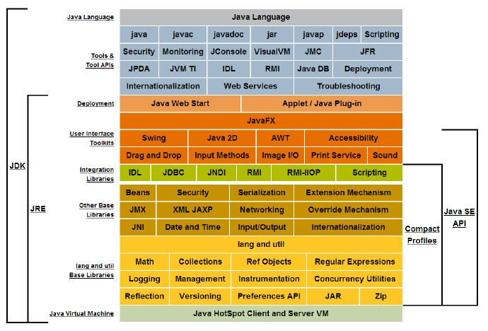

2. **JavaEE**

	JavaEE（Java Platform Enterprise Edition，Java 平台企业版）以前称为 J2EE。企业版本帮助开发和部署可移植、健壮、可伸缩且安全的服务端Java应用程序。JavaEE 是在 JavaSE 基础上构建的，它提供 Web 服务、组件模型、管理和通信 API，可以用来实现企业级的面向服务体系结构（Service Oriented Architecture，SOA）。

	扩展：SOA 是一种设计方法，其中包含多个服务，而服务之间通过配合最终会提供一系列功能。一个服务通常以独立的形式存在于操作系统进程中。服务之间通过网络调用，而非采取进程内调用的方式进行通讯。

3. **JavaME**

	JavaME（Java Platform Micro Edition，Java 平台微型版）以前称为 J2ME，也叫 K-JAVA。JavaME 为在移动设备和嵌入式设备（比如手机、PDA、电视机顶盒和打印机）上运行的应用程序提供一个健壮且灵活的的环境。

<br>

### 1.1.2、Java语言的特点

Java 语言的风格很像 C 语言和 C++ 语言，是一种纯粹的面向对象语言，它继承 了C++ 语言面向对象的技术核心，但是抛弃了 C++ 的一些缺点，比如说容易引起错误的指针以及多继承等，同时也增加了垃圾回收机制，释放掉不被使用的内存空间，解决了管理内存空间的烦恼。

Java 语言是一种分布式的面向对象语言，具有面向对象、平台无关性、简单性、解释执行、多线程、安全性等很多特点。

1. **面向对象**

	Java 是一种面向对象语言，它对对象中的类、对象、继承、封装、多态、接口、包等均有很好的支持。为了简单起见，Java 只支持类之间的单继承，但是可以使用接口来实现多继承。

2. **平台无关性**
	平台无关性的具体表现在于，Java 是 “一次编写，到处运行（Write Once，Run any Where）” 的语言，因此采用 Java 语言编写的程序具有很好的可移植性，而保证这一点的正是 Java 虚拟机机制。在引入虚拟机之后，Java 语言在不同的平台上运行不需要重新编译。

3. **简单性**

	Java 语言的语法与 C 语言和 C++ 语言很相近，使得很多程序员学起来很容易。对 Java 来说，它舍弃了很多 C++ 中难以理解的特性，如操作符的重载和多继承等，而且 Java 语言不使用指针，加入了垃圾回收机制，解决了程序员需要管理内存的问题，使编程变得更加简单。

4. **解释执行**

	Java 程序在 Java 平台运行时会被编译成字节码文件，之后便可以在有 Java 环境的操作系统上运行。在运行文件时，Java 的解释器对这些字节码进行解释执行，执行过程中需要加入的类在连接阶段被载入到运行环境中。

5. **多线程**

	Java 语言是多线程的，这也是 Java 语言的一大特性，它必须由 Thread 类和它的子类来创建，Java 支持多个线程同时执行，并提供多线程之间的同步机制。任何一个线程都有自己的 `run()` 方法，要执行的方法就写在 `run()` 方法体内。

6. **分布式**

	Java 语言支持 Internet 应用的开发，在 Java 的基本应用程序接口中就有一个网络应用程序接口，它提供了网络应用编程的类库，包括 URL、URLConnection、Socket 等。Java 的 RIM 机制也是开发分布式应用的重要手段。

7. **健壮性**

	Java 的强类型机制、异常处理、垃圾回收机制等都是 Java 强壮性的重要保证。对指针的丢弃是 Java 的一大进步。另外，Java 的异常处理机制也是健壮性的一大体现。

8. **高性能**

	Java 的高性能主要是相对其他高级脚本语言来说的，随着 JIT（Just in Time）的发展，Java 的运行速度越来越快。

9. **安全性**

	Java 通常被用在网络环境中，为此，Java 提供了一个安全机制以防止恶意代码的攻击。除了 Java 语言具有许多的安全特性以外，Java 还对通过网络下载的类增加了一个安全防范机制，分配不同的名称空间以防代替本地的同名类，并包含安全管理机制。

<br>

##  1.2、JDK的下载与安装

JDK（Java Development Kit，Java 开发工具包）是一种用于构建在 Java 平台上发布的应用程序、Applet 和组件的开发环境，即编写 Java 程序必须使用 JDK，它提供了编译和运行 Java 程序的环境。

下载安装步骤：

1. 在浏览器输入www.oracle.com，打开 Oracle 公司的官方网站：


2. 找到下载：

	

3. 选择 Java：

	

4. 选择 JDK：

	

5. 下载 1.8 版本：

	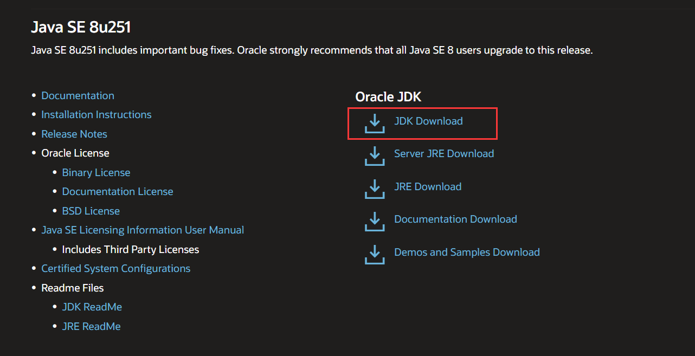

6. 选择自己需要的版本：

	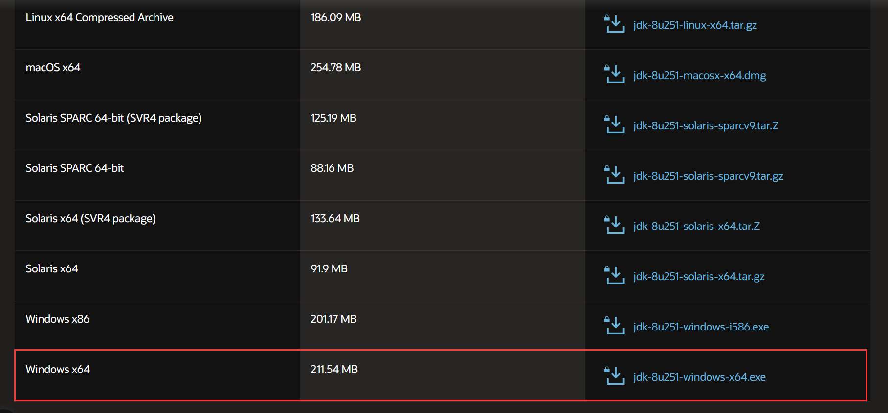

7. 同意协议，开始下载：

	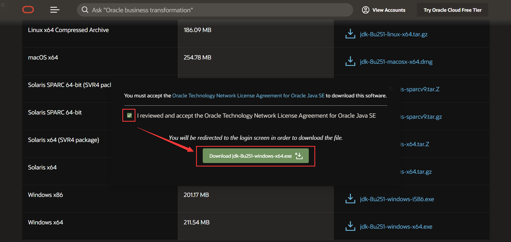

8. 下载完成后运行 exe 执行文件，开始安装，一共会安装两次，第一次是安装 JDK，第二次是安装 JRE（Java Runtime Environment，Java 运行环境）。

<br>

安装完成后，在安装位置打开 JDK 的文件夹，内容如下：

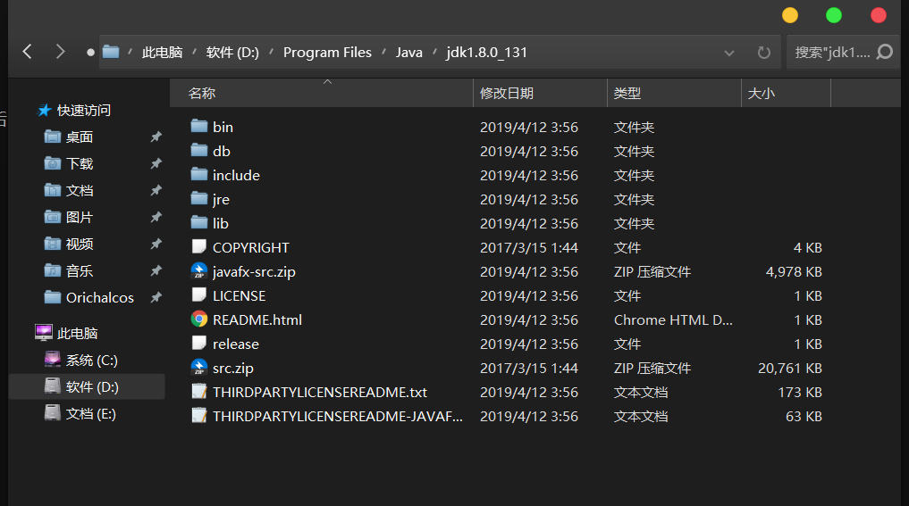

- bin：提供 JDK 工具程序，包括 javac、java、Javadoc、appletviewer 等可执行程序。
- include：存放用于本地访问的文件。
- jre：存放 Java 运行环境的文件。
- lib：存放 Java 的类库文件，工具程序实际上使用的是 Java 类库。JDK 中的工具程序，大多数也由 Java 编写而成。
- src.zip：Java 提供的 API 类的源代码压缩文件。如果需要查看 API 的某些功能是如何实现的，可以查看这个文件中的源代码内容。

<br>

## 1.3、JDK 环境变量配置

环境变量（environment variables）一般是指在操作系统中用来指定操作系统运行环境的一些参数，如：临时文件夹位置和系统文件夹位置等。

环境变量是在操作系统中一个具有特定名字的对象，它包含了一个或者多个应用程序所将使用到的信息。例如 Windows 和 DOS 操作系统中的 path 环境变量，当要求系统运行一个程序而没有告诉它程序所在的完整路径时，系统除了在当前目录下面寻找此程序外，还应到 path 中指定的路径去找。用户通过设置环境变量，来更好的运行进程。

1. 按 `Win+Pause` 打开系统属性，点击左边导航栏的高级系统设置，选择环境变量。

2. 新建环境变量 `JAVA_HOME`，在变量值中输入 JDK 的路径，保存。

3. 新建环境变量 `JRE_HOME`，在变量值中输入 JRE 的路径，保存。

4. 双击 Path 环境变量，新建两个条目 `%JAVA_HOME%\bin`、`%JRE_HOME%\bin`。

5. 一路确定！最后打开 Windows 控制台，输入 `java -version`：

	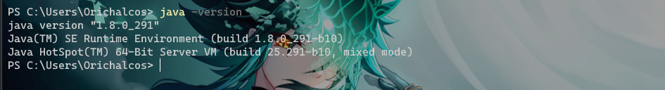

	出现 Java 版本即表示环境配置成功！

<br>

## 1.4、程序运行过程分析

Java 程序的运行必须经过编写、编译和运行 3 个步骤。

1. **编写**：是指在 Java 开发环境中进行程序代码的输入，最终形成后缀名为 `.java` 的 Java 源文件。
2. **编译**：是指使用 Java 编译器对源文件进行错误排査的过程，编译后将生成后缀名为 `.class` 的字节码文件，不像 C 语言那样生成可执行文件。
3. **运行**：是指使用 Java 解释器将字节码文件翻译成机器代码，执行并显示结果。


字节码文件是一种和任何具体机器环境及操作系统环境无关的中间代码。它是一种二进制文件，是 Java 源文件由 Java 编译器编译后生成的目标代码文件。编程人员和计算机都无法直接读懂字节码文件，它必须由专用的 Java 解释器来解释执行，因此 Java 是一种在编译基础上进行解释运行的语言。

Java 解释器负责将字节码文件翻译成具体硬件环境和操作系统平台下的机器代码，以便执行。

执行过程分为三步：**代码的装入**、**代码的检验**和**代码的执行**。类加载器（ClassLoader）负责加载装入运行一个程序所需要的所有代码，这也包括程序代码中的类所继承的类和被其调用的类。当类装载器装入一个类时，该类被放在自己的名称空间中。除了通过符号引用自己名称空间以外的类，类之间没有其他办法可以影响其他类。在本台计算机上的所有类都在同一地址空间内，而所有从外部引进的类，都有一个自己独立的名称空间。这使得本地类通过共享相同的名称空间获得较高的运行效率，同时又保证它们与从外部引进的类不会相互影响。当装入了运行程序需要的所有类后，解释器便可确定整个可执行程序的内存布局。解释器为符号引用同特定的地址空间建立对应关系及查询表。通过在这一阶段确定代码的内存布局，Java 很好地解决了由超类改变而使子类崩溃的问题，同时也防止了代码对地址的非法访问。

随后，被装入的代码由字节码检验器进行检查，检验器可以检查出操作数栈溢出，非法数据类型等多种错误。通过校验后，代码就开始执行了。

Java 虚拟机（JVM）是运行 Java 程序的软件环境，Java 解释器是 Java 虚拟机的一部分。因此 Java 程序不能直接运行在现有的操作系统平台上，它必须运行在被称为 Java 虚拟机的软件平台之上。

在运行 Java 程序时，首先会启动 JVM，然后由它来负责解释执行 Java 的字节码程序，并且 Java 字节码程序只能运行于 JVM 之上。这样利用 JVM 就可以把 Java 字节码程序和具体的硬件平台以及操作系统环境分隔开来，只要在不同的计算机上安装了针对特定平台的 JVM，Java 程序就可以运行，而不用考虑当前具体的硬件平台及操作系统环境，也不用考虑字节码文件是在何种平台上生成的。

JVM 把这种不同软、硬件平台的具体差别隐藏起来，从而实现了真正的二进制代码级的跨平台移植。JVM 是 Java 平台架构的基础，Java 的跨平台特性正是通过在 JVM 中运行 Java 程序实现的。Java 的这种运行机制可以通过下图来说明。

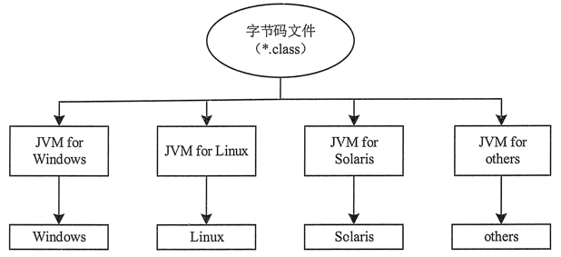

Java 语言这种 “一次编写，到处运行” 的方式，有效地解决了目前大多数高级程序设计语言需要针对不同系统来编译产生不同机器代码的问题，即硬件环境和操作平台的异构问题，大大降低了程序开发、维护和管理的开销。

> 提示：Java 程序通过 JVM 可以实现跨平台特性，但 JVM 是不跨平台的。也就是说，不同操作系统之上的 JVM 是不同的，Windows 平台之上的 JVM 不能用在 Linux 平台，反之亦然。

<br>

## 1.5、JVM、JRE 和 JDK 的关系

Java 语言的开发运行，离不开 Java 语言的运行环境 JRE。没有 JRE 的支持，Java 语言便无法运行。当然，如果还想编译 Java 程序，搞搞小开发的话，JRE 是明显不够了，这时候就需要 JDK。

其实啊，JDK 就是 JRE 加上一些常用工具组成的。JDK 不仅能运行已经被编译好了的 Java 程序，还能支持我们编译 Java 程序（ JDK=JER+各种工具）。


- JDK（Java Development Kid，Java 开发	工具包），是针对 Java 开发人员的产品，是整个 Java 的核心，包括了 Java 运行环境 JRE、Java 工具和 Java 基础类库。
- JRE（Java Runtime Environment，Java 运行时环境）是运行 JAVA 程序所必须的环境的集合，包含 JVM 标准实现及 Java 核心类库。
- JVM（Java Virtual Machine，Java 虚拟机）是整个 Java 实现跨平台的最核心的部分，能够运行以 Java 语言写作的软件程序。

<br>

# 2、程序设计基础

## 2.1、常量的定义和分类

### 2.1.1、常量值

常量值又称为字面常量，它是通过数据直接表示的，因此有很多种数据类型，像整型和字符串型等。

<br>

**整型常量值**

Java 的整型常量值主要有如下 3 种形式。

- 十进制数形式：如 `54`、`-67`、`0`。
- 八进制数形式：Java 中的八进制常数的表示以 `0` 开头，如 `0125` 表示十进制数 `85`，`-013` 表示十进制数 `-11`。
- 十六进制数形式：Java 中的十六进制常数的表示以 `0x` 或 `0X` 开头，如 `0x100` 表示十进制数 `256`，`-0x16` 表示十进制数 `-22`。

整型（int）常量默认在内存中占 32 位，是具有整数类型的值，当运算过程中所需值超过 32 位长度时，可以把它表示为长整型（long）数值。长整型类型则要在数字后面加 `L` 或 `1`， 如 `697L`，表示一个长整型数，它在内存中占 64 位。

<br>

**实型常量值**

实型常量又称实数或浮点数，Java 的实型常量值主要有如下两种形式。

- 十进制数形式：由数字和小数点组成，且必须有小数点，如 `12.34`、`-98.0`。
- 科学记数法形式：如 `1.75e5` 或 `32&E3`，其中 `e` 或 `E` 之前必须有数字，且 `e` 或 `E` 之后的数字必须为整数。

Java 实型常量默认在内存中占 64 位，是具有双精度型（double）的值。如果考虑到需要节省运行时的系统资源，而运算时的数据值取值范围并不大且运算精度要求不太高的情况，可以把它表示为单精度型（float）的数值。

单精度型数值一般要在该常数后面加 `F` 或 `f`，如 `69.7f`，表示一个 float 型实数，它在内存中占 32 位（取决于系统的版本高低）。

<br>

**布尔型常量**

Java 的布尔型常量只有两个值，即 `false`（假）和 `true`（真）。

<br>

**字符型和字符串常量值**

Java 的字符型常量值是用单引号引起来的一个字符，如 `'e'`、`'E'`。需要注意的是，Java 字符串常量值中的单引号和双引号不可混用。双引号用来表示字符串，像 `"11"`、`"d"` 等都是表示单个字符的字符串。

除了以上所述形式的字符常量值之外，Java 还允许使用一种特殊形式的字符常量值来表示一些难以用一般字符表示的字符，这种特殊形式的字符是以 `\` 开头的字符序列，称为转义字符。

> 注意：这里表示字符和字符串的单引号和双引号都必须是英语输入环境下输入的符号。

| 转义字符 | 说明                         |
| -------- | ---------------------------- |
| `\ddd`   | 1~3 位八进制数所表示的字符   |
| `\uxxxx` | 1~4 位十六进制数所表示的字符 |
| `\'`     | 单引号字符                   |
| `\"`     | 双引号字符                   |
| `\\`     | 反斜杠字符                   |
| `\r`     | 回车                         |
| `\n`     | 换行                         |
| `\b`     | 退格                         |
| `\t`     | 制表符                       |

<br>

### 2.1.2、定义常量

Java 语言使用 `final` 关键字来定义一个常量，其语法如下所示：

```java
final dataType variableName = value
```

其中，`final` 是定义常量的关键字，*dataType* 指明常量的数据类型，*variableName* 是变量的名称，*value* 是初始值。

`final` 关键字表示最终的，它可以修改很多元素，修饰变量就变成了常量。例如，以下语句使用 `final` 关键字声明常量。

```java
public class HelloWorld {
    // 静态常量
    public static final double PI = 3.14;
    // 声明成员常量
    final int y = 10;

    public static void main(String[] args) {
        // 声明局部常量
        final double x = 3.3;
    }
}
```

常量有三种类型：静态常量、成员常量和局部常量。

代码第 3 行的是声明静态常量，使用在 `final` 之前 `public static` 修饰。`public static` 修饰的常量作用域是全局的，不需要创建对象就可以访问它，在类外部访问形式为 `HelloWorld. PI`。这种常量在编程中使用很多。

代码第 5 行声明成员常量，作用域类似于成员变量，但不能修改。代码第 9 行声明局部常量，作用域类似于局部变量，但不能修改。

在定义常量时，需要注意如下内容：

- 在定义常量时就需要对该常量进行初始化。
- `final` 关键字不仅可以用来修饰基本数据类型的常量，还可以用来修饰对象的引用或者方法。
- 为了与变量区别，常量取名一般都用大写字符。

当常量被设定后，一般情况下不允许再进行更改，如果更改其值将提示错误。

<br>

## 2.2、数据类型

Java 语言支持的数据类型分为两种：基本数据类型（Primitive Type）和引用数据类型（Reference Type）。

<br>

### 2.2.1、基本数据类型

基本数据类型包括 `boolean`（布尔型）、`float`（单精度浮点型）、`char`（字符型）、`byte`（字节型）、`short`（短整型）、`int`（整型）、`long`（长整型）和 `double` （双精度浮点型）共 8 种。

| **类型名称** | **关键字** | **占用内存** | **取值范围**                |
| ------------ | ---------- | ------------ | --------------------------- |
| 字节型       | `byte`     | 1 字节       | -2^7^ ~ 2^7-1^              |
| 短整型       | `short`    | 2 字节       | -2^15^ ~ 2^15-1^            |
| 整型         | `int`      | 4 字节       | -2^31^ ~ 2^31-1^            |
| 长整型       | `long`     | 8 字节       | -2^63^ ~ 2^63-1^            |
| 单精度浮点型 | `float`    | 4 字节       | +/-3.4E+38F（6~7 个有效位） |
| 双精度浮点型 | `double`   | 8 字节       | +/-1.8E+308 (15 个有效位）  |
| 字符型       | `char`     | 2 字节       | ISO 单一字符集              |
| 布尔型       | `boolean`  | 1 字节       | true 或 false               |

提示：`char` 代表字符型，实际上字符型也是一种整数类型，相当于无符号整数类型。

所有的基本数据类型的大小（所占用的字节数）都已明确规定，在各种不同的平台上保持不变，这一特性有助于提高 Java 程序的可移植性。


Java 是一种强制类型的语言，所有的变量都必须先明确定义其数据类型，然后才能使用。Java 中所有的变量、表达式和值都必须有自己的类型，没有 “无类型” 变量这样的概念。

基本数据类型又可分为 4 大类，即整数类型（包括 `byte`、`short`，`int` 和 `long`）、浮点类型（包括 `float` 和 `double`）、布尔类型和字符类型（`char`），下面分别介绍这 4 大类数据类型。

<br>

**整数类型**

Java 定义了 4 种整数类型变量：字节型（`byte`）、短整型（`short`）、整型（`int`）和长整型（`long`）。这些都是有符号的值，正数或负数。

| **名称**          | **说明**                                                     |
| ----------------- | ------------------------------------------------------------ |
| 字节型（`byte`）  | `byte` 类型是最小的整数类型。当用户从网络或文件中处理数据流时，<br>或者处理可能与 Java 的其他内置类型不直接兼容的未加工的二进制数据时，该类型非常有用。 |
| 短整型（`short`） | `short` 类型限制数据的存储为先高字节，后低字节，这样在某些机器中会出错，因此该类型很少被使用。 |
| 整型（`int`）     | `int` 类型是最常使用的一种整数类型。                         |
| 长整型（`long`）  | 对于大型程序常会遇到很大的整数，当超出 `int` 类型所表示的范围时就要使用 `long` 类型。 |

> 提示：因为 `byte` 类型、`short` 类型、`int` 类型和 `long` 类型都是整数类型，故可以使用 `+` 相加，而非字符串之间的连接。

<br>

**浮点类型**

浮点类型是带有小数部分的数据类型，也叫实型。浮点型数据包括单精度浮点型（`float`）和双精度浮点型（`double`），代表有小数精度要求的数字。

单精度浮点型（`float`）和双精度浮点型（`double`）之间的区别主要是所占用的内存大小不同，`float` 类型占用 4 字节的内存空间，`double` 类型占用 8 字节的内存空间。双精度类型 `double` 比单精度类型 `float` 具有更高的精度和更大的表示范围。

Java 默认的浮点型为 `double`，例如，`11.11` 和 `1.2345` 都是 `double` 型数值。如果要说明一个 `float` 类型数值，就需要在其后追加字母 `f` 或 `F`，如 `11.11f` 和 `1.2345F` 都是 `float` 类型的常数。

> 注意：一个值要能被真正看作 `float`，它必须以 `f`（或 `F`）结束；否则会被当作 `double` 值。对 `double` 值来说，`d`（或 `D`）是可选的。

<br>

**布尔类型**

布尔类型（`boolean`）用于对两个数值通过逻辑运算，判断结果是 “真” 还是 “假”。Java 中用保留字 `true` 和 `false` 来代表逻辑运算中的 “真” 和 “假” 。因此，一个 `boolean` 类型的变量或表达式只能是取 `true` 和 `false` 这两个值中的一个。

在 Java 语言中，布尔类型的值不能转换成任何数据类型，`true` 常量不等于 1，而 `false` 常量也不等于 0。这两个值只能赋给声明为 `boolean` 类型的变量，或者用于布尔运算表达式中。

<br>

**字符类型**

Java 语言中的字符类型（`char`）使用两个字节的 Unicode 编码表示，它支持世界上所有语言，可以使用单引号字符或者整数对 `char` 型赋值。

一般计算机语言使用 ASCII 编码，用一个字节表示一个字符。ASCII 码是 Unicode 码的一个子集，用 Unicode 表示 ASCII 码时，其高字节为 0，它是其前 255 个字符。

Unicode 字符通常用十六进制表示。例如 `\u0000` ~ `\u00ff` 表示 ASCII 码集。`\u` 表示转义字符，它用来表示其后 4 个十六进制数字是 Unicode 码。

<br>

### 2.2.2、引用数据类型

引用数据类型建立在基本数据类型的基础上，包括数组、类和接口。引用数据类型是由用户自定义，用来限制其他数据的类型。另外，Java 语言中不支持 C++ 中的指针类型、结构类型、联合类型和枚举类型。

引用类型还有一种特殊的 `null` 类型。所谓引用数据类型就是对一个对象的引用，对象包括实例和数组两种。实际上，引用类型变量就是一个指针，只是 Java 语言里不再使用指针这个说法。

**空类型**（`null type`）就是 `null` 值的类型，这种类型没有名称。因为 `null` 类型没有名称，所以不可能声明一个 `null` 类型的变量或者转换到 `null` 类型。

**空引用**（`null`）是 `null` 类型变量唯一的值。空引用（`null`）可以转换为任何引用类型。

在实际开发中，程序员可以忽略 `null` 类型，假定 `null` 只是引用类型的一个特殊直接量。

注意：空引用（`null`）只能被转换成引用类型，不能转换成基本类型，因此不要把一个 `null` 值赋给基本数据类型的变量。

<br>

## 2.3、运算符优先级

| **类别** | **操作符**                                                   | **关联性** |
| -------- | ------------------------------------------------------------ | ---------- |
| 后缀     | `()`、`[]`、`.`（点操作符）                                  | 左到右     |
| 一元     | `++`、`--`、`+`、`-`、`～`、`!`                              | 右到左     |
| 乘性     | `*`、`/`、`％`                                               | 左到右     |
| 加性     | `+`、`-`                                                     | 左到右     |
| 移位     | `>>`、`>>>`、`<<`                                            | 左到右     |
| 关系     | `>`、`>=`、`<`、`<=`                                         | 左到右     |
| 相等     | `==`、`!=`                                                   | 左到右     |
| 按位与   | `＆`                                                         | 左到右     |
| 按位异或 | `^`                                                          | 左到右     |
| 按位或   | `|`                                                          | 左到右     |
| 短路与   | `&&`                                                         | 左到右     |
| 短路或   | `||`                                                         | 左到右     |
| 条件     | `?:`                                                         | 右到左     |
| 赋值     | `=`、`+=`、`-=`、`*=`、`/=`、`％=`、`>>=`、`<<=`、`＆=`、`^=` | 右到左     |
| 逗号     | `,`                                                          | 左到右     |

<br>

## 2.4、== 和 euqals

`==` 是 Java 中的一个运算符，而 `equals` 是 Java 中的一个方法。

<br>

**== 解读**

对于基本类型和引用类型 `==` 和作用效果是不同的，如下所示：

- 基本类型：比较两者之间的值是否相同；
- 引用类型：比较两者的引用是否相同（变量所指的内存空间的地址是否相同）。

```java
String x = "string";
String y = "string";
String z = new String("string");
System.out.println(x==y); // true
System.out.println(x==z); // false
System.out.println(x.equals(y)); // true
System.out.println(x.equals(z)); // true
```

代码解读：因为 `x` 和 `y` 指向的是同一个引用（提示：常量池），所以 `==` 也是 `true`，而 `new String()` 方法则重写开辟了内存空间，所以 `==` 结果为 `false`，而 `equals` 比较的一直是值，所以结果都为 `true`。

<br>

**equals 解读**

`equals` 的本质上就是 `==`，只不过 `String`、`Integer` 等引用类型重写了 `equals()` 方法，将其变成了值比较。

```java
class Cat {
    public Cat(String name) {
        this.name = name;
    }

    private String name;

    public String getName() {
        return name;
    }

    public void setName(String name) {
        this.name = name;
    }
}

Cat c1 = new Cat("王磊");
Cat c2 = new Cat("王磊");
System.out.println(c1.equals(c2)); // false
```

为什么是 `false` ？，`Object` 的 equals() 方法源码如下：

```java
public boolean equals(Object obj) {
    return (this == obj);
}
```

原来 `equals` 的本质就是 `==`！

```java
String s1 = new String("老王");
String s2 = new String("老王");
System.out.println(s1.equals(s2)); // true
```

为什么是 `true` ？String 的 `equals()` 方法的源码如下：

```java
public boolean equals(Object anObject) {
    if (this == anObject) {
        return true;
    }
    if (anObject instanceof String) {
        String aString = (String)anObject;
        if (coder() == aString.coder()) {
            return isLatin1() ? StringLatin1.equals(value, aString.value)
                : StringUTF16.equals(value, aString.value);
        }
    }
    return false;
}
```

`String` 重写了 `equals()` 方法，当参数类型是 `String` 时，将引用比较改成了值比较。

**总结** ：`==` 对于基本类型来说是值比较，对于引用类型来说是比较的是引用；而 `equals` 默认情况下是引用比较，只是很多类重新了 `equals` 方法，比如 `String`、`Integer` 等把它变成了值比较，所以一般情况下 `equals` 比较的是值是否相等。

<br>

# 3、字符串 String

## 3.1、定义字符串

字符串是 Java 中特殊的类，使用方法像一般的基本数据类型，被广泛应用在 Java 编程中。Java 没有内置的字符串类型，而是在标准 Java 类库中提供了一个 String 类来创建和操作字符串。

在 Java 中定义一个字符串最简单的方法是用双引号把它包围起来。这种用双引号括起来的一串字符实际上都是 String 对象，如字符串“Hello”在编译后即成为 String 对象。因此也可以通过创建 String 类的实例来定义字符串。

==不论使用哪种形式创建字符串，字符串对象一旦被创建，其值是不能改变的，但可以使用其他变量重新赋值的方式进行更改。==

### 3.1.1、直接定义字符串

直接定义字符串是指使用双引号表示字符串中的内容，例如 “Hello Java”、“Java 编程”等。具体方法是用字符串常量直接初始化一个 String 对象，示例如下：

```java
String str = "Hello Java";
```

或者

```java
String str;
str = "Hello Java";
```

==注意：字符串变量必须经过初始化才能使用。==

==String str="i" 的方式，java 虚拟机会将其分配到常量池中；而 String str=new String("i") 则会被分到堆内存中。==


### 3.1.2、使用 String 类定义

Java 中每个双引号定义的字符串都是一个 String 类的对象。因此，可以通过使用 String 类的构造方法来创建字符串，该类位于 java.lang 包中。

String 类的构造方法有多种重载形式，每种形式都可以定义字符串。

---

**String()**

初始化一个新创建的 String 对象，表示一个空字符序列。

**String(String original)**

初始化一个新创建的 String 对象，使其表示一个与参数相同的字符序列。换句话说，新创建的字符串是该参数字符串的副本。例如：

```java
String str1 = new String("hello world");
String str2 = new String(str1);
```

这里 str1 和 str2 的值是相等的，但是str1 != str2，因为指向的不是同一个字符串。

---

**String(char[ ]value)**

分配一个新的字符串，将参数中的字符数组元素全部变为字符串。该字符数组的内容已被复制，后续对字符数组的修改不会影响新创建的字符串。例如：

```java
char[] a = {'H', 'e', 'l', 'l', 'o'};
String sChar = new String(a);
a[1] = 's';
```

上述 sChar 变量的值是字符串“Hello”。 即使在创建字符串之后，对 a 数组中的第 2 个元素进行了修改，但未影响 sChar 的值。

---

**String(char[] value,int offset,int count)**

分配一个新的 String，它包含来自该字符数组参数一个子数组的字符。offset 参数是子数组第一个字符的索引，count 参数指定子数组的长度。该子数组的内容已被赋值，后续对字符数组的修改不会影响新创建的字符串。例如：

```java
char[] a = {'H', 'e', 'l', 'l', 'o'};
String sChar = new String(a, 1, 4);
a[1] = 's';
```

上述 sChar 变量的值是字符串“ello”。该构造方法使用字符数组中的部分连续元素来创建字符串对象。offset 参数指定起始索引值，count 指定截取元素的个数。创建字符串对象后，即使在后面修改了 a 数组中第 2 个元素的值，对 sChar 的值也没有任何影响。


## 3.2、String和int相互转换

### 3.2.1、String转int

String字符类型转整型int有以下两种方式:

- Integer.parseInt(str)
- Integer.valueOf(str).intValue()

在 String 转换 int 时，String 的值一定是整数，否则会报数字转换异常（java.lang.NumberFormatException）。


### 3.2.2、int转String

整型 int 转 String 字符串类型有以下 3 种方法：

- String s = String.valueOf(i);
- String s = Integer.toString(i);
- String s = "" + i;

使用第三种方法相对第一第二种耗时比较大。在使用第一种 valueOf() 方法时，注意 valueOf 括号中的值不能为空，否则会报空指针异常（NullPointerException）。


### 3.2.3、valueOf() 、parse()和toString()

**valueOf()**

valueOf() 方法将数据的内部格式转换为可读的形式。它是一种静态方法，对于所有 Java 内置的类型，在字符串内被重载，以便每一种类型都能被转换成字符串。valueOf() 方法还被类型 Object 重载，所以创建的任何形式类的对象也可被用作一个参数。

调用 valueOf() 方法可以得到其他类型数据的字符串形式——例如在进行连接操作时。对各种数据类型，可以直接调用这种方法得到合理的字符串形式。所有的简单类型数据转换成相应于它们的普通字符串形式。任何传递给 valueOf() 方法的对象都将返回对象的 toString() 方法调用的结果。事实上，也可以通过直接调用 toString() 方法而得到相同的结果。

对大多数数组，valueOf() 方法返回一个相当晦涩的字符串，这说明它是一个某种类型的数组。然而对于字符数组，它创建一个包含了字符数组中的字符的字符串对象。valueOf() 方法有一种特定形式允许指定字符数组的一个子集。

它具有如下的一般形式：

```java
static String valueOf(char chars[], int startIndex, int numChars)
```

这里 chars 是存放字符的数组，startIndex 是字符数组中期望得到的子字符串的首字符下标，numChars 指定子字符串的长度。


**parse()**

parseXxx(String) 这种形式，是指把字符串转换为数值型，其中 Xxx 对应不同的数据类型，然后转换为 Xxx 指定的类型，如 int 型和 float 型。


**toString()**

toString() 可以把一个引用类型转换为 String 字符串类型，是 sun 公司开发 Java 的时候为了方便所有类的字符串操作而特意加入的一个方法。


**String.valueOf() 的异常**

其他类型转 String 类型的时候一般来说有两种方法，`+""` 或者是 `String.valueOf()` 官方推荐使用 `String.valueOf()`。

那么：

```java
Object o1 = null;
System.out.println(String.valueOf(o1));
```

和

```java
System.out.println(String.valueOf(null));
```

有什么区别？第一种会通过，第二种会报空指针异常！

可以查看源码得知第一种和第二种进入的是不同的重载方法：

第一种进入此方法：

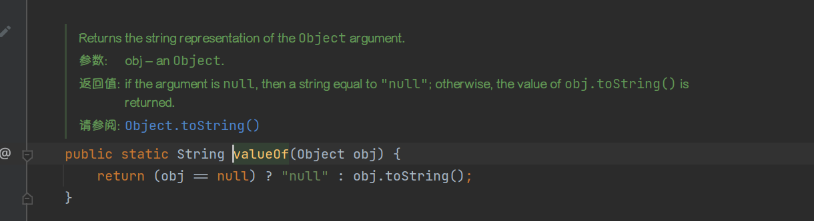

第二种进入此方法：

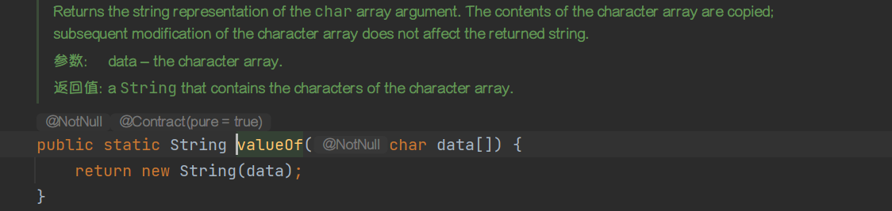

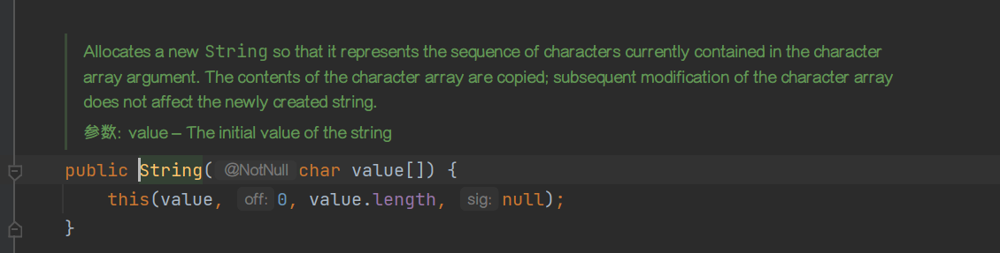

当第二种参数为 null 时，`null.length` 当然报出空指针异常。


## 3.3、StringBuffer类

在 Java 中，除了通过 String 类创建和处理字符串之外，还可以使用 StringBuffer 类来处理字符串。StringBuffer 类可以比 String 类更高效地处理字符串。

因为 ==StringBuffer 类是可变字符串类，创建 StringBuffer 类的对象后可以随意修改字符串的内容。每个 StringBuffer 类的对象都能够存储指定容量的字符串，如果字符串的长度超过了 StringBuffer 类对象的容量，则该对象的容量会自动扩大。==

---

**创建 StringBuffer 类**

StringBuffer 类提供了 3 个构造方法来创建一个字符串，如下所示：

- StringBuffer() 构造一个空的字符串缓冲区，并且初始化为 16 个字符的容量。
- StringBuffer(int length) 创建一个空的字符串缓冲区，并且初始化为指定长度 length 的容量。
- StringBuffer(String str) 创建一个字符串缓冲区，并将其内容初始化为指定的字符串内容 str，字符串缓冲区的初始容量为 16 加上字符串 str 的长度。

---

**追加字符串**

==StringBuffer 类的 append() 方法用于向原有 StringBuffer 对象中追加字符串。==该方法的语法格式如下：

```java
StringBuffer 对象.append(String str)
```

==该方法的作用是追加内容到当前 StringBuffer 对象的末尾，==类似于字符串的连接。

---

**替换字符**

==StringBuffer 类的 setCharAt() 方法用于在字符串的指定索引位置替换一个字符。==该方法的语法格式如下：

```java
StringBuffer 对象.setCharAt(int index, char ch);
```

该方法的作用是修改对象中索引值为 index 位置的字符为新的字符 ch。

==replace()方法用于在指定索引位置替换一个字符串==。该方法的语法格式如下：

```java
StringBuffer 对象.replace(int start, int end, String str);
```

---

**插入字符**

==insert()方法用于在指定索引出插入字符==，该方法的语法格式如下：

```java
StringBuffer 对象.insert(int index, String str);
```

还可以使用replace()方法进行替换字符串。

---

**反转字符串**

==StringBuffer 类中的 reverse() 方法用于将字符串序列用其反转的形式取代。==

---

**删除字符串**

StringBuffer 类提供了 deleteCharAt() 和 delete() 两个删除字符串的方法。

==deleteCharAt() 方法用于移除序列中指定位置的字符==，该方法的语法格式如下：

```java
StringBuffer 对象.deleteCharAt(int index);
```

deleteCharAt() 方法的作用是删除指定位置的字符，然后将剩余的内容形成一个新的字符串。

==delete() 方法用于移除序列中子字符串的字符，==该方法的语法格式如下：

```java
StringBuffer 对象.delete(int start,int end);
```

其中，start 表示要删除字符的起始索引值（包括索引值所对应的字符），end 表示要删除字符串的结束索引值（不包括索引值所对应的字符）。该方法的作用是删除指定区域以内的所有字符。


## 3.4、String、StringBuffer和StringBuilder的区别

在Java中字符串属于对象，Java 提供了 String 类来创建和操作字符串。String 类是不可变类，即一旦一个 String 对象被创建以后，包含在这个对象中的字符序列是不可改变的，直至这个对象被销毁。

Java 提供了两个可变字符串类 StringBuffer 和 StringBuilder，中文翻译为“字符串缓冲区”。

StringBuilder 类是 JDK 1.5 新增的类，它也代表可变字符串对象。实际上，StringBuilder 和 StringBuffer 功能基本相似，方法也差不多。不同的是，StringBuffer 是线程安全的，而 StringBuilder 则没有实现线程安全功能，所以性能略高。因此在通常情况下，如果需要创建一个内容可变的字符串对象，则应该优先考虑使用 StringBuilder 类。

StringBuffer、StringBuilder、String 中都实现了 CharSequence 接口。CharSequence 是一个定义字符串操作的接口，它只包括 length()、charAt(int index)、subSequence(int start, int end) 这几个 API。

StringBuffer、StringBuilder、String 对 CharSequence 接口的实现过程不一样，如下图  所示：

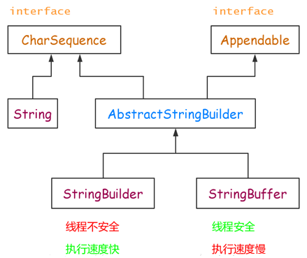

可见，String 直接实现了 CharSequence 接口，StringBuilder 和 StringBuffer 都是可变的字符序列，它们都继承于 AbstractStringBuilder，实现了 CharSequence 接口。

---

**总结**

String 是 Java 中基础且重要的类，被声明为 final class，是不可变字符串。因为它的不可变性，所以拼接字符串时候会产生很多无用的中间对象，如果频繁的进行这样的操作对性能有所影响。

StringBuffer 就是为了解决大量拼接字符串时产生很多中间对象问题而提供的一个类。它提供了 append 和 add 方法，可以将字符串添加到已有序列的末尾或指定位置，它的本质是一个线程安全的可修改的字符序列。

在很多情况下我们的字符串拼接操作不需要线程安全，所以 StringBuilder 登场了。StringBuilder 是 JDK1.5 发布的，它和 StringBuffer 本质上没什么区别，就是去掉了保证线程安全的那部分，减少了开销。

---

**线程安全：**

StringBuffer：线程安全
StringBuilder：线程不安全

---

**速度：**

一般情况下，速度从快到慢为 StringBuilder > StringBuffer > String，当然这是相对的，不是绝对的。

---

**使用环境：**

操作少量的数据使用 String。
单线程操作大量数据使用 StringBuilder。
多线程操作大量数据使用 StringBuffer。


## 3.5、正则表达式详解

==正则表达式（Regular Expression）==又称正规表示法、常规表示法，在代码中常简写为 regex、regexp 或 RE，它是计算机科学的一个概念。

正则表达式是一个强大的字符串处理工具，可以对字符串进行查找、提取、分割、替换等操作，是一种可以用于模式匹配和替换的规范。一个正则表达式就是由普通的字符（如字符 a~z）以及特殊字符（元字符）组成的文字模式，它用以描述在查找文字主体时待匹配的一个或多个字符串。

String 类里也提供了如下几个特殊的方法。

- boolean matches(String regex)：判断该字符串是否匹配指定的正则表达式。
- String replaceAll(String regex, String replacement)：将该字符串中所有匹配 regex 的子串替换成 replacement。
- String replaceFirst(String regex, String replacement)：将该字符串中第一个匹配 regex 的子串替换成 replacement。
- String[] split(String regex)：以 regex 作为分隔符，把该字符串分割成多个子串。

上面这些特殊的方法都依赖于 Java 提供的正则表达式支持，除此之外，Java 还提供了 Pattern 和 Matcher 两个类专门用于提供正则表达式支持。

正则表达式是一个用于匹配字符串的模板。实际上，任意字符串都可以当成正则表达式使用。例如“abc”，它也是一个正则表达式，只是它只能匹配“abc”字符串。

---

**正则表达式支持字符**

创建正则表达式就是创建一个特殊的字符串。正则表达式所支持的合法字符如下表所示。

| **字符** | **解释**                                                     |
| -------- | ------------------------------------------------------------ |
| X        | 字符x（x 可代表任何合法的字符)                               |
| \0mnn    | 八进制数 0mnn 所表示的字符                                   |
| \xhh     | 十六进制值 0xhh 所表示的字符                                 |
| \uhhhh   | 十六进制值 0xhhhh 所表示的 Unicode 字符                      |
| \t       | 制表符（“\u0009”）                                           |
| \n       | 新行（换行）符（‘\u000A’）                                   |
| \r       | 回车符（‘\u000D’)                                            |
| \f       | 换页符（‘\u000C’）                                           |
| \a       | 报警（bell）符（‘\u0007’）                                   |
| \e       | \e                                                           |
| \e       | x 对应的的控制符。例如，`\cM`匹配 Ctrl-M。x 值必须为 A~Z 或 a~z 之一。 |

除此之外，正则表达式中有一些特殊字符，这些特殊字符在正则表达式中有其特殊的用途，比如前面介绍的反斜线`\`。

如果需要匹配这些特殊字符，就必须首先将这些字符转义，也就是在前面添加一个反斜线`\`。正则表达式中的特殊字符如下表所示。

| **特殊字符** | **说明**                                                     |
| ------------ | ------------------------------------------------------------ |
| $            | 匹配一行的结尾。要匹配 $ 字符本身，请使用`\$`                |
| ^            | 匹配一行的开头。要匹配 ^ 字符本身，请使用`\^`                |
| ()           | 标记子表达式的开始和结束位置。要匹配这些字符，请使用`\(`和`\)` |
| []           | 用于确定中括号表达式的开始和结束位置。要匹配这些字符，请使用`\[`和`\]` |
| {}           | 用于标记前面子表达式的出现频度。要匹配这些字符，请使用`\{`和`\}` |
| *            | 指定前面子表达式可以出现零次或多次。要匹配 * 字符本身，请使用`\*` |
| +            | 指定前面子表达式可以出现一次或多次。要匹配 + 字符本身，请使用`\+` |
| ?            | 指定前面子表达式可以出现零次或一次。要匹配 ？字符本身，请使用`\?` |
| .            | 匹配除换行符`\n`之外的任何单字符。要匹配`.`字符本身，请使用`\.` |
| \            | 用于转义下一个字符，或指定八进制、十六进制字符。如果需匹配`\`字符，请用`\\` |
| \|           | 指定两项之间任选一项。如果要匹配`丨`字符本身，请使用`\`      |

将上面多个字符拼起来，就可以创建一个正则表达式。例如:

```java
"\u0041\\\\" // 匹配 A\
"\u0061\t"  // 匹配a<制表符>
"\\?\\["    // 匹配？[
```

注意：第一个正则表达式中怎么有那么多反斜杠？这是由于 Java 字符串中反斜杠本身需要转义，因此两个反斜杠（\\）实际上相当于一个（前一个用于转义）。

上面的正则表达式依然只能匹配单个字符，这是因为还未在正则表达式中使用“通配符”，“通配符”是可以匹配多个字符的特殊字符。正则表达式中的“通配符”远远超出了普通通配符的功能，它被称为预定义字符，正则表达式支持如下表所示的预定义字符。

| 预定义字符 | **说明**                                                     |
| ---------- | ------------------------------------------------------------ |
| .          | 可以匹配任何字符                                             |
| \d         | 匹配 0~9 的所有数字                                          |
| \D         | 匹配非数字                                                   |
| \s         | 匹配所有的空白字符，包括空格、制表符、回车符、换页符、换行符等 |
| \S         | 匹配所有的非空白字符                                         |
| \w         | 匹配所有的单词字符，包括 0~9 所有数字、26 个英文字母和下画线`_` |
| \W         | 匹配所有的非单词字符                                         |

上面的 7 个预定义字符其实很容易记忆，其中：

- d 是 digit 的意思，代表数字。
- s 是 space 的意思，代表空白。
- w 是 word 的意思，代表单词。
- d、s、w 的大写形式恰好匹配与之相反的字符。

有了上面的预定义字符后，接下来就可以创建更强大的正则表达式了。例如：

```java
c\\wt    // 可以匹配cat、cbt、cct、cOt、c9t等一批字符串
\\d\\d\\d-\\d\\d\\d-\\d\\d\\d\\d    // 匹配如 000-000-0000 形式的电话号码
```

在一些特殊情况下，例如，若只想匹配 a~f 的字母，或者匹配除 ab 之外的所有小写字母，或者匹配中文字符，上面这些预定义字符就无能为力了，此时就需要使用方括号表达式，方括号表达式有如下表所示的几种形式。

| 方括号表达式     | **说明**                                                     |
| ---------------- | ------------------------------------------------------------ |
| 表示枚举         | 例如`[abc]`表示 a、b、c 其中任意一个字符；`[gz]`表示 g、z 其中任意一个字符 |
| 表示范围：-      | 例如`[a-f]`表示 a~f 范围内的任意字符；<br />`[\\u0041-\\u0056]`表示十六进制字符 \u0041 到 \u0056 范围的字符。<br />范围可以和枚举结合使用，如`[a-cx-z]`，表示 a~c、x~z 范围内的任意字符 |
| 表示求否：^      | 例如`[^abc]`表示非 a、b、c 的任意字符；`[^a-f]`表示不是 a~f 范围内的任意字符 |
| 表示“与”运算：&& | 例如 `[a-e&&[def]]`是 a~z 和 [def] 的交集，表示 d、e<br/>`[a-z&&^bc]]`是 a~z 范围内的所有字符，除 b 和 c 之外 |
| 表示“并”运算     | 并运算与前面的枚举类似。例如`[a-d[m-p]]`表示 [a-dm-p]        |

方括号表达式比前面的预定义字符灵活多了，几乎可以匹配任何字符。例如，若需要匹配所有的中文字符，就可以利用 [\\u0041-\\u0056] 形式——因为所有中文字符的 Unicode 值是连续的，只要找出所有中文字符中最小、最大的 Unicode 值，就可以利用上面形式来匹配所有的中文字符。

正则表达式还支持圆括号，用于将多个表达式组成一个子表达式，圆括号中可以使用或运算符`|`。例如，正则表达式“((public)|(protected)|(private))”用于匹配 Java 的三个访问控制符其中之一。

除此之外，Java 正则表达式还支持如下表所示的几个边界匹配符。

| **边界匹配符** | **说明**                       |
| -------------- | ------------------------------ |
| ^              | 行的开头                       |
| $              | 行的结尾                       |
| \b             | 单词的边界                     |
| \B             | 非单词的边界                   |
| \A             | 输入的开头                     |
| \G             | 前一个匹配的结尾               |
| \Z             | 输入的结尾，仅用于最后的结束符 |
| \z             | 输入的结尾                     |

前面例子中需要建立一个匹配 000-000-0000 形式的电话号码时，使用了 \\d\\d\\d-\\d\\d\\d-\\d\\d\\d\\d 正则表达式，这看起来比较烦琐。实际上，正则表达式还提供了数量标识符，正则表达式支持的数量标识符有如下几种模式。

- Greedy（贪婪模式）：数量表示符默认采用贪婪模式，除非另有表示。贪婪模式的表达式会一直匹配下去，直到无法匹配为止。如果你发现表达式匹配的结果与预期的不符，很有可能是因为你以为表达式只会匹配前面几个字符，而实际上它是贪婪模式，所以会一直匹配下去。
- Reluctant（勉强模式）：用问号后缀（?）表示，它只会匹配最少的字符。也称为最小匹配模式。
- Possessive（占有模式）：用加号后缀（+）表示，目前只有 Java 支持占有模式，通常比较少用。

关于贪婪模式和勉强模式的对比，看如下代码：

```java
String str = "hello,java!";
// 贪婪模式的正则表达式
System.out.println(str.replaceFirst("\\w*" , "■"));    //输出■,java!
// 勉强模式的正则表达式
System.out.println(str.replaceFirst("\\w*?" , "■"));    //输出■hello, java!
```

当从“hello java!”字符串中查找匹配`\\w*`子串时，因为`\w*`使用了贪婪模式，数量表示符`*`会一直匹配下去，所以该字符串前面的所有单词字符都被它匹配到，直到遇到空格，所以替换后的效果是“■，Java!”；如果使用勉强模式，数量表示符`*`会尽量匹配最少字符，即匹配 0 个字符，所以替换后的结果是“■hello，java!”。


## 3.6、Pattern类和Matcher类

java.util.regex 是一个用正则表达式所订制的模式来对字符串进行匹配工作的类库包。它包括两个类：Pattern 和 Matcher。

Pattern 对象是正则表达式编译后在内存中的表示形式，因此，正则表达式字符串必须先被编译为 Pattern 对象，然后再利用该 Pattern 对象创建对应的 Matcher 对象。执行匹配所涉及的状态保留在 Matcher 对象中，多个 Matcher 对象可共享同一个 Pattern 对象。

因此，典型的调用顺序如下：

```java
// 将一个字符串编译成 Pattern 对象
Pattern p = Pattern.compile("a*b");
// 使用 Pattern 对象创建 Matcher 对象
Matcher m = p.matcher("aaaaab");
boolean b = m.matches(); // 返回 true
```

上面定义的 Pattern 对象可以多次重复使用。如果某个正则表达式仅需一次使用，则可直接使用 Pattern 类的静态 matches() 方法，此方法自动把指定字符串编译成匿名的 Pattern 对象，并执行匹配，如下所示。

```java
boolean b = Pattern.matches ("a*b","aaaaab");    // 返回 true
```

上面语句等效于前面的三条语句。但采用这种语句每次都需要重新编译新的 Pattern 对象，不能重复利用已编译的 Pattern 对象，所以效率不高。Pattern 是不可变类，可供多个并发线程安全使用。

Matcher 类提供了几个常用方法，如下表所示。

| **名称**    | **说明**                                                    |
| ----------- | ----------------------------------------------------------- |
| find()      | 返回目标字符串中是否包含与 Pattern 匹配的子串               |
| group()     | 返回上一次与 Pattern 匹配的子串                             |
| start()     | 返回上一次与 Pattern 匹配的子串在目标字符串中的开始位置     |
| end()       | 返回上一次与 Pattern 匹配的子串在目标字符串中的结束位置加 1 |
| lookingAt() | 返回目标字符串前面部分与 Pattern 是否匹配                   |
| matches()   | 返回整个目标字符串与 Pattern 是否匹配                       |
| reset()     | 将现有的 Matcher 对象应用于一个新的字符序列。               |

在 Pattern、Matcher 类的介绍中经常会看到一个 CharSequence 接口，该接口代表一个字符序列，其中 CharBuffer、String、StringBuffer、StringBuilder 都是它的实现类。简单地说，CharSequence 代表一个各种表示形式的字符串。

通过 Matcher 类的 find() 和 group() 方法可以从目标字符串中依次取出特定子串（匹配正则表达式的子串），例如互联网的网络爬虫，它们可以自动从网页中识别出所有的电话号码。下面程序示范了如何从大段的字符串中找出电话号码。

```java
public class FindGroup {
    public static void main(String[] args) {
        // 使用字符串模拟从网络上得到的网页源码
        String str = "我想找一套适合自己的JAVA教程，尽快联系我13500006666" + "交朋友，电话号码是13611125565" + "出售二手电脑，联系方式15899903312";
        // 创建一个Pattern对象，并用它建立一个Matcher对象
        // 该正则表达式只抓取13X和15X段的手机号
        // 实际要抓取哪些电话号码，只要修改正则表达式即可
        Matcher m = Pattern.compile("((13\\d)|(15\\d))\\d{8}").matcher(str);
        // 将所有符合正则表达式的子串（电话号码）全部输出
        while (m.find()) {
            System.out.println(m.group());
        }
    }
}
```

运行上面程序，看到如下运行结果：

```
13500006666
13611125565
15899903312
```

从上面运行结果可以看出，find() 方法依次查找字符串中与 Pattern 匹配的子串，一旦找到对应的子串，下次调用 find() 方法时将接着向下查找。

提示：通过程序运行结果可以看出，使用正则表达式可以提取网页上的电话号码，也可以提取邮件地址等信息。如果程序再进一步，可以从网页上提取超链接信息，再根据超链接打开其他网页，然后在其他网页上重复这个过程就可以实现简单的网络爬虫了。

find() 方法还可以传入一个 int 类型的参数，带 int 参数的 find() 方法将从该 int 索引处向下搜索。start() 和 end() 方法主要用于确定子串在目标字符串中的位置，如下程序所示。

```java
public class StartEnd {
    public static void main(String[] args) {
        // 创建一个Pattern对象，并用它建立一个Matcher对象
        String regStr = "Java is very easy!";
        System.out.println("目标字符串是：" + regStr);
        Matcher m = Pattern.compile("\\w+").matcher(regStr);
        while (m.find()) {
            System.out.println(m.group() + "子串的起始位置：" + m.start() + "，其结束位置：" + m.end());
        }
    }
}
```

上面程序使用 find()、group() 方法逐项取出目标字符串中与指定正则表达式匹配的子串，并使用 start()、end() 方法返回子串在目标字符串中的位置。运行上面程序，看到如下运行结果：

```
目标字符串是：Java is very easy!
Java子串的起始位置：0，其结束位置：4
is子串的起始位置：5，其结束位置：7
very子串的起始位置：8，其结束位置：12
easy子串的起始位置：13，其结束位置：17
```

matches() 和 lookingAt() 方法有点相似，只是 matches() 方法要求整个字符串和 Pattern 完全匹配时才返回 true，而 lookingAt() 只要字符串以 Pattern 开头就会返回 true。reset() 方法可将现有的 Matcher 对象应用于新的字符序列。看如下例子程序。

```java
public class MatchesTest {
    public static void main(String[] args) {
        String[] mails = { "kongyeeku@163.com", "kongyeeku@gmail.com", "ligang@crazyit.org", "wawa@abc.xx" };
        String mailRegEx = "\\w{3,20}@\\w+\\.(com|org|cn|net|gov)";
        Pattern mailPattern = Pattern.compile(mailRegEx);
        Matcher matcher = null;
        for (String mail : mails) {
            if (matcher == null) {
                matcher = mailPattern.matcher(mail);
            } else {
                matcher.reset(mail);
            }
            String result = mail + (matcher.matches() ? "是" : "不是") + "一个有效的邮件地址！";
            System.out.println(result);
        }
    }
}
```

上面程序创建了一个邮件地址的 Pattern，接着用这个 Pattern 与多个邮件地址进行匹配。当程序中的 Matcher 为 null 时，程序调用 matcher() 方法来创建一个 Matcher 对象，一旦 Matcher 对象被创建，程序就调用 Matcher 的 reset() 方法将该 Matcher 应用于新的字符序列。

从某个角度来看，Matcher 的 matches()、lookingAt() 和 String 类的 equals() 有点相似。区别是 String 类的 equals() 都是与字符串进行比较，而 Matcher 的 matches() 和 lookingAt() 则是与正则表达式进行匹配。

事实上，String 类里也提供了 matches() 方法，该方法返回该字符串是否匹配指定的正则表达式。例如：

```java
"kongyeeku@163.com".matches("\\w{3,20}@\\w+\\.(com|org|cn|net|gov)"); // 返回 true
```

除此之外，还可以利用正则表达式对目标字符串进行分割、查找、替换等操作，看如下例子程序。

```java
public class ReplaceTest {
    public static void main(String[] args) {
        String[] msgs = { "Java has regular expressions in 1.4", "regular expressions now expressing in Java",
                "Java represses oracular expressions" };
        Pattern p = Pattern.compile("re\\w*");
        Matcher matcher = null;
        for (int i = 0; i < msgs.length; i++) {
            if (matcher == null) {
                matcher = p.matcher(msgs[i]);
            } else {
                matcher.reset(msgs[i]);
            }
            System.out.println(matcher.replaceAll("哈哈:)"));
        }
    }
}
```

上面程序使用了 Matcher 类提供的 replaceAll() 把字符串中所有与正则表达式匹配的子串替换成“哈哈:)”，实际上，Matcher 类还提供了一个 replaceFirst()，该方法只替换第一个匹配的子串。运行上面程序，会看到字符串中所有以“re”开头的单词都会被替换成“哈哈:)”。

实际上，String 类中也提供了 replaceAll()、replaceFirst()、split() 等方法。下面的例子程序直接使用 String 类提供的正则表达式功能来进行替换和分割。

```java
public class StringReg {
    public static void main(String[] args) {
        String[] msgs = { "Java has regular expressions in 1.4", "regular expressions now expressing in Java",
                "Java represses oracular expressions" };
        for (String msg : msgs) {
            System.out.println(msg.replaceFirst("re\\w*", "哈哈:)"));
            System.out.println(Arrays.toString(msg.split(" ")));
        }
    }
}
```

上面程序只使用 String 类的 replaceFirst() 和 split() 方法对目标字符串进行了一次替换和分割。运行上面程序，会看到如下所示的输出结果。

```
Java has 哈哈:) expressions in 1.4
[Java, has, regular, expressions, in, 1.4]
哈哈:) expressions now expressing in Java
[regular, expressions, now, expressing, in, Java]
Java 哈哈:) oracular expressions
[Java, represses, oracular, expressions]
```

正则表达式是一个功能非常灵活的文本处理工具，增加了正则表达式支持后的 Java，可以不再使用 StringTokenizer 类（也是一个处理字符串的工具，但功能远不如正则表达式强大）即可进行复杂的字符串处理。

