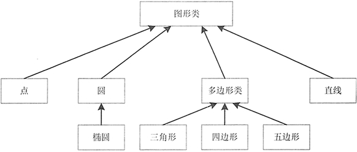
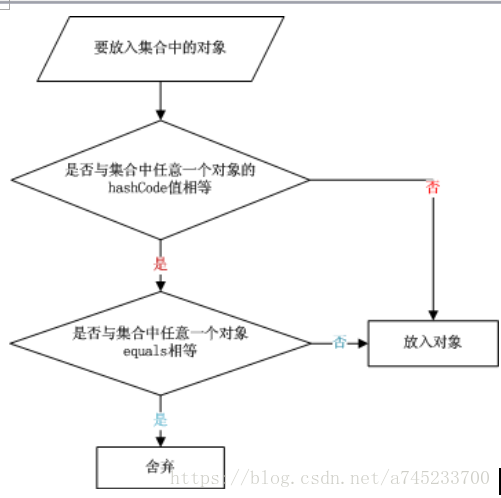
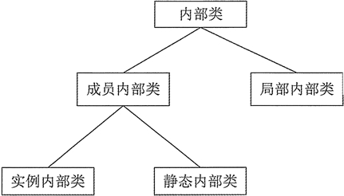

# 1、类和对象

## 1.1、对象的概念及基本特征

面向对象简称 OO（Object Oriented），20 世纪 80 年代以后，有了面向对象分析（OOA）、 面向对象设计（OOD）、面向对象程序设计（OOP）等新的系统开发方式模型的研究。

<br>

### 1.1.1、对象的概念

Java 是面向对象的编程语言，对象就是面向对象程序设计的核心。所谓对象就是真实世界中的实体，对象与实体是一一对应的，也就是说现实世界中每一个实体都是一个对象，它是一种具体的概念。对象有以下特点：

- 对象具有属性和行为。
- 对象具有变化的状态。
- 对象具有唯一性。
- 对象都是某个类别的实例。
- 一切皆为对象，真实世界中的所有事物都可以视为对象。

例如，在真实世界的学校里，会有学生和老师等实体，学生有学号、姓名、所在班级等属性（数据），学生还有学习、提问、吃饭和走路等操作。学生只是抽象的描述，这个抽象的描述称为 “类”。在学校里活动的是学生个体，即张同学、李同学等，这些具体的个体称为 “对象”，“对象” 也称为 “实例”。

<br>

### 1.1.2、面向对象的三大核心特性

面向对象开发模式更有利于人们开拓思维，在具体的开发过程中便于程序的划分，方便程序员分工合作，提高开发效率。面向对象程序设计有以下优点。

1. 可重用性：代码重复使用，减少代码量，提高开发效率。面向对象的三大核心特性（继承、封装和多态）都围绕这个核心。
2. 可扩展性：指新的功能可以很容易地加入到系统中来，便于软件的修改。
3. 可管理性：能够将功能与数据结合，方便管理。

该开发模式之所以使程序设计更加完善和强大，主要是因为面向对象具有继承、封装和多态 3 个核心特性。

<br>

**继承性**

如同生活中的子女继承父母拥有的所有财产，程序中的继承性是指子类拥有父类的全部特征和行为，这是类之间的一种关系。Java 只支持单继承。

<br>

**封装性**

封装是将代码及其处理的数据绑定在一起的一种编程机制，该机制保证了程序和数据都不受外部干扰且不被误用。封装的目的在于保护信息，使用它的主要优点如下。

- 保护类中的信息，它可以阻止在外部定义的代码随意访问内部代码和数据。
- 隐藏细节信息，一些不需要程序员修改和使用的信息，比如取款机中的键盘，用户只需要知道按哪个键实现什么操作就可以，至于它内部是如何运行的，用户不需要知道。
- 有助于建立各个系统之间的松耦合关系，提高系统的独立性。当一个系统的实现方式发生变化时，只要它的接口不变，就不会影响其他系统的使用。例如 U 盘，不管里面的存储方式怎么改变，只要 U 盘上的 USB 接口不变，就不会影响用户的正常操作。
- 提高软件的复用率，降低成本。每个系统都是一个相对独立的整体，可以在不同的环境中得到使用。例如，一个 U 盘可以在多台电脑上使用。

Java 语言的基本封装单位是类。由于类的用途是封装复杂性，所以类的内部有隐藏实现复杂性的机制。Java 提供了私有和公有的访问模式，类的公有接口代表外部的用户应该知道或可以知道的每件东西，私有的方法数据只能通过该类的成员代码来访问，这就可以确保不会发生不希望的事情。

<br>

**多态性**

面向对象的多态性，即 “一个接口，多个方法”。多态性体现在父类中定义的属性和方法被子类继承后，可以具有不同的属性或表现方式。多态性允许一个接口被多个同类使用，弥补了单继承的不足。

<br>

## 1.2、认识类和对象

在面向对象中，类和对象是最基本、最重要的组成单元。类实际上是表示一个客观世界某类群体的一些基本特征抽象。对象就是表示一个个具体的东西。所以说类是对象的抽象，对象是类的具体。

每个人都有身高、体重、年龄、血型等属性，人会劳动、会直立行走、会用自己的头脑去创造工具等方法。人之所以能区别于其他类型的动物，是因为每个人都具有 “人” 这个群体的属性与方法。

“人类” 只是一个抽象的概念，它仅仅是一个概念，是不存在的实体！但是所有具备 “人类” 这个群体的属性与方法的对象都叫人！这个对象 “人”  是实际存在的实体！每个人都是 “人” 这个群体的一个对象。

老虎为什么不是人？因为它不具备 “人” 这个群体的属性与方法，老虎不会直立行走，不会使用工具等，所以说老虎不是人！也就是说，类是概念模型，定义对象的所有特性和所需的操作，对象是真实的模型，是一个具体的实体。

由此可见，类是描述了一组有相同特性（属性）和相同行为（方法）的一组对象的集合。

对象或实体所拥有的特征在类中表示时称为类的属性。例如，每个人都具有姓名、年龄和体重，这是所有人共有的特征。但是每一个对象的属性值又各不相同，例如，小明和小红都具有体重这个属性，但是他们的体重值是不同的。

对象执行的操作称为类的方法。比如，“人” 这个对象都具有的行为是 “吃饭”，因此，吃饭就是 “人” 类的一个方法。

综上所述，类是描述实体的 “模板” 和 “原型”，它定义了属于这个类的对象所应该具有的状态和行为。比如一名学生在上课。一名正在上课的学生是类，它定义的信息有：姓名、上课。

使用该类定义的不同姓名的人在上课是对象，他们可能是小明、小红、小丽、张会等。在 Java 面向对象编程中，用自定义的类模型可以创建该类的一个实例，也就是对象。

类是实体对象的概念模型，因此通常是笼统的、不具体的。

类是构造面向对象程序的基本单位，是抽取了同类对象的共同属性和方法所形成的对象或实体的 “模板”。而对象是现实世界中实体的描述，对象要创建才存在，有了对象才能对对象进行操作。类是对象的模板，对象是类的实例。

<br>

## 1.3、成员方法

声明成员方法可以定义类的行为，行为表示一个对象能够做的事情或者能够从一个对象取得的信息。类的各种功能操作都是用方法来实现的，属性只不过提供了相应的数据。一个完整的方法通常包括方法名称、方法主体、方法参数和方法返回值类型。

<br>

**形参、实参及成员方法的调用**

关于方法的参数，经常会提到形参与实参，形参是定义方法时参数列表中出现的参数，实参是调用方法时为方法传递的参数。

下面 `retumMin()` 方法中的 *m* 和 n 是形参，调用 `retumMin()` 方法时的 *x* 和 *y* 是实参。

```java
public int returnMin(int m,int n) {
    return Math.min(m,n);    // m和n是形参
}
public static void main(String[] args) {
    int x = 50;
    int y = 100;
    Test t = new Test();
    int i = t.returnMin(x,y);    // x和y是实参
    System.out.println(i);
}
```

方法的形参和实参具有以下特点：

- 形参变量只有在被调用时才分配内存单元，在调用结束时，即刻释放所分配的内存单元。因此，形参只有在方法内部有效，方法调用结束返回主调方法后则不能再使用该形参变量。
- 实参可以是常量、变量、表达式、方法等，无论实参是何种类型的量，在进行方法调用时，它们都必须具有确定的值，以便把这些值传送给形参。因此应预先用赋值、输入等办法使实参获得确定值。
- 实参和形参在数量、类型和顺序上应严格一致，否则会发生 “类型不匹配”  的错误。
- 方法调用中发生的数据传送是单向的，即只能把实参的值传送绐形参，而不能把形参的值反向地传送给实参。因此在方法调用过程中，形参的值发生改变，而实参中的值不会变化。

在调用成员方法时应注意以下 4 点：

1. 对无参成员方法来说，是没有实际参数列表的（即没有 paramList），但方法名后的括号不能省略。
2. 对带参数的成员方法来说，实参的个数、顺序以及它们的数据类型必须与形式参数的个数、顺序以及它们的数据类型保持一致，各个实参间用逗号分隔。实参名与形参名可以相同，也可以不同。
3. 实参也可以是表达式，此时一定要注意使表达式的数据类型与形参的数据类型相同，或者使表达式的类型按 Java 类型转换规则达到形参指明的数据类型。
4. 实参变量对形参变量的数据传递是 “值传递”，即只能由实参传递给形参，而不能由形参传递给实参。程序中执行到调用成员方法时，Java 把实参值复制到一个临时的存储区（栈）中，形参的任何修改都在栈中进行，当退出该成员方法时，Java 自动清除栈中的内容。

<br>

**方法体中的局部变量**

在方法体内可以定义本方法所使用的变量，这种变量是局部变量。它的生存期与作用域是在本方法内，也就是说，局部变量只能在本方法内有效或可见，离开本方法则这些变量将被自动释放。

在方法体内定义变量时，变量前不能加修饰符。局部变量在使用前必须明确赋值，否则编译时会出错。另外，在一个方法内部，可以在复合语句（把多个语句用括号 `{}` 括起来组成的一个语句称复合语句）中定义变量，这些变量只在复合语句中有效。

<br>

## 1.4、this 关键字

`this` 关键字是 Java 常用的关键字，可用于任何实例方法内指向当前对象，也可指向对其调用当前方法的对象，或者在需要当前类型对象引用时使用。

<br>

**this.属性名**

大部分时候，普通方法访问其他方法、成员变量时无须使用 `this` 前缀，但如果方法里有个局部变量和成员变量同名，但程序又需要在该方法里访问这个被覆盖的成员变量，则必须使用 `this` 前缀。

> 提示：当一个类的属性（成员变量）名与访问该属性的方法参数名相同时，则需要使用 `this` 关键字来访问类中的属性，以区分类的属性和方法中的参数。

<br>

**this.方法名**

`this` 关键字最大的作用就是让类中一个方法，访问该类里的另一个方法或实例变量。

在现实世界里，对象的一个方法依赖于另一个方法的情形很常见，例如，吃饭方法依赖于拿筷子方法，写程序方法依赖于敲键盘方法。这种依赖都是同一个对象两个方法之间的依赖。因此，Java 允许对象的一个成员直接调用另一个成员，可以省略 `this` 前缀。

大部分时候，一个方法访问该类中定义的其他方法、成员变量时加不加 `this` 前缀的效果是完全一样的。

注意：对于 `static` 修饰的方法而言，可以使用类来直接调用该方法，如果在 `static` 修饰的方法中使用 `this` 关键字，则这个关键字就无法指向合适的对象。所以，`static` 修饰的方法中不能使用 `this` 引用。并且 Java 语法规定，静态成员不能直接访问非静态成员。

省略 `this` 前缀只是一种假象，虽然程序员省略了调用 `jump()` 方法之前的 `this`，但实际上这个 `this` 依然是存在的。

<br>

**this() 访问构造方法**

`this()` 用来访问本类的构造方法（构造方法是类的一种特殊方法，方法名称和类名相同，没有返回值。括号中可以有参数，如果有参数就是调用指定的有参构造方法。

注意：

- `this()` 不能在普通方法中使用，只能写在构造方法中。
- 在构造方法中使用时，必须是第一条语句。

<br>

## 1.5、创建对象详解

对象是对类的实例化。对象具有状态和行为，变量用来表明对象的状态，方法表明对象所具有的行为。Java 对象的生命周期包括创建、使用和清除，在 Java 语言中创建对象分显式创建与隐含创建两种情况。

<br>

### 6.5.1、显式创建对象

对象的显式创建方式有 4 种。

<br>

**使用 new 关键字创建对象**

这是常用的创建对象的方法，语法格式如下：

```java
类名 对象名 = new 类名()；
```

<br>

**调用 java.lang.Class 或者 java.lang.reflect.Constuctor 类的 newlnstance() 实例方法**

在 Java 中，可以使用 `java.lang.Class` 或者 `java.lang.reflect.Constuctor` 类的 `newlnstance()` 实例方法来创建对象，代码格式如下：

```java
java.lang.Class Class类对象名称 = java.lang.Class.forName(要实例化的类全称);
类名 对象名 = (类名)Class类对象名称.newInstance();
```

调用 `java.lang.Class` 类中的 `forName()` 方法时，需要将要实例化的类的全称（比如 `com.mxl.package.Student`）作为参数传递过去，然后再调用 `java.lang.Class` 类对象的 `newInstance()` 方法创建对象（类型为 Object，所以需要强转）。

```java
Constructor<类名> constructor = 类名.class.getDeclaredConstructor();
类名 对象名 = constructor.newInstance();
```

如果有参数，则需要在 `getDeclaredConstructor()` 方法内添加对应参数类型的 Class 对象的引用（比如 `int.class`，`String.class`），然后在 `newInstance()` 方法内填写对应实参（比如 `newInstance(1, "nihao")`）。

<br>

**调用对象的 clone() 方法**

在想对一个对象进行处理，又想保留原有的数据进行接下来的操作时会使用 `clone()`。使用该方法创建对象时，要实例化的类必须实现 `java.lang.Cloneable` 接口。调用对象的 `clone()` 方法创建对象的语法格式如下：

```java
类名 对象名 = (类名)已创建好的类对象名.clone();
```

除了使用 `clone()` ，通过实现 Serializable 接口，使用对象的序列化和反序列化也可以实现克隆，而且是深度克隆。

<br>

> **深克隆和浅克隆**
>
> - 浅克隆
>
> 	复制基本类型的属性；引用类型的属性复制：复制栈中的变量和变量指向堆内存中的对象的指针，不复制堆内存中的对象。
>
> - 深克隆
>
> 	复制基本类型的属性；引用类型的属性复制：复制栈中的变量和变量指向堆内存中的对象的指针和堆内存中的对象。

<br>

**调用 java.io.ObjectlnputStream 对象的 readObject() 方法**

<br>

下面创建一个示例演示常用的前三种对象创建方法。示例代码如下：

```java
public class Student implements Cloneable {
    // 实现 Cloneable 接口
    private String Name;    // 学生名字
    private int age;    // 学生年龄

    public Student(String name, int age) {
        // 构造方法
        this.Name = name;
        this.age = age;
    }

    public Student() {
        this.Name = "name";
        this.age = 0;
    }

    public String toString() {
        return "学生名字：" + Name + "，年龄：" + age;
    }

    public static void main(String[] args) throws Exception {
        System.out.println("---------使用 new 关键字创建对象---------");
        // 使用new关键字创建对象
        Student student1 = new Student("小刘", 22);
        System.out.println(student1);
        
        System.out.println("-----------调用 java.lang.Class 的 newInstance() 方法创建对象-----------");
        // 调用 java.lang.Class 的 newInstance() 方法创建对象
        Class c1 = Class.forName("Student");
        Student student2 = (Student) c1.newInstance();
        System.out.println(student2);
        
        System.out.println("-------------------调用对象的 clone() 方法创建对象----------");
        // 调用对象的 clone() 方法创建对象
        Student student3 = (Student) student2.clone();
        System.out.println(student3);
    }
}
```

对上述示例的说明如下：

- 使用 `new` 关键字或 Class 对象的 `newInstance()` 方法创建对象时，都会调用类的构造方法。
- 使用 Class 类的 `newInstance()` 方法创建对象时，会调用类的默认构造方法，即无参构造方法。
- 使用 Object 类的 `clone()` 方法创建对象时，不会调用类的构造方法，它会创建一个复制的对象，这个对象和原来的对象具有不同的内存地址，但它们的属性值相同。
- 如果类没有实现 Cloneable 接口，则 `clone()`。方法会抛出 `java.lang.CloneNotSupportedException` 异常，所以应该让类实现 Cloneable 接口。

程序执行结果如下：

```
---------使用 new 关键字创建对象---------
学生名字：小刘，年龄：22
-----------调用 java.lang.Class 的 newInstance() 方法创建对象-----------
学生名字：name，年龄：0
-------------------调用对象的done()方法创建对象----------
学生名字：name，年龄：0
```

<br>

### 1.5.2、隐含创建对象

除了显式创建对象以外，在 Java 程序中还可以隐含地创建对象，例如下面几种情况。

- `String strName = "strValue"`，其中的 `"strValue"` 就是一个 String 对象，由 Java 虚拟机隐含地创建。

- 字符串的 `+` 运算符运算的结果为一个新的 String 对象，示例如下：

	```java
	String str1 = "Hello";
	String str2 = "Java";
	String str3 = str1+str2;    // str3引用一个新的String对象
	```

- 当 Java 虚拟机加载一个类时，会隐含地创建描述这个类的 Class 实例。

> 提示：类的加载是指把类的 .class 文件中的二进制数据读入内存中，把它存放在运行时数据区的方法区内，然后在堆区创建一个 `java.lang.Class` 对象，用来封装类在方法区内的数据结构。

无论釆用哪种方式创建对象，Java 虚拟机在创建一个对象时都包含以下步骤：

- 给对象分配内存。
- 将对象的实例变量自动初始化为其变量类型的默认值。
- 初始化对象，给实例变量赋予正确的初始值。

> 注意：每个对象都是相互独立的，在内存中占有独立的内存地址，并且每个对象都具有自己的生命周期，当一个对象的生命周期结束时，对象就变成了垃圾，由 Java 虚拟机自带的垃圾回收机制处理。

<br>

## 1.6、解析 Java new 运算符

“new” 在 Java 中意思是 “新的”，可以说是 Java 开发者最常用的关键字。在 Java 中 `new` 的操作往往意味着在内存中开辟新的空间，这个内存空间分配在内存的堆区。

堆是用来存放由 `new` 创建的对象和数组，即动态申请的内存都存放在堆区。栈是用来存放在方法中定义的一些基本类型的变量和对象的引用变量。

Java 中一般使用 `new` 来创建对象，它可以动态地为一个对象分配地址。它的通用格式如下：

```
classname obj = new classname( );
```

其中，*obj* 是创建的对象，*classname* 是类的名字，类名后边的`()`指明了类的构造方法。构造方法定义了当创建一个对象时要进行的操作。

举例说明:

```java
public class Test {
    public static void main(String[] args) {
        String a = "Orichalcos";
        String b = new String("Orichalcos");
        String c = "Orichalcos";
        String d = new String("Orichalcos");
        System.out.println(a == b);
        System.out.println(a == c);
        System.out.println(d == b);
        System.out.println(a);
        a = "Java";
        System.out.println(a);
    }
}
```

输出结果为：

```
false
true
false
Orichalcos
Java
```

不同方式定义字符串时堆和栈的变化：

1. `String a;` 只是在栈中创建了一个 String 类的对象引用变量 *a*。
2. `String a = "Orichalcos";` 在栈中创建一个 String 类的对象引用变量 *a*，然后查找常量池中有没有存放 `"Orichalcos"`，如果有则直接指向 `"Orichalcos"`，如果没有，则将 `"Orichalcos"` 存放进常量池，再指向。
3. `String a = new String("Orichalcos");` 不仅在栈中创建一个 String 类的对象引用变量 *a*，同时也在堆中开辟一块空间存放新建的 String 对象，然后变量 *a* 指向堆中的新建的 String 对象。

`==` 用来比较地址是否相同。根据上面的输出结果可以看出：

- 使用 `new` 运算符创建的 String 对象进行 `==` 操作时，两个地址是不同的。这就说明，每次对象进行 `new` 操作后，系统都为我们开辟堆区空间，虽然值是一样，但是地址却是不一样的。
- 在改变变量 *a* 的值后（如 `a = "Java"`），再次输出时，我们发现输出的结果是 `"Java"`。事实上原来的那个 `"Orichalcos"` 在内存中并没有清除掉，而是在栈区的地址发生了改变，这次指向的是 `"Java"` 所在的地址。

<br>

**intern()方法**

`intern()` 函数用来返回常量池中的某字符串，如果常量池中已经存在该字符串，则直接返回常量池中该对象的引用。否则，在常量池中加入该对象，然后返回引用。

```java
public class New {
    public static void main(String[] args) {
        String str1 = "123";
        String str3 = new String("123").intern();
        String str4 = new String("123");
        System.out.println(str1 == str3);
        System.out.println(str3 == str4);
    }
}
```

输出结果为：

```
true
false
```

从结果中可以看出，未使用 `String.intern()` 方法时，构造相同值的字符串对象返回不同的对象引用地址，使用 `String.intern()` 方法后，构造相同值的字符串对象时，返回相同的对象引用地址。这能帮我们节约不少空间。

<br>

## 1.7、匿名对象

创建对象的标准格式如下：

```
类名称 对象名 = new 类名称();
```

每次 `new` 都相当于开辟了一个新的对象，并开辟了一个新的物理内存空间。如果一个对象只需要使用唯一的一次，就可以使用匿名对象，匿名对象还可以作为实际参数传递。

匿名对象就是没有明确的给出名字的对象，是对象的一种简写形式。一般匿名对象只使用一次，而且匿名对象只在堆内存中开辟空间，而不存在栈内存的引用。

```java
public class Person {
    public String name; // 姓名
    public int age; // 年龄
    // 定义构造方法，为属性初始化
    public Person(String name, int age) {
        this.name = name;
        this.age = age;
    }
    // 获取信息的方法
    public void tell() {
        System.out.println("姓名：" + name + "，年龄：" + age);
    }
    public static void main(String[] args) {
        new Person("张三", 30).tell(); // 匿名对象
    }
}
```

程序运行结果为：

```
姓名：张三，年龄：30
```

在以上程序的主方法中可以发现，直接使用了 `new Person("张三",30)` 语句，这实际上就是一个匿名对象，与之前声明的对象不同，此处没有任何栈内存引用它，所以此对象使用一次之后就等待被 GC（垃圾收集机制）回收。

匿名对象在实际开发中基本都是作为其他类实例化对象的参数传递的，在后面的 Java 应用部分的很多地方都可以发现其用法，匿名对象实际上就是个堆内存空间，对象不管是匿名的还是非匿名的，都必须在开辟堆空间之后才可以使用。

<br>

## 1.8、对象的销毁

对象使用完之后需要对其进行清除。对象的清除是指释放对象占用的内存。在创建对象时，用户必须使用 `new` 操作符为对象分配内存。不过，在清除对象时，由系统自动进行内存回收，不需要用户额外处理。这也是 Java 语言的一大特色，某种程度上方便了程序员对内存的管理。

Java 语言的内存自动回收称为垃圾回收（Garbage Collection）机制，简称 GC。垃圾回收机制是指 JVM 用于释放那些不再使用的对象所占用的内存。

一个对象被当作垃圾回收的情况主要如下两种。

- 对象的引用超过其作用范围。

	```java
	{
	    Object o = new Object();    // 对象o的作用范围，超过这个范围对象将被视为垃圾
	}
	```

- 对象被赋值为 `null`。

	```java
	{
	    Object o = new Object();
	    o = null;    // 对象被赋值为null将被视为垃圾
	}
	```

在 Java 的 Object 类中还提供了一个 `protected` 类型的 `finalize()` 方法，因此任何 Java 类都可以覆盖这个方法，在这个方法中进行释放对象所占有的相关资源的操作。

在 Java 虚拟机的堆区，每个对象都可能处于以下三种状态之一。

- 可触及状态：当一个对象被创建后，只要程序中还有引用变量引用它，那么它就始终处于可触及状态。
- 可复活状态：当程序不再有任何引用变量引用该对象时，该对象就进入可复活状态。在这个状态下，垃圾回收器会准备释放它所占用的内存，在释放之前，会调用它及其他处于可复活状态的对象的 `finalize()` 方法，这些 `finalize()` 方法有可能使该对象重新转到可触及状态。
- 不可触及状态：当 Java 虚拟机执行完所有可复活对象的 `finalize()` 方法后，如果这些方法都没有使该对象转到可触及状态，垃圾回收器才会真正回收它占用的内存。

> 注意：调用 `System.gc()` 或者 `Runtime.gc()` 方法也不能保证回收操作一定执行，它只是提高了 Java 垃圾回收器尽快回收垃圾的可能性。

<br>

## 1.9、空对象（null）

Java 语言支持两种数据类型，分别是基本数据类型和引用数据类型，而 `null` 是一种特殊的引用数据类型。

```java
Student stu = new Student();    // 语句1
Student stu2;                   // 语句2
stu2 = new Student();           // 语句3
```

- 语句 1 先声明一个 Student 类型的变量 *stu*，然后利用 `new` 关键字为其创建实例。一步到位，定义了一个实例变量并同时赋值。
- 语句 2 是声明一个 Student 类型的变量 *stu2*，虽然从表述习惯上讲 *stu2* 是实例变量，但实际上此时 *stu2* 并未成为一个真正的实例，它仅仅只是一个变量名字。
- 语句 3 中的 *stu2* 才成为了一个 Student 实例，它指向了内存中的某块地址空间。

为了明确表示那些仅有名字而没有内存空间的变量的具体内容，Java 引入了关键字 `null`。 `null` 表示 “空” 的意思，是绝对意义上的空，这个空指的是不存在。

一个引用变量（当变量指向一个对象时，这个变量就被称为引用变量）没有通过 `new` 分配内存空间，这个对象就是空对象，Java 使用关键字 `null` 表示空对象。

> 注意：`null` 是关键字，是大小写敏感的，不能将 `null` 写成 `Null` 或 `NULL`。

引用变量的默认值是 `null`。当试图调用一个空对象的属性或方法时，会抛出空指针异常（NullPointerException）。

- 程序员自己忘记了实例化，所以程序员必须防止这种情况发生，应该仔细检查自己的代码，为自己创建的所有对象进行实例化并初始化。
- 空对象是其它地方传递过来的，需要通过判断对象是否为 `null` 进行避免。

<br>

## 1.10、访问修饰符

在 Java 语言中提供了多个作用域修饰符，其中常用的有 `public`、`private`、`protected`、`final`、`abstract`、`static`、`transient` 和 `volatile`，这些修饰符有类修饰符、变量修饰符和方法修饰符。

信息隐藏是 OOP 最重要的功能之一，也是使用访问修饰符的原因。在编写程序时，有些核心数据往往不希望被用户调用，需要控制这些数据的访问。

对类成员访问的限制是面向对象程序设计的一个基础，这有利于防止对象的误用。只允许通过一系列定义完善的方法来访问私有数据，就可以（通过执行范围检查）防止数据赋予不正当的值。例如，类以外的代码不可能直接向一个私有成员赋值。同时，还可以精确地控制如何以及何时使用对象中的数据。

通过使用访问控制修饰符来限制对对象私有属性的访问，可以获得 3 个重要的好处。

- 防止对封装数据的未授权访问。
- 有助于保证数据完整性。
- 当类的私有实现细节必须改变时，可以限制发生在整个应用程序中的 “连锁反应”。

访问控制符是一组限定类、属性或方法是否可以被程序里的其他部分访问和调用的修饰符。类的访问控制符只能是空或者 `public`，方法和属性的访问控制符有 4 个，分别是 `public`、 `private`、`protected` 和 `friendly`，其中 `friendly` 是一种没有定义专门的访问控制符的默认情况。

| 访问范围         | private  | friendly(默认) | protected | public |
| ---------------- | -------- | -------------- | --------- | ------ |
| 同一个类         | 可访问   | 可访问         | 可访问    | 可访问 |
| 同一包中的其他类 | 不可访问 | 可访问         | 可访问    | 可访问 |
| 不同包中的子类   | 不可访问 | 不可访问       | 可访问    | 可访问 |
| 不同包中的非子类 | 不可访问 | 不可访问       | 不可访问  | 可访问 |

<br>

**private**

用 `private` 修饰的类成员，只能被该类自身的方法访问和修改，而不能被任何其他类（包括该类的子类）访问和引用。因此，`private` 修饰符具有最高的保护级别。

<br>

**friendly（默认）**

如果一个类没有访问控制符，说明它具有默认的访问控制特性。这种默认的访问控制权规定，该类只能被同一个包中的类访问和引用，而不能被其他包中的类使用，即使其他包中有该类的子类。这种访问特性又称为包访问性（package private）。

同样，类内的成员如果没有访问控制符，也说明它们具有包访问性，或称为友元（friend）。定义在同一个文件夹中的所有类属于一个包，所以前面的程序要把用户自定义的类放在同一个文件夹中（Java 项目默认的包），以便不加修饰符也能运行。

<br>

**protected**

用保护访问控制符 `protected` 修饰的类成员可以被三种类所访问：该类自身、与它在同一个包中的其他类以及在其他包中的该类的子类。使用 `protected` 修饰符的主要作用，是允许其他包中它的子类来访问父类的特定属性和方法，否则可以使用默认访问控制符。

<br>

**public**

当一个类被声明为 `public` 时，它就具有了被其他包中的类访问的可能性，只要包中的其他类在程序中使用 `import` 语句引入 `public` 类，就可以访问和引用这个类。

类中被设定为 `public` 的方法是这个类对外的接口部分，避免了程序的其他部分直接去操作类内的数据，实际就是数据封装思想的体现。每个 Java 程序的主类都必须是 `public` 类，也是基于相同的原因。

<br>

## 1.11、final 修饰符

`final` 在 Java 中的意思是最终，也可以称为完结器，表示对象是最终形态的，不可改变的意思。`final` 应用于类、方法和变量时意义是不同的，但本质是一样的，都表示不可改变，类似 C# 里的 `sealed` 关键字。

使用 `final` 关键字声明类、变量和方法需要注意以下几点：

- `final` 用在变量的前面表示变量的值不可以改变，此时该变量可以被称为常量。
- `final` 用在方法的前面表示方法不可以被重写（子类中如果创建了一个与父类中相同名称、相同返回值类型、相同参数列表的方法，只是方法体中的实现不同，以实现不同于父类的功能，这种方式被称为方法重写，又称为方法覆盖。这里了解即可，后面会详细讲解）。
- `final` 用在类的前面表示该类不能有子类，即该类不可以被继承。

<br>

### 1.11.1、final 修饰变量

`final` 修饰的变量即成为常量，只能赋值一次，但是 `final` 所修饰局部变量和成员变量有所不同。

1. `final` 修饰的局部变量必须使用之前被赋值一次才能使用。
2. `final` 修饰的成员变量在声明时没有赋值的叫 “空白 final 变量”。“空白 final 变量” 必须在构造方法或静态代码块中初始化。

注意：`final` 修饰的变量不能被赋值这种说法是错误的，严格的说法是，`final` 修饰的变量不可被改变，一旦获得了初始值，该 `final` 变量的值就不能被重新赋值。

<br>

**final 修饰基本类型变量和引用类型变量的区别**

当使用 `final` 修饰基本类型变量时，不能对基本类型变量重新赋值，因此基本类型变量不能被改变。 但对于引用类型变量而言，它保存的仅仅是一个引用，`final` 只保证这个引用类型变量所引用的地址不会改变，即一直引用同一个对象，但这个对象完全可以发生改变。

> 注意：在使用 `final` 声明变量时，要求全部的字母大写，如 `SEX`，这点在开发中是非常重要的。

 <br>

### 1.12.2、final 修饰方法

`final` 修饰的方法不可被重写，如果出于某些原因，不希望子类重写父类的某个方法，则可以使用 `final` 修饰该方法。说明这种方法提供的功能已经满足当前要求，不需要进行扩展，并且也不允许任何从此类继承的类来重写这种方法，但是继承仍然可以继承这个方法，也就是说可以直接使用。

Java 提供的 Object 类里就有一个 `final` 方法 `getClass()`，因为 Java 不希望任何类重写这个方法，所以使用 `final` 把这个方法密封起来。但对于该类提供的 `toString()` 和 `equals()` 方法，都允许子类重写，因此没有使用 `final` 修饰它们。

下面程序试图重写 `final` 方法，将会引发编译错误。

```java
public class FinalMethodTest {
    public final void test() {
    }
}
class Sub extends FinalMethodTest {
    // 下面方法定义将出现编译错误，不能重写final方法
    public void test() {
    }
}
```

对于一个 `private` 方法，因为它仅在当前类中可见，其子类无法访问该方法，所以子类无法重写该方法——如果子类中定义一个与父类 `private` 方法有相同方法名、相同形参列表、相同返回值类型的方法，也不是方法重写，只是重新定义了一个新方法。因此，即使使用 `final` 修饰一个 `private` 访问权限的方法，依然可以在其子类中定义与该方法具有相同方法名、相同形参列表、相同返回值类型的方法。

下面程序示范了如何在子类中 “重写” 父类的 `private final` 方法。

```java
public class PrivateFinalMethodTest {
    private final void test() {
    }
}
class Sub extends PrivateFinalMethodTest {
    // 下面的方法定义不会出现问题
    public void test() {
    }
}
```

上面程序没有任何问题，虽然子类和父类同样包含了同名的 `void test()` 方法，但子类并不是重写父类的方法，因此即使父类的 `void test()` 方法使用了 `final` 修饰，子类中依然可以定义 `void test()` 方法。

`final` 修饰的方法仅仅是不能被重写，并不是不能被重载，因此下面程序完全没有问题。

```java
public class FinalOverload {
    // final 修饰的方法只是不能被重写，完全可以被重载
    public final void test(){}
    public final void test(String arg){}
}
```

<br>

### 1.11.3、final 修饰类

`final` 修饰的类不能被继承，意味着此类在一个继承树中是一个叶子类，并且此类的设计已被认为很完美而不需要进行修改或扩展。当子类继承父类时，将可以访问到父类内部数据，并可通过重写父类方法来改变父类方法的实现细节，这可能导致一些不安全的因素。为了保证某个类不可被继承，则可以使用 `final` 修饰这个类。

对于 `final` 类中的成员，可以定义其为 `final`，也可以不是 `final`。而对于方法，由于所属类为 `final` 的关系，自然也就成了 `final` 型。也可以明确地给 `final` 类中的方法加上一个 `final`，这显然没有意义

<br>

## 1.12、main() 方法

在 Java 中，`main()` 方法是 Java 应用程序的入口方法，程序在运行的时候，第一个执行的方法就是 `main()` 方法。`main()` 方法和其他的方法有很大的不同。

其中，使用 `main()` 方法时应该注意如下几点：

- 访问控制权限是公有的（`public`）。
- `main()` 方法是静态的。如果要在 `main()` 方法中调用本类中的其他方法，则该方法也必须是静态的，否则需要先创建本类的实例对象，然后再通过对象调用成员方法。
- `main()` 方法没有返回值，只能使用 `void`。
- `main()` 方法具有一个字符串数组参数，用来接收执行 Java 程序的命令行参数。命令行参数作为字符串，按照顺序依次对应字符串数组中的元素。
- 字符串中数组的名字（代码中的 *args*）可以任意设置，但是根据习惯，这个字符串数组的名字一般和 Java 规范范例中 `main()` 参数名保持一致，命名为 *args*，而方法中的其他内容都是固定不变的。
- `main()` 方法定义必须是 `public static void main(String[] 字符串数组参数名)`。
- 一个类只能有一个 `main()` 方法，这是一个常用于对类进行单元测试（对软件中的最小可测试单元进行检查和验证）的技巧。

创建一个 Java 程序，编写代码实现程序执行时统计传递参数的数量及每个参数值。示例代码如下:

```java
public class TestMain {
    public static void main(String[] args) {
        int n = args.length;    // 获取参数数量
        System.out.println("一共有 "+n+" 个参数");
        if(n > 0) {   
            // 判断参数个数是否大于0
            for(int i = 0;i < n;i++) {
                System.out.println(args[i]);
            }
        }
    }
}
```

执行结果如下所示：

```
C:\Users\leovo>d:

D:\myJava>javac TestMain.java

D:\myJava>java TestMain
一共有 0 个参数

D:\myJava>java TestMain apple banana
一共有 2 个参数
apple
banana

D:\myJava>java TestMain one two three four five six
一共有 6 个参数
one
two
three
four
five
six

D:\myJava>
```

<br>

## 1.13、构造方法

构造方法是类的一种特殊方法，用来初始化类的一个新的对象，在创建对象（`new` 运算符）之后自动调用。Java 中的每个类都有一个默认的构造方法，并且可以有一个以上的构造方法。

Java 构造方法有以下特点：

- 方法名必须与类名相同
- 可以有 0 个、1 个或多个参数
- 没有任何返回值，包括 `void`
- 默认返回类型就是对象类型本身
- 只能与 `new` 运算符结合使用

值得注意的是，如果为构造方法定义了返回值类型或使用 `void` 声明构造方法没有返回值，编译时不会出错，但 Java 会把这个所谓的构造方法当成普通方法来处理。

实际上，类的构造方法是有返回值的，当使用 `new` 关键字来调用构造方法时，构造方法返回该类的实例，可以把这个类的实例当成构造器的返回值，因此构造器的返回值类型总是当前类，无须定义返回值类型。但必须注意不要在构造方法里使用 `return` 来返回当前类的对象，因为构造方法的返回值是隐式的。

> 注意：构造方法不能被 `static`、`final`、`synchronized`、`abstract` 和 `native`（类似于 `abstract`）修饰。构造方法用于初始化一个新对象，所以用 `static` 修饰没有意义。构造方法不能被子类继承，所以用 `final` 和 `abstract` 修饰没有意义。多个线程不会同时创建内存地址相同的同一个对象，所以用 `synchronized` 修饰没有必要。

在一个类中，与类名相同的方法就是构造方法。每个类可以具有多个构造方法，但要求它们各自包含不同的方法参数。

在一个类中定义多个具有不同参数的同名方法，这就是方法的重载。

> 注意：类的构造方法不是要求必须定义的。如果在类中没有定义任何一个构造方法，则 Java 会自动为该类生成一个默认的构造方法。默认的构造方法不包含任何参数，并且方法体为空。如果类中显式地定义了一个或多个构造方法，则 Java 不再提供默认构造方法。

> 提示：无参数的构造方法也被称为 `Nullary` 构造方法。只有编译程序自动加入的构造方法，才称为默认构造函数。如果自行编写无参数、没有内容的构造函数，就不称为默认构造函数了（只是 `Nullary` 构造函数）。虽然只是名词定义，不过认证考试时要区别一下两者的不同。

Object 类具有一个 `toString()` 方法，该方法是个特殊的方法，创建的每个类都会继承该方法，它返回一个 String 类型的字符串。如果一个类中定义了该方法，则在输出该类对象时，将会自动调用该类对象的 `toString()` 方法返回一个字符串，使用 `System.out.println(对象名)` 就可以将返回的字符串内容打印出来。

<br>

## 1.14、析构方法

析构方法与构造方法相反，当对象脱离其作用域时（例如对象所在的方法已调用完毕），系统自动执行析构方法。析构方法往往用来做清理垃圾碎片的工作，例如在建立对象时用 `new` 开辟了一片内存空间，应退出前在析构方法中将其释放。

在 Java 的 Object 类中还提供了一个 `protected` 类型的 `finalize()` 方法，因此任何 Java 类都可以覆盖这个方法，在这个方法中进行释放对象所占有的相关资源的操作。

对象的 `finalize()` 方法具有如下特点：

- 垃圾回收器是否会执行该方法以及何时执行该方法，都是不确定的。
- `finalize()` 方法有可能使用对象复活，使对象恢复到可触及状态。
- 垃圾回收器在执行 `finalize()` 方法时，如果出现异常，垃圾回收器不会报告异常，程序继续正常运行。

下面通过一个例子来讲解析构方法的使用。该例子计算从类中实例化对象的个数。

1. Counter 类在构造方法中增值，在析构方法中减值。如下所示为计数器类 Counter 的代码：

	```java
	public class Counter {
	    private static int count = 0;    // 计数器变量
	    public Counter() {
	        // 构造方法
	        this.count++;    // 创建实例时增加值
	    }
	    public int getCount() {
	        // 获取计数器的值
	        return this.count;
	    }
	    protected void finalize() {
	        // 析构方法
	        this.count--;    // 实例销毁时减少值
	        System.out.println("对象销毁");
	    }
	}
	```

2. 创建一个带 `main()` 的 TestCounter 类对计数器进行测试，示例代码如下：

	```java
	public class TestCounter {
	    public static void main(String[] args) {
	        Counter cnt1 = new Counter();    // 建立第一个实例
	        System.out.println("数量："+cnt1.getCount());    // 输出1
	        Counter cnt2 = new Counter();    // 建立第二个实例
	        System.out.println("数量："+cnt2.getCount());    // 输出2
	        cnt2 = null;    // 销毁实例2
	        try {
	            System.gc();    // 清理内存
	            Thread.currentThread().sleep(1000);    // 延时1000毫秒
	            System.out.println("数量："+cnt1.getCount());    // 输出1
	        } catch(InterruptedException e) {
	            e.printStackTrace();
	        }
	    }
	}
	```

3. 执行后输出结果如下：

	```java
	数量：1
	数量：2
	对象销毁
	数量：1
	```


> 技巧：由于 `finalize()` 方法的不确定性，所以在程序中可以调用 `System.gc()` 或者 `Runtime.gc()` 方法提示垃圾回收器尽快执行垃圾回收操作。

<br>

# 2、包（package）

包允许将类组合成较小的单元（类似文件夹），它基本上隐藏了类，并避免了名称上的冲突。包允许在更广泛的范围内保护类、数据和方法。你可以在包内定义类，而在包外的代码不能访问该类。这使你的类相互之间有隐私，但不被其他世界所知。

包的 3 个作用如下：

1. 区分相同名称的类。
2. 能够较好地管理大量的类。
3. 控制访问范围。

<br>

## 2.1、包定义

Java 中使用 `package` 语句定义包，`package` 语句应该放在源文件的第一行，在每个源文件中只能有一个包定义语句，并且 `package` 语句适用于所有类型（类、接口、枚举和注释）的文件。定义包语法格式如下：

```
package 包名;
```

Java 包的命名规则如下：

- 包名全部由小写字母（多个单词也全部小写）。
- 如果包名包含多个层次，每个层次用 `.` 分割。
- 包名一般由倒置的域名开头，比如 `com.baidu`，不要有 `www`。
- 自定义包不能 `java` 开头。

> 注意：如果在源文件中没有定义包，那么类、接口、枚举和注释类型文件将会被放进一个无名的包中，也称为默认包。在实际企业开发中，通常不会把类定义在默认包下。

<br>

## 2.2、包导入

如果使用不同包中的其它类，需要使用该类的全名（包名+类名）。代码如下：

```java
example.Test test = new example.Test();
```

其中，*example* 是包名，*Test* 是包中的类名，*test* 是类的对象。

为了简化编程，Java 引入了 `import` 关键字，`import` 可以向某个 Java 文件中导入指定包层次下的某个类或全部类。`import` 语句位于 `package` 语句之后，类定义之前。一个 Java 源文件只能包含一个 `package` 语句，但可以包含多个 `import` 语句。

使用 `import` 导入单个类的语法格式如下：

```
import 包名+类名;
```

上面语句用于直接导入指定类，例如导入前面的 `example.Test` 类，代码如下：

```java
import example.Test;
```

使用 `import` 语句导入指定包下全部类的用法按如下：

```java
import example.*;
```

上面 `import` 语句中的星号 `*` 只能代表类，不能代表包，表明导入 `example` 包下的所有类。

> 提示：使用星号 `*` 可能会增加编译时间，特别是引入多个大包时，所以明确的导入你想要用到的类是一个好方法，需要注意的是使用星号对运行时间和类的大小没有影响。

通过使用 `import` 语句可以简化编程，但 `import` 语句并不是必需的，如果在类里使用其它类的全名，可以不使用 `import` 语句。

Java 默认为所有源文件导入 `java.lang` 包下的所有类，因此前面在 Java 程序中使用 String、System 类时都无须使用 `import` 语句来导入这些类。但对于前面介绍数组时提到的 Arrays 类，其位于 `java.util` 包下，则必须使用 `import` 语句来导入该类。

<br>

## 2.3、系统包

Java SE 提供了一些系统包，其中包含了 Java 开发中常用的基础类。在 Java 语言中，开发人员可以自定义包，也可以使用系统包，常用的系统包如表 1 所示。

| 包                      | 说明                                                         |
| ----------------------- | ------------------------------------------------------------ |
| `java.lang`             | Java 的核心类库，包含运行 Java 程序必不可少的系统类，如基本数据类型、基本数学函数、 字符串处理、异常处理和线程类等，系统默认加载这个包 |
| `java.io`               | Java 语言的标准输入/输出类库，如基本输入/输出流、文件输入/输出、过滤输入/输出流等 |
| `java.util`             | 包含如处理时间的 Date 类，处理动态数组的 Vector 类，以及 Stack 和 HashTable 类 |
| `java.awt`              | 构建图形用户界面（GUI）的类库，低级绘图操作 Graphics 类、图形界面组件和布局管理 （如 Checkbox 类、Container 类、LayoutManger 接口等），以及用户界面交互控制和事 件响应（如 Event 类） |
| `java.awt.image`        | 处理和操纵来自网上的图片的 Java 工具类库                     |
| `java.wat.peer`         | 很少在程序中直接用到，使得同一个 Java 程序在不同的软硬件平台上运行 |
| `java.net`              | 实现网络功能的类库有 Socket 类、ServerSocket 类              |
| `java.lang.reflect`     | 提供用于反射对象的工具                                       |
| `java.util.zip`         | 实现文件压缩功能                                             |
| `java.awt.datatransfer` | 处理数据传输的工具类，包括剪贴板、字符串发送器等             |
| `java.sql`              | 实现 JDBC 的类库                                             |
| `java.rmi`              | 提供远程连接与载入的支持                                     |
| `java. security`        | 提供安全性方面的有关支持                                     |

<br>

# 3、继承和多态

## 3.1、类的封装

封装将类的某些信息隐藏在类内部，不允许外部程序直接访问，只能通过该类提供的方法来实现对隐藏信息的操作和访问。

例如：一台计算机内部极其复杂，有主板、CPU、硬盘和内存， 而一般用户不需要了解它的内部细节，不需要知道主板的型号、CPU 主频、硬盘和内存的大小，于是计算机制造商将用机箱把计算机封装起来，对外提供了一些接口，如鼠标、键盘和显示器等，这样当用户使用计算机就非常方便。

封装的特点：

- 只能通过规定的方法访问数据。
- 隐藏类的实例细节，方便修改和实现。

实现封装的具体步骤如下：

1. 修改属性的可见性来限制对属性的访问，一般设为 `private`。
2. 为每个属性创建一对赋值（setter）方法和取值（getter）方法，一般设为 `public`，用于属性的读写。
3. 在赋值和取值方法中，加入属性控制语句（对属性值的合法性进行判断）。

下面以一个员工类的封装为例介绍封装过程。一个员工的主要属性有姓名、年龄、联系电话和家庭住址。假设员工类为 Employee，示例如下：

```java
public class Employee {
    private String name; // 姓名
    private int age; // 年龄
    private String phone; // 联系电话
    private String address; // 家庭住址

    public String getName() {
        return name;
    }

    public void setName(String name) {
        this.name = name;
    }

    public int getAge() {
        return age;
    }

    public void setAge(int age) {
        // 对年龄进行限制
        if (age < 18 || age > 40) {
            System.out.println("年龄必须在18到40之间！");
            this.age = 20; // 默认年龄
        } else {
            this.age = age;
        }
    }

    public String getPhone() {
        return phone;
    }

    public void setPhone(String phone) {
        this.phone = phone;
    }

    public String getAddress() {
        return address;
    }

    public void setAddress(String address) {
        this.address = address;
    }
}

```

如上述代码所示，使用 `private` 关键字修饰属性，这就意味着除了 Employee 类本身外，其他任何类都不可以访问这些属性。但是，可以通过这些属性的 `setXxx()` 方法来对其进行赋值，通过 `getXxx()` 方法来访问这些属性。

在 *age* 属性的 `setAge()` 方法中，首先对用户传递过来的参数 *age* 进行判断，如果 *age* 的值不在 18 到 40 之间，则将 Employee 类的 *age* 属性值设置为 20，否则为传递过来的参数值。

编写测试类 EmployeeTest，在该类的 `main()` 方法中调用 Employee 属性的 `setXxx()` 方法对其相应的属性进行赋值，并调用 `getXxx()` 方法访问属性，代码如下：

```java
public class EmployeeTest {
    public static void main(String[] args) {
        Employee people = new Employee();
        people.setName("王丽丽");
        people.setAge(35);
        people.setPhone("13653835964");
        people.setAddress("河北省石家庄市");
        System.out.println("姓名：" + people.getName());
        System.out.println("年龄：" + people.getAge());
        System.out.println("电话：" + people.getPhone());
        System.out.println("家庭住址：" + people.getAddress());
    }
}
```

运行该示例，输出结果如下：

```
姓名：王丽丽
年龄：35
电话：13653835964
家庭住址：河北省石家庄市
```

通过封装，实现了对属性的数据访问限制，满足了年龄的条件。在属性的赋值方法中可以对属性进行限制操作，从而给类中的属性赋予合理的值， 并通过取值方法获取类中属性的值（也可以直接调用类中的属性名称来获取属性值）。

<br>

## 3.2、继承（extends）

继承是面向对象的三大特征之一。继承和现实生活中的 “继承” 的相似之处是保留一些父辈的特性，从而减少代码冗余，提高程序运行效率。

Java 中的继承就是在已经存在类的基础上进行扩展，从而产生新的类。已经存在的类称为父类、基类或超类，而新产生的类称为子类或派生类。在子类中，不仅包含父类的属性和方法，还可以增加新的属性和方法。

Java 中子类继承父类的语法格式如下：

```java
修饰符 class class_name extends extend_class {
    // 类的主体
}
```

其中，*class_name* 表示子类（派生类）的名称；*extend_class* 表示父类（基类）的名称；`extends` 关键字直接跟在子类名之后，其后面是该类要继承的父类名称。例如：

```java
public class Student extends Person{}
```

类的继承不改变类成员的访问权限，也就是说，如果父类的成员是公有的、被保护的或默认的，它的子类仍具有相应的这些特性，并且子类不能获得父类的构造方法。

> 注意：如果在父类中存在有参的构造方法而并没有重载无参的构造方法，那么在子类中必须含有有参的构造方法，因为如果在子类中不含有构造方法，默认会调用父类中无参的构造方法，而在父类中并没有无参的构造方法，因此会出错。

<br>

**单继承**

Java 语言摒弃了 C++ 中难以理解的多继承特征，即 Java 不支持多继承，只允许一个类直接继承另一个类，即子类只能有一个直接父类，`extends` 关键字后面只能有一个类名。例如，如下代码会导致编译错误：

```java
class Student extends Person,Person1,Person2{…}
class Student extends Person,extends Person1,extends Person2{…}
```

很多地方在介绍 Java 的单继承时，可能会说 Java 类只能有一个父类，严格来讲，这种说法是错误的，应该是一个类只能有一个直接父类，但是它可以有多个间接的父类。例如，Student 类继承 Person 类，Person 类继承 Person1 类，Person1 类继承 Person2 类，那么 Person1 和 Person2 类是 Student 类的间接父类。下图展示了单继承的关系。



从图 1 中可以看出，三角形、四边形和五边形的直接父类是多边形类，它们的间接父类是图形类。图形类、多边形类和三角形、四边形、五边形类形成了一个继承的分支。在这个分支上，位于下层的子类会继承上层所有直接或间接父类的属性和方法。如果两个类不在同一个继承树分支上，就不会存在继承关系，例如多边形类和直线。

如果定义一个 Java 类时并未显式指定这个类的直接父类，则这个类默认继承 `java.lang.Object` 类。因此，`java.lang.Object` 类是所有类的父类，要么是其直接父类，要么是其间接父类。因此所有的 Java 对象都可调用 `java.lang.Object` 类所定义的实例方法。

使用继承的注意点：

1. 子类一般比父类包含更多的属性和方法。
2. 父类中的 `private` 成员在子类中是不可见的，因此在子类中不能直接使用它们。
3. 父类和其子类间必须存在 “是一个” 即 “is-a” 的关系，否则不能用继承。但也并不是所有符合 “is-a” 关系的都应该用继承。例如，正方形是一个矩形，但不能让正方形类来继承矩形类，因为正方形不能从矩形扩展得到任何东西。正确的继承关系是正方形类继承图形类。
4. Java 只允许单一继承（即一个子类只能有一个直接父类），C++ 可以多重继承（即一个子类有多个直接父类）。

<br>

**继承的优缺点**

在面向对象语言中，继承是必不可少的、非常优秀的语言机制，它有如下优点：

1. 实现代码共享，减少创建类的工作量，使子类可以拥有父类的方法和属性。
2. 提高代码维护性和可重用性。
3. 提高代码的可扩展性，更好的实现父类的方法

自然界的所有事物都是优点和缺点并存的，继承的缺点如下：

1. 继承是侵入性的。只要继承，就必须拥有父类的属性和方法。
2. 降低代码灵活性。子类拥有父类的属性和方法后多了些约束。
3. 增强代码耦合性（开发项目的原则为高内聚低耦合）。当父类的常量、变量和方法被修改时，需要考虑子类的修改，有可能会导致大段的代码需要重构。

<br>

## 3.3、super 关键字

由于子类不能继承父类的构造方法，因此，如果要调用父类的构造方法，可以使用 `super` 关键字。`super` 可以用来访问父类的构造方法、普通方法和属性。

`super` 关键字的功能：

- 在子类的构造方法中显式的调用父类构造方法
- 访问父类的成员方法和变量。

<br>

**super 调用父类的构造方法**

`super` 关键字可以在子类的构造方法中显式地调用父类的构造方法，基本格式如下：

```java
super(parameter-list);
```

其中，*parameter*-list 指定了父类构造方法中的所有参数。`super()` 必须是在子类构造方法的方法体的第一行。

如果一个类中没有写任何的构造方法，JVM 会生成一个默认的无参构造方法。在继承关系中，由于在子类的构造方法中，第一条语句默认为调用父类的无参构造方法（即默认为 `super()`，一般这行代码省略了）。所以当在父类中定义了有参构造方法，但是没有定义无参构造方法时，编译器会强制要求我们定义一个相同参数类型的构造方法。

<br>

**super 访问父类成员**

当子类的成员变量或方法与父类同名时，可以使用 `super` 关键字来访问。如果子类重写了父类的某一个方法，即子类和父类有相同的方法定义，但是有不同的方法体，此时，我们可以通过 `super` 来调用父类里面的这个方法。

使用 `super` 访问父类中的成员与 `this` 关键字的使用相似，只不过它引用的是子类的父类，语法格式如下：

```java
super.member
```

其中，*member* 是父类中的属性或方法。使用 `super` 访问父类的属性和方法时不用位于第一行。

<br>

**super 和 this 的区别**

`this` 指的是当前对象的引用，`super` 是当前对象的父对象的引用。下面先简单介绍一下 `super` 和 `this` 关键字的用法。

`super` 关键字的用法：

- `super.父类属性名`：调用父类中的属性
- `super.父类方法名`：调用父类中的方法
- `super()`：调用父类的无参构造方法
- `super(参数)`：调用父类的有参构造方法

如果构造方法的第一行代码不是 `this()` 和 `super()`，则系统会默认添加 `super()`。

`this` 关键字的用法：

- `this.属性名`：表示当前对象的属性
- `this.方法名(参数)`：表示调用当前对象的方法

当局部变量和成员变量发生冲突时，使用 `this.` 进行区分。

关于 Java `super` 和 `this` 关键字的异同，可简单总结为以下几条。

- 子类和父类中变量或方法名称相同时，用 `super` 关键字来访问。可以理解为 `super` 是指向自己父类对象的一个指针。在子类中调用父类的构造方法。
- `this` 是自身的一个对象，代表对象本身，可以理解为 `this` 是指向对象本身的一个指针。在同一个类中调用其它方法。
- `this` 和 `super` 不能同时出现在一个构造方法里面，因为 `this` 必然会调用其它的构造方法，其它的构造方法中肯定会有 `super` 语句的存在，所以在同一个构造方法里面有相同的语句，就失去了语句的意义，编译器也不会通过。
- `this()` 和 `super()` 都指的是对象，所以，均不可以在 `static` 环境中使用，包括 `static` 变量、`static` 方法和 `static` 语句块。
- 从本质上讲，`this` 是一个指向对象本身的指针, 然而 `super` 是一个 Java 关键字。

<br>

## 3.4、向上转型和向下转型

将一个类型强制转换成另一个类型的过程被称为类型转换。这里所说的对象类型转换，是指存在继承关系的对象，不是任意类型的对象。当对不存在继承关系的对象进行强制类型转换时，会抛出 Java 强制类型转换（`java.lang.ClassCastException`）异常。

Java 语言允许某个类型的引用变量引用子类的实例，而且可以对这个引用变量进行类型转换。Java 中引用类型之间的类型转换（前提是两个类是父子关系）主要有两种，分别是向上转型（upcasting）和向下转型（downcasting）。

<br>

**向上转型**

父类引用指向子类对象为向上转型，语法格式如下：

```java
fatherClass obj = new sonClass();
```

其中，*fatherClass* 是父类名称或接口名称，*obj* 是创建的对象，*sonClass* 是子类名称。

向上转型就是把子类对象直接赋给父类引用，不用强制转换。使用向上转型可以调用父类类型中的所有成员，不能调用子类类型中特有成员，最终运行效果看子类的具体实现。

<br>

**向下转型**

与向上转型相反，子类引用指向父类对象为向下转型，语法格式如下：

```java
sonClass obj = (sonClass) fatherClass;
```

其中，*fatherClass* 是父类名称，*obj* 是创建的对象，*sonClass* 是子类名称。

下面通过具体的示例演示对象类型的转换。例如，父类 Animal 和子类 Cat 中都定义了实例变量 *name*、静态变量 *staticName*、实例方法 `eat()` 和静态方法 `staticEat()`。此外，子类 Cat 中还定义了实例变量 *str* 和实例方法 `eatMethod()`。

父类 Animal 的代码如下：

```java
public class Animal {
    public String name = "Animal：动物";
    public static String staticName = "Animal：可爱的动物";
    public void eat() {
        System.out.println("Animal：吃饭");
    }
    public static void staticEat() {
        System.out.println("Animal：动物在吃饭");
    }
}
```

子类 Cat 的代码如下： 

```java
public class Cat extends Animal {
    public String name = "Cat：猫";
    public String str = "Cat：可爱的小猫";
    public static String staticName = "Dog：我是喵星人";
    public void eat() {
        System.out.println("Cat：吃饭");
    }
    public static void staticEat() {
        System.out.println("Cat：猫在吃饭");
    }
    public void eatMethod() {
        System.out.println("Cat：猫喜欢吃鱼");
    }
    public static void main(String[] args) {
        Animal animal = new Cat(); // 向上转型
        Cat cat = (Cat) animal; // 向下转型
        System.out.println(animal.name); // 输出Animal类的name变量
        System.out.println(animal.staticName); // 输出Animal类的staticName变量
        animal.eat(); // 输出Cat类的eat()方法
        animal.staticEat(); // 输出Animal类的staticEat()方法
        System.out.println(cat.str); // 调用Cat类的str变量
        cat.eatMethod(); // 调用Cat类的eatMethod()方法
    }
}
```

通过引用类型变量来访问所引用对象的属性和方法时，Java 虚拟机将采用以下绑定规则：

- 实例方法与引用变量实际引用的对象的方法进行绑定，这种绑定属于动态绑定，因为是在运行时由 Java 虚拟机动态决定的。例如，`animal.eat()` 是将 `eat()` 方法与 Cat 类绑定。
- 静态方法与引用变量所声明的类型的方法绑定，这种绑定属于静态绑定，因为是在编译阶段已经做了绑定。例如，`animal.staticEat()` 是将 `staticEat()` 方法与 Animal 类进行绑定。
- 成员变量（包括静态变量和实例变量）与引用变量所声明的类型的成员变量绑定，这种绑定属于静态绑定，因为在编译阶段已经做了绑定。例如，`animal.name` 和 `animal.staticName` 都是与 Animal 类进行绑定。

对于 Cat 类，运行时将会输出如下结果：

```
Animal：动物
Animal：可爱的动物
Cat：吃饭
Animal：动物在吃饭
Cat：可爱的小猫
Cat：猫喜欢吃鱼
```

<br>

**强制对象类型转换**

Java 编译器允许在具有直接或间接继承关系的类之间进行类型转换。对于向下转型，必须进行强制类型转换；对于向上转型，不必使用强制类型转换。

例如，对于一个引用类型的变量，Java 编译器按照它声明的类型来处理。如果使用 *animal* 调用 *str* 和 `eatMethod()` 方法将会出错，如下：

```java
animal.str = "";    // 编译出错，提示Animal类中没有str属性
animal.eatMethod();    // 编译出错，提示Animal类中没有eatMethod()方法
```

如果要访问 Cat 类的成员，必须通过强制类型转换，如下：

```java
((Cat)animal).str = "";    // 编译成功
((Cat)animal).eatMethod();    // 编译成功
```

类型强制转换时想运行成功就必须保证父类引用指向的对象一定是该子类对象，最好使用 `instanceof` 运算符判断后，再强转，例如：

```java
Animal animal = new Cat();
if (animal instanceof Cat) {
    Cat cat =(Cat) animal; // 向下转型
    ...
}
```

子类的对象可以转换成父类类型，而父类的对象实际上无法转换为子类类型。因为通俗地讲，父类拥有的成员子类肯定也有，而子类拥有的成员，父类不一定有。因此，对于向上转型，不必使用强制类型转换。如果两种类型之间没有继承关系，那么将不允许进行类型转换。

<br>

## 3.5、方法重载与方法重写

### 3.5.1、方法重载

Java 允许同一个类中定义多个同名方法，只要它们的形参列表不同即可。如果同一个类中包含了两个或两个以上方法名相同的方法，但形参列表不同，这种情况被称为方法重载（overload）。

方法重载的要求是两同一不同：同一个类中方法名相同，参数列表不同。至于方法的其他部分，如方法返回值类型、修饰符等，与方法重载没有任何关系。

使用方法重载其实就是避免出现繁多的方法名，有些方法的功能是相似的，如果重新建立一个方法，重新取个方法名称，会降低程序可读性。

<br>

### 3.5.2、方法重写

在子类中如果创建了一个与父类中相同名称、相同返回值类型、相同参数列表的方法，只是方法体中的实现不同，以实现不同于父类的功能，这种方式被称为方法重写（override），又称为方法覆盖。当父类中的方法无法满足子类需求或子类具有特有功能的时候，需要方法重写。

子类可以根据需要，定义特定于自己的行为。既沿袭了父类的功能名称，又根据子类的需要重新实现父类方法，从而进行扩展增强。

在重写方法时，需要遵循下面的规则：

- 参数列表必须完全与被重写的方法参数列表相同。
- 返回的类型必须与被重写的方法的返回类型相同（Java 1.5 版本之前返回值类型必须一样，之后的 Java 版本放宽了限制，返回值类型必须小于或者等于父类方法的返回值类型）。
- 访问权限不能比父类中被重写方法的访问权限更低（`public` > `protected` > `default` > `private`）。
- 重写方法一定不能抛出新的检査异常或者比被重写方法声明更加宽泛的检査型异常。例如，父类的一个方法声明了一个检査异常 IOException，在重写这个方法时就不能抛出 Exception，只能拋出 IOException 的子类异常，可以抛出非检査异常。

另外还要注意以下几条：

- 重写的方法可以使用 `@Override` 注解来标识。
- 父类的成员方法只能被它的子类重写。
- 声明为 `final` 的方法不能被重写。
- 声明为 `static` 的方法不能被重写，但是能够再次声明。
- 构造方法不能被重写。
- 子类和父类在同一个包中时，子类可以重写父类的所有方法，除了声明为 `private` 和 `final` 的方法。
- 子类和父类不在同一个包中时，子类只能重写父类的声明为 `public` 和 `protected` 的非 `final` 方法。
- 如果不能继承一个方法，则不能重写这个方法。

如果子类中创建了一个成员变量，而该变量的类型和名称都与父类中的同名成员变量相同，我们则称作**变量隐藏**。这种情况下，子类使度用的变量是它自己的变量，而不是父类的同名变量。

<br>

## 3.6、什么是多态？

多态性是面向对象编程的又一个重要特征，它是指在父类中定义的属性和方法被子类继承之后，可以具有不同的数据类型或表现出不同的行为，这使得同一个属性或方法在父类及其各个子类中具有不同的含义。

对面向对象来说，多态分为**编译时多态**和**运行时多态**。其中编译时多态是静态的，主要是指方法的重载，它是根据参数列表的不同来区分不同的方法。通过编译之后会变成两个不同的方法。而运行时多态是动态的，它是通过动态绑定来实现的，也就是大家通常所说的多态性。

下面通过一个例子来演示重写如何实现多态性。例子使用了类的继承和运行时多态机制，具体步骤如下。

```java
public class Figure {
    double dim1;
    double dim2;
    Figure(double d1, double d2) {
        // 有参的构造方法
        this.dim1 = d1;
        this.dim2 = d2;
    }
    double area() {
        // 用于计算对象的面积
        System.out.println("父类中计算对象面积的方法，没有实际意义，需要在子类中重写。");
        return 0;
    }
}
```

创建继承自 Figure 类的 Rectangle 子类，该类调用父类的构造方法，并且重写父类中的 area() 方法。代码如下：

```java
public class Rectangle extends Figure {
    Rectangle(double d1, double d2) {
        super(d1, d2);
    }
    double area() {
        System.out.println("长方形的面积：");
        return super.dim1 * super.dim2;
    }
}
```

创建继承自 Figure 类的 Triangle 子类，该类与 Rectangle 相似。代码如下：

```java
public class Triangle extends Figure {
    Triangle(double d1, double d2) {
        super(d1, d2);
    }
    double area() {
        System.out.println("三角形的面积：");
        return super.dim1 * super.dim2 / 2;
    }
}
```

创建 Test 测试类，在该类的 `main()` 方法中首先声明 Figure 类的变量 *figure*，然后分别为 *figure* 变量指定不同的对象，并调用这些对象的 `area()` 方法。代码如下：

```java
public class Test {
    public static void main(String[] args) {
        Figure figure; // 声明Figure类的变量
        figure = new Rectangle(9, 9);
        System.out.println(figure.area());
        System.out.println("===============================");
        figure = new Triangle(6, 8);
        System.out.println(figure.area());
        System.out.println("===============================");
        figure = new Figure(10, 10);
        System.out.println(figure.area());
    }
}
```

从上述代码可以发现，无论 *figure* 变量的对象是 Rectangle 还是 Triangle，它们都是 Figure 类的子类，因此可以向上转型为该类，从而实现多态。

执行上述代码，输出结果如下：

```
长方形的面积：
81.0
===============================
三角形的面积：
24.0
===============================
父类中计算对象面积的方法，没有实际意义，需要在子类中重写。
0.0
```

<br>

## 3.7、Instanceof 关键字

严格来说 `instanceof` 是 Java 中的一个双目运算符，由于它是由字母组成的，所以也是 Java 的保留关键字。在 Java 中可以使用 `instanceof` 关键字判断一个对象是否为一个类（或接口、抽象类、父类）的实例，语法格式如下所示。

```java
boolean result = obj instanceof Class
```

其中，*obj* 是一个对象，Class 表示一个类或接口。*obj* 是 class 类（或接口）的实例或者子类实例时，结果 *result* 返回 `true`，否则返回 `false`。

下面介绍 Java `instanceof` 关键字的几种用法。

<br>

**声明一个 class 类的对象，判断 obj 是否为 class 类的实例对象（很普遍的一种用法），如以下代码：**

```java
Integer integer = new Integer(1);
System.out.println(integer instanceof  Integer);    // true
```

<br>

**声明一个 class 接口实现类的对象 obj，判断 obj 是否为 class 接口实现类的实例对象，如以下代码：**

Java 集合中的 List 接口有个典型实现类 ArrayList。

```java
public class ArrayList<E> extends AbstractList<E> implements List<E>, RandomAccess, Cloneable, java.io.Serializable
```

所以我们可以用 `instanceof` 运算符判断 ArrayList 类的对象是否属于 List 接口的实例，如果是返回 `true`，否则返回 `false`。

```java
ArrayList arrayList = new ArrayList();
System.out.println(arrayList instanceof List);    // true
```

或者反过来也是返回 `true`

```java
List list = new ArrayList();
System.out.println(list instanceof ArrayList);    // true
```

<br>

**obj 是 class 类的直接或间接子类**

新建一个父类 Person.class，代码如下：

```java
public class Person {
}
```

创建 Person 的子类 Man，代码如下：

```java
public class Man extends Person {
}
```

测试代码如下：

```java
Person p1 = new Person();
Person p2 = new Man();
Man m1 = new Man();
System.out.println(p1 instanceof Man);    // false
System.out.println(p2 instanceof Man);    // true
System.out.println(m1 instanceof Man);    // true
```

第 4 行代码中，Man 是 Person 的子类，Person 不是 Man 的子类，所以返回结果为 `false`。

值得注意的是 *obj* 必须为引用类型，不能是基本类型。例如以下代码：

```java
int i = 0;
System.out.println(i instanceof Integer);    // 编译不通过
System.out.println(i instanceof Object);    // 编译不通过
```

所以，`instanceof` 运算符只能用作对象的判断。

<br>

## 3.8、抽象（abstract）类

Java 语言提供了两种类，分别为具体类和抽象类。

在面向对象的概念中，所有的对象都是通过类来描绘的，但是反过来，并不是所有的类都是用来描绘对象的，如果一个类中没有包含足够的信息来描绘一个具体的对象，那么这样的类称为抽象类。

如果一个方法使用 `abstract` 来修饰，则说明该方法是抽象方法，抽象方法只有声明没有实现。需要注意的是 `abstract` 关键字只能用于普通方法，不能用于 `static` 方法或者构造方法中。

抽象方法的 3 个特征如下：

1. 抽象方法没有方法体
2. 抽象方法必须存在于抽象类中
3. 子类重写父类时，必须重写父类所有的抽象方法

> 注意：在使用 `abstract` 关键字修饰抽象方法时不能使用 `private` 修饰，因为抽象方法必须被子类重写，而如果使用了 `private` 声明，则子类是无法重写的。

抽象类的定义和使用规则如下：

1. 抽象类和抽象方法都要使用 `abstract` 关键字声明。
2. 如果一个方法被声明为抽象的，那么这个类也必须声明为抽象的。而一个抽象类中，可以有 0~n 个抽象方法，以及 0~n 个具体方法。
3. 抽象类不能实例化，也就是不能使用 `new` 关键字创建对象。

<br>

## 3.9、接口（Interface）

抽象类是从多个类中抽象出来的模板，如果将这种抽象进行的更彻底，则可以提炼出一种更加特殊的 “抽象类” ——接口（Interface）。接口是 Java 中最重要的概念之一，它可以被理解为一种特殊的类，不同的是接口的成员没有执行体，是由全局常量和公共的抽象方法所组成。

<br>

**定义接口**

Java 接口的定义方式与类基本相同，不过接口定义使用的关键字是 `interface`，接口定义的语法格式如下：

```java
[public] interface interface_name [extends interface1_name[, interface2_name,…]] {
    // 接口体，其中可以包含定义常量和声明方法
    [public] [static] [final] type constant_name = value;    // 定义常量
    [public] [abstract] returnType method_name(parameter_list);    // 声明方法
}
```

对以上语法的说明如下：

- `public` 表示接口的修饰符，当没有修饰符时，则使用默认的修饰符，此时该接口的访问权限仅局限于所属的包。
- *interface_name* 表示接口的名称。接口名应与类名采用相同的命名规则，即如果仅从语法角度来看，接口名只要是合法的标识符即可。如果要遵守 Java 可读性规范，则接口名应由多个有意义的单词连缀而成，每个单词首字母大写，单词与单词之间无需任何分隔符。
- `extends` 表示接口的继承关系。
- *interface1_name* 表示要继承的接口名称。
- *constant_name* 表示变量名称，一般是 `static` 和 `final` 型的。
- *returnType* 表示方法的返回值类型。
- *parameter_list* 表示参数列表，在接口中的方法是没有方法体的。

> 注意：一个接口可以有多个直接父接口，但接口只能继承接口，不能继承类。

接口对于其声明、变量和方法都做了许多限制，这些限制作为接口的特征归纳如下：

- 具有 `public` 访问控制符的接口，允许任何类使用；没有指定 `public` 的接口，其访问将局限于所属的包。
- 方法的声明不需要其他修饰符，在接口中声明的方法，将隐式地声明为公有的（public）和抽象的（abstract）。
- 在 Java 接口中声明的变量其实都是常量，接口中的变量声明，将隐式地声明为 `public`、static 和 `final`，即常量，所以接口中定义的变量必须初始化。
- 接口没有构造方法，不能被实例化。

<br>

**实现接口**

接口的主要用途就是被实现类实现，一个类可以实现一个或多个接口，继承使用 `extends` 关键字，实现则使用 `implements` 关键字。因为一个类可以实现多个接口，这也是 Java 为单继承灵活性不足所作的补充。类实现接口的语法格式如下：

```java
<public> class <class_name> [extends superclass_name] [implements interface1_name[, interface2_name…]] {
    // 主体
}
```

对以上语法的说明如下：

- `public`：类的修饰符；
- *superclass_name*：需要继承的父类名称；
- *interface1_name*：要实现的接口名称。

实现接口需要注意以下几点：

- 实现接口与继承父类相似，一样可以获得所实现接口里定义的常量和方法。如果一个类需要实现多个接口，则多个接口之间以逗号分隔。
- 一个类可以继承一个父类，并同时实现多个接口，`implements` 部分必须放在 `extends` 部分之后。
- 一个类实现了一个或多个接口之后，这个类必须完全实现这些接口里所定义的全部抽象方法（也就是重写这些抽象方法）；否则，该类将保留从父接口那里继承到的抽象方法，该类也必须定义成抽象类。

<br>

**接口和抽象类的区别**

- 实现：抽象类的子类使用 `extends` 来继承；接口必须使用 `implements` 来实现接口。
- 构造函数：抽象类可以有构造函数；接口不能有。
- `main()` 方法：抽象类可以有 `main()` 方法，并且我们能运行它；接口不能有 `main()` 方法。
- 实现数量：类可以实现很多个接口；但是只能继承一个抽象类。
- 访问修饰符：接口中的方法默认使用 `public` 修饰；抽象类中的方法可以是任意访问修饰符。

<br>

# 4、HashCode

hashCode 的意思就是散列码，也就是哈希码，是由对象导出的一个整型值，散列码是没有规律的，如果 *x* 与 *y* 是两个不同的对象，那么 `x.hashCode()` 与 `y.hashCode()` 基本是不会相同的，下面通过 String 类的 `hashCode()` 计算一组散列码：

```java
public class HashCodeTest {
	public static void main(String[] args) {
		int hash = 0;
		String s = "ok";
		StringBuilder sb = new StringBuilder(s);
		
		System.out.println(s.hashCode() + "  " + sb.hashCode());
		
		String t = new String("ok");
		StringBuilder tb = new StringBuilder(s);
		System.out.println(t.hashCode() + "  " + tb.hashCode());
	}
}
```

```java
运行结果：
3548  1829164700
3548  2018699554
```

可以看出，字符串 *s* 与 *t* 拥有相同的散列码，这是因为字符串的散列码是由内容导出的。而字符串缓冲 *sb* 与 *tb* 却有着不同的散列码，这是因为 StringBuilder 没有重写 `hashCode()` 方法，它的散列码是由 Object 类默认的 `hashCode()` 方法计算出来的对象存储地址，所以散列码自然也就不同了。那么该如何重写出一个较好的 `hashCode()` 方法呢，只要合理地组织对象的散列码，就能够让不同的对象产生比较均匀的散列码。例如下面的例子：

```java
public class Model {
	private String name;
	private double salary;
	private int sex;
	
	@Override
	public int hashCode() {
		return name.hashCode() + new Double(salary).hashCode() 
				+ new Integer(sex).hashCode();
	}
}
```

上面的代码通过合理的利用各个属性对象的散列码进行组合，最终便能产生一个相对比较好的或者说更加均匀的散列码，当然上面仅仅是个参考例子而已，也可以通过其他方式去实现，只要能使散列码更加均匀（所谓的均匀就是每个对象产生的散列码最好都不冲突）就行了。不过这里有点要注意的就是 Java 7 中对 `hashCode()` 方法做了两个改进，首先 Java 发布者希望我们使用更加安全的调用方式来返回散列码，也就是使用 `null` 安全的方法 `Objects.hashCode()`（注意不是 Object 而是 `java.util.Objects`）方法，这个方法的优点是如果参数为 `null`，就只返回 `0`，否则返回对象参数调用的 `hashCode()` 的结果。`Objects.hashCode()` 源码如下：

```java
public static int hashCode(Object o) {
     return o != null ? o.hashCode() : 0;
}
```

java 7 还提供了另外一个方法 `java.util.Objects.hash(Object... objects)`，当我们需要组合多个散列值时可以调用该方法。进一步简化上述代码：

```java
public  class Model {
	private String name;
	private double salary;
	private int sex;
//	@Override
//	public int hashCode() {
//		return Objects.hashCode(name)+new Double(salary).hashCode() 
//				+ new Integer(sex).hashCode();
//	}
	
	@Override
	public int hashCode() {
		return Objects.hash(name,salary,sex);
	}
}
```

<br>

**hashCode() 的作用**

哈希算法可以提高从集合中查找元素的效率，这种方式将集合分成若干个存储区域，每个对象可以计算出一个哈希码，可以将哈希码分组（使用不同的 hash 函数来计算的），每组分别对应某个存储区域，根据一个对象的哈希码就可以确定该对象应该存储在哪个区域，HashSet 就是采用哈希算法存取对象的集合，它内部采用对某个数字 *n* 进行取余的方式对哈希码进行分组和划分对象的存储区域；Object 类中定义了一个 `hashCode()` 方法来返回每个 Java 对象的哈希码，当从 HashSet 集合中查找某个对象时，Java系统首先调用对象的 `hashCode()` 方法获得该对象的哈希码，然后根据哈希码找到相应的存储区域，最后取得该存储区域内的每个元素与该对象进行 `equals()` 方法比较；这样就不用遍历集合中的所有元素就可以得到结论，可见，HashSet 集合具有很好的对象检索性能。

所以，总结一下，`hashCode()` 的存在主要是用于查找的快捷性，如 Hashtable，HashMap，HashSet 等，`hashCode()` 是用来在散列存储结构中确定对象的存储地址的。

<br>

**为什么重写 equals() 的同时要重写 hashCode() 方法**

在重写 `equals()` 方法时，还是需要注意如下几点规则的。

- 自反性。对于任何非 `null` 的引用值 *x*，`x.equals(x)` 应返回 `true`。
- 对称性。对于任何非 `null` 的引用值 *x* 与 *y*，当且仅当：`y.equals(x)` 返回 `true` 时，`x.equals(y)` 才返回 `true`。
- 传递性。对于任何非 `null` 的引用值 *x*、*y* 与  *z*，如果 `y.equals(x)` 返回 `true`，`y.equals(z)` 返回 `true`，那么 `x.equals(z)` 也应返回 `true`。
- 一致性。对于任何非 `null` 的引用值 *x* 与 *y*，假设对象上 `equals()` 比较中的信息没有被修改，则多次调用 `x.equals(y)` 始终返回 `true` 或者始终返回 `false`。
- 对于任何非空引用值 *x*，`x.equal(null)` 应返回 `false`。

将元素放入集合的流程，如下图



将对象放入到集合中时，首先判断要放入对象的 hashcode 值与集合中的任意一个元素的 hashcode 值是否相等，如果不相等直接将该对象放入集合中。如果 hashcode 值相等，然后再通过 `equals()` 方法判断要放入对象与集合中的任意一个对象是否相等，如果 `equals()` 判断不相等，直接将该元素放入到集合中，否则不放入。回过来说，在 `get()` 的时候，集合类也先调 `key.hashCode()` 算出数组下标，然后看 `equals()` 的结果，如果是 `true` 就是找到了，否则就是没找到。

以 HashSet 为例可知，HashSet 集合具有很好的对象检索性能，但是，HashSet 集合存储对象的效率相对要低些，因为向 HashSet 集合中添加一个对象时，要先计算出对象的哈希码和根据这个哈希码确定对象在集合中的存放位置，为了保证一个类的实例对象能在 HashSet 正常存储，要求这个类的两个实例对象用 `equals()` 方法比较的结果相等时，他们的哈希码也必须相等；也就是说，如果 `obj1.equals(obj2)` 的结果为 `true`，那么`obj1.hashCode() == obj2.hashCode()` 表达式的结果也要为 `true`。

换句话说：当我们重写一个对象的 `equals()` 方法，就必须重写他的 `hashCode()` 方法，如果不重写他的 `hashCode()` 方法的话，Object 对象中的 `hashCode()` 方法始终返回的是一个对象的 hash 地址，而不同对象的这个地址是永远不相等的。所以这时候即使是重写了 `equals()` 方法，也不会有特定的效果的，因为 `hashCode()` 方法如果都不相等的话，就不会调用 `equals()` 方法进行比较了，所以重写 `equals()` 就没有意义了。

<br>

**重写 equals() 中 getClass 与 instaceof 的区别**

在比较一个类是否和另一个类属于同一个类实例的时候，我们通常可以采用 `instanceof` 和 `getClass` 两种方法通过两者是否相等来判断，但是两者在判断上面是有差别的，下面从代码中看看区别。

```java
public class Test
{
	public static void testInstanceof(Object x)
	{
		System.out.println("x instanceof Parent:  "+(x instanceof Parent));
		System.out.println("x instanceof Child:  "+(x instanceof Child));
		System.out.println("x getClass Parent:  "+(x.getClass() == Parent.class));
		System.out.println("x getClass Child:  "+(x.getClass() == Child.class));
	}
	public static void main(String[] args) {
		testInstanceof(new Parent());
		System.out.println("---------------------------");
		testInstanceof(new Child());
	}
}
class Parent {
 
}
class Child extends Parent {
 
}
/*
输出:
x instanceof Parent:  true
x instanceof Child:  false
x getClass Parent:  true
x getClass Child:  false
---------------------------
x instanceof Parent:  true
x instanceof Child:  true
x getClass Parent:  false
x getClass Child:  true
*/
```

从程序输出可以看出 `instanceof` 进行类型检查规则是：你属于该类吗？或者你属于该类的派生类吗？而通过 `getClass` 获得类型信息采用来进行检查是否相等的操作是严格的判断。不会存在继承方面的考虑。

<br>

**由 hashCode() 造成的内存泄露问题**

内存泄漏（Memory Leak）是指程序中己动态分配的堆内存由于某种原因程序未释放或无法释放，造成系统内存的浪费，导致程序运行速度减慢甚至系统崩溃等严重后果。

```java
public class RectObject {
	public int x;
	public int y;
	public RectObject(int x,int y){
		this.x = x;
		this.y = y;
	}
	@Override
	public int hashCode(){
		final int prime = 31;
		int result = 1;
		result = prime * result + x;
		result = prime * result + y;
		return result;
	}
	@Override
	public boolean equals(Object obj){
		if(this == obj)
			return true;
		if(obj == null)
			return false;
		if(getClass() != obj.getClass())
			return false;
		final RectObject other = (RectObject)obj;
		if(x != other.x){
			return false;
		}
		if(y != other.y){
			return false;
		}
		return true;
	}
}
```

我们重写了父类 Object 中的 `hashCode()` 和 `equals()` 方法，看到 `hashCode()` 和 `equals()` 方法中，如果两个 RectObject 对象的 *x*，*y* 值相等的话他们的 hashCode 值是相等的，同时 `equals` 返回的是 `true`。

```java
public class Demo {
	public static void main(String[] args){
		HashSet<RectObject> set = new HashSet<RectObject>();
		RectObject r1 = new RectObject(3,3);
		RectObject r2 = new RectObject(5,5);
		RectObject r3 = new RectObject(3,3);
		set.add(r1);
		set.add(r2);
		set.add(r3);
		r3.y = 7;
		System.out.println("删除前的大小size:"+set.size());//2
		set.remove(r3);
		System.out.println("删除后的大小size:"+set.size());//2
	}
}
```

```
运行结果：
删除前的大小size:3
删除后的大小size:3
```

我们看到，在调用 `remove()` 方法的时候，会先使用对象的 hashCode 值去找到这个对象，然后进行删除，这种问题就是因为我们在修改了 *r3* 对象的 *y* 属性的值，又因为 RectObject 对象的 `hashCode()` 方法中有 *y* 值参与运算，所以 *r3* 对象的 hashCode 就发生改变了，所以 `remove()` 方法中并没有找到 *r3*，所以删除失败。即 *r3* 的 hashCode 变了，但是他存储的位置没有更新，仍然在原来的位置上，所以当我们用他的新的 hashCode 去找肯定是找不到了。如果我们将对象的属性值参与了 hashCode 的运算中，在进行删除的时候，就不能对其属性值进行修改，否则会导致内存泄露问题。

<br>

**基本数据类型和 String 类型的 hashCode() 方法和 equals() 方法**

其中 8 种基本类型的 hashCode 很简单就是直接返回他们的数值大小，String 对象是通过一个复杂的计算方式，但是这种计算方式能够保证，如果这个字符串的值相等的话，他们的 hashCode 就是相等的。8种基本类型的 `equals()` 方法就是直接比较数值，String 类型的 `equals()` 方法是比较字符串的值的。

<br>

# 5、引用类型

Java 执行 GC 判断对象是否存活有两种方式，其中一种是引用计数。

**引用计数**：Java堆中每一个对象都有一个引用计数属性，引用每新增 1 次计数加 1，引用每释放 1 次计数减 1。

<br>

## 5.1、强引用

强引用（StrongReference）是使用最普遍的引用。如果一个对象具有强引用，那垃圾回收器绝不会回收它。如下：

```java
Object strongReference = new Object();
```

当内存空间不足时，Java 虚拟机宁愿抛出 OutOfMemoryError 错误，使程序异常终止，也不会靠随意回收具有强引用的对象来解决内存不足的问题。

如果强引用对象不使用时，需要弱化从而使 GC 能够回收，如下：

```java
strongReference = null;
```

显式地设置 *strongReference* 对象为 `null`，或让其超出对象的生命周期范围，则 GC 认为该对象不存在引用，这时就可以回收这个对象。具体什么时候收集这要取决于 GC 算法。

```java
public void test() {
    Object strongReference = new Object();
    // 省略其他操作
}
```

在一个方法的内部有一个强引用，这个引用保存在 Java 栈中，而真正的引用内容（Object）保存在 Java 堆中。当这个方法运行完成后，就会退出方法栈，则引用对象的引用数为 0，这个对象会被回收。

但是如果这个 *strongReference* 是全局变量时，就需要在不用这个对象时赋值为 `null`，因为强引用不会被垃圾回收。

ArraryList 类的 `clear()` 方法中就是通过将引用赋值为 `null` 来实现清理工作:

```java
public void clear() {
    modCount++;

    // Let gc do its work
    for (int i = 0; i < size; i++)
        elementData[i] = null;

    size = 0;
}
```

在 ArrayList 类中定义了一个私有的变量 *elementData* 数组，在调用方法清空数组时可以看到为每个数组内容赋值为 `null`。不同于 `elementData = null`，强引用仍然存在，避免在后续调用 `add()` 等方法添加元素时进行重新的内存分配。使用如 `clear()` 方法中释放内存的方法对数组中存放的引用类型特别适用，这样就可以及时释放内存。

<br>

## 5.2、软引用

如果一个对象只具有软引用（SoftReference），则内存空间充足时，垃圾回收器就不会回收它；如果内存空间不足了，就会回收这些对象的内存。只要垃圾回收器没有回收它，该对象就可以被程序使用。在 Java中用 `java.lang.ref.SoftReference` 类来表示。

软引用可用来实现内存敏感的高速缓存。

```java
// 强引用
String strongReference = new String("abc");
// 软引用
String str = new String("abc");
SoftReference<String> softReference = new SoftReference<String>(str);
```

软引用可以和一个引用队列（ReferenceQueue）联合使用。如果软引用所引用对象被垃圾回收，JAVA 虚拟机就会把这个软引用加入到与之关联的引用队列中。

```java
ReferenceQueue<String> referenceQueue = new ReferenceQueue<>();
String str = new String("abc");
SoftReference<String> softReference = new SoftReference<>(str, referenceQueue);

str = null;
// Notify GC
System.gc();

System.out.println(softReference.get()); // abc

Reference<? extends String> reference = referenceQueue.poll();
System.out.println(reference); //null
```

> 注意：软引用对象是在 JVM 内存不够的时候才会被回收，我们调用 `System.gc()` 方法只是起通知作用，JVM 什么时候扫描回收对象是 JVM 自己的状态决定的。就算扫描到软引用对象也不一定会回收它，只有内存不够的时候才会回收。

当内存不足时，JVM 首先将软引用中的对象引用置为 `null`，然后通知垃圾回收器进行回收：

```java
if(JVM内存不足) {
    // 将软引用中的对象引用置为null
    str = null;
    // 通知垃圾回收器进行回收
    System.gc();
}
```

也就是说，垃圾收集线程会在虚拟机抛出 OutOfMemoryError 之前回收软引用对象，而且虚拟机会尽可能优先回收长时间闲置不用的软引用对象。对那些刚构建的或刚使用过的 “较新的” 软对象会被虚拟机尽可能保留，这就是引入引用队列 ReferenceQueue 的原因。

**应用场景：**

浏览器的后退按钮。按后退时，这个后退时显示的网页内容是重新进行请求还是从缓存中取出呢？这就要看具体的实现策略了。

1. 如果一个网页在浏览结束时就进行内容的回收，则按后退查看前面浏览过的页面时，需要重新构建；
2. 如果将浏览过的网页存储到内存中会造成内存的大量浪费，甚至会造成内存溢出。

这时候就可以使用软引用，很好的解决了实际的问题：

```java
// 获取浏览器对象进行浏览
Browser browser = new Browser();
// 从后台程序加载浏览页面
BrowserPage page = browser.getPage();
// 将浏览完毕的页面置为软引用
SoftReference softReference = new SoftReference(page);

// 回退或者再次浏览此页面时
if(softReference.get() != null) {
    // 内存充足，还没有被回收器回收，直接获取缓存
    page = softReference.get();
} else {
    // 内存不足，软引用的对象已经回收
    page = browser.getPage();
    // 重新构建软引用
    softReference = new SoftReference(page);
}
```

<br>

## 5.3、弱引用

弱引用（WeakReference）与软引用的区别在于：只具有弱引用的对象拥有更短暂的生命周期。在垃圾回收器线程扫描它所管辖的内存区域的过程中，一旦发现了只具有弱引用的对象，不管当前内存空间足够与否，都会回收它的内存。不过，由于垃圾回收器是一个优先级很低的线程，因此不一定会很快发现那些只具有弱引用的对象。

```java
String str = new String("abc");
WeakReference<String> weakReference = new WeakReference<>(str);
str = null;
```

JVM 首先将软引用中的对象引用置为 `null`，然后通知垃圾回收器进行回收：

```java
str = null;
System.gc();
```

> 注意：如果一个对象是偶尔（很少）的使用，并且希望在使用时随时就能获取到，但又不想影响此对象的垃圾收集，那么你应该用 Weak Reference来记住此对象。

下面的代码会让一个弱引用再次变为一个强引用：

```java
String str = new String("abc");
WeakReference<String> weakReference = new WeakReference<>(str);
// 弱引用转强引用
String strongReference = weakReference.get();
```

同样，弱引用可以和一个引用队列（ReferenceQueue）联合使用，如果弱引用所引用的对象被垃圾回收，Java 虚拟机就会把这个弱引用加入到与之关联的引用队列中。

<br>

## 5.4、虚引用

虚引用（PhantomReference）顾名思义，就是形同虚设。与其他几种引用都不同，虚引用并不会决定对象的生命周期。如果一个对象仅持有虚引用，那么它就和没有任何引用一样，在任何时候都可能被垃圾回收器回收。

<br>

**应用场景**：

虚引用主要用来跟踪对象被垃圾回收器回收的活动。

虚引用与软引用和弱引用的一个区别在于：虚引用必须和引用队列（ReferenceQueue）联合使用。当垃圾回收器准备回收一个对象时，如果发现它还有虚引用，就会在回收对象的内存之前，把这个虚引用加入到与之关联的引用队列中。

```java
String str = new String("abc");
ReferenceQueue queue = new ReferenceQueue();
// 创建虚引用，要求必须与一个引用队列关联
PhantomReference pr = new PhantomReference(str, queue);
```

程序可以通过判断引用队列中是否已经加入了虚引用，来了解被引用的对象是否将要进行垃圾回收。如果程序发现某个虚引用已经被加入到引用队列，那么就可以在所引用的对象的内存被回收之前采取必要的行动。

<br>

# 6、内部类

## 6.1、内部类简介

在类内部可定义成员变量和方法，且在类内部也可以定义另一个类。如果在类 Outer 的内部再定义一个类 Inner，此时类 Inner 就称为**内部类**（或称为**嵌套类**），而类 Outer 则称为**外部类**（或称为**宿主类**）。

内部类可以很好地实现隐藏，一般的非内部类是不允许有 `private` 与 `protected` 权限的，但内部类可以。内部类拥有外部类的所有元素的访问权限。

内部类可以分为：**实例内部类**、**静态内部类**和**成员内部类**，每种内部类都有它特定的一些特点。

在类 A 中定义类 B，那么类 B 就是内部类，也称为嵌套类，相对而言，类 A 就是外部类。如果有多层嵌套，例如类 A 中有内部类 B，而类 B 中还有内部类 C，那么通常将最外层的类称为**顶层类**（或者**顶级类**）。

内部类也可以分为多种形式，与变量非常类似，如下图所示。



内部类的特点如下：

1. 内部类仍然是一个独立的类，在编译之后内部类会被编译成独立的 `.class` 文件，但是前面冠以外部类的类名和 `$` 符号。
2. 内部类不能用普通的方式访问。内部类是外部类的一个成员，因此内部类可以自由地访问外部类的成员变量，无论是否为 `private` 的。
3. 内部类声明成静态的，就不能随便访问外部类的成员变量，仍然是只能访问外部类的静态成员变量。

内部类的使用方法非常简单，例如下面的代码演示了内部类最简单的应用：

```java
public class Test {
    public class InnerClass {
        public int getSum(int x,int y) {
            return x + y;
        }
    }
    public static void main(String[] args) {
        Test.InnerClass ti = new Test().new InnerClass();
        int i = ti.getSum(2, 3);
        System.out.println(i);    // 输出5
    }
}
```

有关内部类的说明有如下几点。

- 外部类只有两种访问级别：`public` 和默认；内部类则有 4 种访问级别：`public`、`protected`、 `private` 和默认。
- 在外部类中可以直接通过内部类的类名访问内部类。
- 在外部类以外的其他类中则需要通过内部类的完整类名访问内部类。
- 内部类与外部类不能重名。

> 提示：内部类的很多访问规则可以参考变量和方法。另外使用内部类可以使程序结构变得紧凑，但是却在一定程度上破坏了 Java 面向对象的思想。

<br>

## 6.2、实例内部类

实例内部类是指没有用 `static` 修饰的内部类，有的地方也称为**非静态内部类**。示例代码如下：

```java
public class Outer {
    class Inner {
        // 实例内部类
    }
}
```

上述示例中的 Inner 类就是实例内部类。实例内部类有如下特点：

1. 在外部类的静态方法和外部类以外的其他类中，必须通过外部类的实例创建内部类的实例。

	```java
	public class Outer {
	    class Inner1 {
	    }
	    Inner1 i = new Inner1(); // 不需要创建外部类实例
	    public void method1() {
	        Inner1 i = new Inner1(); // 不需要创建外部类实例
	    }
	    public static void method2() {
	        Inner1 i = new Outer().new inner1(); // 需要创建外部类实例
	    }
	    class Inner2 {
	        Inner1 i = new Inner1(); // 不需要创建外部类实例
	    }
	}
	class OtherClass {
	    Outer.Inner i = new Outer().new Inner(); // 需要创建外部类实例
	}
	```

2. 在实例内部类中，可以访问外部类的所有成员。

	```java
	public class Outer {
	    public int a = 100;
	    static int b = 100;
	    final int c = 100;
	    private int d = 100;
	    public String method1() {
	        return "实例方法1";
	    }
	    public static String method2() {
	        return "静态方法2";
	    }
	    class Inner {
	        int a2 = a + 1; // 访问public的a
	        int b2 = b + 1; // 访问static的b
	        int c2 = c + 1; // 访问final的c
	        int d2 = d + 1; // 访问private的d
	        String str1 = method1(); // 访问实例方法method1
	        String str2 = method2(); // 访问静态方法method2
	    }
	    public static void main(String[] args) {
	        Inner i = new Outer().new Inner(); // 创建内部类实例
	        System.out.println(i.a2); // 输出101
	        System.out.println(i.b2); // 输出101
	        System.out.println(i.c2); // 输出101
	        System.out.println(i.d2); // 输出101
	        System.out.println(i.str1); // 输出实例方法1
	        System.out.println(i.str2); // 输出静态方法2
	    }
	}
	```

	> 提示：如果有多层嵌套，则内部类可以访问所有外部类的成员。

3. 在外部类中不能直接访问内部类的成员，而必须通过内部类的实例去访问。如果类 A 包含内部类 B，类 B 中包含内部类 C，则在类 A 中不能直接访问类 C，而应该通过类 B 的实例去访问类 C。

4. 外部类实例与内部类实例是一对多的关系，也就是说一个内部类实例只对应一个外部类实例，而一个外部类实例则可以对应多个内部类实例。

	如果实例内部类 B 与外部类 A 包含有同名的成员 *t*，则在类 B 中 *t* 和 `this.t` 都表示 B 中的成员 *t*，而 `A.this.t` 表示 A 中的成员 *t*。

	```java
	public class Outer {
	    int a = 10;
	    class Inner {
	        int a = 20;
	        int b1 = a;
	        int b2 = this.a;
	        int b3 = Outer.this.a;
	    }
	    public static void main(String[] args) {
	        Inner i = new Outer().new Inner();
	        System.out.println(i.b1); // 输出20
	        System.out.println(i.b2); // 输出20
	        System.out.println(i.b3); // 输出10
	    }
	}
	```

5. 在实例内部类中不能定义 `static` 成员，除非同时使用 `final` 和 `static` 修饰。

<br>

## 6.3、静态内部类

静态内部类是指使用 `static` 修饰的内部类。示例代码如下：

```java
public class Outer {
    static class Inner {
        // 静态内部类
    }
}
```

上述示例中的 Inner 类就是静态内部类。静态内部类有如下特点。

1. 在创建静态内部类的实例时，不需要创建外部类的实例。

	```java
	public class Outer {
	    static class Inner {
	    }
	}
	class OtherClass {
	    Outer.Inner oi = new Outer.Inner();
	}
	```

2. 静态内部类中可以定义静态成员和实例成员。外部类以外的其他类需要通过完整的类名访问静态内部类中的静态成员，如果要访问静态内部类中的实例成员，则需要通过静态内部类的实例。

	```java
	public class Outer {
	    static class Inner {
	        int a = 0;    // 实例变量a
	        static int b = 0;    // 静态变量 b
	    }
	}
	class OtherClass {
	    Outer.Inner oi = new Outer.Inner();
	    int a2 = oi.a;    // 访问实例成员
	    int b2 = Outer.Inner.b;    // 访问静态成员
	}
	```

3. 静态内部类可以直接访问外部类的静态成员，如果要访问外部类的实例成员，则需要通过外部类的实例去访问。

	```java
	public class Outer {
	    int a = 0;    // 实例变量
	    static int b = 0;    // 静态变量
	    static class Inner {
	        Outer o = new Outer;
	        int a2 = o.a;    // 访问实例变量
	        int b2 = b;    // 访问静态变量
	    }
	}
	```

<br>

## 6.4、局部内部类

局部内部类是指在一个方法中定义的内部类。示例代码如下：

```java
public class Test {
    public void method() {
        class Inner {
            // 局部内部类
        }
    }
}
```

局部内部类有如下特点：

1. 局部内部类与局部变量一样，不能使用访问控制修饰符（`public`、`private` 和 `protected`）和 `static` 修饰符修饰。

2. 局部内部类只在当前方法中有效。

	```java
	public class Test {
	    Inner i = new Inner();    // 编译出错
	    Test.Inner ti = new Test.Inner();    // 编译出错
	    Test.Inner ti2 = new Test().new Inner();    // 编译出错
	    public void method() {
	        class Inner{
	        
	        }
	        Inner i = new Inner();
	    }
	}
	```

3. 局部内部类中不能定义 `static` 成员。

4. 局部内部类中还可以包含内部类，但是这些内部类也不能使用访问控制修饰符（`public`、`private` 和 `protected`）和 `static` 修饰符修饰。

5. 在局部内部类中可以访问外部类的所有成员。

6. 在局部内部类中只可以访问当前方法中 `final` 类型的参数与变量。如果方法中的成员与外部类中的成员同名，则可以使用 `<OuterClassName>.this.<MemberName>` 的形式访问外部类中的成员。

	```java
	public class Test {
	    int a = 0;
	    int d = 0;
	    public void method() {
	        int b = 0;
	        final int c = 0;
	        final int d = 10;
	        class Inner {
	            a2 = a;    // 访问外部类中的成员
	            // int b2 = b;    // 编译出错
	            int c2 = c;    // 访问方法中的成员
	            int d2 = d;    // 访问方法中的成员
	            int d3 = Test.this.d;    //访问外部类中的成员
	        }
	        Inner i = new Inner();
	        System.out.println(i.d2);    // 输出10
	        System.out.printIn(i.d3);    // 输出0
	    }
	    public static void main(String[] args) {
	        Test t = new Test();
	        t.method();
	    }
	}
	```

<br>

## 6.5、匿名内部类

匿名类是指没有类名的内部类，必须在创建时使用 `new` 语句来声明类。其语法形式如下：

```java
new <类或接口>() {
    // 类的主体
};
```

这种形式的 `new` 语句声明一个新的匿名类，它对一个给定的类进行扩展，或者实现一个给定的接口。使用匿名类可使代码更加简洁、紧凑，模块化程度更高。

匿名类有两种实现方式：

- 继承一个类，重写其方法。
- 实现一个接口（可以是多个），实现其方法。

下面通过代码来说明：

```java
public class Out {
    void show() {
        System.out.println("调用 Out 类的 show() 方法");
    }
}
public class TestAnonymousInterClass {
    // 在这个方法中构造一个匿名内部类
    private void show() {
        Out anonyInter = new Out() {
            // 获取匿名内部类的实例
            void show() {
                System.out.println("调用匿名类中的 show() 方法");
            }
        };
        anonyInter.show();
    }
    public static void main(String[] args) {
        TestAnonymousInterClass test = new TestAnonymousInterClass();
        test.show();
    }
}
```

程序的输出结果如下：

```
调用匿名类中的 show() 方法
```

从输出结果可以看出，匿名内部类有自己的实现。

> 提示：匿名内部类实现一个接口的方式与实现一个类的方式相同，这里不再赘述。

匿名类有如下特点：

1. 匿名类和局部内部类一样，可以访问外部类的所有成员。如果匿名类位于一个方法中，则匿名类只能访问方法中 `final` 类型的局部变量和参数。

	```java
	public static void main(String[] args) {
	    int a = 10;
	    final int b = 10;
	    Out anonyInter = new Out() {
	        void show() {
	            // System.out.println("调用了匿名类的 show() 方法"+a);    // 编译出错
	            System.out.println("调用了匿名类的 show() 方法"+b);    // 编译通过
	        }
	    };
	    anonyInter.show();
	}
	```

	从 Java 8 开始添加了 Effectively final 功能，在 Java 8 及以后的版本中代码第 6 行不会出现编译错误，详情可点击 <a href="#7.11、Java8新特性：Effectively final" style="text-decoration:none">Java 8 新特性：Effectively final</a>。

2. 匿名类中允许使用非静态代码块进行成员初始化操作。

	```java
	Out anonyInter = new Out() {
	    int i; 
	    {    // 非静态代码块
	        i = 10;    //成员初始化
	    }
	    public void show() {
	        System.out.println("调用了匿名类的 show() 方法"+i);
	    }
	};
	```

3. 匿名类的非静态代码块会在父类的构造方法之后被执行。

<br>

