# 1、Servlet

## 1.1、Servlet简介

Servlet（Server Applet）是 Java Servlet 的简称，是为小服务程序或服务连接器，用 Java 编写的服务器端程序，主要功能在于交互式地浏览和修改数据，生成动态 Web 内容。

Servlet 是 Sun 公司提供的一门用于开发动态 Web 资源的技术。

Servlet 是一个小的 Java 程序，能接收和响应从客户端发送过来的请求，使用的是 HTTP 的协议。

Sun 公司在其 API 中提供了一个 Servlet 接口，用户若想要开发一个动态 Web 资源（即开发一个 Java  程序向浏览器输出数据），需要完成以下 2 个步骤：

- 编写一个 Java 类，实现 Servlet 接口。
- 把开发好的 Java  类部署到 Web 服务器中


## 1.2、Servlet 的开发步骤

- 编写普通的类，实现 Servlet 接口，重写 5 个方法。Servlet 接口代码：
	
	```java
	public interface Servlet {
	    void init(ServletConfig var1) throws ServletException;
	
	    ServletConfig getServletConfig();
	
	    void service(ServletRequest var1, ServletResponse var2) throws ServletException, IOException;
	
	    String getServletInfo();
	
	    void destroy();
	}
	```
	
- 在 WEB 程序的 web.xml 文件进行配置：

	```xml
	<servlet>
		<servlet-name>ServletDemo1</servlet-name>
		<servlet-class>cn.itcast.servlet.ServletDemo1</servlet-class>
	</servlet>
	<servlet-mapping>
		<servlet-name>ServletDemo1</servlet-name>
		<url-pattern>/demo1</url-pattern>
	</servlet-mapping>
	```

访问顺序：

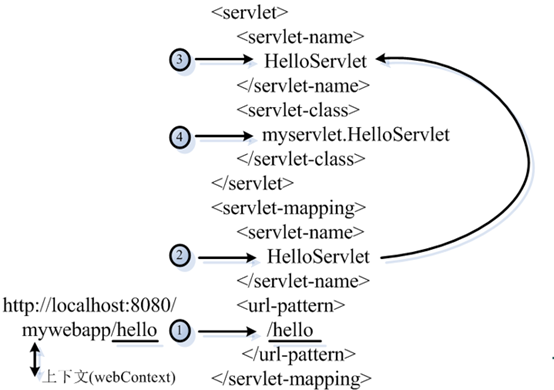


## 1.3、Servlet 生命周期

Servlet 是一个供其他 Java 程序（Servlet 引擎）调用的 Java 类，它不能独立运行，它的运行完全由 Servlet 引擎来控制和调度。

- 实例化：在第一次访问或启动 Tomcat 时，Tomcat 会调用此无参构造方法实例化 Servlet。
- `init()` 方法：服务器调用该方法初始化 Servlet。
- `service()` 方法：初始化完毕，服务器调用该方法响应客户的请求。
- `destroy()` 方法：服务器调用该方法消灭 Servlet 对象。

其中实例化，初始化，销毁只会执行一次，`service` 方法执行多次，这说明 Serlvet 的单实例的！当有客户再请求 Servlet 服务时，Web 服务器将启动一个新的线程，在该线程中，调用 `service` 方法响应客户的请求。

针对客户端的多次 Servlet 请求，通常情况下，服务器只会创建一个 Servlet 实例对象，也就是说 Servlet 实例对象一旦创建，它就会驻留在内存中，为后续的其它请求服务，直至 Web 容器退出，Servlet 实例对象才会销毁。


**Servlet 的运行过程**

Servlet 程序是由 Web 服务器调用，Web服务器收到客户端的 Servlet 访问请求后：

1. Web 服务器首先检查是否已经装载并创建了该 Servlet 的实例对象。如果是，则直接执行第 ④ 步，否则，执行第 ② 步。
2. 装载并创建该 Servlet 的一个实例对象。
3. 调用 Servlet 实例对象的 `init()` 方法。
4. 创建一个用于封装 HTTP 请求消息的 HttpServletRequest 对象和一个代表 HTTP 响应消息的 `HttpServletResponse` 对象，然后调用 Servlet 的 `service()` 方法并将请求和响应对象作为参数传递进去。
5. Web 应用程序被停止或重新启动之前，Servlet 引擎将卸载 Servlet，并在卸载之前调用 Servlet 的 `destroy()` 方法。


## 1.4、Servlet 接口实现类

Sun 公司定义了 `Servlet` 接口的两个默认实现类，分别为：`GenericServlet`、`HttpServlet`。

HttpServlet 指能够处理 HTTP 请求的 Servlet，它在原有 Servlet 接口上添加了一些与 HTTP 协议处理方法，它比 Servlet 接口的功能更为强大。因此开发人员在编写 Servlet 时，通常应继承这个类，而避免直接去实现 Servlet 接口。

HttpServlet 在实现 Servlet 接口时，覆写了 `service` 方法，该方法体内的代码会自动判断用户的请求方式，如为 GET 请求，则调用 `HttpServlet` 的 `doGet` 方法，如为 Post 请求，则调用 `doPost` 方法。因此，开发人员在编写 Servlet 时，通常只需要覆写 `doGet` 或 `doPost` 方法，而不要去覆写 `service` 方法。


**GenericServlet**

GenericServlet 是一个 Serlvet。是 `Servlet` 接口和 `ServletConfig` 接口的实现类。但是是一个抽象类，其中的 `service` 方法为抽象方法。

如果新建的 Servlet 程序直接继承 `GenericSerlvet` 会使开发更简洁。

具体实现：

- 在 `GenericServlet` 中声明了一个 `SerlvetConfig` 类型的成员变量，在 `init(ServletConfig)` 方法中对其进行了初始化
- 利用 `servletConfig` 成员变量的方法实现了 `ServletConfig` 接口的方法
- 还定义了一个 `init()` 方法，在 `init(SerlvetConfig)` 方法中对其进行调用，子类可以直接覆盖 `init()` 在其中实现对 Servlet 的初始化.
- 不建议直接覆盖 `init(ServletConfig)`，因为如果忘记编写 `super.init(config)`；而还是用了 `SerlvetConfig` 接口的方法，则会出现空指针异常.
- 新建的 `init(){}` 并非 Serlvet 的生命周期方法。而 `init(ServletConfig)` 是生命周期相关的方法。

```java
public abstract class GenericServlet implements Servlet, ServletConfig {

    /** 以下方法为 Servlet 接口的方法 **/
    @Override
    public void destroy() {}

    @Override
    public ServletConfig getServletConfig() {
        return servletConfig;
    }

    @Override
    public String getServletInfo() {
        return null;
    }

    private ServletConfig servletConfig;
    
    @Override
    public void init(ServletConfig arg0) throws ServletException {
        this.servletConfig = arg0;
        init();
    }

    public void init() throws ServletException{}

     /**【注意】唯独service方法没有被实现，还是一个抽象方法，这个service方法必须我们自己去重写*/
    @Override
    public abstract void service(ServletRequest arg0, ServletResponse arg1)
            throws ServletException, IOException;

    /** 以下方法为 ServletConfig 接口的方法 **/
    @Override
    public String getInitParameter(String arg0) {
        return servletConfig.getInitParameter(arg0);
    }

    @Override
    public Enumeration getInitParameterNames() {
        return servletConfig.getInitParameterNames();
    }

    @Override
    public ServletContext getServletContext() {
        return servletConfig.getServletContext();
    }

    @Override
    public String getServletName() {
        return servletConfig.getServletName();
    }
}
```


**HttpServlet**

`HttpServlet` 是一个 Servlet，继承自 `GenericServlet`。针对于 HTTP 协议所定制。

在 `service()` 方法中直接把 `ServletReuqest` 和 `ServletResponse` 转为 `HttpServletRequest` 和 `HttpServletResponse`。并调用了重载的 `service(HttpServletRequest, HttpServletResponse)`

在 `service(HttpServletRequest, HttpServletResponse)` 获取了请求方式：`request.getMethod()`，根据请求方式有创建了`doXxx()` 方法（xxx 为具体的请求方式，比如 doGet、doPost）

```java
@Override
public void service(ServletRequest req, ServletResponse res)
    throws ServletException, IOException {

    HttpServletRequest  request;
    HttpServletResponse response;
    
    try {
        request = (HttpServletRequest) req;
        response = (HttpServletResponse) res;
    } catch (ClassCastException e) {
        throw new ServletException("non-HTTP request or response");
    }
    service(request, response);
}

public void service(HttpServletRequest request, HttpServletResponse response)
        throws ServletException, IOException {
    //1. 获取请求方式.
    String method = request.getMethod();
    
    //2. 根据请求方式再调用对应的处理方法
    if("GET".equalsIgnoreCase(method)){
        doGet(request, response);
    }else if("POST".equalsIgnoreCase(method)){
        doPost(request, response);
    }
}

public void doPost(HttpServletRequest request, HttpServletResponse response) 
        throws ServletException, IOException{
    // TODO Auto-generated method stub
    
}

public void doGet(HttpServletRequest request, HttpServletResponse response) 
        throws ServletException, IOException {
    // TODO Auto-generated method stub
    
}
```

实际开发中，直接继承 `HttpServlet`，并根据请求方式复写 `doXxx()` 方法即可。

好处：直接由针对性的覆盖 `doXxx()` 方法；直接使用 `HttpServletRequest` 和 `HttpServletResponse`，不再需要强转。


## 1.5、Servlet 的配置

**配置 Servlet 自动加载**

如果在 `<servlet>` 元素中配置了一个 `<load-on-startup>` 元素，那么 Web 应用程序在启动时，就会装载并创建 Servlet 的实例对象、以及调用Servlet 实例对象的 `init()` 方法。 若为负数，则在第一次请求时被创建，若为 0 或正数，则在当前 WEB 应用被 Serlvet 容器加载时创建实例，且数越小越早被创建。

举例，为 Web 应用写一个 InitServlet，这个 Servlet 配置为启动时装载，为整个 Web 应用创建必要的数据库表和数据：

```xml
<servlet>
    <servlet-name>invoker</servlet-name>
    <servlet-class>org.apache.catalina.servlets.InvokerServlet</servlet-class>
    <load-on-startup>2</load-on-startup>
</servlet>
```


**配置 Servlet 路径映射配置**

由于客户端是通过 URL 地址访问 Web 服务器中的资源，所以 Servlet 程序若想被外界访问，必须把 Servlet 程序映射到一个 URL 地址上，这个工作在 web.xml 文件中使用 `<servlet>` 元素和 `<servlet-mapping>` 元素完成。

`<servlet>` 元素用于注册 Servlet，它包含有两个主要的子元素：`<servlet-name>` 和 `<servlet-class>`，分别用于设置 Servlet 的注册名称和 Servlet 的完整类名。 

一个 `<servlet-mapping>` 元素用于映射一个已注册的 Servlet 的一个对外访问路径，它包含有两个子元素：`<servlet-name>` 和 `<url-pattern>`，分别用于指定 Servlet 的注册名称和 Servlet 的对外访问路径。例如：

```xml
<web-app>
	<servlet>
    	<servlet-name>AnyName</servlet-name>
        <servlet-class>HelloServlet</servlet-class>
    </servlet>
    <servlet-mapping>
    	<servlet-name>AnyName</servlet-name>
        <url-pattern>/demo/hello.html</url-pattern>
    </servlet-mapping>
</web-app>
```

同一个 Servlet 可以被映射到多个URL上，即多个 `<servlet-mapping>` 元素的 `<servlet-name>` 子元素的设置值可以是同一个 Servlet 的注册名。 

在 Servlet 映射到的 URL 中也可以使用 `*` 通配符，但是只能有两种固定的格式：一种格式是 `*.扩展名`，另一种格式是以正斜杠 `/` 开头并以 `/*` 结尾。

```xml
<servlet-mapping>
	<servlet-name>AnyName</servlet-name>
    <url-pattern>/action/*</url-pattern>
</servlet-mapping>

<servlet-mapping>
	<servlet-name>AnyName</servlet-name>
    <url-pattern>/action/*</url-pattern>
</servlet-mapping>
```


**Servlet 路径映射举例**

- Servlet1 映射到 `/abc/*`
- Servlet2 映射到 `/*`
- Servlet3 映射到 `/abc`
- Servlet4 映射到 `*.do`

当请求URL为 `/abc/a.html`，`/abc/*` 和 `/*` 都匹配，哪个 Servlet 响应？

- Servlet 引擎将调用 Servlet1。

当请求 URL 为 `/abc` 时，`/abc/*` 和 `/abc` 都匹配，哪个 Servlet 响应

- Servlet 引擎将调用 Servlet3。

当请求 URL 为 `/abc/a.do` 时，`/abc/*` 和 `*.do` 都匹配，哪个 Servlet响应

- Servlet 引擎将调用 Servlet1。

当请求 URL 为 `/a.do` 时，`/*` 和 `*.do` 都匹配，哪个 Servlet 响应

- Servlet 引擎将调用 Servlet2。

当请求 URL 为 `/xxx/yyy/a.do` 时，`/*` 和 `*.do` 都匹配，哪个 Servlet 响应

- Servlet 引擎将调用 Servlet2。


**`init` 方法中的 ServletConfig 对象**

继承了 `GenericServlet` 的类可以直接通过 `getServletConfig()` 方法获取。

在 Servlet 的配置文件中，可以使用一个或多个 `<init-param>` 标签为 Servlet  配置一些初始化参数。

当 Servlet 配置了初始化参数后，Web 容器在创建 Servlet 实例对象时，会自动将这些初始化参数封装到 `ServletConfig` 对象中，并在调用 Servlet 的 in`i`t 方法时，将 `ServletConfig` 对象传递给 Servlet。进而，程序员通过 `ServletConfig` 对象就可以得到当前 Servlet 的初始化参数信息。

```xml
<servlet>
    <servlet-name>helloServlet</servlet-name>
    <servlet-class>com.atguigu.javaweb.HelloServlet</servlet-class>
    
    <!-- 配置 Serlvet 的初始化参数。 且节点必须在 load-on-startup 节点的前面 -->
    <init-param>
        <!-- 参数名 -->
        <param-name>user</param-name>
        <!-- 参数值 -->
        <param-value>root</param-value>
    </init-param>
    
    <init-param>
        <param-name>password</param-name>
        <param-value>1230</param-value>
    </init-param>
    
    <load-on-startup>-1</load-on-startup>
    
</servlet>
```

`getInitParameter(String name)`：获取指定参数名的初始化参数

`getInitParameterNames()`：获取参数名组成的 Enumeration 对象. 

```java
String user = servletConfig.getInitParameter("user");
System.out.println("user： " + user);

Enumeration<String> names = servletConfig.getInitParameterNames();
while(names.hasMoreElements()){
    String name = names.nextElement();
    String value = servletConfig.getInitParameter(name);
    System.out.println("^^" + name + ": " + value);
}
```


## 1.6、ServletContext

`ServletContext` 对象的简介

- 一个项目只有一个 `ServletContext` 对象！
- 我们可以在 N 个 Servlet 中来获取这个唯一的对象，使用它可以给多个 Servlet 传递数据。（相当于只有这么一个快递员）
- 与天地同寿：这个对象在 Tomcat 启动时创建，在 Tomcat 关闭时销毁。

Web 容器在启动时，它会为每个 Web 应用程序都创建一个对应的 `ServletContext` 对象，它代表当前 Web 应用。

如何获取 `ServletContext` 对象

- 通过 `ServletConfig` 对象获取
- 继承了 `GenericServlet` 类可以直接获取

设置初始化参数：可以为所有的 Servlet 所获取，而 Servlet 的初始化参数只用那个 Serlvet 可以获取。

```xml
<!-- 配置当前 WEB 应用的初始化参数 -->
<context-param>
　　<param-name>driver</param-name>
　　<param-value>com.mysql.jdbc.Driver</param-value>
</context-param>
```

```java
ServletContext servletContext = servletConfig.getServletContext();
String driver = servletContext.getInitParameter("driver");
System.out.println("driver:" + driver);

Enumeration<String> names2 = servletContext.getInitParameterNames();
while(names2.hasMoreElements()){
　　String name = names2.nextElement();
　　System.out.println("-->" + name); 
}
```

获取当前 Web 应用的某一个文件在服务器上的绝对路径，而不是部署前的路径：

```java
String realPath = servletContext.getRealPath("/note.txt");
```

获取当前 Web 应用的名称：

```java
String contextPath = servletContext.getContextPath();
```

获取当前 Web 应用的某一个文件对应的输入流：

```java
InputStream is2 = servletContext.getResourceAsStream("/WEB-INF/classes/jdbc.properties");
```


## 1.7、域对象概述

域对象：域对象可以用来在多个 Servlet 中进行数据的传递。

- 域对象必须有存储数据功能
- 域对象必须有获取数据功能

由于一个 Web 应用中的所有 Servlet 共享同一个 `ServletContext` 对象，因此 Servlet 对象之间可以通过 `ServletContext` 对象来实现通讯。`ServletContext` 对象通常也被称之为 context 域对象。

所有域对象都有存取数据的功能，因为域对象内部有一个 Map，用来存储数据，下面是 `ServletContext` 对象用来操作数据的方法：

- `void setAttribute(String name, Object value)`：用来存储一个对象，也可以称之为存储一个域属性，

	```java
	servletContext.setAttribute("xxx", "XXX");
	```

	在 `ServletContext`中 保存了一个域属性，域属性名称为 *xxx*，域属性的值为 *XXX*。

	请注意，如果多次调用该方法，并且使用相同的 *name*，那么会覆盖上一次的值，这一特性与 Map 相同；

- `Object getAttribute(String name)`：用来获取 `ServletContext` 中的数据，当前在获取之前需要先去存储才行，

	例如：

	```java
	String value = (String)servletContext.getAttribute("xxx");
	```

	获取名为 *xxx* 的域属性；

- `void removeAttribute(String name)`：用来移除 `ServletContext` 中的域属性，如果参数 *name* 指定的域属性不存在，那么本方法什么都不做；

- `Enumeration getAttributeNames()`：获取所有域属性的名称；


## 1.8、HttpServletResponse

Web 服务器收到客户端的 HTTP 请求，会针对每一次请求，分别创建一个用于代表请求的 `Request` 对象、和代表响应的 `Response` 对象。

`Request` 和 `Response` 对象既然代表请求和响应，那我们要获取客户机提交过来的数据，只需要找 `Request` 对象就行了。要向客户机输出数据，只需要找 `Response` 对象就行了。

`HttpServletResponse` 对象服务器的响应。这个对象中封装了向客户端发送数据、发送响应头，发送响应状态码的方法。

`ServletResponse`：封装了响应信息，如果想给用户什么响应，具体可以使用该接口的方法实现

- `getWriter()`：返回 `PrintWriter` 对象。调用该对象的 `print()` 方法，将把 `print()` 中的参数直接打印到客户的浏览器上。
- `getOutputStream()`：返回 `ServletOutputStream` 对象。
- 设置响应的内容类型：`response.setContentType("application/msword")`。
- `sendRedirect(String location)`：请求的重定向（此方法为 `HttpServletResponse` 中定义）。


**getWriter() 和 getOutputStream() 详解**

- ```java
	PrintWriter out = response.getWriter()
	```

	*out* 对象用于处理字符流数据。

- ```java
	ServletOutputStream os = response.getOutputStream();
	```

	*os* 用于输出字符流数据或者二进制的字节流数据都可以。

`getOutputStream()` 和 `getWriter()` 这两个方法互相排斥，调用了其中的任何一个方法后，就不能再调用另一方法。 

Servlet 程序向 `ServletOutputStream` 或 `PrintWriter` 对象中写入的数据将被 Servlet 引擎从 `Response` 里面获取，Servlet 引擎将这些数据当作响应消息的正文，然后再与响应状态行和各响应头组合后输出到客户端。

Serlvet 的 `service()` 方法结束后，Servlet 引擎将检查 `getWriter()` 或 `getOutputStream()` 方法返回的输出流对象是否已经调用过 `close()` 方法，如果没有，Servlet 引擎 Tomcat 将调用 `close()` 方法关闭该输出流对象。调用 `close()` 的时候，应该会调用 `flushBuffer()`。


**输出验证码图片**

建立 `BufferedImage` 对象：指定图片的长度宽度和类型：

```java
BufferedImage image = new BufferedImage(width, height,BufferedImage.TYPE_INT_RGB);
```

取得 `Graphics` 对象，用来绘制图片：

```java
Graphics graphics = image.getGraphics();
```

绘制背景颜色：

```java
graphics.setColor(Color.WHITE);
graphics.fillRect(0, 0, width, height);
```

绘制边界：

```java
graphics.setColor(Color.BLUE);
graphics.drawRect(0, 0, width - 1, height - 1);
```

生成随机数：

```java
Random random = new Random();
random.nextInt(n); // 生成0 到 n的随机数 前闭后开
```

绘制干扰线

```java
graphics.drawLine(x1, y1, x2, y2);
```

设置字体 ：

```java
graphics.setFont(new Font("Times New Roman", Font.*PLAIN*, 18));
```

如果验证码是中文，要使用中文的字体库，通过词库生成随机验证码内容：

```java
String str = "ABCDEFGHIJKLMNOPQRSTUVWXYZabcdefghijklmnopqrstuvwxyz1234567890";
graphics.drawString(str, x, y);
```

设置旋转：

```java
Graphics2D graphics = (Graphics2D) image.getGraphics();
int jiaodu = random.nextInt(60) - 30;
double hudu = jiaodu * Math.PI / 180;
graphics.rotate(theta, x, y);
graphics.rotate(-theta, x, y);
```

释放此图形的上下文以及它使用的所有系统资源：

```java
graphics.dispose();
```

通过 `ImageIO` 对象的 `write` 静态方法将图片输出 ：

```java
ImageIO.write(image, "jpg", resp.getOutputStream());
```


## 1.9、HttpServletRequest

`HttpServletRequest` 对象代表客户端的请求，当客户端通过 HTTP 协议访问服务器时，HTTP 请求中的所有信息都封装在这个对象中，开发人员通过这个对象的方法，可以获得客户这些信息。

`HttpServletRequest` 是 `SerlvetRequest` 的子接口，针对于 HTTP 请求所定义，里边包含了大量获取 HTTP 请求相关的方法。


**Request 获取客户机信息**

`http://localhost:8080/day10/AServlet?username=xxx&password=yyy`

| 方法                      | 描述                                                         |
| ------------------------- | ------------------------------------------------------------ |
| `String getScheme()`      | 获取协议，http                                               |
| `String getServerName()`  | 获取服务器名，localhost                                      |
| `String getServerPort()`  | 获取服务器端口，8080                                         |
| `String getContextPath()` | 获取项目名，/day10                                           |
| `String getServletPath()` | 获取 Servlet 路径，/AServlet                                 |
| `String getQueryString()` | 获取参数部分，即问号后面的部分。username=xxx&password=yyy    |
| `String getRequestURI()`  | 获取请求 URI，等于 项目名+Servlet 路径。/day10/AServlet      |
| `String getRequestURL()`  | 获取请求 URL，等于不包含参数的整个请求路径。`http://localhost:8080/day10/AServlet` |


**Request 获取请求参数**

| 方法                                    | 描述                           |
| --------------------------------------- | ------------------------------ |
| `String getParameter(name)`             | 通过 *name* 获得值             |
| `String[ ] getParameterValues`          | 通过 *name* 获得多值：checkbox |
| `Enumeration<String> getParameterNames` | 获得所有 *name*                |
| `getParameterMap Map<String,String[ ]>` | key :name value: 多值          |


**Request 利用请求域传递对象**

`Request` 对象同时也是一个域对象，开发人员通过 `Request` 对象在实现转发时，把数据通过 `Request` 对象带给其它 Web 资源处理

- `setAttribute` 方法 
- `getAttribute` 方法 
- `removeAttribute` 方法
- `getAttributeNames` 方法

`Request` 对象提供了一个 `getRequestDispatcher` 方法，该方法返回一个 `RequestDispatcher` 对象，调用这个对象的 `forward` 方法可以实现请求转发，从而共享请求中的数据：

```java
RequestDispatcher dispatcher = request.getRequestDispatcher("/request2");
dispatcher.forward(request, response);
```


## 1.10、重定向和转发的区别

redirect 和 forward 是 Servlet 中的两种主要的跳转方式：redirect 叫做重定向，forward 叫做转发。

**从地址栏显示来说：**

- forword 是服务器内部的重定向，服务器直接访问目标地址的 URL 网址，把里面的东西读取出来，但是客户端并不知道，因此用 forward 的话，客户端浏览器的网址是不会发生变化的。
- redirect 是服务器根据逻辑，发送一个状态码，告诉浏览器重新去请求那个地址，所以地址栏显示的是新的地址。

 **从数据共享来说：**

- 由于在整个重定向的过程中用的是同一个 Request，因此 forward 会将 Request 的信息带到被重定向的 JSP 或者 Servlet 中使用。即可以共享数据。
- redirect 不能共享。

**从运用的地方来说：**

- forword 一般用于用户登录的时候，根据角色转发到相应的模块。
- redirect 一般用于用户注销登录时返回主页面或者跳转到其他网站。

**从效率来说**：

- forword 效率高，而 redirect 效率低。

**从本质来说**：

- forword 转发是服务器上的行为，而 redirect 重定向是客户端的行为。

**从请求的次数来说**：

- forword 只有一次请求；而 redirect 有两次请求。


# 2、@webservlet 注解详解

**作用**：用于将一个类声明为 Servlet

该注解在部署时会被容器处理，容器将根据具体的属性配置将相应的类部署为 Servlet

**属性**：下面是一些常用属性，value 和 url  一般是必须的，但是二者不能共存，若同时指定，一般自动忽略 value

| 属性名         | 类名            | 属性描述                                                     |
| -------------- | --------------- | ------------------------------------------------------------ |
| name           | String          | 指定 Servlet 的 name 属性，等价于 `<servlet-name>`，若没有指定，则默认是类的全限定名 |
| value          | String[]        | 等价于 urlPatterns，两者不能共存                             |
| urlPatterns    | String[]        | 指定一组 Servlet 的 url 的匹配模式，等价于 `<url-pattern>`   |
| loadOnStartup  | int             | 指定 Servlet 的加载顺序，等价于 `<load-on-startup>`          |
| initParams     | WebinitParams[] | 指定一组初始化参数，等价于 `<init-params>`                   |
| asyncSupported | boolean         | 申明 Servlet 是否支持异步操作模式，等价于 `<async-supported>` |
| displayName    | String          | Servlet 的显示名，等价于 `<display-name>`                    |
| description    | String          | Servlet 的描述信息，等价于 `<description>`                   |

```java
//注解配置
@WebServlet(
displayName = "UserServlet" , //描述
name = "UserServlet", //servlet名称
urlPatterns = { "/user" }, //url
loadOnStartup = 1, //启动项
initParams = { @WebInitParam(name = "username", value = "张三") }
)//初始化参数
 
public class UserServlet extends HttpServlet {
 
	private String username;
 
	@Override 
	public void init(ServletConfig config) throws ServletException {  
	  //获取初始化信息：张三  
	  username = config.getInitParameter("username"); 
	} 
	  
	@Override protected 
	void doPost(HttpServletRequest req, HttpServletResponse resp)   throws ServletException, IOException {
		//主要内容操作 
	}
}
```


# 3、JSP

## 3.1、JSP 简介

JSP（Java Server Pages）与 Java Servlet 一样，是在服务器端执行的，不同的是先由服务器编译部署成 Servlet 执行

JSP 的组成

- JSP = HTML + Java脚本 + JSP 标签（指令）
- JSP 中无需创建即可使用的对象一共有 9 个，被称之为 9 大内置对象。例如：request对象、out 对象 

JSP 的脚本元素

- `<% 程序代码 %>`：编写 Java 代码片段，但是不可以定义方法。
- `<%= 表达式 %>`：Java 表达式，用于输出 Java 中变量或者表达式的值到页面上（后面不能有分号 `;`）。
- `<%! 变量或方法声明 %>`：声明，用来创建类的成员变量和成员方法。

JSP 页面注释

JSP 注释：`<%-- … --%>`，转化阶段消失，只能被开发人员看到

Java 注释：`//`、`/**/`、`/***/`，编译阶段消失

HTML 注释：`<!-- … -->`, 不会消失，在页面中也能看到


## 3.2、JSP 的运行原理

JSP 其实是一种特殊的 Servlet，当 JSP 页面第一次被访问时，服务器会把 JSP 编译成 Java 文件（这个 Java 其实是一个 Servlet 类），然后再把 Java 编译成 `.class`，然后创建该类对象，最后调用它的 `service()` 方法，第二次请求同一 JSP 时，直接调用 `service()` 方法。

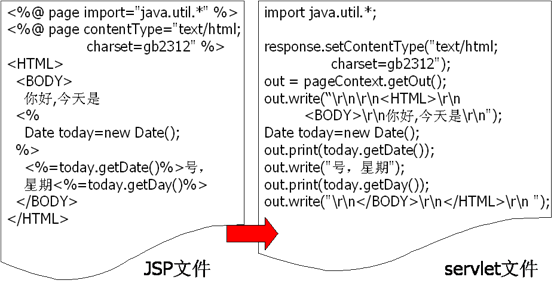


## 3.3、JSP 指令元素

语法格式：

```jsp
<%@ directive [ attribute ="value" ] * %>
```

分类

- page 指令标记
- include 指令标记
- taglib 指令标记


**page 指令标记**

page 属性包含在 `<%@ page ` 和 `%>` 之间，这些属性可以单独使用，也可以几个或多个同时使用。

page 指令用来定义 JSP 文件的全局属性

在 JSP 页面中，只有 `import` 可以出现多次，其它属性都只能出现一次

| 属性         | 说明                                                         | 举例                                    |
| ------------ | ------------------------------------------------------------ | --------------------------------------- |
| language     | 声明使用脚本的种类                                           | `language="java"`                       |
| import       | 用于导入 Java 包或内的列表                                   | `import="java.util.Date"`               |
| buffer       | 指定 JSP 客户端输出缓冲区的大小                              | `buffer="8k"`                           |
| autoFlush    | 如果 buffer 溢出，设置为 `true` 时，正常输出；<br>设置为 `false` 时，出现异常 | `autoFlush="true"`                      |
| errorPage    | 处理异常事件时调用的 JSP 页面                                | `errorPage="error.jsp"`                 |
| contentType  | 定义 JSP 页面响应的 MIME 类型                                | `contentType="text/html;charset=utf-8"` |
| isErrorPage  | 设置此页是否可以为其它页面的 errorPage 目标                  | `isErrorPage="true"`                    |
| isELIgnored  | 用来指定 EL 是否被忽略。`ture` 则忽略，`false` 则计算表达式的值 | `isELIgnored="false"`                   |
| pageEncoding | JSP 页面字符编码，其优先权高于 contentType                   | `pageEncoding="utf-8"`                  |


**include 指令标记**

include 指令的语法格式如下：

```jsp
<%@ include file=“filename” %>
```

include 指令的作用是在 JSP 页面中静态包含一个文件，同时由 JSP 解析包含的文件内容

静态包含的含义：

- file 不能为一变量

	```jsp
	<% String url="index.html" ; %>
	<%@ include file = "<%= url %>" %>
	```

- 不可以在 file 所指定的文件后接任何参数

	```jsp
	<%@ include file = "jw.jsp?nm=browser" %>
	```


**taglib 指令标记**

taglib 指令用于在 JSP 页面中导入标签库

常用标签库 JSTL

常用属性：

- uri：标签文件的  URI 地址
- prefix：标签组的命名空间前缀


## 3.4、JSP 内置对象

九大隐式对象

| 内置对象    | 代表内容                                 | 类型                | 范围        |
| ----------- | ---------------------------------------- | ------------------- | ----------- |
| request     | 触发服务器调用的请求                     | HttpServletRequest  | request     |
| response    | 对请求的应答                             | HttpServletResponse | page        |
| session     | 为请求的客户端创建的 session 对象        | HttpSession         | session     |
| application | 从 Servlet 配置对象获得的 Servlet 上下文 | ServletContext      | application |
| out         | 向输出流写入内容的对象                   | ServletConfig       | page        |
| pageContext | 本 JSP 内容的上下文                      | this(HttpServlet)   | page        |
| page        | 实现处理本页当前请求的类的实例           | PageContext         | page        |
| config      | 本 JSP 的 ServletConfig                  | Throwable           | page        |
| exception   | 表示 JSP 页面运行时产生的异常            | JspWriter           | page        |


**四大域对象**

PageContext、Request、Session、ServletConext

- **ServletContext（ServletContext类）**

	> 在 JSP 中为 application
	>
	> 生命周期:
	>
	> - 开始：Web 应用启动时创建整个 Web中 的 `ServletContext` 对象。
	> - 死亡：服务器关闭或 Web 应用被移除时，`ServletContext` 跟着销毁。
	>
	> 作用范围：整个 Web 应用中。
	>
	> 作用（用途）：
	>
	> 1. 身为作用域，存储可以作用于整个 Web 应用范围的数据。
	> 2. 用于获取绝对路径：获取 WEB-INF 下的 properties 的绝对路径：
	> 	`this.getServletContext().getRealPath("WEB-INF/1.properties");`

- **Request（HttpServletRequest）**

	>在 JSP 中为 request
	>生命周期：
	>
	>- 开始：在 `service` 方法调用之前由服务器创建，传入 `service` 方法。
	>- 死亡：整个请求结束 request 死亡。
	>
	>作用范围：整个请求链（请求转发 `forward()` 也算）
	>作用（用途）：
	>
	>1. 在请求链中共享数据，最常用于从 Servlet 中将处理好的数据通过存入 request 交给 JSP 显示：												                                      `request.setAttribute("x",x);request.getAttribute("x");`

- **RageContext（PageContext）**

	>在 JSP 中为 PageContext
	>
	>生命周期：当对一个 JSP 请求开始,当相应结束时销毁。
	>
	>作用范围：整个 JSP 页面，是四大作用域中最小的一个。
	>
	>作用(用途):
	>
	>1. 获取其它八大隐式对象，可以认为是一个入口对象。
	>2. 获取其所有域中的数据：
	>	`pageContext.findAttribute("x");`
	>	会在四大作用域中自动搜索属性，顺序从低到高：page、request、session、application。如果搜索到就直接获取该值，如果所有域中都找不到，返回一个 `null`。


**通过 pageContext 获得其他对象**

- `getException` 方法返回 exception 隐式对象 
- `getPage` 方法返回 page 隐式对象
- `getRequest` 方法返回 request 隐式对象 
- `getResponse` 方法返回 response 隐式对象 
- `getServletConfig` 方法返回 config 隐式对象
- `getServletContext` 方法返回 application 隐式对象
- `getSession` 方法返回 session 隐式对象 
- `getOut` 方法返回 out 隐式对象


# 4、会话管理

什么是会话？

会话可简单理解为：用户开一个浏览器，点击多个超链接，访问服务器多个 WEB 资源，然后关闭浏览器，整个过程称之为一个会话。

会话过程中要解决的一些问题？

- 每个用户与服务器进行交互的过程中，各自会有一些数据，程序要想办法保存每个用户的数据。
- 例如：用户点击超链接通过一个 Servlet 购买了一个商品，程序应该保存用户购买的商品，以便于用户点结帐 Servlet 时，结帐 Servlet 可以得到用户商品为用户结帐。

保存会话数据的两种技术：

- Cookie
	
	Cookie 是客户端技术，程序把每个用户的数据以 cookie 的形式写给用户各自的浏览器。当用户使用浏览器再去访问服务器中的 Web 资源时，就会带着各自的数据去。这样，Web 资源处理的就是用户各自的数据了。
- Session
	
	Session 是服务器端技术，利用这个技术，服务器在运行时可以为每一个用户的浏览器创建一个其独享的 session 对象，由于 session 为用户浏览器独享，所以用户在访问服务器的 Web 资源时，可以把各自的数据放在各自的 session 中，当用户再去访问服务器中的其它 Web 资源时，其它 Web 资源再从用户各自的 session 中取出数据为用户服务。


## 4.1、Cookie

`javax.servlet.http.Cookie` 类用于创建一个 Cookie，`Response` 接口也中定义了一个 `addCookie` 方法，它用于在其响应头中增加一个相应的 Set-Cookie 头字段。 同样，`Request` 接口中也定义了一个 `getCookies` 方法，它用于获取客户端提交的 Cookie。

Cookie 类的方法： 

- `public Cookie(String name,String value)`
- `setValue` 与 `getValue`方法 
- `setMaxAge` 与 `getMaxAge`方法 
- `setPath` 与 `getPath`方法
- `setDomain` 与 `getDomain`方法
- `getName` 方法

一个 Cookie 只能标识一种信息，它至少含有一个标识该信息的名称（NAME）和设置值（VALUE）。 

一个 Web 站点可以给一个 Web 浏览器发送多个 Cookie，一个 Web 浏览器也可以存储多个 Web 站点提供的 Cookie。

浏览器一般只允许存放 300 个 Cookie，每个站点最多存放 20 个 Cookie，每个 Cookie 的大小限制为 4KB。

`void setPath(java.lang.String uri)` ：设置 cookie 的有效访问路径。有效路径指的是 cookie 的有效路径保存在哪里，那么浏    览器在有效路径下访问服务器时就会带着 cookie 信息，否则不带 cookie 信息。

如果创建了一个 cookie，并将他发送到浏览器，默认情况下它是一个会话级别的 cookie（即存储在浏览器的内存中），用户退出浏览器之后即被删除。若希望浏览器将该 cookie 存储在磁盘上，则需要使用 `maxAge`，并给出一个以秒为单位的时间。

删除持久 cookie，可以将 cookie 最大时效设为0（然后 `addCookie()`），注意，删除 cookie 时，path 必须一致，否则不会删除。


**案例-显示用户上次访问时间**

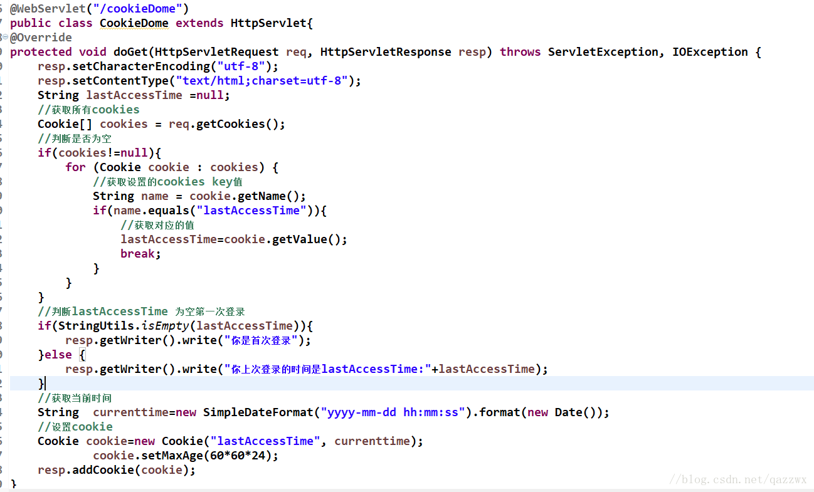


## 4.2、Session

在 Web 开发中，服务器可以为每个用户浏览器创建一个会话对象（session 对象），注意：一个浏览器独占一个 session 对象(默认情况下)。因此，在需要保存用户数据时，服务器程序可以把用户数据写到用户浏览器独占的 session 中，当用户使用浏览器访问其它程序时，其它程序可以从用户的session 中取出该用户的数据，为用户服务。

Cookie 的局限

- Cookie 只能存字符串类型。不能保存对象
- 1个 Cookie 的容量不超过 4 KB。

Session 和 Cookie 的主要区别在于：

- Cookie 是把用户的数据写给用户的浏览器。
- Session 把用户的数据写到用户独占的 session 中（服务器端）。
- Session 由于存在服务器端，安全性高；浏览器的 Cookie 可能被其他程序分析获取，所以安全性较低。

Session 对象由服务器创建，开发人员可以调用 Request 对象的 `getSession` 方法得到 session 对象。

`getSession(true)` /`getSession()` ：创建或得到 session 对象。没有匹配的 session 编号自动创建新的 session 对象。

`getSession(false)`：得到 session 对象。没有匹配的 session 编号，返回 `null`。

`void setMaxInactiveInterval(int interval)`：设置 session 的有效时间，默认情况 30 分服务器自动回收


**session 原理**

1. 第一次访问创建 session 对象，给 session 对象分配一个唯一的 ID，叫 JSESSIONID

    ```java
    new HttpSession();
    ```

3. 把 JSESSIONID 作为 Cookie 的值发送给浏览器保存

	```java
	Cookie cookie = new Cookie("JSESSIONID", sessionID);
	response.addCookie(cookie);
	```

4. 第二次访问的时候，浏览器带着 JSESSIONID 的 cookie 访问服务器

5. 服务器得到 JSESSIONID，在服务器的内存中搜索是否存放对应编号的 session 对象。

5. 如果找到对应编号的 session 对象，直接返回该对象，如果找不到对应编号的 session 对象，创建新的 session 对象，继续走1的流程


**案例 创建和获取 session**

创建 session 

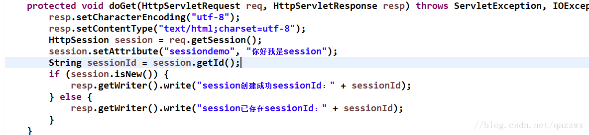


获取 session

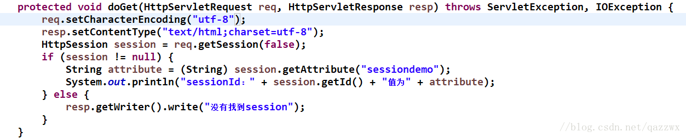


## 4.3、表单重复提交

产生表单重复提交的原因：网络延迟、重新刷新、点击网页回退到之前页面继续提交...

解决方式：

在服务器端生成一个唯一的随机标识号，专业术语称为 Token（令牌），同时在当前用户的 Session 域中保存这个 Token。然后将 Token 发送到客户端的 Form 表单中，在 Form 表单中使用隐藏域来存储这个 Token，表单提交的时候连同这个 Token 一起提交到服务器端，然后在服务器端判断客户端提交上来的 Token 与服务器端生成的 Token 是否一致，如果不一致，那就是重复提交了，此时服务器端就可以不处理重复提交的表单。如果相同则处理表单提交，处理完后清除当前用户的 Session 域中存储的标识号。

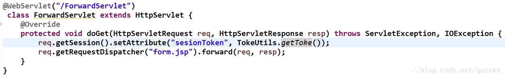

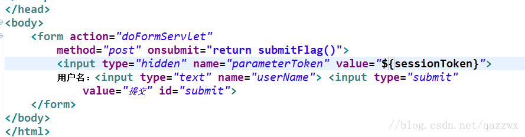

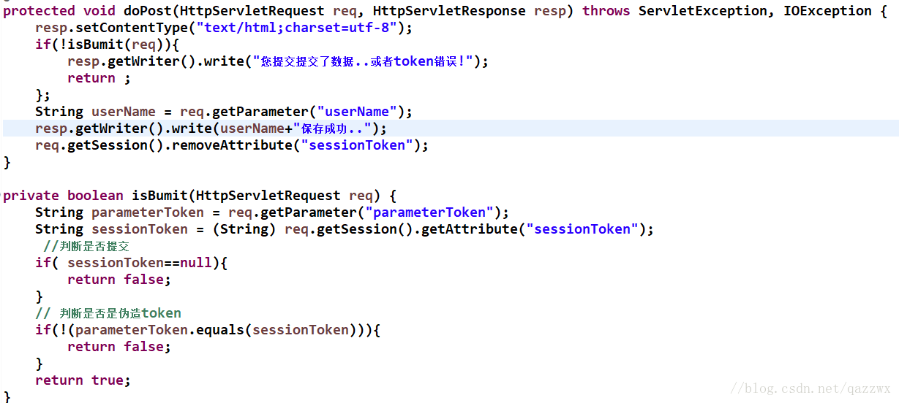


# 5、过滤器

过滤器，顾名思义就是起到过滤筛选作用的一种事物，只不过相较于现实生活中的过滤器，这里的过滤器过滤的对象是客户端访问的 Web 资源，也可以理解为一种预处理手段，对资源进行拦截后，将其中我们认为的杂质（用户自己定义的）过滤，符合条件的放行，不符合的则拦截下来

当然，过滤器既可以拦截 Request，也可以拦截返回的 Response

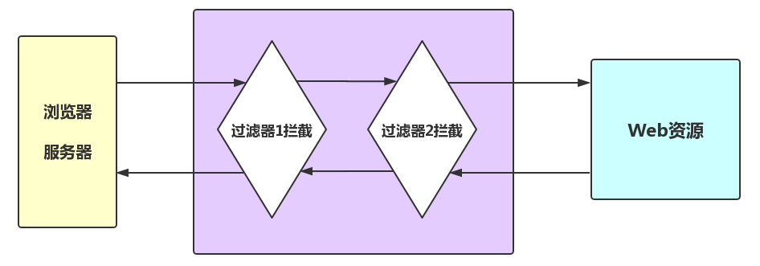

**过滤器的本质就是一个实现了 Filter 接口的 Java 类**

先自己创建一个类，实现 `Filter` 接口（javax.servlet），重写其中的所有方法：

```java
@WebFilter("/*")
public class FilterDemo1 implements Filter {
    public void destroy() {
    }

    public void doFilter(ServletRequest req, ServletResponse resp, FilterChain chain) throws ServletException, IOException {
        //放行代码
        chain.doFilter(req, resp);
    }

    public void init(FilterConfig config) throws ServletException {
    }
}
```


## 5.1、Filter 配置

**web.xml配置**

```xml
<filter>
	<filter-name>filterDemo1</filter-name>
	<filter-class>package cn.ideal.web.filter.FilterDemo1</filter-class>
</filter>

<filter-mapping>
	<filter-name>filterDemo1</filter-name>
	<!-- 拦截路径 -->
	<url-pattern>/*</url-pattern>
</filter-mapping>
```

`<filter-name></filter-name>`：指定 Filter名字

`<filter-class></filter-class>`：指定 Filter 全类名（带包名）

`<filter-name></filter-name>`：这里的标签是为了与上面 Filter 中的名字对应，从而指向到对应的文件中

`<url-pattern></url-pattern>`：设置 Filter 所拦截的路径，这里决定了什么样的资源会被过滤器拦截处理

拦截路径设置:

| 格式        | 解释                                           |
| ----------- | ---------------------------------------------- |
| `/test.jsp` | 只有访问 test.jsp 这个资源的时候才会执行过滤器 |
| `/test/*`   | 访问 test 下所有资源你的时候，执行过滤器       |
| `*.jsp`     | 所有 jsp 格式的资源被访问的时候，执行过滤器    |
| `/*`        | 任意资源被访问，均执行过滤器                   |

拦截方式配置：dispatcher

拦截方式配置也就是资源被访问的形式，有这么几个属性

- REQUEST：默认值，浏览器直接请求资源
- FORWARD：转发访问资源：`RequestDispatcher.forward();`
- INCLUDE：包含访问资源：`RequestDispatcher.include();`
- ERROR：错误跳转资源：被声明式异常处理机制调用的时候


**使用注解配置**

与 Servlet 相似的配置 ，我们可以指定它的名字和拦截路径：

```java
@WebFilter(filterName="FilterDemo1",urlPatters="/*")
```

但是直接在类上声明注解，显然那是不需要我们指定其名字的，而通过查看源码又可以知道，urlPatters 又可以被 value 指定，而 value 又可以省略，所以我们可以简写为：

```java
@WebFilter("/*")
```

若想在 Filter 注解中配置 dispatcher，我们需要设置 dispatcherTypes 属性：

```java
@WebFilter(value = "/*",dispatcherTypes ={DispatcherType.FORWARD,DispatcherType.FORWARD})
```


## 5.2、过滤器的生命周期

首先是 `init(FilterConfig config)` 方法和 `void destroy()` 方法，Servlet 也有这两个方法，两者分别在服务器启动和关闭的时候被创建以及销毁，两者均执行一次，用于加载以及释放资源。

再者就是过滤器的核心方法了：

```java
void doFilter(ServletRequest req, ServletResponse resp, FilterChain chain)
```

`doFilter` 方法就是真正进行拦截的方法，通过前两个参数可以知道，不论是 `Request` 亦或是 `Respone` 都可以对其进行过滤操作，那么第三个参数是什么意思呢？

FilterChain 的源码:

```java
public interface FilterChain {
    void doFilter(ServletRequest var1, ServletResponse var2) throws IOException, ServletException;
}
```

嗯！`FilterChain` 是一个接口，接口内也定义了一个 `doFilter` 方法，它存在的意义是什呢？

这是一种链式结构，在这里称作过滤器链，其作用就是为了配置多个过滤器。

那么，多个过滤器谁前谁后呢？这还与前面的配置有关：

- 注解配置：按照类名字符串比较，值小的先执行（AFilterDemo 优先于 BFilterDemo）
- web.xml 配置：`<filter-mapping>` 中谁在上面，谁优先执行


# 6、JSP 动态包含和静态包含

JSP 中有两种包含：

- 静态包含：`<%@include file="被包含页面"%>`
- 动态包含：`<jsp:include page="被包含页面" flush="true">`

下面以一个例子来说明如何使用包含

项目文件树：

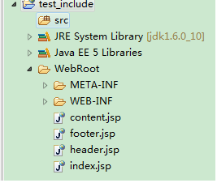


header.jsp 文件中内容：

```jsp
<html>
<head>
    <meta http-equiv="Content-Type" content="text/html; charset=GB18030">
    <title>Insert title here</title>
</head>
<body>
<h1>This is header</</h1>
```

content.jsp 文件中内容：

```jsp
<table border="1">
    <tr>
        <td>col1</td>
        <td>col2</td>
    </tr>
    <tr>
        <td>col1</td>
        <td>col2</td>
    </tr>
</table>
```

footer.jsp 文件中内容：

```jsp
<hr>
	copyright: 1999-2010
	</body>
</html>
```


**静态包含**

index.jsp 文件中内容：

```jsp
<%@ page language="java" import="java.util.*" pageEncoding="GB18030"%>

<%@ include file="/header.jsp" %>

<%@ include file="/content.jsp" %>

<%@ include file="/footer.jsp" %>
```

页面显示结果：

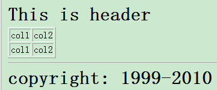


被编译成的 Java 文件：

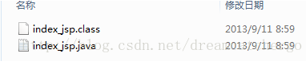


**动态包含**

```jsp
<%@ page language="java" import="java.util.*" pageEncoding="GB18030"%>

<jsp:include page="/header.jsp"></jsp:include>

<jsp:include page="/content.jsp"></jsp:include>

<jsp:include page="/footer.jsp"></jsp:include>
```

页面显示结果：

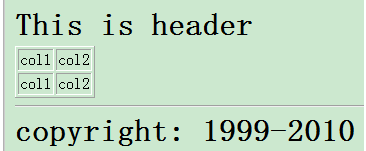


被编译成的 Java 文件：

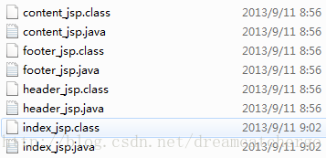


说明：使用静态包含和动态包含最终的执行结果相同，但是实现过程不同，很明显编译成的 Java 文件数目不同。


**静态和动态包含的区别与联系**

注：下文将包含有其它文件的 JSP 文件称为主体文件，比如上文中的 index.jsp 文件。将被包含的文件称为包含文件，比如上文中的 header.jsp 文件。

- `<%@ include file=""%>` 是指令元素。`<jsp:include page=""/>` 是行为元素
- 最终编译成 Java 文件的数目不同
	- 静态包含在转换成为 Java 文件的时候将包含文件的内容 “复制” 到主体文件，然后作为一个**整体编译**，最终编译为一个 Java 文件；
	- 动态包含是各个 JSP 文件分别转换，**分别编译**。最终编译成多个  Java 文件。
- 执行时间不同
	- 静态包含发生在：JSP ==> Java 文件阶段。
	- 动态包含发生在：执行 class 文件阶段，动态加入。
- 静态包含在两个文件中不能有相同的变量，动态包含允许。
	- 静态包含相当于将包含文件内容直接复制到主体文件中，如果出现相同的变量，就会出现覆盖等问题，导致文件出错。
	- 动态包含相当于调用不同的 JSP，变量所在的空间不同，自然不会出现覆盖等现象。
- 无论是动态包含还是静态包含，其 Request 对象都是相同的。
	- 静态包含最终编译成一个 Java 文件，所以有一个 Request 对象。
	- 而动态包含最终编译成多个 JSP 文件，**这些 JSP 组合的过程是一个请求转发的过程**，自然也使用同一个 Request 对象了。

