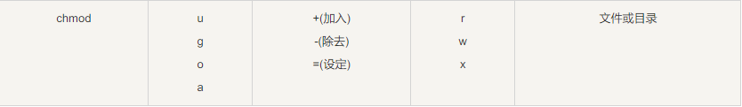
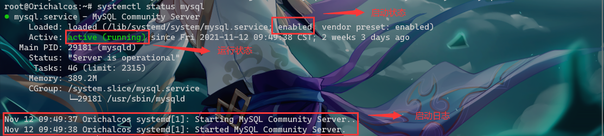
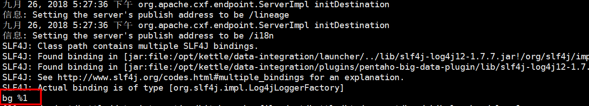
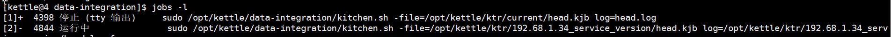

# 1、Linux 简介

Linux 英文解释为 **Linux is not Unix**。

Linux 内核最初只是由芬兰人林纳斯·托瓦兹（Linus Torvalds）在赫尔辛基大学上学时出于个人爱好而编写的。

Linux 是一套免费使用和自由传播的类 Unix 操作系统，是一个基于 POSIX 和 UNIX 的多用户、多任务、支持多线程和多 CPU 的操作系统。

Linux 能运行主要的 UNIX 工具软件、应用程序和网络协议。它支持 32 位和 64 位硬件。Linux 继承了 Unix 以网络为核心的设计思想，是一个性能稳定的多用户网络操作系统。

<br>

**Linux 的发行版**

Linux 的发行版说简单点就是将 Linux 内核与应用软件做一个打包。


目前市面上较知名的发行版有：Ubuntu、RedHat、CentOS、Debian、Fedora、SuSE、OpenSUSE、Arch Linux、SolusOS 等。


这里用的 Linux 版本是 Ubuntu 20.04 64位。

<br>

# 2、系统目录结构


<br>

# 3、远程操作

Linux 一般作为服务器使用，而服务器一般放在机房，你不可能在机房操作你的 Linux 服务器。这时我们就需要远程登录到 Linux 服务器来管理维护系统。Linux 系统中是通过 SSH 服务实现的远程登录功能，默认 SSH 服务端口号为 22。

现在 Windows 10 大都内置了 OpenSSH，如果没有可以去：设置 ==> 应用和功能 ==> 可选功能 中找到 OpenSSH 客户端安装。

打开 CMD 或者 PowerShell 连接 Linux：

```shell
ssh 用户名@IP地址
```

除了连接之外，Linux 中还有一些关机/重启的命令： `shutdown`、`reboot`、`init`、`halt` 和 `poweroff`。

<br>

**shutdown**

`shutdown` 命令是最常用也是最安全的关机和重启命令，它会在关机之前调用 fsck 检查磁盘，其中 `-h` 和 `-r` 是最常用的参数：

- `-h` - 停止系统服务并关机
- `-r` - 停止系统服务后重启

示例：

```shell
# 立即关机
shutdown -h now

# 到10:00关机，如果该时间小于当前时间，则到隔天
shutdown -h 10:00

# 10分钟之后自动关机
shutdown -h +10

# 立即重启
shutdown -r now

# 30分钟后重启并发送通知给其他在线用户
shutdown -r +30 '系统将在30分钟内重新启动'
```

<br>

**reboot**

`reboot` 表示立即重启，效果等同于 `shutdown -r now`。

<br>

**halt**

`halt` 命令是最简单的关机命令，其实就是调用 `shutdown -h`。`halt` 执行时，不理会目前系统状况下，进行硬件关机；杀死应用进程﹐执行 `sync` 系统调用，文件系统写操作完成后就会停止内核。

<br>

**poweroff**

`poweroff` 表示立即关机，效果等同于 `shutdown -h now`，在多用户模式下（Run Level 3）不建议使用。

<br>

# 4、文件管理

Linux 系统是一种典型的多用户系统，不同的用户处于不同的地位，拥有不同的权限。为了保护系统的安全性，Linux 系统对不同的用户访问同一文件（包括目录文件）的权限做了不同的规定。

<br>

## 4.1、文件基本属性

在 Linux 中我们可以使用 `ll` 或者 `ls –l` 命令来显示一个文件的属性以及文件所属的用户和组，如：

```
root@Orichalcos:/# ls -l
total 970036
lrwxrwxrwx   1 root root         7 Sep 22 10:02 bin -> usr/bin
drwxr-xr-x   3 root root      4096 Nov 12 09:27 boot
...
```

实例中，boot 文件的第一个属性用 **d** 表示。**d** 在 Linux 中代表该文件是一个目录文件。

在 Linux 中第一个字符代表这个文件是目录、文件或链接文件等等。

- 当为 `d` 则是目录
- 当为 `-` 则是文件
- 若是 `l` 则表示为链接文档（link file）
- 若是 `b` 则表示为装置文件里面的可供储存的接口设备（可随机存取装置）
- 若是 `c` 则表示为装置文件里面的串行端口设备，例如键盘、鼠标（一次性读取装置）

接下来的字符中，以三个为一组，且均为 `rwx` 的三个参数的组合。其中， `r` 代表可（read）、 `w` 代表可写（write）、 `x` 代表可执行（execute）。 要注意的是，这三个权限的位置不会改变，如果没有权限，就会出现减号 `-` 而已。


每个文件的属性由左边第一部分的 10 个字符来确定（如下图）。


从左至右用 0-9 这些数字来表示。

第 0 位确定文件类型，第 1-3 位确定属主（该文件的所有者）拥有该文件的权限；第 4-6 位确定属组（所有者的同组用户）拥有该文件的权限；第 7-9 位确定其他用户拥有该文件的权限。

其中，第 1、4、7 位表示读权限，如果用 `r` 字符表示，则有读权限，如果用 `-` 字符表示，则没有读权限；第 2、5、8 位表示写权限，如果用 `w` 字符表示，则有写权限，如果用 `-` 字符表示没有写权限；第 3、6、9 位表示可执行权限，如果用 `x` 字符表示，则有执行权限，如果用 `-` 字符表示，则没有执行权限。

<br>

**Linux 文件属主和属组**

```
[root@www /]# ls -l
total 64
drwxr-xr-x 2 root  root  4096 Feb 15 14:46 cron
drwxr-xr-x 3 mysql mysql 4096 Apr 21  2014 mysql
……
```

对于文件来说，它都有一个特定的所有者，也就是对该文件具有所有权的用户。同时，在 Linux 系统中，用户是按组分类的，一个用户属于一个或多个组。文件所有者以外的用户又可以分为文件所有者的同组用户和其他用户。因此，Linux 系统按文件所有者、文件所有者同组用户和其他用户来规定了不同的文件访问权限。

- 属主：所属的用户，文档所有者，这是一个账户，这是一个人
- 属组：所属的用户组，这是一个组

在以上实例中，mysql 文件是一个目录文件，属主和属组都为 mysql，属主有可读、可写、可执行的权限；与属主同组的其他用户有可读和可执行的权限；其他用户也有可读和可执行的权限。

对于 root 用户来说，一般情况下，文件的权限对其不起作用。

<br>

## 4.2、更改文件属性

在 Linux 中我们通常使用以下两个命令来修改文件或目录的所属用户与权限：

- chgrp（change group）：修改文件属组
- chown（change owner）：修改所属用户与组
- chmod（change mode）：修改用户的权限

<br>

**chgrp：更改文件属组**

语法：

```shell
chgrp [-R] 属组名 文件名
```

参数选项

- `-R`：递归更改文件属组，就是在更改某个目录文件的属组时，如果加上 `-R` 的参数，那么该目录下的所有文件的属组都会更改。

<br>

**chown：更改文件属主，也可以同时更改文件属组**

语法：

```shell
chown [–R] 属主名 文件名
chown [-R] 属主名:属组名 文件名
```

<br>

**chmod：更改文件9个属性**

Linux文件属性有两种设置方法，一种是数字，一种是符号。

Linux 文件的基本权限就有九个，分别是 **owner/group/others（拥有者/组/其他）** 三种身份各有自己的 **read/write/execute** 权限。

文件的权限字符为： `-rwxrwxrwx` ， 这九个权限是三个三个一组的！其中，我们可以使用数字来代表各个权限，各权限的分数对照表如下：

- r:4
- w:2
- x:1

每种身份（owner/group/others）各自的三个权限（r/w/x）分数是需要累加的，例如当权限为： `-rwxrwx---` 分数则是：

- owner = rwx = 4+2+1 = 7
- group = rwx = 4+2+1 = 7
- others= --- = 0+0+0 = 0

所以等一下设定权限的变更时，该文件的权限数字就是 **770**。变更权限的指令 chmod 的语法是这样的：

```shell
chmod [-R] xyz 文件或目录
```

选项与参数：

- `xyz` : 就是刚刚提到的数字类型的权限属性，为 rwx 属性数值的相加。
- `-R` : 进行递归（recursive）的持续变更，亦即连同次目录下的所有文件都会变更。

<br>

**符号类型改变文件权限**

还有一个改变权限的方法，从之前的介绍中我们可以发现，基本上就九个权限分别是：

- user：用户
- group：组
- others：其他

那么就可以使用 **u, g, o** 来代表三种身份的权限。此外， **a** 则代表 **all**，即全部的身份。读写的权限可以写成 `r, w, x`，也就是可以使用下表的方式来看：



如果需要将文件权限设置为 **-rwxr-xr--** ，可以使用 `chmod u=rwx,g=rx,o=r 文件名` 来设定:

```
#  touch test1    // 创建 test1 文件
# ls -al test1    // 查看 test1 默认权限
-rw-r--r-- 1 root root 0 Nov 15 10:32 test1
# chmod u=rwx,g=rx,o=r  test1    // 修改 test1 权限
# ls -al test1
-rwxr-xr-- 1 root root 0 Nov 15 10:32 test1
```

<br>

## 4.3、目录

Linux的目录结构为树状结构，最顶级的目录为根目录 `/`。其他目录通过挂载可以将它们添加到树中，通过解除挂载可以移除它们。

绝对路径与相对路径：

- **绝对路径：**
  路径的写法，由根目录 `/` 写起，例如：` /usr/share/doc` 这个目录。
- **相对路径：**
  路径的写法，不是由 `/` 写起，例如由 `/usr/share/doc` 要到 `/usr/share/man` 底下时，可以写成： `cd ../man` 这就是相对路径的写法。

处理目录的常用命令：

- `ls`（英文全拼：list files）: 列出目录及文件名
- `cd`（英文全拼：change directory）：切换目录
- `pwd`（英文全拼：print work directory）：显示目前的目录
- `mkdir`（英文全拼：make directory）：创建一个新的目录
- `rmdir`（英文全拼：remove directory）：删除一个空的目录
- `cp`（英文全拼：copy file）: 复制文件或目录
- `rm`（英文全拼：remove）: 删除文件或目录
- `mv`（英文全拼：move file）: 移动文件与目录，或修改文件与目录的名称

可以使用 `man [命令]` 来查看各个命令的使用文档，如 ：`man cp`。

<br>

**ls（列出目录）**

在Linux系统当中，`ls` 命令可能是最常被运行的。

语法：

```shell
ls [-aAdfFhilnrRSt] 目录名称
ls [--color={never,auto,always}] 目录名称
ls [--full-time] 目录名称
```

选项与参数：

- `-a` ：全部的文件，连同隐藏文件（开头为 . 的文件）一起列出来（常用）
- `-d` ：仅列出目录本身，而不是列出目录内的文件数据（常用）
- `-l` ：长数据串列出，包含文件的属性与权限等等数据（常用）

将家目录下的所有文件列出来（含属性与隐藏档）

```shell
ls -al ~
```

<br>

**cd（切换目录）**

`cd` 是 Change Directory 的缩写，这是用来变换工作目录的命令。

语法：

```shell
 cd [相对路径或绝对路径]
```

```shell
#使用 mkdir 命令创建 runoob 目录
mkdir runoob

#使用绝对路径切换到 runoob 目录
cd /root/runoob/

#使用相对路径切换到 runoob 目录
cd ./runoob/

# 表示回到自己的家目录，亦即是 /root 这个目录
cd ~

# 表示去到目前的上一级目录，亦即是 /root 的上一级目录的意思；
cd ..
```

<br>

**pwd（显示目前所在的目录）**

`pwd` 是 Print Working Directory 的缩写，也就是显示目前所在目录的命令。

语法：

```shell
pwd [-P]
```

选项与参数：

- `-P` ：显示出确实的路径，而非使用连结（link）路径

单纯显示出目前的工作目录：

```
[root@www ~]# pwd
/root   <== 显示出目录啦～
```

显示出实际的工作目录，而非连结档本身的目录名：

```
[root@www ~]# cd /var/mail   <==注意，/var/mail是一个连结档
[root@www mail]# pwd
/var/mail         <==列出目前的工作目录
[root@www mail]# pwd -P
/var/spool/mail   <==怎么回事？有没有加 -P 差很多～
[root@www mail]# ls -ld /var/mail
lrwxrwxrwx 1 root root 10 Sep  4 17:54 /var/mail -> spool/mail
# 看到这里应该知道为啥了吧？因为 /var/mail 是连结档，连结到 /var/spool/mail 
# 所以，加上 pwd -P 的选项后，会不以连结档的数据显示，而是显示正确的完整路径啊！
```

<br>

**rmdir（删除空的目录）**

语法：

```shell
 rmdir [-p] 目录名称
```

选项与参数：

- `-p` ：从该目录起，一次删除多级空目录

将 test/test1/test2 删除掉：

```
root@Orichalcos:~# ls -ld test/test1/test2
drwxr-xr-x 2 root root 4096 Nov 15 16:27 test/test1/test2
root@Orichalcos:~# rmdir test
rmdir: failed to remove 'test': Directory not empty
root@Orichalcos:~# rmdir -p test/test1/test2
root@Orichalcos:~# ls -ld test/test1/test2
ls: cannot access 'test/test1/test2': No such file or directory
root@Orichalcos:~#
```

<br>

**cp（复制文件或目录）**

`cp` 即拷贝文件和目录。

语法:

```
[root@www ~]# cp [-adfilprsu] 来源档(source) 目标档(destination)
[root@www ~]# cp [options] source1 source2 source3 .... directory
```

选项与参数：

- `-a`：相当於 -pdr 的意思，至于 pdr 请参考下列说明（常用）
- `-d`：若来源档为连结档的属性（link file），则复制连结档属性而非文件本身
- `-f`：为强制（force）的意思，若目标文件已经存在且无法开启，则移除后再尝试一次
- `-i`：若目标档（destination）已经存在时，在覆盖时会先询问动作的进行（常用）
- `-l`：进行硬式连结（hard link）的连结档创建，而非复制文件本身
- `-p`：连同文件的属性一起复制过去，而非使用默认属性（备份常用）
- `-r`：递归持续复制，用於目录的复制行为（常用）
- `-s`：复制成为符号连结档（symbolic link），亦即『捷径』文件
- `-u`：若 destination 比 source 旧才升级 destination ！

<br>

**rm（移除文件或目录）**

语法：

```shell
 rm [-fir] 文件或目录
```

选项与参数：

- `-f` ：就是 force 的意思，忽略不存在的文件，不会出现警告信息
- `-i` ：互动模式，在删除前会询问使用者是否动作
- `-r` ：递归删除啊！最常用在目录的删除了！这是非常危险的选项！！！

<br>

**mv（移动文件与目录，或修改名称）**

语法：

```
[root@www ~]# mv [-fiu] source destination
[root@www ~]# mv [options] source1 source2 source3 .... directory
```

选项与参数：

- `-f `：force 强制的意思，如果目标文件已经存在，不会询问而直接覆盖
- `-i` ：若目标文件（destination）已经存在时，就会询问是否覆盖
- `-u` ：若目标文件已经存在，且 source 比较新，才会升级（update）

<br>

## 4.4、文件内容查看

Linux 系统中使用以下命令来查看文件的内容：

- `cat` 由第一行开始显示文件内容
- `tac` 从最后一行开始显示，可以看出 tac 是 cat 的倒着写！
- `nl`  显示的时候，顺道输出行号！
- `more` 一页一页的显示文件内容
- `less` 与 `more` 类似，但是比 `more` 更好的是，他可以往前翻页！
- `head` 只看头几行
- `tail` 只看尾巴几行

可以使用 `man [命令]`来查看各个命令的使用文档，如 ：`man cp`。

<br>

**cat**

由第一行开始显示文件内容。

语法：

```shell
cat [-AbEnTv] 文件
```

选项与参数：

- `-A `：相当於 -vET 的整合选项，可列出一些特殊字符而不是空白而已
- `-b` ：列出行号，仅针对非空白行做行号显示，空白行不标行号！
- `-E` ：将结尾的断行字节 $ 显示出来
- `-n` ：列出行号，连同空白行也会有行号，与 `-b` 的选项不同
- `-T` ：将 [tab] 按键以 ^I 显示出来
- `-v `：列出一些看不出来的特殊字符

<br>

**tac**

`tac` 与 `cat` 命令刚好相反，文件内容从最后一行开始显示，可以看出 `tac` 是 `cat` 的倒着写！

 <br>

**nl**

显示行号。

语法：

```shell
nl [-bnw] 文件
```

选项与参数：

- `-b` ：指定行号指定的方式，主要有两种：
	- `-b a` ：表示不论是否为空行，也同样列出行号（类似 `cat -n`）
	- `-b t` ：如果有空行，空的那一行不要列出行号(默认值)
- `-n` ：列出行号表示的方法，主要有三种：
	- `-n ln` ：行号在荧幕的最左方显示
	- `-n rn` ：行号在自己栏位的最右方显示，且不加 0 
	- `-n rz` ：行号在自己栏位的最右方显示，且加 0 
- `-w` ：行号栏位的占用的位数

<br>

**more**

一页一页翻动。

语法：

```shell
more 文件
```

在 `more` 这个程序的运行过程中，你有几个按键可以按的：

- 空白键（space）：代表向下翻一页
- Enter     ：代表向下翻『一行』
- /字串     ：代表在这个显示的内容当中，向下搜寻『字串』这个关键字
- :f      ：立刻显示出档名以及目前显示的行数
- q       ：代表立刻离开 more ，不再显示该文件内容
- b 或 [ctrl]-b ：代表往回翻页，不过这动作只对文件有用，对管线无用

<br>

**less**

一页一页翻动。

`less` 运行时可以输入的命令有：

- 空白键  ：向下翻动一页
- [pagedown]：向下翻动一页
- [pageup] ：向上翻动一页
- /字串   ：向下搜寻『字串』的功能
- ?字串   ：向上搜寻『字串』的功能
- n     ：重复前一个搜寻（与 / 或 ? 有关！）
- N     ：反向的重复前一个搜寻（与 / 或 ? 有关！）
- q     ：离开 less 这个程序

<br>

**head**

取出文件前面几行。默认的情况中，显示前面 10 行！

语法：

```shell
head [-n number] 文件 
```

选项与参数：

- `-n` ：后面接数字，代表显示几行的意思

<br>

**tail**

`tail` 命令可用于查看文件的内容，有一个常用的参数 `-f` 常用于查阅正在改变的日志文件。

`tail -f filename` 会把 *filename* 文件里的最尾部的内容显示在屏幕上，并且不断刷新，只要 *filename* 更新就可以看到最新的文件内容。

语法：

```shell
tail [参数] [文件]
```

选项与参数：

- `-n <行数>` - 显示文件的尾部 *n* 行内容
- `-f` - 表示持续侦测后面所接的档名，要等到按下 Ctrl + C 才会结束 `tail` 的侦测
- `-q` - 不显示处理信息
- `-v` - 显示详细的处理信息
- `-c <数目>` - 显示的字节数
- `--pid=<PID>` - 与 `-f`  合用，表示在进程 ID、PID 死掉之后结束

<br>

## 4.5、压缩/解压

在Linux 中，解压、压缩、打包是日常会很频繁用到的几个操作。

首先需要明确的两个概念，打包和压缩不是一回事：

- 打包：是指将一大堆文件或目录变成一个总的文件。
- 压缩：则是将一个大文件通过压缩算法变成一个小文件。

为什么要区分这两个概念呢？这源于 Linux 中很多压缩程序只能针对一个文件进行压缩，这样当你想要压缩一大堆文件时，你得先将这一大堆文件先打成一个包（`tar` 命令），然后再用压缩程序进行压缩（`gzip`、`bzip2` 命令）。

<br>

### 4.5.1、tar

```shell
tar [可选参数] [文件或目录]
```

这 5 个是独立的命令，压缩解压都要用到其中一个，可以和别的命令连用但只能用其中一个：

- `-c` - 建立压缩档案
- `-x` - 解压
- `-t` - 查看内容
- `-r` - 向压缩归档文件末尾追加文件
- `-u` - 更新原压缩包中的文件

下面的参数是根据需要在压缩或解压档案时可选的：

- `-z` - 有 gzip 属性的
- `-j` - 有 bz2 属性的
- `-Z` - 有 compress 属性的
- `-v` - 显示所有过程
- `-O` - 将文件解开到标准输出

下面的参数 `-f` 是必须的：

- `-f` - 使用档案名字，切记，这个参数是最后一个参数，后面只能接档案名

<br>

**示例**

将目录里所有 jpg 文件打包成 tar.jpg：

```shell
tar -cvf jpg.tar *.jpg
```

将目录里所有 jpg 文件打包成 jpg.tar 后，并且将其用 `gzip` 压缩，生成一个 `gzip` 压缩过的包，命名为 jpg.tar.gz：

```shell
tar –czf jpg.tar.gz *.jpg
```

将目录里所有 jpg 文件打包成 jpg.tar 后，并且将其用 `bzip2` 压缩，生成一个 `bzip2` 压缩过的包，命名为 jpg.tar.bz2：

```shell
tar –cjf jpg.tar.bz2 *.jpg
```

将目录里所有 jpg 文件打包成 jpg.tar 后，并且将其用 `compress` 压缩，生成一个 `umcompress` 压缩过的包，命名为 jpg.tar.Z：

```shell
tar –cZf jpg.tar.Z *.jpg
```

rar 格式的压缩，需要先下载 rar for Linux：

```shell
rar a jpg.rar *.jpg
```

zip 格式的压缩，需要先下载 zip for linux：

```shell
zip jpg.zip *.jpg
```

<br>

## 4.6、挂载

所有的硬件设备必须挂载之后才能使用，只不过有些硬件设备（比如硬盘分区）在每次系统启动时会自动挂载，而有些（比如 U 盘、光盘）则需要手动进行挂载。`mount` 命令是 Linux 挂载命令。

<br>

**什么是 “挂载” 以及为什么 Linux 需要挂载。**

Linux系统中 “一切皆文件”，所有文件都放置在以根目录为树根的树形目录结构中。在 Linux 看来，任何硬件设备也都是文件，它们各有自己的一套文件系统（文件目录结构）。

因此产生的问题是，当在 Linux 系统中使用这些硬件设备时，只有将 Linux 本身的文件目录与硬件设备的文件目录合二为一，硬件设备才能为我们所用。合二为一的过程称为 “挂载”。

挂载，指的就是将设备文件中的顶级目录连接到 Linux 根目录下的某一目录（最好是空目录），访问此目录就等同于访问设备文件。

> 并不是根目录下任何一个目录都可以作为挂载点，由于挂载操作会使得原有目录中文件被隐藏，因此根目录以及系统原有目录都不要作为挂载点，会造成系统异常甚至崩溃，挂载点最好是新建的空目录。

<br>

**“挂载点” 的目录要求**

- 目录事先存在，可以用 `mkdir` 命令新建目录
- 挂载点目录不可被其他进程使用到
- 挂载点下原有文件将被隐藏

<br>

**`mount` 挂载文件系统**

`mount` 命令用来挂载文件系统，该命令的基本格式如下：

```shell
mount [-t vfstype] [-o options] [设备名称] [挂载点]
```

- 挂载点：必须是一个已经存在的目录，这个目录可以不为空，但挂载后这个目录下以前的内容将不可用，`umount` 以后会恢复正常
- 设备名称：可以是一个分区，一个usb设备，光驱，软盘，网络共享等
- `-t`：指定文件系统的类型，通常不必指定，因为 `mount` 会自动选择正确的类型。常用类型有：
  - 光盘或光盘镜像：iso9660
  - DOS fat16 文件系统：msdos
  - Windows 9x fat32 文件系统：vfat
  - Windows NT ntfs 文件系统：ntfs
  - Mount Windows 文件网络共享：smbfs
  - UNIX（LINUX）文件网络共享：nfs
- `-o`：主要用来描述设备或档案的挂接方式。常用的参数有：
  - loop：用来把一个文件当成硬盘分区挂接上系统
  - ro：采用只读方式挂接设备
  - rw：采用读写方式挂接设备
  - iocharset：指定访问文件系统所用字符集

`mount` 挂载光驱系统，一般来说 CDROM 的设备文件是 `/dev/hdc` 或 `/dev/cdrom` 或 `/media/cdrom`：

```shell
# 在mnt目录新建cdrom目录
mkdir /mnt/cdrom
# 执行挂载命令
mount /dev/cdrom /mnt/cdrom
```

`mount` 挂载 u 盘，如果计算机没有其它 SCSI 设备和 USB 外设的情况下，插入的 U 盘的设备路径是 `/dev/sda1`：

```shell
mkdir /mnt/upan
mount /dev/sda1 /mnt/upan
```

<br>

**umount 卸载文件系统**

`umount` 命令用于卸载已经挂载的硬件设备，该命令的基本格式如下：

```shell
umount 设备文件名或挂载点
```

注意，卸载命令后面既可以加设备文件名，也可以加挂载点，不过只能二选一，比如卸载光盘：

```shell
umount /mnt/cdrom
```

命令加设备文件名同样是可以卸载的：

```shell
umount /dev/cdrom
```

如果加了两个（如下所示），从理论上分析，会对光驱卸载两次，当然，卸载第二次的时候就会报错：

```shell
umount /dev/cdrom /mnt/cdrom/
```

另外，我们在卸载时有可能会出现以下情况：

```
[root@localhost ~]# cd /mnt/cdrom/
#进入光盘挂载点
[root@localhost cdrom]# umount /mnt/cdrom/
umount: /mnt/cdrom: device is busy.
#报错，设备正忙
```

这种报错是因为我们已经进入了挂载点，因此，如果要卸载某硬件设备，在执行 `umount` 命令之前，用户须退出挂载目录。

卸载硬件设备成功与否，除了执行 `umount` 命令不报错之外，还可以使用 `df` 命令或 `mount -l` 来查看目标设备是否还挂载在系统中。

<br>

# 5、用户和用户组管理

Linux 系统是一个多用户多任务的分时操作系统，任何一个要使用系统资源的用户，都必须首先向系统管理员申请一个账号，然后以这个账号的身份进入系统。用户的账号一方面可以帮助系统管理员对使用系统的用户进行跟踪，并控制他们对系统资源的访问；另一方面也可以帮助用户组织文件，并为用户提供安全性保护。

每个用户账号都拥有一个唯一的用户名和各自的口令。用户在登录时键入正确的用户名和口令后，就能够进入系统和自己的主目录。

实现用户账号的管理，要完成的工作主要有如下几个方面：

- 用户账号的添加、删除与修改
- 用户口令的管理
- 用户组的管理

<br>

## 5.1、系统用户账号的管理

用户账号的管理工作主要涉及到用户账号的添加、修改和删除。

<br>

### 5.1.1、添加帐号

添加用户账号就是在系统中创建一个新账号，然后为新账号分配用户号、用户组、主目录和登录 Shell 等资源。刚添加的账号是被锁定的，无法使用。

添加新的用户账号使用 `useradd` 命令，其语法如下：

```shell
useradd 选项 用户名
```

参数说明：

- 选项：

  - `-c comment`：指定一段注释性描述
  - `-d 目录`：指定用户主目录，如果此目录不存在，则同时使用 `-m` 选项，可以创建主目录
  - `-e 有效期限`：指定帐号的有效期限
  - `-f 缓冲天数`：指定在密码过期后多少天即关闭该帐号
  - `-g 用户组`：指定用户所属的用户组
  - `-G 用户组,用户组`：指定用户所属的附加组
  - `-m`：自动建立用户的登入目录
  - `-M`：不要自动建立用户的登入目录
  - `-s Shell文件`：指定用户的登录 Shell
  - `-u 用户号`：指定用户的用户号，如果同时有 `-o` 选项，则可以重复使用其他用户的标识号

- 用户名：指定新账号的登录名


**实例1：**

```shell
useradd –d /home/sam -m sam
```

此命令创建了一个用户 sam，其中 `-d` 和 `-m` 选项用来为登录名 sam 产生一个主目录 `/home/sam`（`/home` 为默认的用户主目录所在的父目录）。

**实例2：**

```shell
useradd -s /bin/sh -g group –G adm,root gem
```

此命令新建了一个用户 gem，该用户的登录 Shell 是 `/bin/sh`，它属于 group 用户组，同时又属于 adm 和 root 用户组，其中 group 用户组是其主组。这里可能新建组：`groupadd group` 以及 `groupadd adm`。

增加用户账号就是在 `/etc/passwd` 文件中为新用户增加一条记录，同时更新其他系统文件如 `/etc/shadow`、`/etc/group` 等。

Linux 提供了集成的系统管理工具 userconf，它可以用来对用户账号进行统一管理。

<br>

### 5.1.2、删除帐号

如果一个用户的账号不再使用，可以从系统中删除。删除用户账号就是要将 `/etc/passwd` 等系统文件中的该用户记录删除，必要时还删除用户的主目录。

删除一个已有的用户账号使用`userdel`命令，其格式如下：

```shell
userdel 选项 用户名
```

常用的选项是 `-r`，它的作用是把用户的主目录一起删除。

**实例：**

```shell
userdel -r sam
```

此命令删除用户 sam 在系统文件中（主要是 `/etc/passwd`、`/etc/shadow`、`/etc/group` 等）的记录，同时删除用户的主目录。

<br>

### 5.1.3、修改帐号

修改用户账号就是根据实际情况更改用户的有关属性，如用户号、主目录、用户组、登录 Shell 等。

修改已有用户的信息使用`usermod`命令，其格式如下：

```shell
usermod 选项 用户名
```

常用的选项包括 `-c`、`-d`、`-m`、`-g`、`-G`、`-s`、`-u` 以及 `-o` 等，这些选项的意义与 `useradd` 命令中的选项一样，可以为用户指定新的资源值。

另外，有些系统可以使用 `-l 新用户名` 这个选项指定一个新的账号，即将原来的用户名改为新的用户名。

例如：

```shell
usermod -s /bin/ksh -d /home/z –g developer sam
```

此命令将用户 sam 的登录 Shell 修改为 `/bin/ksh`，主目录改为 `/home/z`，用户组改为 developer。

<br>

### 5.1.4、切换账号

`su` 为 switch user，即切换用户的简写。

切换用户的命令：

```shell
su username
```

从普通用户切换到 root 用户，还可以使用命令：

```shell
sudo su
```

在终端输入 `exit` 或 `logout` 或使用快捷方式 `Ctrl + D`，可以退回到原来用户

在切换用户时，如果想在切换用户之后使用新用户的工作环境，可以在 su 和 username 之间加 `-`，例如
```shell
su - root
```

提示符 `$` 表示普通用户，`#` 表示超级用户，即 root 用户。

<br>

### 5.1.5、用户口令的管理

用户管理的一项重要内容是用户口令的管理。用户账号刚创建时没有口令，但是被系统锁定，无法使用，必须为其指定口令后才可以使用，即使是指定空口令。

指定和修改用户口令的 Shell 命令是 `passwd`。超级用户可以为自己和其他用户指定口令，普通用户只能用它修改自己的口令。命令的格式为：

```shell
passwd 选项 用户名
```

可使用的选项：

- `-l`：锁定口令，即禁用账号
- `-u`：口令解锁
- `-d`：使账号无口令
- `-f`：强迫用户下次登录时修改口令

如果默认用户名，则修改当前用户的口令。

例如，假设当前用户是 sam，则下面的命令修改该用户自己的口令：

```
$ passwd 
Old password:****** 
New password:******* 
Re-enter new password:*******
```

如果是超级用户，可以用下列形式指定任何用户的口令：

```
# passwd sam 
New password:******* 
Re-enter new password:*******
```

普通用户修改自己的口令时，`passwd` 命令会先询问原口令，验证后再要求用户输入两遍新口令，如果两次输入的口令一致，则将这个口令指定给用户；而超级用户为用户指定口令时，就不需要知道原口令。

为了系统安全起见，用户应该选择比较复杂的口令，例如最好使用 8 位长的口令，口令中包含有大写、小写字母和数字，并且应该与姓名、生日等不相同。

为用户指定空口令时，执行下列形式的命令：

```shell
passwd -d sam
```

此命令将用户 sam 的口令删除，这样用户 sam 下一次登录时，系统就不再允许该用户登录了。

passwd 命令还可以用 `-l`（lock）选项锁定某一用户，使其不能登录，例如：

```shell
passwd -l sam
```

<br>

## 5.2、系统用户组的管理

每个用户都有一个用户组，系统可以对一个用户组中的所有用户进行集中管理。不同 Linux 系统对用户组的规定有所不同，如 Linux 下的用户属于与它同名的用户组，这个用户组在创建用户时同时创建。

用户组的管理涉及用户组的添加、删除和修改。组的增加、删除和修改实际上就是对 `/etc/group` 文件的更新。

<br>

**添加组**

增加一个新的用户组使用 `groupadd `命令。其格式如下

```shell
groupadd 选项 用户组
```

可以使用的选项有：

- `-g GID` ：指定新用户组的组标识号（GID），如果未指定，新组的组标识号在当前已有的最大组标识号的基础上加 1
- `-o` ：一般与 `-g` 选项同时使用，表示新用户组的 GID 可以与系统已有用户组的 GID 相同

<br>

**删除组**

如果要删除一个已有的用户组，使用 `groupdel` 命令，其格式如下：

```shell
groupdel 用户组
```

<br>

**修改组**

修改用户组的属性使用 `groupmod` 命令。其语法如下：

```shell
groupmod 选项 用户组
```

常用的选项有：

- `-g GID` ：为用户组指定新的组标识号
- `-o` ：与 `-g` 选项同时使用，用户组的新 GID 可以与系统已有用户组的 GID 相同
- `-n 新用户组` ：将用户组的名字改为新名字

<br>

**用户切换组**

如果一个用户同时属于多个用户组，那么用户可以在用户组之间切换，以便具有其他用户组的权限。

用户可以在登录后，使用命令 `newgrp` 切换到其他用户组，这个命令的参数就是目的用户组。例如：

```shell
newgrp root
```

这条命令将当前用户切换到 root 用户组，前提条件是 root 用户组确实是该用户的主组或附加组。类似于用户账号的管理，用户组的管理也可以通过集成的系统管理工具来完成。

<br>

## 5.3、与用户账号有关的系统文件

完成用户管理的工作有许多种方法，但是每一种方法实际上都是对有关的系统文件进行修改。与用户和用户组相关的信息都存放在一些系统文件中，这些文件包括 `/etc/passwd`, `/etc/shadow`, `/etc/group` 等。

<br>

### 5.3.1、/etc/passwd

`/etc/passwd` 文件是用户管理工作涉及的最重要的一个文件。Linux 系统中的每个用户都在 `/etc/passwd` 文件中有一个对应的记录行，它记录了这个用户的一些基本属性。

这个文件对所有用户都是可读的。它的内容类似下面的例子：

```
＃ cat /etc/passwd
root:x:0:0:Superuser:/:
daemon:x:1:1:System daemons:/etc:
bin:x:2:2:Owner of system commands:/bin:
sys:x:3:3:Owner of system files:/usr/sys:
adm:x:4:4:System accounting:/usr/adm:
uucp:x:5:5:UUCP administrator:/usr/lib/uucp:
auth:x:7:21:Authentication administrator:/tcb/files/auth:
cron:x:9:16:Cron daemon:/usr/spool/cron:
listen:x:37:4:Network daemon:/usr/net/nls:
lp:x:71:18:Printer administrator:/usr/spool/lp:
sam:x:200:50:Sam san:/home/sam:/bin/sh
```

从上面的例子可以看到，`/etc/passwd` 中一行记录对应着一个用户，每行记录又被冒号 `:` 分隔为7个字段，其格式和具体含义如下：

```
用户名:口令:用户标识号:组标识号:注释性描述:主目录:登录Shell
```

<br>

**“用户名” 是代表用户账号的字符串**

通常长度不超过8个字符，并且由大小写字母和 `/` 或数字组成。登录名中不能有冒号`:`，因为冒号在这里是分隔符。

为了兼容起见，登录名中最好不要包含点字符 `.`，并且不使用连字符 `-` 和加号 `+` 打头。

<br>

**“口令” 一些系统中，存放着加密后的用户口令字**

虽然这个字段存放的只是用户口令的加密串，不是明文，但是由于 `/etc/passwd` 文件对所有用户都可读，所以这仍是一个安全隐患。因此，现在许多Linux 系统（如 SVR4）都使用了shadow 技术，把真正的加密后的用户口令字存放到 `/etc/shadow` 文件中，而在 `/etc/passwd` 文件的口令字段中只存放一个特殊的字符，例如 “x” 或者 “*”。

<br>

**“用户标识号” 是一个整数，系统内部用它来标识用户**

一般情况下它与用户名是一一对应的。如果几个用户名对应的用户标识号是一样的，系统内部将把它们视为同一个用户，但是它们可以有不同的口令、不同的主目录以及不同的登录 Shell 等。

通常用户标识号的取值范围是 0～65 535。0 是超级用户 root 的标识号，1～99 由系统保留，作为管理账号，普通用户的标识号从 100 开始。在 Linux系统中，这个界限是 500。

<br>

**“组标识号” 字段记录的是用户所属的用户组**

它对应着 `/etc/group` 文件中的一条记录。

<br>

**“注释性描述” 字段记录着用户的一些个人情况**

例如用户的真实姓名、电话、地址等，这个字段并没有什么实际的用途。在不同的 Linux 系统中，这个字段的格式并没有统一。在许多 Linux 系统中，这个字段存放的是一段任意的注释性描述文字，用做 `finger` 命令的输出。

<br>

**“主目录” 也就是用户的起始工作目录**

它是用户在登录到系统之后所处的目录。在大多数系统中，各用户的主目录都被组织在同一个特定的目录下，而用户主目录的名称就是该用户的登录名。各用户对自己的主目录有读、写、执行（搜索）权限，其他用户对此目录的访问权限则根据具体情况设置。

<br>

**用户登录后，要启动一个进程，负责将用户的操作传给内核，这个进程是用户登录到系统后运行的命令解释器或某个特定的程序，即 Shell**

Shell 是用户与 Linux 系统之间的接口。Linux 的 Shell 有许多种，每种都有不同的特点。常用的有 sh（Bourne Shell），csh（C Shell），ksh（Korn Shell）， tcsh（TENEX/TOPS-20 type C Shell）， bash（Bourne Again Shell）等。

系统管理员可以根据系统情况和用户习惯为用户指定某个 Shell。如果不指定 Shell，那么系统使用 sh 为默认的登录 Shell，即这个字段的值为 `/bin/sh`。

用户的登录 Shell 也可以指定为某个特定的程序（此程序不是一个命令解释器）。利用这一特点，我们可以限制用户只能运行指定的应用程序，在该应用程序运行结束后，用户就自动退出了系统。有些 Linux 系统要求只有那些在系统中登记了的程序才能出现在这个字段中。

<br>

**系统中有一类用户称为伪用户（pseudo users）**

这些用户在 `/etc/passwd` 文件中也占有一条记录，但是不能登录，因为它们的登录 Shell 为空。它们的存在主要是方便系统管理，满足相应的系统进程对文件属主的要求。

常见的伪用户如下所示：

```
伪 用 户 含 义 
bin 拥有可执行的用户命令文件 
sys 拥有系统文件 
adm 拥有帐户文件 
uucp UUCP使用 
lp lp或lpd子系统使用 
nobody NFS使用
```

除了上面列出的伪用户外，还有许多标准的伪用户，例如：audit, cron, mail, usenet 等，它们也都各自为相关的进程和文件所需要。

<br>

### 5.3.2、/etc/shadow

由于 `/etc/passwd` 文件是所有用户都可读的，如果用户的密码太简单或规律比较明显的话，一台普通的计算机就能够很容易地将它破解，因此对安全性要求较高的 Linux 系统都把加密后的口令字分离出来，单独存放在一个文件中，这个文件是 `/etc/shadow` 文件。 有超级用户才拥有该文件读权限，这就保证了用户密码的安全性。

`/etc/shadow` 中的记录行与 `/etc/passwd` 中的一一对应，它由 `pwconv` 命令根据 `/etc/passwd` 中的数据自动产生。它的文件格式与 `/etc/passwd` 类似，由若干个字段组成，字段之间用 `:` 隔开。这些字段是：

```
登录名:加密口令:最后一次修改时间:最小时间间隔:最大时间间隔:警告时间:不活动时间:失效时间:标志
```

**“登录名” 是与 `/etc/passwd` 文件中的登录名相一致的用户账号**

**”口令“ 字段存放的是加密后的用户口令字，长度为 13 个字符。如果为空，则对应用户没有口令，登录时不需要口令；如果含有不属于集合 { ./0-9A-Za-z }中的字符，则对应的用户不能登录。**

**“最后一次修改时间” 表示的是从某个时刻起，到用户最后一次修改口令时的天数。时间起点对不同的系统可能不一样。例如在 SCO Linux 中，这个时间起点是1970年1月1日。**

**”最小时间间隔“ 指的是两次修改口令之间所需的最小天数。**

**“最大时间间隔” 指的是口令保持有效的最大天数。**

**“警告时间” 字段表示的是从系统开始警告用户到用户密码正式失效之间的天数。**

**“不活动时间” 表示的是用户没有登录活动但账号仍能保持有效的最大天数。**

**“失效时间” 字段给出的是一个绝对的天数，如果使用了这个字段，那么就给出相应账号的生存期。期满后，该账号就不再是一个合法的账号，也就不能再用来登录了。**

下面是 `/etc/shadow` 的一个例子：

```
＃ cat /etc/shadow

root:Dnakfw28zf38w:8764:0:168:7:::
daemon:*::0:0::::
bin:*::0:0::::
sys:*::0:0::::
adm:*::0:0::::
uucp:*::0:0::::
nuucp:*::0:0::::
auth:*::0:0::::
cron:*::0:0::::
listen:*::0:0::::
lp:*::0:0::::
sam:EkdiSECLWPdSa:9740:0:0::::
```

<br>

### 5.3.3、/etc/group

将用户分组是 Linux 系统中对用户进行管理及控制访问权限的一种手段。

每个用户都属于某个用户组；一个组中可以有多个用户，一个用户也可以属于不同的组。当一个用户同时是多个组中的成员时，在 `/etc/passwd` 文件中记录的是用户所属的主组，也就是登录时所属的默认组，而其他组称为附加组。

用户要访问属于附加组的文件时，必须首先使用 `newgrp` 命令使自己成为所要访问的组中的成员。

用户组的所有信息都存放在 `/etc/group` 文件中。此文件的格式也类似于 `/etc/passwd` 文件，由冒号 `:` 隔开若干个字段，这些字段有：

```
组名:口令:组标识号:组内用户列表
```

**“组名” 是用户组的名称，由字母或数字构成。与 `/etc/passwd` 中的登录名一样，组名不应重复。**

**“口令” 字段存放的是用户组加密后的口令字。一般 Linux 系统的用户组都没有口令，即这个字段一般为空，或者是 *。**

**“组标识号” 与用户标识号类似，也是一个整数，被系统内部用来标识组。**

**“组内用户列表” 是属于这个组的所有用户的列表，不同用户之间用逗号 `,`分隔。这个用户组可能是用户的主组，也可能是附加组。**

`/etc/group` 文件的一个例子如下：

```
root::0:root
bin::2:root,bin
sys::3:root,uucp
adm::4:root,adm
daemon::5:root,daemon
lp::7:root,lp
users::20:root,sam
```

<br>

### 5.3.4、添加批量用户

添加和删除用户对每位 Linux 系统管理员都是轻而易举的事，比较棘手的是如果要添加几十个、上百个甚至上千个用户时，我们不太可能还使用`useradd` 一个一个地添加，必然要找一种简便的创建大量用户的方法。Linux 系统提供了创建大量用户的工具，可以立即创建大量用户，方法如下：

1. 先编辑一个文本用户文件，每一列按照 `/etc/passwd` 密码文件的格式书写，要注意每个用户的用户名、UID、宿主目录都不可以相同，其中密码栏可以留做空白或输入 `x` 号。一个范例文件 user.txt 内容如下：

	```
	user001::600:100:user:/home/user001:/bin/bash
	user002::601:100:user:/home/user002:/bin/bash
	user003::602:100:user:/home/user003:/bin/bash
	user004::603:100:user:/home/user004:/bin/bash
	user005::604:100:user:/home/user005:/bin/bash
	user006::605:100:user:/home/user006:/bin/bash
	```

2. 以 root 身份执行命令 `/usr/sbin/newusers`，从刚创建的用户文件 user.txt 中导入数据，创建用户：

	```shell
	newusers < user.txt
	```

	然后可以执行命令 `vipw` 或 `vi /etc/passwd` 检查 `/etc/passwd` 文件是否已经出现这些用户的数据，并且用户的宿主目录是否已经创建。

3. 执行命令 `/usr/sbin/pwunconv` 将 `/etc/shadow` 产生的 shadow 密码解码，然后回写到 `/etc/passwd` 中，并将 `/etc/shadow` 的 shadow 密码栏删掉。这是为了方便下一步的密码转换工作，即先取消 shadow password 功能。

	```shell
	pwunconv
	```

4. 编辑每个用户的密码对照文件，格式为：

	```
	用户名:密码
	```

	实例文件 passwd.txt 内容如下：

	```
	user001:123456
	user002:123456
	user003:123456
	user004:123456
	user005:123456
	user006:123456
	```

5. 以 root 身份执行命令 `/usr/sbin/chpasswd` 创建用户密码，`chpasswd` 会将经过 `/usr/bin/passwd` 命令编码过的密码写入 `/etc/passwd` 的密码栏：

	```shell
	chpasswd < passwd.txt
	```

6. 确定密码经编码写入 `/etc/passwd` 的密码栏后执行命令 `/usr/sbin/pwconv` 将密码编码为 shadow password，并将结果写入 `/etc/shadow`：

	```shell
	pwconv
	```

	这样就完成了大量用户的创建了，之后可以到 `/home` 下检查这些用户宿主目录的权限设置是否都正确，并登录验证用户密码是否正确。

<br>

# 6、磁盘管理

Linux 磁盘管理好坏直接关系到整个系统的性能问题。

Linux 磁盘管理常用三个命令为 `df`、`du` 和 `fdisk`。

- `df`（英文全称：disk full）：列出文件系统的整体磁盘使用量。
- `du`（英文全称：disk used）：检查磁盘空间使用量。
- `fdisk`：用于磁盘分区。

<br>

## 6.1、df

`df` 命令参数功能：检查文件系统的磁盘空间占用情况。可以利用该命令来获取硬盘被占用了多少空间，目前还剩下多少空间等信息。

语法：

```
df [-ahikHTm] [目录或文件名]
```

选项与参数：

- `-a` ：列出所有的文件系统，包括系统特有的 /proc 等文件系统
- `-k` ：以 KBytes 的容量显示各文件系统
- `-m` ：以 MBytes 的容量显示各文件系统
- `-h` ：以人们较易阅读的 GBytes, MBytes, KBytes 等格式自行显示
- `-H` ：以 M=1000K 取代 M=1024K 的进位方式
- `-T` ：显示文件系统类型，连同该 partition 的 filesystem 名称（例如 ext3）也列出
- `-i` ：不用硬盘容量，而以 inode 的数量来显示

**实例 1**

将系统内所有的文件系统列出来：

```
[root@www ~]# df
Filesystem      1K-blocks      Used Available Use% Mounted on
/dev/hdc2         9920624   3823112   5585444  41% /
/dev/hdc3         4956316    141376   4559108   4% /home
/dev/hdc1          101086     11126     84741  12% /boot
tmpfs              371332         0    371332   0% /dev/shm
```

在 Linux 底下如果 `df` 没有加任何选项，那么默认会将系统内所有的（不含特殊内存内的文件系统与 swap）都以 1 Kbytes 的容量来列出来！

**实例 2**

将容量结果以易读的容量格式显示出来：

```
[root@www ~]# df -h
Filesystem            Size  Used Avail Use% Mounted on
/dev/hdc2             9.5G  3.7G  5.4G  41% /
/dev/hdc3             4.8G  139M  4.4G   4% /home
/dev/hdc1              99M   11M   83M  12% /boot
tmpfs                 363M     0  363M   0% /dev/shm
```

**实例 3**

将系统内的所有特殊文件格式及名称都列出来：

```
[root@www ~]# df -aT
Filesystem    Type 1K-blocks    Used Available Use% Mounted on
/dev/hdc2     ext3   9920624 3823112   5585444  41% /
proc          proc         0       0         0   -  /proc
sysfs        sysfs         0       0         0   -  /sys
devpts      devpts         0       0         0   -  /dev/pts
/dev/hdc3     ext3   4956316  141376   4559108   4% /home
/dev/hdc1     ext3    101086   11126     84741  12% /boot
tmpfs        tmpfs    371332       0    371332   0% /dev/shm
none   binfmt_misc         0       0         0   -  /proc/sys/fs/binfmt_misc
sunrpc  rpc_pipefs         0       0         0   -  /var/lib/nfs/rpc_pipefs
```

**实例 4**

将 /etc 底下的可用的磁盘容量以易读的容量格式显示：

```
[root@www ~]# df -h /etc
Filesystem            Size  Used Avail Use% Mounted on
/dev/hdc2             9.5G  3.7G  5.4G  41% /
```

<br>

## 6.2、du

Linux `du` 命令也是查看使用空间的，但是与 `df` 命令不同的是 Linux `du` 命令是对文件和目录磁盘使用的空间的查看，还是和 `df` 命令有一些区别的，这里介绍 Linux `du` 命令。

语法：

```shell
du [-ahskm] 文件或目录名称
```

选项与参数：

- `-a` ：列出所有的文件与目录容量，因为默认仅统计目录底下的文件量而已。
- `-h` ：以人们较易读的容量格式（G/M）显示；
- `-s ` ：列出总量而已，而不列出每个各别的目录占用容量；
- `-S` ：不包括子目录下的总计，与 `-s` 有点差别。
- `-k` ：以 KBytes 列出容量显示；
- `-m` ：以 MBytes 列出容量显示；

**实例 1**

只列出当前目录下的所有文件夹容量（包括隐藏文件夹）:

```
[root@www ~]# du
8       ./test4     <==每个目录都会列出来
8       ./test2
....中间省略....
12      ./.gconfd   <==包括隐藏文件的目录
220     .           <==这个目录(.)所占用的总量
```

直接输入 `du` 没有加任何选项时，则 `du` 会分析当前所在目录里的子目录所占用的硬盘空间。

**实例 2**

将文件的容量也列出来：

```
[root@www ~]# du -a
12      ./install.log.syslog   <==有文件的列表了
8       ./.bash_logout
8       ./test4
8       ./test2
....中间省略....
12      ./.gconfd
220     .
```

**实例 3**

检查根目录底下每个目录所占用的容量：

```
[root@www ~]# du -sm /*
7       /bin
6       /boot
.....中间省略....
0       /proc
.....中间省略....
1       /tmp
3859    /usr     <==系统初期最大就是他了啦！
77      /var
```

通配符 * 来代表每个目录。与 `df` 不一样的是，`du` 这个命令其实会直接到文件系统内去搜寻所有的文件数据。

<br>

## 6.3、fdisk

fdisk 是 Linux 的磁盘分区表操作工具。

语法：

```shell
fdisk [-l] 装置名称
```

选项与参数：

- `-l` ：输出后面接的装置所有的分区内容。若仅有 `fdisk -l` 时， 则系统将会把整个系统内能够搜寻到的装置的分区均列出来。

**实例 1**

列出所有分区信息：

```
[root@AY120919111755c246621 tmp]# fdisk -l

Disk /dev/xvda: 21.5 GB, 21474836480 bytes
255 heads, 63 sectors/track, 2610 cylinders
Units = cylinders of 16065 * 512 = 8225280 bytes
Sector size (logical/physical): 512 bytes / 512 bytes
I/O size (minimum/optimal): 512 bytes / 512 bytes
Disk identifier: 0x00000000

    Device Boot      Start         End      Blocks   Id  System
/dev/xvda1   *           1        2550    20480000   83  Linux
/dev/xvda2            2550        2611      490496   82  Linux swap / Solaris

Disk /dev/xvdb: 21.5 GB, 21474836480 bytes
255 heads, 63 sectors/track, 2610 cylinders
Units = cylinders of 16065 * 512 = 8225280 bytes
Sector size (logical/physical): 512 bytes / 512 bytes
I/O size (minimum/optimal): 512 bytes / 512 bytes
Disk identifier: 0x56f40944

    Device Boot      Start         End      Blocks   Id  System
/dev/xvdb2               1        2610    20964793+  83  Linux
```

**实例 2**

找出你系统中的根目录所在磁盘，并查阅该硬盘内的相关信息：

```
[root@www ~]# df /            <==注意：重点在找出磁盘文件名而已
Filesystem           1K-blocks      Used Available Use% Mounted on
/dev/hdc2              9920624   3823168   5585388  41% /

[root@www ~]# fdisk /dev/hdc  <==仔细看，不要加上数字喔！
The number of cylinders for this disk is set to 5005.
There is nothing wrong with that, but this is larger than 1024,
and could in certain setups cause problems with:
1) software that runs at boot time (e.g., old versions of LILO)
2) booting and partitioning software from other OSs
   (e.g., DOS FDISK, OS/2 FDISK)

Command (m for help):     <==等待你的输入！
```

输入 `m` 后，就会看到底下这些命令介绍

```
Command (m for help): m   <== 输入 m 后，就会看到底下这些命令介绍
Command action
   a   toggle a bootable flag
   b   edit bsd disklabel
   c   toggle the dos compatibility flag
   d   delete a partition            <==删除一个partition
   l   list known partition types
   m   print this menu
   n   add a new partition           <==新增一个partition
   o   create a new empty DOS partition table
   p   print the partition table     <==在屏幕上显示分割表
   q   quit without saving changes   <==不储存离开fdisk程序
   s   create a new empty Sun disklabel
   t   change a partition's system id
   u   change display/entry units
   v   verify the partition table
   w   write table to disk and exit  <==将刚刚的动作写入分割表
   x   extra functionality (experts only)
```

离开 `fdisk` 时按下 `q`，那么所有的动作都不会生效！相反的， 按下`w`就是动作生效的意思。

```
Command (m for help): p  <== 这里可以输出目前磁盘的状态

Disk /dev/hdc: 41.1 GB, 41174138880 bytes        <==这个磁盘的文件名与容量
255 heads, 63 sectors/track, 5005 cylinders      <==磁头、扇区与磁柱大小
Units = cylinders of 16065 * 512 = 8225280 bytes <==每个磁柱的大小

   Device Boot      Start         End      Blocks   Id  System
/dev/hdc1   *           1          13      104391   83  Linux
/dev/hdc2              14        1288    10241437+  83  Linux
/dev/hdc3            1289        1925     5116702+  83  Linux
/dev/hdc4            1926        5005    24740100    5  Extended
/dev/hdc5            1926        2052     1020096   82  Linux swap / Solaris
# 装置文件名 启动区否 开始磁柱    结束磁柱  1K大小容量 磁盘分区槽内的系统

Command (m for help): q
```

想要不储存离开吗？按下 `q` 就对了！不要随便按 `w` 啊！使用 `p` 可以列出目前这颗磁盘的分割表信息，这个信息的上半部在显示整体磁盘的状态。

<br>

# 7、Vi/Vim

所有的 Unix Like 系统都会内建 vi 文书编辑器，其他的文书编辑器则不一定会存在。但是目前我们使用比较多的是 vim 编辑器。

vim 具有程序编辑的能力，可以主动的以字体颜色辨别语法的正确性，方便程序设计。

<br>

## 7.1、什么是 Vim

Vim 是从 vi 发展出来的一个文本编辑器。代码补全、编译及错误跳转等方便编程的功能特别丰富，在程序员中被广泛使用。

简单的来说， vi 是老式的字处理器，不过功能已经很齐全了，但是还是有可以进步的地方。 vim 则可以说是程序开发者的一项很好用的工具。

连 vim 的官方网站 ([http://www.vim.org](http://www.vim.org/)) 自己也说 vim 是一个程序开发工具而不是文字处理软件。

Vim 键盘图：


<br>

## 7.2、Vi/Vim 的使用

基本上 vi/vim 共分为三种模式，分别是**命令模式（Command mode）/一般模式**，**输入模式（Insert mode）/编辑模式**和**底线命令模式（Last line mode）**。 这三种模式的作用分别是：

<br>

**命令模式**

用户刚刚启动 vi/vim，便进入了命令模式。此状态下敲击键盘动作会被 Vim 识别为命令，而非输入字符。比如我们此时按下 `i`，并不会输入一个字符，`i` 被当作了一个命令。

以下是常用的几个命令：

- `i` 切换到输入模式，以输入字符
- `x` 删除当前光标所在处的字符
- `:` 切换到底线命令模式，以在最底一行输入命令

若想要编辑文本：启动 Vim，进入了命令模式，按下 `i`，切换到输入模式。

命令模式只有一些最基本的命令，因此仍要依靠底线命令模式输入更多命令。

<br>

**输入模式**

在命令模式下按下 `i` 就进入了输入模式。

在输入模式中，可以使用以下按键：

- `字符按键以及Shift组合`：输入字符
- `ENTER`：回车键，换行
- `BACK SPACE`：退格键，删除光标前一个字符
- `DEL`：删除键，删除光标后一个字符
- `方向键`：在文本中移动光标
- `HOME/END`：移动光标到行首/行尾
- `Page Up/Page Down`：上/下翻页
- `Insert`：切换光标为输入/替换模式，光标将变成竖线/下划线
- `ESC`：退出输入模式，切换到命令模式

<br>

**底线命令模式**

在命令模式下按下 `:`（英文冒号）就进入了底线命令模式。底线命令模式可以输入单个或多个字符的命令，可用的命令非常多。

在底线命令模式中，基本的命令有（已经省略了冒号）：

- `q` 退出程序
- `w` 保存文件

按 `ESC` 键可随时退出底线命令模式。

简单的说，可以将这三个模式想成底下的图标来表示：


<br>

## 7.3、Vi/Vim 按键说明

**一般模式可用的光标移动、复制粘贴、搜索替换等**

| **移动光标**         |                                                              |
| -------------------- | ------------------------------------------------------------ |
| h 或 向左箭头键（←） | 光标向左移动一个字符                                         |
| j 或 向下箭头键（↓） | 光标向下移动一个字符                                         |
| k 或 向上箭头键（↑） | 光标向上移动一个字符                                         |
| l 或 向右箭头键（→） | 光标向右移动一个字符                                         |
| [Ctrl] + [f]         | 屏幕『向下』移动一页，相当于 [Page Down] 按键 （常用）       |
| [Ctrl] + [b]         | 屏幕『向上』移动一页，相当于 [Page Up] 按键（常用）          |
| [Ctrl] + [d]         | 屏幕『向下』移动半页                                         |
| [Ctrl] + [u]         | 屏幕『向上』移动半页                                         |
| +                    | 光标移动到非空格符的下一行                                   |
| -                    | 光标移动到非空格符的上一行                                   |
| n空格[Space]         | 那个 n 表示『数字』，例如 20 。按下数字后再按空格键，<br>光标会向右移动这一行的 n 个字符。例如 20[Space] 则光标会向后面移动 20 个字符距离。 |
| 0 或功能键 [Home]    | 这是数字『 0 』：移动到这一行的最前面字符处（常用）          |
| $ 或功能键 [End]     | 移动到这一行的最后面字符处（常用）                           |
| H                    | 光标移动到这个屏幕的最上方那一行的第一个字符                 |
| M                    | 光标移动到这个屏幕的中央那一行的第一个字符                   |
| L                    | 光标移动到这个屏幕的最下方那一行的第一个字符                 |
| G                    | 移动到这个档案的最后一行（常用）                             |
| nG                   | n 为数字。移动到这个档案的第 n 行。例如 20G 则会移动到这个档案的第 20 行（可配合 `:set nu`） |
| gg                   | 移动到这个档案的第一行，相当于 1G 啊！ (常用)                |
| n回车[Enter]         | n 为数字。光标向下移动 n 行（常用）                          |

| **搜索替换**                                   |                                                              |
| ---------------------------------------------- | ------------------------------------------------------------ |
| `/word`                                        | 向光标之下寻找一个名称为 word 的字符串。例如要在档案内搜寻 vbird 这个字符串，就输入 /vbird 即可（常用） |
| `?word`                                        | 向光标之上寻找一个字符串名称为 word 的字符串                 |
| n                                              | 这个 n 是英文按键。代表重复前一个搜寻的动作。举例来说， 如果刚刚执行 `/vbird` 去向下搜寻 vbird 这个字符串，则按下 n 后，会向下继续搜寻下一个名称为 vbird 的字符串。如果是执行 `?vbird` 的话，那么按下 n 则会向上继续搜寻名称为 vbird 的字符串！ |
| N                                              | 这个 N 是英文按键。与 n 刚好相反，为『反向』进行前一个搜寻动作。 例如 `/vbird` 后，按下 N 则表示『向上』搜寻 vbird |
| `:n1,n2s/word1/word2/g`                        | n1 与 n2 为数字。在第 n1 与 n2 行之间寻找 word1 这个字符串，并将该字符串取代为 word2 ！举例来说，在 100 到 200 行之间搜寻 vbird 并取代为 VBIRD 则：``:100,200s/vbird/VBIRD/g`（常用） |
| `:1,$s/word1/word2/g` 或 `:%s/word1/word2/g`   | 从第一行到最后一行寻找 word1 字符串，并将该字符串取代为 word2 ！(常用) |
| `:1,$s/word1/word2/gc` 或 `:%s/word1/word2/gc` | 从第一行到最后一行寻找 word1 字符串，并将该字符串取代为 word2 ！且在取代前显示提示字符给用户确认（confirm）是否需要取代（常用） |

| **删除、复制与贴上** |                                                              |
| -------------------- | ------------------------------------------------------------ |
| x, X                 | 在一行字当中，x 为向后删除一个字符（相当于 [del] 按键）， <br>X 为向前删除一个字符（相当于 [backspace] 亦即是退格键）（常用） |
| nx                   | n 为数字，连续向后删除 n 个字符。举例来说，我要连续删除 10 个字符： `10x` |
| dd                   | 删除游标所在的那一整行（常用）                               |
| ndd                  | n 为数字。删除光标所在的向下 n 行，例如 `20dd` 则是删除 20 行（常用） |
| d1G                  | 删除光标所在到第一行的所有数据                               |
| dG                   | 删除光标所在到最后一行的所有数据                             |
| d$                   | 删除游标所在处，到该行的最后一个字符                         |
| d0                   | 那个是数字的 0 ，删除游标所在处，到该行的最前面一个字符      |
| yy                   | 复制游标所在的那一行（常用）                                 |
| nyy                  | n 为数字。复制光标所在的向下 n 行，例如 `20yy` 则是复制 20 行（常用） |
| y1G                  | 复制游标所在行到第一行的所有数据                             |
| yG                   | 复制游标所在行到最后一行的所有数据                           |
| y0                   | 复制光标所在的那个字符到该行行首的所有数据                   |
| y$                   | 复制光标所在的那个字符到该行行尾的所有数据                   |
| p, P                 | p 为将已复制的数据在光标下一行贴上，P 则为贴在游标上一行！ <br>举例来说，我目前光标在第 20 行，且已经复制了 10 行数据。<br>则按下 p 后， 那 10 行数据会贴在原本的 20 行之后，亦即由 21 行开始贴。<br>但如果是按下 P 呢？ 那么原本的第 20 行会被推到变成 30 行 (常用) |
| J                    | 将光标所在行与下一行的数据结合成同一行                       |
| c                    | 重复删除多个数据，例如向下删除 10 行：`10cj`                 |
| u                    | 复原前一个动作（常用）                                       |
| [Ctrl] + r           | 重做上一个动作（常用）                                       |
| .                    | 不要怀疑！这就是小数点！意思是重复前一个动作的意思。<br>如果你想要重复删除、重复贴上等等动作，按下小数点『.』就好了（常用） |

<br>

**一般模式切换到编辑模式的可用的按钮说明**

| **进入输入或取代的编辑模式** |                                                              |
| ---------------------------- | ------------------------------------------------------------ |
| i, I                         | 进入输入模式（Insert mode）： i 为从目前光标所在处输入； <br>I 为在目前所在行的第一个非空格符处开始输入（常用） |
| a, A                         | 进入输入模式（Insert mode）： a 为从目前光标所在的下一个字符处开始输入；<br> A 为从光标所在行的最后一个字符处开始输入（常用） |
| o, O                         | 进入输入模式（Insert mode）： 这是英文字母 o 的大小写。o 为在目前光标所在的下一行处输入新的一行；<br> O 为在目前光标所在的上一行处输入新的一行（常用） |
| r, R                         | 进入取代模式（Replace mode）： r 只会取代光标所在的那一个字符一次；<br>R 会一直取代光标所在的文字，直到按下 ESC 为止（常用） |
| [Esc]                        | 退出编辑模式，回到一般模式中（常用）                         |

<br>

**一般模式切换到指令行模式的可用的按钮说明**

| **指令行的储存、离开等指令** |                                                              |
| ---------------------------- | ------------------------------------------------------------ |
| `:w`                         | 将编辑的数据写入硬盘档案中（常用）                           |
| `:w!`                        | 若文件属性为『只读』时，强制写入该档案。不过，到底能不能写入， 还是跟档案权限有关 |
| `:q`                         | 离开 vi （常用）                                             |
| `:q!`                        | 若曾修改过档案，又不想储存，使用 `!` 为强制离开不储存档案。  |
| `:wq`                        | 储存后离开，若为 :wq! 则为强制储存后离开 (常用)              |
| `ZZ`                         | 如果修改过，保存当前文件，然后退出！效果等同于（保存并退出） |
| `ZQ`                         | 不保存，强制退出。效果等同于 `:q!`                           |
| `:w [filename]`              | 将编辑的数据储存成另一个档案（类似另存新档）                 |
| `:r [filename]`              | 在编辑的数据中，读入另一个档案的数据。亦即将 filename 这个档案内容加到游标所在行后面 |
| `:n1,n2 w [filename]`        | 将 n1 到 n2 的内容储存成 filename 这个档案。                 |
| `:! command`                 | 暂时离开 vi 到指令行模式下执行 command 的显示结果！<br>例如 `:! ls /home` 即可在 vi 当中察看 /home 目录下以 ls 输出的档案信息！ |

| **vim 环境的变更** |                                                    |
| ------------------ | -------------------------------------------------- |
| `:set number`      | 显示行号，设定之后，会在每一行的前缀显示该行的行号 |
| `:set nonumber`    | 与 `set number` 相反，为取消行号！                 |
| `:set mouse=a`     | 鼠标可以控制光标快速定位                           |

<br>

## 7.4、Vim 配置

Vim 的全局配置一般在 `/etc/vim/vimrc` 或者 `/etc/vimrc`，对所有用户生效。用户个人的配置在 `~/.vimrc`。

如果只对单次编辑启用某个配置项，可以在命令模式下，先输入一个冒号，再输入配置。举例来说，`set number`这个配置可以写在 `.vimrc` 里面，也可以在命令模式输入：

```shell
:set number
```

配置项一般都有 "打开" 和 "关闭" 两个设置。"关闭" 就是在 "打开" 前面加上前缀 "no"：

```shell
" 打开
set number

" 关闭
set nonumber
```

上面代码中，双引号开始的行表示注释。

查询某个配置项是打开还是关闭，可以在命令模式下，输入该配置，并在后面加上问号：

```shell
:set number?
```

上面的命令会返回 number 或者 nonumber 。

如果想查看帮助，可以使用`help`命令：

```shell
:help number
```

<br>

# 8、apt

apt（Advanced Packaging Tool）是一个在 Debian 和 Ubuntu 中的 Shell 前端软件包管理器。

apt 命令提供了查找、安装、升级、删除某一个、一组甚至全部软件包的命令，apt 命令执行需要超级管理员权限（root）。

<br>

**apt 语法**

```shell
  apt [options] [command] [package ...]
```

- `options`：可选，选项包括 `-h`（帮助），`-y`（当安装过程提示选择全部为 "yes"），`-q`（不显示安装的过程）等等
- `command`：要进行的操作
- `package`：安装的包名

<br>

**apt 常用命令**

- 列出所有可更新的软件清单命令：`sudo apt update`

- 升级软件包：`sudo apt upgrade`

	列出可更新的软件包及版本信息：`apt list --upgradeable`

	升级软件包，升级前先删除需要更新软件包：`sudo apt full-upgrade`

- 安装指定的软件命令：`sudo apt install <package_name>`

	安装多个软件包：`sudo apt install <package_1> <package_2> <package_3>`

- 更新指定的软件命令：`sudo apt update <package_name>`

- 显示软件包具体信息，例如：版本号，安装大小，依赖关系等等：`sudo apt show <package_name>`

- 删除软件包命令：`sudo apt remove <package_name>`

- 清理不再使用的依赖和库文件：`sudo apt autoremove`

- 移除软件包及配置文件：`sudo apt purge <package_name>`

- 查找软件包命令： `sudo apt search <keyword>`

- 列出所有已安装的包：`apt list --installed`

- 列出所有已安装的包的版本信息：`apt list --all-versions`

<br>

# 9、服务管理

在 Linux 中，无论何时当你安装任何带有服务和守护进程的包，系统默认会把这些服务的初始化及 systemd 脚本添加进去，不过此时它们并没有被启用。

我们需要手动的开启或者关闭那些服务。Linux 中有三个著名的且一直在被使用的初始化系统。

在以 Linux/Unix 为基础的操作系统上，init（初始化的简称）是内核引导系统启动过程中第一个启动的进程。

init 的进程 id （pid）是 `1`，除非系统关机否则它将会一直在后台运行。

init 首先根据 `/etc/inittab` 文件决定 Linux 运行的级别，然后根据运行级别在后台启动所有其他进程和应用程序。

BIOS、MBR、GRUB 和内核程序在启动 init 之前就作为 Linux 的引导程序的一部分开始工作了。

下面是 Linux 中可以使用的运行级别（从 0～6 总共七个运行级别）：

- 0：关机
- 1：单用户模式
- 2：多用户模式（没有NFS）
- 3：完全的多用户模式
- 4：系统未使用
- 5：图形界面模式
- 6：重启

<br>

## 9.1、初始化系统

下面是 Linux 系统中最常用的三个初始化系统：

- System V（Sys V）
- Upstart
- systemd

<br>

**System V（Sys V）**

System V（Sys V）是类 Unix 系统第一个也是传统的初始化系统。init 是内核引导系统启动过程中第一支启动的程序，它是所有程序的父进程。

大部分 Linux 发行版最开始使用的是叫作 System V（Sys V）的传统的初始化系统。在过去的几年中，已经发布了好几个初始化系统以解决标准版本中的设计限制，例如：launchd、Service Management Facility、systemd 和 Upstart。

但是 systemd 已经被几个主要的 Linux 发行版所采用，以取代传统的 SysV 初始化系统。

<br>

**Upstart**

Upstart 是一个基于事件的 `/sbin/init` 守护进程的替代品，它在系统启动过程中处理任务和服务的启动，在系统运行期间监视它们，在系统关机的时候关闭它们。

它最初是为 Ubuntu 而设计，但是它也能够完美的部署在其他所有 Linux 系统中，用来代替古老的 System-V。

Upstart 被用于 Ubuntu 9.10 到 Ubuntu 14.10 和基于 RHEL 6 的系统，之后它被 systemd 取代。

<br>

**systemd**

systemd 是一个新的初始化系统和系统管理器，它被用于所有主要的 Linux 发行版，以取代传统的 SysV 初始化系统。

systemd 兼容 SysV 和 LSB 初始化脚本。它可以直接替代 SysV 初始化系统。systemd 是被内核启动的第一个程序，它的 PID 是`1`。

systemd 是所有程序的父进程，Fedora 15 是第一个用 systemd 取代 upstart 的发行版。`systemctl` 用于命令行，它是管理 systemd 的守护进程/服务的主要工具，例如：（开启、重启、关闭、启用、禁用、重载和状态）

systemd 使用 `.service` 文件而不是 bash 脚本（SysVinit 使用的）。systemd 将所有守护进程添加到 cgroups 中排序，你可以通过浏览 `/cgroup/systemd` 文件查看系统等级。

<br>

## 9.2、service

`service`命令，顾名思义，就是用于管理 Linux 操作系统中服务的命令。

这个命令不是在所有的 Linux 发行版本中都有。主要是在 redhat、fedora、mandriva 和 centos 中。

```shell
#查看所有服务当前的运行状态
service --status-all

#查看指定服务（vsftpd）的运行状态
service vsftpd status

#停止指定服务（vsftpd）
service vsftpd stop

#重启网络服务
service network restart
```

<br>

## 9.4、systemctl

systemd 核心概念 unit（单元）类型：unit 表示不同类型的 systemd 对象，通过配置文件进行标识和配置； 文件中主要包含了系统服务、监听socket、保存的系统快照以及其它与 init 相关的信息。

下面为unit类型 ：

- service：文件扩展名为`.service`，用于定义系统服务
- target：文件扩展名为`.target`，用于模拟实现运行级别
- device ：用于定义内核识别的设备
- mount：定义文件系统挂载点
- socket：用于标识进程间通信用的 socket 文件，也可在系统启动时，延迟启动服务，实现按需启动
- snapshot ：管理系统快照
- swap：用于标识 swap 设备
- automount ：文件系统的自动挂载点
- path：用于定义文件系统中的一个文件或目录使用，常用于当文件系统变化时，延迟激活服务

如何查看这些类型呢?

可以使用`-t`加上类型去查看，以`service`为例

```shell
ststemctl -t service
```

<br>

### 9.4.1、systemd 配置文件

- `/usr/lib/systemd/system/`：每个服务最主要的启动脚本的配置放在这，有点类似以前的`/etc/init.d`。
- `/run/systemd/system/`：系统执行过程中所产生的服务脚本所在目录，这些脚本的优先级要比`/usr/lib/systemd/system/`高。
- `/etc/systemd/system/`：管理员根据主机系统的需求所创建的执行脚本所在目录，执行优先级比`/run/systemd/system/`高。

从上面的功能及优先级次序，我们可以知道，`/etc/systemd/system/` 目录下的相关配置，决定系统了会不会执行某些服务，所以该目录下面一般放着一大堆链接文件。而 `/usr/lib/systemd/system/` 下，则放着实际执行的 systemd 启动脚本配置文件。因此如果你想要修改某个服务启动的设置，应该去 `/usr/lib/systemd/system/` 下面修改。`/etc/systemd/system/` 仅是链接到正确的执行脚本配置文件而已。所以想要看执行脚本设置，应该就得要到 `/usr/lib/systemd/system/` 去查阅。

<br>

### 9.4.2、常用指令

| 任务                 | 旧指令                          | 新指令                                                       |
| -------------------- | ------------------------------- | ------------------------------------------------------------ |
| 使某服务自动启动     | `chkconfig --level 3 httpd on`  | `systemctl enable httpd.service`                             |
| 使某服务不自动启动   | `chkconfig --level 3 httpd off` | `systemctl disable httpd.service`                            |
| 检查服务状态         | `service httpd status`          | `systemctl status httpd.service `（服务详细信息）<br>`systemctl is-active httpd.service` （仅显示是否 Active) |
| 显示所有已启动的服务 | `chkconfig --list`              | `systemctl list-units --type=service`                        |
| 启动某服务           | `service httpd start`           | `systemctl start httpd.service`                              |
| 停止某服务           | ` service httpd stop`           | `systemctl stop httpd.service`                               |
| 重启某服务           | `service httpd restart`         | `systemctl restart httpd.service`                            |

<br>

**查看服务状态**

```shell
systemctl status httpd
```

运行状态：

- `active（running）`：正有一只或多只程序正在系统中执行的意思
- `active（exited）`：仅执行一次就正常结束的服务，目前并没有任何程序在系统中执行
- `active（waiting）`：正在执行当中，不过还需要等待其他的事件才能继续处理
- `inactive`：这个服务目前没有运行
- `dead`：程序已经清除

启动状态（有两个，`vendor preset` 前面的表示服务当前的启动状态，后面的表示服务默认的启动状态）：

- `enabled`：这个 daemon 将在开机时被执行
- `disabled`：这个 daemon 在开机时不会被执行
- `static`：这个 daemon 不可以自己启动，不过可能会被其他的 `enabled` 的服务来唤醒（关联属性的服务）
- `mask`：这个 daemon 无论如何都无法被启动，因为已经被强制注销（非删除），可通过 `systemctl unmask` 方式改回原本状态



<br>

**检查服务的所有配置详细信息**

```shell
systemctl show httpd
```

<br>

**查看各服务开机自启情况**

```shell
systemctl list-unit-files --type=service
```

<br>

**获取服务的依赖项列表**

```shell
systemctl list-dependencies httpd.service
```

<br>

**按层次列出控制组**

```shell
systemd-cgls
```

<br>

**根据CPU，内存，输入和输出列出控制组**

```shell
systemd-cgtop
```

<br>

**分析每个进程在引导时花费的时间**

```shell
systemd-analyze blame
```

<br>

**列出所有可用的系统套接字**

```shell
systemctl list-unit-files --type=socket
```

套接字的操作：

```shell
systemctl start cups.socket #启动套接字
systemctl restart cups.socket #重启套接字
systemctl stop cups.socket #停止套接字
systemctl reload cups.socket #重新加载套接字
systemctl status cups.socket #查看套接字状态

systemctl is-active cups.socket
systemctl enable cups.socket
systemctl disable cups.socket
```

<br>

**其他命令**

```shell
systemctl mask httpd.service   #禁用某个服务
systemctl unmask httpd.service   #解除禁用某个服务

systemctl isolate multi-user.target  #将目前的操作环境改为纯文本模式，关掉图形界面
systemctl isolate graphical.target  #将目前的操作环境改为图形界面

systemctl poweroff # 系统关机
systemctl reboot  # 重新开机
systemctl suspend  # 进入暂停模式
systemctl hibernate # 进入休眠模式
systemctl rescue  # 强制进入救援模式
systemctl emergency # 强制进入紧急救援模式
```

<br>

# 10、进程管理

## 10.1、top

`top` 命令是 Linux 下常用的性能分析工具，能够实时显示系统中各个进程的资源占用状况，类似于 Windows 的任务管理器。`top` 是一个动态显示过程，即可以通过用户按键来不断刷新当前状态。如果在前台执行该命令，它将独占前台，直到用户终止该程序为止。比较准确的说，`top` 命令提供了实时的对系统处理器的状态监视。它将显示系统中 CPU 最 “敏感” 的任务列表。该命令可以按 CPU 使用、内存使用和执行时间对任务进行排序；而且该命令的很多特性都可以通过交互式命令或者在个人定制文件中进行设定。


- **第一行**
  - 16:12:28：系统当前时间
  - 228 days, 6:49：系统开机到现在经过了多少事件
  - 1 user：当前 1 用户在线
  - load average: 0.03, 0.04, 0.00：系统 1 分钟、5 分钟、15 分钟的 CPU 负载信息
- 第二行
  - Tasks：任务
  - 119 total：很好理解，就是当前有 119 个任务，也就是 119 个进程。
  - 1 running：1 个进程正在运行
  - 118 sleeping：118 个进程睡眠
  - 0 stopped：停止的进程数
  - 0 zombie：僵死的进程数
- 第三行
  - %Cpu(s)：表示这一行显示 CPU 总体信息
  - 2.3 us：用户态进程占用 CPU 时间百分比，不包含 renice 值为负的任务占用的 CPU 的时间。
  - 1.0 sy：内核占用 CPU 时间百分比
  - 0.0 ni：改变过优先级的进程占用 CPU 的百分比
  - 96.7 id：空闲 CPU 时间百分比
  - 0.0 wa：等待 I/O 的 CPU 时间百分比
  - 0.0 hi：CPU 硬中断时间百分比
  - 0.0 si：CPU 软中断时间百分比
  - 注：这里显示数据是所有 CPU 的平均值，如果想看每一个 CPU 的处理情况，按 1 即可；折叠，再次按 1；
- 第四行
  - Mem：内存的意思
  - 1987.4 total：物理内存总量
  - 118.0 free：空闲的物理内存量
  - 1252.1 used：使用的物理内存量
  - 617.3 buffers：用作内核缓存的物理内存量
- 第五行
  - Swap：交换空间
  - 0.0 total：交换区总量
  - 0.0 free：空闲的交换区量
  - 0.0 used：使用的交换区量
  - 545.1 avail Mem：可用于进程下一次分配的物理内存数量
- 进程信息
  - 再下面就是进程信息：
  - PID：进程的 ID
  - USER：进程所有者
  - PR：进程的优先级别，越小越优先被执行
  - NI：值
  - VIRT：进程占用的虚拟内存
  - RES：进程占用的物理内存
  - SHR：进程使用的共享内存
  - S：进程的状态。S 表示休眠，R 表示正在运行，Z 表示僵死状态，N 表示该进程优先值为负数
  - %CPU：进程占用 CPU 的使用率
  - %MEM：进程使用的物理内存和总内存的百分比
  - TIME+：该进程启动后占用的总的 CPU 时间，即占用 CPU 使用时间的累加值。
  - COMMAND：进程启动命令名称

<br>

**常用 top 命令**

下面列出一些常用的 `top` 命令操作指令：

- q：退出 top 命令
- `<Space>`：立即刷新
- s：设置刷新时间间隔
- c：显示命令完全模式
- t:：显示或隐藏进程和 CPU 状态信息
- m：显示或隐藏内存状态信息
- l：显示或隐藏 uptime 信息
- f：增加或减少进程显示标志
- S：累计模式，会把已完成或退出的子进程占用的 CPU 时间累计到父进程的 MITE+
- P：按 %CPU 使用率排行
- T：按 MITE+ 排行
- M：按 %MEM 排行
- u：指定显示用户进程
- r：修改进程 renice 值
- kkill：进程
- i：只显示正在运行的进程
- W：保存对 top 的设置到文件 ^/.toprc，下次启动将自动调用 toprc 文件的设置。
- h：帮助命令。
- q：退出

注：强调一下，使用频率最高的是 P、T、M，因为通常使用 top，我们就想看看是哪些进程最耗 CPU 资源、占用的内存最多； 注：通过 `shift + >` 或 `shift + <` 可以向右或左改变排序列，如果只需要查看内存：可用 `free` 命令。只查看 uptime 信息（第一行），可用 `uptime` 命令；

<br>

**更强大的工具**

htop 是一个 Linux 下的交互式的进程浏览器，可以用来替换 Linux 下的 `top` 命令。

与 Linux 传统的 top 相比，htop 更加人性化。它可让用户交互式操作，支持颜色主题，可横向或纵向滚动浏览进程列表，并支持鼠标操作。

与 top 相比，htop 有以下优点：

- 可以横向或纵向滚动浏览进程列表，以便看到所有的进程和完整的命令行。
- 在启动上，比 top 更快。
- 杀进程时不需要输入进程号。
- htop 支持鼠标操作。

<br>

## 10.2、ps

Linux `ps` （英文全拼：process status）命令用于显示当前进程的状态，类似于 Windows 的任务管理器。

<br>

**语法：**

```shel
ps [options] [--help]
```

`ps` 的参数非常多, 在此仅列出几个常用的参数并大略介绍含义：

- `-A` - 列出所有的进程

- `-w` - 显示加宽可以显示较多的资讯

- `-au` - 显示较详细的资讯

- `-aux` - 显示所有包含其他使用者的进程

- `-ef` - 显示所有进程信息，连同命令行

- `-u [用户名]` - 查看该用户名的所有进程信息

- `au(x)` - 输出格式：

  ```shell
  USER PID %CPU %MEM VSZ RSS TTY STAT START TIME COMMAND
  ```

  - `USER` - 行程拥有者
  - `PID` - pid
  - `%CPU` - 占用的 CPU 使用率
  - `%MEM` - 占用的记忆体使用率
  - `VSZ` - 占用的虚拟记忆体大小
  - `RSS` - 占用的记忆体大小
  - `TTY` - 终端的次要装置号码（minor device number of tty）
  - `STAT`：该行程的状态:
    - `D` - 无法中断的休眠状态（通常 IO 的进程）
    - `R` - 正在执行中
    - `S` - 静止状态
    - `T` - 暂停执行
    - `Z` - 不存在但暂时无法消除
    - `W` - 没有足够的记忆体分页可分配
    - `<` - 高优先序的行程
    - `N` - 低优先序的行程
    - `L` - 有记忆体分页分配并锁在记忆体内（实时系统或捱A I/O）
  - `START` - 行程开始时间
  - `TIME` - 执行的时间
  - `COMMAN` - 所执行的指令

<br>

## 10.3、bg、fg、jobs

`bg` （frontground）命令用于将作业放到后台运行，使前台可以执行其他任务。该命令的运行效果与在指令后面添加符号 `&` 的效果是相同的，都是将其放到系统后台执行。

`fg` （background）命令用于将后台作业（在后台运行的或者在后台挂起的作业）放到前台终端运行。与 `bg` 命令一样，若后台任务中只有一个，则使用该命令时，可以省略任务号。

`jobs` 命令用于显示 Linux 中的任务列表及任务状态，包括后台运行的任务。该命令可以显示任务号及其对应的进程号。其中，任务号是以普通用户的角度进行的，而进程号则是从系统管理员的角度来看的。一个任务可以对应于一个或者多个进程号。

`jobs` 命令的基本格式如下：

```shell
jobs [选项]
```

`jobs` 命令常用的选项及含义：

- `-l`（L 的小写） - 列出进程的 PID 号
- `-n` - 只列出上次发出通知后改变了状态的进程
- `-p` - 只列出进程的 PID 号
- `-r` - 只列出运行中的进程
- `-s` - 只列出已停止的进程

<br>

**示例**

在 Linux 终端运行命令的时候，在命令末尾加上 `&` 符号，就可以让程序在后台运行：

```shell
./tcpserv01 &
```

如果程序正在前台运行，可以使用 Ctrl + z 选项把程序放到后台，并且处于暂停状态，然后用 `bg %[number]` 命令把这个程序放到后台运行（摁Ctrl+z，然后在最后一行加上 `bg %number`）：

<div align="center">
    
</div>

对于所有运行的程序，我们可以用 `jobs –l` 指令查看：

```shell
jobs -l
```

<div align="center">
    
</div>

也可以用 `fg %[number]` 指令把一个程序调到前台：

```
cat@Ubuntu:~/unp/unpv13e/tcpcliserv$ fg %1
./tcpserv01
```

也可以用 `kill %[number]` 或者 `kill PID` 杀死它：

```shell
kill %1
```

<br>

## 10.4、nohup

`nohup` 英文全称 no hang up（不挂起），这个命令会使程序忽略 `HUP` 信号，保证程序能够正常进行。`HUP` 是在终端被中止的时候向它所关联的进程所发出的信号，进程收到这个信号后就会中止运行。所以如果你不希望进程被这个信号干掉的话，就可以忽略这个信号。而 `nohup` 命令做的就是这个事情。用于在系统后台不挂断地运行命令，退出终端不会影响程序的运行。

`nohup` 命令，在默认情况下（非重定向时），会输出一个名叫 nohup.out 的文件到当前目录下，如果当前目录的 nohup.out 文件不可写，输出重定向到 `$HOME/nohup.out` 文件中。

语法：

```shell
 nohup Command [ Arg … ] [ & ]
```

参数说明：

- *Command*：要执行的命令
- Arg：一些参数，可以指定输出文件
- &：让命令在后台执行，终端退出后命令仍旧执行

<br>

**示例**

以下命令在后台执行 root 目录下的 myScript.sh 脚本：

```shell
nohup /root/myScript.sh &
```

在终端如果看到以下输出说明运行成功：

```
appending output to nohup.out
```

这时打开 root 目录可以看到生成了 nohup.out 文件。

如果要停止运行，你需要使用以下命令查找到 nohup 运行脚本的 PID，然后使用 kill 命令来删除：

```shell
ps -aux | grep "runoob.sh" 
```

以下命令在后台执行 root 目录下的 myScript.sh 脚本，并重定向输入到 myScript.log 文件：

```shell
nohup /root/myScript.sh > myScript.log 2>&1 &
```

<br>

## 10.3、kill

Linux `kill` 命令用于删除执行中的程序或工作。

`kill` 可将指定的信息送至程序。预设的信息为 SIGTERM(15)，可将指定程序终止。若仍无法终止该程序，可使用 SIGKILL(9) 信息尝试强制删除程序。程序或工作的编号可利用 `ps` 指令或 `jobs` 指令查看。

<br>

**语法：**

```shell
kill [-s <信息名称或编号>][程序]　或　kill [-l <信息编号>]
```

参数说明：

- `-l <信息编号>`：若不加 `<信息编号>` 选项，则 `-l` 参数会列出全部的信息名称。
- `-s <信息名称或编号>`：指定要送出的信息。
- `[程序]`：`[程序]` 可以是程序的 PID 或是 PGID，也可以是工作编号。

使用 `kill -l` 命令列出所有可用信号。

最常用的信号是：

- 1（HUP）：重新加载进程。
- 9（KILL）：杀死一个进程。
- 15（TERM）：正常停止一个进程。

<br>

**实例：**

杀死进程

```shell
kill 12345
```

强制杀死进程

```shell
kill -KILL 123456
```

杀死指定用户所有进程：

```shell
kill -9 $(ps -ef | grep hnlinux) //方法一 过滤出hnlinux用户进程 
kill -u hnlinux //方法二
```

<br>

# 12、管道符（'|'）

利用 Linux 所提供的管道符 `|` 将两个命令隔开，管道符左边命令的输出就会作为管道符右边命令的输入。连续使用管道意味着第一个命令的输出会作为第二个命令的输入，第二个命令的输出又会作为第三个命令的输入，依此类推。

> 注意：管道命令只处理前一个命令正确输出，不处理错误输出。管道命令右边命令，必须能够接收标准输入流命令才行。

<br>

**示例：**

利用一个管道：

```shell
rpm –qa | grep licq
```

这条命令使用一个管道符 `|` 建立了一个管道。管道将 `rpm -qa` 命令的输出（包括系统中所有安装的RPM包）作为 `grep` 命令的输入，从而列出带有 `licq` 字符的 RPM 包来。

利用多个管道：

```shell
cat /etc/passwd | grep /bin/bash | wc -l
```

这条命令使用了两个管道，利用第一个管道将 `cat` 命令（显示 passwd 文件的内容）的输出送给 `grep` 命令，`grep` 命令找出含有 “/bin/bash” 的所有行；第二个管道将 `grep` 的输出送给 `wc` 命令，`wc` 命令统计出输入中的行数。这个命令的功能在于找出系统中有多少个用户使用 bash。

<br>

# 13、数据传输

## 13.1、curl

`curl` 是用于在本地计算机与远程服务器之间传输数据的命令行工具。使用 `curl` 时您可以使用 HTTP、HTTPS、SCP、SFTP 和 FTP 等协议下载或上传数据。

`curl` 提供了许多选项，使您可以恢复上传/下载，限制带宽，代理支持，用户身份验证等。

`curl` 命令已预装在大多数 Linux 发行版中。要检查系统上是否安装了`curl`，请打开控制台，键入`curl`，然后按Enter。

如果已安装 `curl`，则系统将打印 `curl: try 'curl --help' or 'curl --manual' for more information`。

否则您将看到类似于 `curl` 命令未找到 `curl command not found` 的信息。如果你尚未安装 `curl`，则可以使用发行版的软件包管理器 `apt` 命令或者 `yum` 命令安装 `curl`。

<br>

**语法：**

```shell
curl [option] [url]
```

常见参数：

- `-A`/`--user-agent <string>`：设置用户代理发送给服务器
- `-b`/`--cookie <name=string/file>`：cookie 字符串或文件读取位置
- `-c`/`--cookie-jar <file>`：操作结束后把 cookie 写入到这个文件中
- `-C`/`--continue-at <offset>`：断点续转
- `-D`/`--dump-header <file>`：把 header 信息写入到该文件中
- `-e`/`--referer`：来源网址
- `-f`/`--fail`：连接失败时不显示 HTTP 错误
- `-o`/`--output`：把输出写到该文件中
- `-O`/`--remote-name`：把输出写到该文件中，保留远程文件的文件名
- `-r`/`--range <range>`：检索来自 HTTP/1.1 或 FTP 服务器字节范围
- `-s`/`--silent`：静音模式。不输出任何东西
- `-T`/`--upload-file <file>`：上传文件
- `-u`/`--user <user[:password]>`：设置服务器的用户和密码
- `-w`/`--write-out [format]`：什么输出完成后
- `-x`/`--proxy <host[:port]>`：在给定的端口上使用 HTTP 代理
- `-#`/`--progress-bar`：进度条显示当前的传送状态

<br>

**下载文件**

使用 `curl` 的内置 option:-o（小写）保存网页：

```shell
curl -o linux.html http://www.linux.com
```

<br>

## 13.2、scp

`scp` 是 secure copy 的简写，用于在 Linux 下进行远程拷贝文件的命令，和它类似的命令有 `cp`，不过 `cp` 只是在本机进行拷贝不能跨服务器，而且 `scp` 传输是加密的。当你服务器硬盘变为只读 read only system 时，用 `scp` 可以帮你把文件移出来。

> 类似的工具有 rsync；`scp` 消耗资源少，不会提高多少系统负荷，在这一点上，`rsync` 就远远不及它了。`rsync` 比 `scp` 会快一点，但当小文件多的情况下，rsync 会导致硬盘 I/O 非常高，而 `scp` 基本不影响系统正常使用。

<br>

**语法：**

```shell
scp [参数] [原路径] [目标路径]
```

常见参数：

- `-1`：强制 `scp` 命令使用协议 SSH1
- `-2`：强制 `scp` 命令使用协议 SSH2
- `-4`：强制 `scp` 命令只使用 IPv4 寻址
- `-6`：强制 scp 命令只使用 IPv6 寻址
- `-B`：使用批处理模式（传输过程中不询问传输口令或短语）
- `-C`：允许压缩（将 `-C` 标志传递给 SSH，从而打开压缩功能）
- `-p`：留原文件的修改时间，访问时间和访问权限
- `-q`：不显示传输进度条
- `-r`：递归复制整个目录
- `-v`：详细方式显示输出（`scp` 和 ssh(1) 会显示出整个过程的调试信息。这些信息用于调试连接，验证和配置问题）
- `-c`：cipher 以 cipher 将数据传输进行加密，这个选项将直接传递给 SSH
- `-F`：ssh_config 指定一个替代的 SSH 配置文件，此参数直接传递给 SSH
- `-i`：identity_file 从指定文件中读取传输时使用的密钥文件，此参数直接传递给 SSH
- `-l`：limit 限定用户所能使用的带宽，以 Kbit/s 为单位。
- `-o`：ssh_option 如果习惯于使用 ssh_config(5) 中的参数传递方式
- `-P`：port 指定数据传输用到的端口号
- `-S`：program 指定加密传输时所使用的程序。此程序必须能够理解 ssh(1)的选项

<br>

**从本地服务器复制到远程服务器**

复制文件：

```shell
scp local_file remote_username@remote_ip:remote_folder
scp local_file remote_username@remote_ip:remote_file
scp local_file remote_ip:remote_folder
scp local_file remote_ip:remote_file
```

复制目录：

```shell
scp -r local_folder remote_username@remote_ip:remote_folder
scp -r local_folder remote_ip:remote_folder
```

> 指定了用户名，命令执行后需要输入用户密码；如果不指定用户名，命令执行后需要输入用户名和密码。

从远程复制到本地的 `scp` 命令与上面的命令一样，只要将从本地复制到远程的命令后面 2 个参数互换顺序就行了。
