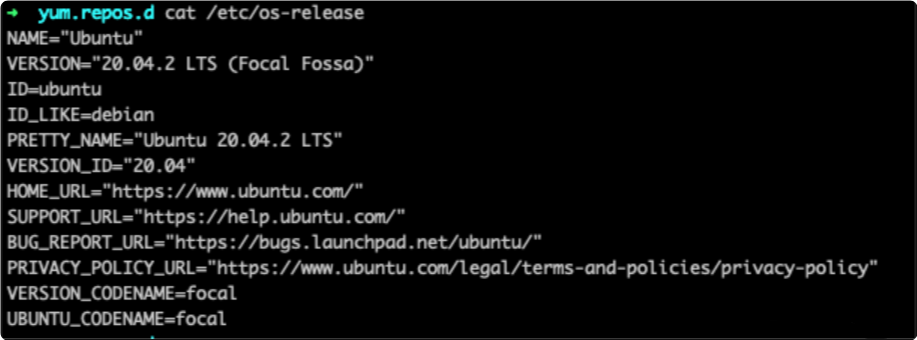
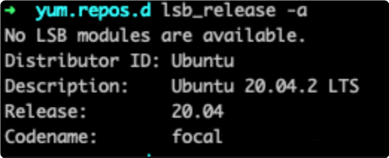
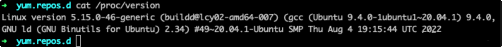
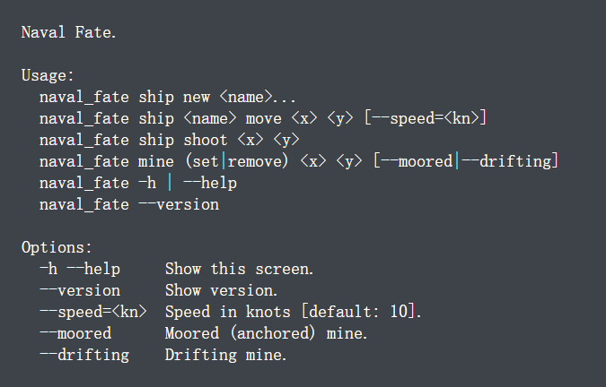
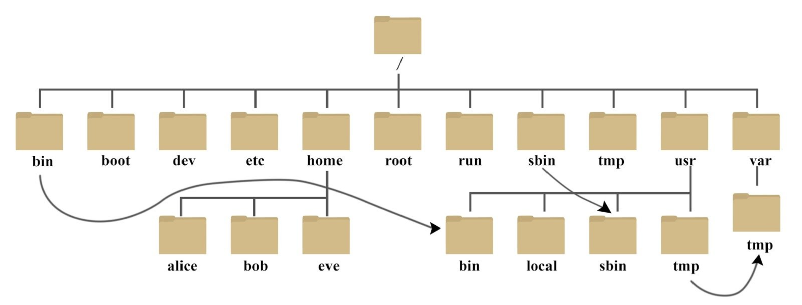
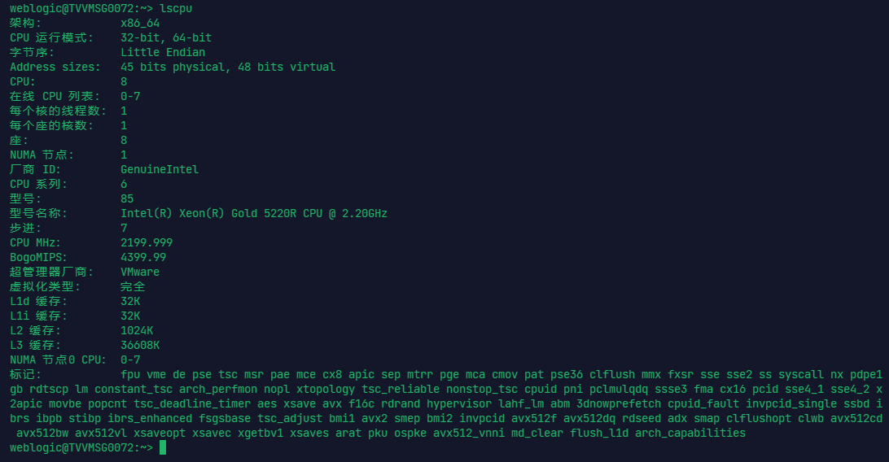
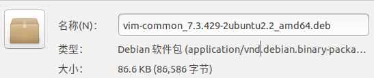
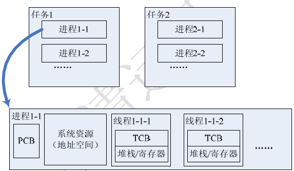
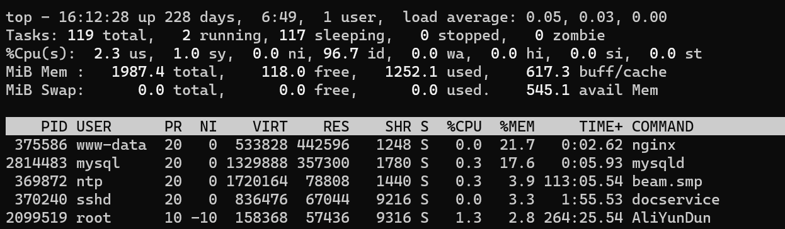

# 1、Linux 简介

Linux 英文解释为 Linux is not Unix。

Linux 内核最初只是由芬兰人林纳斯·托瓦兹（Linus Torvalds）在赫尔辛基大学上学时出于个人爱好而编写的。

Linux 是一套免费使用和自由传播的类 Unix 操作系统，是一个基于 POSIX 和 UNIX 的多用户、多任务、支持多线程和多 CPU 的操作系统。

Linux 能运行主要的 UNIX 工具软件、应用程序和网络协议。它支持 32 位和 64 位硬件。Linux 继承了 Unix 以网络为核心的设计思想，是一个性能稳定的多用户网络操作系统。


## 1.1、Linux 的发行版

Linux 的发行版说简单点就是将 Linux 内核与应用软件做一个打包。


目前市面上较知名的发行版有：Ubuntu、RedHat、CentOS、Debian、Fedora、SuSE、OpenSUSE、Arch Linux、SolusOS 等。


这里用的 Linux 版本是 Ubuntu 20.04 64位。


## 1.2、查看 Linux 系统版本

有三种方法可以验证：


**通过 `/etc/os-release` 文件查看**

运行以下命令检查 Linux 操作系统版本：

```shell
cat /etc/os-release
```



**通过 `lsb_release` 命令查看**

直接看命令：

```shell
lsb_release -a
```




**通过 `proc` 目录中可用版本文件查看**

命令如下：

```shell
cat /proc/version
```




## 1.3、命令行界面描述语言

`docopt` 可用于为命令行应用定义接口，并且自动生成解析器。

`docopt` 基于已使用数十年的惯例，用于描述程序接口的帮助信息（help messages）和手册页（man pages）。`docopt` 中正式的接口描述如下例所示：



上图中的例子描述了可执行程序 `naval_fate`（海军命运）的调用接口，可由命令（commands）、选项（options）和位置参数（positional arguments）三者的不同组合来使用：

- 命令（commands）：`ship`、`new`、`move` 等。
- 选项（options）：`-h`、`--help`、`--speed=<kn>` 等。
- 位置参数（positional arguments）：`<name>`、`<x>`、`<y>` 等。

该示例使用方括号（`[]`）、圆括号（`()`）、管道符（`|`）和省略号（`...`）分别描述可选、必需、互斥和重复的元素。这些元素组成了有效的使用模式（usage patterns），每个使用模式都以程序的名称 `naval_fate` 开始。

使用模式下方为带有描述的选项列表，它们描述了一个选项是否有短格式（例如 `-h`）或长格式（例如 `-–help`） 、是否有一个参数（例如 `–speed=<kn>`），以及该参数是否有默认值（例如 `[default: 10]`）。

一个「`docopt` 实现」将提取所有上述信息并生成命令行参数解析器，当使用 `-h` 或 `-–help` 选项调用程序时，界面描述的文本将作为帮助消息显示。


### 1.3.1、使用模式

位于关键字 `usage:`（不分大小写）和明显空行 之间的文本将被解释为使用模式列表，关键字 `usage:` 后的第一个单词将被解释为程序名称。下面是一个无需命令行参数程序的最小示例：

```shell
Usage: my_program
```

程序可以有多个使用模式，以各种元素列出来描述该使用模式：

```
Usage:
    my_program command --option <argument>
    my_program [<optional-argument>]
    my_program --another-option=<with-argument>
    my_program (--either-that-option | <--or-this-argument>)
    my_program <repeating-argument> <repeating-argument> ...
```


**参数 `<argument>`**

以 `<` 开头且 `>` 结尾的单词和大写单词将被解释为位置参数（positional arguments）：

```shell
Usage: my_program <host> <port>
```


**选项 `-o` `--option`**

以单连字符（`-`）或双连字符（`--`）开头的单词将被分别解释为短格式选项（一个字母的「单词」）和长格式选项：

- 短格式选项可以堆叠，这意味着 `-abc` 和 `-a -b -c` 是等价的。
- 长格式选项可以有位于 ` ` 或 `＝` 之后的指定的参数，即 `--input ARG` 与 `--input=ARG` 等价。
- 短格式选项可以有位于可选的 ` ` 之后的指定的参数，即 `-fFILE` 与 `-f FILE` 等价。

> [!NOTE]
>
> `--input ARG`（而非 `--input=ARG`）这种写法语义模棱两可，因为不知道 `ARG` 到底是选项的参数还是位置参数。在使用模式中，只有提供了选项描述时才会被解释为带参数的选项，否则将会被解释为一个选项和独立的位置参数。
>
> 同样会引起歧义的是 `-fFILE`和 `-f FILE`，因为前者不知道是多个堆叠的短格式选项（`-f -F -I -L -E`）还是带参数的单个选项（`-f` 为选项，`FILE` 为对应参数）。只有提供了选项描述时，前者这种写法才会被解释为带参数的单个选项。


**选项简写 `[options]`**

`[options]` 是一种选项的简写方式，该方式可以避免在使用模式中列出所有的选项（从带有描述的选项列表中）。例如以下两种写法是等价的：

```
# 简写
Usage: my_program [options] <path>

--all             List everything.
--long            Long output.
--human-readable  Display in human-readable format.

# 非简写
Usage: my_program [--all --long --human-readable] <path>

--all             List everything.
--long            Long output.
--human-readable  Display in human-readable format.
```

如果有很多选项，并且它们都适用于其中一种使用模式，那么这种简写将很有用。或者，如果同时具有短格式和长格式两种版本的选项，则可以在一个使用模式中列出其中之一：

```
Usage: my_program [-alh] <path>

-a, --all             List everything.
-l, --long            Long output.
-h, --human-readable  Display in human-readable format.

```


**命令 `command`**

所有不遵循上述约定（即参数 `<argument>` 和选项 `--option`）的单词，都将被解释为命令或子命令。


**可选元素 `[optional elements]`**

包含在方括号（`[]`）中的元素（选项、参数、命令）被标为可选。元素是否包含在相同或不同的括号内并不重要，例如下面两种写法是等价的：

```
Usage: my_program [command --option <argument>]

Usage: my_program [command] [--option] [<argument>]
```


**必选元素 `(required elements)`**

如果不在方括号（`[]`）里，那么默认情况下所有元素都是必选的。但是有时候需要用圆括号（`()`）将必选元素显式地标出，例如需要对互斥元素分组的时候：

```shell
Usage: my_program (--either-this <and-that> | <or-this>)
```

另一种用法是，当你需要制定如果有一个元素存在，那么就需要另一个元素，则可以这样实现：

```shell
Usage: my_program [(<one-argument> <another-argument>)]
```


**互斥元素 `element | another`**

互斥元素以管道符（`|`）进行分隔：

```
Usage: my_program go (--up | --down | --left | --right)
```

在各个互斥情况下，当有一个为必选时使用圆括号（`()`）对元素进行分组，当没有必选时使用方括号（`[]`）对元素进行分组：

```
Usage: my_program go [--up | --down | --left | --right]
```


**重复元素 `element...`**

 使用省略号（`...`）表示左边的一个或一组参数可被重复一次或多次：

```shell
Usage: my_program open <file>...
       my_program move (<from> <to>)...
```

可以灵活地指定必需参数的数量，例如：

```shell
# 零个或多个必选参数（3种冗余的方法）：
Usage: my_program [<file>...]
       my_program [<file>]...
       my_program [<file> [<file> ...]]

# 一个或多个必选参数：
Usage: my_program <file>...

# 两个或多个必选参数：
Usage: my_program <file> <file>...

# 诸如此类...
```


**选项参数分隔符 `[--]`**

双连字符（`--`）在不属于选项的一部分时，按照惯例通常用于分隔选项和位置参数，以便处理诸如将文件名误认为是选项的情况。为了支持该约定，只需在使用模式的位置参数前加上 `[--]` 即可：

```shell
Usage: my_program [options] [--] <file>...
```

除此之外，`--` 只是一个普通的命令，因此可应用于任何前述操作，譬如去掉方括号（`[]`）使其成为必选。


**处理标准输入 `[-]`**

单连字符（`-`）在不属于选项的一部分时，按照惯例通常表示程序用于处理标准输入 `stdin` 而非文件。如果要遵循该约定，只需将 `[-]` 添加到使用模式中。`-` 自身仅仅是一个普通命令，可赋予任何意义。


### 1.3.2、选项描述

选项描述是位于使用模式下面的一系列选项。如果使用模式不存在歧义，则可以选择指定它们。

一个选项描述允许指定：

- 某些短格式和长格式选项为同义词。
- 一个选项有一个参数。
- 选项的参数提供默认值。

这些规则遵循：以不计空格的以 `-` 或 `--` 开头的每一行都将视为选项描述。例如：

```
Options:
  --verbose   # GOOD，以「--」开头
  -o FILE     # GOOD，以「-」开头
Other: --bad  # BAD，不以「-」开头
```

若要明确指定一个选项带有一个参数，则需：

1. 在空格或等号（`=`）后放一个描述该参数的词，如下所示。
2. 选项参数遵循尖括号（`<argument>`）或全大写（`ARGUMENT`）的约定。
3. 如果有必要，可以使用逗号（`,`）分隔选项。

尽管下例中的两行都是有效的，但是建议坚持使用单一风格而不要混着用：

```
-o FILE --output=FILE       # 有等号、全大写、无逗号（推荐）
-i <file>, --input <file>   # 无等号、尖括号、有逗号（不推荐）
```

用（至少）两个空格来分隔选项和它们的非正式描述（如果只用一个空格，可能会将描述的首个词当做选项的参数）：

```
--verbose MORE text.    # BAD，将被视为选项verbose有一个参数MORE，
                        # 故需使用两个空格
-q        Quit.         # GOOD，8空格
-o FILE   Output file.  # GOOD，3空格
--stdout  Use stdout.   # GOOD，2空格
```

如果要为带有参数的选项设置默认值，则使用 `[default: the-default-value]` 的形式将其放到选项描述中：

```
--coefficient=K  The K coefficient [default: 2.95]
--output=FILE    Output file [default: test.txt]
--directory=DIR  Some directory [default: ./]
```


# 2、系统目录结构

使用 Linux 时，通过命令行输入 `ls -l /` 可以看到，在 Linux 根目录（`/`）下包含很多的子目录（称为一级目录），例如 `bin`、`boot`、`dev` 等。同时，各一级目录下还含有很多子目录（称为二级目录），比如 `/bin/bash/`、`/bin/ed/` 等。Linux 文件系统目录总体呈现树形结构，`/` 根目录就相当于树根。



由于 Linux 系统免费开源，使得 Linux 发行版本有很多，利用 Linux 开发产品的团队也有很多，如果任由每个人都按照自己的想法来配置 Linux 系统文件目录，后期可能会产生诸多的管理问题。

为了避免诸多使用者对 Linux 系统目录结构天马行空，Linux 基金会发布了 FHS 标准。多数 Linux 发行版系统都遵循这一标准。

> FHS（Filesystem Hierarchy Standard），文件系统层次化标准，该标准规定了 Linux 系统中所有一级目录以及部分二级目录（/usr 和 /var）的用途。发布此标准的主要目的就是为了让用户清楚地了解每个目录应该存放什么类型的文件。


## 2.1、根目录（/）

FHS 认为，Linux 系统的根目录（`/`）最为重要（没有之一），其原因有以下 2 点：

1. 所有目录都是由根目录衍生出来的；
2. 根目录与系统的开机、修复、还原密切相关；

因此，根目录必须包含开机软件、核心文件、开机所需程序、函数库、修复系统程序等文件：

| 一级目录  | 功能（作用）                                                 |
| --------- | ------------------------------------------------------------ |
| `/bin/`   | 存放系统命令，普通用户和 root 都可以执行。放在 `/bin/` 下的命令在单用户模式下也可以执行。 |
| `/boot/`  | 系统启动目录，保存与系统启动相关的文件，如内核文件和启动引导程序（grub）文件等。 |
| `/dev/`   | 设备文件保存位置。                                           |
| `/home/`  | 普通用户的主目录（也称为家目录）。在创建用户时，每个用户要有一个默认登录和保存自己数据的位置，就是用户的主目录，所有普通用户的主目录是在 `/home/` 下建立一个和用户名相同的目录。如用户 liming 的主目录就是 `/home/liming/`。 |
| `/lib/`   | 系统调用的函数库保存位置。                                   |
| `/media/` | 挂载目录。系统建议用来挂载媒体设备，如软盘和光盘。           |
| `/mnt/`   | 挂载目录。早期 Linux 中只有这一个挂载目录，并没有细分。系统建议这个目录用来挂载额外的设备，如 U 盘、移动硬盘和其他操作系统的分区。 |
| `/misc/`  | 挂载目录。系统建议用来挂载 NFS 服务的共享目录。虽然系统准备了三个默认挂载目录 `/media/`、`/mnt/`、`/misc/`，但是到底在哪个目录中挂载什么设备可以由管理员自己决定。 |
| `/opt/`   | 第三方安装的软件保存位置。这个目录是放置和安装其他软件的位置，手工安装的源码包软件都可以安装到这个目录中。 |
| `/root/`  | root 的主目录。普通用户主目录在 `/home/` 下，root 主目录直接在 `/` 下。 |
| `/sbin/`  | 保存与系统环境设置相关的命令，只有 root 可以使用这些命令进行系统环境设置，但也有些命令可以允许普通用户查看。 |
| `/srv/`   | 服务数据目录。一些系统服务启动之后，可以在这个目录中保存所需要的数据。 |
| `/tmp/`   | 临时目录。系统存放临时文件的目录，在该目录下，所有用户都可以访问和写入。建议此目录中不能保存重要数据，最好每次开机都把该目录清空。 |

FHS 针对根目录中包含的子目录仅限于上表，但除此之外，Linux 系统根目录下通常还包含下表中的几个一级目录：

| 一级目录       | 功能（作用）                                                 |
| -------------- | ------------------------------------------------------------ |
| `/lost+found/` | 当系统意外崩溃或意外关机时，产生的一些文件碎片会存放在这里。在系统启动的过程中，`fsck` 工具会检查这里，并修复已经损坏的文件系统。这个目录只在每个分区中出现，例如，`/lost+found/` 就是根分区的备份恢复目录，`/boot/lost+found/` 就是 `/boot/` 分区的备份恢复目录。 |
| `/proc/`       | 虚拟文件系统。该目录中的数据并不保存在硬盘上，而是保存到内存中。主要保存系统的内核、进程、外部设备状态和网络状态等。如 `/proc/cpuinfo` 是保存 CPU 信息的，`/proc/devices` 是保存设备驱动的列表的，`/proc/filesystems` 是保存文件系统列表的，`/proc/net` 是保存网络协议信息的...... |
| `/sys/`        | 虚拟文件系统。和 `/proc/` 目录相似，该目录中的数据都保存在内存中，主要保存与内核相关的信息。 |


## 2.2、/usr/ 目录

usr（注意不是 user），全称为 Unix Software Resource，此目录用于存储系统软件资源。FHS 建议所有开发者，应把软件产品的数据合理的放置在 `/usr/` 目录下的各子目录中，而不是为他们的产品创建单独的目录。

Linux 系统中，所有系统默认的软件都存储在 `/usr/` 目录下，`/usr/` 目录类似 Windows 系统中 `C:\Windows\`+`C:\Program files\` 两个目录的综合体。

FHS 建议，`/usr/` 目录应具备下表所示的子目录：

| 子目录          | 功能（作用）                                                 |
| --------------- | ------------------------------------------------------------ |
| `/usr/bin/`     | 存放系统命令，普通用户和超级用户都可以执行。这些命令和系统启动无关，在单用户模式下不能执行。 |
| `/usr/sbin/`    | 存放根文件系统不必要的系统管理命令，如多数服务程序，只有 root 可以使用。 |
| `/usr/lib/`     | 应用程序调用的函数库保存位置。                               |
| `/usr/XllR6/`   | 图形界面系统保存位置。                                       |
| `/usr/local/`   | 手工安装的软件保存位置。我们一般建议源码包软件安装在这个位置。 |
| `/usr/share/`   | 应用程序的资源文件保存位置，如帮助文档、说明文档和字体目录。 |
| `/usr/src/`     | 源码包保存位置。我们手工下载的源码包和内核源码包都可以保存到这里。 |
| `/usr/include/` | C/C++ 等编程语言头文件的放置目录。                           |


## 2.3、/var/ 目录

`/var/` 目录用于存储动态数据，例如缓存、日志文件、软件运行过程中产生的文件等。通常，此目录下建议包含下表所示的这些子目录：

| /var子目录               | 功能（作用）                                                 |
| ------------------------ | ------------------------------------------------------------ |
| `/var/lib/`              | 程序运行中需要调用或改变的数据保存位置。如 MySQL 的数据库保存在 `/var/lib/mysql/` 目录中。 |
| `/var/log/`              | 登陆文件放置的目录，其中所包含比较重要的文件如 `/var/log/messages`、`/var/log/wtmp` 等。 |
| `/var/run/`              | 一些服务和程序运行后，它们的 PID（进程 ID）保存位置。        |
| `/var/spool/`            | 里面主要都是一些临时存放，随时会被用户所调用的数据，例如 `/var/spool/mail/` 存放新收到的邮件，`/var/spool/cron/` 存放系统定时任务。 |
| `/var/www/`              | RPM 包安装的 Apache 的网页主目录。                           |
| `/var/nis/`、 `/var/yp/` | NIS 服务机制所使用的目录，nis 主要记录所有网络中每一个 client 的连接信息；yp 是 linux 的 nis 服务的日志文件存放的目录。 |
| `/var/tmp/`              | 一些应用程序在安装或执行时，需要在重启后使用的某些文件，此目录能将该类文件暂时存放起来，完成后再行删除。 |


## 2.4、/etc/ 目录

配置文件保存位置。系统内所有采用默认安装方式（rpm 安装）的服务配置文件全部保存在此目录中，如用户信息、服务的启动脚本、常用服务的配置文件等。

> etc 不是什么缩写，是 and so on 的意思，来源于法语的 et cetera，翻译成中文就是 “等等” 的意思。至于为什么在 `/etc/` 下面存放配置文件， 按照原始的 UNIX 的说法（Linux 文件结构参考 UNIX 的教学实现 MINIX）：这下面放的都是一堆零零碎碎的东西，就叫 etc，这其实是个历史遗留。

| /etc子目录                | 功能（作用）                                         |
| ------------------------- | ---------------------------------------------------- |
| `/etc/opt/`               | `/opt/` 的配置文件。                                 |
| `/etc/X11/`               | X_Window 系统（版本11）的配置文件。                  |
| `/etc/sgml/`              | SGML 的配置文件。                                    |
| `/etc/xml/`               | XML 的配置文件。                                     |
| `/etc/skel/`              | 默认创建用户时，把该目录拷贝到家目录下。             |
| `/etc/sysconfig/network/` | 包含系统配置文件，通常用于 Red Hat 系 Linux 发行版。 |

`/etc` 除了上述的子目录，还有很多直接放在目录下的配置文件：

| 文件                                               | 描述                                                         |
| :------------------------------------------------- | :----------------------------------------------------------- |
| `/etc/rc`、`/etc/rc.d`、`/etc/rc*.d`               | 启动、或改变运行级时运行的 scripts 或 scripts 的目录。       |
| `/etc/hosts`                                       | 本地域名解析文件。                                           |
| `/etc/hostname`                                    | 这个文件用来存储主机名。                                     |
| `/etc/resolv.conf`                                 | DNS 服务器配置。                                             |
| `/etc/fstab`                                       | 开机自动挂载系统，所有分区开机都会自动挂载。                 |
| `/etc/inittab`                                     | 设定系统启动时 Init 进程将把系统设置成什么样的 runlevel 及加载相关的启动文件配置。 |
| `/etc/exports`                                     | 设置 NFS 系统用的配置文件路径。                              |
| `/etc/init.d`                                      | 这个目录来存放系统启动脚本。                                 |
| `/etc/profile`、`/etc/csh.login`、`/etc/csh.cshrc` | 全局系统环境配置变量。                                       |
| `/etc/issue`                                       | 认证前的输出信息，默认输出版本内核信息。                     |
| `/etc/motd`                                        | 设置认证后的输出信息。                                       |
| `/etc/passwd`                                      | 用户数据库，其中的域给出了用户名、真实姓名、家目录、加密的口令和用户的其他信息。 |
| `/etc/shadow`                                      | 在安装了影子口令软件的系统上的影子口令文件。影子口令文件将 `/etc/passwd` 文件中的加密口令移动到 `/etc/shadow` 中，而后者只对 root 可读。这使破译口令更困难。 |
| `/etc/group`                                       | 类似 `/etc/passwd`，但说明的不是用户而是组。                 |
| `/etc/sudoers`                                     | 可以 sudo 命令的配置文件。                                   |
| `/etc/syslog.conf`                                 | 系统日志参数配置。                                           |
| `/etc/login.defs`                                  | 设置用户帐号限制的文件。                                     |
| `/etc/securetty`                                   | 确认安全终端，即哪个终端允许 root 登录。一般只列出虚拟控制台，这样就不可能（至少很困难）通过 modem 或网络闯入系统并得到超级用户特权。 |
| `/etc/printcap`                                    | 类似 `/etc/termcap`，但针对打印机，语法不同。                |
| `/etc/shells`                                      | 列出可信任的 shell。`chsh` 命令允许用户在本文件指定范围内改变登录 shell。 |
| `/etc/xinetd.d`                                    | 如果服务器是通过 xinetd 模式运行的，它的脚本要放在这个目录下。有些系统没有这个目录，比如 Slackware，有些老的版本也没有。在 Redhat Fedora 中比较新的版本中存在。 |


### 2.4.1、/etc/hosts

**hosts 文件是什么？**

hosts 是系统文件，配置了 IP 地址和域名（或者主机名、主机别名）的映射关系。


**hosts 文件有什么用？**

建立双方计算机系统通信的依据，作为域名和 IP 地址解析的凭证，同时也存储了映射关系。


**hosts 文件什么情况下会被用到？**

当访问一个网址时，系统会先在 hosts 文件中寻找，查看是否有需要的域名和 IP 的映射关系，如果存在就通过 IP 地址寻找服务器；如果没有，则会访问 DNS 服务器，获得域名对应的 IP 地址，然后再去寻找服务器。

优先级：DNS 缓存 > hosts > DNS 服务。


**hosts 文件能解决哪些问题？**

1. 加快域名解析：

   对于要经常访问的网站，在 hosts 中配置域名和 IP 的映射关系，可以很快解析出 IP，而不用请求网络上的 DNS 服务器。

2. 屏蔽网站：

   将一些不友好的网站域名映射到错误的 IP 或自己计算机的 IP，这样就不用访问了。

   ```
   127.0.0.1 屏蔽的网站
   0.0.0.0 屏蔽的网站
   ```

3. 双机互连：

   当两台主机只是双机互连时，这时两台主机都需要设置自己的 IP，同时在对方的 hosts 文件里加入自己的 IP 和主机名。


**hosts 文件的格式**

```
IP地址 主机名或域名 [主机的别名] [主机的别名]....
```

- 条目的字段由任意数量的空格或制表符分隔。
- 从 `#` 字符开始直到行尾的文本都是注释，会被忽略。
- 主机名只能包含字母数字字符、减号 `-`、和点 `.`。它们必须以字母字符开头，以字母数字字符结尾。
- 可选别名提供名称更改、替代拼写、更短的主机名或通用主机名（例如：localhost）。

> 在更改主机名后我们需要更新 `/etc/hosts` 域名解析文件，使得本机的应用程序能够解析新的主机名。
>
> 如果你不更新 `/etc/hosts` 文件，那么有的程序，如 sudo，不知道如何解析新的主机名。


# 3、系统远程操作

Linux 一般作为服务器使用，而服务器一般放在机房，你不可能在机房操作你的 Linux 服务器。这时我们就需要远程登录到 Linux 服务器来管理维护系统。Linux 系统中是通过 SSH 服务实现的远程登录功能，默认 SSH 服务端口号为 22。

现在 Windows 10 大都内置了 OpenSSH，如果没有可以去：设置 ==> 应用和功能 ==> 可选功能 中找到 OpenSSH 客户端安装。

打开 CMD 或者 PowerShell 连接 Linux：

```shell
ssh 用户名@IP地址
```


## 3.1、关机/重启

除了连接之外，Linux 中还有一些关机/重启的命令： `shutdown`、`reboot`、`init`、`halt` 和 `poweroff`。


**shutdown**

`shutdown` 命令是最常用也是最安全的关机和重启命令，它会在关机之前调用 fsck 检查磁盘，其中 `-h` 和 `-r` 是最常用的参数：

- `-h` - 停止系统服务并关机
- `-r` - 停止系统服务后重启

示例：

```shell
# 立即关机
shutdown -h now

# 到10:00关机，如果该时间小于当前时间，则到隔天
shutdown -h 10:00

# 10分钟之后自动关机
shutdown -h +10

# 立即重启
shutdown -r now

# 30分钟后重启并发送通知给其他在线用户
shutdown -r +30 '系统将在30分钟内重新启动'
```


**reboot**

`reboot` 表示立即重启，效果等同于 `shutdown -r now`。


**halt**

`halt` 命令是最简单的关机命令，其实就是调用 `shutdown -h`。`halt` 执行时，不理会目前系统状况下，进行硬件关机；杀死应用进程﹐执行 `sync` 系统调用，文件系统写操作完成后就会停止内核。


**poweroff**

`poweroff` 表示立即关机，效果等同于 `shutdown -h now`，在多用户模式下（Run Level 3）不建议使用。


## 3.2、查看 CPU 信息

**lscpu**

`lscpu` 命令来自英文词组 “list the CPU architecture” 的缩写，其功能是用于显示 CPU 架构信息。

该命令会从 `/proc/cpuinfo` 文件中收集有关本机 CPU 架构的信息，并整理成易读的格式输出到 Shell 终端，运维人员可以很方便地了解到本机 CPU 数量、架构、线程、核心、套接字等重要指标信息：




## 3.3、防火墙

Linux 系统的防火墙主要有两种，一种是 iptables，一种是 firewalld。

iptables 是一个命令行工具，是 Linux 系统内置的防火墙程序。它通过过滤网络数据包来保护服务器安全，并降低攻击风险。iptables 可以根据不同的规则对进出服务器的流量进行控制，因此可用于限制特定 IP 地址或端口的访问等操作。iptables 虽然灵活高效，但配置起来比较复杂，需要熟悉其各项规则和操作知识。

firewalld 则相对简单易用。它是一个更高级的动态防火墙管理工具，可以通过 XML 文件配置不同的防火墙规则，支持应用程序型（application）和端口型（port）规则。firewalld 的管理工具叫做 firewall-cmd，使用起来比 iptables 更加方便。

在 CentOS 7 和 RHEL 7 及以后版本上，系统默认采用的是 firewalld。如果需要使用 iptables，则需要先卸载 firewalld，再安装 iptables，并手动配置其规则。由于 firewalld 较为普遍，以下专门介绍 CentOS 7 和 RHEL 7 上的 firewalld 防火墙相关知识。

firewalld 维护了一个固定状态和变化状态的规则集，可以转换成类似于 iptables 的格式和立即生效。


### 3.3.1、firewall

**查看防火墙状态**

```shell
firewall-cmd --state
```

返回结果：

- running：开启了。
- not running：未开启。

为了保证安全起见，如果未开启防火墙，请先开启防火墙，命令如下：

```shell
systemctl start firewalld.service
```


**重启防火墙**

```shell
systemctl restart firewalld.service
```

系统没有任何提示表示成功！


**临时关闭防火墙**

```shell
systemctl stop firewalld.service
```


**永久关闭防火墙**

必须先临时关闭防火墙，再执行该命令，进行永久关闭。

```shell
systemctl disable firewalld.service
```


**查看已开启的端口**

```shell
firewall-cmd --list-ports
```


**开启指定端口**

例如：开启 8848 端口

```shell
firewall-cmd --zone=public --add-port=8848/tcp --permanent
```

显示 success 表示成功！


**关闭指定端口**

```shell
firewall-cmd --zone=public --remove-port=8080/tcp --permanent
```

显示 success 表示成功！


**重新加载防火墙**

```shell
firewall-cmd --reload
```

显示 success 表示成功！


# 4、文件管理

Linux 系统是一种典型的多用户系统，不同的用户处于不同的地位，拥有不同的权限。为了保护系统的安全性，Linux 系统对不同的用户访问同一文件（包括目录文件）的权限做了不同的规定。


## 4.1、文件基本属性

在 Linux 中我们可以使用 `ll` 或者 `ls –l` 命令来显示一个文件的属性以及文件所属的用户和组，如：

```
root@Orichalcos:/# ls -l
total 970036
lrwxrwxrwx   1 root root         7 Sep 22 10:02 bin -> usr/bin
drwxr-xr-x   3 root root      4096 Nov 12 09:27 boot
...
```

实例中，boot 文件的第一个属性用 `d` 表示，`d` 在 Linux 中代表该文件是一个目录文件。

在 Linux 中第一个字符代表这个文件是目录、文件或链接文件等等：

- 当为 `d` 则是目录。
- 当为 `-` 则是文件。
- 若是 `l` 则表示为链接文档（link file）。
- 若是 `b` 则表示为装置文件里面的可供储存的接口设备（可随机存取装置）。
- 若是 `c` 则表示为装置文件里面的串行端口设备，例如键盘、鼠标（一次性读取装置）。

接下来的字符中，以三个为一组，且均为 `rwx` 的三个参数的组合。其中， `r` 代表可（read）、 `w` 代表可写（write）、 `x` 代表可执行（execute）。 要注意的是，这三个权限的位置不会改变，如果没有权限，就会出现减号 `-` 而已。


每个文件的属性由左边第一部分的 10 个字符来确定（如下图）。


从左至右用 0-9 这些数字来表示。

第 0 位确定文件类型，第 1-3 位确定属主（该文件的所有者）拥有该文件的权限；第 4-6 位确定属组（所有者的同组用户）拥有该文件的权限；第 7-9 位确定其他用户拥有该文件的权限。

其中，第 1、4、7 位表示读权限，如果用 `r` 字符表示，则有读权限，如果用 `-` 字符表示，则没有读权限；第 2、5、8 位表示写权限，如果用 `w` 字符表示，则有写权限，如果用 `-` 字符表示没有写权限；第 3、6、9 位表示可执行权限，如果用 `x` 字符表示，则有执行权限，如果用 `-` 字符表示，则没有执行权限。


**Linux 文件属主和属组**

```
[root@www /]# ls -l
total 64
drwxr-xr-x 2 root  root  4096 Feb 15 14:46 cron
drwxr-xr-x 3 mysql mysql 4096 Apr 21  2014 mysql
……
```

对于文件来说，它都有一个特定的所有者，也就是对该文件具有所有权的用户。同时，在 Linux 系统中，用户是按组分类的，一个用户属于一个或多个组。文件所有者以外的用户又可以分为文件所有者的同组用户和其他用户。因此，Linux 系统按文件所有者、文件所有者同组用户和其他用户来规定了不同的文件访问权限。

- 属主：所属的用户，文档所有者，这是一个账户，这是一个人。
- 属组：所属的用户组，这是一个组。

在以上实例中，mysql 文件是一个目录文件，属主和属组都为 mysql，属主有可读、可写、可执行的权限；与属主同组的其他用户有可读和可执行的权限；其他用户也有可读和可执行的权限。

对于 root 用户来说，一般情况下，文件的权限对其不起作用。


## 4.2、更改文件属性

在 Linux 中我们通常使用以下两个命令来修改文件或目录的所属用户与权限：

- chgrp（change group）：修改文件属组。
- chown（change owner）：修改所属用户与组。
- chmod（change mode）：修改用户的权限。


### 4.2.1、chgrp

`chgrp` 命令可以更改文件属组。

语法：

```shell
chgrp [-R] 属组名 文件名
```

参数选项：

- `-R` : 进行递归（recursive）的持续变更，亦即连同次目录下的所有文件都会变更。


### 4.2.2、chown

`chown` 命令可以更改文件属主，也可以同时更改文件属组。

语法：

```shell
chown [–R] 属主名 文件名
chown [-R] 属主名:属组名 文件名
```

参数选项：

- `-R` : 进行递归（recursive）的持续变更，亦即连同次目录下的所有文件都会变更。


### 4.2.3、chmod

`chmod` 命令可以更改文件的 9 个属性。

Linux文件属性有两种设置方法，一种是数字，一种是符号。

Linux 文件的基本权限就有九个，分别是 owner/group/others（拥有者/组/其他） 三种身份各有自己的 read/write/execute 权限。

文件的权限字符为： `-rwxrwxrwx` ， 这九个权限是三个三个一组的！其中，我们可以使用数字来代表各个权限，各权限的分数对照表如下：

- r：4
- w：2
- x：1

每种身份（owner/group/others）各自的三个权限（r/w/x）分数是需要累加的，例如当权限为： `-rwxrwx---` 分数则是：

- owner = rwx = 4+2+1 = 7
- group = rwx = 4+2+1 = 7
- others= --- = 0+0+0 = 0

所以等一下设定权限的变更时，该文件的权限数字就是 770。变更权限的指令 chmod 的语法是这样的：

```shell
chmod [-R] xyz 文件或目录
```

选项与参数：

- `xyz` : 就是刚刚提到的数字类型的权限属性，为 rwx 属性数值的相加。
- `-R` : 进行递归（recursive）的持续变更，亦即连同次目录下的所有文件都会变更。


**符号类型改变文件权限**

还有一个改变权限的方法，从之前的介绍中我们可以发现，基本上就九个权限分别是：

- user：用户。
- group：组。
- others：其他。

那么就可以使用 `u`、`g`、`o` 来代表三种身份的权限。此外， `a` 则代表 all，即全部的身份。读写的权限可以写成 `r,w,x`，也就是可以使用下表的方式来看：


如果需要将文件权限设置为 `-rwxr-xr--` ，可以使用 `chmod u=rwx,g=rx,o=r 文件名` 来设定:

```
#  touch test1    // 创建 test1 文件
# ls -al test1    // 查看 test1 默认权限
-rw-r--r-- 1 root root 0 Nov 15 10:32 test1
# chmod u=rwx,g=rx,o=r  test1    // 修改 test1 权限
# ls -al test1
-rwxr-xr-- 1 root root 0 Nov 15 10:32 test1
```


## 4.3、目录

Linux 的目录结构为树状结构，最顶级的目录为根目录 `/`。其他目录通过挂载可以将它们添加到树中，通过解除挂载可以移除它们。

绝对路径与相对路径：

- 绝对路径：
  
  路径的写法，由根目录 `/` 写起，例如：` /usr/share/doc/` 这个目录。
- 相对路径：
  
  路径的写法，不是由 `/` 写起，例如由 `/usr/share/doc/` 要到 `/usr/share/man/` 底下时，可以写成：`cd ../man/` 这就是相对路径的写法。

处理目录的常用命令：

- `ls`（英文全拼：list files）: 列出目录及文件名。
- `cd`（英文全拼：change directory）：切换目录。
- `pwd`（英文全拼：print work directory）：显示目前的目录。
- `mkdir`（英文全拼：make directory）：创建一个新的目录。
- `rmdir`（英文全拼：remove directory）：删除一个空的目录。
- `cp`（英文全拼：copy file）: 复制文件或目录。
- `rm`（英文全拼：remove）: 删除文件或目录。
- `mv`（英文全拼：move file）: 移动文件与目录，或修改文件与目录的名称。

可以使用 `man [命令]` 来查看各个命令的使用文档，如 ：`man cp`。


### 4.3.1、ls

在Linux系统当中，`ls` 命令可能是最常被运行的，`ls` 命令可以列出目录。

语法：

```shell
ls [-aAdfFhilnrRSt] 目录名称
ls [--color={never,auto,always}] 目录名称
ls [--full-time] 目录名称
```

选项与参数：

- `-a` ：全部的文件，连同隐藏文件（开头为 . 的文件）一起列出来（常用）。
- `-d` ：仅列出目录本身，而不是列出目录内的文件数据（常用）。
- `-l` ：长数据串列出，包含文件的属性与权限等等数据（常用）。

将 home 目录下的所有文件列出来（含属性与隐藏档）：

```shell
ls -al ~
```


### 4.3.2、cd

`cd` 是 Change Directory 的缩写，这是用来变换工作目录的命令。

语法：

```shell
 cd [相对路径或绝对路径]
```

```shell
#使用 mkdir 命令创建 runoob 目录
mkdir runoob

#使用绝对路径切换到 runoob 目录
cd /root/runoob/

#使用相对路径切换到 runoob 目录
cd ./runoob/

# 表示回到自己的家目录，亦即是 /root 这个目录
cd ~

# 表示去到目前的上一级目录，亦即是 /root 的上一级目录的意思；
cd ..
```


### 4.3.3、pwd

`pwd` 命令可以显示当前所在的目录地址。

语法：

```shell
pwd [-P]
```

选项与参数：

- `-P` ：显示出确实的路径，而非使用连结（link）路径。

单纯显示出目前的工作目录：

```
[root@www ~]# pwd
/root   <== 显示出目录啦～
```

显示出实际的工作目录，而非连结档本身的目录名：

```
[root@www ~]# cd /var/mail   <==注意，/var/mail是一个连结档
[root@www mail]# pwd
/var/mail         <==列出目前的工作目录
[root@www mail]# pwd -P
/var/spool/mail   <==怎么回事？有没有加 -P 差很多～
[root@www mail]# ls -ld /var/mail
lrwxrwxrwx 1 root root 10 Sep  4 17:54 /var/mail -> spool/mail
# 看到这里应该知道为啥了吧？因为 /var/mail 是连结档，连结到 /var/spool/mail 
# 所以，加上 pwd -P 的选项后，会不以连结档的数据显示，而是显示正确的完整路径啊！
```


### 4.3.4、mkdir

`mkdir` 命令用于创建目录。

语法：

```shell
mkdir [-p] dirName
```

选项与参数：

- `-p`：确保目录名称存在，不存在的就建一个。

在当前目录下，建立一个名为 orichalcos 的子目录 :

```
mkdir orichalcos
```

在当前目录下的 orichalcos2 目录中，建立一个名为 test 的子目录了，若 orichalcos2 目录原本不存在，则建立一个：

```
mkdir -p orichalcos2/test
```

> [!CAUTION]
>
> 本例若不加 `-p` 参数，且原本 orichalcos2 目录不存在，则产生错误。


### 4.3.5、rmdir

`rmdir` 命令可以删除空的目录。

语法：

```shell
 rmdir [-p] 目录名称
```

选项与参数：

- `-p` ：从该目录起，一次删除多级空目录。

将 `test/test1/test2` 删除掉：

```
root@Orichalcos:~# ls -ld test/test1/test2
drwxr-xr-x 2 root root 4096 Nov 15 16:27 test/test1/test2
root@Orichalcos:~# rmdir test
rmdir: failed to remove 'test': Directory not empty
root@Orichalcos:~# rmdir -p test/test1/test2
root@Orichalcos:~# ls -ld test/test1/test2
ls: cannot access 'test/test1/test2': No such file or directory
root@Orichalcos:~#
```


### 4.3.6、cp

`cp` 命令即拷贝文件和目录。

语法:

```shell
cp [-adfilprsu] 来源档(source) 目标档(destination)
cp [options] source1 source2 source3 .... directory
```

选项与参数：

- `-a`：相当於 -pdr 的意思，至于 pdr 请参考下列说明（常用）。
- `-d`：若来源档为连结档的属性（link file），则复制连结档属性而非文件本身。
- `-f`：为强制（force）的意思，若目标文件已经存在且无法开启，则移除后再尝试一次。
- `-i`：若目标档（destination）已经存在时，在覆盖时会先询问动作的进行（常用）。
- `-l`：进行硬式连结（hard link）的连结档创建，而非复制文件本身。
- `-p`：连同文件的属性一起复制过去，而非使用默认属性（备份常用）。
- `-r`：递归持续复制，用於目录的复制行为（常用）。
- `-s`：复制成为符号连结档（symbolic link），亦即『捷径』文件。
- `-u`：若 destination 比 source 旧才升级 destination ！


### 4.3.7、rm

`rm` 命令可以移除文件或目录。

语法：

```shell
 rm [-fir] 文件或目录
```

选项与参数：

- `-f` ：就是 force 的意思，忽略不存在的文件，不会出现警告信息。
- `-i` ：互动模式，在删除前会询问使用者是否动作。
- `-r` ：递归删除啊！最常用在目录的删除了！这是非常危险的选项！！！


### 4.3.8、mv

`mv` 命令可以移动文件与目录，或修改名称。

语法：

```
[root@www ~]# mv [-fiu] source destination
[root@www ~]# mv [options] source1 source2 source3 .... directory
```

选项与参数：

- `-f `：force 强制的意思，如果目标文件已经存在，不会询问而直接覆盖。
- `-i` ：若目标文件（destination）已经存在时，就会询问是否覆盖。
- `-u` ：若目标文件已经存在，且 source 比较新，才会升级（update）。


## 4.4、文件内容查看

Linux 系统中使用以下命令来查看文件的内容：

- `cat`：由第一行开始显示文件内容。
- `tac`：从最后一行开始显示文件内容。
- `nl`：显示的时候，顺道输出行号。
- `more`：一页一页的显示文件内容。
- `less`：与 `more` 类似，但是比 `more` 更好的是，他可以往前翻页！
- `head`：只看头几行。
- `tail`：只看尾巴几行。

可以使用 `man [命令]`来查看各个命令的使用文档，如 ：`man cp`。


### 4.4.1、cat

由第一行开始显示文件内容。

语法：

```shell
cat [-AbEnTv] 文件
```

选项与参数：

- `-A `：相当於 -vET 的整合选项，可列出一些特殊字符而不是空白而已。
- `-b`：列出行号，仅针对非空白行做行号显示，空白行不标行号！
- `-E`：将结尾的断行字节 `$` 显示出来。
- `-n`：列出行号，连同空白行也会有行号，与 `-b` 的选项不同
- `-T`：将 tab 按键以 `^I` 显示出来。
- `-v `：列出一些看不出来的特殊字符。


### 4.4.2、tac

`tac` 与 `cat` 命令刚好相反，文件内容从最后一行开始显示，可以看出 `tac` 是 `cat` 的倒着写！


### 4.4.3、nl

显示文件内容并显示行号。

语法：

```shell
nl [-bnw] 文件
```

选项与参数：

- `-b` ：指定行号指定的方式，主要有两种：
	- `-b a` ：表示不论是否为空行，也同样列出行号（类似 `cat -n`）。
	- `-b t` ：如果有空行，空的那一行不要列出行号(默认值)。
- `-n` ：列出行号表示的方法，主要有三种：
	- `-n ln` ：行号在荧幕的最左方显示。
	- `-n rn` ：行号在自己栏位的最右方显示，且不加 0 。
	- `-n rz` ：行号在自己栏位的最右方显示，且加 0 。
- `-w` ：行号栏位的占用的位数


### 4.4.4、more

功能类似 `cat` ，`cat` 命令是整个文件的内容从上到下显示在屏幕上，`more` 会以一页一页的显示，方便使用者逐页阅读。

`more` 命令从前向后读取文件，因此在启动时就加载整个文件。

语法：

```shell
more <文件>
```

在 `more` 这个程序的运行过程中，你有几个按键可以按的：

- `空白键（space）`：代表向下翻一页。
- `Enter`：代表向下翻一行。
- `/字串`：代表在这个显示的内容当中，向下搜寻 "字串" 这个关键字。
- `:f`：立刻显示出档名以及目前显示的行数。
- `q`：代表立刻离开 more ，不再显示该文件内容。
- `b` 或 `[ctrl]-b`：代表往回翻页，不过这动作只对文件有用，对管线无用。


### 4.4.5、less

`less` 是对 `more` 命令的增强，在 `more` 的基础上，增加了上下方向键显示当前屏的上下内容。

`less` 运行时可以输入的命令有：

- `空白键`：向下翻动一页。
- `[pagedown]`：向下翻动一页。
- `[pageup]`：向上翻动一页。
- `/字串`：向下搜寻 "字串" 的功能。
- `?字串`：向上搜寻 "字串" 的功能。
- `n`：重复前一个搜寻（与 `/` 或 `?` 有关）。
- `N`：反向的重复前一个搜寻（与 `/` 或 `?` 有关）。
- `q`：离开 less 这个程序。

> [!NOTE]
>
> Linux 里流传着这样一句话："less is more".


### 4.4.6、head

取出文件前面几行，默认的情况中，显示前面 10 行。

语法：

```shell
head [-n number] 文件 
```

选项与参数：

- `-n <行数>`：显示文件的头部 *n* 行内容。


### 4.4.7、tail

`tail` 命令可用于查看文件的内容，有一个常用的参数 `-f` 常用于查阅正在改变的日志文件。

`tail -f filename` 会把 *filename* 文件里的最尾部的内容显示在屏幕上，并且不断刷新，只要 *filename* 更新就可以看到最新的文件内容。

语法：

```shell
tail [参数] [文件]
```

选项与参数：

- `-n <行数>`：显示文件的尾部 *n* 行内容。
- `-f`：表示持续侦测后面所接的档名，要等到按下 Ctrl + C 才会结束 `tail` 的侦测。
- `-q`：不显示处理信息。
- `-v`：显示详细的处理信息。
- `-c <数目>`：显示的字节数。
- `--pid=<PID>`：与 `-f`  合用，表示在进程 ID、PID 死掉之后结束。


## 4.5、压缩/解压

在Linux 中，解压、压缩、打包是日常会很频繁用到的几个操作。

首先需要明确的两个概念，打包和压缩不是一回事：

- 打包：是指将一大堆文件或目录变成一个总的文件。
- 压缩：则是将一个大文件通过压缩算法变成一个小文件。

为什么要区分这两个概念呢？这源于 Linux 中很多压缩程序只能针对一个文件进行压缩，这样当你想要压缩一大堆文件时，你得先将这一大堆文件先打成一个包（`tar` 命令），然后再用压缩程序进行压缩（`gzip`、`bzip2` 命令）。


### 4.5.1、tar

```shell
tar [OPERATION_AND_OPTIONS] [ARCHIVE_NAME] [FILE_NAME(s)]
```

- *OPERATION* 也就是操作，`tar` 命令的操作包括：

  - `-c`/`--create` - 建立压缩档案
  - `-x`/`--extract` - 解压存档文件或在存档文件中提取一个或多个文件与目录
  - `-t`/`--list` - 查看 `tar` 存档包含的文件与目录。
  - `-r` - 向压缩归档文件末尾追加文件
  - `-u` - 更新原压缩包中的文件

  这 5 个是独立的命令，压缩解压都要用到其中一个，可以和别的命令连用但只能用其中一个。

- *OPTIONS* 选项，`tar` 命令的常用选项包括：

  - `-z` - 有 gzip 属性的
  - `-j` - 有 bz2 属性的
  - `-Z` - 有 compress 属性的
  - `-v`/`--verbose` - 打印 `tar` 命令正在处理的文件的信息
  - `-O` - 将文件解开到标准输出
  - `-C`/`--directory` - 指定解压目录

- 下面的参数 `-f` 是必须的：

  - `-f ARCHIVE_NAME`/`--file=ARCHIVE_NAME` - 使用档案名字，切记，这个参数是最后一个参数，后面只能接 *ARCHIVE_NAME*
- *ARCHIVE_NAME* 是要解压或者压缩的 `tar` 存档名称
- *FILE_NAME(s)* 是要提取的一个或者多个文件与目录，多个文件与目录使用空格分隔。如果未提供，则解压整个存档。


**示例**

将目录里所有 jpg 文件打包成 tar.jpg：

```shell
tar -cvf jpg.tar *.jpg
```

将目录里所有 jpg 文件打包成 jpg.tar 后，并且将其用 `gzip` 压缩，生成一个 `gzip` 压缩过的包，命名为 jpg.tar.gz：

```shell
tar –czf jpg.tar.gz *.jpg
```

将目录里所有 jpg 文件打包成 jpg.tar 后，并且将其用 `bzip2` 压缩，生成一个 `bzip2` 压缩过的包，命名为 jpg.tar.bz2：

```shell
tar –cjf jpg.tar.bz2 *.jpg
```

将目录里所有 jpg 文件打包成 jpg.tar 后，并且将其用 `compress` 压缩，生成一个 `umcompress` 压缩过的包，命名为 jpg.tar.Z：

```shell
tar –cZf jpg.tar.Z *.jpg
```


### 4.5.2、zip

Zip 是一种创建压缩存档文件的最普通、最流行的方法。它也是一种古老的文件归档文件格式，这种格式创建于 1989 年。由于它的广泛使用，你会经常遇见 zip 文件。

先决条件：检查你是否安装了 `unzip`。

为了解压 zip 归档文件，你必须在你的系统上安装了 `unzip` 软件包。大多数现代的的 Linux 发行版本提供了解压 zip 文件的支持，但是对这些 zip 文件进行校验以避免以后出现损坏总是没有坏处的

在基于 Unbutu 和 Debian 的发行版上，可以使用下面的命令来安装 `unzip`。如果你已经安装了，会被告知已经被安装。

```shell
sudo apt install unzip
```


**解压到文件夹下**

在 Linux 下使用 `unzip` 命令是非常简单的。在你放 zip 文件的目录，用下面的命令:

```shell
unzip zipped_file.zip
```

你可以给 zip 文件提供解压路径而不是解压到当前所在路径。你会在终端输出中看到提取的文件：

```
unzip metallic-container.zip -d my_zip/
Archive:  metallic-container.zip
  inflating: my_zip/625993-PNZP34-678.jpg
  inflating: my_zip/License free.txt
  inflating: my_zip/License premium.txt
```

这种方式下，所有的提取文件都会被存储到你所指定的文件夹下。如果文件夹不存在，会创建该文件夹。


**查看压缩文件中的内容而不解压压缩文件**

```shell
unzip -l zipped_file.zip
```

下面是该命令的输出：

```
unzip -l metallic-container.zip
Archive:  metallic-container.zip
  Length      Date    Time    Name
---------  ---------- -----   ----
  6576010  2019-03-07 10:30   625993-PNZP34-678.jpg
     1462  2019-03-07 13:39   License free.txt
     1116  2019-03-07 13:39   License premium.txt
---------                     -------
  6578588                     3 files
```


## 4.6、挂载

所有的硬件设备必须挂载之后才能使用，只不过有些硬件设备（比如硬盘分区）在每次系统启动时会自动挂载，而有些（比如 U 盘、光盘）则需要手动进行挂载。`mount` 命令是 Linux 挂载命令。


**什么是 “挂载” 以及为什么 Linux 需要挂载。**

Linux系统中 “一切皆文件”，所有文件都放置在以根目录为树根的树形目录结构中。在 Linux 看来，任何硬件设备也都是文件，它们各有自己的一套文件系统（文件目录结构）。

因此产生的问题是，当在 Linux 系统中使用这些硬件设备时，只有将 Linux 本身的文件目录与硬件设备的文件目录合二为一，硬件设备才能为我们所用。合二为一的过程称为 “挂载”。

挂载，指的就是将设备文件中的顶级目录连接到 Linux 根目录下的某一目录（最好是空目录），访问此目录就等同于访问设备文件。

> 并不是根目录下任何一个目录都可以作为挂载点，由于挂载操作会使得原有目录中文件被隐藏，因此根目录以及系统原有目录都不要作为挂载点，会造成系统异常甚至崩溃，挂载点最好是新建的空目录。


**“挂载点” 的目录要求**

- 目录事先存在，可以用 `mkdir` 命令新建目录
- 挂载点目录不可被其他进程使用到
- 挂载点下原有文件将被隐藏


**`mount` 挂载文件系统**

`mount` 命令用来挂载文件系统，该命令的基本格式如下：

```shell
mount [-t vfstype] [-o options] [设备名称] [挂载点]
```

- *挂载点*：必须是一个已经存在的目录，这个目录可以不为空，但挂载后这个目录下以前的内容将不可用，`umount` 以后会恢复正常
- *设备名称*：可以是一个分区，一个usb设备，光驱，软盘，网络共享等
- *`-t`*：指定文件系统的类型，通常不必指定，因为 `mount` 会自动选择正确的类型。常用类型有：
  - 光盘或光盘镜像：iso9660
  - DOS fat16 文件系统：msdos
  - Windows 9x fat32 文件系统：vfat
  - Windows NT ntfs 文件系统：ntfs
  - Mount Windows 文件网络共享：smbfs
  - UNIX（LINUX）文件网络共享：nfs
- *`-o`*：主要用来描述设备或档案的挂接方式。常用的参数有：
  - loop：用来把一个文件当成硬盘分区挂接上系统
  - ro：采用只读方式挂接设备
  - rw：采用读写方式挂接设备
  - iocharset：指定访问文件系统所用字符集

`mount` 挂载光驱系统，一般来说 CDROM 的设备文件是 `/dev/hdc` 或 `/dev/cdrom` 或 `/media/cdrom`：

```shell
# 在mnt目录新建cdrom目录
mkdir /mnt/cdrom
# 执行挂载命令
mount /dev/cdrom /mnt/cdrom/
```

`mount` 挂载 u 盘，如果计算机没有其它 SCSI 设备和 USB 外设的情况下，插入的 U 盘的设备路径是 `/dev/sda1`：

```shell
mkdir /mnt/upan
mount /dev/sda1 /mnt/upan/
```


**umount 卸载文件系统**

`umount` 命令用于卸载已经挂载的硬件设备，该命令的基本格式如下：

```shell
umount 设备文件名或挂载点
```

注意，卸载命令后面既可以加设备文件名，也可以加挂载点，不过只能二选一，比如卸载光盘：

```shell
umount /mnt/cdrom/
```

命令加设备文件名同样是可以卸载的：

```shell
umount /dev/cdrom
```

如果加了两个（如下所示），从理论上分析，会对光驱卸载两次，当然，卸载第二次的时候就会报错：

```shell
umount /dev/cdrom /mnt/cdrom/
```

另外，我们在卸载时有可能会出现以下情况：

```
[root@localhost ~]# cd /mnt/cdrom/
#进入光盘挂载点
[root@localhost cdrom]# umount /mnt/cdrom/
umount: /mnt/cdrom: device is busy.
#报错，设备正忙
```

这种报错是因为我们已经进入了挂载点，因此，如果要卸载某硬件设备，在执行 `umount` 命令之前，用户须退出挂载目录。

卸载硬件设备成功与否，除了执行 `umount` 命令不报错之外，还可以使用 `df` 命令或 `mount -l` 来查看目标设备是否还挂载在系统中。


## 4.7、创建文件

对于定期使用 Linux 的任何人来说，知道如何创建新文件都是一项重要技能。

要创建一个新文件，您需要对父目录具有写权限。否则，您将收到一个权限被拒绝的错误。


**使用 `touch` 命令创建文件**

创建新的空文件的最简单，最难忘的方法是使用 `touch` 命令。

```shell
touch file1.txt
```

如果文件 `file1.txt` 不存在，则上面的命令将创建该文件，否则，它将更改其时间戳。

要一次创建多个文件，请指定文件名，并用空格分隔：

```shell
touch file1.txt file2.txt file3.txt
```


**使用重定向运算符创建文件**

重定向允许您捕获命令的输出，并将其作为输入发送到另一个命令或文件。有两种方法可以将输出重定向到文件。`>` 操作符将覆盖现有文件，而 `>>` 操作符将追加输出到文件中。

要创建一个空的零长度文件，只需在重定向操作符之前指定要创建的文件名即可：

```shell
> file1.txt
```

这是在 Linux 中创建新文件的最短命令。使用重定向创建文件时，请注意不要覆盖现有的重要文件。


**使用 `echo` 命令创建文件**

要创建新文件，请运行 `echo` 命令，后跟要打印的文本，然后使用重定向操作符 `>` 将输出写入要创建的文件：

```shell
echo "Some line" > file1.txt
```


# 5、用户和用户组管理

Linux 系统是一个多用户多任务的分时操作系统，任何一个要使用系统资源的用户，都必须首先向系统管理员申请一个账号，然后以这个账号的身份进入系统。用户的账号一方面可以帮助系统管理员对使用系统的用户进行跟踪，并控制他们对系统资源的访问；另一方面也可以帮助用户组织文件，并为用户提供安全性保护。

每个用户账号都拥有一个唯一的用户名和各自的口令。用户在登录时键入正确的用户名和口令后，就能够进入系统和自己的主目录。

实现用户账号的管理，要完成的工作主要有如下几个方面：

- 用户账号的添加、删除与修改
- 用户口令的管理
- 用户组的管理


## 5.1、系统用户账号的管理

用户账号的管理工作主要涉及到用户账号的添加、修改和删除。


### 5.1.1、添加帐号

添加用户账号就是在系统中创建一个新账号，然后为新账号分配用户号、用户组、主目录和登录 Shell 等资源。刚添加的账号是被锁定的，无法使用。

添加新的用户账号使用 `useradd` 命令，其语法如下：

```shell
useradd 选项 用户名
```

参数说明：

- 选项：

  - `-c comment`：指定一段注释性描述
  - `-d 目录`：指定用户主目录，如果此目录不存在，则同时使用 `-m` 选项，可以创建主目录
  - `-e 有效期限`：指定帐号的有效期限
  - `-f 缓冲天数`：指定在密码过期后多少天即关闭该帐号
  - `-g 用户组`：指定用户所属的用户组
  - `-G 用户组,用户组`：指定用户所属的附加组
  - `-m`：自动建立用户的登入目录
  - `-M`：不要自动建立用户的登入目录
  - `-s Shell文件`：指定用户的登录 Shell
  - `-u 用户号`：指定用户的用户号，如果同时有 `-o` 选项，则可以重复使用其他用户的标识号

- 用户名：指定新账号的登录名


**实例1：**

```shell
useradd –d /home/sam/ -m sam
```

此命令创建了一个用户 sam，其中 `-d` 和 `-m` 选项用来为登录名 sam 产生一个主目录 `/home/sam`（`/home` 为默认的用户主目录所在的父目录）。

**实例2：**

```shell
useradd -s /bin/sh -g group –G adm,root gem
```

此命令新建了一个用户 gem，该用户的登录 Shell 是 `/bin/sh`，它属于 group 用户组，同时又属于 adm 和 root 用户组，其中 group 用户组是其主组。这里可能新建组：`groupadd group` 以及 `groupadd adm`。

增加用户账号就是在 `/etc/passwd` 文件中为新用户增加一条记录，同时更新其他系统文件如 `/etc/shadow`、`/etc/group` 等。

Linux 提供了集成的系统管理工具 userconf，它可以用来对用户账号进行统一管理。


### 5.1.2、删除帐号

如果一个用户的账号不再使用，可以从系统中删除。删除用户账号就是要将 `/etc/passwd` 等系统文件中的该用户记录删除，必要时还删除用户的主目录。

删除一个已有的用户账号使用`userdel`命令，其格式如下：

```shell
userdel 选项 用户名
```

常用的选项是 `-r`，它的作用是把用户的主目录一起删除。

**实例：**

```shell
userdel -r sam
```

此命令删除用户 sam 在系统文件中（主要是 `/etc/passwd`、`/etc/shadow`、`/etc/group` 等）的记录，同时删除用户的主目录。


### 5.1.3、修改帐号

修改用户账号就是根据实际情况更改用户的有关属性，如用户号、主目录、用户组、登录 Shell 等。

修改已有用户的信息使用`usermod`命令，其格式如下：

```shell
usermod 选项 用户名
```

常用的选项包括 `-c`、`-d`、`-m`、`-g`、`-G`、`-s`、`-u` 以及 `-o` 等，这些选项的意义与 `useradd` 命令中的选项一样，可以为用户指定新的资源值。

另外，有些系统可以使用 `-l 新用户名` 这个选项指定一个新的账号，即将原来的用户名改为新的用户名。

例如：

```shell
usermod -s /bin/ksh -d /home/z/ –g developer sam
```

此命令将用户 sam 的登录 Shell 修改为 `/bin/ksh`，主目录改为 `/home/z/`，用户组改为 developer。


### 5.1.4、切换账号

`su` 为 switch user，即切换用户的简写。

切换用户的命令：

```shell
su username
```

从普通用户切换到 root 用户，还可以使用命令：

```shell
sudo su
```

在终端输入 `exit` 或 `logout` 或使用快捷方式 `Ctrl + D`，可以退回到原来用户

在切换用户时，如果想在切换用户之后使用新用户的工作环境，可以在 su 和 username 之间加 `-`，例如
```shell
su - root
```

提示符 `$` 表示普通用户，`#` 表示超级用户，即 root 用户。


### 5.1.5、用户口令的管理

用户管理的一项重要内容是用户口令的管理。用户账号刚创建时没有口令，但是被系统锁定，无法使用，必须为其指定口令后才可以使用，即使是指定空口令。

指定和修改用户口令的 Shell 命令是 `passwd`。超级用户可以为自己和其他用户指定口令，普通用户只能用它修改自己的口令。命令的格式为：

```shell
passwd 选项 用户名
```

可使用的选项：

- `-l`：锁定口令，即禁用账号
- `-u`：口令解锁
- `-d`：使账号无口令
- `-f`：强迫用户下次登录时修改口令

如果默认用户名，则修改当前用户的口令。

例如，假设当前用户是 sam，则下面的命令修改该用户自己的口令：

```
$ passwd 
Old password:****** 
New password:******* 
Re-enter new password:*******
```

如果是超级用户，可以用下列形式指定任何用户的口令：

```
# passwd sam 
New password:******* 
Re-enter new password:*******
```

普通用户修改自己的口令时，`passwd` 命令会先询问原口令，验证后再要求用户输入两遍新口令，如果两次输入的口令一致，则将这个口令指定给用户；而超级用户为用户指定口令时，就不需要知道原口令。

为了系统安全起见，用户应该选择比较复杂的口令，例如最好使用 8 位长的口令，口令中包含有大写、小写字母和数字，并且应该与姓名、生日等不相同。

为用户指定空口令时，执行下列形式的命令：

```shell
passwd -d sam
```

此命令将用户 sam 的口令删除，这样用户 sam 下一次登录时，系统就不再允许该用户登录了。

passwd 命令还可以用 `-l`（lock）选项锁定某一用户，使其不能登录，例如：

```shell
passwd -l sam
```


## 5.2、系统用户组的管理

每个用户都有一个用户组，系统可以对一个用户组中的所有用户进行集中管理。不同 Linux 系统对用户组的规定有所不同，如 Linux 下的用户属于与它同名的用户组，这个用户组在创建用户时同时创建。

用户组的管理涉及用户组的添加、删除和修改。组的增加、删除和修改实际上就是对 `/etc/group` 文件的更新。


**添加组**

增加一个新的用户组使用 `groupadd ` 命令。其格式如下

```shell
groupadd 选项 用户组
```

可以使用的选项有：

- `-g GID` ：指定新用户组的组标识号（GID），如果未指定，新组的组标识号在当前已有的最大组标识号的基础上加 1
- `-o` ：一般与 `-g` 选项同时使用，表示新用户组的 GID 可以与系统已有用户组的 GID 相同


**删除组**

如果要删除一个已有的用户组，使用 `groupdel` 命令，其格式如下：

```shell
groupdel 用户组
```


**修改组**

修改用户组的属性使用 `groupmod` 命令。其语法如下：

```shell
groupmod 选项 用户组
```

常用的选项有：

- `-g GID` ：为用户组指定新的组标识号
- `-o` ：与 `-g` 选项同时使用，用户组的新 GID 可以与系统已有用户组的 GID 相同
- `-n 新用户组` ：将用户组的名字改为新名字


**用户切换组**

如果一个用户同时属于多个用户组，那么用户可以在用户组之间切换，以便具有其他用户组的权限。

用户可以在登录后，使用命令 `newgrp` 切换到其他用户组，这个命令的参数就是目的用户组。例如：

```shell
newgrp root
```

这条命令将当前用户切换到 root 用户组，前提条件是 root 用户组确实是该用户的主组或附加组。类似于用户账号的管理，用户组的管理也可以通过集成的系统管理工具来完成。


## 5.3、与用户账号有关的系统文件

完成用户管理的工作有许多种方法，但是每一种方法实际上都是对有关的系统文件进行修改。与用户和用户组相关的信息都存放在一些系统文件中，这些文件包括 `/etc/passwd`, `/etc/shadow`, `/etc/group` 等。


### 5.3.1、/etc/passwd

`/etc/passwd` 文件是用户管理工作涉及的最重要的一个文件。Linux 系统中的每个用户都在 `/etc/passwd` 文件中有一个对应的记录行，它记录了这个用户的一些基本属性。

这个文件对所有用户都是可读的。`/etc/passwd` 中一行记录对应着一个用户，每行记录又被冒号 `:` 分隔为7个字段，其格式和具体含义如下：

```
用户名:口令:用户标识号:组标识号:注释性描述:主目录:登录Shell
```

- *用户名*：代表用户账号的字符串。

  通常长度不超过8个字符，并且由大小写字母和 `/` 或数字组成。登录名中不能有冒号`:`，因为冒号在这里是分隔符。

  为了兼容起见，登录名中最好不要包含点字符 `.`，并且不使用连字符 `-` 和加号 `+` 打头。

- *口令*：一些系统中，存放着加密后的用户口令字。

  虽然这个字段存放的只是用户口令的加密串，不是明文，但是由于 `/etc/passwd` 文件对所有用户都可读，所以这仍是一个安全隐患。因此，现在许多Linux 系统（如 SVR4）都使用了shadow 技术，把真正的加密后的用户口令字存放到 `/etc/shadow` 文件中，而在 `/etc/passwd` 文件的口令字段中只存放一个特殊的字符，例如 `x` 或者 `*`。

- *用户标识号*：一个整数，系统内部用它来标识用户。

  一般情况下它与用户名是一一对应的。如果几个用户名对应的用户标识号是一样的，系统内部将把它们视为同一个用户，但是它们可以有不同的口令、不同的主目录以及不同的登录 Shell 等。

  通常用户标识号的取值范围是 0～65535。0 是超级用户 root 的标识号，1～99 由系统保留，作为管理账号，普通用户的标识号从 100 开始。在 Linux系统中，这个界限是 500。

- *组标识号*：记录着用户所属的用户组。

  它对应着 `/etc/group` 文件中的一条记录。

- *注释性描述*：记录着用户的一些个人情况。

  例如用户的真实姓名、电话、地址等，这个字段并没有什么实际的用途。在不同的 Linux 系统中，这个字段的格式并没有统一。在许多 Linux 系统中，这个字段存放的是一段任意的注释性描述文字，用做 `finger` 命令的输出。

- *主目录*：用户的起始工作目录。

  它是用户在登录到系统之后所处的目录。在大多数系统中，各用户的主目录都被组织在同一个特定的目录下，而用户主目录的名称就是该用户的登录名。各用户对自己的主目录有读、写、执行（搜索）权限，其他用户对此目录的访问权限则根据具体情况设置。

- *登录Shell*：用户登录后，要启动一个进程，负责将用户的操作传给内核，这个进程是用户登录到系统后运行的命令解释器或某个特定的程序，即 Shell。

  Shell 是用户与 Linux 系统之间的接口。Linux 的 Shell 有许多种，每种都有不同的特点。常用的有 sh（Bourne Shell），csh（C Shell），ksh（Korn Shell）， tcsh（TENEX/TOPS-20 type C Shell）， bash（Bourne Again Shell）等。

  系统管理员可以根据系统情况和用户习惯为用户指定某个 Shell。如果不指定 Shell，那么系统使用 sh 为默认的登录 Shell，即这个字段的值为 `/bin/sh`。

  用户的登录 Shell 也可以指定为某个特定的程序（此程序不是一个命令解释器）。利用这一特点，我们可以限制用户只能运行指定的应用程序，在该应用程序运行结束后，用户就自动退出了系统。有些 Linux 系统要求只有那些在系统中登记了的程序才能出现在这个字段中。

下面是 `/etc/passwd` 的一个例子：

```
＃ cat /etc/passwd

root:x:0:0:Superuser:/:
daemon:x:1:1:System daemons:/etc:
bin:x:2:2:Owner of system commands:/bin:
sys:x:3:3:Owner of system files:/usr/sys:
adm:x:4:4:System accounting:/usr/adm:
uucp:x:5:5:UUCP administrator:/usr/lib/uucp:
auth:x:7:21:Authentication administrator:/tcb/files/auth:
cron:x:9:16:Cron daemon:/usr/spool/cron:
listen:x:37:4:Network daemon:/usr/net/nls:
lp:x:71:18:Printer administrator:/usr/spool/lp:
sam:x:200:50:Sam san:/home/sam:/bin/sh
```


**系统中有一类用户称为伪用户（pseudo users）**

这些用户在 `/etc/passwd` 文件中也占有一条记录，但是不能登录，因为它们的登录 Shell 为空。它们的存在主要是方便系统管理，满足相应的系统进程对文件属主的要求。

常见的伪用户如下所示：

```
伪 用 户 含 义 
bin 拥有可执行的用户命令文件 
sys 拥有系统文件 
adm 拥有帐户文件 
uucp UUCP使用 
lp lp或lpd子系统使用 
nobody NFS使用
```

除了上面列出的伪用户外，还有许多标准的伪用户，例如：audit, cron, mail, usenet 等，它们也都各自为相关的进程和文件所需要。


### 5.3.2、/etc/shadow

由于 `/etc/passwd` 文件是所有用户都可读的，如果用户的密码太简单或规律比较明显的话，一台普通的计算机就能够很容易地将它破解，因此对安全性要求较高的 Linux 系统都把加密后的口令字分离出来，单独存放在一个文件中，这个文件是 `/etc/shadow` 文件。 有超级用户才拥有该文件读权限，这就保证了用户密码的安全性。

`/etc/shadow` 中的记录行与 `/etc/passwd` 中的一一对应，它由 `pwconv` 命令根据 `/etc/passwd` 中的数据自动产生。它的文件格式与 `/etc/passwd` 类似，由若干个字段组成，字段之间用 `:` 隔开。这些字段是：

```
登录名:加密口令:最后一次修改时间:最小时间间隔:最大时间间隔:警告时间:不活动时间:失效时间:标志
```

- *登录名*：与 `/etc/passwd` 文件中的登录名相一致的用户账号。

- *口令*：存放的是加密后的用户口令字。

  长度为 13 个字符。如果为空，则对应用户没有口令，登录时不需要口令；如果含有不属于集合 { ./0-9A-Za-z } 中的字符，则对应的用户不能登录。

- *最后一次修改时间*：是从某个时刻起，到用户最后一次修改口令时的天数。

  时间起点对不同的系统可能不一样。例如在 SCO Linux 中，这个时间起点是 1970 年 1 月 1 日。

- *最小时间间隔*：两次修改口令之间所需的最小天数。

- *最大时间间隔*：口令保持有效的最大天数。

- *警告时间*：是从系统开始警告用户到用户密码正式失效之间的天数。

- *不活动时间*：用户没有登录活动但账号仍能保持有效的最大天数。

- *失效时间*：相应账号的生存期。

  如果使用了这个字段，那么就给出相应账号的生存期。期满后，该账号就不再是一个合法的账号，也就不能再用来登录了。

下面是 `/etc/shadow` 的一个例子：

```
＃ cat /etc/shadow

root:Dnakfw28zf38w:8764:0:168:7:::
daemon:*::0:0::::
bin:*::0:0::::
sys:*::0:0::::
adm:*::0:0::::
uucp:*::0:0::::
nuucp:*::0:0::::
auth:*::0:0::::
cron:*::0:0::::
listen:*::0:0::::
lp:*::0:0::::
sam:EkdiSECLWPdSa:9740:0:0::::
```


### 5.3.3、/etc/group

将用户分组是 Linux 系统中对用户进行管理及控制访问权限的一种手段。

每个用户都属于某个用户组；一个组中可以有多个用户，一个用户也可以属于不同的组。当一个用户同时是多个组中的成员时，在 `/etc/passwd` 文件中记录的是用户所属的主组，也就是登录时所属的默认组，而其他组称为附加组。

用户要访问属于附加组的文件时，必须首先使用 `newgrp` 命令使自己成为所要访问的组中的成员。

用户组的所有信息都存放在 `/etc/group` 文件中。此文件的格式也类似于 `/etc/passwd` 文件，由冒号 `:` 隔开若干个字段，这些字段有：

```
组名:口令:组标识号:组内用户列表
```

- *组名*：用户组的名称。

  由字母或数字构成。与 `/etc/passwd` 中的登录名一样，组名不应重复。

- *口令*：用户组加密后的口令字。

  一般 Linux 系统的用户组都没有口令，即这个字段一般为空，或者是 `*`。

- *组标识号*：与用户标识号类似。

  是一个整数，被系统内部用来标识组。

- *组内用户列表*：属于这个组的所有用户的列表。

  不同用户之间用逗号 `,`分隔。这个用户组可能是用户的主组，也可能是附加组。

`/etc/group` 文件的一个例子如下：

```
root::0:root
bin::2:root,bin
sys::3:root,uucp
adm::4:root,adm
daemon::5:root,daemon
lp::7:root,lp
users::20:root,sam
```


### 5.3.4、/etc/security/limits.conf

`/etc/security/limits.conf` 文件实际是 Linux PAM（插入式认证模块，Pluggable Authentication Modules）中 `pam_limits.so` 的配置文件，只针对于单个会话，并且该设置不会影响系统服务的资源限制。

`limits.conf` 中每一行描述一个用户配置，其格式和具体含义如下：

```
<domain> <type> <item> <value>
```

- *domain*：
  - 一个用户名。
  - 用户组格式为 `@GROUP_NAME`。
  - 默认配置为 `*`，代表所有用户。

- *type*：
  - `soft`：指的是当前系统生效的设置值，软限制也可以理解为警告值。
  - `hard`：表明系统中所能设定的最大值，`soft` 的限制不能比 `hard` 限制高。
  - `-`：就表明同时设置了 `soft` 和 `hard` 的值。
- *item*：
  - `core`：限制内核文件的大小（KB）。
  - `date`：最大数据大小（KB）。
  - `fsize`：最大文件大小（KB）。
  - `memlock`：最大锁定内存地址空间（KB）。
  - `nofile`：打开文件的最大数目。
  - `rss`：最大持久设置大小（KB）。
  - `stack`：最大栈大小（KB）。
  - `cpu`：以分钟为单位的最多 CPU 时间（MIN）。
  - `noproc`：进程的最大数目。
  - `as`：地址空间限制（KB）。
  - `maxlogins`：此用户允许登录的最大数目。
  - `maxsyslogins`：系统最大同时在线用户数。
  - `priority`：运行用户进程的优先级。
  - `locks`：用户可以持有的文件锁的最大数量。

`limits.conf` 文件的一个例子如下：

```shell
* soft core 0
* hard rss 10000
@student hard nproc 20
@faculty soft nproc 20
@faculty hard nproc 50
ftp hard nproc 0
```


**`/etc/security/limits.d/` 目录**

该目录下默认有 `*-nproc.conf` 文件，该文件是用于限制用户的线程限制。我们也可以在该目录创建配置文件在 `/etc/security/limits.d/` 下，以 `.conf` 结尾。

需要注意的是 `/etc/security/limits.d/` 的这个目录下按照字母顺序排列的配置文件会覆盖 `/etc/security/limits.conf` 中的 domain 相同的的配置。

这意味着，例如使用通配符的 domain 会被子目录中相同的通配符配置所覆盖，但是某一用户的特定配置只能被字母路中用户的配置所覆盖。其实就是某一用户 A 如果在 `/etc/security/limits.conf` 有配置，当 `/etc/security/limits.d/` 子目录下配置文件也有用户 A 的配置时，那么 A 中某些配置会被覆盖。最终取的值是 `/etc/security/limits.d/` 下的配置文件的配置。


## 5.4、添加批量用户

添加和删除用户对每位 Linux 系统管理员都是轻而易举的事，比较棘手的是如果要添加几十个、上百个甚至上千个用户时，我们不太可能还使用`useradd` 一个一个地添加，必然要找一种简便的创建大量用户的方法。Linux 系统提供了创建大量用户的工具，可以立即创建大量用户，方法如下：

1. 先编辑一个文本用户文件，每一列按照 `/etc/passwd` 密码文件的格式书写，要注意每个用户的用户名、UID、宿主目录都不可以相同，其中密码栏可以留做空白或输入 `x` 号。一个范例文件 user.txt 内容如下：

	```
	user001::600:100:user:/home/user001:/bin/bash
	user002::601:100:user:/home/user002:/bin/bash
	user003::602:100:user:/home/user003:/bin/bash
	user004::603:100:user:/home/user004:/bin/bash
	user005::604:100:user:/home/user005:/bin/bash
	user006::605:100:user:/home/user006:/bin/bash
	```

2. 以 root 身份执行命令 `/usr/sbin/newusers`，从刚创建的用户文件 user.txt 中导入数据，创建用户：

	```shell
	newusers < user.txt
	```

	然后可以执行命令 `vipw` 或 `vi /etc/passwd` 检查 `/etc/passwd` 文件是否已经出现这些用户的数据，并且用户的宿主目录是否已经创建。

3. 执行命令 `/usr/sbin/pwunconv` 将 `/etc/shadow` 产生的 shadow 密码解码，然后回写到 `/etc/passwd` 中，并将 `/etc/shadow` 的 shadow 密码栏删掉。这是为了方便下一步的密码转换工作，即先取消 shadow password 功能。

	```shell
	pwunconv
	```

4. 编辑每个用户的密码对照文件，格式为：

	```
	用户名:密码
	```

	实例文件 passwd.txt 内容如下：

	```
	user001:123456
	user002:123456
	user003:123456
	user004:123456
	user005:123456
	user006:123456
	```

5. 以 root 身份执行命令 `/usr/sbin/chpasswd` 创建用户密码，`chpasswd` 会将经过 `/usr/bin/passwd` 命令编码过的密码写入 `/etc/passwd` 的密码栏：

	```shell
	chpasswd < passwd.txt
	```

6. 确定密码经编码写入 `/etc/passwd` 的密码栏后执行命令 `/usr/sbin/pwconv` 将密码编码为 shadow password，并将结果写入 `/etc/shadow`：

	```shell
	pwconv
	```

	这样就完成了大量用户的创建了，之后可以到 `/home` 下检查这些用户宿主目录的权限设置是否都正确，并登录验证用户密码是否正确。


# 6、磁盘管理

Linux 磁盘管理好坏直接关系到整个系统的性能问题。

Linux 磁盘管理常用三个命令为 `df`、`du` 和 `fdisk`。

- `df`（英文全称：disk full）：列出文件系统的整体磁盘使用量。
- `du`（英文全称：disk used）：检查磁盘空间使用量。
- `fdisk`：用于磁盘分区。


## 6.1、df

Linux `df`（英文全拼：disk free） 命令用于显示目前在 Linux 系统上的文件系统磁盘使用情况统计。

语法：

```
df [-ahikHTm] [目录或文件名]
```

选项与参数：

- `-a` ：列出所有的文件系统，包括系统特有的 `/proc` 等文件系统
- `-k` ：以 KBytes 的容量显示各文件系统
- `-m` ：以 MBytes 的容量显示各文件系统
- `-h` ：以人们较易阅读的 GBytes、MBytes、KBytes 等格式自行显示
- `-H` ：以 M=1000K 取代 M=1024K 的进位方式
- `-T` ：显示文件系统类型，连同该 partition 的 filesystem 名称（例如 ext3）也列出
- `-i` ：不用硬盘容量，而以 inode 的数量来显示


**实例 1**

将系统内所有的文件系统列出来：

```
[root@www ~]# df
Filesystem      1K-blocks      Used Available Use% Mounted on
/dev/hdc2         9920624   3823112   5585444  41% /
/dev/hdc3         4956316    141376   4559108   4% /home
/dev/hdc1          101086     11126     84741  12% /boot
tmpfs              371332         0    371332   0% /dev/shm
```

- Filesystem：文件系统的名称或标识符。
- 1K-blocks：文件系统的总容量，以 1KB 块为单位。即文件系统总大小。
- Used：文件系统已经使用的容量，以 1KB 块为单位。
- Available：文件系统中仍然可用的容量，以 1KB 块为单位。
- Use%：文件系统已使用容量占总容量的百分比。
- Mounted on：文件系统被挂载到的目录或位置

> [!NOTE]
>
> 在 Linux 底下如果 `df` 没有加任何选项，那么默认会将系统内所有的（不含特殊内存内的文件系统与 swap）都以 1 Kbytes 的容量来列出来！


**实例 2**

将容量结果以易读的容量格式显示出来：

```
[root@www ~]# df -h
Filesystem            Size  Used Avail Use% Mounted on
/dev/hdc2             9.5G  3.7G  5.4G  41% /
/dev/hdc3             4.8G  139M  4.4G   4% /home
/dev/hdc1              99M   11M   83M  12% /boot
tmpfs                 363M     0  363M   0% /dev/shm
```


**实例 3**

将系统内的所有特殊文件格式及名称都列出来：

```
[root@www ~]# df -aT
Filesystem    Type 1K-blocks    Used Available Use% Mounted on
/dev/hdc2     ext3   9920624 3823112   5585444  41% /
proc          proc         0       0         0   -  /proc
sysfs        sysfs         0       0         0   -  /sys
devpts      devpts         0       0         0   -  /dev/pts
/dev/hdc3     ext3   4956316  141376   4559108   4% /home
/dev/hdc1     ext3    101086   11126     84741  12% /boot
tmpfs        tmpfs    371332       0    371332   0% /dev/shm
none   binfmt_misc         0       0         0   -  /proc/sys/fs/binfmt_misc
sunrpc  rpc_pipefs         0       0         0   -  /var/lib/nfs/rpc_pipefs
```


**实例 4**

将 /etc 底下的可用的磁盘容量以易读的容量格式显示：

```
[root@www ~]# df -h /etc/
Filesystem            Size  Used Avail Use% Mounted on
/dev/hdc2             9.5G  3.7G  5.4G  41% /
```


## 6.2、du

Linux du （英文全拼：disk usage）命令用于显示目录或文件的大小。

语法：

```shell
du [-ahskm] [目录或文件名称]
```

选项与参数：

- `-a` ：列出所有的文件与目录容量，因为默认仅统计目录底下的文件量而已。
- `-h` ：以人们较易读的容量格式（G/M）显示。
- `-s` ：列出总量而已，而不列出每个各别的目录占用容量。
- `-S` ：不包括子目录下的总计，与 `-s` 有点差别。
- `-k` ：以 KBytes 列出容量显示。
- `-m` ：以 MBytes 列出容量显示。


**实例 1**

只列出当前目录下的所有文件夹容量（包括隐藏文件夹）:

```
[root@www ~]# du
8       ./test4     <==每个目录都会列出来
8       ./test2
....中间省略....
12      ./.gconfd   <==包括隐藏文件的目录
220     .           <==这个目录(.)所占用的总量
```

直接输入 `du` 没有加任何选项时，则 `du` 会分析当前所在目录里的子目录所占用的硬盘空间。


**实例 2**

将文件的容量也列出来：

```
[root@www ~]# du -a
12      ./install.log.syslog   <==有文件的列表了
8       ./.bash_logout
8       ./test4
8       ./test2
....中间省略....
12      ./.gconfd
220     .
```


**实例 3**

检查根目录底下每个目录所占用的容量：

```
[root@www ~]# du -sm /*
7       /bin
6       /boot
.....中间省略....
0       /proc
.....中间省略....
1       /tmp
3859    /usr     <==系统初期最大就是他了啦！
77      /var
```

通配符 `*` 来代表每个目录。与 `df` 不一样的是，`du` 这个命令其实会直接到文件系统内去搜寻所有的文件数据。


## 6.3、fdisk

fdisk 是 Linux 的磁盘分区表操作工具。

语法：

```shell
fdisk [-l] 装置名称
```

选项与参数：

- `-l` ：输出后面接的装置所有的分区内容。若仅有 `fdisk -l` 时， 则系统将会把整个系统内能够搜寻到的装置的分区均列出来。


**实例 1**

列出所有分区信息：

```
[root@AY120919111755c246621 tmp]# fdisk -l

Disk /dev/xvda: 21.5 GB, 21474836480 bytes
255 heads, 63 sectors/track, 2610 cylinders
Units = cylinders of 16065 * 512 = 8225280 bytes
Sector size (logical/physical): 512 bytes / 512 bytes
I/O size (minimum/optimal): 512 bytes / 512 bytes
Disk identifier: 0x00000000

    Device Boot      Start         End      Blocks   Id  System
/dev/xvda1   *           1        2550    20480000   83  Linux
/dev/xvda2            2550        2611      490496   82  Linux swap / Solaris

Disk /dev/xvdb: 21.5 GB, 21474836480 bytes
255 heads, 63 sectors/track, 2610 cylinders
Units = cylinders of 16065 * 512 = 8225280 bytes
Sector size (logical/physical): 512 bytes / 512 bytes
I/O size (minimum/optimal): 512 bytes / 512 bytes
Disk identifier: 0x56f40944

    Device Boot      Start         End      Blocks   Id  System
/dev/xvdb2               1        2610    20964793+  83  Linux
```


**实例 2**

找出你系统中的根目录所在磁盘，并查阅该硬盘内的相关信息：

```
[root@www ~]# df /            <==注意：重点在找出磁盘文件名而已
Filesystem           1K-blocks      Used Available Use% Mounted on
/dev/hdc2              9920624   3823168   5585388  41% /

[root@www ~]# fdisk /dev/hdc  <==仔细看，不要加上数字喔！
The number of cylinders for this disk is set to 5005.
There is nothing wrong with that, but this is larger than 1024,
and could in certain setups cause problems with:
1) software that runs at boot time (e.g., old versions of LILO)
2) booting and partitioning software from other OSs
   (e.g., DOS FDISK, OS/2 FDISK)

Command (m for help):     <==等待你的输入！
```

输入 `m` 后，就会看到底下这些命令介绍

```
Command (m for help): m   <== 输入 m 后，就会看到底下这些命令介绍
Command action
   a   toggle a bootable flag
   b   edit bsd disklabel
   c   toggle the dos compatibility flag
   d   delete a partition            <==删除一个partition
   l   list known partition types
   m   print this menu
   n   add a new partition           <==新增一个partition
   o   create a new empty DOS partition table
   p   print the partition table     <==在屏幕上显示分割表
   q   quit without saving changes   <==不储存离开fdisk程序
   s   create a new empty Sun disklabel
   t   change a partition's system id
   u   change display/entry units
   v   verify the partition table
   w   write table to disk and exit  <==将刚刚的动作写入分割表
   x   extra functionality (experts only)
```

离开 `fdisk` 时按下 `q`，那么所有的动作都不会生效！相反的， 按下`w`就是动作生效的意思。

```
Command (m for help): p  <== 这里可以输出目前磁盘的状态

Disk /dev/hdc: 41.1 GB, 41174138880 bytes        <==这个磁盘的文件名与容量
255 heads, 63 sectors/track, 5005 cylinders      <==磁头、扇区与磁柱大小
Units = cylinders of 16065 * 512 = 8225280 bytes <==每个磁柱的大小

   Device Boot      Start         End      Blocks   Id  System
/dev/hdc1   *           1          13      104391   83  Linux
/dev/hdc2              14        1288    10241437+  83  Linux
/dev/hdc3            1289        1925     5116702+  83  Linux
/dev/hdc4            1926        5005    24740100    5  Extended
/dev/hdc5            1926        2052     1020096   82  Linux swap / Solaris
# 装置文件名 启动区否 开始磁柱    结束磁柱  1K大小容量 磁盘分区槽内的系统

Command (m for help): q
```

想要不储存离开吗？按下 `q` 就对了！不要随便按 `w` 啊！使用 `p` 可以列出目前这颗磁盘的分割表信息，这个信息的上半部在显示整体磁盘的状态。


# 7、Vi/Vim

所有的 Unix Like 系统都会内建 vi 文书编辑器，其他的文书编辑器则不一定会存在。但是目前我们使用比较多的是 vim 编辑器。

vim 具有程序编辑的能力，可以主动的以字体颜色辨别语法的正确性，方便程序设计。


## 7.1、什么是 Vim

Vim 是从 vi 发展出来的一个文本编辑器。代码补全、编译及错误跳转等方便编程的功能特别丰富，在程序员中被广泛使用。

简单的来说， vi 是老式的字处理器，不过功能已经很齐全了，但是还是有可以进步的地方。 vim 则可以说是程序开发者的一项很好用的工具。

连 vim 的官方网站 ([http://www.vim.org](http://www.vim.org/)) 自己也说 vim 是一个程序开发工具而不是文字处理软件。

Vim 键盘图：


## 7.2、Vi/Vim 的使用

基本上 vi/vim 共分为三种模式，分别是**命令模式（Command mode）/一般模式**，**输入模式（Insert mode）/编辑模式**和**底线命令模式（Last line mode）**。 这三种模式的作用分别是：


**命令模式**

用户刚刚启动 vi/vim，便进入了命令模式。此状态下敲击键盘动作会被 Vim 识别为命令，而非输入字符。比如我们此时按下 `i`，并不会输入一个字符，`i` 被当作了一个命令。

以下是常用的几个命令：

- `i` 切换到输入模式，以输入字符
- `x` 删除当前光标所在处的字符
- `:` 切换到底线命令模式，以在最底一行输入命令

若想要编辑文本：启动 Vim，进入了命令模式，按下 `i`，切换到输入模式。

命令模式只有一些最基本的命令，因此仍要依靠底线命令模式输入更多命令。


**输入模式**

在命令模式下按下 `i` 就进入了输入模式。

在输入模式中，可以使用以下按键：

- `字符按键以及Shift组合`：输入字符
- `ENTER`：回车键，换行
- `BACK SPACE`：退格键，删除光标前一个字符
- `DEL`：删除键，删除光标后一个字符
- `方向键`：在文本中移动光标
- `HOME/END`：移动光标到行首/行尾
- `Page Up/Page Down`：上/下翻页
- `Insert`：切换光标为输入/替换模式，光标将变成竖线/下划线
- `ESC`：退出输入模式，切换到命令模式


**底线命令模式**

在命令模式下按下 `:`（英文冒号）就进入了底线命令模式。底线命令模式可以输入单个或多个字符的命令，可用的命令非常多。

在底线命令模式中，基本的命令有（已经省略了冒号）：

- `q` 退出程序
- `w` 保存文件

按 `ESC` 键可随时退出底线命令模式。

简单的说，可以将这三个模式想成底下的图标来表示：


## 7.3、Vi/Vim 按键说明

**一般模式可用的光标移动、复制粘贴、搜索替换等**

| **移动光标**         |                                                              |
| -------------------- | ------------------------------------------------------------ |
| h 或 向左箭头键（←） | 光标向左移动一个字符                                         |
| j 或 向下箭头键（↓） | 光标向下移动一个字符                                         |
| k 或 向上箭头键（↑） | 光标向上移动一个字符                                         |
| l 或 向右箭头键（→） | 光标向右移动一个字符                                         |
| [Ctrl] + [f]         | 屏幕『向下』移动一页，相当于 [Page Down] 按键 （常用）       |
| [Ctrl] + [b]         | 屏幕『向上』移动一页，相当于 [Page Up] 按键（常用）          |
| [Ctrl] + [d]         | 屏幕『向下』移动半页                                         |
| [Ctrl] + [u]         | 屏幕『向上』移动半页                                         |
| +                    | 光标移动到非空格符的下一行                                   |
| -                    | 光标移动到非空格符的上一行                                   |
| n空格[Space]         | 那个 n 表示『数字』，例如 20 。按下数字后再按空格键，<br>光标会向右移动这一行的 n 个字符。例如 20[Space] 则光标会向后面移动 20 个字符距离。 |
| 0 或功能键 [Home]    | 这是数字『 0 』：移动到这一行的最前面字符处（常用）          |
| $ 或功能键 [End]     | 移动到这一行的最后面字符处（常用）                           |
| H                    | 光标移动到这个屏幕的最上方那一行的第一个字符                 |
| M                    | 光标移动到这个屏幕的中央那一行的第一个字符                   |
| L                    | 光标移动到这个屏幕的最下方那一行的第一个字符                 |
| G                    | 移动到这个档案的最后一行（常用）                             |
| nG                   | n 为数字。移动到这个档案的第 n 行。例如 20G 则会移动到这个档案的第 20 行（可配合 `:set nu`） |
| gg                   | 移动到这个档案的第一行，相当于 1G 啊！ (常用)                |
| n回车[Enter]         | n 为数字。光标向下移动 n 行（常用）                          |

| **搜索替换**                                   |                                                              |
| ---------------------------------------------- | ------------------------------------------------------------ |
| `/word`                                        | 向光标之下寻找一个名称为 word 的字符串。例如要在档案内搜寻 vbird 这个字符串，就输入 `/vbird` 即可（常用） |
| `?word`                                        | 向光标之上寻找一个字符串名称为 word 的字符串                 |
| n                                              | 这个 n 是英文按键，代表 “next”（下一个）的意思。用于重复前一个搜寻的动作。举例来说， 如果刚刚执行 `/vbird` 去向下搜寻 vbird 这个字符串，按下回车，再按下 n 后，会向下继续搜寻下一个名称为 vbird 的字符串。如果是执行 `?vbird` 的话，那么按下 n 则会向上继续搜寻名称为 vbird 的字符串！ |
| N                                              | 这个 N 是英文按键。与 n 刚好相反，为反向进行前一个搜寻动作。 例如 `/vbird` 后，按下回车，再按下 N 则表示向上搜寻 vbird |
| `:n1,n2s/word1/word2/g`                        | n1 与 n2 为数字。在第 n1 与 n2 行之间寻找 word1 这个字符串，并将该字符串取代为 word2 ！举例来说，在 100 到 200 行之间搜寻 vbird 并取代为 VBIRD 则：``:100,200s/vbird/VBIRD/g`（常用） |
| `:1,$s/word1/word2/g` 或 `:%s/word1/word2/g`   | 从第一行到最后一行寻找 word1 字符串，并将该字符串取代为 word2 ！(常用) |
| `:1,$s/word1/word2/gc` 或 `:%s/word1/word2/gc` | 从第一行到最后一行寻找 word1 字符串，并将该字符串取代为 word2 ！且在取代前显示提示字符给用户确认（confirm）是否需要取代（常用） |

| **删除、复制与贴上** |                                                              |
| -------------------- | ------------------------------------------------------------ |
| x, X                 | 在一行字当中，x 为向后删除一个字符（相当于 [del] 按键）， <br>X 为向前删除一个字符（相当于 [backspace] 亦即是退格键）（常用） |
| nx                   | n 为数字，连续向后删除 n 个字符。举例来说，我要连续删除 10 个字符： `10x` |
| dd                   | 删除游标所在的那一整行（常用）                               |
| ndd                  | n 为数字。删除光标所在的向下 n 行，例如 `20dd` 则是删除 20 行（常用） |
| d1G                  | 删除光标所在到第一行的所有数据                               |
| dG                   | 删除光标所在到最后一行的所有数据                             |
| d$                   | 删除游标所在处，到该行的最后一个字符                         |
| d0                   | 那个是数字的 0 ，删除游标所在处，到该行的最前面一个字符      |
| yy                   | 复制游标所在的那一行（常用）                                 |
| nyy                  | n 为数字。复制光标所在的向下 n 行，例如 `20yy` 则是复制 20 行（常用） |
| y1G                  | 复制游标所在行到第一行的所有数据                             |
| yG                   | 复制游标所在行到最后一行的所有数据                           |
| y0                   | 复制光标所在的那个字符到该行行首的所有数据                   |
| y$                   | 复制光标所在的那个字符到该行行尾的所有数据                   |
| p, P                 | p 为将已复制的数据在光标下一行贴上，P 则为贴在游标上一行！ <br>举例来说，我目前光标在第 20 行，且已经复制了 10 行数据。<br>则按下 p 后， 那 10 行数据会贴在原本的 20 行之后，亦即由 21 行开始贴。<br>但如果是按下 P 呢？ 那么原本的第 20 行会被推到变成 30 行 (常用) |
| J                    | 将光标所在行与下一行的数据结合成同一行                       |
| c                    | 重复删除多个数据，例如向下删除 10 行：`10cj`                 |
| u                    | 复原前一个动作（常用）                                       |
| [Ctrl] + r           | 重做上一个动作（常用）                                       |
| .                    | 不要怀疑！这就是小数点！意思是重复前一个动作的意思。<br>如果你想要重复删除、重复贴上等等动作，按下小数点『.』就好了（常用） |

**一般模式切换到编辑模式的可用的按钮说明**

| **进入输入或取代的编辑模式** |                                                              |
| ---------------------------- | ------------------------------------------------------------ |
| i, I                         | 进入输入模式（Insert mode）： i 为从目前光标所在处输入； <br>I 为在目前所在行的第一个非空格符处开始输入（常用） |
| a, A                         | 进入输入模式（Insert mode）： a 为从目前光标所在的下一个字符处开始输入；<br> A 为从光标所在行的最后一个字符处开始输入（常用） |
| o, O                         | 进入输入模式（Insert mode）： 这是英文字母 o 的大小写。o 为在目前光标所在的下一行处输入新的一行；<br> O 为在目前光标所在的上一行处输入新的一行（常用） |
| r, R                         | 进入取代模式（Replace mode）： r 只会取代光标所在的那一个字符一次；<br>R 会一直取代光标所在的文字，直到按下 ESC 为止（常用） |
| [Esc]                        | 退出编辑模式，回到一般模式中（常用）                         |


**一般模式切换到指令行模式的可用的按钮说明**

| **指令行的储存、离开等指令** |                                                              |
| ---------------------------- | ------------------------------------------------------------ |
| `:w`                         | 将编辑的数据写入硬盘档案中（常用）                           |
| `:w!`                        | 若文件属性为『只读』时，强制写入该档案。不过，到底能不能写入， 还是跟档案权限有关 |
| `:q`                         | 离开 vi （常用）                                             |
| `:q!`                        | 若曾修改过档案，又不想储存，使用 `!` 为强制离开不储存档案。  |
| `:wq`                        | 储存后离开，若为 :wq! 则为强制储存后离开 (常用)              |
| `ZZ`                         | 如果修改过，保存当前文件，然后退出！效果等同于（保存并退出） |
| `ZQ`                         | 不保存，强制退出。效果等同于 `:q!`                           |
| `:w [filename]`              | 将编辑的数据储存成另一个档案（类似另存新档）                 |
| `:r [filename]`              | 在编辑的数据中，读入另一个档案的数据。亦即将 filename 这个档案内容加到游标所在行后面 |
| `:n1,n2 w [filename]`        | 将 n1 到 n2 的内容储存成 filename 这个档案。                 |
| `:! command`                 | 暂时离开 vi 到指令行模式下执行 command 的显示结果！<br>例如 `:! ls /home` 即可在 vi 当中察看 /home 目录下以 ls 输出的档案信息！ |

| **vim 环境的变更** |                                                    |
| ------------------ | -------------------------------------------------- |
| `:set number`      | 显示行号，设定之后，会在每一行的前缀显示该行的行号 |
| `:set nonumber`    | 与 `set number` 相反，为取消行号！                 |
| `:set mouse=a`     | 鼠标可以控制光标快速定位                           |


## 7.4、Vim 配置

Vim 的全局配置一般在 `/etc/vim/vimrc` 或者 `/etc/vimrc`，对所有用户生效。用户个人的配置在 `~/.vimrc`。

如果只对单次编辑启用某个配置项，可以在命令模式下，先输入一个冒号，再输入配置。举例来说，`set number`这个配置可以写在 `.vimrc` 里面，也可以在命令模式输入：

```shell
:set number
```

配置项一般都有 "打开" 和 "关闭" 两个设置。"关闭" 就是在 "打开" 前面加上前缀 "no"：

```shell
" 打开
set number

" 关闭
set nonumber
```

上面代码中，双引号开始的行表示注释。

查询某个配置项是打开还是关闭，可以在命令模式下，输入该配置，并在后面加上问号：

```shell
:set number?
```

上面的命令会返回 number 或者 nonumber 。

如果想查看帮助，可以使用`help`命令：

```shell
:help number
```


# 8、软件安装

在 Windows 操作系统中，我们要想安装某个软件的时候，只要点开相应的 exe 文件，一直按 “下一步”， 最后点 “完成”，这样就可以在我们电脑上使用这个软件了。前面我们也提到过，Ubuntu 提供了一个软件商店， 虽然它也可以提供软件的下载，并且能够自动安装，但是有些软件并不一定能够在里面搜索得到， 那只能以源码的方式来安装软件。

采用源码的安装方式， 都需要检测当前的系统环境，设置编译的参数，如加入/剔除某个模块等，这样的安装方式就显得非常的繁琐。

目前，大多数类 Unix 操作系统都提供了一种中心化的机制用来搜索和安装软件， 软件开发者先在固定的硬件平台上将需要安装或升级的软件编译好， 然后再将软件的所有相关的文件打包存放在公开的服务器中。用户想要安装某个软件时，通过包的形式进行分发， 包提供了操作系统的基本组件，以及共享的库、应用程序、服务和文档，当用户需要时， 可以运行特定的指令来安装。负责这部分工作内容的工具被称为包管理工具， 包管理工具除了安装软件外，它还负责更新已经安装的包。

在 Linux 操作系统中，最常见的两种包分别是 deb 和 rpm。


## 8.1、源码安装

Linux 中安装软件的一种方式是：将源码 sourcecode.tar.gz 进行解压，然后输入 `./configure`，接着 `make`，最后 `make install`，一个软件就安装完成了。


**configure**

这一步一般用来生成 Makefile，为下一步的编译做准备，可以通过在 `configure` 后加上参数来对安装进行控制。

例如安装 Apache 时：`./configure --prefix=/opt/sudytech/apache2` 意思是将该软件安装在 `/opt/sudytech/apache2` 下面，执行文件就会安装在 `/opt/sudytech/apache2/bin` （而不是默认的 `/usr/local/bin`），资源文件就会安装在 `/opt/sudytech/apache2/share`（而不是默认的 `/usr/local/share`）。

通过 `--prefix` 选项指定安装目录的方法在安装软件时具有一些优点和缺点，以下是其中一些主要的考虑因素：

优点：

1. 自定义安装位置： 使用 `--prefix` 可以让你将软件安装到你想要的任意目录中，而不是默认的系统目录。这对于用户或系统管理员来说很有用，特别是在你想要在特定目录中保持清晰的软件组织结构时。
2. 避免权限问题： 安装到系统默认目录可能需要管理员权限，而通过指定自定义目录，你可以在没有管理员权限的情况下进行安装，避免了权限问题。
3. 避免与系统包管理冲突： 有时，系统包管理器（如 APT、Yum、dnf 等）安装的软件可能与你想要安装的软件版本不兼容。通过自定义安装目录，你可以避免与系统包冲突，因为系统软件和自定义安装的软件相互隔离。
4. 多版本支持**：** 如果你需要在同一系统上安装多个版本的同一软件，自定义安装目录可以帮助你保持版本的隔离。

缺点：

1. 设置 PATH 和环境变量： 安装到自定义目录后，你需要确保将该目录添加到 PATH 环境变量中，以便能够轻松找到和执行软件。否则，你需要每次指定完整的路径来执行软件。
2. 依赖问题**：** 安装到自定义目录可能导致依赖项的路径问题。其他软件可能无法找到你自定义安装的软件，除非你正确地设置了相关的路径和环境变量。
3. 管理复杂性： 自定义安装目录可能会增加系统管理的复杂性，特别是当有多个自定义安装的软件时。你需要管理不同目录中的各种文件和版本，以及可能的依赖关系。
4. 卸载问题： 卸载自定义安装的软件可能需要手动删除相关文件，而不像通过包管理器安装的软件那样方便。

总体而言，通过 `--prefix` 指定安装目录在一些情况下非常有用，特别是当你需要在系统中保持更多的控制和定制性时。然而，这种方法可能需要更多的管理和维护工作，需要在优点和缺点之间做出权衡。

同时一些软件的配置文件你可以通过指定 `--sys-config=`  参数进行设定。

有一些软件还可以加上 `--with`、`--enable`、`--without`、`--disable` 等等参数对编译加以控制（具体可以查看基础环境安装文档的参数），你可以通过 `./configure --help` 察看详细的说明帮助。

当 `configure` 执行的时候 console 一般会打印这样的信息：

```
checking for stdlib.h... yes
checking for string.h... yes
checking for memory.h... yes
checking for strings.h... yes
checking for inttypes.h... yes
checking for stdint.h... yes
checking for unistd.h... yes
checking for xxxxxxxx... no
checking for xxxxxxxx... yes
```

这是 `configure` 正在检测你的安装平台的目标特征。比如它会检测你是不是有 CC 或 GCC，是不是需要 CC 或 GCC，其实 `configure` 它本身就是个 shell 脚本。


**make**

这一步就是编译，既然 `configure` 已经生成了 Makefile，那 `make` 就可以直接进行编译了。

大多数的源代码包都经过这一步进行编译（当然有些 perl 或 python 编写的软件需要调用 perl 或 python 来进行编译）。如果在 `make` 过程中出现 error ，一般是你的系统少了一些依赖库等，这些需要自己仔细研究错误代码。执行完之后，会发现 sourcecode 目录中多了一些编译产生的可执行文件及目标文件（object file、*.o）。


**make insatll**

这条命令来进行安装（当然有些软件需要先运行 `make check` 或 `make test` 来进行一些测试），这一步一般需要你有 root 权限（因为要向系统写入文件），通常会带来相应的一系列 `mkdir`、`cp`、`ln` 操作。

若源码不支持 `./configure` 方式指定安装目录，可通过 `make install --prefix=` 再次指定安装路径。  


其实除了这三条之外还有几个非常有用的操作：

- `make clean`：清除编译产生的可执行文件及目标文件（object file、*.o），这点在 `make` 出错时变得极为有用。
- `make distclean`：这条命令除了清除可执行文件和目标文件外，还会把 `configure` 所产生的 Makefile 也清除掉。
- `make uninstall`：虽然不是每个 sourcecode 包都有这个功能，但是这个东西确实是挺好的，如果一时脑热直接 `./configure`、`make`、`make install` 之后不知道程序装去哪儿了，这时候可以用这个进行卸载（当然 `uninstall` 只能执行 1 次，并且 sourcecode 目录中要有当前安装对应的 Makefile）。


## 8.2、deb 包、dpkg 及 apt

在Debian、Ubuntu 等 Linux 发行版中，通常使用 deb（debian）形式的软件包，如下图是 Vim 软件的 deb 安装包。



若下载了deb软件包，可使用如下命令进行安装，其中 `xxxx.deb` 为要安装的软件包的名字：

```shell
# 使用dpkg手动安装deb包的命令
sudo dpkg -i xxxx.deb
```

命令中的 dpkg（Debian Packager）是 Debian 专门开发的包管理工具，它可以用来安装、更新和移除软件， 安装时它需要使用 deb 类型的软件包。

dpkg 是一个底层的包管理工具，主要用于对已下载到本地和已经安装的软件包进行管理。 在它之上的 apt（Advanced Package Tool）包管理工具，其功能则更加丰富和方便使用， 使用apt能够自动从互联网的软件仓库中搜索、安装、升级、卸载软件，它会咨询软件仓库， 并能安装软件时的模块及依赖问题。

如果是使用apt工具安装某个软件，直接使用如下命令即可，它会自动下载并安装软件：

```shell
sudo apt-get install 软件名
```

概括起来可以这么理解，deb是软件包，dpkg是手动安装工具，apt是自动安装工具。


### 8.2.1、apt

apt（Advanced Packaging Tool）是一个在 Debian 和 Ubuntu 中的 Shell 前端软件包管理器。

apt 命令提供了查找、安装、升级、删除某一个、一组甚至全部软件包的命令，apt 命令执行需要超级管理员权限（root）。


**apt 语法**

```shell
apt [options] [command] [package ...]
```

- `options`：可选，选项包括 `-h`（帮助），`-y`（当安装过程提示选择全部为 "yes"），`-q`（不显示安装的过程）等等
- `command`：要进行的操作
- `package`：安装的包名


**apt 常用命令**

- 查询相关：

  - 查找软件包命令： `sudo apt search <keyword>`
  - 显示软件包具体信息，例如：版本号，安装大小，依赖关系等等：`sudo apt show <package_name>`

- 安装相关：

  - 列出所有已安装的包：`apt list --installed`

    列出所有已安装的包的版本信息：`apt list --all-versions`

  - 安装指定的软件命令：`sudo apt install <package_name>`

    安装多个软件包：`sudo apt install <package_1> <package_2> <package_3>`

- 更新相关：

  - 列出所有可更新的软件清单命令：`sudo apt update`

    更新指定的软件命令：`sudo apt update <package_name>`

  - 列出可更新的软件包及版本信息：`apt list --upgradeable`

  - 升级软件包：`sudo apt upgrade`

    升级软件包，升级前先删除需要更新软件包：`sudo apt full-upgrade`

- 删除相关：

  - 移除软件包及配置文件：`sudo apt purge <package_name>`
  - 删除软件包命令：`sudo apt remove <package_name>`
  - 清理不再使用的依赖和库文件：`sudo apt autoremove`


# 9、服务管理

在 Linux 中，无论何时当你安装任何带有服务和守护进程的包，系统默认会把这些服务的初始化及 systemd 脚本添加进去，不过此时它们并没有被启用。

我们需要手动的开启或者关闭那些服务。Linux 中有三个著名的且一直在被使用的初始化系统。

在以 Linux/Unix 为基础的操作系统上，init（初始化的简称）是内核引导系统启动过程中第一个启动的进程。

init 的进程 id （pid）是 `1`，除非系统关机否则它将会一直在后台运行。

init 首先根据 `/etc/inittab` 文件决定 Linux 运行的级别，然后根据运行级别在后台启动所有其他进程和应用程序。

BIOS、MBR、GRUB 和内核程序在启动 init 之前就作为 Linux 的引导程序的一部分开始工作了。

下面是 Linux 中可以使用的运行级别（从 0～6 总共七个运行级别）：

- 0：关机
- 1：单用户模式
- 2：多用户模式（没有NFS）
- 3：完全的多用户模式
- 4：系统未使用
- 5：图形界面模式
- 6：重启


## 9.1、初始化系统

下面是 Linux 系统中最常用的三个初始化系统：

- System V（Sys V）
- Upstart
- systemd


**System V（Sys V）**

System V（Sys V）是类 Unix 系统第一个也是传统的初始化系统。init 是内核引导系统启动过程中第一支启动的程序，它是所有程序的父进程。

大部分 Linux 发行版最开始使用的是叫作 System V（Sys V）的传统的初始化系统。在过去的几年中，已经发布了好几个初始化系统以解决标准版本中的设计限制，例如：launchd、Service Management Facility、systemd 和 Upstart。

但是 systemd 已经被几个主要的 Linux 发行版所采用，以取代传统的 SysV 初始化系统。


**Upstart**

Upstart 是一个基于事件的 `/sbin/init` 守护进程的替代品，它在系统启动过程中处理任务和服务的启动，在系统运行期间监视它们，在系统关机的时候关闭它们。

它最初是为 Ubuntu 而设计，但是它也能够完美的部署在其他所有 Linux 系统中，用来代替古老的 System-V。

Upstart 被用于 Ubuntu 9.10 到 Ubuntu 14.10 和基于 RHEL 6 的系统，之后它被 systemd 取代。


**systemd**

systemd 是一个新的初始化系统和系统管理器，它被用于所有主要的 Linux 发行版，以取代传统的 SysV 初始化系统。

systemd 兼容 SysV 和 LSB 初始化脚本。它可以直接替代 SysV 初始化系统。systemd 是被内核启动的第一个程序，它的 PID 是 `1`。

systemd 是所有程序的父进程，Fedora 15 是第一个用 systemd 取代 upstart 的发行版。`systemctl` 用于命令行，它是管理 systemd 的守护进程/服务的主要工具，例如：（开启、重启、关闭、启用、禁用、重载和状态）

systemd 使用 `.service` 文件而不是 bash 脚本（SysVinit 使用的）。systemd 将所有守护进程添加到 cgroups 中排序，你可以通过浏览 `/cgroup/systemd` 文件查看系统等级。


## 9.2、service

`service` 命令，顾名思义，就是用于管理 Linux 操作系统中服务的命令。

这个命令不是在所有的 Linux 发行版本中都有，主要是在 redhat、fedora、mandriva 和 centos 中。

```shell
#查看所有服务当前的运行状态
service --status-all

#查看指定服务（vsftpd）的运行状态
service vsftpd status

#停止指定服务（vsftpd）
service vsftpd stop

#重启网络服务
service network restart
```


## 9.3、systemctl

systemd 核心概念 unit（单元）类型：unit 表示不同类型的 systemd 对象，通过配置文件进行标识和配置。文件中主要包含了系统服务、监听 socket、保存的系统快照以及其它与 init 相关的信息。

下面为 unit 类型 ：

- service：文件扩展名为 `.service`，用于定义系统服务。
- target：文件扩展名为 `.target`，用于模拟实现运行级别。
- device ：用于定义内核识别的设备。
- mount：定义文件系统挂载点。
- socket：用于标识进程间通信用的 socket 文件，也可在系统启动时，延迟启动服务，实现按需启动。
- snapshot ：管理系统快照。
- swap：用于标识 swap 设备。
- automount ：文件系统的自动挂载点。
- path：用于定义文件系统中的一个文件或目录使用，常用于当文件系统变化时，延迟激活服务。

如何查看这些类型呢?

可以使用 `-t` 加上类型去查看，以 `service` 为例

```shell
ststemctl -t service
```


### 9.3.1、systemd 配置文件

- `/usr/lib/systemd/system/`：每个服务最主要的启动脚本的配置放在这，有点类似以前的 `/etc/init.d`。
- `/run/systemd/system/`：系统执行过程中所产生的服务脚本所在目录，这些脚本的优先级要比 `/usr/lib/systemd/system/`高。
- `/etc/systemd/system/`：管理员根据主机系统的需求所创建的执行脚本所在目录，执行优先级比 `/run/systemd/system/`高。

从上面的功能及优先级次序，我们可以知道 `/etc/systemd/system/` 目录下的相关配置，决定系统了会不会执行某些服务，所以该目录下面一般放着一大堆链接文件。而 `/usr/lib/systemd/system/` 下，则放着实际执行的 systemd 启动脚本配置文件。因此如果你想要修改某个服务启动的设置，应该去 `/usr/lib/systemd/system/` 下面修改。`/etc/systemd/system/` 仅是链接到正确的执行脚本配置文件而已。所以想要看执行脚本设置，应该就得要到 `/usr/lib/systemd/system/` 去查阅。


### 9.3.2、常用指令

- 设置服务是否开机自启：
  ```shell
  # http服务开启自启
  systemctl enable httpd.service
  # http服务禁止自启
  systemctl disable httpd.service
  ```

- 列出所有服务开机自启情况：

  ```shell
  systemctl list-unit-files --type=service
  ```

- 启动/停止/重启服务：

  ```shell
  # 启动http服务
  systemctl start httpd.service
  # 停止http服务
  systemctl stop httpd.service
  # 重启http服务
  systemctl restart httpd.service
  ```

- 列出所有已启动的服务：

  ```shell
  systemctl list-units --type=service
  ```

- 检查服务状态：

  ```shell
  # http服务详细信息
  systemctl status httpd.service
  # 仅显示http服务是否 Active
  systemctl is-active httpd.service
  ```

- 设置服务是否禁用：

  ```shell
  # 禁用http服务
  systemctl mask httpd.service
  # 解除禁用httpd服务
  systemctl unmask httpd.service
  ```

- 检查服务的所有配置详细信息：

  ```shell
  systemctl show httpd
  ```

- 切换操作环境：

  ```shell
  # 将目前的操作环境改为纯文本模式，关掉图形界面
  systemctl isolate multi-user.target
  # 将目前的操作环境改为图形界面
  systemctl isolate graphical.target
  ```

- 获取服务的依赖项列表：

  ```shell
  systemctl list-dependencies httpd.service
  ```

- 按层次列出控制组：

  ```shell
  systemd-cgls
  ```

- 根据CPU，内存，输入和输出列出控制组：
  ```shell
  systemd-cgtop
  ```

- 分析每个进程在引导时花费的时间：
  ```shell
  systemd-analyze blame
  ```


**查看服务状态**

```shell
systemctl status httpd
```

运行状态：

- `active（running）`：正有一只或多只程序正在系统中执行的意思
- `active（exited）`：仅执行一次就正常结束的服务，目前并没有任何程序在系统中执行
- `active（waiting）`：正在执行当中，不过还需要等待其他的事件才能继续处理
- `inactive`：这个服务目前没有运行
- `dead`：程序已经清除

启动状态（有两个，`vendor preset` 前面的表示服务当前的启动状态，后面的表示服务默认的启动状态）：

- `enabled`：这个 daemon 将在开机时被执行
- `disabled`：这个 daemon 在开机时不会被执行
- `static`：这个 daemon 不可以自己启动，不过可能会被其他的 `enabled` 的服务来唤醒（关联属性的服务）
- `mask`：这个 daemon 无论如何都无法被启动，因为已经被强制注销（非删除），可通过 `systemctl unmask` 方式改回原本状态


**列出所有可用的系统套接字**

```shell
systemctl list-unit-files --type=socket
```

套接字的操作：

```shell
systemctl start cups.socket #启动套接字
systemctl restart cups.socket #重启套接字
systemctl stop cups.socket #停止套接字
systemctl reload cups.socket #重新加载套接字
systemctl status cups.socket #查看套接字状态

systemctl is-active cups.socket
systemctl enable cups.socket
systemctl disable cups.socket
```


# 10、进程管理

多任务处理是指用户可以在同一时间内运行多个应用程序，每个正在执行的应用程序被称为一个任务。Linux 就是一个支持多任务的操作系统（Windows也是多任务操作系统），比起单任务系统它的功能增强了许多。

多任务操作系统使用某种调度策略支持多个任务并发执行。事实上，（单核）处理器在某一时刻只能执行一个任务。每个任务创建时被分配时间片（几十到上百毫秒），任务执行（占用CPU）时，时间片递减。操作系统会在当前任务的时间片用完时调度执行其他任务。由于任务会频繁地切换执行，因此给用户多个任务同时运行的感觉。


**任务**

任务是一个逻辑概念，指由一个软件完成的活动，或者是为实现某个目的的一系列操作。通常一个任务是一个程序的一次运行，一个任务包含一个或多个完成独立功能的子任务，这个独立的子任务是进程或者是线程。例如，一个杀毒软件的一次运行是一个任务，目的是从各种病毒的侵害中保护计算机系统，这个任务包含多个独立功能的子任务（进程或线程）：包括实时监控功能、定时查杀功能、防火墙功能以及用户交互功能等。任务、进程和线程之间的关系如下图所示：




**进程**

进程是指一个具有独立功能的程序在某个数据集合上的一次动态执行过程，它是操作系统进行资源分配和调度的基本单元。一次任务的运行可以发激活多个进程，这些进程相互合作来完成该任务的一个最终目标。

进程具有一下几个主要特性：

- 并发性：指的是系统中多个进程可以同时并发执行，相互之间不受干扰。
- 动态性：指的是进程都有完整的生命周期，而且在进程的生命周期内，进程的状态是不断变化的，另外进程具有动态的地址空间（包括代码、数据和进程控制块等）。
- 交互性：指的是进程在执行过程中可能会与其他进程发生直接和间接的通信，如进程同步和进程互斥等，需要为此添加一定的进程处理机制。
- 独立性：指的是进程是一个相对完整的资源分配和调度的基本单位，各个进程的地址空间是相互独立的，只有采用某些特定的通信机制才能实现进程之间的通信。

进程和程序是有本质区别的：程序是一段静态的代码，是保存在非易失性存储器上的的指令和数据的有序集合，没有任何执行的概念；而进程是一个动态的概念，它是程序的一次执行过程，包括了动态创建、调度、执行和消亡的整个过程（这一系列都由操作系统的调度机制来完成！），它是程序执行和资源管理的最小单位。进程不但包括程序的指令和数据，而且包括程序计数器和处理器的所有寄存器以及存储临时数据的进程堆栈。从操作系统的角度看，进程是程序执行时相关资源的总称。当进程结束时，所有资源被操作系统自动回收。

Linux 系统中主要包括下面几种类型的进程：

- 交互式进程：这类进程经常与用户进行交互，需要等待用户的输入（键盘和鼠标操作等）。当接收到用户的输入之后，这类进程能够立刻响应。典型的交互式进程有shell 命令进程、文本编辑器和图形应用程序运行等。
- 批处理进程：这类进程不必与用户进行交互，因此通常在后台运行。因为这类进程通常不必很快地响应，因此往往不会优先调度。典型的批处理进程是编译器的编译操作、数据库搜索引擎等。
- 守护进程：这类进程一直在后台运行，和任何终端都不关联。通常系统启动时开始执行，系统关闭时才结束。很多系统进程（各种服务）都是以守护进程的形式存在。

因为 Linux 是一个多任务的操作系统，所以其他的进程必须等到操作系统将处理器使用权分配给自己之后才能运行。当正在运行的进程需要等待其他的系统资源时，Linux 内核将取得处理器的控制权，按照某种调度算法将处理器分配给某个正在等待执行的进程。


**线程**

进程是系统中程序执行和资源分配的基本单位。每个进程都拥有自己的数据段、代码段和堆栈段，这就造成了进程在进行切换时操作系统的开销比较大。为了提高效率，操作系统又引入了另一个概念——线程，也称为轻量级进程。线程是进程上下文中执行的代码序列，又称为轻量级的进程。它是操作系统能够调度的最小单元。线程可以对进程的内存空间和资源进行访问，并与同一进程中的其他线程共享。因此，线程的上下文切换的开销比进程小得多。一个进程可以拥有多个线程，其中每个线程共享该进程所拥有的资源。要注意的是，由于线程共享了进程的资源和地址空间，因此，任何线程对系统资源的操作都会给其他线程带来影响。由此可知，多线程中的同步是非常重要的问题。


## 10.1、top

`top` 命令是 Linux 下常用的性能分析工具，能够实时显示系统中各个进程的资源占用状况，类似于 Windows 的任务管理器。`top` 是一个动态显示过程，即可以通过用户按键来不断刷新当前状态。如果在前台执行该命令，它将独占前台，直到用户终止该程序为止。比较准确的说，`top` 命令提供了实时的对系统处理器的状态监视。它将显示系统中 CPU 最 “敏感” 的任务列表。该命令可以按 CPU 使用、内存使用和执行时间对任务进行排序；而且该命令的很多特性都可以通过交互式命令或者在个人定制文件中进行设定。



- 第一行
  - 16:12:28：系统当前时间
  - 228 days, 6:49：系统开机到现在经过了多少事件
  - 1 user：当前 1 用户在线
  - load average: 0.03, 0.04, 0.00：系统 1 分钟、5 分钟、15 分钟的 CPU 负载信息
- 第二行
  - Tasks：任务
  - 119 total：很好理解，就是当前有 119 个任务，也就是 119 个进程。
  - 1 running：1 个进程正在运行
  - 118 sleeping：118 个进程睡眠
  - 0 stopped：停止的进程数
  - 0 zombie：僵死的进程数
- 第三行
  - %Cpu(s)：表示这一行显示 CPU 总体信息
  - 2.3 us：用户态进程占用 CPU 时间百分比，不包含 renice 值为负的任务占用的 CPU 的时间。
  - 1.0 sy：内核占用 CPU 时间百分比
  - 0.0 ni：改变过优先级的进程占用 CPU 的百分比
  - 96.7 id：空闲 CPU 时间百分比
  - 0.0 wa：等待 I/O 的 CPU 时间百分比
  - 0.0 hi：CPU 硬中断时间百分比
  - 0.0 si：CPU 软中断时间百分比
  - 注：这里显示数据是所有 CPU 的平均值，如果想看每一个 CPU 的处理情况，按 1 即可；折叠，再次按 1；
- 第四行
  - Mem：内存的意思
  - 1987.4 total：物理内存总量
  - 118.0 free：空闲的物理内存量
  - 1252.1 used：使用的物理内存量
  - 617.3 buffers：用作内核缓存的物理内存量
- 第五行
  - Swap：交换空间
  - 0.0 total：交换区总量
  - 0.0 free：空闲的交换区量
  - 0.0 used：使用的交换区量
  - 545.1 avail Mem：可用于进程下一次分配的物理内存数量
- 进程信息
  - 再下面就是进程信息：
  - PID：进程的 ID
  - USER：进程所有者
  - PR：进程的优先级别，越小越优先被执行
  - NI：值
  - VIRT：进程占用的虚拟内存
  - RES：进程占用的物理内存
  - SHR：进程使用的共享内存
  - S：进程的状态。S 表示休眠，R 表示正在运行，Z 表示僵死状态，N 表示该进程优先值为负数
  - %CPU：进程占用 CPU 的使用率
  - %MEM：进程使用的物理内存和总内存的百分比
  - TIME+：该进程启动后占用的总的 CPU 时间，即占用 CPU 使用时间的累加值。
  - COMMAND：进程启动命令名称


**常用 top 指令**

下面列出一些常用的 `top` 命令操作指令：

- q：退出 top 命令
- `<Space>`：立即刷新
- s：设置刷新时间间隔
- c：显示命令完全模式
- t：显示或隐藏进程和 CPU 状态信息
- m：显示或隐藏内存状态信息
- l：显示或隐藏 uptime 信息
- f：增加或减少进程显示标志
- S：累计模式，会把已完成或退出的子进程占用的 CPU 时间累计到父进程的 MITE+
- P：按 %CPU 使用率排行
- T：按 MITE+ 排行
- M：按 %MEM 排行
- u：指定显示用户进程
- r：修改进程 renice 值
- k：kill 进程
- i：只显示正在运行的进程
- W：保存对 top 的设置到文件 ^/.toprc，下次启动将自动调用 toprc 文件的设置。
- h：帮助命令。
- q：退出

注：强调一下，使用频率最高的是 P、T、M，因为通常使用 `top`，我们就想看看是哪些进程最耗 CPU 资源、占用的内存最多； 

注：通过 `shift + >` 或 `shift + <` 可以向右或左改变排序列，如果只需要查看内存：可用 `free` 命令。只查看 uptime 信息（第一行），可用 `uptime` 命令；


**更强大的工具**

htop 是一个 Linux 下的交互式的进程浏览器，可以用来替换 Linux 下的 `top` 命令。

与 Linux 传统的 top 相比，htop 更加人性化。它可让用户交互式操作，支持颜色主题，可横向或纵向滚动浏览进程列表，并支持鼠标操作。

与 top 相比，htop 有以下优点：

- 可以横向或纵向滚动浏览进程列表，以便看到所有的进程和完整的命令行。
- 在启动上，比 top 更快。
- 杀进程时不需要输入进程号。
- htop 支持鼠标操作。


## 10.2、ps

Linux `ps` （英文全拼：process status）命令用于显示当前进程的状态，类似于 Windows 的任务管理器。

语法：

```shel
ps [options] [--help]
```

`ps` 的参数非常多, 在此仅列出几个常用的参数并大略介绍含义：

- `-A` - 列出所有的进程

- `-w` - 显示加宽可以显示较多的资讯

- `-au` - 显示较详细的资讯

- `-aux` - 显示所有包含其他使用者的进程

- `-ef` - 显示所有进程信息，连同命令行

- `-u [用户名]` - 查看该用户名的所有进程信息

- `au(x)` - 输出格式：

  ```shell
  USER PID %CPU %MEM VSZ RSS TTY STAT START TIME COMMAND
  ```

  - `USER` - 行程拥有者
  - `PID` - pid
  - `%CPU` - 占用的 CPU 使用率
  - `%MEM` - 占用的记忆体使用率
  - `VSZ` - 占用的虚拟记忆体大小
  - `RSS` - 占用的记忆体大小
  - `TTY` - 终端的次要装置号码（minor device number of tty）
  - `STAT`：该行程的状态:
    - `D` - 无法中断的休眠状态（通常 IO 的进程）
    - `R` - 正在执行中
    - `S` - 静止状态
    - `T` - 暂停执行
    - `Z` - 不存在但暂时无法消除
    - `W` - 没有足够的记忆体分页可分配
    - `<` - 高优先序的行程
    - `N` - 低优先序的行程
    - `L` - 有记忆体分页分配并锁在记忆体内（实时系统或捱A I/O）
  - `START` - 行程开始时间
  - `TIME` - 执行的时间
  - `COMMAN` - 所执行的指令


## 10.3、jobs

`jobs` 命令用于显示 Linux Shell 会话中的任务列表及任务状态，并编号。

`jobs` 命令的基本格式如下：

```shell
jobs [-lnprs]
```

`jobs` 命令常用的选项及含义：

- `-l`：列出进程的 PID 号。
- `-n`：只列出上次发出通知后改变了状态的进程。
- `-p`：只列出进程的 PID 号。
- `-r`：只列出运行中的进程。
- `-s`：只列出已停止的进程。


**示例**

```
[root@localhost ~]#jobs -l
[1]- 2023 Stopped top
[2]+ 2034 Stopped tar -zcf etc.tar.gz /etc
```

可以看到，当前终端有两个后台任务：一个是 `top` 命令，任务号为 1，状态是暂停，标志是 `-`；另一个是 `tar` 命令，任务号为 2，状态是暂停，标志是`+`。

`+` 代表最近一个放入后台的任务，也是任务恢复时默认恢复的任务，`-` 号代表倒数第二个放入后台的任务，而第三个以后的任务就没有 `+`、`-` 标志了。

一旦当前的默认任务处理完成，则带减号的任务就会自动成为新的默认任务，换句话说，不管此时有多少正在运行的任务，任何时间都会有且仅有一个带加号的任务和一个带减号的任务。


## 10.4、bg

`bg` （background）命令用于将任务放到后台运行，使前台可以执行其他任务。

语法：

```shell
bg [任务号]
```

如果省略任务号则挂起最近任务，该命令的运行效果与在指令后面添加符号 `&` 的效果是相同的，都是将其放到系统后台执行。

每个被放入后台的命令都会被分配一个任务号。第一个被放入后台的命令，任务号是 1；第二个被放入后台的命令，任务号是 2，以此类推。


**示例**

运行一个命令并挂起：

```shell
sleep 200
# Ctrl + Z  (暂停任务)
jobs
```

```
[1]  + Stopped   sleep 200
```

让任务在后台运行：

```shell
bg %1
```


## 10.5、fg

`fg` （frontground）命令用于将后台任务（无论是挂起还是正在运行）放到前台终端运行。

语法：

```shell
fg [任务号]
```

与 `bg` 命令一样，若后台任务中只有一个，则使用该命令时，可以省略任务号。


**示例**

运行一个命令并挂起：

```shell
sleep 300
# Ctrl + Z  (暂停任务)
jobs
```

```
[1]  + Stopped   sleep 300
```

让任务回到前台：

```shell
fg %1
```

任务回到前台后，终端会被该进程占用，直到它结束或再次挂起（Ctrl + Z）


## 10.6、nohup

`nohup` 英文全称 no hang up（不挂起），这个命令会使程序忽略 HUP 信号，保证程序能够正常进行。HUP 是在终端被中止的时候向它所关联的进程所发出的信号，进程收到这个信号后就会中止运行。所以如果你不希望进程被这个信号干掉的话，就可以忽略这个信号。而 `nohup` 命令做的就是这个事情。用于在系统后台不挂断地运行命令，退出终端不会影响程序的运行。

`nohup` 命令，在默认情况下（非重定向时），会输出一个名叫 nohup.out 的文件到当前目录下，如果当前目录的 nohup.out 文件不可写，输出重定向到 `$HOME/nohup.out` 文件中。

语法：

```shell
 nohup Command [ Arg … ] [ & ]
```

参数说明：

- *Command*：要执行的命令
- *Arg*：一些参数，可以指定输出文件
- *&*：让命令在后台执行，终端退出后命令仍旧执行


**示例**

以下命令在后台执行 root 目录下的 myScript.sh 脚本：

```shell
nohup /root/myScript.sh &
```

在终端如果看到以下输出说明运行成功：

```
appending output to nohup.out
```

这时打开 root 目录可以看到生成了 nohup.out 文件。

如果要停止运行，你需要使用以下命令查找到 `nohup` 运行脚本的 PID，然后使用 `kill` 命令来删除：

```shell
ps -aux | grep "runoob.sh" 
```

以下命令在后台执行 root 目录下的 myScript.sh 脚本，并重定向输入到 myScript.log 文件：

```shell
nohup /root/myScript.sh > myScript.log 2>&1 &
```


## 10.7、kill

`kill` 从字面来看，就是用来杀死进程的命令，但事实上，这个或多或少带有一定的误导性。从本质上讲，`kill` 命令只是用来向进程发送一个信号，至于这个信号是什么，是用户指定的。

也就是说，`kill` 命令的执行原理是这样的，`kill` 命令会向操作系统内核发送一个信号（多是终止信号）和目标进程的 PID，然后系统内核根据收到的信号类型，对指定进程进行相应的操作。

语法：

```shell
kill [-l <信息编号>]
kill [-s <信息名称或编号>] <程序>
```

参数说明：

- *-l <信息编号>*：若不加 `<信息编号>` 选项，则 `-l` 参数会列出全部的信息名称。
- *-s <信息名称或编号>*：指定要送出的信息。
- *<程序>*：*<程序>* 可以是程序的 PID 或是 PGID，也可以是工作编号。

使用 `kill -l` 命令列出所有可用信号。

kill命令常用信号及其含义：

| 信号编号 | 信号名 | 含义                                                         |
| -------- | ------ | ------------------------------------------------------------ |
| 0        | EXIT   | 程序退出时收到该信息。                                       |
| 1        | HUP    | 挂掉电话线或终端连接的挂起信号，这个信号也会造成某些进程在没有终止的情况下重新初始化。 |
| 2        | INT    | 表示结束进程，但并不是强制性的，常用的 "Ctrl+C" 组合键发出就是一个 `kill -2` 的信号。 |
| 3        | QUIT   | 退出。                                                       |
| 9        | KILL   | 杀死进程，即强制结束进程。                                   |
| 11       | SEGV   | 段错误。                                                     |
| 15       | TERM   | 正常结束进程，是 kill 命令的默认信号。                       |

> 需要注意的是，表中省略了各个信号名称的前缀 SIG，也就是说，SIGTERM 和 TERM 这两种写法都对，kill 命令都可以理解。


**实例：**

杀死进程

```shell
kill 12345
```

强制杀死进程

```shell
kill -KILL 123456
```

杀死指定用户所有进程：

```shell
kill -9 $(ps -ef | grep hnlinux) //方法一 过滤出hnlinux用户进程 
kill -u hnlinux //方法二
```


# 11、重定向、管道和命令替换

## 11.1、重定向

在Linux系统中，重定向是一种用于控制输入和输出流的技术，允许你将命令的输入或输出从标准位置（通常是终端）转移到文件或其他位置。这在处理文件、日志记录和脚本编写等方面非常有用。


**文件描述符**

Linux 的宗旨是一切皆文件，对于进程、IO 等等都是通过文件的形式存在，这些文件都通过文件描述符的形式来表示。Linux 的文件描述符可以理解为 Linux 为了跟踪一个打开的文件而分配的唯一标号，可以通过这个标号对文件实现读写操作。Linux 系统的文件描述符一般都有最大的限制，可以通过 `ulimit -n` 这条命令来查看。如果想改变这个限制，需要修改 `/etc/security/limits.conf` 文件，如下：

```shell
vi /etc/security/limits.conf
* hard nofile 102400
* soft nofile 102400
```

保存后退出，重新登录，可以看到其被改变。

Linux 启动时，最开始会创建 init 进程，其余的程序都是这个进程的子进程。而 init 进程默认打开 3 个文件描述符：

- 标准输入：standard input(0)
- 标准输出：standard output(1)
- 标准错误：standard error(2)

其中标准输入就是键盘，标准输出和标准错误都是屏幕，后面的数字分别是它们的文件描述符。

对于每个 Linux 进程，其都是 init 的子进程，包括 bash 命令窗口，而其中执行的 shell 命令，则更是如此。在 Linux 中，子进程会继承父进程的文件描述符，所以说，Linux 中每个程序，执行的每个 shell 命令，都拥有这三个文件描述符，而程序后续打开的文件，其文件描述符则（从 3 开始）依次增加。

对于一条 shell 命令，其从标准输入（键盘）中获得输入，如果执行成功，则将输出打印在标准输出（屏幕）上；如果执行出错，将结果打印在标准错误（屏幕）上。


### 11.1.1、输出重定向

输出重定向是最常见的了，格式一般如下：

```shell
command [1-n] > file或者文件描述符或者设备
```

下面示例输出重定向的操作，假设当前目录下只存在一个文件 exists.txt：

- 不重定向输出

  执行命令:

  ```shell
  ls exists.txt no-exists.txt
  ```

  因为 exists.txt 文件存在，而 no-exists.txt 文件不存在，因此这个命令即具有成功执行的结果（标准输出），又具有出错的结果（标准错误）。由于这个命令没有进行重定向，因此标准输出和标准错误都将打印在屏幕上：

  ```shell
  ls: no-exists.txt: No such file or directory  # 执行错误，标准错误
  exists.txt  # 成功执行，标准输出
  ```

- 重定向输出

  执行命令：

  ```shell
  ls exists.txt no-exists.txt 1 > success.txt 2 > fail.txt
  ```

  命令执行，屏幕上将不显示任何信息，但是多了两个文件，其中 succcess.txt 中是执行成功的结果，标准输出重定向的文件，内容为：

  ```
  exists.txt
  ```

  而 fail.txt 是执行出错的结果，标准错误重定向的结果，内容为：

  ```
  ls: no-exists.txt: No such file or directory
  ```

- 只重定向标准输出

  执行命令：

  ```shell
  ls exists.txt no-exists.txt > result.txt
  ```

  这个应该是我们平时用的最多的形式了，其意义就是将命令执行成功的结果输出到 result.txt 中，因此屏幕上没有命令执行成功的结果，只有出错的结果。值得注意的是，**标准输出的文件描述符 1 可以省略**

  同理，我们也可以只重定向标准错误的结果，不过**文件描述符 2 不能省略**。

- 关闭标准错误

  将标准错误信息关闭掉：

  ```shell
  ls exists.txt no-exists.txt 2 > /dev/null
  ls exists.txt no-exists.txt 2 > &-
  ```

  /dev/null 这个设备，是 Linux 中黑洞设备，什么信息只要输出给这个设备，都会给吃掉。`&` 代表当前命令进程中是已经存在的文件描述符，`&1` 代表标准输出，因为 1 可以省略，所以 `&` 也代表标准输出，`&2` 代表标准错误，`&-` 代表关闭与它绑定的描述符。重定向符号后面的文件描述符用 `&` 引用。

- 关闭所有输出

  和上面类似：

  ```shell
  ls exists.txt no-exists.txt 1 > /dev/null 2 > /dev/null
  ls exists.txt no-exists.txt 1 > &- 2 > &-
  ```

- 将标准错误绑定给标准输出

  ```shell
  ls exists.txt no-exists.txt 2 > &1 1 > /dev/null
  ```

  将标准错误绑定给标准输出，然后将标准输出发送给 /dev/null 设备，常用。


**重定向输出还存在以下需要注意的地方：**

`>` 操作符会判断右边文件是否存在，不存在则直接创建；如果存在就先删除，并且创建新文件。 无论左边命令执行是否成功，右边文件都会存在。

`>>` 操作符会判断右边文件是否存在，不存在则直接创建；如果存在则以添加方式打开文件，会分配一个文件描述符 [不特别指定，默认为1,2]，然后，与左边的标准输出（1）或标准错误（2） 绑定。

一条命令在执行前，先会检查输出是否正确，如果输出设备错误，将不会进行命令执行。


### 11.1.2、输入重定向

输入重定向和输出重定向类似，其格式为：

```shell
command [n] < file或文件描述符或者设备
```

示例：

```shell
cat > output.txt < input.txt
```

这条命令 `cat` 命令的输入重定向到 input.txt 文件，因此该文件的内容作为 `cat` 的输入。然后 `cat` 命令的输出重定向到 output.txt，因此将内容输出到 output.txt 中。

与输出重定向类似，输入重定向的 `<<` 也表示追加。


### 11.1.3、绑定重定向

上面的输出和输出绑定的文件或者设备只对该命令有效，如果需要一次绑定，接下来均有效的话，可以使用 `exec` 命令来绑定描述符。

```shell
exec 6 > &1
exec 1 > success.txt
exec 1 > &6
```

上述命令分别表示：

- 将标准输出与 fd 6 绑定。
- 将标准输出重定向到 success.txt，接下来的指令执行成功的结果将不在屏幕上显示。
- 恢复标准输出。

说明：使用前先将标准输入保存到文件描述符 6，这里说明下，文件描述符默认会打开 0,1,2，还可以使用自定义描述符。然后对标准输出绑定到文件，接下来所有输出都会发送到文件。使用完后，恢复标准的输出，关闭打开文件描述符 6。


## 11.2、管道

利用 Linux 所提供的管道符 `|` 将两个命令隔开，管道符左边命令的输出就会作为管道符右边命令的输入。连续使用管道意味着第一个命令的输出会作为第二个命令的输入，第二个命令的输出又会作为第三个命令的输入，依此类推。

> 注意：管道命令只处理前一个命令正确输出，不处理错误输出。管道命令右边命令，必须能够接收标准输入流命令才行。


**示例：**

利用一个管道：

```shell
rpm –qa | grep licq
```

这条命令使用一个管道符 `|` 建立了一个管道。管道将 `rpm -qa` 命令的输出（包括系统中所有安装的RPM包）作为 `grep` 命令的输入，从而列出带有 `licq` 字符的 RPM 包来。

利用多个管道：

```shell
cat /etc/passwd | grep /bin/bash | wc -l
```

这条命令使用了两个管道，利用第一个管道将 `cat` 命令（显示 passwd 文件的内容）的输出送给 `grep` 命令，`grep` 命令找出含有 “/bin/bash” 的所有行；第二个管道将 `grep` 的输出送给 `wc` 命令，`wc` 命令统计出输入中的行数。这个命令的功能在于找出系统中有多少个用户使用 bash。


**管道和重定向的区别**

- 管道触发两个子进程，执行 `|` 两边的程序；而重定向是在一个进程内执行。
- 管道两边都是 shell 命令，重定向符号的右边只能是 Linux 文件（普通文件，文件描述符，文件设备）。
- 重定向符号的优先级大于管道。


## 11.3、命令替换

在 Linux 或其他类 Unix 系统的 Shell 中，`$(command)` 是命令替换（command substitution）的一种语法，用来执行一个命令并将其输出作为字符串返回。这个返回值可以作为另一个命令的输入。

语法：

```shell
$(command)
```

选项与参数：

- *command*：是你想要执行的命令。

当你执行 `$(command)` 时，Shell 会执行括号中的命令 `command`，然后将该命令的输出结果替换为 `$(command)` 这个位置。


**示例**

```shell
echo "Today is $(date)"
```

在这个例子中 `$(date)` 会执行 `date` 命令，返回当前日期和时间（例如 `Fri Apr 11 14:05:56 UTC 2025`），然后，`echo` 会打印出 "Today is Fri Apr 11 14:05:56 UTC 2025"。


**`$()` 和 `|` 的区别**

- `$()` 用于将命令输出作为参数，通常用于嵌套命令或命令替换。
- 管道符 `|` 用于将命令输出传递给另一个命令，通常用于数据流的处理。

简而言之，`$()` 是用于命令替换，而管道符 `|` 用于将命令连接起来进行流式处理。


# 12、数据传输

## 12.1、curl

`curl` 是用于在本地计算机与远程服务器之间传输数据的命令行工具。使用 `curl` 时您可以使用 HTTP、HTTPS、SCP、SFTP 和 FTP 等协议下载或上传数据。

`curl` 提供了许多选项，使您可以恢复上传/下载，限制带宽，代理支持，用户身份验证等。

`curl` 命令已预装在大多数 Linux 发行版中。要检查系统上是否安装了`curl`，请打开控制台，键入`curl`，然后按Enter。

如果已安装 `curl`，则系统将打印 `curl: try 'curl --help' or 'curl --manual' for more information`。

否则您将看到类似于 `curl` 命令未找到 `curl command not found` 的信息。如果你尚未安装 `curl`，则可以使用发行版的软件包管理器 `apt` 命令或者 `yum` 命令安装 `curl`。


**语法：**

```shell
curl [option] [url]
```

常见参数：

- `-A`/`--user-agent <string>`：设置用户代理发送给服务器
- `-b`/`--cookie <name=string/file>`：cookie 字符串或文件读取位置
- `-c`/`--cookie-jar <file>`：操作结束后把 cookie 写入到这个文件中
- `-C`/`--continue-at <offset>`：断点续转
- `-D`/`--dump-header <file>`：把 header 信息写入到该文件中
- `-e`/`--referer`：来源网址
- `-f`/`--fail`：连接失败时不显示 HTTP 错误
- `-o`/`--output`：把输出写到该文件中
- `-O`/`--remote-name`：把输出写到该文件中，保留远程文件的文件名
- `-r`/`--range <range>`：检索来自 HTTP/1.1 或 FTP 服务器字节范围
- `-s`/`--silent`：静音模式。不输出任何东西
- `-T`/`--upload-file <file>`：上传文件
- `-u`/`--user <user[:password]>`：设置服务器的用户和密码
- `-v`：详细输出，包含请求和响应的首部
- `-w`/`--write-out [format]`：什么输出完成后
- `-x`/`--proxy <host[:port]>`：在给定的端口上使用 HTTP 代理
- `-#`/`--progress-bar`：进度条显示当前的传送状态


**下载文件**

使用 `curl` 的内置 option:-o（小写）保存网页：

```shell
curl -o linux.html http://www.linux.com
```


## 12.2、scp

`scp` 是 secure copy 的简写，用于在 Linux 下进行远程拷贝文件的命令，和它类似的命令有 `cp`，不过 `cp` 只是在本机进行拷贝不能跨服务器，而且 `scp` 传输是加密的。当你服务器硬盘变为只读 read only system 时，用 `scp` 可以帮你把文件移出来。

> 类似的工具有 rsync；`scp` 消耗资源少，不会提高多少系统负荷，在这一点上，`rsync` 就远远不及它了。`rsync` 比 `scp` 会快一点，但当小文件多的情况下，rsync 会导致硬盘 I/O 非常高，而 `scp` 基本不影响系统正常使用。


**语法：**

```shell
scp [参数] [原路径] [目标路径]
```

常见参数：

- `-1`：强制 `scp` 命令使用协议 SSH1
- `-2`：强制 `scp` 命令使用协议 SSH2
- `-4`：强制 `scp` 命令只使用 IPv4 寻址
- `-6`：强制 scp 命令只使用 IPv6 寻址
- `-B`：使用批处理模式（传输过程中不询问传输口令或短语）
- `-C`：允许压缩（将 `-C` 标志传递给 SSH，从而打开压缩功能）
- `-p`：留原文件的修改时间，访问时间和访问权限
- `-q`：不显示传输进度条
- `-r`：递归复制整个目录
- `-v`：详细方式显示输出（`scp` 和 ssh(1) 会显示出整个过程的调试信息。这些信息用于调试连接，验证和配置问题）
- `-c`：cipher 以 cipher 将数据传输进行加密，这个选项将直接传递给 SSH
- `-F`：ssh_config 指定一个替代的 SSH 配置文件，此参数直接传递给 SSH
- `-i`：identity_file 从指定文件中读取传输时使用的密钥文件，此参数直接传递给 SSH
- `-l`：limit 限定用户所能使用的带宽，以 Kbit/s 为单位。
- `-o`：ssh_option 如果习惯于使用 ssh_config(5) 中的参数传递方式
- `-P`：port 指定数据传输用到的端口号
- `-S`：program 指定加密传输时所使用的程序。此程序必须能够理解 ssh(1)的选项


**从本地服务器复制到远程服务器**

复制文件：

```shell
scp local_file remote_username@remote_ip:remote_folder
scp local_file remote_username@remote_ip:remote_file
scp local_file remote_ip:remote_folder
scp local_file remote_ip:remote_file
```

复制目录：

```shell
scp -r local_folder remote_username@remote_ip:remote_folder
scp -r local_folder remote_ip:remote_folder
```

> 指定了用户名，命令执行后需要输入用户密码；如果不指定用户名，命令执行后需要输入用户名和密码。

从远程复制到本地的 `scp` 命令与上面的命令一样，只要将从本地复制到远程的命令后面 2 个参数互换顺序就行了。


# 13、环境变量

Linux 的一个重要概念是环境变量，环境变量需要进行定义。有些是由系统设置的，有些是由用户自定义的，还有一些是由 shell 或加载执行程序时，由程序设置的。环境变量是一个赋值给它的字符串。分配的值可以是数字、文本、文件名、设备或任何其他类型的数据。


**环境变量的作用**

环境变量相当于给系统或用户应用程序设置的一些参数，具体起什么作用这当然和具体的环境变量相关。

比如 `PATH`，是告诉系统，当要求系统运行一个程序而没有告诉它程序所在的完整路径时，系统除了在当前目录下面寻找此程序外，还应到哪些目录下去寻找；再如 tc 或 vc++ 中，`set include=path1;path2;` 是告诉编译程序到哪里去找 .h 类型的文件。

当然不仅仅是指定什么路径，还有其它的作用的，如 `set dircmd=/4` 设置一个环境变量的作用是在使用 `dir` 命令时会把 `/4` 作为缺省的参数添加到你的 `dir` 命令之后，就像你的每个命令都加了 `/4` 参数，它实际上是给命令解释程序 `command` 设置的一个环境变量，并且是给 `dir` 这个内部命令。


## 13.1、环境变量介绍

Linux 中环境变量包括系统级和用户级，系统级的环境变量是每个登录到系统的用户都要读取的系统变量，而用户级的环境变量则是该用户使用系统时加载的环境变量。所以管理环境变量的文件也分为系统级和用户级的。


**系统级**

- `/etc/environment`：系统在登录时读取的第一个文件，用于为所有进程设置环境变量。系统使用此文件时并不是执行此文件中的命令，而是根据 `KEY=VALUE` 模式的代码，对 `KEY` 赋值以 `VALUE`，因此文件中如果要定义 `PATH` 环境变量，只需加入类似如 `PATH=$PATH:/xxx/bin` 的代码即可。
- `/etc/profile`：是系统登录时执行的第二个文件，可以用于设定针对全系统所有用户的环境变量。该文件一般是调用 `/etc/bashrc` 文件。
- `/etc/bashrc`：系统级的 `bashrc` 文件，为每一个运行 bash shell 的用户执行此文件。此文件会在用户每次打开 shell 时执行一次。

> 注意：`/etc/environment` 是设置整个系统的环境，而 `/etc/profile` 是设置所有用户的环境，前者与登录用户无关，后者与登录用户有关。 这两个文件修改后一般都要重启系统才能生效。


**用户级**

- `~/.profile`：是对应当前登录用户的 `profile` 文件，用于定制当前用户的个人工作环境。每个用户都可使用该文件输入专用于自己使用的 shell 信息，当用户登录时，该文件仅仅执行一次。默认情况下，会设置一些环境变量，执行用户的 `.bashrc` 文件。
- `~/.bashrc`：是对应当前登录用户的 bash 初始化文件，当用户每次打开 shell 时，系统都会执行此文件一次。通常设置环境变量修改这个文件。


上述配置文件执行先后顺序如下：

1. `/etc/enviroment`
2. `/etc/profile`
3. `~/.profile`
4. `/etc/bashrc`
5. `~/.bashrc`


**读取环境变量**

读取环境变量的方法：

- `export` 命令显示当前系统定义的所有环境变量
- `echo $PATH` 命令输出当前的 `PATH` 环境变量的值

```
uusama@ubuntu:~$ export
declare -x HOME="/home/uusama"
declare -x LANG="en_US.UTF-8"
declare -x LANGUAGE="en_US:"
declare -x LESSCLOSE="/usr/bin/lesspipe %s %s"
declare -x LESSOPEN="| /usr/bin/lesspipe %s"
declare -x LOGNAME="uusama"
declare -x MAIL="/var/mail/uusama"
declare -x PATH="/home/uusama/bin:/home/uusama/.local/bin:/usr/local/sbin:/usr/local/bin:/usr/sbin:/usr/bin:/sbin:/bin"
declare -x SSH_TTY="/dev/pts/0"
declare -x TERM="xterm"
declare -x USER="uusama"

uusama@ubuntu:~$ echo $PATH
/home/uusama/bin:/home/uusama/.local/bin:/usr/local/sbin:/usr/local/bin:/usr/sbin:/usr/bin:/sbin:/bin
```


## 13.2、配置环境变量

**`export PATH`**

使用 `export` 命令直接修改 `PATH` 的值，配置 MySQL 进入环境变量的方法：

```shell
export PATH=/home/uusama/mysql/bin:$PATH

# 或者把PATH放在前面
export PATH=$PATH:/home/uusama/mysql/bin
```

注意事项：

- 生效时间：立即生效
- 生效期限：当前终端有效，窗口关闭后无效
- 生效范围：仅对当前用户有效
- 配置的环境变量中不要忘了加上原来的配置，即 `$PATH` 部分，避免覆盖原来配置


**`vim ~/.bashrc`**

通过修改用户目录下的 `~/.bashrc` 文件进行配置：

```shell
vim ~/.bashrc

# 在最后一行加上
export PATH=$PATH:/home/uusama/mysql/bin
```

注意事项：

- 生效时间：使用相同的用户打开新的终端时生效，或者手动 `source ~/.bashrc` 生效
- 生效期限：永久有效
- 生效范围：仅对当前用户有效
- 如果有后续的环境变量加载文件覆盖了 `PATH` 定义，则可能不生效


**`vim ~/.profile`**

和修改 `~/.bashrc` 文件类似，也是要在文件最后加上新的路径即可：

```shell
vim ~/.profile

# 在最后一行加上
export PATH=$PATH:/home/uusama/mysql/bin
```

注意事项：

- 生效时间：使用相同的用户打开新的终端时生效，或者手动 `source ~/.profile` 生效
- 生效期限：永久有效
- 生效范围：仅对当前用户有效
- 如果没有 `~/.profile` 文件，则可以编辑 `~/.profile` 文件或者新建一个


**`vim /etc/bashrc`**

该方法是修改系统配置，需要管理员权限（如 root）或者对该文件的写入权限：

```shell
# 如果/etc/bashrc文件不可编辑，需要修改为可编辑
chmod -v u+w /etc/bashrc

vim /etc/bashrc

# 在最后一行加上
export PATH=$PATH:/home/uusama/mysql/bin
```

注意事项：

- 生效时间：新开终端生效，或者手动 `source /etc/bashrc` 生效
- 生效期限：永久有效
- 生效范围：对所有用户有效


**`vim /etc/profile`**

该方法修改系统配置，需要管理员权限或者对该文件的写入权限，和 `vim /etc/bashrc` 类似：

```shell
# 如果/etc/profile文件不可编辑，需要修改为可编辑
chmod -v u+w /etc/profile

vim /etc/profile

# 在最后一行加上
export PATH=$PATH:/home/uusama/mysql/bin
```

注意事项：

- 生效时间：新开终端生效，或者手动 `source /etc/profile` 生效
- 生效期限：永久有效
- 生效范围：对所有用户有效


**`vim /etc/environment`**

该方法是修改系统环境配置文件，需要管理员权限或者对该文件的写入权限：

```shell
# 如果/etc/bashrc文件不可编辑，需要修改为可编辑
chmod -v u+w /etc/environment

vim /etc/profile

# 在最后一行加上
export PATH=$PATH:/home/uusama/mysql/bin
```

注意事项：

- 生效时间：新开终端生效，或者手动 `source /etc/environment` 生效
- 生效期限：永久有效
- 生效范围：对所有用户有效


## 13.3、常用环境变量

Linux 系统有一些重要常用的环境变量，具体如下：

- $HOME：用户家目录。
- $SHELL：用户在使用的 Shell 解释器名称。
- $HISTSIZE：输出的历史命令记录条数。
- $HISTFILESIZE：保存的历史命令记录条数。
- $MAIL：邮件保存路径。
- $LANG：系统语言、语系名称。
- $RANDOM：生成一个随机数字。
- $PS1 ：Bash 解释器的提示符。
- $PATH：定义解释器搜索用户执行命令的路径。
- $EDITOR：用户默认的文本编辑器。
- $TERM：表示显示类型。
- $RANDOM：每次引用时生成一个 0 到 32767 之间的随机整数。
- $PWD：指示由 cd 命令设置的当前工作目录。
- $TZ：指时区。它可以使用 GMT、AST 等值。
- $UID：显示当前用户的数字用户 ID，在 shell 启动时初始化。

可以使用 `echo` 查看变量信息：

```
$ echo $HOME
/root
$ echo $TERM
xterm
$ echo $PATH
/usr/local/bin:/bin:/usr/bin:/home/amrood/bin:/usr/local/bin
```


### 13.3.1、PATH 环境变量

Linux 命令其实是一个个的命令行程序，这些程序是分布在不同的众多目录中的。当命令行中输入一个命令的时，Linux 需要到指定目录去查找命令对应的程序，而在 `PATH` 环境变量就记录这些目录。所以 `PATH` 环境变量的作用就是记录命令的查找路径，多个路径之间用英文冒号（`:`）分割的（和 Windows 系统的 `PATH` 变量不同，Windows 的 `PATH `变量的路径是用英文分号 （`;`）分割的），有需要时也可以加入自己的路径。具体配置方法如下：

```shell
#比如添加搜索路径 /home/cjavapy/python 和 /home/cjavapy/java 路径到PATH中,采用 : 来分隔,冒号左右不需要空格
export PATH=$PATH:/home/cjavapy/python:/home/cjavapy/java

#若需要将路径放在优先搜索位置，将 $PATH 放在后面
export PATH=/home/cjavapy/python:/home/cjavapy/java:$PATH
```

> 配置 `PATH` 环境变量可以永久生效，也可以临时生效，具体可以参考上面介绍的配置环境变量的方法。


# 14、任务调度

在 Linux 系统中，任务调度允许用户在指定的时间或特定的条件下自动执行命令或脚本。任务调度可以用于自动化运维、定期执行任务、监控系统状态等场景。

任务调度可以分为两类：

- 周期性任务调度：任务按照设定的时间间隔自动执行，如 `crontab`、`systemd timer`、`watch`。
- 一次性任务调度：任务仅执行一次，如 `at` 命令、`sleep` 延迟执行。


## 14.1、crontab

通过 `crontab` 命令，我们可以在固定的间隔时间执行指定的系统指令或 shell script 脚本。时间间隔的单位可以是分钟、小时、日、月、周及以上的任意组合。这个命令非常适合周期性的日志分析或数据备份等工作。

语法：

```
crontab [-u <user>] [-l | -r | -e]
```

选项与参数：

- `-u <user>`：仅 root 用户可用，指定某个用户的 `crontab` 任务。
- `-l`：显示某个用户的 `crontab` 文件内容，如果不指定用户，则表示显示当前用户的 `crontab` 文件内容。
- `-r`：从 `/var/spool/cron` 目录中删除某个用户的 crontab 文件，如果不指定用户，则默认删除当前用户的 `crontab` 文件。
- `-e`：编辑某个用户的 `crontab` 文件内容。如果不指定用户，则表示编辑当前用户的 `crontab` 文件。


**`crontab` 的文件格式**

```
f1 f2 f3 f4 f5 program
```

- 其中 *f1* 是表示分钟，*f2* 表示小时，*f3* 表示一个月份中的第几日，*f4* 表示月份，*f5* 表示一个星期中的第几天，*program* 表示要执行的程序。
- 当 *f1* 为 `*` 时表示每分钟都要执行 *program*，*f2* 为 `*` 时表示每小时都要执行程序，其余类推。
- 当 *f1* 为 `a-b` 时表示从第 a 分钟到第 b 分钟这段时间内要执行，*f2* 为 `a-b` 时表示从第 a 到第 b 小时都要执行，其余类推。
- 当 *f1* 为 `*/n` 时表示每 n 分钟个时间间隔执行一次，*f2* 为 `*/n` 表示每 n 小时个时间间隔执行一次，其余类推。
- 当 *f1* 为 `a, b, c,...` 时表示第 a, b, c,... 分钟要执行，*f2* 为 `a, b, c,...` 时表示第 a, b, c...个小时要执行，其余类推。

```
*    *    *    *    *
-    -    -    -    -
|    |    |    |    |
|    |    |    |    +----- 星期中星期几 (0 - 6) (星期天为0)
|    |    |    +---------- 月份 (1 - 12) 
|    |    +--------------- 一个月中的第几天 (1 - 31)
|    +-------------------- 小时 (0 - 23)
+------------------------- 分钟 (0 - 59)
```

除了标准时间格式外，`crontab` 还支持一些特殊关键字：

```
@reboot   # 系统启动时运行
@yearly   # 每年执行一次，相当于 0 0 1 1 *
@annually # 和 @yearly 相同
@monthly  # 每月执行一次，相当于 0 0 1 * *
@weekly   # 每周执行一次，相当于 0 0 * * 0
@daily    # 每天执行一次，相当于 0 0 * * *
@midnight # 和 @daily 相同
@hourly   # 每小时执行一次，相当于 0 * * * *
```


**示例**

1. 检查 `crontab` 服务是否运行。

   在 Linux 系统中，`crond` 是负责调度定时任务的守护进程。 先检查它是否在运行：

   ```shell
   systemctl status crond
   ```

   如果 `crond` 没有运行，可以用下面的命令启动它：

   ```shell
   sudo systemctl start crond
   sudo systemctl enable crond   # 设置开机自启
   ```

2. 打开 `crontab` 编辑器。

   运行以下命令：

   ```shell
   crontab -e
   ```

   > [!NOTE]
   >
   > 这会打开默认的 `crontab` 编辑器（通常是 `vim` 或 `nano`）。

   如果是第一次运行，可能会提示选择编辑器，如：

   ```
   no crontab for user - using an empty one
   Select an editor.  To change later, run 'select-editor'.
     1. /bin/nano        <---- 选择 nano 比较简单
     2. /usr/bin/vim.basic
     3. /usr/bin/vim.tiny
   Choose 1-3 [1]: 
   ```

3. 添加定时任务。

   假设我们要每天凌晨 3:00 运行 `/home/user/backup.sh`，在 `crontab` 编辑器中添加：

   ```
   0 3 * * * /home/user/backup.sh >> /home/user/backup.log 2>&1
   ```

   - `0 3 * * *`：每天凌晨 3:00 运行一次。
   - `/home/user/backup.sh`：需要执行的脚本路径。
   - `>> /home/user/backup.log 2>&1`：将日志保存到 `/home/user/backup.log`。

4. 保存并退出。

   在 `nano` 中，按 **`Ctrl + X`**，然后按 **`Y`**，再按 **`Enter`** 保存。

   在 `vim` 中，按 **`ESC`**，输入 `:wq` 然后回车。

5. 检查任务是否生效。

   运行：

   ```shell
   crontab -l
   ```

   如果能看到刚刚添加的任务，说明任务已经成功生效！

6. 查看任务执行日志。

   有时候 `crontab` 任务可能没有按预期执行，可以检查 `crontab` 日志：

   ```shell
   cat /var/log/cron
   ```

   如果任务输出到文件，也可以直接查看：

   ```shell
   cat /home/user/backup.log
   ```

