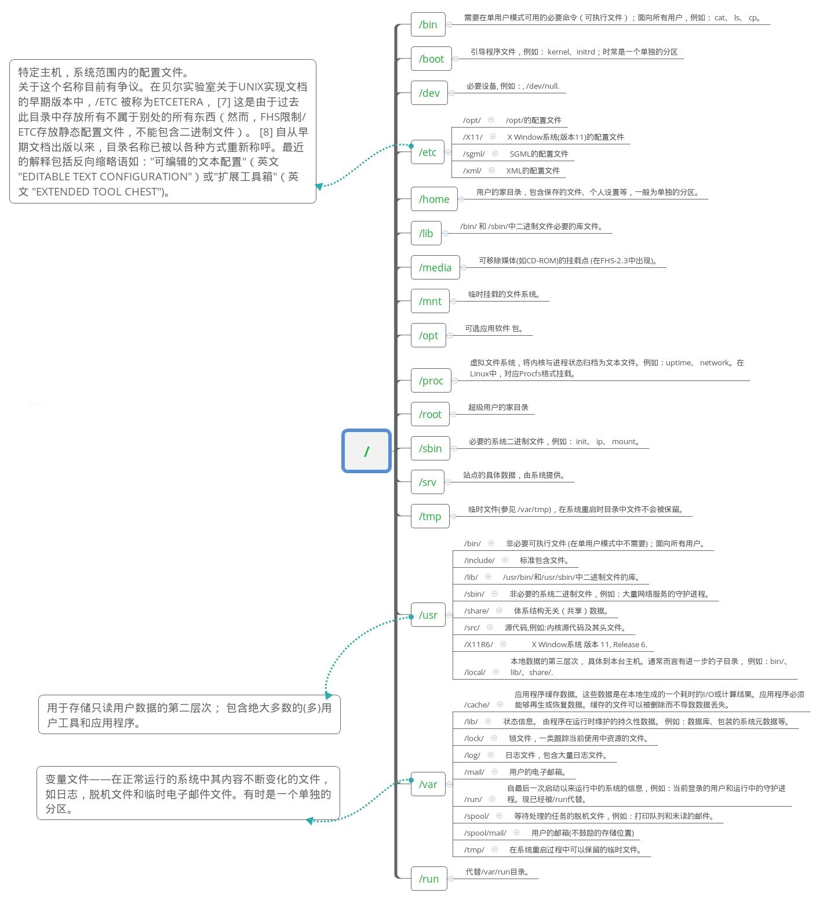

# 1、Linux 简介

Linux 英文解释为 **Linux is not Unix**。

Linux 内核最初只是由芬兰人林纳斯·托瓦兹（Linus Torvalds）在赫尔辛基大学上学时出于个人爱好而编写的。

Linux 是一套免费使用和自由传播的类 Unix 操作系统，是一个基于 POSIX 和 UNIX 的多用户、多任务、支持多线程和多 CPU 的操作系统。

Linux 能运行主要的 UNIX 工具软件、应用程序和网络协议。它支持 32 位和 64 位硬件。Linux 继承了 Unix 以网络为核心的设计思想，是一个性能稳定的多用户网络操作系统。


**Linux 的发行版**

Linux 的发行版说简单点就是将 Linux 内核与应用软件做一个打包。


目前市面上较知名的发行版有：Ubuntu、RedHat、CentOS、Debian、Fedora、SuSE、OpenSUSE、Arch Linux、SolusOS 等。


# 2、系统目录结构




# 3、远程登录

Linux 一般作为服务器使用，而服务器一般放在机房，你不可能在机房操作你的 Linux 服务器。

这时我们就需要远程登录到 Linux 服务器来管理维护系统。

Linux 系统中是通过 ssh 服务实现的远程登录功能，默认 ssh 服务端口号为 22。

现在 Windows 10 大都内置了 OpenSSH，如果没有可以去：设置 ==> 应用和功能 ==> 可选功能 中找到 OpenSSH 客户端安装。

打开 CMD 或者 PowerShell 连接 Linux：

```shell
ssh 用户名@IP地址
```


# 4、文件基本属性

Linux 系统是一种典型的多用户系统，不同的用户处于不同的地位，拥有不同的权限。

为了保护系统的安全性，Linux 系统对不同的用户访问同一文件（包括目录文件）的权限做了不同的规定。

在 Linux 中我们通常使用以下两个命令来修改文件或目录的所属用户与权限：

- chown (change owner) ： 修改所属用户与组。
- chmod (change mode) ： 修改用户的权限。

在 Linux 中我们可以使用 **ll** 或者 **ls –l** 命令来显示一个文件的属性以及文件所属的用户和组，如：

```shell
root@Orichalcos:/# ls -l
total 970036
lrwxrwxrwx   1 root root         7 Sep 22 10:02 bin -> usr/bin
drwxr-xr-x   3 root root      4096 Nov 12 09:27 boot
...
```

实例中，boot 文件的第二个属性用 **d** 表示。**d** 在 Linux 中代表该文件是一个目录文件。

在 Linux 中第一个字符代表这个文件是目录、文件或链接文件等等。

- 当为 **d** 则是目录
- 当为 **-** 则是文件；
- 若是 **l** 则表示为链接文档(link file)；
- 若是 **b** 则表示为装置文件里面的可供储存的接口设备(可随机存取装置)；
- 若是 **c** 则表示为装置文件里面的串行端口设备，例如键盘、鼠标(一次性读取装置)。

接下来的字符中，以三个为一组，且均为 **rwx** 的三个参数的组合。其中， **r** 代表可读(read)、 **w** 代表可写(write)、 **x** 代表可执行(execute)。 要注意的是，这三个权限的位置不会改变，如果没有权限，就会出现减号 **-** 而已。


每个文件的属性由左边第一部分的 10 个字符来确定（如下图）。


从左至右用 **0-9** 这些数字来表示。

第 **0** 位确定文件类型，第 **1-3** 位确定属主（该文件的所有者）拥有该文件的权限；第4-6位确定属组（所有者的同组用户）拥有该文件的权限；第7-9位确定其他用户拥有该文件的权限。

其中，第 **1、4、7** 位表示读权限，如果用 **r** 字符表示，则有读权限，如果用 **-** 字符表示，则没有读权限；第 **2、5、8** 位表示写权限，如果用 **w** 字符表示，则有写权限，如果用 **-** 字符表示没有写权限；第 **3、6、9** 位表示可执行权限，如果用 **x** 字符表示，则有执行权限，如果用 **-** 字符表示，则没有执行权限。

