# Windows

## 【1】Windows默认管理员权限

1. 按下 Win+R 快捷键唤出 “运行” 窗口，输入 `gpedit.msc`
2. 这时打开了 组策略编辑器，在左边找到【计算机配置】 =>【Windows设置】，再进入右边【安全设置】
3.  进入【本地策略】
4. 进入【安全选项】
5. 向下滑，找到
	-  “用户账户控制：以管理员批准模式运行所有管理员”
	- “用户账户控制：用于内置管理员账户的管理员批准模式”
6. 分别选中并点击鼠标右键，再点击【属性】，进入配置窗口，将这两项都分别设置为 “已禁用”，再点击 【确定】
7. 重启电脑，操作完成！

<br>

## 【2】重装系统时将硬盘格式转换为GPT

1. 按 shift 键和 F10 键，启动 cmd 命令行模式
2. 在命令行窗口中输入 `diskpart` 命令并回车，进入 Diskpart 模式
3. 输入 `list disk` 命令并回车，确认电脑硬盘数量
4. 继续输入 `select disk 0` 命令并回车，选择 disk0 的硬盘（C盘为disk0，视情况而定）
5.  继续输入 `clean` 命令并回车，清除 disk0 硬盘中所有的分区和数据
6. 继续 `convert GPT` 并回车，将硬盘格式从 MBR 转换成 GPT
7. 最后输入 `exit` 命令并回车，退出 Diskpart 模式
8. 再输入 `exit` 命令并回车，退出 cmd 命令行模式

<br>

## 【3】修改系统引导

1. win+R
2. 输入 `msconfig`

<br>

## 【4】查看后台运行的程序的详细信息

cmd 命令窗口输入 `netstat –ano`，回车。

可以解决端口占用。

<br>

## 【5】Compact 压缩功能命令

它可以对所有的系统文件进行压缩，实现磁盘压缩，节约硬盘空间。

开启：cmd 命令窗口输入 `compact /compactos:always`，回车。

关闭：`compact /compactos:never`。

<br>

## 【6】删除右键菜单新建中不要选项

1. 按下 Win+R，运行 `regedit`
2. 展开 HKEY_CLASSES_ROOT，找到需要删除的文件后缀名，然后展开文件夹找到 shellnew 选项，直接删除即可

<br>

## 【7】取消开机密码

使用微软账户登录：

1. 确保 账户 => 登录选项 => 其他设置中 “为了提高安全性，仅允许...” 是关闭的：
	
	<div align="center">
	    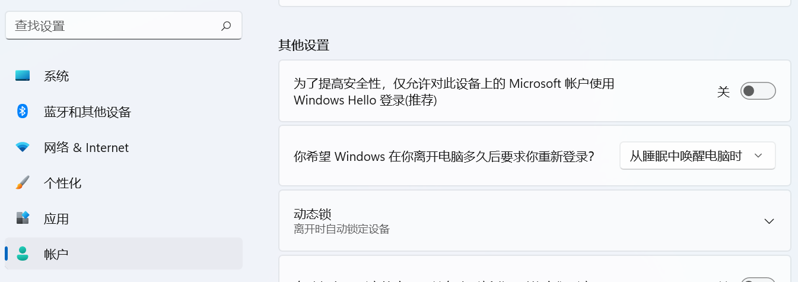
	</div>
2. 按 Win + R，弹出 ”运行“，输入`netplwiz`，点【确定】
3. 取消 “要使用本计算机，用户必须输入用户名和密码”，点【确定 】
4. 会弹出一个窗口，在窗口中输入 微软账户的用户名和密码，点【确定】

   <div align="center">
       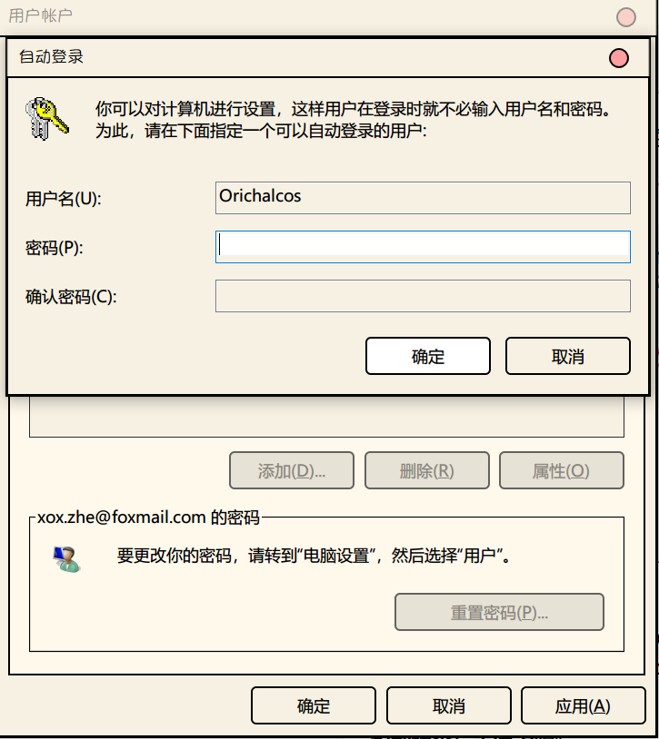
   </div>

<br>

## 【8】微软输入法快速输入时间

1. 按下快捷键 Win + I，打开【设置】

2. 依次进入：【时间和语言】 => 【语言 】

3. 找到【首选语言】，点击首选语言（中文简体，中国）的【选项】

4. 找到【键盘】，点击首选键盘（微软输入法）的【选项】

5. 选择【词库和自学习】，打开【用户定义的短语】，点击【添加用户定义的短语】

6. 添加：

   <div align="center">
       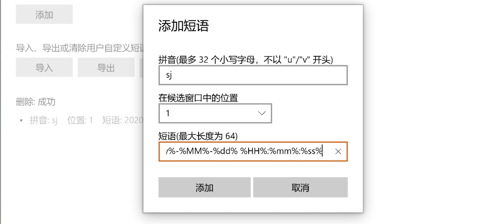
   </div>
   
   ```
   # 2020-11-29 16:21:29
   %yyyy%-%MM%-%dd% %HH%:%mm%:%ss%
   
   # 2020年11月29日 16:21:29
   %yyyy%年%MM%月%dd%日 %HH%:%mm%:%ss%
   ```

<br>

## 【9】Windows Terminal SSH 保持连接

Windows 10 全新的 Powershell 内置了 ssh.exe 因此可以直接连接远程服务器，在 Windows Terminal 中连接 SSH 中若一段时间没有操作会导致连接断开，终端卡死。

常见的终端工具（比如：Xshell）等都会内置 keepalive 功能，自动会发送心跳包来保持连接，但是 Windows Terminal 没有自带此功能。

解决办法：在当前用户目录下创建 .ssh 文件夹，或者可以尝试连接 SSH 随意连接一个服务器即可自动创建此文件夹。在其中创建配置文件 config ，写入以下两行：

```
Host *
    ServerAliveInterval 40
```

<br>

## 【10】删除桌面右键 Open in Terminal

按 win 键+ R 键，打开 “运行” 窗口，输入  `regedit`，按回车键，弹出 注册表编辑器。

在注册表`HKEY_LOCAL_MACHINE\SOFTWARE\Microsoft\Windows\CurrentVersion\Shell Extensions\`处右键创建名为 `Blocked` 的**项**。

然后在其中创建字**符串值**，**名称**为 `{9F156763-7844-4DC4-B2B1-901F640F5155}`，**数值**为 `WindowsTerminal`。

<div align="center">
    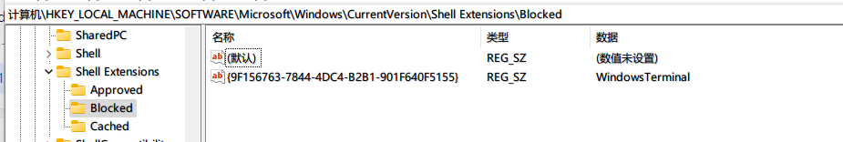
</div>

<br>

## 【11】关闭系统小组件

隐藏只需要在任务栏设置中设置就好了。

卸载 Win11 小组件需要用到 CMD。使用管理员权限打开 Windows Terminal 终端的 “命令提示符”，或者使用管理员权限运行 CMD，输入以下命令：

```shell
winget uninstall MicrosoftWindows.Client.WebExperience_cw5n1h2txyewy
```

按下回车键，Win11 小组件就会被卸载掉了。

如果想要重新安装 Win11 小组件，则可以执行以下命令：

```shell
winget install 9MSSGKG348SP
```

<br>

## 【12】环境变量值只能一行显示，不是换行显示问题

这是因为变量值的第一个是相对地址，只需要将一个绝对地址（带盘符）的放首位，然后逗号分隔，确定之后，再双击打开就是换行显示了！

<br>

## 【13】浏览器主页被篡改

浏览器主页被篡改，直接去浏览器的设置里找首页设置一般没用，可以看一下是不是快捷方式出了问题，找到浏览器的快捷方式，右键查看【属性】，通常目标栏显示的都是浏览器的安装目录：

<div align="center">
    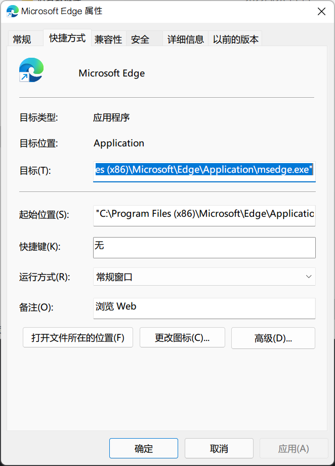
</div>

如果发现安装目录之后还跟着一串网址链接，那就是被强制锁定了对应的网址，只要删掉这串网址就可以了。当然，有些浏览器的快捷方式不允许修改，我们可以把界面切换到【常规】，然后把【只读】取消掉，就可以进行修改了：

<div align="center">
    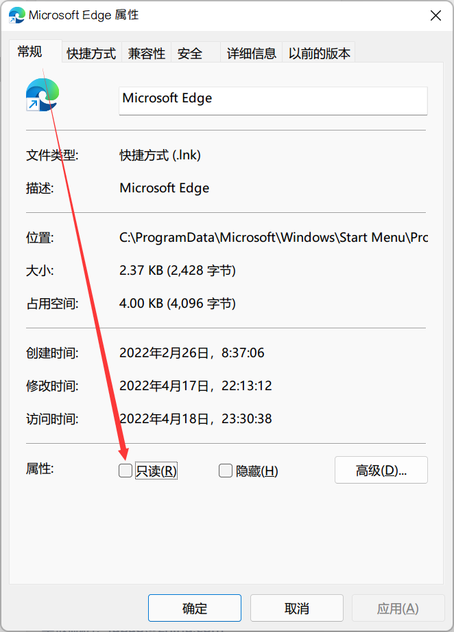
</div>
当然也可以直接删除快捷方式，然后重新生成；或者在目标栏输入一个自己需要的网址（输入网址之前要加一个空格键，否则无法保存），然后将属性改为只读。

<br><br>

## 【14】使用 sc 命令控制服务

`sc` 命令的语法格式：

```shell
sc <server> [command] [service name] <option1> <option2>...
```

`sc` 命令使用例子：

- `sc query`：查看所有服务的运行状态。

- `sc query 服务名`：查看某个服务的运行状态。

- `sc qc 服务名`：查看某个服务的配置信息。

- `sc start 服务名`：启动服务。

- `sc stop 服务名`：停止服务。

- `sc delete 服务名`：删除服务。

- `sc config 服务名 start= auto|demand|disabled`：修改服务启动类型。

  *start* 参数的值可以是 `demand`（手动）、`disabled`（禁用），`auto`（自动）。注意：`start=`后面有一个空格

**使用提示**

1. 如果服务名称中包含有空格，记得在服务名称上加引号。例如 `sc stop "my service"`。

2. “服务名称” 和 “服务显示名称”  是不一样的。`sc` 指令使用的是 “服务名称”。我们在【服务】里看到是服务的显示名称，双击打开某个服务可以看到真正的服务名字。

   <div align="center">
       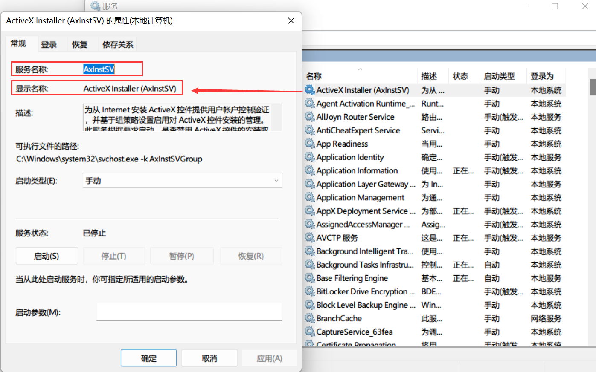
   </div>

3. `sc start` 和 `sc stop` 功能上类似于 `net start` 和 `net stop`，但速度更快且能停止的服务更多。

4. `sc delete` 命令的实质都是删除 `HKEY_LOCAL_MACHINE\SYSTEM\CurrentControlSet\Services` 下的 `ServiceName` 分支。所以也可以用 `reg` 命令删除名为 `ServiceName` 的服务：`reg delete HKLM\SYSTEM\CurrentControlSet\Services\ServiceName`。

<br>

# Chrome

## 【1】移动Chrome的数据文件

Chrome 默认的数据文件地址是：C:\Users\Orichalcos\AppData\Local\Google

移动前需要关闭 Google，将文件移动到想要移动的地方，然后在 cmd（需要管理员权限）输入：`mklink 旧地址 新地址`，回车。

<br>

# IDEA

## 【1】Maven 部分文件无法导出

Maven 由于它的约定大于配置，之后可能遇到写的配置文件，无法被导出或者生效的问题

```xml
<build>
    <resources>
        <resource>
            <directory>src/main/resources</directory>
            <includes>
                <include>**/*.properties</include>
                <include>**/*.xml</include>
            </includes>
            <filtering>true</filtering>
        </resource>
        <resource>
            <directory>src/main/java</directory>
            <includes>
                <include>**/*.properties</include>
                <include>**/*.xml</include>
            </includes>
            <filtering>true</filtering>
        </resource>
    </resources>
</build>
```

<br>

## 【2】Maven 框架 web-app 中 web.xml 版本过低

1. 找到 maven-archetype-webapp 的 jar 包位置：`Maven位置\repository\org\apache\maven\archetypes\maven-archetype-webapp\1.4`。
2. 用压缩包形式打开，不要解压！
3. 然后依次点：`archetype-resources\src\main\webapp\WEB-INF\web.xml`，打开，将其修改成最新的模板。

> 上边的 web-app 标签中有一个 `metadata-complete="true"`，这是个大坑，因为 web-app 标签 3.0 以上版本是可以使用 Servlet 的注解的，如下图：

<div align="center">
    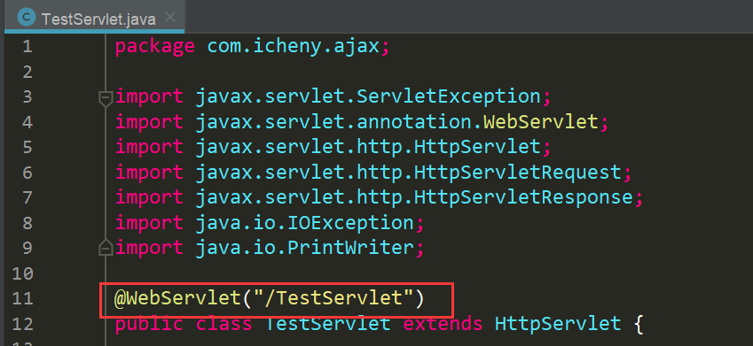
</div>

再也不用去 web.xml 写那 Servlet 的那一堆映射了（下图就是那一堆映射）：

<div align="center">
    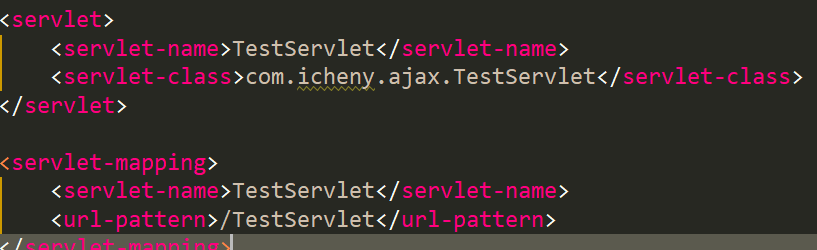
</div>

如果忘记了改这个 web-app 标签里的 `metadata-complete` 的这个属性，所写的注解都将失效！！！

该属性默认为 `true`，表示容器在部署时只依赖部署描述文件，忽略所有标注，如果不配置该属性，或者将其设置为 `false`，则表示启动注解支持。当 `metadata-complete="false"` 时，web.xml 和注解对于 Servlet 的影响同时起作用，两种方法定义的 url-partten 都可以访问到该 Servlet，但是当通过 web.xml 定义的 url-partten 访问时，注解定义的属性将失效。

<br>

## 【3】修改内存大小

首先在 IDEA 中显示内存：在窗口下方右键，选中【Memory Indicator】：

<div align="center">
    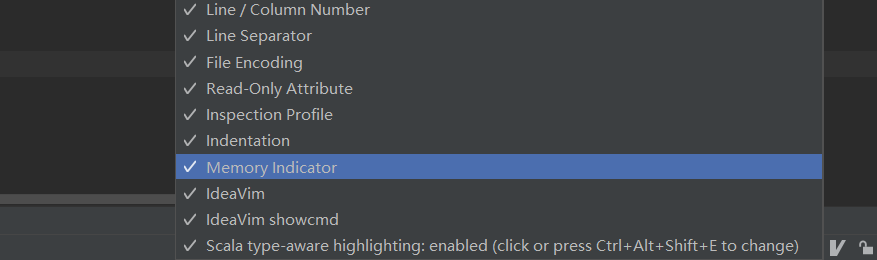
</div>

【帮助】=>【编辑自定义 VM 选项】。

在弹出来的文件中修改 Xms 和 Xmx：

<div align="center">
    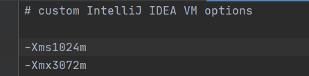
</div>

<br>

## 【4】SpringBoot 实现热部署

<div align="center">
    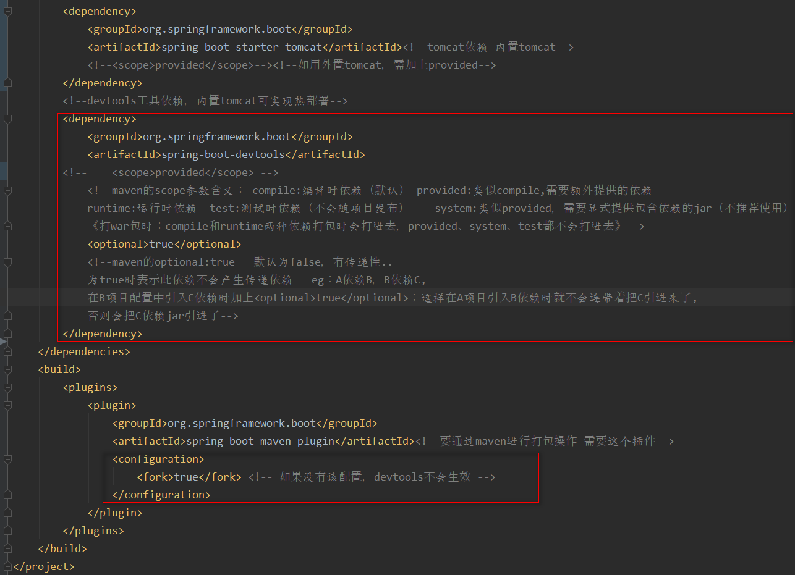
</div>

在 application.yml 中配置一下 devtools：

```yaml
spring:
    devtools:
        restart:
            enabled: true  #设置开启热部署
            additional-paths: src/main/java #重启目录
            exclude: WEB-INF/**
    freemarker:
        cache: false    #页面不加载缓存，修改即时生效

```

```xml
<!--
devtools工具:（说白了就是:例如在使用用myeclipse工具，服务在运行时，修改了java类内的内容，直接就生效了，不需要重启服务（当然改变了类的结构是需要重启服务的））
（1） devtools可以实现页面热部署（即jsp页面修改后会立即生效，这个可以直接在application.properties文件中配置spring.thymeleaf.cache=false来实现），
      实现类文件热部署（java类文件修改后不会立即生效），实现对属性文件的热部署。(java类热部署前提条件：类的结构不发生变化（1.类方法结构不变 2.类属性不变）)
即devtools会监听classpath下的文件变动，并且会立即重启应用（发生在保存时机），注意：因为其采用的虚拟机机制，该项重启是很快的
（2）配置了后在修改java文件后也就支持了热启动，不过这种方式是属于项目重启（速度比较快的项目重启），会清空session中的值，也就是如果有用户登陆的话，项目重启后需要重新登陆。
默认情况下，/META-INF/maven，/META-INF/resources，/resources，/static，/templates，/public这些文件夹下的文件修改不会使应用重启，但是会重新加载（devtools内嵌了一个LiveReload server，当资源发生改变时，浏览器刷新）

IDEA：当我们修改了Java类后，IDEA默认是不自动编译的，而spring-boot-devtools又是监测classpath下的文件发生变化才会重启应用，所以需要设置IDEA的自动编译：
（1）File-Settings-Build, execute, deploy-Compiler-Build Project automatically
（2）ctrl + shift + alt + /,选择Registry,勾上 Compiler autoMake allow when app running
-->
```

<br>

## 【5】Maven 项目没有被识别

在 pom.xml 上右键，点击【Add as Maven Project】 

<br>

## 【6】插件：Camel Case

下划线 <=> 驼峰，你是怎么转换的，一个一个字母的修改吗？

Camel Case 可以用 一个快捷键 就搞定，去 IDEA 的插件库中搜索 Camel Case插件，安装上。

使用方式：先选中要要格式转换的代码， 再用快捷键 Shift + Alt + u 进行转换，多个格式切换，就按多次快捷键。

Camel Case 包含 6 种格式的切换，可能某些格式是平时不用的，可以把不用的格式取消，这样在格式切换时，就不会包含已取消的格式了：

<div align="center">
    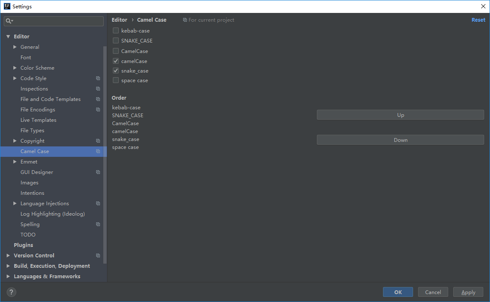
</div>

<br>

## 【7】jar 包自动导入及优化

加快开发效率，除去没用的包，洁癖者必用!   这样设置，就可以自动导入包以及除去没有用到的包！

<div align="center">
    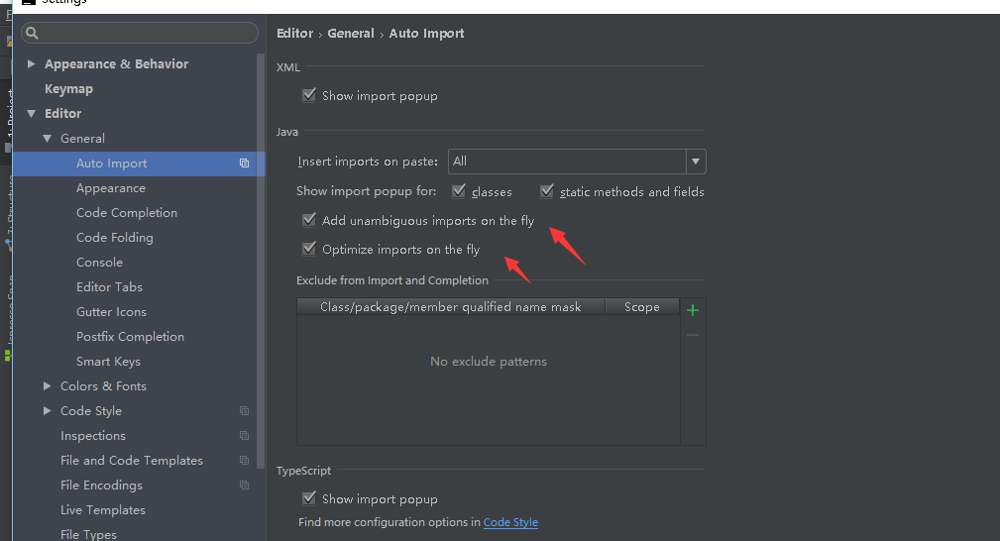
</div>

第一个是 自动导入需要的 jar 包，若有多个同名 jar 包，需要开发者自己选择导入

第二个是 优化导入，也就是除去没有用到的 jar 包，这个设置只会对当前的项目有效！每个项目都需要单独设置 此选项！

<br>

## 【8】保存时触发操作

IDEA 2021.2 可以设置自动保存时触发的操作，比如重新格式化，优化 Java 包导入。我们可以在 Preferences / Settings | Tools | Actions on Save 进行设置：

<div align="center">
    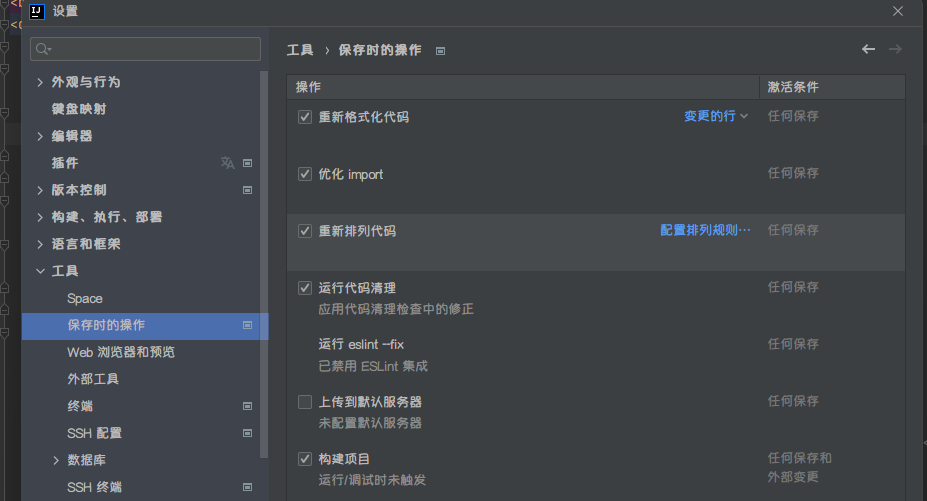
</div>

比如上图这个格式化代码，保存时将会格式化你当前改动代码，这就不用担心写完代码忘记格式化了。

额外再提一点，个人建议上面格式化代码不要设置成 **Whole file（整个文件）**，这是因为多人开发中同时改动这个文件，你整个格式化，比较容易造成冲突，解决这种格式化导致的冲突比较蛋疼。

<br>

## 【9】正则替换

在开发时遇到需要大量替换代码时，不需要一个一个的去改，可以使用**正则替换**：

<div align="center">
    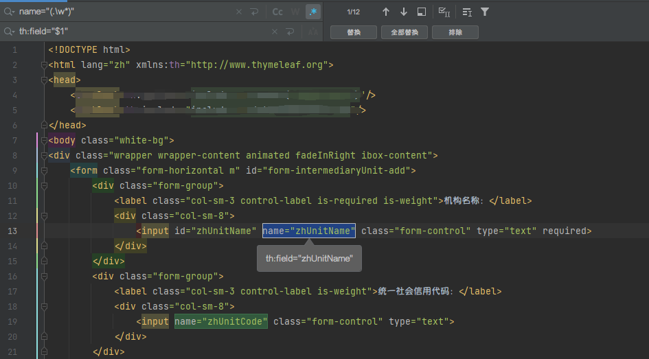
</div>

比如上图将所有这个文件中的 `name=""` 替换为 `th:field=""` ，`()` 内填写正则表达式，`$1` 为正则匹配到的第一个内容的占位符。

<br>

## 【10】设置类和方法模板

**设置类模板**

找到这里，可以添加自己所需要的注释：

<div align="center">
    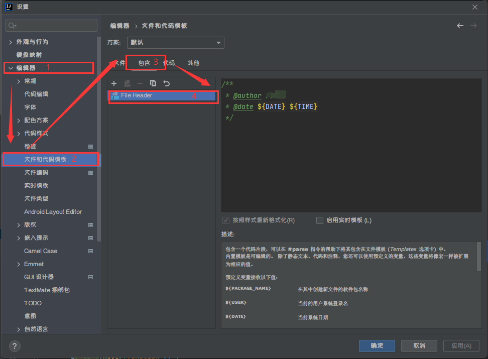
</div>

<br>

**方法模板**

找到如下地方：

<div align="center">
    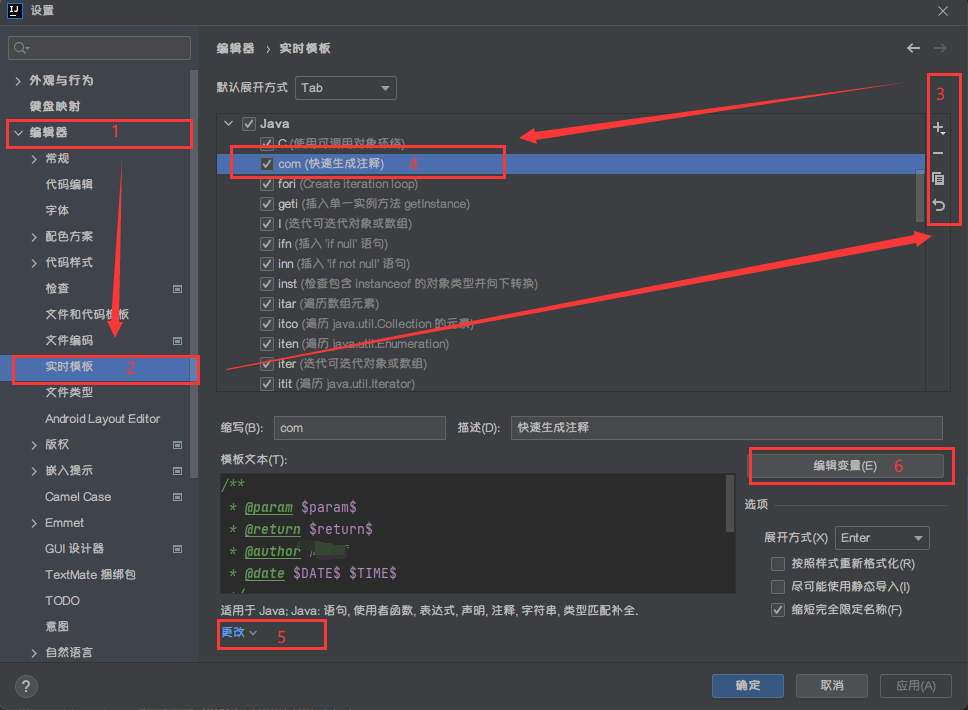
</div>

添加自己需要的模板后（展开方式选 `Enter`，表示回车触发），点击【更改】，添加使用环境，然后【编辑变量】：

<div align="center">
    
    
</div>

最后应用就行，在类的方法上方输入 `com` 按回车就可自动生成方法注释。

<br>

## 【11】插件：Translation

可以在 IDEA 使用翻译功能，效果：

<div align="center">
    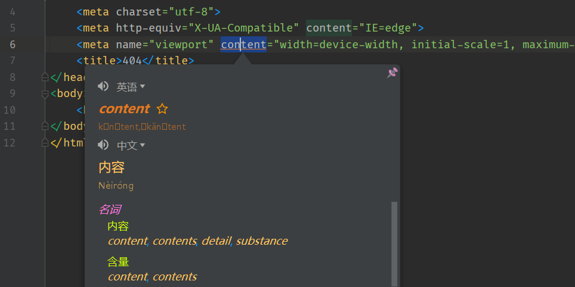
</div>

默认引擎使用 Google 翻译，但是如果请求次数过多提示 “翻译失败，请求过多，请稍后再试！”，这里我建议使用阿里翻译引擎。

阿里翻译每月的前 100 万字符免费，超出的部分会按照 50 元 / 百万字符收取费用，费用由阿里翻译在它自己的阿里云官方网站收取，与 Translation 无关。

申请步骤：

1. 登录阿里云官网，点击右上角的控制台，在控制台的搜索框搜索 “机器翻译”：

   <div align="center">
       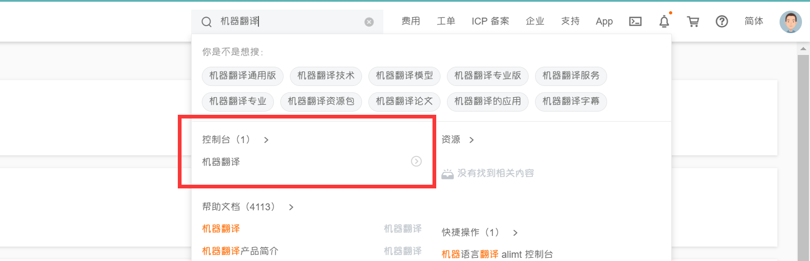
   </div>

2. 点击【通用版翻译引擎】下方的【立即开通】按钮：

   <div align="center">
       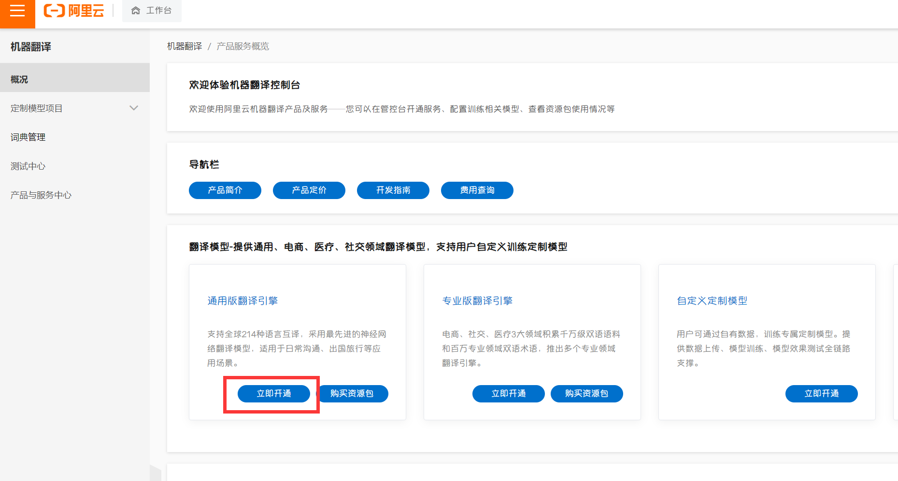
   </div>

   点击之后会让你勾选一个【机器翻译服务协议】，勾选之后点【立即开通】就能开通成功了。

3. 开通后，回到 阿里云机器翻译控制台，把鼠标悬停在右上角用户头像上，然后点击【AccessKey 管理】，会跳转到 AccessKey 管理页面：

   <div align="center">
       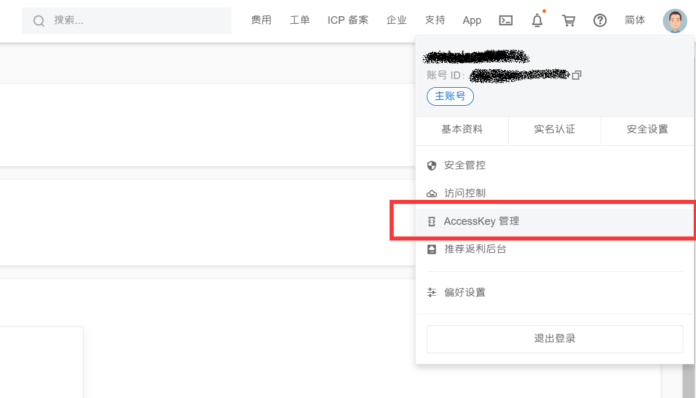
   </div>

4. 进入后会弹出一个安全提示：

   <div align="center">
       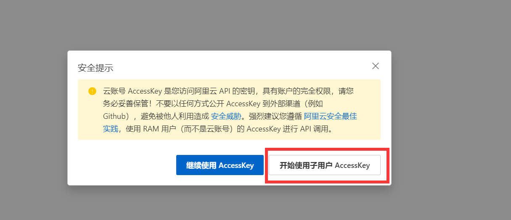
   </div>

   简而言之，在这里创建的 AccessKey 能调用你账号下的所有资源，权限范围太大了，一旦泄露的话影响面很大，所以阿里云建议你创建一个子用户，然后给这个子用户只分配机器翻译的权限，这样的话即使泄露了也只会影响到机器翻译。

5. 点击【创建用户】，填写用户信息 ：

   - 设置登录名称：huacifanyi
   - 填写显示名称：划词翻译
   - 访问方式：勾选【Open API 调用访问】

   <div align="center">
       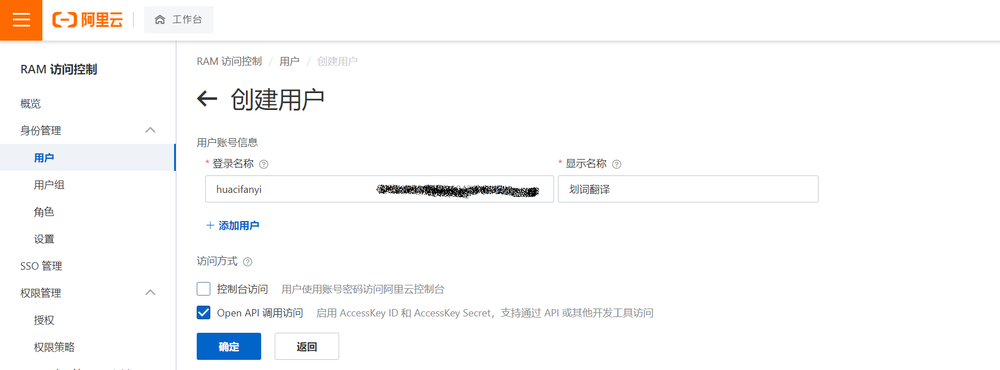
   </div>

6. 点击【确定】之后会让你输入手机短信验证码，输入之后会看到创建成功的 【AccessKey ID】 和 【AccessKey Secret】，如下图：

   <div align="center">
       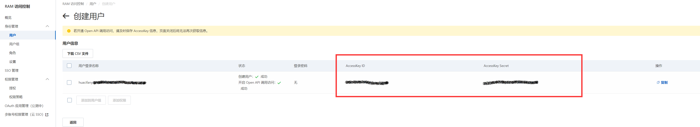
   </div>

7. 然后勾选刚刚创建的用户，点击【添加权限】：

   <div align="center">
       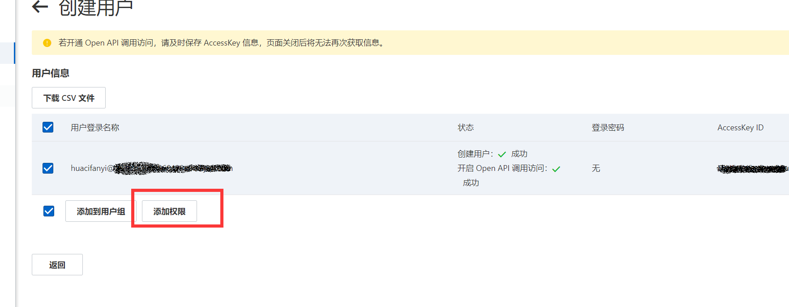
   </div>

8. 搜索 “机器翻译”，单击选中【AliyunMTFullAccess】和【AliyunMTReadOnlyAccess】这两项即可，然后点击【确定】：

   <div align="center">
       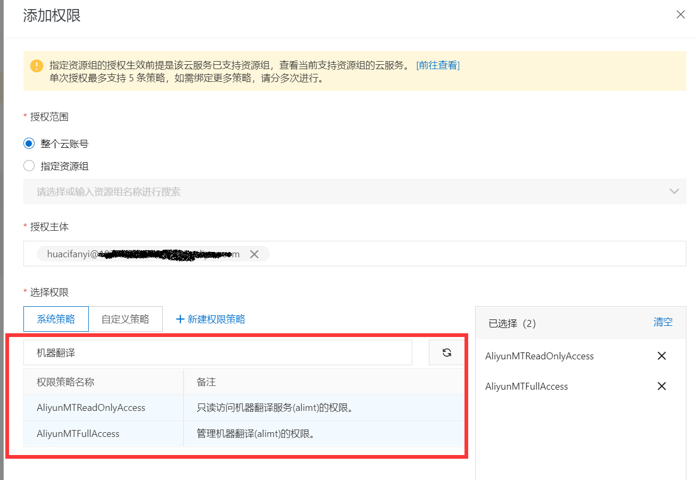
   </div>

9. 最后在 IDEA 的 Translation 中，选择 阿里翻译并配置：

   <div align="center">
       
   </div>

<br>

# STS

## 【1】修改内存大小

显示内存：【首选项】=>【常规】=>【显示堆状态 】。

在安装目录找到 SpringToolSuite4.ini，修改 Xms Xmx。

然后在【Java】=>【已安装的 JRE】中，修改缺省 VM 参数，添加 Xms 和 Xmx，中间用空格隔开：

<div align="center">
    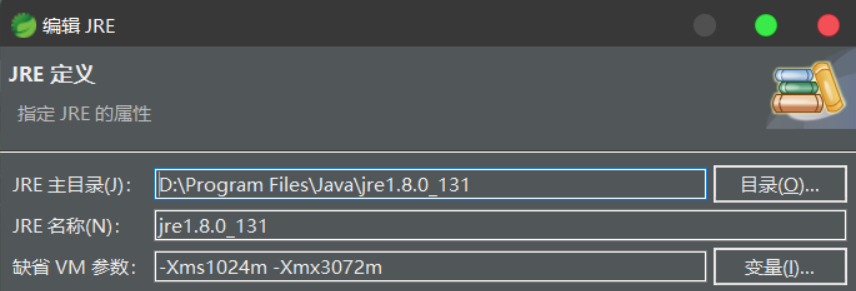
</div>

<br>

## 【2】汉化

<div align="center">
    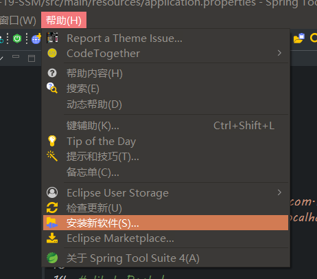
</div>

打开 https://www.eclipse.org/babel/downloads.php 

<div align="center">
    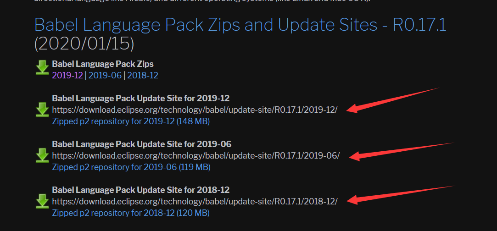
</div>

选择一个复制，在弹出的窗口中点击添加

<div align="center">
    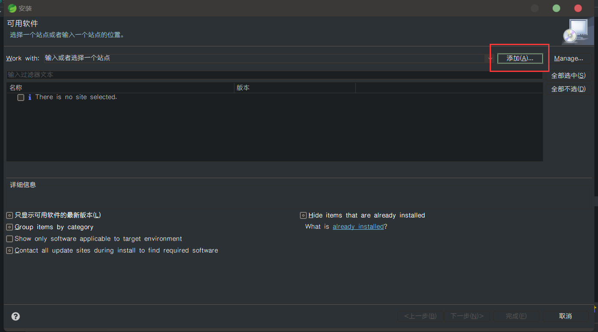
</div>

找到中文简体安装就行了。

<br>

## 【3】SpringBoot 打 jar 包

SpringBoot 是使用内置的 Tomcat 的，所以不用打包成 war 文件，当然也可以打包成 war 文件进行部署，只是个人觉得没有那个必要，通过 Maven 可将 SpringBoot 项目打包成 jar 文件运行。

1. pom.xml 文件中添加所需插件：

	```xml
	<plugins>
	    <!-- 要使生成的jar可运行，需要加入此插件 -->
		<plugin>
			<groupId>org.apache.maven.plugins</groupId>
			<artifactId>maven-surefire-plugin</artifactId>
			<configuration>
			<skip>true</skip>
			</configuration>
		</plugin>
		<plugin>
			<groupId>org.springframework.boot</groupId>
			<artifactId>spring-boot-maven-plugin</artifactId>
		</plugin>
	</plugins>
	```

2. 项目运行环境选择 Java JDK：
	<div align="center">
	    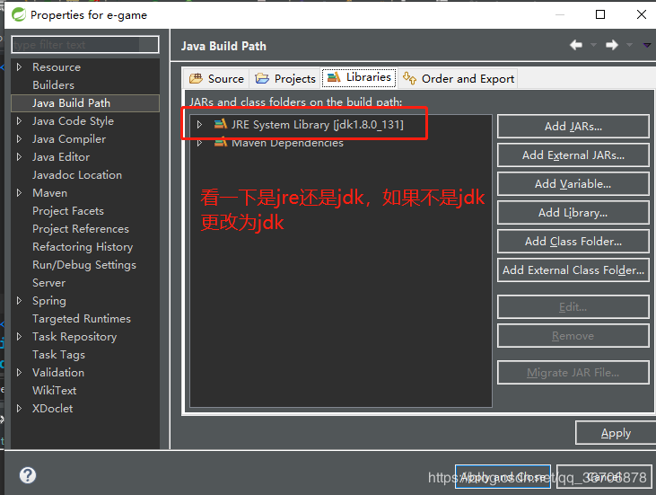
	</div>
	
3. 执行 `maven clean`：
	
	右键项目【run as】选择【maven clean】
	
4. 执行 `maven install`：
	
	右键项目【run as】选择【maven install】
	
5. 运行 jar：
	
	命令行运行： `java -jar xxx.jar`