# 1、SQL简介

SQL是用于访问和处理数据库的标准计算机语言。

**SQL是什么？**

- SQL，指结构化查询语言，全称是 Structured Query Language
- SQL 可以让我们访问和处理数据库
- SQL 是一种 ANSI（American National Standards Institute）标准的计算机语言


**SQL能做什么？**

- SQL 面向数据库执行查询
- SQL 可从数据库取回数据
- SQL 可在数据库中插入新的记录
- SQL 可更新数据库中的数据
- SQL 可从数据库删除记录
- SQL 可创建新的数据库
- SQL 可在数据库中创建新表
- SQL 可在数据库中创建存储过程
- SQL 可在数据库中创建视图
- SQL 可以设置表、存储过程和视图的权限


**SQL分类**

**DDL（数据定义语言）**

- 数据定义语言（Data Definition Language）
- 用来定义数据库的对象，如数据表、视图、索引等
- CREATFE DROP ALTER

**DML（数据操纵语言）**

- 数据处理语言（Data Manipulation Language）
- 在数据库中更新，增加和删除记录
- UPDATE DELETE INSERT

**DCL（数据控制语言）**

- 数据控制语言（Data Control Language）
- 指用于设置用户权限和控制事务语句

**DQL（数据查询语言）**

- 数据查询语言（Data Query Language）
- SELECT


# 2、数据库

MySQL 是最流行的关系型数据库管理系统，在 WEB 应用方面 MySQL 是最好的 RDBMS（Relational Database Management System：关系数据库管理系统）应用软件之一。


## 2.1、什么是数据库？

数据库（Database）是按照数据结构来组织、存储和管理数据的仓库。

每个数据库都有一个或多个不同的 API 用于创建，访问，管理，搜索和复制所保存的数据。

我们也可以将数据存储在文件中，但是在文件中读写数据速度相对较慢。

所以，现在我们使用关系型数据库管理系统（RDBMS）来存储和管理的大数据量。所谓的关系型数据库，是建立在关系模型基础上的数据库，借助于集合代数等数学概念和方法来处理数据库中的数据。

RDBMS 即关系数据库管理系统（Relational Database Management System）的特点：

- 数据以表的的形式出现
- 每行为各种记录名称
- 每列为记录名称所对应的数据域
- 许多的行和列组成一张表单
- 若干的表单组成 Database


## 2.2、RDBMS术语

- 数据库：数据库是一些关联表的集合
- 数据表：表是数据库的矩阵。在一个数据库中的表看起来像一个简单的电子表格
- 列：一列（数据元素）包含了相同类型的数据，例如邮政编码的数据
- 行：一行（=元组，或记录）是一组相关的数据，例如一条用户订阅的数据
- 冗余：存储两倍数据，冗余降低了性能，但提高了数据的安全性
- 主键：主键是唯一的。一个数据表中只能包含一个主键。你可以使用主键来查询数据
- 外键：外键用于关联两个表
- 复合键：复合键（组合键）将多个列作为一个索引建，一般用于复合索引
- 索引：使用索引可快速访问数据库表中的特定信息。索引是数据库表中一列或多列的值进行排序的一种结构。类似于书籍的目录
- 参照完整性：参照的完整性要求关系中不允许引用不存在的实体。与实体完整性是关系模型必须满足的完整性约束条件，目的是保证数据的一致性

MySQL 为关系型数据库（Relational Database Management System），这种所谓的 “关系型” 可以理解为 “表格” 的概念，一个关系型数据库由一个或数个表格组成，如下图所示的一个表格：

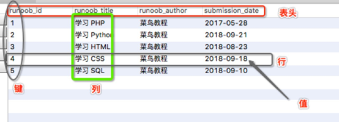

- 表头（header）：每一列的名称
- 列（col）：具有相同数据类型的数据的集合
- 行（row）：每一行用来描述某条记录的具体信息
- 值（VALUE）：行的具体信息，每个值必须与该列的数据类型相同
- 键（KEY）：键的值在当前列具有唯一性


## 2.3、安装 MySQL 数据库

1. 先下载 [MySQL](https://dev.mysql.com/downloads/mysql/)，现在的版本是 8.0.27：

	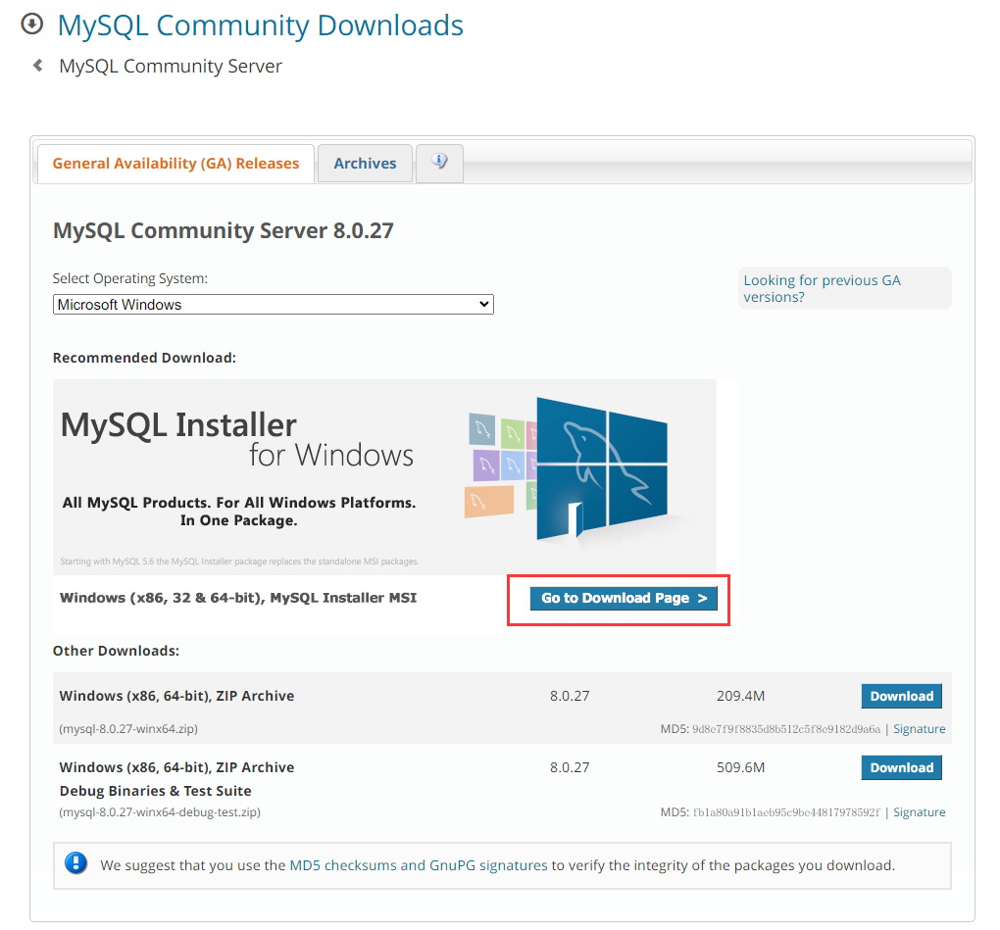

	这里下载的是 Zip 安装包版，可以点击 【Go to Download Page】，去载 MSI 安装版（这里下载的是安装版）：

	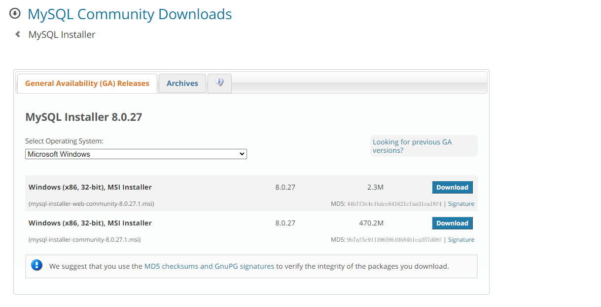

2. 下载后打开文件开始安装，这里选择自定义安装：

	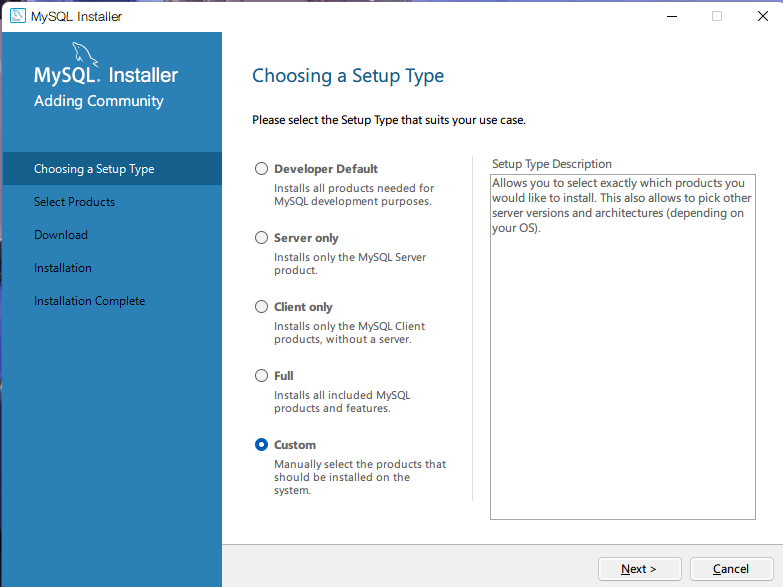

3. 这里选择只安装基础的 MySQL 服务和 JDBC，并且勾选下面的选项：

	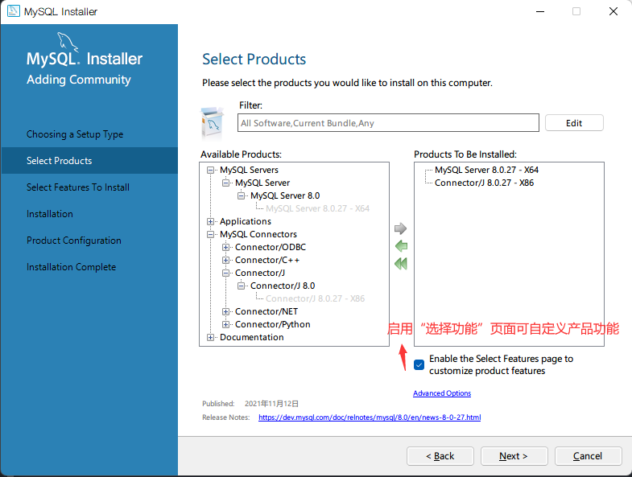

4. 取消了文档：

	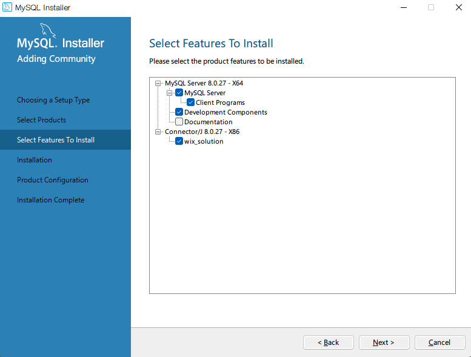

5. 开始安装：

	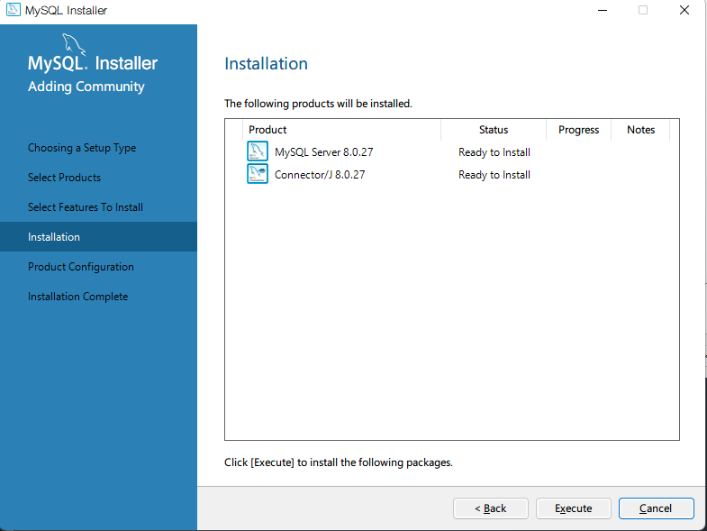

6. 开始配置：

	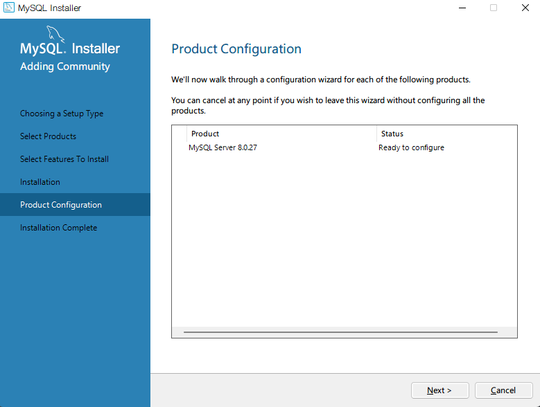

7. 选择开发电脑：

	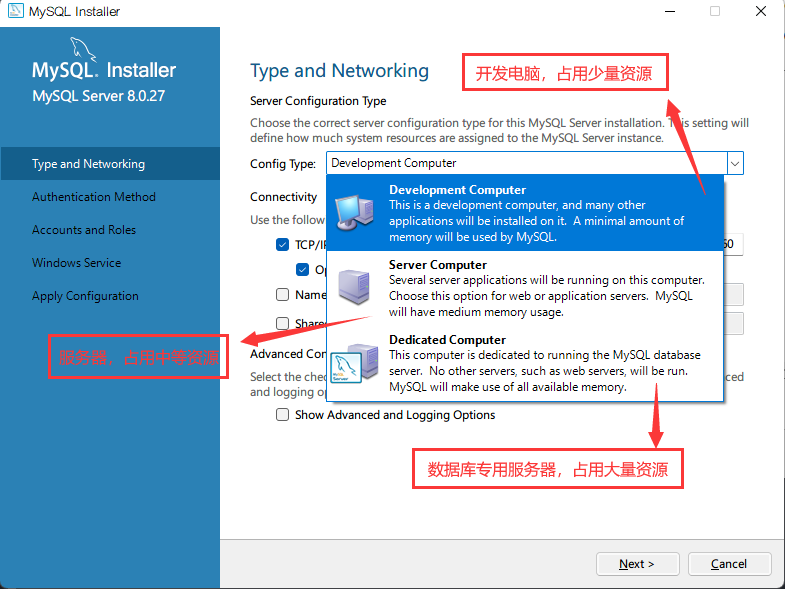

8. 这里使用默认的加密加密方法：

	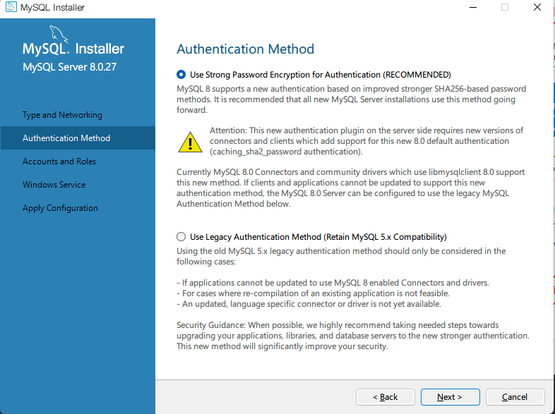

9. 填写数据库密码：

	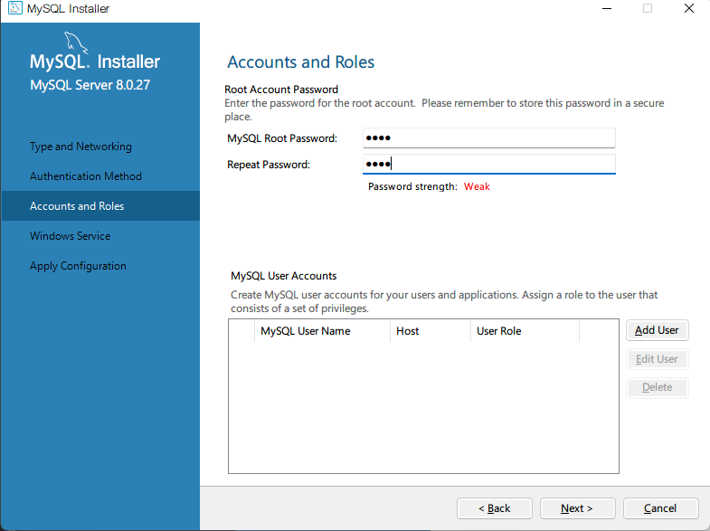

10. 取消开机自启：

	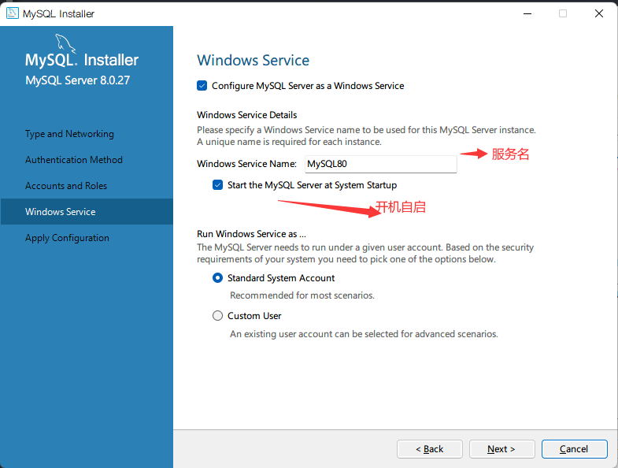

11. 应用配置：

	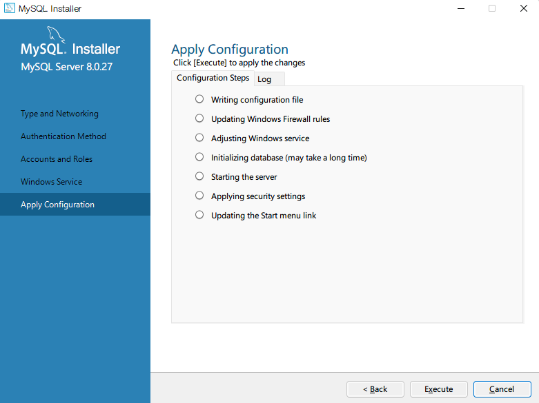

12. 配置环境变量：

	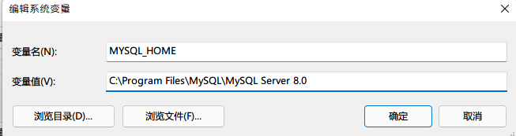
	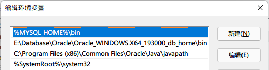

13. 访问：

	```shell
	PS C:\Users\Orichalcos> mysql -u root -p
	Enter password: ****
	Welcome to the MySQL monitor.  Commands end with ; or \g.
	Your MySQL connection id is 11
	Server version: 8.0.27 MySQL Community Server - GPL
	
	Copyright (c) 2000, 2021, Oracle and/or its affiliates.
	
	Oracle is a registered trademark of Oracle Corporation and/or its
	affiliates. Other names may be trademarks of their respective
	owners.
	
	Type 'help;' or '\h' for help. Type '\c' to clear the current input statement.
	
	mysql>
	```


## 2.4、创建数据库

使用 `CREATE` 命令创建数据库，语法如下：

```mysql
CREATE DATABASE [IF NOT EXISTS] <数据库名>
[[DEFAULT] CHARACTER SET <字符集名>] 
[[DEFAULT] COLLATE <校对规则名>];
```

[ ] 中的内容是可选的。语法说明如下：

- <数据库名>：创建数据库的名称。MySQL 的数据存储区将以目录方式表示 MySQL 数据库，因此数据库名称必须符合操作系统的文件夹命名规则，注意在 MySQL 中不区分大小写。
- `IF NOT EXISTS`：在创建数据库之前进行判断，只有该数据库目前尚不存在时才能执行操作。此选项可以用来避免数据库已经存在而重复创建的错误。
- `[DEFAULT] CHARACTER SET`：指定数据库的默认字符集。
- `[DEFAULT] COLLATE`：指定字符集的默认校对规则。

可以使用 `SHOW CREATE DATABASE 数据库名称` 查看数据库的定义声明

为防止字符混乱的情况发生，MySQL 有时需要在创建数据库时明确指定字符集；在中国大陆地区，常用的字符集有 UTF8 和 GBK。

- UTF8 能够存储全球的所有字符，在任何国家都可以使用，默认的校对规则为 `utf8_general_ci`，对于中文可以使用 `utf8_general_ci`。
- GBK 只能存储汉语涉及到的字符，不具有全球通用性，默认的校对规则为 `gbk_chinese_ci`。


## 2.5、数据库操作

**查看数据库**

```mysql
SHOW DATABASES [LIKE '数据库名'];
```

语法说明如下：

- LIKE 从句是可选项，用于匹配指定的数据库名称。LIKE 从句可以部分匹配，也可以完全匹配。
- 数据库名由单引号 `''` 包围。


**修改数据库**

在 MySQL 中，可以使用 `ALTER DATABASE` 或 `ALTER SCHEMA` 语句来修改已经被创建或者存在的数据库的相关参数。

修改数据库的语法格式为：

```mysql
ALTER DATABASE [数据库名] 
{[ DEFAULT ] CHARACTER SET <字符集名> |
[ DEFAULT ] COLLATE <校对规则名>}
```

语法说明如下：

- `ALTER DATABASE` 用于更改数据库的全局特性。这些特性存储在数据库目录的 db.opt 文件中。
- 使用 `ALTER DATABASE` 需要获得数据库 `ALTER` 权限。
- 数据库名称可以忽略，此时语句对应于默认数据库。
- `CHARACTER SET` 子句用于更改默认的数据库字符集。


**删除数据库**

```mysql
DROP DATABASE [ IF EXISTS ] <数据库名>
```

语法说明如下：

- <数据库名>：指定要删除的数据库名。
- `IF EXISTS`：用于防止当数据库不存在时发生错误。
- `DROP DATABASE`：删除数据库中的所有表格并同时删除数据库。使用此语句时要非常小心，以免错误删除。如果要使用 `DROP DATABASE`，需要获得数据库 `DROP` 权限。

注意：MySQL 安装后，系统会自动创建名为 information_schema 和 mysql 的两个系统数据库，系统数据库存放一些和数据库相关的信息，如果删除了这两个数据库，MySQL 将不能正常工作。


**选择数据库**

```mysql
USE <数据库名>;
```


# 3、存储引擎

## 3.1、什么是存储引擎？

数据库存储引擎是数据库底层软件组件，数据库管理系统使用数据引擎进行创建、查询、更新和删除数据操作。不同的存储引擎提供不同的存储机制、索引技巧、锁定水平等功能，使用不同的存储引擎还可以获得特定的功能。

现在许多数据库管理系统都支持多种不同的存储引擎。MySQL 的核心就是存储引擎。

- InnoDB 事务型数据库的首选引擎，支持事务安全表（ACID），支持行锁定和外键。MySQL 5.5.5 之后，InnoDB 作为默认存储引擎。
- MyISAM 是基于 ISAM 的存储引擎，并对其进行扩展，是在 Web、数据仓储和其他应用环境下最常使用的存储引擎之一。MyISAM 拥有较高的插入、查询速度，但不支持事务。
- MEMORY 存储引擎将表中的数据存储到内存中，为查询和引用其他数据提供快速访问。


## 3.2、支持的存储引擎

MySQL 支持多种类型的数据库引擎，可分别根据各个引擎的功能和特性为不同的数据库处理任务提供各自不同的适应性和灵活性。

MySQL 提供了多个不同的存储引擎，包括处理事务安全表的引擎和处理非事务安全表的引擎。在 MySQL 中，不需要在整个服务器中使用同一种存储引擎，针对具体的要求，可以对每一个表使用不同的存储引擎。

支持的存储引擎有 InnoDB、MyISAM、Memory、Merge、Archive、Federated、CSV、BLACKHOLE 等。可以使用 `SHOW ENGINES` 语句查看系统所支持的引擎类型，结果如图所示：

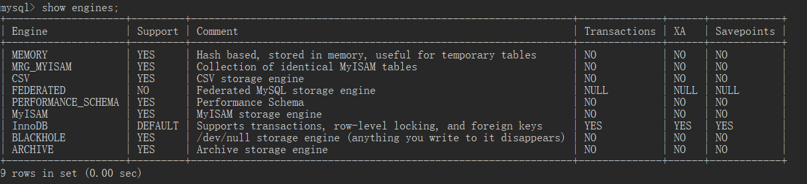

Support 列的值表示某种引擎是否能使用，YES 表示可以使用，NO 表示不能使用，DEFAULT 表示该引擎为当前默认的存储引擎。


## 3.3、如何选择存储引擎？

不同的存储引擎都有各自的特点，以适应不同的需求，如表所示。为了做出选择，首先要考虑每一个存储引擎提供了哪些不同的功能。

| 功能         | MyISAM | MEMORY | InnoDB | Archive |
| ------------ | ------ | ------ | ------ | ------- |
| 存储限制     | 256TB  | RAM    | 64TB   | None    |
| 支持事务     | No     | No     | Yes    | No      |
| 支持全文索引 | Yes    | No     | No     | No      |
| 支持树索引   | Yes    | Yes    | Yes    | No      |
| 支持哈希索引 | No     | Yes    | No     | No      |
| 支持数据缓存 | No     | N/A    | Yes    | No      |
| 支持外键     | No     | No     | Yes    | No      |

可以根据以下的原则来选择 MySQL 存储引擎：

- 如果要提供提交、回滚和恢复的事务安全（ACID 兼容）能力，并要求实现并发控制，InnoDB 是一个很好的选择。
- 如果数据表主要用来插入和查询记录，则 MyISAM 引擎提供较高的处理效率。
- 如果只是临时存放数据，数据量不大，并且不需要较高的数据安全性，可以选择将数据保存在内存的 MEMORY 引擎中，MySQL 中使用该引擎作为临时表，存放查询的中间结果。
- 如果只有 `INSERT` 和 `SELECT` 操作，可以选择Archive 引擎，Archive 存储引擎支持高并发的插入操作，但是本身并不是事务安全的。Archive 存储引擎非常适合存储归档数据，如记录日志信息可以使用 Archive 引擎。

提示：使用哪一种引擎要根据需要灵活选择，一个数据库中多个表可以使用不同的引擎以满足各种性能和实际需求。使用合适的存储引擎将会提高整个数据库的性能。


## 3.4、修改存储引擎

InnoDB 是系统的默认引擎，支持可靠的事务处理。

使用下面的语句可以修改数据库临时的默认存储引擎

```mysql
SET DEFAULT_storage_engine=<存储引擎名>
```

但是当再次重启客户端时，默认存储引擎仍然是 InnoDB。


# 4、数据表

## 4.1、创建数据表

使用 CREATE TABLE 语句创建表。其语法格式为：

```mysql
CREATE TABLE <表名> ([表定义选项])[表选项][分区选项];
```

其中，[表定义选项]的格式为：<列名1> <类型1> [,…] <列名n> <类型n>

CREATE TABLE 命令语法比较多，其主要是由表创建定义（CREATE-definition）、表选项（TABLE-options）和分区选项（partition-options）所组成的。

CREATE TABLE 语句的主要语法及使用说明如下：

- CREATE TABLE：用于创建给定名称的表，必须拥有表CREATE的权限。
- <表名>：指定要创建表的名称，在 CREATE TABLE 之后给出，必须符合标识符命名规则。表名称被指定为 db_name.tbl_name，以便在特定的数据库中创建表。无论是否有当前数据库，都可以通过这种方式创建。在当前数据库中创建表时，可以省略 db-name。如果使用加引号的识别名，则应对数据库和表名称分别加引号。例如，'mydb'.'mytbl' 是合法的，但 'mydb.mytbl' 不合法。
- <表定义选项>：表创建定义，由列名（col_name）、列的定义（column_definition）以及可能的空值说明、完整性约束或表索引组成。
- 默认的情况是，表被创建到当前的数据库中。若表已存在、没有当前数据库或者数据库不存在，则会出现错误。

提示：使用 CREATE TABLE 创建表时，必须指定以下信息：

- 要创建的表的名称不区分大小写，不能使用SQL语言中的关键字，如DROP、ALTER、INSERT等。
- 数据表中每个列（字段）的名称和数据类型，如果创建多个列，要用逗号隔开。

实例：

```mysql
CREATE TABLE runoob_tb1(
	runoob_id INT NOT NULL AUTO_INCREMENT,
	runoob_title VARCHAR(100) NOT NULL,
	runoob_author VARCHAR(40) NOT NULL,
	submission_date DATE,
	PRIMARY KEY(runoob_id)
)ENGINE=InnoDB DEFAULT CHARSET=utf8;
```

实例解析：

- 如果你不想字段为NULL可以设置字段的属性为NOT NULL，在操作数据库时如果输入该字段的数据为NULL，就会报错
- AUTO_INCREMENT定义列为自增的属性，一般用于主键，数值会自动加1
- PRIMARY KEY关键字用于定义列为主键。可以使用多列来定义主键，列间以逗号分隔
- ENGINE设置存储引擎，CHARSET设置编码

创建MySQL的表时，表名和字段名外面的符号`不是单引号，而是英文输入法状态下的反单引号，也就是键盘左上角esc下面的那一个~按键。

反单引号是为了区分MySQL关键字与普通字符而引入的符号，一般的，表名与字段名都是用反单引号（也可以不用）。


## 4.2、查看表结构

```mysql
DESC <表名>;
```

或

```mysql
SHOW COLUMNS FROM <表名>;
```

其中，各个字段的含义如下：

- Null：表示该列是否可以存储 NULL 值。
- Key：表示该列是否已编制索引。PRI 表示该列是表主键的一部分，UNI 表示该列是 UNIQUE 索引的一部分，MUL 表示在列中某个给定值允许出现多次。
- Default：表示该列是否有默认值，如果有，值是多少。
- Extra：表示可以获取的与给定列有关的附加信息，如 AUTO_INCREMENT 等。

SHOW CREATE TABLE语句可以用来显示创建表时的CREATE TABLE语句，语法格式如下：

```mysql
SHOW CREATE TABLE <表名>\G；
```

提示：使用 SHOW CREATE TABLE 语句不仅可以查看创建表时的详细语句，而且可以查看存储引擎和字符编码。如果不加“\G”参数，显示的结果可能非常混乱，加上“\G”参数之后，可使显示的结果更加直观，易于查看。


## 4.3、修改数据表

当我们需要修改数据表名或者修改数据表字段时，就需要使用到MySQL ALERT命令。


**删除、添加字段**

使用ALERT命令及DROP子句来删除以上表的字段：

```mysql
ALTER TABLE <表名> DROP <字段名>；
```

如果数据表中只剩余一个字段则无法使用DROP来删除字段

添加字段的语法格式如下：

```mysql
ALTER TABLE <表名> ADD <新字段名> <数据类型> [约束条件] [FIRST|AFTER 已存在的字段名]；
```

新字段名为需要添加的字段的名称；FIRST 为可选参数，其作用是将新添加的字段设置为表的第一个字段；AFTER 为可选参数，其作用是将新添加的字段添加到指定的已存在的字段名的后面。


**修改字段类型及名称**

修改字段的数据类型就是把字段的数据类型转换成另一种数据类型。

在 MySQL 中修改字段数据类型的语法规则如下：

```mysql
ALTER TABLE <表名> MODIFY <字段名> <数据类型>;
```

使用CHANGE子句，语法有很大的不同。在CHANGE关键字之后，紧跟着的是你要修改的字段名，然后指定新字段名及类型。

```mysql
ALTER TABLE <表名> CHANGE <旧字段名> <新字段名> <新数据类型>；
```


**修改字段默认值**

可以使用ALERT来修改字段的默认值：

```mysql
ALTER TABLE <表名> ALTER <字段名> SET DEFAULT <默认值>;
```

也可以使用ALTER命令及DROP子句来删除字段的默认值：

```mysql
ALTER TABLE <表名> ALTER <字段名> DROP DEFAULT;
```

当修改字段时，可以指定是否包含值或者是否设置默认值。

以下实例：指定字段j为NOT NULL且默认值为100：

```mysql
ALTER TABLE <表名> MODIFY j BIGINT NOT NULL DEFAULT 100;
```

如果你不设置默认值，MySQL会自动设置该字段默认为NULL


**修改数据表引擎**

使用ALTER命令TYPE子句来完成：

将表的引擎修改为MYISAM：

```mysql
ALTER TABLE <表名> ENGINE=MYISAM;
```


**修改表名**

如果需要修改数据表的名称，可以在ALTER TABLE语句中使用RENAME子句来实现：

```mysql
ALTER TABLE <旧表名> RENAME [TO] <新表名>；
```


## 4.4、删除数据表

删除MySQL数据表的通用语法：

```mysql
DROP TABLE [IF EXISTS] <表名> [ , <表名1> , <表名2>] …
```

语法说明如下：

- <表名>：被删除的表名。DROP TABLE 语句可以同时删除多个表，用户必须拥有该命令的权限。
- 表被删除时，所有的表数据和表定义会被取消，所以使用本语句要小心。
- 表被删除时，用户在该表上的权限并不会自动被删除。
- 参数IF EXISTS用于在删除前判断删除的表是否存在，加上该参数后，在删除表的时候，如果表不存在，SQL 语句可以顺利执行，但会发出警告（warning）。

# 5、约束

SQL约束用于规定表中的规则。

如果存在违反约束的数据行为，行为会被约束终止。

约束可以在创建表时规定（通过CREATE TABLE语句），或者在表创建之后规定（通过ALTER TABLE语句）。

在SQL中，有如下约束：

- NOT NULL：指示某列不能存储NULL值。
- UNIQUE：保证某列的每行必须有唯一的值。
- PRIMARY KEY：NOT NULL和UNIQUE的结合。确保某列（或两个列多个列的结合）有唯一标识，有注意更容易更快速地找到表中的一个特定的记录。
- FOREIGN KEY：保证一个表中的数据匹配到另一个表中的值得参照完整性。
- CHECK：保证列中的值符合指定的条件。
- DEFAULT：规定没有给列赋值时的默认值。


## 5.1、NOT NULL

添加NOT NULL约束:

在一个已创建的表“Age”字段中添加NOT NULL约束：

```mysql
ALTER TABLE Persons MODIFY Age INT NOT NULL;
```

删除NOT NULL约束:

在一个已创建的表的“Age”字段中删除NOT NULL约束：

```mysql
ALTER TABLE Persons MODIFY Age INT NULL;
```


## 5.2、UNIQUE

UNIQUE约束唯一标识数据库表中的每条记录。

UNIQUE和PRIMARY KEY约束均为列或列集合提供了唯一性的保证。

PRIMARY KEY约束拥有自动定义的UNIQUE约束。

注意：每个表可以有多个UNIQUE约束，但是每个表只能有一个PRIMARY KEY约束（一个表不能有两个主键，但是允许用多个字段组成主键）。声明为 PRIMAY KEY 的列不允许有空值；声明为 UNIQUE 的字段允许空值的存在，但只能出现一个空值。


**添加UNIQUE约束**

实例：

在“Persons”表创建时在“P_id”列上创建UNIQUE约束

```mysql
CREATE TABLE Persons(
    P_Id INT NOT NULL,
    LastName VARCHAR(255) NOT NULL,
    FirstName VARCHAR(255),
    Address VARCHAR(255),
    City VARCHAR(255),
    UNIQUE(P_Id)
);
```

如需命名UNIQUE约束，并定义多个UNIQUE约束，请使用下面的语法：

```mysql
CREATE TABLE Persons(
    P_Id INT NOT NULL,
    LastName VARCHAR(255),
    FirstName VARCHAR(255),
    Address VARCHAR(255),
    City VARCHAR(255),
    CONSTRAINT uc_PersonID UNIQUE (P_Id,LastName)
);
```


**修改UNIQUE约束**

```mysql
ALTER TABLE Persons ADD UNIQUE(P_Id);
```

如需命名UNIQUE约束，并定义多个列的UNIQUE约束：

```mysql
ALTER TABLE Persons ADD CONSTRAINT uc_PersonID UNIQUE(P_Id,LastName);
```

撤销UNIQUE约束：

```mysql
ALTER TABLE Persons DROP INDEX uc_PersonID;
```


## 5.3、PRIMARY KEY

PRIMARY KEY约束唯一标识数据库表中的没条记录。

主键必须包含唯一的值。

主键列不能包含NULL值。

每个表应该有一个主键，并且每个表只能有一个主键。


**添加PRIMARY KEY**

实例：

在“Persons”表创建时在“P_Id”列上创建PRIMARY KEY约束

```mysql
CREATE TABLE Persons(
    P_Id INT NOT NULL,
    LastName VARCHAR(255) NOT NULL,
    FirstName VARCHAR(255),
    Address VARCHAR(255),
    City VARCHAR(255),
    PRIMARY KEY (P_Id)
);
```

如需命名PRIMARY KEY约束，并定义多个列的PRIMARY KEY约束：

```mysql
CREATE TABLE Persons(
    P_Id INT NOT NULL,
    LastName VARCHAR(255) NOT NULL,
    FirstName VARCHAR(255),
    Address VARCHAR(255),
    City VARCHAR(255),
    CONSTRAINT pk_PersonID PRIMARY KEY (P_Id,LastName)
);
```

注释：在上面的实例中，只有一个主键PRIMARY KEY（pk_PersonID）。然而，pk_PersonID的值是由两个列（P_Id和LastName）组成的。


**修改PRIMARY KEY**

```mysql
ALTER TABLE Persons ADD PRIMARY KEY (P_Id);
```

如需命名PRIMARY KEY约束，并定义多个列的PRIMARY KEY约束：

```mysql
ALTER TABLE Persons ADD CONSTRAINT pk_PersonID PRIMARY KEY (P_Id,LastName);
```

注释：如果使用ALTER语句添加主键，必须把主键列声明为不包含NULL值，

如果未声明，先使用以下语句修改再添加主键：

```mysql
ALTER TABLE <表名> MODIFY <字段名> <数据类型> NOT NULL;
```

撤销PRIMARY KEY约束

```mysql
ALTER TABLE Persons DROP PRIMARY KEY;
```


## 5.4、FOREIGN KEY

一个表中的FOREIGN KEY指向另一个表的UNIQUE KEY（唯一约束的键）。

A表的a列指向B表的b列，则：

- A表的a列是B表的PRIMARY KEY；
- B表的b列是A表的FOREIGN KEY。

FOREIGN KEY约束用于预防破坏表之间连接的行为。

FOREIGN KEY约束也能防止非法数据插入外键列，因为它必须是它指向的那个表中的值之一。


**添加FOREIGN KEY**

实例：

```mysql
CREATE TABLE Orders(
    O_Id INT NOT NULL,
    OrderNo INT NOT NULL,
    P_Id INT,
    PRIMARY KEY (O_Id),
    FOREIGN KEY (P_Id) REFERENCES Persons(P_Id)
);
```

在“Orders”表创建时在“P_id”列上创建FOREIGN KEY约束

如需命名 FOREIGN KEY 约束，并定义多个列的 FOREIGN KEY 约束:

```mysql
CREATE TABLE Orders(
    O_Id INT NOT NULL,
    OrderNo INT NOT NULL,
    P_Id INT,
    PRIMARY KEY (O_Id),
    CONSTRAINT fk_PerOrders FOREIGN KEY (P_Id) REFERENCES Persons(P_Id)
);
```


**修改FOREIGN KEY**

```mysql
ALTER TABLE Orders ADD FOREIGN KEY (P_Id) REFERENCES Persons(P_Id);
```

如需命名 FOREIGN KEY约束，并定义多个列的 FOREIGN KEY 约束:

```mysql
ALTER TABLE Orders ADD CONSTRAINT fk_PerOrders FOREIGN KEY (P_Id) REFERENCES Persons (P_Id);
```

撤销FOREIGN KEY约束：

```mysql
ALTER TABLE Orders DROP FOREIGN KEY fk_PerOrders;
```


**级联**

这是数据库外键定义的一个可选项，用来设置当主键表中的被参考列的数据发生变化时，外键表中响应字段的变化规则。UPDATE则是主键表中被参考字段的值更新，DELETE是指在主键表中删除一条记录。

ON UPDATE和ON DELETE后面可以跟的词语有四个：

- NO ACTION：表示不做任何操作。
- SET NULL：表示在外键表中将相应的字段设置为NULL
- SET DEFAULT：表示设置为默认值
- CASCADE：表示级联操作，就是说，如果主键表中被参考字段更新，外检表也更新，主键表中的记录被删除，外检表中的该行也相应删除。


## 5.5、CHECK

CHECK约束用于限制列中的值得范围

如果对单个列定义CHECK约束，那么该列只允许特定的值。

如果对一个表定义CHECK约束，那么此约束会基于行中其他列的值在特定的列中对值进行限制。


**添加CHECK约束**

实例：

在“Persons”表创建时在“P_Id”列上创建CHECK约束。CHECK约束规定“P_Id”列必须只包含大于0的整数。

```mysql
CREATE TABLE Persons(
    P_Id INT NOT NULL,
    LastName VARCHAR(255) NOT NULL,
    FirstName VARCHAR(255),
    Address VARCHAR(255),
    City VARCHAR(255),
    CHECK (P_Id>0)
);
```

如需命名 CHECK约束，并定义多个列的 CHECK约束：

```mysql
CREATE TABLE Persons(
    P_Id INT NOT NULL,
    LastName VARCHAR(255) NOT NULL,
    FirstName VARCHAR(255),
    Address VARCHAR(255),
    City VARCHAR(255),
    CONSTRAINT chk_Person CHECK (P_Id>0 AND City='Sandnes')
);
```


**修改CHECK约束**

```mysql
ALTER TABLE Persons ADD CHECK (P_Id>0);
```

如需命名 CHECK约束，并定义多个列的 CHECK约束：

```mysql
ALTER TABLE Persons CONSTRAINT chk_Person ADD CHECK (P_Id>0 AND City='Sandnes');
```

撤销CHECK约束

```mysql
ALTER TABLE Persons DROP CHECK chk_Person;
```


## 5.6、DEFAULT

**添加DEFAULT约束**

```mysql
CREATE TABLE Persons(
    P_Id INT NOT NULL,
    LastName VARCHAR(255) NOT NULL,
    FirstName VARCHAR(255),
    Address VARCHAR(255),
    City VARCHAR(255) DEFAULT 'Sandnes'
);
```

通过使用类似 GETDATE() 这样的函数，DEFAULT 约束也可以用于插入系统值：

```mysql
CREATE TABLE Persons(
    P_Id INT NOT NULL,
    LastName VARCHAR(255) NOT NULL,
    FirstName VARCHAR(255),
    Address VARCHAR(255),
    City VARCHAR(255) DEFAULT GETDATE()
);
```


**修改DEFAULT约束**

```mysql
ALTER TABLE Persons ALTER City SET DEFAULT 'Sandnes';
```

撤销DEFAULT约束：

```mysql
ALTER TABLE Persons ALTER City DROP DEFAULT;
```


## 5.7、查看表中的约束

查看数据表中的约束语法格式如下：

```mysql
SHOW CREATE TABLE <数据表名>;
```

<br>

# 6、增、删、改

## 6.1、插入数据

语法：

```mysql
INSERT INTO <表名>
(field1, field2,…fieldN)
VALUES
(VALUE1, VALUE2,…VALUEN);
```

实例：

```mysql
INSERT INTO runoob_tb1
(runoob_title, runoob_author, submission_date)
VALUES
('学习PHP', '菜鸟教程', NOW());

INSERT INTO runoob_tb1
(runoob_title, runoob_author, submission_date)
VALUES
('学习MysQL', '菜鸟教程', NOW());

INSERT INTO runoob_tb1
(runoob_title, runoob_author, submission_date)
VALUES
('Java教程', 'runoob.com', '2016-05-06');
```

实例中 `NOW()`是一个 MySQL 函数，该函数返回日期和时间

<br>

**INSERT 多条数据**

```mysql
INSERT INTO <表名>(field1, field2,…fieldN)
VALUES
(VALUEA1,VALUEA2,…VALUEAN),
(VALUEB1,VALUEB2,…VALUEBN),
(VALUEC1,VALUEC2,…VALUECN),
…;
```

如果第一列是自增可以在添加数据的时候，写为 0 或 `NULL`，这样添加数据可以自增，从而可以添加全部数据，而不用特意规定哪几列添加数据。

<br>

**复制表**

- 复制表结构：

	```mysql
	CREATE TABLE targetTable LIKE sourceTable;
	```

	或者

	```mysql
	CREATE TABLE targetTable AS SELECT * FROM sourceTable WHERE 1=2;
	```

- 复制表数据：

	```mysql
	INSERT INTO targetTable SELECT * FROM sourceTable;
	```

	或者：

	```mysql
	SELECT * INTO targetTable [IN externaldatabase] FROM sourceTable
	```

- 复制表结构及数据到新表：

	```mysql
	CREATE TABLE newTable AS SELECT * FROM oldTable;
	```


<br>

## 6.2、删除数据

**语法：**

```mysql
DELETE FROM <表名> [WHERE Clause]
```

- 如果没有指定WHERE子句，MySQL表中所有记录将被删除
- 你可以在WHERE子句中指定任何条件
- 你可以在单个表中一次性删除记录

`DELETE` 是逐行删除速度极慢，不适合大量数据删除。


**语法：**

```mysql
TRUNCATE TABLE <表名>
```

删除所有数据，保留表结构，不能撤销还原。


**区别：**

1. DELETE 语句执行删除的过程是每次从表中删除一行，并且同时将该行的删除操作作为事务记录在日志中保存以便进行进行回滚操作。

	TRUNCATE TABLE 则一次性地从表中删除所有的数据并不把单独的删除操作记录记入日志保存，删除行是不能恢复的。并且在删除的过程中不会激活与表有关的删除触发器。执行速度快。

2. 当表被 TRUNCATE 后，这个表和索引所占用的空间会恢复到初始大小，DELETE 操作不会减少表或索引所占用的空间。DROP 语句将表所占用的空间全释放掉。

3. DELETE 语句为DML（data maintain Language)，这个操作会被放到 rollback segment 中，事务提交后才生效。如果有相应的 tigger，执行的时候将被触发。

	由于 TRUNCATE TABLE 不记录在日志中，所以它不能激活触发器。


## 6.3、更新数据

语法：

```mysql
UPDATE <表名> SET field1=new_VALUE1, field2=new_VALUE2
[WHERE Clause]
```

- 你可以同时更新一个或多个字段
- 你可以在WHERE子句中指定任何条件
- 你可以在一个单独表中同时更新数据

# 7、查询数据

SELECT语句用于从数据库中选取数据，结果被存储在一个结果表中，称为结果集。

## 7.1、限制查询结果数和偏移

语法：

```mysql
SELECT column_name,column_name FROM tbale_name
[WHERE Clause]
[LIMIT N][OFFSET M]
```

- 查询语句中你可以使用一个或多个表，表之间使用逗号(,)分割，并使用WHERE语句来设定查询条件
- SELECT命令可以读取一条或多条记录
- 你可以使用星号(*)来代替其他字段，SELECT语句会返回表的所有字段数据
- 你可以使用WHERE语句来包含任何条件
- 你可以使用LIMIT属性来设定返回的记录数
- 你可以通过OFFSET指定SELECT语句开始查询的数据偏移量。默认情况下偏移量为0

**实现分页**

LIMIT N：返回N条记录

OFFSET M：跳过M条记录，默认M=0，单独使用似乎不起作用

LIMIT N,M：相当于LIMIT M OFFSET N，从第N条记录开始，返回M条记录

实现分页：

```mysql
SELECT * FROM _TABLE LIMIT (page_number-1)*lines_perpage, lines_perpage
```

或

```mysql
SELECT * FROM _TABLE LIMIT lines_perpage OFFSET (page_number-1)*lines_perpage
```


## 7.2、WHERE 条件查询

语法：

```mysql
SELECT field1, field2,…fieldN FROM TABLE_name1, TABLE_name2…
[WHERE condition1 [AND | OR] condition2…]
```

- 查询语句中你可以使用一个或多个表，表之间用逗号分隔，并使用 `WHERE` 语句来设定查询条件
- 可以在 `WHERE` 子句中指定任何条件
- 可以使用 `and` 或者 `or` 指定一个或多个条件
- `WHERE` 子句也可以运用于 SQL 的 `DELETE` 或者 `UPDATE` 命令
- `WHERE` 子句类似于程序语言中的 if 条件，根据 MySQL 表中的字段值来读取指定的数据

如果想在 MySQL 数据表中读取指定的数据，`WHERE` 子句是非常有用的。使用主键来作为 `WHERE` 子句的条件查询是非常快速的。

如果给定的条件在表中没有任何匹配的记录，那么查询不会返回任何数据。

MySQL 的 `WHERE` 子句的字符串比较是不区分大小写的。可以使用 `BINARY` 关键字来设定 `WHERE` 子句的字符串比较是区分大小写的：

```mysql
SELECT field1, field2,…fieldN FROM TABLE_name1, TABLE_name2…
[WHERE BINARY condition1 [AND | OR] condition2…]
```


### 7.2.1、WHERE的运算符

| 运算符  | 描述                                                  |
| ------- | ----------------------------------------------------- |
| =       | 等于                                                  |
| <>      | 不等于。注释：在 SQL 的一些版本中，该操作符可被写成!= |
| >       | 大于                                                  |
| <       | 小于                                                  |
| >=      | 大于等于                                              |
| <=      | 小于等于                                              |
| BETWEEN | 在某个范围内。实例：`BETWEEN 1 AND 3` => [1,3]        |
| LIKE    | 搜索某种模式                                          |
| IN      | 指定针对某个列的多个可能值。实例：`IN(1,2,3)`         |
| AND     | 与                                                    |
| OR      | 或                                                    |
| NOT     | 非                                                    |

逻辑运算的优先级：() > ONT > AND > OR


**MySQL的整除和取余**

整除：`DIV`

```mysql
5 DIV 2 = 2;
```

取余：`MOD`

```mysql
5 MOD 2 = 1;
```

四舍五入：`ROUND`

```mysql
ROUND(1.5) = 2;
```


### 7.2.2、LIKE 子句

`LIKE` 子句中使用百分号 `%` 字符来表示任何字符，类似于 `UNIX` 或正则表达式中的星号 `*`，如果没有使用百分号 `%`，`LIKE` 子句与等号 `=` 的效果是一样的。

语法：

```mysql
SELECT field1, field2,…fieldN FROM <表名>
WHERE field1 LIKE condition1 [and | or] field2 = 'someVALUE'
```

- 可以在 `WHERE` 子句中指定任何条件
- 可以在 `WHERE` 子句中使用 LIKE 子句
- 可以使用 `LIKE` 子句代替等号 `=`
- `LIKE` 通常与 `%` 一同使用，类似于一个元字符的搜索
- 可以使用 `and` 或者 `or` 指定一个或多个条件
- 可以在 `UPDATE` 或 `DELETE` 命令使用 `WHERE…LIKE` 子句来指定条件 
- MYSQL 不区分大小写，因此 `LIKE` 也是，如果想要区分大小写，在 `LIKE` 后面加上 `BINARY`，表示区分大小写

在 `WHERE` `LIKE` 的条件查询中，MySQL 有两种匹配方式

- `%`：表示任意 0 个或多个字符，可匹配任意类型和长度的字符，有些情况下若是中文，请使用两个百分号（`%%`）表示。
- `_`：表示任意单个字符，匹配单个任意字符，常用来限制表达式的字符长度语句。 


## 7.3、连接的使用

可以在 `SELECT`、`UPDATE` 和 `DELETE` 语句中使用 MySQL 的 `JOIN` 来联合多表查询。

`JOIN` 按照功能大致分为如下三类：

- `LEFT JOIN`（左连接）
- `RIGHT JOIN`（右连接）
- `INNER JOIN`（内连接，或等值连接）

建两张表，第一张表命名为 kemu，第二张表命名为 score：

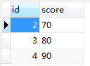


### 7.3.1、LEFT/RIGHT/INNER

**LEFT JOIN**

 “左连接”，表 1 左连接表 2，以左为主，表示以表 1 为主，关联上表 2 的数据，查出来的结果显示左边的所有数据，然后右边显示的是和左边有交集部分的数据。如下：

```mysql
select * from kemu left join score on kemu.id = score.id
```

结果集：


**RIGHT JOIN**

“右连接”，表 1 右连接表 2，以右为主，表示以表 2 为主，关联查询表 1 的数据，查出表 2 所有数据以及表 1 和表 2 有交集的数据，如下：

```mysql
select * from kemu right join score on kemu.id = score.id
```

结果集：

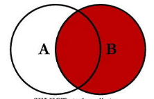


**INNER JOIN**

“内连接”，可以简写成 `JOIN`，表示以两个表的交集为主，查出来是两个表有交集的部分，其余没有关联就不额外显示出来，如下：

```mysql
select * from kemu join score on kemu.id = score.id
```

结果集：


### 7.3.2、ON、WHERE 的区别

数据库在通过连接两张或多张表来返回记录时，都会生成一张中间的临时表，然后再将这张临时表返回给用户。

在使用 `LEFT JOIN` 时，`ON` 和 `WHERE` 条件的区别如下：

1. `ON` 条件是在生成临时表时使用的条件，它不管 `ON` 中的条件是否为真，都会返回左边表中的记录。
2. `WHERE` 条件是在临时表生成好后，再对临时表进行过滤的条件。这时已经没有 `LEFT JOIN` 的含义（必须返回左边表的记录）了，条件不为真的就全部过滤掉。

假设有两张表：

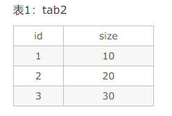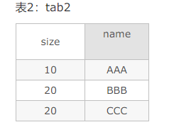

两条 SQL：

```mysql
select * form tab1 left join tab2 on (tab1.size = tab2.size) where tab2.name='AAA'
select * form tab1 left join tab2 on (tab1.size = tab2.size and tab2.name='AAA’)
```

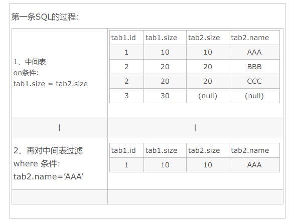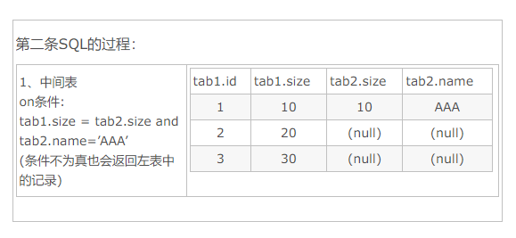


## 7.4、排序

语法：

```mysql
SELECT field1,field2,…fieldN FROM TABLE_name1, TABLE_name2…
ORDER BY field1 [ASC | DESC][默认ASC], [field2…] [ASC | DESC][默认ASC];
```

- 你可以使用任何字段来作为排序的条件，从而返回排序后的查询结果
- 你可以设定多个字段来排序
- 你可以使用ASC或DESC关键字来设置查询结果是按升序或降序排列。默认情况下，它是按升序排列
- 你可以添加WHERE…LIKE子句来设置条件


**ORDER BY多列**

ORDER BY多列的时候，先按照第一个column_name排序，再按照第二个column_name排序。

- ORDER BY A,B    这个时候都是默认按升序排列
- ORDER BY A desc,B 这个时候A降序，B升序排列
- ORDER BY A, B desc 这个时候A升序，B降序排列


**MySQL拼音排序**

如果字符集采用的是gbk（汉字编码字符集），直接在查询语句后边添加ORDER BY：

```mysql
SELECT * FROM <表名> ORDER BY <字段名> ASC;
```

如果字符集采用的是utf8（万国码），需要先对字段进行转码然后排序：

```mysql
SELECT * FROM <表名> ORDER BY CONVERT(<字段名> USING gbk) ASC;
```


## 7.5、分组

GROUP BY语句根据一个或多个列对结果集进行分组，在分组上我们可以使用COUNT、SUM、AVG等函数

GROUP BY语法：

```mysql
SELECT column_name,FUNCTION(cloumns_name) FROM <表名>
WHERE columns_name operator VALUE
GROUP BY column_name;
```


### 7.5.1、WITH  ROLLUP

WITH  ROLLUP可以实现在分组数据基础上再进行相同的统计（SUM，AVG，COUNT…）

例如我们将以上数据表按名字进行分组，再统计每个人登陆的次数：

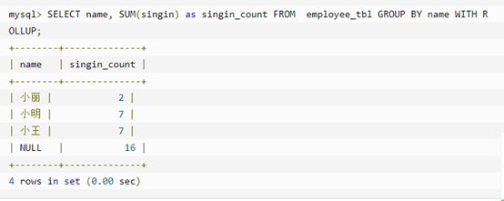

其中记录NULL表示所有人的登陆次数

可以使用COALESCE来设置一个可以取代NULL的名称

COALESCE语法：

```mysql
SELECT COALESCE(a,b,c);
```

参数说明：如果 a == NULL，则选择b；如果 b == NULL ，则选择c；如果 a != NULL ，则选择a；如果a b c都为NULL，则返回为NULL（没意义）

以下实例中如果name为空我们使用“总数”代替：

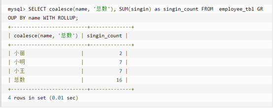


### 7.5.2、HAVING 子句

增加 `HAVING` 子句的原因是，`WHERE` 关键字无法与聚合函数一起使用。

`HAVING` 子句可以筛选分组后的各组数据。

语法：

```mysql
HAVING <条件>
```

其中，`<条件>` 指的是指定的过滤条件。

`HAVING` 子句和 `WHERE` 子句非常相似，`HAVING` 子句支持 `WHERE` 子句中所有的操作符和语法，但是两者存在几点差异：

- `WHERE` 子句主要用于过滤数据行，而 `HAVING` 子句主要用于过滤分组，即 `HAVING` 子句基于分组的聚合值而不是特定行的值来过滤数据。
- `WHERE` 子句不可以包含聚合函数，`HAVING` 子句中的条件可以包含聚合函数。
- `HAVING` 子句是在数据分组后进行过滤，`WHERE` 子句会在数据分组前进行过滤。`WHERE` 子句排除的行不包含在分组中，可能会影响 `HAVING` 子句基于这些值过滤掉的分组。


**实例：**

```mysql
select goods_price,goods_name from sw_goods where goods_price > 100

select goods_price,goods_name from sw_goods having goods_price > 100
```

上面的 `HAVING` 可以用的前提是我已经筛选出了 `goods_price` 字段，在这种情况下和 `WHERE` 的效果是等效的，但是如果我没有 `select goods_price` 就会报错！！因为 `HAVING` 是从前面筛选的字段再筛选，而 `WHERE` 是从数据表中的字段直接进行的筛选的。

```mysql
select goods_name,goods_number from sw_goods where goods_price > 100

select goods_name,goods_number from sw_goods having goods_price > 100 //报错！！！因为前面并没有筛选出 goods_price 字段
```


## 7.6、正则表达式

MySQL同样支持其他正则表达式的匹配，MySQL中使用REGEXP或NOT REGEXP（或RLIKE和NOT RLIKE）运算符来进行正则表达式匹配

| 模式       | 描述                                                         |
| ---------- | ------------------------------------------------------------ |
| ^          | 匹配输入字符串的开始位置                                     |
| $          | 匹配输入字符串的结束位置                                     |
| .          | 匹配除 "\n" 之外的任何单个字符                               |
| […]        | 字符集合。匹配所包含的任意一个字符。例如， '[abc]' 可以匹配 "plain" 中的 'a'。 |
| [^…]       | 负值字符集合。匹配未包含的任意字符。例如， `[^abc]` 可以匹配 "plain" 中的'p'。 |
| 字符串     | 例如 'in' ,可以匹配 'china' , 'chinese'                      |
| p1\|p2\|p3 | 匹配 p1或 p2 或 p3。例如，'z\|foood' 能匹配 'z' 或 'food'。'(z\|f)ood' 则匹配 'zood' 或 'food' |
| *          | 匹配前面的子表达式零次或多次。例如，zo* 能匹配 'z' 以及 'zoo'。* 等价于{0,} |
| +          | 匹配前面的子表达式一次或多次。例如，'zo+' 能匹配 "zo" 以及 "zoo"，但不能匹配 "z"。+ 等价于 {1,}。 |
| {n}        | n 是一个非负整数。匹配确定的至少n次。例如，'o{2}' 不能匹配 'Bob' 中的 'o'，但是能匹配 "food" 中的两个 o。 |
| {n,m}      | m 和 n 均为非负整数，其中n <= m。最少匹配 n 次且最多匹配 m 次。 |

实例：

查找name字段中以'st'为开头的所有数据：

```mysql
SELECT name FROM person_tbl WHERE name REGEXP '^st';
```

查找name字段中以'ok'为结尾的所有数据：

```mysql
SELECT name FROM person_tbl WHERE name REGEXP 'ok$';
```

查找name字段中包含'mar'字符串的所有数据：

```mysql
SELECT name FROM person_tbl WHERE name REGEXP 'mar';
```

查找name字段中以元音字符开头或以'ok'字符串结尾的所有数据：

```mysql
SELECT name FROM person_tbl WHERE name REGEXP '^[aeiou]|ok$';
```


## 7.7、UNION

描述：

UNION操作符用于连接两个以上的SELECT语句的结果组合到一个结果集中，多个SELECT语句会删除重复的数据

注意：UNION内部每个SELECT语句必须拥有相同数量的列。列也必须拥有相似的数据类型。同时，每个SELECT语句中的列的顺序必须相同。

语法：

```mysql
SELECT expression1, expression2, …expression_n
FROM <表名>
[WHERE conditions]
UNION [ALL | DISTINCT]
SELECT expression1, expression2,…expressoion_n
FROM <表名>
[WHERE conditions];
```

参数：

- expression：要检索的列
- WHERE conditions：可选，检索条件
- DISTINCT：可选，删除结果集中重复的数据。默认情况下UNION操作符已经删除了重复数据，所以DISTINCT修饰符对结果没啥影响
- ALL：可选，返回所有结果集，包含重复数据


## 7.8、NULL值处理

MySQL使用SELECT命令及WHERE子句来读取数据表中的数据，但是当提供的查询条件字段为NULL时，该命令就无法正常工作

为了处理这种情况，MySQL提供了三大运算符：

- IS NULL：当列的值是NULL，此运算符返回TRUE
- IS NOT NULL：当列的值不为NULL，运算符返回TRUE
- <=>：比较操作符（不同于=运算符），当比较的两个值为NULL时返回TRUE

关于NULL的条件比较运算是比较特殊的。不能使用=NULL或!=NULL在列中查找NULL值。

在MySQL中，NULL值与任何其他值比较（即使是NULL）永远返回false，即NULL=NULL返回FALSE。

实例：

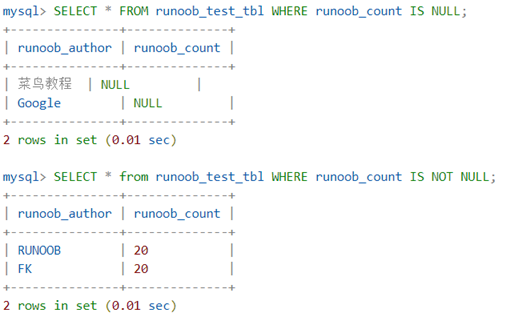

当输出列中有NULL值时可以使用函数IFNULL()或COALESCE()

<br>

## 7.9、WITH（CTE）

MySQL 的 CTE 是在 MySQL 8.0 版本开始支持的，公用表表达式 （CTE） 是一个命名的临时结果集，它存在于单个语句的范围内，以后可以在该语句中引用，可能多次引用。

<br>

### 7.9.1、公用表表达式

若要指定公用表表达式，请使用具有一个或多个逗号分隔子句的 `WITH` 子句。每个子句提供一个子查询，该子查询产生一个结果集，并将名称与子查询相关联。 下面的示例定义名为的 `cte1` 和 `cte2` 中 `WITH` 子句，并在 `WITH` 子句后面的 `SELECT` 中引用了它们：

```mysql
WITH
  cte1 AS (SELECT a, b FROM table1),
  cte2 AS (SELECT c, d FROM table2)
SELECT b, d FROM cte1 JOIN cte2
WHERE cte1.a = cte2.c;
```

<br>

在包含 `WITH` 子句的语句中，可以引用每个 CTE 名称来访问相应的 CTE 结果集。

CTE 名称可以在其他 CTE 中引用，从而可以根据其他 CTE 定义 CTE。

CTE 可以引用自身来定义递归 CTE。递归 CTE 的常见应用包括序列生成和层次结构或树结构数据的遍历。

<br>

公用表表达式是 DML 语句语法的可选部分。它们是使用 `WITH` 子句定义的：

```mysql
WITH [RECURSIVE]
	cte_name [(col_name [, col_name] ...)] AS (subquery)
	[, cte_name [(col_name [, col_name] ...)] AS (subquery)] ...
```

*cte_name* 命名单个公共表表达式，并且可以在包含 `WITH` 子句的语句中用作表引用。

`AS (subquery)` 中的 *subquery* 被称为 “CTE的子查询”，是产生 CTE 结果集的原因。`AS` 后面的括号是必需的。

如果公共表表达式的子查询引用自己的名称，则该表达式是递归的。如果 `WITH` 子句中的任何 CTE 是递归的，则必须包含 `RECURSIVE` 关键字 。

<br>

定义 CTE 的列名有以下情况：

- 如果 CTE 名称后面有一个带括号的名称列表，这些名称就是列名：

	```mysql
	WITH cte (col1, col2) AS
	(
	  SELECT 1, 2
	  UNION ALL
	  SELECT 3, 4
	)
	SELECT col1, col2 FROM cte;
	```

	列表中的列名数量必须与结果集中的列数量相同。

- 否则，列名来选择列表中第一个 ` AS (subquery)` 部分中第一个 `SELECT` 的选择列表：

	```mysql
	WITH cte AS
	(
	  SELECT 1 AS col1, 2 AS col2
	  UNION ALL
	  SELECT 3, 4
	)
	SELECT col1, col2 FROM cte;
	```

<br>

在这些情况下，允许使用 `WITH` 子句：

- 在 `SELECT`、`UPDATE` 和 `DELETE` 语句的开头。

	```mysql
	WITH ... SELECT ...
	WITH ... UPDATE ...
	WITH ... DELETE ...
	```

- 在子查询（包括派生表子查询）的开头：

	```mysql
	SELECT ... WHERE id IN (WITH ... SELECT ...) ...
	SELECT * FROM (WITH ... SELECT ...) AS dt ...
	```

- 对于包含 `SELECT` 语句的语句，紧接在 `SELECT` 之前：

	```mysql
	INSERT ... WITH ... SELECT ...
	REPLACE ... WITH ... SELECT ...
	CREATE TABLE ... WITH ... SELECT ...
	CREATE VIEW ... WITH ... SELECT ...
	DECLARE CURSOR ... WITH ... SELECT ...
	EXPLAIN ... WITH ... SELECT ...
	```

<br>

同一级别只允许一个 `WITH` 子句。`WITH` 后面跟着 `WITH` 是不允许的，这是非法的：

```mysql
WITH cte1 AS (...) WITH cte2 AS (...) SELECT ...
```

要使该语句合法，请使用一个 `WITH` 子句，并用逗号分隔子句：

```mysql
WITH cte1 AS (...), cte2 AS (...) SELECT ...
```

然而，如果多个 `WITH` 子句出现在不同级别，则语句可以包含多个 `WITH`子句：

```mysql
WITH cte1 AS (SELECT 1)
SELECT * FROM (WITH cte2 AS (SELECT 2) SELECT * FROM cte2 JOIN cte1) AS dt;
```

`WITH` 子句可以定义一个或多个通用表表达式，但每个 CTE 名称对于该子句必须是唯一的。这是非法的：

```mysql
WITH cte1 AS (...), cte1 AS (...) SELECT ...
```

要使声明合法，请使用唯一名称定义 CTE：

```mysql
WITH cte1 AS (...), cte2 AS (...) SELECT ...
```

<br>

一个 CTE 可以引用自己，也可以引用其他 CTE：

- 自引用 CTE 是递归的。
- CTE 可以引用前面在同一个 `WITH` 子句中定义的 CTE，但不能引用后面定义的 CTE。
- 给定查询块中的 CTE 可以引用在更外部级别的查询块中定义的 CTE，但不能引用在更内部级别的查询块中定义的 CTE。

<br>

### 7.9.2、递归公用表表达式

递归常见表表达式是具有引用其自己名称的子查询的表达式。例如：

```mysql
WITH RECURSIVE cte (n) AS
(
  SELECT 1
  UNION ALL
  SELECT n + 1 FROM cte WHERE n < 5
)
SELECT * FROM cte;
```

执行时，语句会产生此结果，该结果包含一个简单的线性序列：

```mysql
+------+
| n    |
+------+
|    1 |
|    2 |
|    3 |
|    4 |
|    5 |
+------+
```

<br>

递归 CTE 具有以下结构：

- 如果 `WITH` 子句中的任何 CTE 指代自己，`WITH` 子句必须以 `WITH RECURSIVE` 开始。（如果没有 CTE 指代自己，`RECURSIVE` 是允许的，但不是必须的。）

	如果你忘记了递归 CTE 的 `RECURSIVE`，则可能会出现以下错误：

	```mysql
	ERROR 1146 (42S02): Table 'cte_name' doesn't exist
	```

- 递归 CTE 子查询有两个部分，用 `UNION [ALL]` 或 `UNION DISTINCT` 分开：

	```mysql
	SELECT ...      -- return initial row set
	UNION ALL
	SELECT ...      -- return additional row sets
	```

	第一个 `SELECT` 生成 CTE 的初始行或初始行，但不引用 CTE 名称。第二个 `SELECT` 生成额外的行，并通过在其 `FROM` 子句中引用 CTE 名称来递归。当此部分不产生新行时，递归结束。因此，递归 CTE 由一个非递归 `SELECT` 部分和一个递归 `SELECT` 部分组成。

	每个 `SELECT` 部件本身可以是多个 `SELECT` 语句的并集。

- CTE 结果列的类型仅从非递归 `SELECT` 部分的列类型推断出来，并且所有列都是可为空的。对于类型确定，忽略递归 `SELECT` 部分。

- 如果非递归部分和递归部分由 `UNION DISTINCT` 分隔，则消除重复行。这对于执行递归闭合的查询很有用，可以避免无限循环。

- 递归部分的每个迭代只对前一个迭代产生的行进行操作。如果递归部分有多个查询块，每个查询块的迭代将以非指定的顺序调度，每个查询块对其前一次迭代或前一次迭代结束后的其他查询块所产生的行进行操作。

<br>

前面显示的递归 CTE 子查询有这个非递归部分，它检索了一条记录来产生初始行集：

```mysql
SELECT 1
```

CTE 子查询还具有此递归部分：

```mysql
SELECT n + 1 FROM cte WHERE n < 5
```

在每个迭代中，`SELECT` 产生一个新的值，比前一个行集的 `n` 的值大 `1`。第一次迭代在初始行集（1）上操作，产生 `1+1=2`；第二次迭代在第一次迭代的行集（2）上操作，产生 `2+1=3`；以此类推。这样一直持续到递归结束，当 `n` 不再小于 `5` 的时候，递归就结束了。

<br>

如果一个 CTE 的递归部分对某一列产生的值比非递归部分更宽，那么可能需要在非递归部分扩大该列，以避免数据被截断。考虑一下这个语句：

```mysql
WITH RECURSIVE cte AS
(
  SELECT 1 AS n, 'abc' AS str
  UNION ALL
  SELECT n + 1, CONCAT(str, str) FROM cte WHERE n < 3
)
SELECT * FROM cte;
```

在非严格的 SQL 模式下，该语句产生这样的输出：

```mysql
+------+------+
| n    | str  |
+------+------+
|    1 | abc  |
|    2 | abc  |
|    3 | abc  |
+------+------+
```

`str` 列的值都是 `'abc'`，因为非递归 `SELECT` 确定了列的宽度。因此，由递归 `SELECT`产生的更宽的 `str` 值被截断了。

在严格 SQL 模式下，该语句会产生错误：

```mysql
ERROR 1406 (22001): Data too long for column 'str' at row 1
```

要解决此问题，使语句不会产生截断或错误，请在非递归 `SELECT` 中使用 `CAST()`使 `str` 列变宽：

```mysql
WITH RECURSIVE cte AS
(
  SELECT 1 AS n, CAST('abc' AS CHAR(20)) AS str
  UNION ALL
  SELECT n + 1, CONCAT(str, str) FROM cte WHERE n < 3
)
SELECT * FROM cte;
```

现在，该语句生成以下结果，没有截断：

```mysql
+------+--------------+
| n    | str          |
+------+--------------+
|    1 | abc          |
|    2 | abcabc       |
|    3 | abcabcabcabc |
+------+--------------+
```

<br>

列是通过名称而不是位置来访问的，这意味着递归部分的列可以访问非递归部分中具有不同位置的列，如这个 CTE 所示：

```mysql
WITH RECURSIVE cte AS
(
  SELECT 1 AS n, 1 AS p, -1 AS q
  UNION ALL
  SELECT n + 1, q * 2, p * 2 FROM cte WHERE n < 5
)
SELECT * FROM cte;
```

因为一行的 `p` 是由前一行的 `q` 派生出来的，反之亦然，所以正负值在输出的每一行都会交换位置：

```mysql
+------+------+------+
| n    | p    | q    |
+------+------+------+
|    1 |    1 |   -1 |
|    2 |   -2 |    2 |
|    3 |    4 |   -4 |
|    4 |   -8 |    8 |
|    5 |   16 |  -16 |
+------+------+------+
```

<br>

一些语法约束适用于递归 CTE 子查询中：

- 递归 `SELECT`部分不能包含这些结构：

	- 聚合函数，如 `SUM()`
	- 窗口函数
	- `GROUP BY`
	- `ORDER BY`
	- `DISTINCT`

	在 MySQL 8.0.19 之前，递归 CTE 的递归 `SELECT` 部分也不能使用 `LIMIT` 子句。在 MySQL 8.0.19 中取消了这一限制，现在在这种情况下支持 `LIMIT`，还有一个可选的 `OFFSET` 子句。对结果集的影响与在最外层的 `SELECT` 中使用 `LIMIT` 时相同，但也更有效，因为与递归`SELECT` 一起使用，一旦产生了所要求的行数，就停止生成行。

	这些约束并不适用于递归 CTE 的非递归 `SELECT` 部分。对 `DISTINCT` 的禁止只适用于 `UNION` 成员；`UNION DISTINCT` 是允许的。

- 递归 `SELECT` 部分必须只引用一次 CTE，并且只在它的 `FROM` 子句中，而不是在任何子查询中。它可以引用除 CTE 以外的表，并且用 CTE 连接它们。如果在这样的连接中使用，CTE 不能在 `LEFT JOIN` 的右边。

<br>

对于递归 CTE，递归 `SELECT` 部分在 `EXPLAIN` 输出行 `Extra` 列中显示 `Recursive`。

`EXPLAIN` 显示的成本估计值代表了每一次迭代的成本，它可能与总成本相差很大。优化器无法预测迭代的次数，因为它无法预测 `WHERE` 子句在什么时候变成 `false`。

CTE 的实际成本也可能受到结果集大小的影响。产生许多行的 CTE 可能需要一个足够大的内部临时表来将内存格式转换为磁盘格式，并且可能会损失性能。如果是这样，增加内存中允许的临时表大小可能会提高性能。

<br>

### 7.9.3、限制公共表表达式递归

对于递归 CTE 来说，递归 `SELECT` 部分包括一个终止递归的条件是很重要的。作为一种防止失控递归 CTE 的开发技术，你可以通过限制执行时间来强制终止:

- `cte_max_recursion_depth` 系统变量对 CTE 的递归层数进行了限制。如果递归的级别超过此变量的值，服务器将终止任何 CTE 的执行。
- `max_execution_time` 系统变量为当前会话中执行的 `SELECT` 语句强制执行超时。
- `MAX_EXECUTION_TIME` 优化器提示对出现在其中的 `SELECT` 语句强制执行每条查询的超时。

假设一个递归 CTE 被错误地写成没有递归执行终止条件：

```mysql
WITH RECURSIVE cte (n) AS
(
  SELECT 1
  UNION ALL
  SELECT n + 1 FROM cte
)
SELECT * FROM cte;
```

默认情况下，`cte_max_recursion_depth` 的值为 1000，导致 CTE 在递归超过 `1000` 个级别时终止。应用程序可以改变会话值来调整他们的需求：

```mysql
SET SESSION cte_max_recursion_depth = 10;      -- 只允许浅递归
SET SESSION cte_max_recursion_depth = 1000000; -- 允许更深的递归
```

还可以设置全局 `cte_max_recursion_depth` 值以影响随后开始的所有会话：

```mysql
SET GLOBAL cte_max_recursion_depth = 1000000;
```

对于执行速度慢的查询，或者在有理由将 `cte_max_recursion_depth` 值设置得很高的情况下，防止深度递归的另一种方法是设置每个会话超时。要做到这一点，在执行 CTE 语句之前执行类似这样的语句：

```mysql
SET max_execution_time = 1000; -- 设置一秒超时
```

或者，在 CTE 语句中包含一个优化提示：

```mysql
WITH RECURSIVE cte (n) AS
(
  SELECT 1
  UNION ALL
  SELECT n + 1 FROM cte
)
SELECT /*+ SET_VAR(cte_max_recursion_depth = 1M) */ * FROM cte;

WITH RECURSIVE cte (n) AS
(
  SELECT 1
  UNION ALL
  SELECT n + 1 FROM cte
)
SELECT /*+ MAX_EXECUTION_TIME(1000) */ * FROM cte;
```

从 MySQL 8.0.19 开始，可以在递归查询中使用 `LIMIT` 来设置最外层 `SELECT` 要返回的最大行数，例如：

```mysql
WITH RECURSIVE cte (n) AS
(
  SELECT 1
  UNION ALL
  SELECT n + 1 FROM cte LIMIT 10000
)
SELECT * FROM cte;
```

你可以设置一个时间限制，也可以不设置时间限制。因此，下面这个 CTE 在返回一万条记录或者运行一秒钟（1000毫秒）后终止，以先发生者为准：

```mysql
WITH RECURSIVE cte (n) AS
(
  SELECT 1
  UNION ALL
  SELECT n + 1 FROM cte LIMIT 10000
)
SELECT /*+ MAX_EXECUTION_TIME(1000) */ * FROM cte;
```

如果一个没有执行时间限制的递归查询进入无限循环，你可以使用 `KILL QUERY` 从另一个会话终止它。在会话本身中，用于运行查询的客户程序可能提供一种方法来终止查询。例如，在 mysql 中，键入 `Control+C` 可以中断当前语句。

<br>

### 7.9.4、递归公共表表达式示例

如前所述，递归公共表表达式（CTEs）经常被用于序列生成和遍历层次结构或树状结构的数据。本节展示了这些技术的一些简单例子。

- 斐波那契序列生成
- 日期序列生成
- 分层数据遍历

<br>

#### 斐波那契序列生成

斐波那契数列以两个数字 `0` 和 `1`（或 `1` 和  `1`）开始，之后的每个数字都是前两个数字的总和。如果由递归 `SELECT` 产生的每一行都可以访问系列中的前两个数字，那么递归的普通表表达式就可以生成一个斐波那契数列。下面的 CTE 使用 `0` 和 `1` 作为前两个数字，生成了一个 10 数字系列：

```mysql
WITH RECURSIVE fibonacci (n, fib_n, next_fib_n) AS
(
  SELECT 1, 0, 1
  UNION ALL
  SELECT n + 1, next_fib_n, fib_n + next_fib_n
    FROM fibonacci WHERE n < 10
)
SELECT * FROM fibonacci;
```

CTE产生以下结果：

```mysql
+------+-------+------------+
| n    | fib_n | next_fib_n |
+------+-------+------------+
|    1 |     0 |          1 |
|    2 |     1 |          1 |
|    3 |     1 |          2 |
|    4 |     2 |          3 |
|    5 |     3 |          5 |
|    6 |     5 |          8 |
|    7 |     8 |         13 |
|    8 |    13 |         21 |
|    9 |    21 |         34 |
|   10 |    34 |         55 |
+------+-------+------------+
```

CTE的工作原理：

- `n` 是一个显示列，表示该行包含第 `n` 个斐波那契数。例如，第 `8` 个斐波那契数是 `13`。
- `fib_n` 列显示斐波那契数 `n`。
- `next_fib_n` 列显示数字 `n` 之后的下一个斐波那契数字。该列向下一行提供下一个序列值，以便该行可以生成其 `fib_n` 列中前两个序列值的和。
- 当 `n` 达到 10 时，递归结束。

前面的输出显示了整个 CTE 的结果。要想只选择其中的一部分，可以在顶层的 `SELECT` 中添加一个适当的 `WHERE` 子句。例如，要选择第 `8` 个斐波那契数，请这样做：

```mysql
mysql> WITH RECURSIVE fibonacci ...
       ...
       SELECT fib_n FROM fibonacci WHERE n = 8;
+-------+
| fib_n |
+-------+
|    13 |
+-------+
```

<br>

#### 日期序列生成

公共表表达式可以生成一系列连续的日期，这对于生成包含序列中所有日期行（包括汇总数据中未表示的日期）的摘要非常有用。

假设一个销售数据表包含以下行：

```mysql
mysql> SELECT * FROM sales ORDER BY date, price;
+------------+--------+
| date       | price  |
+------------+--------+
| 2017-01-03 | 100.00 |
| 2017-01-03 | 200.00 |
| 2017-01-06 |  50.00 |
| 2017-01-08 |  10.00 |
| 2017-01-08 |  20.00 |
| 2017-01-08 | 150.00 |
| 2017-01-10 |   5.00 |
+------------+--------+
```

这个查询汇总了每天的销售情况：

```mysql
mysql> SELECT date, SUM(price) AS sum_price
       FROM sales
       GROUP BY date
       ORDER BY date;
+------------+-----------+
| date       | sum_price |
+------------+-----------+
| 2017-01-03 |    300.00 |
| 2017-01-06 |     50.00 |
| 2017-01-08 |    180.00 |
| 2017-01-10 |      5.00 |
+------------+-----------+
```

然而，该结果包含了表所跨越的日期范围内没有表示的日期的 “空洞”。可以使用递归 CTE 生成表示该范围内所有日期的结果，并使用 `LEFT JOIN` 将该日期结果集连接到销售数据。

以下是生成日期范围系列的 CTE：

```mysql
WITH RECURSIVE dates (date) AS
(
  SELECT MIN(date) FROM sales
  UNION ALL
  SELECT date + INTERVAL 1 DAY FROM dates
  WHERE date + INTERVAL 1 DAY <= (SELECT MAX(date) FROM sales)
)
SELECT * FROM dates;
```

CTE 产生如下结果：

```mysql
+------------+
| date       |
+------------+
| 2017-01-03 |
| 2017-01-04 |
| 2017-01-05 |
| 2017-01-06 |
| 2017-01-07 |
| 2017-01-08 |
| 2017-01-09 |
| 2017-01-10 |
+------------+
```

CTE 的工作原理：

- 非递归 `SELECT` 产生 `sales` 表所跨越的日期范围内的最低日期。
- 递归 `SELECT` 产生的每一条记录都会在前一条记录产生的日期上增加一天。
- 在日期达到 `sales` 表所跨越的日期范围中的最高日期后，递归结束。

使用 `LEFT JOIN` 连接 CTE 与 `sales` 表，产生销售汇总表，在这个范围内的每个日期都有一行：

```mysql
WITH RECURSIVE dates (date) AS
(
  SELECT MIN(date) FROM sales
  UNION ALL
  SELECT date + INTERVAL 1 DAY FROM dates
  WHERE date + INTERVAL 1 DAY <= (SELECT MAX(date) FROM sales)
)
SELECT dates.date, COALESCE(SUM(price), 0) AS sum_price
FROM dates LEFT JOIN sales ON dates.date = sales.date
GROUP BY dates.date
ORDER BY dates.date;
```

输出如下所示：

```mysql
+------------+-----------+
| date       | sum_price |
+------------+-----------+
| 2017-01-03 |    300.00 |
| 2017-01-04 |      0.00 |
| 2017-01-05 |      0.00 |
| 2017-01-06 |     50.00 |
| 2017-01-07 |      0.00 |
| 2017-01-08 |    180.00 |
| 2017-01-09 |      0.00 |
| 2017-01-10 |      5.00 |
+------------+-----------+
```

需要注意的几点：

- 这些查询是否效率低下，特别是在递归 `SELECT` 中对每条记录执行 `MAX()`子查询的查询？`EXPLAIN` 显示，包含 `MAX()`的子查询只计算一次，并且结果会被缓存。
- 使用 `COALESCE()` 可以避免在销售表中没有销售数据的日子里，`sum_price` 列显示 `NULL`。

<br>

#### 分层数据遍历

递归公共表表达式对于遍历形成层次结构的数据很有用。考虑这些语句，创建了一个小的数据集，对于公司的每个员工，显示员工的名字和 ID号，以及员工的经理的 ID。最高级别的员工（CEO），其经理 ID 为 `NULL`（没有经理）。

```mysql
CREATE TABLE employees (
  id         INT PRIMARY KEY NOT NULL,
  name       VARCHAR(100) NOT NULL,
  manager_id INT NULL,
  INDEX (manager_id),
FOREIGN KEY (manager_id) REFERENCES employees (id)
);
INSERT INTO employees VALUES
(333, "Yasmina", NULL),  # Yasmina is the CEO (manager_id is NULL)
(198, "John", 333),      # John has ID 198 and reports to 333 (Yasmina)
(692, "Tarek", 333),
(29, "Pedro", 198),
(4610, "Sarah", 29),
(72, "Pierre", 29),
(123, "Adil", 692);
```

生成的数据集如下所示：

```mysql
mysql> SELECT * FROM employees ORDER BY id;
+------+---------+------------+
| id   | name    | manager_id |
+------+---------+------------+
|   29 | Pedro   |        198 |
|   72 | Pierre  |         29 |
|  123 | Adil    |        692 |
|  198 | John    |        333 |
|  333 | Yasmina |       NULL |
|  692 | Tarek   |        333 |
| 4610 | Sarah   |         29 |
+------+---------+------------+
```

为了生成带有每个员工管理链的组织结构图（即从 CEO 到员工的路径），请使用一个递归 CTE：

```mysql
WITH RECURSIVE employee_paths (id, name, path) AS
(
  SELECT id, name, CAST(id AS CHAR(200))
    FROM employees
    WHERE manager_id IS NULL
  UNION ALL
  SELECT e.id, e.name, CONCAT(ep.path, ',', e.id)
    FROM employee_paths AS ep JOIN employees AS e
      ON ep.id = e.manager_id
)
SELECT * FROM employee_paths ORDER BY path;
```

CTE产生如下输出：

```mysql
+------+---------+-----------------+
| id   | name    | path            |
+------+---------+-----------------+
|  333 | Yasmina | 333             |
|  198 | John    | 333,198         |
|   29 | Pedro   | 333,198,29      |
| 4610 | Sarah   | 333,198,29,4610 |
|   72 | Pierre  | 333,198,29,72   |
|  692 | Tarek   | 333,692         |
|  123 | Adil    | 333,692,123     |
+------+---------+-----------------+
```

CTE 的工作原理：

- 非递归 `SELECT`生成 CEO 的行（具有 `NULL` 的 `manager_id`行）。

	`path` 列被扩展为 `CHAR(200)`，以确保有空间容纳递归 `SELECT` 产生的更长的 `path` 值。

- 由递归 `SELECT` 生成的每一行都会找到所有直接向前一行生成的员工报告的员工。对于每个这样的员工，该行包括员工 ID 和姓名，以及雇员管理链。该链是经理的链，末尾添加了员工 ID。

- 当员工没有其他人向他们报告时，递归结束。

要查找一个或多个特定雇员的路径，请向顶级 `SELECT` 添加 `WHERE` 子句。例如，为了显示 `Tarek` 和 `Sarah` 的结果，像这样修改 `SELECT`：

```mysql
mysql> WITH RECURSIVE ...
       ...
       SELECT * FROM employees_extended
       WHERE id IN (692, 4610)
       ORDER BY path;
+------+-------+-----------------+
| id   | name  | path            |
+------+-------+-----------------+
| 4610 | Sarah | 333,198,29,4610 |
|  692 | Tarek | 333,692         |
+------+-------+-----------------+
```

<br>

### 7.9.5、CTE 和类似结构的比较

公共表表达式（CTE）在某些方面与派生表类似：

- 两个结构都有名称。
- 这两种结构都存在于单个语句的作用域中。

由于这些相似之处，CTE 和派生表经常可以互换使用。作为一个简单的例子，这些语句是等同的：

```mysql
WITH cte AS (SELECT 1) SELECT * FROM cte;
SELECT * FROM (SELECT 1) AS dt;
```

然而，与派生表相比，CTE 有一些优势：

- 一个派生表在一个查询中只能被引用一次。一个 CTE 可以被多次引用。要使用一个派生表结果的多个实例，你必须多次派生该结果。
- CTE 可以是自引用（递归）。
- 一个 CTE 可以引用另一个 CTE。
- 如果 CTE 的定义出现在语句的开头，而不是嵌入在语句中，可能会更容易阅读。

CTE 类似于用 `CREATE [TEMPORARY] TABLE` 创建的表，但不需要明确定义或删除。对于 CTE，你不需要任何权限来创建表。

<br>

## 7.10、窗口函数

MySQL 支持窗口函数，对于查询中的每一行，使用与该行相关的行执行计算。下面几节讨论如何使用窗口函数，包括对 `OVER` 和 `WINDOW` 子句的介绍。

<br>

### 7.10.1、窗口函数的概念和语法

本节介绍如何使用窗口函数。

```mysql
mysql> SELECT * FROM sales ORDER BY country, year, product;
+------+---------+------------+--------+
| year | country | product    | profit |
+------+---------+------------+--------+
| 2000 | Finland | Computer   |   1500 |
| 2000 | Finland | Phone      |    100 |
| 2001 | Finland | Phone      |     10 |
| 2000 | India   | Calculator |     75 |
| 2000 | India   | Calculator |     75 |
| 2000 | India   | Computer   |   1200 |
| 2000 | USA     | Calculator |     75 |
| 2000 | USA     | Computer   |   1500 |
| 2001 | USA     | Calculator |     50 |
| 2001 | USA     | Computer   |   1500 |
| 2001 | USA     | Computer   |   1200 |
| 2001 | USA     | TV         |    150 |
| 2001 | USA     | TV         |    100 |
+------+---------+------------+--------+
```

窗口函数在一组查询行上执行类似于聚合的操作。然而，聚合操作将查询行组合成一个单一的结果行，而窗口函数为每一个查询行产生一个结果。

- 对其进行函数求值的行称为当前行。
- 与发生函数计算的当前行相关的查询行组成当前行的窗口。

<br>

例如，使用销售信息表，这两个查询执行聚合操作，为作为一个组的所有行生成一个全局总和，并对每个国家进行分组：

```mysql
mysql> SELECT SUM(profit) AS total_profit
       FROM sales;
+--------------+
| total_profit |
+--------------+
|         7535 |
+--------------+
mysql> SELECT country, SUM(profit) AS country_profit
       FROM sales
       GROUP BY country
       ORDER BY country;
+---------+----------------+
| country | country_profit |
+---------+----------------+
| Finland |           1610 |
| India   |           1350 |
| USA     |           4575 |
+---------+----------------+
```

相比之下，窗口函数不会将一组查询行折叠为单个输出行。相反，它们为每行产生一个结果。和前面的查询一样，下面的查询使用了 `SUM()`，但这次是作为一个窗口函数：

```mysql
mysql> SELECT
         year, country, product, profit,
         SUM(profit) OVER() AS total_profit,
         SUM(profit) OVER(PARTITION BY country) AS country_profit
       FROM sales
       ORDER BY country, year, product, profit;
+------+---------+------------+--------+--------------+----------------+
| year | country | product    | profit | total_profit | country_profit |
+------+---------+------------+--------+--------------+----------------+
| 2000 | Finland | Computer   |   1500 |         7535 |           1610 |
| 2000 | Finland | Phone      |    100 |         7535 |           1610 |
| 2001 | Finland | Phone      |     10 |         7535 |           1610 |
| 2000 | India   | Calculator |     75 |         7535 |           1350 |
| 2000 | India   | Calculator |     75 |         7535 |           1350 |
| 2000 | India   | Computer   |   1200 |         7535 |           1350 |
| 2000 | USA     | Calculator |     75 |         7535 |           4575 |
| 2000 | USA     | Computer   |   1500 |         7535 |           4575 |
| 2001 | USA     | Calculator |     50 |         7535 |           4575 |
| 2001 | USA     | Computer   |   1200 |         7535 |           4575 |
| 2001 | USA     | Computer   |   1500 |         7535 |           4575 |
| 2001 | USA     | TV         |    100 |         7535 |           4575 |
| 2001 | USA     | TV         |    150 |         7535 |           4575 |
+------+---------+------------+--------+--------------+----------------+
```

查询中的每个窗口操作都包含一个 `OVER` 子句，指定如何将查询行划分为一组，以便由窗口函数处理。

- 第一个 `OVER` 子句是空的，它将整个查询行集作为一个单一的分区。因此，窗口函数产生一个全局性的和，但对每一行都是如此。
- 第二个 `OVER` 子句按国家划分行，产生每个分区（每个国家）的总和。该函数对每个分区的行产生这个总和。

<br>

窗口函数只允许在选择列表和 `ORDER BY` 子句中使用。查询结果行由 `FORM` 子句确定，在 `WHERE`、`GROUP BY` 和 `HAVING` 处理之后，窗口执行发生在 `ORDER BY`、`LIMIT` 和 `SELECT DISTINCT` 之前。

`OVER` 子句被允许用于许多聚合函数，因此可以作为窗口函数或非窗口函数使用，这取决于 `OVER` 子句是存在还是不存在：

```
AVG()
BIT_AND()
BIT_OR()
BIT_XOR()
COUNT()
JSON_ARRAYAGG()
JSON_OBJECTAGG()
MAX()
MIN()
STDDEV_POP(), STDDEV(), STD()
STDDEV_SAMP()
SUM()
VAR_POP(), VARIANCE()
VAR_SAMP()
```

MySQL 还支持仅作为窗口函数使用的非聚合函数。对于这些，`OVER` 子句是强制性的：

```
CUME_DIST()
DENSE_RANK()
FIRST_VALUE()
LAG()
LAST_VALUE()
LEAD()
NTH_VALUE()
NTILE()
PERCENT_RANK()
RANK()
ROW_NUMBER()
```

作为这些非聚合窗口函数中的一个例子，这个查询使用 `ROW_NUMBER()`，产生其分区中每一行的行号。在这种情况下，行是按国家编号的。默认情况下，分区的行是无序的，行的编号是不确定的。要对分区行进行排序，请在窗口定义中包含一个 `ORDER BY` 子句。这个查询使用无序分区和有序分区（`row_num1` 和 `row_num2` 列）来说明省略和包含 `ORDER BY` 的区别：

```mysql
mysql> SELECT
         year, country, product, profit,
         ROW_NUMBER() OVER(PARTITION BY country) AS row_num1,
         ROW_NUMBER() OVER(PARTITION BY country ORDER BY year, product) AS row_num2
       FROM sales;
+------+---------+------------+--------+----------+----------+
| year | country | product    | profit | row_num1 | row_num2 |
+------+---------+------------+--------+----------+----------+
| 2000 | Finland | Computer   |   1500 |        2 |        1 |
| 2000 | Finland | Phone      |    100 |        1 |        2 |
| 2001 | Finland | Phone      |     10 |        3 |        3 |
| 2000 | India   | Calculator |     75 |        2 |        1 |
| 2000 | India   | Calculator |     75 |        3 |        2 |
| 2000 | India   | Computer   |   1200 |        1 |        3 |
| 2000 | USA     | Calculator |     75 |        5 |        1 |
| 2000 | USA     | Computer   |   1500 |        4 |        2 |
| 2001 | USA     | Calculator |     50 |        2 |        3 |
| 2001 | USA     | Computer   |   1500 |        3 |        4 |
| 2001 | USA     | Computer   |   1200 |        7 |        5 |
| 2001 | USA     | TV         |    150 |        1 |        6 |
| 2001 | USA     | TV         |    100 |        6 |        7 |
+------+---------+------------+--------+----------+----------+
```

<br>

如前所述，要使用窗口函数（或将聚合函数视为窗口函数），请在函数调用后包含一个 `OVER` 子句。`OVER` 子句有两种形式：

```mysql
over_clause:
    {OVER (window_spec) | OVER window_name}
```

这两种形式都定义了窗口函数应该如何处理查询行。它们的区别在于窗口是直接在 `OVER` 子句中定义，还是通过对查询中其他地方定义的命名窗口的引用来提供：

- 在第一种情况下，窗口规范直接出现在 `OVER`  子句中，在括号之间。
- 在第二种情况下，*window_name* 是由查询中其他地方的 `WINDOW` 子句定义的窗口规范的名称。

对于 `OVER (window_spec)`语法，窗口规范有几个部分，都是可选的：

```mysql
window_spec:
    [window_name] [partition_clause] [order_clause] [frame_clause]
```

如果 `OVER()` 为空，则窗口由所有查询行组成，窗口函数使用所有行计算结果。否则，括号内的子句决定了哪些查询行被用来计算函数结果，以及如何对它们进行分区和排序：

- *window_name*：由查询中其他地方的 `WINDOW` 子句定义的窗口名称。如果 *window_name* 本身出现在 `OVER` 子句中，它就完全定义了这个窗口。如果还给出了分区、排序或者框架子句，那么它们会修改对命名的窗口的解释。

- *partition_clause*：`PARTITION BY` 子句表示如何将查询行分成组，可以理解为 `GROUP BY`。如果忽略 `PARTITION BY`，则只有一个由所有查询行组成的分区。

	*partition_clause* 具有以下语法：

	```mysql
	partition_clause:
	    PARTITION BY expr [, expr] ...
	```

	标准 SQL 要求 `PARTITION BY` 后面只跟列名。MySQL 扩展允许表达式，而不仅仅是列名。例如，如果一个表包含一个名为 `ts` 的 `TIMESTAMP` 列，标准 SQL 允许 `PARTITION BY ts`，但不允许 `PARTITION BY HOUR(ts)`，而 MySQL 允许两者。

- *order_clause*：`ORDER BY` 子句表明如何对每个分区的行进行排序。根据 `ORDER BY` 子句相等的分区行被认为是对等的。如果省略了 `ORDER BY`，分区行是无序的，不隐含处理顺序，所有的分区行都是对等的。

	*order_clause* 具有以下语法：

	```mysql
	order_clause:
	    ORDER BY expr [ASC|DESC] [, expr [ASC|DESC]] ...
	```

	每个 `ORDER BY` 表达式后面可以选择 `ASC` 或 `DESC` 来表示排序方向。如果没有指定方向，默认是 `ASC`。对于升序排序，`NULL` 值优先排序，对于降序排序，最后排序。

	窗口定义中的 `ORDER BY` 适用于各个分区。要将结果集作为一个整体进行排序，请在查询的顶层包含一个 `ORDER BY`。

- *frame_clause*：框架是当前分区的一个子集，*frame_clause* 指定了如何定义这个子集。*frame_clause* 有很多自己的子句。详见下一节。

<br>

### 7.10.2、窗口功能框架规范

与窗口函数一起使用的窗口的定义可以包括一个框架子句。框架是当前分区的一个子集，框架子句指定了如何定义这个子集。

框架是相对于当前行确定的，这使得框架可以根据当前行在其分区中的位置在分区中移动。例子：

- 通过将一个框架定义为从分区开始到当前行的所有行，你可以计算每行的累加值。
- 通过将一个框架定义为在当前行的两侧延伸 N 行，你可以计算滚动平均值。

下面的查询演示了使用移动框架来计算每组按时间顺序排列的 `val` 的累加值，以及从当前行及其前后的行中计算的滚动平均值：

```mysql
mysql> SELECT
         time, subject, val,
         SUM(val) OVER (PARTITION BY subject ORDER BY time
                        ROWS UNBOUNDED PRECEDING)
           AS running_total,
         AVG(val) OVER (PARTITION BY subject ORDER BY time
                        ROWS BETWEEN 1 PRECEDING AND 1 FOLLOWING)
           AS running_average
       FROM observations;
+----------+---------+------+---------------+-----------------+
| time     | subject | val  | running_total | running_average |
+----------+---------+------+---------------+-----------------+
| 07:00:00 | st113   |   10 |            10 |          9.5000 |
| 07:15:00 | st113   |    9 |            19 |         14.6667 |
| 07:30:00 | st113   |   25 |            44 |         18.0000 |
| 07:45:00 | st113   |   20 |            64 |         22.5000 |
| 07:00:00 | xh458   |    0 |             0 |          5.0000 |
| 07:15:00 | xh458   |   10 |            10 |          5.0000 |
| 07:30:00 | xh458   |    5 |            15 |         15.0000 |
| 07:45:00 | xh458   |   30 |            45 |         20.0000 |
| 08:00:00 | xh458   |   25 |            70 |         27.5000 |
+----------+---------+------+---------------+-----------------+
```

对于 `running_average` 列，在第一行之前和最后一行之后都没有框架行。在这些情况下，`AVG()` 计算的是现有行的平均值。

<br>

作为窗口函数的聚合函数对当前行框架中的行进行操作，这些非聚合窗口函数也是如此。

```
FIRST_VALUE()
LAST_VALUE()
NTH_VALUE()
```

标准 SQL 规定，对整个分区进行操作的窗口函数不应该有框架子句。MySQL 允许这类函数有一个框架子句，但会忽略它。即使指定了一个框架，这些函数也会使用整个分区：

```
CUME_DIST()
DENSE_RANK()
LAG()
LEAD()
NTILE()
PERCENT_RANK()
RANK()
ROW_NUMBER()
```

<br>

如果给出框架子句，其语法是这样的：

```
frame_clause:
    frame_units frame_extent

frame_units:
    {ROWS | RANGE}
```

在没有框架子句的情况下，默认的框架取决于是否存在 `ORDER BY` 子句，后面会讲。

*frame_units* 值表示当前行与框架行之间的关系类型：

- `ROWS`：框架由开始和结束行位置定义。偏移量是行号与当前行号之间的差异。
- `RANGE`：框架是由数值范围内的行定义的。偏移量是行值与当前行值的差异。

*frame_extent* 值表示框架的开始和结束点。你可以只指定框架的起点（在这种情况下，当前行是隐含的终点），或者使用 `BETWEEN` 来指定两个框架的端点：

```
frame_extent:
    {frame_start | frame_between}

frame_between:
    BETWEEN frame_start AND frame_end

frame_start, frame_end: {
    CURRENT ROW
  | UNBOUNDED PRECEDING
  | UNBOUNDED FOLLOWING
  | expr PRECEDING
  | expr FOLLOWING
}
```

对于 `BETWEEN` 语法，*frame_start* 不能出现在 *frame_end* 之后。

允许的 *frame_start* 和 *frame_end* 值有这些含义：

- `CURRENT ROW`：对于 `ROWS`，边界是当前行。对于 `RANGE`，边界是当前行的同级。

- `UNBOUNDED PRECEDING`：边界是第一个分区行。

- `UNBOUNDED FOLLOWING`：边界是最后一个分区行。

- `expr PRECEDING`：对于 `ROWS`，边界是当前行之前的 *expr* 行。对于 `RANGE`，边界是值等于当前行值减去 *expr* 的行；如果当前行值是`NULL`，边界是该行的同级。

- `expr FOLLOWING`：对于 `ROWS` 来说，边界是当前行之后的 *expr* 行。对于 `RANGE`，边界是值等于当前行值加上 *expr* 的行；如果当前行值是 `NULL`，边界是该行的同级。

	对于 `expr PRECEDING`（和 `expr FOLLOWING`），*expr* 可以是一个 ? 参数标记（在准备好的语句中使用），一个非负数的数字字头，或者一个 `INTERVAL val unit` 形式的时间间隔。对于 `INTERVAL` 表达式，*val* 指定了非负的间隔值，*unit* 是一个关键字，表示该值应该被解释的单位。

	数字或时间 *expr* 上的 `RANGE` 分别要求数字或时间表达式上的 `ORDER BY`。

	有效的 `expr PRECEDING` 和 `expr FOLLOWING` 指标的例子：

	```mysql
	10 PRECEDING
	INTERVAL 5 DAY PRECEDING
	5 FOLLOWING
	INTERVAL '2:30' MINUTE_SECOND FOLLOWING
	```

下面的查询演示了 `FIRST_VALUE()`、`LAST_VALUE()`  和 `NTH_VALUE()` 的两个实例：

```mysql
mysql> SELECT
         time, subject, val,
         FIRST_VALUE(val)  OVER w AS 'first',
         LAST_VALUE(val)   OVER w AS 'last',
         NTH_VALUE(val, 2) OVER w AS 'second',
         NTH_VALUE(val, 4) OVER w AS 'fourth'
       FROM observations
       WINDOW w AS (PARTITION BY subject ORDER BY time
                    ROWS UNBOUNDED PRECEDING);
+----------+---------+------+-------+------+--------+--------+
| time     | subject | val  | first | last | second | fourth |
+----------+---------+------+-------+------+--------+--------+
| 07:00:00 | st113   |   10 |    10 |   10 |   NULL |   NULL |
| 07:15:00 | st113   |    9 |    10 |    9 |      9 |   NULL |
| 07:30:00 | st113   |   25 |    10 |   25 |      9 |   NULL |
| 07:45:00 | st113   |   20 |    10 |   20 |      9 |     20 |
| 07:00:00 | xh458   |    0 |     0 |    0 |   NULL |   NULL |
| 07:15:00 | xh458   |   10 |     0 |   10 |     10 |   NULL |
| 07:30:00 | xh458   |    5 |     0 |    5 |     10 |   NULL |
| 07:45:00 | xh458   |   30 |     0 |   30 |     10 |     30 |
| 08:00:00 | xh458   |   25 |     0 |   25 |     10 |     30 |
+----------+---------+------+-------+------+--------+--------+
```

每个函数都使用当前框架中的行，根据所示的窗口定义，从第一个分区行延伸到当前框架。对于 `NTH_VALUE()` 的调用，当前框架并不总是包括所请求的行；在这种情况下，返回值是 `NULL`。

<br>

在没有框架子句的情况下，默认框架取决于是否存在 `ORDER BY` 子句：

- 有 `ORDER BY`：默认的框架包括从分区开始到当前行的记录，包括当前行的所有同级别的记录（根据 `ORDER BY` 子句，等于当前行的记录）。默认情况下等同于这个框架规范：

	```mysql
	RANGE BETWEEN UNBOUNDED PRECEDING AND CURRENT ROW
	```

- 没有 `ORDER BY`：默认的框架包括所有分区行（因为在没有 `ORDER BY`的情况下，所有分区行都是同行）。默认情况等同于这个框架规范：

	```mysql
	RANGE BETWEEN UNBOUNDED PRECEDING AND UNBOUNDED FOLLOWING
	```

因为默认的框架因 `ORDER BY` 的存在与否而不同，在查询中加入 `ORDER BY` 以获得确定的结果可能会改变结果。（例如，由 `SUM()` 产生的值可能会改变）。为了获得相同的结果，但按 `ORDER BY` 排序，请提供一个明确的框架规范，无论 `ORDER BY` 是否存在都要使用。

<br>

当当前行值为 `NULL` 时，框架规范的含义可能是不明显的。假设是这种情况，这些例子说明了各种框架规范的应用：

- ```mysql
	ORDER BY X ASC RANGE BETWEEN 10 FOLLOWING AND 15 FOLLOWING
	```

	这个框架从 `NULL` 开始，到 `NULL` 结束，因此只包括数值为 `NULL` 的记录。

- ```mysql
	ORDER BY X ASC RANGE BETWEEN 10 FOLLOWING AND UNBOUNDED FOLLOWING
	```

	这个框架从 `NULL` 开始，到分区的末尾为止。因为 `ASC` 排序将 `NULL` 值放在前面，所以框架是整个分区。

- ```mysql
	ORDER BY X DESC RANGE BETWEEN 10 FOLLOWING AND UNBOUNDED FOLLOWING
	```

	这个框架从 `NULL` 开始，在分区的末端停止。因为 `DESC` 排序将 `NULL` 值放在最后，所以框架中只有 `NULL` 值。

- ```mysql
	ORDER BY X ASC RANGE BETWEEN 10 PRECEDING AND UNBOUNDED FOLLOWING
	```

	这个框架从 `NULL` 开始，到分区的末尾为止。因为 `ASC` 排序将 `NULL` 值放在前面，所以框架是整个分区。

- ```mysql
	ORDER BY X ASC RANGE BETWEEN 10 PRECEDING AND 10 FOLLOWING
	```

	这个框架从 `NULL` 开始，到 `NULL` 结束，因此只包括数值为 `NULL` 的记录。

- ```mysql
	ORDER BY X ASC RANGE BETWEEN 10 PRECEDING AND 1 PRECEDING
	```

	这个框架从 `NULL` 开始，到 `NULL` 结束，因此只包括数值为 `NULL` 的记录。

- ```mysql
	ORDER BY X ASC RANGE BETWEEN UNBOUNDED PRECEDING AND 10 FOLLOWING
	```

	这个框架从分区的开始开始，到数值为 `NULL` 的行为止。因为 `ASC` 排序将 `NULL` 值放在首位，所以框架中只有 `NULL` 值。

<br>

### 7.10.3、窗口的命名

在 `OVER` 子句中，可以定义窗口并赋予其名称，以便对其进行引用。要做到这一点，需要使用 `WINDOW` 子句。如果在查询中出现，`WINDOW` 子句会在 `HAVING` 子句和 `ORDER BY` 子句的位置之间，并且有这样的语法：

```mysql
WINDOW window_name AS (window_spec)
    [, window_name AS (window_spec)] ...
```

对于每个窗口定义，*window_name* 是窗口名称，而 *window_spec* 是在 `OVER` 子句的括号中给出的相同类型的窗口规范：

```mysql
window_spec:
    [window_name] [partition_clause] [order_clause] [frame_clause]
```

<br>

`WINDOW` 子句在查询中非常有用，否则多个 `OVER` 子句会定义同一个窗口。相反，你可以只定义一次窗口，给它一个名字，然后在 `OVER` 子句中引用这个名字。考虑一下这个查询，它多次定义了同一个窗口：

```mysql
SELECT
  val,
  ROW_NUMBER() OVER (ORDER BY val) AS 'row_number',
  RANK()       OVER (ORDER BY val) AS 'rank',
  DENSE_RANK() OVER (ORDER BY val) AS 'dense_rank'
FROM numbers;
```

通过使用 `WINDOW` 来定义一次窗口，并在 `OVER` 子句中用名称来引用窗口，可以更简单地编写查询：

```mysql
SELECT
  val,
  ROW_NUMBER() OVER w AS 'row_number',
  RANK()       OVER w AS 'rank',
  DENSE_RANK() OVER w AS 'dense_rank'
FROM numbers
WINDOW w AS (ORDER BY val);
```

<br>

命名窗口还可以更容易地试验窗口定义，以查看对查询结果的影响。只需要修改 `window` 子句中的窗口定义，而不需要修改多个 `OVER` 子句定义。

如果 `OVER` 子句使用 `OVER(window_name ...)` 而不是 `OVER window_name` ，那么可以通过增加其他子句来修改命名的窗口。例如，这个查询定义了一个包括分区的窗口，并在 `OVER` 子句中使用 `ORDER BY` 以不同的方式修改该窗口：

```mysql
SELECT
  DISTINCT year, country,
  FIRST_VALUE(year) OVER (w ORDER BY year ASC) AS first,
  FIRST_VALUE(year) OVER (w ORDER BY year DESC) AS last
FROM sales
WINDOW w AS (PARTITION BY country);
```

`OVER` 子句只能向命名的窗口添加属性，不能修改它们。如果命名的窗口定义包括分区、排序或框架属性，那么引用窗口名称的 `OVER` 子句也不能包括同种属性，否则会发生错误：

- 这个结构是允许的，因为窗口定义和引用的 `OVER` 子句不包含同种属性：

	```mysql
	OVER (w ORDER BY country)
	... WINDOW w AS (PARTITION BY country)
	```

- 这个结构是不允许的，因为 `OVER` 子句为一个已经有 `PARTITION BY` 的命名窗口指定了 `PARTITION BY`：

	```mysql
	OVER (w PARTITION BY year)
	... WINDOW w AS (PARTITION BY country)
	```

<br>

一个命名的窗口的定义本身可以以 *window_name* 开始。在这种情况下，允许向前和向后引用，但不允许循环：

- 这是被允许的；它包含向前和向后的引用，但没有循环：

	```mysql
	WINDOW w1 AS (w2), w2 AS (), w3 AS (w1)
	```

- 这是不允许的，因为它包含一个循环：

	```mysql
	WINDOW w1 AS (w2), w2 AS (w3), w3 AS (w1)
	```

<br>

### 7.10.4、窗口函数介绍

本节描述非聚合窗口函数，对于查询中的每一行，使用与该行相关的行执行计算。大多数聚合函数也可以用作窗口函数。

| 名称             | 描述                             |
| ---------------- | -------------------------------- |
| `CUME_DIST()`    | 累计分布值                       |
| `DENSE_RANK()`   | 当前行在其分区内的排名，没有间隙 |
| `FIRST_VALUE()`  | 窗口框架第一行的参数值           |
| `LAG()`          | 分区内滞后于当前行的参数值       |
| `LAST_VALUE()`   | 窗口框架最后一行的参数值         |
| `LEAD()`         | 分区内领先于当前行的参数值       |
| `NTH_VALUE()`    | 窗口框架第 N 行的参数值          |
| `NTILE()`        | 当前行在其分区中的桶号           |
| `PERCENT_RANK()` | 百分比排名值                     |
| `RANK()`         | 当前行在其分区中的排名，有空隙   |
| `ROW_NUMBER()`   | 当前行在其分区中的编号           |

在下面的函数描述中，*over_clause* 代表 `OVER` 子句，在下一节会介绍到。一些窗口函数允许使用 *null_treatment* 子句来指定在计算结果时如何处理 NULL 值。这个子句是可选的。它是 SQL 标准的一部分，但 MySQL 的实现只允许 `RESPECT NULLS`（这也是默认的）。这意味着在计算结果时会考虑空值。会解析 `IGNORE NULLS`，但会产生错误。

<br>

#### CUME_DIST() 

语法：

```mysql
CUME_DIST() over_clause
```

返回一组数值中的累积分布；也就是说，分区值小于或等于当前行的值的百分比。这表示在窗口分区的窗口排序中，在当前行之前或同级的行数除以窗口分区的总行数。返回值的范围从 0 到 1。

这个函数应该与 `ORDER BY` 一起使用，以按照所需的顺序对分区行进行排序。如果没有 `ORDER BY`，所有行都是对等的，值为 `N/N = 1`，其中N 是分区大小。

下面的查询显示：对于 `val` 列中的一组数值、每一行的 `CUME_DIST()` 值以及由类似的 `PERCENT_RANK()` 函数返回的百分比排名值。作为参考，该查询还使用 `ROW_NUMBER()` 显示行号：

```mysql
mysql> SELECT
         val,
         ROW_NUMBER()   OVER w AS 'row_number',
         CUME_DIST()    OVER w AS 'cume_dist',
         PERCENT_RANK() OVER w AS 'percent_rank'
       FROM numbers
       WINDOW w AS (ORDER BY val);
+------+------------+--------------------+--------------+
| val  | row_number | cume_dist          | percent_rank |
+------+------------+--------------------+--------------+
|    1 |          1 | 0.2222222222222222 |            0 |
|    1 |          2 | 0.2222222222222222 |            0 |
|    2 |          3 | 0.3333333333333333 |         0.25 |
|    3 |          4 | 0.6666666666666666 |        0.375 |
|    3 |          5 | 0.6666666666666666 |        0.375 |
|    3 |          6 | 0.6666666666666666 |        0.375 |
|    4 |          7 | 0.8888888888888888 |         0.75 |
|    4 |          8 | 0.8888888888888888 |         0.75 |
|    5 |          9 |                  1 |            1 |
+------+------------+--------------------+--------------+
```

在此示例中，`val` 按从 1 到 5 的升序排序。

对于第一行，函数查找结果集中的行数，其值小于或等于 1 。结果为 2。然后 `CUME_DIST()` 函数将 2 除以总行数 9：2/9。结果是 0.2222222222222222。相同的逻辑应用于第二行。

对于第三行，函数查找值小于或等于 2 的行数。有 3 行。然后 `CUME_DIST()` 函数的结果是：3/9 = 0.3333333333333333。

相同的计算逻辑应用于其余行。

<br>

#### DENSE_RANK() 

语法：

```mysql
DENSE_RANK() over_clause
```

返回当前行在其分区中的排名，没有空隙。同行被认为是并列的，获得相同的排名。这个函数将连续的排名分配给同级组；结果是大小大于 1 的组不会产生非连续的等级数字。

这个函数应该和 `ORDER BY` 一起使用，将分区行排序到所需的顺序。没有 `ORDER BY`，所有的行都是同行。

```mysql
mysql>SELECT
        val,
        DENSE_RANK() OVER (
            ORDER BY val
        ) my_rank
      FROM
        rankDemo; 
+------+---------+
| val  | my_rank |
+------+---------+
|    1 |       1 |
|    2 |       2 |
|    2 |       2 |
|    3 |       3 |
|    4 |       4 |
|    4 |       4 |
|    5 |       5 |
+------+---------+
```

<br>

#### FIRST_VALUE()

语法：

```mysql
FIRST_VALUE(expr) [null_treatment] over_clause
```

从窗口框架的第一行返回 *expr* 的值。

下面的查询演示了 `FIRST_VALUE()`、`LAST_VALUE()` 和两个 `NTH_VALUE()` 实例：

```mysql
mysql> SELECT
         time, subject, val,
         FIRST_VALUE(val)  OVER w AS 'first',
         LAST_VALUE(val)   OVER w AS 'last',
         NTH_VALUE(val, 2) OVER w AS 'second',
         NTH_VALUE(val, 4) OVER w AS 'fourth'
       FROM observations
       WINDOW w AS (PARTITION BY subject ORDER BY time
                    ROWS UNBOUNDED PRECEDING);
+----------+---------+------+-------+------+--------+--------+
| time     | subject | val  | first | last | second | fourth |
+----------+---------+------+-------+------+--------+--------+
| 07:00:00 | st113   |   10 |    10 |   10 |   NULL |   NULL |
| 07:15:00 | st113   |    9 |    10 |    9 |      9 |   NULL |
| 07:30:00 | st113   |   25 |    10 |   25 |      9 |   NULL |
| 07:45:00 | st113   |   20 |    10 |   20 |      9 |     20 |
| 07:00:00 | xh458   |    0 |     0 |    0 |   NULL |   NULL |
| 07:15:00 | xh458   |   10 |     0 |   10 |     10 |   NULL |
| 07:30:00 | xh458   |    5 |     0 |    5 |     10 |   NULL |
| 07:45:00 | xh458   |   30 |     0 |   30 |     10 |     30 |
| 08:00:00 | xh458   |   25 |     0 |   25 |     10 |     30 |
+----------+---------+------+-------+------+--------+--------+
```

每个函数都使用当前框架中的行，根据所示的窗口定义，从第一个分区行延伸到当前行。对于 `NTH_VALUE()` 的调用，当前框架并不总是包括所请求的行；在这种情况下，返回值是 `NULL`。

<br>

#### LAG()

```mysql
LAG(expr [, N[, default]]) [null_treatment] over_clause
```

返回 *expr* 的值，该值来自于在其分区内滞后于（先于）当前行的 *N* 行的行。如果没有这样的行，返回值为 *default*。例如，如果 *N* 是 3，返回的 *default* 值为前两行。如果缺少 *N* 或 *default*，默认值分别为 1 和 `NULL`。

*N* 必须是一个文本非负整数。如果 *N* 为 0，*expr* 将被评估为当前行。

从 MySQL 8.0.22 开始，*N* 不能是 `NULL`。此外，它现在必须是 1 到 2^63^ 范围内的一个整数，包括以下任何一种形式：

- 无符号整数常量文字
- 位置参数标记（?）
- 用户定义的变量
- 存储例程中的局部变量

`LAG()`（和类似的 `LEAD()` 函数）经常被用来计算行之间的差异。下面的查询显示了一组按时间顺序排列的观测值，对于每一个观测值，都显示了相邻行的 `LAG()`和 `LEAD()` 值，以及当前行和相邻行的差异：

```mysql
mysql> SELECT
         t, val,
         LAG(val)        OVER w AS 'lag',
         LEAD(val)       OVER w AS 'lead',
         val - LAG(val)  OVER w AS 'lag diff',
         val - LEAD(val) OVER w AS 'lead diff'
       FROM series
       WINDOW w AS (ORDER BY t);
+----------+------+------+------+----------+-----------+
| t        | val  | lag  | lead | lag diff | lead diff |
+----------+------+------+------+----------+-----------+
| 12:00:00 |  100 | NULL |  125 |     NULL |       -25 |
| 13:00:00 |  125 |  100 |  132 |       25 |        -7 |
| 14:00:00 |  132 |  125 |  145 |        7 |       -13 |
| 15:00:00 |  145 |  132 |  140 |       13 |         5 |
| 16:00:00 |  140 |  145 |  150 |       -5 |       -10 |
| 17:00:00 |  150 |  140 |  200 |       10 |       -50 |
| 18:00:00 |  200 |  150 | NULL |       50 |      NULL |
+----------+------+------+------+----------+-----------+
```

在本例中，`LAG()` 和 `LEAD()` 调用的是默认的 *N* 和 *default*，值为 1 和 `NULL`。

第一行显示了当没有 `LAG()` 的前一行时会发生什么:函数返回默认值（在本例中为 `NULL`）。当 `LEAD()` 没有下一行时，最后一行显示了相同的内容。

<br>

`LAG()` 和 `LEAD()` 也是为了计算总和而不是差异。考虑这个数据集，它包含斐波那契数列的前几个数字：

```mysql
mysql> SELECT n FROM fib ORDER BY n;
+------+
| n    |
+------+
|    1 |
|    1 |
|    2 |
|    3 |
|    5 |
|    8 |
+------+
```

下面的查询显示了与当前行相邻的行的 `LAG()` 和 `LEAD()` 值。它还使用这些函数将前面和后面的行的值添加到当前行的值中。其效果是生成斐波那契数列中的下一个数字，以及其后的数字：

```mysql
mysql> SELECT
         n,
         LAG(n, 1, 0)      OVER w AS 'lag',
         LEAD(n, 1, 0)     OVER w AS 'lead',
         n + LAG(n, 1, 0)  OVER w AS 'next_n',
         n + LEAD(n, 1, 0) OVER w AS 'next_next_n'
       FROM fib
       WINDOW w AS (ORDER BY n);
+------+------+------+--------+-------------+
| n    | lag  | lead | next_n | next_next_n |
+------+------+------+--------+-------------+
|    1 |    0 |    1 |      1 |           2 |
|    1 |    1 |    2 |      2 |           3 |
|    2 |    1 |    3 |      3 |           5 |
|    3 |    2 |    5 |      5 |           8 |
|    5 |    3 |    8 |      8 |          13 |
|    8 |    5 |    0 |     13 |           8 |
+------+------+------+--------+-------------+
```

生成斐波那契数字初始集的一种方法是使用递归公共表表达式。

从 MySQL 8.0.22 开始，你不能为这个函数的行参数使用一个负值。

<br>

#### LAST VALUE()

```mysql
LAST_VALUE(expr) [null_treatment] over_clause
```

返回窗口框架最后一行中 *expr* 的值。

例子见 `FIRST_VALUE()` 函数描述。

<br>

#### LEAD()

```mysql
LEAD(expr [, N[, default]]) [null_treatment] over_clause
```

返回 *expr* 的值，该值来自于在其分区中领先（跟随）当前行 *N* 行的行。如果没有这样的行，返回值为 *defalut*。例如，如果 *N* 是 3，那么返回的 *default* 值为后两行。如果缺少 *N* 或 *default*，默认值分别为 1 和 `NULL`。

*N* 必须是一个文本非负整数。如果 *N* 是 0，*expr* 将被评估为当前行。

从 MySQL 8.0.22 开始，*N* 不能是 `NULL`。此外，它现在必须是 1 到 2^63^ 范围内的一个整数，包括以下任何一种形式：

- 无符号整数常量文字
- 位置参数标记（?）
- 用户定义的变量
- 存储例程中的局部变量

有关示例，请参阅 `LAG()` 函数描述。

从 MySQL 8.0.22 开始，你不能为这个函数的行参数使用一个负值。

<br>

#### NTH_VALUE()

```mysql
NTH_VALUE(expr, N) [from_first_last] [null_treatment] over_clause
```

从窗口框架的第 *N* 行返回 *expr* 的值。如果没有这样的行，则返回值为空。

*N* 必须是一个文本正整数。

*from_first_last* 是 SQL 标准的一部分，但 MySQL 的实现只允许 `FROM FIRST`（这也是默认的）。这意味着计算从窗口的第一行开始。`FROM LAST` 会被解析，但会产生错误。为了获得与 `FROM LAST` 相同的效果（从窗口的最后一行开始计算），使用 `ORDER BY` 以相反的顺序排序。

有关示例，请参见 `FIRST_VALUE()` 函数描述。

在 MySQL 8.0.22 及以后的版本中，你不能为这个函数的行参数使用 `NULL`。

<br>

#### NTILE()

```mysql
NTILE(N) over_clause
```

将一个分区划分为 *N* 个组（桶），为分区中的每一行分配其桶号，并返回其分区中当前行的桶号。例如，如果 *N* 是4，`NTILE()` 将行分成四个桶。如果 *N* 是100，`NTILE()` 将行分成 100 个桶。

*N* 必须是一个文本正整数。桶号返回值的范围是 1 到 *N*。

从 MySQL 8.0.22 开始，*N* 不能是 `NULL`。此外，它现在必须是 1 到 2^63^ 范围内的一个整数，包括以下任何一种形式：

- 无符号整数常量文字
- 位置参数标记（?）
- 用户定义的变量
- 存储例程中的局部变量

这个函数应该与 `ORDER BY` 一起使用，以按照所需的顺序对分区行进行排序。

下面的查询显示，对于 `val` 列中的一组数值，将行分为两组或四组后得到的百分位数值。作为参考，该查询也使用 `ROW_NUMBER()` 显示行数：

```mysql
mysql> SELECT
         val,
         ROW_NUMBER() OVER w AS 'row_number',
         NTILE(2)     OVER w AS 'ntile2',
         NTILE(4)     OVER w AS 'ntile4'
       FROM numbers
       WINDOW w AS (ORDER BY val);
+------+------------+--------+--------+
| val  | row_number | ntile2 | ntile4 |
+------+------------+--------+--------+
|    1 |          1 |      1 |      1 |
|    1 |          2 |      1 |      1 |
|    2 |          3 |      1 |      1 |
|    3 |          4 |      1 |      2 |
|    3 |          5 |      1 |      2 |
|    3 |          6 |      2 |      3 |
|    4 |          7 |      2 |      3 |
|    4 |          8 |      2 |      4 |
|    5 |          9 |      2 |      4 |
+------+------------+--------+--------+
```

从 MySQL 8.0.22 开始，`NTILE(NULL)` 结构不再被允许。

<br>

#### PERCENT_RANK()

```mysql
PERCENT_RANK() over_clause
```

返回小于当前行中值的分区值的百分比，不包括最高值。返回值的范围是 0 到 1，代表行的相对等级，计算的结果是这个公式，其中 *rank* 是行的等级（`RANK()` 函数的返回值），*rows* 是分区行的数量：

```mysql
(rank - 1) / (rows - 1)
```

这个函数应该与 `ORDER BY` 一起使用，以按照所需的顺序对分区行进行排序。如果没有 `ORDER BY`，所有行都是对等的。

有关示例，请参见 `CUME_DIST()` 函数说明。

<br>

#### RANK()

```mysql
RANK() over_clause
```

返回当前行在其分区中的排名，有空隙。同行被认为是并列的，获得相同的排名。如果存在大小大于 1 的组，这个函数不会给同级组分配连续的排名；结果是不连续的等级数字。

这个函数应该和 `ORDER BY` 一起使用，将分区行排序到所需的顺序。没有 `ORDER BY`，所有的行都是同行。

下面的查询显示了 `RANK()` 和 `DENSE_RANK()` 之间的区别，前者产生有间隙的排名，后者产生没有间隙的排名。该查询显示了 `val` 列中一组数值的每个成员的排名值，其中包含一些重复的数值，该查询还使用 `ROW_NUMBER()` 显示行数：

```mysql
mysql> SELECT
         val,
         ROW_NUMBER() OVER w AS 'row_number',
         RANK()       OVER w AS 'rank',
         DENSE_RANK() OVER w AS 'dense_rank'
       FROM numbers
       WINDOW w AS (ORDER BY val);
+------+------------+------+------------+
| val  | row_number | rank | dense_rank |
+------+------------+------+------------+
|    1 |          1 |    1 |          1 |
|    1 |          2 |    1 |          1 |
|    2 |          3 |    3 |          2 |
|    3 |          4 |    4 |          3 |
|    3 |          5 |    4 |          3 |
|    3 |          6 |    4 |          3 |
|    4 |          7 |    7 |          4 |
|    4 |          8 |    7 |          4 |
|    5 |          9 |    9 |          5 |
+------+------------+------+------------+
```

<br>

#### ROW_NUMBER()

```mysql
ROW_NUMBER() over_clause
```

返回其分区中当前行的编号。行号的范围从 1 到分区行数。

`ORDER BY` 影响行编号的顺序。如果没有 `ORDER BY`，行编号是不确定性的。

`ROW_NUMBER()` 给同行分配不同的行号。要给同行分配相同的值，请使用 `RANK()` 或 `DENSE_RANK()` 。有关例子，请参见 `RANK()` 函数描述。

<br>

# 8、视图

视图是可视化的表。

视图隐藏了底层的表结构，简化了数据访问操作，客户端不再需要知道底层表结构及其之间的关系。

视图提供了一个统一访问数据的接口（即可以允许用户通过视图访问数据的安全机制，而不授予用户直接访问底层表的权限）。

从而加强了安全性，使用户只能看到视图所显示的数据。

视图还可以被嵌套，一个视图中可以嵌套另一个视图。

视图提供的是对查询操作的封装，本身不包含数据，所呈现的数据是根据视图定义从基础表中检索出来的，如果基础表的数据新增或删除，视图呈现的也是更新后的数据。视图定义后，编写完所需的查询，可以方便地重用该视图。


**创建视图**

语法格式如下：

```mysql
CREATE VIEW <视图名> AS <SELECT语句>
```

语法说明如下:

- <视图名>：指定视图的名称。该名称在数据库中必须是唯一的，不能与其他表或视图同名。
- <SELECT语句>：指定创建视图的 SELECT 语句，可用于查询多个基础表或源视图。 

默认情况下，创建的视图和基本表的字段是一样的，也可以通过指定视图字段的名称来创建视图。

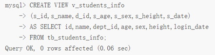


**查看视图**

```mysql
SELECT column_name FROM view_name;
```

或

```mysql
DESCRIBE 视图名；
```

注意：DESCRIBE 一般情况下可以简写成 DESC，输入这个命令的执行结果和输入 DESCRIBE 是一样的。


**修改视图**

```mysql
CREATE OR REPLACE view_name AS 
SELECT column_name…
FROM <表名>
WHERE <条件>;
```


**删除视图**

```mysql
DROP VIEW view_name;
```

# 9、存储过程

存储过程（Stored Procedure）是一种在数据库中存储复杂程序，以便外部程序调用的一种数据库对象。

存储过程是为了完成特定功能的SQL语句集，经编译创建并保存在数据库中，用户可通过指定存储过程的名字并给定参数(需要时)来调用执行。

存储过程思想上很简单，就是数据库 SQL 语言层面的代码封装与重用。

优点

- 存储过程可封装，并隐藏复杂的商业逻辑。
- 存储过程可以回传值，并可以接受参数。
- 存储过程无法使用 SELECT 指令来运行，因为它是子程序，与查看表，数据表或用户定义函数不同。
- 存储过程可以用在数据检验，强制实行商业逻辑等。

缺点

- 存储过程，往往定制化于特定的数据库上，因为支持的编程语言不同。当切换到其他厂商的数据库系统时，需要重写原有的存储过程。
- 存储过程的性能调校与撰写，受限于各种数据库系统。


## 9.1、存储过程的创建和调用

- 存储过程就是具有名字的一段代码，用来完成一个特定的功能。
- 创建的存储过程保存在数据库的数据字典中。

语法：

**声明语句结束符，可以自定义**

```mysql
DELIMITER $$
```

或

```mysql
DELIMITER //
```

当使用 DELIMITER命令时，应该避免使用反斜杠“\”字符，因为它是 MySQL 的转义字符。


**声明存储过程**

```mysql
CREATE PROCEDURE p_name([IN,OUT,INOUT] data_name datatype)
```


**存储过程开始和结束符号**

BEGIN…END


**变量赋值**

```mysql
SET @p_in=1
```


**定义变量**

```mysql
DECLARE l_INT UNSIGNED DEFAULT 1;
```

可以使用 ==SHOW PROCEDURE STATUS== 命令查看数据库中存在哪些存储过程，若要查看某个存储过程的具体信息，则可以使用 ==SHOW CREATE PROCEDURE <存储过程名>==。


实例：

```mysql
DELIMITER $$		#将语句的结束符号从分号;临时改为两个$$(可以是自定义)
CREATE PROCEDURE DELETE_matches(IN p_playerno INTEGER)
BEGIN
	DELETE FROM matches
	WHERE playerno = p_playerno;
END$$
DELIMITER ; 　#将语句的结束符号恢复为分号
```

解析：默认情况下，存储过程和默认数据库相关联，如果想指定存储过程创建在某个特定的数据库下，那么在过程名前面加数据库名做前缀。 在定义过程时，使用 `DELIMITER $$` 命令将语句的结束符号从分号 `; `临时改为两个 `$$`，使得过程体中使用的分号被直接传递到服务器，而不会被客户端（如mysql）解释。


**调用存储过程：**

```mysql
CALL sp_name(传参);
```


**存储过程体**

存储过程体包含了在过程调用时必须执行的语句，例如：DML、DDL语句，IF-THEN-ELSE和WHILE-DO语句、声明变量的DECLARE语句等。


**过程体格式**：以BEFIN开始，以END结束(可嵌套)

```mysql
BEGIN
　　BEGIN
　　　　BEGIN
　　　　　　statements; 
　　　　END
　　END
END
```

注意：每个嵌套块及其中的每条语句，必须以分号结束，表示过程体结束的BEGIN-END块(又叫做复合语句compound statement)，则不需要分号。


**为语句块贴标签**:

```mysql
[begin_label:] BEGIN
　　[statement_list]
END [end_label]
```

例如：

```mysql
label1: BEGIN
　　label2: BEGIN
　　　　label3: BEGIN
　　　　　　statements; 
　　　　END label3 ;
　　END label2;
END label1
```

标签有两个作用：

- 增强代码的可读性
- 在某些语句(例如:LEAVE和ITERATE语句)，需要用到标签。


## 9.2、存储过程的参数

MySQL存储过程的参数用在存储过程的定义，共有三种参数类型,IN,OUT,INOUT,形式如：

```mysql
CREATEPROCEDURE 存储过程名([IN,OUT,INOUT] 参数名 数据类形...)
```

- IN 输入参数：表示调用者向过程传入值（传入值可以是字面量或变量）
- OUT 输出参数：表示过程向调用者传出值(可以返回多个值)（传出值只能是变量）
- INOUT 输入输出参数：既表示调用者向过程传入值，又表示过程向调用者传出值（值只能是变量） 

注意：

- 如果过程没有参数，也必须在过程名后面写上小括号
	例：

	```mysql
	CREATE PROCEDURE sp_name ([proc_parameter[,...]]) ……
	```

- 确保参数的名字不等于列的名字，否则在过程体中，参数名被当做列名来处理。

建议：

- 输入值使用IN参数。
- 返回值使用OUT参数。
- INOUT参数就尽量的少用。


## 9.3、变量

**变量定义**

```mysql
DECLARE variable_name datatype [DEFAULT VALUE];
```

其中，datatype 为 MySQL 的数据类型，如: INT, FLOAT, DATE,VARCHAR(length)


**变量赋值**

```mysql
SET 变量名 = 表达式值
```


**用户变量**

在MySQL客户端使用用户变量:

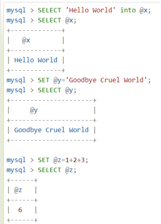

在存储过程中使用用户变量:

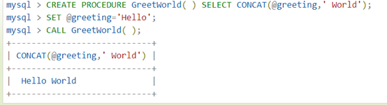

在存储过程间传递全局范围的用户变量:

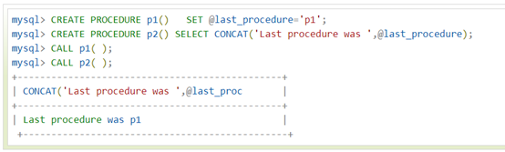

注意:

- 用户变量名一般以@开头
- 滥用用户变量会导致程序难以理解及管理


## 9.4、存储过程的删除

```mysql
 DROP { PROCEDURE | FUNCTION } [ IF EXISTS ] <过程名>
```

注意：存储过程名称后面没有参数列表，也没有括号，在删除之前，必须确认该存储过程没有任何依赖关系，否则会导致其他与之关联的存储过程无法运行。

查看：

```mysql
SHOWCREATE PROCEDURE 数据库.存储过程名;
```


## 9.5、存储过程的控制语句

### 9.5.1、变量作用域

内部的变量在其作用域范围内享有更高的优先权，当执行到 end。变量时，内部变量消失，此时已经在其作用域外，变量不再可见了，应为在存储过程外再也不能找到这个申明的变量，但是你可以通过 out 参数或者将其值指派给会话变量来保存其值。

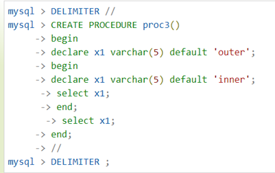


### 9.5.2、条件语句

**if-then-else**

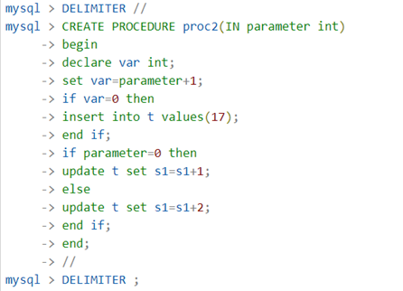


**case语句**

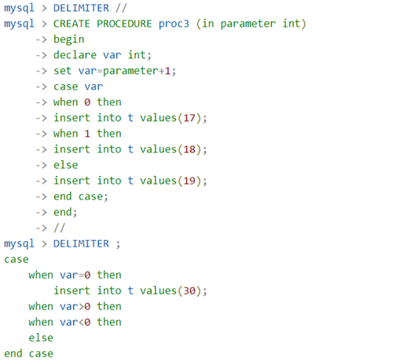


### 9.5.3、循环语句

**while ···· end while**

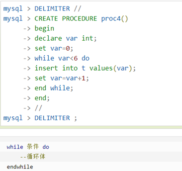


**repeat···· end repea**

它在执行操作后检查结果，而 while 则是执行前进行检查。

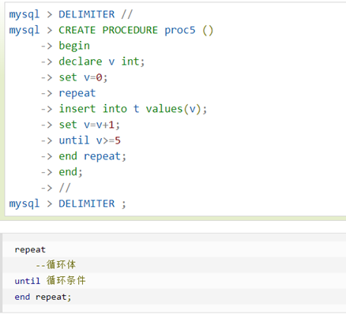


**loop ·····endloop**

loop 循环不需要初始条件，这点和 while 循环相似，同时和 repeat 循环一样不需要结束条件, leave 语句的意义是离开循环。

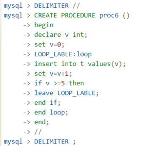


**LABLES 标号**

标号可以用在 begin repeat while 或者 loop 语句前，语句标号只能在合法的语句前面使用。可以跳出循环，使运行指令达到复合语句的最后一步。


## 9.6、ITERATE迭代

ITERATE 通过引用复合语句的标号,来从新开始复合语句:

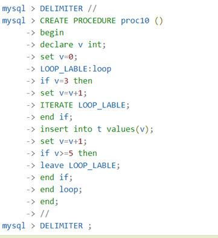

# 10、触发器

## 10.1、触发器简介

MySQL 数据库中触发器是一个特殊的存储过程，不同的是执行存储过程要使用 CALL 语句来调用，而触发器的执行不需要使用 CALL 语句来调用，也不需要手工启动，只要一个预定义的事件发生就会被 MySQL自动调用。

引发触发器执行的事件一般如下：

- 增加一条学生记录时，会自动检查年龄是否符合范围要求。
- 每当删除一条学生信息时，自动删除其成绩表上的对应记录。
- 每当删除一条数据时，在数据库存档表中保留一个备份副本。

触发程序的优点如下：

- 触发程序的执行是自动的，当对触发程序相关表的数据做出相应的修改后立即执行。
- 触发程序可以通过数据库中相关的表层叠修改另外的表。
- 触发程序可以实施比 FOREIGN KEY 约束、CHECK 约束更为复杂的检查和操作。 

触发器与表关系密切，主要用于保护表中的数据。特别是当有多个表具有一定的相互联系的时候，触发器能够让不同的表保持数据的一致性。

在 MySQL 中，只有执行 INSERT、UPDATE 和 DELETE 操作时才能激活触发器。

在实际使用中，MySQL 所支持的触发器有三种：INSERT 触发器、UPDATE 触发器和 DELETE 触发器。


**INSERT 触发器**

在 INSERT 语句执行之前或之后响应的触发器。

使用 INSERT 触发器需要注意以下几点：

- 在 INSERT 触发器代码内，可引用一个名为 NEW（不区分大小写）的虚拟表来访问被插入的行。
- 在 BEFORE INSERT 触发器中，NEW 中的值也可以被更新，即允许更改被插入的值（只要具有对应的操作权限）。
- 对于 AUTO_INCREMENT 列，NEW 在 INSERT 执行之前包含的值是 0，在 INSERT 执行之后将包含新的自动生成值。


**UPDATE 触发器**

在 UPDATE 语句执行之前或之后响应的触发器。

使用 UPDATE 触发器需要注意以下几点：

- 在 UPDATE 触发器代码内，可引用一个名为 NEW（不区分大小写）的虚拟表来访问更新的值。
- 在 UPDATE 触发器代码内，可引用一个名为 OLD（不区分大小写）的虚拟表来访问 UPDATE 语句执行前的值。
- 在 BEFORE UPDATE 触发器中，NEW 中的值可能也被更新，即允许更改将要用于 UPDATE 语句中的值（只要具有对应的操作权限）。
- OLD 中的值全部是只读的，不能被更新。

注意：当触发器设计对触发表自身的更新操作时，只能使用 BEFORE 类型的触发器，AFTER 类型的触发器将不被允许。


**DELETE 触发器**

在 DELETE 语句执行之前或之后响应的触发器。

使用 DELETE 触发器需要注意以下几点：

- 在 DELETE 触发器代码内，可以引用一个名为 OLD（不区分大小写）的虚拟表来访问被删除的行。
- OLD 中的值全部是只读的，不能被更新。


## 10.2、创建触发器

使用 CREATE TRIGGER 语句创建触发器。

语法格式如下：

```mysql
CREATE <触发器名> < BEFORE | AFTER >
<INSERT | UPDATE | DELETE >
ON <表名> FOR EACH ROW<触发器主体>
```

语法说明如下。

- 触发器名
	触发器的名称，触发器在当前数据库中必须具有唯一的名称。如果要在某个特定数据库中创建，名称前面应该加上数据库的名称。

- INSERT | UPDATE | DELETE
	触发事件，用于指定激活触发器的语句的种类。

	注意：三种触发器的执行时间如下。

	- INSERT：将新行插入表时激活触发器。例如，INSERT 的 BEFORE 触发器不仅能被 MySQL 的 INSERT 语句激活，也能被 LOAD DATA 语句激活。

	- DELETE： 从表中删除某一行数据时激活触发器，例如 DELETE 和 REPLACE 语句。

	- UPDATE：更改表中某一行数据时激活触发器，例如 UPDATE 语句。

- BEFORE | AFTER
	BEFORE 和 AFTER，触发器被触发的时刻，表示触发器是在激活它的语句之前或之后触发。若希望验证新数据是否满足条件，则使用 BEFORE 选项；若希望在激活触发器的语句执行之后完成几个或更多的改变，则通常使用 AFTER 选项。

- 表名

	与触发器相关联的表名，此表必须是永久性表，不能将触发器与临时表或视图关联起来。在该表上触发事件发生时才会激活触发器。同一个表不能拥有两个具有相同触发时刻和事件的触发器。例如，对于一张数据表，不能同时有两个 BEFORE UPDATE 触发器，但可以有一个 BEFORE UPDATE 触发器和一个 BEFORE INSERT 触发器，或一个 BEFORE UPDATE 触发器和一个 AFTER UPDATE 触发器。

- 触发器主体
	触发器动作主体，包含触发器激活时将要执行的 MySQL 语句。如果要执行多个语句，可使用 BEGIN…END 复合语句结构。

- FOR EACH ROW
	一般是指行级触发，对于受触发事件影响的每一行都要激活触发器的动作。例如，使用 INSERT 语句向某个表中插入多行数据时，触发器会对每一行数据的插入都执行相应的触发器动作。

注意：每个表都支持 INSERT、UPDATE 和 DELETE 的 BEFORE 与 AFTER，因此每个表最多支持 6 个触发器。每个表的每个事件每次只允许有一个触发器。单一触发器不能与多个事件或多个表关联。

另外，在 MySQL 中，若需要查看数据库中已有的触发器，则可以使用 ==SHOW TRIGGERS== 语句。


## 10.3、修改和删除触发器

与其他 MySQL 数据库对象一样，可以使用 DROP 语句将触发器从数据库中删除。

语法格式如下：

```mysql
DROP TRIGGER [ IF EXISTS ] [数据库名] <触发器名>
```

语法说明如下：

- 触发器名
	要删除的触发器名称。
- 数据库名
	可选项。指定触发器所在的数据库的名称。若没有指定，则为当前默认的数据库。
- 权限
	执行 DROP TRIGGER 语句需要 SUPER 权限。
- IF EXISTS
	可选项。避免在没有触发器的情况下删除触发器。

注意：删除一个表的同时，也会自动删除该表上的触发器。另外，触发器不能更新或覆盖，为了修改一个触发器，必须先删除它，再重新创建。

# 11、自定义函数

**创建并使用自定义函数**

可以使用 CREATE FUNCTION 语句创建自定义函数。

语法格式如下：

```mysql
CREATE FUNCTION <函数名> ([<参数1> <类型1>,<参数2> <类型2>] … )
RETURNS <类型>
<函数主体>
```

语法说明如下：

- <函数名>：指定自定义函数的名称。注意，自定义函数不能与存储过程具有相同的名称。
- <参数><类型>：用于指定自定义函数的参数。这里的参数只有名称和类型，不能指定关键字 IN、OUT 和 INOUT。
- RETURNS<类型>：用于声明自定义函数返回值的数据类型。其中，<类型>用于指定返回值的数据类型。
- <函数主体>：自定义函数的主体部分，也称函数体。所有在存储过程中使用的 SQL 语句在自定义函数中同样适用，包括前面所介绍的局部变量、SET 语句、流程控制语句、游标等。除此之外，自定义函数体还必须包含一个 RETURN<值> 语句，其中<值>用于指定自定义函数的返回值。

在 RETURN VALUE 语句中包含 SELECT 语句时，SELECT 语句的返回结果只能是一行且只能有一列值。

若要查看数据库中存在哪些自定义函数，可以使用 SHOW FUNCTION STATUS 语句；若要查看数据库中某个具体的自定义函数，可以使用 SHOW CREATE FUNCTION<函数名> 语句，其中<函数名>用于指定该自定义函数的名称。

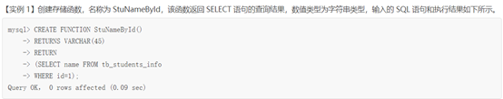

成功创建自定义函数后，就可以如同调用系统内置函数一样，使用关键字 SELECT 调用用户自定义的函数，语法格式为：

```mysql
SELECT <自定义函数名> ([<参数> [,...]])
```


**修改自定义函数**

可以使用 ALTER FUNCTION 语句来修改自定义函数的某些相关特征。若要修改自定义函数的内容，则需要先删除该自定义函数，然后重新创建。


**删除自定义函数**

自定义函数被创建后，一直保存在数据库服务器上以供使用，直至被删除。删除自定义函数的方法与删除存储过程的方法基本一样，可以使用 DROP FUNCTION 语句来实现。

语法格式如下：

```mysql
DROP FUNCTION [ IF EXISTS ] <自定义函数名>
```

语法说明如下:

- <自定义函数名>：指定要删除的自定义函数的名称。
- IF EXISTS：指定关键字，用于防止因误删除不存在的自定义函数而引发错误。

# 12、事务

MySQL事务主要用于处理操作量大，复杂度高的数据。比如说，在人员管理系统中，你删除一个人员，需要删除人员的基本资料，也要删除该人员相关的信息，比如信息，文章等等，这样，这些数据库操作就构成一个事务！

- 在MySQL中只有使用了InnoDb数据库引擎的数据库或表才支持事务
- 事务处理可以用来维护数据库的完整性，保证成批的SQL语句要么全部执行，要么全部不执行
- 事务用来管理INSERT，UPDATE，DELETE语句

事务控制语句：

- BEGIN或START TRANSACTION显示地开启一个事务
- COMMIT也可以使用COMMIT WORD，不过二者是等价的。COMMIT会提交事务，并使已对数据库进行的所有修改成为永久性的
- ROLLBACK也可以使用ROLLBACK WORK，不过二者是等价的。回滚会结束用户的事务，并撤销正在进行的所有未提交的修改
- SAVEPOINT identifier，SAVEPOINT允许在事务中创建一个保存点，一个事务中可以有多个SAVEPOINT 
- RELEASE SAVEPOINT identifier 删除一个事务的保存点，当没有指定的保存点时，执行该语句会抛出一个异常
- ROLLBACK TO identifier把事务回滚到标记点
- SET TRANSACTION用来设置事务的隔离级别。InnoDB存储引擎提供事务的隔离级别有read uncommitted、read committed、repeatalbe read和serializable

MYSQL事务处理主要有两种方法：

1. 用BEGIN，ROLLBACK，COMMIT来实现
	- BEGIN开始一个事务
	- ROLLBACK事务回滚
	- COMMIT事务确认
2. 直接用SET来改变MySQL的自动提交模式
	- SET AUTOCOMMIT=0禁止自动提交
	- SET AUTOCOMMIT=1开始自动提交

实例：

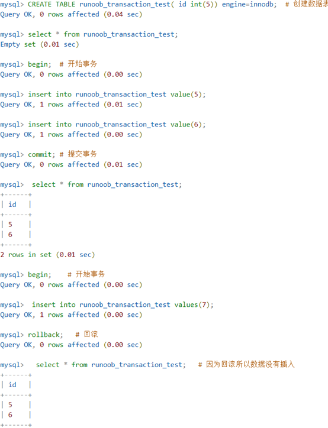


## 12.1、事务的四大特性（ACID）

一般来说，事务必须满足4个条件：原子性（或称不可分割性）、一致性、隔离性（又称独立性）、持久性

- **原子性（Atomicity）**：一个事物中所有的操作，要么全部完成，要么全部不完成，不会结束在中间某个环节。事务在执行过程中发生错误，会被回滚到事务开始前的状态，就像这个事务从来没有执行过一样
- **一致性（Consistency）**：在事务开始之前和事务结束之后，数据库的完整性没有被破坏。这表示写入的资料必须符合所有的预设规则，这包含资料的的精确度、串联性以及后续数据库可以自发性地完成预定的工作
- **隔离性（Isolation）**：数据库允许多个并发事务同时对其数据进行读写和修改的能力，隔离性可以防止多个事务并发执行时由于交叉执行而导致数据的不一致。事务隔离分为不同级别，包括读未提交、读已提交、可重复读和串行化
- **持久性（Durability）**：事务处理结束后，对数据的修改就是永久的，即使系统故障也不会丢失


## 12.2、事务的隔离级别

多个线程开启各自事务操作数据库中数据时，数据库系统要负责隔离操作，以保证各个线程在获取数据时的准确性。

如果不考虑隔离性，可能会引发如下问题：

- 脏读：一个事务读取了另一个未提交的并行事务写的数据。 
- 不可重复读：一个事务重新读取前面读取过的数据， 发现该数据已经被另一个已提交的事务修改过。
- 虚读（幻读）：一个事务重新执行一个查询，返回一套符合查询条件的行， 发现这些行因为其他最近提交的事务而发生了改变。


**脏读**

指一个事务读取了另外一个事务未提交的数据。

这是非常危险的，假设Ａ向Ｂ转帐１００元，对应sql语句如下所示

```mysql
update account set money=money+100 while name='b'; 
update account set money=money-100 while name='a';
```

当第1条sql执行完，第2条还没执行(A未提交时)，如果此时Ｂ查询自己的帐户，就会发现自己多了100元钱。如果A等B走后再回滚，B就会损失100元。


**不可重复读**

在一个事务内读取表中的某一行数据，多次读取结果不同。

例如银行想查询A帐户余额，第一次查询A帐户为200元，此时A向帐户存了100元并提交了，银行接着又进行了一次查询，此时A帐户为300元了。银行两次查询不一致，可能就会很困惑，不知道哪次查询是准的。

和脏读的区别是，脏读是读取前一事务未提交的脏数据，不可重复读是重新读取了前一事务已提交的数据。

很多人认为这种情况就对了，无须困惑，当然是后面的为准。我们可以考虑这样一种情况，比如银行程序需要将查询结果分别输出到电脑屏幕和写到文件中，结果在一个事务中针对输出的目的地，进行的两次查询不一致，导致文件和屏幕中的结果不一致，银行工作人员就不知道以哪个为准了。


**虚读(幻读)**

是指在一个事务内读取到了别的事务插入的数据，导致前后读取不一致。
事务A开启并读取到只有一条记录，还未提交，此时事务B开启事务，添加一条记录并提交，事务A再次读取发现有两条记录了，仿佛产生幻觉，这就是幻读。

==**这里注意：**不可重复读针对的是修改操作，幻读针对的是新增记录的操作==


**事务隔离性的设置**

数据库共定义了四种隔离级别：

- serializable：可避免脏读、不可重复读、虚读情况的发生。（串行化）
- repeatable read：可避免脏读、不可重复读情况的发生。（可重复读）不可以避免虚读
- read committed：可避免脏读情况发生（读已提交）
- read uncommitted：最低级别，以上情况均无法保证。(读未提交)

```mysql
set session transaction isolation level XXX #（XXX代表隔离级别）设置事务隔离级别
select @@transaction_isolation;  #查询当前事务隔离级别
```


**演示脏读**

1. 同时开启两个窗口，A和B。A代表左窗口，B代表右窗口。

2. 先登陆MySLQ服务器，分别查看当前窗口的隔离级别：发现两个窗口的隔离级别都是： REPEATABLE-READ

3. 设置A窗口的隔离级别为：read uncommitted （有脏读发生的可能）

	```mysql
	set session transaction isolation level read uncommitted;
	```

4. 在A和B窗口中都开启事物。

	```mysql
	start transaction;
	```

5. 在B窗口中完成转账的操作，但是没有提交事物。

	```mysql
	update user set money = money - 1000 where name = '张三';
	update user set money = money + 1000 where name = '赵四';
	```

6. 在A窗口中查询账户的余额。

	```mysql
	select * from user;
	```

7. 在B窗口中回滚数据

	```mysql
	rollback;
	```


**演示不可重复读（避免脏读）**

1. 设置A窗口的隔离级别为：read committed （避免脏读，不可重复读会发生）

	```mysql
	set session transaction isolation level read committed;
	```

2. 在A和B窗口中都开启事物。

	```mysql
	start transaction;
	```

3. 在B窗口中完成转账的操作，但是没有提交事物。

	```mysql
	update user set money = money - 1000 where name = '张三';
	update user set money = money + 1000 where name = '赵四';
	```

4. 在A窗口中查询账户的余额，查询的结果没有变化，说明已经避免了脏读。

	```mysql
	select * from user;
	```

5. 在B窗口中提交数据数据

	```mysql
	commit;
	```

6. B窗口的数据已经提交了，在A窗口中查询数据，发现两次查询的结果发生了变化，这就导致了不可重复读的发生。


**避免不可重复读**

1. 设置A窗口的隔离级别为： repeatable read   （避免脏读和不可重复读，但是虚读有可能发生）

	```mysql
	set session transaction isolation level repeatable read ;
	```

2. 在A和B窗口中都开启事物。

	```mysql
	start transaction;
	```

3. 在B窗口中完成转账的操作，但是没有提交事物。

	```mysql
	update user set money = money - 1000 where name = '张三';
	update user set money = money + 1000 where name = '赵四';
	```

4. 在A窗口中查询账户的余额，查询的结果没有变化，说明已经避免了脏读。

	```mysql
	select * from user;
	```

5. 在B窗口中提交数据数据

	```mysql
	commit;
	```

6. B窗口的数据已经提交了，在A窗口中查询数据，发现两次查询的结果一致，说明已经避免了不可重复读的发生。


**避免虚读**

1. 设置A窗口的隔离级别serializable 

	```mysql
	set session transaction isolation level serializable ;
	```

2. 在A和B窗口中都开启事物。

	```mysql
	start transaction;
	```

3. 在B窗口中插入一条数据（没有提交）

	```mysql
	insert into user values (null,'小凤',10000);
	```

4. 在A窗口查询数据，如果B窗口没有提交或者回滚，在A窗口是 不能查询到结果的。

	```mysql
	select * from user;
	```


## 12.3、事务的传播属性

- **PROPAGATION_REQUIRED** – 支持当前事务，如果当前没有事务，就新建一个事务。这是最常见的选择
- **PROPAGATION_SUPPORTS** – 支持当前事务，如果当前没有事务，就以非事务方式执行
- **PROPAGATION_MANDATORY** – 支持当前事务，如果当前没有事务，就抛出异常
- **PROPAGATION_REQUIRES_NEW** – 新建事务，如果当前存在事务，把当前事务挂起
- **PROPAGATION_NOT_SUPPORTED** – 以非事务方式执行操作，如果当前存在事务，就把当前事务挂起
- **PROPAGATION_NEVER** – 以非事务方式执行，如果当前存在事务，则抛出异常
- **PROPAGATION_NESTED** – 如果当前存在事务，则在嵌套事务内执行。如果当前没有事务，则进行与PROPAGATION_REQUIRED类似的操作


# 13、索引

为什么要使用索引？

索引是 MySQL 中一种十分重要的数据库对象。它是数据库性能调优技术的基础，常用于实现数据的快速检索。

索引就是根据表中的一列或若干列按照一定顺序建立的列值与记录行之间的对应关系表，实质上是一张描述索引列的列值与原表中记录行之间一一对应关系的有序表。

在 MySQL 中，通常有以下两种方式访问数据库表的行数据：

- 顺序访问
	顺序访问是在表中实行全表扫描，从头到尾逐行遍历，直到在无序的行数据中找到符合条件的目标数据。这种方式实现比较简单，但是当表中有大量数据的时候，效率非常低下。例如，在几千万条数据中查找少量的数据时，使用顺序访问方式将会遍历所有的数据，花费大量的时间，显然会影响数据库的处理性能。

- 索引访问

	索引访问是通过遍历索引来直接访问表中记录行的方式。使用这种方式的前提是对表建立一个索引，在列上创建了索引之后，查找数据时可以直接根据该列上的索引找到对应记录行的位置，从而快捷地查找到数据。索引存储了指定列数据值的指针，根据指定的排序顺序对这些指针排序。

例如，在学生基本信息表 students 中，如果基于 student_id 建立了索引，系统就建立了一张索引列到实际记录的映射表，当用户需要查找 student_id 为 12022 的数据的时候，系统先在 student_id 索引上找到该记录，然后通过映射表直接找到数据行，并且返回该行数据。因为扫描索引的速度一般远远大于扫描实际数据行的速度，所以采用索引的方式可以大大提高数据库的工作效率。


**创建索引**

可以使用专门用于创建索引的 CREATE INDEX 语句在一个已有的表上创建索引，但该语句不能创建主键。

语法格式：

```mysql
CREATE <索引名> ON <表名> (<列名> [<长度>] [ ASC | DESC])
```

语法说明如下：

- <索引名>：指定索引名。一个表可以创建多个索引，但每个索引在该表中的名称是唯一的。
- <表名>：指定要创建索引的表名。
- <列名>：指定要创建索引的列名。通常可以考虑将查询语句中在 JOIN 子句和 WHERE 子句里经常出现的列作为索引列。
- <长度>：可选项。指定使用列前的 length 个字符来创建索引。使用列的一部分创建索引有利于减小索引文件的大小，节省索引列所占的空间。在某些情况下，只能对列的前缀进行索引。索引列的长度有一个最大上限 255 个字节（MyISAM 和 InnoDB 表的最大上限为 1000 个字节），如果索引列的长度超过了这个上限，就只能用列的前缀进行索引。另外，BLOB 或 TEXT 类型的列也必须使用前缀索引。
- ASC|DESC：可选项。ASC指定索引按照升序来排列，DESC指定索引按照降序来排列，默认为ASC。


**删除索引**

```mysql
ALTER TABLE TABLE_name DROP index index_name;
```


**显示索引信息**

可以使用show index命令来列出表中的相关的索引信息，可以添加\G来格式化输出信息

```mysql
SHOW INDEX FROM <表名> [ FROM <数据库名>];\G
```

语法说明如下：

- <表名>：要显示索引的表。
- <数据库名>：要显示的表所在的数据库。

该语句会返回一张结果表，该表有如下几个字段，每个字段所显示的内容说明如下:

- Table：表的名称。
- Non_UNIQUE：用于显示该索引是否是唯一索引。若不是唯一索引，则该列的值显示为 1；若是唯一索引，则该列的值显示为 0。
- Key_name：索引的名称。
- Seq_in_index：索引中的列序列号，从 1 开始计数。
- Column_name：列名称。
- Collation：显示列以何种顺序存储在索引中。在 MySQL 中，升序显示值“A”（升序），若显示为 NULL，则表示无分类。
- Cardinality：显示索引中唯一值数目的估计值。基数根据被存储为整数的统计数据计数，所以即使对于小型表，该值也没有必要是精确的。基数越大，当进行联合时，MySQL 使用该索引的机会就越大。
- Sub_part：若列只是被部分编入索引，则为被编入索引的字符的数目。若整列被编入索引，则为 NULL。
- Packed：指示关键字如何被压缩。若没有被压缩，则为 NULL。
- Null：用于显示索引列中是否包含 NULL。若列含有 NULL，则显示为 YES。若没有，则该列显示为 NO。
- Index_type：显示索引使用的类型和方法（BTREE、FULLTEXT、HASH、RTREE）。
- Comment：显示评注。

# 14、临时表

MySQL临时表在需要保存一些临时数据时是非常有用的。临时表只在当前连接可见，当关闭连接时，MySQL会自动删除表并释放所有空间。

实例：

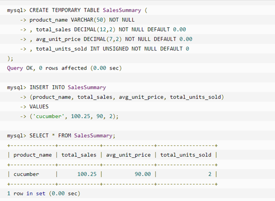

当使用SHOW TABLES命令显示数据表列表时，将无法看到SalesSummary表。

如果退出当前MySQL会话，再使用SELECT命令来读取原先创建的临时表数据，将会发现数据库中没有该表的存在，因为在退出时该临时表已经被销毁了


**删除MySQL临时表**

默认情况下，在断开与数据库的连接后，临时表就会自动销毁，当然也可以在当前MySQL会话使用DROP TABLE命令来手动删除临时表。

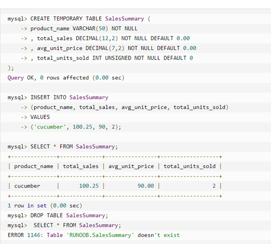

# 15、序列的使用

MySQL序列是一组整数：1,2,3,…,由于一张数据表只能有一个字段自增主键，如果想实现其他字段也实现自动增加，就可以使用MySQL序列来实现。


**使用ATUO_INCREMENT**

MySQL中最简单使用序列的方法就是使用MySQL auto_increment来定义列


**重置序列**

如果删除了数据表中的多条记录，并希望对剩下数据的AUTO_INCREMENT列进行重新排列，那么可以通过删除自增的列，然后重新添加来实现。不过该操作要非常小心，如果在删除的同时又有新纪录添加，有可能会出现数据混乱，操作如下所示：

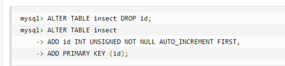


**设置序列的开始值**

一般情况下序列的开始值为1，但如果需要指定一个开始值100，那么可以通过以下语句来实现：

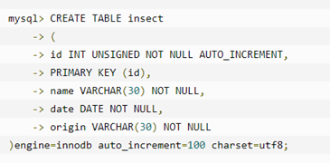

或者也可以在表创建成功后，通过以下语句来实现：

```mysql
ALTER TABLE <表名> AUTO_INCREMENT=100;
```

# 16、处理重复数据

有些MySQL数据表中可能存在重复的数据，有些情况允许重复数据的存在，但有时候也需要删除这些重复的数据


**防止表中出现重复数据**

可以在MySQL数据表中设置指定的字段为PRIMARY KEY（主键）或者UNIQUE（唯一）索引来保证数据的唯一性。

比如想设置数据表中两个字段的数据不能重复，可以设置双主键模式来设置数据的唯一性。

如果设置了唯一索引，那么在插入重复数据时，SQL语句将无法执行成功，并抛出错误。

INSERT IGNORE INTO与INSERT INTO的区别就是INSERT IGNORE会忽略数据库中已经存在的数据，如果数据库没有数据，就插入新的数据，如果有数据的话就跳过这条数据。这样就可以保留数据库中已经存在数据，达到在间隙中插入数据的目的

INSERT IGNORE INTO当插入数据时，在设置了记录的唯一性后，如果插入重复数据，将不会返回错误，只以警告形式返回。而REPLACE INTO如果存在PARIMARY KEY或UNIQUE相同的记录，则先删除掉。再插入新数据。

另一种设置数据的唯一性方法是添加一个UNIQUE索引


**统计重复数据**

以下将统计表中first_name和last_name的重复记录数：

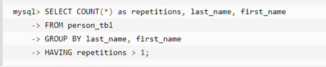

以上查询语句将返回persion_tbl表中重复的记录数。一般情况下，查询重复的值，请执行以下操作：

- 确定哪一列包含的值可能会重复
- 在列选择列表使用COUNT(*)列出的那些列
- 在GROUP BY组居中列出的列
- HAVING子句设置重复数大于1


**过滤重复数据**

如果需要读取不重复的数据可以在SELECT语句中使用DISTINCT关键字来过滤重复数据

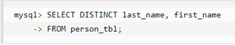

也可以使用GROUP BY来读取数据表中不重复的数据

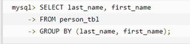


**删除重复数据**

如果想删除数据表中的重复数据，可以使用以下SQL语句：

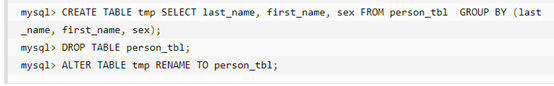

当然也可以在数据表中添加INDEX（索引）和PRIMARY KEY（主键）这种简单的方法来删除表中的重复记录，方法如下：

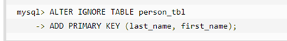

# 17、函数

## 17.1、时间日期相关

### 17.1.1、时间差

#### DATEDIFF() 

DATEDIFF() 函数返回两个日期之间的天数。

**语法：**

```mysql
DATEDIFF(date1,date2)
```

*date1* 和 *date2* 参数是合法的日期或日期/时间表达式。

**实例：**

```MYSQL
SELECT DATEDIFF(DATE_FORMAT(NOW(), '%Y-%m-%d'),DATE_FORMAT('2018-09-10','%Y-%m-%d'))
```

结果：

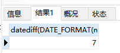


#### TIMESTAMPDIFF()

根据单位返回时间差，对于传入的 begin 和 end 不需要相同的数据结构，可以存在一个为 Date 一个 DateTime。

**语法：**

```mysql
TIMESTAMPDIFF(unit,begin,end);
```

unit 参数是确定 (end-begin) 的结果的单位，表示为整数。 以下是有效单位：

- MICROSECOND  微秒
- SECOND  秒 
- MINUTE  分钟 
- HOUR  小时 
- DAY  天 
- WEEK  周 
- MONTH  月份 
- QUARTER  
- YEAR  年份

**实例：**

2017-05-01 距现在多少天：

```MYSQL
SELECT TIMESTAMPDIFF(DAY,'2017-05-01', DATE_FORMAT(NOW(), '%Y-%m-%d'))
```

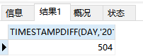

2017-05-01 距现在多少年：

```mysql
SELECT TIMESTAMPDIFF(YEAR,'2017-05-01', DATE_FORMAT(NOW(), '%Y-%m-%d'))
```

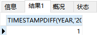

2017-05-01 距现在多少月：

```mysql
SELECT TIMESTAMPDIFF(MONTH,'2017-05-01', DATE_FORMAT(NOW(), '%Y-%m-%d'))
```


### 17.1.2、当前日期

```mysql
SELECT NOW(),CURDATE(),CURTIME();
```

结果类似：


### 17.1.3、求几天前几天后

DATE_SUB() 函数从日期减去指定的时间间隔。

> DATE_ADD() 函数向日期添加指定的时间间隔。两种方法使用方式相同。

**语法：**

```mysql
DATE_SUB(date,INTERVAL expr type)
```

*date* 参数是合法的日期表达式。*expr* 参数是您希望添加的时间间隔。type 参数可以是下列值：

- MICROSECOND
- SECOND
- MINUTE
- HOUR
- DAY
- WEEK
- MONTH
- QUARTER
- YEAR

**实例：**

获取前一天

```mysql
SELECT DATE_SUB(CURDATE(),INTERVAL 1 DAY);
```

当前日期2018-09-17，结果：


获取后一天

```mysql
SELECT DATE_SUB(CURDATE(),INTERVAL -1 DAY);
```

当前日期2018-09-17，结果：


### 17.1.4、倒数第几天

LAST_DAY()返回某月最后一天

```mysql
LAST_DAY(<日期>) #最后一天
LAST_DAY(<日期>)-1 #倒数第二天
LAST_DAY(<日期>)-2 #倒数第三天
```


### 17.1.5、提取年月日

EXTRACT() 函数用于返回日期/时间的单独部分，比如年、月、日、小时、分钟等等。

语法：

```mysql
EXTRACT(unit FROM <日期>)
```

date 参数是合法的日期表达式。unit 参数可以是下列的值：

- MICROSECOND（微秒：一百万分之一秒）
- SECOND
- MINUTE
- HOUR
- DAY
- WEEK
- MONTH
- QUARTER
- YEAR
- SECOND_MICROSECOND
- MINUTE_MIRCROSECOND
- MINUTE_SECOND
- HOUR_MICROSECOND
- HOUR_SECOND
- HOUR_MINUTE


### 17.1.6、日期格式转换

#### DATE_FORMAT()

MySQL 使用 `DATE_FORMAT()` 函数实现日期格式的转换，即日期类型转字符串类型，`DATE_FORMAT(date,format)` 函数按照表达式 *format* 的要求显示日期 *date*，其语法格式如下：

```sql
DATE_FORMAT(date,format)
```

*date* 为合法的日期；*format* 为规定日期/时间的输出格式。

可以使用的格式有：

| 格式 | 描述                                           |
| ---- | ---------------------------------------------- |
| %a   | 缩写星期名                                     |
| %b   | 缩写月名                                       |
| %c   | 月，数值                                       |
| %D   | 带有英文前缀的月中的天                         |
| %d   | 月的天，数值(00-31)                            |
| %e   | 月的天，数值(0-31)                             |
| %f   | 微秒                                           |
| %H   | 小时 (00-23)                                   |
| %h   | 小时 (01-12)                                   |
| %I   | 小时 (01-12)                                   |
| %i   | 分钟，数值(00-59)                              |
| %j   | 年的天 (001-366)                               |
| %k   | 小时 (0-23)                                    |
| %M   | 月名                                           |
| %m   | 月，数值(00-12)                                |
| %p   | AM 或 PM                                       |
| %r   | 时间，12-小时（hh:mm:ss AM 或 PM）             |
| %S   | 秒(00-59)                                      |
| %s   | 秒(00-59)                                      |
| %T   | 时间, 24-小时 (hh:mm:ss)                       |
| %U   | 周 (00-53) 星期日是一周的第一天                |
| %u   | 周 (00-53) 星期一是一周的第一天                |
| %V   | 周 (01-53) 星期日是一周的第一天，与 %X 使用    |
| %v   | 周 (01-53) 星期一是一周的第一天，与 %x 使用    |
| %W   | 星期名                                         |
| %w   | 周的天 （0=星期日, 6=星期六）                  |
| %X   | 年，其中的星期日是周的第一天，4 位，与 %V 使用 |
| %x   | 年，其中的星期一是周的第一天，4 位，与 %v 使用 |
| %Y   | 年，4 位                                       |
| %y   | 年，2 位                                       |

**示例：**使用 DATE_FORMAT 函数实现日期格式的转换。

```mysql
SELECT DATE_FORMAT(NOW(),'%Y年%m月%d日 %H时%i分%s秒');
```

**执行结果：**

2019年01月17日 19时05分05秒

**`DATE_FORMAT(date ,format)` 函数对应 Oracle 数据库中的 `TO_CHAR()` 函数。**

```
DATE_FORMAT(detail.OCCURRENCE_DATE, '%Y-%m-%d') AS occurrenceDate,
```

<br>

#### STR_TO_DATE()

使用 `STR_TO_DATE()` 函数实现字符串转换日期类型，`STR_TO_DATE(str,format)` 函数是将时间格式的字符串 *str*，按照所提供的显示格式 *format* 转换为 DATETIME 类型的值。

**示例：**使用 STR_TO_DATE 函数，将上面示例的结果（字符串类型）转换回日期类型。

```mysql
SELECT STR_TO_DATE('2019年01月17日 19时05分05秒','%Y年%m月%d日 %H时%i分%s秒');
```

**执行结果：**

2019-01-17 19:05:05

**`STR_TO_DATE(str,format)` 函数对应 Oracle 数据库中的 `TO_DATE()` 函数。**

 <br>

## 17.2、字符串相关

**SUBSTRING()**

SUBSTRING函数从特定位置开始的字符串返回一个给定长度的子字符串。 MySQL提供了各种形式的子串功能。

语法：

```mysql
SUBSTRING(string,position,length);
SUBSTRING(string FROM position FOR length);
```

参数：

- string：要提取的字符串
- position：起始下标，可以是负数，MySQL下标从1开始。
- length：长度


**CONCAT()**

返回连接参数产生的字符串，一个或多个待拼接的内容，任意一个为NULL则返回值为NULL。


## 17.3、数字相关

### 17.3.1、保留两位小数

ROUND(x,d)，四舍五入。ROUND(x) ，其实就是ROUND(x,0)，也就是默认d为0。

```sql
select round(110.35,1);
# 110.4
```


TRUNCATE(x,d)，直接截取需要保留的小数位 。

```sql
select TRUNCATE(110.35,1);
# 110.3
```


FORMAT（x,d），四舍五入，保留d位小数，返回string类型 

```sql
select FORMAT(110.35,1);
# 110.4
```


# 18、JDBC

## 18.1、第一个JDBC程序

**JDBC简介**

JDBC全称为：Java DataBase Connectivity（java数据库连接）。

SUN公司为了简化、统一对数据库的操作，定义了一套Java操作数据库的规范，称之为JDBC。


实例：从user表中读取数据，并打印在命令行窗口中。

1. 搭建实验环境 ：

	- 在mysql中创建一个库，并创建user表和插入表的数据。
	- 新建一个Java工程，并导入数据驱动。

2. 编写程序，在程序中加载数据库驱动

	```java
	DriverManager.registerDriver(Driver driver);
	```

3. 建立连接(Connection)

	```java
	Connection conn = DriverManager.getConnection(url,user,pass); 
	```

4. 创建用于向数据库发送SQL的Statement对象，并发送

	```java
	Statement st = conn.createStatement();
	ResultSet rs = st.executeQuery(sql);
	```

5. 从代表结果集的ResultSet中取出数据，打印到命令行窗口

6. 断开与数据库的连接，并释放相关资源Jdbc程序

运行完后，切记要释放程序在运行过程中，创建的那些与数据库进行交互的对象，这些对象通常是ResultSet, Statement和Connection对象。

特别是Connection对象，它是非常稀有的资源，用完后必须马上释放，如果Connection不能及时、正确的关闭，极易导致系统宕机。Connection的使用原则是尽量晚创建，尽量早的释放。

为确保资源释放代码能运行，资源释放代码也一定要放在finally语句中


### 18.1.1、DriverManager

DriverManager类的是管理一组 JDBC 驱动程序的基本服务。作用有两个，如下：

1. 注册驱动

	static void registerDriver(Driver driver)方法进行注册驱动
	但是这种方式不是很好，原因如下：

	让应用程序依赖具体的驱动包，如果是切换数据库还需要修改源代码才能完成。调用该方法导致驱动被注册两次，通过查看驱动的源代码能发现次问题。所以在实际开发中不会这么做。

	具体做法如下：

	```java
	Class.forName("com.mysql.jdbc.Driver");
	```

2. 获取链接对象

数据库URL

URL用于标识数据库的位置，程序员通过URL地址告诉JDBC程序连接哪个数据库，URL的写法为：


### 18.1.2、Connection

Jdbc程序中的Connection，它用于代表数据库的链接，Collection是数据库编程中最重要的一个对象，客户端与数据库所有交互都是通过connection对象完成的，

有两个作用：

1. 创建执行SQL语句的对象：
	- createStatement()：创建向数据库发送sql的statement对象
	- prepareStatement(sql) ：创建向数据库发送预编译sql的PreparedSatement对象
	- prepareCall(sql)：创建执行存储过程的CallableStatement对象。
2. 管理事物：
	- setAutoCommit(boolean autoCommit)：设置事务是否自动提交。
	- commit() ：在链接上提交事务。 ---与事务相关！！
	- rollback() ：在此链接上回滚事务。


### 18.1.3、Statement

Jdbc程序中的Statement对象用于向数据库发送SQL语句， Statement对象常用方法：

1. 执行SQL语句
	- executeQuery(String sql) ：用于向数据发送查询语句。
	- executeUpdate(String sql)：用于向数据库发送insert、update或delete语句
	- execute(String sql)：用于向数据库发送任意sql语句
2. 执行批处理
	- addBatch(String sql) ：把多条sql语句放到一个批处理中。
	- executeBatch()：向数据库发送一批sql语句执行。


**PreparedStatement**

PreparedStatement是Statement的子接口，它的实例对象可以通过调用Connection.preparedStatement(sql)方法获得，相对于Statement对象而言：

- PreperedStatement可以避免SQL注入的问题。
- Statement会使数据库频繁编译SQL，可能造成数据库缓冲区溢出。PreparedStatement 可对SQL进行预编译，从而提高数据库的执行效率。
- 并且PreperedStatement对于sql中的参数，允许使用占位符的形式进行替换，简化sql语句的编写。


### 18.1.4、ResultSet

Jdbc程序中的ResultSet用于代表Sql语句的执行结果。Resultset封装执行结果时，采用的类似于表格的方式。ResultSet 对象维护了一个指向表格数据行的游标cursor，初始的时候，游标在第一行之前，调用ResultSet.next() 方法，可以使游标指向具体的数据行，进而调用方法获取该行的数据。

ResultSet既然用于封装执行结果的，所以该对象提供的大部分方法都是用于获取数据的get方法：

1. 获取任意类型的数据
	- getObject(int index)
	- getObject(string columnName)
2. 获取指定类型的数据
	- getString(int index)
	- getString(String columnName)


**ResultSet滚动结果集**

使用`createStatement(int resultSetType, int resultSetConcurrency);`可以设置滚动结果集的策略：

- resultSetType   ：代表滚动结果集的类型
- resultSetConcurrency ：代表结果集的并发策略

常用的结果集类型

- TYPE_FORWARD_ONLY   ：结果集只能向下
- TYPE_SCROLL_INSENSITIVE  ：可以滚动，不能修改记录
- TYPE_SCROLL_SENSITIVE  ：可以滚动，可以修改记录

常用的并发策略

- CONCUR_READ_ONLY    ：只读的，不能修改
- CONCUR_UPDATABLE   ：结果集可以修改

ResultSet 滚动结果集方法

- next()：移动到下一行
- previous()：移动到前一行
- absolute(int row)：移动到指定行
- beforeFirst()：移动resultSet的最前面
- afterLast() ：移动到resultSet的最后面
- updateRow() ：更新行数据


## 18.2、JDBC进行CRUD

Jdbc中的statement对象用于向数据库发送SQL语句，想完成对数据库的增删改查，只需要通过这个对象向数据库发送增删改查语句即可。

Statement对象的executeUpdate方法，用于向数据库发送增、删、改的sql语句，executeUpdate执行完后，将会返回一个整数(即增删改语句导致了数据库几行数据发生了变化)。

Statement.executeQuery方法用于向数据库发送查询语句，executeQuery方法返回代表查询结果的ResultSet对象。


**CRUD操作-create**

使用executeUpdate(String sql)方法完成数据添加操作，示例操作：

```java
Statement st = conn.createStatement();
String sql = "insert into user(...) values(...)";
int num = st.executeUpdate(sql);
if (num > 0) {
    System.out.println("插入成功！");
}
```


**CRUD操作-updata**

使用executeUpdate(String sql)方法完成数据修改操作，示例操作：

```java
Statement st = conn.createStatement();
String sql = "update user set name='' where name=''";
int num = st.executeUpdate(sql);
if (num > 0) {
    System.out.println("修改成功！");
}
```


**CRUD操作-delete**

使用executeUpdate(String sql)方法完成数据删除操作，示例操作：

```java
Statement st = conn.createStatement();
String sql = "delete from user where id=1";
int num = st.executeUpdate(sql);
if (num > 0) {
    System.out.println("删除成功！");
}
```


**CRUD操作-Retrieve/Read**

使用executeQuery(String sql)方法完成数据查询操作，示例操作：

```java
Statement st = conn.createStatement();
String sql = "select * from user where id=1";
ResultSet rs = st.executeQuery(sql);
while (rs.next()) {
    // 根据获取列的数据类型，分别调用ts的响应方法
    // 映射到java对象中
}
```


==使用JDBC完成数据的CURD操作具有很多重复性的代码，像驱动加载、获取链接、释放资源等，所以可以封装成工具类方便使用。==


## 18.3、JDBC处理大数据

在实际开发中，程序需要把大文本 TEXT 或二进制数据 BLOB保存到数据库。TEXT是mysql叫法，Oracle中叫CLOB

基本概念：大数据也称之为LOB(Large Objects)，LOB又分为：CLOB和BLOB

- CLOB用于存储大文本。
- BLOB用于存储二进制数据，例如图像、声音、二进制文等。

对MySQL而言只有BLOB，而没有CLOB，MySQL存储大文本采用的是TEXT，Text和BLOB分别又分为：

- TINYTEXT(255)、TEXT(64k)、MEDIUMTEXT(16M)和LONGTEXT(4G)
- TINYBLOB(255)、BLOB(64k)、MEDIUMBLOB(16M)和LONGBLOB(4G)

对于MySQL中的Text类型，可调用如下方法设置：

```java
PreparedStatement.setCharacterStream(index, reader, length);
// 注意length长度需设置，并且设置为int型
// 当包过大时修改配置：[mysqld] max_allowed_packet-64M
```

对MySQL中的Text类型，可调用如下方法获取：

```java
reader = resultSet.getCharacterStream(i);
// 等价于
reader = resultSet.getClob(i).getCharacterStream();
```

对于MySQL中的BLOB类型，可调用如下方法设置：

```java
PreparedStatement.setBinaryStream(i, inputStream, length);
```

对MySQL中的BLOB类型，可调用如下方法获取：

```java
InputStream in = resultSet.getBinaryStream(i);
InputStream in = resultSet.getBlob(i).getBinaryStream();
```


**使用JDBC进行批处理**

业务场景：当需要向数据库发送一批SQL语句执行时，应避免向数据库一条条的发送执行，而应采用JDBC的批处理机制，以提升执行效率。

- Statement.addBatch(sql) ：添加批处理命令
- executeBatch()方法：执行批处理命令
- clearBatch()方法：清除批处理命令

```java
conn = jdbcUtil.getConnection();
String sql = "insert into person(name,password,email,birthday) values(?,?,?,?,?)";
st = conn.prepareStatement(sql);
for (int i = 0; i < 50000; i++) {
    st.setString(1, "aaa" + i);
    st.setString(2, "123" + i);
    st.setString(3, "aaa" + i + "@sina.com");
    st.setDate(4, new Date(1980, 10, 10));

    st.addBatch();
    if (i % 1000 == 0) {
        st.executeBatch();
        st.clearBatch();
    }
}
st.executeBatch();
```


## 18.4、JDBC事务控制管理

当Jdbc程序向数据库获得一个Connection对象时，默认情况下这个Connection对象会自动向数据库提交在它上面发送的SQL语句。若想关闭这种默认提交方式，让多条SQL在一个事务中执行，可使用下列语句：

```java
Connection.setAutoCommit(false); //  相当于start transaction
Connection.rollback();  		//	rollback
Connection.commit();  			//	commit
```


**JDBC中设置事务的隔离级别**

Connection接口中定义事务隔离级别四个常量：

- static int TRANSACTION_READ_COMMITTED 
	指示不可以发生脏读的常量；不可重复读和虚读可以发生。 

- static int TRANSACTION_READ_UNCOMMITTED 
	指示可以发生脏读 (dirty read)、不可重复读和虚读 (phantom read) 的常量。 

- static int TRANSACTION_REPEATABLE_READ 
	指示不可以发生脏读和不可重复读的常量；虚读可以发生。 

- static int TRANSACTION_SERIALIZABLE 

	指示不可以发生脏读、不可重复读和虚读的常量。

通过 void setTransactionIsolation(int level) 设置数据库隔离级别


# 19、数据库设计表关系 

**一对一**

一张表的一条记录一定只能与另外一张表的一条记录进行对应，反之亦然。

学生表：姓名，性别，年龄，身高，体重，籍贯，家庭住址，紧急联系人
其中姓名、性别、年龄、身高，体重属于常用数据，但是籍贯、住址和联系人为不常用数据
如果每次查询都是查询所有数据，不常用的数据就会影响效率，实际又不用
常用信息表：ID(P)，姓名，性别，年龄，身高，体重
不常用信息表：ID(P)，籍贯，家庭住址，紧急联系人

解决方案：将常用的和不常用的信息分享存储，分成两张表
不常用信息表和常用信息表，保证不常用信息表与常用信息表能够对应上：找一个具有唯一性的字段来共同连接两张表。
一个常用表中的一条记录永远只能在一张不常用表中匹配一条记录，反之亦然。


**一对多**

一张表中有一条记录可以对应另外一张表中的多条记录；但是反过来，另外一张表的一条记录只能对应第一张表的一条记录，这种关系就是一对多或多对一

母亲表：ID(P),名字，年龄，性别
孩子表：ID(P),名字，年龄，性别
以上关系：一个妈妈可以在孩子表中找到多条记录（也可能是一条），但是一个孩子只能找到一个妈妈，这是是一种典型的一对多的关系。

解决方案：在某一张表中增加一个字段，能够找到另外一张表中的记录:在孩子表中增加一个字段指向母亲表，因为孩子表的记录只能匹配到一条母亲表的记录。
母亲表：ID(P),名字，年龄，性别
孩子表：ID(P),名字，年龄，性别，母亲表ID（母亲表主键）


**多对多**

一对表中（A）的一条记录能够对应另外一张表（B）中的多条记录；同时B表中的一条记录也能对应A表中的多条记录

老师和学生
老师表 T_ID(P),姓名，性别
学生表 S_ID(P),姓名，性别
一个老师教过多个学生，一个学生也被多个老师教过

解决方案：增加一张中间关系表
老师与学生的关系表：ID(P),T_ID,S_ID
老师表与中间表形成一对多的关系，而中间表是多表；维护了能够唯一找到一表的关系；
同样的学生表与中间表也是一个一对多的关系;
学生找老师：找出学生ID--->中间表寻找匹配记录（多条）--->老师表匹配（一条）
老师找学生：找出老师ID--->中间表寻找匹配记录（多条）--->学生表匹配（一条）


# 20、连接阿里云数据库

## 20.1、安装MySQL 8.0

**系统 Ubuntu  20.04 64位**

**安装数据库**

1.  查看有没有安装 MySQL：

	```shell
	dpkg -l | grep mysql
	```

2. 安装MySQL：

	```shell
	apt install mysql-server
	```

3. 安装完成之后可以使用如下命令来检查是否安装成功：

	```shell
	netstat -tap | grep mysql
	```

	通过上述命令检查之后，如果看到有 mysql 的 socket 处于 LISTEN 状态则表示安装成功

4. 登录 mysql 数据库可以通过如下命令：

	```shell
	mysql -u root -p
	```

	现在是 mysql 数据库是没有密码的，Enter password: 处直接回车，就能够进入 mysql 数据库。


**初始化数据库**

接下来，为了确保数据库的安全性和正常运转，对数据库进行初始化操作。这个初始化操作涉及下面5个步骤

1. 安装验证密码插件。
2. 设置root管理员在数据库中的专有密码。
3. 随后删除匿名账户，并使用root管理员从远程登录数据库，以确保数据库上运行的业务的安全性。
4. 删除默认的测试数据库，取消测试数据库的一系列访问权限。
5. 刷新授权列表，让初始化的设定立即生效。

输入`mysql_secure_installation`开始

```shell
Securing the MySQL server deployment.

Connecting to MySQL using a blank password.

VALIDATE PASSWORD COMPONENT can be used to test passwords
and improve security. It checks the strength of password
and allows the users to set only those passwords which are
secure enough. Would you like to setup VALIDATE PASSWORD component? #要安装验证密码插件吗？

Press y|Y for Yes, any other key for No: N #我选了N
Please set the password for root here.

New password: #输入root密码

Re-enter new password: #再次输入
By default, a MySQL installation has an anonymous user,
allowing anyone to log into MySQL without having to have
a user account created for them. This is intended only for
testing, and to make the installation go a bit smoother.
You should remove them before moving into a production
environment.

Remove anonymous users? (Press y|Y for Yes, any other key for No) : y #是否删除匿名用户
Success.


Normally, root should only be allowed to connect from
'localhost'. This ensures that someone cannot guess at
the root password from the network.

Disallow root login remotely? (Press y|Y for Yes, any other key for No) : n # 是否禁止root管理员从远程登录

 ... skipping.
By default, MySQL comes with a database named 'test' that
anyone can access. This is also intended only for testing,
and should be removed before moving into a production
environment.


Remove test database and access to it? (Press y|Y for Yes, any other key for No) : y #是否删除test数据库并取消它的访问权限
 - Dropping test database...
Success.

 - Removing privileges on test database...
Success.

Reloading the privilege tables will ensure that all changes
made so far will take effect immediately.

Reload privilege tables now? (Press y|Y for Yes, any other key for No) : y # 是否刷新授权表，让初始化后的设定立即生效
Success.

All done!
```


## 20.2、远程访问

在阿里云控制台连接 MySQL

```shell
mysql> use mysql;

mysql> select user,host,plugin from user;
+------------------+-----------+-----------------------+
| user             | host      | plugin                |
+------------------+-----------+-----------------------+
| debian-sys-maint | localhost | caching_sha2_password |
| mysql.infoschema | localhost | caching_sha2_password |
| mysql.session    | localhost | caching_sha2_password |
| mysql.sys        | localhost | caching_sha2_password |
| root             | localhost | auth_socket           |
+------------------+-----------+-----------------------+

mysql> update user set host='%',plugin='mysql_native_password' where user='root';

mysql> flush privileges;

# 重新设置密码
mysql> alter user'root'@'%' IDENTIFIED BY 'root';
```

> auth_socket：首先，这种验证方式不要求输入密码，即使输入了密码也不验证。这个特点让很多人觉得很不安全，实际仔细研究一下这种方式，发现还是相当安全的，因为它有另外两个限制；
>
> - 只能用 UNIX 的 socket 方式登陆，这就保证了只能本地登陆，用户在使用这种登陆方式时已经通过了操作系统的安全验证；
> - 操作系统的用户和 MySQL 数据库的用户名必须一致，例如你要登陆 MySQL 的 root 用户，必须用操作系统的 root 用户登陆。
>
> mysql8.0 引入了新特性 caching_sha2_password；这种密码加密方式客户端不支持；客户端支持的是 mysql_native_password 这种加密方式；

编辑 /etc/mysql/mysql.conf.d/mysqld.cnf 配置文件：

```shell
vim /etc/mysql/mysql.conf.d/mysqld.cnf
```

注释掉 `bind-address`：


重启服务：

```bash
service mysql restart
```

测试远程访问


## 20.3、卸载

1. 首先停止 MySQL 服务

	```shell
	service mysql stop;
	service mysql status;
	```

2. 在终端中查看MySQL的依赖项：

	```shell
	dpkg --list|grep mysql
	```

3. 卸载：

	```shell
	sudo apt-get remove mysql-common
	udo apt-get autoremove --purge mysql-server-8.0
	```

4. 如果看到没有删除的文件记得手动删除：

	

5. 清除残留数据：

	```shell
	dpkg -l|grep ^rc|awk '{print$2}'|sudo xargs dpkg -P
	```

6. 再次查看MySQL的剩余依赖项：

	```shell
	dpkg --list|grep mysql
	```

7. 删除 MySQL 的数据库信息，位置：`/var/lib/mysql/`：

	


# 21、其他

## 1、mysql 里一个汉字占多少字节？

varchar(N)，这里的Ｎ是指字符数，并不是字节数。占用的字节数与编码有关

在 mysql 5.1.5-alpha 下测试得出如下结论：


**latin1（ISO-8859-1的别名）:**

1character=1byte，1汉字=2character,

也就是说一个字段定义成 varchar(200)，则它可以存储 100 个汉字或者 200 个字母。

这一点要注意，尤其是当字段内容是字母和汉字组成时，尽量假设字段内容都是由汉字组成，据此来设置字段长度


**utf8:**

1character=3bytes，1汉字=1character

也就是说一个字段定义成 varchar(200)，则它可以存储 200 个汉字或者 200 个字母。


**gbk:**

1character=2bytes，1汉字=1character

也就是说一个字段定义成 varchar(200)，则它可以存储 200 个汉字或者 200 个字母。
