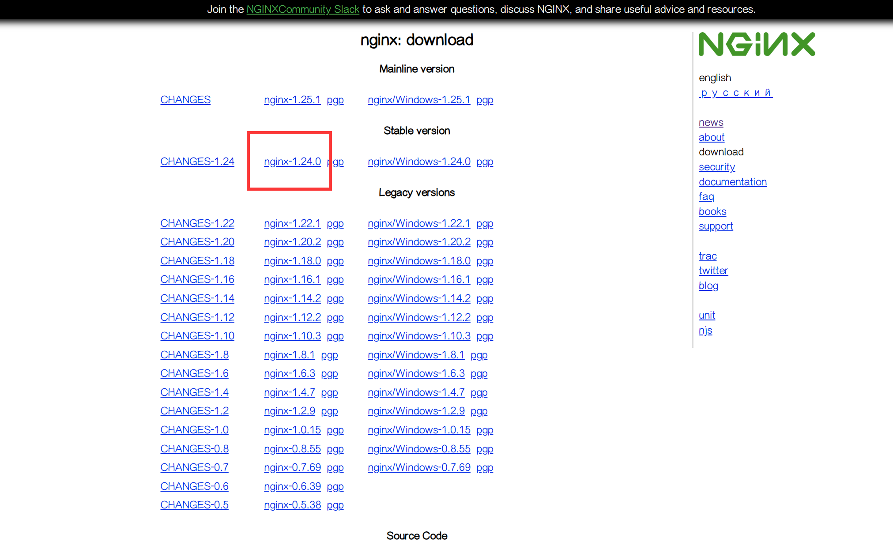
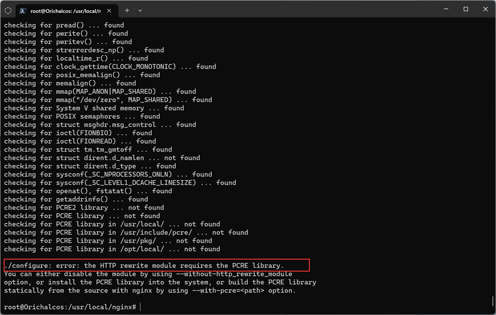
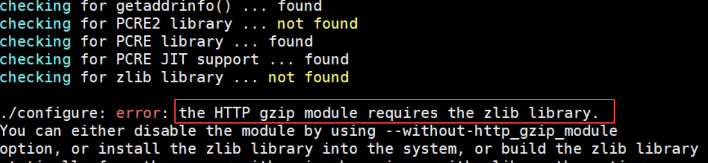
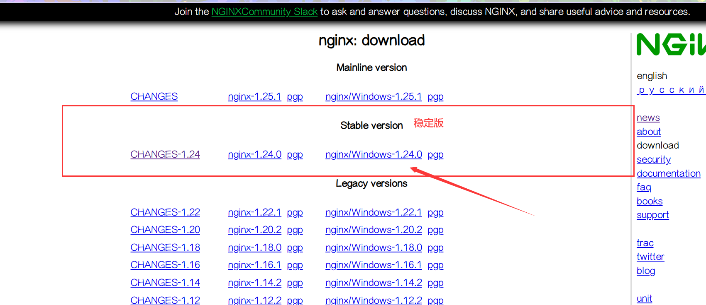

# 1、简介

Nginx 不仅是一个高性能的 Web 服务器，还具备访问代理、负载均衡、内容缓存等功能，用于客户端访问流量到后台应用服务器负载均衡和请求转发。其基于模块化的代码架构及可与其它有效集成的可编程特性，使其具有强大的扩展能力。Nginx 以资源消耗低、高稳定、高性能的并发处理能力著称。


**Nginx 特性**

- 访问代理：
  Nginx 可以通过访问路径、URL 关键字、客户端 IP等多种手段实现访问路由分配。
- 反向代理：
  将接收到的请求再转到后端的目标应用服务器，并把响应数据返回给客户端。支持目前绝大多数的网络协议：HTTP/FastCGI/RPC/UDP/TCP 等。
- 负载均衡：
  通过自身的 upstream 模块支持多种负载均衡算法，使后端服务器可以非常方便地进行横向扩展，以应对高并发。
- 内容缓存：
  Nginx 支持静态站点和后端分离，可以把静态内容缓存起来，也可以将后端变化不大的响应结果缓存起来，使整体实现了更高速的相应能力。
- 可扩展性：
  可定制的模块化架构方式，更多的语言（C/Perl/JavaScript/Lua）支持开发第三方模块并引入，增强可编程及扩展能力。


# 2、安装

## 2.1、Linux 安装

### 2.1.1、离线安装

#### 安装运行

1. 去 [官网](http://nginx.org/en/download.html) 下载压缩包：

   

2. 将下载好的包上传至服务器，解压至 `/usr/local`：

   ```shell
   tar -xzf nginx-1.24.0.tar.gz -C /usr/local
   ```

3. 将解压后的文件夹改名为 `nginx` 并进入：

   ```shell
   # 改名
   mv /usr/local/nginx-1.24.0/ /usr/local/nginx
   
   # 进入
   cd /usr/local/nginx
   ```

4. 执行配置文件：

   ```shell
   ./configure
   ```

   如无问题，则直接进入第 5 步，如像以下一样缺少库，则先安装库再继续。

   

   这里显示缺少 PCRE 库，可以从 [官网](http://www.pcre.org/) 下载，然后上传至服务器、解压、执行配置文件、安装：

   ```shell
   tar -xzf pcre2-10.42.tar.gz -C /usr/local
   
   mv /usr/local/pcre2-10.42.tar.gz/ /usr/local/pcre2
   
   cd /usr/local/pcre2
   
   ./configure
   
   make
   
   sudo make install
   ```

   安装完成后再前往 `/usr/local/nginx` 目录执行 `./configure`：

   

   这里显示缺少 zlib 库，可以从 [官网](http://www.zlib.net) 下载，然后上传至服务器、解压、执行配置文件、安装：

   ```shell
   tar -xzf zlib-1.2.13.tar.gz -C /usr/local
   
   mv /usr/local/zlib-1.2.13.tar.gz/ /usr/local/zlib
   
   cd /usr/local/zlib
   
   ./configure
   
   make
   
   sudo make install
   ```

   之后再前往 `/usr/local/nginx` 目录执行 `./configure`，缺少库就去安装，直到 `./configure` 不显示错误。

   > Nginx 对 OpenSSL 不做硬性要求，在不使用 SSL 模块的情况下没有 OpenSSL 也可以安装通过，如果需要此功能，请先安装 OpenSSL 然后执行以下配置命令：
   >
   > ```shell
   > ./configure --with-http_stub_status_module --with-http_ssl_module --with-openssl=/usr/local/openssl
   > ```

5. 编译并安装：

   ```shell
   make
   
   sudo make install
   ```

6. 运行（默认运行在服务 80 端口）：

   ```shell
   # 进入 sbin/ 目录
   cd sbin/
   
   # 运行
   ./nginx
   ```


#### 配置服务

1. 到 `/usr/lib/systemd/system` 文件夹里新建 nginx.service 文件或修改现有的：

   ```shell
   vim /etc/systemd/system/nginx.service
   ```

2. 文件内容如下：

   ```shell
   [Unit]
   Description=nginx service
   After=network.target
    
   [Service]
   Type=forking
   ExecStart=/usr/local/nginx/sbin/nginx
   ExecReload=/usr/local/nginx/sbin/nginx -s reload
   ExecStop=/usr/local/nginx/sbin/nginx -s stop
   PrivateTmp=true
    
   [Install]
   WantedBy=multi-user.target
   ```

3. 在终端以下命令，刷新服务配置：

   ```shell
   sudo systemctl daemon-reload
   ```


#### 卸载

1. 停止 Nginx 软件：
   ```shell
   /usr/local/nginx/sbin/nginx -s stop
   ```

   如果不知道 Nginx 的安装路径，可以通过 `ps` 查看 Nginx 的 PID，然后 `kill`  其 PID。

2. 查找根下所有名字包含 Nginx 的文件：

   ```shell
   find / -name nginx
   ```

3. 执行命令 `rm -rf *` 删除 Nignx 安装的相关文件：

   ```shell
   rm -rf /usr/local/sbin/nginx
   ...
   ```


#### 常用命令

```shell
cd /usr/local/nginx/sbin/     # 进入目录

./nginx                       # 启动
./nginx -s stop               # 停止
./nginx -s quit               # 安全退出
./nginx -s reload             # 重载配置文件（修改了配置文件需要执行此命令 比较常用）
ps aux | grep nginx           # 查看ngnix进程

cd /usr/local/nginx/conf      # 进入配置目录
vim nginx.conf                # 编辑配置文件
```


## 2.2、Windows 安装

#### 安装运行

1. 去 [官网](http://nginx.org/en/download.html) 下载压缩包：

   

2. 下载完成后找个目录解压缩一下，其中最主要的配置文件 `nginx.conf` 在 conf 文件夹中。

3. 执行以下命令运行（默认运行在服务 80 端口）：

   ```shell
   start .\nginx
   ```

   或者直接双击 nginx.exe。


#### 配置服务

使用 `sc` 命令注册 Nginx 服务：

1. 首先，以管理员身份打开命令提示符（CMD）或 PowerShell。

2. 执行以下命令创建 Nginx 服务：

   ```shell
   sc create Nginx binPath= "C:\Program Files\Nginx\nginx.exe" start= auto
   ```

   - `binPath=` 后面是 Nginx 可执行文件的完整路径。
   - `start=` 指定启动类型（`auto`表示自动启动）。
   - 等号后最好有一个空格，在早期的 Windows 版本中，这个空格是必需的。
   - 可以根据需要添加其他参数，如 `DisplayName=` 设置显示名称。

3. 通过服务页面或者以下命令控制 Nginx 服务：

   ```shell
   sc start Nginx    # 启动服务
   sc stop Nginx     # 停止服务
   sc delete Nginx   # 删除服务
   sc query Nginx    # 查询服务状态
   ```


#### 常用命令

```shell
cd C:\Nginx					# 进入目录

start .\nginx				# 启动nginx，或者直接双击nginx.exe

.\nginx.exe -s stop			# 快速停止nginx
.\nginx.exe -s quit			# 完整有序的停止nginx，并保存相关信息

.\nginx.exe -s reload		# 重新载入nginx配置信息
.\nginx.exe -s reopen		# 重新打开nginx的日志文件
.\nginx.exe -v				# 查看nginx版本信息
```


# 3、配置

## 3.1、配置文件结构

Nginx 的配置文件默认存于 `/etc/nginx/nginx.conf`，其中通过 `include` 引入其它目录子配置文件，Nginx 文件结构如下：

```nginx
...              #全局块

events {         #events块
   ...
}

http      #http块
{
    ...   #http全局块
    server        #server块
    { 
        ...       #server全局块
        location [PATTERN]   #location块
        {
            ...
        }
        location [PATTERN] 
        {
            ...
        }
    }
    server
    {
      ...
    }
    ...   #http全局块
}
```

- **全局块**：配置影响 Nginx 全局的指令。一般有运行 Nginx 服务器的用户、Nginx 进程 pid 存放路径、日志存放路径、配置文件引入、允许生成 worker process 数等。
- **events**：配置影响 Nginx 服务器或与用户的网络连接。有每个进程的最大连接数、选取哪种事件驱动模型处理连接请求、是否允许同时接受多个网路连接、开启多个网络连接序列化等。
- **http**：可以嵌套多个 `server`，配置代理、缓存、日志定义等绝大多数功能和第三方模块的配置。如文件引入、mime-type 定义、日志自定义、是否使用 sendfile 传输文件、连接超时时间、单连接请求数等。
- **upstream**：代理转发的下个目的地列表、后端服务组地址列表、连接与负载均衡的设定。
- **server**：配置虚拟主机的相关参数，一个 `http` 中可以有多个 `server`。
- **location**：配置请求的路由以及各种页面的处理情况。


**关于 `location` 是否带斜杠的区别**

不带斜杠的配置：

```nginx
location /txffc {
    proxy_pass http://localhost:8082;
}
```

可以匹配：

- http://192.168.231.128/txffc/common
- http://192.168.231.128/txffcddd
- http://192.168.231.128/txffcddd/aabc

带斜杠的配置：

```nginx
location /txffc/ {
    proxy_pass http://localhost:8082;
}
```

可以匹配：

- http://192.168.231.128/txffc/common
- http://192.168.231.128/txffc/aabb

不能匹配：

- http://192.168.231.128/txffcddd

> [!TIP]
>
> 大部分情况推荐带斜杠的 `location` 写法（匹配会更准确些）。


## 3.2、内置变量

Nginx 提供了许多内置变量，这些变量在配置文件中可以用来动态地获取请求、响应、连接等相关信息。以下是 Nginx 中常见的一些内置变量及其简要说明：


**请求相关变量**

- `$host`：请求中的主机名，优先使用 `Host` 头部字段中的值，否则使用服务器名称。
- `$http_host`：与 `$host` 类似，获取请求头中的 `Host` 值。
- `$uri`：当前请求的URI，可能包含查询字符串。
- `$document_uri`：与 `$uri` 类似，但不包含查询字符串。
- `$request_uri`：包含完整的请求URI，包括查询字符串，如 `/index.php?page=1`。
- `$args`：请求中的查询字符串，如 `page=1`。
- `$is_args`：如果请求包含查询字符串，则值为 `?`，否则为空字符串。
- `$request_method`：请求方法，如 `GET`、`POST` 等。
- `$query_string`：与 `$args` 相同，获取请求中的查询字符串。
- `$request_filename`：请求的文件路径（根目录开始的完整路径）。
- `$request_body`：客户端请求的主体内容。
- `$request_body_file`：保存客户端请求主体的临时文件名。


**连接相关变量**

- `$remote_addr`：客户端的IP地址。
- `$remote_port`：客户端的端口号。
- `$server_addr`：服务器的IP地址。
- `$server_port`：服务器的端口号。
- `$server_name`：处理请求的服务器名称。
- `$connection`：当前连接的连接号。
- `$connection_requests`：当前连接已处理的请求数量。


**响应相关变量**

- `$status`：响应的状态码，如 `200`、`404` 等。
- `$body_bytes_sent`：响应中发送的主体内容字节数，不包括响应头部。
- `$bytes_sent`：响应中发送的总字节数，包括头部和主体内容。
- `$sent_http_*`：响应头中的自定义变量，如 `$sent_http_content_type` 表示响应的 `Content-Type` 头部字段。


**HTTP 请求头相关变量**

- `$http_user_agent`：请求的 `User-Agent` 头部字段的值。
- `$http_referer`：请求的 `Referer` 头部字段的值。
- `$http_cookie`：请求的 `Cookie` 头部字段的值。
- `$http_\*`：用于访问任意的请求头字段，如 `$http_accept` 表示 `Accept` 头部字段的值。


**SSL 相关变量**

- `$ssl_protocol`：当前请求使用的 SSL 协议版本，如 `TLSv1.2`。
- `$ssl_cipher`：当前 SSL 连接中使用的加密套件。
- `$ssl_client_cert`：客户端证书的详细内容。
- `$ssl_client_fingerprint`：客户端证书的 SHA1 指纹。


**地理位置相关变量**

- `$geoip_country_code`：基于 IP 地址的国家代码（如果启用了 GeoIP 模块）。
- `$geoip_country_name`：基于 IP 地址的国家名称（如果启用了 GeoIP 模块）。


**其他常用变量**

- `$scheme`：请求使用的协议，通常是 `http` 或 `https`。
- `$document_root`：当前请求的文档根目录路径。
- `$realpath_root`：当前请求的文件的实际物理路径。
- `$limit_rate`：用于限速的变量，可以动态设置响应的速率。
- `$pid`：Nginx 工作进程的 PID。
- `$msec`：当前时间的毫秒数。
- `$time_iso8601`：当前时间的 ISO 8601 格式。
- `$time_local`：当前时间的本地时间格式。


**日志相关变量**

- `$request_time`：请求处理的总时间，单位为秒。
- `$upstream_response_time`：后端服务器响应的时间，单位为秒。
- `$upstream_addr`：后端服务器的地址。
- `$upstream_status`：后端服务器的响应状态码。


## 3.3、配置模板示例

```nginx
###### 全局块
worker_processes    auto;                   # 工作进程数
error_log  /var/log/nginx/error.log notice; # 错误级别记录

events {
    worker_connections  1024;               # 单个工作进程，可承载的最大连接数
}

http {
    ###### MIME 配置
    include       /etc/nginx/mime.types;    # 文件扩展名与文件类型映射表
    default_type  application/octet-stream; # mime.types 不包含时的默认设置
    
    ###### 请求日志配置
    log_format  log-format-a  '$remote_addr - $remote_user [$time_local] "$request" $status $body_bytes_sent "$http_referer" "$http_user_agent" "$http_x_forwarded_for"';
    access_log  /var/log/nginx/access.log  log-format-a;    # 访问日志路径 及引用格式
    
    ###### 后端可用服务配置
    upstream backend-server-name {
        server 192.168.1.101:80;
        server 192.168.1.102:80;
    }
    
    server {
        ###### 请求匹配
        listen       80;                 # 客户端请求的端口
        server_name  _;                  # 客户端请求的域名；区分不同服务（可多个空格区分,支持正则）
        
        location / {
            ###### 重写配置
            rewrite ^<规则>$ <目的地> break;
            
            ###### 转发到后端配置
            proxy_pass http://backend-server-name$request_uri;    # 转发到后台服务地址，来自于 upstream 项
            proxy_http_version 1.1;                               # 指明版本（1.1默认为keep-alive长连接，1.0默认为短连接）
            proxy_set_header Host $host;                          # 保持原来的请求域名
            proxy_ignore_client_abort on;                         # 客户端断网时，是否中断对后端的请求
            proxy_set_header X-Real-IP $remote_addr;
            proxy_set_header X-Forwarded-For $proxy_add_x_forwarded_for; # 从远程客户端IP到服务端的层层代理转发IP，多IP追加空格分隔
            
            ###### Cookie 域名/路径
            proxy_cookie_domain {backend-domain} {request-domain};
            proxy_cookie_path {backend-path} {request-path};
        }
        
        ###### 指定文件拒绝所有访问
        location ~ ^/(\.user.ini|\.ht|\.git|\.svn|\.project|LICENSE|README.md){
            deny all;
        }
        
        ###### 限制的客户端
        location \ {
            deny 172.18.0.101;    # 拒绝的ip
            allow 172.18.1.10;    # 允许的ip
        }
        
        ###### 客户端缓存配置
        location ~* \.(js|css|jpg|svg|gif|png)$ {
            if (-f $request_filename) {    # -f：只能是文件，因为这用-f判断了
                expires 30d;               # 缓存有效时长 30 天
                break;
            }
        }
        
        ###### 防盗链配置
        location ~* \.(gif|jpg|png|bmp)$ {  # 指定格式禁止的请求来源：google/baidu
            valid_referers none blocked *.ttlsa.com server_names ~\.google\. ~\.baidu\.;
            if ($invalid_referer) {
                return 403;                 # 状态码
                #rewrite ^/ http://www.ttlsa.com/403.jpg;
            }
        }
        
        ###### (前端) 错误机制
        error_page  404              /404.html;    # 错误码 转向的 错误页
        error_page  500 502 503 504  /50x.html;    # 错误码 转向的 错误页
        location = /50x.html {                     # 错误页 指向的 静态页面
            root   /usr/share/nginx/html;
        }
    }
}
```


## 3.4、反向代理

Nginx 代替服务端接收请求，常用于服务器集群环境，反向代理屏蔽了具体某个服务器的地址，客户端不知道最终请求是哪个 Server 处理，反向代理和 Server 端在同一网络环境下，通常为内网。

客户端访问目标服务器，在目标服务内部有一个统一接入网关，用来将请求转发至后端真正处理的服务器并返回结果。这个过程当中客户端不需要知道实际服务器地址，代理对客户端而言是透明的。


**代理相关参数**

```nginx
### 基本代理参数
proxy_pass http://backend						# 代理服务

### 请求和响应头设置
proxy_set_header Host $host;					# 为转发的请求设置特定的HTTP头
proxy_hide_header X-Powered-By;					# 隐藏上游服务器响应中指定的头部字段
proxy_pass_header Set-Cookie;					# 将上游服务器响应中的指定头部字段传递给客户端
proxy_set_body $request_body;					# 设置转发到上游服务器的请求体
proxy_method POST;								# 修改转发到上游服务器的HTTP方法
proxy_redirect http://backend http://frontend;	# 将上游服务器的重定向URL修改为客户端可访问的URL

### 连接设置
proxy_connect_timeout 90s; 						# 与上游服务器建立连接的超时时间
proxy_send_timeout 90s; 						# 向上游服务器发送请求的超时时间
proxy_read_timeout 90s;  						# 从上游服务器读取响应的超时时间
proxy_buffer_size 4k; 							# 设置从上游服务器读取的单个缓冲区的大小
proxy_buffers 4 32k;							# 定义从上游服务器读取响应的缓冲区数量和大小
proxy_busy_buffers_size 64k; 					# 当代理响应较大时，可以设置一个额外的缓冲区
proxy_temp_file_write_size 64k; 				# 设置写入临时文件的最大大小

### 缓存设置
proxy_cache my_cache;							# 启用缓存并指定缓存区域
proxy_cache_key $scheme$proxy_host$request_uri;	# 定义缓存条目的键
proxy_cache_valid 200 302 10m;					# 定义缓存的有效时间
proxy_cache_min_uses 3;							# 设置一个请求必须访问的次数才能被缓存
proxy_cache_use_stale error timeout updating;	# 在上游服务器不可用时，使用陈旧的缓存
proxy_cache_bypass $cookie_nocache;				# 指定在特定条件下绕过缓存

### SSL设置
proxy_ssl_certificate /etc/nginx/ssl/client.crt;		# 指定用于与上游服务器通信的客户端证书
proxy_ssl_certificate_key /etc/nginx/ssl/client.key;	# 指定用于与上游服务器通信的客户端证书密钥
proxy_ssl_protocols TLSv1.2 TLSv1.3;					# 设置Nginx与上游服务器通信时使用的SSL/TLS协议
proxy_ssl_ciphers HIGH:!aNULL:!MD5;						# 设置Nginx与上游服务器通信时使用的加密套件
proxy_ssl_verify on;									# 启用或禁用对上游服务器证书的验证
proxy_ssl_verify_depth 2;								# 设置验证上游服务器证书时的最大链深度
```


**关于 `proxy_pass` 是否带斜杠的区别**

如果 `proxy_pass` 不带斜杠：

```nginx
location /txffc {
    proxy_pass http://localhost:8082;
}
```

访问 URL 是 http://192.168.231.128/txffc/common，指向的地址实际是：http://localhost:8082/txffc/common，即 Nginx 会把包括匹配到的内容都追加到 `proxy_pass` 地址后面。

如果 `proxy_pass` 带上斜杠：

```nginx
location /txffc {
    proxy_pass http://localhost:8082/;
}
```

访问 URL 是 http://192.168.231.128/txffc/common，指向的地址实际是：http://localhost:8082/common，即 Nginx 不会把匹配到的内容追加到 `proxy_pass` 地址后面。

> [!TIP]
>
> 大部分情况推荐带斜杠的 `proxy_pass` 写法（控制更清晰）。


**配置示例**

下面是一个前后端分离部署的示例，把前端站点部署到 Nginx，Nginx 反向代理后端服务：

```nginx
server {
    listen 80;
    server_name xxx.com;
    
    # 前端配置
    location / {
        # 前端站点路径
        root /home/vue/dist;
        index index.html
    }
    
    # 后端配置
    location /api {
        proxy_set_header host $HOST;
        proxy_pass http://192.168.1.101:8081;
    }
}
```


## 3.5、负载均衡模式

在配置项 `upstream` 中，负责提供可用的服务地址列表并且可以指定负载均衡的实现方式。


**轮询-Round-Robin**

将访问按序依次请求到后端各个服务器上，能确保平均负载：

```nginx
upstream backend-a {
    server 192.168.1.101:80;
    server 192.168.1.102:80;
}
```


**权重-Weight**

按百分比请求到后端服务器上，常用到硬件配置不同的场景：

```nginx
upstream backend-b {
    server 192.168.1.101:80 weight=3;
    server 192.168.1.102:80 weight=7;
}
```


**最少连接-Least-Connect**

处理请求少的后端服务优先接收新请求：

```nginx
upstream backend-c {
    least_conn;
    server 192.168.1.101:80;
    server 192.168.1.102:80;
}
```


**IP-Hash**

相同的访问 IP 落到后端同个服务器上，所以支持会话保持，但不是绝对平均负载：

```nginx
upstream backend-d {
    ip_hash;
    server 192.168.1.101:80;
    server 192.168.1.102:80;
}
```

> [!NOTE]
>
> 第三方的会话保持 sticky_cookie_insert，同时支持负载均衡。


## 3.6、限流与熔断

### 3.6.1、限流

通过对并发/请求进行限速来保护系统，防止系统过载瘫痪而不能提供服务；为了更好控制整个系统的负载情况，即使阻止了某些请求，系统继续提供服务。


**http_limit_conn**

单个 IP 同时允许的连接限制：

```nginx
http {
    # 连接限流定义
    # - $binary_remote_addr：限制对象(客户端)
    # - zone：限制自定义名称
    # - 10：内存中用10兆空间存储连接记录
    limit_conn_zone $binary_remote_addr zone={limits-name}:10m;
                
    server {
        location /search/ {
            
            # 单个IP同时允许建立多少连接（并发限制）
            limit_conn {limits-name} 1;
        }
    }
}
```


**http_limit_req**

单个 IP 请求频率的限制（次/每秒）：

```nginx
http {
    # 请求限流定义
    # - $binary_remote_addr：限制对象(客户端)
    # - zone：定义限制(策略)名称
    # - 10m：用十兆空间记录访问次数
    # - rate：每秒10次的请求处理速率
    limit_req_zone $binary_remote_addr zone={limits-name}:10m rate=1r/s;
    # 请求限流定义
    # - $server_name：限制对象，对指定服务器请求的限制
    limit_req_zone $server_name zone={limits-name}:10m rate=10r/s;
                
    server {
        location /search/ {
            # 引用以上定义的限流策略，做以下设定（漏桶方式）
            # - burst：最多接收5个排队用户IP，处于等待处理状态（容量）
            # - nodelay：超出排队之外的更多请求，拒绝并返回503（溢出）
            limit_req zone={limits-name} [burst=5] [nodelay];
        }
    }
}
```


**http_limit_rate**

向客户端传输响应的速率限制（字节/每秒/每连接，0 不限制）：

```nginx
http {   
    server {
        location /download/ {
            # 带宽限制
            limit_rate_after 5m; # 初始限速5m
            limit_rate 500k;     # 超出后限速500k
        }
    }
}
```


### 3.6.2、熔断

当后端服务发生指定频率错误后，Nginx 触发熔断措施，不再请求此后端服务，直接返回默认内容到用户端。

```nginx
upstream http_backend {
    # 10s内出现3次错误，该服务器将被视为不可用(熔断)
    server 192.168.1.101:8080 max_fails=3 fail_timeout=10s;
    server 192.168.1.102:8080 max_fails=3 fail_timeout=10s;
}
```

> [!NOTE]
>
> 当然也有容错机制，Nginx 默认自动转向其它服务再请求，相关配置：`proxy_next_upstream`


## 3.7、Stream

Nginx Stream 模块是 Nginx 的一个扩展模块（1.9.0 开始加入），主要用于处理四层协议（传输层）的流量，如TCP和UDP。

与传统的 `http` 块不同，`stream` 块不用于处理 HTTP 请求，而是用于处理诸如数据库连接、邮件服务或其他基于 TCP/UDP 的应用程序的流量。

`stream` 模块用法和 `http` 模块差不多，语法几乎一致。


**`stream` 块的主要功能**

- TCP/UDP 负载均衡：`stream` 块可以配置 Nginx 作为 TCP 或 UDP 的反向代理，将来自客户端的流量分发到多个上游服务器，从而实现负载均衡。
- SSL 卸载：`stream` 块支持在 Nginx 上终止 SSL/TLS 连接，从而减少后端服务器的负担。
- 基于 SNI 的路由：通过服务器名称指示（SNI），`stream` 块可以基于 SSL 握手中的 SNI 信息将流量路由到不同的上游服务器。
- 访问控制：支持通过限制模块设置 IP 访问控制。


**配置示例**

下面是一个基本的 `stream` 块配置示例：

```nginx
stream {
    # 定义一组上游服务器，用于负载均衡。
    upstream backend {
        server 192.168.1.101:3306;
        server 192.168.1.102:3306;
    }

    server {
        listen 3306;				# 指定Nginx监听的端口或IP地址。
        proxy_pass backend;			# 将流量转发到指定的上游服务器或服务器组。
        proxy_timeout 1s;			# 定义代理连接的超时时间。
        proxy_connect_timeout 1s;	# 设置连接到上游服务器的超时时间。
    }
}
```

> [!CAUTION]
>
> `stream` 块配置与 `http` 块并列。


# 4、性能优化

**全局优化**

```nginx
# 工作进程数
worker_processes auto;           # 建议 CPU核心数|CPU线程数

# 最大支持的连接(open-file)数量；最大值受限于 Linux open files (ulimit -n)
# 建议公式：worker_rlimit_nofile > worker_processes * worker_connections
worker_rlimit_nofile    65535;

events {
    use epoll;                   # 高效的IO多路复用（RedHat6+ 都支持 epoll）
    multi_accept on;             # 设置一个进程是否同时接受多个网络连接
    worker_connections  10240;   # 单个工作进程，可承载的最大连接数；
}
```


**与客户端之间的优化**

```nginx
http {
    
    ###### 零拷贝技术
    sendfile on;            # 开启不读到(应用本身)内存，直接通过系统发出数据
    #sendfile_max_chunk 2m; # 每个进程每次调用传输数量不能大于设定的值，默认0为无上限。
    
    ###### 网络传输
    # on：累积到一定容量的数据再发，发送次数少
    # off：有数据就发，发送次数多，占用网络资源
    tcp_nopush on;
    
    ###### 长连接；用户端比较分散，keepalive 默认值已经足够，个人不建议重设
    
    ###### 响应数据 开启压缩模式
    gzip on;
    gzip_vary on;                                # 为兼容老浏览器，追加到Header的压缩标注
    gzip_proxied any;                            # 所有代理请求都压缩，也可指定类型
    gzip_comp_level 2;                           # 压缩等级1-9(比例)等级越大 压缩越高 越耗CPU
    gzip_min_length 128;                         # 压缩前提，当返回内容大于指定时再压缩
    gzip_types text/css text/xml image/svg+xml;  # 指定压缩的文件类型；更多压缩项可参考 mime.types
}
```


**与后端服务之间的优化**

```nginx
http {
    upstream backend_A {
        # ...
        
        # 长连接；所有请求汇聚到后端服务器，并发时是有必要在此基础上重配 keepalive 的
        # 以下 keepalive 需要 http 1.1 版本，并且 header connection close
        keepalive 100;           # 每个Worker与后端的连接池中，保持指定量的空闲连接数（QPS的10%）
        keepalive_time 1h;       # 每个长连接的(忙碌+空闲)总时长，超出后强制失效
        keepalive_timeout 60s;   # 每个长连接，最大空闲时长，超出后自动关闭长连接
        keepalive_requests 1000; # 每次长连接支持的 Request 次数，超出后自动关闭
    }
    
    server {
        location \ {
            proxy_pass http://backend_A;
            proxy_http_version 1.1;            # 1.1 支持 keep-live
            proxy_set_header connection "";    # 覆盖客户端的连接头
        }
    }
}
```


**缓存设置**

也就是把客户端访问的数据放到缓存中，缓存可以存到浏览器中，也可以存到 Nginx 中，当用户端发起请求时，直接将缓存中对应的结果返回给用户端，减少了大量的重复请求。

前端资源文件 css/js/image 缓存到浏览器，以减少浏览器向 Nginx 的请求：

```nginx
http {
    ###### 静态资源文件缓存（css/js/image）[HTTP1.1]
    # - public：可被任何对象缓存（不限浏览器）
    # - max-age：设定缓存有效期(秒)
    # - private：私有缓存；如：仅浏览器缓存，公共代理服务器不缓存
    # - no-cache：可缓存，每次验证有效性，有效时跳过响应体的回传
    # - no-store：请求与响应，不使用任何缓存
    add_header Cache-Control private,max-age=60;    # 仅在浏览器缓存60秒
    # HTTP1.0 版本设置方式为：Expires 1m;（不支持强制刷新）
}
```

变更频率较少的后端应用接口返回数据缓存到磁盘，Nginx 直接读磁盘数据返回给客户端，减少 Nginx 向后端服务的请求：

```nginx
http {
    ###### 定义缓存数据的存储
    # - path：磁盘必须存在的目录
    # - levels：缓存目录结构，1-3层级
    # - keys_zone：缓存定义的名称及空间大小
    # - inactive：定义超出未使用时长后自动删除
    proxy_cache_path {path} levels=1:2 keys_zone={cache-name}:50m inactive=1d;
    
    server {
        # ...
        location /api/ {
            proxy_cache {cache-name};     # 引用以上定义的缓存名称
            proxy_cache_valid 200 302;    # 指定返回状态才进行缓存
        }
    }
}
```

