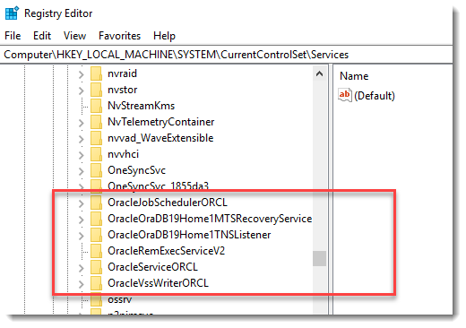

# 1、Oracle 简介

## 1.1、Oracle 简介

Oracle Database，又名 Oracle RDBMS，简称 Oracle。Oracle 数据库系统是美国 Oracle 公司（甲骨文）提供的以分布式数据库为核心的一组软件产品，是目前最流行的客户/服务器（client/server）或B/S体系结构的数据库之一，比如 SilverStream 就是基于数据库的一种中间件。Oracle 数据库是目前世界上使用最为广泛的数据库管理系统，作为一个通用的数据库系统，它具有完整的数据管理功能；作为一个关系型数据库，它是一个完备关系的产品；作为分布式数据库它实现了分布式处理功能。

<br>

**Oracle 体系结构**

Oracle 数据库实际上是一个数据的物理储存系统，这其中包括数据文件（ora/dbf）、参数文件、控制文件、联机日志等。

**实例：**一个操作系统只有一个 Oracle 数据库，但是可以安装多 个Oracle 实例，一个 Oracle 实例对应着一系列的后台进程（Backguound Processes)和内存结构（Memory Structures)。

**数据文件：**Oracle 数据文件是数据存储的物理单位，数据库的数据是存储在表空间中的。而一个表空间可以由一个或多个数据文件组成，一个数据文件只能属于一个表空间，一旦数据文件被加入到某个表空间后，就不能删除这个文件，如果要删除某个数据文件，只能删除其所属于的表空间才行。

**表空间：**表空间是 Oracle 对物理数据库数据文件（ora/dbf）的逻辑映射。一个数据库在逻辑上被划分成一到若干个表空间，每个表空间由同一磁盘上的一个或多个数据文件（datafile）组成，一个数据文件只能属于一个表空间。

**Oracle用户：**表当中的数据是由 Oracle 用户放入到表空间当中的，而这些表空间会随机的把数据放入到一个或者多个数据文件当中。Oracle 对表数据的管理是通过用户对表的管理去查询，而不是直接对数据文件或表空间进行查询。因为不同用户可以在同一个表空间上面建立相同的表名。但是通过不同的用户管理自己的表数据。

<br>

**数据结构逻辑关系如下图：**


<br>

**Oracle体系概要图如下：**


<br>

## 1.2、Oracle 19c 安装

**安装前注意退出杀毒软件！！！**

1. 去官网下载 [Oracle 19c](https://www.oracle.com/database/technologies/oracle-database-software-downloads.html#19c)：

	

2. 安装前需要把文件包解压，解压的位置为需要安装的位置，，所以要提前确定好解压路径，解压后的文件大概需要 6G 的空间，确保空间足够大。

3. 以管理员身份运行 `setup.exe`：

	

4. 打开安装程序后，跟着安装向导，初学者建议选默认选择 “创建并配置单实例数据库”：

	
	
5. 选中【桌面类】，点击下一步：

	

6. Oracle主目录用户，如下图所示：

	- 使用虚拟账户：用于 Oracle 数据库单实例安装的 Oracle 主目录用户。
	- 使用现有 Windows 用户：如果选择该项，则需要指定没有管理权限的用户。
	- 创建新 Windows 用户：创建一个新用户，输入用户名和密码，这个新建的用户没有 Windows 登录权限。
	- 使用 Windows 内置账户：微软在开 Windows 时预先为用户设置的能够登录系统的账户。

	此处本人选择虚拟账户，也是 Oracle 的官方建议之一。

	

7. 更改【Oracle基目录】，取消勾选【创建为容器数据库】，填写【全局数据库名】及口令，点击下一步：

	

8. 先决条件检查：

	

9. 概要：

	

10. 安装等待，这里会等待得比较久一点：

	

11. 几十分钟后，显示成功的窗口，点击关闭：

	

<br>

## 1.3、Oracle 19c 卸载

要在 Windows 上卸载 Oracle 数据库，我们必须手动删除所有相关的`Ora*`注册表项、文件和文件夹。

1. 停止Oracle *服务
	
	
	
2. 删除 Oracle *注册表项

	-   `HKEY_LOCAL_MACHINE/SOFTWARE/Oracle*`

		

	-   `HKEY_LOCAL_MACHINE/SOFTWARE/Wow6432Node/Oracle*`

		

	-   `HKEY_LOCAL_MACHINE/SYSTEM/CurrentControlSet/Services/Oracle*`

		

	  重新启动Windows。

3. 删除以下 Oracle * 文件夹和文件（如果存在）:

	- `C:\Oracle` 或 `ORACLE_BASE`
	- `C:\Program Files\Oracle`
	- `C:\Program Files (x86)\Oracle`
	- `C:\ProgramData\Microsoft\Windows\Start Menu\Programs\` 与 Oracle 相关的文件夹。
	- `C:\Users` 与 Oracle 相关的文件夹。

4. 清空 `C:\temp ` 和回收站。

<br>

## 1.4、Navicat 连接 Oracle

基本上直接连就行，这里主要记录下遇到的问题：

**ORA-12514:TNS:监听程序当前无法识别连接述符中请求的服务**

1. 【工具】 ==> 【选项】 ==> 【环境】：

	

2. 在 Oracle 安装目录下找到 `oci.dll`， 这是我的路径：`E:\Database\Oracle\Oracle_WINDOWS.X64_193000_db_home\bin\oci.dll`，完成之后重新启动 Navicat。

<br>

# 2、查询

我初学的数据库是 MySQL，由于 Oracle 也是使用 SQL 标准，这里用于记录工作中使用 Oracle 所遇到的查询问题。

<br>

## 2.1、对 CLOB 进行模糊查询

在 Oracle 中多大文本数据我们没有办法使用 `LIKE` 进行查询，所以只能使用 Oracle 中的函数：

```sql
SELECT * FROM TABLE表 WHERE dbms_lob.instr(字段名（clod类型）,'查询条件',1,1) > 0
```

在 Oracle 中，可以使用 `instr()` 函数对某个字符串进行判断，判断其是否含有指定的字符。其语法为：

```sql
instr(sourceString, destString, start, appearPosition)
```

参数：

- *sourceString* 代表源字符串。
- *destString* 代表想从源字符串中查找的子串。
- *start* 代表查找的开始位置，该参数是可选的，默认为 1，如果 *start* 的值为负数，那么代表从右往左进行查找。
- *appearPosition* 代表想从源字符中查找出第几次出现的 *destString*，该参数也是可选的，默认为 1。

返回值为：查找到的字符串的位置。

<br>

## 2.2、树形结构层级查询

通常，在查询树形结构的数据时，需要使用 `START WITH...CONNECT BY PRIOR` 的方式查询。

`START WITH...CONNECT BY PRIOR` 的语法为：

```sql
SELECT 字段
FROM 表名
WHERE condition1
START WITH condition2
CONNECT BY PRIOR condition3
```

参数：

- *condition1*：过滤条件
- *condition2*：起始的查询条件，指定根节点，当然可以放宽限定条件，以取得多个根结点，实际就是多棵树
- *condition3*：指定父节点和子节点直接的关系，`PRIOR` 指定父节点

<br>

**示例**

假设现有部门表 `DEPARTMENT`，部门表中字段包括 `DEPID`（部门 ID），`PARENTDEPID`（父部门 ID），`DEPNAME`（部门名称）

1、我们要查询部门 `ID="1110"` 的部门的所有父部门的 ID 和名称（包含部门 `ID="1110"` 的部门，不包含可通过 `WHERE` 条件过滤）

```sql
SELECT DEPID, DEPNAME
FROM FW_DEPARTMENT
-- WHERE DEPID <> '1110'
START WITH DEPID = '1110'
CONNECT BY PRIOR PARENTDEPID = DEPID 
```

2、我们要查询部门 `ID="1110"` 的部门的所有子部门的 ID 和名称（包含部门 `ID="1110"` 的部门，不包含可通过 `WHERE` 条件过滤）

```sql
SELECT DEPID, DEPNAME
FROM FW_DEPARTMENT
-- WHERE DEPID <> '1110'
START WITH DEPID = '1110'
CONNECT BY PRIOR DEPID = PARENTDEPID
```

从上面 2 个 SQL 可以发现：

- 查询当前节点的所有父节点时，需要将 `PRIOR` 放在父节点左侧
- 查询当前节点的所有子节点时，需要将 `PRIOR` 放在子节点左侧

<br>

**排序**

在层次查询中，如果想让 “亲兄弟” 按规矩进行升序排序就不得不借助 `ORDERSIBLINGS BY` 这个特定的排序语句而非 `ORDER BY` 子句，若要降序输出可以在其后添加 `DESC` 关键字。

<br>

## 2.3、关于 Oracle 中的 AS

在 Oracle 中 `AS` 关键字不能用于指定表的别名，在 Oracle 中指定表的别名时只需在原有表名和表的别名之间用空格分隔即可，指定列的别名的用法和 MySQL 相同，但在存储过程中如果列的别名与原有列名相同，在运行时会报错（编译时不会出错），其他情况下列的别名可以与列名本身相同。
