# 1、Oracle 简介

## 1.1、Oracle 简介

Oracle Database，又名 Oracle RDBMS，简称 Oracle。Oracle 数据库系统是美国 Oracle 公司（甲骨文）提供的以分布式数据库为核心的一组软件产品，是目前最流行的客户/服务器（client/server）或B/S体系结构的数据库之一，比如 SilverStream 就是基于数据库的一种中间件。Oracle 数据库是目前世界上使用最为广泛的数据库管理系统，作为一个通用的数据库系统，它具有完整的数据管理功能；作为一个关系型数据库，它是一个完备关系的产品；作为分布式数据库它实现了分布式处理功能。


**Oracle 体系结构**

Oracle 数据库实际上是一个数据的物理储存系统，这其中包括数据文件（ora/dbf）、参数文件、控制文件、联机日志等。

**实例：**一个操作系统只有一个 Oracle 数据库，但是可以安装多 个Oracle 实例，一个 Oracle 实例对应着一系列的后台进程（Backguound Processes)和内存结构（Memory Structures)。

**数据文件：**Oracle 数据文件是数据存储的物理单位，数据库的数据是存储在表空间中的。而一个表空间可以由一个或多个数据文件组成，一个数据文件只能属于一个表空间，一旦数据文件被加入到某个表空间后，就不能删除这个文件，如果要删除某个数据文件，只能删除其所属于的表空间才行。

**表空间：**表空间是 Oracle 对物理数据库数据文件（ora/dbf）的逻辑映射。一个数据库在逻辑上被划分成一到若干个表空间，每个表空间由同一磁盘上的一个或多个数据文件（datafile）组成，一个数据文件只能属于一个表空间。

**Oracle用户：**表当中的数据是由 Oracle 用户放入到表空间当中的，而这些表空间会随机的把数据放入到一个或者多个数据文件当中。Oracle 对表数据的管理是通过用户对表的管理去查询，而不是直接对数据文件或表空间进行查询。因为不同用户可以在同一个表空间上面建立相同的表名。但是通过不同的用户管理自己的表数据。


**数据结构逻辑关系如下图：**

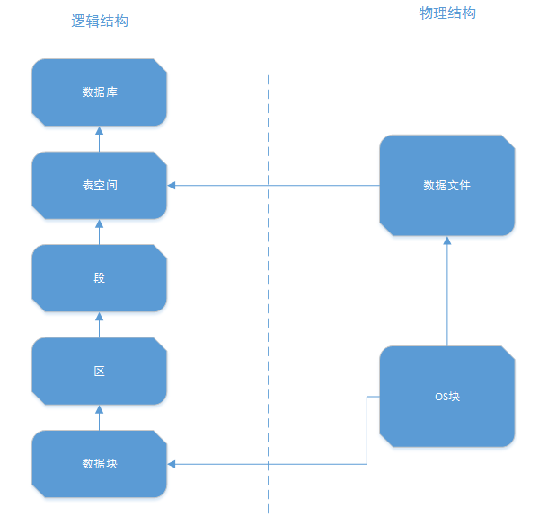


**Oracle体系概要图如下：**


## 1.2、Oracle 19c 安装

**安装前注意退出杀毒软件！！！**

1. 去官网下载 [Oracle 19c](https://www.oracle.com/database/technologies/oracle-database-software-downloads.html#19c)：

	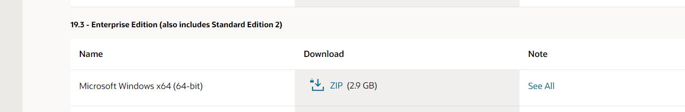

2. 安装前需要把文件包解压，解压的位置为需要安装的位置，所以要提前确定好解压路径，解压后的文件大概需要 6G 的空间，确保空间足够大。

   > 解压的目录不要含有中文和空格！

3. 以管理员身份运行 `setup.exe`：

	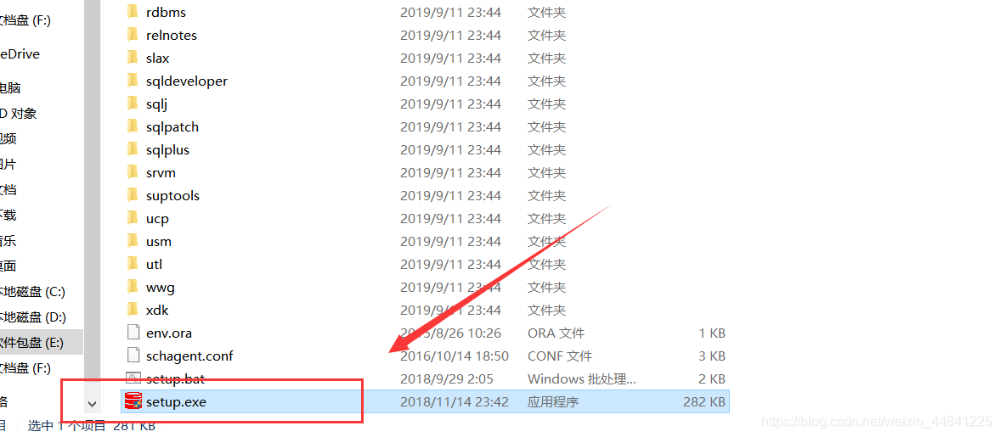

4. 打开安装程序后，跟着安装向导，初学者建议选默认选择 “创建并配置单实例数据库”：

	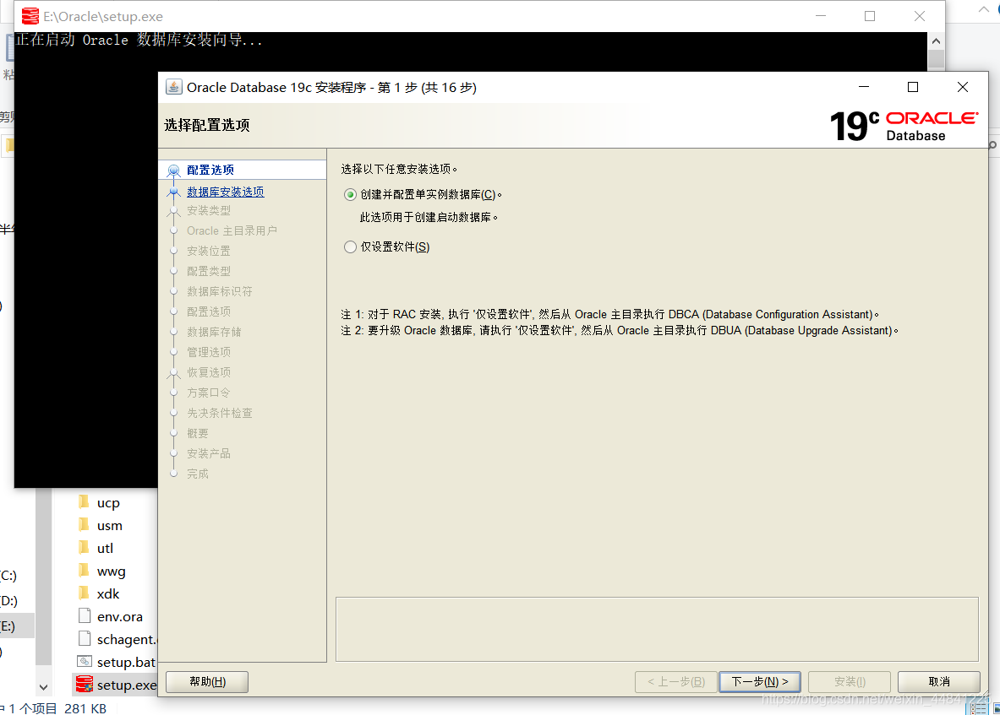
	
5. 选中【桌面类】，点击下一步：

	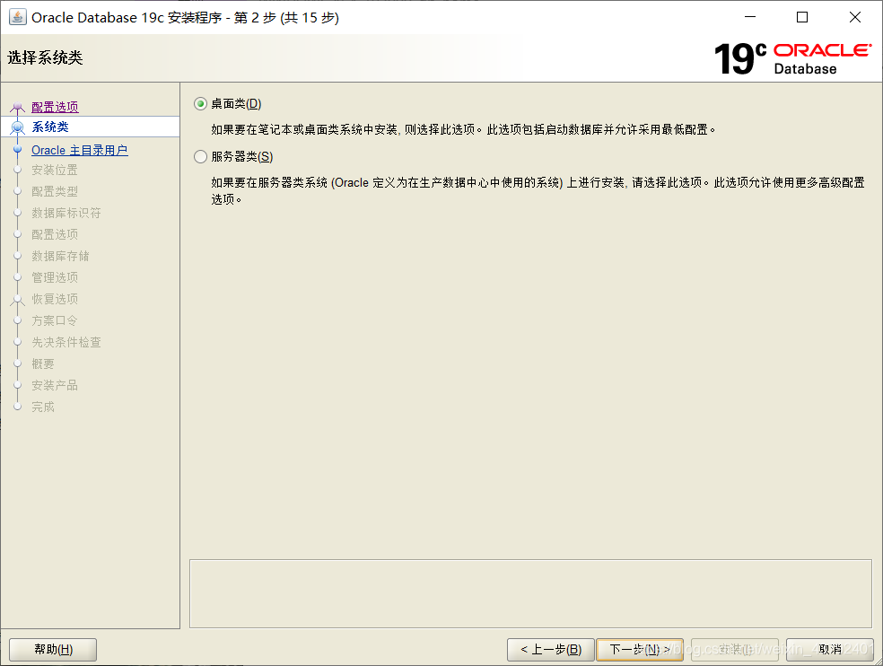

6. Oracle主目录用户，如下图所示：

	- 使用虚拟账户：用于 Oracle 数据库单实例安装的 Oracle 主目录用户。
	- 使用现有 Windows 用户：如果选择该项，则需要指定没有管理权限的用户。
	- 创建新 Windows 用户：创建一个新用户，输入用户名和密码，这个新建的用户没有 Windows 登录权限。
	- 使用 Windows 内置账户：微软在开 Windows 时预先为用户设置的能够登录系统的账户。

	此处本人选择虚拟账户，也是 Oracle 的官方建议之一。

	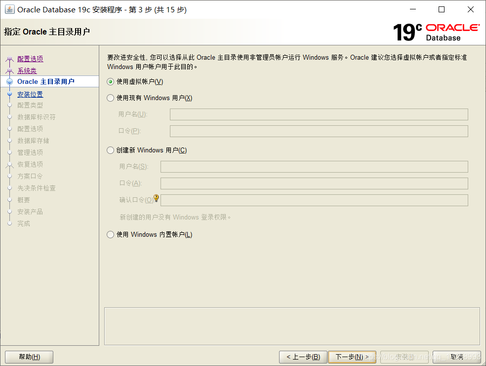

7. 更改【Oracle基目录】，取消勾选【创建为容器数据库】，填写【全局数据库名】及口令，点击下一步：

	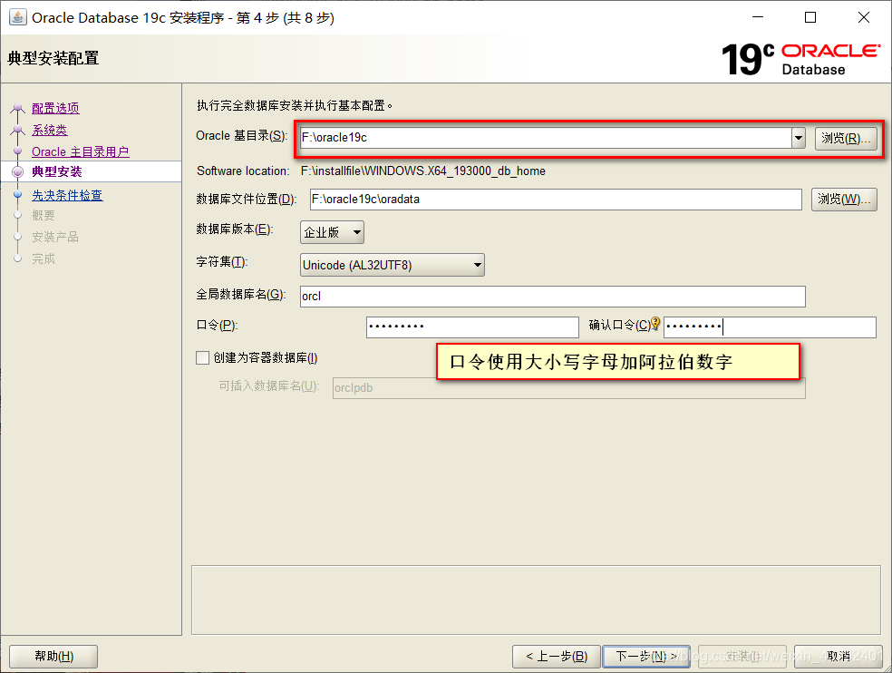

8. 先决条件检查：

	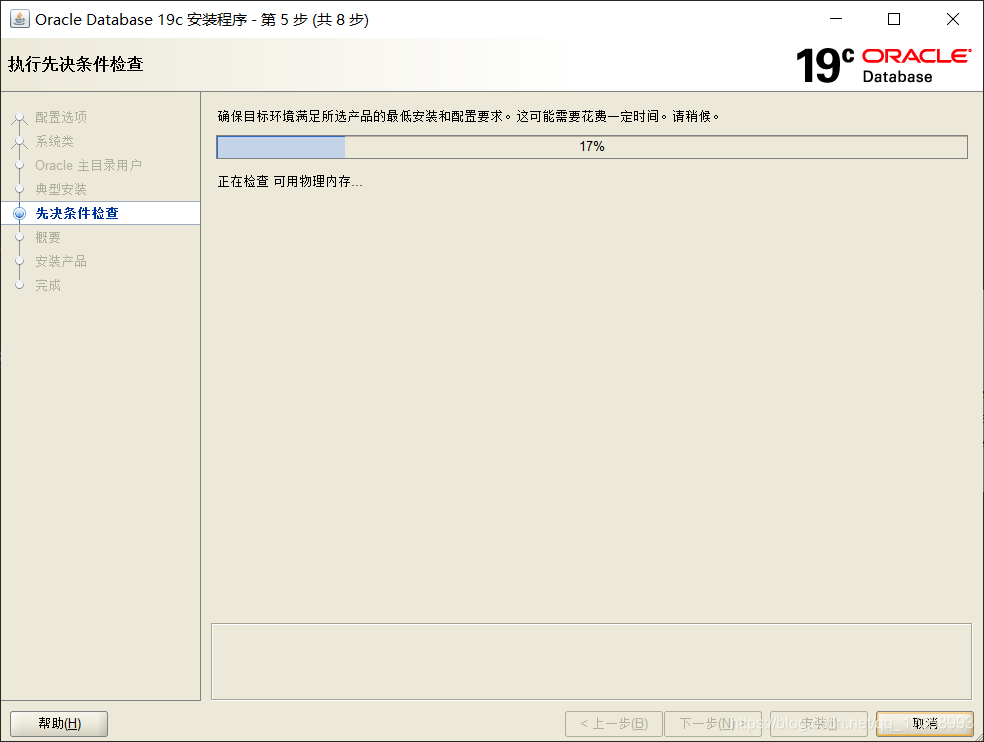

9. 概要：

	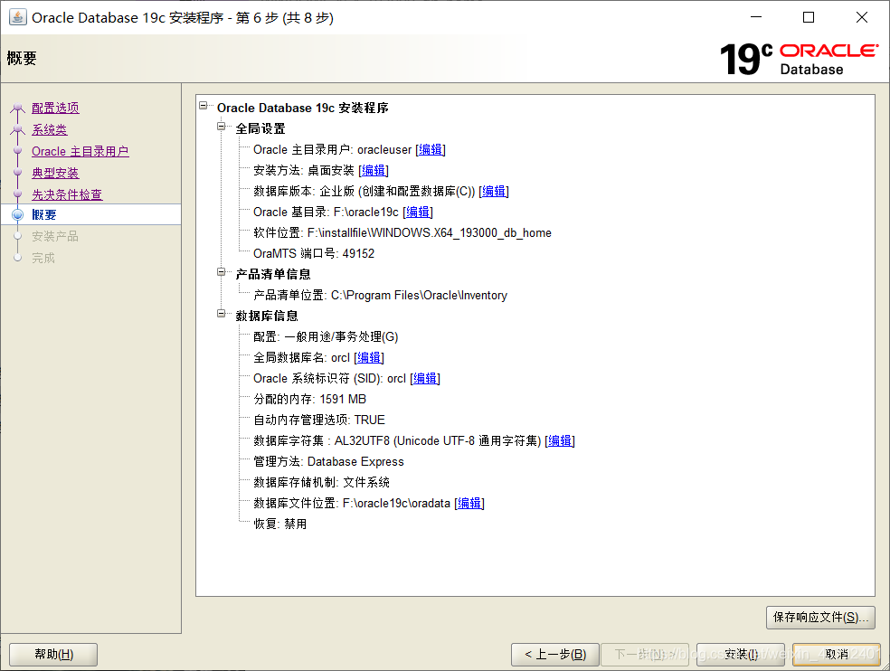

10. 安装等待，这里会等待得比较久一点：

	

11. 几十分钟后，显示成功的窗口，点击关闭：

	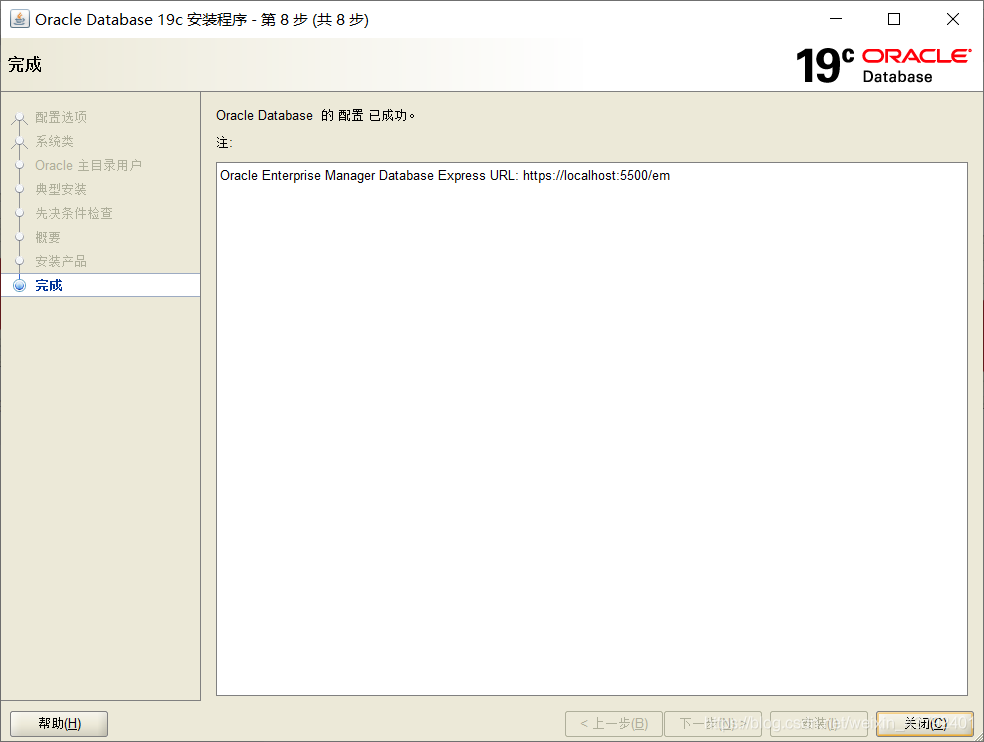


### 1.2.1、安装问题

**Oracle19c 安装中的无法将 Windows 用户或 Windows 组 “XXX“ 添加到 Windows 组 “XXX“ 中**

看看自己的计算机名称和自己用户名是不是相同，相同的话更改计算机名称为其他的。并不一定适用所有，可进行尝试。


## 1.3、Oracle 19c 卸载

要在 Windows 上卸载 Oracle 数据库，我们必须手动删除所有相关的 `Ora*` 注册表项、文件和文件夹。

1. 停止Oracle *服务
	
	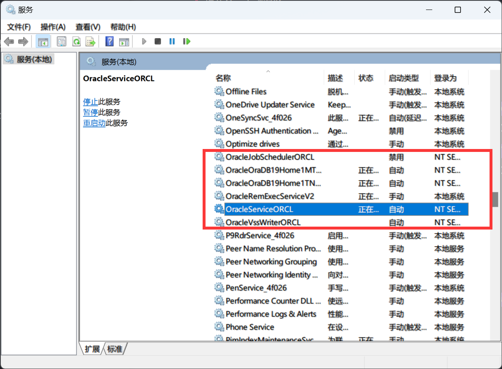
	
2. 删除 Oracle *注册表项

	-   `计算机\HKEY_LOCAL_MACHINE\SOFTWARE\Oracle*`

	-   `计算机\HKEY_LOCAL_MACHINE\SOFTWARE\Wow6432Node\Oracle*`

	-   `计算机\HKEY_LOCAL_MACHINE\SYSTEM\CurrentControlSet\Services\Oracle*`

		重新启动Windows。

3. 删除以下 Oracle * 文件夹和文件（如果存在）:

	- `C:\Oracle` 或 `ORACLE_BASE`
	- `C:\Program Files\Oracle`
	- `C:\Program Files (x86)\Oracle`
	- `C:\ProgramData\Microsoft\Windows\Start Menu\Programs\` 与 Oracle 相关的文件夹。
	- `C:\Users` 与 Oracle 相关的文件夹。

4. 清空 `C:\temp ` 和回收站。


## 1.4、Navicat 连接 Oracle

基本上直接连就行，这里主要记录下遇到的问题：

**ORA-12514:TNS:监听程序当前无法识别连接述符中请求的服务**

1. 【工具】 ==> 【选项】 ==> 【环境】：

	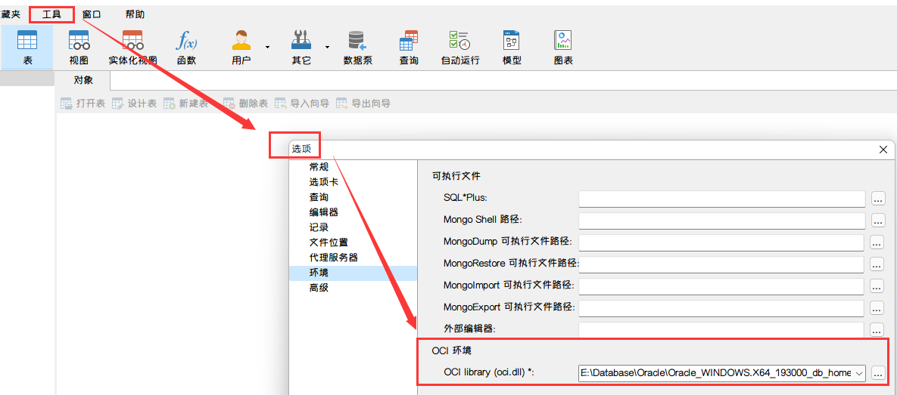

2. 在 Oracle 安装目录下找到 `oci.dll`， 这是我的路径：`E:\Database\Oracle\Oracle_WINDOWS.X64_193000_db_home\bin\oci.dll`，完成之后重新启动 Navicat。


# 2、函数

## 2.1、日期函数

**获取当前日期和时间**

```sql
SYSDATE()
```


**日期/时间转换为字符串函数**

日期/时间转字符串函数：

```sql
TO_CHAR(dateField, 'yyyy-mm-dd hh24:mi:ss')
```

字符串转日期/时间函数：

```sql
TO_DATE("2017-04-11 06:30:01", 'yyyy-mm-dd hh24:mi:ss')
```


**日期/时间增减函数**

增减一小时：
```sql
dateField + 1/24;
dateField - 1/24;
```

增减一天：

```sql
dateField + 1;
dateField - 1;
```

增减一月：

```sql
ADD_MONTHS(dateField, 1);
ADD_MONTHS(dateField, -1);
```

增减一季度：

```sql
ADD_MONTHS(dateField, 3);
ADD_MONTHS(dateField, -3);
```

增减一年：

```sql
ADD_MONTHS(dateField, 12);
ADD_MONTHS(dateField, -12);
```


**求日期差**

两个日期相差的小时、分钟、秒：

```sql
## Oracle中两个日期相差小时数
select TO_NUMBER((TO_DATE('2021-09-22 11:22:13', 'yyyy-mm-dd hh24:mi:ss') - TO_DATE('2021-09-22 10:22:13', 'yyyy-mm-dd hh24:mi:ss'))*24)
AS 相差小时数 from dual;
 
## Oracle中两个日期相差分钟数
select TO_NUMBER((TO_DATE('2021-09-22 11:22:13', 'yyyy-mm-dd hh24:mi:ss') - TO_DATE('2021-09-22 11:20:13', 'yyyy-mm-dd hh24:mi:ss'))*24*60)
AS 相差分钟数 from dual;
 
## Oracle中两个日期相差秒数
select TO_NUMBER((TO_DATE('2021-09-22 11:22:13', 'yyyy-mm-dd hh24:mi:ss') - TO_DATE('2021-09-22 11:22:00', 'yyyy-mm-dd hh24:mi:ss'))*24*60*60)
AS 相差秒数 from dual;
```

两个日期相差的天数：

```sql
## Oracle中两个日期相差天数
select TO_NUMBER(TO_DATE('2021-10-01', 'yyyy-mm-dd hh24:mi:ss') - TO_DATE('2021-09-22', 'yyyy-mm-dd hh24:mi:ss'))
AS 相差天数 from dual;
```

两个日期相差的月份：

```sql
## oracle两个日期的相差月数--
## 1）月份都是最后一天，A日期 > B日期 ,返回整数
select months_between(TO_DATE('2021-10-31', 'yyyy-mm-dd hh24:mi:ss'), TO_DATE('2021-09-30', 'yyyy-mm-dd hh24:mi:ss'))
As 相差月份1 from dual;
 
## 2）月份都是最后一天，B日期 > A日期 ,返回负数
select months_between(TO_DATE('2021-09-30', 'yyyy-mm-dd hh24:mi:ss'), TO_DATE('2021-10-31', 'yyyy-mm-dd hh24:mi:ss'))
As 相差月份2 from dual;
 
## 3）月份天数不一样，A日期 > B日期 ,返回带小数的数字
select months_between(TO_DATE('2021-10-31', 'yyyy-mm-dd hh24:mi:ss'), TO_DATE('2021-09-22', 'yyyy-mm-dd hh24:mi:ss'))
As 相差月份3 from dual;
```


## 2.2、正则表达式

**匹配机制**

如果有一个字符串 aabcd，并指定了一个 `a(b|c)d` 搜索，则将搜索后跟 b 或 c，接着是 d 的 a。

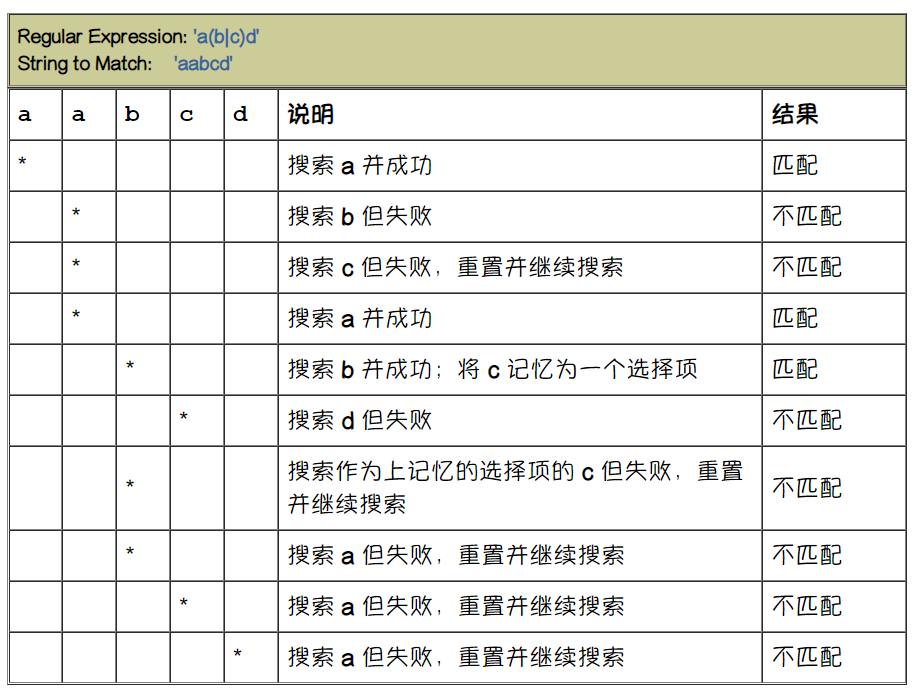

`a(b|c)d` 不匹配给定的字符串 aabcd。


**Oracle 数据库正则表达式中的 POSIX 元字符**

元字符是具有特殊意义的字符，如通配符字符、重复字符、非匹配字符或一个字符范围。

可以在与函数匹配的模式中使用多个预定义的元字符符号。

| **符号**    | **说明**                                                     |
| ----------- | ------------------------------------------------------------ |
| `*`         | 匹配零个或多个匹配项                                         |
| `|`         | 用于指定选择性匹配项的选择性运算符                           |
| `^/$     `  | 匹配行的开头和结尾                                           |
| `[]`        | 用于匹配列表（匹配该列表中的任何表达式）的方括号表达式       |
| `[^exp]`    | 如果脱字符位于方括号内部，则对表达式取非。                   |
| `{m}`       | 精确匹配 *m* 次                                              |
| `{m,n}`     | 至少匹配 *m* 次，但不超过 *n* 次                             |
| `[: :]`     | 指定一个字符类并匹配该类中的任何字符                         |
| `\`         | 可以有四种不同的含义：(1) 表示其自身；(2) 引用下一个字符；(3) 引入一个运算符；(4) 不执行任何操作 |
| `+`         | 匹配一个或多个匹配项                                         |
| ` `         | 匹配零个或一个匹配项                                         |
| `.`         | 匹配所支持字符集中的任何字符（NULL 除外）                    |
| `()`        | 对表达式进行分组（视作一个子表达式）                         |
| `\n`        | 向后引用表达式                                               |
| `[==]     ` | 指定等价类                                                   |
| `[..]     ` | 指定一个对照元素（如多字符元素）                             |


**Perl 正则表达式扩展**

除了 POSIX 标准以外，Oracle 还支持受 Perl 影响的常见元字符。如果您是一位生命科学开发人员，并使用 Perl 对大型 DNA 和蛋白质数据库中存储的生物信息数据进行模式分析，则可以使用 SQL 正则表达式直接支持数据，而无需中间层。这可以提供更高效的解决方案。为 Perl 兼容性而添加的元字符包括：

| **运算符** | **说明**                             |
| ---------- | ------------------------------------ |
| `\d`       | 匹配数字字符                         |
| `\D`       | 匹配非数字字符                       |
| `\w`       | 匹配单词字符                         |
| `\W`       | 匹配非单词字符                       |
| `\s`       | 匹配空白字符                         |
| `\S`       | 匹配非空白字符                       |
| `\A`       | 仅匹配字符串的开头                   |
| `\Z`       | 仅匹配字符串的结尾或者行结尾之前     |
| `\z`       | 仅匹配字符串的结尾                   |
| `* `       | 匹配 0 次或更多次（非贪婪）          |
| `+ `       | 匹配 1 次或更多次（非贪婪）          |
| `? `       | 匹配 0 次或 1 次（非贪婪）           |
| `{n} `     | 精确匹配 n 次（非贪婪）              |
| `{n,} `    | 至少匹配 n 次（非贪婪）              |
| `{n,m} `   | 至少匹配 n 次，但不超过 m 次（贪婪） |


Oracle 中的支持正则表达式的函数主要有以下五个：

- `REGEXP_LIKE` ：与 `LIKE` 的功能相似，可以支持按正则表达式与文本进行匹配。
- `REGEXP_INSTR` ：返回指定字符串中与正则表达式匹配部分第一次出现的位置。
- `REGEXP_COUNT` ：返回指定字符串中与正则表达式匹配部分出现的次数。
- `REGEXP_SUBSTR` ：截取指定字符串中与正则表达式匹配的部分。
- `REGEXP_REPLACE` ：替换指定字符串中与正则表达式匹配的部分。


### 2.2.1、REGEXP_LIKE

`REGEXP_LIKE()` 与 `LIKE` 的功能相似，可以支持按正则表达式与文本进行匹配。

```sql
REGEXP_LIKE(STRING, REGEX, MODIFIER)
```

- *STRING*：需要进行正则处理的字符串
- *REGEX*：进行匹配的正则表达式
- *MODIFIER*：模式，默认为 `c`：
  - `i`：不区分大小写进行检索。
  - `c`：区分大小写进行检索。


**示例：**

```sql
SELECT ENAME, JOB FROM EMP WHERE REGEXP_LIKE(JOB, '(clerk|analyst)', 'i');
```

结果：

```
+-------+---------+
| ENAME | JOB     |
+-------+---------+
| SMITH | CLERK   |
| JAMES | CLERK   |
| FORD  | ANALYST |
| SCOTT | ANALYST |
+-------+---------+
```


### 2.2.2、REGEXP_INSTR

`REGEXP_INSTR()` 返回指定字符串中与正则表达式匹配部分第一次出现的位置。

```sql
REGEXP_INSTR(STRING, REGEX[, START_POSITION[, OCCURRENCE[, RETURN_OPTION[, MODIFIER]]]])
```

- *STRING*：需要进行正则处理的字符串
- *REGEX*：进行匹配的正则表达式
- *START_POSITION*：起始位置，从字符串的第几个字符开始正则表达式匹配（默认从第一个字符开始，值为 1）
- *OCCURRENCE*：获取分割出来的第几组子串（分割后最初的字符串会按分割的顺序排列成数组）
- *RETURN_OPTION*：指定返回值的类型。为 0，则返回匹配值第一次出现的第一个字符的角标，非 0，则返回匹配值第一次出现的最后一个字符的角标 +1
- *MODIFIER*：模式，默认为 `c`：
  - `c`：区分大小写进行检索。
  - `i`：不区分大小写进行检索。
  - `n`：允许句点 `.` 作为通配符去匹配换行符。如果省略该参数，句点将不匹配换行符。
  - `m`：将源串视为多行。即 Oracle 中将 `^` 和 `$` 分别看作源串中任意位置任何行的开始和结束，而不是仅仅看作整个源串的开始或结束。如果省略该参数，则 Oracle 将源串看作一行。
  - `x`：忽略源串中的空格字符。默认情况下，空格字符与自身相匹配。
- 返回值：返回满足正则表达式的字符或字符串第一次出现的角标，如果没有找到结果，则返回 0。


**示例：**

```sql
SELECT REGEXP_INSTR('11a22A33a', 'a') AS STR FROM DUAL;
```

结果：

```
3
```

```sql
SELECT REGEXP_INSTR('11a22A33a11a22A33a', '2A', 1, 1, 0, 'c') AS STR FROM DUAL;
```

结果：

```
5
```

```sql
SELECT REGEXP_INSTR('11a22A33a11a22A33a', '2A', 1, 1, 1, 'c') AS STR FROM DUAL;
```

结果：

```
7
```


### 2.3.3、REGEXP_COUNT

`REGEXP_COUNT()` 返回指定字符串中与正则表达式匹配部分出现的次数。

```sql
REGEXP_COUNT(STRING, REGEX[, START_POSITION[, MODIFIER]])
```

- *STRING*：需要进行正则处理的字符串
- *REGEX*：进行匹配的正则表达式
- *START_POSITION*：起始位置，从字符串的第几个字符开始正则表达式匹配（默认从第一个字符开始，值为 1）
- *MODIFIER*：模式，默认为 `c`
  - `c`：区分大小写进行检索。
  - `i`：不区分大小写进行检索。
  - `n`：允许句点 `.` 作为通配符去匹配换行符。如果省略该参数，句点将不匹配换行符。
  - `m`：将源串视为多行。即 Oracle 中将 `^` 和 `$` 分别看作源串中任意位置任何行的开始和结束，而不是仅仅看作整个源串的开始或结束。如果省略该参数，则 Oracle 将源串看作一行。
  - `x`：忽略源串中的空格字符。默认情况下，空格字符与自身相匹配。
- 返回值：返回满足正则表达式的字符或字符串出现的次数。


**示例：**

```sql
SELECT REGEXP_COUNT('11a22A33a11a22A33a', '2A', 1, 'c') AS STR FROM DUAL;
```

结果：

```
2
```


### 2.2.4、REGEXP_SUBSTR

`REGEXP_SUBSTR()` 截取指定字符串中与正则表达式匹配的部分。

```sql
REGEXP_SUBSTR(STRING, REGEX[, START_POSITION[, OCCURRENCE[, MODIFIER]]])
```

- *STRING*：需要进行正则处理的字符串
- *REGEX*：进行匹配的正则表达式
- *START_POSITION*：起始位置，从字符串的第几个字符开始正则表达式匹配（默认从第一个字符开始，值为 1）
- *OCCURRENCE*：获取分割出来的第几组子串（分割后最初的字符串会按分割的顺序排列成数组）
- *MODIFIER*：模式，默认为 `c`
  - `c`：区分大小写进行检索。
    `i`：不区分大小写进行检索。
    `n`：允许句点 `.` 作为通配符去匹配换行符。如果省略该参数，句点将不匹配换行符。
    `m`：将源串视为多行。即 Oracle 中将 `^` 和 `$` 分别看作源串中任意位置任何行的开始和结束，而不是仅仅看作整个源串的开始或结束。如果省略该参数，则 Oracle 将源串看作一行。
    `x`：忽略源串中的空格字符。默认情况下，空格字符与自身相匹配。


**示例：**

```sql
SELECT REGEXP_SUBSTR('11a22A33a', '[^A]+', 1, 1, 'i') AS STR FROM DUAL;
```

结果：

```
11
```

分析：正则表达式是以 A 为标识进行分割，而 `i` 标识不区分大小写，从第一个字符开始，取第一组截取结果，所以结果是 11，而不是 11a22。

```sql
SELECT REGEXP_SUBSTR('11a22A33a', '[^A]+', 1, 1, 'c') AS STR FROM DUAL;
```

结果：

```
11a22
```

分析：正则表达式是以 A 为标识进行分割，而 `c` 标识区分大小写，从第一个字符开始，取第一组截取结果，所以结果是 11a22，而不是 11。

```sql
SELECT REGEXP_SUBSTR('11a22A33a', '[^A]+', 4, 1, 'i') AS STR FROM DUAL;
```

结果：

```
22
```

分析：正则表达式是以 A 为标识进行分割，而 `i` 标识不区分大小写，从第 4 个字符开始，取第一组截取结果，所以结果是 22，而不是 11。

```sql
SELECT REGEXP_SUBSTR('11a22A33a', '[^A]+', 4, 1, 'c') AS STR FROM DUAL;
```

结果：

```
22
```

分析：正则表达式是以 A 为标识进行分割，而 `c` 标识区分大小写，从第 4 个字符开始，取第一组截取结果，所以结果是 22，而不是 11a22。


### 2.2.5、REGEXP_REPLACE

`REGEXP_REPLACE()` 替换指定字符串中与正则表达式匹配的部分。

```sql
REGEXP_REPLACE(STRING, REGEX, REPLACE_STRING)
```

- *STRING*：需要进行正则处理的字符串。
- *REGEX*：进行匹配的正则表达式。
- *REPLACE_STRING*：要替换成的字符串。


**示例：**

```sql
SELECT REGEXP_REPLACE('11a22A33a', 'a', '') AS STR FROM DUAL;
```

结果：

```
1122A33
```

```sql
SELECT REGEXP_REPLACE('11a22A33a11a22A33a', '[^A]+', '#') AS STR FROM DUAL;
```

结果：

```
#A#A#
```


## 2.3、聚合函数

### 2.3.1、WM_CONCAT

语法：

```sql
WM_CONCAT(separator, colname)
```

用指定的 *separator* 做分隔符，连接 *colname* 中的值。

参数：

- *separator*：必填。STRING 类型常量，分隔符。
- *colname*：必填。STRING 类型。如果输入为 BIGINT、DOUBLE 或 DATETIME 类型，会隐式转换为 STRING 类型后参与运算。

返回 STRING 类型。返回规则如下：

- *separator* 非 STRING 类型常量时，返回报错。
- *colname* 非 STRING、BIGINT、DOUBLE 或 DATETIME 类型时，返回报错。
- *colname* 值为 NULL 时，该行不会参与计算。

> `select wm_concat(',', name) from table_name;` 语句中，如果 `table_name` 为空集合，该语句返回 NULL 值。


示例 1：对所有职工的姓名（ename）进行合并。命令示例如下：

```sql
SELECT WM_CONCAT(',', ename) FROM emp;
```

返回结果如下：

```
+------------+
| _c0        |
+------------+
| SMITH,ALLEN,WARD,JONES,MARTIN,BLAKE,CLARK,SCOTT,KING,TURNER,ADAMS,JAMES,FORD,MILLER,JACCKA,WELAN,TEBAGE |
+------------+
```

示例 2：与 `GROUP BY` 配合使用，对所有职工按照部门（deptno）进行分组，并将同组的职工姓名（ename）进行合并。命令示例如下：

```sql
SELECT deptno, WM_CONCAT(',', ename) FROM emp GROUP BY deptno ORDER BY deptno;
```

返回结果如下：

```
+------------+------------+
| deptno     | _c1        |
+------------+------------+
| 10         | CLARK,KING,MILLER,JACCKA,WELAN,TEBAGE |
| 20         | SMITH,JONES,SCOTT,ADAMS,FORD |
| 30         | ALLEN,WARD,MARTIN,BLAKE,TURNER,JAMES |
+------------+------------+
```

示例 3：与 `GROUP BY` 配合使用，对所有职工按照部门（deptno）进行分组，并将同组的薪资（sal）去重后进行合并。命令示例如下：

```sql
SELECT deptno, WM_CONCAT(DISTINCT ',', sal) FROM emp GROUP BY deptno ORDER BY deptno;
```

返回结果如下：

```
+------------+------------+
| deptno     | _c1        |
+------------+------------+
| 10         | 1300,2450,5000 |
| 20         | 1100,2975,3000,800 |
| 30         | 1250,1500,1600,2850,950 |
+------------+------------+
```


# 3、查询

我初学的数据库是 MySQL，由于 Oracle 也是使用 SQL 标准，这里用于记录工作中使用 Oracle 所遇到的查询问题。


## 3.1、对 CLOB 进行模糊查询

在 Oracle 中多大文本数据我们没有办法使用 `LIKE` 进行查询，所以只能使用 Oracle 中的函数：

```sql
SELECT * FROM TABLE表 WHERE dbms_lob.instr(字段名（clod类型）,'查询条件',1,1) > 0
```

在 Oracle 中，可以使用 `instr()` 函数对某个字符串进行判断，判断其是否含有指定的字符。其语法为：

```sql
instr(sourceString, destString, start, appearPosition)
```

参数：

- *sourceString* 代表源字符串。
- *destString* 代表想从源字符串中查找的子串。
- *start* 代表查找的开始位置，该参数是可选的，默认为 1，如果 *start* 的值为负数，那么代表从右往左进行查找。
- *appearPosition* 代表想从源字符中查找出第几次出现的 *destString*，该参数也是可选的，默认为 1。

返回值为：查找到的字符串的位置。


## 3.2、树形结构层级查询

通常，在查询树形结构的数据时，需要使用 `START WITH...CONNECT BY PRIOR` 的方式查询。

`START WITH...CONNECT BY PRIOR` 的语法为：

```sql
SELECT 字段
FROM 表名
WHERE condition1
START WITH condition2
CONNECT BY PRIOR condition3
```

参数：

- *condition1*：过滤条件
- *condition2*：起始的查询条件，指定根节点，当然可以放宽限定条件，以取得多个根结点，实际就是多棵树
- *condition3*：指定父节点和子节点直接的关系，`PRIOR` 指定父节点


**示例**

假设现有部门表 `DEPARTMENT`，部门表中字段包括 `DEPID`（部门 ID），`PARENTDEPID`（父部门 ID），`DEPNAME`（部门名称）

1、我们要查询部门 `ID="1110"` 的部门的所有父部门的 ID 和名称（包含部门 `ID="1110"` 的部门，不包含可通过 `WHERE` 条件过滤）

```sql
SELECT DEPID, DEPNAME
FROM FW_DEPARTMENT
-- WHERE DEPID <> '1110'
START WITH DEPID = '1110'
CONNECT BY PRIOR PARENTDEPID = DEPID 
```

2、我们要查询部门 `ID="1110"` 的部门的所有子部门的 ID 和名称（包含部门 `ID="1110"` 的部门，不包含可通过 `WHERE` 条件过滤）

```sql
SELECT DEPID, DEPNAME
FROM FW_DEPARTMENT
-- WHERE DEPID <> '1110'
START WITH DEPID = '1110'
CONNECT BY PRIOR DEPID = PARENTDEPID
```

从上面 2 个 SQL 可以发现：

- 查询当前节点的所有父节点时，需要将 `PRIOR` 放在父节点左侧
- 查询当前节点的所有子节点时，需要将 `PRIOR` 放在子节点左侧


**排序**

在层次查询中，如果想让 “亲兄弟” 按规矩进行升序排序就不得不借助 `ORDERSIBLINGS BY` 这个特定的排序语句而非 `ORDER BY` 子句，若要降序输出可以在其后添加 `DESC` 关键字。


## 3.3、关于 Oracle 中的 AS

在 Oracle 中 `AS` 关键字不能用于指定表的别名，在 Oracle 中指定表的别名时只需在原有表名和表的别名之间用空格分隔即可，指定列的别名的用法和 MySQL 相同，但在存储过程中如果列的别名与原有列名相同，在运行时会报错（编译时不会出错），其他情况下列的别名可以与列名本身相同。
