# 1、NoSQL概述

## 1.1、为什么要用 NoSQL？

**单机 MySQL 年代**


DAL 是数据访问层的英文缩写，即为数据访问层（Data Access Layer）。其功能主要是负责数据库的访问。简单地说就是实现对数据表的 Select（查询）、Insert（插入）、Update（更新）、Delete（删除）等操作。

90年代一个网站的访问量不会太大，单个数据库完全足够，那个时候，更多的是去使用静态 HTML，服务器根本没有太大压力。

那么这种情况下，网站的瓶颈是什么？

- 数据量如果太大，一个机器放不下
- 数据的索引（B+Tree），一个机器内存也放不下
- 访问量（读写混合），一个服务器承受不了


**Memcached（缓存）+ MySQL + 垂直拆分（读写分离）**

网站 80% 的情况都是在读，每次都要去查询数据就十分麻烦，为了减轻数据库的压力，可以使用缓存来保证效率。

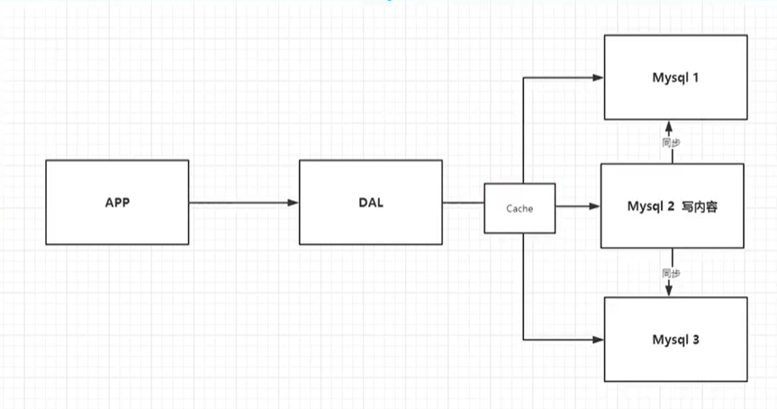


**分表分库 + 水品拆分 + MySQL 集群**

早些年 MyISAM：表锁 ，十分影响效率，高并发下就会出现严重的锁问题

转战 InnoDB：行锁（如果使用针对 InnoDB 的表使用行锁，被锁定字段不是主键，也没有针对它建立索引的话，行锁锁定的也是整张表）

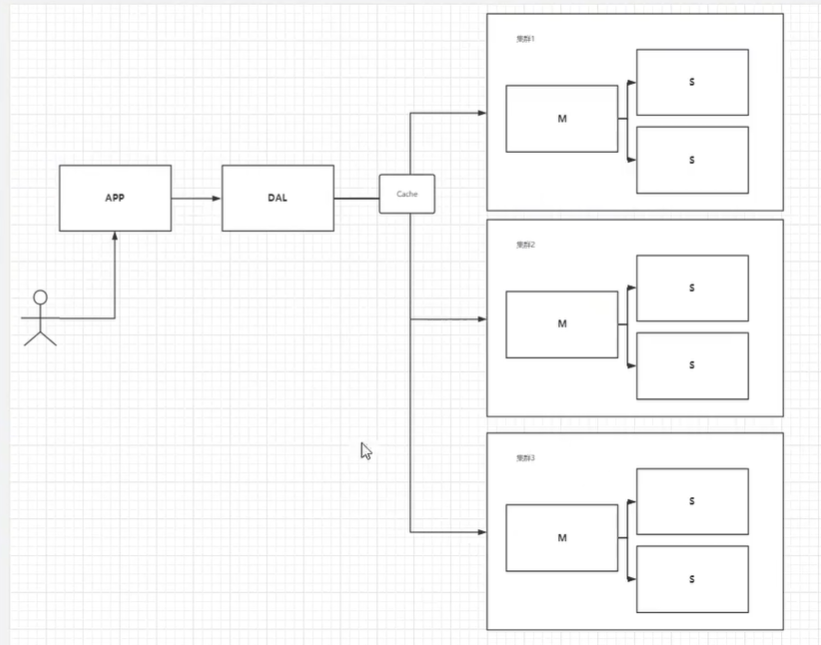


**现今（大数据时代）**

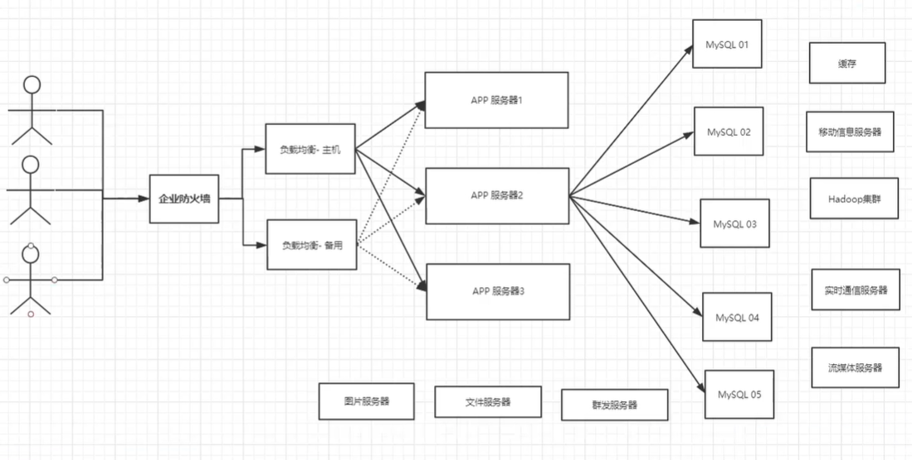

现今如果涉及大数据量的需求，比如一些商品抢购的情景，或者是主页访问量瞬间较大的时候，单一使用数据库来保存数据的系统会因为面向磁盘，磁盘读/写速度比较慢的问题而存在严重的性能弊端，一瞬间成千上万的请求到来，需要系统在极短的时间内完成成千上万次的读/写操作，这个时候往往不是数据库能够承受的，极其容易造成数据库系统瘫痪，最终出现服务宕机这种严重的问题。为了克服上述的问题，项目通常会引入 NoSQL 技术。


## 1.2、什么是 NoSQL？

NoSQL = Not Only SQL（不仅仅是 SQL）

**NoSQL 的特点：**

- 方便扩展（数据之间没有关系，很好扩展）
- 大数据量高性能（Redis 一秒写 8 万次，读取 11 万，NoSQL 的缓存记录级，是一种细粒度的缓存，性能会比较高）
- 数据类型是多样型的（不需要事先设计数据库，随用随取）


**传统 RDBMS 和 MySQL**

- 传统的 RDBMS

  - 结构化组织
  - SQL
  - 数据和关系都存在单独的表中
  - 严格的一致性
  - 基础的事务

- NoSQL

  - 不仅仅是数据
  - 没有固定的查询语言
  - 键值对存储、列存储、文档存储，图形数据库（社交关系）
  - 最终一致性
  - CPA 定理和 BASE
  - 高性能、高可用、高可扩


**了解 3V + 3 高**

大数据时代的 3V：主要描述问题的

- 海量 Volume
- 多样 Variety
- 实时 Velocity

大数据时代的 3 高 ：主要是对程序的要求

- 高并发
- 高可扩
- 高性能


**NoSQL 数据库的四大分类的分析**

| 分类              | Example 举例                                       | 典型应用场景                                                 | 数据模型                                          | 优点                                                         | 缺点                                                         |
| ----------------- | -------------------------------------------------- | ------------------------------------------------------------ | ------------------------------------------------- | ------------------------------------------------------------ | ------------------------------------------------------------ |
| 键值（key-value） | Tokyo Cabinet/Tyrant, Redis, Voldemort, Oracle BDB | 内容缓存，主要用于处理大量数据的高访问负载，也用于一些日志系统等等。 | Key 指向 Value 的键值对，通常用 hash table 来实现 | 查找速度快                                                   | 数据无结构化，通常只被当作字符串或者二进制数据               |
| 列存储数据库      | Cassandra, HBase, Riak                             | 分布式的文件系统                                             | 以列簇式存储，将同一列数据存在一起                | 查找速度快，可扩展性强，更容易进行分布式扩展                 | 功能相对局限                                                 |
| 文档型数据库      | CouchDB, MongoDb                                   | Web应用（与Key-Value类似，Value是结构化的，不同的是数据库能够了解Value的内容） | Key-Value 对应的键值对，Value 为结构化数据        | 数据结构要求不严格，表结构可变，不需要像关系型数据库一样需要预先定义表结构 | 查询性能不高，而且缺乏统一的查询语法。                       |
| 图形(Graph)数据库 | Neo4J, InfoGrid, Infinite Graph                    | 社交网络，推荐系统等。专注于构建关系图谱                     | 图结构                                            | 利用图结构相关算法。比如最短路径寻址，N 度关系查找等         | 很多时候需要对整个图做计算才能得出需要的信息，而且这种结构不太好做分布式的集群 |


# 2、Redis 入门

## 2.1、概述

Redis（Remote Dictionary Server )，即远程字典服务，是一个开源的使用ANSI C语言编写、支持网络、可基于内存亦可持久化的日志型、Key-Value数据库，并提供多种语言的API。

Redis 会周期性的把更新的数据写入磁盘或者把修改操作写入追加的记录文件，并且在此基础上实现了 master-slave（主从）同步。是当下最热门的 NoSQL 技术之一，也被人们成为结构化数据库。


**Redis 能干嘛？**

- 内存存储、持久化，内存中是断电即失，所以说持久化很重要（RDB、AOF）
- 效率高，可以用于高速缓存
- 发布订阅系统
- 地图信息分析
- 计时器、计数器（浏览量）
- ...


**Redis 的特性**

- 多样的数据类型
- 持久化
- 集群
- 事务
- ...


Redis 是单线程的（6.0 是多线程），因为 Redis 是基于内存操作，CPU 不是 Reids 性能瓶颈，Reids 的瓶颈是根据机器的内存和网络的带宽，而且Redis 单线程十分快。


## 2.2、Reids 安装

### 2.2.1、Linxu

如果嫌麻烦并且服务器可以连接互联网，可以使用在线安装的方式：

```shell
# 安装redis，安装后redis默认为启动状态
apt install redis

# 启动redis服务
redis-server &

# 启动客户端
redis-cli

# 卸载
apt purge --auto-remove redis-server
```

一般服务器主要还是使用离线安装并且手动配置环境。


#### 安装 Reids

1. 下载源码（服务离线可以使用 SFTP 等工具上传过去）：

   ```shell
   wget http://download.redis.io/releases/redis-6.0.5.tar.gz
   ```

2. 解压到 `/usr/local` ：

   ```shell
   tar -xzf ./redis-6.0.5.tar.gz -C /usr/local/
   ```

3. 更改文件夹名称为 `redis`：

   ```shell
   mv /usr/local/redis-6.0.5/ /usr/local/redis/
   ```

4. 进入目录，C/C++ 构建，类似 mvn install，npm build：

   ```shell
   cd /usr/local/redis
   sudo make
   ```

5. 安装：

   ```shell
   sudo make install
   ```

6. 启动 Redis：

   ```shell
   src/redis-server
   ```


#### 配置 systemd 服务

1. Redis 安装后，默认配置文件位于源码目录中的 redis.conf 文件。可以将其复制到 `/etc/redis/` 目录，并进行自定义配置：

   ```shell
   mkdir /etc/redis/
   cp /usr/local/redis/redis.conf /etc/redis/
   ```

2. 新建一个系统服务文件：

   ```shell
   vim /etc/systemd/system/redis.service
   ```

   文件内容如下：

   ```shell
   [Unit]
   Description=Redis Server
   After=network.target
   
   [Service]
   ExecStart=/usr/local/bin/redis-server /etc/redis/redis.conf
   ExecStop=/usr/local/bin/redis-cli shutdown
   Restart=always
   
   [Install]
   WantedBy=multi-user.target
   ```

4. 重载系统服务：

   ```shell
   systemctl daemon-reload
   ```

5. 接下来可以使用以下命令来启动、停止、重启和检查 Redis 服务的状态：

   ```shell
   systemctl start redis
   systemctl stop redis
   systemctl restart redis
   systemctl status redis
   ```

6. 如果想要在系统启动时自动启动 Redis 服务，可以运行以下命令：

   ```shell
   systemctl enable redis
   ```


#### 卸载并删除

```shell
# 先停下redis，然后删除安装目录
rm -rf /usr/local/redis 

# 删除所有redis相关命令脚本
rm -rf /usr/bin/redis-*
```


### 2.2.2、Docker

1. 下载 redis 镜像：

   ```shell
   docker pull redis
   ```

2. 创建 reids 容器：

   ```shell
   docker run --name redis -td -p 6379:6379 redis
   ```

3. 进入 reids 容器：

   ```shell
   docker exec -it redis bash
   ```

4. 启动客户端：

   ```shell
   redis-cli
   ```


### 2.2.2、Windows

前往 [地址](https://github.com/redis-windows/redis-windows/releases) 下载安装包：

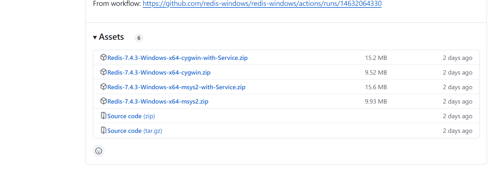

各个版本差异：

| 特性         | Cygwin 版本                               | MSYS2 版本                                |
| ------------ | ----------------------------------------- | ----------------------------------------- |
| 构建环境     | 使用 Cygwin 编译，兼容 POSIX 特性更多。   | 使用 MSYS2 编译，速度更快、更轻量。       |
| 性能表现     | 相对较慢一些。                            | 相对更快、更接近原生。                    |
| 兼容性       | 与 Linux 程序接口更相似。                 | 更适合 Windows 原生开发场景。             |
| 底层依赖     | 依赖 `cygwin1.dll`。                      | 依赖 `msys-2.0.dll`。                     |
| with-Service | 可通过 Windows 服务方式安装和启动 Redis。 | 可通过 Windows 服务方式安装和启动 Redis。 |

下载完成后解压，提供三种运行模式：

- 运行项目中的 start.bat 脚本，一键启动。
- 使用命令行。
- 以系统服务运行。


**命令行启动**

先将安装目录配置环境变量。

`cmd` 启动：

```shell
redis-server.exe redis.conf
```

`powershell` 启动：

```shell
./redis-server.exe redis.conf
```


**安装服务**

可实现开机自启动 请以管理员身份运行，并将 RedisService.exe 改为实际存放的路径：

```shell
sc create Redis binpath= "C:\Software\Redis\RedisService.exe" start= auto
```

> [!TIP]
>
> 选项与其值之间需要空格（例如 `start= auto`）， 如果省略空格，操作将失败新版 Windows 可忽略。

完成后可以在【服务】界面看到：

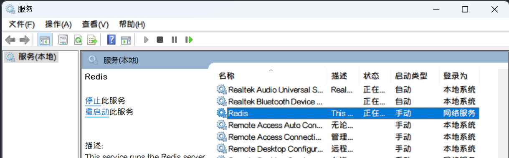

服务默认为自动启动状态（开机自启），如果不希望自动启动可以改为手动启动，通过服务页面或者以下命令控制 Redis 服务：

```shell
# 启动 Redis 服务
sc start Redis

# 停止 Redis 服务
sc stop Redis

# 卸载 Redis 服务
sc delete Redis
```


### 2.2.3、安装遇到的一些问题

#### ARM64环境启动BUG

```
1:C 24 Apr 2022 14:31:23.525 # oO0OoO0OoO0Oo Redis is starting oO0OoO0OoO0Oo
1:C 24 Apr 2022 14:31:23.525 # Redis version=6.2.6, bits=64, commit=00000000, modified=0, pid=1, just started
1:C 24 Apr 2022 14:31:23.525 # Configuration loaded
1:M 24 Apr 2022 14:31:23.526 * monotonic clock: POSIX clock_gettime
                _._                                                  
           _.-``__ ''-._                                             
      _.-``    `.  `_.  ''-._           Redis 6.2.6 (00000000/0) 64 bit
  .-`` .-```.  ```\/    _.,_ ''-._                                  
 (    '      ,       .-`  | `,    )     Running in standalone mode
 |`-._`-...-` __...-.``-._|'` _.-'|     Port: 16379
 |    `-._   `._    /     _.-'    |     PID: 1
  `-._    `-._  `-./  _.-'    _.-'                                   
 |`-._`-._    `-.__.-'    _.-'_.-'|                                  
 |    `-._`-._        _.-'_.-'    |           https://redis.io       
  `-._    `-._`-.__.-'_.-'    _.-'                                   
 |`-._`-._    `-.__.-'    _.-'_.-'|                                  
 |    `-._`-._        _.-'_.-'    |                                  
  `-._    `-._`-.__.-'_.-'    _.-'                                   
      `-._    `-.__.-'    _.-'                                       
          `-._        _.-'                                           
              `-.__.-'                                               

1:M 24 Apr 2022 14:31:23.526 # WARNING: The TCP backlog setting of 511 cannot be enforced because /proc/sys/net/core/somaxconn is set to the lower value of 128.
1:M 24 Apr 2022 14:31:23.526 # Server initialized
1:M 24 Apr 2022 14:31:23.527 # WARNING Your kernel has a bug that could lead to data corruption during background save. Please upgrade to the latest stable kernel.
1:M 24 Apr 2022 14:31:23.527 # Redis will now exit to prevent data corruption. Note that it is possible to suppress this warning by setting the following config: ignore-warnings ARM64-COW-BUG
```

**解决办法**

在 redis.conf 最后一行取消以下配置注释：

```
ignore-warnings ARM64-COW-BUG
```

如果没有的话就手动新增配置。


## 2.3、基础知识

### 2.3.1、快速上手

#### 启动

启动 Redis 服务器：

```shell
redis-server
```

带配置文件启动（`/etc/redis/redis.conf` 为配置文件地址，为了方便管理，将配置文件复制到了 `/etc/redis` 下）：

```shell
redis-server /etc/redis/redis.conf
```

带配置文件启动，且指定某几个配置，配置名称前加 `--`，会覆盖配置文件里值：

```shell
redis-server /etc/redis/redis.conf --daemonize yes --port 1123
```

查看版本号：

```shell
redis-server -v
```


#### 连接

启动 Redis 客户端：

```shell
redis-cli
```

交互模式：

```shell
redis-cli -h 127.0.0.1 -p 6379
```


#### 关闭

关闭 Redis：

```shell
redis-cli shutdown
```

如果 Redis 设置密码，需要登录 Redis 后先认证再 `shutdown` 命令关闭：

```shell
auth <密码>
```


#### Redis 工具

Redis 性能测试工具：

```shell
redis-benchmark
```

aof 文件修复工具：

```shell
redis-check-aof
```

rdb 文件检查工具：

```shell
redis-check-dump
```


### 2.3.2、常用命令

| 命令                    | 描述                                                         |
| ----------------------- | ------------------------------------------------------------ |
| `select [db_index]`     | 切换到 db_index 号数据库，Redis 默认 16 个数据库，默认是使用第 0 个 |
| `dbsize`                | 查看数据库大小                                               |
| `keys *`                | 查看所有的键                                                 |
| `flushdb`               | 清空当前数据库                                               |
| `flushall`              | 清空所有数据库                                               |
| `move [key] [db_index]` | 当前数据库的 key 移动到给定的数据库 db_index 当中            |
| `expire [key] [second]` | 设置该 key 在 second 秒后过期                                |
| `ttl [key]`             | 显示 key 的剩余有效时间（time to live 存活时间）             |
| `type [key]`            | 显示 key 的类型                                              |
| `exists [key]`          | 查看 key 是否存在，1 表示存在，0 表示不存在                  |
| `del [key]`             | 删除该 key                                                   |


# 3、五大数据类型

Redis 是一个开源（BSD许可）的，内存中的数据结构存储系统，它可以用作数据库、缓存和消息中间件。 它支持多种类型的数据结构，如 字符串（strings）， 散列（hashes）， 列表（lists）， 集合（sets）， 有序集合（sorted sets） 与范围查询， bitmaps， hyperloglogs 和 地理空间（geospatial） 索引半径查询。 Redis 内置了 复制（replication），LUA脚本（Lua scripting）， LRU驱动事件（LRU eviction），事务（transactions） 和不同级别的 磁盘持久化（persistence）， 并通过 Redis哨兵（Sentinel）和自动分区（Cluster）提供高可用性（high availability）。


## 3.1、String（字符串）

string 是 redis 最基本的类型，可以理解成与 Memcached 一模一样的类型，一个 key 对应一个 value。value 其实不仅是 String，也可以是数字。string 类型是二进制安全的。意思是 redis 的 string 可以包含任何数据。比如 jpg 图片或者序列化的对象。string 类型是 Redis 最基本的数据类型，string 类型的值最大能存储 512MB。

常用命令：`get`、`set`、`incr`、`decr`、`mget` 等。

应用场景：String 是最常用的一种数据类型，普通的 key / value 存储都可以归为此类，即可以完全实现目前 Memcached 的功能，并且效率更高。还可以享受 Redis 的定时持久化，操作日志及 Replication 等功能。

使用场景：常规 key-value 缓存应用。常规计数：微博数，粉丝数。


**追加字符串**

```shell
127.0.0.1:6379> set key1 v1 # 设置值
OK
127.0.0.1:6379> get key1 # 获取值
"v1"
127.0.0.1:6379> keys * 
1) "key1"
127.0.0.1:6379> exists key1
(integer) 1
127.0.0.1:6379> append key1 'hello' # 追加字符串，如果当前 key 不存在，就相当于 set key
(integer) 7
127.0.0.1:6379> get key1
"v1hello"
127.0.0.1:6379> strlen key1 # 获取字符串长度
(integer) 7
```


**计数器**

```shell
127.0.0.1:6379> set views 0
OK
127.0.0.1:6379> get views
"0"
127.0.0.1:6379> incr views # 自增 1
(integer) 1
127.0.0.1:6379> incr views
(integer) 2
127.0.0.1:6379> incrby views 10 # 自增 10
(integer) 12
127.0.0.1:6379> decr views # 自减 1
(integer) 11
127.0.0.1:6379> decrby views 10 # 自减 10
(integer) 1
```


**截取字符串**

```shell
127.0.0.1:6379> set key1 'Orihcalcos'
OK
127.0.0.1:6379> get key1
"Orihcalcos"
127.0.0.1:6379> getrange key1 2 3 # 截取字符串 [2,3]，将 get 改为 set 则表示替换
"ih"
127.0.0.1:6379> getrange key1 2 -1 # 如果 end 参数为 -1 则表示截取完
"ihcalcos"
```


**有效时间**

```shell
127.0.0.1:6379> setex key 10 'Orichalcos' # 设置过期时间 （set expire）
OK
127.0.0.1:6379> ttl key
(integer) 1
127.0.0.1:6379> ttl key
(integer) -2
127.0.0.1:6379> setnx mykey 'redis' # 不存在则设置（set not exist）
(integer) 1
127.0.0.1:6379> setnx mykey 'Orichalcos'
(integer) 0
127.0.0.1:6379> get mykey
"redis"
127.0.0.1:6379> get key
(nil)
```


**群体导入**

```shell
127.0.0.1:6379> mset k1 v1 k2 v2 # 群体导入
OK
127.0.0.1:6379> msetnx k1 v1 k3 v3 # msetnx 具有原子性
(integer) 0
```


**对象**

```shell
127.0.0.1:6379> set user:1 {name:zhangsan,age:3} # 设置一个 user:1 对象，使用 json 字符来保存一个对象
OK
127.0.0.1:6379> mset user:1:name zhangsan user:1:age 2 # user:{id}:{filed}
OK
127.0.0.1:6379> mget user:1:name user:1:age
1) "zhangsan"
2) "2"
127.0.0.1:6379> get user:1
"{name:zhangsan,age:3}"
```


**getset**

```shell
127.0.0.1:6379> getset db redis # 如果不存在值，则返回 nil
(nil)
127.0.0.1:6379> get db
"redis"
127.0.0.1:6379> getset db mongodb # 如果存在值，获取原来的值，并设置新的值
"redis"
127.0.0.1:6379> get db
"mongodb"
```


## 3.2、List（列表）

列表是简单的字符串列表，按照插入顺序排序。可以添加一个元素到列表的头部（左边）或者尾部（右边）。

常用命令：`lpush`（添加左边元素），`rpush`，`lpop`（移除左边第一个元素），`rpop`，`lrange`（获取列表片段，Lrange key start stop）等。

应用场景：Redis list 的应用场景非常多，也是 Redis 最重要的数据结构之一，比如 twitter 的关注列表，粉丝列表等都可以用 Redis 的 list 结构来实现。

实现方式：Redis 的 list 是每个子元素都是 String 类型的双向链表，可以通过 `push` 和 `pop` 操作从列表的头部或者尾部添加或者删除元素，可以支持反向查找和遍历，这样 List 既可以作为栈，也可以作为队列，不过带来了部分额外的内存开销。获取越接近两端的元素速度越快，通过索引访问时会比较慢。Redis 内部的很多实现，包括发送缓冲队列等也都是用的这个数据结构。

使用场景：

- 消息队列系统：使用 list 可以构建队列系统，轻松地实现最新消息排行等功能。利用 List 的 `push` 操作，将任务存在 List 中，然后工作线程再用 `pop` 操作将任务取出进行执行，使用 sorted set 甚至可以构建有优先级的队列系统。比如：将 Redis 用作日志收集器，实际上还是一个队列，多个端点将日志信息写入 Redis，然后一个 worker 统一将所有日志写到磁盘。
- 取最新 N 个数据的操作：记录前 N 个最新登陆的用户 Id 列表，超出的范围可以从数据库中获得。

列表最多可存储 2^32^ - 1 元素 (4294967295, 每个列表可存储40多亿)。


```shell
127.0.0.1:6379> lpush list one # 将一个值或多个值插入到列表头部（左）
(integer) 1
127.0.0.1:6379> lpush list two
(integer) 2
127.0.0.1:6379> lpush list three
(integer) 3
127.0.0.1:6379> lrange list 0 -1 # 获取 list 中所有的值
1) "three"
2) "two"
3) "one"
127.0.0.1:6379> lrange list 0 1 # 通过区间获取具体的值 [0,1]
1) "three"
2) "two"
127.0.0.1:6379> rpush list zero # 将一个值或多个值插入到列表尾部（右）
(integer) 4
127.0.0.1:6379> lrange list 0 -1
1) "three"
2) "two"
3) "one"
4) "zero"
```

```shell
127.0.0.1:6379> lrange list 0 -1
1) "three"
2) "two"
3) "one"
4) "zero"
127.0.0.1:6379> lpop list # 移除 list 的第一个元素
"three"
127.0.0.1:6379> rpop list # 移除 list 的最后一个元素
"zero"
127.0.0.1:6379> lrange list 0 -1
1) "two"
2) "one"
```

```shell
127.0.0.1:6379> lrange list 0 -1
1) "two"
2) "one"
127.0.0.1:6379> lindex list 1 # 通过下标获取 list 中的某一个值
"one"
127.0.0.1:6379> lindex list 0
"two"
127.0.0.1:6379> llen list # 返回列表的长度
(integer) 2
```

```shell
127.0.0.1:6379> lrange list 0 -1
1) "three"
2) "three"
3) "two"
4) "one"
127.0.0.1:6379> lrem list 1 three # 删除 list 中的一个 key（1 不是下标而是数量，从左开始删除）
(integer) 1
127.0.0.1:6379> lrange list 0 -1
1) "three"
2) "two"
3) "one"
```

```shell
127.0.0.1:6379> lrange mylist 0 -1
1) "hello3"
2) "hello2"
3) "hello1"
4) "hello"
127.0.0.1:6379> ltrim mylist 1 2 # 通过下标截取指定长度的 list，这个 list 将被改变，lrange 不会改变原 list
OK
127.0.0.1:6379> lrange mylist 0 -1
1) "hello2"
2) "hello1"
```

```shell
127.0.0.1:6379> lrange mylist 0 -1
1) "hello2"
2) "hello1"
127.0.0.1:6379> rpoplpush mylist myotherlist # 移除列表的最后一个元素，将它移动到新的列表中
"hello1"
127.0.0.1:6379> lrange mylist 0 -1
1) "hello2"
127.0.0.1:6379> lrange myotherlist 0 -1
1) "hello1"
```

```shell
127.0.0.1:6379> lrange list 0 -1
1) "v3"
2) "v2"
3) "v1"
127.0.0.1:6379> lset list 0 vv # 替换掉指定下标的值，list 和 index 都必须存在，否则报错
OK
127.0.0.1:6379> lrange list 0 -1
1) "vv"
2) "v2"
3) "v1"
```

```shell
127.0.0.1:6379> rpush list hello
(integer) 1
127.0.0.1:6379> rpush list world
(integer) 2
127.0.0.1:6379> lrange list 0 -1
1) "hello"
2) "world"
127.0.0.1:6379> linsert list before 'world' my # 在某个元素 之前/之后 插入新的元素
(integer) 3
127.0.0.1:6379> lrange list 0 -1
1) "hello"
2) "my"
3) "world"
```


## 3.3、Set（集合）

Redis set 是 string 类型的无序集合。集合是通过 intset 和 hashtable 实现的，概念和数学中个的集合基本类似，可以交集，并集，差集等等，set 中的元素是没有顺序的。所以添加，删除，查找的复杂度都是O(1)。

常用命令：`sadd`，`spop`，`smembers`，`sunion` 等。

应用场景：Redis set 对外提供的功能与 list 类似是一个列表的功能，特殊之处在于 set 是可以自动排重的，当需要存储一个列表数据，又不希望出现重复数据时，set 是一个很好的选择，并且 set 提供了判断某个成员是否在一个 set 集合内的重要接口，这个也是 list 所不能提供的。

案例：在微博中，可以将一个用户所有的关注人存在一个集合中，将其所有粉丝存在一个集合。Redis还为集合提供了求交集、并集、差集等操作，可以非常方便的实现如共同关注、共同喜好、二度好友等功能，对上面的所有集合操作，还可以使用不同的命令选择将结果返回给客户端还是存集到一个新的集合中。

集合中最大的成员数为 2^32^ - 1(4294967295, 每个集合可存储40多亿个成员)。


```shell
127.0.0.1:6379> sadd myset hello # 集合中添加元素，成功返回1，如果元素已经在集合中返回 0，如果 key 对应的 set 不存在则返回错误
(integer) 1
127.0.0.1:6379> sadd myset orichalcos
(integer) 1
127.0.0.1:6379> sadd myset hello_orichalcos
(integer) 1
127.0.0.1:6379> smembers myset # 查看指定 set 的所有值
1) "hello_orichalcos"
2) "orichalcos"
3) "hello"
127.0.0.1:6379> sismember myset hello # 判断某一个值是不是在 set 集合中
(integer) 1
127.0.0.1:6379> sismember myset hell
(integer) 0
127.0.0.1:6379> scard myset # 获取 set 集合中的内容元素个数
(integer) 3
```

```shell
127.0.0.1:6379> smembers myset
1) "hello_orichalcos"
2) "orichalcos"
3) "hei"
127.0.0.1:6379> srem myset hei # 移除 set 集合中的指定元素
(integer) 1
127.0.0.1:6379> smembers myset
1) "hello_orichalcos"
2) "orichalcos"
```

```shell
127.0.0.1:6379> srandmember myset # 随机抽出一个元素
"hello_orichalcos"
127.0.0.1:6379> srandmember myset
"hello_world"
127.0.0.1:6379> srandmember myset 2 # 随机抽出指定个数的元素
1) "hello_world"
2) "hello"
```

```shell
127.0.0.1:6379> sadd mylist hello
(integer) 1
127.0.0.1:6379> sadd mylist world
(integer) 1
127.0.0.1:6379> sadd mylist orichalcos
(integer) 1
127.0.0.1:6379> spop mylist # 随机删除一个元素
"orichalcos"
```

```shell
127.0.0.1:6379> smembers mylist
1) "orichalcos"
2) "world"
3) "hello"
127.0.0.1:6379> smove mylist myset orichalcos # 将一个指定的值，移动到另一个 set 集合中
(integer) 1
127.0.0.1:6379> smembers myset
1) "orichalcos"
```

```shell
# 可以用于共同关注，共同爱好，推荐好友
127.0.0.1:6379> sadd key1 a b c
(integer) 3
127.0.0.1:6379> sadd key2 c d e
(integer) 3
127.0.0.1:6379> sdiff key1 key2 # 差集
1) "b"
2) "a"
127.0.0.1:6379> sinter key1 key2 # 交集
1) "c"
127.0.0.1:6379> sunion key1 key2 # 并集
1) "b"
2) "c"
3) "d"
4) "a"
5) "e"
```


## 3.4、Hash（哈希）

Redis hash 是一个键值 (key => value) 对集合。Redis hash 是一个 string 类型的 field 和 value 的映射表，hash 特别适合用于存储对象。

常用命令：`hget`，`hset`，`hgetall` 等。

使用场景：存储部分变更数据，如用户信息等。每个 hash 可以存储 2^32^ -1 键值对（40多亿）。

```shell
127.0.0.1:6379> hset myhash field1 orichalcos # set 一个具体 key-value
(integer) 1
127.0.0.1:6379> hget myhash field1 # 获取一个字段值
"orichalcos"
127.0.0.1:6379> hmset myhash field2 hello field3 world # set 多个 key-value
OK
127.0.0.1:6379> hmget myhash field2 field3 # 获取多个字段值
1) "hello"
2) "world"
127.0.0.1:6379> hgetall myhash # 获取全部的数据
1) "field1"
2) "orichalcos"
3) "field2"
4) "hello"
5) "field3"
6) "world"
```

```shell
127.0.0.1:6379> hdel myhash field1 # 删除 hash 指定 key 字段，value 也会消失
(integer) 1
127.0.0.1:6379> hgetall myhash 
1) "field2"
2) "hello"
3) "field3"
4) "world"
```

```shell
127.0.0.1:6379> hgetall myhash
1) "field2"
2) "hello"
3) "field3"
4) "world"
127.0.0.1:6379> hlen myhash # 获取 hash 表的字段数量
(integer) 2
```

```shell
127.0.0.1:6379> hexists myhash field1 # 判断 hash 中指定字段是否存在
(integer) 0
127.0.0.1:6379> hexists myhash field2
(integer) 1
```

```shell
127.0.0.1:6379> hkeys myhash # 获取所有的 field
1) "field2"
2) "field3"
127.0.0.1:6379> hvals myhash # 获取所有的 value
1) "hello"
2) "world"
```

```shell
127.0.0.1:6379> hset myash field4 5 
(integer) 1
127.0.0.1:6379> hget myash field4
"5"
127.0.0.1:6379> hincrby myash field4 1  # 指定增量
(integer) 6
127.0.0.1:6379> hsetnx myhash field4 hello # 如果不存在则可以设置
(integer) 1
127.0.0.1:6379> hsetnx myhash field4 hello
(integer) 0
```

​	

## 3.5、Zset（有序集合）

Redis zset 和 set 一样也是string类型元素的集合,且不允许重复的成员。

常用命令：`zadd`，`zrange`，`zrem`，`zcard` 等

使用场景：Redis sorted set 的使用场景与 set 类似，区别是 set 不是自动有序的，而 sorted set 可以通过用户额外提供一个优先级 (score) 的参数来为成员排序，并且是插入有序的，即自动排序。当需要一个有序的并且不重复的集合列表，那么可以选择 sorted set 数据结构，比如 twitter 的 public timeline 可以以发表时间作为 score 来存储，这样获取时就是自动按时间排好序的。和 Set 相比，Sorted Set 关联了一个 double 类型权重参数score，使得集合中的元素能够按 score 进行有序排列，redis 正是通过分数来为集合中的成员进行从小到大的排序。zset 的成员是唯一的，但分数(score) 却可以重复。比如一个存储全班同学成绩的 Sorted Set，其集合 value 可以是同学的学号，而 score 就可以是其考试得分，这样在数据插入集合的时候，就已经进行了天然的排序。另外还可以用 Sorted Set 来做带权重的队列，比如普通消息的 score 为1，重要消息的 score 为2，然后工作线程可以选择按 score 的倒序来获取工作任务。让重要的任务优先执行。

```shell
127.0.0.1:6379> zadd myset 1 one # 添加一个值
(integer) 1
127.0.0.1:6379> zadd myset 2 two 3 threee # 添加多个值
(integer) 2
127.0.0.1:6379> zrange myset 0 -1
1) "one"
2) "two"
3) "threee"
```

```shell
127.0.0.1:6379> zadd salary 2500 xiaohong 2000 zhangsan 500 Orichalcos
(integer) 3
127.0.0.1:6379> zrange salary 0 -1
1) "Orichalcos"
2) "zhangsan"
3) "xiaohong"
127.0.0.1:6379> zrangebyscore salary -inf +inf # 显示所有值 从小到大
1) "Orichalcos"
2) "zhangsan"
3) "xiaohong"
127.0.0.1:6379> zrevrangebyscore salary +inf -inf #显示所有值 从大到小
1) "xiaohong"
2) "zhangsan"
3) "Orichalcos"
127.0.0.1:6379> zrangebyscore salary -inf +inf withscores # 显示所有信息 从小到大
1) "Orichalcos"
2) "500"
3) "zhangsan"
4) "2000"
5) "xiaohong"
6) "2500"
```

```shell
127.0.0.1:6379> zrange salary 0 -1
1) "Orichalcos"
2) "zhangsan"
3) "xiaohong"
127.0.0.1:6379> zrem salary xiaohong # 删除指定元素
(integer) 1
127.0.0.1:6379> zrange salary 0 -1
1) "Orichalcos"
2) "zhangsan"
```

```shell
127.0.0.1:6379> zcard salary # 获取有序集合中的个数
(integer) 2
```

```shell
127.0.0.1:6379> zrange myset 0 -1
1) "one"
2) "two"
3) "threee"
127.0.0.1:6379> zcount myset 1 2 # 获取指定区间的成员数量
(integer) 2
```


# 4、三大特殊类型

## 4.1、geospatial（地理位置）

朋友的定位，附近的人，打车距离的计算？

Reids 的 Geo 在 Reids 3.2 版本就推出了！这个功能可以推算地理位置的信息，两地之间的距离，方圆几里的人。

只有六个命令：

- `geoadd`
- `geodist`
- `geohash`
- `geopos`
- `georadius`
- `georadiusbymember`


**geoadd**

添加地理位置，规则：两级无法直接添加，我们一般会下载城市数据，直接通过 java 程序一次性导入！

有效的经度从 -180 度到 180 度，有效的纬度从 -85.05112878 度到 85.05112878 度，当坐标位置超出上诉指定范围时，该命令将会返回一个错误。

```shell
127.0.0.1:6379> geoadd china:city 116.40 39.90 beijing
(integer) 1
127.0.0.1:6379> geoadd china:city 121.47 31.23 shanghai
(integer) 1
127.0.0.1:6379> geoadd china:city 106.50 29.53 chongqi 114.05 22.52 shenzhen
(integer) 2
127.0.0.1:6379> geoadd china:city 120.16 30.24 hangzhou 108.96 34.26 xian
(integer) 2 
```


**geopos**

获取当前定位，一定是一个坐标值。

```shell
127.0.0.1:6379> geopos china:city beijing
1) 1) "116.39999896287918091"
   2) "39.90000009167092543"
127.0.0.1:6379> geopos china:city hangzhou
1) 1) "120.1600000262260437"
   2) "30.2400003229490224"
```


**geodist**

两人之间的距离。

单位：

- **m** 表示单位为 米。
- **km** 表示单位为 千米。
- **mi** 表示单位为 英里。
- **ft** 表示单位为 英尺。

```shell
127.0.0.1:6379> geodist china:city beijing chongqi
"1464070.8051"
127.0.0.1:6379> geodist china:city beijing chongqi km
"1464.0708"
```


**georadius**

以给定的的经度纬度为中心，找出某一半径内的元素。

我附近的人？

```shell
127.0.0.1:6379> georadius china:city 100 30 1000 km # 以 100，30 这个经纬度为中心，寻找 1000km 内的城市
1) "chongqi"
2) "xian"
127.0.0.1:6379> georadius china:city 100 30 1000 km withdist # 显示到中心的距离
1) 1) "chongqi"
   2) "629.6756"
2) 1) "xian"
   2) "967.2846"
127.0.0.1:6379> georadius china:city 100 30 1000 km withcoord # 显示他人的定位信息
1) 1) "chongqi"
   2) 1) "106.49999767541885376"
      2) "29.52999957900659211"
2) 1) "xian"
   2) 1) "108.96000176668167114"
      2) "34.25999964418929977"
127.0.0.1:6379> georadius china:city 100 30 1000 km withcoord count 1 # 筛选出指定的结果
1) 1) "chongqi"
   2) 1) "106.49999767541885376"
      2) "29.52999957900659211"
```


**georadiusbymember**

找出位于指定元素周围的其他元素。

```shell
127.0.0.1:6379> georadiusbymember china:city beijing 1000 km
1) "beijing"
2) "xian"
127.0.0.1:6379> georadiusbymember china:city shanghai 1000 km
1) "hangzhou"
2) "shanghai"
```


**geohash**

该命令将返回11个字符的Geohash字符串。

```shell
127.0.0.1:6379> geohash china:city beijing chongqi
1) "wx4fbxxfke0"
2) "wm5xzrybty0"
```


GEO 底层的实现原理其实就是 Zset，可以使用 Zset 命令来操作 geo。

```shell
127.0.0.1:6379> zrange china:city 0 -1
1) "chongqi"
2) "xian"
3) "shenzhen"
4) "hangzhou"
5) "shanghai"
6) "beijing"
127.0.0.1:6379> zrem china:city xian
(integer) 1
```


## 4.2、hyperloglog

Redis Hyperloglog 基数统计算法。

优点：占用内存是固定的，2^64^ 不同的元素的只需要 12KB 的内存，如果只要从内存角度来比较的话 Hyperloglog 首选。

传统的方式，set 保存用户的 id，然后就可以统计 set 中的元素的数量作为标准判断！这个方式如果保存大量的用户 id，就会比较麻烦，因为目的是为了计数，而不是保存用户 id；并且具有 0.81% 的错误率，但是如果是用于 UV 任务，这个可以忽略不记。

> **UV（Unique visitor）**
> 是指通过互联网访问、浏览这个网页的自然人。访问您网站的一台电脑客户端为一个访客。00:00-24:00内相同的客户端只被计算一次。
>
> 一天内同个访客多次访问仅计算一个UV。
>
> **IP（Internet Protocol）**
> 独立IP是指访问过某站点的IP总数，以用户的IP地址作为统计依据。00:00-24:00内相同IP地址之被计算一次。
>
> **UV与IP区别：**
> 如：你和你的家人用各自的账号在同一台电脑上登录新浪微博，则IP数+1，UV数+2。由于使用的是同一台电脑，所以IP不变，但使用的不同账号，所以UV+2

> **PV（Page View）**
> 即页面浏览量或点击量，用户每1次对网站中的每个网页访问均被记录1个PV。用户对同一页面的多次访问，访问量累计，用以衡量网站用户访问的网页数量。
>
> **VV（Visit View）**
> 用以统计所有访客1天内访问网站的次数。当访客完成所有浏览并最终关掉该网站的所有页面时便完成了一次访问，同一访客1天内可能有多次访问行为，访问次数累计。
>
> **PV与VV区别：**
> 如：你今天10点钟打开了百度，访问了它的三个页面；11点钟又打开了百度，访问了它的两个页面，则PV数+5，VV数+2.
> PV是指页面的浏览次数，VV是指你访问网站的次数。

```shell
127.0.0.1:6379> pfadd mykey a b c d e f g h i j # 创建第一组元素 mykey
(integer) 1
127.0.0.1:6379> pfcount mykey # 统计 mykey 元素的基数数量
(integer) 10
127.0.0.1:6379> pfadd mykey2 i j z x c v b n m # 创建第二组元素 mykey2
(integer) 1
127.0.0.1:6379> pfcount mykey2
(integer) 9
127.0.0.1:6379> pfmerge mykey3 mykey mykey2 # 合并两组
OK
127.0.0.1:6379> pfcount mykey3
(integer) 15
```


## 4.3、Bitmap

统计用户信息，活跃-不活跃；登录-未登录；打卡-未打卡。这种两个状态的，都可以使用 Bitmaps。

Bitmaps 位图，数据结构！都是操作二进制位来记录，就只有 0 和 1 两个状态！

```shell
127.0.0.1:6379> setbit sign 0 1
(integer) 0
127.0.0.1:6379> setbit sign 1 0
(integer) 0
127.0.0.1:6379> setbit sign 2 0
(integer) 0
127.0.0.1:6379> setbit sign 3 1
(integer) 0
127.0.0.1:6379> setbit sign 4 1
(integer) 0
127.0.0.1:6379> setbit sign 5 0
(integer) 0
127.0.0.1:6379> setbit sign 6 0
(integer) 0
127.0.0.1:6379> getbit sign 3
(integer) 1
127.0.0.1:6379> getbit sign 6
(integer) 0
127.0.0.1:6379> bitcount sign
(integer) 3
```


# 5、事务

Redis 通过 `multi`、 `discard` 、`exec` 和 `watch` 四个命令来实现事务功能。

事务提供了一种 “将多个命令打包， 然后一次性、按顺序地执行” 的机制， 并且事务在执行的期间不会主动中断；服务器在执行完事务中的所有命令之后， 才会继续处理其他客户端的其他命令。

以下是一个事务的例子， 它先以 `multi` 开始一个事务， 然后将多个命令入队到事务中， 最后由 `exec` 命令触发事务， 一并执行事务中的所有命令：

```bash
redis> multi
OK

redis> set book-name "Mastering C++ in 21 days"
QUEUED

redis> get book-name
QUEUED

redis> sadd tag "C++" "Programming" "Mastering Series"
QUEUED

redis> smembers tag
QUEUED

redis> exec
1) OK
2) "Mastering C++ in 21 days"
3) (integer) 3
4) 1) "Mastering Series"
   2) "C++"
   3) "Programming"
```


## 5.1、事务的流程

一个事务从开始到执行会经历以下三个阶段：

1. 开启事务（`multi`）
2. 命令入队
3. 执行事务（`exec`）


**开启事务**

`multi` 命令的执行标记事务的开始：

```bash
redis> multi
OK
```

这个命令唯一做的就是， 将客户端的 REDIS_MULTI 选项打开， 让客户端从非事务状态切换到事务状态。


事务状态下的命令以单个命令为单位执行，前一个命令和后一个命令的客户端不一定是同一个；而事务状态则是以一个事务为单位，执行事务队列中的所有命令：除非当前事务执行完毕，否则服务器不会中断事务，也不会执行其他客户端的其他命令。


**命令入队**

当客户端处于非事务状态下时， 所有发送给服务器端的命令都会立即被服务器执行：

```bash
redis> set msg "hello moto"
OK

redis> get msg
"hello moto"
```

但是， 当客户端进入事务状态之后， 服务器在收到来自客户端的命令时， 不会立即执行命令， 而是将这些命令全部放进一个事务队列里， 然后返回 QUEUED ， 表示命令已入队：

```bash
redis> multi
OK

redis> set msg "hello moto"
QUEUED

redis> get msg
QUEUED
```

以下流程图展示了这一行为：

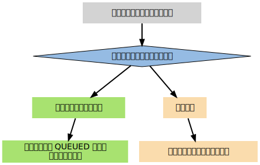

事务队列是一个数组， 每个数组项是都包含三个属性：

- 要执行的命令（cmd）
- 命令的参数（argv）
- 参数的个数（argc）

举个例子， 如果客户端执行以下命令：

```bash
redis> multi
OK

redis> set book-name "Mastering C++ in 21 days"
QUEUED

redis> get book-name
QUEUED

redis> sadd tag "C++" "Programming" "Mastering Series"
QUEUED

redis> smembers tag
QUEUED
```

那么程序将为客户端创建以下事务队列：

| 数组索引 | cmd      | argv                                              | argc |
| -------- | -------- | ------------------------------------------------- | ---- |
| 0        | set      | ["book-name", "Mastering C++ in 21 days"]         | 2    |
| 1        | get      | ["book-name"]                                     | 1    |
| 2        | sadd     | ["tag", "C++", "Programming", "Mastering Series"] | 4    |
| 3        | smembets | ["tag"]                                           | 1    |

> Redis 的事务是不可嵌套的， 当客户端已经处于事务状态， 而客户端又再向服务器发送 `multi` 时， 服务器只是简单地向客户端发送一个错误， 然后继续等待其他命令的入队。 `multi` 命令的发送不会造成整个事务失败， 也不会修改事务队列中已有的数据。


**执行事务**

当客户端进入事务状态之后， 客户端发送的命令就会被放进事务队列里，但其实并不是所有的命令都会被放进事务队列， 其中的例外就是 `exec`、 `discard`、 `multi` 和 `watch` 这四个命令；当这四个命令从客户端发送到服务器时， 它们会像客户端处于非事务状态一样， 直接被服务器执行：


如果客户端正处于事务状态， 那么当 `exec` 命令执行时， 服务器根据客户端所保存的事务队列， 以先进先出（FIFO）的方式执行事务队列中的命令： 最先入队的命令最先执行， 而最后入队的命令最后执行。

比如说，对于以下事务队列：

| 数组索引 | cmd      | argv                                              | argc |
| -------- | -------- | ------------------------------------------------- | ---- |
| 0        | set      | ["book-name", "Mastering C++ in 21 days"]         | 2    |
| 1        | get      | ["book-name"]                                     | 1    |
| 2        | sadd     | ["tag", "C++", "Programming", "Mastering Series"] | 4    |
| 3        | smembets | ["tag"]                                           | 1    |

程序会首先执行 `set` 命令， 然后执行 `get` 命令， 再然后执行 `sadd` 命令， 最后执行 `smembers` 命令，执行事务中的命令所得的结果会以 FIFO 的顺序保存到一个回复队列中。

比如说，对于上面给出的事务队列，程序将为队列中的命令创建如下回复队列：

| 数组索引 | 回复类型          | 回复内容                                   |
| -------- | ----------------- | ------------------------------------------ |
| 0        | status code reply | OK                                         |
| 1        | bulk reply        | "Mastering C++ in 21 days"                 |
| 2        | integer reply     | 3                                          |
| 3        | multi-bulk reply  | ["Mastering Series", "C++", "Programming"] |

当事务队列里的所有命令被执行完之后， `exec` 命令会将回复队列作为自己的执行结果返回给客户端， 客户端从事务状态返回到非事务状态， 至此， 事务执行完毕。

> `discard` 命令用于取消一个事务， 它清空客户端的整个事务队列， 然后将客户端从事务状态调整回非事务状态， 最后返回字符串 OK 给客户端， 说明事务已被取消。


## 5.2、watch

`watch` 命令用于在事务开始之前监视任意数量的键： 当调用 `exec` 命令执行事务时， 如果任意一个被监视的键已经被其他客户端修改了， 那么整个事务不再执行， 直接返回失败。

```bash
redis> watch name
OK

redis> multi
OK

redis> set name peter
QUEUED

redis> exec
(nil)
```

以下执行序列展示了上面的例子是如何失败的：

| 时间 | 客户端 A       | 客户端 B      |
| ---- | -------------- | ------------- |
| T1   | watch name     |               |
| T2   | multi          |               |
| T3   | set name peter |               |
| T4   |                | set name john |
| T5   | exec           |               |

在时间 T4 ，客户端 B 修改了 name 键的值， 当客户端 A 在 T5 执行 `exec` 时，Redis 会发现 name 这个被监视的键已经被修改， 因此客户端 A 的事务不会被执行，而是直接返回失败。


**watch 的实现**

在每个代表数据库的 redis.h/redisDb 结构类型中， 都保存了一个 watched_keys 字典， 字典的键是这个数据库被监视的键， 而字典的值则是一个链表， 链表中保存了所有监视这个键的客户端。

比如说，以下字典就展示了一个 watched_keys 字典的例子：


其中， 键 key1 正在被 client2 、 client5 和 client1 三个客户端监视， 其他一些键也分别被其他别的客户端监视着。

`watch` 命令的作用， 就是将当前客户端和要监视的键在 watched_keys 中进行关联

如果当前客户端为 client10086 ， 那么当客户端执行 `watch key1 key2` 时， 前面展示的 watched_keys 将被修改成这个样子：


通过 watched_keys 字典， 如果程序想检查某个键是否被监视， 那么它只要检查字典中是否存在这个键即可； 如果程序要获取监视某个键的所有客户端， 那么只要取出键的值（一个链表）， 然后对链表进行遍历即可。


**watch 的触发**

在任何对数据库键空间（key space）进行修改的命令成功执行之后 （比如 `flushdb`、 `set`、 `del`、 `lpush`、 `sadd`、 `zrem`，诸如此类）， multi.c/touchWatchedKey 函数都会被调用；它检查数据库的 watched_keys 字典， 看是否有客户端在监视已经被命令修改的键， 如果有的话， 程序将所有监视 这个/这些 被修改键的客户端的 REDIS_DIRTY_CAS 选项打开：

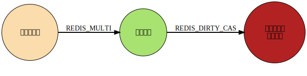

当客户端发送 `exec` 命令、触发事务执行时， 服务器会对客户端的状态进行检查：

- 如果客户端的 REDIS_DIRTY_CAS 选项已经被打开，那么说明被客户端监视的键至少有一个已经被修改了，事务的安全性已经被破坏。服务器会放弃执行这个事务，直接向客户端返回空回复，表示事务执行失败。
- 如果 REDIS_DIRTY_CAS 选项没有被打开，那么说明所有监视键都安全，服务器正式执行事务。

举个例子，假设数据库的 watched_keys 字典如下图所示：


如果某个客户端对 key1 进行了修改（比如执行 DEL key1 ）， 那么所有监视 key1 的客户端， 包括 client2 、 client5 和 client1 的 REDIS_DIRTY_CAS 选项都会被打开， 当客户端 client2 、 client5 和 client1 执行 `exec` 的时候， 它们的事务都会以失败告终。

最后，当一个客户端结束它的事务时，无论事务是成功执行，还是失败， watched_keys 字典中和这个客户端相关的资料都会被清除。


## 5.3、事务错误与回滚

**当命令入队时就报错，那么整个事务中所有的命令都不会执行：**

```shell
127.0.0.1:6379> multi
OK
127.0.0.1:6379> set k1 v1
QUEUED
127.0.0.1:6379> set k2 v2
QUEUED
127.0.0.1:6379> getset k1
(error) ERR wrong number of arguments for 'getset' command
127.0.0.1:6379> set k3 v3
QUEUED
127.0.0.1:6379> exec
(error) EXECABORT Transaction discarded because of previous errors.
```


**如果命令执行时出错，但是入队时成功，那么事务执行时，该命令出错，但是其他的命令会成功执行：**

```shell
127.0.0.1:6379> multi
OK
127.0.0.1:6379> set k1 'v1'
QUEUED
127.0.0.1:6379> incr k1
QUEUED
127.0.0.1:6379> set k2 v2
QUEUED
127.0.0.1:6379> get k1
QUEUED
127.0.0.1:6379> exec
1) OK
2) (error) ERR value is not an integer or out of range
3) OK
4) "v1"
127.0.0.1:6379> get k1
"v1"
```

在传统的 ACID 里，原子性有一个特点就是要么全部成功，要么全部失败，也就是我们传统 DB 里面说的回滚。当我们执行一个失败的事务可以发现，就算中间出现了失败，`set k1 'v1'` 这个操作也已经被执行了，并没有进行回滚，从严格的意义上来说 Redis 并不具备原子性。

再谈谈隔离性，Redis 因为是单线程操作，所以在隔离性上有天生的隔离机制，当 Redis 执行事务时，Redis 的服务端保证在执行事务期间不会对事务进行中断，所以，Redis 事务总是以串行的方式运行，事务也具备隔离性。


**事务回滚**

Redis 不支持事务回滚！

根据官方文档大概意思，作者不支持事务回滚的原因有以下两个：

- 他认为 Redis 事务的执行时，错误通常都是编程错误造成的，这种错误通常只会出现在开发环境中，而很少会在实际的生产环境中出现，所以他认为没有必要为 Redis 开发事务回滚功能
- 不支持事务回滚是因为这种复杂的功能和 Redis 追求的简单高效的设计主旨不符合


# 6、Jedis

什么是 Jedis 是 Redis 推荐的 Java 连接开发工具！使用 Java 操作 Redis 的中间件，如果要使用 Java 操作 Redis，那么一定要对 Jedis 十分熟悉。

1. 导入相关的依赖

	```xml
	<!-- https://mvnrepository.com/artifact/redis.clients/jedis -->
	<dependency>
	    <groupId>redis.clients</groupId>
	    <artifactId>jedis</artifactId>
	    <version>3.3.0</version>
	</dependency>
	<dependency>
	    <groupId>com.alibaba</groupId>
	    <artifactId>fastjson</artifactId>
	    <version>1.2.67</version>
	</dependency>
	```

2. 编码测试：

	- 连接数据库
	- 操作命令
	- 断开连接

	```java
	public class Test {
	    public static void main(String[] args) {
	        Jedis jedis = new Jedis("120.79.171.55", 6379);
	
	        System.out.println(jedis.ping());
	        
	        jedis.close();
	    }
	}
	```

	输出：

	```
	PONG
	```

其余的 API 操作和  Reids 的命令一样。


**Jedis 操作事务**

```java
public class RTransaction {
    public static void main(String[] args) {
        Jedis jedis = new Jedis("120.79.171.55", 6379);

        JSONObject jsonObject = new JSONObject();
        jsonObject.put("hello", "world");
        jsonObject.put("name", "Orichalcos");
        String string = jsonObject.toString();

        //开启事务
        Transaction multi = jedis.multi();

        try {
            multi.set("user1", string);
            multi.set("user2", string);

            //执行事务
            multi.exec();
        } catch (Exception e) {
            //放弃事务
            multi.discard();
        } finally {
            System.out.println(jedis.get("user1"));
            System.out.println(jedis.get("user2"));
            //关闭连接
            jedis.close();
        }
    }
}
```


# 7、Spring Boot 整合

RedisTemplate 是 Spring Data Redis 提供的一个强大的模板类，用于在 Spring 应用中与 Redis 进行交互。它是与 Spring 框架紧密集成的，可以适用于多种 Redis 客户端实现，包括 Jedis 和 Lettuce。

在早期版本的 Spring Data Redis 中，默认使用的是 Jedis 作为 Redis 客户端。但从 Spring Data Redis 2.0 版本开始，Lettuce 成为了默认的 Redis 客户端实现。

Jedis 是一个基于同步、非线程安全的 Redis 客户端，如果想要避免不安全，可以使用 Jedis Pool 连接池。

相比之下，Lettuce 是一个基于异步、线程安全和可扩展的 Redis 客户端，支持多个连接和高级功能。

如果你使用 Spring Boot，当添加了 `spring-boot-starter-data-redis` 依赖后，默认情况下会使用 Lettuce 作为 Redis 客户端实现。但是，如果你的应用需要，你也可以手动配置使用 Jedis。

无论使用 Jedis 还是 Lettuce，RedisTemplate 都提供了一种在 Spring 应用中更方便地与 Redis 进行交互的方式。你可以使用它来执行各种 Redis 操作，如设置键值、获取值、执行事务等。当然，具体的代码和配置可能因为你使用的客户端实现而略有不同，但使用 RedisTemplate 能够在你切换 Redis 客户端实现时减少代码改动的工作量。


**整合测试**

1. 导入依赖

   ```xml
   <dependency>
       <groupId>org.springframework.boot</groupId>
       <artifactId>spring-boot-starter-data-redis</artifactId>
   </dependency>
   ```

2. 配置连接

	```properties
	spring.redis.host=120.79.171.55
	spring.redis.port=6379
	```

3. 测试

	```java
	@SpringBootTest
	class Redis02SpringbootApplicationTests {
	    @Autowired
	    private RedisTemplate redisTemplate;
	
	    @Test
	    void contextLoads() {
	        //redisTemplate
	        //opsForValue()
	        //opsForSet()
	        //opsForHash()
	
	        //获取 redis 的连接对象
	        //RedisConnection connection = redisTemplate.getConnectionFactory().getConnection();
	        //connection.flushDb();
	        //connection.flushAll();
	
	        redisTemplate.opsForValue().set("mykey","Orichalcos");
	        System.out.println(redisTemplate.opsForValue().get("mykey"));
	    }
	}
	```


## 7.1、RedisTemplate 及序列化方式

运行上个例子后，在 Redis 中通过 `keys *` 命令可以看到：

```shell
"\xac\xed\x00\x05t\x00\x05mykey"
```

可以使用 StringRedisTemplate 来解决这个问题。


**RedisSerializer**

RedisSerializer 接口 是 Redis 序列化接口，用于 Redis KEY 和 VALUE 的序列化，实现类如下：


**两种 Template 的区别**

- 两者的关系： StringRedisTemplate 继承 RedisTemplate。

- 他们的数据是不共通的；也就是说 StringRedisTemplate 只能管理 StringRedisTemplate 里面的数据，RedisTemplate 只能管理 RedisTemplate 中的数据。

- 两者之间的区别主要在于他们使用的序列化类：

	> RedisTemplate 使用的是 JdkSerializationRedisSerializer（如果存入对象，对象要实现 Serializable 接口），存入数据会将数据先序列化成字节数组然后在存入 Redis 数据库。这个时候打开 Redis 查看的时候，你会看到你的数据不是以可读的形式展现的，而是以字节数组显示，类似下面：
	>
	>  
	>
	> 当然从 Redis 获取数据的时候也会默认将数据当做字节数组转化，这样就会导致一个问题，当需要获取的数据不是以字节数组存在 Redis 当中而是正常的可读的字符串的时候，比如说下面这种形式的数据：
	> 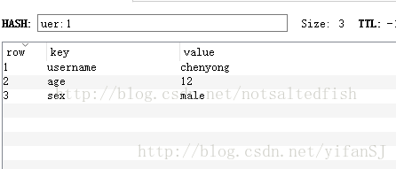
	>
	> RedisTemplate 就无法获取导数据，这个时候获取到的值就是 NULL。此时 StringRedisTempate 就派上了用场， StringRedisTemplate 使用的是 StringRedisSerializer，当 Redis 当中的数据值是以可读的形式显示出来的时候，只能使用 StringRedisTemplate 才能获取到里面的数据。


**两种 Template 的源码分析**

StringRedisTemplate 的部分源码如下：

```java
public class StringRedisTemplate extends RedisTemplate<String, String> {

	/**
	 * Constructs a new <code>StringRedisTemplate</code> instance. {@link #setConnectionFactory(RedisConnectionFactory)}
	 * and {@link #afterPropertiesSet()} still need to be called.
	 */
	public StringRedisTemplate() {
		setKeySerializer(RedisSerializer.string());
		setValueSerializer(RedisSerializer.string());
		setHashKeySerializer(RedisSerializer.string());
		setHashValueSerializer(RedisSerializer.string());
	}
    
}
```

通过该源码可以看到 StringRedisTemplate 采用的是 `RedisSerializer.string()` 来序列化 Redis 中存储数据的 Key 的。

下面再来看看 RedisTemplate 中默认采用什么形式来序列化对应的 Key。

```java
public class RedisTemplate<K, V> extends RedisAccessor implements RedisOperations<K, V>, BeanClassLoaderAware {
    // 省略其他源码
	private @Nullable RedisSerializer<?> defaultSerializer;
	private @Nullable ClassLoader classLoader;

	/*
	 * (non-Javadoc)
	 * @see org.springframework.data.redis.core.RedisAccessor#afterPropertiesSet()
	 */
	@Override
	public void afterPropertiesSet() {

		super.afterPropertiesSet();

		boolean defaultUsed = false;

		if (defaultSerializer == null) {

			defaultSerializer = new JdkSerializationRedisSerializer(
					classLoader != null ? classLoader : this.getClass().getClassLoader());
		}

		if (enableDefaultSerializer) {

			if (keySerializer == null) {
				keySerializer = defaultSerializer;
				defaultUsed = true;
			}
			// 省略其他源码
		}

		if (enableDefaultSerializer && defaultUsed) {
			Assert.notNull(defaultSerializer, "default serializer null and not all serializers initialized");
		}

		if (scriptExecutor == null) {
			this.scriptExecutor = new DefaultScriptExecutor<>(this);
		}

		initialized = true;
	}
	// 省略其他源码   
}
```

可以看到 RedisTemplate 使用的序列化类为 defaultSerializer，默认情况下为 JdkSerializationRedisSerializer。如果未指定 Key 的序列化类，keySerializer 与 defaultSerializer 采用相同的序列化类。

通过上述两个 Template 的分析就可以看出它们在 Redis 存储的 Key，采用了不同的序列化方法。而且 JdkSerializationRedisSerializer 序列化时会在 Key 的前面添加一些特殊字符。

那么，如果在生产环境中想通用 StringRedisTemplate 和 RedisTemplate 进行字符串的处理该怎么办？

此时就需要指定统一的 Key 的序列化处理类，比如在 RedisTemplate 序列化时指定与 StringRedisTemplate 相同的类。在上述单元测试中添加如下方法：

```java
@BeforeEach
void init() {
	redisTemplate.setKeySerializer(RedisSerializer.string());
}
```

也就是设置 RedisTemplate 也使用 `RedisSerializer.string()` 来序列化 Key。注意此处使用的是 Junit5。

这样就解决问题了吗？没有。因为 RedisTemplate 的 Value 也是采用默认的序列化类，也要进行统一修改。

因此上面的方法变成如下：

```java
@BeforeEach
void init() {
	redisTemplate.setKeySerializer(RedisSerializer.string());
	redisTemplate.setValueSerializer(RedisSerializer.string());
}
```


**Jackson 实现 JSON 的序列化方式**

`org.springframework.data.redis.serializer.GenericJackson2JsonRedisSerializer` 使用 Jackson 实现 JSON 的序列化方式，并且从 Generic 单词可以看出，是支持所有类。

```java
public GenericJackson2JsonRedisSerializer(@Nullable String classPropertyTypeName) {

			.....
			..... 
		if (StringUtils.hasText(classPropertyTypeName)) {
			mapper.enableDefaultTypingAsProperty(DefaultTyping.NON_FINAL, classPropertyTypeName);
		} else {
			mapper.enableDefaultTyping(DefaultTyping.NON_FINAL, As.PROPERTY);
		}
	}

```

*classPropertyTypeName* 不为空的话，使用传入对象的 *classPropertyTypeName* 属性对应的值，作为默认类型（Default Typing） ，否则使用传入对象的类全名，作为默认类型（Default Typing）。同时通过 Default Typing ，会在字符串多冗余一个类型，这样反序列化就知道具体的类型了

```java
@Bean
public RedisTemplate<String, Object> redisTemplate() {
    // 创建 RedisTemplate 对象
    RedisTemplate<String, Object> template = new RedisTemplate<>();

    // 设置 RedisConnection 工厂。 它就是实现多种 Java Redis 客户端接入的秘密工厂
    template.setConnectionFactory(connectionFactory);

    // 使用 String 序列化方式，序列化 KEY 。
    template.setKeySerializer(RedisSerializer.string());

    // 使用 JSON 序列化方式（库是 Jackson ），序列化 VALUE 。
    template.setValueSerializer(RedisSerializer.json());

    return template;
}
```

```java
@Test
public void testJacksonSerializer() {
    User user = new User("Orichalcos", 18);
    redisTemplate.opsForValue().set("user",user);
    System.out.println(redisTemplate.opsForValue().get("user"));
}
```

```
###打印输出
User(name=Orichalcos, age=18)
```

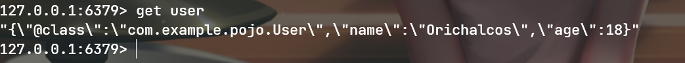


**自定义 redisTemplate**

```java
@Configuration
public class RedisConfig {
    @Bean
    @SuppressWarnings("all")
    public RedisTemplate<String, Object> redisTemplate(RedisConnectionFactory factory) {
        //一般为了开发方便 使用<String, Object>
        RedisTemplate<String, Object> template = new RedisTemplate<>();
        template.setConnectionFactory(factory);

        //JSON序列化配置
        Jackson2JsonRedisSerializer jackson2JsonRedisSerializer = new Jackson2JsonRedisSerializer(Object.class);
        ObjectMapper objectMapper = new ObjectMapper();
        objectMapper.setVisibility(PropertyAccessor.ALL, JsonAutoDetect.Visibility.ANY);
        objectMapper.enableDefaultTyping(ObjectMapper.DefaultTyping.NON_FINAL);
        jackson2JsonRedisSerializer.setObjectMapper(objectMapper);

        //String 的序列化
        StringRedisSerializer stringRedisSerializer = new StringRedisSerializer();

        //key 采用 String 的序列化方式
        template.setKeySerializer(RedisSerializer.string());
        //hash 的 key 也采用 String 的序列化方式
        template.setHashKeySerializer(stringRedisSerializer);
        //value 序列化方式采用 jackson
        template.setValueSerializer(jackson2JsonRedisSerializer);
        //hash 的 value 序列化方式采用 jackson
        template.setHashValueSerializer(jackson2JsonRedisSerializer);
        template.afterPropertiesSet();

        return template;
    }
}
```

```java
@SpringBootTest
class Redis02SpringbootApplicationTests {
    @Autowired
    @Qualifier("redisTemplate")
    private RedisTemplate<String, Object> redisTemplate;

    @Test
    public void test() throws JsonProcessingException {
        User user = new User("Orichalcos", 2);
        //String jsonUser = new ObjectMapper().writeValueAsString(user);
        redisTemplate.opsForValue().set("user", jsonUser);
        System.out.println(redisTemplate.opsForValue().get("user"));
    }
}
```


## 7.2、获取 Redis 连接信息

获取 Redis 连接的主机名和端口是由 Redis 客户端库自身提供的功能。这些细节在不同的客户端库（如 Jedis 和 Lettuce）中可能有所不同。

对于 Jedis 客户端库，可以使用以下方式获取连接信息：

```java
JedisConnectionFactory jedisConnectionFactory = (JedisConnectionFactory) redisTemplate.getConnectionFactory();
String host = jedisConnectionFactory.getHostName();
int port = jedisConnectionFactory.getPort();
```

对于 Lettuce 客户端库，获取连接信息的方式可能会有所不同：

```java
LettuceConnectionFactory lettuceConnectionFactory = (LettuceConnectionFactory) redisTemplate.getConnectionFactory();
RedisURI redisUri = lettuceConnectionFactory.getStandaloneConfiguration().getClientOptions().getUris().get(0);
String host = redisUri.getHost();
int port = redisUri.getPort();
```


# 8、Redis 配置详解

## 8.1、redis.conf 详解

### 8.1.1、单位


单位大小写不敏感，`1GB`、`1Gb`、`1gB`都是一样的。


### 8.1.2、包含

INCLOUDES：

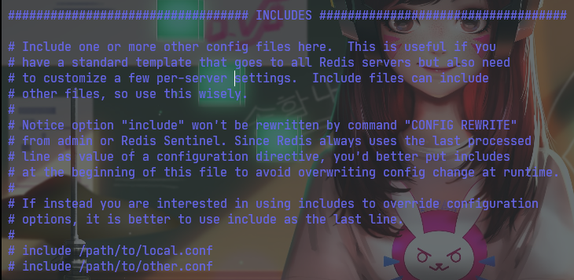

可以把多个配置文件包含进来，如果将此配置写在 redis.conf 文件的开头，那么后面的配置会覆盖引入文件的配置，如果想以引入文件的配置为主，那么需要将 include 配置写在 redis.conf 文件的末尾


### 8.1.3、网络

NETWORK：

```bash
# 绑定的IP，默认为本机地址，如果不限制可以在前面加 # 注释掉
bind 172.0.0.1

# 保护模式，如果想要远程访问，这个要关掉
protected-mode no

# 端口号
prot 6379

# 设置客户端连接时的超时时间，单位为秒。当客户端在这段时间内没有发出任何指令，那么关闭该连接
# 0是关闭此设置
timeout 0
```


### 8.1.4、通用

GENERAL：

```bash
# 以守护线程的方式运行
# 如果你 systemctl 来管理 Redis 服务（即通过 systemd 启动 Redis），就必须把这里改为 no
deamonize yes

# 如果以后台的方式运行，那么就需要指定一个 pid 文件
pidfile /var/run/redis/redis-server.pid

# 指定日志记录级别
# Redis总共支持四个级别：debug、verbose、notice、warning
# debug 记录很多信息，用于开发和测试
# varbose 有用的信息，不像debug会记录那么多
# notice 普通的verbose，常用于生产环境
# warning 只有非常重要或者严重的信息会记录到日志
loglevel debug

# 配置log文件地址
logfile /var/log/redis/redis.log

# 可用数据库数
# 默认值为16，默认数据库为0，数据库范围在0-（database-1）之间
databases 16

# 是否总是显示 logo
always-show-logo yes
```


### 8.1.5、快照

SNAPSHOTTING：

```bash
# 指出在多长时间内，有多少次更新操作，就将数据同步到数据文件rdb。
# 相当于条件触发抓取快照，这个可以多个条件配合
#
# 比如默认配置文件中的设置，就设置了三个条件
#
# save 900 1 900秒内至少有1个key被改变
# save 300 10 300秒内至少有300个key被改变
# save 60 10000 60秒内至少有10000个key被改变

save 900 1
save 300 10
save 60 10000

# 创建快照出错后是否停止写入
stop-writes-on-bgsave-error yes

# 存储至本地数据库时（持久化到rdb文件）是否压缩数据
rdbcompression yes

# 保存 rdb 文件时，进行错误的检查校检
rdbchecksum yes

# 本地持久化数据库文件名
dbfilename dump.rdb

# 工作目录
#
# 数据库镜像备份的文件放置的路径。
# 这里的路径跟文件名要分开配置是因为redis在进行备份时，先会将当前数据库的状态写入到一个临时文件中，等备份完成时，
# 再把该该临时文件替换为上面所指定的文件，而这里的临时文件和上面所配置的备份文件都会放在这个指定的路径当中。
#
# AOF文件也会存放在这个目录下面
#
# 注意这里必须指定一个目录而不是文件
dir ./
```


### 8.1.6、复制

REPLICATION：

```bash
# 主从复制. 设置该数据库为其他数据库的从数据库.
# 设置当本机为slave服务时，设置master服务的IP地址及端口，在Redis启动时，它会自动从master进行数据同步
#
# replicaof <masterip> <masterport>

# 当master服务设置了密码保护时(用requirepass制定的密码)
# slav服务连接master的密码
#
# masterauth <master-password>

# 当从库同主机失去连接或者复制正在进行，从机库有两种运行方式：
#
# 1) 如果replica-serve-stale-data设置为yes(默认设置)，从库会继续相应客户端的请求
#
# 2) 如果replica-serve-stale-data是指为no，除去INFO和SLAVOF命令之外的任何请求都会返回一个
# 错误"SYNC with master in progress"
#
replica-serve-stale-data yes

# 从库会按照一个时间间隔向主库发送PINGs.可以通过repl-ping-replica-period设置这个时间间隔，默认是10秒
#
# repl-ping-replica-period 10

# “心跳检测” 这个值对三个场景都有效：
# 大量的I/O操作，从节点收到主节点的响应时间。
# 从节点认为主节点的超时时间
# 主节点认为从节点的超时时间
# repl-timeout 60
```


### 8.1.7、安全

SECURITY：

```bash
# 设置客户端连接后进行任何其他指定前需要使用的密码。
# 警告：因为redis速度相当快，所以在一台比较好的服务器下，一个外部的用户可以在一秒钟进行150K次的密码尝试，
# 这意味着你需要指定非常非常强大的密码来防止暴力破解
# 
# 取消以下注释并修改 foobared 来永久设置密码
# requirepass foobared
```

也可以通过命令来设置这个密码：

```shell
config set requirepass "123456"
```

获取密码：

```shell
# 获取前需要验证
auth 123456

# 获取密码
config get requirepass
```


### 8.1.8、客户端

CLIENTS：

```bash
# 设置同一时间最大客户端连接数，默认无限制，Redis可以同时打开的客户端连接数为Redis进程可以打开的最大文件描述符数，
# 如果设置 maxclients 0，表示不作限制。
# 当客户端连接数到达限制时，Redis会关闭新的连接并向客户端返回max number of clients reached错误信息
#
# maxclients 10000
```


### 8.1.9、内存管理

MEMORY MANAGEMENT：

```bash
# 指定Redis最大内存限制，Redis在启动时会把数据加载到内存中，达到最大内存后，Redis会先尝试清除已到期或即将到期的Key
# Redis同时也会移除空的list对象
#
# 当此方法处理后，仍然到达最大内存设置，将无法再进行写入操作，但仍然可以进行读取操作
#
# 注意：Redis新的vm机制，会把Key存放内存，Value会存放在swap区
#
# maxmemory的设置比较适合于把redis当作于类似memcached的缓存来使用，而不适合当做一个真实的DB。
# 当把Redis当做一个真实的数据库使用的时候，内存使用将是一个很大的开销
# maxmemory <bytes>

# 当内存达到最大值的时候Redis会选择删除哪些数据？有五种方式可供选择
#
# volatile-lru -> 利用LRU算法移除设置过过期时间的key (LRU:最近使用 Least Recently Used )
# allkeys-lru -> 利用LRU算法移除任何key
# volatile-lfu -> 利用LFU算法移除设置过过期时间的key (LRU:最少使用 Least Frequently Used )
# allkeys-lfu -> 利用LFU算法移除任何key
# volatile-random -> 移除设置过过期时间的随机key
# allkeys->random -> remove a random key, any key (随机删除)
# volatile-ttl -> 移除即将过期的key(minor TTL)
# noeviction -> 不移除任何key，只是返回一个写错误
#
# 注意：对于上面的策略，如果没有合适的key可以移除，当写的时候Redis会返回一个错误
#
# 写命令包括: set setnx setex append
# incr decr rpush lpush rpushx lpushx linsert lset rpoplpush sadd
# sinter sinterstore sunion sunionstore sdiff sdiffstore zadd zincrby
# zunionstore zinterstore hset hsetnx hmset hincrby incrby decrby
# getset mset msetnx exec sort
#
# 默认是:
#
# maxmemory-policy volatile-lru
```


### 8.1.10、AOF 模式

AOF APPEND ONLY MODE：

```bash
# 默认情况下，redis会在后台异步的把数据库镜像备份到磁盘，但是该备份是非常耗时的，而且备份也不能很频繁，
# 如果发生诸如拉闸限电、拔插头等状况，那么将造成比较大范围的数据丢失。
# 所以redis提供了另外一种更加高效的数据库备份及灾难恢复方式。
# 开启append only模式之后，redis会把所接收到的每一次写操作请求都追加到appendonly.aof文件中，
# 当redis重新启动时，会从该文件恢复出之前的状态。
# 但是这样会造成appendonly.aof文件过大，所以redis还支持了 BGREWRITEAOF 指令，对 appendonly.aof 进行重新整理。
# 你可以同时开启asynchronous dumps 和 AOF
appendonly no

# AOF文件名称 (默认: "appendonly.aof")
appendfilename "appendonly.aof"

# Redis支持三种同步AOF文件的策略:
#
# no: 不进行同步，系统去操作 . Faster.
# always: always表示每次有写操作都进行同步. Slow, Safest.
# everysec: 表示对写操作进行累积，每秒同步一次. Compromise.
#
# 默认是"everysec"，按照速度和安全折中这是最好的。
# 如果想让Redis能更高效的运行，你也可以设置为"no"，让操作系统决定什么时候去执行
# 或者相反想让数据更安全你也可以设置为"always"
#
# 如果不确定就用 "everysec".

# appendfsync always
appendfsync everysec
# appendfsync no

# bgrewriteaof机制，在一个子进程中进行aof的重写，从而不阻塞主进程对其余命令的处理，同时解决了aof文件过大问题
# 同时在执行bgrewriteaof操作和主进程写aof文件的操作，两者都会操作磁盘，而bgrewriteaof往往会涉及大量磁盘操作，
# 这样就会造成主进程在写aof文件的时候出现阻塞的情形，现在no-appendfsync-on-rewrite参数出场了。
# 如果该参数设置为no，是最安全的方式，不会丢失数据，但是要忍受阻塞的问题。
# 如果设置为yes呢？这就相当于将appendfsync设置为no，这说明并没有执行磁盘操作，只是写入了缓冲区，
# 因此这样并不会造成阻塞（因为没有竞争磁盘），但是如果这个时候redis挂掉，就会丢失数据。
# 丢失多少数据呢？在linux的操作系统的默认设置下，最多会丢失30s的数据。
no-appendfsync-on-rewrite no

# Automatic rewrite of the append only file.
# AOF 自动重写
# 当AOF文件增长到一定大小的时候Redis能够调用 BGREWRITEAOF 对日志文件进行重写
#
# 它是这样工作的：Redis会记住上次进行些日志后文件的大小(如果从开机以来还没进行过重写，那日子大小在开机的时候确定)
#
# 基础大小会同现在的大小进行比较。如果现在的大小比基础大小大制定的百分比，重写功能将启动
# 同时需要指定一个最小大小用于AOF重写，这个用于阻止即使文件很小但是增长幅度很大也去重写AOF文件的情况
#
# auto-aof-rewrite-percentage:aof文件增长比例，指当前aof文件比上次重写的增长比例大小。
# aof重写即在aof文件在一定大小之后，重新将整个内存写到aof文件当中，以反映最新的状态(相当于bgsave)。
# 这样就避免了aof文件过大而实际内存数据小的问题(频繁修改数据问题).设置 percentage 为0就关闭这个特性
# 
# auto-aof-rewrite-percentage:aof文件重写最小的文件大小，即最开始aof文件必须要达到这个大小才触发，
# 后面的每次重写就不会根据这个变量了(根据上一次重写完成之后的大小).
# 此变量仅初始化启动redis有效，如果是redis恢复时，则lastSize等于初始aof文件大小.
auto-aof-rewrite-percentage 100
auto-aof-rewrite-min-size 64mb
```


### 8.1.11、集群

REDIS CLUSTER：

```bash
# 只有开启了以下选项，redis才能成为集群服务的一部分
# cluster-enabled yes

# 配置redis自动生成的集群配置文件名。确保同一系统中运行的各redis实例该配置文件不要重名。
# 主要用于记录集群中有哪些节点、他们的状态以及一些持久化参数等，方便在重启时恢复这些状态。
# cluster-config-file nodes-6379.conf

# 集群节点超时毫秒数。超时的节点将被视为不可用状态。
# cluster-node-timeout 15000

# 如果数据太旧，集群中的不可用master的slave节点会避免成为备用master。
# 如果slave和master失联时间超过:
# (node-timeout * slave-validity-factor) + repl-ping-slave-period 
# 则不会被提升为master。
#
# 如node-timeout为30秒，slave-validity-factor为10, 默认default repl-ping-slave-period为10秒,
# 失联时间超过310秒slave就不会成为master。
# 
# 较大的slave-validity-factor值可能允许包含过旧数据的slave成为master，同时较小的值可能会阻止集群选举出新master。
# 为了达到最大限度的高可用性，可以设置为0，即slave不管和master失联多久都可以提升为master
# cluster-slave-validity-factor 10

# 只有在之前master有其它指定数量的工作状态下的slave节点时，slave节点才能提升为master。
# 默认为1（即该集群至少有3个节点，1 master＋2 slaves，master宕机，仍有另外1个slave的情况下其中1个slave可以提升）
# 测试环境可设置为0，生成环境中至少设置为1
# cluster-migration-barrier 1

# 默认情况下如果redis集群如果检测到至少有1个hash slot不可用，集群将停止查询数据。
# 如果所有slot恢复则集群自动恢复。
# 如果需要集群部分可用情况下仍可提供查询服务，设置为no。
# cluster-require-full-coverage yes
```


### 8.1.12、慢日志

SLOW LOG：

```bash
# Redis Slow Log 记录超过特定执行时间的命令。执行时间不包括I/O计算比如连接客户端，返回结果等，只是命令执行时间
#
# 可以通过两个参数设置slow log：一个是告诉Redis执行超过多少时间被记录的参数slowlog-log-slower-than(微妙)，
# 另一个是slow log 的长度。当一个新命令被记录的时候最早的命令将被从队列中移除

# 下面的时间以微妙微单位，因此1000000代表一分钟。
# 注意制定一个负数将关闭慢日志，而设置为0将强制每个命令都会记录
slowlog-log-slower-than 10000

# 对日志长度没有限制，只是要注意它会消耗内存
# 可以通过 SLOWLOG RESET 回收被慢日志消耗的内存
slowlog-max-len 128
```


## 8.2、sentinel.conf 详解

```bash
# Example sentinel.conf

# *** IMPORTANT ***
# 绑定IP地址
# bind 127.0.0.1 192.168.1.1
# 保护模式（是否禁止外部链接，除绑定的ip地址外）
# protected-mode no

# port <sentinel-port>
# 此Sentinel实例运行的端口
port 26379

# 默认情况下，Redis Sentinel不作为守护程序运行。 如果需要，可以设置为 yes。
daemonize no

# 启用守护进程运行后，Redis将在/var/run/redis-sentinel.pid中写入一个pid文件
pidfile /var/run/redis-sentinel.pid

# 指定日志文件名。 如果值为空，将强制Sentinel日志标准输出。守护进程下，如果使用标准输出进行日志记录，则日志将发送到/dev/null
logfile ""

# sentinel announce-ip <ip>
# sentinel announce-port <port>
#
# 上述两个配置指令在环境中非常有用，因为NAT可以通过非本地地址从外部访问Sentinel。
#
# 当提供announce-ip时，Sentinel将在通信中声明指定的IP地址，而不是像通常那样自动检测本地地址。
#
# 类似地，当提供announce-port 有效且非零时，Sentinel将宣布指定的TCP端口。
#
# 这两个选项不需要一起使用，如果只提供announce-ip，Sentinel将宣告指定的IP和“port”选项指定的服务器端口。
# 如果仅提供announce-port，Sentinel将通告自动检测到的本地IP和指定端口。
#
# Example:
# sentinel announce-ip 1.2.3.4

# dir <working-directory>
# 每个长时间运行的进程都应该有一个明确定义的工作目录。对于Redis Sentinel来说，/tmp就是自己的工作目录。
dir /tmp

# sentinel monitor <master-name> <ip> <redis-port> <quorum>
#
# 告诉Sentinel监听指定主节点，并且只有在至少<quorum>哨兵达成一致的情况下才会判断它 O_DOWN 状态。
# 一般建议将其设置为Sentinel节点的一半加1。不仅如此，quorum还与Sentinel节点的领导者选举有关。
# 为了选出Sentinel的领导者，至少需要max(quorum, num(sentinels) / 2 + 1)个Sentinel节点参与选举
#
# 副本是自动发现的，因此您无需指定副本。
# Sentinel本身将重写此配置文件，使用其他配置选项添加副本。另请注意，当副本升级为主副本时，将重写配置文件。
#
# 注意：主节点（master）名称不能包含特殊字符或空格。
# 有效字符可以是 A-z 0-9 和这三个字符 ".-_".
sentinel monitor mymaster 127.0.0.1 6379 2

# 如果redis配置了密码，那这里必须配置认证，否则不能自动切换
# Example:
# sentinel auth-pass mymaster MySUPER--secret-0123passw0rd

# sentinel down-after-milliseconds <master-name> <milliseconds>
#
# 主节点在指定时间内没有回复PING，便认为该节点为主观下线 S_DOWN 状态。
# 需要注意的是，该参数不仅用来判断主节点状态，同样也用来判断该主节点下面的从节点及其它sentinel的状态
# 默认是30秒
sentinel down-after-milliseconds mymaster 30000

# sentinel parallel-syncs <master-name> <numreplicas>
#
# 在故障转移期间，多少个副本节点进行数据同步
# 如果numslaves设置较大的话，虽然复制操作并不会阻塞主节点，但多个节点同时指向新的主节点，会增加主节点的网络和磁盘IO负载。
sentinel parallel-syncs mymaster 1

# sentinel failover-timeout <master-name> <milliseconds>
#
# 指定故障转移超时（以毫秒为单位）。 它以多种方式使用：
#
# - 在先前的故障转移之后重新启动故障转移所需的时间已由给定的Sentinel针对同一主服务器尝试，是故障转移超时的两倍。
# - 当一个slave从一个错误的master那里同步数据开始计算时间。直到slave被纠正为向正确的master那里同步数据时。
# - 取消已在进行但未生成任何配置更改的故障转移所需的时间
# - 当进行failover时，配置所有slaves指向新的master所需的最大时间。
#   即使过了这个超时，slaves依然会被正确配置为指向master。
# 默认3分钟
sentinel failover-timeout mymaster 180000

# 脚本执行
#
# sentinel notification-script和sentinel reconfig-script用于配置调用的脚本，以通知系统管理员或在故障转移后重新配置客户端。
# 脚本使用以下规则执行以进行错误处理：
#
# 如果脚本以“1”退出，则稍后重试执行（最多重试次数为当前设置的10次）。
#
# 如果脚本以“2”（或更高的值）退出，则不会重试执行。
#
# 如果脚本因为收到信号而终止，则行为与退出代码1相同。
#
# 脚本的最长运行时间为60秒。 达到此限制后，脚本将以SIGKILL终止，并重试执行。

# 通知脚本
#
# sentinel notification-script <master-name> <script-path>
#
# 为警告级别生成的任何Sentinel事件调用指定的通知脚本（例如-sdown，-odown等）。
# 此脚本应通过电子邮件，SMS或任何其他消息传递系统通知系统管理员 监控的Redis系统出了问题。
#
# 使用两个参数调用脚本：第一个是事件类型，第二个是事件描述。
#
# 该脚本必须存在且可执行，以便在提供此选项时启动sentinel。
#
# 举例:
# sentinel notification-script mymaster /var/redis/notify.sh

# 客户重新配置脚本
#
# sentinel client-reconfig-script <master-name> <script-path>
#
# 当主服务器因故障转移而变更时，可以调用脚本执行特定于应用程序的任务，以通知客户端，配置已更改且主服务器地址已经变更。
#
# 以下参数将传递给脚本：
#
# <master-name> <role> <state> <from-ip> <from-port> <to-ip> <to-port>
#
# <state> 目前始终是故障转移 "failover"
# <role> 是 "leader" 或 "observer"
#
# 参数 from-ip, from-port, to-ip, to-port 用于传递主服务器的旧地址和所选副本的新地址。
#
# 举例:
# sentinel client-reconfig-script mymaster /var/redis/reconfig.sh

# 安全
# 避免脚本重置，默认值yes
# 默认情况下，SENTINEL SET将无法在运行时更改notification-script和client-reconfig-script。
# 这避免了一个简单的安全问题，客户端可以将脚本设置为任何内容并触发故障转移以便执行程序。
sentinel deny-scripts-reconfig yes

# REDIS命令重命名
#
# 在这种情况下，可以告诉Sentinel使用不同的命令名称而不是正常的命令名称。
# 例如，如果主“mymaster”和相关副本的“CONFIG”全部重命名为“GUESSME”，我可以使用：
#
# SENTINEL rename-command mymaster CONFIG GUESSME
#
# 设置此类配置后，每次Sentinel使用CONFIG时，它将使用GUESSME。 
# 请注意，实际上不需要尊重命令案例，因此在上面的示例中写“config guessme”是相同的。
#
# SENTINEL SET也可用于在运行时执行此配置。
#
# 为了将命令设置回其原始名称（撤消重命名），可以将命令重命名为它自身：
#
# SENTINEL rename-command mymaster CONFIG CONFIG
```


# 9、持久化

什么是Redis持久化？

Redis 作为一个键值对内存数据库（NoSQL），数据都存储在内存当中，在处理客户端请求时，所有操作都在内存当中进行，如下所示：

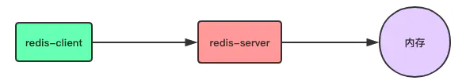

但是， 存储在内存当中的数据，只要服务器关机(各种原因引起的)，内存中的数据就会消失了，不仅服务器关机会造成数据消失，Redis 服务器守护进程退出，内存中的数据也一样会消失。

对于只把 Redis 当缓存来用的项目来说，数据消失或许问题不大，重新从数据源把数据加载进来就可以了，但如果直接把用户提交的业务数据存储在 Redis 当中，把 Redis 作为数据库来使用，在其放存储重要业务数据，那么 Redis 的内存数据丢失所造成的影响也许是毁灭性。

为了避免内存中数据丢失，Redis 提供了 RDB 和 AOF 两种不同的数据持久化方式，我们可以选择不同的方式将数据从内存中保存到硬盘当中，使数据可以持久化保存。

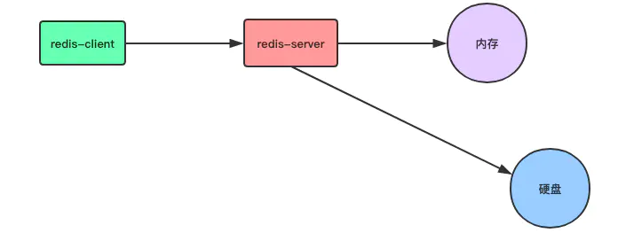


## 9.1、RDB

RDB（Redis DataBase） 是一种快照存储持久化方式，具体就是将 Redis 某一时刻的内存数据保存到硬盘的文件当中，默认保存的文件名为 dump.rdb，而在 Redis 服务器启动时，会重新加载 dump.rdb 文件的数据到内存当中恢复数据。


### 9.1.1、开启 RDB 持久化方式

**save**

`save`命令可以同步数据到磁盘上。

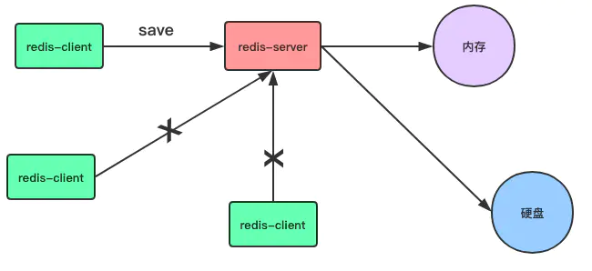

当客户端向服务器发送`save`命令请求进行持久化时，服务器会阻塞`save`命令之后的其他客户端的请求，直到数据同步完成。如果数据量太大，同步数据会执行很久，而这期间 Redis 服务器也无法接收其他请求，所以，最好不要在生产环境使用`save`命令。


**bgsave**

与`save`命令不同，`bgsave`命令是一个异步操作。

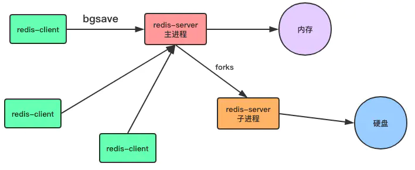

当客户端发服务发出`bgsave`命令时，Redis 服务器主进程会 forks 一个子进程来数据同步问题，在将数据保存到 rdb 文件之后，子进程会退出。

所以，与`save`命令相比，Redis 服务器在处理`bgsave`采用子线程进行 IO 写入，而主进程仍然可以接收其他请求，但 forks 子进程是同步的，所以     forks 子进程时，一样不能接收其他请求，这意味着，如果 forks 一个子进程花费的时间太久（一般是很快的），`bgsave`命令仍然有阻塞其他客户的请求的情况发生。


**服务器配置自动触发**

除了通过客户端发送命令外，还有一种方式，就是在 Redis 配置文件中的 save 指定到达触发 RDB 持久化的条件，比如【多少秒内至少达到多少写操作】就开启 RDB 数据同步。

```bash
# 900s内至少达到一条写命令
save 900 1
# 300s内至少达至10条写命令
save 300 10
# 60s内至少达到10000条写命令
save 60 10000
```

这种通过服务器配置文件触发 RDB 的方式，与 bgsave 命令类似，达到触发条件时，会 forks 一个子进程进行数据同步。


**`flushall`和`exit`的时候也会触发**


### 9.1.2、RDB 文件

上面三种让服务器生成 rdb 文件的方式，无论是由主进程生成还是子进程来生成，其过程如下：

1. 生成临时 rdb 文件，并写入数据。
2. 完成数据写入，用临时文代替代正式 rdb 文件。
3. 删除原来的 rdb 文件。

RDB 默认生成的文件名为 dump.rdb，可以通过配置文件进行更加详细配置，比如在单机下启动多个 Redis 服务器进程时，可以通过端口号配置不同的rdb 名称，如下所示：

```bash
# 是否压缩rdb文件
rdbcompression yes

# rdb文件的名称
dbfilename redis-6379.rdb

# rdb文件保存目录
dir ~/redis/
```


### 9.1.3、RDB 的优缺点

**优点**

1. 与 AOF 方式相比，通过 rdb 文件恢复数据比较快。
2. rdb 文件非常紧凑，适合于数据备份。
3. 通过 RDB 进行数据备，由于使用子进程生成，所以对 Redis 服务器性能影响较小。


**缺点**

1. 如果服务器宕机的话，采用 RDB 的方式会造成某个时段内数据的丢失，比如我们设置 10 分钟同步一次或 5 分钟达到 1000次 写入就同步一次，那么如果还没达到触发条件服务器就死机了，那么这个时间段的数据会丢失。
2. 使用`save`命令会造成服务器阻塞，直接数据同步完成才能接收后续请求。
3. 使用`bgsave`命令在 forks 子进程时，如果数据量太大，forks 的过程也会发生阻塞，另外，forks 子进程会耗费内存。


## 9.2、AOF

与 RDB 存储某个时刻的快照不同，AOF （Append-only file）持久化方式会记录客户端对服务器的每一次写操作命令，并将这些写操作以 Redis 协议追加保存到以后缀为 aof 文件末尾，在 Redis 服务器重启时，会加载并运行 aof 文件的命令，以达到恢复数据的目的。

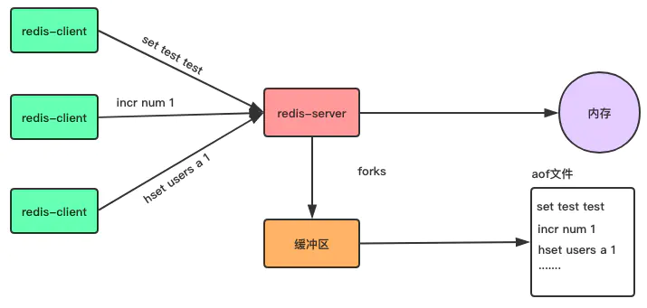


### 9.2.1、开启 AOF 持久化方式

Redis 默认不开启 AOF 持久化方式，可以在配置文件中开启并进行更加详细的配置：

```bash
# 开启aof机制
appendonly yes

# aof文件名
appendfilename "appendonly.aof"

# 写入策略,always表示每个写操作都保存到aof文件中,也可以是everysec或no
appendfsync always

# 默认不重写aof文件
no-appendfsync-on-rewrite no

# 保存目录
dir ~/redis/
```

appendfsync 选项指定写入策略，有三个选项：

- no：不进行同步，交由操作系统来处理什么时候写入 aof 文件
- always：每次有写操作都进行同步
- everysec：对写操作进行累积，每秒同步一次


### 9.2.2、AOF 文件

**AOF 文件重写**

AOF 将客户端的每一个写操作都追加到 aof 文件末尾，比如对一个 key 多次执行 incr 命令，这时候，aof 保存每一次命令到 aof 文件中，会使文件会变得非常大。

```bash
incr num 1
incr num 2
incr num 3
incr num 4
incr num 5
incr num 6
...
incr num 100000
```

aof 文件太大，加载 aof 文件恢复数据时，就会非常慢，为了解决这个问题，Redis 支持 aof 文件重写，通过重写 aof，可以生成一个恢复当前数据的最少命令集，比如上面的例子中那么多条命令，可以重写为：

```bash
set num 100000
```

重写aof文件的好处：

1. 压缩 aof 文件，减少磁盘占用量
2. 将 aof 的命令压缩为最小命令集，加快了数据恢复的速度


**AOF文件损坏**

在写入 aof 日志文件时，如果 Redis 服务器宕机，则 aof 日志文件文件会出格式错误，在重启 Redis 服务器时，Redis 服务器会拒绝载入这个 aof 文件，可以通过以下步骤修复 aof 并恢复数据：

1. 备份现在的 aof 文件，以防万一

2. 使用`redis-check-aof`命令修复 aof 文件，该命令格式如下：

   ```bash
   # 修复aof日志文件
   $ redis-check-aof -fix file.aof
   ```

3. 重启 Redis 服务器，加载已经修复的 aof 文件，恢复数据


### 9.2.3、AOF 的优缺点

**优点**

AOF 只是追加日志文件，因此对服务器性能影响较小，速度比 RDB 要快，消耗的内存较少。


**缺点**

1. AOF 方式生成的日志文件太大，即使通过 AOF 重写，文件体积仍然很大。
2. 恢复数据的速度比 RDB 慢。


# 10、订阅与发布

Redis 通过 `publish` 、 `subscribe` 等命令实现了订阅与发布模式， 这个功能提供两种信息机制， 分别是订阅/发布到频道和订阅/发布到模式。

Redis 的`subscribe`命令可以让客户端订阅任意数量的频道， 每当有新信息发送到被订阅的频道时， 信息就会被发送给所有订阅指定频道的客户端。

下图展示了频道 channel1 ， 以及订阅这个频道的三个客户端 —— client2 、 client5 和 client1 之间的关系：


当有新消息通过 `publish` 命令发送给频道 channel1 时， 这个消息就会被发送给订阅它的三个客户端：


## 10.1、订阅与退订频道

**订阅频道**

每个 Redis 服务器进程都维持着一个表示服务器状态的 redis.h/redisServer 结构， 结构的 pubsub_channels 属性是一个字典， 这个字典就用于保存订阅频道的信息：

```c
struct redisServer {
    // ...
    dict *pubsub_channels;
    // ...
};
```

其中，字典的键为正在被订阅的频道， 而字典的值则是一个链表， 链表中保存了所有订阅这个频道的客户端。

在下图展示的这个 pubsub_channels 示例中， client2 、 client5 和 client1 就订阅了 channel1 ， 而其他频道也分别被别的客户端所订阅：


当客户端调用 `subscribe` 命令时， 程序就将客户端和要订阅的频道在 pubsub_channels 字典中关联起来。

如果客户端 client10086 执行命令 `subscribe channel1 channel2 channel3` ，那么前面展示的 pubsub_channels 将变成下面这个样子：


`subscribe` 命令的行为可以用伪代码表示如下：

```c
def SUBSCRIBE(client, channels):

    # 遍历所有输入频道
    for channel in channels:

        # 将客户端添加到链表的末尾
        redisServer.pubsub_channels[channel].append(client)
```

通过 pubsub_channels 字典， 程序只要检查某个频道是否为字典的键， 就可以知道该频道是否正在被客户端订阅； 只要取出某个键的值， 就可以得到所有订阅该频道的客户端的信息。


**退订频道**

使用 `unsubscribe` 命令可以退订指定的频道， 这个命令执行的是订阅的反操作： 它从 pubsub_channels 字典的给定频道（键）中， 删除关于当前客户端的信息， 这样被退订频道的信息就不会再发送给这个客户端。


## 10.2、发送信息到频道

当调用 `publish channel message` 命令， 程序首先根据 channel 定位到字典的键， 然后将信息发送给字典值链表中的所有客户端。

对于以下这个 pubsub_channels 实例， 如果某个客户端执行命令 `publish channel1 "hello moto"` ，那么 client2 、 client5 和 client1 三个客户端都将接收到 "hello moto" 信息：


`publish`命令的实现可以用以下伪代码来描述：

```c
def PUBLISH(channel, message):

    # 遍历所有订阅频道 channel 的客户端
    for client in server.pubsub_channels[channel]:

        # 将信息发送给它们
        send_message(client, message)
```


## 10.3、模式的订阅与信息发送

当使用 `publish` 命令发送信息到某个频道时， 不仅所有订阅该频道的客户端会收到信息， 如果有某个/某些模式和这个频道匹配的话， 那么所有订阅这个/这些频道的客户端也同样会收到信息。

下图展示了一个带有频道和模式的例子， 其中 tweet.shop.* 模式匹配了 tweet.shop.kindle 频道和 tweet.shop.ipad 频道， 并且有不同的客户端分别订阅它们三个：


当有信息发送到 tweet.shop.kindle 频道时， 除了发送给 clientX 和 clientY 之外， 还会发送给订阅 tweet.shop.* 模式的 client123 和 client256 ：

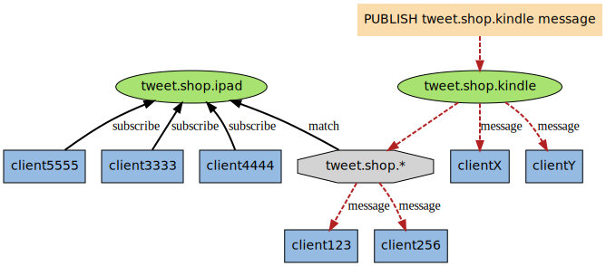

另一方面， 如果接收到信息的是频道 tweet.shop.ipad ， 那么 client123 和 client256 同样会收到信息：


## 10.4、订阅与退订模式

**订阅模式**

redisServer.pubsub_patterns 属性是一个链表，链表中保存着所有和模式相关的信息：

```c
struct redisServer {
    // ...
    list *pubsub_patterns;
    // ...
};
```

链表中的每个节点都包含一个 redis.h/pubsubPattern 结构：

```c
typedef struct pubsubPattern {
    redisClient *client;
    robj *pattern;
} pubsubPattern;
```

client 属性保存着订阅模式的客户端，而 pattern 属性则保存着被订阅的模式。

每当调用 `psubscribe` 命令订阅一个模式时， 程序就创建一个包含客户端信息和被订阅模式的 pubsubPattern 结构， 并将该结构添加到 redisServer.pubsub_patterns 链表中。

下图展示了一个包含两个模式的 pubsub_patterns 链表， 其中 client123 和 client256 都正在订阅 tweet.shop.* 模式：

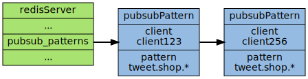

如果这时客户端 client10086 执行 `psubscribe broadcast.list.*` ， 那么 pubsub_patterns 链表将被更新成这样：


通过遍历整个 pubsub_patterns 链表，程序可以检查所有正在被订阅的模式，以及订阅这些模式的客户端。


**退订模式**

使用 `punsubscribe` 命令可以退订指定的模式， 这个命令执行的是订阅模式的反操作： 程序会删除 redisServer.pubsub_patterns 链表中， 所有和被退订模式相关联的 pubsubPattern 结构， 这样客户端就不会再收到和模式相匹配的频道发来的信息。


## 10.5、发送信息到模式

发送信息到模式的工作也是由`publish`命令进行的， 在前面讲解频道的时候， 给出了这样一段伪代码， 说它定义了 `publish` 命令的行为

```c
def PUBLISH(channel, message):

    # 遍历所有订阅频道 channel 的客户端
    for client in server.pubsub_channels[channel]:

        # 将信息发送给它们
        send_message(client, message)
```

但是，这段伪代码并没有完整描述 `publish` 命令的行为， 因为 `publish` 除了将 message 发送到所有订阅 channel 的客户端之外， 它还会将 channel 和 pubsub_patterns 中的模式进行对比， 如果 channel 和某个模式匹配的话， 那么也将 message 发送到订阅那个模式的客户端。

完整描述 `publish` 功能的伪代码定于如下：

```c
def PUBLISH(channel, message):

    # 遍历所有订阅频道 channel 的客户端
    for client in server.pubsub_channels[channel]:

        # 将信息发送给它们
        send_message(client, message)

    # 取出所有模式，以及订阅模式的客户端
    for pattern, client in server.pubsub_patterns:

        # 如果 channel 和模式匹配
        if match(channel, pattern):

            # 那么也将信息发给订阅这个模式的客户端
            send_message(client, message)
```

如果 Redis 服务器的 pubsub_patterns 状态如下：


那么当某个客户端发送信息 "Amazon Kindle, $69." 到 tweet.shop.kindle 频道时， 除了所有订阅了 tweet.shop.kindle 频道的客户端会收到信息之外， 客户端 client123 和 client256 也同样会收到信息， 因为这两个客户端订阅的 tweet.shop.* 模式和 tweet.shop.kindle 频道匹配。


# 11、Redis 集群

Redis 有三种集群模式，分别是：

- 主从复制模式
- Sentinel 模式
- Cluster 模式


## 11.1、主从复制

### 11.1.1、主从复制介绍

通过持久化功能，Redis 保证了即使在服务器重启的情况下也不会丢失（或少量丢失）数据，因为持久化会把内存中数据保存到硬盘上，重启会从硬盘上加载数据。 但是由于数据是存储在一台服务器上的，如果这台服务器出现硬盘故障等问题，也会导致数据丢失。

为了避免单点故障，通常的做法是将数据库复制多个副本以部署在不同的服务器上，这样即使有一台服务器出现故障，其他服务器依然可以继续提供服务。

为此， Redis 提供了复制（replication）功能，可以实现当一台数据库中的数据更新后，自动将更新的数据同步到其他数据库上。

在复制的概念中，数据库分为两类，一类是主数据库（master），另一类是从数据库（slave）。master 可以进行读写操作，当写操作导致数据变化时会自动将数据同步给从 slave。而 slave 一般是只读的，并接受 master 同步过来的数据。一个 master 可以拥有多个 slave，而一个 slave 只能拥有一个 master。

slave 挂了不影响其他 slave 的读和 master 的读和写，重新启动后会将数据从 master 同步过来， master 挂了以后，不影响 slave 的读，但 Redis 不再提供写服务，master 重启后 Redis 将重新对外提供写服务。

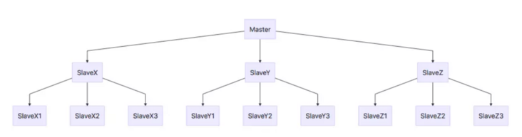


**主从复制原理**


1. slave 启动成功后，连接 master，发送 `sync` 命令
2. master 接收到 `sync` 命令后，开始执行 `bgsave` 命令生成 RDB 文件并使用缓冲区记录此后执行的所有写命令
3. master `bgsave` 执行完后，向所有 slave 发送快照文件，并在发送期间继续记录被执行的写命令
4. slave 收到快照文件后丢弃所有旧数据，载入收到的快照
5. master 快照发送完毕后开始向 slave 发送缓冲区中的写命令
6. slave 完成对快照的载入，开始接收命令请求，并执行来自 master 缓冲区的写命令（**slave 初始化完成**）
7. master 每执行一个写命令就会向 slave 发送相同的写命令，slave 接收并执行收到的写命令（**slave 初始化完成后的操作**）
8. 出现断开重连后，2.8 之后的版本会将断线期间的命令传给重数据库，增量复制
9. 主从刚刚连接的时候，进行全量同步；全同步结束后，进行增量同步。当然，如果有需要，slave 在任何时候都可以发起全量同步。Redis 的策略是，无论如何，首先会尝试进行增量同步，如不成功，要求从机进行全量同步


**主从复制的优点 **

1. 支持主从复制，主机会自动将数据同步到从机，可以进行读写分离
2. 为了分载 master 的读操作压力，slave 服务器可以为客户端提供只读操作的服务，写服务仍然必须由 master 来完成
3. slave 同样可以接受其它 slave 的连接和同步请求，这样可以有效的分载 master 的同步压力
4. master server 是以非阻塞的方式为 slave 提供服务。所以在 master-slave 同步期间，客户端仍然可以提交查询或修改请求
5. slave server 同样是以非阻塞的方式完成数据同步。在同步期间，如果有客户端提交查询请求，Redis 则返回同步之前的数据


**主从复制的缺点 **

1. Redis 不具备自动容错和恢复功能，主机从机的宕机都会导致前端部分读写请求失败，需要等待机器重启或者手动切换前端的 IP 才能恢复（**也就是要人工介入**）
2. 主机宕机，宕机前有部分数据未能及时同步到从机，切换 IP 后还会引入数据不一致的问题，降低了系统的可用性
3. 如果多个 slave 断线了，需要重启的时候，尽量不要在同一时间段进行重启。因为只要 slave 启动，就会发送 `sync` 请求和主机全量同步，当多个 slave 重启的时候，可能会导致 master IO 剧增从而宕机
4. Redis 较难支持在线扩容，在集群容量达到上限时在线扩容会变得很复杂


### 11.1.2、主从复制搭建

启动方式

- 客户端发送命令

	```bash
	slaveof <masterip> <masterport>
	```

- 启动服务器参数

	```bash
	redis-server -slaveof <masterip> <masterport>
	```

- 服务器配置

	```bash
	slaveof <masterip> <masterport>
	```


此为以服务器配置启动：

```bash
# 新建一个临时文件夹，方便后期删除
mkdir data
cd data

# 创建一个配置文件
vim redis_6379.conf

# 写入内容
include /etc/redis/redis.conf
port 6379
daemonize no
pidfile /root/data/redis_6379.pid
logfile "redis_6379.log"
dbfilename dump_6379.rdb
dir /root/data

# 复制一份 6379 配置文件并将文件中的 6379 改为 6380
sed 's/6379/6380/g' redis_6379.conf > redis_6380.conf

# 6380 配置文件末尾追加 replicaof 127.0.0.1 6379，$a\ 表示最后一行，\n 表示换行
sed -i '$a\\nreplicaof 127.0.0.1 6379' redis_6380.conf

# 复制一份 6380 配置文件并将文件中的 6380 改为 6381
sed 's/6380/6381/g' redis_6380.conf > redis_6381.conf

# 顺序启动节点
redis-server redis_6379.conf
redis-server redis_6380.conf
redis-server redis_6381.conf

# 进入redis 客户端，开多个窗口查看方便些
redis-cli -p 6379
```

可以使用`info replication`看到有两个 slave 连接到 master

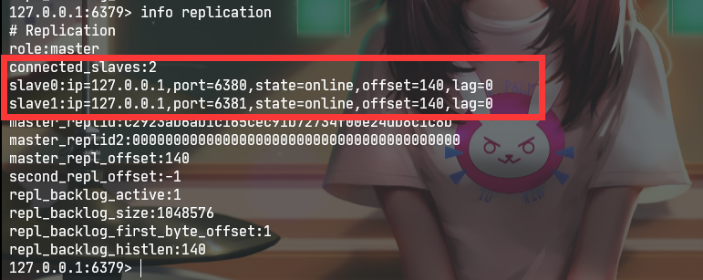


**数据同步验证**

```bash
# master
redis-cli -p 6379
127.0.0.1:6379> set k1 v1
OK

exit

# slave1
redis-cli -p 6380
127.0.0.1:6380> get k1
"v1"
```


**Spring Boot 配置**

```yaml
# 连接主节点即可
spring:
  redis:
    host: 127.0.0.1
    port: 6379
    database: 0
```


## 11.2、Sentinel 模式

### 11.2.1、哨兵模式介绍

主从模式的弊端就是不具备高可用性，当 master 挂掉以后，Redis 将不能再对外提供写入操作，因此 sentinel 应运而生。

sentinel 模式的主要作用在于它能够自动完成故障发现和故障转移，并通知客户端，从而实现高可用。

sentinel 中文含义为哨兵，顾名思义，它的作用就是监控 Redis 集群的运行状况，当 master挂了以后，sentinel 会在 slave 中选择一个做为 master，并修改它们的配置文件，其他 slave 的配置文件也会被修改，比如 slaveof 属性会指向新的 master；当 master 重新启动后，它将不再是 master 而是做为 slave 接收新的 master 的同步数据。

sentinel 因为也是一个进程有挂掉的可能，所以 sentinel 也会启动多个形成一个 sentinel 集群，多 sentinel 配置的时候，sentinel 之间也会自动监控，当主从模式配置密码时，sentinel 也会同步将配置信息修改到配置文件中，不需要担心。

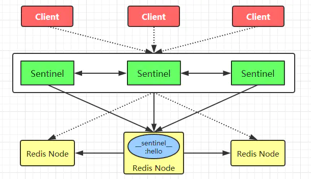


**哨兵模式的工作方式**

- 在哨兵模式创建时，需要通过配置指定 sentinel 与 master 之间的关系，然后 sentinel 会从 master 上获取所有 slave 的信息，之后 sentinel 会定时向 master 和 slave 发送 `info` 命令获取其拓扑结构和状态信息
- 基于 Redis 的发布订阅功能， 每个 sentinel 节点会向 master 的 ` __sentinel__：hello `频道上发送该 sentinel 节点对于 master 的判断以及当前 sentinel 节点的信息 ，同时每个 sentinel 节点也会订阅该频道， 来获取其他 Sentinel 节点的信息以及它们对主节点的判断
- 如果一个 master 被标记为主观下线（SDOWN），则正在监视这个 master 的所有 sentinel 进程要以每秒一次的频率确认 master 主服务器的确进入了主观下线状态
- 当有足够数量的 sentinel （大于等于配置文件指定的值，这也是为什么 sentinel 需要多个，一个 sentinel 可能会造成误判）在指定的时间范围内确认 master 进入了主观下线状态（SDOWN）， 则 master 会被标记为客观下线（ODOWN），这时会进行故障转移操作
- 在一般情况下， 每个 sentinel 会以每 10 秒一次的频率向集群中的所有 master 、slave 发送 `info` 命令
- 当 master 被 sentinel 标记为客观下线（ODOWN）时，sentinel 进程向下线的 master 的所有 slave 发送 `info` 命令的频率会从 10 秒一次改为每秒一次
- 若没有足够数量的 sentinel 进程同意 master 下线， master  的客观下线状态就会被移除。若 master 重新向 sentinel 进程发送 `ping`  命令返回有效回复，master 主服务器的主观下线状态就会被移除


**故障转移原理**

因为故障转移的工作只需要一个 sentinel 来完成，所以 sentinel 之间会再做一次选举工作， 基于 Raft 算法选出一个 sentinel 领导者来进行故障转移的工作。 被选举出的 sentinel 领导者进行故障转移的具体步骤如下：

1. 在从节点列表中选出一个节点作为新的 master，选择方法如下：
	- 过滤不健康或者不满足要求的节点
	- 选择 slave-priority（优先级）最高的 slave， 如果存在则返回， 不存在则继续
	- 选择复制偏移量最大的 slave ， 如果存在则返回， 不存在则继续
	- 选择 runid 最小的 salve
2. sentinel 领导者会对选出来的 slave 执行 `slaveof no one` 命令让其成为 master
3. sentinel 领导者会向剩余的 slave 发送命令，让他们从新的 master 上复制数据
4. sentinel 领导者会将原来的 master更新为从节点， 并对其进行监控， 当其恢复后命令它去复制新的 master


### 11.2.2、哨兵模式搭建

Redis 配置文件用主从复制的那三个

```bash
# 在data文件夹下新建一个sentinel配置文件
vim sentinel_26379.conf

# sentinel_26379配置
port 26379
daemonize no
logfile 26379.log
dir /root/data
sentinel monitor mymaster 127.0.0.1 6379 2
sentinel down-after-milliseconds mymaster 30000
sentinel parallel-syncs mymaster 1
sentinel failover-timeout mymaster 180000

# 将配置文件复制两份，更改端口
sed 's/26379/26380/g' sentinel_26379.conf > sentinel_26380.conf
sed 's/26379/26381/g' sentinel_26379.conf > sentinel_26381.conf

# 启动三个redis
redis-server redis_6379.conf
redis-server redis_6380.conf
redis-server redis_6381.conf

# 启动三个sentinel
redis-sentinel sentinel_26379.conf
redis-sentinel sentinel_26380.conf
redis-sentinel sentinel_26381.conf
```

使用`ps -ef | grep redis`查看进程

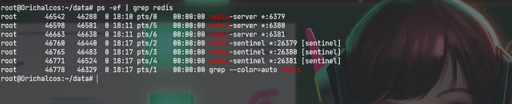

可以使用 `info replication` 命令查看 Redis 集群的状态，此时输出如下。可以看到 6379 节点为 master 节点，并且有两个从节点，分别为 slave0 和 slave1，对应的端口为 6380 和 6381：

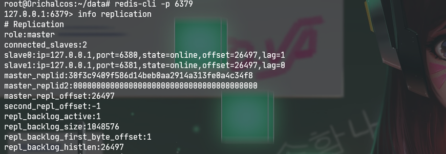

可以使用 `info Sentinel` 命令查看任意 sentinel 节点的状态，从最后一句输出可以看到 sentinel 节点已经感知到 6379 的 master 节点，并且也知道它有两个 slaves 节点；同时 sentinel 节点彼此之间也感知到，共有 3 个 sentinel 节点：


**数据同步验证：**

```bash
root@Orichalcos:~/data# redis-cli -p 6379 set k1 vi
OK
root@Orichalcos:~/data# redis-cli -p 6380 get k1
"vi"
```

先查看集群状态，这时 6379 为 master，有两个 slave：

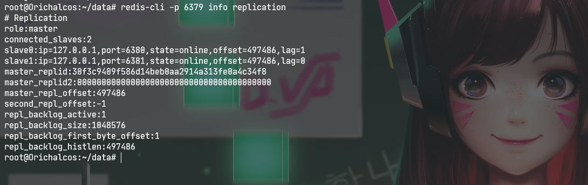

然后在 6379 终端按`Ctrl+C`关闭 Redis，等待一段时候后，再来查看集群状态：

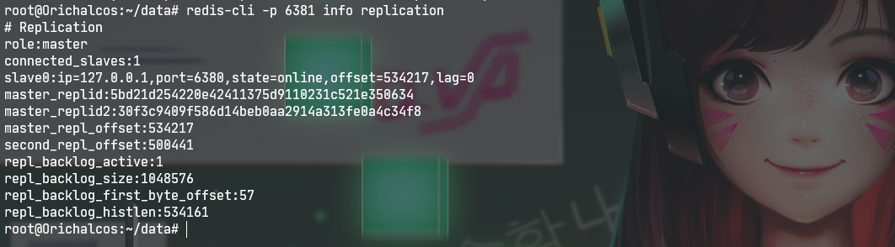

这个时候 6381 成为了 master，并且只有一个 slave。然后控制 6379 上线，再来查看集群状态：

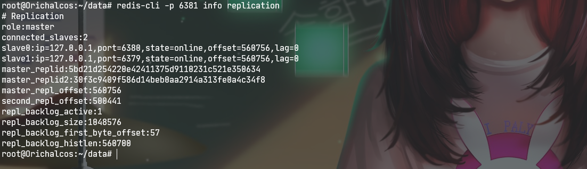

此时 6379 变为了 slave， 6381 已然翻身做主。


**Spring Boot 配置**

```yaml
# 记得开启哨兵的远程连接
spring:
  redis:
    sentinel:
      # master的名称，哨兵配置文件里 sentinel monitor 所配置的主节点名字
      master: mymaster
      # 哨兵的IP:Port列表
      nodes: 127.0.0.1:26379,127.0.0.1:26380,127.0.0.1:26381
```


## 11.3、Cluster 模式 

### 11.3.1、Cluster 模式介绍

Redis Cluster是一种服务器 Sharding（分片） 技术，3.0版本开始正式提供。

Redis 的哨兵模式基本已经可以实现高可用，读写分离 ，但是在这种模式下每台 Redis 服务器都存储相同的数据，很浪费内存，所以在 Redis3.0上加入了 Cluster 集群模式，实现了 Redis 的分布式存储，也就是说每台 Redis 节点上存储不同的内容。


在这个图中，每一个蓝色的圈都代表着一个 Redis 的服务器节点。它们任何两个节点之间都是相互连通的。客户端可以与任何一个节点相连接，然后就可以访问集群中的任何一个节点。对其进行存取和其他操作。


**集群的数据分片**

Redis 集群没有使用一致性 hash，而是引入了哈希槽【hash slot】的概念。

Redis 集群有 16384 个哈希槽，每个 key 通过 CRC16 校验后对 16384 取模来决定放置哪个槽。集群的每个节点负责一部分 hash 槽，举个例子，比如当前集群有3个节点，那么：

- 节点 A 包含 0 到 5460 号哈希槽
- 节点 B 包含 5461 到 10922 号哈希槽
- 节点 C 包含 10923 到 16383 号哈希槽

这种结构很容易添加或者删除节点。比如如果我想新添加个节点 D ， 我需要从节点 A， B， C 中得部分槽到 D 上。如果我想移除节点 A ，需要将 A 中的槽移到 B 和 C 节点上，然后将没有任何槽的 A 节点从集群中移除即可。由于从一个节点将哈希槽移动到另一个节点并不会停止服务，所以无论添加删除或者改变某个节点的哈希槽的数量都不会造成集群不可用的状态。

在 Redis 的每一个节点上，都有这么两个东西，一个是插槽（slot），它的的取值范围是：0-16383。还有一个就是 cluster，可以理解为是一个集群管理的插件。当我们的存取的 Key 到达的时候，Redis 会根据 CRC16 的算法得出一个结果，然后把结果对 16384 求余数，这样每个 key 都会对应一个编号在 0-16383 之间的哈希槽，通过这个值，去找到对应的插槽所对应的节点，然后直接自动跳转到这个对应的节点上进行存取操作。


**Redis 集群的主从复制模型**

为了保证高可用，redis-cluster 集群引入了主从复制模型，一个 master 对应一个或者多个 slave，当 master 宕机的时候，就会启用 slave。当其它 master `ping` 一个 master A 时，如果半数以上的 master 与 A 通信超时，那么认为 master A 宕机了。如果 master A 和它的 slave A1 都宕机了，那么该集群就无法再提供服务了。

集群的特点：

- 所有的 Redis 节点彼此互联（PING-PONG机制），内部使用二进制协议优化传输速度和带宽
- 节点的 fail 是通过集群中超过半数的节点检测失效时才生效
- 客户端与 Redis 节点直连，不需要中间代理层，客户端不需要连接集群所有节点，连接集群中任何一个可用节点即可


### 11.3.2、Cluster 模式搭建

```bash
# 清除掉data文件夹下的所有文件，在里面新建一个redis_6379.conf
vim redis_6379.conf

# 写入以下内容
include /etc/redis/redis.conf
port 6379
daemonize no
pidfile /root/data/redis_6379.pid
logfile "redis_6379.log"
dbfilename dump_6379.rdb
dir /root/data
cluster-enabled yes 
cluster-config-file nodes_6379.conf 
cluster-node-timeout 15000

# 将文件复制五份，更改其中端口等信息
sed 's/6379/6380/g' redis_6379.conf > redis_6380.conf
sed 's/6379/6381/g' redis_6379.conf > redis_6381.conf
sed 's/6379/6382/g' redis_6379.conf > redis_6382.conf
sed 's/6379/6383/g' redis_6379.conf > redis_6383.conf
sed 's/6379/6384/g' redis_6379.conf > redis_6384.conf
```

使用`ps -ef | grep redis`查看状态：

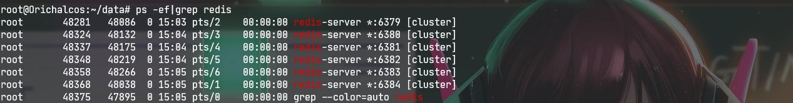

创建集群，`--cluster-replicas 1`的意思是创建 master 的时候同时创建一个 slave：

```bash
redis-cli --cluster create 127.0.0.1:6379 127.0.0.1:6380 127.0.0.1:6381 127.0.0.1:6382 127.0.0.1:6383 127.0.0.1:6384 --cluster-replicas 1
```

这里我们选择的是一主一从，一共六个服务器，所以先输入的 6379、6380、6381 会成为 mater，其余的为 slave。下面显示 master0 的槽为 0-5460、master1 的槽为 5461-10922、master2 的槽为 10923-16383。同时 6383 作为 slave 指向 6379、6384 作为 slave 指向 6380、6382 作为 slave 指向 6381：

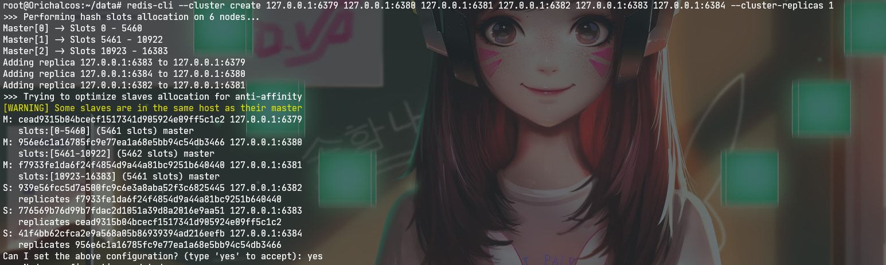

如果使用以下配置，就输入 yes 同意，这时会开始创建：

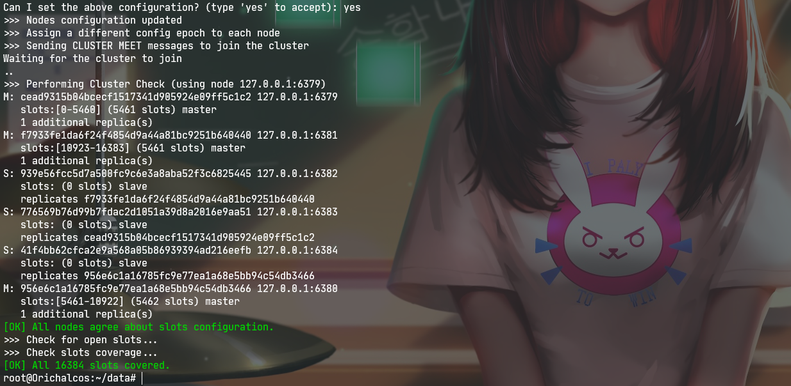

可以通过`cluster nodes`命令查看节点状态：

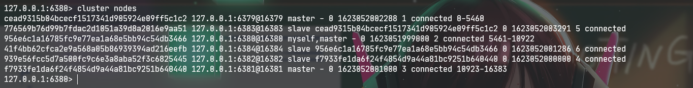


**数据验证**

注意 集群模式下要带参数 `-c`，表示集群，否则在存的时候，如果使用的是集群 A，但是算出来要存的槽的所在地为集群 B，这时会报错：

```bash
root@Orichalcos:~/data# redis-cli -p 6379
127.0.0.1:6379> set v1 v1
OK
127.0.0.1:6379> set v234324234 k2
OK
127.0.0.1:6379> set vajflakjflajfklj k
(error) MOVED 10368 127.0.0.1:6380
127.0.0.1:6379> exit
root@Orichalcos:~/data# redis-cli -p 6379 -c
127.0.0.1:6379> set vajflakjflajfklj k
-> Redirected to slot [10368] located at 127.0.0.1:6380
OK
127.0.0.1:6380>
```


**Spring Boot配置**

```yaml
spring:
  redis:
    cluster:
      # 书写集群中所有的nodes
      nodes: 127.0.0.1:6379,127.0.0.1:6380,127.0.0.1:6381,127.0.0.1:6382,127.0.0.1:6383,127.0.0.1:6384
      # 重定向的最大次数
      max-redirects: 3
```


### 11.3.3、Redis Cluster 操作

可以通过 `redis-cli --cluster help` 查看手册：

```bash
redis-cli --cluster help
Cluster Manager Commands:
  create         host1:port1 ... hostN:portN   #创建集群
                 --cluster-replicas <arg>      #从节点个数
                 
  check          host:port                     #检查集群
                 --cluster-search-multiple-owners #检查是否有槽同时被分配给了多个节点
                 
  info           host:port                     #查看集群状态
  
  fix            host:port                     #修复集群
                 --cluster-search-multiple-owners #修复槽的重复分配问题
                 
  reshard        host:port                     #指定集群的任意一节点进行迁移slot，重新分slots
                 --cluster-from <arg>          #需要从哪些源节点上迁移slot，可从多个源节点完成迁移，以逗号隔开，
                                               #传递的是节点的node id，还可以直接传递--from all，这样源节点就是集群的所有节点，
                                               #不传递该参数的话，则会在迁移过程中提示用户输入
                 --cluster-to <arg>            #slot需要迁移的目的节点的node id，目的节点只能填写一个，不传递该参数的话， 
                                               #则会在迁移过程中提示用户输入
                 --cluster-slots <arg>         #需要迁移的slot数量，不传递该参数的话，则会在迁移过程中提示用户输入。
                 --cluster-yes                 #指定迁移时的确认输入
                 --cluster-timeout <arg>       #设置migrate命令的超时时间
                 --cluster-pipeline <arg>      #定义cluster getkeysinslot命令一次取出的key数量，不传的话使用默认值为10
                 --cluster-replace             #是否直接replace到目标节点
                 
  rebalance      host:port                                      #指定集群的任意一节点进行平衡集群节点slot数量 
                 --cluster-weight <node1=w1...nodeN=wN>         #指定集群节点的权重
                 --cluster-use-empty-masters                    #设置可以让没有分配slot的主节点参与，默认不允许
                 --cluster-timeout <arg>                        #设置migrate命令的超时时间
                 --cluster-simulate                             #模拟rebalance操作，不会真正执行迁移操作
                 --cluster-pipeline <arg>                       #定义cluster getkeysinslot命令一次取出的key数量， 
                                                                #默认值为10
                 --cluster-threshold <arg>                      #迁移的slot阈值超过threshold，执行rebalance操作
                 --cluster-replace                              #是否直接replace到目标节点
                 
  add-node       new_host:new_port existing_host:existing_port  #添加节点，把新节点加入到指定的集群，默认添加主节点
                 --cluster-slave                                #新节点作为从节点，默认随机一个主节点
                 --cluster-master-id <arg>                      #给新节点指定主节点
                 
  del-node       host:port node_id                              #删除给定的一个节点，成功后关闭该节点服务
  
  call           host:port command arg arg .. arg               #在集群的所有节点执行相关命令
  
  set-timeout    host:port milliseconds                         #设置cluster-node-timeout
  
  import         host:port                                      #将外部redis数据导入集群
                 --cluster-from <arg>                           #将指定实例的数据导入到集群
                 --cluster-copy                                 #migrate时指定copy
                 --cluster-replace                              #migrate时指定replace
```


**增加节点**

```bash
# 增加两个节点配置
sed 's/6379/6385/g' redis_6379.conf > redis_6385.conf
sed 's/6379/6386/g' redis_6379.conf > redis_6386.conf

# 启动
redis-server redis_6385.conf
redis-server redis_6386.conf

# 集群中增加节点
redis-cli -p 6379 --cluster add-node 127.0.0.1:6385 127.0.0.1:6379

# 查看节点信息
redis-cli cluster nodes
```

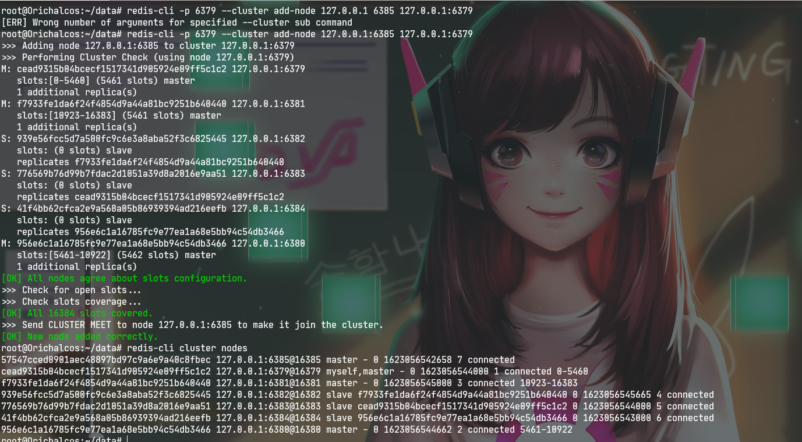

将 6386 添加为 6385 的从节点

```bash
redis-cli --cluster add-node 127.0.0.1:6386 127.0.0.1:6379 --cluster-slave --cluster-master-id 57547cced0901aec48897bd97c9a6e9a40c8fbec
```

这个时候是没有虽然新节点加入了进来，但是没有分配槽：

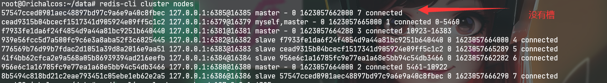

所以执行 `redis-cli --cluster reshard 127.0.0.1:6385 `分配槽：

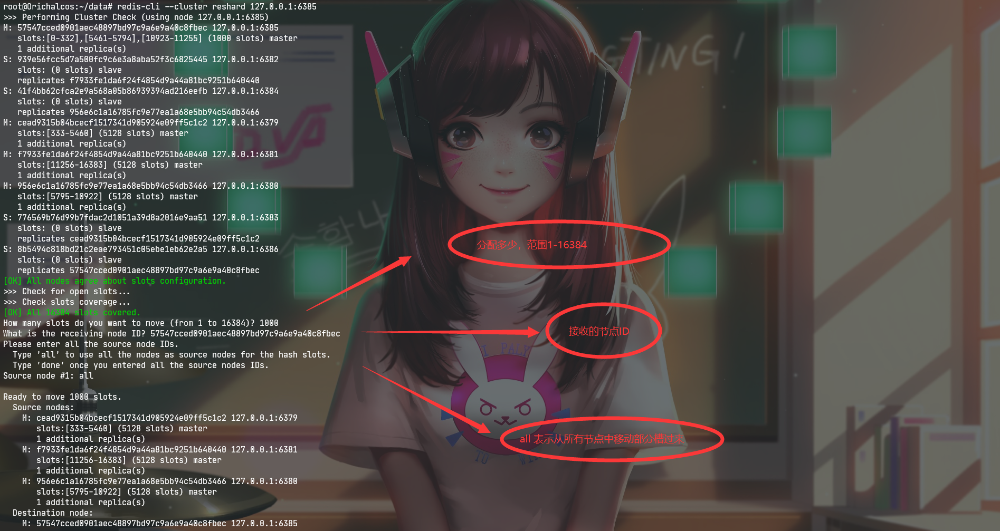

中间输入 `yes` 继续，这样就分配完毕：

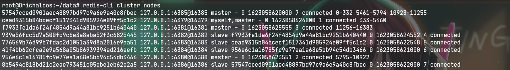


**删除节点**

slave 直接删除即可，删除 master 需要先将槽移到其他节点中去！

```bash
redis-cli --cluster del-node 127.0.0.1:6386 8b5494c818bd21c2eae793451c05ebe1eb62e2a5
```

先转移槽，中间输入 `yes` 继续：

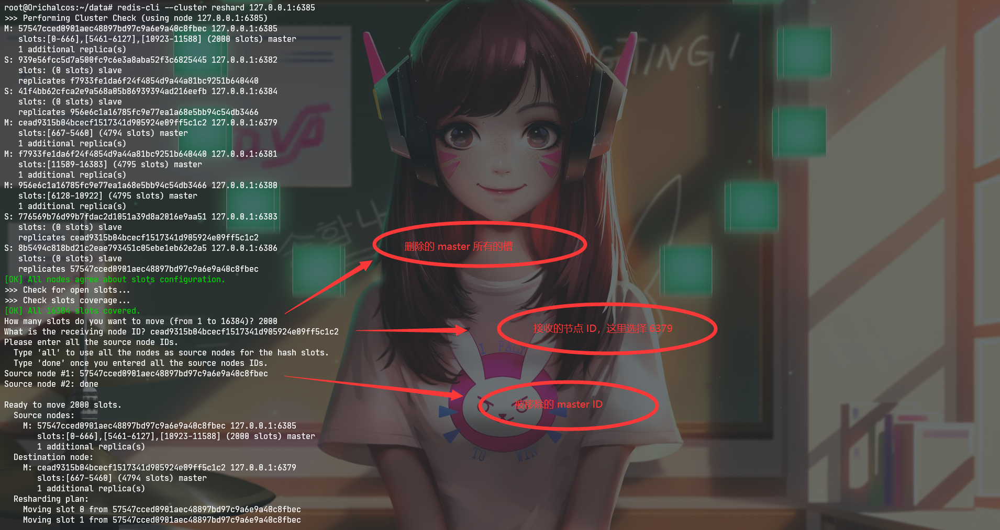

删除节点

```bash
redis-cli --cluster del-node 127.0.0.1:6385 57547cced0901aec48897bd97c9a6e9a40c8fbec
```


# 12、缓存雪崩、击穿、穿透

## 12.1、缓存雪崩

**什么是缓存雪崩**

如果缓在某一个时刻出现大规模的 key 失效，那么就会导致大量的请求打在了数据库上面，导致数据库压力巨大，如果在高并发的情况下，可能瞬间就会导致数据库宕机。这时候如果运维马上又重启数据库，马上又会有新的流量把数据库打死。这就是缓存雪崩。

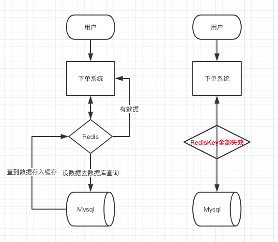


**解决方案**

1. 事前

	- 均匀过期：

		设置不同的过期时间，让缓存失效的时间尽量均匀，避免相同的过期时间导致缓存雪崩，造成大量数据库的访问

	- 分级缓存：

		第一缓存失效的基础上，访问二级缓存，每一级缓存的失效时间都不同

	- 热点数据永不过期

		> 　永不过期实际包含两层意思：
		>
		> - 物理永不过期：针对热点 key 不设置过期时间
		> - 逻辑过期：把过期时间存在 key 对应的 value 里，如果发现要过期了，通过一个后台的异步线程进行缓存的构建

	- 保证 Redis 缓存的高可用，防止 Redis 宕机导致缓存雪崩的问题。可以使用主从+哨兵、Reids 集群来避免 Redis 全盘崩溃的情况

2. 事中

	- 互斥锁：

		在缓存失效后，通过互斥锁或者队列来控制读数据写缓存的线程数量，比如某个 key 只允许一个线程查询数据和写缓存，其他线程等待。这种方式会阻塞其他线程，此时系统的吞吐量下降

	- 使用熔断机制，限流降级：

		当流量达到一定的阈值，直接返回 ”系统拥挤“ 之类的提示，防止过多的请求打在数据库上将数据库击垮，至少能保证一部分用户是可以正常访问的，其他用户多刷新几次也能得到结果

3. 事后

	- 开始 Redis 持久化机制，尽快恢复缓存数据，一旦重启，就能从磁盘上自动加载数据恢复内存中的数据


## 12.2、缓存击穿

 **什么是缓存击穿**

缓存击穿跟缓存雪崩有点类似，缓存雪崩是大规模的 key 失效，而缓存击穿是某个热点的 key 失效，大并发集中对其进行请求，就会造成大量请求读缓存没读到数据，从而导致高并发访问数据库，引起数据库压力剧增。这种现象就叫做缓存击穿。


**解决方案**

1. 在缓存失效后，通过互斥锁或者队列来控制读数据写缓存的线程数量，比如某个 key 只允许一个线程查询数据和写缓存，其他线程等待。这种方式会阻塞其他的线程，此时系统的吞吐量会下降
2. 热点数据缓存永远不过期


## 12.3、缓存穿透

**什么是缓存穿透**

缓存穿透是指用户请求的数据在缓存中不存在，即没有命中，同时在数据库中也不存在，导致用户每次请求该数据都要去数据库中查询一遍。如果有恶意攻击者不断请求系统中不存在的数据，会导致短时间大量请求落在数据库上，造成数据库压力过大，甚至导致数据库承受不住而宕机崩溃。

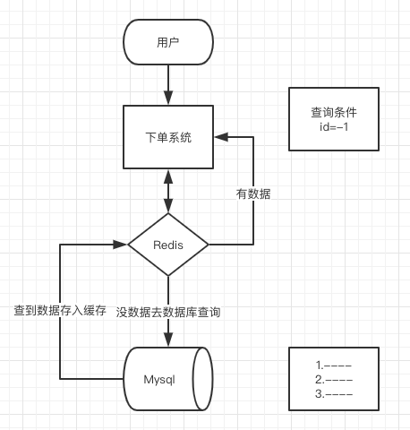

缓存穿透的关键在于 在Redis 中查不到key值，它和缓存击穿的根本区别在于传进来的 key 在 Redis 中是不存在的。假如有黑客传进大量的不存在的key，那么大量的请求打在数据库上是很致命的问题，所以在日常开发中要对参数做好校验，一些非法的参数，不可能存在的 key 就直接返回错误提示。


**解决方案**

1. 将无效的key存放进Redis中：

	当出现Redis查不到数据，数据库也查不到数据的情况，就把这个 key 保存到 Redis 中，设置 `value="null"`，并设置其过期时间极短，后面再出现查询这个 key 的请求的时候，直接返回 null，就不需要再查询数据库了。但这种处理方式是有问题的，假如传进来的这个不存在的 Key 值每次都是随机的，那存进 Redis 也没有意义，网关层 **Nginx** 有配置项，可以让运维大大对单个 IP 每秒访问次数超出阈值的 IP 都拉黑，因为正常用户是不会在单秒内发起这么多次请求的

2. 使用布隆过滤器：

	如果布隆过滤器判定某个 key 不存在布隆过滤器中，那么就一定不存在，如果判定某个 key 存在，那么很大可能是存在（存在一定的误判率）。于是我们可以在缓存之前再加一个布隆过滤器，将数据库中的所有 key 都存储在布隆过滤器中，在查询 Redis 前先去布隆过滤器查询 key 是否存在，如果不存在就直接返回，不让其访问数据库，从而避免了对底层存储系统的查询压力。


> PS：在开发程序的时候都要有一颗 “不信任” 的心，就是不要相信任何调用方，比如你提供了 API 接口出去，你有这几个参数，那我觉得作为被调用方，任何可能的参数情况都应该被考虑到，做校验，因为你不相信调用你的人，你不知道他会传什么参数给你。
>
> 举个简单的例子，你这个接口是分页查询的，但是你没对分页参数的大小做限制，调用的人万一 一口气查 Integer.MAX_VALUE 一次请求就要你几秒，多几个并发你不就挂了么？是公司同事调用还好大不了发现了改掉，但是如果是黑客或者竞争对手呢？在你双十一当天就调你这个接口会发生什么，就不用我说了吧。


## 12.4、缓存预热

**什么是缓存预热**

缓存预热是指系统上线后，提前将相关的缓存数据加载到缓存系统。避免在用户请求的时候，先查询数据库，然后再将数据缓存的问题，用户直接查询事先被预热的缓存数据。

如果不进行预热，那么 Redis 初始状态数据为空，系统上线初期，对于高并发的流量，都会访问到数据库中， 对数据库造成流量的压力。


**解决方案**

1. 数据量不大的时候，工程启动的时候进行加载缓存动作
2. 数据量大的时候，设置一个定时任务脚本，进行缓存的刷新
3. 数据量太大的时候，优先保证热点数据进行提前加载到缓存


## 12.5、缓存降级

缓存降级是指缓存失效或缓存服务器挂掉的情况下，可以将其他次要服务的数据进行缓存降级，从而提升主服务的稳定性。不去访问数据库，直接返回默认数据或访问服务的内存数据。降级一般是有损的操作，所以尽量减少降级对于业务的影响程度。

降级的目的是保证核心服务可用，即使是有损的。如去年双十一的时候淘宝购物车无法修改地址只能使用默认地址，这个服务就是被降级了，这里阿里保证了订单可以正常提交和付款，但修改地址的服务可以在服务器压力降低，并发量相对减少的时候再恢复。

在项目实战中通常会将部分热点数据缓存到服务的内存中，这样一旦缓存出现异常，可以直接使用服务的内存数据，从而避免数据库遭受巨大压力。


# 13、Redis 实现分布式锁

`set` 还可以添加一些其他的参数：

```bash
SET key value [EX seconds|PX milliseconds] [NX|XX] [KEEPTTL]
```

- EX seconds：以秒为单位设置过期时间
- PX milliseconds：以毫秒为单位设置过期时间
- NX：键不存在的时候设置键值
- XX：键存在的时候设置键值
- KEEPTTL：保留设置前指定键的生存时间


`setnx` 是 SET if Not eXists（如果不存在，则 SET）的简写。

```bash
setnx key value
```

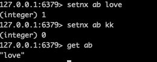

用法如图，如果不存在 set 成功返回 int 的 1，这个 key 存在了返回0。


`setex` 将值 value 关联到 key ，并将 key 的生存时间设为 seconds (以秒为单位)；如果 key 已经存在，setex 命令将覆写旧值。

```bash
setex key seconds value
```

而且`setex` 是一个原子性（atomic）操作，关联值和设置生存时间两个动作会在同一时间内完成。

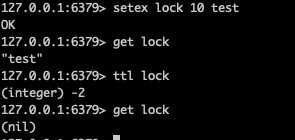

我设置了 10 秒的失效时间，`ttl` 命令可以查看倒计时，负的说明已经到期了。


**获取锁**

获取锁有两种方式，一种是使用 `set` 命令，另一种是使用 `setnx` 命令

```java
/**
 * 使用redis的set命令实现获取分布式锁
 *
 * @param lockKey   锁
 * @param requestId 请求ID，保证同一性
 * @param timeout   过期时间，避免死锁
 * @return
 */
public static boolean getLockBySet(String lockKey, String requestId, int timeout) {
	// 获取jedis对象，负责与远程redis服务器进行链接
	Jedis jedis = getJedis();
	String result = jedis.set(lockKey, requestId, "NX", "EX", timeout);
	if (result == "OK") {
		return true;
	}
	return false;
}
```

```java
/**
 * 使用redis的setnx命令实现获取分布式锁
 *
 * @param lockKey   锁
 * @param requestId 请求ID，保证同一性
 * @param timeout   过期时间，避免死锁
 * @return
 */
public static synchronized boolean getLockBySetnx(String lockKey, String requestId, int timeout) {
	// 获取jedis对象，负责与远程redis服务器进行链接
	Jedis jedis = getJedis();
	Long result = jedis.setnx(lockKey, requestId);
	if (result == 1) {
		// 设置有效期，防止死锁
		jedis.expire(lockKey, timeout);
		return true;
	}
	return false;
}
```

> 可以设置一个超时时间，获取锁的时候如果未获取到可以让线程 `sleep` 一会儿，然后继续获取，等到超过了超时时间再 “获取失败”。


**释放锁**

```java
/**
 * 使用del命令释放锁
 *
 * @param lockKey   锁
 * @param requestId 请求ID，保证同一性
 */
public static void releaseLockByDel(String lockKey, String requestId) {
	// 获取jedis对象，负责与远程redis服务器进行链接
	Jedis jedis = getJedis();
	// 保证同一性
	if (requestId.equals(jedis.get(lockKey))) {
		jedis.del(lockKey);
	}
}
```


# 14、Redis 实现分布式缓存

在 Mybatis 中默认情况下，只启用了本地的会话缓存，它仅仅对一个会话中的数据进行缓存。 要启用全局的二级缓存，只需要在 SQL 映射文件中添加一行：

```xml
<cache/>
```


## 14.1、搭建环境

1. 这里新建一个简单的 SpringBoot 项目，引入以下依赖：

   ```xml
   <dependencies>
       <dependency>
           <groupId>org.springframework.boot</groupId>
           <artifactId>spring-boot-starter-data-redis</artifactId>
       </dependency>
       <dependency>
           <groupId>org.springframework.boot</groupId>
           <artifactId>spring-boot-starter-web</artifactId>
       </dependency>
       <dependency>
           <groupId>org.mybatis.spring.boot</groupId>
           <artifactId>mybatis-spring-boot-starter</artifactId>
           <version>2.2.0</version>
       </dependency>
       <dependency>
           <groupId>org.springframework.boot</groupId>
           <artifactId>spring-boot-devtools</artifactId>
           <scope>runtime</scope>
           <optional>true</optional>
       </dependency>
       <dependency>
           <groupId>mysql</groupId>
           <artifactId>mysql-connector-java</artifactId>
           <scope>runtime</scope>
       </dependency>
       <dependency>
           <groupId>org.projectlombok</groupId>
           <artifactId>lombok</artifactId>
           <optional>true</optional>
       </dependency>
       <dependency>
           <groupId>org.springframework.boot</groupId>
           <artifactId>spring-boot-starter-test</artifactId>
           <scope>test</scope>
       </dependency>
       <dependency>
           <groupId>com.alibaba</groupId>
           <artifactId>druid-spring-boot-starter</artifactId>
           <version>1.2.6</version>
       </dependency>
   </dependencies>
   ```

2. 编辑 application.yml 文件：

   ```yaml
   server:
     port: 8888
   spring:
     #redis
     redis:
       host: localhost
       port: 6379
       database: 0
     #mysql
     datasource:
       type: com.alibaba.druid.pool.DruidDataSource
       driver-class-name: com.mysql.cj.jdbc.Driver
       url: jdbc:mysql://localhost:3306/redis?useUnicode=true&characterEncoding=UTF-8&serverTimezone=Asia/Shanghai
       username: root
       password: root
   #mybatis
   mybatis:
     mapper-locations: classpath:mapper/*.xml
     type-aliases-package: com.orichalcos.entity
   
   logging:
     level:
       com.orichalcos.mapper: debug
   ```
   
3. 新建一个简单的实体类 User.java，并在数据库创建对应表：

	```java
	/**
	 * @author Orichalcos
	 */
	@Data
	@AllArgsConstructor
	@NoArgsConstructor
	@Accessors(chain = true)
	public class User implements Serializable {
	    private String id;
	    private String name;
	    private Integer age;
	    private Date bir;
	}
	```

4. 新建 UserMapper.java：

	```java
	/**
	 * @author Orichalcos
	 */
	@Mapper
	public interface UserMapper {
	    List<User> findAll();
	}
	```

5. UserMapper.xml：

	```xml
	<?xml version="1.0" encoding="UTF-8"?>
	<!DOCTYPE mapper PUBLIC "-//mybatis.org//DTD Mapper 3.0//EN" "http://mybatis.org/dtd/mybatis-3-mapper.dtd">
	<mapper namespace="com.orichalcos.mapper.UserMapper">
	    <select id="findAll" resultType="User">
	        select id,name,age,bir from t_user;
	    </select>
	</mapper>
	```

6. UserService.java 和 UserServiceImpl.java：

	```java
	public interface UserService {
	    List<User> findAll();
	}
	
	```

	```java
	/**
	 * @author Orichalcos
	 */
	@Service
	public class UserServiceImpl implements UserService {
	
	    @Autowired
	    private UserMapper userMapper;
	
	    @Override
	    public List<User> findAll() {
	        return userMapper.findAll();
	    }
	}
	```

7. 在 test.java.com.orichalcos 下创建一个 TestUserService.java 进行测试：

	```java
	@SpringBootTest
	public class TestUserService {
	    @Autowired
	    private UserService userService;
	
	    @Test
	    public void test() {
	        userService.findAll().forEach(u -> System.out.println("u = " + u));
	    }
	}
	```

8. 启动 `test()` 测试，结果如下，环境搭建成功：

	```
	u = User(id=1, name=orichalcos, age=18, bir=Tue Jun 15 00:00:00 CST 2021)
	u = User(id=2, name=小黑, age=20, bir=Wed Jun 16 00:00:00 CST 2021)
	```


## 14.2、开启 Mybatis 的二级缓存

在开启之前，修改下 `test()` 方法：

```java
@Test
public void test() {
    userService.findAll().forEach(u -> System.out.println("u = " + u));

    System.out.println("=================================================");

    userService.findAll().forEach(u -> System.out.println("u = " + u));
}
```

查看打印出来的日志：

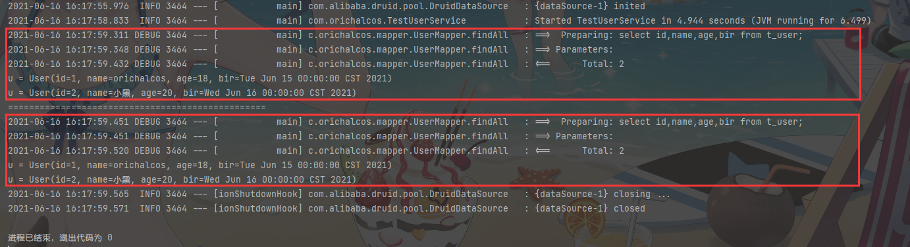

可以看到，程序去数据库查询了两次。

再在 UserMapper.xml 中开启二级缓存：

```xml
<cache/>
```

再次启动 `test()` 方法，查看打印的日志：

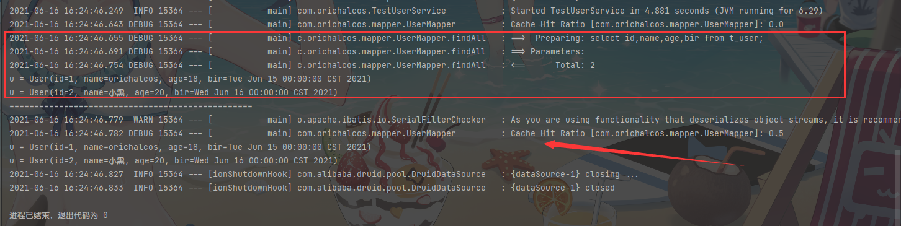

可以看到这里程序只查询了一次数据可，第二次因为击中了缓存，所以直接给到了数据。

开启缓存需要实体类实现序列化，不然会报序列化的错误：

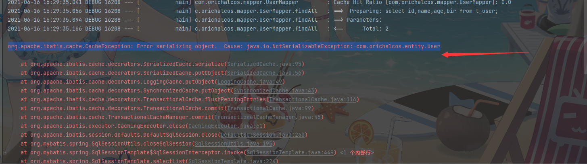


## 14.3、使用 Redis 作为缓存

首先，看看 Mybatis 的 Cache 接口的实现类：

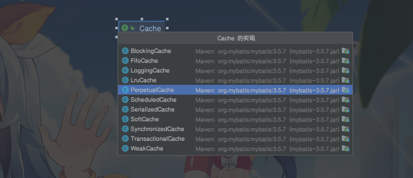

Mybatis 中默认使用的就是 PerpretualCache，可以看一下源码：

```java
//
// Source code recreated from a .class file by IntelliJ IDEA
// (powered by FernFlower decompiler)
//

package org.apache.ibatis.cache.impl;

import java.util.HashMap;
import java.util.Map;
import org.apache.ibatis.cache.Cache;
import org.apache.ibatis.cache.CacheException;

public class PerpetualCache implements Cache {
    private final String id;
    private final Map<Object, Object> cache = new HashMap();

    public PerpetualCache(String id) {
        this.id = id;
    }

    public String getId() {
        return this.id;
    }

    public int getSize() {
        return this.cache.size();
    }

    public void putObject(Object key, Object value) {
        this.cache.put(key, value);
    }

    public Object getObject(Object key) {
        return this.cache.get(key);
    }

    public Object removeObject(Object key) {
        return this.cache.remove(key);
    }

    public void clear() {
        this.cache.clear();
    }
...
}
```

可以看到在类中维护了一个名为 cache 的 HashMap，大部分方法都是对 cache 进行操作，可以对其中的一些方法打上断点 debug 查看方法什么时候触发。其实看到这里已经很直白了：HashMap 用于存放缓存，如果查询的时候没有命中缓存，那么会使用 `putObject()` 将缓存存入，如果命中缓存就使用 `getObject()` 将数据取出。那么如果使用 Redis 作为缓存，可以自己定义一个 RedisCache 并且实现 Cache 接口即可。

首先先新建一个 RedisCache.java 并实现 Cache.java：

```java
/**
 * @author Orichalcos
 * 自定义Redis缓存实现
 */
public class RedisCache implements Cache {
    @Override
    public String getId() {
        return null;
    }

    @Override
    public void putObject(Object key, Object value) {

    }

    @Override
    public Object getObject(Object key) {
        return null;
    }

    @Override
    public Object removeObject(Object key) {
        return null;
    }

    @Override
    public void clear() {

    }

    @Override
    public int getSize() {
        return 0;
    }
}
```

在 UserMapper.xml 中将 cache 类型改为自定义的 RedisCache：

```xml
<cache type="com.orichalcos.cache.RedisCache"/>
```

先直接跑一下看看：

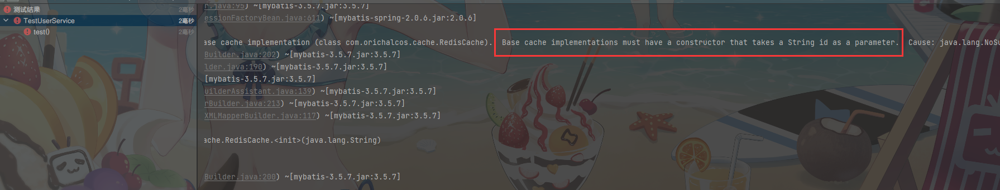

这里报错提示：基本缓存必须要有一个字符串 ID 为参数的构造函数，参考下 PerpetualCache.java 的实现，这次在 RedisCache.java 中添加对应的构造函数，并且将其打印出来看看是啥：

```java
private final String id;

public RedisCache(String id) {
    System.out.println(id);
    this.id = id;
}
```

再次执行 `test()`：

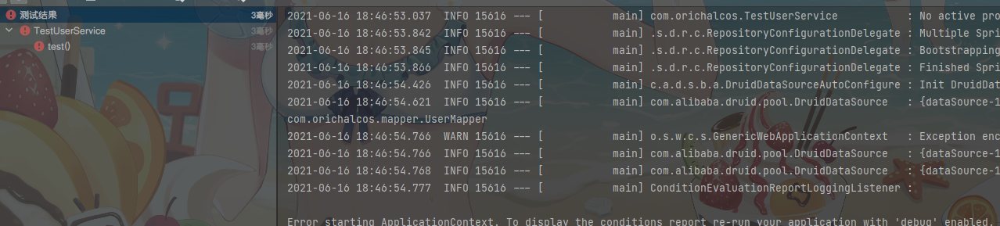

打印出了 ID，原来是 Mapper 文件的 namespace，并且在控制台最后提示报错：name 参数不能为空

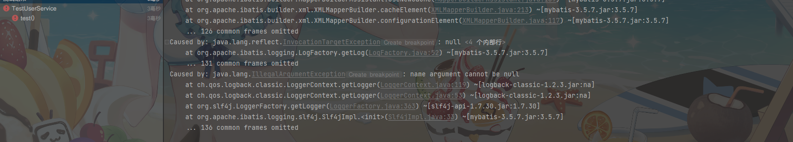

那么，根据 PerpetualCache.java 中的 `getId()` 方法，将 namespace 返回出去：

```java
@Override
public String getId() {
    return this.id;
}
```

再次运行 `test()`：

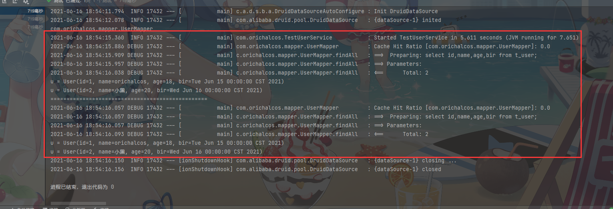

已经没有问题了，但是还是查询了数据库两次，先别急，先看看 `putObject()` 和 `getObject()` 的参数是啥：

```java
@Override
public void putObject(Object key, Object value) {
    System.out.println("key====" + key.toString());
    System.out.println("value====" + value);
}

@Override
public Object getObject(Object key) {
    System.out.println("key===="+key.toString());
    return null;
}
```

再跑一下 `test()`：

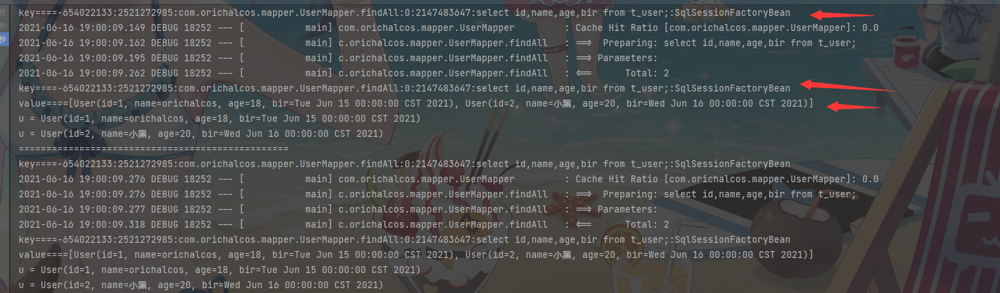

可以看到，每次查询的时候都会通过 `getObject()` 方法去拿缓存，但是因为没有拿到，所以去数据库查询，然后通过 `putObject()` 将数据存入缓存。

这样就很清楚了，按照 PerpetualCache.java 的实现（存入 HashMap），将数据存入 Redis 中。由于 RedisCache.java 没有被 Spring 托管，所以不可以通过 `@Autowired` 直接获取到 RedisTemplate，这里写一个工具类来获取：

```java
/**
 * @author Orichalcos
 * 用来获取springboot创建好的工厂
 */
public class ApplicationContextUtils implements ApplicationContextAware {

    private static ApplicationContext applicationContext;

    @Override
    public void setApplicationContext(ApplicationContext applicationContext) throws BeansException {
        ApplicationContextUtils.applicationContext = applicationContext;
    }

    public static Object getBean(String name) {
        return applicationContext.getBean(name);
    }
}
```

完善 RedisCache.java 的代码：

```java
/**
 * @author Orichalcos
 * 自定义Redis缓存实现
 */
public class RedisCache implements Cache {

    private final String id;

    public RedisCache(String id) {
        this.id = id;
    }

    @Override
    public String getId() {
        return this.id;
    }

    @Override
    public void putObject(Object key, Object value) {
        getRedisTemplate().opsForHash().put(id, key.toString(), value);
    }

    @Override
    public Object getObject(Object key) {
        return getRedisTemplate().opsForHash().get(id, key.toString());
    }

    @Override
    public Object removeObject(Object key) {
        return getRedisTemplate().opsForHash().delete(id, key.toString());
    }

    @Override
    public void clear() {
        getRedisTemplate().delete(id);
    }

    @Override
    public int getSize() {
        return getRedisTemplate().opsForHash().size(id).intValue();
    }

    private RedisTemplate getRedisTemplate() {
        RedisTemplate redisTemplate = (RedisTemplate) ApplicationContextUtils.getBean("redisTemplate");
        redisTemplate.setKeySerializer(RedisSerializer.string());
        redisTemplate.setHashKeySerializer(RedisSerializer.string());
        return redisTemplate;
    }
}
```

运行 `test()` ：

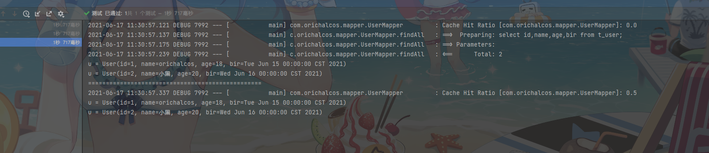

已经第一次存，第二次直接从缓存获取，看看 Redis 里：

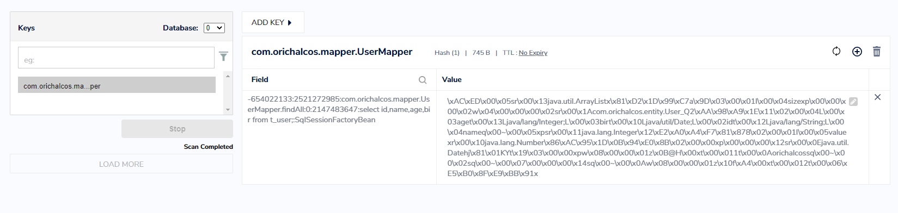


## 14.4、问题及优化

**多表连接问题**

添加一个 Role 表，与 User 关联：

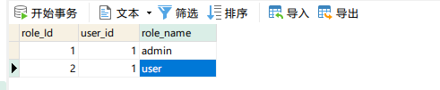

在 UserMapper.xml 增加 ResultMap 映射并修改 `findAll()`（这里还修改了 User 的主键，id->user_id）：

```xml
<mapper namespace="com.orichalcos.mapper.UserMapper">

    <cache type="com.orichalcos.cache.RedisCache"/>

    <resultMap id="UserResultMap" type="User">
        <id property="userId" column="user_id"/>
        <result property="name" column="name"/>
        <result property="age" column="age"/>
        <result property="bir" column="bir"/>
        <collection property="roles" ofType="Role" >
            <id property="roleId" column="role_id"/>
            <result property="userId" column="user_id"/>
            <result property="roleName" column="role_name"/>
        </collection>
    </resultMap>

    <select id="findAll" resultMap="UserResultMap">
        select *
        from t_user
                 left join
             t_role
             on t_user.user_id = t_role.user_id;
    </select>
</mapper>
```

在 RoleMapper.xml 中增加了 `updateRole()`：

```xml
<update id="updateRole">
    update t_role
    set role_name="user2"
    where role_id = "1"
</update>
```

`test()` 改为如下：

```java
@Test
public void test() {
    userService.findAll().forEach(u -> System.out.println("u = " + u));
    System.out.println("=================================================");

    roleService.updateRole();
    userService.findAll().forEach(u -> System.out.println("u = " + u));
}
```

运行后发现：

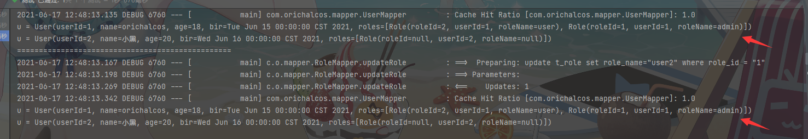

`updateRole()` 执行后，会刷新掉 com.orichalcos.mapper.RoleMapper 下的缓存，再次查询 User，由于缓存命中且 com.orichalcos.mapper.UserMapper 的缓存并未更新，所以出现了这种情况，解决方法：

```xml
<!--<cache type="com.orichalcos.cache.RedisCache"/>-->
<cache-ref namespace="com.orichalcos.mapper.UserMapper"/>
```

改为引用 User 的缓存，再次测试：

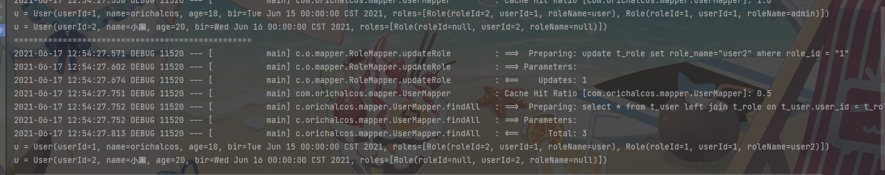

第一次命中缓存，执行 `updateRole()` 后删除了 com.orichalcos.mapper.UserMapper 下的缓存，所以第二次查询了数据库，数据正确！


**其他的优化**

RedisCache.java 只是简单实现！

- 缓存穿透：存储空值解决
- 缓存击穿：可以使用互斥锁
- 缓存雪崩：缓存有效期设置为一个随机范围
- 读写性能：redis key 不能过长，会影响性能，可以使用 SHA-256 计算摘要当成 key


# 15、Redis Session 管理

Redis 的 session 管理是利用 Spring 提供的 session 管理解决方案，将一个应用 session 交给 Redis 存储，整个应用中所有 session 的请求都会去 redis 中获取对应的 session 数据。


1. 引入依赖：

	```xml
	<!-- https://mvnrepository.com/artifact/org.springframework.session/spring-session-data-redis -->
	<dependency>
	    <groupId>org.springframework.session</groupId>
	    <artifactId>spring-session-data-redis</artifactId>
	    <version>2.5.0</version>
	</dependency>
	
	<dependency>
	    <groupId>org.springframework.boot</groupId>
	    <artifactId>spring-boot-starter-data-redis</artifactId>
	</dependency>
	```

2. 添加 Session 管理配置类

	```java
	@Configuration
	@EnableRedisHttpSession
	public class RedisSessionManager {
	}
	```

3. 打包测试
