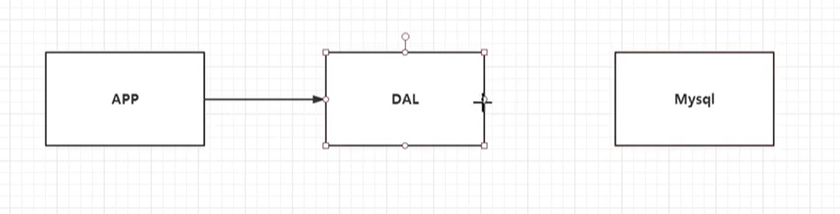
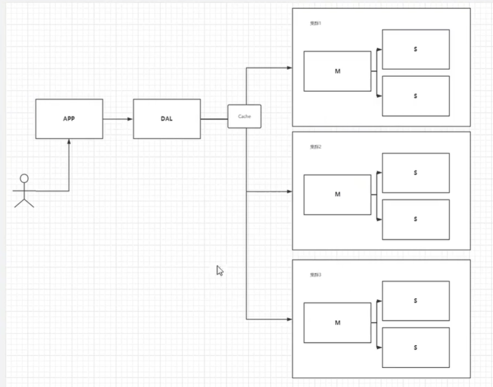
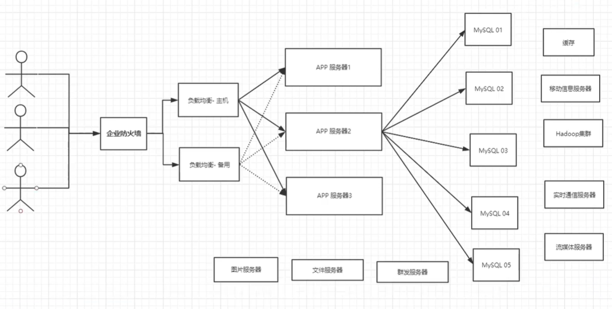
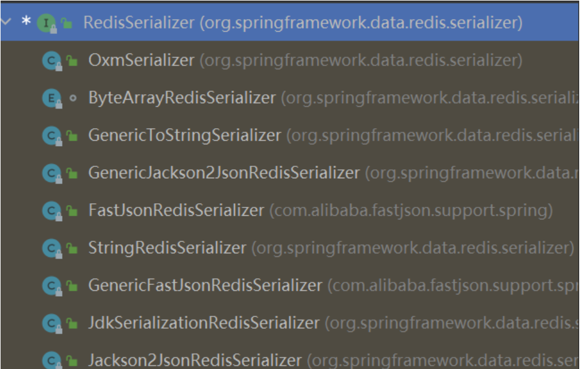
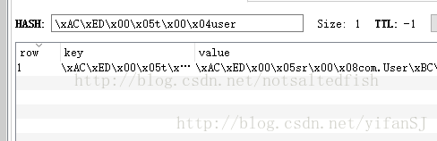
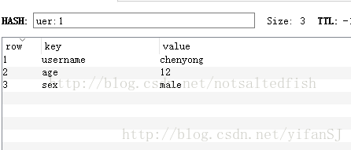

# 1、NoSQL概述

## 1.1、为什么要用 NoSQL？

**单机 MySQL 年代**



DAL 是数据访问层的英文缩写，即为数据访问层（Data Access Layer）。其功能主要是负责数据库的访问。简单地说就是实现对数据表的 Select（查询）、Insert（插入）、Update（更新）、Delete（删除）等操作。

90年代一个网站的访问量不会太大，单个数据库完全足够，那个时候，更多的是去使用静态 HTML，服务器根本没有太大压力。

那么这种情况下，网站的瓶颈是什么？

- 数据量如果太大，一个机器放不下
- 数据的索引（B+Tree），一个机器内存也放不下
- 访问量（读写混合），一个服务器承受不了


**Memcached（缓存）+ MySQL + 垂直拆分（读写分离）**

网站 80% 的情况都是在读，每次都要去查询数据就十分麻烦，为了减轻数据库的压力，可以使用缓存来保证效率。


**分表分库 + 水品拆分 + MySQL 集群**

早些年 MyISAM：表锁 ，十分影响效率，高并发下就会出现严重的锁问题

转战 InnoDB：行锁（如果使用针对 InnoDB 的表使用行锁，被锁定字段不是主键，也没有针对它建立索引的话，行锁锁定的也是整张表）




**现今（大数据时代）**



现今如果涉及大数据量的需求，比如一些商品抢购的情景，或者是主页访问量瞬间较大的时候，单一使用数据库来保存数据的系统会因为面向磁盘，磁盘读/写速度比较慢的问题而存在严重的性能弊端，一瞬间成千上万的请求到来，需要系统在极短的时间内完成成千上万次的读/写操作，这个时候往往不是数据库能够承受的，极其容易造成数据库系统瘫痪，最终出现服务宕机这种严重的问题。为了克服上述的问题，项目通常会引入 NoSQL 技术。


## 1.2、什么是 NoSQL？

NoSQL = Not Only SQL（不仅仅是 SQL）

**NoSQL 的特点：**

- 方便扩展（数据之间没有关系，很好扩展）
- 大数据量高性能（Redis 一秒写 8 万次，读取 11 万，NoSQL 的缓存记录级，是一种细粒度的缓存，性能会比较高）
- 数据类型是多样型的（不需要事先设计数据库，随用随取）


**传统 RDBMS 和 MySQL**

- 传统的 RDBMS

	> - 结构化组织
	> - SQL
	> - 数据和关系都存在单独的表中
	> - 严格的一致性
	> - 基础的事务

- NoSQL

	> - 不仅仅是数据
	> - 没有固定的查询语言
	> - 键值对存储、列存储、文档存储，图形数据库（社交关系）
	> - 最终一致性
	> - CPA 定理和 BASE
	> - 高性能、高可用、高可扩


**了解 3V + 3 高**

大数据时代的 3V：主要描述问题的

- 海量 Volume
- 多样 Variety
- 实时 Velocity

大数据时代的 3 高 ：主要是对程序的要求

- 高并发
- 高可扩
- 高性能


**NoSQL 数据库的四大分类的分析**

| 分类                  | Example 举例                                       | 典型应用场景                                                 | 数据模型                                          | 优点                                                         | 缺点                                                         |
| --------------------- | -------------------------------------------------- | ------------------------------------------------------------ | ------------------------------------------------- | ------------------------------------------------------------ | ------------------------------------------------------------ |
| **键值（key-value）** | Tokyo Cabinet/Tyrant, Redis, Voldemort, Oracle BDB | 内容缓存，主要用于处理大量数据的高访问负载，也用于一些日志系统等等。 | Key 指向 Value 的键值对，通常用 hash table 来实现 | 查找速度快                                                   | 数据无结构化，通常只被当作字符串或者二进制数据               |
| **列存储数据库**      | Cassandra, HBase, Riak                             | 分布式的文件系统                                             | 以列簇式存储，将同一列数据存在一起                | 查找速度快，可扩展性强，更容易进行分布式扩展                 | 功能相对局限                                                 |
| **文档型数据库**      | CouchDB, MongoDb                                   | Web应用（与Key-Value类似，Value是结构化的，不同的是数据库能够了解Value的内容） | Key-Value 对应的键值对，Value 为结构化数据        | 数据结构要求不严格，表结构可变，不需要像关系型数据库一样需要预先定义表结构 | 查询性能不高，而且缺乏统一的查询语法。                       |
| **图形(Graph)数据库** | Neo4J, InfoGrid, Infinite Graph                    | 社交网络，推荐系统等。专注于构建关系图谱                     | 图结构                                            | 利用图结构相关算法。比如最短路径寻址，N 度关系查找等         | 很多时候需要对整个图做计算才能得出需要的信息，而且这种结构不太好做分布式的集群 |


# 2、Redis 入门

## 2.1、概述

Redis（Remote Dictionary Server )，即远程字典服务，是一个开源的使用ANSI C语言编写、支持网络、可基于内存亦可持久化的日志型、Key-Value数据库，并提供多种语言的API。

Redis 会周期性的把更新的数据写入磁盘或者把修改操作写入追加的记录文件，并且在此基础上实现了 master-slave（主从）同步。是当下最热门的 NoSQL 技术之一，也被人们成为结构化数据库。


**Redis 能干嘛？**

- 内存存储、持久化，内存中是断电即失，所以说持久化很重要（RDB、AOF）
- 效率高，可以用于高速缓存
- 发布订阅系统
- 地图信息分析
- 计时器、计数器（浏览量）
- ...


**Redis 的特性**

- 多样的数据类型
- 持久化
- 集群
- 事务
- ...


Redis 是单线程的（6.0 是多线程），因为 Redis 是基于内存操作，CPU 不是 Reids 性能瓶颈，Reids 的瓶颈是根据机器的内存和网络的带宽，而且Redis 单线程十分快。


## 2.2、Reids 安装

**直接使用 Linux 安装**

```shell
# 下载源码 
wget http://download.redis.io/releases/redis-6.0.5.tar.gz

# 解压
tar xzf redis-6.0.5.tar.gz

#
进入目录
cd redis-6.0.5

# C/C++ 构建，类似 mvn install，npm build
make

# 进入源码目录
cd src

# 启动服务器程序
./redis-server &

# 启动客户端 
./redis-cli
```


**使用 Docker**

```shell
# 下载 redis 镜像
docker pull redis

# 创建 reids 容器
docker run --name redis -td -p 6379:6379 redis

# 进入 reids 容器
docker exec -it redis bash

# 启动客户端
redis-cli
```


## 2.3、基础知识

| 命令                  | 描述                                                         |
| --------------------- | ------------------------------------------------------------ |
| select [db_index]     | 切换到 db_index 号数据库，Redis 默认 16 个数据库，默认是使用第 0 个 |
| dbsize                | 查看数据库大小                                               |
| keys *                | 查看所有的键                                                 |
| flushdb               | 清空当前数据库                                               |
| flushall              | 清空所有数据库                                               |
| move [key] [db_index] | 当前数据库的 key 移动到给定的数据库 db_index 当中            |
| expire [key] [second] | 设置该 key 在 second 秒后过期                                |
| ttl [key]             | 显示 key 的剩余有效时间（time to live 存活时间）             |
| type [key]            | 显示 key 的类型                                              |
| exists [key]          | 查看 key 是否存在，1 表示存在，0 表示不存在                  |
| del [key]             | 删除该 key                                                   |


# 3、五大数据类型

Redis 是一个开源（BSD许可）的，内存中的数据结构存储系统，它可以用作数据库、缓存和消息中间件。 它支持多种类型的数据结构，如 字符串（strings）， 散列（hashes）， 列表（lists）， 集合（sets）， 有序集合（sorted sets） 与范围查询， bitmaps， hyperloglogs 和 地理空间（geospatial） 索引半径查询。 Redis 内置了 复制（replication），LUA脚本（Lua scripting）， LRU驱动事件（LRU eviction），事务（transactions） 和不同级别的 磁盘持久化（persistence）， 并通过 Redis哨兵（Sentinel）和自动分区（Cluster）提供高可用性（high availability）。


## 3.1、String（字符串）

string 是 redis 最基本的类型，可以理解成与 Memcached 一模一样的类型，一个 key 对应一个 value。value 其实不仅是 String，也可以是数字。string 类型是二进制安全的。意思是 redis 的 string 可以包含任何数据。比如 jpg 图片或者序列化的对象。string 类型是 Redis 最基本的数据类型，string 类型的值最大能存储 512MB。

常用命令：get、set、incr、decr、mget 等。

应用场景：String 是最常用的一种数据类型，普通的 key / value 存储都可以归为此类，即可以完全实现目前 Memcached 的功能，并且效率更高。还可以享受 Redis 的定时持久化，操作日志及 Replication 等功能。

使用场景：常规 key-value 缓存应用。常规计数：微博数，粉丝数。


**追加字符串**

```shell
127.0.0.1:6379> set key1 v1 # 设置值
OK
127.0.0.1:6379> get key1 # 获取值
"v1"
127.0.0.1:6379> keys * 
1) "key1"
127.0.0.1:6379> exists key1
(integer) 1
127.0.0.1:6379> append key1 'hello' # 追加字符串，如果当前 key 不存在，就相当于 set key
(integer) 7
127.0.0.1:6379> get key1
"v1hello"
127.0.0.1:6379> strlen key1 # 获取字符串长度
(integer) 7
```


**计数器**

```shell
127.0.0.1:6379> set views 0
OK
127.0.0.1:6379> get views
"0"
127.0.0.1:6379> incr views # 自增 1
(integer) 1
127.0.0.1:6379> incr views
(integer) 2
127.0.0.1:6379> incrby views 10 # 自增 10
(integer) 12
127.0.0.1:6379> decr views # 自减 1
(integer) 11
127.0.0.1:6379> decrby views 10 # 自减 10
(integer) 1
```


**截取字符串**

```shell
127.0.0.1:6379> set key1 'Orihcalcos'
OK
127.0.0.1:6379> get key1
"Orihcalcos"
127.0.0.1:6379> getrange key1 2 3 # 截取字符串 [2,3]，将 get 改为 set 则表示替换
"ih"
127.0.0.1:6379> getrange key1 2 -1 # 如果 end 参数为 -1 则表示截取完
"ihcalcos"
```


**有效时间**

```shell
127.0.0.1:6379> setex key 10 'Orichalcos' # 设置过期时间 （set expire）
OK
127.0.0.1:6379> ttl key
(integer) 1
127.0.0.1:6379> ttl key
(integer) -2
127.0.0.1:6379> setnx mykey 'redis' # 不存在则设置（set not exist）
(integer) 1
127.0.0.1:6379> setnx mykey 'Orichalcos'
(integer) 0
127.0.0.1:6379> get mykey
"redis"
127.0.0.1:6379> get key
(nil)
```


**群体导入**

```shell
127.0.0.1:6379> mset k1 v1 k2 v2 # 群体导入
OK
127.0.0.1:6379> msetnx k1 v1 k3 v3 # msetnx 具有原子性
(integer) 0
```


**对象**

```shell
127.0.0.1:6379> set user:1 {name:zhangsan,age:3} # 设置一个 user:1 对象，使用 json 字符来保存一个对象
OK
127.0.0.1:6379> mset user:1:name zhangsan user:1:age 2 # user:{id}:{filed}
OK
127.0.0.1:6379> mget user:1:name user:1:age
1) "zhangsan"
2) "2"
127.0.0.1:6379> get user:1
"{name:zhangsan,age:3}"
```


**getset**

```shell
127.0.0.1:6379> getset db redis # 如果不存在值，则返回 nil
(nil)
127.0.0.1:6379> get db
"redis"
127.0.0.1:6379> getset db mongodb # 如果存在值，获取原来的值，并设置新的值
"redis"
127.0.0.1:6379> get db
"mongodb"
```


## 3.2、List（列表）

列表是简单的字符串列表，按照插入顺序排序。可以添加一个元素到列表的头部（左边）或者尾部（右边）。

常用命令：lpush（添加左边元素），rpush，lpop（移除左边第一个元素），rpop，lrange（获取列表片段，LRANGE key start stop）等。

应用场景：Redis list 的应用场景非常多，也是 Redis 最重要的数据结构之一，比如 twitter 的关注列表，粉丝列表等都可以用 Redis 的 list 结构来实现。

实现方式：Redis 的 list 是每个子元素都是 String 类型的双向链表，可以通过 push 和 pop 操作从列表的头部或者尾部添加或者删除元素，可以支持反向查找和遍历，这样 List 既可以作为栈，也可以作为队列，不过带来了部分额外的内存开销。获取越接近两端的元素速度越快，通过索引访问时会比较慢。Redis 内部的很多实现，包括发送缓冲队列等也都是用的这个数据结构。

使用场景：

- 消息队列系统：使用 list 可以构建队列系统，轻松地实现最新消息排行等功能。利用 List 的 PUSH 操作，将任务存在 List中，然后工作线程再用 POP 操作将任务取出进行执行，使用 sorted set 甚至可以构建有优先级的队列系统。比如：将 Redis 用作日志收集器，实际上还是一个队列，多个端点将日志信息写入 Redis，然后一个 worker 统一将所有日志写到磁盘。
- 取最新 N 个数据的操作：记录前 N 个最新登陆的用户 Id 列表，超出的范围可以从数据库中获得。

列表最多可存储 2^32^ - 1 元素 (4294967295, 每个列表可存储40多亿)。


```shell
127.0.0.1:6379> lpush list one # 将一个值或多个值插入到列表头部（左）
(integer) 1
127.0.0.1:6379> lpush list two
(integer) 2
127.0.0.1:6379> lpush list three
(integer) 3
127.0.0.1:6379> lrange list 0 -1 # 获取 list 中所有的值
1) "three"
2) "two"
3) "one"
127.0.0.1:6379> lrange list 0 1 # 通过区间获取具体的值 [0,1]
1) "three"
2) "two"
127.0.0.1:6379> rpush list zero # 将一个值或多个值插入到列表尾部（右）
(integer) 4
127.0.0.1:6379> lrange list 0 -1
1) "three"
2) "two"
3) "one"
4) "zero"
```

```shell
127.0.0.1:6379> lrange list 0 -1
1) "three"
2) "two"
3) "one"
4) "zero"
127.0.0.1:6379> lpop list # 移除 list 的第一个元素
"three"
127.0.0.1:6379> rpop list # 移除 list 的最后一个元素
"zero"
127.0.0.1:6379> lrange list 0 -1
1) "two"
2) "one"
```

```shell
127.0.0.1:6379> lrange list 0 -1
1) "two"
2) "one"
127.0.0.1:6379> lindex list 1 # 通过下标获取 list 中的某一个值
"one"
127.0.0.1:6379> lindex list 0
"two"
127.0.0.1:6379> llen list # 返回列表的长度
(integer) 2
```

```shell
127.0.0.1:6379> lrange list 0 -1
1) "three"
2) "three"
3) "two"
4) "one"
127.0.0.1:6379> lrem list 1 three # 删除 list 中的一个 key（1 不是下标而是数量，从左开始删除）
(integer) 1
127.0.0.1:6379> lrange list 0 -1
1) "three"
2) "two"
3) "one"
```

```shell
127.0.0.1:6379> lrange mylist 0 -1
1) "hello3"
2) "hello2"
3) "hello1"
4) "hello"
127.0.0.1:6379> ltrim mylist 1 2 # 通过下标截取指定长度的 list，这个 list 将被改变，lrange 不会改变原 list
OK
127.0.0.1:6379> lrange mylist 0 -1
1) "hello2"
2) "hello1"
```

```shell
127.0.0.1:6379> lrange mylist 0 -1
1) "hello2"
2) "hello1"
127.0.0.1:6379> rpoplpush mylist myotherlist # 移除列表的最后一个元素，将它移动到新的列表中
"hello1"
127.0.0.1:6379> lrange mylist 0 -1
1) "hello2"
127.0.0.1:6379> lrange myotherlist 0 -1
1) "hello1"
```

```shell
127.0.0.1:6379> lrange list 0 -1
1) "v3"
2) "v2"
3) "v1"
127.0.0.1:6379> lset list 0 vv # 替换掉指定下标的值，list 和 index 都必须存在，否则报错
OK
127.0.0.1:6379> lrange list 0 -1
1) "vv"
2) "v2"
3) "v1"
```

```shell
127.0.0.1:6379> rpush list hello
(integer) 1
127.0.0.1:6379> rpush list world
(integer) 2
127.0.0.1:6379> lrange list 0 -1
1) "hello"
2) "world"
127.0.0.1:6379> linsert list before 'world' my # 在某个元素 之前/之后 插入新的元素
(integer) 3
127.0.0.1:6379> lrange list 0 -1
1) "hello"
2) "my"
3) "world"
```


## 3.3、Set（集合）

Redis set 是 string 类型的无序集合。集合是通过 intset 和 hashtable 实现的，概念和数学中个的集合基本类似，可以交集，并集，差集等等，set 中的元素是没有顺序的。所以添加，删除，查找的复杂度都是O(1)。

常用命令：sadd，spop，smembers，sunion 等。

应用场景：Redis set 对外提供的功能与 list 类似是一个列表的功能，特殊之处在于 set 是可以自动排重的，当需要存储一个列表数据，又不希望出现重复数据时，set 是一个很好的选择，并且 set 提供了判断某个成员是否在一个 set 集合内的重要接口，这个也是 list 所不能提供的。

案例：在微博中，可以将一个用户所有的关注人存在一个集合中，将其所有粉丝存在一个集合。Redis还为集合提供了求交集、并集、差集等操作，可以非常方便的实现如共同关注、共同喜好、二度好友等功能，对上面的所有集合操作，还可以使用不同的命令选择将结果返回给客户端还是存集到一个新的集合中。

集合中最大的成员数为 2^32^ - 1(4294967295, 每个集合可存储40多亿个成员)。


```shell
127.0.0.1:6379> sadd myset hello # 集合中添加元素，成功返回1，如果元素已经在集合中返回 0，如果 key 对应的 set 不存在则返回错误
(integer) 1
127.0.0.1:6379> sadd myset orichalcos
(integer) 1
127.0.0.1:6379> sadd myset hello_orichalcos
(integer) 1
127.0.0.1:6379> smembers myset # 查看指定 set 的所有值
1) "hello_orichalcos"
2) "orichalcos"
3) "hello"
127.0.0.1:6379> sismember myset hello # 判断某一个值是不是在 set 集合中
(integer) 1
127.0.0.1:6379> sismember myset hell
(integer) 0
127.0.0.1:6379> scard myset # 获取 set 集合中的内容元素个数
(integer) 3
```

```shell
127.0.0.1:6379> smembers myset
1) "hello_orichalcos"
2) "orichalcos"
3) "hei"
127.0.0.1:6379> srem myset hei # 移除 set 集合中的指定元素
(integer) 1
127.0.0.1:6379> smembers myset
1) "hello_orichalcos"
2) "orichalcos"
```

```shell
127.0.0.1:6379> srandmember myset # 随机抽出一个元素
"hello_orichalcos"
127.0.0.1:6379> srandmember myset
"hello_world"
127.0.0.1:6379> srandmember myset 2 # 随机抽出指定个数的元素
1) "hello_world"
2) "hello"
```

```shell
127.0.0.1:6379> sadd mylist hello
(integer) 1
127.0.0.1:6379> sadd mylist world
(integer) 1
127.0.0.1:6379> sadd mylist orichalcos
(integer) 1
127.0.0.1:6379> spop mylist # 随机删除一个元素
"orichalcos"
```

```shell
127.0.0.1:6379> smembers mylist
1) "orichalcos"
2) "world"
3) "hello"
127.0.0.1:6379> smove mylist myset orichalcos # 将一个指定的值，移动到另一个 set 集合中
(integer) 1
127.0.0.1:6379> smembers myset
1) "orichalcos"
```

```shell
# 可以用于共同关注，共同爱好，推荐好友
127.0.0.1:6379> sadd key1 a b c
(integer) 3
127.0.0.1:6379> sadd key2 c d e
(integer) 3
127.0.0.1:6379> sdiff key1 key2 # 差集
1) "b"
2) "a"
127.0.0.1:6379> sinter key1 key2 # 交集
1) "c"
127.0.0.1:6379> sunion key1 key2 # 并集
1) "b"
2) "c"
3) "d"
4) "a"
5) "e"
```


## 3.4、Hash（哈希）

Redis hash 是一个键值 (key => value) 对集合。Redis hash 是一个 string 类型的 field 和 value 的映射表，hash 特别适合用于存储对象。

常用命令：hget，hset，hgetall 等。

使用场景：存储部分变更数据，如用户信息等。每个 hash 可以存储 2^32^ -1 键值对（40多亿）。

```shell
127.0.0.1:6379> hset myhash field1 orichalcos # set 一个具体 key-value
(integer) 1
127.0.0.1:6379> hget myhash field1 # 获取一个字段值
"orichalcos"
127.0.0.1:6379> hmset myhash field2 hello field3 world # set 多个 key-value
OK
127.0.0.1:6379> hmget myhash field2 field3 # 获取多个字段值
1) "hello"
2) "world"
127.0.0.1:6379> hgetall myhash # 获取全部的数据
1) "field1"
2) "orichalcos"
3) "field2"
4) "hello"
5) "field3"
6) "world"
```

```shell
127.0.0.1:6379> hdel myhash field1 # 删除 hash 指定 key 字段，value 也会消失
(integer) 1
127.0.0.1:6379> hgetall myhash 
1) "field2"
2) "hello"
3) "field3"
4) "world"
```

```shell
127.0.0.1:6379> hgetall myhash
1) "field2"
2) "hello"
3) "field3"
4) "world"
127.0.0.1:6379> hlen myhash # 获取 hash 表的字段数量
(integer) 2
```

```shell
127.0.0.1:6379> hexists myhash field1 # 判断 hash 中指定字段是否存在
(integer) 0
127.0.0.1:6379> hexists myhash field2
(integer) 1
```

```shell
127.0.0.1:6379> hkeys myhash # 获取所有的 field
1) "field2"
2) "field3"
127.0.0.1:6379> hvals myhash # 获取所有的 value
1) "hello"
2) "world"
```

```shell
127.0.0.1:6379> hset myash field4 5 
(integer) 1
127.0.0.1:6379> hget myash field4
"5"
127.0.0.1:6379> hincrby myash field4 1  # 指定增量
(integer) 6
127.0.0.1:6379> hsetnx myhash field4 hello # 如果不存在则可以设置
(integer) 1
127.0.0.1:6379> hsetnx myhash field4 hello
(integer) 0
```

​	

## 3.5、Zset（有序集合）

Redis zset 和 set 一样也是string类型元素的集合,且不允许重复的成员。

常用命令：zadd，zrange，zrem，zcard 等

使用场景：Redis sorted set 的使用场景与 set 类似，区别是 set 不是自动有序的，而 sorted set 可以通过用户额外提供一个优先级 (score) 的参数来为成员排序，并且是插入有序的，即自动排序。当需要一个有序的并且不重复的集合列表，那么可以选择 sorted set 数据结构，比如 twitter 的 public timeline 可以以发表时间作为 score 来存储，这样获取时就是自动按时间排好序的。和 Set 相比，Sorted Set 关联了一个 double 类型权重参数score，使得集合中的元素能够按 score 进行有序排列，redis 正是通过分数来为集合中的成员进行从小到大的排序。zset 的成员是唯一的，但分数(score) 却可以重复。比如一个存储全班同学成绩的 Sorted Set，其集合 value 可以是同学的学号，而 score 就可以是其考试得分，这样在数据插入集合的时候，就已经进行了天然的排序。另外还可以用 Sorted Set 来做带权重的队列，比如普通消息的 score 为1，重要消息的 score 为2，然后工作线程可以选择按 score 的倒序来获取工作任务。让重要的任务优先执行。


```shell
127.0.0.1:6379> zadd myset 1 one # 添加一个值
(integer) 1
127.0.0.1:6379> zadd myset 2 two 3 threee # 添加多个值
(integer) 2
127.0.0.1:6379> zrange myset 0 -1
1) "one"
2) "two"
3) "threee"
```

```shell
127.0.0.1:6379> zadd salary 2500 xiaohong 2000 zhangsan 500 Orichalcos
(integer) 3
127.0.0.1:6379> zrange salary 0 -1
1) "Orichalcos"
2) "zhangsan"
3) "xiaohong"
127.0.0.1:6379> zrangebyscore salary -inf +inf # 显示所有值 从小到大
1) "Orichalcos"
2) "zhangsan"
3) "xiaohong"
127.0.0.1:6379> zrevrangebyscore salary +inf -inf #显示所有值 从大到小
1) "xiaohong"
2) "zhangsan"
3) "Orichalcos"
127.0.0.1:6379> zrangebyscore salary -inf +inf withscores # 显示所有信息 从小到大
1) "Orichalcos"
2) "500"
3) "zhangsan"
4) "2000"
5) "xiaohong"
6) "2500"
```

```shell
127.0.0.1:6379> zrange salary 0 -1
1) "Orichalcos"
2) "zhangsan"
3) "xiaohong"
127.0.0.1:6379> zrem salary xiaohong # 删除指定元素
(integer) 1
127.0.0.1:6379> zrange salary 0 -1
1) "Orichalcos"
2) "zhangsan"
```

```shell
127.0.0.1:6379> zcard salary # 获取有序集合中的个数
(integer) 2
```

```shell
127.0.0.1:6379> zrange myset 0 -1
1) "one"
2) "two"
3) "threee"
127.0.0.1:6379> zcount myset 1 2 # 获取指定区间的成员数量
(integer) 2
```


# 4、三大特殊类型

## 4.1、geospatial（地理位置）

朋友的定位，附近的人，打车距离的计算？

Reids 的 Geo 在 Reids 3.2 版本就推出了！这个功能可以推算地理位置的信息，两地之间的距离，方圆几里的人。

只有六个命令：

- geoadd
- geodist
- geohash
- geopos
- georadius
- georadiusbymember


**geoadd**

添加地理位置，规则：两级无法直接添加，我们一般会下载城市数据，直接通过 java 程序一次性导入！

有效的经度从 -180 度到 180 度，有效的纬度从 -85.05112878 度到 85.05112878 度，当坐标位置超出上诉指定范围时，该命令将会返回一个错误。

```shell
127.0.0.1:6379> geoadd china:city 116.40 39.90 beijing
(integer) 1
127.0.0.1:6379> geoadd china:city 121.47 31.23 shanghai
(integer) 1
127.0.0.1:6379> geoadd china:city 106.50 29.53 chongqi 114.05 22.52 shenzhen
(integer) 2
127.0.0.1:6379> geoadd china:city 120.16 30.24 hangzhou 108.96 34.26 xian
(integer) 2 
```


**geopos**

获取当前定位，一定是一个坐标值。

```shell
127.0.0.1:6379> geopos china:city beijing
1) 1) "116.39999896287918091"
   2) "39.90000009167092543"
127.0.0.1:6379> geopos china:city hangzhou
1) 1) "120.1600000262260437"
   2) "30.2400003229490224"
```


**geodist**

两人之间的距离。

单位：

- **m** 表示单位为 米。
- **km** 表示单位为 千米。
- **mi** 表示单位为 英里。
- **ft** 表示单位为 英尺。

```shell
127.0.0.1:6379> geodist china:city beijing chongqi
"1464070.8051"
127.0.0.1:6379> geodist china:city beijing chongqi km
"1464.0708"
```


**georadius**

以给定的的经度纬度为中心，找出某一半径内的元素。

我附近的人？

```shell
127.0.0.1:6379> georadius china:city 100 30 1000 km # 以 100，30 这个经纬度为中心，寻找 1000km 内的城市
1) "chongqi"
2) "xian"
127.0.0.1:6379> georadius china:city 100 30 1000 km withdist # 显示到中心的距离
1) 1) "chongqi"
   2) "629.6756"
2) 1) "xian"
   2) "967.2846"
127.0.0.1:6379> georadius china:city 100 30 1000 km withcoord # 显示他人的定位信息
1) 1) "chongqi"
   2) 1) "106.49999767541885376"
      2) "29.52999957900659211"
2) 1) "xian"
   2) 1) "108.96000176668167114"
      2) "34.25999964418929977"
127.0.0.1:6379> georadius china:city 100 30 1000 km withcoord count 1 # 筛选出指定的结果
1) 1) "chongqi"
   2) 1) "106.49999767541885376"
      2) "29.52999957900659211"
```


**georadiusbymember**

找出位于指定元素周围的其他元素。

```shell
127.0.0.1:6379> georadiusbymember china:city beijing 1000 km
1) "beijing"
2) "xian"
127.0.0.1:6379> georadiusbymember china:city shanghai 1000 km
1) "hangzhou"
2) "shanghai"
```


**geohash**

该命令将返回11个字符的Geohash字符串。

```shell
127.0.0.1:6379> geohash china:city beijing chongqi
1) "wx4fbxxfke0"
2) "wm5xzrybty0"
```


GEO 底层的实现原理其实就是 Zset，可以使用 Zset 命令来操作 geo。

```shell
127.0.0.1:6379> zrange china:city 0 -1
1) "chongqi"
2) "xian"
3) "shenzhen"
4) "hangzhou"
5) "shanghai"
6) "beijing"
127.0.0.1:6379> zrem china:city xian
(integer) 1
```


## 4.2、hyperloglog

Redis Hyperloglog 基数统计算法。

优点：占用内存是固定的，2^64^ 不同的元素的只需要 12KB 的内存，如果只要从内存角度来比较的话 Hyperloglog 首选。

传统的方式，set 保存用户的 id，然后就可以统计 set 中的元素的数量作为标准判断！这个方式如果保存大量的用户 id，就会比较麻烦，因为目的是为了计数，而不是保存用户 id；并且具有 0.81% 的错误率，但是如果是用于 UV 任务，这个可以忽略不记。

> **UV（Unique visitor）**
> 是指通过互联网访问、浏览这个网页的自然人。访问您网站的一台电脑客户端为一个访客。00:00-24:00内相同的客户端只被计算一次。
>
> 一天内同个访客多次访问仅计算一个UV。
>
> **IP（Internet Protocol）**
> 独立IP是指访问过某站点的IP总数，以用户的IP地址作为统计依据。00:00-24:00内相同IP地址之被计算一次。
>
> **UV与IP区别：**
> 如：你和你的家人用各自的账号在同一台电脑上登录新浪微博，则IP数+1，UV数+2。由于使用的是同一台电脑，所以IP不变，但使用的不同账号，所以UV+2

> **PV（Page View）**
> 即页面浏览量或点击量，用户每1次对网站中的每个网页访问均被记录1个PV。用户对同一页面的多次访问，访问量累计，用以衡量网站用户访问的网页数量。
>
> **VV（Visit View）**
> 用以统计所有访客1天内访问网站的次数。当访客完成所有浏览并最终关掉该网站的所有页面时便完成了一次访问，同一访客1天内可能有多次访问行为，访问次数累计。
>
> **PV与VV区别：**
> 如：你今天10点钟打开了百度，访问了它的三个页面；11点钟又打开了百度，访问了它的两个页面，则PV数+5，VV数+2.
> PV是指页面的浏览次数，VV是指你访问网站的次数。

```shell
127.0.0.1:6379> pfadd mykey a b c d e f g h i j # 创建第一组元素 mykey
(integer) 1
127.0.0.1:6379> pfcount mykey # 统计 mykey 元素的基数数量
(integer) 10
127.0.0.1:6379> pfadd mykey2 i j z x c v b n m # 创建第二组元素 mykey2
(integer) 1
127.0.0.1:6379> pfcount mykey2
(integer) 9
127.0.0.1:6379> pfmerge mykey3 mykey mykey2 # 合并两组
OK
127.0.0.1:6379> pfcount mykey3
(integer) 15
```


## 4.3、Bitmap

统计用户信息，活跃-不活跃；登录-未登录；打卡-未打卡。这种两个状态的，都可以使用 Bitmaps。

Bitmaps 位图，数据结构！都是操作二进制位来记录，就只有 0 和 1 两个状态！

```shell
127.0.0.1:6379> setbit sign 0 1
(integer) 0
127.0.0.1:6379> setbit sign 1 0
(integer) 0
127.0.0.1:6379> setbit sign 2 0
(integer) 0
127.0.0.1:6379> setbit sign 3 1
(integer) 0
127.0.0.1:6379> setbit sign 4 1
(integer) 0
127.0.0.1:6379> setbit sign 5 0
(integer) 0
127.0.0.1:6379> setbit sign 6 0
(integer) 0
127.0.0.1:6379> getbit sign 3
(integer) 1
127.0.0.1:6379> getbit sign 6
(integer) 0
127.0.0.1:6379> bitcount sign
(integer) 3
```


# 5、事务

Redis 事务本质：一组命令的集合！一个事务中的所有命令都会被序列化，在事务执行过程中，会按照顺序执行！

一次性、顺序性、排他性。

Redis 事务没有隔离级别的概念！

所有的命令在事务中，并没有直接被执行！只有发起执行命令（`Exec`）的时候才会执行！

Redis 单条命令是保证原子性的，但是事务不保证原子性！

Redis 的事务：

- 开启事务（multi）
- 命令入队
- 执行事务（exec）


**正常运行情况：**

```shell
127.0.0.1:6379> multi
OK
127.0.0.1:6379> set k1 v1
QUEUED
127.0.0.1:6379> set k2 v2
QUEUED
127.0.0.1:6379> get k2
QUEUED
127.0.0.1:6379> set k3 v3
QUEUED
127.0.0.1:6379> exec
1) OK
2) OK
3) "v2"
4) OK
```


**放弃事务：**

```shell
127.0.0.1:6379> multi
OK
127.0.0.1:6379> set k1 v1
QUEUED
127.0.0.1:6379> set k2 v2
QUEUED
127.0.0.1:6379> discard
OK
127.0.0.1:6379> get k2
(nil)
```


**当命令入队时就报错，那么整个事务中所有的命令都不会执行：**

```shell
127.0.0.1:6379> multi
OK
127.0.0.1:6379> set k1 v1
QUEUED
127.0.0.1:6379> set k2 v2
QUEUED
127.0.0.1:6379> getset k1
(error) ERR wrong number of arguments for 'getset' command
127.0.0.1:6379> set k3 v3
QUEUED
127.0.0.1:6379> exec
(error) EXECABORT Transaction discarded because of previous errors.
```


**如果命令执行时出错，但是入队时成功，那么事务执行时，该命令出错，但是其他的命令会成功执行：**

```shell
127.0.0.1:6379> multi
OK
127.0.0.1:6379> set k1 'v1'
QUEUED
127.0.0.1:6379> incr k1
QUEUED
127.0.0.1:6379> set k2 v2
QUEUED
127.0.0.1:6379> get k1
QUEUED
127.0.0.1:6379> exec
1) OK
2) (error) ERR value is not an integer or out of range
3) OK
4) "v1"
127.0.0.1:6379> get k1
"v1"
```


## 5.1、监视

```shell
127.0.0.1:6379> mset money 100 out 0
OK
127.0.0.1:6379> watch money # 监视 money 对象
OK
127.0.0.1:6379> multi 
OK
127.0.0.1:6379> decrby money 20
QUEUED
127.0.0.1:6379> incrby out 20
QUEUED
127.0.0.1:6379> exec # 事务正常结束，数据期间没有发生变动，这个时候就可以正常执行成功
1) (integer) 80
2) (integer) 20
```

测试多线程修改值，使用 watch 可以当做 Redis 的乐观锁操作！

```shell
127.0.0.1:6379> get money
"80"
127.0.0.1:6379> watch money # 监视 money
OK
127.0.0.1:6379> multi
OK
127.0.0.1:6379> decrby money 210
QUEUED
127.0.0.1:6379> incrby out 210
QUEUED
127.0.0.1:6379> exec # 执行之前，另外一个线程，修改了我们的值，这个时候，就会导致事务执行失败
(nil)
```

无论事务是否执行成功，Redis 都会去取消执行事务前的 watch 命令；redis 可以使用`unwatch`命令取消对所有 key 的监视。

 ```shell
127.0.0.1:6379> watch money # 获取最新的值，再次监视，select version
OK
127.0.0.1:6379> multi
OK
127.0.0.1:6379> decrby money 20
QUEUED
127.0.0.1:6379> incrby out 20
QUEUED
127.0.0.1:6379> exec # 对比监视的值是否发生了变化，如果没有变化，那么可以执行成功，如果变了就执行失败
1) (integer) 190
2) (integer) 40
 ```


# 6、Jedis

什么是 Jedis 是 Redis 推荐的 Java 连接开发工具！使用 Java 操作 Redis 的中间件，如果要使用 Java 操作 Redis，那么一定要对 Jedis 十分熟悉。

1. 导入相关的依赖

	```xml
	<!-- https://mvnrepository.com/artifact/redis.clients/jedis -->
	<dependency>
	    <groupId>redis.clients</groupId>
	    <artifactId>jedis</artifactId>
	    <version>3.3.0</version>
	</dependency>
	<dependency>
	    <groupId>com.alibaba</groupId>
	    <artifactId>fastjson</artifactId>
	    <version>1.2.67</version>
	</dependency>
	```

2. 编码测试：

	- 连接数据库
	- 操作命令
	- 断开连接

	```java
	public class Test {
	    public static void main(String[] args) {
	        Jedis jedis = new Jedis("120.79.171.55", 6379);
	
	        System.out.println(jedis.ping());
	        
	        jedis.close();
	    }
	}
	```

	输出：

	```
	PONG
	```

其余的 API 操作和  Reids 的命令一样。


**Jedis 操作事务**

```java
public class RTransaction {
    public static void main(String[] args) {
        Jedis jedis = new Jedis("120.79.171.55", 6379);

        JSONObject jsonObject = new JSONObject();
        jsonObject.put("hello", "world");
        jsonObject.put("name", "Orichalcos");
        String string = jsonObject.toString();

        //开启事务
        Transaction multi = jedis.multi();

        try {
            multi.set("user1", string);
            multi.set("user2", string);

            //执行事务
            multi.exec();
        } catch (Exception e) {
            //放弃事务
            multi.discard();
        } finally {
            System.out.println(jedis.get("user1"));
            System.out.println(jedis.get("user2"));
            //关闭连接
            jedis.close();
        }
    }
}
```


# 7、Spring Boot 整合

Spring Boot 操作数据：Spring Date JPA JDBC MongoDB Redis

在 Spring Boot 2.X 之后，原来使用的 Jedis 被替换为了 lettuce

- Jedis：采用的直连，多个线程操作的话是不安全的，如果想要避免不安全，可以使用 Jedis Pool 连接池，更像 BIO 模式。
- lettuce：采用 netty，实例可以在多个线程中进行共享，不存在线程不安全的情况！可以减少线程数据，更像 NIO 模式。


整合测试

1. 导入依赖

2. 配置连接

	```properties
	spring.redis.host=120.79.171.55
	spring.redis.port=6379
	```

3. 测试

	```java
	@SpringBootTest
	class Redis02SpringbootApplicationTests {
	    @Autowired
	    private RedisTemplate redisTemplate;
	
	    @Test
	    void contextLoads() {
	        //redisTemplate
	        //opsForValue()
	        //opsForSet()
	        //opsForHash()
	
	        //获取 redis 的连接对象
	        //RedisConnection connection = redisTemplate.getConnectionFactory().getConnection();
	        //connection.flushDb();
	        //connection.flushAll();
	
	        redisTemplate.opsForValue().set("mykey","Orichalcos");
	        System.out.println(redisTemplate.opsForValue().get("mykey"));
	    }
	}
	```


## 7.1、RedisTemplate 及序列化方式

运行上个例子后，在 Redis 中通过 `keys *`命令可以看到：

```shell
"\xac\xed\x00\x05t\x00\x05mykey"
```

可以使用 StringRedisTemplate 来解决这个问题。


**RedisSerializer**

RedisSerializer 接口 是 Redis 序列化接口，用于 Redis KEY 和 VALUE 的序列化，实现类如下：




**两种 Template 的区别**

- 两者的关系： StringRedisTemplate 继承 RedisTemplate。

- 他们的数据是不共通的；也就是说 StringRedisTemplate 只能管理 StringRedisTemplate 里面的数据，RedisTemplate 只能管理 RedisTemplate 中的数据。

- 两者之间的区别主要在于他们使用的序列化类：

	> RedisTemplate 使用的是 JdkSerializationRedisSerializer（如果存入对象，对象要实现 Serializable 接口），存入数据会将数据先序列化成字节数组然后在存入Redis 数据库。这个时候打开Redis 查看的时候，你会看到你的数据不是以可读的形式展现的，而是以字节数组显示，类似下面：
	>
	>  
	>
	> ==当然从 Redis 获取数据的时候也会默认将数据当做字节数组转化==，这样就会导致一个问题，当需要获取的数据不是以字节数组存在 redis 当中而是正常的可读的字符串的时候，比如说下面这种形式的数据：
	> 
	>
	> RedisTemplate 就无法获取导数据，这个时候获取到的值就是 NULL。此时 StringRedisTempate 就派上了用场， StringRedisTemplate 使用的是 StringRedisSerializer，当 Redis 当中的数据值是以可读的形式显示出来的时候，只能使用 StringRedisTemplate 才能获取到里面的数据。


**两种 Template 的源码分析**

StringRedisTemplate 的部分源码如下：

```java
public class StringRedisTemplate extends RedisTemplate<String, String> {

	/**
	 * Constructs a new <code>StringRedisTemplate</code> instance. {@link #setConnectionFactory(RedisConnectionFactory)}
	 * and {@link #afterPropertiesSet()} still need to be called.
	 */
	public StringRedisTemplate() {
		setKeySerializer(RedisSerializer.string());
		setValueSerializer(RedisSerializer.string());
		setHashKeySerializer(RedisSerializer.string());
		setHashValueSerializer(RedisSerializer.string());
	}
    
}
```

通过该源码可以看到 StringRedisTemplate 采用的是 RedisSerializer.string() 来序列化 Redis 中存储数据的 Key 的。

下面再来看看 RedisTemplate 中默认采用什么形式来序列化对应的 Key。

```java
public class RedisTemplate<K, V> extends RedisAccessor implements RedisOperations<K, V>, BeanClassLoaderAware {
    // 省略其他源码
	private @Nullable RedisSerializer<?> defaultSerializer;
	private @Nullable ClassLoader classLoader;

	/*
	 * (non-Javadoc)
	 * @see org.springframework.data.redis.core.RedisAccessor#afterPropertiesSet()
	 */
	@Override
	public void afterPropertiesSet() {

		super.afterPropertiesSet();

		boolean defaultUsed = false;

		if (defaultSerializer == null) {

			defaultSerializer = new JdkSerializationRedisSerializer(
					classLoader != null ? classLoader : this.getClass().getClassLoader());
		}

		if (enableDefaultSerializer) {

			if (keySerializer == null) {
				keySerializer = defaultSerializer;
				defaultUsed = true;
			}
			// 省略其他源码
		}

		if (enableDefaultSerializer && defaultUsed) {
			Assert.notNull(defaultSerializer, "default serializer null and not all serializers initialized");
		}

		if (scriptExecutor == null) {
			this.scriptExecutor = new DefaultScriptExecutor<>(this);
		}

		initialized = true;
	}
	// 省略其他源码   
}
```

可以看到 RedisTemplate 使用的序列化类为 defaultSerializer，默认情况下为 JdkSerializationRedisSerializer。如果未指定 Key 的序列化类，keySerializer 与 defaultSerializer 采用相同的序列化类。

通过上述两个 Template 的分析就可以看出它们在 Redis 存储的 Key，采用了不同的序列化方法。而且 JdkSerializationRedisSerializer 序列化时会在 Key 的前面添加一些特殊字符。

那么，如果在生产环境中想通用 StringRedisTemplate 和 RedisTemplate 进行字符串的处理该怎么办？

此时就需要指定统一的 Key 的序列化处理类，比如在 RedisTemplate 序列化时指定与 StringRedisTemplate 相同的类。在上述单元测试中添加如下方法：

```java
@BeforeEach
void init() {
	redisTemplate.setKeySerializer(RedisSerializer.string());
}
```

也就是设置 RedisTemplate 也使用 RedisSerializer.string() 来序列化 Key。注意此处使用的是 Junit5。

这样就解决问题了吗？没有。因为 RedisTemplate 的 Value 也是采用默认的序列化类，也要进行统一修改。

因此上面的方法变成如下：

```java
@BeforeEach
void init() {
	redisTemplate.setKeySerializer(RedisSerializer.string());
	redisTemplate.setValueSerializer(RedisSerializer.string());
}
```


**Jackson 实现 JSON 的序列化方式**

`org.springframework.data.redis.serializer.GenericJackson2JsonRedisSerializer` 使用 Jackson 实现 JSON 的序列化方式，并且从 Generic 单词可以看出，是支持所有类。

```java
public GenericJackson2JsonRedisSerializer(@Nullable String classPropertyTypeName) {

			.....
			..... 
		if (StringUtils.hasText(classPropertyTypeName)) {
			mapper.enableDefaultTypingAsProperty(DefaultTyping.NON_FINAL, classPropertyTypeName);
		} else {
			mapper.enableDefaultTyping(DefaultTyping.NON_FINAL, As.PROPERTY);
		}
	}

```

classPropertyTypeName 不为空的话，使用传入对象的 classPropertyTypeName 属性对应的值，作为默认类型（Default Typing） ，否则使用传入对象的类全名，作为默认类型（Default Typing）。同时通过 Default Typing ，会在字符串多冗余一个类型，这样反序列化就知道具体的类型了

```java
@Bean
public RedisTemplate<String, Object> redisTemplate() {
    // 创建 RedisTemplate 对象
    RedisTemplate<String, Object> template = new RedisTemplate<>();

    // 设置 RedisConnection 工厂。 它就是实现多种 Java Redis 客户端接入的秘密工厂
    template.setConnectionFactory(connectionFactory);

    // 使用 String 序列化方式，序列化 KEY 。
    template.setKeySerializer(RedisSerializer.string());

    // 使用 JSON 序列化方式（库是 Jackson ），序列化 VALUE 。
    template.setValueSerializer(RedisSerializer.json());

    return template;
}
```

```java
@Test
public void testJacksonSerializer() {
    User user = new User("Orichalcos", 18);
    redisTemplate.opsForValue().set("user",user);
    System.out.println(redisTemplate.opsForValue().get("user"));
}
```

```
###打印输出
User(name=Orichalcos, age=18)
```


**自定义 redisTemplate**

```java
@Configuration
public class RedisConfig {
    @Bean
    @SuppressWarnings("all")
    public RedisTemplate<String, Object> redisTemplate(RedisConnectionFactory factory) {
        //一般为了开发方便 使用<String, Object>
        RedisTemplate<String, Object> template = new RedisTemplate<>();
        template.setConnectionFactory(factory);

        //JSON序列化配置
        Jackson2JsonRedisSerializer jackson2JsonRedisSerializer = new Jackson2JsonRedisSerializer(Object.class);
        ObjectMapper objectMapper = new ObjectMapper();
        objectMapper.setVisibility(PropertyAccessor.ALL, JsonAutoDetect.Visibility.ANY);
        objectMapper.enableDefaultTyping(ObjectMapper.DefaultTyping.NON_FINAL);
        jackson2JsonRedisSerializer.setObjectMapper(objectMapper);

        //String 的序列化
        StringRedisSerializer stringRedisSerializer = new StringRedisSerializer();

        //key 采用 String 的序列化方式
        template.setKeySerializer(RedisSerializer.string());
        //hash 的 key 也采用 String 的序列化方式
        template.setHashKeySerializer(stringRedisSerializer);
        //value 序列化方式采用 jackson
        template.setValueSerializer(jackson2JsonRedisSerializer);
        //hash 的 value 序列化方式采用 jackson
        template.setHashValueSerializer(jackson2JsonRedisSerializer);
        template.afterPropertiesSet();

        return template;
    }
}
```

```java
@SpringBootTest
class Redis02SpringbootApplicationTests {
    @Autowired
    @Qualifier("redisTemplate")
    private RedisTemplate<String, Object> redisTemplate;

    @Test
    public void test() throws JsonProcessingException {
        User user = new User("Orichalcos", 2);
        //String jsonUser = new ObjectMapper().writeValueAsString(user);
        redisTemplate.opsForValue().set("user", jsonUser);
        System.out.println(redisTemplate.opsForValue().get("user"));
    }
}
```

