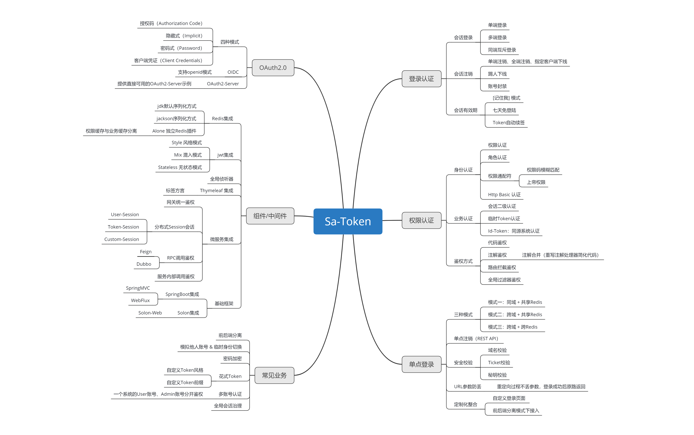

# 1、开始

## 1.1、介绍

Sa-Token 是一个轻量级 Java 权限认证框架，主要解决：登录认证、权限认证、单点登录、OAuth2.0、分布式 Session 会话、微服务网关鉴权等一系列权限相关问题。

Sa-Token 旨在以简单、优雅的方式完成系统的权限认证部分，以登录认证为例，你只需要：

```java
// 会话登录，参数填登录人的账号id 
StpUtil.login(10001);
```

无需实现任何接口，无需创建任何配置文件，只需要这一句静态代码的调用，便可以完成会话登录认证。

如果一个接口需要登录后才能访问，我们只需调用以下代码：

```java
// 校验当前客户端是否已经登录，如果未登录则抛出 `NotLoginException` 异常
StpUtil.checkLogin();
```

在 Sa-Token 中，大多数功能都可以一行代码解决：

- 踢人下线：

  ```java
  // 将账号id为 10077 的会话踢下线 
  StpUtil.kickout(10077);
  ```

- 权限认证：

  ```java
  // 注解鉴权：只有具备 `user:add` 权限的会话才可以进入方法
  @SaCheckPermission("user:add")
  public String insert(SysUser user) {
      // ... 
      return "用户增加";
  }
  ```

- 路由拦截鉴权：

  ```java
  // 根据路由划分模块，不同模块不同鉴权 
  registry.addInterceptor(new SaInterceptor(handler -> {
      SaRouter.match("/user/**", r -> StpUtil.checkPermission("user"));
      SaRouter.match("/admin/**", r -> StpUtil.checkPermission("admin"));
      SaRouter.match("/goods/**", r -> StpUtil.checkPermission("goods"));
      SaRouter.match("/orders/**", r -> StpUtil.checkPermission("orders"));
      SaRouter.match("/notice/**", r -> StpUtil.checkPermission("notice"));
      // 更多模块... 
  })).addPathPatterns("/**");
  ```

当你受够 Shiro、SpringSecurity 等框架的三拜九叩之后，你就会明白，相对于这些传统老牌框架，Sa-Token 的 API 设计是多么的简单、优雅！


## 1.2、功能一览

Sa-Token 目前主要五大功能模块：登录认证、权限认证、单点登录、OAuth2.0、微服务鉴权。

- 登录认证 —— 单端登录、多端登录、同端互斥登录、七天内免登录。
- 权限认证 —— 权限认证、角色认证、会话二级认证。
- 踢人下线 —— 根据账号id踢人下线、根据Token值踢人下线。
- 注解式鉴权 —— 优雅的将鉴权与业务代码分离。
- 路由拦截式鉴权 —— 根据路由拦截鉴权，可适配 restful 模式。
- Session 会话 —— 全端共享 Session，单端独享 Session，自定义 Session，方便的存取值。
- 持久层扩展 —— 可集成 Redis，重启数据不丢失。
- 前后台分离 —— APP、小程序等不支持 Cookie 的终端也可以轻松鉴权。
- Token风格定制 —— 内置六种 Token 风格，还可：自定义 Token 生成策略。
- 记住我模式 —— 适配 [记住我] 模式，重启浏览器免验证。
- 二级认证 —— 在已登录的基础上再次认证，保证安全性。
- 模拟他人账号 —— 实时操作任意用户状态数据。
- 临时身份切换 —— 将会话身份临时切换为其它账号。
- 同端互斥登录 —— 像 QQ 一样手机电脑同时在线，但是两个手机上互斥登录。
- 账号封禁 —— 登录封禁、按照业务分类封禁、按照处罚阶梯封禁。
- 密码加密 —— 提供基础加密算法，可快速 MD5、SHA1、SHA256、AES 加密。
- 会话查询 —— 提供方便灵活的会话查询接口。
- Http Basic 认证 —— 一行代码接入 Http Basic、Digest 认证。
- 全局侦听器 —— 在用户登陆、注销、被踢下线等关键性操作时进行一些 AOP 操作。
- 全局过滤器 —— 方便的处理跨域，全局设置安全响应头等操作。
- 多账号体系认证 —— 一个系统多套账号分开鉴权（比如商城的 User 表和 Admin 表）
- 单点登录 —— 内置三种单点登录模式：同域、跨域、同 Redis、跨 Redis、前后端分离等架构都可以搞定。
- 单点注销 —— 任意子系统内发起注销，即可全端下线。
- OAuth2.0 认证 —— 轻松搭建 OAuth2.0 服务，支持 openid 模式 。
- 分布式会话 —— 提供共享数据中心分布式会话方案。
- 微服务网关鉴权 —— 适配 Gateway、ShenYu、Zuul 等常见网关的路由拦截认证。
- RPC 调用鉴权 —— 网关转发鉴权，RPC 调用鉴权，让服务调用不再裸奔
- 临时 Token 认证 —— 解决短时间的 Token 授权问题。
- 独立 Redis —— 将权限缓存与业务缓存分离。
- Quick 快速登录认证 —— 为项目零代码注入一个登录页面。
- 标签方言 —— 提供 Thymeleaf 标签方言集成包，提供 beetl 集成示例。
- jwt 集成 —— 提供三种模式的 jwt 集成方案，提供 token 扩展参数能力。
- RPC 调用状态传递 —— 提供 dubbo、grpc 等集成包，在 RPC 调用时登录状态不丢失。
- 参数签名 —— 提供跨系统 API 调用签名校验模块，防参数篡改，防请求重放。
- 自动续签 —— 提供两种 Token 过期策略，灵活搭配使用，还可自动续签。
- 开箱即用 —— 提供 SpringMVC、WebFlux、Solon 等常见框架集成包，开箱即用。
- 最新技术栈 —— 适配最新技术栈：支持 SpringBoot 3.x，jdk 17。

功能结构图：




# 9、附录

## 9.1、常见问题

### 9.1.1、非 Web 环境登录

**业务场景**

XXL-JOB 需要调用系统业务服务，业务服务那边做了数据权限校验，需要从 SaSession 获取用户的信息，没登录会报错，如果 XXL-JOB 任务 Bean 中使用 `StpUtil.login(1L)` 模拟登录，会报【非Web上下文无法获取Request】。


**解决办法**

通过 `StpUtil.createLoginSession(1L, loginModel)` 获取 token，并将其保存在 `ThreadLocalRequestHeaderContext`：

```java
// 创建指定账号的登录会话，生成token信息
SaLoginModel loginModel = SaLoginConfig.setExtra("user", loginUser).setIsLastingCookie(false);
String token = StpUtil.createLoginSession(1L, loginModel);
// 存入ThreadLocalRequestHeaderContext
Map<String, String> headers = new HashMap<>();
headers.put("AccessToken".toLowerCase(), token);
ThreadLocalRequestHeaderContext.set(headers);
```

后续处理中，如果使用 `StpUtil.getTokenValue()` 获取 token 异常，可以尝试从 `ThreadLocalRequestHeaderContext` 中获取

```java
String token;
try {
    // 正常情况下直接从saToken中获取token
    token = StpUtil.getTokenValue();
} catch (Exception e) {
    // 如果异常大概率是在非Web上下文中获取Token，这时改为从ThreadLocalRequestHeaderContext中获取
    Map<String, String> headers = ThreadLocalRequestHeaderContext.get();
    token = null != headers ? headers.get("AccessToken".toLowerCase()) : null;
}
```

