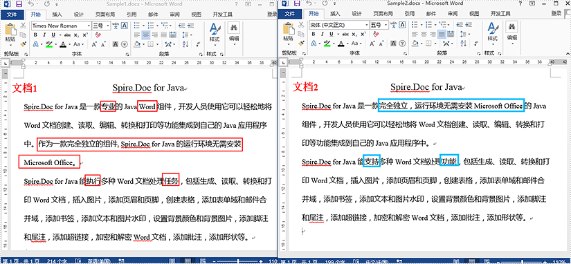
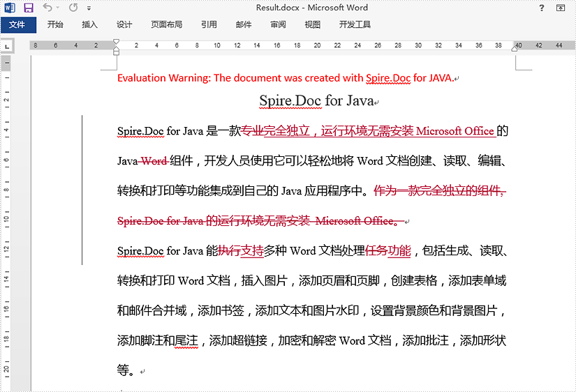
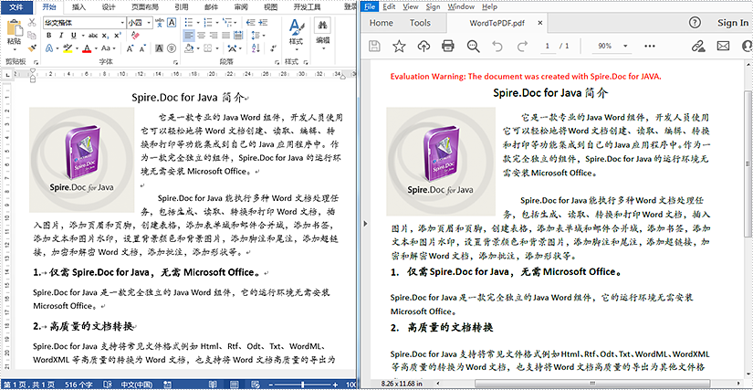
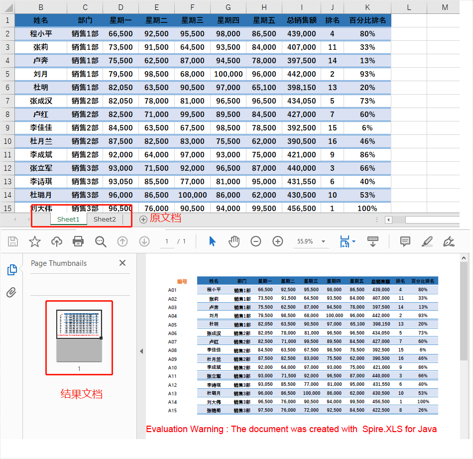

Spire.Office for Java 是一套企业级的涵盖 E-iceblue 所有 Java组件的集合，它包括以下产品的最新版本：Spire.Doc for Java、Spire.XLS for Java、Spire.Presentation for Java、Spire.PDF for Java 和 Spire.Barcode for Java。

使用Spire.Office for Java，开发人员可以创建多种多样的用于处理办公文档的 Java 应用程序。对文档的处理包括打开、创建、修改、转换、打印 MS Word、Excel、PowerPoint ®、PDF 和一维、二维条码。

作为一个独立的办公文档组件，Spire.Office 的运行环境无需安装 Microsoft Office、Adobe Acrobat、以及其他第三方软件。基于安全性、稳定性、可扩展性、效率及价格方面的考虑，Spire.Office 已经成为微软办公套件最有力的替代品。

Spire.Office for Java 支持 32 位和 64 位操作系统，支持 Windows 系统、Linux 系统、Unix 系统和 Mac OS 系统。同时兼容大部分国产操作系统，能够在中标麒麟和中科方德等国产操作系统中正常运行。


# 1、Spire.Doc for Java

Spire.Doc for Java 是一款专业的 Java Word 组件，开发人员使用它可以轻松地将 Word 文档创建、读取、编辑、转换和打印等功能集成到自己的 Java 应用程序中。作为一款完全独立的组件，Spire.Doc for Java 的运行环境无需安装 Microsoft Office。

Spire.Doc for Java 能执行多种 Word 文档处理任务，包括生成、读取、转换和打印 Word 文档，插入图片，添加页眉和页脚，创建表格，添加表单域和邮件合并域，添加书签，添加文本和图片水印，设置背景颜色和图片，内容复制，添加脚注和尾注，添加超链接、添加数字签名，加密和解密 Word 文档，添加批注，添加形状，添加图像印章等。


**安装 Spire.Doc for Java**

首先，在 pom.xml 文件中配置 Maven 仓库路径：

```xml
<repositories>
    <repository>
        <id>com.e-iceblue</id>
        <name>e-iceblue</name>
        <url>https://repo.e-iceblue.cn/repository/maven-public/</url>
    </repository>
</repositories>
```

然后，在 pom.xml 文件中指定 Spire 产品的 Maven 依赖：

```xml
<dependencies>
    <dependency>
        <groupId>e-iceblue</groupId>
        <artifactId>spire.doc.free</artifactId>
        <version>5.2.0</version>
    </dependency>
</dependencies>
```


## 1.1、比较两个 Word 文档的内容

自版本 3.8.8 开始，Spire.Doc for Java 支持比较两个 Word 文档的内容，并以修订模式生成结果文档。

以下为两个示例文档，标注内容是它们的内容差异：



代码示例：

```java
import com.spire.doc.Document;

public class Comparison {
    public static void main(String[] args) {
        //创建Document实例
        Document doc1 = new Document();
        //加载第一个Word示例文档
        doc1.loadFromFile("C:\\Users\\Test1\\Desktop\\Sample1.docx");
        //创建Document实例
        Document doc2 = new Document();
        //加载第二个Word示例文档
        doc2.loadFromFile("C:\\Users\\Test1\\Desktop\\Sample2.docx");
        //比较两个示例文档的内容差异
        doc1.compare(doc2, "e-iceblue");
        //保存结果文档
        doc1.saveToFile("output/Result.docx");
    }
}
```

比较结果：




## 1.2、将 Word 转为 PDF

Spire.Doc for Java 拥有强大的文件转换功能，其提供了 `Document.saveToFile(String fileName, FileFormat fileFormat)` 方法可将 Word 文档转为多种格式的目标文件，下面是转为 PDF 的方法步骤：

- 实例化 `Document` 类的对象。
- 调用 `Document.loadFromFile()` 方法加载 Word 文档。
- 调用 `Document.saveToFile()` 方法将 Word 保存为 PDF 格式，并指定保存路径。

代码示例：
```java
import com.spire.doc.*;

public class WordToPDF {
    public static void main(String[] args) {
        //实例化Document类的对象
        Document doc = new Document();

        //加载Word
        doc.loadFromFile("测试.docx");

        //保存为PDF格式
        doc.saveToFile("WordToPDF.pdf",FileFormat.PDF);
    }
}
```

转换结果：




# 2、Spire.XLS for Java

Spire.XLS for Java 是一款专业的 Java Excel 组件，开发人员使用它可以在 Java 应用程序中轻松实现创建、操作、转换和打印 Excel 工作表，并且运行环境无需安装 Microsoft Office 或 Microsoft Excel。

Spire.XLS for Java 支持多种 Excel 文件格式，包括 Excel 97-2003 格式（.xls）以及 Excel 2007、2010、2013、2016 和 2019 格式（.xlsx、.xlsb 和 .xlsm），此外，它还支持 WPS 生成的 XLS 格式文档（.et 和 .ett）和 Open Office（.ods）格式。同时兼容大部分国产操作系统，能够在中标麒麟和中科方德等国产操作系统中正常运行。Spire.XLS for Java 提供了一系列丰富的操作 Excel 的功能，例如创建、读取、编辑、转换和打印 Excel 工作表，查找和替换数据，创建图表，创建自动筛选器，读取和插入超链接，合并或取消合并单元格，合并 Excel 文档，组合或取消组合 Excel 行和列，冻结或取消冻结窗口，数字签名，加密或解密 Excel 工作表等。


**安装 Spire.XLS for Java**

首先，在 pom.xml 文件中配置 Maven 仓库路径：

```xml
<repositories>
    <repository>
        <id>com.e-iceblue</id>
        <name>e-iceblue</name>
        <url>https://repo.e-iceblue.cn/repository/maven-public/</url>
    </repository>
</repositories>
```

然后，在 pom.xml 文件中指定 Spire 产品的 Maven 依赖：

```xml
<dependencies>
    <dependency>
        <groupId>e-iceblue</groupId>
        <artifactId>spire.xls</artifactId>
        <version>14.11.0</version>
    </dependency>
</dependencies>
```


## 2.1、Excel 转 PDF

使用 Spire.XLS 来实现 Excel 转换 PDF 的方法虽然简单，但是不适合于较大的 Excel 文件转化，只适合有小于 3 个 sheet 页的文件使用。


**将整个 Excel 文件转为 PDF**

以下是将整个 Excel 文档转换为 PDF 的步骤。

1. 创建一个 `Workbook` 对象。
2. 使用 `Workbook.loadFromFile()` 方法加载示例 Excel 文档。
3. 通过 `Workbook.getConverterSetting()` 方法返回的 `ConverterSetting` 对象下的方法设置 Excel 到 PDF 的转换选项。
4. 使用 `Workbook.saveToFile()` 方法将整个 Excel 文档转换为 PDF。

代码示例：

```java
import com.spire.xls.FileFormat;
import com.spire.xls.Workbook;

public class ConvertExcelToPdf {

    public static void main(String[] args) {

        //创建一个Workbook实例并加载Excel文件
        Workbook workbook = new Workbook();
        workbook.loadFromFile("C:\\Users\\Administrator\\Desktop\\Sample.xlsx");

        //设置转换后的PDF页面高宽适应工作表的内容大小
        workbook.getConverterSetting().setSheetFitToPage(true);

        //将生成的文档保存到指定路径
        workbook.saveToFile("output/ExcelToPdf", FileFormat.PDF);
    }
}
```

转换结果：


**指定单个的sheet页转为PDF**

以下是将特定工作表转换为 PDF 的步骤。

1. 创建一个 `Workbook` 对象。
2. 使用 `Workbook.loadFromFile()` 方法加载示例 Excel 文档。
3. 通过 `Workbook.getConverterSetting()` 方法返回的 `ConverterSetting` 对象下的方法设置 Excel 到 PDF 的转换选项。
4. 使用 `Workbook.getWorksheets().get()` 方法获取特定的工作表。
5. 使用 `Worksheet.saveToPdf()` 方法将工作表转换为 PDF。

代码示例：

```java
import com.spire.xls.Workbook;
import com.spire.xls.Worksheet;

public class ConvertWorksheetToPdf {

    public static void main(String[] args) {

        //创建一个Workbook实例并加载Excel文件
        Workbook workbook = new Workbook();
        workbook.loadFromFile("C:\\Users\\Administrator\\Desktop\\Sample.xlsx");

        //设置转换后PDF的页面宽度适应工作表的内容宽度
        workbook.getConverterSetting().setSheetFitToWidth(true);

        //获取第一个工作表
        Worksheet worksheet = workbook.getWorksheets().get(0);

        //转换为PDF并将生成的文档保存到指定路径
        worksheet.saveToPdf("output/WorksheetToPdf.pdf");
    }
}
```

转换结果：


