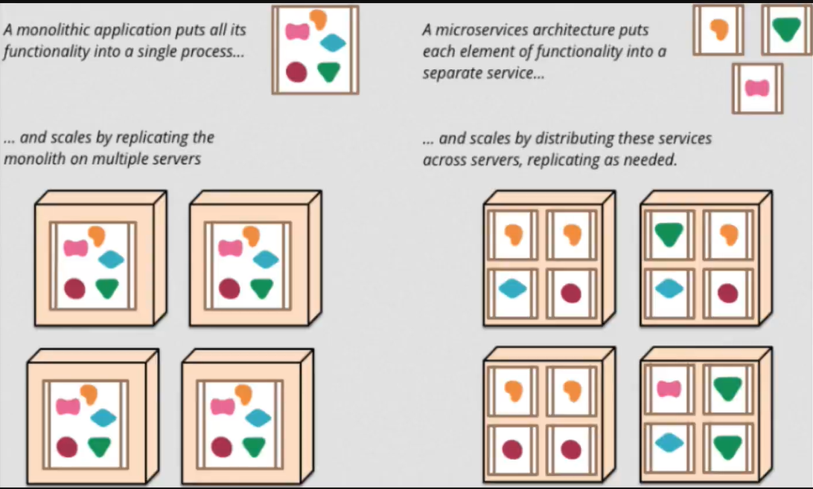
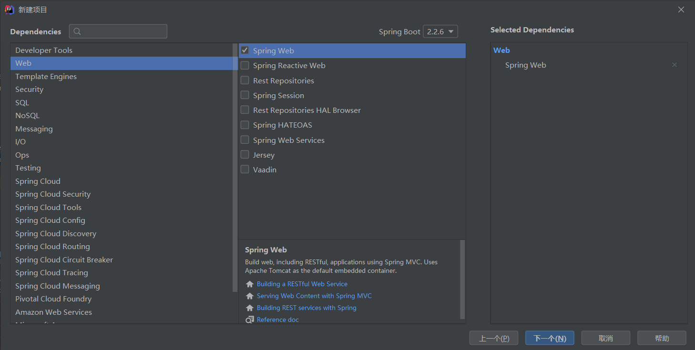
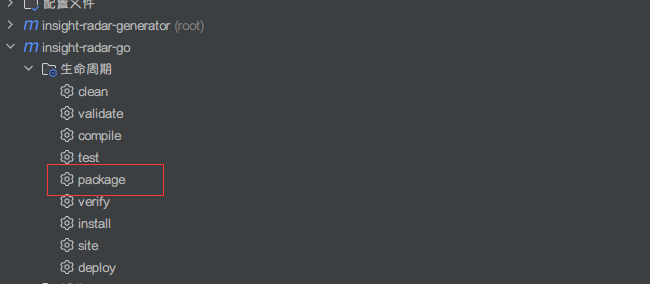
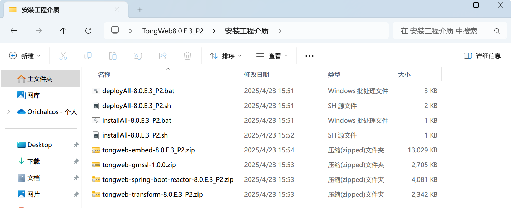
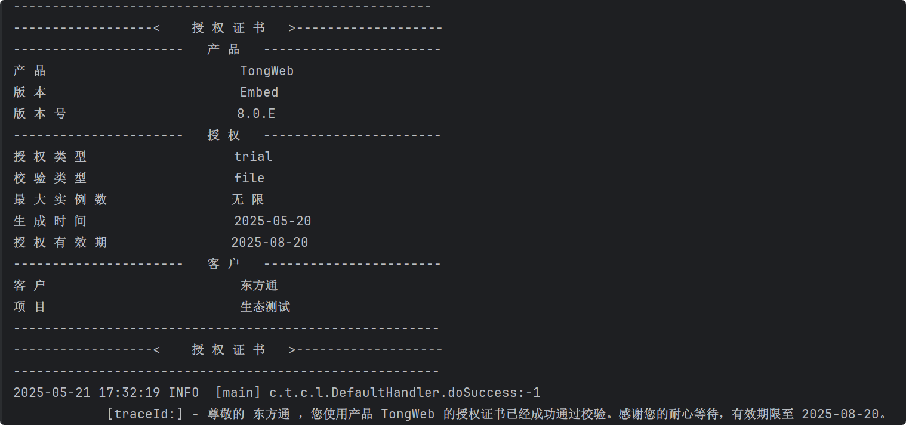
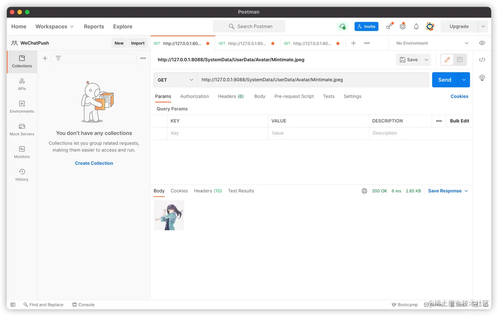
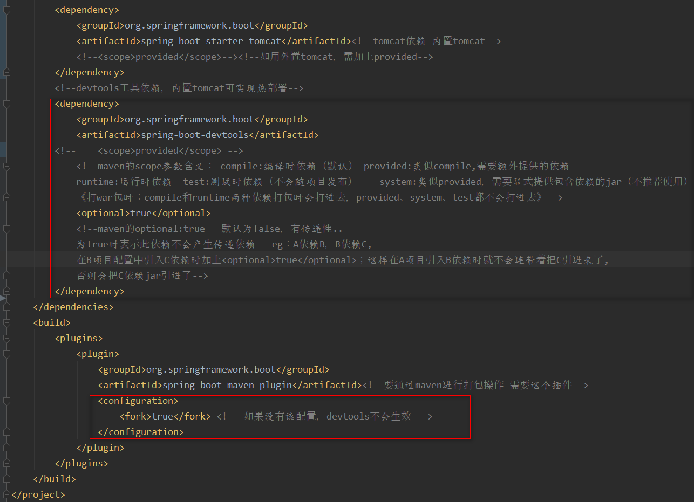

# 1、Spring Boot

## 1.1、简介

Spring Boot 基于 Spring 开发，Spring Boot 本身并不提供 Spring 框架的核心特性以及扩展功能，只是用于快速、敏捷地开发新一代基于 Spring 框架的应用程序。也就是说，它并不是用来替代 Spring 的解决方案，而是和 Spring 框架紧密结合用于提升 Spring 开发者体验的工具。

Spring Boot 以约定大于配置的核心思想，默认帮我们进行了很多设置，多数 Spring Boot 应用只需要很少的 Spring 配置。Spring Boot 内嵌 Servlet 容器，降低了对环境的要求，可以命令执行语句。同时它集成了大量常用的第三方库配置（例如Redis、MongoDB、Jpa、RabbitMQ、Quartz等等），Spring Boot 应用中这些第三方库几乎可以零配置的开箱即用。

简单的来说 Spring Boot 并不是什么新的框架，它默认配置了很多框架的使用方式，就像 maven 整合了所有的 jar 包，Spring Boot 整合了所有的框架。

Spring Boot 解决的问题：

- 使编码变得简单。
- 使配置变得简单。
- 使部署变得简单。
- 使监控变得简单。

Spring Boot 的核心功能：

- 独自运行 Spring 项目：Spring Boot 可以以 jar 包的形式进行独立运行，使用 `java -jar XX.jar` 就可以成功运行；
- 内嵌 Servlet 容器：内嵌容器，使得我们可以直接执行运行项目的 main 函数，使得项目快速运行；
- 提供 starter 简化 maven 配置：Spring Boot 提供了一系列的 start-XXX 来简化 maven 依赖；
- 自动配置 Spring：Spring Boot 会根据我们项目中的类路径的 jar 包，为 jar 包的类进行自动装配 bean；
- 应用监控：Spring Boot 提供了基于 HTTP、ssh、Telnet 对运行的项目进行监控。

Spring Boot 的缺点：

- 高度集成，使用的时候不知道底层的实现；
- 由于不了解底层，导致项目出现了问题会很难排查。

四大核心：

- 自动配置：针对很多 Spring 应用程序和常见的应用功能，Spring Boot 能自动提供相关配置；
- 起步依赖：告诉 Spring Boot 需要什么功能，它就能引入相关的依赖库；
- Actuator：提供在运行时检视应用程序内部情况的能力，让你能够深入运行应用程序，一探 Spring Boot 的内部信息；
- 命令行界面：这是 Spring Boot 的可选特性，主要针对于 Groovy 语言使用。

<br>

## 1.2、微服务

微服务架构是 “新标准”，是一种架构风格。构建小型，独立且可运行的应用程序可以带来极大的灵活性，并为您的代码增加弹性。 Spring Boot 的许多专用功能使在大规模生产中构建和运行微服务变得容易。 而且不要忘记，没有 SpringCloud 简化管理并提高容错能力，就不会有完整的微服务架构。

<br>

**单体应用架构**

所谓单体应用架构（all in one）是指：我们将一个应用中的所有服务都封装在一个应用中。

无论是 ERP、CRM 或是其他什么系统，都把数据库访问、Web 访问等等各个功能放到一个 war 包内。

- 这样做的好处是：易于开发和测试；也十分方便部署；当需要扩展时，只需要将 war 复制多份，然后放到多个服务器上，再做个负载均衡就可以了。
- 单体应用架构的缺点是：哪怕要修改一个非常小的地方，都需要停掉整个服务，重新打包、部署这个应用 war 包。特别是对于一个大型应用，我们不可能把所有内容都放在一个应用内，我们如何维护、如何分工合作都是问题。

<br>

**微服务架构**

all in one 的架构方式，我们把所有的功能单元放在一个应用里面。然后我们把整个应用部署到服务器上。如果负载能力不行，我们将整个应用进行水平复制，进行扩展，然后再负载均衡。

所谓微服务架构，就是打破之前 all in one 的架构方式，把每个功能元素独立出来。把独立出来的功能元素动态组合，需要的功能元素才拿去组合。所以微服务架构是对功能元素进行复制，而没有对整个应用进行复制。

这样做的好处是：

1. 节省了调用资源。
2. 每个功能元素的服务都是一个可替换的、可独立升级的软件代码。



<br>

# 2、快速开始

## 2.1、创建 Spring Boot 程序

1. 打开 IDEA，点击【新建项目】，选择 【Spring Initializr】，点确认：

   

2. Spring Web 依赖的主要作用是提供 Web 开发场景所需的底层所有依赖，引入后就可以实现 Web 场景开发，而不需要额外导入Tomcat 服务器以及其他 Web 依赖文件等：

   

3. 在 Application.java 同级目录下创建 controller 包，编写 UserController.java：

	```java
	@Controller
	public class HelloController {
	    @RequestMapping("/hello")
	    @ResponseBody
	    public String hello() {
	        return "Hello,Spring Boot!";
	    }
	}
	```

4. 运行 Application.java

<br>

**更改端口号**

在 `application.properties` 添加：

```properties
#更改项目端口号
server.port=8080
```

<br>

## 2.2、Spring Boot 启动流程

SpringApplication 类是 Spring Boot 应用程序的入口点。当你调用 `SpringApplication.run()` 时，它会执行一个定义明确的启动序列。这个过程会广播一系列生命周期事件，允许开发者通过监听这些事件来介入。

<br>

**启动序列**

以下是 `SpringApplication.run()` 方法执行时遵循的核心步骤和对应的事件：

1. SpringApplication 实例化（Instantiation）

   创建一个 SpringApplication 实例。它会根据 classpath 推断应用类型（例如 SERVLET、REACTIVE）。从 `META-INF/spring.factories` 文件中加载并实例化 `ApplicationContextInitializer` 和 `ApplicationListener`。

2. 启动监听器与广播 `ApplicationStartingEvent`

   激活 `SpringApplicationRunListener`，它负责在整个启动过程中广播事件。

   - 事件：`ApplicationStartingEvent`

   - 时机：这是整个流程中最早的事件，此时除了监听器注册和初始化外，几乎没有进行任何其他处理。

3. 准备环境（Environment Preparation）

   创建并配置 `Environment` 对象。该对象聚合了所有配置来源的属性（包括 application.properties、YAML 文件、环境变量、命令行参数等）。

   - 事件：`ApplicationEnvironmentPreparedEvent`
   - 时机：`Environment` 已准备就绪，但 `ApplicationContext` 尚未创建。
   - 官方用途：这是在 `ApplicationContext` 创建之前，以编程方式检查或修改 `Environment` 的一个理想时机。

4. 创建并准备 `ApplicationContext`

   根据应用类型创建相应的 `ApplicationContext` 实例。

   - 钩子：调用所有已注册的 `ApplicationContextInitializer` 的 `initialize()` 方法。
   - 事件：`ApplicationPreparedEvent`
   - 时机：`ApplicationContext` 已创建并准备就绪，Bean 定义已加载，但 Context 尚未刷新（即 Bean 尚未被创建）。

5. 刷新 `ApplicationContext`（核心）

   这是 Spring 框架的核心功能。容器启动，扫描类路径，创建所有单例 Bean，处理依赖注入（`@Autowired`），并执行 Bean 的生命周期回调（如 `@PostConstruct`）。

   - 事件：`ContextRefreshedEvent`（这是 Spring Framework 的标准事件）。
   - 时机：`ApplicationContext` 已被完全刷新，所有 Bean 都已处理完毕。

6. 调用 Runners（Runners Execution）

   在 Context 刷新之后，Spring Boot 会查找所有类型为 `ApplicationRunner` 和 `CommandLineRunner` 的 Bean。

   - 钩子：调用这些 Runner Bean 的 `run()` 方法。
   - 官方用途：文档明确指出，这是在 SpringApplication.run(） 完成之前需要运行某些特定代码”的最佳位置。非常适合执行应用程序级别的初始化任务。

7. 应用就绪（Application Ready）

   此时，`SpringApplication.run()` 方法的生命周期任务基本完成，应用进入运行状态。

   - 事件：`ApplicationReadyEvent`
   - 时机：在所有的 Runner 执行完毕之后。这个事件标志着应用程序已经准备好处理请求。

8. 启动失败（Startup Failure）

   启动过程中出现任何异常。

   - 事件：`ApplicationFailedEvent`
   - 时机：应用程序启动失败时。
   - 官方用途：允许监听器在应用无法正常启动时执行清理或通知逻辑。

<br>

### 2.2.1、ApplicationRunner

`ApplicationRunner` 是 Spring Boot 提供的一个非常有用的接口，它允许你在 Spring Boot 应用程序完全启动并准备好接收请求之前，执行一些自定义的初始化代码。

当 Spring Boot 应用的 `ApplicationContext`（应用上下文）被完全加载和初始化后，Spring Boot 会自动扫描所有实现了 `ApplicationRunner` 接口的 Bean，并调用它们的 `run()` 方法。

<br>

**核心特点：**

- 执行时机：在 `SpringApplication.run()` 方法执行完成之前，但在 `ApplicationContext` 创建完成之后。这意味着此时所有的 Spring Bean 都已经被初始化并注入完毕，你可以安全地使用它们。
- 用途：非常适合执行那些只需要在应用程序启动时运行一次的任务。
- 参数：`run()` 方法接收一个 `ApplicationArguments` 类型的参数，可以方便地获取和解析启动时传入的命令行参数。

<br>

**常见用例**

`ApplicationRunner` 非常适合用于以下场景：

- 数据初始化：应用启动时，检查数据库中是否有基础数据（如管理员账户、默认配置），如果没有则进行初始化。
- 缓存预热：将一些热点数据在应用启动时提前加载到缓存（如 Redis、Caffeine）中，避免首次请求时响应缓慢。
- 启动后台任务：启动一个常驻的后台线程或任务，例如消息队列的消费者、定时任务调度器。
- 执行一次性任务：运行一个批处理作业，如数据迁移、文件清理等。任务执行完毕后，应用可以继续运行或直接退出。
- 打印环境信息：在启动日志中打印一些重要的配置信息或环境诊断信息。

<br>

**如何使用**

使用起来非常简单，只需要两步：

1. 创建一个类，实现 `ApplicationRunner` 接口。
2. 将这个类声明为一个 Spring Bean（例如，使用 `@Component` 注解）。

假设我们想在应用启动时，打印一条欢迎信息，并显示所有传入的命令行参数：

```java
import org.slf4j.Logger;
import org.slf4j.LoggerFactory;
import org.springframework.boot.ApplicationArguments;
import org.springframework.boot.ApplicationRunner;
import org.springframework.stereotype.Component;

import java.util.Arrays;
import java.util.List;
import java.util.Set;

@Component
public class MyAppRunner implements ApplicationRunner {

    private static final Logger logger = LoggerFactory.getLogger(MyAppRunner.class);

    @Override
    public void run(ApplicationArguments args) throws Exception {
        logger.info("====== ApplicationRunner 开始执行 ======");
        logger.info("欢迎使用本应用程序！这是启动时执行的自定义逻辑。");

        // 1. 获取所有原始命令行参数
        String[] sourceArgs = args.getSourceArgs();
        logger.info("原始命令行参数: {}", Arrays.toString(sourceArgs));

        // 2. 获取非选项参数 (没有 -- 前缀的参数)
        List<String> nonOptionArgs = args.getNonOptionArgs();
        logger.info("非选项参数 (Non-option args): {}", nonOptionArgs);

        // 3. 获取选项参数 (有 -- 前缀的参数)
        Set<String> optionNames = args.getOptionNames();
        logger.info("所有选项参数的 Key (Option names): {}", optionNames);
        for (String optionName : optionNames) {
            List<String> optionValues = args.getOptionValues(optionName);
            logger.info("选项参数 '{}' 的值是: {}", optionName, optionValues);
        }

        // 检查某个选项是否存在
        if (args.containsOption("env")) {
            logger.info("检测到 'env' 参数, 值为: {}", args.getOptionValues("env"));
        }

        logger.info("====== ApplicationRunner 执行完毕 ======");
    }
}
```

> [!NOTE]
>
> 控制多个 Runner 的执行顺序可以使用 `@Order(n)` 注解：*n* 值越小，优先级越高，越先执行。

<br>

# 3、配置文件

当我们构建完 Spring Boot 项目后，resources 目录下默认会包含一个全局配置文件 `application.properties`。这是一个空文件，因为 Spring Boot 在底层已经通过 “约定优于配置” 的思想预设了大量自动配置。我们在配置文件中所做的任何修改，本质上都是在覆盖这些自动配置的默认值。

Spring Boot 支持两种主流的文件格式：properties 和 yml。

- `.properties`：采用传统的 `key=value` 形式。

- `.yml` / `.yaml`：采用 `key: value` 形式，通过空格缩进来确定层级关系，结构更加清晰、易读。

  > [!NOTE]
  >
  > YAML 格式默认不支持使用 `@PropertySource` 注解来导入配置（若需支持，需自定义 PropertySourceFactory）。

Spring Boot 涉及两种作用域不同的配置文件：application 和 bootstrap：

- application（应用级别）

  用途：用于当前应用的业务配置，如数据库连接、端口设置、自定义业务参数等。

  加载：Spring Boot 启动时默认会自动加载。

- bootstrap（系统级别）

  用途：主要用于系统级别的参数配置，例如连接 Spring Cloud 配置中心（Nacos/Config）、解密密钥等。

  加载：其加载优先级高于 application 文件，且属性通常不会被 application 文件覆盖。

  > [!WARNING]
  >
  > - Spring Boot 2.4 以前：默认支持并自动加载 bootstrap 文件。
  >
  > - Spring Boot 2.4 及以后：官方默认不再主动加载 bootstrap 文件。如果项目需要使用它（例如连接 Nacos），必须在 `pom.xml` 中手动引入以下依赖：
  >
  >   ```xml
  >   <dependency>
  >       <groupId>org.springframework.cloud</groupId>
  >       <artifactId>spring-cloud-starter-bootstrap</artifactId>
  >   </dependency>
  >   ```

<br>

## 3.1、YAML

YAML 是 "YAML Ain't a Markup Language"（YAML 不是一种标记语言）的递归缩写。在开发的这种语言时，YAML 的意思其实是："Yet Another Markup Language"（仍是一种标记语言）。

YAML 的语法和其他高级语言类似，并且可以简单表达清单、散列表，标量等数据形态。它使用空白符号缩进和大量依赖外观的特色，特别适合用来表达或编辑数据结构、各种配置文件、倾印调试内容、文件大纲（例如：许多电子邮件标题格式和YAML非常接近）。

YAML 的配置文件后缀为 `.yml`，如：`application.yml` 。

<br>

**基本语法**

- 大小写敏感；
- 使用缩进表示层级关系；
- 缩进不允许使用 tab，只允许空格（一般是两个空格）；
- 缩进的空格数不重要，只要相同层级的元素左对齐即可；
- `#` 表示注释。

<br>

**数据类型**

YAML 支持以下几种数据类型：

- 对象：键值对的集合，又称为映射（mapping）/ 哈希（hashes） / 字典（dictionary）；
- 数组：一组按次序排列的值，又称为序列（sequence） / 列表（list）；
- 纯量（scalars）：单个的、不可再分的值。

<br>

### 3.1.1、YAML 对象

对象键值对使用冒号结构表示（冒号后面要加一个空格）： 

```yaml
key: value
```

转为 json 如下：

```json
{ key: 'value' }
```

Yaml 也允许另一种写法，将所有键值对写成一个行内对象：

```yaml
key: { key1: value1, key2: value2 }
```

转为 json 如下：

```json
{ key: { key1: 'value1', key2: 'value2' } }
```

 还可以使用缩进表示层级关系：

```yaml
key: 
  child-key: value
  child-key2: value2
```

<br>

### 3.1.2、YAML 数组

以 `-` 开头的行表示构成一个数组：

```yaml
- A
- B
- C
```

转为 json 如下：

```json
['A', 'B', 'C']
```

数据结构的子成员是一个数组，则可以在该项下面缩进一个空格：

```yaml
-
  - A
  - B
  - C
```

转为 json 如下：

```json
[['A', 'B', 'C']]
```

数组也可以采用行内表示法：

```yaml
key: [ value1, value2 ]
```

转为 json 如下：

```json
{key: ['value1', 'value2']}
```

一个相对复杂的例子：

```yaml
companies:
  - id: 1
    name: company1
    price: 200W
  - id: 2
    name: company2
    price: 500W
```

意思是 `companies` 属性是一个数组，每一个数组元素又是由 `id`、`name`、`price` 三个属性构成。

数组也可以使用流式（flow）的方式表示：

```yaml
companies: [ { id: 1,name: company1,price: 200W },{ id: 2,name: company2,price: 500W } ]
```

<br>

### 3.1.3、复合结构

数组和对象可以构成复合结构，例：

```yaml
languages:
  - Ruby
  - Perl
  - Python
websites:
  YAML: yaml.org
  Ruby: ruby-lang.org
  Python: python.org
  Perl: use.perl.org
```

转换为 json 为：

```json
{ 
  languages: [ 'Ruby', 'Perl', 'Python'],
  websites: {
    YAML: 'yaml.org',
    Ruby: 'ruby-lang.org',
    Python: 'python.org',
    Perl: 'use.perl.org' 
  } 
}
```

<br>

### 3.1.4、纯量

纯量是最基本的，不可再分的值，包括：

- 字符串
- 布尔值
- 整数
- 浮点数
- Null
- 时间
- 日期

使用一个例子来快速了解纯量的基本使用：

```yaml
boolean:
  - TRUE   # true,True 都可以
  - FALSE  # false，False 都可以
float:
  - 3.14
  - 6.8523015e+5  # 可以使用科学计数法
int:
  - 123
  - 0b1010_0111_0100_1010_1110    # 二进制表示
null:
  nodeName: 'node'
  parent: ~         # 使用 ~ 表示 null
string:
  - 哈哈             # 字符串默认不使用引号表示
  - 'Hello world'   # 可以使用双引号或者单引号包裹特殊字符
  - '内容： 字符串'   # 如果字符串之中包含空格或特殊字符，需要放在引号之中。
  - newline
    newline2        # 字符串可以写成多行，从第二行开始，必须有一个单空格缩进。换行符会被转为空格。
date:
  - 2018-02-17      # 日期必须使用ISO 8601格式，即yyyy-MM-dd
datetime:
  - 2018-02-17T15:02:31+08:00    #时间使用ISO 8601格式，时间和日期之间使用T连接，最后使用+代表时区
```

<br>

### 3.1.5、引用

`&` 用来建立锚点（defaults），`<<` 表示合并到当前数据，`*` 用来引用锚点：

```yaml
defaults: &defaults
  adapter: postgres
  host: localhost

development:
  database: myapp_development
  <<: *defaults

test:
  database: myapp_test
  <<: *defaults
```

相当于：

```yaml
defaults:
  adapter: postgres
  host: localhost

development:
  database: myapp_development
  adapter: postgres
  host: localhost

test:
  database: myapp_test
  adapter: postgres
  host: localhost
```

<br>

## 3.2、属性绑定

在 Spring Boot 中，配置属性的读取主要有两种思路：一种是零散地注入到业务类中；另一种是更专业的做法——将一组相关的配置封装到一个专用的 Java 类中，这个类我们称之为 Properties 类（配置属性类）。

通过属性绑定，配置文件中的层级数据可以直接映射为 Java 对象的属性，从而实现配置的对象化管理。

<br>

### 3.2.1、Value

`@Value` 用于将单个配置项注入到变量中。它最适合那些不需要封装成对象的、孤立的配置点。

使用场景：

- 只想获取少数几个配置项。
- 需要使用 SpEL（Spring 表达式语言）进行简单计算或逻辑判断。
- 项目强依赖该配置，配置缺失会导致启动失败（默认行为）。

示例：

1. YAML 配置：

   ```yaml
   file:
     upload-path: /tmp/uploads
     max-size: 10MB
   ```

2. 在业务服务中直接注入：

   ```java
   @Component	// 必须是 Spring 容器管理的 Bean 才能使用注入
   public class FileService {
   
    	@Value("${file.upload-path:/default/path}") // 获取路径，冒号后为默认值
       private String uploadPath;
   
       @Value("${file.max-size}")
       private String maxSize;
   
       @Value("#{systemProperties['user.home']}") // 支持 SpEL 表达式获取系统属性
       private String userHome;
   
       public void upload() {
           System.out.println("文件将上传至: " + uploadPath + "，限制大小: " + maxSize);
       }
   }
   ```

<br>

### 3.2.2、ConfigurationProperties

`@ConfigurationProperties` 是 Spring Boot 构建 Properties 类最推荐的方式。它能将配置文件中某个前缀下的所有数据，一次性、全自动地注入到 Properties 类的同名属性中。

优点：

- 支持松散绑定（Relaxed Binding）：例如 YAML 中写 `last-name`，Java 中写 `lastName` 也能匹配成功。
- 支持复杂类型：可以自动封装 List、Map 以及嵌套对象。
- 支持数据校验：配合 JSR303 校验注解（如 `@NotNull`）验证配置项。

<br>

#### 自定义的 Bean 使用

1. 编写 Properties 类：

   ```java
   @Data
   @Component // 将该 Properties 类注册为 Spring 的 Bean
   @ConfigurationProperties(prefix = "person") // 自动绑定 person 前缀下的所有属性
   public class PersonProperties {
       private String name;
       private Integer age;
       private Boolean happy;
       private Date birthday;
       private Map<String, Object> map;
       private List<Object> list;
       private DogProperties dog; // 嵌套另一个 Properties 对象
   }
   
   @Data
   class DogProperties {
       private String name;
       private Integer age;
   }
   ```

   > [!NOTE] 
   >
   > Properties 类注意要提供属性对应的 Setter 方法。

   > [!NOTE]
   >
   > 如果加入 `@ConfigurationProperties` 后爆红可以在 `pom.xml` 中加入下面的依赖解决：
   >
   > ```xml
   > <dependency>
   >     <groupId>org.springframework.boot</groupId>
   >     <artifactId>spring-boot-configuration-processor</artifactId>
   >     <optional>true</optional>
   > </dependency>
   > ```

2. YAML 配置：

   ```yaml
   person:
     name: qinjiang
     age: 3
     last-name: qin # 演示松散绑定，自动映射到 lastName 属性
     happy: false
     birthday: 2019/11/02
     map: {k1: v1, k2: v2}
     list: [code, music, girl]
     dog:
       name: 旺财
       age: 3
   ```

<br>

#### 第三方 Bean 使用

第三方库（如 Druid、Redis）的类我们无法修改源码添加注解。此时可以在[配置类](#3.3、配置类)的 `@Bean` 方法上使用 `@ConfigurationProperties`：

```java
@Configuration
public class DataSourceConfig {
    
    @Bean
    @ConfigurationProperties(prefix = "datasource") // 为返回值对象绑定属性
    public DruidDataSource datasource(){
        return new DruidDataSource();
    }
}
```

对应的 YAML：

```yaml
datasource:
  driverClassName: com.mysql.cj.jdbc.Driver
  url: jdbc:mysql://localhost:3306/db
```

`@ConfigurationProperties` 注解不仅能添加到类上，还可以添加到方法上，添加到类上是为 Spring 容器管理的当前类的对象绑定属性，添加到方法上是为 Spring 容器管理的当前方法的返回值对象绑定属性，本质上都一样。

<br>

### 3.2.3、PropertySource

默认情况下，Properties 类从全局 `application.yml` 中查找配置。如果你希望将某些模块的配置（如阿里云 OSS 配置）独立存放在一个 `.properties` 文件中，可以配合 `@PropertySource` 使用。

> [!WARNING]
>
> `@PropertySource` 默认只支持 `.properties` 文件，不支持 `.yml` 直接导入。

示例：

1. 创建一个 `oss.properties`：

   ```properties
   oss.endpoint=http://oss-cn-hangzhou.aliyuncs.com
   oss.bucket-name=my-bucket
   ```

2. 在 Properties 类中引用：

   ```java
   @Component
   @PropertySource("classpath:oss.properties") // 指定外部文件路径
   @ConfigurationProperties(prefix = "oss")
   public class OssConfig {
       private String endpoint;
       private String bucketName;
       // Getters & Setters...
   }
   ```

<br>

## 3.3、配置类

在 Spring Boot 项目中，配置文件（YAML/Properties）只是 “原材料”，而真正让配置“活起来”并驱动系统功能的，是配置类（Config 类）。

开发者通过配置类将配置项注入到 Java 对象中，并根据这些配置来决定如何初始化 Bean。这种做法实现了配置与代码的解耦：运维管理配置文件，开发者只关注配置类暴露的功能。

<br>

### 3.2.1、Configuration

`@Configuration` 注解表明该类是一个配置类，作用等同于传统的 XML 配置文件。Spring 会扫描此类，并将其中标注了 `@Bean` 的方法返回值注册为 Spring 容器中的 Bean：

```java
@Configuration
public class MyConfig {

    @Bean
    public UserService userService() {
        return new UserServiceImpl();
    }
}
```

这段代码的效果等同于在 XML 中声明一个 `<bean>`。

> [!NOTE]
>
> `@Configuration` 类默认是被 CGLIB 代理的，保证每个 `@Bean` 方法只会执行一次，从而确保返回的是单例 Bean。

<br>

### 3.2.2、EnableConfigurationProperties

在 3.2 节中，我们通过 `@Component` 定义了 Properties 类。但在企业级开发时，更推荐将 Properties 类（纯属性）与 Config 类（业务逻辑）解耦。

`@EnableConfigurationProperties` 的作用是：开启指定类的属性绑定功能，并将其注册到容器中。

举个例子：你定义了一个配置类并用 `@ConfigurationProperties(prefix = "xxx")` 注解它，Spring 并不会自动将它注册为一个 Bean，除非：

- 手动加上 `@Component`。
- 或者在某个 `@Configuration` 类上加 `@EnableConfigurationProperties(YourProperties.class)`。

以 Drools 规则引擎配置为例：

1. 定义纯属性类（不加 `@Component`）：

   ```java
   @Data
   @ConfigurationProperties(prefix = "spring.drools")
   public class DroolsProperties {
       private String path;
       private Long update;
       private boolean autoUpdate;
       // ... 其他属性
   }
   ```

2. 在配置类中启用并使用：

   ```java
   @Configuration
   @EnableConfigurationProperties(DroolsProperties.class) // 启用属性绑定
   public class DroolsConfig {
       
       @Bean
       public KieTemplate kieTemplate(DroolsProperties properties) {
           KieTemplate template = new KieTemplate();
           template.setPath(properties.getPath());
           // 根据配置决定逻辑
           template.setUpdate(properties.isAutoUpdate() ? properties.getUpdate() : 9999L);
           return template;
       }
   }
   ```

推荐使用 `@EnableConfigurationProperties` 配合 `@ConfigurationProperties`，因为它可以把属性类从 Spring 管理中解耦，避免把纯粹的属性类变成组件（属性类是 “纯数据承载”，不包含业务逻辑）。

<br>

### 3.2.2、ConditionalOnProperty

Spring Boot 提供了 `@ConditionalOnProperty` 注解，用于按条件控制配置类或 Bean 的是否加载。

通常用于控制是否启用某些功能模块：

```java
@Bean
@ConditionalOnProperty(name = "feature.xxx.enabled", havingValue = "true")
public FeatureXService featureXService() {
    return new FeatureXServiceImpl();
}
```

当配置文件中设置了：

```yaml
feature:
  xxx:
    enabled: true
```

时，`featureXService()` 才会被加载为 Bean，否则不加载。

这种方式非常适合做功能开关、模块级控制、动态启用等场景。

<br>

#### 空对象模式

无论配置开关是否开启，Spring 容器中始终存在一个 Bean。 只是根据配置的不同，容器会注入一个“真实的实现类” 或一个 “不干活的空实现类（空对象）”。

使用场景：

- 业务功能平滑调用：如短信发送（SmsService）、搜索引擎（EsService）、操作日志审计。
- 解耦业务分支：业务逻辑中会有多处调用该服务。业务代码可以“盲调”，不用调用前写 `if (enabled)`，无需关心后台功能是否真正开启。

示例：

1. 定义负责承载 YAML 中的属性类：

   ```java
   @Data
   @ConfigurationProperties(prefix = "app.es")
   public class EsProperties {
       private boolean enabled; // 开关
       private String indexName; // 索引名
   }
   ```

2. 服务接口利用 Java 8 的 `default` 关键字提供默认的 “空操作”：

   ```java
   public interface EsService {
       // 默认不干活，子类（真实实现）按需重写
       default void save(Object data) { }
       
       default void delete(Long id) { }
   
       // 有返回值的方法可以返回默认值（如空集合）
       default List<Object> search(String keyword) {
           return Collections.emptyList();
       }
   }
   ```

3. 编写真实业务实现：

   ```java
   public class EsServiceImpl implements EsService {
       private final EsProperties properties;
       private final UserService userService; // 依赖其他 Service
   
       // 通过构造函数接收依赖
       public EsServiceImpl(EsProperties properties, UserService userService) {
           this.properties = properties;
           this.userService = userService;
       }
   
       @Override
       public void save(Object data) {
           String user = userService.getCurrentUserName();
           System.out.println("用户[" + user + "]同步数据到索引：" + properties.getIndexName());
       }
       
       // 重写其他需要实现的方法...
   }
   ```

4. 配置类通过 `@ConditionalOnProperty` 决定注入哪种策略：

   ```java
   @Configuration
   @EnableConfigurationProperties(EsProperties.class) // 启用并注册属性 Bean
   public class EsConfig {
   
       /**
        * 当配置为开启时，注入真实的业务实现
        */
       @Bean
       @ConditionalOnProperty(name = "app.es.enabled", havingValue = "true")
       public EsService esService(EsProperties properties, UserService userService) {
           return new EsServiceImpl(properties, userService);
       }
   
       /**
        * 当配置为关闭或缺失时，注入空对象实现
        */
       @Bean
       @ConditionalOnProperty(name = "app.es.enabled", havingValue = "false", matchIfMissing = true)
       public EsService esNoOpService() {
           // 利用接口 default 特性，只需一行代码即可返回一个“不干活”的实现实例
           return new EsService() {}; 
       }
   }
   ```

5. 业务类不需要关心 EsService 的真假，直接使用：

   ```java
   @Service
   public class BusinessService {
       @Autowired
       private EsService esService;
   
       public void process() {
           // 业务逻辑...
           
           // 直接调用，无需 if(enabled) 判空。
           // 配置关闭时，此行代码执行“默认空逻辑”，不会产生异常。
           esService.save(new Object()); 
       }
   }
   ```

<br>

#### ObjectProvider

适用于基础设施、中间件或框架插件（如：接口签名校验、自定义权限过滤器、Redis 性能监控等）。这些组件通常挂载在框架的生命周期中。如果功能关闭，通过该策略可以实现“零挂载”，彻底消除功能关闭时的运行开销。

示例：

1. 定义配置属性类：

   ```java
   @Data
   @ConfigurationProperties(prefix = "app.sig")
   public class SigProperties {
       private boolean enabled;
       private String secretKey;
   }
   ```

2. 定义可选的服务 Bean：

   ```java
   @Component
   // 只有开启时，容器中才会存在这个 SignatureService 实例
   @ConditionalOnProperty(name = "app.sig.enabled", havingValue = "true")
   @ConfigurationProperties(prefix = "app.sig")
   public class SignatureService {
       private String secretKey;
   
       public boolean verify(String sign) {
           return secretKey != null && secretKey.equals(sign);
       }
   }
   ```

3. 利用 ObjectProvider 来探测 SignatureService 是否存在，从而决定是否挂载 Web 拦截器：

   ```java
   @Configuration
   public class WebConfig implements WebMvcConfigurer {
   
       // ObjectProvider 允许 SignatureService 不存在而不报错
       private final ObjectProvider<SignatureService> sigProvider;
   
       public WebConfig(ObjectProvider<SignatureService> sigProvider) {
           this.sigProvider = sigProvider;
       }
   
       @Override
       public void addInterceptors(InterceptorRegistry registry) {
           // 尝试从容器中获取 Bean
           // 如果 app.sig.enabled=false，此处 service 为 null
           SignatureService service = sigProvider.getIfAvailable();
   
           if (service != null) {
               // 只有当服务存在时，才真正创建并挂载拦截器
               // 这种方式避免了“空拦截器”在每一行请求中白白浪费 CPU 栈调用
               registry.addInterceptor(new MySignatureInterceptor(service))
                       .addPathPatterns("/api/**");
               System.out.println(">> 系统集成：签名校验拦截器已挂载。");
           } else {
               System.out.println(">> 系统集成：签名校验功能未开启，跳过拦截器挂载。");
           }
       }
   }
   ```

   

<br>

## 3.4、多环境配置

很多时候，我们项目在开发环境和生成环境的环境配置是不一样的，例如数据库配置，在开发的时候，我们一般用测试数据库，而在生产环境的时候，我们是用正式的数据，这时候，我们可以配置 `profile` 在不同的环境下用不同的配置文件或者不同的配置。

配置文件可以放于以下四个位置，多个配置文件存在时，不同位置的文件优先级不同：

1. `file:./config/`
2. `file:./`
3. `classpath:/config`
4. `classpath:/`

如果多个配置文件含有相同的变量名，并且在使用 `${}` 进行引用时没有指定文件名，那么 Spring Boot 会按照特定的顺序查找配置文件，并使用第一个找到的变量值。这个查找顺序为： `application-{suffix}.properties` 或 `application-{suffix}.yml` > `application.properties` 或 `application.yml` > 其他自定义的配置文件。其中 `{suffix}` 指的是 Spring Profiles 中的激活配置 `profile`。

<br>

### 3.4.1、active

Spring Boot 允许你按照命名约定的格式（`application-{profile}.properties`）来定义多个配置文件，然后在`application.properties` 中通过 `spring.profiles.active` 来具体激活一个或者多个配置文件，如果没有没有指定任何 profile 的配置文件的话，Spring Boot 默认会启动`application.properties`。

日常开发中一般有三个环境，分别是开发环境（`dev`），测试环境（`test`），生产环境（`prod`）。

<br>

#### properties

`application.properties`：

```properties
spring.profiles.active=test
```

`application-test.properties`：

```properties
server.port=8082
```

`application-dev.properties`：

```properties
server.port=8083
```

<br>

#### yml 多文件配置

`application.yml`：

```yaml
# 需要使用的配置文件
spring:
  profiles:
    active: test
```

`application-test.yml`：

```yaml
server:
  port: 8082
```

`application-dev.yml`：

```yaml
server:
  port: 8083
```

<br>

#### yml 单文件配置

yml 可以不需要创建多个文件来区分，可以直接以 `---` 来当做一个配置文件环境。

`application.yaml`:

```yaml
spring:
  profiles:
    active: test
server:
  port: 8081
  
---
spring:
  config:
    activate:
      on-profile: test
server:
  port: 8082
  
---
spring:
  config:
    activate:
      on-profile: dev
server:
  port: 8083
```

> 如果 Spring Boot 版本为 2.4 以下，请使用以下方法配置：

`application.yaml`：

```yaml
spring:
  profiles:
    active: test
server:
  port: 8081
  
---
spring:
  profiles: test
server:
  port: 8082
  
---
spring:
  profiles: dev
server:
  port: 8083
```

<br>

### 3.4.2、include

我们可以将一些公共的配置单独拿出来，然后其他文件都把这个配置给包含进去。

<br>

#### yml 多文件配置

`application.yml`：

```yaml
spring:
  profiles:
    # 导入其他配置（本处以eureka，feign为例）
    include: eureka,feign
  application:
    name: order
```

`application-eureka.yml `：

```yaml
eureka:
  client:
    service-Url:
      defaultZone: http://localhost:7001/eureka
```

`application-feign.yml `：

```yaml
feign:
  hystrix:
    enabled: true
```

<br>

#### yml 单文件配置

`application.yml`：

```yaml
spring:
  profiles:
    # 导入其他配置（本处以eureka，feign为例）
    include: eureka,feign
  application:
    name: order

---
# eureka配置
spring:
  config:
    activate:
      on-profile:: eureka
eureka:
  client:
    service-Url:
      defaultZone: http://localhost:7001/eureka
      
---
# feign配置
spring:
  config:
    activate:
      on-profile:: feign
feign:
  hystrix:
    enabled: true
```

> 如果 Spring Boot 版本为 2.4 以下，请使用以下方法配置：

`application.yml`：

```yaml
spring:
  profiles:
    # 导入其他配置（本处以eureka，feign为例）
    include: eureka,feign
  application:
    name: order

---
# eureka配置
spring:
  profiles: eureka
eureka:
  client:
    service-Url:
      defaultZone: http://localhost:7001/eureka
      
---
# feign配置
spring:
  profiles: feign
feign:
  hystrix:
    enabled: true
```

<br>

#### active 和 include 的区别

我认为主要是语意上的区别，实际使用效果基本相同。假设，项目有 2 种环境：`dev`、`prod`，我们选择激活其中一种；其中涉及到 3 种组件：`https`、`mysql`、`log`，我们根据环境选择包含一个或多个。`active` 的构件被认为是与环境有关的，`include` 的构件被认为是与环境无关的。

实际使用，只有下边这一处区别：

The properties from spring.profile.include override default properties. The properties from active profiles override spring.profile.include and default properties.

即：`spring.profile.include` 的属性会覆盖默认属性，`spring.profiles.active` 会覆盖 `spring.profile.include` 和默认属性。

<br>

### 3.4.3、group

Spring Boot 2.4 之后增加了 Profile 不能同时使用 `spring.profiles.active` 和 `spring.profiles.include` 的限制，但有个常用的场景，就是可能需要同时使用两个 Profile 配置， 比如线上配置了 MySQL 以及 RabbitMQ：

```yaml
spring:
  profiles:
    active: "dev"
    
---
spring:
  profiles: "dev"
  include: "mysql-dev,rabbitmq-dev"
  
---
spring:
  profiles: "mysql-dev"
  datasource:
    url: "jdbc:mysql://localhost/test"
    username: "dbuser"
    password: "dbpass"
    
---
spring:
  profiles: "rabbitmq-dev"
  rabbitmq:
    host: "localhost"
    port: 5672
    username: "admin"
    password: "secret"
```

其中：

1. 第一个`spring.profiles.active: dev`，代表默认激活 `dev` 配置。
2. 第二段 `dev` 配置中使用了 `spring.profiles.include` 来引入其他配置信息，一个是 `dev` 的 mysql 配置，一个是 `dev` 的 rabbitmq 配置。

在 2.3 和之前版本的时候，我们通常就是这样来分组配置不同中间件的。

所以 Spring Boot 2.4 之后引入了 “组” 的概念，方便创建相应的便捷操作：

```yaml
spring:
  profiles:
    active: "dev"
    group:
      dev: "mysql-dev,rabbitmq-dev"
      prod: "mysql-prod,rabbitmq-prod"

---
spring:
  config:
    activate:
      on-profile: "mysql-dev"
  datasource:
    url: "jdbc:mysql://localhost/test"
    username: "dbuser"
    password: "dbpass"
    
---
spring:
  config:
    activate:
      on-profile: "rabbitmq-dev"
  rabbitmq:
    host: "localhost"
    port: 5672
    username: "admin"
    password: "secret"
    
---
spring:
  config:
    activate:
      on-profile: "mysql-prod"
  datasource:
    url: "jdbc:mysql://host/test"
    username: "dbuser"
    password: "dbpass"
    
---
spring:
  config:
    activate:
      on-profile: "rabbitmq-prod"
  rabbitmq:
    host: "host"
    port: 5672
    username: "admin"
    password: "secret"
```

可以看到，在 2.4 版本的配置中，不同环境的配置定义都在第一段默认配置中了，所有的环境定义都转移到了 `spring.profiles.group` 的 `key` 字段（上面配置了 `dev` 和 `prod`），`value` 字段则代表了每个环境需要加载的不同配置分组。

<br>

### 3.4.4、Maven

Maven 本身也提供了对多环境的支持，不仅仅支持 Spring Boot 项目，只要是基于 Maven 的项目都可以配置。

Maven 对于多环境的支持在功能方面更加强大，支持 JDK 版本、资源文件、操作系统等等因素来选择环境。

创建不同环境的配置文件，分别是 `application-dev.properties`、`application-test.properties`、`application-prod.properties`，加上默认的配置文件 `application.properties`，同样是四个配置文件。

<br>

#### 定义激活的变量

需要将 Maven 激活的环境作用于 Spring Boot，实际还是利用了 `spring.profiles.active` 这个属性，只是现在这个属性的取值将是取值于 Maven。配置如下：

```ini
spring.profiles.active=@profile.active@
```

> [!NOTE]
>
> `profile.active` 实际上就是一个变量，在 Maven 打包的时候指定的 `-P test` 传入的就是值。

为啥 Spring Boot 中的占位符就变成 `@@` 了呢？可以从 pom 文件中看到：

1. 自己 pom 文件中的 `<parent>` 标签：

   ```xml
   <parent>
       <groupId>org.springframework.boot</groupId>
       <artifactId>spring-boot-starter-parent</artifactId>
       <version>2.0.3.RELEASE</version>
   </parent>
   ```

2. 点击 `<version>` 标签中的 `2.0.3.RELEASE` 后，进入 `spring-boot-starter-parent-2.0.3.RELEASE.pom` 文件。在该 pom 文件中，`<properties>` 定义了占位符为 `@`，如下：

   ```xml
   <properties>
       <project.reporting.outputEncoding>UTF-8</project.reporting.outputEncoding>
       <java.version>1.8</java.version>
       <resource.delimiter>@</resource.delimiter>
       <maven.compiler.source>${java.version}</maven.compiler.source>
       <project.build.sourceEncoding>UTF-8</project.build.sourceEncoding>
       <maven.compiler.target>${java.version}</maven.compiler.target>
   </properties>
   ```

   同时，`<plugin>` 还配置了 `maven-resources-plugin` 插件，该插件禁用了默认的占位符，替换为前面定义的 `@`。如下：

   ```xml
   <plugin>
       <artifactId>maven-resources-plugin</artifactId>
       <configuration>
           <delimiters>
               <!-- 声明自己的占位符 -->
               <delimiter>${resource.delimiter}</delimiter>
           </delimiters>
           <!-- 禁用默认占位符 -->
           <useDefaultDelimiters>false</useDefaultDelimiters>
       </configuration>
   </plugin>
   ```

   但是这个只有继承了 `spring-boot-starter-parent` 的 Spring Boot 项目才会使用 `@@` 占位符，否则 Spring Boot 配置文件中的默认占位符 `${}` 可能会与 Maven 的默认占位符 `${}` 冲突。

   我们可以自己使用 `maven-resources-plugin` 插件将 Spring Boot 配置文件中的 Maven 占位符改为 `@@`（相当于手动加上 `spring-boot-starter-parent` 的相关配置）：

   ```xml
   <build>
       <plugins>
           <plugin>
               <groupId>org.apache.maven.plugins</groupId>
               <artifactId>maven-resources-plugin</artifactId>
               <configuration>
                   <delimiters>
                       <!--将maven占位符替换为 @ @ -->
                       <delimiter>@</delimiter>
                   </delimiters>
                   <!--不使用默认的变量分割符即${}-->
                   <useDefaultDelimiters>false</useDefaultDelimiters>
               </configuration>
           </plugin>
       </plugins>
   </build>
   ```

3. 最后，`resource` 配置启用资源文件的变量替换：

   ```xml
    <resources>
        <resource>
            <!-- 资源根目录 -->
            <directory>src/main/resources</directory>
            <!-- maven会解析并替换其中的占位符 -->
            <filtering>true</filtering>
            <!-- 只处理哪些文件（包含） -->
            <includes>
                <include>**/application*.yml</include>
                <include>**/application*.yaml</include>
                <include>**/application*.properties</include>
            </includes>
        </resource>
   </resources>
   ```

<br>

#### pom 文件中定义 profiles

需要在 Maven 的 `pom.xml` 文件中定义不同环境的 `profile`，如下：

```xml
<!--定义三种开发环境-->
<profiles>
    <profile>
        <!--不同环境的唯一id-->
        <id>dev</id>
        <activation>
            <!--默认激活开发环境-->
            <activeByDefault>true</activeByDefault>
        </activation>
        <properties>
            <!--profile.active对应application.yml中的@profile.active@-->
            <profile.active>dev</profile.active>
        </properties>
    </profile>

    <!--测试环境-->
    <profile>
        <id>test</id>
        <properties>
            <profile.active>test</profile.active>
        </properties>
    </profile>

    <!--生产环境-->
    <profile>
        <id>prod</id>
        <properties>
            <profile.active>prod</profile.active>
        </properties>
    </profile>
</profiles>
```

标签 `<profile.active>` 正是对应着配置文件中的 `@profile.active@`。

`<activeByDefault>` 标签指定了默认激活的环境，则是打包的时候不指定 `-P` 选项默认选择的环境。

以上配置完成后，将会在 IDEA 的右侧 Maven 选项卡中出现以下内容：


可以选择打包的环境，然后点击 package 即可。

或者在项目的根目录下用命令打包，不过需要使用 `-P` 指定环境，如下：

```shell
mvn clean package package -P test
```

Maven 中的 `profile` 的激活条件还可以根据 JDK、操作系统、文件存在或者缺失来激活。这些内容都是在 `<activation>` 标签中配置，如下：

```xml
<!--activation用来指定激活方式，可以根据jdk环境，环境变量，文件的存在或缺失-->
<activation>
   <!--配置默认激活-->
  <activeByDefault>true</activeByDefault>

  <!--通过jdk版本-->
  <!--当jdk环境版本为1.8时，此profile被激活-->
  <jdk>1.8</jdk>
  <!--当jdk环境版本1.8或以上时，此profile被激活-->
  <jdk>[1.8,)</jdk>

  <!--根据当前操作系统-->
  <os>
    <name>Windows XP</name>
    <family>Windows</family>
    <arch>x86</arch>
    <version>5.1.2600</version>
  </os>
</activation>
```

<br>

#### 资源过滤

如果你不配置这一步，将会在任何环境下打包都会带上全部的配置文件，但是我们可以配置只保留对应环境下的配置文件，这样安全性更高。

这一步配置很简单，只需要在 pom.xml 文件中指定 `<resource>` 过滤的条件即可，如下：

```xml
<build>
  <resources>
  <!--排除配置文件-->
    <resource>
      <directory>src/main/resources</directory>
      <!--先排除所有的配置文件-->
        <excludes>
          <!--使用通配符，当然可以定义多个exclude标签进行排除-->
          <exclude>application*.properties</exclude>
        </excludes>
    </resource>

    <!--根据激活条件引入打包所需的配置和文件-->
    <resource>
      <directory>src/main/resources</directory>
      <filtering>true</filtering>
      <includes>
        <include>application.yml</include>
          <!--根据maven选择环境导入配置文件-->
        <include>application-${profile.active}.yml</include>
      </includes>
    </resource>
  </resources>
</build>
```

上述配置主要分为两个方面，第一是先排除所有配置文件，第二是根据 `profile.active` 动态的引入配置文件。

<br>

### 3.4.5、-jar

在 Spring Boot 中，使用 `-jar` 运行应用时管理多环境配置（如 `dev`、`test`、`prod`）也是一个常见需求。

<br>

#### 直接定义激活配置

打包好后运行 jar 包时可以通过 `--spring.profiles.active` 指令定义激活配置：

1. 创建环境专属配置：

   ```
   /resources/
     ├── application.yml          # 公共配置
     ├── application-dev.yml      # 开发环境
     ├── application-test.yml     # 测试环境
     └── application-prod.yml     # 生产环境
   ```

2. 在 `application.yml` 中设置默认 Profile：

   ```yaml
   spring:
     profiles:
       active: dev  # 默认开发环境
   ```

3. 打包后通过命令行或环境变量覆盖：

   ```shell
   java -jar app.jar --spring.profiles.active=prod
   ```

4. 优先级规则：

   - 后加载的配置会覆盖先加载的（`prod` > `default`）。
   - 同名属性以激活的 Profile 文件为准。

<br>

#### 外部化配置目录

打包好后运行 jar 包时可以通过 `--spring.config.location` 指令指定外部配置文件路径， 完全控制配置来源：

1. 将配置文件放在容器或服务器的固定目录：

   ```
   /etc/app/
     ├── application.yml
     └── application-prod.yml
   ```

2. 启动时指定路径：

   ```shell
   java -jar app.jar --spring.config.location=file:/etc/app/
   ```

   支持多个路径（用逗号分隔）：

   ```shell
   java -jar app.jar --spring.config.location=file:/etc/app/,file:/home/config/
   ```

   也可以直接指定配置文件：
   ```shell
   java -jar app.jar --spring.config.location=file:/app/application.properties,file:/app/application-prod.properties
   ```

<br>

#### 属性优先级规则

Spring Boot 的属性源（包括 Profile 激活配置）按以下顺序加载（从低优先级 → 高优先级），后加载的会覆盖先加载的：

| 属性源                  | 示例                            | 覆盖能力         |
| :---------------------- | :------------------------------ | :--------------- |
| 打包在 jar 内的配置文件 | `application.yml`               | 最低             |
| 外部配置文件            | `file:/config/application.yml`  | 中等             |
| JVM 系统参数 (`-D`)     | `-Dspring.profiles.active=prod` | 高               |
| 命令行参数 (`--`)       | `--spring.profiles.active=prod` | 最高（覆盖所有） |
| 环境变量                | `SPRING_PROFILES_ACTIVE=prod`   | 与命令行同级     |

为什么这样设计？

Spring Boot 的优先级规则遵循一个核心原则：“离应用越近的配置，优先级越高”。

- 命令行参数和环境变量是运行时动态注入的，优先级最高。
- 文件配置是静态预定义的，优先级较低。

这种设计提供了灵活性，允许在部署时动态切换环境，而无需修改打包好的文件。

<br>

# 4、数据校验

数据校验是构建健壮后端服务的基石。即便前端已实施校验，后端校验依然是不可或缺的最后一道防线，它可以有效防止恶意用户通过 API 工具直接提交非法或脏数据。

传统的 if/else 手动校验方式，虽然直观，但存在明显的弊端：

```java
// 不推荐的写法
if (personRequest.getName() == null || personRequest.getName().isEmpty()) {
    // 错误处理...
}
if (personRequest.getAge() <= 0) {
    // 错误处理...
}
```

这种代码严重违反了单一职责原则，将校验逻辑与业务逻辑紧密耦合，导致业务代码臃肿、可读性差、难以维护。JSR-380 为我们提供了一套声明式、可扩展且与业务逻辑解耦的优雅解决方案。

<br>

## 4.1、简介

JSR-380，即 Bean Validation 2.0，是作为 Java EE 8 规范的一部分发布的，它是广受欢迎的 JSR-303 的正式继任者。其官方参考实现依然是强大的 Hibernate Validator。

该规范的核心思想是将数据校验规则作为元数据（通过注解）附加到模型对象上，从而将校验逻辑从业务代码中分离出来。

相较于 JSR-303，JSR-380 带来了多项重要的增强和新特性：

- 全面支持 Java 8 类型：可以直接在 `Optional`、`LocalDate`、`LocalDateTime` 等 Java 8 新类型上进行校验。
- 新增内置约束注解：引入了 `@Email`、`@NotEmpty`、`@NotBlank`、`@Positive`、`@PositiveOrZero`、`@Negative`、`@NegativeOrZero`、`@PastOrPresent` 和 `@FutureOrPresent` 等实用注解，覆盖了更多通用校验场景。
- 容器元素校验：这是 JSR-380 的一大亮点，允许直接对集合、Map 或数组中的元素进行校验，例如 `List<@NotBlank String> names`。
- 更强大的 API：提供了更灵活的 API 用于动态配置约束和自定义校验。

<br>

## 4.2、快速开始

在 Spring Boot 项目中启用 JSR-380 非常简单。

导入依赖：

```xml
<dependency>
    <groupId>org.springframework.boot</groupId>
    <artifactId>spring-boot-starter-validation</artifactId>
</dependency>
```

在 Spring Boot 2.3 之前的版本中，`spring-boot-starter-validation` 默认包含在 `spring-boot-starter-web` 中。从 Spring Boot 2.3 开始，需要显式地手动添加此依赖。

<br>

### 4.2.1、验证 Controller 的输入

#### 验证请求体

验证被 `@RequestBody` 注解标记的请求体是最常见的场景。只需在参数上添加 `@Valid` 注解，如果验证失败，Spring 将抛出 `MethodArgumentNotValidException` 异常，并默认返回 HTTP 400（Bad Request）状态码。

```java
@RestController
@RequestMapping("/api/person")
public class PersonController {

    @PostMapping
    public ResponseEntity<PersonRequest> save(@RequestBody @Valid PersonRequest personRequest) {
        // 业务逻辑
        return ResponseEntity.ok().body(personRequest);
    }
}
```

> [!NOTE]
>
> 此处使用 Spring 的 `@Validated` 注解也可以达到同样的效果。

在 `PersonRequest` DTO 中，我们可以使用 JSR-380 提供的标准注解来声明校验规则：

```java
@Data
public class PersonRequest {

    @NotBlank(message = "classId 不能为空")
    private String classId;

    @NotBlank(message = "name 不能为空")
    @Size(max = 33, message = "name 长度不能超过33")
    private String name;

    @Pattern(regexp = "^(Man|Woman|UGM)$", message = "sex 值不在可选范围")
    @NotNull(message = "sex 不能为空")
    private String sex;

    @Email(message = "必须为有效的电子邮件地址")
    private String email;
}
```

<br>

#### 验证请求参数

对于通过 `@PathVariable` 或 `@RequestParam` 传入的 “平铺” 参数，需要在 Controller 类上添加 `@Validated` 注解来启用校验。如果验证失败，将抛出 `ConstraintViolationException` 异常。

```java
@RestController
@RequestMapping("/api/person")
@Validated // 必须在类上添加此注解
public class PersonController {

    @GetMapping("/{id}")
    public ResponseEntity<Integer> getPersonByID(@PathVariable("id") @Max(value = 1000, message = "ID 不能超过1000") Integer id) {
        return ResponseEntity.ok().body(id);
    }

    @GetMapping
    public ResponseEntity<String> getPersonByName(@RequestParam("name") @Size(max = 10, message = "name 长度不能超过10") String name) {
        return ResponseEntity.ok().body(name);
    }
}
```

> [!WARNING]
>
> 在这种场景下，`@Valid` 注解是无效的，因为它主要用于触发对复杂对象（JavaBean）的校验。

处理平铺参数校验失败：

```java
/**
  * 处理平铺参数校验失败异常
  * @param exception 异常类
  * @return 响应
  */
@ExceptionHandler(ConstraintViolationException.class)
public ResultBean exceptionHandler(ConstraintViolationException exception){
    log.warn(exception.getMessage());
    return ResultBean.error(exception.getMessage(), 400);
}
```

<br>

### 4.2.2、验证 Service 中的方法

我们也可以在 Service 层或其他 Spring Bean 中进行方法级别的校验。当使用接口编程时，推荐将校验注解定义在接口上。

在实现类的方法中重定义参数约束会引发 `ConstraintDeclarationException` 异常。因此，约束应在接口中声明，实现类必须遵循该约束。

在非 Controller 组件中，通常需要组合使用 `@Validated` 和 `@Valid`。`@Validated` 作用于类上，`@Valid` 作用于需要校验的 JavaBean 参数上。抛出的异常同样是 `ConstraintViolationException`：

```java
@Validated // 推荐放在接口上
public interface PersonService {
    PersonRequest createPerson(@Valid PersonRequest person);
}
```

如果方法参数是平铺参数，则只需在接口或实现类上添加 `@Validated` 注解即可：

```java 
@Service
@Validated
public class PersonServiceImpl implements PersonService {
    @Override 
    public PersonRequest createPerson(@Valid PersonRequest person) {
        // ...
        return person;
    }

    public void updatePersonAge(@NotNull @Positive Integer id, @NotNull @Positive Integer age) {
        // ...
    }
}
```

处理参数校验失败：

```java
@ExceptionHandler(ConstraintViolationException.class)
public ResultBean exceptionHandler(ConstraintViolationException exception){
    log.warn(exception.getMessage());
    return ResultBean.error(exception.getMessage(), 400);
}
```

<br>

### 4.2.3、全局异常处理器

通过全局异常处理器，我们可以捕获校验异常，并返回统一格式的错误信息：

```java
@Slf4j
@RestControllerAdvice // 这个注解足以处理所有在Web请求处理过程中抛出的异常
public class GlobalExceptionHandler {

    /**
     * 处理 @RequestBody 参数校验失败 (POST, PUT请求等)
     * 当校验失败时，抛出 MethodArgumentNotValidException
     * @param exception 异常类
     * @return 响应
     */
    @ResponseStatus(HttpStatus.BAD_REQUEST)
    @ExceptionHandler(MethodArgumentNotValidException.class)
    public ResultBean handleMethodArgumentNotValid(MethodArgumentNotValidException exception) {
        BindingResult bindingResult = exception.getBindingResult();
        
        Map<String, String> errorMap = new HashMap<>();
        StringBuilder buffer = new StringBuilder();

        for (FieldError fieldError : bindingResult.getFieldErrors()) {
            String field = fieldError.getField();
            Object rejectedValue = fieldError.getRejectedValue();
            String defaultMessage = fieldError.getDefaultMessage();
            errorMap.put(field, defaultMessage);
            String msg = String.format("错误字段：%s, 错误值：%s, 原因：%s; ", field, rejectedValue, defaultMessage);
            buffer.append(msg);
            log.warn("请求体校验失败 -> 错误字段：[{}], 错误值：[{}], 原因：[{}]", field, rejectedValue, defaultMessage);
        }
        
        return ResultBean.error(buffer.toString(), errorMap, 400);
    }

    /**
     * 处理 "平铺" 参数校验失败 (@RequestParam, @PathVariable)
     * 也处理在 Service 层中因 @Validated 触发的校验失败
     * 当这些校验失败时，抛出 ConstraintViolationException
     * @param exception 异常类
     * @return 响应
     */
    @ResponseStatus(HttpStatus.BAD_REQUEST)
    @ExceptionHandler(ConstraintViolationException.class)
    public ResultBean handleConstraintViolation(ConstraintViolationException exception) {
        // ConstraintViolationException 的错误信息格式通常是 "方法名.参数名: 错误信息"
        // 我们可以直接使用它的 message
        log.warn("参数校验失败: {}", exception.getMessage());
        return ResultBean.error(exception.getMessage(), 400);
    }
}
```

> [!NOTE]
>
> Service 层抛出了 `ConstraintViolationException` 异常，但由于它是在处理一个 Web 请求的生命周期中被抛出并传播到了 Controller 层之外，因此，为 Controller "服务"的 `@RestControllerAdvice` 完全有能力捕获并处理它。

<br>

## 4.3、进阶校验场景

### 4.3.1、级联校验

级联校验允许我们校验一个对象中嵌套的另一个对象。其关键在于对嵌套对象的字段使用 `@Valid` 注解。`@Validated` 注解不能用于字段级别，因此此处必须使用 `@Valid`：

```java
@Data
public class PersonRequest {

    @NotBlank(message = "classId 不能为空")
    private String classId;

    // ... 其他字段

    @Valid // 标记此字段，使其内部的校验规则生效
    @NotNull
    private InnerChild child;

    @Data
    public static class InnerChild {
        @NotBlank(message = "name 不能为空")
        @Size(max = 33)
        private String name;

        @NotNull(message = "年龄不能为空")
        @Positive(message = "年龄必须为正数")
        private Integer age;
    }
}
```

<br>

### 4.3.2、手动校验

在某些非 Spring 管理的环境或特殊场景下，我们需要手动触发校验。可以通过 `Validation` 工厂获取一个 `Validator` 实例。如果在 Spring 环境中，可以直接注入 `Validator`：

```java
@Autowired
private Validator validate;
```

手动校验的使用示例如下：

```java
public void checkPersonManually() {
    // 非 Spring 环境下获取 Validator
    // ValidatorFactory factory = Validation.buildDefaultValidatorFactory();
    // Validator validator = factory.getValidator();
    
    PersonRequest personRequest = new PersonRequest();
    personRequest.setClassId(""); // 故意设置非法值
    personRequest.setName("John Doe");

    Set<ConstraintViolation<PersonRequest>> violations = validator.validate(personRequest);

    if (!violations.isEmpty()) {
        for (ConstraintViolation<PersonRequest> violation : violations) {
            System.out.println(violation.getPropertyPath() + ": " + violation.getMessage());
        }
    }
}
```

<br>

## 4.4、自定义校验器

虽然内置注解功能丰富，但在真实业务场景中，我们经常需要根据数据库中的数据来动态决定校验结果。例如，在创建订单时，我们需要确保指定的 username 是系统中已注册的有效用户。

一个常见的问题是，`ConstraintValidator` 的实例默认是由 JPA/Hibernate 的 `ValidatorFactory` 创建的，它并不知道 Spring 的应用上下文，因此直接在校验器中使用 `@Autowired` 注入 UserRepository 或 UserService 会导致 `NullPointerException`。

幸运的是，Spring Boot 已经为我们解决了这个问题。 它会自动配置一个 `SpringConstraintValidatorFactory`，该工厂在创建校验器实例时会利用 Spring 的依赖注入功能。这使得我们可以在自定义校验器中像在其他任何 Spring Bean 中一样，无缝地注入所需的依赖。

1. 实现校验器 `UserExistsValidator`，实现 `ConstraintValidator` 接口，并直接通过构造函数或字段注入 UserRepository：

   ```java
   import org.springframework.beans.factory.annotation.Autowired;
   import javax.validation.ConstraintValidator;
   import javax.validation.ConstraintValidatorContext;
   
   // 注意：这个类本身不需要 @Component 注解，Spring 会自动管理它
   public class UserExistsValidator implements ConstraintValidator<UserExists, String> {
   
       private final UserRepository userRepository;
   
       // 推荐使用构造函数注入，更清晰地表达了依赖关系
       @Autowired
       public UserExistsValidator(UserRepository userRepository) {
           this.userRepository = userRepository;
       }
   
       /**
        * 校验逻辑
        * @param username DTO 中需要被校验的字段值
        * @param context 校验上下文
        * @return 如果校验通过则返回 true，否则返回 false
        */
       @Override
       public boolean isValid(String username, ConstraintValidatorContext context) {
           // 	如果传入的 username 为 null 或为空，不在这里处理。对于非空检查，应该组合使用 @NotNull 或 @NotBlank 注解。
           if (username == null || username.trim().isEmpty()) {
               return true;
           }
   
           // 查询数据库，判断用户是否存在
           return userRepository.existsByUsername(username);
       }
   }
   ```

2. 创建自定义注解 `@UserExists`，这个注解将用于标记一个字段，表示该字段的值（用户名）必须在用户表中存在。自定义注解需要使用 `@Constraint` 来指定其验证器：

   ```java
   @Target({FIELD, METHOD, PARAMETER}) // 可用于字段、方法、参数
   @Retention(RUNTIME)
   @Documented
   @Constraint(validatedBy = UserExistsValidator.class) // 指定处理该注解的校验器
   public @interface UserExists {
   
       String message() default "指定的用户不存在";
   
       Class<?>[] groups() default {};
   
       Class<? extends Payload>[] payload() default {};
   }
   ```

3. 在 DTO 中使用注解：

   ```java
   @Data
   public class CreateOrderRequest {
   
       @NotBlank(message = "订单号不能为空")
       private String orderId;
   
       @NotBlank(message = "必须指定用户名")
       @UserExists // 使用我们的自定义注解
       private String username;
   
       // ... 其他订单相关字段
   }
   ```

   当 `CreateOrderRequest` 在 Controller 中作为 `@RequestBody` 被校验时，如果传入的 username 在数据库中不存在，`UserExistsValidator` 的 `isValid()` 方法会返回 `false`，从而触发一个 `MethodArgumentNotValidException`，并附带我们在注解中定义的错误消息：“指定的用户不存在”。

<br>

## 4.5、核心概念总结

### 4.5.1、常用注解

JSR-380 (Bean Validation 2.0) 标准化了许多常用的校验注解。

<br>

**空值检查**

| 注解        | 描述                                               |
| ----------- | -------------------------------------------------- |
| `@Null`     | 元素必须为 `null`。                                |
| `@NotNull`  | 元素不能为 `null`。                                |
| `@NotBlank` | 字符串不能为 `null` 且必须包含至少一个非空白字符。 |
| `@NotEmpty` | 集合、Map 或字符串不能为空（`null` 或大小为 0）。  |

<br>

**布尔值检查**

| 注解           | 描述                 |
| -------------- | -------------------- |
| `@AssertTrue`  | 元素必须为 `true`。  |
| `@AssertFalse` | 元素必须为 `false`。 |

<br>

**数值检查**

| 注解              | 描述                     |
| ----------------- | ------------------------ |
| `@Min(v)`         | 数值必须大于或等于 *v*。 |
| `@Max(v)`         | 数值必须小于或等于 *v*。 |
| `@Positive`       | 数值必须为正数。         |
| `@PositiveOrZero` | 数值必须为正数或零。     |
| `@Negative`       | 数值必须为负数。         |
| `@NegativeOrZero` | 数值必须为负数或零。     |

<br>

**日期时间检查**

| 注解               | 描述                   |
| ------------------ | ---------------------- |
| `@Past`            | 日期必须在当前之前。   |
| `@Future`          | 日期必须在当前之后。   |
| `@PastOrPresent`   | 日期必须在当前或之前。 |
| `@FutureOrPresent` | 日期必须在当前或之后。 |

<br>

**其他**

| 注解               | 描述                                           |
| ------------------ | ---------------------------------------------- |
| `@Size(min, max)`  | 元素（集合、字符串等）的大小必须在指定范围内。 |
| `@Pattern(regexp)` | 字符串必须匹配指定的正则表达式。               |
| `@Email`           | 字符串必须是有效的电子邮件格式。               |

<br>

### 4.5.2、@Validated vs @Valid

尽管这两个注解都可以触发校验，但它们之间存在关键区别：

来源与功能：

- `@Valid` 是 JSR-380 的标准注解，只具备基础的校验功能。
- `@Validated` 是 Spring 提供的注解，是对 `@Valid` 的扩展，最主要的功能是提供了分组校验的能力，允许根据不同场景应用不同的校验规则。

应用位置：

- `@Valid` 可以用在方法参数、构造函数参数、以及字段上。用在字段上时，它起到了级联校验的作用。
- `@Validated` 主要用在类、方法和方法参数上，但不能用于字段，因此它不具备级联校验的功能。

使用场景：

- 校验请求体（`@RequestBody`）：两者通用（在不使用分组校验时）。
- 校验平铺参数（`@RequestParam`、`@PathVariable`）：必须在 Controller 类上使用 `@Validated`。
- 级联校验（校验对象内的嵌套对象）：必须在嵌套对象的字段上使用 `@Valid`。
- 分组校验：必须使用 `@Validated`。

<br>

# 5、数据源

##  5.1、JDBC

首先新建一个 Spring Boot 项目

需要导入的组件：Web（必须）、JDBC API（整合所需）、MySQL Driver（连接数据库）


虽然JDBC已经能够满足大部分用户需求，但是在使用JDBC时，必须自己来管理数据库资源，如：获取PreparedStatment、设置SQL语句参数、关闭连接等步骤。

JdbcTemplate是Spring对JDBC的封装，目的是使JDBC更加易于使用。==JdbcTemplate是Spring的一部分。==Spring对数据库的操作在JDBC上面做了深层次的封装，使用Spring的注入功能，可以把DataSource注册到JdbcTemplate中。

<br>

**JdbcTemplate主要提供以下五类方法：**

- execute方法：可以用于执行任何SQL语句，一般用于执行DDL语句；
- update方法及batchUpdate方法：update方法用于执行新增、修改、删除等语句；batchUpdate方法用于执行批处理相关语句；
- query方法及queryForXXX方法：用于执行查询相关语句；
- call方法：用于执行存储过程、函数相关语句。

<br>

**示例**

使用Spring默认的数据源 Hikari（后面提），所以直接配置数据库参数即可

```yaml
spring:
  datasource:
    driver-class-name: com.mysql.cj.jdbc.Driver
    url: jdbc:mysql://localhost:3306/newer?useUnicode=true&characterEncoding=UTF8&useSSL=false&serverTimezone=GMT
    username: root
    password: root
```

JDBCController.java

```java
@RestController
public class JDBCController {
    @Autowired
    JdbcTemplate jdbcTemplate;

    //查询数据库的所有信息
    //没有实体类，数据库中的东西怎么获取？
    @GetMapping("/userList")
    public List<Map<String, Object>> userList() {
        String sql = "select * from user";
        List<Map<String, Object>> list_map = jdbcTemplate.queryForList(sql);
        //List里面放置的是User对象，Map里面放置的是User的详细信息，key为字段名（列名），value为值。
        return list_map;
    }

    @GetMapping("/updateUser/{id}")
    public String updateUser(@PathVariable("id") int id) {
        String sql = "update user set u_name=?,u_password=? where id=" + id;
        //封装
        Object[] objects = new Object[2];
        objects[0] = "小明";
        objects[1] = "zzzzzz";
        jdbcTemplate.update(sql, objects);
        return "updateUser-OK";
    }

    @GetMapping("/deleteUser/{id}")
    public String deleteUser(@PathVariable("id") int id) {
        String sql = "delete from user where id=?";
        jdbcTemplate.update(sql, id);
        return "deleteUser-OK";
    }
}
```

<br>

**Hikari**

Spring Boot2默认的数据源从Tomcat换成了HikariCP。

HikariCP是数据库连接池的后起之秀，号称性能最好，可以完美PK掉其他的连接池，是一个高i性能的连接池，基于BoneCP做了不少的改进和优化。

那么，这么好的P是怎么做到的呢？官网详细地说明了HikariCP所做的一些优化，总结如下：

- **字节码精简**：优化代码，直到编译后的字节码最少，这样，CPU缓存可以加载更多的程序代码；
- **优化代理和拦截器**：减少代码，例如HikariCP的Statement proxy只有100行代码，只有BoneCP的十分之一；
- **自定义数组类型（FastStatementList）代替ArrayList**：避免每次get()调用都要进行range check，避免调用remove()时的从头到尾的扫描；
- **自定义集合类型（ConcurrentBag）**：提高并发读写的效率；
- **其他针对BoneCP缺陷的优化**，比如对于耗时超过一个CPU时间片的方法调用的研究（但没说具体怎么优化）。

<br>

由于Spring Boot的自动化配置机制，大部分对于数据源的配置都可以通过配置参数的方式去改变。只有一些特殊情况，比如：更换默认数据源，多数据源共存等情况才需要去修改覆盖初始化的Bean内容。

在Spring Boot自动化配置中，对于数据源的配置可以分为两类：

- 通用配置：以`spring.datasource.*`的形式存在，主要是对一些即使使用不同数据源也都需要配置的一些常规内容。比如：数据库链接地址、用户名、密码等。

	```properties
	spring.datasource.url=jdbc:mysql://localhost:3306/test
	spring.datasource.username=root
	spring.datasource.password=123456
	spring.datasource.driver-class-name=com.mysql.jdbc.Driver
	```

	

- 数据源连接池配置：以`spring.datasource.<数据源名称>.*`的形式存在，比如：Hikari的配置参数就是`spring.datasource.hikari.*`形式。

	```properties
	spring.datasource.hikari.minimum-idle=10
	spring.datasource.hikari.maximum-pool-size=20
	spring.datasource.hikari.idle-timeout=500000
	spring.datasource.hikari.max-lifetime=540000
	spring.datasource.hikari.connection-timeout=60000
	spring.datasource.hikari.connection-test-query=SELECT 1
	```

	这些配置的含义：

	- `spring.datasource.hikari.minimum-idle`: 最小空闲连接，默认值10，小于0或大于maximum-pool-size，都会重置为maximum-pool-size
	- `spring.datasource.hikari.maximum-pool-size`: 最大连接数，小于等于0会被重置为默认值10；大于零小于1会被重置为minimum-idle的值
	- `spring.datasource.hikari.idle-timeout`: 空闲连接超时时间，默认值600000（10分钟），大于等于max-lifetime且max-lifetime>0，会被重置为0；不等于0且小于10秒，会被重置为10秒。
	- `spring.datasource.hikari.max-lifetime`: 连接最大存活时间，不等于0且小于30秒，会被重置为默认值30分钟.设置应该比mysql设置的超时时间短
	- `spring.datasource.hikari.connection-timeout`: 连接超时时间：毫秒，小于250毫秒，否则被重置为默认值30秒
	- `spring.datasource.hikari.connection-test-query`: 用于测试连接是否可用的查询语句

<br>

# 6、打包

## 6.1、war

Spring Boot 提供了内置的 Tomcat、Undertow、Jetty 三种 Servlet Web 容器让我们开箱即用，可以迅速以 JAR 启动一个 Web 应用。但是在某些场景中可能还需要将我们的 Spring Boot 容器以 War 的形式进行传统的部署。这时就需要通过借助于 `SpringBootServletInitializer` 来实现。

`SpringBootServletInitializer` 是 `WebApplicationInitializer` 的实现，它从部署在 Web 容器上的传统 War 包运行 Spring Boot 应用。该类将 Servlet、Filter 和 ServletContextInitializer Bean 从应用程序上下文绑定到服务器。`SpringBootServletInitializer` 类还允许我们通过覆盖 `SpringApplicationBuilder configure(SpringApplicationBuilder application)` 方法来配置由 Servlet 容器运行的应用程序。

<br>

 Spring Boot War 部署步骤：

1. 修改打包方式为 War。

   修改 Spring Boot 项目的 `pom.xml` 文件将打包方式修改为 `war` 。

   默认打 `jar` 包：

   ```xml
   <packaging>jar</packaging>
   ```

   改为打 `war` 包：

   ```xml
   <packaging>war</packaging>
   ```

2. 排除内嵌的 Web 容器。

   默认使用内嵌 Tomcat Web 容器。如果此前使用了内嵌的 Jetty、Undertow ，请务必清除相关的 Starter 依赖。然后我们可以使用两种方式来处理：

   - 方法一

     Spring Boot 内嵌的 Tomcat 默认已经集成在 `spring-boot-starter-web` 包里，所以要排除掉它。

     ```xml
     <dependency>
         <groupId>org.springframework.boot</groupId>
         <artifactId>spring-boot-starter-web</artifactId>
         <exclusions>
             <exclusion>
                 <groupId>org.springframework.boot</groupId>
                 <artifactId>spring-boot-starter-tomcat</artifactId>
             </exclusion>
         </exclusions>
     </dependency>
     ```

     此方式我们把 Servlet Api 依赖也排除掉了，`SpringBootServletInitializer` 需要依赖 Servlet Api ，因此要加上它（务必注意  versionNumber 版本要跟外置的 Tomcat 版本兼容）。

     ```xml
     <dependency>
          <groupId>javax.servlet</groupId>
          <artifactId>javax.servlet-api</artifactId>
          <version>${versionNumber}</version>
          <scope>provided</scope>
     </dependency>
     ```

   - 方法二

     通过引入 `spring-boot-starter-tomcat` 覆盖掉默认的内置 Tomcat 并设置作用范围（scope）为 `provided`(编译、测试)。

     ```xml
     <dependency>
         <groupId>org.springframework.boot</groupId>
         <artifactId>spring-boot-starter-tomcat</artifactId>
         <scope>provided</scope>
     </dependency>                      
     ```

3. 添加 War 包打包插件。

   如果用的是继承 `spring-boot-starter-parent` 的形式使用 Spring Boot，那可以跳过，因为它已经帮你配置好了。如果使用的依赖 `spring-boot-dependencies` 形式，你需要添加以下插件：

   ```xml
   <plugin>
       <groupId>org.apache.maven.plugins</groupId>
       <artifactId>maven-war-plugin</artifactId>
       <configuration>
           <failOnMissingWebXml>false</failOnMissingWebXml>
       </configuration>
   </plugin>
   ```

4. 实现 SpringBootServletInitializer 接口。

   启动类继承 `SpringBootServletInitializer` 类，并覆盖 `configure`。

   ```java
   @SpringBootApplication
   public class Application extends SpringBootServletInitializer {
   
       @Override
       protected SpringApplicationBuilder configure(SpringApplicationBuilder application) {
           return application.sources(Application.class);
       }
   
       public static void main(String[] args) throws Exception {
           SpringApplication.run(Application.class, args);
       }
   
   }
   ```

5. 打包。

   打 War 包方式和打 Jar 包方式一样，没有区别。

   - 在 Maven 中使用 `mvn clean package` 命令即可打包。

   - 在 Idea 中可以这样设置打包：

     

<br>

### 6.1.1、替换 war 包文件

`jar` 命令可以替换 `.jar` 包或 `.war` 包中的文件，`jar` 是 Java 提供的归档工具，用于创建、更新、查看和解压 `.jar`、`.war`、`.ear` 等归档文件。它本质上是对 ZIP 格式的封装。`jar` 的用法：

```shell
jar <options> <jar-file> [input-files]
```

- `<options>`：操作选项，必须放在最前。
  - `c`：创建新的归档文件（create）。
  - `u`：更新已有的归档文件（update）。
  - `x`：解压文件（extract）。
  - `t`：列出归档文件的内容（list）。
  - `f`：后面跟归档文件名（file）。
  - `v`：显示详细信息（verbose）。
  - `m`：指定 manifest 文件（仅用于创建）。
  - `-C`：先切换到指定目录，再执行后续操作（这个选项不影响命令运行的当前目录，而是用于操作文件的相对路径）。
- `<jar-file>`：目标 jar/war 文件名。
- `[input-files]`：要操作的文件或目录。

<br>

**简单示例**

1. 列出 war 中的内容：

   ```shell
   jar -tvf jenkins.war
   ```

   如果需要过滤的话：

   ```shell
   jar -tvf jenkins.war | grep combobox-readme
   ```

   会得到类似这样的输出：

   ```
   1392 Wed Jul 28 14:13:10 CST 2021 scripts/combobox-readme.txt
   ```

2. 提取某个 war 包中的文件：

   ```shell
   jar -xvf jenkins.war scripts/combobox-readme.txt
   ```

3. 更新 war 中的某个文件：

   ```shell
   jar -uvf jenkins.war scripts/combobox-readme.txt
   ```

   > [!NOTE]
   >
   > 往 war 包中新增文件也是使用这个参数。

<br>

## 6.2、jar

在项目根目录下找到 pom.xml 文件，确保其中包含了 spring-boot-maven-plugin 插件，如果没有的话需要添加：

```xml 
<build>
    <plugins>
        <plugin>
            <groupId>org.springframework.boot</groupId>
            <artifactId>spring-boot-maven-plugin</artifactId>
        </plugin>
    </plugins>
</build>
```

在命令行中进入项目根目录，执行以下命令先清理再进行打包：

```shell
mvn clean package
```

或者使用以下命令跳过测试：

```shell
mvn clean package -DskipTests
```

执行完毕后，在项目根目录的 target 目录下会生成一个可执行的 JAR 文件，生成的 JAR 文件可以通过以下命令来运行项目：

```shell
java -jar your-project-name.jar
```

<br>

### 6.2.1、打 jar 包后乱码

1. 在 pom.xml 文件中指定编码：

   ```xml
   <plugin>
       <groupId>org.apache.maven.plugins</groupId>
       <artifactId>maven-compiler-plugin</artifactId>
       <configuration>
           <source>1.8</source>
           <target>1.8</target>
           <encoding>UTF-8</encoding>
       </configuration>
   </plugin>
   ```

2. 在 IDE 中设置项目的编码格式（这里使用的IDEA）：

   

3. 运行 jar 时指定文件编码：

   ```shell
   java -Dfile.encoding=utf-8 -jar your-project-name.jar
   ```

4. Windows cmd 中默认显示的编码是 GBK，此时控制台打印的中文会乱码，切换下就好了：

   - 切换 UTF-8：`chcp 65001`。
   - 切换 GBK：`chcp 936`。

   如果使用的是 Powershell，则执行以下命令可切换到 UTF-8：

   ```shell
   $OutputEncoding = [console]::InputEncoding = [console]::OutputEncoding = New-Object System.Text.UTF8Encoding
   ```

<br>

### 6.2.2、使用 TongWeb

默认情况下，Spring Boot 使用 Tomcat 作为中间件，在某些信创环境下，我们需要将 Tomcat 换成 TongWeb：

1. 在东方通官网申请嵌入版试用，我这里拿到的是 TongWeb8.0.E.3_P2，解压后打开 “安装工程介质” 文件夹：

   

   > [!WARNING]
   >
   > 运行批处理文件之前，先确保本地已配置好 Maven 环境变量。

   直接双击运行 installAll-8.0.E.3_P2.bat  批处理文件，开始在本地 Maven 仓库安装相关依赖。

2. 修改 pom.xml：

   ```xml
   <!--  添加tongweb-spring-boot-starter依赖 -->
   <dependency>
       <groupId>com.tongweb.springboot</groupId>
       <artifactId>tongweb-spring-boot-starter-2.x</artifactId>
       <version>8.0.E.3_P2</version>
   </dependency>
   <!--  排除springboot自带的tomcat依赖 -->
   <dependency>
       <groupId>org.springframework.boot</groupId>
       <artifactId>spring-boot-starter-web</artifactId>
       <exclusions>
           <exclusion>
               <groupId>org.springframework.boot</groupId>
               <artifactId>spring-boot-starter-tomcat</artifactId>
           </exclusion>
       </exclusions>
   </dependency>
   ```

   > [!NOTE]
   >
   > `-2.x` 是和 Spring Boot 的大版本对应：
   >
   > - Spring Boot 版本为 1.x 那么使用 `tongweb-spring-boot-starter-1.x`。
   > - Spring Boot 版本为 2.x 那么使用 `tongweb-spring-boot-starter-2.x`。
   > - Spring Boot 版本为 3.x 那么使用 `tongweb-spring-boot-starter-3.x`。

   如果需要  TongWeb 容器集成其他的功能，需要添加额外的依赖如：

   | 功能                          | 依赖                                  |
   | ----------------------------- | ------------------------------------- |
   | 集成 JDBC                     | tongweb-spring-boot-data-jdbc-starter |
   | 集成 Websocket                | tongweb-spring-boot-websocket         |
   | 集成 gmssl 安全通信库（国密） | tongweb-gmssl                         |
   | JSP 支持                      | tongweb-jsp                           |

3. 配置 application.yml：

   ```yaml
   server:
     tongweb:
       license:
         type: file
         path: classpath:tongweb/license.dat
   ```

   配置了授权码的类型和路径，路径推荐放到项目的 tongweb 文件夹里面：

   

4. 启动验证：

   

<br>

### 6.2.3、注册为服务

在生产环境中，通常需要让 Spring Boot 的 jar 包像系统服务一样管理，这样可以通过 `systemctl start|stop|restart` 来控制应用，同时支持开机自启、日志查看和自动重启。

下面以 YiPlat 包（`yiplat-admin-x.x.x.jar`，其中 `x.x.x` 为版本号）为例，演示如何将 `/opt/yiplat/` 下的 Spring Boot jar 注册为服务，并自动选择最新版本的 jar 进行启动：

1. 编写 `yiplat.service` 服务配置文件：

   ```shell
   vim /etc/systemd/system/yiplat.service
   ```

   添加以下内容：

   ```
   [Unit]
   Description=YiPlat Admin Service
   After=network.target
   
   [Service]
   # 服务运行目录
   WorkingDirectory=/opt/yiplat
   
   # 替换成自定义的 JDK 路径（可选）
   # Environment="JAVA_HOME=/usr/local/jdk"
   # Environment="PATH=$JAVA_HOME/bin:/usr/local/sbin:/usr/local/bin:/usr/sbin:/usr/bin"
   # JVM 参数
   Environment="JAVA_OPTS=-Duser.timezone=Asia/Shanghai -Xms1g -Xmx2g -XX:MetaspaceSize=256m -XX:MaxMetaspaceSize=1g -XX:+HeapDumpOnOutOfMemoryError -XX:+PrintGCDateStamps -XX:+PrintGCDetails -XX:NewRatio=1 -XX:SurvivorRatio=30 -XX:+UseParallelGC -XX:+UseParallelOldGC"
   
   # 启动命令：选最新版本的 JAR
   ExecStart=/bin/bash -c '\
     LATEST_JAR=$(ls -v /opt/yiplat/yiplat-admin-*.jar | tail -n 1); \
     echo ">>> Starting YiPlat with $LATEST_JAR"; \
     exec java $JAVA_OPTS -jar "$LATEST_JAR" \
   '
   
   # 停止时，优雅退出 Java
   ExecStop=/bin/kill -TERM $MAINPID
   
   # 自动重启策略
   Restart=on-failure
   RestartSec=5
   
   [Install]
   WantedBy=multi-user.target
   ```

2. 重新加载 systemd：

   ```shell
   systemctl daemon-reload
   ```

3. 设置服务开机自启：

   ```shell
   systemctl enable yiplat
   ```

4. 启动服务：

   ```shell
   systemctl start yiplat
   ```

5. 查看服务状态：

   ```shell
   systemctl restart yiplat
   ```

6. 实时查看日志：

   ```shell
   journalctl -u yiplat -f
   ```

7. 关闭服务：

   ```shell
   systemctl stop yiplat
   ```

<br>

# 7、日志

## 7.1、Logback

Logback 是 Java 社区中使用最广泛的日志框架之一。 它是其前身 Log4j 的替代品。 Logback 提供了更快的执行速度，提供了更多的配置选项，以及归档旧日志文件的更大灵活性。

使用 Logback 做日志，xml 中会希望动态读取 yml 中的配置参数，比如：日志的输出位置可能要根据部署的环境动态进行配置：

1. 将 logback.xml 名称改为 logback-spring.xml。

2. 在 yml 文件中配置日志存放路径：

   ```yaml
   # 日志配置
   logging:
     config: classpath:logback-spring.xml
     path: /home/xlaims/logs
   ```

   > [!NOTE]
   >
   > `logging.path` 在新版已改为 `logging.file.path`。

3. 在 logback-spring.xml 加入 Spring 属性读取 yml 配置：

   ```xml
   <!--读取yml中的日志路径-->
   <springProperty scope="context" name="logPath" source="logging.path"/>
   ```

4. 使用配置：

   ```xml
   <!--日志存放路径-->
   <property name="log.path" value="${logPath}"/>
   ```

配置完成后，部署时就可以在启动前修改 application.yml 文件中的相关配置，达到自定义的目的。

<br>

**logback-spring.xml 和 logback.xml 的区别**

logback.xml：

- logback.xml 是 Logback 的标准配置文件，由Logback 在初始化时直接加载。
- 当应用启动时，Logback 会按照其内置机制查找并加载 logback.xml 文件，这个过程与 Spring Boot 的启动流程无关。
- 这意味着 logback.xml 在 Spring 环境初始化之前就被加载，因此它不能利用 Spring Boot 的高级特性，如 profiles 或环境属性。
- 如果你的应用不是特别依赖 Spring Boot 的特性来配置日志，使用 logback.xml 就足够了。

logback-spring.xml：

- logback-spring.xml 是专门为 Spring Boot 应用设计的，允许日志配置更紧密地集成 Spring Boot 的特性。
- 使用 logback-spring.xml，你可以在日志配置中使用 Spring Boot 的属性和 profile，这意味着你可以根据不同的环境或配置动态地调整日志行为。
- Spring Boot 在应用启动时会特别查找 logback-spring.xml，并在 Spring 环境准备好之后加载它，这样就能确保所有 Spring Boot 的特性在日志配置中都可用。
- 这个配置文件不会被 Logback 直接加载，而是由 Spring Boot 控制，这样可以防止在 Spring Boot 环境变量准备好之前就加载日志配置，避免了一些潜在的问题，比如不能解析 Spring Boot 的属性值。

<br>

## 7.2、Log4j2

Apache Log4j2 是对 Log4j 的升级，它比其前身 Log4j 1.x 提供了重大改进，并参考了 Logback 中优秀的设计，同时修复了 Logback 架构中的一些问题。被誉为是目前最优秀的 Java 日志框架；企业中通常使用 SLF4j 门面 + Log4j2 来记录日志。

Spirngboot 整合的 log4j2 默认有内置的 xml 配置文件 log4j2.xml：

```yaml
# log4j2 配置
logging:
  config: classpath:log4j2.xml
```

但是如果你的 log4j2.xml 配置文件中含有以下占位符：

```
${sys:CONSOLE_LOG_PATTERN}
${sys:LOG_PATH}
```

IDEA 运行时候会报错，但是 log 日志文件可以正常建设，建议使用 log4j2-spring.xml 文件命名配置文件：

```yaml
logging:
  #日志文件
  config: classpath:log4j2-spring.xml
  level:
    com.alibaba.nacos.client.config.impl: WARN
    cn.jay.repository: trace
  file:
    #${file.name} 后期可以改成${spring.application.name}
    path: /log/${file.name}
```

```xml
<!-- ${sys:LOG_PATH} 读取的就是 application.yml 中的 logging.file.path 的值 -->
<Property name="LOG_HOME" value="${sys:LOG_PATH}"/>
```

<br>

# 10、发送邮件

1. **开启 SMTP**
	这里以 QQ 邮箱为例。登录 QQ 邮箱之后，点击设置，点击账户，**选择开启 IMAP/SMTP 服务**，记住 QQ 邮箱提示的授权码，后面会用到。

2. **引入依赖**
	在 Spring Boot 的 pom 文件中导入以下依赖

	```xml
	<dependency>
	    <groupId>org.springframework.boot</groupId>
	    <artifactId>spring-boot-starter-mail</artifactId>
	</dependency>
	```

3. **配置文件**
	在 SpringBoor 项目中引入依赖之后，即可在其配置文件中配置邮箱的参数：

	```properties
	spring.mail.host=smtp.qq.com
	spring.mail.username=happyjava@foxmail.com
	spring.mail.password=xxxxxxxx
	spring.mail.protocol=smtp
	spring.mail.default-encoding=UTF-8
	```

	因为是QQ邮箱，所以host需要使用 smtp.qq.com。如果是其它邮箱，搜索下即可找到。

	username 为邮箱账号，password 为上面步骤中提到的授权码，protocol 为使用的协议。

4. **注入JavaMailSender实例**
	邮箱参数配置完之后，即可直接注入 JavaMailSender 实例。

	```java
	@Autowired
	private JavaMailSender javaMailSender;
	```

5. **发送普通邮件**

	```java
	@Test
	public void testSend() throws MessagingException {
	    SimpleMailMessage message = new SimpleMailMessage();
	    message.setFrom("happyjava@foxmail.com");
	    message.setTo("1015030682@qq.com");
	    message.setSubject("这是标题");
	    message.setText("这是内容");
	    javaMailSender.send(message);
	}
	```

	- From 需要和配置文件中的 username 一致，否则会报错；
	- To 为邮件接收者；
	- Subject 为邮件的标题；
	- Text 为邮件的内容。

	运行方法，即可收到邮件。

6. **发送HTML邮件**
	很多时候，我们需要邮件带有美观的样式。这时候，可以使用 HTML 的样式。我们需要使用 javaMailSender 的 createMimeMessage方法，构建一个 MimeMessage，然后使用 MimeMessage 实例创建出 MimeMessageHelper。如下：

	```java
	@Test
	public void testSend() throws MessagingException {
	    MimeMessage mimeMessage = javaMailSender.createMimeMessage();
	    MimeMessageHelper messageHelper = new MimeMessageHelper(mimeMessage);
	    messageHelper.setSubject("标题");
	    messageHelper.setFrom("happyjava@foxmail.com");
	    messageHelper.setTo("1015030682@qq.com");
	    messageHelper.setText("<h1>标题</h1><br/><p>这是内容</p>", true);
	    javaMailSender.send(messageHelper.getMimeMessage());
	}
	```

	这里需要注意的是，setText 的时候需要传一个布尔值进去，表名需要使用HTML样式。

<br>

**项目部署到服务器之后无法发送邮件的问题**

原因：我使用的是阿里云服务器，由于阿里云因为安全考虑不开发邮件默认发送端口25，所以导致本地可以发送邮件，服务器上不能发送邮件。

解决方法：使用端口465以及 SSL 加密方式发送邮件，我的项目是 Spring Boot，所以直接在配置文件中加入下面的配置：

```properties
# Use port 465 instead of the default port 25  
spring.mail.properties.mail.smtp.socketFactory.port=465
spring.mail.properties.mail.smtp.ssl.enable=true
```

<br>

# 11、处理静态资源

静态资源，一般是网页端的：HTML文件、JavaScript 文件和图片。

虽然真实项目里，图片可以直接存储在**对象存储的存储桶内**或者直接用 **Nginx进行反代**，但是一些小的静态资源，直接 Spring Boot 规划静态资源，也是个不错的选择。

Spring Boot 内设置静态资源，或者说静态资源文件夹，主要有两种方法（均为 SpringMVC 实现）：

- 在 `application.yml`/`application.properties` 内配置。
- 设置 Configuration 配置类。

以上两种方法，均可实现用户访问网址，不走 Controller 层的拦截，直接进行静态文件访问：


<br>

## 11.1、application.yml 配置

设置 application 方法很简单，主要涉及两个配置项：

- `spring.mvc.static-path-pattern`：根据官网的描述和实际效果，可以理解为**静态文件 URL 匹配头**，也就是静态文件的 URL 地址开头。Spring Boot 默认为：`/**`。
- `spring.web.resources.static-locations`：根据官网的描述和实际效果，可以理解为**实际静态文件地址**，也就是静态文件 URL 后，匹配的实际静态文件。Spring Boot 默认为：`classpath:/META-INF/resources/,classpath:/resources/,classpath:/static/,classpath:/public/`。

如何运作的？，这里画个简单的图：


需要注意：

- `spring.web.resources.static-locations` 是后续配置，旧版 Spring Boot 的配置项为：`spring.resources.static-locations`；在2.2.5 版本之后，旧版本配置已经失效。
- `spring.web.resources.static-locations` 有多个配置项，在 Spring Boot 编译后，会合并为一个文件。多个配置文件，使用 `,` 进行分割。
- `spring.web.resources.static-location` 仅仅允许一个配置，无法使用 `,` 进行分割，如果需要多个静态资源文件，可以使用下文的配置类方法。
- `spring.web.resources.static-locations` 可以使用 `classpath`、`file` 进行匹配。如果使用 `file`，这个时候的相对路径为项目地址（打包为 .jar 后，相对路径就是 .jar 运行地址）。

<br>

现在来写一个示例，最终效果为浏览器输入：`http://localhost:8088/SystemData/UserData/Avatar/Mintimate.jpeg` 可以直接访问项目文件下的：`/SystemData/UserData/Avatar/Mintimate.jpeg`


配置文件为：

```yaml
spring:
  mvc:
  	# URL响应地址（Springboot默认为/**)
    static-path-pattern: /SystemData/**
  web:
    resources:
      # 静态文件地址，保留官方内容后，进行追加
      static-locations: classpath:/static,classpath:/public,classpath:/resources,classpath:/META-INF/resources,file:SystemData
```

其中，`file:SystemData` 就是映射本地文件了。

这样运行项目就可以直接访问静态资源了：


这样的配置，可以说最简单且粗暴，但是灵活性差一点点：URL 响应地址只能为一项，也就是 `spring.mvc.static-path-pattern` 配置只能写一项。

这意味着，按上文设置了 `/SystemData/**` 为 URL 匹配，就不能设置第二个 `/resources/**` 这样的配置为第二静态目录。如果需要设置多个地址为静态资源目录，可以参考下文的 **设置配置类方法** 方法。

<br>

## 11.2、Configuration 配置类

写一个配置类，实现静态资源的文件夹方法很多。比如：

- 继承于 `WebMvcConfigurationSupport` 父类，并实现 `addResourceHandlers` 方法。
- 引用 `WebMvcConfigurer` 接口，并实现 `addInterceptors` 方法。

这里使用 `WebMvcConfigurationSupport` 进行实现 `addResourceHandlers`：

```java
@Override
protected void addResourceHandlers(ResourceHandlerRegistry registry) {
    
}
```

这里的 `registry` 使用链式编程，方法为：

- `addResourceHandler`：添加 URL 响应地址目录。
- `addResourceLocations`：添加实际资源目录。

和 `application.yml` 里设置一样，支持 `classpath` 和 `file` 等关键词。

<br>

**示例**

现在就来配置，最终效果为（两组同时）:

- 浏览器输入：`http://localhost:8088/SystemData/UserData/Avatar/Mintimate.jpeg` 可以直接访问项目文件下的：`/SystemData/UserData/Avatar/Mintimate.jpeg`
- 浏览器输入：`http://localhost:8088/SystemDataTest/UserData/Avatar/Mintimate.jpeg` 可以直接访问项目文件下的：`/Test/UserData/Avatar/Demo.jpeg`


添加一个配置类，并继承 `WebMvcConfigurationSupport`，实现 `addResourceHandlers` 方法，并打上 `@Configuration` 注解，使其成为配置类：

```java
@Configuration
public class WebConfig extends WebMvcConfigurationSupport {
    @Override
    protected void addResourceHandlers(ResourceHandlerRegistry registry) {
        super.addResourceHandlers(registry);
    }
}
```

之后，重写内容：

```java
@Configuration
public class WebConfig extends WebMvcConfigurationSupport {
    //定位到项目文件夹下的SystemData文件夹，作为个人静态资源目录
    static final String IMG_PATH = System.getProperty("user.dir") + "SystemData/";
    static final String IMG_PATH_TWO = System.getProperty("user.dir") + "/Test/";

    @Override
    protected void addResourceHandlers(ResourceHandlerRegistry registry) {
        //静态资源银蛇
        registry.addResourceHandler("/SystemData/**")
                .addResourceLocations("file:" + IMG_PATH);
        registry.addResourceHandler("/SystemDataTest/**")
                .addResourceLocations("file:" + IMG_PATH_TWO);
        super.addResourceHandlers(registry);
    }
}
```

之后，浏览器就可以访问了：




<br>

# 12、devtools 热部署

devtools 是 boot 的一个热部署工具，会监听 classpath 下的文件变动（包括类文件、属性文件、页面等），并且会立即重启应用（发生在保存时机），会重新启动应用（由于其采用的双类加载器机制，这个启动会非常快，如果发现这个启动比较慢，可以选择使用 JRebel）

双类加载器机制：将划分应用程序的类路径并分配给两个不同的类加载器来实现重启机制：

- base 类加载器：用于加载不会改变的 jar（第三方依赖的 jar）
- restart 类加载器：用于加载我们正在开发的 jar（整个项目里我们自己编写的类）。

当应用重启后，原先的 restart 类加载器被丢掉、重新 `new` 一个 restart 类加载器来加载这些修改过的东西，而 base 类加载器却不需要动一下。这种方法意味着应用程序的重启通常比 “冷启动” 要快得多，因为 bc 没有受到影响并且一直存在着。

devtools 可以

- 实现页面热部署，即 JSP 页面修改后会立即生效。

  在 Spring Boot 中，模板引擎的页面默认是开启缓存的，如果修改了页面的内容，则刷新页面是得不到修改后的页面的，因此如果只是想实现页面热部署可以在 application.properties 中关闭模版引擎的缓存，如下：

  - Thymeleaf 的配置：

    ```properties
    spring.thymeleaf.cache=false
    ```

  - FreeMarker 的配置：

    ```properties
    spring.freemarker.cache=false
    ```

  - Groovy 的配置：

    ```properties
    spring.groovy.template.cache=false
    ```

  - Velocity 的配置：

    ```properties
    spring.velocity.cache=false
    ```

  devtools 默认关闭了模版缓存，如果使用则不用单独配置关闭模版缓存。

- 实现类文件热部署（Java 类文件修改后不会立即生效）。Java 类热部署前提条件：类的结构不发生变化（即类方法结构不变、类属性不变）

- 实现对属性文件的热部署。

<br>

**使用示例**

1. 引入 spring-boot-devtools 依赖：

   

2. 在 application.yml 中配置一下 devtools：

   ```yaml
   spring:
       devtools:
           restart:
               enabled: true  #设置开启热部署
               additional-paths: src/main/java #重启目录
               exclude: WEB-INF/**
   ```

配置了后再修改 Java 文件后也就支持了热启动，不过这种方式是属于项目重启（速度比较快的项目重启），会清空 session 中的值，也就是如果有用户登陆的话，项目重启后需要重新登陆。

默认情况下 `/META-INF/maven`、`/META-INF/resources`、`/resources`、`/static`、`/templates`、`/public` 这些文件夹下的文件修改不会使应用重启，但是会重新加载（devtools 内嵌了一个 LiveReload server，当资源发生改变时，浏览器刷新）

- 如果想改变默认的设置，可以自己设置不重启的目录：

  ```properties
  spring.devtools.restart.exclude=static/**,public/**
  ```

  这样的话，就只有这两个目录下的文件修改不会导致 restart 操作了。

- 如果要在保留默认设置的基础上还要添加其他的排除目录：

  ```properties
  spring.devtools.restart.additional-exclude=[目录]
  ```

