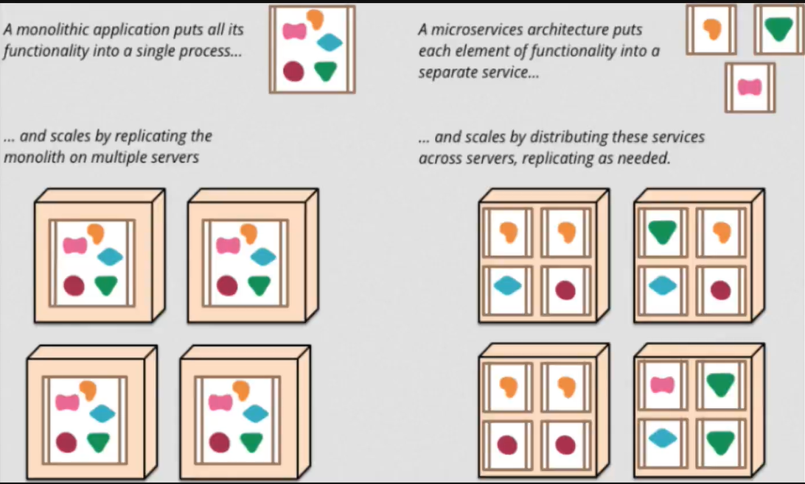
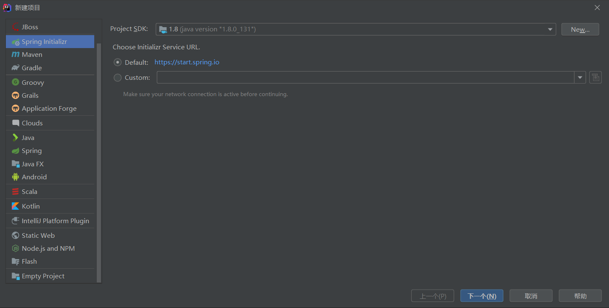
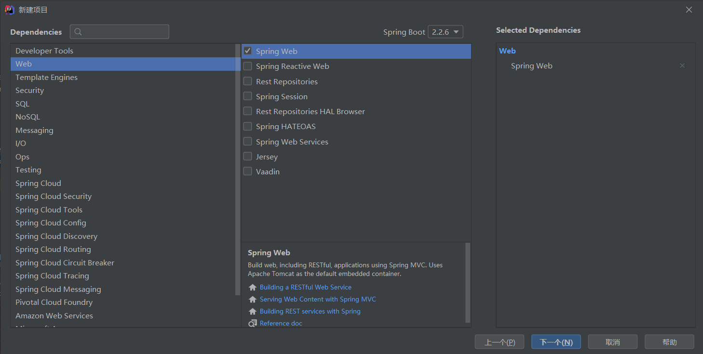
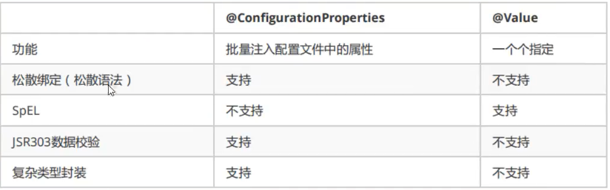
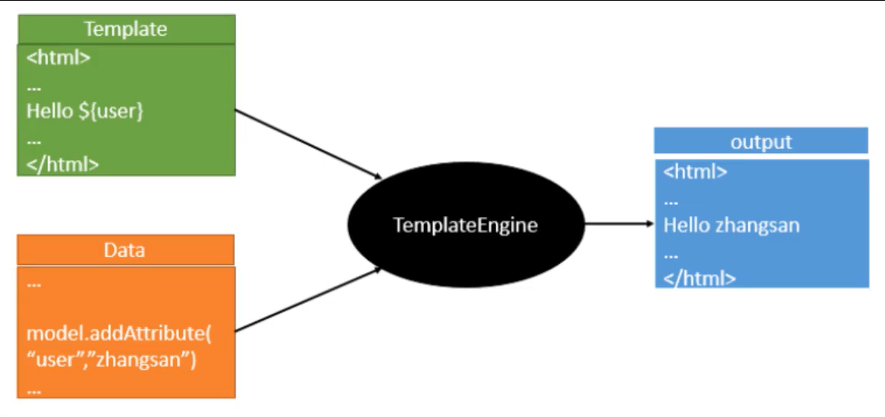
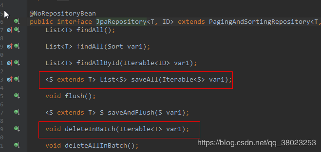
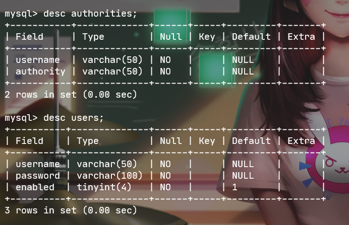
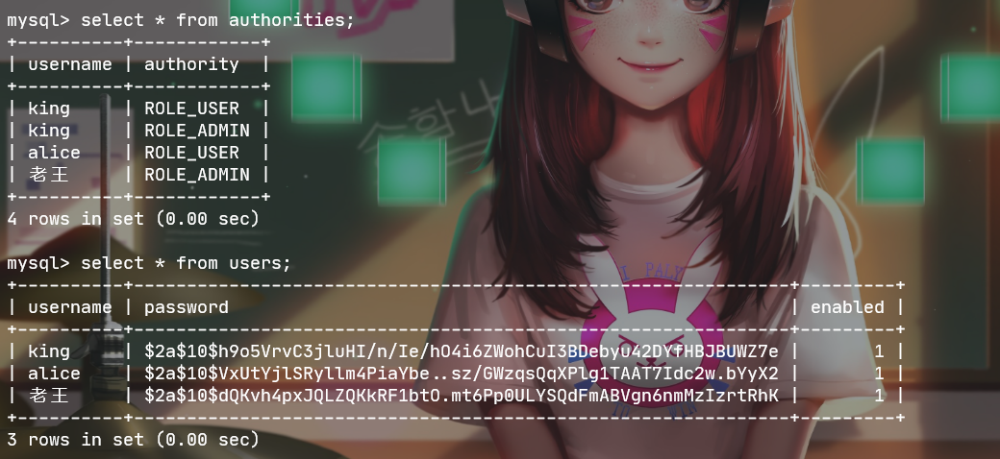

# 1、SpringBoot

## 1.1、SpringBoot

SpringBoot 基于 Spring 开发，SpringBoot 本身并不提供 Spring 框架的核心特性以及扩展功能，只是用于快速、敏捷地开发新一代基于 Spring 框架的应用程序。也就是说，它并不是用来替代 Spring 的解决方案，而是和 Spring 框架紧密结合用于提升 Spring 开发者体验的工具。SpringBoot 以**约定大于配置**的核心思想，默认帮我们进行了很多设置，多数 SpringBoot 应用只需要很少的 Spring 配置。Spring Boot 内嵌 Servlet 容器，降低了对环境的要求，可以命令执行语句。同时它集成了大量常用的第三方库配置（例如Redis、MongoDB、Jpa、RabbitMQ、Quartz等等），SpringBoot 应用中这些第三方库几乎可以零配置的开箱即用。

简单的来说 SpringBoot 并不是什么新的框架，它默认配置了很多框架的使用方式，就像 maven 整合了所有的 jar 包，SpringBoot 整合了所有的框架。

Spring Boot 解决的问题：

- 使编码变得简单
- 使配置变得简单
- 使部署变得简单
- 使监控变得简单

SpringBoot 的核心功能：

- 独自运行 Spring 项目，Spring Boot 可以以 jar 包的形式进行独立运行，使用`java -jar XX.jar`就可以成功运行
- 内嵌 Servlet 容器，内嵌容器，使得我们可以直接执行运行项目的 main 函数，使得项目快速运行
- 提供 starter 简化 maven 配置，SpringBoot 提供了一系列的 start XXX 来简化 maven 依赖
- 自动配置 Spring，Spring Boot 会根据我们项目中的类路径的 jar 包，为 jar 包的类进行自动装配 bean
- 应用监控。Spring Boot提供了基于 HTTP，ssh，Telnet 对运行的项目进行监控

Spring Boot 的缺点：

- 高度集成，使用的时候不知道底层的实现
- 由于不了解底层，导致项目出现了问题会很难排查

四大核心：

- 自动配置：针对很多 Spring 应用程序和常见的应用功能，Spring Boot 能自动提供相关配置
- 起步依赖：告诉 Spring Boot 需要什么功能，它就能引入相关的依赖库
- Actuator：提供在运行时检视应用程序内部情况的能力，让你能够深入运行应用程序，一探 Spring Boot 的内部信息
- 命令行界面：这是 Spring Boot 的可选特性，主要针对于 Groovy 语言使用


## 1.2、微服务

微服务架构是 “新标准”，是一种架构风格。构建小型，独立且可运行的应用程序可以带来极大的灵活性，并为您的代码增加弹性。 Spring Boot 的许多专用功能使在大规模生产中构建和运行微服务变得容易。 而且不要忘记，没有 Spring Cloud 简化管理并提高容错能力，就不会有完整的微服务架构。


**单体应用架构**

所谓单体应用架构（all in one）是指：我们将一个应用中的所有服务都封装在一个应用中。

无论是 ERP、CRM 或是其他什么系统，都把数据库访问、web 访问等等各个功能放到一个 war 包内。

- 这样做的好处是：易于开发和测试；也十分方便部署；当需要扩展时，只需要将 war 复制多份，然后放到多个服务器上，再做个负载均衡就可以了。
- 单体应用架构的缺点是：哪怕要修改一个非常小的地方，都需要停掉整个服务，重新打包、部署这个应用 war 包。特别是对于一个大型应用，我们不可能把所有内容都放在一个应用内，我们如何维护、如何分工合作都是问题。


**微服务架构**

all in one 的架构方式，我们把所有的功能单元放在一个应用里面。然后我们把整个应用部署到服务器上。如果负载能力不行，我们将整个应用进行水平复制，进行扩展，然后再负载均衡。

所谓微服务架构，就是打破之前 all in one 的架构方式，把每个功能元素独立出来。把独立出来的功能元素动态组合，需要的功能元素才拿去组合。所以微服务架构是对功能元素进行复制，而没有对整个应用进行复制。

这样做的好处是：

1. 节省了调用资源。
2. 每个功能元素的服务都是一个可替换的、可独立升级的软件代码。




# 2、第一个SpringBoot程序

1. 

2. 

3. 在application.java同级目录下创建controller包，编写UserController.java

	```java
	@Controller
	public class HelloController {
	    @RequestMapping("/hello")
	    @ResponseBody
	    public String hello() {
	        return "Hello,SpringBoot!";
	    }
	}
	```

4. 运行application.java


更改端口号：在application.properties添加

```properties
#更改项目端口号
server.port=8080
```


# 3、YAML

**配置文件的作用**：修改 SpringBoot 自动配置的默认值，因为 SpringBoot 在底层都给我们配置好了。

Spring Boot 有两种类型的配置文件，application 和 bootstrap 文件，Spring Boot 会自动加载 classpath 目录下的这两个文件，文件格式为 properties 或 yml 格式。

- *.properties 文件是 key=value 的形式
- *.yml 是 key: value 的形式，通过空格来确定层级关系，使配置文件结构更清晰。它的加载的属性是有顺序的，但不支持 @PropertySource 注解来导入配置，一般推荐用yml文件，看起来更加形象。

bootstrap 配置文件是系统级别的，用来加载外部配置，如配置中心的配置信息，也可以用来定义系统不会变化的属性；*.bootstatp 文件的加载先于application文件。

application 配置文件是应用级别的，是当前应用的配置文件。


## 3.1、YAML

YAML是“YAML Ain't a Markup Language”（YAML不是一种标记语言）的递归缩写。

在开发这种语言时，YAML的意思其实是：“Yet Another Markup Language”（仍是一种标记语言）。


**标记语言**

以前的配置文件，大多数都是用xml来配置；比如一个简单的端口配置：

- yaml配置：

	```yaml
	server:
	  port: 8080
	```

- xml配置：

	```xml
	<server>
		<port>8080</port>
	</server>
	```


## 3.2、YAML语法

**基础语法**：

```yaml
k:(空格)v
```

以此来表示一对键值对（空格不能省略）；以空格的缩进来控制层级关系，只要是左边对齐的一列数据都是同一阶级的。

注意：属性和值的大小写都是十分敏感的，而且对空格的要求十分高。


**对象**

```yaml
studnet:
  name: orichalcos
  age: 3
```


**数组**

```yaml
pets:
  - cat
  - dog
  - pig
```


## 3.3、通过YAML文件赋值

1. 创建一个SpringBoot项目

2. 编写两个pojo类：Dog和Person

	```java
	public class Dog {
	    private String name;
	    private Integer age
	}
	```

	```java
	@Component
	public class Person {
	    private String name;
	    private Integer age;
	    private Boolean happy;
	    private Date birthday;
	    private Map<String, Object> map;
	    private List<Object> list;
	    private Dog dog;
	}
	```

3. 编写application.yaml

	```yaml
	person:
	  name: qinjiang
	  age: 3
	  happy: false
	  birthday: 2019/11/02
	  map: {k1: v1, k2: v2}
	  list:
	    - code
	    - music
	    - girl
	  dog:
	    name: 旺财
	    age: 3
	```

4. 在Person.java中引入

	```java
	@ConfigurationProperties(prefix = "person")
	```

	如果加入后爆红可以在pom.xml中加入下面的依赖解决：

	```xml
	<dependency>
	    <groupId>org.springframework.boot</groupId>
	    <artifactId>spring-boot-configuration-processor</artifactId>
	    <optional>true</optional>
	</dependency>
	```

5. 测试

	```java
	@SpringBootTest
	class Springboot02ConfigApplicationTests {
	    @Autowired
	    private Person person;
	
	    @Test
	    void contextLoads() {
	        System.out.println(person);
	    }
	}
	```


**@ConfigurationProperties作用**：

将配置文件中配置的每一个属性的值，映射到这个组件中；

告诉SpringBoot将本类中的所有属性和配置文件中相关的配置进行绑定

参数prefix = “person” ：将配置文件中的person下面的属性一一对应


**用Properties可以赋值**

1. 创建一个application.properties

	```properties
	name=orichalcos
	```

2. 在Person中引用

	```java
	@PropertySource(value = "classpath:application.properties")
	```

3. 给属性赋值（在属性上添加注解）

	```java
	@Value("${name}");
	```


但是Properties赋值体验并不好，因为我们需要为每一个属性单独注解赋值，比较麻烦；两种方法的对比如下：



- ConfigurationProperties只需要写一次即可，Value则需要每个字段都添加。
- 松散绑定：比如yaml中写的是last-name，那么这个适合lastName是一样的，-后面跟着的字母默认是大写的。这就是松散绑定。
- JSR303数据校验：这个就是我们可以在字段上增加一层过滤器验证，可以保证数据的合法性。
- 复杂类型封装：yaml中可以封装对象，使用@Value就不支持。


## 3.4、JSR303数据校验

JSR-303 是 JAVA EE 6 中的一项子规范，叫做 Bean Validation，官方参考实现是Hibernate Validator。

此实现与 Hibernate ORM 没有任何关系。 JSR 303 用于对 Java Bean 中的字段的值进行验证。 
Spring MVC 3.x 之中也大力支持 JSR-303，可以在控制器中对表单提交的数据方便地验证。 
注:可以使用注解的方式进行验证。


**校检规则**

空检查 
@Null 验证对象是否为null 
@NotNull 验证对象是否不为null, 无法查检长度为0的字符串 
@NotBlank 检查约束字符串是不是Null还有被Trim的长度是否大于0,只对字符串,且会去掉前后空格. 
@NotEmpty 检查约束元素是否为NULL或者是EMPTY.

Booelan检查 
@AssertTrue 验证 Boolean 对象是否为 true 
@AssertFalse 验证 Boolean 对象是否为 false

长度检查 
@Size(min=, max=) 验证对象（Array,Collection,Map,String）长度是否在给定的范围之内 
@Length(min=, max=) Validates that the annotated string is between min and max included.

日期检查 
@Past 验证 Date 和 Calendar 对象是否在当前时间之前，验证成立的话被注释的元素一定是一个过去的日期 
@Future 验证 Date 和 Calendar 对象是否在当前时间之后 ，验证成立的话被注释的元素一定是一个将来的日期 
@Pattern 验证 String 对象是否符合正则表达式的规则，被注释的元素符合制定的正则表达式，regexp:正则表达式 flags: 指定 Pattern.Flag 的数组，表示正则表达式的相关选项。

数值检查 
建议使用在Stirng,Integer类型，不建议使用在int类型上，因为表单值为“”时无法转换为int，但可以转换为Stirng为”“,Integer为null 
@Min 验证 Number 和 String 对象是否大等于指定的值 
@Max 验证 Number 和 String 对象是否小等于指定的值 
@DecimalMax 被标注的值必须不大于约束中指定的最大值. 这个约束的参数是一个通过BigDecimal定义的最大值的字符串表示.小数存在精度 
@DecimalMin 被标注的值必须不小于约束中指定的最小值. 这个约束的参数是一个通过BigDecimal定义的最小值的字符串表示.小数存在精度 
@Digits 验证 Number 和 String 的构成是否合法 
@Digits(integer=,fraction=) 验证字符串是否是符合指定格式的数字，interger指定整数精度，fraction指定小数精度。 
@Range(min=, max=) 被指定的元素必须在合适的范围内 
@Range(min=10000,max=50000,message=”range.bean.wage”) 
@Valid 递归的对关联对象进行校验, 如果关联对象是个集合或者数组,那么对其中的元素进行递归校验,如果是一个map,则对其中的值部分进行校验.(是否进行递归验证) 
@CreditCardNumber信用卡验证 
@Email 验证是否是邮件地址，如果为null,不进行验证，算通过验证。 
@ScriptAssert(lang= ,script=, alias=) 
@URL(protocol=,host=, port=,regexp=, flags=)


**案例**：

在Person.java实体类上添加@Validated开启验证，然后在属性上添加验证规则：

```java
@Component
@Validated
@ConfigurationProperties(prefix = "person")
public class Person {
    @Email(message = "邮箱格式错误")
    private String name;
    private Integer age;
    private Boolean happy;
    private Date birthday;
    private Map<String, Object> map;
    private List<Object> list;
    private Dog dog;
```


## 3.5、多环境配置

多个配置文件存在时，不同位置的文件优先级不同

1. file:./config/
2. file:./
3. classpath:/config
4. classpath:/


**properties**

application.properties

```properties
spring.profiles.active=test
```

application-test.properties

```properties
server.port=8082
```

application-dev.properties

```properties
server.port=8083
```


**yaml**

application.yaml

```yaml
server:
  port: 8081
spring:
  profiles:
    active: test
---
server:
  port: 8082
spring:
  profiles: test

---
server:
  port: 8083
spring:
  profiles: dev
```


# 4、thymeleaf

## 4.1、模板引擎

前端交给我们的页面，是html页面。如果是我们以前开发，我们需要把他们转成jsp页面，jsp好处就是当我们查出一些数据转发到JSP页面以后，我们可以用jsp轻松实现数据的显示、及交互等。jsp支持非常强大的功能，包括能写java代码，但是现在的这种情况，SpringBoot这个项目首先是以jar的方式，不是war；而且用的还是嵌入式的Tomcat，所以他现在默认是不支持jsp的。

那不支持jsp，如果直接用纯静态页面的方式，会给开发带来非常大的麻烦，怎么办？SpringBoot推荐使用模板引擎。

其实jsp就是一个模板引擎，还有用的比较多的freemarker，包括SpringBoot推荐的thymeleaf，模板引擎有非常多，但是他们的思想都是一样的：



先写一个页面模板，比如有的值是动态的，用一些表达式来接收，然后将模板和所需要展示的数据交给模板引擎，模板引擎按照这个数据把表达式解析、填充到指定的位置，然后把这个数据最终生成一个我们需要的内容写出去。不管jsp还是其他模板引擎，都是这个思想。


## 4.2、thymeleaf简单使用

1. 导入依赖：

	```xml
	<dependency>
	    <groupId>org.thymeleaf</groupId>
	    <artifactId>thymeleaf-spring5</artifactId>
	</dependency>
	<dependency>
	    <groupId>org.thymeleaf.extras</groupId>
	    <artifactId>thymeleaf-extras-java8time</artifactId>
	</dependency>
	```

2. 编写一个controller和一个简单的test页面

	```java
	//在template目录下的所有页面，只能通过controller来跳转！
	//这个需要模板引擎的支持！thymeleaf
	@Controller
	public class IndexController {
	    @RequestMapping("/test")
	    public String test(Model model) {
	        model.addAttribute("msg", "Hello,Thymeleaf");
	        return "test";
	    }
	}
	```

	```html
	<!DOCTYPE html>
	<html lang="en" xmlns:th="http://www.w3.org/1999/xhtml">
	<head>
	    <meta charset="UTF-8">
	    <title>Title</title>
	</head>
	<body>
	    <!--所有的html元素都可以被thymeleaf替换接管：th:元素名-->
	    <h1 th:text="${msg}"></h1>
	    <h1>[[${msg}]]</h1>
	</body>
	</html>
	```


## 4.3、thymeleaf语法

- 变量：	`${ }`

- 链接：	`@{ }`

- 消息（本地）：	`#{ }`

- fragment（组件）：	`~{ }`

	例子：`~{ commons::topbar } `
	commons：/static/commons.html，即组件所在页面
	topbar：在组件页中用`th:fragment="topbar"`标记的代码块，即组件名
	插入方法：`th:replace="~{ }"`或`th:insert="~{ }"`

- 非：	!	或者	not

- 字符串工具类：	`#strings.isEmpty()`	（判断是否为空）


#  5、JDBC

首先新建一个SpringBoot项目

需要导入的组件：Web（必须）、JDBC API（整合所需）、MySQL Driver（连接数据库）


虽然JDBC已经能够满足大部分用户需求，但是在使用JDBC时，必须自己来管理数据库资源，如：获取PreparedStatment、设置SQL语句参数、关闭连接等步骤。

JdbcTemplate是Spring对JDBC的封装，目的是使JDBC更加易于使用。==JdbcTemplate是Spring的一部分。==Spring对数据库的操作在JDBC上面做了深层次的封装，使用Spring的注入功能，可以把DataSource注册到JdbcTemplate中。


**JdbcTemplate主要提供以下五类方法：**

- execute方法：可以用于执行任何SQL语句，一般用于执行DDL语句；
- update方法及batchUpdate方法：update方法用于执行新增、修改、删除等语句；batchUpdate方法用于执行批处理相关语句；
- query方法及queryForXXX方法：用于执行查询相关语句；
- call方法：用于执行存储过程、函数相关语句。


**例：**

使用Spring默认的数据源 Hikari（后面提），所以直接配置数据库参数即可

```yaml
spring:
  datasource:
    driver-class-name: com.mysql.cj.jdbc.Driver
    url: jdbc:mysql://localhost:3306/newer?useUnicode=true&characterEncoding=UTF8&useSSL=false&serverTimezone=GMT
    username: root
    password: root
```

JDBCController.java

```java
@RestController
public class JDBCController {
    @Autowired
    JdbcTemplate jdbcTemplate;

    //查询数据库的所有信息
    //没有实体类，数据库中的东西怎么获取？
    @GetMapping("/userList")
    public List<Map<String, Object>> userList() {
        String sql = "select * from user";
        List<Map<String, Object>> list_map = jdbcTemplate.queryForList(sql);
        //List里面放置的是User对象，Map里面放置的是User的详细信息，key为字段名（列名），value为值。
        return list_map;
    }

    @GetMapping("/updateUser/{id}")
    public String updateUser(@PathVariable("id") int id) {
        String sql = "update user set u_name=?,u_password=? where id=" + id;
        //封装
        Object[] objects = new Object[2];
        objects[0] = "小明";
        objects[1] = "zzzzzz";
        jdbcTemplate.update(sql, objects);
        return "updateUser-OK";
    }

    @GetMapping("/deleteUser/{id}")
    public String deleteUser(@PathVariable("id") int id) {
        String sql = "delete from user where id=?";
        jdbcTemplate.update(sql, id);
        return "deleteUser-OK";
    }
}
```


**Hikari**

SpringBoot2默认的数据源从Tomcat换成了HikariCP。

HikariCP是数据库连接池的后起之秀，号称性能最好，可以完美PK掉其他的连接池，是一个高i性能的连接池，基于BoneCP做了不少的改进和优化。

那么，这么好的P是怎么做到的呢？官网详细地说明了HikariCP所做的一些优化，总结如下：

- **字节码精简**：优化代码，直到编译后的字节码最少，这样，CPU缓存可以加载更多的程序代码；
- **优化代理和拦截器**：减少代码，例如HikariCP的Statement proxy只有100行代码，只有BoneCP的十分之一；
- **自定义数组类型（FastStatementList）代替ArrayList**：避免每次get()调用都要进行range check，避免调用remove()时的从头到尾的扫描；
- **自定义集合类型（ConcurrentBag）**：提高并发读写的效率；
- **其他针对BoneCP缺陷的优化**，比如对于耗时超过一个CPU时间片的方法调用的研究（但没说具体怎么优化）。


由于Spring Boot的自动化配置机制，大部分对于数据源的配置都可以通过配置参数的方式去改变。只有一些特殊情况，比如：更换默认数据源，多数据源共存等情况才需要去修改覆盖初始化的Bean内容。

在Spring Boot自动化配置中，对于数据源的配置可以分为两类：

- 通用配置：以`spring.datasource.*`的形式存在，主要是对一些即使使用不同数据源也都需要配置的一些常规内容。比如：数据库链接地址、用户名、密码等。

	```properties
	spring.datasource.url=jdbc:mysql://localhost:3306/test
	spring.datasource.username=root
	spring.datasource.password=123456
	spring.datasource.driver-class-name=com.mysql.jdbc.Driver
	```

	

- 数据源连接池配置：以`spring.datasource.<数据源名称>.*`的形式存在，比如：Hikari的配置参数就是`spring.datasource.hikari.*`形式。

	```properties
	spring.datasource.hikari.minimum-idle=10
	spring.datasource.hikari.maximum-pool-size=20
	spring.datasource.hikari.idle-timeout=500000
	spring.datasource.hikari.max-lifetime=540000
	spring.datasource.hikari.connection-timeout=60000
	spring.datasource.hikari.connection-test-query=SELECT 1
	```

	这些配置的含义：

	- `spring.datasource.hikari.minimum-idle`: 最小空闲连接，默认值10，小于0或大于maximum-pool-size，都会重置为maximum-pool-size
	- `spring.datasource.hikari.maximum-pool-size`: 最大连接数，小于等于0会被重置为默认值10；大于零小于1会被重置为minimum-idle的值
	- `spring.datasource.hikari.idle-timeout`: 空闲连接超时时间，默认值600000（10分钟），大于等于max-lifetime且max-lifetime>0，会被重置为0；不等于0且小于10秒，会被重置为10秒。
	- `spring.datasource.hikari.max-lifetime`: 连接最大存活时间，不等于0且小于30秒，会被重置为默认值30分钟.设置应该比mysql设置的超时时间短
	- `spring.datasource.hikari.connection-timeout`: 连接超时时间：毫秒，小于250毫秒，否则被重置为默认值30秒
	- `spring.datasource.hikari.connection-test-query`: 用于测试连接是否可用的查询语句


# 6、Druid

Druid是由阿里巴巴数据库事业部出品的开源项目。它除了是一个高性能数据库连接池之外，更是一个自带监控的数据库连接池。虽然HikariCP已经很优秀，但是对于国内用户来说，可能对于Druid更为熟悉。所以，对于如何在Spring Boot中使用Druid是后端开发人员必须要掌握的基本技能。


以往我们都是直接引入Druid的依赖：

```xml
<!-- Druid -->
<dependency>
    <groupId>com.alibaba</groupId>
    <artifactId>druid</artifactId>
    <version>1.1.22</version>
</dependency>
```

但是面对这么火爆的SpringBoot并没有直接对Druid的启动器而是需要我们自己整合，后来apache出了一套完美支持SpringBoot的方案所以说我们不使用上面的依赖而是使用：

```xml
<!-- https://mvnrepository.com/artifact/com.alibaba/druid-spring-boot-starter -->
<dependency>
    <groupId>com.alibaba</groupId>
    <artifactId>druid-spring-boot-starter</artifactId>
    <version>1.1.22</version>
</dependency>
```


然后需要配置yaml文件

```yaml
spring:
  datasource:
    driver-class-name: com.mysql.cj.jdbc.Driver
    url: jdbc:mysql://localhost:3306/newer?useUnicode=true&characterEncoding=UTF8&useSSL=false&serverTimezone=GMT
    username: root
    password: root
    type: com.alibaba.druid.pool.DruidDataSource

    #Spring Boot默认是不注入这些属性值的，需要自己绑定
    #druid数据源专有配置
    initialSize: 5
    minIdle: 5
    maxActive: 20
    maxWait: 60000
    timeBetweenEvictionRunsMillis: 60000
    minEvictableIdleTimeMillis: 300000
    validationQuery: SELECT 1 FROM DUAL
    testWhileIdle: true
    testOnBorrow: false
    testOnReturn: false
    poolPreparedStatements: true

    #配置监控统计拦截的filters, stat: 监控统计、Log4j: 日志记录、wall: 防御sql注入（防火墙）.
    #如果允许时报错java. lang. ClassNotFoundException: org.apache.Log4j.Priority
    #则导入Log4j 依赖即可，Maven地址: https://mvnrepository. com/artifact/Log4j/Log4j
    filters: stat , wall,1og4j
    maxPoolPreparedStatementPerConnectionSize: 20
    useGlobalDataSourceStat: true
    connectionProperties: druid.stat.mergeSql=true;druid.stat.slowSqlMi1lis=500
```

虽然我们配置了druid连接池的其它属性，但是不会生效。因为默认是使用的java.sql.Datasource的类来获取属性的，有些属性datasource没有。如果我们想让配置生效，需要手动创建Druid的配置文件。

DruidConfig.java

```java
@Configuration
public class DruidConfig {
    @Bean
    @ConfigurationProperties(prefix = "spring.datasource")
    public DataSource druidDataSource() {
        return new DruidDataSource();
    }
}
```

Druid的最强大之处在于它有着强大的监控，可以监控我们发送到数据库的所有sql语句。方便我们后期排插错误。还可以配置过滤器：

```java
/**
  * 配置监控服务器
  * //后台监控：web.xml，servletRegistrationBean
  * //因为SpringBoot 内置了servlet容器，所以没有web.xml，替代方法：ServletRegistrationBean
  * @return 返回监控注册的servlet对象
  * @author Orichalcos
  */
@Bean
public ServletRegistrationBean statViewServlet() {
    ServletRegistrationBean<StatViewServlet> bean = new ServletRegistrationBean<>(new StatViewServlet(), "/druid/*");

    //后台需要有人登录，账号密码配置
    HashMap<String, String> initParameters = new HashMap<>();

    //添加控制台管理用户
    initParameters.put("loginUsername", "admin");
    initParameters.put("loginPassword", "123456");

    //允许谁可以访问,空代表都可以访问（白名单）
    initParameters.put("allow", "");
    //也可以通过addParameter的方式直接添加初始化参数
    //bean.addInitParameter("allow", "127.0.0.1");
    
    //添加IP黑名单，当白名单和黑名单重复时，黑名单优先级更高
    //bean.addInitParameter("deny", "127.0.0.1");

    bean.setInitParameters(initParameters);
    return bean;
}

/**
  * 配置服务过滤器:Filter
  *
  * @return 返回过滤器配置对象
  */
@Bean
public FilterRegistrationBean webStatFilter() {
    FilterRegistrationBean<Filter> bean = new FilterRegistrationBean<>();
    bean.setFilter(new WebStatFilter());
    //可以过滤哪些请求呢？
    HashMap<String, String> initParameters = new HashMap<>();
    
    // 添加过滤规则
    bean.addUrlPatterns("/*");
    
    //这些东西不进行统计
    initParameters.put("exclusions", "*.js,*.css,/druid/**");
    bean.setInitParameters(initParameters);
    return bean;
}
```


# 7、Mybatis

首先创建一个简单的SpringBoot项目，创建时勾选 MySQL、Web、Mybatis（也可以直接导入下方的依赖）

```xml
<!-- https://mvnrepository.com/artifact/org.mybatis.spring.boot/mybatis-spring-boot-starter -->
<dependency>
    <groupId>org.mybatis.spring.boot</groupId>
    <artifactId>mybatis-spring-boot-starter</artifactId>
    <version>2.1.3</version>
</dependency>
```

编写实体类：

```java
@Data
@AllArgsConstructor
@NoArgsConstructor
public class User {
    private int u_id;
    private String u_name;
    private String u_password;
}
```

编写mybatis的mapper：

`@mapper`表示被标记类为一个mapper，也可以在SpringBoot的启动类上增加注解`@MapperScan("com.orichalcos.springboot05mybatis.mapper")`使用包扫描来实现相同效果

```java
@Mapper
@Repository
public interface UserMapper {
    List<User> queryUserList();

    User queryUserById(int id);

    int addUser(User user);

    int updateUser(User user);

    int deleteUser(int id);
}
```

在resource中创建一个mapper文件夹用来存放mybatis的映射文件：

```xml
<?xml version="1.0" encoding="UTF-8" ?>
<!DOCTYPE mapper
        PUBLIC "-//mybatis.org//DTD Mapper 3.0//EN"
        "http://mybatis.org/dtd/mybatis-3-mapper.dtd">
<mapper namespace="com.orichalcos.springboot05mybatis.mapper.UserMapper">
    <select id="queryUserList" resultType="user">
        select * from user;
    </select>

    <select id="queryUserById" resultType="User">
        select * from user where u_id=#{id}
    </select>

    <insert id="addUser" parameterType="User">
        insert into user(u_id,u_username,u_password)
    </insert>

    <update id="updateUser" parameterType="User">
        update user set u_username=#{u_username},u_password=#{u_password} where u_id=#{id};
    </update>

    <delete id="deleteUser" parameterType="_int">
        delete from user where u_id=#{id}
    </delete>
</mapper>
```

修改application.properties文件，先添加连接数据库所需要的四个参数，然后添加以下代码整合myabatis

```properties
#整合mybatis
mybatis.type-aliases-package=com.orichalcos.springboot05mybatis.pojo
mybatis.mapper-locations=classpath:mapper/*.xml
```

添加控制器：

```java
@RestController
public class UserController {
    @Autowired
    private UserMapper userMapper;

    @GetMapping("/queryUserList")
    public List<User> queryUserList(){
        List<User> userList = userMapper.queryUserList();
        for (User user : userList) {
            System.out.println(user);
        }
        return userList;
    }
}
```

访问：http://localhost:8080/queryUserList，查看是否返回数据。


# 8、Spring Data JPA

Spring Data JPA可以理解为JPA规范的再次封装，底层还是使用了hibernate的JPA技术实现，引用JPQL（Java Persistence Query Language）查询语言，属于Spring整个生态的一部分。

JPA是Java Persistence API的简称，中文名为Java持久层API。


使用Spring Data JPA需要导入JPA依赖。

下面是一个相关的实体类

```java
@Entity
//@Table(name = "depts")
public class Dept {
	// 主键
	@Id
	// 主键值的生成方式：自动增长
	@GeneratedValue(strategy = GenerationType.IDENTITY)
	Long id;

	// 列
	@Column(unique = true, length = 64)
	String title;

	// 列与属性的映射
	@Column(name = "loc", length = 32, nullable = false)
	String city;

	// 瞬时：不持久化
	@Transient
	String about;
}
```


## 8.1、JPA基础注解解析

- `@Entity`：标记该类为一个JPA实体类，告诉JPA在程序运行时生成实体类的对应表。

- `@Table`：设置实体类在数据库所对应的表名，如果未设置，则默认为首字母小写的类名。

- `@Id`：标记类所在变量的主键。

- `@GeneratedValue`：

	strategy：设置主键生成策略，有AUTO，INDENTITY，SEQUENCE 和 TABLE 4种，分别表示让ORM框架自动选择，根据数据库的 Identity 字段生成，根据数据库表的 Sequence 字段生成，以有根据一个额外的表生成主键，默认为 AUTO。

	generator：表示主键生成器的名称，

- `@Column`：表示属性所对应字段名进行个性化化设置。

	name：表示数据库表中该字段的名称，默认情形属性名称一致。

	nullable：表示该字段是否允许为null，默认为true。

	unique：表示该字段是否是唯一标识，默认为false。

	length：表示该字段的大小，仅对String类型的字段有效。

	insertable：表示在ORM框架执行插入操作时，该字段是否应出现INSETRT语句中，默认为true。

	updateable：表示在ORM框架执行更新操作时，该字段是否应该出现在UPDATE语句中，默认为true。对于一经创建就不可以更改的字段，该属性非常有用，如对于birthday字段。

	columnDefinition：表示该字段在数据库中的实际类型。通常ORM框架可以根据属性类型自动判断数据库中字段的类型，但是对于Date类型仍无法确定数据库中字段类型究竟是DATE，TIME还是TIMESTAMP。此外，String的默认映射类型为VARCHAR，如果要将String类型映射到特定数据库的BLOB或TEXT字段类型，该属性非常有用。

- `@Transient`：表示属性非数据库表字段的映射，ORM框架将忽略该属性。


**验证注解**：

- `@Pattern`:
	通过正则表达式来验证字符串
	@Pattern(regex="[a-z]{6}")
- `@Length`:
	验证字符串的长度
	@length(min=3,max=20)
- `@Email`:
	验证一个Email地址是否有效
- `@Range`
	验证一个整型是否在有效的范围内
	@Range(min=0,max=100)
- `@Min:`
	验证一个整型必须不小于指定值
	@Min(value=10)
- `@Max`:
	验证一个整型必须不大于指定值
	@Max(value=20)
- `@Size`:
	集合或数组的大小是否在指定范围内
	@Size(min=1,max=255)


## 8.2、@JoinColumn注解

@JoinColumn 注解的作用：用来指定与所操作实体或实体集合相关联的数据库表中的列字段。

由于 @OneToOne（一对一）、@OneToMany（一对多）、@ManyToOne（多对一）、@ManyToMany（多对多） 等注解只能确定实体之间几对几的关联关系，它们并不能指定与实体相对应的数据库表中的关联字段，因此，需要与 @JoinColumn 注解来配合使用。

在此，我们以员工、地址、部门、角色四者之间的关联关系为例进行详细介绍，假设：

-  一个员工只能有一个地址，同样的，一个地址也只属于一个员工；
-  一个员工只能属于一个部门，但是一个部门可以包含有多个员工；
-  一个员工可以拥有多个角色，同样的，一个角色也可以属于多个员工。 


**@OneToOne（一对一）**

@OneToOne 用来表示类似于以上员工与地址之间的一对一的关系，在员工表中会有一个指向地址表主键的字段address_id，所以主控方（指能够主动改变关联关系的一方）一定是员工，因为，只要改变员工表的address_id就改变了员工与地址之间的关联关系，所以@JoinColumn要写在员工实体类Employee上，自然而然地，地址就是被控方了。 

```java
@OneToOne(cascade = CascadeType.ALL, fetch = FetchType.LAZY)
@JoinColumn(name = "address_id")
private Address address;
```

我们也可以不写@JoinColumn，Hibernate会自动在员工表生成关联字段，字段默认的命名规则：被控方类名_被控方主键，如：address_id。

如果两张表是以主键关联的，比如员工表主键是employee_id，地址表主键是address_id，可以使用如下注解：

```java
@OneToOne(cascade = CascadeType.ALL, fetch = FetchType.LAZY)
@PrimaryKeyJoinColumn(name = "employee_id", referencedColumnName = "address_id")
private Address address;
```

**FetchType**

- FetchType.LAZY：懒加载，加载一个实体时，定义懒加载的属性不会马上从数据库中加载。    
- FetchType.EAGER：急加载，加载一个实体时，定义急加载的属性会立即从数据库中加载。    

比方User类有两个属性，name跟address，就像百度知道，登录后用户名是需要显示出来的，此属性用到的几率极大，要马上到数据库查，用急加载；而用户地址大多数情况下不需要显示出来，只有在查看用户资料是才需要显示，需要用了才查数据库，用懒加载就好了。

**CascadeType**

- CascadeType.PERSIST
	级联持久化（保存）操作（持久保存拥有方实体时，也会持久保存该实体的所有相关数据）
- CascadeType.REMOVE
	级联删除操作：删除当前实体时，与它有映射关系的实体也会跟着被删除。
- CascadeType.MERGE
	级联更新（合并）操作：当Student中的数据改变，会相应地更新Course中的数据。
- CascadeType.DETACH
	级联脱管/游离操作：如果你要删除一个实体，但是它有外键无法删除，你就需要这个级联权限了。它会撤销所有相关的外键关联。
- CascadeType.REFRESH
	级联刷新操作：假设场景 有一个订单,订单里面关联了许多商品,这个订单可以被很多人操作,那么这个时候A对此订单和关联的商品进行了修改,与此同时,B也进行了相同的操作,但是B先一步比A保存了数据,那么当A保存数据的时候,就需要先刷新订单信息及关联的商品信息后,再将订单及商品保存。
- CascadeType.ALL
	拥有以上所有级联操作权限。


**@OneToMany（一对多）**

在分析员工与部门之间的关系时，一个员工只能属于一个部门，但是一个部门可以包含有多个员工，如果我们站在部门的角度来看，部门与员工之间就是一对多的关系，在部门实体类 Department 上添加如下注解： 

```java
@OneToMany(cascade = CascadeType.ALL, fetch = FetchType.EAGER)
@JoinColumn(name = "department_id")
private List<Employee> employees;
```

我们也可以不写@JoinColumn，Hibernate会自动生成一张中间表来对员工和部门进行绑定，表名默认的命名规则：一的表名_一实体类中关联多的属性名，例如，部门表名为 tbl_department ，部门实体中关联的员工集合属性名为 employees ，则生成的中间表名为：tbl_department_employees。

通常并不推荐让Hibernate自动去自动生成中间表，而是使用@JoinTable注解来指定中间表： 

```java
@OneToMany(cascade = CascadeType.ALL, fetch = FetchType.EAGER)
/**
* joinColumns 用来指定中间表中关联自己ID的字段 
* inverseJoinColumns 用来指定中间表中关联对方ID的字段
*/
@JoinTable(
    name = "tbl_employee_department", 
    joinColumns = {@JoinColumn(name = "department_id") }, 
    inverseJoinColumns = { @JoinColumn(name = "employee_id") })
private List<Employee> employees;
```


**@ManyToOne（多对一）**

如果我们站在员工的角度来看员工与部门之间的关系时，二者之间就变成了多对一的关系，在员工实体类 Employee 上添加如下注解： 

```java
@ManyToOne(cascade = CascadeType.ALL, fetch = FetchType.EAGER)
@JoinColumn(name = "department_id")
private Department department;
```


**@ManyToMany（多对多）**

类似员工与角色之间的关系，一个员工可以拥有多个角色，一个角色也可以属于多个员工，员工与角色之间就是多对多的关系。通常这种多对多关系都是通过创建中间表来进行关联处理，并使用@JoinTable注解来指定。

一个员工可以拥有多个角色，在员工实体类中添加如下注解： 

```java
@ManyToMany(cascade = CascadeType.ALL, fetch = FetchType.LAZY)
@JoinTable(
    name = "tbl_employee_role", 
    joinColumns = { @JoinColumn(name = "employee_id") }, 
    inverseJoinColumns = {@JoinColumn(name = "role_id") })
private List<Role> roles;
```

一个角色可以属于多个员工，在角色实体类中添加如下注解： 

```java
@ManyToMany(cascade = CascadeType.ALL, fetch = FetchType.LAZY)
@JoinTable(
    name = "tbl_employee_role", 
    joinColumns = { @JoinColumn(name = "role_id") }, 
    inverseJoinColumns = {@JoinColumn(name = "employee_id") })
private List<Employee> employees;
```


**查询出现死循环问题**

当表间有OneToMany或ManyToOne时，会发生无限循环的场景，如何破？

@JsonIgnore 的作用是 JSON 序列化时将 Java Bean 中的一些属性忽略掉，序列化和反序列化都受影响。

Jackson相关：

- **@JsonIgnoreProperties**
	此注解是类注解，作用是json序列化时将Java Bean 中的一些属性忽略掉，序列化和反序列化都受影响。

- **@JsonFormat**

	此注解用于属性或者方法上（最好是属性上），可以方便的把Date类型直接转化为我们想要的模式，比如 @JsonFormat(pattern = "yyyy-MM-dd HH-mm-ss")


## 8.3、实体类实例

Employee.java

```java
@Data
@NoArgsConstructor
@AllArgsConstructor
@Entity
@Table(name = "tbl_employee")   //指定关联数据库的表名
public class Employee {
    @Id
    @GeneratedValue(strategy = GenerationType.IDENTITY)
    private Long id;    //主键ID

    @Column(name = "name", length = 10)
    private String name;    //姓名

    @DateTimeFormat(pattern = "yyyy-MM-dd")
    private LocalDate birthday; //生日

    @OneToOne(cascade = CascadeType.ALL, fetch = FetchType.LAZY)
    @JoinColumn(name = "address_id")
    // @PrimaryKeyJoinColumn(name = "employee_id", referencedColumnName = "address_id"
    private Address address;    //地址

    @ManyToOne(cascade = CascadeType.ALL, fetch = FetchType.EAGER)
    @JoinColumn(name = "department_id")
    private Department department;  //部门

    @ManyToMany(cascade = CascadeType.ALL, fetch = FetchType.LAZY)
    @JoinTable(
            name = "tbl_employee_role",
            joinColumns = {@JoinColumn(name = "employee_id")},
            inverseJoinColumns = {@JoinColumn(name = "role_id")})
    private List<Role> roles;   //角色
}
```

Role.java

```java
@Data
@NoArgsConstructor
@AllArgsConstructor
@Entity
@Table(name = "tbl_role")
public class Role {
    @Id
    @GeneratedValue(strategy = GenerationType.IDENTITY)
    private Long id; // 主键ID

    private String name; // 角色名称

    @ManyToMany(cascade = CascadeType.ALL, fetch = FetchType.LAZY)
    @JoinTable(
            name = "tbl_employee_role",
            joinColumns = {@JoinColumn(name = "role_id")},
            inverseJoinColumns = {@JoinColumn(name = "employee_id")})
    private List<Employee> employees; // 拥有角色的员工
}
```

Address.java

```java
@Data
@NoArgsConstructor
@AllArgsConstructor
@Entity
@Table(name = "tbl_role")
public class Role {
    @Id
    @GeneratedValue(strategy = GenerationType.IDENTITY)
    private Long id; // 主键ID

    private String name; // 角色名称

    @ManyToMany(cascade = CascadeType.ALL, fetch = FetchType.LAZY)
    @JoinTable(
            name = "tbl_employee_role",
            joinColumns = {@JoinColumn(name = "role_id")},
            inverseJoinColumns = {@JoinColumn(name = "employee_id")})
    private List<Employee> employees; // 拥有角色的员工
}
```

Department.java

```java
@Data
@NoArgsConstructor
@AllArgsConstructor
@Entity
@Table(name = "tbl_department")
public class Department {
    @Id
    @GeneratedValue(strategy = GenerationType.IDENTITY)
    private Long id; // 主键ID

    private String name; // 部门名称


    @OneToMany(cascade = CascadeType.ALL, fetch = FetchType.EAGER)
    @JoinColumn(name = "department_id")
    /**
     * joinColumns 用来指定中间表中关联自己ID的字段 inverseJoinColumns 用来指定中间表中关联对方ID的字段
     */
    //@JoinTable(
    //        name = "tbl_employee_department",
    //        joinColumns = {@JoinColumn(name = "department_id")},
    //        inverseJoinColumns = { @JoinColumn(name = "employee_id") })
    private List<Employee> employees; // 部门员工

}
```

application.properties

```properties
#数据源
spring.datasource.driver-class-name=com.mysql.cj.jdbc.Driver
spring.datasource.url=jdbc:mysql://localhost:3306/jpa?serverTimezone=GMT
spring.datasource.username=root
spring.datasource.password=root

#日志
logging.level.web=debug
spring.mvc.log-request-details=true

#JPA
spring.jpa.show-sql=true
#根据实体类的注解自动创建表的结构
spring.jpa.generate-ddl=true
```


## 8.4、根据方法名生成SQL

```java
public interface UserRepository extends Repository<User, Long> {
    List<User> findByEmailAddressAndLastname(String emailAddress, String lastname);
}
```

我们将使用`JPA criteria` `API`创建一个查询，但本质上这转换为以下查询：

```sql
select u from User u where u.emailAddress = ?1 and u.lastname = ?2
```

Spring Data  JPA  将执行属性检查并遍历属性表达式中描述的嵌套属性。下面是  JPA  支持的关键字的概述，以及包含该关键字的方法的本质含义。

| 关键词            | Demo                                                      | JPQL 语句片段                                                |
| ----------------- | --------------------------------------------------------- | ------------------------------------------------------------ |
| And               | findByLastnameAndFirstname                                | … where x.lastname = ?1 and x.firstname = ?2                 |
| Or                | findByLastnameOrFirstname                                 | … where x.lastname = ?1 or x.firstname = ?2                  |
| Is,Equals         | findByFirstname, findByFirstnameIs, findByFirstnameEquals | … where x.firstname = ?1                                     |
| Between           | findByStartDateBetween                                    | … where x.startDate between ?1 and ?2                        |
| LessThan          | findByAgeLessThan                                         | … where x.age < ?1                                           |
| LessThanEqual     | findByAgeLessThanEqual                                    | … where x.age ⇐ ?1                                           |
| GreaterThan       | findByAgeGreaterThan                                      | … where x.age > ?1                                           |
| GreaterThanEqual  | findByAgeGreaterThanEqual                                 | … where x.age >= ?1                                          |
| After             | findByStartDateAfter                                      | … where x.startDate > ?1                                     |
| Before            | findByStartDateBefore                                     | … where x.startDate < ?1                                     |
| IsNull            | findByAgeIsNull                                           | … where x.age is null                                        |
| IsNotNull,NotNull | findByAge(Is)NotNull                                      | … where x.age not null                                       |
| Like              | findByFirstnameLike                                       | … where x.firstname like ?1                                  |
| NotLike           | findByFirstnameNotLike                                    | … where x.firstname not like ?1                              |
| StartingWith      | findByFirstnameStartingWith                               | … where x.firstname like ?1 (parameter bound with appended %) |
| EndingWith        | findByFirstnameEndingWith                                 | … where x.firstname like ?1 (parameter bound with prepended %) |
| Containing        | findByFirstnameContaining                                 | … where x.firstname like ?1 (parameter bound wrapped in %)   |
| OrderBy           | findByAgeOrderByLastnameDesc                              | … where x.age = ?1 order by x.lastname desc                  |
| Not               | findByLastnameNot                                         | … where x.lastname <> ?1                                     |
| In                | findByAgeIn(Collection<Age> ages)                         | … where x.age in ?1                                          |
| NotIn             | findByAgeNotIn(Collection<Age> age)                       | … where x.age not in ?1                                      |
| True              | findByActiveTrue()                                        | … where x.active = true                                      |
| False             | findByActiveFalse()                                       | … where x.active = false                                     |
| IgnoreCase        | findByFirstnameIgnoreCase                                 | … where UPPER(x.firstame) = UPPER(?1)                        |


**使用JPA 通过ID获取对象时报错No serializer found for class org.hibernate.proxy.pojo.javassist.Javassi...**

hibernate 会给每个被管理的对象加上 hibernateLazyInitializer 属性，同时 struts-jsonplugin 或者其他的 jsonplugin 都是。

因为 jsonplugin 用的是 Java 的内审机制。hibernate 会给被管理的 pojo 加入一个hibernateLazyInitializer属性,jsonplugin通过java的反射机制将pojo转换成json，会把hibernateLazyInitializer也拿出来操作,但是hibernateLazyInitializer无法由反射得到，所以就抛异常了。

解决方法：

pojo类上加上如下声明：

```java
@JsonIgnoreProperties(value={"hibernateLazyInitializer","handler","fieldHandler"}) 
```


## 8.5、实现多表关联查询

多表查询在spring data jpa中有两种实现方式，第一种是利用hibernate的级联查询来实现，第二种是创建一个结果集的接口来接收连表查询后的结果，这里介绍第二种方式。


### 8.5.1、一对一映射

实体 UserInfo ：用户。

实体 Address：家庭住址。

这里通过外键的方式(一个实体通过外键关联到另一个实体的主键)来实现一对一关联。


**实体类**

```java
// UserInfo.java
@Entity
@Table(name="tb_user")
public class UserInfo implements Serializable {
  private static final long serialVersionUID = 8283950216116626180L;

  @Id
  @GeneratedValue(strategy=GenerationType.IDENTITY)
  private Long userId;
  private String name;
  private int age;
  private String sex;
  private String email;

  // 与 Address 的关联  
  private Long addressId;
}
```

```java
// Address.java
@Entity
@Table(name = "tb_address")
public class Address {
  @Id
  @GeneratedValue(strategy = GenerationType.IDENTITY)
  private Long addressId;
  private String areaCode;
  private String country;
  private String province;
  private String city;
  private String area;
  private String detailAddress;
}
```


**Dao 层**

```java
// UserInfoRepository.java
public interface UserInfoRepository extends JpaRepository<UserInfo, Long> {
  @Query(value = "SELECT new com.johnfnash.learn.domain.ViewInfo(u, a) FROM UserInfo u, Address a WHERE u.addressId = a.addressId")
  public List<ViewInfo> findViewInfo();
}
```

==注：这里的 ViewInfo 类用来一个用来接收多表查询结果集的类（使用 new + 完整类名构造函数）==代码如下：

```java
// ViewInfo.java
public class ViewInfo implements Serializable {
  private static final long serialVersionUID = -6347911007178390219L;

  private UserInfo userInfo;
  private Address address;

  public ViewInfo() {}

  public ViewInfo(UserInfo userInfo) {
    Address address = new Address();
    this.userInfo = userInfo;
    this.address = address;
  }

  public ViewInfo(Address address) {
    UserInfo userInfo = new UserInfo();
    this.userInfo = userInfo;
    this.address = address;
  }

  public ViewInfo(UserInfo userInfo, Address address) {
    this.userInfo = userInfo;
    this.address = address;
  }
}
```

```java
// AddressRepository.java
public interface AddressRepository extends JpaRepository<Address, Long> {}
```


**测试代码**

```java
@RunWith(SpringRunner.class)
@SpringBootTest
public class UserInfoRepositoryTests {
  @Autowired
  private UserInfoRepository userInfoRepository;

  @Autowired
  private AddressRepository addressRepository;

  @Before
  public void init() {
        Address addr1 = new Address("027","CN","HuBei", "WuHan","WuChang", "123 street");
        Address addr2 = new Address("023","CN","ChongQing", "ChongQing","YuBei", "123 road");
        addressRepository.save(addr1);
        addressRepository.save(addr2);

        UserInfo user1 = new UserInfo("ZS", 21,"Male","123@xx.com", addr1.getAddressId());
        UserInfo user2 = new UserInfo("Ww", 25,"Male","234@xx.com", addr2.getAddressId());
        userInfoRepository.save(user1);
        userInfoRepository.save(user2);
  }

  @After
  public void deleteAll() {
    userInfoRepository.deleteAll();

    addressRepository.deleteAll();
  }

  @Test
  public void testQuery() {
    List<ViewInfo> viewInfos = userInfoRepository.findViewInfo();
    for (ViewInfo viewInfo : viewInfos) {
      System.out.println(viewInfo.getUserInfo());
      System.out.println(viewInfo.getAddress());
    }
  }
}
```


### 8.5.2、多对多映射

实体 Author ：作者。

实体 Book ：书籍

这里通过关联表的方式来实现多对多关联。


**实体类**

```java
// Author.java
@Entity
public class Author implements Serializable {
  private static final long serialVersionUID = 1227555837798655046L;

  @Id
  @GeneratedValue
  private Integer id;
  private String name;
}
```

```java
// Book.java
@Entity
public class Book implements Serializable {
  private static final long serialVersionUID = -2470510857424220408L;

  @Id
  @GeneratedValue
  private Integer id;
  private String name;
}
```

```java
// BookAuthor.java
@Entity
@IdClass(BookAuthorPK.class)
@Table(name = "book_author")
public class BookAuthor {
  @Id
  private Integer bookId;

  @Id
  private Integer authorId;
}
```

==注：这里使用 @IdClass 注解指定一个联合主键类来映射实体类的多个属性。==这个联合主键类的代码如下：

```java
// BookAuthorPK.java
public class BookAuthorPK implements Serializable {
  private static final long serialVersionUID = -1158141803682305656L;
  private Integer bookId;
  private Integer authorId;
}
```


**Dao 层**

```java
// BookRepository.java
public interface BookRepository extends JpaRepository<Book, Integer> {

  @Query(nativeQuery = true, value = "SELECT b.id, b.name, GROUP_CONCAT(a.name) as authorName from book b, author a, book_author ba where b.id = ba.book_id and a.id = ba.author_id and b.name like ?1 group by b.id, b.name")
    List<Object[]> findByNameContaining(String name);

}
```

注：
1）这里使用 nativeQuery = true 指定使用原生 SQL 进行查询
2）这里使用了 mysql 的内置函数 GROUP_CONCAT 进行行转列, HQL 无法直接识别。可能会出现 Caused by: org.hibernate.QueryException: No data type for node: org.hibernate.hql.internal.ast.tree.MethodNode 的错误

```java
// AuthorRepository.java
public interface AuthorRepository extends JpaRepository<Author, Integer> {}
```

```java
// BookAuthorRepository.java
public interface BookAuthorRepository extends JpaRepository<BookAuthor, BookAuthorPK> {}
```


**测试代码**

```java
@RunWith(SpringRunner.class)
@SpringBootTest
public class BookRepositoryTests {
  @Autowired
  private BookRepository bookRepository;

  @Autowired
  private AuthorRepository authorRepository;

  @Autowired
  private BookAuthorRepository bookAuthorRepository;

  @Before
  public void init() {
      Author lewis = new Author("Lewis");
      Author mark = new Author("Mark");
      Author peter = new Author("Peter");
      authorRepository.save(lewis);
      authorRepository.save(mark);
      authorRepository.save(peter);

      Book spring = new Book("Spring in Action");
      Book springboot = new Book("Spring Boot in Action");
      bookRepository.save(spring);
      bookRepository.save(springboot);

      bookAuthorRepository.save(new BookAuthor(spring.getId(), lewis.getId()));
      bookAuthorRepository.save(new BookAuthor(spring.getId(), mark.getId()));
      bookAuthorRepository.save(new BookAuthor(springboot.getId(), mark.getId()));
      bookAuthorRepository.save(new BookAuthor(springboot.getId(), peter.getId()));
  }

  @After
  public void deleteAll() {
    bookAuthorRepository.deleteAll();
    bookRepository.deleteAll();
    authorRepository.deleteAll();
  }

  @Test
  public void findAll() {
    assertEquals(bookRepository.findAll().size(), 2);
    assertEquals(authorRepository.findAll().size(), 3);

    List<Object[]> books = bookRepository.findByNameContaining("Spring%");
    for (Object[] book : books) {
      for (Object object : book) {
        System.out.print(object + ", ");
      }
      System.out.println();
    }
  }
}
```

执行 findAll 方法后，查询的相关 SQL 如下：

```sql
Hibernate: SELECT b.id, b.name, GROUP_CONCAT(a.name) as authorName from book b, author a, book_author ba where b.id = ba.book_id and a.id = ba.author_id and b.name like ? group by b.id, b.name
```

输出的结果如下：

```
3652, Spring in Action, Lewis,Mark, 
3653, Spring Boot in Action, Mark,Peter, 
```


## 8.6、自定义SQL

一般简单的增删查改，只需要实现JpaRepository。如果没有提供的方法，可以使用 @Query注解来进行增删查改。

```java
@Repository
public interface UUserRepository extends JpaRepository<UUser,Integer> {

	/本地查询 nativeQuery=true 表示使用原生sql，表名、字段名跟数据库一致
	@Query(value="select * from u_user where nickname like %?1 and status =?2" ,nativeQuery=true)
	List<UUser> findByUserNameAAndStatus(String name, Integer status);

	//@Query执行delete和update语句一样，需要添加@Modifying注解，使用时在Repository或者更上层需要@Transactional注解。
	/**
	 * 支持更新类的Query语句
	 * @Modifying:指示方法应被视为修改查询。
	 * @Transactional注解：在update或delete时，需要事务提交。如果不写Transactional无法将修改后的操作保存到数据库中。该注		 * 解可以写在Service或Repository中。
	 * 返回值应该是int，表示更新语句所影响的行数
	 * @param id
	 * @param newName
	 * @return
	 */
	@Modifying
	@Transactional(rollbackFor = Exception.class)
	@Query(value="update UUser u set u.email=:newEmail where u.id =:nn")
	int updateUserEmail(@Param("nn") Integer id, @Param("newEmail") String newName);
}
```

使用参数下标：

```java
@Modifying
@Transactional  
@Query("delete from GoodsActivity ga where ga.activityId = ?1")
void deleteByActivityId(Integer activityId);
```


## 8.7、批量操作

**批量保存跟删除**

批量保存和删除可直接传参调用，传入集合对象：


也可在repository中自己实现批量删除：

```java
//批量删除
void deleteInBatch(Iterable<UUser> userList);

//sql实现批量删除
@Modifying
@Transactional
@Query(value="delete from UUser u where u.id in (:ids) ")
int deleteByIds(@Param("ids")List<Integer> ids);
```

```java
@Service
public class UUserServiceImpl implements UUserService{
  @Autowired
	UUserRepository userRepository;

   @Override
	public List<UUser> saveAllUser(List<UUser> userList) {
		return userRepository.saveAll(userList);
	}
	@Override
	public int deleteByIds(List<Integer> ids) {
		return userRepository.deleteByIds(ids);
	}

	@Override
	public void deleteInBatch(List<UUser> userList) {
		userRepository.deleteInBatch(userList);
	}
}
```


## 8.8、分页与排序

定义一个简单的实体：Article(文章)

```java
@Data
@AllArgsConstructor
@NoArgsConstructor
@Builder
@Entity
@Table(name="article")
public class Article {

    @Id
    @GeneratedValue
    private Long id;

    @Column(nullable = false,length = 32)
    private String author;

    @Column(nullable = false, unique = true,length = 32)
    private String title;

    @Column(length = 512)
    private String content;

    private Date createTime;
}
```

定义一个接口 ArticleRepository 继承 PagingAndSortingRepository。PagingAndSortingRepository 接口不仅包含基础的 CURD 函数，还支持排序、分页的接口函数定义。

```java
public interface ArticleRepository extends PagingAndSortingRepository<Article,Long> {
     //查询article表的所有数据，传入Pageable分页参数，不需要自己写SQL
    Page<Article> findAll(Pageable pageable);
    //根据author字段查询article表数据，传入Pageable分页参数，不需要自己写SQL
    Page<Article> findByAuthor(String author, Pageable pageable);
    //根据author字段和title字段，查询article表数据，传入Pageable分页参数，不需要自己写SQL
    Slice<Article> findByAuthorAndTitle(String author, String title, Pageable pageable);
}
```

----

**实现分页**

Pageable 是 Spring 定义的接口，用于分页参数的传递。首先将 ArticleRepository 注入到需要进行持久层操作的类里面，通常是一个 @Service 注解的类，然后在服务方法内使用如下代码进行分页操作：查询第一页(从0开始)的数据，每页10条数据。

```java
Pageable pageable = PageRequest.of(0, 10);   //第一页
//Pageable pageable = PageRequest.of(10, 10);  //第二页
//Pageable pageable = PageRequest.of(20, 10);  // 第三页
//数据库操作获取查询结果
Page<Article> articlePage = articleRepository.findAll(pageable);
//将查询结果转换为List
List<Article> articleList = articlePage.getContent();
```

findAll 方法以 Page 类的对象作为响应，如果想获取查询结果 List，可以使用 getContent() 方法。但是不建议这样进行转换，因为前端展示一个分页列表，不仅需要数据，而且还需要一些分页信息。如：当前第几页，每页多少条，总共多少页，总共多少条。这些信息在 Page(articlePage) 对象里面均可以获取到。

---

**实现排序**

Spring Data JPA 提供了一个 `Sort`对象，用以提供一种排序机制。

```java
articleRepository.findAll(Sort.by("createTime"));

articleRepository.findAll(Sort.by("author").ascending().and(Sort.by("createTime").descending()));
```

- 第一个 findAll 方法是按照 createTime 的升序进行排序
- 第一个 findAll 方法是按照 author 的升序排序，再按照 createTime 的降序进行排序

---

**分页和排序在一起**

```java
Pageable pageable = PageRequest.of(0, 10,Sort.by("createTime"));
```

---

在 ArticleRepository 最后一个方法返回了 Slice。Page 是 Slice 的子接口。它们都用于保存和返回数据。

**Slice** 中的一些重要方法

```java
List <T>  getContent（）; //获取切片的内容

Pageable  getPageable（）; //当前切片的分页信息

boolean  hasContent（）; //是否有查询结果？

boolean  isFirst（）;  //是否是第一个切片

boolean  isLast（）;  //是否是最后一个切片

Pageable nextPageable(); // 下一个切片的分页信息

Pageable previousPageable(); // 上一个切片的分页信息
```

**Page** 中的重要方法

```java
//总页数
int getTotalPages();

//总数据条数
long getTotalElements();
```

Slice 只关心是不是存在下一个分片(分页)，不会去数据库 count 计算总条数、总页数。所以比较适合大数据量列表的的鼠标或手指滑屏操作，不关心总共有多少页，只关心有没有下一页。Page 比较适合传统应用中的table开发，需要知道总页数和总条数。


# 9、Spring Security

Spring Security是Spring社区的一个顶级项目，也是SpringBoot官方推荐使用的安全框架。出个常规的认证（Authentication）和授权（Authorization）之外，Spring Security还提供了诸如ACLs，LDAP，JAAS，CAS等高级特性以满足复杂场景下的安全需求。另外，就目前而言，Spring Security和Shiro也是当前广大应用使用比较广泛的两个安全框架。

Spring Security 应用级别的安全主要包含两个主要部分，即登录认证（Authentication）和访问授权（Authorization），首先用户登录的时候传入登录信息，登录验证器完成登录认证并将登录认证好的信息存储到请求上下文，然后再进行其他操作，如在进行接口访问、方法调用时，权限认证器从上下文中获取登录认证信息，然后根据认证信息获取权限信息，通过权限信息和特定的授权策略决定是否授权。


如果什么也不配置，直接启动项目，控制台会打印一个默认的root账号和密码，也可以在application.properties配置文件中配置可登录的账号和密码：

```properties
spring.security.user.name=root
spring.security.user.password=123
spring.security.user.roles=
```

也可以自定义一个Security的配置类，通过重写认证方法来实现：

```java
//标记这个类为配置 / XML
@Configuration
//标记这个类Spring Security的配置文件（重写默认的 Web 安全配置）
@EnableWebSecurity
public class SecurityConfig extends WebSecurityConfigurerAdapter {
	@Override
	protected void configure(AuthenticationManagerBuilder auth) throws Exception {
		//禁用默认的配置
		//super.configure(auth);

		//基于内存的认证方式
		//设置密码【编码器】（基于 SHA-256 散列算法 + 盐
		auth.inMemoryAuthentication()
				.passwordEncoder(new BCryptPasswordEncoder())
				.withUser("alice").password(new BCryptPasswordEncoder().encode("123")).roles("user")
				.and()
				.withUser("bob").password(new BCryptPasswordEncoder().encode("bob")).roles("admin")
				.and()
    }
}
```

如果不重写方法，那么将会默认调用application.properties配置文件上面的配置。

虽然这三种方法都可以配置认证用户，当时需要修改源码，而且当用户量过多的时候，工作量非常庞大，所以一般推荐使用第四种方式：将用户存储在数据库中。

以下是数据库中的两张表，用户表和授权表：





Security配置文件：

```java
@Configuration
@EnableWebSecurity
public class SecurityConfig extends WebSecurityConfigurerAdapter {
    //spring EL
    @Value("${spring.datasource.url}")
    String url;
    @Value("${spring.datasource.username}")
    String username;
    @Value("${spring.datasource.password}")
    String password;

    public DataSource getDataSource() {
	//Builder 模式 
	return DataSourceBuilder.create()
		.url(url)
		.username(username)
		.password(password)
		.build();
    }

    /**
     * 认证
     */
    @Override
    protected void configure(AuthenticationManagerBuilder auth) throws Exception {
	//数据库
	//1 密码的编码方式
	//2 数据源
	//3 认证：通过用户名获得密码和其他用户状态信息
	//4 授权：认证后，通过用户名获得用户角色（权限的集合)
	auth.jdbcAuthentication()
		.passwordEncoder(new BCryptPasswordEncoder())
		.dataSource(getDataSource())
		.usersByUsernameQuery("select username,password,enabled from users where username = ?")
		.authoritiesByUsernameQuery("select username,authority from authorities where username = ?");
    }

    /**
     * 授权
     */
    @Override
    protected void configure(HttpSecurity http) throws Exception {
	//super.configure(http);

	//规则
	http
		.authorizeRequests()
		.antMatchers("/", "/sign").permitAll()
		.antMatchers("/user", "/user/*").hasRole("USER")
		.antMatchers("/admin", "/admin/*").hasRole("ADMIN")
		.anyRequest().authenticated()
		.and()
		.formLogin().and()
		.httpBasic();
    }
}

```

application.yaml

```yaml
spring:
  datasource:
    driver-class-name: com.mysql.cj.jdbc.Driver
    url: jdbc:mysql://localhost:3306/sec?useSSL=false&serverTimezone=GMT
    password: root
    username: root
  mvc:
    log-request-details: true

logging:
  level:
    web: debug

```


## 9.1、自定义登录界面

SecurityConfig.java中的configure()方法中配置表单校验，添加一个自定义跳转的页面路径/login.html

```java
protected void configure(HttpSecurity http) throws Exception{
    //表单验证(身份认证)
    http.formLogin()
        //自定义登陆页面
        .loginPage("/login.html")
        .and()
        //请求授权
        .authorizeRequests()
        //所有请求都被拦截，跳转到(/login请求中)
        .anyRequest()
        //都需要我们身份认证
        .authenticated();
}
```

运行程序，发现页面进入死循环，提示错误<font color="red">页面包含的重定义过多了</font>

原因：用户想要进入我们自定义的登陆页面，需要SpringSecurity进行身份认证 --> 但用户要通过SpringSecurity，就会跳转到我们自定义的登陆页面 --> 用户进入我们自定义的登陆页面，就需要SpringSecurity进行身份认证...<font color="red">死循环</font>

所以我们在配置SecurityConfig.java中的configure()时，对路径/login.html进行请求放行：

```java
protected void configure(HttpSecurity http) throws Exception{
    //表单验证(身份认证)
    http.formLogin()
        //自定义登陆页面
        .loginPage("/login.html")
        .and()
        //请求授权
        .authorizeRequests()
        //在访问我们的URL时，我们是不需要省份认证，可以立即访问
        .antMatchers("/login.html").permitAll()
        //所有请求都被拦截，跳转到(/login请求中)
        .anyRequest()
        //都需要我们身份认证
        .authenticated()
}
```

现在需要我们 login.html 中的表单发送请求访问 SpringSecurity 拦截器中的 UsernamePasswordAuthenticationFilter() 这个方法，处理用户登陆的请求（如果要使用 UsernamePasswordAuthenticationFilter() 这个方法处理用户登陆，一定需要在配置表单登陆时，添加一个 csrf 跨站请求伪造的防护）

```java
protected void configure(HttpSecurity http) throws Exception{
    //表单验证(身份认证)
    http.formLogin()
        //自定义登陆页面
        .loginPage("/login.html")
        //如果URL为loginPage,则用SpringSecurity中自带的过滤器去处理该请求
        .loginProcessingUrl("/loginPage")
        .and()
        //请求授权
        .authorizeRequests()
        //在访问我们的URL时，我们是不需要省份认证，可以立即访问
        .antMatchers("/login.html").permitAll()
        //所有请求都被拦截，跳转到(/login请求中)
        .anyRequest()
        //都需要我们身份认证
        .authenticated()
        //SpringSecurity保护机制
        .and().csrf().disable();
}
```


**获取登录用户密码**

```java
UserDetails userDetails = (UserDetails) SecurityContextHolder.getContext().getAuthentication().getPrincipal(); 
String username = userDetails.getUsername();

// 注：UserDetails中还包含了用户的密码，权限，是否激活等信息，通过调用UserDetails的方法即可获得。
```

注：如果想用上面的代码获得当前用户，必须在 Spring Security 过滤器执行中执行，否则在过滤链执行完时org.springframework.security.web.context.SecurityContextPersistenceFilter 类会调用 SecurityContextHolder.clearContext() 而把SecurityContextHolder 清空，所以会得到 null。
经过 Spring Security 认证后，Security 会把一个 SecurityContextImpl 对象存储到 session 中，此对象中有当前用户的各种资料。


# 10、发送邮件

1. **开启 SMTP**
	这里以 QQ 邮箱为例。登录 QQ 邮箱之后，点击设置，点击账户，**选择开启 IMAP/SMTP 服务**，记住 QQ 邮箱提示的授权码，后面会用到。

2. **引入依赖**
	在 SpringBoot 的 pom 文件中导入以下依赖

	```xml
	<dependency>
	    <groupId>org.springframework.boot</groupId>
	    <artifactId>spring-boot-starter-mail</artifactId>
	</dependency>
	```

3. **配置文件**
	在 SpringBoor 项目中引入依赖之后，即可在其配置文件中配置邮箱的参数：

	```properties
	spring.mail.host=smtp.qq.com
	spring.mail.username=happyjava@foxmail.com
	spring.mail.password=xxxxxxxx
	spring.mail.protocol=smtp
	spring.mail.default-encoding=UTF-8
	```

	因为是QQ邮箱，所以host需要使用 smtp.qq.com。如果是其它邮箱，搜索下即可找到。

	username 为邮箱账号，password 为上面步骤中提到的授权码，protocol 为使用的协议。

4. **注入JavaMailSender实例**
	邮箱参数配置完之后，即可直接注入 JavaMailSender 实例。

	```java
	@Autowired
	private JavaMailSender javaMailSender;
	```

5. **发送普通邮件**

	```java
	@Test
	public void testSend() throws MessagingException {
	    SimpleMailMessage message = new SimpleMailMessage();
	    message.setFrom("happyjava@foxmail.com");
	    message.setTo("1015030682@qq.com");
	    message.setSubject("这是标题");
	    message.setText("这是内容");
	    javaMailSender.send(message);
	}
	```

	- From 需要和配置文件中的 username 一致，否则会报错；
	- To 为邮件接收者；
	- Subject 为邮件的标题；
	- Text 为邮件的内容。

	运行方法，即可收到邮件。

6. **发送HTML邮件**
	很多时候，我们需要邮件带有美观的样式。这时候，可以使用 HTML 的样式。我们需要使用 javaMailSender 的 createMimeMessage方法，构建一个 MimeMessage，然后使用 MimeMessage 实例创建出 MimeMessageHelper。如下：

	```java
	@Test
	public void testSend() throws MessagingException {
	    MimeMessage mimeMessage = javaMailSender.createMimeMessage();
	    MimeMessageHelper messageHelper = new MimeMessageHelper(mimeMessage);
	    messageHelper.setSubject("标题");
	    messageHelper.setFrom("happyjava@foxmail.com");
	    messageHelper.setTo("1015030682@qq.com");
	    messageHelper.setText("<h1>标题</h1><br/><p>这是内容</p>", true);
	    javaMailSender.send(messageHelper.getMimeMessage());
	}
	```

	这里需要注意的是，setText的时候需要传一个布尔值进去，表名需要使用HTML样式。


**项目部署到服务器之后无法发送邮件的问题**

原因：我使用的是阿里云服务器，由于阿里云因为安全考虑不开发邮件默认发送端口25，所以导致本地可以发送邮件，服务器上不能发送邮件。

解决方法：使用端口465以及 SSL 加密方式发送邮件，我的项目是 SpringBoot，所以直接在配置文件中加入下面的配置：

```properties
# Use port 465 instead of the default port 25  
spring.mail.properties.mail.smtp.socketFactory.port=465
spring.mail.properties.mail.smtp.ssl.enable=true
```


