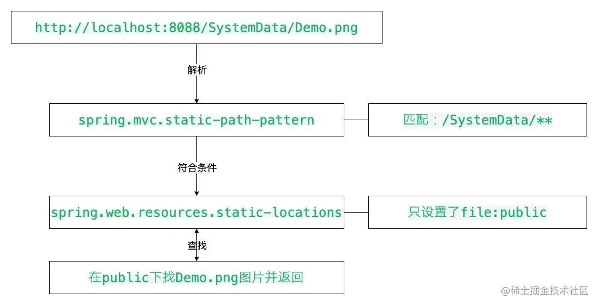
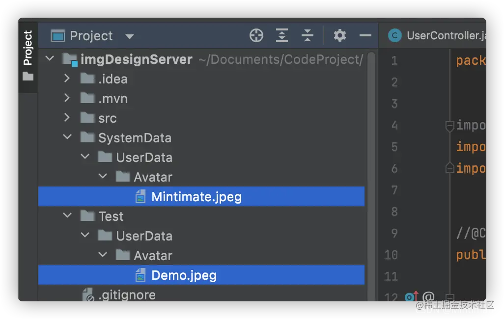
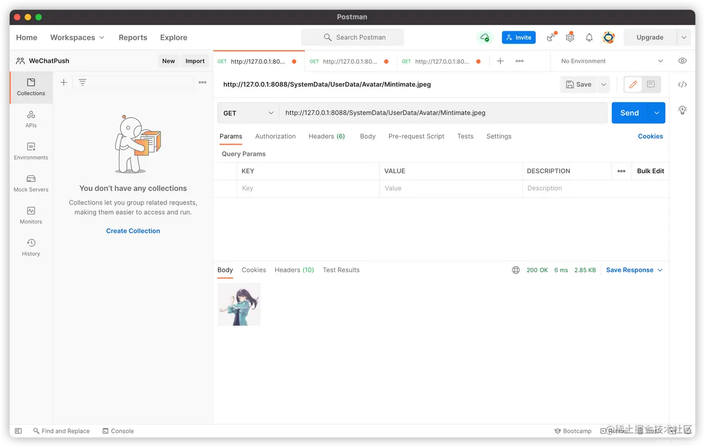
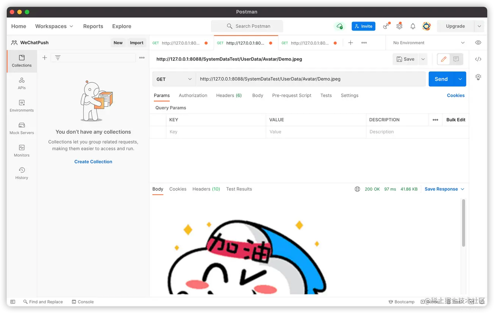

# 1、SpringBoot

## 1.1、简介

SpringBoot 基于 Spring 开发，SpringBoot 本身并不提供 Spring 框架的核心特性以及扩展功能，只是用于快速、敏捷地开发新一代基于 Spring 框架的应用程序。也就是说，它并不是用来替代 Spring 的解决方案，而是和 Spring 框架紧密结合用于提升 Spring 开发者体验的工具。SpringBoot 以**约定大于配置**的核心思想，默认帮我们进行了很多设置，多数 SpringBoot 应用只需要很少的 Spring 配置。Spring Boot 内嵌 Servlet 容器，降低了对环境的要求，可以命令执行语句。同时它集成了大量常用的第三方库配置（例如Redis、MongoDB、Jpa、RabbitMQ、Quartz等等），SpringBoot 应用中这些第三方库几乎可以零配置的开箱即用。

简单的来说 SpringBoot 并不是什么新的框架，它默认配置了很多框架的使用方式，就像 maven 整合了所有的 jar 包，SpringBoot 整合了所有的框架。

Spring Boot 解决的问题：

- 使编码变得简单
- 使配置变得简单
- 使部署变得简单
- 使监控变得简单

SpringBoot 的核心功能：

- 独自运行 Spring 项目，Spring Boot 可以以 jar 包的形式进行独立运行，使用`java -jar XX.jar`就可以成功运行
- 内嵌 Servlet 容器，内嵌容器，使得我们可以直接执行运行项目的 main 函数，使得项目快速运行
- 提供 starter 简化 maven 配置，SpringBoot 提供了一系列的 start XXX 来简化 maven 依赖
- 自动配置 Spring，Spring Boot 会根据我们项目中的类路径的 jar 包，为 jar 包的类进行自动装配 bean
- 应用监控。Spring Boot提供了基于 HTTP，ssh，Telnet 对运行的项目进行监控

Spring Boot 的缺点：

- 高度集成，使用的时候不知道底层的实现
- 由于不了解底层，导致项目出现了问题会很难排查

四大核心：

- 自动配置：针对很多 Spring 应用程序和常见的应用功能，Spring Boot 能自动提供相关配置
- 起步依赖：告诉 Spring Boot 需要什么功能，它就能引入相关的依赖库
- Actuator：提供在运行时检视应用程序内部情况的能力，让你能够深入运行应用程序，一探 Spring Boot 的内部信息
- 命令行界面：这是 Spring Boot 的可选特性，主要针对于 Groovy 语言使用


## 1.2、微服务

微服务架构是 “新标准”，是一种架构风格。构建小型，独立且可运行的应用程序可以带来极大的灵活性，并为您的代码增加弹性。 Spring Boot 的许多专用功能使在大规模生产中构建和运行微服务变得容易。 而且不要忘记，没有 Spring Cloud 简化管理并提高容错能力，就不会有完整的微服务架构。


**单体应用架构**

所谓单体应用架构（all in one）是指：我们将一个应用中的所有服务都封装在一个应用中。

无论是 ERP、CRM 或是其他什么系统，都把数据库访问、web 访问等等各个功能放到一个 war 包内。

- 这样做的好处是：易于开发和测试；也十分方便部署；当需要扩展时，只需要将 war 复制多份，然后放到多个服务器上，再做个负载均衡就可以了。
- 单体应用架构的缺点是：哪怕要修改一个非常小的地方，都需要停掉整个服务，重新打包、部署这个应用 war 包。特别是对于一个大型应用，我们不可能把所有内容都放在一个应用内，我们如何维护、如何分工合作都是问题。


**微服务架构**

all in one 的架构方式，我们把所有的功能单元放在一个应用里面。然后我们把整个应用部署到服务器上。如果负载能力不行，我们将整个应用进行水平复制，进行扩展，然后再负载均衡。

所谓微服务架构，就是打破之前 all in one 的架构方式，把每个功能元素独立出来。把独立出来的功能元素动态组合，需要的功能元素才拿去组合。所以微服务架构是对功能元素进行复制，而没有对整个应用进行复制。

这样做的好处是：

1. 节省了调用资源。
2. 每个功能元素的服务都是一个可替换的、可独立升级的软件代码。


# 2、第一个SpringBoot程序

1. 

2. 

3. 在application.java同级目录下创建controller包，编写UserController.java

	```java
	@Controller
	public class HelloController {
	    @RequestMapping("/hello")
	    @ResponseBody
	    public String hello() {
	        return "Hello,SpringBoot!";
	    }
	}
	```

4. 运行application.java


更改端口号：在application.properties添加

```properties
#更改项目端口号
server.port=8080
```


# 3、YAML

**配置文件的作用**：修改 SpringBoot 自动配置的默认值，因为 SpringBoot 在底层都给我们配置好了。

Spring Boot 有两种类型的配置文件，application 和 bootstrap 文件，Spring Boot 会自动加载 classpath 目录下的这两个文件，文件格式为 properties 或 yml 格式。

- *.properties 文件是 key=value 的形式
- *.yml 是 key: value 的形式，通过空格来确定层级关系，使配置文件结构更清晰。它的加载的属性是有顺序的，但不支持 @PropertySource 注解来导入配置，一般推荐用yml文件，看起来更加形象。

bootstrap 配置文件是系统级别的，用来加载外部配置，如配置中心的配置信息，也可以用来定义系统不会变化的属性；*.bootstatp 文件的加载先于application文件。

application 配置文件是应用级别的，是当前应用的配置文件。


## 3.1、YAML

YAML是“YAML Ain't a Markup Language”（YAML不是一种标记语言）的递归缩写。

在开发这种语言时，YAML的意思其实是：“Yet Another Markup Language”（仍是一种标记语言）。


**标记语言**

以前的配置文件，大多数都是用xml来配置；比如一个简单的端口配置：

- yaml配置：

	```yaml
	server:
	  port: 8080
	```

- xml配置：

	```xml
	<server>
		<port>8080</port>
	</server>
	```


## 3.2、YAML语法

**基础语法**：

```yaml
k:(空格)v
```

以此来表示一对键值对（空格不能省略）；以空格的缩进来控制层级关系，只要是左边对齐的一列数据都是同一阶级的。

注意：属性和值的大小写都是十分敏感的，而且对空格的要求十分高。


**对象**

```yaml
studnet:
  name: orichalcos
  age: 3
```


**数组**

```yaml
pets:
  - cat
  - dog
  - pig
```


## 3.3、通过YAML文件赋值

1. 创建一个SpringBoot项目

2. 编写两个pojo类：Dog和Person

	```java
	public class Dog {
	    private String name;
	    private Integer age
	}
	```

	```java
	@Component
	public class Person {
	    private String name;
	    private Integer age;
	    private Boolean happy;
	    private Date birthday;
	    private Map<String, Object> map;
	    private List<Object> list;
	    private Dog dog;
	}
	```

3. 编写application.yaml

	```yaml
	person:
	  name: qinjiang
	  age: 3
	  happy: false
	  birthday: 2019/11/02
	  map: {k1: v1, k2: v2}
	  list:
	    - code
	    - music
	    - girl
	  dog:
	    name: 旺财
	    age: 3
	```

4. 在Person.java中引入

	```java
	@ConfigurationProperties(prefix = "person")
	```

	如果加入后爆红可以在pom.xml中加入下面的依赖解决：

	```xml
	<dependency>
	    <groupId>org.springframework.boot</groupId>
	    <artifactId>spring-boot-configuration-processor</artifactId>
	    <optional>true</optional>
	</dependency>
	```

5. 测试

	```java
	@SpringBootTest
	class Springboot02ConfigApplicationTests {
	    @Autowired
	    private Person person;
	
	    @Test
	    void contextLoads() {
	        System.out.println(person);
	    }
	}
	```


**@ConfigurationProperties作用**：

将配置文件中配置的每一个属性的值，映射到这个组件中；

告诉SpringBoot将本类中的所有属性和配置文件中相关的配置进行绑定

参数prefix = “person” ：将配置文件中的person下面的属性一一对应


**用Properties可以赋值**

1. 创建一个application.properties

	```properties
	name=orichalcos
	```

2. 在Person中引用

	```java
	@PropertySource(value = "classpath:application.properties")
	```

3. 给属性赋值（在属性上添加注解）

	```java
	@Value("${name}");
	```


但是Properties赋值体验并不好，因为我们需要为每一个属性单独注解赋值，比较麻烦；两种方法的对比如下：


- ConfigurationProperties只需要写一次即可，Value则需要每个字段都添加。
- 松散绑定：比如yaml中写的是last-name，那么这个适合lastName是一样的，-后面跟着的字母默认是大写的。这就是松散绑定。
- JSR303数据校验：这个就是我们可以在字段上增加一层过滤器验证，可以保证数据的合法性。
- 复杂类型封装：yaml中可以封装对象，使用@Value就不支持。

<br>

## 3.5、多环境配置

多个配置文件存在时，不同位置的文件优先级不同

1. file:./config/
2. file:./
3. classpath:/config
4. classpath:/


**properties**

application.properties

```properties
spring.profiles.active=test
```

application-test.properties

```properties
server.port=8082
```

application-dev.properties

```properties
server.port=8083
```


**yaml**

application.yaml

```yaml
server:
  port: 8081
spring:
  profiles:
    active: test
---
server:
  port: 8082
spring:
  profiles: test

---
server:
  port: 8083
spring:
  profiles: dev
```


# 4、JSR303数据校验

JSR-303 是 JAVA EE 6 中的一项子规范，叫做 Bean Validation，官方参考实现是Hibernate Validator。

此实现与 Hibernate ORM 没有任何关系。 JSR 303 用于对 Java Bean 中的字段的值进行验证。 
Spring MVC 3.x 之中也大力支持 JSR-303，可以在控制器中对表单提交的数据方便地验证。 
注:可以使用注解的方式进行验证。


**校检规则**

空检查 
@Null 验证对象是否为null 
@NotNull 验证对象是否不为null, 无法查检长度为0的字符串 
@NotBlank 检查约束字符串是不是Null还有被Trim的长度是否大于0,只对字符串,且会去掉前后空格. 
@NotEmpty 检查约束元素是否为NULL或者是EMPTY.

Booelan检查 
@AssertTrue 验证 Boolean 对象是否为 true 
@AssertFalse 验证 Boolean 对象是否为 false

长度检查 
@Size(min=, max=) 验证对象（Array,Collection,Map,String）长度是否在给定的范围之内 
@Length(min=, max=) Validates that the annotated string is between min and max included.

日期检查 
@Past 验证 Date 和 Calendar 对象是否在当前时间之前，验证成立的话被注释的元素一定是一个过去的日期 
@Future 验证 Date 和 Calendar 对象是否在当前时间之后 ，验证成立的话被注释的元素一定是一个将来的日期 
@Pattern 验证 String 对象是否符合正则表达式的规则，被注释的元素符合制定的正则表达式，regexp:正则表达式 flags: 指定 Pattern.Flag 的数组，表示正则表达式的相关选项。

数值检查 
建议使用在Stirng,Integer类型，不建议使用在int类型上，因为表单值为“”时无法转换为int，但可以转换为Stirng为”“,Integer为null 
@Min 验证 Number 和 String 对象是否大等于指定的值 
@Max 验证 Number 和 String 对象是否小等于指定的值 
@DecimalMax 被标注的值必须不大于约束中指定的最大值. 这个约束的参数是一个通过BigDecimal定义的最大值的字符串表示.小数存在精度 
@DecimalMin 被标注的值必须不小于约束中指定的最小值. 这个约束的参数是一个通过BigDecimal定义的最小值的字符串表示.小数存在精度 
@Digits 验证 Number 和 String 的构成是否合法 
@Digits(integer=,fraction=) 验证字符串是否是符合指定格式的数字，interger指定整数精度，fraction指定小数精度。 
@Range(min=, max=) 被指定的元素必须在合适的范围内 
@Range(min=10000,max=50000,message=”range.bean.wage”) 
@Valid 递归的对关联对象进行校验, 如果关联对象是个集合或者数组,那么对其中的元素进行递归校验,如果是一个map,则对其中的值部分进行校验.(是否进行递归验证) 
@CreditCardNumber信用卡验证 
@Email 验证是否是邮件地址，如果为null,不进行验证，算通过验证。 
@ScriptAssert(lang= ,script=, alias=) 
@URL(protocol=,host=, port=,regexp=, flags=)


**案例**：

在Person.java实体类上添加@Validated开启验证，然后在属性上添加验证规则：

```java
@Component
@Validated
@ConfigurationProperties(prefix = "person")
public class Person {
    @Email(message = "邮箱格式错误")
    private String name;
    private Integer age;
    private Boolean happy;
    private Date birthday;
    private Map<String, Object> map;
    private List<Object> list;
    private Dog dog;
```


#  5、JDBC

首先新建一个SpringBoot项目

需要导入的组件：Web（必须）、JDBC API（整合所需）、MySQL Driver（连接数据库）


虽然JDBC已经能够满足大部分用户需求，但是在使用JDBC时，必须自己来管理数据库资源，如：获取PreparedStatment、设置SQL语句参数、关闭连接等步骤。

JdbcTemplate是Spring对JDBC的封装，目的是使JDBC更加易于使用。==JdbcTemplate是Spring的一部分。==Spring对数据库的操作在JDBC上面做了深层次的封装，使用Spring的注入功能，可以把DataSource注册到JdbcTemplate中。


**JdbcTemplate主要提供以下五类方法：**

- execute方法：可以用于执行任何SQL语句，一般用于执行DDL语句；
- update方法及batchUpdate方法：update方法用于执行新增、修改、删除等语句；batchUpdate方法用于执行批处理相关语句；
- query方法及queryForXXX方法：用于执行查询相关语句；
- call方法：用于执行存储过程、函数相关语句。


**例：**

使用Spring默认的数据源 Hikari（后面提），所以直接配置数据库参数即可

```yaml
spring:
  datasource:
    driver-class-name: com.mysql.cj.jdbc.Driver
    url: jdbc:mysql://localhost:3306/newer?useUnicode=true&characterEncoding=UTF8&useSSL=false&serverTimezone=GMT
    username: root
    password: root
```

JDBCController.java

```java
@RestController
public class JDBCController {
    @Autowired
    JdbcTemplate jdbcTemplate;

    //查询数据库的所有信息
    //没有实体类，数据库中的东西怎么获取？
    @GetMapping("/userList")
    public List<Map<String, Object>> userList() {
        String sql = "select * from user";
        List<Map<String, Object>> list_map = jdbcTemplate.queryForList(sql);
        //List里面放置的是User对象，Map里面放置的是User的详细信息，key为字段名（列名），value为值。
        return list_map;
    }

    @GetMapping("/updateUser/{id}")
    public String updateUser(@PathVariable("id") int id) {
        String sql = "update user set u_name=?,u_password=? where id=" + id;
        //封装
        Object[] objects = new Object[2];
        objects[0] = "小明";
        objects[1] = "zzzzzz";
        jdbcTemplate.update(sql, objects);
        return "updateUser-OK";
    }

    @GetMapping("/deleteUser/{id}")
    public String deleteUser(@PathVariable("id") int id) {
        String sql = "delete from user where id=?";
        jdbcTemplate.update(sql, id);
        return "deleteUser-OK";
    }
}
```


**Hikari**

SpringBoot2默认的数据源从Tomcat换成了HikariCP。

HikariCP是数据库连接池的后起之秀，号称性能最好，可以完美PK掉其他的连接池，是一个高i性能的连接池，基于BoneCP做了不少的改进和优化。

那么，这么好的P是怎么做到的呢？官网详细地说明了HikariCP所做的一些优化，总结如下：

- **字节码精简**：优化代码，直到编译后的字节码最少，这样，CPU缓存可以加载更多的程序代码；
- **优化代理和拦截器**：减少代码，例如HikariCP的Statement proxy只有100行代码，只有BoneCP的十分之一；
- **自定义数组类型（FastStatementList）代替ArrayList**：避免每次get()调用都要进行range check，避免调用remove()时的从头到尾的扫描；
- **自定义集合类型（ConcurrentBag）**：提高并发读写的效率；
- **其他针对BoneCP缺陷的优化**，比如对于耗时超过一个CPU时间片的方法调用的研究（但没说具体怎么优化）。


由于Spring Boot的自动化配置机制，大部分对于数据源的配置都可以通过配置参数的方式去改变。只有一些特殊情况，比如：更换默认数据源，多数据源共存等情况才需要去修改覆盖初始化的Bean内容。

在Spring Boot自动化配置中，对于数据源的配置可以分为两类：

- 通用配置：以`spring.datasource.*`的形式存在，主要是对一些即使使用不同数据源也都需要配置的一些常规内容。比如：数据库链接地址、用户名、密码等。

	```properties
	spring.datasource.url=jdbc:mysql://localhost:3306/test
	spring.datasource.username=root
	spring.datasource.password=123456
	spring.datasource.driver-class-name=com.mysql.jdbc.Driver
	```

	

- 数据源连接池配置：以`spring.datasource.<数据源名称>.*`的形式存在，比如：Hikari的配置参数就是`spring.datasource.hikari.*`形式。

	```properties
	spring.datasource.hikari.minimum-idle=10
	spring.datasource.hikari.maximum-pool-size=20
	spring.datasource.hikari.idle-timeout=500000
	spring.datasource.hikari.max-lifetime=540000
	spring.datasource.hikari.connection-timeout=60000
	spring.datasource.hikari.connection-test-query=SELECT 1
	```

	这些配置的含义：

	- `spring.datasource.hikari.minimum-idle`: 最小空闲连接，默认值10，小于0或大于maximum-pool-size，都会重置为maximum-pool-size
	- `spring.datasource.hikari.maximum-pool-size`: 最大连接数，小于等于0会被重置为默认值10；大于零小于1会被重置为minimum-idle的值
	- `spring.datasource.hikari.idle-timeout`: 空闲连接超时时间，默认值600000（10分钟），大于等于max-lifetime且max-lifetime>0，会被重置为0；不等于0且小于10秒，会被重置为10秒。
	- `spring.datasource.hikari.max-lifetime`: 连接最大存活时间，不等于0且小于30秒，会被重置为默认值30分钟.设置应该比mysql设置的超时时间短
	- `spring.datasource.hikari.connection-timeout`: 连接超时时间：毫秒，小于250毫秒，否则被重置为默认值30秒
	- `spring.datasource.hikari.connection-test-query`: 用于测试连接是否可用的查询语句


# 10、发送邮件

1. **开启 SMTP**
	这里以 QQ 邮箱为例。登录 QQ 邮箱之后，点击设置，点击账户，**选择开启 IMAP/SMTP 服务**，记住 QQ 邮箱提示的授权码，后面会用到。

2. **引入依赖**
	在 SpringBoot 的 pom 文件中导入以下依赖

	```xml
	<dependency>
	    <groupId>org.springframework.boot</groupId>
	    <artifactId>spring-boot-starter-mail</artifactId>
	</dependency>
	```

3. **配置文件**
	在 SpringBoor 项目中引入依赖之后，即可在其配置文件中配置邮箱的参数：

	```properties
	spring.mail.host=smtp.qq.com
	spring.mail.username=happyjava@foxmail.com
	spring.mail.password=xxxxxxxx
	spring.mail.protocol=smtp
	spring.mail.default-encoding=UTF-8
	```

	因为是QQ邮箱，所以host需要使用 smtp.qq.com。如果是其它邮箱，搜索下即可找到。

	username 为邮箱账号，password 为上面步骤中提到的授权码，protocol 为使用的协议。

4. **注入JavaMailSender实例**
	邮箱参数配置完之后，即可直接注入 JavaMailSender 实例。

	```java
	@Autowired
	private JavaMailSender javaMailSender;
	```

5. **发送普通邮件**

	```java
	@Test
	public void testSend() throws MessagingException {
	    SimpleMailMessage message = new SimpleMailMessage();
	    message.setFrom("happyjava@foxmail.com");
	    message.setTo("1015030682@qq.com");
	    message.setSubject("这是标题");
	    message.setText("这是内容");
	    javaMailSender.send(message);
	}
	```

	- From 需要和配置文件中的 username 一致，否则会报错；
	- To 为邮件接收者；
	- Subject 为邮件的标题；
	- Text 为邮件的内容。

	运行方法，即可收到邮件。

6. **发送HTML邮件**
	很多时候，我们需要邮件带有美观的样式。这时候，可以使用 HTML 的样式。我们需要使用 javaMailSender 的 createMimeMessage方法，构建一个 MimeMessage，然后使用 MimeMessage 实例创建出 MimeMessageHelper。如下：

	```java
	@Test
	public void testSend() throws MessagingException {
	    MimeMessage mimeMessage = javaMailSender.createMimeMessage();
	    MimeMessageHelper messageHelper = new MimeMessageHelper(mimeMessage);
	    messageHelper.setSubject("标题");
	    messageHelper.setFrom("happyjava@foxmail.com");
	    messageHelper.setTo("1015030682@qq.com");
	    messageHelper.setText("<h1>标题</h1><br/><p>这是内容</p>", true);
	    javaMailSender.send(messageHelper.getMimeMessage());
	}
	```

	这里需要注意的是，setText 的时候需要传一个布尔值进去，表名需要使用HTML样式。


**项目部署到服务器之后无法发送邮件的问题**

原因：我使用的是阿里云服务器，由于阿里云因为安全考虑不开发邮件默认发送端口25，所以导致本地可以发送邮件，服务器上不能发送邮件。

解决方法：使用端口465以及 SSL 加密方式发送邮件，我的项目是 SpringBoot，所以直接在配置文件中加入下面的配置：

```properties
# Use port 465 instead of the default port 25  
spring.mail.properties.mail.smtp.socketFactory.port=465
spring.mail.properties.mail.smtp.ssl.enable=true
```

<br>

# 11、处理静态资源

静态资源，一般是网页端的：HTML文件、JavaScript 文件和图片。

虽然真实项目里，图片可以直接存储在**对象存储的存储桶内**或者直接用 **Nginx进行反代**，但是一些小的静态资源，直接 SpringBoot 规划静态资源，也是个不错的选择。

SpringBoot 内设置静态资源，或者说静态资源文件夹，主要有两种方法（均为 SpringMVC 实现）：

- 在 `application.yml`/`application.properties` 内配置。
- 设置 `Configuration 配置类`。

以上两种方法，均可实现用户访问网址，不走 Controller 层的拦截，直接进行静态文件访问：


<br>

## 11.1、application 设置方法

设置 application 方法很简单，主要涉及两个配置项：

- `spring.mvc.static-path-pattern`：根据官网的描述和实际效果，可以理解为**静态文件 URL 匹配头**，也就是静态文件的 URL 地址开头。SpringBoot 默认为：`/**`。
- `spring.web.resources.static-locations`：根据官网的描述和实际效果，可以理解为**实际静态文件地址**，也就是静态文件 URL 后，匹配的实际静态文件。SpringBoot 默认为：`classpath:/META-INF/resources/,classpath:/resources/,classpath:/static/,classpath:/public/`。

如何运作的？，这里画个简单的图：



需要注意：

- `spring.web.resources.static-locations` 是后续配置，旧版 SpringBoot 的配置项为：`spring.resources.static-locations`；在2.2.5 版本之后，旧版本配置已经失效。
- `spring.web.resources.static-locations` 有多个配置项，在 SpringBoot 编译后，会合并为一个文件。多个配置文件，使用 `,` 进行分割。
- `spring.web.resources.static-location` 仅仅允许一个配置，无法使用 `,` 进行分割，如果需要多个静态资源文件，可以使用下文的配置类方法。
- `spring.web.resources.static-locations` 可以使用 `classpath`、`file` 进行匹配。如果使用 `file`，这个时候的相对路径为项目地址（打包为 .jar 后，相对路径就是 .jar 运行地址）。

<br>

现在来写一个示例，最终效果为浏览器输入：`http://localhost:8088/SystemData/UserData/Avatar/Mintimate.jpeg` 可以直接访问项目文件下的：`/SystemData/UserData/Avatar/Mintimate.jpeg`


配置文件为：

```yaml
spring:
  mvc:
  	# URL响应地址（Springboot默认为/**)
    static-path-pattern: /SystemData/**
  web:
    resources:
      # 静态文件地址，保留官方内容后，进行追加
      static-locations: classpath:/static,classpath:/public,classpath:/resources,classpath:/META-INF/resources,file:SystemData
```

其中，`file:SystemData` 就是映射本地文件了。

这样运行项目就可以直接访问静态资源了：


这样的配置，可以说最简单且粗暴，但是灵活性差一点点：URL 响应地址只能为一项，也就是 `spring.mvc.static-path-pattern` 配置只能写一项。

这意味着，按上文设置了 `/SystemData/**` 为 URL 匹配，就不能设置第二个 `/resources/**` 这样的配置为第二静态目录。如果需要设置多个地址为静态资源目录，可以参考下文的 **设置配置类方法** 方法。

<br>

## 11.2、设置配置类方法

写一个配置类，实现静态资源的文件夹方法很多。比如：

- 继承于 `WebMvcConfigurationSupport` 父类，并实现 `addResourceHandlers` 方法。
- 引用 `WebMvcConfigurer` 接口，并实现 `addInterceptors` 方法。

这里使用 `WebMvcConfigurationSupport` 进行实现 `addResourceHandlers`：

```java
@Override
protected void addResourceHandlers(ResourceHandlerRegistry registry) {
    
}
```

这里的 `registry` 使用链式编程，方法为：

- `addResourceHandler`：添加 URL 响应地址目录。
- `addResourceLocations`：添加实际资源目录。

和 `application.yml` 里设置一样，支持 `classpath` 和 `file` 等关键词。

<br>

现在就来配置，最终效果为（两组同时）:

- 浏览器输入：`http://localhost:8088/SystemData/UserData/Avatar/Mintimate.jpeg` 可以直接访问项目文件下的：`/SystemData/UserData/Avatar/Mintimate.jpeg`
- 浏览器输入：`http://localhost:8088/SystemDataTest/UserData/Avatar/Mintimate.jpeg` 可以直接访问项目文件下的：`/Test/UserData/Avatar/Demo.jpeg`



添加一个配置类，并继承 `WebMvcConfigurationSupport`，实现 `addResourceHandlers` 方法，并打上 `@Configuration` 注解，使其成为配置类：

```java
@Configuration
public class WebConfig extends WebMvcConfigurationSupport {
    @Override
    protected void addResourceHandlers(ResourceHandlerRegistry registry) {
        super.addResourceHandlers(registry);
    }
}
```

之后，重写内容：

```java
@Configuration
public class WebConfig extends WebMvcConfigurationSupport {
    //定位到项目文件夹下的SystemData文件夹，作为个人静态资源目录
    static final String IMG_PATH = System.getProperty("user.dir") + "SystemData/";
    static final String IMG_PATH_TWO = System.getProperty("user.dir") + "/Test/";

    @Override
    protected void addResourceHandlers(ResourceHandlerRegistry registry) {
        //静态资源银蛇
        registry.addResourceHandler("/SystemData/**")
                .addResourceLocations("file:" + IMG_PATH);
        registry.addResourceHandler("/SystemDataTest/**")
                .addResourceLocations("file:" + IMG_PATH_TWO);
        super.addResourceHandlers(registry);
    }
}
```

之后，浏览器就可以访问了：




