# 1、微服务

微服务就是由一系列围绕自己业务开发的微小服务构成，他们独立部署运行在自己的进程里，基于分布式进行管理。

微服务是一种架构，这种架构是将单个的整体应用程序分割成更小的项目关联的独立的服务。一个服务通常实现一组独立的特性或功能，包含自己的业务逻辑和适配器。各个微服务之间的关联通过暴露 API 来实现。这些独立的微服务不需要部署在同一个虚拟机、同一个系统和同一个应用服务器中。


## 1.1、单体应用和微服务结构应用

**单体应用**


优点：

- 单一架构模式在项目初期很小的时候开发方便，测试方便，部署方便，运行良好

缺点：

- 应用随着时间的推进，加入的功能越来越多，最终会变得巨大，一个项目中很有可能数百万行的代码，互相之间繁琐的 jar 包
- 久而久之，开发效率低，代码维护困难
- 如果想整体应用采用新的技术、新的框架或者语言会很困难
- 任意模块的漏洞或者错误都会影响整个应用，降低系统的可靠性


**微服务结构应用**

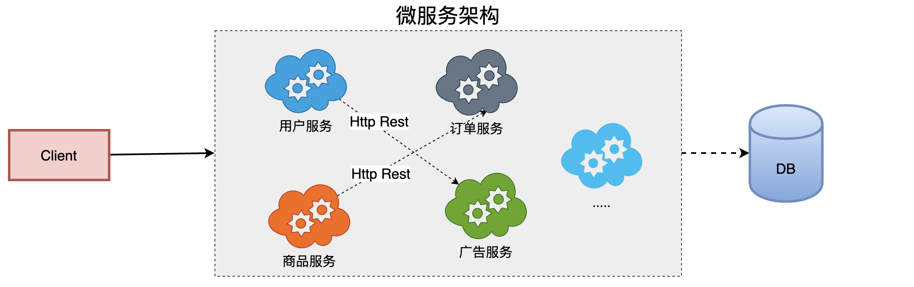

优点：

- 将服务拆分成多个单一职责的小的服务，进行单独部署，服务之间通过网络进行通信
- 每个服务应该有自己单独的管理团队，高度自治
- 服务各自有自己单独的职责，服务之间松耦合，避免因一个模块的问题导致服务崩溃

缺点：

- 开发人员要处理分布式系统的复杂性
- 多服务运维难度，随着服务的增加，运维的压力也在增大
- 服务治理 和 服务监控 关键


## 1.2、架构的演变

`[单一应用架构] `==> ` [垂直应用架构] ` ==> ` [分布式服务架构] ` ==>` [流动计算架构]||[微服务架构]` 


**All in One Application		单一架构**

起初当网站流量很小时，将所有功能都写在一个应用里面，对整个应用进行部署，以减少部署节点和成本。对于这个架构简化增删改查的工作量的数据访问框架（ORM）是关键。


**Vertical Application		垂直架构**

当访问量逐渐增大，单一应用增加机器带来的加速度越来越小，提升效率的方法之一是将应用拆成互不相干的几个应用，以提升效率。此时，用于加速前端页面开发的Web框架（MVC）是关键。


**Distributed Service		分布式服务架构**

当垂直应用越来越多，应用之间交互不可避免，将核心业务抽取出来，作为独立的服务，逐渐形成稳定的服务中心，使前端应用能更快速的响应多变的市场需求。此时，用于提高业务复用及整合的分布式服务框架（RPC）是关键。


**Elastic Computing		流动计算架构即微服务架构**

当服务越来越多，容量的评估，小服务资源的浪费等问题逐渐显现，此时需增加一个调度中心基于访问压力实时管理集群容量，提高集群利用率。此时，用于提高机器利用率的资源调度和治理中心（SOA）是关键。


# 2、SpringCloud

SpringCloud 为开发人员提供了在分布式系统中快速构建一些通用模式的工具，例如配置管理、服务发现、断路器、智能路由、微代理、控制总线。分布式系统的协调导致了锅炉板模式，开发人员使用 SpringCloud 可以快速地建立实现这些模式的服务和应用程序。

通俗理解：SpringCloud 是一个含概多个子项目的开发工具集，集合了众多的开源框架，它利用了 SpringBoot 开发的便利性实现了很多功能，如服务注册、服务注册发现、负载均衡等。SpringCloud 在整合过程中主要是针对 Netflix 开源组件的封装。SpringCloud 的出现真正的简化了分布式架构的开发。

> NetFlix 是美国的一个在线视频网站、微服务业的翘楚，它是公认的大规模生产级微服务的杰出实践者，NetFlix 的开源组件已经在它大规模分布式微服务环境中经过多年的生产实战验证，因此 SpringCloud 中很多组件都是基于NetFlix。


## 2.1、核心组件说明

- EurekaServer、Consul、Nacos	  服务注册中心组件
- Rabbion & OpenFeign				  	服务负载均衡 和 服务调用组件
- Hystrix & Hystrix Dashboard		   服务断路器  和  服务监控组件
- Zuul、Gateway    				 			 服务网关组件
- Config   					 						  统一配置中心组件
- Bus  													消息总线组件
- ...

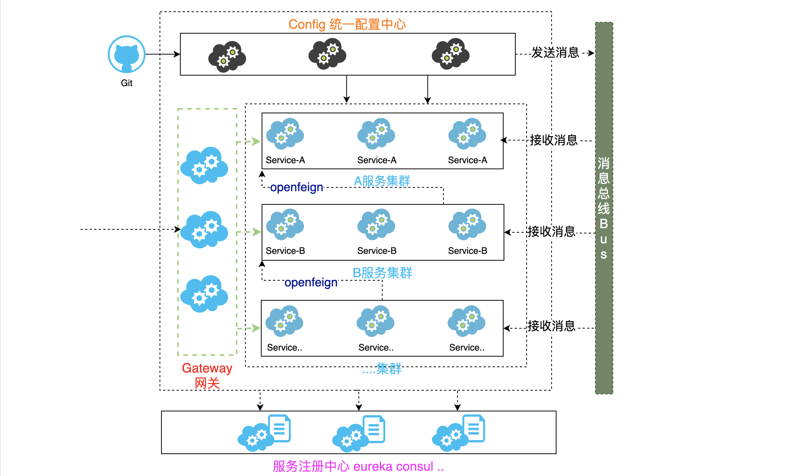


## 2.2、命名和版本选择

**SpringCloud 的命名**

SpringCloud 是一个由众多独立子项目组成的大型综合项目，原则每个子项目上有不同的发布节奏，都维护自己发布版本号。为了更好的管理SpringCloud 的版本，通过一个资源清单BOM(Bill of Materials)，为避免与子项目的发布号混淆，所以没有采用版本号的方式，而是通过命名的方式。

这些名字是按字母顺序排列的，如伦敦地铁站的名称（“天使” 是第一个版本，“布里斯顿” 是第二个版本，”卡姆登“ 是第三个版本）。当单个项目的点发布累积到一个临界量，或者其中一个项目中有一个关键缺陷需要每个人都可以使用时，发布序列将推出名称以 “.SRX” 结尾的 “服务发布”，其中 “X” 是一个数字。


**SpringCloud 的版本选择**

- Angel 										版本基于 SpringBoot1.2.x 版本构建与 1.3 版本不兼容
- Brixton									  版本基于 SpringBoot1.3.x 版本构建与 1.2 版本不兼容
	                                                   2017 年 Brixton and Angel release 官方宣布报废
- Camden      							  版本基于 SpringBoot1.4.x 版本构建并在 1.5 版本通过测试
	                                                   2018 年 Camden release 官方宣布报废
- Dalston、Edgware 				 版本基于 SpringBoot1.5.x 版本构建，目前不能在 SpringBoot2.0.x 版本中使用
	                                                   Dalston（达尔斯顿）将于 2018 年 12 月官方宣布报废
	                                                   Edgware 将遵循 Spring Boot 1.5.x 的生命周期结束
- Finchley 			         			   版本基于 SpringBoot2.0.x 版本进行构建，不能兼容 1.x 版本
- Greenwich								版本基于 SpringBoot2.1.x 版本进行构建，不能兼容 1.x 版本
- Hoxton									  版本基于 SpringBoot2.2.x 版本进行构建


# 2、环境搭建

说明：

- SpringBoot 2.2.5.RELEASE
- SpringCloud Hoxten.SR6
- Java 11
- Maven 3.8.1
- IDEA 2021.1


新建一个空项目，在空项目中新建一个 Maven 子项目用于版本管理（可以删除 src 目录只留 pom.xml）:

```xml
<?xml version="1.0" encoding="UTF-8"?>
<project xmlns="http://maven.apache.org/POM/4.0.0"
         xmlns:xsi="http://www.w3.org/2001/XMLSchema-instance"
         xsi:schemaLocation="http://maven.apache.org/POM/4.0.0 http://maven.apache.org/xsd/maven-4.0.0.xsd">
    <modelVersion>4.0.0</modelVersion>

    <groupId>com.orichalcos</groupId>
    <artifactId>springcloud_parent</artifactId>
    <version>1.0-SNAPSHOT</version>

    <!--继承SpringBoot的父项目-->
    <parent>
        <groupId>org.springframework.boot</groupId>
        <artifactId>spring-boot-starter-parent</artifactId>
        <version>2.2.5.RELEASE</version>
    </parent>

    <!--定义SpringCloud使用版本号-->
    <properties>
        <maven.compiler.source>11</maven.compiler.source>
        <maven.compiler.target>11</maven.compiler.target>
        <spring-cloud.version>Hoxton.SR6</spring-cloud.version>
    </properties>

    <!--维护版本-->
    <dependencyManagement>
        <dependencies>
            <!--维护SpringCloud版本依赖-->
            <dependency>
                <groupId>org.springframework.cloud</groupId>
                <artifactId>spring-cloud-dependencies</artifactId>
                <version>${spring-cloud.version}</version>
                <type>pom</type>
                <scope>import</scope>
            </dependency>
        </dependencies>
    </dependencyManagement>
</project>
```


# 3、服务注册中心

所谓服务注册中心就是在整个的微服务架构中单独提出一个服务，这个服务不完成系统的任何的业务功能，仅仅用来完成对整个微服务系统的服务注册和服务发现，以及对服务健康状态的监控和管理功能。

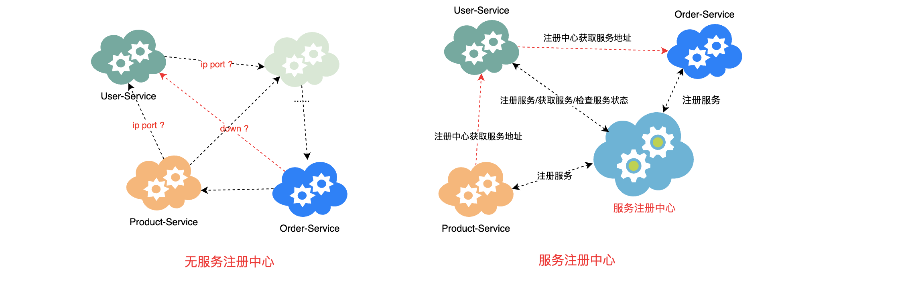

服务注册中心：

- 可以对所有的微服务的信息进行存储，如微服务的名称、IP、端口等
- 可以在进行服务调用时通过服务发现查询可用的微服务列表及网络地址进行服务调用
- 可以对所有的微服务进行心跳检测，如发现某实例长时间无法访问，就会从服务注册表移除该实例

SpringCloud 支持多种注册中心：Eureka、Consul、Zookeeper、以及阿里巴巴推出 Nacos。这些注册中心在本质上都是用来管理服务的注册和发现以及服务状态的检查的。


## 3.1、Eureka

Eureka 是 Netflix 开发的服务发现框架，本身是一个基于 REST 的服务。SpringCloud 将它集成在其子项目 spring-cloud-netflix 中，以实现SpringCloud 的服务注册和发现功能。

Eureka 包含两个组件：Eureka Server 和 Eureka Client。


### 3.1.1、开发 Eureka Server

1. 创建一个 Maven 项目并引入 Eureka Server 依赖

   ```xml
   <dependencies>
       <dependency>
           <groupId>org.springframework.cloud</groupId>
           <artifactId>spring-cloud-starter-netflix-eureka-server</artifactId>
       </dependency>
   </dependencies>
   ```

2. 编写配置文件 application.properties

	```properties
	#执行服务端口
	server.port=8761
	#指定服务名称 唯一标识
	spring.application.name=eurekaserver
	#指定服务注册中心的地址
	eureka.client.service-url.defaultZone=http://localhost:8761/eureka
	```

3. 编写入口类 EurekaServer8761Application.java 并添加开启 Eureka Server 注解

	```java
	@SpringBootApplication
	@EnableEurekaServer
	public class EurekaServer8761Application {
	    public static void main(String[] args) {
	        SpringApplication.run(EurekaServer8761Application.class, args);
	    }
	}
	```

4. 启动项目，访问 Eureka 的服务注册页面：http://localhost:8761

	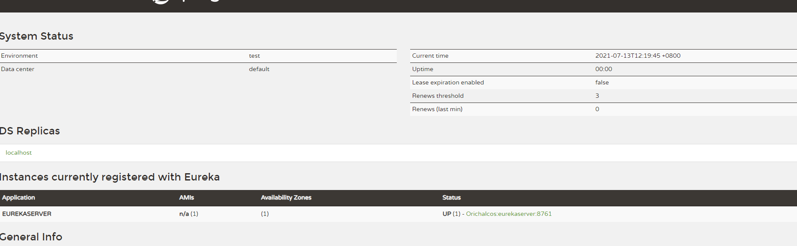

5. 同时在项目启动的时候控制台会报错

	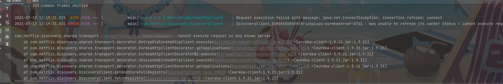

	出现上述问题原因：EurekaServer 依赖内部包含了 EurekaClient

	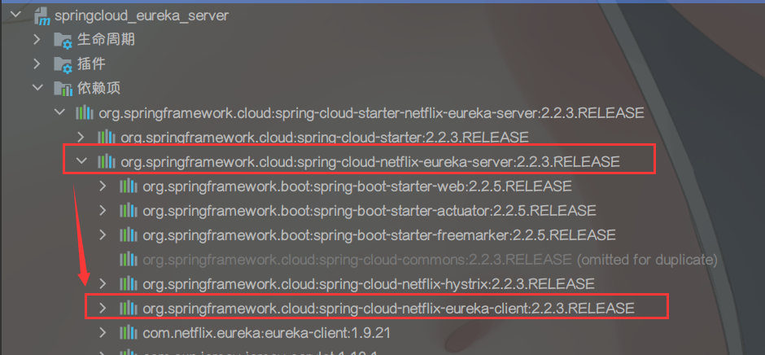

	Server 是一个服务注册中心，用来接受客户端的注册。Client 的特性会让当前启动的服务把自己作为 Eureka 的客户端进行服务中心的注册，当项目启动时服务注册中心还没有创建好，所以找不到服务的客户端组件就直接报错了，当启动成功服务注册中心创建好了，Client 就能进行注册并且不再报错啦！

6. 关闭 Eureka 自己注册自己

	```properties
	#不再将自己同时作为客户端注册
	eureka.client.register-with-eureka=false
	#关闭作为客户端时从Eureka Server获取服务信息
	eureka.client.fetch-registry=false
	```

7. 再次启动，当前应用就是一个单纯 Eureka Server，控制器也不再报错


### 3.1.2、开发 Eureka Client

1. 创建一个 Maven 子项目并引入 Spring Web 和 Eureka Client 依赖

   ```xml
   <dependencies>
       <dependency>
           <groupId>org.springframework.boot</groupId>
           <artifactId>spring-boot-starter-web</artifactId>
       </dependency>
       <dependency>
           <groupId>org.springframework.cloud</groupId>
           <artifactId>spring-cloud-starter-netflix-eureka-client</artifactId>
       </dependency>
   </dependencies>
   ```

2. 编写配置文件 application.properties

   ```properties
   #执行服务端口
   server.port=8888
   #指定服务名称 唯一标识
   spring.application.name=eurekaclient
   #eureka注册中心地址
   eureka.client.service-url.defaultZone=http://localhost:8761/eureka
   ```

3. 编写入口类 EurekaClient8888Application.java 并添加开启 Eureka Client 注解

   ```java
   @SpringBootApplication
   @EnableEurekaClient
   public class EurekaClient8888Application {
       public static void main(String[] args) {
           SpringApplication.run(EurekaClient8888Application.class, args);
       }
   }
   ```

4. 启动之前的 Eureka Server，再启动 Eureka Client

   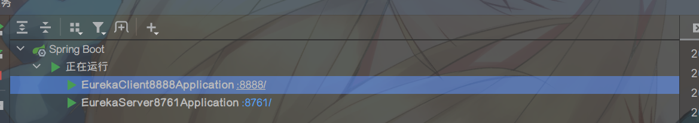

5. 查看 Eureka Server 的服务注册情况

   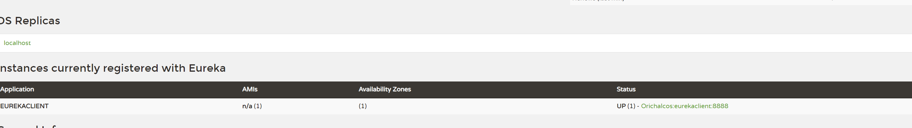


### 3.1.3、Eureka Server 集群

1. 首先在本地 hosts 文件中配置如下映射

	```text
	127.0.0.1 peer1
	127.0.0.1 peer2
	127.0.0.1 peer3
	```

2. 将 Eureka Server 的配置文件转为 application.yml，增加三个 `profile`，分别对应三个 Eureka Server 的配置

	```yaml
	spring:
	  application:
	    name: eruekaserver
	eureka:
	  client:
	    register-with-eureka: false
	    fetch-registry: true
	
	---
	spring:
	  profiles: peer1
	server:
	  port: 8761
	eureka:
	  instance:
	    hostname: peer1
	  client:
	    service-url:
	      defaultZone: http://peer2:8762/eureka,http://peer3:8763/eureka
	
	---
	spring:
	  profiles: peer2
	server:
	  port: 8762
	eureka:
	  instance:
	    hostname: peer2
	  client:
	    service-url:
	      defaultZone: http://peer1:8761/eureka,http://peer3:8763/eureka
	
	---
	spring:
	  profiles: peer3
	server:
	  port: 8763
	eureka:
	  instance:
	    hostname: peer3
	  client:
	    service-url:
	      defaultZone: http://peer1:8761/eureka,http://peer2:8762/eureka
	```

3. 分别启动三个注册中心，环境变量 `spring.profiles.active` 激活对应的集群配置

	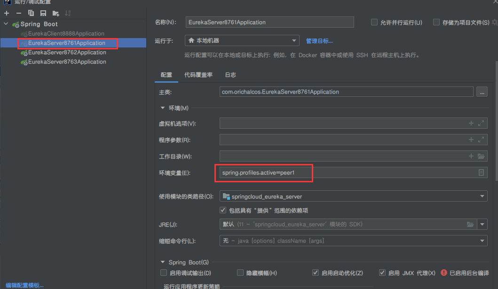

	启动之后访问 `http://peer1:8761/` 进入 `peer1` 这个注册中心，就可以看到另外两个分片 `peer2、peer3`，说明集群中有3个节点了

	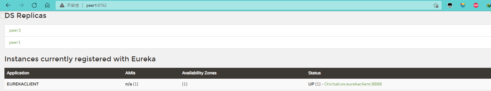

	再去访问其他两个注册中也能看到另外两个分片

	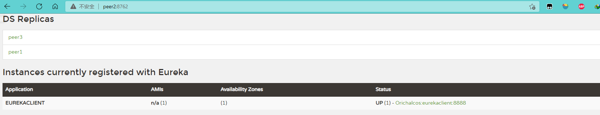

	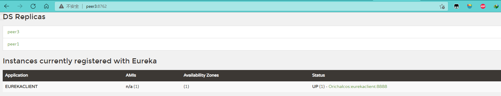

	并且可以看到虽然 Eureka Client 之注册到了第一个 Eureka Server 上，但是可以看到 Eureka Server 节点之间的实例会相互同步


### 3.1.4、Eureka 自我保护机制

首先 Eureka 注册中心各个节点都是平等的，没有 ZK 中角色的概念， 即使 N-1 个节点挂掉也不会影响其他节点的正常运行。

默认情况下，如果 Eureka Server 在一定时间内（默认90秒）没有接收到某个微服务实例的心跳，Eureka Server 将会移除该实例。但是当网络分区故障发生时，微服务与 Eureka Server 之间无法正常通信，而微服务本身是正常运行的，此时不应该移除这个微服务，所以引入了自我保护机制。

> **Eureka心跳机制**
>
> 在应用启动后，节点们将会向 Eureka Server 发送心跳，默认周期为 30 秒，如果 Eureka Server 在多个心跳周期内没有接收到某个节点的心跳，Eureka Server 将会从服务注册表中把这个服务节点移除（默认90秒）。

如果在 Eureka Server 的首页看到以下这段提示，则说明 Eureka 已经进入了保护模式。 

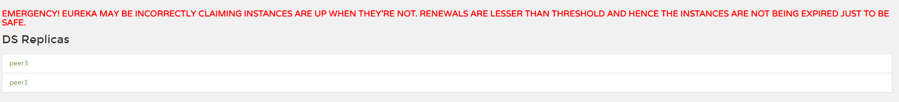

Eureka Server 自动进入自我保护机制，此时会出现以下几种情况：

1. Eureka Server 不再从注册列表中移除因为长时间没收到心跳而应该过期的服务
2. Eureka Server 仍然能够接受新服务的注册和查询请求，但是不会被同步到其它节点上，保证当前节点依然可用
3. 当网络稳定时，当前 Eureka Server 新的注册信息会被同步到其它节点中

因此 Eureka Server 可以很好的应对因网络故障导致部分节点失联的情况，而不会像 ZK 那样如果有一半不可用的情况会导致整个集群不可用而变成瘫痪。


**关闭自我保护**

1. Eureka Server 端：配置关闭自我保护，并按需配置 Eureka Server 清理无效节点的时间间隔

	```yaml
	eureka:
	  server: 
	    #设为false，关闭自我保护 
	    enable-self-preservation: false 
	    #清理间隔（单位毫秒，默认是60*1000） 
	    eviction-interval-timer-in-ms: 3000
	```

2.  Eureka Client 端：配置开启健康检查，并按需配置续约更新时间和到期时间

	```yaml
	eureka:
	  instance:
	    #续约更新时间间隔（默认30秒
	    lease-renewal-interval-in-seconds: 3
	    #续约到期时间（默认90秒） 
	    lease-expiration-duration-in-seconds: 10
	```

注意：更改 Eureka 更新频率将打破服务器的自我保护功能，生产环境下不建议自定义这些配置：

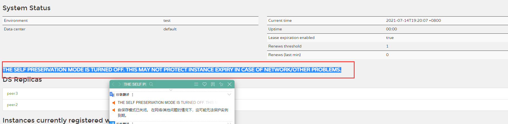

> 关于 Eureka 2.x 的开源工作已经停止。作为 2.x 分支上现有工作存储库的一部分发布的代码库和工件被视为使用风险自负，在 1.x 版本项目还是活跃的。


## 3.2、Consul

Consul 是 HashiCorp 公司推出的开源工具，用于实现分布式系统的服务发现与配置。与其它分布式服务注册与发现的方案，Consul 的方案更 “一站式”，内置了服务注册与发现框架、分布一致性协议实现、健康检查、Key/Value 存储、多数据中心方案，不再需要依赖其它工具（比如 ZooKeeper 等）。使用起来也较为简单。Consul 使用 Go 语言编写，因此具有天然可移植性（支持Linux、windows和Mac OS X）；安装包仅包含一个可执行文件，方便部署，与 Docker 等轻量级容器可无缝配合。


### 3.2.1、安装 Consul

**Windows 下安装 Consul**

1. 前往 https://www.consul.io/downloads

   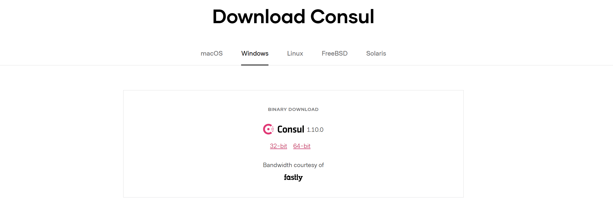

   选择自己电脑对应的版本下载

2. 解压完后只有一个脚本文件

   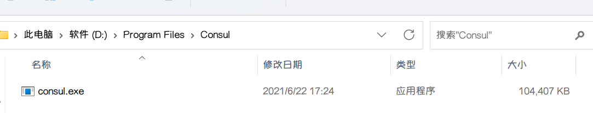

3. 使用终端切换到 consul.exe 目录并执行以下命令启动 Consul

   

4. 访问 Consul 的 WEB 服务端口：http://localhost:8500

   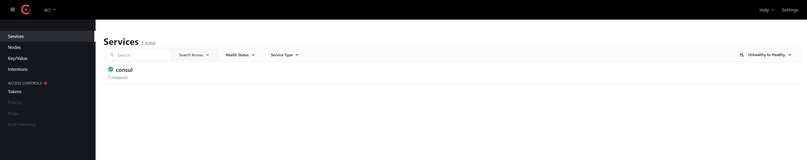

   左上角 Consul logo 旁边的 dc1 为数据中心，可以通过 `-datacenter` 进行设置：

   ```bash
   consul agent -dev -datacenter=aa
   ```

可以通过设置环境变量，不用更改终端路径，直接执行 Consul 命令：

1. 新建一个环境变量，路径指向 consul.exe  的文件夹

   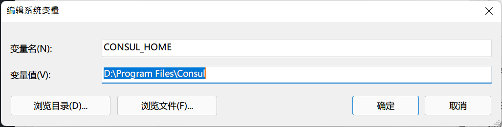

2. 在系统变量 Path 中将刚刚添加的变量加上

   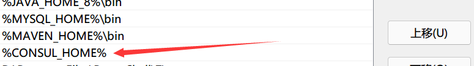

3. 赶紧试试~

   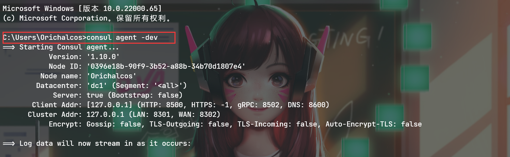

> 如果前面使用的是 Windows CMD 开启了 Consul，记得按 Ctrl + C 关闭，然后还需重新启动 CMD


### 3.2.2、开发 Consul Client

1. 创建项目并引入 Spring Web 和 Consul 客户端依赖

	```xml
	<dependencies>
	    <dependency>
	        <groupId>org.springframework.boot</groupId>
	        <artifactId>spring-boot-starter-web</artifactId>
	    </dependency>
	    <dependency>
	        <groupId>org.springframework.cloud</groupId>
	        <artifactId>spring-cloud-starter-consul-discovery</artifactId>
	    </dependency>
	</dependencies>
	```

2. 编写配置文件 application.properties

	```properties
	server.port=8889
	#注册consul服务的主机
	spring.application.name=consulclient
	spring.cloud.consul.host=localhost
	#注册consul服务的端口号
	spring.cloud.consul.port=8500
	```

3. 编辑 ConsulClient8889Application.class 入口类并添加开启客户端发现注解

	```java
	@SpringBootApplication
	@EnableDiscoveryClient
	public class ConsulClient8889Application {
	    public static void main(String[] args) {
	        SpringApplication.run(ConsulClient8889Application.class, args);
	
	    }
	}
	```

4. 启动服务查看 Consul 界面服务信息

	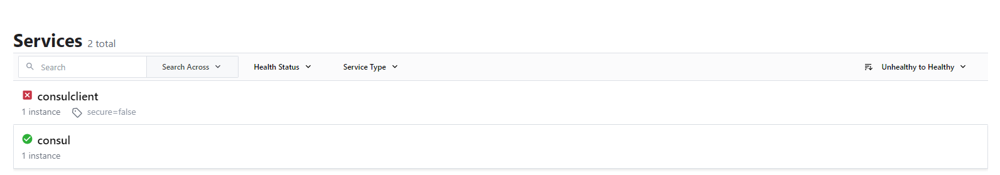

5. 默认情况 Consul 监控健康是开启的，但是必须依赖健康监控依赖才能正确监控健康状态，所以直接启动会显示错误，引入健康监控依赖之后服务正常

	```xml
	<!-- 这个包是用做健康度监控的-->
	<dependency>
	  <groupId>org.springframework.boot</groupId>
	  <artifactId>spring-boot-starter-actuator</artifactId>
	</dependency>
	```

6. 引入成功后重启项目，刷新 Consul 监控页面：

	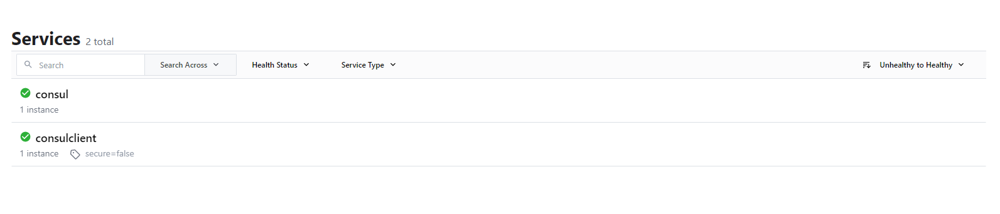


# 4、服务间的通信

接下来在整个微服务架构中，我们比较关心的就是服务间的服务改如何调用，有哪些调用方式？


在 SpringCloud 中服务间调用方式主要是使用 HTTP RESTful 方式进行服务间调用


## 4.1、RestTemplate

Spring 框架提供的 RestTemplate 类可用于在应用中调用 REST 服务，它简化了与 HTTP 服务的通信方式，统一了 RESTful 的标准，封装了 HTTP 链接， 我们只需要传入url 及返回值类型即可。相较于之前常用的 HttpClient，RestTemplate 是一种更优雅的调用 RESTful 服务的方式。


1. 创建两个服务并注册到 Consul 注册中心中

  - users	  	代表用户服务，端口为 9999
  - order 		 代表订单服务，端口为 9998

  注意：这里服务仅仅用来测试，没有实际业务意义

  


2. 创建一个 OrderController 提供服务：

   ```java
   
   @RestController
   @RequestMapping("/order")
   public class OrderController {
   
       private static final Logger LOGGER = LoggerFactory.getLogger(OrderController.class);
   
       @GetMapping
       public String demo() {
           LOGGER.info("order demo...");
           return "order demo OK!!";
       }
   }
   ```

3. 创建一个 UserController 调用订单服务：

   ```java
   @RestController
   @RequestMapping("/user")
   public class UserController {
   
       private static final Logger LOGGER = LoggerFactory.getLogger(UserController.class);
   
       @GetMapping
       public String invokeDemo() {
           LOGGER.info("user demo...");
   
           //调用订单服务 服务地址： http://localhost:9999/order 必须GET方式 接收返回值 String 类型
           RestTemplate restTemplate = new RestTemplate();
           String orderResult = restTemplate.getForObject("http://localhost:9998/order", String.class);
           
           LOGGER.info("调用订单服务成功:{}", orderResult);
           return "调用订单服务成功,结果为:" + orderResult;
       }
   }
   ```

4. 先启动 Consul，再启动 User 服务和 Order 服务，然后 http://localhost:9999/user 测试：

   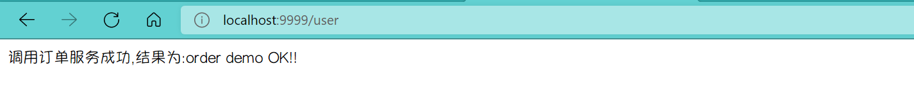

   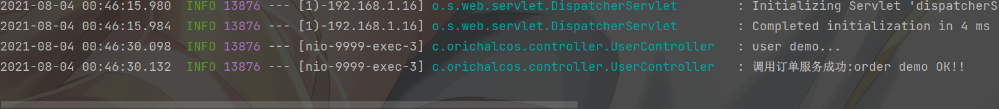


# 5、服务负载均衡

## 5.1、Ribbon

Spring Cloud Ribbon 是一个基于 HTTP 和 TCP 的客户端负载均衡工具，它基于 Netflix Ribbon 实现。通过 Spring Cloud 的封装，可以让我们轻松地将面向服务的 REST 模版请求自动转换成客户端负载均衡的服务调用。


### 5.1.1、Ribbon 服务调用

**准备工作**

1. 项目中引入依赖：

   - 如果使用的是 Eureka Client 和 Consul Client，无须引入依赖，因为在 Eureka、Consul 中默认集成了 Ribbon 组件

   - 如果使用的 Client 中没有 Ribbon 依赖需要显式引入如下依赖

     ```xml
     <!--引入ribbon依赖-->
     <dependency>
       <groupId>org.springframework.cloud</groupId>
       <artifactId>spring-cloud-starter-netflix-ribbon</artifactId>
     </dependency>
     ```

2. 修改 Order 服务的控制器

   ```java
   @RestController
   @RequestMapping("/order")
   public class OrderController {
   
       private static final Logger LOGGER = LoggerFactory.getLogger(OrderController.class);
   
       @Value("${server.port}")
       private String port;
   
       @GetMapping
       public String demo() {
           LOGGER.info("order被调用，服务端口为：{}", port);
           return "order demo OK!!,服务端口为：" + port;
       }
   }
   ```

3. 修改 Order 服务的配置文件，，增加三个 `profile`

   ```yaml
   spring:
     application:
       name: order
     cloud:
       consul:
         host: localhost
         port: 8500
   
   ---
   spring:
     profiles: order9998
   server:
     port: 9998
   
   ---
   spring:
     profiles: order9997
   server:
     port: 9997
   
   ---
   spring:
     profiles: order9996
   server:
     port: 9996
   ```

4. 分别启动三个注册中心，环境变量 `spring.profiles.active` 激活对应的集群配置

   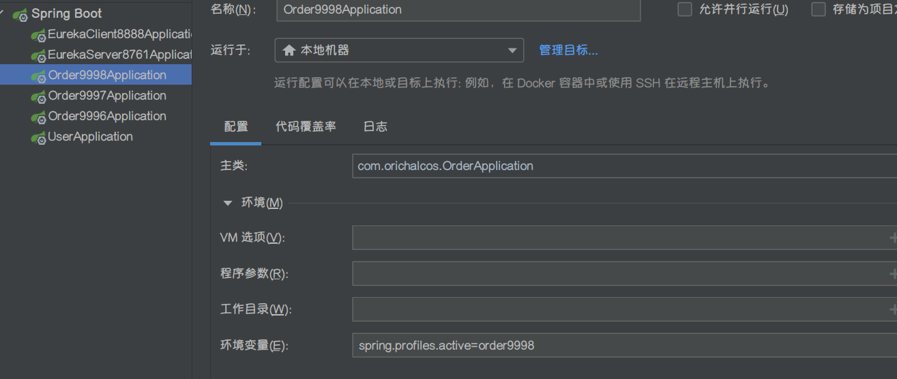


**RestTemplate + Ribbon 的调用方式：**

- 使用 discovery client  	进行客户端调用
- 使用 loadBalanceClient 进行客户端调用
- 使用 @loadBalanced      进行客户端调用


**DiscoveryClient**

修改 User 服务的控制器，增加以下内容

```java
@Autowired
private DiscoveryClient discoveryClient;

@GetMapping("/discoveryClient")
public String discoveryClient(){
    List<ServiceInstance> orders = discoveryClient.getInstances("order");
    orders.forEach(order->{
        LOGGER.info("服务主机：【{}】",order.getHost());
        LOGGER.info("服务端口：【{}】",order.getPort());
        LOGGER.info("服务地址：【{}】", order.getUri());
    });
    //从服务列表中随机调取一个服务
    ServiceInstance order = orders.get(new Random().nextInt(orders.size()));
    RestTemplate restTemplate = new RestTemplate();
    String result = restTemplate.getForObject(order.getUri() + "/order", String.class);
    return "User服务调用OK，" + result;
}
```

访问 http://localhost:9999/user/discoveryClient 查看，可重复刷新查看是否切换不同服务


**LoadBalance Client**

修改 User 服务的控制器，增加以下内容

```java
@Autowired
private LoadBalancerClient loadBalancerClient;

@GetMapping("/loadBalancerClient")
public String loadBalancerClient() {
    ServiceInstance order = loadBalancerClient.choose("order");
    LOGGER.info("服务主机：【{}】", order.getHost());
    LOGGER.info("服务端口：【{}】", order.getPort());
    LOGGER.info("服务地址：【{}】", order.getUri());
    RestTemplate restTemplate = new RestTemplate();
    String result = restTemplate.getForObject(order.getUri() + "/order", String.class);
    return "User服务调用OK，" + result;
}
```

访问 http://localhost:9999/user/loadBalancerClient 查看，可重复刷新查看是否切换不同服务


**@LoadBalanced**

在 User 服务中新建一个 BeansConfig.java 来提供 RestTemplate

```java
@Configuration
public class BeansConfig {
    @Bean
    @LoadBalanced
    public RestTemplate restTemplate() {
        return new RestTemplate();
    }
}
```

修改 User 服务的控制器，增加以下内容

```java
@Autowired
private RestTemplate restTemplate;
@GetMapping("/loadBalanced")
public String loadBalanced() {
    String result = restTemplate.getForObject("http://order/order", String.class);
    return "User服务调用OK，" + result;
}
```

访问 http://localhost:9999/user/loadBalanced 查看，可重复刷新查看是否切换不同服务


### 5.1.2、Ribbon 的负载均衡策略

这里可以点进自动注入的 `LoadBalancerClient `查看其源码：

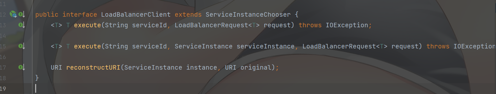

发现并没有我们调用的 `choose()` 方法，那直接从  `choose()` 方法中点进查看，发现该方法来源自 `LoadBalancerClient` 的父接口 `ServiceInstanceChooser`：


点击选中 `LoadBalancerClient` 按 F4 查看其实现，`ServiceInstanceChooser` 的 `choose()` 方法默认实现为 `RiibonLoadBalancerClient`：

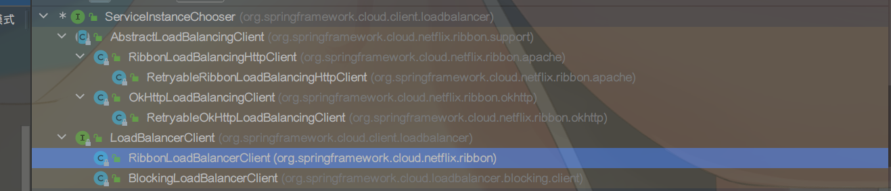

在 `RiibonLoadBalancerClient` 的 `choose()` 方法中可以看到它又调用了自己的 `choose()` 方法，由方法中的 `getServer()` 方法获取服务：

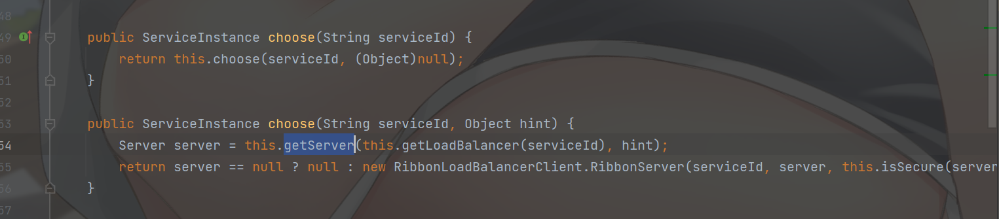

继续追下去，发现 `getServer()` 又调用了 `chooseServer()`：

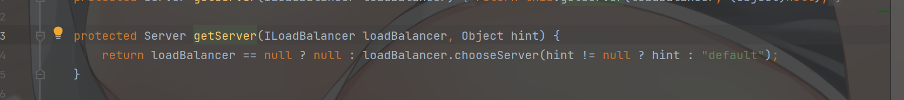

再点进去就发现进入了 `ILoadBalancer` 接口了，查看方法实现，发现有三个实现：

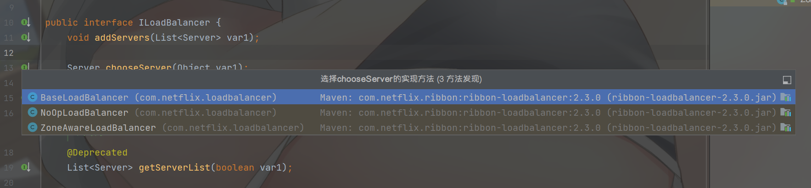

这里可以打个断点，然后使用 Step Into 追踪，会发现会调用 `ZoneAwareLoadBalancer` 的实现，而 `ZoneAwareLoadBalancer` 会调用父类的 `chooseServer()`：

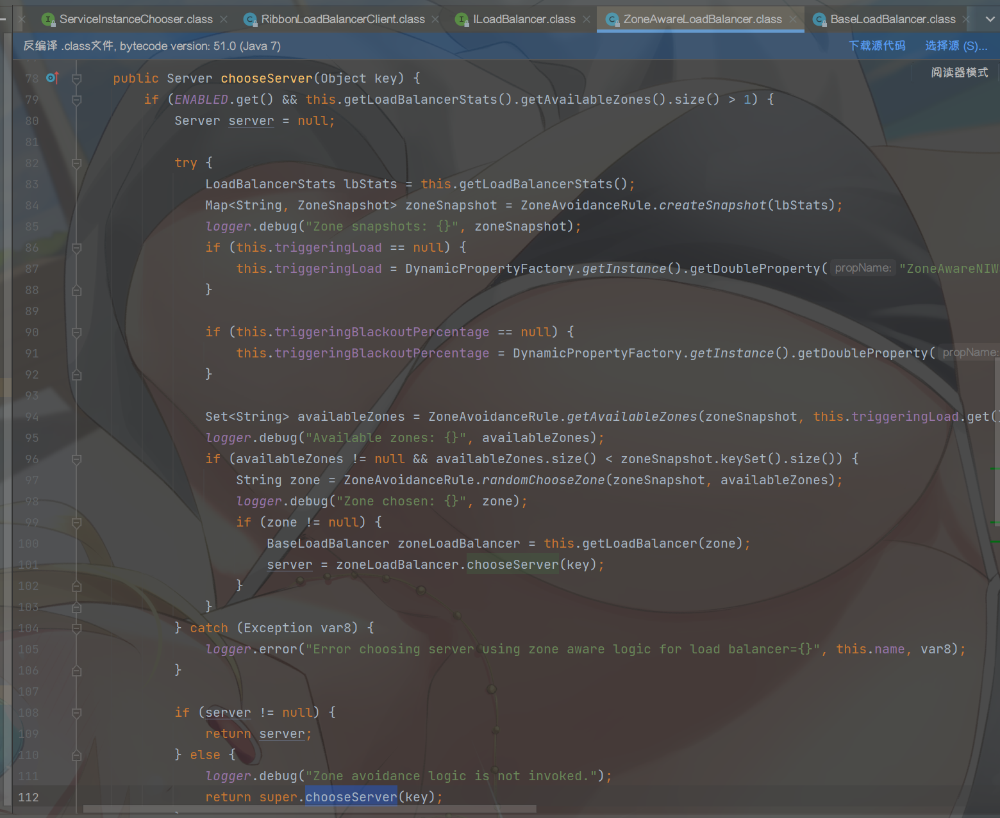

继续追下去，发现到了 `BaseLoadBalancer` 中，这里有许多判断，用 dbug 可以清晰地看到判断一路走到了 `this.rule.choose(key)`：

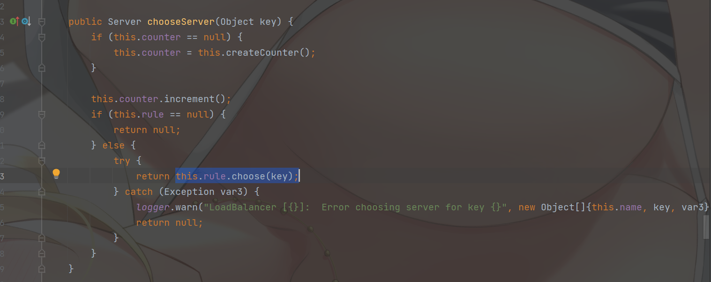

再点下去就到了关键的接口：`IRule`:

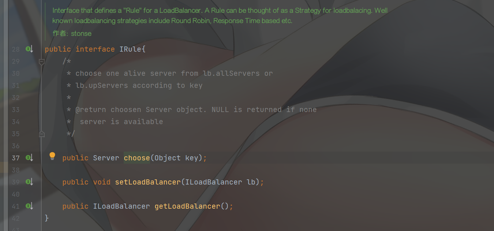

这个接口定义 LoadBalancer 的 “规则”，规则可以被看作是负载均衡的策略。众所周知的负载均衡策略包括轮询、基于响应时间等。而 `choose()` 上面注解解释了：通过 `key` 从 `lb.allServers` 中选择一个活的服务器。

到了这里已经很明朗了，`IRule` 就是所有负载均衡的父接口，点击这里的 `rule` 变量可以看到默认的负载均衡策略为轮询：

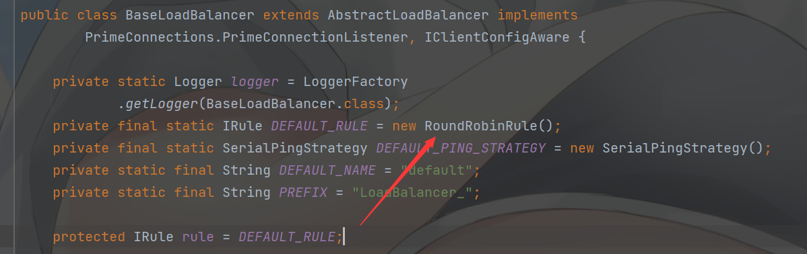

可以通过 IDEA 查看 `IRule` 的所有实现：

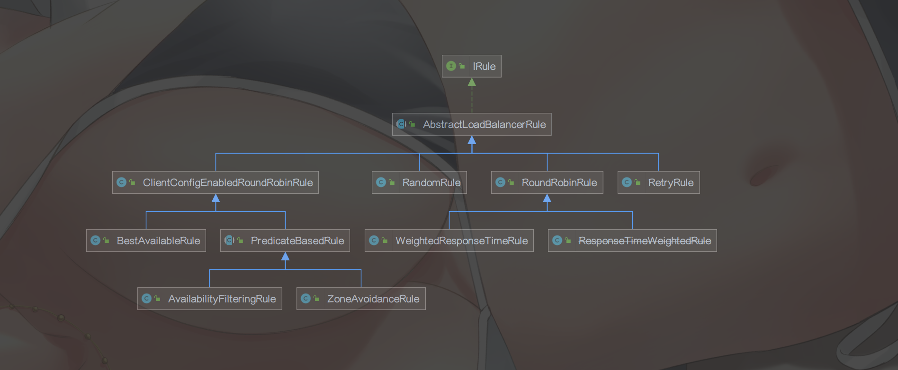

- RoundRobinRule 
  轮训策略：按顺序循环选择 Server
- RandomRule
  随机策略：随机选择 Server
- AvailabilityFilteringRule
  可用过滤策略：会先过滤由于多次访问故障而处于断路器跳闸状态的服务，还有并发的连接数量超过阈值的服务，然后对剩余的服务列表按照轮询策略进行访问

- WeightedResponseTimeRule 
	响应时间加权策略  ：根据平均响应的时间计算所有服务的权重，响应时间越快服务权重越大被选中的概率越高，刚启动时如果统计信息不足，则使用RoundRobinRule策略，等统计信息足够会切换到
	
- RetryRule
	重试策略：先按照RoundRobinRule的策略获取服务，如果获取失败则在制定时间内进行重试，获取可用的服务
	
- BestAviableRule
	最低并发策略：会先过滤掉由于多次访问故障而处于断路器跳闸状态的服务，然后选择一个并发量最小的服务  


### 5.1.3、修改默认负载均衡策略

