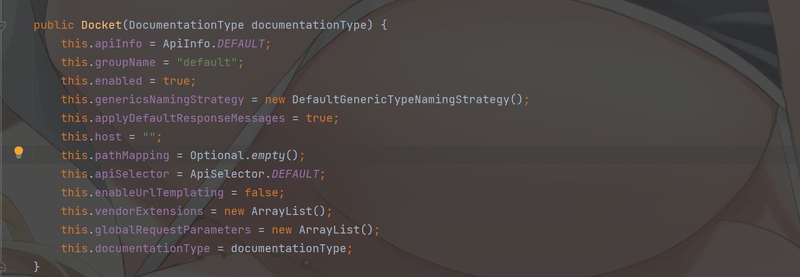
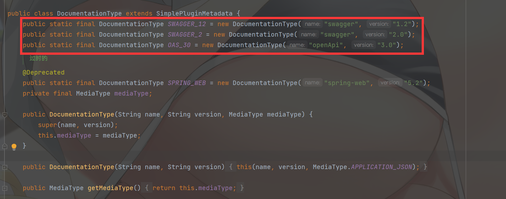
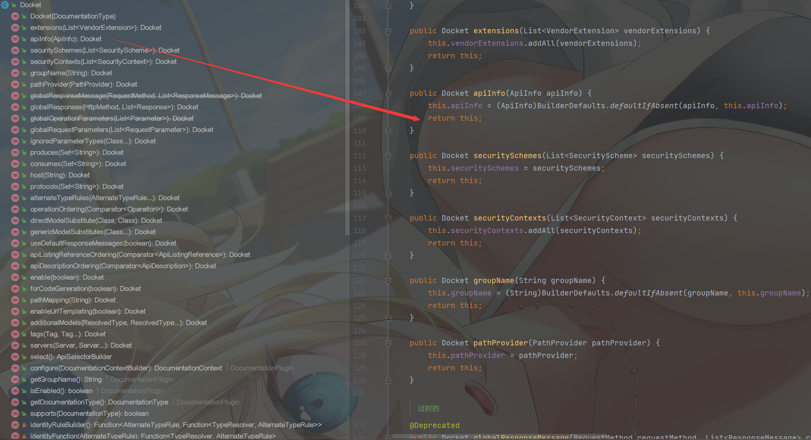
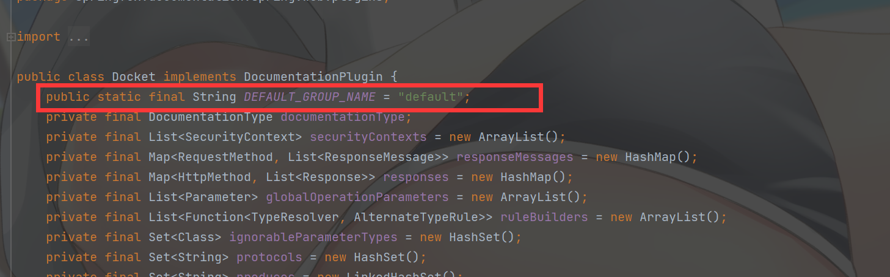
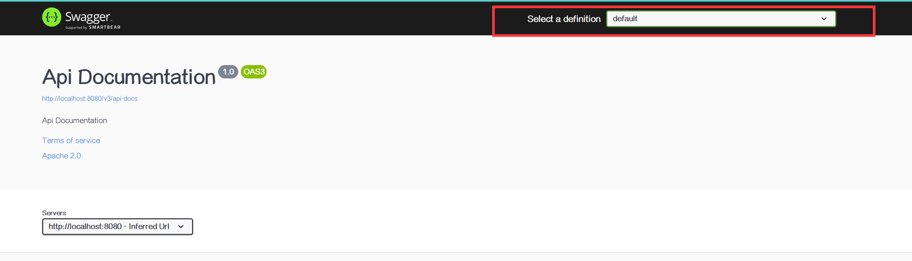
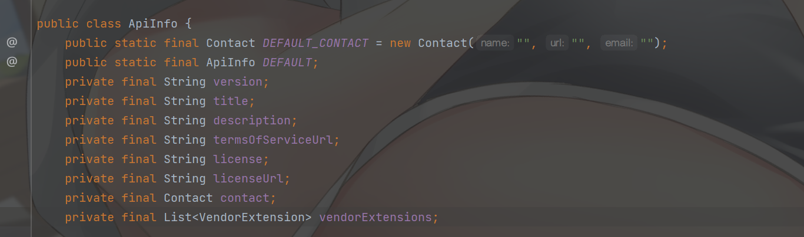
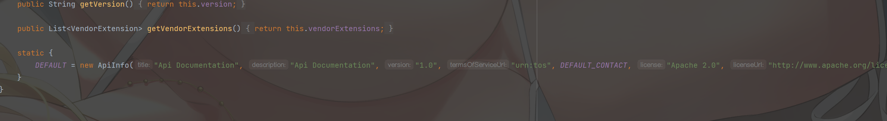
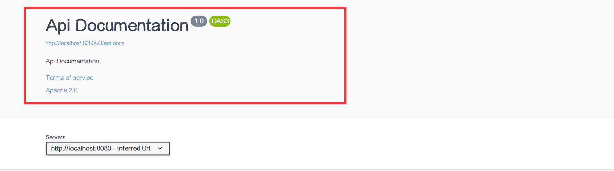
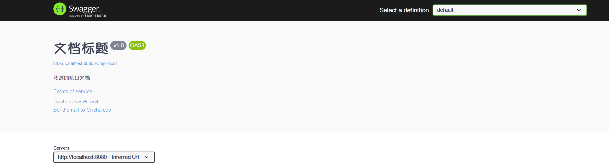

# 1、概述

**导语**

相信无论是前端还是后端开发，都或多或少地被接口文档折磨过。前端经常抱怨后端给的接口文档与实际情况不一致。后端又觉得编写及维护接口文档会耗费不少精力，经常来不及更新。其实无论是前端调用后端，还是后端调用后端，都期望有一个好的接口文档。但是这个接口文档对于程序员来说，就跟注释一样，经常会抱怨别人写的代码没有写注释，然而自己写起代码起来，最讨厌的，也是写注释。所以仅仅只通过强制来规范大家是不够的，随着时间推移，版本迭代，接口文档往往很容易就跟不上代码了。


**什么是 Swagger？**

发现了痛点就要去找解决方案。解决方案用的人多了，就成了标准的规范，这就是 Swagger 的由来。通过这套规范，你只需要按照它的规范去定义接口及接口相关的信息。再通过 Swagger 衍生出来的一系列项目和工具，就可以做到生成各种格式的接口文档，生成多种语言的客户端和服务端的代码，以及在线接口调试页面等等。这样，如果按照新的开发模式，在开发新版本或者迭代版本的时候，只需要更新 Swagger 描述文件，就可以自动生成接口文档和客户端服务端代码，做到调用端代码、服务端代码以及接口文档的一致性。

但即便如此，对于许多开发来说，编写这个 ym l或 json 格式的描述文件，本身也是有一定负担的工作，特别是在后面持续迭代开发的时候，往往会忽略更新这个描述文件，直接更改代码。久而久之，这个描述文件也和实际项目渐行渐远，基于该描述文件生成的接口文档也失去了参考意义。所以作为Java 届服务端的大一统框架 Spring，迅速将 Swagger 规范纳入自身的标准，建立了 Spring-swagger 项目，后面改成了现在的 Springfox。通过在项目中引入 Springfox，可以扫描相关的代码，生成该描述文件，进而生成与代码一致的接口文档和客户端代码。这种通过代码生成接口文档的形式，在后面需求持续迭代的项目中，显得尤为重要和高效。

> Swagger 是一个规范和完整的框架，用于生成、描述、调用和可视化 RESTful 风格的 Web 服务。总体目标是使客户端和文件系统作为服务器以同样的速度来更新。文件的方法、参数和模型紧密集成到服务器端的代码，允许 API 来始终保持同步。Swagger 让部署管理和使用功能强大的 API 从未如此简单。
>
> 这个解释简单点来讲就是说，Swagger 是一款可以根据 RESTful 风格生成接口开发文档，并且支持做测试的一款中间软件。


**为什么要使用 Swagger？**

- 对于后端开发人员来说：
  不用再手写 WiKi 接口拼大量的参数，避免手写错误
  对代码侵入性低，采用全注解的方式，开发简单
  方法参数名修改、增加、减少参数都可以直接生效，不用手动维护
  缺点：增加了开发成本，写接口还得再写一套参数配置
- 对于前端开发来说
  后端只需要定义好接口，会自动生成文档，接口功能、参数一目了然
  联调方便，如果出问题，直接测试接口，实时检查参数和返回值，就可以快速定位是前端还是后端的问题
- 对于测试
  对于某些没有前端界面UI的功能，可以用它来测试接口
  操作简单，不用了解具体代码就可以操作


# 2、Spring Boot 集成 Swagger 3.0

## 2.1、搭建环境

1. 新建一个 Spring Boot 项目

2. 导入相关依赖

   ```xml
   <!-- https://mvnrepository.com/artifact/io.springfox/springfox-boot-starter -->
   <dependency>
       <groupId>io.springfox</groupId>
       <artifactId>springfox-boot-starter</artifactId>
       <version>3.0.0</version>
   </dependency>
   ```

3. 写一个 Hello 测试下

   ```java
   @RestController
   public class HelloController {
       @GetMapping("/hello")
       public String hello() {
           return "hello";
       }
   }
   ```

4. 编写一个 SwaggerConfig.java 开启 Swagger

   ```java
   @Configuration
   @EnableOpenApi
   public class SwaggerConfig {
   }
   ```

5. 访问 http://localhost:8080/swagger-ui/index.html

   


## 2.2、Swagger 3.0 配置

Swagger 的实例 Bean 是 Docket，所以通过配置 Docket 实例来配置 Swagger。

先在 SwaggerConfig.java 中写一个 Docket 的 Bean 实例：

```java
@Bean
public Docket docket(){
    return new Docket()
}
```


### 2.2.1、DocumentationType 

这个时候发现构造函数需要一个参数，先别急，点进 Docket 构造函数源码看看：



可以看到这里需要一个 `DocumentationType`，那么点进去看看是啥：



可以看到，它提供了三个构造好的 DocumentationType 常量，设置了使用 Swagger 哪个版本。这里使用的是 Swagger 3.0，所以给出的参数是 `DocumentationType.OAS_30`：

```java
@Bean
public Docket docket() {
    return new Docket(DocumentationType.OAS_30);
}
```


### 2.2.2、Docket

再回去反观 Docket 的其他源码：


可以看见 Docket 提供了很多可以配置的属性，并且提供了相应的 setter（注：方法与属性名同名，返回值是 this (链式编程)）



它设置默认的分组 `DEFAULT_GROUP_NAME` 是 `default`，没错，这就和右上角的 spec 对应上了：





另外，还有很多可以自行配置的属性，前面的 DocumentationType 就是其中之一。


### 2.2.3、ApiInfo

ApiInfo 见名知意，提供了一些基本信息的配置，这些配置信息可以显示 UI 界面上。同样的，点进它的源码看看：



可以看到，它提供了 8 个可以配置属性，根据名字也能猜出其中的意思：

- version：API 版本
- title：文档标题
- description：文档描述
- termsOfServiceUrl：团队链接
- license：许可
- licenseUrl：许可链接
- contact：联系人信息
- vendorExtensions：扩展信息

而在 ApiInfo 中还有一个默认配置 DEFAULT，它的详细信息在类的最下方：



它看起来是不是很熟悉？没错，它就是在不做任何配置下启动 Swagger 显示的基本信息：



那么现在可以配置自己的 ApiInfo：

> ApiInfo 中没有提供 setter，所以可以通过 ApiInfo 的构造函数去构建，也可以通过 ApiInfoBuilder 去逐项赋值

```java
@Bean
public Docket docket() {
    return new Docket(DocumentationType.OAS_30).apiInfo(getApiInfo());
}

public ApiInfo getApiInfo() {
    return new ApiInfoBuilder()
        .title("文档标题")
        .description("测试的接口文档")
        .version("v1.0")
        .termsOfServiceUrl("baidu.com")
        .contact(new Contact("Orichalcos", "https://github.com/0richalcos", "xox.zhe@foxmail.com"))
        .build();
}
```

然后重启 Spring Boot 项目：




### 2.2.4、ApiSelectorBuilder

