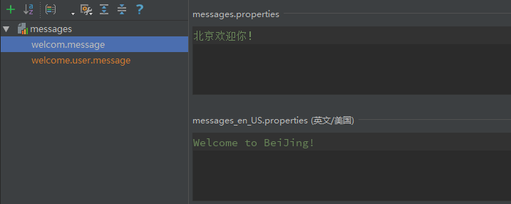

Thymeleaf 是一个服务器端 Java 模板引擎，能够处理 HTML、XML、CSS、JavaScript 等模板文件。Thymeleaf 模板可以直接当作静态原型来使用，它主要目标是为开发者的开发工作流程带来优雅的自然模板，也是 Java 服务器端 HTML5 开发的理想选择。

# 1、创建模板文件

创建一个 HTML 模板文件

```html
<!DOCTYPE HTML>
<html xmlns:th="http://www.thymeleaf.org">
<head>
    <title>Index Page</title>
    <meta http-equiv="Content-Type" content="text/html; charset=UTF-8" />
</head>
<body>
    <p th:text="${message}">Welcome to BeiJing!</p>
</body>
</html>
```

通过`<html xmlns:th="http://www.thymeleaf.org">`引入 Thymeleaf 命名空间。`th:text`用于处理`p`标签体的文本内容。该模板文件直接在任何浏览器中正确显示，浏览器会自动忽略它们不能理解的属性`th:text`。但这不是一个真正有效的 HTML5 文档，因为 HTML5 规范是不允许使用`th:*`这些非标准属性的。我们可以切换到 Thymeleaf 的`data-th-*`语法，以此来替换`th:*`语法：

```html
<!DOCTYPE HTML>
<html xmlns:th="http://www.thymeleaf.org">
<head>
    <title>Index Page</title>
    <meta http-equiv="Content-Type" content="text/html; charset=UTF-8" />
</head>
<body>
    <p data-th-text="${message}">Welcome to BeiJing!</p>
</body>
</html>
```

HTML5 规范是允许`data-*`这样自定义的属性的。`th:*`和`data-th-*`这两个符号是完全等效且可以互换的。但为了简单直观和代码的紧凑性，本文采用`th:*`的表示形式。


# 2、标准表达式语法

Thymeleaf 提供了非常丰富的标准表达式语法，总共有 8 大类：

- 简单表达式
- 字面值
- 文本操作
- 算术运算
- 布尔运算
- 比较和相等
- 条件运算
- 无操作符


## 2.1 简单表达式

| 语法   | 名称                           | 描述           | 作用                   |
| :----- | :----------------------------- | -------------- | ---------------------- |
| ${...} | Variable Expressions           | 变量表达式     | 取出上下文变量的值     |
| *{…}   | Selection Variable Expressions | 选择变量表达式 | 取出选择的对象的属性值 |
| \#{…}  | Message Expressions            | 消息表达式     | 使文字消息国际化，I18N |
| @{…}   | Link URL Expressions           | 链接表达式     | 用于表示各种超链接地址 |
| ~{…}   | Fragment Expressions           | 片段表达式     | 引用一段公共的代码片段 |


### 2.1.1、${...}

```java
@GetMapping("/standard-expression-syntax/variables")
public String variables(ModelMap model, HttpSession session) {
    model.put("now", new Date());
    model.put("message", "Welcome to BeiJing!");
    session.setAttribute("user", new User("fanlychie", "男", 24));
    ... ...
}
```

通过变量表达式`${}`取出上下文环境中的`message`变量：

```html
<!-- Welcome to BeiJing! -->
<p th:text="${message}"></p>
```

它相当于：

```javascript
ctx.getVariable("message");
```


### 2.1.2、*{...}

变量表达式`${}`是面向整个上下文的，而选择变量表达式`*{}`的上下文是父标签（`th:object`）所选择的对象：

```html
<div th:object="${session.user}">
    <p th:text="*{name}"></p>
    <p th:text="*{sex}"></p>
    <p th:text="*{age}"></p>
</div>
```

它相当于：

```html
<div>
    <p th:text="${session.user.name}"></p>
    <p th:text="${session.user.sex}"></p>
    <p th:text="${session.user.age}"></p>
</div>
```

如果对象没有被选择，那么，`*{}`和`${}`表达式所达到的效果是完全相同的：

```html
<p th:text="*{session.user.name}"></p>
<p th:text="${session.user.name}"></p>
```


### 2.1.3、#{…}

消息表达式可用于国际化文字信息。下面是 i18n 资源文件的命名规则：

- basename.properties
- basename_language.properties
- basename_language_country.properties

`basename`是自定义的资源文件名称，`language`和`country`必须是 Java 支持的语言和国家。`basename.properties`是缺省加载的资源文件，当客户端根据本地语言查找不到相关的资源文件时，则使用该配置文件。

创建文件`src/main/resources/messages.properties`

```properties
welcome.message = 北京欢迎你！
```

创建文件`src/main/resources/messages_en_US.properties`

```properties
welcome.message = Welcome to BeiJing!
```

在 IntelliJ IDEA 编辑视图：



`messages`是 Spring Boot 加载资源文件默认采用的名称（`basename`），如果你所使用的资源文件名称不是以`messages`命名或所使用的资源文件不是在`src/main/resources`根目录，你可以通过`spring.messages.basename`属性来做具体的配置。如，资源文件`messages.properties`和`messages_en_US.properties`假设它们所在的目录位置是`src/main/resources/i18n`。

application.properties 配置示例：

```properties
spring.messages.basename:i18n/messages
```

application.yml 配置示例：

```yaml
spring
  messages
    basename: i18n/messages
```

静态文本消息示例：

```html
<!-- 北京欢迎你！ -->
<p th:text="#{welcom.message}"></p>
```

消息表达式`#{}`是不允许直接处理非静态的文本消息的，但是可以在资源文件中通过使用占位符`{}`来处理非静态的文本消息：

messages.properties 配置示例：

```properties
welcome.user.message = {0}, 北京欢迎你！
```

messages_en_US.properties 配置示例：

```properties
welcome.user.message = {0}, Welcome to BeiJing!
```

非静态文本消息，以参数的形式传递变量的值：

```html
<!-- fanlychie, 北京欢迎你！ -->
<p th:text="#{welcome.user.message(${session.user.name})}"></p>
```


### 2.1.4、@{…}

链接表达式`@{}`是专门用来处理 URL 链接地址的。

绝对地址示例：

```html
<!-- https://fanlychie.github.io -->
<p th:text="@{https://fanlychie.github.io}"></p>
```

页面相对地址示例：

```html
<!-- commons/base.html -->
<p th:text="@{commons/base.html}"></p>
```

上下文相对地址（相对于当前的服务）示例：

```html
<!-- /css/mian.css -->
<p th:text="@{/css/mian.css}"></p>
```

服务器相对地址（相对于部署在同一个服务器中的不同服务）示例：

```html
<!-- /image/upload -->
<p th:text="@{~/image/upload}"></p>
```

参数使用示例：

```html
<!-- /css/mian.css?v=1.0 -->
<p th:text="@{/css/mian.css(v=1.0)}"></p>
<!-- /user/order?username=fanlychie -->
<p th:text="@{/user/order(username=${session.user.name})}"></p>
<!-- /user/order?username=fanlychie&status=PAIED -->
<p th:text="@{/user/order(username=${session.user.name},status='PAIED')}"></p>
<!-- /user/fanlychie/info -->
<p th:text="@{/user/{username}/info(username=${session.user.name})}"></p>
```


### 2.1.5、~{…}

片段表达式`~{}`可以用来引用一段公共的 HTML 代码片段。

| 语法                        | 描述                                                         |
| --------------------------- | ------------------------------------------------------------ |
| ~{templatename}             | 引用整个模板文件的代码片段                                   |
| ~{templatename :: selector} | selector 可以是 th:fragment 指定的名称或其他选择器。<br/>如类选择器、ID选择器等 |
| ~{::selector}               | 相当于 ~{this :: selector}，表示引用当前模板定义的代码片段   |

在 Thymeleaf 模板文件中，可以使用`th:fragment`属性来定义一段公共的代码片段，然后你可以通过使用`th:insert`、`th:replace`、`th:include`（Thymeleaf 3.0 开始不再推荐使用，这里不再介绍它）属性来将这些公共的代码片段引入到模板文件中来。

src/main/resources/templates/base.html，通过`th:fragment`属性定义一段公共的代码片段：

```html
<div id="footer" th:fragment="footerFragment">&copy; 2017 fanlychie</div>
```

src/main/resources/templates/index.html，通过`th:insert`属性引用一段公共的代码片段：

```html
<div th:insert="~{base :: footerFragment}"></div>
```

其中，`~{}`是可选的，我们可以去掉这层的包裹：

```html
<div th:insert="base :: footerFragment"></div>
```

若 index.html 与 base.html 不在同级目录，如 templates/commons/base.html：

```html
<div th:insert="~{commons/base :: footerFragment}"></div>
```

使用`th:fragment`属性定义代码片段时，还可以声明一组参数：

```html
<div th:fragment="crumbs(parent, child)">
    <i th:text="${parent}"></i> <i th:text="${child}"></i>
</div>
    
<!--
<i>用户中心</i>
<i>我的订单</i>
-->
<div th:insert="::crumbs('用户中心', '我的订单')"></div>
```

此外，还可以通过类选择器、ID选择器等来引用公共的代码片段：

```html
<div th:insert="~{base :: #footer}"></div>
```

除了`th:insert`属性`th:replace`也可以用来引用公共的代码片段。不同的是，`th:insert`是直接将代码片段插入到标签体内，而`th:replace`则是用代码片段直接替换标签体内容。

```html
<!--
<div>
    <div id="footer">© 2017 fanlychie</div>
</div>
-->
<div th:insert="~{base :: footerFragment}"></div>
    
<!--
<div id="footer">© 2017 fanlychie</div>
-->
<div th:replace="~{base :: footerFragment}"></div>
```


### 2.1.6、内置对象

| 对象            | 描述                                                         |
| --------------- | ------------------------------------------------------------ |
| #ctx            | 上下文对象                                                   |
| #vars           | 同 #ctx，表示上下文变量                                      |
| \#locale        | 上下文本地化（特定的地理区域）变量，可参考 java.util.Locale  |
| \#request       | HttpServletRequest 对象，可参考 javax.servlet.http.HttpServletRequest |
| \#response      | HttpServletResponse 对象，可参考 javax.servlet.http.HttpServletResponse |
| #session        | HttpSession 对象，可参考 javax.servlet.http.HttpSession      |
| #servletContext | ServletContext 对象，可参考 javax.servlet.ServletContext     |

`#ctx`示例：

```html
<!-- zh_CN -->
<p th:text="${#ctx.getLocale()}"></p>
<!-- Welcome to BeiJing! -->
<p th:text="${#ctx.getVariable('message')}"></p>
<!-- true -->
<p th:text="${#ctx.containsVariable('message')}"></p>
```

`#vars`示例：

```html
<!-- zh_CN -->
<p th:text="${#vars.getLocale()}"></p>
<!-- Welcome to BeiJing! -->
<p th:text="${#vars.getVariable('message')}"></p>
<!-- true -->
<p th:text="${#vars.containsVariable('message')}"></p>
```

`#locale`示例：

```html
<!-- zh_CN -->
<p th:text="${#locale}"></p>
<!-- CN -->
<p th:text="${#locale.country}"></p>
<!-- 中国 -->
<p th:text="${#locale.displayCountry}"></p>
<!-- zh -->
<p th:text="${#locale.language}"></p>
<!-- 中文 -->
<p th:text="${#locale.displayLanguage}"></p>
<!-- 中文 (中国) -->
<p th:text="${#locale.displayName}"></p>
```

`#request`示例：

```html
<!-- HTTP/1.1 -->
<p th:text="${#request.protocol}"></p>
<!-- http -->
<p th:text="${#request.scheme}"></p>
<!-- localhost -->
<p th:text="${#request.serverName}"></p>
<!-- 8080 -->
<p th:text="${#request.serverPort}"></p>
<!-- GET -->
<p th:text="${#request.method}"></p>
<!-- /standard-expression-syntax/variables -->
<p th:text="${#request.requestURI}"></p>
<!-- http://localhost:8080/standard-expression-syntax/variables -->
<p th:text="${#request.requestURL}"></p>
<!-- /standard-expression-syntax/variables -->
<p th:text="${#request.servletPath}"></p>
<!-- java.util.Collections$3@203646fe -->
<p th:text="${#request.parameterNames}"></p>
<!-- {q=[Ljava.lang.String;@3308c69f} -->
<p th:text="${#request.parameterMap}"></p>
<!-- q=expression -->
<p th:text="${#request.queryString}"></p>
```

注意，请求地址的 URL 参数直接通过`#request.x`是取不出来的，需要使用`param.x`语法来取出。如，URL：`/standard-expression-syntax/variables?q=expression`，取出 q 参数的正确姿势：

```html
<p th:text="${param.q}"></p>
```

`#response`示例：

```html
<!-- 200 -->
<p th:text="${#response.status}"></p>
<!-- 8192 -->
<p th:text="${#response.bufferSize}"></p>
<!-- UTF-8 -->
<p th:text="${#response.characterEncoding}"></p>
<!-- text/html;charset=UTF-8 -->
<p th:text="${#response.contentType}"></p>
```

`#session`示例：

```html
<!-- 2BCB2A0EACFF2D9D249D9799431B5127 -->
<p th:text="${#session.id}"></p>
<!-- 1499786693244 -->
<p th:text="${#session.lastAccessedTime}"></p>
<!-- fanlychie -->
<p th:text="${#session.getAttribute('user').name}"></p>
```

注意，放到会话里面的对象直接通过`#session.x`是取不出来的，需要使用`session.x`语法来取出。如，取出会话里面的 user 对象的正确姿势：

```html
<p th:text="${session.user.name}"></p>
```

​	

### 2.1.7、工具类

| 对象         | 描述                          |
| ------------ | ----------------------------- |
| #messages    | 消息工具类，与 ＃{…} 作用相同 |
| #uris        | 地址相关的工具类              |
| #conversions | 对象转换工具类                |
| #dates       | 日期时间工具类                |
| #calendars   | 日历工具类                    |
| #numbers     | 数字工具类                    |
| #strings     | 字符串工具类                  |
| #objects     | 对象工具类                    |
| #bools       | 布尔工具类                    |
| #arrays      | 数组工具类                    |
| #lists       | List 工具类                   |
| #sets        | Set 工具类                    |
| #maps        | Map 工具类                    |

```html
<!-- false -->
<p th:text="${#strings.isEmpty(message)}"></p>
<!-- 2017-07-12 00:37:25 -->
<p th:text="${#dates.format(now, 'yyyy-MM-dd HH:mm:ss')}"></p>
```


## 2.2、字面值

所谓字面值，首先它不是一个变量，它是一个具体的确切的值，通常这些值是比较简单的，例如：`18`、`'welcome'`等，它们没有名称，以至于我们只能用值来称呼它们，因此我们称其为字面值。


**文字字面值**

文字字面值是用单引号引起来的任何字符内容，如果字符内容里面含有单引号，则需要进行转义：

```html
<!-- Welcome to BeiJing! -->
<p th:text="'Welcome to BeiJing!'"></p>
<!-- 'Welcome to BeiJing!' -->
<p th:text="'\'Welcome to BeiJing!\''"></p>
```


**数字字面值**

```html
<!-- 2017 -->
<p th:text="2017"></p>
<!-- 2018 -->
<p th:text="2017 + 1"></p>
```


**布尔字面值**

```html
<!-- false -->
<p th:text="1 > 2"></p>
<!-- 否 -->
<p th:text="1 > 2 ? '是' : '否'"></p>
```


**空字面值**

```html
<!-- false -->
<p th:text="${user == null}"></p>
```


**字面令牌**

字面令牌（Literal Tokens）的内容只能含有（不能含有空格、特殊符号等）：

- 大写或小写的字母、中文等不含空格和特殊符号的文本
- 0 到 9 的数字
- 中括号
- 下划线
- 连字符（-）
- 点符号（.）

实际上，数字、布尔和空字面值都是字面令牌的特殊情况。字面令牌能够用来对标准表达式语法进行简化，我们可以将包裹它的内容的单引号去掉：

```html
<p th:text="Welcome to BeiJing!"></p>
```

它等效于：

```html
<p th:text="'Welcome to BeiJing!'"></p>
```


## 2.3、文本操作

对文本内容进行常用的操作，分别为字符串连接和字符串替换。


**字符串连接**

不管是字面值还是表达式的结果，都可以使用`+`符号将它们连接起来：

```html
<!-- Welcome to BeiJing! -->
<p th:text="'Welcome to ' + ${location} + '!'"></p>
```


**字面值替换**

符号`||`可以用来将字面值和表达式包裹起来，这样就能方便的替换变量的值，而不需要使用`+`连接符：

```html
<!-- Welcome to BeiJing! -->
<p th:text="|Welcome to ${location}!|"></p>
```


## 2.4、算术运算

支持`+`（加）、`-`（减）、`*`（乘）、`/`（除）、`%`（模）运算：

```html
<!-- 6 -->
<p th:text="4 + 2"></p>
<!-- 2 -->
<p th:text="4 - 2"></p>
<!-- 8 -->
<p th:text="4 * 2"></p>
<!-- 2 -->
<p th:text="4 / 2"></p>
<!-- 0 -->
<p th:text="4 % 2"></p>
<!-- 2 -->
<p th:text="${pagination.page + 1}"></p>
<!-- 2 -->
<p th:text="${pagination.page} + 1"></p>
```


## 2.5、布尔运算

支持`and`（且）、`or`（或）、`!`（非）、`not`（非）运算：

```html
<p th:text="${user.online and user.vip}"></p>
<p th:text="${user.online or user.vip}"></p>
<p th:text="${!user.online}"></p>
<p th:text="${not user.online}"></p>
```


## 2.6、比较和相等

支持`<`（`lt`）、`>`（`gt`）、`<=`（`le`）、`>=`（`ge`）、`==`（`eq`）、`！=`（`ne`）：

```html
<p th:text="${user.age < 60}"></p>
<p th:text="${user.age <= 60}"></p>
<p th:text="${user.age > 18}"></p>
<p th:text="${user.age >= 18}"></p>
<p th:text="${user.age == 18}"></p>
<p th:text="${user.age != 18}"></p>
```


## 2.7、条件运算

三元运算符：`(if) ? (then) : (else)`

```html
<p th:text="${user.online ? '在线' : '离线'}"></p>
<p th:text="${user.online ? (user.vip ? 'VIP用户在线' : '普通用户在线') : '离线'}"></p>
```

二元运算符：`(value) ?: (defaultValue)`。

其中，`value`非空（null）即真，条件为真时输出`value`，否则输出`defaultValue`。假设`token = null`，`user.email = fanlychie@gmail.com`

```html
<!-- 你还没有登录，请先登录 -->
<p th:text="${token} ?: '你还没有登录，请先登录'"></p>
<!-- fanlychie@gmail.com -->
<p th:text="${user.email} ?: '你还没有绑定邮箱'"></p>
```


## 2.8、无操作符

当模板运行在服务器端时，Thymeleaf 会解析`th:*`属性的具体值替换标签体的内容。无操作符（`_`）则允许你使用原型标签体的内容作为默认值：

```html
<!-- 你还没有登录，请先登录 -->
<p th:text="${token} ?: _">你还没有登录，请先登录</p>
```


# 3、使用文本

首先介绍两个最基础的`th:*`属`th:text`和`th:utext`，它们都是用于处理文本消息内容。


**th:text**

在标签体中展示表达式评估结果的文本内容：

```html
<p th:text="${message}"></p>
```

使用外部化的文本内容：

```html
<p th:text="${message}">Welcome to BeiJing!</p>
```

当它作为静态文件直接运行时，浏览器会自动忽略它不能识别的`th:text`属性，而显示`<p>`标签体的文本内容`Welcome to BeiJing!`

当它作为模板文件运行在服务器端时，`th:text`属性的具体值将会替换`<p>`标签体的文本内容。


**th:utext**

属性`th:utext`与`th:text`的区别在于：

- `th:text`默认会对含有 HTML 标签的内容进行字符转义；
- `th:utext`（Unescaped Text）则不会对含有 HTML 标签的内容进行字符转义；

假设：`message = "<b>Welcome to BeiJing!</b>"`。

使用`th:text`属性：

```html
<p th:text="${message}"></p>
```

`th:text`效果：`<b>Welcome to BeiJing!</b>`

使用`th:utext`属性：

```html
<p th:utext="${message}"></p>
```

`th:utext`效果：`Welcome to BeiJing!`


# 4、设置属性值

在 Thymeleaf 模板文件中，可以使用`th:*`（或者使用`th:attr`属性）来设置任意的 HTML5 标签属性的值。不仅如此，还可以`th:*-*`来同时为多个不同的标签属性设置相同的一个值，甚至你可以使用`th:attrappend`和`th:attrprepend`来追加新的值到现有的标签属性值中。


**th:attr**

这种方式是不被推荐的，了解一下就行。下面是用`th:attr="href=..."`来设置标签`href`属性的值：

```html
<a th:attr="href=@{https://www.google.com.hk}">谷歌一下你就知道</a>
```


**th:***

显然`th:attr="href=@{http://www.baidu.com}"`不够简洁，所以更推荐下面的这种语法：

```html
<a th:href="@{https://www.google.com.hk}">谷歌一下你就知道</a>
```

其中`th:*`中的`*`可以是 HTML5 支持的任意属性名称，甚至这些属性名称可以是自定义的：

```html
<!-- <div item-id="1001">Welcome to BeiJing!</div> -->
<div th:item-id="${user.id}">Welcome to BeiJing!</div>
```


**th:*-***

如果想要同时为标签的多个不同属性设置相同的一个值，可以使用`th:*-*`的语法：

```html

```

它相当于：

```html

```


**th:attrappend & th:attrprepend**

`th:attrappend`和`th:attrprepend`可以将表达式的结果分别追加到指定的属性值之后和之前。

```html
<!-- <button class="btn enable">购买</button> -->
<button class="btn" th:attrappend="class=${outOfStock} ? ' enable' : ' disable'">购买</button>
<!-- <button class="enable btn">购买</button> -->
<button class="btn" th:attrprepend="class=${outOfStock} ? 'enable ' : 'disable '">购买</button>
```

另外，还有两个常用的具体附加属性`th:classappend="..."`和`th:styleappend=""`。

它们分别用来代替`th:attrappend="class=..."`和`th:attrappend="style=..."`。

```html
<!-- <button class="btn enable">购买</button> -->
<button class="btn" th:classappend="${outOfStock} ? ' enable' : ' disable'">购买</button>
```


**布尔属性**

在 HTML 中有些属性是布尔属性，布尔属性是指没有值的属性，如`readonly`、`checked`、`selected`等。它们若存在那就意味着值为 true。

```html
<input type="checkbox" name="rememberme" checked /> 记住我
<input type="radio" name="sex" value="male" checked> 男
<input type="radio" name="sex" value="female"> 女
<input type="text" name="appId" value="J123654" readonly>
<select>
    <option selected>北京</option>
    <option>上海</option>
    <option>广州</option>
    <option>深圳</option>
</select>
```

Thymeleaf 也允许我们通过`th:*`（这里的`*`表示任意的布尔属性） 来选择是否使用这些布尔属性。

```html
<input type="checkbox" name="rememberme" ch:checked="${rememberme}" /> 记住我
```

如果表达式的结果为`true`，则自动勾选复选框，若为`false`，则不会自动勾选。


# 5、遍历

遍历（迭代）的语法`th:each="自定义的元素变量名称 : ${集合变量名称}"`：

```html
<div>
    <spn>你所在城市：</spn>
    <select name="mycity">
        <option th:each="city : ${cities}" th:text="${city.name}"></option>
    </select>
</div>
```

属性`th:each`提供了一个用于跟踪迭代的状态变量，它包含以下几个属性：

| 属性    | 类型    | 描述                             |
| ------- | ------- | -------------------------------- |
| index   | int     | 当前迭代的索引，从 0 开始        |
| count   | int     | 当前迭代的计数，从 1 开始        |
| size    | int     | 集合中元素的总个数               |
| current | int     | 当前的元素对象                   |
| even    | boolean | 当前迭代的计数是否是偶数         |
| odd     | boolean | 当前迭代的计数是否是奇数         |
| first   | boolean | 当前元素是否是集合的第一个元素   |
| last    | boolean | 当前元素是否是集合的最后一个元素 |

状态变量的使用语法：`th:each="自定义的元素变量名称, 自定义的状态变量名称 : ${集合变量名称}"`：

```html
<div>
    <span>所在城市：</span>
    <select name="mycity">
        <option th:each="city, status : ${cities}" th:text="${city.name}" th:item-index="${status.count}"></option>
    </select>
</div>
```

不管什么时候，Thymeleaf 始终会为每个`th:each`创建一个状态变量，默认的状态变量名称就是自定义的元素变量名称后面加`Stat`字符串组成：

```html
<div>
    <spn>所在城市：</spn>
    <select name="mycity">
        <option th:each="city : ${cities}" th:text="${city.name}" th:item-index="${cityStat.count}"></option>
    </select>
</div>
```


# 6、条件判断

条件判断语句有三种，分别是：`th:if`、`th:unless`、`th:swith`。


**th:if**

当表达式的评估结果为真时则显示内容，否则不显示：

```html
<a th:href="@{/user/order(uid=${user.id})}" th:if="${user != null}">我的订单</a>
```

真假评估的依据：

- 当表达式的值不为空（null）时
	- 如果表达式的值是一个布尔类型，且值为`true`评估为真，否则为假
	- 如果表达式的值是一个数字类型，且值为非`0`评估为真，否则为假
	- 如果表达式的值是一个字符类型，且值为非`0`评估为真，否则为假
	- 如果表达式的值是一个字符串类型，且值为非`"false"`、`"off"`、`"no"`评估为真，否则为假
	- 如果表达式的值不是一个`布尔`、`数字`、`字符`或`字符串`评估为真
- 当表达式的值为空（null）时，评估结果为假

因此，上面代码我们也可以简写成：

```html
<a th:href="@{/user/order(uid=${user.id})}" th:if="${user}">我的订单</a>
```

但是，为了代码的可读性，并不建议这样使用。


**th:unless**

`th:unless`与`th:if`判断恰好相反，当表达式的评估结果为假时则显示内容，否则不显示：

```html
<a th:href="@{/user/order(uid=${user.id})}" th:unless="${user == null}">我的订单</a>
```


**th:swith**

多路选择语句，它需要搭配`th:case`来使用：

```html
<div th:switch="${user.role}">
    <p th:case="admin">管理员</p>
    <p th:case="user">普通用户</p>
</div>
```


# 7、定义局部变量

使用`th:with`属性可以定义局部变量：

```html
<p th:with="name='fanlychie'">
    <span th:text="${name}"></span>
</p>
```

同时定义多个局部变量时，用英文`,`号分隔开：

```html
<p th:with="name=${user.name},age={user.age}">
    ......
</p>
```


# 8、注释

## 8.1、标准注释

语法：`<!-- ... --->`，注释的代码块会在文件源代码中显示出来。


**单行注释**

```html
<!-- <span>${message}</span> --->
```


**多行注释**

```html
<!--
<div th:switch="${user.role}">
    <p th:case="admin">管理员</p>
    <p th:case="user">普通用户</p>
</div>
--->
```


## 8.2、解析器级注释

语法：`<!--/* ... */-->`，注释的代码块会在引擎解析的时候抹去。


**单行注释：**

```html
<!--/* <span>${message}</span> */-->
```


**多行注释**

```html
<!--/*-->
<div th:switch="${user.role}">
    <p th:case="admin">管理员</p>
    <p th:case="user">普通用户</p>
</div>
<!--*/-->
```


# 9、内联表达式

内联表达式允许我们直接在 HTML 文本中使用标准表达式，而不需要使用`th:*`标签属性。


## 9.1、[[…]]

`[[]]`相当于`th:text`，对含有 HTML 标签的内容自动进行字符转义。


## 9.2、[(…)]

`[()]`相当于`th:utext`，对含有 HTML 标签的内容不进行字符转义。

```html
<p>The message is : [(${htmlContent})]</p>
```


## 9.3、th:inline

使用`[[]]`和`[()]`语法可以直接在 HTML 文本中使用标准表达式，如果想要使用更多高级的功能，需要使用`th:inline`属性来激活，它的取值如下：

| 值         | 描述                                             |
| ---------- | ------------------------------------------------ |
| none       | 禁止内联表达式，可以原样输出 [[]] 和 [()] 字符串 |
| text       | 文本内联，可以使用 th:each 等高级语法            |
| css        | 样式内联，如：`<style th:inline="css">`          |
| javascript | 脚本内联，如：`<style th:inline="javascript">`   |


**none**

```html
<!-- [[1, 2], [3, 4]] -->
<p th:inline="none">[[1, 2], [3, 4]]</p>
```


**text**

```html
<!-- 北京 上海 广州 深圳 -->
<p th:inline="text">
    [# th:each="city : ${cities}"]
        [(${city.name})]
    [/]
</p>
```


**css**

```html
<style th:inline="css">
    body {
        background-color:[[${bgColor}]];
    }
</style>
```


**javascript**

```html
<script th:inline="javascript">
    var user = [[${user}]];
    alert("用户名：" + user.name);
</script>
```


# 10、其他

**th:field和th:value：**

thymeleaf 里的 **th:field** 等同于 **th:name** 和 **th:value**，浏览器在解析 **th:field** 的时候，会解析成 name="${th:field}" 的值。然后后台就可以接收到从前台传过来的值。而 th:value 可以接受到后台的的值，后台则可以根据 name 获取到前台的值。

th:field 和 th:value 都有两种从后台接受值的方式:1、${obj.name} 2、*{name}。需要注意的是，**th:field** 需要有 **th:object** 指定前台传过来的参数，否则浏览器在解析的时候会出现错误。


**checkbox 多选回显**

比如一条数据包含三个标签（标签一，标签二，标签三），那么在数据库中保存为（1,2,3）

```html
<div class="input_info_scroll">
    <ul th:each="m:${Modules}"> 
        <li th:each="rm:${RoleModuleVo.modules}">
            <input type="checkbox" 
                   th:checked="${rm.moduleId==m.moduleId}"
                   th:text="${m.name}"/> 
        </li>
    </ul>
</div>
```

