# 1、简介

TongWeb 是一款国产、高性能、高可用、安全并兼容 Java EE 标准的应用服务器。它适用于希望摆脱国外中间件依赖、追求标准兼容、有云原生需求，并拥有大量 Java EE 应用的企业。支持从开发、部署到运维的整个生命周期管理，是国产中间件战略中的重要一环。


# 2、安装

## 2.1、Linux

> [!NOTE]
>
> 确保你的 Linux 系统已经安装了 JDK（Java Development Kit）。

**安装步骤**

1. 你可以从 TongWeb 的官方网站下载最新版本的安装包。

   假设下载的文件名为 `tongweb-8.1.0-enterprise-linux-x64.tar.gz`。

2. 创建安装目录：

   ```shell
   mkdir -p /usr/local/tongweb
   ```

3. 解压下载的文件：
   ```shell
   tar -zxvf tongweb-8.1.0-enterprise-linux-x64.tar.gz -C /usr/local/tongweb
   ```

4. 编辑 `/etc/profile` 文件：
   ```shell
   nano /etc/profile
   ```

   添加以下内容：

   ```
   export TONGWEB_HOME=/opt/tongweb-8.1.0
   export PATH=$PATH:$TONGWEB_HOME/bin
   ```

5. 使配置生效：

   ```shell
   source /etc/profile
   ```

6. 安装 TongWeb 服务：

   ```shell
   /usr/local/tongweb/tongweb-8.1.0-enterprise-linux-x64/bin/installservice.sh
   ```

7. 设置开机自启并启动 TongWeb：

   ```shell
   systemctl enable tongweb
   systemctl start tongweb
   ```

8. 打开浏览器，访问 `http://<your_server_ip>:9060/console`，应该能看到 TongWeb 的管理控制台。

   > [!NOTE]
   >
   > 默认的账户密码为： thanos/thanos123.com


# 3、配置

## 3.1、基本配置

部署项目前建议修改基本配置信息，第一次配置有助理解如何使用 TongWeb，也可以直接使用默认配置进行应用部署。

下面是修改基本配置步骤：

1. 修改容器配置：

   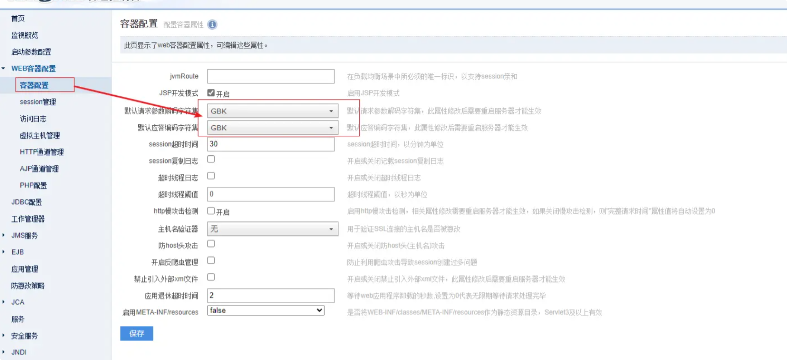

   将字符集修改为 `UTF-8`：

   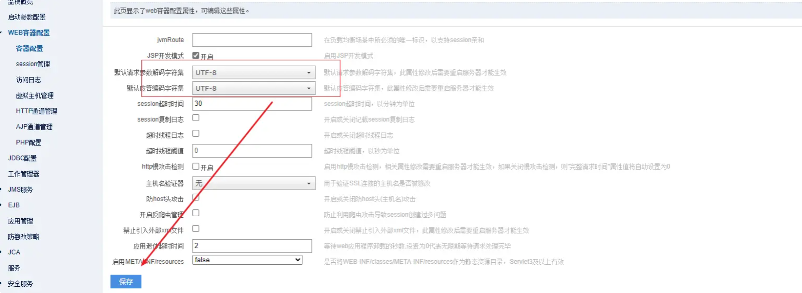

2. 创建虚拟主机：

   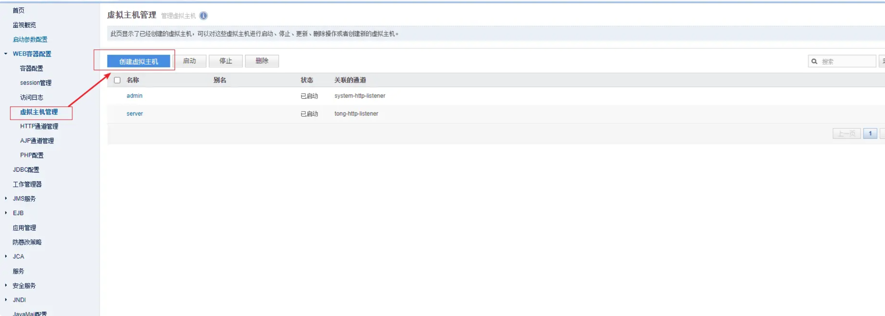

   填写虚拟主机信息，并设置 `cacheMaxiSize` 属性：

   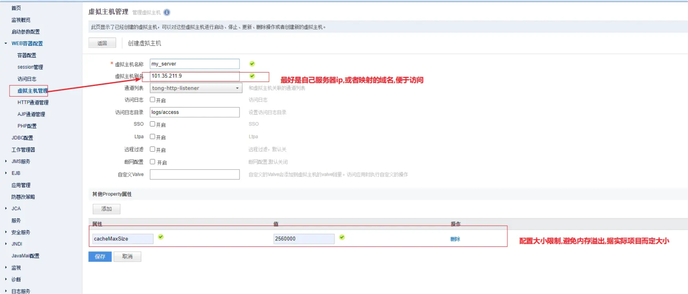

3. 创建 HTTP 通道：

   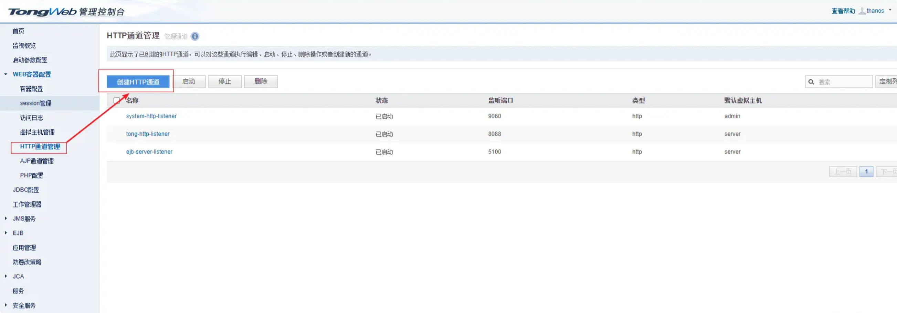

   指定监听端口，选择刚刚创建的虚拟主机：

   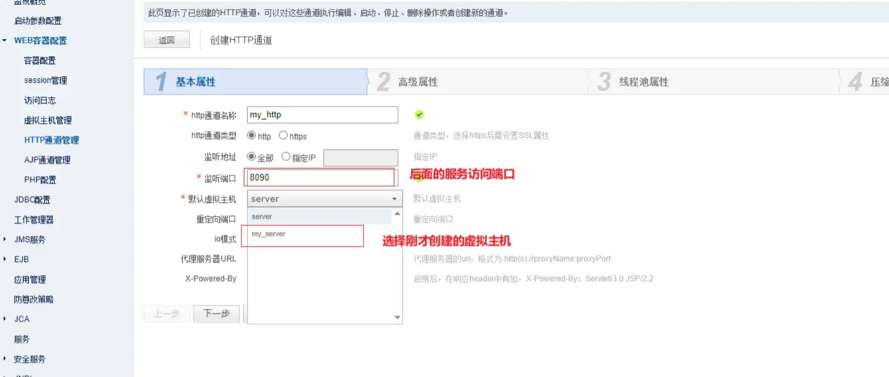

   URL 编码格式改为 `UTF-8`，最后保存：

   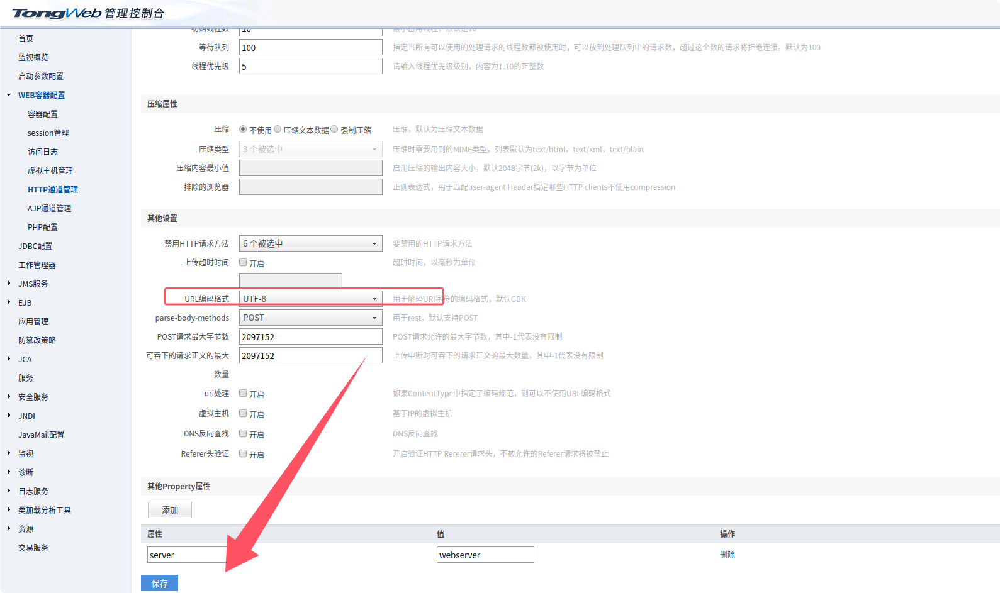


# 4、部署

## 4.1、前端

### 4.1.1、打包

正常前段部署是直接打包直接放到 Nginx 即可访问，但是 TongWeb 这里需要先将其处理成 war 包：

1. 前端 `build` 完成后 ，会生成一个 dist 的目录：

   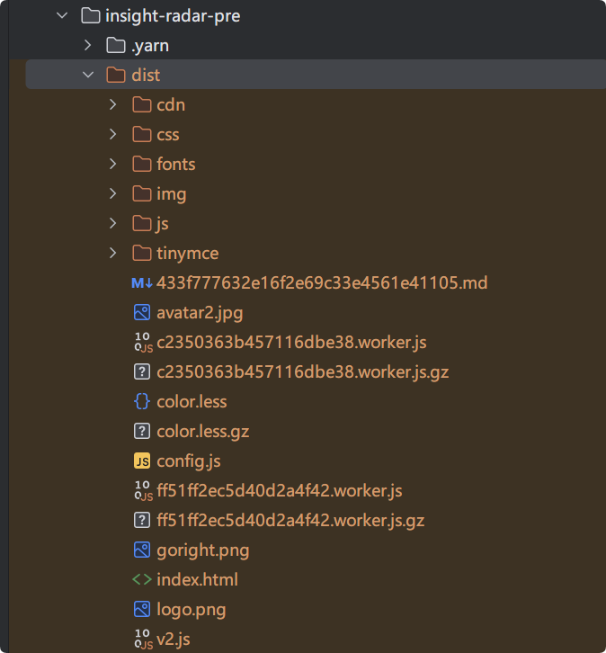

2. 在 dist 目录下新增 WEB-INF 目录以及 web.xml 文件：

   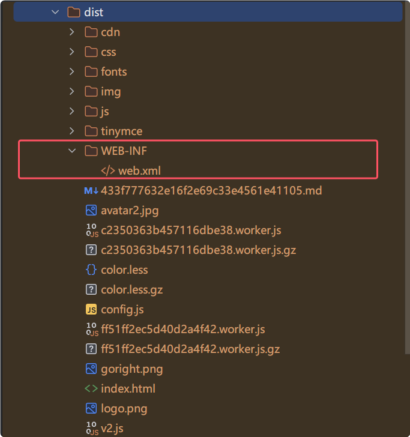

   web.xml 内容如下：

   ```xml
   <?xml version="1.0"?>
   <web-app>
       <error-page>
           <error-code>404</error-code>
           <location>/index.html</location>
       </error-page>
   </web-app>
   ```

   > [!CAUTION]
   >
   > 没有 WEB-INF 与 web.xml 在部署时将提示无法识别应用类型！

3. 使用命令行进入 dist 目录，将目录下所有文件打成 war 包：

   ```shell
   jar -cvf my_app.war *
   ```


### 4.1.2、部署

1.  打开【应用管理】页面，点击【部署应用】按钮：

   

2. 文件位置选择【本机】，上传本地打包好的前端 war 包：

   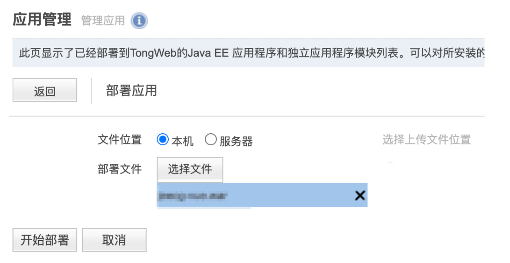

3.  点击【开始部署】，修改应用前缀，点击【下一步】：

   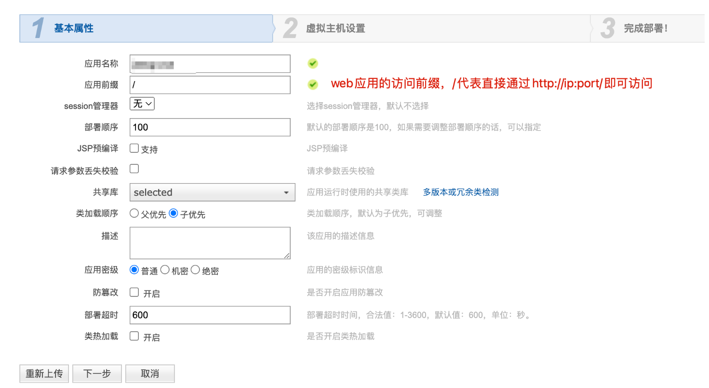

4. 选择之前设置好的虚拟主机，确认信息无误后点击完成，完成部署：

   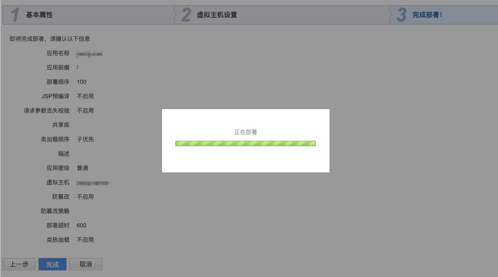


## 4.2、后端

1. 打开【应用管理】页面，点击【部署应用】按钮：

   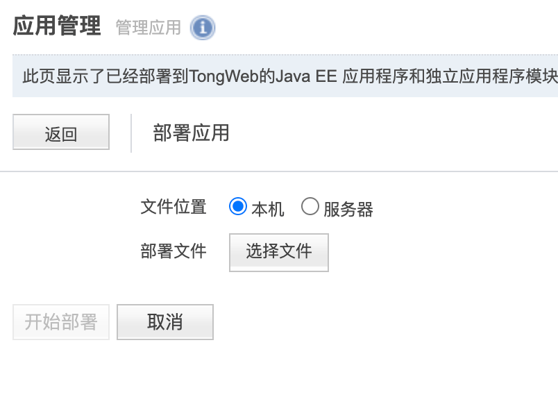

2. 文件位置选择【本机】，上传本地打包好的后端 war 包：

   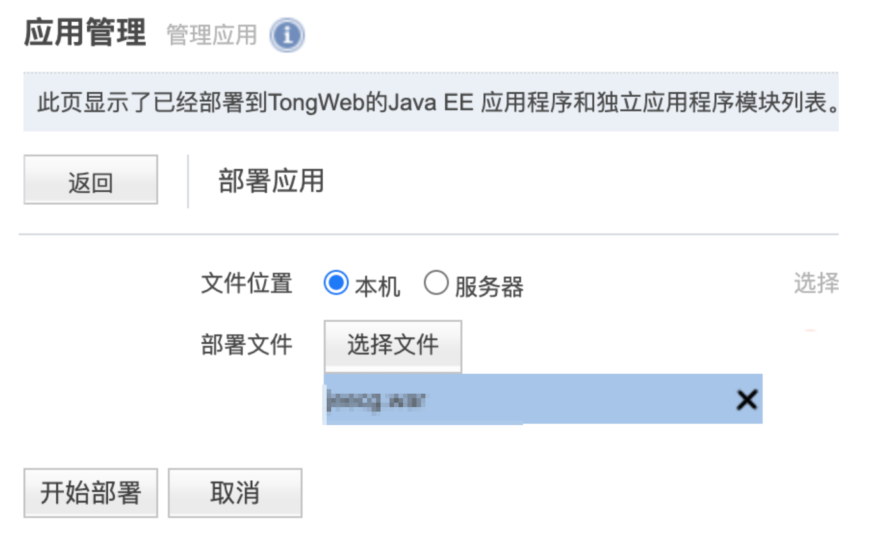

3. 点击【开始部署】，修改应用前缀，点击下一步：

   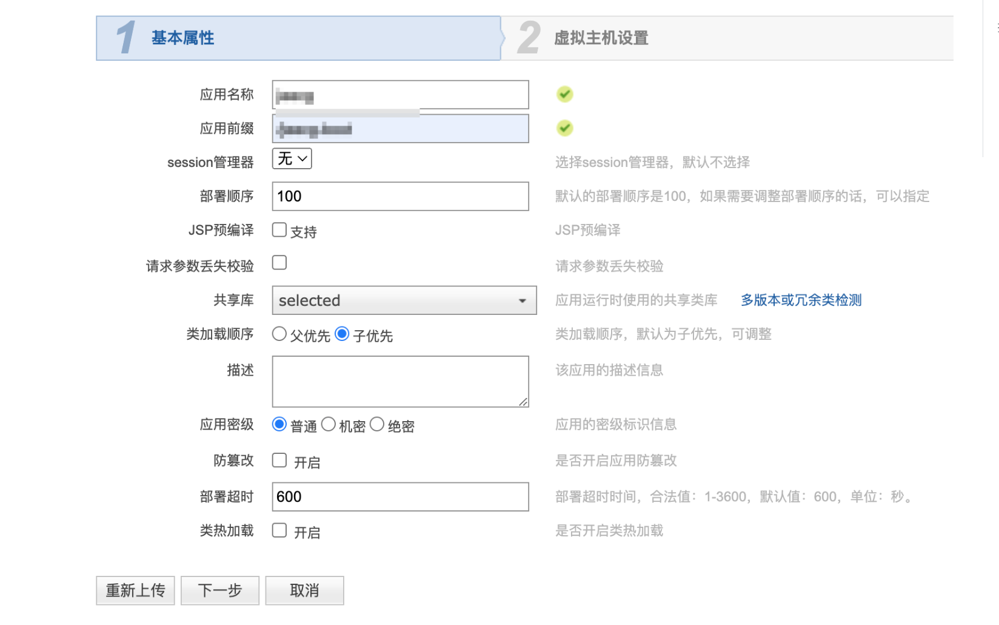

   > [!IMPORTANT]
   >
   > 后端的应用前缀必须与前端项目打包时设置的前缀一致！

4. 选择之前设置好的虚拟主机，确认信息无误后点击完成，完成部署：

   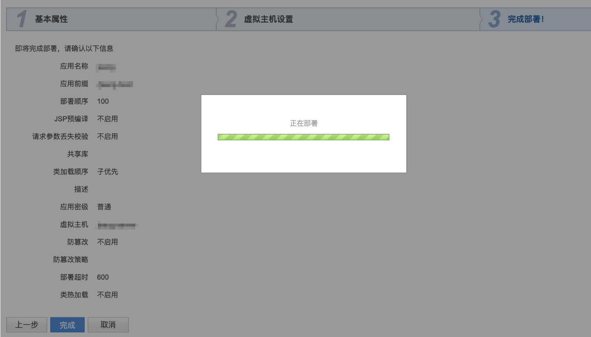