# 1、基础

## 1.1、介绍

### 1.1.1、Vue.js 是什么

Vue (读音 /vjuː/，类似于 view) 是一套用于构建用户界面的渐进式框架。与其它大型框架不同的是，Vue 被设计为可以自底向上逐层应用。Vue 的核心库只关注视图层，不仅易于上手，还便于与第三方库或既有项目整合。另一方面，当与现代化的工具链以及各种支持类库结合使用时，Vue 也完全能够为复杂的单页应用提供驱动。


### 1.1.2、安装

创建一个 `.html` 文件，然后通过如下方式引入 Vue：

```html
<!-- 开发环境版本，包含了有帮助的命令行警告 -->
<script src="https://cdn.jsdelivr.net/npm/vue@2/dist/vue.js"></script>
```

或者：

```html
<!-- 生产环境版本，优化了尺寸和速度 -->
<script src="https://cdn.jsdelivr.net/npm/vue@2"></script>
```


### 1.1.4、条件与循环

控制切换一个元素是否显示也相当简单：

```html
<div id="app-3">
  <p v-if="seen">现在你看到我了</p>
</div>
```

```javascript
var app3 = new Vue({
  el: '#app-3',
  data: {
    seen: true
  }
})
```

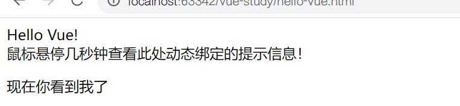

在控制台输入 `app3.seen = false`，你会发现之前显示的消息消失了。

这个例子演示了我们不仅可以把数据绑定到 DOM 文本或 attribute，还可以绑定到 DOM **结构**。此外，Vue 也提供一个强大的过渡效果系统，可以在 Vue 插入/更新/移除元素时自动应用过渡效果。

还有其它很多指令，每个都有特殊的功能。例如，`v-for` 指令可以绑定数组的数据来渲染一个项目列表：

```html
<div id="app-4">
  <ol>
    <li v-for="todo in todos">
      {{ todo.text }}
    </li>
  </ol>
</div>
```

```javascript
var app4 = new Vue({
  el: '#app-4',
  data: {
    todos: [
      { text: '学习 JavaScript' },
      { text: '学习 Vue' },
      { text: '整个牛项目' }
    ]
  }
})
```

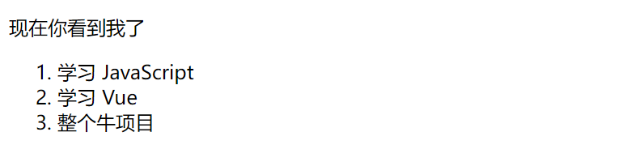

在控制台里，输入 `app4.todos.push({ text: '新项目' })`，你会发现列表最后添加了一个新项目。


### 1.1.5、处理用户输入

为了让用户和你的应用进行交互，我们可以用 `v-on` 指令添加一个事件监听器，通过它调用在 Vue 实例中定义的方法：

```html
<div id="app-5">
  <p>{{ message }}</p>
  <button v-on:click="reverseMessage">反转消息</button>
</div>
```

```javascript
var app5 = new Vue({
  el: '#app-5',
  data: {
    message: 'Hello Vue.js!'
  },
  methods: {
    reverseMessage: function () {
      this.message = this.message.split('').reverse().join('')
    }
  }
})
```


注意在 `reverseMessage` 方法中，我们更新了应用的状态，但没有触碰 DOM——所有的 DOM 操作都由 Vue 来处理，你编写的代码只需要关注逻辑层面即可。

Vue 还提供了 `v-model` 指令，它能轻松实现表单输入和应用状态之间的双向绑定。

```html
<div id="app-6">
  <p>{{ message }}</p>
  <input v-model="message">
</div>
```

```javascript
var app6 = new Vue({
  el: '#app-6',
  data: {
    message: 'Hello Vue!'
  }
})
```

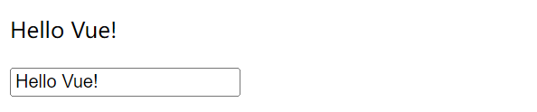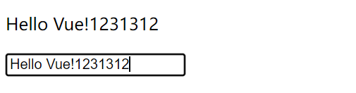


### 1.1.6、组件化应用构建

组件系统是 Vue 的另一个重要概念，因为它是一种抽象，允许我们使用小型、独立和通常可复用的组件构建大型应用。仔细想想，几乎任意类型的应用界面都可以抽象为一个组件树：


在 Vue 里，一个组件本质上是一个拥有预定义选项的一个 Vue 实例。在 Vue 中注册组件很简单：

```javascript
// 定义名为 todo-item 的新组件
Vue.component('todo-item', {
  // todo-item 组件现在接受一个 "prop"，类似于一个自定义 attribute。
  // 这个 prop 名为 todo。
  props: ['todo'],
  template: '<li>{{ todo.text }}</li>'
})
```

现在，我们可以使用 `v-bind` 指令将待办项传到循环输出的每个组件中：

```html
<div id="app-7">
  <ol>
    <!--
      现在我们为每个 todo-item 提供 todo 对象
      todo 对象是变量，即其内容可以是动态的。
      我们也需要为每个组件提供一个“key”，稍后再
      作详细解释。
    -->
    <todo-item
      v-for="item in groceryList"
      v-bind:todo="item"
      v-bind:key="item.id"
    ></todo-item>
  </ol>
</div>
```

```javascript
Vue.component('todo-item', {
  props: ['todo'],
  template: '<li>{{ todo.text }}</li>'
})

var app7 = new Vue({
  el: '#app-7',
  data: {
    groceryList: [
      { id: 0, text: '蔬菜' },
      { id: 1, text: '奶酪' },
      { id: 2, text: '随便其它什么人吃的东西' }
    ]
  }
})
```

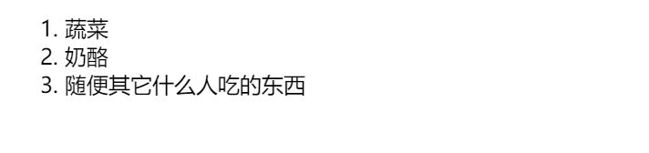


## 1.2、Vue 实例

### 1.2.1、创建一个 Vue 实例

每个 Vue 应用都是通过用 `Vue` 函数创建一个新的 **Vue 实例**开始的：

```javascript
var vm = new Vue({
  // 选项
})
```


### 1.2.2、数据与方法

当一个 Vue 实例被创建时，它将 `data` 对象中的所有的 property 加入到 Vue 的**响应式系统**中。当这些 property 的值发生改变时，视图将会产生 “响应”，即匹配更新为新的值。

```javascript
// 我们的数据对象
var data = { a: 1 }

// 该对象被加入到一个 Vue 实例中
var vm = new Vue({
  data: data
})

// 获得这个实例上的 property
// 返回源数据中对应的字段
vm.a == data.a // => true

// 设置 property 也会影响到原始数据
vm.a = 2
data.a // => 2

// ……反之亦然
data.a = 3
vm.a // => 3
```

当这些数据改变时，视图会进行重渲染。值得注意的是只有当实例被创建时就已经存在于 `data` 中的 property 才是**响应式**的。也就是说如果你添加一个新的 property：

```javascript
vm.b = 'hi'
```

那么对 `b` 的改动将不会触发任何视图的更新。如果你知道你会在晚些时候需要一个 property，但是一开始它为空或不存在，那么你仅需要设置一些初始值：

```javascript
data: {
  newTodoText: '',
  visitCount: 0,
  hideCompletedTodos: false,
  todos: [],
  error: null
}
```

这里唯一的例外是使用 `Object.freeze()`，这会阻止修改现有的 property，也意味着响应系统无法再追踪变化。

```javascript
var obj = {
  foo: 'bar'
}

Object.freeze(obj)

new Vue({
  el: '#app',
  data: obj
})
```

```html
<div id="app">
  <p>{{ foo }}</p>
  <!-- 这里的 `foo` 不会更新！ -->
  <button v-on:click="foo = 'baz'">Change it</button>
</div>
```

除了数据 property，Vue 实例还暴露了一些有用的实例 property 与方法。它们都有前缀 `$`，以便与用户定义的 property 区分开来。例如：

```javascript
var data = { a: 1 }
var vm = new Vue({
  el: '#example',
  data: data
})

vm.$data === data // => true
vm.$el === document.getElementById('example') // => true

// $watch 是一个实例方法
vm.$watch('a', function (newValue, oldValue) {
  // 这个回调将在 `vm.a` 改变后调用
})
```


### 1.2.3、生命周期钩子

每个 Vue 实例在被创建时都要经过一系列的初始化过程——例如，需要设置数据监听、编译模板、将实例挂载到 DOM 并在数据变化时更新 DOM 等。同时在这个过程中也会运行一些叫做**生命周期钩子**的函数，这给了用户在不同阶段添加自己的代码的机会。

比如 `created` 钩子可以用来在一个实例被创建之后执行代码：

```javascript
new Vue({
  data: {
    a: 1
  },
  created: function () {
    // `this` 指向 vm 实例
    console.log('a is: ' + this.a)
  }
})
// => "a is: 1"
```

也有一些其它的钩子，在实例生命周期的不同阶段被调用，如 `mounted`、`updated` 和 `destroyed`。生命周期钩子的 `this` 上下文指向调用它的 Vue 实例。

> 不要在选项 property 或回调上使用**箭头函数**，比如
>
>  `created: () => console.log(this.a)` 或
>
>  `vm.$watch('a', newValue => this.myMethod())`。因为箭头函数并没有 `this`，`this` 会作为变量一直向上级词法作用域查找，直至找到为止，经常导致 
>
> `Uncaught TypeError: Cannot read property of undefined` 或 
>
> `Uncaught TypeError: this.myMethod is not a function` 之类的错误。


**生命周期图示**


## 1.3、模板语法

Vue.js 使用了基于 HTML 的模板语法，允许开发者声明式地将 DOM 绑定至底层 Vue 实例的数据。所有 Vue.js 的模板都是合法的 HTML，所以能被遵循规范的浏览器和 HTML 解析器解析。

在底层的实现上，Vue 将模板编译成虚拟 DOM 渲染函数。结合响应系统，Vue 能够智能地计算出最少需要重新渲染多少组件，并把 DOM 操作次数减到最少。


### 1.3.1、插值

**文本**

数据绑定最常见的形式就是使用 “Mustache” 语法 (双大括号) 的文本插值：

```html
<span>Message: {{ msg }}</span>
```

Mustache 标签将会被替代为对应数据对象上 `msg` property 的值。无论何时，绑定的数据对象上 `msg` property 发生了改变，插值处的内容都会更新。

通过使用 `v-once` 指令，你也能执行一次性地插值，当数据改变时，插值处的内容不会更新。但请留心这会影响到该节点上的其它数据绑定：

```html
<span v-once>这个将不会改变: {{ msg }}</span>
```


**原始 HTML**

双大括号会将数据解释为普通文本，而非 HTML 代码。为了输出真正的 HTML，你需要使用 `v-html` 指令：

```html
<p>Using mustaches: {{ rawHtml }}</p>
<p>Using v-html directive: <span v-html="rawHtml"></span></p>
```

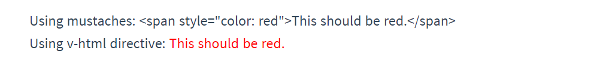

这个 `span` 的内容将会被替换成为 property 值 `rawHtml`，直接作为 HTML——会忽略解析 property 值中的数据绑定。注意，你不能使用 `v-html` 来复合局部模板，因为 Vue 不是基于字符串的模板引擎。反之，对于用户界面 (UI)，组件更适合作为可重用和可组合的基本单位。

> 你的站点上动态渲染的任意 HTML 可能会非常危险，因为它很容易导致 XSS 攻击。请只对可信内容使用 HTML 插值，**绝不要**对用户提供的内容使用插值。


**Attribute**

Mustache 语法不能作用在 HTML attribute 上，遇到这种情况应该使用 `v-bind` 指令：

```html
<div v-bind:id="dynamicId"></div>
```

对于布尔 attribute (它们只要存在就意味着值为 `true`)，`v-bind` 工作起来略有不同，在这个例子中：

```html
<button v-bind:disabled="isButtonDisabled">Button</button>
```

如果 `isButtonDisabled` 的值是 `null`、`undefined` 或 `false`，则 `disabled` attribute 甚至不会被包含在渲染出来的 `<button>` 元素中。


**使用 JavaScript 表达式**

对于所有的数据绑定，Vue.js 都提供了完全的 JavaScript 表达式支持：

```html
{{ number + 1 }}

{{ ok ? 'YES' : 'NO' }}

{{ message.split('').reverse().join('') }}

<div v-bind:id="'list-' + id"></div>
```

这些表达式会在所属 Vue 实例的数据作用域下作为 JavaScript 被解析。有个限制就是，每个绑定都只能包含**单个表达式**，所以下面的例子都**不会**生效。

```html
<!-- 这是语句，不是表达式 -->
{{ var a = 1 }}

<!-- 流控制也不会生效，请使用三元表达式 -->
{{ if (ok) { return message } }}
```

> 模板表达式都被放在沙盒中，只能访问全局变量的一个白名单，如 `Math` 和 `Date` 。你不应该在模板表达式中试图访问用户定义的全局变量。


### 1.3.2、指令

指令 (Directives) 是带有 `v-` 前缀的特殊 attribute。指令 attribute 的值预期是**单个 JavaScript 表达式** (`v-for` 是例外情况)。指令的职责是，当表达式的值改变时，将其产生的连带影响，响应式地作用于 DOM。

```html
<p v-if="seen">现在你看到我了</p>
```

这里 `v-if` 指令将根据表达式 `seen` 的值的真假来插入/移除 `<p>` 元素。


**参数**

一些指令能够接收一个 “参数”，在指令名称之后以冒号表示。例如，`v-bind` 指令可以用于响应式地更新 HTML attribute：

```html
<a v-bind:href="url">...</a>
```

在这里 `href` 是参数，告知 `v-bind` 指令将该元素的 `href` attribute 与表达式 `url` 的值绑定。

另一个例子是 `v-on` 指令，它用于监听 DOM 事件：

```html
<a v-on:click="doSomething">...</a>
```


**动态参数**

从 2.6.0 开始，可以用方括号括起来的 JavaScript 表达式作为一个指令的参数：

```html
<a v-bind:[attributeName]="url"> ... </a>
```

这里的 `attributeName` 会被作为一个 JavaScript 表达式进行动态求值，求得的值将会作为最终的参数来使用。例如，如果你的 Vue 实例有一个 `data` property `attributeName`，其值为 `"href"`，那么这个绑定将等价于 `v-bind:href`。

同样地，你可以使用动态参数为一个动态的事件名绑定处理函数：

```html
<a v-on:[eventName]="doSomething"> ... </a>
```

在这个示例中，当 `eventName` 的值为 `"focus"` 时，`v-on:[eventName]` 将等价于 `v-on:focus`。

动态参数预期会求出一个字符串，异常情况下值为 `null`。这个特殊的 `null` 值可以被显性地用于移除绑定。任何其它非字符串类型的值都将会触发一个警告。

动态参数表达式有一些语法约束，因为某些字符，如空格和引号，放在 HTML attribute 名里是无效的。例如：

```html
<!-- 这会触发一个编译警告 -->
<a v-bind:['foo' + bar]="value"> ... </a>
```

变通的办法是使用没有空格或引号的表达式，或用计算属性替代这种复杂表达式。

在 DOM 中使用模板时 (直接在一个 HTML 文件里撰写模板)，还需要避免使用大写字符来命名键名，因为浏览器会把 attribute 名全部强制转为小写：

```html
<!--
在 DOM 中使用模板时这段代码会被转换为 `v-bind:[someattr]`。
除非在实例中有一个名为“someattr”的 property，否则代码不会工作。
-->
<a v-bind:[someAttr]="value"> ... </a>
```


**修饰符**

修饰符 (modifier) 是以半角句号 `.` 指明的特殊后缀，用于指出一个指令应该以特殊方式绑定。例如，`.prevent` 修饰符告诉 `v-on` 指令对于触发的事件调用 `event.preventDefault()`：

```html
<form v-on:submit.prevent="onSubmit">...</form>
```


### 1.3.3、缩写

Vue 为 `v-bind` 和 `v-on` 这两个最常用的指令，提供了特定简写：


**`v-bind` 缩写**

```html
<!-- 完整语法 -->
<a v-bind:href="url">...</a>

<!-- 缩写 -->
<a :href="url">...</a>

<!-- 动态参数的缩写 (2.6.0+) -->
<a :[key]="url"> ... </a>
```


**`v-on` 缩写**

```html
<!-- 完整语法 -->
<a v-on:click="doSomething">...</a>

<!-- 缩写 -->
<a @click="doSomething">...</a>

<!-- 动态参数的缩写 (2.6.0+) -->
<a @[event]="doSomething"> ... </a>
```


## 1.4、计算属性和侦听器


# Node.js

Node.js 是一个基于 Chrome V8 引擎的 JavaScript 运行环境。Node.js 使用了一个事件驱动、非阻塞式 I/O 的模型，使其轻量又高效。Node.js 的包管理器 npm，是全球最大的开源库生态系统。

我们需要用到 npm 去下载 Vue 脚手架。

npm 是随同 Node.js 一起安装的包管理工具，能解决 Node.js 代码部署上的很多问题，常见的使用场景有以下几种：

- 允许用户从 npm 服务器下载别人编写的第三方包到本地使用。
- 允许用户从 npm 服务器下载并安装别人编写的命令行程序到本地使用。
- 允许用户将自己编写的包或命令行程序上传到 npm 服务器供别人使用。


**安装 Node.js**

1. 打开官网[下载链接](https://nodejs.org/en/download/): 

   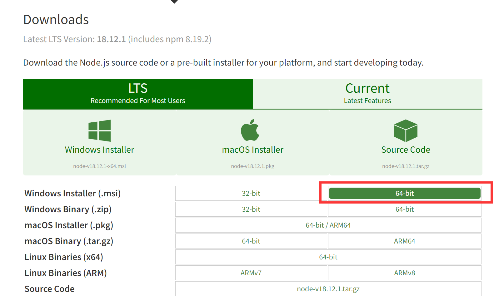

2. 下载完成后直接安装，可以不用修改，直接默认选项安装，如有需要可以修改安装目录。

3. 安装完成后打开命令行查看版本：

   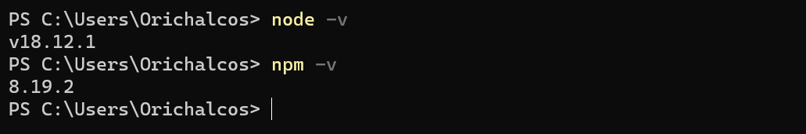

   `node -v` 显示 Node.js 的版本说明已安装成功，`npm -v` 显示 npm 的版本说明自带的 npm 也已经安装成功。

4. 安装完成后的目录如下所示：

   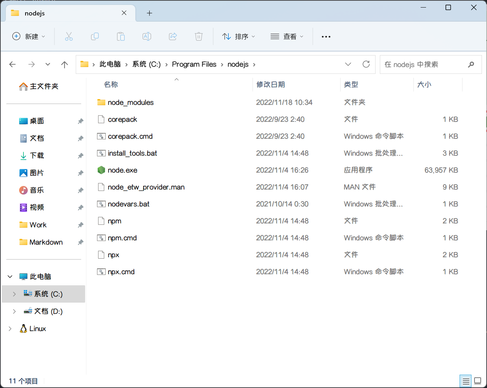


**环境配置**

这里的环境配置主要配置的是 npm 安装的全局模块所在的路径，以及缓存 cache 的路径，之所以要配置，是因为以后在执行类似：`npm install express [-g]` （后面的可选参数 `-g`，g 代表 global 全局安装的意思）的安装语句时，会将安装的模块安装到【C:\Users\用户名\AppData\Roaming\npm】路径中，占 C 盘空间。

例如：我希望将全模块所在路径和缓存路径放在我 Node.js 安装的文件夹中。

1. 在我安装的文件夹【D:\Develop\nodejsC:\Program Files\nodejs】下创建两个文件夹【node_global】及【node_cache】：

   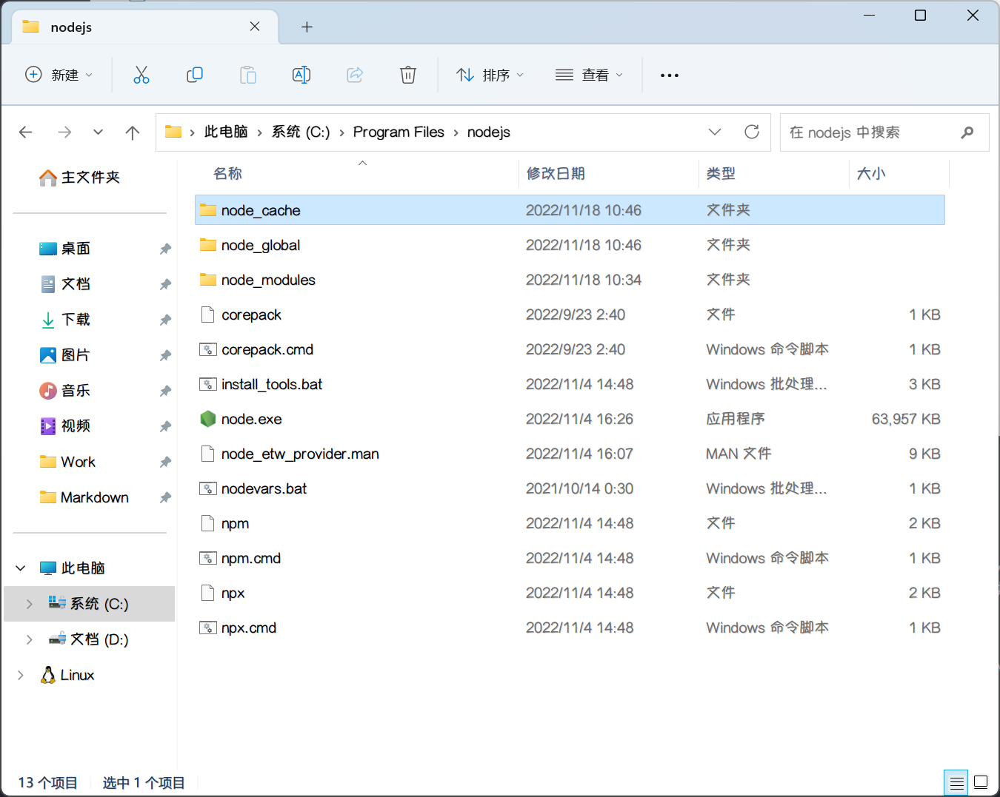

2. 创建完两个空文件夹之后，打开命令行窗口，输入：

   ```shell
   npm config set prefix "C:\Program Files\nodejs\node_global"
   npm config set cache "C:\Program Files\nodejs\node_cache"
   ```

   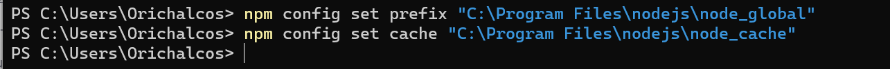

3. 接下来设置环境变量：

   进入环境变量对话框，新建系统变量，变量名：NODE_PATH，变量值：`D:\Develop\nodejs\node_global\node_modules`：

   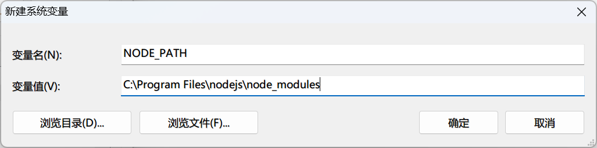

   将用户变量下的 Path 的 `C:\Users\Orichalcos\AppData\Roaming\npm` 修改为 `C:\Program Files\nodejs\node_global`：

   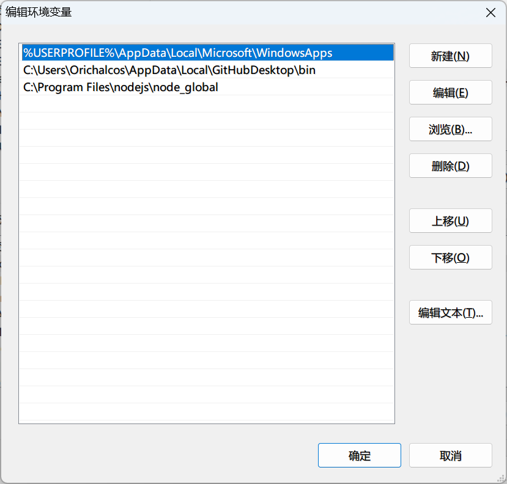

4. 配置完后，安装个 module 测试下，我们就安装最常用的 express 模块。

   在命令行输入如下命令进行模块的全局安装：

   ```shell
   npm install express -g
   ```

   

   

