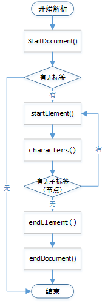

XML，即可扩展标记语言（Extensible Markup Language），标准通用标记语言的子集，一种用于标记电子文件使其具有结构性的标记语言。它可以用来标记数据、定义数据类型，是一种允许用户对自己的标记语言进行定义的源语言。它非常适合万维网传输，提供统一的方法描述和交换独立于应用程序或供应商的结构化数据。

- XML 是一种标记语言，类似 HTML
- XML 设计宗旨是传输数据，而非显示数据
- XML 标签没有被预定义，需要自行定义标签
- XML 被设计为具有自我描述性
- XML 是 W3C 的推荐标准

XML解析方法分为 5 种：

1. DOM 解析
2. SAX 解析
3. STAX 解析
4. JDOM 解析
5. DOM4J 解析

其中 DOM 解析和 SAX 解析属于基础方法，是官方提供的平台无关的解析方式；JDOM 解析和 DOM4J 属于扩展方法，它们是在基础的方法上扩展出来的，只适用于 java 平台。

<br>

# 1、DOM 解析

DOM 的全称是 Document Object Model，即文档对象模型。在应用程序中，基于 DOM 的 XML 分析器将一个 XML 文档转换成一个对象模型的集合（通常称 DOM 树），应用程序正是通过对这个对象模型的操作，来实现对 XML 文档数据的操作。通过 DOM 接口，应用程序可以在任何时候访问XML 文档中的任何一部分数据，因此，这种利用 DOM 接口的机制也被称作随机访问机制。

DOM 接口提供了一种通过分层对象模型来访问 XML 文档信息的方式，这些分层对象模型依据 XML 的文档结构形成了一棵节点树。无论 XML 文档中所描述的是什么类型的信息，即便是制表数据、项目列表或一个文档，利用 DOM 所生成的模型都是节点树的形式。也就是说，DOM 强制使用树模型来访问 XML 文档中的信息。由于 XML 本质上就是一种分层结构，所以这种描述方法是相当有效的。

DOM 树所提供的随机访问方式给应用程序的开发带来了很大的灵活性，它可以任意地控制整个 XML 文档中的内容。然而，由于 DOM 分析器把整个 XML 文档转化成 DOM 树放在了内存中，因此，当文档比较大或者结构比较复杂时，对内存的需求就比较高。而且，对于结构复杂的树的遍历也是一项耗时的操作。所以，DOM 分析器对机器性能的要求比较高，实现效率不十分理想。不过，由于 DOM 分析器所采用的树结构的思想与 XML 文档的结构相吻合，同时鉴于随机访问所带来的方便，因此，DOM 分析器还是有很广泛的使用价值的。

优点：

- 形成了树结构，有助于更好的理解、掌握，且代码容易编写
- 解析过程中，树结构保存在内存中，方便修改
- 可通过节点名来获取节点

缺点：

- 由于文件是一次性读取，所以对内存的耗费比较大，容易引发内存溢出等问题

<br>

下面是 DOM 解析与创建 XML 文件的完整代码：

```java
package com.xiaobaizhiqian;
 
import java.io.File;
import java.io.IOException;
import java.io.StringWriter;
import java.util.Date;
 
import javax.xml.parsers.DocumentBuilder;
import javax.xml.parsers.DocumentBuilderFactory;
import javax.xml.parsers.ParserConfigurationException;
import javax.xml.transform.Transformer;
import javax.xml.transform.TransformerConfigurationException;
import javax.xml.transform.TransformerException;
import javax.xml.transform.TransformerFactory;
import javax.xml.transform.dom.DOMSource;
import javax.xml.transform.stream.StreamResult;
 
import org.w3c.dom.Document;
import org.w3c.dom.Element;
import org.w3c.dom.NamedNodeMap;
import org.w3c.dom.Node;
import org.w3c.dom.NodeList;
import org.xml.sax.SAXException;
 
public class DOMTest {
 
	public static void main(String[] args) {
		Date string = new Date();
		long str1 = string.getTime();
		readeXMLByDOM();
		Date string1 = new Date();
		long str2 = string1.getTime();
		long str = str2 - str1;
		System.out.println(str);
	}
 
	public static void readeXMLByDOM() {
		// 创建一个xml文件解析工厂
		DocumentBuilderFactory documentBuilderFactory = DocumentBuilderFactory.newInstance();
 
		try {
			// 创建一个解析工厂基本接口
			DocumentBuilder documentBuilder = documentBuilderFactory.newDocumentBuilder();
			// 通过DocumentBuilder的parse方法加载文件
			Document document = documentBuilder.parse("languages.xml");
			// 获取根目录
			Element element = document.getDocumentElement();
			document.getElementsByTagName("");
			// 通过根目录，根据节点名称，获取所有该名称的节点
			NodeList nodeList = element.getElementsByTagName("lan");
			// 也可通过document直接获取
			NodeList nodeList2 = document.getElementsByTagName("lan");
			for (int i = 0; i < nodeList.getLength(); i++) {
				// 获取单独的一个节点
				Node node = nodeList.item(i);
				// 获取该节点的名字
				String nodeName = node.getNodeName();
				// 获取该节点的属性集合
				NamedNodeMap attrs = node.getAttributes();
				// 根据属性名获得该节点的指定属性名的属性
				Node nodeAttr = attrs.getNamedItem("id");
				// 也可获取属性集合中指定下标的属性
				Node nodeattr2 = attrs.item(0);// 这里item中使用的是具体值，在实际应用中可使用变量
				// 获取属性名
				String attrName = nodeAttr.getNodeName();
				// 获取属性值
				String attrValue = nodeAttr.getNodeValue();
				// 获取节点的值。若该节点下还有节点，那么该节点的值则为空，须继续获取节点
				String nodeValue = node.getNodeValue();
				NodeList nodeList3 = node.getChildNodes();
				for(int j = 0; j < nodeList3.getLength(); j++) {
					Node node2 = nodeList3.item(j);
					if (node2.getNodeType() == Node.ELEMENT_NODE) {
						String nodeName1 = node2.getNodeName();
						String nodeValue2 = node2.getTextContent();
						//String nodeValue2 = node2.getFirstChild().getNodeValue();
						System.out.println(nodeName1 + "：" + nodeValue2);
					}		
				}
				System.out.println(nodeName + "：" + attrName + "：" + attrValue + "：" + nodeValue);
			}
		} catch (ParserConfigurationException e) {
			e.printStackTrace();
		} catch (SAXException e) {
			e.printStackTrace();
		} catch (IOException e) {
			e.printStackTrace();
		}
	}
 
	public static void writeXMLByDom() {
		// 创建一个xml文件解析工厂
		DocumentBuilderFactory documentBuilderFactory = DocumentBuilderFactory.newInstance();
		try {
			// 创建一个解析工厂基本接口
			DocumentBuilder documentBuilder = documentBuilderFactory.newDocumentBuilder();
			// 通过解析工厂接口创建document
			Document document = documentBuilder.newDocument();
			// 创建根节点
			Element rootElement = document.createElement("languagesTest");
			// 给根节点设置属性
			rootElement.setAttribute("category", "it");
			
			// 创建子节点
			Element lanElement = document.createElement("lan");
			// 为子节点设置属性
			lanElement.setAttribute("id", "1");
			// 创建子节点
			Element nameElement = document.createElement("name");
			// 为子节点设置值
			nameElement.setTextContent("java");
			Element ideElement = document.createElement("ide");
			ideElement.setTextContent("eclipse");
			
			// 将二级子节点放入一级子节点中
			lanElement.appendChild(nameElement);
			lanElement.appendChild(ideElement);
			
			// 将一级子节点放入根节点中
			rootElement.appendChild(lanElement);
			
			// 将根节点放入document中
			document.appendChild(rootElement);
			
			TransformerFactory transformerFactory = TransformerFactory.newInstance();
			Transformer transformer = transformerFactory.newTransformer();
			
			/* 
			 * 在将源xml输出时，有两个参数，第一个为源xml数据，固定不变的。
			 * 第二个参数，则可将源xml输出为字符串，也可将源xml输出为xml文件格式的文件，具体实现方式如下
			 * 通过StringWriter将源xml输出为字符串，通过File将源xml输出为文件
			 */
			// 输出为字符串格式
			StringWriter stringWriter = new StringWriter();
			transformer.transform(new DOMSource(document), new StreamResult(stringWriter));
			System.out.println(stringWriter.toString());
			
			// 输出为文件格式
			transformer.transform(new DOMSource(document), new StreamResult(new File("languagesTest.xml")));
		} catch (ParserConfigurationException e) {
			e.printStackTrace();
		} catch (TransformerConfigurationException e) {
			e.printStackTrace();
		} catch (TransformerException e) {
			e.printStackTrace();
		}	
	}
}
```

<br>

# 2、SAX 解析

SAX 的全称是 Simple APIs for XML，即简单应用程序接口。与 DOM 不同，SAX 提供的访问模式是一种顺序模式，这是一种快速读写 XML 数据的方式。当使用 SAX 分析器对 XML 文档进行分析时，会触发一系列事件，并激活相应的事件处理函数，应用程序通过这些事件处理函数实现对 XML 文档的访问，因而 SAX 接口也被称作事件驱动接口。

优点：

- 采用事件驱动模式，对内存耗费比较小，解析速度快
- 适用于只处理 XML 文件中的数据时

缺点：

- 编码比较麻烦
- 很难同时访问 XML 文件中的多处不同数据
- 无法知道当前解析标签（节点）的上层标签，及其嵌套结构，仅仅知道当前解析的标签的名字和属性，要知道其他信息需要程序猿自己编码
- 只能读取 XML，无法修改 XML
- 无法随机访问某个标签（节点）

适用场合：

- 对于 CPU 资源宝贵的设备，如 Android 等移动设备
- 对于只需从 XML 读取信息而无需修改 XML

<br>

SAX 解析 XML 步骤：

1. 创建一个与 XML 对应的实体类（JavaBean）:

	```java
	public class Languages {
		private String id;
		private String name;
		private String ide;
		// getter和setter已省略
	}
	```

2. 新建一个类 XmlParseHandler.java，该类需要继承 `DefaultHandler` 或者实现 `ContentHandler` 接口，这里通过继承 `DefaultHandler`（实现了 `ContentHandler` 接口）的方式，该类是 SAX 解析的核心所在，生命周期如下：

	

	代码：

	```java
	package com.xiaobaizhiqian;
	 
	import java.util.ArrayList;
	 
	import org.xml.sax.Attributes;
	import org.xml.sax.SAXException;
	import org.xml.sax.helpers.DefaultHandler;
	 
	public class SAXParserHandler extends DefaultHandler {
		// 解析标签内容时存放数据，便于endElement使用
		private String value = null;
	    private Languages languages = null;
	    private ArrayList<Languages> languagesList = null;
	    
	    /** 直接调用便可获取从xml中读取的数据
	     * @return 返回值可自行设置（这里是返回的ArrayList<Languages>）
	     */
	    public ArrayList<Languages> getLanguages() {
	        return languagesList;
	    }
	    
	    /** 用来标识解析开始，只会执行一次
	     */
	    @Override
	    public void startDocument() throws SAXException {
	    	super.startDocument();
	    	System.out.println("解析开始");
	    	languagesList = new ArrayList<Languages>();
	    }
	    
	    /** 开始解析节点时调用
	     * @param uri xml文档的命名空间
	     * @param localName
	     * @param qName 标签的名字
	     * @param attributes 标签属性集
	     */
	    @Override
	    public void startElement(String uri, String localName, String qName, Attributes attributes) throws SAXException {
	    	// 调用父类的方法
	    	super.startElement(uri, localName, qName, attributes);
	    	if (qName.equals("languages")) {
	           
	            //开始解析book元素的属性
	            System.out.println("======================开始遍历某一本书的内容=================");
	            //不知道book元素下属性的名称以及个数，如何获取属性名以及属性值
	            int num = attributes.getLength();
	            for(int i = 0; i < num; i++){
	                System.out.print("语言元素的第" + (i + 1) +  "个属性名是："
	                        + attributes.getQName(i));
	                System.out.println("---属性值是：" + attributes.getValue(i));
	            }
			}else if (!qName.equals("lan")) {
	            System.out.print("节点名是：" + qName + "---");
	        }else {
	        	 //创建一个book对象
	            languages = new Languages();
	        	int num = attributes.getLength();
	            for(int i = 0; i < num; i++){
	                System.out.print("语言元素的第" + (i + 1) +  "个属性名是："
	                        + attributes.getQName(i));
	                System.out.println("---属性值是：" + attributes.getValue(i));
	                if (attributes.getQName(i).equals("id")) {
	                    languages.setId(attributes.getValue(i));
	                }
	            }
			}
	    }
	    
	    @Override
	    public void endElement(String uri, String localName, String qName) throws SAXException {
	    	//调用DefaultHandler类的endElement方法
	        super.endElement(uri, localName, qName);
	        //判断是否针对一本书已经遍历结束
	        if (qName.equals("languages")) {
	            System.out.println(languagesList.size());
	            System.out.println("======================结束遍历某一本书的内容=================");
	        }else if(qName.equals("lan")){
	        	languagesList.add(languages);
	        }else if(qName.equals("name")){
	        	languages.setName(value);
	        }else if (qName.equals("ide")) {
	        	languages.setIde(value);
	        }
	    }
	    
	    /** 解析标签内容时调用
	     * @param ch 当前读取到的TextNode(文本节点)的字节数组
	     * @param start 字节开始的位置，为0则读取全部
	     * @param length 当前TextNode的长度
	     */
	    @Override
	    public void characters(char[] ch, int start, int length) throws SAXException {
	    	super.characters(ch, start, length);
	    	value = new String(ch, start, length);
	        if (!value.trim().equals("")) {
	            System.out.println("节点值是：" + value);
	        }
	    }
	    
	    /** 用来标识解析结束，只会执行一次
	     * @see org.xml.sax.helpers.DefaultHandler#endDocument()
	     */
	    @Override
	    public void endDocument() throws SAXException {
	    	super.endDocument();
	    	System.out.println("解析结束");
	    }
	}
	```

3. 使用 `XmlParseHandler` 通过 `getLanguages()` 直接获得数据，代码：

	```java
	package com.xiaobaizhiqian;
	 
	import java.io.File;
	import java.io.FileNotFoundException;
	import java.io.FileOutputStream;
	import java.io.IOException;
	import java.util.Date;
	 
	import javax.xml.parsers.ParserConfigurationException;
	import javax.xml.parsers.SAXParser;
	import javax.xml.parsers.SAXParserFactory;
	import javax.xml.transform.OutputKeys;
	import javax.xml.transform.Result;
	import javax.xml.transform.Transformer;
	import javax.xml.transform.TransformerConfigurationException;
	import javax.xml.transform.sax.SAXTransformerFactory;
	import javax.xml.transform.sax.TransformerHandler;
	import javax.xml.transform.stream.StreamResult;
	 
	import org.xml.sax.SAXException;
	 
	import com.sun.xml.internal.bind.util.AttributesImpl;
	 
	public class SAXTest {
		public static void main(String[] args) {
			Date string = new Date();
			long str1 = string.getTime();
			readXMLBySAX();
			Date string1 = new Date();
			long str2 = string1.getTime();
			long str = str2 - str1;
			System.out.println(str);
		}
	 
		public static void readXMLBySAX() {
			// 创建一个xml文件解析工厂
			SAXParserFactory saxParserFactory = SAXParserFactory.newInstance();
			try {
				// 创建一个解析工厂基本接口
				SAXParser saxParser = saxParserFactory.newSAXParser();
				// 创建一个解析工厂管理
				SAXParserHandler saxParserHandler = new SAXParserHandler();
				// 通过SAXParserHandler的parse方法加载文件
				saxParser.parse("languages.xml", saxParserHandler);
				System.out.println("~！~！~！共有" + saxParserHandler.getLanguages().size() + "本书");
				for (Languages languages : saxParserHandler.getLanguages()) {
					System.out.println(languages.getId());
					System.out.println(languages.getName());
					System.out.println(languages.getIde());
					System.out.println("----finish----");
				}
	 
			} catch (ParserConfigurationException e) {
				e.printStackTrace();
			} catch (SAXException e) {
				e.printStackTrace();
			} catch (IOException e) {
				e.printStackTrace();
			}
		}
	 
		public static void writeXMLBySAX() {
			SAXTransformerFactory saxTransformerFactory = (SAXTransformerFactory) SAXTransformerFactory.newInstance();
			try {
				TransformerHandler transformerHandler = saxTransformerFactory.newTransformerHandler();
				Transformer transformer = transformerHandler.getTransformer();
				// 设置生成的XML文件格式
				transformer.setOutputProperty(OutputKeys.ENCODING, "utf-8");
				// 设置生成的 XML 文件自动换行
				transformer.setOutputProperty(OutputKeys.INDENT, "yes");
				// 如果不存在，就创建一个新的 XML 文件
				File file = new File("languagesTest.xml");
				if (!file.exists()) {
					file.createNewFile();
				}
				// 创建一个Result 对象,并且使其与 TransformerHandler 对象关联
				Result result = null;
				result = new StreamResult(new FileOutputStream(file));
				transformerHandler.setResult(result);
				
				//利用 handler 对象进行 XML 文件内容的编写
	             //打开 document
				transformerHandler.startDocument();
	             //为了创建节点属性和属性值
	             AttributesImpl atts = new AttributesImpl();
	             //设置属性和属性值
	             atts.addAttribute("", "", "cat", "", "it");
	             //根节点开始标签
	             transformerHandler.startElement("", "", "languages", atts);
	             atts.clear();
	             atts.addAttribute("", "", "id", "", "1");
	             //子节点开始标签
	             transformerHandler.startElement("", "", "lan", atts);
	            
	             atts.clear();  //清空子节点设的值
	            
	             //子节点下name节点开始标签
	             transformerHandler.startElement("", "", "name", atts);
	             String name="java";
	             transformerHandler.characters(name.toCharArray(), 0, name.length());
	             //字节点下name节点结束标签
	             transformerHandler.endElement("", "", "name");
	             //子节点结束标签
	             transformerHandler.endElement("", "", "lan");
	            
	             //根节点结束标签
	             transformerHandler.endElement("", "", "languages");
	            
	             //关闭 document
	             transformerHandler.endDocument();
	 
			} catch (TransformerConfigurationException e) {
				e.printStackTrace();
			} catch (FileNotFoundException e) {
				e.printStackTrace();
			} catch (IOException e) {
				e.printStackTrace();
			} catch (SAXException e) {
				e.printStackTrace();
			}
		}
	}
	```

<br>

# 3、JDOM 解析

特征：

- 可直接通过节点名获取节点
- 仅使用具体类，而不使用接口
- API 大量使用了 Collections类
- Jdom 专用于 Java 技术，比 Dom 应用占用更少内存，但内存消耗仍然较大
- Jdom 提供更加简单和逻辑性访问 XML 信息的基础方法

JDOM 解析 XML 步骤

1. 导入 jdom.jar 包。jar 包下载地址 http://www.jdom.org/downloads/
2. 创建一个 SAXBuilder 的对象
3. 创建一个输入流，将 XML 文件加载到输入流中
4. 通过 `saxBuilder` 的 `build()` 方法，将输入流加载到 `saxBuilder` 中
5. 获取节点信息

<br>

下面是完整代码

```java
package com.xiaobaizhiqian;
 
import java.io.FileInputStream;
import java.io.FileNotFoundException;
import java.io.FileOutputStream;
import java.io.IOException;
import java.io.InputStream;
import java.io.InputStreamReader;
import java.util.Date;
import java.util.List;
 
import org.jdom2.Attribute;
import org.jdom2.Document;
import org.jdom2.Element;
import org.jdom2.JDOMException;
import org.jdom2.input.SAXBuilder;
import org.jdom2.output.Format;
import org.jdom2.output.XMLOutputter;
 
public class JDomTest {
	public static void main(String[] args) {
		Date string = new Date();
		long str1 = string.getTime();
		readXMLByJdom();
		Date string1 = new Date();
		long str2 = string1.getTime();
		long str = str2 - str1;
		System.out.println(str);
	}
 
	public static void readXMLByJdom() {
		// 1.创建一个SAXBuilder的对象
		SAXBuilder saxBuilder = new SAXBuilder();
		InputStream inputStream;
		try {
			// 2.创建一个输入流，将xml文件加载到输入流中
			inputStream = new FileInputStream("languages.xml");
			InputStreamReader inputStreamReader = new InputStreamReader(inputStream, "UTF-8");
			// 3.通过saxBuilder的build方法，将输入流加载到saxBuilder中
			Document document = saxBuilder.build(inputStreamReader);
			// 获取根节点
			Element rootElement = document.getRootElement();
			List<Element> elements = rootElement.getChildren();
			for (Element element : elements) {
				// 获取节点的属性
				List<Attribute> attributes = element.getAttributes();
				// 获取指定名称的节点
				element.getChild("");
				for (Attribute attribute : attributes) {
					// 获取属性名
					String attrName = attribute.getName();
					// 获取属性值
					String attrValue = attribute.getValue();
					System.out.println(element.getName() + "：" + attrName + "：" + attrValue);
				}
				// 获取子节点
				List<Element> elementsChilds = element.getChildren();
				for (Element elementChild : elementsChilds) {
					String elementName = elementChild.getName();
					String elementValue = elementChild.getValue();
					System.out.println(elementName + "：" + elementValue);
				}
			}
		} catch (FileNotFoundException e) {
			e.printStackTrace();
		} catch (JDOMException e) {
			e.printStackTrace();
		} catch (IOException e) {
			e.printStackTrace();
		}
	}
 
	public static void writeXMLByJdom() {
		// 创建根节点
		Element rootElement = new Element("languages");
		rootElement.setAttribute("cat", "it");
		// 将根节点放到document
		Document document = new Document(rootElement);
		Element element = new Element("lan");
		element.setAttribute("id", "1");
		Element nameElement = new Element("name");
		nameElement.addContent("java");
		rootElement.addContent(element);
		element.addContent(nameElement);
		XMLOutputter xmlOutputter = new XMLOutputter(Format.getCompactFormat().setEncoding("UTF-8").setIndent("	"));
		// 设置xml文件编码格式可封装成方法进行
		//XMLOutputter xmlOutputter1 = new XMLOutputter(getFormat());
		try {
			xmlOutputter.output(document, new FileOutputStream("languagesTest.xml"));
		} catch (IOException e) {
			e.printStackTrace();
		}
	}
	
	public static Format getFormat() {
		Format format = Format.getCompactFormat();
		format.setEncoding("UTF-8");
		format.setIndent("	");
		return format;
	}
}
```

<br>

# 4、DOM4J 解析

DOM4J 是一个 Java 的 XML API，是 JDOM 的升级品，用来读写 XML 文件的

DOM4J 是 JDOM 的一种智能分支，它合并了许多超出基本 XML 文档表示的功能。它使用接口和抽象基本类方法。具有性能优异、灵活性好、功能强大和极端易用的特点。是一个开放源码的文件。

<br>

以下是完整测试代码：

```java
package com.xiaobaizhiqian;
 
import java.io.FileWriter;
import java.io.IOException;
import java.io.Writer;
import java.util.Date;
import java.util.Iterator;
import java.util.List;
 
import org.dom4j.Attribute;
import org.dom4j.Document;
import org.dom4j.DocumentException;
import org.dom4j.DocumentHelper;
import org.dom4j.Element;
import org.dom4j.io.OutputFormat;
import org.dom4j.io.SAXReader;
import org.dom4j.io.XMLWriter;

public class Dom4jTest {
 
	public static void main(String[] args) {
		Date string = new Date();
		long str1 = string.getTime();
		readeXMLByDom4j();
		Date string1 = new Date();
		long str2 = string1.getTime();
		long str = str2 - str1;
		System.out.println(str);
	}
 
	public static void readeXMLByDom4j() {
		SAXReader saxReader = new SAXReader();
		try {
			// 通过reader对象的read方法加载xml文件,获取docuemnt对象。
			Document document = saxReader.read("languages.xml");
			// 通过document对象获取根节点bookstore
			Element rootElement = document.getRootElement();
			// 通过根节点获取迭代器
			Iterator<Element> elementIterator = rootElement.elementIterator();
			// 遍历迭代器，获取根节点中的信息
			while (elementIterator.hasNext()) {
				Element element = elementIterator.next();
				List<Attribute> attributes = element.attributes();
				for (Attribute attribute : attributes) {
					String attrName = attribute.getName();
					String attrValue = attribute.getValue();
					System.out.println(element.getName() + "：" + attrName + "：" + attrValue);
				}
				String elementName = element.getName();
				String elementValue = element.getStringValue();
				Iterator<Element> iterator = element.elementIterator();
				while (iterator.hasNext()) {
					Element element1 = iterator.next();
					String elementName1 = element1.getName();
					String elementValue1 = element1.getStringValue();
					System.out.println(elementName1 +"："+ elementValue1);
				}
			}
		} catch (DocumentException e) {
			e.printStackTrace();
		}
	}
 
	public static void writeXMLByDom4j() {
		// 创建一个xml文档
		Document doc = DocumentHelper.createDocument();
		// 向xml文件中添加注释
		doc.addComment("这里是注释");
		// 创建languages子节点
		Element root = doc.addElement("languages");
		// 在root节点下创建一个名为student的节点
		Element stuEle = root.addElement("student");
		// 给student节点添加属性
		stuEle.addAttribute("id", "101");
		// 给student节点添加一个子节点
		Element nameEle = stuEle.addElement("name");
		// 设置子节点的文本
		nameEle.setText("张三");
		// 用于格式化xml内容和设置头部标签
		OutputFormat format = OutputFormat.createPrettyPrint();
		// 设置xml文档的编码为utf-8
		format.setEncoding("utf-8");
		Writer out;
		try {
			// 创建一个输出流对象
			out = new FileWriter("languagesTest.xml");
			// 创建一个dom4j创建xml的对象
			XMLWriter writer = new XMLWriter(out, format);
			// 调用write方法将doc文档写到指定路径
			writer.write(doc);
			writer.close();
			System.out.print("生成XML文件成功");
		} catch (IOException e) {
			System.out.print("生成XML文件失败");
			e.printStackTrace();
		}
	}
}
```

<br>

## 4.1、XPath 技术

XPath 是一门在 XML 文档中查找信息的语言。在 DOM4J 解析中使用 XPath 技术可以快速的获取节点。XPath 技术有点像正则表达式，是一种语法格式，通过这种语法可以快速捕获节点。

引入 Jaxen 包（Jaxen 是 Java 的通用 XPath 引擎）：

```xml
<!-- https://mvnrepository.com/artifact/jaxen/jaxen -->
<dependency>
    <groupId>jaxen</groupId>
    <artifactId>jaxen</artifactId>
    <version>1.2.0</version>
</dependency>
```

<br>

**案例：**

book.xml 文件：

```xml
<?xml version="1.0" encoding="UTF-8"?>
<!-- DTD -->
<!-- <!DOCTYPE books [
	<!ELEMENT books (book*)>
	<!ELEMENT book (name,author,price)>
	<!ELEMENT name (#PCDATA)>
	<!ELEMENT author (#PCDATA)>
	<!ELEMENT price (#PCDATA)>
	<!ATTLIST book id CDATA #REQUIRED>
]>
 -->
<books xmlns:xsi="http://www.w3.org/2001/XMLSchema-instance"
 xsi:noNamespaceSchemaLocation="{book.xsd}">
	<book id="1001">
		<name>java开发实战</name>
		<author>张小三</author>
		<price>98.5</price>
	</book>
	
	<book id="1002">
		<name>mysql从删库到跑路</name>
		<author>飞毛腿</author>
		<price>1000</price>
	</book>
</books>
```

TestXPath.java：

```java
import java.util.List;
 
import org.dom4j.Attribute;
import org.dom4j.Document;
import org.dom4j.DocumentException;
import org.dom4j.Node;
import org.dom4j.io.SAXReader;
 
public class TestXPath {
 
	public static void main(String[] args) throws DocumentException {
		//1、SAXReader对象
		SAXReader reader=new SAXReader();
		//2、读取XML文件
		Document doc=reader.read("book.xml");
		//得到第一个author节点
		Node node=doc.selectSingleNode("//author");
		System.out.println("节点的名称："+node.getName()+"t"+node.getText());
		//获取所有的author
		System.out.println("n-------------------------");
		List<Node> list=doc.selectNodes("//author");
		for(Node n:list){
			System.out.println("节点名称："+n.getName()+"t"+n.getText());
		}
		//选择id属性的book元素
		List<Attribute> attList=doc.selectNodes("//book/@id");
		for(Attribute att:attList){
			System.out.println("属性的名称："+att.getName()+"t"+att.getText());
		}
	}
 
}
```

<br>

## 4.2、XPath 语法

XPath 使用路径表达式来选取 XML 文档中的节点或节点集。节点是通过沿着路径（path）或者步（steps）来选取的。

<br>

**选取节点**

XPath 使用路径表达式在 XML 文档中选取节点。节点是通过沿着路径或者 step 来选取的。 下面列出了最有用的路径表达式：

| 表达式     | 描述                                                         |
| :--------- | :----------------------------------------------------------- |
| `nodename` | 选取此节点的所有子节点。                                     |
| `/`        | 从根节点选取（取子节点）。                                   |
| `//`       | 从匹配选择的当前节点选择文档中的节点，而不考虑它们的位置（取子孙节点）。 |
| `.`        | 选取当前节点。                                               |
| `..`       | 选取当前节点的父节点。                                       |
| `@`        | 选取属性。                                                   |

在下面的表格中列出了一些路径表达式以及表达式的结果：

| 路径表达式        | 结果                                                         |
| :---------------- | :----------------------------------------------------------- |
| `bookstore`       | 选取 bookstore 元素的所有子节点。                            |
| `/bookstore`      | 选取根元素 bookstore。注释：假如路径起始于正斜杠 `/`，则此路径始终代表到某元素的绝对路径！ |
| `bookstore/book`  | 选取属于 bookstore 的子元素的所有 book 元素。                |
| `//book`          | 选取所有 book 子元素，而不管它们在文档中的位置。             |
| `bookstore//book` | 选择属于 bookstore 元素的后代的所有 book 元素，而不管它们位于 bookstore 之下的什么位置。 |
| `//@lang`         | 选取名为 lang 的所有属性。                                   |

<br>

**谓语（Predicates）**

谓语用来查找某个特定的节点或者包含某个指定的值的节点。谓语被嵌在方括号中。

在下面的表格中列出了带有谓语的一些路径表达式，以及表达式的结果：

| 路径表达式                            | 结果                                                         |
| :------------------------------------ | :----------------------------------------------------------- |
| `/bookstore/book[1]`                  | 选取属于 bookstore 子元素的第一个 book 元素。                |
| `/bookstore/book[last()]`             | 选取属于 bookstore 子元素的最后一个 book 元素。              |
| `/bookstore/book[last()-1]`           | 选取属于 bookstore 子元素的倒数第二个 book 元素。            |
| `/bookstore/book[position()<3]`       | 选取最前面的两个属于 bookstore 元素的子元素的 book 元素。    |
| `//title[@lang]`                      | 选取所有拥有名为 lang 的属性的 title 元素。                  |
| `//title[@lang='eng']`                | 选取所有 title 元素，且这些元素拥有值为 eng 的 lang 属性。   |
| `/bookstore/book[price>35.00]`        | 选取 bookstore 元素的所有 book 元素，且其中的 price 元素的值须大于 35.00。 |
| `/bookstore/book[price>35.00]//title` | 选取 bookstore 元素中的 book 元素的所有 title 元素，且其中的 price 元素的值须大于 35.00。 |

<br>

**选取未知节点**

XPath 通配符可用来选取未知的 XML 元素。

| 通配符   | 描述                 |
| :------- | :------------------- |
| `*`      | 匹配任何元素节点。   |
| `@*`     | 匹配任何属性节点。   |
| `node()` | 匹配任何类型的节点。 |

在下面的表格中列出了一些路径表达式，以及这些表达式的结果：

| 路径表达式     | 结果                              |
| :------------- | :-------------------------------- |
| `/bookstore/*` | 选取 bookstore 元素的所有子元素。 |
| `//*`          | 选取文档中的所有元素。            |
| `//title[@*]`  | 选取所有带有属性的 title 元素。   |

<br>

**选取若干路径**

通过在路径表达式中使用 `|` 运算符可以选取若干个路径。

在下面的表格中列出了一些路径表达式，以及这些表达式的结果：

| 路径表达式                       | 结果                                                         |
| :-------------------------------- | :------------------------------------------------------------ |
| `//book/title |//book/price`     | 选取 book 元素的所有 title 和 price 元素。                   |
| `//title |//price`               | 选取文档中的所有 title 和 price 元素。                       |
| `/bookstore/book/title |//price` | 选取属于 bookstore 元素的 book 元素的所有 title 元素，以及文档中所有的 price 元素。 |
