# Windows

## 【1】默认管理员权限

1. 按下 Win+R 快捷键唤出【运行】窗口，输入 `gpedit.msc` 打开【组策略编辑器】。

2. 依次选择【计算机配置】=>【Windows设置】=>【安全设置】=>【本地策略】=>【安全选项】，双击【安全选项】：

   

3. 向下滑，找到

     -  用户账户控制：以管理员批准模式运行所有管理员。
     -  用户账户控制：用于内置管理员账户的管理员批准模式。
6. 分别双击进入配置窗口，将这两项都分别设置为【已禁用】，再点击【确定】。
7. 重启电脑，操作完成！

此操作虽然以后会比较方便，但是由于所有软件都能获取到管理员权限，所以电脑安全性会有所降低。

<br>

## 【2】diskpart 操作硬盘

DiskPart 是 Windows 11 中的命令行实用程序，使您可以使用 DiskPart 命令提示符执行磁盘分区操作。下面通过示例了解如何使用 DiskPart。

<br>

**什么是DiskPart？**

DiskPart  取代了它的前身 —— fdisk，是一个命令行实用程序，可以管理自 Windows 2000 以来运行所有操作系统版本的计算机中的磁盘、分区或卷，还包括最新的 Windows 11。用户可以输入 DiskPart 命令直接组织硬盘分区，或创建文本文件脚本来执行多个命令。您可以在磁盘管理工具中使用的大多数命令都集成在 DiskPart 中。

<br>

**如何在 Windows 11 当中打开 DiskPart？**

您需要以管理员权限启动 Windows 11 DiskPart 实用程序。一种方法是在 “搜索” 框中键入 `diskpart`，然后在搜索结果中出现【diskpart】时，右击它并选择【以管理员身份运行】。另一种方法是按 Windows + R 键并在框中键入 `diskpart`，然后单击【确定】。

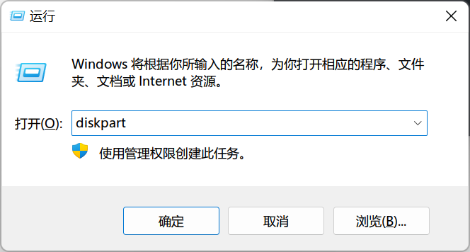

<br>

**DiskPart Windows 11 命令和示例**

在使用 DiskPart 命令之前，必须首先列出所有对象，然后选择一个对象使其获得焦点。当对象具有焦点时，您键入的任何 DiskPart 命令都将作用于该对象。

在 `DISKPART >` 提示符下：

- 键入 `list disk` 以显示计算机中的所有磁盘。每个磁盘都有一个磁盘编号，从 0 开始。GPT 行下的星号 `*` 表示磁盘是 GPT 分区样式。除非只有一个磁盘，否则您必须通过使用 `select disk n` 告诉 DiskPart 实用程序选择哪个磁盘。`n` 表示磁盘的编号。
- 键入 `list volume` 以显示所有磁盘上的所有卷。每个卷都有一个卷号，从 0 开始。要告诉 DiskPart 管理哪个卷，需要键入 `select volume n` 以使其成为焦点。`n` 可以是卷的数量或卷的驱动器号（如果有）。
- 在已选择磁盘的情况下，键入 `list partition` 以显示该磁盘下的所有分区。每个分区有个编号，从 0 开始。可以输入 `select partition n` 选择某个分区。`n` 表示分区的编号。

如果要查看 DiskPart 可以为您提供的服务，只需输入 `help` 以查看命令列表：


<br>

### 【2.1】转换磁盘格式

当使用微软官方工具（如「媒体创建工具」或「Windows 安装镜像」）制作启动盘并安装系统时，如果目标磁盘的分区格式不是 GPT（GUID 分区表），可能会出现错误提示，例如：

> “Windows 无法安装到此磁盘。所选磁盘具有 MBR 分区表。在 EFI 系统上，Windows 必须安装到 GPT 磁盘。”

这时，可以使用 `diskpart` 命令清除磁盘并转换分区格式，解决该问题：

1. 列出所有磁盘：

   ```shell
   list disk
   ```

2. 选择要操作的目标磁盘（假设为 Disk 1）：

   ```shell
   select disk 1
   ```

3. 清空所选磁盘上的所有分区信息：

   ```shell
   clean
   ```

4. 将磁盘转换为 GPT 格式：

   ```shell
   convert gpt
   ```

   > 如果你的电脑是 UEFI 模式，通常要求使用 GPT 分区格式。

   或者，如果你希望转换为传统 BIOS 支持的格式：

   ```shell
   convert mbr
   ```

<br>

### 【2.2】解除磁盘写保护

写保护，也称为只读模式，它可以是虚拟的或实体的。当硬盘或其他存储设备如 U 盘启用了写保护时，将无法对其进行任何写操作。

例如，无法删除硬盘上的文件或在硬盘上存储新文件，只能读取存储在里面的数据。也就是说，如果你的磁盘被写保护，则可以避免由于错误操作而导致的数据丢失。

在需要对硬盘数据有所操作时，可以通过 Diskpart 命令解除只读模式：

1. 列出系统中所有磁盘：

   ```shell
   list disk
   ```

2. 选择目标磁盘（以 Disk 1 为例）：

   ```shell
   select disk 1
   ```

3. 清除磁盘的只读属性：

   ```shell
   attributes disk clear readonly
   ```

<br>

## 【3】系统迁移

使用 DiskGenius 软件，可以方便地将系统从一个硬盘迁移到另外一个硬盘上，或者更常见的是将系统从 HDD 硬盘迁移到 SSD 固态硬盘、U 盘等。

首先， 需要将第二块硬盘、SSD 固态硬盘或 U 盘等，在电脑上安装好，然后启动系统，运行 DiskGenius 软件。在 DiskGenius 软件中，应该可以看到这第二块硬盘（或 SSD 固态硬盘、U 盘等）。

1. 在 DiskGenius 主菜单，点击【工具】=>【系统迁移】菜单项，如下图：

   

2. 选择迁移系统的目标盘，然后点击【确定】按钮。目标磁盘可以小于源磁盘，但是目标磁盘容量需大于源磁盘的已用数据总量：

   

3. 对于支持 UEFI 的电脑，还可以直接指定系统迁移完成后，要不要更改系统的启动项。 点击【开始】按钮，准备进行迁移：

   

4. 程序显示如下警告：目标磁盘上的所有数据将会被覆盖。确认没问题后，点击【确定】按钮：

   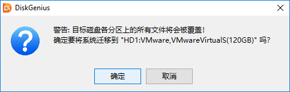

5. DiskGenius 软件将让用户选择系统迁移的模式，如下图：

   

   热迁移，就是在不关机的情况下，迁移系统到第二块硬盘，在迁移过程中，用户仍然可以对电脑做各种操作，不影响用户对电脑的使用。

   重启到 WinPE，DiskGenius 软件将重启电脑，自动进入 WinPE 系统，自动在 WinPE 下启动 DiskGenius 并自动执行系统迁移。

   > [!TIP]
   >
   > 大多数情况下，使用热迁移的方式，更为方便、安全，建议使用这种系统迁移模式。

6. 点击【热迁移】按钮，DiskGenius 将开始热迁移操作，如下图：

   

   系统迁移窗口中，将显示一个进度条，进度条显示系统迁移大致的进度，进度条下面显示已经复制，和还没有复制的数据大小，及已经用时与估计的完成系统迁移所需的剩余时间。

7. 完成系统迁移后，DiskGenius 软件会给出系统迁移完成的提示，如下图：

   

系统迁移到第二块硬盘（或 SSD 固态硬盘、U盘等）上之后，如果是支持 UEFI 的电脑，并且在迁移系统之前设置了完成后从目标盘启动。重启电脑后，会自动用迁移后的新系统启动。否则，需手动进入 BIOS 设置，将启动硬盘设置为新的硬盘，之后，就可以用这块硬盘启动电脑，进入系统了。

<br>

**系统引导未修改**

重启后有可能电脑还是默认使用旧硬盘的系统启动（我还没自动切换成功过），可以在 DiskGenius 软件中修改：

1. 可以在 DiskGenius 主菜单，点击【工具】=>【设置 UEFI BIOS 启动项】菜单项，如下图：

   

2. 在打开的弹窗中，将旧硬盘的启动项备份后直接删除，设置新硬盘启动项【下一次从该项启动（仅一次有效）】后，立即重启：

   

3. 重启之后电脑已经使用新硬盘的系统启动，这时可以将旧硬盘直接格式化，并再来软件这里查看是否有多余的启动项，如果有就直接删除。

<br>

## 【4】解决端口占用

1. cmd 命令窗口输入 `netstat –ano` 回车，会显示所有已经在运行的端口情况，其中 PID（最后一列数字就是 PID）为进程号。

   如果想要具体查询正在占用的端口号，可以使用 ：

   ```shell
   netstat -ano | findstr <端口号>
   ```

2. 找到占用端口的 PID 后，可以通过 PID 查询进程：

   ```shell
   tasklist | findstr <PID>
   ```

3. 输入以下命令终止进程：

   ```shell
   taskkill /T /F /PID <PID>
   ```

<br>

## 【5】compact 压缩

它可以对所有的系统文件进行压缩，实现磁盘压缩，节约硬盘空间。

开启：cmd 命令窗口输入 `compact /compactos:always`，回车。

关闭：`compact /compactos:never`。

<br>

## 【6】右键菜单设置

### 【6.1】删除右键菜单新建中的选项

1. 按下 Win+R，运行 `regedit`。
2. 展开 `HKEY_CLASSES_ROOT`，找到需要删除的文件后缀名，然后展开文件夹找到 `ShellNew` 选项，直接删除即可。

> [!NOTE]
>
> 如果觉得这个快捷方式以后可能会用到，需要重新打开，可以将 `ShellNew` 选项的名字改掉，比如改为 `ShellNew-`。

<br>

### 【6.2】解决腾讯文档替换 Windows 右键快捷方式

在使用一段腾讯文档之后，发现腾讯文档替换掉了我 Windows 上原来 Office 三件套的右键新建文件快捷方式：


解决办法：

1. 首先按照[【6.1】删除右键菜单新建中的选项](#【6.1】删除右键菜单新建中的选项) 这里的步骤将 `.tdoc`、`.tsheet`、`.tslide` 三个选项取消掉。

   > [!NOTE]
   >
   > 新版腾讯文档支持在设置里关闭了，但是关闭后原来的 Office 设置不会回来。

2. 使用 Office 自带的修复功能恢复 Office 新建菜单：

   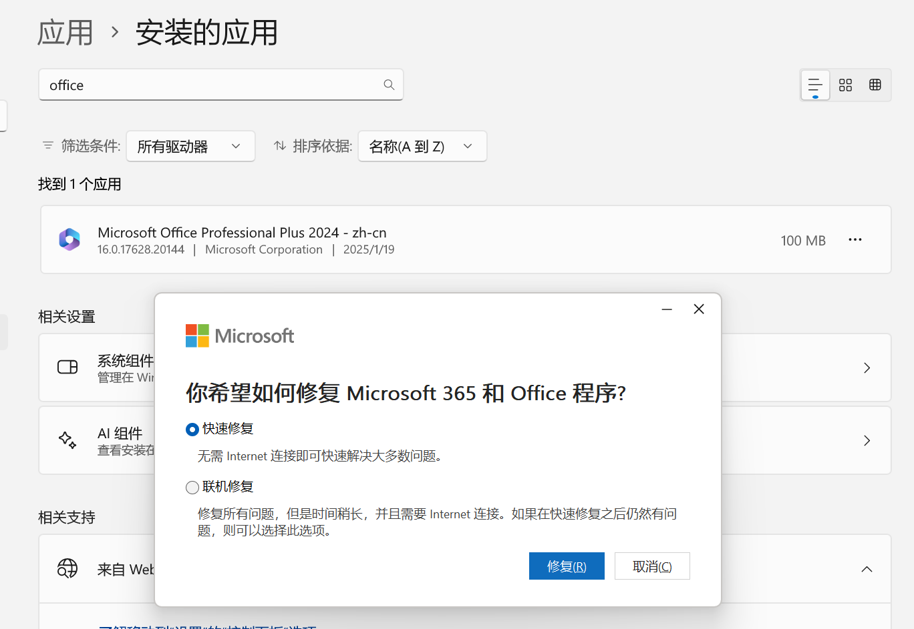

   完成后无需重启文件资源管理器，右键发现菜单已经恢复。

3. 也可以通过修改注册表来恢复，需要在 `HKEY_CLASSES_ROOT` 下找到：

   - `.docx` 选项并单击选中，双击打开右侧里面的默认项，将数值改为 `Word.Document.12`。
   - `.xlsx` 选项并单击选中，双击打开右侧里面的默认项，将数值改为 `Excel.Sheet.12`。
   - `.pptx` 选项并单击选中，双击打开右侧里面的默认项，将数值改为 `PowerPoint.Show.12`。

   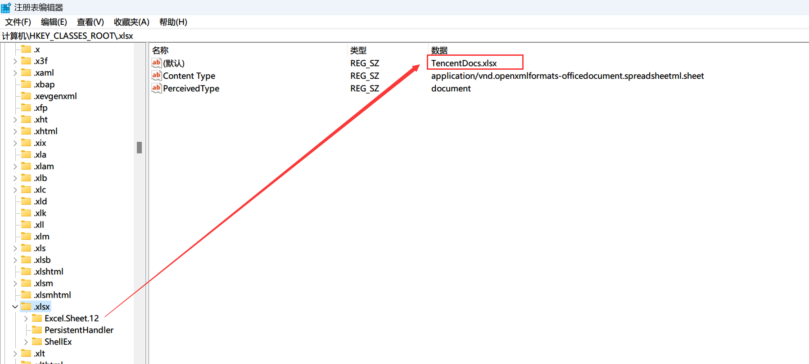

   全部修改完成后，打开任务管理器，将文件资源管理器重启即可：

   

<br>

### 【6.3】删除右键菜单的 AMD Software

1. Win+R 运行 `regedit` 打开注册表编辑器，先定位到 `计算机\HKEY_LOCAL_MACHINE\SOFTWARE\Classes\PackagedCom\Package`。

2. 找到 `AdvancedMicroDevicesInc-2.AMDRadeonSoftware_`开头的项, 并展开。

   找到 `server` 项,并展开。

   找到 `0`项, 也可能时 `1`：

   

3. 删除 `ApplicationId` , 或修改 `ApplicationId` 的值（比如在值后加 “备份” 二字）：

   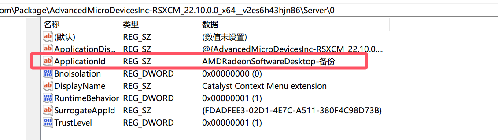

<br>

## 【7】取消开机密码

这里分两种情况，一种是微软账号登录，一种是本地帐号登录。

<br>

**微软账户登录**

1. 确保【账户】=>【登录选项】=>【其他设置】中 “为了提高安全性，仅允许...” 是关闭的：
	
	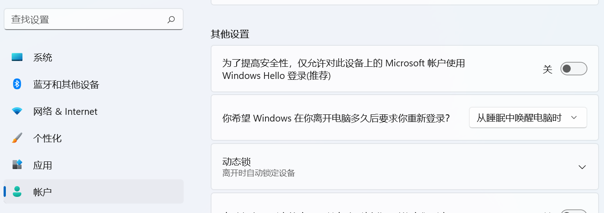
2. 按 Win + R，弹出【运行】，输入 `netplwiz`，点【确定】。
3. 取消 “要使用本计算机，用户必须输入用户名和密码”，点【确定 】。
4. 会弹出一个窗口，在窗口中输入微软账户的用户名和密码，点【确定】：

   

<br>

**本地账号登录**

直接修改本地登录账号的密码就行，密码留空，点击确认保存即可。

<br>

## 【8】微软输入法快速输入时间

1. 右键托盘的输入法，选择【用户自定义短语】：

   

2. 点击【添加】用户定义的短语：

   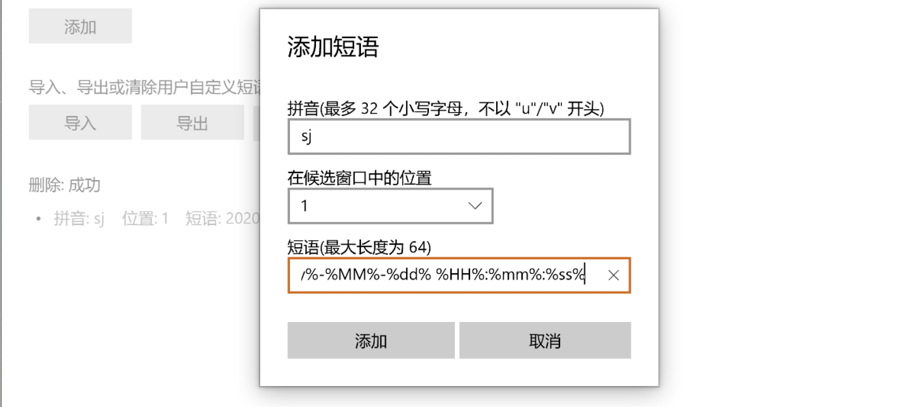


   ```
   # 2020-11-29 16:21:29
   %yyyy%-%MM%-%dd% %HH%:%mm%:%ss%
   
   # 2020年11月29日 16:21:29
   %yyyy%年%MM%月%dd%日 %HH%:%mm%:%ss%
   ```

<br>

## 【9】通过网络共享文件

在局域网中，可以通过 Windows 资源管理器的【网络】快速和其他机器共享文件，具体操作步骤如下：

1. 打开网络共享。

   打开计算机设置，然后依次点开【网络和 Internet】=>【高级网络设置】=>【高级共享设置】，打开专用网络里的网络发现和文件和打印机共享：

   

   > [!TIP]
   >
   > 为了安全建议只打开专用网络的网络共享，可以把家里网络设置成专用网络。

2. 设置文件的访问权限。

   右键需要共享的文件，在【授予访问权限】这里选择【特定用户】：

   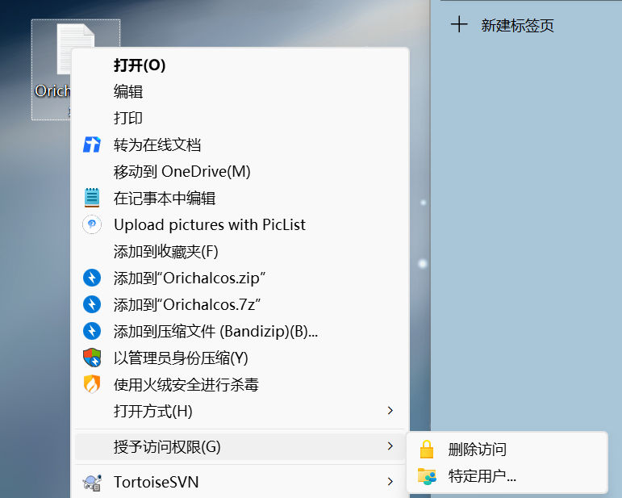

   共享的用户选择 Everyone（所有人），然后点击【添加】：

   

3. 其他局域网机器访问。

   其他局域网内的机器可以通过文件资源管理器的【网络】这里找到你的电脑设备，点击进去就可以访问到前面设置过共享权限的文件了：

   

<br>

## 【10】手动增加开机启动项

**“启动” 文件夹**

1. 按 Win + R 打开 “运行” 对话框，输入 `shell:startup`，然后按回车。这将打开 “启动” 文件夹。
2. 找到你想设置为开机启动的程序，右键单击它，然后选择【创建快捷方式】。
3. 将新创建的快捷方式拖动到 “启动” 文件夹中，这样程序就会在系统启动时自动运行。

<br>

**注册表**

启动项对应着注册表中的键值，添加或删除键值即可删除启动项。

1. 按 Win + R 打开 “运行” 对话框，输入 `regedit`，然后按回车。这将打开 “注册表编辑器”。

2. 常见的注册表键值有如下几项：

   - HKEY_CURRENT_USER\Software\Microsoft\Windows\CurrentVersion\Run

   - HKEY_CURRENT_USER\Software\Microsoft\Windows\CurrentVersion\RunOnce（只运行一次）

   - HKEY_LOCAL_MACHINE\SOFTWARE\Microsoft\Windows\CurrentVersion\Run

   - HKEY_LOCAL_MACHINE\SOFTWARE\Microsoft\Windows\CurrentVersion\RunOnce（只运行一次）

3. 新建键值，从而实现添加启动项。

   鼠标右键依次选择【新建】=>【字符串值】，填写名称后右键点击新建的键值选择【修改】，在 “数值数据” 中添加要自启的 exe 文件（最好用英文双引号扩上），在数值数据的最后加上 `/background` 可以实现后台自启（当然也可以加上别的 exe 支持的参数）。

<br>

## 【11】关闭系统小组件

隐藏只需要在任务栏设置中设置就好了。

卸载 Win11 小组件需要用到 CMD。使用管理员权限打开 Windows Terminal 终端的【命令提示符】，或者使用管理员权限运行 CMD，输入以下命令：

```shell
winget uninstall MicrosoftWindows.Client.WebExperience_cw5n1h2txyewy
```

按下回车键，Win11 小组件就会被卸载掉了。

如果想要重新安装 Win11 小组件，则可以执行以下命令：

```shell
winget install 9MSSGKG348SP
```

<br>

## 【12】环境变量不换行显示

这是因为变量值的第一个是相对地址，只需要将一个绝对地址（带盘符）的放首位，然后逗号分隔，确定之后，再双击打开就是换行显示了！

<br>

## 【13】你的 PIN 不可用

开机遇到一系列问题：

- 无法使用人脸/PIN 码登录。
- 重置 PIN 码功能无用，会重新回到锁屏界面。
- 无法使用密码登录。
- SHIFT + 重启按钮无法使用。
- 登录账号为微软账号，无法使用 PE 修改密码。

只能通过 PE 启动管理员账号，使用管理员账号登录后关闭 Windws 无密码策略，再使用密码登录原账号：

1. 很多 PE 系统都可以修改账号，这里使用 WinPE，启动PE后，进入桌面打开运行 Dism++ 程序：

   

2. 选择带有系统的盘符（默认选的是 PE 盘），然后打开会话：

   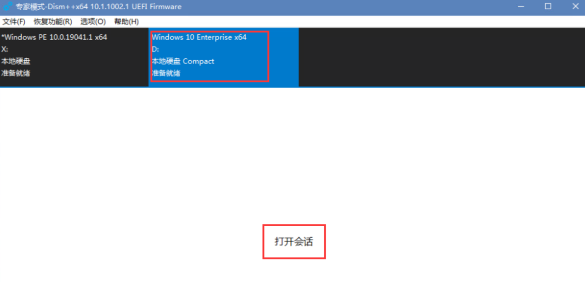

3. 选择左侧工具箱，然后右侧找到账户管理：

   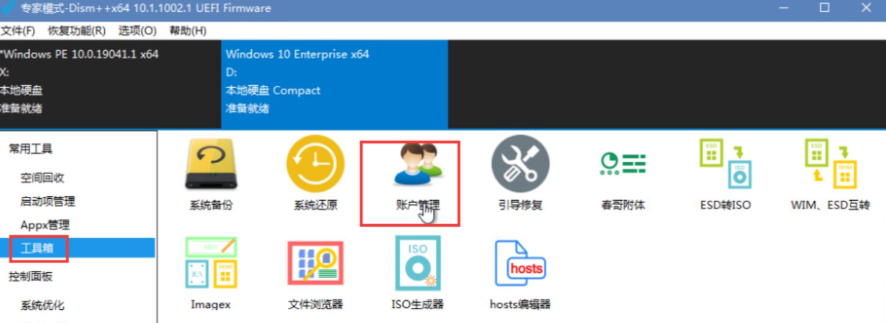

   然后就可以对已有账号进行管理了。

4. 使用管理员账号登录之后，打开注册表 `计算机\HKEY_LOCAL_MACHINE\SOFTWARE\Microsoft\Windows NT\CurrentVersion\PasswordLess\Device`，将 DevicePasswordLessBuildVersion 项的值改为 0：

   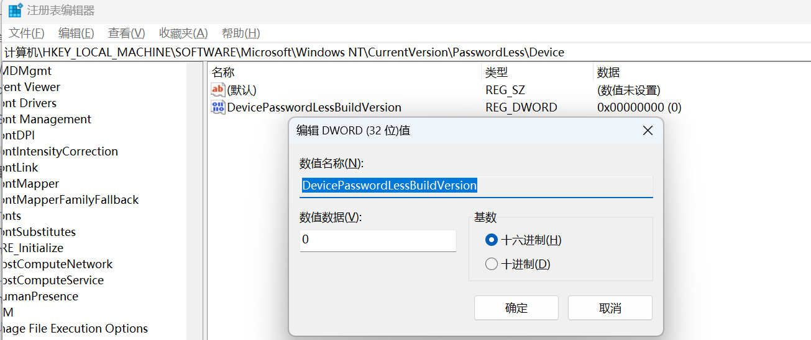

5. 重启电脑，这个时候就可以用密码登录原帐号了，登上去之后将 PIN 码删除再重新添加，在组策略编辑器里重新将管理员账号禁用：

   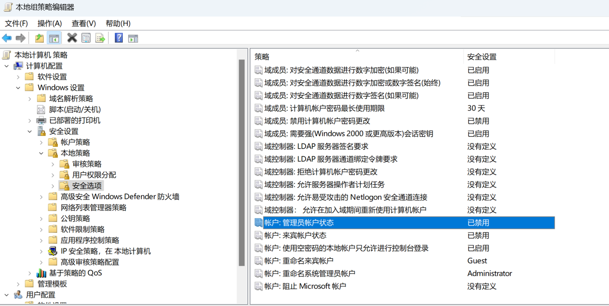

6. 最后重启电脑，如果一切正常，可以将注册表 DevicePasswordLessBuildVersion 项的值重新改为 2。

<br>

## 【14】sc 控制服务

`sc` 命令的语法格式：

```shell
sc <server> [command] [service name] <option1> <option2>...
```

`sc` 命令使用例子：

- `sc query`：查看所有服务的运行状态。

- `sc query 服务名`：查看某个服务的运行状态。

- `sc qc 服务名`：查看某个服务的配置信息。

- `sc start 服务名`：启动服务。

- `sc stop 服务名`：停止服务。

- `sc delete 服务名`：删除服务。

- `sc config 服务名 start= auto|demand|disabled`：修改服务启动类型。

  *start* 参数的值可以是 `demand`（手动）、`disabled`（禁用），`auto`（自动）。注意：`start=`后面有一个空格

<br>

**使用提示**

1. 如果服务名称中包含有空格，记得在服务名称上加引号。例如 `sc stop "my service"`。

2. “服务名称” 和 “服务显示名称”  是不一样的。`sc` 指令使用的是 “服务名称”。我们在【服务】里看到是服务的显示名称，双击打开某个服务可以看到真正的服务名字。

   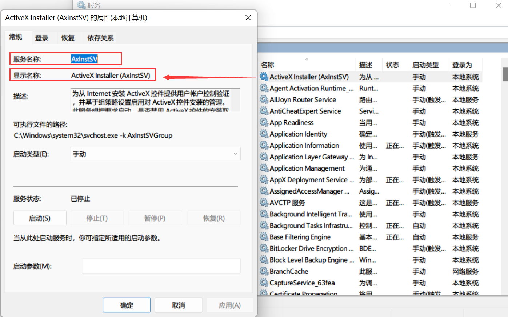
   
3. `sc start` 和 `sc stop` 功能上类似于 `net start` 和 `net stop`，但速度更快且能停止的服务更多。

4. `sc delete` 命令的实质都是删除 `HKEY_LOCAL_MACHINE\SYSTEM\CurrentControlSet\Services` 下的 `ServiceName` 分支。所以也可以用 `reg` 命令删除名为 `ServiceName` 的服务：`reg delete HKLM\SYSTEM\CurrentControlSet\Services\ServiceName`。

> 如果提示 “拒绝访问” 可能是没有管理员权限，或者电脑安装有火绒之类的安全工具。

<br>

## 【15】mstsc 远程连接

远程桌面的命令行指令 `mstsc`，它的意思是 Microsoft Terminal Server Connection（微软终端服务器连接）的缩写。

使用 Windows + R 快捷键呼出运行窗口，在输入框输入 `mstsc` 命令即可使用远程连接功能，输入远程电脑的 IP、用户名、密码即可远程访问。

<br>

### 【15.1】提示 Windows Defender Credential Guard 不允许使用已保存的凭据


Windows11 22H2 开始 Windows 开始更新内核保护了。这玩意让我不能使用已经保存的密码来连接远程桌面。我也很绝望啊，所以我决定关闭他了。

1. 按 Win + R 呼出【运行】，输入 gpedit.msc 按回车，打开组策略编辑器：

   

2. 在组策略管理控制台上，转到【计算机配置】=>【管理模板】=>【系统】=>【Device Guard】，双击【Device Guard】：

   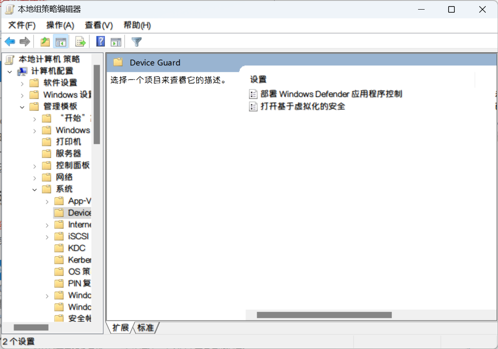

3. 双击打开【基于虚拟化的安全】，然后单击禁用选项：

   

   确定配置并重启电脑即可解决。

<br>

### 【15.2】删除远程连接记录

1. Win + R 打开【运行】，输入 `regedit` 命令打开注册表；

2. 找到注册表里面的 `计算机\HKEY_CURRENT_USER\Software\Microsoft\Terminal Server Client\Default` 其中右边的就是连接过的记录了,删除需要清除的文件即可：

   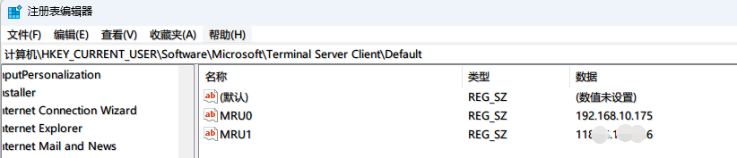

3. 如果有保存凭据，需要在【凭据管理器】里删除对应的凭据：

   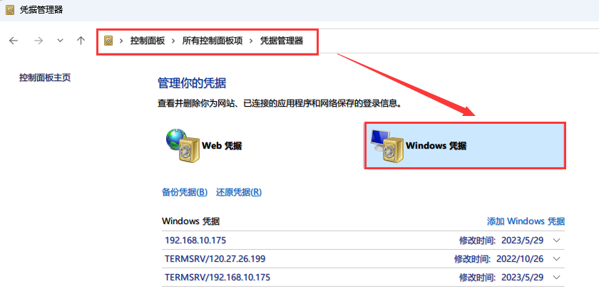

<br>

### 【15.3】修改远程桌面的侦听端口

> [!NOTE]
>
> 适用于：Windows Server 2022、Windows 11、Windows 10、Windows Server 2019、Windows Server 2016

通过远程桌面客户端连接到计算机（Windows 客户端或 Windows Server）时，计算机上的远程桌面功能会通过定义的侦听端口（默认情况下为 3389）“侦听” 连接请求。 可以通过修改注册表来更改 Windows 计算机上的侦听端口：

1. 启动注册表编辑器（Win + R 打开运行，搜索框中键入 `regedit`）。 
2. 导航到以下注册表子项：`HKEY_LOCAL_MACHINE\System\CurrentControlSet\Control\Terminal Server\WinStations\RDP-Tcp`。
3. 查找端口号。
4. 单击【编辑】=>【修改】，然后单击【十进制】。
5. 键入新端口号，然后单击【确定】 。
6. 关闭注册表编辑器，然后重新启动计算机。

下次使用远程桌面连接连接到此计算机时，必须键入新端口。 如果正在使用防火墙，请确保将防火墙配置为允许连接到新端口号。

<br>

### 【15.4】远程本地多用户桌面

使用远程桌面连接本地电脑的其他账户，可以避免电脑跟你抢键鼠，主要步骤：

1. 创建新用户（如果有其他账户可用，这一步可跳过）。
2. 配置本地组策略。
3. 安装 RDP Wrap 补丁。
4. 连接本地桌面。

<br>

#### 创建新用户

1. 右键 Windows 图标点击【计算机管理】：

   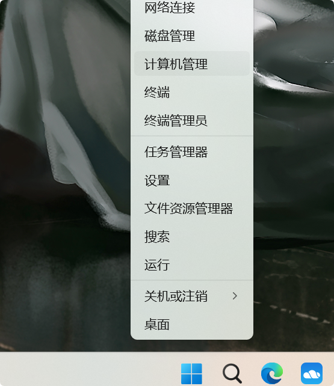

2. 打开【本地用户和组】，右键【用户】，在右键菜单中选择【新用户】：

   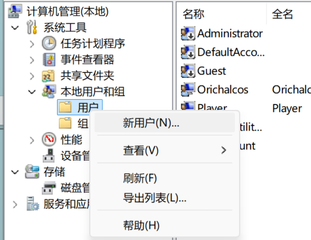

3. 创建新用户：

   

4. 右键新增的用户，在右键菜单中点击【属性】，切换到【隶属于】，将其添加到管理员组：

   

5. 打开系统设置，依次点开【系统】=>【远程桌面】=>【远程桌面用户】，点击【添加】，将刚才新建的用户添加进去：

   

<br>

#### 配置本地组策略

1. Win+R 打开运行窗口，输入 `gpedit.msc`，打开本地组策略编辑器，依次选择【计算机配置】=>【管理模板】=>【Windows组件】=>【远程桌面服务】=>【远程桌面会话主机】=>【连接】：

   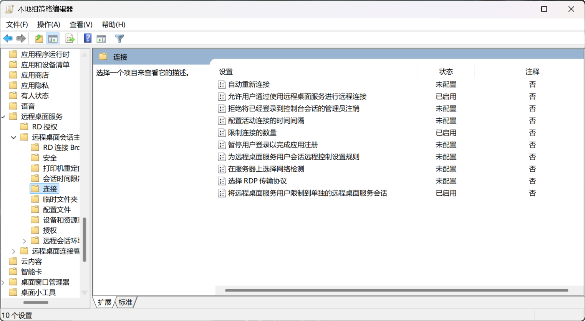

2. 选择以下三项配置进行修改：

   - 配置【允许用户通过使用远程桌面服务进行远程连接】，选择：【已启用】。
   - 配置【限制连接的数量】，点击【已启用】，其中【允许的RD最大连接数】可以自己视情况而定。
   - 配置【将远程桌面服务用户限制到单独的远程桌面服务会话】，选择：【已启用】。

<br>

#### 安装 RDP Wrapper 补丁

1. [下载地址](https://github.com/sebaxakerhtc/rdpwrap)，下载 RDPW_Installer.exe 文件。

2. 右键以管理员身份运行，此时便会自动安装补丁，出现全绿点击【OK】：

   
   
3. 如果出现【not supported】：

   

   先记下 termsrv ver，比如这里为 10.0.26100.3624。

4. 前往该 [Issues]([Issues · stascorp/rdpwrap](https://github.com/stascorp/rdpwrap/issues)) 去搜索对应的版本号：

   

   在里面找到对应的配置并将其复制：

   

5. 找到 RDP Wrapper 安装目录的 rdpwrap.ini 文件，将上一步复制的内容粘贴到 rdpwrap.ini 里：

   

6. 最后点击 RDP Wrapper 的 【Update INI】按钮：

   

   可以看到状态已经变成【fully supported】，最后点击一下【Resetart TermService】。

> [!TIP]
>
> 安装完成后，会在系统自动创建一个名为 “RDPWUpdater” 定时任务程序，用来更新 rdpwrap.ini 文件，但是更新的内容没有包含最新的系统信息，建议将此任务禁用。

<br>

#### 连接本地桌面

1. Win+R 打开运行窗口，输入 `mstsc`，输入本地回环地址，注意不要输入 `127.0.0.1` 否则会报错：

   

2. 输入密码：

   

3. 密码没问题就启动了，可以启动游戏啥的：

   

4. 注意最后关闭远程桌面连接之后，需要注销用户，不然虽然远程关闭了，但是用户和资源并没有释放：

   

<br>

## 【16】控制台设置代理

**临时设置**

1. 首先打开控制台（CMD 之类的都可以）。

2. 输入以下命令：

   ```shell
   set http_proxy=http://127.0.0.1:端口号
   set https_proxy=http://127.0.0.1:端口号
   ```

   如果你的代理服务器要求用户名和密码的话，那么还需要：

   ```shell
   set http_proxy_user=
   set http_proxy_pass=
   ```

3. 验证是否生效：

   ```shell
   curl -vk https://www.google.com
   ```

<br>

**永久生效**

如果需要永久生效的话，是需要配置系统的环境变量的

1. 【设置】=>【系统】=>【系统信息】=>【高级系统设置】=>【高级】=>【环境变量】。

2. 添加如下的系统环境变量：

   - 变量名：`http_proxy`
   
     变量值：`http://127.0.0.1:7890`
   
   - 变量名：`https_proxy`
   
     变量值：`http://127.0.0.1:7890`

<br>

**代理绕过**

可以通过设置 `no_proxy` 环境变量来配置代理绕过规则（输入需要绕过代理的地址或域名，多个地址使用逗号或分号分隔）：

```shell
localhost,127.0.0.1,Orichalcos.com
```

<br>

## 【17】取消 Ctrl+空格 快捷键

> [!NOTE]
>
> 目前已经尝试过直接修改默认的语言栏选项，但是重启后系统会重新将其改为「Ctrl+空格」。

对于大部分开发者，「Ctrl+空格」的快捷键都用于代码自动生成，但是微软强制使用「Ctrl+空格」作为切换输入法的快捷键，这里讲一下如何替换。

1. 新建文本文档，输入以下内容：

   ```
   Windows Registry Editor Version 5.00
   
   [HKEY_CURRENT_USER\Control Panel\Input Method\Hot Keys\00000010]
   "Key Modifiers"=hex:00,c0,00,00
   "Virtual Key"=hex:ff,00,00,00
   
   [HKEY_CURRENT_USER\Control Panel\Input Method\Hot Keys\00000070]
   "Key Modifiers"=hex:00,c0,00,00
   "Virtual Key"=hex:ff,00,00,00
   
   [HKEY_USERS\.DEFAULT\Control Panel\Input Method\Hot Keys\00000010]
   "Key Modifiers"=hex:02,c0,00,00
   "Target IME"=hex:00,00,00,00
   "Virtual Key"=hex:ff,00,00,00
   
   [HKEY_USERS\.DEFAULT\Control Panel\Input Method\Hot Keys\00000070]
   "Key Modifiers"=hex:02,c0,00,00
   "Target IME"=hex:00,00,00,00
   "Virtual Key"=hex:ff,00,00,00
   ```

2. 将后缀名改为 `.reg`。

3. 运行该文件即可，运行成功后重启电脑。

<br>

## 【18】彻底关闭病毒实时保护

1. 首先按 Win+R，输入 `gpedit.msc` 按回车打开【组策略编辑器】。

2. 依次选择【计算机配置】=>【管理模板】=>【Windows 组件】=>【Microsoft Defender防病毒】=>【实时保护】，双击【实时保护】：

   

3. 双击【关闭实时保护】，选择【已启用】，点击【应用】：

   

<br>

## 【19】Xbox 卸载

直接将 Xbox 和 Game Bar 相关的程序都卸载。

但是在打开游戏或者部分应用会出现 “需要使用新应用一打开此 ms-gamingoverlay 链接”，是因为在启动时会调用这个协议（ms-gamingoverlay://），以便启用截图、录制、社交或快捷键，如果你已经卸载了 Microsoft.XboxGamingOverlay 应用（也就是 Xbox Game Bar），那么这个链接就会找不到处理程序，系统就会提示你选择一个应用来打开它。

解决办法：

1. 首先按 Win+R，输入 `gpedit.msc` 按回车打开【组策略编辑器】。

2. 依次选择【计算机配置】=>【管理模板】=>【Windows组件】=>【Windows 游戏录制与广播】，双击【Windows 游戏录制与广播】：

   

3. 双击【启用或禁用 Windows 游戏录制和广播】，选择【已禁用】，点击【应用】：

   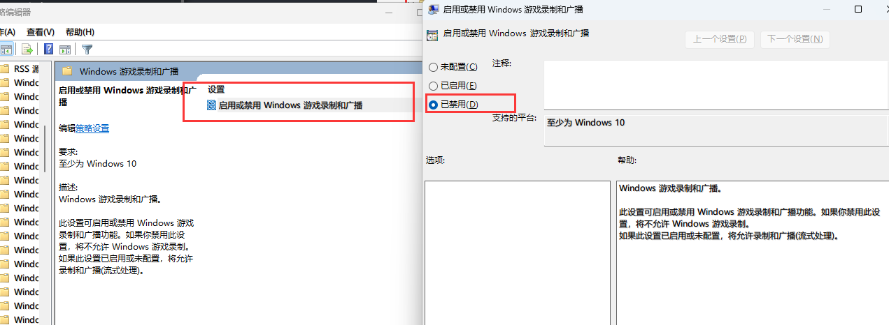
   
4. 最后重启电脑即可。

<br>

## 【20】开发驱动器

开发驱动器是一种新形式的存储卷，可用于提高关键开发人员工作负载的性能。

开发驱动器在 ReFS 技术基础上构建，采用有针对性的文件系统优化，并且可以更好地控制存储卷设置和安全性，包括信任指定、防病毒配置和对附加筛选器的管理控制。


<br>

**开发驱动器如何运作？**

存储卷指定如何以特定格式通过目录和文件将数据存储在文件系统上。 Windows 将 NTFS 用于系统驱动器，默认情况下，用于大多数不可移动驱动器。 复原文件系统 (ReFS) 是一种更新的 Microsoft 文件系统格式，旨在最大程度提升数据可用性、跨各种工作负载高效扩展到大数据集，并通过损坏复原提供数据完整性。 它旨在解决存储方案的扩展集问题以及为将来的革新打造基础。

开发驱动器利用 ReFS 来支持初始化专用于开发工作负载的存储卷，从而提供更快的性能和针对开发方案优化的可自定义设置。 ReFS 包含多项特定于文件系统的优化，以提高关键开发人员方案的性能。

<br>

**应该在开发驱动器上放置什么内容？**

开发驱动器适用于：

- 源代码存储库和项目文件。
- 包缓存。
- 生成输出和中间文件。

开发驱动器不可用于存储开发人员工具，例如：

- Visual Studio。
- MSBuild。
- .NET SDK。
- Windows SDK 等。

这些工具应存储在主 C:\ 驱动器上。

<br>

**设置开发驱动器**

先决条件：

- Windows 11 版本 #10.0.22621.2338 或更高版本。
- 建议 16gb 内存（至少 8gb）。
- 最小 50gb 可用磁盘空间。
- 开发驱动器适用于所有 Windows SKU 版本。

设置选项：

1. 打开 Windows 设置并导航到【系统】=>【存储】=>【高级存储设置】=>【磁盘和卷】，选择【创建 Dev Drive】：

   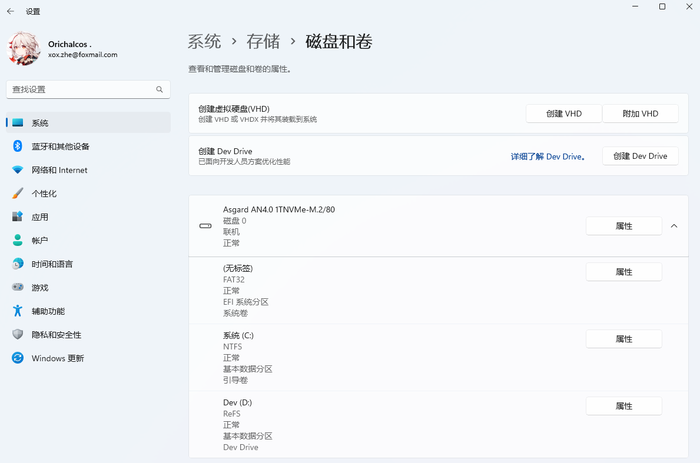

2. 系统会提供三个选项：

   1. 创建新的 VHD：在新的虚拟硬盘上生成卷。
   2. 重设现有卷大小：创建新的未分配空间以进行构建。
   3. 磁盘上的未分配空间：使用现有磁盘上的未分配空间（仅当之前在存储中设置了未分配的空间时，才会显示此选项）。

   这里推荐选择【重设现有卷大小】

   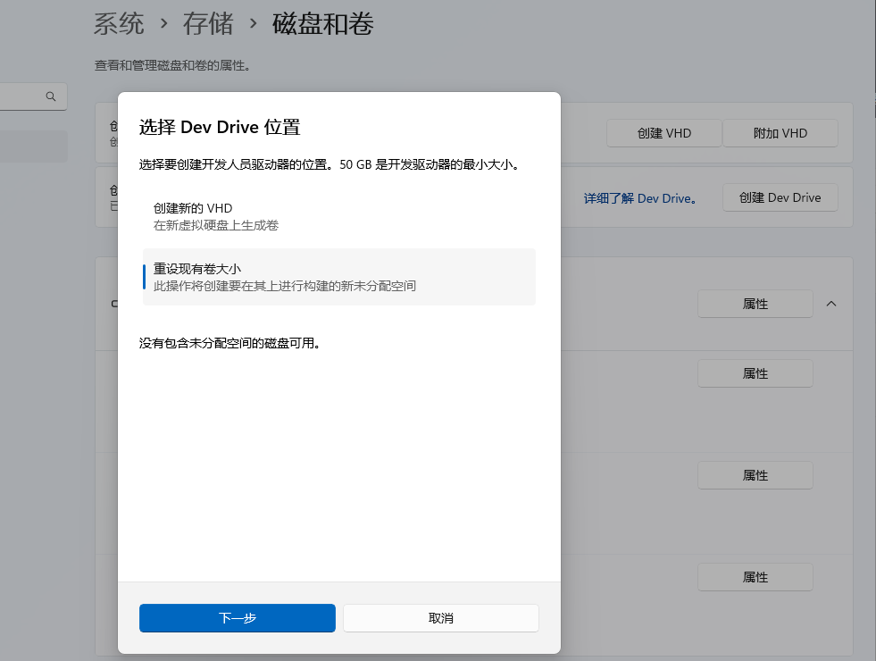

3. 选择要调整大小的卷：

   

4. 为卷选择新大小，需要至少有 50GB 的未分配的可用空间，这是开发驱动器所需的最小大小。 设置大小后，选择【下一步】：

   

5. 若要在新的可用空间上设置开发驱动器的格式，请指定标签（驱动器名称）、驱动器号和大小分配。 最大大小是在上一步中分配的可用空间量，开发驱动器的最小大小为 50GB：

   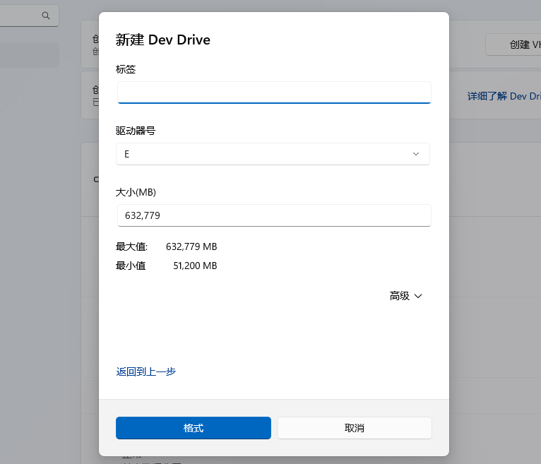

6. 到这里就已经创建并调整了开发驱动器的大小！

<br>

# Chrome

## 【1】移动 Chrome 的数据文件

Chrome 默认的数据文件地址是：C:\Users\Orichalcos\AppData\Local\Google

移动前需要关闭 Google，将文件移动到想要移动的地方，然后在 Cmd（需要管理员权限）输入：

```bash
mklink <旧地址> <新地址>
```

<br>

## 【2】主页被篡改

浏览器主页被篡改，直接去浏览器的设置里找首页设置一般没用，可以看一下是不是快捷方式出了问题，找到浏览器的快捷方式，右键查看【属性】，通常目标栏显示的都是浏览器的安装目录：

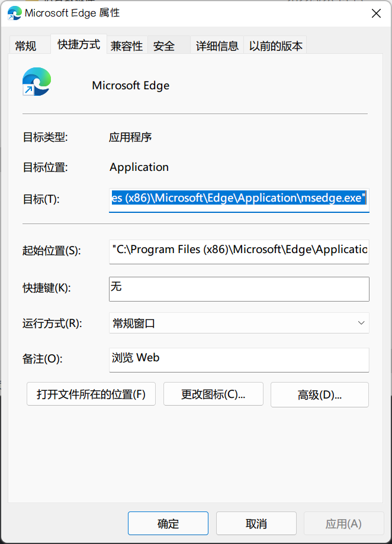


如果发现安装目录之后还跟着一串网址链接，那就是被强制锁定了对应的网址，只要删掉这串网址就可以了。当然，有些浏览器的快捷方式不允许修改，我们可以把界面切换到【常规】，然后把【只读】取消掉，就可以进行修改了：


当然也可以直接删除快捷方式，然后重新生成；或者在目标栏输入一个自己需要的网址（输入网址之前要加一个空格键，否则无法保存），然后将属性改为只读。

<br>

## 【3】访问带端口的页面提示 ERR_UNSAFE_PORT

使用非默认端口 Chrome 等浏览器提示非安全端口，详见 [官方文件](https://chromium.googlesource.com/chromium/src.git/+/refs/heads/master/net/base/port_util.cc)。

建站避开以下端口：

```
1,      // tcpmux
7,      // echo
9,      // discard
11,     // systat
13,     // daytime
15,     // netstat
17,     // qotd
19,     // chargen
20,     // ftp data
21,     // ftp access
22,     // ssh
23,     // telnet
25,     // smtp
37,     // time
42,     // name
43,     // nicname
53,     // domain
69,     // tftp
77,     // priv-rjs
79,     // finger
87,     // ttylink
95,     // supdup
101,    // hostriame
102,    // iso-tsap
103,    // gppitnp
104,    // acr-nema
109,    // pop2
110,    // pop3
111,    // sunrpc
113,    // auth
115,    // sftp
117,    // uucp-path
119,    // nntp
123,    // NTP
135,    // loc-srv /epmap
137,    // netbios
139,    // netbios
143,    // imap2
161,    // snmp
179,    // BGP
389,    // ldap
427,    // SLP (Also used by Apple Filing Protocol)
465,    // smtp+ssl
512,    // print / exec
513,    // login
514,    // shell
515,    // printer
526,    // tempo
530,    // courier
531,    // chat
532,    // netnews
540,    // uucp
548,    // AFP (Apple Filing Protocol)
554,    // rtsp
556,    // remotefs
563,    // nntp+ssl
587,    // smtp (rfc6409)
601,    // syslog-conn (rfc3195)
636,    // ldap+ssl
993,    // ldap+ssl
995,    // pop3+ssl
1719,   // h323gatestat
1720,   // h323hostcall
1723,   // pptp
2049,   // nfs
3659,   // apple-sasl / PasswordServer
4045,   // lockd
5060,   // sip
5061,   // sips
6000,   // X11
6566,   // sane-port
6665,   // Alternate IRC [Apple addition]
6666,   // Alternate IRC [Apple addition]
6667,   // Standard IRC [Apple addition]
6668,   // Alternate IRC [Apple addition]
6669,   // Alternate IRC [Apple addition]
6697,   // IRC + TLS
10080,  // Amanda
```

<br>

# IDEA

## 【1】Maven 部分文件无法导出

Maven 由于它的约定大于配置，之后可能遇到写的配置文件，无法被导出或者生效的问题

```xml
<build>
    <resources>
        <resource>
            <directory>src/main/resources</directory>
            <includes>
                <include>**/*.properties</include>
                <include>**/*.xml</include>
            </includes>
            <filtering>true</filtering>
        </resource>
        <resource>
            <directory>src/main/java</directory>
            <includes>
                <include>**/*.properties</include>
                <include>**/*.xml</include>
            </includes>
            <filtering>true</filtering>
        </resource>
    </resources>
</build>
```

<br>

## 【2】Maven 框架 web-app 中 web.xml 版本过低

1. 找到 maven-archetype-webapp 的 jar 包位置：`<Maven位置>\repository\org\apache\maven\archetypes\maven-archetype-webapp\1.4`。
2. 用压缩包形式打开，不要解压！
3. 然后依次点：`archetype-resources\src\main\webapp\WEB-INF\web.xml`，打开，将其修改成最新的模板。

> 上边的 web-app 标签中有一个 `metadata-complete="true"`，这是个大坑，因为 web-app 标签 3.0 以上版本是可以使用 Servlet 的注解的，如下图：


再也不用去 web.xml 写那 Servlet 的那一堆映射了（下图就是那一堆映射）：

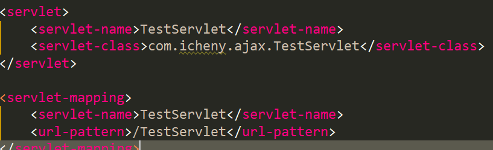


如果忘记了改这个 web-app 标签里的 `metadata-complete` 的这个属性，所写的注解都将失效！！！

该属性默认为 `true`，表示容器在部署时只依赖部署描述文件，忽略所有标注，如果不配置该属性，或者将其设置为 `false`，则表示启动注解支持。当 `metadata-complete="false"` 时，web.xml 和注解对于 Servlet 的影响同时起作用，两种方法定义的 url-partten 都可以访问到该 Servlet，但是当通过 web.xml 定义的 url-partten 访问时，注解定义的属性将失效。

<br>

## 【3】修改内存大小

**在 IDEA 中显示内存**

在窗口下方右键，选中【Memory Indicator】：


<br>

**修改内存大小**

依次点击导航栏【帮助】=>【更改内存设置】：


<br>

## 【4】注释设置首行缩进

IDEA 通过快捷键 Ctrl + / 进行注释的代码不会进行首行缩进：


<br>

**Java 文件设置**

依次点击菜单 File => Settings => Editor => Code Style => Java => Code Generation， 去除勾选的 Line comment at first column 并勾选 Add a space at line comment start，然后点击 Apply 按钮应用设置：


<br>

**其他文件格式**

其他文件格式，如 HTML、YAML 等，也是同样的套路，选中对应的菜单进行设置就行。

<br>

## 【5】Lombok 报错

IDEA 因为 Lombok 的报错：

```
java: You aren't using a compiler supported by lombok, so lombok will not work and has been disabled.
Your processor is: com.sun.proxy.$Proxy8
Lombok supports: sun/apple javac 1.6, ECJ
```

这是由于 Lombok 的版本过低的原因。

<br>

**版本提升**

将 Lombok 版本提升至 1.18.24 后问题就可以解决：

```xml
<dependency>
    <groupId>org.projectlombok</groupId>
    <artifactId>lombok</artifactId>
    <version>1.18.24</version>
    <scope>provided</scope>
</dependency>
```


<br>

**添加参数**

如果无法变动项目依赖版本，可以在【编译器】中增加如下参数配置即可：

```
-Djps.track.ap.dependencies=false 
```


<br>

## 【6】插件：Camel Case

下划线 <=> 驼峰，你是怎么转换的，一个一个字母的修改吗？

Camel Case 可以用 一个快捷键 就搞定，去 IDEA 的插件库中搜索 Camel Case插件，安装上。

使用方式：先选中要要格式转换的代码， 再用快捷键 Shift + Alt + u 进行转换，多个格式切换，就按多次快捷键。

Camel Case 包含 6 种格式的切换，可能某些格式是平时不用的，可以把不用的格式取消，这样在格式切换时，就不会包含已取消的格式了：

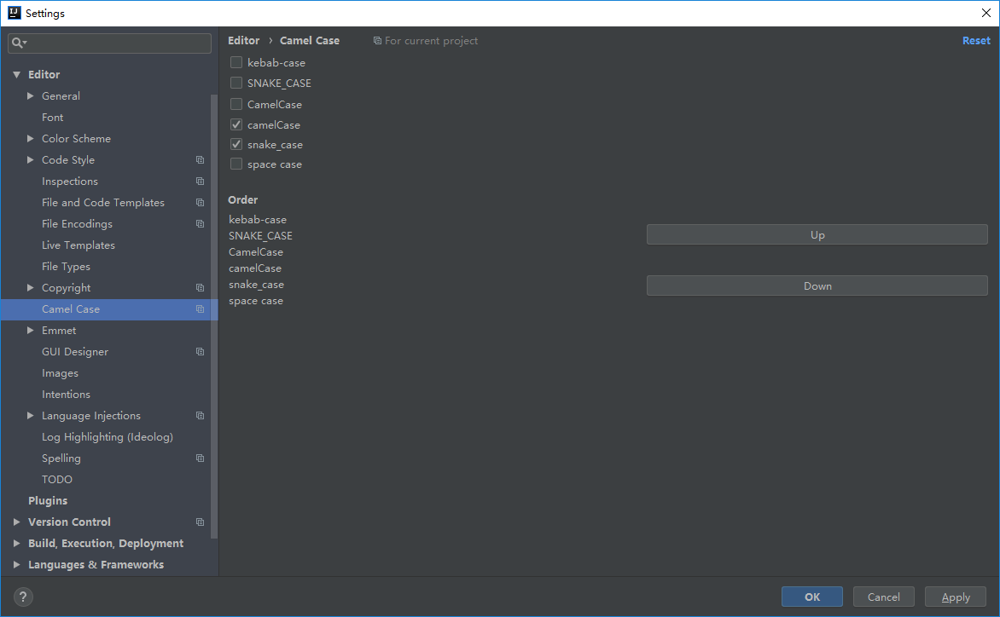

<br>


## 【7】jar 包自动导入及优化

加快开发效率，除去没用的包，洁癖者必用!   这样设置，就可以自动导入包以及除去没有用到的包！


第一个是 自动导入需要的 jar 包，若有多个同名 jar 包，需要开发者自己选择导入

第二个是 优化导入，也就是除去没有用到的 jar 包，这个设置只会对当前的项目有效！每个项目都需要单独设置 此选项！

<br>

## 【8】保存时触发操作

IDEA 2021.2 可以设置自动保存时触发的操作，比如重新格式化，优化 Java 包导入。我们可以在【Settings】=>【Tools】=>【Actions on Save】进行设置：

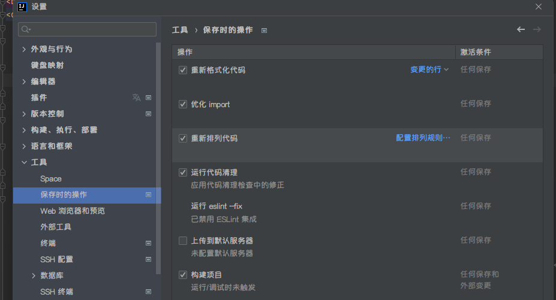


比如上图这个 ”重新格式化代码“，保存时将会格式化你当前改动代码，这就不用担心写完代码忘记格式化了。

额外再提一点，个人建议上面格式化代码不要设置成 **Whole file（整个文件）**，这是因为多人开发中同时改动这个文件，你整个格式化，比较容易造成冲突，解决这种格式化导致的冲突比较蛋疼。

<br>

## 【9】正则替换

在开发时遇到需要大量替换代码时，不需要一个一个的去改，可以使用**正则替换**：


比如上图将所有这个文件中的 `name=""` 替换为 `th:field=""` ，`()` 内填写正则表达式，`$1` 为正则匹配到的第一个内容的占位符。

<br>

## 【10】设置类和方法模板

**设置类模板**

找到这里，可以添加自己所需要的注释：

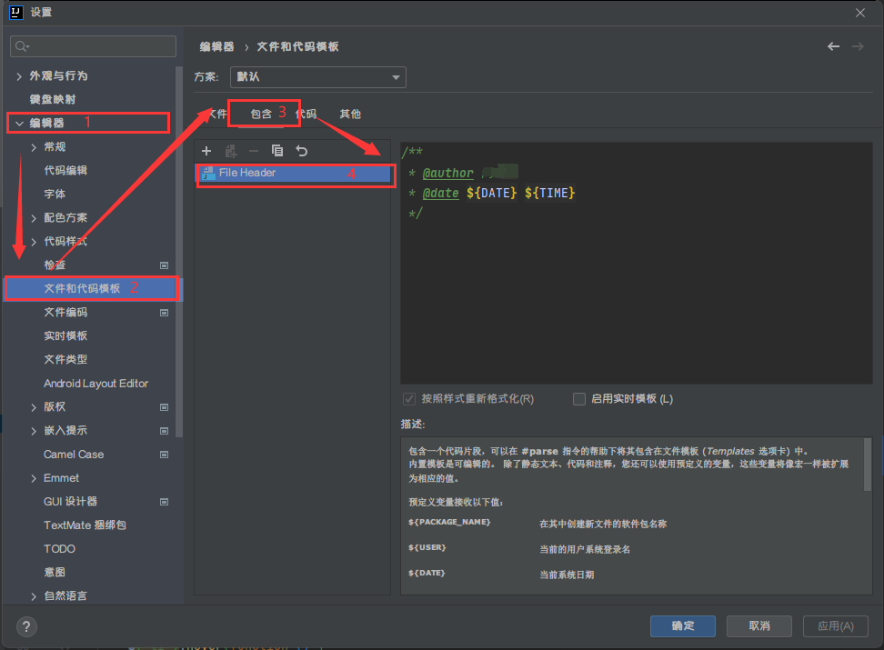

<br>


**方法模板**

找到如下地方：


添加自己需要的模板后（展开方式选 `Enter`，表示回车触发），点击【更改】，添加使用环境，然后【编辑变量】：


最后应用就行，在类的方法上方输入 `com` 按回车就可自动生成方法注释。

<br>

## 【11】插件：Translation

可以在 IDEA 使用翻译功能，效果：

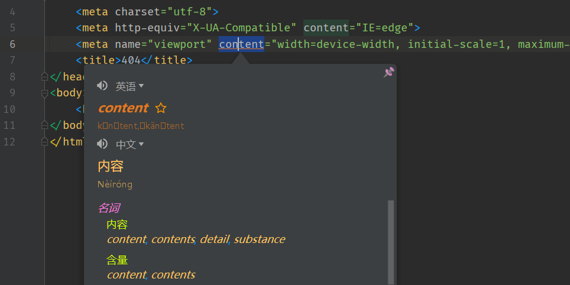


默认引擎使用 Google 翻译，但是如果请求次数过多提示 “翻译失败，请求过多，请稍后再试！”，这里我建议使用阿里翻译引擎。

阿里翻译每月的前 100 万字符免费，超出的部分会按照 50 元 / 百万字符收取费用，费用由阿里翻译在它自己的阿里云官方网站收取，与 Translation 无关。

申请步骤：

1. 登录阿里云官网，点击右上角的控制台，在控制台的搜索框搜索 “机器翻译”：

   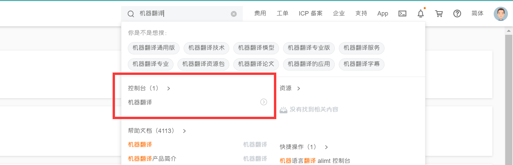

2. 点击【通用版翻译引擎】下方的【立即开通】按钮：

   


   点击之后会让你勾选一个【机器翻译服务协议】，勾选之后点【立即开通】就能开通成功了。

3. 开通后，回到 阿里云机器翻译控制台，把鼠标悬停在右上角用户头像上，然后点击【AccessKey 管理】，会跳转到 AccessKey 管理页面：

   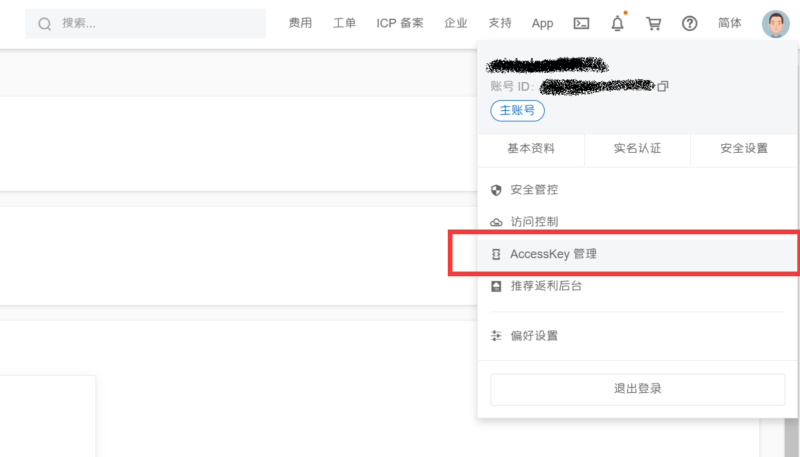

4. 进入后会弹出一个安全提示：

   
   
   简而言之，在这里创建的 AccessKey 能调用你账号下的所有资源，权限范围太大了，一旦泄露的话影响面很大，所以阿里云建议你创建一个子用户，然后给这个子用户只分配机器翻译的权限，这样的话即使泄露了也只会影响到机器翻译。

5. 点击【创建用户】，填写用户信息 ：

   - 设置登录名称：huacifanyi
   - 填写显示名称：划词翻译
   - 访问方式：勾选【Open API 调用访问】

   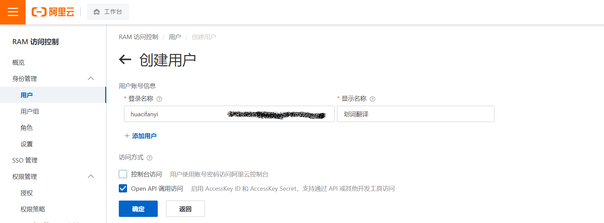

6. 点击【确定】之后会让你输入手机短信验证码，输入之后会看到创建成功的 【AccessKey ID】 和 【AccessKey Secret】，如下图：

   

7. 然后勾选刚刚创建的用户，点击【添加权限】：

   

8. 搜索 “机器翻译”，单击选中【AliyunMTFullAccess】和【AliyunMTReadOnlyAccess】这两项即可，然后点击【确定】：

   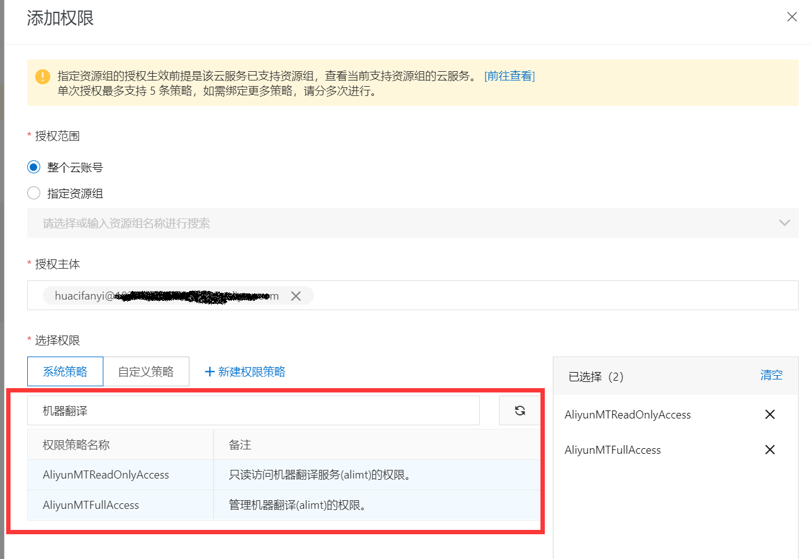

9. 最后在 IDEA 的 Translation 中，选择 阿里翻译并配置：

   

<br>

## 【12】Defender 排除项目目录

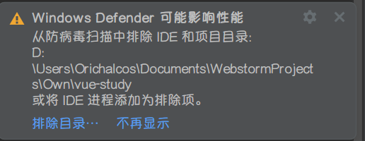

1. 打开设置，然后依次打开【隐私和安全性】=>【Windows 安全中心】=>【打开 Windows 安全中心】

2. 在 Windows 安全中心中选择【病毒和威胁防护】，在【病毒和威胁防护设置】下，选择【管理设置】

   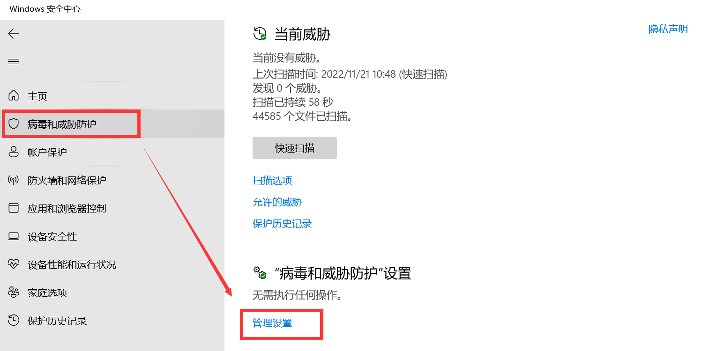

3. 最后在 ”排除项“ 下，点击【添加或删除排除项】

   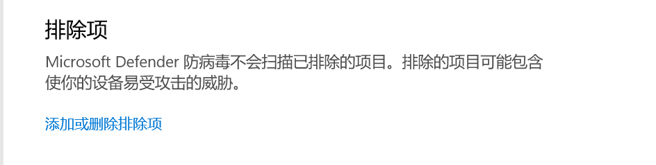

<br>

## 【13】修改（文件）编码格式

IntelliJ IDEA 可以在菜单中的【File】=>【Settings】=>【Editor】=>【File Encoding】下修改项目文件的编码：


- IDE 的默认的全局编码是 UTF-8，Project Encoding 默认会是操作系统的 GBK，一般会修改为 UTF-8。
- IntelliJ IDEA 可以对 Properties 文件进行专门的编码设置，也建议改为 UTF-8，其中有一个重点就是属性 **Transparent native-to-ascii conversion** ，一般都要勾选，不然 Properties 文件中的注释显示的都不会是中文。
- IntelliJ IDEA 除了支持对整个 Project 设置编码之外，还支持对目录、文件进行编码设置。如果你要对目录进行编码设置的话，可能会出现需要 Convert 编码的弹出操作选择，强烈建议在转换之前做好文件备份，不然可能出现转换过程变成乱码，无法还原。

另外，单独文件的编码也可以这样设置：

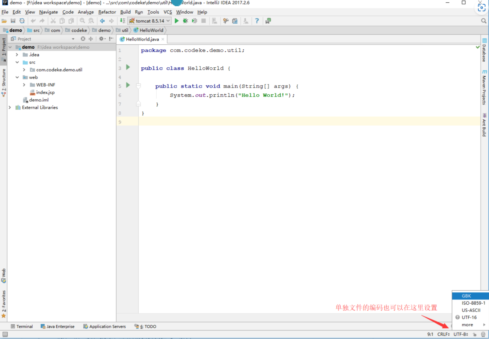

可能会弹出这样一个弹框：


- Reload 表示使用新编码重新加载，新编码不会保存到文件中。
- Convert 表示使用新编码进行转换，新编码会保存到文件中。

> 含有中文的代码文件，Convert 之后可能会使中文变成乱码，所以在转换成请做好备份，不然可能出现转换过程变成乱码，无法还原。

<br>

# Windows Server

## 【1】激活

**评估版本改变为正式版本**

首先 Windows Server 2022 Retail（零售）或 Evaluation（评估）版本转 VOL，根据版本选择：

- Standard 版本：

  ```shell
  DISM /online /Set-Edition:ServerStandard /ProductKey:VDYBN-27WPP-V4HQT-9VMD4-VMK7H /AcceptEula
  ```

- Datacenter 版本：

  ```shell
  DISM /online /Set-Edition:ServerDatacenter /ProductKey:WX4NM-KYWYW-QJJR4-XV3QB-6VM33 /AcceptEula
  ```

然后进行 KMS 激活。

<br>

**KMS 激活**

1. 首先输入下面的命令，更改 Windows server 2022 操作系统序列号：

   ```shell
   slmgr -ipk WX4NM-KYWYW-QJJR4-XV3QB-6VM33
   ```

   

2. 接下来更改 KMS 激活服务器，使用下面的命令进行更改：

   ```shell
   slmgr /skms kms.03k.org
   ```

   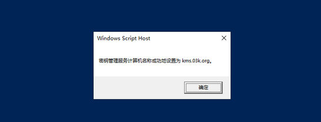

3. 完成KMS服务器的设置以后，就可以使用下面的命令来激活 Windows server 2022 操作系统：

   ```shell
   slmgr /skms kms.03k.org
   ```

   

4. 通过 `slmgr.vbs -dlv` 命令可以看到激活后的使用期限为 180 天，可以重置的计数 1000 次以上，应该可以让你完成测试使用。

   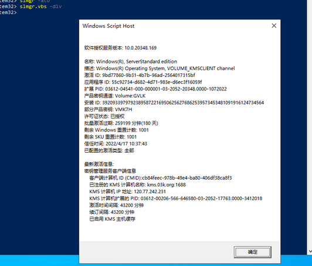

>  以上的方法供学习使用。 

<br>

## 【2】安装 Windows Terminal

1. 在 Windows Server 2022 上打开【开始】。

2. 搜索 PowerShell，右键单击顶部结果，然后选择 【以管理员身份运行】选项。

3. 键入以下命令然后按 Enter 键以下载运行库：

   ```shell
   Invoke-WebRequest -Uri https://aka.ms/Microsoft.VCLibs.x64.14.00.Desktop.appx -outfile Microsoft.VCLibs.x86.14.00.Desktop.appx
   ```

   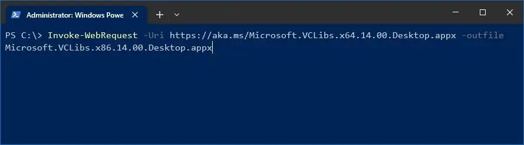

4. 键入以下命令然后按 Enter 键以安装 “.appx” 程序包：

   ```shell
   Add-AppxPackage Microsoft.VCLibs.x86.14.00.Desktop.appx
   ```

5. 输入以下命令并按 Enter 键下载最新版本的 Windows Terminal：

   ```shell
   Invoke-WebRequest -Uri https://github.com/microsoft/terminal/releases/download/v1.16.10261.0/Microsoft.WindowsTerminal_Win10_1.16.10261.0_8wekyb3d8bbwe.msixbundle -outfile Microsoft.WindowsTerminal_Win10_1.16.10261.0_8wekyb3d8bbwe.msixbundle
   ```

   

   > 如果服务器无法下载可以直接去 [GItHub](https://github.com/microsoft/terminal/releases) 下载后传输到服务器，然后执行安装命令。建议下载的版本和上面命令行保持一致，其他版本由于缺少其他包无法进行安装。

6. 键入以下命令然后按 Enter 键以安装 Windows Terminal 应用程序：

   ```shell
   Add-AppxPackage Microsoft.WindowsTerminal_Win10_1.16.10261.0_8wekyb3d8bbwe.msixbundle
   ```

完成这些步骤后，终端将安装在 Windows Server 上。

也可以使用相同的说明升级到命令控制台的新版本。但是需要使用旧版 PowerShell 控制台来完成该过程，因为在应用程序运行时无法升级终端。

<br>

## 【3】关闭系统自动更新

1. 在终端中输入命令 `sconfig` 回车：

   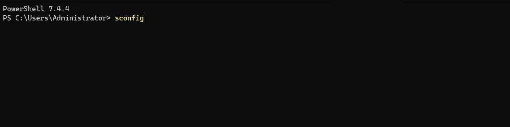

2. 输入数字 5 回车：

   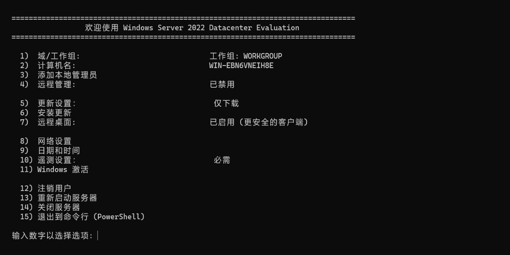

3. 选择 “手动更新”，即输入数字 3 回车即可：

   

4. 最后会回到这个页面，可以看到更新已改为手动：

   

<br>

## 【4】修改 CMD 窗口标题

在命令行中输入：

```bash
title 名字
```

如果在启动 Tomcat 时候，无法输入命令，可右键文本形式打开批处理，输入命令：

```bat
set "title=名字"
```

<br>

## 【5】服务器与本地电脑无法远程复制粘贴

通过重启 rdpclip.exe 进程解决：

1. 登录服务器后，打开任务管理器，在任务管理器中查找是否有进程 rdpclip.exe，有的系统不一样，名字也是不同的，也有系统叫 RDP剪贴板监视程序：

   

2. 如果找到有进程，选中该进程，鼠标右键，选择结束该进程，结束该进程；如果没有该进程，直接进行第 3 步。

3. 按 Win + R 打开【运行】，在运行中输入进程 rdpclip.exe，并点击确定：

   

4. 再次在任务管理其中查看进程 rdpclip.exe 是否已经启动，如果已经启动，就测试是否可以复制粘贴，如果还是没有启动，则再次操作第 4 步。

<br>

# TortoiseSVN

## 【1】存储库尚未启用接受修订注释更改

使用 SVN 提交版本信息时，注释内容写的不全。

通过右键 TortoiseSVN 的【Show log】看到提交的的注释，右键每条日志信息看到【Edit log message】的选项，然而提交后却给出错误提示：

```
Repository has not been enabled to accept revision propchanges;

ask the administrator to create a pre-revprop-change hook
```

解决方案：

1. 编写批处理文件 `pre-revprop-change.bat`，内容如下：

   ```bat
   SET REPOS="%1"
   
   SET REV="%2"
   
   SET USER="%3"
   
   SET PROPNAME="%4"
   
   SET ACTION="%5"
   
   IF %ACTION% == "M" (IF %PROPNAME% == "svn:log" (EXIT 0))
   
   ECHO "Changing revision properties %PROPNAME% is prohibited" >&2
   
   EXIT 1
   ```

2. 将文件放到 `\Repositories\SVN文件夹\hooks\` 下执行即可。

<br>

## 【2】查看本地 SVN 账号密码

1. 找到存放 SVN 账号密码的路径，默认路径 `C:\Users\{用户名}\AppData\Roaming\Subversion\auth\svn.simple`。

2. 前往[这个地址](http://www.leapbeyond.com/ric/TSvnPD/)下载一个密码查看工具。

3. 将 .exe 的文件拷到上面第一步的目录中去，启动该工具就可以看见对应的用户名密码了：

   

<br>

# PowerShell

## 【1】安装 PowerShell

**使用 Winget 安装 PowerShell（推荐）**

Winget 是 Windows 软件包管理器，是一个命令行工具，使用户能够在 Windows 客户端计算机上发现、安装、升级、删除和配置应用程序。此工具是Windows Package Manager 服务的客户端接口。默认情况下，命令行工具与 Windows 11 和现代版本的 Windows 10 捆绑在一起。

1. 搜索最新版本的 PowerShell：

   ```shell
   winget search Microsoft.PowerShell
   ```

   输出：

   ```
   Name               Id                           Version   Source
   -----------------------------------------------------------------
   PowerShell         Microsoft.PowerShell         7.4.0.0   winget
   PowerShell Preview Microsoft.PowerShell.Preview 7.4.0.101 winget
   ```

2. 使用参数 `id` 安装 PowerShell 或 PowerShell 预览版：

   ```shell
   winget install --id Microsoft.Powershell --source winget
   winget install --id Microsoft.Powershell.Preview --source winget
   ```

<br>

## 【2】因为在此系统上禁止运行脚本

**报错详情**

```
PS E:\code> hexo server
hexo : 无法加载文件 C:\Users\Administrator\AppData\Roaming\npm\hexo.ps1，
因为在此系统上禁止运行脚本。有关详细信息，请参阅 
https:/go.microsoft.com/fwlink/?LinkID=135170 中的about_Execution_Policies。
所在位置 行:1 字符: 1
+ hexo new "PowerShell：因为在此系统上禁止运行脚本，解决方法"
+
    + CategoryInfo          : SecurityError: (:) []，PSSecurityException
    + FullyQualifiedErrorId : UnauthorizedAccess
```

计算机上启动 Windows PowerShell 时，执行策略很可能是 `Restricted`（默认设置）。

- `Restricted` 执行策略不允许任何脚本运行。 
- `AllSigned` 和 `RemoteSigned` 执行策略可防止 Windows PowerShell 运行没有数字签名的脚本。

打开 PowerShell 然后输入 `get-executionpolicy` 可查看计算机上的现用执行策略：

```
PS C:\WINDOWS\system32> get-executionpolicy
Restricted
```

<br>

**设置**

以管理员身份打开 PowerShell 输入 `set-executionpolicy remotesigned`，并输入 `Y`：

```
PS C:\WINDOWS\system32> set-executionpolicy remotesigned

执行策略更改
执行策略可帮助你防止执行不信任的脚本。更改执行策略可能会产生安全风险，如 https:/go.microsoft.com/fwlink/?LinkID=135170
中的 about_Execution_Policies 帮助主题所述。是否要更改执行策略?
[Y] 是(Y)  [A] 全是(A)  [N] 否(N)  [L] 全否(L)  [S] 暂停(S)  [?] 帮助 (默认值为“N”): y
PS C:\WINDOWS\system32> get-executionpolicy
RemoteSigned
```

<br>

## 【3】Powershell7 中文乱码

在 `$Profile` 文件（`notepad.exe $Profile`）中添加或者直接在终端里运行：

```bash
$OutputEncoding = [console]::InputEncoding = [console]::OutputEncoding = New-Object System.Text.UTF8Encoding
```

> [!NOTE]
>
> 上述操作修改了输出编码为 `UTF-8`，兼容了大部分的程序输出的中文。

需要注意的是，PowerShell7 仅修改 `chcp 65001` 无法实现对程序输出中文的支持。另外，修改【控制面板】=>【区域】=>【管理】=>【更改系统区域设置】里面的设置，启用 【Beta版：使用Unicode UTF-8提供全球语言支持】，也可以达到同样的效果，但是很多中文应用程序，包括操作系统自带的应用程序，将会出现中文显示异常。不推荐此方案！


<br>

# IDM

## 【1】关闭假序列号弹窗

使用破解版的 IDM 会时不时出现假序列号弹窗：

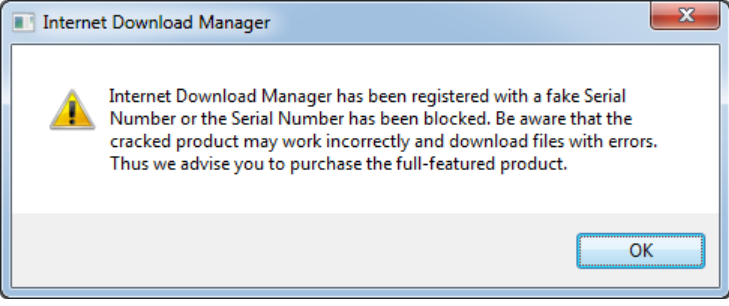

<br>

**解决方案**

1. 打开 host 文件（C:\Windows\System32\drivers\etc\hosts），添加以下几项，将 IDM 的认证服务器域名屏蔽了：

   ```
   127.0.0.1 http://tonec.com
   127.0.0.1 http://www.tonec.com
   127.0.0.1 http://registeridm.com
   127.0.0.1 http://www.registeridm.com
   127.0.0.1 http://secure.registeridm.com
   127.0.0.1 http://internetdownloadmanager.com
   127.0.0.1 http://www.internetdownloadmanager.com
   127.0.0.1 http://secure.internetdownloadmanager.com
   127.0.0.1 http://mirror.internetdownloadmanager.com
   127.0.0.1 http://mirror2.internetdownloadmanager.com
   127.0.0.1 http://mirror3.internetdownloadmanager.com
   ```

2. 每次 IDM 启动的时候，都会修改 hosts 文件，将以上内容注释，可以将 hosts 文件设置为【只读】，也可以使用火绒的自定义防护禁止 IDMan.exe 修改 hosts：

   

<br>

## 【2】浏览器拓展错误

使用破解版的 IDM 下载时浏览器提示扩展错误：

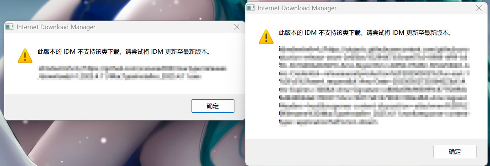

是因为软件版本和扩展版本不一致，只需要下载回旧版本的插件就可以啦（需要禁止浏览器更新扩展版本），或者更新软件的版本。

<br>

**解决方案**

1. 打开浏览器的扩展设置，将 IDM 的扩展删除。

2. 打开 IDM 的安装目录，找到 IDMGCExt.crx 文件，将其拖入浏览器中，浏览器会重新安装扩展：

   
   
3. 安装完成后，在扩展管理中找到扩展 ID：

   

4. 前往 `C:\Users\<用户名>\AppData\Local\Microsoft\Edge\User Data\Default\Extensions` 目录下找到与扩展 ID 同名的文件夹，右键打开【属性】，在【安全】页签中设置拒绝所有用户写入：

   

<br>

# Unity

## 【1】改变游戏启动窗口大小

可以从命令行启动 Unity 播放器并传入参数来更改播放器的执行方式：

- `-popupwindow`：将窗口创建为弹出窗口，没有框架。
- `-screen-fullscreen`：覆盖默认的全屏状态。此值必须是 0 或 1。
- `-screen-height`：覆盖默认屏幕高度。此值必须是受支持分辨率中的整数。
- `-screen-width`：覆盖默认屏幕宽度。此宽度值必须是受支持分辨率的整数。

比如我要独占全屏运行原神，就可以：

```shell
"yuanshen.exe" -screen-fullscreen 1 -screen-width 3840 -screen-height 2160
```

比如我要1080P窗口运行原神，就可以：

```shell
"yuanshen.exe" -popupwindow -screen-fullscreen 0 -screen-width 1920 -screen-height 1080
```

<br>

# Weasel

RIME 本身简洁、流畅，性能优异，注重隐私，可定制性强，对于追求极致输入体验的用户，可谓不二之选。而为 RIME 量身打造的雾凇拼音，是目前维护最积极、功能最强大的 RIME 输入方案，拥有精心打磨的大容量词库、开箱即用的中文输入体验。

RIME 本身是一个输入法引擎，它在不同平台有不同的适配，分别是：

| 平台    | 对应的适配                                                   |
| ------- | ------------------------------------------------------------ |
| Linux   | 中州韵（通过 IBus 或 Fcitx 输入法框架运行）                  |
| Windows | 小狼毫                                                       |
| macOS   | 鼠须管、[小企鹅输入法](https://sspai.com/link?target=https%3A%2F%2Fgithub.com%2Ffcitx-contrib%2Ffcitx5-macos-installer%2Fblob%2Fmaster%2FREADME.zh-CN.md)（Fcitx） |
| Android | [同文输入法](https://sspai.com/link?target=https%3A%2F%2Fgithub.com%2Fosfans%2Ftrime)（TRIME） |
| iOS     | [仓输入法](https://apps.apple.com/cn/app/仓输入法/id6446617683?l=en-GB)（开源免费）、[iRime](https://apps.apple.com/cn/app/irime输入法-小鹤双拼五笔郑码输入法/id1142623977)（付费） |

<br>

## 1、安装小狼毫

1. 前往 [RIME 官方网站](https://sspai.com/link?target=https%3A%2F%2Frime.im%2Fdownload%2F)，下载小狼毫的安装包：

   

   > [!NOTE]
   >
   > 不同系统版本适用不同的小狼毫，如果是 Windows 8.1 及更高版本，则选择最新的 0.17.4；如果是老版本的 Windows（如Windows 7），则选择旧版本，但是已经不再更新。

2. 下载后，运行安装程序，按提示安装即可。期间，安装程序会要求你指定用户文件夹，该文件夹用于放置 RIME 的用户配置文件，通常使用默认设置即可，当然你也可以指定其他的位置：

   

3. 安装完成后，小狼毫默认启用。在 Windows 10/11，你可以按「Windows+空格」快捷键切换输入法。

<br>

## 2、安装雾凇拼音

Windows 平台安装雾凇拼音非常方便，可以直接使用小狼毫输入法自带的配置工具。

更新步骤与安装步骤完全相同：

1. 右键点击任务栏上的 RIME 图标，选择「输入法设定」，打开配置工具：

   

2. 在配置工具中，点击左下角的「获取更多输入方案」按钮（我这里是已经安装过了雾凇拼音）：

   

3. 随后会出现一个命令行窗口，这就是小狼毫自带的配置文件安装工具。在提示符 「Enter package name...」后，输入雾凇拼音的包名（其中 `full` 表示安装所有的组件）：

   ```shell
   iDvel/rime-ice:others/recipes/full
   ```

   

4. 回车确认，随即 RIME 会自动下载、安装雾凇拼音输入方案：

   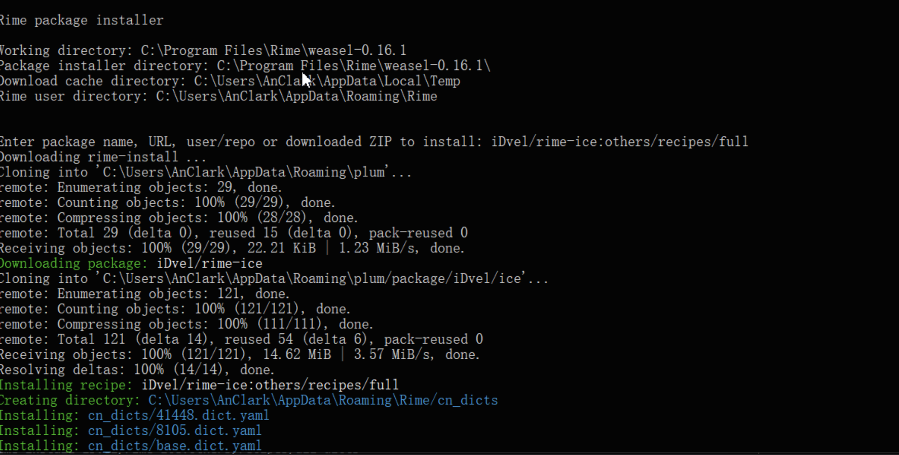

   > [!CAUTION]
   >
   > 配置文件安装工具需要用到 [Git](https://sspai.com/link?target=https%3A%2F%2Fgit-scm.com%2Fdownload%2Fwin)。如果你的系统没有安装 Git，或下载时发生错误，[请参照 RIME 官方的教程](https://sspai.com/link?target=https%3A%2F%2Fgithub.com%2Frime%2Fplum%3Ftab%3Dreadme-ov-file%23windows)，用教程中提供的 Bootstrap 工具包来初始化该工具。

5. 稍等片刻，命令提示符出现「Updated xxx files...」的提示（黄色字样），表示安装完成。此时可以直接关掉该窗口：

   

6. 回到小狼毫配置工具，将列表往下拉，你就会看到雾凇拼音的选项。勾选它，然后单击「中」按钮3，确认：

   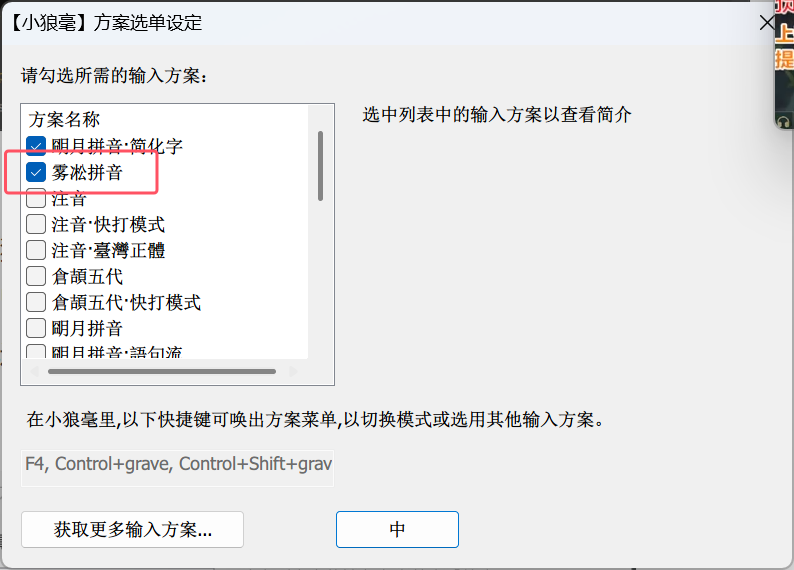

   接下来配置工具还会要求你选择一款皮肤。直接点击「中」按钮确认，即可完成全部设置。

<br>

## 3、自定义皮肤

具体配置信息可以看[官方文档](https://github.com/rime/weasel/wiki/Weasel-%E5%AE%9A%E5%88%B6%E5%8C%96#%E9%85%8D%E8%89%B2%E6%96%B9%E6%A1%88)，这里给出我用的配置：

1. 右键点击任务栏上的 RIME 图标，选择「用户文件夹」：

   

2. 在用户文件夹下找到 weasel.custome.yaml 文件，直接编辑：

   ```yaml
   customization:
     distribution_code_name: Weasel
     distribution_version: 0.17.4
     generator: "Weasel::UIStyleSettings"
     modified_time: "Thu Sep 25 22:03:01 2025"
     rime_version: 1.13.1
   patch:
     "preset_color_schemes/+":
       mac_blue_dark: {author: arvin, back_color: 0x181818, border_color: 0x0808080D, border_width: 0, candidate_back_color: 0x181818, candidate_format: "%c %@ ", candidate_text_color: 0xFFFFFF, color_format: abgr, comment_text_color: 0xFFFFFFFF, hilited_back_color: 0xFFc85c2f, hilited_candidate_back_color: 0xFFc85c2f, hilited_candidate_text_color: 0xFFFFFFFF, hilited_comment_text_color: 0xFFFFFF, hilited_label_color: 0xFFFFFF, hilited_text_color: 0xFFFFFF, label_color: 0xFFFFFF, name: "苹果黑", shadow_color: 0x080808DE, text_color: 0xFF333333}
       mac_blue_write: {author: arvin, back_color: 0xFFFFFFFF, border_color: 0xd2d2d2FF, candidate_back_color: 0xFFFFFFFF, candidate_format: "%c %@ ", candidate_text_color: 0x333333FF, color_format: rgba, comment_text_color: 0x5C5C5CFF, corner_radius: 6, hilited_back_color: 0x315efb1a, hilited_candidate_back_color: 0x315efb1a, hilited_candidate_text_color: 0x0158ccFF, hilited_comment_text_color: 0x0158ccFF, hilited_corner_radius: 6, hilited_label_color: 0x315efbFF, hilited_text_color: 0x0158ccFF, label_color: 0x333333FF, name: "苹果蓝白", shadow_color: 0x20212447, text_color: 0x333333FF}
     style:
       color_scheme: mac_blue_write
       comment_font_face: "PingFang SC"
       comment_font_point: 11
       display_tray_icon: false
       font_face: "Segoe UI Emoji, PingFang SC, Microsoft YaHei, SF Pro, Noto Color Emoji"
       font_point: 11
       horizontal: true
       inline_preedit: true
       label_font_face: "PingFang SC"
       label_font_point: 10
       label_format: "%s."
       layout: {align_type: bottom, border_width: 1, candidate_spacing: 16, corner_radius: 6, hilite_padding: 4, hilite_spacing: 3, margin_x: 7, margin_y: 7, max_height: 60, round_corner: 4, shadow_offset_x: 2, shadow_offset_y: 2, shadow_radius: 6, spacing: 5}
       mark_text: ""
       preedit_type: composition
     "style/color_scheme": mac_blue_write
   ```

3. 右键点击任务栏上的 RIME 图标，选择「重新部署」。

<br>

## 4、配置

### 4.1、输入习惯

打开用户文件夹，在 default.custom.yaml 配置文档中配置输入习惯。

<br>

**配置候选项数量**

```yaml
patch:
  menu/page_size: 9
```

<br>

**配置快捷键**

```yaml
patch:
  key_binder/bindings/+:
    - { when: paging, accept: comma, send: Page_Up }		# 句号向下翻页
    - { when: has_menu, accept: period, send: Page_Down }	# 逗号向上翻页
```

<br>

### 4.2、自定义短语

自定义短语作为极度私有化，且能极大提升输入效率的工具，在 RIME 中具有十分重要的意义。

1. 用户自定义短语存储于用户文件夹下的 custom_phrase.txt 文本文件中：

   ```
   # Rime table
   # coding: utf-8
   #
   # 请将该文件以 UTF-8 无签名编码保存
   # 存储位置为 ~Rime 用户文件夹/custom_phrase.txt
   #
   # 码表各字段以制表符（Tab）分隔
   # 编码格式：词条+tab+编码+tab+权重 权重决定短语词条在候选项中的排序，权重非必须项
   
   xxx@gmail.com	gmail	1
   xnom	id	1
   ```

2. 然后，需要在输入方案配置文件 rime_ice.schema.yaml 中，指定调用这张自定义短语表。和词库一样，如果你使用多个输入方案，需要在每个输入方案中调用：

   ```yaml
   custom_phrase:
     user_dict: custom_phrase
   ```

   > [!NOTE]
   >
   > 输入方案配置文件名称格式为 `<方案名称>.schema.yaml`，我这里用的雾凇拼音，所以是 rime_ice.schema.yaml。

3. 重新部署后，自定义短语就能生效。

<br>

## 5、用户资料同步

RIME 没有云同步功能，但有本地同步功能。能够将用户数据同步至本地文件夹。

我们可以借助坚果云、OneDrive 等第三方云将这个本地文件夹同步至云端，以此实现个人词典和配置方案在不同电脑间的同步和备份。

以 OneDrive 举例：

1. 在你同步文件夹内，这里举例为 `E:\Users\Orichalcos\OneDrive\`，新建一个 `应用` 文件夹。

2. 打开用户资料夹下的 installation.yaml 文件，在合适的地方添加如下代码：

   ```yaml
   sync_dir: 'E:\Users\Orichalcos\OneDrive\应用'
   ```

   最后完成后的样子是这样：

   ```yaml
   distribution_code_name: Weasel
   distribution_name: "小狼毫"
   distribution_version: 0.17.4
   install_time: "Mon Sep 22 10:01:51 2025"
   installation_id: "Weasel"	# 此处填写喜欢的名字
   rime_version: 1.13.1
   sync_dir: 'E:\Users\Orichalcos\OneDrive\应用'
   ```

3. 右键托盘图标，运行「用户资料同步」。完成后，你就能在「应用」文件夹中找到 「Weasel 」文件夹，其中的内容就是你的用户资料，包含了自学习个人词典文件和配置文件等等。

4. 利用 OneDrive 将此文件夹同步至云端；在另外一台电脑，按照相同的方式操作。将云端文件夹同步至本地。

<br>

**RIME 的同步逻辑**

RIME 同步两个方面的资料，一为个人词典，二为个人配置：

- 个人词典同步逻辑为双向同步：

  举例来说：甲电脑个人词典累积了词汇 ABC，乙电脑累积了词汇 DEF，那么，通过第三方云同步和 Rime 同步后，甲乙两地个人词典词汇都会同步且合并为 ABCDEF。通过第三方云同步，可以非常方便地同步两地之间的个人词典，保持相同的输入体验。

- 个人配置同步逻辑为单向同步：

  RIME 只会将配置文件，单向地从「用户文件夹 ~\Rime」同步至「同步文件夹\Weasel」。换句话说，个人配置只会在「同步文件夹\Weasel」里在甲乙两地被反复同步和覆盖，而不会导入配置文件。如果你需要导入异地的配置文件，可以在第三方云完成同步后，手动将配置文件导入。

这样的同步逻辑是为了保持配置的一致性。因为，配置文件之于 RIME 十分重要，关系着 RIME 是否能够正常运行。也必须在修改后通过重新部署才能生效。若两地的配置不一致时或其中一地有错误时，必然产生无法预估的混乱后果。不过，个人配置定制好之后，也很少需要修改，权且当作备份。云同步个人配置更多用于异地新电脑部署时。
