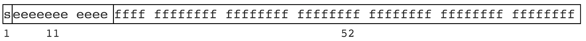

# Solutions

## 1、后端

### 【1】Java 高效获取大文件的行数

**方式 1 : 利用 LineNumberReader**

```java
public static int getFileLineNum(String filePath) {
    try (LineNumberReader lineNumberReader = new LineNumberReader(new FileReader(filePath))){
        lineNumberReader.skip(Long.MAX_VALUE);
        int lineNumber = lineNumberReader.getLineNumber();
        return lineNumber + 1;//实际上是读取换行符数量 , 所以需要+1
    } catch (IOException e) {
        return -1;
    }
}
```

**方式 2 : Java 8 新的工具方法**

```java
public static long getFileLineNum(String filePath) {
    try {
        return Files.lines(Paths.get(filePath)).count();
    } catch (IOException e) {
        return -1;
    }
}
```

实际上 , Java 8 的新方法时间上并没有 LineNumberReader 快。经测试如下：

| 文件大小（行数） | LineNumberReader 耗时 | Java 8 方法耗时 |
| ---------------- | --------------------- | --------------- |
| 9656204          | 1098 ms               | 1385 ms         |
| 29691684         | 1512 ms               | 2237 ms         |


#### 1.1、BufferedReader

BufferedReader 提供了下面两个功能：

1. 在普通 Reader 的基础上，提供了缓冲功能，可以更加高效的读取；
2. 提供了读取一行的功能：`readLine()`。


#### 1.2、LineNumberReader

`Java.io.LineNumberReader` 类是一个缓冲的字符输入流，用于跟踪行号。行被视为由换行符 `\n`、回车符 `\r`或者回车后立即换行。

LineNumberReader 继承自 BufferedReader，并且增加了下面两个功能：

1. 获取行号：`getLineNumber()`
2. 设置行号：`setLineNumber()`


**构造函数**

| 序号 | 构造函数与说明                                               |
| ---- | ------------------------------------------------------------ |
| 1    | `LineNumberReader(Reader in)`<br>这将使用默认的输入缓冲区大小创建一个新的行号读取器。 |
| 2    | `LineNumberReader(Reader in, int sz)`<br>这将创建一个新的行号读取器，将字符读取到给定大小的缓冲区中。 |


**类方法**

| 序号 | 方法与说明                                                   |
| ---- | ------------------------------------------------------------ |
| 1    | `int getLineNumber()`<br>此方法获取当前行号。                |
| 2    | `void mark(int readAheadLimit)`<br/>此方法标记流中的当前位置。 |
| 3    | `int read()`<br/>此方法读取单个字符。                        |
| 4    | `int read(char[] cbuf, int off, int len)`<br/>此方法将字符读入数组的一部分。 |
| 5    | `String readLine()`<br/>此方法读取一行文本。                 |
| 6    | `void reset()`<br/>此方法将流重置为最新标记。                |
| 7    | `void setLineNumber(int lineNumber)`<br/>此方法设置当前行号。 |
| 8    | `long skip(long n)`<br/>此方法跳过 *n* 个字符，返回实际跳过的字符数。 |


### 【2】java.Net.UnknownHostException 异常

在统信 UOS 上启动 SpringBoot 项目的时候出现了 [ Java.NET.UnknownHostException：域名解析暂时失败 ] 异常。

问题原因是在系统的 `/etc/hostname` 中配置了主机名，而在 `/etc/hosts` 文件中没有相应的配置。

简单的解决办法是对应关系配好就可以，甚至删除 `/etc/Hostname` 这个文件也可以。


**深层的原因**

在大多数 Linux 操作系统中，都是以 `/etc/hosts` 中的配置查找主机名的，但是 Detian 等一些系统也用 `/etc/hostname` 文件中的配置做主机名。

而 Java 的 `InetAddress` 调用 `InetAddressImpl` 的  `public native String getLocalHostName() throws UnknownHostException;` 来获取本地主机名，Java 的这个方法是 `native` 的，是本地系统的一个实现，所以在本地配置出现问题的情况下，Java 代码出现问题。

hostname 查看本机名称,

- 若本机名称不是一个 IP 地址，比如是 "Orichalcos"，则必须在 `/etc/hosts` 中配置 "Orichalcos" 对应本机 IP，否则 `java.net.InetAddress.getLocalHost` 会抛出 `java.Net.UnknownHostException`异常。

	> 配置格式为（示例）：
	>
	> ```
	> 本机IP	Orichalcos
	> ```

- 若本机名称是一个 IP 地址，而且必须是本机某块网卡的 IP。


### 【3】JSON parse error: Invalid UTF-8 middle byte 0x3f

POST 请求 JSON 前端传值乱码：

```
org.springframework.http.converter.HttpMessageNotReadableException: JSON parse error: Invalid UTF-8 middle byte 0x3f
 at [Source: java.io.PushbackInputStream@40f9cfc2; line: 1, column: 149931]; nested exception is com.fasterxml.jackson.databind.JsonMappingException: Invalid UTF-8 middle byte 0x3f
 at [Source: java.io.PushbackInputStream@40f9cfc2; line: 1, column: 149931]
        at org.springframework.http.converter.json.AbstractJackson2HttpMessageConverter.readJavaType(AbstractJackson2HttpMessageConverter.java:238)
        at org.springframework.http.converter.json.AbstractJackson2HttpMessageConverter.read(AbstractJackson2HttpMessageConverter.java:223)
        at org.springframework.web.servlet.mvc.method.annotation.AbstractMessageConverterMethodArgumentResolver.readWithMessageConverters(AbstractMessageConverterMethodArgumentResolver.java:201)
        at org.springframework.web.servlet.mvc.method.annotation.RequestResponseBodyMethodProcessor.readWithMessageConverters(RequestResponseBodyMethodProcessor.java:150)
        at org.springframework.web.servlet.mvc.method.annotation.RequestResponseBodyMethodProcessor.resolveArgument(RequestResponseBodyMethodProcessor.java:128)
        at org.springframework.web.method.support.HandlerMethodArgumentResolverComposite.resolveArgument(HandlerMethodArgumentResolverComposite.java:121)
        at org.springframework.web.method.support.InvocableHandlerMethod.getMethodArgumentValues(InvocableHandlerMethod.java:158)
        at org.springframework.web.method.support.InvocableHandlerMethod.invokeForRequest(InvocableHandlerMethod.java:128)
        at org.springframework.web.servlet.mvc.method.annotation.ServletInvocableHandlerMethod.invokeAndHandle(ServletInvocableHandlerMethod.java:97)
        at org.springframework.web.servlet.mvc.method.annotation.RequestMappingHandlerAdapter.invokeHandlerMethod(RequestMappingHandlerAdapter.java:827)
        at org.springframework.web.servlet.mvc.method.annotation.RequestMappingHandlerAdapter.handleInternal(RequestMappingHandlerAdapter.java:738)
        at org.springframework.web.servlet.mvc.method.AbstractHandlerMethodAdapter.handle(AbstractHandlerMethodAdapter.java:85)
        at org.springframework.web.servlet.DispatcherServlet.doDispatch(DispatcherServlet.java:967)
        at org.springframework.web.servlet.DispatcherServlet.doService(DispatcherServlet.java:901)
        at org.springframework.web.servlet.FrameworkServlet.processRequest(FrameworkServlet.java:970)
        at org.springframework.web.servlet.FrameworkServlet.doPost(FrameworkServlet.java:872)
        at javax.servlet.http.HttpServlet.service(HttpServlet.java:661)
        at org.springframework.web.servlet.FrameworkServlet.service(FrameworkServlet.java:846)
        at javax.servlet.http.HttpServlet.service(HttpServlet.java:742)
        at org.apache.catalina.core.ApplicationFilterChain.internalDoFilter(ApplicationFilterChain.java:231)
        at org.apache.catalina.core.ApplicationFilterChain.doFilter(ApplicationFilterChain.java:166)
        at org.apache.tomcat.websocket.server.WsFilter.doFilter(WsFilter.java:52)
        at org.apache.catalina.core.ApplicationFilterChain.internalDoFilter(ApplicationFilterChain.java:193)
        at org.apache.catalina.core.ApplicationFilterChain.doFilter(ApplicationFilterChain.java:166)
        at org.springframework.web.filter.CorsFilter.doFilterInternal(CorsFilter.java:96)
        at org.springframework.web.filter.OncePerRequestFilter.doFilter(OncePerRequestFilter.java:107)
        at org.apache.catalina.core.ApplicationFilterChain.internalDoFilter(ApplicationFilterChain.java:193)
        at org.apache.catalina.core.ApplicationFilterChain.doFilter(ApplicationFilterChain.java:166)
        at org.apache.catalina.core.ApplicationFilterChain.internalDoFilter(ApplicationFilterChain.java:193)
        at org.apache.catalina.core.ApplicationFilterChain.doFilter(ApplicationFilterChain.java:166)
        at com.alibaba.druid.support.http.WebStatFilter.doFilter(WebStatFilter.java:124)
        at org.apache.catalina.core.ApplicationFilterChain.internalDoFilter(ApplicationFilterChain.java:193)
        at org.apache.catalina.core.ApplicationFilterChain.doFilter(ApplicationFilterChain.java:166)
        at org.springframework.security.web.FilterChainProxy.doFilterInternal(FilterChainProxy.java:208)
        at org.springframework.security.web.FilterChainProxy.doFilter(FilterChainProxy.java:177)
        at org.springframework.web.filter.DelegatingFilterProxy.invokeDelegate(DelegatingFilterProxy.java:347)
        at org.springframework.web.filter.DelegatingFilterProxy.doFilter(DelegatingFilterProxy.java:263)
        at org.apache.catalina.core.ApplicationFilterChain.internalDoFilter(ApplicationFilterChain.java:193)
        at org.apache.catalina.core.ApplicationFilterChain.doFilter(ApplicationFilterChain.java:166)
        at org.springframework.web.filter.RequestContextFilter.doFilterInternal(RequestContextFilter.java:99)
        at org.springframework.web.filter.OncePerRequestFilter.doFilter(OncePerRequestFilter.java:107)
        at org.apache.catalina.core.ApplicationFilterChain.internalDoFilter(ApplicationFilterChain.java:193)
        at org.apache.catalina.core.ApplicationFilterChain.doFilter(ApplicationFilterChain.java:166)
        at org.springframework.web.filter.HttpPutFormContentFilter.doFilterInternal(HttpPutFormContentFilter.java:108)
        at org.springframework.web.filter.OncePerRequestFilter.doFilter(OncePerRequestFilter.java:107)
        at org.apache.catalina.core.ApplicationFilterChain.internalDoFilter(ApplicationFilterChain.java:193)
        at org.apache.catalina.core.ApplicationFilterChain.doFilter(ApplicationFilterChain.java:166)
        at org.springframework.web.filter.HiddenHttpMethodFilter.doFilterInternal(HiddenHttpMethodFilter.java:81)
        at org.springframework.web.filter.OncePerRequestFilter.doFilter(OncePerRequestFilter.java:107)
        at org.apache.catalina.core.ApplicationFilterChain.internalDoFilter(ApplicationFilterChain.java:193)
        at org.apache.catalina.core.ApplicationFilterChain.doFilter(ApplicationFilterChain.java:166)
        at org.springframework.web.filter.CharacterEncodingFilter.doFilterInternal(CharacterEncodingFilter.java:197)
        at org.springframework.web.filter.OncePerRequestFilter.doFilter(OncePerRequestFilter.java:107)
        at org.apache.catalina.core.ApplicationFilterChain.internalDoFilter(ApplicationFilterChain.java:193)
        at org.apache.catalina.core.ApplicationFilterChain.doFilter(ApplicationFilterChain.java:166)
        at org.apache.catalina.core.StandardWrapperValve.invoke(StandardWrapperValve.java:199)
        at org.apache.catalina.core.StandardContextValve.invoke(StandardContextValve.java:96)
        at org.apache.catalina.authenticator.AuthenticatorBase.invoke(AuthenticatorBase.java:478)
        at org.apache.catalina.core.StandardHostValve.invoke(StandardHostValve.java:140)
        at org.apache.catalina.valves.ErrorReportValve.invoke(ErrorReportValve.java:81)
        at org.apache.catalina.core.StandardEngineValve.invoke(StandardEngineValve.java:87)
        at org.apache.catalina.connector.CoyoteAdapter.service(CoyoteAdapter.java:342)
        at org.apache.coyote.http11.Http11Processor.service(Http11Processor.java:803)
        at org.apache.coyote.AbstractProcessorLight.process(AbstractProcessorLight.java:66)
        at org.apache.coyote.AbstractProtocol$ConnectionHandler.process(AbstractProtocol.java:868)
        at org.apache.tomcat.util.net.NioEndpoint$SocketProcessor.doRun(NioEndpoint.java:1459)
        at org.apache.tomcat.util.net.SocketProcessorBase.run(SocketProcessorBase.java:49)
        at java.util.concurrent.ThreadPoolExecutor.runWorker(Unknown Source)
        at java.util.concurrent.ThreadPoolExecutor$Worker.run(Unknown Source)
        at org.apache.tomcat.util.threads.TaskThread$WrappingRunnable.run(TaskThread.java:61)
        at java.lang.Thread.run(Unknown Source)
Caused by: com.fasterxml.jackson.databind.JsonMappingException: Invalid UTF-8 middle byte 0x3f
 at [Source: java.io.PushbackInputStream@40f9cfc2; line: 1, column: 149931]
        at com.fasterxml.jackson.databind.JsonMappingException.wrapWithPath(JsonMappingException.java:388)
        at com.fasterxml.jackson.databind.JsonMappingException.wrapWithPath(JsonMappingException.java:348)
        at com.fasterxml.jackson.databind.deser.BeanDeserializerBase.wrapAndThrow(BeanDeserializerBase.java:1611)
        at com.fasterxml.jackson.databind.deser.BeanDeserializer.deserializeFromObject(BeanDeserializer.java:359)
        at com.fasterxml.jackson.databind.deser.BeanDeserializer.deserialize(BeanDeserializer.java:148)
        at com.fasterxml.jackson.databind.ObjectMapper._readMapAndClose(ObjectMapper.java:3814)
        at com.fasterxml.jackson.databind.ObjectMapper.readValue(ObjectMapper.java:2938)
        at org.springframework.http.converter.json.AbstractJackson2HttpMessageConverter.readJavaType(AbstractJackson2HttpMessageConverter.java:235)
        ... 71 more
Caused by: com.fasterxml.jackson.core.JsonParseException: Invalid UTF-8 middle byte 0x3f
 at [Source: java.io.PushbackInputStream@40f9cfc2; line: 1, column: 149931]
        at com.fasterxml.jackson.core.JsonParser._constructError(JsonParser.java:1702)
        at com.fasterxml.jackson.core.base.ParserMinimalBase._reportError(ParserMinimalBase.java:558)
        at com.fasterxml.jackson.core.json.UTF8StreamJsonParser._reportInvalidOther(UTF8StreamJsonParser.java:3550)
        at com.fasterxml.jackson.core.json.UTF8StreamJsonParser._reportInvalidOther(UTF8StreamJsonParser.java:3557)
        at com.fasterxml.jackson.core.json.UTF8StreamJsonParser._decodeUtf8_3fast(UTF8StreamJsonParser.java:3364)
        at com.fasterxml.jackson.core.json.UTF8StreamJsonParser._finishString2(UTF8StreamJsonParser.java:2521)
        at com.fasterxml.jackson.core.json.UTF8StreamJsonParser._finishAndReturnString(UTF8StreamJsonParser.java:2469)
        at com.fasterxml.jackson.core.json.UTF8StreamJsonParser.getText(UTF8StreamJsonParser.java:315)
        at com.fasterxml.jackson.databind.deser.std.StringDeserializer.deserialize(StringDeserializer.java:36)
        at com.fasterxml.jackson.databind.deser.std.StringDeserializer.deserialize(StringDeserializer.java:11)
        at com.fasterxml.jackson.databind.deser.SettableBeanProperty.deserialize(SettableBeanProperty.java:504)
        at com.fasterxml.jackson.databind.deser.impl.MethodProperty.deserializeAndSet(MethodProperty.java:104)
        at com.fasterxml.jackson.databind.deser.BeanDeserializer.deserializeFromObject(BeanDeserializer.java:357)
        ... 75 more
2022-07-22 13:15:44.855 [http-nio-9520-exec-14] ERROR com.xxx.xxx.global.GlobalExceptionHandler - 引发异常类，JsonMappingException；异常信息，JSON parse error: Invalid UTF-8 middle byte 0x3f
 at [Source: java.io.PushbackInputStream@40f9cfc2; line: 1, column: 149931]; nested exception is com.fasterxml.jackson.databind.JsonMappingException: Invalid UTF-8 middle byte 0x3f
```

**解决方法**

1. 在 pom.xml 文件标签中添加：

	```xml
	<plugin>
	    <groupId>org.apache.maven.plugins</groupId>
	    <artifactId>maven-surefire-plugin</artifactId>
	    <version>2.17</version>
	    <configuration>
	        <testFailureIgnore>true</testFailureIgnore>
	        <argLine>-Dfile.encoding=UTF-8</argLine>
	    </configuration>
	</plugin>
	```

2. 启动命令：

	```shell
	java -Dfile.encoding=UTF-8 -jar 项目.jar
	```

> 该方法会导致控制台乱码，需要同步调整控制台编码！


## 2、前端

### 【1】HTML 页面点击下载文件

**使用 `<a>` 标签来完成**

```html
<a href="/user/test/xxxx.txt" download="文件名.txt">点击下载</a>
```

这样当用户打开浏览器点击链接的时候就会直接下载文件。但是有个情况，比如 txt、png、jpg 等这些浏览器支持直接打开的文件是不会执行下载任务的，而是会直接打开文件，这个时候就需要给 `<a></a>` 标签添加一个属性 `download`。

其中 `download` 后面的属性是下载后文件的文件名字

- 如果 `url` 指向同源资源，是正常的。
- 如果 `url` 指向第三方资源，`download` 会失效，表现和不使用 `download` 时一致（浏览器能打开的文件，浏览器会直接打开，不能打开的文件，会直接下载）。浏览器打开的文件，可以手动下载。

解决方案一：将文件打包为 .zip/.rar 等浏览器不能打开的文件下载。

解决方案二：通过后端转发，后端请求第三方资源，返回给前端，前端使用 file-saver 等工具保存文件。


**使用表单提交**

```javascript
//方法二：通过form
$eleBtn2.click(function(){
    var $eleForm = $("<form method='get'></form>");
    $eleForm.attr("action","https://codeload.github.com/douban/douban-client/legacy.zip/master");
    $(document.body).append($eleForm);
    //提交表单，实现下载
    $eleForm.submit();
});
```


### 【2】JS 判断 NaN 和保留两位小数

**window.isNaN()**

```javascript
(1)  window.isNaN(NaN)   // true
(2)  window.isNaN(123)   // false

//注意: window.isNaN 只对数值有效，如果传入其他值，会被先转成数值。比如，传入字符串的时候，字符串会被先转成NaN，所以最后返回true，这点要特别引起注意。也就是说，isNaN为true的值，有可能不是NaN，而是一个字符串。(不是数值会先调用 Number 方法转化为数值)

window.isNaN('Hello')    // true
//相当于
window.isNaN(Number('Hello'))   // true
```


**先判断是不是数字，然后再使用 window.isNaN()**

```javascript
function judgeNaN (value) {
	return (typeof value) === 'number' && window.isNaN(value);
}

judgeNaN(1)             //false
judgeNaN(NaN)          //true
judgeNaN("我是字符串")	//false
judgeNaN([])           //false
judgeNaN({})           //false
```


**Number.isNaN(value)**

`Number.isNaN()` 首先判断 *value* 类型是不是 number，然后判断 *value* 是不是 `NaN`

```javascript
Number.isNaN(NaN);                 // true
Number.isNaN(Number.NaN);          // true
Number.isNaN(0/0);                 // true

// 下面这些使用 window.isNaN() 将会返回 true ,Number.isNaN() 返回 false,
// 因为 window.isNaN 会先把参数转化为数字类型,再判断是不是 NaN; 而 Number.isNaN 会先判断参数是不是数字类型,不是就返回 false, 是数字类型再进入判断是不是 NaN.
Number.isNaN('NaN');                      // false
Number.isNaN(undefined);                  // false
Number.isNaN({});                         // false
Number.isNaN('blabla');                   // false

// 下面这些 window.isNaN() 和 Number.isNaN() 都返回 false
Number.isNaN(true);
Number.isNaN(null);
Number.isNaN(37);
Number.isNaN('37');
Number.isNaN('37.37');
Number.isNaN('');
Number.isNaN(' ')
```


**两数字相除 保留两位小数**

```javascript
$('#aa').value=(a/b).toFixed(2);
```


### 【3】JS 图片预览

```html
<div>
    
    
    
</div>
<div id="outerdiv" style="position:fixed;top:0;left:0;background:rgba(0,0,0,0.7);z-index:2;width:100%;height:100%;display:none;">
    <div id="innerdiv" style="position:absolute;">
        
     </div>
</div>
```

```html
<script src="./jquery.min.js"></script>
<script type="text/javascript">	
	$(function(){  
        $(".pic").click(function(){  
            var _this = $(this);//将当前的pimg元素作为_this传入函数  
            imgShow("#outerdiv", "#innerdiv", "#bigimg", _this);  
        });  
    });  
 
    function imgShow(outerdiv, innerdiv, bigimg, _this){  
        var src = _this.attr("src");//获取当前点击的pimg元素中的src属性  
        $(bigimg).attr("src", src);//设置#bigimg元素的src属性  
      
        /*获取当前点击图片的真实大小，并显示弹出层及大图*/  
        $("").attr("src", src).load(function(){  
            var windowW = $(window).width();//获取当前窗口宽度  
            var windowH = $(window).height();//获取当前窗口高度  
            var realWidth = this.width;//获取图片真实宽度  
            var realHeight = this.height;//获取图片真实高度  
            var imgWidth, imgHeight;  
            var scale = 0.8;//缩放尺寸，当图片真实宽度和高度大于窗口宽度和高度时进行缩放  
              
            if(realHeight>windowH*scale) {//判断图片高度  
                imgHeight = windowH*scale;//如大于窗口高度，图片高度进行缩放  
                imgWidth = imgHeight/realHeight*realWidth;//等比例缩放宽度  
                if(imgWidth>windowW*scale) {//如宽度扔大于窗口宽度  
                    imgWidth = windowW*scale;//再对宽度进行缩放  
                }  
            } else if(realWidth>windowW*scale) {//如图片高度合适，判断图片宽度  
                imgWidth = windowW*scale;//如大于窗口宽度，图片宽度进行缩放  
                imgHeight = imgWidth/realWidth*realHeight;//等比例缩放高度  
            } else {//如果图片真实高度和宽度都符合要求，高宽不变  
                imgWidth = realWidth;  
                imgHeight = realHeight;  
            }  
            $(bigimg).css("width",imgWidth);//以最终的宽度对图片缩放  
              
            var w = (windowW-imgWidth)/2;//计算图片与窗口左边距  
            var h = (windowH-imgHeight)/2;//计算图片与窗口上边距  
            $(innerdiv).css({"top":h, "left":w});//设置#innerdiv的top和left属性  
            $(outerdiv).fadeIn("fast");//淡入显示#outerdiv及.pimg  
        });  
          
        $(outerdiv).click(function(){//再次点击淡出消失弹出层  
            $(this).fadeOut("fast");  
        });  
    }	
</script>
```


### 【4】AJAX 请求后页面刷新的问题

问题原因出在 HTML 文件上，原因是把所有按钮都放在了一个的表单里面了，`<form>` 里面的按钮默认 `type=submit` ，所以每次点击按钮后都会执行提交表单的操作，表单操作默认有刷新页面的功能。

解决方法：将 `<button>` 的 `type` 改为 `button`

```html
<div class="box-footer">
    <button type="button" class="btn btn-info " onclick="timerMan('start')">
        开启
    </button>
    <button type="button" class="btn btn-default" onclick="timerMan('stop')">
        停止
    </button>
</div>
```


### 【5】获取验证码按钮

思路：按钮触发点击事件后发送 AJAX 请求获取验证码，如果发送成功则给按钮添加 `disabled` 属性并使用 `setInterval()` 每隔一秒修改按钮倒计时，倒计时结束后删除按钮 `disabled` 属性。

防止页面刷新后 JS 无效：可以使用 localStorage、Cookie等缓存技术将信息缓存到本地。

HTML：

```html
<input type="button" id="getCode" value="获取验证码">
```

CSS：

```css
input {
    display: block;
    cursor: pointer;
    margin: 100px auto;
}
```

JS：

```javascript
$(function({
    $('#getCode').click(function () {
        getValidateCode();
    });

    countdown();
}))

/*获取验证码*/
function getValidateCode() {
    window.localStorage.setItem("countdown", '60');
    countdown();
}

/*验证码倒计时*/
function countdown() {
    let $button = $('#getCode');
    //判断是否恶意刷新页面重复发送验证码
    let localStorage = window.localStorage;
    let countdown = localStorage.getItem("countdown");
    if (countdown !== null || parseInt(countdown) > 0) {
        $button.text(`重新获取(${countdown})`);
        $button.attr("disabled", "true").css("cursor", "not-allowed");//增加不可操作属性
    } else {
        removeCountdown();
        return;
    }
    //定时器
    let timer = setInterval(function () {
        countdown--;//衔接之前更改的秒数
        localStorage.setItem("countdown", String(countdown));
        $button.text(`重新获取(${countdown})`);
        //如果秒数为0，关闭定时器
        if (countdown === 0) {
            clearInterval(timer);
            //修改按钮val
            $button.text("重新获取");
            //去除不可操作属性
            $button.removeAttr("disabled").css("cursor", "pointer");
            removeCountdown();
        }
    }, 1000);
}

/*清除验证码定时器*/
function removeCountdown() {
    localStorage.removeItem("countdown");
}
```

> 登录成功后记得清除验证码相关缓存信息，不然下次进入页面按钮会重新进入倒计时。


## 3、混合双打

### 【1】AJAX 上传/下载文件

**上传**

HTML 上传按钮：

```html
<div class="modal-body">
    <div class="form-group">
        <label for="upload">选择文件</label>
        <span>&nbsp;&nbsp;*.xlsx&nbsp;&nbsp;*.docx&nbsp;&nbsp;*.pdf</span>
        <input type="file" class="form-control-file" id="upload">
    </div>
</div>
<div class="modal-footer">
    <button type="button" class="btn btn-secondary" data-dismiss="modal">取消</button>
    <button type="button" class="btn btn-primary" onclick="imp()">导入</button>
</div>
```

AJAX 上传：

```javascript
function imp() {
    let name = $('#upload').val();
    if (name != "") {
        let formData = new FormData();
        formData.append("file", $("#upload")[0].files[0])
        formData.append("name", name);
        $.ajax({
            url: '/import',
            type: 'POST',
            data: formData,
            // 告诉jQuery不要去处理发送的数据
            processData: false,
            // 告诉jQuery不要设置Content-Type请求头
            contentType: false,
            success: function (response) {
                $('#table').bootstrapTable('refresh');
                $('#imp').modal('hide');
                $('#upload').val('');
                alert("导入成功 ^ ^");
            }
        })
    } else {
        alert("请选择导入文件！")
    }
}
```

Controller：

```java
/**
 * 导入商品
 * @param file 文件
 * @return 结果
 */
@PostMapping("/import")
public String importProduct(MultipartFile file){
    return productService.importProduct(file);
}
```

通过 `file.getOriginalFilename()` 可以获取到文件名，通过 `file.getInputStream()` 可以获取文件流。


**下载（Excel）**

Controller：

```java
/**
  * 导出商品
  *
  * @param response
  */
@GetMapping("/export")
public void export(HttpServletResponse response) {
    response.setContentType("application/vnd.ms-excel");
    response.setCharacterEncoding("utf-8");
    try {
        // 这里URLEncoder.encode可以防止中文乱码 当然和easyExcel没有关系
        String fileName = URLEncoder.encode("商品", "UTF-8").replaceAll("\\+", "%20");
        response.setHeader("Content-disposition", "attachment;filename*=utf-8''" + fileName + ".xlsx");
    } catch (UnsupportedEncodingException e) {
        e.printStackTrace();
    }
    productService.export(response);
}
```

通过 `response.getOutputStream()` 可以获取输出流。

AJAX 下载:

jQuery 的 `ajax()` 函数的返回类型只有 xml、text、json、html 等类型，没有“流”类型，所以要实现 AJAX 下载，不能够使用相应的 `ajax()` 函数进行文件下载。但可以用 JS 生成一个 `<form>`，用这个 `<form>` 提交参数，并返回“流”类型的数据。在实现过程中，页面也没有进行刷新。

```javascript
// 导出
function exp() {
    $.ajax({
        url: '/export',
        type: 'GET',
        success: function (data) {
            let form = $("<form>");//定义一个form表单
            form.attr("style", "display:none");
            form.attr("target", "");
            form.attr("method", "GET");
            form.attr("action", "/export");
            let input1 = $("<input>");
            input1.attr("type", "hidden");
            input1.attr("name", "exportData");
            input1.attr("value", (new Date()).getMilliseconds());
            $("body").append(form);//将表单放置在web中
            form.append(input1);
            form.submit();//表单提交
        }
    })
}
```


### 【2】返回前端 Long 丢失精度

最近项目中将实体类主键由以前的 `String` 类型的 UUID 改为了 `Long` 类型的分布式 ID，修改后发现前端显示的 ID 和数据库中的 ID 不一致。例如数据库中存储的是：`812782555915911412`，显示出来却成了 `812782555915911400`，后面 2 位变成了 0，精度丢失了：

```javascript
console.log(812782555915911412);
812782555915911400
```


**这是什么原因呢？**

原来，JavaScript 中数字的精度是有限的，Java 的 `Long` 类型的数字超出了 JavaScript 的处理范围。JavaScript 内部只有一种数字类型 `Number`，所有数字都是采用 [IEEE 754](https://links.jianshu.com/go?to=https%3A%2F%2Fzh.wikipedia.org%2Fwiki%2FIEEE_754) 标准定义的双精度 64 位格式存储，即使整数也是如此。这就是说，JavaScript 语言的底层根本没有整数，所有数字都是小数（64位浮点数）。其结构如图：



各位的含义如下：

- 1位（s） 用来表示符号位，`0` 表示正数，`1` 表示负数
- 11位（e） 用来表示指数部分
- 52位（f） 表示小数部分（即有效数字）

双精度浮点数（`double`）并不是能够精确表示范围内的所有数， 虽然双精度浮点型的范围看上去很大：2.23x10^-308^~1.79x10^308^。 可以表示的最大整数可以很大，但能够精确表示、使用算数运算的并没有这么大。因为小数部分最大是 `52` 位，因此 JavaScript 中能精准表示的最大整数是 2^52^-1，十进制为 `9007199254740991`。

```javascript
console.log(Math.pow(2, 53) - 1);
console.log(1L<<53);
9007199254740991
```

JavaScript 有所谓的最大和最小安全值：

```javascript
console.log(Number.MAX_SAFE_INTEGER);
console.log(Number.MIN_SAFE_INTEGER);
9007199254740991
-9007199254740991
```

**安全**意思是说能够 `one-by-one` 表示的整数，也就是说在 (-2^53^,2^53^) 范围内，双精度数表示和整数是一对一的，在这个范围以内，所有的整数都有唯一的浮点数表示，这叫做**安全整数**。

而超过这个范围，会有两个或更多整数的双精度表示是相同的；即超过这个范围，有的整数是无法精确表示的，只能大约(round)到与它相近的浮点数（说到底就是科学计数法）表示，这种情况下叫做**不安全整数**，例如：

```javascript
console.log(Number.MAX_SAFE_INTEGER + 1);   // 结果：9007199254740992，精度未丢失
console.log(Number.MAX_SAFE_INTEGER + 2);   // 结果：9007199254740992，精度丢失
console.log(Number.MAX_SAFE_INTEGER + 3);   // 结果：9007199254740994，精度未丢失
console.log(Number.MAX_SAFE_INTEGER + 4);   // 结果：9007199254740996，精度丢失
console.log(Number.MAX_SAFE_INTEGER + 5);   // 结果：9007199254740996，精度未丢失
```

而 Java 的 `Long` 类型的有效位数是 `63` 位（扣除一位符号位），其最大值为 2^63^-1，十进制为 `9223372036854775807`。

```java
public static void main(String[] args) {
    System.out.println(Long.MAX_VALUE);
    System.out.println((1L<<63) -1);
}
9223372036854775807
9223372036854775807
```

所以只要 Java 传给 JavaScript 的 `Long` 类型的值超过 `9007199254740991`，就有可能产生精度丢失，从而导致数据和逻辑出错。


**那有什么解决方法呢？**

解决办法之一就是让 Javascript 把数字当成字符串进行处理，对 Javascript 来说如果不进行运算，数字和字符串处理起来没有什么区别。

但如果需要进行运算，只能采用其他方法，例如 JavaScript 的一些开源库 [bignum](https://links.jianshu.com/go?to=https%3A%2F%2Fgithub.com%2Fjustmoon%2Fnode-bignum)、[bigint](https://links.jianshu.com/go?to=https%3A%2F%2Fgithub.com%2Fsubstack%2Fnode-bigint) 等支持长整型的处理。在我们这个场景里不需要进行运算，且 Java 进行 JSON 处理的时候是能够正确处理 `long` 型的，所以只需要将数字转化成字符串就可以了。

而在后端中，可以使用注解`JsonSerialize`：

```java
@JsonSerialize(using=ToStringSerializer.class)
private Long bankcardHash;
```

指定了 `ToStringSerializer` 进行序列化，将数字编码成字符串格式。这种方式的优点是颗粒度可以很精细；缺点同样是太精细，如果需要调整的字段比较多会比较麻烦。
