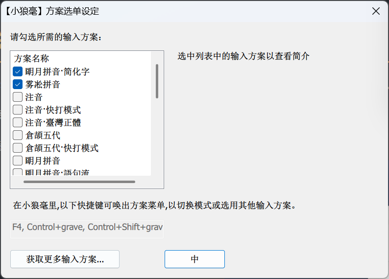

# Weasel

## 1、简介

RIME 本身简洁、流畅，性能优异，注重隐私，可定制性强，对于追求极致输入体验的用户，可谓不二之选。而为 RIME 量身打造的雾凇拼音，是目前维护最积极、功能最强大的 RIME 输入方案，拥有精心打磨的大容量词库、开箱即用的中文输入体验。

RIME 本身是一个输入法引擎，它在不同平台有不同的适配，分别是：

| 平台    | 对应的适配                                                   |
| ------- | ------------------------------------------------------------ |
| Linux   | 中州韵（通过 IBus 或 Fcitx 输入法框架运行）                  |
| Windows | 小狼毫                                                       |
| macOS   | 鼠须管、[小企鹅输入法](https://sspai.com/link?target=https%3A%2F%2Fgithub.com%2Ffcitx-contrib%2Ffcitx5-macos-installer%2Fblob%2Fmaster%2FREADME.zh-CN.md)（Fcitx） |
| Android | [同文输入法](https://sspai.com/link?target=https%3A%2F%2Fgithub.com%2Fosfans%2Ftrime)（TRIME） |
| iOS     | [仓输入法](https://apps.apple.com/cn/app/仓输入法/id6446617683?l=en-GB)（开源免费）、[iRime](https://apps.apple.com/cn/app/irime输入法-小鹤双拼五笔郑码输入法/id1142623977)（付费） |

<br>

## 2、安装小狼毫

1. 前往 [RIME 官方网站](https://sspai.com/link?target=https%3A%2F%2Frime.im%2Fdownload%2F)，下载小狼毫的安装包：

   

   > [!NOTE]
   >
   > 不同系统版本适用不同的小狼毫，如果是 Windows 8.1 及更高版本，则选择最新的 0.17.4；如果是老版本的 Windows（如Windows 7），则选择旧版本，但是已经不再更新。

2. 下载后，运行安装程序，按提示安装即可。期间，安装程序会要求你指定用户文件夹，该文件夹用于放置 RIME 的用户配置文件，通常使用默认设置即可，当然你也可以指定其他的位置：

   

3. 安装完成后，小狼毫默认启用。在 Windows 10/11，你可以按「Windows+空格」快捷键切换输入法。

<br>

## 3、安装雾凇拼音

Windows 平台安装雾凇拼音非常方便，可以直接使用小狼毫输入法自带的配置工具。

更新步骤与安装步骤完全相同：

1. 右键点击任务栏上的 RIME 图标，选择「输入法设定」，打开配置工具：

   

2. 在配置工具中，点击左下角的「获取更多输入方案」按钮（我这里是已经安装过了雾凇拼音）：

   

3. 随后会出现一个命令行窗口，这就是小狼毫自带的配置文件安装工具。在提示符 「Enter package name...」后，输入雾凇拼音的包名（其中 `full` 表示安装所有的组件）：

   ```shell
   iDvel/rime-ice:others/recipes/full
   ```

   

4. 回车确认，随即 RIME 会自动下载、安装雾凇拼音输入方案：

   

   > [!CAUTION]
   >
   > 配置文件安装工具需要用到 [Git](https://sspai.com/link?target=https%3A%2F%2Fgit-scm.com%2Fdownload%2Fwin)。如果你的系统没有安装 Git，或下载时发生错误，[请参照 RIME 官方的教程](https://sspai.com/link?target=https%3A%2F%2Fgithub.com%2Frime%2Fplum%3Ftab%3Dreadme-ov-file%23windows)，用教程中提供的 Bootstrap 工具包来初始化该工具。

5. 稍等片刻，命令提示符出现「Updated xxx files...」的提示（黄色字样），表示安装完成。此时可以直接关掉该窗口：

   

6. 回到小狼毫配置工具，将列表往下拉，你就会看到雾凇拼音的选项。勾选它，然后单击「中」按钮3，确认：

   

   接下来配置工具还会要求你选择一款皮肤。直接点击「中」按钮确认，即可完成全部设置。

<br>

## 4、自定义皮肤

具体配置信息可以看[官方文档](https://github.com/rime/weasel/wiki/Weasel-%E5%AE%9A%E5%88%B6%E5%8C%96#%E9%85%8D%E8%89%B2%E6%96%B9%E6%A1%88)，这里给出我用的配置：

1. 右键点击任务栏上的 RIME 图标，选择「用户文件夹」：

   

2. 在用户文件夹下找到 weasel.custome.yaml 文件，直接编辑：

   ```yaml
   customization:
     distribution_code_name: Weasel
     distribution_version: 0.17.4
     generator: "Weasel::UIStyleSettings"
     modified_time: "Thu Sep 25 22:03:01 2025"
     rime_version: 1.13.1
   patch:
     "preset_color_schemes/+":
       mac_blue_dark: {author: arvin, back_color: 0x181818, border_color: 0x0808080D, border_width: 0, candidate_back_color: 0x181818, candidate_format: "%c %@ ", candidate_text_color: 0xFFFFFF, color_format: abgr, comment_text_color: 0xFFFFFFFF, hilited_back_color: 0xFFc85c2f, hilited_candidate_back_color: 0xFFc85c2f, hilited_candidate_text_color: 0xFFFFFFFF, hilited_comment_text_color: 0xFFFFFF, hilited_label_color: 0xFFFFFF, hilited_text_color: 0xFFFFFF, label_color: 0xFFFFFF, name: "苹果黑", shadow_color: 0x080808DE, text_color: 0xFF333333}
       mac_blue_write: {author: arvin, back_color: 0xFFFFFFFF, border_color: 0xd2d2d2FF, candidate_back_color: 0xFFFFFFFF, candidate_format: "%c %@ ", candidate_text_color: 0x333333FF, color_format: rgba, comment_text_color: 0x5C5C5CFF, corner_radius: 6, hilited_back_color: 0x315efb1a, hilited_candidate_back_color: 0x315efb1a, hilited_candidate_text_color: 0x0158ccFF, hilited_comment_text_color: 0x0158ccFF, hilited_corner_radius: 6, hilited_label_color: 0x315efbFF, hilited_text_color: 0x0158ccFF, label_color: 0x333333FF, name: "苹果蓝白", shadow_color: 0x20212447, text_color: 0x333333FF}
     style:
       color_scheme: mac_blue_write
       comment_font_face: "PingFang SC"
       comment_font_point: 11
       display_tray_icon: false
       font_face: "Segoe UI Emoji, PingFang SC, Microsoft YaHei, SF Pro, Noto Color Emoji"
       font_point: 11
       horizontal: true
       inline_preedit: true
       label_font_face: "PingFang SC"
       label_font_point: 10
       label_format: "%s."
       layout: {align_type: bottom, border_width: 1, candidate_spacing: 16, corner_radius: 6, hilite_padding: 4, hilite_spacing: 3, margin_x: 7, margin_y: 7, max_height: 60, round_corner: 4, shadow_offset_x: 2, shadow_offset_y: 2, shadow_radius: 6, spacing: 5}
       mark_text: ""
       preedit_type: composition
     "style/color_scheme": mac_blue_write
   ```

3. 右键点击任务栏上的 RIME 图标，选择「重新部署」。

<br>

## 5、配置

### 5.1、输入习惯

打开用户文件夹，在 default.custom.yaml 配置文档中配置输入习惯。

<br>

**配置候选项数量**

```yaml
patch:
  menu/page_size: 9
```

<br>

**配置快捷键**

```yaml
patch:
  key_binder/bindings/+:
    - { when: paging, accept: comma, send: Page_Up }		# 句号向下翻页
    - { when: has_menu, accept: period, send: Page_Down }	# 逗号向上翻页
```

<br>

### 5.2、自定义短语

自定义短语作为极度私有化，且能极大提升输入效率的工具，在 RIME 中具有十分重要的意义。

1. 用户自定义短语存储于用户文件夹下的 custom_phrase.txt 文本文件中：

   ```
   # Rime table
   # coding: utf-8
   #
   # 请将该文件以 UTF-8 无签名编码保存
   # 存储位置为 ~Rime 用户文件夹/custom_phrase.txt
   #
   # 码表各字段以制表符（Tab）分隔
   # 编码格式：词条+tab+编码+tab+权重 权重决定短语词条在候选项中的排序，权重非必须项
   
   xxx@gmail.com	gmail	1
   xnom	id	1
   ```

2. 然后，需要在输入方案配置文件 rime_ice.schema.yaml 中，指定调用这张自定义短语表。和词库一样，如果你使用多个输入方案，需要在每个输入方案中调用：

   ```yaml
   custom_phrase:
     user_dict: custom_phrase
   ```

   > [!NOTE]
   >
   > 输入方案配置文件名称格式为 `<方案名称>.schema.yaml`，我这里用的雾凇拼音，所以是 rime_ice.schema.yaml。

3. 重新部署后，自定义短语就能生效。

<br>

## 6、用户资料同步

RIME 没有云同步功能，但有本地同步功能。能够将用户数据同步至本地文件夹。

我们可以借助坚果云、OneDrive 等第三方云将这个本地文件夹同步至云端，以此实现个人词典和配置方案在不同电脑间的同步和备份。

以 OneDrive 举例：

1. 在你同步文件夹内，这里举例为 `E:\Users\Orichalcos\OneDrive\`，新建一个 `应用` 文件夹。

2. 打开用户资料夹下的 installation.yaml 文件，在合适的地方添加如下代码：

   ```yaml
   sync_dir: 'E:\Users\Orichalcos\OneDrive\应用'
   ```

   最后完成后的样子是这样：

   ```yaml
   distribution_code_name: Weasel
   distribution_name: "小狼毫"
   distribution_version: 0.17.4
   install_time: "Mon Sep 22 10:01:51 2025"
   installation_id: "Weasel"	# 此处填写喜欢的名字
   rime_version: 1.13.1
   sync_dir: 'E:\Users\Orichalcos\OneDrive\应用'
   ```

3. 右键托盘图标，运行「用户资料同步」。完成后，你就能在「应用」文件夹中找到 「Weasel 」文件夹，其中的内容就是你的用户资料，包含了自学习个人词典文件和配置文件等等。

4. 利用 OneDrive 将此文件夹同步至云端；在另外一台电脑，按照相同的方式操作。将云端文件夹同步至本地。

<br>

**RIME 的同步逻辑**

RIME 同步两个方面的资料，一为个人词典，二为个人配置：

- 个人词典同步逻辑为双向同步：

  举例来说：甲电脑个人词典累积了词汇 ABC，乙电脑累积了词汇 DEF，那么，通过第三方云同步和 Rime 同步后，甲乙两地个人词典词汇都会同步且合并为 ABCDEF。通过第三方云同步，可以非常方便地同步两地之间的个人词典，保持相同的输入体验。

- 个人配置同步逻辑为单向同步：

  RIME 只会将配置文件，单向地从「用户文件夹 ~\Rime」同步至「同步文件夹\Weasel」。换句话说，个人配置只会在「同步文件夹\Weasel」里在甲乙两地被反复同步和覆盖，而不会导入配置文件。如果你需要导入异地的配置文件，可以在第三方云完成同步后，手动将配置文件导入。

这样的同步逻辑是为了保持配置的一致性。因为，配置文件之于 RIME 十分重要，关系着 RIME 是否能够正常运行。也必须在修改后通过重新部署才能生效。若两地的配置不一致时或其中一地有错误时，必然产生无法预估的混乱后果。不过，个人配置定制好之后，也很少需要修改，权且当作备份。云同步个人配置更多用于异地新电脑部署时。

