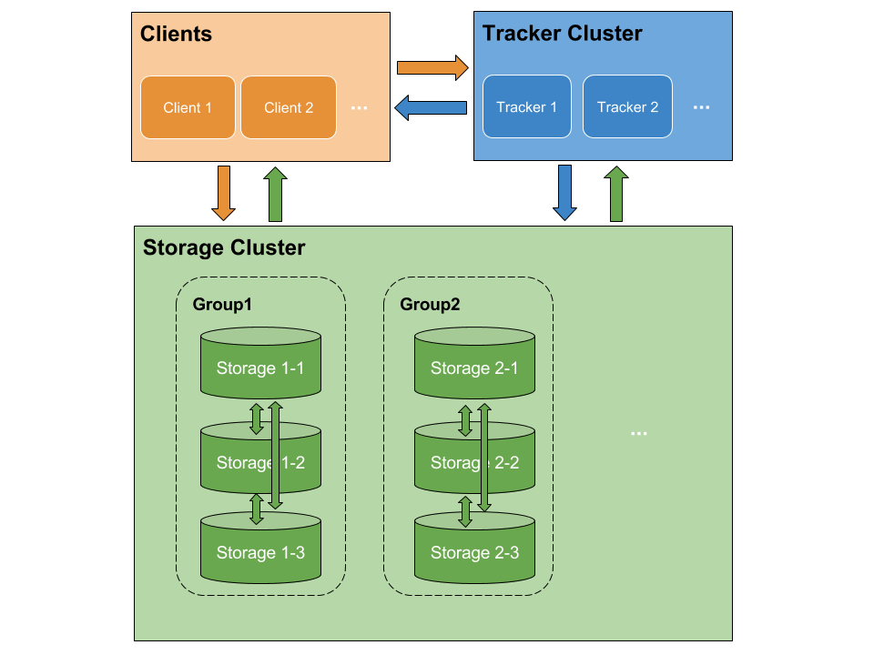
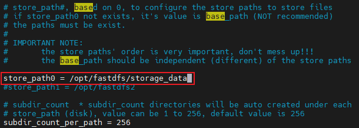
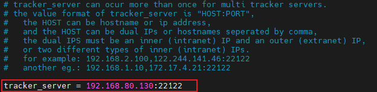

# FastDFS

## 1、简介

### 1.1、FastDFS 是什么

DFS（Distributed File System，分布式文件系统）是一种基于网络的文件系统，区别于传统的文件系统，具有扁平化、简单化、高性能和分布式存储的特征，在云计算、大数据等领域具有广泛的应用。

FastDFS 是一个轻量级的开源分布式文件系统，使用类似 Google FS 的实现方式，使用 C 语言实现，支持各种 UNIX 系统，适合大中型网站使用，用来存储资源文件（如：图片、文档、音频、视频等）。

- 大容量、高并发、负载均衡、实现 RAID、硬件要求低、支持在线扩容、支持去重。
- 只能通过 API 访问，不支持 POSIX（一种操作系统的调用规范）。


### 1.2、FastDFS 架构




**角色**

- Client：客户端，使用 Java 语言编写的客户端程序。
- Tracker：跟踪服务器集群，主要做调度工作，起到负载均衡的作用，在内存中记录集群 group 和 storage server 的状态信息，是连接 client 和 storage server 的枢纽。
- Storage：存储服务器集群，文件和文件属性（meta data）都存储在这里。


**特点**

- FastDFS 服务端只有两个角色：Tracker 和 Storage，不需要存储文件索引信息。
- 所有服务器是对等的，不存在主从关系。
- 存储服务器采用分组方式，同组内存储服务器上的文件完全相同（RAID 1）。
- 不同组的 storage server 之间不会相互通信。
- 由 storage server 向 tracker server 主动报告状态信息，不同的 tracker server 之间也不会相互通信。


## 2、安装和配置

### 2.1、安装 FastDFS 核心组件

1. 由于 FastDFS 是由 C 编写的，所以首先需要确保 Linux 的 C 环境：

	```shell
	yum install -y make cmake gcc gcc-c++
	```

2. 安装 FastDFS 需要的 libfastcommon 库（[仓库地址](https://github.com/happyfish100/libfastcommon)）：

	```shell
	tar -zxvf libfastcommon-1.0.36.tar.gz
	cd libfastcommon-1.0.36/
	./make # 编译
	./make install # 安装
	```

	默认安装在 `/usr/lib64`、`/usr/lib`、`/usr/include/fastcommon`。

3. 创建软连接，因为 FastDFS 主程序设置的 lib 目录是 `/usr/local/lib`，所以需要创建软连接：

	```shell
	ln -s /usr/lib64/libfastcommon.so /usr/local/lib/libfastcommon.so
	ln -s /usr/lib64/libfdfsclient.so /usr/local/lib/libfdfsclient.so
	```

4. 安装 FastDFS（[仓库地址](https://github.com/happyfish100/fastdfs)）：

	```shell
	tar -zxvf fastdfs-5.11.tar.gz
	cd fastdfs-5.11/
	./make.sh # 编译
	./make.sh install # 安装
	```

	安装后，主程序所在的位置是 `/usr/bin`，配置文件所在的位置是 `/etc/fdfs`。


### 2.2、配置 Tracker

1. （第一次运行）在配置文件路径 `/etc/fdfs` 中配置，可以直接使用提供的参考配置：

	```shell
	cd /etc/fdfs/
	cp tracker.conf.sample tracker.conf
	```

2. 创建放置 tracker 数据的目录：

	```shell
	mkdir -p /opt/fastdfs/tracker
	```

	修改配置信息，使得 `base_path` 为创建的目录：

	```shell
	vim tracker.conf
	base_path = /opt/fastdfs/tracker
	```

	默认端口是 22122，有需要可以修改。

3. 启动 Tracker 服务

	```shell
	service fdfs_trackerd start
	```


### 2.3、配置 Storage

使用完全类似的方法，可以配置 Storage，不过，它需要额外配置文件存储路径 data。

1. （第一次运行）在 `/etc/fdfs` 中配置，可以直接使用提供的参考配置：

	```shell
	cd /etc/fdfs/
	cp storage.conf.sample storage.conf
	```

2. 创建放置 tracker 数据的目录：

	```shell
	mkdir -p /opt/fastdfs/storage
	mkdir -p /opt/fastdfs/storage_data
	```

	修改配置信息，使得 `base_path` 为创建的目录：

	

	修改配置信息，使得 `store_path0` 为创建的存储目录：

	

3. 配置 Tracker 的 IP 地址以及端口号：

	

4. 启动 Storage 服务

	```shell
	service fdfs_storaged start
	```

至此，FastDFS 配置完毕。