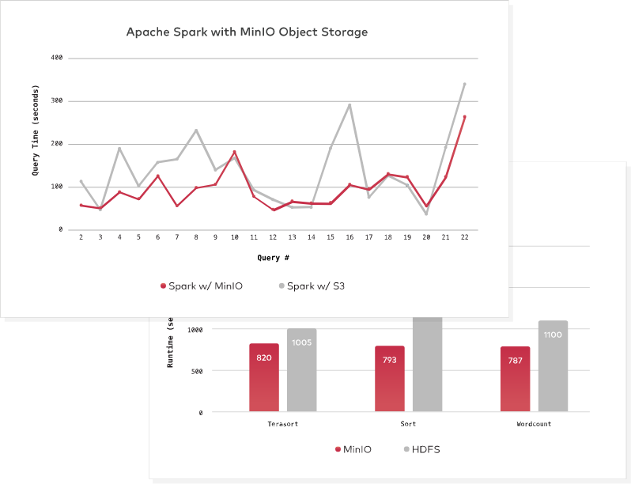
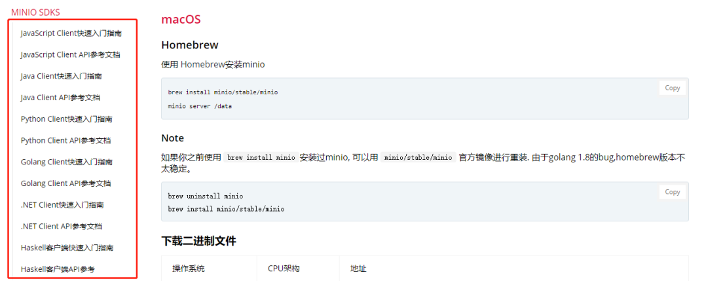
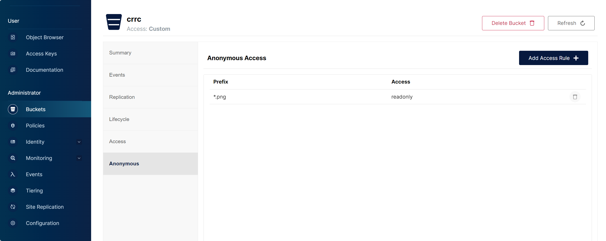

# MinIO

## 1、简介

### 1.1、MinIO 是什么？

官方解释：MinIO 是一个基于 Apache License v2.0 开源协议的对象存储服务。它兼容亚马逊 S3 云存储服务接口，非常适合于存储大容量非结构化的数据，例如图片、视频、日志文件、备份数据和容器/虚拟机镜像等，而一个对象文件可以是任意大小，从几 kb 到最大 5T 不等。

MinIO 是一个非常轻量的服务，可以很简单的和其他应用的结合，类似 NodeJS、Redis 或者 MySQL。


### 1.2、MinIO 有哪些优势？

**开发文档全面**

MinIO 作为一款基于 Golang 编程语言开发的一款高性能的分布式式存储方案的开源项目，有十分完善的官方文档。

官网文档地址：https://docs.min.io/cn/


**高性能**

MinIO 号称是目前速度最快的对象存储服务器。在标准硬件上，对象存储的读/写速度最高可以高达183 GB/s 和 171 GB/s。对象存储可以作为主存储层，用来处理 Spark、Presto、TensorFlow、H2O.ai 等各种复杂工作负载以及成为 Hadoop HDFS 的替代品。

MinIO 用作云原生应用程序的主要存储，和传统对象存储相比，云原生应用程序需要更高的吞吐量和更低的延迟。而这些都是 MinIO 能够达成的性能指标。




**支持全面**

目前 MinIO 支持市面主流的开发语言并且可以通过 SDK 快速集成快速集成使用。




**AWS S3标准兼容**

亚马逊云的 S3 API（接口协议） 是在全球范围内达到共识的对象存储的协议，是全世界内大家都认可的标准。MinIO 在很早的时候就采用了 S3 兼容协议，并且 MinIO 是第一个支持 S3 Select 的产品。MinIO 对其兼容性的全面性感到自豪， 并且得到了 750 多个组织的认同，包括 Microsoft Azure 使用 MinIO 的 S3 网关 - 这一指标超过其他同类产品的总和。


**安装部署非常简单**

MinIO 安装部署非常简单。MinIO 简单特性减少了出错的机会，节约了安装部署的时间，提供了可靠性，同时简单性又是性能的基础。Linux 环境下只需下载一个二进制文件然后执行，即可在几分钟内完成安装和配置 MinIO。配置选项和变体的数量保持在最低限度，这样让失败的配置概率降低到几乎接近于 0 的水平。MinIO 升级是通过一个简单命令完成的，这个命令可以无中断的完成 MinIO 的升级工作，并且不需要停机即可完成升级操作，大大降低总使用和运维成本。


**开放全部源代码 + 企业级支持**

MinIO 基于 Apache V2 license 100% 开放源代码 。这就意味着 MinIO 的用户能够自动的、无限制、自由免费使用和集成 MinIO、自由的创新和创造、 自由的去修改、自由的再次发行新的版本和软件。确实，MinIO 强有力的支持和驱动了很多世界 500 强的企业。此外，其部署的多样性和专业性提供了其他软件无法比拟的优势。


**容器化集成方便**

MinIO 提供了与 k8s、etcd、Docker 等主流容器化技术深度集成方案。


**管理界面的支持**

MinIO 服务安装后，可以直接通过浏览器登录系统，完成文件夹、文件的管理。非常方便使用。


## 2、安装和配置

### 2.1、Linux

#### 2.1.1、直接运行

**运行 MinIO**

1. 创建所需要的文件夹：

	```shell 
	mkdir -p /usr/local/minio /var/lib/minio /var/log/minio
	```

2. 进入安装目录：

	```shell
	cd /usr/local/minio
	```

3. 下载安装包：

	这里需要根据自己系统的 Architecture 去下载对应的版本，可以通过 `hostnamectl` 命令查看 Architecture 。

	

	[点击进入下载地址](https://www.min.io/open-source/download) 或者直接通过 wget 下载：

	```shell
	 wget https://dl.minio.org.cn/server/minio/release/linux-amd64/minio -O /usr/local/minio/minio
	```

4. 赋予 `minio` 文件执行权限，最高权限：

	```shell
	chmod +x /usr/local/minio/minio
	```

5. 直接在前台启动，可以方便地查看日志输出：

	```shell
	MINIO_ROOT_USER=admin MINIO_ROOT_PASSWORD=password /usr/local/minio/minio server /var/lib/minio --console-address ":9001"
	```

	- *MINIO_ROOT_USER*：设置用户名。
	- *MINIO_ROOT_PASSWORD*：设置密码。
	- */var/lib/minio*：存放静态文件的目录。
	- *--console-address*：设置 console 的端口（不设置的话每次启动该端口都会变动）。
	- *--address*：设置 API 端口，该端口重新启动是不变的，但是可以通过 `--address ":9000"` 手动改变。

6. 上面的启动方式，当我们关闭 shell 连接时，MinIO 也就关闭了，可以通过 `nohup` 命令进行后台启动。

	由于 `nohup` 命令后无法使用 `MINIO_ROOT_USER/MINIO_ROOT_PASSWORD` 参数设置 root 用户名和密码，所以需要提前在环境变量设置（如果没有自定义密码的需求可以跳过这一步，默认用户名和密码都是 `minioadmin`）：

	```shell
	vim ~/.profile
	
	# 在最后一行加上
	export MINIO_ACCESS_KEY=minioxx
	export MINIO_SECRET_KEY=minioxxx
	
	source ~/.profile
	```

	后台启动 MinIO：

	```shell
	nohup /usr/local/minio/minio server /var/lib/minio --console-address ":9001" > /var/log/minio/minio.log 2>&1 &
	```


**关闭 MinIO**

查看端口占用，9000 为 MinIO 占用端口号，`kill` 杀死进程。

```shell
netstat -nlp | grep 9000
```


```shell
kill -9 2524
```


#### 2.1.2、手动安装

因为二进制包可以直接运行，所以这里配置 systemd 服务文件就可以：

1. 下载安装包：

	这里需要根据自己系统的 Architecture 去下载对应的版本，可以通过 `hostnamectl` 命令查看 Architecture 。

	

	[点击进入下载地址](https://www.min.io/open-source/download) 或者直接通过 wget 下载：

	```shell
	 wget https://dl.minio.org.cn/server/minio/release/linux-amd64/minio -O /usr/local/minio/minio
	```

2. 新建一个 MinIO 配置文件：

	```bash
	mkdir /etc/minio
	vim /etc/minio/minio.conf
	```

	文件内容如下：

	```
	# MinIO 服务的基本配置
	
	# 设置管理员账户和密码 (请务必修改为强密码)
	MINIO_ROOT_USER="minioadmin"
	MINIO_ROOT_PASSWORD="YourStrongPassword123"
	
	# 设置数据卷（存储目录）
	MINIO_VOLUMES="/var/lib/minio"
	
	# 设置服务的启动参数, 包括 API 端口和控制台端口
	MINIO_OPTS="--address :9000 --console-address :9001"
	```

3. 新建一个系统服务文件：

	```bash
	vim /etc/systemd/system/minio.service
	```

	文件内容如下：

	```
	[Unit]
	Description=MinIO
	Documentation=https://docs.min.io
	Wants=network-online.target
	After=network-online.target
	AssertFileIsExecutable=/usr/local/minio/minio
	
	[Service]
	# 指定以 root 用户和 root 组运行
	User=root
	Group=root
	
	# 指定工作目录
	WorkingDirectory=/usr/local/minio
	
	# 加载配置文件中的环境变量
	EnvironmentFile=/etc/minio/minio.conf
	
	# 启动命令。这里使用配置文件中定义的环境变量
	# 服务启动时，systemd 会将日志输出到 systemd journal
	ExecStart=/usr/local/minio/minio server $MINIO_OPTS $MINIO_VOLUMES
	
	# 配置服务在失败时自动重启
	Restart=on-failure
	RestartSec=5s
	
	[Install]
	WantedBy=multi-user.target
	```

4. 重载系统服务：

	```bash
	systemctl daemon-reload
	```

5. 接下来可以使用以下命令来启动、停止、重启和检查 MinIO 服务的状态：

	```shell
	systemctl start minio
	systemctl stop minio
	systemctl restart minio
	systemctl status minio
	```

6. 如果想要在系统启动时自动启动 MinIO 服务，可以运行以下命令：

	```shell
	systemctl enable minio
	```


#### 2.1.3、包安装

1. 根据操作系统选择相应的命令进行下载安装：

	- 对于 CentOS / RHEL：

		```shell
		# 下载最新的 RPM 包
		wget https://dl.min.io/server/minio/release/linux-amd64/archive/minio-20241029160148.0.0-1.x86_64.rpm -O minio.rpm
		
		# 安装 RPM
		rpm -ivh minio.rpm
		```

	- 对于 Ubuntu / Debian：

		```shell
		# 下载最新的 DEB 包
		wget https://dl.min.io/server/minio/release/linux-amd64/archive/minio_20241029160148.0.0_amd64.deb -O minio.deb
		
		# 安装 DEB
		dpkg -i minio.deb
		```

	> [!NOTE]
	>
	>  安装完成后自会自动生成 `/usr/lib/systemd/system/minio.service`。

2. 查看系统是否有需要的 minio-user 用户：

	```shell
	id minio-user
	```

	如果不存在则需要创建需要的用户和组：

	```shell
	# 创建系统组
	groupadd -r minio-user
	
	# 创建系统用户（不允许登录，安全第一）
	useradd -r -g minio-user -s /sbin/nologin minio-user
	```

3. 创建数据存储目录并授权：

	```shell
	# 创建存储数据的目录
	mkdir -p /var/lib/minio
	
	# RPM/DEB 安装通常会默认使用 minio-user
	chown -R minio-user:minio-user /var/lib/minio
	```

4. 安装包会自动生成一个默认的配置文件路径：`/etc/default/minio`。可以编辑这个文件来设置你的自定义参数：

	```shell
	vim /etc/default/minio
	```

	将文件内容修改为以下配置：

	```
	# 存储目录（可选）
	MINIO_VOLUMES="/var/lib/minio"
	
	# 监听端口 (API端口)
	MINIO_OPTS="--address :9000 --console-address :9001"
	# 指定具体的服务器IP（可选）
	# MINIO_OPTS="--address 192.168.1.100:9000 --console-address :9001"
	
	# 管理员用户名
	MINIO_ROOT_USER="admin"
	
	# 管理员密码 (至少8位)
	MINIO_ROOT_PASSWORD="YourStrongPassword123"
	```
   
5. 启动并设置自启动：

	```shell
	# 重新加载配置
	systemctl daemon-reload
	
	# 启动服务
	systemctl start minio
	
	# 设置开机自启
	systemctl enable minio
	```

6.  检查状态：

	```shell
	systemctl status minio
	```


### 2.2、Windows

#### 2.2.1、直接运行

Windows 环境下和 Linux 大致相同，主要是启动的环境配置有些差异，下方展示如何在 Windows Powershell 中设置环境变量并启动。

设置用户名：

```shell
$env:MINIO_ROOT_USER="minioadmin"
```

设置密码：

```shell
$env:MINIO_ROOT_PASSWORD="minioadmin"
```

启动：

```shell
.\minio.exe server D:\MinIO --address ":9000" --console-address ":9001"
```

> [!NOTE]
>
> 查看设置的环境变量可以用 `$env:<变量名>`


#### 2.2.2、配置服务

推荐使用 NSSM 注册 MinIO 为 Windows 服务：

1. 首先，下载 NSSM：

	- 从 [官方网站](http://nssm.cc/download) 下载最新版。
	- 解压到一个方便的位置，如 `C:\Program Files\NSSM`。

	以管理员身份打开命令提示符（CMD）或PowerShell。

2. 导航到 NSSM 所在目录：

	```shell
	cd "C:\Program Files\NSSM"
	```

3. 使用 NSSM 创建 MinIO 服务：

	```shell
	.\nssm.exe install MinIO
	```

4. NSSM会打开一个图形界面，填写以下信息：

	- Application 选项卡：

		- Path：`C:\Program Files\MinIO\minio.exe`

			MinIO 可执行文件的完整路径，注意路径包含空格时无需特别处理，NSSM 会正确处理。

		- Startup directory：`C:\Program Files\MinIO`

			MinIO 运行的工作目录，程序会在此目录下查找相关文件。

		- Arguments：`server --console-address :9001 --address :9000 "C:\Program Files\MinIO\data"`

			传递给 MinIO 的命令行参数，注意路径包含空格，需要用引号括起来。

	- Details 选项卡：

		- Display name：`MinIO Object Storage`

			在 Windows 服务管理器中显示的友好名称。

		- Description：`MinIO高性能对象存储服务`

			服务的描述信息，显示在服务属性中。

		- Startup type：`Automatic`

			设置为系统启动时自动启动服务。

	- Environment 选项卡：

		- 在 Environment variables 中添加:

			```
			MINIO_ROOT_USER=你的管理员用户名
			MINIO_ROOT_PASSWORD=你的管理员密码
			```

			设置 MinIO 的管理员账号和密码，这些是 MinIO 启动后用于登录 Web 控制台的凭证。

	- I/O选项卡：

		- Output (stdout)：`C:\Program Files\MinIO\logs\minio.log`

			MinIO 的标准输出将被记录到此文件。

		- Error (stderr)：`C:\Program Files\MinIO\logs\minio-error.log`

			MinIO 的错误输出将被记录到此文件。

	- File rotation 选项卡：

		- Rotate files：`勾选`

			启用日志文件轮转功能。

		- Rotate while service is running：`勾选`

			允许在服务运行时执行日志轮转。

		- Restrict rotation to files bigger than`10485760` kB

			日志文件达到 10 MB 时触发轮转。

5. 点击 "Install service" 按钮保存设置。

6. 接下来可以使用以下命令来启动、停止和检查 MinIO 服务的状态：

	```shell
	# 启动服务
	sc start MinIO
	
	# 停止服务
	sc stop MinIO
	
	# 查询状态
	sc query MinIO
	```

> [!NOTE]
>
> 如果想要查看或者修改配置：
>
> ```shell
> "C:\Program Files\NSSM\nssm.exe" edit MinIO
> ```
>
> 这将打开与安装时相同的GUI界面，显示所有已配置的选项。


## 3、使用问题

**上传图片后返回的 url 无法在线预览**

增加桶策略：


