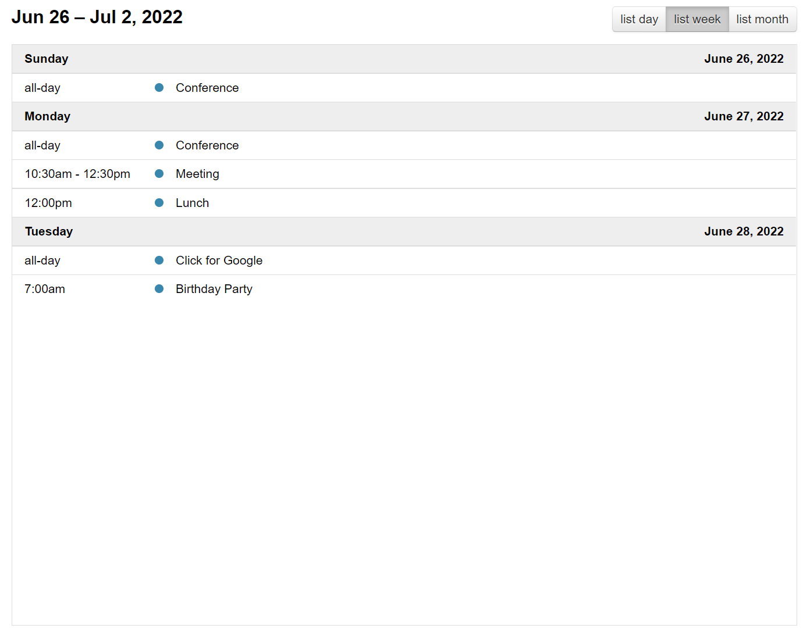

# FullCalendar

## 1、快速开始

### 1.1、介绍

如何获取 [FullCalendar](https://fullcalendar.io/docs/v3) 的代码，初始化日历和其他基本原则。


#### 1.1.1、加载代码

在初始化日历之前，必须首先让 FullCalendar 的代码加载到页面上。你可以编写自己的 `<script>` 标签，也可以使用 Webpack 这样的构建系统。


**`<scritp>` 标签**

首先，从 [发布页面](https://github.com/fullcalendar/fullcalendar/releases) 下载一个 ZIP 文件。解压后，找到文件 `fullcalendar.js` 和 `fullcalendar.css`。

然后，下载 FullCalendar 所依赖的两个 JavaScript 文件：[jQuery](https://jquery.com/) 和 [Moment](https://momentjs.com/)。

然后，在页面的 `<head>` 中写下如下内容：

```html
<link rel='stylesheet' href='fullcalendar/fullcalendar.css' />
<script src='lib/jquery.min.js'></script>
<script src='lib/moment.min.js'></script>
<script src='fullcalendar/fullcalendar.js'></script>
```

在加载 FullCalendar 的 JS 文件之前，要先加载 jQuery 和 Moment 的 JS 文件。


**作为 NPM 模块（Webpack / Browserify）**

使用 NPM 安装FullCalendar：

```shell
npm install jquery moment fullcalendar
```

然后，你必须安装一个构建系统，如 Webpack 或 Browserify，它将自动捆绑所有代码。[查看使用 WebPack 的示例»](https://github.com/fullcalendar/webpack-example/tree/v3)

然后，编写一个模块，同时导入 jQuery 和 FullCalendar：

```shell
import $ from 'jquery';
import 'fullcalendar';
```

导入的 `fullcalendar` 不需要被命名。它将作为一个插件附在 jQuery 中。


#### 1.1.2、初始化选项

将 FullCalendar 及其依赖项加载到页面上后，就可以编写初始化日历的 JS 代码。该代码必须在初始化之后执行。最好的方法是使用 jQuery 的 `$(document).ready`，例如：

```javascript
$(function() {

  // 页面已准备就绪，初始化日历...

  $('#calendar').fullCalendar({
    // 将您的选择和回调放在这里
  })

});
```

上面的代码应在页面头的 `<script>` 标签中。该代码依赖于页面正文中具有 "calendar" ID 的元素。日历将放置在此 `div` 内：

```html
<div id='calendar'></div>
```

就这样，应该可以在页面上看到一个基于月份的日历，上面没有任何事件。


**Options**

FullCalendar 的大多数文档都描述了影响日历外观或行为的选项。选项通常在初始化日历时设置，如下所示：

```javascript
$('#calendar').fullCalendar({
  weekends: false // 会隐藏周六和周日
});
```

一个重要的选项是 `defaultView`，它确定加载日历时首先显示哪个日历视图。


#### 1.1.3、处理程序（Handlers）

处理程序（有时称为 “callbacks” ）有点像选项，但它们是在发生特殊情况时被调用的函数。在以下示例中，每当用户单击某一天时，都会出现一个警报框：

```javascript
$('#calendar').fullCalendar({
  dayClick: function() {
    alert('a day has been clicked!');
  }
});
```


**动态添加处理程序**

可以在日历初始化后使用 `on` 和 `off` 方法附加处理程序。此功能自2.4.0版起可用。

下面的示例动态绑定 `dayClick` 处理程序：

```javascript
// 获取日历对象的方便实用程序。
// 你可以直接调用日历对象上的方法。
var calendar = $('#calendar').fullCalendar('getCalendar');

calendar.on('dayClick', function(date, jsEvent, view) {
  console.log('clicked on ' + date.format());
});
```


#### 1.1.4、方法（Methods）

方法提供了从 JavaScript 代码操纵日历的方法。方法对已初始化的日历的 jQuery 对象进行操作，使用熟悉的 `fullCalendar` 命令，但方式完全不同：

```javascript
$('#calendar').fullCalendar('next');
```

这将调用 `next` 方法，并将迫使日历转移到下个 月/周/天。

如果想在每次调用方法时都避免使用 jQuery，则可以做这样的事情：

```javascript
// 获取日历对象的方便实用程序
// 你可以直接调用日历对象上的方法。
var calendar = $('#calendar').fullCalendar('getCalendar');

calendar.next();
```


### 1.2、日期库

FullCalendar 将 `MomentJS` 作为其日期库。Moment 和 Duration 对象可用于很多设置，并且在整个 API 中使用它们。


#### 1.2.1、Moment 对象

Moment 对象代表一个时间点，就像本地的 Date 对象一样，但要比它优越得多。

这个功能是由 MomentJS 提供的，这是一个第三方的开源库。FullCalendar 对这个功能做了一些扩展，以适应时间不明确和区域不明确的时刻。

[查看MomentJS文档»](https://momentjs.com/docs/)

在API中，大多数接受 Moment 的选项也会方便地接受 `moment()` 构造函数所接受的任何东西，包括：

- 日期字符串（强烈建议使用 ISO8601 标准）
- unix偏移量（自Unix Epoch以来的毫秒数）
- 本地日期对象


**从头开始创建 Moments**

大多数情况下，不必担心实例化你自己的 Moments。例如，当指定事件数组数据时，可以只写 ISO8601 字符串，让 FullCalendar 来处理解析工作。

然而，从头开始创建 Moments 有时是必要的。由于 Moment 是 FullCalendar 的一个附属品，全局的 Moment 构造器很可能对你有用。你应该能够像这样从头开始创建新的 Moments：

```javascript
var m = moment();
```

要创建一个具有 FullCalendar 扩展格式和 "模糊" 功能的时刻（见下文），请使用 FullCalendar 的 `moment`、`moment.utc` 和 moment.parseZone 构造函数的版本：

```javascript
var noTime = $.fullCalendar.moment('2014-05-01');
var local = $.fullCalendar.moment('2014-05-01T12:00:00');
var utc = $.fullCalendar.moment.utc('2014-05-01T12:00:00');
var noTZ = $.fullCalendar.moment.parseZone('2014-05-01T12:00:00');
```

要创建一个具有扩展功能的时刻，它已经在一个给定的日历的时区和地区设置范围内，使用 `Calendar` 对象的 `moment` 构造函数版本：

```javascript
var calendar = $('#calendar').fullCalendar('getCalendar');
var m = calendar.moment();
```


**模糊时间的时刻**

对于 FullCalendar，Moment 对象已经被扩展，以表示没有时间的时刻，或 "模糊时间的时刻"。在引擎盖下，这些时刻以 UTC 模式表示，时间为 `00:00:00`。

要创建一个，可以使用 FullCalendar 的 `moment`、`moment.utc` 或 `moment.parseZone` 构造函数，同时使用一个没有时间部分的 ISO8601 字符串：

```javascript
var m = $.fullCalendar.moment('2014-01-22');
m.hasTime();
=> false
```

正如你所看到的，可以通过使用 `hasTime` 方法来查询一个时刻是否有模糊的时间。这个方法只适用于通过 FullCalendar 的某个时刻构造函数创建的时刻。

也可以通过使用 `stripTime` 方法将一个有时间的时刻转换为模糊的。这个方法只适用于通过 FullCalendar 的某个时刻构造函数创建的时刻：

```javascript
var m = $.fullCalendar.moment('2014-01-22T05:00:00');
m.stripTime();
m.hasTime();
=> false
```

`format` 和 `toISOString` 方法已经被修改，这样，时间不明确的时刻就不会返回字符串中的时间部分：

```javascript
m.format();
=> "2013-01-22"
```


**模糊时区的时刻**

Moment 对象也被扩展为代表一个没有指定时区的日期。在引擎盖下，这些时刻以  UTC 模式表示。

要创建一个，可以使用 FullCalendar 的 `moment.parseZone` 构造函数的版本，同时使用一个没有时区偏移部分的 ISO8601 字符串。

```javascript
var m = $.fullCalendar.moment.parseZone('2014-01-22T06:00:00');
m.hasZone();
=> false
```

正如你所看到的，可以通过使用 `hasZone` 方法来查询一个时刻是否有模糊的区域。这个方法只适用于通过 FullCalendar 的某个时刻构造函数创建的时刻。

也可以通过使用 `stripZone` 方法将一个有时区的时刻转换成模糊的  。这个方法只适用于通过 FullCalendar 的某个时刻构造函数创建的时刻：

```javascript
var m = $.fullCalendar.moment('2014-01-22T05:00:00-07:00');
m.stripZone();
m.hasZone();
=> false
```

`format` 和 `toISOString` 方法已被修改，使模糊时区的时刻不返回字符串中的时区偏移部分：

```javascript
m.format();
=> "2014-01-22T05:00:00"
```


## 2、整体显示

### 2.1、工具栏

日历顶部和底部包含按钮和其他控件的区域。


#### 2.1.1、标题（header）

定义日历顶部的按钮和标题。

```javascript
Object/false, default:
{
  left:   'title',
  center: '',
  right:  'today prev,next'
}
```

将标题选项设置为 `false` 将不显示标题。可以为对象提供特性 `left`、`center` 和 `right` 三个属性。这些属性包含以逗号/空格分隔的字符串。用逗号分隔的值将相邻显示。用空格分隔的值将以较小的间距显示。字符串可以包含以下任意值：

- `text` - 包含当前月/周/日的文本
- `prev` - 用于将日历向后移动一个月/周/天的按钮
- `next` - 用于将日历向前移动一个月/周/天的按钮
- `prevYear` - 用于将日历向后移动一年的按钮
- `nextYear` - 用于将日历向前移动一年的按钮
- `today` - 用于将日历移动到当前月/周/日的按钮
- 视图名称 - 将日历切换到任何可用视图的按钮

为属性指定空字符串将导致其不显示文本/按钮。


### 2.2、调整大小

如何控制日历的尺寸。


#### 2.2.1、高度（height）

设置整个日历的高度，包括标题和页脚。

```
Integer, Function, "parent", "auto"
```

默认情况下，此选项是未设置的，日历的高度由 aspectRatio 计算。

如果指定了一个整数，则将保证日历的高度为精确的像素高度。如果内容不适合这个高度，就会出现滚动条（2.1.0版本的新内容）。

如果指定了一个函数，这个函数将在每次请求高度更新时被调用。这个函数应该返回一个像素值。

如果指定了 `"parent"`，日历的高度将与它的父容器元素的高度一致。

如果指定了 `"auto"`，视图的内容将采用自然高度，不会使用滚动条。(2.1.0版新增）。

`height` 用法示例：

```javascript
$('#calendar').fullCalendar({
  height: 650
});
```


**Setter**

可以在初始化后动态设置日历的高度：

```javascript
$('#calendar').fullCalendar('option', 'height', 700);
```


## 3、视图

### 3.1、月视图

月视图以类似表格的形式显示当前月份的天数，通常还有上个月和下个月的几天。它可以像这样初始化：

```javascript
$('#calendar').fullCalendar({
  defaultView: 'month'
});
```


下面的选项是专门针对月视图的。然而，在整个文档中，还有许多其他的选项会影响到月视图的显示，比如与本地相关的选项和日期/时间显示选项。


**fixedWeekCount**

确定月视图中显示的周数。

```
Boolean, default: true
```

如果为 `true`，日历将始终显示 6 周。如果为 `false`，日历将有 4 周、5 周或 6 周，具体取决于月份。


**showNonCurrentDates**

在月视图中，上个月或下个月的日期是否应该显示。

```
Boolean, default: true
```

禁用的天数不会渲染事件。

在月视图中设置为 `false` 时：


在月视图中设置为 `true` 时（默认值）：


### 3.2、日程视图

议程视图显示一个或多个水平天数，以及垂直轴上的时间轴，通常是午夜到午夜。两个预定义的议程视图是 `agendaDay` 和 `agendaWeek`。它们可以像这样被初始化：

```javascript
$('#calendar').fullCalendar({
  defaultView: 'agendaWeek'
});
```


```javascript
$('#calendar').fullCalendar({
  defaultView: 'agendaDay'
});
```


可以使用类型为 `agenda` 的自定义视图创建其他工期的议程视图。

下面的选项是针对议程视图的。然而，在整个文档中，还有许多其他选项影响到议程视图的显示，例如与本地有关的选项和日期/时间显示选项。


**allDaySlot**

是否在日历顶部显示 “全天” 插槽。

```
Boolean, default: true
```

如果使用 `false` 隐藏，则日程视图中将不会显示全天事件。


**allDayText**

日历顶部标题为 “全天” 的文本。

```
String, default: 'all-day'
```

默认值取决于当前区域设置。


### 3.3、列表视图

列表视图在一个简单的垂直列表中显示特定时间间隔内的事件。如果在一个特定的时间间隔内没有事件，就会显示 `noEventsMessage`。列表视图是在 FullCalendar 3.0.0 版本中添加的。 有 4 个预设的列表视图：`listDay`、`listWeek`、`listMonth` 和 `listYear`。你可以像这样初始化一个列表视图：

```javascript
$('#calendar').fullCalendar({
  defaultView: 'listWeek'
});
```




如果需要不同的时间间隔，可以创建类型为 `list` 的自定义视图。

下面的选项是针对列表视图的。然而，在整个文档中，还有许多其他选项影响到列表视图的显示，比如 `eventRender` 和 `eventClick`。


**listDayFormat **

一个日期格式化字符串，影响列表视图中日期标题左侧的文本。

```
String, false
```


如果指定 `false`，则不显示文本。


**listDayAltFormat**

一个日期格式字符串，影响列表视图中日期标题右侧的文本。

```
String, false
```


如果指定 `false`，则不显示文本。


**noEventsMessage**

显示在列表视图中间的文本，提醒用户在给定范围内没有事件。

```
String, default: "No events to display"
```


## 4、日期和时间

### 4.1、日期单击和选择

检测用户何时单击日期或时间。让用户能够使用鼠标或触摸设备选择多个日期或时间段。


**dayClick**

允许用户通过点击和拖动来突出显示多个日期或时间段。

```
Boolean, default: false
```

要让用户通过点击和拖动进行选择，这个选项必须设置为 `true`。


**unselectAuto**

单击页面上的其他位置是否会导致清除当前选择。

```
Boolean, default: true
```

此选项仅在 `selectable` 设置为 `true` 时生效。


#### 4.1.1、回调（CALLBACKS）

**dayClick**

当用户单击日期或时间时触发。

```
function( date, jsEvent, view, [ resourceObj ] ) { }
```

`date` 持有被点击的那一天的 Moment。如果一个全天的区域被点击了，那么这个时刻将是模糊的时间。如果议程周或议程日视图中的一个时段被点击了，`date` 将拥有该时段的时间。

`jsEvent` 持有 jQuery 事件的低层次信息，如点击坐标。

`view` 被设置为当前的视图对象。

在回调函数中，`this` 被设置为被点击的日期的 `<td>`。

下面是一个展示所有这些变量的例子：

```javascript
$('#calendar').fullCalendar({
  dayClick: function(date, jsEvent, view) {

    alert('Clicked on: ' + date.format());

    alert('Coordinates: ' + jsEvent.pageX + ',' + jsEvent.pageY);

    alert('Current view: ' + view.name);

    // 改变一天的背景颜色只是为了好玩
    $(this).css('background-color', 'red');

  }
});
```

> 当用户单击列表视图中的日标题时，不会触发 `dayClick` 触发器。


**select**

选择日期/时间时触发。

```
function( start, end, jsEvent, view, [ resource ] )
```

`start` 是一个 Moment，表示选择的开始。

`end` 是一个表示选择结束的 Moment。它是一个排他性的值，所以如果选择是 all-day（全天）的，而最后一天是星期四，`end` 将是星期五。

你可以通过调用 `hasTime` 来测试 `start`/`end` 是定时的还是全天的。

`jsEvent` 持有 jQuery 事件的信息，如鼠标坐标。如果 `select` 是通过 `select` 方法触发的，`jsEvent` 则为 `undefined`。


## 5、事件

### 5.1、事件数据

如何将事件添加到日历中。如何在初始加载后动态操作它们。


#### 5.1.1、事件（数组）

将显示在日历上的 Event 对象数组。

以下是如何指定事件数组的示例：

```javascript
$('#calendar').fullCalendar({
  events: [
    {
      title  : 'event1',
      start  : '2010-01-01'
    },
    {
      title  : 'event2',
      start  : '2010-01-05',
      end    : '2010-01-07'
    },
    {
      title  : 'event3',
      start  : '2010-01-09T12:30:00',
      allDay : false // 将显示时间
    }
  ]
});
```

> 确保数组中最后一个事件后没有逗号！这将使 Internet Explorer 窒息。


#### 5.1.2、事件（JSON feed）

访问一个 JSON feed 的 URL 是 FullCalendar 获取 Event 对象的方式之一。当用户点击上一页/下一页或者改变日历视图时，就会发生此操作。FullCalendar 会确定它需要的事件的日期范围，并在 GET 参数中传递该信息。

GET 参数名称将由 `startParam` 和 `endParam` 选项确定。（默认情况下为 `start` 和 `end`）。

这些参数的值将是 ISO8601日期字符串（如 `2013-12-01`）。关于精确的行为，请参见时区文档。

以下是 FullCalendar 可能访问的 URL，以从 JSON  feed 获取新事件数据：

```
/myfeed.php?start=2013-12-01&end=2014-01-12&_=1386054751381
```

`_` 参数是自动插入的，以防止浏览器缓存结果（更多内容见下文）。

如果你需要访问一个在不同域中的 feed，你可以使用 JSONP，在你的 URL 中加一个 `?`（见 [$.ajax](https://api.jquery.com/jQuery.ajax/) 的 JSONP 讨论）。


**JSON日期字符串格式**

以下是 JSON feed 中开始和结束日期的 ISO8601日期字符串的示例：`2015-03-17`

FullCalendar 将接受用小时、分钟、秒和毫秒写入的 ISO8601日期字符串：`2015-03-17T13:13:55.008`

FullCalendar 还接受带有时区偏移的 ISO8601日期字符串（请参阅时区文档）：`2015-03-17T13:13:55+0800`、`2015-03-17T13:13:55-0400`

> 注意：FullCalendar 不接受 `new Date()` JavaScript构造函数作为日期字符串的一部分（例如 `new Date(2010, 12, 25)`），因为 JSON 格式不支持用 `new` 操作符进行对象实例化。日期字符串必须使用 ISO8601标准（YYYY-MM-DDTHH:mm:ss.ssZ）编写。

带有 ISO8601日期字符串的脚本示例：

```javascript
$('#calendar').fullCalendar({
  events: [
    {
      title: 'Event Title1',
      start: '2015-03-17T13:13:55.008',
      end: '2015-03-19T13:13:55.008'
    },
    {
      title: 'Event Title2',
      start: '2015-03-17T13:13:55-0400',
      end: '2015-03-19T13:13:55-0400'
    }
  ]
});
```

毫秒级的时间也可以添加到 JSON feeds 中。需要注意的是，这个数字必须以毫秒为单位，例如 1426612435000（"March 17, 2015 5:13:55 PM"），而不是秒 1426612435。

具有Unix时间戳的脚本示例：

```javascript
$('#calendar').fullCalendar({
  events: [
    {
      title: 'Event Title',
      start: 1426612435000,
      end: 1426785379000
    }
  ]
});
```


**jQuery $.ajax选项**

也可以在同一个对象中指定任何 jQuery 的 $.ajax 选项，这允许你轻松地传递额外的参数给你的 feed 脚本，以及监听ajax 的回调：

```javascript
$('#calendar').fullCalendar({

  events: {
    url: '/myfeed.php',
    type: 'POST',
    data: {
      custom_param1: 'something',
      custom_param2: 'somethingelse'
    },
    error: function() {
      alert('there was an error while fetching events!');
    },
    color: 'yellow',   // a non-ajax option
    textColor: 'black' // a non-ajax option
  }

});
```


**动态 `data` 参数**

`date` 参数，通过 GET 或 POST 向你的 JSON 脚本发送信息，也可以被指定为一个函数，以便发送动态值：

```javascript
$('#calendar').fullCalendar({

  events: {
    url: '/myfeed.php',
    data: function() { // 返回对象的函数
      return {
        dynamic_value: Math.random()
      };
    }
  }

});
```


#### 5.1.3、事件（函数）

一个自定义函数，用于以编程方式生成 Event 对象。

```
function( start, end, timezone, callback ) { }
```

FullCalendar 在需要新的事件数据时都会调用这个函数。当用户点击上一页/下一页或切换视图时，就会触发这个功能。

此函数将提供 `start` 和 `end` 参数，这些参数表示日历需要事件的范围。

`timezone` 是一个 string/boolean，描述了日历的当前时区。它是时区选项的精确值。

它也将被赋予 `callback`，一个必须在自定义事件函数产生其事件时被调用的函数。事件函数有责任确保回调是用一个 Event 对象的数组来调用的。

下面的示例演示如何使用事件函数从假设的 XML feed 获取事件：

```javascript
$('#calendar').fullCalendar({
  events: function(start, end, timezone, callback) {
    $.ajax({
      url: 'myxmlfeed.php',
      dataType: 'xml',
      data: {
        // 我们假设的 feed 需要 UNIX 时间戳
        start: start.unix(),
        end: end.unix()
      },
      success: function(doc) {
        var events = [];
        $(doc).find('event').each(function() {
          events.push({
            title: $(this).attr('title'),
            start: $(this).attr('start') // will be parsed
          });
        });
        callback(events);
      }
    });
  }
});
```

然而，如果有选择，JSON 是一个更好的主意，因为可以直接指定一个feed URL。


#### 5.1.4、Event 对象

一个普通的 JavaScript 对象，FullCalendar 用它来存储一个日历事件的信息。下面是它的属性：

| 属性名           | 描述                                                         |
| ---------------- | ------------------------------------------------------------ |
| id               | String/Integer。可选的。唯一标识给定的事件。重复事件的不同实例应该都有相同的 `id`。 |
| title            | String。必须的。事件元素上的文本                             |
| allDay           | `true` 或 `false`。可选的。一个事件是否发生在一个特定的时间段。这个属性会影响事件的时间是否被显示。另外，在议程视图中，决定它是否显示在 “全天” 部分。如果没有明确指定这个值，如果定义了`allDayDefault`，就会使用它。如果其他都失败了，FullCalendar 会尝试猜测。如果 `start` 或 `end` 值有一个 `"T"` 作为 ISO8601日期字符串的一部分，`allDay` 将变为 `false`。否则，它将是 `true`。不要在你的 `true`/`false` 周围加入引号。这个值是一个布尔值，而不是一个字符串! |
| start            | 事件开始的日期/时间。必需的。一个类似于 Moment 的输入，像一个 ISO8601 字符串。在整个 API 中，这将成为一个真正的 Moment 对象。 |
| end              | 事件结束的唯一日期/时间。可选的。一个类似于 Moment 的输入，像一个 ISO8601字符串。在整个 API中，这将成为一个真正的 Moment 对象。它是事件结束后的第一时间。例如，如果一个事件的最后一天是星期四，那么事件的结束时间将是星期五的 00:00:00! |
| url              | String。可选的。当该事件被用户点击时将被访问的 URL。关于控制这种行为的更多信息，请参见`eventClick` 回调。 |
| className        | String/Array。可选的。一个 CSS class（或 class 的数组），将被附加到这个事件的元素上。 |
| editable         | `true` 或 `false`。可选的。覆盖此单个事件的 `editable` 选项。 |
| startEditable    | `true` 或 `false`。可选的。覆盖此单个事件的 `eventStartEditable` 选项。 |
| durationEditable | `true` 或 `false`。可选的。覆盖此单个事件的 `eventDurationEditable` 选项。 |
| resourceEditable | `true` 或 `false`。可选的。覆盖此单个事件的 ` eventResourceEditable ` 选项。 |
| rendering        | 允许对事件进行交替渲染，例如背景事件。可以是空的，也可以是 `"background"` 或 `"inverse-background"`。 |
| overlap          | `true` 或 `false`。可选的。覆盖此单个事件 `eventOverlap` 选项。如果是 `false`，可以防止此事件被拖动/调整到其他事件上。也防止其他事件在此事件上被拖动/调整大小。 |
| constraint       | 一个事件 ID，"businessHours"，对象。可选的。覆盖此单个事件的 `eventConstraint` 选项。 |
| color            | 设置一个事件的背景和边框颜色，就像日历范围内的 `eventColor` 选项一样。 |
| backgroundColor  | 设置一个事件的背景颜色，就像日历范围内的 `eventBackgroundColor` 选项一样。 |
| borderColor      | 设置一个事件的边框颜色，就像日历范围内的 `eventBorderColor` 选项一样。 |
| textColor        | 设置一个事件的文本颜色，就像日历范围内的 `eventTextColor` 选项一样。 |


**非标准字段**

除了上述字段外，还可以在每个 Event 对象中包含自己的非标准字段。FullCalendar 不会修改或删除这些字段。例如，开发人员经常包括一个描述字段，用于回调，如 `eventRender`。


#### 5.1.5、方法

**updateEvent**

改变单个事件的数据，重新渲染该事件。

```
.fullCalendar( ‘updateEvent’, event )
```

`event` 必须是事件的原始 Event 对象，而不仅仅是重构对象。原始 Event 对象可以通过回调（如 `eventClick`）或 `clientEvents` 方法获得。

以下是单击后如何更新事件：

```javascript
$('#calendar').fullCalendar({
  eventClick: function(event, element) {

    event.title = "CLICKED!";

    $('#calendar').fullCalendar('updateEvent', event);

  }
});
```


**removeEvents**

从日历中删除事件。

```
.fullCalendar( ‘removeEvents’ [, idOrFilter ] )
```

如果省略 `idOrFilter`，则删除所有事件。

如果 `idOrFilter` 是一个 ID，则将删除所有具有相同 ID 的事件。

`idOrFilter` 也可以是一个过滤器函数，它接受一个 Event 对象参数，如果应该删除它，则返回 `true`。


### 5.2、事件显示

如何控制日历上事件的外观。


**eventColor**

设置日历上所有事件的背景和边框颜色。

```
String
```

更改日历上所有事件的颜色，如下所示：

```javascript
$('#calendar').fullCalendar({
  events: [
    // my event data
  ],
  eventColor: '#378006'
});
```

可以使用任何 CSS 颜色格式，如 `#f00`、`#ff0000`、`rgb(255,0,0)`或 `red`。

`eventBackgroundColor`、`eventBorderColor` 和`eventTextColor` 选项可用于更细化。


**eventBackgroundColor**

设置日历上所有事件的背景色。

```
String
```

可以使用任何 CSS 颜色格式，如 `#f00`、`#ff0000`、`rgb(255,0,0)`或 `red`。


**eventBorderColor**

设置日历上所有事件的边框颜色。

```
String
```

可以使用任何 CSS 颜色格式，如 `#f00`、`#ff0000`、`rgb(255,0,0)`或 `red`。


**eventTextColor**

设置日历上所有事件的文本颜色。

```
String
```

可以使用任何 CSS 颜色格式，如 `#f00`、`#ff0000`、`rgb(255,0,0)`或 `red`。


#### 5.2.1、方法

**renderEvent**

在日历上呈现一个新事件。

```
.fullCalendar( ‘renderEvent’, event [, stick ] )
```

`event` 必须是具有 `title` 和 `start` 的 Event 对象。

通常情况下，一旦日历重新获取其事件源（例如：点击上一个/下一个），该事件就会消失。然而，将 `stick` 设置为 `true` 将导致事件被永久地固定在日历上。


### 5.3、事件单击和悬停

了解事件何时被单击或悬停。


**eventClick**

当用户单击事件时触发。

```
function( event, jsEvent, view ) { }
```

`event` 是保存事件信息（日期、标题等）的 Event 对象。

`jsEvent` 保存 jQuery 事件和低级信息，例如单击坐标。

`view` 保存当前视图对象。

在回调函数中，`this` 被设置为事件的 `<div>` 元素。

下面是一个演示所有这些变量的示例：

```javascript
$('#calendar').fullCalendar({
  eventClick: function(calEvent, jsEvent, view) {

    alert('Event: ' + calEvent.title);
    alert('Coordinates: ' + jsEvent.pageX + ',' + jsEvent.pageY);
    alert('View: ' + view.name);

    // 更改边框颜色
    $(this).css('border-color', 'red');

  }
});
```

通常，如果 Event 对象设置了其 URL 属性，则单击事件将导致浏览器访问事件的 URL（在同一窗口/选项卡中）。从函数中返回 `false` 可以防止这种情况发生

通常情况下，开发者希望一个事件的 URL 在不同的标签页或弹出窗口中打开。下面的例子显示了如何做到这一点：

```javascript
$('#calendar').fullCalendar({
  events: [
    {
      title: 'My Event',
      start: '2010-01-01',
      url: 'http://google.com/'
    }
    // other events here
  ],
  eventClick: function(event) {
    if (event.url) {
      window.open(event.url);
      return false;
    }
  }
});
```


### 5.4、事件拖动和调整大小

如何启用和控制用户可以拖放和调整事件的大小。首先将 `editable` 设置设为 `true`。如果想允许外部元素被放到日历上，请访问 `droppable`、`drop` 和 `eventReceive` 文章。


**editable**

确定是否可以修改日历上的事件。

```
Boolean, default: false
```

这确定是否可以拖动事件并调整其大小。同时启用/禁用两者。如果不想两者兼得，请改用更具体的 `eventStartEditable` 和 `eventDurationEditable`。

可以使用 Event 对象的 `editable` 属性在每个事件的基础上覆盖此选项。但是，无法拖动或调整后台事件的大小。


**eventStartEditable**

允许通过拖动编辑事件的开始时间。

```
Boolean, default: true
```


**eventDurationEditable**

允许通过调整大小来编辑事件的持续时间。

```
Boolean, default: true
```


#### 5.4.1、回调（CALLBACK）

**eventDrop**

当拖动停止且事件已移至其他日期/时间时触发。

```
function( event, delta, revertFunc, jsEvent, ui, view ) { }
```

`event` 是一个 Event 对象，持有事件的信息（日期、标题等）。在事件的 `start`/`end` 时调用 `hasTime`，以查看它是否被丢在一个定时或全天的区域。

`delta` 是一个Duration对象，表示事件移动的时间量。版本2.0.1及更高版本中提供。

`revertFunc` 是一个函数，如果调用它，它会将事件的开始/结束日期还原为拖动之前的值。如果 `ajax` 调用失败，这很有用。

`jsEvent` 持有 jQuery 事件的低层次信息，如鼠标坐标。

`ui` 持有一个空对象。在 2.1 版本之前，[jQuery 的 UI 对象](https://jqueryui.com/draggable/)。

`view` 保存当前视图对象。

当外部事件到达日历时，不会调用 `eventDrop`。改为调用 `eventReceive`。

示例：

```javascript
$('#calendar').fullCalendar({
  events: [
    // events here
  ],
  editable: true,
  eventDrop: function(event, delta, revertFunc) {

    alert(event.title + " was dropped on " + event.start.format());

    if (!confirm("你确定要更改吗？")) {
      revertFunc();
    }

  }
});
```


**eventResize**

当调整大小停止且事件持续时间已更改时触发。

```
function( event, delta, revertFunc, jsEvent, ui, view ) { }
```

`event` 是保存事件信息（日期、标题等）的 Event 对象。

`delta` 是一个 Duration 对象，表示事件的开始或结束 延长或缩短的时间量。

 `revertFunc` 是一个函数，如果调用它，它会将事件的结束日期还原为拖动之前的值。如果 `ajax` 调用失败，这很有用。

`jsEvent` 持有 jQuery 事件的低层次信息，如鼠标坐标。

`ui` 持有一个空对象。在 2.1 版本之前，[jQuery 的 UI 对象](https://jqueryui.com/draggable/)。

`view` 保存当前视图对象。

示例：

```javascript
$('#calendar').fullCalendar({
  events: [
    // events here
  ],
  editable: true,
  eventResize: function(event, delta, revertFunc) {

    alert(event.title + " end is now " + event.end.format());

    if (!confirm("这样可以吗？")) {
      revertFunc();
    }

  }
});
```


## 6、国际化

### 6.1、语言环境

你可以为某些语言（又称 “地区”）定制日历。地区设置是最重要的，因为它同时设置了许多其他选项的默认值。


#### 6.1.1、local

自定义日历的语言和本地化选项。

```
A String locale code. default: "en"
```

此选项会影响许多事情，例如：

- 按钮中的文本，由 `header` 定义
- 包含月份或星期几字符串的文本
- 日期格式字符串，如 `timeFormat`
- `weekNumberCalculation`
- `firstDay`


**如何使用其他地区**

首先需要加载 local JavaScript 数据文件才能使用它。这些文件包含在 FullCalendar 下载的 `locale/` 目录中。在加载主 FullCalendar 库后，必须通过 `<script>` 标签加载它们。

```html
<script src='fullcalendar/fullcalendar.js'></script>
```

```html
<script src='fullcalendar/locale/es.js'></script>
<script>

  $(function() {

    $('#calendar').fullCalendar({
    });

  });

</script>
```

如果只是加载一个区域设置，则无需指定 `local` 选项。FullCalendar 将查看最近加载的 local 文件并使用它。

但是，如果加载了多个语言环境文件，或者加载了联合的 `locale-all.js` 文件，则必须通过 `local` 选项明确指定使用哪个语言环境：

```html
<script src='fullcalendar/fullcalendar.js'></script>
<script src='fullcalendar/locale-all.js'></script>
<script>

  $(function() {

    $('#calendar').fullCalendar({
      locale: 'es'
    });

  });

</script>
```


**MomentJS and jQuery UI Datepicker**

当你加载 FullCalendar 的 local 文件时，它也会加载 MomentJS 和 jQuery UI Datepicker 的翻译（如果该库已经在页面上）。只要确保在 FullCalendar 的 local 文件之前包含 Moment 和 Datepicker 的 `<script>` 标签就可以了。

```html
<script src='lib/moment.js'></script>
```

```html
<script src='lib/jquery-ui.custom-datepicker.js'></script>
<script src='fullcalendar/fullcalendar.js'></script>
<script src='fullcalendar/locale-all.js'></script>
```


## 7、第三方机构

### 7.1、Vue

FullCalendar 与 Vue JavaScript 框架无缝集成。它提供了一个与 FullCalendar 标准 API 的功能完全匹配的组件。

这个包是在 MIT 许可证下发布的，与 FullCalendar 的标准版本使用的许可证相同。有用的链接：

- [浏览 Github 仓库](https://github.com/fullcalendar/fullcalendar-vue)
- [Bug 报告说明](https://fullcalendar.io/reporting-bugs)
- 示例项目：
  - [Vue 2 示例](https://github.com/fullcalendar/fullcalendar-examples/tree/main/vue2)（使用 [Webpack](https://webpack.js.org/) 和 [css-loader](https://webpack.js.org/loaders/css-loader/)）
  - [Vue 3 示例](https://github.com/fullcalendar/fullcalendar-examples/tree/main/vue3) (使用 [Vite](https://github.com/vitejs/vite)）

首先是安装与 FullCalendar 相关的依赖项，你需要 FullCalendar 核心、Vue 适配器以及你打算使用的插件。

- 如果使用 Vue2：

  ```shell
  npm install --save @fullcalendar/core, @fullcalendar/vue
  ```

安装需要使用的 FullCalendar 插件，比如 `@fullcalendar/daygrid`：

```shell
npm install --save @fullcalendar/daygrid
```

然后你可以开始编写一个利用 `<FullCalendar>` 组件的父组件：

```vue
<template>
  <FullCalendar :options="calendarOptions" />
</template>

<script>
import FullCalendar from '@fullcalendar/vue'
import dayGridPlugin from '@fullcalendar/daygrid'

export default {
  components: {
    FullCalendar // make the <FullCalendar> tag available
  },
  data() {
    return {
      calendarOptions: {
        plugins: [ dayGridPlugin ],
        initialView: 'dayGridMonth'
      }
    }
  }
}
</script>
```


#### 7.1.1、插件索引

FullCalendar 提供以下软件包（仅列出我常用的，详见[官网](https://fullcalendar.io/docs/plugin-index)）：

| 包名                          | 功能/视图                                                    |
| ----------------------------- | ------------------------------------------------------------ |
| **@fullcalendar/core**        | 提供 `Calendar` 类等。                                       |
| **@fullcalendar/interaction** | 检测日期点击动作、选择动作和事件拖放及大小调整。             |
| **@fullcalendar/daygrid**     | 提供月和日的网格视图：dayGridYear、dayGridMonth、dayGridWeek、dayGridDay、dayGrid（通用）。 |
| **@fullcalendar/vue**         | 提供 Vue 2 组件。                                            |


