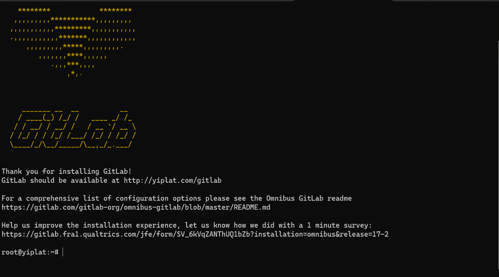
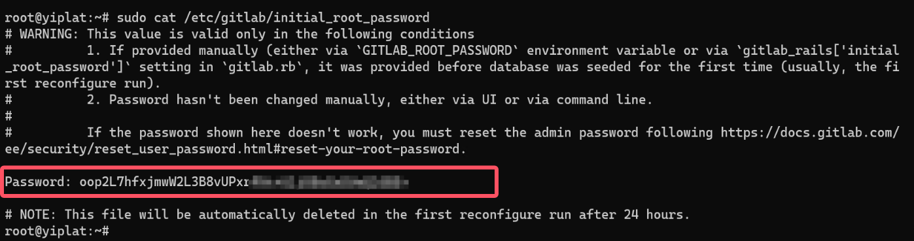
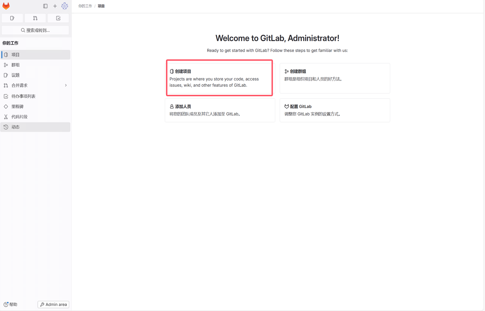
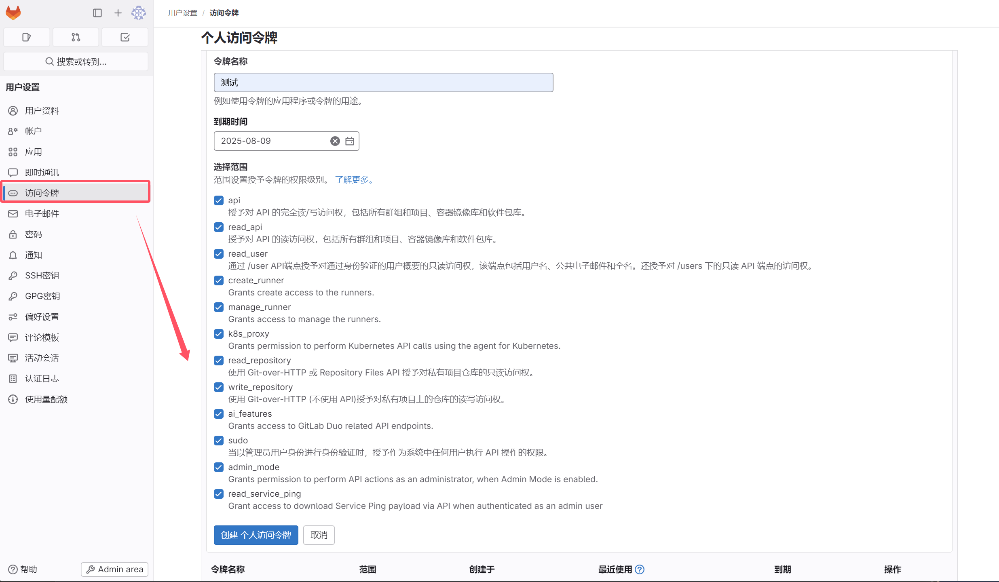
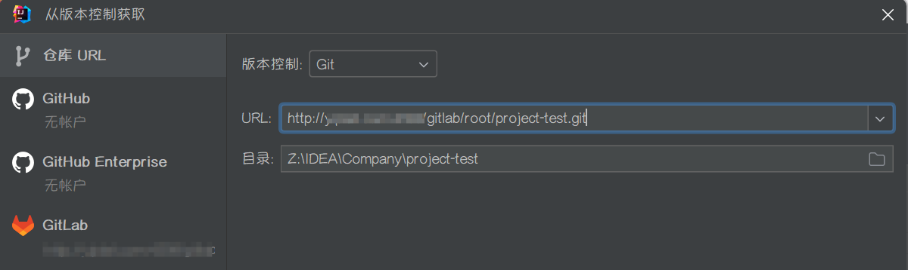

# 1、简介

Git 是一个开源的分布式版本控制系统，用于敏捷高效地处理任何或小或大的项目。

Git 是 Linus Torvalds 为了帮助管理 Linux 内核开发而开发的一个开放源码的版本控制软件。

Git 与常用的版本控制工具 CVS、Subversion 等不同，它采用了分布式版本库的方式，不必服务器端软件支持。


## 1.1、Git、GitHub、GitLab

**Git**

Git 是一种版本控制系统，是一个命令，是一种工具。

我们用 SVN 和 Git 对比着来说，SVN 是集中式版本控制系统，而 Git 是分布式版本控制系统。

集中式版本控制系统是指版本库集中存放在一个中央服务器中，我们需要在自己电脑上通过连接中央服务器，从而把代码 clone 到本地，或者把自己电脑上的代码提交到中央服务器，如果中央服务器被炸毁了，那么所有的版本库都没了。在工作中，公司一般都有一个 SVN 服务器，也就是版本控制系统，大家在自己电脑上通过 TortoiseSVN 客户端连接 SVN 服务器，从而进行相应的版本库的操作。

分布式版本控制系统没有所谓的 “中央服务器”，每个人的电脑上都可以安装一个版本控制系统，自己写的代码提交到自己电脑上的版本库中。

- 如果不进行多人协作，自己电脑上的版本库就足够用了。我们在自己电脑上下载并安装 Git，这个 Git 就是版本控制系统；我们可以通过 TortoiseGit 客户端连接安装的 Git 版本控制系统，从而进行相应的版本库的操作。

- 如果进行多人协作，每个人都需要将自己电脑上版本库中的新修改同步到其他人的版本库中，可以有两种方式；

  第一：将自己的修改直接推送到其他人的版本库中，我不会弄。

  第二：建立一台充当 “中央服务器” 的电脑，每个人把自己电脑上版本库和中央服务器建立通信，但这个中央服务器的作用仅仅是用来方便 “交换” 大家的修改，在大家不相互协作的情况下，没有它大家也一样干活，如果中央服务器有一天被人炸了也没关系，因为我们每个人的电脑上都有一个完整的版本库。现在流行的 GitHub、Gitee 都是开放的中央服务器，公司内部还可以使用 GitLab 来自己搭建中央服务器。


**GitHub**

GitHub 是一个基于 Git 实现在线代码托管的仓库，向互联网开放，共有仓库免费，建立私有仓库要收费，因为 Github 的初衷就是为了大家共享自己的劳动成果。


**GitLab**

GitHub 和 GitLab 都是基于 Git 仓库的 Web 开发流程代码托管平台。两者的区别是 GitHub 有私有仓库和共有仓库，私有仓库一般收费，GitLab 打破这种限制，可以免费搭建私有仓库，并且可以部署在自己的服务器上。GitLab 不仅有 GitLab 的功能，还有更多的优秀特性，比如权限设置。一般企业内部软件产品用 GitLab 是更好的选择，如果是开源产品，一般放在 GitLab 上。


# 2、搭建 GitLab

## 2.1、安装 GitLab

1. 安装 GitLab 所需的依赖包：
   ```shell
   sudo apt update
   sudo apt install -y curl openssh-server ca-certificates tzdata perl
   ```

2. 启动 SSH 服务并设置 SSH 服务为开机自启动：

   ```shell
   sudo systemctl start ssh
   sudo systemctl enable ssh
   ```

3. （可选）安装并配置Postfix。

   Postfix用于GitLab发送电子邮件通知。如果您想使用其他解决方案发送电子邮件，请跳过此步骤并在安装GitLab后配置外部SMTP服务器。具体操作，请参见 [配置外部 SMTP 服务器](https://docs.gitlab.cn/omnibus/settings/smtp.html)。

   安装 Postfix：

   ```shell
   sudo apt install -y postfix
   ```

   > [!TIP]
   >
   > 安装的时候会要求配置 Postfix 信息：
   >
   > 1. 邮件服务器配置的类型，我这里选择 Internet Site 选项。
   > 2. 系统邮件名称或完全限定域名（FQDN），我这里输入 `Orichalcos.com` ，一般这里会填 `<主机名>.com`。

   启动Postfix并设置Postfix为开机自启动：

   ```shell
   sudo systemctl start postfix
   sudo systemctl enable postfix
   ```

4. 添加 GitLab 软件包仓库：

   ```shell
   sudo curl https://packages.gitlab.com/install/repositories/gitlab/gitlab-ce/script.deb.sh | sudo bash
   ```

   > [!NOTE]
   >
   > 由于网络原因，可能会出现无法添加 GitLab 软件源镜像的问题，建议多尝试几次。

   当出现类似如下回显信息，表示 GitLab 软件包仓库已安装：

   

5. 刷新软件包列表：

   ```shell
   sudo apt update
   ```

6. 安装 GitLab：

   ```shell
   sudo EXTERNAL_URL=<GitLab服务器的公网IP地址> apt install -y gitlab-ce
   ```

   > [!IMPORTANT]
   >
   > GitLab 会因为实例规格较低而导致长时间处于 Installing 状态时，请耐心等待安装完成。

   当出现类似如下回显信息，表示 GitLab 已经安装成功：

   


## 2.2、GitLab 常用命令

GitLab 由主要由以下服务构成，他们共同承担了 Gitlab 的运作需要：

- nginx：静态 Web 服务器。
- gitlab-shell：用于处理 Git 命令和修改 authorized keys 列表。
- gitlab-workhorse：轻量级的反向代理服务器。
- logrotate：日志文件管理工具。
- postgresql：数据库。
- redis：缓存数据库。
- sidekiq：用于在后台执行队列任务（异步执行）。
- unicorn：HTTP 服务，GitLab Rails 应用是托管在这个服务器上面的。


### 2.2.1、服务控制命令

启动/停止/重启所有 GitLab 组件：

```shell
gitlab-ctl <start|stop|restart>
```

启动指定模块组件：

```shell
 gitlab-ctl start <redis|postgresql|gitlab-workhorse|logrotate|nginx|sidekiq|unicorn>
```

停止指定模块组件：

```shell
gitlab-ctl stop <模块名>
```

查看服务状态：

```shell
gitlab-ctl status
```

生成配置并启动服务：

```shell
gitlab-ctl reconfigure
```

> [!NOTE]
>
> 如果更改了主配置文件（`/etc/gitlab/gitlab.rb`），需要用这个命令使配置文件生效，但是会初始化除 gitlab.rb 以外的所有文件。

> [!IMPORTANT]
>
> 如果更改了主配置文件，执行完此命令需要再执行 `gitlab-ctl restart` 重启所有 GitLab 组件！ 


### 2.2.2、运维管理

查看版本：

```shell
cat /opt/gitlab/embedded/service/gitlab-rails/VERSION
```

实时查看日志：

```shell
 gitlab-ctl tail
```

实时各个模块日志：

```shell
gitlab-ctl tail <redis|postgresql|gitlab-workhorse|logrotate|nginx|sidekiq|unicorn>
```

数据库关系升级：

```shell
gitlab-rake db:migrate
```

清理 Redis 缓存：

```shell
gitlab-rake cache:clear
```

升级 GitLab-ce 版本：

```shell
yum update gitlab-ce
```

升级 PostgreSQL 最新版本：

```shell
gitlab-ctl pg-upgrade
```


## 2.3、配置 GitLab

GitLab 主要配置文件目录：

- 主配置文件：`/etc/gitlab/gitlab.rb`。
- 文档根目录：`/opt/gitlab`。
- 默认存储库位置：`/var/opt/gitlab/git-data/repositories`。
- Nginx 配置文件：`/var/opt/gitlab/nginx/conf/gitlab-http.conf`。
- Postgresql 数据目录：`/var/opt/gitlab/postgresql/data`。


### 2.3.1、内存受限环境

在启用所有功能的情况下运行时，GitLab 需要大量内存。有一些用例，例如在不需要所有功能的较小安装上运行 GitLab。例子包括：

- 运行 GitLab 供个人使用或非常小的团队使用。
- 使用云提供商上的小实例来节省成本。
- 使用资源受限的设备，如 Raspberry PI。


**配置 Swap**

在安装 GitLab 之前需要配置 Swap。Swap 是磁盘上的专用空间，在物理 RAM 已满时使用。当 Linux 系统耗尽 RAM 时，非活动页面将从 RAM 移动到交换空间。

交换使用通常被认为是一个问题，因为它会增加延迟。但是，由于 GitLab 的运作方式，分配的大部分内存不会被频繁访问。使用 Swap 允许应用程序正常运行和运行，并且只偶尔使用 Swap 。

一般准则是将交换配置为可用内存的 50% 左右。对于内存受限的环境，建议为系统配置至少 1GB 的交换空间。


**优化 Puma**

> [!WARNING]
>
> 这是一项实验性 Alpha 功能，该功能尚未准备好用于生产用途。如果想使用此功能，建议先使用非生产数据进行测试。

默认情况下，GitLab 使用旨在处理许多并发连接的配置运行。

对于不需要高吞吐量的小型安装，考虑禁用 Puma 集群模式或者减少 worker 数量。 使其只有一个 Puma 进程可以为应用程序提供服务。

在 `/etc/gitlab/gitlab.rb` 中，大约 1245 行：

```
puma['worker_processes'] = 2
```

以这种方式配置 Puma 可以使内存使用量减少 100-400MB。

当然也可以选择减少 Puma worker 内容使用，gitlab.rb 大约 1277 行 ：

```
puma['per_worker_max_memory_mb'] = 700 # 1GB
```


**优化 Sidekiq**

Sidekiq 是一个后台处理守护进程。默认情况下使用 GitLab 配置时，它以 50 的高并发模式运行。这确实会影响它在给定时间可以分配多少内存。建议将其配置为使用显着较小的 5 或 10（首选）值。

在 `/etc/gitlab/gitlab.rb` 中，大约 1305 行：

```
sidekiq['concurrency'] = 10
```


**优化 Gitaly**

Gitaly 是一种存储服务，允许高效访问基于 Git 的仓库。建议配置 Gitaly 强制执行的最大并发和内存限制。

在 `/etc/gitlab/gitlab.rb` 中：

```
gitaly['env'] = {
  'GITALY_COMMAND_SPAWN_MAX_PARALLEL' => '2'
}
```


**配置 GitLab 如何处理内存**

极GitLab 由许多组件（用 Ruby 和 Go 编写）组成，其中 GitLab Rails 是最大的一个，占用的内存最多。

GitLab Rails 使用 [jemalloc](https://github.com/jemalloc/jemalloc) 作为内存分配器。[jemalloc](https://github.com/jemalloc/jemalloc) 以更大的块预分配内存，这些块也被保留更长的时间以提高性能。以牺牲一些性能为代价，可以将 GitLab 配置为在不再需要内存后立即释放内存，而不是将其保留更长的时间。

在 `/etc/gitlab/gitlab.rb` 中：

```
gitlab_rails['env'] = {
  'MALLOC_CONF' => 'dirty_decay_ms:1000,muzzy_decay_ms:1000'
}

gitaly['env'] = {
  'MALLOC_CONF' => 'dirty_decay_ms:1000,muzzy_decay_ms:1000'
}
```


## 2.4、使用 GitLab

### 2.4.1、登录 GitLab

1. 获取 GitLab 的登录密码：

   ```shell
   sudo cat /etc/gitlab/initial_root_password
   ```

   回显信息类似如下所示，可以在 Password 后获取 GitLab 的初始登录密码：

   

   > [!IMPORTANT]
   >
   > 出于安全原因，24小时后，该文件会被自动删除，建议安装成功，首次登录之后，立即修改初始密码。

2. 登录 GitLab。

   在浏览器的地址栏中，输入 `http://ECS实例的公网IP` 即可进入 GitLab 的登录界面：

   

   首次登录使用用户名 root，密码为步骤 1 获取的密码。

3. 进去后将语言设置成中文：

   


### 2.4.2、创建项目

1. 在 GitLab 的主页中，单击【创建项目】：

   

2. 单击【创建空白项目】，设置项目名称和项目 URL，然后单击【新建项目】：

   

3. 复制 Clone 链接，该链接在进行克隆操作时需要使用：

   


### 2.4.3、Clone 项目

1. 在 GitLab 的【偏好设置】里，找到【访问令牌】，在页面中创建一个令牌：

   

   > [!IMPORTANT]
   >
   > 必须为访问令牌授予以下范围：api、read_user，否则无法在 IDEA 使用可能会有问题。

2. 在 IDEA 的 GitLab 设置里，使用自己搭建的 GitLab 访问地址和步骤 1 获取的令牌登录：

   

3. 最后直接 Clone 就行：

   


## 2.5、备份与还原

### 2.5.1、备份

1. 创建备份目录：

   ```shell
   sudo mkdir -p /data/GitLabBackup/
   ```

2. 备份 GitLab 主数据：

   ```shell
   sudo gitlab-backup create
   ```

   生成文件路径：`/var/opt/gitlab/backups/<时间戳>_gitlab_backup.tar`。

   > [!NOTE]
   >
   > 包含所有 Git 仓库、用户数据、项目数据、CI/CD 记录、issues 等。

3. 拷贝备份文件：

   ```shell
   sudo cp /var/opt/gitlab/backups/*.tar /mnt/d/GitLabBackup/
   ```

4. 备份配置文件和密钥：

   ```shell
   sudo cp /etc/gitlab/gitlab.rb /data/GitLabBackup/
   sudo cp /etc/gitlab/gitlab-secrets.json /data/GitLabBackup/
   ```


### 2.5.2、还原

> [!CAUTION]
>
> 要求目标机器的 GitLab 版本必须与备份时一致！

1. 安装 GitLab（与原版本一致）。

2. 还原配置和密钥：

   ```shell
   sudo cp /data/GitLabBackup/gitlab.rb /etc/gitlab/
   sudo cp /data/GitLabBackup/gitlab-secrets.json /etc/gitlab/
   ```

   若首次启动 GitLab，可执行：

   ```shell
   sudo gitlab-ctl reconfigure
   ```

3. 拷贝备份数据文件：

   ```shell
   sudo cp /data/GitLabBackup/*.tar /var/opt/gitlab/backups/
   sudo chown git:git /var/opt/gitlab/backups/*.tar
   ```

4. 停止 GitLab 关键服务（准备还原）：

   ```shell
   sudo gitlab-ctl stop unicorn
   sudo gitlab-ctl stop sidekiq
   ```

5. 还原数据：

   ```shell
   sudo gitlab-backup restore BACKUP=<时间戳>
   ```

   例如：

   ```shell
   sudo gitlab-backup restore BACKUP=1718531400
   ```

6. 重启并检查 GitLab：

   ```shell
   sudo gitlab-ctl reconfigure
   sudo gitlab-ctl restart
   sudo gitlab-ctl status
   ```

