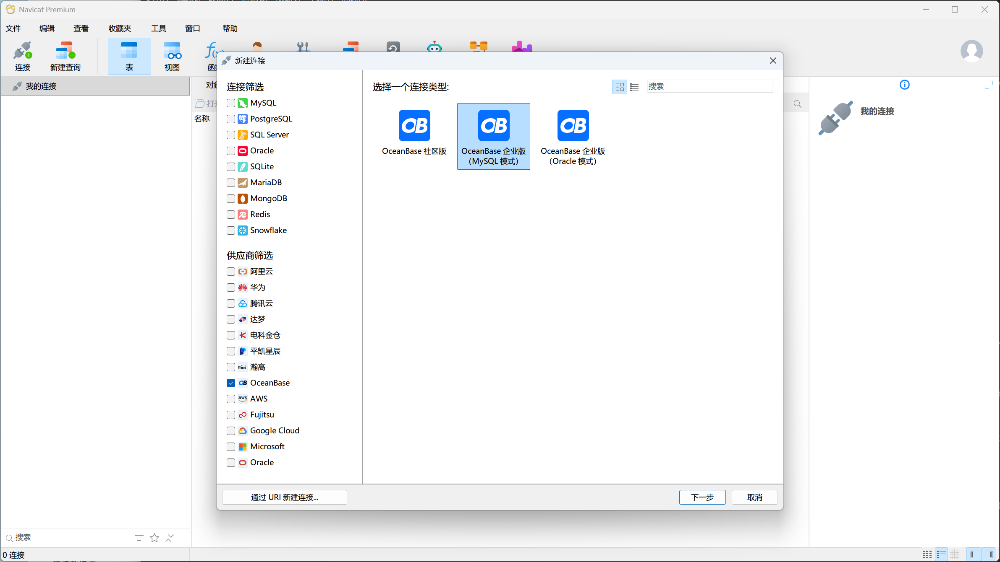

# 1、简介

OceanBase 数据库（OceanBase Database）是一款蚂蚁集团完全自研的企业级原生分布式数据库，在普通硬件上实现金融级高可用，首创“三地五中心”城市级故障自动无损容灾新标准，刷新 TPC-C 标准测试，单集群规模超过 1500 节点，具有云原生、强一致性、高度兼容 Oracle/MySQL 等特性。

<br>

**高可用**

独创 “三地五中心” 容灾架构方案，建立金融行业无损容灾新标准。支持同城/异地容灾，可实现多地多活，满足金融行业 6 级容灾标准（RPO=0，RTO< 8s），数据零丢失。

<br>

**高兼容**

高度兼容 Oracle 和 MySQL，覆盖绝大多数常见功能，支持过程语言、触发器等高级特性，提供自动迁移工具，支持迁移评估和反向同步以保障数据迁移安全，可支撑金融、政府、运营商等关键行业核心场景替代。

<br>

**水平扩展**

实现透明水平扩展，支持业务快速的扩容缩容，同时通过准内存处理架构实现高性能。支持集群节点超过数千个，单集群最大数据量超过 3PB，最大单表行数达万亿级。

<br>

**低成本**

基于 LSM-Tree 的高压缩引擎，存储成本降低 70% - 90%；原生支持多租户架构，同集群可为多个独立业务提供服务，租户间数据隔离，降低部署和运维成本。

<br>

**实时 HTAP**

基于“同一份数据，同一个引擎”，同时支持在线实时交易及实时分析两种场景，“一份数据”的多个副本可以存储成多种形态，用于不同工作负载，从根本上保持数据一致性。

<br>

**安全可靠**

自 2010 年开始完全自主研发，代码级可控，自研单机分布式一体化架构，连续多年通过大规模金融核心场景的可靠性验证；完备的角色权限管理体系，数据存储和通信全链路透明加密，支持国密算法，通过等保三级专项合规检测。

<br>

**共享存储**

共享存储（Shared-Storage）形态下，计算节点和数据存储完全分离，存储可按需购买，计算节点可灵活扩缩容，从而实现极致的资源弹性与成本优化，并支持 AP、TP、KV 全产品形态。

<br>

# 2、安装数据库


<br>

# 3、连接数据库

连接数据库需要用到数据库连接串，请联系 OceanBase 数据库部署人员或者管理员获取相应的数据库连接串，例如：

```shell
obclient -h$host -P$port -u$user_name -p$password -D$database_name
```

参数说明：

- *`$host`*：提供 OceanBase 数据库连接 IP。

  ODP 连接方式使用的是一个 ODP 地址；直连方式使用的是 OBServer 节点的 IP 地址。

  > [!NOTE]
  >
  > OceanBase 数据库代理 ODP（OceanBase Database Proxy，又称 OBProxy）是 OceanBase 数据库专用的代理服务器，OceanBase 数据库用户的数据会以多副本的形式存放在各个 OBServer 节点上，ODP 接收用户发出的 SQL 请求，并将 SQL 请求转发至最佳目标 OBServer 节点，最后将执行结果返回给用户。

- *`$port`*：提供 OceanBase 数据库连接端口。

  ODP 连接的方式默认是 2883，在部署 ODP 时可自定义；直连方式默认是 2881，在部署 OceanBase 数据库时可自定义。

- *`$user_name`*：提供租户的连接账户。

  ODP 连接的常用格式：`用户名@租户名#集群名` 或者 `集群名:租户名:用户名`；直连方式格式：`用户名@租户名`。

- *`$password`*：提供账户密码。

- `$database_name`：需要访问的数据库名称。

  > [!NOTE]
  >
  > 连接租户的用户需要拥有该数据库的 `CREATE`、`INSERT`、`DROP` 和 `SELECT` 权限。

<br>

## 3.1、基于 MySQL 模式

### 3.1.1、Navicat

Navicat 是一款通用的数据库客户端工具，其原理是使用各个数据库提供的 JDBC 驱动连接数据库，支持常见的关系型数据库、非关系型数据库、分布式数据库等等。

使用 Navicat 自带的 OceanBase 驱动或 MySQL 驱动均可连接 OceanBase 数据库的 MySQL 租户，本文将以 OceanBase 驱动为例连接 OceanBase 数据库的 MySQL 租户。

> [!NOTE]
>
> 不同 Navicat 版本的操作界面可能不同，本文档以 Navicat 17.3.6 版本为例提供数据库的连接指导，如未有连接选项可能 Navicat 版本过低。

1. 单击「连接」>「OceanBase 」>「OceanBase 企业版（MySQL 模式）」，进入到「新建连接」页面：

   

2. 在「新建连接」页面根据待连接的数据库信息进行填写，之后单击「测试连接」：

   

3. 当「测试连接」弹窗中显示 已连接，表示可成功连接，单击「保存」，即可连接到 OceanBase 数据库。

<br>

### 3.1.2、SpringBoot

SpringBoot 连接 OceanBase 只需要修改 `datasource` 信息即可：

```properties
spring.datasource.driverClassName=com.mysql.cj.jdbc.Driver
spring.datasource.url=jdbc:mysql://10.10.10.1:2881/test?useSSL=false&useUnicode=true&characterEncoding=utf-8
spring.datasource.username=root@mysq001
spring.datasource.password=******
```

- 数据库驱动的名称为：`com.mysql.cj.jdbc.Driver`。
- OBServer 节点的 IP 地址为 `10.10.10.1`（参考数据库连接串的 `$host`），访问端口使用的是 2881（参考数据库连接串的 `$port`），需要访问的 Schema 名称为 `test`（参考数据库连接串的 `$database_name`）。
- 租户的连接账户是 `root@mysq001`（参考数据库连接串的 `$user_name`）。
- 密码是 `******`（参考数据库连接串的 `$password`）。

<br>