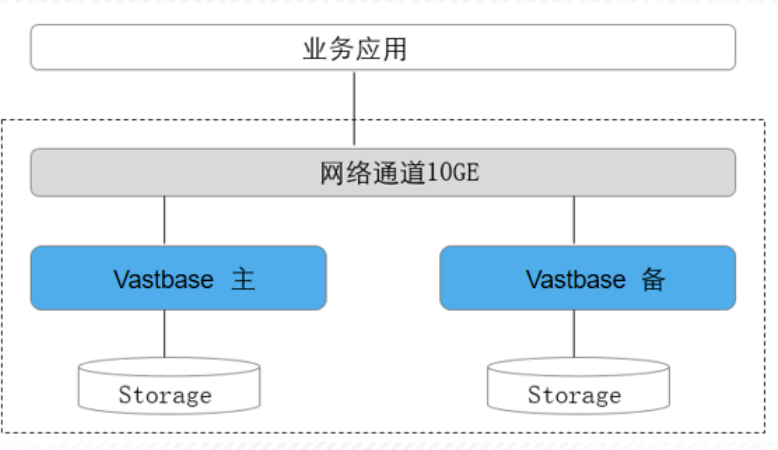
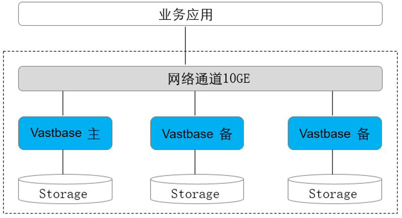
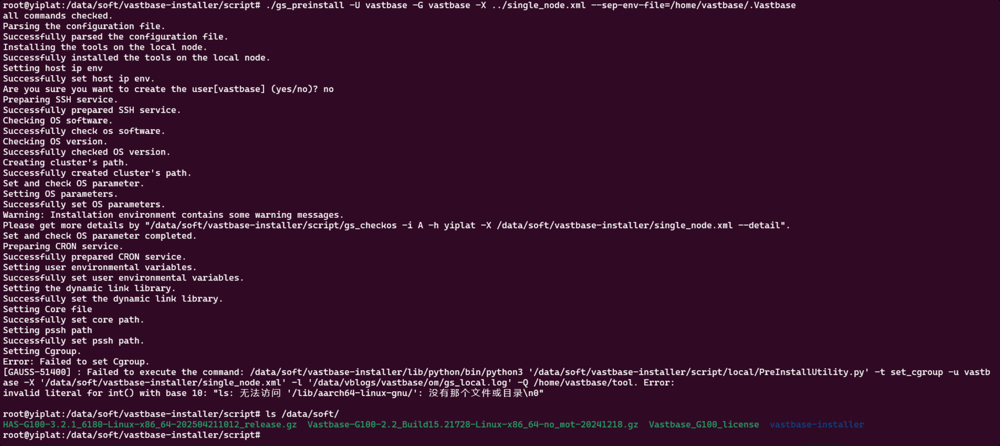

# Vastbase

## 1、简介

Vastbase G100 数据库是海量数据基于开源 openGauss 内核开发的企业级关系型数据库。融合多年对各行业应用场景的深入理解，Vastbase G100 除了具有 openGauss 极致的性能以外，还在原有功能基础上增加了大量 Oracle 兼容特性，并遵循 EAL4+ 标准进行了大幅度的安全增强，同时整合 GIS/流计算 等一系列专业应用领域的企业级功能。

<br>

### 1.1、产品介绍

Vastbase G100 支持 SQL2003 标准语法，支持主备部署的高可用关系型数据库。

- 多种存储模式支持复合业务场景。
- NUMA 化内核结构支持高性能。
- 主备模式，CRC 校验支持高可用。

<br>

**应用场景**

- 交易型应用

	高并发、大数据量、以联机事务处理为主的交易型应用，如电商、金融、O2O、电信CRM/计费等，应用可按需选择不同的主备部署模式。

- 物联网数据

	在工业监控和远程控制、智慧城市的延展、智能家居、车联网等物联网场景下，传感监控设备多，采样率高，数据存储为追加模型，操作和分析并重的场景。

<br>

**技术特点**

Vastbase G100 相比其他数据库主要有多存储模式，NUMA 化内核结构和高可用等产品特点。

- 多存储模式
	- 行存储，支持业务数据频繁更新场景。
	- 列存储，支持业务数据追加和分析场景。
	- 内存表，支持高吞吐，低时延，极高性能场景。
- NUMA 化内核结构
	- 关键数据结构分区，降低数据访问冲突。
	- 关键数据结构 NUMA 化，降低数据结构访问时延。
	- 关键业务线程绑核，避免核间线程漂移。
- 高可用
	- 支持主备同步，异步多种部署模式。
	- 数据页 CRC 校验，损坏数据页通过备机自动修复。
	- 备机并行恢复，10 秒内可升主提供服务。

<br>

**软件架构**

Vastbase G100 是集中式数据库系统，在这样的系统架构中，业务数据存储在单个物理节点上，数据访问任务被推送到服务节点执行，通过服务器的高并发，实现对数据处理的快速响应。同时通过日志复制可以把数据复制到备机，提供数据的高可靠和读扩展。


<br>

**数据库逻辑结构图**

Vastbase G100 的数据库节点负责存储数据，其存储介质也是磁盘，本节主要从逻辑视角介绍数据库节点都有哪些对象，以及这些对象之间的关系。


<br>

### 1.2、部署方案

常用概念：

- 单机

	单机指的是只有一个数据库实例。

- 双机

	双机指的是系统中存在主备数据库实例，主实例支持读写，备实例支持只读。

- 一主多备

	一主多备指的是在系统存在一个主机，多个备机。最多支持8个备机。

- 冷热备份

	冷备份： 是指备份就是一个简单的备份集，不可以提供服务。

	热备份： 是指备份集群可以对外提供服务 。

<br>

#### 1.2.1、部署形态汇总

部署形态方案介绍如下表所示：

| 部署形态 | 技术方案              | 高可用         | 基础设置要求  | 场景特点                                                     | 技术规格                                                     |
| -------- | --------------------- | -------------- | ------------- | ------------------------------------------------------------ | ------------------------------------------------------------ |
| 单机     | 单机                  | 无高可用能力   | 单机房        | 对系统的可靠性和可用性无任何要求。主要用于体验试用以及调测场景。 | 系统 RTO 和 RPO 不可控。无实例级容灾能力，一旦出现实例故障，系统不可用。 一旦实例级数据丢失，则数据永久丢失，无法恢复。 |
| 主备     | 主机+备机             | 抵御实例级故障 | 单机房        | 节点间无网络延迟  要求承受集群内实例级故障 适用于对系统可靠性要求不高的场景。 | RPO=0 。实例故障 RTO<10s 。无 AZ 级容灾能力 。推荐主备最大可用模式。 |
| 一主多备 | 主机 +多个备机 Quorum | 抵御实例级故障 | 单机房/跨机房 | 节点间无网络延迟要求承受集群内实例级故障。                   | RPO=0 。实例故障 RTO<10s。推荐主备同步模式。最少 2 个副本，最多 8 个副本。 |

<br>

**兼容列表**

- 支持的CPU范围：

	鲲鹏、飞腾、至强、申威、龙芯、兆芯、海光

- 支持的OS范围：

	openEuler、麒麟V10、UOS(openEuler版)、CentOS 7.x/8.x(ARM版本)

<br>

#### 1.2.2、部署方案介绍

整体部署方案可以分为三类：单机部署、一主一备部署、一主多备部署。

<br>

**单机部署**

单机部署形态是一种非常特殊的部署形态，这种形态对于可靠性、可用性均无任何保证。由于只有一个数据副本，一旦发生数据损坏、丢失，只能通过物理备份恢复数据。这种部署形态，一般用于数据库体验用户，以及测试环境做语法功能调测等场景。不建议用于商业现网运行。


<br>

**主备部署**

主备模式相当于两个数据副本，主机和备机各一个数据副本，备机接受日志、做日志回放。



<br>

**一主多备部署**

多副本的部署形态，提供了抵御实例级故障的能力。适用于需要抵御个别硬件故障的应用场景和要求机房级别容灾场景。

一般多副本部署时使用 1 主 2 备模式，总共 3 个副本，3 个副本的可靠性为 4 个 9，可以满足大多数应用的可靠性要求。

- 主备间Quorum复制，至少同步到一台备机，保证最大性能。
- 主备任意一个节点故障，不影响业务的进行。
- 数据有三份，任何一个节点故障，系统仍然有双份数据确保继续运行。任何一个备份都可以升主。
- 主备实例之间不可部署在同一台物理机上。



<br>

### 1.3、数据库核心技术

#### 1.3.1、相关概念

**数据库**

数据库用于管理各类数据对象，与其他数据库隔离。创建数据对象时可以指定对应的表空间，如果不指定相应的表空间，相关的对象会默认保存在PG_DEFAULT空间中。数据库管理的对象可分布在多个表空间上。

<br>

**表空间**

在 Vastbase G100 中，表空间是一个目录，可以存在多个，里面存储的是它所包含的数据库的各种物理文件。由于表空间是一个目录，仅是起到了物理隔离的作用，其管理功能依赖于文件系统。

<br>

**模式**

Vastbase G100 的模式是对数据库做一个逻辑分割。所有的数据库对象都建立在模式下面。Vastbase G100 的模式和用户是弱绑定的，所谓的弱绑定是指虽然创建用户的同时会自动创建一个同名模式，但用户也可以单独创建模式，并且为用户指定其他的模式。

<br>

**用户和角色**

Vastbase G100 使用用户和角色来控制对数据库的访问。根据角色自身的设置不同，一个角色可以看做是一个数据库用户，或者一组数据库用户。在 Vastbase G100 中角色和用户之间的区别只在于角色默认是没有LOGIN权限的。在 Vastbase G100 中一个用户唯一对应一个角色，不过可以使用角色叠加来更灵活地进行管理。

<br>

**事务管理**

在事务管理上，Vastbase G100 采取了MVCC（多版本并发控制）结合两阶段锁的方式，其特点是读写之间不阻塞。Vastbase G100 没有将历史版本数据统一存放，而是和当前元组的版本放在了一起。Vastbase G100 没有回滚段的概念，但是为了定期清除历史版本数据引入了一个VACUUM线程。一般情况下用户不用关注它，除非要做性能调优。此外，Vastbase G100 是自动提交事务。

<br>

## 2、部署和卸载

### 2.1、安装数据库

#### 2.1.1、部署规划

**IP规划**

服务器网卡建议由两块物理网卡主备绑定提供给数据库使用。

| 节点名称 | 节点IP（示例） | 主机名     |
| -------- | -------------- | ---------- |
| 主节点   | 127.0.0.1      | orichalcos |

<br>

**端口规划**

| 服务名称 | 端口号 | 端口类别 | 用途                   | 说明                                   |
| -------- | ------ | -------- | ---------------------- | -------------------------------------- |
| Vastbase | 5432   | 业务     | 数据库对外提供业务访问 | 个人用户、业务系统通过此端口访问数据库 |
| Vastbase | 5433   | 内联     | 数据库备份             | 备份工具通过此端口连接数据库           |

<br>

**目录规划**

| 目录名称       | 所属用户 | 目录路径                | 权限 | 说明     |
| -------------- | -------- | ----------------------- | ---- | -------- |
| 数据库安装目录 | vastbase | /home/vastbase/vasthome | 755  | 系统盘   |
| 工具目录       | vastbase | /home/vastbase/tool     | 755  | 系统盘   |
| 数据库数据目录 | vastbase | /data/vastdata          | 700  | 数据盘 1 |
| 数据库日志目录 | vastbase | /data/vblogs            | 700  | 数据盘 1 |
| 数据库备份目录 | vastbase | /backup/backup          | 700  | 数据盘 2 |
| 数据库归档目录 | vastbase | /backup/archive_wals    | 700  | 数据盘 2 |
| core_dump 目录 | vastbase | /backup/core_pattern    | 700  | 数据盘 2 |

<br>

#### 2.1.2、安装前准备

对操作系统环境进行配置，注意需使用 root 用户操作。

<br>

##### 主机名设置

设置节点主机名称，XML 配置文件的 `nodeNames` 需与节点 hostname 保持一致。

```shell
hostnamectl set-hostname orichalcos
```

<br>

##### 关闭透明大页

1. 配置系统服务，关闭透明大页：

	```shell
	vi /etc/systemd/system/disable-thp.service
	```

2. 在编辑器加入以下内容：

	```
	[Unit]
	Description=Disable Transparent Huge Pages (THP)
	 
	[Service]
	Type=simple
	ExecStart=/bin/sh -c "echo 'never' > /sys/kernel/mm/transparent_hugepage/enabled && echo 'never' > /sys/kernel/mm/transparent_hugepage/defrag"
	 
	[Install]
	WantedBy=multi-user.target
	```

3. 启动服务（执行一次后服务状态保持为 `inactive`）并设置开机启动：

	```shell
	systemctl daemon-reload
	systemctl start disable-thp
	systemctl enable disable-thp
	```

<br>

##### 防火墙设置

（可选）关闭防火墙：

```shell
systemctl status firewalld
systemctl stop firewalld
systemctl disable firewalld
```

或开放数据库端口（5432）：

```shell
firewall-cmd --zone=public --permanent --add-port=5432/tcp
firewall-cmd --reload
firewall-cmd --list-port
```

<br>

##### SELinux 设置

> [!NOTE]
>
> SELinux 叫做 “安全增强型 Linux（Security-Enhanced Linux）”，简称 SELinux，它是 Linux 的一个安全子系统。
>
> 其主要作用就是最大限度地减小系统中服务进程可访问的资源（根据的是最小权限原则）。避免权限过大的角色给系统带来灾难性的结果。

查看是否开启 SELinux，`diabled` 表示未开启，`enforcing` 表示已开启：

```shell
getenforce
```

- 临时关闭 SELinux：

	```shell
	setenforce 0
	```

- 通过修改配置文件永久关闭 SELinux

	1. 编辑配置文件：

		```shell
		vi /etc/selinux/config
		```

	2. 将 `SELINUX=enforcing` 修改为 `SELINUX=disabled`。

	3. 重启系统：
		```shell
		reboot
		```

<br>

##### IPC 参数设置

1. 添加 `RemoveIPC=no` 到 logind.conf  文件：

	```shell
	echo "RemoveIPC=no" >> /etc/systemd/logind.conf
	```

2. 添加 `RemoveIPC=no` 到 systemd-logind.service：

	```shell
	echo "RemoveIPC=no" >> /usr/lib/systemd/system/systemd-logind.service
	```

3. 重启服务：

	```shell
	systemctl daemon-reload
	systemctl stop systemd-logind
	systemctl start systemd-logind
	```

<br>

##### 内核参数调整

1. 编辑配置文件：

	```shell
	vim /etc/sysctl.conf
	```

2. 在编辑器中添加如下信息：

	```
	# 文件系统 (fs) 相关参数
	fs.aio-max-nr = 1048576
	fs.file-max = 76724600
	fs.nr_open = 20480000
	
	# 网络核心 (net.core 和 net.ipv4) 相关参数
	net.core.netdev_max_backlog = 10000
	net.core.rmem_default = 262144
	net.core.rmem_max = 4194304
	net.core.wmem_default = 262144
	net.core.wmem_max = 4194304
	net.core.somaxconn = 4096
	net.ipv4.tcp_fin_timeout = 60
	net.ipv4.tcp_retries1 = 5
	net.ipv4.tcp_syn_retries = 5
	net.ipv4.ip_local_port_range = 40000 65535
	
	# 虚拟内存 (vm) 相关参数
	vm.overcommit_memory = 0
	vm.swappiness = 10
	
	# 内核 (kernel) 相关参数
	kernel.core_pattern = /backup/core_pattern/core-%e-%p-%t
	```

3. 执行以下命令，使配置生效（注意若部分参数报错，可酌情修改参数配置）：

	```shell
	sysctl -p
	```


##### 创建用户与目录

1. 创建数据库用户并设置密码：

	```shell
	groupadd vastbase
	useradd -m vastbase -g vastbase
	passwd vastbase
	```

2. 设置 vastbase 用户账号密码不过期，避免过期导致定时任务失效：

	```shell
	chage -m 0 -M 99999 -E -1 vastbase
	```

3. 创建数据库软件目录、数据目录、备份目录等：

	```shell
	mkdir -p /data/{soft,vastdata,vblogs}
	chmod 700 /data/{soft,vastdata,vblogs}
	mkdir -p /backup/{backup,archive_wals,core_pattern}
	chmod 700 /backup/{backup,archive_wals,core_pattern}
	chown -R vastbase:vastbase /{data,backup}
	```

<br>

##### 修改资源限制

1. 执行以下命令，计算生成一次 core 文件需要的磁盘空间大小（KB）：

	```shell
	awk '/MemTotal|SwapTotal/ {if (NF>=3) sum+=$2} END{print sum+0}' /proc/meminfo
	```

2. 设置 vastbase 用户资源限制：

	```shell
	vi /etc/security/limits.conf
	```

3. 在编辑器填写以下内容：

	```
	vastbase soft stack unlimited
	vastbase hard stack unlimited
	vastbase soft core 8388608    # 代入上方计算的值（KB）
	vastbase hard core 8388608    # 代入上方计算的值（KB）
	vastbase soft memlock unlimited
	vastbase hard memlock unlimited
	```

	> [!IMPORTANT]
	>
	> 注意必须设置 core 容量限制 ≥上一步计算值，磁盘空间足够的可以将该数值适当提升整数倍。

<br>

##### 预装依赖

安装依赖软件需要使用 `yum`（RedHat、CentOS 等操作系统）或 `apt`（Ubuntu 等操作系统），在安装依赖前，请确保已经加载了下载这些依赖软件的源。

- RedHat、CentOS 等操作系统

	安装基础依赖包如下：

	```shell
	yum install -y zlib-devel libaio libuuid krb5-libs libicu libxslt tcl perl openldap pam openssl-devel libxml2 libaio-devel flex bison ncurses-devel glibc-devel patch readline-devel expect bzip2 gcc net-tools gdb fio perf iotop redhat-lsb-core
	```

	依赖包检查：

	```shell
	rpm -q  zlib-devel libaio libuuid krb5-libs libicu libxslt tcl perl openldap pam openssl-devel libxml2 libaio-devel flex bison ncurses-devel glibc-devel patch readline-devel expect bzip2 gcc net-tools gdb fio perf iotop redhat-lsb-core |grep not
	```

- Ubuntu 等操作系统

	安装基础依赖包如下：

	```shell
	apt install -y zlib1g-dev libaio1 libaio-dev uuid-dev libreadline-dev libkrb5-dev libicu-dev libxslt1-dev libldap2-dev libpam0g-dev libssl-dev tcl perl libxml2-dev bzip2 libncurses-dev ethtool gettext
	```

	依赖包检查：

	```shell
	dpkg -l zlib1g-dev libaio1 libaio-dev uuid-dev libreadline-dev libkrb5-dev libicu-dev libxslt1-dev libldap2-dev libpam0g-dev libssl-dev tcl perl libxml2-dev bzip2 libncurses-dev ethtool gettext 2>/dev/null | grep -v '^ii'
	```

> [!CAUTION]
>
> 若缺少本步骤，可能会因缺少部分依赖导致安装数据库过程中止。

> [!TIP]
>
> Kylin V10 SP1 系统和 openEuler 20.03 系统无需安装 redhat-lsb-core。
>
> openEuler x86 环境中还需要安装 libnsl：`yum install -y libnsl` 。

<br>

##### 安装 Python3

| 操作系统  | Python 版本                      |
| --------- | -------------------------------- |
| CentOS    | >=Python 3.6.X   <=Python 3.10.X |
| openEuler | >=Python 3.6.X   <=Python 3.10.X |
| Kylin     | Python 3.7.X                     |
| Asianux   | Python 3.6.X                     |

说明：

- openEuler 2403 LTS 支持 Python 3.11。
- Python 需要通过 `--enable-shared` 方式编译。
- 下载地址：https://www.python.org/ftp/python。

检查 Python3 版本：

```shell
python3 --version
```

以及是否 `enable-shared`，此处返回 1 即可，否则需重装 Python3：

```shell
python3 -c "import sysconfig; print(sysconfig.get_config_var('Py_ENABLE_SHARED'))"
```

编译安装 Python3（注意按版本号替换）：

```shell
tar -zxvf Python-3.6.9.tgz
cd Python-3.6.9
./configure --prefix=/usr/local/python3 --enable-optimizations --with-ssl --enable-shared
make -j 8 && make install
cp -p /usr/local/python3/bin/python3*  /usr/bin/ 
cp -p /usr/local/python3/lib/*  /usr/lib64  -r
```

> [!CAUTION]
>
> 安装 Python 的时候出现如下的错误:
>
> ```
> configure: error: in `/apps/python/Python-3.6.9':
> configure: error: no acceptable C compiler found in $PATH
> ```
>
> 解决办法：
>
> ```shell
> apt install gcc
> ```

<br>

##### sudo 配置

为 vastbase 用户添加 fio 权限以便完成数据库上线前的磁盘 I/O 性能检查。

1. 修改文件权限：

	```shell
	chmod u+s /usr/bin/sudo
	```

2. 编辑 sudo 配置文件：

	```shell
	visudo
	```

3. 在打开的编辑器中添加的一行配置：

	```
	vastbase ALL=(ALL:ALL) NOPASSWD:/bin/fio
	```

<br>

#### 2.1.3、数据库安装

##### 解压安装包

1. 将 G100 和 Has 安装包上传至软件目录 `/data/soft` 下，为避免后续脚本执行出错，注意该路径下不要存放其他 G100 和 Has 安装包：

	```
	Vastbase-G100-2.2_Build15.17408-Linux-kunpeng920-no_mot-202411131428.gz
	HAS-G100-3.2_6033-Linux-kunpeng920-202502181203_release.gz
	```

2. 解压 G100 和 Has 安装包至 vastbase-installer 目录：

	```shell
	cd /data/soft
	tar -zxf Vastbase-G100*.gz
	tar -zxf vastbase-installer/Vastbase-G100*.tar.gz -C vastbase-installer/
	rm -f ./vastbase-installer/Vastbase-G100*64bit-om.*
	tar -zxf HAS-G100*.gz -C vastbase-installer/
	tar -zxf vastbase-installer/Vastbase-HAS*.tar.gz -C vastbase-installer/
	rm -f ./vastbase-installer/Vastbase-HAS*64bit.*
	```

3. 将 Has 压缩包名称前缀修改为与 Vastbase*.tar.bz2 压缩包相同：

	```shell
	cd vastbase-installer/
	REF_PREFIX=$(ls Vastbase-G100-*.tar.bz2 | sed 's/\.tar\.bz2$//')
	mv Symbols-Vastbase-HAS-*-cm.tar.gz "${REF_PREFIX}-cm-symbol.tar.gz"
	mv Vastbase-HAS-*-cm.tar.gz "${REF_PREFIX}-cm.tar.gz"
	mv Vastbase-HAS-*-om.sha256 "${REF_PREFIX}-om.sha256"
	mv Vastbase-HAS-*-om.tar.gz "${REF_PREFIX}-om.tar.gz"
	```

4. 解压改名后的 om 压缩包，会在当前目录下生成 script 子目录：

	```shell
	tar -zxf "${REF_PREFIX}-om.tar.gz"
	```

<br>

##### 上传许可文件

生产部署时应使用正式许可文件，上传有效许可 vastbase_license 至 `/data/soft` 目录，并替换安装包里的许可文件：

```shell
echo "yes" | cp /data/soft/vastbase_license /data/soft/vastbase-installer/license
```

> [!NOTE]
>
> 也可选择跳过本步骤，这样数据库将自动使用为期 3 个月的临时许可。

<br>

##### 配置 XML 文件

编辑 XML 文件，详细参数说明参考 [Has配置说明](https://docs.vastdata.com.cn/zh/docs/VastbaseG100Ver2.2.15/doc/安装升级指南/集群部署/HAS3.2/HAS3.2-配置说明.html)：

```shell
vi /data/soft/vastbase-installer/single_node.xml
```

在打开的编辑器中加入以下内容：

```xml
<?xml version="1.0" encoding="utf-8"?>
<ROOT>
  <CLUSTER>
    <PARAM name="clusterName" value="vastbase" />
    <PARAM name="nodeNames" value="orichalcos"/>
    <PARAM name="gaussdbAppPath" value="/home/vastbase/vasthome" />
    <PARAM name="gaussdbLogPath" value="/data/vblogs" />
    <PARAM name="tmpMppdbPath" value="/data/tmp"/>
    <PARAM name="gaussdbToolPath" value="/home/vastbase/tool" />
    <PARAM name="corePath" value="/backup/core_pattern"/>
    <PARAM name="backIp1s" value="127.0.0.1"/>
  </CLUSTER>
  
  <DEVICELIST>
    <DEVICE sn="orichalcos">
      <PARAM name="name" value="orichalcos"/>
      <PARAM name="azName" value="AZ1"/>
      <PARAM name="azPriority" value="1"/>
      <PARAM name="backIp1" value="127.0.0.1"/>
      <PARAM name="dataNum" value="1"/>
      <PARAM name="dataPortBase" value="5432"/>
      <PARAM name="dataNode1" value="/data/vastdata"/>
    </DEVICE>
  </DEVICELIST>
</ROOT>  
```

配置说明：

- 安装目录和数据目录需为空或者不存在，否则可能导致安装失败。
- 在对数据库节点的实例进行具体配置时，需确保配置的目录之间不相互耦合。即各个配置目录不关联，删除其中任意一个目录，不会级联删除其它目录。如当设置 `gaussdbAppPath` 为 `/home/vastbase/vasthome`，`gaussdbLogPath` 为 `/home/vastbase/vasthome/pg_log`。若 `gaussdbAppPath` 目录被删除，则会级联删除 `gaussdbLogPath` 目录，从而引起其它问题。
- 配置路径和实例路径时，路径中不能包含特殊字符。
- 配置数据库节点名称时，请通过 `hostname` 命令获取各数据库节点的主机名称。

<br>

##### 预安装

> [!TIP]
>
> Ubuntu 需要临时将系统的默认 `/bin/sh` 从 dash 切换到 bash，让安装脚本能够识别 source 命令：
>
> ```shell
> sudo dpkg-reconfigure dash
> ```
>
> 你会看到一个配置界面，询问 "Use dash as the default system shell (/bin/sh)?"。使用键盘的方向键，选择 `<No>`，然后按回车。
>
> 安装成功后，再把它切换回来，再次运行相同的命令：
>
> ```shell
> sudo dpkg-reconfigure dash
> ```
>
> 这次，在弹出的窗口中选择 `<Yes>`，然后按回车。

> [!IMPORTANT]
>
> Ubuntu 执行原装脚本如遇见 "ls: 无法访问 '/lib/aarch64-linux-gnu/': 没有那个文件或目录\n0" 报错：
>
> 
>
> 可执行下面语句解决：
>
> ```shell
> cp /usr/lib/x86_64-linux-gnu/libaio.so* /usr/local/lib/
> ```

使用 root 用户执行本步骤：

```shell
cd /data/soft/vastbase-installer/script/
./gs_preinstall -U vastbase -G vastbase -X ../single_node.xml --sep-env-file=/home/vastbase/.Vastbase
```

执行预安装脚本 gs_preinstall 可以完成如下环境准备工作：

- 自动设置 Linux 内核参数以达到提高服务器负载能力的目的。
- 读取 XML 配置文件中的目录信息并创建，将目录权限授予安装用户。
- 提示选择是否创建数据库用户，此处选择否即可。

操作须知：

- 用户需要检查上层目录权限，保证安装用户对安装包和配置文件目录读写执行权限。
- XML 文件中主机的名称与 IP 映射应配置正确。
- 只能使用 root 用户执行 gs_preinstall 命令。
- `-X` 指定的是 XML 配置文件的路径，配置文件详细信息参见配置说明。
- `--sep-env-file` 指定的是环境变量文件。若不指定此配置项，则环境变量信息将写入 .bashrc 文件中，在部署多个数据库实例时可能造成冲突。

预安装过程示例如下：

```
Parsing the configuration file.
Successfully parsed the configuration file.
Installing the tools on the local node.
Successfully installed the tools on the local node.
Setting host ip env
Successfully set host ip env.
Are you sure you want to create the user[vastbase] (yes/no)? no
Preparing SSH service.
Successfully prepared SSH service.
Checking OS software.
Successfully check os software.
Checking OS version.
Successfully checked OS version.
Creating cluster's path.
Successfully created cluster's path.
Set and check OS parameter.
Setting OS parameters.
Successfully set OS parameters.
Warning: Installation environment contains some warning messages.
Please get more details by "/data/soft/vastbase-installer/script/gs_checkos -i A -h vdb1 --detail".
Set and check OS parameter completed.
Preparing CRON service.
Successfully prepared CRON service.
Setting user environmental variables.
Successfully set user environmental variables.
Setting the dynamic link library.
Successfully set the dynamic link library.
Setting Core file
Successfully set core path.
Setting pssh path
Successfully set pssh path.
Setting Cgroup.
Successfully set Cgroup.
Set ARM Optimization.
No need to set ARM Optimization.
Fixing server package owner.
Setting finish flag.
Successfully set finish flag.
Preinstallation succeeded.
```

<br>

##### 执行安装

1. 安装包解压后未对 vastbase 用户授权，补充授权：

	```shell
	chown -R vastbase.vastbase /data/soft
	```

2. 接着切换至 vastbase 用户执行安装命令：

	```shell
	su - vastbase
	source ~/.Vastbase
	cd /data/soft/vastbase-installer/script/
	./gs_install -X ../single_node.xml \
	--gsinit-parameter="--encoding=UTF8" \
	--gsinit-parameter="--locale=en_US.UTF8" \
	--gsinit-parameter="--lc-collate=en_US.UTF8" \
	--gsinit-parameter="--lc-ctype=en_US.UTF8" \
	--gsinit-parameter="--lc-messages=en_US.UTF8" \
	--gsinit-parameter="--dbcompatibility=B" \
	--dn-guc="max_process_memory=8GB" 
	```

	操作须知：

	- 执行安装脚本必须切换至 vastbase 用户（预安装 gs_preinstall 中 `-U` 参数指定的用户）。
	- `--dbcompatibility=B`  这个是兼容性参数，需为大写，即A（Oracle）、B（MySQL）、C（Teradata）、PG（PostgreSQL）、MSSQL（SQL Server），否则后续升级会导致出错。
	- `--dn-guc="max_process_memory=8GB"` 这个参数是机器内存小于 16GB 才需要设置。
	- 为保证数据库正常启动，`max_process_memory` 参数必须配置为合适大小（如 0.8*OS_MEM ），OM 工具安装完成默认数据库内核至少需要 7G 内存；也可以通过修改其他内存相关 GUC 参数，以减小内核所需 `max_process_memory` 大小。
	- 在脚本执行过程中，用户需根据提示输入数据库的密码，密码具有一定的复杂度，为保证用户正常使用该数据库，请记住输入的数据库密码。
		- 最少包含 8 个字符。
		- 至少包含大写字母（A-Z）、小写字母（a-z）、数字、非字母数字字符（限定为 `~!@#$%^&*()-_=+\|[{}];:,<.>/?` ）四类字符中的三类字符。
	- 安装过程中会生成 SSL 证书，证书存放路径为：`$GAUSSHOME/share/sslcert/om`。

	安装过程如下所示：

	```
	Parsing the configuration file.
	Check preinstall on every node.
	Successfully checked preinstall on every node.
	Creating the backup directory.
	Successfully created the backup directory.
	begin deploy..
	Installing the cluster.
	begin prepare Install Cluster..
	Checking the installation environment on all nodes.
	begin install Cluster..
	Installing applications on all nodes.
	Successfully installed APP.
	begin init Instance..
	encrypt ciper and rand files for database.
	Please enter password for database:<---输入数据库vastbase用户密码，如Vast@123
	Please repeat for database:
	begin to create CA cert files
	The sslcert will be generated in /home/vastbase/vasthome/share/sslcert/om
	Cluster installation is completed.
	Configuring.
	Deleting instances from all nodes.
	Successfully deleted instances from all nodes.
	Checking node configuration on all nodes.
	Initializing instances on all nodes.
	Updating instance configuration on all nodes.
	Check consistence of memCheck and coresCheck on DN nodes.
	Successful check consistence of memCheck and coresCheck on all nodes.
	Configuring pg_hba on all nodes.
	Configuration is completed.
	Successfully started cluster.
	Successfully installed application.
	```

3. 执行安装成功后，可以通过以下命令查看数据库状态：

	```shell
	gs_om -t status --detail
	vb_ctl status
	ps -ef | grep vastbase
	```

<br>

#### 2.1.4、安装后配置

##### 数据库参数配置

1. 设置环境变量，以 vastbase 用户执行：

	```shell
	# 设置英文字符集
	echo -e "\nexport LANG=en_US.UTF-8\nexport PGUSER=vastbase" >> /home/vastbase/.Vastbase
	# 设置切换vastbase用户时自动加载数据库环境变量
	echo -e "\nsource /home/vastbase/.Vastbase" >> /home/vastbase/.bashrc
	```

2. 设置数据库参数：

	```shell
	vi /home/vastbase/vb_guc_conf.sh
	```

	其中 vb_guc_conf.sh 文本内容如下，各参数可按需调整：

	```sh
	#!/bin/bash
	cp /data/vastdata/postgresql.conf  /data/vastdata/postgresql.conf.`date +"%Y%m%d"`
	
	function SecureAccess(){
	    vb_guc set -c "listen_addresses = '*'"
	    vb_guc set -c "password_force_alter=off"
	    vb_guc set -c "vastbase_login_info=false"
	    vb_guc set -c "session_timeout='30min'"
	}
	
	function WAL(){
	    vb_guc set -c "wal_level=hot_standby"
	    vb_guc set -c "full_page_writes=off"
	    vb_guc set -c "wal_log_hints=on"
	    vb_guc set -c "xloginsert_locks=8"
	    vb_guc set -c "advance_xlog_file_num=10"
	    vb_guc set -c "archive_mode=on"
	    vb_guc set -c "archive_dest='/backup/archive_wals/'"
	}
	
	function replicationAndSlots(){
	    vb_guc set -c "wal_keep_segments=128"
	    vb_guc set -c "max_wal_senders=8"
	    vb_guc set -c "most_available_sync=on"
	    vb_guc set -c "catchup2normal_wait_time=0"
	    vb_guc set -c "wal_receiver_timeout=60s"
	    vb_guc set -c "sync_config_strategy=none_node"
	    vb_guc set -c "wal_sender_timeout=10s"
	    vb_guc set -c "synchronous_commit=on"
	    vb_guc set -c "synchronous_standby_names = '*'"
	}
	
	function dbLog(){
	    vb_guc set -c "log_duration=on"
	    vb_guc set -c "log_line_prefix='%m %r %d %u [%x] [%p]'"
	    vb_guc set -c "log_checkpoints=on"
	    vb_guc set -c "log_statement='ddl'"
	    vb_guc set -c "log_timezone= 'PRC'"
	}
	
	function VACUUM(){
	    vb_guc set -c "autovacuum_mode=mix"
	    vb_guc set -c "autovacuum_max_workers=5"
	    vb_guc set -c "autovacuum_naptime=20s"
	    vb_guc set -c "autovacuum_vacuum_cost_delay=10"
	    vb_guc set -c "autovacuum_vacuum_scale_factor=0.05"
	    vb_guc set -c "autovacuum_analyze_scale_factor=0.02"
	    vb_guc set -c "autovacuum_vacuum_threshold=200"
	    vb_guc set -c "autovacuum_analyze_threshold=200"
	    vb_guc set -c "vacuum_cost_limit=10000"
	
	}
	
	function perfStats(){
	    vb_guc set -c "enable_instr_cpu_timer=on"
	    vb_guc set -c "enable_stmt_track=on"
	    vb_guc set -c "enable_resource_track=on"
	    vb_guc set -c "enable_wdr_snapshot=on"
	    vb_guc set -c "enable_auto_clean_unique_sql=on"
	    vb_guc set -c "instr_unique_sql_count=200000"
	    vb_guc set -c "track_stmt_stat_level='off,L1'"
	    vb_guc set -c "log_min_duration_statement=3s"
	    vb_guc set -c "track_activities=on"
	    vb_guc set -c "track_activity_query_size=4096"
	    vb_guc set -c "track_sql_count=on"
	    vb_guc set -c "enable_instr_rt_percentile=off"
	    vb_guc set -c "enable_opfusion=off"
	}
	
	function audit(){
	    vb_guc set -c "audit_enabled=off"
	    vb_guc set -c "audit_login_logout=7"
	    vb_guc set -c "audit_grant_revoke=1"
	    vb_guc set -c "audit_database_process=0"
	    vb_guc set -c "audit_user_locked=0"
	    vb_guc set -c "audit_user_violation=0"
	    vb_guc set -c "audit_system_object=0"
	    vb_guc set -c "audit_set_parameter=0"
	    vb_guc set -c "audit_xid_info=0"
	    vb_guc set -c "audit_resource_policy=off"
	    vb_guc set -c "audit_file_remain_time=7"
	    vb_guc set -c "audit_space_limit=5GB"
	}
	
	function otherKeyParams(){
	    vb_guc set -c "enable_cbm_tracking=on"
	    vb_guc set -c "behavior_compat_options='display_leading_zero,skip_insert_gs_source'"
	    vb_guc set -c "cstore_buffers=16MB"
	    vb_guc set -c "standby_shared_buffers_fraction=1"
	    vb_guc set -c "checkpoint_segments=128"
	    vb_guc set -c "checkpoint_completion_target=0.9"
	    vb_guc set -c "max_files_per_process=100000"
	    vb_guc set -c "lc_messages='en_US.UTF-8'"
	    vb_guc set -c "lc_monetary='en_US.UTF-8'"
	    vb_guc set -c "lc_numeric='en_US.UTF-8'"
	    vb_guc set -c "lc_time='en_US.UTF-8'"
	    vb_guc set -c "timezone= 'PRC'"
	    vb_guc set -c "enable_mergejoin=on"
	    vb_guc set -c "enable_nestloop=off"
	    vb_guc set -c "enable_pbe_optimization=on"
	    vb_guc set -c "enable_asp=on"
	    vb_guc set -c "recovery_max_workers=4"
	    vb_guc set -c "enable_alarm=off"
	    vb_guc set -c "enable_codegen=off"
	    vb_guc set -c "update_lockwait_timeout=5min"
	    vb_guc set -c "lockwait_timeout=5min"
	    vb_guc set -c "max_size_for_xlog_prune='100GB'"
	    vb_guc set -c "enable_ustore=off"
	    vb_guc set -c "random_page_cost=1.1"
	    vb_guc set -c "enable_thread_pool=off"
	    vb_guc set -c "temp_file_limit=50GB"
	    vb_guc set -c "use_workload_manager=off"
	    vb_guc set -c "rewrite_rule='magicset,enable_any_sublink_pullup_enhanced'"
	    vb_guc set -c "enable_bbox_dump=on"
	    vb_guc set -c "enable_partition_analyze=on"
	}
	
	memory=`free -g|awk '{print $2}' |sed -n 2p`
	if [[ $memory -le 6 ]]
	then
	    vb_guc set -c "max_process_memory=8GB"
	    vb_guc set -c "effective_cache_size=4GB"
	    vb_guc set -c "shared_buffers=128MB"
	    vb_guc set -c "max_connections=100"
	    vb_guc set -c "work_mem=4MB"
	    vb_guc set -c "maintenance_work_mem=64MB"
	    vb_guc set -c "wal_buffers=16MB"
	    vb_guc set -c "max_prepared_transactions=200"
	elif [[ $memory -gt 6 ]] && [[ $memory -le 14 ]] 
	then
	    vb_guc set -c "max_process_memory=$((memory*9/10))GB"
	    vb_guc set -c "effective_cache_size=$((memory*9/10))GB"
	    vb_guc set -c "shared_buffers=$((memory*2/10))GB"
	    vb_guc set -c "max_connections=500"
	    vb_guc set -c "work_mem=4MB"
	    vb_guc set -c "maintenance_work_mem=128MB"
	    vb_guc set -c "wal_buffers=16MB"
	    vb_guc set -c "max_prepared_transactions=500"
	elif [[ $memory -gt 14 ]] && [[ $memory -le 62 ]] 
	then
	    vb_guc set -c "max_process_memory=$((memory*8/10))GB"
	    vb_guc set -c "effective_cache_size=$((memory*8/10))GB"
	    vb_guc set -c "shared_buffers=$((memory*2/10))GB"
	    vb_guc set -c "max_connections=1000"
	    vb_guc set -c "work_mem=8MB"
	    vb_guc set -c "maintenance_work_mem=256MB"
	    vb_guc set -c "wal_buffers=64MB"
	    vb_guc set -c "max_prepared_transactions=1000"
	elif [[ $memory -gt 62 ]]
	then
	    vb_guc set -c "max_process_memory=$((memory*8/10))GB"
	    vb_guc set -c "effective_cache_size=$((memory*8/10))GB"
	    vb_guc set -c "shared_buffers=$((memory*3/10))GB"
	    vb_guc set -c "max_connections=2000"
	    vb_guc set -c "work_mem=16MB"
	    vb_guc set -c "maintenance_work_mem=512MB"
	    vb_guc set -c "wal_buffers=128MB"
	    vb_guc set -c "max_prepared_transactions=3000"
	else
	    echo "There may be a problem with the script, please contact us for support"
	fi
	    WAL
	    replicationAndSlots
	    dbLog
	    VACUUM
	    perfStats
	    otherKeyParams
	    audit
	    SecureAccess 
	```

3. 授予执行权限并执行：

	```shell
	chmod +x /home/vastbase/vb_guc_conf.sh
	sh /home/vastbase/vb_guc_conf.sh >> /home/vastbase/vb_guc.log
	```

4. 补充参数，这些参数不支持 guc 配置，因此直接编辑配置文件：

	```shell
	echo -e "\nlower_case_table_names=1\npassword_effect_time=36500\nenable_oranumber_type=off" >> /data/vastdata/postgresql.conf
	```

5. 配置 pg_hba.conf 文件：

	```shell
	gs_guc set -h "host all all 0.0.0.0/0 sha256"
	```

	关闭数据库，参数将在下次启动时生效：

	```shell
	vb_ctl stop
	```

<br>

##### 调整统计数据目录

使用 root 用户操作，挂载 tmpfs 目录用于存放数据库统计数据，避免 statscollecter 线程占用大量磁盘 IO。

1. 创建 tmpfs 目录，并设置开机自动挂载：

	```shell
	mkdir -p /stat_tmp/pg_stat_tmp
	echo "tmpfs  /stat_tmp/pg_stat_tmp  tmpfs   defaults,size=1G,noatime   1   1" >> /etc/fstab 
	mount -a  #检查/stat_tmp/pg_stat_tmp目录能否正常挂载，若不能挂载应调整或删除/etc/fstab中添加的记录，避免服务器重启失败
	df -h
	```

2. 设置开机后自动授权 tmpfs 目录给 vastbase 用户：

	```shell
	vi /etc/systemd/system/set_tmpfs_owner.service
	```

	编辑器中加入以下内容：

	```shell
	[Unit]
	Description=Set tmpfs mount point owner to Vastbase
	After=local-fs.target
	Requires=local-fs.target
	
	[Service]
	Type=oneshot
	ExecStart=/bin/chown -R vastbase:vastbase /stat_tmp
	
	[Install]
	WantedBy=multi-user.target
	```

3. 执行授权并检查授权状态：

	```shell
	systemctl daemon-reload
	systemctl enable set_tmpfs_owner
	systemctl start set_tmpfs_owner
	systemctl status set_tmpfs_owner
	ll -d /stat_tmp
	```

4. 切换到 vastbase 用户，暂时启动数据库，调整数据库参数，重载即可：

	```shell
	su - vastbase
	vb_ctl start
	gs_guc reload -c "stats_temp_directory='/stat_tmp/pg_stat_tmp'"
	vb_ctl stop
	exit
	```

补充：可执行以下命令调整 tmpfs 目录大小，注意 `size` 不应小于 `$PGDATA/pg_stat_tmp/pgstat.stat` 文件大小，并预留足够空间。同时 `/etc/fstab` 文件中的 `size` 也应同步更新：

```shell
mount -t tmpfs -o remount,size=128M tmpfs /stat_tmp/pg_stat_tmp
```

<br>

##### 添加系统服务

1. 将数据库程序加入系统服务，以便开机自启：

	```shell
	vi /usr/lib/systemd/system/vastbase.service
	```

	编辑器中加入以下内容：

	```
	[Unit]
	Description=Vastbase G100 server
	After=network.target network-online.target
	
	[Service]
	# 注意修改 Environment，x86 环境应修改为 amd64，arm64 环境应修改为 aarch64
	Environment="LD_LIBRARY_PATH=/home/vastbase/vasthome/lib:/home/vastbase/vasthome/jre/lib/amd64:/home/vastbase/vasthome/jre/lib/amd64/server"
	Environment="GAUSSHOME=/home/vastbase/vasthome"
	Environment="LANG=en_US.UTF-8"
	Type=forking
	Restart=always
	RestartSec=3
	#Restart=no
	User=vastbase
	LimitNOFILE=640000
	LimitNPROC=infinity
	LimitSTACK=infinity
	# 与 /etc/security/limits.conf 一致
	LimitCORE=8388608    
	LimitMEMLOCK=infinity
	
	# Where to send early-startup messages from the server (before the logging
	# options of postgresql.conf take effect)
	# This is normally controlled by the global default set by systemd
	# StandardOutput=syslog
	
	# Disable OOM kill on the postmaster
	OOMScoreAdjust=-1000
	#注意调整目录路径
	ExecStart=/home/vastbase/vasthome/bin/vb_ctl -t 3600 -D /data/vastdata  start
	ExecStop=/home/vastbase/vasthome/bin/vb_ctl -t 3600 -D /data/vastdata  stop
	
	# Give a reasonable amount of time for the server to start up/shut down
	TimeoutSec=3600
	
	[Install]
	WantedBy=multi-user.target
	```

	> [!CAUTION]
	>
	> `Environment` 的实际值需要根据系统架构修改：
	>
	> - x86 环境：
	>
	>   ```
	>   Environment="LD_LIBRARY_PATH=/home/vastbase/vasthome/lib:/home/vastbase/vasthome/jre/lib/amd64:/home/vastbase/vasthome/jre/lib/amd64/server"
	>   ```
	>
	> - arm64 环境：
	>
	>   ```
	>   Environment="LD_LIBRARY_PATH=/home/vastbase/vasthome/lib:/home/vastbase/vasthome/jre/lib/aarch64:/home/vastbase/vasthome/jre/lib/aarch64/server"
	>   ```
	>
	> `LimitCORE` 的值需要与 `/etc/security/limits.conf` 一致

2. 加载服务，并设置开机启动：

	```shell
	systemctl daemon-reload
	systemctl enable vastbase
	```

3. 启动数据库：

	```shell
	systemctl start vastbase
	systemctl status vastbase
	```

<br>

##### 修改定时任务

**OSWatch监控（强制）**

为便于后续排查问题，需对每个节点添加OSWatch监控。

1. 预装依赖包：

	- RedHat、CentOS 等操作系统：

		```shell
		yum install -y sysstat procps-ng net-tools iproute lsof dmidecode traceroute
		```

	- Ubuntu 等操作系统:

		```shell
		apt install -y sysstat procps net-tools iproute2 lsof dmidecode traceroute
		```

2. 检查关键工具是否存在：

	```shell
	which sar iostat mpstat vmstat top netstat ss lsof free df dmidecode traceroute
	```

3. 上传 OSWatch 文件并解压：

	```shell
	cd /data/soft/
	tar -xf oswbb840_v3.tar -C /backup/
	chown -R vastbase.vastbase /backup/oswbb
	```

4. 将检测脚本配置为定时任务：

	```shell
	# Monitor OSWatch every 5 minutes
	*/5 * * * * sh /backup/oswbb/scripts/checkOSWatch.sh 1> /backup/oswbb/scripts/checkOSWatch.sh.out 2>&1
	```

	等待 5 分钟，OSWatch 程序将自动启动，或提前手工启动：

	```shell
	cd /backup/oswbb
	nohup ./startOSWbb.sh 10 720 gzip > startOSWbb.sh.out &
	# 每10秒收集一次，数据保留720小时(30天)
	```

<br>

**Crontab 配置**

（可选）允许 vastbase 用户执行 Crontab 定时任务：

```shell
echo vastbase >> /etc/cron.allow
```

添加定时任务，配置 OSWatch 监控、定时清理 pg_log、归档日志，如下：

```
crontab -e -u vastbase
## Monitor OSWatch every 5 minutes
*/5 * * * * sh /backup/oswbb/scripts/checkOSWatch.sh 1> /backup/oswbb/scripts/checkOSWatch.sh.out 2>&1
## Clean DB Logs
0 1 * * * find /data/vblogs/vastbase/pg_log/dn*/ -maxdepth 1 -name "postgresql*" -mtime +90 -exec rm -f {} \;
## Clean Archive Logs
0 1 * * * find /backup/archive_wals/ -maxdepth 1  -name "00*" -mtime +7 -exec rm -f {} \;
```

<br>

##### 修改管理员密码

inituser 不允许远程访问，为便于后续运维，建议初始化 vbadmin 用户密码：

```shell
vsql -c "alter user vbadmin password 'xxxxxxxx'"
```

<br>

### 2.2、连接数据库

`vsql` 是 Vastbase 自带的客户端工具，用于连接数据库，可以交互式地输入、编辑和执行 SQL 语句。

数据库时可以选择多种连接方式，包括本地连接数据库、连接密态数据库、远程连接数据库。当进行远程连接前，需要在数据库主节点上设置允许客户端访问数据库，并配置远程连接。

<br>

#### 2.2.1、使用 vsql 连接

vsql 是 Vastbase提供的在命令行下运行的数据库连接工具。此工具除了具备操作数据库的基本功能，还提供了若干高级特性，便于用户使用。

> [!NOTE]
>
> 缺省情况下，客户端连接数据库后处于空闲状态时会根据参数 `session_timeout` 的默认值自动断开连接。如果要关闭超时设置，设置参数 `session_timeout` 为 0 即可。

数据库安装完成后，默认生成名称为 vastbase 的数据库。第一次连接数据库时可以连接到此数据库。

1. 执行如下命令连接数据库：

	```shell
	vsql -d vastbase -p 5432
	```

	其中 *vastbase* 为需要连接的数据库名称，*5432* 为数据库主节点的端口号。请根据实际情况替换。另外，也可以使用如下命令连接数据库：

	```shell
	vsql -d "host=127.0.0.1 port=5432 dbname=vastbase user=vastbase password=Admin@123"
	```

2. 连接成功后，系统显示类似如下信息：

	```
	vsql ((Vastbase x.x.x build 50dc16a6) compiled at 2020-11-29 05:49:21 commit 1071 last mr 1373)
	Non-SSL connection (SSL connection is recommended when requiring high-security)
	Type "help" for help.
	
	vastbase=#
	```

	> [!NOTE]
	>
	> - vastbase 用户是管理员用户，因此系统显示 “DBNAME=#”。若使用普通用户身份登录和连接数据库，系统显示 “DBNAME=>”。
	> - “Non-SSL connection” 表示未使用 SSL 方式连接数据库。如果需要高安全性时，请使用 SSL 连接。

3. 首次登录建议修改密码。命令如下：

	```sql
	ALTER ROLE vastbase IDENTIFIED BY 'Mypwd123' REPLACE 'XuanYuan@2012';
	```

4. 退出数据库：

	```shell
	\q
	```

<br>

#### 2.2.2、使用 VDS 连接

VDS（Vastbase Data Studio ）作为北京海量数据提供的一款数据库开发工具，专注于为 Vastbase 数据库提供图形化界面的数据管理和操作能力。可以极大地提高数据的管理效率，降低操作复杂度。

VDS 软件可以前往 [MVS](https://support.vastdata.com.cn) （My Vastdata Support）网站注册获取。

<br>

### 2.3、卸载数据库

卸载 Vastbase 的过程包含卸载 Vastbase 和对 Vastbase 服务器的环境清理。

1. 以数据库安装用户 vastbase 登录数据库节点：

	```shell
	su - vastbase
	```

2. 停止所有 Vastbase 服务：

	```shell
	vb_ctl stop
	```

3. 进入安装程序所在目录：

	```shell
	cd /data/soft/vastbase-installer/
	```

4. 执行卸载命令：

	```shell
	./vastbase_installer --uninstall
	```

5. 后续清除无效文件即可：

	```shell
	# 清理数据、日志目录
	rm -rf data/{vastdata,vblogs}
	# 清理备份目录
	rm -rf /backup/{backup,archive_wals,core_pattern}
	# 清理安装目录
	rm -rf /home/vastbase/vasthome*
	# 清理工具目录
	rm -rf /home/vastbase/tool
	# 清理配置和日志
	rm -rf ~/.vastbase
	```

> [!NOTE]
>
> 卸载完成后，已安装的 Vastbase 程序（即数据库安装目录 `$GAUSSHOME` 对应目录）和 Vastbase 相关环境变量将被删除，仅保留数据库实例。

<br>

## 3、数据库使用

### 3.1、表空间管理

通过使用表空间，管理员可以控制一个数据库安装的磁盘布局。这样有以下优点：

- 如果初始化数据库所在的分区或者卷空间已满，又不能逻辑上扩展更多空间，可以在不同的分区上创建和使用表空间，直到系统重新配置空间。

- 表空间允许管理员根据数据库对象的使用模式安排数据位置，从而提高性能。

- 一个频繁使用的索引可以放在性能稳定且运算速度较快的磁盘上，比如一种固态设备。

- 一个存储归档的数据，很少使用的或者对性能要求不高的表可以存储在一个运算速度较慢的磁盘上。

- 管理员通过表空间可以设置占用的磁盘空间。用于在和其他数据共用分区的时候，防止表空间占用相同分区上的其他空间。

- 表空间对应于一个文件系统目录，假定数据库节点数据目录 `/pg_location/mount1/path1` 是用户拥有读写权限的空目录。

	使用表空间配额管理会使性能有 30% 左右的影响，`MAXSIZE` 指定每个数据库节点的配额大小，误差范围在 500MB 以内。请根据实际的情况确认是否需要设置表空间的最大值。

Vastbase G100 自带了两个表空间：pg_default 和 pg_global。

- 默认表空间 pg_default：用来存储非共享系统表、用户表、用户表 index、临时表、临时表 index、内部临时表的默认表空间。对应存储目录为实例数据目录下的 base 目录。
- 共享表空间 pg_global：用来存放共享系统表的表空间。对应存储目录为实例数据目录下的 global 目录。

<br>

#### 3.1.1、创建表空间

1. 执行如下命令创建表空间：

	```sql
	CREATE TABLESPACE fastspace RELATIVE LOCATION 'tablespace/tablespace_1';
	```

	当结果显示为如下信息，则表示创建成功：

	```
	CREATE TABLESPACE
	```

	其中 *fastspace* 为新创建的表空间，*tablespace/tablespace_1* 是用户拥有读写权限的空目录。

2. 数据库系统管理员执行如下命令将 fastspace 表空间的访问权限赋予数据用户 jack：

	```sql
	GRANT CREATE ON TABLESPACE fastspace TO jack;
	```

	当结果显示为如下信息，则表示赋予成功：

	```
	GRANT
	```

<br>

#### 3.1.2、查看表空间

**查询表空间**

检查 PG_TABLESPACE 系统表。如下命令可查到系统和用户定义的全部表空间：

```sql
SELECT spcname FROM PG_TABLESPACE;
```

使用 vsql 程序的 `\db` 元命令查询表空间：

```
\db
```

<br>

**查询表空间使用率**

查询表空间的当前使用情况：

```sql
SELECT PG_TABLESPACE_SIZE('example');
```

返回如下信息：

```
pg_tablespace_size 
--------------------
            2146304
(1 row)
```

其中 2146304 表示表空间的大小，单位为字节。

表空间使用率 = `PG_TABLESPACE_SIZE` / 表空间所在目录的磁盘大小。

<br>

#### 3.1.3、修改表空间

执行如下命令对表空间 fastspace 重命名为 fspace：

```sql
ALTER TABLESPACE fastspace RENAME TO fspace;
ALTER TABLESPACE yiplat RENAME TO ptjyj;
```

<br>

#### 3.1.4、删除表空间

> [!CAUTION]
>
> - 用户必须是表空间的 owner 或者系统管理员才能删除表空间。
> - 在删除表空间前，必须保证其上所有的数据库对象已经被清空。如果仍然有数据文件放在该表空间上，则 `DROP` 命令执行失败。

执行如下命令删除表空间 fspace：

```sql
DROP TABLESPACE fspace;
```

<br>

### 3.2、数据库管理

用户必须拥有数据库创建的权限或者是数据库的系统管理员权限才能创建数据库。

- 初始时，Vastbase G100 包含两个模板数据库 template0、template1，以及一个默认的用户数据库 postgres。postgres 默认的兼容数据库类型为 O（即 DBCOMPATIBILITY = 'A' ），该兼容类型下将空字符串作为 `NULL` 处理。
- `CREATE DATABASE` 实际上通过拷贝模板数据库来创建新数据库。默认情况下，拷贝 template0。请避免使用客户端或其他手段连接及操作两个模板数据库。
	- 模板数据库中没有用户表，可通过系统表 PG_DATABASE 查看模板数据库属性。
	- 模板 template0 不允许用户连接；模板 template1 只允许数据库初始用户和系统管理员连接，普通用户无法连接。
- 数据库系统中会有多个数据库，但是客户端程序一次只能连接一个数据库。也不能在不同的数据库之间相互查询。一个 Vastbase中 存在多个数据库时，需要通过 `-d` 参数指定相应的数据库进行连接。

<br>

#### 3.2.1、创建数据库

使用如下命令在表空间 tpcds_local 下创建一个新的数据库 db_tpcc：

```sql
CREATE DATABASE db_tpcc WITH TABLESPACE = tpcds_local;
```

<br>

#### 3.2.2、查看数据库

通过系统表 PG_DATABASE 查询数据库列表：

```sql
SELECT datname FROM PG_DATABASE;
```

使用 vsql 的 `\l` 元命令查看数据库系统的数据库列表：

```
\l
```

<br>

### 3.3、用户管理

使用 `CREATE USER` 和 `ALTER USER` 可以创建和管理数据库用户。Vastbase G100 包含一个或多个已命名数据库。用户和角色在整个 Vastbase G100 范围内是共享的，但是其数据并不共享。即用户可以连接任何数据库，但当连接成功后，任何用户都只能访问连接请求里声明的那个数据库。

非三权分立下，Vastbase G100 用户帐户只能由系统管理员、初始用户或拥有 `CREATEROLE` 属性的用户创建和删除。三权分立时，只允许系统管理员创建系统管理员，审计员创建审计用户，安全员创建安全用户。不需要再指定用户的管理类型标识。只允许系统管理员删除系统管理员，审计员删除审计用户，安全员删除安全用户。

在用户登录 Vastbase G100 时会对其进行身份验证。用户可以拥有数据库和数据库对象（例如表），并且可以向用户和角色授予对这些对象的权限以控制谁可以访问哪个对象。除系统管理员外，具有 `CREATEDB` 属性的用户可以创建数据库并授予对这些数据库的权限。

<br>

#### 3.3.1、创建用户

> [!TIP]
>
> 在每次创建新用户时，系统会在当前登录的数据库中为新用户创建一个同名 Schema。所以推荐连接对应的数据库之后再创建用户。

要创建用户，请使用 `CREATE USER` 语句。

例如：创建用户 joe，并设置用户拥有 `CREATEDB` 属性：

```sql
CREATE USER joe WITH CREATEDB PASSWORD "Bigdata@123";
```

要创建系统管理员，请使用带有 `SYSADMIN` 选项的 `CREATE USER` 语句 。

<br>

#### 3.3.2、查看用户

要查看用户列表，请查询视图 PG_USER：

```sql
SELECT * FROM pg_user;
```

要查看用户属性，请查询系统表 PG_AUTHID：

```sql
SELECT * FROM pg_authid;
```

<br>

#### 3.3.3、修改用户

要更改用户帐户（例如，重命名用户或更改密码），请使用 ALTER USER 语句。

例如：将用户名从 joe 修改为 orichalcos：

```sql
ALTER USER joe RENAME TO orichalcos;
```

<br>

### 3.4、模式管理

Schema 又称作模式。通过管理 Schema，允许多个用户使用同一数据库而不相互干扰，可以将数据库对象组织成易于管理的逻辑组，同时便于将第三方应用添加到相应的 Schema 下而不引起冲突。管理 Schema包括：创建 Schema、使用 Schema、删除 Schema、设置 Schema 的搜索路径以及 schema 的权限控制。

> [!NOTE]
>
> - Vastbase G100 包含一个或多个已命名数据库。用户和用户组在 Vastbase 范围内是共享的，但是其数据并不共享。任何与服务器连接的用户都只能访问连接请求里声明的那个数据库。
> - 一个数据库可以包含一个或多个已命名的 Schema，Schema 又包含表及其他数据库对象，包括数据类型、函数、操作符等。同一对象名可以在不同的 Schema 中使用而不会引起冲突。例如，schema1 和 schema2 都可以包含一个名为 mytable 的表。
> - 和数据库不同，Schema 不是严格分离的。用户根据其对 Schema 的权限，可以访问所连接数据库的 Schema 中的对象。进行 Schema 权限管理首先需要对数据库的权限控制进行了解。
> - 不能创建以 `PG_` 为前缀的 Schema 名，该类 Schema 为数据库系统预留的。
> - 在每次创建新用户时，系统会在当前登录的数据库中为新用户创建一个同名 Schema。对于其他数据库，若需要同名 Schema，则需要用户手动创建。
> - 通过未修饰的表名（名称中只含有表名，没有 “schema名”）引用表时，系统会通过 search_path（搜索路径）来判断该表是哪个 Schema 下的表。search_path（搜索路径）是一个 Schema 名列表，在其中找到的第一个表就是目标表，如果没有找到则报错。（某个表即使存在，如果它的 Schema 不在 search_path 中，依然会查找失败）在搜索路径中的第一个 Schema 叫做 “当前schema”。它是搜索时查询的第一个 Schema，同时在没有声明 Schema 名时，新创建的数据库对象会默认存放在该 Schema 下。
> - 每个数据库都包含一个 pg_catalog schema，它包含系统表和所有内置数据类型、函数、操作符。pg_catalog 是搜索路径中的一部分，始终在临时表所属的模式后面，并在 search_path 中所有模式的前面，即具有第二搜索优先级。这样确保可以搜索到数据库内置对象。如果用户需要使用和系统内置对象重名的自定义对象时，可以在操作自定义对象时带上自己的模式。

<br>

#### 3.4.1、创建模式

访问命名对象时可以使用模式名作为前缀进行访问，如果无模式名前缀，则访问当前模式下的命名对象。创建命名对象时也可用模式名作为前缀修饰。

另外，`CREATE SCHEMA` 可以包括在新模式中创建对象的子命令，这些子命令和那些在创建完模式后发出的命令没有任何区别。如果使用了 `AUTHORIZATION` 子句，则所有创建的对象都将被该用户所拥有。

> [!NOTE]
>
> - 只要用户对当前数据库有 `CREATE` 权限，就可以创建模式。
> - 系统管理员在普通用户同名 schema下创建的对象，所有者为 schema 的同名用户（非系统管理员）。

创建一个 yiplat 的 schema 并授权给 dba：

```sql
CREATE SCHEMA yiplat AUTHORIZATION dba;
```

<br>

## 4、数据库配置


<br>
