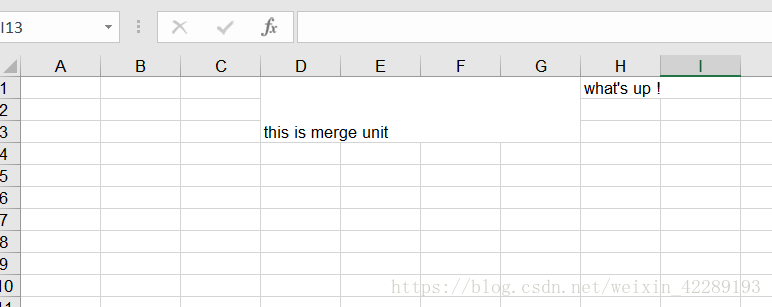
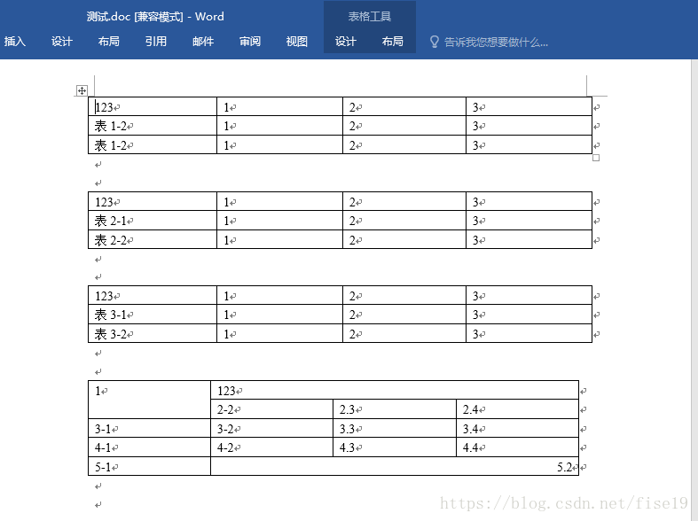

# ApachePOI

## 1、Apache POI

Apache POI 是 Apache 软件基金会的开放源码函数库，POI 提供 API 给 Java 程序对 Microsoft Office 格式档案读和写的功能

基本功能：

- HSSF - 提供读写 Microsoft Excel 格式档案的功能（03）
- XSSF - 提供读写 Microsoft Excel OOXML 格式档案的功能（07）
- HWPF - 提供读写 Microsoft Word 格式档案的功能
- HSLF - 提供读写 Microsoft PowerPoint 格式档案的功能
- HDGF - 提供读写 Microsoft Visio 格式档案


**依赖**

```xml
<!--导入依赖-->
<dependencies>
    <!--xls(03)-->
    <!-- https://mvnrepository.com/artifact/org.apache.poi/poi -->
    <dependency>
        <groupId>org.apache.poi</groupId>
        <artifactId>poi</artifactId>
        <version>4.1.2</version>
    </dependency>

    <!--xlsx(7)-->
    <!-- https://mvnrepository.com/artifact/org.apache.poi/poi-ooxml -->
    <dependency>
        <groupId>org.apache.poi</groupId>
        <artifactId>poi-ooxml</artifactId>
        <version>4.1.2</version>
    </dependency>

    <!--日期格式化工具-->
    <!-- https://mvnrepository.com/artifact/joda-time/joda-time -->
    <dependency>
        <groupId>joda-time</groupId>
        <artifactId>joda-time</artifactId>
        <version>2.10.6</version>
    </dependency>

    <!--test-->
    <!-- https://mvnrepository.com/artifact/junit/junit -->
    <dependency>
        <groupId>junit</groupId>
        <artifactId>junit</artifactId>
        <version>4.13</version>
        <scope>test</scope>
    </dependency>
</dependencies>
```

> poi-ooxml（07） 的依赖下包含 poi（03） 的依赖，如果两个都有需求可以只引入 poi-ooxml 依赖：
>
> 
>    
> 
>望日常开发 Maven 项目中多留意依赖结构，优化导入代码。


## 2、POI Excel 写

### 2.1、基础操作

```java
public class ExcelWriteTest {
    String PATH="C:\\Users\\Orichalcos\\Desktop\\";

    @Test
    public void testWrite03(){
        //1.创建一个工作簿
        Workbook workbook = new HSSFWorkbook();
        //2.创建一个工作表
        Sheet sheet = workbook.createSheet("Orichalcos");
        //3.创建一个行
        Row row1 = sheet.createRow(0);
        //4.创建一个单元格
        Cell cell11 = row1.createCell(0);
        cell11.setCellValue("今日新增观众");
        //(1,2)
        Cell cell12 = row1.createCell(1);
        cell12.setCellValue(666);

        //第二行
        Row row2 = sheet.createRow(1);
        Cell cell21 = row2.createCell(0);
        cell21.setCellValue("统计时间");
        //(2,2)
        Cell cell22 = row2.createCell(1);
        String time = new DateTime().toString("yyyy-MM-dd HH:mm:ss");
        cell22.setCellValue(time);

        //生成一张表（IO流）
        try {
            FileOutputStream fileOutputStream = new FileOutputStream(PATH + "Orichalcos03.xls");

            workbook.write(fileOutputStream);

            fileOutputStream.close();
        } catch (FileNotFoundException e) {
            e.printStackTrace();
        } catch (IOException e) {
            e.printStackTrace();
        }
        
        System.out.println("Orichalcos03.xls 生成完毕");
    }

    @Test
    public void testWrite07(){
        //1.创建一个工作簿
        Workbook workbook = new XSSFWorkbook();
        //2.创建一个工作表
        Sheet sheet = workbook.createSheet("Orichalcos");
        //3.创建一个行
        Row row1 = sheet.createRow(0);
        //4.创建一个单元格
        Cell cell11 = row1.createCell(0);
        cell11.setCellValue("今日新增观众");
        //(1,2)
        Cell cell12 = row1.createCell(1);
        cell12.setCellValue(666);

        //第二行
        Row row2 = sheet.createRow(1);
        Cell cell21 = row2.createCell(0);
        cell21.setCellValue("统计时间");
        //(2,2)
        Cell cell22 = row2.createCell(1);
        String time = new DateTime().toString("yyyy-MM-dd HH:mm:ss");
        cell22.setCellValue(time);

        //生成一张表（IO流）
        try {
            FileOutputStream fileOutputStream = new FileOutputStream(PATH + "Orichalcos07.xlsx");

            workbook.write(fileOutputStream);

            fileOutputStream.close();
        } catch (FileNotFoundException e) {
            e.printStackTrace();
        } catch (IOException e) {
            e.printStackTrace();
        }
        
        System.out.println("Orichalcos07.xls 生成完毕");
    }
}
```


### 2.2、数据批量导入

**大文件写 HSSF**

POI 导出 Excel 最常用的方式；但是此种方式的局限就是导出的行数至多为 65535 行，超出 65536 条后系统就会报错。此方式因为行数不足七万行所以一般不会发生内存不足的情况（OOM）。

```java
@Test
public void testWrite03BigData() {
    //时间
    long begin = System.currentTimeMillis();

    //创建一个簿
    Workbook workbook = new HSSFWorkbook();
    //创建表
    Sheet sheet = workbook.createSheet();
    //写入数据
    for (int rowNum = 0; rowNum < 65536; rowNum++) {
        Row row = sheet.createRow(rowNum);
        for (int cellNum = 0; cellNum < 10; cellNum++) {
            Cell cell = row.createCell(cellNum);
            cell.setCellValue(cellNum);
        }
    }
    System.out.println("over");
    try {
        FileOutputStream fileOutputStream = new FileOutputStream(PATH + "OrichalcosBig03.xls");
        workbook.write(fileOutputStream);
        fileOutputStream.close();
    } catch (FileNotFoundException e) {
        e.printStackTrace();
    } catch (IOException e) {
        e.printStackTrace();
    }
    long end = System.currentTimeMillis();
    System.out.println((double) (end - begin) / 1000);
}
```


**大文件写 XSSF**

这种形式的出现是为了突破 HSSF 的 65535 行局限。其对应的是 Excel2007（1048576 行，16384 列）扩展名为 “.xlsx”，最多可以导出 104 万行，不过这样就伴随着一个问题---OOM 内存溢出，原因是你所创建的 book、sheet、row、cell 等此时是存在内存的并没有持久化。

```java
@Test
public void testWrite07BigData() {
    //时间
    long begin = System.currentTimeMillis();

    //创建一个簿
    Workbook workbook = new XSSFWorkbook();
    //创建表
    Sheet sheet = workbook.createSheet();
    //写入数据
    for (int rowNum = 0; rowNum < 100000; rowNum++) {
        Row row = sheet.createRow(rowNum);
        for (int cellNum = 0; cellNum < 10; cellNum++) {
            Cell cell = row.createCell(cellNum);
            cell.setCellValue(cellNum);
        }
    }
    System.out.println("over");
    try {
        FileOutputStream fileOutputStream = new FileOutputStream(PATH + "OrichalcosBig07.xlsx");
        workbook.write(fileOutputStream);
        fileOutputStream.close();
    } catch (FileNotFoundException e) {
        e.printStackTrace();
    } catch (IOException e) {
        e.printStackTrace();
    }
    long end = System.currentTimeMillis();
    System.out.println((double) (end - begin) / 1000);
}
```


**大文件写 SXSSF**

从 POI 3.8 版本开始，提供了一种基于 XSSF 的低内存占用的 SXSSF 方式。对于大型 Excel 文件的创建，一个关键问题就是，要确保不会内存溢出。其实，就算生成很小的 Excel（比如几 Mb），它用掉的内存是远大于 Excel 文件实际的 size 的。如果单元格还有各种格式（比如，加粗，背景标红之类的），那它占用的内存就更多了。对于大型 Excel 的创建且不会内存溢出的，就只有 `SXSSFWorkbook` 了。它的原理很简单，用硬盘空间换内存（就像 `HashMap` 用空间换时间一样）。

`SXSSFWorkbook` 是 streaming 版本的 `XSSFWorkbook`，它只会保存最新的 Excel rows 在内存里供查看，在此之前的 Excel rows 都会被写入到硬盘里（Windows 电脑的话，是写入到 C 盘根目录下的 temp 文件夹）。被写入到硬盘里的 rows 是不可见的/不可访问的。只有还保存在内存里的才可以被访问到。

> 注意：过程中会产生临时文件，需要清理临时文件，默认 100 条记录被保存在内存中，如果超过这数量，则前面的数据被写入临时文件，如果想自定义内存中数据的数量，可以使用 `new SXSSFWorkbook(数量)`，SXSSF 仍然可能会消耗大量内存

```java
@Test
public void testWrite07BigDataS() {
    //时间
    long begin = System.currentTimeMillis();

    //创建一个簿
    Workbook workbook = new SXSSFWorkbook();
    //创建表
    Sheet sheet = workbook.createSheet();
    //写入数据
    for (int rowNum = 0; rowNum < 100000; rowNum++) {
        Row row = sheet.createRow(rowNum);
        for (int cellNum = 0; cellNum < 10; cellNum++) {
            Cell cell = row.createCell(cellNum);
            cell.setCellValue(cellNum);
        }
    }
    System.out.println("over");
    try {
        FileOutputStream fileOutputStream = new FileOutputStream(PATH + "OrichalcosBig07S.xlsx");
        workbook.write(fileOutputStream);
        fileOutputStream.close();
    } catch (FileNotFoundException e) {
        e.printStackTrace();
    } catch (IOException e) {
        e.printStackTrace();
    }
    //清除临时文件
    ((SXSSFWorkbook)workbook).dispose();
    long end = System.currentTimeMillis();
    System.out.println((double) (end - begin) / 1000);
}
```


### 2.3、合并单元格

```java
 public class Excel2 {
	public static void main(String[] args) throws IOException {
        FileOutputStream fos=new FileOutputStream("D:\\hebing.xls");
        HSSFWorkbook wb=new HSSFWorkbook();
		HSSFSheet sheet=wb.createSheet();
		/*
		 * 设定合并单元格区域范围
		 * 	firstRow  0-based
		 * 	lastRow   0-based
		 * 	firstCol  0-based
		 * 	lastCol   0-based
		 */
		CellRangeAddress cra=new CellRangeAddress(0, 2, 3, 6);		
		//在sheet里增加合并单元格
		sheet.addMergedRegion(cra);
		
		HSSFRow row = sheet.createRow(0);
		HSSFCell cell_1 = row.createCell(3);
		cell_1.setCellValue("this is merge unit ");
		//cell 位置3-6被合并成一个单元格，不管你怎样创建第4个cell还是第5个cell…然后在写数据。都是无法写入的。
		HSSFCell cell_2 = row.createCell(7);
		cell_2.setCellValue("what's up ! ");
		wb.write(fos);
		fos.close();
	}
}
```




**合并单元格的关键代码：**

```java
//创建合并单元格区域
CellRangeAddress cra=new CellRangeAddress(0, 2, 3, 6);        
//在sheet里增加合并单元格
sheet.addMergedRegion(cra);
```

创建合并单元格的方法 `CellRangeAdress(int firstRow, int lastRow, int fitstCol, int lastCol);` 中的参数四个参数分别表示，合并区域的第一行，最后一行，第一列，最后一列。并且合并区域的单元格数目必须大于 2，否则出错。


### 2.4、基于注解的导出

数据库 Excel 导出操作代码过于冗长惨不忍睹，无法复用。

使用依赖：

```xml
<dependency>
    <groupId>org.apache.poi</groupId>
    <artifactId>poi</artifactId>
    <version>3.9</version>
</dependency>
<dependency>
    <groupId>org.apache.poi</groupId>
    <artifactId>poi-ooxml</artifactId>
    <version>3.9</version>
</dependency>
<dependency>
    <groupId>org.apache.poi</groupId>
    <artifactId>poi-ooxml-schemas</artifactId>
    <version>3.9</version>
</dependency>
<dependency>
    <groupId>org.apache.poi</groupId>
    <artifactId>poi-scratchpad</artifactId>
    <version>3.9</version>
</dependency>
<dependency>
    <groupId>org.apache.commons</groupId>
    <artifactId>commons-lang3</artifactId>
    <version>3.0</version>
</dependency>
```

1. 自定义注解：
	```java
	import java.lang.annotation.ElementType;
	import java.lang.annotation.Retention;
	import java.lang.annotation.RetentionPolicy;
	import java.lang.annotation.Target;
	
	@Retention(RetentionPolicy.RUNTIME)
	@Target(ElementType.FIELD)
	public @interface Excel {
	    /**
	     * 导出到Excel中的名字.
	     */
	    String name();
	
	    /**
	     * 日期格式, 如: yyyy-MM-dd
	     */
	    String dateFormat() default "";
	
	    /**
	     * 读取内容转表达式 (如: 0=男,1=女,2=未知)
	     */
	    String readConverterExp() default "";
	
	    /**
	     * 导出时在excel中每个列的高度 单位为字符
	     */
	    double height() default 14;
	
	    /**
	     * 导出时在excel中每个列的宽 单位为字符
	     */
	    double width() default 20;
	
	    /**
	     * 文字后缀,如% 90 变成90%
	     */
	    String suffix() default "";
	
	    /**
	     * 当值为空时,字段的默认值
	     */
	    String defaultValue() default "";
	
	    /**
	     * 提示信息
	     */
	    String prompt() default "";
	
	    /**
	     * 设置只能选择不能输入的列内容.
	     */
	    String[] combo() default {};
	
	    /**
	     * 是否导出数据,应对需求:有时我们需要导出一份模板,这是标题需要但内容需要用户手工填写.
	     */
	    boolean isExport() default true;
	}
	```

2. 实体类：
	```java
	import com.fasterxml.jackson.annotation.JsonFormat;
	import lombok.Data;
	import java.util.Date;
	
	@Data
	public class BankBankArrearsVO {
	    private Long id;
	    @JsonFormat(pattern = "yyyy-MM-dd")
	    @Excel(name = "日期", dateFormat = "yyyy-MM-dd")
	    private Date occurrenceDate;
	    @Excel(name = "凭证字")
	    private String voucherWord;
	    @Excel(name = "凭证号")
	    private String voucherCode;
	    @Excel(name = "摘要")
	    private String remark;
	    @Excel(name = "借方金额")
	    private Double debtorMoney;
	    @Excel(name = "贷方金额")
	    private Double creditorMoney;
	    @Excel(name = "原币金额")
	    private Double originalCurrencyMoney;
	    @Excel(name = "汇率")
	    private Double exchangeRate;
	    @Excel(name = "结算方式")
	    private String clearingForm;
	    @Excel(name = "结算号")
	    private String settlementCode;
	}
	```

3. 解析工具类：
	```java
	import org.apache.commons.lang3.StringUtils;
	import org.apache.poi.hssf.usermodel.DVConstraint;
	import org.apache.poi.hssf.usermodel.HSSFDataValidation;
	import org.apache.poi.hssf.usermodel.HSSFFont;
	import org.apache.poi.hssf.util.HSSFColor;
	import org.apache.poi.ss.usermodel.*;
	import org.apache.poi.ss.util.CellRangeAddressList;
	import org.apache.poi.xssf.streaming.SXSSFWorkbook;
	
	import javax.servlet.http.HttpServletResponse;
	import java.io.IOException;
	import java.io.InputStream;
	import java.io.OutputStream;
	import java.lang.reflect.Field;
	import java.net.URLEncoder;
	import java.text.SimpleDateFormat;
	import java.util.*;
	
	public class ExcelUtil<T> {
	
	    private final Class<T> clazz;
	
	    public ExcelUtil(Class<T> clazz) {
	        this.clazz = clazz;
	    }
	
	    /**
	     * 对List<Map>数据源将其里面的数据导入到excel表单
	     *
	     * @param list      导出数据集合
	     * @param title     列名
	     * @param sheetName 工作表的名称
	     * @param response  响应
	     * @date 2021/12/17/14:39
	     */
	    public static void exportMapExcel(List<Map<String, Object>> list, String[] title, String sheetName, HttpServletResponse response) throws IOException {
	        if (null == list || list.size() == 0) {
	            return;
	        }
	        SXSSFWorkbook workbook = new SXSSFWorkbook();
	        Sheet sheet = workbook.createSheet();
	        workbook.setSheetName(0, sheetName);
	        // 产生第一行，写入标题
	        Row row = sheet.createRow(0);
	        try (OutputStream outputStream = response.getOutputStream()) {
	            // 产生单元格
	            Cell cell;
	            for (int i = 0; i < title.length; i++) {
	                cell = row.createCell(i);
	                cell.setCellType(Cell.CELL_TYPE_STRING);
	                cell.setCellValue(title[i]);
	            }
	            int cellIdx;
	            // 写入各条记录,每条记录对应excel表中的一行
	            for (int i = 0; i < list.size(); i++) {
	                row = sheet.createRow(i + 1);
	                // 得到导出对象.
	                Map<String, Object> map = list.get(i);
	                Set<String> keySet = map.keySet();
	                Iterator<String> values = keySet.iterator();
	                cellIdx = 0;
	                while (values.hasNext()) {
	                    Object value = map.get(values.next());
	                    cell = row.createCell(cellIdx);
	                    cell.setCellValue(value.toString());
	                    cellIdx++;
	                }
	            }
	            response.setHeader("content-Type", "application/vnd.ms-excel");
	            response.setContentType("application/vnd.openxmlformats-officedocument.spreadsheetml.sheet;charset=utf-8");
	            response.setHeader("Content-Disposition", "attachment;filename=" + URLEncoder.encode(sheetName, "UTF-8"));
	            workbook.write(outputStream);
	            outputStream.flush();
	        }
	    }
	
	    /**
	     * 设置单元格上提示
	     *
	     * @param sheet         要设置的sheet.
	     * @param promptContent 内容
	     * @param firstCol      开始列
	     * @param endCol        结束列
	     * @date 2021/12/17/14:41
	     */
	    private static void setPrompt(Sheet sheet, String promptContent, int firstCol, int endCol) {
	        // 构造constraint对象
	        DVConstraint constraint = DVConstraint.createCustomFormulaConstraint("DD1");
	        // 四个参数分别是：起始行、终止行、起始列、终止列
	        CellRangeAddressList regions = new CellRangeAddressList(1, 100, firstCol, endCol);
	        // 数据有效性对象
	        HSSFDataValidation dataValidationView = new HSSFDataValidation(regions, constraint);
	        dataValidationView.createPromptBox("", promptContent);
	        sheet.addValidationData(dataValidationView);
	    }
	
	    /**
	     * 设置某些列的值只能输入预制的数据,显示下拉框.
	     *
	     * @param sheet    要设置的sheet.
	     * @param textList 下拉框显示的内容
	     * @param firstCol 开始列
	     * @param endCol   结束列
	     * @date 2021/12/17/14:41
	     */
	    private static void setValidation(Sheet sheet, String[] textList, int firstCol, int endCol) {
	        // 加载下拉列表内容
	        DVConstraint constraint = DVConstraint.createExplicitListConstraint(textList);
	        // 设置数据有效性加载在哪个单元格上,四个参数分别是：起始行、终止行、起始列、终止列
	        CellRangeAddressList regions = new CellRangeAddressList(1, 100, firstCol, endCol);
	        // 数据有效性对象
	        HSSFDataValidation dataValidationList = new HSSFDataValidation(regions, constraint);
	        sheet.addValidationData(dataValidationList);
	    }
	
	    /**
	     * 解析导出值 0=男,1=女,2=未知
	     *
	     * @param propertyValue 参数值
	     * @param converterExp  翻译注解
	     * @return 解析后值
	     * @date 2021/12/17/14:41
	     */
	    private static String convertByExp(String propertyValue, String converterExp) {
	        String[] convertSource = converterExp.split(",");
	        for (String item : convertSource) {
	            String[] itemArray = item.split("=");
	            if (itemArray[0].equals(propertyValue)) {
	                return itemArray[1];
	            }
	        }
	        return propertyValue;
	    }
	
	    /**
	     * 对excel表单指定表格索引名转换成list
	     *
	     * @param sheetName 表格索引名,不填默认选择第一个表格
	     * @param input     输入流
	     * @return 转换后集合
	     * @date 2021/12/17/14:41
	     */
	    public List<T> importExcel(String sheetName, InputStream input) throws Exception {
	        List<T> list = new ArrayList<T>();
	        Workbook workbook = WorkbookFactory.create(input);
	        Sheet sheet;
	        if (StringUtils.isNotEmpty(sheetName)) {
	            // 如果指定sheet名,则取指定sheet中的内容.
	            sheet = workbook.getSheet(sheetName);
	        } else {
	            // 如果传入的sheet名不存在则默认指向第1个sheet.
	            sheet = workbook.getSheetAt(0);
	        }
	        int rows = sheet.getPhysicalNumberOfRows();
	
	        if (rows > 0) {
	            // 默认序号
	            int serialNum = 0;
	            // 有数据时才处理 得到类的所有field.
	            Field[] allFields = clazz.getDeclaredFields();
	            // 定义一个map用于存放列的序号和field.
	            Map<Integer, Field> fieldsMap = new HashMap<Integer, Field>();
	            for (Field field : allFields) {
	                // 将有注解的field存放到map中.
	                if (field.isAnnotationPresent(Excel.class)) {
	                    // 设置类的私有字段属性可访问.
	                    field.setAccessible(true);
	                    fieldsMap.put(++serialNum, field);
	                }
	            }
	            for (int i = 1; i < rows; i++) {
	                // 从第2行开始取数据,默认第一行是表头.
	                Row row = sheet.getRow(i);
	                T entity = null;
	                for (int j = 0; j < serialNum; j++) {
	                    Cell cell = row.getCell(j);
	                    if (cell == null) {
	                        continue;
	                    } else {
	                        // 先设置Cell的类型，然后就可以把纯数字作为String类型读进来了
	                        row.getCell(j).setCellType(Cell.CELL_TYPE_STRING);
	                        cell = row.getCell(j);
	                    }
	
	                    String c = cell.getStringCellValue();
	                    if (StringUtils.isEmpty(c)) {
	                        continue;
	                    }
	
	                    // 如果不存在实例则新建
	                    entity = (entity == null ? clazz.newInstance() : entity);
	                    // 从map中得到对应列的field.
	                    Field field = fieldsMap.get(j + 1);
	                    // 取得类型,并根据对象类型设置值.
	                    Class<?> fieldType = field.getType();
	                    if (String.class == fieldType) {
	                        field.set(entity, c);
	                    } else if ((Integer.TYPE == fieldType) || (Integer.class == fieldType)) {
	                        field.set(entity, Integer.parseInt(c));
	                    } else if ((Long.TYPE == fieldType) || (Long.class == fieldType)) {
	                        field.set(entity, Long.valueOf(c));
	                    } else if ((Float.TYPE == fieldType) || (Float.class == fieldType)) {
	                        field.set(entity, Float.valueOf(c));
	                    } else if ((Short.TYPE == fieldType) || (Short.class == fieldType)) {
	                        field.set(entity, Short.valueOf(c));
	                    } else if ((Double.TYPE == fieldType) || (Double.class == fieldType)) {
	                        field.set(entity, Double.valueOf(c));
	                    } else if (Character.TYPE == fieldType) {
	                        if (c.length() > 0) {
	                            field.set(entity, c.charAt(0));
	                        }
	                    } else if (Date.class == fieldType) {
	                        if (cell.getCellType() == Cell.CELL_TYPE_NUMERIC) {
	                            SimpleDateFormat sdf = new SimpleDateFormat("yyyy-MM-dd HH:mm:ss");
	                            field.set(entity, sdf.format(cell.getNumericCellValue()));
	                        } else {
	                            field.set(entity, DateUtil.getJavaDate(Double.parseDouble(c)));
	                        }
	                    } else if (java.math.BigDecimal.class == fieldType) {
	                        field.set(entity, cell.getStringCellValue());
	                    }
	                }
	                if (entity != null) {
	                    list.add(entity);
	                }
	            }
	        }
	
	        return list;
	    }
	
	    /**
	     * 导出模板
	     *
	     * @param sheetName 工作表的名称
	     * @param response  响应
	     * @date 2021/12/17/13:41
	     */
	    public void exportExcelTemplate(String sheetName, HttpServletResponse response) throws Exception {
	        List<T> list = new ArrayList<>();
	        exportExcel(list, sheetName, response);
	    }
	
	    /**
	     * 对list数据源将其里面的数据导入到excel表单
	     *
	     * @param list      导出数据集合
	     * @param sheetName 工作表的名称
	     * @param response  响应
	     * @date 2021/12/17/13:42
	     */
	    public void exportExcel(List<T> list, String sheetName, HttpServletResponse response) throws Exception {
	        SXSSFWorkbook workbook = new SXSSFWorkbook();
	        Sheet sheet = workbook.createSheet();
	        workbook.setSheetName(0, sheetName);
	        Row row = sheet.createRow(0);
	        try (OutputStream outputStream = response.getOutputStream()) {
	            // 得到所有定义字段
	            Field[] allFields = clazz.getDeclaredFields();
	            List<Field> fields = new ArrayList<>();
	            // 得到所有field并存放到一个list中.
	            for (Field field : allFields) {
	                if (field.isAnnotationPresent(Excel.class)) {
	                    fields.add(field);
	                }
	            }
	            Cell cell;
	            // 写入各个字段的列头名称
	            for (int i = 0; i < fields.size(); i++) {
	                Field field = fields.get(i);
	                Excel attr = field.getAnnotation(Excel.class);
	                // 创建列
	                cell = row.createCell(i);
	                // 设置列中写入内容为String类型
	                cell.setCellType(Cell.CELL_TYPE_STRING);
	                CellStyle cellStyle = workbook.createCellStyle();
	                cellStyle.setAlignment(CellStyle.ALIGN_CENTER);
	                cellStyle.setVerticalAlignment(CellStyle.ALIGN_CENTER);
	                Font font = workbook.createFont();
	                if (attr.name().contains("注：")) {
	                    font.setColor(HSSFFont.COLOR_RED);
	                    cellStyle.setFont(font);
	                    cellStyle.setFillForegroundColor(HSSFColor.YELLOW.index);
	                    sheet.setColumnWidth(i, 6000);
	                } else {
	                    // 粗体显示
	                    font.setBoldweight(Font.BOLDWEIGHT_BOLD);
	                    // 选择需要用到的字体格式
	                    cellStyle.setFont(font);
	                    cellStyle.setFillForegroundColor(HSSFColor.LIGHT_YELLOW.index);
	                    // 设置列宽
	                    sheet.setColumnWidth(i, (int) ((attr.width() + 0.72) * 256));
	                    row.setHeight((short) (attr.height() * 20));
	                }
	                cellStyle.setFillPattern(CellStyle.SOLID_FOREGROUND);
	                cellStyle.setWrapText(true);
	                cell.setCellStyle(cellStyle);
	                // 写入列名
	                cell.setCellValue(attr.name());
	                // 如果设置了提示信息则鼠标放上去提示.
	                if (StringUtils.isNotEmpty(attr.prompt())) {
	                    // 这里默认设了2-101列提示.
	                    setPrompt(sheet, attr.prompt(), i, i);
	                }
	                // 如果设置了combo属性则本列只能选择不能输入
	                if (attr.combo().length > 0) {
	                    // 这里默认设了2-101列只能选择不能输入.
	                    setValidation(sheet, attr.combo(), i, i);
	                }
	            }
	            // 写入各条记录,每条记录对应excel表中的一行
	            CellStyle cs = workbook.createCellStyle();
	            cs.setAlignment(CellStyle.ALIGN_CENTER);
	            cs.setVerticalAlignment(CellStyle.ALIGN_CENTER);
	            fillingData(list, sheet, fields, cs);
	            response.setContentType("application/vnd.openxmlformats-officedocument.spreadsheetml.sheet;charset=utf-8");
	            response.setHeader("content-disposition", "attachment;filename=" + URLEncoder.encode(sheetName, "UTF-8"));
	            workbook.write(outputStream);
	            outputStream.flush();
	        }
	    }
	
	    /**
	     * 数据填充
	     *
	     * @param list   要导出的数据
	     * @param sheet  工作表
	     * @param fields 字段
	     * @param cs     样式
	     * @date 2021/12/17/13:38
	     */
	    private void fillingData(List<T> list, Sheet sheet, List<Field> fields, CellStyle cs) throws IllegalAccessException {
	        if (list.size() > 0) {
	            for (int i = 0; i < list.size(); i++) {
	                Row row = sheet.createRow(i + 1);
	                // 得到导出对象.
	                T vo = list.get(i);
	                for (int j = 0; j < fields.size(); j++) {
	                    // 获得field.
	                    Field field = fields.get(j);
	                    // 设置实体类私有属性可访问
	                    field.setAccessible(true);
	                    Excel attr = field.getAnnotation(Excel.class);
	                    // 设置行高
	                    row.setHeight((short) (attr.height() * 20));
	                    // 根据Excel中设置情况决定是否导出,有些情况需要保持为空,希望用户填写这一列.
	                    if (attr.isExport()) {
	                        // 创建cell
	                        Cell cell = row.createCell(j);
	                        cell.setCellStyle(cs);
	                        if (vo == null) {
	                            // 如果数据存在就填入,不存在填入空格.
	                            cell.setCellValue("");
	                            continue;
	                        }
	                        String dateFormat = attr.dateFormat();
	                        String readConverterExp = attr.readConverterExp();
	                        if (StringUtils.isNotEmpty(dateFormat)) {
	                            cell.setCellValue(new SimpleDateFormat(dateFormat).format((Date) field.get(vo)));
	                        } else if (StringUtils.isNotEmpty(readConverterExp)) {
	                            cell.setCellValue(convertByExp(String.valueOf(field.get(vo)), readConverterExp));
	                        } else {
	                            cell.setCellType(Cell.CELL_TYPE_STRING);
	                            // 如果数据存在就填入,不存在填入空格.
	                            cell.setCellValue(field.get(vo) == null ? attr.defaultValue() : field.get(vo) + attr.suffix());
	                        }
	                    }
	                }
	            }
	        }
	    }
	}
	
	```

4. 使用：
	```java
	@ApiOperation("导出")
	@GetMapping("/export")
	public void export(HttpServletResponse response, BankBankArrearsVOQuery query) {
	    try {
	        //获取要导出的数据
	        List<BankBankArrearsVO> arrears = service.findList(query);
	        ExcelUtil<BankBankArrearsVO> excelUtil = new ExcelUtil<>(BankBankArrearsVO.class);
	        excelUtil.exportExcel(arrears, "导出数据.xlsx", response);
	    } catch (Exception e) {
	        LOGGER.error("export", e);
	    }
	}
	```


## 3、POI Excel 读

### 3.1、基础操作

```java
public class ExcelReadTest {
    String PATH = "C:\\Users\\Orichalcos\\Desktop\\";

    @Test
    public void testRead03() throws IOException {
        //获取文件流
        FileInputStream fileInputStream = new FileInputStream(PATH + "Orichalcos.xls");

        //1.创建一个工作簿，使用 Excel 能能操作的这边他都可以操作
        Workbook workbook = new HSSFWorkbook(fileInputStream);
        //2.得到表
        Sheet sheet = workbook.getSheetAt(0);
        //3.得到行
        Row row = sheet.getRow(1);
        //4.得到列
        Cell cell = row.getCell(3);

        //读取值的时候,一定要注意类型
        //getStringCellValue 字符串类型
        //System.out.println(cell.getStringCellValue());
        System.out.println(cell.getDateCellValue());
        fileInputStream.close();
    }

    @Test
    public void testRead07() throws IOException {
        //获取文件流
        FileInputStream fileInputStream = new FileInputStream(PATH + "Orichalcos.xlsx");

        //1.创建一个工作簿，使用 Excel 能能操作的这边他都可以操作
        Workbook workbook = new XSSFWorkbook(fileInputStream);
        //2.得到表
        Sheet sheet = workbook.getSheetAt(0);
        //3.得到行
        Row row = sheet.getRow(1);
        //4.得到列
        Cell cell = row.getCell(3);

        //读取值的时候,一定要注意类型
        //getStringCellValue 字符串类型
        //System.out.println(cell.getStringCellValue());
        System.out.println(cell.getDateCellValue());
        fileInputStream.close();
    }
}
```


### 3.2、读取不同类型数据

```java
@Test
public void testCellType() throws IOException {
    //获取文件流
    FileInputStream fileInputStream = new FileInputStream(PATH + "Orichalcos.xls");

    //创建一个工作簿
    Workbook workbook = new HSSFWorkbook(fileInputStream);
    Sheet sheet = workbook.getSheetAt(0);
    
    //获取标题内容
    Row rowTitle = sheet.getRow(0);
    if (rowTitle != null) {
        int cellCount = rowTitle.getPhysicalNumberOfCells();
        for (int cellNum = 0; cellNum < cellCount; cellNum++) {
            Cell cell = rowTitle.getCell(cellNum);
            if (cell != null) {
                String cellValue = cell.getStringCellValue();
                System.out.print(cellValue + "|");
            }
        }
        System.out.println();
    }

    //获取表中的日期
    int rowCount = sheet.getPhysicalNumberOfRows();
    for (int rowNum = 1; rowNum < rowCount; rowNum++) {
        Row rowData = sheet.getRow(rowNum);
        if (rowData != null) {
            //读取列
            int cellCount = rowTitle.getPhysicalNumberOfCells();
            for (int cellNum = 0; cellNum < cellCount; cellNum++) {
                System.out.print("[" + (rowNum + 1) + "-" + (cellNum + 1) + "]");

                Cell cell = rowData.getCell(cellNum);
                //匹配列的数据类型
                CellType cellType = cell.getCellType();
                String cellValue = "";

                switch (cellType) {
                    case STRING://字符串
                        System.out.print("【String】");
                        cellValue = cell.getStringCellValue();
                        break;
                    case BOOLEAN://布尔
                        System.out.print("【Boolean】");
                        cellValue = String.valueOf(cell.getBooleanCellValue());
                        break;
                    case BLANK://空
                        System.out.print("【Blank】");
                        break;
                    case NUMERIC://数字(日期、普通数字)
                        System.out.print("【Numeric】");
                        if (HSSFDateUtil.isCellDateFormatted(cell)) {//日期
                            System.out.print("【日期】");
                            Date date = cell.getDateCellValue();
                            cellValue = new DateTime(date).toString("yyyy-MM-dd");
                        } else {
                            //不是日期格式，防止数字过长
                            System.out.print("【转换为字符串输出】");
                            cell.setCellType(CellType.STRING);
                            cellValue = cell.toString();
                        }
                        break;
                    case ERROR:
                        System.out.print("【数据类型错误】");
                        break;
                }
                System.out.println(cellValue);
            }
        }
    }
    fileInputStream.close();
}
```


### 3.3、计算公式

```java
@Test
public void testFormula() throws IOException {
    FileInputStream inputStream = new FileInputStream(PATH + "公式.xls");
    Workbook workbook = new HSSFWorkbook(inputStream);
    Sheet sheet = workbook.getSheetAt(0);

    Row row = sheet.getRow(3);
    Cell cell =row.getCell(0);
    System.out.println(cell.getNumericCellValue());

    //拿到计算公式
    FormulaEvaluator formulaEvaluator = new HSSFFormulaEvaluator((HSSFWorkbook) workbook);

    //输出单元格的内容
    CellType cellType = cell.getCellType();
    switch (cellType){
        case FORMULA://公式
            String formula = cell.getCellFormula();
            System.out.println(formula);

            //计算
            CellValue evaluate = formulaEvaluator.evaluate(cell);
            String string = evaluate.formatAsString();
            System.out.println(string);
            break;
    }
}
```


## 4、POI Word 读

使用 POI 读取文档中的表格，当有多个表格时可以指定需要读取的表格，同时支持读取 docx 和 doc 格式。需要添加 poi 的 jar 包：

```xml
<!--apache-POI-->
<dependency>
    <groupId>org.apache.poi</groupId>
    <artifactId>poi-ooxml</artifactId>
    <version>3.14</version>
</dependency>
<dependency>
    <groupId>org.apache.poi</groupId>
    <artifactId>ooxml-schemas</artifactId>
    <version>1.3</version>
</dependency>
```

> 关于 Apache POI 的依赖版本注意保持统一，否则可能会报 `java.lang.NoSuchMethodError`




```java
 /**
 * 
 * 读取word文档中表格数据，支持doc、docx
 * @author Fise19
 * 
 */
public class ExportDoc {
	public static void main(String[] args) {
		ExportDoc test = new ExportDoc();
		String filePath = "D:\\new\\测试.docx";
		//String filePath = "D:\\new\\测试.doc";
		test.testWord(filePath);
	}
	/**
	 * 读取文档中表格
	 * @param filePath
	 */
	public void testWord(String filePath){
		try{
			FileInputStream in = new FileInputStream(filePath);//载入文档
			// 处理docx格式 即office2007以后版本
			if(filePath.toLowerCase().endsWith("docx")){
				//word 2007 图片不会被读取， 表格中的数据会被放在字符串的最后   
				XWPFDocument xwpf = new XWPFDocument(in);//得到word文档的信息
				Iterator<XWPFTable> it = xwpf.getTablesIterator();//得到word中的表格
				// 设置需要读取的表格  set是设置需要读取的第几个表格，total是文件中表格的总数
				int set = 2, total = 4;
				int num = set;
				// 过滤前面不需要的表格
				for (int i = 0; i < set-1; i++) {
					it.hasNext();
					it.next();
				}
				while(it.hasNext()){
					XWPFTable table = it.next();  
					System.out.println("这是第" + num + "个表的数据");
					List<XWPFTableRow> rows = table.getRows(); 
					//读取每一行数据
					for (int i = 0; i < rows.size(); i++) {
						XWPFTableRow  row = rows.get(i);
						//读取每一列数据
						List<XWPFTableCell> cells = row.getTableCells(); 
						for (int j = 0; j < cells.size(); j++) {
							XWPFTableCell cell = cells.get(j);
							//输出当前的单元格的数据
							System.out.print(cell.getText() + "\t");
						}
						System.out.println();
					}
					// 过滤多余的表格
					while (num < total) {
						it.hasNext();
						it.next();
						num += 1;
					}
				}
			}else{
				// 处理doc格式 即office2003版本
				POIFSFileSystem pfs = new POIFSFileSystem(in);   
				HWPFDocument hwpf = new HWPFDocument(pfs);   
				Range range = hwpf.getRange();//得到文档的读取范围
				TableIterator it = new TableIterator(range);
				// 迭代文档中的表格
				// 如果有多个表格只读取需要的一个 set是设置需要读取的第几个表格，total是文件中表格的总数
				int set = 1, total = 4;
				int num = set;
				for (int i = 0; i < set-1; i++) {
					it.hasNext();
					it.next();
				}
				while (it.hasNext()) {   
					Table tb = (Table) it.next();   
					System.out.println("这是第" + num + "个表的数据");
					//迭代行，默认从0开始,可以依据需要设置i的值,改变起始行数，也可设置读取到那行，只需修改循环的判断条件即可
					for (int i = 0; i < tb.numRows(); i++) {   
						TableRow tr = tb.getRow(i);   
						//迭代列，默认从0开始
						for (int j = 0; j < tr.numCells(); j++) {   
							TableCell td = tr.getCell(j);//取得单元格
							//取得单元格的内容
							for(int k = 0; k < td.numParagraphs(); k++){   
								Paragraph para = td.getParagraph(k); 
								String s = para.text();
								//去除后面的特殊符号
								if(null != s && !"".equals(s)){
									s = s.substring(0, s.length()-1);
								}
								System.out.print(s + "\t");
							}
						}
						System.out.println();
					} 
					// 过滤多余的表格
					while (num < total) {
						it.hasNext();
						it.next();
						num += 1;
					}
				}
			}
		}catch(Exception e){
			e.printStackTrace();
		}
	}
}
```

```
这是第2个表的数据
123	1	2	3	
表2-1	1	2	3	
表2-2	1	2	3	
```


### 4.1、Word 转 HTML

**07 版 Word 转 Html**

```java
public static String docxToHtml(File file) {
    //获取word文件名（去掉扩展名）
    //String fileName = file.getName().substring(0, file.getName().lastIndexOf("."));
    //存放图片的路径（如果不存在创建）
    String imagePath = "E:\\upload";
    File imageFolder = new File(imagePath);
    if (!imageFolder.exists()) {
        imageFolder.mkdirs();
    }
    //生成的html文件的名字
    //String htmlFileName = imagePath + File.separator + fileName + ".html";

    //加载word文档生成XWPFDocument对象
    try (XWPFDocument xwpfDocument = new XWPFDocument(new FileInputStream(file));
         //创建文件数据流输出转换的html文件
         //OutputStream outputStream = new FileOutputStream(htmlFileName);
         //也可以使用字符数组流获取解析的内容
         OutputStream outputStream = new ByteArrayOutputStream()
    ) {
        //解析XHTML配置（这里设置URIResolver来设置图片存放的目录）
        XHTMLOptions xhtmlOptions = XHTMLOptions.create();
        //存放图片的文件夹
        xhtmlOptions.setExtractor(new FileImageExtractor(imageFolder));
        //html中图片的路径
        xhtmlOptions.URIResolver(new FileURIResolver(imageFolder));
        //不忽略未使用的样式
        xhtmlOptions.setIgnoreStylesIfUnused(false);
        
        xhtmlOptions.setFragment(true);
        //将XWPFDocument转换为XHTML
        XHTMLConverter.getInstance().convert(xwpfDocument, outputStream, xhtmlOptions);
        logger.info("docx转html成功,文件名：" + file.getName());
        return outputStream.toString();
        //return htmlFileName;
    } catch (Exception e) {
        logger.error("docx转html失败，文件名：" + file.getName());
        return null;
    }
}
```

在 Web 中转化后的 html  页面无法访问图片的问题：因为 ` xhtmlOptions.URIResolver(new FileURIResolver(imageFolder));` 生成的 url 是绝对路径，可以将其改为 `xhtmlOptions.URIResolver(new BasicURIResolver(""));`，同时需要对 `E:\\upload` 路径进行映射：

```yaml
web:
  upload-path: E:/upload
spring:
  mvc:
    static-path-pattern: /**
  resources:
    # 对上传的地址E:/进行映射
    static-locations: classpath:/META-INF/resources/,classpath:/resources/,classpath:/static/,classpath:/public/,file:${web.upload-path}
```


**03 版 Word 转 Html**

03 版的 Word 需要额外导入以下依赖：

```xml
<!--POI Word(03)转为HTML工具-->
<dependency>
    <groupId>org.apache.poi</groupId>
    <artifactId>poi-scratchpad</artifactId>
    <version>3.14</version>
</dependency>
<dependency>
    <groupId>fr.opensagres.xdocreport</groupId>
    <artifactId>fr.opensagres.poi.xwpf.converter.xhtml</artifactId>
    <version>2.0.1</version>
</dependency>
<!--如果遇见jar包冲突可以替换为这个jar包-->
<!--<dependency>-->
<!--    <groupId>fr.opensagres.xdocreport</groupId>-->
<!--    <artifactId>org.apache.poi.xwpf.converter.xhtml</artifactId>-->
<!--    <version>1.0.6</version>-->
<!--</dependency>-->
```

```java
public static String docToHtml(File file) {
    //获取word的文件名（去掉扩展名）
    String fileName = file.getName().substring(0, file.getName().lastIndexOf("."));
    //图片存储路径（如果不存在则创建）
    String imagePath = "E:\\upload";
    //生成的html文件名
    //String htmlFileName = imagePath + File.separator + fileName + ".html";
    try (//使用文件输出流获取解析内容
        //OutputStream outputStream = new FileOutputStream(htmlFileName);
        //也可以使用字符数组流获取解析的内容
        ByteArrayOutputStream outputStream = new ByteArrayOutputStream()
    ) {
        HWPFDocument hwpfDocument = new HWPFDocument(new FileInputStream(file));
        Document document = DocumentBuilderFactory.newInstance().newDocumentBuilder().newDocument();
        WordToHtmlConverter wordToHtmlConverter = new WordToHtmlConverter(document);
        wordToHtmlConverter.setPicturesManager((content, pictureType, name, width, height) -> {
            File folder = new File(imagePath + File.separator + fileName);
            //图片目录不存在则创建
            if (!folder.exists()) {
                folder.mkdirs();
            }
            try (FileOutputStream fileOutputStream = new FileOutputStream(folder + File.separator + name)) {
                fileOutputStream.write(content);
            } catch (IOException e) {
                e.printStackTrace();
            }
            return folder + File.separator + name;
        });
        //解析word文档
        wordToHtmlConverter.processDocument(hwpfDocument);
        Document documentHtml = wordToHtmlConverter.getDocument();
        DOMSource domSource = new DOMSource(documentHtml);

        StreamResult streamResult = new StreamResult(outputStream);

        Transformer transformer = TransformerFactory.newInstance().newTransformer();
        transformer.setOutputProperty(OutputKeys.ENCODING, "UTF-8");
        transformer.setOutputProperty(OutputKeys.INDENT, "yes");
        transformer.setOutputProperty(OutputKeys.METHOD, "html");
        transformer.transform(domSource, streamResult);
        logger.info("doc转html成功，文件名：" + file.getName());
        return new String(outputStream.toByteArray(), StandardCharsets.UTF_8);
        //return htmlFileName;
    } catch (IOException | ParserConfigurationException | TransformerException e) {
        logger.error("doc转html失败，文件名：" + file.getName());
        return null;
    }
}
```

