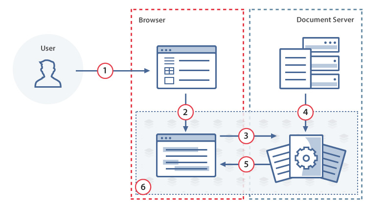
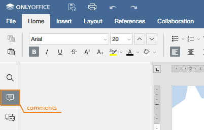
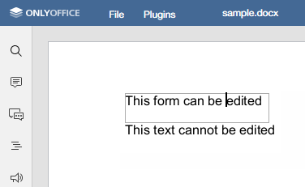

# 1、OnlyOffice

## 1.1、基本概念和安装

OnlyOffice（前身为TeamLab ），亦被称为 ONLYOFFICE， 是一个开源办公套件，包括文本文档、电子表格、演示文稿和可填写表单的编辑器。
ONLYOFFICE 文档提供以下功能：

- 创建、编辑和查看文本文档、电子表格、演示文稿和可填写表单。
- 与其他团队成员实时协作处理文件。

[ONLYOFFICE 文档 API](https://api.onlyoffice.com/zh-CN/docs/docs-api/get-started/basic-concepts/) 用于让开发人员将 ONLYOFFICE 文档/电子表格/演示文稿/ PDF 编辑器集成到自己的网站中，并设置和管理编辑器。通过自定义用户界面，可将 ONLYOFFICE 文档定制为与你的应用程序或网页实现无缝融合的组件。


### 1.1.1、 Docker 安装

推荐使用 [Docker](https://www.docker.com/) 进行集成，避免了出现服务器系统的不同而重新适配的问题。Docker的思想来自于集装箱，集装箱解决了什么问题？在一艘大船上，可以把货物规整的摆放起来。并且各种各样的货物被集装箱标准化了，集装箱和集装箱之间不会互相影响。那么我就不需要专门运送水果的船和专门运送化学品的船了。只要这些货物在集装箱里封装的好好的，那我就可以用一艘大船把他们都运走。


#### 安装

1. 拉取 OnlyOffice 镜像：

   ```shell
   docker pull onlyoffice/documentserver
   ```

   查看镜像：

   ```shell
   docker images
   ```

2. 运行镜像（创建容器），并绑定端口（这里绑定 9000）：

   ```shell
   docker run -itd --name onlyoffice -p 9000:80 -e JWT_ENABLED=false onlyoffice/documentserver
   ```

   > [!NOTE]
   >
   > `JWT_ENABLED=false` 代表不走 JWT 验证，避免访问 onlyoffice 造成指令错误问题。

   查看正在运行的容器，后面加上 `-a` 查看所有容器：

   ```shell
   docker ps
   ```

3. 进入容器：

   ```shell
   docker exec -it onlyoffice bash
   ```

4. 修改配置文件：

   ```shell
   nano /etc/onlyoffice/documentserver/local.json
   ```

   在 `"CoAuthoring": {}` 里最后面增加一段配置，使其允许私有 IP 通过：

   ```
   "request-filtering-agent" : {
   	"allowPrivateIPAddress": true,
   	"allowMetaIPAddress": true
   }
   ```

   

   > [!IMPORTANT]
   >
   > 默认值存储在 `default.json` 配置文件中，该文件位于上述文件夹中（适用于 Linux 和 Windows）。请不要直接编辑 `default.json` 文件的内容。每次重启 Docker 容器或将 ONLYOFFICE 文档升级到新版本时，默认值将被恢复，所做的所有更改将会丢失。

5. 重新启动服务以使配置更改生效：

   ```shell
   supervisorctl restart all
   ```

6. 查看服务是否已经启动（需要等待一分钟左右）：
   ```shell
   http://电脑ip:绑定端口
   ```

   


#### 常用命令

```shell
# 开始运行
docker start onlyoffice

# 停止运行
docker stop onlyoffice

# 删除镜像（如果有镜像创建的容器需要先删除容器，删除容器需要先停止运行才可以删除）
docker rm onlyoffice
docker rmi onlyoffice/documentserver
```


#### Nginx 代理

使用 Nginx 将客户端请求转发到后端的 ONLYOFFICE Document Server，同时处理好 WebSocket 和反向代理相关的头部信息，确保 ONLYOFFICE 正常工作：

```nginx
upstream docservice {
  server backendserver-address;
}

map $http_x_forwarded_proto $the_scheme {
     default $http_x_forwarded_proto;
     "" $scheme;
}

map $http_x_forwarded_host $the_host {
    default $http_x_forwarded_host;
    "" $host;
}

map $http_upgrade $proxy_connection {
  default upgrade;
  "" close;
}

proxy_set_header Upgrade $http_upgrade;
proxy_set_header Connection $proxy_connection;
proxy_set_header X-Forwarded-Host $the_host/documentserver-virtual-path;
proxy_set_header X-Forwarded-Proto $the_scheme;
proxy_set_header X-Forwarded-For $proxy_add_x_forwarded_for;

server {
  listen 0.0.0.0:80;
  listen [::]:80 default_server;
  server_tokens off;

  location /documentserver-virtual-path/ {
    proxy_pass http://docservice/;
    proxy_http_version 1.1;
  }
}
```

需要修改的参数：

- *backendserver-address*：部署的 ONLYOFFICE Document Server 的后端地址。
- *documentserver-virtual-path*：外部访问 ONLYOFFICE 时使用的 URL 路径前缀。


## 1.2、简单示例

通常可以在以下编辑器文件夹中找到 API JavaScript 文件：

```
http://documentserver/web-apps/apps/api/documents/api.js
```

其中 `documentserver` 是安装了 ONLYOFFICE Document Server 的服务器的名称。

要嵌入编辑器的目标HTML文件需要有一个占位符div标记，其中将传递有关编辑器参数的所有信息：

```html
<div id="placeholder"></div>
<script type="text/javascript" src="https://documentserver/web-apps/apps/api/documents/api.js"></script>
```

包含可变参数的页面代码是这样的:

```javascript
var docEditor = new DocsAPI.DocEditor("placeholder", config);
```

其中config是一个对象：

```javascript
config = {
    "document": {
        "fileType": "docx",
        "key": "Khirz6zTPdfd7",
        "title": "Example Document Title.docx",
        "url": "https://example.com/url-to-example-document.docx"
    },
    "documentType": "word",
    "editorConfig": {
        "callbackUrl": "https://example.com/url-to-callback.ashx"
    }
};
```

一个简单的例子：

```html
<!DOCTYPE html>
<html style="height: 100%;">
<head>
    <title>ONLYOFFICE Api Documentation</title>
</head>
<body style="height: 100%; margin: 0;">
    <div id="placeholder" style="height: 100%"></div>
    <!--将 documentserver 替换为 安装了 ONLYOFFICE Document Server 的服务器-->
    <script type="text/javascript" src="https://documentserver/web-apps/apps/api/documents/api.js"></script>
    <script type="text/javascript">
        window.docEditor = new DocsAPI.DocEditor("placeholder",
         	{
                "document": {
                    "fileType": "docx",
                    "key": "E7FAFC9C22A8",
                    "title": "Example Document Title.docx",
                    "url": "https://example.com/url-to-example-document.docx" //访问文档的url，自行替换
                },
                "documentType": "word",
                "height": "100%",
                "width": "100%"
            });
    </script>
</body>
</html>
```


# 2、工作原理及实践

## 2.1、打开文件

参考图和以下步骤说明了在ONLYOFFICE Document Server中打开文档的过程：




1. 用户使用文档管理器（在他/她的浏览器中找到）打开文档进行查看或编辑。

	> 浏览器中的文档管理器从文档存储服务接收用户可用的所有文档的列表。

2. 使用 JavaScript API 将文档标识符及其在文档存储服务处的链接发送到文档编辑器。

3. 文档编辑器向文档编辑服务发出打开文档的请求。文档编辑器使用从文档管理器接收的文档标识符及其链接（在步骤2）。

4. 文档编辑服务使用提供的ID和链接从文档存储服务下载文档文件。 在此步骤中，还执行了将文件转换为Office Open XML 格式的操作，以使文档编辑器具有更好的性能和格式兼容性。

5. 准备就绪后，文档编辑服务会将文档文件传输到基于浏览器的文档编辑器。

6. 文档编辑器显示文档文件和/或（如果提供了适当的权限）允许对其进行编辑。

编辑完成后，将进行文档保存过程。


**实践**

1. 创建一个空的 html 文件。

2. 如下所示添加 div 元素。

	```html
	<div id="placeholder"></div>
	```

3. 使用将用于您的网站的 JavaScript API指定的 ONLYOFFICE Document Server 链接。

   ```html 
   <script type="text/javascript" src="https://documentserver/web-apps/apps/api/documents/api.js"></script>
   ```

   其中 documentserver 是安装了 ONLYOFFICE Document Server 的服务器的名称。

4. 添加初始化 div 元素的文档编辑器的脚本，该脚本带有要打开的文档的配置：

   ```javascript
   new DocsAPI.DocEditor("placeholder", {
       "document": {
           "fileType": "docx",
           "key": "Khirz6zTPdfd7",
           "title": "Example Document Title.docx",
           "url": "https://example.com/url-to-example-document.docx"
       },
       "documentType": "word",
       "height": "100%",
       "width": "100%"
   });
   ```

   其中 `example.com` 是安装了文档管理器和文档存储服务的服务器的名称（说白了就是访问文档的 URL）。

5. 在浏览器中打开html文件。

   如果出现只有工具栏、看不到文章主体的问题。原因是没有给 `<body></body>` 设置高度，试着加上：

   ```css
   html, body {
       margin: 0;
       height: 100%
   }
   ```


## 2.2、保存文件

参考图和以下步骤说明了将文档保存在ONLYOFFICE Document Server中的过程。


1. 用户在文档编辑器中编辑文档。
2. 文档编辑器将所做的更改发送到文档编辑服务。
3. 用户关闭文档编辑器。
4. 文档编辑服务监视文档工作的结束，并将从文档编辑器发送的更改收集到一个文档中。
5. 文档编辑服务使用 JavaScript API 中的 callbackUrl 通知文档存储服务有关文档编辑结束的信息，并返回到修改后的文档的链接。
6. 文档存储服务从文档编辑服务下载带有所有已保存更改的文档文件并进行存储。


**实践**

1. 创建一个回调处理程序，以从文档编辑服务中保存文档。

	```java
	public void saveFile(HttpServletRequest request, HttpServletResponse response, String id) throws IOException {
	    PrintWriter writer = response.getWriter();
	    Scanner scanner = new Scanner(request.getInputStream()).useDelimiter("\\A");
	    String body = scanner.hasNext() ? scanner.next() : "";
	    JSONObject jsonObj = JSONObject.parseObject(body);
	    if ((int) jsonObj.get("status") == 2) {
	        String downloadUri = (String) jsonObj.get("url");
	        URL url = new URL(downloadUri);
	        java.net.HttpURLConnection connection = (java.net.HttpURLConnection) url.openConnection();
	        InputStream stream = connection.getInputStream();
	        // pathForSave 是保存文件的计算机文件夹的绝对路径，包括文件名。
	        File savedFile = new File(pathForSave);
	        try (FileOutputStream out = new FileOutputStream(savedFile)) {
	            int read;
	            final byte[] bytes = new byte[1024];
	            while ((read = stream.read(bytes)) != -1) {
	                out.write(bytes, 0, read);
	            }
	            out.flush();
	        }
	        connection.disconnect();
	    }
	    writer.write("{\"error\":0}");
	}
	```

2. 创建一个html文件以打开文档。

3. 在文档编辑器初始化的配置脚本中，使用参数行中的回调处理程序指定文件的URL。

	```javascript
	new DocsAPI.DocEditor("placeholder", {
	    "document": {
	        "fileType": "docx",
	        "key": "Khirz6zTPdfd7",
	        "title": "Example Document Title.docx",
	        "url": "https://example.com/url-to-example-document.docx"
	    },
	    "documentType": "word",
	    "editorConfig": {
	        "callbackUrl": "https://example.com/url-to-callback.ashx" //回调程序接口
	    }
	});
	```

	> 其中example.com是安装文档管理器和文档存储服务的服务器的名称。

4. 在浏览器中打开html文件并编辑文档。

5. 关闭文档编辑器。大约10秒钟后查看您的文档。应保存所有更改，这意味着配置正确。


**保存延时**

文档编辑完成后，文档编辑服务会将此通知文档存储服务。完成此操作之前的时间是使用已编辑文件到Office Open XML格式的转换时间（取决于文件大小、复杂性和计算机功率，可以执行相当长的时间）和转换开始延迟时间（默认情况下等于5秒）计算的。在大多数情况下，时间大约是编辑完成后的10秒。

转换开始延迟是必要的，以允许在不保存文件的情况下返回到文件编辑会话，例如，在打开文件进行编辑的情况下重新加载浏览器页面时。默认转换开始延迟时间在文档服务器配置文件中定义，可以在以下路径中找到：

```
/etc/onlyoffice/documentserver/default.json.
```

如果你想改变它，你可以使用 *local.json* 文件，所有编辑过的参数都应该存储在这里。此文件与 *default.json* 位于同一个目录中。

| 参数                                         | 说明                                                     | 类型    | 例子 |
| -------------------------------------------- | -------------------------------------------------------- | ------- | ---- |
| services.CoAuthoring.server.savetimeoutdelay | 定义已编辑文件关闭后的转换开始延迟时间（以毫秒为单位）。 | integer | 5000 |

*local.json* 配置示例

```json
{
    "services": {
        "CoAuthoring": {
            "server": {
                "savetimeoutdelay": 5000
            }
        }
    }
}
```


## 3.3、审阅

“审阅” 选项允许您审阅文档、更改句子、短语和其他页面元素、更正拼写等，而无需实际编辑文档。所有更改都将被记录并显示给创建文档的用户。


要启用“审阅”选项，必须将文档初始化的`permissions `部分中的`review`参数设置为`true`。文档状态栏将包含“审阅”菜单选项。

如果`edit`参数设置为`true`，`review`参数也设置为`true`，则用户将能够编辑文档、接受或拒绝更改并切换到审阅模式。


如果`edit`参数设置为`false`，而`review`参数设置为`true`，则文档将仅可用于审阅。

```javascript
var docEditor = new DocsAPI.DocEditor("placeholder", {
    "document": {
        "permissions": {
            "edit": false,
            "review": true
        },
        ...
    },
    ...
});
```

> 请注意，如果`mode`参数设置为`edit`，文档审阅将仅对文档编辑器可用。


# 3、文档

## 3.1、高级参数

可以为 ONLYOFFICE Document Server 更改的参数可细分为以下主要部分：

- config -- 允许更改使用的平台类型、文档显示大小（宽度和高度）以及打开的文档类型
	- document -- 包含与文档相关的所有参数（标题、url、文件类型等）
		- info -- 包含文档的其他参数（文档所有者、存储文档的文件夹、上载日期、共享设置）
		- permissions -- 定义文档是否可以编辑和下载
	- editorConfig -- 定义与编辑器界面相关的参数：打开模式（查看器或编辑器）、界面语言、附加按钮等）
		- customization  -- 允许自定义编辑器界面，并改变是否存在其他按钮、链接、更改徽标和编辑器所有者详细信息
		- embedded -- 仅用于嵌入式文档类型，允许更改用于控制嵌入式模式的按钮的行为
		- plugins -- 用于将必要的插件连接到文档服务器，以便所有文档编辑器用户都能看到它们
	- events -- 对文档应用某个操作（加载、修改等）时调用的特殊事件列表

包含所有附加参数的完整配置如下所示:

```javascript
config = {
    "document": {
        "fileType": "docx",
        "info": {
            "folder": "Example Files",
            "owner": "John Smith",
            "sharingSettings": [
                {
                    "permissions": "Full Access",
                    "user": "John Smith"
                },
                {
                    "isLink": true,
                    "permissions": "Read Only",
                    "user": "External link"
                },
                ...
            ],
            "uploaded": "2010-07-07 3:46 PM"
        },
        "key": "Khirz6zTPdfd7",
        "permissions": {
            "comment": true,
            "copy": true,
            "download": true,
            "edit": true,
            "fillForms": true,
            "modifyContentControl": true,
            "modifyFilter": true,
            "print": true,
            "review": true
        },
        "title": "Example Document Title.docx",
        "url": "https://example.com/url-to-example-document.docx"
    },
    "documentType": "word",
    "editorConfig": {
        "actionLink": ACTION_DATA,
        "callbackUrl": "https://example.com/url-to-callback.ashx",
        "createUrl": "https://example.com/url-to-create-document/",
        "customization": {
            "autosave": true,
            "chat": true,
            "commentAuthorOnly": false,
            "comments": true,
            "compactHeader": false,
            "compactToolbar": false,
            "compatibleFeatures": false,
            "customer": {
                "address": "My City, 123a-45",
                "info": "Some additional information",
                "logo": "https://example.com/logo-big.png",
                "mail": "john@example.com",
                "name": "John Smith and Co.",
                "www": "example.com"
            },
            "feedback": {
                "url": "https://example.com",
                "visible": true
            },
            "forcesave": false,
            "goback": {
                "blank": true,
                "requestClose": false,
                "text": "Open file location",
                "url": "https://example.com"
            },
            "help": true,
            "hideRightMenu": false,
            "logo": {
                "image": "https://example.com/logo.png",
                "imageEmbedded": "https://example.com/logo_em.png",
                "url": "https://example.com"
            },
            "macros": true,
            "macrosMode": "warn",
            "mentionShare": true,
            "plugins": true,
            "reviewDisplay": "original",
            "showReviewChanges": false,
            "spellcheck": true,
            "toolbarHideFileName": false,
            "toolbarNoTabs": false,
            "trackChanges": false,
            "unit": "cm",
            "zoom": 100
        },
        "embedded": {
            "embedUrl": "https://example.com/embedded?doc=exampledocument1.docx",
            "fullscreenUrl": "https://example.com/embedded?doc=exampledocument1.docx#fullscreen",
            "saveUrl": "https://example.com/download?doc=exampledocument1.docx",
            "shareUrl": "https://example.com/view?doc=exampledocument1.docx",
            "toolbarDocked": "top"
        },
        "lang": "en",
        "location": "us",
        "mode": "edit",
        "plugins": {
             "autostart": [
                 "asc.{0616AE85-5DBE-4B6B-A0A9-455C4F1503AD}",
                 "asc.{FFE1F462-1EA2-4391-990D-4CC84940B754}",
                 ...
             ],
             "pluginsData": [
                 "https://example.com/plugin1/config.json",
                 "https://example.com/plugin2/config.json",
                 ...
             ]
        },
        "recent": [
            {
                "folder": "Example Files",
                "title": "exampledocument1.docx",
                "url": "https://example.com/exampledocument1.docx"
            },
            {
                "folder": "Example Files",
                "title": "exampledocument2.docx",
                "url": "https://example.com/exampledocument2.docx"
            },
            ...
        ],
        "region": "en-US",
        "templates": [
            {
                "image": "https://example.com/exampletemplate1.png",
                "title": "exampletemplate1.docx",
                "url": "https://example.com/url-to-create-template1"
            },
            {
                "image": "https://example.com/exampletemplate2.png",
                "title": "exampletemplate2.docx",
                "url": "https://example.com/url-to-create-template2"
            },
            ...
        ],
        "user": {
            "id": "78e1e841",
            "name": "John Smith"
        }
    },
    "events": {
        "onAppReady": onAppReady,
        "onCollaborativeChanges": onCollaborativeChanges,
        "onDocumentReady": onDocumentReady,
        "onDocumentStateChange": onDocumentStateChange,
        "onDownloadAs": onDownloadAs,
        "onError": onError,
        "onInfo": onInfo,
        "onMetaChange": onMetaChange,
        "onOutdatedVersion": onOutdatedVersion,
        "onRequestClose": onRequestClose,
        "onRequestCompareFile": onRequestCompareFile,
        "onRequestCreateNew": onRequestCreateNew,
        "onRequestEditRights": onRequestEditRights,
        "onRequestHistory": onRequestHistory,
        "onRequestHistoryClose": onRequestHistoryClose,
        "onRequestHistoryData": onRequestHistoryData,
        "onRequestInsertImage": onRequestInsertImage,
        "onRequestMailMergeRecipients": onRequestMailMergeRecipients,
        "onRequestRename": onRequestRename,
        "onRequestRestore": onRequestRestore,
        "onRequestSaveAs": onRequestSaveAs,
        "onRequestSendNotify": onRequestSendNotify,
        "onRequestSharingSettings": onRequestSaveAs,
        "onRequestUsers": onRequestUsers,
        "onWarning": onWarning
    },
    "height": "100%",
    "token": "eyJhbGciOiJIUzI1NiIsInR5cCI6IkpXVCJ9.e30.t-IDcSemACt8x4iTMCda8Yhe3iZaWbvV5XKSTbuAn0M",
    "type": "desktop",
    "width": "100%"
};
```

> 其中example.com是安装了文档管理器和文档存储服务的服务器的名称。


## 3.2、Config

config base 部分允许更改使用的平台类型、文档显示大小（宽度和高度）以及打开的文档类型。

| 名字         | 说明                                                         | 类型   | 示例      |
| ------------ | ------------------------------------------------------------ | ------ | --------- |
| documentType | 定义要打开的文档类型：office三件套（Word、Excel、PowerPoint）分别对应（word、cell、slide） | string | "cell"    |
| height       | 在浏览器窗口中定义文档高度（默认为100%）。                   | string | "100%"    |
| token        | 定义以令牌的形式添加到文档服务器配置中的加密签名。           | string |           |
| type         | 定义用于访问文档的平台类型：desktop（电脑）、mobile（手机平板）、embedded（网页嵌入），默认为desktop | string | "desktop" |
| width        | 在浏览器窗口中定义文档宽度（默认为100%）。                   | string | "100%"    |


**示例**

```javascript
var docEditor = new DocsAPI.DocEditor("placeholder", {
    "documentType": "word",
    "height": "100%",
    "token": "eyJhbGciOiJIUzI1NiIsInR5cCI6IkpXVCJ9.e30.t-IDcSemACt8x4iTMCda8Yhe3iZaWbvV5XKSTbuAn0M",
    "type": "desktop",
    "width": "100%",
    ...
});
```


### Document

文档部分允许更改与文档相关的所有参数（标题、url、文件类型等），这些参数为必填字段。

| 名字     | 说明                                                         | 类型   | 示例            |
| -------- | ------------------------------------------------------------ | ------ | --------------- |
| fileType | 定义查看或编辑的源文档的文件类型。必须小写。                 | string | "docx"          |
| key      | 定义服务用于识别文档的唯一文档标识符。如果发送了已知密钥，文档将从缓存中获取。每次编辑和保存文档时，都必须重新生成密钥。文档 `url` 可用作键，但不包含特殊字符，长度限制为128个符号。 | string | "Khirz6zTPdfd7" |
| title    | 为已浏览或编辑的文档定义所需的文件名，该文件名也将在下载文档时用作文件名。长度限制为128个符号。 | string | "测试.docx"     |
| url      | 定义存储已查看或编辑的源文档的绝对URL。                      | string |                 |


**示例**

```javascript
var docEditor = new DocsAPI.DocEditor("placeholder", {
    "document": {
        "fileType": "docx",
        "key": "Khirz6zTPdfd7",
        "title": "Example Document Title.docx",
        "url": "https://example.com/url-to-example-document.docx",
    },
    ...
});
```

> key可以使用：0-9、a-z、a-z、-._=。最大密钥长度为20个字符。


#### Info

文档信息部分允许更改文档的附加参数(文档所有者、文档存储的文件夹、上传日期、共享设置)。

| 名字            | 说明                                                         | 类型     | 示例            |
| --------------- | ------------------------------------------------------------ | -------- | --------------- |
| folder          | 定义用于存储文档的文件夹（如果文档存储在根文件夹中，则可以为空）。 | string   | "Example Files" |
| owner           | 定义文档所有者/创建者的名称。                                | string   | "John Smith"    |
| sharingSettings | 显示有关允许与其他用户共享文档的设置的信息：<br>**isLink**--将用户图标更改为链接图标，**type**：boolean，**example**：false。<br>**permissions**--具有上述名称的用户的访问权限。可以是 **Full Access**, **Read Only** 或者 **Deny Access**。**type**：string，**example**："Full Access"。<br>**user**--将与之共享文档的用户的名称。**type**：string，**example**：”John Smith“。 | 对象数组 |                 |


| 名字     | 说明               | 类型   | 示例                 |
| -------- | ------------------ | ------ | -------------------- |
| uploaded | 定义文档上传日期。 | string | "2010-07-07 3:46 PM" |


**示例**

```javascript
var docEditor = new DocsAPI.DocEditor("placeholder", {
    "document": {
        "info": {
            "folder": "Example Files",
            "owner": "John Smith",
            "sharingSettings": [
                {
                    "permissions": "Full Access",
                    "user": "John Smith"
                },
                {
                    "isLink": true,
                    "permissions": "Read Only",
                    "user": "External link"
                },
                ...
            ],
            "uploaded": "2010-07-07 3:46 PM"
        },
        ...
    },
    ...
});
```


#### Permissions

文档权限部分允许更改是否要编辑和下载文档的权限。

| 名字    | 说明                                                         | 类型    | 示例 |
| ------- | ------------------------------------------------------------ | ------- | ---- |
| comment | 定义是否可以对文档进行注释。 如果注释权限设置为`true`，则文档侧栏将包含“注释”菜单选项； 只有将`mode`参数设置为`edit`时，文档注释才可用于文档编辑器。 默认值与`edit`参数的值一致。 | boolean | true |

> 如果`edit`设置为`true`，`comment`也设置为`true`，用户将能够编辑文档和注释。如果`edit`设置为`true`，`comment`设置为`false`，用户只能编辑，相应的评论功能只能查看，评论的添加和编辑将不可用。如果`edit`设置为`false`，而`comment`设置为`true`，则文档仅可用于注释。如果`edit`设置为`false`，`review`设置为`false`，`comment`设置为`true`，则不考虑`fillForms`值，表格填写不可用。




| 名字     | 说明                                                         | 类型    | 示例 |
| -------- | ------------------------------------------------------------ | ------- | ---- |
| copy     | 允许您将内容复制到剪贴板。 默认值是true。                    | boolean | true |
| download | 定义是否可以下载文档或仅在线查看或编辑文档。 如果将下载权限设置为“ false”，则“文件”菜单中将不存在“下载为...”菜单选项。 默认值是true。 | boolean | true |
| edit     | 定义文档是可以编辑还是只能查看。 如果将编辑权限设置为“ true”，则“文件”菜单将包含“编辑文档”菜单选项； 请注意，如果将编辑权限设置为“ false”，则将在查看器中打开该文档，即使将`mode`参数设置为`edit`，也将无法将其切换到编辑器。 默认值是true。 | boolean | true |
| print    | 定义是否可以打印文档。 如果将打印许可设置为“ false”，则“文件”菜单中将不存在“打印”菜单选项。 默认值是true。 | boolean | true |


| 名字      | 说明                                                         | 类型    | 示例 |
| --------- | ------------------------------------------------------------ | ------- | ---- |
| fillForms | 定义是否可以填写表格。 如果将mode参数设置为edit，则填写表单仅对文档编辑器可用。 默认值与edit或review参数的值一致。 | boolean | true |

> 如果将edit设置为“ true”或将review设置为“ true”，则不考虑fillForms值，并且可以进行表单填充。 如果将edit设置为“ false”，将review设置为“ false”，并且fillForms也设置为“ true”，则用户只能在文档中填写表单。 如果edit设置为“ false”且审阅设置为“ false”且fillForms设置为“ true”，则不考虑注释值，并且注释不可用。 当前仅表单填写模式仅适用于“文档编辑器”。




| 名字                 | 说明                                                         | 类型    | 示例 |
| -------------------- | ------------------------------------------------------------ | ------- | ---- |
| modifyContentControl | 定义是否可以更改内容控件设置。 仅当mode参数设置为edit时，内容控件修改才可用于文档编辑器。 默认值是true。 | boolean | true |
| modifyFilter         | 定义过滤器是否可以全局应用（true）影响所有其他用户，或局部应用（false），即仅适用于当前用户。 如果将mode参数设置为edit，则只能对电子表格编辑器进行过滤器修改。 默认值是true。 |         |      |

> 如果文档由具有完全访问权限的用户编辑，则由该用户应用的过滤器将对所有其他用户可见，而不管其本地设置如何。


| 名字   | 说明                                                         | 类型    | 示例 |
| ------ | ------------------------------------------------------------ | ------- | ---- |
| review | 定义是否可以查看文档。 如果审阅权限设置为true，则文档状态栏将包含“审阅”菜单选项； 如果将mode参数设置为edit，则文档审阅仅对文档编辑器可用。 默认值与edit参数的值一致。 | boolean | true |

> 如果将编辑设置为“ true”，并且审阅也设置为“ true”，则用户将能够编辑文档，接受/拒绝所做的更改并自己切换到审阅模式。 如果编辑设置为“ true”，而审阅设置为“ false”，则用户将只能进行编辑。 如果将编辑设置为“ false”，将审阅设置为“ true”，则该文档仅在审阅模式下可用。


**审阅**

```javascript
var docEditor = new DocsAPI.DocEditor("placeholder", {
    "document": {
        "permissions": {
            "comment": true,
            "copy": true,
            "download": true,
            "edit": true,
            "fillForms": true,
            "modifyContentControl": true,
            "modifyFilter": true,
            "print": true,
            "review": true
        },
        ...
    },
    ...
});
```


# 4、故障排除

## 4.1.1、下载失败


编辑器加载过程中将显示 “下载失败” 消息。

文档编辑服务无法获取文件进行编辑。

检查到 `document.url` 中指定的文件的链接是否正确。 必须可以从文档编辑服务访问该链接。


## 4.1.2、文件版本变更


编辑器加载 “The file version has been changed. The page will be reloaded.”（文件版本已被更改。页面将被重新加载）的消息。

文档编辑服务无法打开以前编辑和保存的文件进行编辑。

每次编辑和保存文档时，必须重新生成 `document.key`。


## 4.1.3、403 Editor.bin

编辑器加载失败，F12 看到获取 Editor.bin 的链接出现 403。

最简单的解决办法是在容器内部执行以下命令：

```shell
bash documentserver-update-securelink.sh
```


# 5、前端框架

ONLYOFFICE 文档可以使用组件与一些现有的前端框架集成。这些组件提供随时可用的代码模块、标准化的前端技术和可重用的接口块，使构建用户界面的过程更快、更容易。

目前，可以使用以下框架：

- Angular
- React
- Vue


## 5.1、Vue 2.x

目前官方提供的组件都是基于 Vue 3.x 的，Vue 2.x 不能直接使用。

下面的的为 Vue 2.x 中只使用预览的示例：

- utils.js：工具方法。
- DocEditor.vue：封装的 OnlyOffice 编辑器组件。
- DocDialog.vue：使用编辑器组件的 Dialog 示例。


### 5.1.1、utils.js

```javascript
/**
 * 动态加载指定 JavaScript 脚本到页面中（按需加载 OnlyOffice 的 DocsAPI）
 * @param {string} url - 要加载的脚本 URL
 * @param {string} id - 脚本在 DOM 中的唯一 ID，避免重复加载
 * @returns {Promise<void>} - 脚本加载成功或失败的 Promise
 */
export const loadScript = async (url, id) => new Promise((resolve, reject) => {
  try {
    const existingScript = document.getElementById(id);
    if (existingScript) {
      // 如果脚本已存在于 DOM 中
      if (window.DocsAPI) {
        // DocsAPI 已可用，立即解析
        return resolve(null);
      }

      // 脚本存在但 DocsAPI 尚未初始化，进行轮询
      let attempts = 0;
      const maxAttempts = 20; // 最多轮询 20 次（约 10 秒）
      const intervalHandler = setInterval(() => {
        attempts++;
        if (window.DocsAPI) {
          clearInterval(intervalHandler);
          return resolve(null);
        }
        if (attempts >= maxAttempts) {
          clearInterval(intervalHandler);
          console.error(`[脚本加载器] 轮询 DocsAPI 超时，脚本 '${id}' 可能加载失败。`);
          return reject(new Error(`轮询 DocsAPI 超时以加载脚本 ${id}`));
        }
      }, 500);
      return;
    }

    // 创建新的 script 元素并加载
    const script = document.createElement('script');
    script.setAttribute('type', 'text/javascript');
    script.setAttribute('id', id);
    script.async = true;
    script.src = url;

    script.onload = () => {
      // 脚本加载成功
      resolve(null);
    };
    script.onerror = (event) => {
      // 脚本加载失败
      console.error(`[脚本加载器] 加载脚本 '${id}' 失败:`, event);
      reject(new Error(`加载脚本 ${id} 失败`));
    };

    document.body.appendChild(script);
  } catch (e) {
    console.error('[脚本加载器] loadScript 函数内部错误:', e);
    reject(e);
  }
});

/**
 * 深度合并多个对象（支持嵌套对象）
 * @param {object} target - 目标对象（被修改）
 * @param  {...object} sources - 需要合并的源对象
 * @returns {object} - 合并后的目标对象
 */
export const mergeDeep = (target, ...sources) => {
  const isObject = (item) => (item && typeof item === 'object' && !Array.isArray(item));
  if (!sources.length) return target;
  const source = sources.shift();

  if (isObject(target) && isObject(source)) {
    for (const key in source) {
      if (isObject(source[key])) {
        if (!target[key] || !isObject(target[key])) {
          Object.assign(target, {[key]: {}});
        }
        mergeDeep(target[key], source[key]);
      } else {
        Object.assign(target, {[key]: source[key]});
      }
    }
  }

  return mergeDeep(target, ...sources);
};

import SHA256 from 'crypto-js/sha256';

/**
 * 生成用于文档会话的唯一 key（避免缓存冲突）
 *
 * @param {string} filename - 文件名（或唯一标识）
 * @param {number|string} lastModifiedTime - 文件最后修改时间戳（Unix 时间戳 / 毫秒时间戳）
 * @returns {string} - 长度不超过 20 字符的唯一 key
 */
export const generateKey = (filename, lastModifiedTime) => {
  // 生成 UUID（浏览器环境兼容性处理）
  const uuid = window.crypto?.randomUUID?.() || generateFallbackUUID();
  // 构造基础字符串：包含文件名 + 最后修改时间 + 随机值
  const base = `${filename}_${lastModifiedTime}_${uuid}`;
  // 使用 SHA256 对 base 字符串进行哈希（浏览器端使用 crypto-js 实现）
  const hash = SHA256(base).toString(); // 返回 hex 字符串
  // 截取前 20 字符（符合 OnlyOffice 推荐长度限制）
  return hash.slice(0, 20);
};


/**
 * Fallback UUID 生成器
 * 用于兼容旧版浏览器不支持 window.crypto.randomUUID 的场景
 * 模拟标准 UUID v4 格式：xxxxxxxx-xxxx-4xxx-yxxx-xxxxxxxxxxxx
 *
 * @returns {string} - 伪随机 UUID 字符串
 */
function generateFallbackUUID() {
  return 'xxxxxxxx-xxxx-4xxx-yxxx-xxxxxxxxxxxx'.replace(/[xy]/g, c => {
    const r = Math.random() * 16 | 0; // 随机数 [0, 15]
    const v = c === 'x' ? r : (r & 0x3 | 0x8); // 符合 UUID v4 规范
    return v.toString(16);
  });
}
```


### 5.1.2、DocEditor.vue

```vue
<template>
  <!-- 组件根视图容器 -->
  <div class="view">
    <!-- OnlyOffice 编辑器将在此 div 元素中渲染 -->
    <div :id="editorId"/>
  </div>
</template>

<script lang="js">
import {loadScript, mergeDeep} from "@/plugins/DocEditor/utils";

// OnlyOffice Document Server API 脚本的默认 URL 模板
const DEFAULT_DOC_API_URL_TEMPLATE = "{server}/web-apps/apps/api/documents/api.js";

export default {
  name: 'DocEditor',
  props: {
    /**
     * 编辑器占位符 DOM 元素的 ID。
     * 如果页面上存在多个编辑器实例，此 ID 必须是唯一的。
     * @type {String}
     * @default '' - 如果不提供，组件内部会自动生成一个
     */
    id: {type: String, default: ''},
    /**
     * OnlyOffice 编辑器的主要配置对象。
     * 此对象的属性具有最高优先级，将覆盖通过单独 props 设置的默认值。
     * @type {Object}
     * @default () => ({}) - 默认为一个空对象
     */
    config: {type: Object, default: () => ({})},
    /**
     * 文档的文件类型 (例如: "docx", "xlsx", "pptx")。
     * 作为默认值，会被 `config.document.fileType` 覆盖。
     * @type {String}
     * @default ''
     */
    documentFileType: {type: String, default: ''},
    /**
     * 文档的标题，将显示在编辑器顶部。
     * 作为默认值，会被 `config.document.title` 覆盖。
     * @type {String}
     * @default ''
     */
    documentTitle: {type: String, default: ''},
    /**
     * 编辑器的文档类型 ("word", "cell", "slide")。
     * 作为默认值，会被 `config.documentType` 覆盖。
     * 如果未提供且 `config.document.fileType` 已知，组件会尝试推断此值。
     * @type {String}
     * @default ''
     */
    documentType: {type: String, default: ''},
    /**
     * 编辑器的界面语言 (例如: "zh-CN", "en")。
     * 作为默认值，会被 `config.editorConfig.lang` 覆盖。
     * @type {String}
     * @default 'zh-CN' - 默认为简体中文
     */
    editorConfigLang: {type: String, default: 'zh-CN'},
    /**
     * 编辑器的宽度 (CSS 值，例如: "100%", "800px")。
     * 作为默认值，会被 `config.width` 覆盖。
     * @type {String}
     * @default '100%'
     */
    width: {type: String, default: '100%'},
    /**
     * 编辑器的高度 (CSS 值，例如: "100%", "800px")。
     * 作为默认值，会被 `config.height` 覆盖。
     * @type {String}
     * @default '800px'
     */
    height: {type: String, default: '800px'},
    /**
     * 编辑器界面类型 ("desktop" 或 "mobile")。
     * 作为默认值，会被 `config.type` 覆盖。
     * @type {String}
     * @default 'desktop'
     */
    type: {type: String, default: 'desktop'},
    /**
     * 传递给 OnlyOffice 编辑器的事件回调函数对象。
     * 作为事件处理的默认配置，会被 `config.events` 中的同名事件覆盖。
     * 例如: `{ onAppReady: () => { console.log('应用准备就绪'); } }`
     * @type {Object}
     * @default () => ({})
     */
    events: {type: Object, default: () => ({})},
    /**
     * OnlyOffice Document Server 的基础 URL (例如: "http://localhost:8081")。
     * 如果未提供，组件会尝试从环境变量 `VUE_APP_ONLY_OFFICE_SERVER` 中读取。
     * @type {String}
     * @default ''
     */
    documentServerUrl: {type: String, default: ''}
  },
  data() {
    return {
      /**
       * 保存已初始化的 OnlyOffice 编辑器实例。
       * @type {DocsAPI.DocEditor | null}
       */
      editorInstance: null,
      /**
       * 内部使用的编辑器占位符 ID。
       * 如果 props.id 未提供，则自动生成一个唯一的 ID。
       * @type {String}
       */
      editorIdInternal: this.id || `onlyoffice-editor-${Date.now()}${Math.random().toString(36).substring(2, 7)}`,
      /**
       * 标记 OnlyOffice API 脚本是否已成功加载并可用。
       * @type {Boolean}
       */
      apiScriptLoaded: false,
      /**
       * 标记组件是否已挂载 (mounted)。用于 watcher 避免在挂载前执行。
       * @type {Boolean}
       */
      isMounted: false,
    };
  },
  computed: {
    /**
     * 计算编辑器占位符最终使用的 ID。
     * 优先使用 props.id，如果未提供，则使用内部生成的 editorIdInternal。
     * @returns {String} 编辑器 DOM 元素的 ID。
     */
    editorId() {
      return this.id || this.editorIdInternal;
    },
    /**
     * 计算 OnlyOffice Document Server API 脚本的完整 URL。
     * 优先使用 props.documentServerUrl，如果未提供，则尝试读取环境变量。
     * @returns {String} API 脚本的 URL。如果无法确定服务器地址，则返回空字符串。
     */
    docApiUrl() {
      const serverUrl = this.documentServerUrl || process.env.VUE_APP_ONLY_OFFICE_SERVER;
      if (!serverUrl) {
        console.error('[文档编辑器] 错误：必须设置 documentServerUrl prop 或 VUE_APP_ONLY_OFFICE_SERVER 环境变量。');
        return '';
      }
      // 替换模板中的 {server} 并确保 URL 末尾没有多余的斜杠
      return DEFAULT_DOC_API_URL_TEMPLATE.replace('{server}', serverUrl.replace(/\/$/, ''));
    }
  },
  watch: {
    /**
     * 深度侦听 `config` prop 的变化。
     * 当 `config` 对象内部任何属性改变时，调用 `handleConfigChange` 方法。
     */
    config: {handler: 'handleConfigChange', deep: true},
    /**
     * 侦听 `documentFileType` prop 的变化。
     * 调用 `reloadEditor` 方法。最终配置由 `createEditor` 方法中的合并逻辑决定。
     */
    documentFileType: 'reloadEditor',
    /**
     * 侦听 `documentTitle` prop 的变化。
     * 调用 `reloadEditor` 方法。
     */
    documentTitle: 'reloadEditor',
    /**
     * 侦听 `documentType` prop 的变化。
     * 调用 `reloadEditor` 方法。
     */
    documentType: 'reloadEditor',
    /**
     * 侦听 `editorConfigLang` prop 的变化。
     * 调用 `reloadEditor` 方法。
     */
    editorConfigLang: 'reloadEditor',
    /**
     * 侦听 `height` prop 的变化。
     * 调用 `reloadEditor` 方法。
     */
    height: 'reloadEditor',
    /**
     * 侦听 `type` prop 的变化。
     * 调用 `reloadEditor` 方法。
     */
    type: 'reloadEditor',
    /**
     * 侦听 `width` prop 的变化。
     * 调用 `reloadEditor` 方法。
     */
    width: 'reloadEditor',
    /**
     * 侦听 `documentServerUrl` prop 的变化。
     * 当 Document Server URL 改变时，调用 `reloadApiAndEditor` 方法重新加载 API 和编辑器。
     */
    documentServerUrl: 'reloadApiAndEditor',
    /**
     * 深度侦听 `events` prop 的变化。
     * 当 `events` 对象内部任何属性改变时，调用 `reloadEditor` 方法。
     */
    events: {handler: 'reloadEditor', deep: true},
  },
  /**
   * Vue 组件生命周期钩子：实例被挂载后调用。
   * 设置 `isMounted` 标志，并开始加载 OnlyOffice API 及初始化编辑器。
   * @returns {void}
   */
  mounted() {
    this.isMounted = true;
    this.loadApiAndInitEditor();
  },
  /**
   * Vue 组件生命周期钩子：实例销毁之前调用。
   * 确保销毁 OnlyOffice 编辑器实例，释放资源。
   * @returns {void}
   */
  beforeDestroy() {
    this.destroyEditorInstance();
  },
  methods: {
    /**
     * 处理 `config` prop 变化的回调函数。
     * 确保组件已挂载，然后调用 `reloadEditor`。
     * @returns {void}
     */
    handleConfigChange() {
      if (!this.isMounted) return; // 如果组件尚未挂载，则不执行任何操作
      this.reloadEditor(); // 重新加载编辑器以应用新的 config
    },
    /**
     * 异步加载 OnlyOffice Document Server API 脚本，并在成功后初始化编辑器。
     * @async
     * @returns {Promise<void>} 一个在 API 加载和编辑器初始化尝试完成后解析的 Promise。
     */
    async loadApiAndInitEditor() {
      // 检查 Document Server API URL 是否已配置
      if (!this.docApiUrl) {
        this.$emit('error', new Error('OnlyOffice API URL 未配置。'));
        return;
      }

      console.log('[文档编辑器] 准备加载/验证 OnlyOffice API 脚本...');
      this.apiScriptLoaded = false; // 重置 API 加载状态

      try {
        // 调用外部的 loadScript 函数加载 API
        await loadScript(this.docApiUrl, 'onlyoffice-api-script'); // 'onlyoffice-api-script' 是 script 标签的 ID

        // 当 loadScript 解析 (resolve) 时，理论上 DocsAPI 应该可用了
        if (window.DocsAPI) {
          console.log('[文档编辑器] OnlyOffice API 脚本已确认可用。');
          this.apiScriptLoaded = true; // 标记 API 脚本加载流程完成
          this.initEditor(); // 初始化编辑器
        } else {
          // 这是一个异常情况，loadScript 应该确保 DocsAPI 可用才解析
          console.error('[文档编辑器] loadScript 解析完成，但 window.DocsAPI 仍不可用！');
          this.$emit('error', new Error('API 脚本加载后 DocsAPI 仍不可用。'));
        }
      } catch (error) {
        console.error('[文档编辑器] 调用 loadScript 加载 OnlyOffice API 脚本时发生错误:', error);
        this.apiScriptLoaded = false; // 确保状态在出错时也是正确的
        this.$emit('error', error); // 将错误事件传递给父组件
      }
    },
    /**
     * 当 Document Server URL 发生变化时，重新加载 API 脚本和编辑器。
     * @returns {void}
     */
    reloadApiAndEditor() {
      if (!this.isMounted) return; // 如果组件尚未挂载，则不执行任何操作
      console.log('[文档编辑器] Document Server URL 发生变化，重新加载 API 和编辑器。');
      this.destroyEditorInstance(); // 销毁当前编辑器实例
      this.apiScriptLoaded = false; // 重置 API 加载状态，因为 URL 已改变
      this.loadApiAndInitEditor(); // 重新加载 API 并初始化编辑器
    },
    /**
     * 初始化编辑器的前置检查。
     * 确保 API 已加载且 DOM 占位符元素存在，然后调用 `createEditor`。
     * @returns {void}
     */
    initEditor() {
      // 检查 API 脚本是否已加载
      if (!this.apiScriptLoaded) {
        console.warn('[文档编辑器] API 脚本未加载。正在尝试重新加载。');
        this.loadApiAndInitEditor(); // 尝试再次加载 API
        return;
      }
      // 检查编辑器占位符 DOM 元素是否存在
      if (!document.getElementById(this.editorId)) {
        // 如果 DOM 元素尚不存在，则等待下一个 Tick (DOM 更新周期)
        this.$nextTick(() => {
          if (!document.getElementById(this.editorId)) {
            console.error(`[文档编辑器] 未找到 ID 为 '${this.editorId}' 的编辑器占位符元素。`);
            this.$emit('error', new Error(`未找到占位符 ID '${this.editorId}'。`));
            return;
          }
          // 确保 DocsAPI 仍然可用 (以防万一)
          if (window.DocsAPI) this.createEditor();
        });
        return;
      }
      // 如果一切就绪，创建编辑器
      this.createEditor();
    },
    /**
     * 创建并初始化 OnlyOffice 编辑器实例。
     * 此方法负责合并配置、校验关键参数，并最终调用 `DocsAPI.DocEditor`。
     * @returns {void}
     */
    createEditor() {
      this.destroyEditorInstance(); // 先销毁任何已存在的编辑器实例
      // 确保 DocsAPI 全局对象存在
      if (!window.DocsAPI) {
        console.error('[文档编辑器] DocsAPI 不可用。');
        this.$emit('error', new Error('DocsAPI 不可用。'));
        return;
      }

      try {
        // 1. 从单独的 props 构建默认配置对象
        let defaultConfigFromProps = {
          width: this.width,
          height: this.height,
          type: this.type,
          documentType: this.documentType,
          document: {
            title: this.documentTitle,
            fileType: this.documentFileType,
          },
          editorConfig: {
            lang: this.editorConfigLang,
          },
          // 将 props.events 作为默认事件配置，深拷贝以避免意外修改原始 prop
          events: this.events ? JSON.parse(JSON.stringify(this.events)) : {},
        };

        // 2. 从 props.config 深拷贝高优先级配置
        const highPriorityConfig = this.config ? JSON.parse(JSON.stringify(this.config)) : {};

        // 3. 合并配置：highPriorityConfig 会覆盖 defaultConfigFromProps 中的同名属性
        const finalConfig = mergeDeep({}, defaultConfigFromProps, highPriorityConfig);

        // 4. 单独构建事件处理器，确保正确的优先级和 $emit 行为
        finalConfig.events = this.buildEventHandlers();

        // 5. 校验关键配置字段：document.url 和 document.key
        if (!finalConfig.document?.url || !finalConfig.document?.key) {
          const errMsg = "[文档编辑器] 关键错误：必须提供 'config.document.url' 和 'config.document.key'。";
          console.error(errMsg, finalConfig.document);
          this.$emit('error', new Error(errMsg));
          return;
        }
        // 校验 editorConfig.callbackUrl (可选，但建议提供)
        if (!finalConfig.editorConfig?.callbackUrl) {
          console.warn("[文档编辑器] 警告：未提供 'config.editorConfig.callbackUrl'。", finalConfig.editorConfig);
        }
        // 如果 documentType 未提供，尝试从 fileType 推断
        if (!finalConfig.documentType && finalConfig.document?.fileType) {
          const fileType = finalConfig.document.fileType.toLowerCase();
          if (['doc', 'docx', 'odt', 'rtf', 'txt', 'html', 'mht', 'pdf', 'djvu', 'xps', 'fodt'].includes(fileType)) {
            finalConfig.documentType = 'word';
          } else if (['xls', 'xlsx', 'ods', 'csv', 'fods'].includes(fileType)) {
            finalConfig.documentType = 'cell';
          } else if (['ppt', 'pptx', 'odp', 'fodp'].includes(fileType)) {
            finalConfig.documentType = 'slide';
          } else {
            console.warn(`[文档编辑器] 未知的 fileType '${fileType}'，无法推断 documentType。`);
          }
        }
        // 最终校验 documentType 是否存在
        if (!finalConfig.documentType) {
          const errMsg = "[文档编辑器] 关键错误：'documentType' 缺失或无法推断。";
          console.error(errMsg);
          this.$emit('error', new Error(errMsg));
          return;
        }

        console.log('[文档编辑器] 使用最终配置初始化编辑器:', JSON.parse(JSON.stringify(finalConfig)));
        // 创建 OnlyOffice 编辑器实例
        this.editorInstance = new window.DocsAPI.DocEditor(this.editorId, finalConfig);
        // 触发 'ready' 事件，并传递编辑器实例
        this.$emit('ready', this.editorInstance);

      } catch (error) {
        console.error('[文档编辑器] 初始化 OnlyOffice 编辑器时出错:', error);
        this.$emit('error', error);
      }
    },
    /**
     * 构建传递给 OnlyOffice 编辑器的事件处理器对象。
     * 此方法确保 `config.events` 中的事件优先于 `props.events` 中的事件，
     * 并且所有被代理的事件都会通过 `$emit` 触发为 Vue 组件事件。
     * @returns {Object} 事件处理器对象。
     */
    buildEventHandlers() {
      const handlers = {}; // 存储最终的事件处理器
      const self = this; // 保存 Vue 组件实例的引用
      // 需要代理的 OnlyOffice 事件列表
      const eventsToProxy = [
        'onAppReady', 'onDocumentStateChange', 'onMetaChange', 'onDocumentReady', 'onError',
        'onInfo', 'onWarning', 'onRequestEditRights', 'onRequestClose', 'onRequestSave',
        'onRequestUsers', 'onRequestMailMergeRecipients', 'onRequestCompareFile',
        'onRequestSharingSettings', 'onRequestInsertImage', 'onRequestSaveAs', 'onDownloadAs',
        'onMakeActionLink',
      ];

      eventsToProxy.forEach(eventName => {
        // 将 OnlyOffice 事件名 (如 onAppReady) 转换为 Vue 事件名 (如 app-ready)
        const vueEventName = eventName.substring(2).replace(/([A-Z])/g, '-$1').toLowerCase();

        // 为每个 OnlyOffice 事件创建一个包装函数
        handlers[eventName] = function (...eventArgs) { // 使用普通函数以保留 OnlyOffice 可能的 `this` 上下文
          let userHandlerReturnValue; // 存储用户事件处理器的返回值
          let userHandlerCalled = false; // 标记用户事件处理器是否被调用

          // 优先级 1: 检查 props.config.events 中是否有此事件的处理器
          if (self.config && self.config.events && typeof self.config.events[eventName] === 'function') {
            userHandlerReturnValue = self.config.events[eventName].apply(this, eventArgs); // 调用并传入参数
            userHandlerCalled = true;
          }
          // 优先级 2: 如果 props.config.events 中没有，则检查 props.events 中是否有
          else if (self.events && typeof self.events[eventName] === 'function') {
            userHandlerReturnValue = self.events[eventName].apply(this, eventArgs);
            userHandlerCalled = true;
          }

          // 始终通过 $emit 触发 Vue 组件事件
          self.$emit(vueEventName, ...eventArgs);

          // 如果用户事件处理器被调用且有返回值，则返回该值
          // (某些 OnlyOffice 事件可能依赖处理器的返回值)
          if (userHandlerCalled && userHandlerReturnValue !== undefined) {
            return userHandlerReturnValue;
          }
        };
      });
      return handlers; // 返回构建好的事件处理器对象
    },
    /**
     * 销毁当前的 OnlyOffice 编辑器实例。
     * @returns {void}
     */
    destroyEditorInstance() {
      if (this.editorInstance) {
        try {
          this.editorInstance.destroyEditor(); // 调用 OnlyOffice API 的销毁方法
          console.log('[文档编辑器] 编辑器实例已销毁。');
        } catch (error) {
          console.error('[文档编辑器] 销毁编辑器实例时出错:', error);
        }
        this.editorInstance = null; // 清除实例引用
      }
    },
    /**
     * 当任一相关 prop (非 config 或 documentServerUrl) 发生变化时，重新加载编辑器。
     * @returns {void}
     */
    reloadEditor() {
      if (!this.isMounted) return; // 如果组件尚未挂载，则不执行任何操作
      // 确保 API 脚本已加载且 DocsAPI 可用
      if (this.apiScriptLoaded && window.DocsAPI) {
        console.log('[文档编辑器] Prop 发生变化，重新加载编辑器。');
        this.initEditor(); // 重新初始化编辑器
      } else if (!this.apiScriptLoaded) {
        // 如果 API 尚未加载，则发出警告，编辑器将在 API 加载后自动初始化
        console.warn('[文档编辑器] Prop 发生变化，但 API 未加载。编辑器将在 API 加载后初始化。');
      }
    }
  }
};
</script>

<style lang="scss" scoped>
.view {
  width: 100%;
  height: 100%;
  min-height: 300px;

  & > div {
    width: 100%;
    height: 100%;
  }
}
</style>
```


### 5.1.3、DocDialog.vue

```vue
<template>
  <el-dialog
    :close-on-click-modal="false"
    :visible.sync="dialogVisible"
    append-to-body
    class="doc-dialog"
    width="60%">
    <DocEditor
      v-if="dialogVisible"
      :id="id"
      :config="config"
      :document-file-type="config.document.documentFileType"
      :document-title="config.document.title"
      :events="config.events"
      class="document-editor"
    />
  </el-dialog>
</template>

<script>
import DocEditor from "@/components/DocEditor/index.vue"
import {generateKey} from "@/plugins/DocEditor/utils";

const DOCUMENT_URL_TEMPLATE = `${window.location.origin}${process.env.VUE_APP_BASE_API}/upload/upAnnex/download/{fileId}`

export default {
  name: "DocDialog",
  components: {
    DocEditor
  },
  data() {
    return {
      // 给当前文档编辑器分配一个唯一的 ID，用于初始化和管理多个实例时进行区分
      id: 'DocDialog',
      config: {
        // 编辑器高度的设置
        height: "100%",
        // 文档相关配置
        document: {
          // 文档的标题，在编辑器中显示
          title: '编辑测试',
          // 文件类型，例如 docx、xlsx、pptx、pdf
          documentFileType: 'docx',
          // onlyoffice用key做文件缓存索引，推荐每次都随机生成一下，不然总是读取缓存，另外key中建议携带唯一识别文件名相关信息，在回调接口中用得到
          key: 'e932e7bb1e4d44xxxxxx1xx8sxx18',
          // 文档URL
          url: 'http://host.docker.internal:8087/template/测试.docx',
          info: {},
          // 文档权限
          permissions: {
            // 聊天
            chat: false,
            // 是否可以编辑
            edit: false
          }
        },
        editorConfig: {
          // 预览模式
          mode: "view",
          // 用户信息
          user: {
            id: "78e1e841",
            name: "John Smith",
          },
          customization: {
            // 紧凑布局
            compactToolbar: true,
            // 帮助
            help: false,
            // 插件
            plugins: false,
          }
        }
      },
      // 对话框是否显示
      dialogVisible: false,
      // 文件元数据
      fileMetadata: {},
      // 用户数据
      user: {},
    }
  },
  methods: {
    openDialog(file) {
      // 填充用户数据
      this.user = this.$store.state.user
      this.config.editorConfig.user.id = this.user.name
      this.config.editorConfig.user.name = this.user.nickName
      this.config.editorConfig.user.image = `${window.location.origin}/${this.user.avatar}`

      // 填充文件元数据
      this.fileMetadata = file
      this.config.document.title = this.fileMetadata.name
      this.config.document.documentFileType = this.fileMetadata.fileSuffix
      this.config.document.url = DOCUMENT_URL_TEMPLATE.replace('{fileId}', this.fileMetadata.id)
      this.config.document.key = generateKey(this.fileMetadata.id, Date.now())
      this.dialogVisible = true
    },
  }
}
</script>

<style lang="css" scoped>
div /deep/ .el-dialog {
  left: 50%;
  top: 50%;
  transform: translate(-50%, -50%);
  margin: 0 !important;
}

.doc-dialog /deep/ .el-dialog__header {
  padding: 0;
}

.doc-dialog /deep/ .el-dialog__body {
  padding: 10px;
}

.doc-dialog /deep/ .el-dialog__headerbtn {
  top: -8px;
  right: -8px;
}

.doc-dialog /deep/ .el-icon-close {
  color: #d61616;
  font-weight: bold;
  background-color: white;
  border-radius: 50%;
  padding: 2px;

  &::before {
    content: "\e78d";
  }
}

.document-editor {
  height: 90vh;
}
</style>
```

