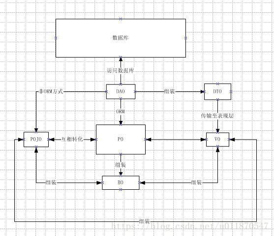

## 1、JS 实现 html 页面点击下载文件

**使用 <a> 标签来完成**

```html
<a href="/user/test/xxxx.txt" download="文件名.txt">点击下载</a>
```

这样当用户打开浏览器点击链接的时候就会直接下载文件。但是有个情况，比如 txt,png,jpg 等这些浏览器支持直接打开的文件是不会执行下载任务的，而是会直接打开文件，**这个时候就需要给 a 标签添加一个属性 “download”;**

其中 download 后面的属性是下载后文件的文件名字

- 如果 url 指向同源资源，是正常的。
- 如果 url 指向第三方资源，download 会失效，表现和不使用 download 时一致——浏览器能打开的文件，浏览器会直接打开，不能打开的文件，会直接下载。浏览器打开的文件，可以手动下载。

解决方案一：将文件打包为 .zip/.rar 等浏览器不能打开的文件下载。

解决方案二：通过后端转发，后端请求第三方资源，返回给前端，前端使用 file-saver 等工具保存文件。


**使用表单提交**

```javascript
//方法二：通过form
$eleBtn2.click(function(){
    var $eleForm = $("<form method='get'></form>");
    $eleForm.attr("action","https://codeload.github.com/douban/douban-client/legacy.zip/master");
    $(document.body).append($eleForm);
    //提交表单，实现下载
    $eleForm.submit();
});
```


## 2、transferto 遇到的问题 java.io.FileNotFoundException

解决前的代码：重点关注代码片段 image.transferTo(file)

```java
 public void saveOrUpdateImageFile(Info bean, MultipartFile image, HttpServletRequest req)
            throws Exception {
     String filepath="E:/image/info";//指定图片上传到哪个文件夹的路径
     File imageFolder = new File(filepath);
     System.out.println(imageFolder);
     File file = new File(imageFolder, bean.getId() + ".jpg");
     System.out.println(file);
     if (!file.getParentFile().exists())
         file.getParentFile().mkdirs();
     image.transferTo(file)；//出错地方

     //以下片段用来判断文件是否jpg格式，不需要看
     BufferedImage img = ImageUtil.change2jpg(file);
     System.out.println(img);
     ImageIO.write(img, "jpg", file);
 }
```

解决后的代码：引入commons-io的Maven依赖包，将`image.transferTo(file)`改为`FileUtils.copyInputStreamToFile(image.getInputStream(), file)`

```java
public void saveOrUpdateImageFile(Info bean, MultipartFile image, HttpServletRequest req)
            throws Exception {
    String filepath="E:/image/info";//指定图片上传到哪个文件夹的路径
    File imageFolder = new File(filepath);
    System.out.println(imageFolder);
    File file = new File(imageFolder, bean.getId() + ".jpg");
    System.out.println(file);
    if (!file.getParentFile().exists())
        file.getParentFile().mkdirs();
    FileUtils.copyInputStreamToFile(image.getInputStream(), file);

    //以下片段用来判断文件是否jpg格式，不需要看
    BufferedImage img = ImageUtil.change2jpg(file);
    System.out.println(img);
    ImageIO.write(img, "jpg", file);
}
```


## 3、下载文件时，为什么要使用URLEncoder编码名称

```java
URLEncoder.encode(filename, "UTF-8")
```

因为下载文件的名称是通过url传到客户端的，url对格式的要求非常严格，具体如下

字母数字字符 “a” 到 “z”、”A” 到 “Z” 和 “0” 到 “9” **保持不变**。
特殊字符 “.”、”-“、”*” 和 “_” **保持不变**。
空格字符 ” ” **转换**为一个加号 “+”。

除了上述三种字符，其他所有其他字符都是不安全的，因此首先使用一些编码机制将它们转换为一个或多个字节。然后每个字节用一个包含 3 个字符的字符串 “%xy” 表示，其中 xy 为该字节的两位十六进制表示形式。推荐的编码机制是 UTF-8。但是，出于兼容性考虑，如果未指定一种编码，则使用相应平台的默认编码。

这就是为什么要有URLEncoder这样的工具类了，因为中文是三种安全字符之外的字符，不允许传输。你要是直接传输，那么url就屏蔽掉，所以你必须转码


## 4、Java 将多个文件压缩打包成zip下载

步骤如下：

1. 设置下载文件名编码
2. 创建zip输出流ZipOutputStream
3. 将需要下载的文件流循环写入ZipOutputStream
4. 关闭各个流

```java
@Override
public void downloadFile(String ids, HttpServletResponse response) throws IOException {
    List<SysFileInfo> sysFileInfos = selectSysFileInfoListByIds(ids);
    response.reset();
    response.setContentType("bin");
    String localPath = Global.getProfile();
    if (sysFileInfos.size() > 1) {
        response.addHeader("Content-Disposition", "attachment;filename=" + URLEncoder.encode("附件.zip", "UTF-8"));
        //获取响应中的输出流
        ServletOutputStream outputStream = response.getOutputStream();
        //构建Zip流对象
        ZipOutputStream zipOutputStream = new ZipOutputStream(outputStream);
        for (SysFileInfo sysFileInfo : sysFileInfos) {
            String filePath = sysFileInfo.getFilePath();
            //获取本地文件
            File file = new File(localPath + StringUtils.substringAfter(filePath, Constants.RESOURCE_PREFIX));
            if (file.exists()) {
                //定义ZipEntry对象
                ZipEntry zipEntry = new ZipEntry(file.getName());
                //赋予Zip流对象属性
                zipOutputStream.putNextEntry(zipEntry);
                int let;
                //缓冲
                byte[] bytes = new byte[100];
                 //构建FileInputStream流对象
                FileInputStream fileInputStream = new FileInputStream(file);
                while ((let = fileInputStream.read(bytes)) > 0) {
                    zipOutputStream.write(bytes, 0, let);
                    zipOutputStream.flush();
                }
                //关闭closeEntry
                zipOutputStream.closeEntry();
                //关闭FileInputStream
                fileInputStream.close();
            }
        }
        //最后关闭ZIP流
        zipOutputStream.close();
    } else {
        ...
    }
}
```


## 5、PO,BO,VO和POJO

POJO ：plain ordinary java object 无规则简单java对象

一个中间对象，可以转化为PO、DTO、VO。

1. POJO持久化之后==〉PO

	> 在运行期，由 Hibernate 中的 cglib 动态把 POJO 转换为 PO，PO 相对于 POJO 会增加一些用来管理数据库 entity 状态的属性和方法。PO 对于programmer 来说完全透明，由于是运行期生成 PO，所以可以支持增量编译，增量调试。

2. POJO传输过程中==〉DTO

3. POJO用作表示层==〉VO


PO：persistent object 持久对象

1. 有时也被称为 Data 对象，对应数据库中的 entity，可以简单认为一个 PO 对应数据库中的一条记录。
2. 在 hibernate 持久化框架中与 insert/delet 操作密切相关。
3. PO 中不应该包含任何对数据库的操作。


BO：business object 业务对象

业务对象主要作用是把业务逻辑封装为一个对象。这个对象可以包括一个或多个其它的对象。

比如一个简历，有教育经历、工作经历、社会关系等等。我们可以把教育经历对应一个 PO，工作经历对应一个 PO，社会关系对应一个 PO。

建立一个对应简历的 BO 对象处理简历，每个 BO 包含这些 PO。

这样处理业务逻辑时，我们就可以针对 BO 去处理。

封装业务逻辑为一个对象（可以包括多个 PO，通常需要将 BO 转化成 PO，才能进行数据的持久化，反之，从DB中得到的 PO，需要转化成 BO 才能在业务层使用）。

关于BO主要有三种概念

1. 只包含业务对象的属性；
2. 只包含业务方法；
3. 两者都包含。

在实际使用中，认为哪一种概念正确并不重要，关键是实际应用中适合自己项目的需要。


VO：value object 值对象  / view object 表现层对象

1. 主要对应页面显示（web页面/swt、swing界面）的数据对象。
2. 可以和表对应，也可以不，这根据业务的需要。


DTO（TO）：Data Transfer Object 数据传输对象

1. 用在需要跨进程或远程传输时，它不应该包含业务逻辑。
2. 比如一张表有100个字段，那么对应的 PO 就有100个属性（大多数情况下，DTO 内的数据来自多个表）。但 view 层只需显示 10 个字段，没有必要把整个 PO 对象传递到 client，这时我们就可以用只有这10个属性的 DTO 来传输数据到 client，这样也不会暴露 server 端表结构。到达客户端以后，如果用这个对象来对应界面显示，那此时它的身份就转为 VO。


DAO：data access object 数据访问对象

1. 主要用来封装对DB的访问（CRUD操作）。
2. 通过接收Business层的数据，把 POJO 持久化为 PO。

简单的关系图：




## 6、JS 获取 Model 的数据

```java
@Controller
public class ChartController {
    @Autowired
    private IReportService reportService;
    @GetMapping("/report/index")
    public String index(Model model){
        //查询 课程平均分数据
        List<ReportVo> reportVos = reportService.courseAvgReport();
        //存入model
        model.addAttribute("courseAvgs",reportVos);
        //返回页面
        return "views/report/report_list";
    }
}
```

```html
<script th:inline="javascript">
    let courseAvgs = [[${courseAvgs}]]
    console.log(courseAvgs)
</script>
```


## 7、JS 判断 NaN 和保留两位小数

**window.isNaN()**

```javascript
(1)  window.isNaN(NaN)   // true
(2)  window.isNaN(123)   // false
//注意: window.isNaN 只对数值有效，如果传入其他值，会被先转成数值。比如，传入字符串的时候，字符串会被先转成NaN，所以最后返回true，这点要特别引起注意。也就是说，isNaN为true的值，有可能不是NaN，而是一个字符串。(不是数值会先调用 Number 方法转化为数值)

window.isNaN('Hello')    // true
//相当于
window.isNaN(Number('Hello'))   // true
```


**先判断是不是数字,然后再使用 window.isNaN()**

```javascript
function judgeNaN (value) {
	return (typeof value) === 'number' && window.isNaN(value);
}

judgeNaN(1)             //false
judgeNaN(NaN)          //true
judgeNaN("我是字符串")	//false
judgeNaN([])           //false
judgeNaN({})           //false
```


**Number.isNaN(value) ( 1. 首先判断 value 类型是不是 number; 2. 然后判断 value 是不是 NaN)**

```javascript
Number.isNaN(NaN);                 // true
Number.isNaN(Number.NaN);          // true
Number.isNaN(0/0);                 // true

// 下面这些使用 window.isNaN() 将会返回 true ,Number.isNaN() 返回 false,
// 因为 window.isNaN 会先把参数转化为数字类型,再判断是不是 NaN; 而 Number.isNaN 会先判断参数是不是数字类型,不是就返回 false, 是数字类型再进入判断是不是 NaN.
Number.isNaN('NaN');                      // false
Number.isNaN(undefined);                  // false
Number.isNaN({});                         // false
Number.isNaN('blabla');                   // false

// 下面这些 window.isNaN() 和 Number.isNaN() 都返回 false
Number.isNaN(true);
Number.isNaN(null);
Number.isNaN(37);
Number.isNaN('37');
Number.isNaN('37.37');
Number.isNaN('');
Number.isNaN(' ')
```


**两数字相除 保留两位小数**

```javascript
$('#aa').value=(a/b).toFixed(2);
```

