# 1、权限的管理

**什么是权限管理？**

基本涉及到用户参与的系统都要进行权限管理，权限管理属于系统安全的范畴，权限管理实现对用户访问系统的控制，按照安全规则或者安全策略控制用户可以访问而且只能访问自己被授权的资源。

权限管理包括用户身份认证和授权两个部分，简称认证授权。对于需要访问控制资源的用户首先经过身份认证，认证通过后用户具有该资源的访问权限方可访问。


**什么是身份认证？**

身份认证，就是判断一个用户是否为合法用户的处理过程。最常用的简单身份认证方式是系统通过核对用户输入的用户名和口令，看其是否与系统中存储的该用户的用户名和口令一致，来判断用户身份是否正确。对于采用指纹等系统，则出示指纹；对于硬件Key等刷卡系统，则需要刷卡。


**什么是授权？**

授权，即访问控制，控制谁能访问哪些资源。主体进行身份认证后需要分配权限方可访问系统的资源，对于某些资源没有权限是无法访问的。


# 2、什么是 Shiro

Shiro 是 apache 旗下一个功能强大且易于使用的 Java 安全框架，它执行身份验证、授权、加密和会话管理。使用 Shiro 易于理解的 API，您可以快速轻松地保护任何应用程序，从最小的移动应用程序到最大的 web 和企业应用程序。


# 3、Shiro 的核心架构


**Subject**

Subject 即主体，外部应用与 Subject 进行交互，Subject 记录了当前操作用户，将用户的概念理解为当前操作的主体，可能是一个通过浏览器请求的用户，也可能是-个运行的程序。Subject 在 Shiro 中是一 个接口，接口中定义了很多认证授相关的方法，外部程序通过 Subject 进行认证授权，而Subject 是通过 SecurityManager 安全管理器进行认证授权。


**SecurityManager**

SecurityManager 即安全管理器，对全部的 Subject 进行安全管理，它是 Shiro 的核心， 负责对所有的 Subject 进行安全管理。通过 SecurityManager 可以完成 Subject 的认证、授权等，实质上 SecurityManager 是通过 Authenticator 进行认证，通过 Authorizer 进行授权，通过SessionManager 进行会话管理等 。SecurityManager 是一个接口， 继承了 Authenticator. Authorizer. SessionManager这三个接口。


**Authenticator**

Authenticator 即认证器，对用户身份进行认证，Authenticator是一 个接口，Shiro 提供 ModularRealmAuthenticator实现类，通过ModularRealmAuthenticator 基本上可以满足大多数需求，也可以自定义认证器。


**Authorizer**

Authorizer 即授权器，用户通过认证器认证通过，在访问功能时需要通过授权器判断用户是否有此功能的操作权限。


**Realm**

Realm 即领域，相当于 datasource 数据源，SecurtyManager 进行安全认证需要通过 Realm 获取用户权限数据，比如：如果用户身份数据在数据库那么 Realm 就需要从数据库获取用户身份信息。

注意:不要把 Realm 理解成只是从数据源取数据，在 Realm 中还有认证授权校验的相关的代码。


**SessionManager**

SessionManager 即会话管理，Shiro 框架定义了一套会话管理，它不依赖 web 容器的 Session，所以 Shiro 可以使用在非 web 应用上，也可以将分布式应用的会话集中在一点管理，此特性可使它实现单点登录。


**SessionDAO**

SessionDAO 即会话 dao，是对 Session 会话操作的一套接口，比如要将 Session 存储到数据库，可以通过 JDBC 将会话存储到数据库。


**CacheManager**

CacheManager 即缓存管理，将用户权限数据存储在缓存，这样可以提高性能。


**Cryptography**

Cryptography 即密码管理，Shiro 提供了一套加密/解密的组件，方便开发。比如提供常用的散列、加/解密等功能。


# 4、Shiro 中的认证

身份认证，就是判断一个用户是否为合法用户的处理过程。最常用的简单身份认证方式是系统通过核对用户输入的用户名和口令，看其是否与系统中存储的该用户的用户名和口令一致， 来判断用户身份是否正确。


**Shiro 中认证的关键对象**

Subject：主体，访问系统的用户，主体可以是用户、程序等，进行认证的都称为主体；

- Principal：身份信息

	是主体 (subject) 进行身份认证的标识，标识必须具有唯一性，如用户名、手机号、邮箱地址等，一个主体可以有多个身份，但是必须有一个主身份 (Primary Principal)。

- Credential：凭证

	是只有主体自己知道的安全信息，如密码、证书等。


**认证流程**

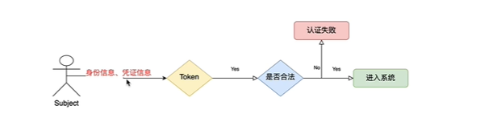


## 4.1、认证的开发

1. 创建项目并引入依赖

	```xml
	<!--引入shiro的依赖-->
	<!-- https://mvnrepository.com/artifact/org.apache.shiro/shiro-core -->
	<dependency>
	    <groupId>org.apache.shiro</groupId>
	    <artifactId>shiro-core</artifactId>
	    <version>1.5.3</version>
	</dependency>
	```

2. 引入 Shiro 配置文件并加入以下内容：

	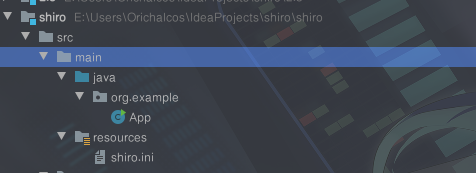

	```ini
	[users]
	xiaochen=123
	zhangsan=123321
	lisi=3214
	```

3. 开发认证代码：

	```java
	public class App {
	    public static void main(String[] args) {
	        //1.创建安全管理器
	        DefaultSecurityManager defaultSecurityManager = new DefaultSecurityManager();
	        //2.给安全管理器设置Realm
	        defaultSecurityManager.setRealm(new IniRealm("classpath:shiro.ini"));
	        //3. SecurityUtils 给全局安全工具类设置安全管理器
	        SecurityUtils.setSecurityManager(defaultSecurityManager);
	        //4.关键对象 Subject主体
	        Subject subject = SecurityUtils.getSubject();
	        //5.创建令牌
	        UsernamePasswordToken token = new UsernamePasswordToken("zhangsan", "123321");
	
	        try {
	            System.out.println("认证状态："+subject.isAuthenticated());
	            subject.login(token);
	            System.out.println("认证状态："+subject.isAuthenticated());
	        } catch (UnknownAccountException e) {
	            e.printStackTrace();
	            System.out.println("未知的用户信息");
	        } catch (IncorrectCredentialsException e){
	            e.printStackTrace();
	            System.out.println("账户密码错误");
	        }
	    }
	}
	```

	- DisabledAccountException（账号被禁用）
	- LockedAccountException（账号被锁定）
	- ExcessiveAttemptsException（登录失败次数过多）
	- ExpiredCredentialsException（凭证过期）等


## 4.2、自定义 Realm

上边的程序使用的是 Shiro 自带的 IniRealm，IniRealm 从 ini 配置文件中读取用户的信息，大部分情况下需要从系统的数据库中读取用户信息，所以需要自定义 realm。

Shiro 中提供了许多Realm：


在源码中认证使用的是`SimpleAccountRealm`：

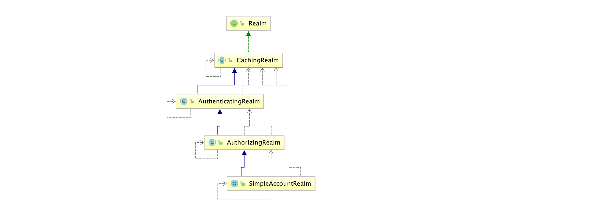

`SimpleAccountRealm`的部分源码中有两个方法，一个是认证，一个是授权：

```java
public class SimpleAccountRealm extends AuthorizingRealm {
		//.......省略
    protected AuthenticationInfo doGetAuthenticationInfo(AuthenticationToken token) throws AuthenticationException{
        UsernamePasswordToken upToken = (UsernamePasswordToken) token;
        SimpleAccount account = getUser(upToken.getUsername());

        if (account != null) {
            if (account.isLocked()) {
                throw new LockedAccountException("Account [" + account + "] is locked.");
            }
            if (account.isCredentialsExpired()) {
                String msg = "The credentials for account [" + account + "] are expired";
                throw new ExpiredCredentialsException(msg);
            }
        }
        return account;
    }

    protected AuthorizationInfo doGetAuthorizationInfo(PrincipalCollection principals) {
        String username = getUsername(principals);
        USERS_LOCK.readLock().lock();
        try {
            return this.users.get(username);
        } finally {
            USERS_LOCK.readLock().unlock();
        }
    }
}
```

最终执行用户名比较是在`SimpleAccountRealm`的`doGetAuthenticationInfo`这个方法中完成用户名校验，最终密码校验是在`AuthenticatingRealm`的`assertCredentialsMatch`中完成。观其源码，`doGetAuthenticationInfo`在`AuthenticatingRealm`（认证Realm）中，`doGetAuthorizationInfo`在`AuthorizingRealm`（授权Realm）中。


**自定义Realm：**

1. 自定义 Realm 需要继承 AuthorizingRealm，需要重写该类的两个方法：授权和认证

	```java
	/**
	 * 自定义实现Realm实现 将认证/授权数据来源转为数据库实现
	 *
	 * @author Orichalcos
	 */
	public class CustomRealm extends AuthorizingRealm {
	    /**
	     * 授权
	     */
	    @Override
	    protected AuthorizationInfo doGetAuthorizationInfo(PrincipalCollection principalCollection) {
	        return null;
	    }
	
	    /**
	     * 认证
	     */
	    @Override
	    protected AuthenticationInfo doGetAuthenticationInfo(AuthenticationToken authenticationToken) throws AuthenticationException {
	        //从token中获取用户名
	        String principal = (String) authenticationToken.getPrincipal();
	        System.out.println(principal);
	        //根据身份信息使用 jdbc mybatis 查询数据
	        if ("zhangsan".equals(principal)) {
	            //参数1：返回数据库中的用户名，参数2：返回数据库中正确的密码，参数3：提供当前Realm的名字，this.getName()
	            return new SimpleAuthenticationInfo(principal, "123321", this.getName());
	        }
	        return null;
	    }
	}
	```

2. 使用自定义 Realm 认证

	```java
	/**
	 * 使用自定义realm
	 *
	 * @author Orichalcos
	 */
	public class TestCustomRealmAuthenticator {
	    public static void main(String[] args) {
	        //创建Security Manager
	        DefaultSecurityManager defaultSecurityManager = new DefaultSecurityManager();
	        //设置自定义realm
	        defaultSecurityManager.setRealm(new CustomRealm());
	        //给全局安全工具类设置安全管理器
	        SecurityUtils.setSecurityManager(defaultSecurityManager);
	        //通过安全工具类获取主体
	        Subject subject = SecurityUtils.getSubject();
	        //创建token
	        UsernamePasswordToken token = new UsernamePasswordToken("zhangsan", "123321");
	
	        try {
	            subject.login(token);
	            System.out.println("登录成功");
	        } catch (UnknownAccountException e) {
	            e.printStackTrace();
	            System.out.println("未知用户");
	        } catch (IncorrectCredentialsException e) {
	            e.printStackTrace();
	            System.out.println("密码错误");
	        }
	    }
	}
	```


## 4.3、使用 MD5 + salt

1. MD5 和 salt 的使用

	```java
	/**
	 * @author Orichalcos
	 */
	public class TestShiroMD5 {
	    public static void main(String[] args) {
	        //使用MD5
	        Md5Hash md5Hash = new Md5Hash("123");
	        System.out.println(md5Hash.toHex());
	
	        //使用MD5+salt处理
	        Md5Hash md5Hash1 = new Md5Hash("123", "#@DJF");
	        System.out.println(md5Hash1.toHex());
	
	        //使用MD5+salt+hash散列
	        Md5Hash md5Hash2 = new Md5Hash("123", "#$JFs", 1024);
	        System.out.println(md5Hash2.toHex());
	    }
	}
	```

2. 在自定义的 Realm 中加入 MD5 和 salt

	```java
	/**
	 * 使用自定义realm加入md5+salt+hash
	 *
	 * @author Orichalcos
	 */
	public class CustomMd5Realm extends AuthorizingRealm {
	    /**
	     * 授权
	     */
	    @Override
	    protected AuthorizationInfo doGetAuthorizationInfo(PrincipalCollection principalCollection) {
	        return null;
	    }
	
	    /**
	     * 认证
	     */
	    @Override
	    protected AuthenticationInfo doGetAuthenticationInfo(AuthenticationToken authenticationToken) throws AuthenticationException {
	        //获取身份信息
	        String principal = (String) authenticationToken.getPrincipal();
	        //根据用户名查询数据库
	        if ("zhangsan".equals(principal)) {
	            //参数1：数据库中的用户名  参数2：数据库md5+salt之后的密码  参数3：注册时的随机盐   参数4：realm的名字
	            return new SimpleAuthenticationInfo(principal, "8380cb81ded9e644bf37638a09fabb19", ByteSource.Util.bytes("#$JFs"), this.getName());
	        }
	        return null;
	    }
	}
	```

3. 使用自定义的 Realm + Md5 +salt 认证：

	```java
	/**
	 * 使用自定义的realm + md5 + salt
	 *
	 * @author Orichalcos
	 */
	public class TestCustomMd5RealmAuthenticator {
	    public static void main(String[] args) {
	        //创建安全管理器
	        DefaultSecurityManager defaultSecurityManager = new DefaultSecurityManager();
	        //创建自定义Realm
	        CustomMd5Realm customMd5Realm = new CustomMd5Realm();
	        //设置realm使用hash凭证匹配器
	        HashedCredentialsMatcher hashedCredentialsMatcher = new HashedCredentialsMatcher();
	        //使用算法
	        hashedCredentialsMatcher.setHashAlgorithmName("md5");
	        //使用散列
	        hashedCredentialsMatcher.setHashIterations(1024);
	        customMd5Realm.setCredentialsMatcher(hashedCredentialsMatcher);
	        //注入realm
	        defaultSecurityManager.setRealm(customMd5Realm);
	        //将安全管理工具注入全局工具类
	        SecurityUtils.setSecurityManager(defaultSecurityManager);
	
	        //通过安全工具获取主体subject
	        Subject subject = SecurityUtils.getSubject();
	
	        //创建令牌
	        UsernamePasswordToken token = new UsernamePasswordToken("zhangsan", "123");
	
	        try {
	            subject.login(token);
	            System.out.println("登录成功");
	        } catch (UnknownAccountException e) {
	            e.printStackTrace();
	            System.out.println("账号错误");
	        } catch (IncorrectCredentialsException e) {
	            e.printStackTrace();
	            System.out.println("密码错误");
	        }
	    }
	}
	```


# 5、Shiro 中的授权

授权，即访问控制，控制谁能访问哪些资源。主体进行身份认证后需要分配权限方可访问系统的资源，对于某些资源没有权限是无法访问的。


**关键对象**：

- Subject：主体，主体需要访问系统中的资源。
- Resource：资源，如系统菜单、页面、按钮、类方法、系统商品信息等。资源包括资源类型和资源实例，比如商品信息为资源类型，类型为to1的商品为资源实例，编号为001的商品信息也属于资源实例。
- Permission：权限/许可，规定了主体对资源的操作许可，权限离开资源没有意义，如用户查询权限、用户添加权限、某个类方法的调用权限、编号为o01用户的修改权限等，通过权限可知主体对哪些资源都有哪些操作许可。


**授权流程**

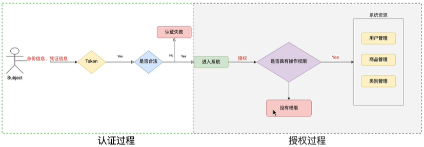


**授权方式**

- 基于角色的访问控制

	> RBAC 基于角色的访问控制（Role-Based Access Control）是以角色为中心进行访问控制
	>
	> ```java
	> if(subject.hasRole("admin")){
	>     //操作什么资源
	> }
	> ```

- 基于资源的访问控制

	> RBAC 基于资源的访问控制（Resource-Based Access Control）是以资源为中心进行访问控制
	>
	> ```java
	> if(subject.isPermission("user:update:01")){//资源实例
	>     //对01用户进行修改
	> }
	> if(subject.isPermission("user:update:*")){//资源类型
	>  	//对user模块下的所有资源进行修改   
	> }
	> ```


## 5.1、权限字符串

权限字符串的规则是：`资源标识符：操作：资源实例标识符`，意思是对哪个资源的哪个实例具有什么操作，“:” 是资源/操作/实例的分割符，权限字符串也可以使用*通配符。

例子：

- 用户创建权限：`user:create`，或 `user:create:*`
- 用户修改实例001的权限：`user:update:001`
- 用户实例001的所有权限：`user:*:001`


**Shiro 中授权编程实现方式**

- **编程式**

	```java
	Subject subject = SecurityUtils.getSubject();
	if(subject.hasRole("admin")) {
		//有权限
	} else {
		//无权限
	}
	```

- **注解式**

	```java
	@RequiresRoles("admin")
	public void hello() {
		//有权限
	}
	```

- **标签式**

	```jsp
	JSP/GSP 标签：在JSP/GSP 页面通过相应的标签完成：
	<shiro:hasRole name="admin">
		<!— 有权限—>
	</shiro:hasRole>
	注意: Thymeleaf 中使用shiro需要额外集成!
	```


## 5.2、开发授权

1. realm 的实现：

	```java
	/**
	 * 使用自定义realm加入md5+salt+hash
	 *
	 * @author Orichalcos
	 */
	public class CustomMd5Realm extends AuthorizingRealm {
	    /**
	     * 授权
	     */
	    @Override
	    protected AuthorizationInfo doGetAuthorizationInfo(PrincipalCollection principalCollection) {
	        String primaryPrincipal = (String) principalCollection.getPrimaryPrincipal();
	        System.out.println(principalCollection);
	        SimpleAuthorizationInfo simpleAuthorizationInfo = new SimpleAuthorizationInfo();
	        simpleAuthorizationInfo.addRole("admin");
	        simpleAuthorizationInfo.addStringPermission("user:update:*");
	        simpleAuthorizationInfo.addStringPermission("product:*");
	        return simpleAuthorizationInfo;
	    }
	
	    /**
	     * 认证
	     */
	    @Override
	    protected AuthenticationInfo doGetAuthenticationInfo(AuthenticationToken authenticationToken) throws AuthenticationException {
	        //获取身份信息
	        String principal = (String) authenticationToken.getPrincipal();
	        //根据用户名查询数据库
	        if ("zhangsan".equals(principal)) {
	            //参数1：数据库中的用户名  参数2：数据库md5+salt之后的密码  参数3：注册时的随机盐   参数4：realm的名字
	            return new SimpleAuthenticationInfo(principal, "8380cb81ded9e644bf37638a09fabb19", ByteSource.Util.bytes("#$JFs"), this.getName());
	        }
	        return null;
	    }
	}
	```

2. 授权：

	```java
	public class TestCustomMd5RealmAuthenticator {
	    public static void main(String[] args) {
	        //创建安全管理器
	        DefaultSecurityManager defaultSecurityManager = new DefaultSecurityManager();
	        //创建自定义Realm
	        CustomMd5Realm customMd5Realm = new CustomMd5Realm();
	        //设置realm使用hash凭证匹配器
	        HashedCredentialsMatcher hashedCredentialsMatcher = new HashedCredentialsMatcher();
	        //使用算法
	        hashedCredentialsMatcher.setHashAlgorithmName("md5");
	        //使用散列
	        hashedCredentialsMatcher.setHashIterations(1024);
	        customMd5Realm.setCredentialsMatcher(hashedCredentialsMatcher);
	        //注入realm
	        defaultSecurityManager.setRealm(customMd5Realm);
	        //将安全管理工具注入全局工具类
	        SecurityUtils.setSecurityManager(defaultSecurityManager);
	
	        //通过安全工具获取主体subject
	        Subject subject = SecurityUtils.getSubject();
	
	        //创建令牌
	        UsernamePasswordToken token = new UsernamePasswordToken("zhangsan", "123");
	
	        try {
	            subject.login(token);
	            System.out.println("登录成功");
	        } catch (UnknownAccountException e) {
	            e.printStackTrace();
	            System.out.println("账号错误");
	        } catch (IncorrectCredentialsException e) {
	            e.printStackTrace();
	            System.out.println("密码错误");
	        }
	
	        //认证通过
	        if(subject.isAuthenticated()){
	            //基于角色权限管理
	            boolean admin = subject.hasRole("admin");
	            System.out.println(admin);
	            //基于多角色权限控制
	            System.out.println(subject.hasAllRoles(Arrays.asList("admin", "super")));
	            //是否具有其中一个角色
	            boolean[] booleans = subject.hasRoles(Arrays.hasRoles(Arrays.asList("admin", "super", "user")));
	            for (boolean aBoolean : booleans) {
	                System.out.println(aBoolean);
	            }
	
	            //基于资源权限管理 资源标识符：操作：资源类型
	            boolean permitted = subject.isPermitted("product:create:001");
	            System.out.println(permitted);
				//分别具有哪些权限
	            boolean[] permitted = subject.isPermitted("user:*:01", "order:*:10");
	            for (boolean b : permitted) {
	                System.out.println(b);
	            }
	            //同时具有哪些权限
	            boolean permittedAll = subject.isPermittedAll("user:*01", "product:*");
	            System.out.println(permittedAll);
	        }
	    }
	}
	```


# 6、项目实战

1. 创建简单的 maven 项目

	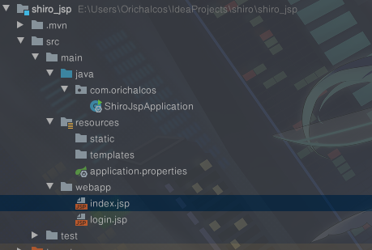

2. 引入 JSP 和 Shiro 依赖

	```xml
	<!--引入JSP依赖-->
	<dependency>
	    <groupId>org.apache.tomcat.embed</groupId>
	    <artifactId>tomcat-embed-jasper</artifactId>
	</dependency>
	<dependency>
	    <groupId>jstl</groupId>
	    <artifactId>jstl</artifactId>
	    <version>1.2</version>
	</dependency>
	
	<!--引入shiro整合springboot依赖-->
	<dependency>
	    <groupId>org.apache.shiro</groupId>
	    <artifactId>shiro-spring-boot-starter</artifactId>
	    <version>1.5.3</version>
	</dependency>
	```

3. 因为用的 JSP，所以要在 properties 文件里进行设置：

	```properties
	server.port=8080
	server.servlet.context-path=/shiro
	spring.application.name=shiro
	spring.mvc.view.prefix=/
	spring.mvc.view.suffix=.jsp
	```

	同时修改 Run Configuration 里面的 Environment，将 Working directory 赋值为  `$MODULE_WORKING_DIR$`

	运行项目，前往 http://localhost:8080/shiro/index.jsp，就可以看到主页了


## 6.1、配置 Shiro 环境

整合思路：


1. 创建 Shiro 配置类

	```java
	/**
	 * @author Orichalcos
	 */
	@Configuration
	public class ShiroConfig {
	    /**
	     * 1.创建shiroFilter
	     * 负责拦截所有请求
	     */
	    @Bean
	    public ShiroFilterFactoryBean getShiroFilterFactoryBean(DefaultSecurityManager securityManager) {
	        ShiroFilterFactoryBean shiroFilterFactoryBean = new ShiroFilterFactoryBean();
	        LinkedHashMap<String, String> map = new LinkedHashMap<>();
	        //注意过滤器配置顺序，不能颠倒
	        //配置退出 过滤器,其中的具体的退出代码Shiro已经替我们实现了，登出后跳转配置的loginUrl
	        map.put("/logout", "logout");
	        //配置不会被拦截的链接，顺序判断
	        map.put("/login**", "anon");
	        map.put("/register**", "anon");
	        map.put("/**", "authc");
	        //配置shiro默认登录界面地址，前后端分离中登录页面跳转应由前端路由控制，后台仅返回json数据
	        shiroFilterFactoryBean.setLoginUrl("/login.jsp");
	        //登录成功后要跳转的页面
	        shiroFilterFactoryBean.setSuccessUrl("/index.jsp");
	        //未授权页面
	        shiroFilterFactoryBean.setUnauthorizedUrl("/403.jsp");
	        shiroFilterFactoryBean.setFilterChainDefinitionMap(map);
	        shiroFilterFactoryBean.setSecurityManager(securityManager);
	        return shiroFilterFactoryBean;
	    }
	
	    /**
	     * 2.创建安全管理器
	     */
	    @Bean
	    public DefaultWebSecurityManager getDefaultWebSecurityManager(@Qualifier("CustomRealm") Realm realm) {
	        DefaultWebSecurityManager defaultWebSecurityManager = new DefaultWebSecurityManager();
	        defaultWebSecurityManager.setRealm(realm);
	        return defaultWebSecurityManager;
	    }
	
	    /**
	     * 3.创建自定义realm
	     */
	    @Bean("CustomRealm")
	    public Realm getRealm() {
	        CustomRealm customRealm = new CustomRealm();
	        return customRealm;
	    }
	}
	```
	
2. 创建自定义 Realm

	```java
	/**
	 * @author Orichalcos
	 */
	public class CustomRealm extends AuthorizingRealm {
	    @Override
	    protected AuthorizationInfo doGetAuthorizationInfo(PrincipalCollection principalCollection) {
	        return null;
	    }
	
	    @Override
	    protected AuthenticationInfo doGetAuthenticationInfo(AuthenticationToken authenticationToken) throws AuthenticationException {
	        return null;
	    }
	}
	```

3. 这时访问 http://localhost:8080/index.jsp 会跳转到 http://localhost:8080/login.jsp 页面中。

注意：`getDefaultWebSecurityManager`的参数`(Realm realm)` 报红，提示：Could not autowire. There is more than one bean of 'Realm' type，是因为在依赖中有同名的bean，可以不使用参数赋值，直接用方法获取就行：`defaultWebSecurityManager.setRealm(getRealm());`，也可以给自定义的 `getRealm`的注解起个名字`@Bean("customRealm")`，然后在`getDefaultWebSecurityManager`中使用 Qualifier 进行指定：`@Qualifier("customRealm") Realm realm`。


## 6.2、常见过滤器

注意: **shiro提供和多个默认的过滤器，我们可以用这些过滤器来配置控制指定url的权限：**

| 配置缩写          | 对应的过滤器                   | 功能                                                         |
| ----------------- | ------------------------------ | ------------------------------------------------------------ |
| anon              | AnonymousFilter                | 指定url可以匿名访问                                          |
| authc             | FormAuthenticationFilter       | 指定url需要form表单登录，默认会从请求中获取`username`、`password`,`rememberMe`等参数并尝试登录，如果登录不了就会跳转到loginUrl配置的路径。我们也可以用这个过滤器做默认的登录逻辑，但是一般都是我们自己在控制器写登录逻辑的，自己写的话出错返回的信息都可以定制嘛。 |
| authcBasic        | BasicHttpAuthenticationFilter  | 指定url需要basic登录                                         |
| logout            | LogoutFilter                   | 登出过滤器，配置指定url就可以实现退出功能，非常方便          |
| noSessionCreation | NoSessionCreationFilter        | 禁止创建会话                                                 |
| perms             | PermissionsAuthorizationFilter | 需要指定权限才能访问                                         |
| port              | PortFilter                     | 需要指定端口才能访问                                         |
| rest              | HttpMethodPermissionFilter     | 将http请求方法转化成相应的动词来构造一个权限字符串，这个感觉意义不大，有兴趣自己看源码的注释 |
| roles             | RolesAuthorizationFilter       | 需要指定角色才能访问                                         |
| ssl               | SslFilter                      | 需要https请求才能访问                                        |
| user              | UserFilter                     | 需要已登录或“记住我”的用户才能访问                           |


## 6.3、实现简单认证

1. 编写 login.jsp 

	```jsp
	<body>
	<h1>用户登录</h1>
	<form action="${pageContext.request.contextPath}/login" method="post">
	    用户名：<input type="text" name="username"><br>
	    密码：<input type="text" name="password"><br>
	    <input type="submit" value="登录">
	</form>
	</body>
	```

2. 编写 index.jsp

	```jsp
	<body>
	<h1>系统主页 v1.0</h1>
	<h2><a href="${pageContext.request.contextPath}/logout">退出登录</a></h2>
	<ul>
	    <li><a href="">用户管理</a></li>
	    <li><a href="">商品管理</a></li>
	    <li><a href="">订单管理</a></li>
	    <li><a href="">物流管理</a></li>
	</ul>
	</body>
	```

3. 编写控制器 ShiroController.java

	```java
	  /**
	   * @author Orichalcos
	   */
	  @Controller
	  public class ShiroController {
	  
	      /**
	       * 身份认证
	       */
	      @RequestMapping("/login")
	      public String login(String username, String password) {
	          //获取主体对象
	          Subject subject = SecurityUtils.getSubject();
	          try {
	              subject.login(new UsernamePasswordToken(username, password));
	              return "redirect:/index.jsp";
	          } catch (UnknownAccountException e) {
	              e.printStackTrace();
	              System.out.println("用户名错误！");
	          } catch (IncorrectCredentialsException e) {
	              e.printStackTrace();
	              System.out.println("密码错误！");
	          }
	          return "redirect:/login.jsp";
	      }
	  }
	```
	
4. 在自定义的 Realm 中返回静态数据

	```java
	protected AuthenticationInfo doGetAuthenticationInfo(AuthenticationToken authenticationToken) throws AuthenticationException {
	    String principal = (String) authenticationToken.getPrincipal();
	    if ("Orichalcos".equals(principal)) {
	        return new SimpleAuthenticationInfo(principal, "123", this.getName());
	    }
	    return null;
	}
	```

5. 修改了 ShiroFilter 中的过滤规则

	```java
	map.put("/login**","anon");
	map.put("/**", "authc");
	```

	ShiroFilter 中的过滤结果和顺序有关，如上设置后，`/login`、`/login.jsp`请求可以被匿名访问，其余的请求都要经过认证。

6. 测试


## 6.4、数据库+MD5+Salt

1. 添加依赖：

	```xml
	<!--lombok-->
	<dependency>
	    <groupId>org.projectlombok</groupId>
	    <artifactId>lombok</artifactId>
	</dependency>
	
	<!--mybatis-->
	<dependency>
	    <groupId>org.mybatis.spring.boot</groupId>
	    <artifactId>mybatis-spring-boot-starter</artifactId>
	    <version>2.1.3</version>
	</dependency>
	
	<!--mysql-->
	<dependency>
	    <groupId>mysql</groupId>
	    <artifactId>mysql-connector-java</artifactId>
	    <version>5.1.49</version>
	</dependency>
	
	<!--druid-->
	<dependency>
	    <groupId>com.alibaba</groupId>
	    <artifactId>druid-spring-boot-starter</artifactId>
	    <version>1.1.22</version>
	</dependency>
	```

2. 配置 application.properties

	```properties
	spring.datasource.type=com.alibaba.druid.pool.DruidDataSource
	spring.datasource.driver-class-name=com.mysql.jdbc.Driver
	spring.datasource.url=jdbc:mysql://localhost:3306/shiro?characterEncoding=utf-8
	spring.datasource.username=root
	spring.datasource.password=root
	mybatis.type-aliases-package=com.orichalcos.entity
	mybatis.mapper-locations=classpath:mapping/*.xml
	```

3. 创建数据库数据库 shiro

	```mysql
	SET NAMES utf8mb4;
	SET FOREIGN_KEY_CHECKS = 0;
	
	-- ----------------------------
	-- Table structure for t_user
	-- ----------------------------
	DROP TABLE IF EXISTS `t_user`;
	CREATE TABLE `t_user`  (
	  `id` int(11) NOT NULL AUTO_INCREMENT,
	  `username` varchar(40) CHARACTER SET utf8 COLLATE utf8_general_ci NULL DEFAULT NULL,
	  `password` varchar(40) CHARACTER SET utf8 COLLATE utf8_general_ci NULL DEFAULT NULL,
	  `salt` varchar(255) CHARACTER SET utf8 COLLATE utf8_general_ci NULL DEFAULT NULL,
	  PRIMARY KEY (`id`) USING BTREE
	) ENGINE = InnoDB AUTO_INCREMENT = 7 CHARACTER SET = utf8 COLLATE = utf8_general_ci ROW_FORMAT = Compact;
	
	SET FOREIGN_KEY_CHECKS = 1;
	```

	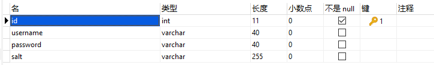

4. 实体类 User.java

	```java
	/**
	 * @author Orichalcos
	 */
	@Data
	@NoArgsConstructor
	@AllArgsConstructor
	public class User implements Serializable {
	    private String id;
	    private String username;
	    private String password;
	    private String salt;
	}
	```

5. ShiroMapper.java

	```java
	/**
	 * @author Orichalcos
	 */
	@Mapper
	public interface ShiroMapper {
	    /**
	     * 保存用户
	     *
	     * @param user 用户
	     */
	    void save(User user);
	}
	```
	
6. ShiroMapper.xml

	```xml
	<?xml version="1.0" encoding="UTF-8" ?>
	<!DOCTYPE mapper
	          PUBLIC "-//mybatis.org//DTD Mapper 3.0//EN"
	          "http://mybatis.org/dtd/mybatis-3-mapper.dtd">
	<mapper namespace="com.orichalcos.mapper.ShiroMapper">
	    <insert id="save" parameterType="User" useGeneratedKeys="true" keyProperty="id">
	        INSERT INTO t_user
	        VALUES
	        (#{id},#{username},#{password},#{salt});
	    </insert>
	</mapper>
	```

7. ShiroService.java

	```java
	/**
	 * @author Orichalcos
	 */
	public interface ShiroService {
	    /**
	     * 注册用户
	     *
	     * @param user 用户
	     */
	    void register(User user);
	}
	```
	
8. 随机盐生成工具类 SaltUtils.java

	```java
	/**
	 * @author Orichalcos
	 */
	public class SaltUtils {
	    public static String getSalt(int n) {
	        char[] chars = "ABCDEFGHIJKLMNOPQRSTUVWXYZabcdefghijklmnopqrstuvwxyz01234567890!@#$%^&*()".toCharArray();
	        StringBuilder stringBuilder = new StringBuilder();
	        for (int i = 0; i < n; i++) {
	            char c = chars[new Random().nextInt(chars.length)];
	            stringBuilder.append(c);
	        }
	        return stringBuilder.toString();
	    }
	}
	```
	
9. ShiroServiceImpl.java

	```java
	/**
	  * @author Orichalcos
	  */
	@Service
	@Transactional(rollbackFor = Exception.class)
	public class ShiroServiceImpl implements ShiroService {
	
	    @Autowired
	    private ShiroMapper shiroMapper;
	
	    @Override
	    public void register(User user) {
	        //生成随机盐
	        String salt = SlatUtils.getSalt(8);
	        //将随机盐保存到user中
	        user.setSalt(salt);
	        //对明文密码进行MD5+salt+Hash散列
	        Md5Hash md5Hash = new Md5Hash(user.getPassword(), ByteSource.Util.bytes(user.getSalt()), 1024);
	        user.setPassword(md5Hash.toHex());
	        shiroMapper.save(user);
	    }
	}
	```

10. ShiroController.java 注册接口

	```java
	/**
	  * 用户注册
	  */
	@RequestMapping("/register")
	public String register(User user) {
	    try {
	        shiroService.register(user);
	        return "redirect:/login.jsp";
	    } catch (Exception e) {
	        e.printStackTrace();
	        return "redirect:/register.jsp";
	    }
	}
	```

11. 在 Shiro 的配置文件（ShiroConfig.java）中需要将注册接口和资源进行放行：

	```java
	//配置系统公共资源
	Map<String, String> map = new HashMap<>(16);
	map.put("/login", "anon");
	map.put("/register**", "anon");
	//authc 请求这个资源需要认证和授权
	map.put("/**", "authc");
	```
	
12. register.jsp

	```jsp
	<%@page contentType="text/html; UTF-8" pageEncoding="UTF-8" isELIgnored="false" %>
	<!doctype html>
	<html lang="en">
	<head>
	    <meta charset="UTF-8">
	    <meta name="viewport"
	          content="width=device-width, user-scalable=no, initial-scale=1.0, maximum-scale=1.0, minimum-scale=1.0">
	    <meta http-equiv="X-UA-Compatible" content="ie=edge">
	    <title>Document</title>
	</head>
	<body>
	<h1>用户注册</h1>
	<form action="${pageContext.request.contextPath}/register" method="post">
	    用户名：<input type="text" name="username"><br>
	    密码：<input type="text" name="password"><br>
	    <input type="submit" value="立即注册">
	</form>
	</body>
	</html>
	```

13. 这样就实现了 数据库 + MD5 + Salt 的密码加密持久化


## 6.5、数据库信息认证

1. 在 ShiroMapper.xml 中添加 findUserByUsername

	```xml
	<select id="findUserByUsername" parameterType="String" resultType="User">
	    SELECT
	        id,
	        username,
	        password,
	        salt
	    FROM
	        t_user
	    WHERE
	        username = #{username};
	</select>
	```

2. 在 ShiroMapper.java 中添加 findUserByUsername

	```java
	/**
	  * 通过用户名查找用户
	  *
	  * @param username 用户名
	  * @return 用户
	  */
	User findUserByUsername(String username);
	```

3. 在 ShiroService.java 中添加 findUserByUsername

	```java
	/**
	  * 通过用户名查找用户
	  *
	  * @param username 用户名
	  * @return 用户
	  */
	User findUserByUsername(String username);
	```

4. 在 ShiroServiceImpl.java 中增加实现

	```java
	@Override
	public User findUserByUsername(String username) {
	    return shiroMapper.findUserByUsername(username);
	}
	```

5. 由于使用了 MD5 + salt 加密，所以需要更改 CustomRealm.java 中的认证方法

	```java
	@Autowired
	private ShiroService shiroService;
	
	@Override
	protected AuthenticationInfo doGetAuthenticationInfo(AuthenticationToken authenticationToken) throws AuthenticationException {
	    //获取身份信息
	    String principal = (String) authenticationToken.getPrincipal();
	    //根据身份查询用户信息
	    User user = shiroService.findUserByUsername(principal);
	    if (!ObjectUtils.isEmpty(user)) {
	        return new SimpleAuthenticationInfo(user.getUsername(), user.getPassword(), ByteSource.Util.bytes(user.getSalt()), this.getName());
	    }
	    return null;
	}
	```

6. 同时，需要更改 realm 的配置，使用凭证匹配器以及hash散列

	```java
	/**
	  * 3.创建自定义realm
	  */
	@Bean("CustomRealm")
	public Realm getRealm() {
	    CustomRealm customRealm = new CustomRealm();
	    //修改凭证校验匹配器
	    HashedCredentialsMatcher credentialsMatcher = new HashedCredentialsMatcher();
	    //设置加密算法为MD5
	    credentialsMatcher.setHashAlgorithmName("MD5");
	    //设置散列次数
	    credentialsMatcher.setHashIterations(1024);
	    customRealm.setCredentialsMatcher(credentialsMatcher);
	    return customRealm;
	}
	```


在第 5 步如果出现 @Autowired 无法导入的情况，可以使用下面这种方法：

1. 开发在工厂中获取 bean 对象的工具类

	```java
	/**
	  * @author Orichalcos
	  */
	@Component
	public class ApplicationContextUtils implements ApplicationContextAware {
	    private static ApplicationContext applicationContext;
	
	    @Override
	    public void setApplicationContext(ApplicationContext applicationContext) throws BeansException {
	        ApplicationContextUtils.applicationContext = applicationContext;
	    }
	
	    /**
	      * 根据Bean名字获取工厂中指定的Bean对象
	      */
	    public static Object getBean(String beanName) {
	        return applicationContext.getBean(beanName);
	    }
	
	    public static <T> T getBean(Class<T> tClass) {
	        return applicationContext.getBean(tClass);
	    }
	
	    public static <T> T getBean(String beanName, Class<T> tClass) {
	        return applicationContext.getBean(beanName, tClass);
	    }
	}
	```

2. 给 ShiroService.java 加上一个名字`@Service("shiroService")`，最后通过工具类获取：

	```java
	 ShiroService shiroService = (ShiroService) ApplicationContextUtils.getBean("shiroService");
	```

	

## 6.6、数据库信息授权

授权数据库结构

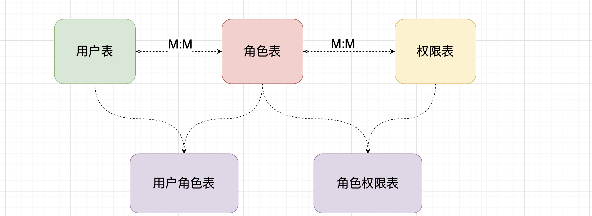

SQL

```sql
SET NAMES utf8mb4;
SET FOREIGN_KEY_CHECKS = 0;

-- ----------------------------
-- Table structure for t_perms
-- ----------------------------
DROP TABLE IF EXISTS `t_perms`;
CREATE TABLE `t_perms`  (
  `id` int(6) NOT NULL AUTO_INCREMENT,
  `name` varchar(80) CHARACTER SET utf8 COLLATE utf8_general_ci NULL DEFAULT NULL,
  `url` varchar(255) CHARACTER SET utf8 COLLATE utf8_general_ci NULL DEFAULT NULL,
  PRIMARY KEY (`id`) USING BTREE
) ENGINE = InnoDB AUTO_INCREMENT = 5 CHARACTER SET = utf8 COLLATE = utf8_general_ci ROW_FORMAT = Compact;

-- ----------------------------
-- Table structure for t_role
-- ----------------------------
DROP TABLE IF EXISTS `t_role`;
CREATE TABLE `t_role`  (
  `id` int(6) NOT NULL AUTO_INCREMENT,
  `name` varchar(60) CHARACTER SET utf8 COLLATE utf8_general_ci NULL DEFAULT NULL,
  PRIMARY KEY (`id`) USING BTREE
) ENGINE = InnoDB AUTO_INCREMENT = 4 CHARACTER SET = utf8 COLLATE = utf8_general_ci ROW_FORMAT = Compact;

-- ----------------------------
-- Table structure for t_role_perms
-- ----------------------------
DROP TABLE IF EXISTS `t_role_perms`;
CREATE TABLE `t_role_perms`  (
  `id` int(6) NOT NULL AUTO_INCREMENT,
  `roleid` int(6) NULL DEFAULT NULL,
  `permsid` int(6) NULL DEFAULT NULL,
  PRIMARY KEY (`id`) USING BTREE
) ENGINE = InnoDB AUTO_INCREMENT = 4 CHARACTER SET = utf8 COLLATE = utf8_general_ci ROW_FORMAT = Compact;

-- ----------------------------
-- Table structure for t_user_role
-- ----------------------------
DROP TABLE IF EXISTS `t_user_role`;
CREATE TABLE `t_user_role`  (
  `id` int(6) NOT NULL AUTO_INCREMENT,
  `userid` int(6) NULL DEFAULT NULL,
  `roleid` int(6) NULL DEFAULT NULL,
  PRIMARY KEY (`id`) USING BTREE
) ENGINE = InnoDB AUTO_INCREMENT = 5 CHARACTER SET = utf8 COLLATE = utf8_general_ci ROW_FORMAT = Compact;

SET FOREIGN_KEY_CHECKS = 1;
```

Role 实体类

```java
/**
 * @author Orichalcos
 */
@Data
@NoArgsConstructor
@AllArgsConstructor
public class Role implements Serializable {
    private String id;
    private String name;
}
```

Perms 实体类

```java
/**
 * @author Orichalcos
 */
@Data
@NoArgsConstructor
@AllArgsConstructor
public class Perms implements Serializable {
    private String id;
    private String name;
    private String url;
}
```


1. 页面资源通过 Shiro 标签进行控制：

	```jsp
	<%@page contentType="text/html; UTF-8" isELIgnored="false" pageEncoding="utf-8" %>
	<%@taglib prefix="shiro" uri="http://shiro.apache.org/tags" %>
	<!doctype html>
	<html lang="en">
	    <head>
	        <meta charset="UTF-8">
	        <meta name="viewport"
	              content="width=device-width, user-scalable=no, initial-scale=1.0, maximum-scale=1.0, minimum-scale=1.0">
	        <meta http-equiv="X-UA-Compatible" content="ie=edge">
	        <title>index</title>
	    </head>
	    <body>
	        <h1>系统主页 v1.0</h1>
	        <h2><a href="${pageContext.request.contextPath}/logout">退出登录</a></h2>
	        <ul>
	            <shiro:hasAnyRoles name="user,admin">
	                <li>
	                    <a href="">用户管理</a>
	                    <ul>
	                        <shiro:hasPermission name="user:add:*">
	                            <li><a href="${pageContext.request.contextPath}/save">添加</a></li>
	                        </shiro:hasPermission>
	                        <shiro:hasPermission name="user:delete:*">
	                            <li><a href="">删除</a></li>
	                        </shiro:hasPermission>
	                        <shiro:hasPermission name="user:update:*">
	                            <li><a href="">修改</a></li>
	                        </shiro:hasPermission>
	                        <shiro:hasPermission name="user:find:*">
	                            <li><a href="">查询</a></li>
	                        </shiro:hasPermission>
	                    </ul>
	                </li>
	            </shiro:hasAnyRoles>
	            <shiro:hasRole name="admin,product">
	                <li><a href="">商品管理</a></li>
	            </shiro:hasRole>
	            <shiro:hasRole name="admin">
	                <li><a href="">订单管理</a></li>
	            </shiro:hasRole>
	            <shiro:hasRole name="admin">
	                <li><a href="">物流管理</a></li>
	            </shiro:hasRole>
	        </ul>
	    </body>
	</html>
	```

2. 也可以通过 Shiro 的注解进行控制

	```java
	/**
	  * save
	  */
	@RequiresRoles("user")
	@RequestMapping("/save")
	public String save() {
	    return "redirect:/save.jsp";
	}
	```

3. 创建 ShiroMapper 中的方法

	```java
	/**
	  * 根据用户名查询所有角色
	  *
	  * @param username 用户名
	  * @return 角色集合
	  */
	List<Role> findRolesByUsername(String username);
	
	/**
	  * 根据角色Id查询所有权限
	  *
	  * @param id 角色Id
	  * @return 权限集合
	  */
	List<Perms> findPermsByRoleId(String id);
	```

4. ShiroMapper.xml 实现

	```xml
	<select id="findRolesByUsername" parameterType="String" resultType="Role">
	    SELECT
	        t_role.*
	    FROM
	        t_user
	        LEFT JOIN t_user_role ON t_user.id = t_user_role.userid
	        LEFT JOIN t_role ON t_user_role.roleid = t_role.id
	    WHERE
	        t_user.username = #{username}
	</select>
	
	<select id="findPermsByRoleId" parameterType="String" resultType="Perms">
	    SELECT
	        t_perms.*
	    FROM
	        t_role
	        LEFT JOIN t_role_perms ON t_role.id = t_role.id = t_role_perms.roleid
	        LEFT JOIN t_perms ON t_role_perms.permsid = t_perms.id
	    WHERE
	        t_role.id = #{id}
	</select>
	```

5. Service 接口

	```java
	/**
	  * 根据用户名查询所有角色
	  *
	  * @param username 用户名
	  * @return 角色集合
	  */
	List<Role> findRolesByUsername(String username);
	
	/**
	  * 根据角色Id查询所有权限
	  *
	  * @param id 角色Id
	  * @return 权限集合
	  */
	List<Perms> findPermsByRoleId(String id);
	```

6. Service 实现

	```java
	@Override
	public List<Role> findRolesByUsername(String username) {
	    return shiroMapper.findRolesByUsername(username);
	}
	
	@Override
	public List<Perms> findPermsByRoleId(String id) {
	    return shiroMapper.findPermsByRoleId(id);
	}
	```

7. 修改自定义的 Realm，数据来源改为查询数据库

	```java
	/**
	  * 授权
	  */
	@Override
	protected AuthorizationInfo doGetAuthorizationInfo(PrincipalCollection principalCollection) {
	    //获取身份信息
	    String principal = (String) principalCollection.getPrimaryPrincipal();
	    //根据主身份信息获取角色信息和权限信息
	    List<Role> roles = shiroService.findRolesByUsername(principal);
	    if (!CollectionUtils.isEmpty(roles)) {
	        SimpleAuthorizationInfo simpleAuthorizationInfo = new SimpleAuthorizationInfo();
	        roles.forEach(role -> {
	            simpleAuthorizationInfo.addRole(role.getName());
	            List<Perms> perms = shiroService.findPermsByRoleId(role.getId());
	            if (!CollectionUtils.isEmpty(perms)) {
	                perms.forEach(perm -> {
	                    simpleAuthorizationInfo.addStringPermission(perm.getName());
	                });
	            }
	        });
	        return simpleAuthorizationInfo;
	    }
	    return null;
	}
	```

8. 测试


问题：使用`@RequiresRoles`和`@RequiresPermissions`进行权限控制，当权限不够的时候，页面直接打印异常信息，而不是跳往`shiroFilterFactoryBean.setUnauthorizedUrl("/403.jsp");`设置的未授权页面。

原因：

首先查看`setUnauthorizedUrl`方法

```java
public void setUnauthorizedUrl(String unauthorizedUrl) {
    this.unauthorizedUrl = unauthorizedUrl;
}
```

继续查看 `unauthorizedUrl`这个参数在整个实体类中在哪个地方使用过，往下可以找到`applyUnauthorizedUrlIfNecessary`：

```java
private void applyUnauthorizedUrlIfNecessary(Filter filter) {
    String unauthorizedUrl = this.getUnauthorizedUrl();
    if (StringUtils.hasText(unauthorizedUrl) && filter instanceof AuthorizationFilter) {
        AuthorizationFilter authzFilter = (AuthorizationFilter)filter;
        String existingUnauthorizedUrl = authzFilter.getUnauthorizedUrl();
        if (existingUnauthorizedUrl == null) {
            authzFilter.setUnauthorizedUrl(unauthorizedUrl);
        }
    }
}
```

`applyUnauthorizedUrlIfNecessary`就是设置无权限访问的url的方法。其中有一行很重要`filter instanceof AuthorizationFilter` 这个过滤器必须要是`AuthorizationFilter`过滤器才行，点进`AuthorizationFilter`：

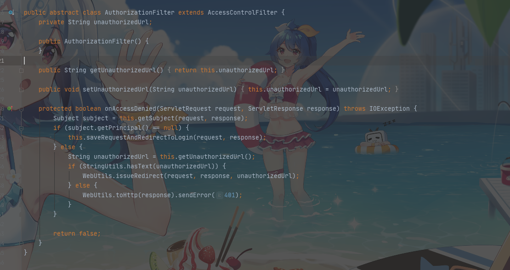

是个抽象类，那么找其实现类：

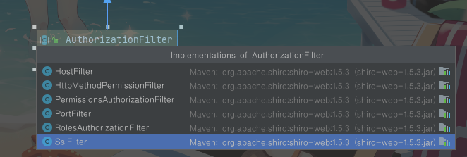

这些才是具体的类。换句话说只有这些过滤器才可以使设置生效。这些过滤器是啥？可以去`org.apache.shiro.web.filter.mgt.DefaultFilter`查看，这个是 Shiro 默认提供给我们的过滤器：


只有perms，roles，ssl，rest，port 才是属于 AuthorizationFilter，而 anon，authcBasic，auchc，user 是 AuthenticationFilter，所以 unauthorizedUrl 设置后页面不跳转。

解决方法：对抛出的异常进行统一处理

```java
/**
 * @author Orichalcos
 * 用于解决 shiroFilterFactoryBean.setUnauthorizedUrl("/403.jsp");不生效的问题
 * ·@ControllerAdvice：是一个Controller增强器，可对Controller中被@RequestMapping注解的方法加一些逻辑处理，
 *  最常用的就是异常处理、全局数据绑定、全局数据预处理
 * ·@Order或者Ordered接口：定义SpringIoC容器中Bean的执行顺序的优先级，而不是定义Bean的加载顺序，
 *  Bean的加载顺序不受@Order或Ordered接口的影响
 * ·@ExceptionHandler：统一异常处理器
 */
@ControllerAdvice
@Order(Ordered.HIGHEST_PRECEDENCE)
public class AdviceController {
    @ExceptionHandler(AuthorizationException.class)
    public String authorizationException(Exception e) {
        return "403";
    }
}
```


## 6.7、使用 EhCache 缓存

Cache 可以减轻DB的访问压力,从而提高系统的查询效率

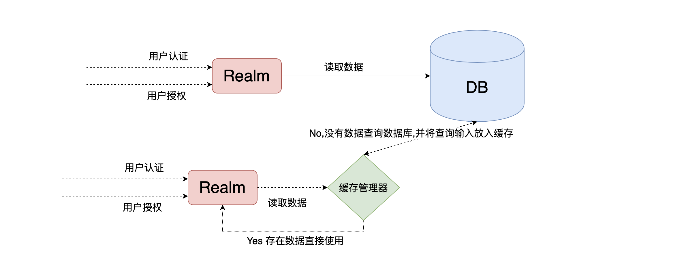

1. 引入 shrio-ehcache 依赖

	```xml
	<!--引入shiro-ehcache-->
	<dependency>
	  <groupId>org.apache.shiro</groupId>
	  <artifactId>shiro-ehcache</artifactId>
	  <version>1.5.3</version>
	</dependency>
	```

2. 开启缓存

	```java
	/**
	  * 创建自定义Realm
	  */
	@Bean("CustomRealm")
	public Realm getRealm() {
	    CustomRealm customRealm = new CustomRealm();
	    //修改凭证校验匹配器
	    HashedCredentialsMatcher credentialsMatcher = new HashedCredentialsMatcher();
	    //设置加密算法为MD5
	    credentialsMatcher.setHashAlgorithmName("MD5");
	    //设置散列次数
	    credentialsMatcher.setHashIterations(1024);
	    customRealm.setCredentialsMatcher(credentialsMatcher);
	
	    //开启缓存
	    customRealm.setCachingEnabled(true);
	    customRealm.setAuthenticationCachingEnabled(true);
	    customRealm.setAuthenticationCacheName("authenticationCache");
	    customRealm.setAuthorizationCachingEnabled(true);
	    customRealm.setAuthorizationCacheName("authorizationCache");
	    //设置缓存管理器
	    customRealm.setCacheManager(new EhCacheManager());
	    return customRealm;
	}
	```

3. 测试：未设置缓存的时候，每次刷新页面，都会从数据库查询权限信息，设置缓存管理器后，刷新页面，控制台没有打印 SQL 查询说明成功。


## 6.8、使用 Redis 缓存

查看 EhCacheManager：

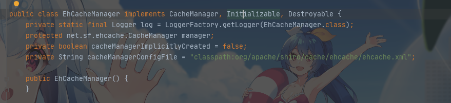

照猫画虎：如果我们使用 Redis 作为缓存，需要自定义一个 RedisCacheManager 并实现 CacheManager。

CacheManager 只有一个方法 getCache：


返回对象为 Cache，那么还需要自定义一个 RedisCache 并实现 Cache。

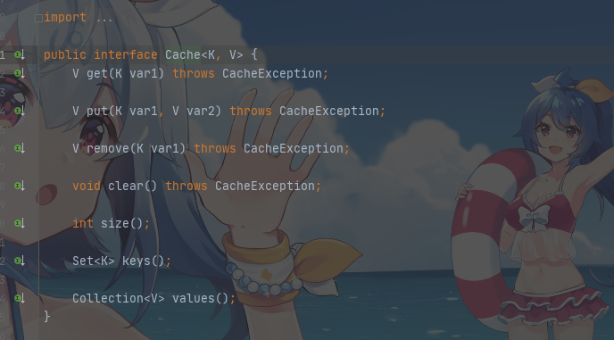

Cache 中的方法：get、put、remove、clear、size、keys、values 改为对 Redis 中的数据操作即可。


1. 引入 Redis 依赖

	```xml
	<!--redis整合springboot-->
	<dependency>
	  <groupId>org.springframework.boot</groupId>
	  <artifactId>spring-boot-starter-data-redis</artifactId>
	</dependency>
	```

2. 配置 Redis 连接

	```properties
	spring.redis.port=6379
	spring.redis.host=47.106.190.209
	spring.redis.database=0
	```

3. 启动 Reids 服务

4. 开发 RedisCacheManager

	```java
	/**
	 * @author Orichalcos
	 */
	public class RedisCacheManager implements CacheManager {
	    @Override
	    public <K, V> Cache<K, V> getCache(String cacheName) throws CacheException {
	        return new RedisCache<K, V>(cacheName);
	    }
	}
	```

5. 编写 RedisCache 实现

	```java
	/**
	 * @author Orichalcos
	 */
	public class RedisCache<K, V> implements Cache<K, V> {
	
	    private String cacheName;
	
	    public RedisCache() {
	    }
	
	    public RedisCache(String cacheName) {
	        this.cacheName = cacheName;
	    }
	
	    public RedisTemplate getRedisTemplate() {
	        RedisTemplate redisTemplate = (RedisTemplate) ApplicationContextUtils.getBean("redisTemplate");
	        StringRedisSerializer serializer = new StringRedisSerializer();
	        redisTemplate.setKeySerializer(serializer);
	        redisTemplate.setHashKeySerializer(serializer);
	        return redisTemplate;
	    }
	
	    @Override
	    public V get(K k) throws CacheException {
	        System.out.println("获取缓存 key:" + k);
	        return (V) getRedisTemplate().opsForHash().get(this.cacheName, k.toString());
	    }
	
	    @Override
	    public V put(K k, V v) throws CacheException {
	        System.out.println("设置缓存 key:" + k + " value:" + v);
	        getRedisTemplate().opsForHash().put(this.cacheName, k.toString(), v);
	        return null;
	    }
	
	    @Override
	    public V remove(K k) throws CacheException {
	        return (V) getRedisTemplate().opsForHash().delete(this.cacheName, k.toString());
	    }
	
	    @Override
	    public void clear() throws CacheException {
	        getRedisTemplate().delete(this.cacheName);
	    }
	
	    @Override
	    public int size() {
	        return getRedisTemplate().opsForHash().size(this.cacheName).intValue();
	    }
	
	    @Override
	    public Set<K> keys() {
	        return getRedisTemplate().opsForHash().keys(this.cacheName);
	    }
	
	    @Override
	    public Collection<V> values() {
	        return getRedisTemplate().opsForHash().values(this.cacheName);
	    }
	}
	```

	因为 RedisTempate 无法自动注入，所以编写一个工具类直接去工厂拿 Bean：

	```java
	/**
	 * @author Orichalcos
	 */
	@Component
	public class ApplicationContextUtils implements ApplicationContextAware {
	    private static ApplicationContext applicationContext;
	
	    @Override
	    public void setApplicationContext(ApplicationContext applicationContext) throws BeansException {
	        ApplicationContextUtils.applicationContext = applicationContext;
	    }
	
	    /**
	     * 根据Bean名字获取工厂中指定的Bean对象
	     */
	    public static Object getBean(String beanName) {
	        return applicationContext.getBean(beanName);
	    }
	
	    public static <T> T getBean(Class<T> tClass) {
	        return applicationContext.getBean(tClass);
	    }
	
	    public static <T> T getBean(String beanName, Class<T> tClass) {
	        return applicationContext.getBean(beanName, tClass);
	    }
	}
	```

6. 将 ShiroConfig 中的缓存管理器设置为自定义的 RedisCacheManager

	```java
	//设置缓存管理器
	customRealm.setCacheManager(new RedisCacheManager());
	```

7. 测试


登录报错

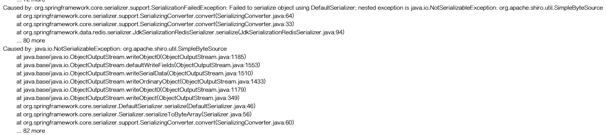

`SimpleAuthenticationInfo`类中有个属性`ByteSource`，默认使用的是`SimpleByteSource` 就是因为该属性无法序列化导致的：

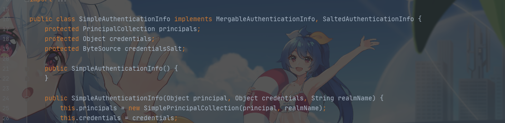

解决方法：

第一种：**取消authenticationCache**

在上面的 shiroRealm 配置中开启了两个缓存：authenticationCache 和 authorizationCache，序列化失败的原因就是 因为开启了 authenticationCache，可以将 authenticationCache对应的那两行配置删除，只缓存 authorizationCache。

第二种：**自定义ByteSource的实现类**

不可以写一个类继承`SimpleByteSource` 然后实现序列化接口，如下：

```java
/**
 * @author: Orichalcos
 */
public class MySimpleByteSource extends SimpleByteSource implements Serializable{
    public MySimpleByteSource(String salt) {
        super(salt);
    }
}
```

然后在自定义的`Realm`中的`doGetAuthenticationInfo`方法中，返回`SimpleAuthenticationInfo`如下：

```java
return new SimpleAuthenticationInfo(user.getUsername(), user.getPassword(), new MySimpleByteSource(user.getSalt()), this.getName());
```

注意：经过测试,在序列化的时候不报错,但是在反序列化的时候就报错了：

```
2018/11/27 11:50:21.090 c.s.t.s.global.utils.SerializeUtils [] ERROR Failed to deserialize
java.io.InvalidClassException: com.springboot.test.shiro.config.shiro.MySimpleByteSource; no valid constructor
```

因为在 `SimpleByteSource` 不存在默认的`无参构造器`, 当 不存在无参构造器 或者 访问权限设置为 private、默认或 protected 级别，会抛出java.io.InvalidException: no valid constructor 异常。

**正确的解决办法**

将`SimpleByteSource`整个类 复制粘贴 给个名字 叫`MyByteSource`，额外实现`Serializable`接口，并添加`无参构造器`：

```java
/**
 * @author Orichalcos
 */
public class MyByteSource implements ByteSource, Serializable {
    private byte[] bytes;
    private String cachedHex;
    private String cachedBase64;

    public MyByteSource() {
    }

    public MyByteSource(byte[] bytes) {
        this.bytes = bytes;
    }

    public MyByteSource(char[] chars) {
        this.bytes = CodecSupport.toBytes(chars);
    }

    public MyByteSource(String string) {
        this.bytes = CodecSupport.toBytes(string);
    }

    public MyByteSource(ByteSource source) {
        this.bytes = source.getBytes();
    }

    public MyByteSource(File file) {
        this.bytes = (new MyByteSource.BytesHelper()).getBytes(file);
    }

    public MyByteSource(InputStream stream) {
        this.bytes = (new MyByteSource.BytesHelper()).getBytes(stream);
    }

    public static boolean isCompatible(Object o) {
        return o instanceof byte[] || o instanceof char[] || o instanceof String || o instanceof ByteSource || o instanceof File || o instanceof InputStream;
    }

    @Override
    public byte[] getBytes() {
        return this.bytes;
    }

    @Override
    public boolean isEmpty() {
        return this.bytes == null || this.bytes.length == 0;
    }

    @Override
    public String toHex() {
        if (this.cachedHex == null) {
            this.cachedHex = Hex.encodeToString(this.getBytes());
        }

        return this.cachedHex;
    }

    public String toBase64() {
        if (this.cachedBase64 == null) {
            this.cachedBase64 = Base64.encodeToString(this.getBytes());
        }

        return this.cachedBase64;
    }

    @Override
    public String toString() {
        return this.toBase64();
    }

    @Override
    public int hashCode() {
        return this.bytes != null && this.bytes.length != 0 ? Arrays.hashCode(this.bytes) : 0;
    }

    @Override
    public boolean equals(Object o) {
        if (o == this) {
            return true;
        } else if (o instanceof ByteSource) {
            ByteSource bs = (ByteSource) o;
            return Arrays.equals(this.getBytes(), bs.getBytes());
        } else {
            return false;
        }
    }

    private static final class BytesHelper extends CodecSupport {
        private BytesHelper() {
        }

        public byte[] getBytes(File file) {
            return this.toBytes(file);
        }

        public byte[] getBytes(InputStream stream) {
            return this.toBytes(stream);
        }
    }
}
```

然后在自定义的`Realm`中的`doGetAuthenticationInfo`方法中，返回`SimpleAuthenticationInfo`如下：

```java
return new SimpleAuthenticationInfo(user.getUsername(), user.getPassword(), new MyByteSource(user.getSalt()), this.getName());
```


# 7、使用 Thymeleaf

1. 引入依赖

	```xml
	<!--thymeleaf-->
	<dependency>
	     <groupId>org.springframework.boot</groupId>
	     <artifactId>spring-boot-starter-thymeleaf</artifactId>
	</dependency>
	<!--thymeleaf的shiro扩展依赖-->
	<dependency>  
	    <groupId>com.github.theborakompanioni</groupId>  
	    <artifactId>thymeleaf-extras-shiro</artifactId>  
	    <version>2.0.0</version>  
	</dependency>
	```

2. 配置 thymeleaf

	```properties
	spring.thymeleaf.cache=false
	spring.thymeleaf.prefix=classpath:/templates/
	spring.thymeleaf.suffix=.html
	spring.thymeleaf.encoding=UTF-8
	spring.thymeleaf.content-type=text/html
	spring.thymeleaf.mode=HTML5
	```

3. 页面中引入命名空间

	```html
	<html xmlns="http://www.w3.org/1999/xhtml" xmlns:th="http://www.thymeleaf.org"
	      xmlns:shiro="http://www.pollix.at/thymeleaf/shiro">
	```

4. 一些常用的标签

	```html
	<!-- 验证当前用户是否为“访客”，即未认证（包含未记住）的用户。 -->
	<p shiro:guest="">Please <a href="login.html">login</a></p>
	
	<!-- 认证通过或已记住的用户。 -->
	<p shiro:user="">
	    Welcome back John! Not John? Click <a href="login.html">here</a> to login.
	</p>
	
	<!-- 已认证通过的用户。不包含已记住的用户，这是与user标签的区别所在。 -->
	<p shiro:authenticated="">
	    Hello, <span shiro:principal=""></span>, how are you today?
	</p>
	<a shiro:authenticated="" href="updateAccount.html">Update your contact information</a>
	
	<!-- 输出当前用户信息，通常为登录帐号信息。 -->
	<p>Hello, <shiro:principal/>, how are you today?</p>
	
	<!-- 未认证通过用户，与authenticated标签相对应。与guest标签的区别是，该标签包含已记住用户。 -->
	<p shiro:notAuthenticated="">
	    Please <a href="login.html">login</a> in order to update your credit card information.
	</p>
	
	<!-- 验证当前用户是否属于该角色。 -->
	<a shiro:hasRole="admin" href="admin.html">Administer the system</a><!-- 拥有该角色 -->
	
	<!-- 与hasRole标签逻辑相反，当用户不属于该角色时验证通过。 -->
	<p shiro:lacksRole="developer"><!-- 没有该角色 -->
	    Sorry, you are not allowed to developer the system.
	</p>
	
	<!-- 验证当前用户是否属于以下所有角色。 -->
	<p shiro:hasAllRoles="developer, 2"><!-- 角色与判断 -->
	    You are a developer and a admin.
	</p>
	
	<!-- 验证当前用户是否属于以下任意一个角色。  -->
	<p shiro:hasAnyRoles="admin, vip, developer,1"><!-- 角色或判断 -->
	    You are a admin, vip, or developer.
	</p>
	
	<!--验证当前用户是否拥有指定权限。  -->
	<a shiro:hasPermission="userInfo:add" href="createUser.html">添加用户</a><!-- 拥有权限 -->
	
	<!-- 与hasPermission标签逻辑相反，当前用户没有制定权限时，验证通过。 -->
	<p shiro:lacksPermission="userInfo:del"><!-- 没有权限 -->
	    Sorry, you are not allowed to delete user accounts.
	</p>
	
	<!-- 验证当前用户是否拥有以下所有角色。 -->
	<p shiro:hasAllPermissions="userInfo:view, userInfo:add"><!-- 权限与判断 -->
	    You can see or add users.
	</p>
	
	<!-- 验证当前用户是否拥有以下任意一个权限。  -->
	<p shiro:hasAnyPermissions="userInfo:view, userInfo:del"><!-- 权限或判断 -->
	    You can see or delete users.
	</p>
	<a shiro:hasPermission="pp" href="createUser.html">Create a new User</a>
	```

	