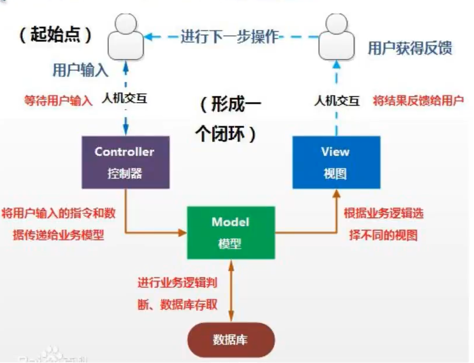
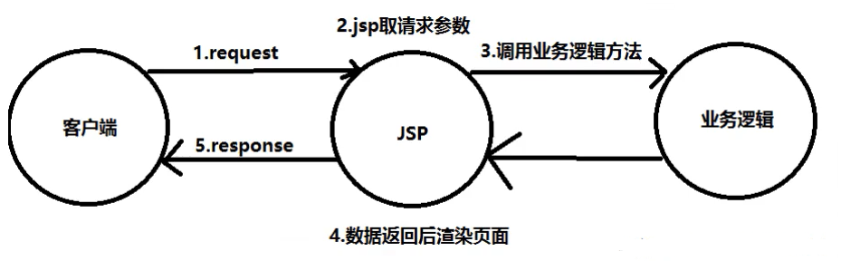
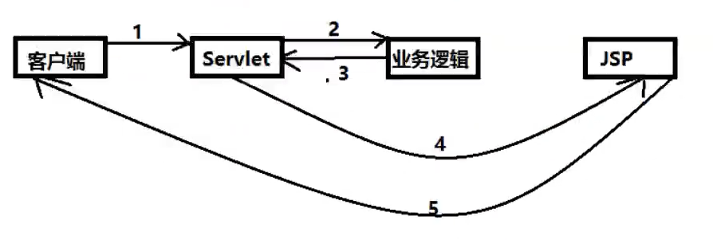
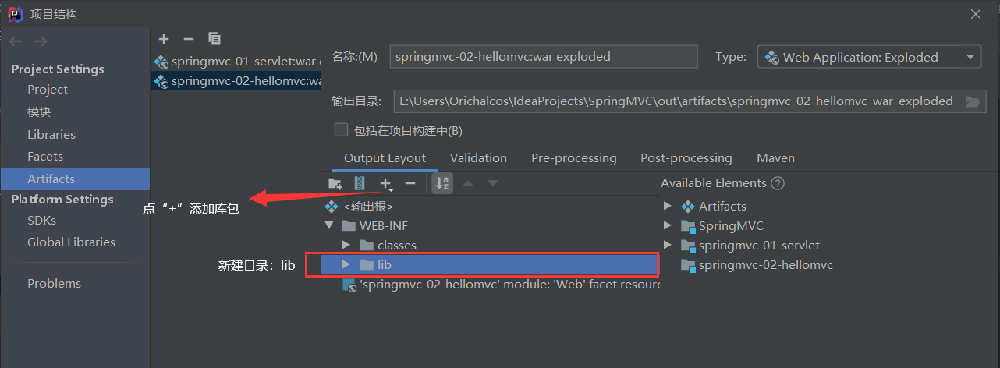

# 1、回顾MVC

什么是MVC？

- MVC是模型（Model）、视图（View）、控制器（Controller）的简写，是一种软件设计规范。
- 使用业务逻辑、数据、显示分离的方法来组织代码。
- MVC主要作用是降低了视图与业务逻辑间的双向耦合。
- MVC不是一种设计模式，MVC是一种架构模式。


**Model（模型）**：数据模型，提供要展示的数据，因此包含数据和行为，可以认为是领域模型或JavaBean组件（包含数据和行为），不过现在一般都分离开：Value Object（数据Dao）和服务层（行为Service）。也就是模型提供了模型数据查询和模型数据的状态更新等功能，包括数据和业务。

**View（视图）**：负责进行模型的展示，一般就是我们所见到的用户界面，客户想看到的东西。

**Controller（控制器）**：接收用户请求，委托给模型进行处理（状态改变），处理完毕后吧返回的模型数据返回给视图，由视图负责展示。也就是说控制器做了一个调度员的工作。


最典型的MVC就是JSP+Servlet+JavaBean的模式。




## 1.1、Model1时代

- 在早期的开发中，通常采用的都是Model1。
- Model1中，主要分为两层，视图层和模型层。




Model1优点：架构简单，比较适合小型项目开发；

Model1缺点：JSP职责不单一，职责较重，不便于维护；


## 1.2、Model2时代

Model2把一个项目分成三部分，包括视图、控制、模型。



1. 用户发送请求
2. Servlet接受请求数据，并调用对应的业务逻辑方法
3. 业务处理完毕，返回更新后的数据给Servlet
4. Servlet转向JSP，由JSP来渲染页面
5. 响应给前端更新后的页面


**职责分析：**

**Controller：控制器**

1. 取得表单数据
2. 调用业务逻辑
3. 转向指定的页面

**Model：模型**

1. 业务逻辑
2. 保存数据的状态

**View：视图**

1. 显示页面


Model2这样不仅提高了代码的复用率和项目的扩展性，且大大降低了项目的维护成本。Model1模式的实现比较简单，适用于快速开发小规模项目，Model1中的JSP页面身兼View和Controller两种角色，将控制逻辑和表现逻辑混在在一起，从而导致代码的重用性非常低，增加了应用的扩展性和维护性的难度。Model2消除了Model1的缺点。


# 2、回顾Servlet

1. 新建一个Maven工程作为父工程，导入pom依赖！

	```xml
	<dependencies>
	    <dependency>
	        <groupId>junit</groupId>
	        <artifactId>junit</artifactId>
	        <version>4.13</version>
	    </dependency>
	    <dependency>
	        <groupId>org.springframework</groupId>
	        <artifactId>spring-webmvc</artifactId>
	        <version>5.2.4.RELEASE</version>
	    </dependency>
	    <dependency>
	        <groupId>javax.servlet</groupId>
	        <artifactId>javax.servlet-api</artifactId>
	        <version>4.0.1</version>
	        <scope>provided</scope>
	    </dependency>
	    <dependency>
	        <groupId>javax.servlet.jsp</groupId>
	        <artifactId>javax.servlet.jsp-api</artifactId>
	        <version>2.3.3</version>
	    </dependency>
	    <dependency>
	        <groupId>javax.servlet</groupId>
	        <artifactId>jstl</artifactId>
	        <version>1.2</version>
	    </dependency>
	</dependencies>
	```

2. 新建一个Moudle：springmvc-01-serlvet，添加web app的支持！

3. 导入servlet和jsp的jar依赖（父模块有可以不导入）

	```xml
	<dependency>
	    <groupId>javax.servlet</groupId>
	    <artifactId>javax.servlet-api</artifactId>
	    <version>4.0.1</version>
	    <scope>provided</scope>
	</dependency>
	<dependency>
	    <groupId>javax.servlet.jsp</groupId>
	    <artifactId>javax.servlet.jsp-api</artifactId>
	    <version>2.3.3</version>
	</dependency>
	```

4. 编写一个Servlet类，用来处理用户请求

	```java
	public class HelloServlet extends HttpServlet {
	    @Override
	    protected void doGet(HttpServletRequest req, HttpServletResponse resp) throws ServletException, IOException {
	        //1.获取前端参数
	        String method = req.getParameter("method");
	        if (method.equals("add")) {
	            req.getSession().setAttribute("msg", "执行了add方法");
	        }
	        if (method.equals("delete")) {
	            req.getSession().setAttribute("msg", "执行了delete方法");
	        }
	
	        //2.调用业务层
	        //3.视图转发或者重定向
	        req.getRequestDispatcher("/WEB-INF/jsp/test.jsp").forward(req, resp);
	    }
	
	    @Override
	    protected void doPost(HttpServletRequest req, HttpServletResponse resp) throws ServletException, IOException {
	        doGet(req, resp);
	    }
	}
	```

5. 编写test.jsp：在WEB-INF目录下新建一个jsp的文件夹，新建test.jsp

	```jsp
	<%@ page contentType="text/html;charset=UTF-8" language="java" %>
	<html>
	<head>
	    <title>Title</title>
	</head>
	<body>
	${msg}
	</body>
	</html>
	```

6. 在web.xml中注册Servlet

	```xml
	<servlet>
	    <servlet-name>hello</servlet-name>
	    <servlet-class>com.kuang.servlet.HelloServlet</servlet-class>
	</servlet>
	<servlet-mapping>
	    <servlet-name>hello</servlet-name>
	    <url-pattern>/hello</url-pattern>
	</servlet-mapping>
	```

7. 配置Tomcat，并启动测试

	- localhost:8080/hello?method=add
	- localhost:8080/hello?method=delete


MVC框架要做那些事情

1. 将url映射到java类或java类的方法
2. 封装用户提交的数据
3. 处理请求--调用相关的业务处理--封装响应数据
4. 将相应数据进行渲染，jsp/html等表示层数据


# 3、SpringMVC

## 3.1、什么是SpringMVC

概述：Spring MVC是Spring Framework的一部分，是基于Java实现MVC的轻量级Web框架。

SpringMVC的特点：

1. 轻量级，简单易学
2. 高效，基于请求响应的MVC框架
3. 与Spring兼容性好，无缝结合
4. 约定优于配置
5. 功能强大：RESTful、数据验证、格式化、本地化、主题等
6. 简洁灵活

Spring的web框架围绕DispatcherServlet设计。

DispatcherServlet的作用是将请求分发到不同的处理器。从Spring 2.5开始，使用Java 5或以上版本的用户可以采用基于注解形式进行开发，十分简洁。


## 3.2、工作原理

Spring 的 web 框架围绕 DispatcherServlet 设计。DispatcherServlet 的作用是将请求分发到不同的处理器。从 Spring 2.5 开始，使用 Java 5 或者以上的版本可以采用基于注解的 controller 声明方式。

Spring MVC 框架像许多其他 MVC 框架一样，以请求为驱动，围绕一个中心 Servlet 分派请求以及提供其他功能，DispatcherServlet 是一个实际的Servlet（它继承 HttpServlet 基类）。

SpringMVC 的工作原理图：


**SpringMVC 流程**

1. 用户发送请求至前端控制器 DispatcherServlet。
2. DispatcherServlet 收到请求调用 HandlerMapping 处理器映射器。
3. 处理器映射器找到具体的处理器(可以根据 xml 配置、注解进行查找)，生成处理器对象及处理器拦截器(如果有则生成)一并返回给DispatcherServlet。
4. DispatcherServlet 调用 HandlerAdapter 处理器适配器。
5. HandlerAdapter 经过适配调用具体的处理器(Controller，也叫后端控制器)。
6. Controller 执行完成返回 ModelAndView。
7. HandlerAdapter 将 controller 执行结果 ModelAndView 返回给 DispatcherServlet。
8. DispatcherServlet 将 ModelAndView 传给 ViewReslover 视图解析器。
9. ViewReslover 解析后返回具体 View，这个 view 不是完整的，仅仅是一个页面（视图）名字，且没有后缀名。
10. DispatcherServlet 根据 View 进行渲染视图（即将模型数据填充至视图中）。
11. DispatcherServlet 响应用户。


**组件说明：**

以下组件通常使用框架提供实现：

DispatcherServlet：作为前端控制器，整个流程控制的中心，控制其它组件执行，统一调度，降低组件之间的耦合性，提高每个组件的扩展性。

HandlerMapping：通过扩展处理器映射器实现不同的映射方式，例如：配置文件方式，实现接口方式，注解方式等。 

HandlAdapter：通过扩展处理器适配器，支持更多类型的处理器。

ViewResolver：通过扩展视图解析器，支持更多类型的视图解析，例如：jsp、freemarker、pdf、excel等。

**组件：**

1. **前端控制器 DispatcherServlet（不需要工程师开发），由框架提供**
	作用：接收请求，响应结果，相当于转发器，中央处理器。有了dispatcherServlet 减少了其它组件之间的耦合度。
	用户请求到达前端控制器，它就相当于 mvc 模式中的 c，dispatcherServlet 是整个流程控制的中心，由它调用其它组件处理用户的请求，dispatcherServlet 的存在降低了组件之间的耦合性。
2. **处理器映射器 HandlerMapping（不需要工程师开发），由框架提供**
	作用：根据请求的 url 查找 Handler
	HandlerMapping 负责根据用户请求找到 Handler 即处理器，springmvc 提供了不同的映射器实现不同的映射方式，例如：配置文件方式，实现接口方式，注解方式等。
3. **处理器适配器 HandlerAdapter**
	作用：按照特定规则（HandlerAdapter 要求的规则）去执行 Handler
	通过 HandlerAdapter 对处理器进行执行，这是适配器模式的应用，通过扩展适配器可以对更多类型的处理器进行执行。
4. **处理器Handler（需要工程师开发）**
	**注意：编写 Handler 时按照 HandlerAdapter 的要求去做，这样适配器才可以去正确执行 Handler**
	Handler 是继 DispatcherServlet 前端控制器的后端控制器，在 DispatcherServlet 的控制下 Handler 对具体的用户请求进行处理。
	由于 Handler 涉及到具体的用户业务请求，所以一般情况需要工程师根据业务需求开发 Handler。
5. **视图解析器 View resolver （不需要工程师开发），由框架提供**
	作用：进行视图解析，根据逻辑视图名解析成真正的视图（view）
	View Resolver 负责将处理结果生成 View 视图，View Resolver 首先根据逻辑视图名解析成物理视图名即具体的页面地址，再生成 View 视图对象，最后对 View 进行渲染将处理结果通过页面展示给用户。 springmvc 框架提供了很多的 View 视图类型，包括：jstlView、freemarkerView、pdfView 等。
	一般情况下需要通过页面标签或页面模版技术将模型数据通过页面展示给用户，需要由工程师根据业务需求开发具体的页面。
6. **视图View（需要工程师开发 jsp...）**
	View 是一个接口，实现类支持不同的 View 类型（jsp、freemarker、pdf...）


**核心架构的具体流程步骤如下：**

1. 首先用户发送请求——>DispatcherServlet，前端控制器收到请求后自己不进行处理，而是委托给其他的解析器进行处理，作为统一访问点，进行全局的流程控制；
2. DispatcherServlet——>HandlerMapping， HandlerMapping 将会把请求映射为HandlerExecutionChain 对象（包含一个Handler 处理器（页面控制器）对象、多个HandlerInterceptor 拦截器）对象，通过这种策略模式，很容易添加新的映射策略；
3. DispatcherServlet——>HandlerAdapter，HandlerAdapter 将会把处理器包装为适配器，从而支持多种类型的处理器，即适配器设计模式的应用，从而很容易支持很多类型的处理器；
4. HandlerAdapter——>处理器功能处理方法的调用，HandlerAdapter 将会根据适配的结果调用真正的处理器的功能处理方法，完成功能处理；并返回一个ModelAndView 对象（包含模型数据、逻辑视图名）；
5. ModelAndView的逻辑视图名——> ViewResolver， ViewResolver 将把逻辑视图名解析为具体的View，通过这种策略模式，很容易更换其他视图技术；
6. View——>渲染，View会根据传进来的Model模型数据进行渲染，此处的Model实际是一个Map数据结构，因此很容易支持其他视图技术；
7. 返回控制权给DispatcherServlet，由DispatcherServlet返回响应给用户，到此一个流程结束。


# 4、HelloSpringMVC

## 4.1、配置版

1. 新建一个Moudle，添加web的支持！

2. 确定导入了SpringMVC的依赖！

3. 配置web.xml，注册DispatcherServlet

	```xml
	<?xml version="1.0" encoding="UTF-8"?>
	<web-app xmlns="http://xmlns.jcp.org/xml/ns/javaee"
	         xmlns:xsi="http://www.w3.org/2001/XMLSchema-instance"
	         xsi:schemaLocation="http://xmlns.jcp.org/xml/ns/javaee http://xmlns.jcp.org/xml/ns/javaee/web-app_4_0.xsd"
	         version="4.0">
	    <!--配置DispatcherServlet：这个是Spring MVC的核心-->
	    <servlet>
	        <servlet-name>springmvc</servlet-name>
	        <servlet-class>org.springframework.web.servlet.DispatcherServlet</servlet-class>
	        <!--DispatcherServlet要绑定Spring的配置文件-->
	        <init-param>
	            <param-name>contextConfigLocation</param-name>
	            <param-value>classpath:springmvc-servlet.xml</param-value>
	        </init-param>
	        <!--启动级别1-->
	        <load-on-startup>1</load-on-startup>
	    </servlet>
	    <!--/ 匹配所有的请求：不包括.jsp-->
	    <!--/* 匹配所有的请求：包括.jsp-->
	    <servlet-mapping>
	        <servlet-name>springmvc</servlet-name>
	        <url-pattern>/</url-pattern>
	    </servlet-mapping>
	</web-app>
	```

4. 编写Spring MVC的配置文件！名称：springmvc-servlet.xml

	```xml
	<?xml version="1.0" encoding="UTF-8"?>
	<beans xmlns="http://www.springframework.org/schema/beans"
	       xmlns:xsi="http://www.w3.org/2001/XMLSchema-instance"
	       xsi:schemaLocation="http://www.springframework.org/schema/beans
	                           http://www.springframework.org/schema/beans/spring-beans.xsd">
	
	</beans>
	```

5. 添加处理器映射器

	```xml
	<bean class="org.springframework.web.servlet.handler.BeanNameUrlHandlerMapping"/>
	```

6. 添加处理器适配器

	```xml
	<bean class="org.springframework.web.servlet.mvc.SimpleControllerHandlerAdapter"/>
	```

7. 添加视图解析器

	```xml
	<bean id="internalResourceViewResolver" class="org.springframework.web.servlet.view.InternalResourceViewResolver">
	    <!--前缀-->
	    <property name="prefix" value="/WEB-INF/jsp/"/>
	    <!--后缀-->
	    <property name="suffix" value=".jsp"/>
	</bean>
	```

8. 编写要操作的业务Controller，要么实现Controller接口，要么增加注解；需要返回一个ModelAndView，装数据，封视图。

	```java
	//实现Controller接口
	public class HelloController implements Controller {
	    @Override
	    public ModelAndView handleRequest(HttpServletRequest request, HttpServletResponse response) throws Exception {
	        //ModelAndView 模型和视图
	        ModelAndView modelAndView = new ModelAndView();
	
	        //封装对象，放在ModelAndView中
	        modelAndView.addObject("msg","HelloSpringMVC!");
	
	        //封装要跳转的视图，放在ModelAndView中
	        modelAndView.setViewName("hello"); //WEB-INF/jsp/hello.jsp
	        return modelAndView;
	    }
	}
	```

9. 将自己的类交给Spring IoC容器，注册Bean（springmvc-servlet.xml）

	```xml
	  <!--Handler-->
	  <bean id="/hello" class="com.kuang.controller.HelloController"/>
	```

10. 编写要跳转的页面，显示ModelAndView存放的数据

	```jsp
	<%@ page contentType="text/html;charset=UTF-8" language="java" %>
	<html>
	<head>
	    <title>Title</title>
	</head>
	<body>
	${msg}
	</body>
	</html>
	```

11. 配置Tomcat进行测试


可能遇到的问题：访问出现404，排查步骤：

1. 查看控制台输出，看一下是不是缺少了什么jar包
2. 如果jar包存在，显示无法输出，就在IDEA的项目发布中，添加lib依赖



3. 重启Tomcat即可解决！


## 4.2、注解版

1. 新建一个Moudle，添加web支持！建立包结构com.kuang.controller

2. 由于Maven可能存在资源过滤问题，将配置完善

	```xml
	<build>
	    <resources>
	        <resource>
	            <directory>src/main/resources</directory>
	            <includes>
	                <include>**/*.properties</include>
	                <include>**/*.xml</include>
	            </includes>
	            <filtering>true</filtering>
	        </resource>
	        <resource>
	            <directory>src/main/java</directory>
	            <includes>
	                <include>**/*.properties</include>
	                <include>**/*.xml</include>
	            </includes>
	            <filtering>true</filtering>
	        </resource>
	    </resources>
	</build>
	```

3. 确保依赖已经导入

4. 配置web.xml

	```xml
	<?xml version="1.0" encoding="UTF8"?>
	<web-app xmlns="http://xmlns.jcp.org/xml/ns/javaee"
	         xmlns:xsi="http://www.w3.org/2001/XMLSchema-instance"
	         xsi:schemaLocation="http://xmlns.jcp.org/xml/ns/javaee http://xmlns.jcp.org/xml/ns/javaee/web-app_4_0.xsd"
	         version="4.0">
	    <servlet>
	        <servlet-name>SpringMVC</servlet-name>
	        <servlet-class>org.springframework.web.servlet.DispatcherServlet</servlet-class>
	        <init-param>
	            <param-name>contextConfigLocation</param-name>
	            <param-value>classpath:SpringMVC-servlet.xml</param-value>
	        </init-param>
	        <load-on-startup>1</load-on-startup>
	    </servlet>
	    <servlet-mapping>
	        <servlet-name>SpringMVC</servlet-name>
	        <url-pattern>/</url-pattern>
	    </servlet-mapping>
	</web-app>
	```

5. 添加Spring MVC配置文件

	```xml
	<?xml version="1.0" encoding="UTF8"?>
	<beans xmlns="http://www.springframework.org/schema/beans"
	       xmlns:xsi="http://www.w3.org/2001/XMLSchema-instance"
	       xmlns:context="http://www.springframework.org/schema/context"
	       xmlns:mvc="http://www.springframework.org/schema/mvc"
	       xsi:schemaLocation="http://www.springframework.org/schema/beans
	       http://www.springframework.org/schema/beans/spring-beans.xsd
	       http://www.springframework.org/schema/context
	       https://www.springframework.org/schema/context/spring-context.xsd
	       http://www.springframework.org/schema/mvc
	       https://www.springframework.org/schema/mvc/spring-mvc.xsd">
	    <!--自动扫描包，让指定包下的注解生效，由IoC容器统一管理-->
	    <context:component-scan base-package="com.kuang.controller"/>
	
	    <!--让Spring MVC不处理静态资源 .css .js .html ...-->
	    <mvc:default-servlet-handler/>
	
	    <!--支持mvc注解驱动-->
	    <mvc:annotation-driven/>
	
	    <!--视图解析器-->
	    <bean class="org.springframework.web.servlet.view.InternalResourceViewResolver">
	        <property name="prefix" value="/WEB-INF/jsp/"/>
	        <property name="suffix" value=".jsp"/>
	    </bean>
	</beans>
	```

	在视图解析器中把所有的视图都放在/WEB-INF/目录下，这样可以保证视图安全，因为这个目录下的文件，客户端不能直接访问。

6. 创建Controller

	```java
	@Controller
	public class HelloController {
	    @RequestMapping("/hello")
	    public String hello(Model model) {
	        //封装数据
	        model.addAttribute("msg","Hello,SpringMVCAnnotation!");
	        return "hello"; //会被视图解析器解析
	    }
	}
	```

7. 创建视图层

	```jsp
	<%@ page contentType="text/html;charset=UTF-8" language="java" %>
	<html>
	<head>
	    <title>Title</title>
	</head>
	<body>
	${msg}
	</body>
	</html>
	```

8. 配置Tomcat并运行


使用Spring MVC必须配置的三大件：

**处理器映射器**、**处理器适配器**、**视图解析器**

通常，我们只需要手动配置视图解析器，而处理器映射器和处理器适配器只需要开启注解驱动即可，


# 5、Controller及RestFul风格

## 5.1、Controller

- 控制器负责提供访问应用程序的行为，通常通过接口定义或注解定义两种方法实现。
- 控制器负责解析用户的请求并将其转换为一个模型。
- 在Spring MVC中一个控制器类可以包含多个方法。
- 在Spring MVC中，对于Controller的配置方式有很多种。


**实现Controller接口**

Controller是一个接口，在org.springframework.web.servlet.mvc包下，接口只有一个方法：

```java
//实现该接口的类获得控制器功能
public interface Controller {
    //处理请求并返回一个模型与视图对象
	ModelAndView handleRequest(HttpServletRequest request, HttpServletResponse response) throws Exception;
}
```

- 实现接口Controller定义控制器是较老的办法。
- 缺点是：一个控制器中只有一个方法，如果要多个方法则需要定义多个Controller；定义的方式比较麻烦。


**使用注解 @Controller**

- @Controller注解类型用于声明Spring类的实例是一个控制器。

- Spring可以使用扫描机制来找到应用程序中所有基于注解的控制器类，为了保证Spring能找到你的控制器，需要在配置文件中声明组件扫描

	```xml
	<context:component-scan base-package="com.kuang.controller"/>
	```


## 5.2、RequestMapping

@RequestMapping

@RequestMapping注解用于映射url到控制器类或一个特定的处理程序方法。可用于类或方法上。用于类上，表示类中的所有响应请求的方法都是以该地址作为父路径。


## 5.3、RestFul风格

**概念**

RestFul就是一个资源定位及资源操作的风格。不是标准也不是协议，只是一种风格。基于这个风格设计的软件可以更简洁、更有层次，更易于实现缓存等机制。


**功能**

- 资源：互联网所有的事物都可以被抽象为资源
- 资源操作：使用POST、DELETE、PUT、GET，使用不同的方法对资源进行操作
- 分别对应	添加、删除、修改、查询


**传统方式操作资源**

通过不同的参数来实现不同的效果！方法单一，POST和GET

- http://127.0.0.1/item/queryItem.action?id=1	查询，GET
- http://127.0.0.1/item/saveItem.action 	新增，POST
- http://127.0.0.1/item/updateItem.action	更新，POST
- http://127.0.0.1/item/deleteItem.action?id=1	删除，GET或POST


**使用RestFul操作资源**

可以通过不同的请求方式来实现不同的效果！如下：请求地址一样，但是功能可以不同！

- http://127.0.0.1/item/1	查询，GET
- http://127.0.0.1/item/	新增，POST
- http://127.0.0.1/item/	更新，PUT
- http://127.0.0.1/item/1	删除，DELETE


**测试**

1. 再新建一个类 RestFulController

2. 在Spring MVC中可以使用 @PathVariabl 注解，让方法参数的值对应绑定到一个URL模板变量上

	```java
	@Controller
	public class RestFulController {
	    //原来的：http://localhost:8080/add?a=1&b=2
	    //RestFul：http://localhost:8080/add/1/2
	    @RequestMapping(value = "/add/{a}/{b}",method = RequestMethod.GET)
	    public String test1(@PathVariable int a, @PathVariable int b, Model model) {
	        int res = a + b;
	        model.addAttribute("msg", "结果为" + res);
	        return "test";
	    }
	}
	```


所有的地址栏请求默认都会是HTTP GET类型的。

方法级别的注解变体有如下几个：组合注解

- @GetMapping
- @PostMapping
- @PutMapping
- @DeleteMapping
- @PatchMapping


@GetMapping是一个组合注解

它所扮演的是@RequestMapping(method = RequestMethod.GET)的一个快捷方式

例子中：@RequestMapping(value = "/add/{a}/{b}",method = RequestMethod.GET)可写成@GetMapping("/add/{a}/{b}")


# 6、结果跳转方式

## 6.1、ModelAndView

设置ModelAndView对象，根据view的名称，和视图解析器跳到指定的页面。

页面：{视图解析器前缀}+viewName+{视图解析器后缀}

```java
<bean class="org.springframework.web.servlet.view.InternalResourceViewResolver" id="internalResourceViewResolver">
    <property name="suffix" value=".jsp"/>
    <property name="prefix" value="/WEB-INF/jsp/"/>
</bean>
```

对应的Controller类

```java
public class HelloController implements Controller {
    @Override
    public ModelAndView handleRequest(HttpServletRequest request, HttpServletResponse response) throws Exception {
        ModelAndView modelAndView = new ModelAndView();
        modelAndView.addObject("msg","HelloSpringMVC!");
        modelAndView.setViewName("hello");
        return modelAndView;
    }
}
```


## 6.2、SpringAPI

通过设置ServletAPI，不需要视图解析器。

1. 通过HttpServletResponse进行输出
2. 通过HttpServletRequest进行转发
3. 通过HttpServletResponse进行重定向


```java
@Controller
public class ModelTest1 {
    @GetMapping("/m1/t1")
    public void test1(HttpServletRequest request, HttpServletResponse response) throws Exception {
        HttpSession session = request.getSession();
        System.out.println(session.getId());

        //response.sendRedirect("/WEB-INF/jsp/test.jsp");
        request.getRequestDispatcher("/WEB-INF/jsp/test.jsp").forward(request, response);
    }
}
```


## 6.3、SpringMVC

**无视图解析器**

```java
@Controller
public class ModelTest1 {
    @GetMapping("/m1/t1")
    public String test1(Model model) {
        model.addAttribute("msg", "ModelTest1");
        //return "forward:/WEB-INF/jsp/test.jsp";
        return "redirect:/index.jsp";
    }
}
```


**有视图解析器**

```java
@Controller
public class ModelTest1 {
    @GetMapping("/m1/t1")
    public String test1(Model model) {
        model.addAttribute("msg", "ModelTest1");
        //return "test";
        return "redirect:/index.jsp";
    }
}
```


# 7、数据处理

## 7.1、处理提交的数据

处理方法：

```java
@Controller
@RequestMapping("/user")
public class UserController {
    @GetMapping("/t1")
    public String test1(@RequestParam("username") String name, Model model) {
        //1.接收前端的参数
        System.out.println("接收到前端的参数为：" + name);

        //2.将返回的结果传递给前端
        model.addAttribute("msg", name);

        //3.视图跳转
        return "test";
    }
}
```


如果提交的是一个对象（User.java）：

```java
@Data
@AllArgsConstructor
@NoArgsConstructor
public class User {
    private int id;
    private String Name;
    private int age;
}
```

处理方法：

```java
@Controller
@RequestMapping("/user")
public class UserController {
    //前端接收的是一个对象
    @GetMapping("/t2")
    public String test2(User user){
        System.out.println(user);
        return "test";
    }
}
```

说明：如果使用对象的话，前端传递的参数名和对象属性名必须一致，否则就是null。


## 7.2、乱码问题

**准备工作：**

form.jsp

```jsp
<%@ page contentType="text/html;charset=UTF-8" language="java" %>
<html>
<head>
    <title>Title</title>
</head>
<body>
<form action="/e/t1" method="post">
    <input type="text" name="name">
    <input type="submit">
</form>
</body>
</html>
```

EncodingController.java

```java
@Controller
public class EncodingController {
    @PostMapping("/e/t1")
    public String test1(String name, Model model) {
        model.addAttribute("msg", name);
        return "test";
    }
}
```


**手动配置过滤器**

EncodingFilter.java

```java
public class EncodingFilter implements Filter {
    @Override
    public void init(FilterConfig filterConfig) throws ServletException {

    }

    @Override
    public void doFilter(ServletRequest request, ServletResponse response, FilterChain chain) throws IOException, ServletException {
        request.setCharacterEncoding("utf-8");
        response.setCharacterEncoding("utf-8");

        chain.doFilter(request, response);
    }

    @Override
    public void destroy() {

    }
}
```

然后去web.xml配置：

```xml
<filter>
    <filter-name>encoding</filter-name>
    <filter-class>com.kuang.filter.EncodingFilter</filter-class>
</filter>
<filter-mapping>
    <filter-name>encoding</filter-name>
    <url-pattern>/*</url-pattern>
</filter-mapping>
```


**SpringMVC自带的过滤器**

直接在web.xml配置：

```xml
<!--配置SpringMVC的乱码过滤-->
<filter>
    <filter-name>encoding</filter-name>
    <filter-class>org.springframework.web.filter.CharacterEncodingFilter</filter-class>
    <init-param>
        <param-name>encoding</param-name>
        <param-value>utf-8</param-value>
    </init-param>
</filter>
<filter-mapping>
    <filter-name>encoding</filter-name>
    <url-pattern>/*</url-pattern>
</filter-mapping>
```


# 8、JSON

## 8.1、什么是JSON

- JSON（JavaScript Object Notation，JS对象简谱）是一种轻量级的数据交换格式，目前使用特别广泛。
- 采用完全独立于编程语言的**文本格式**来存储和表示数据。
- 简介和清晰的层次结构使得JSON成为理想的数据交换语言。
- 易于人阅读和编写，同时也易于机器解析和生成，并有效地提升网络传输效率。


在JavaScript语言中，一些都是对象。因此，任何JavaScript支持的类型都可以通过JSON来表示，例如字符串、数字、对象、数组等。语法格式：

- 对象表示为键值对，数据由逗号分隔
- 花括号保存对象
- 方括号保存数组


**JSON键值对**是用来保存JavaScript对象的一种方式，和JavaScript对象的写法也大同小异，键/值对组合中的键名写在前面并用双引号包裹，使用冒号分隔，然后紧接着值：

```json
{
  "name": "qinjiang"
}
```


**JSON和JavaScript对象互转**

```javascript
let user = {
    name: "琴江",
    age: 12,
    sex: "男"
}
```

- 要实现从JavaScript对象转换为JSON字符串，使用JSON.stringify()方法：

	```javascript
	let json = JSON.stringify(user);
	```

- 要实现从JSON字符串转换为JavaScript对象，使用JSON.parse()方法：

	```javascript
	let obj = JSON.parse(json);
	```


## 8.2、Controller返回JSON

1. 首先导入Jackson的jar包

	```xml
	<dependency>
	    <groupId>com.fasterxml.jackson.core</groupId>
	    <artifactId>jackson-databind</artifactId>
	    <version>2.10.3</version>
	</dependency>
	```

2. 配置web.xml

	```xml
	<?xml version="1.0" encoding="UTF-8"?>
	<web-app xmlns="http://xmlns.jcp.org/xml/ns/javaee"
	         xmlns:xsi="http://www.w3.org/2001/XMLSchema-instance"
	         xsi:schemaLocation="http://xmlns.jcp.org/xml/ns/javaee http://xmlns.jcp.org/xml/ns/javaee/web-app_4_0.xsd"
	         version="4.0">
	    <servlet>
	        <servlet-name>SpringMVC</servlet-name>
	        <servlet-class>org.springframework.web.servlet.DispatcherServlet</servlet-class>
	        <init-param>
	            <param-name>contextConfigLocation</param-name>
	            <param-value>classpath:springmvc-servlet.xml</param-value>
	        </init-param>
	        <load-on-startup>1</load-on-startup>
	    </servlet>
	    <servlet-mapping>
	        <servlet-name>SpringMVC</servlet-name>
	        <url-pattern>/</url-pattern>
	    </servlet-mapping>
	
	    <filter>
	        <filter-name>encoding</filter-name>
	        <filter-class>org.springframework.web.filter.CharacterEncodingFilter</filter-class>
	        <init-param>
	            <param-name>encoding</param-name>
	            <param-value>utf-8</param-value>
	        </init-param>
	    </filter>
	    <filter-mapping>
	        <filter-name>encoding</filter-name>
	        <url-pattern>/*</url-pattern>
	    </filter-mapping>
	</web-app>
	```

3. springmvc-servlet.xml

	```xml
	<?xml version="1.0" encoding="UTF8"?>
	<beans xmlns="http://www.springframework.org/schema/beans"
	       xmlns:xsi="http://www.w3.org/2001/XMLSchema-instance"
	       xmlns:context="http://www.springframework.org/schema/context"
	       xsi:schemaLocation="http://www.springframework.org/schema/beans
	       http://www.springframework.org/schema/beans/spring-beans.xsd
	       http://www.springframework.org/schema/context
	       https://www.springframework.org/schema/context/spring-context.xsd">
	    <context:component-scan base-package="com.kuang.controller"/>
	
	    <bean class="org.springframework.web.servlet.view.InternalResourceViewResolver" id="internalResourceViewResolver">
	        <property name="prefix" value="/WEB-INF/jsp/"/>
	        <property name="suffix" value=".jsp"/>
	    </bean>
	</beans>
	```

4. 实体类：User.java

	```java
	@Data
	@AllArgsConstructor
	@NoArgsConstructor
	public class User {
	    private String name;
	    private int age;
	    private String sex;
	}
	```

5. UserController.java

	```java
	@Controller
	public class UserController {
	    @RequestMapping("/j1")
	    @ResponseBody   //它就不会走视图解析器，会直接返回一个字符串
	    public String json1() throws JsonProcessingException {
	        ObjectMapper mapper = new ObjectMapper();
	        User user = new User("琴江", 3, "男");
	
	        String string = mapper.writeValueAsString(user);
	
	        return string;
	    }
	}
	```


若发现了乱码问题，需要设置它的编码格式为utf-8，以及它的返回类型，通过@RequestMapping的produces属性来实现，修改下代码：

```java
@RequestMapping(value = "/j1", produces = "application/json;charset=utf-8")
```


## 8.3、代码优化

上一种方法比较麻烦，如果项目中有许多请求则每一个都要添加，可以通过Spring配置统一指定，这样就不用每次都去处理了！

在SpringMVC的配置文件上添加一段StringHttpMessageConverter转换配置！

```xml
<!--JSON乱码问题配置-->
<mvc:annotation-driven>
    <mvc:message-converters>
        <bean class="org.springframework.http.converter.StringHttpMessageConverter">
            <constructor-arg value="UTF-8"/>
        </bean>
        <bean class="org.springframework.http.converter.json.MappingJackson2HttpMessageConverter">
            <property name="objectMapper">
                <bean class="org.springframework.http.converter.json.Jackson2ObjectMapperFactoryBean">
                    <property name="failOnEmptyBeans" value="false"/>
                </bean>
            </property>
        </bean>
    </mvc:message-converters>
</mvc:annotation-driven>
```


将@Controller替换为@RestController则意味着类中所有的方法都默认不走视图解析器：

```java
@RestController
public class UserController {
    @RequestMapping("/j1")
    public String json1() throws JsonProcessingException {
        ObjectMapper mapper = new ObjectMapper();
        User user = new User("琴江", 3, "男");

        String string = mapper.writeValueAsString(user);

        return string;
    }
}
```


传递多个数据：

```java
@RestController
public class UserController {
    @RequestMapping("/j2")
    public String json2() throws JsonProcessingException {
        ObjectMapper mapper = new ObjectMapper();
        List<User> list = new ArrayList<>();

        User user1 = new User("琴江1号", 3, "男");
        User user2 = new User("琴江2号", 4, "男");
        User user3 = new User("琴江3号", 5, "男");
        User user4 = new User("琴江4号", 6, "男");

        list.add(user1);
        list.add(user2);
        list.add(user3);
        list.add(user4);

        String string = mapper.writeValueAsString(list);
        return string;
    }
}
```


## 8.4、FastJson

FastJson.jar是阿里开发的一款专门用于Java开发的包，可以方便的实现Json对象与JavaBean对象的转换，实现JavaBean对象与Json字符串的转换，实现Json对象与Json字符串的转换。

```xml
<dependency>
    <groupId>com.alibaba</groupId>
    <artifactId>fastjson</artifactId>
    <version>1.2.67</version>
</dependency>
```


方法：

- Java对象转JSON字符串
	JSON.toJSONString()
- JSON字符串转Java对象
	JSON.parseObject
- Java对象转JSON对象
	JSON.toJSON
- JSON对象转Java对象
	JSON.toJavaObject


# 9、整合SSM

**数据库环境**

创建一个存放书籍数据的数据库表

```sql
CREATE DATABASE ssmbuild;

USE ssmbuild;

DROP TABLE IF EXISTS books;

CREATE TABLE books(
	bookID INT(10) NOT NULL AUTO_INCREMENT COMMENT "书id",
	bookName VARCHAR(100) NOT NULL COMMENT "书名",
	bookCount INT(11) NOT NULL COMMENT "数量",
	detail VARCHAR(200) NOT NULL COMMENT "描述",
	KEY bookID(bookID)
)ENGINE=INNODB DEFAULT CHARSET=utf8;

INSERT INTO books(bookID, bookName, bookCount, detail) VALUES
(1, "Java", 1, "从入门到放弃"),
(2, "MySQL", 10, "从删库到跑路"),
(3, "Linux", 5, "从进门到进牢");
```


**基本环境搭建**

1. 新建一个Maven项目：ssmbuild，添加web支持

2. 导入 相关的依赖

	```xml
	<dependencies>
	    <dependency>
	        <groupId>junit</groupId>
	        <artifactId>junit</artifactId>
	        <version>4.13</version>
	    </dependency>
	    <dependency>
	        <groupId>mysql</groupId>
	        <artifactId>mysql-connector-java</artifactId>
	        <version>8.0.16</version>
	    </dependency>
	    <dependency>
	        <groupId>com.mchange</groupId>
	        <artifactId>c3p0</artifactId>
	        <version>0.9.5.5</version>
	    </dependency>
	    <dependency>
	        <groupId>javax.servlet</groupId>
	        <artifactId>javax.servlet-api</artifactId>
	        <version>4.0.1</version>
	    </dependency>
	    <dependency>
	        <groupId>javax.servlet.jsp</groupId>
	        <artifactId>javax.servlet.jsp-api</artifactId>
	        <version>2.3.3</version>
	    </dependency>
	    <dependency>
	        <groupId>javax.servlet</groupId>
	        <artifactId>jstl</artifactId>
	        <version>1.2</version>
	    </dependency>
	    <dependency>
	        <groupId>org.mybatis</groupId>
	        <artifactId>mybatis</artifactId>
	        <version>3.5.4</version>
	    </dependency>
	    <dependency>
	        <groupId>org.mybatis</groupId>
	        <artifactId>mybatis-spring</artifactId>
	        <version>2.0.4</version>
	    </dependency>
	    <dependency>
	        <groupId>org.springframework</groupId>
	        <artifactId>spring-webmvc</artifactId>
	        <version>5.2.4.RELEASE</version>
	    </dependency>
	    <dependency>
	        <groupId>org.springframework</groupId>
	        <artifactId>spring-jdbc</artifactId>
	        <version>5.2.4.RELEASE</version>
	    </dependency>
	    <dependency>
	        <groupId>org.projectlombok</groupId>
	        <artifactId>lombok</artifactId>
	        <version>1.18.12</version>
	    </dependency>
	    <dependency>
	        <groupId>org.aspectj</groupId>
	        <artifactId>aspectjweaver</artifactId>
	        <version>1.9.5</version>
	    </dependency>
	</dependencies>
	```

3. maven资源过滤设置

	```xml
	<build>
	    <resources>
	        <resource>
	            <directory>src/main/resources</directory>
	            <includes>
	                <include>**/*.properties</include>
	                <include>**/*.xml</include>
	            </includes>
	            <filtering>true</filtering>
	        </resource>
	        <resource>
	            <directory>src/main/java</directory>
	            <includes>
	                <include>**/*.properties</include>
	                <include>**/*.xml</include>
	            </includes>
	            <filtering>true</filtering>
	        </resource>
	    </resources>
	</build>
	```

4. 建立基本结构和配置框架

	- com.kuang.pojo
	- com.kuang.dao
	- com.kuang.controller
	- com.kuang.service
	- mybatis-config.xml
	- applicationContext.xml


## 9.1、Mybatis层

1. database.properties

	```properties
	jdbc.driver=com.mysql.cj.jdbc.Driver
	jdbc.url=jdbc:mysql://localhost:3306/ssmbuild?useUnicode=true&characterEncoding=utf8&useSSL=true&serverTimezone=Asia/Shanghai
	jdbc.username=root
	jdbc.password=root
	```

2. 编写实体类Books.java

	```java
	@Data
	@AllArgsConstructor
	@NoArgsConstructor
	public class Books {
	    private int bookID;
	    private String bookName;
	    private int bookCount;
	    private String detail;
	}
	```

3. 编写BookMapper.java

	```java
	public interface BookMapper {
	    int addBook(Books books);
	
	    int deleteBookById(@Param("bookId") int id);
	
	    int updateBook(Books books);
	
	    Books queryBookById(@Param("bookId") int id);
	
	    List<Books> queryAllBook();
	}
	```

4. 编写BookMapper.xml

	```xml
	<?xml version="1.0" encoding="UTF-8" ?>
	<!DOCTYPE mapper
	        PUBLIC "-//mybatis.org//DTD Mapper 3.0//EN"
	        "http://mybatis.org/dtd/mybatis-3-mapper.dtd">
	<mapper namespace="com.kuang.dao.BookMapper">
	    <insert id="addBook" parameterType="books">
	        insert into ssmbuild.books (bookName, bookCount, detail) values (#{bookName}, #{bookCount}, #{detail});
	    </insert>
	
	    <delete id="deleteBookById" parameterType="_int">
	        delete from  ssmbuild.books where bookID=#{bookId};
	    </delete>
	
	    <update id="updateBook" parameterType="books">
	        update ssmbuild.books set bookName=#{bookName},bookCount=#{bookCount},detail=#{detail} where bookID=#{bookID};
	    </update>
	    
	    <select id="queryBookById" parameterType="_int" resultType="books">
	        select * from ssmbuild.books where bookID=#{bookId};
	    </select>
	
	    <select id="queryAllBook" resultType="books">
	        select * from ssmbuild.books;
	    </select>
	</mapper>
	```

5. 编写mybatis-config.xml

	```xml
	<?xml version="1.0" encoding="UTF-8" ?>
	<!DOCTYPE configuration
	        PUBLIC "-//mybatis.org//DTD Config 3.0//EN"
	        "http://mybatis.org/dtd/mybatis-3-config.dtd">
	<configuration>
	    <typeAliases>
	        <package name="com.kuang.pojo"/>
	    </typeAliases>
	
	    <mappers>
	        <mapper class="com.kuang.dao.BookMapper"/>
	    </mappers>
	</configuration>
	```

6. 编写BookService.java

	```java
	public interface BookService {
	    int addBook(Books books);
	
	    int deleteBookById(int id);
	
	    int updateBook(Books books);
	
	    Books queryBookById(int id);
	
	    List<Books> queryAllBook();
	}
	```

7. 编写BookServiceImpl.java

	```java
	public class BookServiceImpl implements BookService {
	    private BookMapper bookMapper;
	
	    public void setBookMapper(BookMapper bookMapper) {
	        this.bookMapper = bookMapper;
	    }
	
	    @Override
	    public int addBook(Books books) {
	        return bookMapper.addBook(books);
	    }
	
	    @Override
	    public int deleteBookById(int id) {
	        return bookMapper.deleteBookById(id);
	    }
	
	    @Override
	    public int updateBook(Books books) {
	        return bookMapper.updateBook(books);
	    }
	
	    @Override
	    public Books queryBookById(int id) {
	        return bookMapper.queryBookById(id);
	    }
	
	    @Override
	    public List<Books> queryAllBook() {
	        return bookMapper.queryAllBook();
	    }
	}
	```


## 9.2、Spring层

1. 编写spring-dao.xml

  ```xml
  <?xml version="1.0" encoding="UTF8"?>
  <beans xmlns="http://www.springframework.org/schema/beans"
         xmlns:xsi="http://www.w3.org/2001/XMLSchema-instance"
         xmlns:context="http://www.springframework.org/schema/context"
         xsi:schemaLocation="http://www.springframework.org/schema/beans
         http://www.springframework.org/schema/beans/spring-beans.xsd
         http://www.springframework.org/schema/context
         https://www.springframework.org/schema/context/spring-context.xsd">
      <!--关联数据库配置文件-->
      <context:property-placeholder location="classpath:database.properties"/>
  
      <bean class="com.mchange.v2.c3p0.ComboPooledDataSource" id="dataSource">
          <property name="driverClass" value="${jdbc.driver}"/>
          <property name="jdbcUrl" value="${url}"/>
          <property name="user" value="${username}"/>
          <property name="password" value="${password}"/>
  
          <property name="maxPoolSize" value="30"/>
          <property name="initialPoolSize" value="10"/>
          <property name="minPoolSize" value="10"/>
          <!--关闭连接后不自动commit-->
          <property name="autoCommitOnClose" value="false"/>
          <!--获取连接超时时间-->
          <property name="checkoutTimeout" value="10000"/>
          <!--当获取连接失败重试次数-->
          <property name="acquireIncrement" value="2"/>
      </bean>
  
      <bean class="org.mybatis.spring.SqlSessionFactoryBean" id="sqlSessionFactory">
          <property name="dataSource" ref="dataSource"/>
          <property name="configLocation" value="classpath:mybatis-config.xml"/>
      </bean>
  
      <!--配置dao接口扫描包，动态实现了Dao接口可以注入到Spring容器中-->
      <bean class="org.mybatis.spring.mapper.MapperScannerConfigurer">
          <property name="sqlSessionFactoryBeanName" value="sqlSessionFactory"/>
          <property name="basePackage" value="com.kuang.dao"/>
      </bean>
  </beans>
  ```

2. 编写spring-service.xml

  ```xml
  <?xml version="1.0" encoding="UTF-8"?>
  <beans xmlns="http://www.springframework.org/schema/beans"
         xmlns:xsi="http://www.w3.org/2001/XMLSchema-instance"
         xmlns:context="http://www.springframework.org/schema/context"
         xmlns:tx="http://www.springframework.org/schema/tx"
         xmlns:aop="http://www.springframework.org/schema/aop"
         xsi:schemaLocation="http://www.springframework.org/schema/beans
         http://www.springframework.org/schema/beans/spring-beans.xsd
         http://www.springframework.org/schema/context
         https://www.springframework.org/schema/context/spring-context.xsd
         http://www.springframework.org/schema/tx
         http://www.springframework.org/schema/tx/spring-tx.xsd
         http://www.springframework.org/schema/aop 
         https://www.springframework.org/schema/aop/spring-aop.xsd">
      <context:component-scan base-package="com.kuang.service"/>
  
      <bean id="bookServiceImpl" class="com.kuang.service.BookServiceImpl">
          <property name="bookMapper" ref="bookMapper"/>
      </bean>
  
      <bean class="org.springframework.jdbc.datasource.DataSourceTransactionManager" id="dataSourceTransactionManager">
          <property name="dataSource" ref="dataSource"/>
      </bean>
  
      <tx:advice transaction-manager="dataSourceTransactionManager" id="transactionInterceptor">
          <tx:attributes>
              <tx:method name="*" propagation="REQUIRED"/>
          </tx:attributes>
      </tx:advice>
  
      <aop:config>
          <aop:pointcut id="txPoint" expression="execution(* com.kuang.service.*.*(..))"/>
          <aop:advisor advice-ref="transactionInterceptor" pointcut-ref="txPoint"/>
      </aop:config>
  </beans>
  ```

3. 编写applicationContext.xml

	```xml
	<?xml version="1.0" encoding="UTF-8"?>
	<beans xmlns="http://www.springframework.org/schema/beans"
	       xmlns:xsi="http://www.w3.org/2001/XMLSchema-instance"
	       xsi:schemaLocation="http://www.springframework.org/schema/beans
	       http://www.springframework.org/schema/beans/spring-beans.xsd">
	    <import resource="classpath:spring-dao.xml"/>
	    <import resource="classpath:spring-service.xml"/>
	</beans>
	```


## 9.3、SpringMVC层

1. 编写web.xml

	```xml
	<?xml version="1.0" encoding="UTF-8"?>
	<web-app xmlns="http://xmlns.jcp.org/xml/ns/javaee"
	         xmlns:xsi="http://www.w3.org/2001/XMLSchema-instance"
	         xsi:schemaLocation="http://xmlns.jcp.org/xml/ns/javaee
	         http://xmlns.jcp.org/xml/ns/javaee/web-app_4_0.xsd"
	         version="4.0">
	    <servlet>
	        <servlet-name>springmvc</servlet-name>
	        <servlet-class>org.springframework.web.servlet.DispatcherServlet</servlet-class>
	        <init-param>
	            <param-name>contextConfigLocation</param-name>
	            <param-value>classpath:applicationContext.xml</param-value>
	        </init-param>
	        <load-on-startup>1</load-on-startup>
	    </servlet>
	    <servlet-mapping>
	        <servlet-name>springmvc</servlet-name>
	        <url-pattern>/</url-pattern>
	    </servlet-mapping>
	
	    <filter>
	        <filter-name>encoding</filter-name>
	        <filter-class>org.springframework.web.filter.CharacterEncodingFilter</filter-class>
	        <init-param>
	            <param-name>encoding</param-name>
	            <param-value>utf-8</param-value>
	        </init-param>
	    </filter>
	    <filter-mapping>
	        <filter-name>encoding</filter-name>
	        <url-pattern>/*</url-pattern>
	    </filter-mapping>
	
	    <session-config>
	        <session-timeout>15</session-timeout>
	    </session-config>
	</web-app>
	```

2. 编写spring-mvc.xml并在applicationContext.xml中导入：

	```xml
	<?xml version="1.0" encoding="UTF-8"?>
	<beans xmlns="http://www.springframework.org/schema/beans"
	       xmlns:xsi="http://www.w3.org/2001/XMLSchema-instance"
	       xmlns:mvc="http://www.springframework.org/schema/mvc"
	       xmlns:context="http://www.springframework.org/schema/context"
	       xsi:schemaLocation="http://www.springframework.org/schema/beans
	       http://www.springframework.org/schema/beans/spring-beans.xsd
	       http://www.springframework.org/schema/mvc
	       https://www.springframework.org/schema/mvc/spring-mvc.xsd
	       http://www.springframework.org/schema/context
	       https://www.springframework.org/schema/context/spring-context.xsd">
	    <mvc:annotation-driven/>
	    <mvc:default-servlet-handler/>
	    <context:component-scan base-package="com.kuang.controller"/>
	
	    <bean class="org.springframework.web.servlet.view.InternalResourceViewResolver" id="internalResourceViewResolver">
	        <property name="prefix" value="/WEB-INF/jsp/"/>
	        <property name="suffix" value=".jsp"/>
	    </bean>
	</beans>
	```

	```xml
	<import resource="classpath:spring-mvc.xml"/>
	```

3. 在WEB-INF目录下创建jsp文件夹

4. 配置Tomcat


# 10、添加业务功能

## 10.1、查询书籍

1. 编写BookController.java

	```java
	@Controller
	@RequestMapping("/book")
	public class BookController {
	    @Autowired
	    @Qualifier("bookServiceImpl")
	    private BookService bookService;
	
	    @RequestMapping("/allBook")
	    public String list(Model model) {
	        List<Books> list = bookService.queryAllBook();
	        model.addAttribute("list", list);
	        return "allBook";
	    }
	}
	```

2. 编写allBook.jsp

  ```jsp
  <%@ taglib prefix="c" uri="http://java.sun.com/jsp/jstl/core" %>
  <%@ page contentType="text/html;charset=UTF-8" language="java" %>
  <html>
  <head>
      <title>书籍展示</title>
      <link rel="stylesheet" href="https://stackpath.bootstrapcdn.com/bootstrap/4.3.1/css/bootstrap.min.css">
  </head>
  <body>
  <div class="container mt-3">
      <div class="jumbotron">
          <h1 class="display-5">书籍列表</h1>
          <hr class="my-4">
          <a class="btn btn-primary" href="${pageContext.request.contextPath}/">主页</a>
          <a class="btn btn-primary" href="${pageContext.request.contextPath}/book/toAddBook">
              添加书籍
          </a>
      </div>
  </div>
  <div class="container">
      <table class="table">
          <thead>
          <tr>
              <th scope="col">书籍编号</th>
              <th scope="col">书籍名称</th>
              <th scope="col">书籍数量</th>
              <th scope="col">书籍详情</th>
          </tr>
          </thead>
          <tbody>
          <c:forEach var="book" items="${list}">
              <tr>
                  <th scope="row">${book.bookID}</th>
                  <td>${book.bookName}</td>
                  <td>${book.bookCount}</td>
                  <td>${book.detail}</td>
              </tr>
          </c:forEach>
          </tbody>
      </table>
  </div>
  </body>
  </html>
  ```

3. 修改index.jsp

	```jsp
	<%@ page contentType="text/html;charset=UTF-8" language="java" %>
	<html>
	<head>
	    <title>首页</title>
	</head>
	<style>
	    a {
	        text-decoration: none;
	        color: black;
	        font-size: 18px;
	    }
	
    h3 {
	        width: 180px;
	        height: 38px;
	        margin: 100px auto;
	        text-align: center;
	        line-height: 38px;
	        background: deepskyblue;
	        border-radius: 5px;
	    }
	</style>
	<body>
	<h3>
	    <a href="${pageContext.request.contextPath}/book/allBook">进入书籍页面</a>
	</h3>
	</body>
	</html>
	```
	


## 10.2、添加书籍

1. 向BookController.java添加内容：

	```java
	@RequestMapping("/toAddBook")
	public String toAddBook() {
	    return "addBook";
	}
	
	@RequestMapping("/addBook")
	public String addBook(Books books) {
	    bookService.addBook(books);
	    return "redirect:/book/allBook";
	}
	```

2. 编写addBook.jsp

	```jsp
	<%@ page contentType="text/html;charset=UTF-8" language="java" %>
	<html>
	<head>
	    <title>添加书籍</title>
	    <link rel="stylesheet" href="https://stackpath.bootstrapcdn.com/bootstrap/4.3.1/css/bootstrap.min.css">
	</head>
	<body>
	<div class="container mt-3">
	    <div class="jumbotron">
	        <h1 class="display-5">新增书籍</h1>
	        <hr class="my-4">
	        <a class="btn btn-primary" href="${pageContext.request.contextPath}/">主页</a>
	        <a class="btn btn-primary" href="${pageContext.request.contextPath}/book/allBook">
	            书籍列表
	        </a>
	    </div>
	</div>
	<div class="container">
	    <form action="${pageContext.request.contextPath}/book/addBook" method="post">
	        <div class="form-group">
	            <label for="bookName">书籍名称</label>
	            <input type="text" class="form-control" id="bookName" name="bookName" required>
	        </div>
	        <div class="form-group">
	            <label for="bookCount">书籍数量</label>
	            <input type="text" class="form-control" id="bookCount" name="bookCount" required>
	        </div>
	        <div class="form-group">
	            <label for="detail">书籍描述</label>
	            <input type="text" class="form-control" id="detail" name="detail" required>
	        </div>
	        <button type="submit" class="btn btn-primary">添加</button>
	    </form>
	</div>
	</body>
	</html>
	```

3. 在allBook.jsp中添加跳转：

	```jsp
	<a class="btn btn-primary" href="${pageContext.request.contextPath}/book/toAddBook">添加书籍</a>
	```


## 10.3、修改书籍

1. 向BookController.java添加内容：

	```java
	@RequestMapping("/toUpdateBook")
	public String toUpdateBook(int id, Model model) {
	    Books books = bookService.queryBookById(id);
	    model.addAttribute("books", books);
	    return "updateBook";
	}
	
	@RequestMapping("/updateBook")
	public String updateBook(Books books) {
	    bookService.updateBook(books);
	    return "redirect:/book/allBook";
	}
	```

2. 编写updateBook.jsp

	```jsp
	<%@ page contentType="text/html;charset=UTF-8" language="java" %>
	<html>
	<head>
	    <title>修改书籍</title>
	    <link rel="stylesheet" href="https://stackpath.bootstrapcdn.com/bootstrap/4.3.1/css/bootstrap.min.css">
	</head>
	<body>
	<div class="container mt-3">
	    <div class="jumbotron">
	        <h1 class="display-5">修改书籍</h1>
	        <hr class="my-4">
	        <a class="btn btn-primary" href="${pageContext.request.contextPath}/">主页</a>
	        <a class="btn btn-primary" href="${pageContext.request.contextPath}/book/allBook">
	            书籍列表
	        </a>
	    </div>
	</div>
	<div class="container">
	    <form action="${pageContext.request.contextPath}/book/updateBook" method="post">
	        <input type="hidden" class="form-control" id="bookID" name="bookID" value="${books.bookID}" required>
	        <div class="form-group">
	            <label for="bookName">书籍名称</label>
	            <input type="text" class="form-control" id="bookName" name="bookName" value="${books.bookName}" required>
	        </div>
	        <div class="form-group">
	            <label for="bookCount">书籍数量</label>
	            <input type="text" class="form-control" id="bookCount" name="bookCount" value="${books.bookCount}" required>
	        </div>
	        <div class="form-group">
	            <label for="detail">书籍描述</label>
	            <input type="text" class="form-control" id="detail" name="detail" value="${books.detail}" required>
	        </div>
	        <button type="submit" class="btn btn-primary">修改</button>
	    </form>
	</div>
	</body>
	</html>
	```

3. 修改allBook.jsp，添加操作功能：

	```jsp
	<th scope="col">操作</th>
	
	<td>
	    <a href="${pageContext.request.contextPath}/book/toUpdateBook?id=${book.bookID}">修改</a>
	</td>
	```


## 10.4、删除书籍

1. 向BookController.java添加内容：

	```java
	@RequestMapping("/deleteBook/{bookID}")
	public String deleteBook(@PathVariable("bookID") int id) {
	    bookService.deleteBookById(id);
	    return "redirect:/book/allBook";
	}
	```

2. 在allBook.jsp添加操作功能：

	```jsp
	<td>
	    <a href="${pageContext.request.contextPath}/book/toUpdateBook?id=${book.bookID}">修改</a>
	    &nbsp;|&nbsp;
	    <a href="${pageContext.request.contextPath}/book/deleteBook/${book.bookID}">删除</a>
	</td>
	```

	

## 10.5、查询书籍

1. 在BookMapper.java添加接口：

	```java
	List<Books> queryBookByName(@Param("bookName") String bookName);
	```

2. 在BookMapper.xml添加SQL语句：

	```xml
	<select id="queryBookByName" parameterType="string" resultType="books">
	    select * from ssmbuild.books where bookName=#{bookName};
	</select>
	```

3. 在BookService.java添加业务：

	```java
	List<Books> queryBookByName(String bookName);
	```

4. 在BookServicerImpl.java增加实现：

	```java
	@Override
	public List<Books> queryBookByName(String bookName) {
	    return bookMapper.queryBookByName(bookName);
	}
	```

5. 在BookController.java中增加跳转：

	```java
	@RequestMapping("/queryBook")
	public String queryBook(String queryBookName, Model model) {
	    List<Books> list = bookService.queryBookByName(queryBookName);
	    model.addAttribute("list", list);
	    return "allBook";
	}
	```

6. 在allBook.jsp中增加搜索框：

	```jsp
	<form class="form-inline" action="${pageContext.request.contextPath}/book/queryBook" method="post">
	    <div class="form-group">
	        <input type="text" class="form-control" name="queryBookName" placeholder="请输入要查询的书籍" required>
	    </div>
	    <button type="submit" class="btn btn-primary ml-3">查询</button>
	    <a class="btn btn-primary ml-3" href="${pageContext.request.contextPath}/book/allBook">
	        显示所有书籍
	    </a>
	</form>
	```


# 11、拦截器

## 11.1、概述

SpringMVC的处理器拦截器类似于Servelt开发中的过滤器Filter，用于对处理器进行预处理和后处理。开发者可以自己定义一些拦截器来实现特定的功能。


**过滤器和拦截器的区别**：拦截器是AOP思想的具体应用。

**过滤器**：

- servlet规范中的一部分，任何java web工程都可以使用。
- 在url-pattern中配置了/*之后，可以对所有要访问的资源进行拦截。

**拦截器**：

- 拦截器是SpringMVC框架自己的，只有使用了SpringMVC框架的工程才能使用。
- 拦截器只会拦截访问的控制器方法，如果访问的是jsp/html/css/image/js是不会拦截的。


## 11.2、自定义拦截器

想要自定义拦截器，必须实现HandlerInterceptor接口。

1. 新建一个Module，添加web支持

2. 配置web.xml和applicationContext.xml文件

	```xml
	<?xml version="1.0" encoding="UTF-8"?>
	<web-app xmlns="http://xmlns.jcp.org/xml/ns/javaee"
	         xmlns:xsi="http://www.w3.org/2001/XMLSchema-instance"
	         xsi:schemaLocation="http://xmlns.jcp.org/xml/ns/javaee
	         http://xmlns.jcp.org/xml/ns/javaee/web-app_4_0.xsd"
	         version="4.0">
	    <servlet>
	        <servlet-name>springmvc</servlet-name>
	        <servlet-class>org.springframework.web.servlet.DispatcherServlet</servlet-class>
	        <init-param>
	            <param-name>contextConfigLocation</param-name>
	            <param-value>classpath:applicationContext.xml</param-value>
	        </init-param>
	        <load-on-startup>1</load-on-startup>
	    </servlet>
	    <servlet-mapping>
	        <servlet-name>springmvc</servlet-name>
	        <url-pattern>/</url-pattern>
	    </servlet-mapping>
	
	    <filter>
	        <filter-name>encoding</filter-name>
	        <filter-class>org.springframework.web.filter.CharacterEncodingFilter</filter-class>
	        <init-param>
	            <param-name>encoding</param-name>
	            <param-value>utf-8</param-value>
	        </init-param>
	    </filter>
	    <filter-mapping>
	        <filter-name>encoding</filter-name>
	        <url-pattern>/*</url-pattern>
	    </filter-mapping>
	</web-app>
	```

	```xml
	<?xml version="1.0" encoding="UTF-8"?>
	<beans xmlns="http://www.springframework.org/schema/beans"
	       xmlns:xsi="http://www.w3.org/2001/XMLSchema-instance"
	       xmlns:context="http://www.springframework.org/schema/context"
	       xmlns:mvc="http://www.springframework.org/schema/mvc"
	       xsi:schemaLocation="http://www.springframework.org/schema/beans
	       http://www.springframework.org/schema/beans/spring-beans.xsd
	       http://www.springframework.org/schema/context
	       https://www.springframework.org/schema/context/spring-context.xsd
	       http://www.springframework.org/schema/mvc
	       https://www.springframework.org/schema/mvc/spring-mvc.xsd">
	    <context:component-scan base-package="com.kuang.controller"/>
	    <mvc:default-servlet-handler/>
	    <mvc:annotation-driven/>
	
	    <bean class="org.springframework.web.servlet.view.InternalResourceViewResolver" id="internalResourceViewResolver">
	        <property name="prefix" value="/WEB-INF/jsp/"/>
	        <property name="suffix" value=".jsp"/>
	    </bean>
	</beans>
	```

3. 编写一个拦截器

	```java
	package com.kuang.config;
	
	import org.springframework.web.servlet.HandlerInterceptor;
	import org.springframework.web.servlet.ModelAndView;
	
	import javax.servlet.http.HttpServletRequest;
	import javax.servlet.http.HttpServletResponse;
	
	public class MyInterceptor implements HandlerInterceptor {
	    @Override
	    public boolean preHandle(HttpServletRequest request, HttpServletResponse response, Object handler) throws Exception {
	        System.out.println("=====处理前=====");
	        return true;
	    }
	
	    @Override
	    public void postHandle(HttpServletRequest request, HttpServletResponse response, Object handler, ModelAndView modelAndView) throws Exception {
	        System.out.println("=====处理后=====");
	    }
	
	    @Override
	    public void afterCompletion(HttpServletRequest request, HttpServletResponse response, Object handler, Exception ex) throws Exception {
	        System.out.println("=====清理=====");
	    }
	}
	```

4. 在applicationContext.xml中配置拦截器

	```xml
	<mvc:interceptors>
	    <mvc:interceptor>
	        <mvc:mapping path="/**"/>
	        <bean class="com.kuang.config.MyInterceptor"/>
	    </mvc:interceptor>
	</mvc:interceptors>
	```

5. 编写Controller

	```java
	@RestController
	public class TestController {
	    @GetMapping("/t1")
	    public String test() {
	        return "ok";
	    }
	}
	```

6. 测试

