# 1、Bootstrap Table

## 1.1、简单案例

这里使用了 Bootstrap 4.3.1、Bootstrap Table 1.15.3、FontAwesome 5.11.2、jQuery 3.3.1，下面是引用的 CSS 和 JS：

```html
<!-- Bootstrap CSS -->
<link rel="stylesheet" href="https://stackpath.bootstrapcdn.com/bootstrap/4.3.1/css/bootstrap.min.css">
<!--Bootstrap-table css-->
<link rel="stylesheet" href="https://unpkg.com/b ootstrap-table@1.15.3/dist/bootstrap-table.min.css">
<!--font-awesome css-->
<link rel="stylesheet" type="text/css" href="fontawesome-free-5.11.2-web/css/fontawesome.css"/>
<link rel="stylesheet" type="text/css" href="fontawesome-free-5.11.2-web/css/all.css">
<!-- jQuery first, then Popper.js, then Bootstrap JS -->
<script src="https://cdnjs.cloudflare.com/ajax/libs/jquery/3.3.1/jquery.min.js"></script>
<script src="https://cdnjs.cloudflare.com/ajax/libs/popper.js/1.14.7/umd/popper.min.js"></script>
<script src="https://stackpath.bootstrapcdn.com/bootstrap/4.3.1/js/bootstrap.min.js"></script>
<!--bootstrap-table-->
<script src="https://unpkg.com/bootstrap-table@1.15.3/dist/bootstrap-table.min.js"></script>
<script src="https://unpkg.com/bootstrap-table@1.15.3/dist/locale/bootstrap-table-zh-CN.min.js"></script>
```

注意：导入顺序很重要，Bootstrap Table 依赖 Bootstrap，所以 Bootstrap Table 的引用写在 Bootstrap 的后面！

在`<body></body>`里面定义一个 table

```html
<table id="table"></table>
```

然后就可以写 jQuery 了，简单的表格信息如下：

```javascript
$(function () {
        $('#table').bootstrapTable('destroy');   //动态加载表格之前，先销毁表格
        $('#table').bootstrapTable({
            url: '/list',
            columns: [
                {
                    field: 'checked',
                    checkbox: true,
                    formatter: function (value, row, index) {
                        return row.id;
                    }
                }, {
                    title: '序号',
                    formatter: function (value, row, index) {
                        return index + 1;
                    }
                }, {
                    title: '商品ID',
                    align: 'center'
                }, {
                    field: 'productName',
                    title: '商品名称',
                    sortable: true
                }, {
                    field: 'productWeight',
                    title: '商品重量(g)',
                    sortable: true
                }, {
                    field: 'productPrice',
                    title: '商品价格',
                    sortable: true
                }, {
                    field: 'productImage',
                    title: '商品图片'
                }, {
                    field: 'productClassify',
                    title: '商品分类'
                }, {
                    field: 'productRemark',
                    title: '备注'
                }]
        });
    });
```

此时会通过`/list`去获取 JSON 数据，默认请求方式是 GET，后台接口如下：

```java
@RestController
public class TableController {
    @Autowired
    private ProductService productService;
    
    /**
     * 查询所有的产品
     * 
     * @param order 排序
     * @return 产品集合
     */
    @GetMapping("/list")
    public List<Product> list(String order) {
        return productService.findAll(order);
    }
}
```

```java
@Service
public class ProductServiceImpl implements ProductService {
    @Autowired
    private ProductMapper productMapper;

    /**
     * 查询所有的产品
     *
     * @param order 排序
     * @return 产品集合
     */
    @Override
    public List<Product> findAll(String order) {
        return productMapper.findAll(order);
    }
}
```

```java
@Repository
public interface ProductMapper {
    /**
     * 查询所有的产品
     * @param order 排序
     * @return 产品集合
     */
    public List<Product> findAll(String order);
}
```

```xml
<?xml version="1.0" encoding="UTF-8" ?>
<!DOCTYPE mapper
        PUBLIC "-//mybatis.org//DTD Mapper 3.0//EN"
        "http://mybatis.org/dtd/mybatis-3-mapper.dtd">
<mapper namespace="com.table.mapper.ProductMapper">
    <resultMap id="product" type="com.table.pojo.Product">
        <id property="productID" column="product_ID"/>
        <result property="productName" column="product_name"/>
        <result property="productWeight" column="product_weight"/>
        <result property="productPrice" column="product_price"/>
        <result property="productClassify" column="product_classify"/>
        <result property="productImage" column="product_image"/>
        <result property="productRemark" column="product_remark"/>
    </resultMap>

    <select id="findAll" resultMap="product" parameterType="string">
        select product_ID,product_name,product_weight,product_price,product_classify,product_image,product_remark from
        product
        <if test="order != null">
            order by #{order}
        </if>
    </select>
</mapper>
```


## 1.2、官方文档

| 名称                   | 标签                           | 类型     | 默认                                                         | 描述                                                         |
| ---------------------- | ------------------------------ | -------- | ------------------------------------------------------------ | ------------------------------------------------------------ |
| -                      | data-toggle                    | String   | ‘table’                                                      | 不用写 JavaScript 直接启用表格                               |
| classes                | data-classes                   | String   | ‘table table-hover’                                          | 表格的类名称。默认情况下，表格是有边框的，可以添加 ‘table-no-bordered’ 来删除表格的边框样式 |
| sortClass              | data-sort-class                | String   | undefined                                                    | 被排序的 td 标签的 class 名                                  |
| height                 | data-height                    | Number   | undefined                                                    | 定义表格的高度                                               |
| undefinedText          | data-undefined-text            | String   | ‘-‘                                                          | 当数据为 undefined 时显示的字符                              |
| striped                | data-striped                   | Boolean  | false                                                        | 设置为 true 会有隔行变色效果                                 |
| sortName               | data-sort-name                 | String   | undefined                                                    | 定义排序列，通过url方式获取数据填写字段名，否则填写下标      |
| sortOrder              | data-sort-order                | String   | ‘asc’                                                        | 定义排序方式 ‘asc’ 或者 ‘desc’                               |
| sortStable             | data-sort-stable               | Boolean  | false                                                        | 设置为 true 将获得稳定的排序，会添加 _position 属性到 row 数据中 |
| iconsPrefix            | data-icons-prefix              | String   | ‘glyphicon’                                                  | 定义字体库 (‘Glyphicon’ or ‘fa’ for FontAwesome)，使用 ”fa” 时需引用 FontAwesome，并且配合 icons 属性实现效果 |
| icons                  | data-icons                     | Object   | { paginationSwitchDown:<br /> ‘glyphicon-collapse-down<br /> icon-chevron-down’,<br /> paginationSwitchUp: <br />‘glyphicon-collapse-up<br /> icon-chevron-up’,<br /> refresh: ‘glyphicon-refresh<br /> icon-refresh’ toggle: <br />‘glyphicon-list-alt<br /> icon-list-alt’ columns:<br /> ‘glyphicon-th icon-th’<br /> detailOpen: ‘glyphicon-plus <br />icon-plus’ detailClose: ‘glyphicon-minus <br />icon-minus’ } | 自定义图标                                                   |
| columns                | -                              | Array    | []                                                           | 列配置项,详情请查看 列参数 表格                              |
| data                   | -                              | Array    | []                                                           | 加载 json 格式的数据                                         |
| ajax                   | data-ajax                      | Function | undefined                                                    | 自定义 AJAX 方法,须实现 jQuery AJAX API                      |
| method                 | data-method                    | String   | ‘get’                                                        | 服务器数据的请求方式 ‘get’ or ‘post’                         |
| url                    | data-url                       | String   | undefined                                                    | 服务器数据的加载地址                                         |
| cache                  | data-cache                     | Boolean  | true                                                         | 设置为 true 禁用 AJAX 数据缓存                               |
| contentType            | data-content-type              | String   | ‘application/json’                                           | 发送到服务器的数据编码类型                                   |
| dataType               | data-data-type                 | String   | ‘json’                                                       | 服务器返回的数据类型                                         |
| ajaxOptions            | data-ajax-options              | Object   | {}                                                           | 提交ajax请求时的附加参数                                     |
| queryParams            | data-query-params              | Function | function(params) { return params; }                          | 请求服务器数据时，可以通过重写参数的方式添加一些额外的参数，例如 toolbar 中的参数，如果 queryParamsType = ‘limit’ ，返回参数必须包含 limit, offset, search, sort, order 否则, 需要包含:  pageSize, pageNumber, searchText, sortName, sortOrder。返回false将会终止请求 |
| queryParamsType        | data-query-params-type         | String   | ‘limit’                                                      | 设置为 ‘limit’ 则会发送符合 RESTFul 格式的参数.              |
| responseHandler        | data-response-handler          | Function | function(res) { return res; }                                | 加载服务器数据之前的处理程序，可以用来格式化数据。 参数：res为从服务器请求到的数据。 |
| pagination             | data-pagination                | Boolean  | false                                                        | 设置为 true 会在表格底部显示分页条                           |
| paginationLoop         | data-pagination-loop           | Boolean  | true                                                         | 设置为 true 启用分页条无限循环的功能。                       |
| onlyInfoPagination     | data-only-info-pagination      | Boolean  | false                                                        | 设置为 true 只显示总数据数，而不显示分页按钮。需要 pagination=’true’ |
| sidePagination         | data-side-pagination           | String   | ‘client’                                                     | 设置在哪里进行分页，可选值为 ‘client’ 或者 ‘server’。设置 ‘server’ 时，必须设置 服务器数据地址（url）或者重写 ajax 方法 |
| pageNumber             | data-page-number               | Number   | 1                                                            | 如果设置了分页，首页页码                                     |
| pageSize               | data-page-size                 | Number   | 10                                                           | 如果设置了分页，页面数据条数                                 |
| pageList               | data-page-list                 | Array    | [10, 25, 50, 100, All]                                       | 如果设置了分页，设置可供选择的页面数据条数。设置为All 则显示所有记录 |
| selectItemName         | data-select-item-name          | String   | ‘btSelectItem’                                               | radio or checkbox 的字段名                                   |
| smartDisplay           | data-smart-display             | Boolean  | true                                                         | 设置为 true 可以在分页和卡片视图快速切换                     |
| escape                 | data-escape                    | Boolean  | false                                                        | 转义HTML字符串，替换 &、<、>、"、` 和 ' 字符                 |
| search                 | data-search                    | Boolean  | false                                                        | 是否启用搜索框                                               |
| searchOnEnterKey       | data-search-on-enter-key       | Boolean  | false                                                        | 设置为 true 时，按回车触发搜索方法，否则自动触发搜索方法     |
| strictSearch           | data-strict-search             | Boolean  | false                                                        | 设置为 true 启用 全匹配搜索，否则为模糊搜索                  |
| searchText             | data-search-text               | String   | ”                                                            | 初始化搜索文字                                               |
| searchTimeOut          | data-search-time-out           | Number   | 500                                                          | 设置搜索超时时间                                             |
| trimOnSearch           | data-trim-on-search            | Boolean  | true                                                         | 设置为 true 将允许空字符搜索                                 |
| showHeader             | data-show-header               | Boolean  | true                                                         | 是否显示列头                                                 |
| showFooter             | data-show-footer               | Boolean  | false                                                        | 是否显示列脚                                                 |
| showColumns            | data-show-columns              | Boolean  | false                                                        | 是否显示 内容列下拉框                                        |
| showRefresh            | data-show-refresh              | Boolean  | false                                                        | 是否显示 刷新按钮                                            |
| showToggle             | data-show-toggle               | Boolean  | false                                                        | 是否显示 切换试图（table/card）按钮                          |
| showPaginationSwitch   | data-show-pagination-switch    | Boolean  | false                                                        | 是否显示 数据条数选择框                                      |
| minimumCountColumns    | data-minimum-count-columns     | Number   | 1                                                            | 当列数小于此值时，将隐藏内容列下拉框。                       |
| idField                | data-id-field                  | String   | undefined                                                    | 指定主键列                                                   |
| uniqueId               | data-unique-id                 | String   | undefined                                                    | 为每一行指定唯一的标识符                                     |
| cardView               | data-card-view                 | Boolean  | false                                                        | 设置为 true 将显示card视图，适用于移动设备。否则为table试图，适用于pc |
| detailView             | data-detail-view               | Boolean  | false                                                        | 设置为 true 可以显示详细页面模式。                           |
| detailFormatter        | data-detail-formatter          | Function | function(index, row) { return ”; }                           | 格式化详细页面模式的视图。                                   |
| searchAlign            | data-search-align              | String   | ‘right’                                                      | 指定 搜索框 水平方向的位置。’left’ or ‘right’                |
| buttonsAlign           | data-buttons-align             | String   | ‘right’                                                      | 指定 按钮 水平方向的位置。’left’ or ‘right’                  |
| toolbarAlign           | data-toolbar-align             | String   | ‘left’                                                       | 指定 toolbar 水平方向的位置。’left’ or ‘right’               |
| paginationVAlign       | data-pagination-v-align        | String   | ‘bottom’                                                     | 指定 分页条 在垂直方向的位置。’top’ or ‘bottom’ or ‘bonth’   |
| paginationHAlign       | data-pagination-h-align        | String   | ‘right’                                                      | 指定 分页条 在水平方向的位置。’left’ or ‘right’              |
| paginationDetailHAlign | data-pagination-detail-h-align | String   | ‘left’                                                       | 指定 分页详细信息 在水平方向的位置。’left’ or ‘right’        |
| paginationPreText      | data-pagination-pre-text       | String   | ‘<’                                                          | 指定分页条中上一页按钮的图标或文字                           |
| paginationNextText     | data-pagination-next-text      | String   | ‘>’                                                          | 指定分页条中下一页按钮的图标或文字                           |
| clickToSelect          | data-click-to-select           | Boolean  | false                                                        | 设置true 将在点击行时，自动选择rediobox 和 checkbox          |
| singleSelect           | data-single-select             | Boolean  | false                                                        | 设置True 将禁止多选                                          |
| toolbar                | data-toolbar                   | String   | undefined                                                    | 一个 jQuery 选择器，指明自定义的toolbar 例如：#toolbar、 .toolbar |
| checkboxHeader         | data-checkbox-header           | Boolean  | true                                                         | 设置 false 将在列头隐藏 check-all checkbox                   |
| maintainSelected       | data-maintain-selected         | Boolean  | false                                                        | 设置为 true 在点击分页按钮或搜索按钮时，将记住checkbox的选择项 |
| sortable               | data-sortable                  | Boolean  | true                                                         | 设置为 false 将禁止所有列的排序                              |
| silentSort             | data-silent-sort               | Boolean  | true                                                         | 设置为 false 将在点击分页按钮时，自动记住排序项。仅在 sidePagination设置为 server 时生效 |
| rowStyle               | data-row-style                 | Function | function(row,index) { return class; }                        | 自定义行样式 参数为： row: 行数据 index: 行下标 返回值可以为class或者css |
| rowAttributes          | data-row-attributes            | Function | function(row,index) { return attributes; }                   | 自定义行属性 参数为： row: 行数据 index: 行下标 返回值可以为class或者css 支持所有自定义属性 |
| customSearch           | data-custom-search             | Function | $.noop                                                       | 执行自定义搜索功能而不是内置搜索功能，需要一个参数： text：搜索文本 <br />如：<br />function customSearch(text) { <br /> //Search logic here.               <br /> //You must use `this.data` array in order to filter the data. NO use `this.options.data`. <br /> } |
| customSort             | data-custom-sort               | Function | $.noop                                                       | 执行自定义排序函数而不是内置排序函数，需要两个参数：  sortName: 排序名称 <br />sortOrder: 排序顺序 <br />如:<br />function customSort(sortName, sortOrder) {<br /> //Sort logic here. <br /> //You must use `this.data` array in order to sort the data. NO use `this.options.data`. <br /> } |

### 1.2.1、列参数

| 名称            | 标签                   | 类型                                | 默认      | 描述                                                         |
| --------------- | ---------------------- | ----------------------------------- | --------- | ------------------------------------------------------------ |
| radio           | data-radio             | Boolean                             | false     | 是否显示单选 radio                                           |
| checkbox        | data-checkbox          | Boolean                             | false     | 是否显示多选 checkbox                                        |
| field           | data-field             | String                              | undefined | 该列映射的 data 的参数名                                     |
| title           | data-title             | String                              | undefined | 该列的表头名                                                 |
| titleTooltip    | data-title-tooltip     | String                              | undefined | 该列表头的 title 提示文本                                    |
| class           | class / data-class     | String                              | undefined | 该列的 class                                                 |
| rowspan         | rowspan / data-rowspan | Number                              | undefined | 合并单元格时定义合并多少行                                   |
| colspan         | colspan / data-colspan | Number                              | undefined | 合并单元格时定义合并多少列                                   |
| align           | data-align             | String                              | undefined | 设置该列数据如何对齐，’left’，‘right’，‘center’              |
| halign          | data-halign            | String                              | undefined | table header对齐方式，‘left’，‘right’，‘center’              |
| falign          | data-falign            | String                              | undefined | table footer对齐方式，‘left’，‘right’，‘center’              |
| valign          | data-valign            | String                              | undefined | 单元格（cell）对齐方式，‘top’, ‘middle’, ‘bottom’            |
| width           | data-width             | Number {Pixels or <br />Percentage} | undefined | 列的宽度，可以使用像素或者百分比，不带单位则默认为 px        |
| sortable        | data-sortable          | Boolean                             | false     | 该列是否排序（表头显示双箭头）                               |
| order           | data-order             | String                              | ‘asc’     | 该列默认的排序方式， ‘asc’ or ‘desc’                         |
| visible         | data-visible           | Boolean                             | true      | 该列是否可见                                                 |
| cardVisible     | data-card-visible      | Boolean                             | true      | 在card视图里是否可见                                         |
| switchable      | data-switchable        | Boolean                             | true      | 列切换是否可见                                               |
| clickToSelect   | data-click-to-select   | Boolean                             | true      | 是否选中 checkbox 或者 radio，当该列被选择时                 |
| formatter       | data-formatter         | Function                            | undefined | 格式化单元格内容，function(value, row, index)，value：该cell本来的值，row：该行数据，index：该行序号（从0开始） |
| footerFormatter | data-footer-formatter  | Function                            | undefined | 格式化footer内容，function(rows)，rows：所有行数据           |
| events          | data-events            | Object                              | undefined | The cell 的事件监听，当使用formatter function的时候，有三个参数：event：the jQuery event，value：该cell的值，row：该行的数据，index：该行的序号 |
| sorter          | data-sorter            | Function                            | undefined | 自定义字段排序函数，function(a, b)                           |
| sortName        | data-sort-name         | String                              | undefined | 当列中有 html 等标签时，只排序实际内容（忽略标签和样式），例如字段为：”**abc**“，则 sortName=abc |
| cellStyle       | data-cell-style        | Function                            | undefined | 单元格样式，支持 css 和 classes，function(value, row, index)，value: 该cell的值，row: 该行的数据，index: 该行的序号 |
| searchable      | data-searchable        | Boolean                             | true      | 搜索时是否搜索此列                                           |
| searchFormatter | data-search-formatter  | Boolean                             | true      | 搜索是否使用格式化后的数据（即显示在页面上的数据）           |


### 1.2.2、事件

```javascript
$('#table').bootstrapTable({
    onEventName: function (arg1, arg2, ...) {
    // ...
    }
});

$('#table').on('event-name.bs.table', function (e, arg1, arg2, ...) {
// ...
});
```

| Option 事件      | jQuery 事件              | 参数                        | 描述                                                         |
| ---------------- | ------------------------ | --------------------------- | ------------------------------------------------------------ |
| onAll            | all.bs.table             | name, args                  | 所有的事件都会触发该事件，参数包括： <br />name：事件名， <br />args：事件的参数。 |
| onClickRow       | click-row.bs.table       | row, $element               | 当用户点击某一行的时候触发，参数包括： <br />row：点击行的数据， <br />$element：tr 元素， <br />field：点击列的 field 名称。 |
| onDblClickRow    | dbl-click-row.bs.table   | row, $element               | 当用户双击某一行的时候触发，参数包括： <br />row：点击行的数据， <br />$element：tr 元素， <br />field：点击列的 field 名称。 |
| onClickCell      | click-cell.bs.table      | field, value, row, $element | 当用户点击某一列的时候触发，参数包括： <br />field：点击列的 field 名称， <br />value：点击列的 value 值， <br />row：点击列的整行数据， <br />$element：td 元素。 |
| onDblClickCell   | dbl-click-cell.bs.table  | field, value, row, $element | 当用户双击某一列的时候触发，参数包括： <br />field：点击列的 field 名称， <br />value：点击列的 value 值， <br />row：点击列的整行数据， <br />$element：td 元素。 |
| onSort           | sort.bs.table            | name, order                 | 当用户对列进行排序时触发，参数包含： <br />name: 排序列字段名， <br />order: 排序列的顺序。 |
| onCheck          | check.bs.table           | row                         | 当用户检查行时触发，参数包含： <br />row: 与单击的行对应的记录，<br />$element: 选中DOM元素。 |
| onUncheck        | uncheck.bs.table         | row                         | 在用户取消选中行时触发，参数包含：  <br />row: 与单击的行对应的记录， <br />$element: 取消选中DOM元素。 |
| onCheckAll       | check-all.bs.table       | rows                        | 当用户检查所有行时触发，参数包含： <br />rows: 与新检查的行对应的记录数组。 |
| onUncheckAll     | uncheck-all.bs.table     | rows                        | 当用户取消选中所有行时触发，参数包含： <br />rows:与先前检查的行对应的记录数。 |
| onCheckSome      | check-some.bs.table      | rows                        | 当用户检查某些行时触发，参数包含：  <br />rows: 与先前检查的行对应的记录数组。 |
| onUncheckSome    | uncheck-some.bs.table    | rows                        | 当用户取消选中某些行时触发，参数包含： <br />rows: 与先前检查的行对应的记录数组。 |
| onLoadSuccess    | load-success.bs.table    | data                        | 在成功加载远程数据时触发。                                   |
| onLoadError      | load-error.bs.table      | status                      | 在加载远程数据时发生某些错误时触发。                         |
| onColumnSwitch   | column-switch.bs.table   | field, checked              | 切换列可见时触发。                                           |
| onColumnSearch   | column-search.bs.table   | field, text                 | 在按列搜索时触发。                                           |
| onPageChange     | page-change.bs.table     | number, size                | 更改页码或页面大小时触发。                                   |
| onSearch         | search.bs.table          | text                        | 在搜索表时触发。                                             |
| onToggle         | toggle.bs.table          | cardView                    | 切换表视图时触发。                                           |
| onPreBody        | pre-body.bs.table        | data                        | 在呈现表体之前触发。                                         |
| onPostBody       | post-body.bs.table       | none                        | 在表体表示并在DOM中可用之后触发。                            |
| onPostHeader     | post-header.bs.table     | none                        | 在表头之后触发，并在DOM中可用。                              |
| onExpandRow      | expand-row.bs.table      | index, row, $detail         | 当点击详细图标展开详细页面的时候触发。                       |
| onCollapseRow    | collapse-row.bs.table    | index, row                  | 当点击详细图片收起详细页面的时候触发。                       |
| onRefreshOptions | refresh-options.bs.table | options                     | 在刷新选项之后和在销毁和初始化表之前触发。                   |
| onRefresh        | refresh.bs.table         | params                      | 单击刷新按钮后触发。                                         |


### 1.2.3、官方文档

| 名称              | 参数           | 描述                                                         |
| ----------------- | -------------- | ------------------------------------------------------------ |
| getOptions        | none           | 返回表格的 Options。                                         |
| getSelections     | none           | 返回所选的行，当没有选择任何行的时候返回一个空数组。         |
| getAllSelections  | none           | 返回所有选择的行，包括搜索过滤前的，当没有选择任何行的时候返回一个空数组。 |
| getData           | useCurrentPage | 或者当前加载的数据。假如设置 useCurrentPage 为 true，则返回当前页的数据。 |
| getRowByUniqueId  | id             | 根据 uniqueId 获取行数据。                                   |
| load              | data           | 加载数据到表格中，旧数据会被替换。                           |
| showAllColumns    | none           | 显示所有列。                                                 |
| hideAllColumns    | none           | 隐藏所有列.                                                  |
| append            | data           | 添加数据到表格在现有数据之后。                               |
| prepend           | data           | 插入数据到表格在现有数据之前。                               |
| remove            | params         | 从表格中删除数据，包括两个参数： <br />field: 需要删除的行的 field 名称， <br />values: 需要删除的行的值，类型为数组。 |
| removeAll         | -              | 删除表格所有数据。                                           |
| removeByUniqueId  | id             | 根据 uniqueId 删除指定的行。                                 |
| insertRow         | params         | 插入新行，参数包括： <br />index: 要插入的行的 index， <br />row: 行的数据，Object 对象。 |
| updateRow         | params         | 更新指定的行，参数包括： <br />index: 要更新的行的 index， <br />row: 行的数据，Object 对象。 |
| showRow           | params         | 显示指定的行，参数包括： <br />index: 要更新的行的 index 或者 uniqueId， <br />isIdField: 指定 index 是否为 uniqueid。 |
| hideRow           | params         | 显示指定的行，参数包括： <br />index: 要更新的行的 index，<br />uniqueId: 或者要更新的行的 uniqueid。 |
| getRowsHidden     | show           | 获取所有行隐藏，如果show参数为true，行将再次显示，否则，方法 只返回隐藏的行。 |
| mergeCells        | options        | 将某些单元格合并到一个单元格，选项包含以下属性： <br />index：行索引，<br />field：字段名称，<br />rowspan：要合并的rowspan数量，<br />colspan：要合并的colspan数量。 |
| updateCell        | params         | 更新一个单元格，params包含以下属性： <br />index：行索引，<br />field：字段名称，<br />value：新字段值。 |
| refresh           | params         | 刷新远程服务器数据，可以设置` {silent：true} `以静默方式刷新数据，并设置` {url：newUrl} `更改URL。 要提供特定于此请求的查询参数，请设置` {query：{foo：’bar’}}` |
| refreshOptions    | options        | 刷新选项。                                                   |
| resetSearch       | text           | 设置搜索文本。                                               |
| showLoading       | none           | 显示加载状态。                                               |
| hideLoading       | none           | 隐藏加载状态。                                               |
| checkAll          | none           | 检查所有当前页面行。                                         |
| uncheckAll        | none           | 取消选中所有当前页面行。                                     |
| check             | index          | 检查一行，行索引从0开始。                                    |
| uncheck           | index          | 取消选中一行，行索引从0开始。                                |
| checkBy           | params         | 按值数组检查一行，参数包含： <br />field：用于查找记录的字段的名称，<br />values：要检查的行的值数组 <br />例:  $(“#table”).bootstrapTable(<br />“checkBy”, {field:”field_name”, values:[“value1”,”value2”,”value3”]}) |
| uncheckBy         | params         | 按值数组取消选中一行，参数包含： <br />field：用于查找记录的字段的名称，<br />values：要取消选中的行的值的数组 <br />例:  $(“#table”).bootstrapTable(<br />“uncheckBy”, {field:”field_name”, values:[“value1”,”value2”,”value3”]}) |
| resetView         | params         | 重置引导表视图，例如重置表高度。                             |
| resetWidth        | none           | 调整页眉和页脚的大小以适合当前列宽度。                       |
| destroy           | none           | 销毁引导表。                                                 |
| showColumn        | field          | 显示指定的列。                                               |
| hideColumn        | field          | 隐藏指定的列。                                               |
| getHiddenColumns  | -              | 获取隐藏的列。                                               |
| getVisibleColumns | -              | 获取可见列。                                                 |
| scrollTo          | value          | 滚动到指定位置，单位为 px，设置 ‘bottom’ 表示跳到最后。      |
| getScrollPosition | none           | 获取当前滚动条的位置，单位为 px。                            |
| filterBy          | params         | （只能用于 client 端）过滤表格数据， 你可以通过过滤`{age: 10}`来显示 age 等于 10 的数据。 |
| selectPage        | page           | 跳到指定的页。                                               |
| prevPage          | none           | 跳到上一页。                                                 |
| nextPage          | none           | 跳到下一页。                                                 |
| togglePagination  | none           | 切换分页选项。                                               |
| toggleView        | none           | 切换 card/table 视图                                         |
| expandRow         | index          | 如果详细视图选项设置为 True，请展开具有通过参数传递的索引的行。 |
| collapseRow       | index          | 如果详细视图选项设置为 True，则折叠具有通过参数传递的索引的行。 |
| expandAllRows     | is subtable    | 如果详细视图选项设置为 True，请展开所有行。                  |
| collapseAllRows   | is subtable    | 如果详细信息视图选项设置为 True，则折叠所有行。              |


## 1.3、图标

在做网页开发中，前端页面显示时经常会用到字体库图标，如 iconfont，fontawesome，glyphicons，lonicons 等。这里使用 fontawesome，下载地址：https://fontawesome.com/download


**基于 SVG 格式,使用 JS 调用图标**

压缩包中含有 v4-shims.js 文件。这个是为了兼容 4.x 版本的升级使用。如果已有 4.x 版本的项目，想更换成 svg 图标，那么需要额外调用 v4-shims.js或 v4-shims.min.js 文件。以保证兼容性。

若想引入所有图标:

```html
<script src="all.js"></script>
```

若只需要引入 solid 系的图标:

```html
<script src="solid.min.js"></script>
<!-- 在调用solid,brand,regular系js时都要调用的文件 -->
<script src="fontawesome.min.js"></script>
```

使用 js 方式调用的图标，最终在 DOM 中会以 svg 代码显示图标。


**基于网页字体,使用 CSS 调用图标**

CSS 方法要调用两组文件,一个是 css(或 less 或 scss) 样式表, 另一组是图标字体文件。即 css 方法调用时，实际上要用到的是 **css 文件夹及 webfonts 文件夹**里的文件。

若引入所有图标:

```html
<link rel="stylesheet" href="all.css">
```

若只想引入brand的图标:

```html
<link rel="stylesheet" href="brands.min.css">
<!-- 在调用solid,brand,regular系css时都要调用的文件 -->
<link rel="stylesheet" href="fontawesome.min.css">
```

使用 css 方式调用图标，以网页字体的方式显示，则 dom 结构内没有 svg 代码。


## 1.4、其他

### 1.4.1、页脚合并

首先在 columns 里面定义 footerFormatter：

```javascript
footerFormatter: function (rows) {
    let sum = 0;
    for (let i = 0; i < rows.length; i++) {
        sum += rows[i].productPrice;
    }
    return sum;
}
```

然后在 columns 下面实现 onPostBody 方法，进行合并处理：

```javascript
onPostBody: function () {
    //获取table表中footer 并获取到这一行的所有列
    let footer_tr = $('.fixed-table-body table tfoot tr');
    let footer_th = footer_tr.find('>th');
    //遍历隐藏中间的列 下标从1开始
    for (let i = 1; i < footer_th.length - 5; i++) {
        footer_th.eq(i).hide();
    }
    //设置跨列
    footer_th.eq(0).attr('colspan', footer_th.length - 5).show();
}
```


### 1.4.2、行内编辑

**思路一**

Bootstrap 的添加和修改数据都是通过模态框实现的，现在需要将其改为点击行来编辑。

```html
<div class="table-box" style="margin: 20px;">
    <div id="toolbar">
        <button id="button" class="btn btn-default">insertRow</button>
        <button id="getTableData" class="btn btn-default">getTableData</button>
    </div>
    <table id="table"></table>
</div>
```

```javascript
$(function() {
    let $table = $('#table');
    let $button = $('#button');
    let $getTableData = $('#getTableData');

    $button.click(function() {
        $table.bootstrapTable('insertRow', {
            index: 0,
            row: {
                id: '',
                name: '',
                price: ''
            }
        });
    });

    $table.bootstrapTable({
        url: 'data2.json',
        toolbar: '#toolbar',
        clickEdit: true,
        showToggle: true,
        pagination: true,       //显示分页条
        showColumns: true,
        showPaginationSwitch: true,     //显示切换分页按钮
        showRefresh: true,      //显示刷新按钮
        //clickToSelect: true,  //点击row选中radio或CheckBox
        columns: [{
            checkbox: true
        }, {
            field: 'id',
            title: 'Item ID'
        }, {
            field: 'name',
            title: 'Item Name'
        }, {
            field: 'price',
            title: 'Item Price'
        }, ],
        /**
         * @param {点击列的 field 名称} field
         * @param {点击列的 value 值} value
         * @param {点击列的整行数据} row
         * @param {td 元素} $element
         */
        onClickCell: function(field, value, row, $element) {
            $element.attr('contenteditable', true);
            $element.blur(function() {
                let index = $element.parent().data('index');
                let tdValue = $element.html();

                saveData(index, field, tdValue);
            })
        }
    });

    $getTableData.click(function() {
        alert(JSON.stringify($table.bootstrapTable('getData')));
    });

    function saveData(index, field, value) {
        $table.bootstrapTable('updateCell', {
            index: index,       //行索引
            field: field,       //列名
            value: value        //cell值
        })
    }

});
```

```json
[
    { "id": 1, "name": "Item 1", "price": "￥1" },
    { "id": 2, "name": "Item 2", "price": "￥2" },
    { "id": 3, "name": "Item 3", "price": "￥3" }
]
```

**实现原理**

通过bootstrap table自带的 `onClickCell` 方法，点击 td 添加 `contenteditable` 属性(ps: 使元素可编辑),于是 td 元素具有了类似于文本框的 *focus* 和 *blur* 事件，用户点击 td 获取焦点，编辑完内容失去焦点后，调用 `updateCell`方法更新单元格数据。


**思路二**

实现思路参照 bootstrapTable API 中的 onDblClickCell 和updateCell 方法

| 方法名         | 参数                        | 说明                                                         |
| -------------- | --------------------------- | ------------------------------------------------------------ |
| onDblClickCell | field, value, row, $element | 当用户双击某一列的时候触发，参数包括：<br/>field：点击列的 field 名称，<br/>value：点击列的 value 值，<br/>row：点击列的整行数据，<br/>$element：td 元素。 |
| updateCell     | index, field, value         | 更新一个单元格，params包含以下属性：<br/>index: 行索引。<br/>field: 字段名称。<br/>value: 新字段值。 |

```javascript
onDblClickCell: function (field, value, row, $element) {
    let upIndex = $element[0].parentElement.rowIndex - 1;
    let editFields = options.editFileds;
    editFields.forEach(function (editFiled) {
        if (field == editFiled) {
            $element[0].innerHTML = "<input id='inputCell' type='text' name='inputCell'  value='" + value + "'>";
            $("#inputCell").focus();
            $("#inputCell").blur(function () {
                let newValue = $("#inputCell").val();
                row[field] = newValue;
                $(this).remove();
                $('#bootstrap-table').bootstrapTable('updateCell', {
                    index: upIndex,
                    field: field,
                    value: newValue
                });
                rowedit(row);
            });
        }
    })
},
```

双击单元格后触发 onDblClickCell 事件，获取到行号，插入 input 元素即可行内编辑，编辑完后触发 updateCell 方法更新单元格数据。

下面是js封装的操作函数，用于提交数据，返回操作结果。（使用若依框架）

```javascript
// 操作封装处理
operate: {
	// post请求传输
	post: function(url, data) {
		$.operate.submit(url, "post", "json", data);
	},
	// 修改行
	rowedit: function(row) {
		$.modal.loading("正在处理中，请稍后...");
		var url =  $.table._option.roweditUrl;
		var config = {
			url: url,
			type: "post",
			dataType: "json",
			data: row,
			success: function(result) {
				$.operate.ajaxSuccess(result);
			}
		};
		$.ajax(config)
    },
	// 保存结果弹出msg刷新table表格
	ajaxSuccess: function (result) {
	if (result.code == web_status.SUCCESS) {
        $.modal.msgSuccess(result.msg);
        $.table.refresh();
    } else {
        $.modal.alertError(result.msg);
    }
        $.modal.closeLoading();
    }
}
```

在html页面文件的

```javascript
$(function () {
    var options = {
        editFileds: ["zhAuditedName", "zhParentName"],  //加入需要编辑的属性字段名称  
```


# 2、UEditor

UEditor 只提供 JSP 版本的后端入口代码。但提供了项目源码，因此可以根据业务需求修改源代码。此处使用了 SpringBoot 框架，配备了 Thymeleaf模板引擎，所以没有必要再添加 JSP 来兼容 UEditor，可通过修改源码满足需要。

1. 新建 SpringBoot 项目，添加 web 和 thymeleaf 以及 ueditor 依赖的包

	```xml
	<dependency>
	    <groupId>org.springframework.boot</groupId>
	    <artifactId>spring-boot-starter-thymeleaf</artifactId>
	</dependency>
	<dependency>
	    <groupId>org.springframework.boot</groupId>
	    <artifactId>spring-boot-starter-web</artifactId>
	</dependency>
	<!--UEditor依赖的jar包 -->
	<dependency>
	    <groupId>org.json</groupId>
	    <artifactId>json</artifactId>
	    <version>20160810</version>
	</dependency>
	<dependency>
	    <groupId>commons-fileupload</groupId>
	    <artifactId>commons-fileupload</artifactId>
	    <version>1.3.2</version>
	</dependency>
	<dependency>
	    <groupId>commons-codec</groupId>
	    <artifactId>commons-codec</artifactId>
	    <version>1.9</version>
	</dependency>
	```

2. 下载源码并解压到项目中，注意 config.json 拷到了 resources 根路径下，记得修改 index.html 的资源文件引用地址（template 里面）

	

3. 添加 UeditorController，跳转到 index 页面

	```java
	@Controller
	public class UeditorController {
	    @GetMapping("/")
	    public String index() {
	        return "index";
	    }
	}
	```

4. 运行项目。访问路径localhost:8080，跳转到如下界面即是源码已拷贝成功

	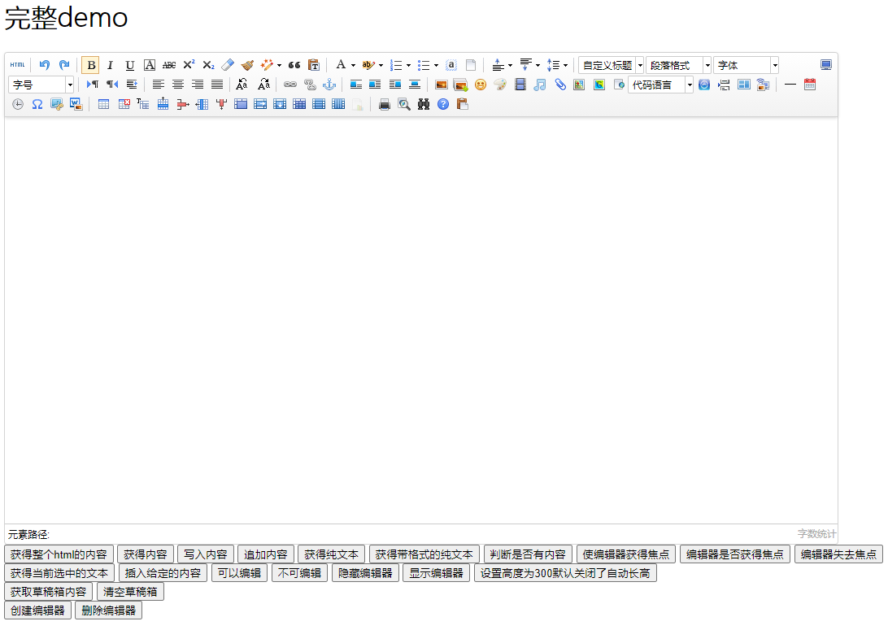

5. 此时发现上传图片功能不能用。照着源码里的 controller.jsp 依样画葫芦，写入 UEditorController 类，映射路径为 config。 

  ```java
  @RequestMapping("/config")
  public void config(HttpServletRequest request, HttpServletResponse response) {
      response.setContentType("application/json");
      String rootPath = request.getSession().getServletContext().getRealPath("/");
      String exec = new ActionEnter(request, rootPath).exec();
      PrintWriter writer = null;
      try {
          writer = response.getWriter();
      } catch (IOException e) {
          e.printStackTrace();
      } finally {
          if (writer != null) {
              writer.write(exec);
              writer.flush();
              writer.close();
          }
      }
  }
  ```

6. 一步一步 debug，发现无法加载 config.json 文件。此时修改 ConfigManage 类的 getConfigPath() 方法。如下:

  ```java
  package com.baidu.ueditor;
  
  import java.io.BufferedReader;
  import java.io.File;
  import java.io.FileInputStream;
  import java.io.FileNotFoundException;
  import java.io.IOException;
  import java.io.InputStreamReader;
  import java.io.UnsupportedEncodingException;
  import java.util.HashMap;
  import java.util.Map;
  
  import com.alibaba.fastjson.JSON;
  import com.alibaba.fastjson.JSONArray;
  import com.alibaba.fastjson.JSONObject;
  import com.baidu.ueditor.define.ActionMap;
  import org.apache.commons.io.IOUtils;
  
  /**
   * 配置管理器
   *
   * @author hancong03@baidu.com
   */
  public final class ConfigManager {
  
      private final String rootPath;
      private final String originalPath;
      // private final String contextPath;
      private static final String configFileName = "config.json";
      private String parentPath = null;
      private JSONObject jsonConfig = null;
      // 涂鸦上传filename定义
      private final static String SCRAWL_FILE_NAME = "scrawl";
      // 远程图片抓取filename定义
      private final static String REMOTE_FILE_NAME = "remote";
  
      /*
       * 通过一个给定的路径构建一个配置管理器， 该管理器要求地址路径所在目录下必须存在config.properties文件
       */
      private ConfigManager(String rootPath, String contextPath, String uri)
              throws FileNotFoundException, IOException {
  
          rootPath = rootPath.replace("\\", "/");
  
          this.rootPath = rootPath;
          // this.contextPath = contextPath;
  
          if (contextPath.length() > 0 && uri.startsWith(contextPath)) {
              this.originalPath = this.rootPath + uri.substring(contextPath.length());
          } else {
              this.originalPath = this.rootPath + uri;
          }
  
          this.initEnv();
  
      }
  
      /**
       * 配置管理器构造工厂
       *
       * @param rootPath    服务器根路径
       * @param contextPath 服务器所在项目路径
       * @param uri         当前访问的uri
       * @return 配置管理器实例或者null
       */
      public static ConfigManager getInstance(String rootPath, String contextPath, String uri) {
  
          try {
              return new ConfigManager(rootPath, contextPath, uri);
          } catch (Exception e) {
              return null;
          }
  
      }
  
      // 验证配置文件加载是否正确
      public boolean valid() {
          return this.jsonConfig != null;
      }
  
      public JSONObject getAllConfig() {
  
          return this.jsonConfig;
  
      }
  
      public Map<String, Object> getConfig(int type) {
  
          Map<String, Object> conf = new HashMap<String, Object>();
          String savePath = null;
  
          switch (type) {
  
              case ActionMap.UPLOAD_FILE:
                  conf.put("isBase64", "false");
                  conf.put("maxSize", this.jsonConfig.getLong("fileMaxSize"));
                  conf.put("allowFiles", this.getArray("fileAllowFiles"));
                  conf.put("fieldName", this.jsonConfig.getString("fileFieldName"));
                  savePath = this.jsonConfig.getString("filePathFormat");
                  break;
  
              case ActionMap.UPLOAD_IMAGE:
                  conf.put("isBase64", "false");
                  conf.put("maxSize", this.jsonConfig.getLong("imageMaxSize"));
                  conf.put("allowFiles", this.getArray("imageAllowFiles"));
                  conf.put("fieldName", this.jsonConfig.getString("imageFieldName"));
                  savePath = this.jsonConfig.getString("imagePathFormat");
                  break;
  
              case ActionMap.UPLOAD_VIDEO:
                  conf.put("maxSize", this.jsonConfig.getLong("videoMaxSize"));
                  conf.put("allowFiles", this.getArray("videoAllowFiles"));
                  conf.put("fieldName", this.jsonConfig.getString("videoFieldName"));
                  savePath = this.jsonConfig.getString("videoPathFormat");
                  break;
  
              case ActionMap.UPLOAD_SCRAWL:
                  conf.put("filename", ConfigManager.SCRAWL_FILE_NAME);
                  conf.put("maxSize", this.jsonConfig.getLong("scrawlMaxSize"));
                  conf.put("fieldName", this.jsonConfig.getString("scrawlFieldName"));
                  conf.put("isBase64", "true");
                  savePath = this.jsonConfig.getString("scrawlPathFormat");
                  break;
  
              case ActionMap.CATCH_IMAGE:
                  conf.put("filename", ConfigManager.REMOTE_FILE_NAME);
                  conf.put("filter", this.getArray("catcherLocalDomain"));
                  conf.put("maxSize", this.jsonConfig.getLong("catcherMaxSize"));
                  conf.put("allowFiles", this.getArray("catcherAllowFiles"));
                  conf.put("fieldName", this.jsonConfig.getString("catcherFieldName") + "[]");
                  savePath = this.jsonConfig.getString("catcherPathFormat");
                  break;
  
              case ActionMap.LIST_IMAGE:
                  conf.put("allowFiles", this.getArray("imageManagerAllowFiles"));
                  conf.put("dir", this.jsonConfig.getString("imageManagerListPath"));
                  conf.put("count", this.jsonConfig.getInteger("imageManagerListSize"));
                  break;
  
              case ActionMap.LIST_FILE:
                  conf.put("allowFiles", this.getArray("fileManagerAllowFiles"));
                  conf.put("dir", this.jsonConfig.getString("fileManagerListPath"));
                  conf.put("count", this.jsonConfig.getInteger("fileManagerListSize"));
                  break;
  
          }
  
          conf.put("savePath", savePath);
          conf.put("rootPath", this.rootPath);
  
          return conf;
  
      }
  
      private void initEnv() throws FileNotFoundException, IOException {
  
          File file = new File(this.originalPath);
  
          if (!file.isAbsolute()) {
              file = new File(file.getAbsolutePath());
          }
  
          this.parentPath = file.getParent();
  
          String configContent = this.readFile( this.getConfigPath() );
  
          try {
              JSONObject jsonConfig = JSON.parseObject(configContent);
              this.jsonConfig = jsonConfig;
          } catch (Exception e) {
              this.jsonConfig = null;
          }
  
      }
  
      protected String getConfigPath() {
          //return this.parentPath + File.separator + ConfigManager.configFileName;
          try {
  			//获取classpath下的config.json路径
  			return this.getClass().getClassLoader().getResource("config.json").toURI().getPath();
  		} catch (URISyntaxException e) {
  			return null;
  		}
  
      }
  
      private String[] getArray(String key) {
  
          JSONArray jsonArray = this.jsonConfig.getJSONArray(key);
          String[] result = new String[jsonArray.size()];
  
          for (int i = 0, len = jsonArray.size(); i < len; i++) {
              result[i] = jsonArray.getString(i);
          }
  
          return result;
  
      }
  
      private String readFile(String path) throws IOException {
  
          StringBuilder builder = new StringBuilder();
  
          try {
  
              InputStreamReader reader = new InputStreamReader(new FileInputStream(path), "UTF-8");
              BufferedReader bfReader = new BufferedReader(reader);
  
              String tmpContent = null;
  
              while ((tmpContent = bfReader.readLine()) != null) {
                  builder.append(tmpContent);
              }
  
              bfReader.close();
  
          } catch (UnsupportedEncodingException e) {
              // 忽略
          }
  
          return this.filter(builder.toString());
  
      }
  
      // 过滤输入字符串, 剔除多行注释以及替换掉反斜杠
      private String filter(String input) {
  
          return input.replaceAll("/\\*[\\s\\S]*?\\*/", "");
  
      }
  
  }
  ```

  ```java
  this.getClass().getClassLoader().getResource("config.json").toURI().getPath(); 
  ```

  此处需要先转为URI再getPath()，否则如果项目路径带空格或者带中文则无法读取到文件

7. 运行项目路径http://localhost:8080/config?action=config，如下图显示则表示可读取到 config.json 文件

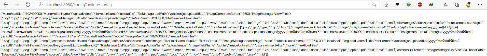

  此时进行上传图片，已经能够成功上传了。

9. 可是图片究竟上传到哪里了呢？继续一步步 debug 发现，上传到 tomcat 缓存路径，只要重启下 tomcat 该文件就会被删除。我们需要将其存储到磁盘中。此时修改config.json文件：

	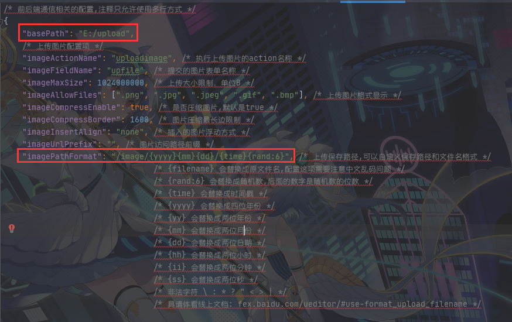

	红色为修改处。我需要将文件存储到 E:/upload/image/** 下，此处多添加了 basePath，是想把视频、音乐等静态资源都存储到 E 盘。由于添加了 basePath，需要修改配置。通过 debug 来到 ConfigManage：

	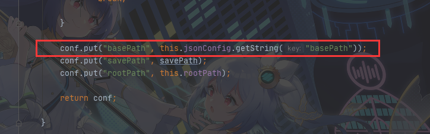

	将 basePath 塞进配置文件里。之后继续来到上传文件类 BinaryUploader，修改如下代码：

	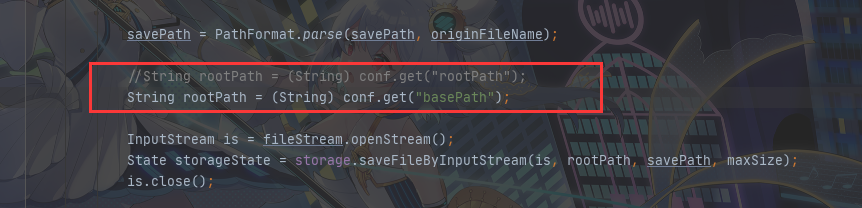

	运行项目，点击添加图片。打开 E 盘的 image 目录，成功上传到 E 盘对应路径。

10. 打开浏览器，发现页面无法加载图片。因为图片存在E盘了，而 spring 并没有对 E 盘目录进行映射。此时加入路径映射。打开application.properties 文件，添加如下代码

	```properties
	web.upload-path=E:/upload
	spring.mvc.static-path-pattern=/**
	spring.resources.static-locations=classpath:/META-INF/resources/,classpath:/resources/,classpath:/static/,classpath:/public/,file:${web.upload-path}
	```

	此时重新运行项目，点击上传图片，图片已经能够正常显示了。

11. 用Maven来打包运行试试，打开项目地址，点击上传图片，发现竟然上传不了了！？在 Jar 包里无法以 ClassLoader.getResource().getPath() 获得的路径读取文件，得用 Class 类的 getResourceAsStream() 来读取。打开 ConfigManager 类，修改 initEnv 方法：

	```java
	 private void initEnv() throws FileNotFoundException, IOException {
	
	     File file = new File(this.originalPath);
	
	     if (!file.isAbsolute()) {
	         file = new File(file.getAbsolutePath());
	     }
	
	     this.parentPath = file.getParent();
	
	     //String configContent = this.readFile(this.getConfigPath());
	     String configContent = this.filter(IOUtils.toString(this.getClass().getClassLoader().getResourceAsStream("config.json")));
	
	     try {
	         JSONObject jsonConfig = new JSONObject(configContent);
	         this.jsonConfig = jsonConfig;
	     } catch (Exception e) {
	         this.jsonConfig = null;
	     }
	
	 }
	```

12.  ok了，再次打包，运行项目，完成。


# 3、Ajax 上传/下载文件

**上传**

HTML 上传按钮：

```html
<div class="modal-body">
    <div class="form-group">
        <label for="upload">选择文件</label><span>&nbsp;&nbsp;*.xlsx&nbsp;&nbsp;*.docx&nbsp;&nbsp;*.pdf</span>
        <input type="file" class="form-control-file" id="upload">
    </div>
</div>
<div class="modal-footer">
    <button type="button" class="btn btn-secondary" data-dismiss="modal">取消</button>
    <button type="button" class="btn btn-primary" onclick="imp()">导入</button>
</div>
```

Ajax 上传：

```javascript
function imp() {
    let name = $('#upload').val();
    if (name != "") {
        let formData = new FormData();
        formData.append("file", $("#upload")[0].files[0])
        formData.append("name", name);
        $.ajax({
            url: '/import',
            type: 'POST',
            data: formData,
            // 告诉jQuery不要去处理发送的数据
            processData: false,
            // 告诉jQuery不要设置Content-Type请求头
            contentType: false,
            success: function (response) {
                $('#table').bootstrapTable('refresh');
                $('#imp').modal('hide');
                $('#upload').val('');
                alert("导入成功 ^ ^");
            }
        })
    } else {
        alert("请选择导入文件！")
    }
}
```

Controller：

```java
/**
 * 导入商品
 * @param file 文件
 * @return 结果
 */
@PostMapping("/import")
public String importProduct(MultipartFile file){
    return productService.importProduct(file);
}
```

通过`file.getOriginalFilename()`可以获取到文件名，通过`file.getInputStream()`可以获取文件流。


**下载（Excel）**

Controller：

```java
/**
  * 导出商品
  *
  * @param response
  */
@GetMapping("/export")
public void export(HttpServletResponse response) {
    response.setContentType("application/vnd.ms-excel");
    response.setCharacterEncoding("utf-8");
    try {
        // 这里URLEncoder.encode可以防止中文乱码 当然和easyExcel没有关系
        String fileName = URLEncoder.encode("商品", "UTF-8").replaceAll("\\+", "%20");
        response.setHeader("Content-disposition", "attachment;filename*=utf-8''" + fileName + ".xlsx");
    } catch (UnsupportedEncodingException e) {
        e.printStackTrace();
    }
    productService.export(response);
}
```

通过`response.getOutputStream()`可以获取输出流。

Ajax 下载:

jQuery 的 ajax 函数的返回类型只有 xml、text、json、html 等类型，没有“流”类型，所以要实现 ajax 下载，不能够使用相应的 ajax 函数进行文件下载。但可以用 js 生成一个 form，用这个 form 提交参数，并返回“流”类型的数据。在实现过程中，页面也没有进行刷新。

```javascript
// 导出
function exp() {
    $.ajax({
        url: '/export',
        type: 'GET',
        success: function (data) {
            let form = $("<form>");//定义一个form表单
            form.attr("style", "display:none");
            form.attr("target", "");
            form.attr("method", "GET");
            form.attr("action", "/export");
            let input1 = $("<input>");
            input1.attr("type", "hidden");
            input1.attr("name", "exportData");
            input1.attr("value", (new Date()).getMilliseconds());
            $("body").append(form);//将表单放置在web中
            form.append(input1);
            form.submit();//表单提交
        }
    })
}
```


# 4、Apache POI

Apache POI 是 Apache 软件基金会的开放源码函数库，POI 提供 API 给 Java 程序对 Microsoft Office 格式档案读和写的功能

基本功能：

- HSSF - 提供读写 Microsoft Excel 格式档案的功能（03）
- XSSF - 提供读写 Microsoft Excel OOXML 格式档案的功能（07）
- HWPF - 提供读写 Microsoft Word 格式档案的功能
- HSLF - 提供读写 Microsoft PowerPoint 格式档案的功能
- HDGF - 提供读写 Microsoft Visio 格式档案


## 4.1、导入依赖

```xml
<!--导入依赖-->
<dependencies>
    <!--xls(03)-->
    <!-- https://mvnrepository.com/artifact/org.apache.poi/poi -->
    <dependency>
        <groupId>org.apache.poi</groupId>
        <artifactId>poi</artifactId>
        <version>4.1.2</version>
    </dependency>

    <!--xlsx(7)-->
    <!-- https://mvnrepository.com/artifact/org.apache.poi/poi-ooxml -->
    <dependency>
        <groupId>org.apache.poi</groupId>
        <artifactId>poi-ooxml</artifactId>
        <version>4.1.2</version>
    </dependency>

    <!--日期格式化工具-->
    <!-- https://mvnrepository.com/artifact/joda-time/joda-time -->
    <dependency>
        <groupId>joda-time</groupId>
        <artifactId>joda-time</artifactId>
        <version>2.10.6</version>
    </dependency>

    <!--test-->
    <!-- https://mvnrepository.com/artifact/junit/junit -->
    <dependency>
        <groupId>junit</groupId>
        <artifactId>junit</artifactId>
        <version>4.13</version>
        <scope>test</scope>
    </dependency>
</dependencies>
```


## 4.2、POI Excel 写

### 4.2.1、基础操作

```java
public class ExcelWriteTest {
    String PATH="C:\\Users\\Orichalcos\\Desktop\\";

    @Test
    public void testWrite03(){
        //1.创建一个工作簿
        Workbook workbook = new HSSFWorkbook();
        //2.创建一个工作表
        Sheet sheet = workbook.createSheet("Orichalcos");
        //3.创建一个行
        Row row1 = sheet.createRow(0);
        //4.创建一个单元格
        Cell cell11 = row1.createCell(0);
        cell11.setCellValue("今日新增观众");
        //(1,2)
        Cell cell12 = row1.createCell(1);
        cell12.setCellValue(666);

        //第二行
        Row row2 = sheet.createRow(1);
        Cell cell21 = row2.createCell(0);
        cell21.setCellValue("统计时间");
        //(2,2)
        Cell cell22 = row2.createCell(1);
        String time = new DateTime().toString("yyyy-MM-dd HH:mm:ss");
        cell22.setCellValue(time);

        //生成一张表（IO流）
        try {
            FileOutputStream fileOutputStream = new FileOutputStream(PATH + "Orichalcos03.xls");

            workbook.write(fileOutputStream);

            fileOutputStream.close();
        } catch (FileNotFoundException e) {
            e.printStackTrace();
        } catch (IOException e) {
            e.printStackTrace();
        }
        
        System.out.println("Orichalcos03.xls 生成完毕");
    }

    @Test
    public void testWrite07(){
        //1.创建一个工作簿
        Workbook workbook = new XSSFWorkbook();
        //2.创建一个工作表
        Sheet sheet = workbook.createSheet("Orichalcos");
        //3.创建一个行
        Row row1 = sheet.createRow(0);
        //4.创建一个单元格
        Cell cell11 = row1.createCell(0);
        cell11.setCellValue("今日新增观众");
        //(1,2)
        Cell cell12 = row1.createCell(1);
        cell12.setCellValue(666);

        //第二行
        Row row2 = sheet.createRow(1);
        Cell cell21 = row2.createCell(0);
        cell21.setCellValue("统计时间");
        //(2,2)
        Cell cell22 = row2.createCell(1);
        String time = new DateTime().toString("yyyy-MM-dd HH:mm:ss");
        cell22.setCellValue(time);

        //生成一张表（IO流）
        try {
            FileOutputStream fileOutputStream = new FileOutputStream(PATH + "Orichalcos07.xlsx");

            workbook.write(fileOutputStream);

            fileOutputStream.close();
        } catch (FileNotFoundException e) {
            e.printStackTrace();
        } catch (IOException e) {
            e.printStackTrace();
        }
        
        System.out.println("Orichalcos07.xls 生成完毕");
    }
}
```


### 4.2.2、数据批量导入

- 大文件写 HSSF

	> 缺点：最多只能处理 65536 行，否则会抛出异常
	>
	> 优点：过程中写入缓存，不操作磁盘，最后一次写入磁盘，速度快

- 大文件写 XSSF

	> 缺点：写数据时非常慢，非常耗内存，也会发生内存溢出，如 100 万条
	>
	> 优点：可以写较大的数据量，如 20 万条

- 大文件写 SXSSF

	> 优点：可以写非常大的数据量，如 100 万条甚至更多条，写数据速度快，占用更少的内存
	>
	> 注意：过程中会产生临时文件，需要清理临时文件，默认 100 条记录被保存在内存中，如果超过这数量，则前面的数据被写入临时文件，如果想自定义内存中数据的数量，可以使用`new SXSSFWorkbook(数量)`，SXSSF 仍然可能会消耗大量内存


**大文件写 HSSF**

```java
@Test
public void testWrite03BigData() {
    //时间
    long begin = System.currentTimeMillis();

    //创建一个簿
    Workbook workbook = new HSSFWorkbook();
    //创建表
    Sheet sheet = workbook.createSheet();
    //写入数据
    for (int rowNum = 0; rowNum < 65536; rowNum++) {
        Row row = sheet.createRow(rowNum);
        for (int cellNum = 0; cellNum < 10; cellNum++) {
            Cell cell = row.createCell(cellNum);
            cell.setCellValue(cellNum);
        }
    }
    System.out.println("over");
    try {
        FileOutputStream fileOutputStream = new FileOutputStream(PATH + "OrichalcosBig03.xls");
        workbook.write(fileOutputStream);
        fileOutputStream.close();
    } catch (FileNotFoundException e) {
        e.printStackTrace();
    } catch (IOException e) {
        e.printStackTrace();
    }
    long end = System.currentTimeMillis();
    System.out.println((double) (end - begin) / 1000);
}
```


**大文件写 XSSF**

```java
@Test
public void testWrite07BigData() {
    //时间
    long begin = System.currentTimeMillis();

    //创建一个簿
    Workbook workbook = new XSSFWorkbook();
    //创建表
    Sheet sheet = workbook.createSheet();
    //写入数据
    for (int rowNum = 0; rowNum < 100000; rowNum++) {
        Row row = sheet.createRow(rowNum);
        for (int cellNum = 0; cellNum < 10; cellNum++) {
            Cell cell = row.createCell(cellNum);
            cell.setCellValue(cellNum);
        }
    }
    System.out.println("over");
    try {
        FileOutputStream fileOutputStream = new FileOutputStream(PATH + "OrichalcosBig07.xlsx");
        workbook.write(fileOutputStream);
        fileOutputStream.close();
    } catch (FileNotFoundException e) {
        e.printStackTrace();
    } catch (IOException e) {
        e.printStackTrace();
    }
    long end = System.currentTimeMillis();
    System.out.println((double) (end - begin) / 1000);
}
```


**大文件写 SXSSF**

```java
@Test
public void testWrite07BigDataS() {
    //时间
    long begin = System.currentTimeMillis();

    //创建一个簿
    Workbook workbook = new SXSSFWorkbook();
    //创建表
    Sheet sheet = workbook.createSheet();
    //写入数据
    for (int rowNum = 0; rowNum < 100000; rowNum++) {
        Row row = sheet.createRow(rowNum);
        for (int cellNum = 0; cellNum < 10; cellNum++) {
            Cell cell = row.createCell(cellNum);
            cell.setCellValue(cellNum);
        }
    }
    System.out.println("over");
    try {
        FileOutputStream fileOutputStream = new FileOutputStream(PATH + "OrichalcosBig07S.xlsx");
        workbook.write(fileOutputStream);
        fileOutputStream.close();
    } catch (FileNotFoundException e) {
        e.printStackTrace();
    } catch (IOException e) {
        e.printStackTrace();
    }
    //清除临时文件
    ((SXSSFWorkbook)workbook).dispose();
    long end = System.currentTimeMillis();
    System.out.println((double) (end - begin) / 1000);
}
```


### 4.2.3、合并单元格

```java
 public class Excel2 {
	public static void main(String[] args) throws IOException {
        FileOutputStream fos=new FileOutputStream("D:\\hebing.xls");
        HSSFWorkbook wb=new HSSFWorkbook();
		HSSFSheet sheet=wb.createSheet();
		/*
		 * 设定合并单元格区域范围
		 * 	firstRow  0-based
		 * 	lastRow   0-based
		 * 	firstCol  0-based
		 * 	lastCol   0-based
		 */
		CellRangeAddress cra=new CellRangeAddress(0, 2, 3, 6);		
		//在sheet里增加合并单元格
		sheet.addMergedRegion(cra);
		
		HSSFRow row = sheet.createRow(0);
		HSSFCell cell_1 = row.createCell(3);
		cell_1.setCellValue("this is merge unit ");
		//cell 位置3-6被合并成一个单元格，不管你怎样创建第4个cell还是第5个cell…然后在写数据。都是无法写入的。
		HSSFCell cell_2 = row.createCell(7);
		cell_2.setCellValue("what's up ! ");
		wb.write(fos);
		fos.close();
	}
}
```


**合并单元格的关键代码：**

```java
//创建合并单元格区域
CellRangeAddress cra=new CellRangeAddress(0, 2, 3, 6);        
//在sheet里增加合并单元格
sheet.addMergedRegion(cra);
```

创建合并单元格的方法 CellRangeAdress(int firstRow, int lastRow, int fitstCol, int lastCol); 中的参数四个参数分别表示，合并区域的第一行，最后一行，第一列，最后一列。并且合并区域的单元格数目必须大于2，否则出错。


## 4.3、POI Excel 读

### 4.3.1、基础操作

```java
public class ExcelReadTest {
    String PATH = "C:\\Users\\Orichalcos\\Desktop\\";

    @Test
    public void testRead03() throws IOException {
        //获取文件流
        FileInputStream fileInputStream = new FileInputStream(PATH + "Orichalcos.xls");

        //1.创建一个工作簿，使用 Excel 能能操作的这边他都可以操作
        Workbook workbook = new HSSFWorkbook(fileInputStream);
        //2.得到表
        Sheet sheet = workbook.getSheetAt(0);
        //3.得到行
        Row row = sheet.getRow(1);
        //4.得到列
        Cell cell = row.getCell(3);

        //读取值的时候,一定要注意类型
        //getStringCellValue 字符串类型
        //System.out.println(cell.getStringCellValue());
        System.out.println(cell.getDateCellValue());
        fileInputStream.close();
    }

    @Test
    public void testRead07() throws IOException {
        //获取文件流
        FileInputStream fileInputStream = new FileInputStream(PATH + "Orichalcos.xlsx");

        //1.创建一个工作簿，使用 Excel 能能操作的这边他都可以操作
        Workbook workbook = new XSSFWorkbook(fileInputStream);
        //2.得到表
        Sheet sheet = workbook.getSheetAt(0);
        //3.得到行
        Row row = sheet.getRow(1);
        //4.得到列
        Cell cell = row.getCell(3);

        //读取值的时候,一定要注意类型
        //getStringCellValue 字符串类型
        //System.out.println(cell.getStringCellValue());
        System.out.println(cell.getDateCellValue());
        fileInputStream.close();
    }
}
```


### 4.3.2、读取不同类型数据

```java
@Test
public void testCellType() throws IOException {
    //获取文件流
    FileInputStream fileInputStream = new FileInputStream(PATH + "Orichalcos.xls");

    //创建一个工作簿
    Workbook workbook = new HSSFWorkbook(fileInputStream);
    Sheet sheet = workbook.getSheetAt(0);
    
    //获取标题内容
    Row rowTitle = sheet.getRow(0);
    if (rowTitle != null) {
        int cellCount = rowTitle.getPhysicalNumberOfCells();
        for (int cellNum = 0; cellNum < cellCount; cellNum++) {
            Cell cell = rowTitle.getCell(cellNum);
            if (cell != null) {
                String cellValue = cell.getStringCellValue();
                System.out.print(cellValue + "|");
            }
        }
        System.out.println();
    }

    //获取表中的日期
    int rowCount = sheet.getPhysicalNumberOfRows();
    for (int rowNum = 1; rowNum < rowCount; rowNum++) {
        Row rowData = sheet.getRow(rowNum);
        if (rowData != null) {
            //读取列
            int cellCount = rowTitle.getPhysicalNumberOfCells();
            for (int cellNum = 0; cellNum < cellCount; cellNum++) {
                System.out.print("[" + (rowNum + 1) + "-" + (cellNum + 1) + "]");

                Cell cell = rowData.getCell(cellNum);
                //匹配列的数据类型
                CellType cellType = cell.getCellType();
                String cellValue = "";

                switch (cellType) {
                    case STRING://字符串
                        System.out.print("【String】");
                        cellValue = cell.getStringCellValue();
                        break;
                    case BOOLEAN://布尔
                        System.out.print("【Boolean】");
                        cellValue = String.valueOf(cell.getBooleanCellValue());
                        break;
                    case BLANK://空
                        System.out.print("【Blank】");
                        break;
                    case NUMERIC://数字(日期、普通数字)
                        System.out.print("【Numeric】");
                        if (HSSFDateUtil.isCellDateFormatted(cell)) {//日期
                            System.out.print("【日期】");
                            Date date = cell.getDateCellValue();
                            cellValue = new DateTime(date).toString("yyyy-MM-dd");
                        } else {
                            //不是日期格式，防止数字过长
                            System.out.print("【转换为字符串输出】");
                            cell.setCellType(CellType.STRING);
                            cellValue = cell.toString();
                        }
                        break;
                    case ERROR:
                        System.out.print("【数据类型错误】");
                        break;
                }
                System.out.println(cellValue);
            }
        }
    }
    fileInputStream.close();
}
```


### 4.3.3、计算公式

```java
@Test
public void testFormula() throws IOException {
    FileInputStream inputStream = new FileInputStream(PATH + "公式.xls");
    Workbook workbook = new HSSFWorkbook(inputStream);
    Sheet sheet = workbook.getSheetAt(0);

    Row row = sheet.getRow(3);
    Cell cell =row.getCell(0);
    System.out.println(cell.getNumericCellValue());

    //拿到计算公式
    FormulaEvaluator formulaEvaluator = new HSSFFormulaEvaluator((HSSFWorkbook) workbook);

    //输出单元格的内容
    CellType cellType = cell.getCellType();
    switch (cellType){
        case FORMULA://公式
            String formula = cell.getCellFormula();
            System.out.println(formula);

            //计算
            CellValue evaluate = formulaEvaluator.evaluate(cell);
            String string = evaluate.formatAsString();
            System.out.println(string);
            break;
    }
}
```


## 4.4、POI Word 读

使用poi读取文档中的表格，当有多个表格时可以指定需要读取的表格，同时支持读取 docx 和 doc 格式。需要添加 poi 的 jar 包

```xml
<!--apache-POI-->
<dependency>
    <groupId>org.apache.poi</groupId>
    <artifactId>poi</artifactId>
    <version>3.14</version>
</dependency>
<!--POI Word(03)转为HTML工具-->
<dependency>
    <groupId>org.apache.poi</groupId>
    <artifactId>poi-scratchpad</artifactId>
    <version>3.14</version>
</dependency>
<dependency>
    <groupId>org.apache.poi</groupId>
    <artifactId>poi-ooxml</artifactId>
    <version>3.14</version>
</dependency>
<!--POI Word(07)转为HTML工具-->
<dependency>
    <groupId>fr.opensagres.xdocreport</groupId>
    <artifactId>fr.opensagres.poi.xwpf.converter.xhtml</artifactId>
    <version>2.0.1</version>
</dependency>
<!--如果遇见jar包冲突可以替换为这个jar包-->
<!--<dependency>-->
<!--    <groupId>fr.opensagres.xdocreport</groupId>-->
<!--    <artifactId>org.apache.poi.xwpf.converter.xhtml</artifactId>-->
<!--    <version>1.0.6</version>-->
<!--</dependency>-->
<dependency>
    <groupId>org.apache.poi</groupId>
    <artifactId>poi-ooxml-schemas</artifactId>
    <version>3.14</version>
</dependency>
<dependency>
    <groupId>org.apache.poi</groupId>
    <artifactId>ooxml-schemas</artifactId>
    <version>1.3</version>
</dependency>
```

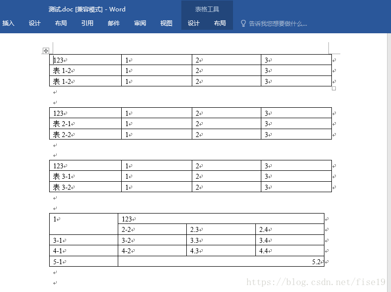

```java
 /**
 * 
 * 读取word文档中表格数据，支持doc、docx
 * @author Fise19
 * 
 */
public class ExportDoc {
	public static void main(String[] args) {
		ExportDoc test = new ExportDoc();
		String filePath = "D:\\new\\测试.docx";
		//String filePath = "D:\\new\\测试.doc";
		test.testWord(filePath);
	}
	/**
	 * 读取文档中表格
	 * @param filePath
	 */
	public void testWord(String filePath){
		try{
			FileInputStream in = new FileInputStream(filePath);//载入文档
			// 处理docx格式 即office2007以后版本
			if(filePath.toLowerCase().endsWith("docx")){
				//word 2007 图片不会被读取， 表格中的数据会被放在字符串的最后   
				XWPFDocument xwpf = new XWPFDocument(in);//得到word文档的信息
				Iterator<XWPFTable> it = xwpf.getTablesIterator();//得到word中的表格
				// 设置需要读取的表格  set是设置需要读取的第几个表格，total是文件中表格的总数
				int set = 2, total = 4;
				int num = set;
				// 过滤前面不需要的表格
				for (int i = 0; i < set-1; i++) {
					it.hasNext();
					it.next();
				}
				while(it.hasNext()){
					XWPFTable table = it.next();  
					System.out.println("这是第" + num + "个表的数据");
					List<XWPFTableRow> rows = table.getRows(); 
					//读取每一行数据
					for (int i = 0; i < rows.size(); i++) {
						XWPFTableRow  row = rows.get(i);
						//读取每一列数据
						List<XWPFTableCell> cells = row.getTableCells(); 
						for (int j = 0; j < cells.size(); j++) {
							XWPFTableCell cell = cells.get(j);
							//输出当前的单元格的数据
							System.out.print(cell.getText() + "\t");
						}
						System.out.println();
					}
					// 过滤多余的表格
					while (num < total) {
						it.hasNext();
						it.next();
						num += 1;
					}
				}
			}else{
				// 处理doc格式 即office2003版本
				POIFSFileSystem pfs = new POIFSFileSystem(in);   
				HWPFDocument hwpf = new HWPFDocument(pfs);   
				Range range = hwpf.getRange();//得到文档的读取范围
				TableIterator it = new TableIterator(range);
				// 迭代文档中的表格
				// 如果有多个表格只读取需要的一个 set是设置需要读取的第几个表格，total是文件中表格的总数
				int set = 1, total = 4;
				int num = set;
				for (int i = 0; i < set-1; i++) {
					it.hasNext();
					it.next();
				}
				while (it.hasNext()) {   
					Table tb = (Table) it.next();   
					System.out.println("这是第" + num + "个表的数据");
					//迭代行，默认从0开始,可以依据需要设置i的值,改变起始行数，也可设置读取到那行，只需修改循环的判断条件即可
					for (int i = 0; i < tb.numRows(); i++) {   
						TableRow tr = tb.getRow(i);   
						//迭代列，默认从0开始
						for (int j = 0; j < tr.numCells(); j++) {   
							TableCell td = tr.getCell(j);//取得单元格
							//取得单元格的内容
							for(int k = 0; k < td.numParagraphs(); k++){   
								Paragraph para = td.getParagraph(k); 
								String s = para.text();
								//去除后面的特殊符号
								if(null != s && !"".equals(s)){
									s = s.substring(0, s.length()-1);
								}
								System.out.print(s + "\t");
							}
						}
						System.out.println();
					} 
					// 过滤多余的表格
					while (num < total) {
						it.hasNext();
						it.next();
						num += 1;
					}
				}
			}
		}catch(Exception e){
			e.printStackTrace();
		}
	}
}
```

```
这是第2个表的数据
123	1	2	3	
表2-1	1	2	3	
表2-2	1	2	3	
```


### 4.4.1、Word 转 HTML

**07 版 Word 转 Html**

```java
public static String docxToHtml(File file) {
    //获取word文件名（去掉扩展名）
    //String fileName = file.getName().substring(0, file.getName().lastIndexOf("."));
    //存放图片的路径（如果不存在创建）
    String imagePath = "E:\\upload";
    File imageFolder = new File(imagePath);
    if (!imageFolder.exists()) {
        imageFolder.mkdirs();
    }
    //生成的html文件的名字
    //String htmlFileName = imagePath + File.separator + fileName + ".html";

    //加载word文档生成XWPFDocument对象
    try (XWPFDocument xwpfDocument = new XWPFDocument(new FileInputStream(file));
         //创建文件数据流输出转换的html文件
         //OutputStream outputStream = new FileOutputStream(htmlFileName);
         //也可以使用字符数组流获取解析的内容
         OutputStream outputStream = new ByteArrayOutputStream()
    ) {
        //解析XHTML配置（这里设置URIResolver来设置图片存放的目录）
        XHTMLOptions xhtmlOptions = XHTMLOptions.create();
        //存放图片的文件夹
        xhtmlOptions.setExtractor(new FileImageExtractor(imageFolder));
        //html中图片的路径
        xhtmlOptions.URIResolver(new FileURIResolver(imageFolder));

        //将XWPFDocument转换为XHTML
        XHTMLConverter.getInstance().convert(xwpfDocument, outputStream, xhtmlOptions);
        logger.info("docx转html成功,文件名：" + file.getName());
        return outputStream.toString();
        //return htmlFileName;
    } catch (Exception e) {
        logger.error("docx转html失败，文件名：" + file.getName());
        return null;
    }
}
```

在 Web 中转化后的 html  页面无法访问图片的问题：因为 ` xhtmlOptions.URIResolver(new FileURIResolver(imageFolder));`生成的 url 是绝对路径，可以将其改为`xhtmlOptions.URIResolver(new BasicURIResolver(""));`，同时需要对 `E:\\upload`路径进行映射：

```yaml
web:
  upload-path: E:/upload
spring:
  mvc:
    static-path-pattern: /**
  resources:
    # 对上传的地址E:/进行映射
    static-locations: classpath:/META-INF/resources/,classpath:/resources/,classpath:/static/,classpath:/public/,file:${web.upload-path}
```


**03版word转html**

```java
public static String docToHtml(File file) {
    //获取word的文件名（去掉扩展名）
    String fileName = file.getName().substring(0, file.getName().lastIndexOf("."));
    //图片存储路径（如果不存在则创建）
    String imagePath = "E:\\upload";
    //生成的html文件名
    //String htmlFileName = imagePath + File.separator + fileName + ".html";
    try (//使用文件输出流获取解析内容
        //OutputStream outputStream = new FileOutputStream(htmlFileName);
        //也可以使用字符数组流获取解析的内容
        ByteArrayOutputStream outputStream = new ByteArrayOutputStream()
    ) {
        HWPFDocument hwpfDocument = new HWPFDocument(new FileInputStream(file));
        Document document = DocumentBuilderFactory.newInstance().newDocumentBuilder().newDocument();
        WordToHtmlConverter wordToHtmlConverter = new WordToHtmlConverter(document);
        wordToHtmlConverter.setPicturesManager((content, pictureType, name, width, height) -> {
            File folder = new File(imagePath + File.separator + fileName);
            //图片目录不存在则创建
            if (!folder.exists()) {
                folder.mkdirs();
            }
            try (FileOutputStream fileOutputStream = new FileOutputStream(folder + File.separator + name)) {
                fileOutputStream.write(content);
            } catch (IOException e) {
                e.printStackTrace();
            }
            return folder + File.separator + name;
        });
        //解析word文档
        wordToHtmlConverter.processDocument(hwpfDocument);
        Document documentHtml = wordToHtmlConverter.getDocument();
        DOMSource domSource = new DOMSource(documentHtml);

        StreamResult streamResult = new StreamResult(outputStream);

        Transformer transformer = TransformerFactory.newInstance().newTransformer();
        transformer.setOutputProperty(OutputKeys.ENCODING, "UTF-8");
        transformer.setOutputProperty(OutputKeys.INDENT, "yes");
        transformer.setOutputProperty(OutputKeys.METHOD, "html");
        transformer.transform(domSource, streamResult);
        logger.info("doc转html成功，文件名：" + file.getName());
        return new String(outputStream.toByteArray(), StandardCharsets.UTF_8);
        //return htmlFileName;
    } catch (IOException | ParserConfigurationException | TransformerException e) {
        logger.error("doc转html失败，文件名：" + file.getName());
        return null;
    }
}
```

如果显示缺少 class，看情况导入以下依赖：

```xml
<!--缺少的jar包-->
<dependency>
    <groupId>javax.xml.bind</groupId>
    <artifactId>jaxb-api</artifactId>
    <version>2.3.0</version>
</dependency>
<dependency>
    <groupId>com.sun.xml.bind</groupId>
    <artifactId>jaxb-impl</artifactId>
    <version>2.3.0</version>
</dependency>
<dependency>
    <groupId>com.sun.xml.bind</groupId>
    <artifactId>jaxb-core</artifactId>
    <version>2.3.0</version>
</dependency>
<dependency>
    <groupId>javax.activation</groupId>
    <artifactId>activation</artifactId>
    <version>1.1.1</version>
</dependency>
```


# 5、easyExcel

Java 解析、生成 Excel 比较有名的框架有 Apache POI、jxl。但他们都存在一个严重的问题就是非常的耗内存，POI 有一套 SAX 模式的 API 可以一定程度的解决一些内存溢出的问题，但 POI 还是有一些缺陷，比如 07 版 Excel 解压缩以及解压后存储都是在内存中完成的，内存消耗依然很大。easyExcel重写了 POI 对 07 版 Excel 的解析，能够原本一个 3M 的 Excel 用 POI SAX 依然需要100M 左右内存降低到几M，并且再大的 Excel 不会出现内存溢出，03 版依赖 POI 的 SAX 模式。在上层做了模型转换的封装，让使用者更加简单方便


## 5.1、导入依赖

```xml
<!--easyExcel-->
<!-- https://mvnrepository.com/artifact/com.alibaba/easyexcel -->
<dependency>
    <groupId>com.alibaba</groupId>
    <artifactId>easyexcel</artifactId>
    <version>2.2.6</version>
</dependency>
```

点进`com.alibaba`可以看到其实 easyExcel 也是使用了 Apache POI，所以需要注释掉自己导入的 POI 依赖，以防止依赖冲突。

这里只介绍简单的读写，详情参考 alibaba 开源项目 [easyExcel](https://github.com/alibaba/easyexcel)。


## 5.2、easyExcel 写

需要一个实体类，一个实体类对象代表一行数据

```java
@Data
public class DemoData {
    @ExcelProperty("字符串标题")
    private String string;
    @ExcelProperty("日期标题")
    private Date date;
    @ExcelProperty("数字标题")
    private Double doubleDate;
    //忽略这个字段
    @ExcelIgnore
    private String ignore;
}
```

测试：

```java
public class easyExcelTest {
    String PATH = "C:\\Users\\Orichalcos\\Desktop\\";

    private List<DataDemo> data(){
        List<DataDemo> list = new ArrayList<DataDemo>();
        for (int i = 0;i<10;i++){
            DataDemo data = new DataDemo();
            data.setString("字符串"+i);
            data.setDate(new Date());
            data.setDoubleDate(0.56);
            list.add(data);
        }
        return list;
    }

    //根据List，写入 excel
    @Test
    public void simpleWrite(){
        String fileName = PATH+"easyExcel.xls";

        //写法一
        //这里 需要指定写用哪个class去写，然后写到第一个sheet，名字为模板 然后文件流会自动关闭
        EasyExcel.write(fileName,DemoData.class).sheet("模板").doWrite(data());

        //写法二
        //这里 需要指定写用哪个class去写
        ExcelWriter excelWriter = EasyExcel.write(fileName, DataDemo.class).build();
        WriteSheet writeSheet = EasyExcel.writerSheet("模板").build();
        excelWriter.write(data(),writeSheet);
        //千万别忘记finish，会帮助故关闭流
        excelWriter.finish();
    }
}
```


### 5.2.1、web 中的写

```java
/**
  * 文件下载（失败了会返回一个有部分数据的Excel）
  * <p>
  * 1. 创建excel对应的实体对象 参照{@link DownloadData}
  * <p>
  * 2. 设置返回的 参数
  * <p>
  * 3. 直接写，这里注意，finish的时候会自动关闭OutputStream,当然你外面再关闭流问题不大
  */
@GetMapping("download")
public void download(HttpServletResponse response) throws IOException {
    // 这里注意 有同学反应使用swagger 会导致各种问题，请直接用浏览器或者用postman
    response.setContentType("application/vnd.ms-excel");
    response.setCharacterEncoding("utf-8");
    // 这里URLEncoder.encode可以防止中文乱码 当然和easyexcel没有关系
    String fileName = URLEncoder.encode("测试", "UTF-8").replaceAll("\\+", "%20");
    response.setHeader("Content-disposition", "attachment;filename*=utf-8''" + fileName + ".xlsx");
    EasyExcel.write(response.getOutputStream(), DownloadData.class).sheet("模板").doWrite(data());
}
```


### 5.2.2、复杂头写出

```java
@Data
@AllArgsConstructor
@NoArgsConstructor
public class Product {
    @ExcelIgnore
    private long productID;

    @ExcelProperty({"商品信息", "商品名称"})
    private String productName;

    @ExcelProperty({"商品信息", "商品重量"})
    private double productWeight;

    @ExcelProperty({"商品信息", "商品价格"})
    private double productPrice;

    @ExcelProperty({"商品信息", "商品分类"})
    private String productClassify;

    @ExcelProperty({"其他信息", "商品图片"})
    private String productImage;

    @ExcelProperty({"其他信息", "备注"})
    private String productRemark;
}
```

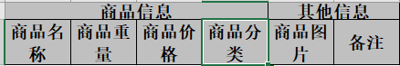


## 5.3、easyExcel 读

实体类：

```java
@Data
public class DemoData {
    private String string;
    private Date date;
    private Double doubleDate;
}
```

DAO 持久层：

```java
/**
 * 假设这个是你的DAO存储。当然还要这个类让spring管理，当然你不用需要存储，也不需要这个类。
 *
 * @author Jiaju Zhuang
 **/
public class DemoDAO {
    public void save(List<DemoData> list) {
        // 如果是mybatis,尽量别直接调用多次insert,自己写一个mapper里面新增一个方法batchInsert,所有数据一次性插入
    }
}
```

监听器：

```java
/**
 * 模板的读取类
 */
// 有个很重要的点 DemoDataListener 不能被spring管理，要每次读取excel都要new,然后里面用到spring可以构造方法传进去
public class DemoDataListener extends AnalysisEventListener<DemoData> {
    private static final Logger LOGGER = LoggerFactory.getLogger(DemoDataListener.class);
    /**
     * 每隔5条存储数据库，实际使用中可以3000条，然后清理list ，方便内存回收
     */
    private static final int BATCH_COUNT = 5;
    List<DemoData> list = new ArrayList<DemoData>();
    /**
     * 假设这个是一个DAO，当然有业务逻辑这个也可以是一个service。当然如果不用存储这个对象没用。
     */
    private DemoDAO demoDAO;

    public DemoDataListener() {
        // 这里是demo，所以随便new一个。实际使用如果到了spring,请使用下面的有参构造函数
        demoDAO = new DemoDAO();
    }

    /**
     * 如果使用了spring,请使用这个构造方法。每次创建Listener的时候需要把spring管理的类传进来
     *
     * @param demoDAO
     */
    public DemoDataListener(DemoDAO demoDAO) {
        this.demoDAO = demoDAO;
    }

    /**
     * 这个每一条数据解析都会来调用
     *
     * @param data
     *            one row value. Is is same as {@link AnalysisContext#readRowHolder()}
     * @param context
     */
    @Override
    public void invoke(DemoData data, AnalysisContext context) {
        LOGGER.info("解析到一条数据:{}", JSON.toJSONString(data));
        list.add(data);
        // 达到BATCH_COUNT了，需要去存储一次数据库，防止数据几万条数据在内存，容易OOM
        if (list.size() >= BATCH_COUNT) {
            saveData();
            // 存储完成清理 list
            list.clear();
        }
    }

    /**
     * 所有数据解析完成了 都会来调用
     *
     * @param context
     */
    @Override
    public void doAfterAllAnalysed(AnalysisContext context) {
        // 这里也要保存数据，确保最后遗留的数据也存储到数据库
        saveData();
        LOGGER.info("所有数据解析完成！");
    }

    /**
     * 加上存储数据库
     */
    private void saveData() {
        LOGGER.info("{}条数据，开始存储数据库！", list.size());
        demoDAO.save(list);
        LOGGER.info("存储数据库成功！");
    }
}
```

测试：

```java
public class ReadTest {
    private static final Logger LOGGER = LoggerFactory.getLogger(ReadTest.class);

    /**
     * 最简单的读
     * <p>
     * 1. 创建excel对应的实体对象 参照{@link DemoData}
     * <p>
     * 2. 由于默认一行行的读取excel，所以需要创建excel一行一行的回调监听器，参照{@link DemoDataListener}
     * <p>
     * 3. 直接读即可
     */
    @Test
    public void simpleRead() {
        // 有个很重要的点 DemoDataListener 不能被spring管理，要每次读取excel都要new,然后里面用到spring可以构造方法传进去
        // 写法1：
        String fileName = TestFileUtil.getPath() + "demo" + File.separator + "demo.xlsx";
        // 这里 需要指定读用哪个class去读，然后读取第一个sheet 文件流会自动关闭
        EasyExcel.read(fileName, DemoData.class, new DemoDataListener()).sheet().doRead();

        // 写法2：
        fileName = TestFileUtil.getPath() + "demo" + File.separator + "demo.xlsx";
        ExcelReader excelReader = null;
        try {
            excelReader = EasyExcel.read(fileName, DemoData.class, new DemoDataListener()).build();
            ReadSheet readSheet = EasyExcel.readSheet(0).build();
            excelReader.read(readSheet);
        } finally {
            if (excelReader != null) {
                // 这里千万别忘记关闭，读的时候会创建临时文件，到时磁盘会崩的
                excelReader.finish();
            }
        }
    }
}
```


### 5.3.1、web 中的读

```java
/**
  * 文件上传
  * <p>
  * 1. 创建excel对应的实体对象 参照{@link UploadData}
  * <p>
  * 2. 由于默认一行行的读取excel，所以需要创建excel一行一行的回调监听器，参照{@link UploadDataListener}
  * <p>
  * 3. 直接读即可
  */
@PostMapping("upload")
@ResponseBody
public String upload(MultipartFile file) throws IOException {
    EasyExcel.read(file.getInputStream(), UploadData.class, new UploadDataListener(uploadDAO)).sheet().doRead();
    return "success";
}
```


# 6、Apache PDFbox

Apache PDFbox 是一个开源的、基于 Java 的、支持 PDF 文档生成的工具库，它可以用于创建新的 PDF 文档，修改现有的 PDF 文档，还可以从 PDF 文档中提取所需的内容。Apache PDFBox 还包含了数个命令行工具。

导入依赖：

```xml
<!--pdfBox-->
<dependency>
    <groupId>org.apache.pdfbox</groupId>
    <artifactId>pdfbox</artifactId>
    <version>2.0.21</version>
</dependency>
```

编写代码：

```java
public class PDFTest {
    public static String getTextFromPDF(String pdfFilePath)
    {
        String result = null;
        PDDocument document = null;
        File file = new File(pdfFilePath);
        try {
            PDFParser parser = new PDFParser(new RandomAccessFile(file,"rw"));
            //如果是web解析可以使用下面这种方法
            //PDFParser parser = new PDFParser(new RandomAccessBuffer(input));
            parser.parse();
            document = parser.getPDDocument();
            PDFTextStripper stripper = new PDFTextStripper();
            result = stripper.getText(document);
        } catch (FileNotFoundException e) {
            e.printStackTrace();
        } catch (IOException e) {
            e.printStackTrace();
        } finally {
            if (document != null) {
                try {
                    document.close();
                } catch (IOException e) {
                    e.printStackTrace();
                }
            }
        }
        return result;
    }
    public  static void main(String[] args)
    {
        String str=PDFTest.getTextFromPDF("D:\\pdf.pdf");
        System.out.println(str);
 
    }
}
```


## 6.1、PDF 转 HTML

pdfbox 自带的转换 html 的方法效果不是太好，pdfdom 是基于 pdfbox 的，在此之上加强了转换 html 的能力。

导入依赖：

```xml
<dependency>
    <groupId>net.sf.cssbox</groupId>
    <artifactId>pdf2dom</artifactId>
    <version>1.9</version>
</dependency>
<dependency>
    <groupId>org.jsoup</groupId>
    <artifactId>jsoup</artifactId>
    <version>1.13.1</version>
</dependency>
```

```java
public static String pdfToHtml(File file) {
    try (PDDocument pdDocument = PDDocument.load(file);
         //PrintWriter writer = new PrintWriter("E://upload//123.html", StandardCharsets.UTF_8);
         Writer writer = new CharArrayWriter()
        ) {
        new PDFDomTree().writeText(pdDocument, writer);
        logger.info("pdf转html成功，文件名：" + file.getName());
        return writer.toString();
    } catch (IOException | ParserConfigurationException e) {
        logger.error("pdf转html失败，文件名：" + file.getName());
        return null;
    }
}
```


# 7、Axios

## 7.1、什么是axios

Axios 是一个基于 promise 的 HTTP 库，可以用在浏览器和 node.js 中。


**特性**

- 从浏览器中创建 XMLHttpRequests
- 从 node.js 创建 http 请求
- 支持 Promise API
- 拦截请求和响应
- 转换请求数据和响应数据
- 取消请求
- 自动转换 JSON 数据
- 客户端支持防御 XSRF从浏览器中创建 XMLHttpRequests


**使用 cdn:**

```html
<script src="https://unpkg.com/axios/dist/axios.min.js"></script>
```


## 7.2、案例

**执行 `GET` 请求**

```js
// 为给定 ID 的 user 创建请求
axios.get('/user?ID=12345')
  .then(function (response) {
    console.log(response);
  })
  .catch(function (error) {
    console.log(error);
  });

// 上面的请求也可以这样做
axios.get('/user', {
    params: {
      ID: 12345
    }
  })
  .then(function (response) {
    console.log(response);
  })
  .catch(function (error) {
    console.log(error);
  });
```


**执行 `POST` 请求**

```javascript
axios.post('/user', {
    firstName: 'Fred',
    lastName: 'Flintstone'
  })
  .then(function (response) {
    console.log(response);
  })
  .catch(function (error) {
    console.log(error);
  });
```


**执行多个并发请求**

处理并发请求的助手函数

- axios.all(iterable)
- axios.spread(callback)

```javascript
function getUserAccount() {
  return axios.get('/user/12345');
}

function getUserPermissions() {
  return axios.get('/user/12345/permissions');
}

axios.all([getUserAccount(), getUserPermissions()])
  .then(axios.spread(function (acct, perms) {
    // 两个请求现在都执行完成
  }));
```


## 7.3、axios API

可以通过向 `axios` 传递相关配置来创建请求

**axios(config)**

```javascript
// 发送 POST 请求
axios({
  method: 'post',
  url: '/user/12345',
  data: {
    firstName: 'Fred',
    lastName: 'Flintstone'
  }
});
```

```javascript
// 获取远端图片
axios({
  method:'get',
  url:'http://bit.ly/2mTM3nY',
  responseType:'stream'
})
  .then(function(response) {
  response.data.pipe(fs.createWriteStream('ada_lovelace.jpg'))
});
```


**axios(url[, config])**

```javascript
// 发送 GET 请求（默认的方法）
axios('/user/12345');
```


## 7.4、请求方法的别名

为方便起见，为所有支持的请求方法提供了别名

- **axios.request(config)**
- **axios.get(url[, config])**
- **axios.delete(url[, config])**
- **axios.head(url[, config])**
- **axios.options(url[, config])**
- **axios.post(url[, data[, config]])**
- **axios.put(url[, data[, config]])**
- **axios.patch(url[, data[, config]])**

**注意**：在使用别名方法时， `url`、`method`、`data` 这些属性都不必在配置中指定。


**创建实例**

可以使用自定义配置新建一个 axios 实例

**axios.create([config])**

```javascript
const instance = axios.create({
  baseURL: 'https://some-domain.com/api/',
  timeout: 1000,
  headers: {'X-Custom-Header': 'foobar'}
});
```

实例方法指定的配置将与实例的配置合并。


## 7.5、请求配置

这些是创建请求时可以用的配置选项。只有 `url` 是必需的。如果没有指定 `method`，请求将默认使用 `get` 方法。

```javascript
{
   // `url` 是用于请求的服务器 URL
  url: '/user',

  // `method` 是创建请求时使用的方法
  method: 'get', // default

  // `baseURL` 将自动加在 `url` 前面，除非 `url` 是一个绝对 URL。
  // 它可以通过设置一个 `baseURL` 便于为 axios 实例的方法传递相对 URL
  baseURL: 'https://some-domain.com/api/',

  // `transformRequest` 允许在向服务器发送前，修改请求数据
  // 只能用在 'PUT', 'POST' 和 'PATCH' 这几个请求方法
  // 后面数组中的函数必须返回一个字符串，或 ArrayBuffer，或 Stream
  transformRequest: [function (data, headers) {
    // 对 data 进行任意转换处理
    return data;
  }],

  // `transformResponse` 在传递给 then/catch 前，允许修改响应数据
  transformResponse: [function (data) {
    // 对 data 进行任意转换处理
    return data;
  }],

  // `headers` 是即将被发送的自定义请求头
  headers: {'X-Requested-With': 'XMLHttpRequest'},

  // `params` 是即将与请求一起发送的 URL 参数
  // 必须是一个无格式对象(plain object)或 URLSearchParams 对象
  params: {
    ID: 12345
  },

   // `paramsSerializer` 是一个负责 `params` 序列化的函数
  // (e.g. https://www.npmjs.com/package/qs, http://api.jquery.com/jquery.param/)
  paramsSerializer: function(params) {
    return Qs.stringify(params, {arrayFormat: 'brackets'})
  },

  // `data` 是作为请求主体被发送的数据
  // 只适用于这些请求方法 'PUT', 'POST', 和 'PATCH'
  // 在没有设置 `transformRequest` 时，必须是以下类型之一：
  // - string, plain object, ArrayBuffer, ArrayBufferView, URLSearchParams
  // - 浏览器专属：FormData, File, Blob
  // - Node 专属： Stream
  data: {
    firstName: 'Fred'
  },

  // `timeout` 指定请求超时的毫秒数(0 表示无超时时间)
  // 如果请求话费了超过 `timeout` 的时间，请求将被中断
  timeout: 1000,

   // `withCredentials` 表示跨域请求时是否需要使用凭证
  withCredentials: false, // default

  // `adapter` 允许自定义处理请求，以使测试更轻松
  // 返回一个 promise 并应用一个有效的响应 (查阅 [response docs](#response-api)).
  adapter: function (config) {
    /* ... */
  },

 // `auth` 表示应该使用 HTTP 基础验证，并提供凭据
  // 这将设置一个 `Authorization` 头，覆写掉现有的任意使用 `headers` 设置的自定义 `Authorization`头
  auth: {
    username: 'janedoe',
    password: 's00pers3cret'
  },

   // `responseType` 表示服务器响应的数据类型，可以是 'arraybuffer', 'blob', 'document', 'json', 'text', 'stream'
  responseType: 'json', // default

  // `responseEncoding` indicates encoding to use for decoding responses
  // Note: Ignored for `responseType` of 'stream' or client-side requests
  responseEncoding: 'utf8', // default

   // `xsrfCookieName` 是用作 xsrf token 的值的cookie的名称
  xsrfCookieName: 'XSRF-TOKEN', // default

  // `xsrfHeaderName` is the name of the http header that carries the xsrf token value
  xsrfHeaderName: 'X-XSRF-TOKEN', // default

   // `onUploadProgress` 允许为上传处理进度事件
  onUploadProgress: function (progressEvent) {
    // Do whatever you want with the native progress event
  },

  // `onDownloadProgress` 允许为下载处理进度事件
  onDownloadProgress: function (progressEvent) {
    // 对原生进度事件的处理
  },

   // `maxContentLength` 定义允许的响应内容的最大尺寸
  maxContentLength: 2000,

  // `validateStatus` 定义对于给定的HTTP 响应状态码是 resolve 或 reject  promise 。如果 `validateStatus` 返回 `true` (或者设置为 `null` 或 `undefined`)，promise 将被 resolve; 否则，promise 将被 rejecte
  validateStatus: function (status) {
    return status >= 200 && status < 300; // default
  },

  // `maxRedirects` 定义在 node.js 中 follow 的最大重定向数目
  // 如果设置为0，将不会 follow 任何重定向
  maxRedirects: 5, // default

  // `socketPath` defines a UNIX Socket to be used in node.js.
  // e.g. '/var/run/docker.sock' to send requests to the docker daemon.
  // Only either `socketPath` or `proxy` can be specified.
  // If both are specified, `socketPath` is used.
  socketPath: null, // default

  // `httpAgent` 和 `httpsAgent` 分别在 node.js 中用于定义在执行 http 和 https 时使用的自定义代理。允许像这样配置选项：
  // `keepAlive` 默认没有启用
  httpAgent: new http.Agent({ keepAlive: true }),
  httpsAgent: new https.Agent({ keepAlive: true }),

  // 'proxy' 定义代理服务器的主机名称和端口
  // `auth` 表示 HTTP 基础验证应当用于连接代理，并提供凭据
  // 这将会设置一个 `Proxy-Authorization` 头，覆写掉已有的通过使用 `header` 设置的自定义 `Proxy-Authorization` 头。
  proxy: {
    host: '127.0.0.1',
    port: 9000,
    auth: {
      username: 'mikeymike',
      password: 'rapunz3l'
    }
  },

  // `cancelToken` 指定用于取消请求的 cancel token
  // （查看后面的 Cancellation 这节了解更多）
  cancelToken: new CancelToken(function (cancel) {
  })
}
```


## 7.6、响应结构

某个请求的响应包含以下信息

```javascript
{
  // `data` 由服务器提供的响应
  data: {},

  // `status` 来自服务器响应的 HTTP 状态码
  status: 200,

  // `statusText` 来自服务器响应的 HTTP 状态信息
  statusText: 'OK',

  // `headers` 服务器响应的头
  headers: {},

   // `config` 是为请求提供的配置信息
  config: {},
 // 'request'
  // `request` is the request that generated this response
  // It is the last ClientRequest instance in node.js (in redirects)
  // and an XMLHttpRequest instance the browser
  request: {}
}
```

使用 `then` 时，你将接收下面这样的响应 :

```javascript
axios.get('/user/12345')
  .then(function(response) {
    console.log(response.data);
    console.log(response.status);
    console.log(response.statusText);
    console.log(response.headers);
    console.log(response.config);
  });
```

在使用 catch 时，或传递 rejection callback 作为 then 的第二个参数时，响应可以通过 error 对象可被使用。


## 7.7、配置默认值

**全局的 axios 默认值**

```javascript
axios.defaults.baseURL = 'https://api.example.com';
axios.defaults.headers.common['Authorization'] = AUTH_TOKEN;
axios.defaults.headers.post['Content-Type'] = 'application/x-www-form-urlencoded';
```


**自定义实例默认值**

```javascript
// Set config defaults when creating the instance
const instance = axios.create({
  baseURL: 'https://api.example.com'
});

// Alter defaults after instance has been created
instance.defaults.headers.common['Authorization'] = AUTH_TOKEN;
```


**配置的优先顺序**

配置会以一个优先顺序进行合并。这个顺序是：在 `lib/defaults.js` 找到的库的默认值，然后是实例的 `defaults` 属性，最后是请求的 `config` 参数。后者将优先于前者。这里是一个例子：

```javascript
// 使用由库提供的配置的默认值来创建实例
// 此时超时配置的默认值是 `0`
var instance = axios.create();

// 覆写库的超时默认值
// 现在，在超时前，所有请求都会等待 2.5 秒
instance.defaults.timeout = 2500;

// 为已知需要花费很长时间的请求覆写超时设置
instance.get('/longRequest', {
  timeout: 5000
});
```


# 8、JS 图片预览

```html
<div>
    
    
    
</div>
<div id="outerdiv" style="position:fixed;top:0;left:0;background:rgba(0,0,0,0.7);z-index:2;width:100%;height:100%;display:none;">
    <div id="innerdiv" style="position:absolute;">
        
     </div>
</div>
```

```html
<script src="./jquery.min.js"></script>
<script type="text/javascript">	
	$(function(){  
        $(".pic").click(function(){  
            var _this = $(this);//将当前的pimg元素作为_this传入函数  
            imgShow("#outerdiv", "#innerdiv", "#bigimg", _this);  
        });  
    });  
 
    function imgShow(outerdiv, innerdiv, bigimg, _this){  
        var src = _this.attr("src");//获取当前点击的pimg元素中的src属性  
        $(bigimg).attr("src", src);//设置#bigimg元素的src属性  
      
        /*获取当前点击图片的真实大小，并显示弹出层及大图*/  
        $("").attr("src", src).load(function(){  
            var windowW = $(window).width();//获取当前窗口宽度  
            var windowH = $(window).height();//获取当前窗口高度  
            var realWidth = this.width;//获取图片真实宽度  
            var realHeight = this.height;//获取图片真实高度  
            var imgWidth, imgHeight;  
            var scale = 0.8;//缩放尺寸，当图片真实宽度和高度大于窗口宽度和高度时进行缩放  
              
            if(realHeight>windowH*scale) {//判断图片高度  
                imgHeight = windowH*scale;//如大于窗口高度，图片高度进行缩放  
                imgWidth = imgHeight/realHeight*realWidth;//等比例缩放宽度  
                if(imgWidth>windowW*scale) {//如宽度扔大于窗口宽度  
                    imgWidth = windowW*scale;//再对宽度进行缩放  
                }  
            } else if(realWidth>windowW*scale) {//如图片高度合适，判断图片宽度  
                imgWidth = windowW*scale;//如大于窗口宽度，图片宽度进行缩放  
                imgHeight = imgWidth/realWidth*realHeight;//等比例缩放高度  
            } else {//如果图片真实高度和宽度都符合要求，高宽不变  
                imgWidth = realWidth;  
                imgHeight = realHeight;  
            }  
            $(bigimg).css("width",imgWidth);//以最终的宽度对图片缩放  
              
            var w = (windowW-imgWidth)/2;//计算图片与窗口左边距  
            var h = (windowH-imgHeight)/2;//计算图片与窗口上边距  
            $(innerdiv).css({"top":h, "left":w});//设置#innerdiv的top和left属性  
            $(outerdiv).fadeIn("fast");//淡入显示#outerdiv及.pimg  
        });  
          
        $(outerdiv).click(function(){//再次点击淡出消失弹出层  
            $(this).fadeOut("fast");  
        });  
    }	
</script>
```


# 9、onlyoffice

## 9.1、基本概念和安装

ONLYOFFICE Document Server API 用于使开发人员将 ONLYOFFICE 文档/电子表格/演示文稿 编辑器集成到他们自己的网站中，并设置和管理编辑器。

这里使用 [Docker](https://www.docker.com/) 进行集成，避免了出现服务器系统的不同而重新适配的问题。Docker的思想来自于集装箱，集装箱解决了什么问题？在一艘大船上，可以把货物规整的摆放起来。并且各种各样的货物被集装箱标准化了，集装箱和集装箱之间不会互相影响。那么我就不需要专门运送水果的船和专门运送化学品的船了。只要这些货物在集装箱里封装的好好的，那我就可以用一艘大船把他们都运走。

**需要了解一下几个概念：镜像，容器，仓库：**

> 镜像（image）：Docker 镜像就是一个只读的模板，镜像可以用来创建 Docker 容器。Docker 提供了一个很简单的机制来创建镜像或者更新现有的镜像，用户甚至可以直接从其他人那里下载一个已经做好的镜像来直接使用。镜像是一种文件结构。Dockerfile中的每条命令都会在文件系统中创建一个新的层次结构，文件系统在这些层次上构建起来，镜像就构建于这些联合的文件系统之上。Docker官方网站专门有一个页面来存储所有可用的镜像，网址是：[index.docker.io](http://index.docker.io/)。

> 容器（ Container）：容器是从镜像创建的运行实例。它可以被启动、开始、停止、删除。每个容器都是相互隔离的、保证安全的平台。可以把容器看做是一个简易版的 Linux 环境，Docker 利用容器来运行应用。

> 仓库：仓库是集中存放镜像文件的场所，仓库注册服务器（Registry）上往往存放着多个仓库，每个仓库中又包含了多个镜像，每个镜像有不同的标签（tag）。目前，最大的公开仓库是 Docker Hub，存放了数量庞大的镜像供用户下载。

Docker 并非是一个通用的容器工具，它依赖于已存在并运行的 Linux 内核环境。它实质上是在已经运行的 Linux 下制造了一个隔离的文件环境，因此它执行的效率几乎等同于所部署的 Linux 主机。因此，Docker 必须部署在 Linux 内核的系统上。如果其他系统想部署 Docker 就必须安装一个虚拟 Linux 环境。


**Windows 平台上安装 Docker：**

Windows10 中内置了 Linux（WSL），如何打开可以去微软官网 **[查看教程](https://docs.microsoft.com/zh-cn/windows/wsl/install-win10)**。

首先去 Docker 官网下载 **[Docker Desktop](https://desktop.docker.com/win/stable/Docker%20Desktop%20Installer.exe)**，下载完了直接安装。安装好了需要配置一下 Docker 的镜像源，替换为国内源。

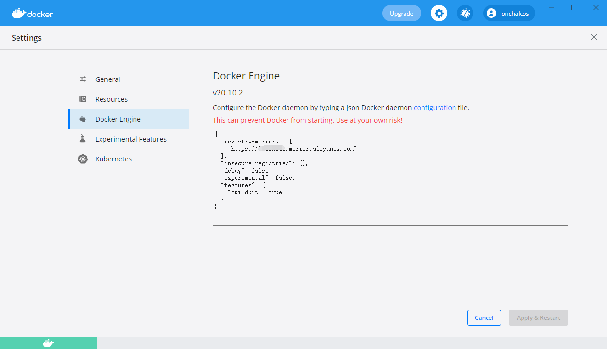

推荐的几个国内源：

```
Docker中国区官方镜像
https://registry.docker-cn.com

网易
http://hub-mirror.c.163.com

ustc 
https://docker.mirrors.ustc.edu.cn

中国科技大学
https://docker.mirrors.ustc.edu.cn

阿里云容器服务(上图所使用的)，去阿里云搜索 容器镜像服务
```

运行测试（dos，powershell，windows terminal都可以，后面的 shell 命令同样）：

```shell
docker -v
```


Docker 安装好了拉取 Onlyoffice 镜像，创建容器：

```shell
#拉取onlyoffice镜像
docker pull onlyoffice/documentserver

#查看镜像
docker images

#运行镜像（创建容器），并绑定端口，这里绑定 9000
docker run -itd --name office -p 9000:80 onlyoffice/documentserver

#查看正在运行的容器，后面加上 -a 查看所有容器
docker ps

#停止运行
docker stop office

#开始运行
docker start office

#删除镜像（如果有镜像创建的容器需要先删除容器，删除容器需要先停止运行才可以删除）
docker rm office
docker rmi onlyoffice/documentserver
```

查看服务是否已经启动（需要等待一分钟左右）：

```
http://电脑ip:绑定端口
```

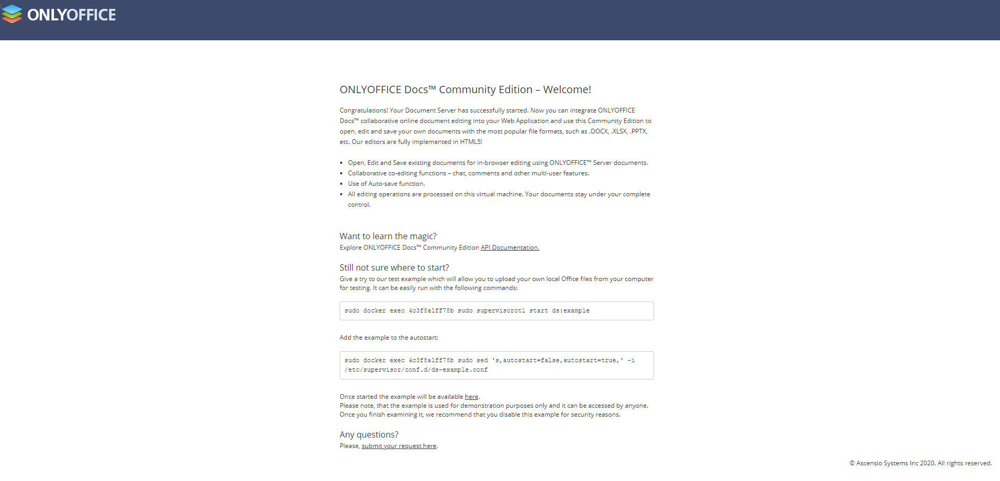

通常可以在以下编辑器文件夹中找到 API JavaScript 文件：

```
http://documentserver/web-apps/apps/api/documents/api.js
```

其中`documentserver`是安装了 ONLYOFFICE Document Server 的服务器的名称。

要嵌入编辑器的目标HTML文件需要有一个占位符div标记，其中将传递有关编辑器参数的所有信息：

```html
<div id="placeholder"></div>
<script type="text/javascript" src="https://documentserver/web-apps/apps/api/documents/api.js"></script>
```

包含可变参数的页面代码是这样的:

```javascript
var docEditor = new DocsAPI.DocEditor("placeholder", config);
```

其中config是一个对象：

```javascript
config = {
    "document": {
        "fileType": "docx",
        "key": "Khirz6zTPdfd7",
        "title": "Example Document Title.docx",
        "url": "https://example.com/url-to-example-document.docx"
    },
    "documentType": "word",
    "editorConfig": {
        "callbackUrl": "https://example.com/url-to-callback.ashx"
    }
};
```

一个简单的例子：

```html
<!DOCTYPE html>
<html style="height: 100%;">
<head>
    <title>ONLYOFFICE Api Documentation</title>
</head>
<body style="height: 100%; margin: 0;">
    <div id="placeholder" style="height: 100%"></div>
    <!--将 documentserver 替换为 安装了 ONLYOFFICE Document Server 的服务器-->
    <script type="text/javascript" src="https://documentserver/web-apps/apps/api/documents/api.js"></script>
    <script type="text/javascript">
        window.docEditor = new DocsAPI.DocEditor("placeholder",
         	{
                "document": {
                    "fileType": "docx",
                    "key": "E7FAFC9C22A8",
                    "title": "Example Document Title.docx",
                    "url": "https://example.com/url-to-example-document.docx" //访问文档的url，自行替换
                },
                "documentType": "word",
                "height": "100%",
                "width": "100%"
            });
    </script>
</body>
</html>
```


## 9.2、工作原理

### 9.2.1、打开文件

参考图和以下步骤说明了在ONLYOFFICE Document Server中打开文档的过程：

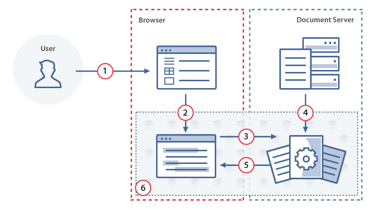

1. 用户使用文档管理器（在他/她的浏览器中找到）打开文档进行查看或编辑。

	> 浏览器中的文档管理器从文档存储服务接收用户可用的所有文档的列表。

2. 使用 JavaScript API 将文档标识符及其在文档存储服务处的链接发送到文档编辑器。

3. 文档编辑器向文档编辑服务发出打开文档的请求。文档编辑器使用从文档管理器接收的文档标识符及其链接（在步骤2）。

4. 文档编辑服务使用提供的ID和链接从文档存储服务下载文档文件。 在此步骤中，还执行了将文件转换为Office Open XML 格式的操作，以使文档编辑器具有更好的性能和格式兼容性。

5. 准备就绪后，文档编辑服务会将文档文件传输到基于浏览器的文档编辑器。

6. 文档编辑器显示文档文件和/或（如果提供了适当的权限）允许对其进行编辑。

编辑完成后，将进行文档保存过程。


**实践**

1. 创建一个空的 html 文件。

2. 如下所示添加 div 元素。

	```html
	<div id="placeholder"></div>
	```

3. 使用将用于您的网站的 JavaScript API指定的 ONLYOFFICE Document Server 链接。 

  ```html
  <script type="text/javascript" src="https://documentserver/web-apps/apps/api/documents/api.js"></script>
  ```

  > 其中 documentserver 是安装了 ONLYOFFICE Document Server 的服务器的名称。

4. 添加初始化 div 元素的文档编辑器的脚本，该脚本带有要打开的文档的配置。

  ```javascript
  new DocsAPI.DocEditor("placeholder", {
      "document": {
          "fileType": "docx",
          "key": "Khirz6zTPdfd7",
          "title": "Example Document Title.docx",
          "url": "https://example.com/url-to-example-document.docx"
      },
      "documentType": "word",
      "height": "100%",
      "width": "100%"
  });
  ```

  > 其中 example.com 是安装了文档管理器和文档存储服务的服务器的名称（说白了就是访问文档的 URL）。

5. 在浏览器中打开html文件。

> 如果出现只有工具栏、看不到文章主体的问题。原因是没有给 <body></body> 设置高度，试着加上
>
> ```css
> html, body {
>     margin: 0;
>     height: 100%
> }
> ```


### 9.2.2、保存文件

参考图和以下步骤说明了将文档保存在ONLYOFFICE Document Server中的过程。

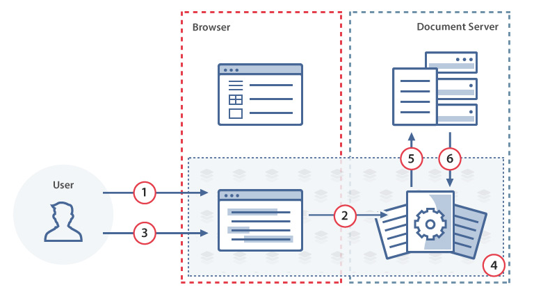

1. 用户在文档编辑器中编辑文档。
2. 文档编辑器将所做的更改发送到文档编辑服务。
3. 用户关闭文档编辑器。
4. 文档编辑服务监视文档工作的结束，并将从文档编辑器发送的更改收集到一个文档中。
5. 文档编辑服务使用 JavaScript API 中的 callbackUrl 通知文档存储服务有关文档编辑结束的信息，并返回到修改后的文档的链接。
6. 文档存储服务从文档编辑服务下载带有所有已保存更改的文档文件并进行存储。


**实践**

1. 创建一个回调处理程序，以从文档编辑服务中保存文档。

	```java
	public void saveFile(HttpServletRequest request, HttpServletResponse response, String id) throws IOException {
	    PrintWriter writer = response.getWriter();
	    Scanner scanner = new Scanner(request.getInputStream()).useDelimiter("\\A");
	    String body = scanner.hasNext() ? scanner.next() : "";
	    JSONObject jsonObj = JSONObject.parseObject(body);
	    if ((int) jsonObj.get("status") == 2) {
	        String downloadUri = (String) jsonObj.get("url");
	        URL url = new URL(downloadUri);
	        java.net.HttpURLConnection connection = (java.net.HttpURLConnection) url.openConnection();
	        InputStream stream = connection.getInputStream();
	        // pathForSave 是保存文件的计算机文件夹的绝对路径，包括文件名。
	        File savedFile = new File(pathForSave);
	        try (FileOutputStream out = new FileOutputStream(savedFile)) {
	            int read;
	            final byte[] bytes = new byte[1024];
	            while ((read = stream.read(bytes)) != -1) {
	                out.write(bytes, 0, read);
	            }
	            out.flush();
	        }
	        connection.disconnect();
	    }
	    writer.write("{\"error\":0}");
	}
	```

2. 创建一个html文件以打开文档。

3. 在文档编辑器初始化的配置脚本中，使用参数行中的回调处理程序指定文件的URL。

	```javascript
	new DocsAPI.DocEditor("placeholder", {
	    "document": {
	        "fileType": "docx",
	        "key": "Khirz6zTPdfd7",
	        "title": "Example Document Title.docx",
	        "url": "https://example.com/url-to-example-document.docx"
	    },
	    "documentType": "word",
	    "editorConfig": {
	        "callbackUrl": "https://example.com/url-to-callback.ashx" //回调程序接口
	    }
	});
	```

	> 其中example.com是安装文档管理器和文档存储服务的服务器的名称。

4. 在浏览器中打开html文件并编辑文档。

5. 关闭文档编辑器。大约10秒钟后查看您的文档。应保存所有更改，这意味着配置正确。


**保存延时**

文档编辑完成后，文档编辑服务会将此通知文档存储服务。完成此操作之前的时间是使用已编辑文件到Office Open XML格式的转换时间（取决于文件大小、复杂性和计算机功率，可以执行相当长的时间）和转换开始延迟时间（默认情况下等于5秒）计算的。在大多数情况下，时间大约是编辑完成后的10秒。

转换开始延迟是必要的，以允许在不保存文件的情况下返回到文件编辑会话，例如，在打开文件进行编辑的情况下重新加载浏览器页面时。默认转换开始延迟时间在文档服务器配置文件中定义，可以在以下路径中找到：

```
/etc/onlyoffice/documentserver/default.json.
```

如果你想改变它，你可以使用 *local.json* 文件，所有编辑过的参数都应该存储在这里。此文件与 *default.json* 位于同一个目录中。

| 参数                                         | 说明                                                     | 类型    | 例子 |
| -------------------------------------------- | -------------------------------------------------------- | ------- | ---- |
| services.CoAuthoring.server.savetimeoutdelay | 定义已编辑文件关闭后的转换开始延迟时间（以毫秒为单位）。 | integer | 5000 |

*local.json* 配置示例

```json
{
    "services": {
        "CoAuthoring": {
            "server": {
                "savetimeoutdelay": 5000
            }
        }
    }
}
```


### 9.3.3、审阅

“审阅” 选项允许您审阅文档、更改句子、短语和其他页面元素、更正拼写等，而无需实际编辑文档。所有更改都将被记录并显示给创建文档的用户。

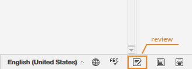

要启用“审阅”选项，必须将文档初始化的`permissions `部分中的`review`参数设置为`true`。文档状态栏将包含“审阅”菜单选项。

如果`edit`参数设置为`true`，`review`参数也设置为`true`，则用户将能够编辑文档、接受或拒绝更改并切换到审阅模式。

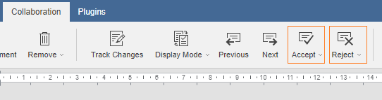

如果`edit`参数设置为`false`，而`review`参数设置为`true`，则文档将仅可用于审阅。

```javascript
var docEditor = new DocsAPI.DocEditor("placeholder", {
    "document": {
        "permissions": {
            "edit": false,
            "review": true
        },
        ...
    },
    ...
});
```

> 请注意，如果`mode`参数设置为`edit`，文档审阅将仅对文档编辑器可用。


## 9.3、文档

### 9.3.1、高级参数

可以为 ONLYOFFICE Document Server 更改的参数可细分为以下主要部分：

- config -- 允许更改使用的平台类型、文档显示大小（宽度和高度）以及打开的文档类型
	- document -- 包含与文档相关的所有参数（标题、url、文件类型等）
		- info -- 包含文档的其他参数（文档所有者、存储文档的文件夹、上载日期、共享设置）
		- permissions -- 定义文档是否可以编辑和下载
	- editorConfig -- 定义与编辑器界面相关的参数：打开模式（查看器或编辑器）、界面语言、附加按钮等）
		- customization  -- 允许自定义编辑器界面，并改变是否存在其他按钮、链接、更改徽标和编辑器所有者详细信息
		- embedded -- 仅用于嵌入式文档类型，允许更改用于控制嵌入式模式的按钮的行为
		- plugins -- 用于将必要的插件连接到文档服务器，以便所有文档编辑器用户都能看到它们
	- events -- 对文档应用某个操作（加载、修改等）时调用的特殊事件列表

包含所有附加参数的完整配置如下所示:

```javascript
config = {
    "document": {
        "fileType": "docx",
        "info": {
            "folder": "Example Files",
            "owner": "John Smith",
            "sharingSettings": [
                {
                    "permissions": "Full Access",
                    "user": "John Smith"
                },
                {
                    "isLink": true,
                    "permissions": "Read Only",
                    "user": "External link"
                },
                ...
            ],
            "uploaded": "2010-07-07 3:46 PM"
        },
        "key": "Khirz6zTPdfd7",
        "permissions": {
            "comment": true,
            "copy": true,
            "download": true,
            "edit": true,
            "fillForms": true,
            "modifyContentControl": true,
            "modifyFilter": true,
            "print": true,
            "review": true
        },
        "title": "Example Document Title.docx",
        "url": "https://example.com/url-to-example-document.docx"
    },
    "documentType": "word",
    "editorConfig": {
        "actionLink": ACTION_DATA,
        "callbackUrl": "https://example.com/url-to-callback.ashx",
        "createUrl": "https://example.com/url-to-create-document/",
        "customization": {
            "autosave": true,
            "chat": true,
            "commentAuthorOnly": false,
            "comments": true,
            "compactHeader": false,
            "compactToolbar": false,
            "compatibleFeatures": false,
            "customer": {
                "address": "My City, 123a-45",
                "info": "Some additional information",
                "logo": "https://example.com/logo-big.png",
                "mail": "john@example.com",
                "name": "John Smith and Co.",
                "www": "example.com"
            },
            "feedback": {
                "url": "https://example.com",
                "visible": true
            },
            "forcesave": false,
            "goback": {
                "blank": true,
                "requestClose": false,
                "text": "Open file location",
                "url": "https://example.com"
            },
            "help": true,
            "hideRightMenu": false,
            "logo": {
                "image": "https://example.com/logo.png",
                "imageEmbedded": "https://example.com/logo_em.png",
                "url": "https://example.com"
            },
            "macros": true,
            "macrosMode": "warn",
            "mentionShare": true,
            "plugins": true,
            "reviewDisplay": "original",
            "showReviewChanges": false,
            "spellcheck": true,
            "toolbarHideFileName": false,
            "toolbarNoTabs": false,
            "trackChanges": false,
            "unit": "cm",
            "zoom": 100
        },
        "embedded": {
            "embedUrl": "https://example.com/embedded?doc=exampledocument1.docx",
            "fullscreenUrl": "https://example.com/embedded?doc=exampledocument1.docx#fullscreen",
            "saveUrl": "https://example.com/download?doc=exampledocument1.docx",
            "shareUrl": "https://example.com/view?doc=exampledocument1.docx",
            "toolbarDocked": "top"
        },
        "lang": "en",
        "location": "us",
        "mode": "edit",
        "plugins": {
             "autostart": [
                 "asc.{0616AE85-5DBE-4B6B-A0A9-455C4F1503AD}",
                 "asc.{FFE1F462-1EA2-4391-990D-4CC84940B754}",
                 ...
             ],
             "pluginsData": [
                 "https://example.com/plugin1/config.json",
                 "https://example.com/plugin2/config.json",
                 ...
             ]
        },
        "recent": [
            {
                "folder": "Example Files",
                "title": "exampledocument1.docx",
                "url": "https://example.com/exampledocument1.docx"
            },
            {
                "folder": "Example Files",
                "title": "exampledocument2.docx",
                "url": "https://example.com/exampledocument2.docx"
            },
            ...
        ],
        "region": "en-US",
        "templates": [
            {
                "image": "https://example.com/exampletemplate1.png",
                "title": "exampletemplate1.docx",
                "url": "https://example.com/url-to-create-template1"
            },
            {
                "image": "https://example.com/exampletemplate2.png",
                "title": "exampletemplate2.docx",
                "url": "https://example.com/url-to-create-template2"
            },
            ...
        ],
        "user": {
            "id": "78e1e841",
            "name": "John Smith"
        }
    },
    "events": {
        "onAppReady": onAppReady,
        "onCollaborativeChanges": onCollaborativeChanges,
        "onDocumentReady": onDocumentReady,
        "onDocumentStateChange": onDocumentStateChange,
        "onDownloadAs": onDownloadAs,
        "onError": onError,
        "onInfo": onInfo,
        "onMetaChange": onMetaChange,
        "onOutdatedVersion": onOutdatedVersion,
        "onRequestClose": onRequestClose,
        "onRequestCompareFile": onRequestCompareFile,
        "onRequestCreateNew": onRequestCreateNew,
        "onRequestEditRights": onRequestEditRights,
        "onRequestHistory": onRequestHistory,
        "onRequestHistoryClose": onRequestHistoryClose,
        "onRequestHistoryData": onRequestHistoryData,
        "onRequestInsertImage": onRequestInsertImage,
        "onRequestMailMergeRecipients": onRequestMailMergeRecipients,
        "onRequestRename": onRequestRename,
        "onRequestRestore": onRequestRestore,
        "onRequestSaveAs": onRequestSaveAs,
        "onRequestSendNotify": onRequestSendNotify,
        "onRequestSharingSettings": onRequestSaveAs,
        "onRequestUsers": onRequestUsers,
        "onWarning": onWarning
    },
    "height": "100%",
    "token": "eyJhbGciOiJIUzI1NiIsInR5cCI6IkpXVCJ9.e30.t-IDcSemACt8x4iTMCda8Yhe3iZaWbvV5XKSTbuAn0M",
    "type": "desktop",
    "width": "100%"
};
```

> 其中example.com是安装了文档管理器和文档存储服务的服务器的名称。


### 9.3.2、Config

config base 部分允许更改使用的平台类型、文档显示大小（宽度和高度）以及打开的文档类型。

| 名字         | 说明                                                         | 类型   | 示例      |
| ------------ | ------------------------------------------------------------ | ------ | --------- |
| documentType | 定义要打开的文档类型：office三件套（Word、Excel、PowerPoint）分别对应（word、cell、slide） | string | "cell"    |
| height       | 在浏览器窗口中定义文档高度（默认为100%）。                   | string | "100%"    |
| token        | 定义以令牌的形式添加到文档服务器配置中的加密签名。           | string |           |
| type         | 定义用于访问文档的平台类型：desktop（电脑）、mobile（手机平板）、embedded（网页嵌入），默认为desktop | string | "desktop" |
| width        | 在浏览器窗口中定义文档宽度（默认为100%）。                   | string | "100%"    |


**示例**

```javascript
var docEditor = new DocsAPI.DocEditor("placeholder", {
    "documentType": "word",
    "height": "100%",
    "token": "eyJhbGciOiJIUzI1NiIsInR5cCI6IkpXVCJ9.e30.t-IDcSemACt8x4iTMCda8Yhe3iZaWbvV5XKSTbuAn0M",
    "type": "desktop",
    "width": "100%",
    ...
});
```


#### Document

文档部分允许更改与文档相关的所有参数（标题、url、文件类型等），这些参数为必填字段。

| 名字     | 说明                                                         | 类型   | 示例            |
| -------- | ------------------------------------------------------------ | ------ | --------------- |
| fileType | 定义查看或编辑的源文档的文件类型。必须小写。                 | string | "docx"          |
| key      | 定义服务用于识别文档的唯一文档标识符。如果发送了已知密钥，文档将从缓存中获取。每次编辑和保存文档时，都必须重新生成密钥。文档url可用作键，但不包含特殊字符，长度限制为128个符号。 | string | "Khirz6zTPdfd7" |
| title    | 为已浏览或编辑的文档定义所需的文件名，该文件名也将在下载文档时用作文件名。长度限制为128个符号。 | string | "测试.docx"     |
| url      | 定义存储已查看或编辑的源文档的绝对URL。                      | string |                 |


**示例**

```javascript
var docEditor = new DocsAPI.DocEditor("placeholder", {
    "document": {
        "fileType": "docx",
        "key": "Khirz6zTPdfd7",
        "title": "Example Document Title.docx",
        "url": "https://example.com/url-to-example-document.docx",
    },
    ...
});
```

> key可以使用：0-9、a-z、a-z、-._=。最大密钥长度为20个字符。


##### Info

文档信息部分允许更改文档的附加参数(文档所有者、文档存储的文件夹、上传日期、共享设置)。

| 名字            | 说明                                                         | 类型     | 示例            |
| --------------- | ------------------------------------------------------------ | -------- | --------------- |
| folder          | 定义用于存储文档的文件夹（如果文档存储在根文件夹中，则可以为空）。 | string   | "Example Files" |
| owner           | 定义文档所有者/创建者的名称。                                | string   | "John Smith"    |
| sharingSettings | 显示有关允许与其他用户共享文档的设置的信息：<br>**isLink**--将用户图标更改为链接图标，**type**：boolean，**example**：false。<br>**permissions**--具有上述名称的用户的访问权限。可以是 **Full Access**, **Read Only** 或者 **Deny Access**。**type**：string，**example**："Full Access"。<br>**user**--将与之共享文档的用户的名称。**type**：string，**example**：”John Smith“。 | 对象数组 |                 |

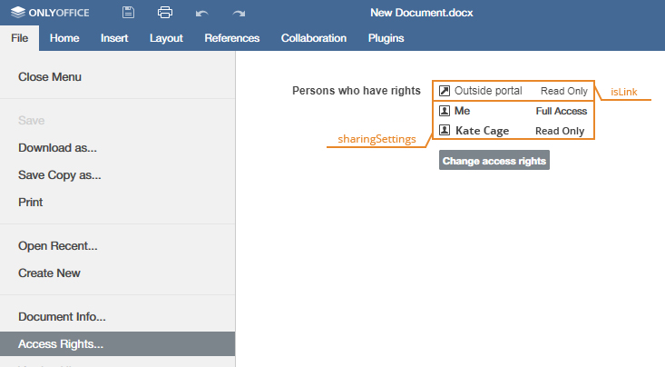


| 名字     | 说明               | 类型   | 示例                 |
| -------- | ------------------ | ------ | -------------------- |
| uploaded | 定义文档上传日期。 | string | "2010-07-07 3:46 PM" |

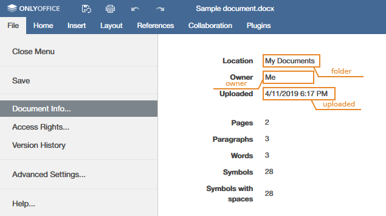


**示例**

```javascript
var docEditor = new DocsAPI.DocEditor("placeholder", {
    "document": {
        "info": {
            "folder": "Example Files",
            "owner": "John Smith",
            "sharingSettings": [
                {
                    "permissions": "Full Access",
                    "user": "John Smith"
                },
                {
                    "isLink": true,
                    "permissions": "Read Only",
                    "user": "External link"
                },
                ...
            ],
            "uploaded": "2010-07-07 3:46 PM"
        },
        ...
    },
    ...
});
```


##### Permissions

文档权限部分允许更改是否要编辑和下载文档的权限。

| 名字    | 说明                                                         | 类型    | 示例 |
| ------- | ------------------------------------------------------------ | ------- | ---- |
| comment | 定义是否可以对文档进行注释。 如果注释权限设置为`true`，则文档侧栏将包含“注释”菜单选项； 只有将`mode`参数设置为`edit`时，文档注释才可用于文档编辑器。 默认值与`edit`参数的值一致。 | boolean | true |

> 如果`edit`设置为`true`，`comment`也设置为`true`，用户将能够编辑文档和注释。如果`edit`设置为`true`，`comment`设置为`false`，用户只能编辑，相应的评论功能只能查看，评论的添加和编辑将不可用。如果`edit`设置为`false`，而`comment`设置为`true`，则文档仅可用于注释。如果`edit`设置为`false`，`review`设置为`false`，`comment`设置为`true`，则不考虑`fillForms`值，表格填写不可用。

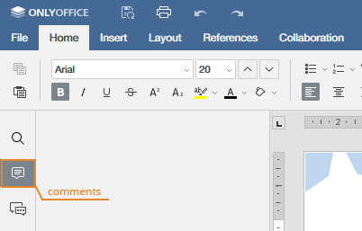


| 名字     | 说明                                                         | 类型    | 示例 |
| -------- | ------------------------------------------------------------ | ------- | ---- |
| copy     | 允许您将内容复制到剪贴板。 默认值是true。                    | boolean | true |
| download | 定义是否可以下载文档或仅在线查看或编辑文档。 如果将下载权限设置为“ false”，则“文件”菜单中将不存在“下载为...”菜单选项。 默认值是true。 | boolean | true |
| edit     | 定义文档是可以编辑还是只能查看。 如果将编辑权限设置为“ true”，则“文件”菜单将包含“编辑文档”菜单选项； 请注意，如果将编辑权限设置为“ false”，则将在查看器中打开该文档，即使将`mode`参数设置为`edit`，也将无法将其切换到编辑器。 默认值是true。 | boolean | true |
| print    | 定义是否可以打印文档。 如果将打印许可设置为“ false”，则“文件”菜单中将不存在“打印”菜单选项。 默认值是true。 | boolean | true |

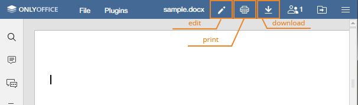


| 名字      | 说明                                                         | 类型    | 示例 |
| --------- | ------------------------------------------------------------ | ------- | ---- |
| fillForms | 定义是否可以填写表格。 如果将mode参数设置为edit，则填写表单仅对文档编辑器可用。 默认值与edit或review参数的值一致。 | boolean | true |

> 如果将edit设置为“ true”或将review设置为“ true”，则不考虑fillForms值，并且可以进行表单填充。 如果将edit设置为“ false”，将review设置为“ false”，并且fillForms也设置为“ true”，则用户只能在文档中填写表单。 如果edit设置为“ false”且审阅设置为“ false”且fillForms设置为“ true”，则不考虑注释值，并且注释不可用。 当前仅表单填写模式仅适用于“文档编辑器”。

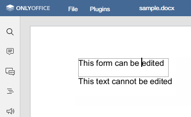


| 名字                 | 说明                                                         | 类型    | 示例 |
| -------------------- | ------------------------------------------------------------ | ------- | ---- |
| modifyContentControl | 定义是否可以更改内容控件设置。 仅当mode参数设置为edit时，内容控件修改才可用于文档编辑器。 默认值是true。 | boolean | true |
| modifyFilter         | 定义过滤器是否可以全局应用（true）影响所有其他用户，或局部应用（false），即仅适用于当前用户。 如果将mode参数设置为edit，则只能对电子表格编辑器进行过滤器修改。 默认值是true。 |         |      |

> 如果文档由具有完全访问权限的用户编辑，则由该用户应用的过滤器将对所有其他用户可见，而不管其本地设置如何。


| 名字   | 说明                                                         | 类型    | 示例 |
| ------ | ------------------------------------------------------------ | ------- | ---- |
| review | 定义是否可以查看文档。 如果审阅权限设置为true，则文档状态栏将包含“审阅”菜单选项； 如果将mode参数设置为edit，则文档审阅仅对文档编辑器可用。 默认值与edit参数的值一致。 | boolean | true |

> 如果将编辑设置为“ true”，并且审阅也设置为“ true”，则用户将能够编辑文档，接受/拒绝所做的更改并自己切换到审阅模式。 如果编辑设置为“ true”，而审阅设置为“ false”，则用户将只能进行编辑。 如果将编辑设置为“ false”，将审阅设置为“ true”，则该文档仅在审阅模式下可用。


**审阅**

```javascript
var docEditor = new DocsAPI.DocEditor("placeholder", {
    "document": {
        "permissions": {
            "comment": true,
            "copy": true,
            "download": true,
            "edit": true,
            "fillForms": true,
            "modifyContentControl": true,
            "modifyFilter": true,
            "print": true,
            "review": true
        },
        ...
    },
    ...
});
```


## 9.4、故障排除

**下载失败**


编辑器加载过程中将显示“下载失败”消息。

文档编辑服务无法上传文件进行编辑。

检查到document.url中指定的文件的链接是否正确。 必须可以从文档编辑服务访问该链接。


**文件版本变更**

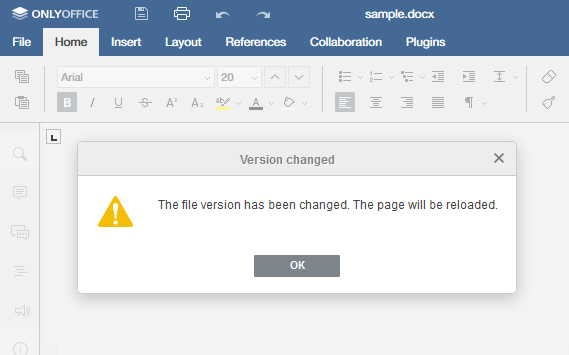

编辑器加载“The file version has been changed. The page will be reloaded（文件版本已被更改”。页面将被重新加载）”的消息。

文档编辑服务无法打开以前编辑和保存的文件进行编辑。

每次编辑和保存文档时，必须重新生成document.key。

